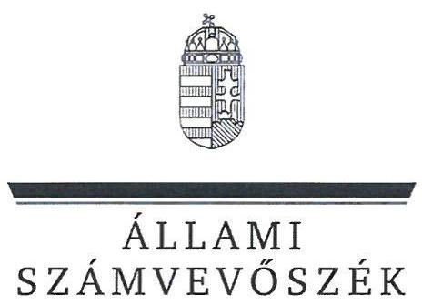
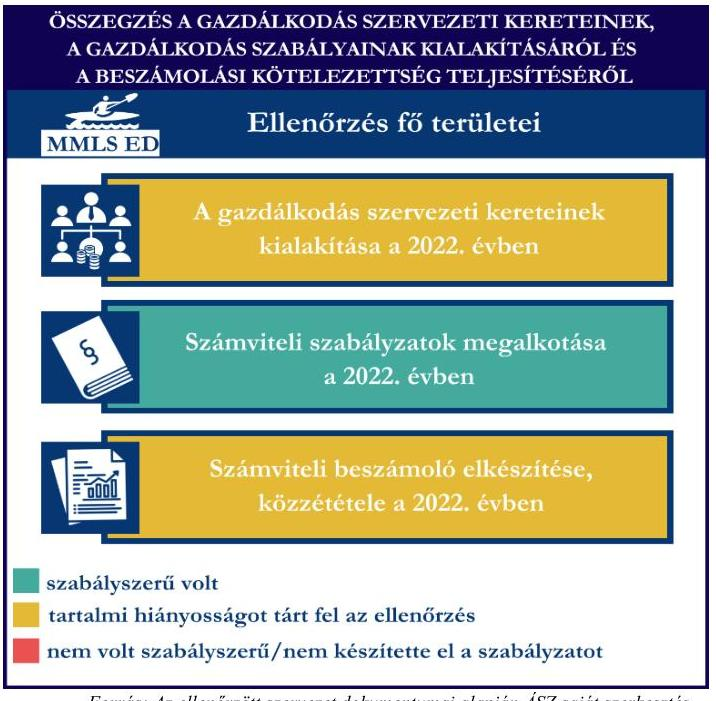
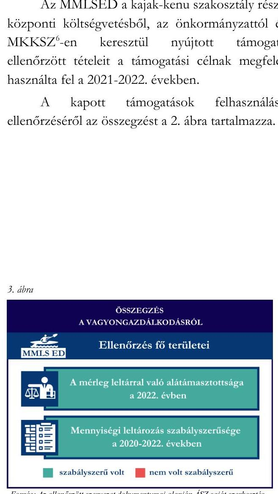
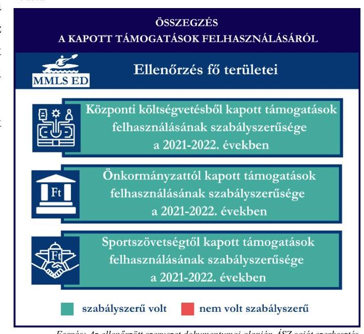

# JELENTÉS 

## Támogatásban részesülő sportszövetségek és sportegyesületek gazdálkodásának ellenőrzése

Merkapt-Mekler László Sport Egyesület Dunavarsány

2024.

---

# JELENTÉS 

## Támogatásban részesülő sportszövetségek és sportegyesületek gazdálkodásának ellenőrzése

Merkapt-Mekler László Sport Egyesület Dunavarsány

2024.

---

# ELLENŐRZÉSI IGAZGATÓSÁG: 

## ÁLLAMHÁZTARTÁSON KÍVÜLI SZERVEZETEKET ELLENŐRZŐ IGAZGATÓSÁG

## ELLENŐRZÉSI IGAZGATÓ:

## KLINGA LÁSZLÓ igazgató

## ELLENŐRZÉSVEZETŐ:

Jelentéseink az interneten a www.asz.hu címen olvashatók.

## HOFMEISTER LÁSZLÓ ellenőrzésvezető

IKTATÓSZÁM: EL-4060-054/2024.
TÉMASZÁM: 2682
ELLENŐRZÉS-AZONOSÍTÓ SZÁM: V1026

---

# TARTALOMJEGYZÉK 

- AZ ELLENŐRZÉS ALAPADATAI ..... 5
- AZ ELLENŐRZÖTT SZERVEZETEK ..... 7
- ÖSSZEFOGLALÁS ..... 8
- AZ ELLENŐRZÉS FÓKUSZKÉRDÉSEI ..... 10
- MEGÁLLAPÍTÁSOK ..... 11
- JAVASLATOK ..... 14
- MELLÉKLETEK ..... 15
I. sz. melléklet: Értelmező szótár ..... 15
II. sz. melléklet: Az ellenőrzött szervezetek jegyzéke ..... 17
III. sz. melléklet: Ellenőrzési kritériumok ..... 18
- FÜGGELÉK: ÉSZREVÉTELEK ..... 19
- RÖVIDÍTÉSEK JEGYZÉKE ..... 20

---

.

---

# AZ ELLENŐRZÉS ALAPADATAI 

## AZ ELLENŐRZÉS CÉLJA

Az ellenőrzés célja az államháztartásból nyújtott támogatással, vagy az államháztartásból meghatározott célra ingyenesen juttatott vagyon felhasználásával érintett sportszövetségek és sportegyesületek gazdálkodása szabályozottságának, gazdálkodási tevékenységének, ezen belül a beszámolási kötelezettség teljesítésének, a támogatások elkülönített nyilvántartásának, valamint a támogatások felhasználásának ellenőrzése.

## AZ ELLENŐRZÉS TÍPUSA

Szabályszerüségi ellenőrzés.

## AZ ELLENŐRZÖTT IDŐSZAK

Az 1. fókuszkérdés esetében a 2022. év.
A 2. fókuszkérdés vonatkozásában a 2021-2022. évek.
A 3. fókuszkérdés vonatkozásában a 2022. év, a mennyiségi felvétellel történő leltározás dokumentumai tekintetében a 2020-2022. évek.

## AZ ELLENŐRZÉS TÁRGYA

Az ellenőrzés tárgya a támogatásban részesülő sportszövetségek, sportegyesületek gazdálkodása szabályozottságának, gazdálkodási tevékenységén belül a beszámolási kötelezettség teljesítésének, a vagyonnyilvántartásának, a támogatások elkülönített nyilvántartásának, valamint az államháztartási forrásból származó közvetlen vagy közvetett támogatások és a meghatározott célra ingyenesen juttatott vagyon felhasználásának a vizsgálata volt. Az ellenőrzés a támogatások vonatkozásában kiterjedt továbbá a támogató felé történő beszámolási és elszámolási kötelezettségek teljesítésére, az ezekkel kapcsolatos jogszabályi és belső előírások betartására. Az ellenőrzés kiterjedt minden olyan körülményre és adatra, amely az ÁSZ ${ }^{1}$ jogszabályban meghatározott feladatainak teljesítéséhez, valamint az ellenőrzési program végrehajtása során felmerülő újabb összefüggések feltárásához szükséges.

Az ÁSZ tv. ${ }^{2}$ 25. § (3) bekezdésében meghatározottak alapján, amennyiben a rendelkezésre bocsátott dokumentumok, adatok, illetve tájékoztatás hitelességének, megalapozottságának, teljességének megállapítása vagy egyes ellenőrzési megállapítások alátámasztása, kiegészítése indokolta, az ellenőrzés tárgyát képezték az összefüggő tények vizsgálatához más szervezetek (ellenőrzést támogató szervezetek) által rendelkezésre bocsátott adatok, dokumentációk, megadott tájékoztatások, illetve az ott végzett ellenőrzés is.

Az 1. és 3. fókuszkérdés tekintetében a vizsgálat a teljes ellenőrzött szervezetre, a 2. fókuszkérdés tekintetében kizárólag a kajak-kenu sportszakágra vonatkozott.

---

# Az ellenőrzés jogsalapja 

Az ellenőrzés jogszabályi alapját az ÁSZ tv. 1. $\$ (3) bekezdése, az 5. $\$ (3) bekezdése, valamint a Civil tv. ${ }^{3} 47 . \int$ előírásai képezték.

## AZ ELLENŐRZÉS MÓDSZERE

Az ellenőrzést a nemzetközi standardokat irányadónak tekintve az ellenőrzési program szempontjai, az ellenőrzött időszakban hatályos jogszabályok, az ellenőrzés általános szakmai szabályai, az ellenőrzésre irányadó ÁSZ módszertanok figyelembevételével végezte az ÁSZ.

Az ellenőrzési kérdések megválaszolásához szükséges bizonyítékok megszerzése az ellenőrzött szervezet által rendelkezésre bocsátott dokumentumokra, adatokra alapozva kérdésfeltevés (információkérés), interjú, mintavételezés útján történt.

Az ellenőrzési bizonyítékként felhasználható adatforrások közé tartoztak egyrészt az ellenőrzés során az ellenőrzött szervezettől bekért dokumentumok, másrészt adatforrás lehetett minden további az ellenőrzés folyamán feltárt, az ellenőrzés szempontjából információt tartalmazó dokumentum.

A támogatásokkal, azok felhasználásával kapcsolatos kötelezettségek vizsgálatára mintavételi eljárások kerültek alkalmazásra. Támogatás-típusok szerint nagyságrend alapján 1-3 darab támogatás került részletes vizsgálat alá. Ezen támogatások felhasználásának szabályszerűsége támogatásonként kockázatértékelés alapján kiválasztott mintatételekkel került ellenőrzésre. A kiválasztott támogatási szerződésekhez kapcsolódó elszámolásokból 30-30 db mintatétel került ellenőrzésre, ahol az elszámolás nem érte el a 30 db -ot, ott tételes ellenőrzésre került sor. Ezen felül a vagyongazdálkodás szabályszerűségének ellenőrzéséhez is kockázatalapú mintavétel kapcsolódott. A támogatások felhasználása és a vagyongazdálkodás területén a minták ellenőrzése kiterjedt a könyvvezetési kötelezettség vizsgálatára is. A tárgyi eszközök tekintetében 30 db került kiválasztásra a 2022. évben állományban lévő eszközök közül, ahol az állományban lévő eszközök száma nem érte el a 30 db -ot, ott tételes ellenőrzésre került sor azok nyilvántartásának, elszámolásának szabályszerűsége ellenőrzése céljából. Az ellenőrzésben nem statisztikai mintavételre került sor, ezért nem történt kivetítés a teljes sokaságra, a megállapításokat az ellenőrzött mintatételekre vonatkozóan fogalmazta meg az ÁSZ.

---

# AZ ELLENŐRZÖTT SZERVEZETEK

## MERKAPT-MEKLER LÁSZLÓ SPORT EGYESÜLET DUNAVARSÁNY

A Merkapt-Mekler László Sport Egyesület Dunavarsány 2005-ben kezdte meg működését. Az MMLSED^{4} céljai között szerepel az egészséges életmód és a szabadidősport gyakorlása feltételeinek megteremtése, valamint a versenysport, az utánpótlás-nevelés, illetve a helyi önkormányzatok által ellátott sportfeladatok finanszírozásában való részvétel. Az MMLSED a kajak-kenu szakosztály mellett úszó, sí és vízilabda szakosztállyal is rendelkezik. Az MMLSED a 2022. évben közhasznú jogállású volt és felügyelőbizottság létrehozására volt kötelezett. Az MMLSED a 2022. évben nem volt könyvvizsgálatra kötelezett. Az MMLSED a 2022. évben az alaptevékenységén felül vállalkozási tevékenységet is végzett. Az MMLSED által a 2021-2022. években igénybe vett államháztartási forrásból származó támogatásokat az 1. táblázat foglalja össze.

|  Az MMLSED által igénybe vett támogatások / adatok M FT-ban megadva | 2021. Év | 2022. Év  |
| --- | --- | --- |
|  Központi költségvetési támogatás* | 1 | 6  |
|  Helyi önkormányzati támogatás* | 4 | 4  |
|  Magyar Kajak-Kenu Szövetségről kapott támogatás | 10 | 9  |

- több sportágat érintő támogatás

*Forrás: Az ellenőrzött szervezet főkönyvi adatai alapján ÁSZ saját szerkesztés*

---

# ÖSSZEFOGLALÁS 

Magyarország Alaptörvényének XX. cikke kimondja, hogy mindenkinek joga van a testi és lelki egészséghez, melynek érvényesülését Magyarország többek között a sportolás és a rendszeres testedzés támogatásával segíti elő. Az Országgyűlés a Sport tv. ${ }^{5}$-ben kinyilvánította, hogy a nemzet közössége a test művelését, a sportot, a nemzet alapértékének, kívánatos célnak tekinti. A sport a közjó része. Erősíti a közösség tagjainak egymáshoz tartozását, miként az egyén testi és lelki egészségét.

A sportegyesületek, sportszövetségek működésükre és szakmai tevékenységük ellátására költségvetési támogatásban, önkormányzati támogatásban, ingyenes vagyonjuttatásban, valamint látvány-esapatsport támogatásban részesülhetnek, amelyekre fokozott figyelem irányul.

A társadalom részéről jogosan felmerülő elvárás, hogy a közpénzeket kezelő, azzal gazdálkodó szervezetek működéséről, tevékenységéről átfogó képet kapjon, a közpénzek rendeltetésszerủ és átlátható módon történő felhasználásának értékelésére időről-időre sor kerüljön az ellenőrzések keretében.
1. ábra

A gazdálkodás szervezeti kereteinek kialakítása a 2022. évben

Számviteli szabályzatok megalkotása a 2022. évben

Számviteli beszámoló elkészítése, közzététele a 2022. évben
szabályszerü volt
tartalmi hiányosságot tárt fel az ellenőrzés
nem volt szabályszerű/nem készítette el a szabályzatot
Fornás: Az ellenőrzött szervezet dokumentumai alapján ÁSZ saját szerkesztét

Az MMLSED által a gazdálkodási szabályzatok kialakítása szabályszerű volt, a gazdálkodás szervezeti kereteinek kialakítása, valamint beszámolási kötelezettség teljesítése tartalmi hiányosság mellett volt szabályszerű a 2022. évben.

Az MMLSED a könyvviteli szolgáltatás személyi feltételeit a 2022. évi számviteli beszámoló vonatkozásában biztosította. Az MMLSED rendelkezett felügyelőbizottsággal a 2022. évben, azonban az összeférhetetlenségi előírásokat nem tartották be, ezáltal a felügyelőbizottság jogszerű működése nem volt biztosított.

Az MMLSED a számviteli szabályzatokat az előírásoknak megfelelően kialakította a 2022. évben.

A könyvvezetés formája a 2022. évben megfelelt a jogszabályi előírásoknak. Az MMLSED a 2022. évi számviteli beszámolóját a jogszabályban előírtak szerint elkészítette, közzétette, azonban a beszámolóban szereplő támogatási adatok hiányosak voltak.

A gazdálkodás szervezeti kereteinek és a gazdálkodási szabályok kialakítása, valamint a beszámolási kötelezettség ellenőrzésének az összegzését az 1. ábra tartalmazza.

---

Az MMLSED a kajak-kenu szakosztály részére a központi költségvetésből, az önkormányzattól és az $\mathrm{MKKSZ}^{\circ}$-en keresztül nyújtott támogatások ellenőrzött tételeit a támogatási célnak megfelelően használta fel a 2021-2022. években.

A kapott támogatások felhasználásának ellenőrzéséről az összegzést a 2. ábra tartalmazza.

Forrás: Az ellenörzött szervezet dokumentumai alapján ÁSZ saját szerkesztés

Az MMLSED vagyongazdálkodása az ellenőrzött tételek vonatkozásában szabályszerű volt a 2022. évben. Az MMLSED a 2022. évi beszámolójának mérlegtételeit alátámasztotta leltárral. A mérlegben szereplő tárgyi eszközök évente előírt mennyiségi leltározását a 2022. évben elvégezte.
A vagyongazdálkodás ellenőrzésének összegzését a 3. ábra tartalmazza.

---

# AZ ELLENŐRZÉS FÓKUSZKÉRDÉSEI 

1.     - A gazdálkodási szabályok kialakítása, a könyvvezetési és beszámolási kötelezettség teljesítése szabályszerű volt-e?
2.     - A kapott támogatások felhasználása szabályszerű volt-e?
3.     - Az ellenőrzött szervezet vagyongazdálkodása szabályszerű volt-e?

---

# MEGÁLLAPÍTÁSOK 

## 1. A gazdálkodási szabályok kialakítása, a könyvvezetési és beszámolási kötelezettség teljesítése szabályszerű volt-e?

## Összegző megállapítás

Az MMLSED-nél a 2022. évben a gazdálkodási szabályok a jogszabályban előírtak szerint kialakításra kerültek. A könyvvezetési kötelezettség teljesítése szabályszerű volt, a beszámolási kötelezettség teljesítése hiányosan valósult meg. A felügyelőbizottság múködése összeférhetetlenség miatt nem volt szabályszerű.

Az MMLSED a 2022. évben a Számv. tv. ${ }^{7}$, valamint a Civilszr. ${ }^{8}$ előírásaiban foglaltaknak megfelelően gondoskodott a könyvviteli szolgáltatás személyi feltételeinek teljesüléséről. Az MMLESD a 2022. évben a Ptk. ${ }^{9}$ előírásai alapján rendelkezett felügyelőbizottsággal. A felügyelőbizottság elkészítette az ügyrendjét, valamint a 2022. évi számviteli beszámolót véleményezte. A Civil tv. 38. § (3) bekezdés b) pontjában foglaltak ellenére 2022-ben az MMLSED felügyelőbizottság egy tagja olyan személy volt, aki az MMLSED-el a felügyelőbizottságban lévő tagsági megbízatásán kívül az MMLSED részére ellátott, könyvelési feladatok végzésére vonatkozó megbízási jogviszonyban is állt. Az MMLSED felügyelőbizottságának egy tagja a Civil tv. 38. § (3) bekezdés d) pontjában foglaltak ellenére, a Ptk. 8:1. § 1. pontja szerinti közeli hozzátartozója volt az MMLSED elnökség egyik tagjának. Ezek alapján a felügyelőbizottság működése nem volt szabályszerű.
Az MMLSED 2022-ben rendelkezett a Számv. tv-ben előírt számviteli politikával, azon belül az eszközök és a források leltárkészítési és leltározási szabályzatával, az eszközök és a források értékelési szabályzatával, pénzkezelési szabályzattal, valamint számlarenddel, amelyek az ellenőrzött tartalmi kritériumoknak megfeleltek.
Az MMLSED a Számv. tv.-ben, Civil tv.-ben, valamint a Civilszr.-ben előírtak szerinti kettős könyvvitelt vezetett. Az MMLSED a beszámolójában szereplő vállalkozási és alaptevékenység bevételeinek és költségeinek Civilszr. előírása szerinti elkülönítését a könyviteli rendszerében teljesítette. Az MMLSED 2022-ben a könyvviteli nyilvántartását úgy vezette, hogy a Számv. tv., valamint a Civilszr. előírásainak megfelelően a számviteli beszámolóban az egyéb bevételeken belül részletezni tudta a kapott támogatások és tagdíjak összegeit.
A Civil tv.-ben, valamint a Számv. tv. előírásai alapján előírt könyvvitellel alátámasztott 2022. évre vonatkozó számviteli beszámolóját, továbbá a Civil tv.-ben előírtak alapján a közhasznúsági mellékletét elkészítette. Az MMLESD 2022. évi számviteli beszámolójának kiegészítő mellékletében a Civil tv. 29. § (4) bekezdésében, valamint a számviteli politikájában ${ }^{10}$ (6.o. 21. pont, 1-2. alpont) előírtak ellenére nem mutatta be a támogatási program keretében végleges jelleggel felhasznált összegeket támogatásonként, továbbá a Civil tv. 29. § (5) bekezdésében és a számviteli politikájában (6.o. 21. 3. alpont pont) előírtak ellenére a 2022. években végzett főbb tevékenységeket és programokat.
Az MMLSED a 2022. évi számviteli beszámolóját a Ptk., valamint a Civil tv. alapján a legfőbb döntéshozó szerve hagyta jóvá. Az MMLSED a 2022. évi elfogadott számviteli beszámolóját, valamint közhasznúsági mellékletét a Számv. tv.-ben, valamint a Civil tv.-ben előírtaknak megfelelően letétbe helyezte, közzétette.

---

# 2. A kapott támogatások felhasználása szabályszerű volt-e? 

## Összegző megállapítás

Az MMLSED a kajak-kenu szakosztálya részére nyújtott támogatásokat az ellenőrzött tételek vonatkozásában a 20212022. években a támogatási célnak megfelelően használta fel.

Az MMLSED az ellenőrzött támogatási szerződésekben foglaltak alapján, a 2021-2022. években a központi költségvetésből kapott ellenőrzött támogatásokat a Civil tv. előírásai alapján elkülönítette a számviteli rendszerében. Az MMLSED a 2021-2022. években a Számv. tv. és a Civil tv. alapján az alapcél szerinti tevékenysége költségei, ráfordításai ellentételezésére az ellenőrzött központi költségvetésből kapott támogatásokról olyan elkülönített számviteli nyilvántartást vezetett, amelynek alapján támogatásonként megállapítható és ellenőrizhető a kapott támogatás felhasználása. A központi költségvetési támogatás terhére elszámolt, ellenőrzött tételekből három esetében a 474/2016. (XII.27.) Korm. rend. ${ }^{11}$ 24. § (2) bekezdésében foglaltak ellenére a támogatás felhasználásának számviteli bizonylatán a záradékolás hiányzott, így az MMLSED nem jelezte, hogy a számviteli bizonylaton szereplő összegből mennyit számolt el a szerződésszámmal hivatkozott támogatási szerződés terhére. Az MMLSED a központi támogatás felhasználásáról a támogató által előírt formában elkészítette az előírt beszámolókat és az összesített elszámolási táblázatokkal együtt a támogatási szerződésekben foglaltak alapján benyújtotta a támogatónak.
A Számv. tv., valamint a Civil tv. előírásainak megfelelően az MMLSED az ellenőrzött támogatási szerződésekben meghatározott önkormányzati támogatási bevételeket és azok felhasználását a 2021-2022. években elkülönítetten mutatta ki a számviteli nyilvántartásában. Az MMLSED a támogatási szerződésekben foglaltak szerint az ellenőrzött önkormányzati támogatások beszámolási kötelezettségét előírt tartalommal teljesítette. Az MMLSED a 2021-2022. években elszámolt önkormányzati támogatások ellenőrzött tételeit a Számv. tv.-ben előírtaknak megfelelő, szabályszerű számviteli bizonylattal alátámasztotta.
Az MMLSED a központi költségvetésből az MKKSZ-en keresztül számára juttatott ellenőrzött támogatásokról a Civil tv. alapján olyan elkülönített számviteli nyilvántartást vezetett, amelynek alapján támogatásonként megállapítható és ellenőrizhető volt a kapott támogatás felhasználása. Az MMLSED központi költségvetésből az MKKSZ-en keresztül számára juttatott ellenőrzött támogatás felhasználásáról a támogatási szerződésben - és az alapján az Áht. ${ }^{12}$-ban - foglaltak szerint beszámolt a támogató felé. Az MMLSED a 2021-2022. években elszámolt támogatások ellenőrzött tételeit a Számv. tv.-ben előírtaknak megfelelő, szabályszerű számviteli bizonylattal alátámasztotta.

---

# 3. Az ellenőrzött szervezet vagyongazdálkodása szabályszerű volt-e? 

| Összegző megállapítás | Az MMLSED vagyongazdálkodása a 2022. évben az ellenőrzött tételek vonatkozásában szabályszerű volt. A beszámoló mérlegtételeit szabályszerű leltárral alátámasztotta. |
| :--: | :--: |

Az MMLSED a 2022. évi beszámolójának mérlegtételeit a Számv. tv.-ben foglaltak szerint alátámasztotta leltárral. Az MMLSED a Számv. tv.-ben előírt évente esedékes mennyiségi felvétellel történő leltározását a 2022. évben teljesítette.

Az ellenőrzött tárgyi eszközök bekerülési értékét alátámasztó számviteli bizonylatok a Számv. tv.-ben előírtaknak megfelelően rendelkezésre álltak. Az ellenőrzött tárgyi eszközök számviteli besorolása, értékcsökkenés elszámolása megfelelt a Számv. tv. előírásainak, az üzembe helyezés tényét a Számv. tv.ben előírtak alapján dokumentálta.

---

# JAVASLATOK 

Az ÁSZ tv. 33. § (1) bekezdésében foglaltak értelmében az ellenőrzött szervezet vezetője köteles a jelentésben foglalt megállapításokhoz kapcsolódó intézkedési tervet összeállítani és azt a jelentés kézhezvételétől számított 30 napon belül az ÁSZ részére megküldeni. Amennyiben az ellenőrzött szervezet vezetője nem küldi meg határidőben az intézkedési tervet, vagy továbbra sem elfogadható intézkedési tervet küld, az Állami Számvevőszék elnöke az ÁSZ tv. 33. § (3) bekezdése a) és b) pontjaiban foglaltakat érvényesítheti.

## MERKAPT-MEKLER LÁSZLÓ SPORT EGYESÜLET DUNAVARSÁNY ELNÖKÉNEK

1. Gondoskodjon arról, hogy kizárólag a Civil tv. 38. § (3) bekezdés b), d) pontjaiban elöirt feltételeknek megfelelő személy legyen a felügyelő szerv tagja.
2. Gondoskodjon arról, hogy a támogatási program keretében végleges jelleggel felhasznált összegek támogatásonként, továbbá a tárgyévben végzett föbb tevékenységek és programok a Civil tv. 29. § (4)(5) bekezdésében elöirtaknak megfelelően a kiegészitő mellékletben bemutatásra kerüljenek.
3. Gondoskodjon arról, hogy a támogatás felhasználását alátámasztó számviteli bizonylaton a 474/2016. (XII.27.) Korm. rend. 24. § (2) bekezdésében elöirtak alapján a támogatási szerződésekben elöirt záradékolás minden esetben szerepeljen.

---

# MELLÉKLETEK 

## I. SZ. MELLÉKLET: ÉRTELMEZŐ SZÓTÁR

Civil szervezet

Egyesület

Költségvetési támogatás

Közhasznú szervezet

Közhasznú tevékenység

Országos sportági szakszövetség

Sportági szövetség

A civil társaság; a Magyarországon nyilvántartásba vett egyesület - a párt, a szakszervezet és a kölcsönös biztosító egyesület kivételével és a közalapítvány és a pártalapítvány kivételével - az alapítvány. (Forrás: Civil tv. 2. §6. pont a)-c) alpontjai)
Az egyesület a tagok közös, tartós, alapszabályban meghatározott céljának folyamatos megvalósítására létesített, nyilvántartott tagsággal rendelkező jogi személy. (Forrás: Ptk. 3:63. § (1) bekezdés)
A Számv. tv. szempontjából egyéb szervezet. (Számv. tv. 3. § (1) bekezdés 4.pont a) alpontja)
A társadalombiztosítás pénzügyi alapjai kivételével az államháztartás központi alrendszeréből ellenérték nélkül, pénzben nyújtott támogatások. (Forrás: Áht. 1. § 14. pont, ide nem értve az Áht. 1. § 14. pont a) -o) pontjaiban szereplő támogatásokat)
Közhasznú szervezetté minősíthető a Magyarországon nyilvántartásba vett közhasznú tevékenységet végző szervezet, amely a társadalom és az egyén közös szükségleteinek kielégítéséhez megfelelő erőforrásokkal rendelkezik, továbbá amelynek megfelelő társadalmi támogatottsága kimutatható, és amely:
a) civil szervezet (ide nem értve a civil társaságot), vagy
b) olyan egyéb szervezet, amelyre vonatkozóan a közhasznú jogállás megszerzését törvény lehetővé teszi. (Forrás: Civil tv. 32. § (1) bekezdés)
Minden olyan tevékenység, amely a létesítő okiratban megjelölt közfeladat teljesítését közvetlenül vagy közvetve szolgálja, ezzel hozzájárulva a társadalom és az egyén közös szükségleteinek kielégítéséhez. (Forrás: Civil tv. 2. § 20. pont)
Olyan sportszövetség, amely sportágában kizárólagos jelleggel az e törvényben, valamint más jogszabályokban meghatározott feladatokat lát el és e törvényben megállapított különleges jogosítványokat gyakorol. Olyan sportágban hozható létre, amelyet vagy a Nemzetközi Olimpiai Bizottság elismert, vagy amely sportág nemzetközi szövetségét felvették a Nemzetközi Sportszövetségek Szövetségébe (GAISF). (Forrás: Sport tv. 20. § (1), (4) bekezdés)
A Civil tv. és a Ptk. előírásai alapján - a Sport tv.-ben meghatározott eltérésekkel - múködő szövetség, amelynek tagjai kizárólag sportszervezetek lehetnek. Sportági szövetség országos jelleggel is múködhet. Egy sportágban csak egy országos sportági szövetség múködhet. Törvényi feltételek teljesülése esetén szakszövetségi feladatokat is elláthat. (Forrás: Sport tv. 28. §)

---

Sportegyesület

Sportegyesületeknek, sportszövetségeknek nyújtott költségvetési támogatás

Sportszövetség

Sporttevékenység

A Civil tv. és a Ptk. szabályai szerint múködő olyan egyesület, amelynek alaptevékenysége a sporttevékenység szervezése, valamint a sporttevékenység feltételeinek megteremtése. A sportegyesületek a Sport tv. 15. § (1) bekezdésében meghatározott sportszervezetek körébe tartoznak. A sportegyesületeken kívül sportszervezet még a sportvállalkozás, a sportiskola, valamint az utánpótlás-nevelés fejlesztését végző alapítvány. (Forrás: Sport tv. 16. § (1) bekezdés)
Az állami sport célú támogatások felhasználásáról és elosztásáról szóló 474/2016. (XII. 27.) Kormány rendelet1. § (1) bekezdésében és a 27/2013. (III. 29.) EMMI rendelet ${ }^{13}$ 1. §-ában meghatározott fejezeti kezelésű előirányzatokból nyújtott támogatás.
Meghatározott sporttevékenységek körében a sportversenyek szervezésére, a tagok érdekvédelmére és a részükre való szolgáltatásokra, valamint a nemzetközi kapcsolatok lebonyolítására létrehozott, jogi személyiséggel és önkormányzattal rendelkező, a Civil tv. és a Ptk. alapján - az e törvényben foglalt eltérésekkel - különös formában múködő egyesületek. A Sport tv. 19. § (3) bekezdése szerint a sportszövetségeknek az alábbi típusai léteznek: országos sportági szakszövetségek, sportági szövetségek, szabadidősport szövetségek, fogyatékosok sportszövetségei, diák- és egyetemi-főiskolai sport sportszövetségei, nemzetközi sportszövetségek. (Forrás: Sport tv. 19. § (1), (3) bekezdés)

Meghatározott szabályok szerint, a szabadidő eltöltéseként kötetlenül vagy szervezett formában, illetve versenyszerűen végzett testedzés vagy szellemi sportágban kifejtett tevékenység, amely a fizikai erőnlét és a szellemi teljesítőképesség megtartását, fejlesztését szolgálja. (Forrás: Sport tv. 1. § (2) bekezdés)

---

II. SZ. MELLÉKLET: AZ ELLENŐRZŐTT SZERVEZETEK JEGYZÉKE

# ELLENŐRZŐTT SZERVEZET NEVE 

## ElLENŐRZŐTT SZERVEZET SZÉKHELYE

Merkapt-Mekler László Sport Egyesület Dunavarsány 3336 Dunavarsány, Halász Lajosné utca 28/A.

---

# III. SZ. MELLÉKLET: ELLENŐRZÉSI KRITÉRIUMOK 

## FOKUSZKÉRDÉS

## 1. fókuszkérdés:

A gazdálkodási szabályok kialakítása, a könyvvezetési és beszámolási kötelezettség teljesítése szabályszerű volt-e?

## 2. fókuszkérdés:

A kapott támogatások felhasználása szabályszerű volt-e?

## 3. fókuszkérdés:

Az ellenőrzött szervezet vagyongazdálkodása szabályszerű volt-e?

## ÉLLENŐRZÉSI KRITÉRIUMOK

Számv. tv. 14. § (3) bekezdés, (5) bekezdés a), b), d) pont, (8) bekezdés, (11) bekezdés, 69. § (3) bekezdés, 90. § (3) bekezdés c) pont, 161. § (1) bekezdés, (2) bekezdés a)-d) pont, (3)-(4) bekezdés, 161/A. $\S$ (2) bekezdés, 165. $\$ (2) bekezdés
Civilszr. 7. § (1) bekezdés, (4) bekezdés b), c) pont, 8. § (2), (3) bekezdés, 9. § (4), (5), (8) bekezdés, 12. § (4), (5) bekezdés, 15. § (1) bekezdés a), b) pont, 16. § (1) bekezdés, 24. § (2) bekezdés
Civil vhr. ${ }^{14}$ 12. § (1) bekezdés, melléklet 5. pont
Ptk. 3:26. § (1) bekezdés, 3:27. § (1) bekezdés, 3:82. § (1) bekezdés, 8:1. § (1) pontja
Civil tv. 28. § (1) bekezdés, 29. § (2) bekezdés c) pont, (3), (6), (7) bekezdés, 30. § (1)-(4) bekezdés 40. § (1), (2) bekezdés, 41. § (1) bekezdés, 38. § (3) bekezdés b) és d) pontjai

Számv. tv. 44. § (2) bekezdés, 93. § (3) bekezdés, 159. §, 161/A. § (2) bekezdés, 165. § (2) bekezdés, 167. § (1) bekezdés a), d), e), h) pont

Civil tv. 20. § (2) bekezdés a) pont, (3) bekezdés a), c) pont, (4) bekezdés, 29. § (4), (5) bekezdés
Civilszr. 24. § (2) bekezdés
27/2013. (III.29.) EMMI rend. 18. § (2) bekezdés
474/2016. (XII. 27.) Korm. rend. 22. § (2) bekezdés, 24. § (2) bekezdés
Áht. 53. §, Ávr. ${ }^{15}$ 92. §, 93. § (2)-(4) bekezdések
Ptk. 3:63. § (4) bekezdés
Számv. tv. 3. § (3) bekezdés 3. pont, 15. § (3) bekezdés, 46. § (3), (4) bekezdés, 47-51. §, 52. § (1)-(7) bekezdés, 69. § (1)-(3) bekezdések, 165. § (2) bekezdés, 169. § (2) bekezdés

---

# FÜGGELÉK: ÉSZREVÉTELEK 

A jelentéstervezetet a Számvevőszék 15 napos észrevételezésre megküldte az ellenőrzött szervezet vezetőjének az ÁSZ tv. 29. §* (1) bekezdése előírásának megfelelően.

Az ellenőrzött szervezet elnöke a jelentéstervezetre nem tett észrevételt.

[^0]
[^0]:    * 29. § (1) Az Állami Számvevőszék az ellenőrzési megállapításait megküldi az ellenőrzött szervezet vezetőjének vagy az általa megbízott személynek, és annak, akinek személyes felelősségét állapította meg.
    (2) Az ellenőrzött szervezet vezetője és a felelősként megjelölt személy az ellenőrzés megállapításaira tizenöt napon belül írásban észrevételt tehet.
    (3) Az Állami Számvevőszék az észrevételre a beérkezésétől számított harminc napon belül írásban válaszol. A figyelembe nem vett észrevételeket köteles a jelentésben feltüntetni, és megindokolni, hogy azokat miért nem fogadta el.

---

# RÖVIDÍTÉSEK JEGYZÉKE 

${ }^{1}$ ÁSZ
${ }^{2}$ ÁSZ tv.
${ }^{3}$ Civil tv.
${ }^{4}$ MMLSED
${ }^{5}$ Sport tv.
${ }^{6}$ MKKSZ
${ }^{7}$ Számv. tv.
${ }^{8}$ Civilszr.
${ }^{9}$ Ptk.
${ }^{10}$ számviteli politika
${ }^{11}$ 474/2016. (XII.27.) Korm. rend
${ }^{12}$ Áht.
${ }^{13}$ 27/2013. (III.29.) EMMI rendelet
${ }^{14}$ Civil vhr.
${ }^{15}$ Ávr.

Állami Számvevőszék
2011. évi LXVI. törvény az Állami Számvevőszékről
2011. évi CLXXV. törvény az egyesülési jogról, a közhasznú jogállásról, valamint a civil szervezetek müködéséről és támogatásáról
Merkapt-Mekler László Sport Egyesület Dunavarsány
2004. évi I. törvény a sportról

Magyar Kajak-Kenu Szövetség
2000. évi C. törvény a számvitelről
479/2016. (XII. 28.) Korm. rendelet a számviteli törvény szerinti egyes egyéb szervezetek beszámoló készítési és könyvvezetési kötelezettségének sajátosságairól
2013. évi V. törvény a Polgári Törvénykönyvről

Az MMLSED 2021-2022. években hatályosszámviteli politikája (hatályos: 2020.01.17-étől)
474/2016. (XII. 27.) Korm. rendelet az állami sport célú támogatások felhasználásáról és elosztásáról
2011. évi CXCV. törvény az államháztartásról

27/2013. (III. 29.) EMMI rendelet az állami sport célú támogatások felhasználásáról és elosztásáról
350/2011. (XII. 30.) Korm. rendelet a civil szervezetek gazdálkodása, az adománygyűjtés és a közhasznúság egyes kérdéseiről
368/2011. (XII. 31.) Korm. rendelet az államháztartásról szóló törvény végrehajtásáról

---

1052 Budapest, Apáczai Csere János u. 10. | 1364 Budapest 4., Pf. 54
www.asz.hu | szamvevoszek@asz.hu
telefon: +36 14849100