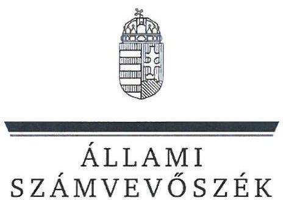
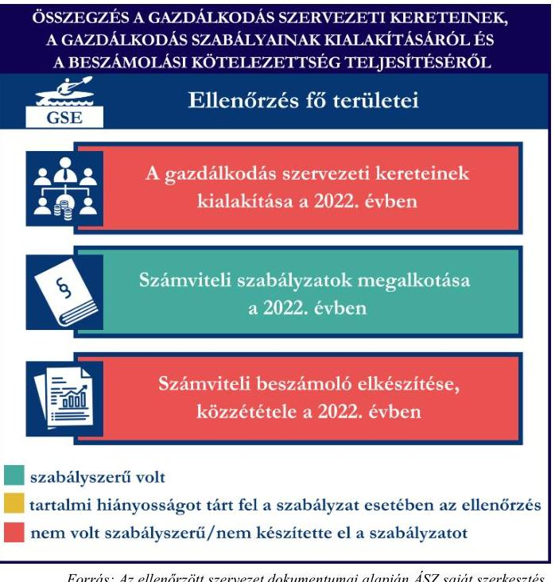
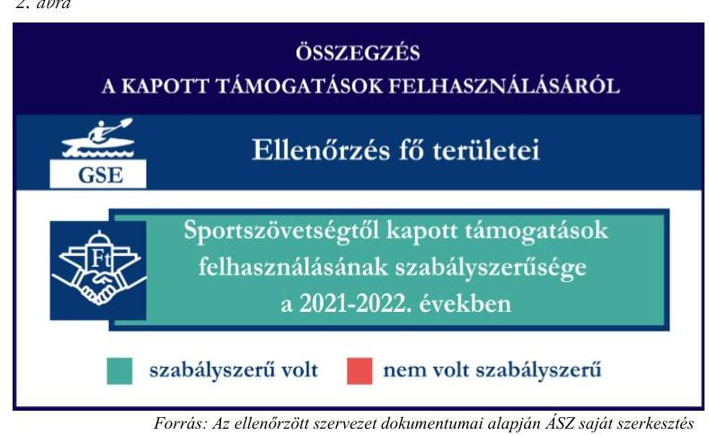
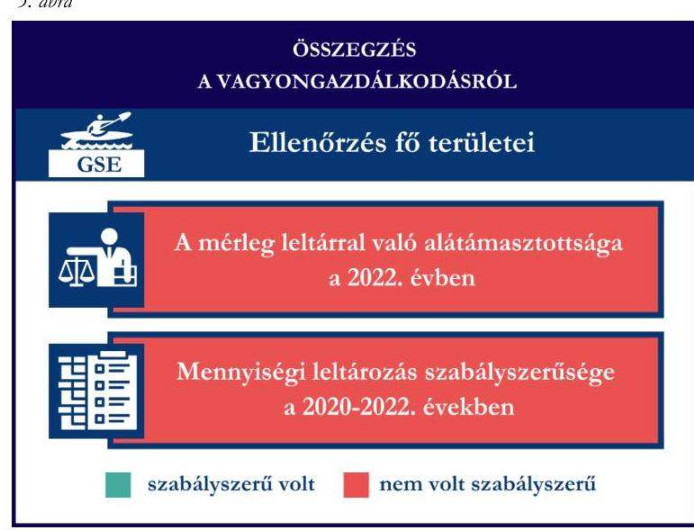

# JELENTÉS 

Támogatásban részesülő sportszövetségek és sportegyesületek gazdálkodásának ellenőrzése

Gödi Sportegyesület

2024.

---

ÁLLAMI
SZÁMVEVÔSZÉK

# JELENTÉS 

## Támogatásban részesülő sportszövetségek és sportegyesületek gazdálkodásának ellenőrzése

Gödi Sportegyesület

2024.

---

# ELLENŐRZÉSI IGAZGATÓSÁG: 

## ÁLLAMHÁZTARTÁSON KÍVÜLI SZERVEZETEKET ELLENŐRZŐ IGAZGATÓSÁG

## ELLENŐRZÉSI IGAZGATÓ:

## KLINGA LÁSZLÓ igazgató

## ELLENŐRZÉSVEZETŐ:

Jelentéseink az interneten a www.asz.hu címen olvashatók.

## HOFMEISTER LÁSZLÓ ellenőrzésvezető

IKTATÓSZÁM: EL-4060-050/2024.
TÉMASZÁM: 2682
ELLENŐRZÉS-AZONOSÍTÓ SZÁM: V1026

---

# ITARTALOMJEGYZÉK 

AZ ELLENŐRZÉS ALAPADATAI ..... 5
AZ ELLENŐRZÖTT SZERVEZETEK ..... 7
ÖSSZEFOGLALÁS ..... 8
AZ ELLENŐRZÉS FÓKUSZKÉRDÉSEI ..... 10
MEGÁLLAPÍTÁSOK ..... 11
JAVASLATOK ..... 14
MELLÉKLETEK ..... 15
I. sz. melléklet: Értelmező szótár ..... 15
II. sz. melléklet: Az ellenőrzött szervezetek jegyzéke ..... 17
III. sz. melléklet: Ellenőrzési kritériumok ..... 18
FÜGGELÉK: ÉSZREVÉTELEK ..... 19
RÖVIDÍTÉSEK JEGYZÉKE ..... 20

---

.

---

# AZ ELLENŐRZÉS ALAPADATAI 

## AZ ELLENŐRZÉS CÉLJA

Az ellenőrzés célja az államháztartásból nyújtott támogatással, vagy az államháztartásból meghatározott célra ingyenesen juttatott vagyon felhasználásával érintett sportszövetségek és sportegyesületek gazdálkodása szabályozottságának, gazdálkodási tevékenységének, ezen belül a beszámolási kötelezettség teljesítésének, a támogatások elkülönített nyilvántartásának, valamint a támogatások felhasználásának ellenőrzése.

## AZ ELLENŐRZÉS TÍPUSA

Szabályszerüségi ellenőrzés.

## AZ ELLENŐRZÖTT IDŐSZAK

Az 1. fókuszkérdés esetében a 2022. év.
A 2. fókuszkérdés vonatkozásában a 2021-2022. évek.
A 3. fókuszkérdés vonatkozásában a 2022. év, a mennyiségi felvétellel történő leltározás dokumentumai tekintetében a 2020-2022. évek.

## AZ ELLENŐRZÉS TÁRGYA

Az ellenőrzés tárgya a támogatásban részesülő sportszövetségek, sportegyesületek gazdálkodása szabályozottságának, gazdálkodási tevékenységén belül a beszámolási kötelezettség teljesítésének, a vagyonnyilvántartásának, a támogatások elkülönített nyilvántartásának, valamint az államháztartási forrásból származó közvetlen vagy közvetett támogatások és a meghatározott célra ingyenesen juttatott vagyon felhasználásának a vizsgálata volt. Az ellenőrzés a támogatások vonatkozásában kiterjedt továbbá a támogató felé történő beszámolási és elszámolási kötelezettségek teljesítésére, az ezekkel kapcsolatos jogszabályi és belső előírások betartására. Az ellenőrzés kiterjedt minden olyan körülményre és adatra, amely az ÁSZ ${ }^{1}$ jogszabályban meghatározott feladatainak teljesítéséhez, valamint az ellenőrzési program végrehajtása során felmerülő újabb összefüggések feltárásához szükséges.

Az ÁSZ tv. ${ }^{2}$ 25. § (3) bekezdésében meghatározottak alapján, amennyiben a rendelkezésre bocsátott dokumentumok, adatok, illetve tájékoztatás hitelességének, megalapozottságának, teljességének megállapítása vagy egyes ellenőrzési megállapítások alátámasztása, kiegészítése indokolta, az ellenőrzés tárgyát képezték az összefüggő tények vizsgálatához más szervezetek (ellenőrzést támogató szervezetek) által rendelkezésre bocsátott adatok, dokumentációk, megadott tájékoztatások, illetve az ott végzett ellenőrzés is.

Az 1. és 3. fókuszkérdés tekintetében a vizsgálat a teljes ellenőrzött szervezetre, a 2. fókuszkérdés tekintetében kizárólag a kajak-kenu sportszakágra vonatkozott.

---

# Az ellenőrzés jogsalapja 

Az ellenőrzés jogszabályi alapját az ÁSZ tv. 1. $\$ (3) bekezdése, az 5. $\$ (3) bekezdése, valamint a Civil tv. ${ }^{3} 47 . \int$ előírásai képezték.

## AZ ELLENŐRZÉS MÓDSZERE

Az ellenőrzést a nemzetközi standardokat irányadónak tekintve az ellenőrzési program szempontjai, az ellenőrzött időszakban hatályos jogszabályok, az ellenőrzés általános szakmai szabályai, az ellenőrzésre irányadó ÁSZ módszertanok figyelembevételével végezte az ÁSZ.

Az ellenőrzési kérdések megválaszolásához szükséges bizonyítékok megszerzése az ellenőrzött szervezet által rendelkezésre bocsátott dokumentumokra, adatokra alapozva kérdésfeltevés (információkérés), interjú, mintavételezés útján történt.

Az ellenőrzési bizonyítékként felhasználható adatforrások közé tartoztak egyrészt az ellenőrzés során az ellenőrzött szervezettől bekért dokumentumok, másrészt adatforrás lehetett minden további az ellenőrzés folyamán feltárt, az ellenőrzés szempontjából információt tartalmazó dokumentum.

A támogatásokkal, azok felhasználásával kapcsolatos kötelezettségek vizsgálatára mintavételi eljárások kerültek alkalmazásra. Támogatás-típusok szerint nagyságrend alapján 1-3 darab támogatás került részletes vizsgálat alá. Ezen támogatások felhasználásának szabályszerűsége támogatásonként kockázatértékelés alapján kiválasztott mintatételekkel került ellenőrzésre. A kiválasztott támogatási szerződésekhez kapcsolódó elszámolásokból 30-30 db mintatétel került ellenőrzésre, ahol az elszámolás nem érte el a 30 db -ot, ott tételes ellenőrzésre került sor. Ezen felül a vagyongazdálkodás szabályszerűségének ellenőrzéséhez is kockázatalapú mintavétel kapcsolódott. A támogatások felhasználása és a vagyongazdálkodás területén a minták ellenőrzése kiterjedt a könyvvezetési kötelezettség vizsgálatára is. A tárgyi eszközök tekintetében 30 db került kiválasztásra a 2022. évben állományban lévő eszközök közül, ahol az állományban lévő eszközök száma nem érte el a 30 db -ot, ott tételes ellenőrzésre került sor azok nyilvántartásának, elszámolásának szabályszerűsége ellenőrzése céljából. Az ellenőrzésben nem statisztikai mintavételre került sor, ezért nem történt kivetítés a teljes sokaságra, a megállapításokat az ellenőrzött mintatételekre vonatkozóan fogalmazta meg az ÁSZ.

---

# AZ ELLENŐRZÖTT SZERVEZETEK 

## GÖDI SPORTEGYESÜLET

A Gödi Sportegyesület 1920-ban alakult. A GSE ${ }^{4}$ célja az alapító okirata alapján „Göd városban sport programok, szervezése, ezen belül szabadidő és versenysportokban való részvétel, az egyes sportágak, népszerüsitése, utánpótlás nevelése". A GSE-nél asztalitenisz, kajak-kenu, kézilabda, kosárlabda, kung-fu, labdarúgás, lovas, sakk, tenisz, tollaslabda, vízilabda szakosztály múködik. A GSE a 2022. évben közhasznú jogállású szervezet volt, felügyelő szerv létrehozására, valamint a beszámoló könyvvizsgálatára volt kötelezett. A GSE által a 2021-2022. években igénybe vett államháztartási forrásból származó támogatásokat az 1. táblázat foglalja össze.

1. táblázat

| A GSE ÁUTAL IGÉNYBE VETT TÁMOGATÁSOK/   ADATOK M.ET-BANAHIGADVA | 2021. év | 2022. év |
| :-- | :--: | :--: |
| Központi költségvetési támogatás* | 198 | 279 |
| Helyi önkormányzati támogatás* | 16 | 38 |
| Magyar Kajak-Kenu Szövetségtől kapott támogatás | 6 | 7 |

* több sportágai érintő támogatás

---

# ÖSSZEFOGLALÁS 

Magyarország Alaptörvényének XX. cikke kimondja, hogy mindenkinek joga van a testi és lelki egészséghez, melynek érvényesülését Magyarország többek között a sportolás és a rendszeres testedzés támogatásával segíti elő. Az Országgyűlés a Sport tv. ${ }^{5}$-ben kinyilvánította, hogy a nemzet közössége a test művelését, a sportot, a nemzet alapértékének, kívánatos célnak tekinti. A sport a közjó része. Erősíti a közösség tagjainak egymáshoz tartozását, miként az egyén testi és lelki egészségét.

A sportegyesületek, sportszövetségek működésükre és szakmai tevékenységük ellátására költségvetési támogatásban, önkormányzati támogatásban, ingyenes vagyonjuttatásban, valamint látvány-esapatsport támogatásban részesülhetnek, amelyekre fokozott figyelem irányul.

A társadalom részéről jogosan felmerülő elvárás, hogy a közpénzeket kezelő, azzal gazdálkodó szervezetek működéséről, tevékenységéről átfogó képet kapjon, a közpénzek rendeltetésszerủ és átlátható módon történő felhasználásának értékelésére időről-időre sor kerüljön az ellenőrzések keretében.
1. ábra

A GSE által a gazdálkodási szabályzatok kialakítása szabályszerű volt, a szervezeti keretek kialakítása, a könyvvezetési és beszámolási kötelezettség teljesítése a 2022. évben nem volt szabályszerű.

A GSE a könyvviteli szolgáltatás személyi feltételeit biztosította, azonban a jogszabályban, előírt felügyelő szervvel 2022. február 14-étől az ellenőrzött a 2022. évben nem rendelkezett.

A GSE a számviteli szabályzatait az előírásoknak megfelelően alakította ki a 2022. évben.

A könyvvezetés formája a 2022. évben megfelelt a jogszabályi előírásoknak. A GSE a 2022. évi számviteli beszámolóját nem a jogszabályban előírtak szerint készítette el, azt könyvvizsgálóval nem vizsgáltatta felül, valamint annak közzétételét a jogszabályban előírt határidőn belül nem teljesítette.

A gazdálkodás szervezeti kereteinek és a gazdálkodási szabályok kialakítása, valamint a beszámolási kötelezettség ellenőrzésének az összegzését az 1. ábra tartalmazza.

---

A GSE az kajak-kenu szakosztály részére az MKKSZ ${ }^{6}$-en keresztül nyújtott támogatások ellenőrzött tételeit a támogatási célnak megfelelően használta fel a 2021-2022. években. A támogatás felhasználásról az előírt elkülönített nyilvántartást a 2021-2022. években a könyvviteli rendszerében a GSE nem vezette.

A kapott támogatások felhasználásának ellenőrzéséről az összegzést a 2. ábra tartalmazza.

3. ábra

A GSE vagyongazdálkodása nem volt szabályszerű a 2022. évben. A GSE a 2022. évi lezárt könyvviteli nyilvántartását nem támasztotta alá leltárral. A könyvvitelben szereplő tárgyi eszközök előírt mennyiségi leltározását a 20202022. években nem végezte el. A fentiek miatt sérült a jogszabályban előírt valódiság elve.

A vagyongazdálkodás ellenőrzésének összegzését a 3. ábra tartalmazza.

---

# AZ ELLENŐRZÉS FÓKUSZKÉRDÉSEI 

1.     - A gazdálkodási szabályok kialakítása, a könyvvezetési és beszámolási kötelezettség teljesítése szabályszerű volt-e?
2.     - A kapott támogatások felhasználása szabályszerű volt-e?
3.     - Az ellenőrzött szervezet vagyongazdálkodása szabályszerű volt-e?

---

# MEGÁLLAPÍTÁSOK 

## 1. A gazdálkodási szabályok kialakítása, a könyvvezetési és beszámolási kötelezettség teljesítése szabályszerű volt-e?

Összegző megállapítás A GSE-nél a 2022. évben a gazdálkodási szabályok a jogszabályban előírtak szerint kialakításra kerültek, a jogszabályban előírt könyvvizsgálat elmaradt, a könyvvezetési és a beszámolási kötelezettség teljesítése nem volt szabályszerű.

A GSE a 2022. évben a Számv. tv. ${ }^{7}$, valamint a Civilszr. ${ }^{8}$ előírásaiban foglaltaknak megfelelően gondoskodott a könyvviteli szolgáltatás személyi feltételeinek teljesüléséről. A Civilszr. 16. § (1) bekezdésében foglaltak ellenére a GSE-nél a 2022. évi számviteli beszámoló tekintetében nem végeztek könyvvizsgálatot annak ellenére, hogy a meghatározott 300 M Ft -os éves bevétel értékhatárt az üzleti évet megelőző két üzleti év átlagában meghaladta. A GSE a 2022. évben a Civil tv. 40. § (1) bekezdésében foglaltak ellenére a felügyelőbizottsági tagok lemondása miatt, 2022. február 14-étől 2022. évben nem rendelkezett felügyelő szervvel. (A felügyelő szerv 2023. november 17én alakult meg, a 2022. évi számviteli beszámolót 2023. november 28 -án véleményezte.)
A GSE 2022-ben rendelkezett a Számv. tv-ben előírt számviteli politikával, azon belül az eszközök és a források leltárkészítési és leltározási szabályzatával, az eszközök és a források értékelési szabályzatával, pénzkezelési szabályzattal, valamint számlarenddel, amelyek az ellenőrzött tartalmi kritériumoknak megfeleltek.
A GSE a Számv. tv.-ben, Civil tv.-ben, valamint a Civilszr.-ben előírtak szerinti kettős könyvvitelt vezetett. A GSE 2022-ben a könyvviteli nyilvántartását úgy vezette, hogy a Számv. tv., valamint a Civilszr. előírásainak megfelelően a számviteli beszámolóban az egyéb bevételeken belül részletezni tudta a kapott támogatások és tagdíjak összegeit.
A GSE a 2022. évre vonatkozóan a Civil tv.-ben, valamint a Számv. tv. előírásai alapján előírt számviteli beszámolóját, továbbá a Civil tv.-ben előírtak alapján a közhasznúsági mellékletét elkészítette. A 2022. évi közzétett beszámoló mérlege a Civilszr. 7. § (6) bekezdésében foglaltak ellenére nem tartalmazza a tárgyévi mérleg adatokat, hanem csak az előző évit.
A GSE a 2022. évben a Számv. tv. 26. § (7) bekezdésében foglaltak ellenére a beruházások, a Számv. tv. 44. §-ában foglaltak ellenére a passzív időbeli elhatárolások, valamint a Számv. tv. 32. §-ában foglaltak ellenére az aktív időbeli elhatárolások főkönyvi számlaszámokon olyan adatokat szerepeltetett, amelyek tartalmában nem feleltek meg a jogszabályi előírásoknak (pl: nulla beruházás értékből csökkenés elszámolása, pénzkészlet elhatárolása). Ennek következtében a 2022. év főkönyvében szereplő befektetett eszközök negatív egyenlege, az aktív időbeli elhatárolás alszámla negatív egyenlege, valamint a passzív időbeli elhatárolás negatív egyenlege nem volt alátámasztott, sérült a Számv. tv. 16. § (3) bekezdésében előírt alapelv, miszerint a beszámolóban és az azt alátámasztó könyvvezetés során a gazdasági eseményeket, ügyleteket a tényleges gazdasági tartalmuknak megfelelően - a Számv. tv. alapelveihez, vonatkozó előírásaihoz igazodóan - kell bemutatni, illetve annak megfelelően kell elszámolni.

---

A GSE a 2022. évi számviteli beszámolóját a Ptk. ${ }^{9}$, valamint a Civil tv. alapján a GSE legfőbb döntéshozó szerve hagyta jóvá, azonban a jóváhagyás, a közzététel és letétbe helyezés a Civil tv. 30. § (1) bekezdésben előírt, üzleti év mérlegfordulónapot követő ötödik hónap utolsó napján túl (jóváhagyás: 2023. november 30-án; közzététel, letétbe helyezés: 2023. december 1-jén) késedelmesen teljesült. A beszámolót a Civil tv. előírása alapján a felügyelő szerv véleményezte. A beszámolót a Civilszr. 16. § (1) bekezdésében előírtak ellenére - választott könyvvizsgáló hiányában - könyvvizsgáló nem vizsgálta felül. A közzétett, letétbe helyezett beszámoló a Civil tv. 30. § (1) bekezdésben foglaltak ellenére nem tartalmazta a Civil tv. 29. § (2) bekezdés c) pontjában előírt, a beszámoló részét képező kiegészítő mellékletet.

# 2. A kapott támogatások felhasználása szabályszerű volt-e? 

Összegző megállapítás A GSE a kajak-kenu szakosztálya részére nyújtott ellenőrzött támogatásokat a 2021-2022. években a támogatási célnak megfelelően használta fel. A GSE a támogatások felhasználását a könyvviteli nyilvántartásában nem különítette el a 2021-2022. években.

A GSE a 2021-2022. években a Számv. tv. 161/A. § (2) bekezdésében foglaltak ellenére a Civil tv. 20. § (4) bekezdésében előírt alapcél szerinti tevékenysége költségei, ráfordításai ellentételezésére a központi költségvetésből az MKKSZ-en keresztül számára juttatott, ellenőrzött támogatásokról nem vezetett olyan elkülönített számviteli nyilvántartást, amelynek alapján támogatásonként megállapítható és ellenőrizhető a kapott támogatás felhasználása. Ez alapján az egyes támogatások felhasználásáról készített elszámolások könyvviteli nyilvántartással, az abban szereplő támogatásonkénti elkülönített adatokkal nem voltak alátámasztottak. A GSE központi költségvetésből az MKKSZ-en keresztül számára juttatott ellenőrzött támogatás felhasználásáról az Áht. ${ }^{10}$-ban foglaltak szerint beszámolt a támogató felé. A GSE egy ellenőrzött támogatás tekintetében, az M/4073-3/2021 számú ellenőrzött támogatási szerződés 5.6. b) pontjában foglaltak ellenére nem készített részletes szakmai beszámolót. A GSE a 2021-2022. években elszámolt támogatások ellenőrzött tételeit a Számv. tv.-ben előírtaknak megfelelő, szabályszerű számviteli bizonylattal alátámasztotta.
A GSE 2021-2022. évről készült számviteli beszámolóiban a támogatási adatokat a Számv. tv. 4. § (1) bekezdésében foglaltak ellenére a főkönyvben szereplő támogatási adatoktól eltérő összegben szerepeltette. A beszámoló eredménykimutatásában szereplő támogatási adatok alacsonyabb értékben (2021: 157 M Ft, 2022: 289 M Ft ) kerültek kimutatásra, a főkönyvi nyilvántartásban szereplő adatoknál (2021: 214 M Ft, 2022: 332 M Ft ). A számviteli beszámoló eredménykimutatás2 elnevezésű űrlapon szereplő központi költségvetési támogatás sor nem tartalmazott adatot, miközben a GSE a főkönyvi adatok alapján a 2021. és 2022. években is részesült központi költségvetési támogatásban.

---

# 3. Az ellenőrzött szervezet vagyongazdálkodása szabályszerű volt-e? 

## Összegző megállapítás A GSE vagyongazdálkodása a 2022. évben nem volt szabályszerű. A beszámoló mérlegtételeit szabályszerű leltárral nem támasztotta alá.

A GSE a 2022. évi könyvek zárásához a Számv. tv. 69. § (1) bekezdésében és a leltározási szabályzatában ${ }^{11}$ foglaltak ellenére nem készített olyan leltárt, amely az eszközöket és a forrásokat tételesen, ellenőrizhető módon tartalmazza mennyiségben és értékben. A GSE a könyvek zárásához a Számv. tv. 69. § (2) bekezdésében foglaltak ellenére a főkönyvi könyvelés és az analitikus nyilvántartások adatai közötti egyeztetést az üzleti év mérlegfordulónapjára vonatkozóan nem végezte el. A Számv. tv. 69. § (3) bekezdésében foglaltak ellenére a GSE a nyilvántartásában szereplő tárgyi eszközök 2022. évi szabályszerű mennyiségi leltározását a 2020-2022. években nem végezte el.
Az ellenőrzés során feltárt könyvvezetési és leltározási szabálytalanságok miatt sérült a Számv. tv. 15. § (3) bekezdésében szereplő valódiság elve, miszerint a könyvvitelben rögzített és a beszámolóban szereplő tételeknek a valóságban is megtalálhatóknak, bizonyíthatóknak, kívülállók által is megállapíthatóknak kell lenniük, értékelésük meg kell, hogy feleljen az e törvényben előírt értékelési elveknek és az azokhoz kapcsolódó értékelési eljárásoknak.
Az ellenőrzött tárgyi eszközök bekerülési értékét alátámasztó számviteli bizonylatok a Számv. tv.-ben előírtaknak megfelelően rendelkezésre álltak. Az ellenőrzött tárgyi eszközök számviteli besorolása, értékcsökkenés elszámolása megfelelt a Számv. tv. előírásainak, az üzembe helyezés tényét a Számv. tv.ben előírtak alapján a GSE dokumentálta.

---

# JAVASLATOK 

Az ÁSZ tv. 33. § (1) bekezdésében foglaltak értelmében az ellenőrzött szervezet vezetője köteles a jelentésben foglalt megállapításokhoz kapcsolódó intézkedési tervet összeállítani és azt a jelentés kézhezvételétől számított 30 napon belül az ÁSZ részére megküldeni. Amennyiben az ellenőrzött szervezet vezetője nem küldi meg határidőben az intézkedési tervet, vagy továbbra sem elfogadható intézkedési tervet küld, az Állami Számvevőszék elnöke az ÁSZ tv. 33. § (3) bekezdése a) és b) pontjaiban foglaltakat érvényesítheti.

## GÖDI SPORTEGYESÜLET ELNÖKÉNEK

1. Gondoskodjon a számviteli beszámoló könyvvizsgálóval való felülvizsgálatáról a Civilszr. 16. § (1) bekezdésében előírtak alapján.
2. Gondoskodjon arról, hogy a közzétett számviteli beszámoló mérleg oldala tartalmazza a Civilszr. 7. § (6) bekezdésében előírt tárgyévi mérleg adatokat.
3. Gondoskodjon, hogy a számviteli beszámoló a Civil tv. 30. § (1) bekezdésben előírt határidőben kerüljön jóváhagyásra, közzétételre, letétbe helyezésre.
4. Gondoskodjon arról, hogy a Civil tv. 29. § (2) bekezdés c) pontjában előírt, a beszámoló részét képező kiegészítő melléklet a Civil tv. 30. § (1) bekezdésben előírtaknak megfelelően letétbe helyezésre, közzétételre kerüljön.
5. Gondoskodjon az alapcél szerinti tevékenysége költségei, ráfordításai ellentételezésére kapott támogatások elkülönített számviteli nyilvántartásának vezetéséről, amely alapján támogatásonként megállapítható és ellenőrizhető a kapott támogatás és annak felhasználása, a Civil tv. 20. § (4) bekezdés és a Számv. tv. 161/A. § (2) bekezdés előírásai alapján.
6. Gondoskodjon, hogy a beszámolóban szereplő adatok a könyvvezetésben szereplő adatokkal alátámasztottak legyenek a Számv. tv. 4. § (1) bekezdésében foglaltaknak megfelelően.
7. Gondoskodjon a lezárt könyvviteli nyilvántartás, valamint a beszámoló mérlegtételeinek szabályszerű leltárral való alátámasztásáról a Számv. tv. 69. § (1)-(3) bekezdéseiben előírtaknak megfelelően.
8. Gondoskodjon arról, hogy a beruházások, az aktív és passzív időbeli elhatárolások tekintetében a Számv. tv. 26. § (7) bekezdésében, a Számv. tv. 32. §-ában, valamint a Számv. tv. 44. §-ában foglalt tartalmi előírások érvényesüljenek a könyvelés során, a Számv. tv. 16. § (3) bekezdésében előírtakat is figyelembe véve.

---

# MELLÉKLETEK 

## I. SZ. MELLÉKLET: ÉRTELMEZŐ SZÓTÁR

Civil szervezet

Egyesület

Költségvetési támogatás

Közhasznú szervezet

Közhasznú tevékenység

Országos sportági szakszövetség

Sportági szövetség

A civil társaság; a Magyarországon nyilvántartásba vett egyesület - a párt, a szakszervezet és a kölcsönös biztosító egyesület kivételével és a közalapítvány és a pártalapítvány kivételével - az alapítvány. (Forrás: Civil tv. 2. §6. pont a)-c) alpontjai)
Az egyesület a tagok közös, tartós, alapszabályban meghatározott céljának folyamatos megvalósítására létesített, nyilvántartott tagsággal rendelkező jogi személy. (Forrás: Ptk. 3:63. § (1) bekezdés)
A Számv. tv. szempontjából egyéb szervezet. (Számv. tv. 3. § (1) bekezdés 4.pont a) alpontja)
A társadalombiztosítás pénzügyi alapjai kivételével az államháztartás központi alrendszeréből ellenérték nélkül, pénzben nyújtott támogatások. (Forrás: Áht. 1. § 14. pont, ide nem értve az Áht. 1. § 14. pont a) -o) pontjaiban szereplő támogatásokat)
Közhasznú szervezetté minősíthető a Magyarországon nyilvántartásba vett közhasznú tevékenységet végző szervezet, amely a társadalom és az egyén közös szükségleteinek kielégítéséhez megfelelő erőforrásokkal rendelkezik, továbbá amelynek megfelelő társadalmi támogatottsága kimutatható, és amely:
a) civil szervezet (ide nem értve a civil társaságot), vagy
b) olyan egyéb szervezet, amelyre vonatkozóan a közhasznú jogállás megszerzését törvény lehetővé teszi. (Forrás: Civil tv. 32. § (1) bekezdés)
Minden olyan tevékenység, amely a létesítő okiratban megjelölt közfeladat teljesítését közvetlenül vagy közvetve szolgálja, ezzel hozzájárulva a társadalom és az egyén közös szükségleteinek kielégítéséhez. (Forrás: Civil tv. 2. § 20. pont)
Olyan sportszövetség, amely sportágában kizárólagos jelleggel az e törvényben, valamint más jogszabályokban meghatározott feladatokat lát el és e törvényben megállapított különleges jogosítványokat gyakorol. Olyan sportágban hozható létre, amelyet vagy a Nemzetközi Olimpiai Bizottság elismert, vagy amely sportág nemzetközi szövetségét felvették a Nemzetközi Sportszövetségek Szövetségébe (GAISF). (Forrás: Sport tv. 20. § (1), (4) bekezdés)
A Civil tv. és a Ptk. előírásai alapján - a Sport tv.-ben meghatározott eltérésekkel - múködő szövetség, amelynek tagjai kizárólag sportszervezetek lehetnek. Sportági szövetség országos jelleggel is múködhet. Egy sportágban csak egy országos sportági szövetség múködhet. Törvényi feltételek teljesülése esetén szakszövetségi feladatokat is elláthat. (Forrás: Sport tv. 28. §)

---

Sportegyesület

Sportegyesületeknek, sportszövetségeknek nyújtott költségvetési támogatás

Sportszövetség

Sporttevékenység

A Civil tv. és a Ptk. szabályai szerint múködő olyan egyesület, amelynek alaptevékenysége a sporttevékenység szervezése, valamint a sporttevékenység feltételeinek megteremtése. A sportegyesületek a Sport tv. 15. § (1) bekezdésében meghatározott sportszervezetek körébe tartoznak. A sportegyesületeken kívül sportszervezet még a sportvállalkozás, a sportiskola, valamint az utánpótlás-nevelés fejlesztését végző alapítvány. (Forrás: Sport tv. 16. § (1) bekezdés)
Az állami sport célú támogatások felhasználásáról és elosztásáról szóló 474/2016. (XII. 27.) Kormány rendelet ${ }^{12}$ és a 27/2013. (III. 29.) EMMI rendelet ${ }^{13}$ 1. $\mathbb{S}$-ában meghatározott fejezeti kezelésű előirányzatokból nyújtott támogatás.
Meghatározott sporttevékenységek körében a sportversenyek szervezésére, a tagok érdekvédelmére és a részükre való szolgáltatásokra, valamint a nemzetközi kapcsolatok lebonyolítására létrehozott, jogi személyiséggel és önkormányzattal rendelkező, a Civil tv. és a Ptk. alapján - az e törvényben foglalt eltérésekkel - különös formában múködő egyesületek. A Sport tv. 19. § (3) bekezdése szerint a sportszövetségeknek az alábbi típusai léteznek: országos sportági szakszövetségek, sportági szövetségek, szabadidősport szövetségek, fogyatékosok sportszövetségei, diák- és egyetemi-főiskolai sport sportszövetségei, nemzetközi sportszövetségek. (Forrás: Sport tv. 19. § (1), (3) bekezdés)

Meghatározott szabályok szerint, a szabadidő eltöltéseként kötetlenül vagy szervezett formában, illetve versenyszerűen végzett testedzés vagy szellemi sportágban kifejtett tevékenység, amely a fizikai erőnlét és a szellemi teljesítőképesség megtartását, fejlesztését szolgálja. (Forrás: Sport tv. 1. § (2) bekezdés)

---

II. SZ. MELLÉKLET: AZ ELLENŐRZŐTT SZERVEZETEK JEGYZÉKE

|  ELLENŐRZÖTT SZERVEZET NEVE | ELLENŐRZÖTT SZERVEZET SZÉKHELYE  |
| --- | --- |
|  Gödi Sportegyesület | 2131 Göd, Sporttelep  |

---

# III. SZ. MELLÉKLET: ELLENŐRZÉSI KRITÉRIUMOK 

## FOKUSZKÉRDÉS

## 1. fókuszkérdés:

A gazdálkodási szabályok kialakítása, a könyvvezetési és beszámolási kötelezettség teljesítése szabályszerű volt-e?

## 2. fókuszkérdés:

A kapott támogatások felhasználása szabályszerű volt-e?

## 3. fókuszkérdés:

Az ellenőrzött szervezet vagyongazdálkodása szabályszerű volt-e?

## ÉLLENŐRZÉSI KRITÉRIUMOK

Számv. tv. 14. § (3) bekezdés, (5) bekezdés a), b), d) pont, (8) bekezdés, (11) bekezdés, 16. § (3), 26. § (7), 32. §, 44. §, 69. § (3) bekezdés, 90. § (3) bekezdés c) pont, 161. § (1) bekezdés, (2) bekezdés a)-d) pont, (3)-(4) bekezdés, 161/A. § (2) bekezdés, 165. $\S$ (2) bekezdés

Civilszr. 7. § (1) bekezdés, (4) bekezdés b), c) pont, 8. § (2), (3) bekezdés, 9. § (4), (5), (8) bekezdés, 12. § (4), (5) bekezdés, 15. § (1) bekezdés a), b) pont, 16. § (1) bekezdés, 24. § (2) bekezdés

Civil vhr. ${ }^{14}$ 12. § (1) bekezdés, melléklet 5. pont
Ptk. 3:26. § (1) bekezdés, 3:27. § (1) bekezdés, 3:82. § (1) bekezdés,
Civil tv. 28.§ (1) bekezdés, 29. § (2) bekezdés c) pont, (3), (6), (7) bekezdés, 30. § (1)-(4) bekezdés 40. § (1), (2) bekezdés, 41. § (1) bekezdés
Sport tv. 23. § (1) bekezdés f) pont
Számv. tv. 4. § (1), 44. § (2) bekezdés, 93. § (3) bekezdés, 159. §, 161/A. § (2) bekezdés, 165. § (2) bekezdés, 167. § (1) bekezdés a), d), e), h) pont

Civil tv. 20.§ (2) bekezdés a) pont, (3) bekezdés a), c) pont, (4) bekezdés, 29. § (4), (5) bekezdés
Civilszr. 24. § (2) bekezdés
27/2013. (III.29.) EMMI rend. 18. § (2) bekezdés
474/2016. (XII. 27.) Korm. rend. 22. § (2) bekezdés, 24. § (2) bekezdés
Áht. 53. §, Ávr. ${ }^{15}$ 92. §, 93. § (2)-(4) bekezdések
Ptk. 3:63. § (4) bekezdés
Számv. tv. 3. § (3) bekezdés 3. pont, 4. § (1) bekezdés, 15. § (3) bekezdés, 26. § (7) bekezdés, 32. §, 44. §, 46. § (3), (4) bekezdés, 47-51. §, 52. § (1)-(7) bekezdés, 69. § (1)-(3) bekezdések, 165. § (2) bekezdés, 169. § (2) bekezdés

---

# FÜGGELÉK: ÉSZREVÉTELEK 

A jelentéstervezetet a Számvevőszék 15 napos észrevételezésre megküldte az ellenőrzött szervezet vezetőjének az ÁSZ tv. 29. §* (1) bekezdése előírásának megfelelően.

Az ellenőrzött szervezet elnöke a jelentéstervezetre nem tett észrevételt.

[^0]
[^0]:    * 29. § (1) Az Állami Számvevőszék az ellenőrzési megállapításait megküldi az ellenőrzött szervezet vezetőjének vagy az általa megbízott személynek, és annak, akinek személyes felelősségét állapította meg.
    (2) Az ellenőrzött szervezet vezetője és a felelősként megjelölt személy az ellenőrzés megállapításaira tizenöt napon belül írásban észrevételt tehet.
    (3) Az Állami Számvevőszék az észrevételre a beérkezésétől számított harminc napon belül írásban válaszol. A figyelembe nem vett észrevételeket köteles a jelentésben feltüntetni, és megindokolni, hogy azokat miért nem fogadta el.

---

# RÖVIDÍTÉSEK JEGYZÉKE 

${ }^{1}$ ÁSZ
${ }^{2}$ ÁSZ tv.
${ }^{3}$ Civil tv.
${ }^{4}$ GSE
${ }^{5}$ Sport tv.
${ }^{6}$ MKKSZ
${ }^{7}$ Számv. tv.
${ }^{8}$ Civilszr.
${ }^{9}$ Ptk.
${ }^{10}$ Áht.
${ }^{11}$ leltározási szabályzat
${ }^{12}$ 474/2016. (XII. 27.) Kormány rendelet
${ }^{13}$ 27/2013. (III.29.) EMMI rendelet
${ }^{14}$ Civil vhr.
${ }^{15}$ Ávr.

Állami Számvevőszék
2011. évi LXVI. törvény az Állami Számvevőszékről
2011. évi CLXXV. törvény az egyesülési jogról, a közhasznú jogállásról, valamint a civil szervezetek müködéséről és támogatásáról
Gödi Sportegyesület
2004. évi I. törvény a sportról

Magyar Kajak-Kenu Szövetség
2000. évi C. törvény a számvitelről
479/2016. (XII. 28.) Korm. rendelet a számviteli törvény szerinti egyes egyéb szervezetek beszámoló készítési és könyvvezetési kötelezettségének sajátosságairól
2013. évi V. törvény a Polgári Törvénykönyvről
2011. évi CXCV. törvény az államháztartásról

A GSE leltározási szabályzata, hatályos: 2022. január 1-jétől
474/2016. (XII. 27.) Korm. rendelet az állami sport célú támogatások felhasználásáról és elosztásáról
27/2013. (III. 29.) EMMI rendelet az állami sport célú támogatások felhasználásáról és elosztásáról
350/2011. (XII. 30.) Korm. rendelet a civil szervezetek gazdálkodása, az adománygyűjtés és a közhasznúság egyes kérdéseiről
368/2011. (XII. 31.) Korm. rendelet az államháztartásról szóló törvény végrehajtásáról

---

1052 Budapest, Apáczai Csere János u. 10. | 1364 Budapest 4., Pf. 54
www.asz.hu | szamvevoszek@asz.hu
telefon: +36 14849100