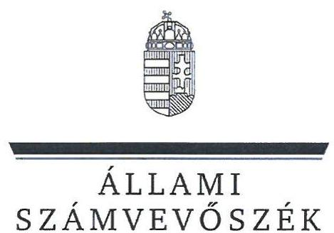
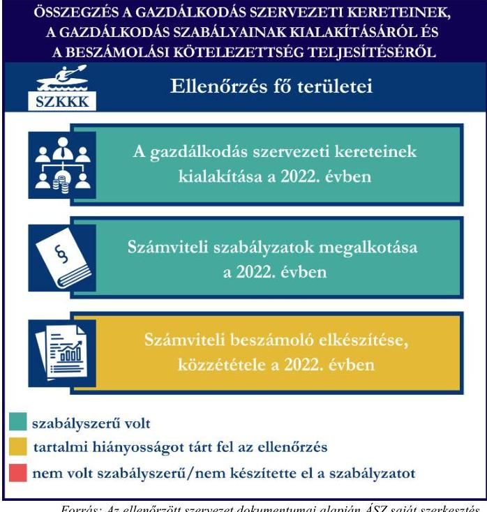
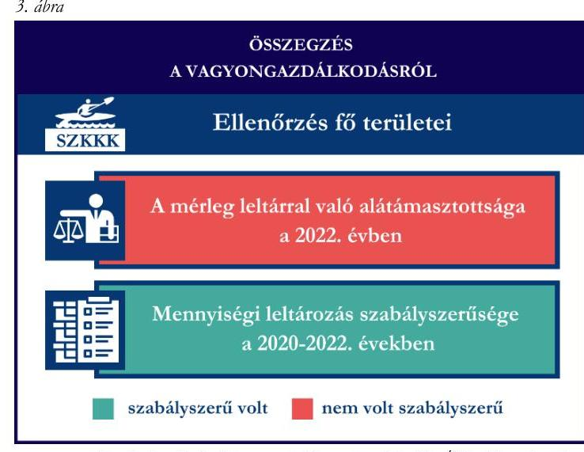

# JELENTÉS 

## Támogatásban részesülő sportszövetségek és sportegyesületek gazdálkodásának ellenőrzése

## Szolnoki Kajak-Kenu Klub

2024.

---

# JELENTÉS 

## Támogatásban részesülő sportszövetségek és sportegyesületek gazdálkodásának ellenőrzése

## Szolnoki Kajak-Kenu Klub

2024.

---

# ELLENŐRZÉSI IGAZGATÓSÁG: 

## ÁLLAMHÁZTARTÁSON KÍVÜLI SZERVEZETEKET ELLENŐRZŐ IGAZGATÓSÁG

## ELLENŐRZÉSI IGAZGATÓ:

## KLINGA LÁSZLÓ igazgató

## ELLENŐRZÉSVEZETŐ:

Jelentéseink az interneten a www.asz.hu címen olvashatók.

## HOFMEISTER LÁSZLÓ ellenőrzésvezető

IKTATÓSZÁM: EL-4060-056/2024.
TÉMASZÁM: 2682
ELLENŐRZÉS-AZONOSÍTÓ SZÁM: V1026

---

# TARTALOMJEGYZÉK 

AZ ELLENŐRZÉS ALAPADATAI ..... 5
AZ ELLENŐRZÖTT SZERVEZETEK ..... 7
ÖSSZEFOGLALÁS ..... 8
AZ ELLENŐRZÉS FÓKUSZKÉRDÉSEI ..... 10
MEGÁLLAPÍTÁSOK ..... 11
JAVASLATOK ..... 14
MELLÉKLETEK ..... 15
I. sz. melléklet: Értelmező szótár ..... 15
II. sz. melléklet: Az ellenőrzött szervezetek jegyzéke ..... 17
III. sz. melléklet: Ellenőrzési kritériumok ..... 18
FÜGGELÉK: ÉSZREVÉTELEK ..... 19
RÖVIDÍTÉSEK JEGYZÉKE ..... 20

---

.

---

# AZ ELLENŐRZÉS ALAPADATAI 

## AZ ELLENŐRZÉS CÉLJA

Az ellenőrzés célja az államháztartásból nyújtott támogatással, vagy az államháztartásból meghatározott célra ingyenesen juttatott vagyon felhasználásával érintett sportszövetségek és sportegyesületek gazdálkodása szabályozottságának, gazdálkodási tevékenységének, ezen belül a beszámolási kötelezettség teljesítésének, a támogatások elkülönített nyilvántartásának, valamint a támogatások felhasználásának ellenőrzése.

## AZ ELLENŐRZÉS TÍPUSA

Szabályszerűségi ellenőrzés.

## AZ ELLENŐRZÖTT IDŐSZAK

Az 1. fókuszkérdés esetében a 2022. év.
A 2. fókuszkérdés vonatkozásában a 2021-2022. évek.
A 3. fókuszkérdés vonatkozásában a 2022. év, a mennyiségi felvétellel történő leltározás dokumentumai tekintetében a 2020-2022. évek.

## AZ ELLENŐRZÉS TÁRGYA

Az ellenőrzés tárgya a támogatásban részesülő sportszövetségek, sportegyesületek gazdálkodása szabályozottságának, gazdálkodási tevékenységén belül a beszámolási kötelezettség teljesítésének, a vagyonnyilvántartásának, a támogatások elkülönített nyilvántartásának, valamint az államháztartási forrásból származó közvetlen vagy közvetett támogatások és a meghatározott célra ingyenesen juttatott vagyon felhasználásának a vizsgálata volt. Az ellenőrzés a támogatások vonatkozásában kiterjedt továbbá a támogató felé történő beszámolási és elszámolási kötelezettségek teljesítésére, az ezekkel kapcsolatos jogszabályi és belső előírások betartására. Az ellenőrzés kiterjedt minden olyan körülményre és adatra, amely az ÁSZ¹ jogszabályban meghatározott feladatainak teljesítéséhez, valamint az ellenőrzési program végrehajtása során felmerülő újabb összefüggések feltárásához szükséges.

Az ÁSZ tv.² 25. § (3) bekezdésében meghatározottak alapján, amennyiben a rendelkezésre bocsátott dokumentumok, adatok, illetve tájékoztatás hitelességének, megalapozottságának, teljességének megállapítása vagy egyes ellenőrzési megállapítások alátámasztása, kiegészítése indokolta, az ellenőrzés tárgyát képezték az összefüggő tények vizsgálatához más szervezetek (ellenőrzést támogató szervezetek) által rendelkezésre bocsátott adatok, dokumentációk, megadott tájékoztatások, illetve az ott végzett ellenőrzés is.

Az 1. és 3. fókuszkérdés tekintetében a vizsgálat a teljes ellenőrzött szervezetre, a 2. fókuszkérdés tekintetében kizárólag a kajak-kenu sportszakágra vonatkozott.

---

# Az ellenőrzés jogalapja 

Az ellenőrzés jogszabályi alapját az ÁSZ tv. 1. § (3) bekezdése, az 5. § (3) bekezdése, valamint a Civil tv.³ 47. § előírásai képezték.

## AZ ELLENŐRZÉS MÓDSZERE

Az ellenőrzést a nemzetközi standardokat irányadónak tekintve az ellenőrzési program szempontjai, az ellenőrzött időszakban hatályos jogszabályok, az ellenőrzés általános szakmai szabályai, az ellenőrzésre irányadó ÁSZ módszertanok figyelembevételével végezte az ÁSZ.

Az ellenőrzési kérdések megválaszolásához szükséges bizonyítékok megszerzése az ellenőrzött szervezet által rendelkezésre bocsátott dokumentumokra, adatokra alapozva kérdésfeltevés (információkérés), interjú, mintavételezés útján történt.

Az ellenőrzési bizonyítékként felhasználható adatforrások közé tartoztak egyrészt az ellenőrzés során az ellenőrzött szervezettől bekért dokumentumok, másrészt adatforrás lehetett minden további az ellenőrzés folyamán feltárt, az ellenőrzés szempontjából információt tartalmazó dokumentum.

A támogatásokkal, azok felhasználásával kapcsolatos kötelezettségek vizsgálatára mintavételi eljárások kerültek alkalmazásra. Támogatás-típusok szerint nagyságrend alapján 1-3 darab támogatás került részletes vizsgálat alá. Ezen támogatások felhasználásának szabályszerűsége támogatásonként kockázatértékelés alapján kiválasztott mintatételekkel került ellenőrzésre. A kiválasztott támogatási szerződésekhez kapcsolódó elszámolásokból 30-30 db mintatétel került ellenőrzésre, ahol az elszámolás nem érte el a 30 db-ot, ott tételes ellenőrzésre került sor. Ezen felül a vagyongazdálkodás szabályszerűségének ellenőrzéséhez is kockázatalapú mintavétel kapcsolódott. A támogatások felhasználása és a vagyongazdálkodás területén a minták ellenőrzése kiterjedt a könyvvezetési kötelezettség vizsgálatára is. A tárgyi eszközök tekintetében 30 db került kiválasztásra a 2022. évben állományban lévő eszközök közül, ahol az állományban lévő eszközök száma nem érte el a 30 db-ot, ott tételes ellenőrzésre került sor azok nyilvántartásának, elszámolásának szabályszerűsége ellenőrzése céljából. Az ellenőrzésben nem statisztikai mintavételre került sor, ezért nem történt kivetítés a teljes sokaságra, a megállapításokat az ellenőrzött mintatételekre vonatkozóan fogalmazta meg az ÁSZ.

---

# AZ ELLENŐRZÖTT SZERVEZETEK 

## Szolnoki Kajak-Kenu Klub

A Szolnoki Kajak-Kenu Klubot 2006-ban alapították. Az SZKKK¹ egyik fő célja az alapító okiratában leírtak szerint a „kajak-kenu sportág népszerűsítése és annak versenyszerű művelésének biztosítása, valamint a nem versenyszerű sportolás lehetőségének támogatása". Az SZKKK kajak-kenu szakosztállyal rendelkezik. Az SZKKK 2022-ben nem volt közhasznú jogállású, nem volt kötelezett sem felügyelőbizottság létrehozására, sem könyvvizsgálatra. Az SZKKK a 2022. évben az alaptevékenységén felül vállalkozási tevékenységet is végzett. Az SZKKK által a 2021-2022. években igénybe vett államháztartási forrásból származó támogatásokat az 1. táblázat foglalja össze.

1. táblázat

| AZ SZKKK ÁLTAL IGÉNYBE VETTTÁMOGATÁSOK /   ADATOK MF E-BAN MEGADVA | 2021. év | 2022. év |
| :-- | :--: | :--: |
| Helyi önkormányzati támogatás | - | 3 |
| Magyar Kajak-Kenu Szövetségtől kapott támogatás | 2 | 9 |

---

# ÖSSZEFOGLALÁS 

Magyarország Alaptörvényének XX. cikke kimondja, hogy mindenkinek joga van a testi és lelki egészséghez, melynek érvényesülését Magyarország többek között a sportolás és a rendszeres testedzés támogatásával segíti elő. Az Országgyűlés a Sport tv.⁵-ben kinyilvánította, hogy a nemzet közössége a test művelését, a sportot, a nemzet alapértékének, kívánatos célnak tekinti. A sport a közjó része. Erősíti a közösség tagjainak egymáshoz tartozását, miként az egyén testi és lelki egészségét.

A sportegyesületek, sportszövetségek működésükre és szakmai tevékenységük ellátására költségvetési támogatásban, önkormányzati támogatásban, ingyenes vagyonjuttatásban, valamint látvány-esapatsport támogatásban részesülhetnek, amelyekre fokozott figyelem irányul.

A társadalom részéről jogosan felmerülő elvárás, hogy a közpénzeket kezelő, azzal gazdálkodó szervezetek működéséről, tevékenységéről átfogó képet kapjon, a közpénzek rendeltetésszerű és átlátható módon történő felhasználásának értékelésére időről-időre sor kerüljön az ellenőrzések keretében.
1. ábra

A gazdálkodás szervezeti kereteinek kialakítása a 2022. évben

Számviteli szabályzatok megalkotása a 2022. évben

Számviteli beszámoló elkészítése, közzététele a 2022. évben
szabályszerű volt
tartalmi hiányosságot tárt fel az ellenőrzés
nem volt szabályszerű/nem készítette el a szabályzatot
Forrás: Az ellenőrzött szervezet dokumentumai alapján ÁSZ saját szerkesztés

Az SZKKK által a gazdálkodási szabályzatok kialakítása, a könyvvezetési kötelezettség teljesítése a 2022. évben szabályszerű volt, a beszámoló készítési kötelezettség kisebb hibák mellett teljesült.

Az SZKKK a könyvviteli szolgáltatás személyi feltételeit a 2022. évi számviteli beszámoló vonatkozásában biztosította. Az SZKKK a számviteli szabályzatokat az előírtaknak megfelelően kialakította a 2022. évben.

A könyvvezetés formája a 2022. évben megfelelt a jogszabályi előírásoknak. Az SZKKK a 2022. évi számviteli beszámolójában szereplő adatok nem minden esetben feleltek meg az előírásoknak.

A gazdálkodás szervezeti kereteinek és a gazdálkodási szabályok kialakítása, valamint a beszámolási kötelezettség ellenőrzésének az összegzését az 1. ábra tartalmazza.

---

Az SZKKK az önkormányzattól és a költségvetésből az MKKSZ⁵-en keresztül nyújtott támogatások ellenőrzött tételeit a támogatási célnak megfelelően használta fel a 2021-2022. években. A 2021. évben a jogszabályban előírt elkülönített nyilvántartást a támogatások és azok felhasználása vonatkozásában a számviteli nyilvántartásában nem vezette, a 2022. évben az elkülönített nyilvántartást kialakította és vezette a számviteli nyilvántartásában.

A kapott támogatások felhasználásának ellenőrzéséről az összegzést a 2. ábra tartalmazza.

Forrás: Az ellenőrzött szervezet dokumentumai alapján ÁSZ saját szerkesztés

Az SZKKK 2022. évi vagyongazdálkodása az ellenőrzött tételek vonatkozásában, valamint a 2022. évi beszámoló mérlegtételeinek leltárral való alátámasztása, a tárgyi eszközök bekerülési értékét alátámasztó dokumentumok hiánya miatt nem volt szabályszerű. Az SZKKK a mérlegben szereplő tárgyi eszközök előírt mennyiségi leltárazását a 2020. évben elvégezte.
A vagyongazdálkodás ellenőrzésének összegzését a 3. ábra tartalmazza.

---

# AZ ELLENŐRZÉS FÓKUSZKÉRDÉSEI 

1.     - A gazdálkodási szabályok kialakítása, a könyvvezetési és beszámolási kötelezettség teljesítése szabályszerű volt-e?
2.     - A kapott támogatások felhasználása szabályszerű volt-e?
3.     - Az ellenőrzött szervezet vagyongazdálkodása szabályszerű volt-e?

---

# MEGÁLLAPÍTÁSOK 

## 1. A gazdálkodási szabályok kialakítása, a könyvvezetési és beszámolási kötelezettség teljesítése szabályszerű volt-e?

Összegző megállapítás Az SZKKK-nál a 2022. évben a gazdálkodási szabályok a jogszabályban előírtak szerint kialakításra kerültek, a könyvvezetési kötelezettség teljesítése szabályszerű volt, a beszámolási kötelezettség teljesítése kisebb hibák mellett valósult meg.

Az SZKKK a 2022. évben a Számv. tv.⁷, valamint a Civilszr.⁸ előírásaiban foglaltaknak megfelelően gondoskodott a könyvviteli szolgáltatás személyi feltételeinek teljesüléséről.
Az SZKKK 2022-ben rendelkezett a Számv. tv-ben előírt számviteli politikával, azon belül az eszközök és a források leltárkészítési és leltározási szabályzatával, az eszközök és a források értékelési szabályzatával, pénzkezelési szabályzattal, valamint számlarenddel, amelyek az ellenőrzött tartalmi kritériumoknak megfeleltek.
Az SZKKK a Számv. tv.-ben, Civil tv.-ben, valamint a Civilszr.-ben előírtak szerinti kettős könyvvitelt vezetett. A beszámolójában szereplő vállalkozási és alaptevékenység bevételeinek Civilszr. előírása szerinti elkülönítését az SZKKK a könyviteli rendszerében teljesítette. Az SZKKK 2022-ben a könyvviteli nyilvántartását úgy vezette, hogy a Számv. tv., valamint a Civilszr. előírásainak megfelelően az egyéb bevételeken belül részletezni tudta a kapott támogatások és tagdíjak összegeit.
Az SZKKK a Civil tv.-ben, valamint a Számv. tv. előírásai alapján előírt 2022. évre vonatkozó számviteli beszámolóját, továbbá a Civil tv.-ben előírtak alapján a közhasznúsági mellékletét elkészítette. A Civilszr. 24. (2) bekezdésében foglaltak ellenére a 2022. évre vonatkozó számviteli beszámoló eredménykimutatásában az egyéb bevételeket részletező adatok között a főkönyvben szereplő támogatások és a tagdíjak összege nem került részletezésre. A Számv. tv. 4. § (1) bekezdésében, valamint a Civil vhr.⁹ 12. § (3) bekezdésében előírtak ellenére a 2022. évi beszámoló eredménykimutatás 2. űrlapján a központi támogatás összege 14,1 E Ft, miközben a 2022. évi főkönyvben csak 9,1 E Ft szerepel, így a beszámoló adatai nincsenek könyvvezetési adatokkal alátámasztva, valamint a közhasznúsági melléklet adatai nincsenek összhangban a beszámoló adataival.
Az SZKKK a 2022. évi számviteli beszámolóját a Ptk., valamint a Civil tv. alapján a legfőbb döntéshozó szerve hagyta jóvá. Az SZKKK a 2022. évi elfogadott számviteli beszámolóját, valamint közhasznúsági mellékletét a Civil tv.-ben előírtaknak megfelelően helyezte letétbe, tette közzé.

---

# 2. A kapott támogatások felhasználása szabályszerű volt-e? 

Összegző megállapítás Az SZKKK a részére nyújtott ellenőrzött támogatásokat a 2021-2022. években a támogatási célnak megfelelően használta fel. Az SZKKK a támogatások felhasználásának elkülönítését az előírások ellenére 2021-ben nem alakította ki, 2022-ben kialakította a könyvviteli rendszerében.

A Számv. tv., valamint a Civil tv. előírásainak megfelelően az SZKKK az ellenőrzött támogatási szerződésekben meghatározott önkormányzati támogatási bevételeket és azok felhasználását a 2022. évben elkülönítetten mutatta ki a számviteli nyilvántartásában. Az SZKKK a támogatási szerződésben és az alapján az Áht.¹⁰-ban foglaltak szerint az ellenőrzött önkormányzati támogatások beszámolási kötelezettségét előírt tartalommal teljesítette. Az SZKKK a 2022. évben elszámolt önkormányzati támogatások ellenőrzött tételeit a Számv. tv.-ben előírtaknak megfelelő, szabályszerű számviteli bizonylattal
 alátámasztotta.
Az SZKKK a központi költségvetésből az MKKSZ-en keresztül számára juttatott ellenőrzött támogatásokról a Civil tv. 20. § (2) bekezdés a) pontjában előírt elkülönített számviteli nyilvántartást a 2021. évben nem vezetett, a 2022. évben a Civil tv. előírásai szerint a kapott támogatásokról a könyvviteli rendszerében elkülönített nyilvántartást vezetett. Az SZKKK a Számv. tv. 161/A. § (2) bekezdésében foglaltak ellenére a Civil tv. 20. § (4) bekezdésében előírt alapcél szerinti tevékenysége költségei, ráfordításai ellentételezésére az ellenőrzött központi költségvetésből kapott támogatásokról a 2021. évben nem vezetett olyan elkülönített számviteli nyilvántartást, amelynek alapján támogatásonként megállapítható és ellenőrizhető a kapott támogatás felhasználása, a 2022. évben a könyvviteli rendszerében az elkülönített nyilvántartást kialakította és a támogatások felhasználása támogatásonként elkülönítésre került. Az SZKKK a központi költségvetésből az MKKSZ-en keresztül számára juttatott ellenőrzött támogatás felhasználásáról a támogatási szerződésben - és az alapján az Áht.-ban - foglaltak szerint beszámolt a támogató felé. Az SZKKK a 2021-2022. években elszámolt támogatások ellenőrzött tételeit a Számv. tv.-ben előírtaknak megfelelő, szabályszerű számviteli bizonylattal alátámasztotta.

## 3. Az ellenőrzött szervezet vagyongazdálkodása szabályszerű volt-e?

## Összegző megállapítás

Az SZKKK 2022. évi vagyongazdálkodása az ellenőrzött tételek vonatkozásában, valamint a 2022. évi mérlegtételek leltárral való alátámasztása nem volt szabályszerű, a tárgyi eszközök bekerülési értékét alátámasztó bizonylatok hiánya miatt. Az előírt mennyiségi leltározást az SZKKK elvégezte.

Az SZKKK a Számv. tv.-ben előírt háromévente esedékes mennyiségi felvétellel történő leltározást a 2020. évre vonatkozóan teljesítette. Az SZKKK a 2022. évi beszámolójának mérlegtételeit a Számv. tv.-ben, valamint a leltározási szabályzatában ${ }^{11}$ előírtaknak megfelelően leltárral alátámasztotta, azonban az alábbiak miatt az nem volt szabályszerű.
Az ellenőrzött tárgyi eszközök közül hat esetben a Számv. tv. 165. § (2) bekezdésben foglaltak ellenére a nyilvántartási adatok, a beszerzés értéke bizonylattal nem volt alátámasztott.

---

A Számv. tv. 47. § (1) bekezdésében foglaltak ellenére egy ellenőrzött tétel nyilvántartott bekerülési értéke háromszorosa volt az üzembe helyezésig felmerült, illetve a beszerzési számlán szereplő összegnek. Ez alapján a tárgyi eszköz nyilvántartásban, a könyvviteli nyilvántartásban, valamint a beszámolóban magasabb értéken került kimutatásra, mint a valós értéke.
A fentiek alapján sérült a Számv. tv. 15. § (3) bekezdésében szereplő valódiság elve, miszerint a könyvvitelben rögzített és a beszámolóban szereplő tételeknek a valóságban is megtalálhatóknak, bizonyíthatóknak, kívülállók által is megállapíthatóknak kell lenniük, értékelésük meg kell, hogy feleljen az e törvényben előírt értékelési elveknek és az azokhoz kapcsolódó értékelési eljárásoknak.
A fentieken felüli ellenőrzött tárgyi eszközök számviteli besorolása, értékcsökkenés elszámolása megfelelt a Számv. tv. előírásainak. Az ellenőrzött eszközök üzembehelyezésének tényét a Számv. tv.-ben előírtak alapján az SZKKK dokumentálta.

---

# JAVASLATOK 

Az ÁSZ tv. 33. § (1) bekezdésében foglaltak értelmében az ellenőrzött szervezet vezetője köteles a jelentésben foglalt megállapításokhoz kapcsolódó intézkedési tervet összeállítani és azt a jelentés kézhezvételétől számított 30 napon belül az ÁSZ részére megküldeni. Amennyiben az ellenőrzött szervezet vezetője nem küldi meg határidőben az intézkedési tervet, vagy továbbra sem elfogadható intézkedési tervet küld, az Állami Számvevőszék elnöke az ÁSZ tv. 33. § (3) bekezdése a) és b) pontjaiban foglaltakat érvényesítheti.

## A SZOLNOKI KAJAK-KENU KLUB ELNÖKÉNEK

1. Gondoskodjon arról, hogy a számviteli beszámoló eredménykimutatásában az egyéb bevételeket részletező adatok között a támogatások és a tagdíj összege részletezésre kerüljön a Civilszr. 24. (2) bekezdésében foglaltaknak megfelelően.
2. Gondoskodjon arról, hogy a számviteli beszámolóban szereplő adatok könyvvezetési adatokkal alátámasztottak legyenek, valamint közhasznúsági melléklet adatai a beszámolóban szereplő adatokkal összhangban legyenek a Számv. tv. 4. § (1) bekezdésében, valamint a Civil vhr. 12. § (3) bekezdésében előírtak alapján.
3. Gondoskodjon arról, hogy a tárgyi eszközök beszerzési értéke bizonylattal alátámasztott legyen, a Számv. tv. 165. § (2) bekezdésében foglaltaknak megfelelően.
4. Gondoskodjon arról, hogy a tárgyi eszköz nyilvántartásban szereplő bekerülési értéke összhangban legyen a beszerzési bizonylatokban szereplő értékkel a Számv. tv. 47. § (1) bekezdésében foglaltaknak megfelelően.

---

# MELLÉKLETEK 

## I. SZ. MELLÉKLET: ÉRTELMEZŐ SZÓTÁR

Civil szervezet

Egyesület

Költségvetési támogatás

Közhasznú szervezet

Közhasznú tevékenység

Országos sportági szakszövetség

Sportági szövetség

A civil társaság; a Magyarországon nyilvántartásba vett egyesület - a párt, a szakszervezet és a kölcsönös biztosító egyesület kivételével és a közalapítvány és a pártalapítvány kivételével - az alapítvány. (Forrás: Civil tv. 2. §6. pont a)-c) alpontjai)
Az egyesület a tagok közös, tartós, alapszabályban meghatározott céljának folyamatos megvalósítására létesített, nyilvántartott tagsággal rendelkező jogi személy. (Forrás: Ptk. 3:63. § (1) bekezdés)
A Számv. tv. szempontjából egyéb szervezet. (Számv. tv. 3. § (1) bekezdés 4.pont a) alpontja)
A társadalombiztosítás pénzügyi alapjai kivételével az államháztartás központi alrendszeréből ellenérték nélkül, pénzben nyújtott támogatások. (Forrás: Áht. 1. § 14. pont, ide nem értve az Áht. 1. § 14. pont a) -o) pontjaiban szereplő támogatásokat)
Közhasznú szervezetté minősíthető a Magyarországon nyilvántartásba vett közhasznú tevékenységet végző szervezet, amely a társadalom és az egyén közös szükségleteinek kielégítéséhez megfelelő erőforrásokkal rendelkezik, továbbá amelynek megfelelő társadalmi támogatottsága kimutatható, és amely:
a) civil szervezet (ide nem értve a civil társaságot), vagy
b) olyan egyéb szervezet, amelyre vonatkozóan a közhasznú jogállás megszerzését törvény lehetővé teszi. (Forrás: Civil tv. 32. § (1) bekezdés)
Minden olyan tevékenység, amely a létesítő okiratban megjelölt közfeladat teljesítését közvetlenül vagy közvetve szolgálja, ezzel hozzájárulva a társadalom és az egyén közös szükségleteinek kielégítéséhez. (Forrás: Civil tv. 2. § 20. pont)
Olyan sportszövetség, amely sportágában kizárólagos jelleggel az e törvényben, valamint más jogszabályokban meghatározott feladatokat lát el és e törvényben megállapított különleges jogosítványokat gyakorol. Olyan sportágban hozható létre, amelyet vagy a Nemzetközi Olimpiai Bizottság elismert, vagy amely sportág nemzetközi szövetségét felvették a Nemzetközi Sportszövetségek Szövetségébe (GAISF). (Forrás: Sport tv. 20. § (1), (4) bekezdés)
A Civil tv. és a Ptk. előírásai alapján - a Sport tv.-ben meghatározott eltérésekkel - működő szövetség, amelynek tagjai kizárólag sportszervezetek lehetnek. Sportági szövetség országos jelleggel is működhet. Egy sportágban csak egy országos sportági szövetség működhet. Törvényi feltételek teljesülése esetén szakszövetségi feladatokat is elláthat. (Forrás: Sport tv. 28. §)

---

Sportegyesület

Sportegyesületeknek, sportszövetségeknek nyújtott költségvetési támogatás

Sportszövetség

Sporttevékenység

A Civil tv. és a Ptk. szabályai szerint működő olyan egyesület, amelynek alaptevékenysége a sporttevékenység szervezése, valamint a sporttevékenység feltételeinek megteremtése. A sportegyesületek a Sport tv. 15. § (1) bekezdésében meghatározott sportszervezetek körébe tartoznak. A sportegyesületeken kívül sportszervezet még a sportvállalkozás, a sportiskola, valamint az utánpótlás-nevelés fejlesztését végző alapítvány. (Forrás: Sport tv. 16. § (1) bekezdés)
Az állami sport célú támogatások felhasználásáról és elosztásáról szóló 474/2016. (XII. 27.) Kormány rendelet 1. § (1) bekezdésében és a 27/2013. (III. 29.) EMMI rendelet ${ }^{12}$ 1. §-ában meghatározott fejezeti kezelésű előirányzatokból nyújtott támogatás.
Meghatározott sporttevékenységek körében a sportversenyek szervezésére, a tagok érdekvédelmére és a részükre való szolgáltatásokra, valamint a nemzetközi kapcsolatok lebonyolítására létrehozott, jogi személyiséggel és önkormányzattal rendelkező, a Civil tv. és a Ptk. alapján - az e törvényben foglalt eltérésekkel - különös formában működő egyesületek. A Sport tv. 19. § (3) bekezdése szerint a sportszövetségeknek az alábbi típusai léteznek: országos sportági szakszövetségek, sportági szövetségek, szabadidősport szövetségek, fogyatékosok sportszövetségei, diák- és egyetemi-főiskolai sport sportszövetségei, nemzetközi sportszövetségek. (Forrás: Sport tv. 19. § (1), (3) bekezdés)

Meghatározott szabályok szerint, a szabadidő eltöltéseként kötetlenül vagy szervezett formában, illetve versenyszerűen végzett testedzés vagy szellemi sportágban kifejtett tevékenység, amely a fizikai erőnlét és a szellemi teljesítőképesség megtartását, fejlesztését szolgálja. (Forrás: Sport tv. 1. § (2) bekezdés)

---

II. SZ. MELLÉKLET: AZ ELLENŐRZÖTT SZERVEZETEK JEGYZÉKE

| ELLENŐRZÖTT SZERVEZET NEVE | ELLENŐRZÖTT SZERVEZET SZÉKHELYE |
| :-- | :-- |
| Szolnoki Kajak-Kenu Klub | 5000 Szolnok, Baross út 1. IV./20-22. |

---

# III. SZ. MELLÉKLET: ELLENŐRZÉSI KRITÉRIUMOK 

## FOKUSZKÉRDÉS

## 1. fókuszkérdés:

A gazdálkodási szabályok kialakítása, a könyvvezetési és beszámolási kötelezettség teljesítése szabályszerű volt-e?

## 2. fókuszkérdés:

A kapott támogatások felhasználása szabályszerű volt-e?

## 3. fókuszkérdés:

Az ellenőrzött szervezet vagyongazdálkodása szabályszerű volt-e?

## ÉLLENŐRZÉSI KRITÉRIUMOK

Számv. tv. 14. § (3) bekezdés, (5) bekezdés a), b), d) pont, (8) bekezdés, (11) bekezdés, 69. § (3) bekezdés, 90. § (3) bekezdés c) pont, 161. § (1) bekezdés, (2) bekezdés a)-d) pont, (3)-(4) bekezdés, 161/A. $\S$ (2) bekezdés, 165. $\S$ (2) bekezdés
Civilszr. 7. § (1) bekezdés, (4) bekezdés b), c) pont, 8. § (2), (3) bekezdés, 9. § (4), (5), (8) bekezdés, 12. § (4), (5) bekezdés, 15. § (1) bekezdés a), b) pont, 16. § (1) bekezdés, 24. § (2) bekezdés

Civil vhr. 12. § (1) bekezdés, melléklet 5. pont
Ptk. 3:26. § (1) bekezdés, 3:82. § (1) bekezdés,
Civil tv. 28. § (1) bekezdés, 29. § (2) bekezdés c) pont, (3), (6), (7) bekezdés, 30. § (1)-(4) bekezdés 40. § (1)

Számv. tv. 44. § (2) bekezdés, 93. § (3) bekezdés, 159. §, 161/A. § (2) bekezdés, 165. § (2) bekezdés, 167. § (1) bekezdés a), d), e), b) pont

Civil tv. 20. § (2) bekezdés a) pont, (3) bekezdés a), c) pont, (4) bekezdés, 29. § (4), (5) bekezdés
Civilszr. 24. § (2) bekezdés
27/2013. (III.29.) EMMI rend. 18. § (2) bekezdés
474/2016. (XII. 27.) Korm. rend. 22. § (2) bekezdés, 24. § (2) bekezdés
Áht. 53. §, Ávr. ${ }^{13}$ 92. §, 93. § (2)-(4) bekezdések
Civil vhr. 12. § (3) bekezdése
Ptk. 3:63. § (4) bekezdés
Számv. tv. 3. § (3) bekezdés 3. pont, 15. § (3) bekezdés, 46. § (3), (4) bekezdés, 47-51. §, 52. § (1)-(7) bekezdés, 69. § (1)-(3) bekezdések, 165. § (2) bekezdés, 169. § (2) bekezdés

---

# FÜGGELÉK: ÉSZREVÉTELEK 

A jelentéstervezetet a Számvevőszék 15 napos észrevételezésre megküldte az ellenőrzött szervezet vezetőjének az ÁSZ tv. 29. § (1) bekezdése előírásának megfelelően.

Az ellenőrzött szervezet elnöke a jelentéstervezetre nem tett észrevételt.

[^0]
[^0]:    * 29. § (1) Az Állami Számvevőszék az ellenőrzési megállapításait megküldi az ellenőrzött szervezet vezetőjének vagy az általa megbízott személynek, és annak, akinek személyes felelősségét állapította meg.
    (2) Az ellenőrzött szervezet vezetője és a felelősként megjelölt személy az ellenőrzés megállapításaira tizenöt napon belül írásban észrevételt tehet.
    (3) Az Állami Számvevőszék az észrevételre a beérkezésétől számított harminc napon belül írásban válaszol. A figyelembe nem vett észrevételeket köteles a jelentésben feltüntetni, és megindokolni, hogy azokat miért nem fogadta el.

---

# RÖVIDÍTÉSEK JEGYZÉKE 

${ }^{1}$ ÁSZ
${ }^{2}$ ÁSZ tv.
${ }^{3}$ Civil tv.
${ }^{4}$ SZKKK
${ }^{5}$ Sport tv.
${ }^{6}$ MKKSZ
${ }^{7}$ Számv. tv.
${ }^{8}$ Civilszr.
${ }^{9}$ Civil vhr.
${ }^{10}$ Áht.
${ }^{11}$ leltározási szabályzat
${ }^{12}$ 27/2013. (III.29.) EMMI rendelet
${ }^{13}$ Ávr.

Állami Számvevőszék
2011. évi LXVI. törvény az Állami Számvevőszékről
2011. évi CLXXV. törvény az egyesülési jogról, a közhasznú jogállásról, valamint a civil szervezetek működéséről és támogatásáról
Szolnoki Kajak-Kenu Klub
2004. évi I. törvény a sportról

Magyar Kajak-Kenu Szövetség
2000.
 évi C. törvény a számvitelről
479/2016. (XII. 28.) Korm. rendelet a számviteli törvény szerinti egyes egyéb szervezetek beszámoló-készítési és könyvvezetési kötelezettségének sajátosságairól
350/2011. (XII. 30.) Korm. rendelet a civil szervezetek gazdálkodásáról, az adománygyűjtésről és a közhasznúság egyes kérdéseiről
2011. évi CXCV. törvény az államháztartásról

Az SZKKK Eszközök és források leltárkészítési, leltározási és selejtezési szabályzata, hatályos 2020. október 1-jétől
27/2013. (III. 29.) EMMI rendelet az állami sport célú támogatások felhasználásáról és elosztásáról
368/2011. (XII. 31.) Korm. rendelet az államháztartásról szóló törvény végrehajtásáról

---

1052 Budapest, Apáczai Csere János u. 10. | 1364 Budapest IV., Pf. 54
www.asz.hu | szamvevoszek@asz.hu
telefon: +36 1 4849100
