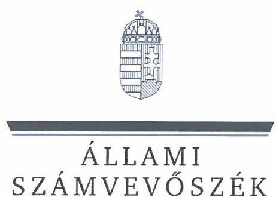
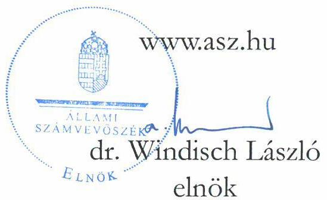
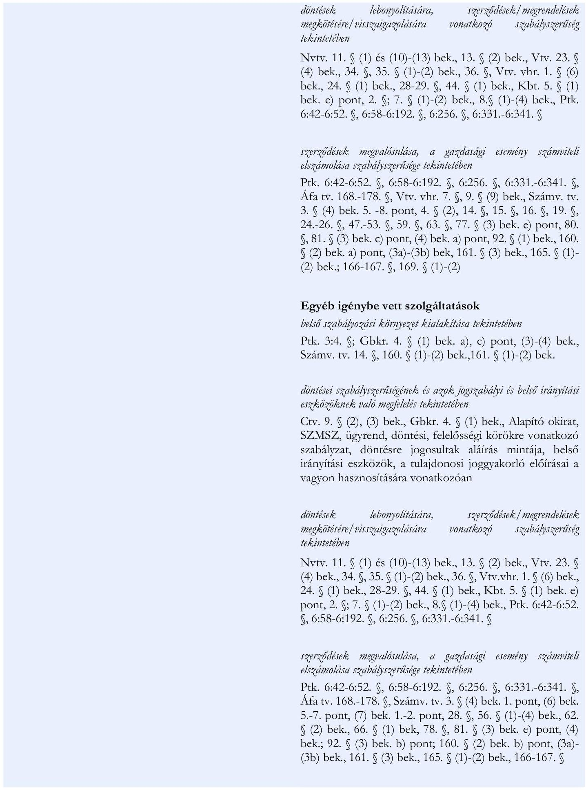

# JELENTÉS 

## Az állami tulajdonú gazdasági társaságok gazdálkodásának, valamint az ehhez kapcsolódó döntések megalapozottságának ellenőrzése

Eszterháza Kulturális, Kutató- és Fesztiválközpont
Közhasznú Nonprofit Kft.
2024.

---

ÁLLAMI
SZÁMVEVŐSZÉK

# JELENTÉS 

## Az állami tulajdonú gazdasági társaságok gazdálkodásának, valamint az ehhez kapcsolódó döntések megalapozottságának ellenőrzése

Eszterháza Kulturális, Kutató- és Fesztiválközpont
Közhasznú Nonprofit Kft.
2024.

24139

---

# ELLENŐRZÉSI IGAZGATÓSÁG: 

ÁLLAMI VAGYONGAZDÁLKODÁST ELLENŐRZŐ IGAZGATÓSÁG

## ELLENŐRZÉSI IGAZGATÓ:

HERCZEGH ZSOLT ellenőrzési igazgató

## ELLENŐRZÉSVEZETŐ:

Jelentéseink az interneten a www.asz.hu címen olvashatók.

DABISNÉ NYIKOS MELINDA ellenőrzésvezető

IKTATÓSZÁM: EL-3957-005/2024
TÉMASZÁM: 2677
ELLENŐRZÉS-AZONOSÍTÓ SZÁM: V1021

---

# TARTALOMJEGYZÉK 

AZ ELLENŐRZÉS ALAPADATAI ..... 5
AZ ELLENŐRZÖTT SZERVEZET ..... 7
ÖSSZEFOGLALÁS ..... 9
AZ ELLENŐRZÉS FÓKUSZTERÜLETE ..... 10
MEGÁLLAPÍTÁSOK ..... 11
JAVASLATOK ..... 18
MELLÉKLETEK ..... 19
I. sz. melléklet: Értelmező szótár ..... 19
II. sz. melléklet: Az ellenőrzött szervezet jegyzéke ..... 22
III. sz. melléklet: Ellenőrzési kritériumok ..... 23
FÜGGELÉK: ÉSZREVÉTELEK ..... 27
RÖVIDÍTÉSEK JEGYZÉKE ..... 28

---

.

---

# AZ ELLENŐRZÉS ALAPADATAI 

## AZ ELLENŐRZÉS CÉLJA

Az ellenőrzés célja annak értékelése volt, hogy a többségi állami tulajdonban álló gazdasági társaság gazdálkodása szabályszerűen történt-e; döntéshozatala során érvényesült-e a célszerűség, biztosított volt-e az állami vagyon védelme, értékének megőrzése, a társaság által a gazdálkodással összefüggésben hozott döntések megalapozottak, szabályszerűek, eredményesek voltak-e.

## AZ ELLENŐRZÉS TÍPUSA

Kombinált ellenőrzés.

## AZ ELLENŐRZÖTT IDŐSZAK

A 2022. év.
Az ellenőrzés kiterjedt az ellenőrzött időszakban hatályos, a gazdálkodással összefüggő szerződések megkötésére irányuló döntési és végrehajtási folyamatokra, illetve az ellenőrzött időszakra vonatkozó számviteli beszámoló elfogadásának időszakára is.

## AZ ELLENŐRZÉS TÁRGYA

Az ellenőrzés tárgya a többségi állami tulajdonban álló gazdasági társaság gazdálkodása szabályszerűségének, valamint az ellenőrzött időszakban a gazdálkodással összefüggésben hozott döntések megalapozottságának, célszerűségének, eredményességének, továbbá az állami vagyon értéke megőrzésének, védelmének, az állami vagyonnal való felelős gazdálkodás érvényesülésének az ellenőrzése volt. Az ellenőrzés kiterjedt továbbá a többségi állami tulajdonban álló gazdasági társaság üzleti tervében szereplő adatok és a számviteli beszámoló adatok összevetésének vizsgálatára is.

Az ellenőrzés kiterjedt minden olyan körülményre és adatra, amely az ÁSZ ${ }^{1}$ jogszabályban meghatározott feladatainak teljesítéséhez, valamint a program végrehajtása folyamán felmerült újabb összefüggések feltárásához szükséges volt.

## AZ ELLENŐRZÉS JOGALAPJA

Az ellenőrzés jogszabályi alapját az ÁSZ tv. ${ }^{2} 1 . \int(3)$ bekezdés és $5 . \int(4)$ bekezdés előírásai képezték.

---

# AZ ELLENŐRZÉS MÓDSZERE 

Az ellenőrzést a nemzetközi standardokat irányadónak tekintve az ellenőrzési program szempontjai, az ellenőrzött időszakban hatályos jogszabályok, az ellenőrzés szakmai szabályok és a jelen ellenőrzésre irányadó ÁSZ módszertanok figyelembevételével végezte az ÁSZ.

Az ellenőrzési kérdések megválaszolásához szükséges bizonyítékok megszerzése az ellenőrzött szervezet által rendelkezésre bocsátott dokumentumokra és adatokra alapozva, továbbá megfigyelés, szemrevételezés, információkérés, interjú, összehasonlítás, mintavételezés, valamint elemző eljárás útján történt.

Az ÁSZ mintavételi eljárással kiválasztott tételek alapján is ellenőrizte a többségi állami tulajdonban álló gazdasági társaság múködése szempontjából kiemelt funkcionális gazdálkodási részterületeket, melyek érintették az eszközökkel és forrásokkal való gazdálkodást, a felmerült költségeket és ráfordításokat és az alaptevékenység körébe vagy ahhoz kapcsolódóan keletkező bevételeket, ezen gazdasági események döntési, végrehajtási folyamatainak szabályszerűségét, a döntések megalapozottságát, célszerűségét és eredményességét, az állami vagyon értéke megőrzését, védelmét, az állami vagyonnal való felelős gazdálkodás érvényesülését. A kiválasztott mintatételek ellenőrzésének eredménye nem került kivetítésre a teljes sokaságra, a megállapítások az adott ellenőrzött mintatételek vonatkozásában kerültek megjelenítésre.

Az Eszterháza Közhasznú Nonprofit Kft. ${ }^{3}$ gazdálkodásának, valamint az ehhez kapcsolódó döntések megalapozottságának az ellenőrzése a Társaság alaptevékenysége körébe vagy ahhoz kapcsolódóan keletkező bevételekre (továbbiakban: egyes bevételek ${ }^{4}$ ), valamint gazdálkodására jellemző, legnagyobb költségeket és ráfordításokat magába foglaló funkcionális gazdálkodási részterületekre terjedt ki. Ennek következtében az állóeszköz-gazdálkodás funkcionális gazdálkodási részterületen belül a gazdálkodási döntések a beruházások (továbbiakban: beruházások), valamint a készletgazdálkodás, logisztika, szolgáltatások gazdálkodási részterületen belül az egyéb igénybe vett szolgáltatások (továbbiakban: egyéb igénybe vett szolgáltatások) vonatkozásában kerültek ellenőrzésre.

Az ellenőrzési bizonyítékként felhasználható adatforrások közé tartoztak az ellenőrzéshez kért dokumentumok, valamint minden egyéb - az ellenőrzés folyamán feltárt -, az ellenőrzés szempontjából információt tartalmazó dokumentum.

Az ellenőrzés lefolytatásához az ellenőrzött szervezet a tanúsítványok kitöltésével, valamint az ÁSZ által kért dokumentumok, adatok, információk megküldésével és a helyszíni ellenőrzés során szolgáltatott adatokat. Az ellenőrzéshez az ÁSZ a nyilvános közhiteles adatokat is felhasználta.

---

# AZ ELLENŐRZÖTT SZERVEZET

## ESZTERHÁZA KÖZHASZNÚ NONPROFIT KFT.

Az Eszterháza Közhasznú Nonprofit Kft.-t 1993.01.13-án alapították^{5}, a Magyar Állam adásvétel útján 2015.04.09-én szerezte meg a Társaság 100 %-os üzletrészét. A Társaság egyedüli tagja a Magyar Állam, a tulajdonosi jogokat 2020.12.01-től a Miniszterelnökség, majd 2022.05.27-től az Építési és Beruházási Minisztérium gyakorolta. A Társaság főtevékenysége TEÁOR'08 9102 Múzeumi tevékenység.

A Társaság székhelye: 9431 Fertőd, Joseph Haydn út 2.; fióktelepei: 9400 Sopron, Kolostor-hegy utca 11., 9485 Nagycenk, Kiscenki út 3., 9421 Fertőrákos, Fő út 153.

|  MEGNEVEZÉS | 2022. ÉV  |
| --- | --- |
|  Ertékesítés nettó árbevétele | 290 783  |
|  ebből közhasznú tevékenységhez kapcsolódó: | 124 617  |
|  ebből vállalkozási tevékenységhez kapcsolódó: | 166 166  |
|  Egyéb bevételek | 1 026 494  |
|  Anyagjellegű ráfordítások | 394 657  |
|  ebből: igénybe vett szolgáltatások | 153 944  |
|  Személyi jellegű ráfordítások | 743 279  |
|  Adózott eredmény | -15 484  |
|  Tárgyi eszközök | 18 793 665  |
|  ebből: beruházások, felújítások | 180 772  |
|  Követelések | 48 563  |
|  Saját tőke | 10 045 801  |
|  Jegyzett tőke | 950 000  |
|  Tőketartalék | 5 714 684  |
|  Kötelezettségek | 13 958 869  |
|  Mérlegfőösszeg | 26 655 314  |
|  Átlagos statisztikai létszám | 114 fő  |

*Forrás: ÁSZ saját szerkesztés a 2022. évi éves számviteli beszámoló adatai alapján*

Az Eszterháza Közhasznú Nonprofit Kft. megfelelve az Ectv.^{6} 34 § (1) a) pontjában foglaltaknak, az Alapító okirat^{7}1-8 alapján az alábbi közfeladatokat látta el:

- a nemzeti és egyetemes kulturális örökség megóvásával és közkinccsé tételével kapcsolatos feladatok;
- a külhoni magyar közösségek kulturális identitását erősítő és fejlesztő programok és fejlesztések megszervezésével kapcsolatos feladatok;
- a kulturális örökséggel kapcsolatos közművelődési feladatok megszervezése, a magyar történeti, művészeti és művelődéstörténeti értékek külföldi megismertetése;
- egyes állami tulajdonban tartandó, jelentős kulturális örökségi értéket képviselő ingatlanok kulturális alapú és értékelvű megóvása, kulturális célú fejlesztése, hasznosítása és üzemeltetése.

---

- szakmai adattárak és gyűjtemények, nyilvánosan hozzáférhető kutatószolgálat működtetése;
- kulturális javak tudományos értékvizsgálat alapján történő felkutatása és dokumentálása;
- tudományos gyűjteményeinek gyarapítása, állományvédelme, megfelelő használata és hozzáférhetővé tétele;
- a Haydn Kutatóközpont keretében kulturális és művészeti tevékenység, ezen belül különösen régi zenei sorozatok, fesztiválok, operaelőadások, kamarazenei koncertek, konferenciák, mesterkurzusok, állandó és időszakos kiállítások stb. szervezése elsősorban Haydn és kora szellemében;
- kulturális és művészeti tevékenység, előadások, rendezvények, fesztiválok, képzések, kiállítások szervezése, rendezése és lebonyolítása.
Az Eszterháza Közhasznú Nonprofit Kft. négy pillére - Eszterháza, Nagycenk, Fertőrákos, Sopronbánfalva - jelentős kultúrtörténeti örökségei a magyar nemzetnek, ennélfogva a Társaság feladatai az ellenőrzött időszakban az alábbiak voltak:

Fertőd-Eszterháza: magába foglalta a Esterházy-kastély épületét és a hozzátartozó ingóságok vagyonkezelését, így a Múzeum, a Rózsakert, a Kastély dísztermei, Marionett színház, Narancsház, valamint a Tiszttartói épület komplexum kezelését. Ezekhez a létesítményekhez kapcsolódóan látta el a Társaság a múzeumi tevékenységet és a rá hagyományozott tudományos szakmai, művészettörténeti és kulturális közfeladatokat. Az ellenőrzött időszakban a fertődi Esterházy-kastély turisztikai célú fejlesztése a Nemzeti Kastélyprogram és a Nemzeti Várprogram keretében (GINOP ${ }^{8}$-7.1.1-15-2016-00027) folyamatban volt, az átadásra 2023. június 30 -án került sor.

Nagycenk: magába foglalta a Széchenyi-örökség (Kastély-együttes, Emlékmúzeum, Vörös-kastély, Virágház, Őrségépület, Mauzóleum, Méntelep-lovarda, Hársfasor) vagyonkezelési, örökségvédelmi tudományos feladatainak ellátását. Az ellenőrzött időszakban a nagycenki Széchenyi-kastély turisztikai célú fejlesztése a Nemzeti Kastélyprogram és a Nemzeti Várprogram keretében (GINOP-7.1.1-15-2016-00011) folyamatban volt, az átadás 2023. december 14-én megtörtént.

Fertőrákos - Püspöki Palota (felújításra vár): állagmegóvás és őrzési feladatok ellátása.
Sopronbánfalvai Kolostor: a kolostor múemlékjellege mellett állandó- és időszaki kiállítások, valamint kulturális rendezvények rendezése.

Az Eszterháza Közhasznú Nonprofit Kft. az ellenőrzött időszak vonatkozásában az Ectv. szerinti közhasznúsági melléklettel rendelkezett. A Társaság felügyelőbizottsága az ellenőrzött időszakban öt főből állt, az ellenőrzött szervezet - a Tak.tv. ${ }^{9} 7 / \mathrm{J} . \S$ (1) bekezdésben meghatározottak szerint - a 2022. évben a Gbkr. ${ }^{10}$ hatálya alá tartozott.

---

# ÖSSZEFOGLALÁS 

A többségi állami tulajdonban álló gazdasági társaságokkal szemben az egyik legfontosabb követelmény, hogy a nemzeti vagyonnal felelős módon és rendeltetésszerüen gazdálkodjanak. E követelmények érvényesülését az ÁSZ a többségi állami tulajdonban álló gazdasági társaságok gazdálkodásának ellenőrzése során kiemelten vizsgálja.

Az ellenőrzés megállapította, hogy az Eszterháza Közhasznú Nonprofit Kft. 2022. évi gazdálkodása az ellenőrzés alá vont gazdálkodási részterületek vonatkozásában szabályszerű volt, döntéshozatalai során érvényesült a célszerűség, biztosított volt az eredményekre vonatkozó célok és követelmények teljesülése, az állami vagyon védelme, értékének megőrzése. Az Eszterháza Közhasznú Nonprofit Kft. gazdálkodással összefüggésben hozott döntései szabályszerűek, megalapozottak és eredményesek voltak.

Az Eszterháza Közhasznú Nonprofit Kft. gazdálkodásának szabályozási rendszerét szabályszerűen kialakította. Azonban az ellenőrzött időszak egy részében a Társaság a jogszabályi előírás ellenére megfelelést támogató szervezeti egységet nem múködtetett, továbbá megfelelési tanácsadót sem alkalmazott.

Az ellenőrzés az Eszterháza Közhasznú Nonprofit Kft. gazdálkodását leginkább jellemző gazdálkodási részterületeken belül értékelte az egyes bevételek, a beruházások, valamint az egyéb igénybe vett szolgáltatások gazdálkodási részterületekhez kapcsolódó döntéseket. Az ellenőrzés megállapította, hogy az ellenőrzött gazdálkodási részterületek vonatkozásában a döntések meghozatalára a jogszabálynak megfelelő tervezés mellett került sor. A döntések a jogszabályok és belső szabályozók rendelkezéseinek megfelelően megalapozottak voltak, biztosított volt az eredményekre vonatkozó célok és követelmények teljesülése, érvényesült a nemzeti vagyonnal való felelős gazdálkodás elve. Az Eszterháza Közhasznú Nonprofit Kft. az ellenőrzött gazdálkodási részterületek tekintetében a jogszabálynak megfelelően a döntés realizálás folyamatába beépített és működtetett kontrollokat. Az ellenőrzés hiányosságként tárta fel, hogy a Társaság szakmai beszámolói a támogatási szerződések ellenére a megvalósítás eredményességének elemzéseit nem tartalmazták. Továbbá az Eszterháza Közhasznú Nonprofit Kft. a jogszabályi előírás ellenére egy esetben döntéselőkészítő dokumentummal az egyéb igénybe vett szolgáltatások beszerzésével összefüggésben nem rendelkezett, két esetben pedig az egyéb igénybe vett szolgáltatások beszerzésének a tervezése a 2022. évi üzleti tervében elmaradt. A kapcsolódó számviteli elszámolásokra a jogszabályokban és a belső szabályozókban foglalt rendelkezések alapján szabályszerűen került sor.

---

# AZ ELLENŐRZÉS FÓKUSZTERÜLETE 

A Társaság gazdálkodása szabályozási rendszerének kialakítása, a gazdálkodás szabályszerűsége, a célszerűségi, eredményességi szempontok érvényesülése, a kapcsolódó döntések megalapozottsága, a döntés realizálás folyamatába beépített kontrollok müködése.

---

# MEGÁLLAPÍTÁSOK 

## 1. A Társaság gazdálkodása szabályozási rendszerének kialakítása, a gazdálkodás szabályszerűsége, a célszerűségi, eredményességi szempontok érvényesülése, a kapcsolódó döntések megalapozottsága, a döntés realizálás folyamatába beépített kontrollok múködése.

Összegző megállapítás Az Eszterháza Közhasznú Nonprofit Kft. gazdálkodásának szabályozási rendszerét szabályszerűen kialakította. A Társaság megfelelést támogató szervezeti egységet az ellenőrzött időszak egy részében nem múködtetett, továbbá megfelelési tanácsadót sem alkalmazott. Az Eszterháza Közhasznú Nonprofit Kft. gazdálkodáshoz kapcsolódó döntései szabályszerűek és megalapozottak voltak, a döntés realizálás folyamatába a kontrollokat beépítette és működtette. Hiányosságként került feltárásra, hogy a Társaság egy esetben döntéselőkészítő dokumentummal az egyéb igénybe vett szolgáltatások beszerzésével összefüggésben nem rendelkezett, két esetben pedig az egyéb igénybe vett szolgáltatások beszerzésének a tervezése a 2022. évi üzleti tervében elmaradt. A támogatási szerződések ellenére a Társaság szakmai beszámolói a megvalósítás eredményességének elemzéseit nem tartalmazták. Az Eszterháza Közhasznú Nonprofit Kft. számviteli elszámolásaira szabályszerűen került sor. Az Eszterháza Közhasznú Nonprofit Kft. gazdálkodásra vonatkozó döntései esetében a célszerűség szempontjai érvényesültek, a döntések biztosították a felelős gazdálkodásra, eredményekre vonatkozó célok és követelmények teljesítését.

Az Eszterháza Közhasznú Nonprofit Kft. ellenőrzése az egyes bevételekhez, a beruházásokhoz, valamint az egyéb igénybe vett szolgáltatásokhoz kapcsolódó gazdálkodási döntésekre terjedt ki.

Az Eszterháza Közhasznú Nonprofit Kft. gazdálkodásának szabályozási rendszerére vonatkozó megállapítások
Az Eszterháza Közhasznú Nonprofit Kft. a Gbkr., valamint az Alapító okiratban ${ }_{1-8}$ foglalt előírásoknak megfelelően a 2022. évre vonatkozó hatályos stratégiával (Nagycenk 2030, Eszterháza 2030 stratégiák), üzleti tervvel rendelkezett. Az Eszterháza Közhasznú Nonprofit Kft. Alapító okiratában ${ }_{1-8}$,

---

SZMSZ ${ }^{11}{ }_{1-2}$-ében, Közbeszerzési és Beszerzési szabályzatában ${ }^{12}{ }_{1-2}$ az ellenőrzött időszakban a Gbkr. előírásainak megfelelően szabályozta a felelősségi és hatásköri viszonyokat, döntési jogköröket.
Az Eszterháza Közhasznú Nonprofit Kft. a Számv. tv. ${ }^{13}$-ben foglalt előírásoknak megfelelően a számviteli politikáját ${ }_{1-2}{ }^{14}$, számlarendjét ${ }^{15}$, bizonylati rendjét ${ }^{16}$, pénzkezelési ${ }^{17}$, leltározási ${ }_{1-3}{ }^{18}$, értékelési ${ }^{19}$, önköltségszámítási ${ }^{20}$ szabályzatait elkészítette, valamint selejtezési ${ }^{21}$ szabályzattal is rendelkezett.
Az Eszterháza Közhasznú Nonprofit Kft. a Kbt. ${ }^{22}$-ben foglalt rendelkezéseknek megfelelően Közbeszerzési és Beszerzési szabályzatát ${ }_{1-2}$ elkészítette.
A Társaság a Gbkr. előírásainak megfelelően Belső ellenőrzési alapszabállyal ${ }^{23}$ és Belső ellenőrzési kézikönyvvel ${ }^{24}$ rendelkezett, a Tak.tv. és a Gbkr. előírásainak megfelelően gondoskodott a belső ellenőrzés kialakításáról és múködtetéséről. Az ellenőrzött időszakban, 2022.09.30-tól a Társaságnál a Gbkr. 9. § (1) bekezdés ellenére megfelelést támogató szervezeti egység - megfelelési tanácsadó - nem múködött, mivel a tulajdonosi joggyakorló döntése értelmében az ügyvédi és tanácsadói szerződések (így a megfelelési tanácsadó igénybevételére vonatkozó szerződés is) felmondásra kerültek az Eszterháza Közhasznú Nonprofit Kft. részéről. Ezt követően a 2022. év vonatkozásában új megfelelési tanácsadói szerződés nem került megkötésre a Társaság részéről. A belső kontrollok működésének vizsgálatát a 2022. IV. negyedévben a felügyelőbizottság megbízásából a belső ellenőr látta el. Ezt követően a Társaság a 2023. évben a 10/2023. (IX.29.)-i Alapítói Határozattal elfogadott SZMSZ alapján a Gbkr. előírásának megfelelően megfelelési tanácsadót alkalmazott.
Az Eszterháza Közhasznú Nonprofit Kft. az Info tv. ${ }^{25}$ és a Tak.tv. előírásainak megfelelően Közzétételi szabályzattal ${ }^{26}$ rendelkezett, melyek alapján a közzétételi kötelezettségének eleget tett.

# Az Eszterháza Közhasznú Nonprofit Kft. gazdálkodásának szabályozási rendszerét szabályszerüen kialakította. 

## Egyes bevételekre vonatkozó gazdálkodási döntések megállapításai

Az Eszterháza Közhasznú Nonprofit Kft. 2022. évi értékesítés nettó árbevétele 290783 E Ft, egyéb bevétele 1026494 E Ft volt. A Társaság értékesítés nettó árbevételének $43 \%$-a közhasznú tevékenységéből (múzeumi tevékenység, kulturális programok), $57 \%$-a pedig vállalkozási tevékenységéből (szálláshelyszolgáltatás, egyéb vállalkozási tevékenység) tevődött össze. Az Eszterháza Közhasznú Nonprofit Kft. egyéb bevételeinek közel $100 \%$-a beruházásokhoz, valamint a múködéshez kapcsolódó támogatásokból állt. A Társaság vállalkozási tevékenysége a sopronbánfalvai kolostor szálláshelyszolgáltatási-, vendéglátási tevékenységéhez, az Esterházy-kávézó üzemeltetéséhez, az Esterházy-kastély tereinek, külső helyszíneinek bérbeadásához, valamint különféle rendezvények bérleti díjaihoz kapcsolódott.
Az ellenőrzés során az egyes bevételeken belül 10 mintatétel került kiválasztásra. Az ellenőrzött tételek a támogatások (4 mintatétel: támogatási szerződések) értékének $97 \%$-át, az értékesítés nettó árbevétel (6 mintatétel: árbevétel számlák) értékének 4,5 \%-át fedték le. Az Eszterháza Közhasznú Nonprofit Kft. egyes bevételeit a tulajdonosi joggyakorló által elfogadott 2022. évi üzleti tervében ${ }^{27}$ megtervezte, azok az Alapító okiratban ${ }_{1-8}$ meghatározott cél szerinti közhasznú, valamint vállalkozási tevékenységeihez kapcsolódtak. Az Eszterháza Közhasznú Nonprofit Kft. az ellenőrzött időszakban egyéb bevételei között 1023815 E Ft támogatást mutatott ki, melynek $92 \%$-a a Társaság 2022. évi múködési alapfinanszírozásához kapcsolódott.

---

Az Eszterháza Közhasznú Nonprofit Kft. a 2022. évi üzleti tervében eredményességi feltételként határozta meg, hogy a közcélú, közhasznú feladataira kapott támogatásokkal úgy gazdálkodjon, tevékenységét úgy szervezze, hogy jelentős összeggel (az a volumen, amit a múzeumi jegy árbevétel, bérleti díjak, rendezvények bevételei fedezni tudnak) a kapott támogatást ne lépje túl. A Társaság a 2022. évi üzleti tervében meghatározott, az eredménykimutatást érintő tervezett adatait a tulajdonosi joggyakorló évközi döntései következtében korrigálta ${ }^{28}$, az Eszterháza Közhasznú Nonprofit Kft. a 2022. évi korrigált tervek alapján - 21254 E Ft-ban prognosztizálta adózott eredményét. A 2022. évi éves számviteli beszámolóban rögzített adózott eredmény a korrigált adózott eredménynél alacsonyabb lett (- 15484 E Ft). További eredményességi feltételként került meghatározásra a Társaság részéről, hogy a 2017-2020. évek támogatás elszámolásainak támogatásnyújtó általi elfogadásából keletkező támogatási bevétel visszafizetési kötelezettség összege a 2021. évi beszámolóban szerepeljen, az a 2022. év eredményére hatással ne legyen. A kitűzött feltételnek a Társaság megfelel.

A támogatások (I_1, I_2, I_3, I_5 mintatételek) vonatkozásában a Társaság döntései az ellenőrzött tételek esetében szabályszerűek voltak, a támogatási kérelmeket az Alapító okirat ${ }_{1-8}$ és az SZMSZ ${ }_{1-2}$ rendelkezéseinek megfelelően a képviseletre jogosult ügyvezető írta alá.
Az Eszterháza Közhasznú Nonprofit Kft. egy ellenőrzött tétel (I_5 mintatétel) vonatkozásában területalapú - SAPS ${ }^{29}$ - támogatást vett igénybe, mely a Társaság szabályszerű kérelme alapján végzés útján került kifizetésre a MÁK ${ }^{30}$ részéről.
Három ellenőrzött tétel (I_1, I_2, I_3 mintatételek) tekintetében a támogatási kérelmeket a támogatói döntések alapján a tulajdonosi joggyakorló hagyta jóvá. A támogatások igénybevételét az Eszterháza Közhasznú Nonprofit Kft. minden esetben a Gbkr-nek megfelelően megalapozta, szakmai programot és pénzügyi tervet készített. A kapott támogatások felhasználása a Társaság múködéséhez/feladatellátásához, valamint turisztikai beruházásaihoz kapcsolódtak. A támogatások az Eszterháza Közhasznú Nonprofit Kft. részére folyósításra kerültek.
Egy folyósítás (I_3 mintatétel - nagycenki Széchenyi-kastély épületegyüttes fejlesztésére kapott támogatás) esetében a támogatás folyósítására már 2017.12.27-én sor került 2018.12.31-ig terjedő felhasználással. Azonban a nevezett támogatás felhasználására vonatkozó időpont kétszer módosításra került, első esetben 2021.03.01-re, majd 2023.02.28-ra. A támogatási idő meghosszabbításának oka mind a két esetben az volt, hogy a szakmai programban foglalt feladatokat a GINOP-7.1.1-15-2016-00011 fejlesztés tartalmához és üteméhez (mivel a kastély biztonságtechnikai fejlesztése a kivitelezzés küzben, illetve azt követöen - késöbb - volt megvalósitható) kellett illeszteni. A támogató a támogatási idő meghosszabbítását megalapozottnak találta és elfogadta.
A támogatási szerződésben foglaltak szerint az Eszterháza Közhasznú Nonprofit Kft. köteles volt a támogatás rendeltetésszerủ felhasználásáról tételes pénzügyi elszámolást és szakmai beszámolót készíteni. A Társaság részéről a Támogatási szerződésekben foglalt előírásoknak megfelelően a pénzügyi elszámolások elkészültek, azonban a szakmai beszámolók a megvalósítás eredményességének elemzését a Támogatási szerződés ${ }_{1}^{31}$ IV. fejezet 23. pontja, a Támogatási szerződés ${ }_{2}^{32}$ 4. fejezet 4.6. pontja, valamint a Támogatási szerződés ${ }_{3}^{33}$ IV. fejezet 23. pontja ellenére nem tartalmazták (I_1, I_2, I_3 mintatételek).
Az Eszterháza Közhasznú Nonprofit Kft. az ellenőrzött támogatásokat minden esetben a támogatási szerződésekben rögzített cél szerint használta fel. A támogatások elszámolásai a Számv. tv. előírásainak megfeleltek.

---

Az értékesítés nettó árbevétel (I_11 - póttétel I_4 helyett -, I_6, I_7, I_8, I_9, I_10 mintatételek) ellenőrzött tételek minden esetben kapcsolódtak a Társaság Alapító okirat ${ }_{1-8}$ szerinti tevékenységeihez. Az Eszterháza Közhasznú Nonprofit Kft. a 2022. évben 70783 E Ft-tal magasabb értékesítési nettó árbevételt realizált, mint a 2022. évi üzleti tervben tervezett összeg (tervezett összeg: 220000 E Ft , számviteli beszámolóban szereplő értékesítés nettó árbevétele: 290783 E Ft volt), amely a vállalkozási tevékenység javulásának (szálláshelyszolgáltatás, vendéglátás) volt köszönhető, ezzel is hozzájárulva az eredményes gazdálkodásához.
Az Eszterháza Közhasznú Nonprofit Kft. az értékesítés nettó árbevétele tekintetében a Gbkr-ben foglalt rendelkezések alapján a kialakított kontrollokat megfelelően működtette, a döntések előkészítését a Gbkr. előírásainak megfelelően megalapozta, az önköltségszámítási szabályzat rendelkezéseivel összhangban kalkulációkat és árajánlatokat készített. Az árajánlatok részletesen tartalmazták a nyújtott szolgáltatások értékének levezetését, a szolgáltatás tartalmát. Az elkészült kalkulációk a szolgáltatások megvalósításának ütemtervét, illetve a szolgáltatásnyújtás részletes menetrendjét is magukba foglalták. A Gbkr. előírásainak megfelelően az Eszterháza Közhasznú Nonprofit Kft. az értékesítés nettó árbevételének alakulását, a látogatószámot, a nyilvános csatornákon (facebook, youtube) elérhető online tevékenységét monitoringozta, stratégiájába a megszerzett tapasztalatokat beépítette, árazása során figyelembe vette. A Társaság döntései szabályszerűek voltak, az Eszterháza Közhasznú Nonprofit Kft. eredményes feladatellátását biztosították. A Társaság az ellenőrzött tételek vonatkozásában minden esetben rendelkezett szerződéssel, melyet az Alapító okirat ${ }_{1-8}$ és az SZMSZ ${ }_{1-2}$ rendelkezéseinek megfelelően a Társaság képviseletére jogosult ügyvezető írt alá. Az ellenőrzött tételek elszámolásai a Számv. tv.-ben foglalt előírásoknak megfeleltek.
A Társaság a Gbkr-nek megfelelően az egyes bevételeinek alakulását év közben folyamatosan nyomon követte, visszamérte.
Az Eszterháza Közhasznú Nonprofit Kft. egyes bevételei az Alapító okiratban ${ }_{1-8}$ meghatározott cél szerinti feladatellátásához kapcsolódtak, azokat üzleti tervében megtervezte. Az Eszterháza Közhasznú Nonprofit Kft. az egyes bevételekhez kapcsolódó gazdálkodási döntései tekintetében kialakította és megfelelően müködtette a folyamatba épített kontrollokat. Az Eszterháza Közhasznú Nonprofit Kft. egyes bevételeket érintő döntései szabályszerűek, megalapozottak, célszerúek és eredményesek voltak. Az ellenőrzött tételek számviteli elszámolására szabályszerűen került sor. A Társaság döntései biztosították az állami vagyon védelmét, a vagyonelemek értékének megőrzését.

# Beruházásokkal kapcsolatos gazdasági döntésekre vonatkozó megállapítások 

Az állóeszköz-gazdálkodás funkcionális gazdálkodási részterületen belül az ellenőrzés 10 mintatételt választott ki a legnagyobb értékű beruházások vonatkozásában, melyek a Társaság 2022. évi beruházásainak - a folyamatban lévő beruházási szerzödések értéke alapján - a $62 \%$-át fedték le. Az ellenőrzött tételek (III_1, III_3, III_5, III_9 mintatételek) $40 \%$-a a fertődi Esterházy-kastély turisztikai célú fejlesztéséhez volt köthető (generál kivitelezési feladatok, bútor restaurálás, nyugati háromszintes épületszárny kiviteli tervezése, festmény restaurálás). A további beruházások a fertődi Esterházy-kastély turisztikai célú projekt keretében ismeretterjesztő kisfilmek készítéséhez (III_2 mintatétel), a nagycenki Széchenyi-kastélyegyüttes GINOP kiviteli tervek készítéséhez, tervezői művezetéséhez, műszaki ellenőri feladatok ellátásához (III_4, III_7 mintatétel), az Esterházy-kastély Hercegi istálló (Lovarda) épület restaurálási és építéstörténeti kutatásához (III_8 mintatétel), a Kolostor Hotel tűzvédelmi rendszerének

---

kiépítéséhez (III_10 mintatétel), valamint szerverek és tárolók beszerzéséhez (III_6 mintatétel) kapcsolódtak.
Abból adódóan, hogy a Társaság beruházásai több esetben az ellenőrzött időszakot megelőzően kezdődtek, a 2022. év előtti üzleti tervek ${ }^{34}$ is ellenőrzés alá kerültek az említett beruházások tekintetében. Az ellenőrzésre kiválasztott tételek a 2022. év előtti üzleti tervekben szerepeltek, azok minden esetben kapcsolódtak az Eszterháza Közhasznú Nonprofit Kft. stratégiájához és tevékenységéhez.
Az ellenőrzött tételek közül egy beruházás (III_1 mintatétel) uniós értékhatárt meghaladó nyílt közbeszerzési eljárással volt érintett, amely megfelelt a Kbt., valamint a Közbeszerzési és Beszerzési szabályzat elöírásainak. Az ellenőrzött tétellel kapcsolatban a 2047/2020. (XII. 29.) Korm. határozat ${ }^{35}$ tartalmazta a turisztikai beruházás előkészítéséről szóló döntést. A Társaság a Gbkr. előírásainak megfelelően a beruházása során folyamatba épített és múködtetett kontrollokat. A fertődi Esterházykastély turisztikai célú fejlesztése kapcsán - a Gbkr. előírásainak megfelelően - a döntés megalapozása keretében megvalósíthatósági tanulmány készült, mely a Közbeszerzési és Beszerzési szabályzat előírásainak megfelelően magába foglalta a helyzetértékelést, SWOT ${ }^{36}$ elemzést, a megvalósítási javaslat kidolgozását, a kapcsolódó stratégiát, üzleti tervet és pénzügyi elemzést is. A költségek becslésére tervezői költségbecslés, restaurátori költségbecslés, tervellenőri és árszakértői vélemény alapján készített értékmeghatározás a Társaság rendelkezésére állt. A Kbt. előírása szerinti akkreditált közbeszerzési szaktanácsadó a közbeszerzési eljárás során bevonásra került, a megkötött szerződés a nyertes ajánlati felhívásban foglaltaknak megfelelt. Az Eszterháza Közhasznú Nonprofit Kft. a beruházását a Gbkr. rendelkezései szerint nyomon követte (napi szintű helyszíni műszaki ellenőrzés, heti rendszerességű kivitelezői kooperáció, havi rendszerességű vezetői értekezlet a műszaki ellenőrök beszámolójával, negyedévenkénti/projekt-mérföldkövenkénti jelentés a projektmenedzsment felé). Az Eszterháza Közhasznú Nonprofit Kft. döntései a beruházás során célszerűek voltak. A Társaság döntései biztosították az eredményes feladatellátást, a beruházás határidőben megvalósult, a teljesítési igazolások a szerződésnek megfelelően kiállításra kerültek.
Hét ellenőrzött tétel közbeszerzési eljárás alóli mentességgel volt érintett (III_3, III_4, III_5, III_7, III_8, III_9 mintatételek). A közbeszerzési eljárás alóli mentesség igénybevétele minden esetben megfelelt a Kbt. előírásainak. Az Eszterháza Közhasznú Nonprofit Kft. a Gbkr., valamint a Közbeszerzési és Beszerzési szabályzat ${ }_{1-2}$ előírása szerinti döntéselőkészítő dokumentumokkal rendelkezett, melyek a beruházásokat minden esetben megalapozta. Az ellenőrzött beruházások a Közbeszerzési és Beszerzési szabályzat ${ }_{1-2}$ előírásainak megfelelően kerültek lebonyolításra, a versenyeztetések/pályáztatások/szerződő felek kiválasztása a Közbeszerzési és Beszerzési szabályzat ${ }_{1-2}$ előírásainak megfeleltek, a Társaság minden esetben a legkedvezőbb ajánlatot benyújtó ajánlattevővel kötött szerződést. A szerződések az elfogadott ajánlatokban foglaltaknak megfeleltek, azokat az arra jogosultakkal, az eljárás során meghatározott áron és feltételekkel kötötte meg az Eszterháza Közhasznú Nonprofit Kft. az Alapító okirat ${ }_{1-8}$ és az SZMSZ ${ }_{1-2}$ rendelkezéseinek megfelelően. A szerződésekben rögzítésre kerültek a fizetési feltételek, a késedelmes, vagy nem fizetés esetén alkalmazandó eljárások, valamint a nem megfelelő teljesítés (hibás, késedelmes, nem teljesítés, nem megfelelő minőségű) jogkövetkezményei is. Az ellenőrzött beruházások a szerződésekben foglalt határidők szerint valósultak meg, a teljesítési igazolások a szerződésnek megfelelően kerültek kiállításra. Az Eszterháza Közhasznú Nonprofit Kft. beruházásokat érintő döntései célszerűek voltak.
Egy ellenőrzött tétel a Kbt. szerinti nemzeti értékhatárt nem érte el (III_10 mintatétel), így a beruházás során a Közbeszerzési és Beszerzési szabályzat ${ }_{1-2}$ előírásai voltak az irányadóak, a Társaság a beruházás

---

során a szabályzatban foglalt rendelkezések szerint járt el. A Gbkr. előírásainak megfelelve az Eszterháza Közhasznú Nonprofit Kft. döntéselőkészítő dokumentumokkal rendelkezett, mellyel a beruházását megalapozta. Az ellenőrzött beruházás a szerződésben foglalt határidő szerint valósult meg, a teljesítési igazolás a szerződésnek megfelelően került kiállításra. Az Eszterháza Közhasznú Nonprofit Kft. döntései a beruházás során célszerűek voltak.
További egy ellenőrzött tétel (III_6 mintatétel) informatikai beruházásnak minősült, így az a DKÜ rendelet ${ }^{37}$ hatálya alá tartozott. A Társaság a beszerzési igényt a DKÜ rendeletnek megfelelve az éves informatikai beszerzési/fejlesztési tervében tervezte, melyet a DKÜ ${ }^{38}$ nyilvántartásba vett. A beszerzési eljárást - a DKÜ rendeletben foglalt előírásoknak megfelelve - a beszerzési igény benyújtását követően a DKÜ saját hatáskörben folytatta le.
A Társaság a beruházások megvalósítását a Gbkr. előírásainak megfelelően nyomon követte. A gazdasági események elszámolásai minden ellenőrzött tétel esetében a Számv. tv.-ben foglalt szabályok szerint valósultak meg.
Az Eszterháza Közhasznú Nonprofit Kft. beruházásait az üzleti terveiben minden esetben szerepeltette, a beruházásokra vonatkozó pénzügyi terveket megalapozottan elkészítette. A Társaság a beruházásokhoz kapcsolódó gazdálkodási döntései tekintetében a kialakított, folyamatba épített kontrollokat megfelelően müködtette. Az Eszterháza Közhasznú Nonprofit Kft. beruházásokat érintő döntései szabályszerűek, megalapozottak, célszerúek és eredményesek voltak. Az ellenőrzött tételek számviteli elszámolására szabályszerűen került sor. A Társaság döntései biztositották az állami vagyon védelmét, a vagyonelemek értékének megőrzését.

Egyéb igénybe vett szolgáltatásokkal kapcsolatos gazdasági döntésekre vonatkozó megállapítások
Az ellenőrzése során a készletgazdálkodás, logisztika, szolgáltatások gazdálkodási részterületen belül az egyéb igénybe vett szolgáltatások alterület vonatkozásában a 10 legnagyobb értékủ mintatétel került kiválasztásra. Az ellenőrzött tételek az igénybe vett szolgáltatások értékének a $26 \%$-át fedték le.
A Társaság 2022. évi igénybe vett szolgáltatásainak realizált értéke jelentősen kevesebb volt, mint az eredetileg tervezett érték (terv adat: 764500 E Ft, korrigált terv adat: 154366 E Ft, 2022. évi éves számviteli beszámolóban szereplő adat: 153944 E Ft), amely abból adódott, hogy a 2022. évi üzleti terv korrigálásra került a tulajdonosi joggyakorló 2022. évközi döntése miatt. A tulajdonosi joggyakorló döntése alapján a Eszterháza Közhasznú Nonprofit Kft-nek az előkészítés alatt álló beruházásait költségvetési megtakarítások végett - fel kellett függeszteni (kivételt képeztek, a kivitelezzés alatt álló, folyó kivitelezzési munkák.kal érintett projektek), továbbá ügyvédi/tanácsadói szerződéseit meg kellett szüntetni.
Abból adódóan, hogy az Eszterháza Közhasznú Nonprofit Kft. egyéb igénybe vett szolgáltatásokra vonatkozó szerződéseit több esetben a 2022. évet megelőzően kötötte, így a 2022. év előtti üzleti terveket is ellenőrizte az ÁSZ az egyéb igénybe vett szolgáltatások vonatkozásában. A tervezési irányelv ${ }^{39} 8$. pontjában rögzítettek szerint a Társaság üzleti tervébe a $75 \%$-os, vagy ennél magasabb bekövetkezési valószínűséggel, illetve a $75 \%$-nál kisebb, de az $50 \%$-nál nagyobb valószínűséggel megvalósuló beszerzéseit kellett feltüntetni. Az ellenőrzés megállapította, hogy a tervezési irányelv 8. pontja ellenére két ellenőrzött tétel (II_5, II_8 mintatétel), amelyek a 2022. évet megelőző, határozatlan idejű szerződésekhez voltak köthetőek, nem került a 2022. évi üzleti tervben rögzítésre. A feltárt tervezési hiányosság nem okozott működési problémát a Társaságnál, mivel a két beszerzés összértéke a teljes 2022.

---

évi igénybe vett szolgáltatás összértékének 3\%-át nem érte el, likviditása stabil volt, továbbá a tervezési irányelv $+/-15 \%$-os terv-tény közötti eltérést is megengedett.
Az Eszterháza Közhasznú Nonprofit Kft. az igénybe vett szolgáltatások beszerzései vonatkozásában jellemzően a Közbeszerzési és Beszerzési szabályzat ${ }_{1-2}$ előírásainak megfelelően járt el, azonban a beszerzési eljárás során kisebb hiányosság került feltárásra. Egy ellenőrzött tétel esetében (II_4 mintatétel) a Gbkr. 6. $\mathbb{S}$ (2) bekezdés a) pont ellenére a kialakított kontrollokat nem müködtette, ebből adódóan a Közbeszerzési és beszerzési szabályzat ${ }_{1-2}$ Beszerzési szabályzata fejezet 1-25. pontjai ellenére a döntést előkészítő dokumentum nem került elkészítésre.
Az Eszterháza Közhasznú Nonprofit Kft. az Áht. ${ }^{40}$ előírásainak megfelelően rendelkezett a beszerzéseihez szükséges átláthatósági nyilatkozatokkal. A Társaság a Közbeszerzési és Beszerzési Szabályzatban ${ }_{1-2}$ foglaltak alapján minden esetben a legkedvezőbb ajánlatot benyújtó ajánlattevővel kötött szerződést, a szerződésben rögzítették a fizetési feltételeket, a késedelmes, vagy nem fizetés esetén alkalmazandó eljárásokat is.
Egy ellenőrzött tétel (II_7 mintatétel) informatikai beszerzéshez kapcsolódott, amely a DKÜ rendelet hatálya alá tartozott. A beszerzési igény benyújtását követően a DKÜ a beszerzési eljárást az Eszterháza Közhasznú Nonprofit Kft-nek saját hatáskörben történő lefolytatásra visszaadta, amelyet a Társaság a Közbeszerzési és Beszerzési szabályzat ${ }_{1-2}$ előírásainak megfelelően bonyolított le.
A Társaság az egyéb igénybe vett szolgáltatások számviteli elszámolása során a Számv. tv. előírásai szerint járt el.
Az Eszterháza Közhasznú Nonprofit Kft. az egyéb igénybe vett szolgáltatások várható ráfordításait két ellenőrzött tétel esetében az üzleti tervében előzetesen nem tervezte, azonban minden ellenőrzött tétel a Társaság tevékenységéhez kapcsolódott, a feltárt hiányosság nem volt hatással a müködésére. A beszerzések során az Eszterháza Közhasznú Nonprofit Kft. kialakított és müködtetett folyamatba épített kontrollokat, azonban egy esetben a kontrollok müködtetése elmaradt, ebből adódóan döntéselőkészítő dokumentummal nem rendelkezett. Az Eszterháza Közhasznú Nonprofit Kft. gazdálkodási döntései az igénybe vett szolgáltatások tekintetében szabályszerüek, megalapozottak, célszerüek és eredményesek voltak. Az ellenőrzött tételek számviteli elszámolásaira szabályszerüen került sor. A Társaság döntései biztositották az állami vagyon védelmét, a vagyonelemek értékének megőrzését.

---

# JAVASLATOK 

Az ÁSZ tv. 33. § (1) bekezdésében foglaltak értelmében az ellenőrzött szervezet vezetője köteles a jelentésben foglalt megállapításokhoz kapcsolódó intézkedési tervet összeállítani és azt a jelentés kézhezvételétől számított 30 napon belül az ÁSZ részére megküldeni. Amennyiben az ellenőrzött szervezet vezetője nem küldi meg határidőben az intézkedési tervet, vagy továbbra sem elfogadható intézkedési tervet küld, az Állami Számvevőszék elnöke az ÁSZ tv. 33. § (3) bekezdése a) és b) pontjaiban foglaltakat érvényesítheti.

## ESZTERHÁZA KÖZHASZNÚ NONPROFIT KFT. ÜGYVEZETŐJE RÉSZÉRE

1. A kialakított kontrollokat a Gbkr. 6. § (2) bekezdés a) pont alapján folyamatosan müködtesse annak érdekében, hogy a beszerzések során a Gbkr. szerinti döntéselőkészítő dokumentumok minden esetben elkészítésre kerüljenek.

---

# MELLÉKLETEK 

## I. SZ. MELLÉKLET: ÉRTELMEZŐ SZÓTÁR

állami vagyon

A Vtv. ${ }^{41}$ alkalmazásában állami vagyonnak minősül:
a) az állam tulajdonában lévő dolog, valamint dolog módjára hasznosítható természeti erő;
b) az a) pont hatálya alá tartozó mindazon vagyon, amely vonatkozásában törvény az állam kizárólagos tulajdonjogát nevesíti;
c) az állam tulajdonában lévő tagsági jogviszonyt megtestesítő értékpapír, illetve az államot megillető egyéb társasági részesedés;
d) az államot megillető olyan immateriális, vagyoni értékkel rendelkező jogosultság, amelyet jogszabály vagyoni értékủ jogként nevesít;
e) az állam tulajdonában álló a befektetési vállalkozásokról és az árutőzsdei szolgáltatókról, valamint az általuk végezhető tevékenységek szabályairól szóló 2007. évi CXXXVIII. törvény szerinti pénzügyi eszköz;
f) azon országgyűlési képviselőről, aki más, Alaptörvényben nevesített közjogi tisztséget is betöltve közfeladatot lát el, e közfeladata ellátása körében vagy ezzel összefüggésben, költségvetési forrásból készített, szerzői vagy szomszédos jogi védelmet élvező műhöz vagy teljesítményhez, különösen kép-, illetve hangfelvételhez kapcsolódó, felhasználási szerződés útján vagy a szerzői jogról szóló törvény alapján megszerzett felhasználási engedély, illetve vagyoni jog.
(Vtv. 1. $\$ (2) bekezdése)
A gazdasági társaságok üzletszerű közös gazdasági tevékenység folytatására, a tagok vagyoni hozzájárulásával létrehozott, jogi személyiséggel rendelkező vállalkozások, amelyekben a tagok a nyereségből közösen részesednek, és a veszteséget közösen viselik.
(Ptk ${ }^{42}$. 3:88. § (1) bekezdése)
Az a gazdasági társaság, amelyben a Magyar Állam, helyi önkormányzat, a helyi önkormányzat jogi személyiséggel rendelkező társulása, többcélú kistérségi társulás, fejlesztési tanács, nemzetiségi önkormányzat, nemzetiségi önkormányzat jogi személyiségủ társulása, költségvetési szerv vagy közalapítvány külön-külön vagy együttesen számítva többségi befolyással rendelkezik.
(Tak.tv. 1. § a) pontja)
nemzeti vagyon

A nemzeti vagyonba tartozik:
a) az állam vagy a helyi önkormányzat kizárólagos tulajdonában álló dolgok,
b) az a) pont hatálya alá nem tartozó, állam vagy a helyi önkormányzat tulajdonában lévő dolog,
c) az állam vagy a helyi önkormányzatot tulajdonában lévő pénzügyi eszközök, továbbá az államot vagy a helyi önkormányzatot megillető társasági részesedések,
d) az államot vagy a helyi önkormányzatot megillető bármely vagyoni értékkel rendelkező jogosultság, amelyet jogszabály vagyoni értékủ jogként nevesít,
e) Magyarország határa által körbezárt terület feletti légtér,

---

tulajdonosi joggyakorló
többségi befolyás
a társaság alaptevékenység körébe vagy ahhoz kapcsolódóan keletkező bevételek (egyes bevételek)
funkcionális gazdálkodás részterület
állóeszköz-gazdálkodás funkcionális gazdálkodási részterület
készletgazdálkodás, logisztika, szolgáltatások funkcionális gazdálkodási részterület
f) az üvegházhatású gázok kibocsátási egységeinek kereskedelméről szóló törvény szerinti kibocsátási egység és légiközlekedési kibocsátási egység, valamint az ENSZ Éghajlatváltozási Keretegyezménye és annak Kiotói Jegyzökönyve végrehajtási keretrendszeréről szóló törvény szerinti kiotói egység,
g) állami vagy helyi önkormányzati fenntartású közgyűjtemény (muzeális intézmény, levéltár, közgyűjteményként müködő kép- és hangarchívum, valamint könyvtár) saját gyűjteményében nyilvántartott kulturális javak körébe tartozó dolog, kivéve, ha a dolog más tulajdonában áll,
h) a régészeti lelet,
i) a nemzeti adatvagyon körébe tartozó állami nyilvántartások fokozottabb védelméről szóló törvény szerinti nemzeti adatvagyon.
(Nvtv. ${ }^{43} 1 . \S$ (2) bekezdése)
Aki a nemzeti vagyon felett az államot vagy a helyi önkormányzatot megillető tulajdonosi jogok és kötelezettségek összességének gyakorlására jogosult.
(Nvtv. 3. $\S$ (1) bekezdés 17. pontja)
Olyan kapcsolat, amelynek révén a befolyással rendelkező egy jogi személyben a szavazatok több mint ötven százalékával - közvetlenül vagy a jogi személyben szavazati joggal rendelkező más jogi személy (köztes vállalkozás) szavazati jogán keresztül - rendelkezik, azzal, hogy a közvetett módon való rendelkezés meghatározása során a jogi személyben szavazati joggal rendelkező más jogi személyt (köztes vállalkozást) megillető szavazati hányadot meg kell szorozni a befolyással rendelkezőnek a köztes vállalkozásban, illetve vállalkozásokban fennálló szavazati hányadával, ha azonban a köztes vállalkozásban fennálló szavazatainak hányada az ötven százalékot meghaladja, akkor azt egy egészként kell figyelembe venni. A befolyás számításánál nem kell figyelembe venni a huszonöt százalékot el nem érő közvetett befolyást
(ÁSZ szerinti definíció Tak.tv. 1. § b) pontja alapján)
Magába foglalja - a főtevékenység és egyéb tevékenységei keretében - a belföldi értékesítés nettó árbevételét, export értékesítés nettó árbevételét, a tevékenység ellátásához kapott (az egyéb bevételek között kimutatott) támogatásokat.
(ÁSZ szerinti definíció)
Magába foglalja az állóeszköz-gazdálkodást, készletgazdálkodás, logisztikát, pénzgazdálkodást, valamint a humánerőforrással való gazdálkodást.
(ÁSZ szerinti definíció)
Magába foglalja az immateriális javakat, tárgyi eszközöket (ide értendőek a beruházások, felújítások, illetve az ezekhez kapcsolódó adott előlegek, valamint az elkülönítetten kimutatott, vagyonkezelésbe vett eszközök is) és a kapcsolódó költségeket, ráfordításokat, egyéb bevételeket -a támogatások kivételével-.
(ÁSZ szerinti definíció)
Magába foglalja a készleteket (anyagok, áruk, félkész termékek, befejezetlen termelés, növendék, hízó- és egyéb állatok, késztermékek, készletekre adott előlegek) és a kapcsolódó költségeket, ráfordításokat (eladott áruk beszerzési értéke is), egyéb bevételeket -támogatások kivételével-, valamint a szolgáltatás igénybevétel kapcsolódó költségeinek, ráfordításainak (eladott -közvetített- szolgáltatások értéke is) kezelését.

---

humánerőforrás-gazdálkodás funkcionális gazdálkodási részterület
pénzgazdálkodás funkcionális gazdálkodási részterület
információgazdálkodás

A gazdasági társaság készletgazdálkodása alatt a készletek beszerzésével, mozgatásával, tárolásával, kiszolgálásával, értékesítésével kapcsolatos feladatok ellátásával foglalkozó vállalati tevékenységrendszerét értjük.
A logisztikai rendszer továbbá a vállalati tevékenység azon része, amely biztosítja, hogy a folyamatok lebonyolításához szükséges készletek megfelelő helyen, időben, mennyiségben, minőségben rendelkezésre álljanak.
A logisztika másrészt magába foglalja a gazdasági társaság valamennyi igénybe vett szolgáltatásával kapcsolatos feladatokat (eladott -közvetítettszolgáltatást is).
(ÁSZ szerinti definíció)
Magába foglalja a munkaerő- és bérgazdálkodást, valamint a kapcsolódó költségek, ráfordítások kezelését.
(ÁSZ szerinti definíció)
Magába foglalja a befektetett pénzügyi eszközök, követelések, értékpapírok, pénzeszközök, kötelezettségek (hitelek, kölcsönök, szállítók), saját tőke, osztalékpolitika (a társaság által fizetendő osztalék) és a kapcsolódó költségek, ráfordítások kezelését.
(ÁSZ szerinti definíció)
Az információgazdálkodás a gazdasági társaság számára releváns információk és adatok megszerzésére irányuló folyamat. Magába foglalja a vállalati erőforrásokkal történő gazdálkodást azon célból, hogy a vállalati célok eléréséhez szükséges információk és adatok előálljanak, biztosítva a döntéshozatali képességet.
(ÁSZ szerinti definíció)

---

II. SZ. MELLÉKLET: AZ ELLENŐRZŐTT SZERVEZET JEGYZÉKE

# ELLENŐRZŐTT SZERVEZET NEVE 

## TULAJDONOSI JOGGYAKORLÓ

Eszterháza Közhasznú Nonprofit Kft.
Miniszterelnökség 2020.12.01.-2022.05.26.
Építési és Beruházási Minisztérium 2022.05.27-től

---

## FOKUSZKÉRDÉS

1. A Társaság gazdálkodása szabályozási rendszerének kialakítása, a gazdálkodás szabályszerűsége, a célszerűségi, eredményességi szempontok érvényesülése, a kapcsolódó döntések megalapozottsága, a döntés realizálás folyamatába beépített kontrollok működése.

## ELLENŐRZÉSI KRITÉRIUMOK

## Szabályozási rendszer, döntések szabályszerűsége

## Egyes bevételek

belső szabályozási környezet kialakítása tekintetében
Ptk. 3:4. §; Gbkr. 4. § (1) bek. a), c) pont, (3)-(4) bek., Számv. tv. 14. §, 160. § (1)-(2) bek.,161. § (1)-(2) bek.
gazdasági társaság döntései szabályszerűségének és azok jogszabályi és belső irányítási eszközöknek való megfelelés tekintetében
Ctv. ${ }^{44}$ 9. § (2), (3) bek., Gbkr. 4. § (1) bek., Alapító okirat, SZMSZ, ügyrend, döntési, felelősségi körökre vonatkozó szabályzat, döntésre jogosultak aláírás mintája, belső irányítási eszközök, a tulajdonosi joggyakorló előírásai a vagyon hasznosítására vonatkozóan
döntések lebonyolítására, szerzödések/ megrendelések megkötésére/ visszaigazolására vonatkozó szabályszerüség tekintetében
Nvtv. 11. § (10)-(12) bek.; Vtv. 23. § (2)-(3) bek., Vtv.vhr. ${ }^{45}$ 24. § (1) bek., 28-29. §, 44. § (1) bek., Ptk. 6:58-6:192. §, 1990. évi LXXXVII. tv. ${ }^{46}$; ármeghatározásra vonatkozó szabályok
szerzödések megvalósulása, a gazdasági esemény számviteli elszámolása szabályszerűsége tekintetében
Ptk. 6:42-6:52. §, 6:58-6:192. §, 6:256. §, 6:331.-6:341. §; Áfa tv. ${ }^{47} 159 .-178 . \S$, Számv. tv. 72. -74. §, 77. § (2) bek. d) pont, (3) bek. b), m) pont, 93. § (1) bek. b) pont, (3) és (6) bek., 160. § (3c) bek., 161. § (3) bek. 165. § (1)-(2) bek; 166167. §, 1990. évi LXXXVII. tv., ármeghatározásra vonatkozó szabályok

## Beruházások

belső szabályozási környezet kialakítása tekintetében
Ptk. 3:4. § (1) bek.; Gbkr. 4. § (1) bek. a), c) pont, (3)-(4) bek., Számv. tv. 14. §, 160. § (1)-(2) bek.,161. § (1)-(2) bek., Kbt. 27. §, 42. §
döntései szabályszerűségének és azok jogszabályi és belső irányítási eszközöknek való megfelelés tekintetében
Ctv. 9. § (2) bek., Gbkr. 4. § (1) bek., Alapító okirat, SZMSZ, ügyrend, döntési, felelősségi körökre vonatkozó szabályzat, döntésre jogosultak aláírás mintája, belső irányítási eszközök, a tulajdonosi joggyakorló előírásai a vagyon hasznosítására vonatkozóan

---

# Mellekletek

---

# Döntések megalapozottsága, kontrollok 

## Egyes bevételek

döntések megalapozottsága és a dokumentáltság tekintetében
Nvtv. 7. §(1)-(2) bek.; Vtv. 2. $\$ \int(1)$ és (1a) bek., 23. $\$ (2)(3) bek., 27. $\$ \int(2)$ bek., Gbkr. 4. $\$ \int(1)$ bek. a) és c)-d) pont, (3) bek., 1990. évi LXXXVII. tv., ármeghatározásra vonatkozó szabályok, támogatás igénylésre vonatkozó belső irányítási eszközök
döntések realizálásának alátámasztására kialakított, beépitett kontrollok és müködtetése, nyomon követése (korrigálás) tekintetében
Gbkr. 3. §. (1) bek. a) és d)-e) pont, 4. §(3)-(4) és (7) bek., 6. §, 8. §., Gbkr. IRÁNYELV ${ }^{48}$, Gbkr. KÉZIKÖNYV ${ }^{49}$

## Beruházások

döntések megalapozottsága és a dokumentáltság tekintetében
Nvtv. 7. §(1)-(2) bek.; Vtv. 2. §(1) és (1a) bek., 23. §(2)(3) bek., 27. § (2) bek., Gbkr. 4. $\$ \int(1)$ bek. a) és c)-d) pont, (3) bek., Tak.tv. 7/J. § (3) bek., 1990. évi LXXXVII. tv., ármeghatározásra vonatkozó szabályok, támogatás igénylésre vonatkozó belső irányítási eszközök
döntések realizálásának alátámasztására kialakított, beépitett kontrollok és müködtetése, nyomon követése (korrigálás) tekintetében
Gbkr. 3. §. (1) bek. a) és d)-e) pont, 4. §(3)-(4) és (7) bek., 6. §, 8. §., Gbkr. IRÁNYELV, Gbkr. KÉZIKÖNYV

## Egyéb igénybe vett szolgáltatások

döntések megalapozottsága és a dokumentáltság tekintetében
Nvtv. 7. §(1)-(2) bek.; Vtv. 2. §(1) és (1a) bek., 23. §(2)(3) bek., 27. §(2) bek., Gbkr. 4. §(1) bek. a) és c)-d) pont, (3) bek., Tak.tv. 7/J. $\$ (3) bek.
döntések realizálásának alátámasztására kialakított, beépitett kontrollok és müködtetése, nyomon követése (korrigálás) tekintetében
Gbkr. 3.§. (1) bek. a) és d)-e) pont, 4. §(3)-(4) és (7) bek., 6. §, 8. §, Gbkr. IRÁNYELV, Gbkr. KÉZIKÖNYV

## Célszerüség, eredményesség szempontjai

## Egyes bevételek / Beruházások / Egyéb igénybe vett szolgáltatások

a vagyongazdálkodásra, eredményre vonatkozó célok és követelmények teljesitésére, a vagyonelemek értékének megőrzésére, gyarapitására tekintettel

---

Nvtv. 7. § (1)-(2) bek.; Vtv. 2. § (1) és (1a) bek., 23. § (2)(3) bek., 27. $\S$ (2) bek.; Gbkr. 4. $\S$ (1) bek. a) és c)-d) pont, (3) bek., Tak.tv. 7/J. § (3) bek. Alaptörvény ${ }^{10}$ 38. cikk, üzleti terv
a feladatellátás eredményessége, a gazdasági társaság deklarált céljainak támogatása tekintetében
Gbkr. 3.§. (1) bek. a) és d)-e) pont, 4. § (3)-(4) és (7) bek., 6. §, 8. §., Gbkr. IRÁNYELV, Gbkr. KÉZIKÖNYV

Egyéb szabályozók:
Info. tv. 33. § (1), (3) bek.
az Eszterháza Közhasznú Nonprofit Kft. belső szabályozói

---

# FÜGGELÉK: ÉSZREVÉTELEK 

A jelentéstervezetet a Számvevőszék 15 napos észrevételezésre megküldte az ellenőrzött szervezet vezetőjének az ÁSZ tv. 29. §* (1) bekezdése előírásának megfelelően.

Az ellenőrzött szervezet vezetője a jelentéstervezet megállapításaira észrevételt nem tett.

[^0]
[^0]:    * 29. § (1) Az Állami Számvevőszék az ellenőrzési megállapításait megküldi az ellenőrzött szervezet vezetőjének vagy az általa megbízott személynek, és annak, akinek személyes felelősségét állapította meg.
    (2) Az ellenőrzött szervezet vezetője és a felelősként megjelölt személy az ellenőrzés megállapításaira tizenöt napon belül írásban észrevételt tehet.
    (3) Az Állami Számvevőszék az észrevételre a beérkezésétől számított harminc napon belül írásban válaszol. A figyelembe nem vett észrevételeket köteles a jelentésben feltüntetni, és megindokolni, hogy azokat miért nem fogadta el.

---

# RÖVIDÍTÉSEK JEGYZÉKE 

${ }^{1}$ ÁSZ
${ }^{2}$ ÁSZ tv.
${ }^{3}$ Eszterháza Közhasznú Nonprofit Kft./ Társaság/ többségi állami tulajdonban álló gazdasági társaság
${ }^{4}$ egyes bevételek
${ }^{5}$ alapítás
${ }^{6}$ Ectv.
${ }^{7}$ Alapító okirat ${ }_{1-8}$
${ }^{8}$ GINOP
${ }^{9}$ Tak.tv.
${ }^{10}$ Gbkr.
${ }^{11}$ SZMSZ $_{1-2}$
${ }^{12}$ Közbeszerzési és Beszerzési szabályzat ${ }_{1-3}$
${ }^{13}$ Számv. tv.
${ }^{14}$ számviteli politika $_{1-2}$
${ }^{15}$ számlarend
${ }^{16}$ bizonylati rend
${ }^{17}$ pénzkezelési szabályzat
${ }^{18}$ leltározási szabályzat ${ }_{1-3}$
${ }^{19}$ értékelési szabályzat
${ }^{20}$ önköltségszámítási szabályzat

Állami Számvevőszék
2011. évi LXVI. törvény az Állami Számvevőszékről

Eszterháza Kulturális, Kutató- és Fesztiválközpont Közhasznú Nonprofit Kft.
az alaptevékenység körébe vagy ahhoz kapcsolódóan keletkező bevétel
2016.12.31-ig a Társaság jogelődje az Eszterháza Kulturális, Kutató- és Fesztiválközpont volt, ettől az időponttól az egyes központi hivatalok és költségvetési szervi formában múködő minisztériumi háttérintézmények felülvizsgálatával összefüggő jogutódlásáról, valamint egyes közfeladatok átvételéről szóló 378/2016 (XII.2.) Korm. rendelet 38. § (1) bekezdése alapján a "NISTEMA" Kereskedelmi és Szolgáltató Kft. néven múködött tovább, 2017.03.02-től szintén cégnév változás történt a Társaság új neve Eszterháza Közhasznú Nonprofit Kft. lett
2011. évi CLXXV. törvény az egyesülési jogról, a közhasznú jogállásról, valamint a civil szervezetek múködéséről és támogatásáról
Alapító okirat ${ }_{1}$ hatályos: 2017.09.02-től; Alapító okirat2 hatályos: 2018.01.15-től; Alapító okirat3 hatályos: 2018.03.09-től; Alapító okirat4 hatályos: 2019.01.10-től; Alapító okirat5 hatályos: 2019.05.20-től; Alapító okirat6 hatályos: 2020.04.06-től; Alapító okirat7 hatályos: 2021.06.11-től; Alapító okirat8 hatályos: 2022.12.14-től.
Gazdaságfejlesztési és Innovációs Operatív Program
2009. évi CXXII. törvény a köztulajdonban álló gazdasági társaságok takarékosabb múködéséről
339/2019. (XII. 23.) Korm. rendelet a köztulajdonban álló gazdasági társaságok belső kontrollrendszeréről
Eszterháza Kulturális, Kutató- és Fesztiválközpont Közhasznú Nonprofit Korlátolt Felelősségű Társaság Szervezeti és Müködési Szabályzata; SZMSZ ${ }_{1}$ hatályos: 2016.05.31-től; SZMSZ ${ }_{2}$ hatályos: 2018.06.20-tól.

Eszterháza Kulturális, Kutató- és Fesztiválközpont Közhasznú Nonprofit Korlátolt Felelősségű Társaság Közbeszerzési és Beszerzési szabályzata; Közbeszerzési és Beszerzési szabályzat ${ }_{1}$ hatályos: 2019.07.16-tól; Közbeszerzési és Beszerzési szabályzat ${ }_{2}$ hatályos: 2022.01.25-től.
2000. évi C. törvény a számvitelről

Eszterháza Kulturális, Kutató- és Fesztiválközpont Közhasznú Nonprofit Korlátolt Felelősségű Társaság számviteli politikája. Számviteli politika ${ }_{1}$ hatályos: 2017.11.30tól, Számviteli politika ${ }_{2}$ hatályos: 2022.02.01-től.
Eszterháza Kulturális, Kutató- és Fesztiválközpont Közhasznú Nonprofit Korlátolt Felelősségű Társaság számlarendje. hatályos: 2020.09.01-től.
Eszterháza Kulturális, Kutató- és Fesztiválközpont Közhasznú Nonprofit Korlátolt Felelősségű Társaság bizonylati rendje. hatályos: 2017.11.30-tól.
Eszterháza Kulturális, Kutató- és Fesztiválközpont Közhasznú Nonprofit Korlátolt Felelősségű Társaság pénzkezelési szabályzata. hatályos: 2017.11.30-tól.
Eszterháza Kulturális, Kutató- és Fesztiválközpont Közhasznú Nonprofit Korlátolt Felelősségű Társaság leltározási szabályzata. Leltározási szabályzat ${ }_{1}$ hatályos: 2017től, Leltározási szabályzat2 hatályos: 2019.08.16-tól; leltározási szabályzat ${ }_{3}$ hatályos 2022.01.20-tól.

Eszterháza Kulturális, Kutató- és Fesztiválközpont Közhasznú Nonprofit Korlátolt Felelősségű Társaság Eszközök és források értékelési szabályzata hatályos: 2017.10.01-től.

Eszterháza Kulturális, Kutató- és Fesztiválközpont Közhasznú Nonprofit Korlátolt Felelősségű Társaság önköltségszámítási szabályzata. hatályos: 2017.11.30-tól.

---

${ }^{21}$ selejtezési szabályzat
${ }^{22} \mathrm{Kbt}$.
${ }^{23}$ Belső ellenőrzési alapszabály
${ }^{24}$ Belső ellenőrzési kézikönyv
${ }^{25}$ Info tv.
${ }^{26}$ Közzétételi szabályzat
${ }^{27}$ 2022. évi üzleti terv
${ }^{28}$ üzleti terv korrigálás
${ }^{29}$ SAPS
${ }^{30}$ MÁK
${ }^{31}$ Támogatási szerződés
${ }^{32}$ Támogatási szerződés ${ }_{2}$
${ }^{33}$ Támogatási szerződés ${ }_{3}$
${ }^{34}$ 2022. évet megelőző üzleti tervek
${ }^{35}$ 2047/2020. (XII. 29.) Korm. határozat
${ }^{36}$ SWOT
${ }^{37}$ DKÜ rendelet
${ }^{38}$ DKÜ
${ }^{39}$ tervezési irányelv
${ }^{40}$ Áht.
${ }^{41}$ Vtv.
${ }^{42}$ Ptk.
${ }^{43}$ Nvtv.
${ }^{44} \mathrm{Ctv}$.

Eszterháza Kulturális, Kutató- és Fesztiválközpont Közhasznú Nonprofit Korlátolt Felelősségű Társaság selejtezési szabályzata. hatályos: 2017-től.
2015. évi CXLIII. törvény a közbeszerzésekről

Eszterháza Kulturális, Kutató- és Fesztiválközpont Közhasznú Nonprofit Korlátolt Felelősségű Társaság belső ellenőrzési alapszabálya. hatályos: 2020.09.01-től.
Eszterháza Kulturális, Kutató- és Fesztiválközpont Közhasznú Nonprofit Korlátolt Felelősségű Társaság belső ellenőrzési kézikönyve. hatályos: 2020.09.01-től.
2011. évi CXII. törvény az információs önrendelkezési jogról és az információszabadságról
Eszterháza Kulturális, Kutató- és Fesztiválközpont Közhasznú Nonprofit Korlátolt Felelősségủ Társaság közzétételi szabályzata. hatályos: 2017.11.30
2/2022. (III.9.) Alapítói határozattal elfogadott Eszterháza Kulturális, Kutató- és Fesztiválközpont Közhasznú Nonprofit Korlátolt Felelősségủ Társaság 2022. évi üzleti terve
2022. évi várható üzleti terv adatok. készült 2022.10.13-án.

Single Area Payment Scheme (egységes területalapú támogatási rendszer)
Magyar Államkincstár
2022.03.09-én kelt Támogatási szerződés (Támogató: Lechner Tudásközpont Nonprofit Kft.)
2020.12.29-én kelt Támogatási szerződés (Támogató: Lechner Tudásközpont Nonprofit Kft.)
2017.12.20-án kelt Támogatási szerződés (Támogató: Lechner Tudásközpont Nonprofit Kft.)
2017.07.10-i Eszterháza Kulturális, Kutató- és Fesztiválközpont Közhasznú Nonprofit Korlátolt Felelősségű Társaság 2017. évi üzleti terve,
1/2018. (IV.27.) Alapítói határozattal elfogadott Eszterháza Kulturális, Kutató- és Fesztiválközpont Közhasznú Nonprofit Korlátolt Felelősségű Társaság 2018. évi üzleti terve,
7/2019. (VI.19.) Alapítói határozattal elfogadott Eszterháza Kulturális, Kutató- és Fesztiválközpont Közhasznú Nonprofit Korlátolt Felelősségủ Társaság 2019. évi üzleti terve,
2/2020. (II.27.) Alapítói határozattal elfogadott Eszterháza Kulturális, Kutató- és Fesztiválközpont Közhasznú Nonprofit Korlátolt Felelősségủ Társaság 2020. évi üzleti terve,
17/2021. (VI.18.) Alapítói határozattal elfogadott Eszterháza Kulturális, Kutató- és Fesztiválközpont Közhasznú Nonprofit Korlátolt Felelősségủ Társaság 2021. évi üzleti terve
A Kormány 2047/2020. (XII. 29.) Korm. határozata a fertőd-eszterházai Esterházykastély és környezete hosszútávú fejlesztéséről, az „ESZTERHÁZA Turisztikai Beruházás" előkészítéséről
Strengths, Weaknesses, Opportunities, and Threats (SWOT elemzés: Egy stratégiai tervezési technika, amely segít meghatározni a cég/termék/személy erősségeit, gyengeségeit, lehetőségeit és veszélyeit.)
301/2018. (XII. 27.) Korm. rendelet a Nemzeti Hírközlési és Informatikai Tanácsról, valamint a Digitális Kormányzati Ügynökség Zártkörűen Müködő Részvénytársaság és a kormányzati informatikai beszerzések központosított közbeszerzési rendszeréről
Digitális Kormányzati Ügynökség Zrt.
TFFO/482/2 (2021) számú Miniszterelnökségi tájékoztatás a 2022. évi üzleti terv elkészítéséhez szükséges tervezési irányelvekről
Államháztartásról szóló 2011.évi CXCV. törvény
2007. évi CVI. törvény az állami vagyonról
2013. évi V. törvény a Polgári Törvénykönyvről
2011. évi CXCVI. törvény a nemzeti vagyonról
2006. évi V. törvény a cégnyilvánosságról, a bírósági cégeljárásról és a végelszámolásról

---

${ }^{45}$ Vtv.vhr.
${ }^{46}$ 1990. évi LXXXVII. tv.
${ }^{47}$ Áfa tv.
${ }^{48}$ Gbkr. IRÁNYELV
${ }^{49}$ Gbkr. KÉZIKÖNYV
${ }^{50}$ Alaptörvény
254/2007. (X. 4.) Korm. rendelet az állami vagyonnal való gazdálkodásról
1990. évi LXXXVII. törvény az árak megállapításáról
2007. évi CXXVII. törvény az általános forgalmi adóról
2020. decemberében a Nemzeti Vagyon Kezeléséért Felelős tárca nélküli miniszter és a pénzügyminiszter által kiadott IRÁNYELV a köztulajdonban álló gazdasági társaságok részére a belső kontrollrendszer kialakításához és müködtetéséhez
2021. februárban, a Nemzeti Vagyon Kezeléséért Felelős tárca nélküli miniszter és a pénzügyminiszter által kiadott KÉZIKÖNYV a köztulajdonban álló gazdasági társaságok részére
Magyarország Alaptörvénye (2011. április 25.)

---

1052 Budapest, Apáczai Csere János u. 10. | 1364 Budapest 4., Pf. 54
www.asz.hu | szamvevoszek@asz.hu
telefon: +36 14849100