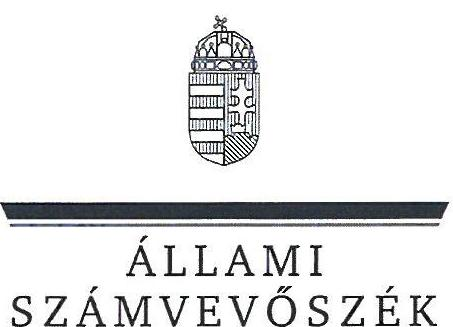
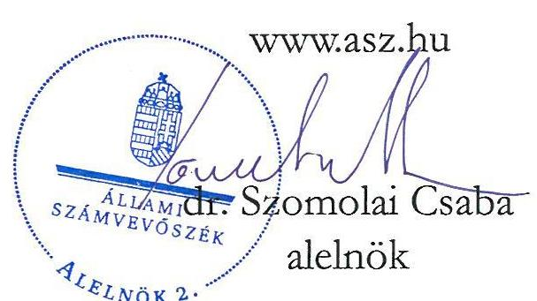
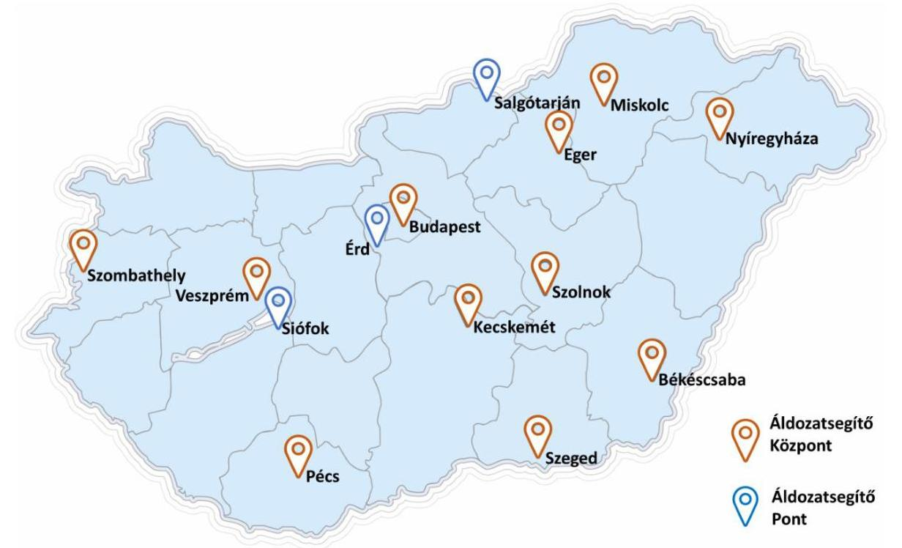
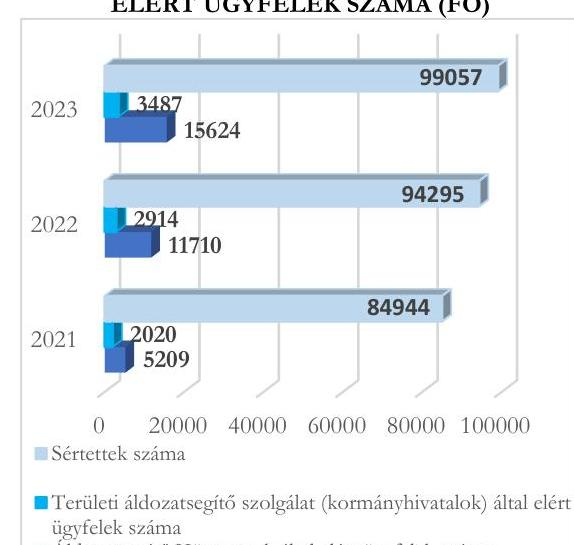
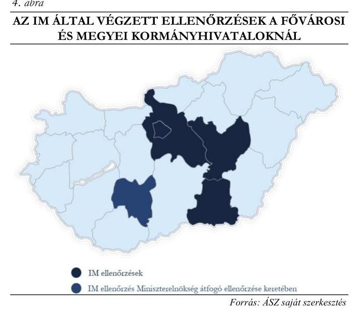

# JELENTÉS 

## Az államháztartás központi alrendszere fejezeteinek ellenőrzése

Igazságügyi Minisztérium

2024.

24140
www.asz.hu

---

ÁLLAMI
SZÁMVEVŐSZÉK

# JELENTÉS 

## Az államháztartás központi alrendszere fejezeteinek ellenőrzése

Igazságügyi Minisztérium

2024.

24140

---

# ELLENŐRZÉSI IGAZGATÓSÁG: 

## ÁLLAMHÁZTARTÁS KÖZPONTI SZINTJÉT ELLENŐRZŐ IGAZGATÓSÁG

## ELLENŐRZÉSI IGAZGATÓ:

SINKÁNÉ DR. CSENDES ÁGNES ellenőrzési igazgató

## ELLENŐRZÉSVEZETŐ:

Jelentéseink az interneten a www.asz.hu címen olvashatók.

DR. KOVÁCS DIÁNA ellenőrzésvezető

IKTATÓSZÁM: EL-4129-001/2024
TÉMASZÁM: 2669
ELLENŐRZÉS-AZONOSÍTÓ SZÁM: V1013

---

# TARTALOMJEGYZÉK 

AZ ELLENŐRZÉS ALAPADATAI ..... 5
AZ ELLENŐRZÖTT SZERVEZETEK ..... 7
ÖSSZEFOGLALÁS ..... 9
AZ ELLENŐRZÉS FÓKUSZTERÜLETEI ..... 11
MEGÁLLAPÍTÁSOK ..... 12
JAVASLATOK ..... 46
MELLÉKLETEK ..... 49
I. sz. melléklet: Értelmező szótár ..... 49
II. sz. melléklet: Az ellenőrzött szervezetek jegyzéke ..... 53
III. sz. melléklet: Ellenőrzési kritériumok ..... 54
IV. sz. melléklet: A fővárosi és vármegyei kormányhivatalok által ellátott pártfogó felügyelői feladatok a 2022. évben ..... 57
FÜGGELÉK: ÉSZREVÉTELEK ..... 58
RÖVIDÍTÉSEK JEGYZÉKE ..... 60

---

.

---

# AZ ELLENŐRZÉS ALAPADATAI 

## AZ ELLENŐRZÉS CÉLJA

Az ellenőrzés célja annak értékelése volt, hogy a X. Igazságügyi Minisztérium költségvetési fejezet, a fejezethez tartozó költségvetési szervek működése és gazdálkodása, a fejezeti kezelésű előirányzatokkal való gazdálkodás megfelelő volt-e.

## AZ ELLENŐRZÉS TÍPUSA

Megfelelőségi ellenőrzés.

## AZ ELLENŐRZÖTT IDŐSZAK

A 2022. év, kitekintéssel a 2023. évre a helyszíni ellenőrzés lezárásának időpontjáig, 2023. december 20-ig.

## AZ ELLENŐRZÉS TÁRGYA

Az ellenőrzés tárgyát képezte a X. Igazságügyi Minisztérium fejezet működése keretében az $\mathrm{IM}^{1}$ egyes feladatainak ellátása, a fejezet és a fejezethez tartozó szervezetek működésének és gazdálkodásának szabályozottsága, pénzügyi- és vagyongazdálkodása, valamint a fejezeti kezelésű előirányzatokkal való gazdálkodás.

Az ellenőrzés kiterjedt minden olyan körülményre és adatra, amely az ÁSZ ${ }^{2}$ jogszabályban meghatározott feladatainak teljesítéséhez, valamint a program végrehajtása folyamán felmerült újabb összefüggések feltárásához szükséges volt.

## AZ ELLENŐRZÉS JOGALAPJA

Az ellenőrzés jogszabályi alapját az ÁSZ tv. ${ }^{3} 1 . \int$ (3) bekezdés, 5. § (2)-(3) bekezdései, (4) bekezdés a) pont és a (6) bekezdés, valamint az Áht. ${ }^{4} 61 . \int$ (2) bekezdésének előírásai képezték.

## AZ ELLENŐRZÉS MÓDSZERE

Az ellenőrzést a nemzetközi standardokat irányadónak tekintve az ellenőrzési program szempontjai, az ellenőrzött időszakban hatályos jogszabályok, az ellenőrzés szakmai szabályok és módszertanok figyelembevételével végezte az ÁSZ.

Az ellenőrzési kérdések megválaszolásához szükséges bizonyítékok megszerzése az ellenőrzött szervezetek által rendelkezésre bocsátott dokumentumokra és adatokra alapozva, továbbá megfigyelés, szemle (szemrevételezés), kérdésfeltevés (információkérés), valamint elemző eljárás útján történt.

---

A pénzügyi gazdálkodás megfelelőségét egyszerű véletlen mintavételi eljárással kiválasztott 25 előirányzatmódosítás, 75 költségvetési kiadási és 20 költségvetési bevétel tekintetében ellenőrizte az ÁSZ. A vagyongazdálkodás megfelelőségét egyszerű véletlen mintavétellel kiválasztott 15 felhalmozási kiadási, öt selejtezési tétel tekintetében ellenőrizte az ÁSZ. A vagyonelemek értékesítésénél, tekintettel arra, hogy a sokaság négy gazdasági eseményből állt, tételes ellenőrzés történt. A beszámolási kötelezettség teljesítésének megfelelőségét az ÁSZ egyszerű véletlen mintavétellel kiválasztott 10, kötelezettségvállalással terhelt költségvetési maradvány tétel tekintetében ellenőrizte. A kiválasztott mintatételek ellenőrzésének eredménye nem került kivetítésre a teljes sokaságra, a megállapítások az adott ellenőrzött mintatételekre vonatkoznak.

Az ellenőrzési bizonyítékként felhasználható adatforrások közé tartoztak egyrészt az ellenőrzéshez kért dokumentumok, adatforrások, másrészt adatforrás volt még minden - az ellenőrzés folyamán - feltárt, az ellenőrzés szempontjából információkat tartalmazó dokumentum.

Az ellenőrzés lefolytatásához az ellenőrzött szervezetek a tanúsítványok kitöltésével, valamint az ÁSZ által kért dokumentumok, adatok, információk megküldésével és az ellenőrzés során szolgáltattak adatokat.

---

# AZ ELLENŐRZÖTT SZERVEZETEK 

Az IM a központi költségvetésről szóló törvényben önálló költségvetési fejezetet alkotott. A 2022. évi Kvtv. ${ }^{5}$ I. számú melléklete alapján a X. Igazságügyi Minisztérium fejezet költségvetése az Igazságügyi Minisztérium igazgatását, a Mádl Ferenc Összehasonlító Jogi Intézet és a Magyarország Európai Unió melletti Állandó Képviseletének igazgatását, valamint a fejezethez tartozó fejezeti kezelésű előirányzatok kiadási előirányzatait foglalta magába. Fejezeti kezelésű előirányzatai a „X/20/2 IM szakmai programok és egyéb kötelezettségek támogatása", valamint a „X/20/5 Igazságügyi miniszter feladatkörébe tartozó jogszabályok alapján teljesítendő fizetési kötelezettségek" előirányzatok voltak.

Az Igazságügyi Minisztériumot a 1990. évi XXX. törvény hozta létre, megalakulásának dátuma jogfolytonosság alapján - tekintettel a 2/1990. (VII. 5.) Korm. rendeletre ${ }^{6}$- 1990. július 5. volt. A Miniszter ${ }^{7}$ feladat- és hatáskörét az ellenőrzött időszakban a 94/2018. (V. 22.) Korm. rendelet ${ }^{8}$ és a 182/2022. (V. 24.) Korm. rendelet ${ }^{9}$ határozta meg. A Miniszter a Kormány igazságügyért, választójogi és népszavazási szabályozásért, áldozatsegítésért, kárpótlásért, 2023. július 31-ig az európai uniós ügyek koordinációjáért, továbbá 2022. május 25-től a fogyasztóvédelemért felelős tagja volt. A Miniszter, illetve munkaszervezete, az IM a természetes személyek élethelyzetét, életminőségét, döntéseit érintő területeken, így a jogi segítségnyújtás, a pártfogó felügyelői tevékenység, a természetes személyek adósságrendezése, az áldozatsegítés, valamint a fogyasztóvédelem területén látott el szakmai feladatokat az ellenőrzött időszakban. Feladata volt továbbá a céginformációs szolgálat és az elektronikus cégeljárásban közreműködő szolgálat feladatainak ellátása. Az ellenőrzött időszakban a Miniszter személye egy alkalommal változott.

A Mádl Ferenc Összehasonlító Jogi Intézet a Miniszter irányítása alá tartozó központi hivatalként működő központi költségvetési szerv volt, amelyet a 95/2019. (IV. 25) Korm. rendelet ${ }^{10}$ szerint 2019. június 1-jei hatállyal alapított a Kormány. A 95/2019. (IV. 25.) Korm. rendelet szerint az $\mathrm{MFI}^{11}$ gazdasági szervezetének feladatait az IM látta el, amely ezen feladata keretében végezte az MFI működését támogató személyügyi és jogi szolgáltatási feladatokat is. Az MFI a hazai jogalkotás színvonalának továbbfejlesztése, nemzetközi megalapozottságának és elismertségének növelése, a jogszabályok hatályosulásának tudományos igényű vizsgálata, a hazai jogtudományi kutatás és oktatási tevékenység támogatása, valamint a nemzetközi jogtudományi kapcsolatok és együttműködés elősegítése érdekében végezte feladatait az ellenőrzött időszakban, nemzeti és nemzetközi működési körben egyaránt. A Miniszter nevezte ki az MFI hivatalvezetőjét határozott, ötéves időtartamra, személye nem változott az ellenőrzött időszakban.

Magyarország Európai Unió melletti Állandó Képviselete az európai uniós ügyek koordinációjáért felelős miniszter által vezetett minisztérium jogi személyiséggel rendelkező szervezeti egységeként működött az ellenőrzött időszakban. Felügyeletét 2023. július 31-ig a Miniszter látta el, aki az európai uniós ügyekért felelős államtitkár útján irányította az EU ÁK ${ }^{12}$-t. 2023. augusztus 1-jétől az EU ÁK felügyeletét az Európai Uniós Ügyek Minisztériuma látta el. Az EU ÁK szervezeti felépítése a magyar kormányzati struktúrához igazodott: az egyes szakterületekért felelős diplomaták között valamennyi magyar minisztérium, illetve számos háttérintézmény képviselői megtalálhatók voltak. Feladatai elsősorban az európai uniós tagságból eredő jogok gyakorlása, a kötelezettségek teljesítése, a magyar érdekek hatékony képviselete szempontjából a központi külképviselet voltak. Elsődleges feladata az Európai Unió döntéshozatali eljárásaiban a magyar álláspont kialakításában és képviseletében való részvétel volt az ellenőrzött időszakban. Az EU ÁK egyszemélyi felelős vezetője az állandó képviselő volt, akinek a személye az ellenőrzött időszakban változott.

---

Az ellenőrzött szervezetek, valamint a fejezethez tartozó fejezeti kezelésű előirányzatok 2022. évi költségvetési beszámolói alapján a kiadások és bevételek eredeti és módosított előirányzatait, valamint teljesítési adatait az 1. táblázat mutatja be.

# 1. táblázat 

AZ IM FEJEZET 2022. ÉVI EREDETI ÉS MÓDOSÍTOTT ELŐÍRÁNYZATAINAK ÉS TELJESÍTÉSI ADATAINAK ALAKULÁSA (M FT)

| MEGNEVEZÉS | IM |  |  | MFI |  |  | EU ÁK |  |  | FEJEZETI KEZELÉSŰ ELŐIRÁNYZATOK |  |  |
| :--: | :--: | :--: | :--: | :--: | :--: | :--: | :--: | :--: | :--: | :--: | :--: | :--: |
|  | EREDETI   EL | MÓD.   EL | TELJ. | EREDETI   EL | MÓD.   EL | TELJ. | EREDETI   EL | MÓD   EL | TELJ. | EREDETI   EL | MÓD.   EL | TELJ. |
| Költségvetési kiadások (K1-K8) | 8971,3 | 14020,6 | 10879,0 | 691,3 | 956,9 | 903,2 | 6079,8 | 7187,9 | 7173,0 | 4049,9 | 5975,9 | 6452,4 |
| Finanszírozási kiadások (K9) | 0,0 | 256,2 | 256,2 | 0,0 | 20,5 | 20,5 | 0,0 | 265,1 | 265,1 | 0,0 | 0,0 | 0,0 |
| Költségvetési bevételek (B1-B7) | 380,2 | 583,7 | 256,8 | 0,0 | 0,1 | 0,1 | 0,0 | 75,4 | 75,4 | 0,0 | 99,5 | 99,5 |
| Finanszírozási bevételek (B8) | 8591,1 | 13693,0 | 13693,0 | 691,3 | 977,4 | 977,4 | 6079,8 | 7377,7 | 7377,7 | 4049,9 | 5876,4 | 6376,4 |

Forrás: IM, MFI, EU ÁK és a fejezeti kezelésű előirányzatok 2022. évi éves költségvetési beszámolói alapján ÁSZ saját szerkesztés
Az ellenőrzött időszakban 2022. május 26-ig az 1/2018. (VI. 25.) NVTNM rendelet ${ }^{13}$, majd 2022. május 27-től az 1/2022. (V. 26.) GFM rendelet ${ }^{14}$ alapján az IM tulajdonosi joggyakorlása alá tartozott az MKLK Kft. ${ }^{15}$ és az OFFI Zrt. ${ }^{16}$. Az IM a 2022. évben az MNV Zrt. ${ }^{17}$ -vel kötött megállapodás alapján további egy gazdasági társaság - AK Nyomda Kft. - felett gyakorolt tulajdonosi jogokat. Az IM tulajdonosi joggyakorlása alá tartozó társaságok 2022. évi beszámoló adatait a 2. táblázat mutatja.

Az ellenőrzési megállapítások alapján a fejezethez tartozó költségvetési szerveknél az ÁSZ értékelte a belső kontrollrendszer egyes elemeinek működését,

## 2. táblázat

IM TULAJDONOSI JOGGYAKORLÁSA ALÁ TARTOZÓ TÁRSASÁGOK 2022. ÉVI BESZÁMOLÓ ADATAI (M FT)

|  | MKLK KFT | OFFI ZRT | AK NYOMDA   KFT |
| :--: | :--: | :--: | :--: |
| Mérlegfőösszeg | 7113,3 | 2223,9 | 269,2 |
| Értékesítés nettó   árbevétele | 4314,9 | 2454,9 | 77,1 |
| Adózott eredmény | 26,9 | 244,3 | 0,7 |

Forrás: MKLK Kft., OFFI Zrt. és AK Nyomda Kft. 2022. évi éves beszámolói alapján ÁSZ saját szerkesztés
annak megfelelőségét, továbbá elemezte az IM áldozatsegítéssel, fogyasztóvédelemmel, jogi segítségnyújtással, pártfogó felügyelettel, családi csődvédelmi szolgálattal, cégnyilvántartással, illetve a céginformációs szolgálattal kapcsolatos, valamint a gazdasági társaságok feletti egyes tulajdonosi joggyakorlói feladatellátását.

Az ellenőrzött szervezetek felsorolását a II. sz. melléklet tartalmazza.

---

# ÖSSZEFOGLALÁS 

Az IM mint ellenőrzött szervezet az elmúlt időszakban több ÁSZ-ellenőrzésben volt érintett, fejezeti szintű ellenőrzését az ÁSZ legutóbb 2005-ben végezte el. Az azóta eltelt közel húsz év, az IM államigazgatási rendszerben betöltött sokrétű, igazságügyi szolgáltatói feladatellátása, valamint a felhasznált közpénz nagysága is indokolttá tette a fejezeti szintű ellenőrzés lefolytatását.

Az IM fejezet, valamint a fejezethez tartozó IM, MFI és EU ÁK szabályozási környezete megfelelő volt. Az ellenőrzés során az IM, MFI és EU ÁK szabályozási környezetében feltárt hiányosságok eseti jellegűek voltak, azok a fejezet, illetve a fejezethez tartozó költségvetési szervek szabályszerű gazdálkodását nem veszélyeztették. A szabályozási hiányosságok kapcsán az IM, illetve az EU ÁK az ellenőrzés lefolytatása során arról tájékoztatta az ÁSZ-t, hogy a szabályozási hiányosságok kijavítása érdekében intézkedéseket tett, az ÁSZ ellenőrzése hasznosult.

Az IM fejezethez tartozó ellenőrzött szervezetek pénzügyi gazdálkodása az ellenőrzött időszakban összességében
 megfelelő volt. Az EU ÁK, valamint a fejezeti kezelésű előirányzatok előirányzatmódosításokról és -átcsoportosításokról vezetett részletező nyilvántartása esetében az ellenőrzés tartalmi hiányosságokat azonosított. A kontrolltevékenységek gyakorlásának ellenőrzésekor az ÁSZ hiányosságokat tárt fel, amely részben arra volt visszavezethető, hogy a gazdálkodási jogkörgyakorlásra jogosult személyekről szóló nyilvántartását két különböző nyilvántartásban vezette az IM. A nyilvántartás duplikált vezetése a gyakorlatban azt eredményezte, hogy a nyilvántartásokban szereplő adattartalmak közötti egyezőség nem valósul meg. A kiadási előirányzatok tekintetében több hiányosság merült fel a kötelezettségvállalás előzetes pénzügyi ellenjegyzésével kapcsolatban, amely hiányosságokat az ÁSZ mindhárom ellenőrzött szervezetnél, valamint a fejezeti kezelésű előirányzatok felhasználása során is azonosította. A bevételek teljesülése és azok elszámolása során az ellenőrzés nem tárt fel hiányosságot.

Az IM fejezethez tartozó ellenőrzött szervezetek vagyongazdálkodása az ellenőrzött időszakban megfelelő volt. A vagyongazdálkodás szabályozási kereteit az IM-nél, MFI-nél és az EU ÁK-nál kialakították. A vagyonnövekedéshez kapcsolódó döntések végrehajtása, a gazdasági események lebonyolítása és elszámolása során az állami vagyonnal való felelős gazdálkodásra vonatkozó jogszabályi előírásokat az ellenőrzött szervezetek betartották. A vagyonelemek bekerülési értékének meghatározásánál mindhárom ellenőrzött szervezet betartotta a jogszabályi és a belső szabályzatokban foglalt előírásokat.

Az ellenőrzött szervezetek költségvetési beszámolási kötelezettségüknek szabályszerűen tettek eleget.

Az IM működése keretében gondoskodott a jogi segítségnyújtás, az áldozatsegítés, a pártfogó felügyelői tevékenység, a céginformációs szolgálat és az elektronikus cégeljárásban közreműködő szolgálat vonatkozásában a közfeladatok megfelelő ellátásáról.

Az IM intézményi költségvetéséből, valamint a fejezeti kezelésű előirányzatokból az igazságügyi szolgáltatások biztosítására 2022. évben 4,0 Mrd Ft, míg a fogyasztóvédelemre és a cégnyilvántartással kapcsolatos feladatokra 1,2 Mrd Ft kiadási előirányzatot használt fel.

Az igazságügyi szolgáltatások igénybevételére jellemzően rászorultsági alapon került sor, amelynek során az IM és a vármegyei kormányhivatalok együttműködése kiemelt jelentőséggel bírt. Tekintettel az igazságügyi szolgáltatásokat igénybe vevők társadalmi- és élethelyzetére, a szakszerű és pontos – egyben

---

közérthető – tájékoztatásra nagy hangsúlyt indokolt fektetni. A családi csődvédelmi szolgálatra vonatkozó elavult, az igazságügyi szolgáltatásokra vonatkozóan helyenként nehezen megtalálható internetes tájékoztatást szükséges mind a kormányhivatalok, mind az IM online elérhetőségein felülvizsgálni, aktualizálni, kibővíteni.

A jogi szolgáltatások díját és költségeit az igénylő jövedelmi és vagyoni helyzetétől függően az állam vagy megelőlegezi, vagy viseli. A jogi szolgáltatások állam általi térítésének jövedelemkorlátja a 2022-2023. években havi nettó 28500 Ft volt. Figyelemmel arra, hogy a KSH adatai szerint a 2022. évben a nagyon szűkös megélhetéshez szükségesnek tartott jövedelemösszeg 89700 Ft volt, felmerül annak a kockázata, hogy a jogi szolgáltatások állam általi megtérítése egy nagyon szűk réteg számára érhető csak el.

Az IM áldozatsegítő szolgálatként eljárva, az Áldozatsegítő Központok számának bővítése mellett, a kormányhivatalokkal együttműködve látta el a tudomására jutott áldozatok helyzetének megkönnyítésével kapcsolatos feladatait. Az áldozatsegítő szolgálatok munkáját egyre többen veszik igénybe. Az áldozatsegítésre vonatkozó állami feladatok kiadásai az IM fejezet költségvetésében áttekinthető formában nem jelentek meg.

A pártfogó felügyelői szolgálat mint a bűnismétlés megelőzésének eszköze nemcsak a felnőttekkel, hanem a fiatalkorú elkövetőkkel is kapcsolatba kerül, így e jogintézmény társadalmi jelentősége kiemelten fontos. A ráfordított költségek jellemzően a kormányhivataloknál jelentek meg, ahol a 2022. évben 358 fő foglalkozott e területtel. A pártfogó felügyelői szolgálat feladatait az IM megfelelően látta el az ellenőrzött időszakban.

A Családi Csődvédelmi Szolgálatnál a 2022. évben 311 db, a 2023. évben 351 db adósságrendezési eljárást indítottak. A folyamat egyszerűsítése, felgyorsítása, a rászorulók figyelmének felhívása az adósságrendezés lehetőségének igénybe vételére támogathatja a szolgáltatáshoz való hozzáférést.

A fogyasztóvédelem és piacfelügyelet 2022. május 25. napjától tartozott az IM feladatai közé. Az ellenőrzött időszakban megtörtént a Technológiai és Ipari Minisztériumtól az átadás-átvételi eljárás lebonyolítása. A folyamat vonatkozásában feltárt hiányosságok a minisztériumi átadás-átvételi eljárások kockázataira világítottak rá. A fogyasztóvédelmi szakterületre vonatkozóan szabályozási hiányosságot is azonosított az ÁSZ, továbbá a kormányhivatalok feletti szakmai irányítás erősítése is indokolttá vált.

A cégnyilvántartással és céginformációs szolgálat működtetésével kapcsolatban hiányosság nem került feltárásra az ellenőrzés során.

Az IM szakmai irányító és felügyeleti szervi tevékenysége – a fogyasztóvédelem területe kivételével – megfelelt a jogszabályi előírásoknak. Az IM módszertani támogatást nyújtott az igazságügyi szolgáltatások terén a vármegyei kormányhivatalok számára, továbbá törvényességi és célszerűségi ellenőrzéseket is végzett szakmai irányítóként. A szakmai továbbképzések biztosításával az IM hozzájárult a kormányhivatalok szabályszerű szakmai feladatellátásához, valamint az állami feladatok ellátásának biztosítása érdekében országosan egységes informatikai rendszereket működtetett. Szabályozási hiányosságként állapította meg az ÁSZ a szakmai irányításra vonatkozó ügyrend hiányát az IM-nél.

Az ÁSZ az ellenőrzött egyes tulajdonosi jogkörgyakorlói feladatok tekintetében hiányosságot nem tárt fel.

---

# AZ ELLENŐRZÉS FÓKUSZTERÜLETEI 

1.     - A X. Igazságügyi Minisztérium fejezet gazdálkodásának szabályozottsága
2.     - A X. Igazságügyi Minisztérium fejezet pénzügyi gazdálkodása
3.     - A X. Igazságügyi Minisztérium fejezet állami vagyonnal való gazdálkodása
4.     - A X. Igazságügyi Minisztérium fejezet beszámolási kötelezettségének teljesítése
5.     - Az Igazságügyi Minisztérium egyes feladatainak ellátása

---

# 1. A X. Igazságügyi Minisztérium fejezet gazdálkodásának szabályozottsága 

## Összegző megállapítás A X. Igazságügyi Minisztérium fejezet gazdálkodásának szabályozottsága megfelelő volt.

## Általános működési keretek kialakítása

Az IM az ellenőrzött időszakban rendelkezett hatályos, az Áht. és az Ávr. ${ }^{18}$ előírásainak megfelelő alapító okirattal $^{19}$.
Az MFI rendelkezett az ellenőrzött időszakban hatályos, az Áht. és az Ávr. előírásainak megfelelő MFI alapító okirattal $^{20}$.
Az ellenőrzött időszakban az IM rendelkezett a Miniszter által kiadott és a Miniszterelnök által jóváhagyott SZMSZ-szel $^{21}$ az Áht. előírásainak megfelelően. Az SZMSZ az Ávr. 13. § (1) bekezdés h) pontjának előírásai ellenére a munkáltatói jogok és az átruházott munkáltatói jogok gyakorlásának a rendjét nem tartalmazta.
Az MFI rendelkezett az MFI SZMSZ-szel $^{22}$ az Áht.-ban és az Ávr.-ben foglalt előírásoknak megfelelően. Az EU ÁK rendelkezett az EU ÁK SZMSZ-szel $^{23}$ az Áht. és a 2016. évi LXXIII. törvény $^{24}$ előírásának megfelelően. Az EU ÁK SZMSZ azonban az Ávr. 13. § (4a) bekezdés előírása ellenére nem került aktualizálásra azt követően, hogy az európai uniós ügyek koordinációjáért felelős miniszter személyében a 94/2018. (V. 22.) Korm. rendeletben foglaltak szerint 2019. július 1-jei, majd 2023. augusztus 1-jei hatállyal változás történt.
A vagyonnyilatkozat átadására, nyilvántartására és a vagyonnyilatkozatban foglalt személyes adatok védelmére vonatkozó szabályokat a Vnytv.-ben $^{25}$ előírtaknak megfelelően az IM-re és az EU ÁK-ra vonatkozóan a Közszolgálati szabályzat, az MFI-re vonatkozóan az MFI Közszolgálati Szabályzat $^{26}$ tartalmazta. Az IM, az EU ÁK, és az MFI rendelkezett a Vnytv. előírásainak megfelelő vagyonnyilatkozatnyilvántartással.
A Bkr. $^{27}$ előírásainak megfelelően az IM rendelkezett az Integrált kockázatkezelés rendjéről, valamint a szervezeti integritást sértő események kezelésének eljárásrendjéről szóló utasítással $^{28}$, melynek hatálya kiterjedt az EU ÁK-ra mint az IM szervezeti egységére is. Az Integrált kockázatkezelés rendjéről, valamint a szervezeti integritást sértő események kezelésének eljárásrendjéről szóló utasítás a Bkr. 6. § (4a) bekezdés d) pontja előírása ellenére nem tartalmazta a szervezeti integritást sértő események kezelésének eljárásrendje tekintetében a vonatkozó dokumentumok átvizsgálásának szabályait. Az Integrált kockázatkezelés rendjéről, valamint a szervezeti integritást sértő események kezelésének eljárásrendjéről szóló utasítás keretében az IM rendelkezett a szervezet működésével összefüggő integritási és korrupciós kockázatokra vonatkozó bejelentések fogadásáról és kivizsgálásáról, eleget téve az 50/2013. (II. 25) Korm. rendelet $^{29}$ szerinti belső szabályzat készítési kötelezettségének.

---

Az MFI vezetője a Bkr., valamint az 50/2013. (II. 25.) Korm. rendelet előírásainak eleget téve kiadta az MFI Integrált kockázatkezelési rendjéről, valamint a szervezeti integritást sértő események kezelésének eljárásrendjéről szóló utasítást $^{30}$, mellyel egyúttal eleget tett az integritási és korrupciós kockázatokra vonatkozó bejelentések fogadására és kivizsgálására vonatkozó, az 50/2013. (II. 25.) Korm. rendelet szerinti szabályzatkészítési kötelezettségének. Az MFI Integrált kockázatkezelési rendjéről, valamint a szervezeti integritást sértő események kezelésének eljárásrendjéről szóló utasítás nem tartalmazta a vonatkozó dokumentumok átvizsgálásának szabályait a Bkr. 6. § (4a) bekezdés d) pontjában foglaltak ellenére.
Az ellenőrzött időszakban az IM integritási tanácsadót foglalkoztatott, és a Bkr. előírásának megfelelően az integritási tanácsadó feladatkörébe rendelte az integrált kockázatkezelési rendszer bevezetésével és működtetésével összefüggő feladatok koordinálását. Az integritás tanácsadói feladatok ellátását az IM biztosította az EU ÁK és – az IM-MFI megállapodás $^{31}$ alapján – az MFI részére.
Az IM, az MFI és az EU ÁK felmérte a tevékenységében rejlő, szervezeti célokkal összefüggő kockázatokat, intézkedett az egyes kockázatokkal kapcsolatban, és nyomon követte a feltárt kockázatok kezelésére meghatározott intézkedéseket a Bkr. előírásainak megfelelően.
Az etikai elvárásokat a költségvetési szerv minden szintjén meghatározták a Bkr. előírásának megfelelően, az IM és az EU ÁK esetében a 2020. január 1-től hatályos Magyar Kormánytisztviselői Kar Hivatásetikai Kódexe $^{32}$ alapján, az MFI-nél a Magyar Kormánytisztviselői Kar Hivatásetikai Kódexe és a Magyar Tudományos Akadémia Tudományetikai Kódexe $^{33}$ alapján.
Az IM a Bkr. előírásának megfelelően kialakította az információs és kommunikációs folyamatokat, melyre vonatkozó szabályokat az SZMSZ tartalmazta. Az MFI esetében az MFI SZMSZ és az IM-MFI megállapodás keretében, az EU ÁK esetében az EU ÁK SZMSZ keretében biztosították az információs és kommunikációs folyamatok kialakítását, eleget téve a Bkr.-ben foglaltaknak.
Az IM az EU ÁK-ra is kiterjedően szabályozta, az MFI szabályozta a közérdekű adatok megismerésére irányuló igények teljesítésének, továbbá a kötelezően közzéteendő adatok nyilvánosságra hozatalának rendjét, ennek keretében meghatározták a közzététellel kapcsolatos feladatok ellátásának részletes rendjét, a helyesbítéssel, frissítéssel és eltávolítással kapcsolatos feladatok ellátásának részletes rendjét, valamint a feladatok ellátására kijelölt munkaköröket és a munkakörök közötti együttműködés rendjét az Info tv. $^{34}$, az Ávr. és a 305/2005. (XII. 25.) Korm. rendelet $^{35}$ előírásainak megfelelően.
Az IM, az MFI és az EU ÁK rendelkezett a Magyar Nemzeti Levéltárral egyetértésben kiadott iratkezelési szabályzattal az Ltv. $^{36}$ előírásainak megfelelően.
Az IM és az MFI rendelkezett adatvédelmi és adatbiztonsági szabályzattal az Info tv. előírása szerint. Az EU ÁK az Info tv. 25/A. § (3) bekezdésében foglaltak ellenére adatvédelmi és adatbiztonsági szabályzatot nem készített. Az IM, az MFI és az EU ÁK rendelkezett informatikai biztonsági szabályzattal az Ibtv. $^{37}$ ben foglaltaknak megfelelően.

# Belső ellenőrzés kialakítása 

A Miniszter gondoskodott a független belső ellenőrzés kialakításáról az Áht. és a Bkr. előírásainak megfelelően. Az SZMSZ szerint az IM belső ellenőrzési egysége a Miniszter közvetlen irányítása alá tartozó Ellenőrzési Főosztály volt, amely ellátta az IM, a fejezeti kezelésű előirányzatok, az MFI és az EU ÁK belső ellenőrzési feladatait is. Az SZMSZ-ben meghatározták a belső ellenőrzés feladatait a Bkr.-ben foglaltaknak megfelelően. Az
 IM belső ellenőrzési vezetője, ellenőrei rendelkeztek a

---

22/2019. (XII. 23.) PM rendelet ${ }^{38}$ szerinti általános és szakmai követelmények szerinti képesítéssel, gyakorlattal.
Az IM rendelkezett az IM, az MFI és az EU ÁK belső ellenőrzése működéséhez szükséges, a Bkr. rendelkezésének megfelelő Belső ellenőrzési kézikönyv ${ }^{39}$-vel. Az IM belső ellenőrzési vezetője a Belső ellenőrzési kézikönyv kétévente kötelező felülvizsgálatát a Bkr. 17. § (4) bekezdésében foglaltak ellenére nem végezte el, a helyszíni ellenőrzés ideje alatt a felülvizsgálat folyamatban volt. A felülvizsgált Belső ellenőrzési kézikönyv jóváhagyására a helyszíni ellenőrzés lezárultát követően került sor.
Az IM, az MFI és az EU ÁK rendelkezett jóváhagyott, a 2022. évre vonatkozó éves belső ellenőrzési tervvel, és az IM elkészítette az irányítása alá tartozó költségvetési szervek éves ellenőrzési tervei alapján összeállított összefoglaló éves ellenőrzési tervet a Bkr. rendelkezéseinek megfelelően. Az IM a Bkr. szerinti határidőben megküldte a 2022. évre vonatkozó éves ellenőrzési tervét és az összefoglaló éves ellenőrzési tervet az államháztartásért felelős miniszter, valamint a Kormányzati Ellenőrzési Hivatal részére.
Az IM, az MFI és az EU ÁK - eleget téve a Bkr. előírásának - rendelkezett nyilvántartással az elvégzett belső ellenőrzésekről és a külső ellenőrzésekről.
A belső ellenőrzési vezető a Bkr. előírásainak megfelelően elkészítette a 2022. évi összefoglaló éves ellenőrzési jelentést és a Miniszter jóváhagyását követően határidőben megküldte az államháztartásért felelős miniszter részére.
A Miniszter, az MFI és az EU ÁK vezetője a Bkr. előírásának eleget téve nyilatkozatban értékelte a szervezet belső kontrollrendszerének minőségét. Az IM határidőben megküldte az államháztartásért felelős miniszter részére a Miniszter, és az irányítása alá tartozó költségvetési szerv vezetője Bkr. szerinti nyilatkozatát a belső kontrollrendszer minőségének az értékeléséről.

# Gazdálkodási keretek kialakítása 

Az Áht. és az Ávr. előírásainak megfelelően az IM gazdasági szervezetére vonatkozó szabályokat az SZMSZ ${ }_{1-2}$-ben és az Ügyrend ${ }_{1-5}{ }^{40}$-ben határozták meg. Az Áht. és a 95/2019. (IV. 25.) Korm. rendelet előírásainak megfelelően az MFI gazdasági szervezetének feladatait az IM látta el az IM-MFI megállapodásban foglaltak szerint. Az EU ÁK gazdasági szervezetére vonatkozó szabályokat az Áht. és az Ávr. előírásainak megfelelően EU ÁK Ügyrend ${ }^{41}$-ben határozták meg. Az IM, az MFI és az EU ÁK gazdasági vezetője rendelkezett az Ávr.-ben meghatározott képesítéssel és a tevékenység ellátására jogosító engedéllyel.
Az IM rendelkezett az Áht. előírásainak megfelelve a gazdálkodás részletes rendjét meghatározó Gazdálkodási Keretszabályzattal ${ }^{42}$. A gazdálkodás részletes rendjét az MFI az MFI Gazdálkodási Keretszabályzatban ${ }_{1-2}{ }^{43}$, az EU ÁK a 2022. augusztus 8-tól hatályos EU ÁK Gazdálkodási szabályzatban ${ }^{44}$ határozta meg.
Az Áht. előírásának megfelelően a Gazdálkodási Keretszabályzat, az MFI Gazdálkodási Keretszabályzat ${ }_{1-2}$ és az EU ÁK Gazdálkodási szabályzat tartalmazta a kötelezettségvállalás, a pénzügyi ellenjegyzés, a teljesítés igazolás, az érvényesítés, valamint az utalványozás módját, eljárási és dokumentálási szabályait, valamint a gazdálkodási jogkörök gyakorlását végző személyek kijelölésének a rendjét, továbbá a tervezéssel kapcsolatos belső előírásokat, feltételeket, az ellenőrzési, adatszolgáltatási és beszámolási feladatok teljesítésével kapcsolatos belső szabályokat és feltételeket az Ávr.-nek megfelelően.
Az IM a Gazdálkodási Keretszabályzatban, az MFI az MFI Gazdálkodási Keretszabályzat ${ }_{1-2}$-ban, az EU ÁK az EU ÁK Gazdálkodási szabályzatban az Ávr. előírásának eleget téve, szabályozta a 200000 Ft alatti kifizetések előzetes írásbeli kötelezettségvállalás nélküli teljesítésére vonatkozó szabályokat.

---

Az engedélyezési, jóváhagyási és kontroll eljárásokra vonatkozó szabályokat a Bkr. rendelkezésének megfelelően az IM esetében az SZMSZ ${ }_{1-2}$-ben, az MFI esetében az MFI SZMSZ-ben, az EU ÁK-ra vonatkozóan az SZMSZ ${ }_{1-2}$-ben, továbbá belső szabályzatokban határozták meg.
Az IM, az MFI és az EU ÁK a kötelezettségvállalásra, pénzügyi ellenjegyzésre, teljesítésigazolásra, érvényesítésre, utalványozásra jogosult személyekről és aláírásmintájukról az Ávr. előírásainak megfelelő nyilvántartást vezetett, melyet az IM az IM-re és az MFI-re vonatkozóan két külön nyilvántartás alkalmazásával valósított meg. Az egyik nyilvántartás tartalmazta az aláírás-mintákat, a gazdálkodási jogkörgyakorlásra jogosult személyekről vezetett nyilvántartás pedig a felhatalmazott személyek jogosultságának hatályát, értékét, kezdeti és végdátumát.
Az IM és az MFI rendszeres és nem rendszeres személyi juttatások felhasználása során ellenőrzött tételeinél a felhatalmazott teljesítésigazoló a gazdálkodási jogkörgyakorlásra jogosultak nyilvántartásában az Ávr. 60. § (3) bekezdésében foglaltak ellenére nem szerepelt. A külső személyi juttatások felhasználása során - az ellenőrzött tételeknél - az IM-nél egy esetben (216250 Ft összegű F1 mintatétel) a felhatalmazással rendelkező kötelezettségvállaló, egy esetben (14171 Ft összegű F5 mintatétel) a felhatalmazással rendelkező teljesítésigazoló aláírása szerepelt a kötelezettségvállalásra és teljesítésigazolásra jogosult személyek aláírás mintái között, azonban nem szerepelt a gazdálkodási jogkörgyakorlásra jogosult személyekről vezetett nyilvántartásban az Ávr. 60. § (3) bekezdésben előírtak ellenére.
Az IM, az MFI és az EU ÁK az Ávr. előírásainak megfelelve rendelkeztek a belföldi és külföldi kiküldetések elszámolásával kapcsolatos belső szabályzattal, a reprezentációs kiadások felosztásának, azok teljesítésének és elszámolásának szabályzatával, a gépjárművek igénybevételének és használatának rendjét tartalmazó szabályzattal, valamint a vezetékes és mobiltelefonok használatának szabályzatával.
Az IM rendelkezett - hatályát tekintve az EU ÁK-ra is kiterjedő - Közbeszerzési szabályzattal ${ }^{45}$, megfelelve a Kbt. ${ }^{46}$ előírásának. A Közbeszerzési szabályzatban a Kbt. 27. § (1) bekezdésében foglaltak ellenére nem határozták meg az ajánlatkérő nevében az EKR ${ }^{47}$ alkalmazására vonatkozó jogosultságok gyakorlásának a rendjét. Az MFI esetében az MFI Gazdálkodási Keretszabályzat ${ }_{1-2}$ tartalmazta a közbeszerzés előkészítésének és lefolytatásának rendjét, a költségvetési szerv nevében eljáró, illetve az eljárásba bevont személyek, valamint szervezetek felelősségi körét, az ajánlatkérő nevében az EKR alkalmazására vonatkozó jogosultságok gyakorlásának rendjét.
Az IM az Ávr. előírásának megfelelően rendelkezett - a Gazdálkodási Keretszabályzat részeként - a beszerzések lebonyolításával kapcsolatos eljárásrenddel. Az MFI esetében az MFI Gazdálkodási Keretszabályzat ${ }_{1-2}$, az EU ÁK esetében az EU ÁK Gazdálkodási szabályzat tartalmazta a beszerzések lebonyolításával kapcsolatos eljárásrendet az Ávr. előírásának megfelelően.
A Számv. tv. ${ }^{48}$ és az Áhsz. ${ }^{49}$ előírásának megfelelően az IM rendelkezett Számviteli politiká ${ }_{1-2}{ }^{50}$-val, az MFI MFI Számviteli politiká ${ }^{51}$-val, az EU ÁK EU ÁK Számviteli politiká ${ }^{52}$-val, valamint a számviteli politika keretében elkészítendő szabályzatokkal. Az MFI Számviteli politikában és az EU ÁK Számviteli politikában a kivételes nagyságú vagy előfordulású bevételről, költségről, ráfordításról - a Számv. tv. 14. § (4) bekezdésében foglaltak ellenére - nem rendelkeztek.

Az IM az ellenőrzött időszakban a Számv. tv. és az Áhsz. előírásának eleget téve rendelkezett az Eszközök és források leltározási és leltárkészítési szabályzatával ${ }^{53}$. Az Eszközök és források leltározási és leltárkészítési szabályzata az Ávr.-ben és az Áhsz.-ben foglaltaknak megfelelően tartalmazta a mennyiségi felvétellel történő leltározás gyakoriságát, a használt, de mérlegben értékkel nem szereplő immateriális

---

javak, tárgyi eszközök és készletek leltározásának a módját. A Számv. tv., valamint az Áhsz. előírásának megfelelően az MFI rendelkezett az MFI Eszközök és források leltározási és leltárkészítési szabályzatával ${ }^{54}$, az EU ÁK az EU ÁK Eszközök és források leltározási és leltárkészítési szabályzatával ${ }^{55}$, melyek tartalmazták a mennyiségi felvétellel történő leltározás gyakoriságát, valamint a használt, de a mérlegben értékkel nem szereplő immateriális javak, tárgyi eszközök, készletek leltározásának módját az Áhsz.-ben foglaltaknak megfelelően.
Az IM a Számv. tv., valamint az Áhsz. előírásának megfelelően rendelkezett az Eszközök és források értékelési szabályzatával ${ }^{56}$. Az Eszközök és források értékelési szabályzata - az Áhsz.-ben foglaltaknak megfelelően - tartalmazta a követelések értékelésének elveit, szempontjait, követelés típusonként a kis összegű követelések év végi meghatározásának elveit és dokumentálásának szabályait. A Számv. tv., valamint az Áhsz. előírásának megfelelően az MFI rendelkezett az MFI Eszközök és források értékelési szabályzatával ${ }^{57}$, az EU ÁK az EU ÁK Eszközök és források értékelési szabályzatával ${ }^{58}$, melyek tartalmazták az Áhsz.-ben foglaltaknak megfelelően a követelések értékelésének elveit, szempontjait, követelés típusonként a kis összegű követelések év végi meghatározásának elveit, dokumentálásának szabályait.
Az IM rendelkezett Önköltségszámítási szabályzattal ${ }^{59}$, az MFI MFI Önköltségszámítási szabályzattal ${ }^{60}$ eleget téve a Számv. tv., valamint az Áhsz. előírásának.
A Számv. tv. és az Áhsz. előírásának megfelelően az IM rendelkezett Pénzkezelési szabályzattal ${ }^{61}$, az EU ÁK EU ÁK Pénzkezelési szabályzat ${ }^{62}$-tal, amelyekben a Számv. tv.-ben és az Áhsz.-ben foglaltaknak megfelelően meghatározták többek között a készpénzben és a bankszámlán tartott pénzeszközök közötti forgalom szabályait, a pénzkezelés személyi és tárgyi feltételeit, felelősségi szabályait. Az MFI pénzkezelésével kapcsolatos, a bankszámla, a bankszámla feletti jogosultság, a jóváírások és terhelések rendjére, a VIP kártya használatára, az utalványok és egyéb értékcikkek kezelésére vonatkozó szabályokat - az IM-MFI megállapodásban foglaltaknak megfelelően - az MFI Gazdálkodási Keretszabályzat ${ }_{1-2}$ tartalmazta, további kérdésekben a Pénzkezelési Szabályzat előírásait alkalmazták.
Az IM rendelkezett Számlarenddel ${ }^{63}$, az MFI MFI Számlarenddel ${ }^{64}$, az EU ÁK EU ÁK Számlarenddel ${ }^{65}$, mellyel eleget tettek a Számv. tv. és az Áhsz.-ben előírt kötelezettségnek. A Számlarend, az MFI Számlarend és az EU ÁK Számlarend az Áhsz. előírásának megfelelően tartalmazta minden alkalmazásra kijelölt számla számlajelét és megnevezését (számlatükör), a részletező nyilvántartások vezetésének módját, és a részletező nyilvántartásoknak a kapcsolódó könyvviteli és nyilvántartási számlákkal való kapcsolatát, egyeztetését, és ezek dokumentálását. A Számlarend, az MFI Számlarend és az EU ÁK Számlarend tartalmazta a számlarendben foglaltakat alátámasztó bizonylati rendet az Áhsz. és a Számv. tv. előírásainak megfelelően.
A vagyongazdálkodás szabályozási kereteit az IM-nél a Gazdálkodási Keretszabályzatban, a Számviteli Politikában és az annak keretében elkészített szabályzatokban, az MFI-nél az MFI Gazdálkodási Keretszabályzat ${ }_{1-2}$-ben, az MFI Számviteli Politikában és annak keretében elkészített szabályzatokban, az EU ÁK-nál az EU ÁK Gazdálkodási szabályzatban, az EU ÁK Számviteli Politikában és az annak keretében elkészített szabályzatokban kialakították.
Az IM - az Áht. és az Ávr. előírásának eleget téve - a 10/2015. (V. 29.) IM rendelet ${ }^{66}$-tel megállapította a fejezeti kezelésű előirányzatok költségvetési kiadási előirányzatai felhasználásának szabályait. Az IM a fejezeti kezelésű előirányzatok tervezési, gazdálkodási, finanszírozási, adatszolgáltatási és beszámolási feladatairól külön szabályzatban, a 6/2021. (IV. 30.) IM utasítás ${ }^{67}$-ban rendelkezett az Áht. és az Ávr. előírása szerint.

---

A Bkr. előírásainak megfelelően az IM rendelkezett a fejezeti kezelésű előirányzatai gazdálkodási folyamatainak megfelelő ellenőrzési nyomvonallal. Az IM ellenőrzési nyomvonalai tartalmazták a fejezeti kezelésű előirányzatok gazdálkodási folyamataival kapcsolatos felelősségi szinteket és kapcsolatokat, az információs szinteket és kapcsolatokat, az irányítási és ellenőrzési folyamatokat. Az IM a fejezeti kezelésű előirányzatokra vonatkozóan a Számv. tv., valamint az Áhsz. előírásának megfelelően rendelkezett számviteli politikával, számlarenddel, az eszközök és források leltározási és leltárkészítési szabályzatával, az eszközök és források értékelési szabályzatával, pénzkezelési szabályzattal.

# 2. A X. Igazságügyi
 Minisztérium fejezet pénzügyi gazdálkodása 

## Összegző megállapítás A X. Igazságügyi Minisztérium fejezetnél a pénzügyi gazdálkodás összességében megfelelő volt.

Az IM fejezet ellenőrzött szervei, valamint a fejezethez tartozó fejezeti kezelésű előirányzatok vonatkozásában a kiadások finanszírozásához szükséges forrásokat a 2022. évben döntő részben finanszírozási bevételek (költségvetési támogatások) biztosították. Az MFI, az EU ÁK és a fejezeti kezelésű előirányzatok eredeti költségvetési bevételi előirányzattal nem rendelkeztek. Év közben a módosított költségvetési bevételi előirányzat az EU ÁK esetében 75,4 M Ft-ra, a fejezeti kezelésű előirányzatok esetében 99,5 M Ft-ra emelkedett.
A 2022. évben az IM - eredeti előirányzat 156,3%-ára növelt - módosított költségvetési kiadási előirányzatai összességében 77,6%-ban teljesültek. A 2022. évi zárszámadás fejezeti indoklása szerint a beruházások módosított előirányzatokhoz viszonyított alacsonyabb összegű teljesítése azzal indokolható, hogy a Kormány 1454/2022. (IX.19.) Korm.határozatban ${ }^{68}$ hozott döntése értelmében a JSZENY ${ }^{69}$ projekthez kapcsolódó informatikai beszerzésekre 1800,0 M Ft-ot biztosított, de a közbeszerzési eljárás 2023. évre történő áthúzódása miatt a beruházás a 2022. évben nem valósult meg. Az MFI módosított költségvetési kiadási előirányzatainak 94,4%-a teljesült, az EU ÁK esetében a módosított költségvetési kiadási előirányzatok szinte teljes egészében, 99,8%-ban teljesültek. Az MFI esetében a dologi kiadások teljesítése maradt el leginkább a módosított előirányzattól (80,8%-os teljesítés), amelynek oka a 2022. évi zárszámadás fejezeti indokolása szerint a kötelezettségvállalások 2023. évre történő áthúzódása volt. Az EU ÁK esetében a költségvetési kiadások előirányzatain belül az egyéb működési célú kiadások és a felújítások aránya olyan kis mértékű, hogy azok teljesítésének jelentős elmaradása (80,0%, illetve 21,1%) a költségvetési kiadások teljesítésének arányát nem befolyásolta.
A fejezethez tartozó „X/20/2 IM szakmai programok és egyéb kötelezettségek támogatása" fejezeti kezelésű előirányzat költségvetési kiadási előirányzata a módosított költségvetési kiadási előirányzathoz viszonyítva 97,8%-ban teljesült. A „X/20/5 Igazságügyi miniszter feladatkörébe tartozó jogszabályok alapján teljesítendő fizetési kötelezettségek" fejezeti kezelésű előirányzat a Kvtv. 4. melléklete szerint felülről nyitott előirányzat, teljesülése külön szabályozás nélkül is eltérhetett az előirányzattól, az előirányzat előirányzat-módosítási kötelezettség nélkül volt teljesíthető. Az előirányzaton a 2022. évben 5954,4 M Ft teljesítés történt, ami a 3469,0 M Ft összegű eredeti előirányzathoz viszonyítva 71,6%-os, míg az 5466,4 M Ft összegű módosított előirányzathoz viszonyítva 8,9%-os túlteljesülést jelentett.
Az IM fejezet 21. cím Központi kezelésű előirányzatokhoz nem tartozott eredeti előirányzat, de fejezeti hatáskörű módosítás következtében 65,1 M Ft összegben teljesült az előirányzat. Az előirányzat az IM tulajdonosi joggyakorlása alá tartozó gazdasági társaságok tőkeemelésére, tulajdonosi támogatására,

---

valamint a társaságok részére nyújtandó pótbefizetések kifizetésére szolgált. A 2022. évben az előirányzatról az AK Nyomda Kft. részére a fizetőképességének fenntartása és a munkahelyek megőrzése érdekében átmeneti támogatásként, illetve válságtámogatásként 65,1 M Ft tulajdonosi támogatás került kifizetésre egyrészt a COVID-19 járvány, másrészt az orosz-ukrán konfliktus negatív gazdasági hatásainak kompenzálására.
Az IM és az MFI az előirányzat-módosításokról és -átcsoportosításokról az Áhsz. 14. mellékletének megfelelő részletező nyilvántartást vezetett. Az EU ÁK előirányzat-módosításokról, -átcsoportosításokról vezetett részletező nyilvántartása az Áhsz. 14. melléklet I. 2. c) pontjában előírtak ellenére nem minden esetben tartalmazta az előirányzat módosítása, átcsoportosítása Kincstár ${ }^{70}$-hoz történő bejelentésének azonosításához szükséges adatokat, a fejezeti kezelésű előirányzatok előirányzatainak egységes rovatrend szerinti bontásban vezetett részletező nyilvántartása pedig az Áhsz. 14. melléklet I. 2. a) pontjában előírt megállapított, jóváhagyott eredeti előirányzatot nem tartalmazta.
Az IM, az MFI, az EU ÁK és a fejezeti kezelésű előirányzatok esetében az előirányzatok részletező nyilvántartása adatainak és az éves költségvetési beszámolók előirányzat adatainak egyezősége biztosított volt.
Az IM, az MFI, az EU ÁK, valamint a fejezethez tartozó fejezeti kezelésű előirányzatok 2022. évi előirányzat-módosításokról, -átcsoportosításokról vezetett nyilvántartásai alapján a 4. táblázat szemlélteti a költségvetési kiadási előirányzatok módosításainak hatáskör szerinti alakulását.
Az IM és az EU ÁK esetében legnagyobb mértékben a Kormány hatáskörben ${ }^{1}$ végrehajtott módosítások emelték az előirányzatok értékét. Az IM esetében a Kormány hatáskörben végrehajtott módosítások összességében 3701,6 M Ft összegű emelkedést eredményeztek. Ezen belül többletfeladat jogcímen a költségvetési kiadási előirányzatok 4496,3 M Ft-tal nőttek, míg a 1325/2022. (VII.11.)

Korm.
határozatban ${ }^{71}$ és a 1618/2022. (XII.13.) ${ }^{72}$ Korm. határozatban hozott, előirányzatok zárolásáról, valamint fejezetek közötti átcsoportosításról szóló döntések miatt a személyi juttatások, a munkaadókat terhelő járulékok és szociális hozzájárulási adó, valamint a dologi kiadások előirányzatai összesen 794,7 M Ft-tal csökkentek. Az EU ÁK bevételi és kiadási előirányzatait a Kormány saját hatáskörben összesen 1004,3 M Ft-tal növelte. Többletfeladat jogcímen a költségvetési kiadási előirányzatok 1257,5 M Ft-tal nőttek, míg a 1618/2022. (XII.13.) Korm. határozatban hozott döntés értelmében a személyi juttatások, munkaadókat terhelő járulékok és szociális hozzájárulási adó, valamint a dologi kiadások előirányzatain előirányzat elvonást hajtottak végre összesen 253,2 M Ft összegben. Az MFI bevételi és kiadási előirányzatai a Kormány hatáskörben történt módosítások eredményeként összességében 6,9 M Ft-tal csökkentek.

[^0]
[^0]:    ${ }^{1}$ Kormány hatáskörű előirányzat-módosítások között szerepelnek a nemzetgazdasági miniszter hatáskörében elrendelt előirányzatmódosítások is

---

Az ellenőrzött előirányzat-módosítások, -átcsoportosítások végrehajtására megfelelő hatáskörben, dokumentáltan került sor az Áht. és az Ávr. előírásainak megfelelően. A saját hatáskörű előirányzatmódosítások, és -átcsoportosítások végrehajtását a Gazdálkodási Keretszabályzatnak megfelelően a Pénzügyi és Számviteli Főosztály vezetője rendelte el az IM-nél, valamint az MFI-nél. Az elrendelés dokumentumai tartalmazták az Ávr.-nek megfelelően a pénzügyi ellenjegyzést. Az EU ÁK esetében az intézményi hatáskörű előirányzat-módosítások, -átcsoportosítások elrendelője az EU ÁK Gazdálkodási Szabályzat rendelkezéseinek megfelelően az IM Állandó Képviselet Gazdálkodásfelügyeleti Főosztály vezetője volt. Fejezetek közötti előirányzat-átcsoportosításra az Áht. előírásainak megfelelően az érintett fejezetet irányító szervek megállapodása alapján került sor.
Az előirányzat-módosítások, és -átcsoportosítások elrendelő dokumentum szerinti végrehajtása és főkönyvi könyvelése néhány kivétellel a jogszabályi előírásoknak megfelelően történt. Eseti hibaként jelentkezett az IM-nél két esetben (100000 Ft összegű D1 mintatétel és 8656080 Ft összegű D3 mintatétel), valamint az MFI-nél egy esetben (14610507 Ft összegű A4 mintatétel), hogy az összességében 32,4 M Ft összegű - előirányzat-átcsoportosítások végrehajtását igazoló főkönyvi analitikák kelte korábbi volt, mint az előirányzat-átcsoportosítást elrendelő dokumentumok kelte, tehát az előirányzat-átcsoportosítások végrehajtása korábban megtörtént, mint azok jóváhagyása, ezzel megsértve az Áhsz. 52. § és a Számv. tv. 165. § (2) bekezdésének előírásait.
Az ellenőrzött előirányzat-módosításokról, illetve -átcsoportosításokról a Kincstár értesítése határidőben megtörtént, megfelelve az Ávr. előírásainak.
Az IM fejezet ellenőrzött szerveinél, valamint a fejezeti kezelésű előirányzatok esetében a kiadási előirányzatok felhasználása és elszámolása összességében szabályszerű volt. A gazdálkodási jogkörök gyakorlása az Áht. és az Ávr. előírásainak megfelelően történt, az Ávr.-ben előírt összeférhetetlenségi szabályokat betartották. Érvényesültek a pénzügyi gazdálkodás során a felelős gazdálkodás követelményei, a kiadások számviteli nyilvántartásba vételére, a gazdasági események elszámolására a Számv. tv., az Áhsz. és a belső szabályozások előírásainak megfelelően, szabályszerűen került sor. A gazdasági események ellenőrzött mintatételei kapcsán tárt fel hibákat az ÁSZ.
A rendszeres és nem rendszeres személyi juttatások előirányzatainak felhasználása során az MFI-nél a rendszeres kifizetéshez kapcsolódó kötelezettségvállalási dokumentumok arra jogosultak általi pénzügyi ellenjegyzése két esetben (700500 Ft összegű B4 mintatétel és 302000 Ft összegű B5 mintatétel) nem volt szabályszerű, mivel az Ávr. 55. § (1) bekezdés előírásával ellentétben nem tartalmazták a pénzügyi ellenjegyzés dátumát.
A külső személyi juttatások előirányzatainak felhasználása során a következő szabálytalanságok kerültek feltárásra:

- Az MFI-nél egy esetben (552 149 Ft összegű C1 mintatétel) a reprezentációs kiadásra megkötött vállalkozási szerződés a kötelezettségvállaló és a pénzügyi ellenjegyző által utólag, a rendezvény lezárultát követően került aláírásra, ezzel megsértve az Áht. 37. § (1) bekezdésében előírtakat, mivel a pénzügyi ellenjegyző a szolgáltatás igénybevétele előtt nem győződött meg arról, hogy biztosított volt-e a pénzügyi fedezet.
- Az EU ÁK-nál egy esetben (629 735 Ft összegű C4 mintatétel) a kötelezettségvállalás dokumentuma nem tartalmazta az Áht. 37. § (1) bekezdésében, valamint az Ávr. 50. § (1) bekezdés d) pontjában előírtak ellenére a pénzügyi ellenjegyző keltezéssel ellátott aláírását. Három esetben (64925 Ft összegű C1, 64219 Ft összegű C3 és 37907 Ft összegű C5 mintatétel) a

---

teljesítés igazolásának dokumentumán az Ávr. 57. § (3) bekezdésében előírtak ellenére nem szerepelt a teljesítésigazolás dátuma.
A dologi és felhalmozási kiadások felhasználása és elszámolása kapcsán a következő szabálytalanságokat tárta fel az ellenőrzés:

- Az IM-nél az előzetes írásbeli kötelezettségvállalást igénylő dologi kiadások kapcsán a kötelezettségvállalás dokumentuma két esetben (420000 Ft összegű G3 mintatétel és 285000 Ft összegű G4 mintatétel) nem tartalmazta a kötelezettségvállalás dátumát, egy esetben (120000 Ft összegű G1 mintatétel) a pénzügyi ellenjegyzés dátumát, egy további esetben (14900 Ft összegű G6 mintatétel) pedig egyiket sem. Ezekben az esetekben nem tartották be az Áht. 37. § (1) bekezdésében előírtakat, mivel a jogszabály előírásával ellentétben nem volt megállapítható, hogy a kötelezettségvállalásra pénzügyi ellenjegyzést követően került-e sor.
- Az MFI-nél három esetben (498 995 Ft összegű D1, 250000 Ft összegű E3, és 500000 Ft összegű E4 mintatétel) a szerződés megkötésére visszamenőleges hatállyal, utólag került sor, a szerződések szerint a szolgáltatások igénybevételének kezdő napja korábbi volt, mint a szerződések megkötésének kelte, ezzel megsértve az Áht. 37. § (1) bekezdésében előírtakat.
- Az EU ÁK-nál a dologi kiadások kapcsán egy esetben (551434 Ft összegű D1 mintatétel) az írásbeli kötelezettségvállalás dokumentuma nem tartalmazta a kötelezettségvállaló aláírásának dátumát, valamint az Ávr. 55. § (1) bekezdésével ellentétben a pénzügyi ellenjegyzés dátumát és a pénzügyi ellenjegyzés tényére történő utalást, ezért nem volt megállapítható, hogy az Áht. 37. § (1) bekezdésének megfelelően a pénzügyi ellenjegyzés megelőzte-e a kötelezettségvállalást. A felhalmozási kiadások terhére kötött kötelezettségvállalások dokumentumai nem feleltek meg minden esetben az Ávr. 50. § (1) bekezdésének: három esetben (230 518 Ft összegű E1, 900000 Ft összegű E3, és 47734 Ft összegű E5 mintatétel) nem tartalmazták az Ávr. 50. § (1) bekezdés a) pontjában előírt teljesítés határidejét, ugyancsak három esetben (230 518 Ft összegű E1, 2827398 Ft összegű E4, és 47734 Ft összegű E5 mintatétel) az Ávr. 50. § (1) bekezdés c) pontjában előírtak ellenére a fizetési határidőt.

Az IM és az MFI esetében a költségvetési kiadási előirányzatok felhasználása során több esetben előforduló hiba volt, hogy a gazdálkodási jogkörgyakorlásról szóló kijelölések, felhatalmazások nem
5. táblázat

SZABÁLYTALAN FELHATALMAZÁSOK ÉS AZ ÉRINTETT MINTATÉTELEK SZÁMÁNAK ALAKULÁSA

| GAZDÁLKODÁSI   JOGKÖRK | SZABÁLYTALAN   FELHATALMAZÁS   (db) | SZABÁLYTALAN   JOGKÖRREL ÉRINTETT   MINTATÉTEL (db) |
| :-- | :--: | :--: |
| Kötelezettségvállalás | 4 | 4 |
| Pénzügyi ellenjegyzés | 3 | 4 |
| Teljesítésigazolás | 3 | 7 |
| Utalványozás | 2 | 15 |

Forrás: IM és MFI ellenőrzött

 mintatételeinek dokumentumai alapján
ÁSZ saját szerkesztésű
több mintatételhez kapcsolódott, emiatt a feltárt hiba a 42 db ellenőrzött tranzakció jelentős részénél felmerült.

---

A fejezeti kezelésű előirányzatok felhasználása során az alábbiakat állapította meg az ÁSZ:

- Azokban az esetekben, amelyekben jogszabály alapján szükséges volt az előzetes írásbeli kötelezettségvállalás (az Ávr. 53. § (1) bekezdés hatálya alá nem tartozó kifizetések), a kötelezettségvállalási és pénzügyi ellenjegyzési jogköröket - egy eset kivételével - a jogkör gyakorlására jogosultak szabályszerűen, az Áht. és az Ávr. előírásainak megfelelően gyakorolták. Egy esetben (7,0 MFt összegű B15 mintatétel) a kötelezettségvállalás dokumentuma nem tartalmazta a kötelezettségvállalás dátumát, ezért az Áht. 37. § (1) bekezdésében előírtakkal ellentétben nem volt megállapítható, hogy a kötelezettségvállalásra pénzügyi ellenjegyzést követően került-e sor.
A bevételek teljesülése, azok elszámolása szabályszerű volt az IM fejezet ellenőrzött szerveinél (IM és EU ÁK) és a fejezeti kezelésű előirányzatok esetében is. A Gazdálkodási Keretszabályzat alapján nem kellett teljesítésigazolást kiállítani a cégnyilvántartással, a jogi szakvizsgáztatással, az igazságügyi szakértői és a közvetítői névjegyzékbe vétellel, valamint az igazságügyi szakértői oktatással kapcsolatban befolyó bevételek esetében, valamint az EU ÁK Gazdálkodási Szabályzat alapján az EU ÁK bevételei esetében sem. Mindezek figyelembevételével a bevételek vonatkozásában ellenőrzött érvényesítési és utalványozási jogkörgyakorlás az Áht. és az Ávr. előírásainak megfelelően történt. A bevételek elszámolására az arra jogosult személy általi utalványozás alapján került sor, az utalványon feltüntették az Ávr.-ben előírt egységes rovatrend és kormányzati funkció szerinti számot, valamint a jóváírással érintett pénzeszköz államháztartási számviteli kormányrendelet szerinti könyvviteli számlájának számát. A bevételek elszámolása, könyvviteli nyilvántartásba vétele szabályszerű volt, a Számv. tv. előírásaira figyelemmel rendelkezésre álltak a bevételek elszámolását alátámasztó, a Számv. tv. és az Áht. előírásai szerint szabályszerűen kiállított számviteli bizonylatok, a bevételek ennek megfelelő összegben teljesültek.

# 3. A X. Igazságügyi Minisztérium fejezet állami vagyonnal való gazdálkodása 

## Összegző megállapítás A X. Igazságügyi Minisztérium fejezetnél a vagyongazdálkodás megfelelő volt.

A vagyonnövekedéshez kapcsolódó döntések végrehajtása, a gazdasági események lebonyolítása és elszámolása során az állami vagyonnal való felelős gazdálkodás Nvtv.-ben és a Vtvr. ${ }^{73}$-ben meghatározott követelményei érvényesültek. Az ellenőrzött immateriális javak és tárgyi eszköz beszerzések kapcsán a vagyonelemek megszerzésére irányuló kötelezettségvállalások szabályszerűen, az Ávr. előírásainak betartásával történtek meg az IM-nél és az MFI-nél. Az EU ÁK-nál négy - tárgyi eszköz beszerzéshez kapcsolódó - esetben az írásbeli megrendeléseken nem szerepelt az Ávr. 50. § (1) bekezdés a) és c) pontja, valamint az EU ÁK Gazdálkodási szabályzat 42. § előírásai ellenére a teljesítés határideje, a teljesítés igazolásának módja és a fizetési határidő. A beszerzések esetében a teljesítésigazolások mindhárom ellenőrzött szervezetnél az Ávr. előírásainak betartásával, szabályosan megtörténtek.
A vagyonelemek felett a vagyonkezelői jog szabályszerűen, az Nvtv. és a Vtvr. előírásainak megfelelően jött létre, a vagyonnövekedési gazdasági események lebonyolítása összhangban volt a vagyonkezelési szerződésben ${ }^{74}$ foglalt vagyonkezelői jogokkal és kötelezettségekkel, valamint a gazdálkodás részletes rendjét meghatározó belső szabályzatokkal mindhárom ellenőrzött szervezet esetében. A vagyonelemek számviteli nyilvántartásba vétele, a bekerülési értékek meghatározása megfelelt a Számv. tv. és az Áhsz.

---

előírásainak. Az immateriális javak és a tárgyi eszközök nyilvántartása valamennyi ellenőrzött gazdasági esemény kapcsán az Áhsz. előírásainak megfelelő volt.
Állami vagyon értékesítésére a 2022. év folyamán az EU ÁK-nál 5,8 M Ft bruttó nyilvántartási értékben került sor. Az ellenőrzött négy mintatétel esetén (egy db mobiltelefon és három esetben a külképviselet rezidenciáin található eszközök) 1,4 M Ft értékben történt értékesítés magánszemélyek (saját munkavállalók) részére. Az EU ÁK a 2022. évben az EU ÁK selejtezési szabályzat ${ }^{75}$ előírásának megfelelően elvégezte a feleslegessé vált vagy rendeltetésszerű használatra alkalmatlan, elhasználódott vagyontárgyak felmérését. A felmérés eredményeként került sor a még használható, de elavult eszközök esetében értékesítésre, valamint eszközök selejtezésére.
A vagyoncsökkenést eredményező gazdasági események lebonyolítása, elszámolása és nyilvántartása a feltárt egyedi hiányosságok mellett összességében megfelelt az Nvtv, a Vtvr., a Számv. tv. és az Áhsz. előírásainak.
Az EU ÁK-nál a vagyontárgyak értékesítésének lebonyolítása összhangban volt az Nvtv. és a Vtvr. előírásainak megfelelően a vagyonkezelési szerződésben foglalt vagyonkezelői jogokkal és kötelezettségekkel, és - az eszközök használhatósági foka és a használt eszközök értéke alapján - az eladási ár megállapítása megfelelt a hatályos EU ÁK selejtezési szabályzat ${ }^{75}$ előírásainak. Az értékesítések során a versenyeztetés mellőzése a Vtv. ${ }^{76}$ 35. § szerint szabályszerű volt. Az értékesítések lebonyolítása kapcsán hiányosság volt, hogy a Vtvr. 27. § (2a) bekezdésben előírtak ellenére az érintett munkavállalók esetében a köztartozásmentesség fennállását az EU ÁK nem vizsgálta, valamint az EU ÁK selejtezési szabályzat ${ }^{75}$ 2.1.3. pontjában foglaltakkal ellentétben - miszerint a magánszemély/munkatárs részére történő értékesítésnél a mobiltelefon kivételével a vagyontárgyak értékesítését meg kell hirdetni - a meghirdetés nem történt meg. A helyszíni ellenőrzés idején kiadott, 2023. december 1. napjától hatályos EU ÁK selejtezési szabályzat ${ }^{77}$ a munkavállaló saját használatában lévő egyéb eszköz értékesítése esetén a meghirdetést már nem írta elő. A vagyontárgyak értékesítésekor a számviteli nyilvántartásból történő kivezetések bizonylatai megfeleltek a Számv. tv.-ben előírt általános alaki és tartalmi követelményeknek.
Az értékesítés mellett az EU ÁK-nál 2022. évben 90 db tárgyi eszköz selejtezésére és 1 db tárgyi eszköz káresemény miatti kivezetésére került sor, melyek összességében 5,6 M Ft-tal csökkentették a tárgyi eszközök bruttó értékét. A selejtezéssel érintett 5 db mintatétel esetében a selejtezés lebonyolítását és számviteli elszámolását igazoló dokumentumokat elkészítették, a vagyonelemek számviteli nyilvántartásból történő kivezetése szabályszerű volt. Az ellenőrzött 9 db mintatétel esetében a kisértékű tárgyi eszközök egyösszegű értékcsökkenési leírásként történő elszámolása megfelelt a Számv. tv-ben és az Áhsz.-ben előírtaknak.
A vagyonelemek bekerülési értékének meghatározásánál mindhárom ellenőrzött szervezet betartotta a Számv. tv. és az Áhsz. előírásait, valamint az eszközök és források értékelési szabályzatában előírtakat. A vagyonnövekedés ellenőrzött tételei esetében az eszközök értékcsökkenésének elszámolása megfelelt a Számv. tv.-ben, valamint az eszközök és források értékelési szabályzatában előírtaknak, terven felüli értékcsökkenés és értékvesztés elszámolására nem került sor.
Az IM és az MFI esetében a működéshez szükséges munkakörnyezet biztosításáról és a létesítményüzemeltetési feladatok ellátásáról - a KEF Korm. rendelet ${ }^{78}$ alapján kötött szolgáltatási megállapodás keretében - a KEF ${ }^{79}$ gondoskodott. Az IM és az MFI esetében a vagyongazdálkodással kapcsolatos feladatok elvégzését a Költségvetési Főosztály 2019. évtől hatályos Ügyrendjében, a vagyonvédelem szabályait az IM a házirendjében ${ }^{80}$ szabályozta.

---

# 4. A X. Igazságügyi Minisztérium fejezet beszámolási kötelezettségének teljesítése 

## Összegző megállapítás

A X. Igazságügyi Minisztérium fejezet ellenőrzött szervei a beszámolási kötelezettségüket szabályszerűen teljesítették.

Az IM, az MFI, az EU ÁK, valamint az IM mint tulajdonosi joggyakorló szervezet az Áhsz.-ben foglaltaknak megfelelően elkészítette a 2022. évi éves költségvetési beszámolóját, amit a költségvetési szerv vezetője és a gazdasági vezető a hely és a kelte feltüntetésével aláírt. A beszámolók a Számv. tv-ben, illetve az Áhsz.-ben előírtaknak megfelelően főkönyvi kivonattal alátámasztottak voltak. Az éves költségvetési beszámolót, valamint az azt alátámasztó főkönyvi kivonatot a Kincstár által működtetett elektronikus adatszolgáltató rendszerbe mindhárom ellenőrzött szerv az Áhsz. előírásainak megfelelően határidőben feltöltötte és határidőben megtörtént az éves költségvetési beszámolók irányító szerv általi jóváhagyása is.
A 2022. év tekintetében az ellenőrzött szerveknél a mérlegben kimutatott eszközöket és forrásokat leltárral megfelelően alátámasztották. Az IM, az MFI és az EU ÁK az eszközökről és az azok állományában bekövetkezett változásokról a számviteli alapelveknek megfelelő folyamatos részletező nyilvántartást vezetett mennyiségben és értékben, így mindhárom ellenőrzött szerv leltározási és leltárkészítési szabályzata a mennyiségi felvétellel végzett leltározást - a készletek és a pénztárak kivételével - a Számv. tv. 69. § (3) bekezdésében előírtaknak megfelelően háromévenkénti gyakorisággal írta elő.
A 2022. évben mindhárom ellenőrzött szervnél megtörtént a Számv. tv., az Áhsz., a leltárkészítési és leltározási szabályzat előírásainak, továbbá a leltározási ütemtervben foglaltaknak megfelelően az eszközök és források leltározása egyeztetéssel, és/vagy mennyiségi felvétellel. A leltározást megelőzően mindhárom ellenőrzött szervnél megtörtént a leltározásban résztvevők arra jogosult általi kijelölése, valamint a leltározási ütemterv elkészítése. A Számv. tv., az Áhsz. előírásai és a leltárkészítési és leltározási szabályzatban foglaltaknak megfelelően elkészítették a mérleg tételeit alátámasztó tételes leltárt, a leltározási ütemterv szerinti határidőben a leltárbizonylatok mindhárom ellenőrzött szerv esetében kiállításra kerültek, azok alapján a Számv. tv. szerint a főkönyvi könyvelés és az analitikus nyilvántartások adatai közötti egyeztetést elvégezték. A leltározás eredményéről mindhárom ellenőrzött esetében leltárzáró jegyzőkönyv készült, leltáreltérés megállapítására nem került sor.
Az IM mint fejezetet irányító szerv a fejezetbe tartozó fejezeti kezelésű előirányzatok éves költségvetési beszámolóját a 2022. évre vonatkozóan szabályszerűen elkészítette, és az Áhsz. előírásainak megfelelően az azt alátámasztó főkönyvi kivonatokkal együtt a Kincstár által működtetett elektronikus adatszolgáltató rendszerbe határidőben feltöltötte. A fejezeti kezelésű előirányzatok esetében megtörtént a beszámoló mérlegtételeinek leltárral történő alátámasztása az Áhsz. előírásainak megfelelően. Az IM Irányító Szervezetének számviteli politikájához kapcsolódó leltározási és leltárkészítési szabályzat ${ }^{81}$ alapján az Irányító Szervezet anyagi eszközökkel nem rendelkezik, ilyen eszközöket a mérlegben nem mutat ki, ennek megfelelően a 2022. évi leltározásnál az IM az egyeztetés módszerét alkalmazta. A leltározást megelőzően az IM Költségvetési Főosztályának vezetője elkészítette a fejezeti kezelésű előirányzatok 2022. évi leltározási ütemtervét, amelynek mellékletét képezte a leltározási utasítás. A leltározás eredményét leltárzáró jegyzőkönyvben rögzítették, amelynek tanúsága szerint leltáreltérés nem volt.

---

Az Ávr. rendelkezéseinek megfelelően az IM, a MFI és az EU ÁK éves költségvetési beszámolóinak részét képezte a maradványkimutatás, melyek felépítése megfelelt az Áhsz. 3. mellékletében előírtaknak. A maradványkimutatásokban szerepeltetett adatokat a főkönyvi kivonatok minden esetben alátámasztották. Az IM fejezet ellenőrzött szervei közül kizárólag az IM beszámolója tartalmazott kötelezettségvállalással terhelt költségvetési maradványt, amelynek alátámasztásául szolgáló részletező nyilvántartás az Áhsz. előírásainak megfelelően rendelkezésre állt. A 765,3 M Ft összegű kötelezettségvállalással terhelt költségvetési maradvány - amely az IM 2022. évben keletkezett összes maradványa 27,2%-át jelentette - uniós projektek végrehajtásához, kedvezményes BKK bérlet vásárláshoz, valamint ágazati informatikai szakrendszerek üzemeltetéséhez kapcsolódott. Az IM maradványkimutatásában szereplő, kötelezettségvállalással terhelt költségvetési maradvány megállapítása szabályszerű volt, valamennyi ellenőrzött esetben megfelelt a kötelezettségvállalással terhelt költségvetési maradvány Ávr. 150. § (1) bekezdés szerinti kritériumai valamelyikének.
A kötelezettségvállalással nem terhelt költségvetési maradvány Központi Maradványelszámolási Alap előirányzat javára történő befizetési kötelezettségének az Ávr. előírásának megfelelően az IM, az MFI és az EU ÁK is eleget tett. A MFI 2022. évi gazdálkodása során 53,7 M Ft, az EU ÁK-nál 14,9 M Ft kötelezettségvállalással nem terhelt költségvetési maradvány keletkezett, amelyet az MFI 2023. április 13-án, az EU ÁK 2023. április 3-án befizetett. Az IM esetében a kötelezettségvállalással nem terhelt 2049,3 M
 Ft összegű költségvetési maradvány Központi Maradványelszámolási Alap előirányzat javára történő átutalásáról két részletben rendelkeztek 2023. március 10-én és április 12-én.
Az IM mint fejezetet irányító szerv az éves költségvetési beszámoló keretében a maradványkimutatást a fejezeti kezelésű előirányzatok vonatkozásában is elkészítette az Áhsz. előírásainak megfelelő tartalommal, annak adatait főkönyvi kivonat alátámasztotta. Kötelezettségvállalással terhelt költségvetési maradványt kizárólag az „X/20/2 IM szakmai programok és egyéb kötelezettségek támogatása" fejezeti kezelésű előirányzat maradványkimutatása tartalmazott $0,3 \mathrm{M}$ Ft összegben. A maradvány megállapítása szabályszerű volt, megfelelt a kötelezettségvállalással terhelt költségvetési maradvány Ávr. 150. § (1) bekezdés b) pontja szerinti kritériumnak: az uniós tagállamok igazságügyi minisztériumai közötti jogalkotási együttműködési hálózat 650,0 EUR összegű 2023. évi tagdíját a 2022. december 15-én kelt számla alapján a 2022. évi kiadási előirányzatok terhére vették kötelezettségvállalási nyilvántartásba, de a pénzügyi teljesítés - a kifizetés elhúzódása miatt - áthúzódott a költségvetési évet követő évre (2023. január 17-én került kifizetésre).
A „X/20/2 IM szakmai programok és egyéb kötelezettségek támogatása" fejezeti kezelésű előirányzat 11,1 M Ft összegű szabad maradványa, valamint a „X/20/5 Igazságügyi miniszter feladatkörébe tartozó jogszabályok alapján teljesítendő fizetési kötelezettségek" fejezeti kezelésű előirányzat 12,1 M Ft összegű - teljes egészében kötelezettségvállalással nem terhelt maradványa 2023. április 5-én befizetésre került a Központi Maradványelszámolási Alap előirányzat javára az Ávr. előírásának megfelelően.

---

# 5. Az Igazságügyi Minisztérium egyes feladatainak ellátása 

Összegző megállapítás Az Igazságügyi Minisztérium gondoskodott a jogi segítségnyújtás, a pártfogó felügyelői tevékenység, az áldozatsegítés, a természetes személyek adósságrendezése, a fogyasztóvédelem és a piacfelügyelet, valamint a céginformációs szolgálat és az elektronikus cégeljárásban közreműködő szolgálat állami feladatai feltételeinek biztosításáról, továbbá a tulajdonosi jogkörgyakorlása alá tartozó gazdasági társaságok tevékenysége az IM szakmai feladatellátását támogatta.

## Az IM jogi segítségnyújtó szolgálattal kapcsolatos feladatellátása

A Jstv. ${ }^{82}$ a szociálisan hátrányos helyzetben lévők számára egy olyan intézményrendszer kereteinek biztosítását célozta, amelyben a támogatottak szakszerű jogi tanácsot és eljárásjogi képviseletet kaphatnak jogaik érvényesítése és jogvitáik megoldása során. Az alapjogok érvényesítése, érvényesíthetősége többek között azt is jelenti, hogy az államnak meg kell teremtenie azt a jogszabályi és intézményes közeget, amely lehetővé teszi az egyén számára azt, hogy képes legyen érvényesíteni jogainak megsértéséből eredő igényeit.
A jogi segítségnyújtás rászorultsági alapon volt igénybe vehető. Peren kívüli ügyekben a jogi segítségnyújtás keretén belül voltak igénybe vehetők a Jstv. szerinti szolgáltatások: a rászorultak jogi tanácsot kaphattak, illetve beadványt, egyéb iratot készíttethettek a jogi segítségnyújtó szolgálattal szerződésben álló ügyvédek közreműködésével. Jogi segítség volt igényelhető a mindennapi megélhetést érintő kérdésekben (pl. lakhatási, nyugdíj-, munka-és végrehajtási ügyek), valamint a különböző jogvitás ügyekben (pl. gyermekelhelyezés és gyermektartásdíj megfizetése), amelyekben később per lefolytatására kerülhetett sor. A Jstv. rendelkezései alapján az állam a jogi segítségnyújtás keretében egyes polgári peres és - a végrehajtási eljárás kivételével - nemperes eljárásokban, valamint a közigazgatási perekben, egyéb közigazgatási bírósági eljárásokban és közigazgatási nemperes eljárásokban, továbbá a szülő-gyermek kapcsolatból eredő tartási kötelezettségek végrehajtása iránti eljárásban pártfogó ügyvédi képviseletet biztosított, valamint lehetőség volt büntetőeljárásban pártfogó ügyvéd, vagy kirendelt védő igénybe vételére. A jogi szolgáltatások díját és költségeit az igénylő jövedelmi és vagyoni helyzetétől függően az állam megelőlegezte, illetve viselte. Jogi szolgáltatás díjának megelőlegezése esetén az állam által előlegezett díjat a támogatás engedélyezéséről szóló határozatban megállapított határidőn belül, mely nem haladhatja meg az egy évet, vissza kellett téríteni az állam részére.

---

A Jstv. rendelkezése alapján a jogi szolgáltatás díját és költségeit az igénylő helyett az állam viselte, amennyiben az igénylő rendelkezésre álló havi nettó jövedelme (munkabére, nyugdíja, egyéb rendszeres pénzbeli juttatása) nem haladta meg a öregségi teljes nyugdíj mindenkori legkisebb összegét, ami 2022. évben 28500 Ft volt; egyedülálló személy esetében annak 150%-át (a 2022. évben 42750 Ft-ot), és nem rendelkezett olyan vagyonnal, amelynek felhasználásával a jogi szolgáltatás igénybevételének költségeit fedezni tudta volna. A 2023. évben az öregségi teljes nyugdíj mindenkori összegét mint vetítési alapot felváltotta a szociális vetítési alap, melynek összege a 2023. évben változatlanul 28500 Ft volt.
A Jstv.-ben foglaltak alapján a 2022. évben az állam a jogi szolgáltatás díját és költségeit egyes sajátos élethelyzetben lévő személyek esetében jövedelmi és vagyoni helyzetre

A jogi szolgáltatások állam általi térítésének jövedelemkorlátja 2022-ben és 2023-ban is havi nettó 28500 Ft volt.
2022. évben a KSH által publikált (előzetes) adatok alapján a szegénységi küszöb alatt éltek azok a személyek, akik átlagos havi jövedelme nem érte el egyszemélyes háztartás esetén a 145185 Ft-ot, 2 felnőtt +2 gyermekes háztartás esetén felnőttenként a 152493 Ft-ot. A KSH adatai szerint 2022. évben a nagyon szűkös megélhetéshez szükségesnek tartott jövedelemösszeg 89700 Ft volt.
2022. évben a saját jogon nyugdíjban és ellátásban 140000 Ft-nál kisebb összegben részesülő 1148 ezer fő 4,8%-a, 56 ezer fő kapott 40000 Ft-nál kisebb összegű pénzbeni ellátást.
tekintet nélkül is viselte (pl. átmeneti szállást igénybe vevő hajléktalan személy, olyan személy, aki a családjában olyan gyermeket gondoz, akinek a rendszeres gyermekvédelmi kedvezményre való jogosultságát megállapították, menekült).
A Jstv. szerint a jogi szolgáltatás díját az ügyfél helyett az állam megelőlegezte, ha az ügyfél rendelkezésre álló havi nettó jövedelme nem haladta meg a tárgyévet megelőző második év nemzetgazdasági bruttó havi átlagkeresetének 43%-át (a 2022. évben 173548 Ft-ot), és nem rendelkezett olyan vagyonnal, amelynek felhasználásával a jogi szolgáltatás igénybevételének költségeit fedezni tudta volna. Az állam a Jstv.-ben meghatározott esetekben a rászorultsági összeghatárt meghaladó jövedelem esetén is nyújtott támogatást (pl. ha a jövedelemhez való hozzáférés nem biztosított, vagy ha a jövedelmet a jogi szolgáltatás igénybevételétől eltérő más célra kell fordítani). Továbbá külön törvényi rendelkezés vonatkozott a bűncselekmények áldozatsegítési szolgáltatások igénybevételére jogosult áldozataira, illetve a jogszabály a terrorcselekmények áldozatai esetén nem állapított meg rászorultsági korlátot. A rászorultak köre kiegészült a büntető eljárásban a kiskorú sértettekkel, illetve a polgári és közigazgatási eljárásokban a költségmentességre, illetve költségfeljegyzésre jogosultakkal, továbbá a közhasznú szervezetekkel és a munkavállalói érdek-képviseleti szervezetekkel az általuk közérdekből, külön jogszabály felhatalmazása alapján indított perben.
A 362/2016. (XI. 29.) Korm. rendelet ${ }^{83}$ jogi segítségnyújtó szolgálatként a Minisztert, illetve a fővárosi és vármegyei kormányhivatalokat jelölte ki. A támogatások iránti kérelmet az igénylőnek a lakóhelye, tartózkodási helye, vagy a munkahelye szerint illetékes fővárosi és vármegyei kormányhivatalokhoz kellett benyújtania az erre a célra rendszeresített nyomtatvány kitöltésével. A Jogi Segítségnyújtó Szolgálattal kapcsolatos információk, az igényléshez alkalmazandó űrlap és az eljárási szabályok korlátozottan felhasználóbarát módon voltak elérhetők a fővárosi és vármegyei kormányhivatalok honlapján, azonban a részletes információ és a nyomtatvány megtalálható volt a Jogi Segítségnyújtó Szolgálat honlapján (https://igazsagugyiinformaciok.kormany.hu/jogi-segitsegnyujtas). A jogi segítségnyújtás igénybevételéhez hat oldalas nyomtatvány kitöltésére volt szükség, mely tartalmazta a kérelmező és a vele egy háztartásban élők személyes adatait, jövedelmi adatait, a kérelmező vagyoni adatait és az igényelt támogatásra vonatkozó adatokat. Az igénylő az engedélyező határozat birtokában választhatott a jogi segítői névjegyzékben szereplő ügyvédek közül.

---

A Miniszter, eleget téve a 362/2016. (XI. 29.) Korm. rendelet előírásának, az ellenőrzött időszakban gondoskodott a jogi segítői névjegyzék vezetésével kapcsolatos feladatok ellátásáról és a Jstv. rendelkezésének megfelelően biztosította a névjegyzék adatainak nyilvánosságát, világhálón történő közzétételét. Az IM szakrendszereinek honlapján elérhető 221 jogi segítő adatait tartalmazó névjegyzék (https://szakrendszerek.im.gov.hu/nevjegyzek/) - kisebb, a jogi segítők elérésére vonatkozó hiányosságokkal - tartalmazta a jogi segítők Jstv. által előírt adatait, többek között a jogi segítők nevét, elérhetőségének adatait, szakterületét.
Az IM - a 362/2016. (XI. 29.) Korm. rendelet rendelkezésének megfelelően - a jogi szolgáltatások nyújtására szolgáltatási szerződéseket kötött. A 2022. évben összesen 106 jogi segítő kezdeményezett jogi segítői feladatok ellátására szolgáltatási szerződést, melyből a 2022. évben 104 esetben került sor szerződéskötésre. Egy esetben a szerződéskötés meghiúsult, mivel a szerződéskötést kezdeményező jogi segítő nem küldte vissza az aláírt szerződést. Egy további esetben a szerződéskötés elmaradásának oka adminisztratív hibára volt visszavezethető. A Jstv. előírása alapján a névjegyzékbe vétel a jogi segítségnyújtó szolgálatnál, a szolgáltatási szerződés megkötését kezdeményező adatlap elektronikus úton történő benyújtásával volt kérhető. A szerződéskötést kezdeményező jogi segítők a Jstv. által előírt határidőn belül, a jogi segítői feladatok ellátására szolgáltatási szerződést kezdeményező adatlap IM-hez történő beérkezésével egyező napon felvételre kerültek a jogi segítők névjegyzékébe.
A 2022. évi zárszámadási törvényjavaslat ${ }^{84}$ adatai alapján a 2022. évben a jogi segítségnyújtó szolgálathoz benyújtott peres és peren kívüli ügyek száma összesen 8991 db volt. Támogatásról szóló határozathozatali 8501 esetben történt. A 2022. évben a jogi segítségnyújtások száma peres ügyekben 2855 db, peren kívüli ügyekben 5646 db volt.
A jogi segítők tevékenységüket díjazás ellenében végezték, amelynek alapját a Jstv.-ben foglaltaknak megfelelően az Országgyűlés határozta meg a központi költségvetésről szóló törvényben. A Kvtv. a jogi segítők óradíját a 2022. évre - a 2020. év óta változatlan összegben - 6000 Ft-ban határozta meg. A jogi segítő peren kívül nyújtott szolgáltatása díjának és költségtérítésének pontos mértékét és a díj megfizetésének módját a Miniszter a 11/2004. (III. 30.) IM rendeletben ${ }^{85}$ szabályozta. A pártfogó ügyvédi díj mértékét a 32/2017. (XII. 27.) IM rendelet ${ }^{86}$ írta elő, ami legfeljebb a Kvtv.-ben rögzített kirendelt ügyvédi óradíj tízszerese, a 2022. évben 60000 Ft. Az állam által átvállalt, illetve megelőlegezett jogi segítői díjak, pártfogó ügyvédi díjak és a Jstv.-ben meghatározott egyéb költségek (pl.: tolmácsolási és fordítási díj, célelőirányzat javára teljesítendő fizetési kötelezettség elmaradásából eredő követelések behajtása érdekében a jogi segítségnyújtó szolgálat által tett intézkedések során felmerült költségek) kifizetésére szolgáló előirányzat az IM kezelésében volt, amely köteles volt gondoskodni a díjak kifizetéséről.

# Az IM áldozatsegítő szolgálattal kapcsolatos feladatellátása 

Az áldozatsegítő szolgálat olyan személyek támogatására jött létre, akik közvetlenül vagy közvetett módon bűncselekmény, illetve tulajdon elleni szabálysértés áldozataivá váltak. Célja az volt, hogy az elszenvedett bűncselekménnyel kapcsolatban felmerült érzelmi, lelki, anyagi és más problémák megoldásához segítséget nyújtson. A Kormány a 362/2016. (XI. 29.) Korm. rendeletben áldozatsegítő szolgálatként a Minisztert, illetve a fővárosi és vármegyei kormányhivatalokat jelölte ki.
Az erkölcsi és anyagi sérelmek enyhülése érdekében a 2005. évi CXXXV. törvény ${ }^{87}$ meghatározta a magyar állam által az áldozatok számára, szükségleteik felmérését követően, azokhoz igazodóan biztosítandó szolgáltatásokat: érdekérvényesítés elősegítése, azonnali pénzügyi segély, áldozati státusz igazolása, tanúgondozás, védett szálláshely biztosítása.

---

A 2005. évi CXXXV. törvény előírta, hogy érdekérvényesítés elősegítése keretében az áldozatsegítő szolgálat az áldozatot a szükségletének megfelelő módon és mértékben hozzásegíti alapvető jogai érvényesítéséhez, az egészségügyi, egészségbiztosítási ellátások és a szociális ellátások, valamint más állami támogatások igénybevételéhez, ezzel összefüggésben tájékoztatást, jogi
 tanácsot, érzelmi segítséget és egyéb segítséget nyújt a sérelem rendezéséhez.
Az áldozatok részére az állam anyagi támogatást is nyújtott. A 2005. évi CXXXV. törvény alapján azonnali pénzügyi segélyként az áldozatsegítő szolgálat fedezte az áldozat lakhatással, ruházkodással és utazással kapcsolatos, valamint a gyógyászati és kegyeleti jellegű rendkívüli kiadásait akkor, ha a bűncselekmény vagy a tulajdon elleni szabálysértés következtében az áldozat ezen kiadások megfizetésére nem képes. A segély legmagasabb összege a tárgyévet megelőző második év - a $\mathrm{KSH}^{88}$ által közzétett nemzetgazdasági bruttó havi átlagkeresetének 43 százaléka (a 2022. évben 173 548 Ft) volt.
A 2005. évi CXXXV. törvény rögzítette, hogy a szolgáltatások igénybevételére - azonnali pénzügyi segély esetén kizárólag szándékos, személy elleni erőszakos jellegű bűncselekmény esetén - az Európai Unió bármely tagállamának Magyarországon életvitelszerűen élő állampolgára jogosult, illetve az a Magyarországon életvitelszerűen élő magyar állampolgár is, aki jogszerű külföldi tartózkodása alatt bűncselekmény áldozatává vált. Az áldozatsegítő szolgálatatások a rászorultság vizsgálata nélkül, térítésmentesen jártak az áldozatnak.
A szándékos, személy elleni erőszakos bűncselekmény áldozatainak testi épsége, egészsége a bűncselekmény következtében súlyosan károsodhat, halálhoz is vezethet, mely váratlan, illetve tartósan megváltozott élethelyzetet, jelentős anyagi terhet is jelenthet az áldozat, illetve családtagjai, eltartottjai számára. Ilyen esetekben az áldozat a 2005. évi CXXXV. törvény szerint kárenyhítésre volt jogosult, amelynek formája egyösszegű vagy járadék formájú kárenyhítés lehetett. Az egyösszegű kárenyhítés mértéke legfeljebb a tárgyévet megelőző második év - a KSH által közzétett - nemzetgazdasági bruttó havi átlagkereset 43%-ának mint alapösszegnek a tizenötszöröse (a 2022. évben 2 603 325 Ft) volt.

# Az áldozatsegítő szolgálattal kapcsolatos szervezeti rendszer 

Az állami áldozatsegítés, az áldozatsegítő szolgálat rendszerét három, egymással szoros együttműködésben lévő elem alkotta: a Miniszter által áldozatsegítő szolgálatként folyamatosan működtetett áldozatsegítő vonal, a Miniszter által működtetett, az érdekérvényesítés elősegítése mint szolgáltatás igénybevételének lehetőségét biztosító Áldozatsegítő Központok, a Kormány által áldozatsegítő szolgálatként kijelölt fővárosi és vármegyei kormányhivatal (területi áldozatsegítő szolgálat).
A Miniszter a 362/2016. (XI. 29.) Korm. rendelet előírásának megfelelően a 2022. évben gondoskodott arról, hogy az áldozatsegítési eljárásban a személyre szabott tájékoztatás elérhető legyen, és ennek érdekében biztosította az erre a célra fenntartott Áldozatsegítő Vonalat, mely a 06 80 225 225-ös telefonszámon 0-24 órában díjmentesen volt hívható.
A 362/2016. (XI. 29.) Korm. rendelet előírásának megfelelően az ellenőrzött időszakban a Miniszter biztosította az - IM telephelyeként működő - Áldozatsegítő Központokban a bűncselekmények és a tulajdon elleni szabálysértések áldozatai részére az érdekérvényesítés elősegítése szolgáltatás igénybevételének lehetőségét. Az ország különböző pontjain elérhető központok elhelyezkedését az 1. ábra mutatja be.

---

Forrás: https://vansegitseg.im.gov.hu/aldozatsegito-kecpontok/ alapján ÁSZ saját szerkesztés
Az Áldozatsegítő Központoknál elérhető volt a személyre szabott és helyzethez illeszkedő teljes körű tájékoztatás, az érzelmi segítség nyújtás, a problémamegoldó szervhez történő áldozatirányítás, az érdekérvényesítés elősegítése. Az első Áldozatsegítő Központ 2017. június 21-én nyílt meg Budapesten. 2018-ban további központok megnyitására került sor Miskolcon és Szombathelyen. 1645/2019. (XI. 19.) Korm. határozatban ${ }^{89}$ a Kormány egyetértett az Áldozatsegítő Központok országos hálózattá történő bővítésével, amelynek érdekében felhívta a Minisztert, hogy 2025. december 31. napjáig gondoskodjon az Áldozatsegítő Központok országos hálózatának kiépítéséről. Az Áldozatsegítő Központok kiépítése az ellenőrzés lefolytatása alatt is zajlott. A 1645/2019. (XI. 19.) Korm. határozatban foglaltak alapján a pénzügyminiszter - a Miniszter bevonásával - biztosította az áldozatsegítés fejlesztéséhez szükséges forrást a központi költségvetés terhére az IM fejezetében a 2021. évtől kezdődően a központi költségvetés tervezése során. A 2022. év végére országszerte összesen 11 Áldozatsegítő Központ és három Áldozatsegítő Pont működött, mely a 2023. évben további egy Áldozatsegítő Központtal bővült. Elérhetőségük, és az igénybe vehető szolgáltatások megtalálhatóak voltak a https://vansegitseg.im.gov.hu/ internetes oldalon.

---

A 2022. évben az Áldozatsegítő Központok összesen 11 710 áldozat számára nyújtottak segítséget. Az új esetek napi rendszerességgel, automatikusan kerültek be a Robotzsaru (NEO) Integrált ügyviteli és ügyfeldolgozó rendszerből az ÁS szakrendszerbe ${ }^{50}$. A naponta érkező átlagosan 40-50 esetet az ÁS szakrendszer szétosztotta az Áldozatsegítő Központok között. Amennyiben az áldozat nem járult hozzá adatai átadásához, azok nem kerültek át az ÁS szakrendszerbe. Az Áldozatsegítő Vonalon keresztül névvel vagy anonim módon - érkező telefonhívások és megtett intézkedések rögzítésre kerültek az ÁS szakrendszerbe. További lehetőségként az áldozatok az Áldozatsegítő Szolgálatok ügyfélszolgálatán keresztül is kérhettek segítséget. Az ÁS szakrendszerben nyomon követhetőek voltak az áldozatok részére nyújtott szolgáltatások. Az Áldozatsegítő Központok és a területi áldozatsegítő szolgálatok a bűncselekmények áldozatai számára évente növekvő arányú segítséget nyújtottak. A 2021. évben a sértettek 8,5%-ával, a 2022. évben 15,5%-ával, a 2023. évben 19,3%-ával vették fel a kapcsolatot, lehetőséget nyújtva az érdekérvényesítésre (2. ábra).

Az Áldozatsegítő Központok munkájának támogatására az IM szervezeti egységeként működő Igazságügyi Szolgálatok Jogakadémiája a 2022. évben módszertani kézikönyvet adott ki, melyben az Áldozatsegítő
2. ábra

A TERÜLETI ÁLDOZATEGÍTÓ SZOLGÁLAT ÉS AZ ÁLDOZATSEGÍTÓ KÖZPONTOK ÁLTAL ELÉRT ÜGYFELEK SZÁMA (FŐ)

- Területi áldozatsegítő szolgálat (kormányhivatalok) által elért ügyfelek száma
- Áldozatsegítő Központok által elért ügyfelek száma

Forrás: Egységes Nyomozó Hatósági és Ügyészségi Bónügyi Statisztika - Sértetté válások száma az elkövetés helye szerint és az IM 2012/29/EU európai parlamenti és tanácsi irányelv 28. cikke szerinti beszámolója alapján ÁSZ saját szerkesztés.
szolgáltatásokról is.
Az Áldozatsegítő Központokkal szorosan együttműködő fővárosi és vármegyei kormányhivatalokban működő területi áldozatsegítő szolgálatok vonatkozásában az IM a 362/2016. (XI. 29.) Korm. rendelet rendelkezése alapján szakmai irányítóként járt el.
A 2005. évi CXXXV. törvény előírta, hogy az áldozatsegítő szolgálat feladatai ellátása során együttműködik és kapcsolatot tart a rendőrség áldozatvédelmi hálózatával, a bírósággal, az ügyészséggel, a nyomozó hatósággal, a menekültügyi hatósággal, az idegenrendészeti hatósággal, a konzuli szolgálattal, a helyi és nemzetiségi önkormányzatokkal, az egészségügyi intézményekkel, az ifjúságvédelmi szervezetekkel, a személyes gondoskodást nyújtó gyermekjóléti és gyermekvédelmi intézményekkel, a családsegítő szolgálatokkal, az alap- és szakellátást nyújtó szociális szolgáltatókkal és intézményekkel, a köznevelési intézményekkel, a szakképző intézményekkel, a polgárőrséggel, a civil szervezetekkel és a vallási közösségekkel. A 362/2016. (XI. 29.) Korm. rendelet 4. § (3) bekezdés d) pontja előírta a Miniszter számára, hogy kísérje figyelemmel az áldozatsegítő jogok érvényesülését. Az áldozatsegítés területén a 2022. évben tapasztaltakról, eredményekről az IM az ellenőrzött időszakban készített összefoglaló, elemzést is tartalmazó dokumentumot.
A 2022. évben az állam által nyújtott pénzbeli támogatásokkal kapcsolatos döntések meghozatala a területi áldozatsegítő szolgálatok hatáskörébe tartozott és azok kifizetését a 2005. évi CXXXV. törvény a törvény alapján fennálló fizetési kötelezettségek teljesítésére szolgáló célelőirányzat terhére írta elő. A 2022. évben

---

a kiadásokat finanszírozó előirányzat a X. fejezet 20. cím 5. alcím „Igazságügyi miniszter feladatkörébe tartozó jogszabályok alapján teljesítendő fizetési kötelezettségek" előirányzat volt. A 2005. évi CXXXV. törvény 19/A. § 2023. július 1-től hatályos rendelkezése szerint az előirányzat terhére kellett kifizetni az áldozatsegítéssel kapcsolatos állami feladatok ellátását biztosító áldozatsegítő rendszer fejlesztésével, valamint az országosan egységes informatikai rendszerrel összefüggésben felmerülő költségeket is.
A 2005. évi CXXXV. törvény előírásának megfelelően az ÁS nyilvántartás teljes körűen tartalmazta az adatokat a nyújtott pénzbeli támogatásokról.
A 2012. október 25-i 2012/29/EU európai parlamenti és tanácsi irányelv ${ }^{91}$ 28. cikke kimondta, hogy a tagállamok legkésőbb 2017. november 16-ig, majd azt követően háromévente közlik a Bizottsággal azon rendelkezésre álló adatokat, amelyek bemutatják, hogy az áldozatok hogyan és milyen mértékben élhetnek az ezen irányelvben meghatározott jogokkal. A 2012. október 25-i 2012/29/EU európai parlamenti és tanácsi irányelv 28. cikke szerinti beszámolóval kapcsolatos kötelezettségét az IM a helyszíni ellenőrzés lezárását követően, 2024. január 23-án teljesítette.
A jogi segítségnyújtás, az áldozatsegítés, a kárenyhítés és kárpótlás állami feladatainak ellátásával kapcsolatosan a 2022. évben az IM fejezet fejezeti kezelésű előirányzatain 4011,2 MFt, a fővárosi és megyei kormányhivataloknál 1046,7 MFt kiadás keletkezett. A fővárosi és megyei kormányhivatalok esetén a kiadások 84,3%-át a személyi juttatások, valamint a munkadókat terhelő járulékok és a szociális hozzájárulási adó tette ki, összesen 882,8 MFt összegben, a szakterület összesített átlagos statisztikai állományi létszáma 143 fő volt. Az IM igazgatása jogi segítségnyújtással, áldozatsegítéssel, a kárenyhítéssel és kárpótlással kapcsolatos kiadásait és a feladatellátást biztosító személyi állomány létszámadatát az IM 2022. évi éves költségvetési beszámolója elkülönítve nem tartalmazta, ezáltal az állami feladat kiadásai az IM fejezet költségvetésében áttekinthető formában nem jelentek meg.

# Az IM pártfogó felügyelői szolgálattal kapcsolatos feladatellátása 

A pártfogó felügyelet célja a bűnismétlés kockázatának csökkentése volt. A pártfogó felügyelők a szabadságelvonással nem járó, ún. közösségi szankciók (felfüggesztett szabadságvesztés, próbára bocsátás, feltételes ügyészi felfüggesztés, jóvátételi munka, közérdekű munka, javítóintézetből történő ideiglenes elbocsátás mellett elrendelt vagy megállapított pártfogó felügyelet) hatékony végrehajtásával, a közösségben történő felügyelettel, a bűnismétlés kockázatainak értékelésével, kezelésével hozzájárulnak a közösség védelmének erősítéséhez. A büntető, illetve szabálysértési ügyekben alkalmazott közvetítői eljárások lefolytatásával elősegítik a megsérült közösségi kapcsolatok helyreállítását, az elkövetők felelősségvállalását, és az áldozatok szükségleteinek érvényesítését. Tevékenységükkel elősegítik az elkövetők társadalmi reintegrációját, gyermekvédelmi tevékenységükkel a gyermekek kriminális veszélyeztetettségének csökkentését szolgálják. A 362/2016. (XI. 29.) Korm. rendeletben a Kormány - a büntetés-végrehajtással összefüggő pártfogó felügyelői feladatok kivételével - pártfogó felügyelői szolgálatként a Minisztert, illetve a fővárosi és vármegyei kormányhivatalokat jelölte ki.
A 2022. évben a Miniszter gondoskodott a pártfogó felügyelői feladatok ellátásáról. A Pártfogó Felügyeleti Szolgálat, illetve a pártfogó felügyelők feladatellátásának részletes szabályait az IM rendeleti úton, a 8/2013. (VI. 29.) KIM rendeletben ${ }^{92}$ határozta meg.
A pártfogó felügyelők tevékenységüket hat fő területen látták el. A pártfogó felügyelő - kötelezően beszerzendő bizonyítási eszközként - környezettanulmányt készít a fiatalkorúak elleni büntetőeljárásban, a megelőző pártfogás elrendelése iránti eljárásban, a kegyelmi eljárás során, és az

---

államot illető bűnügyi költség vagy a rendbírság megfizetésének mérséklésére vagy elengedésére irányuló eljárásban. A pártfogó felügyelői vélemény a büntetőeljárásban bizonyítási eszköz, illetve a fiatalkorú elleni büntetőeljárásban az egyéni értékelés eszköze, melynek beszerzését a bíróság és az ügyészség büntetés vagy intézkedés alkalmazása, feltételes ügyészi felfüggesztés alkalmazása vagy közvetítői eljárásra utalás előtt rendelheti el. A pártfogó felügyelői vélemény lehetőséget biztosít arra, hogy a pártfogó felügyelő a környezettanulmányban megjelenő információkon túlmutatóan értékelje az elkövetői magatartás személyes vonatkozásait, az elkövető cselekményhez való viszonyát, bemutassa a feltárt tények, körülmények és a bűncselekmény elkövetése között fennálló kapcsolatot, a bűnismétlés kockázatait, valamint a terhelt szükségleteit. A pártfogó felügyelő a pártfogó felügyelői véleményben javaslatot tehet a terhelttel szemben külön magatartási szabály elrendelésére, a bűnismétlési kockázatok hatását enyhítő beavatkozások alkalmazására. A közérdekű munka végrehajtásának szervezése és ellenőrzése keretében a pártfogó felügyelők feladata a lehetséges munkahelyek felkutatása, együttműködésbe vonása, a munkahely kijelölése, a büntetés letöltésének szervezése, valamint a végrehajtás folyamatos ellenőrzése. A pártfogó felügyelet intézkedés végrehajtása során a pártfogó felügyelő a pártfogolt ellenőrzésével és
 irányításával elősegíti annak megakadályozását, hogy a pártfogolt ismételten bűncselekményt kövessen el, továbbá segítséget nyújt a társadalmi beilleszkedéséhez, az ehhez szükséges szociális készségek kialakításához és feltételek megteremtéséhez, közreműködik a sértettek érdekeinek érvényesülésében. A megelőző pártfogás gyermekvédelmi intézkedés, amelynek célja a korai beavatkozás érvényesítése a fiatalkori bűnözés kezelésében. A büntető- és szabálysértési ügyekben, a sértett és a gyanúsított hozzájárulásával lefolytatásra kerülő közvetítői eljárás (mediáció) célja, hogy a beismerő vallomást tett elkövető és a sértett személyes találkozása során a közöttük kialakult konfliktus rendezését elősegítse, az elkövető tettének következményeiért felelősséget vállaljon, a sértett pedig lelki megnyugváshoz és megfelelő jóvátételhez jusson.
A 2006. évi CXXIII. törvény ${ }^{93}$ előírta, hogy a közvetítői eljárást a büntetőügyben eljáró ügyészség székhelye szerint illetékes pártfogó felügyelői szolgálat közvetítői tevékenységet végző pártfogó felügyelője, vagy a pártfogó felügyelői szolgálatként kijelölt szervvel - pályázat útján - közvetítői tevékenység végzésére szerződésben álló ügyvéd folytatja le. A 2022. évben a közvetítői pártfogó felügyelői tevékenységet a fővárosi és vármegyei kormányhivatalok látták el.
A 2022. évben a fővárosi és vármegyei kormányhivatalok 2022. december 31-én összesen 36599 db pártfogó felügyelői ügyet kezeltek. 2022. év január 1. napján a folyamatban lévő ügyek száma 39096 db volt, a 2022. év folyamán elindult ügyek száma 31077 db, befejezett ügyek száma 33574 db volt, amelyeket részletesen a IV. számú melléklet mutat be.
Az IM fejezet költségvetéséből került finanszírozásra a fővárosi és vármegyei kormányhivatalok ügyintézéséhez szorosan kapcsolódó, a közérdekű munka büntetéshez szükséges foglalkozásegészségügyi vizsgálat díja (1900 Ft/vizsgálat), továbbá a közvetítői eljárás során felmerülő költségek (pl. felek megjelenésével, nyelvhasználatával kapcsolatos költségek).
Az IM a 2022. évi éves költségvetési beszámolója adatai alapján intézményi költségvetéséből pártfogó felügyelői tevékenységre 36,2 M Ft-ot fordított. A 2022. évi éves költségvetési beszámolóik összesített adatai alapján a fővárosi és megyei kormányhivatalok pártfogó felügyelői tevékenységének 2022. évi kiadása 2901,2 M Ft volt. A szakterületen foglalkoztatottak átlagos statisztikai állományi létszáma 358 fő volt, tevékenységre jutó személyi juttatások, valamint a munkaadókat terhelő járulékok és szociális hozzájárulási adó kiadás 2590,2 M Ft volt.

---

# Az IM Családi Csődvédelmi Szolgálattal összefüggő feladatai 

Az Országgyűlés az Are tv. ${ }^{94}$ 2015. évi megalkotásával eszközt biztosított a fizetési kötelezettségeiknek eleget tenni nem tudó, eladósodott természetes személyek számára ahhoz, hogy az adós és valamennyi hitelezőjének felelős együttműködése az adós fizetőképességét helyreállítsa, hozzájáruljon a fizetési nehézségekkel küzdők, valamint a túlzottan eladósodottak számára olyan fizetési fegyelmet megkövetelő adósságtörlesztési terv összeállításához, amely figyelembe veszi a hitelezők méltányos érdekeit, ugyanakkor az adós és annak családja létfenntartásának és lakhatásának biztosítását is. Az Are tv. által biztosított - Magyarországon viszonylag rövid múlttal rendelkező, 2015 óta létező - a természetes személyek adósságrendezése állami intézményrendszerét a $\mathrm{CsSz}^{95}$ és a családi vagyonfelügyelők alkották.
A természetes személyek adósságrendezésével kapcsolatos, a 240/2015. (IX. 8.) Korm. rendelet ${ }^{96}$ előírásai szerinti feladatokat a CsSz központi szerveként az IM, CsSz területi szerveiként a kormányhivatalok, valamint a kormányhivatalok által foglalkoztatott családi vagyonfelügyelők látták el. Feladatuk annak elősegítése volt, hogy az adósságrendezési eljárásokban megvalósuljon: a méltányos adósságrendezés az adós és hitelezői érdekeinek közelítésével, az adós és hitelezői közötti konszenzus előtérbe helyezése, az együttműködés az eljárás szereplői között, az adós fizetési fegyelmének megkövetelése, az adós, adóstárs pénzügyeinek, gazdálkodásának ellenőrzése, a bírósági adósságrendezési egyezség és a bírósági határozatok végrehajtásának ellenőrzőttsége, az adós személyi és vagyoni körülményeire alapozó egyediesített adósságrendezés, a visszaélési lehetőségek megelőzése, a kötelezettség megszegésének szankcionálása, szabályozott és dokumentált eljárásrend.
Tájékoztatási feladatai ellátása érdekében az IM honlapot - https://csodvedelem.gov.hu/ - működtetett. Az IM - a 240/2015. (IX. 8.) Korm. rendelet előírásának megfelelően - az ellenőrzött időszakban kialakította és a honlap „Nyomtatványok" menüpontjában közzétette az adósságrendezési eljárás kezdeményezéséhez, valamint az adatváltozások bejelentéséhez szükséges kérelem és annak mellékletei formanyomtatványait, tájékoztatást adott arról, hogy a formanyomtatványok igénybevétele milyen eljárási cselekményeknél kötelező, valamint közzétette a formanyomtatványok kitöltését segítő útmutatót. A honlapon elérhetők voltak továbbá az adósságrendezési eljárásban a kérelmek benyújtásával, a jogok gyakorlásával és a kötelezettségek teljesítésével kapcsolatosan felmerülő leggyakoribb kérdésekre vonatkozó információk és ezen belül a hiánypótlásra vonatkozó tudnivalók, mellyel az IM eleget tett a 240/2015. (IX. 8.) Korm. rendeletben foglalt kötelezettségének. A széleskörű tájékoztatás mellett az adósságrendezési eljárás kezdeményezéséhez és az adatváltozások bejelentéséhez szükséges dokumentációs feltételek teljesítése a pénzügyileg szorult helyzetben lévő ügyfelek számára időigényes és költséges lehet. Az adósságrendezési eljárás kezdeményezéséhez az adós és adóstárs vonatkozásában is kitöltendő 27 oldalas dokumentumhoz további 10 féle pótlap és 14 féle, érintettség esetén kitöltendő nyomtatvány csatolása lehet szükséges, továbbá mellékelni kellett a vagyonleltárban feltüntetett ingatlan(ok) tulajdoni lap másolatát, valamint a mindennapi életvezetéssel, lakásfenntartással összefüggő, rendszeres kiadásokat alátámasztó igazoló dokumentumokat. Az adatváltozás bejelentésére külön nyomtatvány nem állt rendelkezésre, ahhoz újra ki kellett tölteni a teljes formanyomtatványt.
A CsSz az Are tv.-ben meghatározottak szerinti tartalommal és módon köteles volt hirdetményt közzétenni a honlapján egyrészt a bíróságon kívüli adósságrendezés kezdeményezéséről, másrészt amennyiben nem jött létre a bíróságon kívüli adósságrendezési megállapodás, a bírósági adósságrendezés kezdeményezéséről. A bírósági adósságrendezési eljárás elrendelését követően a családi vagyonfelügyelő köteles volt gondoskodni a hitelezők adósságrendezésbe történő bevonásáról. Az IM a

---

240/2015. (IX. 8.) Korm. rendelet előírásainak megfelelően az ellenőrzött időszakban működtette a közzétételt lehetővé tevő hirdetményi rendszert, biztosította az aktív hirdetményekből történő keresést támogató informatikai segédprogramot. A CsSz honlapján elérhető keresőprogram ugy szám, ügyfél és megjelenés szerinti keresést tett lehetővé a hirdetmények között. A hirdetmények, melyek - érdekeik érvényesíthetősége érdekében - hitelezőknek szóló felhívások is egyben, tartalmazták az adós - és adóstárs esetén az adóstárs - beazonosítását biztosító személyes adatait (családi név, születési név, születés helye, ideje, anyja születési neve, lakóhely). A keresőprogram elindításakor figyelmeztetés jelent meg az adatok Are. tv. szerinti célhoz kötött felhasználásának követelményéről. Továbbá a lekérdezés elindításának feltétele volt, hogy a felhasználó nyilatkozzon arról, hogy a célhoz kötött felhasználás követelményét betartja és a hirdetményben közzétett adatokból nem képez üzleti célú értékesítésre adatbázist, a lekérdezett adatokat ilyen célra nem használja fel. Azonban a kereső program elindításakor a 240/2015. (IX. 8.) Korm. rendelet 2. § (5) bekezdése előírása ellenére nem jelent meg figyelmeztetés a jogosulatlan adatkezelés és adatgyűjtés jogkövetkezményeiről.
A CsSz honlapja a 240/2015. (IX. 8.) Korm. rendelet előírásának megfelelően tartalmazta az adósságrendezési eljárással kapcsolatos ügyintézéshez szükséges további adatokat is (pl. a CsSz területi szerveinek nevét és elérhetőségét, az igazgatási szolgáltatási díjak, a nyilvántartásba-vételi díj és követeléskezelési díj befizetéséhez a kincstári pénzforgalmi számlaszámot). A CsSz központi és területi szerveire vonatkozó információkat nem aktualizálták a helyszíni ellenőrzés lezárultáig. A CsSz honlapja a CsSz központi szerveként az Igazságügyi Hivatalt jelöli meg, mely 2016. december 31. napjával beolvadás útján jogutódlással megszűnt, jogutódja az IM lett. A CsSz honlapja - a 240/2015. (IX. 8.) Korm. rendelet 3. § (3) bekezdés rendelkezése ellenére - nem tartalmazta a területi szervek illetékességének meghatározásához szükséges információkat, ezáltal korlátozottan felhasználóbarát.
Az IM az adósságrendezési ügyek nyilvántartására a 2015. évtől kezdődően országosan egységes, integrált informatikai rendszert, az ARE rendszert ${ }^{97}$ működtette. Az ARE rendszerben vezetett ARE nyilvántartás a természetes személyek adósságrendezési nyilvántartása, az IM által vezetett közhiteles országos központi hatósági nyilvántartás volt, amelyhez a kormányhivatalokban működő területi CsSz-ek hozzákapcsolódtak. Az ARE nyilvántartás az adósságrendezési eljárás egyes szakaszaira kiterjedően támogatta az adósságrendezés folyamatát. Az adatok rögzítése és dokumentumok feltöltése a fővárosi- és vármegyei kormányhivatalokban történt, az adatok és dokumentumok nyilvántartásból való törlése az IM hatásköre volt.
Az adósságrendezési eljárások dokumentumainak iktatása a fővárosi és vármegyei kormányhivatalok POSZEIDON rendszerében ${ }^{98}$ történt. A POSZEIDON és az ARE rendszer között az integráció, illetve adatátadás a helyszíni ellenőrzés lezárultáig nem valósult meg, ezért minden dokumentumot külön kellett iktatni az ARE rendszerben is. A természetes személyek adósságrendezésével kapcsolatos folyamatban keletkező papír alapú dokumentumok digitalizálást követően kerültek az ARE rendszerbe.
Az ARE nyilvántartásba történő bejegyzéssel összefüggő hozzáférési jogosultságokra, az adatok feltöltésének ellenőrzésével, a hibajavításokkal összefüggő eljárásrendre az IM külön módszertani ajánlást nem adott ki, azonban felhasználói kézikönyvek tartalmazták az ARE nyilvántartásba történő bejegyzéssel összefüggő hozzáférési jogosultságokra, az adatok ellenőrzésére, a hibajavításokra vonatkozó gyakorlati információkat.
Az Are. tv. alapján a pénzügyi intézmény, amelyhez az adósságrendezési eljárás kezdeményezése benyújtásra került, haladéktalanul köteles tájékoztatni az adós lakóhelye szerint illetékes területi CsSz-t a bíróságon kívüli adósságrendezési eljárás kezdeményezésének benyújtásáról, melyről a CsSz köteles adatot

---

szolgáltatni a $\mathrm{KHR}^{99}$-be. Az IM a 240/2015. (IX. 8.) Korm. rendelet előírásának eleget téve a CsSz honlapján közzétette a KHR-t működtető pénzügyi vállalkozás által rendszeresített formanyomtatványt és az annak kitöltéséhez szükséges tudnivalókat. Az ARE rendszer automatikusan szolgáltatott adatot a KHR részére. A rendszer automatikusan létrehozta a hirdetményeket és biztosította a közzétételt.
Az IM a természetes személyek adósságrendezésével kapcsolatos kiadások és bevételek elkülönített nyilvántartását a 049010-es kormányzati funkció szám alkalmazásával valósította meg. A 2022. évi éves költségvetési beszámolójában a természetes személyek adósságrendezésével kapcsolatos kiadásként az IM összesen 46,5 M Ft-ot mutatott ki, amely szinte teljes mértékben ( $36,5 \mathrm{MFt}+$ ÁFA összegben) informatikai szolgáltatások kiadásaiból, kisebb részben ( $0,05 \mathrm{MFt}+$ ÁFA összegben) egyéb szolgáltatások kiadásaiból állt. A természetes személyek adósságrendezési eljárásában a hitelezők nyilvántartásba vételi díjat és az eljárás végén követeléskezelési díjat fizettek, melyből az IM-nek 2022. évben 18,6 M Ft bevétele keletkezett. A 2022. évben a fővárosi és vármegyei kormányhivataloknál a természetes személyek adósságrendezésével kapcsolatos feladatokra jutó átlagos statisztikai állományi létszám összesen 5 fő volt, a tevékenységhez kapcsolódó kiadás $37,8 \mathrm{M}$ Ft volt.
2015 óta 2023. december 12-ig 2967 db adósságrendezési eljárás indult el, évente átlagosan 330 db, ami havonta és megyénként átlagosan 1,4 esetet jelentett. Az eljárások számának alacsony mértéke és a folyamat bonyolultsága miatt indokolt lehet a rendszerben rejlő kockázatok feltárása a jogintézmény eredményességének növelése érdekében.

# Az IM fogyasztóvédelemmel kapcsolatos feladatellátása 

A Miniszter 2022. május 25-től - a 182/2022. (V. 24.) Korm. rendelet 119. § 6. pontja alapján - felelős volt a fogyasztóvédelemért is, ezért az IM feladatellátásának részét képezte a fogyasztóvédelem és piacfelügyelet is. Az Fgytv. ${ }^{100}$ értelmében a fogyasztóvédelem hazai intézményrendszerének elemei a fogyasztóvédelmi hatóság, az önkormányzatok, a fogyasztók érdekképviseletét ellátó egyesületek és a békéltető testületek voltak. Az IM a 2022. évben - 2022. május 25-től - maga is fogyasztóvédelmi hatóságként járt el a 387/2016. (XII. 2.) Korm. rendelet ${ }^{101}$-ben foglaltak szerint.
A fogyasztóvédelemmel összefüggő feladatok - az innovációért és technológiáért felelős miniszter jogutódjaként eljáró - technológiai és ipari miniszter és
 a Miniszter közötti átadás-átvétele a 93/2018. (V. 4.) Korm. rendelet ${ }^{102}$ előírásának megfelelően két szakaszban történt.
A 93/2018. (V. 4.) Korm. rendelet 8. § (1) bekezdés a) pontja szerinti szakmai átadás-átvételre 2022. június 17-én, a 93/2018. (V. 4.) Korm. rendelet 9. § (1) bekezdésben előírt 2022. május 25-i jogszabályi határidőn túl került sor.
A szakmai átadás-átvétel során készült átadás-átvételi jegyzőkönyv nem felelt meg teljes mértékben a 93/2018. (V. 4.) Korm. rendelet 3. melléklete szerinti jegyzőkönyv formai és tartalmi követelményeinek. A 93/2018. (V. 4.) Korm. rendelet 3. melléklet 6. pontjában előírt, minősített iratok jegyzéke nem állt rendelkezésre. A szakmai átadás-átvételi jegyzőkönyv 7. számú mellékletében azt rögzítették, hogy a fogyasztóvédelem szakterület igazgatási átadás-átvétele részeként történik a minősített iratok jegyzékkel történő átadása, azonban a 2022. augusztus 4-én kelt igazgatási átadás-átvétel dokumentuma a minősített iratokra vonatkozó információt nem tartalmazott. A 93/2018. (V. 4.) Korm. rendelet 3. melléklet 6. pontban 6. számú mellékletként előírt, a 2018. május 18. napja és 2022. május 25. napja között keletkezett, lezárt, tételes átadásra nem kerülő iratok jegyzékére a szakmai átadás-átvételi jegyzőkönyv II. 6. pont 2. bekezdése hivatkozott, azonban a vonatkozó iratjegyzéket a szakmai átadás-átvételi jegyzőkönyv nem tartalmazta.

---

A 93/2018. (V. 4.) Korm. rendelet 8. § (1) bekezdés b) pontja szerinti, a miniszter által vezetett minisztérium jogszerű működését biztosító igazgatási feladatok, valamint a minisztérium mint fejezet költségvetési forrásai tekintetében lefolytatásra kerülő igazgatási átadás-átvételi eljárásra a 93/2018. (V. 4.) Korm. rendelet 10. § (4) bekezdése szerinti 2022. június 4-i jogszabályi határidőn túl, 2022. augusztus 4. napján került sor.

Az igazgatási átadás-átvétel keretében a fogyasztóvédelemmel összefüggő feladatok ellátására, illetve finanszírozására a TIM végleges jelleggel 47 álláshelyet (41 szakmai álláshelyet és 6 funkcionális álláshelyet), melyből 39 betöltött álláshely, továbbá a 2022. évre 268,5 M Ft, a 2023. évre 508,3 M Ft tartós bázisba épülő kiadási előirányzatot adott át az IM részére.
Az igazgatási átadás-átvétel dokumentuma tartalmazta a szakmai átadás-átvételi jegyzőkönyvben hivatkozott, a TIM vagyonkezelésében lévő, átadásra kerülő tárgyi eszközök tételes listáját, melynek átadás-átvételéről 2023. augusztus 17. napján a TIM Gazdasági Főosztály osztályvezetője és az IM Pénzügyi és Számviteli Főosztály osztályvezetője részvételével külön jegyzőkönyv felvételére került sor.
A minisztériumok közötti feladat átadás-átvételhez kapcsolódó szakmai és az igazgatási átadás-átvételi jegyzőkönyvek és az azokat megalapozó dokumentumok teljes körű összeállítása, az átadás-átvétel lebonyolítása az átadó és az átvevő szervezetek számára a szakmai és gazdasági szervezeti egységek erőforrásait egyaránt igénylő, időigényes feladat, melynek megvalósítása során kockázatként merül fel az átadás-átvételre vonatkozó jogszabályi határidők betartása.
A 2022. évben az IM rendelkezett fogyasztóvédelmi szakmapolitikai programmal. Az IM az ITM ${ }^{103}$ által az Fgytv. előírásának megfelelően a 2021. évben kiadott, 2022. évben hatályos Fogyasztóvédelmi Szakmapolitikai Programot alkalmazta, melyben a megfogalmazott fogyasztóvédelmi szakmapolitikai irányok, alapelvek 5-10 évre, a végrehajtást célzó feladatok rövid- és középtávra, 1-3 évre szólnak. (3. ábra). 3. ábra

| FOGYASZTÓVÉDELMI SZAKMAI POLTIKAI PROGRAM |  |  |  |  |  |
| :--: | :--: | :--: | :--: | :--: | :--: |
| Átlátható,   kiszámítható   intézményi és   szabályozási   környezet | Ellenőrzések   hatékonyságának   erősítése | Fogyasztóvédelmi   partnerség | Megfelelés az új   technológiáknak és   trendeknek | Fogyasztóvédelem   digitalizációja | STRATÉGIAI   CÉLÓK |
| MEGFELELNI A DIGITÁLIS FOGYASZTÁS KIHÍVÁSAINAK |  |  |  |  |  |
| FOGYASZTÓI JOGOK MINDENKINEK |  |  |  |  |  |
| FENNTARTHATÓSÁG, EGÉSZSÉGTUDATOSSÁG ÉRVÉNYESÍTÉSE |  |  |  |  |  |
| MAGYAR CSALÁDOK VÉDELME   TISZTESSÉGES VÁLLALKOZÁSOK VÉDELME   HATÉKONY, MODERN KÖZIGAZGATÁS |  |  |  |  | ALAPOK |

Forrás: Fogyasztóvédelmi Szakmapolitikai Program, 2021 alapján ASZ szerkesztés
Az Fttv. ${ }^{104}$ előírásának eleget téve az IM az ellenőrzött időszakban biztosította, hogy a nyilvánosság számára internetes honlapon (https://eujog.im.kormany.hu/jogharmonizacios-adatbazis https://jogharmonizacio.im.gov.hu/) hozzáférhető legyen a kötelező uniós jogi rendelkezéseket átültető jogszabályi rendelkezések felsorolása. A felületen keresni az uniós jogforrás címben előforduló szavak, az

---

uniós jogforrás celex-száma, típusa, sorszáma, illetve évszáma alapján lehetett. A beállított keresési feltételeknek megfelelő uniós jogforrás vonatkozásában megtekinthetők voltak azok alapadatai, valamint a kapcsolódó lezárult, illetve folyamatban lévő hazai jogalkotási folyamatok adatai. A lekérdezéssel elérhető volt a 2005/29/EK európai parlamenti és tanácsi irányelvet átültető jogszabályi rendelkezések Fttv. 28. § (3) bekezdés szerinti felsorolása.
A 387/2016. (XII. 2.) Korm. rendelet 5. § (4) bekezdés c) pont rendelkezése ellenére a KPIR rendszer ${ }^{105}$ működtetése a 2022. évben nem volt biztosított. A KPIR rendszer teljes körűen a 2017. évig működött, a rendszerbe adatfeltöltés a 2017. évig bezárólag történt. A megfelelő informatikai rendszertámogatás hiányában a rendszer többször összeomlott, az ellenőrzés időszakában folyamatban volt a KPIR rendszer adatvagyonának átmentése egy offline rendszerbe. A KPIR rendszer azon termékek nyilvántartására szolgált, melyek a fogyasztóvédelmi ellenőrzések során nem feleltek meg a jogszabályi előírásoknak. A nyilvántartás a fogyasztóvédelmi ellenőrzésekhez kapcsolódó információkat (pl. szakvélemények) is tartalmazott. Információt nyújtott a fővárosi és vármegyei kormányhivatalok fogyasztóvédelmi területen végzett munkájához, adatot szolgáltatott az európai unió ICSMS ${ }^{106}$ nyilvántartásába. Az Európai Unió ICSMS rendszerének bevezetésével a KPIR rendszer okafogyottá vált. Az ICSMS rendszer kiváltja a KPIR rendszert: a fogyasztóvédelmi ellenőrzések adatait közvetlenül az ICSMS rendszerbe töltötte fel az IM, a fővárosi és vármegyei kormányhivatalok, illetve az IM által működtetett laboratóriumok. A fővárosi és vármegyei kormányhivatalok hozzáfértek az ICSMS rendszerben tárolt adatokhoz. A piacfelügyelet területén a hazai információs rendszer közvetlen kapcsolódása az európai uniós információs rendszerhez felveti a KPIR rendszer és az erre vonatkozó hazai szabályozás felülvizsgálatának szükségességét.
A 2022. évben a 387/2016. (XII. 2.) Korm. rendelet előírásának megfelelően rendelkezésre állt a fogyasztóvédelmi hatóság Ellenőrzési és Vizsgálati Programja, amelyet a 2022. évre vonatkozóan a terület korábbi kormányzati felelőse, az innovációs és technológiai miniszter hagyott jóvá 2021. november 30-án. A dokumentum a szolgáltatás-ellenőrzési területen 16, a piacfelügyeleti ellenőrzések és vizsgálatok területen 23, a laboratóriumi vizsgálatok területen 11 hatósági ellenőrzést, összesen 50 vizsgálatot tervezett.
A Miniszter a 2022. évben gondoskodott a feladatainak és a kormányhivatal fogyasztóvédelmi és piacfelügyeleti feladatkörének ellátásához szükséges laboratóriumi vizsgálatok végzése érdekében az Élelmiszer és Vegyipari Laboratórium, a Mechanikai és Villamos Laboratórium működtetéséről, amely az SZMSZ${ }_{2}$ alapján a Fogyasztóvédelmi Piacfelügyeleti Főosztály feladatkörébe tartozott.
A fogyasztóvédelmi hatóság tevékenységével összefüggésben a Miniszter - a 387/2016. (XII. 2.) Korm. rendelet előírásával összhangban - az SZMSZ${ }_{2}$-ben biztosította a hazai EFK ${ }^{107}$ működésének kereteit. A hazai EFK az IM-en belül - az alkotmányjogi jogalkotásért és fogyasztóvédelemért felelős helyettes államtitkár irányítása alá tartozó - önálló szervezeti egységet képezett. Az Európai Unió valamennyi tagállamában - így Magyarországon is 2006 óta -, valamint az Egyesült Királyságban, Izlandon és Norvégiában működnek a nemzeti EFK-k (European Consumer Centre, rövidítve: ECC), amelyek együtt alkotják az Európai Fogyasztói Központok Hálózatát (ECCNET). Az EFK-k célja a határon átnyúló (amikor a fogyasztó a lakóhelye szerinti tagállamtól eltérő tagállamban letelepedett, eltérő honosságú vállalkozással köt valamilyen szerződést) fogyasztóvédelem, közreműködés a vitás kérdések rendezésében. A hazai EFK feladata volt továbbá, hogy amennyiben a közreműködés nem vezetne eredményre, felvilágosítást nyújtson a fogyasztók részére az alternatív vitarendezési (békéltető testületi) eljárásokról és az egyedi fogyasztói jogviták rendezésének bírósági eljáráson kívüli egyéb lehetőségeiről. A hazai EFK a fogyasztó kérése esetén továbbítja a fogyasztói

---

panaszt a kompetens alternatív vitarendező (békéltető) testület részére, valamint tájékoztatási tevékenységet végez. A hazai és európai uniós jogalkotás keretében a jogszabálytervezetek véleményezésében való közreműködése során képviselte a fogyasztóvédelmi szempontokat. Szakmai együttműködést kezdeményezett és tartott fenn más európai uniós, a fogyasztók tájékoztatását és érdekeinek védelmét szolgáló más hálózatokkal.
Az EFK 2022. évi működéséről beszámolók, jelentések nem álltak rendelkezésre az IM-nél. A 2022. évi feladatátvételhez kapcsolódó jogutódlás összetettsége és az EFK uniós működési háttere tisztázásának elhúzódása miatt az EFK 2022-2023. évi működtetésére vonatkozó, tervezett munkaprogramot és költségvetést tartalmazó támogatási szerződés megkötésére az IM és az EU pályázati ügynöksége (European Innovation Council and SMEs Executive Agency) között 2023. július 25-én került sor, így a 2022. évi beszámoló előkészítés alatt állt.

Az európai uniós fogyasztóvédelemhez kapcsolódóan a 387/2016. (XII. 2.) Korm. rendelet előírásának megfelelően a 2022. évben az IM biztosította az ICSMS nemzeti kapcsolattartói feladatainak ellátását, melyre az SZMSZ2 2022. június 14-től a Fogyasztóvédelmi Piacfelügyeleti Főosztályt jelölte ki. Az ICSMS a nem élelmiszeripari termékek piacfelügyeletének és az áruk kölcsönös elismerésének átfogó kommunikációs platformja, biztosítja a hatóságok közötti megbízható információcserét. Az IM Fogyasztóvédelmi Piacfelügyeleti Főosztálya mint nemzeti kapcsolattartó feladata volt az ICSMS magyarországi működtetésének koordinálása a fogyasztóvédelmi hatáskörben eljáró fővárosi és vármegyei kormányhivatalok, valamint a többi piacfelügyeleti hatóság esetében, részükre oktatások szervezése, továbbá kapcsolattartás és információközvetítés az ICSMS nemzetközi rendszer-adminisztrátora és - a hatósági kapcsolattartókon keresztül - a felhasználók között.
A fogyasztóvédelem hazai intézményrendszerének elemei a fogyasztói érdekek képviseletét ellátó egyesületek, melyek támogatására kiírt pályázatok kezelésével összefüggő feladatok ellátása a 387/2016. (XII. 2.) Korm. rendelet rendelkezésének megfelelően biztosított volt. A 2022. évben a tárgyévi pályázatok kiírására a fogyasztóvédelmi feladatok átadás-átvételét megelőzően az ITM keretein belül került sor. A 2022. évben az ITM-nél a pályázatokra és a támogatás-nyújtáshoz kapcsolódó feladatokra rendelkezésre álló összeg 80,7 M Ft volt, melyből 4,0 M Ft az NFFKÜ Zrt. ${ }^{108}$ díja volt a pályázatokkal kapcsolatos feladatok - szerződés keretében történő - ellátásáért. A közvetlenül fogyasztóvédelmi feladatok ellátására rendelkezésre álló összeg 76,7 M Ft volt. 2022. március 23-án az ITM államtitkára két engedélyező okiratban összesen 76,7 M Ft támogatás odaítélését hagyta jóvá. A megítélt támogatások kifizetése az NFFKÜ Zrt.-n keresztül történt, a támogatások nyilvántartását az NFFKÜ Zrt. végezte.

# Az IM cégnyilvántartással és céginformációs szolgálattal kapcsolatos feladatellátása 

Az IM a 2022. évben ellátta a cégnyilvántartással és céginformációs szolgálattal kapcsolatos feladatait. A Ctv. ${ }^{109}$ értelmében a cégbíróság, a céginformációs szolgálat és a Cégközlöny biztosította a közhiteles cégnyilvántartás adatainak teljes körű nyilvánosságát a hitelezői érdekek vagy más közérdek védelme céljából.
A Miniszter a 2022. évben gondoskodott arról, hogy a Céginformációs Szolgálat ellássa a Ctv. előírása szerinti feladatait, azaz, hogy hozzájáruljon a cégnyilvánosság követelményének megvalósításához, a cégjegyzékben szereplő adatok és cégiratok megismeréséhez, hogy biztosítsa a cégeljárásban és más, külön törvényben szabályozott nemperes eljárások során az elektronikus ügyintézést támogató rendszer üzemeltetését, valamint az európai uniós tagállami cégnyilvántartások összekapcsolására szolgáló

---

rendszerrel való kapcsolattartást. A Céginformációs Szolgálat az
 IM szervezeti egységeként működött, feladatait a Céginformációs és Szolgáltatásfejlesztési Főosztály, 2022. június 14-től a Céginformációs Főosztály látta el. A céginformációs szolgálat működésének részletes szabályait, valamint a fizetendő költségtérítés mértékét - a Ctv. felhatalmazása alapján és a Ctv. rendelkezéseivel összhangban - a 2022. évben az 1/2006. (VI. 26.) IRM rendelet ${ }^{110}$ állapította meg. A Ctv. rögzítette, hogy a cégnyilvántartás adatkezelője az IM. A Ctv. rendelkezésének megfelelően - miszerint a cégbíróság és a céginformációs szolgálat a cégnyilvántartással kapcsolatos adatfeldolgozási feladatok ellátásával csak államigazgatási szervet vagy kizárólagos állami tulajdonú gazdálkodó szervezetet bízhat meg - a Cégnyilvántartással összefüggő adatfeldolgozás ellátását a 38/2011. (II. 22.) Korm. rendelet mellékletének 22. pontja alapján az MKLK Kft. végezte. Az IM az Országos Cégnyilvántartó és Céginformációs Rendszer és az Elektronikus Beszámoló rendszer üzemeltetés-támogatási feladatainak ellátását két külső szolgáltató igénybevételével látta el.
Az IM működtette - a Microsec Zrt. technikai üzemeltetési támogatásával - a Céginformációs Szolgálat honlapját - https://www.e-cegjegyzek.hu/-, melyen keresztül a Ctv. előírásának megfelelően bárki számára megismerhetők és keresőprogrammal is elérhetők voltak a cégjegyzékben szereplő fennálló vagy törölt adatok, valamint a bejegyzési (változásbejegyzési) kérelem elektronikusan rögzített, még be nem jegyzett adatai. A https://occsz.e-cegjegyzek.hu/ oldalon szerződéskötés követően, költségtérítés ellenében voltak megismerhetők az elektronikus úton benyújtott, vagy elektronikus okirattá alakított cégiratok. A költségtérítéses céginformáció kizárólag az erre rendszeresített nyomtatványok kitöltése és a kapcsolódó költségtérítés megfizetésének igazolása után volt kérhető.
Az érdeklődők rendelkezésére állt egy tájékoztató jellegű ingyenes céginformációs felület (https://ceginformaciosszolgalat.kormany.hu/index). A közfeladatot ellátó szervek részére külön honlapon - https://gov.e-cegjegyzek.hu - biztosított volt az ingyenes céginformáció szolgáltatás. Online, térítésmentesen elérhetők voltak a letétbehelyezés, illetve közzététel céljából megküldött Számv. tv. szerinti beszámolók (http://e-beszamolo.im.gov.hu/). A Céginformációs Szolgálat az Ügyfélszolgálati Irodában biztosította az elektronikus úton feldolgozott cégiratokba történő betekintés lehetőségét.
A Ctv. rendelkezése alapján a cégeknek a Számv. tv. szerinti beszámolót a céginformációs szolgálat részére elektronikus űrlapon kellett megküldeni, mellyel a cégek letétbehelyezési és közzétételi kötelezettségüknek is eleget tesznek. Az IM gondoskodott arról, hogy a Ctv. előírásának megfelelően a cégek Számv. tv. szerinti beszámolóját tartalmazó elektronikus űrlapot a céginformációs szolgálat továbbítsa - a beérkezést követően haladéktalanul - az állami adóhatóság részére.
A cégnyilvántartással kapcsolatos kiadások az IM igazgatási költségvetésén belül a 041150 kormányzati funkcióra kerültek elszámolásra. A cégnyilvántartás 2022. évi összesen 1129,2 M Ft kiadásának 77,3%-át (873,2 M Ft-ot) a rendszer működését biztosító informatikai szolgáltatások tették ki.

# Az IM szakmai irányítói feladatellátása 

A Miniszter szakmai irányítói jogkört ${ }^{111}$ gyakorolt a 362/2016. (XI. 29.) Korm. rendelet alapján a fővárosi és vármegyei kormányhivatalok pártfogó felügyelői szolgálatként, jogi segítségnyújtó szolgálatként, áldozatsegítő szolgálatként, valamint a Családi Csődvédelmi Szolgálatként ellátott feladatkörei tekintetében. A Miniszter gyakorolta a felügyeleti szerv jogköreit ${ }^{112}$ a fővárosi és vármegyei kormányhivatalok, jogi segítségnyújtó szolgálatként, áldozatsegítő szolgálatként ellátott feladatköre vonatkozásában. 2022. május 25-től a Miniszter a 387/2016. (XII. 2.) Korm. rendelet alapján szakmai irányítói jogkörrel rendelkezett a fővárosi és vármegyei kormányhivatalok felett a fogyasztóvédelmi és

---

piacfelügyeleti feladataik, valamint a termékek biztonságosságának és megfelelőségének ellenőrzésével összefüggő feladatköreik gyakorlásával összefüggésben.
A 2022. évben a Miniszter az IM szakmai irányítói és felügyeleti feladatellátásának részletes belső rendjét és módját az Áht.-ben foglalt előírásnak megfelelően szervezeti és működési szabályzatban állapította meg. Az SZMSZ ${ }_{1-2}$ az Ávr. előírásának megfelelően tartalmazta az IM szakmai irányítói és felügyeleti feladatellátást végző szervezeti egységeinek megnevezését. A 2022. évben a fővárosi és vármegyei kormányhivatalok áldozatsegítési, jogi segítségnyújtási, pártfogó felügyelői és természetes személyek adósságrendezési feladatköreinek gyakorlásával összefüggésben a szakmai irányítói jogkört a Miniszter által átruházott hatáskörben eljáró állami vezetőként a parlamenti államtitkár gyakorolta, szakmai közreműködő szervezeti egység az Igazságügyi Szakmai Irányítási Főosztály volt. A fővárosi és vármegyei kormányhivatalok fogyasztóvédelmi feladataira vonatkozó szakmai irányítói jogkör tekintetében - kivéve a költségvetési szerv döntésének megsemmisítése, szükség szerint új eljárás lefolytatására való utasítás jogkört - 2022. június 12. napjától a Miniszter által átruházott hatáskörben eljáró állami vezető a közigazgatási államtitkár, szakmai közreműködő egység a Fogyasztóvédelmi Stratégiai Főosztály volt.
Az SZMSZ ${ }_{1-2}$ rendelkezett a szakmai irányítói és felügyeleti jogkörrel rendelkező munkakörökhöz kapcsolódó feladat- és hatáskörökről, a munkavégzés során alkalmazandó általános felelősségi szabályokról.
Az Igazságügyi Szakmai Irányítási Főosztály a 2022. évben nem rendelkezett ügyrenddel, ezért alkalmazottainak feladat- és hatáskörét a szervezeti egység ügyrendje az Ávr. 13. § (5) bekezdés előírása ellenére nem tartalmazta. A Fogyasztóvédelmi Stratégiai Főosztály ügyrendje az Ávr. előírásának megfelelően tartalmazta alkalmazottainak feladat- és hatáskörét.
Az IM mint szakmai irányító szerv az Áht. 9. § e) pontja szerinti jogkörében eljárva a kormányhivataloknál az ellenőrzött időszakban törvényességi, szakszerűségi és célellenőrzéseket egyaránt végzett.
A 2022. évben az IM - a Miniszterelnökség átfogó ellenőrzése keretében - a Tolna Vármegyei Kormányhivatalnál átfogó ellenőrzést végzett a törvényesség és szakszerűség együttes vizsgálatával. Az ellenőrzés átfogó jellegéből adódóan érintette az igazságügyi szolgáltatásokat és a fogyasztóvédelmet is. Az áldozatsegítési, jogi segítségnyújtási szakterület, a természetes személyek adósságrendezését ellátó családi csődvédelmi szakterület, valamint a pártfogó felügyelői szakterület munkájának átfogó ellenőrzéséről az IM által készített ellenőrzési részjelentés, majd a később a Miniszterelnökségen készült összefoglaló jelentés az egységes gyakorlat kialakítása érdekében intézkedési terv készítési kötelezettséget írt elő a nyilvántartás-vezetés, az ügyiratkezelés, a jogorvoslati tájékoztatás és a fizetési kedvezményről szóló tájékoztatás területén.
Az IM mint szakmai irányító 2022. november 7. napjától kezdődően a Budapest Főváros Kormányhivatala áldozatsegítési szakterületén célellenőrzést végzett, melynek eredményeként három, szakmai és iratkezelési jellegű, intézkedést igénylő megállapítást tett.

---

A 2022. évben az IM további ellenőrzéseket folytatott a családi csődvédelem szakterületen a Pest Vármegyei Kormányhivatalnál, a Csongrád-Csanád Vármegyei Kormányhivatalnál és a Jász-Nagykun-Szolnok Vármegyei Kormányhivatalnál. A hiányosságok megszüntetése érdekében a Pest Vármegyei Kormányhivatal és a Csongrád-Csanád Vármegyei Kormányhivatal intézkedési tervet készített.
Az IM szakmai irányítói feladatkörében a 2022. évben a Heves Vármegyei Kormányhivatalnál végzett törvényességi és szakszerűségi utóellenőrzést, melynek tárgya a Heves Vármegyei Kormányhivatal 2021. évi átfogó ellenőrzése során feltárt mulasztások, hiányosságok pótlása és a megfelelő eljárásrend vizsgálata volt a családi csődvédelmi szakterület vonatkozásában.
A 2022. évben az IM az Áht. 9. § i) pontja szerinti irányítói jogkörében 2022. október 21-én kelt levelében szakmai beszámolót kért a Borsod-Abaúj-Zemplén Vármegyei Kormányhivataltól a pártfogó felügyelői

szakterülethez tartozó közösségi foglalkoztató működéséről. A Borsod-Abaúj-Zemplén Vármegyei Kormányhivatal 2022. november 11-én kelt levelében teljesítette beszámolási kötelezettségét.
A Miniszter közreműködött a kormányhivatalok szakmai irányításában, és e jogköre gyakorlása során a 86/2019. (IV. 23.) Korm. rendelet ${ }^{113}$ előírásának megfelelően együttműködött a fővárosi és vármegyei kormányhivatalok irányítására kijelölt miniszterrel, azaz a Miniszterelnökséget vezető miniszterrel. Az IM a kormányhivatalokat is érintő ügyekben eleget tett a 86/2019. (IV. 23.) Korm. rendeletben foglalt tájékoztatási kötelezettségének a fővárosi és vármegyei kormányhivatalok irányítására kijelölt miniszter felé. A 2022. évre vonatkozóan, a 86/2019. (IV. 23.) Korm. rendelet előírásának megfelelően, az IM tájékoztatta a Miniszterelnökséget a fővárosi és vármegyei kormányhivatalok kormánytisztviselői részére tervezett szakmai programtervről.
Az IM eleget tett a 86/2019. (IV. 23.) Korm. rendeletben foglalt kötelezettségének: az ellenőrzött időszakban tájékoztatta a fővárosi és vármegyei kormányhivatal irányítására kijelölt minisztert a fővárosi és vármegyei kormányhivatalok által használt informatikai rendszerek üzemeltetését és fejlesztését érintő változásokról.
Az IM - eleget téve a 86/2019. (IV. 23.) Korm. rendelet előírásának - a 2022. évben módszertani támogatást biztosított a fővárosi és vármegyei kormányhivatalok számára, melynek dokumentumait részben a fővárosi és vármegyei kormányhivatalok irányítását ellátó Miniszterelnökségen keresztül megküldte a főispánok részére, hozzájárulva az egységes jogalkalmazáshoz és működéshez. Ennek keretében az IM rendszeresen tájékoztatta a fővárosi és vármegyei kormányhivatalokat a jogszabályi környezet aktuális változásairól, módszertani ajánlásokat és útmutatókat adott ki az egyes jogszabályok alkalmazásához, iránymutatást nyújtott igazgatási szünet alatti feladatellátásra vonatkozóan.
Az IM rendelkezett a 2022. évben országos hatósági ellenőrzési tervvel. Az IM irányítási jogkörébe tartozó területek közül a fővárosi és vármegyei kormányhivatalok a fogyasztóvédelem területén végeztek ellenőrzési tevékenységet. A 86/2019. (IV. 23.) Korm. rendelet szerinti, összesen 50 ellenőrzési

---

tématerületet tartalmazó országos hatósági ellenőrzési tervet a feladatellátás tekintetében jogelőd ITM készítette el és az innovációs és technológiai miniszter hagyta jóvá 2021. november 30-án. Az országos hatósági ellenőrzési tervet az ITM küldte meg 2021. december 2-án a Miniszterelnökség részére, teljesítve ezzel a 86/2019. (IV. 23.) Korm. rendelet szerinti tájékoztatási kötelezettségét. Az ellenőrzött időszakban az IM gondoskodott az országos hatósági ellenőrzési terv 86/2019. (IV. 23.) Korm. rendelet szerinti közzétételéről a Fogyasztóvédelmi Portálon (www.fogyasztovedelem.kormany.hu).
A fővárosi és vármegyei kormányhivataloktól a beérkezett ellenőrzési jelentések alapján az IM a 86/2019. (IV. 23.) Korm. rendelet szerinti, a hatósági ellenőrzésekkel kapcsolatos országos beszámoló készítési kötelezettségének összefoglaló jelentések készítésével tett eleget. Az IM a hatósági ellenőrzésekkel kapcsolatos országos beszámolóját a 86/2019. (IV. 23.) Korm. rendelet 29. § (4) bekezdés előírása ellenére az ÁSZ helyszíni ellenőrzése lezárásáig a minisztérium honlapján nem tette közzé, a 29. § (6) bekezdés ellenére a hatósági ellenőrzésekről készített beszámolót a Nemzeti Gazdasági és Társadalmi Tanácsnak nem küldte meg.
A 362/2016. (XI. 29.) Korm. rendelet előírásának megfelelően az ellenőrzött időszakban az IM ellátta az áldozatsegítési, a jogi segítségnyújtási, a pártfogó felügyelői és a természetes személyek adósságrendezési eljárásával összefüggő feladatokat ellátó személyek, közvetítők részére jogi tárgyú és az igazságszolgáltatási tevékenységhez közvetlenül kapcsolódó nem jogi tárgyú szakmai képzések, továbbképzések és vizsgák szervezésével kapcsolatos feladatokat. A feladatellátásért felelős Igazságügyi Szolgálatok Jogakadémiája az IM szervezeti egységeként működött. Honlapján https://jogakademia.im.gov.hu/\#/login - elérhető a 362/2016. (XI. 29.) Korm. rendelet előírásának megfelelően működtetett képzésszervezést támogató informatikai rendszer, amelyen keresztül az Igazságügyi Szolgálatok Jogakadémiája által szervezett képzésre, továbbképzésre és vizsgára kötelezett a jelentkezését benyújthatta. A 362/2016. (XI. 29.) Korm. rendelet rendelkezésének megfelelően az IM képzések és továbbképzések szervezésével segítette a pártfogó felügyelői, a jogi segítségnyújtási, az áldozatsegítési, valamint a természetes személyek adósságrendezési eljárásával összefüggő feladatokat ellátó fővárosi és vármegyei kormányhivatalok egységes jogalkalmazását. A tervezett képzések, vizsgák, konferenciák tervét az IM egyeztette a fővárosi és vármegyei kormányhivatalokat irányító Miniszterelnökséggel.
A 2022. évben a 387/2016. (XII. 2.) Korm. rendelet előírásának megfelelően a fővárosi és vármegyei kormányhivatal kormánytisztviselői részesültek fogyasztóvédelmi szakmai továbbképzésben, amelynek témája a 2022. január 1-től hatályos új szavatossági, jótállási szabályokkal kapcsolatos kérdések megvitatása volt.
Az IM a 362/2016. (XI. 29.) Korm. rendelet előírásának megfelelően az igazságügyi szolgáltatásokkal kapcsolatos feladatok és tevékenységek, valamint a fővárosi és vármegyei kormányhivatal szakmai irányításával összefüggő jogköreinek gyakorlása érdekében, továbbá a pártfogó felügyelettel, a jogi segítségnyújtással, az áldozatsegítéssel, valamint a természetes személyek adósságrendezésével kapcsolatos állami feladatok ellátásának biztosítására országosan egységes informatikai rendszereket működtetett. Az Áldozatsegítők munkáját támogató Szakrendszer (ÁS szakrendszer), Jogi segítségnyújtás szakrendszer (JS
 szakrendszer), Pártfogó felügyelői szakrendszer (PF szakrendszer) és az ARE nyilvántartás és ügymenet támogató szakrendszer (ARE rendszer) elsődleges felhasználói a fővárosi és vármegyei kormányhivatalok voltak. A fővárosi és vármegyei kormányhivatalokkal a kapcsolattartás a Miniszterelnökségen keresztül történt. Továbbá mindegyik szakrendszerhez kapcsolódott ún. Helpdesk funkció, mely technikai kérdésekben közvetlen kapcsolatot biztosított a fővárosi és vármegyei

---

kormányhivatali felhasználók és a rendszereket működtető IM között. A szakrendszerek jellemzően elektronikusan kezelték az iratokat, a papír alapú iratkezelés csak kis mértékben maradt meg. A szakrendszerekbe - az ARE rendszer kivételével - ügyfélkapun keresztül lehetett belépni. A szakrendszerek fizikai üzemeltetése az IM telephelyén történt - az ARE rendszer kivételével - a NISZ Zrt. által biztosított Nemzeti Távközlési Gerinchálózaton keresztül, a terméktámogatás külső szolgáltatón keresztül valósult meg. A szakrendszerek (ARE rendszer kivételével) összeköttetésben voltak a fővárosi és vármegyei kormányhivatalok iratkezelő rendszerével, a POSZEIDON rendszerrel, valamint szakrendszertől függően - további informatikai rendszerekkel is (pl. ÁSZ szakrendszer esetén a Robotzsaru (NEO) Integrált ügyviteli és ügyfeldolgozó rendszerrel).
A 387/2016. (XII. 2.) Korm. rendelet 5. § (2) bekezdés c) pont rendelkezése ellenére az IM a 2022. évre vonatkozóan a fővárosi és vármegyei kormányhivatalt vezető főispánokat nem számoltatta be fogyasztóvédelmi és piacfelügyeleti feladatkörükbe tartozó tevékenységükről. A 2022. évre vonatkozóan 6 vármegyei kormányhivatal (Tolna Vármegyei Kormányhivatal, Somogy Vármegyei Kormányhivatal, Pest Vármegyei Kormányhivatal, Hajdú-Bihar Vármegyei Kormányhivatal, Győr-Moson-Sopron Vármegyei Kormányhivatal, Bács-Kiskun Vármegyei Kormányhivatal) fogyasztóvédelmi és piacfelügyeleti tevékenységéről szóló beszámoló rendelkezésre állt.

# Az IM tulajdonosi joggyakorlása 

Az SZMSZ ${ }_{1-2}$ az Ávr. és az Nvtv. ${ }^{114}$ előírásának eleget téve tartalmazta azon gazdálkodó szervezetek felsorolását, amelyek tekintetében az IM tulajdonosi jogokat gyakorolt. Az IM tulajdonosi joggyakorlása alá tartozó szervezetek közül az AK Nyomda Kft.-re vonatkozó rendelkezést az SZMSZ ${ }_{2}$ 2023. március 11-i hatályú módosítása hatályon kívül helyezte, tekintettel arra, hogy az AK Nyomda Kft. átalakulását követően a tulajdonosi jogok gyakorlását 2023. január 1-től az MNV Zrt. vette át. Az SZMSZ ${ }_{1-2}$ tartalmazta a tulajdonosi joggyakorlással kapcsolatos feladatokat és felelősöket az Áht. előírása szerint. A tulajdonosi és a szakmai jogkörgyakorlók, valamint a szakmai közreműködő szervezeti egységek feladatellátását az SZMSZ ${ }_{1-2}$ szerint a Költségvetési Főosztály támogatta.
Az IM a Bkr. előírásának megfelelően a tulajdonosi joggyakorlás keretében olyan információs rendszert alakított ki, amely biztosította, hogy a tulajdonosi joggyakorlásával összefüggő információk a megfelelő időben jussanak el az illetékes szervezeti egységhez, személyhez.
Az IM - a Ptk. ${ }^{115}$ előírásának megfelelően - meghatározta a tulajdonosi joggyakorlás kereteit az AK Nyomda Kft. és az MKLK Kft. Alapító Okirataiban, valamint az OFFI Zrt. Alapszabályaiban. Az ellenőrzött időszakban az AK Nyomda Kft.-nél, az MKLK Kft.-nél és az OFFI Zrt.-nél a Ptk. előírásának megfelelően a legfőbb szerv hatáskörét az IM gyakorolta.
Az IM az AK Nyomda Kft. és az MKLK Kft. Alapító Okirataiban, illetve az OFFI Zrt. esetében az Alapszabályokban meghatározta a társasági döntések rendszerét, a társaság szerveinek feladatait.
Az IM a Taktv. ${ }^{116}$-nek megfelelően rendelkezett az AK Nyomda Kft. és az MKLK Kft. Alapító Okirataiban, valamint az OFFI Zrt. Alapszabályaiban a háromtagú felügyelőbizottság létrehozásáról, hatásköréről. A gazdasági társaságok felügyelőbizottságai rendelkeztek ügyrenddel, és azokat a gazdasági társaság legfőbb szerve hagyta jóvá a Ptk. előírásának megfelelően.
Az MKLK Kft. és az OFFI Zrt. a Számv. tv., a Taktv., valamint a felügyelőbizottsági határozatoknak megfelelően választotta meg a könyvvizsgálót a 2022-2023. üzleti évekre vonatkozóan. A Ptk. előírásának megfelelően az állandó könyvvizsgálót az Alapító Okiratban (MKLK Kft.) és az Alapszabályban (OFFI Zrt.) határozott időre kijelölték.

---

Az AK Nyomda Kft. a Számv. tv. szerint nem volt kötelezett könyvvizsgáló megválasztására, mert az éves nettó árbevétele az üzleti évet megelőző két üzleti év átlagában nem haladta meg a 300,0 M Ft-ot, és a foglalkoztatottak száma az 50 főt.
Az MKLK Kft. és az OFFI Zrt. a Számv. tv. előírásának megfelelve elkészítette a 2022. évi beszámolót, amelyet a Ptk. előírásának megfelelően a gazdasági társaság legfőbb szerve jóváhagyott.
A MKLK Kft. és az OFFI Zrt. könyvvizsgálója a Ptk. előírásának megfelelően a könyvvizsgálatot elvégezte, és ennek alapján független könyvvizsgálói jelentésben állást foglalt arról, hogy a gazdasági társaság beszámolója megfelelt a jogszabályoknak és megbízható, valós képet adott a társaság vagyoni, pénzügyi és jövedelmi helyzetéről, működésének gazdasági eredményeiről. Az MKLK Kft. és az OFFI Zrt. könyvvizsgálója nem tett olyan megállapítást, amely intézkedési kötelezettséget keletkeztetett volna.
Az MKLK Kft. és az OFFI Zrt. 2022. évi beszámolóját az IM a társaságok felügyelőbizottsága írásbeli jelentése alapján, annak figyelembevételével fogadta el a Ptk. előírásának megfelelően. Az MKLK Kft. és az OFFI Zrt. első számú vezetőjét az IM tájékoztatta a 2022. évi beszámoló elfogadásáról és a 2023. évi üzleti tervezés irányelveiről.
Az IM az AK Nyomda Kft., az MKLK Kft. és az OFFI Zrt. 2022. évre szóló - a jövőbeli elképzeléseket összefoglaló és a megvalósítás lehetőségeit elemző - üzleti tervét alapítói határozattal elfogadta.
A Taktv.-nek megfelelően az AK Nyomda Kft., az MKLK Kft. és az OFFI Zrt. legfőbb szerve elkészítette a javadalmazási szabályzatot, amely a vezető tisztségviselők, felügyelőbizottsági tagok, valamint az Mt. ${ }^{117}$ 208. §-ának hatálya alá eső munkavállalók javadalmazásáról, valamint a jogviszony megszűnése esetére biztosított juttatások módjának, mértékének elveiről, annak rendszeréről szólt.
A javadalmazási szabályzatok letétbe helyezésével kapcsolatos eljárás nem felelt meg a Taktv. 5. § (3) bekezdésének, mert az MKLK Kft. 2021. június 15-én és az OFFI Zrt. 2022. április 4-én jóváhagyott javadalmazási szabályzatát az elfogadásától számított harminc napon belül nem helyezték a cégiratok közé letétbe, arra a helyszíni ellenőrzés idején került sor.
Az MKLK Kft. és az OFFI Zrt. első számú vezetője nyilatkozatban értékelte a gazdasági társaság belső kontrollrendszerét a Gbkr. ${ }^{118}$ előírásainak megfelelően, és - a felügyelőbizottság vonatkozó határozatával együtt - tájékoztatásul megküldte az IM részére.
Az AK Nyomda Kft. nem volt kötelezett belső kontrollrendszer alkalmazására és működtetésére a Taktv. 7/J. § (1) bekezdése alapján, mivel a meghatározott három mutatóérték egyike sem haladta meg a megadott határértéket.
Az IM - az Nvtv. előírásának megfelelően - rendszeresen nyomon követte a nemzeti vagyon használójának a nemzeti vagyonnal való gazdálkodását a társaságok számára beszámolási, adatszolgáltatási, tájékoztatási kötelezettség előírásán és e kötelezettségek teljesítésének számonkérésén keresztül.
Az IM tulajdonosi joggyakorlása alá tartozó gazdasági társaságok - közfeladat ellátására megkötött szerződések alapján végzett - tevékenysége az IM szakmai feladatellátását támogatta.
A Miniszter az Njt. Korm. rendelet ${ }^{119}$-nek megfelelően - az MKLK Kft.-vel 2012. július 27-én megkötött, és azóta több alkalommal módosított közszolgáltatási szerződés alapján - gondoskodott a Nemzeti Jogszabálytár működtetéséről, fejlesztéséről, üzemeltetéséről és szerkesztéséről. A Nemzeti Jogszabálytár elektronikus közszolgáltatásként működő jogszabálygyűjtemény, az Njt. Korm. rendeletben meghatározott tartalommal és honlapon - www.njt.hu - bárki számára térítésmentesen hozzáférhető.

---

A Nemzeti Jogszabálytár szolgáltatásával kapcsolatos feladatellátáson túl az IM szakmai feladatellátásának támogatására az MKLK Kft.-vel további szerződéseket kötött. Az MKLK Kft. látta el az adósságrendezési ügyek nyilvántartására szolgáló ARE rendszerrel és a hirdetményi rendszerrel összefüggő elektronikus adatfeldolgozás körébe tartozó működtetési és üzemeltetési feladatokat, az Integrált Jogalkotási rendszer, valamint az Európai Unió tagállamainak cégnyilvántartásai, központi és kereskedelmi nyilvántartások közötti kommunikációt lehetővé tevő BRIS-rendszer ${ }^{120}$ üzemeltetésének feladatait, a fizetésképtelenségi eljárások nyilvántartásával és a tagállami informatikai rendszerek elektronikus kommunikációjával kapcsolatos feladatokat, valamint a hivatalos lapszerkesztés alapjául szolgáló informatikai rendszer üzemeltetésével kapcsolatos feladatokat. Az MKLK Kft. látta el továbbá a Fontes luris folyóirat kiadói, valamint a folyóirat kiadásához kapcsolódó terjesztési és értékesítési feladatokat, a Cégközlöny megjelentetését és a honlap működtetését, valamint keretszerződés alapján az IM feladatainak ellátásához szükséges nyomdai feladatokat.
Az ellenőrzés rendelkezésére bocsátott szerződések, megállapodások több mint felénél a szerződés hatályának kezdete korábbi volt, mint a szerződés aláírásának dátuma, a szerződéskötés tehát utólag történt meg, megsértve az Áht. 37. § (1) bekezdésében foglaltakat. Az OFFI Zrt. az IM-mel kötött vállalkozási keretszerződés alapján hiteles fordítási, fordítás hitelesítési, fordítási, valamint ahhoz kapcsolódó lektorálási feladatokat látott el az ellenőrzött időszakban.

---

# JAVASLATOK 

Az ÁSZ tv. 33. § (1) bekezdésében foglaltak értelmében az ellenőrzött szervezet vezetője köteles a jelentésben foglalt megállapításokhoz kapcsolódó intézkedési tervet összeállítani és azt a jelentés kézhezvételétől számított 30 napon belül az ÁSZ részére megküldeni. Amennyiben az ellenőrzött szervezet vezetője nem küldi meg határidőben az intézkedési tervet, vagy továbbra sem elfogadható intézkedési tervet küld, az Állami Számvevőszék elnöke az ÁSZ tv. 33. § (3) bekezdés a) és b) pontjaiban foglaltakat érvényesítheti.

## IGAZSÁGÜGYI MINISZTER RÉSZÉRE

1. Intézkedjen az IM szervezeti és működési szabályzatának módosításáról annak érdekében, hogy az az Ávr. 13. § (1) bekezdés h) pontja előírásának megfelelően tartalmazza a munkáltatói jogok gyakorlásának a rendjét, ideértve az átruházott munkáltatói jogokat is.
2. Intézkedjen a szervezeti integritást sértő események kezelésének eljárásrendje módosításáról annak érdekében, hogy az a Bkr. 6. § (4a) bekezdés d) pontja előírásának megfelelően tartalmazza a vonatkozó dokumentumok átvizsgálásának szabályait.
3. Intézkedjen, hogy a gazdálkodási jogkörrel felhatalmazott személyek teljes körűen szerepeljenek a gazdálkodási jogkörgyakorlásra jogosultak nyilvántartásában az Ávr. 60. § (3) bekezdésében foglaltaknak megfelelően.
4. Intézkedjen a közbeszerzési szabályzat módosításáról annak érdekében, hogy az tartalmazza a Kbt. 27. § (1) bekezdésében foglaltaknak megfelelően az ajánlatkérő nevében az EKR alkalmazására vonatkozó jogosultságok gyakorlásának a rendjét.
5. Intézkedjen a Családi Csődvédelmi Szolgálat honlapja aktualizálásáról annak érdekében, hogy az tartalmazza a 240/2015. (IX. 8.) Korm. rendelet 3. § (3) bekezdés rendelkezésének megfelelően a területi szervek illetékességének meghatározásához szükséges információkat.
6. Intézkedjen a KPIR rendszerre vonatkozó szabályozás és az alkalmazott gyakorlat közötti összhang megteremtése érdekében.
7. Intézkedjen az Igazságügyi Szakmai Irányítási Főosztály alkalmazottainak feladat- és hatásköre szabályozásáról az Ávr. 13. § (5) bekezdés előírásának megfelelően.
8. Intézkedjen a hatósági ellenőrzésekkel kapcsolatos országos beszámoló a 568/2022. (XII. 23.) Korm. rendelet 28. § (4) bekezdés előírásának megfelelő közzétételéről és a 28. § (6) bekezdés előírásának megfelelő megküldéséről a Nemzeti Gazdasági és Társadalmi Tanács részére.

---

9. Intézkedjen, hogy a fejezeti kezelésű előirányzatok előirányzatainak egységes rovatrend szerinti bontásban vezetett részletező nyilvántartása tartalmazza az Áhsz. 14. melléklet I. 2. a) pontjában előírt megállapított, jóváhagyott eredeti előirányzatot.
10. Tegyen intézkedéseket az Ávr. 52. § bekezdésében és a Számv. tv. 165. § (2) bekezdésében foglaltak érvényesülése érdekében, hogy az előirányzat-átcsoportosítások végrehajtására minden esetben az előirányzat-átcsoportosítások jóváhagyását követően kerüljön sor.
11. Tegyen intézkedéseket az Áht. 37. § (1) bekezdésében foglalt kontrolltevékenység megfelelő működtetésére, amely megelőzi a jelentésben leírt, az Ávr. 52. §-ában és 55. §-ában foglalt kötelezettségvállalási és pénzügyi ellenjegyzési jogkörök gyakorlásával összefüggő szabálytalanságok ismételt előfordulását.

# EURÓPAI UNIÓS ÜGYEKÉRT FELELŐS MINISZTER
 RÉSZÉRE

1. Intézkedjen az EU ÁK adatvédelmi és adatbiztonsági szabályzatának az Info tv. 25/A. § (3) bekezdésében foglaltaknak megfelelő elkészítéséről.
2. Intézkedjen az EU ÁK szervezeti és működési szabályzatának az Ávr. 13. § (4a) bekezdésében foglaltaknak megfelelő módosításáról.
3. Intézkedjen az EU ÁK számviteli politikája módosításáról annak érdekében, hogy a Számv. tv. 14. § (4) bekezdésében foglaltaknak megfelelően az tartalmazzon rendelkezést a kivételes nagyságú vagy előfordulású bevételről, költségről, ráfordításról.
4. Intézkedjen, hogy az EU ÁK előirányzat-módosításokról, -átcsoportosításokról vezetett részletező nyilvántartása az Áhsz. 14. melléklet I. 2. c) pontjában előírtaknak megfelelően tartalmazza az előirányzat módosítása, átcsoportosítása Kincstárhoz történő bejelentésének azonosításához szükséges adatokat.
5. Tegyen intézkedéseket az Áht. 36. § (1), 37. § (1), valamint 38. § (1) bekezdésében foglalt kontrolltevékenységek megfelelő működtetésére, amely megelőzi a jelentésben leírt, az Ávr. 52. §-ában, 55. §-ában és 57. §-ában foglalt kötelezettségvállalási, pénzügyi ellenjegyzési és teljesítésigazolási jogkörök gyakorlásával összefüggő szabálytalanságok ismételt előfordulását.
6. Tegyen intézkedéseket, hogy a kötelezettségvállalások dokumentumai minden esetben tartalmazzák az Ávr. 50. § (1) bekezdés a) pontjában foglaltaknak megfelelően a teljesítés határidejét és az Ávr. 50. § (1) bekezdés c) pontjában foglaltaknak megfelelően a fizetési határidőt.

---

# MFI IGAZGATÓJA RÉSZÉRE

1. Intézkedjen az integrált kockázatkezelési rend, valamint a szervezeti integritást sértő események kezelésének eljárásrendje módosításáról annak érdekében, hogy az tartalmazza a vonatkozó dokumentumok átvizsgálásának szabályait a Bkr. 6. § (4a) bekezdés d) pontjában foglaltaknak megfelelve.
2. Intézkedjen, hogy a gazdálkodási jogkörrel felhatalmazott személyek teljes körűen szerepeljenek a gazdálkodási jogkörgyakorlásra jogosultak nyilvántartásában az Ávr. 60. § (3) bekezdésében foglaltaknak megfelelően.
3. Intézkedjen a számviteli politika módosításáról annak érdekében, hogy a Számv. tv. 14. § (4) bekezdésében foglaltaknak megfelelően az tartalmazzon rendelkezést a kivételes nagyságú vagy előfordulású bevételről, költségről, ráfordításról.
4. Tegyen intézkedéseket az Ávr. 52. § bekezdésében és a Számv. tv. 165. § (2) bekezdésében foglaltak érvényesülése érdekében, hogy az előirányzat-átcsoportosítások végrehajtására minden esetben az előirányzat-átcsoportosítások jóváhagyását követően kerüljön sor.
5. Tegyen intézkedéseket az Áht. 36. § (1) és 37. § (1) bekezdésében foglalt kontrolltevékenységek megfelelő működtetésére, amely megelőzi a jelentésben leírt, az Ávr. 52. §-ában és 55. §-ában foglalt kötelezettségvállalási és pénzügyi ellenjegyzési jogkörök gyakorlásával összefüggő szabálytalanságok ismételt előfordulását.

---

# MELLÉKLETEK

## I. SZ. MELLÉKLET: ÉRTELMEZŐ SZÓTÁR

állami vagyon
előirányzat
éves költségvetési beszámoló
fejezet

A Vtv. alkalmazásában állami vagyonnak minősül:
a) az állam tulajdonában lévő dolog, valamint a dolog módjára hasznosítható természeti erő,
b) az a) pont hatálya alá nem tartozó mindazon vagyon, amely vonatkozásában törvény az állam kizárólagos tulajdonjogát nevesíti,
c) az állam tulajdonában lévő tagsági jogviszonyt megtestesítő értékpapír, illetve az államot megillető egyéb társasági részesedés,
d) az államot megillető olyan immateriális, vagyoni értékkel rendelkező jogosultság, amelyet jogszabály vagyoni értékű jogként nevesít,
e) az állam tulajdonában lévő pénzügyi eszközök,
f) azon országgyűlési képviselőről, aki más, Alaptörvényben nevesített közjogi tisztséget is betöltve közfeladatot lát el, e közfeladata ellátása körében vagy ezzel összefüggésben, költségvetési forrásból készített, szerzői vagy szomszédos jogi védelmet élvező műhöz vagy teljesítményhez, különösen kép-, illetve hangfelvételhez kapcsolódó, felhasználási szerződés útján vagy a szerzői jogról szóló törvény alapján megszerzett felhasználási engedély, illetve vagyoni jog. (Forrás: Vtv. 1.§ (2) bekezdés alapján)
A központi költségvetésről szóló törvényben a költségvetési bevételi előirányzatok és a költségvetési kiadási előirányzatok központi kezelésű előirányzatként, fejezeti kezelésű előirányzatként, társadalombiztosítás pénzügyi alapjai előirányzataiként, elkülönített állami pénzalapok előirányzataiként, az államháztartás központi alrendszerébe tartozó költségvetési szervek előirányzataiként jelennek meg. (Forrás: Áht. 6/A. § (1) bekezdés)
A vagyonról és a költségvetés végrehajtásáról a számviteli jogszabályok szerinti éves költségvetési beszámolót kell készíteni. (Forrás: Áht. 87. § a) pont)
A költségvetési év zárását követően az államháztartás központi alrendszerében a költségvetési szerv, valamint a központi kezelésű előirányzat, fejezeti kezelésű előirányzat, elkülönített állami pénzalap, társadalombiztosítás pénzügyi alapja kezelő szerve éves költségvetési beszámolót és zárszámadáshoz kapcsolódó adatszolgáltatást készít. (Forrás: Ávr. 157. § a) pont)
A költségvetési év kezdetétől a mérleg fordulónapjáig - az év utolsó napja terjedő időszakról a könyvek zárását követően bizonylatokkal, szabályszerű könyvvezetéssel, e rendelet szabályai szerint folyamatosan vezetett részletező nyilvántartásokkal, a könyvviteli zárlat során készített főkönyvi kivonattal, valamint leltárral alátámasztott éves költségvetési beszámolót kell készíteni. (Forrás: Áhsz. 5. § (1) bekezdés alapján)
A központi költségvetésről szóló törvény a költségvetési bevételeket és költségvetési kiadásokat fejezetekbe tagolva állapítja meg. A központi költségvetésről szóló törvényben szereplő fejezetek fejezetrendet képeznek. (Forrás: Áht. 14. § (1) bekezdés)
A fejezetek címekre, alcímekre, jogcímcsoportokra, jogcímekre tagozódhatnak. A központi költségvetésről szóló törvényben szereplő címek címrendet képeznek. (Forrás: Áht. 15. § (1) bekezdés)
A költségvetési szervek a fejezeteken belül címet alkotnak. (Forrás: Áht. 15. § (2) bekezdés)

---

fejezeti kezelésű előirányzat
igazságügyi szolgáltatások
irányító szerv
költségvetés
költségvetési szerv
közfeladat
maradványkimutatás
nemzeti vagyon

A fejezeti kezelésű előirányzatok a fejezetet irányító szerv sajátos szakmai, ágazati feladatai ellátása vagy az államnak a fejezethez tartozó költségvetési szervek tevékenységével kapcsolatban felmerülő, illetve szakmailag ahhoz kapcsolódó sajátos kötelezettségei teljesítése során felmerülő költségvetési bevételek és költségvetési kiadások elszámolására szolgálnak. (Forrás: Áht. 6/A. § (3) bekezdés)
A fejezeti kezelésű előirányzatok fejezetenként egy címet alkotnak. (Forrás: Áht. 15. § (3) bekezdés)

A fejezeti kezelésű előirányzatok jogi személyiséggel nem bírnak, munkáltatóként munkaerőt nem foglalkoztathatnak, saját tulajdonnal nem rendelkezhetnek. (Forrás: Ávr. 1/A. § alapján)
a büntetés-végrehajtással összefüggő pártfogó felügyelői feladatok kivételével a pártfogó felügyelettel, a jogi segítségnyújtással, az áldozatsegítéssel, a természetes személyek adósságrendezésével kapcsolatos állami feladatok (Forrás: 362/2016. (XI. 29.) Korm. rendelet 1. §, 3. § alapján)
A költségvetési szerv tekintetében az Áht.-ben meghatározott irányítási hatáskört gyakorló szerv. (Forrás: Áht. 1. § 9. pontja)
Az államháztartásban a tervezést, a gazdálkodást és a beszámolást középtávú tervezés és ezen alapuló éves költségvetés alapján kell folytatni. (Forrás: Áht. 4. § (1) bekezdés alapján)
Jogszabályban vagy alapító okiratban meghatározott közfeladat ellátására létrejött jogi személy. (Forrás: Áht. 7. § (1) bekezdés)
Jogszabályban meghatározott állami vagy önkormányzati feladat, amelynek ellátása költségvetési szervek alapításával és működtetésével vagy az ellátáshoz szükséges pénzügyi fedezet részben vagy egészben közpénzből történő biztosításával valósul meg. A közfeladatot meghatározó jogszabályban rendelkezni kell a közfeladat ellátásának módjáról és egyidejűleg az annak ellátásához szükséges pénzügyi fedezet biztosításáról. Közfeladat kizárólag az ellátását biztosító pénzügyi fedezet rendelkezésre állása esetén írható elő vagy vállalható. (Forrás: Áht. 3/A. § alapján)
A maradványkimutatás az Áhsz. 3. melléklet szerinti formában az alaptevékenység és a vállalkozási tevékenység bevételeit és kiadásait tartalmazza, továbbá bemutatja a kötelezettségvállalással terhelt maradványt, a szabad maradványt és a vállalkozási maradványt terhelő befizetési kötelezettséget. Az Áhsz. 6. § (1) bekezdés c) pontja szerinti éves költségvetési beszámolókban fejezeti kezelésű előirányzatonként kell elkészíteni a maradványkimutatást. (Forrás: Áhsz. 8. § (3) bekezdés)
Nemzeti vagyonba tartozik:
a) az állam vagy a helyi önkormányzat kizárólagos tulajdonában álló dolgok,
b) az a) pont hatálya alá nem tartozó, az állam vagy a helyi önkormányzat tulajdonában lévő dolog,
c) az állam vagy a helyi önkormányzat tulajdonában lévő pénzügyi eszközök, továbbá az államot vagy a helyi önkormányzatot megillető társasági részesedések,
d) az államot vagy a helyi önkormányzatot megillető bármely vagyoni értékkel rendelkező jogosultság, amelyet jogszabály vagyoni értékű jogként nevesít,
e) Magyarország határa által körbezárt terület feletti légtér,
f) az üvegházhatású gázok kibocsátási egységeinek kereskedelméről szóló törvény szerinti kibocsátási egység és légiközlekedési kibocsátási egység, valamint az ENSZ Éghajlatváltozási Keretegyezménye és annak Kiotói Jegyzőkönyve végrehajtási keretrendszeréről szóló törvény szerinti kiotói egység,

---

g) állami vagy helyi önkormányzati fenntartású közgyűjtemény (muzeális intézmény, levéltár, közgyűjteményként működő kép- és hangarchívum, valamint könyvtár) saját gyűjteményében nyilvántartott kulturális javak körébe tartozó dolog, kivéve, ha a dolog más tulajdonában áll,
h) a régészeti lelet,
i) a nemzeti adatvagyon körébe tartozó állami nyilvántartások fokozottabb védelméről szóló törvény szerinti nemzeti adatvagyon (Forrás: Nvtv. 1. § (2) bekezdés).
vagyonkezelés
vagyonnövekedés
Az állami vagyonnal a tulajdonosi joggyakorló szerződés - így különösen bérlet, haszonbérlet, megbízás - alapján hasznosításra átengedi, vagy vagyonkezelésbe, haszonélvezetbe adja. (Forrás: Vtv. 23. § (1) bekezdés b) pont)
A vagyonkezelői jog az Nvtv. 11. § (5) bekezdésben meghatározott kivétellel vagyonkezelési szerződéssel jön létre. A nemzeti vagyon tekintetében vagyonkezelési szerződés az (5) bekezdésben meghatározott kivétellel, továbbá a 12. §-ban foglaltak szerinti korlátozásokkal köthető.
Vagyonkezelési szerződésen alapuló vagyonkezelői jog - ha a vagyonkezelési szerződés másként nem rendelkezik - a vagyonkezelési szerződés megkötésével keletkezik. Ingatlanra vonatkozó, vagyonkezelési szerződésen alapuló vagyonkezelői jog az ingatlan-nyilvántartásba történő bejegyzéssel jön létre. Törvényi kijelöléssel létrejött vagyonkezelői jog esetén - ha a kijelölő törvény ettől eltérően nem rendelkezik - a tulajdonosi joggyakorló és a vagyonkezelő e rendelet szabályainak megfelelő alkalmazásával vagyonkezelési szerződést köt.
A vagyonkezelőt - ha jogszabály vagy a vagyonkezelési szerződés másként nem rendelkezik - megilletik a tulajdonos jogai, és terhelik a tulajdonos kötelezettségei - ideértve a Számv. tv. szerinti könyvvezetési és beszámoló-készítési kötelezettséget is. A vagyonkezelő a vagyonkezelési szerződésnek, továbbá a rendes gazdálkodás szabályainak megfelelően, elvárható gondossággal birtokolhatja, használhatja és szedheti hasznait. (Forrás: Nvtv. 11. § (1), (5), (8) bek., Vtvr. 7. § (1), (3) bek., 9. § (1) bek. alapján)
Vagyonnövekedést a vagyonkezelésbe vett eszközök, a beszerzett, létesített és üzembe helyezett eszközök, az eszközökön végzett és befejezett felújítás eredményezhet.
Az államháztartáson belüli vagyonkezelésbe adás esetén a vagyonkezelésbe vett eszközöket a vagyonkezelő mutatja ki az éves költségvetési beszámoló mérlegében.
Központi költségvetési szerv esetén a működéséhez szükséges, az Áhsz. szerinti immateriális jószág, tárgyi eszköz (különösen műszaki berendezés, gép, felszerelés, készlet) - ingatlan kivételével -, valamint egyéb ingóság szerződéssel történő megvásárlása. Ezen vagyonelem e törvény erejénél fogva az állam tulajdonába és vagyonkezelési szerződés megkötése nélkül a központi költségvetési szerv vagyonkezelésébe és a fennálló vagyonkezelési szerződése hatálya alá kerül. (Forrás: Áhsz. 10. § (2) bek., 8. sz. melléklet, Nvtv. 11. § (6) bek. alapján)

---

vagyoncsökkenés

Vagyoncsökkenést a vagyonkezelésbe vett eszközök vagyonkezelésének megszünése, eszközök értékesítése, eszközök selejtezése eredményezhet.
Vagyonkezelésben lévő eszközök vagyonkezelésének megszűnése esetén ezen eszközök az addigi vagyonkezelő mérlegében már nem jelennek meg.
Központi költségvetési szerv vagyonkezelő esetén a működéséhez már nem szükséges, az Nvtv. 11. § (6) bekezdése szerinti immateriális jószágok, tárgyi eszközök, készletek - amennyiben azok egyedi, könyv szerinti bruttó értéke az éves költségvetési törvényben meghatározott értékhatárt nem haladja meg -, az állam nevében és javára történő értékesítése a tulajdonosi joggyakorlóval kötött megbízási szerződés alapján és az Nvtv. 34-35. § alkalmazásával. Központi költségvetési szerv esetén a működéséhez már nem szükséges, az Áhsz. szerinti immateriális jószág, tárgyi eszköz, készlet (továbbiakban együtt: ingóság) vagyonkezelői jogának megszüntetése a költségvetési szerv által a tulajdonosi joggyakorlónál történő kezdeményezés és a tulajdonosi joggyakorló által a vagyonkezelési szerződés megszüntetése. Központi költségvetési szerv vagyonkezelő köteles harminc napon belül írásban, az érintett ingatlan pontos megjelölésével, részletes indokolással ellátva jelezni a tulajdonosi joggyakorló felé, ha az általa ellátandó állami feladathoz vagy a
 közvetlen intézményi elhelyezéséhez kilencven napot meghaladóan nem szükséges az ingatlan vagyonkezelése. A tulajdonosi joggyakorló dönt a vagyonkezelési szerződés megszüntetéséről, vagy fenntartásáról.
(Forrás: Áhsz. 10. § (2) bek., 8. sz. melléklet, Vtv. 33. § (2) bek., Vtvr. 9. § (12), (16) bek. alapján)

---

# II. SZ. MELLÉKLET: AZ ELLENŐRZÖTT SZERVEZETEK JEGYZÉKE 

## ELLENŐRZÖTT SZERVEZETEK MEGNEVEZÉSE

Igazságügyi Minisztérium
Mádl Ferenc Összehasonlító Jogi Intézet
Magyarország Európai Unió melletti Állandó Képviselete

---

## FOKUSZTERÜLET/FOKUSZKÉRDÉS

1. A X. Igazságügyi Minisztérium fejezet gazdálkodásának szabályozottsága
2. A X. Igazságügyi Minisztérium fejezet pénzügyi gazdálkodása

## ELLENŐRZÉSI KRITÉRIUMOK

Áht. 8. § 2(1) bek. a) pont, 8/A. § 2(1)-(3) bek. 9. § a)-b), d), i) pont, 10. § (4)-(5) bek., 28. §, 70. § (1) bek.,
Ávr. 5. §, 9. § (3), (5a) bek., 10/A. §, 12.§, 13. § (1) bek. c), e), g), h) pont, (2) bek. a)-h) pont, (3) bek., (5) bek., 52. § (1) bek., 53. § (2) bek., 55. § (1)-(2) bek., 57. § (3)-(4) bek., 58. § (3)-(4) bek., 59. § (1) bek., 60. § (3) bek.,

Bkr. 6. § (1) bek. c) pont, (2)-(3) bek., (4) bek., (4a) bek. a)-h) pont, 7.§ (2) bek., (4) bek., 8. § (4) bek. a)-c) pont, 9. §, 11. § (1)-(2) bek., 14. § (1) bek., 17. § (1)-(2) bek., (4) bek., 18-19. §, 21. § (1) bek., (2) bek. a)-b) pont, 22. § (1) bek. a)-b) pont, 32. § (1), (5) bek., 47. § (1)-(2) bek., 49. § (1)(1a), (4) bek., 50. §,
Vnytv. 11. § (6) bek.,
Info tv. 25/A. § (3) bek., 30. § (6) bek., 35. § (3) bek.,
Ibtv. 11. § (1) bek. f) pont,
Ltv. 9. § (4) bek., 10. § (2) bek. b) pont,
Kbt. 27. § (1)-(2) bek.,
Számv. tv. 14. § (3)-(4) bek., (5) bek. a)-d) pont, (8) bek., 69. § (3) bek. 151. § (3) bek. 161. § (2) bek. a), d) pont

Áhsz. 22. § (2) bek., 50. § (1), (2) bek. a)-d) pont, (3), (6), (7) bek., 51. § (2)-(3) bek..

305/2005. (XII. 25.) Korm. rendelet 3. §,
22/2019. (XII. 23.) PM rendelet 2. § (1) bek.
50/2013. (II. 25.) Korm. rendelet 3. § (1) bek., 4. § (1) bek., 5. § (1) bek., (5) bek., 10. § (5) bek.

Áht. 6. § (1)-(4), (7)-(8) bek, 30-33. §, 36. § (1), (6)-(7) bek., 37. § (1), (2) bek., 38. § (1)-(2) bek., 45. § (4) bek., 48. § (1) bek., 48/A. § (1) bek., 85. §,
Ávr. 34-41. §, 50. § (1)-(2) bek., 51. § (2) bek., 52. § (1) bek. a)-b) pont, (9) bek., 53. § (1) bek., 55. § (1) bek., (2) bek. a), c), j) pontok, (3)-(4) bek., 56. § (1)-(2) és (5)-(6) bek., 57. § (1)-(5) bek., 58. § (1), (3)-(6) bek., 59. § (1), (1b), (2) bek., (3) bek. e), g), h) pont, (4) bek., 60. §, 62/E. § (1)(2) bek., 148. § (1) és (3) bek., 167. § (1) - (4) bek.,
Számv. tv. 165. § (1)-(2) és (4) bek. 166. § (1)-(2) bek. 167. § (1) bek.,
Áhsz. 39. § (1), (3) bek., 40. § (1) bek., 44. § (4)-(5) bek., 45. §, 52. §, 14. melléklet I. 1-2. pontok, II. pont, 15.-16. sz. melléklet

Kit. 85-86. §, 99-103.§, 122-124. §, 133. § (1)-(2) bek., 134-151. §, 159. §, 161-163. §, 187. § (1) bek., 223. §, 229-230. §, 234-235. §, 265. §, 270. §, 278-279. §,
Mt. 134. § (1) bek.
5/1991. (IV. 4.) IM rendelet 14. §,
13/2021. (XI. 16.) IM rendelet 23. § (3)-(4) bek.,

---

10/2006. (III. 7.) IM rendelet 26. §,
168/2004. (V. 25.) Korm. rend. 2. § (1) bek., 7. § (1) bek. b) pont és (3) bek., 1. számú melléklet

Áht. 6. § (1)-(4), (7)-(8) bek, 38. § (1)-(2) bek, 45. § (4) bek., 48. § (1) bek., 48/A. § (1) bek.

Ávr. 57. § (2)-(5) bek., 59. § (1b), (2) bek., (3) bek. e) pont, (4) bek., 60. §

Számv. tv. 165. § (1)-(2) és (4) bek., 166. § (1) bek., 167. § (1) bek

Áhsz. 40. § (1) bek., 52. §, 15. melléklet
38/2013. (IX. 19.) NGM rendelet - az államháztartásban felmerülő egyes gyakoribb gazdasági események kötelező elszámolási módjáról
3. A X. Igazságügyi Minisztérium fejezet állami vagyonnal való gazdálkodása

Számv. tv. 14. § (3)-(5), (7)-(8) bek., 22-26. §, 47-52. §, 53. §, 69. §., 81. § (4) bek. a) pont, 161. §, 165-166. §, 167. § (1) bek. a), d), e) f) pontok,
Áht. 10. § (5) bek., 36. § (6)-(7) bek., 45. § (4) bek.,
Nvtv. 3. § (1) bek. 4. pont, 7. § (1)-(2) bek., 11. §, 13. § (1)(5) bek.,
Vtv. 23. § (2)-(4) bek, 24. § (1), (2), (5) bek, 25. § (4) bek, 33. (1), (2), (3) bek., 34. §, 35. §, 36. §, 38. §,

Ávr. 13. § (2) bek., (5) bek. 50. § (1)-(1a) bek.,52. § (1)-(2), 60. § (3) bek.

Áhsz. 1. § (1) bek. 7. pont, 5. § (1) bek., 11. § (5) bek, 15-16/A. §, 17. § - 22.§, 26. § (10a) bek., 39. § (2)-(3) bek., 40. § (1) bek., 45. § (2)-(3) bek., 50. § (1)-(7) bek., 51. § (1)-(3) bek., 52. §, 53. § (6) bek. d) pont, 14. sz. melléklet III. pont, VI-VIII. pontjai, 15-16. melléklet
Vtvr. 3. § (1) bek., 7. § (1)-(3) bek. 14. § (2) bek., 24. § (1) bek., 25. § (1)-(3) bekezdés, 26. § (1), (2) bek. a) pont, (3) bek., 27. §, 40. § (1) bek., 41. § (2) bek., 46. § (5) bek., 48. §, 50-51/A. §,
Bkr. 6. § (1) bek. b) pont, (2)-(3) bek.
4. A X. Igazságügyi Minisztérium fejezet beszámolási kötelezettségének teljesítése

Áht., Ávr., Számv. tv., Áhsz.
Áht. 29. § (1)-(2) bek., 36. § (1), (7) bek., 37. § (1) bek., 86. § (1) bek.., 87. §, 90. § (1), (3) bek., 108. § (1) bek.
Ávr. 3. § (3) bek., 10/A. §, 13. § (2) bek. a) pont, (3) bek., 46. § (2) bek. a), b) pont, 52. § (1) bek. a)-b) pont, (9) bek., 56. §, 60. § (3) bek., 33/B. §, 149. § (1) bek., 150. § (1) bek. a-p) pont, (4) bek., 158. § a)-b) pont, 160. §, 161. §, 169. § (2) bek., 170. § (2) bek., 172/A. (1) bek., 5. melléklet

Számv.tv. 14. § (5) bek. a-d) pont, 46. § (3) bek., 69. § (1), (3)-(5) bek., 161. § (1) bek., 164. § (1)-(2) bek., 165. § (4) bek., 166. § (1) bek., 169. § (1) bek
Áhsz. 4. §, 5. §, 6. § (1) bek., (2) bek. ab) pont, 8. § (3) bek., 9. §, 10. § (2)-(3) bek., 22. §, 30/A. §, 31. § (1) bek., 32. § (1)-(1a), (3) bek., 39. § (3) bek., 53-54/B. §, (8) bek. b) pont, 3. sz. melléklet 5-6. sz. melléklet, 8-10. sz. melléklet, 14-17. sz. melléklet

---

5. Az Igazságügyi Minisztérium működése

Áht. 9. §, 10. § (5) bek.,
Ávr. 13. § (1) bek., (5) bek.,
Jstv. 65. § (1) bek.,
2005. évi CXXXV. törvény 16. § (1)-(2) és (6) bek., Fgytv. 40. §,
Fttv. 7. § (4) bek., 28. § (3) bek.,
362/2016. (XI. 29.) Korm. rendelet 1-9. §,
86/2019. (IV. 23.) Korm. rendelet 6. §. 29. §, 31. §, 3. melléklet
94/2018. (V. 22.) Korm. rendelet 109. §, 112. §, (8) bek. a)-c),
182/2022. (V. 24.) Korm. rendelet 119. §, 122. § (8) bek. a)-c), 127. § (2) bek.
240/2015. (IX. 8.) Korm. rendelet 2. §, 3. § (2)-(4) bek., 7. § (2) bek.,
387/2016. (XII. 2.) Korm. rendelet 5. § (1)-(2), (4) bek., Ctv. 20. § (1) bek.
Szaktv. 15. § (1) bek.,
93/2018. (V. 4.) Korm. rendelet 1. § (2) bek, b) pont, 2-3. §, 6. § b) pont, 9. §. 3. mell., 10. § (4) bek.
42/2003. (XII. 19.) IM rendelet
Nvtv. 3. § 17. pont, 8. § (7) bek. 10. § (1)-(2) bek.,
Vtv. 2. § (1) bek., 17. § (3) bek., 29. § (5) bek.,
Vtvr. 9/A. §, 20. § - 23. §, 25. § (1) bek., 48. § (1) bek., 50. § (1)-(1b) bek,
Ptk. 3:4. § (2)-(3) bek., 3:12. § - 3:14. §, 3:16. §, 3:21. §, 3:26. § (1), (4) bek., 3:99/A. §, 3:102. §, 3:109. § (2) bek., 3:120. § (2) bek., 3:121. § (1) bek., 3:122. § (3) bek., 3:129. § (1) bek., 3:130. §, 3:185.§,
Taktv. 2.§, 4. § (1), (1a),(1c),(2),(3) bek., 5. § (3) bek., 6. § (1), (2) bek., 7/J. § (2), (5) bek., Vnytv. 3. § (3) bek., 7. § b) pont, Számv. tv. 4. § (1) bek., 8. § (5) bek. 153. §, 154. §, 155. §, 158. § (6) bek., Bkr. 9. § (1) bek, 338/2011. (XII. 29.) Korm. rendelet 7. § (1) bek, 9. § (2) bek.

---

IV. SZ. MELLÉKLET: A FŐVÁROSI ÉS VÁRMEGVEI KORMÁNYHIVATALOK ÁLTAL ELLÁTOTT PÁRTFOGÓ FELÜGYELŐI FELADATOK A 2022. ÉVBEN

| ÜGY TIPUS | 2022. ELÓTT   FOLYAMATBAN   MARADT ÜGY (DB) | A 2022. ÉVBEN   ÉRKEZETT ÜGY   (DB) | A 2022. ÉVBEN   BEFEJEZETT ÜGY   (DB) | A 2022. ÉVBEN   FOLYAMATBAN   MARADT ÜGY (DB) |
| :--: | :--: | :--: | :--: | :--: |
| Környezettanulmány | 1484 | 10479 | 10279 | 1684 |
| - ebből felnőtt korúak | 150 | 1586 | 1583 | 153 |
| - ebből fiatal korúak | 1109 | 7915 | 7748 | 1276 |
| - ebből fiatal gyermek korúak | 225 | 978 | 948 | 255 |
| Pártfogó felügyelői vélemény | 118 | 817 | 833 | 102 |
| - ebből felnőtt korúak | 7 | 144 | 139 | 12 |
| - ebből fiatal korúak | 111 | 673 | 694 | 90 |
| Közérdekű munka | 23974 | 7213 | 9691 | 21496 |
| - ebből felnőtt korúak | 22405 | 6809 | 9066 | 20148 |
| - ebből fiatal korúak | 1569 | 404 | 625 | 1348 |
| Pártfogó felügyelet végrehajtása | 10891 | 7021 | 7001 | 10911 |
| - ebből felnőtt korúak | 7306 | 4520 |

 4505 | 7321 |
| - ebből fiatal korúak | 3585 | 2501 | 2496 | 3590 |
| Megelőző pártfogás | 414 | 389 | 373 | 430 |
| - ebből fiatal korúak | 337 | 293 | 320 | 310 |
| - ebből fiatal gyermek korúak | 77 | 96 | 53 | 120 |
| Közvetítői tevékenység büntetőügyekben és szabálysértési ügyekben | 2215 | 5158 | 5397 | 1976 |
| - ebből felnőtt korúak | 2091 | 4783 | 5032 | 1842 |
| - ebből fiatal korúak | 124 | 375 | 365 | 134 |
| Pártfogó felügyelők által ellátott ügyek összesen | 39096 | 31077 | 33574 | 36599 |

Forrás: https://igazsagugytstaticszika.kormany.hu/adatok-idosorok A fővárosi és vármegyei kormányhivatalok által 2022. évben ellátott pártfogó felügyelői feladatok részletes statisztikai adatai az Országos Statisztikai Adatfelvételi Program kötelező adatszolgáltatásairól szóló 388/2017. (XII. 13.) Korm. rendelet 6. számú melléklete alapján ÁSZ saját szerkesztés

---

# FÜGGELÉK: ÉSZREVÉTELEK 

A jelentéstervezetet a Számvevőszék 15 napos észrevételezésre megküldte az ellenőrzött szervezet vezetőjének az ÁSZ tv. 29. § ${ }^{\dagger}$ (1) bekezdése előírásának megfelelően.

A jelentéstervezet megállapításaira az MFI nem tett észrevételt, az IM, valamint az EU ÁK felügyeletét ellátó Európai Ügyekért felelős Miniszter élt az észrevételezés lehetőségével.

Az Igazságügyi miniszter által a jelentéstervezetre tett észrevételt az ÁSZ a számvevőszéki jelentés véglegesítése során figyelembe vette.

A jelentés tartalmazza az Európai Ügyekért felelős Miniszter észrevételét, valamint az észrevétel el nem fogadásának indokát.

Az Európai Ügyekért felelős Miniszter észrevétele:
„A jelentéstervezet 19. oldalán a külső személyi juttatások előirányzatainak felhasználása során az EU ÁK-t érintő megállapítás - mely szerint „Három esetben (64 925 Ft összegű C1, 64219 Ft összegű C3 és 37907 Ft összegű C5 mintatétel) a teljesítés igazolásának dokumentumán az Ávr. 57. § (3) bekezdésében előirtak ellenére nem szerepelt a teljesítésigazolás dátuma." - álláspontunk szerint nem helytálló, ugyanis az Ávr. 57. § (3) bekezdésében szerepel az Ávr. 53. § (1) bekezdése szerinti (200.000 forint alatti) kötelezettségvállalásokat érintő kitétel, amelyek esetében nem kell teljesítésigazolást kiállítani."

## Az észrevétel el nem fogadásának indokolása:

Az Ávr 57.§ (3) bekezdése értelmében a teljesítést az igazolás dátumának és a teljesítés tényére történő utalás megjelölésével, az arra jogosult személy aláírásával kell igazolni. Az 53. § (1) bekezdése szerinti kötelezettségvállalások, más fizetési kötelezettségek esetén a teljesítésigazolást nem kell elvégezni, kivéve, ha a kötelezettségvállaló szerv belső

[^0]
[^0]:    $\dagger$ 29. § (1) Az Állami Számvevőszék az ellenőrzési megállapításait megküldi az ellenőrzött szervezet vezetőjének vagy az általa megbízott személynek, és annak, akinek személyes felelősségét állapította meg.
    (2) Az ellenőrzött szervezet vezetője és a felelősként megjelölt személy az ellenőrzés megállapításaira tizenöt napon belül írásban észrevételt tehet.
    (3) Az Állami Számvevőszék az észrevételre a beérkezésétől számított harminc napon belül írásban válaszol. A figyelembe nem vett észrevételeket köteles a jelentésben feltüntetni, és megindokolni, hogy azokat miért nem fogadta el.

---

szabályzata azt kifejezetten előírja. Az észrevétellel érintett három mintatétel mindegyike reprezentációs kiadás volt. Az EU ÁK ellenőrzött időszakban hatályos EU ÁK Gazdálkodási szabályzatának 49. § (8) bekezdése a reprezentációs kiadások felhasználásának szabályai között kifejezetten előírta a teljesítésigazolás szükségességét, valamint annak módját. A mintatételekre vonatkozó ellenőrzési bizonyítékok alapján megállapítható volt, hogy az EU ÁK Gazdálkodási szabályzatának megfelelően az EU ÁK-nál gyakorlat volt a teljesítésigazolás alkalmazása, azonban annak módja az ellenőrzött tételek közül három esetben nem felelt meg a jogszabályi előírásoknak és az EU ÁK Gazdálkodási szabályzatában foglaltaknak, mivel nem tartalmazta a teljesítésigazolás dátumát. Fentiek alapján a jelentéstervezet megállapítása megalapozott, annak módosítása az észrevétel alapján nem indokolt.

---

# RÖVIDÍTÉSEK JEGYZÉKE 

${ }^{1}$ IM
${ }^{2}$ ÁSZ
${ }^{3}$ ÁSZ tv.
${ }^{4}$ Áht.
${ }^{5}$ 2022. évi Kvtv.
${ }^{6}$ 2/1990. (VII.5.) Korm. rendelet
${ }^{7}$ Miniszter
${ }^{8}$ 94/2018. (V. 22.) Korm. rendelet
${ }^{9}$ 182/2022. (V. 24.) Korm. rendelet
${ }^{10}$ 95/2019. (IV. 25) Korm. rendelet
${ }^{11}$ MFI
${ }^{12}$ EU ÁK
${ }^{13}$ 1/2018. (VI. 25.) NVTNM rendelet
${ }^{14}$ 1/2022. (V. 26.) GFM rendelet
${ }^{15}$ Magyar Közlöny Lap- és Könyvkiadó Korlátolt Felelősségű Társaság
${ }^{16}$ Országos Fordító és Fordításhitelesítő Iroda Zártkörűen Működő Részvénytársaság
${ }^{17}$ Magyar Nemzeti Vagyonkezelő Zártkörűen Működő Részvénytársaság
${ }^{18}$ Ávr.
${ }^{19}$ alapító okirat ${ }_{1-3}$
${ }^{20}$ MFI alapító okirat ${ }_{1-2}$
${ }^{21}$ SZMSZ $_{1-2}$
${ }^{22}$ MFI SZMSZ
${ }^{23}$ EU ÁK SZMSZ
${ }^{24}$ 2016. évi LXXIII. törvény
${ }^{25}$ Vnytv.
${ }^{26}$ MFI Közszolgálati Szabályzat
${ }^{27}$ Bkr.
${ }^{28}$ IM integrált kockázatkezelési rendjéről, valamint a szervezeti integritást sértő események kezelésének eljárási rendjéről szóló utasítás
${ }^{29}$ 50/2013. (II. 25.) Korm. rendelet

Igazságügyi Minisztérium
Állami Számvevőszék
az Állami Számvevőszékről szóló 2011. évi LXVI. törvény
az államháztartásról szóló 2011. évi CXCV. törvény
Magyarország 2022. évi központi költségvetéséről szóló 2021. évi XC. törvény
a Miniszterelnöki Hivatalról szóló 2/1990. (VII.5.) Korm. rendelet
igazságügyi miniszter
a Kormány tagjainak feladat- és hatásköréről szóló 94/2018. (V. 22.) Korm. rendelet (hatálytalan 2022. május 25-től)
a Kormány tagjainak feladat- és hatásköréről szóló 182/2022. (V. 24.) Korm. rendelet
a Mádl Ferenc Összehasonlító Jogi Intézet létrehozásáról szóló 95/2019. (IV. 25) Korm. rendelet
Mádl Ferenc Összehasonlító Jogi Intézet
Magyarország Európai Unió melletti Állandó Képviselete
az egyes állami tulajdonban álló gazdasági társaságok felett az államot megillető tulajdonosi jogok és kötelezettségek összességét gyakorló személyek kijelöléséről szóló 1/2018. (VI. 25.) NVTNM rendelet (hatálytalan 2022. május 27-től)
az egyes állami tulajdonban álló gazdasági társaságok felett az államot megillető tulajdonosi jogok és kötelezettségek összességét gyakorló személyek kijelöléséről szóló 1/2022. (V. 26.) GFM rendelet
Magyar Közlöny Lap- és Könyvkiadó Korlátolt Felelősségű Társaság
Országos Fordító és Fordításhitelesítő Iroda Zártkörűen Működő Részvénytársaság
Magyar Nemzeti Vagyonkezelő Zártkörűen Működő Részvénytársaság
az államháztartásról szóló törvény végrehajtásáról szóló 368/2011. (XII. 31.) Korm. rendelet
az Igazságügyi Minisztérium alapító okirata, KIHÁT/767/3/2021. sz. (hatályos 2021. július 29-től), KIHÁT/422/3/2022. sz. (hatályos 2022. május 24-től), KIHÁT/585/3/2022. sz. (hatályos 2022. szeptember 15-től)
Mádl Ferenc Összehasonlító Jogi Intézet alapító okirata, IX-25/23/2/2019. sz. (hatályos 2019. június 1-jétől, IX-20/16/3/2021. sz. (hatályos 2021. július 27-től)
az Igazságügyi Minisztérium Szervezeti és Működési Szabályzata, 9/2019. (VIII. 1) IM utasítás (hatályos 2022. június 11-ig), 4/2022. (VI. 11) IM utasítás (hatályos 2022. június 12-től)
4/2019. (VI. 28.) IM utasítás a Mádl Ferenc Összehasonlító Jogi Intézet Szervezeti és Működési Szabályzatáról (hatályos 2019. június 29-től)
Magyarország Európai Unió melletti Állandó Képviseletének Szervezeti és Működési Szabályzatáról szóló 1/2018. (I. 3.) MvM utasítás (hatályos 2018. január 4-től)
a külképviseletekről és a tartós külszolgálatról szóló 2016. évi LXXIII. törvény
egyes vagyonnyilatkozat-tételi kötelezettségekről szóló 2007. évi CLII. törvény
az MFI Közszolgálati Szabályzatáról szóló 1/2020. (IV. 22.) sz. utasítás (hatályos 2020. április 23-tól)
a költségvetési szervek belső kontrollrendszeréről és belső ellenőrzéséről szóló 370/2011. (XII. 31.) Korm. rendelet
3/2019. (IV. 26) IM utasítás az IM integrált kockázatkezelési rendjéről, valamint a szervezeti integritást sértő események kezelésének eljárási rendjéről (hatályos 2019. április 27-től)
az államigazgatási szervek integritásirányítási rendszeréről és az érdekérvényesítők fogadásának rendjéről szóló 50/2013. (II. 25.) Korm. rendelet

---

${ }^{30}$ MFI Integrált kockázatkezelési rend
${ }^{31}$ IM-MFI megállapodás
${ }^{32}$ Magyar Kormánytisztviselői Kar Hivatásetikai Kódexe
${ }^{33}$ Magyar Tudományos Akadémia Tudományetikai Kódexe
${ }^{34}$ Info tv.
${ }^{35}$ 305/2005. (XII. 25.) Korm. rendelet
${ }^{36}$ Ltv.
${ }^{37}$ Ibtv.
${ }^{38}$ 22/2019. (XII. 23.) PM rendelet
${ }^{39}$ Belső ellenőrzési kézikönyv
${ }^{40}$ Ügyrend ${ }_{1-3}$
${ }^{41}$ EU ÁK Ügyrend
${ }^{42}$ Gazdálkodási Keretszabályzat
${ }^{43}$ MFI Gazdálkodási Keretszabályzat ${ }_{1-2}$
${ }^{44}$ EUÁK Gazdálkodási szabályzat
${ }^{45}$ Közbeszerzési Szabályzat
${ }^{46}$ Kbt.
${ }^{47}$ EKR
${ }^{48}$ Számv. tv.
${ }^{49}$ Áhsz.
${ }^{50}$ Számviteli politika ${ }_{1-2}$
${ }^{51}$ MFI Számviteli politika
${ }^{52}$ EU ÁK Számviteli politika ${ }_{1-2}$
${ }^{53}$ Eszközök és források leltározási és leltárkészítési szabályzata
${ }^{54}$ MFI Eszközök és források leltározási és leltárkészítési szabályzata
${ }^{55}$ EU ÁK Eszközök és források leltározási és leltárkészítési szabályzata
az MFI integrált kockázatkezelési rendjéről, valamint a szervezeti integritást sértő események kezelésének eljárási rendjéről szóló 7/2020. (XII. 23.) sz. utasítás (hatályos 2021. január 1-jétől)
Megállapodás a Mádl Ferenc Összehasonlító Jogi Intézet működésével összefüggő egyes feladatok ellátásáról (IX-25/26/1/2019, hatályos 2019. június 1-jétől)
Magyar Kormánytisztviselői Kar Országos Közgyűlése 7/2019. (XII. 14.) MKK O. Közgy. határozatával elfogadott Magyar Kormánytisztviselői Kar Hivatásetikai Kódexe (hatályos 2020. január 1-jétől)
Magyar Tudományos Akadémia Közgyűlése 25/2010. (V. 4.) számú határozatával elfogadott, a Magyar Tudományos Akadémia Tudományetikai Kódexe
információs önrendelkezési jogról és az információszabadságról szóló 2011. évi CXII. törvény
a közérdekű adatok elektronikus közzétételére, az egységes közadatkereső rendszerre, valamint a központi jegyzék adattartalmára, az adatintegrációra vonatkozó részletes szabályokról szóló 305/2005. (XII. 25.) Korm. rendelet
a köziratokról, a közlevéltárakról és a magánlevéltári anyag védelméről szóló 1995. évi LXVI. törvény
az állami és önkormányzati szervek elektronikus információbiztonságáról szóló 2013. évi L. törvény
a költségvetési szervnél és köztulajdonban álló gazdasági társaságnál belső ellenőrzési tevékenységet végzők nyilvántartásáról és kötelező szakmai továbbképzéséről, valamint a költségvetési szervek vezetőinek és gazdasági vezetőinek belső kontrollrendszer témájú kötelező továbbképzéséről szóló 22/2019. (XII. 23.) PM rendelet
Igazságügyi Minisztérium Belső Ellenőrzési Kézikönyv, XIII-E/17/2/2019. sz. (hatályos 2019. június 19-től)
az Igazságügyi Minisztérium Pénzügyi és Számviteli Főosztályának Ügyrendje, XPü/520/2/2019. sz. (hatályos 2019. október 21-től), X-Pü/65/2/2022. sz. (hatályos 2022. február 18-tól), az Igazságügyi Minisztérium Költségvetési Főosztályának ügyrendje, IX-06/2/1/2019. sz. (hatályos 2019. március 5-től)
Az Igazságügyi Minisztérium Állandó Képviseletének Gazdálkodásfelügyeleti Főosztályának ügyrendje, IX-EU ÁK-Pü/32-1-2019, (hatályos 2019. október 21-től) az Igazságügyi Minisztérium Gazdálkodási Keretszabályzatáról szóló 8/2021. (IX. 24.) IM utasítás (hatályos 2021. október 9-től)
a Mádl Ferenc Összehasonlító Jogi Intézet Gazdálkodási Keretszabályzatáról szóló, 1/2019. (VI. 15.) Hivatalvezetői Utasítás (hatályos 2019.07.16-tól), 1/2022. (II. 17.) Hivatalvezetői Utasítás (hatályos 2022. február 18-tól)
Magyarország Európai Unió melletti Állandó Képviseletének gazdálkodási szabályzatáról szóló 9/2022 (VII.29.) IM utasítás (hatályos 2022. augusztus 8-tól)
az Igazságügyi Minisztérium Közbeszerzési szabályzatáról szóló 5/2016. (II. 18.) IM utasítás (hatályos 2016. február 26-tól)
a közbeszerzésekről szóló 2015. évi CXLIII. törvény
Elektronikus Közbeszerzési Rendszer
a számvitelről szóló 2000. évi C. törvény
az államháztartás számviteléről szóló 4/2013. (I. 11.) Korm. rendelet
Igazságügyi Minisztérium Igazgatása Számviteli politika, X-Pü/10/493/2/2018. sz. (hatályos: 2018. szeptember 1-től), 2022. évi (hatályos 2022. december 13-től)
Mádl Ferenc Összehasonlító Jogi Intézet Számviteli politika (hatályos: 2019.07.16-tól)
Magyarország Európai Unió melletti Állandó Képviseletének igazgatása Számviteli politika (hatályos 2020. december.23-tól)
Igazságügyi Minisztérium Igazgatása Leltárkészítési és leltározási szabályzata (hatályos 2015. szeptember 10-től)
Mádl Ferenc Összehasonlító Jogi Intézet Leltározási és leltárkészítési szabályzata (hatályos 2019. július 16-tól)
Magyarország Európai Unió melletti Állandó Képviseletének igazgatása Eszközök és források leltározási és leltárkészítési szabályzata (hatályos 2020. február 1-től)

---

${ }^{56}$ Eszközök és források értékelési szabályzata
${ }^{57}$ MFI Eszközök és források értékelési szabályzata
${ }^{58}$ EU ÁK Eszközök és források értékelési szabályzata
${ }^{59}$ Önköltségszámítási szabályzat
${ }^{60}$ MFI Önköltségszámítási szabályzat
${ }^{61}$ Pénzkezelési szabályzat
${ }^{62}$ EU ÁK Pénzkezelési szabályzat
${ }^{63}$ Számlarend
${ }^{64}$ MFI Számlarend
${ }^{65}$ EU ÁK Számlarend
${ }^{66}$ 10/2015. (V. 29.) IM rendelet
${ }^{67}$ 6/2021. (IV. 30.) IM utasítás
${ }^{68}$ 1454/2022. (IX. 19.) Korm. határozat
${ }^{69}$ JSZENY
${ }^{70}$ Kincstár
${ }^{71}$ 1325/2022. (VII. 11.) Korm.
 határozat
${ }^{72}$ 1618/2022. (XII. 13.) Korm. határozat
${ }^{73}$ Vtvr.
${ }^{74}$ vagyonkezelési szerződés
${ }^{75}$ EU ÁK selejtezési szabályzat ${ }_{1}$
${ }^{76}$ Vtv.
${ }^{77}$ EU ÁK selejtezési szabályzat ${ }_{2}$

Igazságügyi Minisztérium Igazgatása Eszközök és források értékelési szabályzata (hatályos 2016. július 1-jétől), X-Pü/315/2/2020. sz. módosítás (hatályos 2020. július 15-től)
Mádl Ferenc Összehasonlító Jogi Intézet Eszközök és források értékelési szabályzata (hatályos 2019. július 16.)
Magyarország Európai Unió melletti Állandó Képviseletének igazgatása Eszközök és források értékelési szabályzata (hatályos 2019. november 26-tól)
Igazságügyi Minisztérium Igazgatása Önköltségszámítási szabályzata, XPü/746/9/2015. sz. (hatályos 2015. december 14-től)
a Mádl Ferenc Összehasonlító Jogi Intézet hivatalvezetőjének 5/2021 (X.15.) sz. utasítása a Mádl Ferenc Összehasonlító Jogi Intézet Önköltségszámítási szabályzatáról (hatályos: 2021. október 16-tól)
Igazságügyi Minisztérium Igazgatása Pénzgazdálkodási és pénzkezelési szabályzat, IX-EUÁK-Pü/30/1/2020. sz. (hatályos 2020. május 6-tól)
Magyarország Európai Unió melletti Állandó Képviseletének igazgatása Pénzgazdálkodási és pénzkezelési szabályzat, X-Pü/129/2/2019. sz. (hatályos 2019. április 1-jétől)
Igazságügyi Minisztérium Igazgatása Számlarend, X-Pü/681/2/2017. sz. (hatályos 2017. november 27-től)
Mádl Ferenc Összehasonlító Jogi Intézet Számlarend, X-MFI/3/6/2019. sz. (hatályos 2019. július 16-tól)
Magyarország Európai Unió melletti Állandó Képviseletének igazgatása Számlarend, IX-EUÁK-Pü/17/1/2019. sz. (hatályos 2019. november 15-től)
a fejezeti kezelésű előirányzatok kezeléséről és felhasználásáról szóló 10/2015. (V. 29.) IM rendelet
a fejezeti kezelésű előirányzatokkal kapcsolatos eljárási rendről és hatáskörökről szóló 6/2021. (IV. 30.) IM utasítás
címrendi kiegészítésről, a Központi Maradványelszámolási Alap előirányzatból, a rendkívüli kormányzati intézkedésekre szolgáló tartalékból, a Járvány Elleni Védekezés Központi Tartaléka előirányzatból történő előirányzat-átcsoportosításról, fejezetek közötti előirányzat-átcsoportosításról, a 2020. évi kötelezettségvállalással terhelt költségvetési maradványok felhasználásáról, valamint kormányhatározat végrehajtása során alkalmazandó eltérő intézkedésről szóló 1454/2022. (IX. 19.) Korm. határozat
Jogi Személyek Egységes Nyilvántartása
Magyar Államkincstár
a költségvetési fejezeteket érintő államháztartási stabilizációs intézkedésekről szóló 1325/2022. (VII. 11.) Korm. határozat (visszavonta 2022. december 31. napjával a 1618/2022. (XII. 13.) Korm. határozat)
fejezeten belüli és fejezetek közötti előirányzat-átcsoportosításról, a Rezsivédelmi Alap központi kiadása előirányzatból és a Gazdaság-újraindítási programok előirányzatból történő előirányzat-átcsoportosításról, előirányzatok átrendezéséről és éven túli kötelezettségvállalás engedélyezéséről szóló 1618/2022. (XII. 13.) Korm. határozat
az állami vagyonnal való gazdálkodásról szóló 254/2007. (X. 4.) Korm. rendelet (hatályos 2007. október 4.-től)
az állami vagyonnal való gazdálkodásról szóló 254/2007. (X. 4.) Korm. rendelet (hatályos 2007. október 4.-től)
Magyarország Európai Unió melletti Állandó Képviseletének Igazgatása a felesleges vagyontárgyak hasznosításának és selejtezésének szabályzata (hatályos 2019. december 8-tól 2023. november 30-ig)
az állami vagyonról szóló 2007. évi CVI. törvény
Magyarország Európai Unió melletti Állandó Képviseletének Igazgatása Felesleges vagyontárgyak hasznosításának és selejtezésének szabályzata (hatályos 2023. december 1-től)

---

${ }^{78}$ KEF Korm. rendelet
${ }^{79}$ KEF
${ }^{80}$ Házirend
${ }^{81}$ IM Irányító Szervezete Számviteli Politikájához kapcsolódó
Leltározási és Leltárkészítési Szabályzat
${ }^{82}$ Jstv.
${ }^{83}$ 362/2016. (XI. 29.) Korm. rendelet
${ }^{84}$ 2022. évi zárszámadás fejezeti indoklás
${ }^{85}$ 11/2004. (III. 30.) IM rendelet
${ }^{86}$ 32/2017. (XII. 27.) IM rendelet
${ }^{87}$ 2005. évi CXXXV. törvény
${ }^{88}$ KSH
${ }^{89}$ 1645/2019. (XI. 19.) Korm. határozat
${ }^{90}$ ÁS szakrendszer
${ }^{91}$ 2012. október 25-i 2012/29/EU európai parlamenti és tanácsi irányelv
${ }^{92}$ 8/2013. (VI. 29.) KIM rendeletben
${ }^{93}$ 2006. évi CXXIII. törvény
${ }^{94}$ Are tv.
${ }^{95}$ CsSz
${ }^{96}$ 240/2015. (IX. 8.) Korm. rendelet
${ }^{97}$ ARE rendszer
${ }^{98}$ POSZEIDON rendszer
${ }^{99}$ KHR
${ }^{100}$ Fgytv.
${ }^{101}$ 387/2016. (XII. 2.) Korm. rendelet
${ }^{102}$ 93/2018 (V. 4.) Korm. rendelet
${ }^{103}$ ITM
${ }^{104}$ Fttv.
${ }^{105}$ KPIR rendszer
${ }^{106}$ ICSMS
${ }^{107}$ EFK
${ }^{108}$ NFFKÜ Zrt.
${ }^{109}$ Ctv.
a Közbeszerzési és Ellátási Főigazgatóságról szóló 250/2014. (X.2.) Korm. rendelet (hatályos 2014. október 3.-tól)
Közbeszerzési és Ellátási Főigazgatóság
11/2021.(XII.16.) IM utasítása az Igazságügyi Minisztérium házirendjéről (hatályos 2021. december 17-től)
IX-06/8/2/2019. sz., az IM Irányító Szervezete Számviteli Politikájához kapcsolódó Leltározási és Leltárkészítési Szabályzat
a jogi segítségnyújtásról szóló 2003. évi LXXX. törvény
az igazságügyi szolgáltatásokkal kapcsolatos egyes feladat- és hatáskörökről szóló 362/2016. (XI. 29.) Korm. rendelet
a Magyarország 2022. évi központi költségvetéséről szóló 2021. évi XC. törvény végrehajtásáról szóló T/5387 számú törvényjavaslat Fejezeti kötet I. X. Igazságügyi Minisztérium
a jogi segítő díjazásáról szóló 11/2004. (III. 30.) IM rendelet
a pártfogó ügyvéd, az ügygondnok és a kirendelt védő részére megállapítható díjról szóló 32/2017. (XII. 27.) IM rendelet
a bűncselekmények áldozatainak segítéséről és az állami kárenyhítésről szóló 2005. évi CXXXV. törvény
Központi Statisztikai Hivatal
az áldozatsegítés rendszerének fejlesztéséről szóló 1645/2019. (XI. 19.) Korm. határozat
Áldozatsegítés szakrendszer
Az Európai Parlament és a Tanács 2012. október 25-i 2012/29/EU irányelve a bűncselekmények áldozatainak jogaira, támogatására és védelmére vonatkozó minimumszabályok megállapításáról és a 2001/220/IB tanácsi kerethatározat felváltásáról
a Pártfogó Felügyelői Szolgálat tevékenységéről szóló 8/2013. (VI. 29.) KIM rendelet a büntető ügyekben alkalmazható közvetítői tevékenységről szóló 2006. évi CXXIII. törvény
a természetes személyek adósságrendezéséről szóló 2015. évi CV. törvény
Családi Csődvédelmi Szolgálat
a természetes személyek adósságrendezési eljárásában a Családi Csődvédelmi Szolgálat és a családi vagyonfelügyelő részletes feladatairól szóló 240/2015. (IX. 8.) Korm. rendelet
ARE (természetes személyek adósságrendezése) nyilvántartás és ügymenet támogató szakrendszer
POSZEIDON EKEIDR Egységes Irat- és Folyamatkezelő Rendszer
Központi Hitelinformációs Rendszer
a fogyasztóvédelemről szóló 1997. évi CLV. törvény
a fogyasztóvédelmi hatóság kijelöléséről szóló 387/2016. (XII. 2.) Korm. rendelet
a központi államigazgatási szervek és más szervek átalakítása, valamint a vezető személyének változása esetén lefolytatandó átadás-átvételi eljárásról szóló 93/2018 (V. 4.) Korm. rendelet

Innovációs és Technológiai Minisztérium
a fogyasztókkal szembeni tisztességtelen kereskedelmi gyakorlat tilalmáról szóló 2008. évi XLVII. törvény

Központi Piacfelügyeleti Információs Rendszer
elektronikus, archiválást és információcserét biztosító rendszer (Information and Communication System for Market Surveillance)
Európai Fogyasztói Központ
Nemzetközi Fejlesztési és Forráskoordinációs Ügynökség Zrt.
a cégnyilvánosságról, a bírósági cégeljárásról és a végelszámolásról szóló 2006. évi V. törvény

---

1052 Budapest, Apáczai Csere János u. 10. | 1364 Budapest 4., Pf. 54
www.asz.hu | szamvevoszek@asz.hu
telefon: +36 1 4849100

