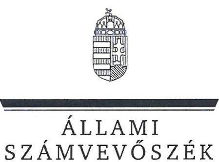
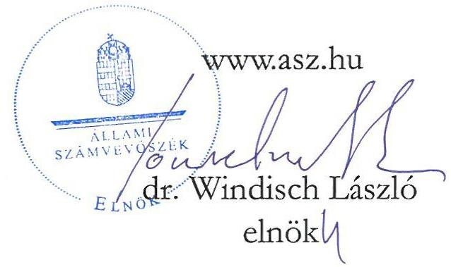
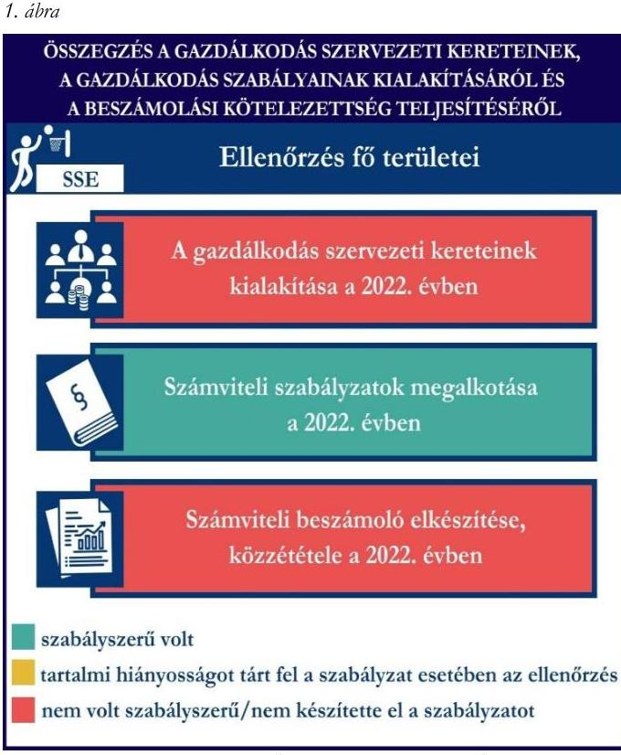
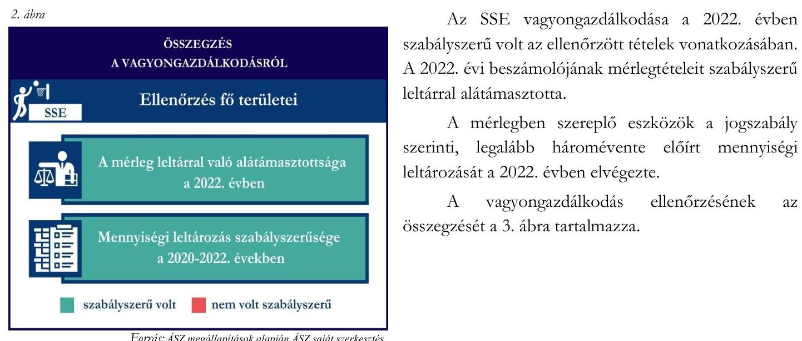

# JELENTÉS 

## Támogatásban részesülő sportszövetségek és sportegyesületek gazdálkodásának ellenőrzése

Soproni Sportiskola Egyesület
2024.

---

ÁLLAMI
SZÁMVEVŐSZÉK

# JELENTÉS 

## Támogatásban részesülő sportszövetségek és sportegyesületek gazdálkodásának ellenőrzése

Soproni Sportiskola Egyesület
2024.

24142

---

# ELLENŐRZÉSI IGAZGATÓSÁG: 

ÁLLAMHÁZTARTÁSON KÍVÜLI SZERVEZETEKET ELLENŐRZŐ IGAZGATÓSÁG

## ELLENŐRZÉSI IGAZGATÓ:

KLINGA LÁSZLÓ igazgató

## ELLENŐRZÉSVEZETÓ:

Jelentéseink az interneten a www.asz.hu címen olvashatók.

HOFMEISTER LÁSZLÓ ellenőrzésvezető

IKTATÓSZÁM: EL-4060-105/2024.
TÉMASZÁM: 2682
ELLENŐRZÉS-AZONOSÍTÓ SZÁM: V1026

---

# TARTALOMJEGYZÉK 

AZ ELLENŐRZÉS ALAPADATAI ..... 5
AZ ELLENŐRZÖTT SZERVEZET ..... 7
ÖSSZEFOGLALÁS ..... 8
AZ ELLENŐRZÉS FÓKUSZKÉRDÉSEI ..... 10
MEGÁLLAPÍTÁSOK ..... 11
JAVASLATOK ..... 14
MELLÉKLETEK ..... 15
I. sz. melléklet: Értelmező szótár ..... 15
II. sz. melléklet: Ellenőrzési kritériumok ..... 17
FÜGGELÉK: ÉSZREVÉTELEK ..... 18
RÖVIDÍTÉSEK JEGYZÉKE ..... 19

---

.

---

# AZ ELLENŐRZÉS ALAPADATAI 

## AZ ELLENŐRZÉS CÉLJA

Az ellenőrzés célja az államháztartásból nyújtott támogatással, vagy az államháztartásból meghatározott célra ingyenesen juttatott vagyon felhasználásával érintett sportszövetségek és sportegyesületek gazdálkodása szabályozottságának, gazdálkodási tevékenységének, ezen belül a beszámolási kötelezettség teljesítésének, a támogatások elkülönített nyilvántartásának, valamint a támogatások felhasználásának ellenőrzése.

## AZ ELLENŐRZÉS TÍPUSA

Szabályszerüségi ellenőrzés.

## AZ ELLENŐRZÖTT IDŐSZAK

Az 1. fókuszkérdés esetében a 2022. év.
A 2. fókuszkérdés vonatkozásában a 2021-2022. évek.
A 3. fókuszkérdés vonatkozásában a 2022. év, a mennyiségi felvétellel történő leltározás dokumentumai tekintetében a 2020-2022. évek.

## AZ ELLENŐRZÉS TÁRGYA

Az ellenőrzés tárgya a támogatásban részesülő sportszövetségek, sportegyesületek gazdálkodása szabályozottságának, gazdálkodási tevékenységén belül a beszámolási kötelezettség teljesítésének, a vagyonnyilvántartásának, a támogatások elkülönített nyilvántartásának, valamint az államháztartási forrásból származó közvetlen vagy közvetett támogatások és a meghatározott célra ingyenesen juttatott vagyon felhasználásának vizsgálata volt. Az ellenőrzés a támogatások vonatkozásában kiterjedt továbbá a támogató felé történő beszámolási és elszámolási kötelezettségek teljesítésére, az ezekkel kapcsolatos jogszabályi és belső előírások betartására.

Az ellenőrzés kiterjedt minden olyan körülményre és adatra, amely az ÁSZ ${ }^{1}$ jogszabályban meghatározott feladatainak teljesítéséhez, valamint az ellenőrzési program végrehajtása során felmerülő újabb összefüggések feltárásához szükséges volt.

Az 1. és 3. fókuszkérdés tekintetében az ellenőrzés a teljes ellenőrzött szervezetre, a 2. fókuszkérdés tekintetében kizárólag a kosárlabda szakosztályra vonatkozott.

---

# Az ellenőrzés jogsalapja 

Az ellenőrzés jogszabályi alapját az ÁSZ tv. ${ }^{2} 1 . \S$ (3) bekezdése, az 5. $\$ (3) bekezdése, valamint a Civil tv. ${ }^{3} 47 . \int$ előírásai képezték.

## AZ ELLENŐRZÉS MÓDSZERE

Az ellenőrzést a nemzetközi standardokat irányadónak tekintve az ellenőrzési program szempontjai, az ellenőrzött időszakban hatályos jogszabályok, az ellenőrzés általános szakmai szabályai, az ellenőrzésre irányadó ÁSZ módszertanok figyelembevételével végezte az ÁSZ.

Az ellenőrzési kérdések megválaszolásához szükséges bizonyítékok megszerzése az ellenőrzött szervezet által rendelkezésre bocsátott dokumentumokra, adatokra alapozva kérdésfeltevés (információkérés), interjú, mintavételezés útján történt.

Az ellenőrzési bizonyítékként felhasználható adatforrások közé tartoztak egyrészt az ellenőrzés során az ellenőrzött szervezettől bekért dokumentumok, másrészt adatforrás lehetett minden további, az ellenőrzés folyamán feltárt, az ellenőrzés szempontjából információt tartalmazó dokumentum.

A támogatásokkal, azok felhasználásával kapcsolatos kötelezettségek vizsgálatára mintavételi eljárások kerültek alkalmazásra. Támogatás-típusok szerint nagyságrend alapján 1-3 darab támogatás került részletes vizsgálat alá. Ezen támogatások felhasználásának szabályszerűsége támogatásonként kockázatértékelés alapján kiválasztott mintatételekkel került ellenőrzésre. A kiválasztott támogatási szerződésekhez kapcsolódó elszámolásokból 30-30 db mintatétel került ellenőrzésre, ahol az elszámolás nem érte el a 30 db -ot, ott tételes ellenőrzésre került sor. Ezen felül a vagyongazdálkodás szabályszerűségének ellenőrzéséhez is kockázatalapú mintavétel kapcsolódott. A támogatások felhasználása és a vagyongazdálkodás területén a minták ellenőrzése kiterjedt a könyvvezetési kötelezettség vizsgálatára is. A tárgyi eszközök tekintetében 30 db került kiválasztásra a 2022. évben állományban lévő eszközök közül, ahol az állományban lévő eszközök száma nem érte el a 30 db -ot, ott tételes ellenőrzésre került sor azok nyilvántartásának, elszámolásának szabályszerűsége ellenőrzése céljából. Az ellenőrzésben nem statisztikai mintavételre került sor, ezért nem történt kivetítés a teljes sokaságra, a megállapításokat az ellenőrzött mintatételekre vonatkozóan fogalmazta meg az ÁSZ.

---

# AZ ELLENŐRZÖTT SZERVEZET

## SOPRONI SPORTISKOLA EGYESÜLET

Az SSE ${ }^{4}$-t 2005. november 18-án alapították. Fő célja a kosárlabda, valamint a szakosztályokban végzett egyéb sportok tanításának elősegítése, továbbá a korosztályos utánpótlás nevelésének támogatása.

Az SSE-nél több szakosztály működött az ellenőrzött időszakban, taglétszáma meghaladta a 100 főt 2022. december 31-én.

A jogszabályi előírások alapján könyvvizsgálatra nem, felügyelőbizottság létrehozására kötelezett volt, a 2022. évben vállalkozási tevékenységet nem folytatott. Az $\mathrm{OBH}^{5}$ nyilvántartása alapján közhasznú jogállással nem rendelkezett.

A 2021-2022. években az SSE által igénybe vett államháztartási forrásból származó támogatásokat az 1. táblázat foglalja magában.

1. táblázat

AZ SSE ÁLTAL IGÉNYBE VETT TÁMOGATÁSOK* (ADATOK M FT-BAN)

|   | 2021. év | 2022. év  |
| --- | --- | --- |
|  Központi költségvetésből | - | -  |
|  Helyi önkormányzattól | 4,0 | 4,0  |
|  Látvány-csapatsport támogatásból | 238,3 | 177,4  |
|  * több szakosztályt érintő támogatás | Forrás: Az ellenőrzött szervezet fökönyvi adatai alapján ÁSZ saját szerkesztés |   |

---

# ÖSSZEFOGLALÁS 

Az Alaptörvény ${ }^{6}$ XX. cikke kimondja, hogy mindenkinek joga van a testi és lelki egészséghez, melynek érvényesülését Magyarország többek között a sportolás és a rendszeres testedzés támogatásával segíti elő. Az Országgyűlés ${ }^{7}$ a Sport tv. ${ }^{8}$-ben kinyilvánította, hogy a nemzet közössége a test művelését, a sportot, a nemzet alapértékének, kívánatos célnak tekinti. A sport a közjó része. Erősíti a közösség tagjainak egymáshoz tartozását, miként az egyén testi és lelki egészségét.

A sportegyesületek, sportszövetségek működésükre és szakmai tevékenységük ellátására költségvetési támogatásban, önkormányzati támogatásban, ingyenes vagyonjuttatásban, valamint látvány-csapatsport támogatásban részesülhetnek, amelyekre fokozott figyelem irányul.

A társadalom részéről jogosan felmerülő elvárás, hogy a közpénzeket kezelő, azzal gazdálkodó szervezetek működéséről, tevékenységéről átfogó képet kapjon, a közpénzek rendeltetésszerủ és átlátható módon történő felhasználásának értékelésére időről-időre sor kerüljön az ellenőrzések keretében.

A gazdálkodás szervezeti kereteinek kialakítása a 2022. évben

Számviteli szabályzatok megalkotása a 2022. évben

Számviteli beszámoló elkészítése, közzététele a 2022. évben
szabályszerü volt
tartalmi hiányosságot tárt fel a szabályzat esetében az ellenőrzés nem volt szabályszerű/nem készítette el a szabályzatot

Forrás: ÁSZ megállapítások alapján ÁSZ saját szerkezésre

Az SSE a 2022. évben a gazdálkodási szabályokat kialakította, a könyvvezetési kötelezettségének, beszámolási kötelezettségének teljesítése szabályszerű, közzétételi kötelezettségének teljesítése a 2022. évben nem szabályszerű volt.

Az SSE a könyvviteli szolgáltatás személyi feltételeinek megteremtéséről gondoskodott, ugyanakkor a felügyelőbizottság létrehozását elmulasztotta.

A jogszabályi előírások szerint az SSE kialakította a számviteli politikáját, valamint elkészítette számviteli szabályzatait.

A könyvvezetés formája a 2022. évben megfelelt a jogszabályi előírásoknak. Az SSE a 2022. évi számviteli beszámolóját nem a jogszabályban előírtak szerint készítette el, mivel azt felügyelőbizottság nem véleményezte.

A gazdálkodás szervezeti keretei kialakításának, a számviteli szabályzatok megalkotásának, valamint a számviteli beszámoló elkészítésének és közzétételének értékelését az 1. ábra mutatja be.

---

Az SSE a kosárlabda szakosztálya részére a 2021. és 2022. években a látvány-csapatsport támogatásokat és a helyi önkormányzattól kapott támogatásokat az ellenőrzött tételek vonatkozásában szabályszerűen használta fel, azonban az ellenőrzött látvány-csapatsport támogatások felhasználásáról az elkülönített számviteli nyilvántartást nem vezette.

A kapott támogatások felhasználásának ellenőrzéséről az összegzést a 2. ábra tartalmazza.

Fotrái: ASZ megállapítások alapján ASZ saját szerkesztés

Az SSE vagyongazdálkodása a 2022. évben szabályszerű volt az ellenőrzött tételek vonatkozásában. A 2022. évi beszámolójának mérlegtételeit szabályszerű leltárral alátámasztotta.

A mérlegben szereplő eszközök a jogszabály szerinti, legalább háromévente előírt mennyiségi leltározását a 2022. évben elvégezte.

A vagyongazdálkodás ellenőrzésének az összegzését a 3. ábra tartalmazza.

---

# AZ ELLENŐRZÉS FÓKUSZKÉRDÉSEI 

1.     - A gazdálkodási szabályok kialakítása, a könyvvezetési és beszámolási kötelezettség teljesítése szabályszerű volt-e?
2.     - A kapott támogatások felhasználása szabályszerű volt-e?
3.     - Az ellenőrzött szervezet vagyongazdálkodása szabályszerű volt-e?

---

# MEGÁLLAPÍTÁSOK 

## 1. A gazdálkodási szabályok kialakítása, a könyvvezetési és beszámolási kötelezettség teljesítése szabályszerű volt-e?

Összegző megállapítás Az SSE a 2022. évben a gazdálkodási szabályokat kialakította, könyvvezetési kötelezettség teljesítése szabályszerű volt, azonban a jogszabályi előírás ellenére felügyelőbizottsággal nem rendelkezett, így a beszámolási kötelezettsége nem volt szabályszerű.

A könyvviteli szolgáltatás személyi feltételeinek teljesüléséről az SSE a 2022. évben a Számv. tv. ${ }^{9}$ és a Civilszr. ${ }^{10}$-ben foglaltaknak megfelelően gondoskodott.
Az SSE taglétszáma 2022-ben a 100 főt meghaladta, ezért a Ptk. ${ }^{11}$ 3:82 (1) bekezdésének értelmében felügyelőbizottság létrehozása kötelező volt, azonban a felügyelőbizottság létrehozását az SSE elmulasztotta.
A 2022. évben az SSE rendelkezett a Számv. tv.-ben előírt eszközök és a források leltárkészítési és leltározási szabályzatával, az eszközök és források értékelési szabályzatával, pénzkezelési szabályzattal, valamint számlarenddel.
Az SSE a Civil tv., valamint a Civilszr. előírásainak megfelelően a 2022. évre vonatkozóan kettős könyvvitellel alátámasztott egyszerűsített éves beszámoló készítésével teljesítette a jogszabályi kötelezettségeit. A közhasznúsági mellékletét a Civil vhr. ${ }^{12}$ előírása szerint készítette el.
A könyvviteli nyilvántartásait a Számv. tv. és a Civilszr. rendelkezéseinek megfelelően úgy alakította ki, hogy a számviteli beszámolóban az egyéb bevételeken belül a tagdíjakat és a kapott támogatások összegét részletezni tudta.
A 2022. évre vonatkozó számviteli beszámolóját az SSE közgyűlése annak ellenére jóváhagyta, hogy a Ptk. 3:27. § (1) bekezdésében foglaltak ellenére - felügyelőbizottság hiányában - azt a felügyelőbizottság nem véleményezte.
Az SSE az elfogadott 2022. évi számviteli beszámolóját, valamint közhasznúsági mellékletét a Civil tv. előírása szerinti határidőben letétbe helyezte, közzétette.

---

# 2. A kapott támogatások felhasználása szabályszerű volt-e? 

Összegző megállapítás

Az SSE a kosárlabda szakosztálya részére a 2021. és 2022. években kapott támogatásokat az ellenőrzött tételek vonatkozásában a támogatási célnak megfelelően használta fel, azonban a látvány-csapatsport támogatások felhasználásáról az elkülönített számviteli nyilvántartást nem vezette.

Az SSE az ellenőrzött támogatási szerződésekben foglaltak alapján a látvány-csapatsport támogatásból és a helyi önkormányzattól kapott támogatás bevételeit a Civil tv. előírásai alapján elkülönítette a számviteli rendszerében.
Az SSE az ellenőrzött időszak könyvvezetése során az alapcél szerinti tevékenysége költségei, ráfordításai ellentételezésére kapott látvány-csapatsort támogatásokról a Számv. tv. 161/A. § (2) bekezdése, valamint a Civil tv. 20. (4) bekezdése előírásai ellenére nem vezetett elkülönített számviteli nyilvántartást, amelynek alapján támogatásonként megállapítható és ellenőrizhető a kapott támogatás felhasználása.
Az SSE a 2021-2022. években rendelkezett a 107/2011. (VI. 30.) Korm.rendeletben ${ }^{13}$ előírt látványcsapatsport támogatással érintett, jóváhagyott SFP ${ }^{14}$-vel. Az ellenőrzött SFP-vel kapcsolatban kapott látvány-csapatsport és kiegészítő látvány-csapatsport támogatással az SSE a 107/2011. (VI. 30.) Korm. rendeletben foglaltak szerint elszámolt. Az SSE a 2021-2022. években a 107/2011. (VI. 30.) Korm. rendelet. előírásainak megfelelően a látvány-csapatsport támogatás felhasználásáról negyedévente az előrehaladási jelentéseket határidőben nyújtotta be az illetékes ellenőrző szervezet felé. Az SSE a 2022. évben a látvány-csapatsport és kiegészítő látvány-csapatsport támogatás felhasználását igazoló szöveges, szakmai beszámolóját a 107/2011. (VI. 30.) Korm. rendeletben foglaltak alapján elkészítette. A 107/2011. (VI. 30.) Korm. rendeletnek megfelelően könyvvizsgáló által ellenőrzött számviteli bizonylatokkal számolt el a támogató felé, melyhez a könyvvizsgáló felelősségbiztosítási kötvénye is benyújtásra került.
Egy mintatétel esetében a 107/2011. (VI. 30.) Korm. rendelet 11. § (5) bekezdésében foglaltak ellenére nem a megfelelő SFP számmal került záradékolásra a számviteli bizonylat. Három mintatétel esetében a hivatkozott sportfejlesztési program terhére a számviteli bizonylaton záradékolt összeg nem egyezett meg a számlaösszesítőben feltüntetett értékkel, a 107/2011. (VI. 30.) Korm. rendelet 11. § (5) bekezdésében előírtak ellenére.
Három mintatételnél a 107/2011. (VI. 30.) Korm. rendelet 11. § (5) bekezdés előírásai ellenére a látványcsapatsport támogatás elszámolását alátámasztó számviteli bizonylaton lévő záradék nem tartalmazott összeget, ezzel az SSE nem tartotta be a 107/2011. (VI. 30.) Korm. rendelet 11. § (5) bekezdésében előírtakat.
Az SSE a 2021-2022. években az alapcél szerinti tevékenysége költségei, ráfordításai ellentételezésére a helyi önkormányzattól kapott támogatásokról vezette a Számv. tv.-ben és a Civil tv.-ben előírt az elkülönített számviteli nyilvántartást, amelynek alapján támogatásonként megállapítható és ellenőrizhető volt a kapott támogatás felhasználása.

---

Egy mintatételnél nem volt záradék a számlán, így az SSE nem rögzítette ennél a tételnél, hogy a számviteli bizonylaton szereplő összegből melyik támogatási szerződésre vonatkozóan mekkora összeget számolt el. Ezzel az SSE nem tartotta be a támogatási szerződésben a záradékolásra vonatkozó előírást.
Az SSE a támogatási szerződésben foglalt előírások alapján teljesítette a beszámolási kötelezettségét a helyi önkormányzati támogatás rendeltetésszerű felhasználásáról a 2021-2022. években. Az SSE a 2021-2022. években elszámolt önkormányzati támogatások ellenőrzött tételeit a Számv. tv.-ben előírtaknak megfelelő, szabályszerű számviteli bizonylattal alátámasztotta.

# 3. Az ellenőrzött szervezet vagyongazdálkodása szabályszerű volt-e? 

Összegző megállapítás Az SSE vagyongazdálkodása a 2022. évben szabályszerű volt az ellenőrzött tételek vonatkozásában. A 2022. évi beszámolójának mérlegtételeit szabályszerű leltárral alátámasztotta.

Az SSE a Számv. tv. előírásainak megfelelően a 2022. év beszámolójának mérlegét, a mérlegben szereplő eszközöket és forrásokat alátámasztotta szabályszerű leltárral, elvégezte a főkönyvi könyvelés és az analitikus nyilvántartások adatai közötti egyeztetést. Az SSE a Számv. tv.-ben előírt, legalább háromévente esedékes mennyiségi felvétellel történő leltározást a 2021. évben elvégezte.
Az SSE-nál az ellenőrzött tételek vonatkozásában a tárgyi eszközök bekerülési értékét, az értékcsökkenés elszámolását a Számv. tv. előírásainak megfelelően határozták meg, az üzembe helyezést a tárgyi eszközök vonatkozásában a Számv. tv.-ben előírtaknak megfelelően dokumentálták.

---

# JAVASLATOK 

Az ÁSZ tv. 33. § (1) bekezdésében foglaltak értelmében az ellenőrzött szervezet vezetője köteles a jelentésben foglalt megállapításokhoz kapcsolódó intézkedési tervet összeállítani és azt a jelentés kézhezvételétől számított 30 napon belül az ÁSZ részére megküldeni. Amennyiben az ellenőrzött szervezet vezetője nem küldi meg határidőben az intézkedési tervet, vagy továbbra sem elfogadható intézkedési tervet küld, az Állami Számvevőszék elnöke az ÁSZ tv. 33. § (3) bekezdése a) és b) pontjaiban foglaltakat érvényesítheti.

## A SOPRONI SPORTISKOLA EGYESÜLET ELNÖKÉNEK

1. Gondoskodjon a Ptk. 3:82 (1) bekezdésében előirt felügyelőbizottság müködtetéséről.
2. Gondoskodjon arról, hogy a látvány-csapatsport támogatás felhasználását alátámasztó számviteli bizonylaton a 107/2011. (VI.30) Korm. rend. 11. § (5) bekezdésében előirt záradékolás minden esetben szerepeljen.
3. Gondoskodjon arról, hogy az önkormányzati támogatást felhasználását alátámasztó számviteli bizonylaton a támogatási szerződésekben előirt záradékolás minden esetben szerepeljen.
4. Gondoskodjon a látvány-csapatsport támogatásból kapott támogatások olyan elkülönített számviteli nyilvántartásának vezetéséről, amely alapján támogatásonként megállapítható és ellenőrizhető a kapott támogatás felhasználása, a Civil tv. 20. § (4) bekezdés és a Számv. tv. 161/A. § (2) bekezdés előírásai alapján.

---

# MELLÉKLETEK 

## I. SZ. MELLÉKLET: ÉRTELMEZŐ SZÓTÁR

civil szervezet
egyesület
költségvetési támogatás
közhasznú szervezet
közhasznú tevékenység
látvány-csapatsport támogatás
sportági szövetség
sportegyesület
sportegyesületeknek, sportszövetségeknek költségvetési támogatás

A civil társaság; a Magyarországon nyilvántartásba vett egyesület - a párt, a szakszervezet és a kölcsönös biztosító egyesület kivételével és - a közalapítvány és a pártalapítvány kivételével - az alapítvány. (Forrás: Civil tv. 2. $\S 6$. pont a) -c) alpontjai)

Az egyesület a tagok közös, tartós, alapszabályban meghatározott céljának folyamatos megvalósítására létesített, nyilvántartott tagsággal rendelkező jogi személy. (Forrás: Ptk. ${ }^{15}$ 3:63. § (1) bekezdés)
A Számv. tv. szempontjából egyéb szervezet. (Számv. tv. 3. § (1) bekezdés 4. pont a) alpontja)

A társadalombiztosítás pénzügyi alapjai kivételével az államháztartás központi alrendszeréből ellenérték nélkül, pénzben nyújtott támogatások. (Forrás: Áht. ${ }^{16}$ 1. § 14. pont)
Közhasznú szervezetté minősíthető a Magyarországon nyilvántartásba vett közhasznú tevékenységet végző szervezet, amely a társadalom és az egyén közös szükségleteinek kielégítéséhez megfelelő erőforrásokkal rendelkezik, továbbá amelynek megfelelő társadalmi támogatottsága kimutatható, és amely:
a) civil szervezet (ide nem értve a civil társaságot), vagy
b) olyan egyéb szervezet, amelyre vonatkozóan a közhasznú jogállás megszerzését törvény lehetővé teszi. (Forrás: Civil tv. 32. § (1) bekezdés)
Minden olyan tevékenység, amely a létesítő okiratban megjelölt közfeladat teljesítését közvetlenül vagy közvetve szolgálja, ezzel hozzájárulva a társadalom és az egyén közös szükségleteinek kielégítéséhez. (Forrás: Civil tv. 2. § 20. pont)
Az adóévben visszafizetési kötelezettség nélkül nyújtott támogatás, juttatás, véglegesen átadott pénzeszköz és térítés nélkül átadott eszköz könyv szerinti értéke, az adóévben térítés nélkül nyújtott szolgáltatás bekerülési értéke a Tao. tv ${ }^{17}$.-ben meghatározott jogcímeken. (Forrás: Tao. tv. 4. § 44. pont)
A Civil tv. és a Ptk. előírásai alapján - a Sport tv.-ben meghatározott eltérésekkel - müködő szövetség, amelynek tagjai kizárólag sportszervezetek lehetnek. Sportági szövetség országos jelleggel is müködhet. Egy sportágban csak egy országos sportági szövetség müködhet. Törvényi feltételek teljesülése esetén szakszövetségi feladatokat is elláthat. (Forrás: Sport tv. 28. §)
A Civil tv. és a Ptk. szabályai szerint müködő olyan egyesület, amelynek alaptevékenysége a sporttevékenység szervezése, valamint a sporttevékenység feltételeinek megteremtése. A sportegyesületek a Sport tv. 15. § (1) bekezdésében meghatározott sportszervezetek körébe tartoznak. A sportegyesületeken kívül sportszervezet még a sportvállalkozás, a sportiskola, valamint az utánpótlás-nevelés fejlesztését végző alapítvány. (Forrás: Sport tv. 16. § (1) bekezdés)
Az állami sport célú támogatások felhasználásáról és elosztásáról szóló 474/2016. (XII. 27.) Kormány rendelet ${ }^{18}$ és a 27/2013. (III. 29.) EMMI rendelet ${ }^{19}$ 1. §-ában meghatározott fejezeti kezelésű előirányzatokból nyújtott támogatás.

---

sportszövetség
sporttevékenység

Meghatározott sporttevékenységek körében a sportversenyek szervezésére, a tagok érdekvédelmére és a részükre való szolgáltatásokra, valamint a nemzetközi kapcsolatok lebonyolítására létrehozott, jogi személyiséggel és önkormányzattal rendelkező, a Civil tv. és a Ptk. alapján - az e törvényben foglalt eltérésekkel - különös formában müködő egyesületek. A Sport tv. 19. § (3) bekezdése szerint a sportszövetségeknek az alábbi típusai léteznek: országos sportági szakszövetségek, sportági szövetségek, szabadidősport szövetségek, fogyatékosok sportszövetségei, diák- és egyetemi-főiskolai sport sportszövetségei, nemzetközi sportszövetségek. (Forrás: Sport tv. 19. $\int(1),(3)$ bekezdés)
Meghatározott szabályok szerint, a szabadidő eltöltéseként kötetlenül vagy szervezett formában, illetve versenyszerűen végzett testedzés vagy szellemi sportágban kifejtett tevékenység, amely a fizikai erőnlét és a szellemi teljesítőképesség megtartását, fejlesztését szolgálja. (Forrás: Sport tv. 1. § (2) bekezdés)

---

# II. SZ. MELLÉKLET: ELLENŐRZÉSI KRITÉRIUMOK 

## FÓKUSZKÉRDÉS

## 1. fókuszkérdés:

A gazdálkodási szabályok kialakítása, a könyvvezetési és beszámolási kötelezettség teljesítése szabályszerű volt-e?

## 2. fókuszkérdés:

A kapott támogatások felhasználása szabályszerű volt-e?

## 3. fókuszkérdés:

Az ellenőrzött szervezet vagyongazdálkodása szabályszerű volt-e?

## ELLENŐRZÉSI KRITÉRIUMOK

Számv. tv. 14. § (3) bekezdés, (5) bekezdés a), b), d) pont, (8) bekezdés, 69. $\S$ (3) bekezdés, 90. $\$ (3) bekezdés c) pont, 161. $\$$ (1) bekezdés, (2) bekezdés a) -d) pont, (3)-(4) bekezdés, 161/A. $\$ 2$ (2) bekezdés, 165. $\$ 2$ (2) bekezdés
Civilszr. 7. § (1) bekezdés, (4) bekezdés b), c) pont, 8. § (2), (3) bekezdés, 9. $\$ \$(4), (5) bekezdés, 15. $\$ \$(1) bekezdés a), b) pont, 16. $\$ 11$ bekezdés, 24. $\$ 12$ bekezdés
Ptk. 3:26. § (1) bekezdés, 3:27. § (1) bekezdés, 3:82. § (1) bekezdés,
Civil tv. 28. § (1) bekezdés, 29. § (2) bekezdés c) pont, (3), (6), (7) bekezdés, 30. § (1)-(4) bekezdés 40. § (1), (2) bekezdés, 41. § (1) bekezdés
Civil vhr.
Számv. tv. 44. § (2) bekezdés, 93. § (3) bekezdés, 159. §, 161/A. § (2) bekezdés, 165. § (2) bekezdés, 167. § (1) bekezdés a), d), e), h) pont

Civil tv. 20. § (2) bekezdés a) pont, (3) bekezdés a), c) pont, (4) bekezdés, 29. § (4), (5) bekezdés
Civilszr. 24. § (2) bekezdés
27/2013. (III.29.) EMMI rend. 18. § (2) bekezdés
474/2016. (XII. 27.) Korm. rend. 22. § (2) bekezdés, 24. § (2) bekezdés
107/2011. (VI. 30.) Korm. rend. 9. § (9) bekezdés, 11. § (1), (2), (4), (4a), (5), (6) bekezdés, 14. § (1) bekezdés,

Számv. tv. 16. § (2) bekezdés, 26. §, 42. § (5) bekezdés, 46. § (3) bekezdés, 47-53. §, 69. §, 159. §, 161/A. §, 162. § (1)-(2) bekezdés, 165-166. §, 169. §
Ávr. ${ }^{20}$ 93. § (5) bekezdés
107/2011. (VI. 30.) Korm. rend. 11. § (5) bekezdés
474/2016. (XII. 27.) Korm. rend. 17. § (1) bekezdés 11a., 11b. pont, 17. § (2a) bekezdés, 24. § (2) bekezdés
Tao. tv. 22/C. §.

---

# FÜGGELÉK: ÉSZREVÉTELEK 

A jelentéstervezetet a Számvevőszék 15 napos észrevételezésre megküldte az ellenőrzött szervezet vezetőjének az ÁSZ tv. 29. §* (1) bekezdése előírásának megfelelően.

Az ellenőrzött szervezet elnöke a jelentéstervezetre nem tett észrevételt.

* 29. § (1) Az Állami Számvevőszék az ellenőrzési megállapításait megküldi az ellenőrzött szervezet vezetőjének vagy az általa megbízott személynek, és annak, akinek személyes felelősségét állapította meg.
(2) Az ellenőrzött szervezet vezetője és a felelősként megjelölt személy az ellenőrzés megállapításaira tizenöt napon belül írásban észrevételt tehet.
(3) Az Állami Számvevőszék az észrevételre a beérkezésétől számított harminc napon belül írásban válaszol. A figyelembe nem vett észrevételeket köteles a jelentésben feltüntetni, és megindokolni, hogy azokat miért nem fogadta el.

---

# RÖVIDÍTÉSEK JEGYZÉKE 

${ }^{1}$ ÁSZ
${ }^{2}$ ÁSZ tv.
${ }^{3}$ Civil tv.
${ }^{4}$ SSE
${ }^{5}$ OBH
${ }^{6}$ Alaptörvény
${ }^{7}$ Országgyúlés
${ }^{8}$ Sport tv.
${ }^{9}$ Számv. tv.
${ }^{10}$ Civilszr.
${ }^{11}$ Ptk.
${ }^{12}$ Civil vhr.
${ }^{13}$ 107/2011. (XII.30.) Korm. rend.
${ }^{14}$ SFP
${ }^{15}$ Ptk.
${ }^{16}$ Áht.
${ }^{17}$ Tao.tv
${ }^{18}$ 474/2016. (XII. 27.) Korm. rendelet
${ }^{19}$ 27/2013. (III.29.) EMMI rendelet
${ }^{20}$ Ávr.

Állami Számvevőszék
2011. évi LXVI. törvény az Állami Számvevőszékről
2011. évi CLXXV. törvény az egyesülési jogról, a közhasznú jogállásról, valamint a civil szervezetek müködéséről és támogatásáról
Soproni Sportiskola Egyesület
Országos Bírósági Hivatal
Magyarország Alaptörvénye
Magyarország Országgyűlése
2004. évi I. törvény a sportról
2000. évi C. törvény a számvitelről

479/2016. (XII. 28.) Korm. rendelet a számviteli törvény szerinti egyes egyéb szervezetek beszámoló készítési és könyvvezetési kötelezettségének sajátosságairól
2013. évi V. törvény a Polgári Törvénykönyvről

350/2011. (XII. 30.) Korm. rendelet a civil szervezetek gazdálkodása, az adománygyűjtés és a közhasznúság egyes kérdéseiről
107/2011. (VI. 30.) Korm. rendelet a látvány-csapatsport támogatását biztosító támogatási igazolás kiállításáról, felhasználásáról, a támogatás elszámolásának és ellenőrzésének, valamint visszafizetésének szabályairól
Sportfejlesztési program
2013. évi V. törvény a Polgári Törvénykönyvről
2011. évi CXCV. törvény az államháztartásról
1996. évi LXXXI. törvény a társasági adóról és az osztalékadóról

474/2016. (XII. 27.) Korm. rendelet az állami sport célú támogatások felhasználásáról és elosztásáról
27/2013. (III. 29.) EMMI rendelet az állami sport célú támogatások felhasználásáról és elosztásáról
368/2011. (XII. 31.) Korm. rendelet az államháztartásról szóló törvény végrehajtásáról

---

1052 Budapest, Apáczai Csere János u. 10. | 1364 Budapest 4., Pf. 54
www.asz.hu | szamvevoszek@asz.hu
telefon: +36 14849100