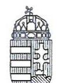
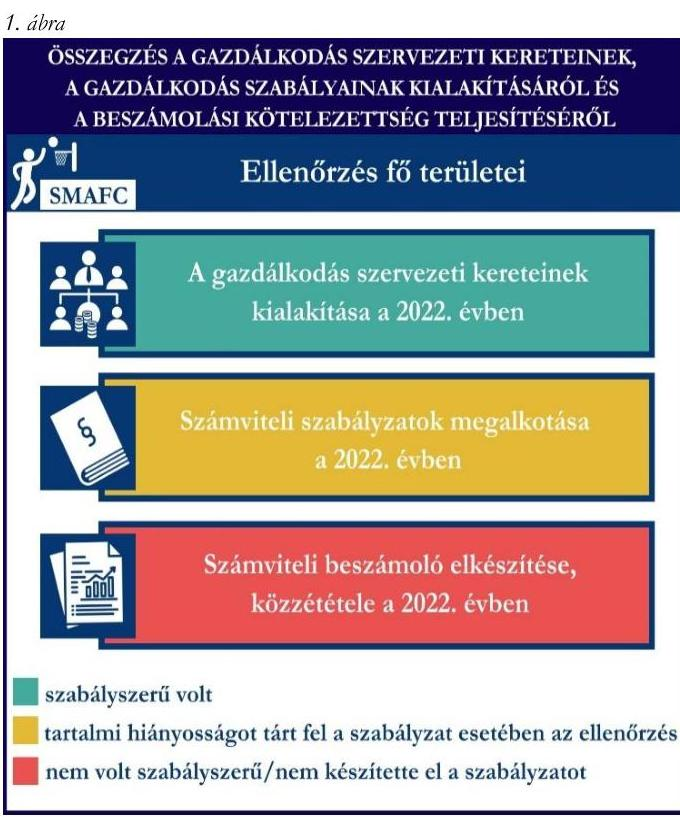
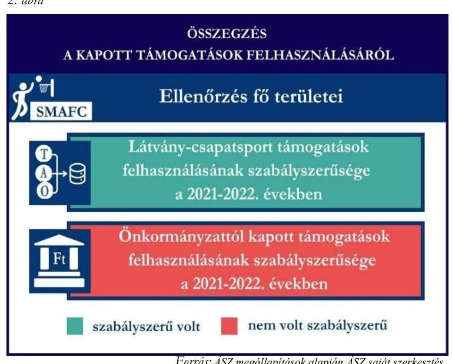
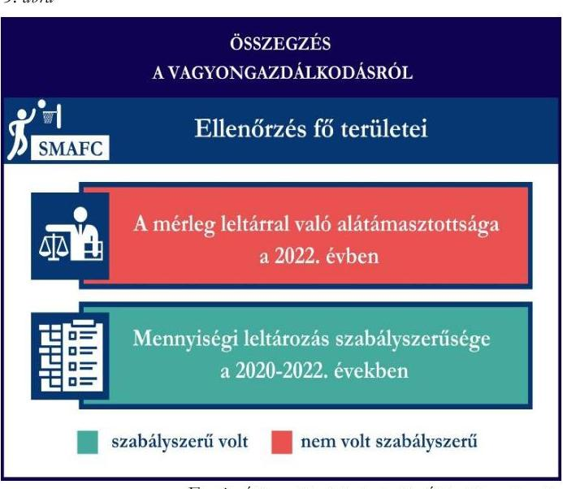

# JELENTÉS 

## Támogatásban részesülő sportszövetségek és sportegyesületek gazdálkodásának ellenőrzése

Soproni Műegyetemi Atlétikai és Football Club

2024.

---

ÁLLAMI
SZÁMVEVŐSZÉK

# JELENTÉS 

## Támogatásban részesülő sportszövetségek és sportegyesületek gazdálkodásának ellenőrzése

Soproni Műegyetemi Atlétikai és Football Club

2024.

---

# ELLENŐRZÉSI IGAZGATÓSÁG: 

ÁLLAMHÁZTARTÁSON KÍVÜLI SZERVEZETEKET ELLENŐRZŐ IGAZGATÓSÁG

## ELLENŐRZÉSI IGAZGATÓ:

KLINGA LÁSZLÓ igazgató

## ELLENŐRZÉSVEZETŐ:

Jelentéseink az interneten a www.asz.hu címen olvashatók.

HOFMEISTER LÁSZLÓ ellenőrzésvezető

IKTATÓSZÁM: EL-4060-106/2024.
TÉMASZÁM: 2682
ELLENŐRZÉS-AZONOSÍTÓ SZÁM: V1026

---

# TARTALOMJEGYZÉK 

AZ ELLENŐRZÉS ALAPADATAI ..... 5
AZ ELLENŐRZÖTT SZERVEZET ..... 7
ÖSSZEFOGLALÁS ..... 8
AZ ELLENŐRZÉS FÓKUSZKÉRDÉSEI ..... 10
MEGÁLLAPÍTÁSOK ..... 11
JAVASLATOK ..... 14
MELLÉKLETEK ..... 15
I. sz. melléklet: Értelmező szótár ..... 15
II. sz. melléklet: Ellenőrzési kritériumok ..... 17
FÜGGELÉK: ÉSZREVÉTELEK ..... 18
RÖVIDÍTÉSEK JEGYZÉKE ..... 19

---

.

---

# AZ ELLENŐRZÉS ALAPADATAI 

## AZ ELLENŐRZÉS CÉLJA

Az ellenőrzés célja az államháztartásból nyújtott támogatással, vagy az államháztartásból meghatározott célra ingyenesen juttatott vagyon felhasználásával érintett sportszövetségek és sportegyesületek gazdálkodása szabályozottságának, gazdálkodási tevékenységének, ezen belül a beszámolási kötelezettség teljesítésének, a támogatások elkülönített nyilvántartásának, valamint a támogatások felhasználásának ellenőrzése.

## AZ ELLENŐRZÉS TÍPUSA

Szabályszerűségi ellenőrzés.

## AZ ELLENŐRZÖTT IDŐSZAK

Az 1. fókuszkérdés esetében a 2022. év.
A 2. fókuszkérdés vonatkozásában a 2021-2022. évek.
A 3. fókuszkérdés vonatkozásában a 2022. év, a mennyiségi felvétellel történő leltározás dokumentumai tekintetében a 2020-2022. évek.

## AZ ELLENŐRZÉS TÁRGYA

Az ellenőrzés tárgya a támogatásban részesülő sportszövetségek, sportegyesületek gazdálkodása szabályozottságának, gazdálkodási tevékenységén belül a beszámolási kötelezettség teljesítésének, a vagyonnyilvántartásának, a támogatások elkülönített nyilvántartásának, valamint az államháztartási forrásból származó közvetlen vagy közvetett támogatások és a meghatározott célra ingyenesen juttatott vagyon felhasználásának vizsgálata volt. Az ellenőrzés a támogatások vonatkozásában kiterjedt továbbá a támogató felé történő beszámolási és elszámolási kötelezettségek teljesítésére, az ezekkel kapcsolatos jogszabályi és belső előírások betartására.

Az ellenőrzés kiterjedt minden olyan körülményre és adatra, amely az ÁSZ¹ jogszabályban meghatározott feladatainak teljesítéséhez, valamint az ellenőrzési program végrehajtása során felmerülő újabb összefüggések feltárásához szükséges volt.

Az 1. és 3. fókuszkérdés tekintetében az ellenőrzés a teljes ellenőrzött szervezetre, a 2. fókuszkérdés tekintetében kizárólag a kosárlabda szakosztályra vonatkozott.

---

# Az ellenőrzés jogalapja 

Az ellenőrzés jogszabályi alapját az ÁSZ tv.² 1. § (3) bekezdése, az 5. § (3) bekezdése, valamint a Civil tv.³ 47. § előírásai képezték.

## AZ ELLENŐRZÉS MÓDSZERE

Az ellenőrzést a nemzetközi standardokat irányadónak tekintve az ellenőrzési program szempontjai, az ellenőrzött időszakban hatályos jogszabályok, az ellenőrzés általános szakmai szabályai, az ellenőrzésre irányadó ÁSZ módszertanok figyelembevételével végezte az ÁSZ.

Az ellenőrzési kérdések megválaszolásához szükséges bizonyítékok megszerzése az ellenőrzött szervezet által rendelkezésre bocsátott dokumentumokra, adatokra alapozva kérdésfeltevés (információkérés), interjú, mintavételezés útján történt.

Az ellenőrzési bizonyítékként felhasználható adatforrások közé tartoztak egyrészt az ellenőrzés során az ellenőrzött szervezettől bekért dokumentumok, másrészt adatforrás lehetett minden további, az ellenőrzés folyamán feltárt, az ellenőrzés szempontjából információt tartalmazó dokumentum. A támogatásból beszerzett tárgyi eszközök használatára, fizikai fellelhetőségére irányulóan az érintett vagyontárgyak helyszíni szemle keretében történő szemrevételezésére sor került.

A támogatásokkal, azok felhasználásával kapcsolatos kötelezettségek vizsgálatára mintavételi eljárások kerültek alkalmazásra. Támogatás-típusok szerint nagyságrend alapján 1-3 darab támogatás került részletes vizsgálat alá. Ezen támogatások felhasználásának szabályszerűsége támogatásonként kockázatértékelés alapján kiválasztott mintatételekkel került ellenőrzésre. A kiválasztott támogatási szerződésekhez kapcsolódó elszámolásokból 30-30 db mintatétel került ellenőrzésre, ahol az elszámolás nem érte el a 30 db-ot, ott tételes ellenőrzésre került sor. Ezen felül a vagyongazdálkodás szabályszerűségének ellenőrzéséhez is kockázatalapú mintavétel kapcsolódott. A támogatások felhasználása és a vagyongazdálkodás területén a minták ellenőrzése kiterjedt a könyvvezetési kötelezettség vizsgálatára is. A tárgyi eszközök tekintetében 30 db került kiválasztásra a 2022. évben állományban lévő eszközök közül, ahol az állományban lévő eszközök száma nem érte el a 30 db-ot, ott tételes ellenőrzésre került sor azok nyilvántartásának, elszámolásának szabályszerűsége ellenőrzése céljából. A tárgyi eszközök tekintetében 21 db eszköz tételesen került ellenőrzésre. Az ellenőrzésben nem statisztikai mintavételre került sor, ezért nem történt kivetítés a teljes sokaságra, a megállapításokat az ellenőrzött mintatételekre vonatkozóan fogalmazta meg az ÁSZ.

---

# AZ ELLENŐRZÖTT SZERVEZET

## SOPRONI MŰEGYETEMI ATLÉTIKAI ÉS FOOTBALL CLUB

A SMAFC¹-ot 1979. január 1-jén alapították. Fő célja a rendszeres sportolás, sportoktatás, testedzés, verseny és szabadidős sporttevékenység biztosítása, valamint annak elősegítése, hogy tagjai a szabadidejüket kulturáltan tölthessék.

A SMAFC-nál 24 szakosztály működött az ellenőrzött időszakban, taglétszáma meghaladta a 100 főt 2022. december 31-én.

A SMAFC a jogszabályi előírások alapján könyvvizsgálatra nem, felügyelőbizottság létrehozására kötelezett volt, a 2022. évben nem folytatott vállalkozási tevékenységet. Az OBH⁵ nyilvántartása alapján közhasznú jogállással nem rendelkezett.

A 2021-2022. években a SMAFC által igénybe vett államháztartási forrásból származó támogatásokat az 1. táblázat foglalja magában.

|  A SMAFC ÁLTAL IGÉNYBE VETT TÁMOGATÁSOK* (ADATOK M FT-BAN) |  |   |
| --- | --- | --- |
|   | 2021. év | 2022. év  |
|  Központi költségvetésből** | 14,7 | 30,4  |
|  Helyi önkormányzattól | 4,4 | 6,2  |
|  Országos szövetségtől** | - | 1,0  |
|  Látvány-csapatsport támogatásból | 28,7 | 36,7  |
|  * több szakosztályt érintő támogatás | Forrás: Az ellenőrzött szervezet földrinyvi adatai alapján ÁSZ saját szerkesztés |   |
|  **kosárlabda szakosztály nem részesült a támogatásból |  |   |

---

# ÖSSZEFOGLALÁS 

Az Alaptörvény⁶ XX. cikke kimondja, hogy mindenkinek joga van a testi és lelki egészséghez, melynek érvényesülését Magyarország többek között a sportolás és a rendszeres testedzés támogatásával segíti elő. Az Országgyűlés⁷ a Sport tv.⁸-ben kinyilvánította, hogy a nemzet közössége a test művelését, a sportot, a nemzet alapértékének, kívánatos célnak tekinti. A sport a közjó része. Erősíti a közösség tagjainak egymáshoz tartozását, miként az egyén testi és lelki egészségét.

A sportegyesületek, sportszövetségek működésükre és szakmai tevékenységük ellátására költségvetési támogatásban, önkormányzati támogatásban, ingyenes vagyonjuttatásban, valamint látvány-csapatsport támogatásban részesülhetnek, amelyekre fokozott figyelem irányul.

A társadalom részéről jogosan felmerülő elvárás, hogy a közpénzeket kezelő, azzal gazdálkodó szervezetek működéséről, tevékenységéről átfogó képet kapjon, a közpénzek rendeltetésszerű és átlátható módon történő felhasználásának értékelésére időről-időre sor kerüljön az ellenőrzések keretében.

A SMAFC-nál a gazdálkodási szabályok kialakítása szabályszerű volt, a könyvvezetési kötelezettségét, közzétételi és letétbe helyezési kötelezettségét nem szabályszerűen teljesítette.

A SMAFC a könyvviteli szolgáltatás személyi feltételeinek megteremtéséről gondoskodott. A 2022. évben a jogszabályban előírt számviteli szabályzatokkal rendelkezett, a számlarend tekintetében az ellenőrzés hiányosságot tárt fel.

A könyvvezetés formája a 2022. évben megfelelt a jogszabályi előírásoknak. A SMAFC a 2022. évi számviteli beszámolóját nem a jogszabályban előírtak szerint készítette el és tette közzé.

A gazdálkodás szervezeti keretei kialakításának, a számviteli szabályzatok megalkotásának, valamint a számviteli beszámoló elkészítésének és közzétételének értékelését az 1. ábra mutatja be.

---

A SMAFC a 2021-2022. években a látványcsapatsport támogatásokat, valamint 2022. évben a helyi önkormányzattól kapott támogatásokat az ellenőrzött tételek esetében a támogatási célnak megfelelően használta fel.

A 2021. évben a helyi önkormányzattól kapott támogatás felhasználása nem volt szabályszerű.

Az ellenőrzött támogatások felhasználásáról a jogszabályban előírt elkülönített nyilvántartást a 2021-2022. években nem vezette.

A kapott támogatások felhasználásának ellenőrzéséről az összegzést a 2. ábra tartalmazza.

3. ábra

A SMAFC vagyongazdálkodása az ellenőrzött tételek esetében a 2022. évben nem volt szabályszerű. A 2022. évi beszámolójának mérlegtételeit a tárgyi eszközök kivételével, nem támasztotta alá szabályszerű leltárral.

A mérlegben szereplő eszközök a jogszabály szerinti, legalább háromévente előírt mennyiségi leltározását a 2021. évben a SMAFC elvégezte.

A vagyongazdálkodás ellenőrzésének az összegzését a 3. ábra tartalmazza.

---

# AZ ELLENŐRZÉS FÓKUSZKÉRDÉSEI 

1.     - A gazdálkodási szabályok kialakítása, a könyvvezetési és beszámolási kötelezettség teljesítése szabályszerű volt-e?
2.     - A kapott támogatások felhasználása szabályszerű volt-e?
3.     - Az ellenőrzött szervezet vagyongazdálkodása szabályszerű volt-e?

---

# MEGÁLLAPÍTÁSOK 

## 1. A gazdálkodási szabályok kialakítása, a könyvvezetési és beszámolási kötelezettség teljesítése szabályszerű volt-e?

Összegző megállapítás A SMAFC a 2022. évben a gazdálkodási szabályokat kialakította, azonban a számlarend tekintetében az ellenőrzés hiányosságot tárt fel. A könyvvezetési, beszámolási kötelezettségét nem szabályszerűen teljesítette.

A könyvviteli szolgáltatás személyi feltételeinek teljesüléséről a SMAFC a 2022. évben a Számv. tv.⁹ és a Civilszr.¹⁰-ben foglaltaknak megfelelően gondoskodott.
A 2022. évben a Ptk.¹¹ előírásainak betartásával gondoskodott az előírt felügyelőbizottság létrehozásáról, a felügyelőbizottsága megalkotta ügyrendjét.
A 2022. évben a SMAFC rendelkezett a Számv. tv-ben előírt számviteli politikával, eszközök és a források leltárkészítési és leltározási szabályzatával, az eszközök és források értékelési szabályzatával, valamint pénzkezelési szabályzattal.
A SMAFC 2022. évben hatályos számlarendje nem tartalmazta a Számv. tv. 161. § (2) bekezdés b) és c) pontjában előírtakat.
A SMAFC elkészítette az egyszerűsített éves beszámolóját a Civil tv.-nek megfelelően, valamint a közhasznúsági mellékletet a Civil vhr.¹² melléklete szerinti tartalommal.
A könyvviteli nyilvántartásait a Számv. tv. és a Civilszr. rendelkezéseinek megfelelően úgy alakította ki, hogy a számviteli beszámolóban az egyéb bevételeken belül a tagdíjakat és a kapott támogatások összegét részletezni tudta, azonban a beszámolóban kimutatott tagdíjak és támogatások értéke összegében eltért a főkönyvi kivonatban kimutatott tagdíj és támogatás összegétől. A SMAFC nem gondoskodott a 2022. évi számviteli beszámolójában szereplő tagdíj és támogatás adatok könyvvezetéssel való alátámasztásáról a Számv. tv. 4. § (1) bekezdésében előírtak ellenére, továbbá nem felelt meg a Számv. tv. 15. § (3) bekezdésében előírt valódiság elvének.
A 2022. évi számviteli beszámolót a SMAFC felügyelőbizottsága megtárgyalta és elfogadásra javasolta. A 2022. évre vonatkozó számviteli beszámolót a SMAFC közgyűlése a Ptk. és a Civil tv. előírásainak megfelelően jóváhagyta.
A SMAFC a 2022. évi számviteli beszámolóját a Civil tv. 30. § (1) bekezdéseiben foglaltak ellenére a beszámoló részét képező kiegészítő melléklet nélkül helyezte letétbe, tette közzé.

---

# 2. A kapott támogatások felhasználása szabályszerű volt-e? 

Összegző megállapítás

A SMAFC a kosárlabda szakosztálya részére a 2021. és 2022. években nyújtott látvány-csapatsport támogatásokat, valamint a 2022. évi helyi önkormányzattól kapott támogatásokat az ellenőrzött tételek vonatkozásában szabályszerűen, a támogatási célnak megfelelően használta fel. A 2021. évben a helyi önkormányzattól kapott támogatás felhasználása nem szabályszerűen történt. A támogatások felhasználásáról elkülönített számviteli nyilvántartást nem vezetett.

A SMAFC az ellenőrzött támogatási szerződésekben foglaltak alapján a látvány-csapatsport támogatásból és a helyi önkormányzattól kapott támogatás bevételeit a Civil tv. előírásai alapján elkülönítette a számviteli rendszerében.
A SMAFC az alapcél szerinti tevékenysége költségei, ráfordításai ellentételezésére kapott látványcsapatsort támogatások, valamint a helyi önkormányzattól kapott ellenőrzött támogatások felhasználásáról a Számv. tv. 161/A. § (2) bekezdése, valamint a Civil tv. 20. (4) bekezdése előírásai ellenére nem vezetett elkülönített számviteli nyilvántartást, amelynek alapján támogatásonként megállapítható és ellenőrizhető a kapott támogatások felhasználása.
A SMAFC a 2021-2022. években rendelkezett a 107/2011. (VI. 30.) Korm. rendelet¹³-ben előírt látványcsapatsport támogatással érintett, jóváhagyott SFP¹⁴-vel.
A SMAFC a 2021-2022.
 években a 107/2011. (VI. 30.) Korm. rendeletben foglaltaknak megfelelően a látvány-csapatsport támogatás felhasználásáról negyedévente az előrehaladási jelentéseket határidőben benyújtotta az illetékes ellenőrző szervezet felé.
Az ellenőrzött SFP-vel kapcsolatban kapott látvány-csapatsport támogatással a SMAFC a 107/2011. (VI. 30.) Korm. rendeletben foglaltak szerint elszámolt. A SMAFC a 2021/2022. évben a látvány-csapatsport támogatás felhasználását igazoló szöveges, szakmai beszámolóját a 107/2011. (VI. 30.) Korm. rendeletben foglaltak alapján elkészítette. A 107/2011. (VI. 30.) Korm. rendeletnek megfelelően könyvvizsgáló által ellenőrzött számviteli bizonylatokkal számolt el a támogató felé, melyhez a könyvvizsgáló felelősségbiztosítási kötvénye is benyújtásra került. Egy mintatétel esetében a hivatkozott sportfejlesztési program terhére a számviteli bizonylaton záradékolt összeg nem egyezett meg a számlaösszesítőben feltüntetett értékkel, három mintatételnél a számviteli bizonylaton lévő záradék nem tartalmazott összeget, ezzel a SMAFC nem tartotta be a 107/2011. (VI. 30.) Korm. rendelet 11. § (5) bekezdésében előírtakat.
A SMAFC a 2021. évben kapott helyi önkormányzati támogatás elszámolásához készített számlaösszesítője nem tartalmazta a kosárlabda szakosztály vonatkozásában a támogatáshoz elszámolt számlákat a támogatási szerződésben, valamint Sopron Megyei Jogú Város önkormányzati rendeletében előírtak ellenére. A SMAFC 1,5 M Ft értékű támogatásról nem tudott elszámolni a 2021. évi támogatási szerződésben - és az alapján az Áht. ${ }^{15}$-ban - foglaltak szerinti helyi önkormányzati támogatás rendeltetésszerű felhasználásáról.
A SMAFC a 2022. évi támogatási szerződésben foglalt előírások alapján teljesítette a beszámolási kötelezettségét a helyi önkormányzati támogatás rendeltetésszerű felhasználásáról. A SMAFC a 2022.

---

évben elszámolt önkormányzati támogatások ellenőrzött tételeit a Számv. tv.-ben előírtaknak megfelelő, szabályszerű számviteli bizonylattal alátámasztotta, a támogatási szerződésekben foglaltaknak megfelelően záradékolta, azaz a ráfordítás számviteli bizonylatán jelezte a támogatás terhére elszámolt összeget.

# 3. Az ellenőrzött szervezet vagyongazdálkodása szabályszerű volt-e? 

Összegző megállapítás A SMAFC vagyongazdálkodása a 2022. évben nem volt szabályszerű az ellenőrzött tételek vonatkozásában. A 2022. évi beszámolójának mérlegtételeit szabályszerű leltárral nem támasztotta alá.

A SMAFC a Számv. tv. 69. § (1)-(2) bekezdéseiben előírtak ellenére - a tárgyi eszközök kivételével - a 2022. üzleti év mérlegfordulónapjára vonatkozóan a mérlegtételeket szabályszerű leltárral nem támasztotta alá, valamint a főkönyvi könyvelés és az analitikus nyilvántartások adatai közötti egyeztetést nem végezte el.

A tárgyi eszközök Számv. tv.-ben előírt háromévenkénti mennyiségi felvétellel történő leltározását a 2021. évben a SMAFC elvégezte.
Egy tárgyi eszköz esetében a bekerülési érték a Számv. tv. 165. § (2) bekezdésében előírtak ellenére számviteli bizonylattal nem volt alátámasztott. Ezen eszközön felül az ellenőrzött tételek vonatkozásában a tárgyi eszközök bekerülési értékét, az értékcsökkenés elszámolását a Számv. tv. előírás szerint határozták meg, az üzembe helyezést a tárgyi eszközök vonatkozásában a Számv. tv. előírásainak megfelelően dokumentálták.

---

# JAVASLATOK 

Az ÁSZ tv. 33. § (1) bekezdésében foglaltak értelmében az ellenőrzött szervezet vezetője köteles a jelentésben foglalt megállapításokhoz kapcsolódó intézkedési tervet összeállítani és azt a jelentés kézhezvételétől számított 30 napon belül az ÁSZ részére megküldeni. Amennyiben az ellenőrzött szervezet vezetője nem küldi meg határidőben az intézkedési tervet, vagy továbbra sem elfogadható intézkedési tervet küld, az Állami Számvevőszék elnöke az ÁSZ tv. 33. § (3) bekezdése a) és b) pontjaiban foglaltakat érvényesítheti.

## A SOPRONI MÜEGYETEMI ATLÉTIKAI ÉS FOOTBALL CLUB ELNÖKÉNEK

1. Gondoskodjon a számlarend Számv. tv. 161. § (2) bekezdés b) és c) pontjában előírtaknak megfelelő tartalommal való elkészítéséről.
2. Gondoskodjon a számviteli beszámolójában szereplő adatok könyvvezetéssel való alátámasztásáról a Számv. tv. 4. § (1) bekezdésében előírtaknak megfelelően.
3. Gondoskodjon a számviteli beszámoló letétbe helyezéséről, közzétételéről a Civil tv. 30. § (1) bekezdésében előírtaknak megfelelően.
4. Gondoskodjon a látvány-csapatsport támogatásból, valamint az önkormányzattól kapott támogatások elkülönített számviteli nyilvántartásának vezetéséről, amely alapján támogatásonként megállapítható és ellenőrizhető a kapott támogatás felhasználása, a Civil tv. 20. § (4) bekezdés és a Számv. tv. 161/A. § (2) bekezdés előírásai alapján.
5. Gondoskodjon arról, hogy a látvány-csapatsport támogatás felhasználását alátámasztó számviteli bizonylaton a 107/2011. (VI.30) Korm. rend. 11. § (5) bekezdésében előírt záradékolás minden esetben szerepeljen.
6. Gondoskodjon a helyi önkormányzattól kapott támogatás, támogatási szerződésben előírtaknak megfelelően történő elszámolásáról.
7. Gondoskodjon a beszámoló mérlegtételeinek leltárral való alátámasztásáról a Számv. tv. 69. § (1) bekezdésében előírtaknak megfelelően.
8. Gondoskodjon arról, hogy a tárgyi eszközök beszerzési értéke bizonylattal alátámasztott legyen, a Számv. tv. 165. § (2) bekezdésében foglaltaknak megfelelően.

---

# MELLÉKLETEK 

## I. SZ. MELLÉKLET: ÉRTELMEZŐ SZÓTÁR

civil szervezet
egyesület
költségvetési támogatás
közhasznú szervezet
közhasznú tevékenység
látvány-csapatsport támogatás
sportegyesület
sportegyesületeknek, sportszövetségeknek nyújtott költségvetési támogatás

A civil társaság; a Magyarországon nyilvántartásba vett egyesület - a párt, a szakszervezet és a kölcsönös biztosító egyesület kivételével és - a közalapítvány és a pártalapítvány kivételével - az alapítvány. (Forrás: Civil tv. 2. §6. pont a) -c) alpontjai)
Az egyesület a tagok közös, tartós, alapszabályban meghatározott céljának folyamatos megvalósítására létesített, nyilvántartott tagsággal rendelkező jogi személy. (Forrás: Ptk. 3:63. § (1) bekezdés)
A Számv. tv. szempontjából egyéb szervezet. (Számv. tv. 3. § (1) bekezdés 4. pont a) alpontja)
A társadalombiztosítás pénzügyi alapjai kivételével az államháztartás központi alrendszeréből ellenérték nélkül, pénzben nyújtott támogatások. (Forrás: Áht. 1. § 14. pont ide nem értve az Áht. 1. § 14. pont a) -o) pontjaiban szereplő támogatásokat.)
Közhasznú szervezetté minősíthető a Magyarországon nyilvántartásba vett közhasznú tevékenységet végző szervezet, amely a társadalom és az egyén közös szükségleteinek kielégítéséhez megfelelő erőforrásokkal rendelkezik, továbbá amelynek megfelelő társadalmi támogatottsága kimutatható, és amely:
a) civil szervezet (ide nem értve a civil társaságot), vagy
b) olyan egyéb szervezet, amelyre vonatkozóan a közhasznú jogállás megszerzését törvény lehetővé teszi. (Forrás: Civil tv. 32. § (1) bekezdés)
Minden olyan tevékenység, amely a létesítő okiratban megjelölt közfeladat teljesítését közvetlenül vagy közvetve szolgálja, ezzel hozzájárulva a társadalom és az egyén közös szükségleteinek kielégítéséhez. (Forrás: Civil tv. 2. § 20. pont)
Az adóévben visszafizetési kötelezettség nélkül nyújtott támogatás, juttatás, véglegesen átadott pénzeszköz és térítés nélkül átadott eszköz könyv szerinti értéke, az adóévben térítés nélkül nyújtott szolgáltatás bekerülési értéke a Tao. tv.-ben meghatározott jogcímeken. (Forrás: Tao. tv. 4. § 44. pont)
A Civil tv. és a Ptk. szabályai szerint működő olyan egyesület, amelynek alaptevékenysége a sporttevékenység szervezése, valamint a sporttevékenység feltételeinek megteremtése. A sportegyesületek a Sport tv. 15. § (1) bekezdésében meghatározott sportszervezetek körébe tartoznak. (Forrás: Sport tv. 16. § (1) bekezdés)
Az állami sport célú támogatások felhasználásáról és elosztásáról szóló 474/2016. (XII. 27.) Kormány rendelet ${ }^{16} 1$ § (1) bekezdésében és a 27/2013. (III. 29.) EMMI rendelet ${ }^{17}$ 1. §-ában meghatározott fejezeti kezelésű előirányzatokból nyújtott támogatás.

---

sportszövetség
sporttevékenység

Meghatározott sporttevékenységek körében a sportversenyek szervezésére, a tagok érdekvédelmére és a részükre való szolgáltatásokra, valamint a nemzetközi kapcsolatok lebonyolítására létrehozott, jogi személyiséggel és önkormányzattal rendelkező, a Civil tv. és a Ptk. alapján - az e törvényben foglalt eltérésekkel - különös formában működő egyesületek. A Sport tv. 19. § (3) bekezdése szerint a sportszövetségeknek az alábbi típusai léteznek: országos sportági szakszövetségek, sportági szövetségek, szabadidősport szövetségek, fogyatékosok sportszövetségei, diák- és egyetemi-főiskolai sport sportszövetségei, nemzetközi sportszövetségek. (Forrás: Sport tv. 19. $\int(1),(3)$ bekezdés)
Meghatározott szabályok szerint, a szabadidő eltöltéseként kötetlenül vagy szervezett formában, illetve versenyszerűen végzett testedzés vagy szellemi sportágban kifejtett tevékenység, amely a fizikai erőnlét és a szellemi teljesítőképesség megtartását, fejlesztését szolgálja. (Forrás: Sport tv. 1. § (2) bekezdés)

---

# II. SZ. MELLÉKLET: ELLENŐRZÉSI KRITÉRIUMOK 

## FOKUSZKÉRDÉS

## 1. fókuszkérdés:

A gazdálkodási szabályok kialakítása, a könyvvezetési és beszámolási kötelezettség teljesítése szabályszerű volt-e?

## 2. fókuszkérdés:

A kapott támogatások felhasználása szabályszerű volt-e?

## 3. fókuszkérdés:

Az ellenőrzött szervezet vagyongazdálkodása szabályszerű volt-e?

## ELLENŐRZÉSI KRITÉRIUMOK

Számv. tv. 4. § (1) bekezdés, 14. § (3) bekezdés, (5) bekezdés a), b), d) pont, (8) bekezdés, 15. § (3) bekezdés, 69. § (3) bekezdés, 90. $\S$ (3) bekezdés c) pont, 161. $\S$ (1) bekezdés, (2) bekezdés a) d) pont, (3)-(4) bekezdés, 161/A. § (2) bekezdés, 165. § (2) bekezdés
Civilszr. 7. § (1) bekezdés, (4) bekezdés b), c) pont, 8. § (2), (3) bekezdés, 9. § (4), (5) bekezdés, 15. § (1) bekezdés a), b) pont, 16. $\S$ (1) bekezdés, 24. § (2) bekezdés
Ptk. 3:26. § (1) bekezdés, 3:27. § (1) bekezdés, 3:82. § (1) bekezdés,
Civil tv. 28. § (1) bekezdés, 29. § (2) bekezdés c) pont, (3), (6), (7) bekezdés, 30. § (1)-(4) bekezdés 40. § (1), (2) bekezdés, 41. § (1) bekezdés
Civil vhr.
Számv. tv. 44. § (2) bekezdés, 93. § (3) bekezdés, 159. §, 161/A. $\int$ (2) bekezdés, 165. § (2) bekezdés, 167. § (1) bekezdés a), d), e), h) pont

Civil tv. 20. § (2) bekezdés a) pont, (3) bekezdés a), c) pont, (4) bekezdés, 29. § (4), (5) bekezdés
Civilszr. 24. § (2) bekezdés
27/2013. (III.29.) EMMI rend. 18. § (2) bekezdés
474/2016. (XII. 27.) Korm. rend. 22. § (2) bekezdés, 24. § (2) bekezdés
107/2011. (VI. 30.) Korm. rend. 9. § (9) bekezdés, 11. § (1), (2), (4), (4a), (5), (6) bekezdés, 14. § (1) bekezdés,

Számv. tv. 16. § (2) bekezdés, 26. §, 42. § (5) bekezdés, 46. § (3) bekezdés, 47-53. §, 69. §, 159. §, 161/A. §, 165-166. §, 169. §
Ávr. ${ }^{18}$ 93. § (5) bekezdés
107/2011. (VI. 30.) Korm. rend. 11. § (5) bekezdés
474/2016. (XII. 27.) Korm. rend. 17. § (1) bekezdés 11a., 11b. pont, 17. § (2a) bekezdés, 24. § (2) bekezdés
Tao. tv. ${ }^{19} 22 /$ C. §.

---

# FÜGGELÉK: ÉSZREVÉTELEK 

A jelentéstervezetet a Számvevőszék 15 napos észrevételezésre megküldte az ellenőrzött szervezet vezetőjének az ÁSZ tv. 29. §* (1) bekezdése előírásának megfelelően.

Az ellenőrzött szervezet elnöke a jelentéstervezetre nem tett észrevételt.

[^0]
[^0]:    * 29. § (1) Az Állami Számvevőszék az ellenőrzési megállapításait megküldi az ellenőrzött szervezet vezetőjének vagy az általa megbízott személynek, és annak, akinek személyes felelősségét állapította meg.
    (2) Az ellenőrzött szervezet vezetője és a felelősként megjelölt személy az ellenőrzés megállapításaira tizenöt napon belül írásban észrevételt tehet.
    (3) Az Állami Számvevőszék az észrevételre a beérkezésétől számított harminc napon belül írásban válaszol. A figyelembe nem vett észrevételeket köteles a jelentésben feltüntetni, és megindokolni, hogy azokat miért nem fogadta el.

---

# RÖVIDÍTÉSEK JEGYZÉKE 

${ }^{1}$ ÁSZ
${ }^{2}$ Ász tv.
${ }^{3}$ Civil tv.
${ }^{4}$ SMAFC
${ }^{5}$ OBH
${ }^{6}$ Alaptörvény
${ }^{7}$ Országgyúlés
${ }^{8}$ Sport tv.
${ }^{9}$ Számv. tv.
${ }^{10}$ Civilszr.
${ }^{11}$ Ptk.
${ }^{12}$ Civil vhr.
${ }^{13}$ 107/2011. (VI. 30.) Korm. rend.
${ }^{14}$ SFP
${ }^{15}$ Áht.
${ }^{16}$ 474/2016. (XII. 27.) Korm. rendelet
${ }^{17}$ 27/2013. (III.29.) EMMI rendelet
${ }^{18}$ Ávr.
${ }^{19}$ Tao. tv.

Állami Számvevőszék
2011. évi LXVI. törvény az Állami Számvevőszékről
2011. évi CLXXV. törvény az egyesülési jogról, a közhasznú jogállásról, valamint a civil szervezetek működéséről és támogatásáról
Soproni
 Műegyetemi Atlétikai és Football Club
Országos Bírósági Hivatal
Magyarország Alaptörvénye
Magyarország Országgyűlése
2004. évi I. törvény a sportról
2000. évi C. törvény a számvitelről

479/2016. (XII. 28.) Korm. rendelet a számviteli törvény szerinti egyes egyéb szervezetek beszámoló-készítési és könyvvezetési kötelezettségének sajátosságairól
2013. évi V. törvény a Polgári Törvénykönyvről
350/2011. (XII. 30.) Korm. rendelet a civil szervezetek gazdálkodásáról, az adománygyűjtésről és a közhasznúság egyes kérdéseiről
107/2011. (VI. 30.) Korm. rendelet a látványcsapatsport támogatását biztosító támogatási igazolás kiállításáról, felhasználásáról, a támogatás elszámolásának és ellenőrzésének, valamint visszafizetésének szabályairól
Sportfejlesztési program
2011. évi CXCV. törvény az államháztartásról

474/2016. (XII. 27.) Korm. rendelet az állami sport célú támogatások felhasználásáról és elosztásáról
27/2013. (III. 29.) EMMI rendelet az állami sport célú támogatások felhasználásáról és elosztásáról
368/2011. (XII. 31.) Korm. rendelet az államháztartásról szóló törvény végrehajtásáról
1996. évi LXXXI. törvény a társasági adóról és az osztalékadóról

---

1052 Budapest, Apáczai Csere János u. 10. | 1364 Budapest 4., Pf. 54
www.asz.hu | szamvevoszek@asz.hu
telefon: +36 14849100
