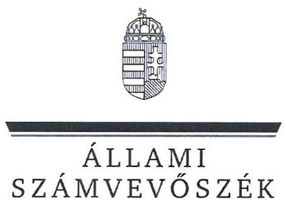
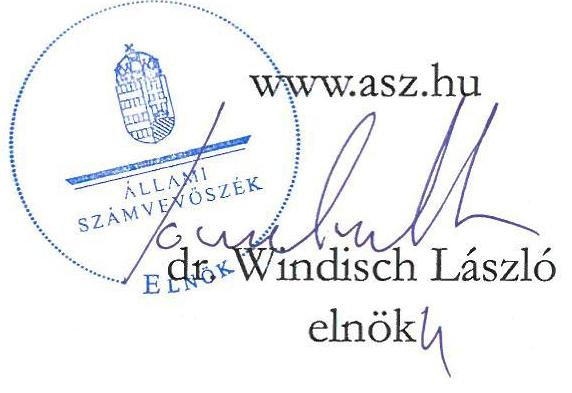
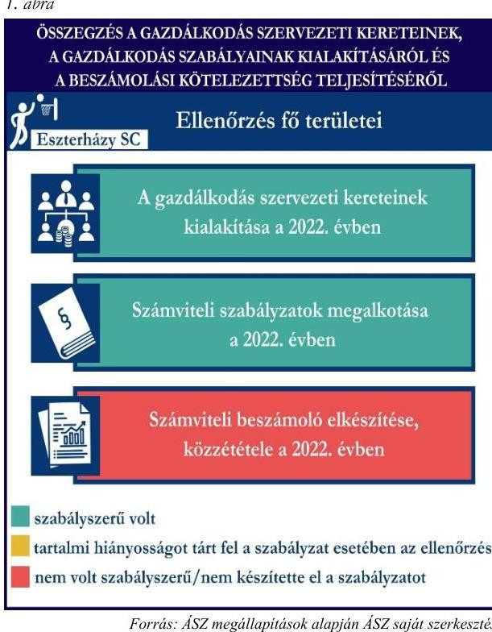
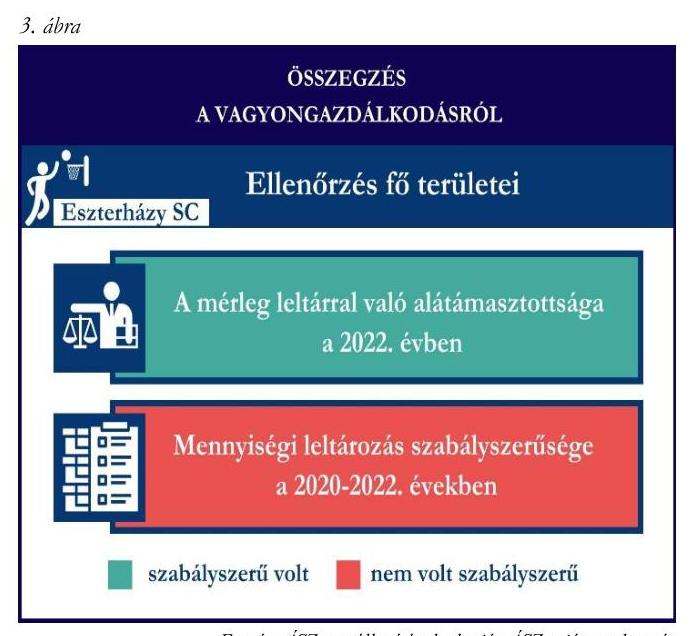
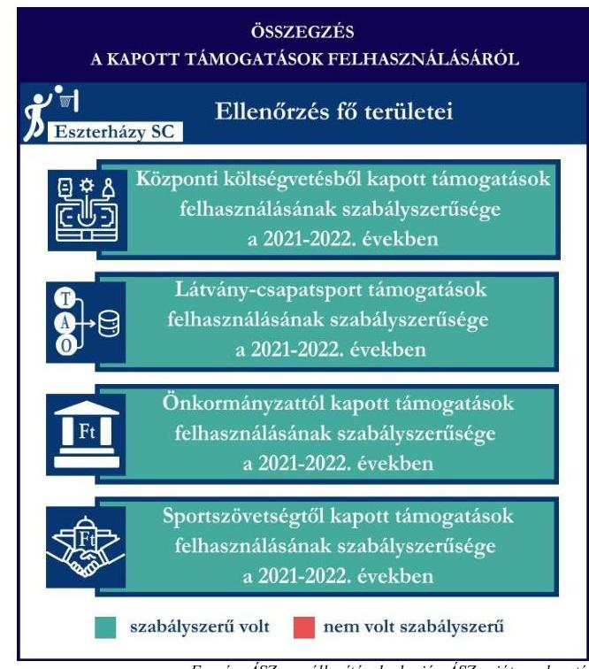

ÁLLAMI
SZÁMVEVŐSZÉK

# JELENTÉS 

## Támogatásban részesülő sportszövetségek és sportegyesületek gazdálkodásának ellenőrzése

Eszterházy Károly Katolikus Egyetem Diák- és Szabadidősport Club
2024.

---

ÁLLAMI
SZÁMVEVÔSZÉK

# JELENTÉS 

## Támogatásban részesülő sportszövetségek és sportegyesületek gazdálkodásának ellenőrzése

Eszterházy Károly Katolikus Egyetem Diák- és Szabadidősport Club
2024.

24144

---

# ELLENŐRZÉSI IGAZGATÓSÁG: 

ÁLLAMHÁZTARTÁSON KÍVÜLI SZERVEZETEKET ELLENŐRZŐ IGAZGATÓSÁG

ELLENŐRZÉSI IGAZGATÓ:
KLINGA LÁSZLÓ igazgató
ELLENŐRZÉSVEZETŐ:
Jelentéseink az interneten a www.asz.hu címen olvashatók.

HOFMEISTER LÁSZLÓ ellenőrzésvezető

IKTATÓSZÁM: EL-4060-107/2024.
TÉMASZÁM: 2682
ELLENŐRZÉS-AZONOSÍTÓ SZÁM: V1026

---

# TARTALOMJEGYZÉK 

AZ ELLENŐRZÉS ALAPADATAI ..... 5
AZ ELLENŐRZÖTT SZERVEZET ..... 7
ÖSSZEFOGLALÁS ..... 8
AZ ELLENŐRZÉS FÓKUSZKÉRDÉSEI ..... 10
MEGÁLLAPÍTÁSOK ..... 11
JAVASLATOK ..... 14
MELLÉKLETEK ..... 15
I. sz. melléklet: Értelmező szótár ..... 15
II. sz. melléklet: Ellenőrzési kritériumok ..... 17
FÜGGELÉK: ÉSZREVÉTELEK ..... 18
RÖVIDÍTÉSEK JEGYZÉKE ..... 19

---

.

---

# AZ ELLENŐRZÉS ALAPADATAI 

## AZ ELLENŐRZÉS CÉLJA

Az ellenőrzés célja az államháztartásból nyújtott támogatással, vagy az államháztartásból meghatározott célra ingyenesen juttatott vagyon felhasználásával érintett sportszövetségek és sportegyesületek gazdálkodása szabályozottságának, gazdálkodási tevékenységének, ezen belül a beszámolási kötelezettség teljesítésének, a támogatások elkülönített nyilvántartásának, valamint a támogatások felhasználásának ellenőrzése.

## AZ ELLENŐRZÉS TÍPUSA

Szabályszerüségi ellenőrzés.

## AZ ELLENŐRZÖTT IDŐSZAK

Az 1. fókuszkérdés esetében a 2022. év.
A 2. fókuszkérdés vonatkozásában a 2021-2022. évek.
A 3. fókuszkérdés vonatkozásában a 2022. év, a mennyiségi felvétellel történő leltározás dokumentumai tekintetében a 2020-2022. évek.

## AZ ELLENŐRZÉS TÁRGYA

Az ellenőrzés tárgya a támogatásban részesülő sportszövetségek, sportegyesületek gazdálkodása szabályozottságának, gazdálkodási tevékenységén belül a beszámolási kötelezettség teljesítésének, a vagyonnyilvántartásának, a támogatások elkülönített nyilvántartásának, valamint az államháztartási forrásból származó közvetlen vagy közvetett támogatások és a meghatározott célra ingyenesen juttatott vagyon felhasználásának vizsgálata volt. Az ellenőrzés a támogatások vonatkozásában kiterjedt továbbá a támogató felé történő beszámolási és elszámolási kötelezettségek teljesítésére, az ezekkel kapcsolatos jogszabályi és belső előírások betartására.

Az ellenőrzés kiterjedt minden olyan körülményre és adatra, amely az ÁSZ ${ }^{1}$ jogszabályban meghatározott feladatainak teljesítéséhez, valamint az ellenőrzési program végrehajtása során felmerülő újabb összefüggések feltárásához szükséges volt.

Az 1. és 3. fókuszkérdés tekintetében az ellenőrzés a teljes ellenőrzött szervezetre, a 2. fókuszkérdés tekintetében kizárólag a kosárlabda szakosztályra vonatkozott.

---

# Az ellenőrzés jogsalapja 

Az ellenőrzés jogszabályi alapját az ÁSZ tv. ${ }^{2} 1 . \int(3)$ bekezdése, az 5. $\int(3)$ bekezdése, valamint a Civil tv. ${ }^{3} 47 . \int$ előírásai képezték.

## AZ ELLENŐRZÉS MÓDSZERE

Az ellenőrzést a nemzetközi standardokat irányadónak tekintve az ellenőrzési program szempontjai, az ellenőrzött időszakban hatályos jogszabályok, az ellenőrzés általános szakmai szabályai, az ellenőrzésre irányadó ÁSZ módszertanok figyelembevételével végezte az ÁSZ.

Az ellenőrzési kérdések megválaszolásához szükséges bizonyítékok megszerzése az ellenőrzött szervezet által rendelkezésre bocsátott dokumentumokra, adatokra alapozva kérdésfeltevés (információkérés), interjú, mintavételezés útján történt.

Az ellenőrzési bizonyítékként felhasználható adatforrások közé tartoztak egyrészt az ellenőrzés során az ellenőrzött szervezettől bekért dokumentumok, másrészt adatforrás lehetett minden további, az ellenőrzés folyamán feltárt, az ellenőrzés szempontjából információt tartalmazó dokumentum.

A támogatásokkal, azok felhasználásával kapcsolatos kötelezettségek vizsgálatára mintavételi eljárások kerültek alkalmazásra. Támogatás-típusok szerint nagyságrend alapján 1-3 darab támogatás került részletes vizsgálat alá. Ezen támogatások felhasználásának szabályszerűsége támogatásonként kockázatértékelés alapján kiválasztott mintatételekkel került ellenőrzésre. A kiválasztott támogatási szerződésekhez kapcsolódó elszámolásokból 30-30 db mintatétel került ellenőrzésre, ahol az elszámolás nem érte el a 30 db -ot, ott tételes ellenőrzésre került sor. Ezen felül a vagyongazdálkodás szabályszerűségének ellenőrzéséhez is kockázatalapú mintavétel kapcsolódott. A támogatások felhasználása és a vagyongazdálkodás területén a minták ellenőrzése kiterjedt a könyvvezetési kötelezettség vizsgálatára is. A tárgyi eszközök tekintetében 30 db került kiválasztásra a 2022. évben állományban lévő eszközök közül, ahol az állományban lévő eszközök száma nem érte el a 30 db -ot, ott tételes ellenőrzésre került sor azok nyilvántartásának, elszámolásának szabályszerűsége ellenőrzése céljából. Az ellenőrzésben nem statisztikai mintavételre került sor, ezért nem történt kivetítés a teljes sokaságra, a megállapításokat az ellenőrzött mintatételekre vonatkozóan fogalmazta meg az ÁSZ.

---

# AZ ELLENŐRZÖTT SZERVEZET

## **ESZTERHÁZY KÁROLY KATOLIKUS EGYETEM DIÁK- ÉS SZABADIDŐSPORT CLUB**

Az Eszterházy SC¹-t 1979 január 1-jén alapították, elsődleges célja a rendszeres testedzés biztosítása, a sport iránti igények felkeltése, valamint tagjainak nevelése az egészséges életmódra. További célja, hogy szakosztályain keresztül edzéslehetőséget biztosítson, illetve versenyeket szervezzen.

Az Eszterházy SC hat szakosztállyal működött az ellenőrzött időszakban, taglétszáma 2022. december 31-én meghaladta a 300 főt. Az Eszterházy SC a jogszabályi előírás alapján könyvvizsgálatra nem, felügyelőbizottság létrehozására kötelezett volt, a 2022. évben vállalkozási tevékenységet nem végzett. Az Eszterházy SC az OBH⁵ nyilvántartás alapján közhasznú jogállással rendelkezett 2018. január 23-a óta.

A 2021-2022. években az Eszterházy SC által igénybe vett államháztartási forrásból származó támogatásokat az 1. táblázat foglalja magában.

|  AZ ESZTERHÁZY SC ÁLTAL IGÉNYBE VETT TÁMOGATÁSOK* (ADATOK M FT-BAN) |  |   |
| --- | --- | --- |
|   | 2021. év | 2022. év  |
|  Központi költségvetésből | - | 3,8  |
|  Helyi önkormányzat | 10,1 | 9,5  |
|  Országos szövetségtől | 10,6 | 7,3  |
|  Látvány-csapatsport támogatásból | 159,8 | 191,7  |
|  *több szakosztályt érintő támogatás | Forrás: Az ellenőrzött szervezet főkönyvi adatai alapján ÁSZ saját szerkesztés |   |

---

# ÖSSZEFOGLALÁS 

Az Alaptörvény ${ }^{6}$ XX. cikke kimondja, hogy mindenkinek joga van a testi és lelki egészséghez, melynek érvényesülését Magyarország többek között a sportolás és a rendszeres testedzés támogatásával segíti elő. Az Országgyűlés ${ }^{7}$ a Sport tv. ${ }^{8}$-ben kinyilvánította, hogy a nemzet közössége a test művelését, a sportot, a nemzet alapértékének, kívánatos célnak tekinti. A sport a közjó része. Erősíti a közösség tagjainak egymáshoz tartozását, miként az egyén testi és lelki egészségét.

A sportegyesületek, sportszövetségek működésükre és szakmai tevékenységük ellátására költségvetési támogatásban, önkormányzati támogatásban, ingyenes vagyonjuttatásban, valamint látvány-csapatsport támogatásban részesülhetnek, amelyekre fokozott figyelem irányul.

A társadalom részéről jogosan felmerülő elvárás, hogy a közpénzeket kezelő, azzal gazdálkodó szervezetek müködéséről, tevékenységéről átfogó képet kapjon, a közpénzek rendeltetésszerü és átlátható módon történő felhasználásának értékelésére időről-időre sor kerüljön az ellenőrzések keretében.

Forrás: $A S Z$ megállapítások alapján $A S Z$ saját szerkezzés

Az Eszterházy SC tekintetében a gazdálkodási szabályok kialakítása, a könyvvezetési kötelezettség teljesítése a 2022. évben szabályszerű volt. A beszámolási kötelezettség teljesítése a 2022. évben nem volt szabályszerű.

Az Eszterházy SC a könyvviteli szolgáltatás személyi feltételeinek megteremtéséről, felügyelőbizottság létrehozásáról és müködéséről gondoskodott.

A 2022. évben a jogszabályi előírások szerint az Eszterházy SC kialakította a számviteli politikáját, valamint elkészítette számviteli szabályzatait.

Az Eszterházy SC a könyvvezetési kötelezettségét szabályszerűen teljesítette. Beszámolási kötelezettség teljesítése nem volt szabályszerű, mert a 2022. évi számviteli beszámolója nem tartalmazta a kiegészítő mellékletet. A számviteli beszámoló vonatkozásában a közzétételi kötelezettségét a 2022. évről nem teljesíttette.

A gazdálkodás szervezeti keretei kialakításának, a számviteli szabályzatok megalkotásának, valamint a számviteli beszámoló elkészítésének és közzétételének értékelését az 1. ábra mutatja be.

---

Az Eszterházy SC az ellenőrzött támogatási szerződésekben foglaltak alapján, a központi költségvetésből, a látvány-csapatsport támogatásból, a helyi önkormányzattól, valamint a központi költségvetésből az $\mathrm{MEFS}^{9}$-en keresztül a kapott támogatásokat az ellenőrzött tételek vonatkozásában a 2021-2022. években a támogatási célnak megfelelően használta fel. Az ellenőrzött támogatások felhasználásáról nem vezetett szabályszerű elkülönített nyilvántartást a 2021-2022. években.

A kapott támogatások felhasználásának ellenőrzéséről az összegzést a 2. ábra tartalmazza.

Forrás: $A S Z$ megállapítások alapján $A S Z$ saját szerkesztés
2. ábra

Az Eszterházy SC vagyongazdálkodása a 2022. évben szabályszerű volt az ellenőrzött tételek vonatkozásában.

A 2022. évi beszámolóját szabályszerű leltárral alátámasztotta. A mérlegben szereplő eszközök a jogszabály szerinti, legalább háromévente előírt mennyiségi leltározását a 2022. évben nem teljeskörűen végezte el.

A vagyongazdálkodás ellenőrzésének összegzését a 3. ábra tartalmazza.

---

# AZ ELLENŐRZÉS FÓKUSZKÉRDÉSEI 

1.     - A gazdálkodási szabályok kialakítása, a könyvvezetési és beszámolási kötelezettség teljesítése szabályszerű volt-e?
2.     - A kapott támogatások felhasználása szabályszerű volt-e?
3.     - Az ellenőrzött szervezet vagyongazdálkodása szabályszerű volt-e?

---

# MEGÁLLAPÍTÁSOK 

## 1. A gazdálkodási szabályok kialakítása, a könyvvezetési és beszámolási kötelezettség teljesítése szabályszerű volt-e?

Összegző megállapítás Az Eszterházy SC a 2022. évben a gazdálkodási szabályokat kialakította. A számviteli beszámoló készítési kötelezettségét szabályszerűen, a közhasznúsági melléklet készítési- és közzétételi kötelezettségét nem a jogszabályoknak megfelelően teljesítette.

A könyvviteli szolgáltatás személyi feltételeinek teljesüléséről az Eszterházy SC a 2022. évben a Számv. tv. ${ }^{10}$ és a Civilszr. ${ }^{11}$-ben foglaltaknak megfelelően gondoskodott.
Az Eszterházy SC a 2022. évben a Ptk. ${ }^{12}$ és a Civil tv. előírásainak betartásával gondoskodott az előírt felügyelőbizottság létrehozásáról, a felügyelőbizottság ügyrendjét a Civil tv.-ben foglaltaknak megfelelően elkészítette.
Az Eszterházy SC a 2022. évben rendelkezett a Számv. tv. előírásainak megfelelő számviteli politikával, az eszközök és a források leltárkészítési és leltározási szabályzatával, az eszközök és források értékelési szabályzatával, pénzkezelési szabályzattal, valamint számlarenddel.
Az Eszterházy SC a Civilszr. előírásainak megfelelően kettős könyvvitel vezetésével teljesítette könyvvezetési kötelezettségét a 2022. évben. Az Eszterházy SC a könyvviteli nyilvántartásait a Számv. tv. és a Civilszr. rendelkezéseinek megfelelően úgy alakította ki, hogy a beszámolóban az egyéb bevételeken belül a tagdíjakat és a kapott támogatások összegét részletezni tudta.
A kettős könyvvitellel alátámasztott 2022. évi egyszerűsített éves beszámolója a Civil tv. 29. § (2) bekezdésben előírtak ellenére nem tartalmazta a kiegészítő mellékletet, továbbá a közhasznúsági melléklet a Civil vhr. ${ }^{13}$ 12. § (1) bekezdés előírása ellenére nem tartalmazta a közhasznúsági melléklet 5-6. pontjait (Célszerinti juttatások, vezető tisztségviselőnek nyújtott juttatások).
A 2022. évi egyszerűsített éves beszámolóját a Ptk. és a Civil tv. alapján az Eszterházy SC felügyelőbizottsága véleményezte, a legfőbb döntéshozó szerve jóváhagyta.
Az Eszterházy SC a 2022. évi számviteli beszámolóját nem Civil tv. 30. § (1) bekezdésében foglaltaknak megfelelően helyezte letétbe. A Civil tv. 30. § (4) bekezdése előírása ellenére az Eszterházy SC 2022. évi számviteli beszámolója a saját honlapján nem került közzétételre.

---

# 2. A kapott támogatások felhasználása szabályszerű volt-e? 

Összegző megállapítás Az Eszterházy SC a kapott támogatásokat az ellenőrzött tételek vonatkozásában a 2021-2022. években szabályszerűen, a támogatási célnak megfelelően használta fel. A könyvviteli rendszerében nem minden esetben különítette el szabályszerűen a kapott támogatások felhasználását.

Az Eszterházy SC az ellenőrzött támogatási szerződésekben foglaltak alapján, a központi költségvetésből, a látvány-csapatsport támogatásból, a helyi önkormányzattól, valamint a központi költségvetésből az MEFS-en keresztül kapott támogatások bevételeit a Civil tv. előírásai alapján elkülönítette a számviteli rendszerében.
Az Eszterházy SC a 2022. évben a Számv. tv. 161/A. § (2) bekezdésében, valamint a Civil tv. 20. $\int$ (4) bekezdésében foglaltak ellenére az előírt alapcél szerinti tevékenysége költségei, ráfordításai ellentételezésére a központi költségvetésből kapott ellenőrzött támogatásról nem olyan elkülönített számviteli nyilvántartást vezetett, amelynek alapján megállapítható és ellenőrizhető a kapott támogatás felhasználása. Az ellenőrzött három tétel nem a záradékban szereplő szerződésszámmal hivatkozott támogatási szerződés terhére volt elszámolva az elkülönített számviteli nyilvántartásban. Ez alapján a támogatás felhasználásáról készített összesített elszámolás könyvviteli nyilvántartással, valamint támogatásonkénti elkülönített adatokkal nem volt alátámasztott.
Az Eszterházy SC a 2022. évben a központi költségvetésből részére jutatott támogatás felhasználásáról a támogató felé benyújtott beszámolót és annak részeként az összesített elszámolási táblázatot a támogatási szerződésben előírt formában és tartalommal elkészítette. A támogatás felhasználásáról a támogató felé benyújtott elszámolást alátámasztó számviteli bizonylatok a Számv. tv.-ben foglalt alaki és tartalmi követelményeknek megfeleltek, a támogató felé benyújtott számlák a 474/2016. (XII. 27.) Korm. rendeletben ${ }^{14}$ előírtaknak megfelelően záradékolásra kerültek.
Az Eszterházy SC a 2021-2022. években a Számv. tv. 161/A. § (2) bekezdésében foglaltak ellenére a Civil tv. 20. § (4) bekezdésében előírt alapcél szerinti tevékenysége költségei, ráfordításai ellentételezésére a látvány-csapatsport támogatásból kapott ellenőrzött támogatásról nem olyan elkülönített számviteli nyilvántartást vezetett, amelynek alapján támogatásonként megállapítható és ellenőrizhető a kapott támogatás felhasználása. Az ellenőrzött tételekből 26 tétel nem szerepelt a támogatás felhasználásának elkülönített számviteli nyilvántartásában, mivel az Eszterházy SC elkülönített számviteli nyilvántartással a bérköltségek felhasználása tekintetében nem rendelkezett. Ez alapján a látvány-csapatsport támogatásának felhasználásáról készített elszámolások könyvviteli nyilvántartással, az abban szereplő támogatásonkénti elkülönített adatokkal nem voltak alátámasztottak.
Az Eszterházy SC a 2021-2022. években rendelkezett a 107/2011. (VI. 30.) Korm.rendelet ${ }^{15}$-ben előírt látvány-csapatsport támogatással érintett, jóváhagyott SFP ${ }^{16}$-vel. Az Eszterházy SC a támogatás felhasználásáról negyedévente az előrehaladási jelentéseket benyújtotta az MKOSZ ${ }^{17}$ felé. Az ellenőrzött SFP-vel kapcsolatban kapott látvány-csapatsport és kiegészítő látvány-csapatsport támogatással az Eszterházy SC a 107/2011. (VI. 30.) Korm. rendeletnek megfelelően könyvvizsgáló által ellenőrzött számviteli bizonylatokkal számolt el a támogató felé, a támogatás felhasználását szöveges, szakmai beszámolóval igazolta. A könyvvizsgáló rendelkezett a 107/2011. (VI. 30.) Korm. rendeletben előírt felelősségbiztosítással.

---

Az Eszterházy SC a 2022. években a Számv. tv. 161/A. § (2) bekezdésében foglaltak ellenére a Civil tv. 20. $\int$ (4) bekezdésében előírt alapcél szerinti tevékenysége költségei, ráfordításai ellentételezésére a helyi önkormányzattól kapott ellenőrzött támogatásról nem olyan elkülönített számviteli nyilvántartást vezetett, amelynek alapján támogatásonként megállapítható és ellenőrizhető a kapott támogatás felhasználása. Az ellenőrzött tételekből egy tétel nem a záradékban szereplő szerződésszámmal hivatkozott támogatási szerződés terhére volt elszámolva az elkülönített számviteli nyilvántartásban. Ez alapján a támogatás felhasználásáról készített összesített elszámolás könyvviteli nyilvántartással, valamint támogatásonkénti elkülönített adatokkal nem volt alátámasztott.
Az Eszterházy SC a 2022. évben a helyi önkormányzat költségvetéséből számára juttatott sportcélú támogatásról, a támogatási szerződésben előírtaknak megfelelően teljesítette beszámolási kötelezettségét a támogatás rendeltetésszerű felhasználásáról a helyi önkormányzat felé. A támogatás felhasználásáról a támogató felé benyújtott elszámolást alátámasztó számviteli bizonylat a Számv. tv.-ben foglalt alaki és tartalmi követelményeknek megfelelt.
Az Eszterházy SC a 2022. években a Számv. tv.-ben és a Civil tv.-ben előírt alapcél szerinti tevékenysége költségei, ráfordításai ellentételezésére a központi költségvetésből az MEFS-en keresztül kapott ellenőrzött támogatásokról elkülönített számviteli nyilvántartást vezetett, amelynek alapján támogatásonként megállapítható és ellenőrizhető volt a kapott támogatás felhasználása. A központi költségvetésből az MEFS-en-en keresztül számára jutatott támogatásokról a támogatási szerződésekben előírt formában és tartalommal a pénzügyi elszámolást és a szakmai beszámolót elkészítette, és benyújtotta a támogató felé. A támogatás felhasználásáról a támogató felé benyújtott elszámolásokat alátámasztó számviteli bizonylatok a Számv. tv.-ben foglalt alaki és tartalmi követelményeknek megfeleltek.

# 3. Az ellenőrzött szervezet vagyongazdálkodása szabályszerű volt-e? 

Összegző megállapítás Az Eszterházy SC vagyongazdálkodása a 2022. évben szabályszerű volt az ellenőrzött tételek vonatkozásában. A 2022. évi beszámolóját szabályszerű leltárral támasztotta alá, azonban a sportolók számára kiadott eszközök 2022. évi mennyiségi leltározását az Eszterházy SC nem végezte el.

Az Eszterházy SC a Számv. tv.-nek megfelelően a 2022. évi beszámolójának mérleg tételeit alátámasztotta szabályszerű leltárral, elvégezte a főkönyvi könyvelés és az analitikus nyilvántartások adatai közötti egyeztetést. A mérlegben szereplő tárgyi eszközök a Számv. tv.-ben előírt, legalább háromévente esedékes mennyiségi leltározását a 2022. évre vonatkozóan a sportolók számára kiadott eszközök kivételével végezte el, mellyel az Eszterházy SC megsértette a Számv. tv. 69. § (3) bekezdésében előírtakat.
Az Eszterházy SC-nél az ellenőrzött tételek vonatkozásában a tárgyi eszközök bekerülési értékét, az értékcsökkenés elszámolását a Számv. tv. előírásainak megfelelően határozták meg, az üzembe helyezést a tárgyi eszközök vonatkozásában a Számv. tv.-ben előírásainak megfelelően dokumentálták.

---

# JAVASLATOK 

Az ÁSZ tv. 33. § (1) bekezdésében foglaltak értelmében az ellenőrzött szervezet vezetője köteles a jelentésben foglalt megállapításokhoz kapcsolódó intézkedési tervet összeállítani és azt a jelentés kézhezvételétől számított 30 napon belül az ÁSZ részére megküldeni. Amennyiben az ellenőrzött szervezet vezetője nem küldi meg határidőben az intézkedési tervet, vagy továbbra sem elfogadható intézkedési tervet küld, az Állami Számvevőszék elnöke az ÁSZ tv. 33. § (3) bekezdése a) és b) pontjaiban foglaltakat érvényesítheti.

## Az Eszterházy Károly Katolikus Egyetem DiÁk- és SZABADIDÓSPORT CLUB ELNÖKÉNEK

1. Gondoskodjon a beszámoló részét képező kiegészítő melléklet elkészítéséről a Civil tv. 29. § (2) bekezdés c) pontjában előírtak alapján.
2. Gondoskodjon a számviteli beszámoló közzétételéről a Civil tv. 30. § (1) és (4) bekezdéseiben előírtak szerint.
3. Gondoskodjon a központi költségvetésből, az önkormányzattól, valamint a látvány-csapatsport támogatásból kapott támogatások olyan elkülönített számviteli nyilvántartásának vezetéséről, amely alapján támogatásonként megállapítható és ellenőrizhető a kapott támogatás felhasználása, a Civil tv. 20. § (4) bekezdés és a Számv. tv. 161/A. § (2) bekezdés előírásai alapján.
4. Gondoskodjon a sportolóknak kiadott eszközök mennyiségi felvétellel elvégzendő leltározásról a Számv. tv. 69. § (3) bekezdéseiben előírtaknak megfelelően.

---

# MELLÉKLETEK 

## I. SZ. MELLÉKLET: ÉRTELMEZŐ SZÓTÁR

civil szervezet
egyesület
költségvetési támogatás
közhasznú szervezet
közhasznú tevékenység
látvány-csapatsport támogatás
sportági szövetség
sportegyesület

A civil társaság; a Magyarországon nyilvántartásba vett egyesület - a párt, a szakszervezet és a kölcsönös biztosító egyesület kivételével és - a közalapítvány és a pártalapítvány kivételével - az alapítvány. (Forrás: Civil tv. 2. $\$ 6$. pont a) -c) alpontjai)

Az egyesület a tagok közös, tartós, alapszabályban meghatározott céljának folyamatos megvalósítására létesített, nyilvántartott tagsággal rendelkező jogi személy. (Forrás: Ptk. 3:63. § (1) bekezdés)
A Számv. tv. szempontjából egyéb szervezet. (Számv. tv. 3. § (1) bekezdés 4. pont a) alpontja)
A társadalombiztosítás pénzügyi alapjai kivételével az államháztartás központi alrendszeréből ellenérték nélkül, pénzben nyújtott támogatások. (Forrás: Áht. ${ }^{18}$ 1. § 14. pont, ide nem értve az Áht. 1. § 14. pont a) -o) pontjaiban szereplő támogatásokat)
Közhasznú szervezetté minősíthető a Magyarországon nyilvántartásba vett közhasznú tevékenységet végző szervezet, amely a társadalom és az egyén közös szükségleteinek kielégítéséhez megfelelő erőforrásokkal rendelkezik, továbbá amelynek megfelelő társadalmi támogatottsága kimutatható, és amely:
a) civil szervezet (ide nem értve a civil társaságot), vagy
b) olyan egyéb szervezet, amelyre vonatkozóan a közhasznú jogállás megszerzését törvény lehetővé teszi. (Forrás: Civil tv. 32. § (1) bekezdés)
Minden olyan tevékenység, amely a létesítő okiratban megjelölt közfeladat teljesítését közvetlenül vagy közvetve szolgálja, ezzel hozzájárulva a társadalom és az egyén közös szükségleteinek kielégítéséhez. (Forrás: Civil tv. 2. § 20. pont)
Az adóévben visszafizetési kötelezettség nélkül nyújtott támogatás, juttatás, véglegesen átadott pénzeszköz és térítés nélkül átadott eszköz könyv szerinti értéke, az adóévben térítés nélkül nyújtott szolgáltatás bekerülési értéke a Tao. tv.-ben meghatározott jogcímeken. (Forrás: Tao. tv. 4. § 44. pont)
A Civil tv. és a Ptk. előírásai alapján - a Sport tv.-ben meghatározott eltérésekkel - múködő szövetség, amelynek tagjai kizárólag sportszervezetek lehetnek. Sportági szövetség országos jelleggel is múködhet. Egy sportágban csak egy országos sportági szövetség múködhet. Törvényi feltételek teljesülése esetén szakszövetségi feladatokat is elláthat. (Forrás: Sport tv. 28. § (1)-(2) bekezdései)
A Civil tv. és a Ptk. szabályai szerint múködő olyan egyesület, amelynek alaptevékenysége a sporttevékenység szervezése, valamint a sporttevékenység feltételeinek megteremtése. A sportegyesületek a Sport tv. 15. § (1) bekezdésében meghatározott sportszervezetek körébe tartoznak. A sportegyesületeken kívül sportszervezet még a sportvállalkozás, a sportiskola, valamint az utánpótlás-nevelés fejlesztését végző alapítvány. (Forrás: Sport tv. 16. § (1) bekezdés)

---

sportegyesületeknek, sportszövetségeknek nyújtott költségvetési támogatás
sportszövetség
sporttevékenység

Az állami sport célú támogatások felhasználásáról és elosztásáról szóló 474/2016. (XII. 27.) Kormány rendelet 1. § (1) bekezdésében és a 27/2013. (III. 29.) EMMI rendelet ${ }^{19}$ 1. $\mathbb{S}$-ában meghatározott fejezeti kezelésű előirányzatokból nyújtott támogatás.
Meghatározott sporttevékenységek körében a sportversenyek szervezésére, a tagok érdekvédelmére és a részükre való szolgáltatásokra, valamint a nemzetközi kapcsolatok lebonyolítására létrehozott, jogi személyiséggel és önkormányzattal rendelkező, a Civil tv. és a Ptk. alapján - az e törvényben foglalt eltérésekkel - különös formában müködő egyesületek. A Sport tv. 19. § (3) bekezdése szerint a sportszövetségeknek az alábbi típusai léteznek: országos sportági szakszövetségek, sportági szövetségek, szabadidősport szövetségek, fogyatékosok sportszövetségei, diák- és egyetemi-főiskolai sport sportszövetségei, nemzetközi sportszövetségek. (Forrás: Sport tv. 19. $\int(1),(3)$ bekezdés)
Meghatározott szabályok szerint, a szabadidő eltöltéseként kötetlenül vagy szervezett formában, illetve versenyszerűen végzett testedzés vagy szellemi sportágban kifejtett tevékenység, amely a fizikai erőnlét és a szellemi teljesítőképesség megtartását, fejlesztését szolgálja. (Forrás: Sport tv. 1. § (2) bekezdés)

---

# II. SZ. MELLÉKLET: ELLENŐRZÉSI KRITÉRIUMOK 

## FOKUSZKÉRDÉS

## 1. fókuszkérdés:

A gazdálkodási szabályok kialakítása, a könyvvezetési és beszámolási kötelezettség teljesítése szabályszerű volt-e?

## 2. fókuszkérdés:

A kapott támogatások felhasználása szabályszerű volt-e?

## 3. fókuszkérdés:

Az ellenőrzött szervezet vagyongazdálkodása szabályszerű volt-e?

## ELLENŐRZÉSI KRITÉRIUMOK

Számv. tv. 14. § (3) bekezdés, (5) bekezdés a), b), d) pont, (8) bekezdés, 69. $\S$ (3) bekezdés, 90. $\$ (3) bekezdés c) pont, 161. $\$$ (1) bekezdés, (2) bekezdés a) -d) pont, (3)-(4) bekezdés, 161/A. $\$(2)$ bekezdés, 165. $\$ (2) bekezdés
Civilszr. 7. § (1) bekezdés, (4) bekezdés b), c) pont, 8. § (2), (3) bekezdés, 9. § (4), (5) bekezdés, 15. § (1) bekezdés a), b) pont, 16. $\$(1)$ bekezdés, 24. $\$ (2) bekezdés
Ptk. 3:26. § (1) bekezdés, 3:27. § (1) bekezdés, 3:82. § (1) bekezdés,
Civil tv. 28.§ (1) bekezdés, 29. § (2) bekezdés c) pont, (3), (6), (7) bekezdés, 30. § (1)-(4) bekezdés 40. § (1), (2) bekezdés, 41. § (1) bekezdés
Civil vhr.
Számv. tv. 44. § (2) bekezdés, 93. § (3) bekezdés, 159. §, 161/A. $\$(2)$ bekezdés, 165. § (2) bekezdés, 167. § (1) bekezdés a), d), e), b) pont

Civil tv. 20. § (2) bekezdés a) pont, (3) bekezdés a), c) pont, (4) bekezdés, 29. § (4), (5) bekezdés
Civilszr. 24. § (2) bekezdés
27/2013. (III.29.) EMMI rend. 18. § (2) bekezdés
474/2016. (XII. 27.) Korm. rend. 22. § (2) bekezdés, 24. § (2) bekezdés
107/2011. (VI. 30.) Korm. rend. 9. § (9) bekezdés, 11. § (1), (2), (4), (4a), (5), (6) bekezdés, 14. § (1) bekezdés,

Tao. tv. ${ }^{20}$ 22/C. $\$ 3$ (a), (3c) bek., 24/A. $\$ 9$ (b) bek.
Számv. tv. 16. § (2) bekezdés, 26. §, 42. § (5) bekezdés, 46. § (3) bekezdés, 47-53. §, 69.§, 159. §, 161/A. §, 162. § (1)-(2) bekezdés, 165-166. §, 169.§

Ávr. ${ }^{21}$ 93. § (5) bekezdés
474/2016. (XII. 27.) Korm. rend. 17. § (1) bekezdés 11a., 11b. pont, 17. § (2a) bekezdés, 24. § (2) bekezdés

---

# FÜGGELÉK: ÉSZREVÉTELEK 

A jelentéstervezetet a Számvevőszék 15 napos észrevételezésre megküldte az ellenőrzött szervezet vezetőjének az ÁSZ tv. 29. §* (1) bekezdése előírásának megfelelően.

Az elfogadott észrevételek alapján a Számvevőszék módosította a jelentést.

[^0]
[^0]:    * 29. § (1) Az Állami Számvevőszék az ellenőrzési megállapításait megküldi az ellenőrzött szervezet vezetőjének vagy az általa megbízott személynek, és annak, akinek személyes felelősségét állapította meg.
    (2) Az ellenőrzött szervezet vezetője és a felelősként megjelölt személy az ellenőrzés megállapításaira tizenöt napon belül írásban észrevételt tehet.
    (3) Az Állami Számvevőszék az észrevételre a beérkezésétől számított harminc napon belül írásban válaszol. A figyelembe nem vett észrevételeket köteles a jelentésben feltüntetni, és megindokolni, hogy azokat miért nem fogadta el.

---

# RÖVIDÍTÉSEK JEGYZÉKE 

${ }^{1}$ ÁSZ
${ }^{2}$ ÁSZ tv.
${ }^{3}$ Civil tv.
${ }^{4}$ Eszterházy SC
${ }^{5} \mathrm{OBH}$
${ }^{6}$ Alaptörvény
${ }^{7}$ Országgyúlés
${ }^{8}$ Sport tv.
${ }^{9}$ MEFS
${ }^{10}$ Számv. tv.
${ }^{11}$ Civilszr.
${ }^{12}$ Ptk.
${ }^{13}$ Civil vhr.
${ }^{14}$ 474/2016. (XII. 27.) Korm. rendelet
${ }^{15}$ 107/2011. (VI. 30.) Korm. rend
${ }^{16}$ SFP
${ }^{17}$ MKOSZ
${ }^{18}$ Áht.
${ }^{19}$ 27/2013. (III.29.) EMMI rendelet
${ }^{20}$ Tao. tv.
${ }^{21}$ Ávr.

Állami Számvevőszék
2011. évi LXVI. törvény az Állami Számvevőszékről
2011. évi CLXXV. törvény az egyesülési jogról, a közhasznú jogállásról, valamint a civil szervezetek müködéséről és támogatásáról
Eszterházy Károly Katolikus Egyetem Diák- és Szabadidősport Club
Országos Bírósági Hivatal
Magyarország Alaptörvénye
Magyarország Országgyűlése
2004. évi I. törvény a sportról

Magyar Egyetemi-Főiskolai Sportszövetség
2000. évi C. törvény a számvitelről

479/2016. (XII. 28.) Korm. rendelet a számviteli törvény szerinti egyes egyéb szervezetek beszámoló készítési és könyvvezetési kötelezettségének sajátosságairól
2013. évi V. törvény a Polgári Törvénykönyvről

350/2011. (XII. 30.) Korm. rendelet a civil szervezetek gazdálkodása, az adománygyűjtés és a közhasznúság egyes kérdéseiről
474/2016. (XII. 27.) Korm. rendelet az állami sport célú támogatások felhasználásáról és elosztásáról
107/2011. (VI. 30.) Korm. rend. a látvány-csapatsport támogatását biztosító támogatási igazolás kiállításáról, felhasználásáról, a támogatás elszámolásának és ellenőrzésének, valamint visszafizetésének szabályairól
Sportfejlesztési program
Magyar Kosárlabdázók Országos Szövetsége
2011. évi CXCV. törvény az államháztartásról

27/2013. (III. 29.) EMMI rendelet az állami sport célú támogatások felhasználásáról és elosztásáról
1996. évi LXXXI. törvény a társasági adóról és az osztalékadóról
368/2011. (XII. 31.) Korm. rendelet az államháztartásról szóló törvény végrehajtásáról

---

1052 Budapest, Apáczai Csere János u. 10. | 1364 Budapest 4., Pf. 54
www.asz.hu | szamvevoszek@asz.hu
telefon: +36 14849100