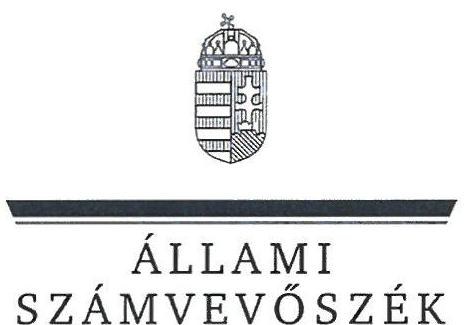
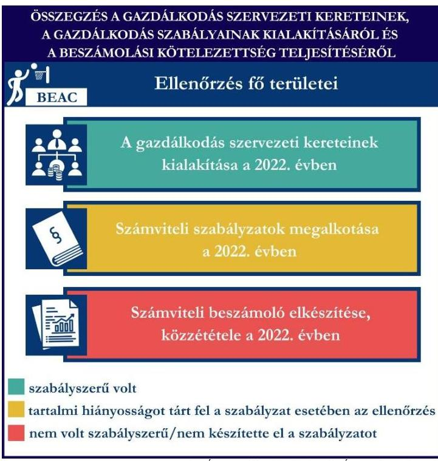
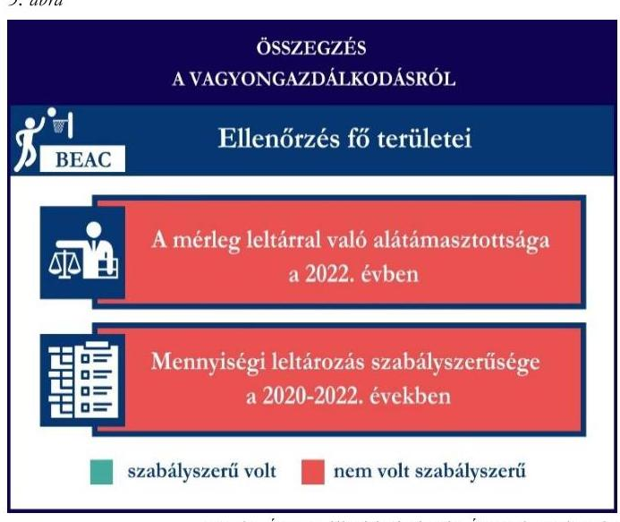

# JELENTÉS 

## Támogatásban részesülő sportszövetségek és sportegyesületek gazdálkodásának ellenőrzése

Budapesti Egyetemi Atlétikai Club

2024.

---

ÁLLAMI
SZÁMVEVŐSZÉK

# JELENTÉS 

## Támogatásban részesülő sportszövetségek és sportegyesületek gazdálkodásának ellenőrzése

Budapesti Egyetemi Atlétikai Club

2024.

---

# ELLENÓRZÉSI IGAZGATÓSÁG: 

ÁLLAMHÁZTARTÁSON KÍVÜLI SZERVEZETEKET ELLENÓRZŐ IGAZGATÓSÁG

ELLENÓRZÉSI IGAZGATÓ:
KLINGA LÁSZLÓ igazgató

ELLENÓRZÉSVEZETÓ:
Jelentéseink az interneten a www.asz.hu címen olvashatók.

HOFMEISTER LÁSZLÓ ellenőrzésvezető

IKTATÓSZÁM: EL-4060-108/2024.
TÉMASZÁM: 2682
ELLENÓRZÉS-AZONOSÍTÓ SZÁM: V1026

---

# TARTALOMJEGYZÉK 

AZ ELLENŐRZÉS ALAPADATAI ..... 5
AZ ELLENŐRZÖTT SZERVEZET ..... 7
ÖSSZEFOGLALÁS ..... 8
AZ ELLENŐRZÉS FÓKUSZKÉRDÉSEI ..... 10
MEGÁLLAPÍTÁSOK ..... 11
JAVASLATOK ..... 14
MELLÉKLETEK ..... 15
I. sz. melléklet: Értelmező szótár ..... 15
II. sz. melléklet: Ellenőrzési kritériumok ..... 17
FÜGGELÉK: ÉSZREVÉTELEK ..... 18
RÖVIDÍTÉSEK JEGYZÉKE ..... 19

---

.

---

# AZ ELLENŐRZÉS ALAPADATAI 

## AZ ELLENŐRZÉS CÉLJA

Az ellenőrzés célja az államháztartásból nyújtott támogatással, vagy az államháztartásból meghatározott célra ingyenesen juttatott vagyon felhasználásával érintett sportszövetségek és sportegyesületek gazdálkodása szabályozottságának, gazdálkodási tevékenységének, ezen belül a beszámolási kötelezettség teljesítésének, a támogatások elkülönített nyilvántartásának, valamint a támogatások felhasználásának ellenőrzése.

## AZ ELLENŐRZÉS TÍPUSA

Szabályszerüségi ellenőrzés.

## AZ ELLENŐRZÖTT IDŐSZAK

Az 1. fókuszkérdés esetében a 2022. év.
A 2. fókuszkérdés vonatkozásában a 2021-2022. évek.
A 3. fókuszkérdés vonatkozásában a 2022. év, a mennyiségi felvétellel történő leltározás dokumentumai tekintetében a 2020-2022. évek.

## AZ ELLENŐRZÉS TÁRGYA

Az ellenőrzés tárgya a támogatásban részesülő sportszövetségek, sportegyesületek gazdálkodása szabályozottságának, gazdálkodási tevékenységén belül a beszámolási kötelezettség teljesítésének, a vagyonnyilvántartásának, a támogatások elkülönített nyilvántartásának, valamint az államháztartási forrásból származó közvetlen vagy közvetett támogatások és a meghatározott célra ingyenesen juttatott vagyon felhasználásának vizsgálata volt. Az ellenőrzés a támogatások vonatkozásában kiterjedt továbbá a támogató felé történő beszámolási és elszámolási kötelezettségek teljesítésére, az ezekkel kapcsolatos jogszabályi és belső előírások betartására.

Az ellenőrzés kiterjedt minden olyan körülményre és adatra, amely az ÁSZ ${ }^{1}$ jogszabályban meghatározott feladatainak teljesítéséhez, valamint az ellenőrzési program végrehajtása során felmerülő újabb összefüggések feltárásához szükséges volt.

Az 1. és 3. fókuszkérdés tekintetében az ellenőrzés a teljes ellenőrzött szervezetre, a 2. fókuszkérdés tekintetében kizárólag a kosárlabda szakosztályra vonatkozott.

---

# Az ellenőrzés jogsalapja 

Az ellenőrzés jogszabályi alapját az ÁSZ tv. ${ }^{2} 1 . \int(3)$ bekezdése, az 5. $\int(3)$ bekezdése, valamint a Civil tv. ${ }^{3} 47 . \int$ előírásai képezték.

## AZ ELLENŐRZÉS MÓDSZERE

Az ellenőrzést a nemzetközi standardokat irányadónak tekintve az ellenőrzési program szempontjai, az ellenőrzött időszakban hatályos jogszabályok, az ellenőrzés általános szakmai szabályai, az ellenőrzésre irányadó ÁSZ módszertanok figyelembevételével végezte az ÁSZ.

Az ellenőrzési kérdések megválaszolásához szükséges bizonyítékok megszerzése az ellenőrzött szervezet által rendelkezésre bocsátott dokumentumokra, adatokra alapozva kérdésfeltevés (információkérés), interjú, mintavételezés útján történt.

Az ellenőrzési bizonyítékként felhasználható adatforrások közé tartoztak egyrészt az ellenőrzés során az ellenőrzött szervezettől bekért dokumentumok, másrészt adatforrás lehetett minden további, az ellenőrzés folyamán feltárt, az ellenőrzés szempontjából információt tartalmazó dokumentum. A támogatásból beszerzett tárgyi eszközök használatára, fizikai fellelhetőségére irányulóan az érintett vagyontárgyak helyszíni szemle keretében történő szemrevételezésére sor került.

A támogatásokkal, azok felhasználásával kapcsolatos kötelezettségek vizsgálatára mintavételi eljárások kerültek alkalmazásra. Támogatás-típusok szerint nagyságrend alapján 1-3 darab támogatás került részletes vizsgálat alá. Ezen támogatások felhasználásának szabályszerűsége támogatásonként kockázatértékelés alapján kiválasztott mintatételekkel került ellenőrzésre. A kiválasztott támogatási szerződésekhez kapcsolódó elszámolásokból 30-30 db mintatétel került ellenőrzésre, ahol az elszámolás nem érte el a 30 db -ot, ott tételes ellenőrzésre került sor. Ezen felül a vagyongazdálkodás szabályszerűségének ellenőrzéséhez is kockázatalapú mintavétel kapcsolódott. A támogatások felhasználása és a vagyongazdálkodás területén a minták ellenőrzése kiterjedt a könyvvezetési kötelezettség vizsgálatára is. A tárgyi eszközök tekintetében 30 db került kiválasztásra a 2022. évben állományban lévő eszközök közül, ahol az állományban lévő eszközök száma nem érte el a 30 db -ot, ott tételes ellenőrzésre került sor azok nyilvántartásának, elszámolásának szabályszerűsége ellenőrzése céljából. Az ellenőrzésben nem statisztikai mintavételre került sor, ezért nem történt kivetítés a teljes sokaságra, a megállapításokat az ellenőrzött mintatételekre vonatkozóan fogalmazta meg az ÁSZ.

---

# AZ ELLENŐRZÖTT SZERVEZET

## Budapesti Egyetemi Atlétikai Club

A BEAC ${ }^{1}$-ot 1979. január 1-jén alapították. Fő célja a széleskörű, rendszeres sportolási lehetőség biztosítása és a versenysport, a tehetséggondozás, az utánpótlásnevelés, a diáksport, valamint a szabadidősport támogatása.

A BEAC-nál 21 szakosztály működött az ellenőrzött időszakban, taglétszáma meghaladta a 100 főt 2022. december 31-én. Két jogi személyiséggel rendelkező szervezeti egysége volt a BEAC-nak, a BEAC SE ${ }^{3}$ Atlétika 1898 Szakosztály és a BEAC Női Kosárlabda Szakosztály. A BEAC két gazdasági társaságnak volt tagja, a BEAC FORTIS Korlátolt Felelősségű Társaságnak és a BEAC 1898 Nonprofit Korlátolt Felelősségű Társaságnak.

A BEAC a jogszabályi előírások alapján könyvvizsgálatra, felügyelőbizottság létrehozására kötelezett volt, a 2022. évben vállalkozói tevékenységet nem végzett. Az $\mathrm{OBH}^{6}$ nyilvántartása alapján 2014. május 27-e óta közhasznú jogállással rendelkezett.

A 2021-2022. években a BEAC által igénybe vett államháztartási forrásból származó támogatásokat az 1. táblázat foglalja magában.

1. táblázat

A BEAC ÁLTAL IGÉNYBE VETT TÁMOGATÁSOK* (ADATOK M FT-BAN)

|   | 2021. év | 2022. év  |
| --- | --- | --- |
|  Központi költségvetésből ** | 1,0 | 6,0  |
|  Helyi önkormányzattól | - | 5,0  |
|  Látvány-csapatsport támogatásból | 190,4 | 226,0  |
|  * több szakosztályt érintő támogatás | Forrás: Az ellenőrzött szervezet fókönyvi adatai alapján Ả̛Z saját szerkesztés |   |
|  **kosárlabda szakosztály nem részelélt a támogatásból |  |   |

---

# ÖSSZEFOGLALÁS 

Az Alaptörvény ${ }^{7}$ XX. cikke kimondja, hogy mindenkinek joga van a testi és lelki egészséghez, melynek érvényesülését Magyarország többek között a sportolás és a rendszeres testedzés támogatásával segíti elő. Az Országgyűlés ${ }^{8}$ a Sport tv. ${ }^{9}$-ben kinyilvánította, hogy a nemzet közössége a test művelését, a sportot, a nemzet alapértékének, kívánatos célnak tekinti. A sport a közjó része. Erősíti a közösség tagjainak egymáshoz tartozását, miként az egyén testi és lelki egészségét.

A sportegyesületek, sportszövetségek müködésükre és szakmai tevékenységük ellátására költségvetési támogatásban, önkormányzati támogatásban, ingyenes vagyonjuttatásban, valamint látvány-csapatsport támogatásban részesülhetnek, amelyekre fokozott figyelem irányul.

A társadalom részéről jogosan felmerülő elvárás, hogy a közpénzeket kezelő, azzal gazdálkodó szervezetek müködéséről, tevékenységéről átfogó képet kapjon, a közpénzek rendeltetésszerủ és átlátható módon történő felhasználásának értékelésére időről-időre sor kerüljön az ellenőrzések keretében.

1. álma

A BEAC-nál a gazdálkodási szabályok kialakítása nem volt szabályszerű, beszámolási kötelezettségét nem szabályszerűen teljesítette.

A BEAC a könyvviteli szolgáltatás személyi feltételeinek megteremtéséről, felügyelőbizottság létrehozásáról és működéséről gondoskodott. A 2022. évben a jogszabályban előírt szabályzatokkal rendelkezett, a számlarend tekintetében az ellenőrzés hiányosságot tárt fel.

A könyvvezetés formája a 2022. évben megfelelt a jogszabályi előírásoknak. A BEAC a 2022. évi számviteli beszámolóját nem a jogszabályban előírtak szerint készítette el, azt könyvvizsgálóval nem vizsgáltatta felül.

A gazdálkodás szervezeti keretei kialakításának, a számviteli szabályzatok megalkotásának, valamint a számviteli beszámoló elkészítésének és közzétételének értékelését az 1. ábra mutatja be.

---

A BEAC a 2021-2022. években a látvány-csapatsport támogatásokat, valamint a 2022. évben a helyi önkormányzattól kapott támogatásokat az ellenőrzött tételek esetében a támogatási célnak megfelelően használta fel, azonban az ellenőrzött támogatások felhasználásáról a jogszabályban előírt elkülönített nyilvántartást a 2021-2022. években nem vezette.

A kapott támogatások felhasználásának ellenőrzéséről az összegzést a 2. ábra tartalmazza.

A BEAC vagyongazdálkodása az ellenőrzött tételek esetében a 2022. évben nem volt szabályszerű.

A 2022. évi beszámolójának mérlegtételeit nem támasztotta alá leltárral. A jogszabályban előírt mennyiségi felvétellel történő leltározást a 2020-2022. években nem végezte el. Ez alapján sérült a törvényben előírt valódiság elve.

A vagyongazdálkodás ellenőrzésének az összegzését a 3. ábra tartalmazza.

---

# AZ ELLENŐRZÉS FÓKUSZKÉRDÉSEI 

1.     - A gazdálkodási szabályok kialakítása, a könyvvezetési és beszámolási kötelezettség teljesítése szabályszerű volt-e?
2.     - A kapott támogatások felhasználása szabályszerű volt-e?
3.     - Az ellenőrzött szervezet vagyongazdálkodása szabályszerű volt-e?

---

# MEGÁLLAPÍTÁSOK 

## 1. A gazdálkodási szabályok kialakítása, a könyvvezetési és beszámolási kötelezettség teljesítése szabályszerű volt-e?

Összegző megállapítás A BEAC-nál a 2022. évben a gazdálkodási szabályok a jogszabályban előírtak szerint kialakításra kerültek, a jogszabályban előírt könyvvizsgálat elmaradt, a könyvvezetési kötelezettség teljesítése szabályszerű volt a beszámolási kötelezettség teljesítése nem volt szabályszerű.

A könyvviteli szolgáltatás személyi feltételeinek teljesüléséről a BEAC a 2022. évben a Számv. tv. ${ }^{10}$ és a Civilszr. ${ }^{11}$-ben foglaltaknak megfelelően gondoskodott.
A BEAC a Civilszr. 16. § (1) bekezdés előírása ellenére nem gondoskodott a 2022. évi éves beszámoló vonatkozásában könyvvizsgáló megbízásáról annak ellenére, hogy arra kötelezett volt, mivel éves bevétele a 2022. évet megelőző két üzleti év átlagában meghaladta a 300,0 M Ft-ot (2020. évben 363,6 M Ft, 2021. évben 382,5 M Ft).
A 2022. évben a Ptk. ${ }^{12}$ és a Civil tv. előírásainak betartásával gondoskodott az előírt felügyelőbizottság létrehozásáról, a felügyelőbizottsága megalkotta ügyrendjét a Civil tv.-ben foglaltaknak megfelelően.
A 2022. évben a BEAC rendelkezett a Számv. tv-ben előírt eszközök és a források leltárkészítési és leltározási szabályzatával, az eszközök és források értékelési szabályzatával, valamint pénzkezelési szabályzattal.
A BEAC 2022. évben hatályos számlarendje nem tartalmazta a Számv. tv. 161. § (2) bekezdés b) és c) pontjában előírtakat.
A BEAC a Civil tv., valamint a Civilszr. előírásainak megfelelően a 2022. évre vonatkozóan kettős könyvvitellel alátámasztott egyszerűsített éves beszámoló készítésével teljesítette a jogszabályi kötelezettségeit. A közhasznúsági melléklet nem a Civil vhr. ${ }^{13}$ 12. § (1) bekezdésében előírtak szerint készült el, nem tartalmazta a jogszabályban rögzítettek közül a közhasznúsági melléklet 5-6. pontjaiban előírt adatokat (Célszerinti juttatások, vezető tisztségviselőnek nyújtott juttatások).
A könyvviteli nyilvántartásait a Számv. tv. és a Civilszr. rendelkezéseinek megfelelően úgy alakította ki, hogy a számviteli beszámolóban az egyéb bevételeken belül a tagdíjakat és a kapott támogatások összegét részletezni tudta.
A 2022. évi számviteli beszámolót a BEAC felügyelőbizottsága megtárgyalta és elfogadásra javasolta. A 2022. évre vonatkozó számviteli beszámolót a BEAC küldöttgyűlése a Ptk. és a Civil tv. előírásainak megfelelően jóváhagyta.
A BEAC megsértette a Civil tv. 30 § (1) bekezdésében előírtakat, mivel a beszámolót független könyvvizsgálói jelentés nélkül helyezte letétbe, tette közzé.

---

# 2. A kapott támogatások felhasználása szabályszerű volt-e? 

Összegző megállapítás

A BEAC a kosárlabda szakosztálya részére a 2021. és 2022. években kapott támogatásokat az ellenőrzött tételek vonatkozásában szabályszerűen, a támogatási célnak megfelelően használta fel. Az ellenőrzött támogatások felhasználásáról elkülönített számviteli nyilvántartásával a Civil tv. előírásai ellenére nem rendelkezett.

A BEAC az ellenőrzött támogatási szerződésekben foglaltaknak megfelelően a látvány-csapatsport támogatásból és a helyi önkormányzattól kapott támogatás bevételeit a Civil tv. előírásai alapján elkülönítette a számviteli rendszerében.
A BEAC az ellenőrzött időszak könyvvezetése során az alapcél szerinti tevékenysége költségei, ráfordításai ellentételezésére kapott látvány-csapatsort támogatások, valamint a helyi önkormányzattól kapott támogatások felhasználásáról a Számv. tv. 161/A. § (2) bekezdése, valamint a Civil tv. 20. (4) bekezdése előírásai ellenére nem vezetett elkülönített számviteli nyilvántartást, amelynek alapján támogatásonként megállapítható és ellenőrizhető a kapott támogatások felhasználása.
A BEAC a 2021-2022. években rendelkezett a 107/2011. (VI. 30.) Korm. rendeletben ${ }^{14}$ előírt látványcsapatsport támogatással érintett, jóváhagyott SFP ${ }^{15}$-vel.
A BEAC a 2021-2022. években a látvány-csapatsport támogatás felhasználásáról negyedévente az előrehaladási jelentéseket - egy előrehaladási jelentés kivételével - a 107/2011. (VI. 30.) Korm. rendelet 11. $\$ (2)$ bekezdésében előírt határidőn túl nyújtotta be az illetékes ellenőrző szervezet felé.

Az ellenőrzött SFP-vel kapcsolatban kapott látvány-csapatsport és kiegészítő látvány-csapatsport támogatással a BEAC a 107/2011. (VI. 30.) Korm. rendeletben foglaltak szerint elszámolt. A BEAC a 2021/2022. évben a látvány-csapatsport és kiegészítő látvány-csapatsport támogatás felhasználását igazoló szöveges, szakmai beszámolóját a 107/2011. (VI. 30.) Korm. rendeletben foglaltak alapján elkészítette. A 107/2011. (VI. 30.) Korm. rendelet előírásainak megfelelően könyvvizsgáló által ellenőrzött számviteli bizonylatokkal számolt el a támogató felé, melyhez a könyvvizsgáló felelősségbiztosítási kötvénye is benyújtásra került. Az ellenőrzött tételek közül 13 tétel számviteli bizonylatát nem látták el záradékkal, ezzel a BEAC nem tartotta be a 107/2011. (VI. 30.) Korm. rendelet 11. § (5) bekezdéseiben előírtakat.
A BEAC a támogatási szerződésben foglaltaknak megfelelően teljesítette a beszámolási kötelezettségét az önkormányzati támogatás rendeltetésszerű felhasználásáról a 2022. évben. A BEAC a 2022. évben elszámolt önkormányzati támogatások ellenőrzött tételeit a Számv. tv.-ben előírtaknak megfelelő, szabályszerű számviteli bizonylattal alátámasztotta, a támogatási szerződésekben foglaltaknak megfelelően záradékolta, azaz a ráfordítás számviteli bizonylatán jelezte a támogatás terhére elszámolt összeget.
A BEAC közhasznú szervezetként a számviteli beszámolóinak kiegészítő mellékletében a Számv. tv., a Civil tv. előírásainak megfelelően mutatta be a 2021-2022. években a támogatási programok keretében végleges jelleggel felhasznált összegeket támogatásonként.

---

# 3. Az ellenőrzött szervezet vagyongazdálkodása szabályszerű volt-e? 

## Összegző megállapítás

A BEAC vagyongazdálkodása a 2022. évben nem volt szabályszerű az ellenőrzött tételek vonatkozásában. A 2022. évi beszámolójának mérlegtételeit leltárral nem támasztotta alá.

A BEAC a Számv. tv. 69. § (1)-(2) bekezdéseiben foglaltak ellenére a 2022. év beszámolójának mérlegét, a mérlegben szereplő eszközöket és forrásokat nem támasztotta alá leltárral, nem végezte el a főkönyvi könyvelés és az analitikus nyilvántartások adatai közötti egyeztetést. A BEAC a Számv.tv. 69. § (3) bekezdés előírásaiban előírtak ellenére a legalább háromévente esedékes mennyiségi leltározást a 20202022. években nem végezte el.

A fentiek alapján sérült a Számv. tv. 15. § (3) bekezdésében előírt valódiság elve, miszerint a könyvvitelben rögzített és a beszámolóban szereplő tételeknek a valóságban is megtalálhatóknak, bizonyíthatóknak, kívülállók által is megállapíthatóknak kell lenniük, értékelésük meg kell, hogy feleljen az e törvényben előírt értékelési elveknek és az azokhoz kapcsolódó értékelési eljárásoknak.
A BEAC-nál az ellenőrzött tételek vonatkozásában a tárgyi eszközök bekerülési értékét, az értékcsökkenés elszámolását a Számv. tv. előírás szerint határozták meg, az üzembe helyezést a tárgyi eszközök vonatkozásában a Számv. tv.-ben előírtaknak megfelelően dokumentálták.

---

# JAVASLATOK 

Az ÁSZ tv. 33. § (1) bekezdésében foglaltak értelmében az ellenőrzött szervezet vezetője köteles a jelentésben foglalt megállapításokhoz kapcsolódó intézkedési tervet összeállítani és azt a jelentés kézhezvételétől számított 30 napon belül az ÁSZ részére megküldeni. Amennyiben az ellenőrzött szervezet vezetője nem küldi meg határidőben az intézkedési tervet, vagy továbbra sem elfogadható intézkedési tervet küld, az Állami Számvevőszék elnöke az ÁSZ tv. 33. § (3) bekezdése a) és b) pontjaiban foglaltakat érvényesítheti.

## BUDAPESTI EGYETEMI ATLÉTIKAI CLUB ELNÖKÉNEK

1. Gondoskodjon a számviteli beszámoló könyvvizsgálóval történő felülvizsgálatáról a Civilszr. 16. § (1) bekezdésében elöirtak alapján.
2. Gondoskodjon a számlarend Számv. tv. 161. § (2) bekezdés b), c) pontjaiban foglaltaknak megfelelő tartalommal való elkészitéséről.
3. Gondoskodjon a látvány-csapatsport támogatásból, valamint az önkormányzattól kapott támogatások elkülönített számviteli nyilvántartásának vezetéséről, amely alapján támogatásonként megállapítható és ellenőrizhető a kapott támogatás felhasználása, a Civil tv. 20. § (4) bekezdés és a Számv. tv. 161/A. § (2) bekezdés elöírásai alapján.
4. Gondoskodjon arról, hogy a 107/2011. (VI. 30.) Korm. rend. 11. § (2) bekezdésében foglaltaknak megfelelően a látvány-csapatsport támogatás felhasználásáról negyedévente az előrehaladási jelentéseket határidőben nyújtsa be az illetékes ellenőrző szervezet felé.
5. Gondoskodjon arról, hogy a látvány-csapatsport támogatás felhasználását alátámasztó számviteli bizonylaton a 107/2011. (VI.30) Korm. rend. 11. § (1) és (5) bekezdéseiben elöírt záradékolás minden esetben szerepeljen.
6. Gondoskodjon a beszámoló mérlegtételeinek leltárral való alátámasztásáról, valamint a mennyiségi felvétellel elvégzendő leltározásáról a Számv. tv. 69. § (1)-(3) bekezdéseiben elöírtaknak megfelelően.

---

# MELLÉKLETEK 

## I. SZ. MELLÉKLET: ÉRTELMEZŐ SZÓTÁR

civil szervezet
egyesület
költségvetési támogatás
közhasznú szervezet
közhasznú tevékenység
látvány-csapatsport támogatás
sportági szövetség
sportegyesület
sportegyesületeknek, sportszövetségeknek költségvetési támogatás

A civil társaság; a Magyarországon nyilvántartásba vett egyesület - a párt, a szakszervezet és a kölcsönös biztosító egyesület kivételével és - a közalapítvány és a pártalapítvány kivételével - az alapítvány. (Forrás: Civil tv. 2. $\S 6$. pont a) -c) alpontjai)

Az egyesület a tagok közös, tartós, alapszabályban meghatározott céljának folyamatos megvalósítására létesített, nyilvántartott tagsággal rendelkező jogi személy. (Forrás: Ptk. 3:63. § (1) bekezdés)
A Számv. tv. szempontjából egyéb szervezet. (Számv. tv. 3. § (1) bekezdés 4. pont a) alpontja)
A társadalombiztosítás pénzügyi alapjai kivételével az államháztartás központi alrendszeréből ellenérték nélkül, pénzben nyújtott támogatások. (Forrás: Áht. 1. $\S 14$. pont ide nem értve az Áht. 1. $\$ 14$. pont a) -o) pontjaiban szereplő támogatásokat.)
Közhasznú szervezetté minősíthető a Magyarországon nyilvántartásba vett közhasznú tevékenységet végző szervezet, amely a társadalom és az egyén közös szükségleteinek kielégítéséhez megfelelő erőforrásokkal rendelkezik, továbbá amelynek megfelelő társadalmi támogatottsága kimutatható, és amely:
a) civil szervezet (ide nem értve a civil társaságot), vagy
b) olyan egyéb szervezet, amelyre vonatkozóan a közhasznú jogállás megszerzését törvény lehetővé teszi. (Forrás: Civil tv. 32. § (1) bekezdés)
Minden olyan tevékenység, amely a létesítő okiratban megjelölt közfeladat teljesítését közvetlenül vagy közvetve szolgálja, ezzel hozzájárulva a társadalom és az egyén közös szükségleteinek kielégítéséhez. (Forrás: Civil tv. 2. $\S 20$. pont)

Az adóévben visszafizetési kötelezettség nélkül nyújtott támogatás, juttatás, véglegesen átadott pénzeszköz és térítés nélkül átadott eszköz könyv szerinti értéke, az adóévben térítés nélkül nyújtott szolgáltatás bekerülési értéke a Tao. tv.-ben meghatározott jogcímeken. (Forrás: Tao. tv. 4. § 44. pont)
A Civil tv. és a Ptk. előírásai alapján - a Sport tv.-ben meghatározott eltérésekkel - múködő szövetség, amelynek tagjai kizárólag sportszervezetek lehetnek. Sportági szövetség országos jelleggel is múködhet. Egy sportágban csak egy országos sportági szövetség múködhet. Törvényi feltételek teljesülése esetén szakszövetségi feladatokat is elláthat. (Forrás: Sport tv. 28. §)
A Civil tv. és a Ptk. szabályai szerint múködő olyan egyesület, amelynek alaptevékenysége a sporttevékenység szervezése, valamint a sporttevékenység feltételeinek megteremtése. A sportegyesületek a Sport tv. 15. § (1) bekezdésében meghatározott sportszervezetek körébe tartoznak. (Forrás: Sport tv. 16. § (1) bekezdés)
Az állami sport célú támogatások felhasználásáról és elosztásáról szóló 474/2016. (XII. 27.) Kormány rendelet ${ }^{16} 1$ § (1) bekezdésében és a 27/2013. (III. 29.) EMMI rendelet ${ }^{17}$ 1. §-ában meghatározott fejezeti kezelésű előirányzatokból nyújtott támogatás.

---

sportszövetség
sporttevékenység

Meghatározott sporttevékenységek körében a sportversenyek szervezésére, a tagok érdekvédelmére és a részükre való szolgáltatásokra, valamint a nemzetközi kapcsolatok lebonyolítására létrehozott, jogi személyiséggel és önkormányzattal rendelkező, a Civil tv. és a Ptk. alapján - az e törvényben foglalt eltérésekkel - különös formában müködő egyesületek. A Sport tv. 19. § (3) bekezdése szerint a sportszövetségeknek az alábbi típusai léteznek: országos sportági szakszövetségek, sportági szövetségek, szabadidősport szövetségek, fogyatékosok sportszövetségei, diák- és egyetemi-főiskolai sport sportszövetségei, nemzetközi sportszövetségek. (Forrás: Sport tv. 19. § (1), (3) bekezdés)

Meghatározott szabályok szerint, a szabadidő eltöltéseként kötetlenül vagy szervezett formában, illetve versenyszerűen végzett testedzés vagy szellemi sportágban kifejtett tevékenység, amely a fizikai erőnét és a szellemi teljesítőképesség megtartását, fejlesztését szolgálja. (Forrás: Sport tv. 1. § (2) bekezdés)

---

# II. SZ. MELLÉKLET: ELLENŐRZÉSI KRITÉRIUMOK 

## FÓKUSZKÉRDÉS

## 1. fókuszkérdés:

A gazdálkodási szabályok kialakítása, a könyvvezetési és beszámolási kötelezettség teljesítése szabályszerű volt-e?

## 2. fókuszkérdés:

A kapott támogatások felhasználása szabályszerű volt-e?

## 3. fókuszkérdés:

Az ellenőrzött szervezet vagyongazdálkodása szabályszerű volt-e?

## ELLENŐRZÉSI KRITÉRIUMOK

Számv. tv. 14. § (3) - (4) bekezdés, (5) bekezdés a), b), d) pont, (8) bekezdés, 15. § (3) bekezdés, 69. § (3) bekezdés, 90. § (3) bekezdés c) pont, 161. § (1) bekezdés, (2) bekezdés a) -d) pont, (3)-(4) bekezdés, 161/A. $\S$ (2) bekezdés, 165. $\$ (2) bekezdés
Civilszr. 7. § (1) bekezdés, (4) bekezdés b), c) pont, 8. § (2), (3) bekezdés, 9. § (4), (5) bekezdés, 15. § (1) bekezdés a), b) pont, 16. $\S$ (1) bekezdés, 24. § (2) bekezdés
Ptk. 3:26. § (1) bekezdés, 3:27. § (1) bekezdés, 3:82. § (1) bekezdés,
Civil tv. 28. § (1) bekezdés, 29. § (2) bekezdés c) pont, (3), (6), (7) bekezdés, 30. § (1)-(4) bekezdés 40. § (1), (2) bekezdés, 41. § (1) bekezdés
Civil vhr.
Számv. tv. 44. § (2) bekezdés, 93. § (3) bekezdés, 159. §, 161/A. $\S$ (2) bekezdés, 165. § (2) bekezdés, 167. § (1) bekezdés a), d), e), h) pont

Civil tv. 20. § (2) bekezdés a) pont, (3) bekezdés a), c) pont, (4) bekezdés, 29. § (4), (5) bekezdés
Civilszr. 24. § (2) bekezdés
27/2013. (III.29.) EMMI rend. 18. § (2) bekezdés
474/2016. (XII. 27.) Korm. rend. 22. § (2) bekezdés, 24. § (2) bekezdés
107/2011. (VI. 30.) Korm. rend. 9. § (9) bekezdés, 11. § (1), (2), (4), (4a), (5), (6) bekezdés, 14. § (1) bekezdés,

Számv. tv. 16. § (2) bekezdés, 26. §, 42. § (5) bekezdés, 46. § (3) bekezdés, 47-53. §, 69. §, 159. §, 161/A. §, 165-166. §, 169. §
Ávr. 18 93. § (5) bekezdés
107/2011. (VI. 30.) Korm. rend. 11. § (5) bekezdés
474/2016. (XII. 27.) Korm. rend. 17. § (1) bekezdés 11a., 11b. pont, 17. § (2a) bekezdés, 24. § (2) bekezdés
Tao. tv. $1922 /$ C. §.

---

# FÜGGELÉK: ÉSZREVÉTELEK 

A jelentéstervezetet a Számvevőszék 15 napos észrevételezésre megküldte az ellenőrzött szervezet vezetőjének az ÁSZ tv. 29. §* (1) bekezdése előírásának megfelelően.

Az ellenőrzött szervezet elnöke a jelentéstervezetre nem tett észrevételt.

* 29. § (1) Az Állami Számvevőszék az ellenőrzési megállapításait megküldi az ellenőrzött szervezet vezetőjének vagy az általa megbízott személynek, és annak, akinek személyes felelősségét állapította meg.
(2) Az ellenőrzött szervezet vezetője és a felelősként megjelölt személy az ellenőrzés megállapításaira tizenöt napon belül írásban észrevételt tehet.
(3) Az Állami Számvevőszék az észrevételre a beérkezésétől számított harminc napon belül írásban válaszol. A figyelembe nem vett észrevételeket köteles a jelentésben feltüntetni, és megindokolni, hogy azokat miért nem fogadta el.

---

# RÖVIDÍTÉSEK JEGYZÉKE 

${ }^{1}$ ÁSZ
${ }^{2}$ ÁSZ tv.
${ }^{3}$ Civil tv.
${ }^{4}$ BEAC
${ }^{5}$ BEAC SE
${ }^{6}$ OBH
${ }^{7}$ Alaptörvény
${ }^{8}$ Országgyúlés
${ }^{9}$ Sport tv.
${ }^{10}$ Számv. tv.
${ }^{11}$ Civilszr.
${ }^{12}$ Ptk.
${ }^{13}$ Civil vhr.
${ }^{14}$ 107/2011VI. 30.) Korm. rend.
${ }^{15}$ SFP
${ }^{16}$ 474/2016. (XII. 27.) Korm. rendelet
${ }^{17}$ 27/2013. (III.29.) EMMI rendelet
${ }^{18}$ Ávr.
${ }^{19}$ Tao. tv.

Állami Számvevőszék
2011. évi LXVI. törvény az Állami Számvevőszékről
2011. évi CLXXV. törvény az egyesülési jogról, a közhasznú jogállásról, valamint a civil szervezetek müködéséről és támogatásáról
Budapesti Egyetemi Atlétikai Club
Budapesti Egyetemi Atlétikai Club Sportegyesület
Országos Bírósági Hivatal
Magyarország Alaptörvénye
Magyarország Országgyűlése
2004. évi I. törvény a sportról
2000. évi C. törvény a számvitelről

479/2016. (XII. 28.) Korm. rendelet a számviteli törvény szerinti egyes egyéb szervezetek beszámoló készítési és könyvvezetési kötelezettségének sajátosságairól
2013. évi V. törvény a Polgári Törvénykönyvről

350/2011. (XII. 30.) Korm. rendelet a civil szervezetek gazdálkodása, az adománygyűjtés és a közhasznúság egyes kérdéseiről
107/2011VI. 30.) Korm. rendelet a látványcsapatsport támogatását biztosító támogatási igazolás kiállításáról, felhasználásáról, a támogatás elszámolásának ás ellenőrzésének, valamint visszafizetésének szabályairól
Sportfejlesztési program
474/2016. (XII. 27.) Korm. rendelet az állami sport célú támogatások felhasználásáról és elosztásáról
27/2013. (III. 29.) EMMI rendelet az állami sport célú támogatások felhasználásáról és elosztásáról
368/2011. (XII. 31.) Korm. rendelet az államháztartásról szóló törvény végrehajtásáról
1996. évi LXXXI. törvény a társasági adóról és az osztalékadóról

---

1052 Budapest, Apáczai Csere János u. 10. | 1364 Budapest 4., Pf. 54
www.asz.hu | szamvevoszek@asz.hu
telefon: +36 14849100