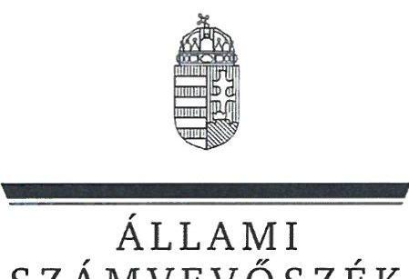
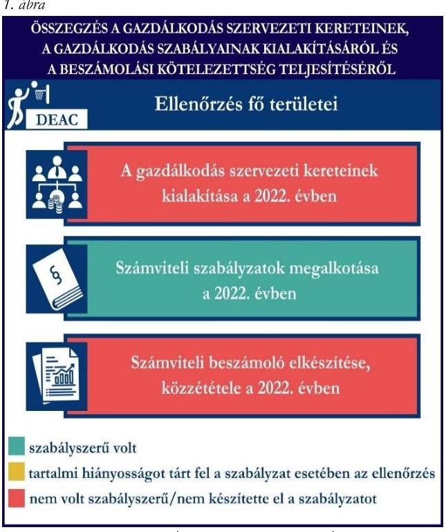
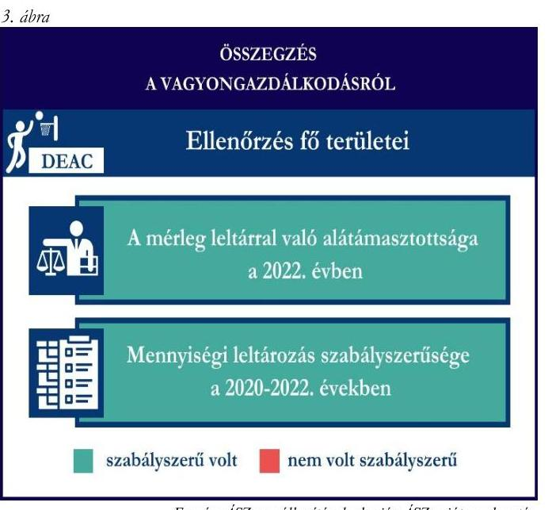

# JELENTÉS 

## Támogatásban részesülő sportszövetségek és sportegyesületek gazdálkodásának ellenőrzése

Debreceni Egyetemi Atlétikai Club

2024.

---

ÁLLAMI
SZÁMVEVŐSZÉK

# JELENTÉS 

## Támogatásban részesülő sportszövetségek és sportegyesületek gazdálkodásának ellenőrzése

Debreceni Egyetemi Atlétikai Club

2024.

---

# ELLENŐRZÉSI IGAZGATÓSÁG: 

ÁLLAMHÁZTARTÁSON KÍVÜLI SZERVEZETEKET ELLENŐRZŐ IGAZGATÓSÁG

## ELLENŐRZÉSI IGAZGATÓ:

KLINGA LÁSZLÓ igazgató

## ELLENŐRZÉSVEZETŐ:

Jelentéseink az interneten a www.asz.hu címen olvashatók.

HOFMEISTER LÁSZLÓ ellenőrzésvezető

IKTATÓSZÁM: EL-4060-111/2024.
TÉMASZÁM: 2682
ELLENŐRZÉS-AZONOSÍTÓ SZÁM: V1026

---

# TARTALOMJEGYZÉK 

- AZ ELLENŐRZÉS ALAPADATAI ..... 5
- AZ ELLENŐRZÖTT SZERVEZET ..... 7
- ÖSSZEFOGLALÁS ..... 8
- AZ ELLENŐRZÉS FÓKUSZKÉRDÉSEI ..... 10
- MEGÁLLAPÍTÁSOK ..... 11
- JAVASLATOK ..... 14
- MELLÉKLETEK ..... 15
I. sz. melléklet: Értelmező szótár ..... 15
II. sz. melléklet: Ellenőrzési kritériumok ..... 17
- FÜGGELÉK: ÉSZREVÉTELEK ..... 18
- RÖVIDÍTÉSEK JEGYZÉKE ..... 19

---

.

---

# AZ ELLENŐRZÉS ALAPADATAI 

## AZ ELLENŐRZÉS CÉLJA

Az ellenőrzés célja az államháztartásból nyújtott támogatással, vagy az államháztartásból meghatározott célra ingyenesen juttatott vagyon felhasználásával érintett sportszövetségek és sportegyesületek gazdálkodása szabályozottságának, gazdálkodási tevékenységének, ezen belül a beszámolási kötelezettség teljesítésének, a támogatások elkülönített nyilvántartásának, valamint a támogatások felhasználásának ellenőrzése.

## AZ ELLENŐRZÉS TÍPUSA

Szabályszerüségi ellenőrzés.

## AZ ELLENŐRZÖTT IDŐSZAK

Az 1. fókuszkérdés esetében a 2022. év.
A 2. fókuszkérdés vonatkozásában a 2021-2022. évek.
A 3. fókuszkérdés vonatkozásában a 2022. év, a mennyiségi felvétellel történő leltározás dokumentumai tekintetében a 2020-2022. évek.

## AZ ELLENŐRZÉS TÁRGYA

Az ellenőrzés tárgya a támogatásban részesülő sportszövetségek, sportegyesületek gazdálkodása szabályozottságának, gazdálkodási tevékenységén belül a beszámolási kötelezettség teljesítésének, a vagyonnyilvántartásának, a támogatások elkülönített nyilvántartásának, valamint az államháztartási forrásból származó közvetlen vagy közvetett támogatások és a meghatározott célra ingyenesen juttatott vagyon felhasználásának vizsgálata volt. Az ellenőrzés a támogatások vonatkozásában kiterjedt továbbá a támogató felé történő beszámolási és elszámolási kötelezettségek teljesítésére, az ezekkel kapcsolatos jogszabályi és belső előírások betartására.

Az ellenőrzés kiterjedt minden olyan körülményre és adatra, amely az ÁSZ ${ }^{1}$ jogszabályban meghatározott feladatainak teljesítéséhez, valamint az ellenőrzési program végrehajtása során felmerülő újabb összefüggések feltárásához szükséges volt.

Az 1. és 3. fókuszkérdés tekintetében az ellenőrzés a teljes ellenőrzött szervezetre, a 2. fókuszkérdés tekintetében kizárólag a kosárlabda szakosztályra vonatkozott.

---

# Az ellenőrzés jogsalapja 

Az ellenőrzés jogszabályi alapját az ÁSZ tv. ${ }^{2} 1 . \int(3)$ bekezdése, az 5. $\int(3)$ bekezdése, valamint a Civil tv. ${ }^{3} 47 . \int$ előírásai képezték.

## AZ ELLENŐRZÉS MÓDSZERE

Az ellenőrzést a nemzetközi standardokat irányadónak tekintve az ellenőrzési program szempontjai, az ellenőrzött időszakban hatályos jogszabályok, az ellenőrzés általános szakmai szabályai, az ellenőrzésre irányadó ÁSZ módszertanok figyelembevételével végezte az ÁSZ.

Az ellenőrzési kérdések megválaszolásához szükséges bizonyítékok megszerzése az ellenőrzött szervezet által rendelkezésre bocsátott dokumentumokra, adatokra alapozva kérdésfeltevés (információkérés), interjú, mintavételezés útján történt.

Az ellenőrzési bizonyítékként felhasználható adatforrások közé tartoztak egyrészt az ellenőrzés során az ellenőrzött szervezettől bekért dokumentumok, másrészt adatforrás lehetett minden további, az ellenőrzés folyamán feltárt, az ellenőrzés szempontjából információt tartalmazó dokumentum.

A támogatásokkal, azok felhasználásával kapcsolatos kötelezettségek vizsgálatára mintavételi eljárások kerültek alkalmazásra. Támogatás-típusok szerint nagyságrend alapján 1-3 darab támogatás került részletes vizsgálat alá. Ezen támogatások felhasználásának szabályszerűsége támogatásonként kockázatértékelés alapján kiválasztott mintatételekkel került ellenőrzésre. A kiválasztott támogatási szerződésekhez kapcsolódó elszámolásokból 30-30 db mintatétel került ellenőrzésre, ahol az elszámolás nem érte el a 30 db -ot, ott tételes ellenőrzésre került sor. Ezen felül a vagyongazdálkodás szabályszerűségének ellenőrzéséhez is kockázatalapú mintavétel kapcsolódott. A támogatások felhasználása és a vagyongazdálkodás területén a minták ellenőrzése kiterjedt a könyvvezetési kötelezettség vizsgálatára is. A tárgyi eszközök tekintetében 30 db került kiválasztásra a 2022. évben állományban lévő eszközök közül, ahol az állományban lévő eszközök száma nem érte el a 30 db -ot, ott tételes ellenőrzésre került sor azok nyilvántartásának, elszámolásának szabályszerűsége ellenőrzése céljából. Az ellenőrzésben nem statisztikai mintavételre került sor, ezért nem történt kivetítés a teljes sokaságra, a megállapításokat az ellenőrzött mintatételekre vonatkozóan fogalmazta meg az ÁSZ.

---

# AZ ELLENŐRZÖTT SZERVEZET

## DEBRECENI EGYETEMI ATLÉTIKAI CLUB

A DEAC ${ }^{4}$-ot 1991. szeptember 30-án alapították, elsődleges célja, hogy tagjainak rendszeres sportolási és versenyzési lehetőséget biztosítson. Ezenkívül támogatja a szakosztályok felkészülését a különböző versenyekre.

A DEAC 33 szakosztállyal működött az ellenőrzött időszakban, taglétszáma 2022. december 31-én 25 fő volt. A DEAC a jogszabályi előírás alapján könyvvizsgálatra, felügyelő szerv létrehozására kötelezett volt, a 2022. évben vállalkozási tevékenységet végzett. A DEAC az $\mathrm{OBH}^{5}$ nyilvántartás alapján közhasznú jogállással rendelkezett 2012. február 15-e óta.

A 2021-2022. években a DEAC által igénybe vett államháztartási forrásból származó támogatásokat az 1. táblázat foglalja magában.

1. táblázat

|  A DEAC ÁLTAL IGÉNYBE VETT TÁMOGATÁSOK* (ADATOK M FT-BAN) |  |   |
| --- | --- | --- |
|   | 2021.év | 2022. év  |
|  Központi költségvetésből** | 158,1 | 54,6  |
|  Helyi önkormányzattól | - | -  |
|  Látvány-csapatsport támogatásból | 374,1 | 342,7  |
|  * több szakosztályt érintő támogatás | Forrás: Az ellenőrzött szervezet főkönyvi adatai alapján ÁSZ saját szerkesztés |   |
|  **kosárlabda szakosztály nem részesült a támogatásból |  |   |

---

# ÖSSZEFOGLALÁS 

Az Alaptörvény ${ }^{6}$ XX. cikke kimondja, hogy mindenkinek joga van a testi és lelki egészséghez, melynek érvényesülését Magyarország többek között a sportolás és a rendszeres testedzés támogatásával segíti elő. Az Országgyűlés ${ }^{7}$ a Sport tv. ${ }^{8}$-ben kinyilvánította, hogy a nemzet közössége a test művelését, a sportot, a nemzet alapértékének, kívánatos célnak tekinti. A sport a közjó része. Erősíti a közösség tagjainak egymáshoz tartozását, miként az egyén testi és lelki egészségét.

A sportegyesületek, sportszövetségek müködésükre és szakmai tevékenységük ellátására költségvetési támogatásban, önkormányzati támogatásban, ingyenes vagyonjuttatásban, valamint látvány-csapatsport támogatásban részesülhetnek, amelyekre fokozott figyelem irányul.

A társadalom részéről jogosan felmerülő elvárás, hogy a közpénzeket kezelő, azzal gazdálkodó szervezetek müködéséről, tevékenységéről átfogó képet kapjon, a közpénzek rendeltetésszerü és átlátható módon történő felhasználásának értékelésére időről-időre sor kerüljön az ellenőrzések keretében.

A DEAC a 2022. évben a gazdálkodási szabályokat kialakította, azonban a beszámolási kötelezettség teljesítése nem volt szabályszerű.

A DEAC a könyvviteli szolgáltatás személyi feltételeit megteremtette, azonban a jogszabályban előírt felügyelő szerv létrehozásáról és müködéséről nem gondoskodott.

A jogszabályi előírások szerint a DEAC kialakította a számviteli politikáját, valamint elkészítette a számviteli szabályzatait.

A könyvvezetés formája a 2022. évben megfelelt a jogszabályi előírásoknak. A DEAC a 2022. évi számviteli beszámolóját nem a jogszabályban előírtak szerint készítette el, azt könyvvizsgálóval nem vizsgáltatta felül.

A gazdálkodás szervezeti keretei kialakításának, a számviteli szabályzatok megalkotásának, valamint a számviteli beszámoló elkészítésének és közzétételének értékelését az 1. ábra mutatja be.

---

A DEAC a látvány-esapatsport támogatásokat az ellenőrzött tételek esetében szabályszerűen használta fel, azonban a támogatások felhasználásáról a jogszabályban előírt elkülönített nyilvántartást a 2021-2022. években nem szabályszerűen vezette a számviteli rendszerében.

A kapott támogatások felhasználásának ellenőrzéséről az összegzést a 2. ábra tartalmazza.

A DEAC vagyongazdálkodása a tárgyi eszközök üzembe helyezése és értékesökkenésük elszámolása tekintetében, az ellenőrzött tételek esetében a 2022. évben szabályszerű volt.

A 2022. évi beszámolójának mérlegtételeit alátámasztotta szabályszerű leltárral. A mérlegben szereplő eszközök a jogszabály szerinti, legalább háromévente előírt mennyiségi leltározását a 2022. évben elvégezte.

A vagyongazdálkodás ellenőrzésének összegzését a 3. ábra tartalmazza.

---

# AZ ELLENŐRZÉS FÓKUSZKÉRDÉSEI 

1.     - A gazdálkodási szabályok kialakítása, a könyvvezetési és beszámolási kötelezettség teljesítése szabályszerű volt-e?
2.     - A kapott támogatások felhasználása szabályszerű volt-e?
3.     - Az ellenőrzött szervezet vagyongazdálkodása szabályszerű volt-e?

---

# 1. A gazdálkodási szabályok kialakítása, a könyvvezetési és beszámolási kötelezettség teljesítése szabályszerű volt-e? 

## Összegző megállapítás

A DEAC-nál a 2022. évben a gazdálkodási szabályok a jogszabályban előírtak szerint kialakításra kerültek. A jogszabályban előírt könyvvizsgálat elmaradt, ezért a beszámolási kötelezettség teljesítése nem volt szabályszerű.

A könyvviteli szolgáltatás személyi feltételeinek teljesüléséről a DEAC a 2022. évben a Számv. tv. ${ }^{9}$ és a Civilszr. ${ }^{10}$-ben foglaltaknak megfelelően gondoskodott.
A DEAC közhasznú jogállású szervezetként működött, az éves bevétele meghaladta az 50,0 M Ft-ot (2022. évben 806,3 M Ft volt) a 2022. évben, ezért a Civil tv. 40. § (1) bekezdésének értelmében kötelezett volt a vezető szervtől elkülönült felügyelő szerv létrehozására. A felügyelő szerv létrehozását a DEAC elmulasztotta.
A DEAC a Civilszr. 16. § (1) bekezdés előírása ellenére nem gondoskodott a 2022. évi éves beszámoló vonatkozásában könyvvizsgáló megbízásáról annak ellenére, hogy arra kötelezett volt, mivel az éves bevétele a 2022. évet megelőző két üzleti év átlagában meghaladta a 300,0 M Ft-ot (2020. évben 973,1 M Ft, 2021. évben 958,2 M Ft volt).
A DEAC a 2022. évben rendelkezett a Számv. tv. előírásainak megfelelő számviteli politikával, az eszközök és a források értékelési szabályzatával, az eszközök és a források leltárkészítési és leltározási szabályzatával, a pénzkezelés szabályzatával, valamint számlarenddel.
Könyvvezetési kötelezettségét a Civilszr. előírásainak megfelelően kettős könyvvitel vezetésével teljesítette a 2022. évben. A könyvviteli nyilvántartásait a Számv. tv. és a Civilszr. rendelkezéseinek megfelelően úgy alakította ki, hogy a beszámolóban az egyéb bevételeken belül a kapott támogatások összegét részletezni tudta. A 2022. évben a DEAC végzett vállalkozási tevékenységet, melynek bevételeit és ráfordításait a könyvvezetése során a Civil tv.-nek megfelelően az alaptevékenységtől elkülönítetten tartotta nyilván és mutatta ki beszámolójában.
A 2022. évi számviteli beszámolóját a Ptk., valamint a Civil tv. alapján a DEAC közgyűlése jóváhagyta, annak ellenére, hogy a Ptk. 3:27. § (1) bekezdésében foglaltakkal ellentétben - felügyelő szerv hiányában - a felügyelő szerv nem véleményezte azt, valamint a 2022. évi beszámoló nem volt könyvvizsgálattal alátámasztva.
A DEAC megsértette a Civil tv. 30 § (1) bekezdésében előírtakat, mivel a beszámolót független könyvvizsgálói jelentés nélkül helyezte letétbe, tette közzé.

---

# 2. A kapott támogatások felhasználása szabályszerű volt-e? 

Összegző megállapítás A DEAC a kosárlabda szakosztály részére nyújtott támogatást az ellenőrzött tételek vonatkozásában a 20212022. években a támogatási célnak megfelelően használta fel. Az elkülönített számviteli nyilvántartást a támogatások felhasználásáról nem szabályszerűen vezette.

A DEAC az ellenőrzött támogatási szerződésben foglaltak alapján, a látvány-csapatsport támogatásból kapott támogatás bevételeit a Civil tv. előírásai alapján elkülönítette a számviteli rendszerében.
A DEAC a 2021-2022. években a Számv. tv. 161/A. § (2) bekezdésében és a Civil tv. 20. § (4) bekezdésében foglaltak ellenére, az előírt alapcél szerinti tevékenysége költségei, ráfordításai ellentételezésére a látvány-csapatsport támogatásból kapott ellenőrzött támogatásról nem olyan elkülönített számviteli nyilvántartást vezetett, amelynek alapján támogatásonként megállapítható és ellenőrizhető a kapott támogatás felhasználása, mivel az ellenőrzött tételekből egy tételnél a támogatás felhasználásának számviteli bizonylatán záradékolt összeg nem egyezett meg a támogatás felhasználásának elkülönített számviteli nyilvántartásában szereplő összeggel.
Egy másik tételnél a támogatás felhasználásának számviteli bizonylatán záradékolt összeg nem egyezett meg az összesítő elszámolásban lévő összeggel. Ez alapján a DEAC megsértette a 107/2011. (VI. 30.) Korm. rendelet 11. § (5) bekezdéseiben előírtakat.
A DEAC a 2021-2022. években rendelkezett a 107/2011. (VI. 30.) Korm.rendelet ${ }^{11}$-ben előírt látványcsapatsport támogatással érintett, jóváhagyott SFP ${ }^{12}$-vel. A DEAC a támogatás felhasználásáról negyedévente az előrehaladási jelentéseket benyújtotta az MKOSZ ${ }^{13}$ felé. Az ellenőrzött SFP-vel kapcsolatban kapott látvány-csapatsport és kiegészítő látvány-csapatsport támogatással a DEAC a 107/2011. (VI. 30.) Korm. rendeletnek megfelelően könyvvizsgáló által ellenőrzött számviteli bizonylatokkal számolt el a támogató felé, a támogatás felhasználását szöveges, szakmai beszámolóval igazolta. A könyvvizsgáló rendelkezett a 107/2011. (VI. 30.) Korm. rend.-ben előírt felelősségbiztosítással. Közhasznú szervezetként a Számv. tv. és a Civil tv. rendelkezéseinek megfelelően a 2021. és 2022. évekre vonatkozó beszámolójának kiegészítő mellékletében bemutatta a támogatási program keretében végleges jelleggel felhasznált összegeket támogatásonként.

## 3. Az ellenőrzött szervezet vagyongazdálkodása szabályszerű volt-e?

## Összegző megállapítás

A DEAC vagyongazdálkodása a 2022. évben szabályszerű volt az ellenőrzött tételek vonatkozásában. A 2022. évi beszámolóját szabályszerű leltárral támasztotta alá.

A DEAC a Számv. tv.-nek megfelelően a 2022. évi beszámolójának mérleg tételeit alátámasztotta szabályszerű leltárral, elvégezte a főkönyvi könyvelés és az analitikus nyilvántartások adatai közötti egyeztetést, valamint a mérlegben szereplő tárgyi eszközök, jogszabály szerinti legalább háromévente előírt mennyiségi leltározását a 2022. évre vonatkozóan.

---

A DEAC-nál az ellenőrzött tételek vonatkozásában a tárgyi eszközök bekerülési értékét, az értékcsökkenés elszámolását a Számv. tv. előírásainak megfelelően határozták meg, az üzembe helyezést a tárgyi eszközök vonatkozásában a Számv. tv.-ben előírtaknak megfelelően dokumentálták.

---

# JAVASLATOK 

Az ÁSZ tv. 33. § (1) bekezdésében foglaltak értelmében az ellenőrzött szervezet vezetője köteles a jelentésben foglalt megállapításokhoz kapcsolódó intézkedési tervet összeállítani és azt a jelentés kézhezvételétől számított 30 napon belül az ÁSZ részére megküldeni. Amennyiben az ellenőrzött szervezet vezetője nem küldi meg határidőben az intézkedési tervet, vagy továbbra sem elfogadható intézkedési tervet küld, az Állami Számvevőszék elnöke az ÁSZ tv. 33. § (3) bekezdése a) és b) pontjaiban foglaltakat érvényesítheti.

## A DEBRECENI EGYETEMI ATLÉTIKAI CLUB ELNÖKÉNEK

1. Gondoskodjon a Civil tv. 40. § (1) bekezdésében elöirt felügyelő szerv müködtetéséről.
2. Gondoskodjon a számviteli beszámoló könyvvizsgálóval történő felülvizsgálatáról a Civilszr. 16. § (1) bekezdésében elöirtak alapján.
3. Gondoskodjon a látvány-csapatsport támogatásból kapott támogatás olyan elkülönített számviteli nyilvántartásának vezetéséről, amely alapján támogatásonként megállapítható és ellenőrizhető a kapott támogatás felhasználása, a Civil tv. 20. § (4) bekezdés és a Számv. tv. 161/A. § (2) bekezdés elöirásai alapján.
4. Gondoskodjon arról, hogy a 107/2011. (VI. 30.) Korm. rend. 11. § (5) bekezdés elöirásának megfelelően a számviteli bizonylaton záradékolt összeg megegyezzen a számlaösszesitőben feltüntetett értékkel.

---

# MELLÉKLETEK 

## I. SZ. MELLÉKLET: ÉRTELMEZŐ SZÓTÁR

civil szervezet
egyesület
költségvetési támogatás
közhasznú szervezet
közhasznú tevékenység
látvány-csapatsport támogatás
sportegyesület
sportegyesületeknek, sportszövetségeknek nyújtott költségvetési támogatás

A civil társaság; a Magyarországon nyilvántartásba vett egyesület - a párt, a szakszervezet és a kölcsönös biztosító egyesület kivételével és - a közalapítvány és a pártalapítvány kivételével - az alapítvány. (Forrás: Civil tv. 2. $\$ 6$. pont a) -c) alpontjai)
Az egyesület a tagok közös, tartós, alapszabályban meghatározott céljának folyamatos megvalósítására létesített, nyilvántartott tagsággal rendelkező jogi személy. (Forrás: Ptk. 3:63. § (1) bekezdés)
A Számv. tv. szempontjából egyéb szervezet. (Számv. tv. 3. § (1) bekezdés 4. pont a) alpontja)

A társadalombiztosítás pénzügyi alapjai kivételével az államháztartás központi alrendszeréből ellenérték nélkül, pénzben nyújtott támogatások. (Forrás: Áht. ${ }^{14}$ 1. $\$ 14$. pont, ide nem értve az Áht. 1. $\$ 14$. pont a) -o) pontjaiban szereplő támogatásokat)
Közhasznú szervezetté minősíthető a Magyarországon nyilvántartásba vett közhasznú tevékenységet végző szervezet, amely a társadalom és az egyén közös szükségleteinek kielégítéséhez megfelelő erőforrásokkal rendelkezik, továbbá amelynek megfelelő társadalmi támogatottsága kimutatható, és amely:
a) civil szervezet (ide nem értve a civil társaságot), vagy
b) olyan egyéb szervezet, amelyre vonatkozóan a közhasznú jogállás megszerzését törvény lehetővé teszi. (Forrás: Civil tv. 32. § (1) bekezdés)
Minden olyan tevékenység, amely a létesítő okiratban megjelölt közfeladat teljesítését közvetlenül vagy közvetve szolgálja, ezzel hozzájárulva a társadalom és az egyén közös szükségleteinek kielégítéséhez. (Forrás: Civil tv. 2. $\$ 20$. pont)
Az adóévben visszafizetési kötelezettség nélkül nyújtott támogatás, juttatás, véglegesen átadott pénzeszköz és térítés nélkül átadott eszköz könyv szerinti értéke, az adóévben térítés nélkül nyújtott szolgáltatás bekerülési értéke a Tao. tv.-ben meghatározott jogcímeken. (Forrás: Tao. tv. 4. § 44. pont)
A Civil tv. és a Ptk. szabályai szerint működő olyan egyesület, amelynek alaptevékenysége a sporttevékenység szervezése, valamint a sporttevékenység feltételeinek megteremtése. A sportegyesületek a Sport tv. 15. § (1) bekezdésében meghatározott sportszervezetek körébe tartoznak. A sportegyesületeken kívül sportszervezet még a sportvállalkozás, a sportiskola, valamint az utánpótlás-nevelés fejlesztését végző alapítvány. (Forrás: Sport tv. 16. § (1) bekezdés)
Az állami sport célú támogatások felhasználásáról és elosztásáról szóló 474/2016. (XII. 27.) Kormány rendelet 1. § (1) bekezdésében és a 27/2013. (III. 29.) EMMI rendelet ${ }^{15}$ 1. $\$$-ában meghatározott fejezeti kezelésű előirányzatokból nyújtott támogatás.

---

sportszövetség
sporttevékenység

Meghatározott sporttevékenységek körében a sportversenyek szervezésére, a tagok érdekvédelmére és a részükre való szolgáltatásokra, valamint a nemzetközi kapcsolatok lebonyolítására létrehozott, jogi személyiséggel és önkormányzattal rendelkező, a Civil tv. és a Ptk. alapján - az e törvényben foglalt eltérésekkel - különös formában müködő egyesületek. A Sport tv. 19. § (3) bekezdése szerint a sportszövetségeknek az alábbi típusai léteznek: országos sportági szakszövetségek, sportági szövetségek, szabadidősport szövetségek, fogyatékosok sportszövetségei, diák- és egyetemi-főiskolai sport sportszövetségei, nemzetközi sportszövetségek. (Forrás: Sport tv. 19. $\int(1),(3)$ bekezdés)
Meghatározott szabályok szerint, a szabadidő eltöltéseként kötetlenül vagy szervezett formában, illetve versenyszerűen végzett testedzés vagy szellemi sportágban kifejtett tevékenység, amely a fizikai erőnlét és a szellemi teljesítőképesség megtartását, fejlesztését szolgálja. (Forrás: Sport tv. 1. § (2) bekezdés)

---

# II. SZ. MELLÉKLET: ELLENŐRZÉSI KRITÉRIUMOK 

## FOKUSZKÉRDÉS

## 1. fókuszkérdés:

A gazdálkodási szabályok kialakítása, a könyvvezetési és beszámolási kötelezettség teljesítése szabályszerű volt-e?

## 2. fókuszkérdés:

A kapott támogatások felhasználása szabályszerű volt-e?

## 3. fókuszkérdés:

Az ellenőrzött szervezet vagyongazdálkodása szabályszerű volt-e?

## ELLENŐRZÉSI KRITÉRIUMOK

Számv. tv. 14. § (3) bekezdés, (5) bekezdés a), b), d) pont, (8) bekezdés, 69. $\S$ (3) bekezdés, 90. § (3) bekezdés c) pont, 161. § (1) bekezdés, (2) bekezdés a) -d) pont, (3)-(4) bekezdés, 161/A. $\int$ (2) bekezdés, 165. $\$ (2)$ bekezdés
Civilszr. 7. § (1) bekezdés, (4) bekezdés b), c) pont, 8. § (2), (3) bekezdés, 9. § (4), (5), (8) bekezdés, 12. § (4), (5) bekezdés, 15. § (1) bekezdés a), b) pont, 16. § (1) bekezdés, 24. § (2) bekezdés

Ptk. 3:26. § (1) bekezdés, 3:27. § (1) bekezdés, 3:82. § (1) bekezdés,
Civil tv. 28.§ (1) bekezdés, 29. § (2) bekezdés c) pont, (3), (6), (7) bekezdés, 30. § (1)-(4) bekezdés 40. § (1), (2) bekezdés, 41. § (1) bekezdés
Civil vhr.
Számv. tv. 44. § (2) bekezdés, 93. § (3) bekezdés, 159. §, 161/A.§ (2) bekezdés, 165. § (2) bekezdés, 167. § (1) bekezdés a), d), e), b) pont

Civil tv. 20. § (2) bekezdés a) pont, (3) bekezdés a), c) pont, (4) bekezdés, 29. § (4), (5) bekezdés

Civilszr. 24. § (2) bekezdés
27/2013. (III.29.) EMMI rend. 18. § (2) bekezdés
474/2016. (XII. 27.) Korm. rend. 22. § (2) bekezdés, 24. § (2) bekezdés
107/2011. (VI. 30.) Korm. rend. 9. § (9) bekezdés, 11. § (1), (2), (4), (4a), (5), (6) bekezdés, 14. § (1) bekezdés,

Tao. tv. ${ }^{16} 22 /$ C. $\S(3 a),(3 c)$ bek., 24/A. $\S$ (9) bek.
Számv. tv. 16. § (2) bekezdés, 26. §, 42. § (5) bekezdés, 46. § (3) bekezdés, 47-53. §, 69.§, 159. §, 161/A. §, 162. § (1)-(2) bekezdés, 165-166. §, 169.§

Ávr. ${ }^{17}$ 93. § (5) bekezdés
474/2016. (XII. 27.) Korm. rend. 17. § (1) bekezdés 11a., 11b. pont, 17. § (2a) bekezdés, 24. § (2) bekezdés

---

# FÜGGELÉK: ÉSZREVÉTELEK 

A jelentéstervezetet a Számvevőszék 15 napos észrevételezésre megküldte az ellenőrzött szervezet vezetőjének az ÁSZ tv. 29. §* (1) bekezdése előírásának megfelelően.

Az ellenőrzött szervezet elnöke a jelentéstervezetre nem tett észrevételt.

* 29. § (1) Az Állami Számvevőszék az ellenőrzési megállapításait megküldi az ellenőrzött szervezet vezetőjének vagy az általa megbízott személynek, és annak, akinek személyes felelősségét állapította meg.
(2) Az ellenőrzött szervezet vezetője és a felelősként megjelölt személy az ellenőrzés megállapításaira tizenöt napon belül írásban észrevételt tehet.
(3) Az Állami Számvevőszék az észrevételre a beérkezésétől számított harminc napon belül írásban válaszol. A figyelembe nem vett észrevételeket köteles a jelentésben feltüntetni, és megindokolni, hogy azokat miért nem fogadta el.

---

# RÖVIDÍTÉSEK JEGYZÉKE 

${ }^{1}$ ÁSZ
${ }^{2}$ ÁSZ tv.
${ }^{3}$ Civil tv.
${ }^{4}$ DEAC
${ }^{5}$ OBH
${ }^{6}$ Alaptörvény
${ }^{7}$ Országgyülés
${ }^{8}$ Sport tv.
${ }^{9}$ Számv. tv.
${ }^{10}$ Civilszr.
${ }^{11}$ 107/2011. (VI. 30.) Korm. rend
${ }^{12}$ SFP
${ }^{13}$ MKOSZ
${ }^{14}$ Áht.
${ }^{15}$ 27/2013. (III.29.) EMMI rendelet
${ }^{16}$ Tao. tv.
${ }^{17}$ Ávr.

Állami Számvevőszék
2011. évi LXVI. törvény az Állami Számvevőszékről
2011. évi CLXXV. törvény az egyesülési jogról, a közhasznú jogállásról, valamint a civil szervezetek müködéséről és támogatásáról
Debreceni Egyetemi Atlétikai Club
Országos Bírósági Hivatal
Magyarország Alaptörvénye
Magyarország Országgyűlése
2004. évi I. törvény a sportról
2000. évi C. törvény a számvitelről

479/2016. (XII. 28.) Korm. rendelet a számviteli törvény szerinti egyes egyéb szervezetek beszámoló készítési és könyvvezetési kötelezettségének sajátosságairól
107/2011. (VI. 30.) Korm. rend. a látvány-csapatsport támogatását biztosító támogatási igazolás kiállításáról, felhasználásáról, a támogatás elszámolásának és ellenőrzésének, valamint visszafizetésének szabályairól
Sportfejlesztési program
Magyar Kosárlabdázók Országos Szövetsége
2011. évi CXCV. törvény az államháztartásról

27/2013. (III. 29.) EMMI rendelet az állami sport célú támogatások felhasználásáról és elosztásáról
1996. évi LXXXI. törvény a társasági adóról és az osztalékadóról
368/2011. (XII. 31.) Korm. rendelet az államháztartásról szóló törvény végrehajtásáról

---

1052 Budapest, Apáczai Csere János u. 10. | 1364 Budapest 4., Pf. 54
www.asz.hu | szamvevoszek@asz.hu
telefon: +36 14849100