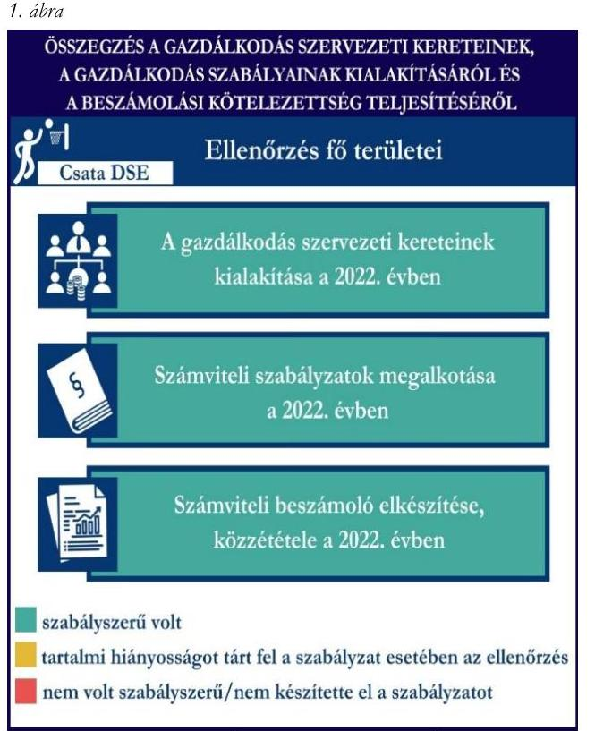
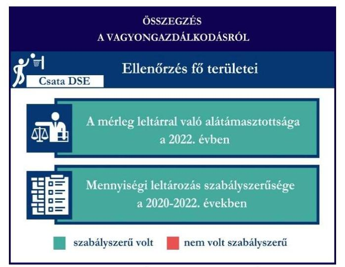
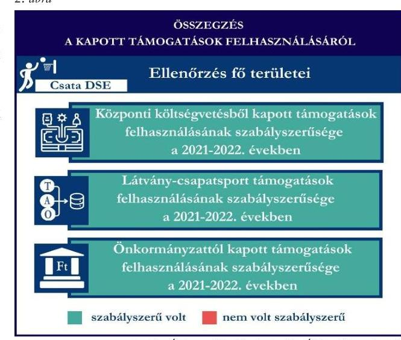

# JELENTÉS 

Támogatásban részesülő sportszövetségek és sportegyesületek gazdálkodásának ellenőrzése

Csata Diáksport Egyesület

2024.

---

# JELENTÉS 

## Támogatásban részesülő sportszövetségek és sportegyesületek gazdálkodásának ellenőrzése

Csata Diáksport Egyesület

2024.

---

# ELLENŐRZÉSI IGAZGATÓSÁG: 

ÁLLAMHÁZTARTÁSON KÍVÜLI SZERVEZETEKET ELLENŐRZŐ IGAZGATÓSÁG

## ELLENŐRZÉSI IGAZGATÓ:

KLINGA LÁSZLÓ igazgató

## ELLENŐRZÉSVEZETŐ:

Jelentéseink az interneten a www.asz.hu címen olvashatók.

HOFMEISTER LÁSZLÓ ellenőrzésvezető

IKTATÓSZÁM: EL-4060-112/2024.
TÉMASZÁM: 2682
ELLENŐRZÉS-AZONOSÍTÓ SZÁM: V1026

---

# TARTALOMJEGYZÉK 

AZ ELLENŐRZÉS ALAPADATAI ..... 5
AZ ELLENŐRZÖTT SZERVEZET ..... 7
ÖSSZEFOGLALÁS ..... 8
AZ ELLENŐRZÉS FÓKUSZKÉRDÉSEI ..... 10
MEGÁLLAPÍTÁSOK ..... 11
MELLÉKLETEK ..... 13
I. sz. melléklet: Értelmező szótár ..... 13
II. sz. melléklet: Ellenőrzési kritériumok ..... 15
FÜGGELÉK: ÉSZREVÉTELEK ..... 16
RÖVIDÍTÉSEK JEGYZÉKE ..... 17

---

.

---

# AZ ELLENŐRZÉS ALAPADATAI 

## AZ ELLENŐRZÉS CÉLJA

Az ellenőrzés célja az államháztartásból nyújtott támogatással, vagy az államháztartásból meghatározott célra ingyenesen juttatott vagyon felhasználásával érintett sportszövetségek és sportegyesületek gazdálkodása szabályozottságának, gazdálkodási tevékenységének, ezen belül a beszámolási kötelezettség teljesítésének, a támogatások elkülönített nyilvántartásának, valamint a támogatások felhasználásának ellenőrzése.

## AZ ELLENŐRZÉS TÍPUSA

Szabályszerűségi ellenőrzés.

## AZ ELLENŐRZÖTT IDŐSZAK

Az 1. fókuszkérdés esetében a 2022. év.
A 2. fókuszkérdés vonatkozásában a 2021-2022. évek.
A 3. fókuszkérdés vonatkozásában a 2022. év, a mennyiségi felvétellel történő leltározás dokumentumai tekintetében a 2020-2022. évek.

## AZ ELLENŐRZÉS TÁRGYA

Az ellenőrzés tárgya a támogatásban részesülő sportszövetségek, sportegyesületek gazdálkodása szabályozottságának, gazdálkodási tevékenységén belül a beszámolási kötelezettség teljesítésének, a vagyonnyilvántartásának, a támogatások elkülönített nyilvántartásának, valamint az államháztartási forrásból származó közvetlen vagy közvetett támogatások és a meghatározott célra ingyenesen juttatott vagyon felhasználásának vizsgálata volt. Az ellenőrzés a támogatások vonatkozásában kiterjedt továbbá a támogató felé történő beszámolási és elszámolási kötelezettségek teljesítésére, az ezekkel kapcsolatos jogszabályi és belső előírások betartására.

Az ellenőrzés kiterjedt minden olyan körülményre és adatra, amely az ÁSZ ${ }^{1}$ jogszabályban meghatározott feladatainak teljesítéséhez, valamint az ellenőrzési program végrehajtása során felmerülő újabb összefüggések feltárásához szükséges volt.

Az 1. és 3. fókuszkérdés tekintetében az ellenőrzés a teljes ellenőrzött szervezetre, a 2. fókuszkérdés tekintetében kizárólag a kosárlabda szakosztályra vonatkozott.

---

# Az ellenőrzés jogszalapja 

Az ellenőrzés jogszabályi alapját az ÁSZ tv. ${ }^{2}$ 1. § (3) bekezdése, az 5. § (3) bekezdése, valamint a Civil tv. ${ }^{3}$ 47. § előírásai képezték.

## AZ ELLENŐRZÉS MÓDSZERE

Az ellenőrzést a nemzetközi standardokat irányadónak tekintve az ellenőrzési program szempontjai, az ellenőrzött időszakban hatályos jogszabályok, az ellenőrzés általános szakmai szabályai, az ellenőrzésre irányadó ÁSZ módszertanok figyelembevételével végezte az ÁSZ.

Az ellenőrzési kérdések megválaszolásához szükséges bizonyítékok megszerzése az ellenőrzött szervezet által rendelkezésre bocsátott dokumentumokra, adatokra alapozva kérdésfeltevés (információkérés), interjú, mintavételezés útján történt. A támogatásból beszerzett tárgyi eszközök használatára, fizikai fellelhetőségére irányulóan az érintett vagyontárgyak helyszíni szemle keretében történő szemrevételezésére indokolt esetben sor került.

Az ellenőrzési bizonyítékként felhasználható adatforrások közé tartoztak egyrészt az ellenőrzés során az ellenőrzött szervezettől bekért dokumentumok, másrészt adatforrás lehetett minden további, az ellenőrzés folyamán feltárt, az ellenőrzés szempontjából információt tartalmazó dokumentum.

A támogatásokkal, azok felhasználásával kapcsolatos kötelezettségek vizsgálatára mintavételi eljárások kerültek alkalmazásra. Támogatás-típusok szerint nagyságrend alapján 1-3 darab támogatás került részletes vizsgálat alá. Ezen támogatások felhasználásának szabályszerűsége támogatásonként kockázatértékelés alapján kiválasztott mintatételekkel került ellenőrzésre. A kiválasztott támogatási szerződésekhez kapcsolódó elszámolásokból 30-30 db mintatétel került ellenőrzésre, ahol az elszámolás nem érte el a 30 db-ot, ott tételes ellenőrzésre került sor. Ezen felül a vagyongazdálkodás szabályszerűségének ellenőrzéséhez is kockázatalapú mintavétel kapcsolódott. A támogatások felhasználása és a vagyongazdálkodás területén a minták ellenőrzése kiterjedt a könyvvezetési kötelezettség vizsgálatára is. A tárgyi eszközök tekintetében 30 db került kiválasztásra a 2022. évben állományban lévő eszközök közül, ahol az állományban lévő eszközök száma nem érte el a 30 db-ot, ott tételes ellenőrzésre került sor azok nyilvántartásának, elszámolásának szabályszerűsége ellenőrzése céljából. A tárgyi eszközök tekintetében 20 db eszköz tételesen került ellenőrzésre. Az ellenőrzésben nem statisztikai mintavételre került sor, ezért nem történt kivetítés a teljes sokaságra, a megállapításokat az ellenőrzött mintatételekre vonatkozóan fogalmazta meg az ÁSZ.

---

# AZ ELLENŐRZÖTT SZERVEZET

## CSATA DIÁKSPORT EGYESÜLET

A budapesti Csata DSE ${ }^{4}$ 1991. január 2-án került bejegyzésre. Célja elsősorban a kosárlabda sportágban a rendszeres sportolás, a versenyzés és a testedzés iránti igény felkeltése, valamint rendszeres sporttevékenységek szervezése.

A Csata DSE tagjainak száma 2022. évben 91 fő volt. A jogszabályi előírás alapján könyvvizsgálatra, felügyelőbizottság létrehozására nem volt kötelezett, a 2022. évben vállalkozási tevékenységet nem végzett. A Csata DSE az OBH${ }^{5}$ nyilvántartása alapján közhasznú jogállással nem rendelkezett.

A 2021-2022. években a Csata DSE által igénybe vett államháztartási forrásból származó támogatásokat az 1. táblázat foglalja magában.

|  A CSATA DSE ÁLTAL IGÉNYBE VETT TÁMOGATÁSOK (ADATOK M FT-BAN) |  |   |
| --- | --- | --- |
|   | 2021. év | 2022. év  |
|  Központi költségvetésből | 65,0 | 35,4  |
|  Helyi önkormányzattól | 0,8 | 0,8  |
|  Látvány-csapatsport támogatásból | 155,6 | 196,1  |
|   | Forrás: Az ellenőrzőit szervezet főkönyvi adatai alapján ÁSZ saját szerkesztés |   |

---

# ÖSSZEFOGLALÁS 

Az Alaptörvény ${ }^{6}$ XX. cikke kimondja, hogy mindenkinek joga van a testi és lelki egészséghez, melynek érvényesülését Magyarország többek között a sportolás és a rendszeres testedzés támogatásával segíti elő. Az Országgyűlés a Sport tv. ${ }^{9}$-ben kinyilvánította, hogy a nemzet közössége a test művelését, a sportot, a nemzet alapértékének, kívánatos célnak tekinti. A sport a közjó része. Erősíti a közösség tagjainak egymáshoz tartozását, miként az egyén testi és lelki egészségét.

A sportegyesületek, sportszövetségek működésükre és szakmai tevékenységük ellátására költségvetési támogatásban, önkormányzati támogatásban, ingyenes vagyonjuttatásban, valamint látvány-csapatsport támogatásban részesülhetnek, amelyekre fokozott figyelem irányul.

A társadalom részéről jogosan felmerülő elvárás, hogy a közpénzeket kezelő, azzal gazdálkodó szervezetek működéséről, tevékenységéről átfogó képet kapjon, a közpénzek rendeltetésszerű és átlátható módon történő felhasználásának értékelésére időről-időre sor kerüljön az ellenőrzések keretében.

A Csata DSE tekintetében a gazdálkodási szabályok kialakítása, a könyvvezetési és beszámolási kötelezettség teljesítése a 2022. évben szabályszerű volt.

A Csata DSE a könyvviteli szolgáltatás személyi feltételeinek megteremtéséről gondoskodott.

A jogszabályi előírások szerint a Csata DSE kialakította a számviteli politikáját, valamint elkészítette számviteli szabályzatait.

A könyvvezetés formája a 2022. évben megfelelt a jogszabályi előírásoknak. A Csata DSE a 2022. évi számviteli beszámolóját a jogszabályban előírtak szerint elkészítette, közzétette.

A gazdálkodás szervezeti keretei kialakításának, a számviteli szabályzatok megalkotásának, valamint a számviteli beszámoló elkészítésének és közzétételének az értékelését az 1. ábra mutatja be.

---

A Csata DSE az ellenőrzött tételek tekintetében a központi költségvetésből, a látvány-csapatsport támogatásból, valamint a helyi önkormányzattól kapott támogatásokat szabályszerűen használta fel.

A kapott támogatások felhasználásának ellenőrzéséről az összegzést a 2. ábra tartalmazza.
2. ábra

Forrás: ÁSZ megállapítások alapján ÁSZ saját szerkesztés

Forrás: ÁSZ megállapítások alapján ÁSZ saját szerkesztés
A 2022. évben a Csata DSE vagyongazdálkodása az ellenőrzött tételek vonatkozásában szabályszerű volt. A jogszabályoknak megfelelően gondoskodott saját vagyona nyilvántartásáról és a számviteli beszámolóban történő megjelenítéséről.

A mérlegben szereplő eszközök a jogszabály szerinti, legalább háromévente előírt mennyiségi leltározását a 2022. évben a Csata DSE elvégezte.

A vagyongazdálkodás ellenőrzésének az összegzését a 3. ábra tartalmazza.

---

# AZ ELLENŐRZÉS FÓKUSZKÉRDÉSEI 

1.     - A gazdálkodási szabályok kialakítása, a könyvvezetési és beszámolási kötelezettség teljesítése szabályszerű volt-e?
2.     - A kapott támogatások felhasználása szabályszerű volt-e?
3.     - Az ellenőrzött szervezet vagyongazdálkodása szabályszerű volt-e?

---

# 1. A gazdálkodási szabályok kialakítása, a könyvvezetési és beszámolási kötelezettség teljesítése szabályszerű volt-e? 

## Összegző megállapítás

A Csata DSE a gazdálkodási szabályokat kialakította. A könyvvezetési és beszámolási kötelezettségének teljesítése szabályszerű volt.

A 2022. évben a Csata DSE a Számv. tv. ${ }^{9}$ és a Civilszr. ${ }^{10}$-ben foglaltaknak megfelelően gondoskodott a könyvviteli szolgáltatás személyi feltételeinek teljesüléséről.
A Csata DSE a 2022. évben rendelkezett a Számv. tv. előírásainak megfelelő számviteli politikával, az eszközök és a források leltárkészítési és leltározási szabályzatával, az eszközök és források értékelési szabályzatával, pénzkezelési szabályzattal, valamint számlarenddel.
A Csata DSE a Civilszr. előírásainak megfelelően kettős könyvvitel vezetésével teljesítette könyvvezetési kötelezettségét a 2022. évben. A könyvviteli nyilvántartásait a Számv. tv. és a Civilszr. rendelkezéseinek megfelelően úgy alakította ki, hogy a beszámolóban az egyéb bevételeken belül a tagdíjakat és a kapott támogatások összegét részletezni tudta.
A Csata DSE elkészítette az egyszerűsített éves beszámolóját a Civil tv.-nek megfelelően, valamint a közhasznúsági mellékletet a Civil vhr. ${ }^{11}$ melléklete szerinti tartalommal.
A 2022. évi számviteli beszámolóját a Ptk. és a Civil tv. alapján a legfőbb döntéshozó szerv hagyta jóvá.
A Csata DSE az elfogadott 2022. évi számviteli beszámolóját, valamint közhasznúsági mellékletét a Civil tv. előírásainak megfelelően letétbe helyezte és közzétette.

## 2. A kapott támogatások felhasználása szabályszerű volt-e?

## Összegző megállapítás

A Csata DSE a 2021-2022. években az ellenőrzött tételek esetében a kapott támogatásokat a támogatási célnak megfelelően, szabályszerűen használta fel.

A Csata DSE a központi költségvetésből, a látvány-csapatsport támogatásból, valamint a helyi önkormányzat költségvetéséből kapott ellenőrzött támogatások bevételeit a Civil tv. előírásai alapján elkülönítetten mutatta ki számviteli rendszerében.
A Csata DSE a 2021-2022. években a Számv. tv.-ben és a Civil tv.-ben előírt alapcél szerinti tevékenysége költségei, ráfordításai ellentételezésére a központi költségvetésből, a látvány-csapatsport támogatásból, valamint az önkormányzattól kapott ellenőrzött támogatásokról olyan elkülönített számviteli nyilvántartást vezetett, amelynek alapján támogatásonként megállapítható és ellenőrizhető volt a kapott támogatás felhasználása.

---

A Csata DSE a 2022. évben a központi költségvetésből részére juttatott támogatás felhasználásáról a támogató felé benyújtott beszámolót és annak részeként az összesített elszámolási táblázatot a támogatási szerződésben előírt formában és tartalommal elkészítette. A támogatás felhasználásáról a támogató felé benyújtott elszámolást alátámasztó számviteli bizonylatok a Számv. tv.-ben foglalt alaki és tartalmi követelményeknek megfeleltek, a támogató felé benyújtott számlák a 474/2016. (XII. 27.) Korm. rendeletben ${ }^{12}$ előírtaknak megfelelően záradékolásra kerültek.
A Csata DSE a 2022. évben rendelkezett a 107/2011. (VI. 30.) Korm.rendelet ${ }^{13}$-ben előírt látványcsapatsport támogatással érintett, jóváhagyott SFP ${ }^{14}$-vel. A Csata DSE a 2022. évben a 107/2011. (VI. 30.) Korm. rendeletben foglaltaknak megfelelően a látvány-csapatsport támogatás felhasználásáról negyedévente az előrehaladási jelentéseket benyújtotta az illetékes ellenőrző szervezet felé. Az ellenőrzött SFP-vel kapcsolatban kapott látvány-csapatsport és kiegészítő látvány-csapatsport támogatással a Csata DSE a 107/2011. (VI. 30.) Korm. rendeletben foglaltak szerint elszámolt. A Csata DSE a 2022. évben a látvány-csapatsport és kiegészítő látvány-csapatsport támogatás felhasználását igazoló szöveges, szakmai beszámolóját a 107/2011. (VI. 30.) Korm. rendeletben foglaltaknak megfelelően elkészítette. A 107/2011. (VI. 30.) Korm. rendeletnek megfelelően könyvvizsgáló által ellenőrzött számviteli bizonylatokkal számolt el a támogató felé, melyhez a könyvvizsgáló felelősségbiztosítási kötvénye is benyújtásra került.
A Csata DSE a 2021-2022. évi könyvvezetése során a helyi önkormányzat költségvetéséből számára juttatott sportcélú támogatásokról a támogatási szerződésben előírtaknak megfelelően teljesítette beszámolási kötelezettségét a támogatás rendeltetésszerű felhasználásáról.

 a helyi önkormányzat felé. A támogatás felhasználásáról a támogató felé benyújtott elszámolást alátámasztó számviteli bizonylatok a Számv. tv.-ben foglalt alaki és tartalmi követelményeknek megfeleltek.

# 3. Az ellenőrzött szervezet vagyongazdálkodása szabályszerű volt-e? 

Összegző megállapítás A 2022. évben a Csata DSE vagyongazdálkodása az ellenőrzött tételek vonatkozásában szabályszerű volt. A jogszabályoknak megfelelően gondoskodott saját vagyona nyilvántartásáról és a számviteli beszámolóban történő megjelenítéséről.

A Csata DSE a Számv. tv.-nek megfelelően gondoskodott saját vagyona nyilvántartásáról és a számviteli beszámolóban történő megjelenítéséről a 2022. évben. A 2022. év beszámolójának mérlegét, a mérlegben szereplő eszközöket és forrásokat alátámasztotta szabályszerű leltárral, elvégezte a főkönyvi könyvelés és az analitikus nyilvántartások adatai közötti egyeztetést. A Csata DSE a Számv. tv.-ben előírt, legalább háromévente mennyiségi felvétellel történő leltározást a 2022. évben elvégezte.
Az ellenőrzött tárgyi eszközök bekerülési értékét alátámasztó számviteli bizonylatok a Számv. tv.-ben előírtaknak megfelelően rendelkezésre álltak. Az ellenőrzött tárgyi eszközök számviteli besorolása, értékcsökkenés elszámolása megfelelt a Számv. tv. előírásainak, az üzembe helyezés tényét a Csata DSE a Számv. tv.-ben előírtaknak megfelelően dokumentálta.

---

# MELLÉKLETEK 

## I. SZ. MELLÉKLET: ÉRTELMEZŐ SZÓTÁR

civil szervezet
egyesület
költségvetési támogatás
közhasznú szervezet
közhasznú tevékenység
látvány-csapatsport támogatás
sportegyesület
sportegyesületeknek, sportszövetségeknek költségvetési támogatás
sportszövetség

A civil társaság; a Magyarországon nyilvántartásba vett egyesület - a párt, a szakszervezet és a kölcsönös biztosító egyesület kivételével és - a közalapítvány és a pártalapítvány kivételével - az alapítvány. (Forrás: Civil tv. 2. § 6. pont a) -c) alpontjai)

Az egyesület a tagok közös, tartós, alapszabályban meghatározott céljának folyamatos megvalósítására létesített, nyilvántartott tagsággal rendelkező jogi személy. (Forrás: Ptk. 3:63. § (1) bekezdés)
A Számv. tv. szempontjából egyéb szervezet. (Számv. tv. 3. § bekezdés 4. pont a) alpontja)
A társadalombiztosítás pénzügyi alapjai kivételével az államháztartás központi alrendszeréből ellenérték nélkül, pénzben nyújtott támogatások. (Forrás: Áht. ¹⁵ 1. § 14. pont)
Közhasznú szervezetté minősíthető a Magyarországon nyilvántartásba vett közhasznú tevékenységet végző szervezet, amely a társadalom és az egyén közös szükségleteinek kielégítéséhez megfelelő erőforrásokkal rendelkezik, továbbá amelynek megfelelő társadalmi támogatottsága kimutatható, és amely:
a) civil szervezet (ide nem értve a civil társaságot), vagy
b) olyan egyéb szervezet, amelyre vonatkozóan a közhasznú jogállás megszerzését törvény lehetővé teszi. (Forrás: Civil tv. 32. § (1) bekezdés)
Minden olyan tevékenység, amely a létesítő okiratban megjelölt közfeladat teljesítését közvetlenül vagy közvetve szolgálja, ezzel hozzájárulva a társadalom és az egyén közös szükségleteinek kielégítéséhez. (Forrás: Civil tv. 2. § 20. pont)

Az adóévben visszafizetési kötelezettség nélkül nyújtott támogatás, juttatás, véglegesen átadott pénzeszköz és térítés nélkül átadott eszköz könyv szerinti értéke, az adóévben térítés nélkül nyújtott szolgáltatás bekerülési értéke a Tao. tv.-ben meghatározott jogcímeken. (Forrás: Tao. tv. 4. § 44. pont)
A Civil tv. és a Ptk. szabályai szerint működő olyan egyesület, amelynek alaptevékenysége a sporttevékenység szervezése, valamint a sporttevékenység feltételeinek megteremtése. A sportegyesületek a Sport tv. 15. § (1) bekezdésében meghatározott sportszervezetek körébe tartoznak. A sportegyesületeken kívül sportszervezet még a sportvállalkozás, a sportiskola, valamint az utánpótlás-nevelés fejlesztését végző alapítvány. (Forrás: Sport tv. 16. § (1) bekezdés)

Az állami sport célú támogatások felhasználásáról és elosztásáról szóló 474/2016. (XII. 27.) Kormány rendelet ¹⁶ 1. § (1) bekezdésében és a 27/2013. (III. 29.) EMMI rendelet ¹⁷ 1. §-ában meghatározott fejezeti kezelésű előirányzatokból nyújtott támogatás.
Meghatározott sporttevékenységek körében a sportversenyek szervezésére, a tagok érdekvédelmére és a részükre való szolgáltatásokra, valamint a nemzetközi kapcsolatok lebonyolítására létrehozott, jogi személyiséggel és önkormányzattal rendelkező, a Civil tv. és a Ptk. alapján - az e törvényben foglalt eltérésekkel - különös formában működő egyesületek. A Sport tv. 19. § (3) bekezdése szerint a sportszövetségeknek az alábbi típusai léteznek:

---

sporttevékenység
országos sportági szakszövetségek, sportági szövetségek, szabadidősport szövetségek, fogyatékosok sportszövetségei, diák- és egyetemi-főiskolai sport sportszövetségei, nemzetközi sportszövetségek. (Forrás: Sport tv. 19. § (1), (3) bekezdés)

Meghatározott szabályok szerint, a szabadidő eltöltéseként kötetlenül vagy szervezett formában, illetve versenyszerűen végzett testedzés vagy szellemi sportágban kifejtett tevékenység, amely a fizikai erőnlét és a szellemi teljesítőképesség megtartását, fejlesztését szolgálja. (Forrás: Sport tv. 1. § (2) bekezdés)

---

# II. SZ. MELLÉKLET: ELLENŐRZÉSI KRITÉRIUMOK 

## FÓKUSZKÉRDÉS

## 1. fókuszkérdés:

A gazdálkodási szabályok kialakítása, a könyvvezetési és beszámolási kötelezettség teljesítése szabályszerű volt-e?

## 2. fókuszkérdés:

A kapott támogatások felhasználása szabályszerű volt-e?

## 3. fókuszkérdés:

Az ellenőrzött szervezet vagyongazdálkodása szabályszerű volt-e?

## ELLENŐRZÉSI KRITÉRIUMOK

Számv. tv. 14. § (3) bekezdés, (5) bekezdés a), b), d) pont, (8) bekezdés, 69. § (3) bekezdés, 90. § (3) bekezdés c) pont, 161. § (1) bekezdés, (2) bekezdés a) -d) pont, (3)-(4) bekezdés, 161/A. § (2) bekezdés, 165. § (2) bekezdés
Civilszr. 7. § (1) bekezdés, (4) bekezdés b), c) pont, 8. § (2), (3) bekezdés, 9. § (4), (5) bekezdés, 15. § (1) bekezdés a), b) pont, 16. § (1) bekezdés, 24. § (2) bekezdés
Ptk. 3:26. § (1) bekezdés, 3:82. § (1) bekezdés,
Civil tv. 28. § (1) bekezdés, 29. § (2) bekezdés c) pont, (3), (6), (7) bekezdés, 30. § (1)-(4) bekezdés 40. § (1) bekezdés
Civil vhr.
Számv. tv. 44. § (2) bekezdés, 93. § (3) bekezdés, 159. §,
165. § (2) bekezdés, 167. § (1) bekezdés a), d), e), h) pont

Civil tv. 20. § (2) bekezdés a) pont, (3) bekezdés a), c) pont, (4) bekezdés, 29. § (4), (5) bekezdés
Civilszr. 24. § (2) bekezdés
27/2013. (III.29.) EMMI rend. 18. § (2) bekezdés
474/2016. (XII. 27.) Korm. rend. 22. § (2) bekezdés, 24. § (2) bekezdés
107/2011. (VI. 30.) Korm. rend. 9. § (9) bekezdés, 11. § (1), (2), (4), (4a), (5), (6) bekezdés, 14. § (1) bekezdés,

Számv. tv. 16. § (2) bekezdés, 26. §, 42. § (5) bekezdés, 46. § (3) bekezdés, 47-53. §, 69. §, 159. §, 161/A. §, 162. § (1)-(2) bekezdés, 165-166. §, 169. §
Ávr. ¹⁸ 93. § (5) bekezdés
107/2011. (VI. 30.) Korm. rend. 11. § (5) bekezdés
474/2016. (XII. 27.) Korm. rend. 17. § (1) bekezdés 11a., 11b. pont, 17. § (2a) bekezdés, 24. § (2) bekezdés
Tao. tv. ¹⁹ 22/C. §

---

# FÜGGELÉK: ÉSZREVÉTELEK 

A jelentéstervezetet a Számvevőszék 15 napos észrevételezésre megküldte az ellenőrzött szervezet vezetőjének az ÁSZ tv. 29. § (1) bekezdése előírásának megfelelően.

Az ellenőrzött szervezet elnöke a jelentéstervezetre nem tett észrevételt.

* 29. § (1) Az Állami Számvevőszék az ellenőrzési megállapításait megküldi az ellenőrzött szervezet vezetőjének vagy az általa megbízott személynek, és annak, akinek személyes felelősségét állapította meg.
(2) Az ellenőrzött szervezet vezetője és a felelősként megjelölt személy az ellenőrzés megállapításaira tizenöt napon belül írásban észrevételt tehet.
(3) Az Állami Számvevőszék az észrevételre a beérkezésétől számított harminc napon belül írásban válaszol. A figyelembe nem vett észrevételeket köteles a jelentésben feltüntetni, és megindokolni, hogy azokat miért nem fogadta el.

---

# RÖVIDÍTÉSEK JEGYZÉKE 

¹ ÁSZ
² ÁSZ tv.
³ Civil tv.
⁴ Csata DSE
⁵ OBH
⁶ Alaptörvény
⁷ Országgyúlés
⁸ Sport tv.
⁹ Számv.tv.
¹⁰ Civilszr.
¹¹ Civil vhr.
¹² 474/2016. (XII. 27.) Korm. rendelet
¹³ 107/2011.(VI. 30.) Korm. rendelet
¹⁴ SFP
¹⁵ Áht.
¹⁶ 474/2016. (XII.27.) Korm. rendelet
¹⁷ 27/2013. (III.29.) EMMI rendelet
¹⁸ Ávr.
¹⁹ Tao. tv.

Állami Számvevőszék
2011. évi LXVI. törvény az Állami Számvevőszékről
2011. évi CLXXV. törvény az egyesülési jogról, a közhasznú jogállásról, valamint a civil szervezetek működéséről és támogatásáról
Csata Diáksport Egyesület
Országos Bírósági Hivatal
Magyarország Alaptörvénye
Magyarország Országgyűlése
2004. évi I. törvény a sportról
2000. évi C. törvény a számvitelről

474/2016. (XII. 27.) Korm. rendelet a számviteli törvény szerinti egyes egyéb szervezetek beszámoló készítési és könyvvezetési kötelezettségének sajátosságairól
350/2011. (XII. 30.) Korm. rendelet a civil szervezetek gazdálkodása, az adománygyűjtés és a közhasznúság egyes kérdéseiről
474/2016. (XII. 27.) Korm. rendelet az állami sport célú támogatások felhasználásáról és elosztásáról
107/2011. (VI. 30.) Korm. rendelet a látvány-csapatsport támogatását biztosító támogatási igazolás kiállításáról, felhasználásáról, a támogatás elszámolásának és ellenőrzésének, valamint visszafizetésének szabályairól
Sportfejlesztési program
2011. évi CXCV. törvény az államháztartásról

474/2016. (XII. 27.) Korm. rendelet az állami sport célú támogatások felhasználásáról és elosztásáról
27/2013. (III. 29.) EMMI rendelet az állami sport célú támogatások felhasználásáról és elosztásáról
368/2011. (XII. 31.) Korm. rendelet az államháztartásról szóló törvény végrehajtásáról
1996. évi LXXXI. törvény a társasági adóról és az osztalékadóról

---

1052 Budapest, Apáczai Csere János u. 10. | 1364 Budapest 4., Pf. 54
www.asz.hu | szamvevoszek@asz.hu
telefon: +36 1 4849100

