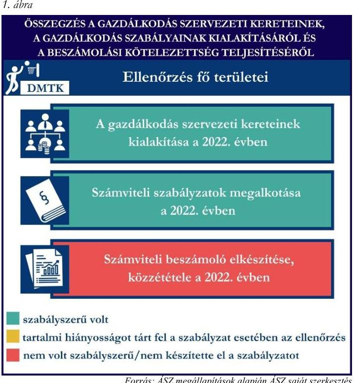
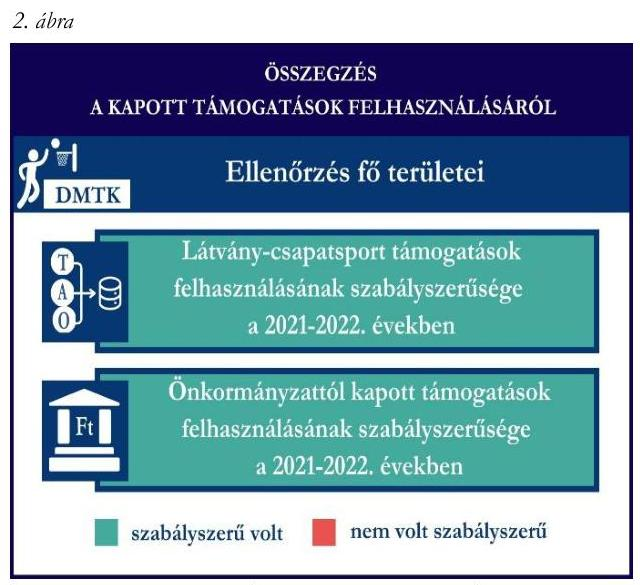
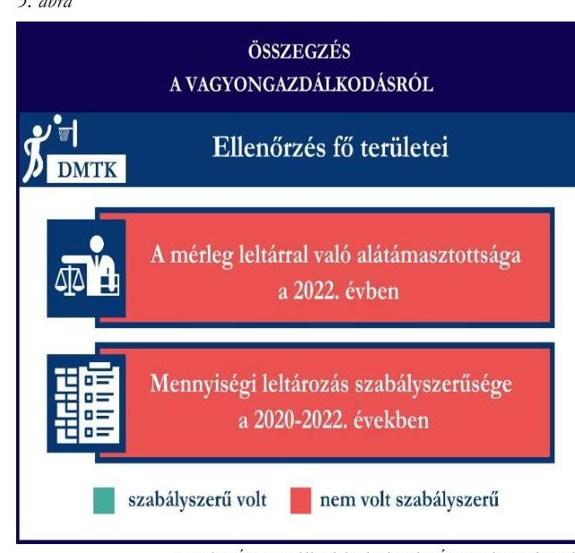

# JELENTÉS 

Támogatásban részesülő sportszövetségek és sportegyesületek gazdálkodásának ellenőrzése

Dunaharaszti Munkás Testedző Kör

2024.

---

# JELENTÉS 

## Támogatásban részesülő sportszövetségek és sportegyesületek gazdálkodásának ellenőrzése

Dunaharaszti Munkás Testedző Kör

2024.

---

# ELLENŐRZÉSI IGAZGATÓSÁG: 

ÁLLAMHÁZTARTÁSON KÍVÜLI SZERVEZETEKET ELLENŐRZŐ IGAZGATÓSÁG

## ELLENŐRZÉSI IGAZGATÓ:

## KLINGA LÁSZLÓ igazgató

## ELLENŐRZÉSVEZETÓ:

## HOFMEISTER LÁSZLÓ ellenőrzésvezető

## IKTATÓSZÁM: EL-4060-113/2024.

TÉMASZÁM: 2682
ELLENŐRZÉS-AZONOSÍTÓ SZÁM: V1026

---

# TARTALOMJEGYZÉK 

AZ ELLENŐRZÉS ALAPADATAI ..... 5
AZ ELLENŐRZÖTT SZERVEZET ..... 7
ÖSSZEFOGLALÁS ..... 8
AZ ELLENŐRZÉS FÓKUSZKÉRDÉSEI ..... 10
MEGÁLLAPÍTÁSOK ..... 11
JAVASLATOK ..... 14
MELLÉKLETEK ..... 15
I. sz. melléklet: Értelmező szótár ..... 15
II. sz. melléklet: Ellenőrzési kritériumok ..... 17
FÜGGELÉK: ÉSZREVÉTELEK ..... 18
RÖVIDÍTÉSEK JEGYZÉKE ..... 19

---

.

---

# AZ ELLENŐRZÉS ALAPADATAI 

## AZ ELLENŐRZÉS CÉLJA

Az ellenőrzés célja az államháztartásból nyújtott támogatással, vagy az államháztartásból meghatározott célra ingyenesen juttatott vagyon felhasználásával érintett sportszövetségek és sportegyesületek gazdálkodása szabályozottságának, gazdálkodási tevékenységének, ezen belül a beszámolási kötelezettség teljesítésének, a támogatások elkülönített nyilvántartásának, valamint a támogatások felhasználásának ellenőrzése.

## AZ ELLENŐRZÉS TÍPUSA

Szabályszerüségi ellenőrzés.

## AZ ELLENŐRZÖTT IDŐSZAK

Az 1. fókuszkérdés esetében a 2022. év.
A 2. fókuszkérdés vonatkozásában a 2021-2022. évek.
A 3. fókuszkérdés vonatkozásában a 2022. év, a mennyiségi felvétellel történő leltározás dokumentumai tekintetében a 2020-2022. évek.

## AZ ELLENŐRZÉS TÁRGYA

Az ellenőrzés tárgya a támogatásban részesülő sportszövetségek, sportegyesületek gazdálkodása szabályozottságának, gazdálkodási tevékenységén belül a beszámolási kötelezettség teljesítésének, a vagyonnyilvántartásának, a támogatások elkülönített nyilvántartásának, valamint az államháztartási forrásból származó közvetlen vagy közvetett támogatások és a meghatározott célra ingyenesen juttatott vagyon felhasználásának vizsgálata volt. Az ellenőrzés a támogatások vonatkozásában kiterjedt továbbá a támogató felé történő beszámolási és elszámolási kötelezettségek teljesítésére, az ezekkel kapcsolatos a jogszabályi és belső előírások betartására.

Az ellenőrzés kiterjedt minden olyan körülményre és adatra, amely az ÁSZ ${ }^{1}$ jogszabályban meghatározott feladatainak teljesítéséhez, valamint az ellenőrzési program végrehajtása során felmerülő újabb összefüggések feltárásához szükséges volt.

Az 1. és 3. fókuszkérdés tekintetében az ellenőrzés a teljes ellenőrzött szervezetre, a 2. fókuszkérdés tekintetében kizárólag a kosárlabda szakosztályra vonatkozott.

---

# Az ellenőrzés jogsalapja 

Az ellenőrzés jogszabályi alapját az ÁSZ tv. ${ }^{2} 1 . \S$ (3) bekezdése, az 5. $\$ (3) bekezdése, valamint a Civil tv. ${ }^{3} 47 . \int$ előírásai képezték.

## AZ ELLENŐRZÉS MÓDSZERE

Az ellenőrzést a nemzetközi standardokat irányadónak tekintve az ellenőrzési program szempontjai, az ellenőrzött időszakban hatályos jogszabályok, az ellenőrzés általános szakmai szabályai, az ellenőrzésre irányadó ÁSZ módszertanok figyelembevételével végezte az ÁSZ.

Az ellenőrzési kérdések megválaszolásához szükséges bizonyítékok megszerzése az ellenőrzött szervezet által rendelkezésre bocsátott dokumentumokra, adatokra alapozva kérdésfeltevés (információkérés), interjú, mintavételezés útján történt.

Az ellenőrzési bizonyítékként felhasználható adatforrások közé tartoztak egyrészt az ellenőrzés során az ellenőrzött szervezettől bekért dokumentumok, másrészt adatforrás lehetett minden további, az ellenőrzés folyamán feltárt, az ellenőrzés szempontjából információt tartalmazó dokumentum.

A támogatásokkal, azok felhasználásával kapcsolatos kötelezettségek vizsgálatára mintavételi eljárások kerültek alkalmazásra. Támogatás-típusok szerint nagyságrend alapján 1-3 darab támogatás került részletes vizsgálat alá. Ezen támogatások felhasználásának szabályszerűsége támogatásonként kockázatértékelés alapján kiválasztott mintatételekkel került ellenőrzésre. A kiválasztott támogatási szerződésekhez kapcsolódó elszámolásokból 30-30 db mintatétel került ellenőrzésre, ahol az elszámolás nem érte el a 30 db -ot, ott tételes ellenőrzésre került sor. Ezen felül a vagyongazdálkodás szabályszerűségének ellenőrzéséhez is kockázatalapú mintavétel kapcsolódott. A támogatások felhasználása és a vagyongazdálkodás területén a minták ellenőrzése kiterjedt a könyvvezetési kötelezettség vizsgálatára is. A tárgyi eszközök tekintetében 30 db került kiválasztásra a 2022. évben állományban lévő eszközök közül, ahol az állományban lévő eszközök száma nem érte el a 30 db -ot, ott tételes ellenőrzésre került sor azok nyilvántartásának, elszámolásának szabályszerűsége ellenőrzése céljából. Az ellenőrzésben nem statisztikai mintavételre került sor, ezért nem történt kivetítés a teljes sokaságra, a megállapításokat az ellenőrzött mintatételekre vonatkozóan fogalmazta meg az ÁSZ.

---

# AZ ELLENŐRZÖTT SZERVEZET

## DunaHARASZTI MUNKÁS TESTEDZŐ KÖR

A DMTK¹-t 1979. január 1-jén alapították. Elsődleges célja sportolási lehetőség nyújtása Dunaharaszti lakosságának annak érdekében, hogy a lehető legtöbb korosztály megtalálja a számára megfelelő sportolási lehetőséget.

A DMTK 11 szakosztállyal rendelkezett, taglétszáma 2022. december 31-én meghaladta a 100 főt.

A 2022. évben könyvvizsgálatra nem, felügyelőbizottság létrehozására kötelezett volt, vállalkozási tevékenységet nem végzett. A DMTK az OBH⁵ nyilvántartás alapján közhasznú jogállással nem rendelkezett.

A 2021-2022. években a DMTK által igénybe vett államháztartási forrásból származó támogatásokat az 1. táblázat foglalja magában.

|  A DMTK ÁLTAL IGÉNYBE VETT TÁMOGATÁSOK* (ADATOK M FT-BAN) |  |   |
| --- | --- | --- |
|   | 2021. év | 2022. év  |
|  Helyi önkormányzattól | 111,8 | 112,5  |
|  Sportági szakszövetségtől** | 11,7 | 23,1  |
|  Látvány-csapatsport támogatásból | 139,4 | 134,3  |

- több szakosztályt érintő támogatás

*Kosárlabda szakosztály nem részesült a támogatásból

---

# ÖSSZEFOGLALÁS 

Az Alaptörvény ${ }^{6}$ XX. cikke kimondja, hogy mindenkinek joga van a testi és lelki egészséghez, melynek érvényesülését Magyarország többek között a sportolás és a rendszeres testedzés támogatásával segíti elő. Az Országgyűlés ${ }^{7}$ a Sport tv. ${ }^{8}$-ben kinyilvánította, hogy a nemzet közössége a test művelését, a sportot, a nemzet alapértékének, kívánatos célnak tekinti. A sport a közjó része. Erősíti a közösség tagjainak egymáshoz tartozását, miként az egyén testi és lelki egészségét.

A sportegyesületek, sportszövetségek működésükre és szakmai tevékenységük ellátására költségvetési támogatásban, önkormányzati támogatásban, ingyenes vagyonjuttatásban, valamint látvány-csapatsport támogatásban részesülhetnek, amelyekre fokozott figyelem irányul.

A társadalom részéről jogosan felmerülő elvárás, hogy a közpénzeket kezelő, azzal gazdálkodó szervezetek működéséről, tevékenységéről átfogó képet kapjon, a közpénzek rendeltetésszerủ és átlátható módon történő felhasználásának értékelésére időről-időre sor kerüljön az ellenőrzések keretében.

A DMTK tekintetében a gazdálkodási szabályok kialakítása szabályszerű volt, a könyvvezetési és beszámolási kötelezettségének teljesítése a 2022. évben nem volt szabályszerű.

A DMTK a könyvviteli szolgáltatás személyi feltételeinek megteremtéséről, felügyelőbizottság létrehozásáról és működéséről gondoskodott.

A jogszabályi előírások szerint a DMTK kialakította a számviteli politikáját, valamint elkészítette a számviteli szabályzatait.

A számviteli beszámoló- és közhasznúsági melléklet készítési- és közzétételi kötelezettségét nem a jogszabályoknak megfelelően teljesítette.

A gazdálkodás szervezeti keretei kialakításának, a számviteli szabályzatok megalkotásának, valamint a számviteli beszámoló elkészítésének és közzétételének értékelését az 1. ábra mutatja be.

---

A DMTK a kosárlabda szakosztálya részére 2021. és 2022. években nyújtott látvány-csapatsport támogatásokat és a helyi önkormányzattól kapott támogatásokat az ellenőrzött tételek vonatkozásában a támogatási célnak megfelelően használta fel.

A kapott támogatások felhasználásának ellenőrzéséről az összegzést a 2. ábra tartalmazza.

Forrás: ÁSZ megállapítások alapján ÁSZ saját szerkesztés
3. ábra

A 2022. évben a DMTK vagyongazdálkodása az ellenőrzött tételek vonatkozásában nem volt szabályszerű. Nem a jogszabályoknak megfelelően gondoskodott saját vagyona nyilvántartásáról és a számviteli beszámolóban történő megjelenítéséről.

A 2022. évi beszámolójának mérlegtételeit nem támasztotta alá szabályszerű leltárral. A jogszabályban előírt mennyiségi felvétellel történő leltározást a 2020-2022. években nem végezte el. Ez alapján sérült a törvényben előírt valódiság elve.

A vagyongazdálkodás ellenőrzésének összegzését a 3. ábra tartalmazza.

---

# AZ ELLENŐRZÉS FÓKUSZKÉRDÉSEI 

1.     - A gazdálkodási szabályok kialakítása, a könyvvezetési és beszámolási kötelezettség teljesítése szabályszerű volt-e?
2.     - A kapott támogatások felhasználása szabályszerű volt-e?
3.     - Az ellenőrzött szervezet vagyongazdálkodása szabályszerű volt-e?

---

# 1. A gazdálkodási szabályok kialakítása, a könyvvezetési és beszámolási kötelezettség teljesítése szabályszerű volt-e? 

## Összegző megállapítás

A DMTK a 2022. évben a gazdálkodási szabályokat kialakította. A könyvvezetési és beszámolási kötelezettségének teljesítése nem volt szabályszerű.

A könyvviteli szolgáltatás személyi feltételeinek teljesüléséről a DMTK a 2022. évben a Számv. tv. ${ }^{9}$ és a Civilszr. ${ }^{10}$-ben foglaltaknak megfelelően gondoskodott.
A 2022. évben a Ptk. ${ }^{11}$ előírásainak betartásával gondoskodott az előírt felügyelőbizottság létrehozásáról, a felügyelőbizottság megalkotta ügyrendjét.
A DMTK a 2022. évben rendelkezett a Számv. tv. előírásainak megfelelő számviteli politikával, az eszközök és a források leltárkészítési és leltározási szabályzatával, az eszközök és források értékelési szabályzatával, pénzkezelési szabályzattal, valamint számlarenddel.
Könyvvezetési kötelezettségét a 2022. évben a DMTK a Civilszr. előírásainak megfelelően kettős könyvvitel vezetésével teljesítette. A könyvviteli nyilvántartásait a Számv. tv. és a Civilszr. rendelkezéseinek megfelelően úgy alakította ki, hogy az egyszerűsített éves beszámolóban az egyéb bevételeken belül a tagdíakat és a kapott támogatások összegét részletezni tudta. A beszámolóban kimutatott tagdíjak és támogatások értéke összegében eltért a főkönyvi kivonatban kimutatott tagdíj és támogatás összegétől, ez alapján a DMTK nem gondoskodott a 2022. évi számviteli beszámolójában szereplő tagdíjak és támogatások könyvvezetéssel való alátámasztásáról a Számv. tv. 4. § (1) bekezdésében előírtak ellenére, továbbá nem felelt meg a Számv. tv. 15. § (3) bekezdésében előírt valódiság elvének.
A DMTK a Civil tv.-ben, valamint a Számv. tv. előírásai alapján előírt egyszerűsített éves beszámolóját elkészítette. A közhasznúsági mellékletét a Civil vhr. ${ }^{12}$ 12. § (1) bekezdésében előírtak ellenére nem tartalmazta a jogszabályban előírtak közül a közhasznúsági melléklet 1-3., 5-6. pontjait (A szervezet azonosító adatai, Tárgyévben végzett alapcél szerinti és közhasznú tevékenységek bemutatása, Közhasznú tevékenységek bemutatása, Célszerinti juttatások, Vezető tisztségviselőnek nyújtott juttatások).
A DMTK felügyelőbizottsága megtárgyalta és elfogadásra javasolta a 2022. évi számviteli beszámolót. A 2022. évre vonatkozó számviteli beszámolót a DMTK küldöttgyűlése a Civil tv.-nek megfelelően jóváhagyta.
A DMTK az elfogadott 2022. évi számviteli beszámolóját a Civil tv. 30. § (1) bekezdésében foglalt ellenére határidőn túl, 2024. május 28-án helyezte letétbe. A DMTK a 2022. évi számviteli beszámolóját saját honlapján mérleg és közhasznúsági melléklet nélkül tette közzé, ezzel a Civil tv. 30. § (4) bekezdésében előírtakat nem tartotta be.

---

# 2. A kapott támogatások felhasználása szabályszerű volt-e? 

Összegző megállapítás

A DMTK a kosárlabda szakosztálya részére 2021. és 2022. években nyújtott támogatásokat az ellenőrzött tételek vonatkozásában a támogatási célnak megfelelően használta fel.

A DMTK az ellenőrzött támogatási szerződésekben foglaltak alapján a látvány-csapatsport támogatásból és a helyi önkormányzattól kapott támogatás bevételeit a Civil tv. előírásai alapján elkülönítette a számviteli rendszerében.

A DMTK könyvvezetése során az alapcél szerinti tevékenysége költségei, ráfordításai ellentételezésére kapott látvány-csapatsort támogatásokról a Számv. tv. 161/A. § (2) bekezdése, valamint a Civil tv. 20. (4) bekezdése előírásai ellenére nem olyan elkülönített számviteli nyilvántartást vezetett, amelynek alapján támogatásonként megállapítható és ellenőrizhető a kapott támogatások felhasználása., mivel egy mintatétel esetében a hivatkozott sportfejlesztési program terhére a számviteli bizonylaton záradékolt összeg nem egyezett meg az elkülönített nyilvántartásban szerepló értékkel. Továbbá ugyanezen mintatételnél a számviteli bizonylaton záradékolt összeg nem egyezett meg a számlaösszesítőben feltüntetett értékkel, ezzel a DMTK nem tartotta be a 107/2011. (VI. 30.) Korm. rendelet ${ }^{13} 11 . \S$ (5) bekezdésében előírtakat.
A DMTK a 2021-2022. években rendelkezett a 107/2011. (VI. 30.) Korm. rendeletben előírt látványcsapatsport támogatással érintett, jóváhagyott SFP ${ }^{14}$-vel. Az ellenőrzött SFP-vel kapcsolatban kapott látvány-csapatsport és kiegészítő látvány-csapatsport támogatással a DMTK a 107/2011. (VI. 30.) Korm. rendeletben foglaltak szerint elszámolt. A DMTK a 2021-2022. években a 107/2011. (VI. 30.) Korm. rendelet 11. § (2) bekezdésében foglaltak ellenére a látvány-csapatsport támogatás felhasználásáról negyedévente az előrehaladási jelentéseket határidőn túl nyújtotta be az illetékes ellenőrző szervezet felé. A DMTK a 2022. évben a látvány-csapatsport és kiegészítő látvány-csapatsport támogatás felhasználását igazoló szöveges, szakmai beszámolóját a 107/2011. (VI. 30.) Korm. rendeletben foglaltaknak megfelelően elkészítette. A 107/2011. (VI. 30.) Korm. rendeletnek megfelelően könyvvizsgáló által ellenőrzött számviteli bizonylatokkal számolt el a támogató felé, melyhez a könyvvizsgálatot végző könyvvizsgáló felelősségbiztosítási kötvénye is benyújtásra került.
A DMTK az ellenőrzött időszak könyvvezetése során az alapcél szerinti tevékenysége költségei, ráfordításai ellentételezésére a helyi önkormányzattól kapott támogatásokról a Civil tv. bekezdése előírásainak megfelelően vezette az elkülönített számviteli nyilvántartását, amelynek alapján támogatásonként megállapítható és ellenőrizhető volt a kapott támogatások felhasználása.
A DMTK a 2021. és 2022. évi könyvvezetése során a helyi önkormányzat költségvetéséből számára juttatott sportcélú támogatásokról a támogatási szerződésben előírtaknak megfelelően teljesítette beszámolási kötelezettségét a támogatás rendeltetésszerű felhasználásáról a helyi önkormányzat felé.

---

# 3. Az ellenőrzött szervezet vagyongazdálkodása szabályszerű volt-e? 

## Összegző megállapítás

A 2022. évben a DMTK vagyongazdálkodása az ellenőrzött tételek vonatkozásában nem volt szabályszerű. A 2022. évi beszámolójának mérlegtételeit szabályszerű leltárral nem támasztotta alá.

A DMTK a Számv. tv. 69. § (1)-(2) bekezdéseiben foglaltak ellenére a 2022. év beszámolójának mérlegét, a mérlegben szereplő eszközöket és forrásokat - a tárgyi eszközök és a pénzeszközök mérlegsorok kivételével - nem támasztotta alá szabályszerű leltárral, nem végezte el a főkönyvi könyvelés és az analitikus nyilvántartások adatai közötti egyeztetést.
A DMTK a Számv.tv. 69. § (3) bekezdés előírásaiban előírtak ellenére a legalább háromévente esedékes mennyiségi leltározást a 2020-2022. években nem végezte el.
A fentiek alapján sérült a Számv. tv. 15. § (3) bekezdésében előírt valódiság elve, miszerint a könyvvitelben rögzített és a beszámolóban szereplő tételeknek a valóságban is megtalálhatóknak, bizonyíthatóknak, kívülállók által is megállapíthatóknak kell lenniük, értékelésük meg kell, hogy feleljen az e törvényben előírt értékelési elveknek és az azokhoz kapcsolódó értékelési eljárásoknak.
Az ellenőrzött tárgyi eszközök bekerülési értékét alátámasztó számviteli bizonylatok a Számv. tv.-ben előírtaknak megfelelően rendelkezésre álltak. Az ellenőrzött tárgyi eszközök számviteli besorolása, értékcsökkenés elszámolása megfelelt a Számv. tv. előírásainak, az üzembe helyezés tényét a DMTK a Számv. tv.-ben előírtaknak megfelelően dokumentálta.

---

# JAVASLATOK 

Az ÁSZ tv. 33. § (1) bekezdésében foglaltak értelmében az ellenőrzött szervezet vezetője köteles a jelentésben foglalt megállapításokhoz kapcsolódó intézkedési tervet összeállítani és azt a jelentés kézhezvételétől számított 30 napon belül az ÁSZ részére megküldeni. Amennyiben az ellenőrzött szervezet vezetője nem küldi meg határidőben az intézkedési tervet, vagy továbbra sem elfogadható intézkedési tervet küld, az Állami Számvevőszék elnöke az ÁSZ tv. 33. § (3) bekezdése a) és b) pontjaiban foglaltakat érvényesítheti.

## A DuNAHARASZTI MUNKÁs TESTEDZŐ KÖR ELNÖKÉNEK

1. Gondoskodjon a számviteli beszámolójában szereplő adatok könyvvezetéssel való alátámasztásáról a Számv. tv. 4. § (1) bekezdésében előírtaknak megfelelően.
2. Gondoskodjon a számviteli beszámoló letétbe helyezéséről, közzétételéről a Civil tv. 30. § (1)-(4) bekezdésében előírtaknak megfelelően.
3. Gondoskodjon a közhasznúsági melléklet Civil vhr. 12. § (1) bekezdésében előírtaknak megfelelő tartalommal való elkészitéséről.
4. Gondoskodjon a látvány-csapatsport támogatásból kapott támogatások olyan elkülönített számviteli nyilvántartásának vezetéséről, amely alapján támogatásonként megállapítható és ellenőrizhető a kapott támogatás felhasználása, a Civil tv. 20. § (4) bekezdés és a Számv. tv. 161/A. § (2) bekezdés előírásai alapján.
5. Gondoskodjon arról, hogy a látvány-csapatsport támogatás felhasználását alátámasztó számviteli bizonylaton a 107/2011. (VI.30) Korm. rend. 11. § (5) bekezdésében előírt záradékolás minden esetben szerepeljen.
6. Gondoskodjon a beszámoló mérlegtételeinek leltárral való alátámasztásáról, valamint a mennyiségi felvétellel elvégzendő leltározásáról a Számv. tv. 69. § (1)-(3) bekezdéseiben előírtaknak megfelelően.

---

# MELLÉKLETEK 

## I. SZ. MELLÉKLET: ÉRTELMEZŐ SZÓTÁR

civil szervezet
egyesület
költségvetési támogatás
közhasznú szervezet
közhasznú tevékenység
látvány-csapatsport támogatás
sportegyesület
sportegyesületeknek, sportszövetségeknek nyújtott költségvetési támogatás
sportszövetség

A civil társaság; a Magyarországon nyilvántartásba vett egyesület - a párt, a szakszervezet és a kölcsönös biztosító egyesület kivételével és - a közalapítvány és a pártalapítvány kivételével - az alapítvány. (Forrás: Civil tv. 2. $\$ 6$. pont a)-c) alpontjai)

Az egyesület a tagok közös, tartós, alapszabályban meghatározott céljának folyamatos megvalósítására létesített, nyilvántartott tagsággal rendelkező jogi személy. (Forrás: Ptk. 3:63. § (1) bekezdés)
A Számv. tv. szempontjából egyéb szervezet. (Számv. tv. 3. § (1) bekezdés 4. pont a) alpontja)
A társadalombiztosítás pénzügyi alapjai kivételével az államháztartás központi alrendszeréből ellenérték nélkül, pénzben nyújtott támogatások. (Forrás: Áht. 1. $\$ 14$. pont ide nem értve az Áht. 1. $\$ 14$. pont a) -o) pontjaiban szereplő támogatásokat)
Közhasznú szervezetté minősíthető a Magyarországon nyilvántartásba vett közhasznú tevékenységet végző szervezet, amely a társadalom és az egyén közös szükségleteinek kielégítéséhez megfelelő erőforrásokkal rendelkezik, továbbá amelynek megfelelő társadalmi támogatottsága kimutatható, és amely:
a) civil szervezet (ide nem értve a civil társaságot), vagy
b) olyan egyéb szervezet, amelyre vonatkozóan a közhasznú jogállás megszerzését törvény lehetővé teszi. (Forrás: Civil tv. 32. § (1) bekezdés)
Minden olyan tevékenység, amely a létesítő okiratban megjelölt közfeladat teljesítését közvetlenül vagy közvetve szolgálja, ezzel hozzájárulva a társadalom és az egyén közös szükségleteinek kielégítéséhez. (Forrás: Civil tv. 2. $\$ 20$. pont)

Az adóévben visszafizetési kötelezettség nélkül nyújtott támogatás, juttatás, véglegesen átadott pénzeszköz és térítés nélkül átadott eszköz könyv szerinti értéke, az adóévben térítés nélkül nyújtott szolgáltatás bekerülési értéke a Tao. tv.-ben meghatározott jogcímeken. (Forrás: Tao. tv. 4. § 44. pont)
A Civil tv. és a Ptk. szabályai szerint múködő olyan egyesület, amelynek alaptevékenysége a sporttevékenység szervezése, valamint a sporttevékenység feltételeinek megteremtése. A sportegyesületek a Sport tv. 15. § (1) bekezdésében meghatározott sportszervezetek körébe tartoznak. A sportegyesületeken kívül sportszervezet még a sportvállalkozás, a sportiskola, valamint az utánpótlás-nevelés fejlesztését végző alapítvány. (Forrás: Sport tv. 16. § (1) bekezdés)
Az állami sport célú támogatások felhasználásáról és elosztásáról szóló 474/2016. (XII. 27.) Kormány rendelet ${ }^{15} 1$ § (1) bekezdésében és a 27/2013. (III. 29.) EMMI rendelet ${ }^{16}$ 1. $\$$-ában meghatározott fejezeti kezelésű előirányzatokból nyújtott támogatás.
Meghatározott sporttevékenységek körében a sportversenyek szervezésére, a tagok érdekvédelmére és a részükre való szolgáltatásokra, valamint a nemzetközi kapcsolatok lebonyolítására létrehozott, jogi személyiséggel és önkormányzattal rendelkező, a Civil tv. és a Ptk. alapján - az e törvényben foglalt eltérésekkel - különös formában múködő egyesületek. A Sport tv. 19. § (3) bekezdése szerint a sportszövetségeknek az alábbi típusai léteznek:

---

sporttevékenység
országos sportági szakszövetségek, sportági szövetségek, szabadidősport szövetségek, fogyatékosok sportszövetségei, diák- és egyetemi-főiskolai sport sportszövetségei, nemzetközi sportszövetségek. (Forrás: Sport tv. 19. § (1), (3) bekezdés)

Meghatározott szabályok szerint, a szabadidő eltöltéseként kötetlenül vagy szervezett formában, illetve versenyszerűen végzett testedzés vagy szellemi sportágban kifejtett tevékenység, amely a fizikai erőnlét és a szellemi teljesítőképesség megtartását, fejlesztését szolgálja. (Forrás: Sport tv. 1. § (2) bekezdés)

---

# II. SZ. MELLÉKLET: ELLENŐRZÉSI KRITÉRIUMOK 

## FÓKUSZKÉRDÉS

## 1. fókuszkérdés:

A gazdálkodási szabályok kialakítása, a könyvvezetési és beszámolási kötelezettség teljesítése szabályszerű volt-e?

## 2. fókuszkérdés:

A kapott támogatások felhasználása szabályszerű volt-e?

## 3. fókuszkérdés:

Az ellenőrzött szervezet vagyongazdálkodása szabályszerű volt-e?

## ELLENŐRZÉSI KRITÉRIUMOK

Számv. tv. 4.§ (1) bekezdés, 14. § (3) bekezdés, (5) bekezdés a), b), d) pont, (8) bekezdés, 69. § (3) bekezdés, 90. § (3) bekezdés c) pont, 161. § (1) bekezdés, (2) bekezdés a) -d) pont, (3)-(4) bekezdés, 161. § (2) bekezdés, 161/A. § (2) bekezdés, 165. § (2) bekezdés
Civilszr. 7. § (1) bekezdés, (4) bekezdés b), c) pont, 8. § (2), (3) bekezdés, 9. § (4), (5) bekezdés, 15. § (1) bekezdés a), b) pont, 16. $\S$ (1) bekezdés, 24. § (2) bekezdés
Ptk. 3:26. § (1) bekezdés, 3:27. § (1) bekezdés, 3:82. § (1) bekezdés,
Civil tv. 28. § (1) bekezdés, 29. § (2) bekezdés c) pont, (3), (6), (7) bekezdés, 30. § (1)-(4) bekezdés 40. § (1), (2) bekezdés, 41. § (1) bekezdés
Civil vhr. 12.§ (1) bekezdés
Számv. tv. 44. § (2) bekezdés, 93. § (3) bekezdés, 159. §, 161/A. $\S$ (2) bekezdés
165. § (2) bekezdés, 167. § (1) bekezdés a), d), e), h) pont

Civil tv. 20. § (2) bekezdés a) pont, (3) bekezdés a), c) pont, (4) bekezdés, 29. § (4), (5) bekezdés
Civilszr. 24. § (2) bekezdés
27/2013. (III.29.) EMMI rend. 18. § (2) bekezdés
474/2016. (XII. 27.) Korm. rend. 22. § (2) bekezdés, 24. § (2) bekezdés
107/2011. (VI. 30.) Korm. rend. 9. § (9) bekezdés, 11. § (1), (2), (4), (4a), (5), (6) bekezdés, 14. § (1) bekezdés,

Számv. tv. 16. § (2) bekezdés, 26. §, 42. § (5) bekezdés, 46. § (3) bekezdés, 47-53. §, 69. §, 159. §, 161/A. §, 162. § (1)-(2) bekezdés, 165-166. §
Ávr. ${ }^{17}$ 93. § (5) bekezdés
107/2011. (VI. 30.) Korm. rend. 11. § (5) bekezdés
474/2016. (XII. 27.) Korm. rend. 17. § (1) bekezdés 11a., 11b. pont, 17. § (2a) bekezdés, 24. § (2) bekezdés
Tao. tv. ${ }^{18} 22 /$ C. §.

---

# FÜGGELÉK: ÉSZREVÉTELEK 

A jelentéstervezetet a Számvevőszék 15 napos észrevételezésre megküldte az ellenőrzött szervezet vezetőjének az ÁSZ tv. 29. §* (1) bekezdése előírásának megfelelően.

Az ellenőrzött szervezet elnöke a jelentéstervezetre nem tett észrevételt.

[^0]
[^0]:    * 29. § (1) Az Állami Számvevőszék az ellenőrzési megállapításait megküldi az ellenőrzött szervezet vezetőjének vagy az általa megbízott személynek, és annak, akinek személyes felelősségét állapította meg.
    (2) Az ellenőrzött szervezet vezetője és a felelősként megjelölt személy az ellenőrzés megállapításaira tizenöt napon belül írásban észrevételt tehet.
    (3) Az Állami Számvevőszék az észrevételre a beérkezésétől számított harminc napon belül írásban válaszol. A figyelembe nem vett észrevételeket köteles a jelentésben feltüntetni, és megindokolni, hogy azokat miért nem fogadta el.

---

# RÖVIDÍTÉSEK JEGYZÉKE 

${ }^{1}$ ÁSZ
${ }^{2}$ ÁSZ tv.
${ }^{3}$ Civil tv.
${ }^{4}$ DMTK
${ }^{5}$ OBH
${ }^{6}$ Alaptörvény
${ }^{7}$ Országgyúlés
${ }^{8}$ Sport tv.
${ }^{9}$ Számv. tv.
${ }^{10}$ Civilszr.
${ }^{11}$ Ptk.
${ }^{12}$ Civil vhr.
${ }^{13}$ 107/2011. (VI. 30.) Korm. rendelet
${ }^{14}$ SFP
${ }^{15}$ 474/2016. (XII. 27.) Korm. rendelet
${ }^{16}$ 27/2013. (III.29.) EMMI rendelet
${ }^{17}$ Ávr.
${ }^{18}$ Tao. tv.

Állami Számvevőszék
2011. évi LXVI. törvény az Állami Számvevőszékről
2011. évi CLXXV. törvény az egyesülési jogról, a közhasznú jogállásról, valamint a civil szervezetek müködéséről és támogatásáról
Dunaharaszti Munkás Testedző Kör
Országos Bírósági Hivatal
Magyarország Alaptörvénye
Magyarország Országgyűlése
2004. évi I. törvény a sportról
2000. évi C. törvény a számvitelről
479/2016. (XII. 28.) Korm. rendelet a számviteli törvény szerinti egyes egyéb szervezetek beszámoló készítési és könyvvezetési kötelezettségének sajátosságairól
2013. évi V. törvény a Polgári Törvénykönyvről
350/2011. (XII. 30.) Korm. rendelet a civil szervezetek gazdálkodása, az adománygyűjtés és a közhasznúság egyes kérdéseiről
107/2011 (VI. 30.) Korm. rendelet a látványcsapatsport támogatását biztosító támogatási igazolás kiállításáról, felhasználásáról, a támogatás elszámolásának ás ellenőrzésének, valamint visszafizetésének szabályairól
Sportfejlesztési program
474/2016. (XII. 27.) Korm. rendelet az állami sport célú támogatások felhasználásáról és elosztásáról
27/2013. (III. 29.) EMMI rendelet az állami sport célú támogatások felhasználásáról és elosztásáról
368/2011. (XII. 31.) Korm. rendelet az államháztartásról szóló törvény végrehajtásáról
1996. évi LXXXI. törvény a társasági adóról és az osztalékadóról

---

1052 Budapest, Apáczai Csere János u. 10. | 1364 Budapest 4., Pf. 54
www.asz.hu | szamvevoszek@asz.hu
telefon: +36 14849100