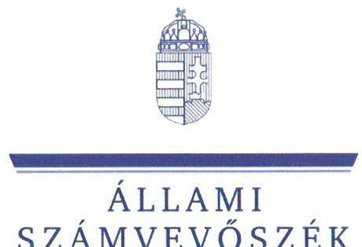
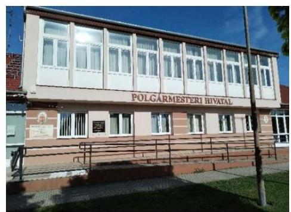
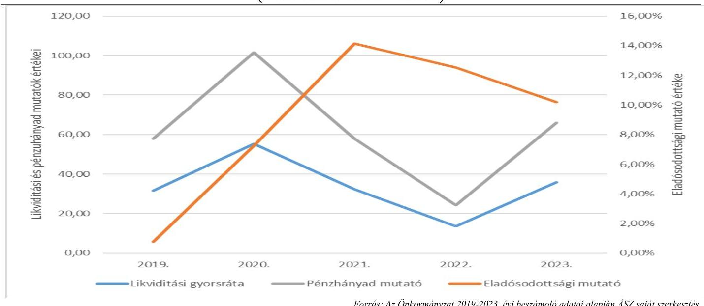
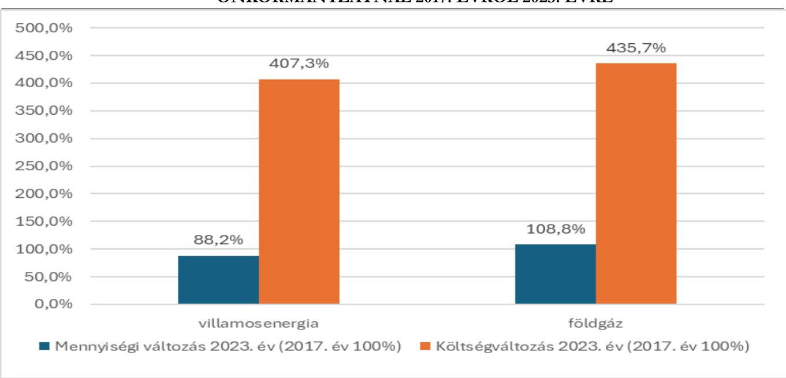
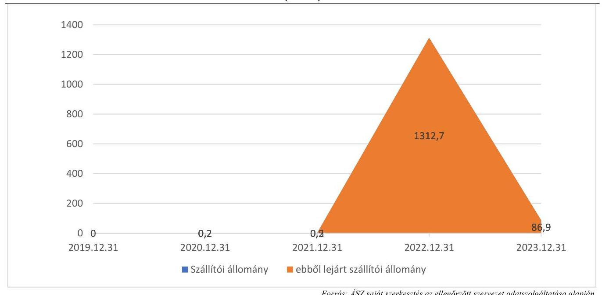

# JELENTÉS 

## Az önkormányzatok energiahatékonysági intézkedéseinek ellenőrzése

Hegyeshalom Nagyközségi Önkormányzat

2024.

---

ÁLLAMI
SZÁMVEVŐSZÉK

# JELENTÉS 

## Az önkormányzatok energiahatékonysági intézkedéseinek ellenőrzése

Hegyeshalom Nagyközségi Önkormányzat

2024.

---

# ELLENŐRZÉSI IGAZGATÓSÁG: 

## ÁLLAMHÁZTARTÁS HELYI SZINTJÉT ELLENŐRZŐ IGAZGATÓSÁG

## ELLENŐRZÉSI IGAZGATÓ:

DR. BAFFIA GERGELY GÁBOR igazgató

## ELLENŐRZÉSVEZETŐ:

Jelentéseink az interneten a www.asz.hu címen olvashatók.

HUDÁK MAGDOLNA ellenőrzésvezető

IKTATÓSZÁM: EL-4092-006/2024.
TÉMASZÁM: 2676
ELLENŐRZÉS-AZONOSÍTÓ SZÁM: V-102009

---

# TARTALOMJEGYZÉK 

AZ ELLENŐRZÉS ALAPADATAI ..... 5
AZ ELLENŐRZÖTT SZERVEZET ..... 7
ÖSSZEFOGLALÁS ..... 8
AZ ELLENŐRZÉS FÓKUSZTERÜLETEI ..... 10
MEGÁLLAPÍTÁSOK ..... 11
JAVASLATOK ..... 22
MELLÉKLETEK ..... 24
I. sz. melléklet: Értelmező szótár ..... 24
II. sz. melléklet: Az ellenőrzött szervezetek jegyzéke ..... 29
III. sz. melléklet: Ellenőrzési kritériumok ..... 30
IV. sz. melléklet: Az Önkormányzat közfeladatellátásban érintett épületeivel és energiahatékonysági intézkedéseivel kapcsolatos tájékoztató adatok ..... 32
FÜGGELÉK: ÉSZREVÉTELEK ..... 39
RÖVIDÍTÉSEK JEGYZÉKE ..... 40

---

.

---

# AZ ELLENŐRZÉS ALAPADATAI 

## AZ ELLENŐRZÉS CÉLJA

Az ellenőrzés célja annak vizsgálata volt, hogy az Önkormányzat ${ }^{1}$ értékelte-e az energiaárak változásának a költségvetése végrehajtására, a gazdálkodására, valamint a kötelező és önként vállalt feladatainak ellátására gyakorolt hatását. Az ellenőrzés kiterjedt arra, hogy az Önkormányzat és a költségvetési szervei az energiaköltségek csökkentése érdekében tettek-e energiahatékonysági intézkedéseket, továbbá arra, hogy az Önkormányzat által tett intézkedések hozzájárultak-e a költségvetés pénzügyi egyensúlyának, a kötelező feladatok ellátásának a biztosításához.

## AZ ELLENŐRZÉS TÍPUSA

Kombinált ellenőrzés.

## AZ ELLENŐRZÖTT IDŐSZAK

A 2022. év és a 2023. év.
A 3. fókuszterületnél a megkezdett és lebonyolított beruházások tekintetében a 2017-2023. évek, továbbá a 4. fókuszterületnél a pénzügyi egyensúly alakulása tekintetében a 2019-2023. évek.

## AZ ELLENŐRZÉS TÁRGYA

Az ellenőrzés tárgyát képezte az Önkormányzat és költségvetési szervei gazdálkodásának biztonsága és a kötelező feladatok ellátása érdekében - az energiaárak 2022. évi változásának ellensúlyozására - tett energiahatékonyságot növelő, energiamegtakarítást célzó, a pénzügyi egyensúly fenntartására tett intézkedések megfelelőségének és eredményességének értékelése a 2022-2023. években.

Elemzési módszerrel a 2017-2023. években végrehajtott energiahatékonysági beruházások, fejlesztések, szakpolitikai intézkedésekben való részvétel értékelését végezte az ÁSZ a tekintetben, hogy azok megelőző intézkedést jelentettek-e, illetve befolyásolták-e az energiaköltségek csökkentése érdekében a 2022-2023. években megtett intézkedéseket.

## AZ ELLENŐRZÉS JOGALAPJA

Az ellenőrzés jogszabályi alapját az ÁSZ tv. ${ }^{2} 5. §$ (2) bekezdés előírásai képezték.

---

# AZ ELLENŐRZÉS MÓDSZERE 

Az ellenőrzést az Alaptörvény ${ }^{3}$ 43. cikk (1) bekezdésében meghatározott törvényességi, célszerűségi és eredményességi szempontok, valamint nemzetközi standardokat irányadónak tekintve az ellenőrzési program szempontjai, az ellenőrzött időszakban hatályos jogszabályok, az ellenőrzés szakmai szabályok és módszertanok figyelembevételével végezte az ÁSZ ${ }^{4}$.

Az ellenőrzési kérdések megválaszolásához szükséges bizonyítékok megszerzése az ellenőrzött szervezet által rendelkezésre bocsátott dokumentumokra és adatokra, valamint az ellenőrzést támogató szervezetektől ${ }^{5}$ kapott adatokra alapozva, továbbá megfigyelés, szemle (szemrevételezés), kérdésfeltevés (információkérés), valamint elemző eljárás útján történt.

Az ellenőrzés során bizonyítékként felhasználható adatforrások közé tartoztak egyrészt az ellenőrzéshez kért dokumentumok, adatforrások, másrészt adatforrás volt még minden, az Elektronikus Közbeszerzési rendszerből és az Önkormányzati rendelettárból származó dokumentum.

Az ellenőrzés lefolytatásához az ellenőrzött szervezet a tanúsítványok kitöltésével, valamint az ÁSZ által kért dokumentumok, adatok, információk megküldésével és a helyszíni ellenőrzés során szolgáltatott adatokat. Ellenőrzést támogató szervezetként az ÁSZ adatot kért a BM${ }^{6}$-től, a PM${ }^{7}$-től, az EM${ }^{8}$-től, a HM${ }^{9}$-től és a ME${ }^{10}$-től az energiaáremelkedéssel kapcsolatos intézkedések keretében nyújtott állami támogatásokról, továbbá az EMIT${ }^{11}$-ek teljesítésére vonatkozóan a MEKH${ }^{12}$-től, amely szervezet az Energetikusi Hálózaton keresztül támogatta a közintézmények Ehat. tv. ${ }^{13}$-ben foglalt adatszolgáltatási kötelezettségeinek teljesítését.

Az ellenőrzés során egy kiválasztott önkormányzati beruházás előkészítése, megvalósítása, elszámolása, nyilvántartása tételes ellenőrzésre került.

Elemzési módszerrel tanúsítványon szolgáltatott adatok alapján értékeltük, hogy a 2017-2023 között végrehajtott (indított, illetve befejezett) energiahatékonyságot növelő, energiamegtakarítást célzó beruházások mennyiben befolyásolták, milyen hatással voltak a rendkívüli energiaár növekedések következtében a 2022-2023. években megtett intézkedésekre.

A tanúsítványokon szolgáltatott adatok, az Önkormányzat által rendelkezésre bocsátott dokumentumok alapján értékeltük, hogy a meghozott takarékossági intézkedések hogyan érintették az Önkormányzat kötelező, illetve önként vállalt feladatainak ellátását, öt mutatószám (likviditási gyorsráta, likviditási gyorsráta változása, eladósodottsági mutató, lejárt szállítói állomány változása, pénzhányad mutató alakulása) segítségével értékeltük az Önkormányzatnál a pénzügyi egyensúly alakulását.

Az ellenőrzés kiterjedt minden olyan körülményre és adatra, amely az ÁSZ jogszabályban meghatározott feladatainak teljesítéséhez, valamint a program végrehajtása folyamán felmerült újabb összefüggések feltárásához szükséges volt.

---

# AZ ELLENŐRZÖTT SZERVEZET 

Hegyeshalom Nagyközségi Önkormányzat a Nyugat-Dunántúl régióban, Győr-Moson-Sopron vármegyében, a Mosonmagyaróvári járásban található. Lakónépessége a KSH${ }^{14}$ adata szerint 2023. január 1-én 3727 fő volt.

A település polgármestere ${ }^{15}$ 2006. év óta látta el tisztségét, a Képviselő-testületnek ${ }^{16}$ a polgármesteren kívül hat fő képviselő tagja volt az SZMSZ ${ }^{17}$ szerint. A polgármester munkáját egy alpolgármester segítette. Az Önkormányzat működésével és gazdálkodásával kapcsolatos feladatokat a Hivatal ${ }^{18}$ látta el. A Hivatal vezetését 2003. január 1-jétől 2023. szeptember 30-áig a jegyző: ${ }^{19}$ látta el, a jegyző: ${ }^{20}$ 2023. október 1-je óta töltötte be tisztségét. A közös Hivatal engedélyezett létszáma 2023. évben 21 fő volt, amelyből az Önkormányzat ügyeivel átlagosan 9,5 fő foglalkozott.

Az Önkormányzat fenntartásában - a Hivatal mellett - két költségvetési szerv működött, az Óvoda ${ }^{21}$ az óvodai- és bölcsődei feladatokat, a Könyvtár ${ }^{22}$ a könyvtári feladatokat látta el. Az Önkormányzat kizárólagos tulajdonába az Önkormányzati Kft. ${ }^{23}$ tartozott, amelynek fő tevékenysége ingatlan bérbeadás, üzemeltetés volt, továbbá részt vett ingatlankezelési és építményüzemeltetési tevékenységekben is.

Az Önkormányzat a szociális étkeztetéssel, a házi segítségnyújtással, a hajléktalanok ellátásával, a család- és gyermekjóléti szolgáltatásokkal, az idősek ellátásával, a bölcsődei ellátással, valamint a település- és térségfejlesztéssel kapcsolatos feladatokat a Mosonmagyaróvár Térségi Társulás útján, a hulladékgazdálkodási feladatokat a Mosonmagyaróvár Nagytérségi Hulladékgazdálkodási Önkormányzati Társulás által látta el. A belső ellenőrzési feladatokról külső szolgáltató útján gondoskodtak.

Az Önkormányzat 2022. és 2023. évi konszolidált beszámolójának főbb adatait az 1. táblázat mutatja be: 1. táblázat

AZ ÖNKORMÁNYZAT 2022. ÉS 2023. ÉVI KONSZOLIDÁLT BESZÁMOLÓINAK FŐBB ADATAI (M FT)

| MEGNEVEZÉS | 2022. EVI   KONSZOLIDÁLT   BESZÁMOLÓ | 2023. EVI   KONSZOLIDÁLT   BESZÁMOLÓ |
| :--: | :--: | :--: |
| Költségvetési bevétel | 1418,4 | 1942,3 |
| Ebből: Működési és felhalmozási célú támogatások államháztartáson belülről | 479,6 | 788,9 |
| Közhatalmi bevételek | 444,5 | 662,6 |
| Költségvetési kiadás | 1415,6 | 1502,7 |
| Ebből: Dologi kiadások | 531,6 | 632,7 |
| Ebből: közüzemi díjak | 118,0 | 120,8 |
| Beruházások és felújítások | 356,3 | 258,8 |
| Finanszírozási bevételek | 221,5 | 192,5 |
| Ebből: Maradvány igénybevétele | 206,9 | 176,8 |
| Finanszírozási kiadások | 47,5 | 107,4 |
| Ebből: Hitel-, kölcsöntörlesztés államháztartáson kívülre | 35,8 | 47,8 |

---

# ÖSSZEFOGLALÁS 

Az energiaárak 2022. évben bekövetkezett jelentős emelkedése, a források korlátozott rendelkezésre állása új fókuszba helyezte az önkormányzatoknál az energiagazdálkodás kérdését. Az energia változatlan mennyiségben történő felhasználása a magas költségkitettség miatt jelentős kockázatokat eredményezett az önkormányzatok pénzügyi-gazdasági egyensúlyára, valamint a közfeladatok ellátásának biztonságára. Az energiaárak emelkedéséből eredő kockázatok önkormányzati kezelésének támogatása érdekében kormányzati intézkedések történtek. Az európai uniós irányelveken alapuló energiahatékonyságról szóló törvény a települési önkormányzatok, mint a közfeladat ellátását szolgáló épületek tulajdonosai, használói, valamint az üzemeltetésért és fenntartásért felelős szervezetek vezetői számára több energiahatékonysági feladatot is meghatározott. Az ellenőrzés rávilágított az Önkormányzat törvényben foglalt energiagazdálkodással kapcsolatos feladatai ellátásának megfelelőségére, az energiagazdálkodási feladatok és a pénzügyi-gazdálkodási feladatok közötti összefüggésekre.

Az Önkormányzat a 2022. évben az energiaáremelkedésből eredő problémákat eredményesen kezelte, intézkedéseivel, energiahatékonyságot növelő beruházásaival hozzájárult az Önkormányzat működőképességének, pénzügyi egyensúlyának fenntartásához, kötelező feladatainak ellátásához. A közfeladatok ellátását szolgáló épületekkel kapcsolatos jogszabályi előírások teljesítésében azonban hiányosságok mutatkoztak.

Az Önkormányzat és a költségvetési szervek vezetőinek az Önkormányzat tulajdonában és használatában álló, közfeladat ellátását szolgáló épületekkel kapcsolatos energetikai üzemeltetési és fenntartási feladatellátása nem felelt meg a jogszabályi előírásoknak, mivel EMIT-ek az Önkormányzat és költségvetési szervei által használt épületek vonatkozásában nem álltak rendelkezésre. A középületekre elkészült energetikai tanúsítványokat nem töltötték fel a Nemzeti Energetikusi Hálózat által üzemeltetett online felületre. Az Önkormányzat és a költségvetési szervek vezetői a havi energiaadatszolgáltatási és éves beszámolási kötelezettségüknek nem tettek eleget.

Az energiakiadások csökkentése, a pénzügyi egyensúly fenntartása érdekében a 2022. évben a Képviselőtestület több bevételnövelő és az intézményi körre is kiterjedő kiadást csökkentő intézkedést hozott, amelyeknek költségvetési hatását nem számszerűsítették. Az Önkormányzat 2023. évben az energiaköltségek emelkedésének kompenzálására 19,2 M Ft központi költségvetési támogatásban részesült.

Az Önkormányzat saját maga és intézményei nevében a 2022. évben az energiaellátás folyamatos biztosítását célzó kormányzati intézkedések közül csupán a fixált áras árképzésű villamosenergia és földgázvásárlás, valamint a földgáz kereskedelmi szerződésben lekötött földgázmennyiségnél kisebb mennyiségű földgáz felhasználására biztosított lehetőséggel élt, mivel hatályos energiavásárlási szerződésekkel rendelkeztek, amelyek az energiaárak tekintetében kedvezőbb feltételeket tartalmaztak a kormányzati intézkedések igénybevételével elérhető áraknál.

Az Önkormányzat pénzügyi helyzete stabil, likviditása biztosított volt, amelyet főbb pénzügyi mutatóinak alakulása is alátámasztott. Az eladósodottsági mutató értéke a 2020-2021. évben felvett 633,3 M Ft fejlesztési hitelfelvétel következtében nőtt, de az ellenőrzött időszakban mindvégig a referencia tartományban maradt, értéke 14% alatti volt. A pénzhányad mutató és a likviditási mutató értéke a 2022. évben jelentősen romlott, amely összefüggésben volt az energiaáremelkedésből eredő inflációs hatással. A mutatók értéke a 2023. évtől javult, visszaállt a 2019. évi szintre az Önkormányzat által megtett intézkedések eredményeképpen. Az energiaárak változása nem érintette az Önkormányzat megtakarításait, befektetett pénzügyi eszközeinek 

---

állománya a 2022. évről a 2023. évre nem változott, 125,1 M Ft volt. Az Önkormányzat pénzügyi mutatóinak alakulását az 1. ábra mutatja be.

# 1. ábra 

HEGYESHALOM NAGYKÖZSÉGI ÖNKORMÁNYZAT PÉNZÜGYI MUTATÓSZÁMAI (2019-2023. ÉVEK KÖZÖTT)

Forrás: Az Önkormányzat 2019-2023. évi beszámoló adatai alapján ÁSZ saját szerkesztés

Az Önkormányzatnál a 2017-2023. években indított energiamegtakarítást célzó fejlesztések hőszigetelésre, nyílászárók cseréjére és napelemrendszer kiépítésére irányultak.

A Képviselő-testület a 2017-2023. években hét, összesen 1273,8 M Ft tervezett bekerülési összegű, saját beruházásában megvalósuló, energiamegtakarítást célzó fejlesztésről döntött. A megvalósult, lezárt beruházások teljesített kiadása 1047,4 M Ft volt, amelyeket 18,6%-ban önkormányzati saját forrásból, 20,9%-ban hazai forrásból, valamint 60,5%-ban fejlesztési hitelből valósítottak meg. A 2023. évben két energetikai felújításra és egy napelem telepítésre irányuló 159,3 M Ft értékű energetikai beruházás volt folyamatban. Ezek közül az ellenőrzésre kiválasztott Egészségház korszerűsítése, bruttó 29,2 M Ft összköltségű energetikai célú fejlesztés előkészítése, megvalósítása során az Önkormányzat betartotta a jogszabályok előírásait, azonban a pénzügyi elszámolás során az érvényesítésre és a beruházások üzembehelyezésének dokumentálására vonatkozó szabályokat megsértették.

Az Önkormányzatnál a 2017. évről a 2023. évre a villamosenergia fogyasztás 11,8%-kal csökkent, míg a földgáz fogyasztás 8,8%-kal növekedett. A villamosenergia fogyasztás csökkenéséhez - egyéb tényezők mellett - a végrehajtott energiahatékonysági beruházások is hozzájárultak. A földgázfogyasztás növekedésében a 2021. október 1-jén átadott
 közösségi színtér és a 2022. október 1-jén átadott 24 férőhelyes bölcsőde épületének fogyasztása játszott meghatározó szerepet. A 2021-2022. években az épületállomány növekedése ellenére a villamosenergia-fogyasztás csökkent, amely azonban nem tudta ellensúlyozni az energiaáremelkedések hatását. Az energiaköltségek a 2017. évi 35,9 M Ft-ról 2023. évre 148,9 M Ft-ra emelkedtek. A megemelkedett kiadások fedezetét a bevételnövelő és kiadáscsökkentő intézkedések mellett az Önkormányzat saját forrásból, valamint központi költségvetési támogatásokból biztosította.

Az Önkormányzat belső ellenőrzése a 2022. és 2023. években nem végzett energiahatékonysággal kapcsolatos ellenőrzést.

Az ÁSZ az ellenőrzés során feltárt hiányosságok felszámolása, a szabályszerű működés feltételeinek megteremtése érdekében a polgármesternek öt, a jegyzőnek hat javaslatot tett.

---

# AZ ELLENŐRZÉS FÓKUSZTERÜLETEI 

1. Az önkormányzat és költségvetési szervei tulajdonában, illetve használatában álló, közfeladat ellátását szolgáló épületekkel kapcsolatos energetikai üzemeltetési és fenntartási feladatellátás
2. Az energiaárak változására tekintettel a gazdálkodás biztonsága érdekében a központi intézkedések adta lehetőségek önkormányzat általi hasznosítása
3. Az energiaköltségek csökkentése, az energiahatékonyság növelése érdekében kezdeményezett, illetve folyamatban lévő energetikai beruházások értékelése
4. Az energiaárak hatásának kezelésére, a kötelező feladatok ellátására, a pénzügyi egyensúly fenntartására tett intézkedések értékelése

---

# 1. Az önkormányzat és költségvetési szervei tulajdonában, illetve használatában álló, közfeladat ellátását szolgáló épületekkel kapcsolatos energetikai üzemeltetési és fenntartási feladatellátás 

Összegző megállapítás Az Önkormányzat és költségvetési szervei vezetői nem tettek eleget az Ehat. tv.-ből eredő kötelezettségüknek, mivel az EMIT készítési és azok teljesítéséről szóló beszámolási kötelezettségüket nem teljesítették, nem szolgáltattak havi rendszerességgel adatokat az energiafogyasztásról, és nem jelöltek ki energetikai felelőst.

Az Önkormányzat tulajdonában álló 15 közfeladatellátásban érintett épületből 14 az Önkormányzat és költségvetési szervei használatában volt, egy épületet - Altalános Iskola, Hegyeshalom - vagyonkezelői szerződés keretében a Győri Tankerületi Központ üzemeltetett. A 14 épületből három ingatlant más szervezetek (Sport Club ${ }^{24}$, Önkormányzati Kft, Tűzoltóegyesület ${ }^{25}$ ) használtak. Ezekből két ingatlanra (az Önkormányzati Kft. által használt géptárolóra és a Tűzoltóegyesület által használt tűzoltószertárra) vonatkozóan az Nvtv. ${ }^{26}$ 3. § 11. pontjában foglaltak ellenére ingatlanhasznosítási szerződést nem kötöttek, az ingatlanok használatára vonatkozó jogosultságot az Önkormányzat rendelete sem rögzítette. A Sport Club, az Önkormányzati Kft. és a Tűzoltóegyesület által az épületekben fogyasztott villamosenergiát az Önkormányzat finanszírozta, ezt azonban az Áht. ${ }^{27}$ 24. § (4) bekezdés c) pontjában és az Ávr. ${ }^{28}$ 28. § d) pontjában foglalt előírások ellenére a költségvetés előterjesztésekor nem mutatták be a Képviselő-testület részére.

- Az Önkormányzat 2011. évben határozatlan idejű szerződést kötött a Sport Clubbal a sporttelep vonatkozásában. Az ingatlanbérleti szerződés tartalmazta, hogy az ingatlan használatáért bérleti díj nem kerül felszámításra, azonban a közüzemi költségek megtérítéséről nem rendelkezett, azt ténylegesen az Önkormányzat fizette.
- A Sport Club által használt sportpálya, az Önkormányzati Kft. által használt géptároló épület és a Tűzoltóegyesület által használt tűzoltószertár villamosenergia-fogyasztásának díjait az Önkormányzat fizette, ezek a kiadások az Önkormányzat 2022. és 2023. évi beszámolóiban jelentek meg. Az Önkormányzat által a helyszíni ellenőrzés során kigyűjtött villamosenergia-fogyasztási adatok alapján az ÁSZ számításai szerint a 2022-2023. években ezen szervezeteknek nyújtott közvetett támogatások összege 16 122,0 E Ft volt.
Az Önkormányzat és költségvetési szervei vezetői - mint az üzemeltetésért és fenntartásért felelős szervezetek vezetői - az Önkormányzat és költségvetési szervei tulajdonában, illetve használatában álló, 14 közfeladat ellátását szolgáló épület, épületrész esetében a 2022. és 2023. évek vonatkozásában nem tettek eleget az Ehat. tv. 11/A. § előírásainak.

---

- Az Ehat. tv. 11/A. § a) pontjában foglaltak ellenére a közfeladat ellátását szolgáló épületek vonatkozásában nem készítették el az EMIT${ }^{29}$-eket, ezáltal az Ehat. tv. 11/A. § b) pont szerinti éves jelentéssel kapcsolatos kötelezettségeiket nem teljesítették.
- Az Ehat. tv. 11/A. § c) pontjában, valamint a 122/2015. (V. 26.) Korm. rendelet 7/F. §-ban foglalt előírások ellenére nem jelentették be a Nemzeti Energetikusi Hálózat által üzemeltetett online felületen az épületekre, illetve épületrészekre vonatkozó energiafogyasztási adatokat.
- Az Ehat. tv. 11/A. § i) pontjának ellenére az épületekkel kapcsolatos energiahatékonysági feladatok közvetlen ellátására és a Nemzeti Energetikusi Hálózattal történő kapcsolattartás céljából nem jelöltek ki energetikai felelőst. Az ÁSZ ellenőrzés ideje alatt az Önkormányzat árajánlatot kért a közintézmények energiahatékonysági feladatainak támogatására, amely magában foglalta az Ehat. tv.-ből eredő EMIT készítési, beszámolási és adatszolgáltatási kötelezettségek teljesítését is.
- Az Önkormányzat négy épület esetében (Sport Club, Óvoda és Bölcsőde épülete, Egészségház) rendelkezett energetikai tanúsítványokkal, azonban azokat az Ehat. tv. 11/A. § f) pontjának előírása ellenére a Nemzeti Energetikusi Hálózat által üzemeltetett online felületre az Önkormányzat nem töltötte fel.
Az Önkormányzat tulajdonában lévő épületek számát, az EMIT-ek, valamint az energetikai tanúsítványok számának alakulását részletesen a IV. melléklet 1. táblázata tartalmazza.

# 2. Az energiaárak változására tekintettel a gazdálkodás biztonsága érdekében a központi intézkedések adta lehetőségek önkormányzat általi hasznosítása 

Összegző megállapítás Az Önkormányzat az energiaárak változására tekintettel a fixált áras árképzésű energiabeszerzés lehetőségét vette igénybe a földgáz, illetve a villamosenergia-ellátás során, mivel meglévő energiavásárlási szerződései a kormányzati intézkedések adta lehetőségektől kedvezőbb feltételeket tartalmaztak. Ezen túlmenően az Önkormányzat élt a földgáz kereskedelmi szerződésben lekötött földgázmennyiségnél kisebb mennyiségű földgáz felhasználására biztosított lehetőséggel is.

Az energiaárak jelentős emelkedésével párhuzamosan a Kormány ${ }^{30}$ több olyan intézkedést hozott, amelyek célja az energiaválság kezelésének megkönnyítése volt az önkormányzatok és intézményeik számára. A kormányzati intézkedéseket és az azokhoz kapcsolódó, az igénybe vett lehetőségekről megtett önkormányzati nyilatkozatokat a 2. táblázat mutatja be.

---

# A KORMÁNY ÁLTAL BIZTOSÍTOTT LEHETŐSÉGEKHEZ KAPCSOLÓDÓAN MEGTETT NYILATKOZATOK SZÁMA (DB) 

| KORMÁNYZATI INTÉZKEDÉS | ÖNKORMÁNYZAT |  | KÖLTSÉGVETÉSI SZERVEK |  |
| :--: | :--: | :--: | :--: | :--: |
|  | IGEN | NEM | IGEN | NEM |
| Végső menedékes jogintézmény keretében biztosított villamosenergia-   ellátás - 217/2022. (VI.17) Korm. rendelet ${ }^{31} 3. §$ | 0 | 1 | 0 | 0 |
| Végső menedékes jogintézmény keretében biztosított földgázellátás 217/2022. (VI.17) Korm. rendelet 8. § | 0 | 1 | 0 | 0 |
| Teljes ellátás alapú veszélyhelyzeti átmeneti villamosenergia-ellátás biztosítása 520/2022. (XII. 13.) Korm. rendelet ${ }^{32} 5. §$ | 0 | 1 | 0 | 0 |
| Veszélyhelyzeti átmeneti földgázellátás biztosítása 388/2022. (X.14.) Korm rendelet ${ }^{33} 4. §$ | 0 | 1 | 0 | 0 |
| Fixált áras árképzésű villamosenergia-vásárlás 41/2023. (II. 20) Korm. rendelet ${ }^{34} 2. §$ | 1 | 0 | 0 | 0 |
| Fixált áras árszabású földgáz-vásárlás 12/2023. (I. 20) Korm. rendelet ${ }^{35} 2. §$ | 1 | 0 | 0 | 0 |
| Földgáz-kereskedelmi szerződésben rögzített minimális mennyiség érvényesítése - 354/2022 (IX.19) Korm. rendelet ${ }^{36} 2. §$ | 1 | 0 | 0 | 0 |

Forrás: Az ellenőrzött szervezet által szolgáltatott adatok alapján ÁSZ saját szerkesztés
Az Önkormányzat a 2022. évben az energiaellátás folyamatos biztosítását célzó kormányzati intézkedések közül a fixált áras árképzésű villamosenergia- és földgázvásárlás lehetőségére tett nyilatkozatot. A végső menedékes státuszra vonatkozóan az Önkormányzat nem nyilatkozott és nem élt a veszélyhelyzeti villamosenergia- és földgázellátás biztosításával, mert hatályos energiavásárlási szerződéssel rendelkeztek, amelyek kedvezőbb feltételeket tartalmaztak.

- Az MVM által a 2022. augusztus 1-je után alkalmazandó meghirdetett végső menedékes árai a villamosenergia esetében 97,97-106,17 Ft/kWh között mozogtak, a földgáz esetében 13,17 Ft/MJ volt.
- Az Önkormányzat 2021. és 2022. évben hatályos általános villamosenergia- és közvilágítási célú szerződése alapján az általános célú villamosenergia 21,75 Ft/kWh-ba, a közvilágításhoz kapcsolódó villamosenergia 19,50 Ft/kWh-ba került az Önkormányzatnak, ami kedvezőbb volt, mint az MVM által meghirdetett végső menedékes árak.
- Az Önkormányzat 2021. és 2022. évben hatályos földgázszerződései 5,638 Ft/MJ-t tartalmaztak, amely kedvezőbb volt az MVM által meghirdetett 13,17 Ft/MJ árnál, az alapdíj tekintetében különbség nem jelentkezett.
Az Önkormányzat és költségvetési szervei éltek a földgáz kereskedelmi szerződésben lekötött földgázmennyiségnél kisebb (75%, majd 2022. december 16-tól 60%) mennyiségű földgáz felhasználására biztosított lehetőséggel, az a 354/2022. (IX. 19.) Kormány rendelet erejénél fogva a szerződés részévé vált.
A 2022. és 2023. évi villamosenergia- és a 2023. évi földgázenergia-beszerzése több önkormányzattal közös közbeszerzési eljárás lefolytatása során valósult meg, szindikátusi megállapodás alapján. Az Önkormányzat nem látott el gesztori ${ }^{37}$ feladatokat. A közbeszerzési eljárás megfelelt a Kbt. ${ }^{38}$ előírásainak, a közbeszerzési eljárás alapján megkötött szerződés összhangban volt az Áht. és Ávr. kötelezettségvállalásra vonatkozó

---

előírásaival. A 2022-2023. években hatályos öt szerződésből két villamosenergia-szerződés pénzügyi ellenjegyzését az Ávr. 55. § (1) bekezdésének előírása ellenére nem végezték el.
A villamosenergia- és földgázenergia-közbeszerzési eljárást követően kötött szerződések adatait a IV. melléklet 2. táblázata tartalmazza.
A villamosenergia- és földgázenergia-ellátásra vonatkozó szerződésekben a polgármester az Önkormányzat nevében vállalt kötelezettséget, amely tartalmazta az Önkormányzaton túl az önkormányzati költségvetési szervek fogyasztási helyeit is, mivel a költségvetési szervek által használt ingatlanokhoz tartozó mérőórák is az Önkormányzat nevén voltak. Ezáltal a szerződésekben foglaltakkal összhangban az Önkormányzat nevére szóló számlákban jelent meg az önkormányzati költségvetési szervek (Óvoda, Könyvtár és Hivatal) által használt épületek energiafogyasztása. Az Önkormányzat és költségvetési szervei között a közüzemi díjak megosztására és tovább számlázására vonatkozóan írásbeli megállapodás nem született. A Könyvtár és a Hivatal közüzemi költségei nem kerültek tovább számlázásra, azok az Önkormányzat beszámolójában jelentek meg, amellyel az Önkormányzat megsértette az Áht. 6. § (1) bekezdésének előírásait, mely szerint a kiadásokat kormányzati funkciók szerinti funkcionális osztályozás szerint kell nyilvántartani és bemutatni. Ezáltal a beszámoló alapján nem volt megállapítható, hogy a Hivatal, illetve a Könyvtár fenntartásával kapcsolatban milyen összegű közüzemi kiadások kerültek elszámolásra. Az Óvoda közüzemi költségeit az Önkormányzat tovább számlázta az Óvoda részére.
A Képviselő-testület nem élt a közvilágítás korlátozása tekintetében a 449/2022. Korm. rendelet ${ }^{39}$ 1. § (1) bekezdésében szereplő rendeletalkotás lehetőségével, tekintettel arra, hogy az Önkormányzat indoklása szerint az ellenőrzött időszakot megelőzően, 2017. évben az Önkormányzat a közvilágítás energetikai korszerűsítése keretében a lámpatesteket energiatakarékos LED lámpatestekre cserélte.

# 3. Az energiaköltségek csökkentése, az energiahatékonyság növelése érdekében kezdeményezett, illetve folyamatban lévő energetikai beruházások értékelése 

Összegző megállapítás Az Önkormányzat a végrehajtott energiahatékonysági fejlesztésekkel kapcsolatos döntéseket a gazdálkodás biztonságát szem előtt tartva hozta meg, azonban a Bkr ${ }^{40}$ -ben foglaltak ellenére nem építette ki a beruházási döntések megalapozottsága érdekében a szervezeti célok elérését veszélyeztető kockázatok csökkentésére irányuló kontrollokat. Az Egészségház korszerűsítése beruházás esetében az Ávr.-ben, a Számv. tv.-ben és az Áhsz.-ben foglaltak ellenére az érvényesítés és
 az üzembehelyezés nem volt szabályszerű.

A Képviselő-testület a 2017. és 2023. közötti időszakban hét saját lebonyolítású energetikai beruházás megvalósításáról döntött, melyek tervezett értéke összesen 1 273 845,8 E Ft volt. A hét beruházás közül négy lezárult és három folyamatban volt az ellenőrzött időszakban.

---

Az ellenőrzött időszakban megvalósult beruházások során két energetikailag korszerű és energiahatékony épület - közösségi színtér és bölcsőde - készült el. Az Önkormányzat tulajdonában lévő épületek energetikai felújítása a Hivatal és az Egészségház épületét érintette. A beruházások keretében sor került az épületek hőszigetelésére, nyílászárók cseréjére és napelemrendszer kiépítésére. A megvalósított fejlesztésekkel az Önkormányzat a középületek éves elsődleges energiafogyasztásának csökkentését, a megújuló energiaforrásból előállított energiamennyiség növekedését, az üvegházhatású gázok kibocsátásának csökkenését és megújuló energiakapacitás bővítését tűzte ki célul.
A fejlesztési döntések előkészítése vonatkozásában a Bkr. 3. § c) pontjában és a 8. § (2) bekezdés b) pontjában foglaltak ellenére a jegyző nem építette ki a szervezeti célok elérését veszélyeztető kockázatok csökkentésére irányuló kontrollokat a döntések célszerűségi, gazdaságossági, hatékonysági és eredményességi szempontú megalapozottsága tekintetében, mivel az előkészítés során nem vizsgálták a létrejövő eszközök üzemeltetésével, karbantartásával, működtetésével kapcsolatos várható kiadásokat. A beruházások megvalósításáról a Képviselő-testületet és a lakosságot beszámolók és közmeghallgatás formájában tájékoztatták.
A közösségi színtér kialakításának finanszírozására az Önkormányzat 16 éves futamidejű fejlesztési hitelt vett igénybe a Képviselő-testület előzetes döntése és a Kormány 1416/2019. Korm. határozata ${ }^{41}$ alapján, 700 000 E Ft összegben, amelyből a beruházás megvalósítása során 633 310,4 E Ft került lehívásra és felhasználásra.
Az önkormányzati ingatlanokon végrehajtott és folyamatban lévő energetikai beruházások adatait az ellenőrzött időszakban a IV. melléklet 3. táblázata tartalmazza. Az Önkormányzat által megvalósított energetikai felújítással és korszerűsítéssel érintett épületek villamosenergia és földgáz felhasználásának naturális adataiban bekövetkezett változását a IV. számú melléklet 4. táblázata mutatja be.
Az ellenőrzés keretében egy, az ellenőrzött időszakban befejezett beruházás - „Egészségház korszerűsítése" - előkészítését, megvalósítását és elszámolását tételesen ellenőrizte az ÁSZ.
A beruházás megvalósításához MFP pályázat ${ }^{42}$ keretében 28 768,4 E Ft vissza nem térítendő támogatást nyert az Önkormányzat. A beruházás a közbeszerzési értékhatárt el nem érő beruházás volt. Az Önkormányzat a Beszerzési Szabályzat ${ }^{43}$ előírásaival összhangban a legkedvezőbb ajánlatot tevővel 29 207,2 E Ft összegben 2019. szeptember 4-én vállalkozási szerződést kötött. A pályázati támogatás 438,8 E Ft-tal történő kiegészítéséről a Képviselő-testület 177/2019. (IX. 2.) számú határozatában döntött.
A gazdasági eseményhez kapcsolódó gazdálkodási jogkör gyakorlás - az érvényesítés kivételével -, valamint a kötelezettségvállalás nyilvántartásba vétele megfelelt az Ávr. előírásainak. Az érvényesítés a 2019. november 8-án, valamint a 2019. december 20-án teljesített 14 603,6-14 603,6 E Ft-os számlák esetében nem felelt meg az Ávr. 58. § (4) bekezdésében foglaltaknak, mivel az érvényesítést a gazdasági vezető által adott írásbeli felhatalmazás hiányában végezték el. A 2019. december 31-ig hatályos Gazdálkodási szabályzat; ${ }^{44}$ az Ávr. 13. § (2) bekezdés a) pont előírásai ellenére nem tartalmazta, a 2020. január 1-jétől hatályos Gazdálkodási szabályzat; ${ }^{45}$ a jogszabályi előírásnak megfelelően tartalmazta az érvényesítési feladatokat ellátó személy kijelölését.
Az Önkormányzat a Számv. tv. ${ }^{46}$ 52. § (2) bekezdésében és a Számviteli politika ${ }^{47}$ 6. pontjában foglaltak ellenére a beruházás üzembehelyezését nem dokumentálták, mert nem készült számviteli bizonylat vagy azzal egyenértékű dokumentum, ami alátámasztotta volna az üzembe helyezés, a rendeltetésszerű

---

használatbavétel kezdő időpontját. Ennek következtében az értékcsökkenés elszámolása nem felelt meg a Számv. tv. 52. § (2) bekezdésében és az Áhsz. ${ }^{48} 17. § (1) bekezdésében foglaltaknak.

- A műszaki átadás-átvételi jegyzőkönyv szerint a műszaki átadás-átvételre 2019. december 10-én, a tárgyi eszköz és a beruházás nyilvántartó kartonok szerint az aktiválásra 2019. december 17-én került sor, azonban a kartonokon nem rögzítették az aktiválás elszámolásának a bizonylatszámát.
Az Egészségház korszerűsítése során kiállított számlák és azok pénzügyi elszámolásának adatait a IV. melléklet 5. táblázata tartalmazza.
Az Önkormányzatnál nem saját lebonyolításban, hanem külső beruházó által megvalósított energiamegtakarítást is célzó fejlesztés volt a közvilágítás korszerűsítése és a sportöltöző felújítása.
Az Önkormányzat a 163/2016. (VII.21.) önkormányzati határozatában döntött a település közvilágítás korszerűsítéséről külső beruházás (ESCO konstrukció ${ }^{49}$ ) keretében, ami a 2017. évben LED izzókra való cserével valósult meg.
- Az ESCO konstrukcióban megkötött szerződés alapján a kivitelező saját költségére elvégezte a beruházást. Az Önkormányzat határozatlan idejű, bérleti és üzemeltetési konstrukcióról kötött szerződést a kivitelezővel, ami a szerződéskötést követő 150 hónapot követően (legkorábban 2029. szeptember 30-át követően) szüntethető meg, a szerződésben szereplő felmondási tilalom miatt. A szerződés szerint az Önkormányzat 2017-től 2029-ig évente 7 003,8 E Ft-ot tartozik megfizetni bérleti és üzemeltetési díj jogcímen, amely tartalmazza a villamosenergia díját, a karbantartási költségeket, a bérleti díjat és a jogszabályban meghatározott egyéb díjakat. A beruházás befejezése óta - a szerződésben foglaltakkal összhangban - összesen 68 882,0 E Ft került kifizetésre a kivitelező részére.
A Képviselő-testület 12/2016. (I. 28.) önkormányzati határozatában döntött a Sport Club által bérelt önkormányzati tulajdonú sportöltöző felújításának megtervezéséhez szükséges 480,0 E Ft biztosításáról. A Sport Club által kezdeményezett sportfejlesztési program ${ }^{50}$ szerinti beruházás megvalósítása érdekében a Képviselő-testület a 10/2019. (I. 31.) önkormányzati határozatában a beruházáshoz 12 588,7 E Ft önrész biztosításáról döntött. Az Önkormányzat és a Sport Club között létrejött megállapodás alapján az értéknövelő beruházást a Sport Club a 2022. évben térítésmentesen átadta az Önkormányzatnak, 15 éves sportcélú használat biztosításának kikötésével.
Az Önkormányzatnál a 2017-2023. években végrehajtott energiahatékonyságot növelő és energiamegtakarítást célzó fejlesztések megvalósultak, azok eredményeképpen korszerűbb épületek jöttek létre, a fejlesztéssel érintett bölcsőde, egészségház és közösségi színtér épületek energetikai besorolása javult, villamosenergia fogyasztásuk csökkent. A közösségi színtér és az egészségház épületének energiafogyasztási adatai az Önkormányzatnál, a bölcsőde energiafogyasztási adatai az Óvodánál jelennek meg.
A beruházásokat követően az energiafogyasztási adatok alakulását a IV. melléklet 4. táblázata tartalmazza.

---

# 4. Az energiaárak hatásának kezelésére, a kötelező feladatok ellátására, a pénzügyi egyensúly fenntartására tett intézkedések értékelése 

## Összegző megállapítás

Az Önkormányzat pénzügyi helyzete stabil volt, a kötelező feladatainak ellátása biztosított volt. Az energiaáremelkedés kezelése céljából az Önkormányzat 2022. évben hozott intézkedéseket, azonban azok költségvetési hatásait nem számszerűsítették.

A Képviselő-testület az energiaáremelkedések kezelése céljából a 2022. évben két bevételnövelő és kilenc kiadáscsökkentő intézkedést tett. A Képviselő-testület a 2023. év folyamán nem hozott döntéseket az energiaárak növekedése miatti további intézkedések bevezetése érdekében. Az Önkormányzat a kötelező feladatait ellátta, feladat átadás-átvételre nem került sor.
Bevételnövelő intézkedésként a Képviselő-testület a 2022. év folyamán két alkalommal döntött az Óvoda által üzemeltetett konyha vonatkozásában a 124/2022. (VI. 16.) és a 185/2022. (IX. 29.) önkormányzati határozataival döntött a térítési díjak emeléséről az energia áremelkedések hatásainak ellensúlyozására.
Az Önkormányzat két határozatával kilenc, az Önkormányzatra és valamennyi költségvetési szervére kiterjedő energiaracionalizálási, illetve energiafelhasználás csökkentési intézkedést tett, amelyben meghatározták a feladatokat az Önkormányzat és a Hivatal, az Óvoda és a Könyvtár vonatkozásában, továbbá a Bkr. előírásaival összhangban megjelölték azok végrehajtási határidejét és felelőseit.

- A Képviselő-testület a 206/2022. (X. 27.) önkormányzati határozatában hét, a 207/2022. (X. 27.) önkormányzati határozatában két intézkedésről döntött. Az intézkedések kiterjedtek a megengedett legmagasabb, illetve legalacsonyabb hőmérsékleti érték meghatározására; az önkormányzati épületek és műemlékek külső megvilágításának (biztonsági és vészvilágítás kivételével) tiltására; a parkok, játszóterek, parkolók, temetők, templomok, reklámfelületek egyedi megvilágításának korlátozására a központi közvilágítás kivételével; vízmelegítő bojlerek felfütési hőfokának maximálására; az egyedi hőforrásokat használatának tilalmára; a Hegyeshalmi Sport-, és Szabadidőközpont és a Könyvtár időszakos bezárására. Az intézkedések költségvetési hatását nem mutatták ki.
Az energiaracionalizálási döntések előkészítése során a döntések célszerűségi, gazdaságossági, hatékonysági és eredményességi szempontú megalapozottsága vonatkozásában a Bkr. 8. § (2) bekezdés a) és b) pontjainak előírása ellenére nem építették ki a szervezeti célok elérését veszélyeztető kockázatok csökkentésére irányuló kontrollokat, mivel a képviselő-testületi határozatokban és a kapcsolódó előterjesztésekben az Önkormányzat nem számszerűsítette a kívánt eredményeket, azok nem tartalmazták az energiaárak változásának a hatását a költségvetés végrehajthatóságára, a gazdálkodásra, valamint a kötelező feladatok ellátására. Az intézkedések eredményeként jelentkező megtakarításokat nem számszerűsítették.
A bevételt növelő, illetve kiadást csökkentő intézkedéseket tartalmazó képviselő-testületi határozatokat végrehajtották, azonban a Bkr. 9. § (2) bekezdésben foglaltak ellenére az intézkedések végrehajtását nem mutatták be a Képviselő-testületnek. A Bkr. 10. §-ában foglaltak ellenére a jegyző nem gondoskodott olyan információs rendszer kialakításáról sem, amely biztosította volna, hogy a lejárt idejű határozatok visszajelentése keretében a Képviselő-testület érdemi tájékoztatást kapjon az intézkedések végrehajtásáról.

---

Az energiaáremelkedésből eredő megnövekedett működési költségek finanszírozása érdekében az Önkormányzat nem élt az 1473/2022. Korm. határozatban ${ }^{51}$ foglalt egyedi egyeztetési lehetőséggel, menedzsmenttervet nem készítettek, a miniszteri biztossal ${ }^{52}$ nem tárgyaltak.
Az energiadíjak csökkentése érdekében megtett intézkedések mellett egyéb tényezők - a 2020-2022. években a COVID járvány miatti, szokásostól eltérő igénybevétel (többek között közigazgatási szünet elrendelése, otthoni munkavégzés elrendelése) - is hozzájárultak az energiafogyasztás változásához, melynek alakulását a 2. ábra szemlélteti.
2. ábra

# AZ ENERGIAMENNYISÉG ÉS AZ ENERGIAKÖLTSÉG VÁLTOZÁSÁNAK ARÁNYA AZ ÖNKORMÁNYZATNÁL 2017. ÉVRŐL 2023. ÉVRE 

Forrás: Az Önkormányzat által szolgáltatott adatok alapján ÁSZ saját szerkesztés
A villamosenergiafogyasztás a 2017. évről a 2023. évre annak ellenére csökkent, hogy a 2021-2022. években új épületeket (közösségi színtér és bölcsőde) is üzembe helyeztek. A villamosenergia fogyasztásban a 2017-től 2023-ra kimutatható 11,8 %-os csökkenés azonban nem ellensúlyozta a villamos energia áremelkedésének a hatását, amely eredményeképpen a villamosenergia költségek 307,3 %-kal emelkedtek. Az Önkormányzat és költségvetési szerveinek földgáz fogyasztása ugyanezen időszakban 8,8 %-os növekedést mutatott, ami közösségi színtér és az új bölcsődei épület miatt megnövekedett földgázfelhasználásnak tudható be. Az Önkormányzat villamosenergia és földgáz célú kiadásainak értéke a megugró energiaárak hatására 2022. évben 145 412,0 E Ft volt, ami 85 302,0 E Ft-tal, 141,9 %-kal meghaladta a beruházásokat megelőző 2021. évben teljesített 60 110,0 E Ft-ot. A megemelkedett kiadások fedezetét a bevételnövelő- és kiadáscsökkentő intézkedések mellett az Önkormányzat további saját forrásból, valamint központi költségvetési támogatásokból biztosította. Az Önkormányzat energetikai célú kiadásai 2023. évben 3506,0 E Ft-tal, 2,4 %-kal haladták meg a 2022. évi kiadásait. Az emelkedés a 2021. október 1-jén létrehozott közösségi ház és a 2022. október 1-jén létrehozott bölcsőde földgázfelhasználásának tudható be.
Az energiafogyasztási, valamint energiaköltség adatok alakulását a 2017-2023. év között a IV. melléklet 6. táblázata mutatja be.

Az Önkormányzat az energiaárak változása miatt a 2022. évben nem igényelt támogatást saját forrásainak kiegészítésére. Az Önkormányzat az energiaáremelések hatásainak csökkentése, a működési költségek

---

finanszírozása érdekében 2023. évben - külön kérelem benyújtása nélkül - a 2023. évi Kvtv. 2. mellékletében szereplő jogcímeken 19 224,9 E Ft központi költségvetési támogatásban
 részesült, amelynek részletezését a IV. melléklet 7. táblázata mutatja be.
Az Önkormányzat az energiaköltségek várható emelkedése miatt a 2022. évi költségvetési rendeletét az 5/2023. (V. 26.) önkormányzati rendeletével módosította. Az előirányzatok módosítása, valamint a 2023. évi költségvetési rendelet megalkotása során figyelembe vette az energiaárak változásának a hatásait. Az energiaárak emelkedése miatti többletköltségek fedezetének biztosítása céljából a 2022. évben 3175,0 E Ft, 2023. évben 19 050,0 E Ft általános tartalékot, és 19 050,0 E Ft helyi többletadóbevételt használt fel.
Az Önkormányzat pénzügyi helyzete az ellenőrzött időszakban stabil volt, 2023. évben 45 000,0 E Ft megtakarítással rendelkezett, költségvetéseiben a 2019-2023. években átlagosan 97 856,9 E Ft tartalékot képzett. Stabil pénzügyi helyzete miatt a 2022. évben bekövetkezett energiaáremelkedések hatásait kezelni tudta, azok az Önkormányzat kötelező feladatainak ellátását negatívan nem érintették. Az energiaárak változása nem befolyásolta az Önkormányzat megtakarításait, befektetett pénzügyi eszközeinek 2022-2023. év végi állománya (125 091,5 E Ft) nem változott.

- Az Önkormányzat által likvid hitel felvételére, kötvénykibocsátásra nem került sor, a szabad pénzeszközöket a 2023. évben diszkontkincstárjegybe kötötték le, amelyből lejártát követően 2134,0 E Ft hozamot realizáltak.
A Képviselő-testület az Önkormányzati Kft. részére az energiaárak emelkedése miatti kedvezőtlen pénzügyi hatások mérséklése céljából támogatás nyújtásáról nem döntött.
A főbb pénzügyi mutatók alakulását a 3. táblázat mutatja be.
3. táblázat

# A PÉNZÜGYI EGYENSÚLY ALAKULÁSA - MUTATÓSZÁMOK 

|  | MEGNEVEZÉS | KEDVEZ   REFERENCIA   ÉRTÉK | 2019.12.31 | 2020.12.31 | 2021.12.31 | 2022.12.31 | 2023.12.31 |
| :--: | :--: | :--: | :--: | :--: | :--: | :--: | :--: |
| 1. | Likviditási gyorsráta: a likvid eszközök és a rövid időn belül esedékes kötelezettségek hányadosa | $>1,00$ | 31,64 | 55,29 | 32,24 | 13,65 | 35,96 |
| 2. | Likviditási gyorsráta változása az előző évhez képest | $>0$ | - | 23,66 | $-23,05$ | $-18,60$ | 22,32 |
| 3. | Eladósodottsági mutató: a kötelezettségek és az összes forrás hányadosa (\%) | $\max .50-60 \%$ | $0,77 \%$ | $7,26 \%$ | $14,13 \%$ | $12,52 \%$ | $10,19 \%$ |
| 4. | Lejárt szállítói állomány aránya az összes szállítói állományon belül (\%) | aránya nem növekvő | - | $100,00 \%$ | $40,00 \%$ | $100,00 \%$ | $100,00 \%$ |
| 5. | Pénzhányad mutató: a pénzeszközök és a rövid időn belül esedékes kötelezettségek hányadosa | $>=0,4$ és az előző időszakhoz képest nem csökken | 26,30 | 46,18 | 25,70 | 10,66 | 30,03 |

---

Az Önkormányzatnál az ellenőrzött időszakban a likviditási gyorsráta és a pénzhányad mutató értéke a 2021. és a 2022. években csökkent, azonban a 2023. évben ismét növekedett.

- A csökkenés oka a 2021. évben az iparűzési adóbevételek elmaradása az előző évhez képest, valamint a beruházási kiadások növekedése. A 2022. évben a közüzemi kiadások jelentős, 70 166,1 E Ft összegű emelkedése a pénzeszközállomány csökkenését eredményezte.
2023. évben a likvid eszközök 646 726,3 E Ft összegű állománya több mint harmincötszörösen meghaladta a rövid időn belül esedékes kötelezettségek 17 983,3 E Ft-os összegét, köszönhetően a pénzeszközök 540 001,8 E Ft-os állományának. A pénzeszközök állományának alakulását kedvezően befolyásolta, hogy a 2023. évben a befolyt iparűzési adóbevétel a várakozások felett alakult és az önkormányzati telkek értékesítéséből a tervezett összeg feletti bevételt realizáltak. A pénzeszközök állományának alakulását továbbá kedvezően befolyásolta az önkormányzati nyertes pályázatokkal kapcsolatban befolyt előlegek 2023. évben fel nem használt része is.
- Az Önkormányzathoz befolyt helyi iparűzési adó összege 2022. évben 55 259,1 E Ft-tal, 2023. évben 83 200,8 E Ft-tal haladta meg a módosított előirányzatot és a 2022. évi 298 400,5 E Ft-ról 2023. évre 80,9 %-kal, 539 672,3 E Ft-ra emelkedett. Az Önkormányzat indoklása szerint a befolyt helyi iparűzési adótöbblet az Önkormányzat illetékességi területén székhellyel, telephellyel rendelkező adózóknak (2022. évben 399, 2023. évben 404 adózó) a Covid veszélyhelyzet megszűnését követő időszakban növekvő nettó árbevétele, illetve a magas infláció hatása eredményezte.
- Az Önkormányzatnak a 2022. évben 74 062,0 E Ft, a 2023. évben 258 794,2 E Ft összegű bevétele származott építési telek értékesítéséből, amit az értékesítést követően ezen telkek közművesítésére fordítottak. Az Önkormányzat 2023. évi ingatlan (telek) értékesítésből befolyó bevételei 8232,7 E Ft-tal haladták meg a tervezettet.
- Az Önkormányzat részére belterületi utak fejlesztésére a Vidékfejlesztési Programból a 2023. évben 292 352,7 E Ft támogatási előleg $^{53}$ került folyósításra. A folyósított pályázati előlegekből 2023. év végéig 241 644,1 E Ft-ot nem használtak fel.
Az Önkormányzat eladósodottsági szintje az ellenőrzött időszakban kedvező, a 2019-2023. évek átlagában 8,97% volt, a referencia tartományban maradt. Az eladósodottság szintje a 2019-2021. években emelkedett, majd a 2022-2023. években fokozatosan csökkenő tendenciájú volt, amelyet a költségvetési évet követően esedékes kötelezettségek 46 714,1 E Ft-os csökkenése eredményezett.
A pénzügyi egyensúly alakulását megalapozó adatokat a IV. melléklet 8. és 9. táblázata tartalmazza.
Az Önkormányzat teljes szállítói állománya az ellenőrzött időszakban lejárt volt, de aránya az Önkormányzat kötelezettségállományán belül nem volt jelentős (2019-2021. években 0,0%, 2022-ben 0,2%, 2023-ban 0,0%), így a lejárt szállítói állomány nagysága az ellenőrzött időszakban nem volt negatív hatással az Önkormányzat pénzügyi helyzetére. A 2023. évi szállítói állomány a 2022. évhez képest 1225,8 E Ft-tal, 86,9 E Ft-ra csökkent, melynek teljes egésze dologi kiadásokhoz kapcsolódott és lejárt szállítói tartozás volt.
- Az Önkormányzat 2022. december 31-i szállítói tartozásának összege 1312,7 E Ft volt, amelyből 1310,4 E Ft 31-90 nap közötti, 2,1 E Ft 91-180 nap közötti és 0,2 E Ft éven túli lejáratú volt. Az Önkormányzat 2023. évi beszámolójában 86,9 E Ft szállítói tartozás szerepelt: 181-365 napos lejárattal 84,6 E Ft, éven túli lejárattal 2,3 E Ft. Az Önkormányzat 2022. évről készített, korosított szállítói kimutatása szerint a 1310,4 E Ft összegű számla figyelmetlenség okán elkeveredett, a hiba észlelésekor 2023. április 3-án kiegyenlítésre került. A 2022. évi beszámolóban szereplő további 2,3 E Ft összegű

---

tartozás adminisztrációs hibák (duplán, illetve tévesen kiállított bizonylatok) miatt kerültek kimutatásra, helyesbítésükre a 2024. évben került sor. A 2023. évi korosított szállítói kimutatás szerint a 2023. évi beszámolóban kimutatott szállítói tartozások közül 84,6 E Ft téves könyvelés miatt maradt a szállítói tartozások között, kiegyenlítésükre sor került.
A jegyző a Bkr. 8. § (2) bekezdés d) pont előírása ellenére a szállítói számlák elszámolásánál a kontrolltevékenység részeként nem gondoskodott a szervezeti célok elérését veszélyeztető kockázatok csökkentésére irányuló kontrollok kiépítéséről, ezért az Önkormányzat esetében a szállítói számlák kezelése kockázatot jelent.
A szállítói állomány alakulását a IV. melléklet 8. táblázata tartalmazza és a 3. ábra szemlélteti.
3. ábra

AZ ÖNKORMÁNYZAT SZÁLLÍTÓI ÁLLOMÁNYÁNAK ALAKULÁSA A 2019-2023. ÉVEKBEN (E FT)

A belső ellenőrzés a 2022. és 2023. években nem végzett energiahatékonyságot, energiamegtakarítást érintő ellenőrzést.

- A belső ellenőrzés 2023. évben a 2022. évi költségvetési beszámoló szabályszerű elkészítésének és a mérleg alátámasztottságának ellenőrzését végezte el.

---

# JAVASLATOK 

Az ÁSZ tv. 33. § (1) bekezdésében foglaltak értelmében az ellenőrzött szervezet vezetője köteles a jelentésben foglalt megállapításokhoz kapcsolódó intézkedési tervet összeállítani és azt a jelentés kézhezvételétől számított 30 napon belül az ÁSZ részére megküldeni. Amennyiben az ellenőrzött szervezet vezetője nem küldi meg határidőben az intézkedési tervet, vagy továbbra sem elfogadható intézkedési tervet küld, az Állami Számvevőszék elnöke az ÁSZ tv. 33. § (3) bekezdése a) és b) pontjaiban foglaltakat érvényesítheti.

## HEGYESHALOM NAGYKÖZSÉGI ÖNKORMÁNYZATÁNAK POLGÁRMESTERE RÉSZÉRE

1. Intézkedjen az Állami Számvevőszék nyilvánosságra hozott jelentésének a kézhezvételt követő 30 napon belül a Képviselő-testület elé terjesztéséről. A jelentést a napirend tárgyalásáról szóló jegyzőkönyvvel együtt tájékoztatásul küldje meg a Kormányhivatal részére is.
2. Gondoskodjon az Nvtv. 3. § 11. pontjában foglaltak szerinti hasznosításra irányuló szerződések megkötéséről az önkormányzati tulajdonú ingatlanok használóival.
3. Az Ehat. tv. 11/A. § f) pontjában foglaltak szerint gondoskodjon az Önkormányzat tulajdonában lévő épületekre elkészített energetikai tanúsítványoknak - a Nemzeti Energetikusi Hálózat által üzemeltetett online felületre történő feltöltéséről.
4. Az Ehat. tv. 11/A. §-ában foglalt felelőssége körében, a közfeladat ellátását szolgáló épületek tulajdonosának képviseletében az üzemeltetésért és fenntartásért felelős vezetőként gondoskodjon az energiamegtakarítási intézkedési tervek és éves beszámolók elkészítéséről, a havi fogyasztási adatokkal kapcsolatos adatszolgáltatás teljesítéséről.
5. Az Ehat. tv. 11/A. § i) pontjában foglaltakra tekintettel intézkedjen az Önkormányzatnál energetikai felelős kijelöléséről és a jegyző közreműködésével írja elő az energetikai felelős számára az Ehat. tv. 11/A. §-a szerinti feladatok ellátását.

---

# HEGYESHALMI KÖZÖS ÖNKORMÁNYZATI HIVATAL JEGYZŐJE RÉSZÉRE 

1. A Mötv. 41. § (1) bekezdésében foglaltakra tekintettel, a Hivatal vezetőjeként intézkedjen a Bkr. 8. § (1) bekezdésében foglalt olyan kontrolltevékenységek kialakításáról, amelyek biztosítják az Ehat. tv. 11/A. § a), b), c), f) és i) pontjában foglalt dokumentumok elkészítését, a nyilvántartások elkészítését, illetve az adatszolgáltatási kötelezettségek teljesítését.
2. Intézkedjen az Áht. 24. § (4) bekezdés c) pontja és az Ávr. 28. § d) pontjában foglaltak szerint a költségvetés előterjesztésekor az Önkormányzat által nyújtott közvetett támogatások bemutatásáról.
3. Az Áht. 6. § (1) bekezdésében foglalt előírásnak megfelelően gondoskodjon arról, hogy az önkormányzati szintű költségvetés és beszámoló összeállításánál a közüzemi díjak azon költségvetési szerveknél jelenjenek meg, ahol az energiafelhasználás ténylegesen megtörténik.
4. Tegyen intézkedéseket - a Bkr. 3. § c) pontja, a 8. § (1) bekezdése és a (2) bekezdés c) és d) pontjai alapján - olyan kontrolltevékenységek kiépítésére és megfelelő működtetésére, amelyek megakadályozzák a jelentésben leírt, az Ávr. 55. § (1) bekezdését, valamint 58. § (4) bekezdését sértő, pénzügyi ellenjegyzési és érvényesítési jogkörök gyakorlásával összefüggő szabálytalanságok ismételt előfordulását.
5. A Bkr. 8. § (2) bekezdés b) pontjában foglaltakra tekintettel az energetikai célú fejlesztésekre irányuló döntések megalapozottsága, a létrehozott tárgyi eszközök hosszú távú üzemeltethetősége érdekében gondoskodjon arról, hogy az előterjesztésekben a tervezett beruházásokat gazdaságossági számításokkal támaszszák alá, valamint mutassák ki az eszközök, berendezések fenntartásával, működtetésével kapcsolatos várható kiadásokat, illetve tegyen javaslatot a beruházások eredményeképpen elért megtakarítások folyamatos figyelemmel kísérésére.
6. Gondoskodjon a beruházások üzembe helyezésének - a Számv. tv. 52. § (2) bekezdésében és az Önkormányzat számviteli politikájának 6. pontjában foglaltak szerinti - szabályszerű dokumentálásáról.

---

# MELLÉKLETEK 

## I. SZ. MELLÉKLET: ÉRTELMEZŐ SZÓTÁR

beruházás
egyetemes szolgáltatás
egyetemes szolgáltatás
jogosultak
eladósodottsági mutató

A tárgyi eszköz beszerzése, létesítése, saját vállalkozásban történő előállítása, a beszerzett tárgyi eszköz üzembe helyezése, rendeltetésszerű használatbavétele érdekében az üzembe helyezésig, a rendeltetésszerű használatbavételig végzett tevékenység (szállítás, vámkezelés, közvetítés, alapozás, üzembe helyezés, továbbá mindaz a tevékenység, amely a tárgyi eszköz beszerzéséhez hozzákapcsolható, ideértve a
 tervezést, az előkészítést, a lebonyolítást, a hiteligénybevételt, a biztosítást is); beruházás a meglévő tárgyi eszköz bővítését, rendeltetésének megváltoztatását, átalakítását, élettartamának, teljesítőképességének közvetlen növelését eredményező tevékenység is, az előbbiekben felsorolt, e tevékenységhez hozzákapcsolható egyéb tevékenységekkel együtt. (Forrás: Számv.tv. 3. § (4) bek. 7. pont)
A gáz- és villamosenergia-kereskedelem körébe tartozó sajátos gáz- és villamosenergia-értékesítési mód, amely Magyarország területén bárhol, meghatározott minőségben a jogosult felhasználó számára méltányos, összehasonlítható, átlátható ár ellenében igénybe vehető. (Forrás: Vet. ${ }^{54}$ 3. $\S$ (7.) pont; Get. ${ }^{55}$ tv. 3. $\S(8)$ pont)
2022. augusztus 1-jétől villamosenergia egyetemes szolgáltatásra jogosult a lakossági fogyasztó, valamint kis- és középvállalkozásokról, fejlődésük támogatásáról szóló 2004. évi XXXIV. törvény 3. § (3) bekezdése szerinti mikrovállalkozásnak minősülő, kisfeszültségen vételező, összes felhasználási helye tekintetében együttesen 3*63 A-nál nem nagyobb csatlakozási teljesítményű felhasználó 4606 kWh/év/összes felhasználási hely fogyasztásig.
2022. augusztus 1-jétől földgázellátás egyetemleges szolgáltatásra jogosult a lakossági felhasználó, valamint a 20 m³/óra kapacitást meg nem haladó vásárolt kapacitással rendelkező mikrovállalkozás 54810 MJ/év/összes felhasználási hely mértékig. (Forrás: 217/2022. (VI. 17.) Korm. rendelet 2. § (1) bekezdés, 7. § (1) bekezdés)
Az eladósodottsági mutató alapképlete az idegen forrásoknak az összes eszközhöz viszonyított aránya megállapítására szolgál. A mutató az eladósodottság mértékét fejezi ki százalékos formában. Jelen ellenőrzés keretében a mutató az önkormányzat kötelezettségeinek arányát mutatja az összes forráson belül. Kedvező, ha az eladósodottságot jelző mutatószám 50-60% körül van, magas, ha 60% és 100% között van, kedvezőtlen a helyzet, ha 100% vagy e felett helyezkedik el. (Forrás Zéman Zoltán, Béhm Imre A pénzügyi menedzsment controll elemzési eszköztára, https://mersz.hu/dokumentum/di242apmcee 152/ alapján ÁSZ meghatározás)

---

energia
energia-hatékonyság
energia-hatékonyság
javulása
energia-megtakarítás
energia-megtakarítási intézkedési terv - EMIT
építmény
épület
épületrész

Az energiastatisztikáról szóló, 2008. október 22-i 1099/2008/EK európai parlamenti és tanácsi rendelet 2. cikk d) pontja szerinti energiatermékek minden formája, éghető üzemanyagok, hő, megújuló energiák, villamosenergia vagy az energia bármely más formája. (Forrás: Ebat. tv. 1. § 3. pont)
A teljesítményben, a szolgáltatásban, a termékben vagy az energiában kifejezett eredmény és a befektetett energia hányadosa (Forrás: Ebat. tv. 1. § 6. pont)

Az energiahatékonyság növekedése a technológiai, magatartásbeli, vagy gazdasági változások vagy ezek kombinációjának eredményeképpen. (Forrás: Ebat. tv. 1. § 10. pont)

Az az energiamennyiség, amellyel csökkent valamely energiahatékonyság-javító intézkedés végrehajtása után a mért vagy becsült fogyasztás az intézkedést megelőzőhöz képest, biztosítva az energiafogyasztást befolyásoló külső feltételeknek megfelelő normalizálást. (Forrás: Ebat. tv. 1. § 11. pont)
A közintézményi tulajdonban és használatban álló, közfeladat ellátását szolgáló épület vagy épületrész üzemeltetéséért és fenntartásáért felelős szervezet vezetője ötévente a MEKH által elkészített és az energiahatékonysági tájékoztató honlapon közzétett minta szerinti energiamegtakarítási intézkedési tervet készít, amit a készítés évében március 31-ig köteles feltölteni a Nemzeti Energetikusi Hálózat által üzemeltetett online felületre. A teljesítésről évente jelentést készít, amit a tárgyévet követő év március 31-ig köteles feltölteni az online felületre. (Forrás: Ebat. tv.11/A. § a); b) bekezdés)
Építési tevékenységgel létrehozott, illetve késztermékként az építési helyszínre szállított, - rendeltetésére, szerkezeti megoldására, anyagára, készültségi fokára és kiterjedésére tekintet nélkül - minden olyan helyhez kötött műszaki alkotás, amely a terepszint, a víz vagy az azok alatti talaj, illetve azok feletti légtér megváltoztatásával, beépítésével jön létre, az építmény, az épület és műtárgy gyűjtőfogalma. (Forrás: Étv. tv. ${ }^{56}$ 2. § 8. pontja)
Jellemzően emberi tartózkodás céljára szolgáló építmény, amely szerkezeteivel részben vagy egészben teret, helyiséget vagy ezek együttesét zárja körül meghatározott rendeltetés vagy rendeltetésével összefüggő tevékenység, avagy rendszeres munkavégzés, illetve tárolás céljából. (Forrás: Étv. tv. 2. § 10. pontja)
Az épület önálló rendeltetésű, a szabadból vagy az épület közös közlekedőjéből nyíló önálló bejárattal ellátott helyisége vagy helyiségcsoportja, amely azzal a feltétellel felel meg lakásnak, üdülőnek, kereskedelmi egységnek, egyéb nem lakás céljára szolgáló épületnek, hogy az ingatlannyilvántartásban önálló ingatlanként nem szerepel. (Forrás: Htv. 52. § 6. pontja)

---

felújítás
költségvetési szerv
közfeladat

Az elhasználódott tárgyi eszköz eredeti állaga (kapacitása, pontossága) helyreállítását szolgáló, időszakonként visszatérő olyan tevékenység, amely mindenképpen azzal jár, hogy az adott eszköz élettartama megnövekszik, eredeti műszaki állapota, teljesítőképessége megközelítőleg vagy teljesen visszaáll, az előállított termékek minősége vagy az adott eszköz használata jelentősen javul és így a felújítás pótlólagos ráfordításából a jövőben gazdasági előnyök származnak; felújítás a korszerűsítés is, ha az a korszerű technika alkalmazásával a tárgyi eszköz egyes részeinek az eredetitől eltérő megoldásával vagy kicserélésével a tárgyi eszköz üzembiztonságát, teljesítőképességét, használhatóságát vagy gazdaságosságát növeli; a tárgyi eszközt akkor kell felújítani, amikor a folyamatosan, rendszeresen elvégzett karbantartás mellett a tárgyi eszköz oly mértékben elhasználódott (szerkezeti elemei elöregedtek), amely elhasználódottság már a rendeltetésszerű használatot veszélyezteti; nem felújítás az elmaradt és felhalmozódó karbantartás egyidőben való elvégzése, függetlenül a költségek nagyságától. (Forrás: Számv.tv. 3. § (4) bekezdés 8. pont)
A költségvetési szerv az államháztartás sajátos jogi személyiségtípusa. A költségvetési szerv jogszabályban vagy alapító okiratban meghatározott közfeladat ellátására létrejött jogi személy. A költségvetési szerv jogi személyiségéből adódóan bármilyen olyan jogot megszerezhet és kötelezettséget vállalhat, amely megszerzését vagy vállalását törvény kifejezetten nem tiltja. A költségvetési szerv tevékenysége lehet a nem haszonszerzés céljából végzett alaptevékenység, valamint államháztartáson kívüli forrásból, haszonszerzés céljából, nem kötelezően végzett vállalkozási tevékenység (Forrás: Abt. 7. § (1)-(2) bekezdés https://allambaztartas.koemany.bn/koltegeetesi-szervek)
Közfeladat a jogszabályban meghatározott állami vagy önkormányzati feladat. A közfeladatok ellátása költségvetési szervek alapításával és működtetésével vagy az azok ellátásához szükséges pénzügyi fedezet az Áht-ban meghatározott eszközökkel, részben vagy egészben történő biztosításával valósul meg. A közfeladatok ellátásában államháztartáson kívüli szervezet jogszabályban meghatározott rendben közreműködhet. A közfeladatot meghatározó jogszabályban meg kell határozni a közfeladat ellátásának módját és egyidejűleg rendelkezni kell az annak ellátásához szükséges pénzügyi fedezet biztosításáról. Új közfeladat kizárólag az annak ellátásához megfelelő pénzügyi fedezet rendelkezésre állása esetén írható elő vagy vállalható. Ha a pénzügyi fedezet már nem áll rendelkezésre, intézkedni kell a pénzügyi fedezet biztosításáról vagy a közfeladat megszüntetéséről. (Forrás: Abt. 3/A. §)

---

közintézmény
közüzemi díjak
lejárt szállítói állomány
likviditási gyorsráta
megújuló energiaforrás
menedzsment-terv

A közbeszerzésekről szóló törvényben meghatározott ajánlatkérő szervezet. Az ajánlatkérő szervezeteket a Kbt. 5. § (1) bekezdés határozza meg. (Forrás: Ebat. tv. 1. § 23. pont)
Közbeszerzési eljárás lefolytatására kötelezett a költségvetési szerv, a helyi önkormányzat, a jogképes szervezet, amelyet kifejezetten közérdekű tevékenység céljából hoztak létre, vagy amely bármilyen mértékben ilyen tevékenységet lát el. (Forrás: Kbt. 5. § (1) bekezdés cb), cd, e) pont)
Kormányrendeletben meghatározott állami vagy önkormányzati feladatot ellátó szociális, gyermekjóléti, gyermekvédelmi, egészségügyi, köznevelési vagy szakképző intézmény. (Forrás: Vet. tv. 63/A. § (1) bekezdés)
Villamosenergia szolgáltatás díja, gázenergia szolgáltatás díja, távhő- és melegvízszolgáltatás díja, víz- és csatorna szolgáltatás díja (Áhsz. 15. melléklet K331)

A számlán rögzített fizetési határidőn túli (lejárt) szállítói állomány. A pénzügyi egyensúly szempontjából magas kockázatú, kedvezőtlen, ha a lejárt szállítói állomány aránya az összes szállítói állományon belül emelkedett. (Forrás: ÁSZ)

A Likviditási gyorsráta a likvid eszközök és a likvid források közötti arányt oly módon határozza meg, hogy a készletállományt a likvid eszközök közül figyelmen kívül hagyja. Jelen ellenőrzés keretében a mutató mutatja, hogy a likvid eszközök hányszorosát teszik ki a likvid forrásoknak, vagyis a forgóeszközök mekkora mértékben fedezik a rövid lejáratú kötelezettségeket. Kedvező, ha a mutató értéke 1-nél nagyobb értéket ér el. Ha kisebb, mint 1 akkor fizetőképtelenség fenyeget, vagy bekövetkezett (Forrás: Zéman Zoltán, Béhm Imre A pénzügyi menedzsment controll elemzési eszköztára, https://mersz.hu/dokumentum/dj242apmcee 152/ alapján ÁSZ meghatározás.)

Nem fosszilis és nem nukleáris energiaforrás, amelyből nap-, szél-, légtermikus, geotermikus, hidrotermikus energia, vízenergia, biomasszából nyert energia - beleértve a biogázból (hulladéklerakóból, illetve szennyvízkezelő létesítményből származó, valamint az egyéb szerves anyagokból előállított éghető gázból) nyert energiát - állítható elő. (Forrás: Vet.tv. 3. § 45. pont)

A menedzsmentterv olyan dokumentum, amelyben az önkormányzat bemutatja, milyen intézkedéseket tesz a megnövekedett működési költségek fedezetének biztosítása, illetve a kiadások csökkentése érdekében, amennyiben szükséges a rendelkezésre álló tartalékok felhasználásának ütemezését, illetve a vagyonértékesítés kapcsán megtenni tervezett intézkedéseket. (Forrás: 1473/2022. (X. 5.) Korm. határozat 3. pont)

---

önkormányzat
önkormányzati vagyon
pénzhányad mutató
végső menedékes státusz
zöldenergiás beruházás

A helyi önkormányzat jogi személy. Az önkormányzati feladatok ellátását a képviselő-testület és szervei biztosítják. A képviselőtestület szervei: a polgármester, a főpolgármester, a vármegyei közgyűlés elnöke, a képviselőtestület bizottságai, a részönkormányzat testülete, a polgármesteri hivatal, a vármegyei önkormányzati hivatal, a közös önkormányzati hivatal, a jegyző, továbbá a társulás. A képviselő-testület a feladatkörébe tartozó közszolgáltatások ellátására - jogszabályban meghatározottak szerint költségvetési szervet, a Polgári perrendtartásról szóló 2016. évi CXXX. törvény szerinti gazdálkodó szervezetet (a továbbiakban: gazdálkodó szervezet), nonprofit szervezetet és egyéb szervezetet (a továbbiakban együtt: intézmény) alapíthat, továbbá szerződést köthet természetes és jogi személlyel vagy jogi személyiséggel nem rendelkező szervezettel. (Forrás: Mötv. ${ }^{37}$ 41. § (1), (2), (6) bekezdései)

A helyi önkormányzat vagyona a tulajdonából és a helyi önkormányzatot megillető vagyoni értékű jogokból áll, amelyek az önkormányzati feladatok és célok ellátását szolgálják. (Forrás: Mötv. 106. § (2) bekezdés)

A Pénzhányad a készletek és a követelések nélküli likvid eszközök likviditását fejezi ki. Jelen ellenőrzés keretében a mutató a mobilizálható pénzeszközöket veti össze a rövid lejáratú kötelezettségekkel. Megfelelő az értéke, ha értéke 0,4 vagy magasabb. (Forrás: Zéman Zoltán, Béhm Imre A pénzügyi menedzsment controll elemzési eszköztára https://mersz.hu/dokumentum/di242apmce 152/)
Ideiglenes földgáz- és villamosenergia-ellátás, amelyet a Hivatal által kijelölt földgáz- és villamosenergiakereskedő biztosít azon egyetemes szolgáltatók vagy egyetemes szolgáltatásra jogosult felhasználók részére, akiket földgáz- és villamosenergiakereskedőjük valamilyen okból nem képes ellátni. (Forrás: Get tr. 3. §69. fogalommeghatározás alapján ÁSZ szerkesztés)

Minden olyan energetikai beruházás, amelynek létrejöttével a környezet ökológiai terhelése csökken. (Forrás: ÁSZ meghatározás az Európai zöld megállapodás, a tiszta energiára való átállás keretében prioritásként kezelt, az épületek energiahatékonyságának növelésére irányuló célkitűzés alapján: https://commission.europa.eu/strategy-and-policy/priorities-2019-2024/european-greendeal/energy-and-green-deal_bu)

---

# II. SZ. MELLÉKLET: AZ ELLENŐRZÖTT SZERVEZETEK JEGYZÉKE 

## ELLENŐRZÖTT SZERVEZETEK

Hegyeshalom Nagyközségi Önkormányzat
Hegyeshalmi Közös Önkormányzati Hivatal
Hegyeshalmi Napsugár Óvoda és Bölcsőde
Hegyeshalmi Nagyközségi Könyvtár

---

# III. SZ. MELLÉKLET: ELLENŐRZÉSI KRITÉRIUMOK 

## FOKUSZTERÜLET/FOKUSZKÉRDÉS

1. Az önkormányzat és költségvetési szervei tulajdonában, illetve használatában álló, közfeladat ellátását szolgáló épületekkel kapcsolatos energetikai üzemeltetési és fenntartási feladatellátás
2. Az energiaárak változására tekintettel a gazdálkodás biztonsága érdekében a központi intézkedések adta lehetőségek önkormányzat általi hasznosítása
3. Az energiaköltségek csökkentése, az energiahatékonyság növelése érdekében kezdeményezett, illetve folyamatban lévő energetikai beruházások értékelése
4. Az energiaárak hatásának kezelésére, a kötelező feladatok ellátására, a pénzügyi egyensúly fenntartására tett intézkedések értékelése

## ELLENŐRZÉSI KRITÉRIUMOK

Ehat. tv. 11/A § a), b), c), d), f), i) pont
Mötv. 81 § (3) bekezdés c) pont; 107. §
122/2015. Korm. rendelet ${ }^{58} 7/F \S$
217/2022. (VI.17) Korm. rendelet 3. § (1) bekezdés, 8. § (1) és

 (5) bekezdés
354/2022. (IX. 19.) Korm. rendelet 2. §
388/2022. (X. 14.) Korm. rendelet 4. §
520/2022. (XII. 13.) Korm. rendelet 5. §
12/2023. (I. 20.) Korm. rendelet 2. § (1) bekezdés
41/2023. (II. 20.) Korm. rendelet 2. § (1) bekezdés
Ávr. 52. § (1) bekezdés; 55. § (1) bekezdés; 58. § (1) bekezdés
Bkr. 3. § c) pont; 8. § (2) bekezdés c) pont
Mőtv. 6. § b) pont, 41.§ (3)
Számv.tv. 52. § (2) bekezdés
Kbt. 115. §, 131. § (1) bekezdés
Áht. 36-38. §
Áhsz. 10. § (2) bekezdés, 16. § (3d) bekezdés, 17. § (3) bekezdés, 15., 16. melléklet
Ávr. 56. § (1) bekezdés, 60. § (3) bekezdés
Bkr. 8. § (2) bekezdés b) pont,
Alaptörvény N) cikk (1) és (2) bekezdés
Nvtv. 7. §
Mőtv. 6. §, 42. § 4. pont, 115. §
2023. évi Kvtv ${ }^{59}$. 2-3. mellékletek

Számv.tv. 15. § (1)
Hatásköri tv ${ }^{60}$ 138. § (1) b)-e) és h) pontok
2021. évi XCIX. törvény ${ }^{61} 147. §$

Helyi adó tv. 51/L §
Bkr. 8. § (2) bekezdés a)-b) pont, 9. § (2) bekezdés, 10. §
Áht. 11. §, 23. §, 24. § (2) 34. § (3) bekezdés
Áhsz. 14. §, 37. §, 14. melléklet
Ávr. 14. § 24. § 42. §
353/2022. Korm. rendelet ${ }^{62}$ 5. §
1473/2022. Korm. határozat
Az ellenőrzés során alkalmazott mutatószámok és referencia értékük:
Likviditási gyorsráta: Kedvező volt, ha a mutató értéke 1-nél nagyobb értéket ért el.

---

# FOKUSZTERÜLET/FOKUSZKERDES 

## ÉLLÉNŐRZÉSI KRITÉRIUMOK

Likviditási gyorsráta változása: Kedvező, ha a mutató az előző időszakhoz képest nem csökken.
Eladósodottsági mutató: Kedvező, ha a mutatószám 50-60% körül volt, magas, ha 60,0% és 100,0% között volt, kedvezőtlen, ha 100% vagy e felett helyezkedett el.
Lejárt szállítói állomány változása: Kedvező, ha a lejárt szállítói állomány aránya az összes szállítói állományon belül nem emelkedett.
Pénzhányad mutató alakulása: A mutatószám akkor megfelelő, ha értéke 0,4 vagy 0,4-nél magasabb. Kedvező, ha a mutató az előző időszakhoz képest nem csökkent.

A pénzügyi egyensúly fenntartására tett intézkedések eredményesek voltak, ha az öt mutatószámból (likviditási gyorsráta, likviditási gyorsráta változása, eladósodottsági mutató, lejárt szállítói állomány változása, pénzhányad mutató alakulása) három mutató értéke a kedvezőnek minősített tartományban van.

---

Mellékletek

IV. SZ. MELLÉKLET: AZ ÖNKORMÁNYZAT KÖZFELADATELLÁTÁSBAN ÉRINTETT ÉPÜLETEIVEL ÉS ENERGIAHATÉKONYSÁGI INTÉZKEDÉSEIVEL KAPCSOLATOS TÁJÉKOZTATÓ ADATOK

1. táblázat

A KÖZFELADATELLÁTÁSBAN ÉRINTETT ÉPÜLETEKRE AZ EHAT. TV. ALAPJÁN ELKÉSZÍTETT DOKUMENTUMOK BEMUTATÁSA 2022. ÉS 2023. ÉVBEN

|  KÖZFELADAT ELLÁTÁSÁBAN ÉRINTETT MEGNEVEZÉSE | ÉRINTETT ÉPÜLETEK, ÉPÜLETRÉSZEK SZÁMA DB | 2022-BEN MEGLÉVŐK (DB) | 2023. ÉVBEN MEGLÉVŐK (DB) | ARÁNYA AZ ÖSSZES ÉPÜLETEN BELÜL 2022- BEN (%) | 2022.-2023. ÉVEKBEN MEGLÉVŐK (DB) | ENERGETIKAI TANÚSÍTVÁNYOK ARÁNYA AZ ÖSSZES ÉPÜLETEN BELÜL (%)  |
| --- | --- | --- | --- | --- | --- | --- |
|  Önkormányzat | 11 | 0 | 0 | 0,0% | 2 | 18,2%  |
|  Hivatal | 0 | 0 | 0 | 0,0% | 0 | 0,0%  |
|  Intézmények | 3 | 0 | 0 | 0,0% | 2 | 66,7%  |
|  Vagyonkezelésben lévő épület (Tankerületi Központ)¹ | 1 | NA* | NA* | NA* | 0 | 0,0%  |
|  ÖSSZESEN | 15 | 0 | 0 | 0,0% | 4 | 26,7%  |
|  EMIT készítésre kötelezett épület, épületrész | 15 | - | - | - | - | -  |

*Forrás: Az ellenőrzőit szervezet által szolgáltatott adatok alapján ÁSZ saját szerkesztés*

- NA- nincs adat

¹ Győri Tankerületi Központ üzemelteti az Általános Iskolát vagyonszerződés keretében.

---

|  2. táblázat |  |  |  |  |   |
| --- | --- | --- | --- | --- | --- |
|  A VILLAMOSENERGIA ÉS FŐLDGÁZENERGIA SZOLGÁLTATÁSI SZERZŐDÉSEK ADATAI ÉS AZOK PÉNZÜGYI ELLENJEGYZÉSRE VONATKOZÓ HIÁNYOSSÁGAI |  |  |  |  |   |
|  SZERZŐDŐ | SZERZŐDÉS TÁRGYA | SZERZŐDÉS AZONOSÍTO | SZERZŐDÉS ÉRVENYESÉGE | KÖTELEZETTSÉG-
VÁLLALÓ | PÉNZÜGYI ELLENJEGYZÉS  |
|  VILLAMOSENERGIA SZERZŐDÉSEK |  |  |  |  |   |
|  Önkormányzat | Általános felhasználású | villamosenergia | $\begin{gathered} \text { MVMN-010- } \ 2143 / 2021 \end{gathered}$ | $\begin{gathered} 2021.01 .01 .- \ 2022.12 .31 . \end{gathered}$ | polgármester  |
|  Önkormányzat | Közvilágítás célú kereskedelmi szerződés | villamosenergia | $\begin{gathered} \text { MVMN-010- } \ 0144 / 2021 \end{gathered}$ | $\begin{gathered} 2021.01 .01 .- \ 2022.12 .31 . \end{gathered}$ | polgármester  |
|  Önkormányzat | Általános felhasználású | villamosenergia | 17/2023/PÉNZ | $\begin{gathered} 2023.01 .01 .- \ 2023.12 .31 . \end{gathered}$ | polgármester  |
|  Önkormányzat | Közvilágítás célú kereskedelmi szerződés | villamosenergia | H1/804-1/2023 | $\begin{gathered} 2023.01 .01 .- \ 2023.12 .31 . \end{gathered}$ | polgármester  |
|  FŐLDGÁZENERGIA SZERZŐDÉSEK |  |  |  |  |   |
|  Önkormányzat | Általános felhasználású |  | H1/147-2/2023 | $\begin{gathered} 2023.01 .01 .- \ 2023.10 .01 . \end{gathered}$ | polgármester  |

---

### *Mellékletek*

### **AZ ÖNKORMÁNYZAT TULAJDONÁBAN LÉVŐ INGATLANOKON A 2017-2023. KÖZÖTTI IDŐSZAKBAN BEFEJEZETT, VAGY FOLYAMATBAN LÉVŐ ENERGETIKAI BERUHÁZÁSOK ADATAI**

|  Értékesítés | PROJEKT MEGNEVEZÉSE | FEJLESZTÉS
MEGKEZDÉSÉNEK
DÁTUMA | TERVEZETT
KIADÁS | TELJESÍTETT
FEJLESZTÉSI
KIADÁS |  |  |  | FEJLESZTÉSSEL
ÉRINTETT
ÉPÜLETEK
SZÁMA | EBBŐL
ENERGETIKAI
BERUHÁZÁS
ÉRTÉKE  |
| --- | --- | --- | --- | --- | --- | --- | --- | --- | --- |
|   |  |  |  | UNIÓS
FORRÁS | HAZAI
TÁMOGATÁS | SAJÁT
FORRÁS |  |  |   |
|   |  |  | E FT | E FT | E FT | E FT | E FT | E FT | E FT  |
|  **SAJÁT BERUHÁZÁS KERETÉBEN TÖRTÉNT ENERGETIKAI FEJLESZTÉSEK AZ ÖNKORMÁNYZAT TULAJDONÁBAN LÉVŐ INGATLANOKON** |  |  |  |  |  |  |  |  |   |
|  1. | Közösségi szintér energetikai
felújítása | 2022.04.28 | 103 000,0 | - | - | - | - | 1 | -  |
|  2. | Tornaterem energetikai felújítása | 2022.04.28 | 45 000,0 | - | - | - | - | 1 | -  |
|  3. | Sportpálya napelem telepítése | 2022.06.29 | 11 330,9 | - | - | - | - | 1 | -  |
|   | **Folyamatban lévő projektek összesen** |  | **159 330,9** | **-** | **-** | **-** | **-** | **3** | **-**  |
|  1. | Egészségház korszerűsítése | 2018.06.11 | 29 207,2 | 29 207,2 | 0,0 | 28 768,4 | 438,8 | 1 | 18 883,9  |
|  2. | Új bőlesőde megvalósítása | 2019.01.14 | 282 894,7 | 282 894,7 | 0,0 | 190 679,5 | 92 215,2 | 1 | 47 110,1  |
|  3. | Közösségi szintér létrehozása^{1} | 2019.12.18 | 800 000,0 | 733 310,4 | 0,0 | 0,0 | 733 310,4 | 1 | 110 439,8  |
|  4. | Napelemrendszer felújítása a
Polgármesteri Hivatal épületén | 2022.04.28 | 2 413,0 | 1 995,8 | 0,0 | 0,0 | 1 995,8 | 1 | 1 995,8  |
|   | **Megvalósult/lezárt projektek összesen** |  | **1 114 514,9** | **1 047 408,1** | **0,0** | **219 447,9** | **827 960,2** | **4** | **178 429,6**  |
|  **Saját beruházás összesen:** |  |  | **1 273 845,8** | **1 047 408,1** | **0,0** | **219 447,9** | **827 960,2** | **7** | **178 429,6**  |
|  **KÜLSŐ BERUHÁZÁS KERETÉBEN TÖRTÉNT ENERGETIKAI FEJLESZTÉSEK AZ ÖNKORMÁNYZAT TULAJDONÁBAN LÉVŐ INGATLANOKON** |  |  |  |  |  |  |  |  |   |
|  1. | Közvilágítás korszerűsítés^{2} | 2016.07.21 | 0,0 | 0,0 | 0,0 | 0,0 | 0,0 | - | -  |
|  2. | Sportöltöző, sportpálya felújítása^{3} | 2018.01.24 | 0,0 | 0,0 | 0,0 | 0,0 | 12 588,7 | 1 | 61 668,2  |
|   | **Külső beruházások összesen:** |  | **0,0** | **0,0** | **0,0** | **0,0** | **12 588,7** | **1** | **61 668,2**  |
|   |  |  |  |  |  |  | Forrás: Az ellenőrzött szervezet adatszolgáltatása alapján ÁSZ saját szerkesztése |  |   |

*^{1} Fejlesztési hitel felvételére került sor 700 000 E Ft összegben, melyből 633 310,4 E Ft-ot vettek igénybe.*

*^{2} A közvilágítás korszerűsítést követően a kivitelezővel között bérleti és vállalkozási szerződés értelmében ért 7003,8 E Ft összeget fizet érte az Önkormányzat. A beruházás befejezése óta összesen 68 882, 0 E Ft összeg került befizetésre.*

*^{3} A beruházáshoz szükséges saját forrás összesen 36 229,1 E Ft volt, amelyből 23 640,4 E Ft-ot a Sport Club, míg 12 588,7 E Ft-ot az Önkormányzat biztosított.*

---

### 4. táblázat

### AZ ÖNKORMÁNYZAT 2017-2023. ÉVEKBEN VÉGREHAJTOTT, ENERGIAHATÉKONYSÁG NÖVELÉSÉT CÉLZŐ BERUHÁZÁSAIBAN ÉRINTETT ÉPÜLETEK ENERGIAFOGYASZTÁSÁNAK VÁLTOZÁSA – 2017. ÉVHEZ VISZONYÍTVA

|  ÉVEK | ÖNKORMÁNYZAT (1) | ÓVODA, BÖLCSŐDE (2) | ÖSSZESEN  |
| --- | --- | --- | --- |
|  IDŐSZAK | ÁRAM | FÖLDGÁZ | ÁRAM  |
|   | (KWh) | (M³) | (KWh)  |
|  1. | 2017. év | - | -  |
|  2. | 2018. év | 0,0 | -10 537,0  |
|  3. | 2019. év | -63 925,0 | -9 286,0  |
|  4. | 2020. év | -63 925,0 | 2 478,0  |
|  5. | 2021. év | -80 507,0 | 8 020,0  |
|  6. | 2022. év | -80 507,0 | -4 800,0  |
|  7. | 2023. év | -91 300,0 | 9 841,0  |

*(1) Önkormányzat tulajdonában lévő épületet, energetikai felújításának aktiválása 2019.12.17., 2020.08.31. valamint 2021.10.01.*

*(2) Önkormányzat tulajdonában lévő épületet, energetikai felújításának aktiválása 2022.10.01.*

### 5. táblázat

### AZ EGÉSZSÉGHÁZ KORSZERŰSÍTÉSRE KIFIZETETT SZÁMLÁK PÉNZÜGYI ELSZÁMOLÁSÁNAK ADATAI

|  SZÁMLA SZÁMA | SZÁMLA TARTALMA | SZÁMLA ÖSSZEGE (FT-BAN) |

 | KIEGYENLÍTÉS DÁTUMA | TÉLJESÍTÉS IGÁZOLÁS DÁTUMA | ÉRVÉNYESÍTÉS DÁTUMA | UTALVÁNYOZÁS DÁTUMA  |
| --- | --- | --- | --- | --- | --- | --- |
|  2019J00018 | Egészségház felújítása, korszerűsítése – 1-es részszámla | 14 603 575 | 2019.11.08. | 2019.10.31. | 2019.11.07. | 2019.11.07.  |
|  2019K00051 | Egészségház felújítása, korszerűsítése – végszámla | 14 603 575 | 2019.12.20. | 2019.12.13. | 2019.12.19. | 2019.12.19.  |

*Forrás: Az ellenőrzött szervezet által szolgáltatott dokumentumok alapján ÁSZ saját szerkesztés.*

---

6. táblázat

# AZ ÖNKORMÁNYZAT ÉS KÖLTSÉGVETÉSI SZERVEI ENERGIAFELHASZNÁLÁSÁNAK NATURÁLIS ADATAI ÉS KIADÁSAI A 2017-2023. ÉVEKBEN 

| IDŐSZAK | NATURÁLIS ADATOK |  | KIADÁSOK (BRUTTO) |  |
| :--: | :--: | :--: | :--: | :--: |
|  | VILLAMOSENERGIA | FÖLDGÁZ | VILLAMOSENERGIA | FÖLDGÁZ |
|  | KWH | M3 | E FT | E FT |
| 2017. év | 798005,0 | 70509,0 | 26067,0 | 9809,0 |
| 2018. év | 792949,0 | 58604,0 | 26700,0 | 9310,0 |
| 2019. év | 729 396,0 | 60031,0 | 32043,0 | 8417,0 |
| 2020. év | 729 448,0 | 69615,0 | 28253,0 | 9872,0 |
| 2021. év | 717 928,0 | 77648,0 | 49051,0 | 11059,0 |
| 2022. év | 712 218,0 | 61607,0 | 131781,0 | 13631,0 |
| 2023. év | 703 486,0 | 76747,0 | 106 181,0 | 42737,0 |
| Változás 2021. év (2017. év 100%) | 90,0 % | 110,1 % | 188,2 % | 112,7 % |
| Változás 2022. év (2017. év 100%) | 89,2 % | 87,4 % | 505,5 % | 139,0 % |
| Változás 2023. év (2017. év 100%) | 88,2 % | 108,8 % | 407,3 % | 435,7 % |

Forrás: Az ellenőrzött szervezet adatszolgáltatása alapján ÁSZ saját szerkesztés
7. táblázat

## AZ ENERGIAÁRAK VÁLTOZÁSÁHOZ KAPCSOLÓDÓ, MEGÍTÉLT KÖZPONTI KÖLTSÉGVETÉSI TÁMOGATÁS 2023. ÉVBEN

| SZÁM | TÁMOGATÁS JOGCÍME | 2023. ÉV |
| :-- | :-- | :--: |
|  |  | DB $\quad$ ÖSSZEG (E FT) |

1. 2023. évi Kvtv. 2. melléklet 1.1.5. pontja szerinti közvilágítás kiegészítő támogatás (580/2022. Korm. rendelet ${ }^{63}$ )
2. 2023. évi Kvtv. 2. melléklet 1.2.1.3. pontja szerinti óvoda működtetési támogatás - üzemeltetési támogatás (580/2022. Korm. rendelet)
3. 2023. évi Kvtv. 2. melléklet 1.3.3.2. pontja szerinti bölcsődei üzemeltetési támogatás (580/2022. Korm. rendelet)
Összesen
3
19224,9
Forrás: Az ellenőrzött szervezet adatszolgáltatása alapján ÁSZ saját szerkesztés

---

Mellékletek 8. táblázat AZ ÖNKORMÁNYZAT ÉS KÖLTSÉGVETÉSI SZERVEI SZÁLLÍTÓI TARTOZÁSAINAK ALAKULÁSA A 2019-2023. ÉVEKBEN (E FT) MEGNEVEZÉS

|  2019-12-31 | 2020-12-31 | 2021-12-31 | 2022-12-31 | 2023-06-30  |
| --- | --- | --- | --- | --- |
|  ÖNKORMÁNYZAT |  |  |  |   |
|  Szállítói kötelezettség összesen | 0,0 | 0,2 | 0,2 | 1312,7  |
|  Ebből lejárt szállítói tartozás | 0,0 | 0,2 | 0,2 | 1312,7  |
|  Lejárt szállítói tartozás aránya az összes szállítói kötelezettségből | - | 100,0% | 100,0% | 100,0%  |
|  KÖLTSÉGVETÉSI SZERVEK |  |  |  |   |
|  Szállítói kötelezettség összesen | 0,0 | 0,0 | 0,3 | 0,0  |
|  Ebből lejárt szállítói tartozás | 0,0 | 0,0 | 0,0 | 0,0  |
|  Lejárt szállítói tartozás aránya az összes szállítói kötelezettségből | - | - | 0,0% | -  |
|  ÖNKORMÁNYZAT, KÖLTSÉGVETÉSI SZERVEK
SZÁLLÍTÓI KÖTELEZETTSÉGEK EGYÜTT | 0,0 | 0,2 | 0,5 | 1312,7  |

Forrás: ÁSZ saját szerkesztés az ellenőrzött szervezet által szolgáltatott adatai alapján

---

# A PÉNZÜGYI EGYENSÚLY ALAKULÁSÁT MEGALAPOZÓ BESZÁMOLÓ ADATOK (FT)

|  MÉRLEGSOR | 2019. ÉV | 2020. ÉV | 2021. ÉV | 2022. ÉV | 2023. ÉV  |
| --- | --- | --- | --- | --- | --- |
|  Likviditási gyorsrátához: |  |  |  |  |   |
|  1. B/II -Értékpapírok | 0 | 0 | 0 | 0 | 45000000  |
|  2. C-Pénzeszközök | 293222722 | 383649680 | 211548335 | 189265018 | 540001775  |
|  3. C/I/1 -Éven túli lejáratú forint lekötött bankbetétek | 0 | 0 | 0 | 0 | 0  |
|  4. C/I/2 - Éven túli lejáratú deviza lekötött bankbetétek | 0 | 0 | 0 | 0 | 0  |
|  5. D/I - Költségvetési évben esedékes követelések | 59459087 | 75698840 | 53866756 | 52918187 | 61724487  |
|  6. Likvid eszközök (1+2-3-4+5 sor) | 352681809 | 459348520 | 265415091 | 242183205 | 646726262  |
|  7. H/I - Költségvetési évben esedékes kötelezettségek | 0 | 42193 | 92520 | 1382725 | 285850  |
|  8. H/III - Kötelezettség jellegű sajátos elszámolások | 11147332 | 8265278 | 8139390 | 16365266 | 17697487  |
|  9. Rövid időn belül esedékes kötelezettségek (7+8) | 11147332 | 8307471 | 8231910 | 17747991 | 17983337  |
|  Eladósodottsági mutatóhoz: Összes kötelezettség/Összes forrás |  |  |  |  |   |
|  1. H) Kötelezettségek | 18805727 | 284234973 | 605350312 | 581996380 | 535517644  |
|  2. FORRÁSOK ÖSSZESEN $(=\mathrm{G}+\mathrm{H}+\mathrm{I}+\mathrm{J})$ | 2439296233 | 3916270144 | 4283807533 | 4648129053 | 5253659495  |
|  Pénzhányad mutatóhoz |  |  |  |  |   |
|  1. Pénzeszközök (Mérleg C) | 293222722 | 383649680 | 211548335 | 189265018 | 540001775  |
|  2. Költségvetési évben esedékes kötelezettségek (Mérleg H/I) | 0 | 42193 | 92520 | 1382725 | 285850  |
|  3. Kötelezettség jellegű sajátos elszámolások (Mérleg H/III) | 11147332 | 8265278 | 8139390 | 16365266 | 17697487  |
|  4. Rövid időn belül esedékes kötelezettségek (2+3 sor) | 11147332 | 8307471 | 8231910 | 17747991 | 17983337  |

---

# FÜGGELÉK: ÉSZREVÉTELEK 

A jelentéstervezetet a Számvevőszék 15 napos észrevételezésre megküldte az ellenőrzött szervezet vezetőjének az ÁSZ tv. 29. § (1) bekezdése előírásának megfelelően.

Az ellenőrzött szervezetek a jelentéstervezet megállapításaira észrevételt nem tettek.

[^0]
[^0]:    * 29. § (1) Az Állami Számvevőszék az ellenőrzési megállapításait megküldi az ellenőrzött szervezet vezetőjének vagy az általa megbízott személynek, és annak, akinek személyes felelősségét állapította meg.
    (2) Az ellenőrzött szervezet vezetője és a felelősként megjelölt személy az ellenőrzés megállapításaira tizenöt napon belül írásban észrevételt tehet.
    (3) Az Állami Számvevőszék az észrevételre a beérkezésétől számított harminc napon belül írásban válaszol. A figyelembe nem vett észrevételeket köteles a jelentésben feltüntetni, és megindokolni, hogy azokat miért nem fogadta el.

---

# RÖVIDÍTÉSEK JEGYZÉKE 

${ }^{1}$ Önkormányzat
${ }^{2}$ ÁSZ tv.
${ }^{3}$ Alaptörvény
${ }^{4}$ ÁSZ
${ }^{5}$ ellenőrzést támogató szervezetek
${ }^{6}$ BM
${ }^{7}$ PM
${ }^{8}$ EM
${ }^{9} \mathrm{HM}$
${ }^{10} \mathrm{ME}$
${ }^{11}$ EMIT
${ }^{12}$ MEKH
${ }^{13}$ Ehat. tv.
${ }^{14} \mathrm{KSH}$
${ }^{15}$ polgármester
${ }^{16}$ Képviselő-testület
${ }^{17}$ SZMSZ
${ }^{18}$ Hivatal
${ }^{19}$ jegyző
${ }^{20}$ jegyző ${ }_{2}$
${ }^{21}$ Óvoda
${ }^{22}$ Könyvtár
${ }^{23}$ Önkormányzati Kft.
${ }^{24}$ Sport Club
${ }^{25}$ Tűzoltóegyesület
${ }^{26}$ Nvtv.
${ }^{27}$ Áht.
${ }^{28}$ Ávr.
${ }^{29}$ EMIT
${ }^{30}$ Kormány
${ }^{31}$ 217/2022. Korm. rendelet
${ }^{32}$ 520/2022. Korm. rendelet
${ }^{33}$ 388/2022. Korm. rendelet
${ }^{34}$ 41/2023. Korm. rendelet
${ }^{35}$ 12/2023. Korm. rendelet
${ }^{36}$ 354/2022 Korm. rendelet
${ }^{37}$ gesztor
${ }^{38} \mathrm{Kbt}$.

Hegyeshalom Nagyközségi Önkormányzat
2011. évi LXVI. törvény az Állami Számvevőszékről

Magyarország Alaptörvénye (2011. április 25.)
Állami Számvevőszék
Belügyminisztérium, Energiaügyi Minisztérium, Honvédelmi Minisztérium, Miniszterelnökség, Pénzügyminisztérium, Magyar Energetikai és Közmű-szabályozási Hivatal
Belügyminisztérium
Pénzügyminisztérium
Energiaügyi Minisztérium
Honvédelmi Minisztérium
Miniszterelnökség
Energiamegtakarítási intézkedési terv
Magyar Energetikai és Közmű-szabályozási Hivatal
2015. évi LVII. törvény az energiahatékonyságról (hatályos: 2015. június 7-től)

Központi Statisztikai Hivatal
Hegyeshalom Nagyközség polgármestere
Hegyeshalom Nagyközségi Önkormányzat Képviselő-testülete
Hegyeshalom Nagyközségi Önkormányzat Képviselő-testületének 18/2024 (XI.28.) önkormányzati rendelete a Képviselő-testület Szervezeti és Működési Szabályzatáról
Hegyeshalmi Közös Önkormányzati Hivatal
Hegyeshalmi Közös Önkormányzati Hivatal 2003-tól 2023. szeptember 30-áig hivatalban lévő jegyzője
Hegyeshalmi Közös Önkormányzati Hivatal 2023. október 1-jétől hivatalban lévő jegyzője
Hegyeshalmi Napsugár Óvoda és Bölcsőde
Hegyeshalmi Nagyközségi Könyvtár
Hegyeshalmi Községgazdálkodási Kft.
Hegyeshalomi Sport Club 1931
Hegyeshalom Nagyközségi Önkéntes Tűzoltó Egyesület
2011. évi CXCVI. törvény a nemzeti vagyonról
2011. évi CXCV. törvény az államháztartásról

368/2011. (XII. 31.) Korm. rendelet az államháztartásról szóló törvény végrehajtásáról
Energiamegtakarítási intézkedési terv
Magyarország Kormánya
217/2022. (VI. 17.) Korm. rendelet a veszélyhelyzet ideje alatt az egyetemes szolgáltatásra jogosultak körének meghatározásáról
520/2022. (XII. 13.) Korm. rendelet a veszélyhelyzeti átmeneti villamosenergia-ellátás biztosításáról és egyetemes szolgáltatási árszabások meghatározásával kapcsolatos szabályokról
388/2022. (X. 14.) Korm. rendelet veszélyhelyzeti átmeneti földgázellátás biztosításáról 41/2023. (II. 20.) Korm. rendelet az intézmények villamosenergia-beszerzéseivel kapcsolatos veszélyhelyzeti szabályokról
12/2023. (I. 20.) Korm. rendelet egyes intézmények földgázbeszerzéseivel kapcsolatos veszélyhelyzeti szabályokról
354/2022. (IX.19.) Korm. rendelet egyes intézmények földgázfelhasználásának szabályozásáról
Az Ajánlatkérőnek minősülő szervezetek a közöttük létrejött megállapodásban rögzítettek szerint maguk közül valamely szervezetet (gesztort) felhatalmazhatják arra, hogy nevükben a megbízásukból az ajánlati felhívás I.1. pontjában ajánlatkérőként jelenjen meg. (Gesztori nyilatkozat)
2015. évi CXLIII. törvény a közbeszerzésekről

---

${ }^{39}$ 449/2022. Korm. rendelet
${ }^{40}$ Bkr.
${ }^{41}$ 1416/2019. Korm. határozat
${ }^{42}$ MFP pályázat
${ }^{43}$ Beszerzési Szabályzat
${ }^{44}$ Gazdálkodási szabályzat ${ }_{1}$
${ }^{45}$ Gazdálkodási szabályzat ${ }_{2}$
${ }^{46}$ Számv. tv.
${ }^{47}$ Számviteli politika
${ }^{48}$ Áhsz.
${ }^{49}$ ESCO konstrukció
${ }^{50}$ sportfejlesztési program
${ }^{51}$ 1473/2022. Korm. határozat
${ }^{52}$ miniszteri biztos
${ }^{53}$ támogatási előleg
${ }^{54}$ Vet. tv.
${ }^{55}$ Get. tv.
${ }^{56}$ Étv. tv.
${ }^{57}$ Mötv.
${ }^{58}$ 122/2015. Korm. rendelet
${ }^{59}$ 2023. évi Kvtv.
${ }^{60}$ Hatásköri tv.
${ }^{61}$ 2021. évi XCIX. törvény
${ }^{62}$ 353/2022. Korm.rendelet
${ }^{63}$ 580/2022. Korm. rendelet

449/2022. (XI. 9.) Korm. rendelet a veszélyhelyzet során a közvilágítás üzemeltetésével kapcsolatos szabályokról
370/2011. (XII. 31.) Korm. rendelet a költségvetési szervek belső kontrollrendszeréről és belső ellenőrzéséről
1416/2019. (VII. 16.) Korm. határozat - az önkormányzatok adósságot keletkeztető, valamint kezesség-, illetve garanciavállalásra vonatkozó ügyleteihez történő 2019. májusi előzetes kormányzati hozzájárulásról
A Magyar Falu Program keretében az „Orvosi rendelő” MFP-HOR/2019 kódszámú pályázat
Hegyeshalom Nagyközségi Önkormányzat és Intézményei, valamint a Hegyeshalmi Közös Önkormányzati Hivatal Beszerzési Szabályzata (hatályos: 2018. június 1-től)
Gazdálkodási jogkörök, feladatok szabályozása, Hegyeshalom Nagyközségi Önkormányzat (hatályos: 2014. július 1-jétől)
Gazdálkodási Szabályzat, Hegyeshalmi Közös Önkormányzati Hivatal (hatályos: 2020. január 1-jétől)
2000. évi C. törvény a számvitelről

Számviteli politika, Polgármesteri Hivatal Hegyeshalom (hatályos: 2009. január 1-jétől)
4/2013. (I. 11.) Korm. rendelet az államháztartás számviteléről
A korlátozott befektetési lehetőségekkel rendelkező állami vagy magánmegrendelők részére nyújthatnak segítséget az energiahatékonysági szolgáltató cégek (ESCO - Energy Services Company) Energiahatékonysági szolgáltató az a gazdálkodó szervezet,

 amely energiahatékonysági szolgáltatást nyújt vagy egyéb energiahatékonyság-javító intézkedést hajt végre a végső felhasználó létesítményében vagy helyiségében. Energiahatékonyságalapú szerződések esetén az energiahatékonysági szolgáltató a szakmai tudást és a beruházáshoz szükséges pénzügyi fedezetet biztosítja a projektekhez, ezáltal olyan, energiahatékonyságot növelő és költséghatékony beruházás valósul meg, amely egy előre meghatározott mértékű energiamegtakarítást eredményez. Amennyiben a beruházás eredményeként a szerződésben vállalt megtakarítás nem valósul meg, az ESCO cég kárpótlást fizet a megrendelőnek.
A Magyar Labdarúgó Szövetség által a látvány-csapatsport támogatását biztosító támogatási igazolás kiállításáról, felhasználásáról, a támogatás elszámolásának és ellenőrzésének, valamint visszafizetésének szabályairól szóló 107/2011. (VI. 30.) Korm. rendelet 4. § (5) bekezdésének alapján jóváhagyott támogatás
1473/2022. (X. 5.) Korm. határozat - az önkormányzatokkal folytatandó tárgyalások eljárásrendjétől
A 1473/2022. (X. 5.) Korm. határozatban meghatározott miniszteri biztos
Belterületi utak felújítására a TOP PLUSZ-1.2.3-21 pályázat vonatkozásában 97 541,0 E Ft, a VP-7.2.1.1-21 pályázat vonatkozásában 50 511,7 E Ft; a "Kis tornaterem energetikai korszerűsítése" (TOP PLUSZ-2.1.1-21) pályázat esetében 43 875,0 E Ft és a közösségi színtér energetikai továbbfejlesztése (TOP PLUSZ-2.1.1-21) esetében 100 425,0 E Ft.
2007. évi LXXXVI. törvény a villamos energiáról
2008. évi XL. törvény a földgázellátásról
1997. évi LXXVIII. törvény az épített környezet alakításáról és védelméről
2011. évi CLXXXIX. törvény Magyarország helyi önkormányzatairól
122/2015. (V. 26.) Korm. rendelet az energiahatékonyságról szóló törvény végrehajtásáról
2022. évi XXV. törvény Magyarország 2023. évi költségvetéséről
1991. évi XX. törvény a helyi önkormányzatok és szerveik, a köztársasági megbízottak, valamint egyes centrális alárendeltségű szervek feladat- és hatásköreiről 2021. évi XCIX. törvény a veszélyhelyzettel összefüggő átmeneti szabályokról
353/2022. (IX. 19.) Korm. rendelet egyes intézmények veszélyhelyzeti működéséről 580/2022. (XII. 23.) Korm. rendelet az energia-áremelkedés hatásai enyhítése érdekében meghozott első intézkedés keretében a Magyarország 2023. évi központi költségvetéséről szóló 2022. évi XXV. törvény helyi önkormányzatok támogatására vonatkozó egyes rendelkezéseinek a veszélyhelyzettel összefüggő eltérő szabályairól

---

1052 Budapest, Apáczai Csere János u. 10. | 1364 Budapest 4., Pf. 54
www.asz.hu | szamvevoszek@asz.hu
telefon: +36 14849100
