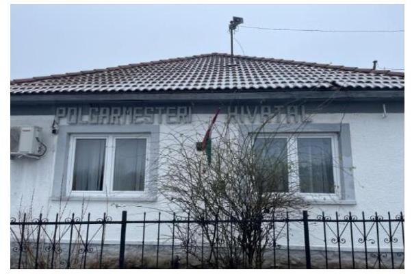
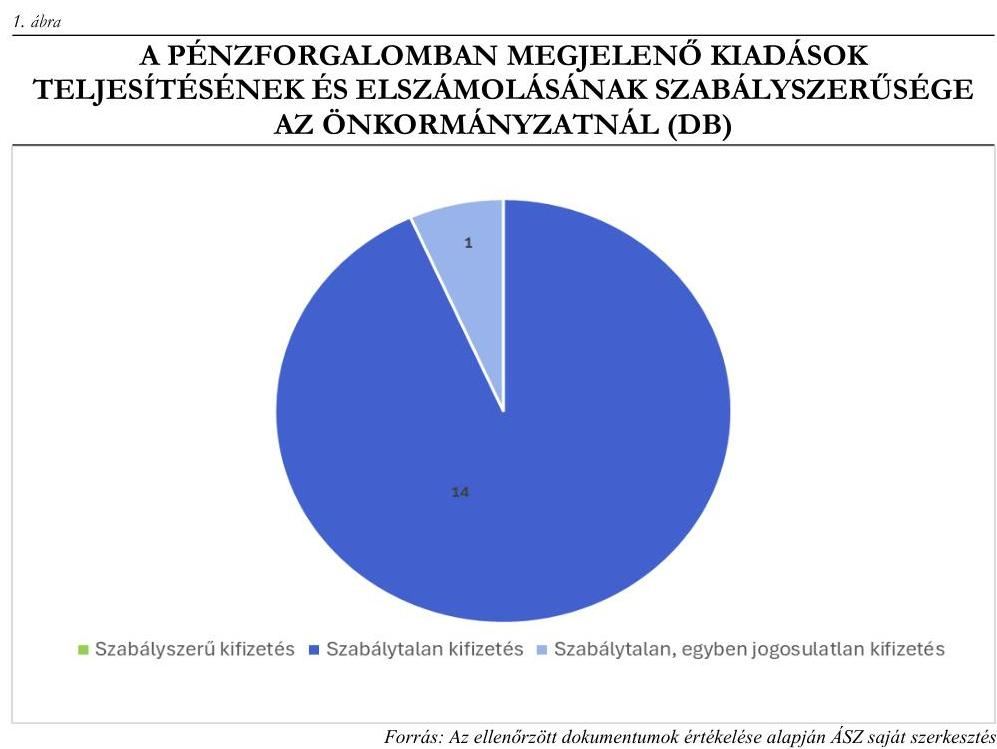

# JELENTÉS 

## Az önkormányzatok gazdálkodásának célvizsgálata

Az önkormányzatok ellenőrzése - a pénzforgalomban megjelenő kiadások teljesítésének és elszámolásának megfelelősége

Tornanádaska Község Önkormányzata

2024.

---

# JELENTÉS 

## Az önkormányzatok gazdálkodásának célvizsgálata

Az önkormányzatok ellenőrzése - a pénzforgalomban megjelenő kiadások teljesítésének és elszámolásának megfelelősége

Tornanádaska Község Önkormányzata

2024.

---

# ELLENŐRZÉSI IGAZGATÓSÁG: 

## ÁLLAMHÁZTARTÁS HELYI SZINTJÉT ELLENŐRZŐ IGAZGATÓSÁG

## ELLENŐRZÉSI IGAZGATÓ:

DR. BAFFIA GERGELY GÁBOR igazgató

## ELLENŐRZÉSVEZETŐ:

Jelentéseink az interneten a www.asz.hu címen olvashatók.

HUDÁK MAGDOLNA ellenőrzésvezető

IKTATÓSZÁM: EL-4053-006/2024.
TÉMASZÁM: 2658
ELLENŐRZÉS-AZONOSÍTÓ SZÁM: V100208

---

# TARTALOMJEGYZÉK 

AZ ELLENŐRZÉS ALAPADATAI ..... 5
AZ ELLENŐRZÖTT SZERVEZET ..... 7
ÖSSZEFOGLALÁS ..... 9
AZ ELLENŐRZÉS FÓKUSZTERÜLETEI ..... 11
MEGÁLLAPÍTÁSOK ..... 12
JAVASLATOK ..... 32
MELLÉKLETEK ..... 36
I. sz. melléklet: Az ellenőrzött szervezetek jegyzéke ..... 36
II. sz. melléklet: Ellenőrzési kritériumok ..... 37
III. sz. melléklet: Összefoglaló táblázat az Önkormányzat gazdálkodási jogköreinek gyakorlásáról ellenőrzött gazdasági eseményenként ..... 38
IV. sz. melléklet: AZ Önkormányzat esetében ellenőrzött, késedelmesen könyvelt gazdasági események ..... 40
V. sz. melléklet: Kimutatás az étkezéssel és rendezvényekkel kapcsolatban a 2022-2023 években kifizetett összegekről ..... 41
VI. sz. melléklet: Az Önkormányzat által a Szövetkezet részére kifizetésre előkészített és pénzügyileg teljesített, ellenőrzött gazdasági események. ..... 43
VII. sz. melléklet: Az Önkormányzat által a Kft. részére pénzügyileg teljesített gazdasági események ..... 45
VIII. sz. melléklet: Kimutatás a magánkölcsön szerződésekről és az azok alapján az Önkormányzathoz befolyt bevételekről és teljesített törlesztésekről ..... 46
FÜGGELÉK: ÉSZREVÉTELEK ..... 49
RÖVIDÍTÉSEK JEGYZÉKE ..... 50

---

.

---

# AZ ELLENŐRZÉS ALAPADATAI 

## AZ ELLENŐRZÉS CÉLJA

Az ellenőrzés célja annak értékelése volt, hogy az Önkormányzatnál ${ }^{1}$ a pénzforgalomban megjelenő kiadások teljesítése és elszámolása megfelelő volt-e, továbbá a kiadások teljesítése az Önkormányzat közfeladat-ellátásához kapcsolódott-e.

## AZ ELLENŐRZÉS TÍPUSA

Megfelelőségi ellenőrzés.

## AZ ELLENŐRZÖTT IDŐSZAK

Az ellenőrzött időszak a 2022. év és a 2023. év, valamint a 2024. év az ellenőrzés megállapításainak az ÁSZ tv. ${ }^{2}$ 29. § (1) bekezdése szerinti megküldése napjáig. Az ellenőrzés a feltárt kockázatok, tények, körülmények alapján a gazdálkodás egyes területei vonatkozásában kiterjesztésre került a 2018-2021. évekre.

## AZ ELLENŐRZÉS TÁRGYA

Az Önkormányzat pénzforgalmában megjelenő kiadások teljesítésének, elszámolásának, közfeladatellátással kapcsolatos felhasználásának ellenőrzése. Az ellenőrzés kiterjedt minden olyan körülményre és adatra, amely az ÁSZ jogszabályban meghatározott feladatainak teljesítéséhez, valamint a program végrehajtása folyamán felmerült újabb összefüggések feltárásához szükséges volt.

## AZ ELLENŐRZÉS JOGALAPJA

Az ellenőrzés jogszabályi alapját az ÁSZ tv. 1. § (3) bekezdésének, valamint az 5. § (2)-(3) és (6) bekezdéseinek előírásai képezték.

## AZ ELLENŐRZÉS MÓDSZERE

Az ellenőrzést a nemzetközi standardokat irányadónak tekintve az ellenőrzési program szempontjai, az ellenőrzési időszakban hatályos jogszabályok, az ellenőrzés szakmai szabályok és módszertanok figyelembevételével végezte az ÁSZ ${ }^{3}$.

Az ellenőrzési kérdések megválaszolásához szükséges bizonyítékok megszerzése az ellenőrzött szervezetek által rendelkezésre bocsátott dokumentumok és adatok, valamint az ellenőrzést támogató szervezetek ${ }^{4}$ által adott adatok, információk értékelésével, továbbá megfigyelés, szemle (szemrevételezés) és információkérés (kérdésfeltevés), valamint elemző eljárás útján történt.

---

Az ellenőrzési bizonyítékként felhasználható adatforrások közé tartoztak egyrészt az ellenőrzéshez kért dokumentumok, adatforrások, másrészt adatforrás volt még a közhiteles nyilvántartásból (Magyar Államkincstár nyilvántartásai, Önkormányzati rendellettár) származó, az ellenőrzés szempontjából információkat tartalmazó dokumentum.

Az ellenőrzés lefolytatásához az ellenőrzött szervezetek a tanúsítványok kitöltésével, valamint az ÁSZ által kért dokumentumok, adatok, információk megküldésével az ellenőrzés során szolgáltattak adatokat. A rendelkezésre bocsátott adatok, információk kontrolljára helyszíni ellenőrzés keretében is sor került.

A pénzforgalomban megjelenő kiadások teljesítésének megfelelőségét mintavételi eljárással kiválasztott 15 tétel alapján ellenőrizte az ÁSZ. Az ellenőrzés során a működés, gazdálkodás kockázatos területeinek meghatározását követően az ellenőrzött szervezetre vonatkozó főkönyvi adatbázisokból kockázat alapú eljárás alapján történt a mintatételek kiválasztása. A tények feltárása és azok összegzése során a megállapítások az ellenőrzött mintatételekre vonatkozóan kerültek megfogalmazásra.

Az étkezéssel kapcsolatos szolgáltatásokra vonatkozó szerződések alapján megvalósult gazdasági események és az Önkormányzat közvetítésével bonyolított szálláshely szolgáltatást érintő ingatlan bérbeadási ügylet kapcsán teljesített kifizetéseket, elszámolásokat az ÁSZ az Önkormányzat által rendelkezésre bocsátott adatokból véletlenszerűen kiválasztott gazdasági események alapján ellenőrizte. A megállapítások csak az ellenőrzött gazdasági eseményekre vonatkozóan kerültek megfogalmazásra. A rendezvényekkel kapcsolatos kifizetések és a képzési célra bérbe vett ingatlannal kapcsolatos kifizetések ellenőrzése tételesen történt.

Az ellenőrzés kiemelten kezelte a kifizetések közfeladat ellátáshoz való közvetlen kapcsolódásának, kötelezettségvállalás szerinti teljesülésének, a kifizetések jogszerűségének, szabályszerűségének értékelését, figyelemmel a kiadások teljesítésével összefüggő kontrollok gyakorlati működésére.

Az ellenőrzés kiterjedt minden olyan körülményre és kérdésre is, amely a program végrehajtása kapcsán felmerült újabb összefüggéseknek az ellenőrzés céljaival összhangban lévő feltárásához szükséges.

---

# AZ ELLENŐRZÖTT SZERVEZET 

Tornanádaska község Borsod-Abaúj-Zemplén vármegyében, az Edelényi járásban található, belterületének központja tekintetében Magyarország legészakibb fekvésű települése.

Lakóinak száma a $\mathrm{KSH}^{5}$ adata alapján 2023. január 1-jén 777 fő volt. A településen a Nemzeti Foglalkoztatási Szolgálat adatai szerint a relatív munkanélküliségi ráta 2022. januárjában 25,58\%, 2023. októberében 23,43\% volt. Tornanádaska a 2023. évben a felzárkózó települések ${ }^{6}$ közé sorolt település volt.

A település polgármestere ${ }^{7} 2011$ óta látta el tisztségét, a képviselő-testületnek ${ }^{8}$ a polgármesteren kívül négy képviselő tagja volt. Az Önkormányzat működésével kapcsolatos feladatokat a Bódvaszilasi Közös Önkormányzati Hivatal végezte, a jegyző; ${ }^{9}$ a 2015. január 19-2019. augusztus 21. közötti időszakban, a jegyző; ${ }^{10}$ a 2019. november 13-2021. július 31. közötti időszakban, a jegyző; ${ }^{11} 2021$. november 1-jétől vezette a Hivatalt ${ }^{12}$.

Az Önkormányzat fenntartásában egy költségvetési szerv múködött, az Óvoda ${ }^{13}$.
Az Önkormányzat a hulladékgazdálkodási feladatait a Bódvavölgye Hulladékgazdálkodási Társulás, az egészségügyi alapellátás, a területfejlesztési és térségi közigazgatási feladatait, továbbá a foglalkoztatás-politikai, természetvédelmi, vízgazdálkodási és sport feladatait az Edelényi Kistérségi Társulás útján látta el. A képviselőtestület 2024. január 30-ai ülésén döntött arról, hogy 2024. december 31. napjával kilép az Edelényi Kistérségi Társulásból.

Az Önkormányzat belső ellenőrzési feladatainak ellátását a Hivatal külső szolgáltató bevonásával, megbízási szerződés alapján biztosította.

Az Önkormányzat 2022. és 2023. évi konszolidált beszámolójának főbb adatait az 1. táblázat mutatja be: 1. táblázat
adatok M Ft-ban

| MEGNEVEZÉS | 2022. ÉVI KONSZOLIDÁLT BESZÁMOLÓ | 2023. ÉVI KONSZOLIDÁLT BESZÁMOLÓ |
| :--: | :--: | :--: |
| Költségvetési bevétel | 343,2 | 315,6 |
| Ebből: önkormányzati feladatok múködési támogatása | 186,7 | 223,9 |
| hosszabb időtartamú közfoglalkoztatás támogatása | 70,3 | 74,2 |
| közfoglalkoztatás - START-munka program támogatása | 17,0 | 0,0 |
| közfoglalkoztatási mintaprogram | 0,0 | 5,2 |
| önkormányzatok rendkívüli támogatása | 1,7 | 1,1 |
| szociális célú tüzelőanyag vásárlás támogatása | 7,8 | 7,8 |
| Finanszírozási bevétel | 253,8 | 239,8 |
| Költségvetési kiadás | 358,8 | 532,9 |
| Finanszírozási kiadás | 6,8 | 7,9 |

---

A teljesített kiadások mindkét évben meghaladták a bevételeket, a különbözetet az előző évi maradvány terhére biztosította az Önkormányzat. Az Önkormányzat a települési önkormányzatoknak jóváhagyott rendkívüli támogatásokból a 2022. évben 1,7 M Ft, a 2023. évben 1,1 M Ft összegben részesült, a települési önkormányzatok szociális tüzelőanyag vásárláshoz kapcsolódó támogatásaiból 2022. és 2023. évben is 7,8 M Ft összegű bevétele származott. Közfoglalkoztatási programhoz kapcsolódóan 2022. évben 87,3 M Ft, 2023. évben 74,2 M Ft támogatásban részesült az Önkormányzat. Településfejlesztési projektek megvalósítására nem kapott költségvetési támogatást az Önkormányzat.

---

# ÖSSZEFOGLALÁS 

A településeken az önkormányzati gazdálkodás sokrétű feladatot jelent. A tevékenység összetettsége, a megfelelő képzettségű, létszámú humán-erőforrás hiánya a gazdálkodás területén magas szintű kockázatokat eredményezhet. Az ellenőrzés hozzájárult az Önkormányzat szabályszerű és felelős gazdálkodásához, a közpénzek szabályos, cél szerinti felhasználásához, a közvagyon védelméhez.

Az Önkormányzat a jogszabályokban, illetve a szervezeti és müködési szabályzatában meghatározott közfeladatait ellátta. Az ellenőrzött időszakban adósságrendezési eljárás alatt nem állt, pénzintézettől hitelt nem vett fel. Az Önkormányzat pénzügyi helyzete azonban nem volt stabil, mivel a müködését kölcsönökből, illetve a pályázati források céltól eltérő felhasználásával finanszírozta. Az Önkormányzat a 2018-2023. évek között egy egyéni vállalkozótól összesen 110,0 M Ft, 2018-ban a Szövetkezettől ${ }^{14} 2,0 \mathrm{MFt}$ összegekben szabálytalanul, a jogszabályokat megsértve magánkölcsönöket vett fel. A magánkölcsön szerződések az Önkormányzat által teljesítendő kamatfizetési kötelezettséget nem tartalmaztak. Az Önkormányzat pénzügyi helyzetét rontotta, hogy a Miniszterelnökség, mint támogató, 2023. januárjában egy 295,9 M Ft-os előfinanszírozott bölcsőde és óvoda építési projekt esetében, annak meg nem valósulása miatt a támogatási szerződéstől elállt és a pályázati forrást kamataival növelten visszakövetelte. A pályázat meghiúsulásából, és a pályázati forrás egy részének nem a pályázati céllal összefüggő felhasználásából eredően az Önkormányzatot a jogosulatlanul elköltött összeg ( $78,7 \mathrm{MFt}$ ) és a visszakövetelt pályázati forrás kamatai (33,6 M Ft, amely 2023. március 10 -étől napi 105,4 E Ft-tal növekedett) erejéig vagyoni hátrány érte. A visszafizetésre az Önkormányzat részletfizetési engedélyt kapott.

Az Önkormányzat pénzforgalmában megjelenő ellenőrzött 42 650,4 M Ft összértékủ 15 kiadás teljesítése és elszámolása nem felelt meg a jogszabályi előirásoknak. Ebből egy 39,4 E Ft összegű üzemanyag beszerzésre irányuló kifizetés közfeladatellátáshoz való kapcsolódása a menetlevelek, illetve a beszerzett üzemanyagokról vezetett nyilvántartás hiányában nem volt igazolt, ezért a kifizetés szabálytalan és egyben jogosulatlan is volt. Az ellenőrzött gazdasági eseményeknél az ÁSZ ellenőrzés hiányosságokat állapított meg többek között a beszerzések előkészítésével, a falugondnoki jármű használatával és elszámolásával, valamint az óvoda építésre elnyert pályázati támogatás felhasználásával kapcsolatban. Szabálytalanságok fordultak elő az analitikus nyilvántartások vezetésével és a leltározással kapcsolatban is.

Az ellenőrzés szabálytalanságokat tárt fel az Önkormányzatnak a polgármesterrel, továbbá az Önkormányzathoz, az Óvodához és a polgármesterhez kapcsolható személyekkel és vállalkozásokkal megkötött - folyamatos szerződések alapján végzett - rendszeres gazdasági tevékenységek vonatkozásában is, amelyek a közpénzfelhasználás tekintetében a jövőbeni kifizetésekhez kapcsolódóan megteremtik a visszaélések kockázatát. Megsértették a jogszabályi előírásokat az étkeztetéssel kapcsolatos beszerzések esetében, valamint az egyéni vállalkozótól rendszeresen igénybe vett kölcsönügyletek döntéselőkészítése és bonyolítása során. Hiányosságokat, mulasztásokat tárt fel az ÁSZ ellenőrzés az önkormányzati ingatlanok bérbeadása és a polgármestertől bérbe vett ingatlanokkal kapcsolatos döntések során, mivel a jogszabályi előírások ellenére nem vizsgálták a célszerűségi, hatékonysági, gazdaságossági szempontokat, valamint figyelmen kívül hagyták a nemzeti vagyonnal történő felelős gazdálkodás követelményét. Az Önkormányzat által a polgármestertől történt ingatlan bérlésekkel összefüggésben az Önkormányzatot 20,4 M Ft összegű vagyoni hátrány érte.

A pénzforgalomban megjelenő kiadások teljesítésének és elszámolásának szabályszerűségét az 1. ábra mutatja be.

---

A pénzügyi tranzakciókkal kapcsolatos kötelezettségvállalások, teljesítésigazolások és utalványozások esetében a jogszabályi előírások ellenére több esetben megsértették az összeférhetetlenségi előírásokat. A polgármester egy esetben közeli hozzátartozója javára vállalt kötelezettséget, több esetben saját maga, illetve közeli hozzátartozója javára igazolta a teljesítést, illetve engedélyezte a kifizetést.

Az Önkormányzat fizetési számlájáról és pénztárából a kiadási előirányzatok terhére teljesített kifizetések nem voltak szabályszerűek, mivel az előzetes kötelezettségvállalást igénylő 14 esetből hat esetben - 4,1 M Ft kifizetést érintően - a jogszabályi előírás ellenére nem, vagy nem megfelelően vállaltak írásban kötelezettséget. Az előzetes írásbeli kötelezettségvállalást igénylő 14 kifizetésből egyetlen gazdasági esemény esetében sem volt megfelelő a pénzügyi ellenjegyzés, összesen 42,6 M Ft összegű kifizetést érintően. Az ellenőrzött 15 gazdasági esemény 73,3\%-ánál, összesen 27,2 M Ft összegű kifizetésnél nem, vagy nem megfelelően végezték el a teljesítésigazolást. Az érvényesítés az ellenőrzött 15 gazdasági esemény közül 14 esetben nem felelt meg a jogszabályi előírásoknak. Az utalványozás tíz esetben történt szabálytalanul.

Az Önkormányzat kötelezettségvállalás nyilvántartása nem felelt meg a jogszabályi előírásoknak, nem volt alkalmas a kötelezettségvállalás időpontjában a szabad előirányzat megállapítására, mivel nem tartalmazta az ehhez szükséges adatokat. Az Önkormányzat az éves költségvetési beszámolóval lezárt 2022-2023. években a beszámoló alátámasztásához készített leltárakat a tárgyi eszközök és a pénzeszközök vonatkozásában nem a jogszabályi előírásoknak megfelelően készítette el. A tárgyi eszközök tételes listája nem volt aláírva, illetve annak kapcsolódása az aláírt leltárakhoz a mentési adatok alapján hitelt érdemlően nem volt megállapítható. A pénzeszközök aláírt leltára a 2022-2023. években nem tartalmazta teljeskörűen a tételes, pénztárankénti és bankszámlánkénti adatokat.

A belső ellenőrzés nem töltötte be a jogszabályban meghatározott szerepét, nem járult hozzá a szabályszerű működéshez és a hiányosságok feltárásához, mivel az Önkormányzatnál utoljára 2020. évben végeztek belső ellenőrzést.

Az ÁSZ az ellenőrzés során feltárt hiányosságok felszámolása, a szabályszerű működés feltételeinek megteremtése érdekében a polgármesternek nyolc, a jegyzőnek 19 javaslatot tett.

---

# AZ ELLENŐRZÉS FÓKUSZTERÜLETEI 

I. Az Önkormányzat pénzforgalmában megjelenő kiadások teljesitésének és elszámolásának megfelelősége, az önkormányzati feladatellátásához való kapcsolódásának értékelése

---

# 1. Az Önkormányzat pénzforgalmában megjelenő kiadások teljesítésének és elszámolásának megfelelősége, az önkormányzati feladatellátásához való kapcsolódásának értékelése 

Összegző megállapítás Az ellenőrzött gazdasági események tekintetében a pénzforgalomban megjelenő kiadások teljesítése és elszámolása nem volt megfelelő. Az ellenőrzött kifizetésekből egy sem felelt meg a jogszabályi előírásoknak, egy kifizetésnél az önkormányzati feladatellátáshoz való kapcsolódás sem volt igazolt. A kötelezettségvállalások nyilvántartása nem felelt meg az Ávr. ${ }^{15}$ és az Áhsz. ${ }^{16}$ előírásainak.
1.1. számú megállapítás Az ellenőrzött 15 gazdasági esemény egy kivétellel az Önkormányzat feladatellátásához kapcsolódott.

Az Önkormányzatnál az ellenőrzött gazdasági események közül 14 esetben, összesen 42 611,0 E Ft értékű kiadás - a Mötv. ${ }^{17}$ előírásaival összhangban - az Önkormányzat kötelező, vagy önként vállalt feladatainak ellátásához kötődött.
A POT_KIAD_05 gazdasági eseménynél, egy 39, 4 E Ft összegű üzemanyag vásárlás esetében a menetlevelek, illetve a beszerzett üzemanyagokról vezetett nyilvántartás hiányában nem volt igazolt, hogy a kifizetés a Mötv. 111. $\mathbb{S}$ (2) bekezdés előírásaival összhangban közfeladatellátáshoz kapcsolódott. A menetlevelek és üzemanyagnyilvántartás hiánya ellentétes volt a Számv. tv. ${ }^{18} 168 . \int(1)$ bekezdésében, valamint a Gépjármú szabályzat ${ }^{19}$ III. fejezet 2-3. pontja, és a 3/a. és a 4. mellékletének előírásaival, amelyek előírták ezen dokumentumok vezetését.
1.2. számú megállapítás

A pénzforgalomban megjelenő ellenőrzött kiadások teljesítése nem felelt meg a jogszabályi előírásoknak.

Az előzetes írásbeli kötelezettségvállalást igénylő 14 gazdasági eseményből egy esetben (344,5 E Ft összegű kifizetésnél) az Áht. ${ }^{20} 37 . \int(1)$ bekezdésében és az Ávr. 52. $\$ (1)$ bekezdés c) pontjában foglaltak ellenére az Önkormányzat nem rendelkezett írásbeli kötelezettségvállalással. Öt gazdasági esemény vonatkozásában (3667,0 E Ft összegű kifizetésnél) a kötelezettségvállalás dokumentuma nem felelt meg az Áht. és az Ávr. előírásainak. Nyolc gazdasági esemény vonatkozásában (38 599,6 E Ft összegű kifizetésnél) a kötelezettségvállalásra szabályszerűen került sor.

- Az ONK_KIAD_11 (344,5 E Ft összegű) kifizetéssel az Önkormányzat vendéglátásra irányuló szolgáltatást vásárolt, amit - a beérkezett árajánlatok közül a legkedvezőbb összegű ajánlatot tevő - Kft. ${ }^{21}$ teljesített, amelynek képviselője a polgármester közeli hozzátartozója volt. A kifizetést elrendelő

---

utalványrendeletet az Ávr. 60. § (2) bekezdése szerinti összeférhetetlenségi szabályokat megsértve az Áht. 38. $\$ (1) bekezdésében foglaltak ellenére a polgármester 2023. augusztus 1-jei dátummal 2023. december 21-én, az utalványrendelet kinyomtatásakor utólagosan írta alá.

- Az ONK_KIAD_01 és az ONK_KIAD_06 gazdasági esemény esetében a vásárolt munkaruha és munkacipő, illetve a díszfa csemete és virágpalánta megrendelésének dokumentuma rendelkezésre állt, azonban az nem volt megfelelő, mivel nem tartalmazta az Ávr. 50. § (1) bekezdésben előírt tartalmi elemeket. Így a teljesítés minőségi (továbbá az ONK_KIAD_01 tétel esetében a mennyiségi) jellemzőinek meghatározását, határidejét, a kifizetendő összeget vagy a számlázás alapjául szolgáló egységárat, a pénzügyi teljesítés módját és feltételeit, a kifizetés határidejét, a pénzügyi ellenjegyzés tényét és a pénzügyi ellenjegyző keltezéssel ellátott aláírását. Emellett az ONK_KIAD_01 kifizetés esetében a vásárlási előleg felvételének engedélyeztetése nem felelt meg a Pénzkezelési szabályzat ${ }^{22}$ 4.4. pontjában foglaltaknak, mivel az előleg felvételhez nem alkalmazták a Készpénzigénylés elszámolásra elnevezésű nyomtatványt.
- Az ONK_KIAD_04 gazdasági esemény keretében három személynek megbízási díjat fizetett ki az Önkormányzat a Családi portaprogram lebonyolításával kapcsolatos feladatok ellátására. A megbízottak közül egy fő Bódvaszilas Község Önkormányzata, kettő a Hivatal alkalmazásában állt. A dolgozók munkaköri leírásai az Ávr. előírásainak megfelelően a portaprogramhoz kapcsolódó feladatokat nem tartalmaztak, azonban a szerződésekben az Ávr. 51. § (2) bekezdésében előírtakat megsértve nem kötötték ki, hogy az azokban rögzített feladat mellett a munkakörükbe tartozó feladatoknak is maradéktalanul eleget kell tenniük.
- Az ONK_KIAD_09 gazdasági esemény esetében belföldi kiküldetés címén került kifizetésre 118,0 E Ft, amelyre vonatkozóan a Kiküldetési szabályzat ${ }^{23} 4 /$ a. melléklete szerinti Belföldi kiküldetési utasítást nem készítették el. Emellett a Kiküldetési szabályzat II. a) pontjában foglaltak ellenére a falugondnok ${ }^{24}$ lakóhelyéről a munkaszerződésben rögzített munkahely szerinti településre is több alkalommal, az elszámolással érintett hónapokban napi rendszerességgel történt utazás, a kiküldetési költségek között napi munkába járás költsége is elszámolásra került. Az elszámolt utakat a falugondnok ${ }_{2}$ a saját autójával tette meg, azonban a saját gépjármú használat elrendelésére a polgármester által nem került sor. A munkába járás és a hivatali célú gépjármú használat nem különült el egymástól. A saját gépjármú hivatalos célú használata a Belföldi kiküldetési utasítás hiányában nem felelt meg a Kiküldetési szabályzatban foglaltaknak. A saját gépjárművel történő munkába járás nem felelt meg a 39/2010. (II. 26.) Korm. rendelet ${ }^{25} 4 . \S$ (1) és (2) bekezdéseiben foglaltaknak, mivel nem volt megállapítható, hogy a gépkocsival történő munkába járás milyen okok miatt került engedélyezésre. Emellett a 39/2010. (II. 26.) Korm. rendelet 4. § (1) bekezdésében foglaltak ellenére a saját gépjárművel történő utazások költségét nem a jogszabályban engedélyezett $60,0 \%$-os mértékben, hanem teljes összegben (üzemanyag költség és $15 \mathrm{Ft} / \mathrm{km}$ fenntartási költség) fizette ki az Önkormányzat. Az ÁSZ által ellenőrzött esetekben a falugondnok ${ }_{1}{ }^{26}$ részére 2022. november 17-én 78,8 E Ft, 2023. január 19-én pedig 72,9 E Ft, a falugondnok ${ }_{2}$ részére 2022. június 20-án 44,3 E Ft kifizetése történt meg.
- Az ONK_KIAD_12 gazdasági esemény keretében a település 99 lakója részére lakásfenntartási támogatás kifizetésére került sor 990,0 E Ft összegben. A támogatásokat megállapító határozatokat 2023. január 23-án a jegyző ${ }_{3}$ írta alá, ami nem felelt meg a Szociális rendelet ${ }^{27}$ 2. § (1) bekezdésében előírtaknak, mely szerint a hatáskört 2023. január 10-től a polgármester gyakorolhatta.
Az előzetes írásbeli kötelezettségvállalást igénylő 14 kifizetésből az Ávr. 55. § (1) bekezdésében előírtak ellenére egyetlen esetben sem végezték el megfelelően a pénzügyi ellenjegyzést. Ezáltal az Áht. 37. § (1) bekezdésének előírása ellenére nem győződtek meg arról, hogy a kötelezettségvállalás nem

---

sérti-e a gazdálkodásra vonatkozó szabályokat. A 14-ből egy esetben (344,5 E Ft összegben) írásbeli kötelezettségvállalás hiányában nem került sor pénzügyi ellenjegyzésre, 11 esetben (26 941,5 E Ft összegben) a pénzügyi ellenjegyzést a kötelezettségvállalás dokumentumán nem végezték el, két esetben (15 325,0 E Ft összegben) az ellenjegyzést jogosulatlanul végezték.

- Az ONK_KIAD_11 gazdasági esemény vonatkozásában írásbeli kötelezettségvállalás hiányában nem történt meg a pénzügyi ellenjegyzés. 11 esetben, az ONK_KIAD_01, ONK_KIAD_02, ONK_KIAD_04, ONK_KIAD_06, ONK_KIAD_08, ONK_KIAD_09, ONK_KIAD_10, ONK_KIAD_12, ONK_KIAD_13, ONK_KIAD_14 és POT_KIAD_04 gazdasági eseményeknél rendelkezésre állt a kötelezettségvállalási dokumentum, azonban azokon az Áht. 37. § (1) bekezdés és az Ávr. 55. § (1) bekezdés előírása ellenére a pénzügyi ellenjegyzés ténye, valamint a pénzügyi ellenjegyző dátummal ellátott aláírása nem szerepelt.
- Az ONK_KIAD_05 és az ONK_KIAD_15 gazdasági események esetében az ellenjegyzést olyan személy végezte, aki nem rendelkezett az Ávr. 55. § (3) bekezdésében előírt pénzügyi-számviteli képesítéssel, vagy a felsőoktatásban szerzett gazdasági szakképzettséggel.
A teljesítésigazolást az Áht. 38. § (1) bekezdésében és az Ávr. 57. § (1) bekezdésében foglaltak ellenére 11 esetben nem, vagy nem megfelelően végezték el. Ezáltal az ellenőrzött gazdasági események 73,3\%-ában, 27 196,3 E Ft összegű kifizetést megelőzően nem ellenőrizték, hogy a kifizetések az arra jogosultak részére a kötelezettségvállalásnak megfelelő összegben történtek-e, illetve, hogy az ellenszolgáltatást az Önkormányzat részére ténylegesen teljesítették-e. Négy esetben, 15 454,0 E Ft összegű kifizetést érintően a teljesítésigazolás az Áht. és az Ávr. előírásainak megfelelően történt.
- A teljesítésigazolás dokumentuma nem állt rendelkezésre az ONK_KIAD_02, az ONK_KIAD_08, az ONK_KIAD_09, az ONK_KIAD_10 és az ONK_KIAD_12 gazdasági események esetében.
- A kötelezettségvállalás dokumentumának hiányában, illetve nem megfelelő kötelezettségvállalás dokumentum alapján a teljesítésigazolás formális volt, mert a teljesítésigazoló ellenőrizhető okmányok hiányában nem tudta ellenőrizni a kiadások teljesítésének jogosságát az ONK_KIAD_01, ONK_KIAD_06, ONK_KIAD_11 gazdasági események esetében.
- Az ONK_KIAD_04 (megbízási díj kifizetés) esetében a teljesítésigazolás nem tartalmazta annak igazolását, hogy a megbízási szerződésben szereplő feladatot, tevékenységet a kedvezményezettek elvégezték.
- A teljesítésigazolás a kifizetést követően történt az ONK_KIAD_13, és az ONK_KIAD_14 kiadás esetében.
Az érvényesítés az ellenőrzött 15 gazdasági eseményből 14 esetében nem felelt meg az Ávr. előírásainak. A kifizetéseknél az érvényesítő a kifizetést megelőzően nem ellenőrizte az összegszerűséget, illetve a fedezet meglétét, valamint azt, hogy a megelőző ügymenetben a jogszabályi, és a belső szabályzatokban foglalt előírásokat betartották-e.
- Az Ávr. 58. § (3) bekezdés előírása ellenére kilenc kifizetésnél (ONK_KIAD_02, ONK_KIAD_04, ONK_KIAD_06, ONK_KIAD_08, ONK_KIAD_09, ONK_KIAD_12, ONK_KIAD_13, ONK_KIAD_14, POT_KIAD_04 kifizetések esetében) az érvényesítésre a kifizetést követően került sor, mivel az utalványrendeletek kelte későbbi volt, mint a kifizetés kelte.
- Őt esetben, mindösszesen 19 354,5 E Ft összértékủ kifizetés esetén az érvényesítés formális volt. Ebből három esetben (ONK_KIAD_01, ONK_KIAD_10, ONK_KIAD_11), összesen 4029,5 E Ft összegű kifizetést érintően az érvényesítő az Ávr. 58. § (1)-(2) bekezdésében foglaltak ellenére nem jelezte, hogy a teljesítésigazolás nem történt meg, vagy nem az Áht. 38. § (1) bekezdésében és az

---

Ávr. 57. § (1) bekezdésében foglaltaknak megfelelően történt. További két esetben (ONK_KIAD_05, ONK_KIAD_15) összesen 15 325,0 E Ft összegű kifizetést érintően, az érvényesítő az Ávr. 58. $\$ (1)-(2) bekezdésében foglaltak ellenére nem jelezte az utalványozónak, hogy a megelőző ügymenetben az Áht. 37. $\$ 1$ ) bekezdésének és az Ávr. 53/A. $\$ 1$ ) bekezdésének előírásait nem tartották be, mivel a pénzügyi ellenjegyzést nem, illetve nem megfelelően végezték el.

- Az ÁSZ ellenőrzés az érvényesítéssel kapcsolatban további hiányosságokat is megállapított:
A megelőző ügymenetben felmerült, hogy a Beszerzési szabályzat ${ }^{28}$ III. fejezet 4. pont előírása ellenére az ONK_KIAD_08 és az ONK_KIAD_14 gazdasági esemény vonatkozásában ajánlattételi felhívás nem történt, árajánlatok nem álltak rendelkezésre. Az ONK_KIAD_13 és az ONK_KIAD_15, beszerzésre irányuló gazdasági eseményeknél az ajánlattételi felhívás megtörtént, azonban az ajánlatok bontásáról jegyzőkönyv a Beszerzési szabályzat III. fejezet 6-7. pontja előírása ellenére nem készült. A hiányosságot már a kötelezettségvállalás pénzügyi ellenjegyzésénél észlelni kellett volna, azonban ez az ONK_KIAD_13 tétel esetében pénzügyi ellenjegyzés hiányában, az ONK_KIAD_15 tétel esetében pedig a nem megfelelő pénzügyi ellenjegyzés miatt nem történt meg.
Az érvényesítést az Ávr. 55. § (3) bekezdésében előírtak ellenére 10 esetben (ONK_KIAD_01, ONK_KIAD_02, ONK_KIAD_04, ONK_KIAD_05, ONK_KIAD_06, ONK_KIAD_08, ONK_KIAD_09, ONK_KIAD_11, ONK_KIAD_12 és ONK_KIAD_15 gazdasági eseményeknél) végzettséggel nem rendelkező személy végezte, továbbá az érvényesítő aláírása nem volt beazonosítható a POT_KIAD_04 kifizetés esetében.
10 gazdasági esemény - 23 601,0 E Ft összegű kifizetés - vonatkozásában az utalványozás nem felelt meg az Áht. és Ávr. előírásainak.
- Az utalványozás az Áht. 38. § (1) bekezdés előírása ellenére a kifizetést követően történt hét gazdasági eseménynél (ONK_KIAD_02, ONK_KIAD_04, ONK_KIAD_06, ONK_KIAD_08, ONK_KIAD_13, ONK_KIAD_14 és a POT_KIAD_04). Az ONK_KIAD_02 és POT_KIAD_04 kifizetések esetében az utalványozó aláírta, azonban az nem felelt meg az Ávr. 59. § (3) bekezdésében foglalt tartalmi követelményeknek. Nem tartalmazta az „utalvány" szót, a kiadás egységes rovatrend szerinti számát, a terheléssel érintett pénzeszköz államháztartási számviteli kormányrendelet szerinti könyvviteli számlájának számát, a kötelezettségvállalás nyilvántartási számát.
- Az utalványozás az Áht. 38. § (1) bekezdésében előírtak ellenére megfelelő érvényesítés hiányában történt az ONK_KIAD_09 és ONK_KIAD_12 gazdasági események esetében, összesen 1108,0 E Ft összegben.
- Az ONK_KIAD_11 gazdasági eseménynél, 344,5 E Ft összegű kifizetésnél az utalványozás nem felelt meg az Ávr. 60. § (2) bekezdésében foglaltaknak, mivel az utalványozó polgármester jogkörét a közeli hozzátartozója által képviselt Kft. részére történt kifizetésre vonatkozóan gyakorolta.
Öt esetben az utalványozás az Ávr.-ben előírtaknak megfelelően történt.
Az ellenőrzött önkormányzati kiadások gazdasági eseményeit a III. sz. melléklet tartalmazza.

---

1.3. számú megállapítás

A gazdálkodás belső szabályainak kialakítása megtörtént, azonban a Pénzkezelési szabályzat és a Beszerzési szabályzat nem felelt meg a jogszabályi előírásoknak. A gazdálkodási jogkör gyakorlására történő kijelölés két esetben nem felelt meg az Ávr. előírásainak. A kötelezettségvállalás előzetes nyilvántartásba vétele az ellenőrzött gazdasági események $80,0 \%$-ában nem történt meg.

Az Önkormányzat rendelkezett az Áht.-ban és az Ávr.-ben előírt Gazdálkodási szabályzattal ${ }^{29}$, Beszerzési szabályzattal, Közbeszerzési szabályzattal ${ }^{30}$, Gépjármú szabályzattal és a Számv. tv.-ben meghatározott Pénzkezelési szabályzattal. A Beszerzési és a Pénzkezelési szabályzatok tartalma nem felelt meg teljeskörűen a jogszabályi előírásoknak.

- A Pénzkezelési szabályzat tartalma nem felelt meg a Számv. tv. 14. § (8) bekezdésében előírtaknak, annak aktualizálására nem került sor, mivel a bankszámla felett rendelkezni jogosult személyek tekintetében még tartalmazta az előző jegyző rendelkezési jogosultságát.
- A Beszerzési szabályzat az 1000,0 E Ft-ot elérő beszerzésekre terjedt ki, ezáltal az Önkormányzat a 200,0 E Ft és 1000,0 E Ft közti beszerzések eljárásrendjét az Ávr. 13. § (2) bekezdés b) pontja ellenére nem teljeskörűen szabályozta.
Az Ávr.-ben foglalt előírásokat betartva a polgármester felhatalmazást adott a kötelezettségvállalásra, illetve kijelölte a teljesítés igazolókat és az utalványozókat. Két esetben a jegyző ${ }_{2,3}$ általi kijelölés nem felelt meg az Ávr. előírásainak.
- Két munkavállaló felhatalmazása a pénzügyi ellenjegyzési, illetve az érvényesítési feladatok ellátására az Ávr. 55. § (3) bekezdése és 58. $\$ (4) bekezdése előírásait megsértve annak ellenére történt, hogy felsőoktatásban szerzett gazdasági szakképzettséggel, vagy legalább középfokú iskolai végzettséggel és emellett pénzügyi-számviteli képesítéssel nem rendelkeztek.
Az Önkormányzat gazdálkodási jogkörök gyakorlására jogosult személyekről és aláírás mintájukról vezetett nyilvántartása nem felelt meg az Ávr.-ben, valamint a Gazdálkodási szabályzatban foglaltaknak.
- A nyilvántartás nem tartalmazta az Ávr. 55. § (2) bekezdés c) pontja szerint pénzügyi ellenjegyzésre jogosult jegyző ${ }_{3}$ aláírásmintáját, illetve a személyi változások átvezetése a nyilvántartásban egyik gazdálkodási jogkör esetében sem történt meg.
- A nyilvántartás a Gazdálkodási szabályzat IV. fejezet 1. pontjában, valamint az V-VIII. fejezetekben foglaltak ellenére nem tartalmazta a felhatalmazásra/kijelölésre jogosító ügyirat keltét, a jogosultság megszüntetését elrendelő ügyirat számát és időpontját.
Az Ávr. 53. § (2) bekezdés és az Ávr. 56. § (1) bekezdés előírásai ellenére az ellenőrzött gazdasági események közül 13 esetben az előzetes kötelezettségvállalás nyilvántartásba vételére nem került sor. A kötelezettségvállalásokról vezetett nyilvántartás így nem volt alkalmas a szabad előirányzat megállapítására, nem biztosította az Áht. 37. § (1) bekezdés a) pontjában foglalt előírás betartását.
- Az ONK_KIAD_01, ONK_KIAD_02, ONK_KIAD_04, ONK_KIAD_06, ONK_KIAD_08, ONK_KIAD_09, ONK_KIAD_10, ONK_KIAD_12, ONK_KIAD_13, ONK_KIAD_14, ONK_KIAD_15, POT_KIAD_04, gazdasági események ( 35770,5 E Ft) esetében az előzetes kötelezettségvállalást nem vették nyilvántartásba, az utalványrendeleteken feltüntetett kötelezettségvállalás azonosítók a rendelkezésre bocsátott kötelezettségvállalás nyilvántartásban nem szerepeltek. A

---

POT_KIAD_05 kifizetés esetében előzetes kötelezettségvállalás nem volt szükséges, azonban a kötelezettségvállalást ebben az esetben is nyilvántartásba kellett volna venni, amely az Ávr. 53. $\int$ (2) bekezdés előirása ellenére nem történt meg.
Az Önkormányzat 2022-2023. évekre vonatkozó kötelezettségvállalás nyilvántartása nem felelt meg az Áhsz. 14. melléklet II. pontjában foglalt előirásoknak.

- A nyilvántartás beazonosítható módon nem tartalmazta a kötelezettségvállalást tanúsító dokumentum megnevezését, keltét, a pénzügyi ellenjegyzésre vonatkozó adatokat, a jogosult azonosításához és a pénzügyi teljesítéshez szükséges adatokat, a költségvetési évben a pénzügyi teljesítési határidőket dátum szerint, a kötelezettségvállalás módosulásainak adatait, a pénzügyi teljesítések dátumát, az utalványozás dokumentumának azonosításához szükséges adatokat, a kötelezettségvállalás végleges vagy nem végleges jellegének megjelölését, a pénzügyi teljesítési adatok könyiviteli számlákon történő elszámolásának időpontjait.
1.4. számú megállapítás

Az Önkormányzat a tárgyi eszközökről naprakész analitikus nyilvántartást vezetett. A 2022-2023. évi beszámolókat egyeztetéssel készült leltárral támasztották alá, ez azonban nem felelt meg teljeskörűen a Számv. tv. és az Áhsz. előírásainak. Az ellenőrzött kifizetésekből 13 gazdasági eseményt késedelmesen rögzítettek a könyvekben.

A 2022. év során beszerzett ellenőrzött tárgyi eszközöket (ONK_KIAD_08, ONK_KIAD_13, ONK_KIAD_14, ONK_KIAD_15) a tárgyi eszköz nyilvántartásban rögzítették. A helyszíni ellenőrzés során az eszközök az Önkormányzatnál koruknak megfelelő állapotban fellelhetők voltak. Az eszközök azonosítására a helyszíni ellenőrzés során az eszközök típusa alapján került sor, tekintettel arra, hogy az Áhsz. 22. § (1) bekezdésében előírtak ellenére a tételes ellenőrizhetőséghez szükséges azonosító szám (leltári szám) csak kettő eszközön szerepelt.

- Az ONK_KIAD_13 gazdasági esemény keretében mezőgazdasági gépek (traktor, utánfutó, rézsúkasza) vásárlása, az ONK_KIAD_14 kifizetés során egy Ford Tranzit gépjármủ beszerzése történt meg, az ONK_KIAD_15 gazdasági esemény keretében a szolgálati lakás felújítását végezték el, az ONK_KIAD_08 kifizetés az óvoda kiviteli tervének elkészítésére vonatkozott.
Az Önkormányzat a tárgyi eszközökről az Áhsz.-ben előírtaknak megfelelő, naprakész analitikus nyilvántartást vezetett.
Az Önkormányzat a 2022. évben rendelkezett az Áhsz.-ben foglaltak szerint aláírt, a 2023. évben a Kincstár által pénzügyileg jóváhagyott éves költségvetési beszámolóval. A 2022. és 2023. években a beszámoló tárgyi eszköz és pénzeszközök mérlegsorait egyeztetéssel elvégzett leltárral alátámasztották, a leltár, a főkönyvi kivonat és a mérleg adatai megegyeztek, azonban a leltározás nem volt megfelelően dokumentált. A leltárak a Számv. tv. 69. § (1) és (2) bekezdésében és az Áhsz. 22. §(1) bekezdésében foglaltak ellenére nem tartalmazták valamennyi eszközt mennyiségben és összegben tételesen.
- A hitelesített tárgyi eszköz leltárak az eszközöket nem tételesen tartalmazták, csak a nettó értékre vonatkozó mérlegsoronkénti összesen adatokat mutatták be. A tárgyi eszköz leltár mellékleteként megküldött, tételes adatokat tartalmazó Excel dokumentum kapcsolódása az aláírt leltárakhoz a mentési adatok alapján hitelt érdemlően nem volt megállapítható, mivel a mentési dátum későbbi volt, mint a hitelesített, csak összevont adatokat tartalmazó leltár dátuma.

---

- A 2022-2023. években a pénzeszközökre vonatkozó aláírt leltárak két forintpénztár (önkormányzati forintpénztár és START forintpénztár) és két forintszámla (Költségvetési elszámolási számla és Közfoglalkoztatás támogatás elszámolási számla) esetében az egyes pénzeszközökre vonatkozó adatokat tételesen nem tartalmazták.
A pénzeszközökről vezetett könyvviteli nyilvántartás nem felelt meg a Számv. tv. 159. § (1) bekezdésben foglalt azon előírásnak, mely szerint az eszközökről és forrásokról olyan könyvviteli nyilvántartást kell vezetni, amely az azokban bekövetkezett változásokat a valóságnak megfelelően, folyamatosan, zárt rendszerben, áttekinthetően mutatja.
- A pénzeszközök esetében a 2022. évre vonatkozóan az analitikus nyilvántartás és a főkönyv egyeztetésének tényét, eredményét nem rögzítették, és a leltárban nem mutatták ki eltérésként a 3311346 Egyéb bírság beszedési számla és a 3311392 Egyéb közhatalmi bevételek elszámolási számla 2017. év óta, a helytelen nyitásból adódó, a főkönyvben szereplő 53,3 E Ft-os egyenlegét. A jegyző ${ }_{3}$ nyilatkozata szerint az eltérés abból adódott, hogy 2017-ben az ASP rendszerben ${ }^{31}$ a fenti számlák helytelenül lettek megnyitva, de forgalom nem volt rajtuk, egyenlegük 2017. óta 0 Ft volt, azonban ennek főkönyvi rendezése nem történt meg. A 2023. évben a helytelen nyitásból eredő egyenlegeket a leltárban ismét nem mutatta ki az Önkormányzat.
Az Önkormányzat a három évenkénti mennyiségi felvétellel történő leltározási kötelezettségének nem tett eleget, amellyel megsértette a Számv. tv. 69. § (3) bekezdésében és a Leltározási szabályzat ${ }^{32}$ A/II. pontjában előírtakat. A legutóbbi mennyiségi leltározás a 2020. évi belső ellenőrzési jelentés alapján 2016. évben történt, azonban az Önkormányzat nem őrizte meg annak dokumentumait, amellyel megsértette a Számv. tv. 169. § (1) bekezdésében foglalt előírást is.
A tételes ellenőrzésre kiválasztott kiadások közül egy számviteli elszámolása (ONK_KIAD_14) 6000,0 E Ft összegben nem felelt meg a Számv. tv. és az Áhsz. előírásainak, mert a számviteli nyilvántartásokba nem megfelelő bizonylatok alapján, nem megfelelő összeggel rögzítették a gazdasági eseményt. 14 esetben a gazdasági események számviteli elszámolása megfelelt a jogszabályi előírásoknak.
- Az ONK_KIAD_14 gazdasági esemény esetében a képviselő-testület 177/2022. (XII. 02.) számú határozatában a falugondnoki gépjármú 1500,0 E Ft összegű értékesítéséről, valamint annak beszámításával együtt maximum 6000,0 E Ft összegben új gépjármủ vásárlásról döntött. A kifizetés készpénzben történt, ezért a falugondnok 2022. december 8-án és 13-án 2000,0 - 2000,0 E Ft összegeket vett fel bankszámláról, amelyeket még azokon a napokon a házipénztárba történő befizetésként rögzítettek. A gépkocsi kifizetéséhez szükséges előleg ( 4000,0 E Ft összeg) házipénztárból történő felvétele 2022. december 13-án történt, a vásárlási előleg engedélyezésével kapcsolatos dokumentum rendelkezésre állt, azonban a 2022. december 9-én kelt, Ford Tranzit típusú gépjármủ megvásárlására vonatkozó Tulajdonjog átruházási szerződés szerint az új falugondnoki gépjárművet készpénzben már az előleg felvételét megelőzően, 2022. december 9-én kiegyenlítették. A dokumentumok alapján megállapítható volt, hogy a készpénz mozgások bizonylatolása utólag történt, így a kiállított számviteli bizonylatok adatai alakilag és tartalmilag nem voltak hitelesek és megbízhatóak. Ezzel az Önkormányzat megsértette a Számv. tv. 165. § (2) bekezdése és 166. § (2) bekezdése előírásait, mivel a számviteli nyilvántartásokba nem szabályszerűen kiállított bizonylat alapján jegyezték be az adatokat. A Polgármester nyilatkozata alapján a vételár, a beszámított gépkocsi és az előleg közötti különbözetként (6000,0-1500,0-4000,0 E Ft) jelentkező 500,0 E Ft-ot a falugondnok ${ }_{2}$ saját pénzéből fizette ki, amely - a pénztárjelentés alapján - később, az előleg 2022. december 22-ei elszámolásakor a házipénztárból került kiegyenlítésre. A falugondnok ${ }_{2}$ által kifizetett, majd kiadásként elszámolt 500,0 E Ft előleg kiadásáról, vagy utólagos átvételéről az Önkormányzatnál kiadási pénztárbizonylat nem készült, amellyel az Önkormányzat megsértette a Szám. tv. 165. § (1) bekezdésében foglalt előírásokat is.

---

Az ügylettel kapcsolatban a pénzkezelésben további hiányosság volt, hogy a Pénzkezelési szabályzat 3.2 pont j) pontja előírása ellenére a havi pénztárjelentés alapján a 2022. december 8-12. közötti időszakban a napi pénztár zárlatkor a pénztárban lévő összeg meghaladta a maximalizált 2000,0 E Ft-ot.
A 15 ellenőrzött gazdasági esemény közül 13 esetben, 33349,7 E Ft összegben a Számv. tv. 165. § (3) bekezdés a) pontjában előírtak ellenére nem biztosították a pénzeszközöket érintő gazdasági műveletek, események bizonylati adatainak késedelem nélküli rögzítését a könyvekben. A gazdasági események rögzítése általában 0,5-1,5 havi késedelemmel, de az ONK_KIAD_05 és ONK_KIAD_09 gazdasági eseményeknél 2,5 hónapos, a POT_KIAD_05 kiadásnál 3,5 hónapos, az ONK_KIAD_08 kifizetés esetében közel egy éves késedelemmel történt. A késedelem befolyásolta az Áht. 108. § (1) bekezdés b) pontjában, valamint az Ávr. 169. § (1) bekezdésében előírt, az államháztartás információs rendszerébe teljesített havi adatszolgáltatások adattartalmát, mert így az adatszolgáltatások nem valós adatokon alapultak.
A késedelmesen rögzített gazdasági eseményeket részletesen a IV. sz. melléklet mutatja be.
1.5. számú megállapítás

Az ellenőrzött szociális támogatásokra vonatkozó döntések és kifizetések a lakásfenntartási támogatás kivételével az önkormányzati rendeleteknek megfelelően történtek. A lakásfenntartási támogatások esetében a támogatást megállapító határozatokat az arra jogosultsággal nem rendelkező jegyző, írta alá a polgármester helyett.

Az Önkormányzat megalkotta a pénzbeli és természetbeni támogatások rendszeréről, valamint a személyes gondoskodást nyújtó szociális és gyermekvédelmi ellátásokról szóló 2/2021. (V. 26.) számú, továbbá a szociális tűzifa támogatásról szóló 6/2021. (XII. 9.) önkormányzati rendeleteit. Ezekben meghatározták az egyes szociális juttatásokat, támogatási formákat, a jogosultsági feltételeket, a támogatásokról történő döntésre jogosultak körét, a támogatások rendjét.
A pénzforgalomban megjelenő, ellenőrzésre kiválasztott tűzifa támogatásra és az iskolakezdési támogatásra történt kifizetések (ONK_KIAD_05, ONK_KIAD_10 gazdasági események) vonatkozásában a támogatások odaítélése összhangban volt az önkormányzati rendeletek előírásaival.
A lakásfenntartási támogatás (ONK_KIAD_12) esetében az elbírálásra vonatkozó döntést 2023. január 23-án a jegyző, hozta meg annak ellenére, hogy a hatáskört a Szociális rendelet 2. $\$ 1$ ) bekezdése 2023. január 10-től a polgármesterre ruházta.
A tételesen ellenőrzött pénzbeli juttatások esetében összeférhetetlenség nem állt fenn, azonban - a képviselő-testület zárt üléseiről készült jegyzőkönyvek alapján - a 2022. évben a képviselő-testület által megítélt szociális juttatások esetében az Ávr. 60. § (2) bekezdésben foglaltakat megsértve a képviselők az ÁSZ által vizsgált két esetben részt vettek a saját, vagy közeli hozzátartozójuk juttatásának megállapításában.

- A 86/2022. (VI. 27.) számú képviselő-testületi határozat alapján a képviselő-testület tagjának hozzátartozója részére megállapított $50,0 \mathrm{E}$ Ft összegű települési támogatás, valamint a 203/2022. (XII.14.) számú képviselő-testületi határozat alapján a képviselő-testület tagja részére megállapított $50,0 \mathrm{EFt}$ összegű települési támogatás nem felelt meg a Szociális rendelet 2. § (3) bekezdésének. A támogatásban részesült személyek kérelmet és jövedelemigazolást ugyan benyújtottak a támogatás igénylése során, azonban a rendkívüli élethelyzetet alátámasztó dokumentumot egyik esetben sem csatoltak. A képviselő-testület tagjának hozzátartozója esetében a kérelemben feltüntetett és a jövedelemigazoláson szereplő jövedelmi adatok nem egyeztek meg.

---

1.6. számú megállapítás

Az Önkormányzat által bölcsőde-óvoda építésre elnyert támogatás felhasználása, elszámolása nem az Áht. és a Mötv. előírásainak és a támogatói okiratban foglalt céloknak megfelelően történt. A támogatási cél nem valósult meg, illetve az elköltött támogatási összeg felhasználása sem volt szabályszerű, amely az Önkormányzatnak vagyoni hátrányt okozott.

Az Önkormányzat 295 927,0 E Ft összegű vissza nem térítendő támogatást nyert „Bölcsöde-óvoda épitése Tornanádaska községben" címen ${ }^{33}$ 2017. június 13-án (ONK_KIAD_08). A támogatási összeget az Önkormányzat részére előlegként a 272/2014. (XI. 5.) Korm. rendelet ${ }^{34}$ alapján a Kincstárnál vezetett elkülönített fizetési számlára 2017. június 23-án kiutalták.
A pályázati forrásból az Önkormányzat 26 860,6 E Ft-ot a pályázat céljának megvalósításával összhangban ingatlan vásárlására, építési és kiviteli tervek elkészítésére, valamint a projektmenedzsment díjának kifizetésére használt fel.
A pályázati forrásból 2018-ban az Önkormányzat a különböző bankszámláira nem a támogatás céljával összefüggő átvezetéseket hajtott végre, összesen 51 800,1 E Ft összegben, ezzel megsértették az Áht. 51. § (4) bekezdése előírását. Az átvezetéseket az 1. táblázat mutatja be.

1. táblázat

# AZ ELKÜLÖNÍTETT SZÁMLÁRÓL TÖRTÉNŐ ÁTVEZETÉSEK (E FT) 

| DATUM | SZÁMLA NEVE/ÁTVEZETETT ÖSSZEG) |  |  |  | ÖssZESEN |
| :--: | :--: | :--: | :--: | :--: | :--: |
|  | TORNANÁDASKA   KÖZSÉG   ÖNKORMÁNYZATA   KÖLTSÉGVETÉSI   ELSZÁMOLÁSI   SZÁMLA | STARTMUNKA 2013   TORNANÁDASKA | ÓvODA | ÁLLAMI   HOZZÁJÁRULÁS   ALSZÁMLA |  |
| 2018.03.05 | 10000,0 | 20000,0 |  |  | 30000,0 |
| 2018.04.03 |  | 13000,0 | 7000,0 |  | 20000,0 |
| 2018.05.15 |  |  |  | 1800,1 | 1800,1 |
| Összesen | 10000,0 | 33000,0 | 7000,0 | 1800,1 | 51800,1 |

Forrás: Az ellenőrzött által szolgáltatott dokumentumok alapján ÁSZ saját szerkesztés
Az Önkormányzat a támogatásból teljesített nem pályázati célú átvezetések a bankszámlakivonatok, fökönyvi kivonatok és pénztárjelentések alapján a 2. táblázatban bemutatott főbb célokra történtek, miközben ezek döntő része (pl. bérek) a költségvetésben állami támogatásokból és egyéb pályázati forrásokból megtervezésre kerültek. Ez közvetetten azt is mutatta, hogy az Önkormányzat az ellenőrzött időszakban nem csak a „Bölcsőde, óvoda épitése"-re kapott pályázati forrást használta más célra, hanem ezzel pótolta a korábban más közfeladatra kapott, és a céltól eltérően felhasznált forrásokat is.

---

# A PÁLYÁZATI SZÁMLÁRÓL A TÁMOGATÁS CÉLJÁTÓL ELTÉRŐ CÉLRA MÁS BANKSZÁMLÁKRA TELJESÍTETT ÁTVEZETÉSEK A 2018. ÉVBEN (E FT) 

| SZÁMLA NEVE | TERGELÉS (E FT) | ÁTVEZETÉS JOGCÍME |
| :--: | :--: | :--: |
| Tornanádaska Községi Önkormányzata | 1677,9 | szociális étkeztetés |
|  | 1970,5 | Polgármester 2017. 02.06., és 08. havi bére |
|  | 2640,0 | Zrt. ${ }^{35}$ szálláshely bérleti díja polgármester részére |
|  | 1077,0 | 2016. évi szállítói tartozások kiegyenlítése |
|  | 1262,0 | lakásfenntartási támogatás |
| Startmunka 2013 Tornanádaska | 22 905,6 | dolgozói bér |
|  | 10000,0 | kölcsön visszafizetés |
| Tornanádaskai Napköziotthonos Övoda | 6746,7 | óvodai dolgozók munkabére |
|  | 262,6 | közüzemi számlák |
| Összesen | 48542,3 |  |

Forrás: Az ellenőrzött által szolgáltatott dokumentumok alapján ÁSZ saját szerkesztés

Az Önkormányzattal szemben a támogatást nyújtó Miniszterelnökség által 2023. január 17-én szabálytalansági eljárás lefolytatására került sor, amely - tekintettel a projekt meghiúsulására - szabálytalanságot állapított meg. A Miniszterelnökség 2023. március 9-én a támogatási szerződéstől való támogatói elállásról, továbbá a kiutalásra került támogatás és annak ügyleti kamatai (33 648,5 E Ft) visszaköveteléséről döntött, amely összesen 329 575,5 E Ft-ot tett ki. Az Önkormányzat 2023. március 22-én ebből az elkülönített számlán még rendelkezésre álló 217 266,3 E Ft-ot visszafizette, a fennmaradó 78 660,7 E Ft tőkeösszeg és 33 648,5 E Ft ügyleti kamattartozás (amely 2023. március 10. napjától naponta 105,4 E Ft összeggel növekedett) összeg vonatkozásában részletfizetést kezdeményezett, amelyet a Kincstár 2023. október 17-én jóváhagyott.
Mindezek alapján a pályázati cél meghiúsulása és a pályázati forrás szabálytalan felhasználása az Önkormányzatnak 112 309,2 E Ft (78 660,7+33 648,5) összegű vagyoni hátrányt okozott, amely 2023. március 10 -étől napi 105,4 E Ft-tal növekedett. A vagyoni hátrány a támogatás szabályos felhasználásával elkerülhető lett volna. A Mötv. 115. $\$ (1) bekezdés alapján a helyi önkormányzat gazdálkodásának szabályszerűségéért a polgármester a felelős.
1.7. számú megállapítás

Az étkezéssel kapcsolatos szerződések esetében nem tartották be a Kbt. ${ }^{36}$ és a Beszerzési szabályzat előírásait. Az ellenőrzött kifizetések során nem vették figyelembe az összeférhetetlenségi szabályokat, továbbá a kifizetésekhez kapcsolódó dokumentumok alapján nem volt igazolható a kiadások teljesítésének jogossága, összegszerűsége.

A településen a Szövetkezet ${ }^{37}$ látta el az óvodai, iskolai étkeztetést, szünidei étkeztetést és más, vendéglátással, étkeztetéssel kapcsolatos feladatokat is. Az Önkormányzatnak az ellenőrzött időszakban négy hatályos élelmezésre vonatkozó szerződése volt a Szövetkezettel, ezeken túl három esetben, 1365,9 E Ft értékben az Ávr. 52. $\$ (1) bekezdés c) pontjában foglaltak ellenére írásbeli kötelezettségvállalás nélkül is teljesítettek kifizetéseket a Szövetkezet részére. A polgármester nyilatkozata alapján a Szövetkezet vezetője a közeli hozzátartozója volt. Az Önkormányzat által a

---

Szövetkezet részére a 2022-2023. években teljesített kifizetéseket szerződésenként az V. sz. melléklet mutatja be.
A 2022. évben az Önkormányzat a Szövetkezet részére összesen 63 287,1 E Ft kifizetést teljesített, amely meghaladta a 2022. évi költségvetési törvény ${ }^{38} 74 . \S$ (1) bekezdés d) pontjában szolgáltatások vásárlására meghatározott nettó $15,0 \mathrm{M}$ Ft-os nemzeti értékhatárt. A Kbt. 17. § (2) bekezdés a) pontja értelmében a Szövetkezettel a 2014. évben az intézményi étkeztetésre kötött határozatlan idejű, és a 2022. évben szünidei étkeztetésre kötött szerződések alapján a 2022. évben teljesített kifizetések összegét figyelembe véve a 2023. évi szünidei étkeztetésre vonatkozó szerződés megkötése előtt a közbeszerzési kötelezettség fennállását vizsgálni kellett volna. Az Önkormányzat ennek a kötelezettségének nem tett eleget, ezzel megsértette a Kbt. 4. $\S$ (1) bekezdésében foglaltakat és a Beszerzési szabályzat előírásait. A polgármester nyilatkozata szerint a döntések, szerződéskötések, kifizetések előtt - a Kbt. 4. § (1) bekezdésében foglaltak ellenére - a közbeszerzési kötelezettség fennállását, illetve a Beszerzési szabályzatban előírt árajánlat kérési kötelezettség fennállását nem vizsgálták.

- A Szövetkezettel történt vendéglátásra vonatkozó szerződéskötéseket megelőzően a Beszerzési szabályzat II. pontjában foglaltak ellenére az árajánlat kérési kötelezettséget sem vizsgálták és a III. 1. pontban előírt, összeférhetetlenségre vonatkozó előírások ellenére az összeférhetetlenséget sem jelentették be a jegyzőnek.
A szállítói analitikus nyilvántartás szerint a Szövetkezet részére az Önkormányzat a 2022-2023. években összesen 68 587,9 E Ft összegú kifizetést teljesített. A Szövetkezet által a 2023. évre vonatkozóan kiszámlázott, de ki nem egyenlített számlák összege 60336,7 E Ft volt, amelynek 99,6\%-át, 60 086,8 E Ft-ot a Szövetkezet 2023. december 28-án számlázott ki az Önkormányzat felé. Az Önkormányzat és a Szövetkezet között 2014-ben intézményi étkeztetésre létrejött szerződés 5.6-os pontja és a 2022. évben szünidei étkeztetésre kötött szerződés 9. pontjában előírtak ellenére nem heti elszámolás és teljesítésigazolás alapján, hanem egyösszegben történt a számlázás, amelyet az Önkormányzat nem kifogásolt. Az Önkormányzat a szerződés szerinti számlázás érdekében nem tett intézkedéseket. A nem szerződésszerű számlázás az Önkormányzat pénzügyi egyensúlyi helyzetét a 2023. évben negatívan érintette, mivel a fizetési kötelezettsége nem ütemezetten, hanem egy összegben jelentkezett.
A Szövetkezet és az Önkormányzat között 2014-2023. között fennálló szerződések alapján a 2022-2023. években teljesített 77 gazdasági esemény közül az ÁSZ ellenőrzés 11-et tételesen is megvizsgált. Ebből 10 gazdasági esemény (32 041,8 E Ft összegben) a Szövetkezet és az Önkormányzat között létrejött szerződéseken alapult, egy esetben 508,0 E Ft összegben nem volt megfelelő írásbeli kötelezettségvállalás, mivel az az Ávr. 50. § (1) bekezdés b) pontjában foglaltak ellenére nem tartalmazta a pontos összeget és a partnert. Tekintettel arra, hogy a szerződések megkötésére, illetve a kifizetésekre a polgármester közeli hozzátartozójának irányítása alatt álló Szövetkezet javára került sor és a teljesítésigazolás és az utalványozás minden esetben a polgármester által történt, megsértették az Ávr. 60. § (2) bekezdésben foglalt, összeférhetetlenségre vonatkozó előírásokat. A kifizetések előkészítése és teljesítése a gazdálkodási jogkörgyakorlás tekintetében egy esetben sem felelt meg az Áht. és az Ávr. előírásainak. Tekintettel arra, hogy folyamatos szolgáltatásra irányuló szerződésről van szó, - az étkezési adagok megrendelésénél és elszámolásánál, valamint teljesítésigazolásánál jelentkező súlyos szabálytalanságok miatt - a jövőbeni megrendeléseknél felmerül az ellenszolgáltatás nélküli kifizetések kockázata is.
- A 10, szerződésen alapuló gazdasági esemény közül kilenc esetben, összesen 27 042,3 E Ft összegben az étkeztetésre vonatkozó szerződések nem tartalmazták az élelmezési adagok számát, vagy a kötelezettségvállalások összegét, így önmagukban nem voltak alkalmasak arra, hogy azok alapján a

---

kötelezettségvállalás összege megállapítható legyen. A szerződések szerint a tényleges adagszámot írásbeli megrendelők alapján kellett biztosítani, azonban ilyen megrendelőket az Önkormányzat nem bocsátott ÁSZ rendelkezésére. így nem állt rendelkezésre az Áht. 37. § (1) bekezdésében és az Ávr. 52. § (1) bekezdés c) pontjában előírt kötelezettségvállalási dokumentum. A szerződéseket az alpolgármester írta alá, azok pénzügyi ellenjegyzése az Ávr. 55. § (1) bekezdése ellenére nem történt meg.

- Egy 508,0 E Ft összegű kifizetés esetében szabályszerű írásbeli kötelezettségvállalási dokumentum az Ávr. 52. § (1) bekezdés c) pontjában foglaltak ellenére nem állt rendelkezésre. A Képviselő-testület 166/2022. (XI. 03). számú határozatában ugyan döntött a beszerzésről, azonban a döntés nem tartalmazta a pontos összeget és a partnert, így az nem volt alkalmas a kötelezettségvállalás összegének és jogosultjának megállapítására.
- A 10, szerződésen alapuló gazdasági esemény esetében a teljesítésigazolás formális volt, mert a nem megfelelő kötelezettségvállalási dokumentumok miatt a teljesítésigazoló nem tudta ellenőrizni a kiadások teljesítésének jogosságát, összegszerűségét az Ávr. 57. § (1) bekezdésében előírtak ellenére. Ebből hat esetben (7015/1, 7016/1, 7017/1, 6423/1, 7279/1, 7216/1 kötelezettségvállalás azonosító számú gazdasági események) a teljesítésigazoláshoz a leszállított ételadagok számát megalapozó dokumentumok sem álltak rendelkezésre. Az étel átvételét igazoló dokumentumokat egyik ellenőrzött gazdasági esemény esetében sem álltak rendelkezésre. A dokumentumok hiányában összesen 32 549,8 E Ft kifizetés előkészítése során nem volt ellenőrizhető, hogy a teljesítés az arra jogosultak részére, a kötelezettségvállalásnak megfelelő összegben ténylegesen megtörténtek-e.
- Öt esetben (6124/1, 6529/1, 7015/1, 7016/1, 7017/1) az Áht. 38. § (1) bekezdésében és az Ávr. 59. § (1b) pontjában foglaltak ellenére a kifizetést követően végezték a teljesítésigazolást és az utalványozást.
- Négy tétel esetében (15 926,3 E Ft összegben) a kifizetés - az Önkormányzat erre vonatkozó adatszolgáltatásáig, 2024. január 22-ig - nem történt meg, hét tétel esetében (16 623,5 E Ft összegben) megtörtént.

A Szövetkezet részére kifizetésre előkészített és teljesített kifizetések ellenőrzésének adatait a VI. sz. melléklet tartalmazza.
1.8. számú megállapítás

A rendezvényekkel kapcsolatban teljesített, ellenőrzött kifizetések során az Ávr.-ben foglaltak ellenére megfelelő előzetes írásbeli kötelezettségvállalás nélkül teljesítettek kiadásokat, továbbá a kifizetések engedélyezéséhez kapcsolódó teljesítésigazolási és utalványozási jogköröket a polgármester az összeférhetetlenségi szabályok megsértésével a közeli hozzátartozója javára gyakorolta.

Az Önkormányzat a polgármester közeli hozzátartozója által vezetett Kft. részére az ellenőrzött időszakban összesen 10 alkalommal teljesített kifizetést mindösszesen 2399,5 E Ft (2022-ben 1535,2 E Ft, 2023-ban 864,4 E Ft) összegben rendezvények tartására, mikuláscsomagok vásárlására. A kifizetések során nem tartották be az Áht. és az Ávr. előírásait, továbbá a teljesítésigazolás és utalványozás során megsértették az összeférhetetlenségi szabályokat is.

- A polgármester nyilatkozata alapján a Kft. képviseletére jogosult személy a közeli hozzátartozója, aki az ellenőrzött időszakban az Óvoda alkalmazásában is állt pedagógiai asszisztensként. A beszerzésekhez megrendelő lapokat készített az Önkormányzat, azonban azok az Ávr. 50. § (1) bekezdés b) pontjában foglaltak ellenére nem tartalmaztak összeget, valamint nem tartalmazták a partner nevét, így nem voltak

---

alkalmasak az Ávr. 57. § (1) bekezdésében foglaltak szerinti jogosultság vizsgálatára sem. A polgármester minden kifizetés esetében kötelezettségvállalóként, teljesítésigazolóként és utalványozóként is aláírta az utalványrendeleteket, így ezeket a jogköröket - az Ávr. 60. § (2) bekezdésében foglaltak megsértésével közeli hozzátartozója javára gyakorolta.

A Kft. részére teljesített kifizetések ellenőrzésének adatait a VII. sz. melléklet tartalmazza.
1.9. számú megállapítás

Az Önkormányzat a 2018-2023. években a Gst. ${ }^{39}$ előírása ellenére a Kormány előzetes hozzájárulása nélkül kötött adósságot keletkeztető (kölcsön) ügyleteket az Önkormányzat intézményének alkalmazásában álló személy, valamint a polgármester közeli hozzátartozója által képviselt vállalkozásokkal. A 17 kölcsön igénybevételéről a Mötv. előírásai ellenére - egy kivétellel - a képviselő-testület helyett a polgármester döntött. A kölcsönszerződések megkötését a jegyző ${ }_{1 ; 2 ; 3}$ a Mötv.-ben és az Ávr.-ben előírt kötelezettségei ellenére nem kifogásolta.

Az Önkormányzat pénzügyi problémái kezelésére a 2018-2023. években kölcsönöket vett fel, 16 kölcsönszerződés alapján összesen 109 990,0 E Ft összegben egy egyéni vállalkozótól ${ }^{40}$. Továbbá az Önkormányzat a 2018. évben egy szerződés alapján 2000,0 E Ft összegben vett fel kölcsönt a Szövetkezettől. A 2018-2023. közötti időszakban kölcsön visszafizetés címén az Önkormányzat 111 990,0 E Ft kifizetést teljesített a kölcsönadók részére. A kölcsönszerződések kamatfizetési kötelezettséget nem tartalmaztak.
A kölcsönök visszafizetésének feltételeit a szerződő felek - négy kivétellel - úgy határozták meg, hogy azok összegét az Önkormányzatnak 12 hónapon belül, legkésőbb minden évben december 31-ig kellett visszafizetnie, amelyet az Önkormányzat akár egy összegben, akár az általa meghatározott tetszőleges időpontokban, részletekben teljesíthetett. (Négy esetben a kölcsön felvételének évében, vagy néhány hónapon belül kellett azt visszafizetni.) A polgármester nem adott magyarázatot a gazdasági környezetben nem szokványos kölcsönszerződésekről, melyek kamatfizetési kötelezettséget nem tartalmaztak, illetve nem tartalmazták a visszafizetés ütemezését.

- A polgármester nyilatkozata szerint az egyéni vállalkozónak a kölcsönt egyéb módon sem ellentételezték, az egyéni vállalkozóval a kölcsön igénybevételén kívüli egyéb ügyletet (pl. szolgáltatás nyújtásra, vásárlásra vonatkozó írásbeli, vagy szóbeli szerződés, megállapodás, megbízás, megrendelés stb.) az Önkormányzat nem bonyolított. A kölcsönadó egyéni vállalkozó a vállalkozása mellett 2015-től az önkormányzati Óvoda alkalmazásában állt.
- A Szövetkezet részére nyújtott esetleges ellentételezésről az Önkormányzat az ÁSZ ellenőrzés részére nem adott tájékoztatást. Ugyanakkor a Szövetkezet cégjegyzésre jogosult tagja a polgármester közeli hozzátartozója volt. Az Önkormányzat és a Szövetkezet között az intézményi étkeztetésre vonatkozó szerződés 2014. január 14-től hatályban volt, de egyéb étkeztetéssel kapcsolatos szerződéseket is kötöttek a Kbt. megkerülésével. A Szövetkezettel kötött kölcsönszerződést az Önkormányzat részéről a polgármester írta alá, ezzel megsértette az Ávr. 60. § (2) bekezdésében foglalt összeférhetetlenségi előírásokat.

A szerződéskötések és törlesztések időpontjait és összegeit a VIII. sz. mellékletben található táblázat foglalja össze.
Az adósságot keletkeztető kötelezettségvállalásokhoz a Kormány előzetes hozzájárulását a Gst. 10. § (1) bekezdésében előírtak ellenére az Önkormányzat nem kérte meg. Az adósságot

---

keletkeztető kölcsönfelvételekről a képviselő-testület a Mötv. 42. $\$ 4$. pontjában foglaltak ellenére egy kivétellel - nem döntött.

- Egy kölcsönfelvétel esetében a polgármester a veszélyhelyzetre tekintettel a képviselő-testület hatáskörében eljárva a 157/2020. (XII.28.) határozatban döntött 4000,0 E Ft összegű kölcsön felvételéről.
- Az ÁSZ ellenőrzés során benyújtott nyilatkozata szerint a polgármester a kölcsönökről a testületet szóban tájékoztatta, a testület az ügyletekkel egyetértett, ezt azonban az ülések jegyzőkönyveiben nem rögzítették.
- A 2022-2023. évben megkötött kölcsönszerződések mellé az Önkormányzat csatolt egy-egy hozzájáruló nyilatkozatot, amelyben a képviselők egyénileg nyilatkoztak arról, hogy a kölcsön igénybevételéhez hozzájárulnak és elfogadják, ez azonban nem képviselő-testületi döntés, amelyet a Mötv. 48. § (1) bekezdése értelmében határozat vagy rendelet formájában hozhattak volna meg.
A jegyző ${ }_{3}$ nem bocsátott az ÁSZ ellenőrzés rendelkezésére olyan dokumentumot, amely igazolta, hogy a Mötv. 81. § (3) bekezdésében, az Ávr. 9. § (4) bekezdésében és az Ávr. 11. § (3) bekezdésében foglalt feladatkörében és az Ávr. 54. § (3) bekezdésében előírtak alapján felhívta a polgármester figyelmét, hogy a kölcsönszerződések megkötése a Kormány hozzájárulása és a képviselő-testület döntése nélkül nem felel meg a jogszabályi előírásoknak. A jegyző ${ }_{1 ; 2 ; 3}$ a kölcsönszerződéseket gazdasági vezetői jogkörében az Ávr. 55. § (1) bekezdésében foglaltak ellenére pénzügyi ellenjegyzéssel nem látta el.
- A jegyző ${ }_{3}$ a 2022. szeptember 2-án kelt kölcsönszerződés megkötését követően nem jelezte a polgármesternek, illetve a Képviselő-testületnek, hogy a kölcsönfelvételhez a képviselő-testület döntése szükséges, annak ellenére, hogy mind a képviselők által tett nyilatkozatok alapján jegyzői minőségében, mind a kölcsönszerződésekhez kapcsolódó pénzügyi tranzakciók alapján gazdasági vezetői minőségében a kölcsönszerződésekről tudomással bírt.
A jegyző ${ }_{1 ; 2 ; 3}$ a kölcsönszerződésekkel kapcsolatos jogszabályi előírások megsértésén túl a pénzügyi, adósságrendezési kockázatokat sem jelezte a képviselő-testületnek és a polgármesternek, amelyek közül a pénzügyi szabálytalanságok be is következtek.
- A polgármester nyilatkozott ugyan arról, hogy kölcsönt csak az egyéni vállalkozótól vettek igénybe, azonban két alkalommal, összesen 12 000,0 E Ft összegben a kölcsön visszafizetése - a banknapló adatai alapján nem a kölcsönadó egyéni vállalkozó, hanem a polgármester közeli hozzátartozója részére történt, aki a Szövetkezet képviseletére jogosult személy volt. Ezzel szemben a kölcsönszerződések szerint a Szövetkezettől csak egy alkalommal, 2018. január 4-én 2000,0 E Ft összegű kölcsönt vett igénybe az Önkormányzat. A jogosulatlan részére történő kifizetést az Ávr. 58. § (1) bekezdésében foglaltak ellenére az érvényesítő nem jelezte. (Az Önkormányzat által 2018. január 3-án az egyéni vállalkozótól felvett 10 000,0 E Ft kölcsönt - a kapcsolódó, Önkormányzat által bemutatott banknapló alapján - az óvoda fejlesztésére nyert pályázati támogatásból a Szövetkezet részére fizették vissza 2018. április 4-én.)
- A kölcsönök rendelkezésre bocsátása a kölcsönt nyújtó részéről a 2018-2020. években, valamint 2022. szeptember 2-án és november 14-én, 10 esetben, 65 490,0 E Ft összegben készpénzben történt, hét esetben, 46 500,0 E Ft összegben átutalással. A 2022. szeptember 2-án felvett kölcsön esetében a bank pénztárába annak összegét ( 6500,0 E Ft-ot) a falugondnok ${ }_{1}$ fizette be, a befizetés jogcímeként azonban az egyéni vállalkozóval kötött kölcsönszerződés szerepelt a bankkivonaton. Arra vonatkozóan az Önkormányzat nem tudott információt adni, hogy a falugondnok ${ }_{1}$ az ügyben magánszemélyként, vagy az Önkormányzat dolgozójaként járt-e el.

---

A kölcsönök a finanszírozási műveletek között egyáltalán nem jelentek meg annak ellenére, hogy tartalmukat tekintve adósságot keletkeztető ügyletek voltak. Az Önkormányzat 2018-2022. évi mérlegében kölcsön/hitel tartozást az Áhsz. 14. § (9) bekezdésében foglaltak ellenére kötelezettségként nem mutatott ki.
1.10. számú megállapítás

Az Önkormányzat által a polgármestertől bérelt ingatlanokkal kapcsolatos közvetített ügyletek az Önkormányzat számára bevétel elmaradást, többlet kiadásokat eredményeztek. Így az ingatlanok bérlésére vonatkozó döntések célszerűségi, gazdaságossági, hatékonysági szempontból nem voltak megalapozottak, nem feleltek meg az Nvtv. ${ }^{41}$-ben, az Áht.-ban foglalt követelményeknek és a Bkr. ${ }^{42}$ előírásainak. Az ingatlanok bérletéhez kapcsolódó kifizetések során az összeférhetetlenségi szabályokat sem vették figyelembe.

Az Önkormányzat a polgármesterrel, mint magánszeméllyel 2015. január 1-től bérleti szerződést kötött egy Tornanádaska Petőfi Sándor úti ingatlan vonatkozásában azzal a céllal, hogy azt egy Zrt. részére, szálláshelyként tovább bérbe adja. Továbbá az Önkormányzat 2019. november 26-án bérleti szerződést kötött a polgármesterrel egy Tornanádaska, József Attila utcai ingatlanra vonatkozóan azért, hogy azt tovább bérbe adja egy oktatásszervező Bt. ${ }^{43}$-nek tanfolyam szervezésének céljából. Az Önkormányzatnak a közvetített bérbeadási ügyletekből többletkiadása és a bevétel elmaradása miatt vagyoni hátránya származott, továbbá nem volt igazolható a tevékenység közfeladat ellátáshoz való kapcsolódása sem. Azzal, hogy az Önkormányzat - a Kossuth utcai - saját ingatlana helyett a polgármestertől bérbe vett ingatlant adta tovább bérbe, sérült az Nvtv. 7. § (1)-(2) bekezdésében foglalt, a nemzeti vagyonnal való felelős gazdálkodás követelménye, valamint belső kontrollrendszere nem biztosította az Áht. 69. § (1) bekezdés a) és c) pontjában foglalt célok megvalósulását.

Az Önkormányzat által a polgármestertől, mint magánszemélytől bérelt ingatlanok adatait a 3. táblázat foglalja össze:

# 3. táblázat 

AZ ÖNKORMÁNYZAT ÁLTAL A POLGÁRMESTERTŐL BÉRELT INGATLANOK ADATAI

| BÉRELT INGATLAN | PETÖFI SÁNDOR ÚT | JÓZSEF ATTILA UTCA |
| :--: | :--: | :--: |
| Helyrajzi szám | 82 | $56 / 1$ |
| Tulajdonos | magánszemély (a   polgármester közeli   hozzátartozója) | magánszemély |
| Bérbeadó | polgármester | polgármester |
| Az ingatlant az Önkormányzattól tovább bérbe vevő,   tényleges használó | Zrt. | oktatásszervező Bt. |
| Bérbe vétel célja | szálláshely biztosítása | tanfolyam, képzés   helyszínének biztosítása |
| Bérbe vétel kezdő időpontja | 2015. 01. 01. | 2019. 11. 29. |
| Bérbe vétel záró időpontja | 2022. 10. 31. | 2020. 01. 30. |
| Bérbe adáshoz kapcsolódó önkormányzati bevétel (E Ft) | 18984,0 | 344,4 |
| Bérbe vételhez kapcsolódó, a polgármester részére   teljesített önkormányzati kiadás (E Ft) | 18983,9 | 344,4 |

---

# A bérbe vett Petőfi Sándor úti és az önkormányzati Kossuth Lajos úti ingatlanokkal kapcsolatos részletes megállapítások 

Az Önkormányzat a Tornanádaska Petőfi Sándor úti ingatlant azután vette bérbe a polgármestertől, hogy a Zrt. által az Önkormányzattól korábban szálláshely szolgáltatásra bérelt önkormányzati tulajdonú (Tornanádaska, Kossuth L. utcai) ingatlanon lévő két épületből az addig szálláshelyként bérbeadott épület átmenetileg alkalmatlanná vált a használatra. A bérleti szerződés az Önkormányzat és a polgármester, mint magánszemély között határozatlan időre jött létre 2015. január 15-én. Az ingatlan ténylegesen a polgármester közeli hozzátartozójának tulajdonában volt. A Lakás tv. ${ }^{44}$ 33. § (1) bekezdésében foglaltak ellenére az Önkormányzat az ÁSZ ellenőrzés részére nem bocsájtott rendelkezésre olyan dokumentumot, amely azt igazolta volna, hogy a tulajdonos a bérbeadáshoz hozzájárult.
A bérleménnyel kapcsolatosan az Önkormányzat által teljesített két ellenőrzött kifizetés esetében az utalványozásnál és a teljesítésigazolásnál az Ávr.-ben foglalt összeférhetetlenségi szabályokat nem vették figyelembe, a polgármester saját maga részére igazolta a kifizetések jogosságát, az összegszerűséget és a szolgáltatás teljesítését, valamint saját maga részére engedélyezte a kifizetés teljesítését. A polgármester - adószámmal rendelkező magánszemélyként - az ingatlan bérleti díját kiszámlázta az Önkormányzat felé, az Önkormányzat pedig a Zrt. felé állított ki számlát a szálláshely szolgáltatásról.

- A kifizetések közül kettőt tételesen ellenőrzött az ÁSZ. A polgármester által kiállított számlák kifizetése az Ávr. 60. § (2) bekezdésében foglaltak ellenére szabálytalanul történt, a két, összesen 688,0 E Ft összegű kifizetés esetében a kifizetéseket megelőzően a teljesítés igazoló és az utalványozó is a polgármester volt, aki így ezeket a jogköröket a saját maga javára gyakorolta.
A szálláshely szolgáltatással kapcsolatban az Önkormányzat által teljesített kiadások és bevételek megoszlását évenkénti bontásban a 4.táblázat tartalmazza:

4. táblázat

A SZÁLLÁSHELY SZOLGÁLTATÁSSAL KAPCSOLABAN A 2018-2022. ÉVBEN TELJESÍTETT KIADÁSOK ÉS BEVÉTELEK (E FT)

| PÉNZMOZGÁS | 2018. | 2019. | 2020. | 2021. | 2022. | Összesen |
| :-- | :--: | :--: | :--: | :--: | :--: | :--: |
| Önkormányzat által teljesített kiadások | 2468,0 | 4356,0 | 4800,0 | 4883,9 | 2476,0 | 18983,9 |
| Önkormányzat által teljesített bevételek | 2468,0 | 4356,0 | 5500,0 | 4184,0 | 2476,0 | 18984,0 |

Forrás: Az Önkormányzat adatszolgáltatása alapján ÁSZ saját szerkesztés
Az Önkormányzatot az ingatlan bérbe vétele miatt több szempontból is vagyoni hátrány érte, részben a saját ingatlan bérbeadásának elmaradása miatt az ügylet során elmaradt bevételek, részben az ingatlanok bérlésével összefüggő költségek miatt. A közvetítésből eredő adminisztrációs feladatok többlet munkaterhelést is jelentettek az Önkormányzat, illetve a Hivatal számára. Azáltal, hogy az Önkormányzat nem a saját ingatlanát adta bérbe, nem volt az önkormányzati feladatok ellátására felhasználható a 2018-2023. években a bérbeadásból származó 18 984,0 E Ft összegű bevétel, mivel ezzel szemben ugyanekkora kötelezettsége is keletkezett a polgármester felé. Így ebből eredően az Önkormányzatot 18 984,0 E Ft vagyoni hátrány érte. Emellett a takarítást 2015. január 1. és 2020. április 30. között az Önkormányzat saját alkalmazásában álló közfoglalkoztatott takarítóval biztosította, aki napi két órában takarított a bérbeadott ingatlanban. Az Önkormányzatot - a takarítás becsült bérköltségéből eredően - 1428,7 E Ft összegű vagyoni hátrány érte. A Mötv. 115. § (1) bekezdésében foglaltak alapján a gazdálkodás szabályszerűségéért a polgármester a

---

felelős. Mindezek mellett a Petőfi Sándor utcai ingatlan önkormányzat általi bérbevételre vonatkozó döntés nem felelt meg a Bkr. 8. $\$_{5}$ (2) bekezdés b) pontjában előírtaknak, célszerűségi, gazdaságossági, hatékonysági szempontból nem volt megalapozott.

- A takarító bére a foglalkoztatási idejére benyújtott dokumentumok alapján a 2015. január 1-2020. április 30. közötti időszakban 6952,6 E Ft-ot tett ki. A bérelt ingatlanban napi két órában végzett takarítás ÁSZ által becsült bérköltsége 1738,7 E Ft volt. A bérleti szerződésben foglalt, takarítás ellentételezésére megállapított, havi 5,0 E Ft ( 62 hónapra 310,0 E Ft) nem fedezte az Önkormányzat által kifizetett időarányos bérköltséget. A becsült bérköltség és a polgármester által a takarítás ellentételezésére megállapított és befizetett összeg közötti különbözet 1428,7 E Ft volt.
- A polgármester nyilatkozata szerint az Önkormányzat által eredetileg bérbeadott ingatlan (Tornanádaska, Kossuth L. utca) szálláshelyként üzemeltetett épületében felmerült, további bérbeadást ellehetetlenítő technikai problémák elhárítása elhúzódott. A Zrt. - 2022. október 31-ig, amíg a bérleti jogviszonyt az Önkormányzattal fenntartotta - mindvégig a polgármester által bérbeadott ingatlanban maradt. A korábban a Zrt.-nek bérbeadott Önkormányzati ingatlanrész még 2014. őszén szolgálati lakás kialakítása céllal a Magyar Falu program keretében felújításra került, de azt szolgálati lakás céllal sem hasznosította az Önkormányzat, így az ingatlanrész valójában a teljes szálláshely szolgáltatás céljára a polgármestertől történő bérbevétel ideje alatt kihasználatlanul állt. (A támogatói okirat és a benyújtott pályázat nem tartalmazott előírást az ingatlan felújítást követő hasznosítására vonatkozóan, így azt szálláshely szolgáltatásra is lehetett volna hasznosítani.) Az Önkormányzat 2015. január 1 és 2022. október 31-e közötti időszakban annak ellenére nem tett lépéseket a Zrt. felé az önkormányzati tulajdonú ingatlanba való visszatérés érdekében, hogy az a szálláshelyszolgáltatásra alkalmas állapotban rendelkezésre állt. Mindezen tények alapján nem volt indokolt, és az Nvtv. 7.§ (1)-(2) bekezdésében foglalt felelős gazdálkodás követelményével ellentétes volt a polgármesterrel kötött bérleti szerződés fenntartása a 2015-2022. évek közötti időszakban.
- Az Önkormányzat és a Zrt. között 2011-ben megkötött eredeti bérleti szerződés IV. pontja alapján az Önkormányzat, mint bérbeadó minden év január 1-jétől jogosult lett volna a bérleti díjat a KSH által meghatározott infláció mértékével megemelni, de ezzel a lehetőséggel az Önkormányzat nem élt.
Az önkormányzati tulajdonú ingatlan másik részének bérbeadásából eredő bérleti díj inflációkövető emelésének elmaradása miatt az Önkormányzatot további 823,9 E Ft vagyoni hátrány érte.
- Az Önkormányzat a tulajdonában álló Kossuth Lajos utcai ingatlanon lévő, bérlakás céljára felújított ingatlan melletti másik épületet egy gazdasági társaság részére adta bérbe a 2010. szeptember 21-én kelt szerződés alapján. A bérleti szerződés tartalmazta, hogy azt a felek évente felülvizsgálják és legfeljebb az infláció mértékével módosítják. A módosításra nem került sor, ami - a rendelkezésre álló bevételi adatok és a mindenkori infláció mértéke alapján az ÁSZ számításai szerint - az Önkormányzat számára a 2018-2023. évek közötti időszakban 823,9 E Ft bevételkiesést, vagyoni hátrányt jelentett.

# A József Attila utcai ingatlannal kapcsolatos részletes megállapítások 

Az ingatlant az Önkormányzat 2019. november 26-án vette bérbe a polgármestertől, majd a bérbe vett ingatlan tovább bérbeadására 2019. november 28-án kötöttek szerződést az oktatásszervező Bt-vel. A földhivatali nyilvántartás adatai szerint a polgármester által az Önkormányzatnak bérbeadott ingatlan nem a polgármester tulajdonában volt. A Lakás tv. 33. § (1) bekezdésében foglaltak ellenére az Önkormányzat az ÁSZ ellenőrzés részére nem bocsájtott rendelkezésre olyan dokumentumot, amely azt igazolta volna, hogy a tulajdonos a bérbeadáshoz hozzájárult.

---

Az oktatásszervező Bt. az Önkormányzat részére fizette meg a bérleti díjat, amit az tovább utalt a polgármester, mint bérbeadó részére. Az Önkormányzat által teljesített kifizetés vonatkozásában a teljesítésigazoló és az utalványozó is a polgármester volt, így nem tartották be az Ávr. 60. $\int$ (2) bekezdésében foglalt összeférhetetlenségi szabályokat, mert a polgármester ezeket a jogköröket a saját maga javára gyakorolta.

- Az ingatlan közvetített bérbe vétele előtt a Beszerzési szabályzat II. fejezetében foglaltaktól eltérően árajánlat kérésre nem került sor, ahhoz kapcsolódó dokumentumot az Önkormányzat nem bocsátott az ÁSZ rendelkezésére. A benyújtott dokumentumok alapján az oktatásszervező Bt. 2020. március 30-án fizette meg a bérleti díjat az Önkormányzat részére, amit az a polgármester, mint az ingatlan bérbeadója által kiállított számla alapján 2020. július 29-én utalt tovább a saját maga részére. A kifizetés bizonylatai alapján az összeférhetetlenségi szabályokat figyelmen kívül hagyva a teljesítésigazoló és az utalványozó is a polgármester volt, aki ezeket a jogköröket a saját maga javára gyakorolta.
A közvetített bérbeadásra vonatkozó önkormányzati döntés nem felelt meg a Bkr. 8. $\$ 2$ b) pontjában előírtaknak sem, célszerűségi, gazdaságossági, hatékonysági szempontból nem volt megalapozott.
A szálláshely szolgáltatás mellett az ÁSZ jelentés 1.7., 1.8. és 1.10. pontjaiban szereplő, polgármesterhez köthető két vállalkozás (Szövetkezet és Kft.), valamint a polgármester, mint adószámmal rendelkező magánszemély, továbbá az ÁSZ jelentés 1.9. pontjában szereplő, az Önkormányzatnak kölcsönöket nyújtó egyéni vállalkozó, tehát összesen négy vállalkozás székhelye is a fenti, Önkormányzat részére bérbeadott, Tornanádaska, Petőfi Sándor úti ingatlanba volt bejelentve az OPTEN cégtár nyilvántartása szerint.
A jegyző3 nem bocsátott az ÁSZ rendelkezésére olyan dokumentumot, amely igazolta, hogy a Mötv. 81. § (3) bekezdésében, az Ávr. 9. § (4) bekezdésében és az Ávr. 11. § (3) bekezdésében foglalt feladatkörében és az Ávr. 54. § (3) bekezdésében előírtak alapján felhívta a polgármester figyelmét az ingatlanok bérlése kapcsán felmerült szabálytalanságokra.
1.11. számú megállapítás

A polgármester és a falugondnok ${ }_{2}$ jutalmazására vonatkozó döntések során a Mötv. gazdálkodás biztonságára vonatkozó előírásai ellenére nem vették figyelembe az Önkormányzat pénzügyi nehézségeit. A polgármester jutalmának kifizetése nem szabályszerűen történt.

A polgármester és a falugondnok ${ }_{2}$ jutalmazásáról (bruttó 870,0 E Ft és 113,1 E Ft munkaadói járulék, összesen 983,1 E Ft összegben) a képviselő-testület 2022. december 2-i, illetve 14-i ülésén a 178/2022. (XII.2.) számú és a 236/2022. (XII.14.) számú határozatában döntött.
A polgármester és az akkor másfél hónapja alkalmazásban álló falugondnok ${ }_{2}$ jutalmazására vonatkozó döntés során a Képviselő-testület figyelmen kívül hagyta azt a körülményt, hogy az Önkormányzat pénzügyi nehézségekkel küzd.
A kölcsönök igénybevétele, a polgármester azok szükségességével kapcsolatos nyilatkozata, azt támasztja alá, hogy az Önkormányzat a 2022. év végén a képviselők számára is ismerten pénzügyi nehézségekkel küzdött, illetve bizonytalanná vált a nagy összegű pályázati támogatás felhasználhatósága, ami további gazdálkodási problémák kockázatát hordozta. Mindezeket a fennálló nehézségeket és kockázatokat a Képviselő-testület a polgármesteri és a falugondnoki jutalomra vonatkozó döntések során nem vette figyelembe annak ellenére, hogy a Mötv. 115. § (1) bekezdése szerint a helyi önkormányzat gazdálkodásának biztonságáért a képviselő-testület felelős.

---

- Az Önkormányzat 2022 november-december hónapban hét kölcsönszerződés alapján összesen 51500,0 E Ft, (a 2022. évben összesen 58000,0 E Ft) kölcsönt vett igénybe egy egyéni vállalkozótól. Az év végi 51500,0 E Ft összegű kölcsönfelvételt követően, 2022. december 31-én az Önkormányzat pénzforgalmi számlájának záró egyenlege 6052,5 E Ft volt, ami azt támasztja alá, hogy a kölcsönök igénybevétele nélkül az Önkormányzat likviditása valóban veszélybe került volna.
- Az óvodaépítési pályázati támogatás célja meghiúsult, ennek kapcsán a Miniszterelnökség Területfejlesztési Programok Irányító Hatósága a támogatást kamataival együtt visszakövetelte, tehát a Képviselő-testület előtt ismert volt, hogy a pályázatból eredően az Önkormányzatnak az 1.6. megállapításnál leírtak szerint több, mint 112,3 M Ft-os visszafizetési kötelezettsége keletkezett.

# A jutalmak kifizetése során nem tartották be az Áht. és az Ávr. előírásait. 

- A falugondnok ${ }_{2}$ jutalmának kifizetését a POT_KIAD_04 gazdasági esemény keretében tételesen ellenőrizte az ÁSZ, a kifizetéssel kapcsolatos, gazdálkodási jogkörök gyakorlására vonatkozó megállapításokat az 1.2. pont tartalmazza.
- A polgármesteri jutalom kifizetéséhez kapcsolódó utalványrendelet szerint az érvényesítésre és az utalványozásra is 2024. február 8-án, több mint egy évvel a kifizetést követően (az ÁSZ ellenőrzés ideje alatt) került sor, megsértve ezzel az Áht. 38. § (1) bekezdésében és az Ávr. 58. § (1) bekezdésében foglalt előírásokat. Pénzügyi ellenjegyzés az Ávr. 55. § (1) bekezdésében előírtak, valamint a Gazdálkodási szabályzat III. 1. és V. pontjában foglaltak ellenére nem történt, a kötelezettségvállalás dokumentumán nem szerepelt. A számviteli elszámolás a megfelelő főkönyvi számon és kiadási rovaton történt.
Az ÁSZ ellenőrzés az ügyletekkel kapcsolatban a pénzügyi szabálytalanságokon kívül további hiányosságokat tárt fel a jegyzőkönyvek kormányhivatalnak való határidőben történő megküldése, valamint a falugondnok ${ }_{2}$ kinevezési okmánya vonatkozásában:
- A polgármester jutalmazására vonatkozó döntést tartalmazó képviselő-testületi jegyzőkönyvet a 338/2011. (XII. 29.) Korm. rendelet ${ }^{45}$ 8/A. $\$ (5) bekezdésének előirása ellenére nem küldték meg az ülést követő 15 napon belül az illetékes kormányhivatal részére, a megküldésre a jegyző3 nyilatkozata szerint az ÁSZ ellenőrzés ideje alatt, 2024. február 13-án került sor.
- A falugondnok ${ }_{2}$ kinevezésében a Kjt. ${ }^{46}$ 21/A. $\$$-ában foglalt előírások ellenére próbaidőt nem kötöttek ki, annak ellenére, hogy az nem tartozott a 21/A. $\$ (4) bekezdésében szabályozott kivételek közé (az nem határozott időre szólt, és nem azonos felek közötti újabb kinevezés történt). A falugondnok ${ }_{2}$ kinevezésére 2022. október 16-án került sor. A falugondnok ${ }_{2}$ a polgármesternek az Ávr. 60. § (2) bekezdésében meghatározott közeli hozzátartozónak nem minősülő hozzátartozója volt, amely így nem keletkeztetett összeférhetetlenséget, azonban a foglalkoztatás kezdetéhez mérten rövid időn belül történt jutalmazás mellett a falugondnok ${ }_{2}$ részére más szabálytalan kifizetések is történtek (1.2. megállapítás, ONK_KIAD_09 gazdasági esemény kiküldetési költség címén a saját gépjárművének engedély nélküli használata költségeinek megtérítése).

### 1.12. számú megállapítás

Az Önkormányzatnál az Mötv. szerinti belső ellenőrzést kialakították, azonban az nem töltötte be a Bkr. szerinti feladatát.

Az Önkormányzatnál a Mötv. 119. § (4) bekezdése előírásának megfelelően gondoskodtak a belső ellenőrzés kialakításáról, azonban annak múködtetése az Áht. 70. § (1) bekezdése előirása ellenére nem volt megfelelő. A belső ellenőrzési szerződés a Hivatalhoz tartozó mind a

---

11 önkormányzatra kiterjedt, azonban az ellenőrzött Önkormányzat vonatkozásában belső ellenőrzést 2020. óta nem végeztek. Így a belső ellenőrzés nem töltötte be a Bkr. 21. §-ában meghatározott feladatát, nem volt alkalmas arra, hogy feltárja a belső kontrollrendszer kialakításánál és a pénzügyi folyamatokban kulcsszerepet betöltő pénzügyi ellenjegyzés, teljesítésigazolás és érvényesítés belső kontrollok múködésénél megállapított hiányosságokat, sem a gazdálkodás egyéb területeit érintő kockázatokat.

- A belső ellenőrzést külső szolgáltató bevonásával biztosította a Hivatal. A belső ellenőrzés az ellenőrzött időszakban az Önkormányzatnál vizsgálatot nem végzett, tekintettel arra, hogy az éves ellenőrzési terveket megalapozó, a Bkr. 29. § (1) bekezdése szerinti kockázatelemzés során az Önkormányzat tevékenységei nem kerültek magas kockázati értékű kategóriába.
- Az Önkormányzatnál belső ellenőrzés legutóbb a 2020. évben történt, amely az Önkormányzat 2019. évi vagyonnyilvántartása, vagyonkezelése, leltározása szabályszerűségének ellenőrzésére terjedt ki. Főbb megállapításai közt szerepelt, hogy az immateriális javakat és tárgyi eszközöket érintő mennyiségi növekedés esetén üzembe helyezési okmány, illetve állományba vételi bizonylat nem minden esetben került kiállításra, azok leltárkörzetekbe történő kiadásait kiadási bizonylattal nem dokumentálták, valamint, hogy mennyiségi leltározás a Számv. tv. 69. § (3) bekezdése előírása ellenére utoljára a 2016. évben történt.
- A 2024. évi Belső ellenőrzési terv az Önkormányzatnál a gépjármú-üzemeltetés szabályosságának vizsgálatára vonatkozó tervezett ellenőrzést tartalmazott, amelyet 2024. III. negyedévére irányoztak elő.

---

# JAVASLATOK 

Az ÁSZ tv. 33. § (1) bekezdésében foglaltak értelmében az ellenőrzött szervezet vezetője köteles a jelentésben foglalt megállapításokhoz kapcsolódó intézkedési tervet összeállítani és azt a jelentés kézhezvételétől számított 30 napon belül az ÁSZ részére megküldeni. Amennyiben az ellenőrzött szervezet vezetője nem küldi meg határidőben az intézkedési tervet, vagy továbbra sem elfogadható intézkedési tervet küld, az Állami Számvevőszék elnöke az ÁSZ tv. 33. § (3) bekezdése a) és b) pontjaiban foglaltakat érvényesítheti.

## TORNANÁDASKA KÖZSÉG ÖNKORMÁNYZATÁNAK POLGÁRMESTERE RÉSZÉRE

1. Intézkedjen az Állami Számvevőszék nyilvánosságra hozott jelentésének a kézhez vételt követő 30 napon belül a Képviselő-testület elé terjesztéséről. A jelentést a napirend tárgyalásáról szóló jegyzőkönyvvel együtt tájékoztatásul küldje meg a Kormányhivatal részére is.
2. Tegyen intézkedéseket az Áht. 37. § (1) és 38. § (1) bekezdésében foglalt kontrolltevékenységek kiépítésére és megfelelő müködtetésére, amelyek megelőzik a jelentésben leírt, az Ávr. 52. §-ában, 57. §-ában, valamint 59. §-ában foglalt kötelezettségvállalási, teljesítésigazolási és utalványozási jogkörök gyakorlásával és az Ávr. 60. §-ában foglalt összeférhetetlenségi követelményekkel összefüggő szabálytalanságok ismételt előfordulását.
3. Hívja fel a képviselő-testület tagjainak figyelmét, hogy a Mötv. 49. § (1) bekezdése szerint jelezzék személyes érintettségüket a képviselő-testületi döntéshozatalt megelőzően, és kezdeményezze az érintett képviselő-testületi döntéshozatalból való kizárását. Intézkedjen a személyes érintettség bejelentését elmulasztó képviselők esetében az Önkormányzati SZMSZ ${ }^{47}$ 30. § (4) bekezdésében foglalt jogkövetkezmények érvényesítéséről.
4. Intézkedjen a megbízási jogviszony létesítése során az Ávr. 51. § (2) bekezdésében foglaltak betartásáról.
5. Intézkedjen, hogy az Önkormányzat alkalmazásában álló, Kjt. hatálya alá tartozó alkalmazottak vonatkozásában minden esetben kerüljön kikötésre a Kjt. 21/A. §-ában meghatározott próbaidő.
6. Intézkedjen az Önkormányzat beszerzéseinek előkészítése során a Kbt. 4. § (1) bekezdésében foglalt előírás betartásáról, a közbeszerzési eljárás lefolytatásának, illetve a beszerzési szabályzat szerinti árajánlat kérési kötelezettség fennállásának vizsgálatáról.

---

7. A Gst. 10. § (1) bekezdésében foglaltak figyelembevételével intézkedjen, hogy az Önkormányzat adósságot keletkeztető ügyletei a Kormány előzetes hozzájárulásával kerüljenek megkötésre.
8. A Mötv. 115. § (1) bekezdésében foglalt felelősségi körében intézkedjen, hogy az Önkormányzat ingatlanjainak hasznosítása, illetve az ingatlanok bérbevétele során érvényesüljenek a Nvtv. 7. § (1)-(2) bekezdésében foglalt, nemzeti vagyonnal történő felelős gazdálkodás követelményei.

# BÓDVASZILASI KÖZÖS ÖNKORMÁNYZATI HIVATAL JEGYZŐJE RÉSZÉRE 

1. Tegyen intézkedéseket az Önkormányzat vonatkozásában az Áht. 37. § (1) és 38. § (1) bekezdésében foglalt kontrolltevékenységek kiépítésére és megfelelő müködtetésére, amelyek megelőzik a jelentésben leírt, az Ávr. 55. §-ában, valamint 58. §-ában foglalt pénzügyi ellenjegyzési és érvényesitési jogkörök gyakorlásával összefüggő szabálytalanságok ismételt előfordulását.
2. Intézkedjen a Bkr. 8. § (2) bekezdésében foglaltakra tekintettel olyan kontrolltevékenységek kialakításáról, amelyek biztosítják, hogy a Számv. tv. 165. § (3) bekezdés a) pontjában foglaltak szerint a pénzeszközöket érintő gazdasági müveletek, események bizonylatai adatainak a könyvekben történő rögzítése késedelem nélkül megtörténjen az Önkormányzat esetében.
3. Intézkedjen, hogy a gazdasági események elszámolása a Számv. tv. 165. § (1)-(2) bekezdése és 166. § (2) bekezdése előirásainak megfelelő bizonylat alapján történjen.
4. Intézkedjen, hogy a gépjármú üzemeltetés nyilvántartása, elszámolása az Önkormányzat Gépjármú szabályzatában foglaltaknak megfelelően történjen.
5. Intézkedjen az Önkormányzatnál a belföldi kiküldetések elrendelése és elszámolása során az Önkormányzat Kiküldetési szabályzata előirásainak betartásáról.
6. Intézkedjen, hogy a pénzeszközök számviteli nyilvántartása a 3311346 Egyéb bírság beszedési számla és a 3311392 Egyéb közhatalmi bevételek elszámolási számla esetében is a Számv. tv. 159. § (1) bekezdésben foglalt előirásnak megfelelően történjen.

---

7. Intézkedjen az Önkormányzatnál arról, hogy a pénzügyi ellenjegyzői és érvényesítési feladatokra az Ávr. 55. § (3) bekezdésében és 58. § (4) bekezdésében előírt képesítéssel rendelkező személyek kerüljenek kijelölésre.
8. Intézkedjen az Ávr. 60. § (3) bekezdésének előirása szerint az Önkormányzat vonatkozásában a kötelezettségvállalásra, pénzügyi ellenjegyzésre, teljesítésigazolására, érvényesítésre, utalványozásra jogosult személyekről és aláírás-mintájukról naprakész nyilvántartás vezetéséről.
9. Intézkedjen az Önkormányzat pénzkezelési szabályzatának aktualizálásáról, abban a Számv. tv. 14. § (8) bekezdése szerint rendelkezzen egyértelmüen a pénzforgalom lebonyolításának rendjéről, a pénzkezelés személyi és tárgyi feltételeiről, felelősségi szabályairól.
10. Intézkedjen az Önkormányzat Beszerzési szabályzatának kiegészítéséről, a szabályozás terjedjen ki - az Ávr. 13. § (2) bekezdés b) pontja előírásának megfelelően - a beszerzések teljes körére, amely tartalmazza a 200,0 E Ft és 1000,0 E Ft közötti beszerzések eljárásrendjét is.
11. Intézkedjen az Önkormányzatnál a kötelezettségvállalásoknak az Ávr. 56. § (1) bekezdése szerinti nyilvántartásba vételéről, valamint a kötelezettségvállalások Áhsz. 14. melléklet II. pontja szerinti nyilvántartásáról.
12. Intézkedjen a beszerzési szabályzat I.3.b-c) pontjában meghatározott esetekben a beszerzési szabályzat III. pontjában előírt beszerzési eljárás lefolytatásáról és teljeskörü dokumentálásáról.
13. Intézkedjen az Önkormányzatnál a Számv. tv. 69. § (1)-(2) bekezdésének, és az Áhsz. 22. § (1) bekezdésének előírásai szerinti, valamint az Önkormányzat leltározási szabályzatában foglaltaknak megfelelő leltárak elkészítéséről, valamint a Számv. tv. 69. § (3) bekezdés szerinti, legalább háromévente történő mennyiségi leltár felvételéről.
14. Intézkedjen a Számv. tv. 169. § (1) bekezdése előírása alapján a beszámolót alátámasztó leltár 8 évig történő megőrzéséről.
15. Gondoskodjon az Önkormányzatnál a belső ellenőrzés Mötv. 119. § (4) bekezdése és az Áht. 70. § (1) bekezdése szerinti müködtetéséről.

---

16. A kölcsönök felvételével kapcsolatos, a Mötv. 42. § 4. pontjában foglaltaknak megfelelő döntések meghozatala érdekében - a Mötv. 81. § (3) bekezdés c) és e) pontja szerinti, az Önkormányzat müködésével és a müködés szabályszerűségével kapcsolatos feladatkörével összefüggésben - gondoskodjon a döntések előkészitéséről és Képviselő-testület elé terjesztéséről. Biztosítsa, hogy az Önkormányzat adósságot keletkeztető ügyleteivel kapcsolatos döntéselőkészités tartalmazza a Gst. 10. § (1) bekezdésében foglaltaknak megfelelően a Kormány előzetes hozzájárulását.
17. Tegyen intézkedéseket a Mötv. 81. § (3) bekezdés c) és e) pontja szerinti, az önkormányzat müködésével és a müködés szabályszerűségével kapcsolatos feladatköréből, továbbá az Ávr. 9. § (4) bekezdésében és az Ávr. 11. § (3) bekezdésében foglalt gazdasági vezetői feladatköréből adódó, az Önkormányzat szabálytalan müködésére vonatkozó jelzési kötelezettségeinek dokumentált teljesitése érdekében.
18. Intézkedjen, hogy az Önkormányzatnál a kontrolltevékenység részeként minden tevékenységre vonatkozóan biztosított legyen a szervezeti célok elérését veszélyeztető kockázatok csökkentésére irányuló kontrollok kiépítése, a döntések célszerűségi, gazdaságossági, hatékonysági és eredményességi szempontú megalapozottsága a Bkr. 8. § (2) bekezdés b) pontjában foglaltaknak megfelelően.
19. Intézkedjen, hogy a képviselő-testület üléseiről készült jegyzőkönyvek a 338/2011. (XII. 29.) Korm. rendelet 8/A. § (5) bekezdésének elöírása szerint az ülést követő 15 napon belül az illetékes kormányhivatal részére megküldésre kerüljenek.

---

# MELLÉKLETEK 

I. SZ. MELLÉKLET: AZ ELLENŐRZÖTT SZERVEZETEK JEGYZÉKE

## MEGNEVEZÉs

Tornanádaska Község Önkormányzata
Bódvaszilasi Közös Önkormányzati Hivatal

---

# II. SZ. MELLÉKLET: ELLENŐRZÉSI KRITÉRIUMOK 

## FOKUSZTERÜLET

1. Az Önkormányzat pénzforgalmában megjelenő kiadások teljesítésének és elszámolásának megfelelősége, az Önkormányzat feladatellátásához kapcsolódó megvalósulásának értékelése

## ELLENŐRZÉSI KRITÉRIUMOK

Áht. 37. $\$ 1$ bekezdés;
Áht. 38. $\$ 1$ bekezdés;
Áht. 51. $\$ 4$ bekezdés;
Áht. 69. $\$ 1$ bekezdés a) és c) pontja;
Áht. 70. $\$ 1$ bekezdés;
Ávr. 9. $\$ 4$ bekezdés;
Ávr. 11. $\$ 3$ bekezdés;
Ávr. 13. $\$ 2$ bekezdés b) pontja;
Ávr. 50. $\$ 1$ bekezdés a) és b) pontja;
Ávr. 51. $\$ 2$ bekezdés;
Ávr. 52. $\$ 1$ bekezdés c) pontja;
Ávr. 53. $\$ 2$ bekezdés;
Ávr. 53/A. $\$ 1$ bekezdés;
Ávr. 54. $\$ 3$ bekezdés;
Ávr. 55. $\$ 1$, (2) és (3) bekezdései;
Ávr. 56. $\$ 1$ bekezdése;
Ávr. 57. $\$ 1$ és (3) bekezdései;
Ávr. 58. $\$ 1$, (2), (3) és (4) bekezdései;
Ávr. 59. $\$ 3$ bekezdés g) pontja;
Ávr. 60. $\$ 2$ és (3) bekezdései;
Ávr. 169. $\$ 1$ bekezdés;
Áhsz. 14. $\$ 9$ bekezdés;
Áhsz. 22. $\$ 1$ bekezdés;
Áhsz. 39. $\$$ és 45. $\$  ;$
Áhsz. 14. melléklet VII. A tárgyi eszközök nyilvántartása 1. pontja;

Áhsz. 15. és 16. mellékletei;
Lakás tv. 33. $\$ 1$ bekezdés
Számv. tv. 3. $\$ 4$ bekezdés 7. és 8. pontjai;
Számv. tv. 14. $\$ 8$ bekezdés;
Számv. tv. 18. $\$ 1$
Számv. tv. 69. $\$ 1$, (2) és (3) bekezdés;
Számv. tv. 159. § (1) bekezdés;
Számv. tv. 165. § (1), (2) és (3) bekezdés a) pontja;
Számv. tv. 166. § (2) bekezdés;
Számv. tv. 168. § (1) bekezdés;
Számv. tv. 169. § (1) bekezdés;
Mótv. 42. § 4. pontja;
Mótv. 49. § (1) bekezdés;
Mótv. 81. § (3) bekezdés
Mótv. 111. § (2) bekezdés;
Mótv. 115. § (1) bekezdés;
Mótv. 119. § (3) és (4) bekezdések;
Nvtv. 7. § (1)-(2) bekezdés;
38/2013. (IX.19.) NGM rendelet;
Ptk. 8:1. § (1) bekezdés 1. pontja;
Bkr. 8. § (2) bekezdés;
Bkr. 21. §;
Bkr. 29. § (1) bekezdés;
Kbt. 4. § (1) bekezdés;
Gst. 10. § (1) bekezdés;
Kjt. 21/Á §

---

# III. SZ. MELLÉKLET: ÖSSZEFOGLALÓ TÁBLÁZAT AZ ÖNKORMÁNYZAT GAZDÁLKODÁSI JOGKÖREINEK GYAKORLÁSÁRÓL ELLENŐRZÖTT GAZDASÁGI ESEMÉNYENKÉNT

## TORNANÁDASKA KÖZSÉG ÖNKORMÁNYZATA - KIADÁSI TÉTELEK

|  Ssz. | Mintatétel azonosító száma | GÁZDASÁGI ESEMÉNY |  |  |  | GÁZDÁLKODÁSI JOGKÖRÖK GYÁKORLÁSA |  |  |  |  |   |
| --- | --- | --- | --- | --- | --- | --- | --- | --- | --- | --- | --- |
|   |  | Tárgya | Dátuma | Kifizetés módja | Összege (Ft) | Kötelezettség -vállalás | Pénzügyi ellenjegyzés | Teljesítésigazolás | Érvényesítés | Utalványozás | Köz-
feladat
ellátás  |
|  1. | ONK_KIAD_01 | Előleg | 2022.04.26 | pénztár | 1000000 | Nem megfelelő dokumentum | Nem megfelelő dokumentum | Nem megfelelő dokumentum | Nem
megfelelő
dokumentum | Megfelelő dokumentum | I  |
|  2. | ONK_KIAD_02 | Céljuttatás falugondnok ${ }_{1}$ | 2022.10.12 | bank | 471648 | Megfelelő dokumentum | Nem megfelelő dokumentum | Nincs dokumentum | Nem
megfelelő
dokumentum | Nem
megfelelő
dokumentum | I  |
|  3. | ONK_KIAD_04 | Személyi juttatás nem saját foglalkoztatott részére | 2023.05.18 | bank | 86500 | Nem
megfelelő
dokumentum | Nem
megfelelő
dokumentum | Nem
megfelelő
dokumentum | Nem
megfelelő
dokumentum | Nem
megfelelő
dokumentum | I  |
|  4. | ONK_KIAD_05 | Tűzifa beszerzés (előleg fizetés pro forma számla alapján) | 2022.01.06 | bank | 6496000 | Megfelelő dokumentum | Nem
megfelelő
dokumentum | Megfelelő dokumentum | Nem
megfelelő
dokumentum | Megfelelő dokumentum | I  |
|  5. | ONK_KIAD_06 | Üzemeltetési anyagok beszerzése (facsemete) | 2023.04.19 | bank | 1472500 | Nem
megfelelő
dokumentum | Nem
megfelelő
dokumentum | Nem
megfelelő
dokumentum | Nem
megfelelő
dokumentum | Nem
megfelelő
dokumentum | I  |
|  6. | ONK_KIAD_08 | Egyéb szolgáltatások teljesítése (óvoda felújítás tervezési díj) | 2022.02.17. | bank | 2571750 | Megfelelő dokumentum | Nem
megfelelő
dokumentum | Nincs dokumentum | Nem
megfelelő
dokumentum | Nem
megfelelő
dokumentum | I  |
|  7. | ONK_KIAD_09 | Kiküldetés (falugondnok ${ }_{2}$ ) | 2023.02.15 | pénztár | 117952 | Nem
megfelelő
dokumentum | Nem
megfelelő
dokumentum | Nincs dokumentum | Nem
megfelelő
dokumentum | Nem
megfelelő
dokumentum | I  |
|  8. | ONK_KIAD_10 | Szociális pénzbeli és természetbeni juttatás (iskolakezdési támogatás) | 2022.09.12 | bank | 2685000 | Megfelelő dokumentum | Nem
megfelelő
dokumentum | Nincs dokumentum | Nem
megfelelő
dokumentum | Megfelelő dokumentum | I  |
|  9. | ONK_KIAD_11 | Szociális pénzbeli és természetbeni juttatás (vendéglátás) | 2023.08.01 | pénztár | 344488 | Nincs dokumentum | Nincs dokumentum | Nem megfelelő dokumentum | Nem
megfelelő
dokumentum | Nem
megfelelő
dokumentum | I  |
|  10. | ONK_KIAD_12 | Szociális pénzbeli és természetbeni juttatás (lakásfenntartási támogatás) | 2023.09.29 | pénztár | 990000 | Nem
megfelelő
dokumentum | Nem
megfelelő
dokumentum | Nincs dokumentum | Nem
megfelelő
dokumentum | Nem
megfelelő
dokumentum | I  |
|  11. | ONK_KIAD_13 | Egyéb tárgyi eszközök beszerzése (traktor) | 2022.08.30 | bank | 11456500 | Megfelelő dokumentum | Nem
megfelelő
dokumentum | Nem
megfelelő
dokumentum | Nem
megfelelő
dokumentum | Nem
megfelelő
dokumentum | I  |

---

|  Ssz. | Mintatétel azonosító száma | GÁZDASÁGI ESEMÉNY |  |  |  | GÁZDÁLKODÁSI JÓGKÖRÖK GYÁKORLÁSA |  |  |  |  |  |   |
| --- | --- | --- | --- | --- | --- | --- | --- | --- | --- | --- | --- | --- |
|   |  | Tárgya | Dátuma | Kifizetés módja | Összege (FI) | Kötelezettség vállalás | Pénzügyi ellenjegyzés | Teljesítés-igazolás | Ervenyesítés | Utalványozás | Közfeladat ellátás | Számviteli elszámolás  |
|  12. | ONK_KIAD_14 | Egyéb tárgyi eszközök beszerzése, létesítése (falugondnoki jármű) | 2022.12.22 | pénztár | 6000000 | Megfelelő dokumentum | Nem megfelelő dokumentum | Nem megfelelő dokumentum | Nem megfelelő dokumentum | Nem |  |   |
|  13. | ON990K_KIAD _15 | Ingatlanok felújítása (szolgálati lakás) | 2022.06.15 | bank | 8829004 | Megfelelő dokumentum | Nem megfelelő dokumentum | Megfelelő dokumentum | Nem megfelelő dokumentum | Megfelelő dokumentum | I | I  |
|  14. | POT_KIAD_04 | Céljuttatás, projektprémium falugondnok; Üzemeltetési anyagok beszerzése (gázolaj vásárlás) | 2022.12.16 | bank | 89650 | Megfelelő dokumentum | Nem megfelelő dokumentum | Megfelelő dokumentum | Nem megfelelő dokumentum | Nem | I | I  |
|  15. | POT_KIAD_05 |  |  |  |  |  |  |  |  |  |  |   |
|   |  |  |  | 2023.02.27 | pénztár | 39384 | Nem releváns | Nem releváns | Megfelelő dokumentum | Megfelelő dokumentum | Megfelelő dokumentum | Nem megítélhető  |
|   |  |  |  | Összesen: |  | 42650376 |  |  |  |  |  |   |
|  Tornanádaska Község Önkormányzata kiadási tételek összesen (db): |  |  |  | Megfelelő dokumentum: |  | 8 | 0 | 4 | 1 | 5 | 14 | 14  |
|   |  |  |  | Nem megfelelő dokumentum: |  | 5 | 13 | 6 | 14 | 10 | 0 | 1  |
|   |  |  |  | Nincs dokumentum: |  | 1 | 1 | 5 | 0 | 0 | 1 | 0  |
|   |  |  |  | Nem releváns: |  | 1 | 1 | 0 | 0 | 0 | 0 | 0  |
|   |  |  |  | Kiadási tételek összesen: |  | 15 | 15 | 15 | 15 | 15 | 15 | 15  |

*Forrás: Az ellenőrzött által szolgáltatott dokumentumok alapján ÁSZ saját szerkesztés*

# **A DOKUMENTUMOK ÉRTÉKELÉSE**

|  Nem megfelelő dokumentum: | ha rendelkezésre áll dokumentum, de azt a gazdálkodási jogkör gyakorlók aláírással, dátummal nem látták el/ vagy ha aláírással ellátták, azonban a gazdálkodási jogkörrel kapcsolatos ellenőrzési feladatok elvégzéséhez szükséges háttérdokumentumok nem állnak rendelkezésre, és ezért nem megállapítható, hogy azt elvégezték-e/ vagy a háttér dokumentumokból az állapítható meg, hogy az ellenőrzési feladatot ténylegesen nem végezték el, mert a kifizetés nem a jogosultnak, nem megfelelő összegben történt, vagy az ellenszolgáltatás nem történt meg. Nem megfelelő a dokumentum akkor sem, ha aláírással ellátták, de azt nem az arra jogosult írta alá.  |
| --- | --- |
|  Nem releváns: | az adott gazdasági eseménynél jogszabályi előírás, vagy belső szabályzat szerint nem kell az adott gazdálkodási jogkört gyakorolni (pl. 200 E Ft alatti tételek esetében nem kell írásbeli kötelezettségvállalás, ha egyébként azt belső szabályzat sem írja elő.)  |

---

IV. SZ. MELLÉKLET: AZ ÖNKORMÁNYZAT ESETÉBEN ELLENŐRZÖTT, KÉSEDELMESEN KÖNYVELT GAZDASÁGI ESEMÉNYEK

|  SSZ. | GAZDASÁGI
ESEMÉNY
AZONOSÍTÓA | GAZDASÁGI ESEMÉNY TÁRGYA | PÉNZÉGYI
TELJESÍTÉS
IDOPOUTIA | ÖSSZEGE
(FT) | RÓGZÍTÉS JOGSZÁBÁLYI
HATÁRIDEJE | TÉNYLEGES RÓGZÍTÉS
(KÖNYVELÉS) IDOPOUTIA  |
| --- | --- | --- | --- | --- | --- | --- |
|  1. | ONK_KIAD_01 | Előleg | 2022.04.26 | 1000000 | 2022.04.26 | 2022.06.13  |
|  2. | ONK_KIAD_04 | Személyi juttatás nem saját foglalkoztatott részére | 2023.05.18 | 86500 | 2023.06.15 | 2023.06.29  |
|  3. | ONK_KIAD_05 | Tűzifa beszerzés (előleg fizetés pro forma számla alapján) | 2022.01.06 | 6496000 | 2022.02.15 | 2022.04.23  |
|  4. | ONK_KIAD_06 | Üzemeltetési anyagok beszerzése (facsemete) | 2023.04.19 | 1472500 | 2023.05.15 | 2023.06.22  |
|  5. | ONK_KIAD_08 | Egyéb szolgáltatások teljesítése-Óvoda felújítás | 2022.02.17 | 2571750 | 2022.03.15 | 2023.03.02  |
|  6. | ONK_KIAD_09 | Kiküldetés (falugondnok ${ }_{2}$ ) | 2023.02.15 | 117952 | 2023.02.15 | 2023.04.25  |
|  7. | ONK_KIAD_10 | Szociális pénzbeli és természetbeni juttatás (iskolakezdési támogatás) | 2022.09.12 | 2685000 | 2022.10.15 | 2022.10.19  |
|  8. | ONK_KIAD_11 | Szociális pénzbeli és természetbeni juttatás (vendéglátás) | 2023.08.01 | 344488 | 2023.08.01 | 2023.09.19  |
|  9. | ONK_KIAD_12 | Szociális pénzbeli és természetbeni juttatás (lakásfenntartási támogatás) | 2023.09.29 | 990000 | 2023.09.29 | 2023.10.18  |
|  10. | ONK_KIAD_13 | Egyéb tárgyi eszközök beszerzése, létesítése teljesítése-Traktor | 2022.08.30 | 11456500 | 2022.09.15 | 2022.09.19  |
|  11. | ONK_KIAD_14 | Egyéb tárgyi eszközök beszerzése, létesítése teljesítése-Falugondnoki gépjármű | 2022.12.22 | 6000000 | 2022.12.22 | 2023.01.31  |
|  12. | POT_KIAD_04 | Céljuttatás, projektprémium (falugondnok ${ }_{2}$ ) | 2022.12.16 | 89650 | 2023.01.15 | 2023.01.31  |
|  13. | POT_KIAD_05 | Üzemeltetési anyagok beszerzése gázolaj | 2023.02.27 | 39384 | 2023.02.27 | 2023.06.20  |
|   |  | Összesen: |  | 33349724 |  |   |

Forrás: Az ellenőrzött által szolgáltatott dokumentumok alapján ÁSZ saját szerkesztés

---

Mellékletek

▪ V. SZ. MELLÉKLET: KIMUTATÁS AZ ÉTKEZÉSSEL ÉS RENDEZVÉNYEKKEL KAPCSOLATBAN A 2022-2023 ÉVEKBEN KIFIZETETT ÖSSZEGEKRŐL

|  VÁLLALKOZÁS/SZERZŐDÉS/ KIFIZETÉS | VÁLLALKOZÁSNÁL CÉGJEGYZÉSRE JOGOSULT KAPCSOLATA AZ ÖNKORMÁNYZATTAL | ÖNKORMÁNYZATTAL KÖTÖTT SZERZŐDÉS | SZÁMLÁZOTT (Ft) | TELJESÍTETT KIFIZETÉS (Ft)  |
| --- | --- | --- | --- | --- |
|   |  | KELTE (HATÁLYA)/KIFIZETÉS IDŐPONTJA | ALÁÍRÓJA | ÖSSZEGE (Ft)  |
|  Szövetkezet | polgármester közeli hozzátartozója |  |  |   |
|  Óvodai, iskolai étkeztetés |  | 2014.01.15 (2014. 01.14- 2024.12.31.) utolsó mód.: 2022.12.16. | alpolgármester | diákotthon 2267 Ft/fő/nap ált. iskola 1297 Ft/fő/nap óvoda 1069 Ft/fő/nap  |
|  Szünidei gyermekétkeztetés ellátása (2022) |  | 2022.04.01 (2022.04.01- 2022.12.31.) | alpolgármester | 570 Ft/fő/nap/adag  |
|  Szünidei gyermekétkeztetés ellátása (2023) |  | 2023.04.01 (2023.04.01- 2023.12.31.) | alpolgármester | 570 Ft/fő/nap/adag  |
|  Feladat-ellátási szerződés étkeztetésre |  | 2022.12.21 | szerződő partner polgármester aláíró: alpolgármester | 4 999 530  |
|  Rendezvényi étkeztetés (Mikulás nap, motivációs nap) |  | 2022.12.22 | nincs szerződés | 1 365 885  |
|  Összesen |  |  |  | 63 287 139  |

---

|  VÁLLALKOZÁS/SZERZŐDÉS/
KIFIZETÉS | VÁLLALKOZÁSNÁL
CÉGJEGYZÉSRE
JOGOSULT
KAPCSOLATA AZ
ÖNKORMÁNYZATTAL | ÖNKORMÁNYZATTAL KÖTÖTT SZERZŐDÉS |  |  | SZÁMLÁZOTT (Ft) |  | TELJESÍTETT KIFIZETÉS (Ft) |   |
| --- | --- | --- | --- | --- | --- | --- | --- | --- |
|   |  | KELTE
(HATÁLYA)/KIFIZETÉS
IDŐPONTJA | ALÁÍRÓJA | ÖSSZEGE (Ft) | 2022. | 2023. | 2022. | 2023.  |
|  Kft. | polgármester közeli hozzátartozója, az Önkormányzat intézményének (Övoda) dolgozója |  |  |  |  |  |  |   |
|  Kiadás Kulturális |  | 2022-06-22 |  |  | 275 000 | - | 275 000 | -  |
|  Rendezvényre vásárlás(kulturális) |  | 2022-06-20 |  |  | 119 675 | - | 119 675 | -  |
|  Rendezvényi étkeztetés falunap |  | 2022-10-12 |  |  | 780 500 | - | 780 500 | -  |
|  Mikulás csomag vásárlás gyerekeknek |  | 2022-11-30 |  |  | 360 000 | - | 360 000 | -  |
|  Vendéglátás |  | 2023-08-01 |  | nincsenek szerződések | - | 437 500 | - | 437 500  |
|  Mikulás csomag vásárlás |  | 2023-12-27 |  |  | - | 99 365 | - | 99 365  |
|  Mikulás csomag vásárlás |  | 2023-12-27 |  |  | - | 99 365 | - | 99 365  |
|  Mikulás csomag vásárlás |  | 2023-12-27 |  |  | - | 99 365 | - | 99 365  |
|  Mikulás csomag vásárlás |  | 2023-12-28 |  |  | - | 29 390 | - | 29 390  |
|  Mikulás csomag vásárlás |  | 2023-12-28 |  |  | - | 99 367 | - | 99 367  |
|  Összesen |  |  |  |  | 1 535 175 | 864 352 | 1 535 175 | 864 352  |

*Forrás: Az ellenőrzött által szolgáltatott dokumentumok alapján ÁSZ saját szerkesztés*

---

# VI. SZ. MELLÉKLET: AZ ÖNKORMÁNYZAT ÁLTAL A SZÖVETKEZET RÉSZÉRE KIFIZETÉSRE ELŐKÉSZÍTETT ÉS PÉNZÜGYILEG TELJESÍTETT, ELLENŐRZÖTT GAZDASÁGI ESEMÉNYEK

|  Ssz. | Azonosító | Tárgya | Dátuma | Kifizetés módja | Kifizetés meg-történt-e $\mathrm{I} / \mathrm{N}$ | Összege (Ft) | Kötelezettségvállalás/ engedélyezés egyéb dokumentuma | Pénzügyi ellenjegyzés | Teljesítésigazolás | Érvényesítés | Utalványozás | Teljesítésigazolás/ utalványozás a kifizetés/ követően $\mathrm{I} / \mathrm{N}$  |
| --- | --- | --- | --- | --- | --- | --- | --- | --- | --- | --- | --- | --- |
|  1. | 6124/1 | vásárolt
élelmiszer kastély | 2022.05.31 | bank | I | 1725561 | Nem megfelelő dokumentum | Nem megfelelő dokumentum | Nem megfelelő dokumentum | Nem megfelelő dokumentum | Nem | megfelelő dokumentum  |
|  2. | 7015/1 | Óvodai tízórai, ebéd, uzsonna | 2023.09.27 | bank | I | 2180354 | Nem megfelelő dokumentum | Nem megfelelő dokumentum | Nem megfelelő dokumentum | Nem megfelelő dokumentum | Nem | megfelelő dokumentum  |
|  3. | 7016/1 | Kastély reggeli, tízórai, ebéd, uzsonna, vacsora | 2023.09.27 | bank | I | 1944306 | Nem megfelelő dokumentum | Nem
megfelelő
dokumentum | Nem
megfelelő
dokumentum | Nem megfelelő dokumentum | Nem | megfelelő dokumentum  |
|  4. | 7017/1 | Iskola
tízórai,ebéd,uzso
nna | 2023.09.27 | bank | I | 1176094 | Nem megfelelő dokumentum | Nem
megfelelő
dokumentum | Nem
megfelelő
dokumentum | Nem
megfelelő
dokumentum | Nem |   |
|  5. | 6423/1 | Nyári étkezés 2022.07.01.07.31. | 2022.11.09 | bank | I | 4089690 | Nem megfelelő dokumentum | Nem
megfelelő
dokumentum | Nem
megfelelő
dokumentum | Nem
megfelelő
dokumentum | Nem |   |
|  6. | 7285/1 | Kastély reggeli, tízórai, ebéd, uzsonna, vacsora | 2024.01.04 | bank | N | 2602568 | Nem megfelelő dokumentum | Nem
megfelelő
dokumentum | Nem
megfelelő
dokumentum | Nem
megfelelő
dokumentum | Nem |   |
|  7. | 7279/1 | Nyári szünidei étkeztetés (an.16-sug.31. | 2024.01.04 | bank | N | 8748469 | Nem megfelelő dokumentum | Nem
megfelelő
dokumentum | Nem
megfelelő
dokumentum | Nem
megfelelő
dokumentum | Nem |   |
|  8. | 7216/1 | költségvetési rendelet | 2024.01.04 | bank | N | 2593109 | Nem megfelelő dokumentum | Nem
megfelelő
dokumentum | Nem
megfelelő
dokumentum | Nem
megfelelő
dokumentum | Nem |   |
|  9. | 7214/1 | étkeztetés óvoda | 2024.01.04 | bank | N | 1982140 | Nem megfelelő dokumentum | Nem
megfelelő
dokumentum | Nem
megfelelő
dokumentum | Nem
megfelelő
dokumentum | Nem |   |
|  10. | 6529/1 | Étkeztetés | 2022.12.28 | bank | I | 4999530 | Megfelelő dokumentum | Nem
megfelelő
dokumentum | Nem
megfelelő
dokumentum | Nem
megfelelő
dokumentum | Nem |   |
|  11. | 6740/1 | Vendéglátás | 2022.12.22 | bank | I | 508000 | Nem megfelelő dokumentum | Nem
megfelelő
dokumentum | Nem
megfelelő
dokumentum | Nem
megfelelő
dokumentum | Nem |   |
|   |  |  | Összesen: |  |  | 32549821 |  |  |  |  |  |   |

---

|  Ssz. Azonosító | Tárgya | Dátuma | Kifizetés módja | Kifizetés meg-történet $\mathrm{I} / \mathrm{N}$ | Összege (Ft) | Kötelezettségvállalás/ engedélyezés egyéb dokumentuma | Pénzügyi ellenjegyzés | Teljesítés-igazolás | Érvényesítés | Utalványozás | Teljesítés-igazolás/ utalványozás a kifizetést követően $1 / N$  |
| --- | --- | --- | --- | --- | --- | --- | --- | --- | --- | --- | --- |
|  Szövetkezet tételek összesen (db): |  |  |  | Megfelelő dokumentum: |  | 1 | 0 | 0 | 0 | 0 |   |
|   |  |  |  | Nem megfelelő dokumentum: |  | 10 | 11 | 11 | 11 | 11 |   |
|   |  |  |  | Nincs dokumentum: |  | 0 | 0 | 0 | 0 | 0 |   |
|   |  |  |  | Nem releváns: |  | 0 | 0 | 0 | 0 | 0 |   |
|   |  |  |  | Kiadási tételek összesen: |  | 11 | 11 | 11 | 11 | 11 |   |
|  |   |   |   |   |   |   |   |   |   |   |   |

---

|  Ssz. | Azonosító | GAZDASÁGI ESEMÉNY |  |  |  | GAZDÁLKODÁSI JOGKÓRÓK GYAKÓRLÁSA |  |  |  |   |
| --- | --- | --- | --- | --- | --- | --- | --- | --- | --- | --- |
|   |  | Tárgya | Dátuma | Kifizetés módja | Összege (Ft) | Kötelezettségvállalás/ engedélyezés egyéb dokumentuma | Pénzügyi ellenjegyzés | Teljesítésigazolás | Érvényesítés | Utalványozás  |
|  1. | WSCEA 3452458 | Kiadás Kulturális | 2022.06.22 | pénztár | 275000 | Nem megfelelő dokumentum | Nem megfelelő dokumentum | Nem megfelelő dokumentum | Nem megfelelő dokumentum | Nem  |
|  2. | WSCEA 3452460 | Rendezvényre vásárlás (kulturális) | 2022.06.20 | pénztár | 119675 | Nem megfelelő dokumentum | Nem megfelelő dokumentum | Nem megfelelő dokumentum | Nem megfelelő dokumentum | Nem  |
|  3. | WSCEA3452468 | Rendezvényi étkeztetés falunap | 2022.10.12 | pénztár | 780500 | Nem megfelelő dokumentum | Nem megfelelő dokumentum | Nem megfelelő dokumentum | Nem megfelelő dokumentum | Nem  |
|  4. | WSCEA 3452476 | Mikulás csomag vásárlás gyerekeknek | 2022.11.30 | pénztár | 360000 | Nem megfelelő dokumentum | Nem megfelelő dokumentum | Nem megfelelő dokumentum | Nem megfelelő dokumentum | Nem  |
|  5. | WSCEA3452490 | Vendéglátás | 2023.08.01 | pénztár | 437500 | Nem megfelelő dokumentum | Nem megfelelő dokumentum | Nem megfelelő dokumentum | Nem megfelelő dokumentum | Nem  |
|  6. | NN-2023-9 | Mikulás csomag vásárlás | 2023.12.27 | pénztár | 99365 | Nem megfelelő dokumentum | Nem megfelelő dokumentum | Nem megfelelő dokumentum | Nem megfelelő dokumentum | Nem  |
|  7. | NN-2023-7 | Mikulás csomag vásárlás | 2023.12.27 | pénztár | 99365 | Nem megfelelő dokumentum | Nem megfelelő dokumentum | Nem megfelelő dokumentum | Nem megfelelő dokumentum | Nem  |
|  8. | NN-2023-8 | Mikulás csomag vásárlás | 2023.12.27 | pénztár | 99365 | Nem megfelelő dokumentum | Nem megfelelő dokumentum | Nem megfelelő dokumentum | Nem megfelelő dokumentum | Nem  |
|  9. | NN-2023-11 | Mikulás csomag vásárlás | 2023.12.28 | pénztár | 29390 | Nem megfelelő dokumentum | Nem megfelelő dokumentum | Nem megfelelő dokumentum | Nem megfelelő dokumentum | Nem  |
|  10. | NN-2023-10 | Mikulás csomag vásárlás | 2023.12.28 | pénztár | 99367 | Nem megfelelő dokumentum | Nem megfelelő dokumentum | Nem megfelelő dokumentum | Nem megfelelő dokumentum | Nem  |
|   |  |  | Összesen: | 2399527 |  |  |  |  |  |   |
|  Kft. tételek összesen (db): |  |  | Megfelelő dokumentum: |  | 0 | 0 | 0 | 0 | 0 | 0  |
|   |  |  | Nem megfelelő dokumentum: |  | 10 | 10 | 10 | 10 | 10 | 10  |
|   |  |  | Nincs dokumentum: |  | 0 | 0 | 0 | 0 | 0 | 0  |
|   |  |  | Nem releváns: |  | 0 | 0 | 0 | 0 | 0 | 0  |
|   |  |  | Kiadási tételek összesen: |  | 10 | 10 | 10 | 10 | 10 | 10  |

---

#### **VIII. SZ. MELLÉKLET: KIMUTATÁS A MAGÁNKÖLCSÓN SZERZŐDÉSEKRŐL ÉS AZ AZOK ALAPJÁN AZ ÖNKORMÁNYZATHOZ BEFOLYT BEVÉTELEKRŐL ÉS TELJESÍTETT TÖRLESZTÉSEKRŐL**

|  VÁLLALKOZÁS/SZERZŐDÉS/KIFIZETÉS | ÖNKORMÁNYZATTAL KÖTÖTT SZERZŐDÉS |  |  | SZERZŐDÉS ALAPJÁN TELJESÍTETT BEFIZETÉS/KIFIZETÉS |  |   |
| --- | --- | --- | --- | --- | --- | --- |
|   | KELTE
(HATÁLYA)/KIFIZETÉS
(ÖDÖNT)A | ALÁÍRÓJA | ÖSSZEGE
(ÉT) | KELTE | ÖSSZEGE
(ÉT) | MÓDJA  |
|  BEFIZETÉSEK/KÖLCSÓN FELVÉTEL |  |  |  |  |  |   |
|  Kölcsönszerződés (egyéni vállalkozó) | 2018.01.03.
(2018.12.31) | polgármester | 10 000 000 | 2018.01.03 | 10 000 000 | készpénzben fizették be az
Önkormányzat bankszámlájára  |
|  Kölcsönszerződés (Szövetkezet) | 2018.01.04.
(2018.06.30) | polgármester | 2 000 000 | 2018.01.04 | 2 000 000 | készpénzben fizették be az
Önkormányzat bankszámlájára  |
|  Kölcsönszerződés (egyéni vállalkozó) | 2019.04.12
(2019.12.31.) | polgármester | 16 500 000 | 2019.04.12 | 16 500 000 | készpénzben fizették be az
Önkormányzat bankszámlájára  |
|  Kölcsönszerződés (egyéni vállalkozó) | 2019.12.20
(2020.12.31.) | polgármester | 5 990 000 | 2019.12.20 | 5 990 000 | készpénzben fizették be az
Önkormányzat bankszámlájára  |
|  Kölcsönszerződés (egyéni vállalkozó) | 2019.12.23
(2020.12.31.) | polgármester | 5 000 000 | 2019.12.23 | 5 000 000 | készpénzben fizették be az
Önkormányzat bankszámlájára  |
|  Kölcsönszerződés (egyéni vállalkozó) | 2019.12.30
(2020.12.31.) | polgármester | 4 000 000 | 2019.12.30 | 4 000 000 | készpénzben fizették be az
Önkormányzat bankszámlájára  |
|  Kölcsönszerződés (egyéni vállalkozó) | 2020.01.06.
(2020.12.31.) | polgármester | 1 500 000 | 2020.01.06 | 1 500 000 | készpénzben fizették be az
Önkormányzat bankszámlájára  |
|  Kölcsönszerződés (egyéni vállalkozó) | 2020.12.30
(2021.06.30.) | polgármester | 4 000 000 | 2020.12.30 | 4 000 000 | készpénzben fizették be az
Önkormányzat bankszámlájára  |
|  Kölcsönszerződés (egyéni vállalkozó) | 2022.09.02
(2022.12.31.) | polgármester | 6 500 000 | 2022.09.02 | 6 500 000 | készpénzben fizették be az
Önkormányzat bankszámlájára  |
|  Kölcsönszerződés (egyéni vállalkozó) | 2022.11.14
(2023.12.31.) | polgármester | 10 000 000 | 2022.11.14 | 10 000 000 | készpénzben fizették be az
Önkormányzat bankszámlájára  |
|  Kölcsönszerződés (egyéni vállalkozó) | 2022.12.14
(2023.12.31.) | polgármester | 20 000 000 | 2022.12.14 | 20 000 000 | banki átutalással teljesítette a
kölcsönadó  |
|  Kölcsönszerződés (egyéni vállalkozó) | 2022.12.15
(2023.12.31.) | polgármester | 2 000 000 | 2022.12.15 | 2 000 000 | banki átutalással teljesítette a
kölcsönadó  |
|  Kölcsönszerződés (egyéni vállalkozó) | 2022.12.16
(2023.12.31.) | polgármester | 2 000 000 | 2022.12.16 | 2 000 000 | banki átutalással teljesítette a
kölcsönadó  |
|  Kölcsönszerződés (egyéni vállalkozó) | 2022.12.16
(2023.12.31.) | polgármester | 8 000 000 | 2022.12.16 | 8 000 000 | banki átutalással teljesítette a
kölcsönadó  |

---

|  VÁLLALKOZÁS/SZERZŐDÉS/KIFIZETÉS | ÖNKORMÁNYZATTAL KÖTÖTT SZERZŐDÉS |  |  | SZERZŐDÉS ALAPJÁN TELJESÍTETT
BEFIZETÉS/KIFIZETÉS |  |   |
| --- | --- | --- | --- | --- | --- | --- |
|   | KELTE
(HATÁLYA)/KIFIZETÉS
IDÓPONYJA | ALÁÍRÓJA | ÖSSZEGE
(ÉT) | KELTE | ÖSSZEGE
(ÉT) | MÓDJA  |
|  Kölcsönszerződés (egyéni vállalkozó) | $\begin{gathered} 2022.12 .22 \ (2023.12 .31 .) \end{gathered}$ | polgármester | 4500000 | 2022.12 .22 | 4500000 | banki átutalással teljesítette a
kölcsönadó  |
|  Kölcsönszerződés (egyéni vállalkozó) | $\begin{gathered} 2022.12 .28 \ (2023.12 .31 .) \end{gathered}$ | polgármester | 5000000 | 2022.12 .28 | 5000000 | banki átutalással teljesítette a
kölcsönadó  |
|  Kölcsönszerződés (egyéni vállalkozó) | $\begin{gathered} 2023.01 .20 \ (2023.12 .31 .) \end{gathered}$ | polgármester | 5000000 | 2023.01 .20 | 5000000 | banki átutalással teljesítette a
kölcsönadó  |
|  Befizetés/kölcsön felvétel összesen | - | - | 111990000 | - | 111990000 | -  |
|  KIFIZETÉSEK/TÖRLESZTÉSEK |  |  |  |  |  |   |
|  Kölcsöntörlesztés (Szövetkezetnek) |  |  |  | 2018.04 .04 | 10000000 | banki átutalással teljesítette az
Önkormányzat a kölcsönadó
helyett a Szövetkezet részére  |
|  Kölcsöntörlesztés (Szövetkezetnek) |  |  |  | 2018.09 .14 | 2000000 | banki átutalással teljesítette az
Önkormányzat  |
|  Kölcsöntörlesztés (egyéni vállalkozónak) |  |  |  | 2019.04 .30 | 3000000 | banki átutalással teljesítette az
Önkormányzat  |
|  Kölcsöntörlesztés (egyéni vállalkozónak) |  |  |  | 2019.05 .30 | 2000000 | banki átutalással teljesítette az
Önkormányzat  |
|  Kölcsöntörlesztés (egyéni vállalkozónak) |  |  |  | 2019.08 .05 | 2500000 | banki átutalással teljesítette az
Önkormányzat  |
|  Kölcsöntörlesztés (egyéni vállalkozónak) |  |  |  | 2019.09 .03 | 1000000 | banki átutalással teljesítette az
Önkormányzat  |
|  Kölcsöntörlesztés (egyéni vállalkozónak) |  |  |  | 2019.10 .10 | 2000000 | banki átutalással teljesítette az
Önkormányzat  |
|  Kölcsöntörlesztés (egyéni vállalkozónak) |  |  |  | 2019.10 .30 | 2000000 | banki átutalással teljesítette az
Önkormányzat  |
|  Kölcsöntörlesztés (egyéni vállalkozónak) |  |  |  | 2019.10 .31 | 4000000 | banki átutalással teljesítette az
Önkormányzat  |
|  Kölcsöntörlesztés (egyéni vállalkozónak) |  |  |  | 2020.03 .19 | 4000000 | banki átutalással teljesítette az
Önkormányzat  |
|  Kölcsöntörlesztés (egyéni vállalkozónak) |  |  |  | 2020.03 .31 | 3000000 | banki átutalással teljesítette az
Önkormányzat  |
|  Kölcsöntörlesztés (egyéni vállalkozónak) |  |  |  | 2020.03 .31 | 1500000 | banki átutalással teljesítette az
Önkormányzat  |
|  Kölcsöntörlesztés (egyéni vállalkozónak) |  |  |  | 2020.04 .30 | 4000000 | banki átutalással teljesítette az
Önkormányzat  |

---

|  VALLALKOZÁS/SZERZŐDÉS/KIFIZETÉS | ÖNKORMÁNYZATTAL KÖTÖTT SZERZŐDÉS |  |  | SZERZŐDÉS ALAPJÁN TELJESÍTETT
BEFIZETÉS/KIFIZETÉS |  |   |
| --- | --- | --- | --- | --- | --- | --- |
|   | KELTE
(HATÁLYA)/KIFIZETÉS
IDÓPONYJA | ALÁÍRÓJA | ÖSSZEGE
(ÉT) | KELTE | ÖSSZEGE
(ÉT) | MÓDJA  |
|  Kölcsöntörlesztés (egyéni vállalkozónak) |  |  |  | 2020.05.28 | 3990000 | banki átutalással teljesítette az
Önkormányzat  |
|  Kölcsöntörlesztés (egyéni vállalkozónak) |  |  |  | 2021.06.29 | 4000000 | banki átutalással teljesítette az
Önkormányzat  |
|  Kölcsöntörlesztés (egyéni vállalkozónak) |  |  |  | 2022.10.10 | 6500000 | banki átutalással teljesítette az
Önkormányzat  |
|  Kölcsöntörlesztés (egyéni vállalkozónak) |  |  |  | 2023.02.28 | 5000000 | banki átutalással teljesítette az
Önkormányzat  |
|  Kölcsöntörlesztés (egyéni vállalkozónak) |  |  |  | 2023.03.30 | 5500000 | banki átutalással teljesítette az
Önkormányzat  |
|  Kölcsöntörlesztés (egyéni vállalkozónak) |  |  |  | 2023.04.27 | 6000000 | banki átutalással teljesítette az
Önkormányzat  |
|  Kölcsöntörlesztés (egyéni vállalkozónak) |  |  |  | 2023.05.30 | 1500000 | banki átutalással teljesítette az
Önkormányzat  |
|  Kölcsöntörlesztés (egyéni vállalkozónak) |  |  |  | 2023.05.30 | 6500000 | banki átutalással teljesítette az
Önkormányzat  |
|  Kölcsöntörlesztés (egyéni vállalkozónak) |  |  |  | 2023.06.29 | 6000000 | banki átutalással teljesítette az
Önkormányzat  |
|  Kölcsöntörlesztés (egyéni vállalkozónak) |  |  |  | 2023.07.28 | 3000000 | banki átutalással teljesítette az
Önkormányzat  |
|  Kölcsöntörlesztés (egyéni vállalkozónak) |  |  |  | 2023.09.05 | 3000000 | banki átutalással teljesítette az
Önkormányzat  |
|  Kölcsöntörlesztés (egyéni vállalkozónak) |  |  |  | 2023.09.06 | 2000000 | banki átutalással teljesítette az
Önkormányzat  |
|  Kölcsöntörlesztés (egyéni vállalkozónak) |  |  |  | 2023.11.07 | 6000000 | banki átutalással teljesítette az
Önkormányzat  |
|  Kölcsöntörlesztés (egyéni vállalkozónak) |  |  |  | 2023.11.30 | 6000000 | banki átutalással teljesítette az
Önkormányzat  |
|  Kölcsöntörlesztés (egyéni vállalkozónak) |  |  |  | 2024.01.30 | 6000000 | banki átutalással teljesítette az
Önkormányzat  |
|  Kifizetések/törlesztések összesen |  |  |  |  | 111990000 |   |

*Forrás: Az ellenőrzött által szolgáltatott dokumentumok alapján ÁSZ saját szerkesztés*

---

# FÜGGELÉK: ÉSZREVÉTELEK 

A jelentéstervezetet a Számvevőszék 15 napos észrevételezésre megküldte az ellenőrzött szervezet vezetőjének az ÁSZ tv. 29. §* (1) bekezdése előírásának megfelelően.

Az ellenőrzött szervezetek a jelentéstervezet megállapításaira észrevételt nem tettek.

[^0]
[^0]:    * 29. § (1) Az Állami Számvevőszék az ellenőrzési megállapításait megküldi az ellenőrzött szervezet vezetőjének vagy az általa megbízott személynek, és annak, akinek személyes felelősségét állapította meg.
    (2) Az ellenőrzött szervezet vezetője és a felelősként megjelölt személy az ellenőrzés megállapításaira tizenöt napon belül írásban észrevételt tehet.
    (3) Az Állami Számvevőszék az észrevételre a beérkezésétől számított harminc napon belül írásban válaszol. A figyelembe nem vett észrevételeket köteles a jelentésben feltüntetni, és megindokolni, hogy azokat miért nem fogadta el.

---

# RÖVIDÍTÉSEK JEGYZÉKE 

${ }^{1}$ Önkormányzat
${ }^{2}$ ÁSZ tv.
${ }^{3}$ ÁSZ
${ }^{4}$ ellenőrzést támogató szervezetek
${ }^{5} \mathrm{KSH}$
${ }^{6}$ felzárkózó település
${ }^{7}$ polgármester
${ }^{8}$ képviselő-testület
${ }^{9}$ jegyző
${ }^{10}$ jegyző
${ }^{11}$ jegyző
${ }^{12}$ Hivatal
${ }^{13}$ Óvoda
${ }^{14}$ Szövetkezet
${ }^{15}$ Ávr.
${ }^{16}$ Áhsz.
${ }^{17}$ Mótv.
${ }^{18}$ Számv. tv.
${ }^{19}$ Gépjármú szabályzat
${ }^{20}$ Áht.
${ }^{21}$ Kft.
${ }^{22}$ Pénzkezelési szabályzat
${ }^{23}$ Kiküldetési szabályzat
${ }^{24}$ falugondnok ${ }_{2}$
${ }^{25}$ 39/2010. (II.26.) Korm. rendelet
${ }^{26}$ falugondnok ${ }_{1}$
${ }^{27}$ Szociális rendelet
${ }^{28}$ Beszerzési szabályzat
${ }^{29}$ Gazdálkodási szabályzat
${ }^{30}$ Közbeszerzési szabályzat

Tornanádaska Község Önkormányzata
2011. évi LXVI. törvény az Állami Számvevőszékről

Állami Számvevőszék
Borsod-Abaúj-Zemplén Vármegyei Kormányhivatal, NAV Borsod-Abaúj-Zemplén Vármegyei Adó- és Vámigazgatóság, Borsod-Abaúj-Zemplén Vármegyei RendőrFőkapitányság
Központi Statisztikai Hivatal
A Kormány 1404/2019. (VII.5.) Korm. határozatával, a Központi Statisztikai Hivatal legalacsonyabb komplex mutatója alapján kiválasztott 300 település.
Tornanádaska Község Önkormányzata 2011. év óta feladatot ellátó polgármestere
Tornanádaska Község Önkormányzata képviselő-testülete
Bódvaszilasi Közös Önkormányzati Hivatal jegyzője a 2015. 01. 19-2019. 08. 21. közötti időszakban
Bódvaszilasi Közös Önkormányzati Hivatal jegyzője a 2019. 11. 13-2021. 07. 31. közötti időszakban
Bódvaszilasi Közös Önkormányzati Hivatal jegyzője 2021. 11. 01-től.
Bódvaszilasi Közös Önkormányzati Hivatal
Tornanádaskai Napköziotthonos Óvoda
az Önkormányzattal gyermekétkeztetésre és egyéb étkeztetésre szerződéses kapcsolatban álló Mezőgazdasági Szociális Szövetkezet
368/2011. (XII. 31.) Korm. rendelet az államháztartásról szóló törvény végrehajtásáról
4/2013. (I. 11.) Korm. rendelet az államháztartás számviteléről
2011. évi CLXXXIX. törvény Magyarország helyi önkormányzatairól
2000. évi C. törvény a számvitelről
Bódvaszilasi Közös Önkormányzati Hivatal Gépjárművek igénybevételének, használatának és költségelszámolásának szabályzata (hatályos: 2019. 01.01-től)
2011. évi CXCV. törvény az államháztartásról
az Önkormányzat rendezvényeinek megtartásában közreműködő Kft.
Bódvaszilasi Közös Önkormányzati Hivatal Pénzkezelési szabályzat (hatályos 2020. január 01-től)
Bódvaszilasi Közös Önkormányzati Hivatal Belföldi és külföldi kiküldetések elrendelésének és lebonyolításának szabályzata (hatályos: 2019. 01.01-től)
az Önkormányzat falugondnoka 2022.10. 16-tól 2023. 06. 30-ig
a munkába járással kapcsolatos utazási költségtérítésről szóló 39/2010. (II.26.) Korm. rendelet
az Önkormányzat falugondnoka 2022. 09. 20-ig
Tornanádaska Község Önkormányzata Képviselő-testülete 2/2021. (V.26.) Önkormányzati rendelete a pénzbeli és természetbeni támogatások rendszeréről, valamint a személyes gondoskodást nyújtó szociális és gyermekvédelmi ellátásokról
Bódvaszilasi Közös Önkormányzati Hivatal Beszerzési szabályzat 2020. (hatályos: 2020. 01. 01-től)

Bódvaszilasi Közös Önkormányzati Hivatal Gazdálkodási szabályzat a kötelezettségvállalás, pénzügyi ellenjegyzés, teljesítés igazolása, érvényesítés, utalványozás, átláthatósági nyilatkozat és adatszolgáltatás rendjéről (hatályos 2020. január 01-től)
Tornanádaska Község Önkormányzata Közbeszerzési szabályzata (hatályos 2021. április 01-től)

---

${ }^{31}$ ASP rendszer
${ }^{32}$ Leltározási szabályzat
${ }^{33}$ „Bölcsőde-óvoda építése Tornanádaska községben" című pályázat
${ }^{34}$ 272/2014. (XI. 5.) Korm. rendelet
${ }^{35}$ Zrt.
${ }^{36}$ Kbt.
${ }^{37}$ Szövetkezet
${ }^{38}$ 2022. évi költségvetési törvény
${ }^{39}$ Gst.
${ }^{40}$ egyéni vállalkozó
${ }^{41}$ Nvtv.
${ }^{42}$ Bkr.
${ }^{43}$ oktatásszervező Bt.
${ }^{44}$ Lakás tv.
${ }^{45}$ 338/2011. (XII. 29.) Korm. rendelet
${ }^{46}$ Kjt.
${ }^{47}$ Önkormányzati SZMSZ
az Önkormányzat által alkalmazott integrált számviteli rendszer
Bódvaszilasi Közös Önkormányzati Hivatal Leltározási és leltárkészítési szabályzat (hatályos: 2020. 01.01-től)
TOP- 1.4.1-15-B01-2016-00065 azonosító számú pályázat, „Bölcsőde-óvoda építése Tornanádaska községben"
272/2014. (XI. 5.) Korm. rendelet a 2014-2020 programozási időszakban az egyes európai uniós alapokból származó támogatások felhasználásának rendjéről
Az Önkormányzattal szálláshely biztosítása érdekében bérleti szerződés kötött Zrt. 2015. évi CXLIII. törvény a közbeszerzésekről
az Önkormányzattal gyermekétkeztetésre és egyéb étkeztetésre szerződéses kapcsolatban álló Mezőgazdasági Szociális Szövetkezet
2021. évi XC. törvény Magyarország 2022. évi központi költségvetéséről
2011. évi CXCIV. törvény Magyarország gazdasági stabilitásáról
az Önkormányzat részére 2018-2023. évek között több alkalommal kölcsönt nyújtó egyéni vállalkozó
2011. évi CXCVI. törvény a nemzeti vagyonról
a költségvetési szervek belső kontrollrendszeréről és belső ellenőrzéséről szóló 370/2011. (XII. 31.) Korm. rendelet
Az Önkormányzattal tanfolyam-szervezés helyszínének biztosítására bérleti szerződést kötött Bt.
a lakások és helyiségek bérletére, valamint elidegenítésükre vonatkozó egyes szabályokról szóló 1993. évi LXXVIII. törvény
338/201. (XII. 29.) Korm. rendelet a Nemzeti Jogszabálytárról
1992. évi XXXIII. törvény a közalkalmazottak jogállásáról

Tornanádaska Község Önkormányzata Képviselő-testületének 3/2018. (V. 26.) önkormányzati rendelete a képviselő-testület szervezeti és müködési szabályzatáról

---

1052 Budapest, Apáczai Csere János u. 10. | 1364 Budapest 4., Pf. 54
www.asz.hu | szamvevoszek@asz.hu
telefon: +36 14849100