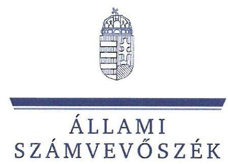
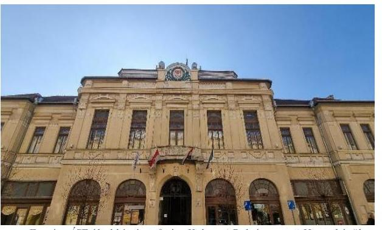
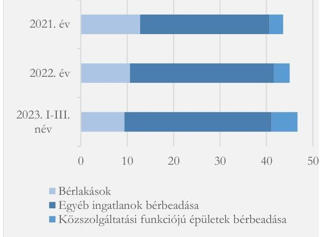
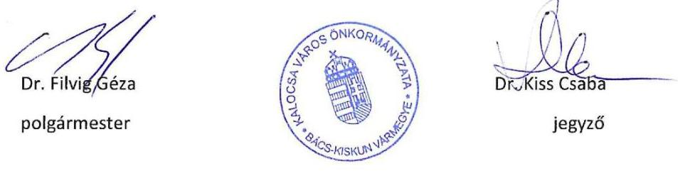

# JELENTÉS 

## Az önkormányzatok ingatlangazdálkodási tevékenységének ellenőrzése

Kalocsa Város Önkormányzata

2024.

---

ÁLLAMI SZÁMVEVÔSZÉK

# JELENTÉS 

## Az önkormányzatok ingatlangazdálkodási tevékenységének ellenőrzése

Kalocsa Város Önkormányzata

2024.

---

# ELLENŐRZÉSI IGAZGATÓSÁG: 

## ÁLLAMHÁZTARTÁS HELYI SZINTJÉT ELLENŐRZŐ IGAZGATÓSÁG

## ELLENŐRZÉSI IGAZGATÓ:

DR. BAFFIA GERGELY GÁBOR igazgató

## ELLENŐRZÉSVEZETŐ:

Jelentéseink az interneten a www.asz.hu címen olvashatók.

BEKE ANDREA ellenőrzésvezető

IKTATÓSZÁM: EL-3975-004/2024

TÉMASZÁM: 2714

ELLENŐRZÉS-AZONOSÍTÓ SZÁM: V-105801

---

# TARTALOMJEGYZÉK 

AZ ELLENŐRZÉS ALAPADATAI ..... 5
AZ ELLENŐRZÖTT SZERVEZET ..... 7
ÖSSZEFOGLALÁS ..... 10
AZ ELLENŐRZÉS FÓKUSZKÉRDÉSEI ..... 12
MEGÁLLAPÍTÁSOK ..... 13
JAVASLATOK ..... 23
MELLÉKLETEK ..... 26
I. sz. melléklet: Értelmező szótár ..... 26
II. sz. melléklet: Az ellenőrzött szervezetek jegyzéke ..... 30
III. sz. melléklet: Ellenőrzési kritériumok ..... 31
IV. sz. melléklet: Az Önkormányzat konszolidált mérlegadatai a 2021-2022. években és 2023. I-III. negyedévében ..... 33
V. sz. melléklet: Az Önkormányzat konszolidált kiadási és bevételi adatai a 2021-2022. években és 2023. I-III. negyedévében ..... 34
FÜGGELÉK: ÉSZREVÉTELEK ..... 35
RÖVIDÍTÉSEK JEGYZÉKE ..... 50

---

.

---

# AZ ELLENŐRZÉS ALAPADATAI 

## AZ ELLENŐRZÉS CÉLJA

Az ellenőrzés célja az önkormányzat ingatlangazdálkodási, ingatlanhasznosítási tevékenységének értékelése volt. Az ellenőrzés kiterjedt arra, hogy az önkormányzat az ingatlangazdálkodási feladatai ellátása során figyelemmel volt-e a vagyon értékének megőrzésére, állagának fenntartására, állományának gyarapítására.

## AZ ELLENŐRZÉS TÍPUSA

Megfelelőségi ellenőrzés.

## AZ ELLENŐRZÖTT IDŐSZAK

A 2021-2022. évek, és a 2023. év I-III. negyedév.

## AZ ELLENŐRZÉS TÁRGYA

Az ellenőrzés tárgyát az Étv. ${ }^{1}$ 2. $\$ 8$. pontjában foglaltak szerinti építmények, a 2. $\$ 10$. pontjában foglaltak szerinti épületek és a 2. $\$ 21$. pont szerinti telkek, továbbá a Földtv. ${ }^{2}$ hatálya alá tartozó földterületek, valamint a 147/1992. (XI. 6.) Korm. rendelet ${ }^{3} 4$. számú melléklete szerinti külterületi ingatlanok képezték.

Az ÁSZ ${ }^{4}$ az ellenőrzés keretében az ingatlanvagyonnal kapcsolatos intézkedések végrehajtásának és elszámolásának megfelelőségét, valamint a nemzeti vagyonba tartozó ingatlanok nyilvántartásának szabályszerűségét ellenőrizte. A kockázatelemzés alapján ellenőrzésre kiválasztott önkormányzatoknál a belső kontrollrendszer részeként a nemzeti vagyonba tartozó ingatlanokkal kapcsolatos gazdálkodási, hasznosítási tevékenység tekintetében a belső szabályozás kialakítása, a kontrolltevékenységek kialakítása és működtetése, valamint a belső ellenőrzés működtetése megfelelőségének értékelésére került sor.

Az ingatlangazdálkodási tevékenység ellenőrzése az Önkormányzat ${ }^{5}$ esetében az ingatlanok vagyonkezelésbe adására, ingyenes átvételére és átadására, hasznosítására (bérbe, használatba adására), az ingatlanok tulajdonjogának adásvétel keretében történő megszerzésére és értékesítésére, a beruházások, felújítások megvalósítására és az ingatlanok nyilvántartására irányult, függetlenül attól, hogy az Önkormányzat azt saját maga, hivatala, vagy gazdasági társasága útján látta el.

Az ellenőrzés kiterjedt minden olyan körülményre és adatra, amely az ÁSZ jogszabályban meghatározott feladatainak teljesítéséhez, valamint a program végrehajtása folyamán felmerült újabb összefüggések feltárásához szükséges volt.

---

# Az ellenőrzés jogsalapja 

Az ellenőrzés jogszabályi alapját az ÁSZ tv. ${ }^{6} 1 . \int(3)$ bekezdése, $5 . \int(3)$ bekezdése és (4) bekezdés a) pontja képezték.

## AZ ELLENŐRZÉS MÓDSZERE

Az ellenőrzést az Alaptörvény ${ }^{7}$ 43. cikk (1) bekezdésében meghatározott törvényességi, célszerűségi szempontokat, valamint a nemzetközi standardokat irányadónak tekintve az ellenőrzési program szempontjai, az ellenőrzött időszakban hatályos jogszabályok, az ellenőrzés szakmai szabályok és módszertanok figyelembevételével hajtotta végre az ÁSZ.

Az ellenőrzési bizonyítékként felhasználható adatforrások közé tartoztak egyrészt az ellenőrzéshez kért dokumentumok, adatok, másrészt adatforrásként szolgált minden - az ellenőrzés folyamán - feltárt, az ellenőrzés szempontjából információkat tartalmazó dokumentum.

Az ellenőrzés lefolytatásához az ellenőrzött szervezet a tanúsítványok kitöltésével, valamint az ÁSZ által kért dokumentumok, adatok, információk megküldésével és a helyszíni ellenőrzés során - interjú keretében szolgáltatott adatokat.

Az ellenőrzött szervezet ingatlangazdálkodási tevékenységének megfelelőségét egyrészt az értékesítés esetében 15, a hasznosítás (bérbeadás) esetében 15, az ingatlanok vásárlása, beruházása esetében 15 darab kockázati alapon kiválasztott mintatétel alapján értékelte az ÁSZ. A vagyonkezelésbe adás két, a tulajdonjog ingyenes átruházás egy, a tulajdonjog ingyenes átvétel négy tétele esetében teljes körű ellenőrzés történt.

A mintavétellel érintett ingatlangazdálkodási tevékenységek esetében a kiválasztott mintatételek alapján tett megállapítások, értékelések kizárólag az adott mintatételekre vonatkoznak, azok a teljes, illetve mintavételi sokaságra általános érvénnyel nem kerültek kivetítésre.

---

# AZ ELLENŐRZÖTT SZERVEZET 

## Kalocsa VÁros ÖNKORMÁNYZATA

Forrás: ÁSZ által készitett fotó - Kalocsai Polgármesteri Hivatal épülete

Kalocsa Bács-Kiskun vármegyében található város, a Duna partján fekszik. A Kalocsai járás székhelyeként egy nagy területű körzet gazdasági, egészségügyi, oktatási és kulturális központja. Lakónépessége a 2021. január 1-jei 14847 főről 2023. január 1-jére 14619 főre csökkent a Központi Statisztikai Hivatal (KSH) adatai szerint.

A Polgármester ${ }^{8}$ a 2019. évi önkormányzati választások óta tölti be tisztségét, munkáját egy alpolgármester segíti. A 12 tagú Képviselő-testület ${ }^{9}$ mellett hat állandó bizottság működik: Pénzügyi és Vagyonellenőrzési Bizottság, Gyermek-, Ifjúsági és Sportbizottság, Kulturális és Szociális Bizottság, Gazdaság- és Turizmusfejlesztési Bizottság, Jogi és Ügyrendi Bizottság, Közbeszerzési Bizottság.

A Polgármesteri Hivatal ${ }^{10}$ Jegyzője ${ }^{11} 2013$ óta látja el feladatát, munkáját egy aljegyző támogatja.
Az Önkormányzat a kötelező és önként vállalt feladatait - a Polgármesteri Hivatalon felül - az irányítása alá tartozó négy költségvetési szervvel ${ }^{12}$, valamint két kizárólagos tulajdonában lévő gazdasági társaságával ${ }^{13}$ látta el.

Az Önkormányzat az ellenőrzött időszakban nem kötött szerződést állandó könyvvizsgálói feladatok ellátására, eseti jelleggel, pályázatokhoz, támogatásokhoz bízott meg könyvvizsgálót. A belső ellenőrzés feladatait egy fő belső ellenőr látta el, köztisztviselői jogviszonyban.

Az Önkormányzat költségvetési kiadásainak összege a 2021. évi 4253,0 M Ft-ról a 2022. évre 5,0\%-kal, 4041,3 M Ft-ra csökkent, a költségvetési bevételek összege a 2021. évi 3671,1 M Ft-ról 4166,7 M Ft-ra emelkedett, ami 13,5\%-os növekedést jelentett. 2023 első három negyedévében - a 2022. évi éves adatokat alapul véve - a költségvetési bevételek 72,6\%-ra, a költségvetési kiadások 71,3\%-ra teljesültek. Míg a 2021. évben 581,9 M Ft költségvetési hiány keletkezett, a 2022. évben és 2023 első három negyedévében költségvetési többlet realizálódott. A 2021. évi költségvetési hiány forrásául a fejlesztési támogatások előző évekből származó maradványa (1404,0 M Ft) szolgált.

Az Önkormányzat összes felhalmozási bevételeinek ${ }^{14}$ összege a 2022. évben 868,0 M Ft volt, ami 22,4\%-kal maradt el a 2021. évben realizált 1118,5 M Ft-tól. Az elmaradást egyrészt a felhalmozási bevételek közül az ingatlanértékesítési bevételek alacsony teljesülése (43,7\%) okozta. Másrészt a 2021-2022. években megkezdett ingatlanfejlesztések támogatásainak nagy részét (68,3\%) az Önkormányzat előfinanszírozás keretében a 2021. évben kapta meg. Az Önkormányzat a 2021-2023. I.-III. negyedév időszakában összesen 697,4 M Ft európai uniós és hazai forrásból származó, ingatlanok fejlesztésére irányuló támogatásban részesült.

A felhalmozási kiadások ${ }^{15}$ az ellenőrzött időszakban csökkenő tendenciát mutattak, a 2022. évi 1021,3 M Ft 28,6\%-kal maradt el a 2021. évi 1431,1 M Ft-tól. A csökkenést elsődlegesen az ingatlanfejlesztések megvalósításának üteme okozta, a 2021-2022. évek időszakában a Terület- és Településfejlesztési Operatív Program támogatásának felhasználásával megvalósított iparterületfejlesztésre fordított 913,3 M Ft-ból 735,3 M Ft a 2021. évet érintette. A 2022. évben több - arányaiban kisebb volumenű - ingatlanberuházást valósítottak meg, pl. térségfejlesztési és településüzemeltetési beruházások, óvoda kialakítás, valamint a

---

Kisvárosi Program keretében játszótér létesítés, temetőfejlesztés, elsődlegesen hazai támogatások felhasználásával. Az ellenőrzött időszakban megvalósított ingatlanfejlesztések az ingatlanvagyon bruttó értékének a 2021. évben 5,2\%-át, a 2022. évben 3,4\%-át tették ki, mindkét évben meghaladva az amortizáció mértékét.

| 1. táblázat |  |  |  |
| :--: | :--: | :--: | :--: |
| KALOCSA VÁROS ÖNKORMÁNYZATA INGATLANVAGYONÁNAK FÖBB ADATAI (2021-2023. III. NEGYEDÉV) |  |  |  |
| INGATLANOKBA VONATKOZÓ ADATOK | $\begin{gathered} 2021 . \\ \text { DECEMBER } \\ 31 . \end{gathered}$ | $\begin{gathered} 2022 . \\ \text { DECEMBER } \\ 31 . \end{gathered}$ | $\begin{gathered} 2023 . \\ \text { SZEPTEMBER } \\ 30 . \end{gathered}$ |
| Ingatlanvagyon-   kataszteri adatok*   (bruttó érték M Ft) | 27243,1 | 28573,7 | 24869,2 |
| Ingatlanok és vagyoni értékủ jogok mérleg szerinti értéke (M Ft) | 20019,5 | 20813,6 | 17476,5 |
| Bérlakás állomány (db) | 88 | 83 | 81 |
| Adott évben bérbeadott ingatlanok száma (db) | 139 | 139 | 124 |
| - Önkormányzat által (db) | 21 | 22 | 11 |
| - gazdasági társaság által (db) | 118 | 117 | 113 |
| Belterületi földterületek (ha) | 178,0 | 175,4 | 169,6 |
| Külterületi földterületek (ha) | 3,1 | 3,1 | 3,1 |

Forrás: Az Önkormányzat 2021. és 2022. évi összesïtett költségvetési beszámolója, valamint adatzzolgáltatása alapján A5Z saját szerkesztés
*A kataszteri adatok tartalmazzák a vagyonkezelésbe adott ingatlanvagyon adatát is.

Az Önkormányzat ingatlanvagyonának értéke a 2021. évtől 2023. harmadik negyedévének végére mind az ingatlanvagyon-kataszteri nyilvántartásban, mind pedig az Önkormányzat mérlegeiben* csökkent. Az ingatlanok és vagyoni értékủ jogok mérleg szerinti értéke a 2021. év végi 20 019,5 M Ft-tól 2543,0 M Ft-tal maradt el az ellenőrzött időszak végére. A csökkenés legfőbb oka volt, hogy a 2023. évben a Magyar Állam számára ingyenesen átadták az Önkormányzat víziközmű-vagyonát (3077,5 M Ft). (1. táblázat)

A 2021. és a 2022. évben 139 db , a 2023 év törtidőszakában 124 db önkormányzati ingatlant hasznosítottak bérbeadással. Az ingatlanok bérbeadását - a forgalomképtelen ingatlanok kivételével feladatellátási szerződés alapján az Önkormányzat kizárólagos tulajdonában lévő gazdasági társaság végezte. Az Önkormányzat a forgalomképtelen ingatlanjait (termőföld területek, révkikötő) saját maga adta (haszon)bérbe. Az ingatlanok karbantartását egyrészt az Önkormányzat, másrészt - a közfeladatellátási szerződés alapján a hasznosított ingatlanok, a költségvetési intézmények, valamint a zöldterületek és a köztemető vonatkozásában - a gazdasági társaság látta el. A 2021-2023. III. negyedév végéig terjedő időszakban az Önkormányzat összesen 111,7 M Ft-ot, gazdasági társasága - a megkötött feladatellátási szerződés alapján - további 19,6 M Ft-ot fordított karbantartásra.

Az önkormányzati földterületek jelentős részét (az ellenőrzött időszakban átlagosan $85 \%$-ot) kitevő belterületek nagysága a 2021. év végi 178,0 ha ${ }^{16}$-ról, 2023 harmadik negyedévének végére 169,6 ha-ra csökkent, a fölterületek értékesítésének köszönhetően.

[^0]
[^0]:    * A 2021. és 2022. években az Önkormányzat költségvetési beszámolóinak mérlege, a 2023. I-III. negyedévében az időközi mérlegjelentés adata.

---

# KALOCSAI VAGYONHASZNOSÍTÁSI ÉS KÖNYVVEZETŐ NONPROFIT KFT. 

Az Önkormányzat 2012. február 16-án alapította a kizárólagos tulajdonában lévő Kalocsai Vagyonhasznosítási és Könyvvezető Nonprofit Kft-t. A gazdasági társaság ${ }^{17}$ fő tevékenysége az ingatlankezelés.
2. táblázat

A GAZDASÁGI TÁRSASÁG GAZDÁLKODÁSÁT A 2021-2022. ÉVEKBEN JELLEMZŐ ADATOK (M FT)

| MEGNEVEZÉs | 2021. EV | 2022. EV |
| :--: | :--: | :--: |
| Értékesítés nettó árbevétele | 185,2 | 190,9 |
| Egyéb bevételek | 600,6 | 695,5 |
| Anyagjellegű ráfordítások | 301,8 | 347,4 |
| Személyi jellegű ráfordítások | 389,0 | 444,4 |
| Értékcsökkenési leírás | 83,3 | 81,9 |
| Egyéb ráfordítások | 8,9 | 7,5 |
| Adózás előtti eredmény | 2,8 | 5,2 |
| Adózott eredmény | 2,0 | 4,8 |

Forrás: A gazdasági társaság 2021. év 2022. évi beszámolói alappján, $A V Z$ saját szerkesztés
harmadik negyedév végéig realizált bevételek ( $46,7 \mathrm{M} \mathrm{Ft})$ meghaladták a 2022. év egészében befolyt összeget. (1. ábra)

A gazdasági társaság ingatlankezelési feladataihoz kapcsolódó karbantartási költségei a 2021. évi 6,5 M Ftról a 2022. évre 7,7 M Ft-ra ( $18,5 \%$-kal) növekedtek. 2023 harmadik negyedévének végéig $5,4 \mathrm{M}$ Ft-ot fordított e célra.

Az ügyvezető ${ }^{19}$ személyében az ellenőrzött időszakot követően történt változás, 2023. október 1-jétől került sor új ügyvezető kinevezésére. A gazdasági társaságnál foglalkoztatottak száma 2023. december 31-én 98 fő volt.

Az Önkormányzat tulajdonosi érdekeinek érvényre jutását a gazdasági társaságban három tagú felügyelő bizottság ${ }^{20}$ biztosította. A könyvvizsgálattal kapcsolatos feladatokat 2019. óta egy könyvvizsgáló cég látta el.

1. ábra

A GAZDASÁGI TÁRSASÁG ÖNKORMÁNYZATI INGATLANOK BÉRBEADÁSÁBÓL SZÁRMAZÓ BEVÉTELEINEK ÖSSZETÉTELE (2021-2023. III. NÉV) (M FT)

- Bérlakások
- Egyéb ingatlanok bérbeadása
- Közszolgáltatási funkciójú épületek bérbeadása

Forrás: A gazdasági társaság adatszolgáltatása alapján, ÁSZ saját szerkesztés

---

# ÖSSZEFOGLALÁS 

Az önkormányzatok múködésének egyik alapvető feltétele, hogy a kötelező feladataik ellátásához szükséges vagyontárgyak (ingatlanok, gépek stb.) rendelkezésükre álljanak. Az önkormányzati vagyon részét képező ingatlanok jelentős anyagi értéket képviselnek, amelyek esetében kiemelten fontos a nemzeti vagyonnal való felelős gazdálkodás követelményeinek érvényesítése. Mindezek alapján került sor az Önkormányzat ingatlangazdálkodási tevékenységének ellenőrzésére.

Az Önkormányzatnál - az ellenőrzött gazdasági események tekintetében - az ingatlanokkal való gazdálkodás alapvetően megfelelően történt, azonban az ingatlanok vagyonkezelésbe adása, az ingatlanberuházások elszámolása és az ingatlanhasznosítás esetében az ellenőrzés hiányosságokat tárt fel. Az ingatlanok nyilvántartása nem felelt meg maradéktalanul a jogszabályi és a belső szabályozások előírásainak.

A törvényi kötelezettség alapján a 2021. év végén vagyonkezelésbe adott két ingatlan (köztér és szobor) esetében a jogszabályi előírás - vagyonkezelési szerződés megkötése nélkül - biztosította a vagyonkezelő számára a vagyonkezelői jog gyakorlását. Ugyanakkor a vagyonkezelésbe adás - a más jogszabályok által előírt kötelezettségeket és azok teljesítését is tartalmazó - részletszabályait 2021. december 31-e óta a jogszabályi előírás ellenére vagyonkezelői szerződésben nem rendezték. Az Önkormányzat kezdeményezett egy megállapodást a vagyonkezelővel - amelyben a jogszabályi előírások ellenére nem rendezték teljeskörűen a vagyonkezelés részletszabályait -, de annak megkötésére nem került sor. Ez kockázatot jelent a vagyonkezelésbe adott önkormányzati vagyon megőrzése, értékének és állagának védelme, rendeltetésének megfelelő, egységes elveken alapuló, átlátható, hatékony és költségtakarékos múködtetése, értéknövelő használata szempontjából.

Az ellenőrzött tételek alapján az ingatlanok hasznosításának (bérbeadásának) feladatát a gazdasági társaság és az Önkormányzat - egy eset kivételével - megfelelően ellátta. Az ellenőrzött 15 gazdasági esemény közül egy esetben a jogszabályi előírás ellenére a megszüntetett bérleti szerződést követően az új szerződés megkötéséig (hat hónapig) a bérlő az ingatlant szerződés nélkül használta. Az új szerződés megkötését követően a bérlő megfizette az Önkormányzat által a szerződés nélküli időszakra megállapított bérleti díjat.

Az ingatlanberuházások esetében az ellenőrzött gazdasági események többségénél (73,3\%) az elkészített utalványrendeletek tartalma nem felelt meg a jogszabály által előírtnak, mivel azok nem tartalmazták a kiadás egységes rovatrend és kormányzati funkció szerinti számát. Az érvényesítő figyelmen kívül hagyva a jogszabályi előírást, a hiányosságot az érvényesítés során nem jelezte. Egy ingatlanvásárlás esetében a jogszabályi előírás ellenére nem történt meg a teljesítésigazolás. A teljesítésigazolás hiányában az érvényesítésre és az utalványozásra szabálytalanul került sor. Egy ingatlancsere esetében megsértve a Számv.tv. ${ }^{21}$ bruttó elszámolás elvét nem történt meg a főkönyvi elszámolás, a jogszabályi előírások ellenére a cserében résztvevő ingatlanokkal kapcsolatban nem került sor a részletező analitika és az ingatlanvagyon-kataszter adatainak módosítására.

Az ellenőrzött tételek esetében az Önkormányzat a vagyonkezelésbe adott ingatlanok, az ingyenesen átvett ingatlanok, és a beruházások esetében a vagyonnyilvántartási feladatait nem megfelelően látta el.

A 2021. év végén vagyonkezelésbe adott két ingatlan esetében a nyilvántartásba vételre - a jogszabályi előírást figyelmen kívül hagyva - nem a 2021. év végén, hanem a 2022. évben került sor. Közülük, a korábban építményként nyilvántartott képzőmúvészeti alkotás (múemlék szobor) esetében a jogszabályi előírás ellenére értékcsökkenést számoltak el.

---

A négy ingyenesen átvett ingatlan közül egy ingatlan esetében a bekerülési értéket nem a jogszabályi előírás szerint állapították meg.

Az ellenőrzött vagyonkezelésbe adott ingatlanok esetében, valamint az ingatlanberuházások közül két esetben a részletező nyilvántartásba a jogszabályi előírások ellenére nem vezették fel teljeskörűen a bizonylatok alapján rendelkezésre álló adatokat.

Az ellenőrzött ingyenesen átvett ingatlanoknál, a vagyonkezelésbe adott ingatlanoknál, valamint az ingatlanberuházásoknál 15 esetben a forgalomképesség szerinti besorolás nem a jogszabály, és a belső szabályozás alapján történt. A Jegyző az ellenőrzött értékesített, az ingyenesen átvett ingatlanok, valamint az ingatlanberuházások közül több esetben, továbbá az önkormányzati bel- és külterületi földterületek esetében a jogszabályi előírás ellenére nem biztosította a részletező nyilvántartás, az ingatlanvagyon-kataszteri nyilvántartás és az ingatlanügyi hatóságként eljáró vármegyei kormányhivatal azonos tartalmú adatainak egyezőségét.

Az Önkormányzat az éves költségvetési beszámoló mérlegében és a számviteli nyilvántartásokban (főkönyv, egyedi részletező nyilvántartások, vagyonkimutatás) az ingatlanállomány nettó értékének egyezőségét biztosította, a 2021. és 2022. évi költségvetési mérlegben szereplő tételeket a jogszabályi előírásnak megfelelően leltárral támasztotta alá. A 2022. év végén az Önkormányzat a vagyonkezelésbe adott ingatlanokat leltározta, azonban a jogszabályi előírás ellenére nem biztosította a vagyonkezelő által hitelesített leltárral való alátámasztást. Az alátámasztás elmaradásával érintett mérlegérték összege nem érte el a jogszabályokban és a belső szabályozásban meghatározott jelentős összegű hiba határát.

Az Önkormányzatnál az ingatlangazdálkodási, ingatlanhasznosítási folyamatok kontrollkörnyezetét - a Képviselő-testület SZMSZ ${ }^{22}$-ében feltárt szabálytalan hatáskör átruházás és az ellenőrzés során feltárt további kisebb hiányosság ellenére - a jogszabályi előírásoknak megfelelően alakította ki. Az Önkormányzat rendelkezett az ingatlangazdálkodási, ingatlanhasznosítási tevékenységekhez a jogszabályok által előírt szabályzatokkal és tervekkel. A Képviselő-testület az SZMSZ-ének mellékletében a nemzeti vagyon térítésmentes átvételére vonatkozó döntés jogát a jogszabályi előírások ellenére a Bizottságára ${ }^{23}$ ruházta át.

Az Önkormányzat a belső szabályozásokban kialakított kontrollokat - az ellenőrzés során feltárt hiányosságok alapján - nem minden esetben múködtette.

A belső ellenőrzés az ellenőrzött időszakban vizsgálta az Önkormányzat ingatlangazdálkodását. A belső ellenőrzési jelentések alapján tett intézkedéseket nyomon követték. A Tolna Megyei Vállalkozásfejlesztési alapítvány, a Magyar Államkincstár és az Európai Támogatásokat Auditáló Főigazgatóság ingatlangazdálkodásra irányuló külső ellenőrzései által a támogatásokkal kapcsolatban feltárt kisebb hiányosságok esetében nem volt szükség intézkedési tervek készítésére, azokat hiánypótlás keretében rendezték.

A Jegyző az ÁSZ tv. 29. § (2) bekezdés szerinti, a jelentéstervezet megállapításaira tett észrevételében arról tájékoztatta az ÁSZ-t, hogy két ingatlanberuházási tétel esetében a részletező nyilvántartás kiegészítésre került, továbbá hogy az energia megtakarítási intézkedési terv elkészítése folyamatban van, ezzel az ÁSZ megállapításai az ellenőrzés során hasznosultak.

A jelentés megállapításai alapján a hiányosságok kiküszöbölése érdekében az ÁSZ a Polgármester számára négy, a Jegyző számára 11 javaslatot fogalmazott meg.

---

# AZ ELLENŐRZÉS FÓKUSZKÉRDÉSEI 

1.     - Az Önkormányzat nemzeti vagyonba tartozó ingatlanokkal való gazdálkodása, valamint az ezzel kapcsolatos gazdasági események elszámolása megfelelő volt-e?
2.     - Az Önkormányzat tulajdonában lévő ingatlanok nyilvántartásával kapcsolatos feladatok ellátása szabályszerű volt-e?
3.     - Az Önkormányzatnál az ingatlangazdálkodási, ingatlanhasznosítási tevékenységhez kapcsolódóan a belső kontrollrendszer kialakítása és müködtetése megfelelő volt-e?

---

# MEGÁLLAPÍTÁSOK 

## 1. Az Önkormányzat nemzeti vagyonba tartozó ingatlanokkal való gazdálkodása, valamint az ezzel kapcsolatos gazdasági események elszámolása megfelelő volt-e?

Összegző megállapítás Az Önkormányzat nemzeti vagyonba tartozó ingatlanokkal való gazdálkodása - az ellenőrzött tételek tekintetében alapvetően megfelelt a jogszabályok és belső szabályozások előírásainak. Az ellenőrzés hiányosságot tárt fel az ingatlanok vagyonkezelésbe adása, hasznosítása, valamint a beruházások elszámolása területén.
1.1. számú megállapítás Az Önkormányzat az ingatlanok vagyonkezelésbe adásánál nem tartotta be maradéktalanul a jogszabályi előírásokat.

Vagyonkezelői jog létesítésére két műemlék jellegű ingatlan esetében a 2021. évi CL törvény ${ }^{24}$ 5/A. §-ának megfelelően került sor. A törvényi előírás alapján a két - együttesen 70,2 M Ft bruttó értékű - ingatlan 2021. december 31-ével került ingyenesen 100 évre vagyonkezelésbe adásra.

Vagyonkezelési szerződés megkötésére nem került sor, miután a 2021. évi CL törvény 5/B. $\S$-a értelmében az ingatlan-nyilvántartási bejegyeztetésre és a vagyonkezelői jog gyakorlására a vagyonkezelő vagyonkezelési szerződés kötése nélkül volt jogosult. A törvényi kijelöléssel a vagyonkezelői jog létrejött, de a vagyonkezelésre vonatkozó részletszabályokról az Nvtv. ${ }^{25}$ 11. § (7) bekezdésében előírtak ellenére vagyonkezelési szerződésben 2021. december 31-e óta nem állapodtak meg. Az Önkormányzat - a Jegyző nyilatkozata szerint - kezdeményezte egy üzemeltetési megállapodás megkötését a vagyonkezelővel, amelyben rendezni kívánta a vagyonkezelés részletszabályait, azonban abban nem rendelkezett - az Mötv. ${ }^{26}$ 109. § (7)-(8) bekezdések előírása ellenére - a vagyonkezelőre vonatkozó nyilvántartási kötelezettségekről, a tulajdonosi ellenőrzésről, továbbá a vagyonkezelésbe adott eszközök az Áhsz. ${ }^{27}$ 21. § (2) bekezdése szerinti értékelési és 22. § (2) bekezdésének a) pontja és (3) bekezdése szerinti leltározási és leltáralátámasztási kötelezettség előírásáról. A vagyonkezelésre vonatkozó - az Nvtv. ${ }^{28}$ 11. § (7) bekezdésében előírt - részletszabályok hiánya kockázatot jelent a vagyonkezelésbe adott önkormányzati vagyon megőrzése, értékének és állagának védelme, rendeltetésének megfelelő, egységes elveken alapuló, átlátható, hatékony és költségtakarékos működtetése, értéknövelő használata szempontjából.
1.2. számú megállapítás Az önkormányzati ingatlanok értékesítése - az ellenőrzött tételek esetében - szabályszerű volt.

Az ingatlanok értékesítésére vonatkozó döntést az ellenőrzött tételek esetében az arra hatáskörrel rendelkező Képviselő-testület, illetve átruházott hatáskörben a Bizottság vagy a Polgármester hozta meg, az Mötv.-ben, valamint a Vagyonrendeletben ${ }^{29}$ és a Lakásrendeletben ${ }^{30}$ előírtak szerint. A kihirdetett veszélyhelyzetek időszakában a Kat. ${ }^{31}$ felhatalmazása alapján a Képviselő-testület hatáskörét a Polgármester gyakorolta, amelyről az Mötv.-ben előírtak szerint tájékoztatta a Képviselő-testületet.

---

Az ellenőrzött ingatlanértékesítési tételek esetében az értékesítés természetes személy vagy az Nvtv. előírásának megfelelően átláthatósági nyilatkozattal rendelkező szervezet részére történt.
A 25 M Ft egyedi bruttó forgalmi értéket meghaladó értékű ingatlanok értékesítésére az Nvtv.-ben, a Vagyonrendeletben és a Lakásrendeletben előírtaknak megfelelően, versenyeztetés (árverés) útján, értékbecslés alapján került sor. Az ingatlanok forgalmi értékének értékbecslő általi meghatározása minden ellenőrzött tétel esetében piaci összehasonlító adatok módszerével történt, amelynek során figyelembe vették többek között az ingatlan elhelyezkedését, közmű- és infrastrukturális ellátottságát. Az Önkormányzat a meghirdetett ingatlanokat a legmagasabb vételi ajánlatot tevőnek az értékbecslés alapján megállapított forgalmi értéken, vagy afölött értékesítette.
Az ellenőrzött ingatlanértékesítések esetében az Nvtv.-ben meghatározottaknak megfelelően biztosították az állam minden más jogosultat megelőző elővásárlási jogának érvényesítését, amellyel az állam egyik ingatlan esetében sem élt. Önkormányzati bérlakás értékesítés esetén biztosították a bérlő elővásárlási jogát a Lakástv. ${ }^{32}$-ben előírtaknak megfelelően, amellyel a bérlők éltek is.
Az ingatlanok ellenértéke minden ellenőrzött esetben a szerződés szerinti értékben, határidőben folyt be. Az ingatlanértékesítések számviteli elszámolása az Áhsz., illetve a 38/2013. (IX. 19.) NGM rendelet ${ }^{33}$ előírásainak megfelelően történt.
1.3. számú megállapítás Az ingatlanok ingyenes (térítés nélküli) átadása a jogszabályi előírásoknak megfelelően történt.

A 2023. évben az Önkormányzat a tulajdonában álló - 3077,5 M Ft könyv szerinti értékű - víziközművagyont ingyenesen átadta a Magyar Állam részére. Az ingyenes átadásra az Mötv. és a Vksztv. ${ }^{34}$ előírásainak megfelelően került sor. Az átruházásról szóló döntést - az Mötv.-ben, illetve a Vagyonrendeletben előírtaknak megfelelően - a Képviselő-testület hozta meg.
1.4. számú megállapítás Az ingatlanok ingyenes (térítés nélküli) átvétele megfelelt a jogszabályi előírásoknak.

A négy ingyenes ingatlanátvétel közül két esetben az önkormányzati tulajdonban levő sportpark létesítményen az Ámb. tv. ${ }^{35}$ és a Tao tv. ${ }^{36}$ előírása alapján idegen tulajdonon végrehajtott beruházás történt, amelyeket térítésmentesen adott át a beruházó szervezet az Önkormányzat részére. További két esetben telekrendezéshez kapcsolódóan történt kisebb területű földrészletek átvétele a megfelelő szélességű út kialakítása érdekében, melyeknél az ingyenes átvételre vonatkozó döntést - a nem megfelelő vagyonrendeleti szabályozás ellenére - a Képviselő-testület hozta meg az Mötv. előírásainak megfelelően.
1.5. számú megállapítás

Az ellenőrzött ingatlanberuházásokkal kapcsolatos döntések meghozatala és azok végrehajtása megfelelően történt, a gazdasági események elszámolása azonban több esetben nem felelt meg a jogszabályi előírásoknak.

Az ellenőrzött ingatlanvásárlásról, -beruházásokról az Mötv. előírásának megfelelően a Képviselő-testület döntött. A közbeszerzési értékhatárt elérő beruházások esetében a Kbt. ${ }^{37}$ előírásainak megfelelően az Önkormányzat lefolytatta a közbeszerzési eljárást. Az Önkormányzat a lefolytatott közbeszerzési eljárások alapján a szerződéseket valamennyi esetben a Kbt. előírásai szerint a nyertes ajánlattevővel, írásban kötötte meg. Az ellenőrzött, Kbt. hatálya alá nem tartozó beszerzésekre a Beszerzési szabályzat ${ }^{38}$ előírásai szerint - több ajánlat bekérésével - került sor. A beszerzési eljárás végén az Önkormányzat minden esetben a nyertes

---

ajánlattevővel kötötte meg a szerződéseket. A megkötött visszterhes szerződések esetén az Ávr. ${ }^{39}$ rendelkezéseinek megfelelően az Önkormányzat rendelkezett az érintett szervezetek átláthatóságáról szóló nyilatkozattal.
Az ellenőrzött beruházások esetében a kötelezettségvállalásra, a pénzügyi ellenjegyzésre az Áht. ${ }^{40}$ és az Ávr. előírásainak megfelelően, az arra jogosultak által került sor. A kötelezettségvállalásokat minden esetben nyilvántartásba vették.
Egy ingatlanvásárlás esetében (1. számú tétel, az ellenőrzött 15 tétel 6,7\%-a) az Áht. 38. § (1) bekezdésének, valamint az Ávr. 57. §(1) bekezdésében foglaltak ellenére nem történt meg a teljesítésigazolás. Az érvényesítés során az érvényesítő nem ellenőrizte és nem jelezte, hogy a megelőző ügymenet során elmaradt a teljesítésigazolás, így nem tett eleget az Ávr. 58. § (1)-(2) bekezdéseiben foglaltaknak. Emiatt az Áht. 38. §(1) bekezdésének és az Ávr. 59. §(1b) bekezdésének előírása ellenére az utalványozásra teljesítésigazolás és szabályszerű érvényesítés nélkül került sor.
Az Önkormányzat egy óvodabővítési projekt megvalósításának érdekében 2017 óta többször próbálta megvásárolni a projekttel szomszédos ingatlant. Az ingatlan tulajdonosa az Önkormányzat által felajánlott - értékbecslésen alapuló - árat egyszer sem fogadta el. 2021-ben megjelölt egy csereingatlant (1. számú tétel), amelynek fejében átadta az ingatlanát az Önkormányzat számára. A csereingatlan 2021. 10. 05-én került az Önkormányzat tulajdonába, majd 2021. 11. 02-án egy csereszerződés keretében értékesítésre került. Az Önkormányzat a Számv.tv. 15. § (9) bekezdése szerinti bruttó elszámolás elvét megsértve a végrehajtott ingatlancsere főkönyvi elszámolását nem végezte el, továbbá nem gondoskodott - az Áhsz. 45.§ (3) bekezdésének előírása ellenére - az ingatlancserében résztvevő ingatlanok adatainak a részletező analitikában történő átvezetéséről, illetve - a 147/1992. (XI. 6.) Korm. rendelet 4. § (1) bekezdése ellenére - az ingatlanvagyon-kataszter adatának módosításáról.

Az elkészített utalványrendeletek az Ávr. 59. § (3) bekezdés e) pontjának előírása ellenére 11 esetben nem tartalmazták a teljesített felhalmozási kiadások egységes rovatrend és kormányzati funkció szerinti számát (2., 3., 4., 5., 6., 7., 8., 9., 10., 11., 15. számú tétel, az ellenőrzött 15 tétel 73,3\%-a). Az érvényesítés során az érvényesítő nem ellenőrizte és nem jelezte, hogy az utalványok tartalma nem felel meg teljeskörűen a jogszabály előírásának, így nem tett eleget az Áht. 38. § (1) bekezdésében, valamint az Ávr. 58. § (1)-(2) bekezdéseiben foglaltaknak.
1.6. számú megállapítás

Az Önkormányzat és a gazdasági társaság által végzett ingatlan hasznosítási (bérbeadási) tevékenység - egy ingatlan hasznosításának kivételével - az ellenőrzött gazdasági események tekintetében megfelelő volt.

Az Önkormányzat az ingatlanhasznosítási (bérbeadási) feladatait a kizárólagos tulajdonában lévő gazdasági társaságával, illetve a forgalomképtelen ingatlanai (pl. termőföldek, révátkelő) esetében saját maga látta el. A gazdasági társaság feladatellátásának kontrolljait az Önkormányzat kialakította, tulajdonosi jogait az ingatlanhasznosításról szóló döntések önkormányzati hatáskörben tartásával, a gazdasági társaság rendszeres beszámoltatásával és elszámoltatásával érvényesítette, kötelezettségeit a feladatellátáshoz szükséges források biztosításával teljesítette. Az Önkormányzat az SZMSZ-ben, a Vagyonrendeletben, a Lakásrendeletben, illetve az éves feladatellátási szerződésekben határozta meg a vagyon hasznosítására, a bérbeadásra vonatkozó általános és konkrét szabályokat, jogokat, illetve kötelezettségeket.
A feladatellátási szerződésben meghatározták a gazdasági társaság vagyonhasznosítással (bérbeadással) kapcsolatos feladatait, azok ellátásának módját, a hasznosítási bevételek számlázásának és beszedésének szabályait, a kapcsolódó nyilvántartási és adatszolgáltatási kötelezettségeket. Az Nvtv. - a nemzeti vagyon

---

értékének és állagának védelmére vonatkozó - követelményének érvényesülése érdekében a feladatellátási szerződés tartalmazta a gazdasági társaság feladatait az ingatlanvagyon állagának felmérése, megóvása, a vagyonvédelem, vagyonbiztosítás, illetve az ingatlanüzemeltetés vonatkozásában. Az Nvtv-vel összhangban a gazdasági társaság feladatául szabták az önkormányzati ingatlanállomány kihasználtságának nyomon követését, annak eredményéről a Képviselő-testület számára tájékoztatás nyújtását.
A gazdasági társaság a Vagyonrendeletben és a feladatellátási szerződésekben foglaltaknak megfelelően az Önkormányzat döntése alapján megkötötte saját nevében a szerződéseket, beszedte a hasznosításból (bérbeadásból) származó bevételeket, azokról elkülönített nyilvántartást vezetett. A befolyt bevételek és a feladatellátási szerződés alapján kapott támogatások felhasználásáról közbenső és éves pénzügyi beszámolókban, valamint üzleti jelentésekben elszámolt.
Az ellenőrzött gazdasági események tekintetében a Vagyonrendeletben, illetve a Lakásrendeletben előírraknak megfelelően az arra jogosult (Képviselő-testület, illetve átruházott hatáskörben a Bizottság vagy a Polgármester) hozta meg a bérbeadásra vonatkozó döntést. A szerződéseket a Vagyonrendelet alapján hatáskörrel rendelkező Polgármester, vagy a gazdasági társaság ügyvezetője kötötte meg, a hasznosítás időtartamát az Nvtv. és a Vagyonrendelet előírásának megfelelően állapították meg.
Az 5249 hrsz-ú repülőtéri kifutópálya (9. számú tétel, az ellenőrzött 15 db tétel 6,7\%-a) esetében az ingatlan bérleti jogának meghosszabbításáról szóló képviselő-testületi döntés visszavonásra került, mivel a bérlő kényszertörlés alatt állt. A bérlő adószámának visszaállítását követően az ingatlanra vonatkozóan a gazdasági társaság új bérleti szerződést kötött, a kapcsolódó új előterjesztés, illetve az azután meghozott új bizottsági határozat alapján. Az új bérleti szerződés aláírását megelőzően a bérlő - 2021. október 1-jétől 2022. március 31-ig, hat hónapig - az ingatlant érvényes, megkötött bérleti szerződés nélkül, ellenőrizetlenül, ingyenesen használta, ezáltal sérültek egyrészt az Önkormányzat Mötv. 107. § szerinti tulajdonosi jogai, másrészt az Nvtv. 7. § (2) bekezdésének a nemzeti vagyon megőrzését célzó követelményei. Az új bérleti szerződés nélkül, ingyenesen használt időszakra az Önkormányzat által meghatározott bérleti díjat a bérlő utólag, az új bérleti szerződés aláírását követően megfizette a gazdasági társaság részére.
A bérleti díjak elszámolása - megfelelve a Számv.tv. előírásainak - szabályszerű volt, az ingatlanok hasznosításából származó bevételek a szerződés szerinti összegben teljesültek.
1.7. számú megállapítás

Az Önkormányzat rendelkezett - az energiamegtakarítási intézkedési terv kivételével - a jogszabályokban előírt, az önkormányzati ingatlanokra vonatkozó fejlesztési elképzeléseket tartalmazó stratégiákkal és tervekkel.

Az Önkormányzat az Nvtv. előírása alapján 2013 óta rendelkezett közép- és hosszú távú vagyongazdálkodási tervekkel, amelyekben megfogalmazták a meglévő vagyon fenntartásának, növelésének, hasznosításának, értékesítésének szempontjait. Az Mötv. alapján elkészített gazdasági programban - a 2020-2024. évek időszakára - az ingatlanvagyon megújítására, korszerűsítésére, hasznosítására és fenntartására irányuló célokat és feladatokat határoztak meg.
Az ingatlangazdálkodás során és a Képviselő-testület felé benyújtott fejlesztési javaslatokban érvényesítették az elkészített környezetvédelmi, fenntarthatósági közép- és hosszútávú programokban ${ }^{41}$ meghatározott célokat és elveket.
A 2017. évben az Ehat. ${ }^{42}$ előírásai alapján elkészítették az Önkormányzat tulajdonában álló, közfeladatellátást szolgáló épületek ötéves energiamegtakarítási intézkedési terveit, azonban az

---

Ehat. 11/A. § a) pontját figyelmen kívül hagyva a 2022. évben nem került sor a következő öt évre vonatkozó energiamegtakarítási intézkedési tervek meghatározására. Továbbá az Ehat. 11/A. § b) pontjának előírása ellenére az elkészített energiamegtakarítási intézkedési tervek teljesítéséről nem készítettek évente jelentést.
Az energetikai, egyéb épület-, fűtéskorszerűsítési, illetve közvilágítási, ingatlanfejlesztési, beruházási pályázati lehetőségekről a Képviselő-testület az ellenőrzött időszakban tájékoztatást kapott. Az Nvtv.-ben foglaltakkal összhangban felmérték, hogy az energiamegtakarításra vonatkozó beruházások milyen összegű működési költségmegtakarítást eredményeztek. A Képviselő-testületet tájékoztatták a tervezett ingatlanberuházások, -felújítások esetleges elmaradásának a pénzügyi kihatásairól, kockázatairól és következményeiről.
A vagyongazdálkodási feladatok keretében az ingatlanok karbantartását minden évben - az Önkormányzat, illetve a feladatellátási szerződés alapján gazdasági társasága - tervezetten végezte el. Az elvégzett karbantartási feladatokat a Képviselő-testület számára - a zárszámadási rendeletekben és a gazdasági társaság beszámolóiban - évente bemutatták.
Az Önkormányzat feladatellátási (hajléktalan-ellátási feladatok Máltai Szeretetszolgálat általi ellátása) és szervezeti változásainak (Kalocsa Város Óvodája és Bölcsődéje intézményen belül új tagóvoda kialakítása) előkészítése során előzetesen értékelték az érintett ingatlanok funkció szerinti kihasználtságát, a feladatellátáshoz való szükségességét, állapotát, esetleges beruházási igényét. A Képviselő-testület az értékelés eredményét figyelembe vette a feladat- és szervezeti változásokról, a kapcsolódó ingatlanok ingyenes használatba adásáról, illetve kiürítéséről és új óvodaépület kialakításáról hozott döntései során.

# 2. Az Önkormányzat tulajdonában lévő ingatlanok nyilvántartásával kapcsolatos feladatok ellátása szabályszerű volt-e? 

## Összegző megállapítás

Az Önkormányzat vagyonnyilvántartási feladatainak ellátása nem felelt meg maradéktalanul a jogszabályok és a belső szabályzatok előírásainak.
2.1. számú megállapítás

Az Önkormányzat az éves költségvetési beszámoló mérlegében és a számviteli nyilvántartásokban (főkönyv, egyedi részletező nyilvántartások, vagyonkimutatás) az ingatlanállomány nettó értékének egyezőségét biztosította, a mérlegben szereplő tételeket - a vagyonkezelésbe adott ingatlanok kivételével - a jogszabályi előírásnak megfelelően leltárral támasztotta alá.

Az önkormányzati ingatlanok állományának nettó értéke az egyes évek költségvetési beszámolóinak mérlegében, az azt alátámasztó főkönyvi kivonatokban, a kapcsolódó részletező nyilvántartásokban, valamint a 2021. és 2022. évi zárszámadásokhoz a vagyonállapotról készített vagyonkimutatásban egyező volt. Az Önkormányzat a költségvetési beszámolójának mérlegében szereplő ingatlanvagyon tételeit a Számv.tv., valamint az Áhsz. előírása alapján minden évben mennyiségi leltározás alapján összeállított leltárakkal támasztotta alá. Ennek során a Leltározási szabályzatnak ${ }^{43}$ megfelelően egyeztették a földhivatali lapokat, a részletező nyilvántartásokban, valamint a főkönyvi nyilvántartásban szereplő

---

tételeket. A 2021. évi CL törvény alapján vagyonkezelésbe adott ingatlanok esetében a költségvetési beszámoló mérlege a 2021. és a 2022. évben - az Áhsz. 22. § (2) bekezdés a) pontja és a Leltározási Szabályzat 5.7. A) Befektetett eszközök fejezet IV. pontja ellenére - nem volt vagyonkezelő által készített és hitelesített leltárral alátámasztott. Az Önkormányzat a vagyonkezelőtől a leltárt nem kérte, ugyanakkor a vagyonkezelésbe adott ingatlanokat mennyiségi felvétellel leltározta. A feltárt hiba értéke nem érte el az Áhsz. 1. § (1) bekezdés 3. pontja és a Számviteli politika ${ }^{44}$ 4.3. pontja szerint az éves költségvetési beszámoló mérlegfőösszegének 2\%-át, vagy százmillió Ft-ot meghaladó - jelentős összegű hibát.
Az Önkormányzat - a Bkr. ${ }^{45}$ 8. § (2) bekezdés d) pontja szerinti kontrolltevékenységek hiányában - a 2022. évben az év végi könyvviteli zárlat keretében egy korábbi, helytelenül elszámolt 7,4 M Ft értékủ telekmegosztás (hrsz. 0106/1-3) főkönyvi nyilvántartásba vételének helyesbítését nem az érintett, az Áhsz. 16. melléklete szerinti „121. Ingatlanok" főkönyvi számlával szemben, hanem tévesen a „129. Ingatlanok és kapcsolódó vagyoni értékú jogok, terv szerinti értékcsökkenése" főkönyvi számlával szemben végezte el. A főkönyvi számlaszám elírása miatt a 2022. évi költségvetési beszámolót alátámasztó főkönyvi kivonatban az ingatlanok és kapcsolódó vagyoni értékủ jogok bruttó értékének, valamint az elszámolt terv szerinti értékcsökkenésének állománya +/-7,4 M Ft-tal eltért a 2022. évi költségvetési beszámoló 15. úrlapján helyesen szereplő záróállományi értékektől. A téves elszámolás a 2022. évi költségvetési beszámoló mérlegében szereplő ingatlanállomány nettó értékét nem érintette. A téves főkönyvi szám alkalmazásából származó állományeltérést az Önkormányzat a 2023. év elején észlelte, annak helyesbítése megtörtént.
Az önkormányzati ingatlanok 2021. és 2022. év végi állományi adatait a 3. táblázat mutatja. Az ingatlanok állományának nettó értéke mind a két évben megegyezett az egyes évek költségvetési beszámolóinak mérlegében, az azt alátámasztó főkönyvi kivonatokban, a részletező nyilvántartásokban. A bruttó érték esetében a 2022. évben a főkönyvi kivonattal való egyezés a leírt könyvelési hiba miatt nem volt biztosított. 3. táblázat

# AZ INGATLANOK ÁLLOMÁNYI ÉRTÉKEI AZ EGYES NYILVÁNTRATÁSOKBAN (2021-2022) (M FT) 

| MEGNEVEZÉS | 2021. DECEMBER 31. |  | 2022. DECEMBER 31. |  |
| :--: | :--: | :--: | :--: | :--: |
|  | BRUTTÓ ÉRTÉK | NETTÓ ÉRTÉK | BRUTTÓ | NETTÓ |
| Költségvetési beszámoló 15/A. úrlap | 26273,3 | 19724,4 | 27594,4 | 20541,9 |
| Főkönyvi kivonat - 12 számlacsoport | 26273,3 | 19724,4 | 27587,0 | 20541,9 |
| ASP - részletező analitika (KATI modul ${ }^{46}$ ) | 26273,3 | 19724,4 | 27594,4 | 20541,9 |
| ASP ${ }^{47}$-IVK szakrendszer ${ }^{48}$ | 26273,3 |  | 27594,4 |  |
| Zárszámadási rendelet vagyonkimutatás |  | 19724,4 |  | 20541,9 |
| Eltérés (beszámoló 15/A. úrlap - főkönyvi kivonat 12 számlacsoport) |  |  | $-7,4$ |  |

Forrás: A 2021-2022. évi önkormányzati adatszolgáltatás alapján ÁSZ saját szerkesztés
Az Önkormányzat adatszolgáltatása, illetve nyilatkozata alapján - a 147/1992. (XI. 6.) Korm. rendelet 1. § (2) bekezdésében, valamint a Vagyonrendelet 45. § (3) bekezdésében foglaltak ellenére - a Jegyző nem biztosította az ingatlanvagyon-kataszter és az ingatlanügyi hatóságként eljáró vármegyei kormányhivatal (földhivatal) nyilvántartása azonos tartalmú adatainak egyezőségét az Önkormányzat

---

tulajdonában álló bel- és külterületi földterületeket illetően. A belterületi földek területének - az ingatlanvagyon-kataszterben szereplő évközi változásai alapján számított - év végi záró értéke egyetlen évre vonatkozóan sem egyezett meg a földhivatal nyilvántartásának záró állományi értékével.
2.2. számú megállapítás

Az Önkormányzat tulajdonában lévő ingatlanok vagyonnyilvántartási feladatainak ellátása az ellenőrzött tételek alapján a vagyonkezelésbe adott ingatlanok, az ingyenesen átvett ingatlanok, és a beruházások ellenőrzött tételeinek nyilvántartásba vételénél nem volt megfelelő.

A 2021. december 31-ével vagyonkezelésbe adott ingatlanok könyv szerinti értékének (1., 2. számú tétel, az ellenőrzött kettő db tétel 100\%-a) átvezetése a „182 Koncesszióba, vagyonkezelésbe adott ingatlanok" közé nem az Áhsz. 53. § (2), illetve a (6) bekezdésének b) pontjában előírt negyedéves zárlat során történt meg. Ebből adódóan a 2021. évi költségvetési beszámoló mérlegében 15,0 MFt nettó összeg az Áhsz. 11. § (11) bekezdésében előírtak ellenére nem a „182 Koncesszióba, vagyonkezelésbe adott ingatlanok" között, hanem az Önkormányzat tulajdonában lévő „12 Ingatlanok és azokboz kapcsolódó vagyoni értékü jogok" között került kimutatásra. Az átvezetésre 2022. július 1-ével került sor, a vagyonkezelt eszközök állományi értéke a 2022. évi költségvetési beszámoló mérlegében a jogszabályi előírásnak megfelelően szerepelt.
Az 1019/4. hrsz-ú vagyonkezelésbe adott ingatlant (2. számú tétel, az ellenőrzött kettő db tétel 50\%-a) a vagyonkezelésbe adást megelőzően építményként tartották nyilván annak ellenére, hogy az ingatlan jellegéből - műemlék, szobor - adódóan a képzőművészeti alkotások közé tartozott. A helytelen besorolás miatt értékcsökkenést számoltak el a képzőművészeti alkotás után, ezáltal megsértették a Számv.tv. 52. § (5) bekezdésének előírását. A szabálytalanul elszámolt értékcsökkenés következtében a 2021. évi költségvetési beszámoló mérlegében 2,8 MFt-tal, a 2022. évi költségvetési beszámoló mérlegében 3,0 MFt-tal kevesebb nettó értéket mutattak ki.
Az ingyenesen átvett ingatlanok bekerülési értékének megállapítása egy esetben (2. számú tétel, az ellenőrzött négy db tétel $25 \%$-a) nem felelt meg az Áhsz. 15. § (2) bekezdésében előírtaknak, mivel egy ingatlan nyilvántartási értékét nem növelték meg a hozzá telekrendezés alapján ingyenesen átvett ingatlanterület a korábbi tulajdonos által nyilvántartott, a megkötött szerződésben meghatározott bruttó értékével, ami 70,0 E Ft eltérést jelentett.
A feltárt hibák értéke nem érte el a jelentős összegű hiba - az Áhsz. 1. § (1) bekezdés 3. pontja és a Számviteli politika 4.3. pontja alapján az egyes évek költségvetési beszámoló mérlegfőösszegének 2\%-a, vagy százmillió Ft - határát.
A vagyonkezelésbe adott ingatlanok esetében (1. és 2. számú tétel, az ellenőrzött kettő darab tétel 100\%-a) a Számv.tv. 165. § (1) bekezdésének előírása ellenére nem vezették fel a rendelkezésre álló összes bizonylat adatait a részletező nyilvántartásba, így az nem tartalmazta az Áhsz. 14. melléklet IX. 1. pontjában előírt a vagyonkezelésbe, koncesszióba adás adatai közül a vagyonkezelésbe adás időtartamát. Az Önkormányzat nem tartotta be maradéktalanul az Áhsz. 14. melléklet IX. 2. pontjának előírását, amely szerint az állományváltozásokkal kapcsolatos információkat a vagyonkezelőtől kapott adatszolgáltatás alapján kell elszámolni, miután a vagyonkezelő azokról nem szolgáltatott a 2022. évben és 2023 első három negyedévében adatot.
Az ellenőrzött ingatlanberuházások közül két esetben (5. és 11. számú tétel, az ellenőrzött 15 db tétel 13,3\%-a) a Számv.tv. 165. § (1) bekezdésének előírását figyelmen kívül hagyva a részletező nyilvántartásban nem rögzítették - az Áhsz. 14. melléklet VII. 3. pontjának a) és 4. pontjának a) alpontja szerint - az ingatlan címét és a helyrajzi számot.

---

A Jegyző az ingatlanokról vezetett ingatlanvagyon-kataszteri és részletező nyilvántartásokban az Nvtv. szerinti forgalomképesség besorolások egyezőségét - az értékesítésre került ingatlanok közül tíz (az ellenőrzött 15 db tétel 66,7\%-a), az ingyenesen átvett ingatlanok közül két (az ellenőrzött négy db tétel $50,0 \%-a)$, valamint a beruházással érintett ingatlanok körében egy esetben (az ellenőrzött 15 db tétel 6,7\%a) - a Vagyonrendelet 45. $\$ (3) bekezdésében előírtak ellenére nem biztosította. Ezek közül a tíz értékesítési tétel esetében a részletező nyilvántartásban nem vezették át az ingatlanok értékesíthetőségéhez szükséges képviselő-testületi átminősítéseket, ezáltal az eltért az ingatlanvagyonkataszteri nyilvántartásban szereplő adattól.
Az ingyenesen átvett ingatlanok közül az Nvtv. 5. § (5) bekezdés b) pontja előírása ellenére egy sportpark létesítményt (1. számú tétel, az ellenőrzött négy db tétel $25 \%$-a) a részletező analitikában nem a korlátozottan forgalomképes vagyon közé soroltak. Ugyanezen ingatlan esetében a 147/1992. (XI. 6.) Korm. rendelet 2. számú melléklete, valamint a Vagyonrendelet 45. § (3) bekezdés előírásai ellenére nem egyezett meg a részletező nyilvántartás adata az ingatlanvagyon-kataszteri nyilvántartás, valamint az ingatlanügyi hatóságként eljáró vármegyei kormányhivatal ingatlan-nyilvántartásának azonos tartalmú adataival. Egy további ingyenesen átvett ingatlant (közút) az ingatlanvagyon-kataszteri nyilvántartásban helytelenül korlátozottan forgalomképes vagyonba soroltak az Nvtv. 5. § (3) a) pontjában foglaltak ellenére (2. számú tétel, az ellenőrzött négy db tétel 25\%-a).
A 2021. évi CL törvény alapján vagyonkezelésbe adott (műemlék)ingatlanok (1. és 2. számú tétel, az ellenőrzött kettő db tétel 100\%-a) forgalomképtelen besorolása nem felelt meg a Vagyonrendelet 3. § (3) bekezdésében foglaltaknak.
Az ellenőrzött ingyenesen (térítés nélkül) átadott, illetve hasznosított, (haszon)bérbe adott ingatlanok nyilvántartásával kapcsolatos feladatok ellátása szabályszerű volt.

# 3. Az Önkormányzatnál az ingatlangazdálkodási, ingatlanhasznosítási tevékenységhez kapcsolódóan a belső kontrollrendszer kialakítása és múködtetése megfelelő volt-e? 

Összegző megállapítás Az ingatlangazdálkodási, ingatlanhasznosítási folyamatok kontrollkörnyezetének kialakítása - a feltárt hiányosságok ellenére - megfelelő volt. A kialakított kontrollokat az Önkormányzat nem minden esetben múködtette megfelelően. Az ingatlangazdálkodást a belsőellenőrzés vizsgálta az ellenőrzött időszakban.

Az Önkormányzat az ingatlangazdálkodási, ingatlanhasznosítási tevékenységének keretszabályait megfelelően alakította ki. Az Mötv. előírásának megfelelően a Képviselő-testület rendelkezett a működésének részletes szabályait tartalmazó szervezeti és működési szabályzattal. A Polgármesteri Hivatal működésének, feladatellátásának szabályait - köztük a gazdasági szervezetre vonatkozó előírásokat - a hivatali SZMSZ ${ }^{49}$-ben határozták meg az Áht. és az Ávr. szerint.
Az Önkormányzat és a Polgármesteri Hivatal a Számv.tv. és az Áhsz. előírásával összhangban rendelkezett az ellenőrzött időszakban közös számviteli politikával és az annak keretében elkészítendő számviteli szabályzatokkal. Rendelkeztek közös gazdálkodási szabályzattal ${ }^{50}$, amely az Áht. és az Ávr. előírásával

---

összhangban tartalmazta a gazdálkodás részletes szabályait. Elkészítették a Kbt. által előírt közbeszerzési szabályzatot ${ }^{51}$, illetve a közbeszerzési értékhatárt el nem érő beszerzések tekintetétben az Ávr. szerinti Beszerzési szabályzatot.
A Képviselő-testület meghatározta az önkormányzati vagyonnal történő gazdálkodás szabályait, azonban a nemzeti vagyon ingyenes átvételének szabályait nem az Mötv. előírásának megfelelően szabályozta. A vagyongazdálkodás szabályait a Htv. ${ }^{52}$ előírásának megfelelően Vagyonrendeletben, a lakás célú ingatlanokra vonatkozó szabályokat Lakásrendeletben rögzítette. Az ingatlanvagyon hasznosításának - a Vagyonrendeleten és a Lakásrendeleten túli - szabályait a gazdasági társasággal kötött feladatellátási szerződések határozták meg.
Az Önkormányzat az Mötv. felhatalmazása alapján SZMSZ-ének mellékletében, illetve Vagyonrendeletében két bizottsága, és a Polgármester részére ruházott át vagyongazdálkodással kapcsolatos feladatokat. A Képviselő-testület - az SZMSZ Képviselő-testület bizottságaira átruházott hatáskörök jegyzékéről szóló 1. számú mellékletének 3. pontjában - az újrahasznosításra alkalmassá tett állami tulajdonban lévő földnek az ingyenes átvételére vonatkozó döntés jogát a Htv. 39. § (1) bekezdés a) pontjában, továbbá az Mötv. 42. § 16. pontjában előírtak ellenére a Bizottság részére ruházta át. Az ellenőrzött gazdasági események tekintetében a nemzeti vagyonba tartozó ingatlanok átvételéről szóló döntést minden esetben a Képviselő-testület hozta meg.
Az Önkormányzat az Nvtv. által a vagyongazdálkodással kapcsolatban előírt követelmények teljesítése érdekében Vagyonrendeletében és a feladatellátási szerződésekben meghatározta a tulajdonában lévő ingatlanok állapotfelmérésére, az önkormányzati vagyonvédelemre vonatkozó szabályokat, az önkormányzati ingatlanvagyon állapotáról a Képviselő-testület részére készítendő beszámolóra vonatkozó előírásokat. E dokumentumokban határozta meg továbbá a saját tulajdonú, valamint szerződés alapján használatban lévő ingatlanállomány fenntartási kiadásainak monitorozási kötelezettségét, az önkormányzati vagyon vagyonkezelőjének az Önkormányzat felé történő adatszolgáltatási kötelezettsége teljesítésének módját és formáját.
Az Önkormányzat a Vagyonrendeletében és a Lakásrendeletében, valamint a megkötött feladatellátási szerződésekben meghatározta az állagvédelemre, állagmegórásra vonatkozó szabályokat, az Nvtv.-ben a vagyongazdálkodással kapcsolatban meghatározott követelmények érvényesülése érdekében.
Az Önkormányzat a Bkr. előírásának megfelelően belső kontroll szabályzata ${ }^{53}$ keretében elkészítette a vagyongazdálkodási, ingatlangazdálkodási, ingatlannyilvántartási tevékenységek ellenőrzési nyomvonalát.
Az Önkormányzat rendelkezett az ellenőrzött időszakban közérdekủ bejelentések és panaszok kezelésére vonatkozó eljárásrenddel, valamint a bejelentésekről és panaszokról vezetett nyilvántartást a Panasz tv.nek ${ }^{54}$ megfelelően. A 2021-2022. években és a 2023. I-III. negyedévben az ingatlangazdálkodással kapcsolatos bejelentéseket kivizsgálták, és intézkedtek az indokolt problémák megszüntetéséről.
Az Önkormányzatnál a kialakított belső kontrollok múködtetése nem minden esetben volt megfelelő, mivel az ellenőrzés által feltárt hiányosságok bekövetkezését nem akadályozták meg.
A belső ellenőrzés az ellenőrzött időszakban vizsgálta az Önkormányzat ingatlangazdálkodását. A belső ellenőrzési jelentések megállapításai alapján tett intézkedéseket a Bkr. előírásának megfelelően nyomon követték.
A 2021-2023. év III. negyedévének időszakában az ingatlanhasznosítással kapcsolatos külső ellenőrzések az Önkormányzat ingatlangazdálkodási, hasznosítási és az ingatlanok nyilvántartási tevékenységére irányultak. A 2021-2023. évben a Tolna Megyei Vállalkozásfejlesztési Alapítvány és a Magyar

---

Államkincstár, továbbá 2022-ben az Európai Támogatásokat Auditáló Főigazgatóság végzett ellenőrzéseket. A külső ellenőrzések során feltárt kisebb hiányosságokat (pl. az óvodafejlesztés kapcsán a parkoló útburkolati jel felfestése, az inkubátorház kialakítása során a kivitelezési változtatás egyenértékűségéről és a változásról szóló dokumentáció bemutatása) hiánypótlással orvosolták.

---

# JAVASLATOK 

Az ÁSZ tv. 33. § (1) bekezdésében foglaltak értelmében az ellenőrzött szervezet vezetője köteles a jelentésben foglalt megállapításokhoz kapcsolódó intézkedési tervet összeállítani és azt a jelentés kézhezvételétől számított 30 napon belül az ÁSZ részére megküldeni. Amennyiben az ellenőrzött szervezet vezetője nem küldi meg határidőben az intézkedési tervet, vagy továbbra sem elfogadható intézkedési tervet küld, az Állami Számvevőszék elnöke az ÁSZ tv. 33. § (3) bekezdése a) és b) pontjaiban foglaltakat érvényesítheti.

## A POLGÁRMESTER RÉSZÉRE

1. Intézkedjen a nyilvános jelentés kézhezvételét követő 30 napon belül annak Képviselő-testület elé terjesztéséről. A napirend tárgyalásáról szóló jegyzőkönyvvel együtt a jelentést tájékoztatásul küldje meg a Kormányhivatal számára is.
2. Kezdeményezze a vagyonkezelőnél az Nvtv. 11. § (7) bekezdésében előírtak alapján a vagyonkezelésre vonatkozó részletes szabályok előírására szerződés megkötését.
3. Intézkedjen annak érdekében, hogy az önkormányzati ingatlanok hasznosítására az Mötv. 107. §-ában biztosított tulajdonosi jogok gyakorlása alapján képviselő-testületi döntést és szerződéskötést követően kerüljön sor, és hogy az Nvtv. 7. § (2) bekezdésében a nemzeti vagyon megőrzésével, értékének védelmével, hasznosításával kapcsolatosan megfogalmazott követelmények érvényesüljenek.
4. Intézkedjen annak érdekében, hogy a nemzeti vagyon tulajdonjogának ingyenes átvételére vonatkozó döntési jog a Képviselő-testület SZMSZ-ében a Htv. 39. § (1) bekezdés a) pontjában, illetve az Mötv. 42. § 16. pontjában előírtak szerint kerüljön szabályozásra.

---

# A JEGYZŐ RÉSZÉRE 

1. Intézkedjen az Ehat. tv. 11/A. § a) és b) pontjában elöirtak alapján valamennyi önkormányzati tulajdonban lévő, közfeladat ellátását szolgáló épület vonatkozásában energia megtakarítási intézkedési terv készitéséről, az annak teljesitéséről szóló éves jelentések elkészitéséről, valamint a Nemzeti Energetikusi Hálózat által üzemeltetett online felületre való határidőben történő feltöltésről.
2. Intézkedjen, hogy a kialakított kontrolltevékenységek (érvényesités) biztositsák az Ávr. 59. § (3) bekezdés e) pontjában az utalványrendeletek elöirt kötelező tartalmával (egységes rovatrend és kormányzati funkció száma) kapcsolatban a jelentésben megállapított szabálytalanságok elkerülését.
3. Intézkedjen a Bkr. 3. §-a szerinti felelőssége körében olyan kontrolltevékenységek müködtetésére, amelyek biztositják, hogy az érvényesités során teljesüljenek az Ávr. 58. § (1) és (2) bekezdésében elöirt követelmények és ne forduljon elő a teljesitésigazolás elmaradásának figyelmen kívül hagyása.
4. Intézkedjen a Bkr. 3. §-a szerinti felelőssége körében olyan kontrolltevékenységek kialakítására és müködtetésére, amelyek biztositják, hogy a megkötött szerződések alapján a nemzeti vagyont érintő vagyonváltozások, igy a megvalósitott ingatlancsere fökönyvi elszámolása során érvényesüljön a Számv.tv. 15. § (9) bekezdésében megfogalmazott bruttó elszámolás elve. Továbbá gondoskodjon arról, hogy a bekövetkező változások rögzitése a részletező analitikában az Áhsz. 45. § (3) bekezdésének megfelelően megtörténjen, valamint azokat a 147/1992. (XI. 6.) Korm. rendelet 4. § (1) bekezdése alapján az ingatlanvagyon kataszterben 90 napon belül vezessék át.
5. Intézkedjen az Áhsz. 22. § (2) bekezdés a) pontjában, valamint a Leltározási Szabályzat 5.7. pontjának A) Befektetett eszközök fejezetének IV. pontjában elöirtak alapján az Önkormányzat éves költségvetési beszámolója mérlegében szereplő koncesszióba, vagyonkezelésbe adott eszközeinek a müködtető, vagyonkezelő által készített és hitelesített leltárral történő alátámasztásáról.
6. Biztositsa az ingatlanvagyon-kataszter ingatlanra vonatkozó betétlapjai és az ingatlanügyi hatóságként eljáró vármegyei kormányhivatal ingatlan-nyilvántartása azonos tartalmú adatainak egyezőségét a 147/1992. (XI. 6.) Korm. rendelet 1. § (2) bekezdésében és 2. számú mellékletében foglaltaknak megfelelően, továbbá az ingatlanvagyon-kataszter adatainak és az ingatlanok részletező nyilvántartásának adatainak egyezőségét a Vagyonrendelet 45. § (3) bekezdésében elöirtaknak megfelelően.
7. Biztositsa, hogy az ingatlanok forgalomképesség szerinti besorolása a részletező nyilvántartásban, valamint az ingatlanvagyon-kataszter nyilvántartásban feleljen meg az Nvtv. 5. §-ában, valamint a Vagyonrendelet 3. §-ában rögzített besorolásnak.

---

8. Intézkedjen annak érdekében, hogy a képzőmüvészeti alkotások után értékcsökkenés ne kerüljön elszámolásra a Számv.tv. 52. § (5) bekezdésében elöirtak alapján.
9. Intézkedjen olyan kontrolltevékenységek kialakítására és müködtetésére, amelyek megelőzik az Ahsz. 53. § (2), illetve (6) bekezdés b) pontjában elöirt negyedéves zárlati teendők során a tárgyi eszközök állományváltozásai határidőben történő elszámolásának elmaradását.
10. Intézkedjen annak érdekében, hogy a térítés nélkül átvett eszközök bekerülési értéke minden esetben az Ahsz. 15. § (2) bekezdésében elöirtaknak megfelelően, az átadónál kimutatott bruttó érték alapján kerüljön megállapításra.
11. Intézkedjen olyan kontrolltevékenységek kialakítására és müködtetésére, amelyek biztosítják, hogy a Számv.tv. 165. § (1) bekezdésének elöirása alapján a gazdasági müveletek folyamatát tükröző összes bizonylat adatát rögzítik annak érdekében, hogy az ingatlanokról az Ahsz. 14. melléklet IX. pontjában foglaltak szerint vezetett részletező nyilvántartás teljeskörü legyen.

---

# MELLÉKLETEK 

## I. SZ. MELLÉKLET: ÉRTELMEZŐ SZÓTÁR

ASP-rendszer
beruházás
építmény
épület
felújítás
forgalomképtelen nemzeti vagyon
hasznosítás

Az önkormányzati feladatellátást támogató, számítástechnikai hálózaton keresztül távoli alkalmazásszolgáltatást (Application Service Provider) nyújtó elektronikus információs rendszer. (Forrás: 257/2016. (VIII. 31.) Korm. rendelet ${ }^{15}$ 1. § 6. pont)
A tárgyi eszköz beszerzése, létesítése, saját vállalkozásban történő előállítása, a beszerzett tárgyi eszköz üzembe helyezése, rendeltetésszerú használatbavétele érdekében az üzembe helyezésig, a rendeltetésszerú használatbavételig végzett tevékenység (szállítás, vámkezelés, közvetítés, alapozás, üzembe helyezés, továbbá mindaz a tevékenység, amely a tárgyi eszköz beszerzéséhez hozzákapcsolható, ideértve a tervezést, az előkészítést, a lebonyolítást, a hiteligénybevételt, a biztosítást is); beruházás a meglévő tárgyi eszköz bővítését, rendeltetésének megváltoztatását, átalakítását, élettartamának, teljesítőképességének közvetlen növelését eredményező tevékenység is, az előbbiekben felsorolt, e tevékenységhez hozzákapcsolható egyéb tevékenységekkel együtt. (Forrás: Számv.tv. 3. § (4) bekezdés 7. pont)
Építési tevékenységgel létrehozott, illetve késztermékként az építési helyszínre szállított, rendeltetésére, szerkezeti megoldására, anyagára, készültségi fokára és kiterjedésére tekintet nélkül - minden olyan helyhez kötött műszaki alkotás, amely a terepszint, a víz vagy az azok alatti talaj, illetve azok feletti légtér megváltoztatásával, beépítésével jön létre, az építmény az épület és mütárgy gyűitőfogalma. (Forrás: Étv. 2. § 8. pontja)
Jellemzően emberi tartózkodás céljára szolgáló építmény, amely szerkezeteivel részben vagy egészben teret, helyiséget vagy ezek együttesét zárja körül meghatározott rendeltetés vagy rendeltetésével összefüggő tevékenység, avagy rendszeres munkavégzés, illetve tárolás céljából (Forrás: Étv. 2. § 10. pontja)
Az elhasználódott tárgyi eszköz eredeti állaga (kapacitása, pontossága) helyreállítását szolgáló, időszakonként visszatérő olyan tevékenység, amely mindenképpen azzal jár, hogy az adott eszköz élettartama megnövekszik, eredeti műszaki állapota, teljesítőképessége megközelítően vagy teljesen visszaáll, az előállított termékek minősége vagy az adott eszköz használata jelentősen javul és így a felújítás pótlólagos ráfordításából a jövőben gazdasági előnyök származnak; felújítás a korszerűsítés is, ha az a korszerű technika alkalmazásával a tárgyi eszköz egyes részeinek az eredetitől eltérő megoldásával vagy kicserélésével a tárgyi eszköz üzembiztonságát, teljesítőképességét, használhatóságát vagy gazdaságosságát növeli; a tárgyi eszközt akkor kell felújítani, amikor a folyamatosan, rendszeresen elvégzett karbantartás mellett a tárgyi eszköz oly mértékben elhasználódott (szerkezeti elemei elöregedtek), amely elhasználódottság már a rendeltetésszerú használatot veszélyezteti; nem felújítás az elmaradt és felhalmozódó karbantartás egyidőben való elvégzése, függetlenül a költségek nagyságától. (Forrás: Számv.tv. 3. § (4) bekezdés 8. pont)
Az a nemzeti vagyon, amely törvényben meghatározott kivétellel nem idegeníthető el -, vagyonkezelői jog, kizárólagos gazdasági tevékenységhez kapcsolódó működtetési jog, építményi jog, jogszabályon alapuló, továbbá az ingatlanra közérdekből jogszabályban feljogosított szervek javára alapított használati jog, vezetékjog vagy ugyanezen okokból alapított szolgalom, továbbá a helyi önkormányzat javára alapított vezetékjog kivételével nem terhelhető meg, biztosítékul nem adható, azon osztott tulajdon nem létesíthető. (Forrás: Netv. 3. § (1) bekezdés 3. pont (batály: 2023. szeptember 30.))
A tulajdonosi joggyakorló vagy a nemzeti vagyon használója által a nemzeti vagyon birtoklásának, használatának, hasznok szedése jogának bármely - a tulajdonjog átruházását nem eredményező - jogcímen történő átengedése, ide nem értve a vagyonkezelésbe adást, valamint a haszonélvezeti jog alapítását (Forrás: Netv. 3. § (1) bekezdés 4. pont)

---

ingatlan

ingatlangazdálkodás

IVK szakrendszer
karbantartás
korlátozottan
forgalomképes vagyon
külterület

A rendeltetésszerűen használatba vett földterület és minden olyan anyagi eszköz, amelyet a földdel tartós kapcsolatban létesítettek. Az ingatlanok közé sorolandó: a földterület, a telek, a telkesítés, az épület, az épületrész, az egyéb építmény, az üzemkörön kívüli ingatlan, illetve ezek tulajdoni hányada, továbbá az ingatlanokhoz kapcsolódó vagyoni értékủ jogok, függetlenül attól, hogy azokat vásárolták vagy a vállalkozó állította elő, illetve azok saját tulajdonú vagy bérelt ingatlanon valósultak meg. Az ingatlanok között kell kimutatni a bérbe vett ingatlanokon végzett és aktivált beruházást, felújítást is. (Forrás: Számv.tv. 26. § (2) bekezdés)
Egy földrészlet, valamint az azon lévő épület és egyéb építmény, továbbá a terepszint alatti építmény. (Forrás: 147/1992. (XI.6.) Korm. rendelet 4. melléklet)
Egy szervezet ingatlanvagyonának teljes körű kezelését, a vele valógazdálkodást jelenti. Magában foglalja a bérlemény- és területgazdálkodást, bérbeadást, a bérleti díjak kezelését; az infrastrukturális szolgáltatások biztosítását, a kapcsolódó jogi, számviteli és pénzügyek kezelését, biztosítási ügyek intézését. Tartalmazza továbbá a karbantartási, javítási és fenntartási munkák elvégzéséről való gondoskodást. (Forrás: Bácsnè Bába Éva [2020]: Ingatlangazdálkodás prezentáció, Debreceni Egyetem, https://old.elearning.unidels.hu/pluginfilo.php/437201/mod resource/content/1/L\%C3\%A9te7\% C3\%ADtm\%C3\%A9ny 3.pdf letöltve: 2023.02.01.)
Ingatlanvagyon-kataszter szakrendszer nyilvántartja a 147/1992. (XI. 6.) Korm. rendelet 1. számú melléklete szerinti adatlapokat. A program biztosítja a kataszteri adat és betétlapokon belüli kitöltöttség ellenőrzését, a kataszteri betétlapokon belüli összefüggések ellenőrzését, valamint helyrajzi számonként a kataszteri betétlapok közötti összefüggések ellenőrzését. (Forrás: https://archiv.ipmonitoring.hu/resources/docs/asp-integracios-folyamatok-20180411-v2.pdf letöltve: 2023.02.01.)
A használatban lévő tárgyi eszköz folyamatos, zavartalan, biztonságos üzemeltetését szolgáló javítási, karbantartási tevékenység, ideértve a tervszerű megelőző karbantartást, a hosszabb időszakonként, de rendszeresen visszatérő nagyjavítást, és mindazon javítási, karbantartási tevékenységet, amelyet a rendeltetésszerú használat érdekében el kell végezni, amely a folyamatos elhasználódás rendszeres helyreállítását eredményezi. (Forrás: Számv.tv. 3. § (4) bekezdés 9. pont)
Az Nvtv. 1. § (2) bekezdés a) pontja hatálya alá és nemzetgazdasági szempontból kiemelt jelentőségű nemzeti vagyonba nem tartozó azon nemzeti vagyon, amelyről törvényben, illetve - a helyi önkormányzat tulajdonában álló vagyon esetében - törvényben vagy a helyi önkormányzat rendeletében meghatározott feltételek szerint lehet rendelkezni. (Forrás: Nvtv. 3. § 6. pontja)
A település közigazgatási területének belterületnek nem minősülő, elsősorban mezőgazdasági, erdőművelési, illetőleg különleges (pl. bánya, vízmeder, hulladéktelep) célra szolgáló része. (Forrás: 147/1992. (XI. 6.) Korm. rendelet 4. számú melléklet)

---

nemzeti vagyon

A nemzeti vagyonba tartoznak:
a) az állam vagy a helyi önkormányzat kizárólagos tulajdonában álló dolgok,
b) az a) pont hatálya alá nem tartozó, az állam vagy a helyi önkormányzat tulajdonában lévő dolog,
c) az állam vagy a helyi önkormányzat tulajdonában lévő pénzügyi eszközök, továbbá az államot vagy a helyi önkormányzatot megillető társasági részesedések,
d) az államot vagy a helyi önkormányzatot megillető bármely vagyoni értékkel rendelkező jogosultság, amelyet jogszabály vagyoni értékủ jogként nevesít,
e) Magyarország határa által körbezárt terület feletti légtér,
f) az üvegházhatású gázok kibocsátási egységeinek kereskedelméről szóló törvény szerinti kibocsátási egység és légiközlekedési kibocsátási egység, valamint az ENSZ. Éghajlatváltozási Keretegyezménye és annak Kiotói Jegyzőkönyve végrehajtási keretrendszeréről szóló törvény szerinti kiotói egység,
g) állami vagy helyi önkormányzati fenntartású közgyűjtemény (muzeális intézmény, levéltár, közgyűjteményként működő kép- és hangarchívum, valamint könyvtár) saját gyűjteményében nyilvántartott kulturális javak körébe tartozó dolog, kivéve, ha a dolog más tulajdonában áll,
h) a régészeti lelet,
i) a nemzeti adatvagyon körébe tartozó állami nyilvántartások fokozottabb védelméről szóló törvény szerinti nemzeti adatvagyon. (Forrás: Netv. 1. § (2) bekezdése)
nemzeti vagyon használója Azon természetes személy, jogi személy vagy jogi személyiséggel nem rendelkező szervezet, aki vagy amely állami vagyon tekintetében törvény vagy szerződés alapján, a helyi önkormányzat vagyona tekintetében törvény, a helyi önkormányzat rendelete vagy szerződés alapján bármely jogcímen nemzeti vagyont birtokol, használ, szedi annak hasznait, kivéve a tulajdonosi joggyakorló (Netv. 3. § (1) bekezdés 11. pont)
nemzeti vagyongazdálkodás A nemzeti vagyon megőrzése, értékének és állagának védelme, rendeltetésének megfelelő, feladata az állam, az önkormányzat mindenkori teherbíró képességéhez igazodó, elsődlegesen a közfeladatok ellátásához és a mindenkori társadalmi szükségletek kielégítéséhez szükséges, egységes elveken alapuló, átlátható, hatékony és költségtakarékos müködtetése, a, hasznosítása, gyarapítása, továbbá az állam vagy a helyi önkormányzat feladatának ellátása szempontjából feleslegessé váló vagyontárgyak elidegenítése, azzal, hogy a nemzeti vagyon megőrzése érdekében végzett bontás vagy átalakítás nem minősül az állag védelmi kötelezettség megszegésének. A kiemelt kulturális örökségvédelmi és természetvédelmi szempontok - kulturális és természeti értékek jövő nemzedékek számára való megőrzése érdekében történő - érvényesítésének nem akadálya a vagyon értékváltozása. (Forrás: Netv. 7. § (2) bekezdés)
önkormányzati hivatal

A polgármesteri hivatal, a főpolgármesteri hivatal, a (vár)megyei önkormányzati hivatal és a közös önkormányzati hivatal (Forrás: Abt. 1. § 18. pont)
önkormányzati törzsvagyon A helyi önkormányzat tulajdonában álló nemzeti vagyon külön része, amely közvetlenül a kötelező önkormányzati feladatkör ellátását vagy hatáskör gyakorlását szolgálja, és amelyet
a) e törvény kizárólagos önkormányzati tulajdonban álló vagyonnak minősít,
b) törvény vagy a helyi önkormányzat rendelete nemzetgazdasági szempontból kiemelt jelentőségű nemzeti vagyonnak minősít (az a) és b) pont a továbbiakban együtt: forgalomképtelen törzsvagyon),
c) törvény vagy a helyi önkormányzat rendelete korlátozottan forgalomképes vagyonelemként állapít meg (Forrás: Netv. 5. § (2) bekezdés)
telek
Egy helyrajzi számon nyilvántartásba vett földterület. (Forrás: Étv. 2. § 21.pont)

---

üzleti vagyon

# vagyonkezelő a helyi önkormányzati tulajdonú vagyon tekintetében 

A nemzeti vagyon azon része, amely nem tartozik az állami vagyon esetén a kincstári vagyonba vagy a kivezetésre szánt állami vagyonba, az önkormányzati vagyon esetén a törzsvagyonba. (Forrás: Netv. 3. § (1) bekezdés 18. pont)
helyi önkormányzati tulajdonú vagyon tekintetében vagyonkezelő:
ba) állam, helyi önkormányzat, nemzetiségi önkormányzat, helyi vagy nemzetiségi önkormányzati társulás, valamint ezek fenntartása vagy irányítása alá tartozó intézmény,
bb) költségvetési szerv,
bc) köztestület,
bd) a ba) alpontban meghatározott személyek együtt vagy külön-külön 100\%-os tulajdonában álló gazdálkodó szervezet,
be) a bd) alpont szerinti gazdálkodó szervezet 100\%-os tulajdonában álló gazdálkodó szervezet;
(Forrás: Netv. 3. § (1) bekezdés 19. pont b) alpont);
vagyonkezelő jogköre A vagyonkezelőt - ha jogszabály vagy a vagyonkezelési szerződés másként nem rendelkezik - megilletik a tulajdonos jogai, és terhelik a tulajdonos kötelezettségei ideértve a számvitelről szóló törvény szerinti könyvvezetési és beszámoló-készítési kötelezettséget is - azzal, hogy
a) a vagyont nem idegenítheti el, valamint - jogszabályon alapuló, továbbá az ingatlanra közérdekből külön jogszabályban feljogosított szervek javára alapított használati jog, vezetékjog vagy ugyanezen okokból alapított szolgalom, továbbá a helyi önkormányzat javára alapított vezetékjog kivételével - nem terhelheti meg,
b) a vagyont biztosítékul nem adhatja,
c) a vagyonon osztott tulajdont nem létesíthet,
d) a vagyonkezelői jogot harmadik személyre a (9) bekezdésben foglalt kivétellel nem ruházhatja át és nem terhelheti meg, valamint
e) polgári jogi igényt megalapító, polgári jogi igényt eldöntő tulajdonosi hozzájárulást a vagyonkezelésében lévő nemzeti vagyonra vonatkozóan hatósági és bírósági eljárásban sem adhat, kivéve a jogszabályon alapuló, továbbá az ingatlanra közérdekből külön jogszabályban feljogosított szervek javára alapított használati joghoz, vezetékjoghoz vagy ugyanezen okokból alapított szolgalomhoz, továbbá a helyi önkormányzat javára alapított vezetékjoghoz történő hozzájárulást. (Forrás: Netv. 11. § (8) bekezdés (batály: 2023. szeptember 30.))

---

II. SZ. MELLÉKLET: AZ ELLENŐRZÖTT SZERVEZETEK JEGYZÉKE

# MEGNEVEZÉS 

Kalocsá Város Önkormányzata
Kalocsai Polgármesteri Hivatal
Kalocsai Vagyonhasznosítási és Könyvvezető Nonprofit Kft.

---

## FOKUSZTERÜLET/FOKUSZKÉRDÉS

1. Az Önkormányzat nemzeti vagyonba tartozó ingatlanokkal való gazdálkodása, valamint az ezzel kapcsolatos gazdasági események elszámolása megfelelő volt-e?

## ELLENÖRZÉSI KRITÉRIUMOK

Alaptörvény N. cikk (1) és (3) bek., P. cikk (1) bek.
Mötv. 41. $\$ (3)-(4)$ bek., 42. $\$ 16$. pont, 53. $\$$ (1) bek.. b) pont, 65. $\$ \S 107 . \$ 108 . \$ (2)-(5)$ bek., 108/A. $\$ (1)-(2)$ bek., 108/B. $\$ \S 109 . \S$ (1)-(7) bek., 115. $\$ \$$ (1) bek., 116. $\$ \$$ (1) és (3)-(4) bek.
Nvtv. 1. $\$ \$$ (1) bek., 3. $\$ \$$ (1) bek. 1, 17, 19. pont a)- c) alpont, 5. $\$ \$(2) bek. a) pont, (7) bek., 6. $\$ \$(1), (3), (3c), (5) bek., 6. $\$ \$(3c) bek., 7. $\$ 1$ 1)-2) bek., 10. $\$ \$(2) bek., 11. $\$$ (1), (10) bek., (11) bek., (13) bek., (16)-(17) bek., 13. $\$$ (1)-(2), (4) bek. a) pont, (5) bek., 14. $\$$ (1), (2) és (5) bek., 29. $\$$ (3) bek.
Ávr. 50. $\$$ (1) bek., 50. $\$$ (1a) bek., 52. $\$ \S 55 . \$ 56 . \$ \$$ (1)-(2) bek. és (6) bek., 57. $\$$ (1) és (3)-(5) bek., 58. $\$$ (3) és (6) bek., 59. $\$$ (1)-(3) bek., 60. $\$$ (3) bek.

Áhsz. 15. $\$$ (2) bek., 25. $\$$ (9a) bek. b-c) pont, 26. $\$$ (10a) bek. a) pont, 40. $\$$ (1), 41. $\$$ (1) bek. b) és c) pont, 43. $\$$ (1) és (4) bek., 45. $\$$ (3) bek., 14. melléklet, 15. melléklet B52 rovat előírása
Áht. 36. $\$$ (1) és (7) bek., 37. $\$$ (1) bek., 38. $\$$
Ehat.tv. 9/A fejezet, 11/A. $\$$. a) és b) pont.
Áfa tv. ${ }^{56}$ 2. § a) pont, 86. § (1) bek. j)-k) pont, 165. § (1) bek., 169. § e), i) pont
Lakástv. 52. §
Számv.tv. 165. § (1)-(2) bek., 166. § (1)-(3) bek., 167. § (1) bek. a)-e) pontok, (2) bek.
Kbt. 4. § (1) bek., 15. §, 131. § (1) bek.
38/2013. (IX. 19.) NGM rendelet III. fejezet D) Értékesítés elszámolása 3-4. pont
27/2021. (I. 29.) Korm. rendelet ${ }^{57}$ 4. § 40. pont
52/2021. (II. 9.) Korm. rendelet 2. §
2021. évi CI. törvény 5/A-B. §

Kat. 46. § (4) bek.
Vksztv. 5/H. §, 6. § (1)-(3) bek.
Ámbv. tv. 4. § (8) bek.
Tao tv. 22/C. § (6a) bek.
SZMSZ az Mötv. 53. § (1) bek. b) pontja szerinti átruházott hatáskörök meghatározása tekintetében.
Vagyonrendelet
Gazdálkodási szabályzat
Beszerzési szabályzat

---

## FOKUSZTERÜLET/FOKUSZKERDÉS

2. Az Önkormányzat tulajdonában, kezelésében lévő ingatlanok nyilvántartásával kapcsolatos feladatok ellátása szabályszerű volt-e?
3. Az Önkormányzatnál az ingatlangazdálkodási, ingatlanhasznosítási tevékenységhez kapcsolódóan a belső kontrollrendszer kialakítása és müködtetése megfelelő volt-e?

## ELLENÖRZÉSI KRITÉRÜMÖK

Számv.tv. 15. § (3) bek., 26. § (1)-(2) bek., 46. § (3)-(4) bek., 52. $\S$ (2) bek. és (5) bek., 69. $\$ (1) és (3)-(4) bek. 161/A. $\$ (2) bek.,165. $\$ (1)-(2)$ bek., 166. $\$ (1) bek.
Áhsz. 1. $\$ (1) bek. 3. pont 15. $\$ (2) bek., 20. $\$ (1) bek., 21. § (1)-(2) bek., 22. § (1)-(2) bek., 45. § (3) bek., 53. § (2) bek., 53. § (6) bek. b) pont és (8) bek. b) pont, 14. melléklet, ebből: VII. 1., a, b, c, d, e, f, g pontok, 3.a, 4.a pontok, IX. 1-2. pontok,
Mötv. 110. § (1) és (2) bek.
Nvtv. 5. § (1)-(6) bek.
Áht. 91. § (2) bek. c) pont
147/1992. (XI.6.) Korm.rend 1. § (1) és (3) bek., 2. számú melléklet
257/2016. (VIII.31.) Korm. rend. 3. § (2) bek.
Leltározási szabályzat
Vagyonrendelet
Számviteli politika
Mötv. 42. § 16. pont, 53. § (1) bek., 109. § (4) bek., 143. § i) pont, 110. § (1) bek.

Áht. 10. § (5) bek.
Ávr. 10/A. §, 13. § (2) bek. a)-b) pont, 13. § (2) bek. b) pont, (3b) bek. a) pont, 52. § 9. pont, 60. § (3) bek.
Számv.tv. 14. § (3) bek. és (5) bek. a)- b), 69. § (3)-(4) bek, 161. $\$ (4) bek.

Nvtv. 3. § (1) 3-4. pont, 7. § (1)-(2) bek, 5. § (1)-(6) bek., 9. § (1) bek., 11. § (13) és (16) bek., 11/A. § (1) bek, 13. § (4) bek. a) pont, 18. § (1) bek.

Áhsz. 50. § (1)-(2) bek., 51. § (2) bek., 14. melléklet VII. pont
Htv. 39. § (1) bek. a) pontja, 138. § (1) bek. j) pont
Lakástv. 1. § (1) bek, 34. § (1) bek, 36. § (2) bek.
Kbt. 27. § (1)-(2) bek.
Bkr. 2. § l) pont, 4. § a)-b) pontok, 6. § (2)-(3) bek, 13. § (2) és (4) bek., 14. § (1)-(2) bek., 19. § (4) bek., 21. § (1) bek., 22. § (1) bek. b) és g) pont, 29. § (1) bek., 45. § (1)-(4) bek., 47. §, 48. §, 50. § (1) bek.
147/1992. (XI.6.) Korm.rend 1. § (1) bek., 2. számú melléklet
257/2016. (VIII. 31.) Korm. rendelet
338/2011. (XII. 29.) Korm. rendelet ${ }^{58}$ 4/A. §
Belső szabályzatok

---

IV. SZ. MELLÉKLET: AZ ÖNKORMÁNYZAT KONSZOLIDÁLT MÉRLEGADATAI A 2021-2022. ÉVEKBEN ÉS 2023. I-III. NEGYEDÉVÉBEN
4. táblázat

AZ ÖNKORMÁNYZAT KONSZOLIDÁLT MÉRLEGADATAI A 2021-2022. ÉVEKBEN ÉS 2023. I-III. NEGYEDÉVÉBEN (EZER FT)

| MEGNEVEZÉS | 2021. EV | 2022. EV | 2023. I-III. NEV | $\begin{gathered} \text { YALTOZÁS \% } \\ (2022 / 2021) \end{gathered}$ |
| :--: | :--: | :--: | :--: | :--: |
| A/I Immateriális javak | 26515,0 | 20656,4 | 25395,7 | $77,9 \%$ |
| A/II Tárgyi eszközök | 21001 567,6 | 21242 865,7 | 17703 245,8 | $101,1 \%$ |
| A/III Befektetett pénzügyi eszközök | 82900,0 | 71 100,0 | 71 100,0 | $85,8 \%$ |
| A/IV Koncesszióba, vagyonkezelésbe adott eszközök | 480632,1 | 494 101,5 | 490663,1 | $102,8 \%$ |
| A) NEMZETI VAGYONBA TARTOZÓ BEFEKTETETT ESZKÖZÖK | 21591614,7 | 21828723,6 | 18290404,6 | 101,1\% |
| B/I Készletek | 3251,5 | 3085,6 | 4495,5 | $94,9 \%$ |
| B/II Értékpapírok | 0,0 | 0,0 | 0,0 | $0,0 \%$ |
| B) NEMZETI VAGYONBA TARTOZÓ FORGÓESZKÖZÖK | 3251,5 | 3085,6 | 4495,5 | 94,9\% |
| C/I Lekötött bankbetétek | 0,0 | 0,0 | 0,0 | $0,0 \%$ |
| C/II Pénztárak, csekkek, betétkönyvek | 12540,8 | 21 122,9 | 19620,9 | $168,4 \%$ |
| C/III-IV. Forintszámlák, devizas zámlák | 825 936,1 | 966 028,0 | 1038 020,4 | $117,0 \%$ |
| C) PÉNZESZKÖZÖK | 838 476,9 | 987 150,9 | 1057 641,3 | 117,7\% |
| D/I Költségvetési évben esedékes követelések | 244 217,3 | 96393,1 | 312577,4 | $39,5 \%$ |
| D/II Költségvetési évet követően esedékes követelések | 267 336,7 | 299 013,7 | 373 360,2 | $111,8 \%$ |
| D/III Követelés jellegú sajátos elszámolások | 6775,3 | 15592,3 | 24 428,6 | 230,1\% |
| D) KÖVETELÉSEK | 518 329,3 | 410 999,1 | 710 366,2 | 79,3\% |
| E) EGYÉB SAJÁTOS   ELSZÁMOLÁSOK | 270 171,8 | 306 179,0 | 72 061,9 | 113,3\% |
| F) AKTÍV IDŐBELI   ELHATÁROLÁSOK | 11626,6 | 11778,8 | 484,7 | 101,3\% |
| ESZKÖZÖK ÖSSZESEN | 23233 470,8 | 23547 917,0 | 20135 454,2 | 101,4\% |
| G/I-III Nemzeti vagyon és egyéb eszközök induláskori értéke és változásai | 13304 584,9 | 13325 096,6 | 12649700,8 | 100,2\% |
| G/IV Felhalmozott eredmény | 4893 802,8 | 4308 452,6 | 702 945,7 | 88,0\% |
| G/VI Mérleg szerinti eredmény | $-593018,5$ | $-164631,8$ | $-39386,4$ | 27,8\% |
| G/ SAJÁT TÖKE | 17605 369,2 | 17468 917,4 | 13988 655,9 | 99,2\% |
| H/I Költségvetési évben esedékes kötelezettségek | 21400,6 | 8 169,6 | 368 177,4 | $38,2 \%$ |
| H/II Költségvetési évet követően esedékes kötelezettségek | 82784,7 | 80 619,4 | 18 610,4 | $97,4 \%$ |
| H/III Kötelezettség jellegú sajátos elszámolások | 24 873,0 | 52 120,8 | 51712,4 | 209,5\% |
| H) KÖTELEZETTSÉGEK | 129 058,3 | 140 909,8 | 438 500,2 | 109,2\% |
| J) PASSZÍV IDŐBELI   ELHATÁROLÁSOK | 5499 043,2 | 5938 089,8 | 5708 298,1 | 108,0\% |
| FORRÁSOK ÖSSZESEN | 23233 470,7 | 23547 917,0 | 20135 454,2 | 101,4\% |

Forrás: Az Önkormányzat 2021-2022. évi könteslódóit költségvetési beszámoló és 2023. I-III. negyedévi időkész mérlegjelentése alapján ÁSZ saját szerkesztés

---

# V. SZ. MELLÉKLET: AZ ÖNKORMÁNYZAT KONSZOLIDÁLT KIADÁSI ÉS BEVÉTELI ADATAI A 2021-2022. ÉVEKBEN ÉS 2023. I-III. NEGYEDÉVÉBEN 

2. táblázat

## AZ ÖNKORMÁNYZAT KONSZOLIDÁLT KIADÁSI ÉS BEVÉTELI ADATAI A 2021-2022. ÉVEKBEN ÉS 2023 I-III. NEGYEDÉVÉBEN (EZER FT)

| MEGNEVEZÉS | 2021. ÉV |  | 2022. ÉV |  | 2023. I-III. NÉV |  | $\begin{gathered} \text { VALE. (\%) } \\ (2022 \text { TEL) } \\ / 2021 \text { TEL.) } \end{gathered}$ |
| :--: | :--: | :--: | :--: | :--: | :--: | :--: | :--: |
|  | EnEDETi   ELÖRÁNYZAT | TELJESítés | EnEDETi   ELÖRÁNYZAT | TELJESítés | EnEDETi   ELÖRÁNYZAT | TELJESítés | TELJ. |
| Személyi juttatások | 1158 040,0 | 1148 459,5 | 1196 250,0 | 1196 582,1 | 1297 260,0 | 1021 938,4 | $104,2 \%$ |
| Munkaadókat terhelő járulékok és szocho | 180 477,0 | 187 818,8 | 160 036,0 | 171 979,4 | 179 623,0 | 143 823,8 | $91,6 \%$ |
| Dologi kiadások | 715 765,0 | 797 724,8 | 651 637,1 | 803 011,9 | 971 520,0 | 786 190,0 | $100,7 \%$ |
| Ellátottak pénzbeli juttatásai | 53300,0 | 44018,5 | 51700,0 | 43 433,5 | 52000,0 | 22746,5 | $98,7 \%$ |
| Egyéb múködési célú kiadások | 488 446,0 | 643 837,4 | 825 019,0 | 804 861,5 | 1096 531,0 | 769 116,7 | $125,0 \%$ |
| Beruházások | 1672 374,0 | 1375 229,8 | 951 822,0 | 918 339,1 | 821 953,0 | 135 493,3 | $66,8 \%$ |
| Felújítások | 49 102,0 | 48717,1 | 94 202,0 | 102 943,1 | 0,0 | 0,0 | $211,3 \%$ |
| Egyéb felhalmozási célú kiadások | 0,0 | 7 178,3 | 96,0 | 99,7 | 0,0 | 1 127,8 | $1,4 \%$ |
| KÖLTSÉGVETÉSI KIADÁSOK | 4317 504,0 | 4252 984,2 | 3930 762,1 | 4041 250,3 | 4418 887,0 | 2880 436,5 | $95,0 \%$ |
| FINANSZÍROZÁS I KIADÁSOK | 1485 827,0 | 1337 261,3 | 1500 585,9 | 1383 691,8 | 1803 142,0 | 1233 700,2 | 103,5\% |
| ÖSSZES KIADÁS | 5803 331,0 | 5590 245,5 | 5431 348,0 | 5424 942,1 | 6222 029,0 | 4114 136,7 | 97,0\% |
| Múködési célú támogatások ÁHT-n belülről | 1402 170,0 | 1569 825,0 | 1621 184,5 | 2113 701,1 | 1880 609,0 | 1459 051,0 | $134,6 \%$ |
| Felhalmozási célú támogatások ÁHT-n belülről | 383 532,0 | 867 818,7 | 108 096,0 | 725 441,1 | 8 921,0 | 0,0 | $83,6 \%$ |
| Közhatalmi bevételek | 662 537,0 | 571 849,1 | 752 209,0 | 720 223,5 | 1051 788,0 | 1053 723,1 | $125,9 \%$ |
| Múködési bevételek | 396 428,0 | 394 584,4 | 405 897,0 | 458 259,8 | 451 487,0 | 439 773,2 | $116,1 \%$ |
| Felhalmozási bevételek | 53000,0 | 79 866,7 | 260 000,0 | 123 004,2 | 127 751,0 | 64 746,6 | $154,0 \%$ |
| Múködési célú átvett pénzeszközök | 1245,0 | 16 281,1 | 1506,0 | 6 530,0 | 850,0 | 597,7 | $40,1 \%$ |
| Felhalmozási célú átvett pénzeszközök | 64 889,0 | 170 831,1 | 13 050,0 | 19 571,5 | 6 550,0 | 6 512,0 | $11,5 \%$ |
| KÖLTSÉGVETÉSI BEVÉTELEK | 2963 801,0 | 3671 056,1 | 3161 942,5 | 4166 731,2 | 3527 956,0 | 3024 403,6 | 113,5\% |
| FINANSZÍROZÁS I BEVÉTELEK | 2839 530,0 | 2739 492,8 | 2269 405,5 | 2208 747,5 | 2694 073,0 | 2126 334,6 | 80,6\% |
| ÖSSZES   BEVÉTEL | 5803 331,0 | 6410 548,9 | 5431 348,0 | 6375 478,7 | 6222 029,0 | 5150 738,2 | 99,5\% |

Forrás: Az Önkormányzat 2021-2022. évi konszolidált költségvetési beszámolói és 2023. I-III. negyedévi időközi költségvetési jelentése alapján ÁSZ saját szerkesztés

---

# FÜGGELÉK: ÉSZREVÉTELEK 

A jelentéstervezetet a Számvevőszék 15 napos észrevételezésre megküldte az ellenőrzött szervezet vezetőjének az ÁSZ tv. 29. $5^{\dagger}$ (1) bekezdése előírásának megfelelően.

Az elfogadott észrevételek alapján a Számvevőszék módosította a jelentést.
A függelék tartalmazza az ellenőrzött észrevételeit, illetve az el nem fogadott észrevételek elutasításának indoklását.

[^0]
[^0]:    $\dagger$ 29. §(1) Az Állami Számvevőszék az ellenőrzési megállapításait megküldi az ellenőrzött szervezet vezetőjének vagy az általa megbízott személynek, és annak, akinek személyes felelősségét állapította meg.
    (2) Az ellenőrzött szervezet vezetője és a felelősként megjelölt személy az ellenőrzés megállapításaira tizenöt napon belül írásban észrevételt tehet.
    (3) Az Állami Számvevőszék az észrevételre a beérkezésétől számított harminc napon belül írásban válaszol. A figyelembe nem vett észrevételeket köteles a jelentésben feltüntetni, és megindokolni, hogy azokat miért nem fogadta el.

---

Kalocsa Város Polgármesterétől
Kalocsa Város Jegyzőjétől
Kalocsa, Szent István király út 35
H/750/2024
Tárgy: észrevételek a vizsgálatra

Állami Számvevőszék
Államháztartás Helyi Szintjét Ellenőrző Igazgatóság
1364 Budapest 4.
Pf. 54

Tisztelt Számvevőszék!

Hivatkozva az Önök által küldött EL-3987-051/2024 számú levelükre, Az önkormányzatok ingatlangazdálkodási tevékenységének ellenőrzése - Kalocsa Város Önkormányzata" címú számvevőszéki jelentés tervezetére az alábbi észrevételeket tesszük:

Polgármesteri javaslatok 1. pontjához:
2021. december 22. napjától hatályos módosítása a 2021. évi Cl. törvénynek, amely szerint kiegészült egy új fejezettel:
$4 / A$.
Ingatlanok ingyenes vagyonkezelésbe adása a Kalocsa-Kecskeméti Főegyházmegye részére
5/A. §* (1) A Kalocsa Város Önkormányzata tulajdonában álló, az ingatlan-nyilvántartás szerinti Kalocsa belterület 1019/3 és 1019/4 helyrajzi számú ingatlanok 2021. december 31ével ingyenesen 100 évre a Kalocsa-Kecskeméti Főegyházmegye (ezen alcím alkalmazásában a továbbiakban: vagyonkezelő) vagyonkezelésébe kerülnek.
(2) A vagyonkezelő vagyonkezelői jogának fennállása alatt az (1) bekezdés szerinti ingatlanokat a tulajdonos települési önkormányzat nem idegenítheti el, nem terhelheti meg.

5/B. §* Az ingatlanügyi hatóság az 5/A. § (1) bekezdése szerinti vagyonkezelői jogot a vagyonkezelő kérelme alapján jegyzi be az ingatlan-nyilvántartásba. Az ingatlannyilvántartási bejegyeztetésére és a vagyonkezelői jog gyakorlására a vagyonkezelő vagyonkezelési szerződés kötése nélkül jogosult.

A szerződés tervezet 1.3 pontja meghatározza, hogy a szerződés milyen célból is jönne létre, és a szerződő feleknek mi az alapvető érdeke.

---

Az 5/B § alapján a vagyonkezelői jog gyakorlására a vagyonkezelő vagyonkezelési szerződés kötése nélkül jogosult.". Álláspontunk szerint így egyik fél sem köteles vagyonkezelői szerződés megkötésére, a vagyonkezelés szabályaira az általános szabályok vonatkoznak szerződés nélkül is.

Az önkormányzat részéről , megtörtént egy tervezet elkészítése, azonban ezen tervezetre nem kaptunk választ. A tervezetet megküldtük a vizsgálat során az Önök részére is. A vagyonnyilvántartás szerint az adott két ingatlan nem tartalmazott olyan tételeket, amelyek külön leltározást igényeltek volna.

A 2021. évi Cl. törvény alapján vagyonkezelésbe került ingatlanok esetében a 2021. és 2022. évekre vonatkozóan nem volt vagyonkezelő által készített és hitelesített leltár, vagyonkezelői szerződés nem készült, mivel a 2021. évi Cl. törvény 5/B. § a következőt írja elő:
„Az ingatlanügyi hatóság az 5/A. § (1) bekezdése szerinti vagyonkezelői jogot a vagyonkezelő kérelme alapján jegyzi be az ingatlan-nyilvántartásba. Az ingatlan-nyilvántartási bejegyeztetésére és a vagyonkezelői jog gyakorlására a vagyonkezelő vagyonkezelési szerződés kötése nélkül jogosult."

Ezáltal a vagyonkezelőtől leltár kérése nem volt megalapozott, ugyanakkor az Önkormányzat, mint tulajdonos készített 2021. és 2022. évekre vonatkozóan is mennyiségi leltárt az érintett ingatlanok tekintetében.

Kalocsa Város Önkormányzata minden tárgyév első negyedévében, a Bács-Kiskun Vármegyei Kormányhivatal Földhivatal Kalocsa által biztosított földkönyvi nyilvántartás adatai alapján egyezteti az ingatlanvagyonkataszter nyilvántartásban szereplő adatokat. Az Önkormányzat részére nincs egyéb, jogszabály által biztosított földhivatali adatállomány, mely szerint részletesebb adategyeztetés megvalósulhatna, ebből adódóan a bel- és külterületi földek területének a jelenleginél átfogóbb egyeztetése nem lehetséges.

A szerződés 4. és 5 pontja rendezné a kezelésbe átadásra kerülő idő alatt a karbantartási kötelezettségeket, pótlási kötelezettségeket, a 8. pont amely visszautal az 5. pontra, és egyértelmű célja a szükséges adatszolgáltatásnak a vagyonnyilvántartásokban szükséges változások átvezetése.

A szerződés 10. pontja pedig kiemeli a műemlék szobor megóvásának a kötelezettségét, kiemelve annak múemlék jellegét.
17. pont pedig a beruházások megtérítését rendezi az ingatlanokon. A szerződés tervezetről sajnos a mai napig nem kaptunk érdemi választ. Mivel a jogszabály szerint egyik fél sincs kötelezve szerződés megkötésére, és a szerződés két fél közös egybehangzó akarat nyilatkozatával tudjuk csak létrehozni, sajnos nincs eszköz a kezünkben ennek megkötésére.

A Nvtv. 7.§-ban szabályozott alapelvek az általunk készített szerződés tervezetben érvényesülnének, pontos feladat ellátás meghatározása miatt is, amely a szerződés 4-7 pontjában került megfogalmazásra.

Jegyzői javaslatokhoz:

---

# Észrevételek az 1.5. számú megállapításhoz: 

Az ASP Gazdálkodási szakrendszer lehetővé teszi, hogy az utalványrendelet úgy is kinyomtatható legyen, hogy a kapcsolódó gazdasági esemény még nem került kontírozásra, könyvelésre, így ebben a fázisban, állapotban az utalványrendeleten még nem szerepelnek könyvelési adatok, könyvelési utasítás, így az egységes rovatrend és a kormányzati funkció száma sem. A kifogásolt esetekben pontosan ez történt, az utalványrendeletek nem a végleges állapotukban kerültek kinyomtatásra. Azonban az ASP Gazdálkodási szakrendszerben minden utalványrendelet előtalálható, a hivatkozott jogszabálynak maradéktalanul megfelelő végleges teljes tartalommal és formában. ASP Gazdálkodási szakrendszer kétszintű beléptetési biztonsági rendszerrel rendelkezik, elektronikus személyi igazolvány beolvasása és felhasználói jelszó megadása szükséges a belépéshez. A rendszer rögzíti, hogy melyik munkafolyamatot (pl.: érvényesítés, utalványozás, könyvelés) melyik felhasználó hajtotta végre. Így kérjük a megállapítást úgy módosítani, hogy az érintett utalványrendeletek hiányos, nem a végleges, valamennyi munkafázison átesett állapotukban kerültek kinyomtatásra az ASP Gazdálkodási szakrendszerből.

Az észrevétel mellékletét képezi egy utalványrendelet minta, mely szükség esetén valamennyi érintett tételre lekérhető, kinyomtatható, illetve tetszőleges számban sokszorosítható.

## Észrevétel a Haynald utcai ingatlan (1. sz. ellenőrzött tétel) vásárlásával kapcsolatos megállapításhoz:

Az ingatlant magánszemélytől vásárolta Önkormányzatunk, a könyvelés alapját szolgáló bizonylat így - számla hiányában - egyedül az adás-vételi szerződés volt. Nehezen értelmezhető ebben az esetben a külön teljesítési igazolás szükségessége, létjogosultsága az alábbiakban idézett jogszabályi rendelkezés mentén: Ávr. 57. § (1):
„A teljesítés igazolása során ellenőrizhető okmányok alapján ellenőrizni és igazolni kell a kiadások teljesítésének jogosságát, összegszerűségét, ellenszolgáltatást is magában foglaló kötelezettségvállalás esetében - ha a kifizetés vagy annak egy része az ellenszolgáltatás teljesítését követően esedékes - annak teljesítését."

Ebben az esetben ugyanis számla, egyéb fizetési kötelezettséget tanúsító okmány, bizonylat nem jelentkezett a gazdasági esemény nyomán, csupán az adás-vételt tanúsító szerződés. A polgármester e szerződést, mint arra jogosult, felhatalmazott kötelezettségvállaló aláírta, illetve az Áht. 37 (1) szerinti pénzügyi ellenjegyzést az arra jogosult hivatali dolgozó végrehajtotta.

A kiadások teljesítésének jogossága, összegszerűsége, az előirányzati, illetve pénzügyi fedezet rendelkezésre állása, a gazdálkodási szabályok betartása ez által került igazolásra, továbbá birtokbavételi jegyzőkönyv készült az ingatlan átvételéről, mely ebben az esetben igazolja a fizikai teljesítést, az ingatlan tulajdonba és birtokba történő átadását. ( birtokbaadásról készült külön jegyzőkönyv, de akár teljesítés igazolás lehet a földhivatali bejegyzés is)

---

# Észrevétel az 1.7 számú megállapításával kapcsolatban : 

Az önkormányzati tulajdonban lévő közfeladatellátást szolgáló épületre, vagy épületrészre vonatkozó energiamegtakarítási intézkedési terv elkészítése szakirányú, speciális végzettséget igényel.

Az elkészítéshez szükséges végzettséggel, szakértelemmel rendelkező munkavállalóval az önkormányzat, illetve annak gazdasági társaságai és intézményei nem rendelkeznek.

A 2017. évben elkészített energiagazdálkodási intézkedési tervek a szakemberhiány okán külső gazdasági szereplő, szakértő bevonásával valósultak meg anyagi ellenszolgáltatás fejében.

Az ezt követő években esedékes felülvizsgálatokhoz, valamint a 2022. évben aktuális új intézkedési tervek elkészítéséhez szintén külső szakemberek bevonására lett volna szükség. Ezek jelentős költségvonzatához szükséges anyagi fedezet azonban nem állt rendelkezésre az önkormányzatnál, illetve gazdasági társaságainál, intézményeinél tekintettel a Covid vírus, valamint a szomszédságunkban kirobbant háború által gerjesztett energiaválság okozta nehéz világgazdasági körülményekre.

Az idei 2024. évben az önkormányzat kiegyensúlyozott gazdálkodási helyzete azonban lehetővé teszi, hogy új energiagazdálkodási intézkedési tervek készülhessenek külső szakértők bevonásával.

Az erre vonatkozó intézkedések, azaz a megrendelések megtörténtek az épületek üzemeltetését ellátó gazdasági társaságunk és intézményünk részéről, így az idei éveben a jogszabályi kötelezettségeinek teljesíteni tudjuk.

## Észrevételek a 2.2. számú megállapításhoz:

A vagyonkezelésbe adott ingatlanok esetében (1. és 2. számú tétel) a múemlékekre vonatkozó védettséget a részletező nyilvántartásban szerepeltetni nem lehetséges, mivel az ASP szakrendszer tárgyi eszköz moduljában központilag nem került kialakításra ilyen adattartalom rögzítési lehetősége. Az ASP rendszer használatát az Mötv. 114. § (2) bekezdés és a 257/2016. (VIII. 31.) Korm. rendelet írja elő. Ugyanakkor az Áhsz. 14. melléklet VII. 1. pontjának, d) alpontjában előírt, az ingatlanok védettségére vonatkozó adatokat tartalmazza az ingatlanvagyon-kataszter.

## Az észrevétel mellékletét képezi a 1019/4 hrsz-ú ingatlan kataszteri adatlapja.

Az ellenőrzött ingatlanberuházások közül az 5. és 11. számú tétel esetében a részletező nyilvántartás tartalmazza - az Áhsz. 14. melléklet VII. 3. pontjának a) és 4. pontjának a) alpontja szerint - az ingatlan címét és helyrajzi számát. Az említett két adat, az 5. számú tételnél 2022-01-13-án 14:56:39-kor, míg a 11. számú tétel esetében 2021-06-08-án 10:17:10-kor került rögzítésre.

---

# Az észrevétel mellékletét képezi az 5. és 11. számú tétel tárgyi eszköz kartonadatlapja. 

Az értékesítésre került ingatlanok közül az összes ellenőrzött ingatlan esetében megtörtént az ingatlanok értékesíthetőségéhez szükséges képviselő-testületi átminősítés átvezetése az ingatlanvagyonkataszteri nyilvántartásban.

Az ingatlan beruházások közül a Csajda kerti játszótér beruházással érintett uszoda, a részletező analitikus nyilvántartásban helyesen, forgalomképes vagyonelemként szerepel. Továbbá a Csajda kerti játszótér korlátozottan forgalomképes vagyon között található a tárgyi eszköz analitikában, megfelelve a Vagyonrendelet 3. § (3) bekezdésében előírtaknak.

## Általános jellegű, több megállapításhoz kapcsolódó észrevétel:

Véleményünk szerint a vizsgált dokumentumok terjedelméhez képest elenyésző gyakorisággal, egy-egy speciális, eseti, egyedi, illetve az önkormányzatunk befolyásolási képességén kívül eső gazdasági eseményhez, döntéshez kapcsolódóan megállapított hibák, hiányosságok mellett a jelentéstervezet kedvezőtlen képet fest, illetve következtetést von le a teljes sokaságra, a teljes feladat ellátás minőségére vonatkozóan. A jelentéstervezet kivételes jelleggel, elenyésző gyakorisággal elforduló, a megbízható, valós összképet nem torzító, kis jelentőségű hibákat, hiányosságokat rendszerszerű, fajsúlyos hibaként, hiányosságként állít be.

Kérjük észrevételeink elfogadását.

Kalocsa, 2024. július 2.

---

# Dr. Baffle Gergely Gábor 2024-08-01 11:10:33 +0200 

## ÁLLAMI   SZÁMVEVŐSZÉK

ÁLLAMHÁZTARTÁS HELYI SZINTJÉT ELLENŐRZŐ IGAZGATÓSÁG

Ikt. szám: EL-3987-056/2024
Úgyintéző: Beke Andrea
Telefonszám: +36 34/514-155

## Dr. Filvig Géza

polgármester
Kalocsa Város Önkormányzata

## Dr. Kiss Csaba

jegyzó
Kalocsai Polgármesteri Hivatal

## Kalocsa

Tárgy: Válaszlevél ellenőrzéssel kapcsolatos észrevételek kezeléséről

## Tisztelt Polgármester Úr!   Tisztelt Jegyző Úr!

„Az önkormányzatok ingatlangazdálkodási tevékenységének ellenőrzése - Kalocsa Város Önkormányzata" című ellenőrzéssel kapcsolatos, 2024. július 2-ai keltezésű - közösen megfogalmazott - észrevételeiket köszönettel megkaptam.
Az Állami Számvevőszék (továbbiakban ÁSZ) észrevételekre vonatkozó álláspontjáról az alábbi tájékoztatást adom:

## 1. A polgármesternek megfogalmazott 2. számú javaslatra tett észrevétel kezelése

Az ÁSZ javaslatot tett Polgármester úr részére, hogy az Nvtv. 11. § (7) bekezdésében előírtak alapján kezdeményezze a vagyonkezelőnél a vagyonkezelésre vonatkozó részletes szabályok előírására szerződés megkötését. Az észrevételben jelöltek szerint a polgármesteri javaslatok 1. pontjához, tartalmában azonban a 2. ponthoz kapcsolódóan Polgármester úr és Jegyző úr megfogalmazta azt a közös álláspontot, hogy az átadásra vonatkozó az egyes vagyongazdálkodási kérdésekről, illetve egyes törvényeknek a jogrendszer koherenciájának erősítése érdekében történő módosításáról szóló 2021. évi CL törvény (továbbiakban: 2021. évi CL tv.) 5/B. § alapján (,,a

---

vagyonkezelói jog gyakorlására vagyonkezelési szerzödés nélkül jogosult.") egyik fél sem köteles a vagyonkezelői szerződés megkötésére. Ugyanakkor Polgármester úr és Jegyző arról adott tájékoztatást, hogy az önkormányzat részéről megtörtént egy szerződéstervezet elkészítése, azonban erre a vagyonkezelőtől nem kaptak választ.

A nemzeti vagyonról szóló 2011. évi CXCVI. törvény (továbbiakban: Nvtv.) 11. § (1) bekezdése szerinti vagyonkezelői jog az (5) bekezdésben meghatározott kivétellel vagyonkezelési szerződéssel jön létre. A kivételi szabályt megfogalmazó (5) bekezdés értelmében a vagyonkezelői jog kivételesen törvényben - jelen esetben a 2021. évi CL tv.-ben - kijelöléssel, a törvényben megjelölt személyekkel, vagy a törvényben egyedileg meghatározott jogi személlyel is létre jöhet.

Az Nvtv. 11. § (7) bekezdése értelmében a törvény alapján kijelöléssel létrejött vagyonkezelői jog esetében a vagyonkezelésre vonatkozó részletes szabályokat a tulajdonosi joggyakorlóval megkötött vagyonkezelési szerződés tartalmazza. A vagyonkezelési szerződés megkötésének időpontjáig a vagyonkezelői jog az ingatlan-nyilvántartásba nem jegyezhető be, és a vagyonkezelői jogot a kijelölt személy nem gyakorolhatja.

A 2021. évi CL tv. 5/B. § előírja, hogy az ingatlanügyi hatóság az 5/A. § (1) bekezdése szerinti vagyonkezelői jogot a vagyonkezelő kérelme alapján jegyzi be az ingatlan-nyilvántartásba. Továbbá, hogy az ingatlan-nyilvántartási bejegyeztetésére és a vagyonkezelői jog gyakorlására a vagyonkezelő vagyonkezelői szerződés kötése nélkül jogosult. A 2021. évi CL tv. speciális rendelkezéseket rögzít az Nvtv. 11. § (7) bekezdésének előírásaihoz képest, de nem utal arra, hogy a vagyonkezelői jog gyakorlásához kapcsolódóan a vagyonkezelés részletes szabályainak meghatározása során az Nvtv. 11. § (7) bekezdésének vagy a Magyarország helyi önkormányzatairól szóló 2011. évi CLXXXIX. törvény (továbbiakban Mötv.) 109. § (3) bekezdésének rendelkezéseit ne kellene alkalmazni.

A vagyonkezelői jog a nemzeti vagyonnal összefüggő vagyonkezelési szerződésen vagy törvényi kijelölésen alapuló jog, míg a vagyonkezelési szerződés egy olyan jogviszonyt szabályoz, amelynek keretében a nemzeti vagyon tekintetében a tulajdonosi jogok gyakorlása és a tulajdonosi kötelezettségek teljesítése kerül átengedésre. A vagyonkezelőt megilletik a tulajdonos jogai, illetve terhelik a tulajdonos kötelezettségei, amennyiben erről a jogszabály vagy a vagyonkezelői szerződés másként nem rendelkezik. Jelen esetben a 2021. évi CL tv-ben szabályozott törvényi kijelölés a vagyonkezelői jog létrejöttére vonatkozó jogi aktus, ami nem írja elő a vagyonkezelői joghoz kapcsolódó részletszabályokat. A vagyonkezelés részletes szabályait további jogszabályok (pl. Mötv, vagy az Önkormányzat rendeletei) meghatározzák, illetve azokat - a jogszabályoknak megfelelő tartami kötöttség mellett - a vagyonkezelési szerződésben kell rendezni.

Fentiekre tekintettel a jelentéstervezetben a Polgármester úrnak tett 2. számú javaslat módosítása nem indokolt.

---

# 2. A jelentéstervezet 1.1. pontjában szereplő, a megállapodástervezet tartalmára vonatkozó megállapítással összefüggő, az észrevétel 1. oldalának utolsó, a 2. oldalának 7-9. bekezdéseiben a vagyonkezelésbe adott ingatlanokkal kapcsolatban elkészített megállapodástervezet egyes pontjainak bemutatását tartalmazó szövegrészek kezelése 

Polgármester úr és Jegyző úr észrevételének fent megjelölt részei a megállapodástervezet egyes pontjait idézik. A jelentéstervezet 1.1. pontjában szereplő, a megállapodástervezet tartalmára vonatkozó megállapításra észrevételt nem tettek.

A jelentéstervezet 1.1. pontja az Önkormányzat által elkészített üzemeltetési megállapodástervezetet rendelkezésre állását megállapításként rögzíti. Ugyanakkor az elkészített és az ÁSZ számára bemutatott üzemeltetési megállapodástervezet nem szabályozta teljeskörűen azokat a jogszabályban foglalt területeket, amelyek biztosíthatnák a vagyonkezelésbe adott önkormányzati vagyonnak az Nvtv. 7. § (2) bekezdés szerinti megőrzését, értékének, állagának védelmét. Nem szabályozta - amint az a jelentéstervezet 1.1. pontjában szerepel - a vagyonkezelő Mötv. 109. § (7) bekezdése szerinti nyilvántartási kötelezettségeit, és (8) bekezdése szerinti tulajdonosi ellenőrzés szabályait. Nem szabályozta továbbá a vagyonkezelésbe adott eszközök Áhsz. 21. § (2) bekezdése szerinti értékelési és 22. § (2) bekezdésének a) pontja és (3) bekezdése szerinti leltározási és leltáralátámasztási kötelezettségét sem.

Azaz a megállapodástervezet megkötésének újbóli kezdeményezése előtt szükséges annak kiegészítése a fent említett, a jelentéstervezetben szereplő szempontokkal.

Mindezek alapján a jelentéstervezet megállapításának módosítása nem indokolt.

## 3. A vagyonkezelésbe adott ingatlanok leltározására vonatkozó, a jelentéstervezet 2.1. pontjában szereplő megállapításra tett észrevétel kezelése

Polgármester úr és Jegyző úr a vagyonkezelésbe adott eszközökkel kapcsolatban a levél második oldalának harmadik bekezdésében megfogalmazta, hogy az Önkormányzat vagyonnyilvántartása szerint a vagyonkezelésbe adott két ingatlan nem tartalmazott olyan tételeket, amelyek külön leltározást igényeltek volna. Az észrevételüket 2021. évi CL törvény 5/B. §-ának - az 1. pontban bemutatott - előírásával támasztották alá, amely alapján az értelmezésük szerint az Önkormányzat nem volt kötelezett vagyonkezelői szerződés kötésére, illetve nem volt kötelezett a vagyonkezelő által készített és hitelesített leltár bekérésére sem.

A számvitelről szóló 2000. évi C. törvény (továbbiakban Számv. tv.) a 15. § (2) és (3) bekezdésében meghatározott teljesség és valódiság számviteli elve érvényesülését - többek között - a Számv. tv. 69. §-a szerinti leltározási és leltárkészítési szabályok biztosítják, amelyeket államháztartási szervezetek, így az Önkormányzat számára az államháztartás számviteléről szóló 4/2013. (I. 11.) Korm. rendelet (továbbiakban Áhsz.) tartalmaz. Az Áhsz. 22. § (1) bekezdése alapján az éves költségvetési beszámoló elkészítéséhez, a mérleg tételeinek alátámasztásához olyan leltárt kell

---

összeállítani és megőrizni, amely tételesen, ellenőrizhető módon tartalmazza a mérlegben szereplő eszközöket és forrásokat. A 22. § (2) bekezdésének a) pontja szerint a koncesszióba, vagyonkezelésbe adott eszközöket a működtető, vagyonkezelő által elkészített és hitelesített leltárral kell alátámasztani. Mivel a vagyonkezelésbe adott ingatlanok értéke az Önkormányzat mérlegében - a koncesszióba, vagyonkezelésbe adott eszközök között - továbbra is szerepel, annak megfelelőségét, illetve naprakészségét a vagyonkezelő nyilvántartásában szereplő értékkel való összevetéssel lehet biztosítani. A vagyonkezelésbe adott eszközök leltározásának, leltárkészítésének szabályait a Leltározási szabályzatuk az 5.7. pontjában - az Ábsz. előírásai alapján, azzal összhangban - határozta meg.

Fentiek alapján a vagyonkezelésbe adott ingatlanok leltározásával kapcsolatos észrevételüket nem fogadjuk el, az alapján a jelentéstervezet megállapításának módosítása nem indokolt.

# 4. A bel- és külterületi földek területének a különböző nyilvántartásokban való egyezőségével kapcsolatban a jelentéstervezet 2.1. pontjában szereplő megállapításra tett észrevétel kezelése 

A levelükben megfogalmazottak alapján az Önkormányzat minden tárgyév első negyedévében egyezteti a Bács-Kiskun Vármegyei Kormányhivatal Földhivatallal a földkönyvi nyilvántartás adatait és az Önkormányzat ingatlanvagyonkataszter nyilvántartásában szereplő adatokat. Véleményük szerint az egyeztetéshez nincs további földhivatali adatállomány, amely alapján részletesebb adategyeztetés valósulhatna meg, ezért a bel- és külterületi földek területének a jelenleginél átfogóbb egyeztetése nem lehetséges.

Az ÁSZ a jelentéstervezetben a rendelkezésére bocsátott dokumentumok alapján megállapította, hogy az Önkormányzat belterületi földjei területeinek - az Önkormányzat által közölt - záró értéke az ellenőrzött 2021. és 2022. években nem egyezett meg a földhivatal nyilvántartásának záró állományi értékével. Ezt a tényt Polgármester úr és Jegyző úr sem vitatta az észrevételében.

Az önkormányzatok tulajdonában lévő ingatlanvagyon nyilvántartási és adatszolgáltatási rendjéről szóló 147/1992. (XI. 6.) Korm. rendelet 1. § (2) bekezdése előírása szerint a kataszter ingatlan adatlapján és betétlapjain - köztük a földre vonatkozó betétlapon - szereplő adatoknak meg kell egyezniük az ingatlanügyi hatóságként eljáró vármegyei kormányhivatal ingatlan-nyilvántartásának azonos tartalmú adataival. Az Önkormányzat Vagyonrendelete 45. § (3) bekezdése alapján az egyezőség biztosításáért a jegyző felel.

Fentiekre tekintettel a jelentéstervezet 2.1. pontjában megfogalmazott megállapítás módosítása nem indokolt.

---

# 5. A jelentéstervezet 1.5 pontjában szereplő, az utalványrendeletek hiányosságára vonatkozó megállapításra tett észrevétel kezelése 

A levelükben tájékoztatást adtak arról, hogy az ASP Gazdálkodási szakrendszer lehetővé teszi, hogy a gazdasági eseményekhez elkészített utalványrendeletet kontírozás, könyvelési adatok nélkül is kinyomtassák, az így kinyomtatott utalványrendelet könyvelési, kontírozási adatok nélkül is aláírható. Valamint tájékoztattak arról is - megerősítve az ÁSZ jelentéstervezetében szereplő megállapítást -, hogy a kifogásolt utalványrendeletek esetében is ez történt. Véleményük szerint az ASP Gazdálkodási szakrendszerében feltalálhatóak a szabályszerű, teljeskörű utalványrendeletek, s a kétszintű beléptetési rendszer alapján a rendszer rögzíti, hogy az adott munkafolyamatot (pl. érvényesítés, utalványozás, könyvelés) melyik dolgozó hajtotta végre. Hivatkoznak továbbá egy mellékletként csatolt, szabályszerű utalványrendeletre, amely valamennyi érintett tételre lekérhető, kinyomtatható, illetve tetszőleges számban sokszorosítható. Azonban ez a melléklet nem került az észrevételhez csatolásra. Polgármester úr és Jegyző úr észrevételében az ÁSZ rendelkezésére bocsátott, a jogkörgyakorlók aláírását tartalmazó utalványrendeletek hiányosságait nem vitatta.

Az államháztartásról szóló 2011. évi CXCV. törvény (továbbiakban Ábt.) 38. § (1) bekezdése alapján a bevételi előirányzatok javára bevételt elszámolni és a kiadási előirányzatok terhére kifizetést elrendelni utalványozás alapján lehet, amelyre - a jogszabályban meghatározott kivételekkel - teljesítés igazolást, és az annak alapján végrehajtott érvényesítést követően kerülhet sor. Az államháztartásról szóló törvény végrehajtásáról szóló 368/2011. (XII. 31.) Korm. rendelet (továbbiakban: Ávr.) 59. § (3) bekezdése meghatározza a „külön írásbeli rendelkezésck", utalványrendeletek kötelező tartalmi elemeit, köztük az e) pontban „a bevétel, kiadás egységes rovatrend és kormányzati funkció szerinti számát, a terheléssel, jóváírással (kifizetéssel, bevételezéssel) érintett pénzeszköz államháztartási számviteli kormányrendelet szerinti könyvviteli számlájának számát". Ez utóbbi tartalmi elemek meglétéről, azok megfelelőségéről az Ávr. 58. § (1) bekezdése alapján az érvényesítés során kell megbizonyosodni. A szabályszerű érvényesítéshez, majd azt követően a szabályszerű utalványozáshoz a jogszabályi előírások alapján szükséges az utalványrendeleteken a könyvelési, kontírozási adatok szerepeltetése.

Az Ávr. 58. § (6) bekezdése lehetőséget ad a kifizetések elektronikus dokumentumban történő utalványozására, illetve érvényesítésére, amihez gondoskodni kell a jogkört gyakorlók legalább fokozott biztonságú elektronikus aláírási lehetőségéről, valamint az elektronikus utalványozási, érvényesítési folyamatnak a Gazdálkodási szabályzatukban történő szabályozásáról. Ezt azonban az Önkormányzat nem alkalmazta.

A fentiekre tekintettel a megállapítás módosítása nem indokolt.

---

# 6. A Haynald utcai ingatlan (1. sz. ellenőrzött tétel) vásárlásával kapcsolatos megállapításra tett észrevétel kezelése 

Polgármester úr és Jegyző úr észrevételükben megfogalmazták, hogy a magánszemélytől történő ingatlanvásárlás esetében - amikor nem áll rendelkezése számla - számukra nehezen értelmezhető a külön teljesítés igazolás szükségessége, létjogosultsága annak mentén, hogy az Ávr. 57. § (1) bekezdése szerint „-t teljesités igazolása során ellenörz̃hető okmányok alapján ellenörzzzi és igazolni kell a kiadások teljesitésének jogosságát, összegszzerüségét, ellenszolgáltatást is magában foglaló kötelezettségvállalás esetében - ba a kifizetés vagy annak egy részv az ellenszolgáltatás teljesitését követöen esedékes - annak teljesitését." A gazdasági eseményhez kapcsolódó okmányként csak az adás-vételt tanúsító szerződés állt rendelkezésre, amelyet a polgármester, mint a jogszabály által felhatalmazott kötelezettségvállaló szabályszerűen írt alá az arra jogosult hivatali dolgozó - az Áht. 37. § (1) bekezdése szerinti pénzügyi ellenjegyzését követően. Az észrevételben a teljesítés igazolásként az ingatlan birtokba adási jegyzőkönyvét, illetve a földhivatali bejegyzésének dokumentumát javasolták figyelembe venni.

Az Áht. 38. § (1) bekezdése alapján a kiadási előirányzatok terhére történő kifizetésre teljesítésigazolást követően kerülhet sor. Az Ávr. 57. § (3) bekezdése határozza meg azokat a kötelezettségvállalásokat, amelyek esetében nem kell a teljesítésigazolást elvégezni. Ezek között azonban az érintett gazdasági esemény (magánszemélytől történő ingatlanvásárlás) nem szerepel. Az ingatlan birtokba adási jegyzőkönyve, illetve a földhivatali bejegyzés a kifizetést követően készültek el, ezért nem alkalmasak az Áht. 38. § (1) bekezdésében elvárt, a kifizetést megelőző teljesítésigazolásra. Ugyanakkor az Önkormányzat a Gazdálkodási szabályzatának a teljesítés igazolás rendjéről szóló IV. fejezete megfelelő alapot ad a szabályszerű teljesítésigazoláshoz, mivel - a jogszabályi előírásokkal összhangban - részletesen meghatározza azt, hogy a kifizetés jogosságának, összegszerüségének, a szakmai teljesítésnek az igazolása milyen szempontok alapján, hogyan, milyen módon történjen.

A fentiekre tekintettel - a jelentéstervezet 1.5. pontjában - az elkészített utalványrendeletekkel kapcsolatban megfogalmazott megállapítás módosítása nem indokolt.

## 7. A jelentéstervezet 1.7. számú megállapítására tett észrevétel kezelése

Polgármester úr és Jegyző úr az észrevételben megerősítették az ÁSZ megállapítását, amely szerint a 2022. évben nem került sor a 2017. évben elkészített energiamegtakarítási intézkedési tervek megújítására, és felvázolták ennek okait, továbbá azt, hogy a 2024. évre vonatkozóan lehetségesnek tartják új energiamegtakarítási intézkedési tervek készítését, amelyek megrendelésére már az ellenőrzés folyamatában sor került.

A hiányosság megszüntetésére tett intézkedéseikről adott tájékoztatást köszönjük, amely azt is jelenti, hogy az ÁSZ ellenőrzés megállapítása már az ellenőrzés folyamatában hasznosult.

---

A fentiekre tekintettel a jelentéstervezet 1.7 pontjában szereplő megállapítás módosítása nem indokolt, azonban kiegészítettük a jelentéstervezet Összefoglalás részét a hiányosság megszüntetésére vonatkozóan.

# 8. A 2.2. számú megállapításhoz tett észrevételek kezelése 

1. A 2.2. számú megállapításhoz tett észrevételek első bekezdésében Polgármester úr és Jegyző úr jelezte, hogy a vagyonkezelésbe adott ingatlanok (1. és 2. számú mintatétel) műemlékekre vonatkozó védettségnek az Áhsz. szerinti részletező nyilvántartásban történő rögzítése nem lehetséges, mivel az ASP szakrendszer tárgyi eszközmodulja erre nem ad lehetőséget.

Az észrevételt elfogadtuk, ez alapján jelentéstervezet 2.2. számú megállapításában a vagyonkezelt vagyonról vezetett részletező nyilvántartás tartalmára vonatkozó megállapításból törlésre kerülnek az Áhsz. 14. melléklet VII. 1. pontjának d) alpontja alapján a védettségi adatokkal kapcsolatos megállapításrész, illetve a Jegyzőnek tett 11. javaslatból az Áhsz. 14. melléklet VII. pontjára utaló rész.
2. Polgármester úr és Jegyző úr a 2. bekezdésben jelezte, hogy ingatlanberuházások közül az 5. és 11. számú tétel esetében az Áhsz. 14. melléklet VII. pontjának, 3. a) és 4. alpontjainak megfelelően a részletező nyilvántartás tartalmazza az ingatlanok címét és helyrajzi számát. Ennek alátámasztására - a részletező analitikus nyilvántartásból 2024. június 21-én lekért - dokumentumokat csatoltak, amelyeken szerepeltek a jelentéstervezet 2.2 pontjában hiányosságként megállapított adatok.

Az ingatlanberuházások az Áhsz. 14. mellékelt VII. 3. pontjának a) és 4. pontjának a) alpontja szerinti (cím és helyrajzi szám) adatainak hiányát az ÁSZ az Önkormányzat által 2024. február 22-én rendelkezésre bocsátott, a megállapításokat bizonyítékként alátámasztó dokumentumok alapján állapította meg, amelyeken az érintett adatok nem szerepeltek.

Az észrevételhez csatolt dokumentumok alapján az ÁSZ ellenőrzés által tett megállapítás az ellenőrzés folyamatában hasznosult, az Önkormányzat a feltárt szabálytalanságot javította, amelynek tényével a jelentéstervezet Összefoglalás részét kiegészítettük, és Jegyzőnek tett 11. javaslatból a vonatkozó részt (az Áhsz. 14. melléklet VII. pontja) töröltük.
3. Polgármester úr és Jegyző úr a 3. bekezdésben az ingatlan értékesítésekkel kapcsolatban jelezte, hogy az összes ellenőrzött ingatlan esetében megtörtént az ingatlanok értékesíthetőségéhez szükséges képviselő-testületi átminősítés átvezetése az ingatlanvagyonkataszteri nyilvántartáson.

Az ÁSZ a jelentéstervezetének 2.2. pontjában megállapítást tett arra vonatkozóan, hogy az Nvtv. szerinti forgalomképességre vonatkozó besorolások egyezőségét az ingatlanokról vezetett ingatlanvagyonkataszteri és részletező nyilvántartásokban a Vagyonrendelet 45. §

---

(3) bekezdésében foglaltak ellenére több esetben nem biztosították, amelyek közül 10 ingatlanértékesítési tétel esetében az eltérésre azért került sor, mert az ingatlanvagyonkataszteri nyilvántartásban átvezették, a részletező nyilvántartásban nem vezették át a képviselő-testület - az értékesíthetőséghez szükséges - átminősítési döntéseit. Polgármester úr és Jegyző úr közös észrevételében a részletező nyilvántartásra vonatkozó megállapítást nem kifogásolta, az ingatlanvagyonkataszteri nyilvántartásra vonatkozó - a jelentéstervezetben is megfogalmazott - pozitív megállapítást erősítette meg.

Az észrevétel alapján az ÁSZ jelentéstervezet kifogásolt megállapításának módosítása nem indokolt.
4. Polgármester úr és Jegyző a negyedik bekezdésben az ingatlan beruházásokkal kapcsolatban észrevételezte, hogy a Csajda kerti játszótér beruházással érintett uszoda a részletező analitikus nyilvántartásban helyesen forgalomképes vagyonelemként, míg maga a Csajda kerti játszótér - a Vagyonrendelet 3. § (3) bekezdésének megfelelően korlátozottan forgalomképes vagyonként van nyilván tartva. Ennek alátámasztásául csatolták a két ingatlan részletező nyilvántartásból lekért egyedi nyilvántartó lapját.

Az ÁSZ a csatolt dokumentumok alapján a jelentéstervezet 2.2. pontjában a játszótér beruházással érintett kivett uszodára vonatkozó megállapításhoz tett észrevételt elfogadja, a megállapítást törli a jelentéstervezetből. A Jegyzőnek tett javaslatok módosítása nem szükséges.

# 9. Általános jellegú, több megállapításhoz kapcsolódó észrevétel 

Polgármester úr és Jegyző úr véleménye szerint a vizsgált dokumentumok terjedelméhez képest elenyésző gyakoriságú hibák alapján tett megállapítások alapján a jelentéstervezet kedvezőtlen képet fest, illetve következtetést von le a teljes sokaságra, a teljes feladat ellátás minőségére vonatkozóan.

Az ÁSZ az önkormányzatok ingatlangazdálkodási tevékenységének ellenőrzésére irányuló ellenőrzési programjában - amelyet az ellenőrzés az Önkormányzat rendelkezésére bocsátott -, illetve az ellenőrzésről készített számvevőszéki jelentéstervezetében az ellenőrzési módszerekről szóló fejezetben kiemelte, hogy a kiválasztott mintatételek alapján tett megállapítások, értékelések kizárólag az adott mintatételekre vonatkoztak, azok a teljes, illetve a mintavételi sokaságra általános érvénnyel nem kerültek kivetítésre.

A mintatételek alapján feltárt szabálytalanságok alapján egy esetben sem vontunk le következtetést a teljes sokaságra, illetve nem tettünk megállapítást a feladat ellátás minőségére vonatkozóan. A jelentéstervezetben szereplő összefoglaló megállapításokban minden esetben kiemelésre került, hogy azok az ellenőrzött tételekre vonatkoznak, illetve az is, ha az ellenőrzött tételek többsége megfelelő volt, továbbá több esetben kiemeltük a megállapítást befolyásoló, konkrét hibát.

---

Az elkészített jelentéstervezetben a megállapítások csak abban az esetben kerültek általánosan megfogalmazásra, amikor a mintatételek száma alapján nem került sor mintavételezésre, hanem a teljes sokaság ellenőrzésre került. Ez történt a vagyonkezelésbe adott ingatlanok, az ingyenesen átvett és átadott ingatlanok esetében. A vagyonkezelésbe adott mindkét ingatlan esetében a hiányosságok fennálltak, ez jelent meg az összegző megállapításban is. Az ingyenes ingatlan átadást és átvételt az ellenőrzés megfelelőnek találta, azonban a hiányosságok megszüntethetősége érdekében bemutatta - a minősítést nem befolyásoló - feltárt kisebb hiányosságokat.

Tájékoztatom Polgármester urat és Jegyző urat, hogy a számvevőszéki jelentéstervezetben a figyelembe nem vett észrevételeket szerepeltetjük az elutasítás indokának feltüntetésével.

Budapest, időbélyegző szerint

Tisztelettel:
az Állami Számvevőszék elnöke nevében:

# dr. Baffia Gergely 

igazgató, kiadmányozó
Állami Számvevőszék
Államháztartás helyi szintjét ellenőrző igazgatóság

---

# RÖVIDÍTÉSEK JEGYZÉKE 

${ }^{1}$ Éttv.
${ }^{2}$ Földtv.
${ }^{3}$ 147/1992. (XI. 6.) Korm. rendelet
${ }^{4}$ ÁSZ
${ }^{5}$ Önkormányzat
${ }^{6}$ ÁSZ tv.
${ }^{7}$ Alaptörvény
${ }^{8}$ Polgármester
${ }^{9}$ Képviselő-testület
${ }^{10}$ Polgármesteri Hivatal
${ }^{11}$ Jegyző
${ }^{12}$ költségvetési szervek
${ }^{13}$ kizárólagos tulajdonú gazdasági társaságok
${ }^{14}$ összes felhalmozási bevétel
${ }^{15}$ felhalmozási kiadás
${ }^{16} \mathrm{ha}$
${ }^{17}$ gazdasági társaság
${ }^{18}$ feladatellátási szerződések
${ }^{19}$ ügyvezető
${ }^{20}$ felügyelő bizottság
${ }^{21}$ Számv.tv.
${ }^{22}$ SZMSZ
${ }^{23}$ Bizottság
${ }^{24}$ 2021. évi CI. törvény
${ }^{25}$ Nvtv.
${ }^{26}$ Mötv.
${ }^{27}$ Áhsz.
${ }^{28}$ Nvtv.
${ }^{29}$ Vagyonrendelet
1997. évi LXXVIII. törvény az épített környezet alakításáról és védelméről
2013. évi CXXII. törvény a mező- és erdőgazdasági földek forgalmáról

147/1992. (XI. 6.) Korm. rendelet az önkormányzatok tulajdonában lévő ingatlanvagyon nyilvántartási és adatszolgáltatási rendjéről
Állami Számvevőszék
Kalocsa Város Önkormányzata
2011. évi LXVI. törvény az Állami Számvevőszékről

Magyarország Alaptörvénye
Kalocsa Város Önkormányzatának Polgármestere
Kalocsa Város Önkormányzatának Képviselő-testülete
Kalocsai Polgármesteri Hivatal
Kalocsai Polgármesteri Hivatal Jegyzője
Kalocsai Polgármesteri Hivatal
Kalocsa Város Önkormányzata Szociális Központ
Kalocsa Város Óvodája és Bölcsődéje
Kalocsai Közétkeztetési Intézmény
Viski Károly Múzeum
Kalocsai Vagyonhasznosítási és Könyvvezető Nonprofit Kft.
Kalocsai Innovációs és Közművelődési Központ Nonprofit Kft.
Az Önkormányzat felhalmozási bevételeinek, továbbá az államháztartáson belülről kapott felhalmozási célú támogatásokból, valamint a felhalmozási célú átvett pénzeszközökből származó bevételeinek összege.
Az Önkormányzat által beruházásokra, felújításokra, egyéb felhalmozási célra fordított kiadások összege.
hektár, $1 \mathrm{ha}=10000 \mathrm{~m}^{2}$
Kalocsai Vagyonhasznosítási és Könyvvezető Nonprofit Kft.
Támogatási szerződések az önkormányzati tulajdonú ingatlanok hasznosítási és üzemeltetési feladatainak ellátására Kalocsa Város Önkormányzata és a Kalocsai Vagyonhasznosítási és Könyvvezető Nonprofit Kft. között a 2021-2023. évekre vonatkozóan
Kalocsai Vagyonhasznosítási és Könyvvezető Nonprofit Kft. ügyvezetője
Kalocsai Vagyonhasznosítási és Könyvvezető Nonprofit Kft. Felügyelő Bizottsága
2000. évi C. törvény a számvitelről

Kalocsa Város Önkormányzata 11/2013. (VII.26.) önkormányzati rendelete a Képviselő-testület és Szervei Szervezeti és Müködési Szabályzatáról (hatályos 2013.07.22, egységes szerkezetbe foglalva)

Kalocsa Város Önkormányzatának Gazdasági és Turizmusfejlesztési Bizottsága
2021. évi CI törvény egyes vagyongazdálkodási kérdésekről, illetve egyes törvényeknek a jogrendszer koherenciájának erősítése érdekében történő módosításáról
2011. évi CXCVI. törvény a nemzeti vagyonról
2011. évi CLXXXIX. törvény Magyarország helyi önkormányzatairól
4/2013. (I. 11.) Korm. rendelet az államháztartás számviteléről
2011. évi CXCVI. törvény a nemzeti vagyonról

Kalocsa Város Önkormányzat Képviselő-testületének 15/2012. (VII.23.) önkormányzati rendelete az önkormányzat vagyonáról és a vagyongazdálkodás rendjéről (hatályos: 2012. 07.18. egységes szerkezetben)

---

${ }^{30}$ Lakásrendelet
${ }^{31}$ Kat.
${ }^{32}$ Lakástv.
${ }^{33}$ 38/2013. (IX. 19.) NGM rendelet
${ }^{34}$ Vksztv.
${ }^{35}$ Ámbv. tv.
${ }^{36}$ Tao tv.
${ }^{37} \mathrm{Kbt}$.
${ }^{38}$ Beszerzési szabályzat
${ }^{39}$ Ávr.
${ }^{40}$ Áht.
${ }^{41}$ környezetvédelmi, fenntarthatósági
közép- és hosszútávú programok
${ }^{42}$ Ehat.
${ }^{43}$ Leltározási szabályzat
${ }^{44}$ Számviteli politika
${ }^{45}$ Bkr.
${ }^{46}$ KATI modul
${ }^{47}$ ASP
${ }^{48}$ IVK szakrendszer
${ }^{49}$ hivatali SZMSZ
${ }^{50}$ gazdálkodási szabályzat
${ }^{51}$ közbeszerzési szabályzat
${ }^{52}$ Htv.
${ }^{53}$ belső kontroll szabályzat
${ }^{54}$ Panasz tv.
${ }^{55}$ 257/2016. (VIII. 31.) Korm. rendelet
${ }^{56}$ Áfa tv.
${ }^{57}$ 27/2021. (I. 29.) Korm. rendelet
${ }^{58}$ 338/2011. (XII. 29.) Korm. rendelet

Kalocsa Város Önkormányzata Képviselő-testületének 11/2006. (VI.22.) számú rendelete a lakások és helyiségek bérletéről (hatályos:2012.04.27. egységes szerkezetbe foglalva)
2011. évi CXXVIII. törvény a katasztrófavédelemről és a hozzákapcsolódó egyes törvények módosításáról
1993. évi LXXVIII. törvény - a lakások és helyiségek bérletére, valamint az elidegenítésükre vonatkozó egyes szabályokról
38/2013. (IX. 19.) NGM rendelet az államháztartásban felmerülő egyes gyakoribb gazdasági események kötelező elszámolási módjáról
2011. évi CCIX. törvény a víziközmű-szolgáltatásról
2018. évi CXXXVIII. törvény az állami magasépítési beruházások megvalósításáról
1996. évi LXXXI. törvény a társasági adóról és az osztalékadóról
2015. évi CXLIII. törvény a közbeszerzésekről

Beszerzési Szabályzat Kalocsa Város Önkormányzatának beszerzési rendjéről (2021. október 22-től hatályos)
368/2011. (XII. 31.) Korm. rendelet az államháztartásról szóló törvény végrehajtásáról
2011. évi CXCV. törvény az államháztartásról

Zöld Kapu program (2012-2027)
Kalocsa Város Környezetvédelmi Programja (2022-2027)
Kalocsai Érsekkert Természetvédelmi Területkezelési terve (2022-2032)
2015. évi LVII. törvény az energiahatékonyságról

Kalocsa Város Önkormányzatának és Polgármesteri hivatalának közös leltározási és leltárkészítési szabályzata
Kalocsa Város Önkormányzatának és Polgármesteri hivatalának közös számviteli politikája (hatályos 2020. 02.01.; módosítva 2022.03.01)
370/2011. (XII. 31.) Korm. rendelet a költségvetési szervek belső kontrollrendszeréről és belső ellenőrzéséről
A nemzeti vagyonba tartozó befektetett eszközök és fogóeszközök számítógépes nyilvántartását biztosítja, továbbá biztosítja a könyvelési adatok átadását a KASZPER modulnak.
Az önkormányzati feladatellátást támogató, számítástechnikai hálózaton keresztül távoli alkalmazásszolgáltatást (Application Service Provider, ASP) nyújtó elektronikus információs rendszer. (257/2016. (VIII. 31.) Korm. rendelet)
az ASP ingatlanvagyon-kataszter szakrendszere
Kalocsai Polgármesteri Hivatal Szervezeti Müködési Szabályzata
Kalocsa Város Önkormányzatának és Polgármesteri hivatalának közös gazdálkodási szabályzata a kötelezettségvállalás, pénzügyi ellenjegyzés, teljesítés igazolása, érvényesítés utalványozás, átláthatósági nyilatkozat rendjéről (érvényes: 2017. 04.01)
Kalocsa Város Önkormányzatának és Polgármesteri hivatalának közös közbeszerzési szabályzata (hatályos: 2018.04.27)
1991. évi XX. törvény a helyi önkormányzatok és szerveik, a köztársasági megbízottak, valamint egyes centrális alárendeltségủ szervek feladat- és hatásköreiről Kalocsa Város Önkormányzatának és Polgármesteri hivatalának közös belső kontroll szabályzata (hatályos: 2017.10.02.; 2021.02.01; 2022.03.01)
2013. évi CLXV. törvény a panaszokról és a közérdekủ bejelentésekről

257/2016. (VIII. 31.) Korm. rendelet az önkormányzati ASP rendszerről
2007. évi CXXVII. törvény az általános forgalmi adóról

27/2021. (I. 29.) Korm. rendelet a veszélyhelyzet kihirdetéséről és a veszélyhelyzeti intézkedések hatálybalépéséről
338/2011. (XII. 29.) Korm. rendelet a Nemzeti Jogszabálytárról

---

1052 Budapest, Apáczai Csere János u. 10. | 1364 Budapest 4., Pf. 54
www.asz.hu | szamvevoszek@asz.hu
telefon: +36 14849100