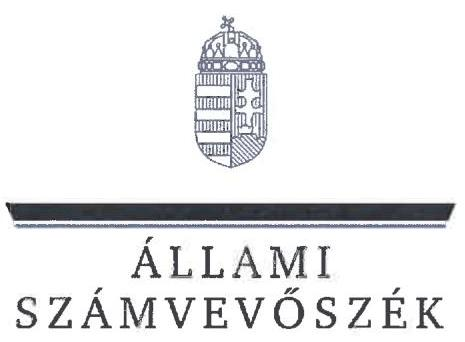
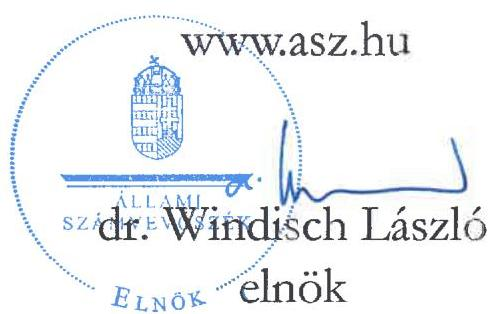

# JELENTÉS 

## A többségi állami tulajdonban lévő gazdasági társaságok felügyelőbizottságainak múködésére irányuló célzott ellenőrzés

Szociális és Gyermekvédelmi Főigazgatóság Társadalmi Infrastruktúra Fejlesztő Nonprofit Korlátolt Felelősségű Társaság
2024.

---

# JELENTÉS 

## A többségi állami tulajdonban lévő gazdasági társaságok felügyelőbizottságainak múködésére irányuló célzott ellenőrzés

Szociális és Gyermekvédelmi Főigazgatóság -
Társadalmi Infrastruktúra Fejlesztő Nonprofit Korlátolt Felelősségú Társaság
2024.

24154

---

# ELLENŐRZÉSI IGAZGATÓSÁG: 

## ÁLLAMI VAGYONGAZDÁLKODÁST ELLENŐRZŐ

IGAZGATÓSÁG

## ELLENŐRZÉSI IGAZGATÓ:

HERCZEGH ZSOLT ellenőrzési igazgató

## ELLENŐRZÉSVEZETŐ:

Jelentéseink az interneten a www.asz.hu címen olvashatók.

## DABISNÉ NYIKOS MELINDA ellenőrzésvezető

IKTATÓSZÁM: EL-4009-012/2024
TÉMASORSZÁM: 5
ELLENŐRZÉS-AZONOSÍTÓ SZÁM: V1064

---

# TARTALOMJEGYZÉK 

AZ ELLENŐRZÉS ALAPADATAI ..... 5
AZ ELLENŐRZÖTT SZERVEZETEK ..... 7
ÖSSZEFOGLALÁS ..... 8
AZ ELLENŐRZÉS FÓKUSZTERÜLETE ..... 9
MEGÁLLAPÍTÁSOK ..... 10
JAVASLATOK ..... 14
MELLÉKLETEK ..... 15
I. sz. melléklet: Értelmező szótár ..... 15
II. sz. melléklet: Az ellenőrzött szervezetek jegyzéke ..... 16
III. sz. melléklet: Ellenőrzési kritériumok ..... 17
FÜGGELÉK: ÉSZREVÉTELEK ..... 18
RÖVIDÍTÉSEK JEGYZÉKE ..... 19

---

.

---

# AZ ELLENŐRZÉS ALAPADATAI 

## AZ ELLENŐRZÉS CÉLJA

Az ellenőrzés célja annak értékelése volt, hogy a többségi állami tulajdonban lévő gazdasági társaság felügyelőbizottsága szabályszerűen múködött-e, valamint a felügyelőbizottság feladatait megfelelően látta-e el.

## AZ ELLENŐRZÉS TÍPUSA

Megfelelőségi ellenőrzés.

## AZ ELLENŐRZÖTT IDŐSZAK

A 2022. év.

## AZ ELLENŐRZÉS TÁRGYA

Az ellenőrzés tárgyát képezte a többségi állami tulajdonban lévő gazdasági társaság felügyelőbizottsága működésének szabályszerűsége, valamint feladatellátásának megfelelősége. Az egyszerűsített éves számviteli beszámoló elfogadással kapcsolatos felügyelőbizottsági feladatellátás ellenőrzése a 2021. évi egyszerűsített éves számviteli beszámolóra terjedt ki. Az ellenőrzés kiterjedt továbbá a felügyelőbizottsági tagok megválasztásának, a tagság megszűnésének szabályszerűségi ellenőrzésére, valamint a tulajdonosi joggyakorló által, a felügyelőbizottsággal szemben támasztott elvárások, meghatározott követelmények teljesítésének vizsgálatára és értékelésére is.

A felügyelőbizottság működése szabályszerűségének ellenőrzése magába foglalta a felügyelőbizottság tagjai megválasztásának, a felügyelőbizottsági tagság megszűnésének ellenőrzését mind a tulajdonosi joggyakorlónál, mind pedig az irányítása alatt álló többségi állami tulajdonban lévő gazdasági társaságnál, továbbá kiterjedt arra, hogy a tulajdonosi joggyakorló a felügyelőbizottság feladatellátását nyomon követte-e, értékelte-e.

A feladatellátás megfelelőségének ellenőrzése magába foglalta azt, hogy a felügyelőbizottság ténylegesen ellátta-e azt a funkcióját, amelyre létrehozták, a felügyelőbizottság a gazdasági társaság vezetését a tulajdonos érdekeinek megóvása céljából ellenőrizte-e, ezáltal támogatta-e a tulajdonosi joggyakorló ellenőrzési tevékenységének megvalósulását, továbbá működéséről beszámolt-e a tulajdonosi joggyakorló részére.

A felügyelőbizottság feladatellátása tekintetében ellenőrzésre került, hogy a felügyelőbizottság ellátta-e az ellenőrzési, véleményezési és beszámolási tevékenységét, illetve minden olyan tevékenységet, amelyet jogszabályok, belső szabályozók meghatároztak, vagy a tulajdonosi joggyakorló a felügyelőbizottság hatókörébe rendelt.

---

Az ellenőrzés kiterjedt minden olyan körülményre és adatra, amely az ÁSZ ${ }^{1}$ jogszabályban meghatározott feladatainak teljesítéséhez, valamint a program végrehajtása folyamán felmerült újabb összefüggések feltárásához szükséges volt.

# AZ ELLENŐRZÉS JOGALAPJA 

Az ellenőrzés jogszabályi alapját az ÁSZ tv. ${ }^{2} 1 . \S$ (3) bekezdés, az 5. § (4) bekezdés és a Vtv. ${ }^{3} 3 . \S$ (4) bekezdés előírásai képezték.

## AZ ELLENŐRZÉS MÓDSZERE

Az ellenőrzés végrehajtása a nemzetközi standardokat irányadónak tekintve az ellenőrzési program szempontjai, az ellenőrzött időszakban hatályos jogszabályok, az ellenőrzés szakmai szabályok és a jelen ellenőrzésre irányadó ÁSZ módszertan figyelembevételével történt. Az állami vagyon feletti tulajdonosi joggyakorlással kapcsolatos tevékenységek ellenőrzésének kötelezettségét a Vtv. és az ÁSZ tv. is előírja az ÁSZ számára.

Az ellenőrzési kérdések megválaszolásához szükséges bizonyítékok megszerzése az ellenőrzött szervezetek által rendelkezésre bocsátott dokumentumokra és adatokra alapozva, továbbá megfigyelés, összehasonlítás, interjú (kérdésfeltevés), valamint elemző eljárás útján valósult meg.

Az ellenőrzési bizonyítékként felhasználható adatforrások közé tartoztak egyrészt az ellenőrzéshez kért dokumentumok, adatforrások, másrészt adatforrás volt még minden - az ellenőrzés folyamán - feltárt, az ellenőrzés szempontjából információkat tartalmazó dokumentum.

Az ellenőrzés során mintavételre nem került sor. Az ellenőrzés lefolytatásához az ellenőrzött szervezetek az ÁSZ által kért dokumentumok, adatok, információk megküldésével és az ellenőrzés során szolgáltattak adatokat. Az ellenőrzéshez az ÁSZ felhasználhatta a nyilvánosan elérhető közhiteles adatokat is.

---

# AZ ELLENŐRZÖTT SZERVEZETEK 

## SZOCIÁLIS ÉS GYERMEKVÉDELMI FÓIGAZGATÓSÁG

Az SZGYF ${ }^{4}$-et 2012.12.10-én a 316/2012. (XI.13.) Korm. rendelettel ${ }^{5}$ alapították, székhelye Budapesten található, tevékenységét 20 telephelyen végezte. Az ellenőrzött időszakban az SZGYF az emberi erőforrások minisztere ${ }^{1}$, majd a belügyminiszter ${ }^{11}$ irányítása alá tartozott. Az SZGYF központi hivatalként működő központi költségvetési szerv, szakágazata 841215 Szociális és jóléti szolgáltatások igazgatása, a Bkr. ${ }^{6}$ hatálya alá tartozott.

Az SZGYF az 1/2018 (VI.25.) NVTNM rendelet ${ }^{7}$ 2. számú melléklet II. pont 2. alpontja, valamint az 1/2022. (V.26.) GFM ${ }^{8}$ rendelet 2. számú melléklet II. pont 2. alpontja alapján gyakorolta a kizárólagos állami tulajdonban álló TIFE Nonprofit Kft. ${ }^{9}$ felett a tulajdonosi jogokat az ellenőrzött időszakban.

## TÁrsadALMi InFRASTRUKTÚra Fejlesztő NONPROFIT Kft.

A TIFE Nonprofit Kft. 2009.05.13-án került bejegyzésre, főtevékenysége m.n.s. egyéb szakmai, tudományos, műszaki tevékenység volt, a Társaság tulajdonosa a Magyar Állam. A TIFE Nonprofit Kft. a 2022. évben az SZGYF vagyonkezelésében vagy feladatellátásához használatában lévő ingatlanokon az SZGYF által jóváhagyott műszaki tartalom szerinti felújítást, korszerűsítést célzó beruházásokat végezett. A beruházások megvalósítása érdekében a Társaság ellátta az előkészítési feladatokat (tervezés, tervfelülvizsgálat), lefolytatta a szükséges (köz)beszerzési eljárásokat (tervezői/műszaki ellenőri, és/vagy kivitelezői (köz)beszerzések), ellátta a projektmenedzsmenti, tervezési, műszaki ellenőri feladatokat. A TIFE Nonprofit Kft. gondoskodott továbbá a műszaki átadás-átvételi eljárások lebonyolításáról, közreműködött a használatbavételi engedélyezési eljárásokban, és az egyéb hatósági engedélyezési és közműszolgáltatások iránt szükséges eljárásokban.

A TIFE Nonprofit Kft. a 2021. üzleti évre vonatkozóan a Számv.tv. ${ }^{10}$ előírásainak megfelelően egyszerűsített éves számviteli beszámolót készített, mely könyvvizsgálói záradékkal hitelesítésre került. A Társaság 2021. évi saját tőke összege 326832 E Ft, mérlegfőösszege 1095944 E Ft, adózott eredménye 305636 E Ft, 2022. évi saját tőke összege 81770 E Ft, mérlegfőösszege 129830 E Ft, adózott eredménye - 245063 E Ft volt.

A $\mathrm{PM}^{11}$ közleménye ${ }^{12}$ (2022. év - I. rész A. Központi kormányzati alszektorba sorolt szervezetek) szerint a TIFE Nonprofit Kft. az ellenőrzött időszakban kormányzati szektorba sorolt egyéb szervezetnek minősült, ezért a Bkr. 1. § (2) bekezdés d) pontjában és 54/A. §-aiban rögzítettekkel összhangban a Bkr. 1-10. § előírásai vonatkoztak rá. A Társaság az ellenőrzött időszakban a Bkr. 10. §-a alapján belső ellenőrt foglalkoztatott. A 2022. üzleti évben a Tak.tv. ${ }^{13}$ 7/J. § (1) bekezdésben meghatározott mutatóértékek szerint nem tartozott a Gbkr. ${ }^{14}$ hatálya alá, annak alkalmazására a Tak.tv. 7/J. § (2) bekezdés alapján javaslatot sem a felügyelőbizottság, sem pedig a tulajdonosi joggyakorló nem tett.

A tulajdonosi ellenőrzés támogatására a TIFE Nonprofit Kft.-nél három tagból álló felügyelőbizottság került létrehozásra. Az ellenőrzött időszakban a felügyelőbizottsági tagok megbízása 2022.11.13-án lejárt, ezt követően a 2022.11.14.-2022.12.20. időszak között a TIFE Nonprofit Kft.-nél felügyelőbizottság nem működött. 2022.12.21-től három új felügyelőbizottsági tag került megbízásra.

[^0]
[^0]:    ${ }^{1}$ 316/2012. (XI.13.) Kormány rendelet alapján 2016.09.01-jétől 2022.06.30-ig
    ${ }^{11}$ 316/2012. (XI.13.) Kormány rendelet alapján 2022.07.01-től

---

# ÖSSZEFOGLALÁS 

A jogi személy tulajdonosi ellenőrzése a Ptk. ${ }^{15}$ rendelkezései alapján a felügyelőbizottság létrehozásán és működtetésén keresztül valósul meg, mely az állami tulajdonú gazdasági társaságok esetében azt jelenti, hogy a Magyar Állam nevében a tulajdonosi joggyakorlóként kijelölt szervezet bízza meg az állami tulajdonú gazdasági társaság felügyelőbizottságának tagjait. A felügyelőbizottság munkájának kiemelkedő szerepe van, mivel a gazdasági társaság vezetését a tulajdonos érdekeinek megóvása céljából ellenőrzi. A tulajdonosi joggyakorló a felügyelőbizottság tájékoztatásain, jelzésein keresztül értesül a gazdasági társaságot érintő müködési, gazdálkodási, valamint minden egyéb jelentős területet érintő kérdésről, és amennyiben szükséges, akkor lehetősége van a megfelelő időben történő beavatkozásra.

A TULAJDONOSI JOGGYAKORLÓ a felügyelőbizottság múködési kereteinek kialakítása és biztosítása során nem járt el szabályszerűen, az ellenőrzés során lényeges hiányosságok kerültek feltárásra. A tulajdonosi joggyakorló nem biztosította a felügyelőbizottság törvényi előírásoknak megfelelő működését, az ellenőrzött időszak egy részében - 2022.11.14.-2022.12.20. közötti időszakban - a TIFE Nonprofit Kft. felügyelőbizottsága nem múködött, mivel kijelölés hiányában felügyelőbizottsági tagokkal nem rendelkezett. A törvényi előírások ellenére a felügyelőbizottsági tagok vagyonnyilatkozatai nem álltak teljeskörűen a tulajdonosi joggyakorló rendelkezésére, továbbá egy felügyelőbizottsági tag vonatkozásában nemzetbiztonsági ellenőrzés nem került lefolytatásra. A jogszabályi rendelkezés ellenére több esetben nem állt a tulajdonosi joggyakorló rendelkezésére a felügyelőbizottsági tagok jogviszonyának kezdetekor a nemzetbiztonsági ellenőrzésről szóló biztonsági szakvélemény, illetve a felügyelőbizottsági tagok - nemzetbiztonsági ellenőrzést megelőző jogviszonyainak létrehozását jóváhagyó dokumentumok. A Felügyelőbizottsági ügyrendet a törvényi előírásban foglaltak ellenére a tulajdonosi joggyakorló nem fogadta el, a Felügyelőbizottsági ügyrend hiányát az SZGYF a felügyelőbizottság felé nem jelezte. A TIFE Nonprofit Kft. az Alapító okiratban ${ }_{1-3}$ foglaltak ellenére a 2022. évi üzleti tervét nem készítette el, a tulajdonosi joggyakorló a hiányzó üzleti tervvel kapcsolatban intézkedést nem tett, annak hiányát a felügyelőbizottság, valamint a Társaság ügyvezetője felé nem jelezte. A felügyelőbizottság feladatellátását az SZGYF a jogszabályi előírásokkal szemben nem követte nyomon. A TIFE Nonprofit Kft. 2021. évi egyszerűsített éves számviteli beszámolóját az SZGYF a jogszabályi előírásoknak megfelelően elfogadta, arról határozatot hozott.

A TIFE Nonprofit Kft. felügyelőbizottságának múködése és feladatellátása nem felelt meg a jogszabályokban, valamint a belső szabályozókban foglaltaknak. A felügyelőbizottság a jogszabályi előírás, valamint az Alapító okirata ${ }_{1-3}$ ellenére Felügyelőbizottsági ügyrenddel nem rendelkezett, a felügyelőbizottsági munkatervben meghatározott feladatokat nem teljeskörűen látta el. A jogszabályi előírással szemben a gazdasági társaság vezetését a jogi személy érdekeinek megóvása céljából nem ellenőrizte, a felügyelőbizottsági munkaterv az ügyvezető beszámoltatására feladatot nem tartalmazott, a felügyelőbizottság múködése a tulajdonosi joggyakorló ellenőrzési tevékenységét nem támogatta, funkcióját nem töltötte be. A felügyelőbizottság az ellenőrzött időszakban a felügyelőbizottsági üléseit nem az Alapító okirat ${ }_{1-3}$ szerinti időközönként folytatta le. A TIFE Nonprofit Kft. a jogszabályban foglalt közzétételi kötelezettségének honlapján a felügyelőbizottsági tagok vonatkozásában nem tett eleget.

---

# AZ ELLENŐRZÉS FÓKUSZTERÜLETE 

I. A többségi állami tulajdonban álló gazdasági társaság felügyelőbizottságának müködése, feladatellátása.

---

# 1. Szociális és Gyermekvédelmi Főigazgatóság 

Összegző megállapítás

Az SZGYF a felügyelőbizottság múködési kereteinek kialakítása, valamint a felügyelőbizottság múködésének biztosítása során a jogszabályi előírás ellenére nem járt el szabályszerűen. Az SZGYF a felügyelőbizottság feladatellátását a jogszabályban foglaltak ellenére nem követte nyomon. Az SZGYF a felügyelőbizottság feladatellátását nem értékelte.

Az SZGYF, mint tulajdonosi joggyakorló a felügyelőbizottság múködésével kapcsolatos szabályozási kereteket a TIFE Nonprofit Kft. Alapító okiratában ${ }_{1-3}{ }^{16}$, SZMSZ ${ }_{1-2}$-ében ${ }^{17}$, valamint Javadalmazási szabályzatában ${ }^{18}$ határozta meg. Az SZGYF SZMSZ ${ }_{1-2}$-e ${ }^{19}$ alapján a tulajdonosi joggyakorlásra vonatkozó hatás- és felelősségi körök külön szervezeti egységhez, személyhez nem kerültek telepítésre, a tulajdonosi joggyakorlás tekintetében az SZGYF főigazgatója volt a felelős. Az SZGYF SZMSZ ${ }_{1-2}$ szerint a Számviteli Osztály feladatkörébe tartozott az SZGYF tulajdonosi joggyakorlása alá tartozó gazdasági társaságok tekintetében az állami tulajdonú társasági részesedéshez kapcsolódó gazdálkodási adatszolgáltatási kötelezettségek teljesítése, továbbá a Vagyonkezelési Osztály feladatkörébe rendelték a társasági jogi feladatok ellátását, valamint az alapítói döntések előkészítését. Az SZGYF SZMSZ ${ }_{1-2}$-ben a felügyelőbizottság feladatellátásának nyomon követése, valamint a tulajdonosi joggyakorlása alá tartozó gazdasági társaságok adatszolgáltatási kötelezettségének menete, beszámolási eljárása a Bkr. 3. § e) pontja, valamint 10. $\S$-a ellenére nem került szabályozásra.
A TIFE Nonprofit Kft.-nél 2022.11.13-ig - a felügyelőbizottsági tagok megbízásának lejártáig - a Ptk. és a Tak.tv. rendelkezései alapján három tagú felügyelőbizottság került létrehozásra. Ezt követően az SZGYF nem gondoskodott a három tagú felügyelőbizottság határidőben történő létrehozásáról, mivel a 2022.11.14.-2022.12.20. közötti időszakban a felügyelőbizottság a Ptk. 3:121. § (1) bekezdése, a Tak.tv. 4. § (2) bekezdése, valamint az Alapító okirat ${ }_{3}$ 12. pontjában foglaltak ellenére nem működött. A felügyelőbizottság törvényes múködésének helyreállítására az SZGYF részéről a Ptk. és a Tak.tv. rendelkezéseinek megfelelően 2022.12.21-én került sor.
Az Alapító okirat ${ }_{1-3}$ előírásainak megfelelően a felügyelőbizottsági tagok összeférhetetlenségi nyilatkozatai a tulajdonosi joggyakorló rendelkezésére álltak.
Az 1995. évi CXXV. tv. ${ }^{20} 74 . \S$ ij) pontban foglaltak ellenére az ellenőrzött időszakban a TIFE Nonprofit Kft. egy felügyelőbizottsági tagjára nemzetbiztonsági ellenőrzés nem került lefolytatásra, a tagság idejére vonatkozóan nemzetbiztonsági szakvéleménnyel nem rendelkezett. Továbbá öt esetben nem állt a tulajdonosi joggyakorló rendelkezésére a felügyelőbizottsági tagok jogviszonyának kezdetekor a nemzetbiztonsági ellenőrzésről szóló biztonsági szakvélemény, illetve az 1995. évi CXXV. tv. 71. § (2) bekezdés a) pont és (3) bekezdés alapján a felügyelőbizottsági tagok - nemzetbiztonsági ellenőrzést megelőző - jogviszonyainak létrehozását jóváhagyó dokumentum.
A 2007. évi CLII. tv. ${ }^{21}$ 4. § b) pontjában foglaltak ellenére a TIFE Nonprofit Kft. Alapító okirata ${ }_{1-3}$ nem tartalmazta a felügyelőbizottsági tagokra vonatkozó vagyonnyilatkozat-tételi kötelezettséget tartalmazó

---

előírásokat. A feltárt hiányosság a felügyelőbizottság múködését nem befolyásolta, mivel a felügyelőbizottsági tagokra vonatkozó vagyonnyilatkozat-tétteli kötelezettség szabályai a Társaság SZMSZ ${ }_{1-2}$-ében, valamint a Vagyonnyilatkozat-tételi szabályzatban ${ }^{22}$ rögzítésre kerültek.
A 2007. évi CLII. tv. 3. $\int$ (3) bekezdés c) pontjában foglaltak ellenére egy esetben nem állt az SZGYF rendelkezésére a felügyelőbizottsági tag vagyonnyilatkozata. Továbbá a tulajdonosi joggyakorló két felügyelőbizottsági tag vonatkozásában a 2007. évi CLII. tv. 5. § (1) bekezdés b) pontban foglalt, a jogviszony megszűnését követő 15 napon belüli záró vagyonnyilatkozattal sem rendelkezett. Ebből adódóan a 2007. évi CLII. törvény 13. $\int$-ban meghatározott rendelkezés ellenére, a vagyonnyilatkozatok őrzéséért felelős SZGYF a vagyonnyilatkozat-tételi kötelezettség teljesítését nem ellenőrizte.
A TIFE Nonprofit Kft. felügyelőbizottsága a Ptk. 3:122. § (3) bekezdése, valamint az Alapító okirat ${ }_{1-3} 12$. pontjában foglaltak ellenére az SZGYF által jóváhagyott Felügyelőbizottsági ügyrenddel nem rendelkezett. A tulajdonosi joggyakorló a Felügyelőbizottsági ügyrend hiányát a felügyelőbizottság részére nem jelezte. A Felügyelőbizottsági ügyrend a felügyelőbizottság részéről 2023-ban elkészítésre került, melyet a tulajdonosi joggyakorló a Ptk. előírásának megfelelően jóváhagyott.
A Tak.tv. előírásának megfelelve a TIFE Nonprofit Kft. ügyvezetője a felügyelőbizottság egyetértésével tett javaslatot az SZGYF részére a könyvvizsgáló személyével kapcsolatban.
Az Alapító okirat ${ }_{1-3}$ 9. pontja szerint az alapítói döntéshozatalt döntéselőkészítő tervezet készítésével a tulajdonosi joggyakorló kezdeményezi, melyet írásban küld meg az ügyvezető és a felügyelőbizottság részére, ennek ellenére a döntéselőkészítés gyakorlata az ellenőrzött időszakban az Alapító okirat ${ }_{1-3} 9$. pontjában, valamint az SZGYF SZMSZ ${ }_{1}$ VI./2./8. pontban és az SZGYF SZMSZ ${ }_{2}$ VI./1./8. pontban foglaltakkal nem volt összhangban, mivel a döntéselőkészítés dokumentációit minden esetben a TIFE Nonprofit Kft. ügyvezetője készítette el. A döntéselőkészítés dokumentációi az SZGYF részére - az alapítói határozatok meghozatala céljából - a felügyelőbizottság jóváhagyását követően, az ügyvezető által kerültek beterjesztésre. A Ptk. előírása ezáltal nem sérült, mivel a felügyelőbizottság a döntéshozó szerv elé kerülő előterjesztéseket jóváhagyta.
Az SZGYF a Ptk. előírásainak megfelelően a felügyelőbizottság írásbeli határozatának birtokában döntött a 2021. évi egyszerűsített éves számviteli beszámolóról.
Az Alapítói okirat ${ }_{1-3}$ 9. pontja alapján az SZGYF kizárólagos hatáskörébe tartozott a TIFE Nonprofit Kft. éves üzleti tervének elfogadása, azonban a Társaság a 2022. évre vonatkozóan üzleti tervet nem készített, annak hiányát az SZGYF sem a felügyelőbizottság, sem pedig a TIFE Nonprofit Kft. ügyvezetője felé nem jelezte, a 2022. évi üzleti terv alapítói elfogadására nem került sor. Üzleti terv hiányában nem kerültek meghatározásra a tulajdonolt társaság múködésének irányai, a TIFE Nonprofit Kft. gazdálkodásának elvárt céljai, ezáltal nem kerültek biztosításra a Bkr. 3. § e) pont és 10 . § rendelkezései ellenére a nyomon követés feltételei sem.
A fentiek alapján a Bkr. 3. § e) pont és 10 . § rendelkezései ellenére a felügyelőbizottság feladatellátásának nyomon követésére az ellenőrzött időszakban nem került sor, a felügyelőbizottságot a feladatellátásáról az SZGYF nem számoltatta be.
A tulajdonosi joggyakorló a felügyelőbizottsági tagok feladatellátását nem értékelte.

---

# 2. TIFE Nonprofit Kft. felügyelőbizottsága 

Összegző megállapítás

A TIFE Nonprofit Kft. felügyelőbizottságának múködése és feladatellátása nem felelt meg a jogszabályokban, valamint a belső szabályozókban foglaltaknak. A felügyelőbizottság Felügyelőbizottsági ügyrenddel nem rendelkezett, a felügyelőbizottsági munkatervben meghatározott feladatokat nem teljeskörűen látta el, a gazdasági társaság vezetését a jogi személy érdekeinek megóvása céljából nem ellenőrizte, a tulajdonosi joggyakorló ellenőrzési tevékenységét nem támogatta, funkcióját nem töltötte be. A felügyelőbizottság az üléseit nem az Alapító okirat ${ }_{1-3}$ szerinti időközönként tartotta meg.

A felügyelőbizottsági tagok a felügyelőbizottság elnökét a Ptk. és az Alapító okirat ${ }_{1-3}$ előírásainak megfelelve maguk közül választották meg.
A felügyelőbizottsági tagok díjazására a Tak.tv., valamint a Javadalmazási szabályzat előírásai szerint került sor. Az ellenőrzött időszakban a felügyelőbizottság a Ptk. 3:122. § (3) bekezdése és az Alapító okirat ${ }_{1-3} 12$. pontjában foglaltak ellenére Felügyelőbizottsági ügyrenddel ${ }^{23}$ nem rendelkezett - az ellenörzés során rendelkezésre bocsátott Felügyelőbizottsági ügyrend megnevezésü dokumentum aláírásra nem került, batályosságra vonatkozó rendelkezést nem tartalmazott, a tulajdonosi joggyakorló által nem került elfogadásra, abban a korábbi tulajdonosi joggyakorló, az $M N 1^{-} \mathrm{Zrt} .^{24}$ került megjelölésre -. A TIFE Nonprofit Kft. felügyelőbizottsága a Felügyelőbizottsági ügyrend ${ }^{25}$ elkészítésének hiányát a 2023. évben pótolta, melyet az SZGYF a Ptk. előírásának megfelelően jóváhagyott.
A felügyelőbizottság a 2022. évre vonatkozóan - felügyelőbizottsági határozatban elfogadott felügyelőbizottsági munkatervet ${ }^{26}$ készített. Az abban rögzített feladatok azonban az ellenőrzött időszak vonatkozásában nem kerültek teljeskörűen ellátásra, mivel a felügyelőbizottság a Ptk. 3:27. § (1) bekezdés ellenére a TIFE Nonprofit Kft. 2022. évi üzleti tervének hiányára intézkedést nem tett, a Társaság ügyvezetője részére a mulasztást nem jelezte.
A felügyelőbizottság a belső ellenőrzés éves munkatervét a Tak.tv. előírásának megfelelően elfogadta. A felügyelőbizottság a 2022. I-II. negyedévben készített belső ellenőrzési jelentést a felügyelőbizottsági munkatervnek megfelelően megtárgyalta, azonban a TIFE Nonprofit Kft. által megtett intézkedésekről szóló beszámolót határozatával már nem fogadta el.
A Ptk. 3:26. § (1) bekezdés alapján a felügyelőbizottság az ügyvezetést a jogi személy érdekeinek megóvása céljából ellenőrzi, ennek ellenére a felügyelőbizottsági munkaterv a TIFE Nonprofit Kft. ügyvezetőjének a beszámoltatására nem terjedt ki. Az ellenőrzött időszakban egy felügyelőbizottsági ülésről szóló jegyzőkönyv készült, amely tartalmazta a 2021. évi egyszerűsített éves számviteli beszámoló elfogadásának felügyelőbizottsági véleményezését, azonban a jegyzőkönyv tartalma alapján a TIFE Nonprofit Kft. ügyvezetője a Társaság 2021. évi, illetve a 2022. évi időarányos tevékenységéről nem számolt be. Az ellenőrzés részére megküldött további dokumentumok szerint a felügyelőbizottság az ügyvezetőt a Társaság 2022. évi tevékenységéről dokumentáltan nem számoltatta be.

---

Az Alapító okirat ${ }_{1-3}$ 12. pontja értelmében a felügyelőbizottságnak szükség szerint, de legalább negyedévente kellett üléseznie. A felügyelőbizottság 2022. I. félévben három alkalommal élt írásbeli döntéshozatallal, figyelemmel az 502/2020. (XI. 16.) Korm. rendelet ${ }^{27}$ 6. $\$ (1) bekezdésében foglaltakra, továbbá egy esetben ülésezett. A felügyelőbizottsági ülést az Alapító okirat ${ }_{1} 12$. pontjában előírtak ellenére nem a felügyelőbizottság elnöke hívta össze. 2022. II. félévben a felügyelőbizottság egy alkalommal írásban hozott döntést, ülés megtartására nem került sor ezen időszak alatt, így a felügyelőbizottság az Alapító okirat ${ }_{1-3} 12$. pontjában foglalt, az ülések megtartására vonatkozó szabálynak - figyelemmel arra is, hogy az 502/2020. (XI. 16.) Korm. rendelet 6. $\$ \$$ (1) bekezdése 2022.05.31-én hatályát vesztette - 2022. II. félévében nem tett eleget.
A Tak.tv. 2. $\$$ (1) bekezdés d) pontjában foglalt előírás ellenére a felügyelőbizottsággal kapcsolatos adatok közzétételére nem került sor a TIFE Nonprofit Kft. honlapján.

---

# JAVASLATOK 

Az ÁSZ tv. 33. § (1) bekezdésében foglaltak értelmében az ellenőrzött szervezet vezetője köteles a jelentésben foglalt megállapításokhoz kapcsolódó intézkedési tervet összeállítani és azt a jelentés kézhezvételétől számított 30 napon belül az ÁSZ részére megküldeni. Amennyiben az ellenőrzött szervezet vezetője nem küldi meg határidőben az intézkedési tervet, vagy továbbra sem elfogadható intézkedési tervet küld, az Állami Számvevőszék elnöke az ÁSZ tv. 33. § (3) bekezdése a) és b) pontjaiban foglaltakat érvényesítheti.

## SZGYF TULAJDONOSI JOGGYAKORLÓ RÉSZÉRE

1. $\quad$ Tegyen intézkedést annak érdekében, hogy a jövőben a Ptk. 3:121. § (1), a Tak.tv. 4. § (2) bekezdésének, valamint az Alapitó okirat ${ }_{1-3} 12$. pontjának megfelelően müködjön a felügyelőbizottság.
2. $\quad$ Tegyen intézkedést annak érdekében, hogy a jövőben a 2007. évi CLII. törvény 13. §-ban meghatározott rendelkezésnek megfelelően kerüljön sor a vagyonnyilatkozat-tételi kötelezettség teljesítésének ellenőrzésére.
3. $\quad$ Tegyen intézkedést annak érdekében, hogy a jövőben az 1995. évi CXXV. tv. 74. § ij) pontja alapján álljon rendelkezésre a felügyelőbizottsági tagok jogviszonyának kezdetekor a nemzetbiztonsági ellenőrzésről szóló biztonsági szakvélemény, illetve - szükség szerint - az 1995. évi CXXV. tv. 71. § (2) bekezdés a) pont és (3) bekezdés alapján a felügyelőbizottsági tagok - nemzetbiztonsági ellenőrzést megelőző - jogviszonyainak létrehozását jóváhagyó dokumentum.
4. Gondoskodjon róla, hogy a jövőben az Alapitó okirat ${ }_{1-3} 9$. pontjának megfelelően a Társaság üzleti terve elkészítésre, valamint a felügyelőbizottság és az SZGYF által elfogadásra kerüljön.
5. Intézkedjen, hogy a TIFE Nonprofit Kft. alapítói döntéshozatalai a jövőben az Alapitó okirat ${ }_{1-3} 9$. pontjában foglaltak szerint valósuljanak meg.
6. $\quad$ Tegyen intézkedést annak érdekében, hogy a felügyelőbizottság elnöke az Alapitó okirat ${ }_{1-3} 12$. pontjában foglaltaknak megfelelően tartsa be a felügyelőbizottsági ülések összehívására vonatkozó előírásokat.
7. $\quad$ Tegyen intézkedést annak érdekében, hogy a felügyelőbizottság feladatellátását az SZGYF a Bkr. 3. § e) pont, valamint a 10. § előírásainak megfelelően nyomon kövesse.
8. Intézkedjen, hogy a Ptk. 3:26. § (1) bekezdésnek való megfelelés érdekében a jövőben a felügyelőbizottság a TIFE Nonprofit Kft. ügyvezetőjét a Társaság tevékenységéről számoltassa be.

## TIFE NONPROFIT KFT. ÜGYVEZETŐJE RÉSZÉRE

1. Intézkedjen, hogy a TIFE Nonprofit Kft. a Tak.tv. 2. § (1) bekezdés d) pontja alapján a felügyelőbizottsági tagokra vonatkozó közzétételi kötelezettségének a Társaság honlapján eleget tegyen.

---

# MELLÉKLETEK 

## I. SZ. MELLÉKLET: ÉRTELMEZŐ SZÓTÁR

gazdasági társaság

többségi állami tulajdon
többségi befolyás
tulajdonosi joggyakorló
felügyelőbizottság

A gazdasági társaságok üzletszerű közös gazdasági tevékenység folytatására, a tagok vagyoni hozzájárulásával létrehozott, jogi személyiséggel rendelkező vállalkozások, amelyekben a tagok a nyereségből közösen részesednek, és a veszteséget közösen viselik.
(Ptk. 3:88. § (1) bekezdése)
Az állam tulajdonában lévő tagsági jogviszonyt megtestesítő értékpapír, illetve az állam tulajdonában lévő egyéb társasági részesedés, amennyiben a társaságban a Magyar Állam közvetlenül vagy közvetetten a szavazatok több mint felével rendelkezik.
(ÁSZ definíció a Vtv. ${ }^{28}$ 1. § (2) bekezdés c) pontja és a Ptk. 8:2. § (1), (3)-(4) bekezdései alapján)
Olyan kapcsolat, amelynek révén a befolyással rendelkező egy jogi személyben a szavazatok több mint ötven százalékával - közvetlenül vagy a jogi személyben szavazati joggal rendelkező más jogi személy (köztes vállalkozás) szavazati jogán keresztül - rendelkezik, azzal, hogy a közvetett módon való rendelkezés meghatározása során a jogi személyben szavazati joggal rendelkező más jogi személyt (köztes vállalkozást) megillető szavazati hányadot meg kell szorozni a befolyással rendelkezőnek a köztes vállalkozásban, illetve vállalkozásokban fennálló szavazati hányadával, ha azonban a köztes vállalkozásban fennálló szavazatainak hányada az ötven százalékot meghaladja, akkor azt egy egészként kell figyelembe venni. A befolyás számításánál nem kell figyelembe venni a huszonöt százalékot el nem érő közvetett befolyást
(Taktv. 1. § b) pont)
Aki a nemzeti vagyon felett az államot vagy a helyi önkormányzatot megillető tulajdonosi jogok és kötelezettségek összességének gyakorlására jogosult.
(Nvtv. ${ }^{29}$ 3. § (1) bekezdés 17. pontja)
A gazdasági társaságnál a jogi személy érdekeinek megóvása céljából múködő - legalább - három tagból álló ellenőrző testület.
(ÁSZ definíció a Ptk. 3:26. § (1) bekezdés alapján)

---

II. SZ. MELLÉKLET: AZ ELLENŐRZÖTT SZERVEZETEK JEGYZÉKE

| ELLENŐRZÖTT SZERVEZET NEVE | SZEREPE |
| :-- | :-- |
| 1. SZGYF | Tulajdonosi joggyakorló |
| 2. TIFE Nonprofit Kft. | Többségi tulajdonban álló gazdasági társaság |

---

# FOKUSZTERÜLET 

1. A többségi állami tulajdonban álló gazdasági társaság felügyelőbizottságának múködése, feladatellátása.

## ELLENŐRZÉSI KRITÉRIUMOK

Tak.tv. 2. $\$ (1) bek., 4. $\$$ (1)-(3) bek., 5. $\$$ (3)-(4) bek., 6. $\$$.
(2)-(4) bek., 7/J. $\$(2),(5)-(7)$ bek.

Ptk. 3:22. $\$, 3: 25 . \$, 3: 26 . \$, 3: 27 . \$, 3: 28 . \$, 3:36. $\$ (3)
bek., 3:38. $\$(1), 3: 111 . \$, 3:115. $\$, 3: 119 . \$, 3: 120 . \$, 3:121. $\$, 3: 122 . \$, 3: 123 . \$, 3: 124 . \$, 3:125. $\$, 3: 126 . \$, 3:127. $\$, 3: 128 . \$, 3: 131 . \$(3) bek.
2007. évi CLII. törvény 3. $\$ (3) bek. c) pont, 5. $\$, 6 . \$(2) bek., 7. $\$, 13 . \$$

1995. évi CXXV. törvény 71. $\$ (2)-(3), 74 . \$ . \mathrm{ij})$ pont Mt. ${ }^{30} 208 . \$$

Bkr. 1. $\$-10 . \$
502/2020. (XI. 16.) Korm. rendelet 6. $\$$

a gazdasági társaság Alapító okirata, Szervezeti és Müködési Szabályzata
a Felügyelőbizottság ügyrendje, munkaterve
belső szabályzatok, irányítási eszközök
tulajdonosi joggyakorló írásbeli elvárásai

---

# FÜGGELÉK: ÉSZREVÉTELEK 

A jelentéstervezetet a Számvevőszék 15 napos észrevételezésre megküldte az ellenőrzött szervezet vezetőjének az ÁSZ tv. 29. §* (1) bekezdése előírásának megfelelően.

Az ellenőrzött szervezetek vezetői a jelentéstervezet megállapításaira észrevételt nem tettek.

[^0]
[^0]:    * 29. § (1) Az Állami Számvevőszék az ellenőrzési megállapításait megküldi az ellenőrzött szervezet vezetőjének vagy az általa megbízott személynek, és annak, akinek személyes felelősségét állapította meg.
    (2) Az ellenőrzött szervezet vezetője és a felelősként megjelölt személy az ellenőrzés megállapításaira tizenöt napon belül írásban észrevételt tehet.
    (3) Az Állami Számvevőszék az észrevételre a beérkezésétől számított harminc napon belül írásban válaszol. A figyelembe nem vett észrevételeket köteles a jelentésben feltüntetni, és megindokolni, hogy azokat miért nem fogadta el.

---

# RÖVIDÍTÉSEK JEGYZÉKE 

${ }^{1}$ ÁSZ
${ }^{2}$ ÁSZ tv.
${ }^{3}$ Vtv.
${ }^{4}$ SZGYF
${ }^{5}$ 316/2012. (XI.13.) Korm. rendelet
${ }^{6}$ Bkr.
${ }^{7}$ 1/2018 (VI.25.) NVTNM rendelet
${ }^{8} 1 / 2022$. (V.26.) GFM rendelet
${ }^{9}$ TIFE Nonprofit Kft./Társaság/ többségi állami tulajdonban lévő gazdasági társaság
${ }^{10}$ Számv.tv.
${ }^{11} \mathrm{PM}$
${ }^{12}$ PM közlemény
${ }^{13}$ Tak.tv.
${ }^{14}$ Gbkr.
${ }^{15}$ Ptk.
${ }^{16}$ Alapító okirat ${ }_{1-3}$
${ }^{17}$ SZMSZ $_{1-2}$
${ }^{18}$ Javadalmazási szabályzat
${ }^{19}$ SZGYF SZMSZ $_{1-2}$
${ }^{20}$ 1995. évi CXXV. tv.
${ }^{21}$ 2007. évi CLII. tv.

Állami Számvevőszék
2011. évi LXVI. törvény az Állami Számvevőszékről
2007. évi CVI. törvény az állami vagyonról

Szociális és Gyermekvédelmi Főigazgatóság
316/2012. (XI.13.) Korm. rendelet a Szociális és Gyermekvédelmi Főigazgatóságról
370/2011. (XII. 31.) Korm. rendelet a költségvetési szervek belső kontrollrendszeréről és belső ellenőrzéséről
1/2018. (VI. 25.) NVTNM rendelet az egyes állami tulajdonban álló gazdasági társaságok felett az államot megillető tulajdonosi jogok és kötelezettségek összességét gyakorló személyek kijelöléséről
1/2022. (V. 26.) GFM rendelet az egyes állami tulajdonban álló gazdasági társaságok felett az államot megillető tulajdonosi jogok és kötelezettségek összességét gyakorló személyek kijelöléséről
Társadalmi Infrastruktúra Fejlesztő Nonprofit Korlátolt Felelősségű Társaság
2000. évi C. törvény a számvitelről

Pénzügyminisztérium
A Magyar Közlöny mellékleteként 2022. november 30-án megjelent Hivatalos Értesítő 68. szám - A pénzügyminiszter közleménye a kormányzati szektorba sorolt egyéb szervezetekről
2009. évi CXXII. törvény a köztulajdonban álló gazdasági társaságok takarékosabb müködéséről
339/2019. (XII. 23.) Korm. rendelet a köztulajdonban álló gazdasági társaságok belső kontrollrendszeréről
2013. évi V. törvény a Polgári Törvénykönyvről
Alapító okirat ${ }_{1}$ : Társadalmi Infrastruktúra Fejlesztő Nonprofit Korlátolt Felelősségű Társaság 2021. június 8-i módosításokat is tartalmazó egységes szerkezetbe foglalt Alapító okirata (hatályos 2021.06.08-től 2022.10.06-ig)
Alapító okirat ${ }_{2}$ : Társadalmi Infrastruktúra Fejlesztő Nonprofit Korlátolt Felelősségű Társaság 2022. október 7-i módosításokat is tartalmazó egységes szerkezetbe foglalt Alapító okirata (hatályos 2022.10.07-től 2022.12.20-ig)
Alapító okirat ${ }_{3}$ : Társadalmi Infrastruktúra Fejlesztő Nonprofit Korlátolt Felelősségű Társaság 2022. december 21-i módosításokat is tartalmazó egységes szerkezetbe foglalt Alapító okirata (hatályos 2022.12.21-től)
SZMSZ ${ }_{1}$ : A tulajdonosi joggyakorló által az 3/2018. (V.29). Alapítói határozattal elfogadott TIFE Nonprofit Kft. Szervezeti és müködési szabályzata, hatályos: 2018.05.29. napjától

SZMSZ ${ }_{2}$ : A tulajdonosi joggyakorló által az 4/2022. (05.30). Alapítói határozattal elfogadott TIFE Nonprofit Kft. Szervezeti és müködési szabályzata, hatályos. 2022.05.30. napjától

Társadalmi Infrastruktúra Fejlesztő Nonprofit Korlátolt Felelősségű Társaság Javadalmazási Szabályzata (hatályos 2017.07.01-jétől)
SZGYF SZMSZ ${ }_{1}$ : 2/2021. (II.26.) EMMI utasítás a Szociális és Gyermekvédelmi Főigazgatóság Szervezeti és Müködési Szabályzatáról (hatályos 2021.02.27-től 2022.03.25-ig)

SZGYF SZMSZ ${ }_{2}$ : 2/2021. (II.26.) EMMI utasítás a Szociális és Gyermekvédelmi Főigazgatóság Szervezeti és Müködési Szabályzatáról egységes szerkezetben (hatályos 2022.03.26-től 2023.02.15-ig)
1995. évi CXXV. törvény a nemzetbiztonsági szolgálatokról
2007. évi CLII. törvény egyes vagyonnyilatkozat-tételi kötelezettségekről

---

${ }^{22}$ Vagyonnyilatkozat-tételi szabályzat
${ }^{23}$ Felügyelőbizottsági ügyrend
${ }^{24}$ MNV Zrt.
${ }^{25}$ 2023. évi Felügyelőbizottsági ügyrend
${ }^{26}$ felügyelőbizottsági munkaterv
${ }^{27}$ 502/2020. (XI. 16.) Korm. rendelet
${ }^{28}$ Vtv.
${ }^{29}$ Nvtv.
${ }^{30} \mathrm{Mt}$.

Társadalmi Infrastruktúra Fejlesztő Nonprofit Korlátolt Felelősségű Társaság Vagyonnyilatkozat-tételi kötelezettség rendjéről szóló szabályzata (hatályos 2022.02.16-tól)

Társadalmi Infrastruktúra Fejlesztő Nonprofit Kft. felügyelőbizottság ügyrendje (hatályosság nem szerepel rajta, nem aláírt, tulajdonosi joggyakorló által nem elfogadott dokumentum), SZGYF által rendelkezésre bocsátott ugyanezen megnevezésű dokumentuma hatálytalan jelzővel ellátott
Magyar Nemzeti Vagyonkezelő Zrt.
1/2023. (II. 9.) számú tulajdonosi határozattal jóváhagyott, a TIFE Nonprofit Kft. Felügyelőbizottsági ügyrend
2022.01.31-én az 1/2022. sz. határozattal elfogadott 2022. évi felügyelőbizottsági munkaterv
502/2020. (XI. 16.) Korm. rendelet a veszélyhelyzet során a személy- és vagyonegyesítő szervezetek működésére vonatkozó eltérő rendelkezések újbóli bevezetéséről
2007. évi CVI. törvény az állami vagyonról
2011. évi CXCVI. törvény a nemzeti vagyonról
2012. évi I. törvény a munka törvénykönyvéről

---

1052 Budapest, Apáczai Csere János u. 10. | 1364 Budapest 4., Pf. 54
www.asz.hu | szamvevoszek@asz.hu
telefon: +36 14849100