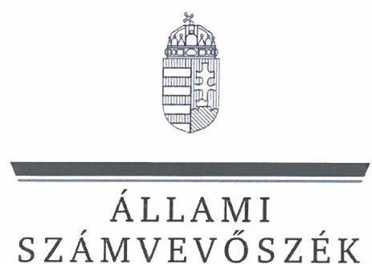

# JELENTÉS 

## A többségi állami tulajdonban lévő gazdasági társaságok felügyelőbizottságainak működésére irányuló célzott ellenőrzés

Büntetés-végrehajtás Országos Parancsnoksága -
DUNA-MIX Ipari Kereskedelmi Szolgáltató Korlátolt Felelősségű Társaság
2024.

---

ÁLLAMI
SZÁMVEVŐSZÉK

# JELENTÉS 

## A többségi állami tulajdonban lévő gazdasági társaságok felügyelőbizottságainak működésére irányuló célzott ellenőrzés

Büntetés-végrehajtás Országos Parancsnoksága -
DUNA-MIX Ipari Kereskedelmi Szolgáltató Korlátolt Felelősségű Társaság
2024.

---

# ELLENŐRZÉSI IGAZGATÓSÁG: 

## ÁLLAMI VAGYONGAZDÁLKODÁST ELLENŐRZŐ

IGAZGATÓSÁG

## ELLENŐRZÉSI IGAZGATÓ:

HERCZEGH ZSOLT ellenőrzési igazgató

## ELLENŐRZÉSVEZETŐ:

Jelentéseink az interneten a www.asz.hu címen olvashatók.

## DABISNÉ NYIKOS MELINDA ellenőrzésvezető

IKTATÓSZÁM: EL-4009-013/2024
TÉMASZÁM: 5
ELLENŐRZÉS-AZONOSÍTÓ SZÁM: V1064

---

# TARTALOMJEGYZÉK 

AZ ELLENŐRZÉS ALAPADATAI ..... 5
AZ ELLENŐRZÖTT SZERVEZETEK ..... 7
ÖSSZEFOGLALÁS ..... 8
AZ ELLENŐRZÉS FÓKUSZTERÜLETE ..... 9
MEGÁLLAPÍTÁSOK ..... 10
JAVASLATOK ..... 13
MELLÉKLETEK ..... 14
I. sz. melléklet: Értelmező szótár ..... 14
II. sz. melléklet: Az ellenőrzött szervezetek jegyzéke ..... 15
III. sz. melléklet: Ellenőrzési kritériumok ..... 16
FÜGGELÉK: ÉSZREVÉTELEK ..... 17
RÖVIDÍTÉSEK JEGYZÉKE ..... 18

---

.

---

# AZ ELLENŐRZÉS ALAPADATAI 

## AZ ELLENŐRZÉS CÉLJA

Az ellenőrzés célja annak értékelése volt, hogy a többségi állami tulajdonban lévő gazdasági társaság felügyelőbizottsága szabályszerűen működött-e, valamint a felügyelőbizottság feladatait megfelelően látta-e el.

## AZ ELLENŐRZÉS TÍPUSA

Megfelelősségi ellenőrzés.

## AZ ELLENŐRZÖTT IDŐSZAK

A 2022. év.

## AZ ELLENŐRZÉS TÁRGYA

Az ellenőrzés tárgyát képezte a többségi állami tulajdonban lévő gazdasági társaság felügyelőbizottsága működésének szabályszerűsége, valamint feladatellátásának megfelelősége. Az éves számviteli beszámoló elfogadással kapcsolatos felügyelőbizottsági feladatellátás ellenőrzése a 2021. évi éves számviteli beszámolóra terjedt ki. Az ellenőrzés kiterjedt továbbá a felügyelőbizottsági tagok megválasztásának, a tagság megszűnésének szabályszerűségi ellenőrzésére, valamint a tulajdonosi joggyakorló által, a felügyelőbizottsággal szemben támasztott elvárások, meghatározott követelmények teljesítésének vizsgálatára és értékelésére is.

A felügyelőbizottság működése szabályszerűségének ellenőrzése magába foglalta a felügyelőbizottság tagjai megválasztásának, a felügyelőbizottsági tagság megszűnésének ellenőrzését mind a tulajdonosi joggyakorlónál, mind pedig az irányítása alatt álló többségi állami tulajdonban lévő gazdasági társaságnál, továbbá kiterjedt arra, hogy a tulajdonosi joggyakorló a felügyelőbizottság feladatellátását nyomon követte-e, értékelte-e.

A feladatellátás megfelelőségének ellenőrzése magába foglalta azt, hogy a felügyelőbizottság ténylegesen ellátta-e azt a funkcióját, amelyre létrehozták, a felügyelőbizottság a gazdasági társaság vezetését a tulajdonos érdekeinek megóvása céljából ellenőrizte-e, ezáltal támogatta-e a tulajdonosi joggyakorló ellenőrzési tevékenységének megvalósulását, továbbá működéséről beszámolt-e a tulajdonosi joggyakorló részére.

A felügyelőbizottság feladatellátása tekintetében ellenőrzésre került, hogy a felügyelőbizottság ellátta-e az ellenőrzési, véleményezési és beszámolási tevékenységét, illetve minden olyan tevékenységet, amelyet jogszabályok, belső szabályozók meghatároztak, vagy a tulajdonosi joggyakorló a felügyelőbizottság hatáskörébe rendelt.

---

Az ellenőrzés kiterjedt minden olyan körülményre és adatra, amely az ÁSZ ${ }^{1}$ jogszabályban meghatározott feladatainak teljesítéséhez, valamint a program végrehajtása folyamán felmerült újabb összefüggések feltárásához szükséges volt.

# AZ ELLENŐRZÉS JOGALAPJA 

Az ellenőrzés jogszabályi alapját az ÁSZ tv. ${ }^{2} 1 . \S$ (3) bekezdés, az 5. § (4) bekezdés és a Vtv. ${ }^{3} 3 . \S$ (4) bekezdés előírásai képezték.

## AZ ELLENŐRZÉS MÓDSZERE

Az ellenőrzés végrehajtása a nemzetközi standardokat irányadónak tekintve az ellenőrzési program szempontjai, az ellenőrzött időszakban hatályos jogszabályok, az ellenőrzés szakmai szabályok és a jelen ellenőrzésre irányadó ÁSZ módszertan figyelembevételével történt. Az állami vagyon feletti tulajdonosi joggyakorlással kapcsolatos tevékenységek ellenőrzésének kötelezettségét a Vtv. és az ÁSZ tv. is előírja az ÁSZ számára.

Az ellenőrzési kérdések megválaszolásához szükséges bizonyítékok megszerzése az ellenőrzött szervezetek által rendelkezésre bocsátott dokumentumokra és adatokra alapozva, továbbá megfigyelés, összehasonlítás, interjú (kérdésfeltevés), valamint elemző eljárás útján valósult meg.

Az ellenőrzési bizonyítékként felhasználható adatforrások közé tartoztak egyrészt az ellenőrzéshez kért dokumentumok, adatforrások, másrészt adatforrás volt még minden - az ellenőrzés folyamán - feltárt, az ellenőrzés szempontjából információkat tartalmazó dokumentum.

Az ellenőrzés során mintavételre nem került sor. Az ellenőrzés lefolytatásához az ellenőrzött szervezetek az ÁSZ által kért dokumentumok, adatok, információk megküldésével és az ellenőrzés során szolgáltattak adatokat. Az ellenőrzéshez az ÁSZ felhasználhatta a nyilvánosan elérhető közhiteles adatokat is.

---

# AZ ELLENŐRZÖTT SZERVEZETEK 

## BÜNTETÉS-VÉGREHAJTÁS ORSZÁGOS PARANCSNOKSÁGA

A BVOP ${ }^{4}$ rendvédelmi költségvetési szerv, a büntetés-végrehajtási szervezet középirányító szerve, működését és feladatellátását az 1995. évi CVII. törvény ${ }^{5}$, valamint a 2013. évi CCXL. törvény ${ }^{6}$ szabályozta.

Az 1/2018. (VI. 25.) NVTNM rendelet ${ }^{7}$, valamint az 1/2022. (V.26.) GFM rendelet ${ }^{8}$ alapján a Duna-Mix Kft. ${ }^{9}$ feletti tulajdonosi jogokat a BVOP gyakorolta. A tulajdonosi joggyakorló a Bkr. ${ }^{10}$ hatálya alá tartozott. A BVOP alaptevékenysége körében többek között ellátta a gazdasági társaságok működésével kapcsolatban a jogszabályokban és a miniszter által meghatározott büntetés-végrehajtási feladatokat, gyakorolta a gazdasági társaságok tulajdonosi jogait és kötelezettségeit.

A Ptk. ${ }^{11}$ 3:109. § (4) bekezdése alapján, a BVOP, mint tulajdonosi joggyakorló a tulajdonosi joggyakorlása alatt álló Duna-Mix Kft.-t, mint ellenőrzött társaságot a „Bv. Holding elismert vállalatcsoport létrehozásáról, az uralkodó tag irányítási, döntési és ellenőrzési jogairól és az Uralmi szerződés ${ }^{12}$ megkötéséről" szóló 12/14/2015. számú határozatával vállalatcsoportba vonta. A Bv. Holding Kft., mint Uralkodó Tag (továbbiakban: Uralkodó Tag), valamint a vállalatcsoportba vont ellenőrzött társaságok 2015.02.26-án Uralmi Szerződést kötöttek.

Az Uralmi szerződés alapján az Uralkodó Tagot megillették bizonyos tulajdonosi jogok és kötelezettségek. Az Uralmi szerződés alapján a BVOP többek között fenntartotta tulajdonosi jogait és kötelezettségeit az ellenőrzött szervezet felügyelőbizottság tagjainak megválasztása és visszahívása, a felügyelőbizottsági tagokra vonatkozó Javadalmazási szabályzat ${ }_{1-2}{ }^{13}$ jóváhagyása tekintetében. Az Uralkodó Tag a BVOP által átengedett tulajdonosi jogok gyakorlójaként felelt az üzleti terv, a számviteli beszámoló, valamint a Felügyelőbizottsági ügyrend ${ }^{14}$ jóváhagyásáért, továbbá a Társaság jogszerű, gazdaságos, eredményes ellenőrzéséért, mely tekintetében tájékoztatási kötelezettséggel tartozott a BVOP felé.

## DUNA-MIX KFT.

A „Dunai Tömegcikkipari Vállalat", mint jogelőd 1994.01.01-én alakult át egyszemélyes korlátolt felelősségű társasággá, a jogutód a DUNA-MIX Kft. lett. A Társaság tulajdonosa a Magyar Állam, főtevékenysége az ellenőrzött időszakban nyomda (kivéve: napilap), mely keretében a névjegykártyától az íves és kötött nyomtatványokon, irodaszereken át a komplett újságig, könyvig végezték a termékek készítését, 2023.02.01-től a Társaság főtevékenysége munkaruházat gyártásra változott.

A DUNA-MIX Kft. 2021. évi saját tőke összege 923888 E Ft, mérlegfőösszege 1359592 E Ft, adózott eredménye 63537 E Ft volt., 2022. évi saját tőke összege 815013 E Ft, mérlegfőösszege 1247845 E Ft, adózott eredménye - 108874 E Ft volt.

A Társaság a Tak.tv. ${ }^{15}$ 7/J. § (1) bekezdésében foglaltak szerint a 2022. évben a Gbkr. ${ }^{16}$ hatálya alá tartozott. A tulajdonosi ellenőrzés támogatására a Társaságnál 2022.11.30-ig három tagból álló felügyelőbizottság működött, 2022.08.31-én két fő felügyelőbizottsági tag személyében változás történt, majd 2022.11.30-tól négy főre bővült a felügyelőbizottság tagjainak száma.

---

# ÖSSZEFOGLALÁS 

A jogi személy tulajdonosi ellenőrzése a Ptk. rendelkezései alapján a felügyelőbizottság létrehozásán és működtetésén keresztül valósul meg, mely az állami tulajdonú gazdasági társaságok esetében azt jelenti, hogy a Magyar Állam nevében a tulajdonosi joggyakorlóként kijelölt szervezet bízza meg az állami tulajdonú gazdasági társaság felügyelőbizottságának tagjait. A felügyelőbizottság munkájának kiemelkedő szerepe van, mivel a gazdasági társaság vezetését a jogi személy érdekeinek megóvása céljából ellenőrzi. A tulajdonosi joggyakorló a felügyelőbizottság tájékoztatásain, jelzésein keresztül értesül a gazdasági társaságot érintő működési, gazdálkodási, valamint minden egyéb jelentős területet érintő kérdésről, és amennyiben szükséges, akkor lehetősége van a megfelelő időben történő beavatkozásra.

A TULAJDONOSI JOGGYAKORLÓ a felügyelőbizottság működési kereteinek kialakítása, valamint a felügyelőbizottság működésének biztosítása során döntően szabályszerűen járt el, azonban a jogszabályi előírás ellenére a felügyelőbizottsági tagok nemzetbiztonsági ellenőrzése tekintetében hiányosság került feltárásra, mivel két felügyelőbizottsági tag nemzetbiztonsági ellenőrzéssel nem rendelkezett. A hiányzó nemzetbiztonsági ellenőrzések elindítása tekintetében a tulajdonosi joggyakorló az ellenőrzés hatására intézkedett. A DUNA-MIX Kft. 2021. évi éves számviteli beszámolója és 2022. évi üzleti terve a jogszabályi előírások és az Uralmi szerződésben foglalt rendelkezések alapján kerültek jóváhagyásra, elfogadásra. A felügyelőbizottság feladatellátását a BVOP a jogszabályi és belső szabályozói előírásokkal összhangban nyomon követte, a felügyelőbizottságot a tevékenységéről beszámoltatta.

A DUNA-MIX KFT. felügyelőbizottságának 2022. évi feladatellátása során hiányosságként került feltárásra, hogy a felügyelőbizottság a jogszabályi előírás ellenére a Felügyelőbizottsági ügyrendet a 2022. évben a négy főre bővült felügyelőbizottsági tagok tekintetében nem módosította, továbbá a Felügyelőbizottsági ügyrendben foglalt rendelkezésekkel szemben négy helyett kettő felügyelőbizottsági ülést tartott. A felügyelőbizottság az ellenőrzés hatására a Felügyelőbizottsági ügyrend módosításáról gondoskodott. A felügyelőbizottság a belső ellenőrzés jelentéseit nem a jogszabályban rögzített rendszeresség szerint tárgyalta. A felügyelőbizottság az ügyvezetést a jogszabályi előírások alapján a jogi személy érdekeinek megóvása céljából ellenőrizte, azonban a feltárt hiányosságok alapján a felügyelőbizottság a funkcióját részben töltötte be.

---

# AZ ELLENŐRZÉS FÓKUSZTERÜLETE 

I. A többségi állami tulajdonban álló gazdasági társaság felügyelőbizottságának működése, feladatellátása.

---

# 1. BVOP 

## Összegző megállapítás

A BVOP a felügyelőbizottság működési kereteinek kialakítása, valamint a felügyelőbizottság működésének biztosítása során döntően szabályszerűen járt el, azonban a felügyelőbizottsági tagok nemzetbiztonsági ellenőrzése tekintetében hiányosság került feltárásra, mivel két felügyelőbizottsági tag nemzetbiztonsági ellenőrzéssel a jogszabályi előírás ellenére nem rendelkezett. A tulajdonosi joggyakorló a felügyelőbizottság feladatellátását a jogszabályi előírás alapján nyomon követte, értékelte.

A felügyelőbizottság működésével kapcsolatos szabályozási keretek a DUNA-MIX Kft. Alapító okiratában ${ }_{1-6}{ }^{17}$, SZMSZ-ében ${ }^{18}$, valamint Javadalmazási szabályzatában ${ }_{1-2}$, továbbá a tulajdonosi jogok és kötelezettségek az Uralmi szerződésben kerültek rögzítésre.
A DUNA-MIX Kft.-nél 2022.11.30-ig a Ptk. és a Tak.tv. rendelkezéseinek megfelelően három tagból álló felügyelőbizottság működött, majd ezt követően négy főre bővült a felügyelőbizottsági tagok száma.
A Ptk. és a Tak.tv. előírásainak megfelelően a felügyelőbizottsági tagok nyilatkozatai (összeférhetetlenségi, tagság elfogadási, javadalmazásban részesülés) a tulajdonosi joggyakorló rendelkezésére álltak.
A 2007. évi CLII. tv. ${ }^{19}$ előírásainak megfelelően a felügyelőbizottsági tagok vagyonnyilatkozat-tételi kötelezettségüknek eleget tettek.
Az 1995. évi CXXV. tv. ${ }^{20}$ 74. § i) pontban foglaltak alapján a felügyelőbizottság tagja nemzetbiztonsági ellenőrzés alá eső személynek minősült, azonban az ellenőrzött időszakban a jogszabályi előírás ellenére a DUNA-MIX Kft. két felügyelőbizottsági tagjára nemzetbiztonsági ellenőrzés nem került lefolytatásra. Az ellenőrzés hatására a BVOP a hiányzó nemzetbiztonsági ellenőrzések elindításáról intézkedett.
Az Alapítói okirat ${ }_{1-6}$, valamint az Uralmi szerződés rendelkezései szerint a DUNA-MIX Kft. könyvvizsgálóját a BVOP tulajdonosi joggyakorló jelölte ki határozatában.
A DUNA-MIX Kft. 2022. évi üzleti tervének, valamint 2021. évi éves számviteli beszámolójának elfogadásai, jóváhagyásai az Uralmi szerződésben foglalt előírások szerint történtek, azokhoz a felügyelőbizottság elfogadó határozatai a Ptk. előírásainak megfelelően rendelkezésre álltak.
A BVOP a Ptk. előírásának megfelelően a felügyelőbizottság részére ellenőrzési feladatokat határozott meg (önköltségelszámítás felülvizsgálata, hatályban lévő szerződések felülvizsgálata, központosítással és egységesítéssel kapcsolatos feladatok végrehajtásának ellenőrzése, az integrált kockázatkezelési rendszer érintett folyamatainak felülvizsgálata), továbbá a Bkr. rendelkezéseinek megfelelően a felügyelőbizottság tevékenységét, feladatellátását nyomon követte, értékelte, a felügyelőbizottsági tagokat beszámoltatta.

---

# 2. DUNA-MIX Kft. felügyelőbizottsága 

Összegző megállapítás

Az ellenőrzött időszakban megállapításra került, hogy a 2022. évben a négy főre bővült felügyelőbizottság tekintetében a Felügyelőbizottsági ügyrend nem került módosításra. A felügyelőbizottság a 2022. évben a Felügyelőbizottsági ügyrendben előírt négy ülés helyett kettő ülést hívott össze.
 össze, továbbá a felügyelőbizottság a jogszabályi előírás ellenére nem tárgyalta meg legalább félévente a belső ellenőrzés által készített jelentéseket. A felügyelőbizottság a jogszabály előírása alapján a gazdasági társaság vezetését a jogi személy érdekeinek megóvása céljából ellenőrizte, azonban a feltárt hiányosságok alapján a felügyelőbizottság a funkcióját csak részben töltötte be.

A felügyelőbizottsági tagok a felügyelőbizottság elnökét a Ptk., valamint a Felügyelőbizottsági ügyrend előírásainak megfelelve maguk közül választották meg.
A Tak.tv. rendelkezéseinek megfelelve a Társaság rendelkezett a tulajdonosi joggyakorló által alapítói határozattal elfogadott Javadalmazási szabályzattal. Az ellenőrzött időszakban a felügyelőbizottság elnökének és tagjainak megállapított havi díjazása nem haladta meg a Tak.tv. előírásában foglaltakat.
A DUNA-MIX Kft. felügyelőbizottsága a Ptk. előírásának megfelelően Felügyelőbizottsági ügyrenddel rendelkezett, mely az Uralmi szerződés előírása alapján került jóváhagyásra. A felügyelőbizottság tagjainak száma 2022.11.30-tól négy főre bővült, azonban a 2022. évben a Felügyelőbizottsági ügyrend - a felügyelőbizottság szerkezeti változása miatt - a Ptk. 3:122. § (3) bekezdésben foglaltak ellenére nem került módosításra. Az ellenőrzés hatására a feltárt hiányosság megszüntetésre került, a felügyelőbizottság a Felügyelőbizottsági ügyrend módosításáról gondoskodott, melyben szabályozásra kerültek a szavazategyenlőségre vonatkozó speciális eljárásjogi szabályok is.
A felügyelőbizottság a Felügyelőbizottsági ügyrend előírásai szerint a 2022. évre vonatkozó felügyelőbizottsági határozatban elfogadott munkatervét ${ }^{21}$ elkészítette, azonban a Felügyelőbizottsági ügyrend 5.5. pontja, valamint a munkatervben foglalt rendelkezések ellenére a felügyelőbizottság részéről a 2022. évben négy ülés helyett kettő felügyelőbizottsági ülés került megtartásra (elmaradt ülések: 2022. augusztus/szeptember, december). A felügyelőbizottság nyilatkozata alapján az elmaradt ülések okai az ügyvezetőváltások, valamint a felügyelőbizottsági tagok személyében bekövetkezett változások cégbírósági bejegyzéseinkek időbeli elhúzódásai voltak. A Ptk. 3:26. § (4) bekezdése alapján a felügyelőbizottsági tagsági jogviszony az elfogadással már létrejött, melynek következtében a felügyelőbizottság alakuló üléséhez (mely keretében a felügyelőbizottság elnökét megválasztják) a felügyelőbizottsági tagok cégbírósági bejegyzéseit nem kell a felügyelőbizottságnak megvárni, a felügyelőbizottsági tagság elfogadása után az alakuló ülés bármikor megtartható lett volna. 2023. január 19-én a 2022. évi elmaradt felügyelőbizottsági ülések - még aktuális - napirendi pontjai a felügyelőbizottság részéről megtárgyalásra kerültek. A felügyelőbizottság a megtartott felügyelőbizottsági ülésekről részletes jegyzőkönyvet vett fel, az ügyvezetőt a Társaság tevékenységéről a Ptk. előírása szerint beszámoltatta. A felügyelőbizottság a határozatait a Ptk. rendelkezéseinek megfelelően egyhangú szavazás mellett hozta meg, szavazategyenlőség nem állt fenn.

---

A Ptk. előírása alapján a felügyelőbizottság a 2022. évben a BVOP által kezdeményezett eseti ellenőrzéseket folytatott le a DUNA-MIX Kft.-nél. A felügyelőbizottság az ellenőrzésekről jelentést készített, valamint annak eredményéről a tulajdonosi joggyakorló felé beszámolt. A felügyelőbizottsági ellenőrzés megállapításai alapján a Társaság intézkedési tervet dolgozott ki.
A Gbkr. előírásai alapján a gazdasági társaság első számú vezetője nyilatkozatban értékelte a DUNA-MIX Kft. 2021. évi belső kontrollrendszerét, mely a felügyelőbizottság részére is megküldésre került. A Gbkr. rendelkezéseinek megfelelően a felügyelőbizottság a nyilatkozatot határozatával elfogadta.
A Gbkr., a Tak.tv., valamint a Belső Ellenőrzési Kézikönyv ${ }^{22}$ rendelkezéseinek megfelelően a belső ellenőrzés 2022. évi stratégiai ellenőrzési tervét, valamint a belső ellenőrzés 2022. évi éves ellenőrzési tervét a felügyelőbizottság megtárgyalta, határozatával elfogadta. A felügyelőbizottság a belső ellenőrzés 2021. évre vonatkozó éves ellenőrzési beszámolóját a Gbkr. rendelkezései alapján megtárgyalta, arról határozatot hozott. A Tak.tv. és a Belső Ellenőrzési Alapszabály ${ }^{23}$ előírásai alapján a belső ellenőrzési jelentések - annak kivonatolt változatai - a felügyelőbizottság részére megküldésre kerültek, azonban a Tak.tv. 7./J. § (5) b) pontban foglaltak ellenére a jelentéseket a felügyelőbizottság legalább félévente nem tárgyalta meg.
A Gbkr. előírásai alapján a felügyelőbizottság a megfelelési tanácsadói tisztség betöltésére a DUNA-MIX Kft. ügyvezetője által javasolt személyt határozatában elfogadta. A megfelelési tanácsadó 2022. évi tevékenységére vonatkozó beszámolóját a felügyelőbizottság megtárgyalta és határozatban elfogadta.
A Tak.tv. 2. § (1) bekezdés d) pontja szerint a felügyelőbizottsággal kapcsolatos adatok közzétételére a DUNA-MIX Kft. honlapján ${ }^{24}$ nem került sor, az ellenőrzött időszak vonatkozásában helytelenül a 2023. évi adatok kerültek feltöltésre a 2022. évi adatok helyett.

---

# JAVASLATOK 

Az ÁSZ tv. 33. § (1) bekezdésében foglaltak értelmében az ellenőrzött szervezet vezetője köteles a jelentésben foglalt megállapításokhoz kapcsolódó intézkedési tervet összeállítani és azt a jelentés kézhezvételétől számított 30 napon belül az ÁSZ részére megküldeni. Amennyiben az ellenőrzött szervezet vezetője nem küldi meg határidőben az intézkedési tervet, vagy továbbra sem elfogadható intézkedési tervet küld, az Állami Számvevőszék elnöke az ÁSZ tv. 33. § (3) bekezdése a) és b) pontjaiban foglaltakat érvényesítheti.

## BVOP TULAJDONOSI JOGGYAKORLÓ RÉSZÉRE

1. Intézkedjen, hogy a jövőben a DUNA-MIX Kft. felügyelőbizottságának működési keretei az 1995. évi CXXV. tv. 74. § ij) pontja alapján teljeskörűen biztosításra kerüljenek a nemzetbiztonsági ellenőrzés betartása vonatkozásában.
2. Gondoskodjon arról, hogy a jövőben a felügyelőbizottság a Felügyelőbizottsági ügyrendben meghatározott rendszerességgel ülésezzen.
3. Gondoskodjon arról, hogy a jövőben a Tak.tv. 7/J. § (5) b) pontja alapján a felügyelőbizottság a belső ellenőrzés által megküldött jelentéseket legalább félévente tárgyalja meg.

## DUNA-MIX KFT. ÜGYVEZETŐJE RÉSZÉRE

1. Tegyen intézkedést annak érdekében, hogy a Tak.tv. 2. § (1) bekezdés d) pontja alapján a Társaság honlapján közzétett '2022' megnevezésű mappában a 2023. évi adatok helyett a 2022. évre vonatkozó adatok kerüljenek feltüntetésre a felügyelőbizottsági tagok tekintetében.

---

# MELLÉKLETEK 

## I. SZ. MELLÉKLET: ÉRTELMEZŐ SZÓTÁR

gazdasági társaság

többségi állami tulajdon
többségi befolyás
tulajdonosi joggyakorló
felügyelőbizottság

A gazdasági társaságok üzletszerű közös gazdasági tevékenység folytatására, a tagok vagyoni hozzájárulásával létrehozott, jogi személyiséggel rendelkező vállalkozások, amelyekben a tagok a nyereségből közösen részesednek, és a veszteséget közösen viselik.
(Ptk. 3:88. § (1) bekezdése)
Az állam tulajdonában lévő tagsági jogviszonyt megtestesítő értékpapír, illetve az állam tulajdonában lévő egyéb társasági részesedés, amennyiben a társaságban a Magyar Állam közvetlenül vagy közvetetten a szavazatok több mint felével rendelkezik.
(ÁSZ definíció a Vtv. 1. § (2) bekezdés c) pontja és a Ptk. 8:2. § (1), (3)-(4) bekezdései alapján)
Olyan kapcsolat, amelynek révén a befolyással rendelkező egy jogi személyben a szavazatok több mint ötven százalékával - közvetlenül vagy a jogi személyben szavazati joggal rendelkező más jogi személy (köztes vállalkozás) szavazati jogán keresztül - rendelkezik, azzal, hogy a közvetett módon való rendelkezés meghatározása során a jogi személyben szavazati joggal rendelkező más jogi személyt (köztes vállalkozást) megillető szavazati hányadot meg kell szorozni a befolyással rendelkezőnek a köztes vállalkozásban, illetve vállalkozásokban fennálló szavazati hányadával, ha azonban a köztes vállalkozásban fennálló szavazatainak hányada az ötven százalékot meghaladja, akkor azt egy egészként kell figyelembe venni. A befolyás számításánál nem kell figyelembe venni a huszonöt százalékot el nem érő közvetett befolyást
(Tak.tv. 1. § b) pont)
Aki a nemzeti vagyon felett az államot vagy a helyi önkormányzatot megillető tulajdonosi jogok és kötelezettségek összességének gyakorlására jogosult.
(Nvtv. ${ }^{25}$ 3. § (1) bekezdés 17. pontja)
A gazdasági társaságnál a jogi személy érdekeinek megóvása céljából működő - legalább - három tagból álló ellenőrző testület.
(ÁSZ definíció a Ptk. 3:26. § (1) bekezdés alapján)

---

# II. SZ. MELLÉKLET: AZ ELLENŐRZÖTT SZERVEZETEK JEGYZÉKE 

## ELLENŐRZÖTT SZERVEZET NEVE

1. BVOP
2. DUNA-MIX Ipari Kereskedelmi Szolgáltató Kft.

## SZEREPE

Tulajdonosi joggyakorló
Többségi tulajdonban álló gazdasági társaság

---

# III. SZ. MELLÉKLET: ELLENŐRZÉSI KRITÉRIUMOK 

## FOKUSZTERÜLET

1. A többségi állami tulajdonban álló gazdasági társaság felügyelőbizottságának működése, feladatellátása.

## ELLENŐRZÉSI KRITÉRIUMOK

Tak.tv. 2. § (1) bek., 4. § (1)-(3) bek., 5. § (3)-(4) bek., 6. §. (2)-(4) bek., 7/J. § (1)-(2), (5)-(7) bek.

Ptk. 3:22. §, 3:25. §, 3:26. §., 3:27. §, 3:28. §, 3:36. § (3) bek., 3:38. § (1), 3:51. § (1)-(2) bek., Ptk. 3:109. § (4) bek., 3:111. §, 3:115. §, 3:119. §, 3:120. §, 3:121. §, 3:122. §, 3:123. §, 3:124. §, 3:125. §, 3:126. §, 3:127. §, 3:128. §, 3:131. § (3) bek.
2007. évi CLII. törvény 3. § (3) bek. c) pont, 5. §, 6. § (2) bek.
1995. évi CXXV. törvény 74. §. ij) pont

Mt. ${ }^{26} 208 . \S$
Bkr. 1. §-10. § (BVOP-re vonatkozóan)
Gbkr. 9. § (3) bek., 10. § (2) bek., 11. §, 13. §, 15. §, 19. §, 24. § (2) bek. (DUN.A-MIX Kft.-re vonatkozóan)
a gazdasági társaság Alapító okirata, Szervezeti és Működési Szabályzata, Uralmi szerződés
a Felügyelőbizottság ügyrendje, munkaterve
belső szabályzatok, irányítási eszközök
tulajdonosi joggyakorló írásbeli elvárásai

---

# FÜGGELÉK: ÉSZREVÉTELEK 

A jelentéstervezetet a Számvevőszék 15 napos észrevételezésre megküldte az ellenőrzött szervezet vezetőjének az ÁSZ tv. 29. § (1) bekezdése előírásának megfelelően.

Az ellenőrzött szervezetek vezetői a jelentéstervezet megállapításaira észrevételt nem tettek.

[^0]
[^0]:    * 29. § (1) Az Állami Számvevőszék az ellenőrzési megállapításait megküldi az ellenőrzött szervezet vezetőjének vagy az általa megbízott személynek, és annak, akinek személyes felelősségét állapította meg.
    (2) Az ellenőrzött szervezet vezetője és a felelősként megjelölt személy az ellenőrzés megállapításaira tizenöt napon belül írásban észrevételt tehet.
    (3) Az Állami Számvevőszék az észrevételre a beérkezésétől számított harminc napon belül írásban válaszol. A figyelembe nem vett észrevételeket köteles a jelentésben feltüntetni, és megindokolni, hogy azokat miért nem fogadta el.

---

# RÖVIDÍTÉSEK JEGYZÉKE 

${ }^{1}$ ÁSZ
${ }^{2}$ ÁSZ tv.
${ }^{3}$ Vtv.
${ }^{4}$ BVOP/Tulajdonosi joggyakorló
${ }^{5}$ 1995. évi CVII. törvény
${ }^{6}$ 2013. évi CCXL. törvény
${ }^{7}$ 1/2018. (VI. 25.) NVTNM rendelet
${ }^{8}$ 1/2022. (V.26.) GFM rendelet
${ }^{9}$ DUNA-MIX Kft. /Társaság/ többségi állami tulajdonban lévő gazdasági társaság
${ }^{10}$ Bkr.
${ }^{11}$ Ptk.
${ }^{12}$ Uralmi szerződés
${ }^{13}$ Javadalmazási szabályzat ${ }_{1-2}$
${ }^{14}$ Felügyelőbizottsági ügyrend
${ }^{15}$ Tak.tv.
${ }^{16}$ Gbkr.
${ }^{17}$ Alapító okirat ${ }_{1-6}$
${ }^{18}$ SZMSZ
${ }^{19}$ 2007. évi CLII. tv.
${ }^{20}$ 1995. évi CXXV. tv.
${ }^{21}$ munkaterv
${ }^{22}$ Belső Ellenőrzési Kézikönyv
${ }^{23}$ Belső Ellenőrzési Alapszabály
${ }^{24}$ honlap
${ }^{25}$ Nvtv.
${ }^{26}$ Mt.

Állami Számvevőszék
2011. évi LXVI. törvény az Állami Számvevőszékről
2007. évi CVI. törvény az állami vagyonról

Büntetés-végrehajtás Országos Parancsnoksága
1995. évi CVII. törvény a büntetés-végrehajtási szervezetről
2013. évi CCXL. törvény a büntetések, az intézkedések, egyes kényszerintézkedések és a szabálysértési elzárás végrehajtásáról
Az egyes állami tulajdonban álló gazdasági társaságok felett az államot megillető tulajdonosi jogok és kötelezettségek összességét gyakorló személyek kijelöléséről szóló 1/2018. (VI. 25.) NVTNM rendelet
Az egyes állami tulajdonban álló gazdasági társaságok felett az államot megillető tulajdonosi jogok és kötelezettségek összességét gyakorló személyek kijelöléséről szóló 1/2022. (V.26.) GFM rendelet
DUNA-MIX Ipari Kereskedelmi Szolgáltató Kft.

370/2011. (XII. 31.) Korm. rendelet a költségvetési szervek belső kontrollrendszeréről és belső ellenőrzéséről
2013. évi V. törvény a Polgári Törvénykönyvről
2020.09.23-án megkötött Uralmi Szerződés

Duna-Mix Ipari Kereskedelmi Szolgáltató Kft. Javadalmazási szabályzata: hatályos 2020.07.28-tól, Duna-Mix Ipari Kereskedelmi Szolgáltató Kft. Javadalmazási szabályzata: hatályos 2022.02.28-tól
2015.05.20-tól hatályos Felügyelőbizottsági ügyrend
2009. évi CXXII. törvény a köztulajdonban álló gazdasági társaságok takarékosabb működéséről
339/2019. (XII. 23.) Korm. rendelet a köztulajdonban álló gazdasági társaságok belső kontrollrendszeréről
Alapító okirat: hatályos 2021.02.23-tól, módosításai: Alapító okirat: hatályos 2022.06.11-től, Alapító okirat: hatályos 2022.07.11-től,
 Alapító okirat: hatályos 2022.08.01-től, Alapító okirat: hatályos 2022.08.31-től, Alapító okirat: hatályos 2022.11.30-tól
2017.01.05-től hatályos Szervezeti és Működési Szabályzat
2007. évi CLII. törvény egyes vagyonnyilatkozat-tételi kötelezettségekről
1995. évi CXXV. törvény a nemzetbiztonsági szolgálatokról

3/2021. számú határozat a Duna-Mix Ipari Kereskedelmi Szolgáltató Kft. felügyelőbizottságának 2022. évi munkaterve
14/2022. számú ügyvezetői utasítás a Bv. Holding vállalatcsoport Belső Ellenőrzési Kézikönyvéről
A felügyelőbizottság 10/2021 (08.30.) határozatával elfogadott Belső Ellenőrzési Alapszabály
https://www.dunamix.hu/
2011. évi CXCVI. törvény a nemzeti vagyonról
2012. évi I. törvény a munka törvénykönyvéről

---

1052 Budapest, Apáczai Csere János u. 10. | 1364 Budapest IV., Pf. 54
www.asz.hu | szamvevoszek@asz.hu
telefon: +36 1 4849100
