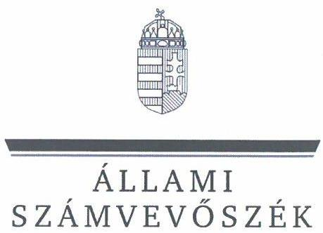
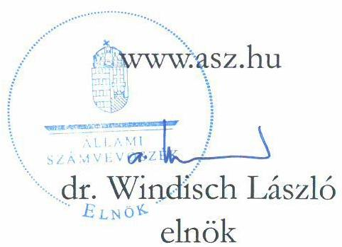

# JELENTÉS 

A többségi állami tulajdonban lévő gazdasági társaságok felügyelőbizottságainak múködésére irányuló célzott ellenőrzés

Miniszterelnökség -
Pro Populo Carpathico Nonprofit Korlátolt Felelősségú Társaság

2025.

---

# JELENTÉS 

## A többségi állami tulajdonban lévő gazdasági társaságok felügyelőbizottságainak múködésére irányuló célzott ellenőrzés

## Miniszterelnökség -

Pro Populo Carpathico Nonprofit Korlátolt Felelősségú Társaság
2025.

24156

---

# ELLENŐRZÉSI IGAZGATÓSÁG: 

ÁLLAMI VAGYONGAZDÁLKODÁST ELLENŐRZŐ IGAZGATÓSÁG

## ELLENŐRZÉSI IGAZGATÓ:

HERCZEGH ZSOLT ellenőrzési igazgató

## ELLENŐRZÉSVEZETŐ:

Jelentéseink az interneten a www.asz.hu címen olvashatók.

## DABISNÉ NYIKOS MELINDA ellenőrzésvezető

IKTATÓSZÁM: EL-4009-014/2024
TÉMASORSZÁM: 5
ELLENŐRZÉS-AZONOSÍTÓ SZÁM: V1064

---

# TARTALOMJEGYZÉK 

AZ ELLENŐRZÉS ALAPADATAI ..... 5
AZ ELLENŐRZÖTT SZERVEZETEK ..... 7
ÖSSZEFOGLALÁS ..... 8
AZ ELLENŐRZÉS FÓKUSZTERÜLETE ..... 9
MEGÁLLAPÍTÁSOK ..... 10
JAVASLATOK ..... 13
MELLÉKLETEK ..... 15
I. sz. melléklet: Értelmező szótár ..... 15
II. sz. melléklet: Az ellenőrzött szervezetek jegyzéke ..... 16
III. sz. melléklet: Ellenőrzési kritériumok ..... 17
FÜGGELÉK: ÉSZREVÉTELEK ..... 18
RÖVIDÍTÉSEK JEGYZÉKE ..... 19

---

.

---

# AZ ELLENŐRZÉS ALAPADATAI 

## AZ ELLENŐRZÉS CÉLJA

Az ellenőrzés célja annak értékelése volt, hogy a többségi állami tulajdonban lévő gazdasági társaság felügyelőbizottsága szabályszerűen múködött-e, valamint a felügyelőbizottság feladatait megfelelően látta-e el.

## AZ ELLENŐRZÉS TÍPUSA

Megfelelőségi ellenőrzés.

## AZ ELLENŐRZÖTT IDŐSZAK

A 2022. év.

## AZ ELLENŐRZÉS TÁRGYA

Az ellenőrzés tárgyát képezte a többségi állami tulajdonban lévő gazdasági társaság felügyelőbizottsága működésének szabályszerűsége, valamint feladatellátásának megfelelősége. Az egyszerűsített éves számviteli beszámoló elfogadással kapcsolatos felügyelőbizottsági feladatellátás ellenőrzése a 2021. évi egyszerűsített éves számviteli beszámolóra terjedt ki. Az ellenőrzés kiterjedt továbbá a felügyelőbizottsági tagok megválasztásának, a tagság megszűnésének szabályszerűségi ellenőrzésére, valamint a tulajdonosi joggyakorló által, a felügyelőbizottsággal szemben támasztott elvárások, meghatározott követelmények teljesítésének vizsgálatára és értékelésére is.

A felügyelőbizottság múködése szabályszerűségének ellenőrzése magába foglalta a felügyelőbizottság tagjai megválasztásának, a felügyelőbizottsági tagság megszűnésének ellenőrzését mind a tulajdonosi joggyakorlónál, mind pedig az irányítása alatt álló többségi állami tulajdonban lévő gazdasági társaságnál, továbbá kiterjedt arra, hogy a tulajdonosi joggyakorló a felügyelőbizottság feladatellátását nyomon követte-e, értékelte-e.

A feladatellátás megfelelőségének ellenőrzése magába foglalta azt, hogy a felügyelőbizottság ténylegesen ellátta-e azt a funkcióját, amelyre létrehozták, a felügyelőbizottság a gazdasági társaság vezetését a tulajdonos érdekeinek megóvása céljából ellenőrizte-e, ezáltal támogatta-e a tulajdonosi joggyakorló ellenőrzési tevékenységének megvalósulását, továbbá működéséről beszámolt-e a tulajdonosi joggyakorló részére.

A felügyelőbizottság feladatellátása tekintetében ellenőrzésre került, hogy a felügyelőbizottság ellátta-e az ellenőrzési, véleményezési és beszámolási tevékenységét, illetve minden olyan tevékenységet, amelyet jogszabályok, belső szabályozók meghatároztak, vagy a tulajdonosi joggyakorló a felügyelőbizottság hatáskörébe rendelt.

Az ellenőrzés kiterjedt minden olyan körülményre és adatra, amely az ÁSZ ${ }^{1}$ jogszabályban meghatározott feladatainak teljesítéséhez, valamint a program végrehajtása folyamán felmerült újabb összefüggések feltárásához szükséges volt.

---

# Az ellenőrzés jogsalapja 

Az ellenőrzés jogszabályi alapját az ÁSZ tv. ${ }^{2} 1 . \int$ (3) bekezdés, az 5. § (4) bekezdés és a Vtv. ${ }^{3} 3 . \int$ (4) bekezdés előírásai képezték.

## AZ ELLENŐRZÉS MÓDSZERE

Az ellenőrzés végrehajtása a nemzetközi standardokat irányadónak tekintve az ellenőrzési program szempontjai, az ellenőrzött időszakban hatályos jogszabályok, az ellenőrzés szakmai szabályok és a jelen ellenőrzésre irányadó ÁSZ módszertan figyelembevételével történt. Az állami vagyon feletti tulajdonosi joggyakorlással kapcsolatos tevékenységek ellenőrzésének kötelezettségét a Vtv. és az ÁSZ tv. is előírja az ÁSZ számára.

Az ellenőrzési kérdések megválaszolásához szükséges bizonyítékok megszerzése az ellenőrzött szervezetek által rendelkezésre bocsátott dokumentumokra és adatokra alapozva, továbbá megfigyelés, összehasonlítás, interjú (kérdésfeltevés), valamint elemző eljárás útján valósult meg.

Az ellenőrzési bizonyítékként felhasználható adatforrások közé tartoztak egyrészt az ellenőrzéshez kért dokumentumok, adatforrások, másrészt adatforrás volt még minden - az ellenőrzés folyamán - feltárt, az ellenőrzés szempontjából információkat tartalmazó dokumentum.

Az ellenőrzés során mintavételre nem került sor. Az ellenőrzés lefolytatásához az ellenőrzött szervezetek az ÁSZ által kért dokumentumok, adatok, információk megküldésével és az ellenőrzés során szolgáltattak adatokat. Az ellenőrzéshez az ÁSZ felhasználhatta a nyilvánosan elérhető közhiteles adatokat is.

---

# AZ ELLENŐRZÖTT SZERVEZETEK 

## MiniszTERELNÖKSÉG

A Miniszterelnökség ${ }^{4}$, mint központi államigazgatási szerv a Közigazgatási és Igazságügyi Minisztériumból kiválással jött létre. A Miniszterelnökség a hatályos Statútum rendeletben ${ }^{5}$ meghatározott feladatokat alaptevékenységként látta el, a Bkr. ${ }^{6}$ hatálya alá tartozott.

A Miniszterelnökség az 1/2018. (VI.25.) NVTNM rendelet ${ }^{7}$, valamint az 1/2022. (V.26.) GFM rendelet ${ }^{8}$ alapján a Pro Populo Carpathico Nonprofit Kft. ${ }^{9}$ tulajdonosi joggyakorlója. Az ellenőrzött időszakban a Miniszterelnökségi SZMSZ ${ }^{10}: 19 . \S$ (2) bekezdés h) pontja és a Miniszterelnökségi SZMSZ ${ }_{2}$ 38. § (2) bekezdés j) pontja értelmében a Pro Populo Carpathico Nonprofit Kft. feletti tulajdonosi és szakmai irányítási jogokat a nemzetpolitikáért felelős államtitkár gyakorolta.

## Pro Populo Carpathico Nonprofit Kft.

A Pro Populo Carpathico Nonprofit Kft.-t a Magyar Állam 2018.02.15-én alapította a 2015/2017. (XII.22.) Korm. határozatban ${ }^{11}$ meghatározott feladatok ellátására érdekében (Kárpátalián és Szabolcs-SzatmárBereg megyében a magyar identitást megjelenitő kiállitások és alkotóházaik elhelyezését biztositó ingatlanok megszerzésével és üzemeltetésével kapcsolatos feladatok ellátása).

A Pro Populo Carpathico Nonprofit Kft. főtevékenysége saját tulajdonú ingatlan adásvétele. A Társaság a 2019. évben megvásárolta az ukrán ZAHID Finance Group társaság részesedésének 99,9\%-át (2 389796 E Ft összegben), így főtevékenységét a leányvállalatán keresztül valósította meg, továbbá 2021. év végén megvásárolta az ukrajnai, eredeti nevén Obrazcsik Kft. magánvállalat (mely 2022. évben cégnév változás után Terra Plakát Kft. néven szerepel) 99,9\%-os részesedését is ( 47901 E Ft összegben). A Társaság 2022. évi befektetett pénzügyi eszközeinek értéke 2437697 E Ft volt, mely a 2022. évi mérlegfőösszeg $78 \%$-t tette ki. A Pro Populo Carpathico Nonprofit Kft. 2021. évi saját tőke összege 2667595 E Ft, mérlegfőösszege 3109089 E Ft, adózott eredménye -659 E Ft, 2022. évi saját tőke összege 2664870 E Ft, mérlegfőösszege 3125990 E Ft, adózott eredménye -2 724 E Ft volt. A Társaság átlagos statisztikai állományi létszáma a 2022. évben 0 fő volt, 5 fő megbízási jogviszonyban végezte a feladatait, árbevétele a Pro Populo Carpathico Nonprofit Kft.-nek nem keletkezett.

A Társaság 2022.11.30-tól a Pénzügyminiszter közleménye ${ }^{12}$ alapján kormányzati szektorba sorolt egyéb szervezetnek minősült, ezért a Bkr. 1. § (2) bekezdés d) pontjában és az 54/A. §-aiban rögzítettekkel összhangban a Bkr. 1-10. § előírásai vonatkoztak rá. A Pro Populo Carpathico Nonprofit Kft. a Tak.tv. ${ }^{13}$ 7/J. § (1) bekezdése által előírt mutatóértékek alapján nem tartozott az ellenőrzött időszakban a Gbkr. ${ }^{14}$ hatálya alá, annak alkalmazására a Tak.tv. 7/J. § (2) bekezdés alapján javaslatot sem a felügyelőbizottság, sem pedig a tulajdonosi joggyakorló nem tett.

A Társaságnál az ellenőrzött időszakban három tagból álló felügyelőbizottság működött, személyükben változás 2022. évben nem történt.

---

# ÖSSZEFOGLALÁS 

A jogi személy tulajdonosi ellenőrzése a Ptk. ${ }^{15}$ rendelkezései alapján a felügyelőbizottság létrehozásán és működtetésén keresztül valósul meg, mely az állami tulajdonú gazdasági társaságok esetében azt jelenti, hogy a Magyar Állam nevében a tulajdonosi joggyakorlóként kijelölt szervezet bízza meg az állami tulajdonú gazdasági társaság felügyelőbizottságának tagjait. A felügyelőbizottság munkájának kiemelkedő szerepe van, mivel a gazdasági társaság vezetését a jogi személy érdekeinek megóvása céljából ellenőrzi. A tulajdonosi joggyakorló a felügyelőbizottság tájékoztatásain, jelzésein keresztül értesül a gazdasági társaságot érintő müködési, gazdálkodási, valamint minden egyéb jelentős területet érintő kérdésről, és amennyiben szükséges, akkor lehetősége van a megfelelő időben történő beavatkozásra.

A TULAJDONOSI JOGGYAKORLÓ részéről a felügyelőbizottság működési kereteinek kialakítása, biztosítása során az ellenőrzés hiányosságokat tárt fel. A jogszabályi rendelkezés ellenére egy esetben nem állt a tulajdonosi joggyakorló rendelkezésére a felügyelőbizottsági tag jogviszonyának kezdetekor a nemzetbiztonsági ellenőrzésről szóló biztonsági szakvélemény, illetve a felügyelőbizottsági tag - nemzetbiztonsági ellenőrzést megelőző - jogviszonyának létrehozását jóváhagyó dokumentum sem. További egy esetben az ellenőrzés során a Miniszterelnökségi SZMSZ ${ }_{1-2}$-ben foglalt rendelkezések ellenére a felügyelőbizottsági tagság kezdetekor még érvényben lévő nemzetbiztonsági ellenőrzésről szóló biztonsági szakvélemény megléte sem került igazolásra. A tulajdonosi joggyakorló a jogszabályi előírás ellenére a felügyelőbizottság feladatellátásának nyomon követési rendszerének kialakítása érdekében intézkedést nem tett, a felügyelőbizottság feladatellátását nem követte nyomon. A Társaság 2021. évi egyszerűsített éves beszámolóját a tulajdonosi joggyakorló az Alapító okirat előírásainak megfelelően hagyta jóvá.

A PRO POPULO CARPATHICO NONPROFIT KFT. felügyelőbizottságának feladatellátása tekintetében hiányosságként került feltárásra, hogy a jogszabályi előírás ellenére a felügyelőbizottság a Felügyelőbizottsági ügyrendjét nem maga állapította meg, továbbá az ellenőrzött időszakban a Felügyelőbizottsági munkaterv elfogadása nem célszerű időben történt. A Felügyelőbizottsági ügyrendben foglalt rendelkezések ellenére a felügyelőbizottság részéről négy helyett három alkalommal történt felügyelőbizottsági határozathozatal. Az írásbeli határozathozatallal kapcsolatos iratok felügyelőbizottsági tagok részére történő megküldése tekintetében a felügyelőbizottság elnöke nem a Felügyelőbizottsági ügyrend szerint járt el. A Társaság 2022. és 2023. évi üzleti terve úgy került a felügyelőbizottság részéről elfogadásra, hogy a Társaság leányvállalatának az üzleti terve még nem készült el, azzal kapcsolatos kiegészítési jelzést a felügyelőbizottság a Pro Populo Carpathico Nonprofit Kft. ügyvezetője részére nem tett. A felügyelőbizottság a gazdasági társaság vezetését a jogszabályi előírás ellenére a tulajdonos érdekeinek megóvása céljából csak részben ellenőrizte, mivel a leányvállalatok működéséről, a részesedések alakulásáról, a leányvállalatok negyedéves kontrolling jelentéseinek tartalmáról az ügyvezetőt nem számoltatta be, az ügyvezető negyedéves jelentései erre vonatkozó információkat nem tartalmaztak. A felügyelőbizottság a feltárt hiányosságok miatt a funkcióját részben töltötte be.

---

# AZ ELLENŐRZÉS FÓKUSZTERÜLETE 

1. A többségi állami tulajdonban álló gazdasági társaság felügyelőbizottságának müködése, feladatellátása.

---

# 1. Miniszterelnökség 

Összegző megállapítás

A felügyelőbizottság múködési kereteinek kialakítása, biztosítása során az ellenőrzés hiányosságokat tárt fel a tulajdonosi joggyakorlónál a felügyelőbizottsági tagok nemzetbiztonsági ellenőrzései tekintetében. A tulajdonosi joggyakorló a jogszabályi előírás ellenére a felügyelőbizottság feladatellátásának nyomon követési rendszerének kialakítása érdekében intézkedést nem tett, a felügyelőbizottság feladatellátását nem követte nyomon.

A felügyelőbizottság múködésével kapcsolatos szabályozási keretek a Pro Populo Carpathico Nonprofit Kft. Alapító okiratában ${ }^{16}$, valamint Javadalmazási szabályzatában ${ }^{17}$ kerültek rögzítésre. A Miniszterelnökségi SZMSZ ${ }_{2}$ 2. sz. függelék 11.5.1. pont 23. alpontjában előírásra került a tulajdonosi joggyakorlás rendjéről szóló miniszteri utasítás elkészítési kötelezettség, mely rendelkezés a közigazgatási államtitkár hatáskörébe utalt tulajdonosi joggyakorlás alá tartozó gazdasági társaságokra terjedt csak ki, a nemzetpolitikáért felelős államtitkárra vonatkozó szabályozásra e tekintetben nem került sor. A Miniszterelnökség a Miniszterelnökségi SZMSZ ${ }_{3}{ }^{18}$ 2024.02.22-i módosításával, az ellenőrzés során feltárt hiányosságot megszüntette, mivel a Miniszterelnökségi SZMSZ ${ }_{3}$ 11.5.1. pontjában és alpontjaiban előírt rendelkezéseket valamennyi, a Miniszterelnökség tulajdonosi joggyakorlása alatt álló gazdasági társaságra kiterjesztette.
A Pro Populo Carpathico Nonprofit Kft.-nél a Ptk. és a Tak.tv. rendelkezéseinek megfelelően három tagból álló felügyelőbizottság múködött. A felügyelőbizottság elnökét és tagjait az Alapító okirat előírása alapján az Alapító jelölte ki. A tulajdonosi joggyakorló az Alapító okiratban foglalt előírásnak megfelelően gondoskodott a Felügyelőbizottsági ügyrend jóváhagyásáról.
A Ptk. és az Alapító okirat előírásainak megfelelően a felügyelőbizottsági tagok összeférhetetlenségre vonatkozó nyilatkozatai a tulajdonosi joggyakorló rendelkezésére álltak.
A 2007. évi CLII. tv. ${ }^{19}$, a Miniszterelnökségi SZMSZ ${ }_{1-2}$, valamint az Alapító okirat előírásainak megfelelően a felügyelőbizottsági tagok vagyonnyilatkozat-tételi kötelezettségüknek eleget tettek.
Az 1995. évi CXXV. tv. ${ }^{20}$ 74. § i) pontban foglaltak szerint a felügyelőbizottság tagja nemzetbiztonsági ellenőrzés alá eső személynek minősült, azonban egy esetben nem állt rendelkezésére a felügyelőbizottsági tag jogviszonyának kezdetekor a nemzetbiztonsági ellenőrzésről szóló biztonsági szakvélemény, illetve az 1995. évi CXXV. tv. 71. § (2) bekezdés c) pont alapján a felügyelőbizottsági tag - nemzetbiztonsági ellenőrzést megelőző - jogviszonyának létrehozását jóváhagyó dokumentum sem. További egy esetben a felügyelőbizottsági tagság kezdetekor még érvényben lévő nemzetbiztonsági ellenőrzésről szóló biztonsági szakvélemény megléte a felügyelőbizottsági tag vonatkozásában nem került igazolásra annak ellenére, hogy a Miniszterelnökségi SZMSZ ${ }_{1}$ 2. sz. függelék 8.3.2. pont 17. alpontja és a Miniszterelnökségi SZMSZ ${ }_{2}$ 2. sz. függelék 11.3.5 pont e) bekezdése a Szervezetbiztonsági Főosztály funkcionális feladatai körébe rendelte a nemzetbiztonsági ellenőrzésekkel kapcsolatos ügyviteli feladatokat.

---

Az Alapítói okirat előírásainak megfelelően a tulajdonosi joggyakorló a felügyelőbizottság írásbeli határozatának birtokában döntött a Pro Populo Carpathico Nonprofit Kft. 2021. évi egyszerűsített éves számviteli beszámolójának az elfogadásáról.
A Bkr. 3. §-ában foglaltak ellenére a tulajdonosi joggyakorló a felügyelőbizottság feladatellátásának nyomon követési rendszerének kialakítása érdekében intézkedést nem tett, a tulajdonosi joggyakorló nyilatkozata alapján a felügyelőbizottság feladatellátását a Bkr. 10. $\mathbb{\$}$-ában rögzített rendelkezések ellenére nem követte nyomon. A tulajdonosi joggyakorló a felügyelőbizottság feladatellátását nem értékelte.

# 2. Pro Populo Carpathico Nonprofit Kft. felügyelőbizottsága 

Összegző megállapítás

A felügyelőbizottság a jogszabályi előírás ellenére a Felügyelőbizottsági ügyrendjét nem maga állapította meg, továbbá a Felügyelőbizottsági munkatervnek az elfogadása sem célszerű időben történt. A Felügyelőbizottsági ügyrend előírása ellenére a felügyelőbizottság négy helyett három alkalommal tartott írásbeli határozathozatalt. A felügyelőbizottság a gazdasági társaság vezetését a jogi személy érdekeinek megóvása céljából a jogszabályi előírás ellenére csak részben ellenőrizte, melynek következtében a felügyelőbizottság a funkcióját részben töltötte be.

A Tak.tv. rendelkezéseinek megfelelve a Pro Populo Carpathico Nonprofit Kft. rendelkezett a tulajdonosi joggyakorló által Alapítói határozattal elfogadott Javadalmazási szabályzattal. Az ellenőrzött időszakban a felügyelőbizottság elnökének és tagjainak megállapított havi díjazása nem haladta meg a Tak.tv. előírásában foglaltakat.
A felügyelőbizottság feladatellátását a Felügyelőbizottsági ügyrend ${ }^{21}$ és a Felügyelőbizottsági munkaterv ${ }^{22}$ szabályozta. A Ptk. 3:122. § (3) bekezdése, valamint az Alapító okirat 13.6. pontjában meghatározott rendelkezésekkel szemben a Felügyelőbizottsági ügyrendet nem a felügyelőbizottság állapította meg, hanem a Társaság ügyvezetője készítette el és terjesztette elő elfogadásra a felügyelőbizottság részére. A Felügyelőbizottsági munkaterv nem célszerű időben, a 2022. évet vagy az első határozathozatalt megelőzően került a felügyelőbizottság részéről elfogadásra, hanem arról utólag, 2022.09.30-án hozott határozatot.
Az Alapítói okiratban foglalt előírásoknak megfelelően a Pro Populo Carpathico Nonprofit Kft. 2022. és 2023. évi üzleti terve jóváhagyásra került, ahhoz a felügyelőbizottság elfogadó határozata a Ptk. előírásainak megfelelően rendelkezésre állt. A Pro Populo Carpathico Nonprofit Kft. 2022. évi üzleti terve - mely tartalmazta a Z.AHID Finance Group leányvállalat müködési költségeinek és szakmai feladatainak finanszirozási fedezetét - azonban úgy került elkészítésre, hogy ahhoz nem állt a Társaság rendelkezésére a leányvállalatára vonatkozó 2022. évi üzleti tervadat. A tervezési hiányosság - a leányvállalatok várbató adatainak figyelembevétele tekintetében - a 2023. évi üzleti tervezés során is fennállt. A tervezési hiányosságot a felügyelőbizottság a Társaság ügyvezetője részére nem jelezte.
A Felügyelőbizottsági ügyrend 13. pontjában rögzített határozathozatali gyakorlat a Társaság Alapító okiratának 13.5. pontjával nem volt összhangban, mivel az Alapító okirat indokolt esetben engedte csak meg a felügyelőbizottsági döntéshozatalt elektronikus hírközlő útján, írásbeli határozathozatalra

---

vonatkozó rendelkezéseket pedig nem tartalmazott. A tulajdonosi joggyakorló által jóváhagyott Felügyelőbizottsági ügyrend 13. pontja azonban egy tágabb szabályozást engedélyezett, mivel az az írásbeli határozathozatalra vonatkozó szabályokat is rögzítette. A tulajdonosi joggyakorló az Alapító okirat és a Felügyelőbizottsági ügyrend döntéshozatalának eltérő szabályozását nem kifogásolta, a felügyelőbizottság az ellenőrzött időszakban írásban hozta határozatait (2022. május, szeptember, december hónapokban).
A Felügyelőbizottsági ügyrend 9. pontjában rögzített rendelkezés ellenére a 2022. évben négy helyett csak három alkalommal került ülés tartása nélküli írásbeli határozathozatal elrendelésre. A Felügyelőbizottsági ügyrend 13.2. pontja ellenére az előterjesztéseket, a szavazólapokat, valamint a határozati javaslatok szövegeit nem a felügyelőbizottság elnöke, hanem a Társaság gazdasági igazgatója küldte ki a felügyelőbizottsági tagok részére. A 2022. évben megtartott három írásbeli határozathozatal során a Felügyelőbizottsági ügyrend szerinti határidők betartásra kerültek.
A felügyelőbizottság az ülés tartása nélküli írásbeli határozathozatal keretében az Alapítói okirat, valamint a Felügyelőbizottsági ügyrend előírásai alapján a Pro Populo Carpathico Nonprofit Kft. 2021. évi egyszerűsített éves beszámolóját megismerte, annak elfogadásáról határozatot hozott.
Az Alapító okirat előírásának megfelelően a felügyelőbizottság a Pro Populo Carpathico Nonprofit Kft. vagyoni helyzetéről és üzletpolitikájáról szóló, az ügyvezető által készített negyedéves jelentéseket megismerte, azok elfogadásáról írásbeli határozatot hozott, a negyedéves jelentések azonban a leányvállalatokra vonatkozó információkra (leányvállalatok, negyedéves kontrolling jelentéseinek, tartalma, leányvállalatok müködése, részesedések alakulása) nem terjedtek ki. Ennek következtében a Felügyelőbizottsági ügyrend 1. pontjában foglalt rendelkezés, amely alapján a felügyelőbizottság a Társaság ügyvezetését, valamint az ügyvezetés döntéseinek jogszerűségét és célszerűségét is ellenőrzi, csak részben valósult meg. Mivel a Társaság a főtevékenységét az ellenőrzött időszakban a leányvállalati befektetésein keresztül valósította meg, így indokolt lett volna a felügyelőbizottság részéről a fenti információknak a megismerése, az ügyvezető beszámoltatása. A felügyelőbizottság az ellenőrzött időszakban az Alapító okiratban, valamint a Felügyelőbizottsági ügyrendben meghatározott kötelező feladatait (üzleti terv, egyszerüsitett éves beszámoló, ügyvezető által készített negyedéves jelentések, jóváhagyása, elfogadása) ugyan ellátta, azonban a leányvállalatokra vonatkozó információknak a hiányában a felügyelőbizottság a funkcióját részben töltötte be, a Ptk. 3:26. § (1) bekezdésében, az Alapító okirat 13.3. pontjában, valamint a Felügyelőbizottsági ügyrend 1. pontjában foglalt feladatát a felügyelőbizottság csak részben látta el.
A Tak.tv. előírásainak megfelelően a felügyelőbizottsággal kapcsolatos adatok a Pro Populo Carpathico Nonprofit Kft. honlapján ${ }^{23}$ közzétételére kerültek.

---

# JAVASLATOK 

Az ÁSZ tv. 33. § (1) bekezdésében foglaltak értelmében az ellenőrzött szervezet vezetője köteles a jelentésben foglalt megállapításokhoz kapcsolódó intézkedési tervet összeállítani és azt a jelentés kézhezvételétől számított 30 napon belül az ÁSZ részére megküldeni. Amennyiben az ellenőrzött szervezet vezetője nem küldi meg határidőben az intézkedési tervet, vagy továbbra sem elfogadható intézkedési tervet küld, az Állami Számvevőszék elnöke az ÁSZ tv. 33. § (3) bekezdése a) és b) pontjaiban foglaltakat érvényesítheti.

## MINISZTERELNÖKSÉG TULAJDONOSI JOGGYAKORLÓ RÉSZÉRE

1. Tegyen intézkedést annak érdekében, hogy a jövőben az 1995. évi CXXV. tv. 74. § ij) pontja alapján álljon rendelkezésre a felügyelőbizottsági tagok jogviszonyának kezdetekor a nemzetbiztonsági ellenőrzésről szóló biztonsági szakvélemény, illetve - szükség szerint - az 1995. évi CXXV. tv. 71. § (2) bekezdés c) pontja alapján a felügyelőbizottsági tagok - nemzetbiztonsági ellenőrzést megelőző jogviszonyainak létrehozását jóváhagyó dokumentumok.
2. Gondoskodjon arról, hogy a felügyelőbizottsági ügyrendben a döntéshozatal rendjét az Alapitó okirat rendelkezéseivel összhangban szabályozza.
3. Gondoskodjon arról, hogy a felügyelőbizottság a Ptk. 3:122. § (3) bekezdése alapján a Felügyelőbizottsági ügyrendjét maga állapítsa meg.
4. Gondoskodjon arról, hogy a felügyelőbizottság a jövőben a Felügyelőbizottsági ügyrend 9. pontjában meghatározott rendszerességgel ülésezzen/hozzon határozatot.
5. Gondoskodjon arról, hogy a felügyelőbizottság a jövőben a Ptk. 3:26. § (1) bekezdéseben, az Alapitó okirat 13.3. pontjában, valamint Felügyelőbizottsági ügyrend 1. pontjában rögzített feladatok teljeskörü ellátása érdekében számoltassa be az ügyvezetőt a leányvállalatokra vonatkozó információk (leányvállalatok negyedéves kontrolling jelentéseinek tartalma, leányvállalatok müködése, részesedések alakulása) tekintetében is a Pro Populo Carpathico Nonprofit Kft. vagyoni helyzetéről és üzletpolitikájáról szóló negyedéves jelentések keretében.
6. Gondoskodjon arról, hogy a felügyelőbizottság a jövőben a Felügyelőbizottsági munkatervét célszerü időben fogadja el.

---

7. Tegyen intézkedést annak érdekében, hogy a felügyelőbizottság elnöke a jövőben tartsa be az írásbeli döntéshozatalra vonatkozó előírásokat a Felügyelőbizottsági ügyrend 13.2. pontja alapján.
8. Intézkedjen a Bkr. 3. § előírása alapján a felügyelőbizottság feladatellátásának nyomon követési rendszerének kialakítása érdekében, valamint arról, hogy a jövőben a felügyelőbizottság feladatellátását a Miniszterelnökség a Bkr. 10. § előírásainak megfelelően nyomon kövesse.

# Pro Populo Carpathico NONPROFIT KFT. ÜGYVEZETŐJE RÉSZÉRE 

1. Gondoskodjon arról, hogy a jövőben a Bkr. 8. § (2) bekezdés b) pont előírásának megfelelően a Pro Populo Carpathico Nonprofit Kft. üzleti tervében a leányvállalatok müködési költségeinek és szakmai feladatainak finanszírozási fedezetére vonatkozó adatok a leányvállalatok üzleti tervében szereplő adatokkal alátámasztásra kerüljenek.

---

# MELLÉKLETEK 

## I. SZ. MELLÉKLET: ÉRTELMEZŐ SZÓTÁR

gazdasági társaság

többségi állami tulajdon
többségi befolyás
tulajdonosi joggyakorló
felügyelőbizottság

A gazdasági társaságok üzletszerű közös gazdasági tevékenység folytatására, a tagok vagyoni hozzájárulásával létrehozott, jogi személyiséggel rendelkező vállalkozások, amelyekben a tagok a nyereségből közösen részesednek, és a veszteséget közösen viselik.
(Ptk. 3:88. § (1) bekezdése)
Az állam tulajdonában lévő tagsági jogviszonyt megtestesítő értékpapír, illetve az állam tulajdonában lévő egyéb társasági részesedés, amennyiben a társaságban a Magyar Állam közvetlenül vagy közvetetten a szavazatok több mint felével rendelkezik.
(ÁSZ definíció a Vtv. 1. § (2) bekezdés c) pontja és a Ptk. 8:2. § (1), (3)-(4) bekezdései alapján)
Olyan kapcsolat, amelynek révén a befolyással rendelkező egy jogi személyben a szavazatok több mint ötven százalékával - közvetlenül vagy a jogi személyben szavazati joggal rendelkező más jogi személy (köztes vállalkozás) szavazati jogán keresztül - rendelkezik, azzal, hogy a közvetett módon való rendelkezés meghatározása során a jogi személyben szavazati joggal rendelkező más jogi személyt (köztes vállalkozást) megillető szavazati hányadot meg kell szorozni a befolyással rendelkezőnek a köztes vállalkozásban, illetve vállalkozásokban fennálló szavazati hányadával, ha azonban a köztes vállalkozásban fennálló szavazatainak hányada az ötven százalékot meghaladja, akkor azt egy egészként kell figyelembe venni. A befolyás számításánál nem kell figyelembe venni a huszonöt százalékot el nem érő közvetett befolyást.
(Tak.tv. 1. § b) pont)
Aki a nemzeti vagyon felett az államot vagy a helyi önkormányzatot megillető tulajdonosi jogok és kötelezettségek összességének gyakorlására jogosult.
(Nvtv. ${ }^{24}$ 3. § (1) bekezdés 17. pontja)
A gazdasági társaságnál a tulajdonos érdekeinek megóvása céljából múködő - legalább - három tagból álló ellenőrző testület.
(ÁSZ definíció a Ptk. 3:26. § (1) bekezdés alapján)

---

# II. SZ. MELLÉKLET: AZ ELLENŐRZÖTT SZERVEZETEK JEGYZÉKE 

## ELLENŐRZÖTT SZERVEZET NEVE

1. Miniszterelnökség (nemzetpolitikáért felelős államtitkár)
2. Pro Populo Carpathico Nonprofit Kft.

## SZEREPE

Tulajdonosi joggyakorló

Többségi tulajdonban álló gazdasági társaság

---

# III. SZ. MELLÉKLET: ELLENŐRZÉSI KRITÉRIUMOK 

## FOKUSZTERÜLET

1. A többségi állami tulajdonban álló gazdasági társaság felügyelőbizottságának múködése, feladatellátása.

## ELLENŐRZÉSI KRITÉRIUMOK

Tak.tv. 2. $\$ (1) bek., 4. $\$ (1)-(3)$ bek., 5. $\$$ (3)-(4) bek., 6. $\$$.
(2)-(4) bek., 7/J. $\$$ (1)-(2), (5)-(7) bek.
Ptk. 3:22. $\$, 3: 25 . \$, 3: 26 . \$, 3: 27 . $\$, 3: 28 . \$, 3: 36 . $\$$ (3) bek., 3:38. $\$$ (1), 3:51. $\$$ (1)-(2) bek., Ptk. 3:109. $\$$ (4) bek., 3:111. $\$$, 3:115. $\$, 3: 119 . \$, 3: 120 . $\$, 3: 121 . \$, 3: 122 . $\$, 3: 123 . \$, 3: 124 . $\$, 3: 125 . \$, 3: 126 . \$, 3: 127 . $\$, 3: 128 . \$, 3: 131 . $\$$ (3) bek.
2007. évi CLII. törvény 3. $\$$ (3) bek. c) pont, 5. $\$, 6 . \$(2) bek.
1995. évi CXXV. törvény 71. $\$$ (2) bek. c) pont, 74. $\$$ ii) pont Mt. ${ }^{25} 208 . \$$

Bkr. 1. $\$-10 . \$
a gazdasági társaság Alapító okirata, Szervezeti és Müködési Szabályzata, Miniszterelnökségi SZMSZ
a Felügyelőbizottság ügyrendje, munkaterve
belső szabályzatok, irányítási eszközök
tulajdonosi joggyakorló írásbeli elvárásai

---

# FÜGGELÉK: ÉSZREVÉTELEK 

A jelentéstervezetet a Számvevőszék 15 napos észrevételezésre megküldte az ellenőrzött szervezet vezetőjének az ÁSZ tv. 29. §* (1) bekezdése előírásának megfelelően.

Az ellenőrzött szervezetek vezetői a jelentéstervezet megállapításaira észrevételt nem tettek.

[^0]
[^0]:    * 29. § (1) Az Állami Számvevőszék az ellenőrzési megállapításait megküldi az ellenőrzött szervezet vezetőjének vagy az általa megbízott személynek, és annak, akinek személyes felelősségét állapította meg.
    (2) Az ellenőrzött szervezet vezetője és a felelősként megjelölt személy az ellenőrzés megállapításaira tizenöt napon belül írásban észrevételt tehet.
    (3) Az Állami Számvevőszék az észrevételre a beérkezésétől számított harminc napon belül írásban válaszol. A figyelembe nem vett észrevételeket köteles a jelentésben feltüntetni, és megindokolni, hogy azokat miért nem fogadta el.

---

# RÖVIDÍTÉSEK JEGYZÉKE 

${ }^{1}$ ÁSZ ${ }^{2}$ ÁSZ tv. ${ }^{3}$ Vtv. ${ }^{4}$ Miniszterelnökség/Alapító/ tulajdonosi joggyakorló ${ }^{5}$ Statútum rendelet ${ }^{6}$ Bkr. ${ }^{7}$ 1/2018. (VI.25.) NVTNM rendelet ${ }^{8}$ 1/2022. (V.26.) GFM rendelet ${ }^{9}$ Pro Populo Carpathico Nonprofit Kft./ Társaság/többségi állami tulajdonban lévő gazdasági társaság ${ }^{10}$ Miniszterelnökségi SZMSZ ${ }_{1-2}$ ${ }^{11}$ 2015./2017. (XII.22.) Korm. határozat ${ }^{12}$ Pénzügyminiszter közleménye ${ }^{13}$ Tak.tv. ${ }^{14}$ Gbkr. ${ }^{15}$ Ptk. ${ }^{16}$ Alapító okirat ${ }^{17}$ Javadalmazási szabályzat ${ }^{18}$ Miniszterelnökségi SZMSZ ${ }_{3}$ ${ }^{19} 2007$. évi CLII. tv. ${ }^{20}$ 1995. évi CXXV. tv. ${ }^{21}$ Felügyelőbizottsági ügyrend ${ }^{22}$ Felügyelőbizottsági munkaterv ${ }^{23}$ honlap ${ }^{24}$ Nvtv. ${ }^{25} \mathrm{Mt}$.

Állami Számvevőszék
2011. évi LXVI. törvény az Állami Számvevőszékről
2007. évi CVI. törvény az állami vagyonról

Miniszterelnökség
94/2018. (V. 22.) Korm. rendelet - a Kormány tagjainak feladat- és hatásköréről
182/2022. (V. 24.) Korm. rendelet - a Kormány tagjainak feladat- és hatásköréről
370/2011. (XII. 31.) Kormány rendelet a költségvetési szervek belső kontrollrendszeréről és belső ellenőrzéséről
1/2018. (VI.25.) NVTNM rendelet az egyes állami tulajdonban álló gazdasági társaságok felett az államot megillető tulajdonosi jogok és kötelezettségek összességét gyakorló személyek kijelöléséről
1/2022. (V.26.) GFM rendelet az egyes állami tulajdonban álló gazdasági társaságok felett az államot megillető tulajdonosi jogok és kötelezettségek összességét gyakorló személyek kijelöléséről
Pro Populo Carpathico Nonprofit Kft.

Miniszterelnökségi SZMSZ ${ }_{1}$ : 14/2018. (VII.3.) MvM utasítás a Miniszterelnökség Szervezeti és Müködési Szabályzatáról, hatályos: 2018.07.03-tól
Miniszterelnökségi SZMSZ ${ }_{2}$ : 5/2022. (VI.17.) MvM utasítás a Miniszterelnökség Szervezeti és Müködési Szabályzatáról, hatályos: 2022.06.18-tól
2015/2017. (XII. 22.) Korm. határozat a Magyar Házak kárpátaljai kialakításáról, valamint a Magyar Házak kárpátaljai kialakításáról szóló 1642/2016. (XI. 17.) Korm. határozat visszavonásáról
2022. november 30-i Magyar Közlöny - 68. szám Közlemények - A pénzügyminiszter közleménye a kormányzati szektorba sorolt egyéb szervezetekről
2009. évi CXXII. törvény - a köztulajdonban álló gazdasági társaságok takarékosabb müködéséről
339/2019. (XII.23.) Korm. rendelet a köztulajdonban álló gazdasági társaságok belső kontrollrendszeréről
2013. évi V. törvény a Polgári Törvénykönyvről
2021.02.25-től hatályos Pro Populo Carpathico Nonprofit Korlátolt Felelősségű Társaság Alapító okirat (módosításokkal egységes szerkezetben)
Pro Populo Carpathico Nonprofit Kft. Javadalmazási Szabályzata az Mt. 208.§ hatálya alá tartozó munkavállalóira, tisztségviselőire, és könyvvizsgálójára vonatkozó javadalmazási rendszeréről, hatályos: 2020.01.01-től
1/2024. (II.22) MvM utasítás - a Miniszterelnökség Szervezeti és Müködési Szabályzatáról, hatályos: 2024.02.23-tól
2007. évi CLII. törvény egyes vagyonnyilatkozat-tételi kötelezettségekről
1995. évi CXXV. törvény a nemzetbiztonsági szolgálatokról
2/2020. (V.29.) Alapítói határozattal jóváhagyott - Pro Populo Carpathico Nonprofit Kft. Felügyelőbizottság ügyrendje
Pro Populo Carpathico Nonprofit Kft. felügyelőbizottságának 5/2022. (IX.30.) számú felügyelőbizottsági határozattal elfogadott 2022. évi munkaterve
https://www.ppenkft.hu/
2011. évi CXCVI. törvény a nemzeti vagyonról
2012. évi I. törvény a munka törvénykönyvéről

---

1052 Budapest, Apáczai Csere János u. 10. | 1364 Budapest 4., Pf. 54
www.asz.hu | szamvevoszek@asz.hu
telefon: +36 14849100