# JELENTÉS 

A nemzeti agrárkár-enyhítés során megítélt támogatásokhoz kapcsolódó folyamatok megfelelőségének, a nemzeti agrárkár-enyhítési rendszer múködésének ellenőrzése

2024.

---

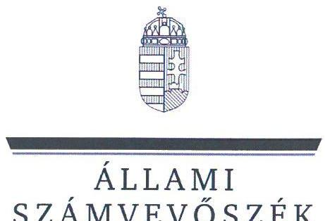

ÁLLAMI
SZÁMVEVŐSZÉK

# JELENTÉS 

A nemzeti agrárkár-enyhítés során megítélt támogatásokhoz kapcsolódó folyamatok megfelelőségének, a nemzeti agrárkár-enyhítési rendszer múködésének ellenőrzése
2024.

---

# ELLENŐRZÉSI IGAZGATÓSÁG: 

## ÁLLAMHÁZTARTÁS KÖZPONTI SZINTJÉT ELLENŐRZŐ IGAZGATÓSÁG

ELLENŐRZÉSI IGAZGATÓ:
SINKÁNÉ DR. CSENDES ÁGNES igazgató

ELLENŐRZÉSVEZETŐ:
Jelentéseink az interneten a www.asz.hu címen olvashatók.

RENKÓ ZSUZSANNA ellenőrzésvezető

IKTATÓSZÁM: EL-4115-001/2024.
TÉMASZÁM: 2699
ELLENŐRZÉS-AZONOSÍTÓ SZÁM: V1043

---

# TARTALOMJEGYZÉK 

AZ ELLENŐRZÉS ALAPADATAI ..... 5
AZ ELLENŐRZÉS HATÓKÖRE ÉS TERÜLETE ..... 7
ÖSSZEFOGLALÁS ..... 14
AZ ELLENŐRZÉS FÓKUSZTERÜLETEI ..... 18
MEGÁLLAPÍTÁSOK ..... 19
JAVASLATOK ..... 40
MELLÉKLETEK ..... 41
I. sz. melléklet: Értelmező szótár ..... 41
II. sz. melléklet: Az ellenőrzött szervezetek jegyzéke ..... 44
III. sz. melléklet: Ellenőrzési kritériumok ..... 45
IV. sz. melléklet: Egyes országok agrárkár-enyhítési rendszere ..... 46
FÜGGELÉK: ÉSZREVÉTELEK ..... 48
RÖVIDÍTÉSEK JEGYZÉKE ..... 63

---

.

---

# AZ ELLENŐRZÉS ALAPADATAI 

## AZ ELLENŐRZÉS CÉLJA

Az ellenőrzés célja annak értékelése volt, hogy a nemzeti agrárkár-enyhítési rendszer kiépítettsége és működtetése megfelelt-e a jogszabályi és belső előírásoknak. Az ellenőrzés kiterjedt annak megítélésére, hogy az agrárkár-enyhítésre fordítható forrásokból teljesített kifizetések az előirányzat keretében meghatározott célokkal összhangban történtek-e, biztosított volt-e az agrárkár-enyhítésre felhasznált közpénzek védelme.

Az ellenőrzés célja volt továbbá annak értékelése, hogy a mezőgazdasági kockázatkezelési adatbázis kialakítása, kezelése megfelelő alapot biztosított-e az agrárkár-enyhítési rendszer működtetéséhez, illetve az agrárkár-enyhítési rendszer elősegítette-e a mezőgazdasági termelők öngondoskodáson alapuló felelősségének megerősítését, és megfelelően tudta-e kezelni a megváltozott környezeti feltételekből adódó kockázatokat.

## AZ ELLENŐRZÉS TÍPUSA

Kombinált ellenőrzés

## AZ ELLENŐRZŐTT IDŐSZAK

A nemzeti agrárkár-enyhítési rendszer működési kereteinek kialakítása (1. fókuszterület), a kárenyhítési hozzájárulás jogcímen keletkező bevétel megállapítása és teljesítése (2. fókuszterület), valamint a bejelentett káresemények ellenőrzése és a kárenyhítő juttatások kifizetése (3. fókuszterület) tekintetében 2021. november 1-jétől 2024. február 20-ig terjedő időszak.

A mezőgazdasági kockázatkezelési adatbázis kialakítása, a rendelkezésre álló adatok és az adatok felhasználásának ellenőrzése (4-5. fókuszterületek) vonatkozásában, illetve valamennyi fókuszterületnél az elemzési feladatok tekintetében a 2020. január 1-jétől 2024. február 20-ig terjedő időszak.

A kockázatkezelési adatbázist támogató informatikai rendszerek működtetése tekintetében 2018. január 1-jétől 2024. február 20-ig.

## AZ ELLENŐRZÉS TÁRGYA

A XII. Agrárminisztérium fejezet „Nemzeti agrárkár-enyhítés" fejezeti kezelésű előirányzattal kapcsolatos szabályozottságának, továbbá a vármegyei kormányhivatalok szakmai irányításával kapcsolatos feladatok ellátásának megfelelősége az $\mathrm{AM}^{1}$ vonatkozásában. A kárenyhítési hozzájárulás fizetési kötelezettség megállapításával és teljesítésével, valamint a kárenyhítő juttatások jogcímen teljesített kiadások összegének megállapításával és kifizetésével kapcsolatos feladatok elvégzésének a jogszabályokkal való összhangja a Kincstárnál ${ }^{2}$ mint agrárkár-enyhítési szervnél. A szakmai irányítást támogató feladatok és az Mkk. tv. ${ }^{3}$ tekintetében a mezőgazdasági igazgatási szervi feladatok ellátása a NÉBIH ${ }^{4}$-nél. A káresemény tényének és a hozamérték-csökkenés megállapításával kapcsolatos feladatok elvégzésének a jogszabályokkal való összhangja a vármegyei kormányhivataloknál mint agrárkár-megállapító szerveknél.

---

Az AM mint fejezeti kezelésű előirányzatot kezelő szervezet, a Kincstár mint agrárkár-enyhítési szerv, a NÉBIH mint szakmai irányítást támogató és mezőgazdasági igazgatási szerv, a vármegyei kormányhivatalok mint agrárkár-megállapító szervek feladatellátásának, az agrárkár-enyhítési rendszer működésének megfelelősége. A mezőgazdasági kockázatkezelési adatbázis kialakítása és adatainak felhasználása, hasznosulása, a kockázatkezelési adatbázist támogató informatikai rendszerek működtetése és az e célra biztosított források felhasználása.

Az ellenőrzés kiterjedt minden olyan körülményre és adatra, amely az ÁSZ ${ }^{5}$ jogszabályban meghatározott feladatainak teljesítéséhez, valamint az ellenőrzési program végrehajtása folyamán felmerült újabb összefüggések feltárásához szükséges volt.

# AZ ELLENŐRZÉS JOGALAPJA 

Az ellenőrzés jogszabályi alapját az ÁSZ tv. ${ }^{6} 1 . \int(3)$ bekezdés, 5. $\int(2)$-(3) bekezdés előírásai képezték.

## AZ ELLENŐRZÉS MÓDSZERE

Az ellenőrzést az Alaptörvény ${ }^{7}$ 43. cikk (1) bekezdésében meghatározott törvényességi, célszerűségi szempontok, valamint a nemzetközi standardokat irányadónak tekintve az ellenőrzési program szempontjai, az ellenőrzött időszakban hatályos jogszabályok, az ellenőrzés szakmai szabályok és módszertanok figyelembevételével végezte az ÁSZ.

Az ellenőrzési kérdések megválaszolásához szükséges bizonyítékok megszerzése az ellenőrzött szervezetek által rendelkezésre bocsátott dokumentumokra, adatokra továbbá a nyilvános adatforrásokra alapozva megfigyelés, szemle (szemrevételezés), kérdésfeltevés (információkérés), interjú, mintavételezés, valamint elemző eljárás útján történt.

A mintavételi eljárással kiválasztott tételek alapján ellenőrizte az ÁSZ

- a Kincstárnál mint agrárkár-enyhítési szervnél a kárenyhítési hozzájárulások előírásának és befizetésének, a meg nem fizetett kárenyhítési hozzájárulás beszedésére tett intézkedéseknek, valamint a kárenyhítő juttatások megállapításának és kifizetésének/elutasításának szabályszerűségét;
- a vármegyei kormányhivataloknál mint agrárkár-megállapító szerveknél a kárbejelentések, a káresemények igazolásának, a hozamcsökkenés és a hozamérték-csökkenés megállapításának szabályszerűségét.
A mintatételek kiértékelésének eredménye nem került kivetítésre a teljes sokaságra.
Az ellenőrzési bizonyítékként felhasználható adatforrások közé tartoztak egyrészt az ellenőrzéshez kért dokumentumok, adatforrások, másrészt adatforrás volt még minden - az ellenőrzés folyamán - feltárt, az ellenőrzés szempontjából információkat tartalmazó dokumentum. A mintavételezés és az elemzés adatainak forrása a mezőgazdasági kockázatkezelési adatbázis, és a támogatási rendszerrel kapcsolatos egyéb dokumentumok voltak.

Az ellenőrzés lefolytatásához az ellenőrzött szervezetek az ÁSZ által kért dokumentumok, adatok, információk megküldésével, valamint a Kincstár és a vármegyei kormányhivatalok tanúsítványok kitöltésével szolgáltattak adatokat.

---

# AZ ELLENŐRZÉS HATÓKÖRE ÉS TERÜLETE 

## A mezőgazdasági kockázatkezelési rendszer célja, felépítése

A szélsőséges időjárási eseményekből származó kockázatok kezelésére 2012 óta működő mezőgazdasági kockázatkezelési rendszer alapjait az Mkk. tv. teremtette meg. A törvény célja a mezőgazdasági termelést érintő időjárási és más természeti okok miatti kockázatok hatásának enyhítésében való kockázatközösség kialakítása, a mezőgazdasági termelők öngondoskodáson alapuló felelősségének megerősítése, az állami segítség hatékonyabbá tétele, továbbá az érintettek arányos felelősségvállalásának, valamint a mező-, és erdőgazdaságot sújtó időjárási és más természeti eredetű elháríthatatlan külső ok (vis maior) miatti káresemények egységes kezelésének elősegítése.

Az MKR ${ }^{8}$ négy pillérből áll, a nemzeti agrárkárenyhítési rendszerből, a mezőgazdasági biztosítási díjtámogatásból, az országos jégkármegelőző rendszerből (JÉGER ${ }^{9}$ ) és a mezőgazdasági krízisbiztosítási rendszerből. Az ellenőrzés a teljes I. pillérre és az I.- II. pillérek közötti összefüggésekre terjedt ki.

Az MKR felépítését és jellemző adatait az 1. ábra mutatja be.

## 1. ábra

## Mezőgazdasági Kockázatkezelési Rendszer felépítése

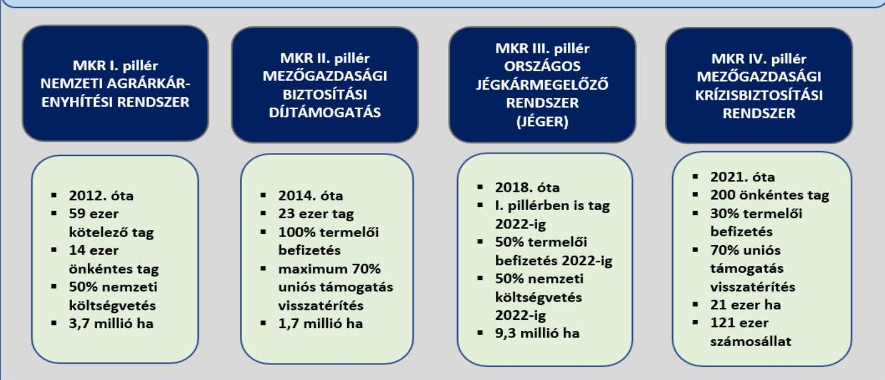

Forrás: AM adatai alapján ÁSZ szerkesztés

---

# Az I. pillér - a nemzeti agrárkár-enyhítési rendszer 

Az agrárkár-enyhítési rendszer a kedvezőtlen időjárási jelenségek - aszály, belvíz, felhőszakadás, jégeső, mezőgazdasági árvíz, őszi-, téli- és tavaszi fagy, vihar - által a mezőgazdasági termelésben okozott károk bizonyos mértékű kompenzációjának a lehetőségét teremti meg.

A kockázatközösségben tag mezőgazdasági termelő legfeljebb növénykultúránként a hozamértékcsökkenésnek $80 \%$-os mértéke szerinti kárenyhítő juttatásra jogosult, amely mértékbe bele kell számítani az ugyanazon elszámolható költségek tekintetében megállapított, bármely egyéb - állami vagy uniós társfinanszírozású - támogatást és a törvény szerinti aszály, belvíz, felhőszakadás, jégeső, mezőgazdasági árvíz, tavaszi fagy, őszi fagy, téli fagy vagy vihar miatt bekövetkező káresemény után a biztosító által kifizetett (2023. október 31-étől: a biztosító által megállapított) kártérítési összeget is.

A kockázatközösségben tag mezőgazdasági termelő a neki járó kárenyhítő juttatás felére volt jogosult, amennyiben az egységes kérelem, valamint a kárenyhítő juttatás iránti kérelem adatai alapján számított üzemi szintű referencia hozamértékének legalább felére kiterjedően - az adott kárenyhítési évre vonatkozóan - nem kötött az adott növénykultúrára jellemző aszály, belvíz, felhőszakadás, jégeső, mezőgazdasági árvíz, tavaszi fagy, őszi fagy, téli fagy vagy vihar miatt bekövetkező káreseményre kiterjedő hatályú mezőgazdasági biztosítást. A jogszabály előírása 2023. november 1-jétől változott, és a maximális mértékủ kárenyhítő juttatás feltétele lett a biztosítási szerződés hozamcsökkenést kiváltó káresemény bekövetkezése előtti megkötése és díjrendezettsége, vagy 2024. január 1-jétől ilyen mezőgazdasági biztosítás hiányában a mezőgazdasági krízisbiztosítási rendszerben a krízisbiztosítási hozzájárulási kötelezettség határidőben történő teljesítéséhez kapcsolódó tárgyévi tagsággal rendelkezés.

## Az agrárkár-enyhítési rendszerben közvetlenül résztvevő szervezetek

Az agrárkár-enyhítési rendszerben résztvevő szervezetek különböző feladatait jogszabályokban határozták meg, amelyek az ellenőrzés keretében vizsgálatra kerültek.

Az Agrárminisztérium jogszabályok által előírt feladatai alapján:

- kezeli a „Nemzeti agrárkár-enyhítés" alcímen található fejezeti kezelésű előirányzatot;
- a Kincstár és a NÉBIH adatszolgáltatása alapján folyamatosan nyomon követi a kárbejelentések alakulását, szükség szerint kezdeményezi a költségvetési többletforrás bevonását;
- jóváhagyja a Kincstár által megküldött, a kárenyhítő juttatás összegére készült kifizetési tervet;
- ellátja és koordinálja az agrárkár-enyhítési rendszert érintő jogszabályok alkotásával és módosításával kapcsolatos feladatokat;
- jóváhagyja a biztosítók által a mezőgazdasági biztosításra vonatkozó különös szerződési feltételeket;
- az aszályhelyzetről, illetve a mezőgazdasági árvízhelyzetről a miniszter közleményt ad ki;
- az AKI Agrárközgazdasági Intézet ${ }^{10}$ által elkészített éves referencia árak, ársávok és átlaghozamadatok felhasználásával sajtóközleményben teszi közzé a mezőgazdasági termelők részére az adott év kárenyhítő juttatás iránti kérelem benyújtását tartalmazó információkat;
- nemzetközi konferenciákra résztvevőket delegál, tapasztalatesere céljából külföldi országokkal egyeztetéseket folytat.

---

A Kincstár az agrárkár-enyhítési szervi feladatokat látja el, ennek keretében a jogszabályok által előírt feladatai:

- határozatot hoz a kárenyhítési hozzájárulás-fizetési kötelezettség összegéről;
- rögzíti a mezőgazdasági kockázatkezelési adatbázisban a kárenyhítési hozzájárulás befizetési kötelezettséget, annak teljesítését;
- vizsgálja a kárenyhítő juttatás iránti kérelmek jogosságát, és erről döntést hoz;
- értesíti a mezőgazdasági termelő́t a kárenyhítő juttatás iránti igénye kielégítésének mértékéről;
- teljesíti a kifizetéseket, szükség szerint megállapítja a visszafizetési kötelezettséget;
- rendelkezik a fejezeti kezelésű előirányzat szakmai költségvetési fejezeti alszámlájára átvezetett pénzeszköz felett;
- múködteti az MKR adatbázist.

A vármegyei kormányhivatalok az agrárkár-megállapító szervi feladatokat látják el, ennek keretében jogszabályok által előírt feladatai:

- ellenőrzik a káresemények megtörténtét;
- megállapítják a hozamcsökkenés és a hozamérték-csökkenés mértékét;
- elbírálják a kárbejelentéseket, döntéseket hoznak a mezőgazdasági termelő kárbejelentése alapján, és a kárenyhítő juttatás iránti kérelmére.
A NÉBIH jogszabály alapján mezőgazdasági igazgatási szerv, továbbá az AM-et a kormányhivatalok szakmai irányításában támogató szervezet. Ennek keretében:
- aszálykár, illetve mezőgazdasági árvízkár tekintetében szakvéleményben szolgáltat adatot a miniszter részére a káreseménnyel érintett termelők becsült számáról, a hozamcsökkenés várható mértékéről, valamint az aszály, illetve a mezőgazdasági árvízhelyzet területi megoszlásáról. E szakvélemény alapján adja ki az agrárminiszter azt a közleményt, ami alapján aszálykár és mezőgazdasági árvízkár után kifizethető a kárenyhítő juttatás;
- képviseli a kormányhivatalokat a szakmai fórumokon, egyeztetéseken;
- működteti a vármegyei kormányhivatalok feladatellátásához használt KMTR ${ }^{11}$-t;
- a KMTR-ből adatszolgáltatást teljesít a Kincstár és az AM felé.

---

A rendszer 2012. évi átalakítását megelőzően a NÉBIH jogelődje, az MgSZH ${ }^{12}$ területi szervei jártak el agrárkár-megállapító szervként. Az MgSZH megszűnésével a kormányhivatalok lettek az agrárkár-megállapító szervek. Az AM a kormányhivatalok szakmai irányítását látja el, a NÉBIH az MgSZH általános jogutódjaként a szakmai irányítását támogatja. Az MgSZH átszervezését a 2. ábra mutatja be.
2. ábra
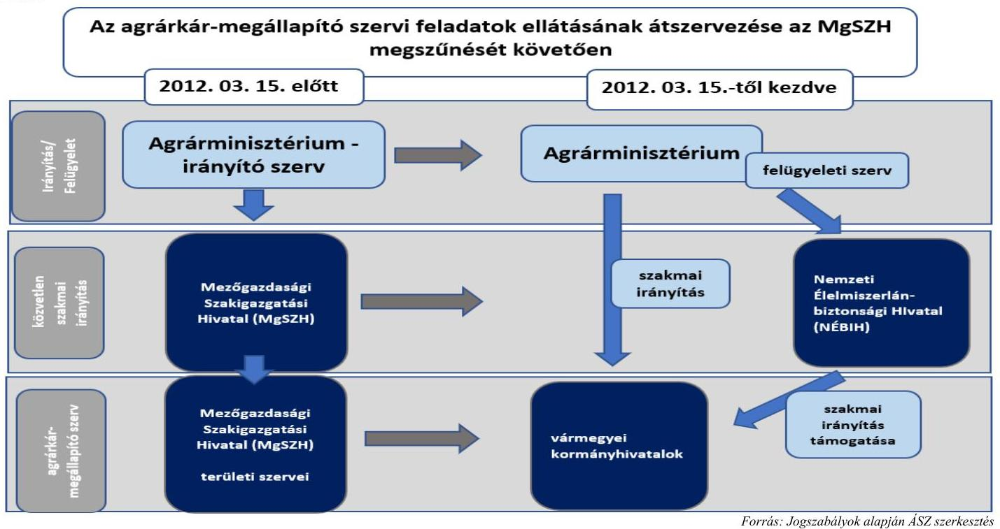

# Az agrárkár-enyhítési rendszerben közvetlenül résztvevő további szervezetek 

Az agrárkár-megállapítási folyamatot, a kormányhivatalok munkáját támogatja adatszolgáltatásával az OMSZ ${ }^{13}$, az $\mathrm{OVF}^{14}$ és a Lechner Tudásközpont ${ }^{15}$. Az MKR II. pillérét érintően a piaci biztosítók a mezőgazdasági termelők által megkötött mezőgazdasági biztosítási szerződések adataira vonatkozóan teljesítenek adatszolgáltatást elsősorban a Kincstár részére. Az AM háttérintézményeként múködő AKI Agrárközgazdasági Intézet határozza meg valamennyi növénykultúrára vonatkozóan az éves referenciaárakat/referencia ársávokat, valamint az éves vármegyei/ országos átlaghozam-adatokat. A piaci biztosítók érdekképviseleti szerve a rendszerben a MABISZ ${ }^{16}$, a mezőgazdasági termelőket a MAGOSZ ${ }^{17}$ támogatja.

## Az agrárkár-enyhítés folyamata

A kockázatkezelési rendszerben közvetlenül résztvevő szervezeteket, és a kárenyhítési folyamatban betöltött szerepüket és feladataikat a 3. ábra mutatja be.

---

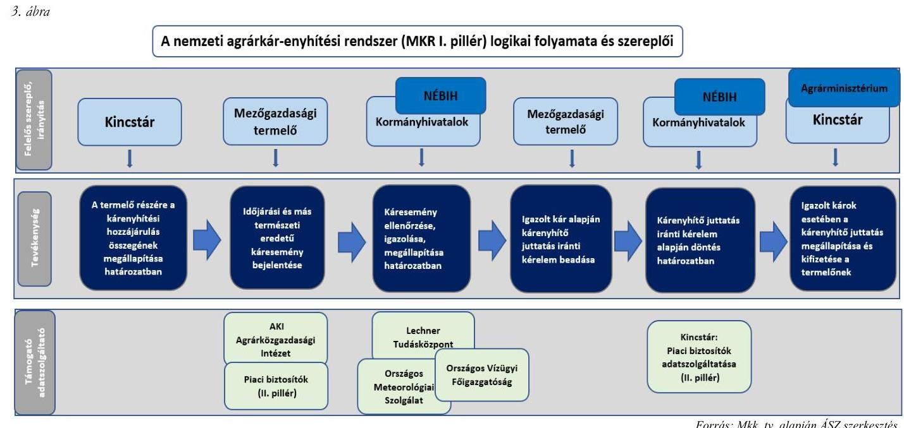

# A kockázatközösség tagjai 

Az Mkk. tv. szerint a mezőgazdasági termelést érintő időjárási és más természeti események által okozott károk miatti kockázatokat a mezőgazdasági termelő, a termény felvásárlására a betakarítást megelőzően szerződött felvásárló, a mezőgazdasági termelővel kötött mezőgazdasági biztosítás esetén a biztosító, a mezőgazdasági földterület bérbe, illetőleg haszonbérbeadója, valamint az állam között kell megosztani.

Az agrárkár-enyhítési rendszerben kockázatközösségi tag mezőgazdasági termelő kárenyhítési hozzájárulást fizet és ezáltal kárenyhítő juttatásra szerezhet jogosultságot. A kockázatkezelési közösségnek kötelezően tagja minden olyan mezőgazdasági termelő, akinek bejelentett termőterülete eléri az Mkk. tv.-ben meghatározott nagyságot. A mezőgazdasági termelő a kockázatkezelési közösséghez nyilatkozatával önkéntesen csatlakozhat hároméves időtartamra, ha a bejelentett termőterülete nem éri el a jogszabályban meghatározott mértéket. A kárenyhítési hozzájárulás mindenkori összegét a termőföld alapján - ültetvényművelésre szolgáló/ szántóföldi zöldség termesztésére/ egyéb szántóföldi kultúra termesztésére szolgáló termőföld - az Mkk. tv. határozza meg.

## „Nemzeti agrárkár-enyhítés" alcimen található fejezeti kezelésú elöirányzat bevételei és kiadásai

A nemzeti agrárkár-enyhítés forrását az AM „Nemzeti agrárkár-enyhítés" fejezeti kezelésű előirányzata biztosítja. Az előirányzat bevételeinek és kiadásainak összefüggéseit a 4. ábra mutatja be.

---

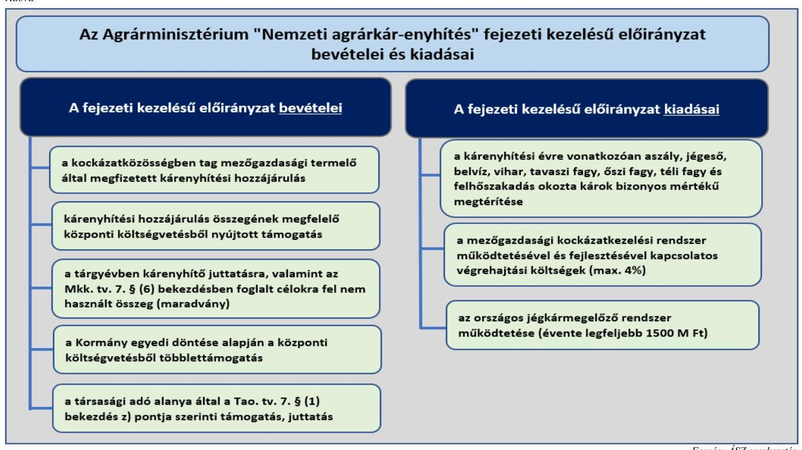

Fonrás: ASZ szerkestés
Az Mkk. tv. szerint a 2013. évtől kezdődően a költségvetési támogatás összege nem lehet kevesebb, mint a tárgyévet megelőző évben az összes, kockázatközösségben tag mezőgazdasági termelő használatában lévő termőföldterület és hasznosítási mód figyelembevételével megállapított összes kárenyhítési hozzájárulás összege. Az előirányzat előző évi maradványa nem vonható el, nem csoportosítható át és nem zárolható. Amennyiben egy adott évben a kárenyhítő juttatások kifizetése nem meríti ki az Agrárkár-enyhítési alapban rendelkezésre álló összeget, úgy a maradvány a következő évben az Agrárkár-enyhítési alap keretét növeli. Ez az összeg védettséget élvez, különös tekintettel arra, hogy az $50 \%$-át a termelői hozzájárulások adják. A „Nemzeti agrárkár-enyhítés" fejezeti kezelésű előirányzat kiadása a 2022. évi - a korábbi évekhez képest - rekordmennyiségű aszálykár-bejelentésre tekintettel a 2023. évben jelentősen, az előző évi 13,3 Mrd Ft-ról 52,6 Mrd Ft-ra emelkedett. A fejezeti kezelésű előirányzat finanszírozási bevételeinek és kiadásainak alakulását az 5. ábra mutatja be.

---

5. ábra

# AZ AM „NEMZETI AGRÁRKÁR-ENYHÍTÉS" FEJEZETI KEZELÉSŰ ELŐIRÁNYZAT FINANSZÍROZÁSI BEVÉTELEI ÉS KIADÁSAI 2012-2023. ÉVEKBEN (MRD FT) 

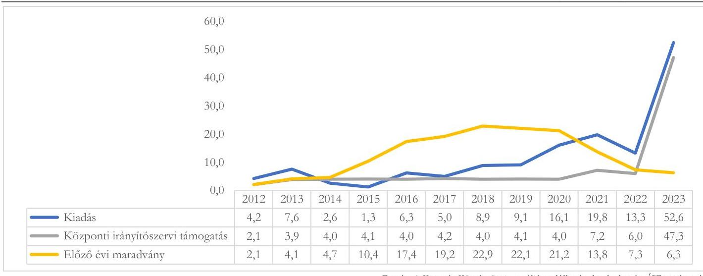

Forrás: A Kincstár Közpénzügyi portálján található adatok alapján ÁSZ szerkesztés

## Az agrárkár-enyhítési rendszert támogató informatikai rendszerek

Az MKR adatbázis az agrárkár-enyhítési rendszer központi IT ${ }^{18}$ adatbázisa. A kockázatkezelési rendszerben résztvevő szervezetek részére jogszabály adatszolgáltatási kötelezettséget ír elő, továbbá e szervezetek feladatellátásukhoz kapcsolódóan közvetve vagy közvetlenül adatot használnak, használhatnak fel az MKR adatbázisból.

A KMTR az MKR adatbázis legszorosabban kapcsolódó IT eleme, elsődleges feladata ügyviteli szoftverként a kárbejelentések és a kárenyhítő juttatás iránti kérelmek elbírálásának informatikai támogatása, amelyhez a kormányhivatalok és a NÉBIH rendelkeznek hozzáféréssel. A KMTR adatait a NÉBIH rendszeresen átadja a Kincstár részére az MKR adatbázisba feltöltés céljából. Az MKR és a KMTR közötti adatszolgáltatás naprakészségét a Kincstár felügyeli. Az MKR adattípusait adatszolgáltatók szerint a 6. ábra mutatja be.
6. ábra
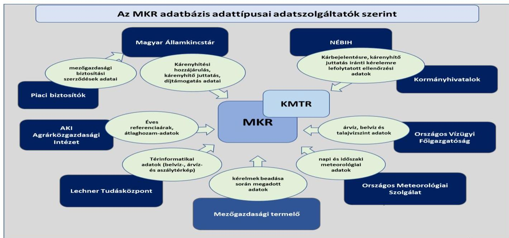

Forrás: ÁSZ szerkesztés

---

# ÖSSZEFOGLALÁS 

A Nemzeti agrárkár-enyhítési rendszer a szakmai célját alapvetően elérte, a kedvezőtlen időjárási jelenségek által a mezőgazdasági termelőknek okozott károk jogszabályban elöírt kompenzációját biztosította. 2021-től a kifizetések teljesitése csak költségvetési többletforrások bevonásával volt lehetséges. A megemelt kárenyhítési hozzájárulás fizetési kötelezettség és a költségvetésből biztosított többletforrások mellett a kompenzáció aránya az évek során csökkent, a termelők elszenvedett kárainak évtől évre egyre kisebb hányadát tudta a központi költségvetés a rendelkezésre álló forrásokból megtéríteni. Az agrárkár-enyhítési rendszer pénzügyi modellje - a termelők és az állam arányos kockázatvállalása - nem valósult meg. A 2024. évtől az agrárkár-enyhítési rendszer finanszírozási szabályai annyiban módosultak, hogy az Agrárkár-enyhítési alap forrását képezi a KAP ${ }^{99}$ Stratégiai Tervéből nyújtott támogatás is, továbbá a mezőgazdasági biztosítások igénybevételével elérhető öngondoskodás ösztönzése érdekében a biztosításokra vonatkozó egyes szabályokat módosították. A pénzügyi fenntarthatóság érdekében azonban további intézkedések szükségesek.
Müködési kockázatot hordoz az agrárkár-enyhítési rendszer szakmai céljának megvalósítására, és a közpénzek védelmére az informatikai rendszerek elavultsága, valamint a felmerüló informatikai problémákra adott válaszok. Az informatikai rendszereknél tapasztalt instabilitás következtében komoly kockázata van annak, hogy - akár teljes adatvesztés mellett - müködésképtelenné válik az ügyintézés. A mezőgazdasági kockázatkezelési adatbázis és a kapcsolódó informatikai rendszerek állapota nem biztosítja az agrárkár-enyhítési rendszer hatékony és célszerú müködését.
A nemzeti agrárkár-enyhítési rendszer müködését a rendszerben résztvevő szervezetek közötti szakmai együttmüködés támogatta, a feladatok összehangolásának, figyelemmel kísérésének, a felmerült problémák kiértékelésének nem volt kijelölt felelőse, így a szakmai irányítás és a feladatok elvégzésének ellenőrzése nem volt teljeskörüen biztosított.

A mezőgazdasági termelést negatívan érintő természeti események gyakorisága, azok gazdasági, társadalmi és környezeti hatásai folyamatosan növekednek, az időjárás okozta károk miatti terméskiesés, illetve áremelkedés a társadalom egészét érinti. A hazai agrárkár-enyhítési rendszer a kedvezőtlen időjárási jelenségek által okozott károk egy részének kompenzálását biztosítja a tagjai számára, a termelők által befizetett kárenyhítési hozzájárulást az állam a központi költségvetésből nyújtott támogatással egészíti ki. Az egyre növekvő mértékủ központi költségvetésből nyújtott támogatás indokolttá tette a nemzeti agrárkár-enyhítés során megítélt támogatásokhoz kapcsolódó folyamatok megfelelőségének, a nemzeti agrárkár-enyhítési rendszer működésének ellenőrzését. Az ÁSZ a témát korábban még nem ellenőrizte.

## Az agrárkár-enyhítési rendszer kiépítettsége és müködtetése

A „Nemzeti agrárkár-enyhítés" fejezeti kezelésű előirányzattal való gazdálkodás keretrendszerét a jogszabályi és a belső előírások alapján kialakították, a rendszer szereplőinek feladatait meghatározták. A nemzeti agrárkár-enyhítési rendszerben résztvevő szervezetek feladatai végrehajtásának koordinálására, irányítására, ellenőrzésére, nyomon követésére nem került kijelölésre szervezet. A kormányhivatalok szakmai irányítását ténylegesen ellátó NÉBIH feladatai nem kerültek meghatározásra, az általa ajánlott intézkedések, iránymutatások nem voltak kötelező erejűek, így számonkérhetőek sem. A NÉBIH két munkatársa végezte a kormányhivatalok munkája során napi szinten felmerülő problémák megoldását, így a munkából való esetleges kiesésük komoly működési kockázatot jelent a káresemény tényének igazolása és a hozamérték, illetve a hozamérték csökkenés megállapítása tekintetében.

---

# Az agrárkár-enyhítési rendszer céljainak megvalósulása 

Az agrárkár-enyhítési rendszer szakmai célját elérte, a termelők kárainak bizonyos mértékủ kompenzációját biztosította védőhálóként, alapbiztonságot teremtve számukra. Azonban a rendszer pénzügyi szempontból nem volt fenntartható, mert nem tudta minden évben biztosítani a jogosnak ítélt károk maximális összegben történő kifizetését. A 2020. kárenyhítési évben a központi költségvetésből nyújtott többlettámogatásra volt szükség a jogos kárenyhítő juttatások teljes összegben történő kifizetéséhez. A 2021. kárenyhítési évben a jogosnak ítélt kárenyhítő juttatásnak csak a $87,2 \%$-át tudták kifizetni a mezőgazdasági termelőknek. A 2022. kárenyhítési évben a központi költségvetésből nyújtott több, mint 40 Mrd Ft-os többlettámogatással együtt is már csak $80,0 \%$-ban tudta a rendszer kielégíteni a jogos igényeket.

Az Agrárkár-enyhítési alap forrásainak védelme érdekében 2024-től több intézkedés került bevezetésre, így többek között a kárenyhítési hozzájárulás mértéke a 2021. évi 50\%-os emelkedés után 2024. január 1- jétől újabb 20\%-kal emelkedett, és az Agrárkár-enyhítési alap forrását jelenti a KAP Stratégiai Tervéből kapott támogatás is.

Az agrárkár-enyhítési rendszer kialakításának egyik célja volt az érintettek arányos felelősségvállalásának megvalósítása. A tagok jogszabályban meghatározott mértékű befizetései mellett nem valósult meg azon elképzelés, hogy a káreseményekkel kevésbé érintett évek után az Agrárkár-enyhítési alapban képződő maradvány fedezze a káreseményekkel nagyobb mértékben érintett évek kifizetéseit. Az Agrárkár-enyhítési alap maradványa folyamatosan csökkent, a 2022. kárenyhítési évre gyakorlatilag elfogyott. A céllal ellentétben az állam jóval nagyobb szerepet vállalt a károk finanszírozásában mint a termelők, az ellenőrzött négy évben - többek között a 2022. év extrém időjárása okozta károk következtében - az összes kifizetésnek csupán negyedét fedezték a termelők befizetései.

## A mezőgazdasági termelők öngondoskodáson alapuló felelősségének megerősitése

A mezőgazdasági biztosítások nem szolgálták kellőképpen az Agrárkár-enyhítési alap védelmét, ezért a 2024. évtől a mezőgazdasági biztosításokkal kapcsolatos szabályok változtak. Az ellenőrzött időszak alatt bevezetett módosítások ellenére továbbra is fennállnak olyan anomáliák - pl. hogy maximális kárenyhítő juttatásra jogosult a termelő bármelyik kártípusra megkötött mezőgazdasági biztosítással, vagy ha a biztosítójuk felé nem is nyújtottak be kártérítési igényt/kérelmet, vagy ha a biztosítók a helyszíni felmérés alapján a kár bekövetkezését nem igazolják -, amelyek nem ösztönzik kellőképpen a mezőgazdasági termelőket a piaci biztosításokkal elérhető, rövid és hosszú távon is fenntartható öngondoskodásra.

## Az agrárkár-enyhítési rendszert támogató informatikai rendszerek

Az agrárkár-enyhítési rendszert támogató informatikai rendszerek és adatbázisok, különösképpen a KMTR, a szükséges fejlesztések hiányában elavultak, nem tudták biztosítani a stabil és megbízható feladatellátást. A rendszer működtetéséhez szükséges adatok egy részét már nem lehetett betölteni az MKR adatbázisba annak informatikai elavultsága miatt, így az adatbázison kívül adták át az információkat a szereplők egymásnak. Az informatikai rendszer a szükségszerű fejlesztések elmaradása miatt nem tudott alkalmazkodni a változásokhoz, az új technológiai lehetőségekhez.

Súlyos informatikai kockázatot jelent, hogy a múködés közben jelentkező hibák nem csupán a KMTR leállásához, helyszíni ellenőrzések el nem végezhetőségéhez, hanem több alkalommal adatvesztéshez is vezettek, és ezekben az esetekben az adatfeltöltések megismétlésére volt szükség. A leállások, adatvesztések okai informatikai szakmai szempontból nem kerültek kielemzésre és így kezelésre sem, azok bármikor ismét előfordulhatnak. A KMTR kiegészítéseként - a hozamérték-csökkenés korrekció

---

kiszámítására - használt táblázatkezelő szoftver rendszerszintű használata a művelet elvégzéséhez szükséges adatok zártságát nem tudta biztosítani.

# Az agrárkár-enyhítésre felhasznált közpénzek védelme 

A kárenyhítési hozzájárulások előírása és beszedése, a kárenyhítő juttatások megállapítása és kifizetése összességében a jogszabályok és a belső szabályzatok előírásainak megfelelően történt. Azonban az informatikai rendszerek instabil múködése miatt bekövetkezett rendszerhasználati korlátozások, illetve az egyszerre beérkezett kárbejelentések száma sokszor nem tette lehetővé, hogy a jogszabályban meghatározott határidőn belül az ellenőrzéseket az adatszolgáltatók által megküldött információk alapján elvégezzék. Az agrárkár-megállapító szervezetek ezekben az esetekben késve, adminisztratív ellenőrzés útján hoztak döntést a benyújtott kárbejelentésekről.

Kockázatot hordoz a közpénzek védelmére, a rendszer hosszú távú fenntarthatóságára a kárenyhítési hozzájárulás fizetési kötelezettség differenciálatlansága, és hogy az informatikai rendszer hiányosságaiból adódóan az adminisztratív ellenőrzések során nincs teljeskörűen biztosítva a jogosulatlan káresemények kiszűrésének lehetősége.

## Az agrárkár-enyhítési rendszer alkalmazkodóképessége

Az agrárkár megállapítási folyamat során észlelt szakmai anomáliákat, kockázatokat a NÉBIH folyamatosan gyűjtötte, azok hatásait az AKI Agrárközgazdasági Intézet rendszeresen kielemezte, az elemzésekről az AM részére jelentések készültek.

A 2022. kárenyhítési év rekord aszálya kihívás elé állította az agrárkár-enyhítési rendszerben résztvevő szervezeteket. A jogos kérelmek száma 286\%-os, a károsodott terület nagysága 338\%-os, a kárkifizetések 361\%os emelkedést mutattak a 2021. évhez képest. A feladatok jelentős megnövekedése és az informatikai rendszerek napi szintű meghibásodása ellenére a kárbejelentésekkel kapcsolatos döntéseket meghozták, a kárenyhítő juttatások kifizetése határidőben megtörtént. Azonban mindez csak úgy volt lehetséges, hogy a kárbejelentések jelentős hányada nem helyszíni ellenőrzés, hanem adminisztratív úton került ellenőrzésre és az alapján került sor a határozathozatalra.

A 2022. évben a rekord aszálykár-bejelentésekre és az ehhez kapcsolódó kifizetésekre tekintettel több agrárszakmai, jogi és szabályozási, informatikai - rendszert érintő probléma is felszínre került, amelynek következtében a szakmai egyeztetések, tárgyalások, továbbá elemzések, lehetséges fejlesztési koncepciók készítése elkezdődött.

Az Agrárminisztérium az ÁSZ tv. 29. § (2) bekezdése szerinti, a jelentéstervezet megállapításaira tett észrevételében arról tájékoztatta az ÁSZ-t, hogy:

- A múködési kockázatok értékelése és javítása egy folyamatos feladat, a rendelkezésre álló lehetőségek keretei között ezt az AM évről évre megteszi. A pénzügyi fenntarthatóság irányába tett különösen nagy jelentőségű lépés az uniós források 2024-től történő bevonása, a termelői befizetések emelése mellett számos további olyan jogi-adminisztratív változtatást végeznek a rendszeren, amelyek szintén ezt a célt szolgálják.
- A biztosítók és kormányhivatalok által végzendő közös kárbejelentések és kárszemlék vonatkozásában 2024. június 21-én megállapodás született állandó munkacsoport felállításáról az ezzel kapcsolatos munka folytatása érdekében.
- A szaporítóanyag-célú termesztés ellenőrzése vonatkozásában jelenleg zajlik a jogszabály-módosítás, ami kiterjed ennek a szabályozásnak a pontosítására.

---

- A fajlagos költségmegtakarítás összegét az AKI Agrárközgazdasági Intézet közreműködésével felülvizsgálják, és 2024. novemberétől a beadott kérelmek esetén a frissített költségtételeket alkalmazzák. Folyamatban van továbbá a kapcsolódó jogszabály-módosítás is, amely szerint a jövőben a költségeket évente fogják megállapítani.
- Az agrárkár-enyhítési rendszer 2024. évi múködtetésére és fejlesztésére meghatározott pénzügyi keretből egy átfogó vizsgálatot terveznek megvalósítani, ami kiterjed a rendszer működtetésében érintett valamennyi szervezet feladatainak átvilágítására, beleértve az IT rendszer továbbfejlesztését is.

---

# AZ ELLENŐRZÉS FÓKUSZTERÜLETEI 

1.     - A nemzeti agrárkár-enyhítési rendszer müködési kereteinek kialakítása, a szakmai irányítási feladatok ellátása
2.     - Az agrárkár-enyhítésre fordítható bevételek megállapítása és teljesítése
3.     - Az agrárkár-enyhítés jogcímen teljesített kifizetések megállapítása és kifizetése
4.     - A kockázatkezelési adatbázis kialakítása, az abban rögzített adatok felhasználása, az adatbázist támogató informatikai rendszerek müködtetése
5.     - Az agrárkár-enyhítési rendszer müködtetésének kockázatai

---

# 1. A nemzeti agrárkár-enyhítési rendszer múködési kereteinek kialakítása, a szakmai irányítási feladatok ellátása 

Összegző megállapítás Az agrárkár-enyhítési rendszer múködési kereteinek kialakítása megfelelő volt. A rendszer szereplői feladatainak végrehajtását szakmai együttmúködés támogatta. A kormányhivatalok szakmai irányításával kapcsolatos feladatokat az ellenőrzött időszakban a szakmai irányítás támogatására kijelölt szerv, a NÉBIH ellátta. A fejezeti kezelésű előirányzat bevételeinek és kiadásainak tervezése szabályszerű volt.

## A fejezeti kezelésü előirányzat kezelésével kapcsolatos hatásköri, felelősségi szabályok meghatározása

Az agrárminiszter az Áht. ${ }^{20}$ és az Ávr. ${ }^{21}$ előírásainak megfelelően kialakította a fejezeti kezelésű előirányzat költségvetési kiadási előirányzatai felhasználásának, a fejezeti kezelésű előirányzattal kapcsolatos tervezési, gazdálkodási, finanszírozási, adatszolgáltatási, ellenőrzési és beszámolási feladatok ellátásának szabályait. A fejezeti kezelésű előirányzattal kapcsolatos felelősségi körök, a javaslattételi, engedélyezési, jóváhagyási, kontroll- és beszámoltatási eljárások szabályait rögzítették az AM fejezeti kezelésű előirányzatok gazdálkodási szabályzat ${ }_{1,2}$-ben $^{22}$, az $\mathrm{AM} \mathrm{SzMSz}_{1,2}$-ben $^{23}$, a TpF ügyrend ${ }_{1,3}$ ban $^{24}$ és a KF ügyrend ${ }_{1,2}$-ben $^{25}$. Az agrárminiszter a Számv. tv. ${ }^{26}$ és az Áhsz. ${ }^{27}$ rendelkezéseinek megfelelően elkészítette az AM ISZ ${ }^{28}$ számlarendjét, számviteli politikáját, a számviteli politika keretében elkészítendő szabályzatokat, amelyek hatálya kiterjedt a „Nemzeti agrárkár-enyhítés" fejezeti kezelésű előirányzatra is. Az AM az Ávr. rendelkezése szerint megkötötte az Együttműködési megállapodást ${ }^{29}$ a költségvetési támogatásokkal kapcsolatos feladatok ellátásának lebonyolításával megbízott Kincstárral. Az Együttműködési megállapodásban rögzítették a Kincstár rendelkezésére bocsátott összeg felhasználásával és elszámolásával kapcsolatos szabályokat, a lebonyolító szerv adminisztratív jellegű feladatait.

## A kormányhivatalok szakmai irányitásával kapcsolatos feladatok ellátása

A 383/2016. (XII. 2.) Korm. rendelet ${ }^{30}$ alapján a kormányhivatalok agrárkár-megállapító feladat- és hatáskörének gyakorlásával összefüggésben a törvényességi és szakszerűségi ellenőrzési hatásköröket az agrárminiszter gyakorolja. A 383/2016. (XII. 2.) Korm. rendelet szerint a NÉBIH a szakmai irányító jogkörök gyakorlásában az agrárminisztert támogató szervezet, az Mkk. tv-ben foglaltak tekintetében mezőgazdasági igazgatási szerv. Az ellenőrzött időszakban az agrárkár-megállapító szervi hatáskörben eljáró kormányhivatalok szakmai irányításával kapcsolatos feladatokat a NÉBIH ellátta. A Nemzeti Élelmiszerlánc-biztonsági Hivatalról szóló 22/2012. (II. 29.) Korm. rendelet meghatározza a NÉBIH és a fővárosi és vármegyei kormányhivatalok közötti irányítási kapcsolatokat, azonban e rendelet a NÉBIH mezőgazdasági kockázatkezelési rendszerben ellátandó feladataira nem terjed ki. A NÉBIH a kormányhivatalok szakmai irányítása keretében:

---

- különböző rendezvényeken előadásokat tartott;
- az agrárkár megállapítási folyamat végrehajtásához módszertani dokumentumokat, ajánlásokat, mezőgazdasági biztosítások ellenőrzését támogató dokumentumokat, KMTR felhasználói segédletet, oktatóvideókat, jogszabályértelmezéseket készített, továbbá elvégezte a referenciahozam korrekciókat;
- a kormányhivatalok kockázat- és problémajelzéseit - kör-emailek, heti jelentések, ügyintézési sorrendet meghatározó és feladatok végrehajtását támogató kimutatások küldésével - kezelte, ezáltal a napi feladatellátás biztosításában aktív szerepet vállalt;
- a KMTR alkalmazásával kapcsolatos problémajelzéseket kezelte.

A NÉBIH - kormányhivatalok szakmai irányítása keretében ellátandó - feladatai jogszabályban, belső szabályzatban, együttműködési megállapodásban, illetve az e feladatokat ellátó szakrendszer-felelősök munkaköri leírásaiban nem kerültek meghatározásra. A NÉBIH e feladatellátása során keletkezett dokumentumai a kormányhivatalokra nézve nem voltak kötelező erejűek, alkalmazásuk nem volt egységes.

A NÉBIH szervezetén belül két fő, a Mezőgazdasági Genetikai Erőforrások Igazgatóság Termelői Nyilvántartások Osztályán foglalkoztatott KMTR szakrendszer felelős és a szakrendszer felelős-helyettes beosztású dolgozó látta el az agrárkár-enyhítési rendszerrel kapcsolatos feladatokat. Kockázatot jelent az operatív munkavégzés biztosítására, hogy két felelős végzi a szakmai irányítási tevékenységet, és kezeli a kormányhivatalok feladatellátásával kapcsolatos problémákat. A munkából való esetleges kiesésük a káresemények igazolása és a hozamérték, illetve a hozamérték-csökkenés megállapítása során komoly múködési kockázatot jelent.

Az AM Mkk. tv. szerinti aszály- és árvízközleményéhez a NÉBIH elkészítette a jogszabályi előírás szerinti tartalommal a szakvéleményét. A NÉBIH az MKR adatbázishoz kapcsolódó KMTR üzemeltetésén keresztül adatszolgáltatások teljesítésével rendszeresen tájékoztatta a kárbejelentések aktuális állapotáról az AM-t és a Kincstárt, azonban az Mkk. tv. vhr. ${ }^{31} 10 . \S$ (4) bekezdésben foglaltak ellenére nem készítette el évente a kárenyhítő juttatás iránti kérelmek országos összesítését a Kincstár részére, továbbá az országosan összesített adatállományból vármegyeszintű és elemi káreseményenkénti bontásban az összefoglaló jelentést az agrárminiszter részére.

# Szakmai együttmüködés 

A nemzeti agrárkár-enyhítési rendszerben résztvevő szervezetek - AM, Kincstár, NÉBIH, kormányhivatalok, mezőgazdasági biztosításokat kínáló piaci biztosítók, AKI Agrárközgazdasági Intézet, OMSZ, Lechner Tudásközpont, OVF - feladatait a jogszabályok határozzák meg, azonban e feladatok végrehajtásának koordinálására, irányítására, ellenőrzésére, nyomonkövetésére nem került kijelölésre szervezet.

A rendszer múködését az e szervezetek közötti, nem hierarchikus viszonyokon alapuló szakmai együttmúködés támogatja.

Az AKI Agrárközgazdasági Intézet által az ellenőrzött időszakban évente megszervezett workshopokon, az AM és a Kincstár által szervezett szakmai egyeztetéseken volt lehetőség a résztvevők számára a szakmai

---

véleményük megfogalmazására, tapasztalatcserére. Jogszabály-módosítás esetén az AM az érintett szervezetekkel egyeztetett.
A rendszer működése szempontjából a biztosítókkal való kapcsolattartás a biztosítói érdekképviseleti szervezet, a MABISZ közreműködésével valósult meg. Az AM, a Kincstár, a NÉBIH, a MABISZ és a biztosítók között évente szakmai egyeztetésre került sor. A mezőgazdasági termelők legnagyobb érdekképviseleti szervezetével, a MAGOSZ-szal az AM tartotta a szakmai kapcsolatot.

# A fejezeti kezelésú előirányzat tervezése 

Az AM a „Nemzeti agrárkár-enyhítés" fejezeti kezelésű előirányzat költségvetési bevételeit és kiadásait, illetve a finanszírozási bevételeit az Áht.-ban, az Ávr.-ben, az Áhsz.-ben, valamint az Mkk. tv.-ben előirtak szerint tervezte meg.
A költségvetési bevételek között a kockázatközösség tagjai által megfizetendő kárenyhítési hozzájárulás előirányzatát tervezték meg az előző évi tényadatokkal azonos összegben azzal, hogy a 2022. költségvetési év tervezésekor figyelembe vették a kárenyhítési hozzájárulás mértékében bekövetkezett $50 \%$-os növekedést. A 2021. július 1-jétől hatályba lépett módosítás szerint a 2022. kárenyhítési évben a szántóföldi zöldségek és ültetvények esetében 4500 Ft , az egyéb szántóföldi kultúrák esetében 1500 Ft volt a hektáronkénti mérték. Az AM számításokkal nem támasztotta alá, hogy miként határozta meg az összeget.
A finanszírozási bevételek között előirányzatként a központi költségvetésből kapott támogatást megtervezték, azt minden évben megnövelve a fejezeti kezelésű előirányzaton a tárgyévet megelőző évben keletkező maradvány összegével.
Az agrárminiszter a 2021. évi Kvtv. ${ }^{32}$, a 2022. évi Kvtv. ${ }^{33}$ és a 2023. évi Kvtv. ${ }^{34}$ jóváhagyását követően az azokban elfogadott előirányzatokkal egyező összegben - elkészítette a fejezeti kezelésű előirányzat 2021-2023. évi elemi költségvetését az Áht., az Ávr. és az Áhsz. előírásai szerint. Az AM a 2024-2026. évekre vonatkozó középtávú szakmai és költségvetési tervét 2023. szeptemberében elkészítette.
Az AM felkérésére az AKI Agrárközgazdasági Intézet modellszámításokat végzett az agrárkár-enyhítési rendszer jövőbeni be- és kifizetéseinek várható alakulásáról többféle szcenárió szerint. Az AKI által 2024. januárjában elkészített, „Az agrárkárenyhítési rendszer fenntartható továbbfejlesztését célzó modellszámítások" című tanulmánya megállapította, hogy az agrárkár-enyhítési rendszer stabil és megbízható működőképességének fenntartásához a jelenlegi támogatási szabályok mellett évente nagyságrendileg mintegy 25 Mrd Ft bevételre lenne szükség. Ez az összeg középtávon lehetőséget teremtene az Agrárkár-enyhítési alapban rendelkezésre álló pénzeszköz növelésére a káreseményekkel kevésbé érintett években és fedezetet biztosíthat a kárigények megfelelő mértékủ kielégítésére egy négyöt évente előforduló rendkívüli időjárási körülményekkel sújtott kárenyhítési év esetén is.

## Az Agrárkár-enyhítési alap bevételeinek és kiadásainak alakulása

Az agrárkár-enyhítésben résztvevő gazdálkodók száma és az általuk megművelt termőföld területének nagysága is arányukat tekintve magas volt az ellenőrzött kárenyhítési években. Az ellenőrzött években a kockázatközösség tagjainak száma 72,9-74,6 ezer között mozgott, az általuk megművelt termőterület az összes vetésterület közel 93,0\%-át fedte le. Az agrárkár-enyhítési rendszer kockázatközösségi tagságát és a tagok termőterületének nagyságát a 7. ábra mutatja be.

---

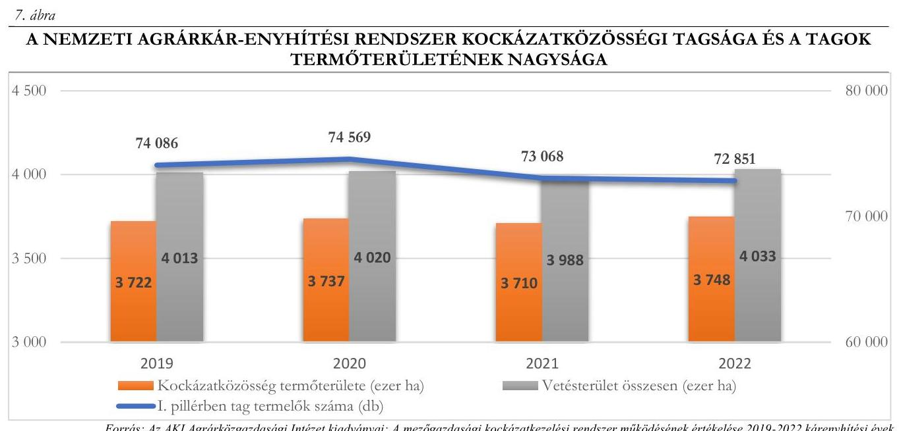

A kárenyhítési hozzájárulás mértéke az ellenőrzött időszakban független volt a művelési módtól (üvegházi, fóliás vagy hagyományos termesztés technológia), a termőterület földrajzi helyétől és a mezőgazdasági termelők kártörténetétől is. Kizárólag attól függött, hogy a mezőgazdasági termelő milyen mezőgazdasági tevékenységet (ültetvényművelés, szántóföldi zöldségtermesztés vagy egyéb szántóföldi kultúrák termesztése) végzett.
A fejezeti kezelésű előirányzaton 2020 volt az egyetlen olyan év, amikor változatlan jogszabályi környezetben a tervezethez képest magasabb összegű kárenyhítési hozzájárulás realizálódott. A 2021. költségvetési évben a kárenyhítési hozzájárulás eredeti bevételi előirányzata 144,2\%-ra teljesült, miközben a kárenyhítési hozzájárulás mértéke - az Mkk. tv. módosítása következtében - 50\%-kal emelkedett.
Az agrárkár-enyhítési rendszerben a kárenyhítő juttatások iránti igények a 2019. kárenyhítési évtől jelentősen megemelkedtek. A kifizetett kárenyhítő juttatások összegének emelkedésében a kedvezőtlenebb időjárási feltételek mellett az ellenőrzött időszakot megelőzően, a kárenyhítő juttatás feltételeinek könnyítése érdekében végrehajtott jogszabály-módosítások (a hozamértékcsökkenési küszöb 30\%-ról 15\%-ra mérséklése, valamint a küszöbérték feltételének üzemi szintről növénykultúra szintre történő módosítása), a díjtámogatott biztosítások időszakos/időleges felfutása (a díjtámogatott biztosítások növekedésével csökkent a kárenyhítő juttatás összegének felére jogosult termelők száma), és a mezőgazdasági termelői árak emelkedése (a növénytermesztés és a kertészeti termékek árai 2020-ban és 2021-ben dinamikusan emelkedtek) is szerepet játszott. Kedvezőtlenül hatott az Agrárkár-enyhítési alapra, hogy 2017. évtől a közép- és nagyvállalkozások is egyre nagyobb mértékben részesültek kárenyhítő juttatásban, tekintettel a fent leírt változásra (üzemi szinten az adott növénykultúrában meghatározott hozamcsökkenési mértékre). Mindezek mellett a 2018. évtől az Agrárkár-enyhítési alapból finanszírozták az országos jégkármegelőző rendszer működtetésének költségeit is.
A „Nemzeti agrárkár-enyhítés" fejezeti kezelésű előirányzat 2020-2023. évi teljesítési adatait az 1. táblázat tartalmazza.

---

1. táblázat

A „NEMZETI AGRÁRKÁR-ENYHÍTÉS" FEJEZETI KEZELÉSŰ ELŐIRÁNYZAT TELJESÍTÉSE 2020-2023. ÉVEK (MILLIÓ FT)

| ELŐIRÁNYZAT | 2020 |  |  | 2021 |  |  | 2022 |  |  | 2023 |  |   |
| --- | --- | --- | --- | --- | --- | --- | --- | --- | --- | --- | --- | --- |
|  |   |   |   |   |   |   |   |   |   |   |   |   |
|  Költségvetési bevételek | 4300,0 | 4595,1 | 106,9 | 4300,0 | 6201,7 | 144,2 | 6400,0 | 6199,9 | 96,9 | 6400,0 | 6154,2 | 96,2  |
|  ebből |  |  |  |  |  |  |  |  |  |  |  |   |
|  kárenyhítési hozzájárulás | 4300,0 | 4487,6 | 104,4 | 4300,0 | 6199,0 | 144,2 | 6400,0 | 6194,6 | 96,8 | 6400,0 | na | na  |
|  Finanszírozási bevételek | 4300,0 | 25273,8 | 587,8 | 4300,0 | 20968,6 | 487,6 | 6400,0 | 13382,7 | 209,1 | 26400,0 | 53561,6 | 202,9  |
|  ebből: |  |  |  |  |  |  |  |  |  |  |  |   |
|  maradvány igénybevétel | - | 21240,4 | - | - | 13766,7 | - | - | 7344,7 | - | - | 6279,4 | -  |
|  központi, irányító szervi tám. | 4300,0 | 4033,4 | 93,8 | 4300,0 | 7202,0 | 167,5 | 6400,0 | 6038,0 | 94,3 | 26400,0 | 47282,2 | 179,1  |
|  Költségvetési kiadások | 8600,0 | 16102,3 | 187,2 | 8600,0 | 19825,7 | 230,5 | 12800,0 | 13303,2 | 103,9 | 32800,0 | 52551,2 | 160,2  |
|  ebből: |  |  |  |  |  |  |  |  |  |  |  |   |
|  kárenyhítő juttatás kifizetés | 6756,0 | 14556,2 | 215,5 | 6756,0 | 18771,2 | 277,8 | 10788,0 | 11235,9 | 104,2 | 30788,0 | 50661,9 | 164,6  |
|  jégeső-elhárító rendszer múködhet. | 1500,0 | 1495,5 | 99,7 | 1500,0 | 1000,0 | 66,7 | 1500,0 | 2000,0 | 133,3 | 1500,0 | na. | na.  |
|  kockázatkezelési rendszer múködit. | 344,0 | 50,6 | 14,7 | 344,0 | 54,5 | 15,8 | 512,0 | 67,3 | 13,1 | 512,0 | na. | na.  |

Fornás: AM „Nemzeti Agrárkár-enyhítés" fejezeti kezelésú elöirányzat költségvetési beszámolói 2020-2022, a Kincstár Közpénzügyi portál adatai, fejezeti indoklások

A fejezeti kezelésű előirányzaton az igénybe vett maradvány összege - a kárenyhítő juttatások növekvő kifizetéseire tekintettel - az ellenőrzött években folyamatosan csökkent. A 2020. évi kifizetések fedezetére 21240,4 millió Ft előző évi maradvány állt az Agrárkár-enyhítési alap rendelkezésére, ami a 2023. költségvetési évre 6 279,4 millió Ft-ra csökkent. A 2020. költségvetési évben az eredeti előirányzathoz képest $87,2 \%$-kal több kiadást teljesítettek az Agrárkár-enyhítési alapból. A többletkifizetésekhez a korábbi évek maradványának igénybevétele is hozzájárult. A 2021. költségvetési évben az eredeti kiadási előirányzatot 130,5\%-kal haladta meg a teljesítés. Ebben az évben a kiadások fedezetére nem volt elég a korábbi évek maradványának igénybevétele, emiatt a Kormány 3138 , 0 millió Ft többletforrást biztosított a fejezeti kezelésű előirányzat javára. A 2022. költségvetési évben - először az MKR bevezetése óta - a rendelkezésre álló forrásokból a jogos kárigényeket teljes mértékben nem tudták kielégíteni, a mezőgazdasági termelők jogosnak ítélt kárenyhítő juttatásait egységesen $12,8 \%$-kal csökkentették. A 2023. költségvetési évben a Kormány által biztosított 41 124,0 millió Ft többlettámogatás ellenére a mezőgazdasági termelők a jogosnak ítélt kárenyhítő juttatásaik 80,0\%-át kapták csak meg. A fejezeti kezelésű előirányzat 2023. költségvetési évi kiadásai $60,2 \%$-kal haladták meg az eredeti előirányzatot.

Az agrárkár-enyhítési rendszer megfelelő működtetésének alapfeltételeként a szükséges nagyságú kockázatközösséget kialakították, ennek ellenére az Agrárkár-enyhítési alap a központi költségvetésből biztosított többletforrásokkal együtt is csak a kifizetési tervben jóváhagyott mértékig nyújtott fedezetet a kárenyhítő juttatások iránti igények teljesítésére.

Az Agrárkár-enyhítési alap bevételeinek összetételét és a kárenyhítő juttatások alakulását a 8. ábra mutatja be.

---

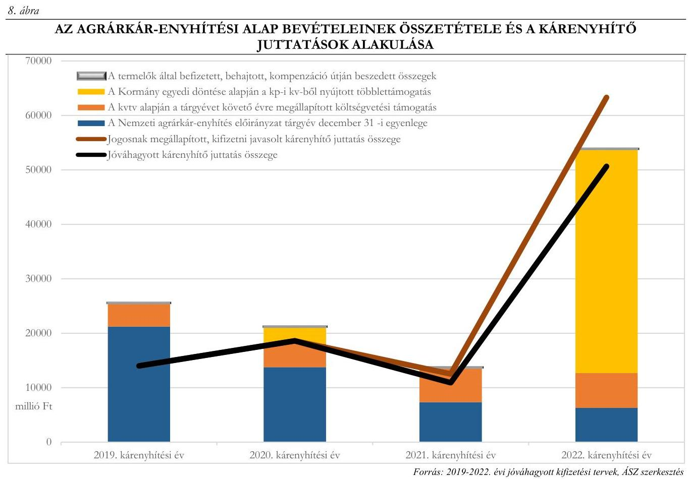

Az agrárkár-enyhítés rendszere az elmúlt négy évben nem tudott megfelelni az Mkk. tv. indokolásában szereplő azon célnak, hogy a kárenyhítő juttatásokat a mezőgazdasági termelők és az állam egyenlő arányban finanszírozza. Az ellenőrzés alá vont négy évben az agrárkár-enyhítési alapból történt kifizetések 24,7\%-át fedezték a termelők által befizetett kárenyhítési hozzájárulások.
Az arány a 2022. kárenyhítési év miatt tolódott el drasztikusan a költségvetésből történő finanszírozás irányába, ebben az évben a rendszerbe korábban csak befizető termelők is jelentős számban jelentkeztek kárenyhítésért, a kockázatközösségi tagok több mint $40 \%$-a nyújtott be kárenyhítő juttatás iránti kérelmet. A 2022. kárenyhítési évben a mezőgazdasági termelők által befizetett összeg több mint 7,5 szeresével járult hozzá az állam a mezőgazdasági termelők kárenyhítéséhez.
Az Agrárkár-enyhítési alap forrásainak védelme érdekében az Mkk. tv. 2024. évtől új rendelkezéseket tartalmaz:

- európai uniós pénzforrások bevonásra kerültek és a mezőgazdasági kockázatkezelési pénzeszköz forrását képezi a Magyarország 2023-2027 évekre vonatkozó KAP Stratégiai Tervéből nyújtott támogatás is;
- a kárenyhítési hozzájárulás mértéke egységesen 20\%-kal megemelkedett;
- a mezőgazdasági termelő részére kifizetésre kerülő kárenyhítő juttatás évi legmagasabb összegét a miniszter a végrehajtási rendeletben állapítja meg;
- az Agrárkár-enyhítési alapot érintően a képviseleti és végrehajtási, nyilvántartási, monitoringadatgyűjtési feladatokat a Kincstár látja el. A Kincstárnak az Agrárkár-enyhítési alap felhasználásával kapcsolatos akkreditálását az AM az általa megadott és a minisztérium hivatalos lapjában közzétett szempontok alapján végzi el.

---

# 2. Az agrárkár-enyhítésre fordítható bevételek megállapítása és teljesítése 

## Összegző megállapítás

A Kincstár megfelelően kialakította az agrárkár-enyhítési rendszerrel kapcsolatos kifizetési és befizetéskezelési feladatai ellátásának kereteit, a kárenyhítési hozzájárulás fizetési kötelezettség megállapításával és teljesítésével kapcsolatos feladatellátása megfelelő volt.

## A kárenyhítési hozzájárulás összegének megállapítása a 2022. kárenyhítési évben

A Kincstár elkészítette az agrárkár-enyhítési szervi feladatainak ellátásához szükséges belső szabályzatokat, a kapcsolódó átruházott és együttmúködés keretében ellátandó feladatok szakmai eljárásrendjeit. A Kincstár SZMSZ ${ }^{35}$-e tartalmazta az agrárkár-enyhítési szervi feladatait, valamint a mezőgazdasági kockázatkezelési adatbázis működtetésével kapcsolatos feladatokat ellátó szervezeti egységek megnevezését és feladatait. A PNTF ${ }^{36}$ és az MVTPF ${ }^{37}$ meghatározta az ellátott feladatok munkafolyamatainak leírását, a szervezeti egység vezetőinek és alkalmazottainak feladat- és hatáskörét, a helyettesítés rendjét, továbbá a szervezeti egység költségvetési szerven belüli belső és azon kívüli, külső kapcsolattartásának módját, szabályait. A Kincstár a Számv. tv., az Áht., az Áhsz., és a 82/2007. (IV. 25.) Korm. rendelet ${ }^{38}$ szerint elkészítette a Számviteli politikáját ${ }^{39}$, számlarendjét, értékelési szabályzatát, valamint a leltározási és leltárkészítési szabályzatát ${ }^{40}$.
A kárenyhítési kockázatközösségben létrejövő tagsági viszonyok kezelésének, valamint a kárenyhítési hozzájárulás-fizetési kötelezettség megállapításának és a kárenyhítési hozzájárulás összegéről történő értesítésnek a részletes eljárási szabályait a Csatlakozáskezelési VHK ${ }^{41}$ tartalmazta. A mezőgazdasági termelők agrárkár-enyhítési rendszerbe történő bejelentkezésekor a Kincstár eljárása megfelelt a jogszabályban előírtaknak.
A Kincstár a 2022. kárenyhítési évben a kárenyhítési hozzájárulás-fizetési kötelezettség összegéről hozott döntéseinél az Mkk. tv.-ben foglaltaknak megfelelően járt el, az Mkk. tv. vhr. előírásának megfelelően határozatban értesítette a mezőgazdasági termelőt, vagy meghatalmazottját a kárenyhítési hozzájárulás-fizetési kötelezettségének összegéről.

## A kárenyhítési hozzájárulás megfizetésének elmulasztásával kapcsolatos feladatellátás a 2022. kárenyhítési évben

A kárenyhítési hozzájárulás fizetési kötelezettségüket elmulasztók adósság- nyilvántartásának vezetésével kapcsolatos feladatok eljárási szabályait az EMGA Számviteli VHK ${ }^{42}$ és a BKO Biztosíték- és Követeléskezelési VHK ${ }^{43}$ tartalmazta. A követelések minősítésével kapcsolatos feladatok eljárásrendjét a Számviteli politika, a BKO Biztosíték- és Követeléskezelési VHK és az EMGA Számviteli VHK megfelelően szabályozta.
A Kincstár az Mkk. tv., az Eljárási tv. ${ }^{44}$ és a 2017. évi CLIII. törvény ${ }^{45}$ előírásait betartva az adók módjára behajtandó köztartozásnak minősülő kárenyhítési hozzájárulás megfizetésének elmulasztása esetén a követelés rendezéséről a mezőgazdasági termelőnek járó támogatás visszatartásával gondoskodott. A határidőre meg nem fizetett hozzájárulások összegének $88 \%$-át az ügyfelek részére jogosan járó támogatás terhére kompenzálta. Eredménytelen beszedés esetén a Kincstár a végrehajtási

---

feladatokat a Nemzeti Adó- és Vámhivatalnak átadta, amely a 2022. kárenyhítési évben összesen 3,8 millió Ft-ot tett ki.

# A fizetési kötelezettségekkel kapcsolatos ellenőrzési és beszámolási tevékenység a 2022. kárenyhítési évben 

Az agrárkár-enyhítési rendszer működtetésével kapcsolatos belső ellenőrzési tevékenység eljárásrendjét a Belső Ellenőrzési Kézikönyv ${ }^{46}$ tartalmazta.
A Kincstár az agrárkár-enyhítési rendszerrel kapcsolatban a folyamatba épített kontrolltevékenységek szabályait az Általános $\mathrm{VHK}^{47}$-ban, valamint a Kincstár, a Kormányhivatalok és a Miniszterelnökség közötti Megállapodásban ${ }^{48}$ szabályozta. A Kincstár a Bkr. ${ }^{49}$-ben foglaltaknak megfelelően végzett folyamatba épített kontrolltevékenységet a kárenyhítési hozzájárulás fizetési kötelezettségének teljesítése kapcsán.
Az Mkk. tv. vhr. szerinti adatoknak az agrárminiszter számára elektronikus úton történő elérhetővé tételének rendjét az Együttműködési megállapodásban megfelelően szabályozták.
A kárenyhítési hozzájárulás részletező nyilvántartásának vezetésénél a Kincstár betartotta az Áhsz.-ben foglaltakat. Az Mkk. tv.-ben és az Mkk. tv. vhr.-ben előírt, a kárenyhítési hozzájárulás-fizetési kötelezettség megállapítására vonatkozó, AM felé teljesítendő jelentéstételi kötelezettségének a Kincstár határidőben eleget tett.

## 3. Az agrárkár-enyhítés jogcímen teljesített kifizetések megállapítása és kifizetése

Összegző megállapítás A kormányhivatalok a kárenyhítő juttatás igénybevételére vonatkozó eljárásaikkal kapcsolatos feladataikat, valamint a Kincstár a kárenyhítő juttatás igénybevételére vonatkozó feladatait összességében megfelelően hajtották végre.

## A káresemények tényének igazolása a 2022. kárenyhítési évben

A kormányhivatalok agrárkár-megállapító szervi tevékenységének szervezeti kereteit az Áht.-ban előírtak szerint a KH SZMSZ ${ }^{50}$-e tartalmazta. A földművelésügyi feladatokat a KH SZMSZ ${ }_{1,2,3}$ alapján a BKVKH ${ }^{51}$, a BVKH ${ }^{52}$, a HBVKH ${ }^{53}$ és a TVKH ${ }^{54}$ esetében az Agrárügyi Főosztály, a PVKH ${ }^{55}$-ban pedig a Földművelésügyi és Erdészeti Főosztály végezte.
A kormányhivatalok agrárkár-megállapító szervi feladatellátásának belső rendjét és módját, a feladat- és hatásköröket, valamint a kapcsolattartás szabályait az Ávr.-ben, valamint a KH SZMSZ-ben foglaltaknak megfelelően ügyrendekben határozták meg. A belső szabályozók a kárenyhítő juttatás igénybevételére vonatkozóan általános előírásokat tartalmaztak.
A kormányhivatalok az Mkk. tv. szerinti döntések meghozatala során alkalmazandó kontrolleljárásokat a kormányhivatalok vezetői által kiadmányozott ügyrendekben, valamint a folyamatleírásokban és az ellenőrzési nyomvonalakban általánosságban határozták meg, részletes leírást nem készítettek. A kormányhivatalok az agrárkár-megállapító szervek részére előírt feladatokat az Mkk. tv., az Mkk. tv. vhr. és az Eljárási tv. IV. fejezetében meghatározott módon végezték. A kormányhivatalok nem készítettek belső eljárási és módszertani útmutatókat feladataik végrehajtásához. Az agrárkár-megállapító

---

szervként végzett munkájukhoz a NÉBIH készített szakmai iránymutatásként tananyagokat, segédleteket, kimutatásokat; amelyek nem voltak kötelező érvényűek és egységes alkalmazásuk sem került előírásra.
A kormányhivatalok az Mkk. tv. és az Mkk. tv. vhr. előírásai figyelembevételével, a helyszíni és az adminisztratív ellenőrzések megállapításaira alapozva, parcella szinten hozták meg a kárbejelentések elfogadásával kapcsolatos határozatukat, amelyet a 9. ábra mutat be.
9. ábra

# AZ ÖT, MINTATÉTELLEL ÉRINTETT KORMÁNYHIVATAL KÁRBEJELENTÉS ELBÍRÁLÁSA SORÁN MEGHOZOTT DÖNTÉS SZÁMAI MEZŐGAZDASÁGI PARCELLA BONTÁSBAN 

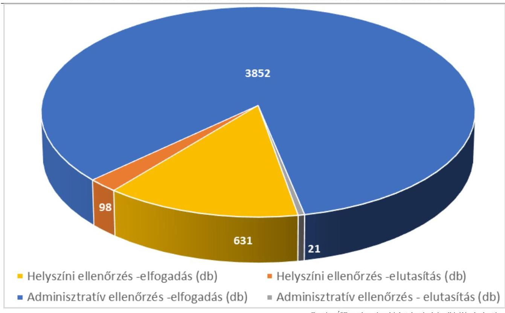

A KMTR a helyszíni ellenőrzések során készített jegyzőkönyvek adattartalmát az Ákr. ${ }^{56}$ és az Eljárási tv. előírásainak megfelelően visszakereshetően tartalmazta, azonban dokumentum formájában ezeket előállítani a rendszer nem tudta. A helyszíni ellenőrzés megalapozásával történő döntéshozatal esetében (a parcellák 15,8\%-a) a helyszíni ellenőrzésről készített jegyzőkönyvek dokumentum formában nem álltak rendelkezésre, így az Eljárási tv. 52. § (2a) bekezdés g) pontjában előírt - a jelen lévő, az eljárási cselekményben érintett személy, az eljárási képességgel nem rendelkező személy képviselője, a hatósági tanú, az eljáró ügyintéző és a jegyzőkönyvvezető oldalankénti aláírását tartalmazó - írásos dokumentum nem állt rendelkezésre.

A kormányhivatalok az Mkk. tv. vhr. 5. § (8) bekezdésében foglaltak ellenére az adminisztratív ellenőrzés alapján meghozott határozatok 59,8\%-ánál ( 116 db határozat) a mezőgazdasági káresemény bejelentésétől számított tíz napos határidőn túl hozták meg a döntéseket. A határozatok indokolása nem tartalmazta az Eljárási tv. 55. § (4b) bekezdés ed) pontjában foglaltak ellenére az ügyintézési határidő túllépése esetén az ügyintézési határidő leteltének napját. A határidőn túl meghozott határozatok számát a 2. táblázat mutatja be.

---

2. táblázat

# 2022. ÉVI KÁRENYHÍTÉSI ELJÁRÁS SORÁN A HATÁRIDŐN TÚL MEGHOZOTT HATÁROZATOK SZÁMÁNAK ALAKULÁSA 

| HATÁRIDŐ TÜLLÉPÉS NAPJÁINAK SZÁMA | HATÁROZAT DARABSZÁMA   A 2022. ÉVI KÁRENYHÍTÉSI ÉVREN |
| :--: | :--: |
| 1-7 nap | 4 |
| 8-30 nap | 43 |
| 31-60 nap | 40 |
| 61 nap | 29 |

Forrás: ÁSZ szerkesztés a kárbejelentések és elbirálásuk alapján

A kormányhivatalok az Mkk. tv. vhr. előírásainak megfelelően nem igazolták a káreseményeket több elemi káresemény, termelői visszavonás, valótlan adatszolgáltatás vagy a kárbejelentés meg nem alapozottsága esetén. Az elutasító megállapításokat is tartalmazó határozatok 71,4\%-ánál (85 parcella, az összparcella $1,8 \%$-a) az elutasító megállapításra a mezőgazdasági termelő valótlan adatszolgáltatása vagy a kárbejelentés meg nem alapozottsága miatt került sor, amelyet a 10. ábra szemléltet.
10. ábra
2022. ÉVI KÁRENYHÍTÉSI ELJÁRÁS SORÁN A KORMÁNYHIVATALOK ELUTASÍTÓ MEGÁLLAPÍTÁSAI A MEZŐGAZDASÁGI TERMELŐ KÁRBEJELENTÉSÉBEN VALÓTLAN ADAT SZOLGÁLTATÁSRA, A KÁRBEJELENTÉS MEG NEM ALAPOZOTTSÁGÁRA
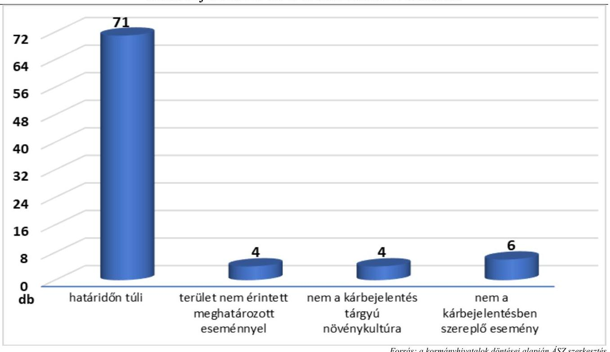

Az Mkk. tv. vhr. előírásában együttesen kerültek megállapításra és felsorolásra a valótlan adatszolgáltatásnak és a meg nem alapozott kárbejelentésnek az esetei. A jogszabályi felsorolás alapján nem állapítható meg, hogy az egyes esetek melyik kategóriába tartoznak, azonban az Mkk. tv. vhr. 16. § (1) bekezdése jogszabályi szankciót egyedül a valótlan adatszolgáltatás esetén állapított meg.

---

# A hozamérték-csökkenés megállapítása a 2022. kárenyhítési évben 

A hozamérték-csökkenés megállapításáról szóló határozatokat a kormányhivatalok határidőben meghozták, a hozamérték csökkenés összegének megállapítása szabályszerű volt. A hozamértékcsökkenést megállapító határozatokban az Ákr. 81. § (1) bekezdésében és az Eljárási tv. 55. § (4b) bekezdésének ee) pontjában előírtak ellenére nem volt teljeskörű a döntés indokaira, valamint az azt megalapozó jogszabályhelyek megjelölésére kiterjedő indokolás, mivel az indokolás nem tartalmazta az Mkk. tv. 14. § (2) bekezdés g) pontja szerinti, a mezőgazdasági termelővel kötött mezőgazdasági biztosítás 11. $\S$ (5) bekezdésében foglaltaknak való megfelelőségéről szóló jogszabályi hivatkozást.

## A kárenyhítő juttatások összegének megállapítása a 2022. kárenyhítési évben

Az agrárminiszter az Mkk. tv. vhr.-ben megállapította a kárenyhítő juttatás igénybevételével kapcsolatos végrehajtási szabályokat. A Kincstár kidolgozta az agrárkár-enyhítési szervi feladatok ellátása körében a kárenyhítő juttatás összeg megállapításhoz szükséges belső eljárásokat, az azokhoz kapcsolódó átruházott és együttműködés keretében ellátandó feladatok szakmai eljárásrendjeit. A Kérelemkezelési VHK ${ }^{57}$ tartalmazta a kérelemkezelés részletes eljárási szabályait, így a kárenyhítő juttatás iránti kérelem adatainak kezelése során követendő eljárásrendet, a visszautasítandó kérelmek kezelése során alkalmazandó eljárást, a kárenyhítő juttatás megállapításának, a kifizetési terv és a kárenyhítő juttatás kifizetésével kapcsolatos feladatokat.
A döntések meghozatalára az Eljárási tv., az Mkk. tv., az Mkk. tv. vhr. rendelkezései figyelembevételével, valamint a belső szabályozókban foglaltak szerint került sor. A kárenyhítő juttatás mértékére vonatkozó európai uniós iránymutatásnak megfelelően, az Mkk. tv. alapján a kifizetési terv legfeljebb a hozamérték-csökkenés $80 \%$-os mértékének megfelelően került elkészítésre és elfogadásra. A határozatok indokolás része tartalmazta a kárenyhítő juttatás mértékének 20\%-os visszaosztású arányos csökkentését.

## A kárenyhítő juttatások kifizetése a 2022. kárenyhítési évben

A kárenyhítő juttatások kifizetésekor a Kincstár a végrehajtott feladatait az Mkk. tv., az Mkk. tv. vhr., a 36/2017. FM rendelet ${ }^{58}$ előírásai, az Áht., az Áhsz. és a 82/2007. (IV. 25.) Korm. rendelet rendelkezései, valamint a belső szabályozók előírásai alapján összességében megfelelően ellátta. A kifizetések összege megegyezett a kárenyhítő juttatásról szóló döntésekben meghatározott értékekkel. A kifizetések teljesítése határidőben megtörtént.
A fizetési megbízások technikai elvégzésével kapcsolatos belső szabályozások nem voltak összhangban, mivel a 16/2018 sz. EHU ${ }^{59}$ IV. fejezete az utalványozást az Elektra rendszeren keresztül GIROLock kártya alkalmazásával írta elő, azonban a Kincstár az utalást az Együttmüködési megállapodás 3.7.3. és 4.2. pontjában foglaltak szerint 2023. január 1-jétől a Számlavezető Rendszeren keresztül végezte el.

A dokumentumokon az Ávr. 59. § (3) bekezdés g) pontjában foglaltak, továbbá a 16/2018 sz. EHU III.IV. fejezetben előírtak ellenére nem szerepelt az utalványozó megnevezése és keltezéssel ellátott aláírása, elektronikus utalványrendelet esetén a legalább fokozott biztonságú elektronikus aláírása. Ennek következtében nem volt megállapítható az Ávr. 60. § (1) bekezdésében szereplő összeférhetetlenségi követelmények betartása, miszerint az érvényesítő ugyanazon gazdasági esemény tekintetében nem lehet azonos az utalványozásra jogosult személlyel.
A kárenyhítő juttatás kifizetésének számviteli elszámolása megfelelt a Számv.tv., az Áht., az Áhsz., az Eljárási tv., a 82/2007. (IV. 25.) Korm. rendelet, a Számviteli Politika, az EMGA Számviteli VHK részét

---

képező számlatükör és számlarend előírásainak. A költségvetési és a pénzügyi számvitel könyvvezetése, a kötelezettségek nyilvántartása megfelelő volt.

# A kárenyhítő juttatásokkal kapcsolatos ellenőrzési és beszámolási tevékenység a 2022. kárenyhítési évben 

A Kincstár a kárenyhítő juttatások megállapításával és kifizetésével kapcsolatos folyamatba épített kontrolltevékenységet és belső ellenőrzést a Bkr. előírásainak, valamint az Általános VHK, a Csatlakozáskezelési VHK és a Kérelemkezelési VHK együttesen alkalmazandó előírásainak megfelelően hajtotta végre. A belső ellenőrzés megfelelt a Kincstár SZMSZ 2. függelék és - a 2022. kárenyhítési évre vonatkozóan - a Kincstár 2023. évi belső ellenőrzési munkatervében foglaltaknak. A Kincstár az Mkk. tv. vhr.-ben, az Együttműködési megállapodásban és a Kérelemkezelési VHK-ben előírt, az agrárminiszter részére történő beszámolási kötelezettségének eleget tett.

## A kárenyhítő juttatások és a biztositási kifizetések alakulása a 2019-2022. kárenyhítési években

A 2019-2022. években összesen 38,8 Mrd Ft kártérítést fizettek ki a biztosítók, ennek 86,9\%-át a 2022. kárenyhítési évben. Az ellenőrzött években a biztosítótól kártérítést kapó mezőgazdasági termelők aránya alacsony volt, a legsúlyosabb káreseményekkel érintett 2022. évben is a kárbejelentők mindössze 13,5\%-a részesült biztosítói kártérítésben. A biztosítótól kártérítésben részesülő termelőkhöz képest a kárenyhítő juttatásban részesülő mezőgazdasági termelőkön belül a mezőgazdasági biztosítással rendelkezők részaránya ettől jóval magasabb volt. A 2021. kárenyhítési évben 37,7\%, de a rendkívüli aszály sújtotta 2022. kárenyhítési évben is $33,0 \%$ volt a kárenyhítésben részesülő igénylők közül biztosítással rendelkezők aránya. A mezőgazdasági biztosítással rendelkezők és nem rendelkezők számát a kárenyhítésben részesülő termelők körében a 11. ábra mutatja be.
11. ábra

MEZŐGAZDASÁGI BIZTOSÍTÁSSAL RENDELKEZŐK ÉS NEM RENDELKEZŐK SZÁMA A KÁRENYHÍTÉSBEN RÉSZESÜLŐ TERMELŐK KÖRÉBEN A 2019-2022. KÁRENYHÍTÉSI ÉVEKBEN (DB)
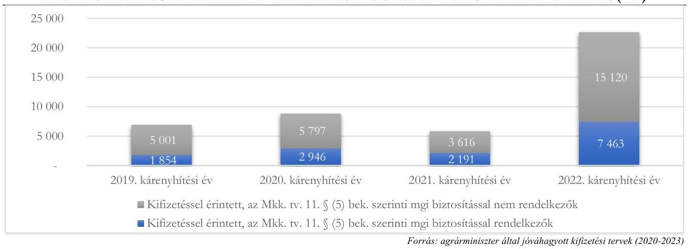

Az ellenőrzött időszakban kifizetett kárenyhítő juttatások 77,2\%-át aszálykárok, 12,8\%-át tavaszi fagykárok enyhítésére fordították, ezzel szemben a kifizetett biztosítási kártérítések 87,3\%-a az aszálykárok kapcsán került kifizetésre a négy ellenőrzött évben. Ha eltekintünk a 2022. évtől, akkor az aszálykárra kifizetett kártérítés csak a $24 \%$-át tette ki az összes biztosítói kifizetésnek. A 2019-2021. kárenyhítési években a kártérítések 34,7\%-át jégesőkárra, 33,5\%-át pedig tavaszi fagykárra fizette a biztosító. A kifizetett biztosítási kártérítéseket és kárenyhítő juttatásokat kárnemenként a 12. ábra mutatja be.

---

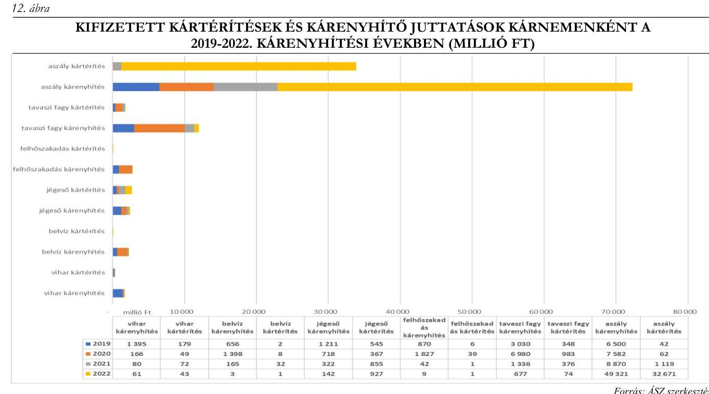

A mezőgazdasági biztosításokkal kapcsolatban felmerült problémák orvoslására, és az állami támogatás hatékonyabbá tétele érdekében 2023 novemberétől a mezőgazdasági biztosításokkal kapcsolatos szabályok változtak:

- bevezetésre került a széles körű biztosítói adatszolgáltatási kötelezettség, amely révén minden, a kárenyhítés szempontjából releváns biztosításról információt kap a Kincstár, függetlenül attól, hogy az a biztosítás díttámogatásban részesült-e;
- szigorították a kárenyhítő juttatás teljes összegű igénybevételének a feltételét. Az öngondoskodás jegyében előírták, hogy a kárenyhítő juttatás összegének megállapításánál kizárólag a káresemény előtt megkötött és díjrendezett biztosítások vehetők figyelembe, melynek ellenőrzése a kormányhivatalok feladata. Meghatározták továbbá, hogy mit kell a hozamesökkenést kiváltó káresemény bekövetkezése előtt megkötött mezőgazdasági biztosítás alatt érteni;
- a fel nem merült költségekkel mérsékelt hozamérték-csökkenés összegének legfeljebb $80 \%$-os mértéke szerinti kárenyhítő juttatás összegébe már nem a kifizetett, hanem a biztosító által megállapított kártérítési összeget kell beleszámítani.
Az Agrárkár-enyhítési alap védelmében a mezőgazdasági biztosítások kapcsán eszközölt 2023 november elejétől bevezetett módosítások nem orvosolták az összes problémát, továbbra is fennállnak olyan anomáliák, amelyek nem irányítják a mezőgazdasági termelőket a piaci biztosításokkal elérhető öngondoskodás irányába:
- bármelyik kártípusra megkötött mezőgazdasági biztosítással jogosultságot szerez a mezőgazdasági termelő maximális kárenyhítő juttatásra, nem szükséges a kifizetéshez a káresemény szerinti biztosítási típus választása. Ezek szerint aszálykárra akkor is maximális térítést kap, ha a biztosítása aszálykárra nem, hanem belvízre, felhőszakadásra, jégesőre, mezőgazdasági árvízre, tavaszi fagyra, őszi fagyra, téli fagyra vagy viharra szól. Ezáltal egy alacsonyabb kockázatú,

---

és így alacsonyabb díjú biztosítással is minden magas kockázatú káreseményre a legmagasabb összegű jogosultságot szerzi meg;

- maximális kárenyhítő juttatásban részesülhet a mezőgazdasági termelő abban az esetben is, amennyiben rendelkezik megfelelő díjtámogatott mezőgazdasági biztosítással, azonban a biztosító felé nem nyújtott be kártérítési igényt/kérelmet;
- maximális kárenyhítő juttatásban részesülhet a mezőgazdasági termelő akkor is, ha a biztosító a helyszíni felmérés alapján a kár bekövetkezését nem igazolja, és ennek következtében részére nem történik biztosítási kártérítés kifizetés, mert a kárenyhítő juttatás feltétele csak a hozamcsökkenést kiváltó káresemény bekövetkezése előtt megkötött és díjrendezett biztosítási szerződés megléte;
- a fel nem merült költségekkel mérsékelt hozamérték-csökkenés összegének legfeljebb 80\%-os mértékủ kárenyhítő juttatás összegéből nem az üzemi szinten megállapított kártérítést, hanem csak az adott növénykultúrára vonatkozó kártérítést vonják le.
A mezőgazdasági biztosítások kapcsán a 2022. kárenyhítési év végéig bevezetésre kerülő jogszabályi változások nem érték el a kívánt céljukat, nem ösztönözték kellőképpen a mezőgazdasági termelőket az öngondoskodásra és nem szolgálták az Agrárkár-enyhítési alap védelmét sem. A 2023. kárenyhítési év során alkalmazásra kerülő jogszabályi módosítások előmozdíthatják az öngondoskodás megerősítését, de további intézkedések meghozatala indokolt.

# 4. A kockázatkezelési adatbázis kialakítása, az abban rögzített adatok felhasználása, az adatbázist támogató informatikai rendszerek múködtetése 

Összegző megállapítás Az MKR adatbázis kialakítása, kezelése, a KMTR állapota nem támogatta az agrárkár-enyhítési rendszer hatékony múködtetését. Az MKR adatbázis adatai a felhasználók számára nem teljeskörűen voltak elérhetőek, amit az érintett szervezetek MKR-en kívüli egyedi adatszolgáltatások teljesítésével oldottak meg. Az informatikai rendszerek a fejlesztés elmaradásának következtében elavultak, instabil működésük kockázatot jelent az agrárkár-enyhítési rendszer szakmai céljainak megvalósítására.

## Az agárkár-enyhítési rendszert támogató informatikai rendszerek, az adatbázisok adatkapcsolatai

Az agrárkár-enyhítési rendszert támogató informatikai rendszernek két fő rendszereleme az MKR adatbázis és a KMTR.
Az MKR adatbázis állami tulajdonban van, amely felett a tulajdonosi jogokat az agrárminiszter gyakorolja, az abban foglalt adatok kezelője a Kincstár. Az adatbázisba adatokat feltöltő egyéb adatszolgáltatók saját szakrendszerekkel rendelkeznek, amelyek interfészekkel kapcsolódnak az adatbázishoz. Az adatbázishoz hozzáférési jogosultsággal csak a Kincstár rendelkezett. A Kincstár az

---

MKR adatbázis működtetéséhez a 36/2017. (VII. 6.) FM rendeletben előírtak szerint megkötötte az AMmel a vagyonkezelési szerződést, továbbá az Áht.-ben foglaltak szerint a Kincstár SZMSZ-ben és a PNTF ügyrend ${ }_{1,2}$-ben ${ }^{60}$ megállapította az MKR adatbázis működtetésével kapcsolatos feladatok ellátásának részletes belső rendjét és módját.
A Kincstár a 36/2017. (VII. 6.) FM rendelet 10. $\$ 1$ ) bekezdésében előírt, az MKR adatbázis adataira épülő elektronikus vezetői információs rendszert működtette, azonban a rendszer működtetése nem valósította meg a 36/2017. (VII. 6.) FM rendelet 10. § (2) bekezdésében megfogalmazott azon célt, hogy a rendszer adatait megismerni jogosultak az adatokat a szakpolitikai döntések megalapozása, valamint a mezőgazdasági kockázatkezelési rendszer működtetése és fejlesztése céljából felhasználják.Az MKR adatbázishoz szorosan kapcsolódó KMTR informatikai rendszert a NÉBIH üzemelteti, hozzáféréssel a kormányhivatalok és a NÉBIH rendelkeznek. A KMTR a kárbejelentések kezelését és elbírálását, a kárenyhítő juttatás iránti kérelem alapján meghozott döntések folyamatait támogatja. A káresemények helyszíni ellenőrzéséhez kapcsolódó adatok a KERET ${ }^{61}$ és az EÜER ${ }^{62}$ alkalmazások révén kerülnek a KMTR-be. A kormányhivatalok ügyintézői részéről helyszíni ellenőrzéskor a tabletekre telepített KMTR-MODUL ${ }^{63}$ alkalmazás kerül használatra.
Az informatikai adatbázisok kapcsolatait a 13. ábra mutatja be.
13. ábra
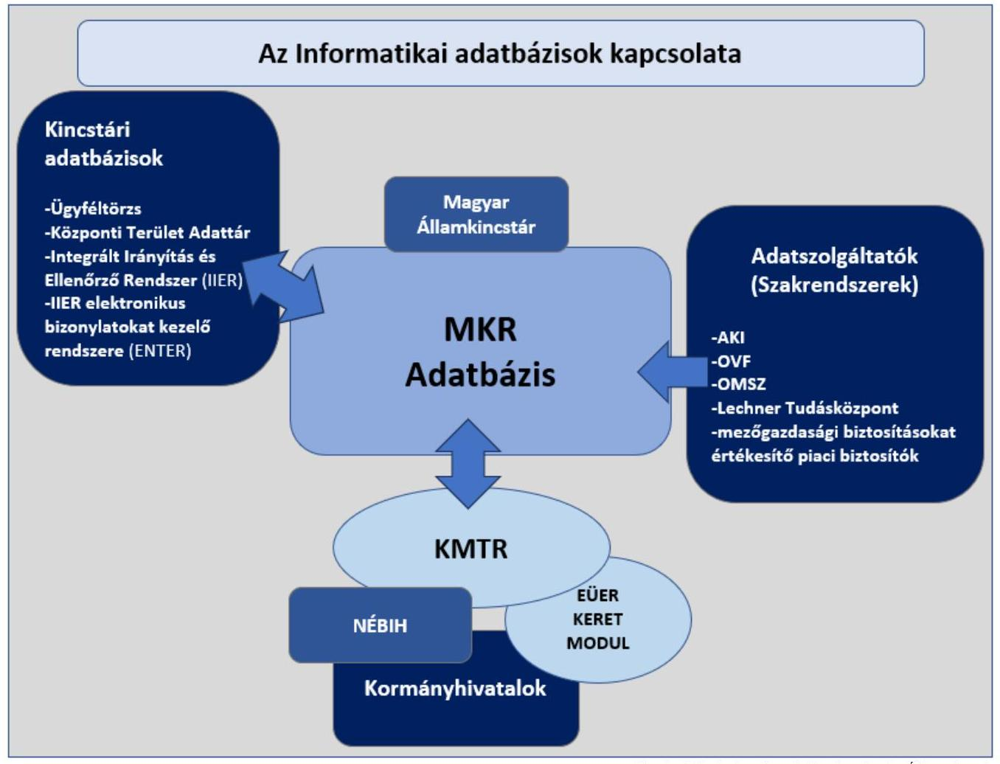

Forrás: Ellenőrzött adatszolgáltatása alapján ÁSZ szerkesztés

---

A Kincstár a 36/2017. (VII. 6.) FM rendelet 1. § (4) bekezdésében foglaltak ellenére a Lechner Tudásközponttal, az OMSZ-szel és az OVF-fel nem kötötte meg az adatok kockázatkezelési adatbázisba elektronikus úton történő feltöltésének rendjéről szóló együttműködési megállapodást. Az AKI Agrárközgazdasági Intézettel, az AM-mel, a díjtámogatott mezőgazdasági biztosítást értékesítő biztosítókkal, a kormányhivatalokkal és a NÉBIH-hel az együttműködési megállapodások megkötésre kerültek a Kincstár részéről.
A kockázatkezelési rendszerben közvetlenül résztvevő szervezetek az MKR adatbázisba adatszolgáltatási kötelezettségüket a 36/2017. (VII. 6.) FM rendelet szerint teljesítették, illetve az MKR-ből közvetve vagy közvetlenül adatot használtak fel.
Az AM az MKR-be adatot nem szolgáltatott, az MKR-hez közvetlen hozzáféréssel nem rendelkezett. Feladatellátását a Kincstár és az AKI Agrárközgazdasági intézet az MKR, a NÉBIH a KMTR adataira épülő adatszolgáltatások teljesítésével, elemzések készítésével támogatta.
A Kincstár a kárenyhítési hozzájárulás megfizetésére vonatkozó, a kárenyhítő juttatás iránti, valamint a mezőgazdasági biztosítási díjtámogatás iránti kérelmek ellenőrzése során keletkező, továbbá a kárenyhítő juttatás, valamint a mezőgazdasági biztosítási díjtámogatás kifizetésével kapcsolatos adatokat szolgáltatta az MKR-be. Feladatainak teljesítéséhez napi szinten használta fel az MKR adatait. A KMTR-hez nem rendelkezett hozzáféréssel, ezért a kárbejelentésekhez, kárenyhítő juttatás iránti kérelmek elbírálásához kapcsolódó adatokat a NÉBIH-től kapta meg. Az MKR és a KMTR közötti adat átadás-átvételt a Kincstár a NÉBIH közreműködésével, illetve lekérdező rendszerek alkalmazásával felügyelte, követte nyomon.
A NÉBIH a mezőgazdasági termelő kárbejelentésére lefolytatott helyszíni, illetve adminisztratív, valamint a kárenyhítő juttatás iránti kérelmére lefolytatott adminisztratív ellenőrzések, továbbá 2022. december 31ig a Pest Megyei Kormányhivatal által a másodfokú, valamint felügyeleti eljárás keretében lefolytatott ellenőrzések adatait szolgáltatta az MKR adatbázisba. A kárenyhítő juttatás igénybevételének folyamata során észlelt kockázatos eseteket a KMTR adataiból készített kimutatások megküldésével jelezte az AKI Agrárközgazdasági Intézet, illetve témához való kapcsolódás esetén a Lechner Tudásközpont (távérzékeléses aszálytérképek elkészítése, termésbetakarítás időpontjának megállapítása) és az OMSZ (rácsponti és mérőállomások adatai közötti eltérés okának vizsgálata) felé.
Az OMSZ a napi és időszaki meteorológiai adatokat rácspontonként, a kárbejelentéshez kapcsolódó napi és időszaki meteorológiai adatokat a kárbejelentéssel érintett parcellánként, továbbá az agrometeorológiai növényélettani modell múködtetéséhez szükséges részletes napi és időszaki meteorológiai adatokat a kárbejelentéssel érintett parcellánként szolgáltatta az MKR-adatbázisba. Az OMSZ az MKR-hez hozzáféréssel nem rendelkezett, az MKR számára szükséges adatok egy külső szerverről töltődtek fel automatikusan. Az adatszolgáltatás teljesítéséről visszajelzés nem történt. Az OMSZ közvetve használt fel adatot az MKR adatbázisból, az AM kezdeményezésére az aszályossági mutatók megállapítását érintően elemzést, a referencia-évek megadásához a Lechner Tudásközpont részére az űrfelvételek alapján azonosított aszályhelyzetek kiértékeléséhez tanulmányt készített, az AKI Agrárközgazdasági Intézettel együttműködve az aszály, a tavaszi fagy és a jégeső kárbejelentések adatait elemezte.
Az OVF a mezőgazdasági árvízre és belvízre, valamint a talajvízszintre vonatkozó adatokat szolgáltatta az MKR adatbázisba. Az adatokat WEB interfészen keresztül egy levelező rendszer automatikusan adta át az MKR-nek, az adatszolgáltatás teljesítéséről visszaigazolás nem történt. Az OVF adatok az MKR rendszerben a Kincstár, a NÉBIH, és a kormányhivatalok számára nem teljeskörűen voltak elérhetőek. Az OVF hozzáféréssel nem rendelkezett, adatot nem használt fel az MKR-ből.

---

A Lechner Tudásközpont a belvízzel, mezőgazdasági árvízzel, aszállyal érintett területekre vonatkozó térinformatikai adatokat (tematikus belvíztérkép, árvíztérkép, aszálytérkép) kellett szolgáltatnia jogszabály szerint az MKR-be. Azonban az MKR adatbázisba annak informatikai állapotára tekintettel nem voltak betölthetők az adatszolgáltatások, azokat külön felületen jelszóval védve teljesítették a Kincstár és a NÉBIH felé. Az MKR-hez hozzáféréssel nem rendelkeztek. Az aszálykár-bejelentési kérelmek elbírálásának támogatására 2022. nyarán - a NÉBIH által átadott kárbejelentések adatai alapján műholdfelvételek és új módszertanon alapuló növényállapot-térképezést végeztek, az így készített térképekkel megállapítható volt a növénykultúra károsodása.
Az AKI Agrárközgazdasági Intézet a növénykultúrákra vonatkozó éves referenciaárakat, éves referencia ársávokat, valamint az egységes kérelemben megjelölhető és a mezőgazdasági kockázatkezelési rendszerben szereplő valamennyi növénykultúrára vonatkozó éves vármegyei, ennek hiányában éves országos átlaghozam-adatokat szolgáltatta az MKR-be. Az AKI Agrárközgazdasági Intézet adatszolgáltatása és adatfelhasználása a Kincstárral és az AM-mel kötött háromoldalú együttműködési megállapodás alapján történt. Az AKI Agrárközgazdasági Intézet évente elkészítette kiadványát az MKR működésének értékeléséről, amely részvétel, károsodás és kárhányadok, ezen belül járásonkénti, ágazatonkénti és méret szerinti bontásban mutatta be az MKR egyes pilléreinek eredményeit.
A mezőgazdasági biztosításokat értékesítő piaci biztosítók közvetett adatszolgáltatói az MKR rendszernek. A Kincstárnak adták át a mezőgazdasági termelő azonosítására szolgáló adatokat, a biztosítónak bejelentett káresemények, valamint a termelő részére a mezőgazdasági biztosítási szerződés alapján kifizetendő kártérítések adatait. Az adatokat a Kincstár töltötte fel az MKR adatbázisba.

# Az agárkár-enyhítési rendszert támogató informatikai rendszerek állapota 

Az Mkk. tv. alapján a mezőgazdasági kockázatkezelési rendszer működtetésével és fejlesztésével kapcsolatos végrehajtási költségek fedezetére a megfizetett kárenyhítési hozzájárulás és a központi költségvetésből nyújtott tárgyévi támogatás összegének legfeljebb 4\%-a (2024. január 1-jétől a központi költségvetésből nyújtott tárgyévi támogatás $8 \%$-a) használható fel fedezetként. Az MKR rendszer fenntartásához a 4\%-os támogatásból az alábbiak finanszírozása történt:

- általános informatikai fejlesztések és üzemeltetés (pl.: informatikai háttértár bővítés, szoftver support stb.);
- meteorológiai és egyéb mérőállomások bővítése;
- a minősített automata meteorológiai mérőhálózat felügyelete (általában évi kettő felülvizsgálat, illetve kiugró adatok esetén azonnali ellenőrzés hibás múködés gyanúja miatt);
- szakmai segítségnyújtás, adatfeldolgozás, szakmai elemzés (pl.: meteorológiai definíciók felülvizsgálata, mérési adatok és kárbejelentések összehasonlítása);
- az adatszolgáltatóknál az MKR adatfeltöltésével foglalkozó kollégák személyi juttatásai;
- a referenciaár és -hozam meghatározása az AKI Agrárközgazdasági Intézetnél, illetve a kapcsolódó éves kiadvány megjelenése, az AKI Agrárközgazdasági Intézet által végzett, az MKR rendszer továbbfejlesztésére vonatkozó vizsgálatok.
A KMTR-t az MKR projekt indítása óta üzemeltető és fejlesztő IT partnertől 2022. januárjában a NÉBIH informatikusai vették át a KMTR üzemeltetési feladatait az új fejlesztő partner teljeskörű feladatellátásának megkezdéséig. A KMTR-en 2018. január 1-jétől 2023. augusztus 31-ig átfogó informatikai

---

fejlesztésre nem, csupán a múködtetés fenntartásához szükséges fejlesztések végrehajtására került sor, további informatikai fejlesztések teszt környezetben állnak rendelkezésre.
A 2022 nyarán bekövetkezett rekord aszály magával hozta a benyújtott kérelmek számának kiemelkedő növekedését, a 2015-ös indulásához képest a 2022. évi kárbejelentések száma megötszöröződött, a kárenyhítő juttatás iránti kérelmeknél közel nyolcszoros volt a növekedés. A megnövekedett terhelés következtében a KMTR naponta több alkalommal leállt, a folyamatok elakadtak. Üzemeltető és fejlesztő partner hiányában a NÉBIH informatikusai a problémák kialakulásának informatikai okait érdemben kezelni nem tudták. Az ügymenet folytonosságának biztosítása érdekében leállás esetén újra indították a szervereket, az elakadt munkafolyamatokat egyedi parancssorok beírásával indították tovább.

A fejlesztések elmaradásának következtében a KMTR a 2022. évben tapasztalt megnövekedett terhelés alatt nem tudott stabilan múködni, az adatvesztés elkerülése nem volt biztositott, a kárbejelentést és a kárenyhítő juttatás iránti kérelem kezelését és elbírálását a KMTR nem tudta hatékonyan támogatni. A KMTR leállása a teljes MKR adatbázis leállását okozhatja, tekintettel az IT rendszerek közötti szoros kapcsolatra.

A helyszíni interjúkon elhangzottak alapján többször előfordult, hogy a megszakadt adatfeltöltések, adatvesztések miatt a kormányhivatalok kénytelenek voltak ismételten felvinni a hiányzó adatokat az adatbázisba, helyszíni ellenőrzés végrehajtását megismételni, illetve egyes esetekben a kárbejelentések ismételt benyújtása vált szükségessé. A KMTR instabilitása miatt végül szükségessé vált a kormányhivataloknál a rendszerbe egy időben beengedett felhasználók számának korlátozása (2022. augusztus 5-től 25-ig vármegyénként egy, augusztus 25-től a kisebb leterheltségű megyékben kettő, a nagyobb leterheltségű megyékben öt ügyintéző léphetett be egyszerre a KMTR-be).
A KMTR az Mkk. tv. és az Mkk. tv. vhr. előírásai alapján szükséges számítások többségét elvégezte a kárenyhítő juttatás kifizetését megelőző döntési folyamatban, azonban a hozamérték-csökkenés összegének adminisztratív ellenőrzési folyamata során az Mkk. tv. vhr.-ben meghatározott korrekció számítást a KMTR nem tartalmazta. A hozamérték-csökkenés korrekció számítást informatikai fejlesztés hiányában a KMTR-en belül nem tudták elvégezni, így ezt a feladatot a KMTR-en kívül, táblázatkezelő alkalmazásban végezhették el a kormányhivatalok ügyintézői. A KMTR-be manuálisan vitték fel az értéket, amely folyamat nem biztosította a rendszer zártságát és visszakereshetőségét.

A KMTR-en kivüli informatikai megoldás alkalmazása az adatok kontroll nélküli módosíthatósága és törölhetősége következtében hitelességi, sértetlenségi, átláthatósági és adatkonzisztencia kockázatokat is felvet.

Az informatikai rendszerek fejlesztésének, korszerűsítésének további hiányát jelzi, hogy egyes adatszolgáltatók által előállított adatok - így a Lechner Tudásközpont műholdfelvételek alapján készített aszálytérképei - befogadására az MKR annak informatikai igényére tekintettel nem volt alkalmas.

---

Az IT rendszert érintően az ellenőrzött időszakban nem került kijelölésre olyan felelős, aki a rendszert koordinálja, múködési kockázatait beazonosítja, nyilvántartja, a lehetséges jövőbeni fejlesztési irányokat meghatározza. Ennek hiányában a kockázatkezelési rendszerben közvetlenül résztvevő szervezetek a saját hatás- és felelősségi körükben üzemeltették, illetve a saját forrásaik, valamint az Mkk. tv. alapján a $4 \%$-os forrás terhére tartották karban a kapcsolódó saját IT rendszerelemüket.

# Az MKR adatbázisba szolgáltatott adatok teljessége és naprakészsége vizsgálatának elvégzésére nem volt kijelölt felelős. 

## 5. Az agrárkár-enyhítési rendszer múködtetésének kockázatai

Összegző megállapítás Különösen a 2022. rekord aszályos év tapasztalataira tekintettel a rendszer újragondolása megkezdődött, a kockázatok beazonosítását követően fejlesztési koncepciók, elemzések készültek.

A 2022. kárenyhítési év a rekord aszályra tekintettel kihívás elé állította a kockázatkezelési rendszerben résztvevő szervezeteket. A jogos kérelmek száma $286 \%$-os, a károsodott terület (ha) $338 \%$-os, a kárkifizetések (I. és II. pillér) $361 \%$ és $551 \%$-os emelkedést mutattak a 2021. évhez képest. Ez több rendszert érintő problémát is felszínre hozott. Szakmai egyeztetések kezdődtek meg az AM, a Kincstár, a kormányhivatalok képviseletében a NÉBIH, az AKI Agrárközgazdasági Intézet, a Lechner Tudásközpont és a biztosítók képviseletében a MABISZ közremúködésével. A szakmai egyeztetéseket a résztvevők dokumentálták, emlékeztetők, feladattervek készültek. A kárbejelentésekhez kapcsolódóan a NÉBIH által jelzett anomáliákról és kockázatokról az AKI Agrárközgazdasági Intézet elemzéseket készített, a Kincstár és a NÉBIH a rendszert érintően tapasztalt kockázatokhoz kapcsolódóan továbbfejlesztési koncepciót dolgozott ki.
A nemzeti agrárkár-enyhítési rendszert érintően az elemzés során beazonosított alábbi kockázatok nem biztosítják a rendszer hatékony múködését.

## A kárenyhítési hozzájárulási mértéke nem differenciált

A kárenyhítési hozzájárulás fizetendő összegét a termőföld nagysága alapján határozza meg az Mkk. tv., egyéb szempontok, feltételek szerint nem tesz különbséget, nem alkalmazkodik az éves referenciaárakhoz, nem követi az inflációt. Ugyanolyan mértékű hozzájárulást fizet az a termelő, akinek az elmúlt években nem keletkezett kára, mint akinek évről évre van és juttatásban részesül. Továbbá nem differenciálja a hozzájárulás mértékét az sem, hogy az esetleges kár megelőzésére tett-e lépéseket a mezőgazdasági termelő vagy sem (pl. öntözi-e a területet). A Kincstár lehetséges forgatókönyveket dolgozott ki a kárenyhítési hozzájárulás összegének emelésére vonatkozóan. Az AKI Agrárközgazdasági Intézet kidolgozott egy lehetséges módszertant aszálykár esetében az öntözés szempontjának figyelembevételére.

## A károk párhuzamos vizsgálata az I. és II. pillérben

Időjárás és más természeti eredetű károk esetén annak bekövetkezését a biztosító és az állam felé is jelzi a mezőgazdasági termelő. A káresemények vizsgálatát párhuzamosan a kormányhivatalok és a biztosítók

---

is elvégzik eltérő módszertan, adat- és információforrás alapján. A kormányhivatalok a biztosítói - illetve a biztosítók a kormányhivatali - vizsgálat megállapításaihoz, az azt megalapozó adatokhoz, információkhoz nem férnek hozzá semmilyen formában. Az agrárkár megállapítási folyamat hatékonyságának érdekében az együttműködés erősítésének igényét a MABISZ és a Kincstár is jelezte a szakmai fórumokon a fejlesztési javaslatai keretében.

# OMSZ adatok elérhetősége és az aszálydefiníció felülvizsgálata 

A kormányhivatalok az agrárkár-megállapítási folyamatban az Mkk. tv. előírása szerint az agro.met adatait és az OMSZ adatszolgáltatására tekintettel az MKR-ben található parcella-szintű pontosabb adatainak scoring minősítését használják fel, ugyanakkor nem ismerik a tényleges pontos adatokat. A mezőgazdasági termelő, amennyiben a kormányhivatal nem igazolja a kárt a törvény szerinti hőmérséklet elérése hiányában, szükség szerint a pontosabb, parcella szintű adat megismerése érdekében az OMSZ-hez fordulhat. Az Mkk. tv. szerinti vélelem és a kárbejelentések, kárenyhítő juttatás iránti kérelmek elbírálásának gyakorlata között így nem teljes az összhang.
Az OMSZ elvégezte a káresemények és az aszályindexek - Mkk. tv. szerinti aszály-definíció és a Standard Precipitation Index (a Meteorológiai Világszervezet által meteorológiai aszály számítására ajánlott alapvető index) - kapcsolatának elemzését a 2019-2020. évek és a 2021. június 10.-szeptember 30. közötti időszakra vonatkozóan. Ennek keretében vizsgálta, hogy a bejelentett káresemények hányad részét azonosítják aszályként a különböző indexek. Az OMSZ az általa végzett elemzés eredménye alapján az Mkk. tv. szerinti aszálydefiníció felülvizsgálatát az éghajlati változásokra tekintettel indokoltnak tartja.

## OVF adatok elérhetősége

Az OVF adatok nem teljeskörű elérhetőségét a Kincstár és a NÉBIH is jelezte a szakmai fórumokon. A NÉBIH részéről azonban felmerült kérdésként az OVF adatok alkalmazhatóságának, adatszolgáltatásának szükségessége, ezáltal a 36/2017. (VII. 6.) FM rendelet 2. § előírásainak felülvizsgálata is.

## Termelői kockázatmérséklés

A jelenlegi szabályozás gazdálkodói kockázatkezelési eszközök alkalmazását (pl. aszálynál öntözés, fagy esetében légkeverés, ültetvényfűtés, füstölés, vihar és felhőszakadás esetén vápa kialakítása, talajkímélő művelés, megfelelő fajta- és termőhelyválasztás, optimális vetésidő és vetésszerkezet, növénytáplálás stb.) nem írja elő a mezőgazdasági termelők részére. Az AKI Agrárközgazdasági Intézet a „Gazdálkodói Kockázatkezelési eszközök, alkalmazásának ösztönzési lebetöségei az MKR I. pillérben" című elemzésében vizsgálta az agrárkár-enyhítési rendszer átalakításának lehetőségét a károk térítése helyett a kármegelőzés hangsúlyosságának szempontjából.

## Fiktív kárbejelentések

Az Mkk. tv. lehetőséget ad a kérelem beadásának korlátlan megismétlésére, megteremtve annak lehetőségét, hogy ha a kormányhivatal idő- illetve erőforrás hiányában nem tudja a (rendelkezésére álló 15 nappal a termés betakarítását megelőzően) helyszínen felmérni az ugyanazon parcellára bejelentett káreseményt, az ismételt kérelem adminisztratív úton teljeskörűen elfogadásra kerülhet.

---

# Mezőgazdasági termelők tájékoztatása 

A gazdák nem megfelelő tájékoztatása, tájékozottsága, a jogszabály-módosítások nem megfelelő ismerete a kérelmek beadása során hiányos vagy nem megfelelő adatszolgáltatást (pl. biztosítási szerződések tartalmát érintően nem megfelelő kárnem kiválasztása) eredményezhet. A termelői adatszolgáltatások anomáliáit jelenleg a kockázatkezelésben résztvevő szervezetek egymás közti kommunikációjával, adatszolgáltatások teljesítésével kezelik: Kincstár - biztosítók/MABISZ, Kincstár - NÉBIH kormányhivatalok.

## Szaporítóanyag-célú termesztés ellenőrzése

Olyan növényfajták esetében is megjelölhető a szaporítóanyag-célú termesztés, amelyek esetében vetésbejelentési kötelezettség nincs a NÉBIH felé. Ezáltal azok NÉBIH általi visszaellenőrzésére nincs lehetőség, és a 383/2016. (XII. 2.) Korm. rendelet alapján az illetékes kormányhivatal részére történő bejelentés hiánya módot teremthet a mezőgazdasági termelő által a magasabb referenciaár jogosulatlan alkalmazására.

## Újravetés/másodvetés során bekövetkezett káresemények alapján kifizetett kárenyhítő juttatás

A mezőgazdasági termelő termőföldje után egy alkalommal fizet kárenyhítési hozzájárulást a kárenyhítési évben. Azonban újravetésnél/másodvetésnél - erre vonatkozó szabály hiányában - lehetőség van arra, hogy egy adott területre két alkalommal is kárbejelentést tegyen. Így lehetséges, hogy ugyanarra a területre egy alkalommal megfizetett kárenyhítési hozzájárulás mellett duplán részesülhet kárenyhítő juttatásban.

## Fajlagos költségmegtakarítás összege

Az Mkk. tv. vhr. alapján a kárenyhítő juttatás összegének megállapítása során az elemi káresemények folytán lecsökkent termés betakarításához kapcsolódó ráfordítás-csökkenést le kell vonni a hozamértékcsökkenés összegéből. A fajlagos költségmegtakarítás összege a rendelet 3. sz. mellékletében 2017. óta nem került módosításra/emelésre.

---

# JAVASLATOK 

Az ÁSZ tv. 33. § (1) bekezdésében foglaltak értelmében az ellenőrzött szervezet vezetője köteles a jelentésben foglalt megállapításokhoz kapcsolódó intézkedési tervet összeállítani és azt a jelentés kézhezvételétől számított 30 napon belül az ÁSZ részére megküldeni. Amennyiben az ellenőrzött szervezet vezetője nem küldi meg határidőben az intézkedési tervet, vagy továbbra sem elfogadható intézkedési tervet küld, az Állami Számvevőszék elnöke az ÁSZ tv. 33. § (3) bekezdése a) és b) pontjaiban foglaltakat érvényesítheti.

## AGRÁRMINISZTERNEK

1. Intézkedjen az agrárkár-enyhítési rendszer müködésében és pénzügyi fenntarthatóságában feltárt kockázatok kiértékelése és azok megszüntetésének kezelése érdekében.
2. Intézkedjen az agrárkár-megállapító szervként eljáró kormányhivatalok szakmai irányítása és a szakmai irányítás támogatása keretében ellátandó feladatok meghatározására, a hatás- és feladatkörök elhatárolására.
3. Intézkedjen az agrárkár-enyhítési rendszerben alkalmazott IT rendszerek informatikai felülvizsgálatára, a feladatellátást támogató, a felhasználói igényeknek megfelelő, a jogosulatlan támogatási igényeket kiszürő IT rendszer kialakítása érdekében.
4. Intézkedjen a mezőgazdasági kockázatkezelési adatbázis müködéséhez szükséges, a 36/2017. (VII. 6.) FM rendelet 2. §-ában meghatározott adatok körének, és az adatokhoz való hozzáféréseknek a felülvizsgálata érdekében, a felhasználói igények figyelembevételével.

## MAGYAR ÁLLAMKINCSTÁr ELNÖKÉNEK

1. Intézkedjen az MKR adatbázis adataira épülő vezetői információs rendszernek a 36/2017. (VII. 6.) FM rendelet 10. § (2) bekezdésében meghatározott cél szerinti müködtetéséről.
2. Intézkedjen a 36/2017. (VII. 6.) FM rendelet 1. § (4) bekezdésében foglaltak szerint a Lechner Tudásközponttal, az Országos Meteorológiai Szolgálattal és az Országos Vízügyi Főigazgatósággal az adatok kockázatkezelési adatbázisba elektronikus úton történő feltöltésének rendjéről szóló együttmüködési megállapodás megkötéséről.

---

# MELLÉKLETEK 

## I. SZ. MELLÉKLET: ÉRTELMEZŐ SZÓTÁR

aszály
elemi káresemény
adminisztratív-, illetve helyszíni ellenőrzés
díttámogatott mezőgazdasági biztosítás
az a természeti esemény, amelynek során a kockázatviselés helyén az adott növény vegetációs időszakában harminc egymást követő napon belül
a) a lehullott csapadék összes mennyisége a tíz millimétert nem éri el, vagy
b) a lehullott csapadék összes mennyisége a huszonöt millimétert nem éri el és a napi maximum hőmérséklet legalább tizenöt napon meghaladja a $31^{\circ} \mathrm{C}$-ot. (Forrás: Mkk. tv. 2. § 1. pont)
üzemi szinten a növénykultúrában 30\%-ot meghaladó mértékű hozamcsökkenést okozó aszálykár, belvízkár, felhőszakadáskár, jégesőkár, mezőgazdasági árvízkár, tavaszi fagykár, őszi fagykár, téli fagykár vagy viharkár (Forrás: Mkk. tv. 2. § 7. pont)
Az agrárkár-megállapító szerv mezőgazdasági káresemény bekövetkezésének ténye és az adott kárenyhítési évben várható hozamcsökkenés mértéke tényeit a kármegállapítást támogató szerv adatain alapuló kockázatelemzés eredményei szerint adminisztratívvagy helyszíni ellenőrzést folytat le.
Az Mkk. tv. vhr.-ben meghatározott adatok, valamint az adminisztratív ellenőrzést megalapozó - különösen a hőmérsékletre, a csapadékmennyiségre, a csapadékintenzitásra, a felszíni vízborítottságra, a talajvízszintre, a távérzékeléses vagy drónfelvételen alapuló adatokból származó megállapításokra vonatkozó adatokon alapuló - kockázatelemzés során felhasznált adatok kétséget kizáróan alkalmasak a mezőgazdasági káresemény bekövetkezésének vagy be nem következésének megállapítására, akkor ezen adatok alapján az agrárkár-megállapító szerv mellőzheti a helyszíni ellenőrzés lefolytatását
a) aszály, nagy kiterjedésű belvíz és mezőgazdasági árvíz esetében, ha igazoltnak találja a mezőgazdasági káresemény bekövetkezését, vagy
b) bármely mezőgazdasági káresemény bejelentését követően, ha megállapítja, hogy a mezőgazdasági káresemény nem következett be. (Forrás: Mkk. tv. 14.§ (3) bekezdés, Mkk.tv. vhr. 5.§ $(3,4,7)$ bekezdései) Olyan mezőgazdasági biztosítási szerződések díja támogatható, amelyek üzemi szinten a növénykultúrában 20\%-ot meghaladó mértékủ hozamcsökkenést okozó kedvezőtlen időjárási jelenségek által okozott veszteségekre nyújtanak fedezetet. (Forrás: Vidékfejlesztési Program Irányító Hatóságának közleménye a díttámogatásban részesíthető mezőgazdasági biztosítási szerződések előzetes jóváhagyásáról dokumentuma)

---

fejezeti kezelésű előirányzat
hozamcsökkenés
hozamérték-csökkenés
interfész
kárenyhítési év
kárenyhítési hozzájárulás
kárenyhítő juttatás
kárküszöb
megfelelőségi ellenőrzés
mezőgazdasági termelő
a fejezeti kezelésű előirányzatok a fejezetet irányító szerv sajátos szakmai, ágazati feladatai ellátása vagy az államnak a fejezethez tartozó költségvetési szervek tevékenységével kapcsolatban felmerülő, illetve szakmailag ahhoz kapcsolódó sajátos kötelezettségei teljesítése során felmerülő költségvetési bevételek és költségvetési kiadások elszámolására szolgálnak. (Forrás: Áht. 6/A. § (3) bekezdés)
a referenciahozam és a tárgyévi hozam különbsége (Forrás: Mkk. tv. 2. $\int 12$. pont)
a referencia hozamérték és a tárgyévi hozamérték különbsége (Forrás: Mkk. tv. 2. $\int 13$. pont)
két eszköz, rendszer közötti csatlakozási felület, kapcsolatot biztosító eszköz (Forrás: Ász megfogalmazás)
A kárenyhítési év a tárgyévet megelőző év november 1-jétől tárgyév október 31-ig terjedő időszak. (Forrás: Ász megfogalmazás az Mkk. tv. vhr. előírásai alapján)
a kockázatközösségben tag mezőgazdasági termelő által az Mkk. tvben foglaltaknak megfelelően a tárgyévben közteherként teljesítendő befizetés. (Forrás: Mkk. tv. 6. § (4). bekezdés a) pont)
az Mkk.tv. 7. § szerinti mezőgazdasági kockázatkezelési pénzeszköz terhére a kockázatközösségben tag mezőgazdasági termelő számára történő kifizetés. (Forrás: Mkk. tv. 2. § 16. pont)
A kárral érintett terület (növénytáblára) vagy az üzemenként/ növénykultúránként számított biztosítási összegnek a kárnemenként meghatározott százaléka. (Forrás: ÁSZ megfogalmazás a biztosító növénybiztosítási tájékoztatásai alapján)
a számvevőszéki ellenőrzés azon típusa, amely annak megállapítására irányul, hogy az ellenőrzés tárgyát képező tevékenységek, pénzügyi műveletek, információk és adatok minden lényeges szempontból megfelelnek-e az ellenőrzött szervezetre vonatkozó szabályozásoknak és követelményeknek. (Forrás: A számvevőszéki ellenőrzés általános alapelvei)
a közös agrárpolitika keretébe tartozó támogatási rendszerek alapján a mezőgazdasági termelők részére nyújtott közvetlen kifizetésekre vonatkozó szabályok megállapításáról, valamint a 637/2008/EK és a 73/2009/EK tanácsi rendelet hatályon kívül helyezéséről szóló, 2013. december 17-i 1307/2013/EU európai parlamenti és tanácsi rendelet 4. cikk (1) bekezdés a) pontjában és 9. cikkében foglaltaknak megfelelő, a mezőgazdasági és vidékfejlesztési támogatási szerv által kérelemre nyilvántartásba vett ügyfél; (Forrás: Mkk. tv. 2. § 23. pont)

---

mezőgazdasági kockázatkezelési pénzeszköz
mezőgazdasági termelők kockázatközössége keretén belül a kárenyhítő juttatás kifizetésére felhasználható pénzforrások:
a) kockázatközösségben tag mezőgazdasági termelő által megfizetett összes kárenyhítési hozzájárulás tárgyév december 31-ei pénzállománya,
b) az állam által a központi költségvetésből nyújtott támogatás,
c) az a)-b) és e) pontban foglaltak szerinti összeg mindenkori maradványa,
d) a Kormány egyedi döntése alapján a központi költségvetésből nyújtott, a b) pont hatálya alá nem tartozó többlettámogatás,
e) a Tao.tv. ${ }^{64}$ 7. § (1) bekezdés z) pontjában foglaltak alapján adott támogatás, juttatás, valamint
f) a Magyarország 2023-2027 évekre vonatkozó KAP Stratégiai Tervéből nyújtott támogatás (hatályos 2024. január 1-jétől). (Forrás: Mkk. tv. 7. § (1) bekezdés)
mezőgazdasági kockázatkezelési rendszer
referenciahozam
referencia hozamérték
referencia-időszak
üzemi szint
a mezőgazdasági termelést érintő időjárási és más természeti kockázatok kezelését szolgáló rendszer, amely jelenleg négy pillérből áll: az agrárkár-enyhítési rendszerből, a mezőgazdasági biztosítási díitámogatásból, az országos jégkármegelőző-rendszerből és a mezőgazdasági krízisbiztosítási rendszerből. (Forrás: ÁSZ meghatározás az Mkk. tv. alapján)
a referencia-időszak hozamának - ideértve szükség esetén az átlaghozamot is - számtani átlaga (Forrás: Mkk. tv. 2. § 26. pont)
a referenciahozam alapján számított átlagtermésnek a miniszter által vezetett minisztérium internetes honlapján közzétett közleményben meghatározott referenciaáron számított értéke (Forrás: Mkk. tv. 2. § 27. pont)
a tárgyévet megelőző ötéves időszakból a legmagasabb és a legalacsonyabb hozammal rendelkező kettő év elhagyásával képzett három év (Forrás: Mkk. tv. 2. § 28. pont)
a tárgyévi kárbejelentő kérelemben és az egységes kérelemben bejelentett összes használatban lévő termőföldön termesztett növénykultúra figyelembevételével megállapított üzemméret (Forrás: Mkk. tv. 2. § 33. pont)

---

# II. SZ. MELLÉKLET: AZ ELLENŐRZÖTT SZERVEZETEK JEGYZÉKE 

## ELLENŐRZÖTT SZERVEZETEK MEGNEVEZÉSE

Agrárminisztérium
Magyar Államkincstár
Nemzeti Élelmiszerlánc-biztonsági Hivatal
Bács-Kiskun Vármegyei Kormányhivatal
Békés Vármegyei Kormányhivatal
Hajdú-Bihar Vármegyei Kormányhivatal
Pest Vármegyei Kormányhivatal
Tolna Vármegyei Kormányhivatal

---

## FOKUSZTERÜLET

1. A nemzeti agrárkár-enyhítési rendszer működési kereteinek kialakítása, a szakmai irányítási feladatok ellátása
2. Az agrárkár-enyhítésre fordítható bevételek megállapítása és teljesítése
3. Az agrárkár-enyhítés jogcímen teljesített kifizetések megállapítása és kifizetése
4. A kockázatkezelési adatbázis kialakítása, az abban rögzített adatok felhasználása, az adatbázist támogató informatikai rendszerek múködtetése
5. Az agrárkár-enyhítési rendszer múködtetésének kockázatai

## ELLENÖRZÉSI KRITÉRIUMOK

Áht., Számv. tv., Áhsz., Ávr., Mkk. tv, Mkk. tv. vhr., fejezeti kezelésű előirányzatok gazdálkodási szabályzata ${ }_{1,2}$, AM SzMSz ${ }_{1,2}$, 383/2016. (XII. 2.) Korm. rendelet, 814/2021. (XII.28.) Kormányrendelet a Magyarország 2022. évi központi költségvetésének a veszélyhelyzettel összefüggő eltérő szabályairól 8. $\mathbb{S}$ (2) bekezdés, 2021. évi LX. törvény 90. § c-e) pontjai, 1128/2021. (III. 17.) Korm. határozat a rendkívüli kormányzati intézkedésekre szolgáló tartalékból, a Központi Maradványelszámolási Alapból, a Gazdaságvédelmi programok előirányzatból történő, valamint fejezeten belüli és fejezetek közötti előirányzat-átcsoportosításról 4. melléklet, 613/2022. (XII. 29.) Korm.rendelet a Magyarország 2023. évi központi költségvetésének a veszélyhelyzettel összefüggő eltérő szabályairól szóló Kormány rendelet, 1093/2023. (III.21.) Kormányhatározat az Agrárkár-enyhítési Alap forrásainak bővítésével összefüggő kormányzati lépésekről 1-2. pont, 9/2019. (XII. 23.) AM utasítása a Nemzeti Élelmiszerlánc-biztonsági Hivatal Szervezeti és Müködési Szabályzatáról (hatályos 2019. december 25-től), 6/2022. (VIII. 31.) AM utasítása a Nemzeti Élelmiszerlánc-biztonsági Hivatal Szervezeti és Működési Szabályzatáról (hatályos 2022. szeptember 1-jétől)

Áht., Ávr., Mkk. tv., Mkk. tv. vhr., Számv.tv., Áhsz., Eljárási tv. IV. fejezet, 38/2013. (IX.19.) NGM rendelet, 22/2016. (IV.5.) FM rendelet, 2007. évi XVII. tv., 36/2017. (VII.6.) FM rendelet, 2/2022. (III.30.) AM utasítás, 2017. évi CLIII. tv. 106. § (1), (7) bekezdés., (4) bekezdés a-g) pontjai, 82/2007. (IV. 25.) Korm. rendelet 14. § (3) bekezdés b) pontja, Együttmüködési megállapodás, AM ISZ számviteli politika, számlarend, Kincstár SZMSZ, Kincstár ellenőrzési nyomvonala, Folyamatba épített kontrolltevékenységeket előíró belső szabályzatok

Áht., Ávr., Bkr., Mkk. tv., Mkk. tv. vhr., Számv. tv., Áhsz., Eljárási tv. III-IV. fejezet, 36/2017. (VII. 6.) FM rendelet, 2/2022. (III. 30.) AM utasítás, 2022. évi LXV. tv. ${ }^{65}$, 601/2022. (XII. 28.) Korm. rendelet, Kincstár SZMSZ, 383/2016. (XII.2.) Korm. rendelet ${ }^{66}$ 4. § a) pont, 48/2004. (IV. 21.) FVM rendelet ${ }^{67}$ III. fejezet, 82/2007. (IV. 25.) Korm. rendelet 5. § a,c-d) pontjai, Együttmüködési megállapodás, Megállapodás, AM ISZ számlarend, Kincstár ellenőrzési nyomvonala, Folyamatba épített kontrolltevékenységeket előíró belső szabályzatok, Belső Ellenőrzési Kézikönyv, Kincstár Belső Ellenőrzési főosztályának ügyrend

Mkk. tv, Mkk. tv. vhr., 36/2017. (VII. 6.) FM rendelet, Együttműködési megállapodás,
Ellenőrzött szervezetek belső munkadokumentumainak előírásai/ajánlásai (nyilvántartások, előterjesztések, levelezések, körlevelek, segédtáblázatok)
Mkk. tv, Mkk. tv. vhr.,
Ellenőrzött szervezetek belső munkadokumentumainak előírásai/ajánlásai (nyilvántartások, előterjesztések, levelezések, körlevelek, segédtáblázatok)

---

# IV. SZ. MELLÉKLET: EGYES ORSZÁGOK AGRÁRKÁR-ENYHÍTÉSI RENDSZERE 

## FRANCIAORSZÁG

Franciaországban a 2023. január 1-jétől múködő mezőgazdasági kockázatkezelési rendszer reformja a 2021. évben kezdődött el. A kétpilléres kockázatkezelési rendszer - díjtámogatott biztosítások és az 1964 óta múködő, a kedvezőtlen időjárási tényezők ellen a biztosítással nem rendelkező növénykultúrák és üzemi ingatlanok esetében állami segítséget nyújtó Katasztrófa Alap - átalakításának legfőbb oka a kedvezőtlen időjárás okozta kárgyakoriság és a kárösszegek számottevő növekedése volt.
Az új rendszer a károkat intenzitásuktól függően három kategóriába sorolja: (1) a 20\%-os kárküszöb alatti károk a gazdálkodó saját kockázatvállalásba tartoznak (2) a 20\% és 30-50\% kárküszöb közötti (hasznosítástól függően) károkat a díjtámogatott biztosítások fedezik (3) a legnagyobb intenzitású károkat a termelő biztosítottságától függő mértékben 90 (biztosítással rendelkező) vagy 45\%-ban (biztosítással nem rendelkező termelő) a nemzeti Szolidaritási Alap és biztosított termelő esetén 10\%-ban a biztosító fedezi (ezzel küszöbölik ki azt, hogy a biztosítók az állam általi térítés irányába mozdítsák a rendszert).
A termelők biztosításkötési hajlandóságát azzal is igyekeznek előmozdítani, hogy a biztosítással nem rendelkező termelők kárait a nemzeti Szolidaritási Alap a következő két évben degresszív mértékben, $45 \%$ helyett 2024-ben 40, míg 2025-ben már csak 35\%-os mértékben fogja fedezni.
A nemzeti költségvetés forrását a kötelező vagyonbiztosításokból befolyó biztosítási díjnak a Szolidaritási Alapba befizetendő része biztosítja. A díjtámogatásban részt vevő biztosítókat a minisztérium akkreditálja és az éves pályázati felhívásban teszi közzé, hogy melyik biztosító kapott díjtámogatott termékek forgalmazására akkreditációt. Az akkreditáció- valamint a díjtámogatás igénylések felügyeletét a kincstári feladatokat ellátó szerv látja el, aki nemcsak a támogatásigénylést felügyeli, hanem a biztosító általi kárkifizetéseket is. Az akkreditációnál fontos szempont az is, hogy az állami költségvetési pénzösszeget kifizesse a termelőnek a biztosító. Ezzel egyúttal a kifizetéseket megalapozó megállapítások alapján döntést hozó szervezet munkaterhelését is csökkenteni lehet, hiszen a kárkifizetés és adminisztrációs teher viselése a biztosítók feladata.
Az akkreditált biztosítóknak csatlakozniuk kell egy viszontbiztosítási „pool/közös alapba", amelynek szabályait az új törvény és a végrehajtási rendelet tartalmazza. A biztosítótársaságoknak a „pool/közös alapba" való belépéshez versenyhivatali jóváhagyás szükséges, és egymás között ki kell alakítani egy együttműködési megállapodást, amit a szakmai irányító feladatokat ellátó minisztérium hagy jóvá. A biztosítási díjak képzéséhez a termelőnek be kell mutatni a kármegelőzést szolgáló technológiáját (pl. jégháló, fagyvédelmi berendezés vagy forgatás nélküli talajművelés). A biztosítók ezeket a kármegelőzést szolgáló technológiákat a feltételeikben igyekeznek feltüntetni.

## OLASZORSZÁG

Az olasz mezőgazdasági kockázatkezelési rendszer az EU 2021/2115 rendeletének ${ }^{68}$ 76. cikkelyére alapozott, négy típusú beavatkozásból áll: 1) kölcsönös kockázatkezelési alapok (SRF02), 2) jövedelem-stabilizációs alapok (SRF03) 3) Nemzeti Kockázatkezelési Alap, az AgriCAT (SRF04) 4) díjtámogatott biztosítások (SRF01). Valamennyi kockázatközösségben önkéntes alapú a részvétel.
A Kölcsönös Kockázatkezelési Alapok (SRF02) a 2023/2027 programozási időszakban a termelői befizetések mellett 70\%-os támogatásintenzitásig a II. pilléres támogatásból finanszírozottak. Jelenleg 5 akkreditált, jóváhagyott Alap van, 3 növénybetegségeket, 2 pedig kedvezőtlen időjárási és állat- illetve

---

növény-egészségügyi kockázatokat kezel. Az Alapok általános müködési feltétele, hogy egyenként legalább 700 tagot kell számlálniuk. A jövedelemstabilizációs eszközök (SRF03) kivétel nélkül szektorális alapon szerveződnek. Alapításukhoz legalább 150 tag szükséges, de ha árbevételük meghaladja a 10 millió Eurót, akkor 50 tag is elég a kockázatközösség megalapításához. A Nemzeti Kockázatkezelési Alap (AgriCAT SRF04) forrásösszetétele 70\%-ban KAP II. pillérből, 30\%-ban gazdálkodói hozzájárulásból áll. Olaszország él az EU 2021/2115 rendeletének 19. cikkelyében biztosított azon új lehetőséggel, hogy a termelők a közvetlen kifizetések összegének 3\%-át az AgriCAT gazdálkodói hozzájárulásra fordíthassák. A díttámogatott biztosítási intézkedésben résztvevő növényfajok és fedezetbe vonható kockázatok listáját évente a szakmai irányító feladatokat ellátó minisztérium által összeállított Kockázatkezelési Terv tartalmazza. A díttámogatott biztosítási kötvények zömét növényvédelmi szervezeteken keresztül, csoportbiztosításként kötik a gazdálkodók. A növényvédelmi szervezet szerződik a biztosítótársasággal, majd minden gazdálkodó szerződhet a növényvédelmi szervezettel és így „közvetve" élvezheti a biztosítási fedezetet. A növényvédelmi szervezet előre kifizeti a teljes biztosítási díjat nevesítve a vele szerződött kedvezményezett gazdálkodókat. A biztosítótársaságtól kapott díjigazolással fordul a Kifizetési Ügynökséghez (AGEA), majd egyedi módon elszámol a kedvezményezett gazdálkodóval. Ez amiatt is előnyös a gazdálkodóknak, mert ilyenkor minden adminisztratív feladatot átvállal a növényvédelmi szervezet a gazdálkodótól. Hosszú távon cél a termelők-díttámogatott biztosítási piacra terelése.

# AUSZTRIA 

Az osztrák modell az állami támogatás és a termelői öngondoskodás kombinációján alapul: a termelők a biztosítási díj 45\%-át fizetik meg az Osztrák Biztosítónak, a díj fennmaradó 55\%-ához a szövetségi állam és a tartományi kormány egyenlő arányban járul hozzá. A biztosítási díjhozzájárulást közvetlenül a biztosítótársaságnak fizetik ki. A szövetségi állami rész pénzforrását a Katasztrófa Alap jelenti, amelynek fedezetét a Pénzügyminisztérium biztosítja (a Katasztrófa Alapba kerül befizetésre a személyi jövedelemadó, illetve a társasági adó egy meghatározott része). A Katasztrófa Alap forrásigénye igen jelentősen megnőtt a 2016-os szinthez képest ( 40 millió Európaról 120 millió Európa). 2018. évtől már az állatbiztosítások is beépültek a díttámogatási rendszerbe. A szakmai irányító feladatokat ellátó minisztérium szerepvállalása a biztosítási díttámogatási rendszerben a jogszabályi háttér biztosítására, az újabb biztosítási termékek támogathatóságának vizsgálatára, a díjszámítás szabályszerűségének vizsgálatára és a díttámogatási intézkedés hatásának mérésére (penetráció szintje) és értékelésére terjed ki.

---

# FÜGGELÉK: ÉSZREVÉTELEK 

A jelentéstervezetet a Számvevőszék 15 napos észrevételezésre megküldte az ellenőrzött szervezet vezetőjének az ÁSZ tv. 29. §* (1) bekezdése előírásának megfelelően.

Az Bács-Kiskun Vármegyei Kormányhivatal, a Békés Vármegyei Kormányhivatal, a HajdúBihar Vármegyei Kormányhivatal, a Tolna Vármegyei Kormányhivatal, a Pest Vármegyei Kormányhivatal ellenőrzött szervezetek vezetői a jelentéstervezet megállapításaira érdemi észrevételt nem tettek.

A jelentéstervezet megállapításaira az Agrárminisztérium, a Magyar Államkincstár és a Nemzeti Élelmiszerlánc-biztonsági Hivatal ellenőrzött szervezetek vezetői észrevételt tettek. Az ÁSZ tv. 29. § (3) bekezdésével összhangban az Állami Számvevőszék a Függelékben feltünteti a megállapításokkal kapcsolatban tett, el nem fogadott észrevételeket, és megindokolja, hogy azokat miért nem fogadta el.
Agrárminiszter észrevétele: „A müködési kockázatok értékelése és javítása egy folyamatos feladat, a rendelkezésre álló lehetőségek keretei között ezt az AM évről-évre megteszi. A pénzügyi fenntarthatóság irányába tett különösen nagy jelentőségű lépés az uniós források 2024-től történő bevonása. Ilyen széles termelői kört lefedő, uniós forrásból is támogatott kockázatkezelési rendszerre nincsen más európai példa. A termelői befizetések emelése mellett számos további olyan jogi-adminisztrativ változtatást végeztünk a rendszeren, amelyek szintén ezt a célt szolgálják. "
Az észrevétellel érintett megállapítás: „Intézkedjen az agrárkár-enyhítési rendszer müködésében és pénzügyi fenntarthatóságában feltárt kockázatok kiértékelése és azok megszüntetésének kezelése érdekében." (39. oldal, Agrárminiszternek szóló 1. javaslat)
El nem fogadás indoka: „Az észrevételben leírtak nem cáfolják a javaslatban leírtak szükségességét. Az, hogy az Agrárminisztérium évente végez értékelő feladatokat jelzi a feladat indokoltságát. "
Agrárminiszter észrevétele: „A kárenyhítési hozzájárulás összegét az Mkk. tv. a termöföld nagysága alapján határozza meg. Tekintettel arra, hogy a kárenyhítési rendszerben tag termelők száma és a bevont terület nagysága minden évben közel azonos, az előirányzat bevétele könnyebben meghatározható, amely költségvetési tervezést pontosabbá teszi, így álláspontunk szerint a jelenlegi rendszer nem jelent kockázatot. A kárenyhítési hozzájárulás mértékének kárenyhítő juttatás nem jelent kockázatot. A kárenyhítési hozzájárulás mértékének kárenyhítő juttatás igénybevételétől vagy kármegelőző intézkedésektől függő differenciálása (bonus-malus rendszer bevezetése) ezt a kiszámíthatóságot teljesen megszünteti, hiszen minden tag számára évente különböző dí kerülhetne megállapításra. Tekintve, hogy a kárenyhítő juttatás

[^0]
[^0]:    * 29. § (1) Az Állami Számvevőszék az ellenőrzési megállapításait megküldi az ellenőrzött szervezet vezetőjének vagy az általa megbízott személynek, és annak, akinek személyes felelősségét állapította meg.
    (2) Az ellenőrzött szervezet vezetője és a felelősként megjelölt személy az ellenőrzés megállapításaira tizenöt napon belül írásban észrevételt tehet.
    (3) Az Állami Számvevőszék az észrevételre a beérkezésétől számított harminc napon belül írásban válaszol. A figyelembe nem vett észrevételeket köteles a jelentésben feltüntetni, és megindokolni, hogy azokat miért nem fogadta el.

---

megállapításakor a következő évi költségvetés tervezése már lezárult, a pontos összegek ismeretében az állami hozzájárulás mértéke már nem módosítható.
Nem kerülhetnek hátrányos helyzetbe azok a termelők, akik kedvezőtlenebb adottságú termőhelyen gazdálkodnak, vagy azok, akik kitettebbek bizonyos károknak, hiszen a rendszer célja őket segíteni, nem pedig büntetni. Az AKI tanulmánya bemutatta, hogy a kárenyhítési hozzájárulás kártörténet szerinti differenciálása jelentősen bonyolítaná a juttatások megállapítását, másfelől nagy bürokratikus terhet róna a Kincstárra. Ugyanakkor a hozzájárulás differenciálása a termelők számára kiszámíthatatlanságot és bizonytalanságot idézne elő. ami a nem kötelező tagság létszámának csökkenését eredményezheti. A kárenyhítési rendszer gyengülése nem kívánatos folyamat lenne a gazdatársadalom szempontjából a szélsőséges időjárási körülmények között.
A költségvetési tervezés és a kárenyhítési hozzájárulás befizetési kötelezettségének megállapítása időben korábban jelentkezik, mint a kárenyhítési évben alkalmazandó referenciaárak meghatározása. Javasoljuk ezen intézkedés kivételét a kockázatok közül, hiszen ennek megvalósítása a költségvetési tervezés pontosságát veszélyezteti, továbbá ezen javasolt intézkedés hatáselemzése korábban megtörtént, ezt az AKI tanulmány tartalmazza, amelyre való tekintettel került elvetésre."
Az észrevétellel érintett megállapítás: „A kárenyhítési hozzájárulás fizetendő összegét a termőföld nagysága alapján határozza meg az Mkk. tv., egyéb szempontok, feltételek szerint nem tesz különbséget, nem alkalmazkodik az éves referenciaárakhoz, nem követi az inflációt. Ugyanolyan mértékü hozzájárulást fizet az a termelő, akinek az elmúlt években nem keletkezett kára, mint akinek évről évre van és juttatásban részesül. Továbbá nem differenciálja a hozzájárulás mértékét az sem, hogy az esetleges kár megelőzésére tett-e lépéseket a mezőgazdasági termelő vagy sem (pl. öntözi-e a területet). A Kincstár lehetséges forgatókönyveket dolgozott ki a kárenyhítési hozzájárulás összegének emelésére vonatkozóan. Az AKI Agrárközgazdasági Intézet kidolgozott egy lehetséges módszertant aszálykár esetében az öntözés szempontjának figyelembevételére." (36. oldal: A kárenyhítési hozzájárulás mértéke nem differenciált)
El nem fogadás indoka: „,„A kártérítési hozzájárulás mértéke nem differenciált" címü bekezdéssel kapcsolatos észrevételében leírtak nem cáfolják a feltárt kockázatnál leírt tényeket. Az észrevétel a tények elsősorban tervezési szempontból történő értékelése. A kockázat kiértékelése szükséges az agrárkárenyhítési rendszer pénzügyi fenntarthatósága, müködésének hatékonysága szempontjából is.
Az érintett kockázatot a Kincstár, a NÉBIH, a MABISZ is jelezte továbbfejlesztési koncepciójában. A Kincstár által kidolgozott szcenáriók kapcsán az AKI „Az agrárkár-enyhítési rendszer fenntartható továbbfejlesztését célzó modellszámítások" c. elemzésében az „1. és 3. szcenáriók kombinációját javasolja, hogy az egyes hasznosításokra az 1 hektárra jutó hozamérték alapján (a tárgyévi referenciaár és referenciahozam figyelembevételével) kategóriákat kellene kialakítani, az egyes hasznosításokat pl. 5 „,ársávba" sorolni, 1-től 5-ös szorzóval, azzal, hogy a jelenlegi hozzájárulás összeg az 1-es szorzó. Ezzel megszünne a korábbi 3 kategória szerinti dij, mivel növénykultúránként határoznának meg dij sávokat, így pl. egy alma ültetvény után alacsonyabb díjat kellene fizetni, mint pl. egy magasabb hozamértékü málna ültetvény után, és nem egységesen ültetvényenként $4500 \mathrm{Ft} /$ ha-t. Természetesen ebben az esetben is fontos figyelembe venni azt, hogy az egységszorzó változása esetén az Mkk. tv. módosításnak legkésőbb év végéig módosulnia kell. Azonban itt ársávok lennének, így vélhetően nem kell módosítani minden évben az ársáv kategóriákat, csak a referencia ár változás miatt pl. egy adott hasznosítás magasabb-alacsonyabb ársávba kerülhetne".
Az AKI a „Gazdálkodói kockázatkezelési eszközök alkalmazásának ösztönzési lehetőségei az MKR I. pillérében" c. elemzésében felveti, hogy a „kárenyhítési hozzájárulás differenciált emelése a

---

kockázatkezelési eszközöket nem alkalmazó termelők esetében az ösztönzés másik lehetősége szankció formájában""
Agrárminiszter észrevétele: „A közös kárbejelentés és kárszemle vonatkozásában megkezdődött a kárszemlében érintett szervezetek közötti egyeztetés, ennek első fontos mérföldköve volt a június 21-én megrendezett mühelymunka (https: ' korrnanv.hu/hirek/termelok-kockazatkezeleset-csak-az-allami-es-piaci- szereplok-egvuttmukodesevel-lehet-javitani), ahol abban is megállapodtunk, hogy állandó munkacsoport keretében folytatjuk a munkát.
Mivel az első egyeztetések alapján olyan jogszabályi, pénzügyi és informatikai, adatvédelmi kérdések és fejlesztési igények merültek fel, melyek kezelése az Agrárminisztérium feladat és hatáskörét meghaladja, a teljes mezőgazdasági kockázatkezelésben résztvevő állami és piaci intézményi kör összehangolt munkáját igényli. 2024. évtől a Biztosítók Kincstár irányában történő adatszolgáltatása már nemcsak a díjtámogatott, hanem a hagyományos biztositásokra is kiterjed."
Az észrevétellel érintett megállapítás: „Időjárás és más természeti eredetü károk esetén annak bekövetkezését a biztositó és az állam felé is jelzi a mezőgazdasági termelő. A káresemények vizsgálatát párhuzamosan a kormányhivatalok és a biztositók is elvégzik eltérő módszertan, adat- és információforrás alapján. A kormányhivatalok a biztositói - illetve a biztositók a kormányhivatali - vizsgálat megállapításaihoz, az azt megalapozó adatokhoz, információkhoz nem férnek hozzá semmilyen formában. Az agrárkár megállapítási folyamat hatékonyságának érdekében az együttmüködés erősitésének igényét a MABISZ és a Kincstár is jelezte a szakmai fórumokon a fejlesztési javaslatai keretében. " (36. oldal:A károk párhuzamos vizsgálata az I. és II. pillérben)
El nem fogadás indoka: „,„A károk párhuzamos vizsgálata az I. és II. pillérben" címü bekezdéssel kapcsolatos észrevételben leírtak nem cáfolják a kockázatban leírt tényeket. Az, hogy az egyeztetések már elkezdődtek alátámasztják a kockázat kezelésének indokoltságát. "
Agrárminiszter észrevétele: „Fontos, hogy míg bizonyos kárnemek ellen nehéz a védekezés, mások esetében vannak piacon elérhető és széles körben alkalmazott technológiák és kötelezően betartandó mezőgazdasági gyakorlatok. Az előbbiek, tehát a beruházást igénylő technológiai fejlesztések esetében támogatásokkal tudjuk ösztönözni a termelőket, kötelezéssel nem. A kockázatmérséklési, klímaváltozás alkalmazkodási beruházásokhoz kínált komoly pályázati lehetőséget a korábbi (VP 2014-2022) támogatási program: pl. VP3-5.1.1.1-16 Éghajlatváltozáshoz kapcsolódó és időjárási kockázatok megelőzését szolgáló beruházások támogatása keretösszege: 4,72 milliárd Ft; VP-5.1.1-21 Tavaszi fagykár megelőzésére szolgáló beruházások támogatása keretösszege: 5 milliárd Ft; VP-5.1.2-16 Jégesökár megelőzésére szolgáló beruházás keretösszeg 1.8 milliárd Ft.
A kötelezően betartandó mezőgazdasági gyakorlatok tehát a feltételesség szabályai (https> kap.aov.hu. feltetelesseg) ugyanakkor 2023 óta minden termelő számára kötelezően betartandók és jellemzően a kockázatmérséklést, klímaváltozáshoz történő adaptációt szolgálják. Mi több mivel a kárenyhítési rendszer nem a kieső jövedelmét, hanem a hozamérték csökkenés egy hányadát (tehát nem a teljes hozamérték csökkenést) fizeti meg a termelőnek, továbbá minden termelő a saját hozamai alapján kapja a kárenyhítést, ezért a termelő érdekelt a kármegelőzésben."
Az észrevétellel érintett megállapítás: „A jelenlegi szabályozás gazdálkodói kockázatkezelési eszközök alkalmazását (pl. aszálynál öntözés, fagy esetében légkeverés, ültetvényfütés, füstölés, vihar és felhőszakadás esetén vápa kialakítása, talajkímélő müvelés, megfelelő fajta- és termőhelyválasztás,

---

optimális vetésidő és vetésszerkezet, növénytáplálás stb.) nem írja elő a mezőgazdasági termelők részére. Az AKI Agrárközgazdasági Intézet a „Gazdálkodói Kockázatkezelési eszközök alkalmazásának ösztönzési lehetőségei az MKR I. pillérben" címü elemzésében vizsgálta az agrárkár-enyhítési rendszer átalakításának lehetőségét a károk térítése helyett a kármegelőzés hangsúlyosságának szempontjából." (37. oldal: Termelői kockázatmérséklés)

El nem fogadás indoka: „A „Termelői kockázatmérséklés" című bekezdéssel kapcsolatos észrevételében nem cáfolja azt a megállapítást, hogy az agrárkár-enyhítésről szóló jogszabályok nem tartalmaznak a termelői kockázatmérséklésre vonatkozó szabályokat. Az észrevételben hivatkozott feltételesség a Közös Agrárpolitika Stratégiai Tervből nyújtott támogatások igénybevétele során alkalmazandó feltételekről szól, így nem számonkérhető az agrárkár-enyhítési támogatásban részesülteken. A kármegelőzésben a termelők pénzügyi szempontból nem érdekeltek, mert a kár bekövetkezése esetén akkor is támogatásban részesülnek, ha nem védekeztek, míg a megelőzésre fordított költségek nem térülnek meg még részben sem pl. a hozzájárulás fizetésekor.
Az AKI „Az öntözés aszálykockázatmérséklő hatásának részletes vizsgálata", és a „Gazdálkodói Kockázatkezelési eszközök alkalmazásának ösztönzési lehetőségei az MKR I. pillérben" című elemzéseiben is felhívta a figyelmet a termelői kockázatmérséklés fontosságára. Az AKI megfogalmazta, hogy „elengedhetetlen a megelőző stratégiák bevezetése, egyébként a mezőgazdasági kárenyhítési rendszer hosszútávon fenntarthatatlanná válik", ,, a jelenlegi rendszer nem ösztönzi a termelői kockázatmérséklést", továbbá ,, a gazdálkodók kezében lévő kockázatkezelési eszközök intenzívebb alkalmazásával a károk elleni hatékonyabb védekezés valósulhatna meg, illetve erősödne az I. pillér hosszú távú fenntarthatósága"." Agrárminiszter észrevétele: „Ha a kárbejelentéssel érintett terület vonatkozásában korábban már megállapításra került, hogy a kárbejelentés megalapozatlan, akkor az érintett terület vonatkozásában minden további kárbejelentés elutasításra kerül."
Az észrevétellel érintett megállapítás: „Az Mkk. tv. lehetőséget ad a kérelem beadásának korlátlan megismétlésére, megteremtve annak lehetőségét, hogy ha a kormányhivatal idő- illetve erőforrás hiányában nem tudja a (rendelkezésére álló 15 nappal a termés betakarítását megelőzően) helyszínen felmérni az ugyanazon parcellára bejelentett káreseményt, az ismételt kérelem adminisztratív úton teljeskörűen elfogadásra kerülhet. " (37. oldal: Fiktív kárbejelentések)
El nem fogadás indoka: „A „Fiktív kárbejelentések" címü bekezdéssel kapcsolatos észrevételében nem cáfolja azt a megállapítást, miszerint a helyszíni ellenőrzések elmaradása kockázatot jelent a fiktív kárbejelentések kiszürésére, sem azt, hogy az informatikai rendszer lehetőséget ad a kérelmek korlátlan számú beadására. Az észrevétel nem nevezi meg, hogy mi biztosítja az elutasított, de ismételten benyújtott kárbejelentések kiszürését.
A fiktív kárbejelentések kockázatát a Kincstár és a NÉBIH felvetése alapján az AKI elemzésében megvizsgálta. A Kincstár és a NÉBIH szankciók bevezetését javasolta a fiktív kárbejelentésekre, és kizárni adott évben az ügyfelet/növénykultúrát/területet, ha nem történt káresemény a területen vagy a növénykultúra nem beazonosítható (pl. nincs elvetve) vagy nem szakszerűen müvelt. Az AKI elemzésében a fiktív kárbejelentések szankcionálását, szigorúbb jogkövetkezmények alkalmazását javasolta a 27/2014. (XI. 25.) FM rendelet 16. § felülvizsgálatával."

Agrárminiszter észrevétele: „A szaporítóanyag-célú termesztés ellenőrzése vonatkozásában jelenleg zajlik a jogszabály módosítás, ami kiterjed ennek a szabályozásnak a pontosítására."

---

Az észrevétellel érintett megállapítás: „Olyan növényfajták esetében is megjelölhető a szaporítóanyagcélú termesztés, amelyek esetében vetésbejelentési kötelezettség nincs a NÉBIH felé. Ezáltal azok NÉBIH általi visszaellenőrzésére nincs lehetőség, és a 383/2016. (XII. 2.) Korm. rendelet alapján az illetékes kormányhivatal részére történő bejelentés hiánya módot teremthet a mezőgazdasági termelő által a magasabb referenciaár jogosulatlan alkalmazására." (37. oldal: Szaporítóanyag-célú termesztés ellenőrzése)
El nem fogadás indoka: „A „Szaporítóanyag-célú termesztés ellenőrzése" címü bekezdéssel kapcsolatos észrevételben leírtak nem cáfolják a kockázatban leírt tényeket. Az, hogy a jogszabály felülvizsgálata már elkezdődött alátámasztja a kockázat kezelésének indokoltságát."
Agrárminiszter észrevétele: „A kárenyhítési hozzájárulás alapja a termőterület, az újravetés/másodvetés után fizetendő hozzájárulás megállapítása rendszerszinten nem kezelhető, mert újravetésre/másodvetésre a kárenyhítési hozzájárulás megállapítása után kerül sor. Ebben az esetben az előirányzat tervezhetősége is csorbát szenvedne. Amennyiben csak egy kultúra után vehetne igénybe kárenyhitő juttatást, az torzítaná a kárenyhitő juttatás jövedelempótló jellegét."
Az észrevétellel érintett megállapítás: „A mezőgazdasági termelő termőföldje után egy alkalommal fizet kárenyhítési hozzájárulást a kárenyhítési évben. Azonban újravetésnél/másodvetésnél - erre vonatkozó szabály hiányában - lehetőség van arra, hogy egy adott területre két alkalommal is kárbejelentést tegyen. Így lehetséges, hogy ugyanarra a területre egy alkalommal megfizetett kárenyhítési hozzájárulás mellett duplán részesülhet kárenyhitő juttatásban." (38. oldal: Újravetés/másodvetés során bekövetkezett káresemények alapján kifizetett kárenyhitő juttatás)
El nem fogadás indoka: „A „Újravetés/másodvetés során bekövetkezett káresemények alapján kifizetett kárenyhitő juttatás" címü bekezdéssel kapcsolatos észrevételében leírtak nem cáfolják azt a megállapítást, miszerint egy hozzájárulás fizetéssel többszöri támogatás is igénybe vehető, így a kockázat kiértékelése indokolt a költségvetés tervezési szempontokon túl többek között fenntarthatósági, finanszírozási, szakpolitikai szempontból is.
Az AKI az „Agrárkár-enyhítési rendszer fenntartható továbbfejlesztését célzó modellszámítások" címü elemzése keretében megvizsgálta és egyet értett a NÉBIH a 27/2014. (XI. 25.) FM rendelet véleményezése keretében (is) jelzett észrevételével a tavaszi és őszi vetésű kultúrákra történő kárbejelentés kapcsán: „Az érvényes szabályozás definiálja a másodvetés fogalmát, és tiltja az arra történő kárbejelentést július 15-e után. A 2023. évi változtatásokkal a másodvetéssel kapcsolatos anomáliák nem kerültek teljes egészében kizárásra, továbbra is lehetőség van egy kárenyhítési ciklusban két kultúrát érintő bejelentésre, amennyiben az őszi vetés károsodása után igényelt kárenyhítésen túl a felülvetés károsodására is igényel juttatást a termelő, miközben a kárenyhitő juttatás megfizetésére csak egyszer kerül sor. Hasonló esetben a biztosítási gyakorlatban a biztosított kultúra károsodását és kárkifizetését követően a felülvetésre új biztosítást kötnek"."
Agrárminiszter észrevétele: „Az AKI közremüködésével felülvizsgáljuk és a 2024. novemberétől beadott kérelmek esetén már a frissített költségtételeket alkalmazzuk. A kapcsolódó jogszabály módosítása folyamatban van, a jövőben a költségeket évente állapítjuk meg."
Az észrevétellel érintett megállapítás: „Az Mkk. tv. vhr. alapján a kárenyhitő juttatás összegének megállapítása során az elemi káresemények folytán lecsökkent termés betakarításához kapcsolódó ráfordításcsökkenést le kell vonni a hozamérték-csökkenés összegéből. A fajlagos költségmegtakarítás

---

összege a rendelet 3. sz. mellékletében 2017. óta nem került módosításra/emelésre." (38. oldal: Fajlagos költségmegtakarítás összege )
El nem fogadás indoka: „A „Fajlagos költségmegtakarítás összege" címü bekezdéssel kapcsolatos észrevételben leírtak nem cáfolják a kockázatban leírt tényeket. Az, hogy a jogszabály felülvizsgálata már elkezdődött alátámasztja a kockázat kezelésének indokoltságát."
Agrárminiszter észrevétele: „Az AM az agrárkár-enyhítési rendszer 2024. évi müködtetésére és fejlesztésére meghatározott pénzügyi keretből egy átfogó vizsgálatot tervez megvalósítani, ami kiterjed a rendszer müködtetésében érintett valamennyi szervezet feladatainak átvilágítására, beleértve az IT rendszer továbbfejlesztését is."
Az észrevétellel érintett megállapítás: „Intézkedjen az agrárkár-megállapító szervként eljáró kormányhivatalok szakmai irányítása és a szakmai irányítás támogatása keretében ellátandó feladatok meghatározására, a hatás és feladatkörök elhatárolására.
Intézkedjen az agrárkár-enyhítési rendszerben alkalmazott IT rendszerek informatikai felülvizsgálatára, a feladatellátást támogató, a felhasználói igényeknek megfelelő, a jogosulatlan támogatási igényeket kiszürő IT rendszer kialakítása érdekében. " (39. oldal: Agrárminiszternek szóló 2. és 3. javaslat)
El nem fogadás indoka: „Az Agrárminiszternek címzett 2. és 3. számú javaslatokkal kapcsolatos észrevételben leírtak nem cáfolják a javaslatban leírtak szükségességét. Az észrevételben leírtak, miszerint átfogó vizsgálat lefolytatását tervezik megvalósítani, megerősítik a javaslatban foglaltak indokoltságát."
Agrárminiszter észrevétele: „A jelentés többször említi, hogy nem valósult meg az agrárkár-enyhítési rendszer pénzügyi modellje, t.i. a termelők és az állam azonos arányú kockázatvállalása. A rendszer létrehozásának célja az volt, hogy legyen egy olyan kockázatközösség, melynek finanszírozásához a termelő is hozzájárul, és ezáltal kiváltható legyenek azok az ad-hoc támogatások, amelyek a szélsőséges időjárás okozta károk enyhítését szolgálják. Ezáltal a központi költségvetést kivántuk tehermentesíteni a teljesen állami forrású az ad-hoc kifizetések terhe alól. Úgy gondoljuk, hogy ez sikeresen megtörtént.
A rendszer müködése során nem volt elvárás, hogy a termelők és az állam minden esetben egyenlő arányban finanszírozza a rendszert, hiszen a kockázatkezelési pénzeszközök között külön sorban szerepel a Kormány egyedi döntése alapján a központi költségvetésből nyújtott többlettámogatás. Ezt a szakaszt a jogalkotó pont a 2022-höz hasonló extrém évek kezelésére alkotta meg."
Az észrevétellel érintett megállapítás: „Az agrárkár-enyhítési rendszer pénzügyi modellje - a termelők és az állam azonos arányú kockázatvállalása - nem valósult meg." (14. oldal ); „Az agrárkár-enyhítési rendszer kialakításának egyik célja volt az érintettek arányos felelősségvállalásának megvalósítása, hogy a kárenyhítő juttatásokat a mezőgazdasági termelők és az állam egyenlő arányban finanszírozza." (15. oldal )
El nem fogadás indoka: „Az agrárkár-enyhítési rendszer pénzügyi modelljével kapcsolatos megállapítással kapcsolatos észrevételével kapcsolatban jelezzük, hogy a törvény céljának indokolásában a következők szerepelnek: „A törvény célul tüzi ki a mezőgazdasági termelést érintő időjárási és más természeti okok miatti kockázatok hatásának enyhítésében való kockázatközösség kialakítását, a mezőgazdasági termelők öngondoskodáson alapuló felelősségének megerősítését, új kockázatközösségi rend kialakítását, az állami segítség hatékonyabbá tételét, és az érintettek arányos felelősségvállalásának, valamint a mező-, és erdőgazdaságot sújtó időjárási és más természeti eredetű elháríthatatlan külső ok (vis maior) miatti káresemények egységes kezelésének elősegítését." , továbbá „A termelői befizetésekből tárgyévben összegyült összeget az állam a tárgyévet követően a központi költségvetésből az MVH által

---

megállapított befizetési kötelezettségekkel megegyező összeggel kiegészíti és az igy létrejött forrás (kárenyhittési alap) szolgál a tárgyévet követő év kárenyhítő juttatásainak fedezetéül." A megállapítás megfogalmazását pontositottuk."
Magyar Államkincstár elnökének észrevétele: „A bekezdésben a „vármegyei kormányhivatalok" szövegrészt kérjük kiegésziteni, azzal, hogy a „földmüvelésügyi igazgatási hatáskörben eljáró vármegyei kormányhivatalok (a továbbiakban: vármegyei kormányhivatalok)". "
Az észrevétellel érintett megállapítás: „A vármegyei kormányhivatalok az agrárkár-megállapitó szervi feladatokat látják el, ennek keretében jogszabályok által elöirt feladatai:" (9. oldal)
El nem fogadás indoka: „Az ellenőrzés alapadatai fejezetből egyértelmüen kiderül, hogy a vármegyei kormányhivatalok melyik hatáskörére terjedt ki az ellenőrzés, igy ennek megismétlése "Az agrárkárenyhítési rendszerben közvetlenül résztvevő szervezetek" címü fejezetben nem szükséges."
Magyar Államkincstár elnökének észrevétele: „A mezőgazdasági biztositásokkal kapcsolatos szabályváltozások közül azon előirás, mely szerint nem csak a dijtámogatott biztositásokra vonatkozóan kap információt a Kincstár, hanem a hagyományos biztositásokra is, 2024. január 1. napján léptek hatályba, ezért a 2024. kárenyhítési évtől kezdődően alkalmazandók. Kérjük javítani a jelentésben."
Az észrevétellel érintett megállapítás: „A mezőgazdasági biztositásokkal kapcsolatban felmerült problémák orvoslására, és az állami támogatás hatékonyabbá tétele érdekében 2023 novemberétől a mezőgazdasági biztositásokkal kapcsolatos szabályok változtak:

- bevezetésre került a széles körü biztositói adatszolgáltatási kötelezettség, amely révén minden, a kárenyhítés szempontjából releváns biztositásról információt kap a Kincstár, függetlenül attól, hogy az a biztositás dijtámogatásban részesült-e;" (30. oldal)
El nem fogadás indoka: „A mezőgazdasági biztositásokkal kapcsolatos szabályváltozásokkal kapcsolatos észrevételben hivatkozott mondat a mezőgazdasági termelést érintő időjárási és más természeti kockázatok kezeléséről szóló 2011. évi CLXVIII. törvény 17.§ (2) bekezdésére vonatkozik, amelynek rendelkezései 2023. november 1-étől léptek hatályba."

Magyar Államkincstár elnökének észrevétele: „A Kincstár müködteti a VIR rendszert, továbbá minden évben feltölti az adott évre vonatkozó kifizetési tervet. Ennek megfelelően kérjük javítani a jelentésben, hogy a Kincstár vezetői információs rendszert müködtet.
Magyarázat: Az ÁSZ EL-3939-115/2023 iktatószámú megkeresésére a Kincstár 2024. január 8. napján kelt nyilatkozata szerint:

2018. évben VIR felülvizsgálata megtörtént, kifizetési terv beépitésre került a VIR-be;
2021. évben VIR-ben új riport került kialakításra.
Továbbá a levélben leírásra került, hogy a "KE informatikai bejelentések 2022" Excelt átadjuk az ÁSZ részére, amely a 2022. évben a kárenyhítéshez kapcsolódó informatikai igénybejelentések listáját tartalmazza. Ezen Excelen belül a 304126 ov (65. sorban) jelöli az adott évi kifizetési tervnek a BI (VIR) be való betöltésének kérését (azaz a 2022. évre vonatkozóan is történt üzemeltetés VIR kapcsán).
A BI (VIR) kapcsán a fentieken túl a Kincstár képernyőfotókat is átadott az ÁSZ részére.
Az AM a VIR rendszert jelenleg nem használja (ennek ellenére a Kincstár fent tartja a müködését), illetve ugyanúgy ahogy a Kincstáron belül az összes rendszer felülvizsgálata megtörtént, a VIR rendszer újabb felülvizsgálata az AM bevonásával szükséges lenne (pl. mely adatszolgáltatások maradjanak meg a BI (VIR)-ben és melyek nem)."

---

Az észrevétellel érintett megállapítás: „A Kincstár a 36/2017. (VII. 6.) FM rendelet 10. § (1) bekezdésében előírtak ellenére az MKR adatbázis adataira épülő elektronikus vezetői információs rendszert nem müködtetett." (32. oldal)
El nem fogadás indoka: „A mezőgazdasági kockázatkezelési adatbázis feletti rendelkezési jogról és az abból származó adatok kezeléséről, valamint az időjárási kockázatkezelési rendszer müködtetésével és fejlesztésével kapcsolatos végrehajtási költségek fedezetére szolgáló pénzforrás felhasználásáról szóló 36/2017. (VII. 6.) FM rendelet 10. § (1)-(2) alapján a vezetői információs rendszer müködtetésének célja a szakpolitikai döntések megalapozása, valamint adatainak felhasználásával a mezőgazdasági kockázatkezelési rendszer müködtetése és fejlesztése. A vezetői információs rendszer kialakítása megtörtént, ugyanakkor célját-funkcióját nem tudta betölteni, tekintettel arra, hogy az abból származó adatokat az agrárkár-enyhítési rendszer szereplői hozzáférés vagy arra vonatkozó igény hiányában nem használták fel. Az érintett megállapítás megfogalmazását pontosítottuk."
Magyar Államkincstár elnökének észrevétele: „Ez a megállapítás a KMTR rendszerre vonatkozik, a Kincstár ezek mellett több informatikai fejlesztést végzett el, amelyek a felsorolásban nem szerepelnek.
A fentiek alapján kérjük pontosítani, hogy ez a megállapítás a KMTR-re vonatkozik, vagy kérjük kiegészíteni a felsorolást, a Kincstárra vonatkozóan.
Magyarázat: Az ÁSZ EL-3939-115/2023 iktatószámú megkeresésére a Kincstár 2024. január 8. napján kelt nyilatkozatában levezetésre kerültek az alábbiak:

- azon általános fejlesztési és üzemeltetési feladatok, amelyek minden évben jellemzőek, továbbá az egyes években történt legfontosabb informatikai fejlesztések,
- a "KE informatikai bejelentések 2022" Excelt átadjuk az ÁSZ részére, amely a 2022. évben a kárenyhítéshez kapcsolódó informatikai bejelentések listáját tartalmazza."
Az észrevétellel érintett megállapítás: „Az Mkk. tv. alapján a mezőgazdasági kockázatkezelési rendszer müködtetésével és fejlesztésével kapcsolatos végrehajtási költségek fedezetére a központi költségvetésből nyújtott tárgyévi támogatás összegének legfeljebb 4\%-a (2024. január 1-jétől 8\%-a) használható fel fedezetként. Az MKR rendszer fenntartásához a 4\%-os támogatásból az alábbiak finanszírozása történt:
- kisebb informatikai fejlesztések és üzemeltetés (pl.: informatikai háttértár bővítés, szoftver support);" (34. oldal)

El nem fogadás indoka: „Az informatikai fejlesztésekkel kapcsolatos észrevételben leírtak nem ellentétesek a jelentésben szereplő megállapítással. A hivatkozott nyilatkozatban ismertetett fejlesztési és üzemeltetési feladatok részletes szerepeltetése a jelentésben nem indokolt, a megállapítást nem befolyásolja. Az érintett megállapítás megfogalmazását pontosítottuk."
Magyar Államkincstár elnökének észrevétele: „Nem voltak a rendszerben elveszett kárbejelentő kérelmek, vagy kárenyhítő juttatás iránti kérelmek és az ügyfeleknek nem kellett ismételten beadniuk a kérelmüket. A Kincstár biztosítja a benyújtó felületeket, mind a kárbejelentő, mind a kárenyhítő juttatás iránti kérelmek esetében és a beadott kérelmek adatai minden kérelem esetében átadásra kerültek az MKRnek.
Olyan eset valóban előfordult, hogy a KMTR rendszer üzemeltetési problémája miatt az MKR-ből nem kerültek át automatikusan a kérelmek adatai a KMTR rendszerbe (pl. a KMTR rendszer túlterheltsége miatt), de ezen kérelmek adatait a Kincstár ismételten átadta a KMTR részére (a NÉBIH-vel történő egyeztetést követően, ugyanis a Kincstárnak nincs rálátása a KMTR adatbázisára, így a NÉBIH- től kérte be, hogy a KMTR mely kérelmeket tartalmazza). Továbbá 2022. évben többszöri adategyeztetés történt a

---

Kincstár és a NÉBIH között, hogy minden kárbejelentő vagy kárenyhítő kérelem adata átkerüljön MKR adatbázisból a KMTR- be és az összes validált adat visszaérkezzen az MKR adatbázisba.
A fentiek alapján kérjük törölni az utolsó mondatrészt: „illetve megkérték az ügyfeleket, hogy újra nyújtsák be az elveszett elektronikus kérelmet". "
Az észrevétellel érintett megállapítás: „A helyszíni interjúkon elhangzottak alapján többször előfordult, hogy a megszakadt adatfeltöltések, adatvesztések miatt a kormányhivatalok kénytelenek voltak ismételten felvinni a hiányzó adatokat az adatbázisba, helyszíni ellenőrzés végrehajtását megismételni, illetve megkérték az ügyfeleket, hogy újra nyújtsák be az elveszett elektronikus kérelmet." (35. oldal)
El nem fogadás indoka: „A káresemények ismételt benyújtásáról szóló megállapítás a Nemzeti Élelmiszerlánc-biztonsági Hivatalnál történt helyszíni interjúkon elhangzottak szerint került rögzítésre, és az információ forrása is megjelent a jelentéstervezetben. Az észrevétel nem tartalmazott olyan bizonyítékot, amely megcáfolná a megállapításban leírtakat. Az érintett megállapítás megfogalmazását a NÉBIH észrevétele alapján pontosítottuk."
Magyar Államkincstár elnökének észrevétele: „Az MKR adatbázis képes fogadni az egyes külső adatszolgáltatók (OMSZ, OVF, Lechner Tudásközpont, AKI; biztosítók) adatait. Két szolgáltató (OVF és Lechner Tudásközpont) esetében nem kapott adatot, ezért nincsenek ezen szolgáltatók esetében adatok MKR adatbázisban a vizsgált időszakban. Az OVF a Kincstár többszöri kérésére sem reagált arra, hogy nem kapunk adatokat tőlük (2023. november 27. napján jelezték azt, hogy megváltozott az elérhetőségük, ezért nem érkeztek be adatok az MKR-be).
A Lechner Tudásközpont esetében pedig szintén nem az MKR oldalán állt fent a probléma. A Lechner Tudásközponttal e-mailen egyeztetés történt, mely során a Lechner Tudásközpont azt a megállapítást tette, hogy a náluk 8-9 éve fejlesztett komponenseket kellett volna újrakonfigurálni.
A fentieken túl többször is felmerült, hogy mivel a kártérkép adatokat a NÉBIH és az agrárkár-megállapító szerv használja fel a kárbejelentő kérelmek bírálata során, ezért érdemes lenne a Lechner Tudásközpontnak közvetlenül átadnia a kártérkép adatokat a NÉBIH-nek, és nem az MKR rendszeren keresztül.
A fentiek alapján kérjük a megállapítás törlését."
Az észrevétellel érintett megállapítás: „Az informatikai rendszerek fejlesztésének, korszerüsitésének további hiányát jelzi, hogy egyes adatszolgáltatók által előállított adatok - így a Lechner Tudásközpont múholdfelvételek alapján készített aszálytérképei - befogadására az MKR annak informatikai igényére tekintettel nem volt alkalmas." (35. oldal)
El nem fogadás indoka: „A Lechner Tudásközpont Nonprofit Kft. helyszíni interjú keretében tájékoztatta az ÁSZ-t, hogy az MKR-hez nincs hozzáférésük, a térinformatikai adatokat egy jelszóval védett külön felületen keresztül adják át a NÉBIH részére. Ezt alátámasztják a NÉBIH-Lechner Tudásközpont közötti üzenetváltások is a kártérképek átadásáról, illetve további adatszolgáltatások teljesítéséről. Az Agrárminisztériumnál 2023. február 3-án az időjárási kockázatkezelési rendszer müködtetésére és fejlesztésére fordítható keretösszeg felhasználásával kapcsolatos egyeztetésen (amelyen részt vett a Magyar Államkincstár, a NÉBIH, az Agrárközgazdasági Intézet Nonprofit Kft, az Országos Vízügyi Föigazgatóság és az Országos Meteorológiai Szolgálat is) a Lechner Tudásközpont jelezte, hogy „informatikai fejlesztésre lenne szükség ahhoz, hogy a térinformatikai állományok eljussanak a felhasználókhoz" hogy „az adatmegosztással kapcsolatban szükséges a társszervezetekkel való együttmüködés, mely elsősorban a Kincstár- és a NÉBIH munkatársainak bevonását jelenti". Jelezte továbbá az OVF által felvetett adatszolgáltatási problémához kapcsolódóan, hogy „az általuk feltöltött a távérzékeléses kártérképek sem

---

jutnak el - az elavult rendszer miatt - a felhasználó NÉBIH-hez, illetve a vármegyei KH-ok munkatársaihoz"."
Magyar Államkincstár elnökének észrevétele: „A fenti megállapításnak arra vonatkozó része, hogy nincs az MKR adatbázisba szolgáltatott adatok teljességének és naprakészségének elvégzésére kijelölt felelős megfelel a valóságnak, azonban ez nem jelenti azt, hogy erre vonatkozóan nincs ellenőrzés. A különböző adatszolgáltatásokra vonatkozóan a Kincstáron belül. a PNTF KNTO munkatársai koordinálják az MKR-KMTR rendszer közötti adatszolgáltatást és az adatok naprakészségét (azaz, hogy az összes kérelem adata átkerüljön a KMTR-be, illetve az összes validált adat visszaérkezzen az MKR adatbázisba).
A benyújtó felületek és az MKR közti kapcsolatokat (azaz a benyújtó felületen beadott kérelmek mindegyike beérkezzen MKR-be), továbbá azt, hogy a többi külső adatszolgáltatótól kapunk-e adatot, az Ullyssys Kft. koordinálja. Például az ő jelzésükre vette fel a kapcsolatot a Kincstár az OVF-vel, hogy nem érkezik adat az MKR adatbázisba.
Megjegyzendő, hogy csak arra van rálátás a külső adatszolgáltatások esetében, hogy érkeznek-e adatok, de amennyiben nem kapunk adatot a külső adatszolgáltatóktól (lásd pl. OVF esete), akkor a Kincstárnak nincs hatásköre arra vonatkozóan, hogy kötelezze az OVF-t az adatok átadására, csak jelezni tudja felé a hiányosságot.
Vagy amennyiben a KMTR-től nem kapunk adatokat pl. ha előfordulna egy rendszer leállás, akkor a Kincstár nem tudná kötelezni a NÉBIH-t, hogy határidőben adja át az adatokat. Azaz a rendszernek nem az a legnagyobb hátránya, hogy nincs az MKR adatbázisnak kijelölt felelőse, hanem az, hogy ha megállapításra is kerül, hogy nem naprakész az adat, mert pl. nem kapunk adatot az OVF-től, akkor csak tényként tudjuk megállapítani, és jelezni az illetékes szerv felé, de egyoldalúan megoldani a problémát nem. Továbbá a teljesség vizsgálatára a releváns jogszabályok nem tartalmaznak előírást, valamint ezen vizsgálat a külső adatszolgáltatások esetében nem lehetséges, tekintettel arra, hogy az MKR adatbázis csak letárolja az adatokat, de az adatszolgáltatás teljessége nem megállapítható a Kincstár részéről, mivel arra kizárólag a küldő fél lát rá. Továbbá az adatok többsége nem a Kincstárnál, hanem a KMTR-ben kerül felhasználásra, így legfeljebb ott derülhetne ki, ha nem teljes az adatszolgáltatás.
Ennek megfelelően kérjük pontosítani a megállapítást."
Az észrevétellel érintett megállapítás: „Az MKR adatbázisba szolgáltatott adatok teljessége és naprakészsége vizsgálatának elvégzésére nem volt kijelölt felelős." (35. oldal)
El nem fogadás indoka: „Az MKR adatbázisba szolgáltatott adatok teljessége és naprakészsége vizsgálatának felelősével kapcsolatos észrevétel nem cáfolja, hanem elismeri a megállapításban leírtakat. Az ÁSZ nem tett olyan megállapítást, hogy nincs ellenőrzés. Az IT rendszerek felülvizgálatára tett javaslatra készítendő intézkedési tervben az észrevételben leírt hatásköri problémák kezelhetők. "
Magyar Államkincstár elnökének észrevétele: „A Kincstár folyamatosan ad hírt a termelők részére pl. sajtóhír/facebook hír keretében a közelgő határidőkről, változásokról, illetve ugyanezen információkat a Kincstár a falugazdászoknak is eljuttatja (de bemutató videó is készült a benyújtó felületek müködése kapcsán a falugazdászok részére).
Továbbá a benyújtó felületeken is rengeteg tájékoztató szöveg, nyilatkozat, illetve a kitöltendő mezők esetében figyelmeztető üzenetek jelennek meg a termelők részére a minél pontosabb adatmegadás céljából. Illetve a benyújtó felületeken a töltendő mezők paraméterezve vannak, hogy a termelő ne tudjon teljes mértékben fals adatokat megadni.

---

A Kincstár folyamatosan törekszik arra, hogy a termelők tájékoztatása minél szélesebb körben megvalósulhasson. Kérjük ennek megfelelően kiegészíteni a megállapítást!"
Az észrevétellel érintett megállapítás: „A gazdák nem megfelelő tájékoztatása, tájékozottsága, a jogszabály-módosítások nem megfelelő ismerete a kérelmek beadása során hiányos vagy nem megfelelő adatszolgáltatást (pl. biztosítási szerződések tartalmát érintően nem megfelelő kárnem kiválasztása) eredményezhet." (37. oldal)
El nem fogadás indoka: „A gazdák tájékoztatásával kapcsolatos megállapítás a sokszereplős rendszer egészére vonatkozik. Az ÁSZ következtetését az érintett szervezetek által rendelkezésre bocsátott dokumentumok és helyszíni interjú keretében elhangzottakra (és átadott dokumentumokra) alapozva tette meg. A Magyar Gazdakörök és Gazdaszövetkezetek Országos Szövetsége, a Magyar Biztosítók Szövetsége (továbbiakban MABISZ), illetve MABISZ által a biztositók jelezték föként a problémát. "A mezőgazdasági kockázatkezelési rendszer 2022. évi tapasztalatairól" 2023. május 30-án megrendezett workshop-on is többször felmerült a probléma az AKI arról készített emlékeztetője szerint."
Magyar Államkincstár elnökének észrevétele: „Jelenleg folyamatban van a kárenyhítési intézkedés felülvizsgálata a jogalkotó részéről a végrehajtásban közremüködő szervek bevonásával, így a javaslatok előírása és az intézkedési tervek elkészítése során ezen várható változások figyelembevétele is szükséges.
Javasoljuk a mondatot kiegészíteni az alábbiak szerint:
„Intézkedjen a 36/2017. (VII. 6.) FM rendelet 10. § (1) bekezdésében előirtak szerint az MKR adatbázis adataira épülő vezetői információs rendszer felülvizsgálatáról az Agrárminisztériummal együttmüködve."
Továbbá kérjük kiegészíteni a javaslatot az alábbiakkal:
Előzetesen mindenképp történjen egyeztetés az adatok szükségességéről a felhasználói igények figyelembevételével.
Azaz egyeztessen az Agrárminisztériummal a 36/2017. (VII. 6.) FM rendelet felülvizsgálata keretében a 10. § (1) bekezdésében előirtak szerinti, az MKR
adatbázis adataira épülő vezetői információs rendszer szükségességéről, és amennyiben indokoltnak látják a VIR fenntartását, úgy közösen határozzák meg a felhasználói igények szerint célhoz kötött adatköröket, majd ennek megfelelően intézkedjen a VIR-ben ezek kialakításáról, aktualizálásáról. Ellenkező esetben a jogalkotó intézkedjen a 36/2017. (VII. 6.) FM rendelet módosításáról."
Az észrevétellel érintett megállapítás: „Intézkedjen a 36/2017. (VII. 6.) FM rendelet 10. § (1) bekezdésében előirtak szerint az MKR adatbázis adataira épülő vezetői információs rendszer müködtetéséről." (39. oldal)
El nem fogadás indoka: „A jogszabály egyértelmüen kimondja a vezetői informmációs rendszer müködtetésének kötelezettségét. Az észrevételben leírtak a javaslatra készítendő intézkedési terv tartalmi elemei lehetnek. Az érintett javaslat megfogalmazását pontositottuk."
Magyar Államkincstár elnökének észrevétele: „A javaslat az Agrárminiszternek tett 4. számú javaslat teljesülését követően vizsgálható.
Kérjük az alábbiak szerint pontosítani a javaslatot:
Előzetesen mindenképp történjen egyeztetés az adatok szükségességéről a felhasználói igények figyelembevételével, és csak indokolt esetben, az adott szervezettel kerüljön sor a megállapodás megkötésére.

---

Az Agrárminisztérium által a 36/2017. (VII. 6.) FM rendeletben előírt adatszolgáltatási körök szükségességének a felhasználói igények figyelembevételével történő felülvizsgálatát követően, amennyiben a végrehajtás szempontjából indokolt a 36/2017. (VII. 6.) FM rendelet 1. § (4) bekezdésében foglaltak szerint a Lechner Tudásközpont, az Országos Meteorológiai Szolgálat és az Országos Vizügyi Föigazgatóság adatszolgáltatása az MKR adatbázisba, úgy intézkedjen az érintett szervezetek esetében az adatok kockázatkezelési adatbázis elektronikus úton történő feltöltésének rendjéről szóló együttmüködési megállapodás megkötéséről. Amennyiben valamely szervezet közvetlen adatszolgáltatása nem indokolt, a jogalkotó intézkedjen a 36/2017. (VII. 6.) FM rendelet módosításáról."
Az észrevétellel érintett megállapítás: „Intézkedjen a 36/2017. (VII. 6.) FM rendelet 1. § (4) bekezdésében foglaltak szerint a Lechner Tudásközponttal, az Országos Meteorológiai Szolgálattal és az Országos Vizügyi Föigazgatósággal az adatok kockázatkezelési adatbázisba elektronikus úton történő feltöltésének rendjéről szóló együttmüködési megállapodás megkötéséről." (39. oldal)
El nem fogadás indoka: „A jogszabály egyértelmüen kimondja az együttmüködési megállapodás megkötésének kötelezettségét. Ilyen megállapodásokat nem kötöttek, tehát a javaslat megtétele indokolt. Az észrevételben leírtak a javaslatra készítendő intézkedési terv tartalmi elemei lehetnek."
Nemzeti Élelmiszerlánc-biztonsági Hivatal elnökének észrevétele: „A Jelentés 15. oldalán „Az agrárkár-enyhítési rendszert támogató informatikai rendszerek" fejezet első bekezdésében az alábbi mondatokat a következők szerint javaslom pontosítani: Javasolt szöveg: A rendszer müködtetéséhez szükséges adatok egy részét - pl. agrotechnológiai adatok - már nem lehetett betölteni a KMTR adatbázisba annak informatikai elavultsága miatt, így az adatbázison kívül adták át az információkat a szereplők egymásnak. Az informatikai rendszer a szükségszerü fejlesztések elmaradása miatt nem tudott alkalmazkodni a változásokhoz, az új technológiai lehetőségekhez."
Az észrevétellel érintett megállapítás: „A rendszer müködtetéséhez szükséges adatok egy részét már nem lehetett betölteni az MKR adatbázisba annak informatikai elavultsága miatt, így az adatbázison kívül adták át az információkat a szereplők egymásnak. Az informatikai rendszer a szükségszerüfejlesztések elmaradása miatt nem tudott alkalmazkodni a változásokhoz, az új technológiai lehetőségekhez." (15. oldal)

El nem fogadás indoka: „A 4. fejezetben részletesen kifejtésre kerültek a nem betölthető adatok, az összegzőben ennek részbeni ismétlése nem indokolt."
Nemzeti Élelmiszerlánc-biztonsági Hivatal elnökének észrevétele: „A Jelentés 15. oldalán „Az agrárkár-enyhítési rendszert támogató informatikai rendszerek" fejezet első bekezdésében az alábbi mondatokat a következők szerint javaslom pontosítani: Javasolt szöveg: Súlyos informatikai kockázatot jelent, hogy a müködés közben jelentkező hibák nem csupán a KMTR leállásához, helyszíni ellenőrzések el nem végezhetőségéhez, hanem több alkalommal átmeneti adatvesztéshez is vezettek, és ezekben az esetekben az adatrögzítés megismétlésére volt szükség. A leállások okai informatikai szakmai szempontból nem kerültek kielemzésre és így kezelésre sem, azok bármikor ismét előfordulhatnak."
Az észrevétellel érintett megállapítás: „Súlyos informatikai kockázatot jelent, hogy a müködés közben jelentkező hibák nem csupán a KMTR leállásához, helyszíni ellenőrzések el nem végezhetőségéhez, hanem több alkalommal adatvesztéshez is vezettek, és az adatfeltöltések megismétlésére volt szükség. A leállások, adatvesztések okai informatikai szakmai szempontból nem kerültek kielemzésre és így kezelésre sem, azok bármikor ismét előfordulhatnak." (15. oldal)

---

El nem fogadás indoka: „Az "átmeneti" jelző alkalmazása nem értelmezhető adatvesztés esetén, mert ez azt feltételezné, hogy az adatvesztés ügyintézői beavatkozás nélkül megszünt. A megfogalmazást pontositottuk."
Nemzeti Élelmiszerlánc-biztonsági Hivatal elnökének észrevétele: „A Jelentés 16. oldalán „Az agrárkár-enyhítésre felhasznált közpénzek védelme" fejezet első bekezdésében az alábbi mondatokat a következők szerint javaslom pontosítani, mivel a mondat alapvetően a kárbejelentés ügyintézésére tartalmaz megállapítást, de a fejezetben a kárenyhítő hozzájárulásra vonatkozó megállapítások is szerepelnek, ami a kárenyhítési rendszer teljesen más területe: Javasolt szöveg: Azonban az informatikai rendszerek instabil müködése miatt bekövetkezett rendszerhasználati korlátozások, illetve az egyszerre beérkezett kárbejelentések nagy száma sokszor nem tette lehetővé, hogy a jogszabályban meghatározott határidőn belül az ellenőrzéseket az adatszolgáltatók által megküldött információk alapján elvégezzék."
Az észrevétellel érintett megállapítás: „Azonban az informatikai rendszerek instabil müködése miatt bekövetkezett rendszerhasználati korlátozások, illetve az egyszerre beérkezett bejelentések száma sokszor nem tette lehetővé, hogy a jogszabályban meghatározott határidőn belül az ellenőrzéseket az adatszolgáltatók által megküldött információk alapján elvégezzék." (16. oldal)
El nem fogadás indoka: „A beérkezett kárbejelentésekkel kapcsolatban a "nagy" jelző alkalmazása nem indokolt, mert nem csak a kárbejelentések száma befolyásolta a leírtakat. A megfogalmazást pontositottuk."
Nemzeti Élelmiszerlánc-biztonsági Hivatal elnökének észrevétele: „A Jelentés 16. oldalán „Az agrárkár-enyhítésre felhasznált közpénzek védelme" fejezet első bekezdésében az alábbi mondatokat a következők szerint javaslom pontosítani, mivel a mondat alapvetően a kárbejelentés ügyintézésére tartalmaz megállapítást, de a fejezetben a kárenyhítő hozzájárulásra vonatkozó megállapítások is szerepelnek, ami a kárenyhítési rendszer teljesen más területe: Javasolt szöveg: Az agrárkár-megállapító szervezek ezekben az esetekben késve, sokszor adminisztratív ellenőrzés útján hoztak döntést a benyújtott kárbejelentésekre."
Az észrevétellel érintett megállapítás: „Az agrárkár-megállapító szervezetek ezekben az esetekben késve, adminisztratív ellenőrzés útján fogadták el a kárbejelentéseket." (16. oldal)
El nem fogadás indoka: „Az adminisztratív ellenőrzésekkel kapcsolatban a "sokszor" jelző alkalmazása nem indokolt, mert arról szól a megállapítás, hogy minden esetben adminisztratív ellenőrzés történt. A megfogalmazást pontositottuk."
Nemzeti Élelmiszerlánc-biztonsági Hivatal elnökének észrevétele: „A jelentés 19. oldalának utolsó előtti bekezdésével kapcsolatban az alábbi észrevételt teszem: A hivatkozott bekezdés szerinti összefoglaló jelentés utolsó alkalommal a jogszabály szerinti tartalommal és határidőben a 2019-es kárenyhítési év vonatkozásában készült el. Ezt követően a jelentés összeállításához szükséges alapadatok, adatok a KMTRből közvetlenül az MKR rendszernek kerültek átadásra, ezért külön összefoglaló jelentés már nem készült."
Az észrevétellel érintett megállapítás: „Az AM Mkk. tv. szerinti aszály- és árvízközleményéhez a NEBIH elkészítette a jogszabályi előírás szerinti tartalommal a szakvéleményét. A NEBIH az MKR adatbázishoz kapcsolódó KMTR üzemeltetésén keresztül adatszolgáltatások teljesítésével rendszeresen tájékoztatta a kárbejelentések aktuális állapotáról az AM-t és a Kincstárt, azonban az Mkk. tv. vhr.3i10. § (4) bekezdésben foglaltak ellenére nem készítette el évente a kárenyhítőjuttatás iránti kérelmek országos összesítését a Kincstár részére, továbbá az országosan összesített adatállományból vármegyeszintü és elemi káreseményenkénti bontásban az összefoglaló jelentést az agrárminiszter részére." (19. oldal)

---

El nem fogadás indoka: „Az észrevétel megerősítette, hogy a NÉBIH az ellenőrzött időszakban nem készítette el évente a kárenyhítőjuttatás iránti kérelmek országos összesítését a Kincstár részére, továbbá az országosan összesített adatállományból vármegyeszintü és elemi káreseményenkénti bontásban az összefoglaló jelentést az agrárminiszter részére. "
Nemzeti Élelmiszerlánc-biztonsági Hivatal elnökének észrevétele: „A Jelentés 23. oldalán található 8as ábrán a szürke színnel jelölt „A termelők által befizetett, behajtott, kompenzáció útján beszedett összegek" nem érték arányosan jelennek meg a diagrammon. Ez a tétel a jelentés 22--ik oldalon található 1. táblázat szerint 2020 és 2023 között 4,3 Mrd és 6,4 Mrd Ft között változott. Ez a nagyságrend a 8-as diagrammon a 2022-es évi kék színnel jelölt „Nemzeti agrárkár-enyhítési előirányzat tárgyév december 31 -i egyenlege" értéknek felel meg. Ehhez képest a termelői hozzájárulás 6 Mrd Ft-os értéke csak egy vonalként van ábrázolva, ami nem pontosan szemlélteti a tétel arányát a többi tétel között."
Az észrevétellel érintett megállapítás: „8. ábra" (13. oldal)
El nem fogadás indoka: „Az 1. táblázatban az éves költségvetési beszámoló adatai alapján kerültek az adatok kimutatásra, a 8. ábrában a kifizetési tervben szereplő adatok jelennek meg. Ebből következően az észrevételben az 1. táblázatnál hivatkozott „kárenyhítési hozzájárulások" sor határidőben befizetett összegei a 8. ábrában "A Nemzeti agrárkár-enyhítés előirányzat tárgyév december 31-i egyenlege" adatsorban szerepelnek költségvetési év bontásban. A 8. ábra észrevételben hivatkozott értékei a kárenyhítő juttatások azon összegét tartalmazzák, amelyeket a fennálló fizetési kötelezettség alapján a termelők befizetés, behajtás, kompenzáció útján (beleértve a jogosulatlan igénybevétel miatti visszaköveteléseket), tárgyév december 31-e után teljesítettek a kifizetési terv elkészítéséig. A 8. ábra jelmagyarázatát pontositottuk."
Nemzeti Élelmiszerlánc-biztonsági Hivatal elnökének észrevétele: „A Jelentés 26. oldalán a 9. ábra alatti első bekezdéshez az alábbi észrevételt teszem: Az Eljárási tv. 52. § (2a) bekezdés g) pontjában előírt jegyzőkönyv aláírási kötelezettséget akkor kell teljesíteni, ha az ügyfél vagy annak képviselője az ellenőrzésen részt vesz és a technikai felételek adottak ahhoz, hogy papír alapú jegyzőkönyv készüljön, amit alá lehet írni. A KMTR-es helyszíni szemlék az Eljárási tv. 50. § (1) bekezdése szerint a helyszíni ellenőrzés az ügyfél előzetes értesítése nélkül is lefolytatható, az Eljárási tv. 50. § (3) bekezdése szerint az ellenőrzés az ügyfél jelenléte nélkül is elvégezhető, ebben az esetben mellőzhető az ellenőrzésről történő tájékoztatás. A helyszíni szemlék többsége ebben a formában kerül végrehajtásra. Az Eljárási tv. 52. § (6) szerint a helyszíni szemléről készült jegyzőkönyv egy példányát akkor kell 15 napon belül megküldeni az ügyfél részére, ha a helyszíni szemle az ügyfélre nézve terhelő megállapítást tartalmaz. Ezt a nyomtatható jegyzőkönyv készítést és megküldést jelenleg a KMTR rendszer nem támogatja, azonban a szakrendszerből kinyert adatokkal és fényképekkel a vármegyei kormányhivatal egy ilyen dokumentumot a szakrendszeren kívül létrehozhat és azt megküldheti az ügyfélnek."
Az észrevétellel érintett megállapítás: „A KMTR a helyszíni ellenőrzések során készített jegyzőkönyvek adattartalmát az Akr. és az Eljárási tv, előírásainak megfelelően visszakereshetően tartalmazta, azonban dokumentum formájában ezeket előállítani a rendszer nem tudta. A helyszíni ellenőrzés megalapozásával történő döntéshozatal esetében (a parcellák 15,8\%-a) a helyszíni ellenőrzésről készített jegyzőkönyvek dokumentum formában nem álltak rendelkezésre, így az Eljárási tv. 52. § (2a) bekezdés g) pontjában előírt - a jelen lévő, az eljárási cselekményben érintett személy, az eljárási képességgel nem rendelkező személy képviselője, a hatósági tanú, az eljáró ügyintéző és a jegyzőkönyvvezető oldalankénti aláírását tartalmazó - írásos dokumentum nem állt rendelkezésre." (26. oldal)

---

El nem fogadás indoka: „A jegyzőkönyvvel kapcsolatos észrevételben leírt jogszabályhelyek nem tartalmazzák azt, hogy "jegyzőkönyv aláirási kötelezettséget akkor kell teljesíteni, ha az ügyfél vagy annak képviselője az ellenőrzésen részt vesz és a technikai felételek adottak ahhoz, hogy papír alapú jegyzőkönyv készüljön". A megállapításban leírt tényt, miszerint aláirt dokumentum nem állt rendelkezésre az észrevételben megerősítették."
Nemzeti Élelmiszerlánc-biztonsági Hivatal elnökének észrevétele: „A Jelentés 27. oldalán található 10es ábra tekintetében az alábbi észrevételt teszem: Az ábra szerint a mintában szereplő 85 db parcellából 71 db parcella „határidőn túli" indokolással került elutasításra. Az Mkk. tv. vhr. a kárbejelentések vonatkozásában több benyújtási határidőt is tartalmaz, ilyen a 4. § (1) bekezdése szerinti 15 nap (,,általános" határidő), de a 4. § (4) bekezdés szerint a téli fagy esetében április 15., a tavaszi fagy esetében május 31., őszi fagy esetében november 30., az aszály esetében szeptember 30. Illetve van egy speciális eset, amit szintén a 4. § (4) bekezdése tartalmaz, ami úgy fogalmaz, hogy a 4. § (1) bekezdés szerinti kárbejelentést legkésőbb a tervezett betakarítás vagy a károsodással érintett terület más növénykultúrával való hasznosítását megelőző talaj-előkészítés előtt tizenöt nappal kell megtenni. Bár részletes kimutatás erről nincs a Nébih tapasztalatai szerint, amikor az agrárkár-megállapító szerv döntésében elutasítási indokként „,határidő túllépése" szerepel, akkor az esetek döntő többségében különösen a 2022-es aszályos évben a bejelentési határidő elmulasztása a betakarítási határidő be nem tartása miatt történt. A többi bejelentési határidő elmulasztása sokkal kisebb arányban fordul elő és nem szerepel a leggyakoribb elutasítási indokok között."
Az észrevétellel érintett megállapítás: „10. ábra" (27. oldal)
El nem fogadás indoka: „A 10. ábra a kárenyhítési hozzájárulás megfizetésével, valamint a kárenyhítő juttatás igénybevételével kapcsolatos egyes kérdésekről szóló 27/2014. (XI. 25.) FM rendelet 5.§ (1a) bekezdés kategóriáit figyelembe véve készült. A határidőn túl benyújtott kárbejelentéseket a g) pont tartalmazza. A táblázat a határozatok adatai alapján készült, a határidő túllépés oka a megállapítás szempontjából nem releváns."
Nemzeti Élelmiszerlánc-biztonsági Hivatal elnökének észrevétele: „A jelentés 34. oldalán a „Az agrárkár-enyhítési rendszert támogató informatikai rendszer állapota" fejezethez kapcsolódóan az alábbi mondat pontositását javaslom, tekintettel arra, hogy bár a KMTR-en 2023. augusztus 31-ig elkészített átfogó informatikai fejlesztések élesítésre várnak, a KMTR müködtetéséhez szükséges horizontális fejlesztésekről és a rendszerkapcsolatok fejlesztéséről a Nébih a rendelkezésére álló forráskeret mértékéig minden évben gondoskodott. Javasolt szöveg:
„A vizsgált időszakban elsődlegesen a KMTR müködtetéséhez szükséges horizontális fejlesztések végrehajtására került sor, a KMTR-en 2018. január 1-jétől 2023. augusztus 31-ig elkészített átfogó informatikai fejlesztések élesítésre várnak, tesztkörnyezetben rendelkezésre állnak.""
Az észrevétellel érintett megállapítás: „A KMTR-en 2018. január 1-jétől 2023. augusztus 31-ig átfogó informatikai fejlesztésre nem, csupán teszt környezetben létrehozott fejlesztések végrehajtására került sor." (34. oldal)

El nem fogadás indoka: „Az észrevételben leírtak nem bizonyították, hogy a teszt környezetben rendelkezésre álló fejlesztések olyan átfogó fejlesztések, amelyekre a feltárt kockázatok alapján szükség van. A megfogalmazást pontositottuk."

---

# RÖVIDÍTÉSEK JEGYZÉKE 

${ }^{1}$ AM
${ }^{2}$ Kincstár
${ }^{3}$ Mkk. tv.
${ }^{4}$ NÉBIH
${ }^{5}$ ÁSZ
${ }^{6}$ ÁSZ tv.
${ }^{7}$ Alaptörvény
${ }^{8}$ MKR
${ }^{9}$ JÉGER
${ }^{10}$ AKI Agrárközgazdasági Intézet
${ }^{11}$ KMTR
${ }^{12} \mathrm{MgSZH}$
${ }^{13}$ OMSZ
${ }^{14}$ OVF
${ }^{15}$ Lechner Tudásközpont
${ }^{16}$ MABISZ
${ }^{17}$ MAGOSZ
${ }^{18}$ IT
${ }^{19}$ KAP
${ }^{20}$ Áht.
${ }^{21}$ Ávr.
${ }^{22}$ fejezeti kezelésű előirányzatok gazdálkodási szabályzata ${ }_{1,2}$
${ }^{23}$ AM SzMSz ${ }_{1,2}$
${ }^{24} \mathrm{TpF}$ ügyrendje ${ }_{1-3}$
${ }^{25} \mathrm{KF}$ ügyrendje ${ }_{1,2}$
${ }^{26}$ Számv. tv.
${ }^{27}$ Áhsz.
${ }^{28}$ AM ISZ

Agrárminisztérium
Magyar Államkincstár
a mezőgazdasági termelést érintő időjárási és más természeti kockázatok kezeléséről szóló 2011. évi CLXVIII. törvény
Nemzeti Élelmiszerlánc-biztonsági Hivatal
Állami Számvevőszék
az Állami Számvevőszékről szóló 2011. évi LXVI. törvény
Magyarország Alaptörvénye (2011. április 25.)
Mezőgazdasági Kockázatkezelési Rendszer
Országos Jégkármérséklő Rendszer
Agrárközgazdasági Intézet Nonprofit Kft.
Kármegállapítási Munkafolyamatot Támogató Rendszer
Mezőgazdasági Szakigazgatási Hivatal
Országos Meteorológiai Szolgálat
Országos Vízügyi Főigazgatóság
Lechner Tudásközpont Nonprofit Kft. (Budapest Főváros Kormányhivatalának Földmérési, Távérzékelési és Földhivatali Főosztályaként múködött 2019. március 31-ig)
Magyar Biztosítók Szövetsége
Magyar Gazdakörök és Gazdaszövetkezetek Országos Szövetsége
információs technológia
Közös Agrárpolitika
az államháztartásról szóló 2011. évi CXCV. törvény
368/2011. (XII. 31.) Korm. rendelet az államháztartásról szóló törvény végrehajtásáról
${ }_{1} 7 / 2021$. (V. 31.) AM utasítás a XII. Agrárminisztérium költségvetési fejezethez tartozó fejezeti és központi kezelésű, valamint a XLVII. Gazdaságvédelmi Alap fejezethez tartozó egyes fejezeti kezelésű előirányzatokkal kapcsolatos gazdálkodásról (hatályos: 2021. június 1-jétől 2022. március 30-ig)
2 2/2022. (III. 30.) AM utasítás a fejezeti és központi kezelésű előirányzatokkal kapcsolatos gazdálkodásról (hatályos: 2022. március 31-től)
${ }_{1} 10 / 2019$. (XII. 30.) AM utasítás az Agrárminisztérium Szervezeti és Működési Szabályzatáról (hatályos: 2019. december 31-től 2023. június 30-ig) és
2 1/2023. (VI. 30.) AM utasítás az Agrárminisztérium Szervezeti és Müködési Szabályzatáról (hatályos: 2023. július 2-tól)
Az Agrárminisztérium Támogatáspolitikai Főosztályának ügyrendje
${ }_{1}$ TPF/136/2021 - hatályos: 2021. augusztus 15-től
${ }_{2}$ TPF/80/2022 - hatályos: 2022. április 15-től
${ }_{3}$ TPF/34/2023 - hatályos: 2023. február 25-től
Az Agrárminisztérium Költségvetési Főosztályának ügyrendje
${ }_{1}$ KF/655/2021 - hatályos: 2021. október 1-jétől
${ }_{2}$ KF/426/2022 - hatályos: 2022. május 2-tól
a számvitelről szóló 2000 . évi C. törvény
4/2013. (I. 11.) Korm. rendelet az államháztartás számviteléről
Agrárminisztérium Irányító Szervezete

---

${ }^{29}$ Együttműködési megállapodás
${ }^{30}$ 383/2016. (XII. 2.) Korm. rendelet
${ }^{31}$ Mkk. tv. vhr.
${ }^{29} 2021$. évi Kvtv.
${ }^{30} 2022$. évi Kvtv.
${ }^{31} 2023$. évi Kvtv.
${ }^{35}$ Kincstár SZMSZ
${ }^{36}$ PNTF
${ }^{37}$ MVTPF
${ }^{38}$ 82/2007. (IV. 25.) Korm. rendelet
${ }^{39}$ Számviteli Politika
${ }^{40}$ leltározási és leltárkészítési szabályzat
${ }^{41}$ Csatlakozáskezelési VHK
${ }^{42}$ EMGA Számviteli VHK
${ }^{43}$ BKO Biztosíték- és Követeléskezelési VHK
${ }^{44}$ Eljárási tv.
${ }^{45}$ 2017. évi CLIII. törvény
${ }^{46}$ Belső Ellenőrzési Kézikönyv
${ }^{47}$ Általános VHK
${ }^{48}$ Megállapodás
${ }^{49}$ Bkr.
${ }^{50}$ KH SZMSZ ${ }_{1,2,3}$
${ }^{51}$ BKVKH
${ }^{52}$ BVKH
${ }^{53}$ HBVKH
${ }^{54}$ TVKH
${ }^{55}$ PVKH
${ }^{56}$ Ákr.

KF/184/1/2022 iktatószámú Agrárminisztérium és a Magyar Államkincstár között létrejött „KF/290/2017. Együttmüködési megállapodás egységes szerkezetbe foglalt III. számú módosítása"
383/2016. (XII. 2.) Korm. rendelet a földművelésügyi hatósági és igazgatási feladatokat ellátó szervek kijelöléséről
27/2014. (XI. 25.) FM rendelet a kárenyhítési hozzájárulás megfizetésével, valamint a kárenyhítő juttatás igénybevételével kapcsolatos egyes kérdésekről
Magyarország 2021. évi központi költségvetéséről szóló 2020. évi XC. törvény
Magyarország 2022. évi központi költségvetéséről szóló 2021. évi XC. törvény
Magyarország 2023. évi központi költségvetéséről szóló 2022. évi XXV. törvény
7/2021. (VIII. 13.) PM utasítás a Magyar Államkincstár Szervezeti és Müködési Szabályzatáról
Piaci és Nemzeti Támogatások Főosztálya
Mezőgazdasági és Vidékfejlesztési Támogatások Pénzügyi Főosztálya
az Európai Mezőgazdasági Vidékfejlesztési Alapból, az Európai Halászati Alapból, valamint az Európai Mezőgazdasági Garancia Alapból támogatott programok és intézkedések pénzügyi, számviteli és ellenőrzési rendszerek kialakításáról, lebonyolításának rendjéről szóló 82/2007. (IV. 25.) Korm. rendelet
2/2017 sz. Elnökhelyettesi Utasítás a Magyar Államkincstár mint EMGA Kifizető Ügynökség Számviteli Politika Szabályzatáról
3/2017. sz. Elnökhelyettesi Utasítás a Magyar Államkincstár EMGA Leltározási és Leltárkészítési Szabályzatáról
23/2017. számú Elnökhelyettesi Utasítás a mezőgazdasági időjárási kockázatokat kezelő rendszerhez kapcsolódó csatlakozáskezelési intézkedés eljárásrendjéről hatályos: 2017. április 21-től
3/2022. számú Elnökhelyettesi Utasítás az EMGA Könyvelési Osztály Számviteli Végrehajtási Kézikönyvéről - hatályos: 2023. április 19.ig; 9/2023. számú Elnökhelyettesi Utasítás az EMGA Könyvelési Osztály Számviteli Végrehajtási Kézikönyvéről - hatályos: 2023.áptilis 20-tól
42/2021. számú Elnökhelyettesi Utasítás a Biztosíték- és Követeléskezelési Osztály Végrehajtási Kézikönyvéről
a mezőgazdasági, agrár-vidékfejlesztési, valamint halászati támogatásokhoz és egyéb intézkedésekhez kapcsolódó eljárás egyes kérdéseiről szóló 2007. évi XVII. törvény
2017. évi CLIII. törvény az adóhatóság által foganatosítandó végrehajtási eljárásokról a Magyar Államkincstár Mezőgazdasági és Vidékfejlesztési Belső Ellenőrzési Kézikönyvéről szóló 65/2020. sz. Elnöki Utasítás
Piaci és nemzeti támogatások főosztályának általános eljárásrendjéről szóló Végrehajtási kézikönyv
DSZ/30-2020. számú megállapodás a Magyar Államkincstár, a Kormányhivatalok és a Miniszterelnökség között (hatályos: 2020.10.30.)
370/2011. (XII. 31.) Korm. rendelet a költségvetési szervek belső kontrollrendszeréről és belső ellenőrzéséről
a fővárosi és megyei kormányhivatalok szervezeti és müködési szabályzatáról szóló
${ }_{1} 3 / 2020$. (II. 28.) MvM utasítás (hatályos: 2020.03.01-jétől 2022.09.22-ig),
${ }_{2} 10 / 2022$. (IX. 22.) MvM utasítás (hatályos: 2022.09.24-től 2022.12.31-ig),
${ }_{3} 15 / 2022$. (XII. 21.) MvM utasítás (hatályos: 2023.01.02-től)
Bács-Kiskun Vármegyei Kormányhivatal
Békés Vármegyei Kormányhivatal
Hajdú-Bihar Vármegyei Kormányhivatal
Tolna Vármegyei Kormányhivatal
Pest Vármegyei Kormányhivatal
az általános közigazgatási rendtartásról szóló 2016. évi CL. törvény

---

${ }^{57}$ Kérelemkezelési VHK
${ }^{58} 36 / 2017$. (VII. 6.) FM rendelet
${ }^{59} 16 / 2018$ sz. EHU
${ }^{60}$ PNTF ügyrendje ${ }_{1,2}$
${ }^{61}$ KERET
${ }^{62}$ EÜER
${ }^{63}$ MODUL
${ }^{64}$ Tao. tv.
${ }^{65}$ 2022. évi LXV. tv.
${ }^{66} 363 / 2016$. (XII.2.) Korm. rendelet
${ }^{67} 48 / 2004$. (IV. 21.) FVM rendelet
${ }^{68}$ EU 2021/2115 rendelet
11/2017. számú Elnökhelyettesi Utasítás a mezőgazdasági időjárási kockázatokat kezelő rendszerhez kapcsolódó kérelemkezelési intézkedés eljárásrendjéről hatályos: 2017. április 19-től
36/2017. (VII. 6.) FM rendelet a mezőgazdasági kockázatkezelési adatbázis feletti rendelkezési jogról és az abból származó adatok kezeléséről, valamint az időjárási kockázatkezelési rendszer működtetésével és fejlesztésével kapcsolatos végrehajtási költségek fedezetére szolgáló pénzforrás felhasználásáról
16/2018 sz. Elnökhelyettesi utasítás A Mezőgazdasági és Vidékfejlesztési Támogatásokért Felelős Elnökhelyettes irányítása alá tartozó szervezeti egységek által kezelt támogatásokkal kapcsolatos pénzügyi lebonyolítás esetében alkalmazandó érvényesítésre és utalványozásra jogosult szervezeti egységek kijelölésének rendjéről
${ }_{1}$ SZKF/520-4/2021. A Magyar Államkincstár Piaci és Nemzeti Támogatások Főosztályának ügyrendje - hatályos: 2023. február 14-ig
${ }_{2}$ SZKF/27-3/2023. A Magyar Államkincstár Piaci és Nemzeti Támogatások Főosztályának ügyrendje - hatályos: 2023. február 15-től
A helyszíni ellenőrzés lefolytatását támogató mobil alkalmazás egyik része.
Egységes Ütemezési és Ellenőrzési Rendszer
A helyszíni ellenőrzés lefolytatását támogató mobil alkalmazás másik része.
1996. évi LXXXI. törvény a társasági adóról és az osztalékadóról
a Közös Agrárpolitikából és a nemzeti költségvetésből biztosított agrártámogatások eljárási rendjéről szóló 2022. évi LXV. tv.
383/2016. (XII. 2.) Korm. rendelet a földművelésügyi hatósági és igazgatási feladatokat ellátó szervek kijelöléséről
48/2004. (IV. 21.) FVM rendelet a szántóföldi növényfajok vetőmagvainak előállításáról és forgalomba hozataláról
a közös agrárpolitika keretében a tagállamok által elkészítendő stratégiai tervhez (KAP stratégiai terv) nyújtott, az Európai Mezőgazdasági Garanciaalap (EMGA) és az Európai Mezőgazdasági Vidékfejlesztési Alap (EMVA) által finanszírozott támogatásra vonatkozó szabályok megállapításáról

---

1052 Budapest, Apáczai Csere János u. 10. | 1364 Budapest 4., Pf. 54
www.asz.hu | szamvevoszek@asz.hu
telefon: +36 14849100