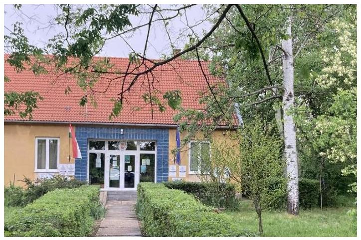
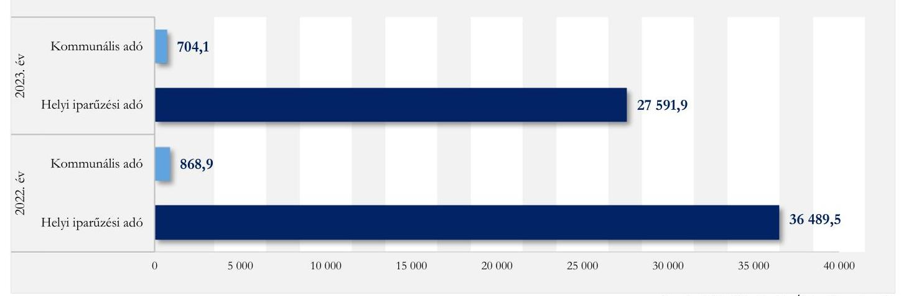
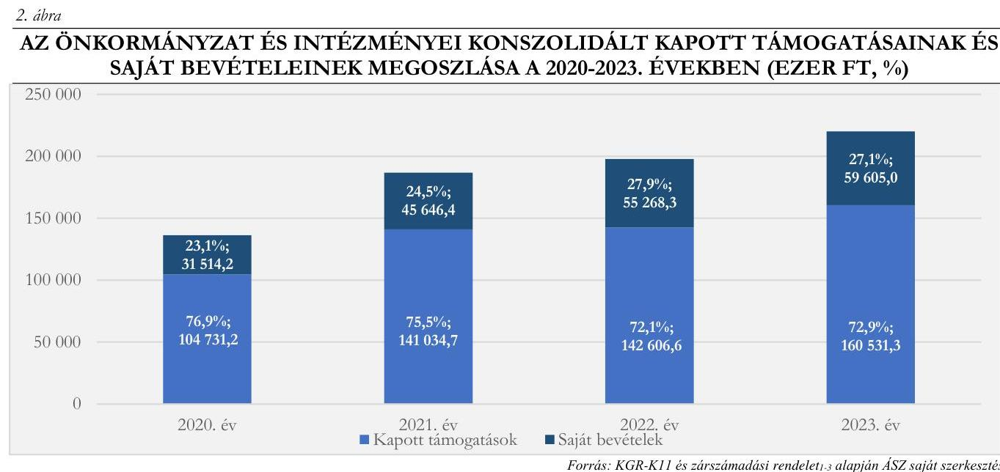

# JELENTÉS 

## Az önkormányzatok helyi adóztatási tevékenységének ellenőrzése - Ingatlanadóztatás

Árpádhalom Község Önkormányzata

2024.

---

ÁLLAMI
SZÁMVEVÔSZÉK

# JELENTÉS 

## Az önkormányzatok helyi adóztatási tevékenységének ellenőrzése - Ingatlanadóztatás

Árpádhalom Község Önkormányzata

2024.

---

# ELLENŐRZÉSI IGAZGATÓSÁG: 

## ÁLLAMHÁZTARTÁS HELYI SZINTJÉT ELLENŐRZŐ IGAZGATÓSÁG

## ELLENŐRZÉSI IGAZGATÓ:

DR. BAFFIA GERGELY GÁBOR ellenőrzési igazgató

## ELLENŐRZÉSVEZETŐ:

Jelentéseink az interneten a www.asz.hu címen olvashatók.

KANYÓ LŐRÁNT ISTVÁN ellenőrzésvezető

IKTATÓSZÁM: EL-4040-007/2024.
TÉMASZÁM: 2740.
ELLENŐRZÉS-AZONOSÍTÓ SZÁM: V-1084

---

# TARTALOMJEGYZÉK 

AZ ELLENŐRZÉS ALAPADATAI ..... 5
AZ ELLENŐRZÉS TERÜLETE ÉS AZ ELLENŐRZÖTT SZERVEZET ..... 7
ÖSSZEFOGLALÁS ..... 9
AZ ELLENŐRZÉS FÓKUSZKÉRDÉSEI ..... 11
MEGÁLLAPÍTÁSOK ..... 12
JAVASLATOK ..... 22
MELLÉKLETEK ..... 23
I. sz. melléklet: Értelmező szótár ..... 23
II. sz. melléklet: Az ellenőrzött szervezetek jegyzéke ..... 24
III. sz. melléklet: Ellenőrzési kritériumok ..... 25
IV. sz. melléklet: A helyi ingatlanadótárgyak és adóalanyok a 2023. és a 2024. évben ..... 28
V. sz. melléklet: A 2023-2024. években történt adókövetelés törlések főbb adatai ..... 29
FÜGGELÉK: ÉSZREVÉTELEK ..... 30
RÖVIDÍTÉSEK JEGYZÉKE ..... 31

---

.

---

# AZ ELLENŐRZÉS ALAPADATAI 

## AZ ELLENŐRZÉS CÉLJA

Az ellenőrzés célja az volt, hogy értékelje Árpádhalom község helyi ingatlanadóztatásának és adóhatósága feladatellátásának szabályszerűségét, célszerűségét és eredményességét. További cél volt, hogy az ellenőrzés megállapításai és következtetései segítsék az önkormányzati képviselő-testületeket a jogszabályokkal és a helyi sajátosságokkal összhangban álló helyi adópolitika kialakításában és az azt végrehajtó adóigazgatási szervezet megszervezésében. Az ellenőrzés célja volt továbbá annak megállapítása is, hogy az Önkormányzat ${ }^{1}$ által bevezetett, ingatlanokat terhelő helyi adókra vonatkozó rendeleti szabályok összhangban vannak-e a helyi adópolitikai célokkal, tartalmuk tükrözi-e a település helyi sajátosságait és az adóhatósági feladatellátás biztosítja-e az önkormányzati bevételek feltárását és beszedését.

Ennek keretében az ellenőrzés értékelte, hogy az Önkormányzat által bevezetett, ingatlanokat terhelő helyi adókról szóló adórendelet ${ }^{2}$, valamint az adóhatóság ${ }^{3}$ döntései, adóztatási gyakorlata a vonatkozó jogszabályokkal összhangban állnak-e.

## AZ ELLENŐRZÉS TÍPUSA

Kombinált ellenőrzés.

## AZ ELLENŐRZŐTT IDŐSZAK

Az 1. fókuszkérdésnél a 2023. év, valamint a 2024. évnek az ellenőrzés megkezdését megelőző napjáig (2024. április 2.) tartó időszaka.

A 2. és 3. fókuszkérdésnél a 2023. év, valamint a 2024. évnek az ellenőrzés megkezdését megelőző napjáig (2024. április 2.) tartó időszaka, a 2020-2022. évek adatainak bázisadatként való felhasználásával.

## AZ ELLENŐRZÉS TÁRGYA

Az Önkormányzat képviselő-testülete ingatlanokat terhelő helyi adókkal, azaz az építményadóval, a telekadóval és a magánszemély kommunális adójával kapcsolatos rendeletalkotási tevékenységének és az adóhatóság tevékenységének az ellátása.

Az ellenőrzés kiterjedt minden olyan körülményre és adatra, amely az ÁSZ ${ }^{4}$ jogszabályban meghatározott feladatainak teljesítéséhez, valamint az ellenőrzési program végrehajtása folyamán felmerült újabb összefüggések feltárásához szükséges.

---

# AZ ELLENŐRZÉS JOGALAPJA 

Az ellenőrzés jogszabályi alapját az ÁSZ tv. ${ }^{5} 5 . \int(8)$ bekezdésének előírásai képezik.

## AZ ELLENŐRZÉS MÓDSZERE

Az ellenőrzést az ellenőrzési program szempontjai, az ellenőrzött időszakban hatályos jogszabályok, az ellenőrzés általános szakmai szabályai és az ellenőrzésre irányadó ÁSZ módszertanok alapján végeztük.

Az ellenőrzési kérdések megválaszolásához szükséges bizonyítékok megszerzése az ellenőrzött szervezetek által rendelkezésre bocsátott dokumentumokra, adatokra és az ASP ${ }^{6}$ Adó és az Iratkezelő szakrendszerek, illetve a KGR-K11 ${ }^{7}$ számviteli adatgyűjtő rendszer adataira alapozva megfigyelés, szemle (szemrevételezés), kérdésfeltevés (információkérés), mintavételezés, valamint elemző eljárás útján történt. Emellett az ellenőrzési bizonyítékként felhasználható adatforrások közé tartozott minden egyéb - az ellenőrzés folyamán feltárt, az ellenőrzés szempontjából információt tartalmazó - releváns dokumentum (ideértve különösen a helyszíni ellenőrzésről készített jegyzőkönyvet) is.

Az ellenőrzés lefolytatásához az ellenőrzött szervezet a tanúsítványok kitöltésével, valamint az ÁSZ által kért dokumentumok, adatok, információk megküldésével és az ellenőrzés során szolgáltatott adatokat. Az ÁSZ az adómegállapításnak, a fizetési kedvezmények engedélyezésének és a hátralékok beszedésének szabályszerűségét mintavételi eljárással ellenőrizte. Az ÁSZ 13 mintatételben, 11 adómegállapító határozat szabályszerűségét ellenőrizte. A mintatételek kiválasztása véletlenszerűen történt, az adóhatóság nyilvántartásában lévő adótárgyak és ügyek közül, öt - adómegállapításra vonatkozó - mintatétel kivételével, amelynek során a kiválasztás címadatok alapján történt, annak érdekében, hogy feltárható legyen, volt-e olyan adótárgy, amelyet nem adóztatott az adóhatóság. Az ellenőrzött mintatételekre vonatkozó megállapítások nem vetíthetők ki a teljes sokaságra, a megállapításokat az ÁSZ az adott ellenőrzött mintatételek vonatkozásában tette meg.

Az ÁSZ a helyi adópolitikai elképzelések és a települési sajátosságok feltárásával értékelte, hogy az adórendelet e szempontoknak mennyiben felelt meg. Az ÁSZ a helyi adópolitikai célokkal akkor tekintette összhangban állónak az adórendeletet, ha az hatását tekintve támogatta az adópolitikai célok teljesülését.

Az ÁSZ az adóhatósági feladatellátás szabályszerűségéből, a meglévő kapacitásokból, valamint az ezer forint adóbevételre jutó adóhatósági költségek alakulásából következtetett arra, hogy az adóhatóság rendelkezett-e azzal a potenciállal, amellyel eredményesen tudta a helyi adópolitikát végrehajtani.

Az ÁSZ - az adórendelet szabályainak érvényre juttatása körében - az eredményesség véleményezésekor a III. számú melléklet 2. pontjában foglalt szempontokat tekintette mérvadónak.

---

# AZ ELLENŐRZÉS TERÜLETE ÉS AZ ELLENŐRZÖTT SZERVEZET 

Árpádhalom Község Önkormányzata - Forrás: ÁSZ saját közzétési foni

A Csongrád-Csanád vármegyében található Árpádhalom alföldi község, állandó lakossága 2020. év elején a $\mathrm{BM}^{8}$ adatai alapján 482, 2024. év elején 424 fő volt (a 65 évnél idősebbek aránya a 2011. évi 19,7\%ról 2022. év végére $23,5 \%$-ra emelkedett). Az Önkormányzatnak két költségvetési szerve volt az ellenőrzött időszakban, a Konyha ${ }^{9}$ és az Óvoda ${ }^{10}$. 2023. szeptember 1-jétől a Konyha, mint költségvetési szerv beolvadt az Óvodába. A Magyar Falu Program keretében megtörtént az orvosi rendelő felújítása, korszerűsítése, továbbá járdafelújítás is történt. Pályázati forrásból valósult meg az idősek napközi otthonának teljes külső, illetve részbeni belső felújítása.

A TEIR ${ }^{11}$ adatai alapján Árpádhalom településen 2022. december 31-én 101 regisztrált gazdasági szervezet volt, amelyek zömében a mezőgazdaság, erdőgazdálkodás és halászat ágazatban múködtek ( 72 gazdálkodó), s ezek közül két-három gazdálkodó emelkedett ki a termelési volument illetően. A településen a személyi jövedelemadó egy főre jutó alapjának összege a 2022. évben 1670,9 ezer Ft volt, amely jelentősen elmaradt a vármegyei 2067,4 ezer Ft-tól és az országos 2268,8 ezer Ft-tól.

Az Alaptörvény ${ }^{12}$ értelmében a helyi önkormányzat a helyi közügyek intézése körében törvény keretei között dönt a helyi adók fajtájáról és mértékéről. Az Mötv. ${ }^{13}$ rögzíti, hogy a helyi adóval kapcsolatos feladatok ellátása a helyi önkormányzatok feladata.

Az Önkormányzat a Htv. ${ }^{14}$ 1. $\S$ (1) bekezdésében foglalt felhatalmazással élve illetékességi területén az adórendelettel a magánszemély kommunális adóját vezette be 2009-től, a jelenlegi szabályok 2022. január 1-jétől hatályosak.

Az adórendelet a Htv. szerinti adótárgyak közül kizárólag a lakás céljára szolgáló építmény, a nem magánszemély tulajdonában lévő lakás bérleti joga, valamint a belterületi beépítetlen földrészlet (telek) esetén fogalmazott meg - hatálybalépésétől - 4,0 ezer Ft/adótárgy adómértéket amellett, hogy több mentességet is tartalmazott (pl.: a közterületről közvetlenül meg nem közelíthető telek mentessége).

Az adó megállapításával, nyilvántartásával, beszedésével összefüggő adóhatósági feladatokat - a Hatásköri tv. ${ }^{15}$ és az Air. ${ }^{16}$ rendelkezései alapján - elsőfokú hatósági jogkörben Fábiánsebestyén jegyzője ${ }^{17}$ látta el a Hivatal ${ }^{18}$ vezetőjeként. Az árpádhalmi adóztatási feladatokat egy ügyintéző végezte, osztott munkakörben.

A 2023. évben 704,1 ezer Ft bevétel származott kommunális adóból, 72 adóalanytól, 185 adótárgy után, ami az Önkormányzat konszolidált költségvetési bevételeinek 0,3\%-át, helyi adóbevételének 2,5\%-át tette ki. A kommunális adó érdemben nem járult hozzá a települési feladatok finanszírozásához.

Az Önkormányzat helyi adóbevételeinek a 2022. és 2023. évi teljesítésére vonatkozó adatait az 1. ábra mutatja be (nincs jelentős eltérés a 2020. és a 2021. években sem).

---

1. ábra

AZ ÖNKORMÁNYZAT HELYI ADÓBEVÉTELEINEK MEGOSZLÁSA A 2022-2023. ÉVEKBEN (EZER FT)

Az Önkormányzat által működtetett magánszemély kommunális adójának 2023. és 2024. évre vonatkozó jellemző naturális adatait a $I V$. számú melléklet tartalmazza.

---

# ÖSSZEFOGLALÁS 

Az ÁSZ tv. értelmében az ÁSZ feladatkörébe tartozik az önkormányzatok adóztatási tevékenységének ellenőrzése. A helyi adók az önkormányzatok saját, el nem vonható bevételét képezik, így az önkormányzatok gazdasági önállósága szempontjából különös fontossággal bír, hogy a helyi adórendeleti szabályok összhangban álljanak a magasabb szintű jogszabályokkal, továbbá az adóhatósági tevékenység jogszerú, eredményes és hatékony legyen. Erre figyelemmel volt tárgya az ÁSZ ellenőrzésének az Önkormányzat adórendelet-alkotási tevékenysége és az adóhatósági feladatellátás is.

Az adórendelet egy ponton nem volt összhangban a Htv. előírásaival, egy rendelkezése pedig sértette az egyértelmű értelmezhetőség követelményét. Az Önkormányzat nem mérlegelte gazdálkodási helyzetét és a helyi sajátosságokat az ingatlanokat terhelő helyi adók megállapítása során.

Az adóigazgatási feladatellátás a jogszabályi és szakmai követelményeknek nem felelt meg, az adóztatási kiadások magasak voltak az adóbevételekhez mérten, az adóhatóság feladatellátásának mutatói elmaradtak az ÁSZ által ellenőrzött (nagy)községek ${ }^{1}$ adóhatóságai feladatellátásának átlagos mutatóitól.

## Adórendelet, adórendelet-alkotás

Az Önkormányzat adórendeletének egy rendelkezése jogszabálysértő volt, mert hatását tekintve szűkítette az adóztatható adótárgyak törvényben rögzített körét. Emellett nem felelt meg annak a jogszabályi követelménynek, miszerint egyértelműen értelmezhetőnek kell lennie a kötelezettség tartalmának.

Az ingatlanokat terhelő helyi adókra vonatkozó rendeleti szabályozás megalkotása során az Önkormányzat nem mérlegelte, hogy törvényi rendelkezés alapján a rendeleti szabályoknak tükröznie kell az önkormányzat gazdálkodási követelményét és a helyi sajátosságokat (közte a más adókkal adóztatható adótárgyak létét) is.

## Adóhatóság adóigazgatási feladatellátásának jogszerüsége, eredményessége

Az adóhatóság hatósági jogkörében nem minden esetben járt el jogszerúen. Egyik adómegállapító határozat indokolása sem felelt meg az adóigazgatási rendtartásról szóló törvényben foglaltaknak, mert nem volt világos a tényállás és a jogalapot jelentő jogszabályi rendelkezések egymáshoz rendelése, ami nehezítette a döntés értelmezését.

Az adómegállapító határozatok kiadmányozása, kézbesítése jogszerú volt.
Az adóhatóság a 2023. évben és a 2024. év ellenőrzés alá vont részében fizetési felhívást nem bocsátott ki, végrehajtási cselekményt nem foganatosított, miközben az ingatlanadóban fennálló adóhátralék összege 2023. december 31-én 630,0 ezer Ft, aránya a 2023. évi kommunális adóbevételhez viszonyítva magas, $89,5 \%$ volt. Az adóhatóság adóbehajtási tevékenységének elmaradása nem felelt meg az Avt. ${ }^{19}$-ben foglalt követelményeknek.

[^0]
[^0]:    ${ }^{1}$ Az ÁSZ által jelen ellenőrzés alapjául szolgáló ellenőrzési program alapján ellenőrzött (nagy)községek: Árpádhalom, Balatonberény, Balatonvilágos, Kompolt, Leányfalu, Szentistván, Szigetmonostor és Tiszainoka.

---

Az adórendelet adópolitikai célokkal való összhangia, az adórendelet hatása
A helyi adópolitikai célok (a magánszemélyeket lehetőség szerint kis mértékben terheljék adóval, a vállalkozások iparűzési adóval járuljanak hozzá a közterhekhez) elérésének megfelelő eszközéül szolgáltak az Önkormányzat adórendeleti szabályai.

Az Önkormányzat országos összevetésben vizsgálva kevésbé élt az ingatlanadóztatás lehetőségével. Míg a községek, nagyközségek esetén országosan ezen bevételek költségvetési bevételeken belüli átlagos aránya a 2023. évben 2,2\%, addig az Önkormányzat esetében ez 0,3\% volt.

A kommunális adó szintje - figyelemmel az adó összegére és az éves adó átlagos nettó jövedelemhez viszonyított arányára - az adóalanyok többségének adóteherbíró-képességét nem haladta meg.

# Az adóhatósági kiadások, a feladatellátás célszerrüsége, batékonysága 

A Hivatalhoz tartozó két település (Árpádhalom és Fábiánsebestyén) esetén a 2023. évben 1000 Ft helyi adóbevételre 76,8 Ft adóztatási kiadás esett. Az Önkormányzatot megillető helyi adóbevételt (KGRK11:28 296,0 ezer Ft) és egy adótisztviselő - munkaideje 40\%-át kitevő - adóztatási feladatellátását tekintve 103,1 Ft adóztatási kiadás jutott 1000 Ft adóbevételre. Az ÁSZ által ezen ellenőrzésben ellenőrzött (nagy)községek átlaga $33,4 \mathrm{Ft}$, az adóztatási kiadás tapasztalati referencia-érték maximuma kivetéses adóztatás esetén 50 Ft volt. Az adóztatási kiadások tehát az adóbevételekhez mérten túlzottak voltak, mert meghaladták az 1000 Ft bevételre jutó 50 Ft adóztatási kiadást.

Egy adótisztviselőre a két település adóügyi feladatait ellátó Hivatalban 94 907,0 ezer Ft helyi adóbevétel jutott a 2023. évben. Ezen belül az Önkormányzat esetében egy adótisztviselőre 70740,0 ezer Ft helyi adóbevétel jutott a 2023. évben (az ÁSZ által ellenőrzött nyolc község átlaga 218 852,8 ezer Ft). Egy adótisztviselőre 100\%-os adózási feladatellátás esetén 462,5 adótárgy és 180 adóalany esett (a nyolc ellenőrzött település esetén ez 1396 adótárgy, illetve 1237 adóalany). Az adóhatóság feladatellátási mutatóinak értékei összességében kedvezőtlenebbek az ÁSZ által ellenőrzött nyolc (nagy)község adóhatóságának átlagos feladatellátási mutatóinak értékéhez képest.

---

# AZ ELLENŐRZÉS FÓKUSZKÉRDÉSEI 

1.- Az önkormányzat ingatlanokat terhelő helyi adókra vonatkozó rendeleti szabályozása megfelel-e a magasabb szintü jogszabályoknak?
2.- Az önkormányzati adóhatóság megfelelően és eredményesen látta-e el az ingatlanok adóztatásával kapcsolatos adóhatósági tevékenységeit?
3.- A településen megvalósuló helyi adóztatás támogatta-e a helyi adópolitikai célok teljesülését?

---

# MEGÁLLAPÍTÁSOK 

## 1. Az önkormányzat ingatlanokat terhelő helyi adókra vonatkozó rendeleti szabályozása megfelelte a magasabb szintű jogszabályoknak?

Összegző megállapítás

1.1 számú megállapítás

Az adórendelet két ponton nem felelt meg a magasabb szintű jogszabályoknak.

Az ingatlanokat terhelő helyi adókra vonatkozó rendeleti szabályozás nem volt összhangban a Htv. előíásaival, szövegezése két ponton sértette az egyértelműség Jat.-ban megfogalmazott követelményét.

Az adórendelet 2. $\S$-a nem felelt meg a Htv. 2. $\S$-ában foglalt követelménynek ${ }^{2}$, mert hatását tekintve leszükítette a Htv.-ben meghatározott adótárgyak körét azzal, hogy nem fogalmazott meg adómértéket valamennyi adóköteles adótárgyra ${ }^{3}$, ami sértette a Jat. ${ }^{20}$ 2. $\$ (1) bekezdése szerinti egyértelmű értelmezhetőség követelményét is.
Az adórendelet 2. $\$ (1)$ bekezdés a) pontja használta a „lakás céljára szolggáló épitmény" fogalmát, azonban annak értelmezését a rendelet nem határozta meg, illetve a kifejezés eltért a Htv. 52. $\$ 8$. pontjában értelmezett „lakás" kifejezéstől. Az Önkormányzat
A Kúria Önkormányzati Tanácsának Köf.5021/2019/4. határozata kifejezetten rögzíti, hogy az az adórendelet, amely rendelkezik helyi adó bevezetéséről, de nem állapít meg adómértéket az adó valamennyi, Htv. szerinti adótárgyára, több szempontból is törvénysértő. Egyfelől azért, mert a Jat. 2. $\$ (1) bekezdésébe foglalt világos, érthető és megfelelően értelmezhető normatartalom követelményébe ütközik az az önkormányzati rendeleten belüli kollízió, hogy van adótárgy, de nincs adómérték, amely ellentmondást jogértelmezéssel nem lehet kiküszöbölni. Másfelől pedig azért, mert az, hogy nincs adómérték, a Htv.-be is ütközik.
rendeletalkotása során figyelmen kívül hagyta a Jat. 2. $\$ \mathbf{( 1 )}$ bekezdéséből következő egyértelműség elvét, ebből adódóan a jogalkalmazó számára nem volt egyértelmű, hogy mely adótárgyra vonatkozott az adómérték ${ }^{4}$. Az adórendelet 2024. május 24-én hatályba lépett módosítása a „lakás céljára szolggáló épitmény" szövegrészt „lakás" szövegre változtatta, így a jogbizonytalan helyzetet megszüntette.

[^0]
[^0]:    ${ }^{2}$ A Htv. 2. $\$$-a értelmében az önkormányzat adómegállapítási joga csak a Htv.-ben foglalt adóalanyokra és adótárgyakra terjedhet ki. Az Alaptörvény 32. cikk (1) bekezdés h) pont értelmében is csak törvényi keretek között illeti meg a helyi önkormányzatot a helyi adó fajtájának és mértékének megállapítására vonatkozó jog. Az önkormányzatnak természetesen, ha az adót bevezeti, van jogosultsága differenciált adómérték, adómentesség és adókedvezmény rendeletbe iktatására is.
    ${ }^{3}$ A magánszemély kommunális adójának tárgya az építményadó és a telekadó tárgyaival (az építménnyel, a telekkel) és a nem magánszemély tulajdonában álló lakás bérleti jogával egyezik meg [Htv. 24. §].
    ${ }^{4}$ A „lakás céljára szolggaló épitmény" fogalom lehet olyan építmény is, amely ugyan nem felel meg a Htv. szerinti lakás fogalmának, de az valaki lakásául szolgál.

---

1.2 számú megállapítás

Az Önkormányzat - a Htv.-ben foglaltak ellenére - az ingatlanokat terhelő helyi adókra vonatkozó rendeleti szabályozás megalkotása során nem mérlegelte, hogy a rendeleti szabályoknak tükröznie kell a helyi sajátosságokat és az Önkormányzat gazdálkodási követelményét. Az Önkormányzat figyelemmel volt ugyanakkor - az adóalanyok széles körét érintően - az adóalanyok teherviselő képességére.

A Htv. 7. $\S$ g) pontjában rögzített adómegállapítási korlátokból az következik, hogy a rendelet hatályossága idején érvényre kell jutnia az e pontban szabályozott rendeletalkotási elveknek, azaz annak, hogy települési önkormányzat az adóalap fajtáját, az adó mértékét, a rendeleti adómentességet és adókedvezményt úgy állapíthatja meg, hogy azok összességükben egyaránt megfeleljenek a helyi sajátosságoknak, az önkormányzat gazdálkodási követelményeinek és az adóalanyok széles körét érintően az adóalanyok teherviselő képességének.
Az adóhatóság sem az adórendelet elfogadásakor, sem az azt követő időszakban az adómegállapítást megalapozó, illetve a várható költségvetési hatásokat bemutató hatástanulmányt, elemzést, kockázatértékelést nem

Az ÁSZ véleménye szerint legalább az adózást érintő magasabb szintű jogszabályi változások esetén indokolt felülvizsgálni a rendeletet. Ettől függetlenül a település mérete, adottsága a helyi adókra vonatkozó rendelet összetettsége, az önkormányzat gazdálkodási körülményeinek változása, az adózók teherbíró képességének változása befolyásolja a felülvizsgálat gyakoriságát.
készített, az Önkormányzat - a Htv. 7. § g) pontja ellenére - nem mérlegelte, hogy a települési sajátosságoknak és az adózók többségének teherbíró képességének figyelembevételével, lehetséges-e a helyi adókörnyezetet úgy alakítani, hogy pénzügyigazdálkodási biztonsága erősödjön.
Az ÁSZ feltárta, hogy az Önkormányzat - a Htv.-nek megfelelően - a rendelet-alkotás során és azt követően figyelembe vette az adóalanyok többségének teherviselő képességét. Az ÁSZ álláspontja szerint, a magánszemély kommunális adójának mértéke (4,0 ezer Ft/adótárgy) és a kedvezményi szabályok, valamint az a településre vonatkozó, egy lakosra jutó nettó személyi jövedelemadó-alap egyaránt garantálták, hogy a településen élők széles körét érintően az adózók teherbíró képességét az adórendelet ingatlanadóra vonatkozó rendelkezései nem érintették hátrányosan.

---

# 2. Az önkormányzati adóhatóság megfelelően és eredményesen látta-e el az ingatlanok adóztatásával kapcsolatos adóhatósági tevékenységeit? 

Összegző megállapítás

Az adóhatóság adómegállapítási feladatellátása nem volt megfelelő, továbbá nem volt eredményes. Az adóhatóság az adóigazgatási feladatellátás során megsértette a Htv.-t és az Ltv. ${ }^{21}$-t. Az adótartozások beszedése, végrehajtása érdekében az adóhatóság az Avt.-ben foglaltak ellenére, nem tett intézkedéseket.
2.1. számú megállapítás

Az adóhatóság adómegállapítási feladatellátása a Htv.-be és több esetben az Art. ${ }^{22}$-ba ütközött, az nem volt eredményes. Az adóhatóság megsértve a Htv.-t - nem a Pénzügyminisztérium honlapján közzétett nyomtatvány alapján rendszeresítette a magánszemély kommunális adójára vonatkozó adatbejelentési nyomtatványát. A jegyző megsértette az Ltv.-ben foglalt iratmegőrzési kötelezettségének teljesítését. Az Air.ral szemben az adómegállapító határozatok indokolása nem kizárólag az adókötelezettség szempontjából releváns jogszabályokra utalt, ami nehezítette a döntés értelmezését.

Adótárgy-, és adóalanyfeltárás
A jegyző közlése szerint a 2021-2022. években ellenőrizték a Nagymágocsi Közös Önkormányzati Hivataltól a 2020. évben átvett adatok helytállóságát, és tisztázták az adótárgyak, adóalanyok valós állományát. Az ellenőrzött időszakban az adóhatóság az adóalanyok és az adótárgyak feltárása érdekében nem élt az Art. 83. § (2) bekezdésében foglaltak szerint az ingatlanügyi hatóság megkeresésének lehetőségével. Továbbá az építésügyi hatóság által szolgáltatott adatokat nem használta, település-bejárást nem tartott.
Az ÁSZ nem tárt fel olyan ingatlant, amelyet adóztatni kellett volna, de az adóhatóság azt elmulasztotta. Az elmaradt adótárgy és adóalany-feltárás nem befolyásolta érdemben az adóhatóság bevételeit.
Összességében nem volt eredményes az adótárgy és adóalanyfeltárás.

Amennyiben egy községben az adótárgyak száma és az adóalanyok személye nem haladja meg az 500-at, és az adókötelezettség-változások száma is alacsony, a jegyző hely-, és tényismeretének köszönhetően nem feltétlenül szükséges évente megkérni és összevetni az ingatlanügyi hatóság által szolgáltatott adatokat az adónyilvántartás adataival az adóztatás eredményessége érdekében. Abban az esetben azonban, ha az adóhatóságnál hiányosak az adóiratok, feltételezhető, hogy a valós tényállás több esetben eltér az adónyilvántartásban szereplő adatokon alapuló tényállástól. Ekkor mindenképp elvárható, hogy az adóhatóság a rendelkezésére álló valamennyi eszközzel „érje el" az adótárgyat és az adózót. Alacsony adótétel esetén lehetséges, hogy az adótárgy-feltárás, az adónyilvántartás pontosabbá tétele az adóbevételhez mérten aránytalan ráfordítással jár, azonban az ÁSZ véleménye szerint az adófizetési hajlandóság növelése, az adókötelezettségüket rendben teljesítők érdekei miatt e költségeket indokolt vállalni.

---

# Adómegállapítás (kivetés) 

Az ÁSZ az adóhatósági adómegállapítási feladatellátás ellenőrzése keretében 13 mintatételt, közte egy könyvelési tételt, 12 adótárgy utáni adómegállapítást, s az utóbbin belül 11 adómegállapító határozatot értékelt. A minták értékelésének eredményeként az ellenőrzött magánszemély kommunális adójára vonatkozó adómegállapítások 50,0\%-a volt szabályszerű (12 adótárgyból 6 esetben).
Egy mintatétel (8. mintatétel) esetén a telken az ingatlan-nyilvántartás adatai szerint négy lakás volt található, az adóhatóság ugyanakkor csak két lakás után állapította meg az adót és - az Art. 141. $\$ (2) bekezdését és (4)-(8) bekezdését figyelmen kívül hagyva - az adómegállapító eljárás keretében nem tisztázta, hogy a másik két lakás miért nem adóköteles (az adatbejelentésben és az ingatlannyilvántartásban szereplő adatok ellentmondását nem tisztázta). Három mintatétel esetében (9. mintatétel, 10. mintatétel és 12. mintatétel) az Önkormányzat nem bocsátott az ÁSZ rendelkezésére kivetési dokumentációt (adatbejelentést, adómegállapító határozatot és az azok közlését igazoló dokumentumokat), az adóztatás tényére az adónyilvántartás (ASP ADÓ szakrendszer) utalt. E három esetben - szemben az Art. 48. $\$ 1$ ) bekezdésével és az Art. 141. $\$ 2$ ) bekezdésével ${ }^{5}$ - nem állapítható meg, hogy az adóhatóság folytatott-e le adómegállapító eljárást, hozott-e adómegállapító határozatot, és annak közlése szabályszerűen megtörtént-e. Továbbá, a jegyző megsértette az Ltv. 9. $\$ 1$ ) bekezdés e) pontját is ${ }^{6}$, illetve nem tett eleget az Iratkezelési szabályzat ${ }^{29} 8$. pontjában leírtaknak, mert az adómegállapítási eljárás iratai, közte több adómegállapító határozat nem állt rendelkezésre.
Két minta (6. mintatétel és 11. mintatétel) esetében az adóhatóság által hozott adómegállapító határozatok - a Htv. 12. $\$ 1$ ) bekezdésében ${ }^{7}$ és az Art. 141. $\$ 4$ ) bekezdésében előírtak ellenére csak egy tulajdonos számára írták elő az adótárgy utáni, két tulajdonost terhelő adókötelezettséget, noha az adózó az adatbejelentést - nem megállapodás alapján - a tulajdoni hányadára vonatkozóan nyújtotta be, azaz az adóhatóság helytelenül számította ki az adó összegét.
Az adófizetési kötelezettségről szóló valamennyi határozat indokolásában - az Air. 73. $\$ (1) bekezdés c) pontjában előírtak ellenére - olyan jogszabályhelyek is szerepeltek, amelyek a fizetési kötelezettség kapcsán nem relevánsak, vagy már nem hatályosak, mindazonáltal a határozatok jogszerűségét e hiba nem érintette. A világos, követhető magyarázat ugyanakkor érthetővé teszi az adózó számára, hogy milyen jogalapon és miért a határozat szerinti összeget kell fizetnie. Ezen túlmenően az adóhatóságnak és az Önkormányzatnak is előnyös, ha az adózó fizetési hajlandósága esetleg javul azáltal, hogy számára is világos és érthető a határozat.

[^0]
[^0]:    ${ }^{5}$ A magánszemély kommunális adóját az adóhatóságnak az Art. szerint kivetéssel, azaz határozattal kell megállapítania.
    ${ }^{6}$ A közfeladatot ellátó szerv Ltv. 9. § (1) bekezdés e) pontjából fakadó kötelessége, hogy az elintézett ügyek iratait - az irattári terv szerinti rendszerezés és válogatás pontosságának ellenőrzése mellett - irattárában elhelyezze, az irattári anyagot szakszerủen és biztonságosan megőrizze, valamint használatra bocsátásáról gondoskodjon.
    ${ }^{7}$ A Htv. 12. § (1) bekezdése értelmében, ha az adótárgynak több tulajdonosa van, akkor a tulajdonosok tulajdoni illetőségük arányában minősülnek adóalanynak, azaz egy adótárgy és két 1/2-1/2 tulajdoni illetőségủ tulajdonos esetén az éves adó összegét 2,0 ezer-2,0 ezer Ft-ot a két tulajdonos terhére kell előírni, két adómegállapító határozatban.

---

Az adókivetési határozatok kiadmányozása és adózókkal való közlése valamennyi határozat esetében megfelelt az Air. és az Eüsztv. előírásainak.
Az adóhatóság adóellenőrzést nem végzett.
A megállapított adó csökkentése: adókötelezettség változás, elévülés miatti törlés
A fennálló adókövetelés nagyságát csökkentő intézkedések megfeleltek az Art.-nak, azok számszaki összefoglalását az $V$. számú melléklet mutatja be.

# Adatszolgáltatási, közzétételi kötelezettség 

Az adóhatóságnak adatszolgáltatási kötelezettsége nem merült fel.
Az adóhatóság - megsértve a Htv. 42/I. § (1) bekezdését és (2) bekezdését, önálló adatbejelentési nyomtatványt alkotva - nem a Pénzügyminisztérium honlapján közzétett nyomtatványnak megfelelően rendszeresítette a magánszemély kommunális adójára vonatkozó adatbejelentési nyomtatványt. Az adóhatóság nem tett eleget a Htv. 42/B. § (3) bekezdésében foglaltaknak sem, mert az adatbejelentési nyomtatvány az Önkormányzat honlapján nem volt elérhető.
2.2. számú megállapítás

Az adótartozások beszedése érdekében az adóhatóság - a jogszabályi előírás ellenére - nem tett intézkedéseket, a hátralékok kezelése nem volt eredményes.

Az Avt. 30. § (1) bekezdésének előírásai ellenére az adótartozások beszedése érdekében az adóhatóság az ellenőrzött időszakban nem intézkedett, fizetési felhívást nem bocsátott ki, végrehajtási eljárást nem indított.
Az 1. táblázat tanúsága alapján a 2023. év végén az adóhátralékok összege 630,0 ezer Ft volt, amely az 2023. évi kommunális adóbevétel $89,5 \%$-a volt. Emellett, az $V$. számú melléklet adatai alapján az adóhatóság a 2024. évben (még nem lezárt éves adatok szerint) 194,0 ezer Ft adótartozást törölt elévülés címén az Avt. 19. § (1) bekezdése alapján.
Ezek az adatok arra utalnak, hogy az adózók 56,9\%ban (2023. év) nem tettek eleget fizetési kötelezettségüknek, amihez hozzájárulhat az is, hogy az adóhatóság nem végzett adóbehajtási tevékenységet. (Az adóhatóság nyilatkozata szerint a

Az ÁSZ álláspontja szerint az adóbeszedési, adóvégrehajtási cselekmények célja nem pusztán az önkormányzatot megillető bevétel behajtása. Legalább annyira tekinthető a fizetési kötelezettségüket rendben teljesítők melletti kiállásnak is. Összességében az adómorál és a fizetési hajlandóság növelését szolgálja valamennyi adózó esetén. Ezért a behajtás hosszú időn át való elmulasztása rossz gyakorlat, még akkor is, ha a behajtandó összeg az adóbehajtás költségéhez képest alacsony (az adóvégrehajtás költségét az adós viseli). Alacsony adómérték és jelentős, bevételhez mért hátralék mellett - az ellenőrzés szerint - érdemes megfontolni az adó átalakítását, múködtetését.
kis összegű tartozásokat nem tudják behajtásra átadni, ezzel együtt folyamatosan egyeztetik az adatokat, követik az adótárgyak, adóalanyok körében bekövetkezett változásokat, a megfizetett adóösszegeket. Sok az olyan ingatlan-tulajdonos, aki külföldön vagy más városban él, így nehezen utolérhető, vagy a behajtás az adótartozás összegéhez képest aránytalan költséggel járna.)

---

1. táblázat

# AZ ADÓALANYOK ÉS AZ ADÓHÁTRALÉKOK FŐBB ADATAI AZ ADOTT NAPON (DARAB ÉS EZER FT) 

| MEGNEVEZÉS | NAPTÁRI NAP | ADÓALANYOK SZÁMA | HÁTRALEKOS   ADÓZÓK SZÁMA | ADÓHÁTRALEK   ÖSSZÉGE |
| :--: | :--: | :--: | :--: | :--: |
|  | 2022.01.01. | 221 | 73 | 624,4 |
|  | 2022.12.31. | nincs adat | 41 | 554,0 |
| Magánszemély   kommunális   adója | 2023.01.01. | 72 | 71 | 558,0 |
|  | 2023.12.31. | nincs adat | 41 | 630,0 |
|  | 2024.01.01. | 72 | 41 | 630,0 |
|  | 2024.05.17. | nincs adat | 49 | 536,0 |

Forrás: Az Önkormányzat és a Hivatal tanúsítványokon és nyilatkozatban megadott adatai alapján ÁSZ saját szerkesztés

## 3. A településen megvalósuló helyi adóztatás támogatta-e a helyi adópolitikai célok teljesülését?

Összegző megállapítás Az ingatlanokat terhelő helyi adókra vonatkozó önkormányzati rendeleti szabályozás megfelelt a helyi adópolitikai céloknak. Az adóhatósági feladatellátás mutatói elmaradtak az ÁSZ által ellenőrzött községek feladatellátási mutatóinak átlagos értékétől.
3.1 számú megállapítás Az ingatlanokat terhelő helyi adókra vonatkozó önkormányzati rendeleti szabályozás alkalmas volt a helyi adópolitikai célok érvényre juttatására.

Az Önkormányzat írásba foglalt adópolitikai koncepcióval nem rendelkezett. Az ÁSZ az Önkormányzat nyilatkozata alapján feltárta az Önkormányzat adóztatással kapcsolatos céljait, melyek között szerepelt az, hogy az Önkormányzat a helyi iparűzési adóra támaszkodott és az, hogy a lakosság terheit nem kívánta növelni. Az adórendelet ezekkel a törekvésekkel összhangban volt.
3.2 számú megállapítás Az Önkormányzat gazdálkodását az ingatlanadóból származó adóbevétel nem befolyásolta.

## Az adórendelet(módosítás) hatása az önkormányzat gazdálkodására

Az Önkormányzat az Mötv. szerinti önként vállalt feladatokra a költségvetési rendelet ${ }_{1-3}{ }^{24}$ szerint bevételi és kiadási előirányzatokat nem tervezett, a zárszámadási rendelet ${ }_{1-3}{ }^{25}$ szerint pedig nem számolt el teljesítést sem, a helyi adóbevételek teljes egészében a kötelező feladatok ellátását szolgálták. Ezzel együtt az Önkormányzat 7000,0 ezer Ft-os folyószámlahitel-kerettel rendelkezett, amelyet a 20202024. években folyamatosan igénybe is vett. Az Önkormányzat korábban számos pályázati forrást nyert el, de a pályázati tervek nem valósultak meg. A 2023. évben visszafizetett, el nem költött 257 100,1 ezer Ft pályázati támogatáson felül az Önkormányzatnak azon támogatási összegeket is vissza kell fizetnie, amelyeket már (pl.: tervezésre) kifizetett.
A 2023. évi 3669,9 ezer Ft szabad maradványt leszámítva az Önkormányzatnak és intézményeinek nem volt elkölthető szabad pénzeszköze.

---

A magánszemélyek kommunális adójából származó bevétel ugyanakkor az Önkormányzat gazdálkodása biztonságához nem járult hozzá érdemben. Ha országos összevetésben szemléljük az ingatlanadóztatás nagyságrendjét, akkor azt láthatjuk, hogy míg az ingatlanadó-bevételek aránya a költségvetési bevételeken belül (költségvetési szervek nélkül) a településtípusra (község, nagyközség) vonatkozó országos átlag $\mathbf{2 , 2 \%}$, addig az Önkormányzat esetében ez az érték $\mathbf{0 , 3 \%}$ volt a 2023. évben (a 2022. évben 0,4\%). Az országosan (községek, nagyközségek esetén) egy állandó lakosra jutó 7,2 ezer Ft-os ingatlanadó-bevételhez képest az Önkormányzat esetében egy állandó lakosra 1,6 ezer Ft esett.

A helyi iparűzési adóbevétel az egyes években a saját bevételek döntő hányadát, átlagban $\mathbf{6 0 , 2 \% - a ́ t}$ tette ki, nagy volatilitással ( $46,3 \%$ és $78,1 \%$ között) ${ }^{8}$. Ez visszavezethető arra, hogy a településen lévő nagyadózó az egyes években jelentősen változó termelési értéket állított elő. Ennek másodlagos hatása az Önkormányzat gazdálkodására az, hogy a települést megillető normatív támogatások összegét is befolyásolta.

A 2020-2023. évekre vonatkozó konszolidált bevételek jogcímenkénti nagyságát és változását éves bontásban a

Az építményadóból, telekadóból származó bevételek rendeleti változás híján - jellemzően alig változnak év/év viszonylatban. Ezért az ÁSZ véleménye szerint ezen adók képesek valamelyest nagyobb gazdálkodási biztonságot adni az önkormányzatoknak, szemben - különösen kisebb települések esetén - az iparűzési adóval. A magánszemélyek gyengébb teherviselő képességét célzott adóelőnyökkel vagy a magánszemély kommunális adója működtetésével lehet figyelembe venni.
2. táblázat, az Önkormányzat konszolidált saját bevételeinek és támogatásának 2020-2023. évi megoszlását pedig a 2. ábra mutatja be.
2. táblázat

# AZ ÖNKORMÁNYZAT ÉS INTÉZMÉNYEINEK 2020-2023. ÉVI KONSZOLIDÁLT BEVÉTELEI (EZER FT, \%) 

| SOR-   SZAM | JÓGÚIM | 2020. | 2021. | 2022. | 2023. |
| :--: | :--: | :--: | :--: | :--: | :--: |
| 1. | Működési célú támogatások államháztartáson belülről | 84849,3 | 85808,5 | 122893,2 | 106813,3 |
| 2. | Felhalmozási célú támogatások államháztartáson belülről | 19881,9 | 55226,2 | 19713,4 | 53718,0 |
| 3. | Közhatalmi bevételek | 21830,7 | 37037,2 | 37663,0 | 28384,1 |
| 3.1. | ebből: ingatlanadóból (kommunális adóból) származó bevétel | 595,5 | 833,2 | 868,9 | 704,1 |
| 3.2. | ebből: helyi iparűzési adóbevétel | 15882,6 | 35653,7 | 36489,5 | 27591,9 |
| 3.3. | ebből: egyéb közhatalmi bevételek | 5352,6 | 550,3 | 304,6 | 88,1 |
| 4. | Egyéb saját bevételek* | 9683,5 | 8609,2 | 17605,3 | 31220,9 |
| 5. | Saját bevételek (3+4) | 31514,2 | 45646,4 | 55268,3 | 59605,0 |
| 6. | Költségvetési bevételek (1+2+5) | 136245,4 | 186681,1 | 197874,9 | 220136,3 |
|  | Saját bevételek aránya a költségvetési bevételeken beül (5/6, \%) | 23,1 | 24,5 | 27,9 | 27,1 |

Forrás: KGB-K11 és zárszámaikást rendelez, a alapján ÁSZ saját szerkesztés
*Müködési bevételek, felhalmozási bevételek, müködési célú átvett pénzeszközök, felhalmozási célú átvett pénzeszközök

[^0]
[^0]:    ${ }^{8}$ A 2021. és 2022. években több mint a duplája volt a helyi iparűzési adóbevétel a 2020. évinek, a 2023. évi 27591,9 ezer Ft-os adóbevétel pedig 7536,3 ezer Ft-tal, $24,4 \%$-kal volt kevesebb a 2022. évi 36 489,5 ezer Ft-hoz képest.

---

# Az adóalanyok teherbíró képességével való összevetés 

Az egy főre jutó éves átlagos nettó személyi jövedelemadóköteles jövedelem 1127,8 ezer Ft-os összegéhez mérten a rendelet szerinti éves adó egy lakosra vetített összege $\mathbf{0 , 2 \% - o t}$ tett ki. Az adózók fizetési kedvezmény iránti kérelmet 2023-2024. április 9. közötti időszakban nem nyújtottak be.
Az ingatlanadókban fennálló adóhátralék összege - az 1. táblázat adatai szerint - 2022. december 31-ei 554,0 ezer Ft-ról, 2023. december 31-ére 630,0 ezer Ft-ra, 12,1\%-kal emelkedett, 2024. május 17-ére 536,0 ezer Ft-ra, 14,9\%-kal csökkent az előző év végihez képest. Ezzel együtt azonban a kommunális adóban fennálló adóhátralékok a KGR-K11 szerinti teljesített bevéteknek a 2022. évben a 63,8\%-át, a 2023. évben a $89,5 \%$-át tették ki.
A hátralékos adózók aránya rendkívül magas volt, a nyilvántartott hátralék összege azonban fajlagosan alacsony. A 2022. és a 2023. évben a 72 adóalanyból 41 fő (56,9\%), míg a 2024. évben (május 17. napjáig) a 72 adóalanyból 49 fő ( $68,1 \%$ ) rendelkezett hátralékkal. A 49 adótartozással rendelkező adóalany közül 24 fő ( $49,0 \%$ ) esetén haladta meg a nyilvántartott hátralék összege az egy lakóingatlanra eső éves 4,0 ezer Ft-os adó összeget, s ezen személyek közül tíz fő esetén haladta meg a nyilvántartott hátralék az öt évnyi adótételt, azaz a 20,0 ezer Ft-ot.
Az a tény, hogy az adósok 51,0\%-a esetén a hátralék nem több az éves adóösszegnél, továbbá, hogy az adóalanyok, fizetési könnyítésre vonatkozó kérelmet az időszakban nem nyújtottak be, az adó jövedelemhez mért aránya pedig alacsony, együttesen arra utalnak, hogy az adóalanyok többségének teherbíró képességét a kommunális adó nem érintette hátrányosan.
3.3. számú megállapítás

Az adóhatóság feladatellátásának személyi és tárgyi feltételei biztosítottak voltak. Az adóztatási kiadások az adóbevételhez képest túlzottak voltak. Az adóhatósági feladatellátás mutatóinak az értéke az ÁSZ által ellenőrzött nyolc (nagy)község feladatmutatóinak átlagos értékeitől összességében elmarad.

## Személyi és tárgyi, informatikai feltételek:

Az adóigazgatási feladatellátás személyi és tárgyi feltételei az ellenőrzött időszakban biztosítottak voltak. Az Önkormányzat adóigazgatási feladatainak ellátása a Hivatalon keresztül történt. Az Önkormányzat

---

adóztatási feladatait egy - felsőfokú végzettségű, öt év megszerzett adóigazgatási tapasztalattal bíró ügyintéző végezte, akinek munkaideje mintegy $40 \%$-át tették ki az adóigazgatási feladatok.

# Az adóztatás kiadásai 

A Hivatal az Ábt. ${ }^{26}$ és a 15/2019. (XII. 7.) PM rendelet ${ }^{27}$ elöírása alapján az éves költségvetési beszámolóiban az adóigazgatási tevékenységgel összefüggő kiadásokat és a kapcsolódó átlagos statisztikai létszámadatokat a kormányzati funkció ( 011220 Adó-, vám- és jövedéki igazgatás) szerint kimutatta. Az adóztatás kiadásaival kapcsolatos adatokat az 3. táblázat tartalmazza.

Az adóztatás kiadásai (költségei) egyfelől az adóhatóság költségeiben, másfelől az adózó költségeiben öltenek testet. Önadózás esetén az adóztatási költségek nagyobb része az adózónál merül fel, mert az adót az adóalany számítja ki, vallja be és fizeti meg. Kivetéses adóztatás esetén ellenben az adózó költsége az adó megfizetésének költségét jelenti (például a gépjárműadó vagy a hatósági nyilvántartás alapján megállapított helyi adók esetén) vagy - az adófizetési költség mellett - legfeljebb csak az adómegállapításhoz szükséges adatszolgáltatás költsége merül fel. Ha az összes bevétel több, mint $10 \%$-át teszi ki a kivetéses adózás, hatósági adómegállapítás, azaz ingatlanadóztatás alapján befolyó bevétel, akkor adóztatási kiadás referencia-érték maximuma 50 Ft 1000 Ft adóbevételre vetítve (a szinte kizárólag önadózásos adókat beszedő adóhatóságoknál ez az érték 10 és 20 Ft közötti).
3. táblázat

AZ ADÓZTATÁS 2023. ÉVI KÖLTSÉGEINEK KIMUTATÁSA (EZER FT)

| MEGNEVEZÉS | ÖNKORMÁNYZAT ÉS HIVATAL ADATAI | NYOLC ELLENÖRZÖTT ÖNKORMÁNYZAT ES HIVATAL ADATAI (ÖSSZESEN, ÁTLAG) |
| :--: | :--: | :--: |
| Összes tényleges kiadás adatszolgáltatás alapján | 7292,6 | 243376,7 |
| Ebböl: személyi juttatások és munkaadókat terhelö kö́terbeke | 7292,6 | 237 480,8 |
| Tényleges létszám adatszolgáltatás alapján (fő) | 1 | 32,5 |
| KGR-K11 szerint költségvetési bevételként elszámolt helyi adóbevétel adatszolgáltatás alapján | 94907,5 | 7112717,6 |
| Egy före jutó tényleges személyi juttatás és munkaadót terhelö közteher adatszolgáltatás alapján | 7292,6 | 7307,1 |
| 1000 Ft helyi adóbevételre jutó tényleges személyi juttatás és munkaadókat terhelö közteher adatszolgáltatás alapján (Ft) | 76,8 | 33,4 |
| Egy adótisztviselőre jutó teljesített - KGR-K11 adóbevétel (a Hivatalt tekintve) | 94907,5 | 218 852,8 |
| Egy adótisztviselőre jutó teljesített - KGR-K11 adóbevétel - Önkormányzat esetén ${ }^{8}$ s | 70740,0 | 218 852,8 |
| Egy adótisztviselőre jutó ingatlanadó-tárgyak száma (db) - Önkormányzat esetén | 462,5 | 1396 |
| Egy adótisztviselőre jutó ingatlanadó-alanyok száma (fő, db) - Önkormányzat esetén | 180 | 1257 |

[^0]
[^0]:    ${ }^{9}$ Az Önkormányzat esetében az adótisztviselő munkaidejének 40\%-át teszi ki az adóztatási feladatellátás. Az összehasonlíthatóság érdekében tehát az egy főre jutó teljesített helyi adóbevétel, az egy főre jutó adótárgyak és az egy főre jutó adóalanyok számát az ÁSZ 100\%-ra számítva végezte el.

---

A KGR-K11-ben elérhető adatok alapján a 2023. évben az Önkormányzat - Hivatala - esetében az 1000 Ft beszedett helyi adóbevételre 76,8 Ft adóztatási kiadás jutott. Az Önkormányzatot megillető helyi adóbevételt (KGR-K11: 28 296,0 ezer Ft) és a település adóügyeit intéző adótisztviselő $40 \%$-os adózási feladatellátását figyelembe véve az 1000 Ft helyi adóbevételre jutó kiadás 103,1 Ft volt. Az ÁSZ által ellenőrzött (nagy)községek (költségvetési szervek nélküli) adatszolgáltatása alapján az átlagos érték 33,4 Ft, a legmagasabb érték pedig 113,1 Ft 1000 Ft adóbevételre.
A Hivatal szempontjából az egy főre jutó tényleges személyi juttatás és munkaadókat terhelő közteher a 2023. évben 7292,6 ezer Ft volt, közel megegyezett a nyolc, ÁSZ által ellenőrzött önkormányzat 7307,1 ezer Ft-os átlagos adatával. Ugyanez az érték az állami adóhatóság esetén 2022-ben 9700 ezer Ft volt. Egy adótisztviselőre a Hivatalban 94 907,5 ezer Ft, az Önkormányzat esetében 40\%-os adóigazgatási feladatellátással 28 296,0 ezer Ft ( $100 \%$ esetén az érték 70740,0 ezer Ft) helyi adóbevétel jutott a 2023. évben. A nyolc ellenőrzött község - közös hivatalokkal együtt - átlaga 218 852,8 ezer Ft volt.

Ha azt vizsgáljuk, hogy mekkora az adótisztviselők leterheltsége ingatlanadók szempontjából, akkor azt láthatjuk, hogy az Önkormányzat esetében a 2023. évi végi adatok alapján egy adótisztviselőre 100\%-os adózási feladatellátás esetén 462,5 adótárgy és 180 adóalany jutott (az iparűzési adó mellett), ami a nyolc ellenőrzött (nagy)község átlag-adatához képest kevesebb.
Összességében az állapítható meg, hogy az adóhatóság kiadásai magasak voltak a bevételhez mérten, az adóhatósági feladatellátás mutatóinak értékei pedig elmaradnak az ÁSZ által ellenőrzött nyolc (nagy)község feladatellátási mutatóinak átlagos értékétől.
3.4. számú megállapítás Az ÁSZ nem tárt fel olyan gyakorlatot, hogy az adóhatóság jogszabályban nem előírt eszközökkel és módokon támogatta volna a településen az adózók önkéntes jogkövetését.

Az ÁSZ nem tárt fel az adózók önkéntes jogkövetését elősegítő, nem jogszabályi alapokon nyugvó gyakorlatot, módszert, illetve eszközt.

---

# JAVASLATOK 

Az ÁSZ tv. 33. § (1) bekezdésében foglaltak értelmében az ellenőrzött szervezet vezetője köteles a jelentésben foglalt megállapításokhoz kapcsolódó intézkedési tervet összeállítani és azt a jelentés kézhezvételétől számított 30 napon belül az ÁSZ részére megküldeni. Amennyiben az ellenőrzött szervezet vezetője nem küldi meg határidőben az intézkedési tervet, vagy továbbra sem elfogadható intézkedési tervet küld, az Állami Számvevőszék elnöke az ÁSZ tv. 33. § (3) bekezdése a) és b) pontjaiban foglaltakat érvényesítheti.

## A POLGÁRMESTERNEK

1. Intézkedjen a jelentés nyilvánosságra hozatalát követő 15 napon belül annak az Önkormányzat képviselő-testülete elé terjesztéséről. A jelentést a napirend tárgyalásáról szóló jegyzőkönyvvel együtt tájékoztatásul küldje meg a Csongrád-Csanád Vármegyei Kormányhivatal részére is.

## A JEGYZŐNEK

1. Vizsgálja felül az adórendelet 2. §-át a tekintetben, hogy az összhangban áll-e a Htv. 2. §-ával, 24. §ával.
2. Alakítsa ki úgy az ingatlanadó-megállapítási gyakorlatát, és alkosson arra belső szabályokat, hogy a jövőben az ingatlanokat terhelő helyi adókötelezettség tárgyában kiadott adómegállapító határozatok indokolási része - az Air. 73. § (1) bekezdés c) pontjában előírt kötelezettség érdekében - kizárólag az adómegállapító határozat tárgyát képező adókötelezettség szempontjából releváns jogszabályhelyekre utaljon.
3. Alakítson ki kontrollt arra nézve, hogy az Ltv. 9. § (1) bekezdés e) pontjában foglaltaknak megfelelően az adóhatósági adómegállapítás iratai, különösen az adómegállapító határozatok legalább ezen határozatok joghatálya időszakában rendelkezésre álljanak.
4. Rendszeresítsen a Htv. 42/I. § (1)-(2) bekezdésének megfelelő magánszemély kommunális adó adatbejelentési nyomtatványt és intézkedjék arról, hogy az a Htv. 42/B. § (3) bekezdésében foglaltaknak megfelelően az Önkormányzat honlapján elérhető, letölthető legyen.
5. Rendelkezzen az Avt. 30. § (1) bekezdése szerint az adóbehajtási, adóvégrehajtási adóhatósági feladatellátásról.

---

# MELLÉKLETEK 

## I. SZ. MELLÉKLET: ÉRTELMEZŐ SZÓTÁR

adóhatóság
adóhatósági ellenőrzés
adótartozás
adóbehajtási tevékenység
adózó, adóalany
adótárgy
fizetési kedvezmény
ASP rendszer
ingatlanokat terhelő helyi adók
az adóztatás költségei
adóztatási kiadás
adóztatási kiadás referenciaérték maximuma

Az önkormányzat jegyzője (Forrás: Air. 22. § b) pont)
Az adóhatóság az adótörvényekben és más jogszabályokban előírt kötelezettségek teljesítésének vagy megsértésének megállapítása, a kötelezettségek teljesítésének előmozdítása érdekében ellenőrzést folytat. (Forrás: Air. 86. §)
Az esedékességkor meg nem fizetett adó (Forrás: Art. 7. §6. pont)
Az adótartozás beszedésére irányuló adóhatósági tevékenység, így különösen a fizetési felhívás kibocsátása és a végrehajtási cselekmények.
Az a személy, akinek vagy amelynek adókötelezettségét a Htv. és önkormányzati rendelet előírja. (Forrás: Air. 11. § (1) bekezdés, Htv. 12. §, 18. §, 24. §)
Az az ingatlan vagy lakásbérleti jog, amelynek adókötelezettségét a Htv. és önkormányzati adórendelet előírja (Forrás: Htv. 11.§, 17. §, 24. §)
A fizetési halasztás, részletfizetés, valamint az adómérséklés. (Forrás: Art. 198.-201. §)
Az önkormányzati feladatellátást támogató, számítástechnikai hálózaton keresztül távoli alkalmazásszolgáltatást (Application Service Provider) nyújtó elektronikus információs rendszer. (Forrás: az önkormányzati ASP rendszerről szóló 257/2016. (VIII. 31.) Korm. rendelet 1. §6. pont)

Építményadó, telekadó, magánszemély kommunális adója (Forrás: Htv. II. fejezet, III. fejezet 1.1. pont)
Az ellenőrzés az adóztatás költségei kapcsán egyfelől figyelembe vette azt, hogy az önkormányzati hivatalok költségeinek kormányzati funkciók szerint gyűjtése hiányos és ellentmondásos adatokat hordoz. Másfelől abból a szakmai tapasztalatból indult ki, hogy az adóztatás költségei főképp az adótisztviselők személyi juttatásaiban, a juttatások közterheiben öltenek testet. Ezért az adóztatás költségei alatt ez utóbbi, adótisztviselők által kapott juttatásokat és a juttatás közterheit értette, azzal, hogy ha az adótisztviselő munkaköre más feladat ellátását is magában foglalta, akkor az ellenőrzés az adott tisztviselő személyi juttatásának csak az adózási feladatellátás idejével arányos részét vette számításba.
az adóigazgatási feladatellátással kapcsolatos kiadások közül a személyi juttatások és közterheik (az egyéb, dologi kiadások elhatárolása módszertanilag megfelelő módon nem volt lehetséges, ezért csak a kiadások mintegy $80 \%$-át kitevő személyi juttatásokat és közterheiket vette az ellenőrzés figyelembe adóztatási kiadásként).
Szakértői tapasztalaton alapuló becsült maximum adóztatási kiadás. Megmutatja, hogy 1000 Ft közteher beszedésével mekkora az a maximum kiadási összeg, amely hatékony működés esetén racionálisan felmerül a beszedő szervnél. A nemzetközi (OECD) tapasztalatok szerint ez az érték 10-20 Ft (1-2\%) között mozgott 2011-ben, a NAV esetén 2022-ben 10,8 Ft, a dologi kiadásokkal együtt 13,5 Ft volt. Ezek a számadatok olyan adóhatóságokra vonatkoznak, amelyek döntő többségében önadózásos adónemeket szednek be (a NAV által beszedett adók 97\%-a önadózással teljesítendő), amelyek esetén a hatósági kiadások kisebbek. Szakértői összevetés alapján községek esetén az 50 Ft (5\%) alatti érték fogadható el (Forrás: https://www.oecd-ilibrary.org/governance/government-at-a-glance-2011/efficiency-of-tax-administrations_gov_glance-2011-64-en és KGR-K11 és szakértői becslés).

---

II. SZ. MELLÉKLET: AZ ELLENŐRZÖTT SZERVEZETEK JEGYZÉKE

# AZ ELLENŐRZÖTT SZERVEZET MEGNEVEZÉSE 

Árpádhalom Község Önkormányzata
Fábiánsebestyéni Közös Önkormányzati Hivatal

---

## FOKUSZKÉRDÉS

1. Az önkormányzat ingatlanokat terhelő helyi adókra vonatkozó rendeleti szabályozása megfelelt-e a magasabb szintü jogszabályoknak?
2. Az önkormányzati adóhatóság megfelelően és eredményesen látta-e el az ingatlanok adóztatásával kapcsolatos adóhatósági tevékenységeit?

## ELLENÖRZÉSI KRITÉRIUMOK

Magyarország Alaptörvénye 32. cikk (1) bekezdés a), h) pontjai, 32. cikk (3) bekezdés,
Hatásköri tv. ${ }^{28}$ 138. $\$ (3) bekezdés a)-f) pontok,
Stabilitási tv. ${ }^{29}$ 31-32. §,
Mötv. 47. § (1)-(2) bekezdések, 50. §, 51. § (1)-(2) bekezdések, 52. § (1) bekezdés,
Htv. 1. § (1), 2. §- 7. §, 9. § (1) bekezdés, 11.§-26/A. §, 42/B. $\S, 42 /$ I. $\S, 43 . \S, 52 . \S 3$-20. pontjai, 43-50. pontjai, 60. pont,

Jat. 2. § (1) bekezdés,
Pénzügyminisztérium tájékoztató az egyes tételes helyi adómérték valorizációjáról,
Art., Air., Avt.,
Itv. ${ }^{30}$ 102. § (1) bekezdés e) pont,
61/2009. (XII. 14.) IRM rendelet a jogszabályszerkesztésről.
Htv. 1. § (1) bekezdés, 2. §- 7. §, 9. § (1) bekezdés, 11. §26/A. §, 42/B. §, 42/I. §, 43. §, 52. § 3-20. pontjai, 43-50. pontjai, 60. pont,
Art. 49. §), 58. § (1) bekezdés, 59. §, 141. § (2) bekezdés, (6)-(7) bekezdések, 221. § (1) bekezdés b) és c) pontja,
Art. 2. számú melléklet II.A/4. pont, 3.sz.mell.II.A.4. pont,
Air. 22. § b) pont, 72. § (1) bekezdés, 73. § -74.§, 76.-78. §, 79. § (2) bekezdés, 81. § (6) bekezdés, 82. § (4) bekezdés, (6) bekezdés, 124. § (1)-(2) bekezdések, 125. §, 134. § (1) bekezdés, 135. § (3) bekezdés,
Avt. 30. § (1) bekezdés,
Ltv. 9. § (1) e) pont,
465/2017. (XII. 28.) Korm. rendelet ${ }^{31}$ 84. §,
Eüsztv. ${ }^{32}$ 14. §, 15. § (1)-(2) bekezdések,
451/2016. (XII.19.) Korm. rendelet ${ }^{33}$ 54. §,
335/2005. (XII.29.) Korm. rendelet ${ }^{34}$ 52. § (1)-(2) bekezdések, 53. § (1) bekezdés, (3) bekezdés a) pont,
Az önkormányzati hivatal Szervezeti és Müködési Szabályzata,
A kiadmányozás rendjéről szóló szabályzat,
Ingatlanokat terhelő helyi adókról szóló települési szabályokat tartalmazó önkormányzati rendelet(ek).
Az adómegállapítási feladatellátás esetén az ÁSZ álláspontja szerint akkor eredményes a feladatellátás, ha:

---

- az adóhatóság megkérte az Art. 83.§ (2) bekezdése alapján az ingatlanügyi hatóságtól a településen található ingatlanokról és azok tulajdonosairól szóló adatszolgáltatást és ezen adatokat összevetette az adónyilvántartásban szereplő adótárgyakkal és adóalanyokkal;
- az ÁSZ ellenőrzés nem tár fel olyan adótárgyat, amely után az adóhatóság nem állapított meg adót, noha kellett volna;
Az adóbeszedési feladatellátás esetén akkor eredményes a feladatellátás, ha:
- 2023-ban és 2024-ben az adófizetés első esedékessége előtt az adóhatóság az adózókat felhívta a fizetési kötelezettségük teljesítésére;
- a 2023. évi adóbevételhez viszonyított, 2023. december 31-én fennálló hátralék (határidőben meg nem fizetett adó) aránya nem haladta meg a településtípusra jellemző arányszámot $30 \%$-nál nagyobb mértékben;
- ha a 2022. december 31-ei hátralék összegéhez képest a 2023. december 31-ei hátralék összege legfeljebb $10 \%$-kal emelkedett, és az adóhatóság legalább a hátralék-növekedéssel érintett adózóknál emelte a beszedési cselekmények (fizetési felhívás, végrehajtási cselekmény) számát;
- az ingatlanokat terhelő adónemekből származó 2023. évi tényleges, adónemenkénti adóbevétel a 2023. évi bevétel eredeti előirányzatának legalább 90\%-ában teljesült.
3. A településen megvalósuló helyi adóztatás támogatta-e a helyi adópolitikai célok teljesülését?
Htv. 1. § (1) bekezdés, 2. §- 7. §, 9. § (1) bekezdés, Htv., Art., Air., Avt. helyi adóhatóság feladatellátására vonatkozó rendelkezései,
Áht.,
15/2019. (XII. 7.) PM rendelet.
A rendeleti szabályoknak az önkormányzat gazdálkodására gyakorolt hatása kapcsán az ÁSZ az alábbiakat veszi figyelembe:
- a helyi ingatlanadókból eredő bevételek saját bevételeken belüli arányának alakulása, összehasonlítása az azonos településtípusba tartozó települések ugyanezen arányszámával;
- pozitív/negatív a gyakorolt hatás, ha az arányszám növekszik/csökken a korábbi időszakhoz képest

---

- pozitív/negatív a gyakorolt hatás, ha a települési arányszám magasabb/alacsonyabb, mint a településtípusra jellemző arányszám.
A rendeleti szabályoknak az adóalanyok adófizetésére gyakorolt hatását az alábbiak alapján ítéli meg az ÁSZ:
Az adóalanyok adófizetési képességét a rendelet hátrányosan érintette, ha a korábbi rendeleti szabályok hatálya alatti időszakhoz képest (azonos hosszúságú időszakokat figyelembe véve)
- az ingatlanokat terhelő helyi adóhátralék összege 5\%nál magasabb mértékben emelkedett vagy;
- az ingatlanokat terhelő helyi adókra vonatkozó fizetési könnyítésekre benyújtott kérelmek száma 5\%-nál nagyobb mértékben emelkedett vagy;
- az ingatlanokat terhelő helyi adókra vonatkozó fizetési könnyítések alapjául szolgáló adó összege 5\%-nál nagyobb mértékben emelkedett vagy;
- a fizetési felhívások száma 5\%-nál nagyobb mértékben emelkedett.
Az arányszámokat annak figyelembevétel is értékeli az ÁSZ, hogy a települési ingatlanállományon belül mekkora arányt képvisel az:
- adótárgyak száma;
- adófizetési kötelezettség alá eső adótárgyak száma, és ezen arányszámok változása hogyan alakult a korábbi rendeleti szabályok hatálya alatti időszakhoz képest.

---

IV. SZ. MELLÉKLET: A HELYI INGATLANADÓTÁRGYAK ÉS ADÓALANYOK A 2023. ÉS A 2024. ÉVBEN

| MEGNEVEZÉs | Év | ÉPítMÉNY-   ADÓ | TELEKADO | MAGÁNSZEMELY   KOMMÚNÁLIS   ADÓJA | ÖSSZESEN |
| :-- | :--: | :--: | :--: | :--: | :--: |
| Adótárgyak száma   január 1-jén (db) | 2023. | - | - | 185 | $\mathbf{1 8 5}$ |
| Adóalanyok száma   január 1-jén (db) | 2023. | - | - | 185 | $\mathbf{1 8 5}$ |
|  | 2024. | - | - | 72 | $\mathbf{7 2}$ |

Forrás: Az Önkormányzat és a Hivatal tanúsítványokon megadott adatai alapján ÁSZ saját szerkesztés

---

V. SZ. MELLÉKLET: A 2023-2024. ÉVEKBEN TÖRTÉNT ADÓKÖVETELÉS TÖRLÉSEK FŐBB ADATAI

| MEGNEVEZÉS | 2023. |  | 2024. |  |
| :--: | :--: | :--: | :--: | :--: |
|  | ESETSZÁM | ÖSSZEG | ESETSZÁM | ÖssZEG |
| Méltányosságból törőlt adókövetelés | 0 | 0 | 0 | 0 |
| Adókötelezettség változás okán törőlt adókövetelés | 0 | 0 | 9 | 32 |
| Elévülés miatt törőlt adókövetelés | 0 | 0 | 67 | 194 |

Forrás: Az Önkormányzat és a Hivatal tanúsítványokon megadott adatai alapján ÁSZ saját szerkesztés

---

# FÜGGELÉK: ÉSZREVÉTELEK 

A jelentéstervezetet a Számvevőszék 15 napos észrevételezésre megküldte az ellenőrzött szervezet vezetőjének az ÁSZ tv. 29. §* (1) bekezdése előirásának megfelelően.

Az ellenőrzött szervezetek vezetői a jelentéstervezet megállapításaira nem tettek észrevételt.

[^0]
[^0]:    * 29. § (1) Az Állami Számvevőszék az ellenőrzési megállapításait megküldi az ellenőrzött szervezet vezetőjének vagy az általa megbízott személynek, és annak, akinek személyes felelősségét állapította meg.
    (2) Az ellenőrzött szervezet vezetője és a felelősként megjelölt személy az ellenőrzés megállapításaira tizenöt napon belül írásban észrevételt tehet.
    (3) Az Állami Számvevőszék az észrevételre a beérkezésétől számított harminc napon belül írásban válaszol. A figyelembe nem vett észrevételeket köteles a jelentésben feltüntetni, és megindokolni, hogy azokat miért nem fogadta el.

---

# RÖVIDÍTÉSEK JEGYZÉKE 

${ }^{1}$ Önkormányzat
${ }^{2}$ adórendelet
${ }^{3}$ adóhatóság
${ }^{4}$ ÁSZ
${ }^{5}$ ÁSZ tv.
${ }^{6}$ ASP
${ }^{7}$ KGR-K11
${ }^{8}$ BM
${ }^{9}$ Konyha
${ }^{10}$ Óvoda
${ }^{11}$ TEIR
${ }^{12}$ Alaptörvény
${ }^{13}$ Mötv.
${ }^{14} \mathrm{Htv}$.
${ }^{15}$ Hatásköri tv.
${ }^{16}$ Air.
${ }^{17}$ jegyző
${ }^{18}$ Hivatal
${ }^{19}$ Avt.
${ }^{20}$ Jat.
${ }^{21}$ Ltv.
${ }^{22}$ Art.
${ }^{23}$ Iratkezelési szabályzat
${ }^{24}$ költségvetési rendelet
${ }^{25}$ zárszámadási rendelet
${ }^{26}$ Áht.

Árpádhalom Község Önkormányzata
Árpádhalom Község Önkormányzata Képviselő-testületének 7/2021. (XI. 30.) önkormányzati rendelete a helyi adókról
Fábiánsebestényi Közös Önkormányzati Hivatal jegyzője, mint önkormányzati adóhatóság
Állami Számvevőszék
2011. évi LXVI. törvény az Állami Számvevőszékről

Az önkormányzati feladatellátást támogató, számítástechnikai hálózaton keresztül távoli alkalmazásszolgáltatást nyújtó elektronikus információs rendszer (Application Service Provider)
A Magyar Államkincstár egyik alapfeladataként működtetett államháztartás információs rendszer eleme, számviteli adatgyűjtő rendszer, amely az államháztartás egészének aktuális vagyoni és pénzügyi helyzetéről gyűjt adatokat a pénzügyi kormányzat számára.
Belügyminisztérium
Árpádhalom Községi Konyha
Árpádhalomi Erzsébet Gyermekotthon Napközi Otthonos Óvoda
Országos Területfejlesztési és Területrendezési Információs Rendszer
Magyarország Alaptörvénye (2011. április 25.)
2011. évi CLXXXIX. törvény Magyarország helyi önkormányzatairól
1990. évi C. törvény a helyi adókról
1991. évi XX. törvény a helyi önkormányzatok és szerveik, a köztársasági megbízottak, valamint egyes centrális alárendeltségủ szervek feladat- és hatásköreiről 2017. évi CLL törvény az adóigazgatási rendtartásról

Fábiánsebestyéni Közös Önkormányzati Hivatal jegyzője
Fábiánsebestyéni Közös Önkormányzati Hivatal
2017. évi CLIII. törvény az adóhatóság által foganatosítandó végrehajtási eljárásokról 2010. évi CXXX. törvény a jogalkotásról
1995. évi LXVI. törvény a köziratokról, a közlevéltárakról és a magánlevéltári anyag védelméről
2017. évi CL. törvény az adózás rendjétől

Árpádhalom község Iratkezelési Szabályzata (2021.)
1.: Árpádhalom Község Önkormányzata Képviselő-testületének 3/2022. (II. 24.) önkormányzati rendelete az Önkormányzat 2022. évi költségvetéséről
2.: Árpádhalom Község Önkormányzata Képviselő-testületének 2/2023. (II. 23.) önkormányzati rendelete az Önkormányzat 2023. évi költségvetéséről
3.: Árpádhalom Község Önkormányzata Képviselő-testületének 1/2024. (II. 22.) önkormányzati rendelete az Önkormányzat 2024. évi költségvetéséről
1.: Árpádhalom Község Önkormányzata Képviselő-testületének 4/2021. (V. 29.) önkormányzati rendelete Árpádhalom Község Önkormányzata 2020. évi zárszámadásáról
2.: Árpádhalom Község Önkormányzata Képviselő-testületének 6/2022. (V. 31.) önkormányzati rendelete Árpádhalom Község Önkormányzata 2021. évi zárszámadásáról
3.: Árpádhalom Község Önkormányzata Képviselő-testületének 4/2023. (V. 25.) önkormányzati rendelete Árpádhalom Község Önkormányzata 2022. évi zárszámadásáról
2011. évi CXCV. törvény az államháztartásról

---

${ }^{27}$ 15/2019. (XII. 7.) PM rendelet
${ }^{28}$ Hatásköri tv.
${ }^{29}$ Stabilitási tv.
${ }^{30}$ Itv.
${ }^{31}$ 465/2017. (XII. 28.) Korm. rendelet
${ }^{32}$ Eüsztv.
${ }^{33}$ 451/2016 (XII. 19.) Korm. rendelet
${ }^{34}$ 335/2005. (XII. 29.) Korm. rendelet
15/2019. (XII. 7.) PM rendelet a kormányzati funkciók és államháztartási szakágazatok osztályozási rendjéről
1991. évi XX. törvény a helyi önkormányzatok és szerveik, a köztársasági megbízottak, valamint egyes centrális alárendeltségủ szervek feladat- és hatásköreiről
2011. évi CXCIV. törvény Magyarország gazdasági stabilitásáról
1990. évi XCIII. törvény az illetékekről
465/2017. (XII. 28.) Korm. rendelet az adóigazgatási eljárás részletszabályairól
2015. évi CCXXII. törvény az elektronikus ügyintézés és a bizalmi szolgáltatások általános szabályairól
451/2016. (XII. 19.) Korm. rendelet az elektronikus ügyintézés részletszabályairól
335/2005. (XII. 29.) Korm. rendelet a közfeladatot ellátó szervek iratkezelésének általános követelményeiről

---

1052 Budapest, Apáczai Csere János u. 10. | 1364 Budapest 4., Pf. 54
www.asz.hu | szamvevoszek@asz.hu
telefon: +36 14849100