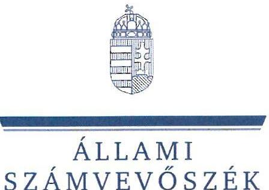
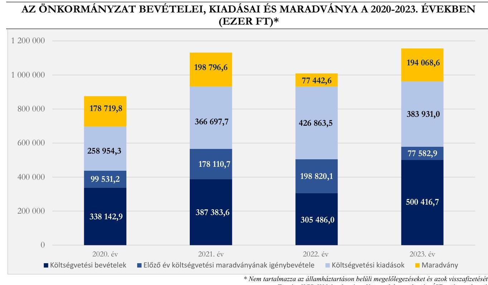
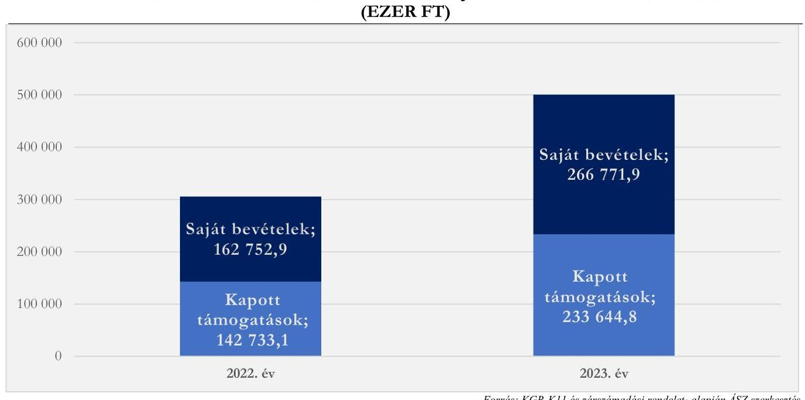

# JELENTÉS 

## Az önkormányzatok helyi adóztatási tevékenységének ellenőrzése - Ingatlanadóztatás

Balatonberény Község Önkormányzata

2024.

---

ÁLLAMI
SZÁMVEVŐSZÉK

# JELENTÉS 

## Az önkormányzatok helyi adóztatási tevékenységének ellenőrzése - Ingatlanadóztatás

Balatonberény Község Önkormányzata

2024.

---

# ELLENŐRZÉSI IGAZGATÓSÁG: 

## ÁLLAMHÁZTARTÁS HELYI SZINTJÉT ELLENŐRZŐ IGAZGATÓSÁG

## ELLENŐRZÉSI IGAZGATÓ:

DR. BAFFIA GERGELY GÁBOR ellenőrzési igazgató

## ELLENŐRZÉSVEZETŐ:

Jelentéseink az interneten a www.asz.hu címen olvashatók.

KANYÓ LŐRÁNT ISTVÁN ellenőrzésvezető

IKTATÓSZÁM: EL-4040-008/2024.
TÉMASZÁM: 2740.
ELLENŐRZÉS-AZONOSÍTÓ SZÁM: V-1084

---

# TARTALOMJEGYZÉK 

AZ ELLENŐRZÉS ALAPADATAI ..... 5
AZ ELLENŐRZÉS TERÜLETE ÉS AZ ELLENŐRZÖTT SZERVEZET ..... 7
ÖSSZEFOGLALÁS ..... 9
AZ ELLENŐRZÉS FÓKUSZKÉRDÉSEI ..... 11
MEGÁLLAPÍTÁSOK ..... 12
JAVASLATOK ..... 26
MELLÉKLETEK ..... 27
I. sz. melléklet: Értelmező szótár ..... 27
II. sz. melléklet: Az ellenőrzött szervezetek jegyzéke ..... 28
III. sz. melléklet: Ellenőrzési kritériumok ..... 29
IV. sz. melléklet: Balatonberény ingatlanadó mértékei a 2022. és a 2023. évben ..... 32
V. sz. melléklet: A helyi ingatlanadótárgyak és adóalanyok a 2023. és a 2024. évben ..... 33
FÜGGELÉK: ÉSZREVÉTELEK ..... 34
RÖVIDÍTÉSEK JEGYZÉKE ..... 35

---

.

---

# AZ ELLENŐRZÉS ALAPADATAI 

## AZ ELLENŐRZÉS CÉLJA

Az ellenőrzés célja az volt, hogy értékelje Balatonberény község helyi ingatlanadóztatásának és adóhatósága feladatellátásának szabályszerűségét, célszerűségét és eredményességét. További cél volt, hogy az ellenőrzés megállapításai és következtetései segítsék az önkormányzati képviselő-testületeket a jogszabályokkal és a helyi sajátosságokkal összhangban álló helyi adópolitika kialakításában és az azt végrehajtó adóigazgatási szervezet megszervezésében. Az ellenőrzés célja volt továbbá annak megállapítása is, hogy az Önkormányzat által bevezetett, ingatlanokat terhelő helyi adókra vonatkozó rendeleti szabályok összhangban vannak-e a helyi adópolitikai célokkal, tartalmuk tükrözi-e a település helyi sajátosságait és az adóhatósági feladatellátás biztosítja-e az önkormányzati bevételek feltárását és beszedését.

Ennek keretében az ÁSZ értékelte, hogy az Önkormányzat által bevezetett, ingatlanokat terhelő helyi adókról szóló adórendelet, valamint az adóhatóság döntései, adóztatási gyakorlata a vonatkozó jogszabályokkal összhangban állnak-e.

## AZ ELLENŐRZÉS TÍPUSA

Kombinált ellenőrzés.

## AZ ELLENŐRZÖTT IDŐSZAK

Az 1. fókuszkérdésnél a 2023. év, valamint a 2024. évnek az ellenőrzés megkezdését megelőző napjáig (2024. április 2.) tartó időszaka.

A 2. és 3. fókuszkérdésnél a 2023. év, valamint a 2024. évnek az ellenőrzés megkezdését megelőző napjáig (2024. április 2.) tartó időszaka, a 2020-2022. évek adatainak bázisadatként való felhasználásával.

## AZ ELLENŐRZÉS TÁRGYA

Az Önkormányzat képviselő-testületének ingatlanokat terhelő helyi adókkal, azaz az építményadóval, a telekadóval és a magánszemély kommunális adójával kapcsolatos rendeletalkotási tevékenységének és az adóhatóság tevékenységének az ellátása.

Az ellenőrzés kiterjedt minden olyan körülményre és adatra, amely az ÁSZ jogszabályban meghatározott feladatainak teljesítéséhez, valamint az ellenőrzési program végrehajtása folyamán felmerült újabb összefüggések feltárásához szükséges.

---

# AZ ELLENŐRZÉS JOGALAPJA 

Az ellenőrzés jogszabályi alapját az ÁSZ tv. 5. § (8) bekezdésének előírásai képezik.

## AZ ELLENŐRZÉS MÓDSZERE

Az ellenőrzést az ellenőrzési program szempontjai, az ellenőrzött időszakban hatályos jogszabályok, az ellenőrzés általános szakmai szabályai és az ellenőrzésre irányadó ÁSZ módszertanok alapján végezte az ÁSZ.

Az ellenőrzési kérdések megválaszolásához szükséges bizonyítékok megszerzése az ellenőrzött szervezetek által rendelkezésre bocsátott dokumentumokra, adatokra és az ÁSZ Adó és az Iratkezelő szakrendszerek, illetve a KGR-K11 számviteli adatgyűjtő rendszer adataira alapozva megfigyelés, szemle (szemrevételezés), kérdésfeltevés (információkérés), mintavételezés, valamint elemző eljárás útján történt. Emellett az ellenőrzési bizonyítékként felhasználható adatforrások közé tartozott minden egyéb - az ellenőrzés folyamán feltárt, az ellenőrzés szempontjából információt tartalmazó - releváns dokumentum (ideértve különösen a helyszíni ellenőrzésről készült jegyzőkönyvet) is.

Az ellenőrzés lefolytatásához az ellenőrzött szervezet a tanúsítványok kitöltésével, valamint az ÁSZ által kért dokumentumok, adatok, információk megküldésével és az ellenőrzés során szolgáltatott adatokat.

Az ÁSZ az adómegállapítás és a hátralékok beszedésének szabályszerűségét mintavételi eljárással ellenőrizte. Ennek keretében 12 mintatételben, 15 adómegállapító határozat szabályszerűségét, illetve két mintatételben a hátralékkezelés teljes dokumentációját ellenőrizte. A mintatételek kiválasztása véletlenszerűen történt az adóhatóság nyilvántartásában lévő adótárgyak és ügyek közül öt - adómegállapításra vonatkozó - mintatétel kivételével, amelyek esetében a kiválasztás címadatok alapján történt annak érdekében, hogy feltárható legyen, volt-e olyan adótárgy, amelyet nem adóztatott az adóhatóság. Az ellenőrzött mintatételekre vonatkozó megállapítások nem vetíthetők ki a teljes sokaságra, a megállapításokat az ÁSZ az adott ellenőrzött mintatételek vonatkozásában tette meg.

Az ÁSZ a helyi adópolitikai elképzelések és a települési sajátosságok feltárásával értékelte, hogy az adórendelet e szempontoknak mennyiben felelt meg. Az ÁSZ a helyi adópolitikai célokkal akkor tekintette összhangban állónak az adórendeletet, ha az hatását tekintve támogatta az adópolitikai célok teljesülését.

Az ÁSZ az adóhatósági feladatellátás szabályszerűségéből, a meglévő kapacitásokból, valamint az ezer forint adóbevételre jutó adóhatósági költségek alakulásából következtetett arra, hogy az adóhatóság rendelkezett-e azzal a potenciállal, amellyel eredményesen tudta a helyi adópolitikát végrehajtani.

Az ÁSZ - az adórendelet szabályainak érvényre juttatása körében - az eredményesség véleményezésekor a III. számú melléklet 2. pontjában foglalt szempontokat tekintette mérvadónak.

---

# AZ ELLENŐRZÉS TERÜLETE ÉS AZ ELLENŐRZÖTT SZERVEZET 

Balatonberény Somogy és Zala vármegyék határán, Somogy vármegyében, a Marcali járásban, a Marcali-hát és a Balaton találkozásánál, a Kis-Balaton tőszomszédságában, a Zala folyó torkolatától néhány kilométerre fekszik. Balatonberény üdülőközség, legfontosabb és arányaiban a legnagyobb bevételi forrásai az idegenforgalomhoz kapcsolódnak. Ennek megfelelően a TEIR 2022. december 31-ei adatai alapján a településen regisztrált 327 gazdasági szervezetből 137 a szálláshely, vendéglátás ágazatba tartozott. Balatonberény állandó lakossága - a BM adatai alapján - 2020. év elején 1198 fő, 2024. év elején 1302 fő volt.

Az Önkormányzat saját költségvetési szervvel nem rendelkezett, tagja volt azonban több társulásnak és 100%-os tulajdonában volt a Balatonberényi Nonprofit Kft.

Az Alaptörvény értelmében a helyi önkormányzat a helyi közügyek intézése körében törvény keretei között döntött a helyi adók fajtájáról és mértékéről. Az Mötv. rögzíti, hogy a helyi adóval kapcsolatos feladatok ellátása a helyi önkormányzatok feladata.

Az Önkormányzat a Htv. alapján illetékességi területén adórendelettel az építményadót, a telekadót és a magánszemély kommunális adóját vezette be. A hatályos szabályozást eredményező utolsó jogszabálymódosítás 2023. január 1-jén lépett hatályba.

Az építményadó, a telekadó és a magánszemély kommunális adója szabályrendszerét az Önkormányzat 2023. január 1-jétől sávosan differenciált mértékrendszerrel alkotta meg. Az adómérték-sávok meghatározása során a fő szempont az adótárgy elhelyezkedése lett. A mértékrendszert részletesen az IV. számú melléklet mutatja be.

Az adó megállapításával, nyilvántartásával, beszedésével összefüggő adóhatósági feladatokat - a Hatásköri tv. és az Air. rendelkezései alapján - elsőfokú hatósági jogkörben Balatonkeresztúr város jegyzője látta el a Hivatal vezetőjeként. A balatonberényi adóhatósági feladatellátás az Önkormányzat illetékességi területén lévő Kirendeltségen történt, egy fő adótisztviselő közreműködésével.

Az adóhatóság által beszedett, ingatlanokat terhelő adókból származó helyi adóbevételek fontos szerepet játszottak a települési feladatok finanszírozásában. 2023-ban 94 133,2 ezer Ft bevétel származott a három ingatlanadóból, ami a költségvetési bevételek 18,8%-át, a települési helyi adóbevételek 55,3%-át tette ki. Az ingatlant terhelő helyi adók közül az építményadóból származott a legtöbb bevétel, amely 47091,9 ezer Ft volt 2023-ban és 998 adóalanytól, 1403 adótárgy után keletkezett. Az Önkormányzat helyi adóbevételei 2022. és 2023. évi összetételére vonatkozó adatokat az 1. ábra, a helyi ingatlanadók 2023. és 2024. évre vonatkozó jellemző naturális adatait pedig az V. számú melléklet mutatja be.

---

1. ábra

# AZ ÖNKORMÁNYZAT HELYI ADÓBEVÉTELEINEK MEGOSZLÁSA A 2022-2023. ÉVEKBEN (EZER FT)

---

# ÖSSZEFOGLALÁS 

Az ÁSZ tv. értelmében az ÁSZ feladatkörébe tartozik az önkormányzatok adóztatási tevékenységének ellenőrzése. A helyi adók az önkormányzatok saját, el nem vonható bevételét képezik, így az önkormányzatok gazdasági önállósága szempontjából különös fontossággal bír, hogy a helyi adórendeleti szabályok összhangban álljanak a magasabb szintű jogszabályokkal, továbbá az önkormányzati adóhatósági tevékenység jogszerű, eredményes és hatékony legyen. Erre figyelemmel volt tárgya az ÁSZ ellenőrzésének az Önkormányzat adórendelet-alkotási tevékenysége és az adóhatósági feladatellátás is.

Az adórendelet több ponton nem volt összhangban a magasabb szintű jogszabályokkal, ugyanakkor alkalmas volt az Önkormányzat adópolitikai céljainak elérésére. Az adóigazgatási feladatellátás a jogszabályi és szakmai követelményeknek amiatt nem felelt meg, mert adóalany- és adótárgyfeltárásra irányuló feladatellátás nem volt, az adómegállapító határozatok indokolása pedig nem volt megfelelő. Az adóztatási kiadások nem voltak aránytalanul magasak az adóbevételhez képest, az adóhatóság ingatlanadóztatással összefüggő feladatellátási mutatói - az ingatlanadókra vonatkozó behajtási tevékenység mutatóin kívül - kedvezőbbek voltak, mint az ÁSZ által ellenőrzött nyolc (nagy)község feladatellátási mutatóinak átlagos értéke. Az adóhatóság adóbehajtási tevékenysége nem volt eredményes, illetve célszerű.

## Adórendelet, adórendelet-alkotás

Az adórendelet nem volt összhangban a Htv.-vel, mert leszűkítette a magánszemély kommunális adója tárgyi hatályát, továbbá egyes kedvezmények esetén nem zárta ki azt, hogy azokat vállalkozók is igénybe vehessék. Emellett az adórendelet több, nem egyértelmű, ezáltal vitatható rendelkezést tartalmazott.

Az ingatlanokat terhelő helyi adókra vonatkozó rendeleti szabályozás megalkotása során az Önkormányzat összességében figyelembe vette azt, hogy a rendeleti szabályoknak tükrözniük kell a helyi sajátosságokat, az önkormányzat gazdálkodási követelményét, továbbá az adóalanyok széles körét érintően az adóalanyok teherviselő képességét.

## Az adóhatóság adóigazgatási feladatellátásának jogszerűsége, eredményessége

Az adómegállapító határozatokban foglalt adóösszeg és a fizetésre kötelezettek személye megfelelt a jogszabályoknak.

Egyik adómegállapító határozat sem felelt meg azonban a jogszabályban foglaltaknak, mert az adómegállapító határozatok indokolása nem tartalmazta egyértelműen az adó kiszámítását, nem volt világos a tényállás és a jogalapot jelentő jogszabályi rendelkezések egymáshoz rendelése, ami nehezítette az adóhatósági döntések értelmezését.

Az adómegállapító határozatok kiadmányozása, kézbesítése jogszerű volt.
Az adórendelet adópolitikai célokkal való összhangja, az adórendelet hatása
Az Önkormányzat országos összehasonlításban kiemelten támaszkodott az ingatlanadó-bevételekre. Míg a községek, nagyközségek esetén országosan ezen bevételek (intézmények nélküli) költségvetési bevételeken belüli átlagos aránya 2,2%, addig az Önkormányzat esetében ez 18,8% volt 2023-ban. A költségvetési

[^0]
[^0]:    Az ÁSZ által jelen ellenőrzés alapjául szolgáló ellenőrzési program alapján ellenőrzött (nagy)községek: Árpádhalom, Balatonberény, Balatonvilágos, Kompolt, Leányfalu, Szentistván, Szigetmonostor és Tiszainoka.

---

bevételeken belül a saját bevételek aránya a 2020-2023. időszakban 50%-nál magasabb volt (ha nem vesszük figyelembe a 2021. évben befolyt pályázati forrásokat). Az Önkormányzat gazdálkodási mozgásterét növelte a 2023. évtől bekövetkező, összességében 33,7%-os ingatlanadóbevétel-emelkedéssel járó adóváltoztatás.

Ezzel együtt az adószint-emelkedéssel járó, 2023. január 1-jétől hatályos változtatások az adóalanyok többségének adóteherbíró-képességével összhangban voltak.

Az Önkormányzat adórendeleti szabályai összhangban voltak az adópolitikai célokkal (az adó biztos bevételi forrást jelentsen; igazságos legyen; és a helyi lakosságot kevésbé terhelje).

# Az adóhatósági kiadások 

A Hivatal a 2023. évben 638 610,1 ezer Ft helyi adóbevételt szedett be három településről (Balatonberény, Balatonkeresztúr, Balatonmáriafürdő). Minden 1000 Ft beszedett helyi adóbevételre - az ÁSZ számítása szerint - 43,9 Ft adóztatási kiadás esett. Az ellenőrzött (nagy)községek átlaga 33,4 Ft, az adóztatási kiadás tapasztalati referencia-érték maximuma kivetéses adóztatás esetén 50 Ft volt. Az adóztatási kiadások nem voltak túlzottak a bevételekhez mérten.

Az Önkormányzat adótisztviselőjére - 100%-os adóigazgatási feladatellátás esetén -
 a 2023. évben 189 062,0 ezer Ft helyi adóbevétel, 2303 adótárgy és 1840 adóalany jutott. Az első mutató valamelyest rosszabb, utóbbi kettő azonban jóval kedvezőbb, mint az ÁSZ által ellenőrzött nyolc (nagy)község átlaga (218 852,8 ezer Ft/adótisztviselő, illetve 1396 adótárgy, 1257 adóalany/adótisztviselő). Az adóhatóság feladatellátási mutatói - az adóbehajtási tevékenység mutatói kivételével - összességében kedvezőbbek, mint az ÁSZ által ellenőrzött nyolc (nagy)község átlagos feladatellátási mutatói.

---

# AZ ELLENŐRZÉS FÓKUSZKÉRDÉSEI 

1.- Az önkormányzat ingatlanokat terhelő helyi adókra vonatkozó rendeleti szabályozása megfelel-e a magasabb szintű jogszabályoknak?
2.- Az önkormányzati adóhatóság megfelelően és eredményesen látta-e el az ingatlanok adóztatásával kapcsolatos adóhatósági tevékenységeit?
3.- A településen megvalósuló helyi adóztatás támogatta-e a helyi adópolitikai célok teljesülését?

---

# MEGÁLLAPÍTÁSOK 

## 1. Az önkormányzat ingatlanokat terhelő helyi adókra vonatkozó rendeleti szabályozása megfelelte a magasabb szintű jogszabályoknak?

Összegző megállapítás Az adórendelet több ponton nem felelt meg a magasabb szintű jogszabályoknak.
1.1 számú megállapítás

Az adórendelet adómérték-rendszere ellentmondásos szabályozást eredményezett, a rendelet fogalmi rendje nem volt összhangban a Htv. előírásaival. A rendelet szövegezése több ponton sértette az egyértelműség Jár. 20-ban megfogalmazott követelményét.

A Htv. 2. §-ának az adómegállapításra vonatkozó rendelkezésével² és a Htv. 24. §-ának a magánszemély kommunális adótárgyait rögzítő rendelkezésével ellentétesen az adórendelet 12-13. §-ai - indirekt módon - leszűkítették a magánszemély kommunális adójában az adótárgyak körét azáltal, hogy nem mindegyik, Htv. szerinti adótárgyra (így például az építményadó alól a Htv. szerint adómentes nem lakáscélú épületekre sem) rögzítettek adómértéket.
A Htv. 52. § 45-47. pontjai definiálják a „kereskedelmi egység”, a „szállásépület” és az „egyéb nem lakás céljára szolgáló épület” fogalmát. Az adórendelet 1. § d) pontjában a Htv.-ben szereplő

Az uniós állami támogatási szabályok értelmében a vállalkozóknak nyújtott helyi adómentesség, helyi adókedvezmény állami támogatásnak minősül. A jogszerűtlenül nyújtott támogatást a kedvezményezettnek vissza kell fizetnie, vagy a támogatást nyújtónak kell biztosítania az uniós joggal való összhangot.
definícióktól eltérő, önálló meghatározást tartalmazott ugyanezen elnevezésű fogalmakra, ezért sértette a Htv. hivatkozott rendelkezését.
A Htv. 7. § e) pontjában előírtak ellenére - amely az uniós jogból fakadó állami támogatási elvekre és normákra figyelemmel rögzíti, hogy az önkormányzat az építményadóban és a telekadóban a vállalkozó számára adómentességet, adókedvezményt nem biztosíthat - az adórendelet:
a) 1. § c) pontja leszűkítette az „üzleti célt szolgáló építmény” fogalmi kategóriáját arra az épületre, épületrészre, amelyet a vállalkozó bevétel-, nyereség-, jövedelemszerzése érdekében használ, vagy ezzel kapcsolatosan költséget számol el (a vállalkozó adóalany egyéb építményét nem sorolja e körbe);
b) 5. § (2) bekezdése és 11. §-a az a) pontban említettek miatt csak a vállalkozó bevétel-, nyereség és jövedelemszerzésre használt ingatlana vagy azon ingatlana esetében zárta ki az adómentesség lehetőségét, amely után költséget számol el, azokra az adótárgyakra nem, amelyek vonatkozásában

[^0]
[^0]:    ² Az Alaptörvény 32.cikk (1) h) pontja szerint: a törvény keretei között szabályozhat a helyi rendelet, így nem írhatja felül az adó tárgyát.

---

az adó alanya vállalkozó, de azt nem használja bevétel-, nyereség-, jövedelemszerzés érdekében vagy nem számol el az adott adótárggyal kapcsolatosan költséget;
c) 9. §-ának valamennyi bekezdése olyan önálló adókedvezményi tényállást rögzített, amelynek kedvezményezettje vállalkozó adóalany is lehet³.
Az adórendelet az alábbi okokból fakadóan sértette - a Jár. 2. § 1) bekezdéséből következő egyértelműség követelményét:
a) az adórendelet 4. §-ának (3) és (5) bekezdése szabályozási tartalmának összeütközése miatt a lakással vagy üdülővel egy telken található, éves vagy idényjelleggel működő kereskedelmi egység, szállásépület, egyéb nem lakás céljára szolgáló épület esetén nem egyértelmű, hogy melyik adómértéket (300 Ft/m², illetve 720 Ft/m²) kell alkalmazni;
b) az adórendelet nem tartalmaz értelmező rendelkezést az adórendelet 4. § (5) bekezdésében, illetve 7. § (4) bekezdésében szereplő „ténylegesen működő” szókapcsolatra a kereskedelmi egységek, szállásépületek, egyéb nem lakás céljára szolgáló épületek és az azokhoz tartozó telkek esetében;
c) az adórendelet 7. §-a a telekadó esetében differenciált adómértéket állapít meg a lakóövezetben, illetve az üdülőövezetben található telkek adókötelezettségét illetően, valamint az adórendelet 8. § (1) bekezdés b) pontjában adómentességet biztosít az üdülőövezetben lévő beépített telkek esetében 1500 m² teleknagyságra, azonban nem értelmezi, hogy mit kell lakó-, vagy üdülőövezet alatt érteni;
d) az adórendelet 8. § (1) bekezdése értelmében annak a magánszemély adóalanynak, aki valamely vállalkozás tulajdonában álló telken fennálló vagyoni értékű joga alapján visel adóterhet, nem jár adómentesség, ugyanakkor az ÁSZ által feltárt jogalkotói szándék ezzel ellentétes;
e) az adórendelet 8. § (3) bekezdése az építési engedéllyel rendelkező telekre fogalmaz meg négy évre szóló adómentességi szabályt, amely esetében a határidő indokolt esetben meghosszabbítható, de nem részletezi sem a meghosszabbítás feltételeit, sem az adóhatóság döntésének a szempontjait;
f) az adórendelet 10. § (2) bekezdése saját magára hivatkozik vissza.

[^0]
[^0]:    ³ Nem zárta ki az adókedvezményre jogosultak köréből a vállalkozónak számító adóalanyokat az adórendelet 9. § (3)-(5) bekezdéseiben rögzített azon szövegezési fordulat sem, amely szerint az adómentesség csak a magánszemély tulajdonában álló telkeket illeti meg, figyelemmel arra, hogy ha ezen telkeken vállalkozónak áll fenn vagyoni értékű joga, akkor ezen vállalkozó minősül adóalanynak.

---

1.2 számú megállapítás

Az adórendelet tükrözte a települési sajátosságokat és az adóalanyok széles körét tekintve igazodott az adóalanyok teherviselő képességéhez, valamint az Önkormányzat gazdálkodási követelményeihez.

Az Htv. 7. § g) pontjában rögzített adómegállapítási korlátokból az következik, hogy a rendelet időbeli hatálya alatt is érvényre kell jutnia az e pontban szabályozott rendeletalkotási elveknek, azaz annak, hogy települési önkormányzat az adóalap fajtáját, az adó mértékét, a rendeleti adómentességet és adókedvezményt úgy állapíthatja meg, hogy azok összességükben egyaránt megfeleljenek
a) a helyi sajátosságoknak,
b) az önkormányzat gazdálkodási követelményeinek és
c) az adóalanyok széles körét érintően az adóalanyok teherviselő képességének.

## A helyi sajátosságok figyelembevétele

Balatonberény sajátosságaira figyelemmel az ingatlanokat terhelő adók potenciális adótárgyai és így az önkormányzat bevételi forrásai nem elsősorban az ipari-kereskedelmi ingatlanok, hanem a lakások, üdülők, üdülőépületek, szállásépületek voltak. Ezen ingatlanok forgalmi értéke (vagyoni értéke) nagyban függött a vízparttól való távolságtól.
Az adórendelet 4. §-a értelmében magasabb építményadó-mérték vonatkozott a Balaton partján található, lokációjukra tekintettel értékesebb ingatlanokra, mint a Balatontól távolabb fekvő és ezáltal az előzőekben említett ingatlan-csoporthoz képest kevésbé értékes ingatlanokra. A település ezen markáns, az ingatlanadóztatás szempontjából meghatározó sajátos körülményeit a hatályos adórendelet legutóbbi, 2023. január 1-jétől hatályos módosítása előkészítésekor - a Htv.-ben foglaltaknak megfelelően - az Önkormányzat figyelembe vette és mérlegelte.

## Az önkormányzat gazdálkodási követelményeinek szempontja

Az Önkormányzat álláspontja szerint az adórendelet teljesítette azt az adópolitikai célkitűzést, hogy a helyi adóbevételek fontos szerepet játszanak az Önkormányzat költségvetésében.
A 2022. évben a helyi adókból összesen 136 733,5 ezer Ft bevétele származott az Önkormányzatnak, amely az összes költségvetési bevételnek (amely 305 486,0 ezer Ft) 44,8%-át tette ki. A 2023. évben a helyi adókból származó éves 170 155,7 ezer Ft az Önkormányzat összes költségvetési bevételének ugyan csak 34,0%-a volt, azonban a bevételeket jelentősen növelte 2023-ban az uniós és állami pályázati támogatás, valamint a nonprofit gazdasági társaságtól átvett pénzeszköz. Az Önkormányzat esetében ezen, az egyszeri tételektől megtisztított, a korábbi évvel összevethető költségvetési bevételnek (294 885,3 ezer Ft) 57,7%-át tette ki a helyi adóbevétel.
Az Önkormányzat főbb gazdálkodási adataiból (2. ábra) az figyelhető meg, hogy az Önkormányzat kötelezettséggel nem terhelt maradványa a bevételekhez mérten jelentős volt (2020-2021-ben 50% feletti érték, 2022-ben 25,4%, 2023-ban 38,8%, az egyszeri bevételek nélküli költségvetési bevételek arányában: 65,8%). A 2023. évi adóváltozás a kötelezettséggel nem terhelt maradvány összegét és arányát 13,8%-ponttal, az uniós támogatásoktól megtisztított értékhez mérten 40%-ponttal növelte, tovább erősítve a település gazdasági önállóságát.

---

# Az adózók teherbíró képességének figyelembevétele 

A teljes évben életvitelszerűen helyben lakók az adórendelet 5. § (1) bekezdés b) pontja alapján építményadó-mentességet élveztek az ingatlanuk után - annak fekvésétől függően, alapterületétől függetlenül -, azonban évi 20-25 ezer Ft magánszemély kommunális adóját kellett fizetniük. A nyári időszakban a településen tartózkodó üdülőtulajdonosok adókötelezettsége az építményadóban állt fenn. A településen az adóztatási adatok alapján átlagosnak tekinthető 52 m² alapterületű üdülőépület építmény-adóterhe 33,8 ezer Ft és 78,0 ezer Ft közötti volt, amely az életvitelszerűen egész évben lakott ilyen nagyságú lakás adóterhéhez képest legalább másfélszeres. E megfontolás mögött - az Önkormányzat indokolása alapján - az állt, hogy az üdülőtulajdonosok esetében valószínűsíthető, hogy üdülőjük második vagy többedik ingatlanuk, így vélelmezhető az is, hogy ők nagyobb szerepet tudnak vállalni a helyi közterhekből.
Mindezekre tekintettel - a Htv.-ben foglaltaknak megfelelően - az Önkormányzat figyelembe vette az adózók teherbíró képességét a rendeletalkotás során.

---

# 2. Az önkormányzati adóhatóság megfelelően és eredményesen látta-e el az ingatlanok adóztatásával kapcsolatos adóhatósági tevékenységeit? 

Összegző megállapítás Az adóhatóság adómegállapítási feladatellátása nem volt eredményes és egyes elemei nem voltak megfelelőek. Az adótartozások beszedése érdekében megtett intézkedések nem voltak eredményesek és nem voltak célszerűek.
2.1. számú megállapítás

Az adóhatóság adómegállapítási feladatellátása nem volt eredményes. Az adóhatóság az adófizetési kötelezettségről jogszerűen rendelkezett. Az Áir. előírásai ellenére az adómegállapító határozatok indokolása nem tartalmazta az adó kiszámításának folyamatát, és nem kizárólag az adókötelezettség szempontjából releváns jogszabályokra utalt, ami nehezítette az adóhatósági döntés értelmezését.

## Adótárgy-, és adóalanyfeltárás

Az adóhatóság a 2023. és a 2024. évben élt az Árt.²¹ 83. § (2) bekezdésében foglaltak alapján az ingatlanügyi hatóság megkeresésének lehetőségével. Ezen, a települési ingatlanokról és tulajdonosaikról, valamint az ingatlanokon fennálló vagyoni értékű jog jogosítottaiól szóló adatokat egy-egy konkrét adóügy intézése kapcsán használta fel, az ingatlanügyi hatóság adatainak és az adónyilvántartásban lévő adóztatott ingatlanok adatainak teljes körű összevetése nem történt meg. Az adóhatóság az adóalanyok és az adótárgyak feltárása érdekében nem használt térinformatikai eszközt, tételes adótárgy-feltárást, bejárást sem végzett. Balatonberényben 2023-ban 1403 adótárgy volt építményadó-köteles, közte a nem helyben lakó adóalanyok üdülőépületei, szállásépületei, így az adóhatóság helyismereten alapuló adóztatása önmagában véve korlátozott, ezért az adótárgy-, és adóalanyfeltárási adóhatósági feladatellátás nem volt eredményes.

## Adómegállapítás (kivetés)

Az ÁSZ az adóhatósági adómegállapítási feladatellátás ellenőrzése keretében 10 mintatétel ellenőrzését végezte el.
Az adóhatóság valamennyi mintatétel (ellenőrzött adómegállapító határozat) esetén a fizetendő adó összegét helyesen számította ki, az ÁSZ nem tárt fel jogszerűtlenül nem adóztatott ingatlant.

---

Az adómegállapító határozatok indokolása - az
Áir. 73. § (1) bekezdés c) pontjában foglaltak ellenére - tényállási elemként egyik esetben sem tartalmazta az adótárgy utáni adó és az adóalany(ok)ra jutó adó összegének egyértelmű számszaki levezetését, jogi természetű megalapozását, továbbá olyan jogszabályhelyek is szerepeltek az adómegállapító határozat
 indokolásában, amelyek a fizetési

Ha az adótárgynak több tulajdonosa van, akkor ők tulajdoni illetőségük arányában adóalanyok. Ekkor, mindegyikük egyetértése esetén köthetnek arról megállapodást, hogy az adóalanyisággal kapcsolatos jogokat és kötelezettséget az adóhatóság előtt közülük egy adóalany kapcsolattartóként gyakorolja. Az ÁSZ jó gyakorlatnak azt tekinti, ha az adómegállapító határozat nemcsak a fizetési kötelezettséget és a fizetésre kötelezettet (a kapcsolattartót), hanem az egyes adóalanyokat terhelő adót és annak jogalapját, kiszámítását is tartalmazza, annak érdekében, hogy az egyes adóalanyok számára egyértelmű legyen az őket terhelő adó összege.
kötelezettség kapcsán nem relevánsak.
Az adómegállapító határozatok jogszerűségét e hiányosságok nem érintik. A világos, követhető magyarázat ugyanakkor érthetővé teszi az adózó számára, hogy milyen jogalapon és miért az adómegállapító határozat szerinti összeget kell fizetnie. Ezen túlmenően az adóhatóságnak és az Önkormányzatnak is előnyös, ha az adózó fizetési hajlandósága javulhat azáltal, hogy számára is világos és érthető az adómegállapító határozat.
Egy telekadóra (5. mintatétel) és egy magánszemély kommunális adójára (8. mintatétel) vonatkozó mintatétel esetében az adóhatóság által hozott adómegállapító határozat rendelkező része kizárólag az adó fizetésére kötelezett által fizetendő adó összegét tartalmazta. Az 5. mintatétel és a 8. mintatétel esetén az adómegállapító határozat indokolásából nem tűnt ki, hogy megállapodás alapján történő adófizetésről volt szó.
Adóellenőrzést az adóhatóság az ellenőrzött időszakban nem végzett.
Az adómegállapító határozatok kiadmányozása és adózókkal való közlése valamennyi adómegállapító határozat esetében megfelelt az Áir. és az Eüsztv. előírásainak.

A megállapított adó csökkentése: fizetési kedvezmények, adókötelezettség változás, elévülés miatti törlés
A fennálló adókövetelést csökkentő intézkedések jogszerűek voltak, azok számszaki összefoglalását az 1. táblázat mutatja be (az adóhatóság fizetési kedvezményt nem adott az ellenőrzött időszakban).

---

1. táblázat

ADÓKÖVETELÉS TÖRLÉSEK FŐBB ADATAI (DARAB ÉS EZER FT)

| MÉGNEVEZÉS | 2023. |  | 2024. |  |
| :--: | :--: | :--: | :--: | :--: |
|  | Eset szám | Összeg | Eset szám | Összeg |
| Méltányosságból törölt adókövetelés | 0 | 0 | 0 | 0 |
| Adókötelezettség változás okán törölt adókövetelés | 83 | 5727,2 | 40 | 828,3 |
| Elévülés miatt törölt adókövetelés | 4 | 140,6 | 0 | 0 |

Fonrás: Az Önkormányzat és a Hivatal tanúsítványokon megadott adatai alapján ÁSZ saját szerkesztés

# Adatszolgáltatási, közzétételi kötelezettség 

Az adóhatóság a Kincstár ${ }^{22}$ számára a helyi adórendeletről és adózási információkról szóló adatszolgáltatási kötelezettségének a Htv. 42/B. § (1) bekezdésben foglalt határidőn ${ }^{4}$ túl, 2022. december 22-én tett eleget. Az adórendelet az Önkormányzat honlapján elérhető volt a Htv.-ben foglaltaknak megfelelően.
2.2. számú megállapítás

Két adóbehajtási ügyben az adóhatóság törvényesen végzett behajtási cselekményt, azonban az egyik ügyben a végrehajtási eljárást nem zárta le végzéssel. Az adóbehajtási (adóbeszedési) tevékenység nem volt eredményes és nem volt célszerű.

Az adóhatóság ingatlant terhelő adóban fennálló tartozás behajtásához kapcsolódóan a 2023. évben négy, a 2024. évben az ellenőrzés megkezdéséről való értesítés átvételének napjáig pedig három esetben indított végrehajtási eljárást. Ezen eljárásokból összesen 6811,1 ezer Ft (ez a 2023. év végén fennálló adótartartozás 10,5%-a) összeg beszedése történt meg a 2023. évben.
Az egyik minta (természetes személy adózó, végrehajtható okirat száma: I/7569-1/2023) esetén a végrehajtható okirat (adómegállapító határozat) 2023. május 13. napján vált véglegessé. Az adóhatóság az első, az adótartozás behajtására irányuló eljárási cselekményt (fizetési felhívást) — a 2020., 2021. és 2022. évre meg nem fizetett építményadó (17,6 ezer Ft) és késedelmi pótlék (6,8 ezer Ft) tartozás beszedésére - 271 nappal később, 2024. február 8-án kelt felszólító levélben foganatosította. A fizetési felhívás kibocsátása sikertelen volt, mert az adózó tartozását nem fizette meg, az adóhatóság - az Avt. ${ }^{23} 30. § (1) bekezdése ellenére - végrehajtási eljárást nem kezdeményezett.
A második minta (gazdasági társaság adózó, végrehajtható okirat száma: I/508-2/2021) esetében az adómegállapításról szóló - 2021. január 1-jétől 6017,0 ezer Ft/év telekadó megfizetését előíró - I/5082/2021. ügyiratszámú határozat 2021. február 16-án vált véglegessé, amely alapján az adóhatóság 6006,1 ezer Ft telekadótartozást és 350,4 ezer Ft késedelmi pótlék-tartozást tartott nyilván 2023. október 3-án. A legkorábbi késedelmes adótétel (2022. december 31-én fennálló tartozás) esedékességétől számítva 276 nappal később, 2023. október 3-án foganatosította az első végrehajtási cselekményt hatósági átutalási megbízás formájában. A végrehajtási cselekmények eredményesek

[^0]
[^0]:    ${ }^{4}$ Az adórendelet, valamint annak módosítása hatálybalépését megelőző hónap ötödik napjáig kell adatot szolgáltatni a Kincstár számára.

---

voltak. Azonban a végrehajtási eljárást az adóhatóság az Avt. 18. § (1) bekezdésében foglaltak ellenére végzéssel nem szüntette meg.
Az adóhatóság a fizetési felhívást jogszerűen bocsátotta ki és a végrehajtási cselekmény is összhangban állt az Avt.-vel. Az adóbeszedési (adóbehajtási) feladatellátás ugyanakkor nem volt célszerű, mert az adó behajtására irányuló cselekmények késedelemmel, több, mint fél évvel a tartozás esedékességét követően történtek meg.
Az adóbeszedési (adóbehajtási) feladatellátás - a kritériumrendszer alapján - azért nem volt eredményes, mert a 2023. évi ingatlanadó-bevételhez (94 133,2 ezer Ft) viszonyított, az év utolsó napján fennálló hátralék (64758,6 ezer Ft) a községekre jellemző arányszám (34,7%) ugyan 30%-nál nagyobb mértékben (68,8% volt) meghaladta, azonban

- a 2022. év utolsó napján fennálló hátralék összegéhez képest a 2023. december 31-ei hátralék 10%-nál kisebb mértékben, 6,4%-kal emelkedett, az adóhatóság a 2022. évi fizetési felhívások (1596 db) számát 2023-ra 2135 db-ra, 33,8%-kal emelte (közte a hátralék-növekedéssel érintett adózóknál);
- az ingatlanadókból származó 2023. évi bevétel az eredeti előirányzat (101 000,0 ezer Ft) 90%-ánál jobb arányban, 93,2%-ában teljesült.
Az ÁSZ kiemeli, hogy a hátralék 75,7%-a egyetlen adózótól származott, amely nélkül a hátralék-arányra vonatkozó kritérium teljesült ${ }^{5}$ volna, ettől a tételtől eltekintve a feladatellátás eredményes volt. A 2. táblázat adatai szerint a hátralékok összege és a hátralékosok száma is emelkedett a 2023. év végére, ami részben indokolható a 2023. évi adószint-növekedéssel, azzal, hogy ez a hatás ideiglenes volt, mert a hátralék-állomány 2024. június 13-ára a 2023. év végi szint alá csökkent.
2. táblázat

| AZ ADÓHÁTRALÉKOK FŐBB ADATAI (DARAB ÉS EZER FT) |  |  |  |  |  |
| :--: | :--: | :--: | :--: | :--: | :--: |
| MEGNEVEZÉS | NAPTÁRI   NAP | ÉPÍTMÉNYADÓ | TELEKADÓ | MAGÁN-   SZEMÉLY   KOMMUNÁLIS   ADÓJA | ÖsszeSEN |
| Hátralékos adózók száma | 2022.12.31. | 331 | 69 | 94 | 494 |
|  | 2023.12.31. | 405 | 88 | 110 | 603 |
|  | 2024.06.13. | 177 | 47 | 53 | 277 |
| Adóhátralék összege | 2022.12.31. | 9065,6 | 50391,3 | 1395,8 | 60852,7 |
|  | 2023.12.31. | 10785,5 | 52264,5 | 1708,6 | 64758,6 |
|  | 2024.06.13. | 10482,9 | 52069,5 | 1485,1 | 64037,5 |

[^0]
[^0]:    5 Jelen esetben az adóhatóság adóbeszedési (adóbehajtási) tevékenységének eredményessége véleményezése során figyelembe kell venni azt, hogy a hátralék-összeg döntő többsége egy adózótól származott, mely tartozás nem volt teljes mértékben behajtható.

---

# 3. A településen megvalósuló helyi adóztatás támogatta-e a helyi adópolitikai célok teljesülését? 

| Összegző megállapítás | Az Önkormányzat ingatlanokat terhelő helyi adókra vonatkozó adórendeleti szabályozása támogatta a helyi adópolitikai célok megvalósulását. |
| :--: | :--: |
| 3.1 számú megállapítás | A helyi adópolitikai célok elérésének megfelelő eszközéül szolgáltak az Önkormányzat ingatlanokat terhelő helyi adókra vonatkozó adórendeleti szabályai. |

Az ÁSZ részletesen feltárta az Önkormányzat Gazdasági Programja ${ }^{24}$ 4.4. pontja szerinti adópolitikai célkitűzéseket. Az Önkormányzat megfogalmazott céljait és az alkalmazott eszközrendszert az alábbi, 3. táblázat tartalmazza:
3. táblázat

AZ ÖNKORMÁNYZAT ADÓPOLITIKAI CÉLJAI ÉS ALKALMAZOTT ESZKÖZRENDSZERE

| ADÓPOLITIKAI CÉL | ADÓPOLITIKAI ESZKÖZ |
| :-- | :-- |
| Biztos bevételi forrás legyen | Az ingatlanadó mértékeinek karbantartása |
| Lehetőségekhez mérten igazságos tehereloszlás | Az ingatlan vízparttól való távolságától és nagyságától   függő, differenciált építményadó-mértékrendszer |
| Elviselhető teher a lakosság számára | Építményadó-mentesség a ténylegesen életvitelszerűen   a településen lakók számára |
| Az ingatlanállomány nagy része valamely ingatlanadó   hatálya alá tartozzon | Az életvitelszerűen településen lakók magánszemély   kommunális adóját fizetnek |
| Ne hasson az adószabály a vállalkozások fejlesztési   elképzelései ellen | A vállalkozások ingatlanainak nem túlzott adóztatása   (nincs specifikus adómérték az üzleti célú ingatlanokra) |

Forrás: az Önkormányzat Gazdasági Programja és az Önkormányzat nyilatkozata alapján ÁSZ saját szerkesztés
Az ÁSZ véleménye szerint az adórendeleti eszköztár az elérni kívánt adópolitikai célokkal összhangban van.
3.2 számú megállapítás

Az Önkormányzat országos és regionális összevetésben is kiemelkedően támaszkodott az ingatlanadókból származó bevételekre. A 2023. évben bevezetett helyi ingatlanadó-szabályozás eredményeként az Önkormányzat saját bevételei nőttek, a támogatásoktól való függősége csökkent. Az adószint-emelkedéssel járó, 2023. január 1-jétől hatályos változtatások az adóalanyok többségének adóteherbíró-képességével összhangban voltak.

## Az adórendelet(módosítás) hatása az önkormányzat gazdálkodására

Az ingatlanadókból származó bevételek a 2020-2023. években jelentős ingadozást mutattak. A 2022. évi bevétel (70 419,4 ezer Ft) a 2023. évre 94 133,2 ezer Ft-ra, 23 713,8 ezer Ft-tal, 33,7%-kal való jelentősebb mértékű növekedésének oka a 2023. január 1-jétől hatályba lépett - az adószint növekedését eredményező - adórendelet volt. Ennek következményeként az építményadó-bevétel 14 718,3 ezer Ft-tal, 45,5%-kal volt magasabb a 2023. évben az előző évhez képest, a telekadó-bevétel 31 545,4 ezer Ft-ról 37 929,4 ezer Ft-ra, 20,2%-kal emelkedett, a magánszemély kommunális adójának bevétele a 2022. évi

---

6500,4 ezer Ft-ról 9111,9 ezer Ft-ra, 40,2%-kal nőtt. Emellett a helyi iparűzési adóból származó bevétel 7102,5 ezer Ft-os, 15,2%-os növekedése figyelhető meg a 2022. évről a 2023. évre.
A költségvetési bevételeken belül a saját bevételek aránya a 2020-2023. időszakban - kivéve a 2021. évet, amelyben a felhalmozási célú támogatások összege kiemelkedő volt - 50% feletti értéket mutatott, ami több mint kétszerese a községek országos jellemző értékének (24,4%). A 2022-2023. évekre az arányszám (53,3%) nem változott, ennek az az oka, hogy a 2023. évben a felhalmozási célú támogatások összege közel két- és félszerese lett az előzőnek. Az Önkormányzat ingatlanadó-bevételei nagyobb mértékben (33,7%) emelkedtek a 2022. évről a 2023. évre, mint a működési célú támogatások növekedése (4,1%), ami a központi költségvetéstől való relatív függetlenség megőrzéséhez járult hozzá.
A 2020-2023. év(ek)re vonatkozó bevételek jogcímenkénti nagyságát és változását éves bontásban a 4. táblázat, az Önkormányzat bevételeinek és a kapott támogatásoknak a 2022-2023. évi alakulását pedig a 3. ábra mutatja be.
4. táblázat

AZ ÖNKORMÁNYZAT 2020-2023. ÉVI BEVÉTELEI (EZER
 FT, \%)

| Ssz. | JÓGÚM | 2020. | 2021. | 2022. | 2023. |
| :--: | :--: | :--: | :--: | :--: | :--: |
| 1. | Működési célú támogatások államháztartáson belülről | 99901,6 | 85015,8 | 80421,8 | 83751,7 |
| 2. | Felhalmozási célú támogatások államháztartáson belülről | 45479,5 | 167 113,4 | 62311,3 | 149 893,1 |
| 3. | Közhatalmi bevételek | 115 932,6 | 111 549,4 | 139 099,0 | 173 283,7 |
| 3.1. | ebből: ingatlanadókból származó bevétel | 86 216,2 | 62627,9 | 70419,4 | 94 133,2 |
| 3.2. | ebből: helyi iparűzési adóbevétel | 26875,1 | 31 440,0 | 46791,1 | 53 893,6 |
| 3.3. | ebből: idegenforgalmi adóbevétel | 929,9 | 14 407,1 | 19 523,0 | 22 129,0 |
| 3.4. | ebből: egyéb közhatalmi bevételek | 1911,4 | 3074,4 | 2365,5 | 3127,9 |
| 4. | Egyéb saját bevételek* | 76 829,2 | 23 705,0 | 23 653,9 | 93 488,2 |
| 5. | Saját bevételek (3+4) | 192 761,8 | 135 254,4 | 162 752,9 | 266 771,9 |
| 6. | Költségvetési bevételek (1+2+5) | 338 142,9 | 387 383,6 | 305 486,0 | 500 416,7 |
|  | Saját bevételek aránya a költségvetési bevételeken belül (5/6, \%) | 57,0 | 34,9 | 53,3 | 53,3 |

[^0]
[^0]:    Forrás: KGB-K11 és zárszámadási rendelet ${ }_{1-3}$ alapján ÁSZ saját szerkesztés
    *Működési bevételek, felhalmozási bevételek, működési célú átvett pénzeszközök, felhalmozási célú átvett pénzeszközök

---

Ha országos összevetésben szemléljük az ingatlanadóztatás nagyságrendjét, akkor azt láthatjuk, hogy míg az ingatlanadó-bevételek aránya a költségvetési bevételeken belül a településtípusra (község, nagyközség) vonatkozó országos, 2023. évi átlag szerint $2,2 \%$ volt, addig az Önkormányzat esetében ez az arány $18,8 \%$, az esetleges és jelentős volatilitású felhalmozási célú támogatásoktól megtisztított költségvetési bevételre vetítve $26,9 \%$.
Az Önkormányzat gazdálkodására jelentős hatást gyakorolt az adórendelet végrehajtásából származó adóbevétel, amely mint saját bevétel alapvetően befolyásolta a település költségvetési mozgásterét, nagyban hozzájárult a maradvány növekedéséhez.

# Az adóalanyok teherbíró képességével való összevetés 

Az 2022-2024. években csak a magánszemély kommunális adója esetében nyújtottak be fizetési kedvezmény iránti kérelmet az ellenőrzött időszakban - a 2022. évben - összesen két alkalommal, ami a 456 adóalanyhoz képest elenyésző volt.
Az ingatlanadókban fennálló hátralék összege - a 2. táblázat adatai szerint - 2023. utolsó napjára, egy év alatt $6,4 \%$-kal 64758,6 ezer Ft-ra nőtt. Az adóhátralék aránya a 2021-2023. évek között csökkent, azonban a 2023. évben is magas, $68,8 \%$-a volt a KGR-K11 szerint teljesített ingatlanadó-bevételeknek. A hátralékok nagy hányadát, mintegy ( $75,7 \%$-át) egy adózó jelentős és nem behajtható adótartozása tette ki. Ezen nagyösszegű adótartozás nélkül az ingatlanadó-bevételekhez mért adótartozások aránya $15,8 \%$ volt.

A hátralékos adózók száma (2022. december 31.: 494 fő, 2023. december 31.: 603 fő) jelentősen, mintegy 22,1\%-kal emelkedett a 2023. évben, ami visszavezethető az adószint emelkedésére. E hatás ugyanakkor ideiglenes volt, a hátralékosok száma 2024. június 13-ára visszaesett 277 főre.
Az ÁSZ a fenti adatok alapján arra a következtetésre jutott, hogy a 2023. évben bekövetkező adómérték-növekedés nem rontotta az adóalanyok nagy hányadának teherbíró képességét.

---

3.3. számú megállapítás

Az adóztatási kiadások nem voltak túlzottak, az adóhatósági feladatellátás mutatói az ÁSZ által ellenőrzött nyolc (nagy)község feladatmutatóinak átlagos értékétől nem tértek el érdemben.

# Személyi és tárgyi feltételek. 

Az Önkormányzat adóigazgatási feladatainak ellátása a közös Hivatalon keresztül történt. A Kirendeltséghez egy fő középfokú végzettségű, 42 év helyi adóztatási tapasztalattal rendelkező adóügyi ügyintéző tartozott, akinek munkaideje $90 \%$-át tette ki az adóigazgatási feladatellátás.
Az Önkormányzat biztosította a Kirendeltség tárgyi feltételeit.

Az adóztatás kiadásai
A Hivatal az Áht. ${ }^{25}$ és a 15/2019. (XII. 7.) PM rendelet ${ }^{26}$ előírása alapján az éves költségvetési beszámolóiban az adóigazgatási tevékenységgel összefüggő kiadásokat és a kapcsolódó átlagos statisztikai létszámadatokat a 011220 Adó-, vám- és jövedéki igazgatás kormányzati funkció szerint kimutatta. Az adóztatás 2023. évi költségeivel kapcsolatos adatokat az 5. táblázat tartalmazza.

Az adóztatás kiadásai (költségei) egyfelől az adóhatóság költségeiben, másfelől az adózó költségeiben öltenek testet. Önadózás esetén az adóztatási költségek nagyobb része az adózónál merül fel, mert az adót az adóalany számítja ki, vallja be és fizeti meg. Kivetéses adóztatás esetén ellenben az adózó költsége az adó megfizetésének költségét jelenti (például a gépjárműadó vagy a hatósági nyilvántartás alapján megállapított helyi adók esetén) vagy - az adófizetési költség mellett - legfeljebb csak az adómegállapításhoz szükséges adatszolgáltatás költsége merül fel. Ha az összes bevétel több, mint $10 \%$-át teszi ki a kivetéses adózás, hatósági adómegállapítás, azaz az ingatlanadóztatás alapján befolyó bevétel, akkor az adóztatási kiadás referencia-érték maximuma 50 Ft 1000 Ft adóbevételre vetítve (a szinte kizárólag önadózásos adókat beszedő adóhatóságoknál ez az érték 10 és 20 Ft közötti).

---

| 5. táblázat |  |  |
| :--: | :--: | :--: |
| AZ ADÓZTATÁS 2023. ÉVI KÖLTSÉGEINEK KIMUTATÁSA (EZER FT, \%) |  |  |
| MEGNEVEZÉS | ÖNKORMÁNYZAT ÉS HIVATAL ADATAI | NYOLC ELLENŐRZÖTT ÖNKORMÁNYZAT ÉS HIVATAL ADATAI (ÖSSZESEN, ÁTLAGOS) |
| 5/A - 011220 - összes kiadás | 32661,0 | - |
| Ebből: személyi juttatások és munkaadókat terhelő közterhek | 28039,3 | - |
| 5/A - 011220 - Átlagos statisztikai állományi létszám | 4 | - |
| Egy főre jutó személyi juttatás és munkaadót terhelő közterh 5/A alapján | 7009,8 | - |
| Összes tényleges kiadás adatszolgáltatás alapján | 28039,3 | 243376,7 |
| Ebből: személyi juttatások és munkaadókat terhelő közterhek | 28039,3 | 237480,8 |
| Tényleges létszám adatszolgáltatás alapján | 4 | 32,5 |
| Beszedett helyi adóbevétel adatszolgáltatás alapján | 638610,1 | 7112717,6 |
| Egy adótisztviselőre jutó tényleges személyi juttatás és munkaadót terhelő közterh adatszolgáltatás alapján | 7009,8 | 7307,1 |
| 1000 Ft helyi adóbevételre jutó személyi juttatás és munkaadót terhelő közterh adatszolgáltatás alapján | 43,9 | 33,4 |
| Egy adótisztviselőre jutó beszedett adó (a közös Hivatalt tekintve) | 159652,5 | 218852,8 |
| Egy adótisztviselőre jutó beszedett adó (csak a Kirendeltséget tekintve) ${ }^{6}$ | 189062,0 | 218852,8 |
| Egy adótisztviselőre jutó ingatlanadó-tárgyak száma (db) | 2303 | 1396 |
| Egy adótisztviselőre jutó ingatlanadó-alanyok száma (fő, db) | 1840 | 1257 |

A Hivatal adatszolgáltatása alapján az adóigazgatási feladatellátáshoz kapcsolódóan ténylegesen teljesített költségvetési kiadás a 2023. évben 28039,3 ezer Ft volt, mely teljes egészében 4 fő személyi juttatása és munkaadókat terhelő közterh volt, míg a 2023. évi költségvetési beszámolóban a 011220 Adó-, vám- és jövedéki igazgatás COFOG-on 32661,0 ezer Ft-ot - ebből személyi juttatás és munkaadókat terhelő közterh 28039,3 ezer Ft - mutattak ki. Az adatszolgáltatás alapján a 2023. évben az egy adótisztviselőre 7009,8 ezer Ft tényleges személyi juttatás és munkaadókat terhelő közterh jutott. Ha ezt az adatot az ÁSZ által ellenőrzött nyolc (nagy)község azonos adatával vetjük össze, akkor az Önkormányzaté a negyedik legmagasabb összeg, alig a 7307,1 ezer Ft-os átlagos érték alatt. Ugyanez az érték az állami adóhatóság esetén a 2022. évben 9700,0 ezer Ft volt.
A Hivatal által közöltek szerint a hozzá tartozó önkormányzatok (Balatonberény, Balatonkeresztúr, Balatonmáriafürdő) 638610,1 ezer Ft helyi adóbevételét figyelembe véve, a 2023. évben 1000 Ft beszedett helyi adóbevételt 43,9 Ft adóztatási költséggel (személyi juttatások és annak közterhei) értek el. Ez az érték az ÁSZ által ellenőrzött két nagyközség és hat község önkormányzatának (költségvetési szervek nélküli) az átlagos adóztatási költségéhez (33,4 Ft) képest magasabb. Az ÁSZ - a szervezeti rend miatt - a Kirendeltség kiadásai (egy fő munkatárs után felmerülő kiadások) és az Önkormányzat adóbevételei alapján is kiszámította a mutatót, ami alapján 1000 Ft helyi adóbevételre 41,2 Ft adóztatási kiadás jutott.

[^0]
[^0]:    ${ }^{6}$ Az Önkormányzat esetében az adótisztviselő munkaidejének $90 \%$-át teszi ki az adóztatási feladatellátás. Az összehasonlíthatóság érdekében a Kirendeltségre számított, egy főre jutó adót, az egy főre jutó adótárgyak és az egy főre jutó adóalanyok számát az ÁSZ $100 \%$-ra számítva végezte el.

---

Az Önkormányzat adótisztviselőjére teljes munkaidő esetén (munkakörének 90\%-a adózásra vonatkozó feladatellátás, a többi egyéb) a 2022. évben 151 926,2 ezer Ft, a 2023. évben 24,4\%-kal több, 189 062,0 ezer Ft helyi adóbevétel jutott. Az ÁSZ által ellenőrzött nyolc (nagy)község átlaga 218 852,8 ezer Ft, azaz a Kirendeltség teljesítménye valamivel az átlag alatti volt (összehasonlításként az önadózásos nagy adónemeket beszedő állami adóhatóság esetén egy tisztviselőre 901 300,0 ezer Ft adó jut).
A Kirendeltségen egy tisztviselőre - 90\%-os adóigazgatási munkaidővel - 2073 ingatlanadó-tárgy és 1656 ingatlanadó-alany jutott (a többi helyi adó mellett), ami a nyolc ellenőrzött település átlagadatához képest kedvezőbb érték.
Összességében az állapítható meg, hogy több összevetésben is vizsgálva, az adóhatóság kiadásai nem voltak túlzottak a bevételhez mérten.
3.4. számú megállapítás

A jogszabályban előírt adóhatósági eszközökön kívüli eszközökkel és módon a településen az adózók önkéntes jogkövetésének támogatására a nyugdíjas támogató közösség és az „infopont" szolgált.

A településen jelentős nyugdíjas támogató közösség épült ki, amely - többek között - az adózásról való tájékoztatást is hatékonyabbá tette. A nyugdíjasok a települési „infopont"-ot is használták, ahol a helyi adó bevallás letöltésében, kinyomtatásában is segítséget kaptak.

---

# JAVASLATOK 

Az ÁSZ tv. 33. § (1) bekezdésében foglaltak értelmében az ellenőrzött szervezet vezetője köteles a jelentésben foglalt megállapításokhoz kapcsolódó intézkedési tervet összeállítani és azt a jelentés kézhezvételétől számított 30 napon belül az ÁSZ részére megküldeni. Amennyiben az ellenőrzött szervezet vezetője nem küldi meg határidőben az intézkedési tervet, vagy továbbra sem elfogadható intézkedési tervet küld, az Állami Számvevőszék elnöke az ÁSZ tv. 33. § (3) bekezdése a) és b) pontjaiban foglaltakat érvényesítheti.

## A POLGÁRMESTERNEK

1. Intézkedjen a jelentés nyilvánosságra hozatalát követő 15 napon belül annak az Önkormányzat képviselő-testülete elé terjesztéséről. A jelentést a napirend tárgyalásáról szóló jegyzőkönyvvel együtt tájékoztatásul küldje meg a Somogy Vármegyei Kormányhivatal részére is.

## A JEGYZŐNEK

1. Vizsgálja felül az adórendelet 1.§ c) pontját, 5. § (2) bekezdését, 9. §-át, 11. §-át - a Htv. 6. §-a a) pontjának előírásaira is figyelemmel - a tekintetben, hogy azok összhangban állnak-e a Htv. 7. § e) pontjában rögzítettekkel.
2. Vizsgálja felül az adórendelet 4. Magánszemély kommunális adója cím alatti szabályrendszert a tekintetben, hogy az összhangban áll-e Htv. 2. §-ával és 24. §-ával.
3. Vizsgálja felül az adórendelet 4. § (3) és (5) bekezdéseit, 7. §-át, 8. § (1)
 és (3) bekezdéseit, 10. § (2) bekezdését a tekintetben, hogy azok a Jt. 2. § (1) bekezdésében foglaltaknak megfelelnek-e.
4. Alakítsa ki úgy az ingatlanadó-megállapítási gyakorlatát, és alkosson arra belső szabályokat, hogy a jövőben az ingatlanokat terhelő helyi adókötelezettség tárgyában kiadott adómegállapító határozatok indokolási része - az Áir. 73. § (1) bekezdés c) pontjának érvényre juttatása érdekében - tartalmazza a tényálláson belül az adótárgy utáni adó és az adóalany(ok)ra jutó adó kiszámításának a folyamatát, valamint kizárólag az adómegállapító határozat tárgyát képező adókötelezettség szempontjából releváns jogszabályhelyekre utaljon.
5. Alakítson ki kontrollt annak érdekében, hogy az adóhatóság a Htv. 42/B. § (1) bekezdése szerint, határidőben tegyen eleget adatszolgáltatási kötelezettségének.

---

# MELLÉKLETEK 

## I. SZ. MELLÉKLET: ÉRTELMEZŐ SZÓTÁR

adóhatóság
adóhatósági ellenőrzés
adótartozás
adóbehajtási tevékenység
adózó, adóalany
adótárgy
fizetési
kedvezmény
ASP rendszer
ingatlanokat terhelő helyi adók
a vállalkozó üzleti célt szolgáló ingatlana
adóztatási kiadás
adóztatási kiadás referenciaérték maximuma

Az önkormányzat jegyzője (Forrás: Áir. 22. § b) pont)
Az adóhatóság az adótörvényekben és más jogszabályokban előírt kötelezettségek teljesítésének vagy megsértésének megállapítása, a kötelezettségek teljesítésének előmozdítása érdekében ellenőrzést folytat. (Forrás: Áir. 86. §)
Az esedékességkor meg nem fizetett adó (Forrás: Art. 7. § 6. pont)
Az adótartozás beszedésére irányuló adóhatósági tevékenység, így különösen a fizetési felhívás kibocsátása és a végrehajtási cselekmények.

Az a személy, akinek vagy amelynek adókötelezettségét a Htv. és önkormányzati rendelet előírja. (Forrás: Áir. 11. § (1) bekezdés, Htv. 12. §, 18. §, 24. §)
Az az ingatlan vagy lakásbérleti jog, amelynek adókötelezettségét a Htv., és önkormányzati adórendelet előírja (Forrás: Htv. 11. §, 17. §, 24. §)

A fizetési halasztás, részletfizetés, valamint az adómérséklés. (Forrás: Art. 198.-201. §)
Az önkormányzati feladatellátást támogató, számítástechnikai hálózaton keresztül távoli alkalmazásszolgáltatást (Application Service Provider) nyújtó elektronikus információs rendszer. (Forrás: az önkormányzati ASP rendszerről szóló 257/2016. (VIII. 31.) Korm. rendelet 1. § 6. pont)
Építményadó, telekadó, magánszemély kommunális adója (Forrás: Htv. II. fejezet, III. fejezet 1.1. pont)
Üzleti célra szolgál a vállalkozó vagy vállalkozás minden olyan ingatlana, amely kapcsán akár a tulajdonjoga, akár az ingatlan-nyilvántartásba bejegyzett vagyoni értékű joga alapján adóalanynak tekintendő, figyelemmel arra, hogy egy vállalkozás esetében bármilyen, ingatlanhoz kapcsolódó jog megszerzésének és fenntartásának oka és célja nem lehet más, mint üzleti jellegű (Forrás: dr. Heizer-Kiss Zsófia-Kanyó Lóránd: a helyi adók jogmagyarázata 2014 Saldo).
Az adóigazgatási feladatellátással kapcsolatos kiadások közül a személyi juttatások és közterheik (az egyéb, dologi kiadások elhatárolása módszertanilag megfelelő módon nem volt lehetséges, ezért csak a kiadások mintegy 80%-át kitevő személyi juttatásokat vette az ÁSZ figyelembe adóztatási kiadásként).
Szakértői tapasztalaton alapuló becsült érték, amely megmutatja, hogy 1000 Ft közteher beszedésével mekkora kiadása merült fel a beszedő szervnek. A nemzetközi (OECD) tapasztalatok szerint ez az érték 10-20 Ft (1-2%) között mozgott 2011-ben, a NAV esetén 10,8 Ft, a dologi kiadásokkal együtt 13,5 Ft 2022-ben. Ezek a számadatok olyan adóhatóságokra vonatkoznak, amelyek önadózásos adónemeket szednek be (a NAV által beszedett adók 97%-a önadózással teljesítendő), amelyek esetén a hatósági kiadások kisebbek. Szakértői összevetés alapján községek esetén az 50 Ft (5%) alatti érték fogadható el (Forrás: https://www.oecd-ilibrary.org/governance/government-at-a-glance-2011/efficiency-of-tax-administrations_gov_glance-2011-64-en és KGR-K11 és szakértői becslés).

---

II. SZ. MELLÉKLET: AZ ELLENŐRZÖTT SZERVEZETEK JEGYZÉKE

# AZ ELLENŐRZÖTT SZERVEZET MEGNEVEZÉSE 

Balatonberény Község Önkormányzata
Balatonkeresztúri Közös Önkormányzati Hivatal

---

## FOKUSZKÉRDÉS

1. Az önkormányzat ingatlanokat terhelő helyi adókra vonatkozó rendeleti szabályozása megfelel-e a magasabb szintű jogszabályoknak?

## ELLENŐRZÉSI KRITÉRIUMOK

Magyarország Alaptörvénye 32. cikk (1) bekezdés a), h) pontjai, 32. cikk (3)
Hatásköri tv. 138. § (3) bekezdés a)-f) pontok
Stabilitási tv. $^{27}$ 31-32. §
Jt. 2. § (1) bekezdés
Mőtv. 47. § (1)-(2), 50. §, 51. § (1)-(2) bekezdés, 52. § (1) bekezdés
Htv. 1. § (1), 2. §-7. §, 9. § (1), 11. §-26/A. §, 42/B. §, 42/I. §, 43. §, 52. § 3-20. pontjai, 43-50. pontjai, 60. pont,
Pénzügyminisztérium tájékoztató az egyes tételes helyi adómérték valorizációjáról
Art., Áir., Avt.
Itv. $^{28}$ 102. § (1) bekezdés e) pont
61/2009. (XII. 14.) IRM rendelet a jogszabályszerkesztésről.
2. Az önkormányzati adóhatóság megfelelően és eredményesen látta-e el az ingatlanok adóztatásával kapcsolatos adóhatósági tevékenységeit?

Htv. 1. § (1), 2. §-7. §, 9. § (1), 11.§-26/A. §, 42/B. §, 42/I. §, 43.§, 52. § 3-20. pontjai, 43-50. pontjai, 60. pont,
Art. 49. §, 58. § (1) bekezdés, 59. §, 83. § (2) bekezdés, 141. § (2), (6)-(7) bekezdések, 221. § (1) bekezdés b) és c) pontja
2. számú melléklet II. A/4. pont, 3.sz.mell.II.A.4. pont

Áir. 22. § b), 72. § (1), 73. § -74.§, 76.-78. §, 79. § (2), 81. § (6), 82. § (4), (6), 124. § (1)-(2), 125. §, 134. § (1), 135. § (3),
Avt. 18. §, 30. §
465/2017. (XII. 28.) Korm. rendelet $^{29}$ 84. §
Eüsztv. $^{30}$ 14. §, 15. § (1)-(2)
451/2016. (XII.19.) Korm. rendelet $^{31}$ 54. §
335/2005. (XII.29.) Korm. rendelet $^{32}$ 52. § (1)-(2) bekezdések, 53. § (1) bekezdés, (3) bekezdés a) pont
Az önkormányzati hivatal Szervezeti és Működési Szabályzata
A kiadmányozás rendjéről szóló szabályzat
ingatlanokat terhelő helyi adókról szóló települési szabályokat tartalmazó önkormányzati rendelet(ek)
Az adómegállapítási feladatellátás esetén az ÁSZ álláspontja szerint akkor eredményes a feladatellátás, ha:

- az adóhatóság megkérte az Art. 83.§ (2) bekezdése alapján az ingatlanügyi hatóságtól a településen található ingatlanokról és azok tulajdonosairól szóló adatszolgáltatást és ezen adatokat összevetette az

---

adónyilvántartásban szereplő adótárgyakkal és adóalanyokkal;

- az ÁSZ ellenőrzés nem tár fel olyan adótárgyat, amely után az adóhatóság nem állapított meg adót, noha kellett volna;
Az adóbeszedési feladatellátás esetén akkor eredményes a feladatellátás, ha:
- 2023-ban és 2024-ben az adófizetés első esedékessége előtt az adóhatóság az adózókat felhívta a fizetési kötelezettségük teljesítésére;
- a 2023. évi adóbevételhez viszonyított, 2023. december 31-én fennálló hátralék (határidőben meg nem fizetett adó) aránya nem haladta meg a településtípusra jellemző arányszámot 30%-nál nagyobb mértékben,
- ha a 2022. december 31-ei hátralék összegéhez képest a 2023. december 31-ei hátralék összege legfeljebb 10%-kal emelkedett, és az adóhatóság legalább a hátralék-növekedéssel érintett adózóknál emelte a beszedési cselekmények (fizetési felhívás, végrehajtási cselekmény) számát;
- az ingatlanokat terhelő adónemekből származó 2023. évi tényleges, adónemenkénti adóbevétel a 2023. évi bevétel eredeti előirányzatának legalább 90%-ában teljesült.
3. A településen megvalósuló helyi adóztatás támogatta-e a helyi adópolitikai célok teljesülését?

Balatonberény Község Önkormányzatának Gazdasági Programja

Htv. 1. § (1) bekezdés, 2. §- 7. §, 9. § (1) bekezdés,
Htv., Art., Áir., Avt. helyi adóhatóság feladatellátására vonatkozó rendelkezései
Áht.
15/2019. (XII.7.) PM rendelet
A rendeleti szabályoknak az önkormányzat gazdálkodására gyakorolt hatása kapcsán az ÁSZ az alábbiakat veszi figyelembe:

- a helyi ingatlanadókból eredő bevételek saját bevételeken belüli arányának alakulása, összehasonlítása az azonos településtípusba tartozó települések ugyanezen arányszámával;
- pozitív/negatív a gyakorolt hatás, ha az arányszám növekszik/csökken a korábbi időszakhoz képest

---

- pozitív/negatív a gyakorolt hatás, ha a települési arányszám magasabb/alacsonyabb, mint a településtípusra jellemző arányszám;
A rendeleti szabályoknak az adóalanyok adófizetésére gyakorolt hatását az alábbiak alapján ítéli meg az ÁSZ:
Az adóalanyok adófizetési képességét a rendelet hátrányosan érintette, ha a korábbi rendeleti szabályok hatálya alatti időszakhoz képest (azonos hosszúságú időszakokat figyelembe véve)
- az ingatlanokat terhelő helyi adóhátralék összege 5%-nál magasabb mértékben emelkedett vagy;
- az ingatlanokat terhelő helyi adókra vonatkozó fizetési könnyítésekre benyújtott kérelmek száma 5%-nál nagyobb mértékben emelkedett vagy;
- az ingatlanokat terhelő helyi adókra vonatkozó fizetési könnyítések alapjául szolgáló adó összege 5%-nál nagyobb mértékben emelkedett vagy;
- a fizetési felhívások száma 5%-nál nagyobb mértékben emelkedett.
Az arányszámokat annak figyelembevételével is értékeli az ÁSZ, hogy a települési ingatlanállományon belül mekkora arányt képvisel az:
- adótárgyak száma;
- adófizetési kötelezettség alá eső adótárgyak száma, és ezen arányszámok változása hogyan alakult a korábbi rendeleti szabályok hatálya alatti időszakhoz képest.

---

| MEGNEVEZÉS | ADÓMÉRTÉK   2022. ÉVBEN | ADÓMÉRTÉK   2023. ÉVTÓL |
| :--: | :--: | :--: |
| Építményadó adómértékek ( Ft/m²/év ) |  |  |
| - általános adómérték | 900 | - |
| - éves vagy idényjelleggel ténylegesen működő kereskedelmi egység, szállásépület, egyéb nem lakás céljára szolgáló épület | 500 | 720 |
| - vasúttól északra eső területen lévő lakás és üdülő 25 m²-nél nem nagyobb | - | 1500 |
| - vasúttól északra eső területen lévő lakás és üdülő 25 m²-nél nagyobb | - | 750 |
| - vasúttól délre eső területen lévő lakás és üdülő | - | 650 |
| - lakással/üdülővel egy telken található egyéb adóköteles épület | - | 300 |
| - zártkertben, külterületen lévő épület | - | 325 |
| - nem szabályozott esetekben | - | 2000 |
| Telekadó adómértékek ( Ft/m²/év ) |  |  |
| - általános adómérték | 230 | 230 |
| - külterületen lévő telek | 20 | 30 |
| - lakóövezetben lévő, éves vagy idényjelleggel ténylegesen működő kereskedelmi egységgel/szállásépülettel/egyéb nem lakás céljára szolgáló épülettel beépített telek | 40 | 60 |
| - üdülőövezetben lévő, éves vagy idényjelleggel ténylegesen működő kereskedelmi egységgel/szállásépülettel/egyéb nem lakás céljára szolgáló épülettel beépített telek | 130 | 190 |
| - József Attila utcai telkek déli telekhatáraitól délre eső és a 036/1, 048 hrsz. és 7-es főközlekedési út által határolt területen | 20 | 30 |
| Magánszemély kommunális adójának adómértéke |  |  |
| - általános adómérték (Ft/év) | 14000 | - |
| - vasúttól északra eső területen lévő lakás, üdülő, telek (Ft/év/adótárgy) | - | 25000 |
| - vasúttól délre eső területen lévő lakás, üdülő, telek (Ft/év/adótárgy) | - | 20000 |
| - lakásbérleti jogviszony alapján adókötelezett esetén |  | 20000 / 25000   Ft 80%-a |

Forrás: Az Önkormányzat korábbi és jelenleg hatályos helyi adórendeletei alapján ÁSZ saját szerkesztés

---

V. SZ. MELLÉKLET: A HELYI INGATLANADÓTÁRGYAK ÉS ADÓALANYOK A 2023. ÉS A 2024. ÉVBEN

| MEGNEVEZÉS | ÉV | ÉPÍTMÉNYADÓ | TELEKADÓ | MAGÁNSZEMÉLY   KOMMÚNÁLIS   ADOJA | ÖssZesen |
| :--: | :--: | :--: | :--: | :--: | :--: |
| Adótárgyak száma   január 1-jén (db) | 2023. | 1407 | 199 | 463 | 2069 |
|  | 2024. | 1403 | 203 | 467 | 2073 |
| Adóalanyok száma   január 1-jén (db) | 2023. | 1008 | 199 | 451 | 1658 |
|  | 2024. | 998 | 203 | 455 | 1656 |

---

# FÜGGELÉK: ÉSZREVÉTELEK 

A jelentéstervezetet a Számvevőszék 15 napos észrevételezésre megküldte az ellenőrzött szervezet vezetőjének az ÁSZ tv. 29. § (1) bekezdése előírása szerint.

Az ellenőrzött szervezetek vezetői a jelentéstervezet megállapításaira nem tettek észrevételt.

[^0]
[^0]: 
   * 29. § (1) Az Állami Számvevőszék az ellenőrzési megállapításait megküldi az ellenőrzött szervezet vezetőjének vagy az általa megbízott személynek, és annak, akinek személyes felelősségét állapította meg.
    (2) Az ellenőrzött szervezet vezetője és a felelősként megjelölt személy az ellenőrzés megállapításaira tizenöt napon belül írásban észrevételt tehet.
    (3) Az Állami Számvevőszék az észrevételre a beérkezésétől számított harminc napon belül írásban válaszol. A figyelembe nem vett észrevételeket köteles a jelentésben feltüntetni, és megindokolni, hogy azokat miért nem fogadta el.

---

# RÖVIDÍTÉSEK JEGYZÉKE 

${ }^{1}$ Önkormányzat ${ }^{2}$ ÁSZ ${ }^{3}$ adórendelet ${ }^{4}$ adóhatóság ${ }^{5}$ ÁSZ tv. ${ }^{6}$ ASP ${ }^{7}$ KGR-K11 ${ }^{8}$ TEIR ${ }^{9} \mathrm{BM}$ ${ }^{10}$ Balatonberény Nonprofit Kft. ${ }^{11}$ Alaptörvény ${ }^{12}$ Mötv. ${ }^{13} \mathrm{Htv}$. ${ }^{14}$ Hatásköri tv. ${ }^{15}$ Air. ${ }^{16}$ jegyző ${ }^{17}$ Hivatal ${ }^{18}$ Kirendeltség ${ }^{19}$ zárszámadási rendelet ${ }_{1.3}$

[^0]
## Balatonberény Község Önkormányzata

Állami Számvevőszék
Balatonberény Község Önkormányzata Képviselő-testületének 20/2022. (X. 26.) önkormányzati rendelete a helyi adókról
Balatonkeresztúri Közös Önkormányzati Hivatal jegyzője mint önkormányzati adóhatóság
2011. évi LXVI. törvény az Állami Számvevőszékről

Az önkormányzati feladatellátást támogató, számítástechnikai hálózaton keresztül távoli alkalmazásszolgáltatást nyújtó elektronikus információs rendszer (Application Service Provider)
A Kincstár egyik alapfeladataként működtetett államháztartás információs rendszer eleme, számviteli adatgyűjtő rendszer, amely az államháztartás egészének aktuális vagyoni és pénzügyi helyzetéről gyűjt adatokat a pénzügyi kormányzat számára.
Országos Területfejlesztési és Területrendezési Információs Rendszer
Belügyminisztérium
Balatonberényi Településüzemeltetési és Fejlesztési Közhasznú Nonprofit Kft.
Magyarország Alaptörvénye (2011. április 25.)
2011. évi CLXXXIX. törvény Magyarország helyi önkormányzatairól
1990. évi C. törvény a helyi adókról
1991. évi XX. törvény a helyi önkormányzatok és szerveik, a köztársasági megbízottak, valamint egyes centrális alárendeltségű szervek feladat- és hatásköreiről 2017. évi CLL törvény az adóigazgatási rendtartásról

Balatonkeresztúri Közös Önkormányzati Hivatal jegyzője
Balatonkeresztúri Közös Önkormányzati Hivatal
Balatonkeresztúri Közös Önkormányzati Hivatal balatonberényi kirendeltsége
1.: Balatonberény Község Önkormányzata Képviselő-testületének 8/2021. (V. 19.) önkormányzati rendelete az Önkormányzat 2020. évi zárszámadásáról
2.: Balatonberény Község Önkormányzata Képviselő-testületének 8/2022. (V. 27.) önkormányzati rendelete az Önkormányzat 2021. évi zárszámadásáról
3.: Balatonberény Község Önkormányzata Képviselő-testületének 10/2023. (V. 24.) önkormányzati rendelete az Önkormányzat 2022. évi zárszámadásáról
2010. évi CXXX. törvény a jogalkotásról
2017. évi CL. törvény az adózás rendjéről

Magyar Államkincstár
2017. évi CLIII. törvény az adóhatóság által foganatosítandó végrehajtási eljárásokról Balatonberény Község Gazdasági Programja 2022-2024.
2011. évi CXCV. törvény az államháztartásról

15/2019. (XII. 7.) PM rendelet a kormányzati funkciók és államháztartási szakágazatok osztályozási rendjéről
2011. évi CXCIV. törvény Magyarország gazdasági stabilitásáról
1990. évi XCIII. törvény az illetékekről
465/2017. (XII. 28.) Korm. rendelet az adóigazgatási eljárás részletszabályairól
2015. évi CCXXII. törvény az elektronikus ügyintézés és a bizalmi szolgáltatások általános szabályairól
451/2016. (XII. 19.) Korm. rendelet az elektronikus ügyintézés részletszabályairól 335/2005. (XII. 29.) Korm. rendelet a közfeladatot ellátó szervek iratkezelésének általános követelményeiről

[^0]:    ${ }^{7}$ KGR-K11
    ${ }^{8}$ TEIR
    ${ }^{9} \mathrm{BM}$
    ${ }^{10}$ Balatonberény Nonprofit Kft.
    ${ }^{11}$ Alaptörvény
    ${ }^{12}$ Mötv.
    ${ }^{13} \mathrm{Htv}$.
    ${ }^{14}$ Hatásköri tv.
    ${ }^{15}$ Air.
    ${ }^{16}$ jegyző
    ${ }^{17}$ Hivatal
    ${ }^{18}$ Kirendeltség
    ${ }^{19}$ zárszámadási rendelet ${ }_{1.3}$

---

1052 Budapest, Apáczai Csere János u. 10. | 1364 Budapest 4., Pf. 54
www.asz.hu | szamvevoszek@asz.hu
telefon: +36 14849100
