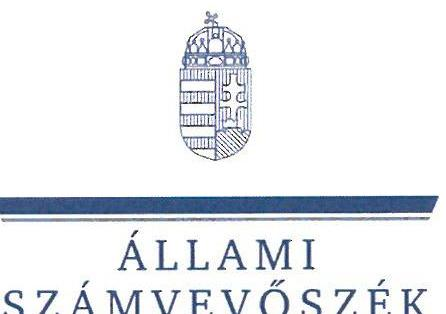
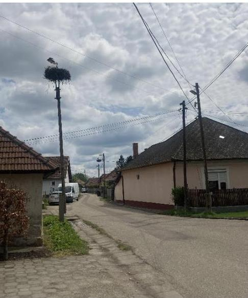
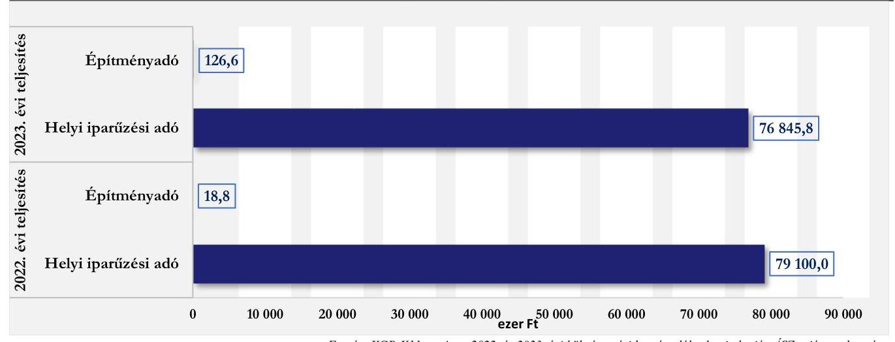

# JELENTÉS 

## Az önkormányzatok helyi adóztatási tevékenységének ellenőrzése - Ingatlanadóztatás

Szentistván Nagyközség Önkormányzata

2024.

---

ÁLLAMI
SZÁMVEVŐSZÉK

# JELENTÉS 

## Az önkormányzatok helyi adóztatási tevékenységének ellenőrzése - Ingatlanadóztatás

Szentistván Nagyközség Önkormányzata

2024.

---

# ELLENŐRZÉSI IGAZGATÓSÁG: 

## ÁLLAMHÁZTARTÁS HELYI SZINTJÉT ELLENŐRZŐ IGAZGATÓSÁG

## ELLENŐRZÉSI IGAZGATÓ:

DR. BAFFIA GERGELY GÁBOR igazgató

## ELLENŐRZÉSVEZETŐ:

Jelentéseink az interneten a www.asz.hu címen olvashatók.

KANYÓ LÓRÁNT ISTVÁN ellenőrzésvezető

IKTATÓSZÁM: EL-4040-009/2024.
TÉMASZÁM: 2740
ELLENŐRZÉS-AZONOSÍTÓ SZÁM: V-1084

---

# TARTALOMJEGYZÉK 

AZ ELLENŐRZÉS ALAPADATAI ..... 5
AZ ELLENŐRZÉS TERÜLETE ÉS AZ ELLENŐRZÖTT SZERVEZET ..... 7
ÖSSZEFOGLALÁS ..... 9
AZ ELLENŐRZÉS FÓKUSZKÉRDÉSEI ..... 10
MEGÁLLAPÍTÁSOK ..... 11
JAVASLATOK ..... 19
MELLÉKLETEK ..... 20
I. sz. melléklet: Értelmező szótár ..... 20
II. sz. melléklet: Az ellenőrzött szervezetek jegyzéke ..... 22
III. sz. melléklet: Ellenőrzési kritériumok ..... 23
FÜGGELÉK: ÉSZREVÉTELEK ..... 26
RÖVIDÍTÉSEK JEGYZÉKE ..... 27

---

.

---

# AZ ELLENŐRZÉS ALAPADATAI 

## AZ ELLENŐRZÉS CÉLJA

Az ellenőrzés célja az volt, hogy értékelje Szentistván nagyközség helyi ingatlanadóztatásának és adóhatósága feladatellátásának szabályszerűségét, célszerűségét és eredményességét. További cél volt, hogy az ellenőrzés megállapításai és következtetései segítsék az önkormányzati képviselő-testületeket a jogszabályokkal és a helyi sajátosságokkal összhangban álló helyi adópolitika kialakításában és az azt végrehajtó adóigazgatási szervezet megszervezésében. Az ellenőrzés célja volt annak megállapítása is, hogy az Önkormányzat által bevezetett, ingatlanokat terhelő helyi adókra vonatkozó rendeleti szabályok összhangban vannak-e a helyi adópolitikai célokkal, tartalmuk tükrözi-e a település helyi sajátosságait és az adóhatósági feladatellátás biztosítja-e az önkormányzati bevételek feltárását és beszedését.

Ennek keretében az ÁSZ értékelte, hogy az Önkormányzat által bevezetett, ingatlanokat terhelő helyi adókról szóló adórendelet, valamint az adóhatóság döntései, adóztatási gyakorlata a vonatkozó jogszabályokkal összhangban állnak-e.

## AZ ELLENŐRZÉS TÍPUSA

Kombinált ellenőrzés.

## AZ ELLENŐRZÖTT IDŐSZAK

Az 1. fókuszkérdésnél a 2023. év, valamint a 2024. évnek az ellenőrzés megkezdését megelőző napig (2024. április 16-ig) tartó időszaka.

A 2. és 3. fókuszkérdésnél a 2023. év, valamint a 2024. évnek az ellenőrzés megkezdését megelőző napig (2024. április 16-ig) tartó időszaka, a 2020-2022. évek adatainak bázisadatként való felhasználásával.

## AZ ELLENŐRZÉS TÁRGYA

Az Önkormányzat Képviselő-testületének ingatlanokat terhelő helyi adókkal (jelen esetben az építményadóval) kapcsolatos rendeletalkotási tevékenységének és az adóhatóság tevékenységének az ellátása.

Az ellenőrzés kiterjedt minden olyan körülményre és adatra, amely az ÁSZ jogszabályban meghatározott feladatainak teljesítéséhez, valamint a program végrehajtása folyamán felmerült újabb összefüggések feltárásához szükséges.

## AZ ELLENŐRZÉS JOGALAPJA

Az ellenőrzés jogszabályi alapját az ÁSZ tv. 5. § (8) bekezdésének előírásai képezik.

---

# AZ ELLENŐRZÉS MÓDSZERE 

Az ellenőrzést az ellenőrzési program szempontjai, az ellenőrzött időszakban hatályos jogszabályok, az ellenőrzés általános szakmai szabályai és az ellenőrzésre irányadó ÁSZ módszertanok alapján végezte az ÁSZ.

Az ellenőrzési kérdések megválaszolásához szükséges bizonyítékok megszerzése az ellenőrzött szervezetek által rendelkezésre bocsátott dokumentumokra, adatokra és az ASP Adó és az Iratkezelő szakrendszerek, illetve a KGR-K11 számviteli adatgyűjtő rendszer adataira alapozva megfigyelés, szemle (szemrevételezés) kérdésfeltevés (információkérés), mintavételezés, valamint elemző eljárás útján történt. Emellett az ellenőrzési bizonyítékként felhasználható adatforrások közé tartozott minden egyéb - az ellenőrzés folyamán feltárt, az ellenőrzés szempontjából információt tartalmazó - releváns dokumentum (ideértve különösen a helyszínen felvett jegyzőkönyvet) is.

Az ellenőrzés lefolytatásához az ellenőrzött szervezet a tanúsítványok kitöltésével, valamint az ÁSZ által kért dokumentumok, adatok, információk megküldésével szolgáltatott adatokat. Az adóhatósági határozat szabályszerűségét - annak kibocsátása híján - nem volt mód ellenőrizni, fizetési kedvezményekre vonatkozó kérelmek nem érkeztek, végrehajtási cselekmény nem volt. Ezért az ÁSZ két adótárgy (bejelentett adóalanyok száma 2022-2023. években kettő volt) adóztatására vonatkozó adóhatósági tevékenység ellenőrzését végezte el. A megállapítások e két adótárgyra és az azokkal összefüggésben folytatott adóhatósági eljárási cselekményekre vonatkoznak.

Az ÁSZ a helyi adópolitikai elképzelések és a települési sajátosságok feltárásával értékelte, hogy az adórendelet e szempontoknak mennyiben felelt meg. Az ÁSZ a helyi adópolitikai célokkal akkor tekintette összhangban állónak a helyi adórendeletet, ha az hatását tekintve támogatta az adópolitikai célok teljesülését.

Az ÁSZ az adóhatósági feladatellátás szabályszerűségéből, a meglévő kapacitásokból, valamint az ezer forint adóbevételre jutó adóhatósági költségek alakulásából következtetett arra, hogy az adóhatóság rendelkezett-e azzal a potenciállal, amellyel eredményesen tudta a helyi adópolitikát végrehajtani.

Az ÁSZ - az adórendelet szabályainak érvényre juttatása körében - az eredményesség megítélésekor a III. számú melléklet 2. pontjában foglalt szempontokat tekintette mérvadónak.

---

# AZ ELLENŐRZÉS TERÜLETE ÉS AZ ELLENŐRZÖTT SZERVEZET 

Szentistván nagyközség Borsod-Abaúj-Zemplén vármegyében, a Mezőkövesdi Járásban található, a „három matyó” település egyike, a Bükk és az Alföld találkozásánál helyezkedik el. Állandó lakossága a BM által közzétett adatok alapján 2022. év elején 2429 fő, 2023. év elején 2451 fő, 2024. január 1-jén pedig 2474 fő volt. Az Önkormányzatnak egy óvodai nevelést ellátó költségvetési szerve (Szentistváni Gézengúz Óvoda), valamint egy közfeladatot ellátó, kizárólagos tulajdonban álló gazdálkodó szerve (SZKULTINFO Nonprofit Kft.) volt. A település életében meghatározó szerepet töltött be a Szentistváni Mg. Zrt., amely - a jogelőd mezőgazdasági termelőszövetkezet működését is figyelembe véve - több mint hatvan éve kapcsolódik a településhez, közel 5000 hektáron gazdálkodva. A TEIR 2022. december 31-ei adatai alapján a letelepedett 392 gazdasági szervezetből a mezőgazdasági vállalkozások aránya 59,7% volt, az iparban és az építőiparban ez az arány 16,8% volt. 2022. december 31-én a településen 148 őstermelő gazdálkodott.

Az Alaptörvény értelmében a helyi önkormányzat a helyi közügyek intézése körében törvény keretei között dönt a helyi adók fajtájáról és mértékéről. Az Mötv. rögzíti, hogy a helyi adóval kapcsolatos feladatok ellátása a helyi önkormányzatok feladata.

A Képviselő-testület a Htv.-ben foglalt felhatalmazással élve illetékességi területén, az ingatlant terhelő helyi adók közül az építményadó bevezetéséről döntött. Az adó alapja az építmény hasznos alapterülete, az adó mértéke 1996. január 1. óta nem változott, 750 Ft/m² volt. Az adórendelet szerint az önkormányzat illetékességi területén lévő építmények közül csak az a lakás és nem

Utcakép Szentistvánban, Forrás: ÁSZ saját fotó
lakás céljára szolgáló épület, épületrész volt adóköteles, amelyben vendéglátó-ipari tevékenységet folytattak és a szeszesital forgalmazásából származó éves árbevétel az összárbevétel 10%-át meghaladta. Erre tekintettel a 2022-2023. években két, a 2024. évtől három adózó és adótárgy volt a településen.

A helyi adó megállapításával, nyilvántartásával, beszedésével összefüggő adóhatósági feladatokat - a Hatásköri tv. és az Air. rendelkezései alapján - elsőfokú hatósági jogkörben Szentistván nagyközség jegyzője látta el a Hivatal vezetőjeként, Mezőnagymihály község igazgatási feladataival együtt. Az Önkormányzatnál egy fő részmunkaidőben foglalkoztatott tisztviselő végezte az adóügyi feladatokat.

Az építményadó bevétel összege 2023-ban 126,6 ezer Ft volt, a helyi adóbevétel döntő többsége a helyi iparűzési adóból származott, összege 76 845,8 ezer Ft volt.

Az Önkormányzat helyi adóbevételeinek a 2022. és 2023. évi teljesítésére vonatkozó adatait az 1. ábra mutatja be:

[^0]
[^0]:    A három matyó település: Szentistván, Tard, Mezőkövesd

---

1. ábra AZ ÖNKORMÁNYZAT HELYI ADÓBEVÉTELEINEK MEGOSZLÁSA A 2022-2023. ÉVEKBEN (EZER FT)

---

# ÖSSZEFOGLALÁS 

Az ÁSZ tv. értelmében az ÁSZ feladatkörébe tartozik az önkormányzatok adóztatási tevékenységének ellenőrzése. A helyi adók az önkormányzatok saját, el nem vonható bevételét képezik, így az önkormányzatok gazdasági önállósága szempontjából különös fontossággal bír, hogy a helyi adórendeleti szabályok összhangban álljanak a magasabb szintű jogszabályokkal, továbbá az önkormányzati adóhatósági tevékenység jogszerű, eredményes és hatékony legyen. Erre figyelemmel volt tárgya az ÁSZ ellenőrzésnek az Önkormányzat adórendelet-alkotási tevékenysége és az adóhatósági feladatellátás is.

Az adórendelet nem volt összhangban a jogszabályi előírásokkal, mert leszűkítette az építményadó tárgyi hatályát amellett, hogy több, nem egyértelmű, vitatható rendelkezést tartalmazott.

Az ingatlanokat terhelő helyi adókra vonatkozó rendeleti szabályozás megalkotása során az Önkormányzat nem mérlegelte azt, hogy a rendeleti szabályoknak tükrözniük kell a helyi sajátosságokat, az önkormányzat gazdálkodási követelményét, továbbá az adóalanyok széles körét érintően az adóalanyok teherviselő képességét. Az Önkormányzat adórendeleti szabályai ezzel együtt nem voltak ellentétesek azzal az adópolitikai céllal, miszerint a lakosságot ne terhelje helyi adó.

Az ingatlanok adóztatása során az adóhatóság hatósági jogkörében a jogszabályi előírások ellenére nem hozott, illetve nem tudott bemutatni hatósági határozatot az építményadó-fizetési kötelezettségről, amelynek következtében nem volt az adózók számára egyértelmű a fizetési kötelezettség kiszámításának menete, oka, jogalapja. A hatósági határozatok hiánya sértette az iratok megőrzésére vonatkozó jogszabályi előírásokat. Az adóhatósági feladatellátás személyi feltételei nem voltak biztosítottak.

Míg a községek, nagyközségek esetén országosan az ingatlanok adóztatásából eredő bevételek költségvetési bevételeken belüli átlagos aránya - a KGR-K11 beszámoló-adatainak lekérdezése alapján - 2,2% volt, addig az Önkormányzat esetében ez 0,02% volt 2023-ban. Az Önkormányzat gazdálkodásában az ingatlanok adóztatása nem játszott szerepet.

1000 Ft közhatalmi bevételre 48,9 Ft ténylegesen teljesített adóztatási költség (személyi juttatás és annak közterhe) esett. Az ÁSZ által ellenőrzött (nagy)községek átlaga 33,4 Ft, az adóztatási kiadás tapasztalati referencia-érték maximuma kivetéses adóztatás esetén 50 Ft volt, azonban a település helyi adószerkezete miatt az OECD adata (10-20 Ft adózási kiadás 1000 Ft adóbevételre) számít összehasonlító adatnak. Az adóztatási kiadások a bevételhez mérten többszörösen meghaladták az összehasonlító adatot. Az adóhatóság feladatellátási mutatóinak értékei összességükben elmaradtak az ÁSZ által ellenőrzött (nagy)községek feladatellátási mutatóinak értékeihez képest.

[^0]
[^0]: Az ÁSZ által jelen ellenőrzés alapjául szolgáló ellenőrzési program alapján ellenőrzött (nagy)községek: Árpádhalom, Balatonberény, Balatonvilágos, Kompolt, Leányfalu, Szentistván, Szigetmonostor, Tiszainoka.

---

# AZ ELLENŐRZÉS FÓKUSZKÉRDÉSEI 

1. Az önkormányzat ingatlanokat terhelő helyi adókra vonatkozó rendeleti szabályozása megfelelte a magasabb szintű jogszabályoknak?
2. Az önkormányzati adóhatóság megfelelően és eredményesen látta-e el az ingatlanok adóztatásával kapcsolatos adóhatósági tevékenységeit?
3. A településen megvalósuló helyi adóztatás támogatta-e a helyi adópolitikai célok teljesülését?

---

# MEGÁLLAPÍTÁSOK 

## 1. Az önkormányzat ingatlanokat terhelő helyi adókra vonatkozó rendeleti szabályozása megfelelte a magasabb szintű jogszabályoknak?

## Összegző megállapítás

Az adórendelet több ponton nem felelt meg a magasabb szintű jogszabályoknak.
1.1. számú megállapítás

Az adórendelet szabályozása sértette a Htv. adómegállapításra vonatkozó rendelkezéseit, mert a törvényben rögzített adótárgyak körét leszűkítette. Az adórendelet az (össz)árbevétel fogalmát nem definiálta, ami miatt sérült az egyértelmű értelmezhetőség Jt. szerinti követelménye.

A Htv. 2. §-ában foglalt azon követelménnyel szemben, miszerint az önkormányzat adómegállapítási joga csak a Htv.-ben foglalt adóalanyokra és adótárgyakra terjedhet ki, az adórendelet 2. §-a - hatását tekintve - leszűkítette a Htv.-ben meghatározott adótárgyak körét azzal, hogy az adórendelet alkalmazásában adótárgynak csak az az építmény számított, amelyben vendéglátóipari tevékenységet folytatnak és a szeszesital forgalmazásából származó éves árbevétel az összárbevétel 10%-át meghaladja.
A Htv. 7. § e) pontjában előírtaknak sem felelt meg az adórendelet 2. §-a, mert - közvetve - kivonta az adózás alól (lényegileg mentesítette) a vállalkozók azon építményeit, amelyekben nem vendéglátóipari tevékenységet folytattak, vagy ugyan e tevékenységet végeztek, de

 meghatározott árbevételi arányban abban szeszesitalt nem forgalmaztak.
Az adórendelet 2. §-a sértette a Jtv. 2. § (1) bekezdése szerinti egyértelműség elvét is, mert a §-ban ugyan szerepeltek az „árbevétel”, „összárbevétel” kifejezések, de ezen fogalmak meghatározását a rendelet nem részletezte ${ }^{3}$. Az adórendeletből az sem tűnt ki, hogy melyik adóévi (össz)árbevételt kell irányadónak tekinteni az adóévi adókötelezettség megállapítása során.

[^0]
[^0]:    ${ }^{3}$ Az „árbevétel” fogalom alatt érthető a Számv. tv. ${ }^{3}$ szerint kimutatott értékesítés nettó árbevétele, vagy - eltérő tartalommal - a Htv. szerinti nettó árbevétel is.

---

1.2. számú megállapítás

Az Önkormányzat - a Htv.-ben foglaltak ellenére - az építményadóra vonatkozó rendeleti szabályozás megalkotása során nem mérlegelte a helyi sajátosságokat, az önkormányzat gazdálkodási követelményeit, továbbá az adóalanyok széles körét érintően az adóalanyok teherviselő képességét.

A Htv. 7. § g) pontjában rögzített adómegállapítási korlátokból az következik, hogy a rendelet hatályossága idején is érvényre kell jutnia az e pontban szabályozott rendeletalkotási elveknek, azaz annak, hogy települési önkormányzat az adóalap fajtáját, az adó mértékét, a rendeleti adómentességet és adókedvezményt úgy állapíthatja meg, hogy azok összességükben egyaránt megfeleljenek a helyi sajátosságoknak, az önkormányzat gazdálkodási követelményeinek és az adóalanyok széles körét érintően az adóalanyok teherviselő képességének.
Az adórendelet 2016. január 1-jétől hatályos, az építményadó mértéke pedig 1996. óta változatlan volt.

Az Önkormányzat - a Htv. 7. § g) pontja szerinti szempontok szerint - 2016. óta nem vizsgálta felül az adórendelet építményadóra vonatkozó szabályait.

Az ÁSZ véleménye szerint legalább az adózást érintő magasabb szintű jogszabályi változások esetén indokolt felülvizsgálni a rendeletet. Ettől függetlenül a település mérete, adottságai, a helyi adókra vonatkozó rendelet összetettsége, az önkormányzat gazdálkodási körülményeinek változása, az adózók teherbíró képességének változása befolyásolja a felülvizsgálat gyakoriságát.

---

# 2. Az önkormányzati adóhatóság megfelelően és eredményesen látta-e el az ingatlanok adóztatásával kapcsolatos adóhatósági tevékenységeit? 

## Összegző megállapítás

Az adóhatóság építményadóval összefüggő feladatellátása nem volt megfelelő és nem volt eredményes.
2.1. számú megállapítás

Az adóhatóság adóigazgatási eljárása nem volt összhangban a Htv. adóalanyra, valamint az Art. ${ }^{22}$ és az Air. hatósági adómegállapításra és az Ltv. ${ }^{23}$ iratmegőrzésre vonatkozó szabályaival, az adómegállapítási feladatellátás nem volt eredményes.

Az adóhatóság az Art. 141. §-ának (2) bekezdésében előírtak ellenére az adó kivetéséről szóló, adót megállapító határozatot a 2024. január 1-jétől adókötelessé váló adótárgy után (az ellenőrzési időszak lezárásáig) nem hozott. Az adóhatóság azon adózók esetében (2023. évre vonatkozóan) sem mutatott be adómegállapító határozatot, amelyek esetében az adókötelezettség folyamatosan fennállt, illetve arról sem tudott beszámolni, hogy mi a határozatok hiányának oka. Az adatbejelentést

Az adózó adófizetési kötelezettsége az adóhatóság által kiadott adómegállapító határozaton alapul. Ez az az okirat, mely alapján az adózó értesül a fizetési kötelezettségről, amely ellen jogorvoslattal élhet, amely alapján tőle az adó megfizetése várható. Adómegállapító határozat hiányában nem áll fenn adófizetési kötelezettség. A határozat kiadása nélkül beszedett építményadó tartozatlan (jogalap nélküli) fizetésnek számít.
Ha az adómegállapító határozat nem csak a kiadásának évére, hanem későbbi adóévekre is rögzít fizetési kötelezettséget, akkor azt az adófizetési kötelezettség fennállásáig meg kell őrizni, csak a fizetési kötelezettség megszűnését követően selejtezhető.
benyújtó, építményadót fizető adózók adókötelezettségét és a megfizetett adót nyilvántartásában rögzítette (az adózók lényegileg „önadózással” teljesítették fizetési kötelezettségüket, az adóhatóság tájékoztatása szerint egyenlegértesítő útján értesültek a fizetési kötelezettség tényéről).
Ezért az ÁSZ-nak nem volt módja a határozatoknak az Art. 48. § (1) bekezdése, az Air. 76. § (1) bekezdése, valamint az Air. 73. § (1) bekezdésének való megfelelőségét ellenőrizni.

A Hivatal az Ltv. 9. § (1) bekezdés e) pontjában előírtak ellenére a 2. mintatételben szereplő adótárgyra vonatkozóan benyújtott adatbejelentő nyomtatvány őrzéséről nem gondoskodott. Az Art.-ban előírtak alapján az adóhatóság a 2023. és a 2024. években (január hónapokban) élt az ingatlanügyi hatóság megkeresésének lehetőségével, de ezen adatokat nem vetette össze a saját nyilvántartásában szereplő adatokkal. Az Art. 86. §-a alapján az építésügyi hatóság által szolgáltatott - a kiadott használatbavételi engedélyekről szóló - adatok alapján az adóhatóság az Art. 141. § (7) bekezdésében előírtak ellenére adót nem állapított meg, ezeket az adatokat az adatbejelentést elmulasztó adóalanyok beazonosítása céljából nem használta fel. Az ÁSZ nem tárt fel olyan ingatlant, mely után az adórendelet alapján adót kellett volna megállapítani, de azt az adóhatóság elmulasztotta.
Az Önkormányzat méltányosságból, vagy elévülés jogcímén törölt adót nem mutatott ki, ingatlant terhelő adókhoz kapcsolódó adóellenőrzést nem végzett.

---

2.2. számú megállapítás

Az adóhatóság az Avt. ${ }^{24}$ előírása ellenére az ellenőrzött időszakban az általa nyilvántartott adótartozások beszedése érdekében nem intézkedett. A végrehajtás elmaradása azért nem volt szabálysértő, mert az adómegállapítási eljárás hibája miatt adóösszeg nem vált esedékessé.

Az adók könyveléséhez kapcsolódó zárási összesítők ${ }^{25}$ tartalmaztak a „Záró költségvetési évben esedékes” építményadó kötelezettséget, melynek összege 2022. december 31-én 185,3 ezer Ft, 2023. december 31-én 87,1 ezer Ft volt, a 2023. évben az építményadó-bevételhez viszonyított aránya (68,8%) pedig több, mint 30%-kal meghaladta a településtípusra jellemző arányszámot (34,7%). Az Önkormányzat az építményadó fizetési kötelezettségek nemteljesítéséből keletkezett adóhátralékot - az ÁSZ részére benyújtott tanúsítványaiban - nem mutatta ki.
Az ellenőrzött időszakban az Avt. 30. § (1) bekezdésében foglaltak ellenére az adóhatóság a tartozások megfizetése, beszedése érdekében nem intézkedett, végrehajtási eljárást nem indított. Tekintve azonban, hogy az adóhatóságnál nem állt rendelkezésre fizetési kötelezettséget rögzítő - Avt. 29. § (1) bekezdése alapján - végrehajtható határozat, az adó beszedése érdekében tett bármely intézkedés is jogszerűtlen lett volna.

Az adóbehajtási, adóvégrehajtási cselekmények célja nem pusztán az önkormányzatot megillető bevétel behajtása, hanem legalább annyira tekinthető a fizetési kötelezettségüket rendben teljesítők melletti kiállásnak is. Összességében az adómorál és a fizetési hajlandóság növelését szolgálja valamennyi adózó esetén. Ezért a behajtás hosszú időn át való elmulasztása rossz gyakorlat, még akkor is, ha az adósonként behajtandó összeg a behajtási költséghez képest alacsony.

# 3. A településen megvalósuló helyi adóztatás támogatta-e a helyi adópolitikai célok teljesülését? 

Összegző megállapítás

Az adórendelet összhangban volt a helyi adópolitikai célokkal. Az ingatlanok adóztatása csekély szerepet játszott az Önkormányzat gazdálkodásában, az adóteher az adóalanyok teherbíró képességét nem haladta meg. Az adóhatósági feladatellátás nem támogatta az adórendelet végrehajtását, az adóztatási kiadások túlzottak voltak az adóbevételhez képest.
3.1. számú megállapítás

Az ingatlanokat terhelő helyi adókra vonatkozó önkormányzati rendeleti szabályozás támogatta a helyi adópolitikai célokat.

Az Önkormányzat Gazdasági Programjában ${ }^{26}$ adópolitikai célként az jelent meg, hogy a helyi adópolitikán keresztül támogatja azokat a befektetőket, amelyek hozzájárulnak a település fejlődéséhez és jelentős számú munkahelyet teremtenek.

---

Az Önkormányzat - tájékoztatása szerint - emellett nem tartotta indokoltnak a lakosság adóztatását, a helyi adónak nem minősülő, de adóigazgatási kapacitásokat igénylő talajterhelési díjtól eltekintve az iparűzési adót tekintette meghatározó bevételi forrásnak.
Az adórendelet nem fogalmazott meg az építményadóban adókötelezettséget a nem vállalkozó természetes személyek számára, illetve a Htv. 2. §-ával és 7. § e) pontjában foglaltakkal ellentétben a vállalkozók többsége számára sem. Ezért az adórendelet építményadóra vonatkozó szabályozása

Az építményadó (mint bármely helyi adó) bevezetése/működtetése az önkormányzat számára nem kötelező. Ha az adó abszolút összegben és a település saját bevételeihez mérten is csekély, az ÁSZ véleménye szerint célszerű mérlegelni, hogy az adóztatással összefüggő önkormányzati kötelezettségekre, továbbá az adózói, adóhatósági költségekre figyelemmel érdemes-e bevezetni/működtetni az adót. Amennyiben igen, akkor az adóztatás csak a Htv. keretein belül történhet meg (például csak a nem vállalkozó adóalanyokat van mód a Htv.-vel összhangban mentesíteni az adó alól).
nem ütközött az adópolitikai célokkal.
3.2. számú megállapítás

Az építményadó az Önkormányzat céljaival egyező bevételt biztosított a település számára, ami elhanyagolható szerepet játszott az Önkormányzat gazdálkodásában. Az adórendeleti adóteher az adózók teherbíró képességét nem haladta meg.

Az építményadóból származó bevételek nagysága nem befolyásolta az Önkormányzat gazdálkodását, aránya a költségvetési bevételeken belül 0,02%-ot képviselt a 2023. évben, miközben a településtípusra (község, nagyközség) vonatkozó országos átlag 2,2% volt. Az egy adóalanyra jutó építményadó 2023-ban (63,3 ezer Ft/adóalany) összhangban volt az adózók teherbíró képességével, mert az adóalanyok fizetési könnyítési kérelmet nem nyújtottak be, továbbá - mivel az adó az adóalanyok gazdasági tevékenysége kapcsán merült fel, s így ráfordításként elszámolható volt, azaz megtérülhetett az árbevételben - volt mód az adó fedezetének megteremtésére is.
Az iparűzési adóbevételnek köszönhetően az Önkormányzat saját bevételeinek konszolidált költségvetési bevételein belüli aránya a 2023. évben 23,2% volt, ami a (nagy)községekre jellemző értéktől (24,4%) nem tért el lényegesen.
3.3. számú megállapítás

Az adóztatási kiadások a bevételhez képest túlzottak voltak, a feladatellátás nem volt célszerű, a feladatellátás személyi feltételei nem voltak biztosítottak. Az Önkormányzat az Áht. ${ }^{27}$ és a 15/2019. (XII. 7.) PM rendelet ${ }^{28}$ előírásai ellenére nem mutatta ki elkülönítetten az adóigazgatási tevékenységgel összefüggő kiadásokat és a kapcsolódó átlagos statisztikai létszámadatokat, belső szabályozói pedig - az Ávr. ${ }^{29}$-rel szemben - nem tartalmazták a közfeladatnak a kormányzati funkció szerinti megjelölését.

Az Önkormányzat adóigazgatási feladatainak ellátása a Hivatalon keresztül történt az ellenőrzött időszakban.
A Hivatal biztosította az adóügyi feladatokhoz a tárgyi feltételeket, a TAKARNET Földhivatali Információs Rendszer jogosultság alapján az ingatlan-nyilvántartási adatok elérhetősége biztosított volt.

---

Az adóhatóság a NAV ${ }^{30}$ adatszolgáltatáson, a cégjegyzék nyilvántartásokon keresztül nyomon követte a felszámolással, végelszámolással érintett gazdálkodó szervezeteket.
Az adózókkal való kapcsolattartás érdekében a helyi adókkal kapcsolatosan rendszeresített bevallási, adatbejelentési, bejelentkezési nyomtatványokat az Önkormányzat honlapján - a Htv.-vel összhangban - közzétették, valamint az E-önkormányzat portálon keresztül biztosították az adóügyekkel kapcsolatos elektronikus ügyintézéshez szükséges szolgáltatásokat. Az adórendelet elérhetőségét - a Htv.-ben foglaltaknak megfelelően - közzétették.
Az Áht. 6. § (1) bekezdése és a 15/2019. (XII. 7.) PM rendelet 3. § (1) bekezdése előírása ellenére az adóigazgatási tevékenységgel összefüggő kiadásokat, valamint a 15/2019. (XII. 7.) PM rendelet 6. § (2) bekezdésében előírtak ellenére a kapcsolódó átlagos statisztikai létszámadatokat a kormányzati funkció (011220 Adó-, vám- és jövedéki igazgatás) szerint a Hivatal elkülönítetten nem számolta el, illetve nem mutatta ki, így azok az Önkormányzat 2023. éves költségvetési beszámolójában a kormányzati funkción nem szerepeltek. Az adóigazgatási feladatellátáshoz kapcsolódóan ténylegesen teljesített költségvetési kiadásokról külön nyilvántartással nem rendelkeztek. Mindehhez hozzájárulhatott a belső kontrollrendszer hiányossága is, az alábbiak szerint:
a) Az Ávr. 5. § (1) bekezdés f) pontjában előírtak ellenére - mely szerint az alapító okiratnak tartalmaznia kell a közfeladat kormányzati funkció szerinti megjelölését - a kormányzati funkciókat a Hivatal alapító okirata ${ }^{31}$ nem tartalmazta.
b) Az Ávr. 13. § (1) bekezdés c) pontjában előírtak ellenére - mely szerint a költségvetési szerv szervezeti és működési szabályzatának tartalmaznia kell az ellátandó és a kormányzati funkció
 szerint besorolt alaptevékenységek megjelölését - a Hivatali SZMSZ ${ }^{32}$ sem tartalmazta a kormányzati funkciókat.
A Hivatal adóügyi feladatait - közte az iparűzési adóval (2023. évben 184 adózó) és a talajterhelési díjjal (2023. évben 54 adózó) kapcsolatos adóztatási, adóbehajtási feladatokat - egy fő, részmunkaidőben (heti 10 órában) foglalkoztatott, középfokú végzettségű, három év adóztatási tapasztalattal rendelkező adótisztviselő végezte. Ezen körülményekre tekintettel az Önkormányzatnál az adóztatás személyi feltétele nem volt biztosított.
Az ÁSZ által feltárt adóztatási költségekkel kapcsolatos jellemző adatokat és mutatókat a 1. táblázat tartalmazza az Önkormányzatra és az ÁSZ által ellenőrzött (nagy)községekre (az Önkormányzat, Árpádhalom, Balatonberény, Balatonvilágos, Leányfalu, Kompolt, Szigetmonostor, Tiszainoka) vonatkozóan.

---

1. táblázat

AZ ADÓZTATÁS 2023. ÉVI KÖLTSÉGEINEK KIMUTATÁSA (EZER FT, FŐ, DB, \%) | MEGNÉVEZÉS | ÖNKORMÁNYZAT ADATAI | NYOLC ELLENŐRZÖTT TELEPÜLÉS ADATAI (ÖSSZESEN, ÁTLAG) | | :--: | :--: | :--: | | Összes tényleges kiadás adatszolgáltatás alapján | 3823,5 | 243376,7 | | Ebből: személyi juttatások és munkaadókat terhelő közterhek | 3823,5 | 237480,8 | | Tényleges létszám adatszolgáltatás alapján (fő) | 1 | 32,5 | | Beszedett helyi adóbevétel adatszolgáltatás alapján* | 78 196,0 | 7112717,6 | | Egy adótisztviselőre jutó tényleges személyi juttatás és közteher adatszolgáltatás alapján | 3823,5 | 7307,1 | | 1000 Ft közhatalmi bevételre jutó személyi juttatások és munkaadói közterhek (Ft) | 48,9 | 33,4 | | Egy adótisztviselőre jutó beszedett adó ${ }^{4}$ | 78196,0 | 218852,8 | | Egy adótisztviselőre jutó adótárgy | 8 | 1396 | | Egy adótisztviselőre jutó adóalany | 8 | 1257 |

- Az Önkormányzat adatszolgáltatása tartalmazza még pl.: adópótlék, adóbírság, talajterhelési díj, termőföld bérbeadásából származó jövedelem utáni személyi jövedelemadó bevételeket.

Forrás: KGB-K11 és az Önkormányzat adatszolgáltatása alapján ÁSZ saját szerkesztés
A Hivatal adatszolgáltatása alapján 2023. évben 1000 Ft közhatalmi bevételre 48,9 Ft ténylegesen teljesített személyi juttatás és annak közterhei jutott. Ezen mutató az ÁSZ által ellenőrzött nyolc (nagy)község önkormányzatának (költségvetési szervek nélküli) adatai alapján átlagosan $33,4 \mathrm{Ft}$, legmagasabb értéke 113,1 Ft volt. Az adóhatóság 1000 Ft-ra jutó kiadásai 46,4\%-kal meghaladták az ÁSZ által ellenőrzött (nagy)községek átlagát. Az ÁSZ az adóhatóság 1000 Ft adóbevételre jutó kiadásait az OECD adózási kiadás referencia-értékhez (10-20 Ft 1000 Ft adóbevételre) viszonyította, mert a település helyi adóbevételei $99,9 \%$-ban önadózással teljesítendőek. Ezért az adóhatóság kiadásai az adóbevételhez (és a helyi adószerkezethez) mérten túlzottak voltak, mert meghaladták az OECD referenciaértéket.
Az ÁSZ által ellenőrzött nyolc (nagy)község - közös hivatalokkal együtt számított - egy adótisztviselőre jutó helyi adóbevétel átlaga 218 852,8 ezer Ft, amit az Önkormányzat ugyanezen mutatója (312 784,0 ezer Ft) 42,9\%-kal haladt meg. Az egy adótisztviselőre jutó személyi juttatás és közterhe összege 3823,5 ezer Ft volt, 52,3\%-a az ÁSZ által ellenőrzött nyolc (nagy)község 7307,1 ezer Ft-os átlagának. Az adóhatóság feladatellátási mutatói értéke - egyes teljesítménymutatók kedvező értékei ellenére - összességében elmaradtak az ÁSZ által ellenőrzött (nagy)községek feladatmutatói értékeitől. Az egy adótisztviselőre jutó személyi juttatás és közterhei relatíve alacsony és az egy adótisztviselőre jutó beszedett adó relatíve magas összege csak annak köszönhető, hogy az adótisztviselő heti 10 óra részmunkaidőben látta el az adóztatási feladatokat, juttatása kevesebb volt, továbbá annak, hogy az iparűzési adó önadózással teljesítendő, kisebb adóhatósági ráfordítást igényelt. Továbbá nem tekinthető

[^0]
[^0]:    ${ }^{4}$ Az Önkormányzat heti 10 órában foglalkoztatta az adótisztviselőt. Az összevethetőség érdekében ezért az egy tisztviselőre jutó, Önkormányzatra számított, beszedett adóösszeget (78 196,0 ezer Ft) és az egy adótisztviselőre jutó adóalany és adótárgy mutatót, a teljes munkaidő szintjére kell hozni, azaz meg kellett négyszerezni.

---

megfelelőnek a feladat-ellátás azért sem, mert az adómegállapítás nem volt összhangban a jogszabályokkal, és az adóbehajtási feladatellátás elmaradt.
3.4. számú megállapítás

Az ÁSZ nem tárt fel az adózók önkéntes jogkövetését elősegítő, nem jogszabályi alapokon nyugvó gyakorlatot, módszert, eszközt.

Az ÁSZ nem tárt fel olyan gyakorlatot, hogy az adóhatóság jogszabályban nem előírt eszközökkel és módokon támogatta volna a településen az adózók önkéntes jogkövetését.

---

# JAVASLATOK 

Az ÁSZ tv. 33. § (1) bekezdésében foglaltak értelmében az ellenőrzött szervezet vezetője köteles a jelentésben foglalt megállapításokhoz kapcsolódó intézkedési tervet összeállítani és azt a jelentés kézhezvételétől számított 30 napon belül az ÁSZ részére megküldeni. Amennyiben az ellenőrzött szervezet vezetője nem küldi meg határidőben az intézkedési tervet, vagy továbbra sem elfogadható intézkedési tervet küld, az Állami Számvevőszék elnöke az ÁSZ tv. 33. § (3) bekezdése a) és b) pontjaiban foglaltakat érvényesítheti.

## A POLGÁRMESTERNEK

1. Intézkedjen a jelentés nyilvánosságra hozatalát követő 15 napon belül annak az Önkormányzat Képviselő-testülete elé terjesztéséről. A jelentést a napirend tárgyalásáról szóló jegyzőkönyvvel együtt tájékoztatásul küldje meg a Borsod-Abaúj-Zemplén Vármegyei Kormányhivatal részére is.

## A JEGYZŐNEK

1. Vizsgálja felül az adórendelet 2. §-át a tekintetben, hogy az összhangban áll-e a Htv. 2. §-ával, a Htv. 7. § e) pontjával és a Jat. 2. § (1) bekezdésével.
2. Alakítsa úgy a helyi adóztatás gyakorlatát, hogy az építményadó-kötelezettséget - az Art. 48. § (1) bekezdése és az Art. 141. § (2) bekezdése szerint - valamennyi adóalany számára határozat rögzítsen, melyet legalább a határozatban rögzített adófizetési kötelezettség végrehajthatóságának véghatáridejéig őrizzen meg az adóhatóság.
3. Intézkedjen az Áht. 6. § (1) bekezdésében és a 15/2019. (XII. 7.) PM rendelet 3. § (1) bekezdésében előírtak alapján az adóigazgatási tevékenységgel összefüggő kiadásoknak, valamint a 15/2019. (XII. 7.) PM rendelet 6. § (2) bekezdésében előírtak alapján az átlagos statisztikai létszámadatoknak az arra kijelölt kormányzati funkcióra történő nyilvántartása, kimutatása érdekében.
4. Intézkedjen arról, hogy a Hivatal alapító okirata és a Hivatali SZMSZ - az Ávr. 5. § (1) bekezdés f) pontja és az Ávr. 13. § (1) bekezdésének c) pontja előírásainak megfelelően - tartalmazza a közfeladat kormányzati funkció szerinti megjelölését.
5. Intézkedjen arról, hogy az építményadóval összefüggő, a Htv., az Art., az Air., az Avt. szabályainak megfelelő adóhatósági feladatellátás személyi feltételei biztosítottak legyenek.

---

# MELLÉKLETEK 

## I. SZ. MELLÉKLET: ÉRTELMEZŐ SZÓTÁR

adóhatóság
adóhatósági ellenőrzés
adótartozás
adókövetelés
adóbehajtási tevékenység
adózó adóalany
adótárgy
fizetési kedvezmény
ASP rendszer
ingatlanokat terhelő helyi adók vagy ingatlanadók
a vállalkozó üzleti célt szolgáló ingatlana
az adóztatás költségei
adóztatási kiadás

Az önkormányzat jegyzője. (Forrás: Air. 22. § b) pont)
Az adóhatóság az adótörvényekben és más jogszabályokban előírt kötelezettségek teljesítésének vagy megsértésének megállapítása, a kötelezettségek teljesítésének előmozdítása érdekében ellenőrzést folytat. (Forrás: Air. 86. §)
Az esedékességkor meg nem fizetett adó. (Forrás: Art. 7. § 6. pont)
Az adózóval szemben fennálló pénzkövetelés.
Az adótartozás beszedésére irányuló adóhatósági tevékenység, így különösen a fizetési felhívás kibocsátása és a végrehajtási cselekmények.
Az a személy, akinek vagy amelynek adókötelezettségét a Htv. és önkormányzati rendelet előírja. (Forrás: Air. 11. § (1) bekezdés, Htv. 12. §, 18. $\S, 24 . \S$)

Az az ingatlan vagy lakásbérleti jog, amelynek adókötelezettségét a Htv. és önkormányzati adórendelet előírja. (Forrás: Htv. 11.§, 17. §, 24. §)
A fizetési halasztás, részletfizetés, valamint az adómérséklés.
(Forrás: Art. 198.-201. §)
Az önkormányzati feladatellátást támogató, számítástechnikai hálózaton keresztül távoli alkalmazásszolgáltatást (Application Service Provider) nyújtó elektronikus információs rendszer. (Forrás: az önkormányzati ASP rendszerről szóló 257/2016. (VIII. 31.) Korm. rendelet 1. § 6. pont)
Építményadó, telekadó, magánszemély kommunális adója. (Forrás: Htv. II. fejezet, III. fejezet 1.1. pont)
Üzleti célra szolgál a vállalkozó vagy vállalkozás minden olyan ingatlana, amely kapcsán akár a tulajdonjoga, akár az ingatlan-nyilvántartásba bejegyzett vagyoni értékű joga alapján adóalanynak tekintendő, figyelemmel arra, hogy egy vállalkozás esetében bármilyen, ingatlanhoz kapcsolódó jog megszerzésének és fenntartásának oka és célja nem lehet más, mint üzleti jellegű. (Forrás: dr. Heizer-Kiss Zsófia-Kanyó Lóránd: a helyi adók jogmagyarázata 2014 Saldo)
Az ellenőrzés az adóztatás költségei kapcsán egyfelől figyelembe vette azt, hogy az önkormányzati hivatalok költségeinek kormányzati funkciók szerint gyűjtése hiányos és ellentmondásos adatokat hordoz. Másfelől abból a szakmai tapasztalatból indult ki, hogy az adóztatás költségei főképp az adótisztviselők személyi juttatásaiban, a juttatások közterheiben öltenek testet. Ezért az adóztatás költségei alatt ez utóbbi, adótisztviselők által kapott juttatásokat és a juttatás közterheit értette, azzal, hogy ha az adótisztviselő munkaköre más feladat ellátását is magában foglalta, akkor az ellenőrzés az adott tisztviselő személyi juttatásának csak az adózási feladatellátás idejével arányos részét vette számításba.
Az adóigazgatási feladat-ellátással kapcsolatos kiadások közül a személyi juttatások és közterheik (az egyéb, dologi kiadások elhatárolása módszertanilag megfelelő módon nem volt lehetséges, ezért csak a kiadások mintegy $80 \%$-át kitevő személyi juttatásokat vette az ellenőrzés figyelembe adóztatási kiadásként).

---

adóztatási kiadás referencia-érték Szakértői tapasztalaton alapuló becsült maximum adóztatási kiadás. Maximuma Megmutatja, hogy 1000 Ft közteher beszedésével mekkora az a maximum kiadási összeg, amely célszerű működés esetén racionálisan felmerül a beszedő szervnél. A nemzetközi (OECD) tapasztalatok szerint ez az érték 10-20 Ft (1-2\%) között mozgott 2011-ben, a Nemzeti Adó- és Vámhivatal esetén 2022-ben 10,8 Ft, a dologi kiadásokkal együtt 13,5 Ft volt. Ezek a számadatok olyan adóhatóságokra vonatkoznak, amelyek döntő többségében önadózásos adónemeket szednek be (a Nemzeti Adó- és Vámhivatal által beszedett adók 97\%-a önadózással teljesítendő), amelyek esetén a hatósági kiadások kisebbek. Szakértői összevetés alapján községek esetén az 50 Ft (5\%) alatti érték fogadható el (Forrás: https://www.oecd-ilibrary.org/governance/government-at-a-glance-2011/efficiency-of-tax-administrations_gov_glance-2011-64-en és KGR-K11 és szakértői becslés).

---

II. SZ. MELLÉKLET: AZ ELLENŐRZÖTT SZERVEZETEK JEGYZÉKE

# AZ ELLENŐRZÖTT SZERVEZET MEGNEVEZÉSE 

Szentistván Nagyközség Önkormányzata
Szentistváni Közös Önkormányzati Hivatal

---

# III. SZ. MELLÉKLET: ELLENŐRZÉSI KRITÉRIUMOK 

## FOKUSZKÉRDÉS

1. Az önkormányzat ingatlanokat terhelő helyi adókra vonatkozó rendeleti szabályozása megfelelte a magasabb szintű jogszabályoknak?
2. Az önkormányzati adóhatóság megfelelően és eredményesen látta-e el az ingatlanok adóztatásával kapcsolatos adóhatósági tevékenységeit?

## ELLENŐRZÉSI KRITÉRIUMOK

Magyarország Alaptörvénye 32. cikk (1) bekezdés a), h) pontjai, 32. cikk (3) bekezdés
Hatásköri tv. 138. § (3) bekezdés a)-f) pontok
Stabilitási tv. ${ }^{33}$ 31-32. §
Mőtv. 47. § (1)-(2) bekezdések, 50. §, 51. § (1)-(2) bekezdések, 52. § (1) bekezdés
Htv. 1. § (1) bekezdés, 2. §- 7. §, 9. § (1) bekezdés, 11. § 26/A. §, 42/B. §, 42/I. §, 43. §, 52. § 3-20. pontjai, 43-50. pontjai, 60. pont

Jat. 2. § (1) bekezdés
Pénzügyminisztérium tájékoztató az egyes tételes helyi adómérték valorizációjáról

Art., Air., Avt.
Itv. ${ }^{34}$ 102. § (1) bekezdés e) pont
61/2009. (XII. 14.) IRM rendelet a jogszabályszerkesztésről
Htv. 1. § (1) bekezdés, 2. §-7. §, 9. § (1) bekezdés, 11. §-26/A. §, 42/B. §, 42/I. §, 43. §, 52. § 3-20. pontjai, 43-50. pontjai, 60. pont,
Art. 48. § (1) bekezdés, 49. §, 58. § (1) bekezdés, 59. §, 86. §, 141. § (2), (6)-(7) bekezdések, 221. § (1) bekezdés b) és c) pontja
Art. 2. számú melléklet II.A 4. pont, 3.számú melléklet II.A. 4. pont
Air. 22. § b) pontja, 72. § (1) bekezdés,

 73. §, 74. §, 76.-78. §, 79. § (2) bekezdés, 81. § (6) bekezdés, 82. § (4) és (6) bekezdések, 124. § (1)-(2) bekezdések, 125. §, 134. § (1) bekezdés, 135. § (3) bekezdés,

Avt. 30. § (1) bekezdés
465/2017. (XII. 28.) Korm. rendelet ${ }^{35}$ 84. §
Eüsztv. ${ }^{36}$ 14. §, 15. § (1)-(2) bekezdések
451/2016. (XII. 19.) Korm. rendelet ${ }^{37}$ 54. §
335/2005. (XII. 29.) Korm. rendelet ${ }^{38}$ 52. § (1)-(2) bekezdések, 53. § (1) bekezdés, (3) bekezdés a) pont

Ltv. 9. § (1) bekezdés e) pont
Az önkormányzati hivatal Szervezeti és Működési Szabályzata
A kiadmányozás rendjéről szóló szabályzat
ingatlanokat terhelő helyi adókról szóló települési szabályokat tartalmazó önkormányzati rendelet(ek)
Az adómegállapítási feladatellátás esetén az ÁSZ megítélése szerint akkor eredményes a feladatellátás, ha:

- az adóhatóság megkérte az Art. 83. § (2) bekezdése alapján az ingatlanügyi hatóságtól a településen található ingatlanokról és azok tulajdonosairól szóló adatszolgáltatást és ezen adatokat összevetette az adónyilvántartásban szereplő adótárgyakkal és adóalanyokkal;

---

3. A településen megvalósuló helyi adóztatás támogatta-e a helyi adópolitikai célok teljesülését?

- az ÁSZ ellenőrzés nem tár fel olyan adótárgyat, amely után az adóhatóság nem állapított meg adót, noha kellett volna.
Az adóbeszedési feladatellátás esetén az ÁSZ megítélése szerint akkor eredményes a feladatellátás, ha:
- 2023-ban és 2024-ben az adófizetés első esedékessége előtt az adóhatóság az adózókat felhívta a fizetési kötelezettségük teljesítésére;
- a 2023. évi adóbevételhez viszonyított, 2023. december 31-én fennálló hátralék (határidőben meg nem fizetett adó) aránya nem haladta meg a településtípusra jellemző arányszámot 30 %-nál nagyobb mértékben,
- ha a 2022. december 31-ei hátralék összegéhez képest a 2023. december 31-ei hátralék összege legfeljebb 10 %-kal emelkedett, és az adóhatóság legalább a hátralék-növekedéssel érintett adózóknál emelte a beszedési cselekmények (fizetési felhívás, végrehajtási cselekmény) számát;
- az ingatlanokat terhelő adónemekből származó 2023. évi tényleges, adónemenkénti adóbevétel a 2023. évi bevétel eredeti előirányzatának legalább 90 %-ában teljesült.
Htv. 1. § (1) bekezdés, 2. §-7. §, 9. § (1) bekezdés
Áht. 6. § (1) bekezdés
15/2019. (XII.7.) PM rendelet 3. § (1) bekezdés, 6. § (2) bekezdés,
Ávr. 5. § (1) bekezdés f) pont, 13. § (1) bekezdés c) pont
Htv., Art., Air., Avt. helyi adóhatóság feladatellátására vonatkozó rendelkezései
A rendeleti szabályoknak az önkormányzat gazdálkodására gyakorolt hatása kapcsán az ÁSZ az alábbiakat veszi figyelembe:
- a helyi ingatlanadókból eredő bevételek saját bevételeken belüli arányának alakulása, összehasonlítása az azonos településtípusba tartozó települések ugyanezen arányszámával;
- pozitív/negatív a gyakorolt hatás, ha az arányszám növekszik/csökken a korábbi időszakhoz képest
- pozitív/negatív a gyakorolt hatás, ha a települési arányszám magasabb/alacsonyabb, mint a településtípusra jellemző arányszám.
A rendeleti szabályoknak az adóalanyok adófizetésére gyakorolt hatását az alábbiak alapján ítéli meg az ÁSZ:
Az adóalanyok adófizetési képességét a rendelet hátrányosan érintette, ha a korábbi rendeleti szabályok hatálya alatti időszakhoz képest (azonos hosszúságú időszakokat figyelembe véve);
- az ingatlanokat terhelő helyi adóhátralék összege 5%-nál magasabb mértékben emelkedett vagy;
- az ingatlanokat terhelő helyi adókra vonatkozó fizetési könnyítésekre benyújtott kérelmek száma 5%-nál nagyobb mértékben emelkedett vagy;
- az ingatlanokat terhelő helyi adókra vonatkozó fizetési könnyítések alapjául szolgáló adó összege 5%-nál nagyobb mértékben emelkedett vagy;
- a fizetési felhívások száma 5%-nál nagyobb mértékben emelkedett.

---

Az arányszámokat annak figyelembevételével is értékeli az ÁSZ, hogy a települési ingatlanállományon belül mekkora arányt képvisel az:

- adótárgyak száma;
- adófizetési kötelezettség alá eső adótárgyak száma,
és ezen arányszámok változása hogyan alakult a korábbi rendeleti szabályok hatálya alatti időszakhoz képest.

---

# FÜGGELÉK: ÉSZREVÉTELEK 

A jelentéstervezetet a Számvevőszék 15 napos észrevételezésre megküldte az ellenőrzött szervezet vezetőjének az ÁSZ tv. 29. § (1) bekezdése előírásának megfelelően.

Az ellenőrzött szervezetek a jelentéstervezet megállapításaira érdemi észrevételt nem tettek.

[^0]
[^0]:    * 29. § (1) Az Állami Számvevőszék az ellenőrzési megállapításait megküldi az ellenőrzött szervezet vezetőjének vagy az általa megbízott személynek, és annak, akinek személyes felelősségét állapította meg.
    (2) Az ellenőrzött szervezet vezetője és a felelősként megjelölt személy az ellenőrzés megállapításaira tizenöt napon belül írásban észrevételt tehet.
    (3) Az Állami Számvevőszék az észrevételre a beérkezésétől számított harminc napon belül írásban válaszol. A figyelembe nem vett észrevételeket köteles a jelentésben feltüntetni, és megindokolni, hogy azokat miért nem fogadta el.

---

# RÖVIDÍTÉSEK JEGYZÉKE 

${ }^{1}$ Önkormányzat
${ }^{2}$ adórendelet
${ }^{3}$ adóhatóság
${ }^{4}$ Képviselő-testület
${ }^{5}$ ÁSZ
${ }^{6}$ ÁSZ tv.
${ }^{7}$ ASP
${ }^{8}$ KGR-K11
${ }^{9}$ BM
${ }^{10}$ SZKULTINFO Nonprofit Kft.
${ }^{11}$ Szentistváni Mg. Zrt.
${ }^{12}$ TEIR
${ }^{13}$ Alaptörvény
${ }^{14}$ Mötv.
${ }^{15}$ Htv.
${ }^{16}$ Hatásköri tv.
${ }^{17}$ Air.
${ }^{18}$ jegyző
${ }^{19}$ Hivatal
${ }^{20}$ OECD
${ }^{21}$ Jat.
${ }^{22}$ Art.
${ }^{23}$ Ltv.
${ }^{24}$ Avt.
${ }^{25}$ zárási összesítő
${ }^{26}$ Gazdasági program
${ }^{27}$ Áht.
${ }^{28}$ 15/2019. (XII. 7.) PM rendelet
${ }^{29}$ Ávr.
${ }^{30}$ NAV

Szentistván Nagyközség Önkormányzata
Szentistván Nagyközség Önkormányzata Képviselő-testületének 9/2015. (IX. 30.) önkormányzati rendelete a helyi adókról
Szentistváni Közös Önkormányzati Hivatal jegyzője mint önkormányzati adóhatóság Szentistván Nagyközség Önkormányzat Képviselő-testülete
Állami Számvevőszék
2011. évi LXVI. törvény az Állami Számvevőszékről

Az önkormányzati feladatellátást támogató, számítástechnikai hálózaton keresztül távoli alkalmazásszolgáltatást nyújtó elektronikus információs rendszer (Application Service Provider)
A Magyar Államkincstár egyik alapfeladataként működtetett államháztartás információs rendszer eleme, számviteli adatgyűjtő rendszer, amely az államháztartás egészének aktuális vagyoni és pénzügyi helyzetéről gyűjt adatokat a pénzügyi kormányzat számára.
Belügyminisztérium
SZKULTINFO Könyvtár és Kulturális Információs Nonprofit Korlátolt felelősségű társaság
Szentistváni Mezőgazdasági Zártkörűen működő részvénytársaság
Országos Területfejlesztési és Területrendezési Információs Rendszer
Magyarország Alaptörvénye (2011. április 25.)
2011. évi CLXXXIX. törvény Magyarország helyi önkormányzatairól
1990. évi C. törvény a helyi adókról
1991. évi XX. törvény a helyi önkormányzatok és szerveik, a köztársasági megbízottak, valamint egyes centrális alárendeltségű szervek feladat- és hatásköreiről
2017. évi CLI. törvény az adóigazgatási rendtartásról

Szentistváni Közös Önkormányzati Hivatal jegyzője
Szentistváni Közös Önkormányzati Hivatal
Organisation for Economic Cooperation and Development (Gazdasági
Együttműködési és Fejlesztési Szervezet)
2010. évi CXXX. törvény a jogalkotásról
2017. évi CL. törvény az adózás rendjéről
1995. évi LXV. 1995. évi LXVI. törvény a köziratokról, a közlevéltárakról és a magánlevéltári anyag védelméről
2017. évi CLIII. törvény az adóhatóság által foganatosítandó végrehajtási eljárásokról az adóhatóság által a Magyar Államkincstár számára szolgáltatott összesített adófolyószámla-adatok táblázata
Szentistván Nagyközség Önkormányzata Képviselő-testületének 39/2020. (VIII. 26.) határozata Az Önkormányzat gazdasági programja elfogadásáról
2011. évi CXCV. törvény az államháztartásról

15/2019. (XII. 7.) PM rendelet a kormányzati funkciók és államháztartási szakágazatok osztályozási rendjéről
368/2011. (XII. 31.) Korm. rendelet az államháztartásról szóló törvény végrehajtásáról
Nemzeti Adó- és Vámhivatal

---

${ }^{31}$ Hivatal alapító okirata
${ }^{32}$ Hivatali SZMSZ
${ }^{33}$ Stabilitási tv.
${ }^{34}$ Itv.
${ }^{35}$ 465/2017. (XII. 28.) Korm. rendelet
${ }^{36}$ Eüsztv.
${ }^{37}$ 451/2016. (XII. 19.) Korm. rendelet
${ }^{38}$ 335/2005. (XII. 29.) Korm. rendelet

Szentistván Nagyközség Önkormányzata Képviselő-testületének 106/2012. (XII. 18.) számú határozata és Mezőnagymihály Község Önkormányzat Képviselőtestületének 68/2012. (XII. 18.) számú határozata a Szentistváni Közös Önkormányzati Hivatal alapító okiratáról (Hatályos: 2013. január 1-jétől)
Szentistván Nagyközség Önkormányzata Képviselő-testületének 12/2013. (III. 28.) határozata a Szentistváni Közös Önkormányzati Hivatal Szervezeti és működési szabályzatáról (Érvényes: 2013. január 1-jétől)
2011. évi CXCIV. törvény Magyarország gazdasági stabilitásáról
1990. évi XCIII. törvény az illetékekről
465/2017. (XII. 28.) Korm. rendelet az adóigazgatási eljárás részletszabályairól
2015. évi CCXXII. törvény az elektronikus ügyintézés és a bizalmi szolgáltatások általános szabályairól
451/2016. (XII. 19.) Korm. rendelet az elektronikus ügyintézés részletszabályairól
335/2005. (XII. 29.) Korm. rendelet a közfeladatot ellátó szervek iratkezelésének általános követelményeiről

---

1052 Budapest, Apáczai Csere János u. 10. | 1364 Budapest 4., Pf. 54
www.asz.hu | szamvevoszek@asz.hu
telefon: +36 14849100

