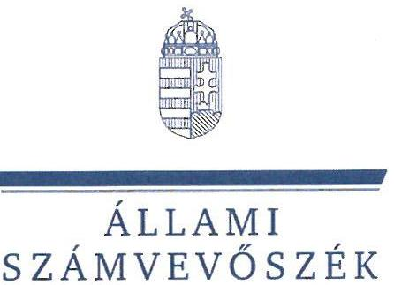
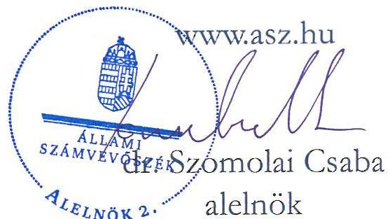
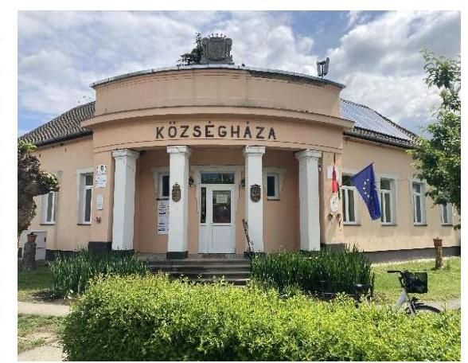
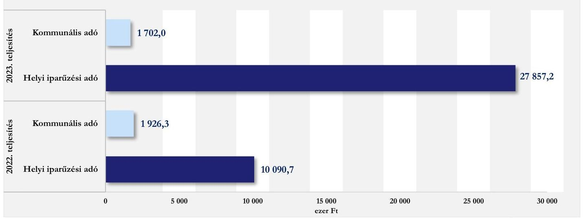
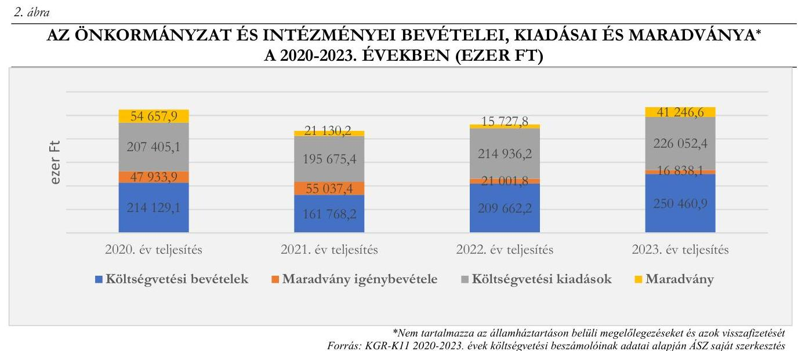

# JELENTÉS 

## Az önkormányzatok helyi adóztatási tevékenységének ellenőrzése - Ingatlanadóztatás

Tiszainoka Község Önkormányzat

2024.

---

ÁLLAMI
SZÁMVEVŐSZÉK

# JELENTÉS 

## Az önkormányzatok helyi adóztatási tevékenységének ellenőrzése - Ingatlanadóztatás

Tiszainoka Község Önkormányzat

2024.

24161

---

# ELLENŐRZÉSI IGAZGATÓSÁG: 

## ÁLLAMIGAZGATÁS HELYI SZINTJÉT ELLENŐRZŐ IGAZGATÓSÁG

## ELLENŐRZÉSI IGAZGATÓ:

DR. BAFFIA GERGELY GÁBOR igazgató

## ELLENŐRZÉSVEZETŐ:

Jelentéseink az interneten a www.asz.hu címen olvashatók.

KANYÓ LŐRÁNT ISTVÁN ellenőrzésvezető

IKTATÓSZÁM: EL-4040-010/2024.
TÉMASZÁM: 2740
ELLENŐRZÉS-AZONOSÍTÓ SZÁM: V-1084

---

# TARTALOMJEGYZÉK 

AZ ELLENŐRZÉS ALAPADATAI ..... 5
AZ ELLENŐRZÖTT SZERVEZET ..... 7
ÖSSZEFOGLALÁS ..... 9
AZ ELLENŐRZÉS FÓKUSZKÉRDÉSEI ..... 11
MEGÁLLAPÍTÁSOK ..... 12
JAVASLATOK ..... 22
MELLÉKLETEK ..... 23
I. sz. melléklet: Értelmező szótár ..... 23
II. sz. melléklet: Az ellenőrzött szervezetek jegyzéke ..... 24
III. sz. melléklet: Ellenőrzési kritériumok ..... 25
FÜGGELÉK: ÉSZREVÉTELEK ..... 28
RÖVIDÍTÉSEK JEGYZÉKE ..... 32

---

.

---

# AZ ELLENŐRZÉS ALAPADATAI 

## AZ ELLENŐRZÉS CÉLJA

Az ellenőrzés célja az volt, hogy értékelje Tiszainoka község helyi ingatlanadóztatásának és adóhatósága feladatellátásának szabályszerűségét és eredményességét. További cél volt, hogy az ellenőrzés megállapításai és következtetései segítsék az önkormányzati képviselő-testületeket a jogszabályokkal és a helyi sajátosságokkal összhangban álló helyi adópolitika kialakításában és az azt végrehajtó adóigazgatási szervezet megszervezésében. Az ellenőrzés célja volt annak megállapítása is, hogy az Önkormányzat által bevezetett, ingatlanokat terhelő helyi adókra vonatkozó rendeleti szabályok összhangban vannak-e a helyi adópolitikai célokkal, tartalmuk tükrözi-e a település helyi sajátosságait és az adóhatósági feladatellátás biztosítja-e az önkormányzati bevételek feltárását és beszedését.

Ennek keretében az ÁSZ értékelte, hogy az Önkormányzat által bevezetett, ingatlanokat terhelő helyi adókról szóló adórendelet, valamint az adóhatóság döntései, adóztatási gyakorlata a vonatkozó jogszabályokkal összhangban állnak-e.

## AZ ELLENŐRZÉS TÍPUSA

Kombinált ellenőrzés.

## AZ ELLENŐRZÖTT IDŐSZAK

Az 1. fókuszkérdésnél a 2023. év, valamint a 2024. évnek az ellenőrzés megkezdését megelőző napjáig (2024. április 1.) tartó időszaka.

A 2. és 3. fókuszkérdésnél a 2023. év, valamint a 2024. évnek az ellenőrzés megkezdését megelőző napjáig (2024. április 1.) tartó időszaka, a 2020-2022. évek adatainak bázisadatként való felhasználásával.

## AZ ELLENŐRZÉS TÁRGYA

Az Önkormányzat képviselő-testületének ingatlanokat terhelő helyi adókkal, azaz az építményadóval, a telekadóval és a magánszemély kommunális adójával kapcsolatos rendeletalkotási tevékenységének és az adóhatóság tevékenységének ellátása.

Az ellenőrzés kiterjedt minden olyan körülményre és adatra, amely az ÁSZ jogszabályban meghatározott feladatainak teljesítéséhez, valamint a program végrehajtása folyamán felmerült újabb összefüggések feltárásához szükséges.

## AZ ELLENŐRZÉS JOGALAPJA

Az ellenőrzés jogszabályi alapját az ÁSZ tv. 5. § (8) bekezdésének előírásai képezik.

---

# AZ ELLENŐRZÉS MÓDSZERE 

Az ellenőrzést az ellenőrzési program szempontjai, az ellenőrzött időszakban hatályos jogszabályok, az ellenőrzés általános szakmai szabályai és az ellenőrzésre irányadó ÁSZ módszertanok alapján végeztük.

Az ellenőrzési kérdések megválaszolásához szükséges bizonyítékok megszerzése az ellenőrzött szervezetek által rendelkezésre bocsátott dokumentumokra, adatokra és az ASP Adó és az Iratkezelő szakrendszerek, illetve a KGR-K11 számviteli adatgyűjtő rendszer adataira alapozva megfigyelés, szemle (szemrevételezés), kérdésfeltevés (információkérés), mintavételezés, valamint elemző eljárás útján történt. Emellett az ellenőrzési bizonyítékként felhasználható adatforrások közé tartozott minden egyéb - az ellenőrzés folyamán feltárt, az ellenőrzés szempontjából információt tartalmazó - releváns dokumentum (ideértve különösen a helyszínen felvett jegyzőkönyvet) is.

Az ellenőrzés lefolytatásához az ellenőrzött szervezet a tanúsítványok kitöltésével, valamint az ÁSZ által kért dokumentumok, adatok, információk megküldésével és az ellenőrzés során szolgáltatott adatokat. Az adómegállapítás, fizetési kedvezmények engedélyezése, hátralékok beszedése szabályszerűségét mintavételi eljárással ellenőrizte az ÁSZ. Az ÁSZ 12 mintatételben, 11 adóhatósági határozat szabályszerűségét ellenőrizte. A mintatételek kiválasztása véletlenszerűen történt meg, az adóhatóság nyilvántartásában lévő adótárgyak és ügyek közül, öt - adómegállapításra vonatkozó - mintatétel kivételével, melynek során a kiválasztás címadatok alapján történt meg, annak érdekében, hogy feltárható legyen, volt-e olyan adótárgy, amelyet nem adóztatott az adóhatóság. Az ellenőrzött mintatételekre vonatkozó megállapítások nem vetíthetők ki a teljes sokaságra, a megállapításokat az ÁSZ az adott ellenőrzött mintatételek vonatkozásában tette.

Az ÁSZ a helyi adópolitikai elképzelések és a települési sajátosságok feltárásával értékelte, hogy az adórendelet e szempontoknak mennyiben felel meg. Az ÁSZ a helyi adópolitikai célokkal akkor tekintette összhangban állónak az adórendeletet, ha az hatását tekintve támogatta az adópolitikai célok teljesülését.

Az ÁSZ az adóhatósági feladatellátás szabályszerűségéből, a meglévő kapacitásokból, valamint az ezer forint adóbevételre jutó adóhatósági költségek alakulásából következtetett arra, hogy az adóhatóság rendelkezett-e azzal a potenciállal, amellyel eredményesen tudta a helyi adópolitikát végrehajtani.

Az ÁSZ - az adórendelet szabályainak érvényre juttatása körében - az eredményesség megítélésekor a III. számú melléklet 2. pontjában foglalt szempontokat tekintette mérvadónak.

---

# AZ ELLENŐRZÖTT SZERVEZET 

Tiszainoka Jász-Nagykun-Szolnok vármegyében, a vármegye délnyugati sarkában, a Tisza bal partján a Tiszazugban található kistelepülés. Lakosainak száma a BM adatai szerint 2020. január 1-jén 414 fő, 2024. január 1-jén pedig 393 fő volt. A TEIR adatai alapján Tiszainokán 2022. december 31-én 70 gazdasági szervezet volt, melyek 67,2%-a mezőgazdasági ágazatba tartozott. A településen az egy főre jutó személyi jövedelemadó-alap összege 2022-ben a TEIR adatai szerint 1160,8 ezer Ft volt, mely jelentősen elmaradt a vármegyei (1 952,4 ezer Ft) és az országos (2 268,8 ezer Ft) adattól egyaránt.

Az Önkormányzatnak két, az óvodai nevelést ellátó (Tiszainokai Tiszavirág Óvoda), valamint a szociális feladatokat ellátó (Tiszainokai Szociális Gondozási Központ) költségvetési szerve, továbbá egy közfeladatot - nem veszélyes hulladék gyűjtése - ellátó, kizárólagos tulajdonában álló gazdálkodó szerve (INOKA-2000 Kereskedelmi, Szolgáltató Nonprofit Korlátolt Felelősségű Társaság) volt.

Az Alaptörvény értelmében a helyi önkormányzat a helyi közügyek intézése körében törvény keretei között dönt a helyi adók fajtájáról és mértékéről. Az Mötv. rögzíti, hogy a helyi adóval kapcsolatos feladatok ellátása a helyi önkormányzatok feladata.

Az Önkormányzat a Htv. 1. § (1) bekezdésében foglalt felhatalmazással élve illetékességi területén az adórendelettel a magánszemély kommunális adóját vezette be 2011-től. Az adó mértéke 2018. január 1. óta adótárgyanként, illetőleg lakásbérleti jogonként 10,0 ezer Ft/év volt az adórendelet szerint. 2018. április 1-jétől adómentesség illette meg az adórendelet szerint a település külterületén található telek tulajdonosát, illetőleg a vagyoni értékű jog jogosultját.

Az adó megállapításával, nyilvántartásával, beszedésével összefüggő adóhatósági feladatokat - a Hatásköri tv. és az Air. rendelkezései alapján - elsőfokú hatósági jogkörben Cibakháza jegyzője látta el a Hivatal vezetőjeként. A tiszainokai és a cibakházi adóztatási feladatokat két ügyintéző végezte a Hivatalon belül működő Pénzügyi- Gazdasági- és Adóirodán, a munkavégzést koordináló irodavezető segítségével.

A 2023. évben 1702,0 ezer Ft bevétel származott kommunális adóból, 216 adóalanytól, 179 adótárgy után, ami az Önkormányzat költségvetési bevételeinek 0,7%-át, a települési helyi adóbevételek 5,8%-át tette ki.

---

Az Önkormányzat helyi adóbevételeinek a 2022. és 2023. évi teljesítésére vonatkozó adatait az 1. ábra mutatja be.

# 1. ábra 

AZ ÖNKORMÁNYZAT HELYI ADÓBEVÉTELEI MEGOSZLÁSA A 2022-2023. ÉVEKBEN (EZER FT)

---

# ÖSSZEFOGLALÁS 

Az ÁSZ tv. értelmében az ÁSZ feladatkörébe tartozik az önkormányzatok adóztatási tevékenységének ellenőrzése. A helyi adók az önkormányzatok saját, el nem vonható bevételét képezik, így az önkormányzatok gazdasági önállósága szempontjából különös fontossággal bír, hogy a helyi adórendeleti szabályok összhangban álljanak a magasabb szintű jogszabályokkal, továbbá az önkormányzati adóhatósági tevékenység jogszerű, eredményes és hatékony legyen. Erre figyelemmel volt tárgya az ÁSZ ellenőrzésének az Önkormányzat adórendelet-alkotási tevékenysége és az adóhatósági feladatellátás is.

Az adórendelet három ponton nem volt összhangban magasabb szintű jogszabállyal. Az Önkormányzat az ingatlanokat terhelő helyi adómegállapítása során mérlegelte gazdálkodási helyzetét, a helyi sajátosságokat, az adóalanyok teherbíró képességét, az adórendelet a települési adópolitikai céloknak megfelelt.

Az adóigazgatási feladatellátás a jogszabályi és szakmai követelményeknek nem felelt meg. Az adóztatási kiadások magasak voltak az adóbevételekhez mérten, az adóhatóság feladatellátási mutatóinak értékei összességében elmaradtak az ÁSZ által ellenőrzött (nagy)községek* feladatellátási mutatóinak átlagos értékétől.

## Adórendelet, adórendelet-alkotás

Az Önkormányzat adórendelete két rendelkezése is jogszabálysértő volt, mert leszűkítette az adóeljárási törvény méltányossági adóelengedésre vonatkozó szabályait, egy rendelkezése pedig pontatlan és szükségtelen volt.

Az ingatlanokat terhelő helyi adókra vonatkozó rendeleti szabályozás megalkotása során az Önkormányzat megfelelően mérlegelte, hogy törvényi rendelkezés alapján a rendeleti szabályoknak tükröznie kell az önkormányzat gazdálkodási követelményeit és a helyi sajátosságokat (közte a más adókkal adóztatható adótárgyak létét) is.

A Polgármester az ÁSZ tv. 29. § (2) bekezdés szerinti, a jelentéstervezet megállapításaira tett észrevételében arról tájékoztatta az ÁSZ-t, hogy az adatbejelentési nyomtatványt a jogszabályi előírásnak megfelelően közzétették az Önkormányzat honlapján, ezért a nyomtatvány az Önkormányzat honlapján 2024 augusztusában már elérhetővé és onnan letölthetővé vált, ezzel az ÁSZ megállapítása az ellenőrzés során hasznosult.

## Adóhatóság adóigazgatási feladatellátásának jogszerűsége, eredményessége

Az adóhatóság hatósági jogkörében nem minden esetben járt el jogszerűen. Az adómegállapító határozatokban a fizetésre kötelezettek személye megfelelt a jogszabályoknak, a kiszámított adóösszeg viszont nem. Egyik adómegállapító határozat indokolása sem felelt meg az adóigazgatási rendtartásról szóló törvényben foglaltaknak, mert nem volt világos a tényállás és a jogalapot jelentő jogszabályi rendelkezések egymáshoz rendelése, ami nehezítette a döntés értelmezését.

A határozatok kiadmányozása, kézbesítése jogszerű volt.

[^0]
[^0]:    * Azok a községek, amelyek ingatlanadóztatását az ÁSZ a jelentés alapjául szolgáló nyilvános ellenőrzési program alapján ellenőrzi: Árpádhalom, Balatonberény, Balatonvilágos, Kompolt, Leányfalu, Szentistván, Szigetmonostor, Tiszainoka.

---

Az adóhatóság a 2023. évben és 2024. április 1-jéig fizetési felszólítást nem bocsátott ki, végrehajtási cselekményt nem foganatosított, miközben az adóhátralék összege 2023. december 31-én 1 136,5 ezer Ft volt, aránya pedig a 2023. évi kommunális adóbevételhez viszonyítva magas, 66,8% volt. Az adóhatóság adóbehajtási tevékenységének elmaradása jogszabálysértő volt.

Az adórendelet adópolitikai célokkal való összhangja, az adórendelet hatása
A helyi adópolitikai célok elérésének megfelelő eszközéül szolgáltak az Önkormányzat adórendeleti szabályai.

Az Önkormányzat országos összevetésben vizsgálva kevésbé élt az ingatlanadóztatás lehetőségével. Míg a községek, nagyközségek esetén országosan ezen bevételek költségvetési bevételeken belüli átlagos aránya a 2023. évben 2,2%, addig az Önkormányzat esetében ez 0,3% volt.

A kommunális adó szintje az adóalanyok többségének adóteherbíró-képességét nem haladta meg.
Az adóhatósági kiadások, a feladatellátás célszerűsége
A Hivatalhoz tartozó két önkormányzat (Tiszainoka, Cibakháza) esetén a 2023. évben 1000 Ft helyi adóbevételre 57,8 Ft adóztatási kiadás esett. Az ÁSZ által ellenőrzött községek átlaga 33,4 Ft, az adóztatási kiadás tapasztalati referencia-érték maximuma pedig kivetéses adóztatás esetén 50 Ft volt. Az adóztatási kiadások az adóbevételekhez mérten magasak voltak.

Egy adótisztviselőre a Hivatalban 75 706,9 ezer Ft helyi adóbevétel jutott a 2023. évben (az ÁSZ által ellenőrzött nyolc (nagy)község átlaga 218 852,8 ezer Ft). Egy adótisztviselő 837 adótárgy és 848 adóalany után látott el adóztatási feladatot (a nyolc ellenőrzött település esetén ez 1396 adótárgy, illetve 1237 adóalany). Az adóhatóság feladat-ellátási mutatói elmaradtak az ÁSZ által ellenőrzött nyolc (nagy)község mutatóinak átlagos adatától.

---

# AZ ELLENŐRZÉS FÓKUSZKÉRDÉSEI 

1.- Az önkormányzat ingatlanokat terhelő helyi adókra vonatkozó rendeleti szabályozása megfelel-e

 a magasabb szintű jogszabályoknak?
2.- Az önkormányzati adóhatóság megfelelően és eredményesen látta-e el az ingatlanok adóztatásával kapcsolatos adóhatósági tevékenységeit?
3.- A településen megvalósuló helyi adóztatás támogatta-e a helyi adópolitikai célok teljesülését?

---

# 1. Az önkormányzat ingatlanokat terhelő helyi adókra vonatkozó rendeleti szabályozása megfelelte a magasabb szintű jogszabályoknak? 

## Összegző megállapítás

Az adórendelet több ponton nem felelt meg a magasabb szintű jogszabályoknak.
1.1. számú megállapítás

A magánszemély kommunális adójára vonatkozó rendeleti szabályozás két ponton nem volt összhangban az Art. ${ }^{18}$ előírásával, megsértve ezzel a Htv. szabályát is. Az adórendelet szövegezése továbbá egy ponton sértette az egyértelműség Jár. ${ }^{19}$-ban megfogalmazott követelményét is.

A Htv. 43. § (3) bekezdését megsértve, az Art.-ban szabályozott eljárási tárgykörben, az Art. 201. § (1) bekezdésében ${ }^{2}$ foglaltakkal ellentétben az adórendelet
a) 6. § (1) bekezdésének b) pontja a kommunális adó kérelemre való elengedését ahhoz kötötte, hogy az adózó háztartásában az egy főre eső jövedelem a mindenkori legkisebb öregségi nyugdíj-minimum 100%-át ne haladja meg, továbbá a
b) 6. § (1) bekezdésének a) pontja pedig azt írta elő, hogy az adóhatóság a kommunális adót kérelemre legfeljebb 20%-kal abban az esetben mérsékelheti, ha az adó megfizetése az adózó és a vele egy háztartásban élők megélhetését súlyosan veszélyezteti és az adózó háztartásában az egy főre eső jövedelem a mindenkori legkisebb öregségi nyugdíj minimum 150%-át nem haladja meg.
Az adórendelet 6. § (3) bekezdése - figyelmen kívül hagyva a Jár. 2. § (1) bekezdéséből következő egyértelműség elvét - a Tiszainoka külterületén található telek tulajdonosát, illetőleg a vagyoni értékű jog jogosultját mentesítette a kommunális adókötelezettség alól. Az Önkormányzat nyilatkozata szerint - az adórendelet e rendelkezése szövegétől eltérően - a jogalkotói szándék csak arra irányult, hogy a külterületi telkek után ne kelljen kommunális adót fizetni ${ }^{3}$.

[^0]
[^0]:    ${ }^{2}$ Az Art. 201. § (1) bekezdés értelmében az adóhatóság a természetes személy adótartozását akár teljes egészében el is engedheti, ha annak megfizetése az adózó és a vele együtt élő hozzátartozók megélhetését súlyosan veszélyezteti, függetlenül az egy főre jutó jövedelem összegétől.
    ${ }^{3}$ Az adórendelet 6. § (3) bekezdésének megfogalmazásból az következik, hogy a külterületi telek tulajdonosa, illetőleg a vagyoni értékű jog jogosultja (alanyi oldalú) adómentességet élvezett valamennyi adótárgya után, pusztán arra a tényre figyelemmel, hogy külterületi telek volt tulajdonában, vagy valamely ingatlanon állt fenn vagyoni értékű joga.

---

1.2. számú megállapítás

Az Önkormányzat az adórendelet megalkotása során mérlegelte, hogy a rendeleti szabályoknak tükröznie kell a helyi sajátosságokat, az Önkormányzat gazdálkodási követelményét, és - az adóalanyok széles körét érintően - az adóalanyok teherbíró képességét.

A Htv. 7. § g) pontjában rögzített adómegállapítási korlátokból az következik, hogy a rendelet hatályossága idején érvényre kell jutnia az e pontban szabályozott rendeletalkotási elveknek, azaz annak, hogy települési önkormányzat az adóalap fajtáját, az adó mértékét, a rendeleti adómentességet és adókedvezményt úgy állapíthatja meg, hogy azok összességükben egyaránt megfeleljenek a helyi sajátosságoknak, az önkormányzat gazdálkodási követelményeinek és az adóalanyok széles körét érintően az adóalanyok teherviselő képességének.
Az adórendelet hatályos adómértékeket beillesztő módosításához ${ }^{20}$ készült Előterjesztés ${ }^{21}$ szerint az előterjesztő ismertette a Htv. rendelet-alkotásra vonatkozó elveit, továbbá az Előterjesztés az adómérték emelését a költségvetési szükségletekkel indokolta, a mértékemelés arányát pedig az adóalanyok teherviselő képességéhez igazította. Nem volt

Az ÁSZ véleménye szerint legalább az adózást érintő magasabb szintű jogszabályi változások esetén indokolt felülvizsgálni az adórendeletet. Ettől függetlenül a település mérete, adottsága a helyi adókra vonatkozó rendelet összetettsége, az önkormányzat gazdálkodási körülményeinek változása, az adózók teherbíró képességének változása befolyásolja az időközönkénti felülvizsgálatot.

Tiszainokának olyan területrésze, amelyen belül markánsan eltért volna az ingatlanok fajlagos forgalmi értéke a település többi részétől, ezért, az ÁSZ nem tárt fel olyan körülményt ${ }^{4}$, amely indokolta volna differenciált mértékrendszer kialakítását.
Az Önkormányzat gazdálkodási körülményei a 2020-2023. években, valamint a 2024. április 1-jéig tartó ellenőrzési időszakban sem indokolták az adószabály felülvizsgálatát, mert, mint az a 2. ábrán látható, a konszolidált költségvetési bevételek és az előző évi előirányzat-maradvány igénybevétele együttesen a 2020-2023. években rendre meghaladta a konszolidált költségvetési kiadások összegét. Ezen időszak minden évében a tárgyévben keletkezett kötelezettségvállalással nem terhelt (,„szabad") maradvány aránya a kiadásokhoz mérten a 2020-2022. években 5,0-7,4% között alakult, a 2023. évben 18,4% volt ${ }^{5}$.

[^0]
[^0]:    ${ }^{4}$ A különbségtételt az ingatlanok fajtái sem indokolták, figyelemmel arra a tényre, hogy az Önkormányzat, a nyilatkozata szerint egy ingatlan után egyszer kívánta megfizettetni az adótárgyanként megállapított kommunális adót.
    ${ }^{5}$ A 2023. évi jelentősebb maradvány a helyi iparűzési adóbevétel előző évhez képest 176,1%-kal való növekedésének, 27 857,2 ezer Ft-ra teljesülésének köszönhető.

---

# 2. Az önkormányzati adóhatóság megfelelően és eredményesen látta-e el az ingatlanok adóztatásával kapcsolatos adóhatósági tevékenységeit? 

Összegző megállapítás

Az adóhatóság adómegállapítási feladatellátása nem volt megfelelő valamennyi adótárgy esetén, továbbá nem volt eredményes. Az adótartozások behajtása, végrehajtása érdekében az adóhatóság nem tett intézkedéseket.
2.1. számú megállapítás

Az adóhatóság adótárgy-feltárási tevékenységet nem végzett, az adómegállapítási feladatellátás több esetben az Art.-ba ütközött és eredménytelen volt. Az Art.-ral szemben az adómegállapító határozatok indokolása nem kizárólag az a döntést megalapozó valamint az adóhatóság hatáskörét és illetékességét megállapító jogszabályokra utalt, ami nehezítette a döntés értelmezését.

## Adótárgy-, és adóalanyfeltárás

Az adóhatóság élt az Art. 83. § (2) bekezdésében foglaltak szerint az ingatlanügyi hatóság megkeresésének lehetőségével, de ezen adatokat nem vetette össze az adónyilvántartás adataival. Az adóhatóság az adótárgyak, adóalanyok felkutatására irányuló egyéb tevékenységet nem folytatott, ezért adótárgy-, és adóalanyfeltárási tevékenységét nem eredményesen látta el.

---

## Adómegállapítás (kivonatos)

Az adóhatóság egy esetben (a 12. számú mintatétel) az adórendelet 2. §-a ellenére az adóztatást elmulasztotta.
Hét ellenőrzött tétel esetében (a 2., 3., 4., 5., 6., 7., és 12. számú mintatételek) az adóhatóság nem szólította fel az adóalanyokat az Art. 221. § (1) bekezdés ellenére és az Art. 2. melléklet II.A) rész 4. pontja szerinti adatbejelentési kötelezettség teljesítésére ${ }^{6}$.
Az adóhatóság a 2-7. számú mintatételekhez tartozó határozatok indokolási részében az ügyintézési határidőt az adatbejelentés adóhatósághoz való érkezése napjától számította. Ez ellentétes az Art. 50. § (1) bekezdésével, amely hivatalból való eljárás ${ }^{7}$ esetén az első eljárási cselekmény megkezdése napjától - azaz a konkrét esetekben (mivel egyéb eljárási cselekmény nem történt) a határozat kiadmányozása napjától - rendeli számítani az ügyintézési határidőt.
Hét ellenőrzött tétel esetében (3., 5., 6., 8., 9., 10., és 11. számú mintatételek) az adóhatóság a 10 ezer Ft/év adótételt ingatlanonként (helyrajzi számonként) állapította meg. Ez nincs összhangban az adórendelet 2. §-ában foglaltakkal, és közvetve a Htv. 24. §-ával, mert figyelmen kívül hagyta azt, hogy egy helyrajzi szám alatti ingatlanon több adótárgy is volt ${ }^{8}$.

Amennyiben egy községben az adótárgyak száma és az adóalanyok személye nem haladja meg az 500-at, és az adókötelezettség-változások száma is alacsony, a jegyző hely-, és tényismeretének köszönhetően nem feltétlenül szükséges évente megkérni és összevetni az ingatlanügyi hatóság által szolgáltatott adatokat az adónyilvántartás adataival az adóztatás eredményessége érdekében. Abban az esetben azonban, ha felmerül, hogy az adónyilvántartásban nem minden adótárgy szerepel, célszerű és indokolt, hogy az adóhatóság a rendelkezésére álló valamennyi eszközzel „érje el" az adótárgyat és az adózót. Alacsony adótétel esetén lehetséges, hogy az adótárgy-feltárás, az adónyilvántartás pontosabbá tétele az adóbevételhez mérten aránytalan ráfordítással jár, azonban az ÁSZ szakmai véleménye szerint az adófizetési hajlandóság növelése, az adókötelezettségüket rendben teljesítők érdekei miatt e költségeket indokolt vállalni.

Amennyiben az önkormányzat szándéka az, hogy egy ingatlan után csak egyszer fizessék meg a rendeletben meghatározott éves kommunális adómértéket, akkor a jogszabálysértő adóztatás elkerülése érdekében - ezt a helyi rendeletben ki kell mondani. Ez megtörténhet akként például, ha az adórendelet mentességi szabály beiktatásával rögzíti, hogy amennyiben az ingatlannyilvántartásban egy helyrajzi szám alatti ingatlanon több adótárgy található, akkor azok közül csak egy után kell megfizetni az adót.

[^0]
[^0]:    ${ }^{6}$ Adóköteles adótárgy megvásárlása, megöröklése, ajándékozása esetén az új tulajdonos adókötelezettsége a Htv. 12. § (1) bekezdése alapján főszabály szerint a vásárlást, megöröklést, ajándékozást követő év első napjától keletkezik. Az Art. 2. melléklet II.A) rész 4. pontja értelmében az adókötelezettség keletkezéséről az azt követő 15 napon belül (azaz ezen esetekben január 15-ig) kell adatbejelentést benyújtani.
    ${ }^{7}$ Az adómegállapítás hivatalból induló eljárás.
    ${ }^{8}$ A Htv. 12. §-a, a 18. §-a és 24. §-a alapján a kommunális adó tárgya az építményadó tárgyát és telekadó tárgyát képező adótárgy (épület, épületrész, beépítetlen földrészlet), valamint a nem magánszemély tulajdonában álló lakáson fennálló bérleti jog. Az adórendelet 2. §-a ezzel összhangban rendelkezik az adókötelezettségről. Ezért egy családi ház esetén legalább két adótárgy létezik: a telek épülettel be nem épített része, mint a telekadó tárgya és a családi házról, mint az építményadó tárgyáról.

---

Az adófizetési kötelezettségről szóló valamennyi határozat indokolásában - az Art. 73. § (1) bekezdés c) pontjában foglaltak ellenére - olyan jogszabályhelyek is szerepeltek, amelyek a döntés tárgyát képező fizetési kötelezettség és az annak alapjául szolgáló tényállás, vagy az eljáró hatóság hatásköre, illetékessége kapcsán nem voltak relevánsak. Mindazonáltal a határozatokban rögzített döntések a határozatok jogszerűségét e hiba nem érintette. A világos, követhető magyarázat ugyanakkor érthetővé teszi az adózó számára, hogy milyen jogalapon és miért a határozat szerinti összeget kell fizetnie. Ezen túlmenően az adóhatóságnak és az önkormányzatnak is előnyös, ha az adózó számára is világos és érthető a határozat, ami hozzájárulhat az adózó önkéntes jogkövetéséhez.
Az adómegállapító határozatok kiadmányozása és közlése valamennyi határozat esetében megfelelt az Art. előírásainak.

A megállapított adó csökkentése: fizetési kedvezmények, adókötelezettség változás, elévülés miatti törlés
A fennálló adókövetelés nagyságát csökkentő intézkedések jogszerűek voltak, megfeleltek a Htv. és az Art. előírásainak, azok számszaki összefoglalását az 1. táblázat mutatja be.

1. táblázat

# A 2023. ÉVBEN ÉS 2024. ÁPRILIS 1-JÉIG TÖRTÉNT ADÓKÖVETELÉS TÖRLÉSEK FŐBB ADATAI (DARAB ÉS EZER FT) 

| MEGNEVEZÉS | 2023. ÉV |  | 2024. ÉV ÁPRILIS 1-JÉIG |  |
| :-- | :--: | :--: | :--: | :--: |
|  | Esetszám | Összeg | Esetszám | Összeg |
| Méltányosságból törölt adókövetelés | 0 | 0 | 0 | 0 |
| Adókötelezettség változás okán törölt   adókövetelés | 6 | 70,0 | 12 | 170,0 |
| Elévülés miatt törölt adókövetelés | 24 |

 98,0 | 26 | 110,1 |

Forrás: Az Önkormányzat és a Hivatal tanúsítványokon megadott adatai alapján ÁSZ saját szerkesztés

## Adatszolgáltatási, közzétételi kötelezettség

A jegyzőnek az ellenőrzött időszakban a Htv. előírásai szerinti adatszolgáltatási kötelezettsége a helyi ingatlanokat érintő adórendelet módosításhoz kapcsolódóan nem keletkezett ${ }^{9}$. Az adóhatóság a Htv.-nek megfelelően az adórendelet közzétételéről - a Nemzeti Jogszabálytárra való hivatkozással - gondoskodott. Az adatbejelentési nyomtatvány közzétételét azonban - a Htv. 42/B. § (3) bekezdésének rendelkezése ellenére - elmulasztotta.

[^0]
[^0]:    ${ }^{9}$ A jegyzőnek az adórendelet, valamint annak módosítása hatálybalépését megelőző hónap ötödik napjáig kell adatot szolgáltatni a Magyar Államkincstár számára többek között az adóalapról, adómértékről, adókedvezményről, adómentességről. Ezeket az információkat a Magyar Államkincstár közzéteszi honlapján.

---

2.2. számú megállapítás

Az adóhatóság az adótartozások behajtására - az Avt. előírása ellenére - fizetési felszólítást nem bocsátott ki, végrehajtási eljárást nem indított.

A 2. táblázat adatai szerint a 2023. év végén az adóhátralékok összege 1136,5 ezer Ft volt, 21,4%-kal több, mint a 2022. év utolsó napján. Az éves adóbevételhez képest jelentős volt az adótartozás aránya ( $66,8 \%$ ), 92,5%-kal meghaladta a településtípusra jellemző arányszámot (34,7%). Emellett, az 1. táblázat adatai alapján, az adóhatóság - az ÁSZ automatikusan működő programelemével - a 2023. évben 98,0 ezer Ft, 2024. április 1-jéig (még nem lezárt éves adat alapján) 110 ezer Ft adótartozást törölt elévülés címén, ami 2023. évben a kommunális adóbevétel $5,8 \%$-át, a 2024. évben a tervezett adóbevétel $11,1 \%$-át tette ki.

Az adóhatóság - az adóbevételhez mérten jelentős és növekvő adóhátralék és az elévülés miatt törölt adó ellenére - az Avt. 30. § (1) bekezdésének előírásaival szemben 2023. évben és 2024-ben az ellenőrzés megkezdésének napjáig adóbehajtási tevékenységet nem végzett.

Az ÁSZ álláspontja szerint az adóvégrehajtási cselekmények célja nem pusztán az önkormányzatot megillető bevétel beszedése. Legalább annyira tekinthető a fizetési kötelezettségüket rendben teljesítők melletti kiállásnak is. Összességében az adómorál és a fizetési hajlandóság növelését szolgálja valamennyi adózó esetén. Ennek kapcsán az ÁSZ kiemeli, hogy az adóvégrehajtás költségét az adósnak kell viselnie, egyszerűbb végrehajtási cselekmények (hatósági átutalás, jövedelem-letiltás) esetén a végrehajtási költségátalány a költségeket fedezheti, ha a költség is behajtható a végrehajtás során.
2. táblázat

# MAGÁNSZEMÉLY KOMMUNÁLIS ADÓHÁTRALÉK JELLEMZŐ ADATAI 

| MEGNEVEZÉS | 2022. DECEMBER 31. | 2023. DECEMBER 31. | 2024. ÁPRILIS 1. |
| :-- | :--: | :--: | :--: |
| Adótartozás (ezer Ft) | 936,1 | 1136,5 | 1143,0 |
| Adótartozások aránya az éves (a   2024. évben a tervezett)   adóbevételhez mérten (\%) | 48,6 | 66,8 | 57,2 |
| Adózók száma (fő) | 216 | 204 | 204 |
| Adósok száma (fő) | n.a. | 59 | 69 |
| Egy adósra jutó adótartozás   összege (ezer Ft/fő) | n.a | 19,3 | 16,6 |

Forrás: Az Önkormányzat adatszolgáltatása és a 2022. és 2023. évi zárási összesítői alapján ÁSZ saját szerkesztés

---

# 3. A településen megvalósuló helyi adóztatás támogatta-e a helyi adópolitikai célok teljesülését? 

| Összegző megállapítás | Az ingatlanokat terhelő helyi adókra vonatkozó önkormányzati rendeleti szabályozás támogatta a helyi adópolitikai célok megvalósulását, az adózók teherbíró képességével összhangban volt, de az Önkormányzat gazdálkodását érdemben nem segítette. Az adóhatóság kiadása a bevételhez mérten magas volt, a feladatellátás mutatói összességében az ÁSZ által ellenőrzött (nagy)községekhez képest kedvezőtlenebbek voltak. |
| :--: | :--: |

Az Önkormányzat írásba foglalt adópolitikai koncepcióval nem rendelkezett. Az Önkormányzat 2020-2024. évekre vonatkozó Gazdasági Programjában ${ }^{22}$ döntött arról, hogy a helyi adóztatást úgy kívánja kialakítani, hogy az biztos bevételi forrást jelentsen az Önkormányzatnak és igazságos legyen az adózói körnek. Az adórendelet ingatlanadókra vonatkozó szabályozása az említett törekvésekkel összhangban volt.
3.2. számú megállapítás

Az Önkormányzat gazdálkodását az ingatlanadóból származó adóbevétel érdemben nem segítette, az adó összege az adóalanyok többségének teherbíró képességét nem haladta meg.

## Az adórendelet(módosítás) hatása az önkormányzat gazdálkodására

Az Önkormányzat önként vállalt feladatot (az idősek részére nyújtott szociális szakosított ellátást) is ellátott. Ennek finanszírozására - a 2022. évi zárszámadási rendelet ${ }^{23}$ alapján - amellett, hogy állami támogatásban részesült és átvett pénzeszközt is kapott, a 2022. évben 28 000,0 ezer Ft-ot biztosított. Költségvetési bevételei meghaladták a kiadások összegét, hitelállománnyal nem rendelkezett, továbbá a helyi adóbevételek hozzájárultak az önként vállalt és kötelezően ellátandó feladatok ellátásához is. A 3. táblázat mutatja, hogy a felhalmozási bevételektől megtisztított költségvetési bevételeken belül ${ }^{10}$ a saját bevételek aránya 2020-2023. években közel azonos volt (26,3-31,1% között mozgott). Ezzel együtt az ingatlanadóból származó bevétel az időszakon belül évről évre csökkent, 2020. év és 2023. év között átlagosan évi 7,4%-kal. Az ingatlanadó költségvetési bevételeken belüli részaránya a 2020. évi 1,0%-ról 2023. évre $0,7 \%$-ra, a saját bevételen belüli 2020. évi $4,5 \%$-ról, 2023. évre $2,2 \%$-ra szintén csökkent. Ennélfogva az ingatlanadó bevételek szerepe az Önkormányzat feladatellátása finanszírozásában nem csak, hogy nem volt jelentős, hanem évről évre kisebb is lett. Ennek hátterében a végrehajtás elmaradásának is betudhatóan felhalmozódott fennálló jelentős arányú adótartozás, továbbá az elévülés miatti adótörlés állt, mert az adótárgyak száma érdemben nem változott és az adómérték is azonos maradt az időszakban.

[^0]
[^0]:    ${ }^{10}$ A felhalmozási célú támogatások összege az időszak egyes éveiben jelentősen eltér, s nagysága érdemben befolyásolja a 2020. év és a 2022. év költségvetési bevételét.

---

# 5. táblázat 

## AZ ÖNKORMÁNYZAT ÉS INTÉZMÉNYEINEK 2020-2023. ÉVEK(I) KONSZOLIDÁLT BEVÉTELEI (EZER FT, \%)

| SOB-   SZÁM | JOGCÍM | 2020. FV | 2021. FV | 2022. FV | 2023. FV |
| :--: | :--: | :--: | :--: | :--: | :--: |
| 1. | Működési célú támogatások államháztartáson belülről | 108776,9 | 114 400,7 | 138 999,2 | 172 472,8 |
| 2. | Felhalmozási célú támogatások államháztartáson belülről | 57564,2 | 4 465,0 | 21216,6 | - |
| 3. | Közhatalmi bevételek | 11249,8 | 2432,3 | 12221,5 | 30049,6 |
| 3.1., | ebből: ingatlanadókból származó bevétel | 2145,1 | 2061,6 | 1926,3 | 1702,0 |
| 3.2., | ebből: helyi iparűzési adó bevétele | 9076,3 | 279,8 | 10090,7 | 27857,2 |
| 4. | Egyéb saját bevételek* | 36538,2 | 40470,2 | 37224,9 | 47938,5 |
| 5. | Saját bevételek (3.+4.) | 47787,9 | 42902,6 | 49446,4 | 77988,2 |
| 6. | Költségvetési bevételek (1.+2.+5.) | 214 129,1 | 161768,2 | 209 662,2 | 250 460,9 |
| 7. | Saját bevételek aránya a felhalmozási célú támogatások nélküli költségvetési bevételeken belül (5./6.-   2.) | 30,5 | 27,3 | 26,2 | 31,1 |

* Egyéb saját bevétel: működési bevételek, felhalmozási bevételek, működési célú átvett pénzeszközök, felhalmozási célú átvett pénzeszközök.

Forrás: KGB-K11-ből az Önkormányzat 2020-2023. évek konszolidált beszámolója alapján ÁSZ saját szerkesztés

## Az adóalanyok teherbíró képességével való összevetés

2023. évben a 216 fő adóalanyból 59 fő (27,3%), átlagosan 19,3 ezer Ft/fő adóhátralékot halmozott fel, míg a 2024. évben (2024. április 1. napjáig) a 204 fő adóalanyból 69 fő (33,8%) rendelkezett átlagosan 16,6 ezer Ft/fő hátralékkal.
Sem az adózók, továbbá - a fennálló hátralékok ellenére - sem az adósok fizetési kedvezmény iránti kérelmet a 2023. évben és 2024. április 1. napjáig nem nyújtottak be.
Az adóalanyok nagyobb hányadának teherbíró képességét a kommunális adó nem érintette hátrányosan, mert az adótétel 2018. óta változatlan, a 2022. évi, egy főre jutó évi nettó személyi jövedelemadó-köteles jövedelemhez ( 771932 Ft ) mért aránya $1,3 \%$ volt. Az adósok számának adóalanyok számához viszonyított aránya (2024. január 1-jén 33,8%) és az egy főre jutó átlagos adótartozás éves adótételhez mért jelentős aránya ( $166 \%$-a) az elmaradó adóbehajtásnak, s nem a gyenge teherbíró képességnek tudható be.
3.3. számú megállapítás

Az adóhatóság feladatellátásának személyi és tárgyi feltételei biztosítottak voltak. Az adóhatósági feladatellátás kiadása a bevételhez mérten több volt, mint az adóztatási kiadás referencia-érték maximuma. A feladatellátás mutatói összességében kedvezőtlenebbek voltak, mint az ÁSZ által ellenőrzött (nagy)községek feladatmutatóinak átlagos értékei.

## Személyi és tárgyi feltételek

Az adóigazgatási feladatellátás személyi és tárgyi feltételei az ellenőrzött időszakban biztosítottak voltak. Az Önkormányzat adóigazgatási feladatainak ellátása a Hivatalon keresztül történt két, középiskolai

---

végzettségű adótisztviselővel, melyek közül egy adótisztviselő kettő, a másik adótisztviselő 18 éves szakmai tapasztalattal rendelkezett.

# Az adóztatás kiadásai 

A Hivatal az Áht. ${ }^{24}$ és a 15/2019. (XII. 7.) PM rendelet ${ }^{25}$ előírása alapján az éves költségvetési beszámolóiban az adóigazgatási tevékenységgel összefüggő kiadásokat és a kapcsolódó átlagos statisztikai létszámadatokat a kormányzati funkció (011220 Adó-, vám- és jövedéki igazgatás) szerint kimutatta. Az adóztatás kiadásaival kapcsolatos adatokat (a társult önkormányzattal együtt) a 4. táblázat tartalmazza.

Az adóztatás kiadásai (költségei) egyfelől az adóhatóság költségeiben, másfelől az adózó költségeiben öltenek testet. Önadózás esetén az adóztatási költségek nagyobb része az adózónál merül fel, mert az adót az adóalany számítja ki, vallja be, fizeti meg. Kivetéses adóztatás esetén ellenben az adózó költsége az adó megfizetésének költségét jelenti (például a gépjárműadó vagy a hatósági nyilvántartás alapján megállapított helyi adók esetén) vagy - az adófizetési költség mellett - legfeljebb csak az adómegállapításhoz szükséges adatszolgáltatás költsége merül fel. Ha az összes bevétel több, mint 10%-át teszi ki a kivetéses adózás, hatósági adómegállapítás, azaz ingatlanadóztatás alapján befolyó bevétel, akkor adóztatási kiadás referencia-érték maximuma 50 Ft 1000 Ft adóbevételre vetítve (a szinte kizárólag önadózásos adókat beszedő adóhatóságoknál ez az érték 10 és 20 Ft közötti).
4.táblázat

## AZ ADÓZTATÁS 2023. ÉVI KÖLTSÉGEINEK KIMUTATÁSA (EZER FT)

| MEGNEVEZÉS | ÖNKORMÁNYZAT   ADATAI | NYOLC ELLENŐRZÖTT   TELEPÜLÉS ADATAI   (ÖSSZESEN, ÁTLAG) |
| :-- | :--: | :--: |
| Összes tényleges kiadás adatszolgáltatás és kimutatás   alapján | 8745,9 | 243376,6 |
| Ebből: személyi juttatások és munkaadókat terhelő közterhek | 8745,9 | 237480,8 |
| Tényleges létszám adatszolgáltatás alapján (fő) | 2 | 32,5 |
| Beszedett helyi adóbevétel adatszolgáltatás alapján | 151413,7 | 7112717,6 |
| Egy adótisztviselőre jutó tényleges személyi juttatás és   közteher adatszolgáltatás alapján | 4373,0 | 7307,1 |
| 1000 Ft helyi adóbevételre jutó személyi juttatás+közteher   (Ft) | 57,8 | 33,4 |
| Egy adótisztviselőre jutó beszedett adó | 75706,9 | 218852,8 |
| Egy adótisztviselőre jutó ingatlanadó-tárgyak száma (db) | 837 | 1396 |
| Egy adótisztviselőre jutó ingatlanadó-alanyok száma (fő,) | 848 | 1257 |

A KGR-K11-ben elérhető adatok alapján a 2023. évben a Hivatal esetében 1000 Ft beszedett helyi adóbevételre 57,8 Ft adóztatási kiadás jutott. Az ÁSZ által ellenőrzött (nagy)községek

 (költségvetési szervek nélküli) adatszolgáltatása alapján az átlagos érték $33,4 \mathrm{Ft}$, a legmagasabb érték $113,1 \mathrm{Ft}$ volt 1000 Ft adóbevételre.

A Hivatal szempontjából az egy főre jutó tényleges személyi juttatás és munkaadókat terhelő közteher a 2023. évben 4 373,0 ezer Ft volt, ami 2 934,1 ezer Ft-tal kedvezőbb, mint a nyolc, ÁSZ által ellenőrzött (nagy)község 7 307,1 ezer Ft-os átlagos adata. Ugyanez az érték az állami adóhatóság esetén 2022-ben 9700 ezer Ft volt.

---

Egy adótisztviselőre a Hivatalban 75 706,9 ezer Ft - KGR-K11 szerinti - helyi adóbevétel jutott a 2023. évben. Az ÁSZ által ellenőrzött nyolc (nagy)község - közös hivatalokkal együtt - átlaga 218 852,8 ezer Ft volt.
A 2023. évi végi adatok alapján egy adótisztviselőre 837 adótárgy és 848 adóalany jutott, ami az ÁSZ által ellenőrzött nyolc (nagy)község átlag-adatához képest kevesebb.
Az adóhatóság kiadásai magasabbak voltak, mint az adóztatási kiadások referencia-érték maximuma, az adóhatósági feladatellátás mutatói pedig összességében elmaradtak az ÁSZ által ellenőrzött nyolc (nagy)község feladatmutatóinak az átlagos értékeitől.
3.4. számú megállapítás

Az adózók önkéntes jogkövetését a személyes kapcsolatok, ismeretségek alapján támogatták.

Az Önkormányzat közlése szerint a polgármester és az adótisztviselők kihasználták a kistelepülés nyújtotta azon lehetőséget, hogy sokszor személyesen (utcai találkozások, rendezvények során) szólíthatták meg az adózókat, s ekkor adtak tájékoztatást az adófizetési információkról, felhívták őket az adótartozás megfizetésére. Az Önkormányzat polgármestere azt is elmondta, hogy ezen személyes találkozások alkalmával jelezték a lakosok felé, hogy az önkormányzati feladatellátáshoz, ez elért eredményekhez a magánszemély kommunális adójából származó bevétel is hozzájárult.

Az ÁSZ szakmai véleménye szerint jó gyakorlatnak számít a személyes kapcsolaton alapuló információközlés, az adózási teendők települési rendezvényeken való bemutatása, illetve az adóztatás szerepének hangsúlyozása az önkormányzati feladatellátás kapcsán. Ezzel együtt sem maradhatnak el azonban az adótartozások végrehajtására vonatkozó hatósági cselekmények, különösen, ha a megfizetni elmulasztott adó aránya az éves adóbevételhez képest több, mint $30 \%$.

---

# JAVASLATOK 

Az ÁSZ tv. 33. § (1) bekezdésében foglaltak értelmében az ellenőrzött szervezet vezetője köteles a jelentésben foglalt megállapításokhoz kapcsolódó intézkedési tervet összeállítani és azt a jelentés kézhezvételétől számított 30 napon belül az ÁSZ részére megküldeni. Amennyiben az ellenőrzött szervezet vezetője nem küldi meg határidőben az intézkedési tervet, vagy továbbra sem elfogadható intézkedési tervet küld, az Állami Számvevőszék elnöke az ÁSZ tv. 33. § (3) bekezdése a) és b) pontjaiban foglaltakat érvényesítheti.

## A POLGÁRMESTERNEK

1. Intézkedjen a jelentés nyilvánosságra hozatalát követő 15 napon belül annak az Önkormányzat képviselő-testülete elé terjesztéséről. A jelentést a napirend tárgyalásáról szóló jegyzőkönyvvel együtt tájékoztatásul küldje meg a Jász-Nagykun-Szolnok Vármegyei Kormányhivatal részére is.

## A JEGYZŐNEK

1. Vizsgálja felül az adórendelet 6. § (1) bekezdését, a tekintetben, hogy az összhangban áll-e a Htv. 43. § (3) bekezdésével és az Art. 201. §-ával.
2. Vizsgálja felül az adórendelet 6. § (3) bekezdését a tekintetben, hogy az - figyelemmel a Jat. 2 § (1) bekezdésében foglaltakra is - összhangban áll-e a jogalkotói szándékkal.
3. Tegyen lépéseket annak érdekében, hogy az ingatlanadóztatási gyakorlata megfeleljen az adórendelet szövegének, különös tekintettel az adórendelet ellenőrzött időszakban hatályos 2. §-ának.
4. Alakítsa ki úgy az ingatlanadó-megállapítási gyakorlatát, és alkosson arra belső szabályokat, hogy a jövőben az ingatlanokat terhelő helyi adókötelezettség tárgyában kiadott adómegállapító határozatok indokolási része - az Air. 73. § (1) bekezdés c) pontjában foglaltak érvényre juttatása érdekében - kizárólag az adómegállapító határozat tárgyát képező döntést megalapozó, valamint az adóhatóság hatáskörét és illetékességét megállapító jogszabályhelyekre utaljon.
5. Rendelkezzen az Avt. 30. § (1) bekezdése szerint az adóbehajtási, adóvégrehajtási adóhatósági feladatellátásról.

---

# MELLÉKLETEK 

## I. SZ. MELLÉKLET: ÉRTELMEZŐ SZÓTÁR

adóhatóság
adóhatósági ellenőrzés
adótartozás
adóbehajtási tevékenység
adótárgy

ASP rendszer
ingatlanokat terhelő helyi adók
az adóztatás költségei
adóztatási kiadás
adóztatási kiadás referencia-érték maximuma

Az önkormányzat jegyzője (Forrás: Air. 22. § b) pont)
Az adóhatóság az adótörvényekben és más jogszabályokban előírt kötelezettségek teljesítésének vagy megsértésének megállapítása, a kötelezettségek teljesítésének előmozdítása érdekében ellenőrzést folytat. (Forrás: Air. 86. §)
Az esedékességkor meg nem fizetett adó. (Forrás: Art. 7. § 6. pont)
Az adótartozás beszedésére irányuló adóhatósági tevékenység, így különösen a fizetési felhívás kibocsátása és a végrehajtási cselekmények.
Az az ingatlan vagy lakásbérleti jog, amelynek adókötelezettségét a Htv. és önkormányzati adórendelet előírja. (Forrás: Htv. 11.§, 17. §, 24. §)
Az önkormányzati feladatellátást támogató, számítástechnikai hálózaton keresztül távoli alkalmazásszolgáltatást (Application Service Provider) nyújtó elektronikus információs rendszer. (Forrás: az önkormányzati ASP rendszerről szóló 257/2016. (VIII. 31.) Korm. rendelet $1 . \S 6$. pont)
Építményadó, telekadó, magánszemély kommunális adója. (Forrás: Htv. II. fejezet, III. fejezet 1.1. pont)
Az ellenőrzés az adóztatás költségei kapcsán egyfelől figyelembe vette azt, hogy az önkormányzati hivatalok költségeinek kormányzati funkciók szerint gyűjtése hiányos és ellentmondásos adatokat hordoz. Másfelől abból a szakmai tapasztalatból indult ki, hogy az adóztatás költségei főképp az adótisztviselők személyi juttatásaiban, a juttatások közterheiben öltenek testet. Ezért az adóztatás költségei alatt ez utóbbi, adótisztviselők által kapott juttatásokat és a juttatás közterheit értette, azzal, hogy ha az adótisztviselő munkaköre más feladat ellátását is magában foglalta, akkor az ellenőrzés az adott tisztviselő személyi juttatásának csak az adózási feladat-ellátás idejével arányos részét vette számításba.
az adóigazgatási feladat-ellátással kapcsolatos kiadások közül a személyi juttatások és közterheik (az egyéb, dologi kiadások elhatárolása módszertanilag megfelelő módon nem volt lehetséges, ezért csak a kiadások mintegy $80 \%$-át kitevő személyi juttatásokat és közterheiket vette az ellenőrzés figyelembe adóztatási kiadásként).
Szakértői tapasztalaton alapuló becsült maximum adóztatási kiadás. Megmutatja, hogy 1000 Ft közteher beszedésével mekkora az a maximum kiadási összeg, amely hatékony működés esetén racionálisan felmerül beszedő szervnél. A nemzetközi (OECD) tapasztalatok szerint ez az érték 10-20 Ft (1-2\%) között mozgott 2011-ben, a NAV esetén 2022-ben 10,8 Ft, a dologi kiadásokkal együtt 13,5 Ft volt. Ezek a számadatok olyan adóhatóságokra vonatkoznak, amelyek döntő többségében önadózásos adónemeket szednek be (a NAV által beszedett adók 97\%-a önadózással teljesítendő), amelyek esetén a hatósági kiadások kisebbek. Szakértői összevetés alapján községek esetén az 50 Ft (5\%) alatti érték fogadható el (Forrás: https://www.oecd-ilibrary.org/governance/government-at-a-glance-2011/efficiency-of-tax-administrations_gov_glance-2011-64-en és KGR-K11 és szakértői becslés).

---

II. SZ. MELLÉKLET: AZ ELLENŐRZÖTT SZERVEZETEK JEGYZÉKE

# AZ ELLENŐRZÖTT SZERVEZET MEGNEVEZÉSE 

Tiszainoka Község Önkormányzat
Cibakházi Közös Önkormányzati Hivatal

---

## FOKUSZKÉRDÉS

1. Az önkormányzat ingatlanokat terhelő helyi adókra vonatkozó rendeleti szabályozása megfelel-e a magasabb szintű jogszabályoknak?
2. Az önkormányzati adóhatóság megfelelően és eredményesen látta-e el az ingatlanok adóztatásával kapcsolatos adóhatósági tevékenységeit?

## ELLENŐRZÉSI KRITÉRIUMOK

Magyarország Alaptörvénye 32. cikk (1) bekezdés a), h) pontjai, 32. cikk (3) bekezdés
Hatásköri tv. 138. § (3) bekezdés a)-f) pontok
Stabilitási tv. ${ }^{26}$ 31-32. §
Mötv. 47. § (1)-(2) bekezdések, 50. §, 51. § (1)-(2) bekezdés, 52. $\S$ (1) bekezdés

Htv. 1. § (1), 2. §- 7. §, 9. § (1), 11. §-26/A. §, 42/B. §, 42/I. §, 43. §, 52. § 3-20. pontjai, 43-50. pontjai, 60. pont,

Jat. 2, § (1) bekezdés
Pénzügyminisztérium tájékoztató az egyes tételes helyi adómérték valorizációjáról

Art., Air., Avt.
Itv. ${ }^{27}$ 102. § (1) bekezdés e) pont
61/2009. (XII. 14.) IRM rendelet a jogszabályszerkesztésről.
Htv. 1. § (1) bekezdés, 2. §- 7. §, 9. § (1) bekezdés, 11. §-26/A. $\S, 42 /$ B. $\S, 42 /$ I. $\S, 43 . \S, 52 . \S 3-20$. pontjai, 43-50. pontjai, 60. pont,

Art. 49. §, 58. § (1) bekezdés, 59. §, 141. § (2), (6)-(7) bekezdések, 221. § (1) bekezdés b) és c) pontja
Art. 2. számú melléklet II.A/4. pont, 3.számú melléklet II.A/4. pont

Air. 22. § b) pont, 72. § (1) bekezdés, 73. §-74.§, 76.-78. §, 79. § (2) bekezdés, 81. § (6) bekezdés, 82. § (4) bekezdés, (6) bekezdés, 124. § (1)-(2) bekezdés, 125. §, 134. § (1) bekezdés, 135. § (3) bekezdés,

Avt. 30. § (1) bekezdés.
465/2017. (XII. 28.) Korm. rendelet ${ }^{28} 84 . \S$
Eüsztv. ${ }^{29}$ 14. §, 15. § (1)-(2) bekezdések
451/2016. (XII.19.) Korm. rendelet ${ }^{30} 54 . \S$
335/2005. (XII.29.) Korm. rendelet ${ }^{31}$ 52. § (1)-(2) bekezdések, 53. § (1) bekezdés, (3) bekezdés a) pont

Az önkormányzati hivatal Szervezeti és Működési Szabályzata
A kiadmányozás rendjéről szóló szabályzat
ingatlanokat terhelő helyi adókról szóló települési szabályokat tartalmazó önkormányzati rendelet(ek)
Az adómegállapítási feladatellátás esetén az ÁSZ megítélése szerint akkor eredményes a feladatellátás, ha:

- az adóhatóság megkérte az Art. 83.§ (2) bekezdése alapján az ingatlanügyi hatóságtól a településen található ingatlanokról és azok tulajdonosairól szóló adatszolgáltatást és ezen adatokat összevetette az

---

adónyilvántartásban szereplő adótárgyakkal és adóalanyokkal;

- az ÁSZ ellenőrzés nem tár fel olyan adótárgyat, amely után az adóhatóság nem állapított meg adót, noha kellett volna.
Az adóbeszedési feladatellátás esetén akkor eredményes a feladatellátás, ha:
- 2023-ban és 2024. április 1-jéig az adófizetés első esedékessége előtt az adóhatóság az adózókat felhívta a fizetési kötelezettségük teljesítésére;
- a 2023. évi adóbevételhez viszonyított, 2023. december 31-én fennálló hátralék (határidőben meg nem fizetett adó) aránya nem haladta meg a településtípusra jellemző arányszámot $30 \%$-nál nagyobb mértékben;
- ha a 2022. december 31-ei hátralék összegéhez képest a 2023. december 31-ei hátralék összege legfeljebb 10\%-kal emelkedett, és az adóhatóság legalább a hátraléknövekedéssel érintett adózóknál emelte a beszedési cselekmények (fizetési felhívás, végrehajtási cselekmény) számát;
- az ingatlanokat terhelő adónemekből származó 2023. évi tényleges, adónemenkénti adóbevétel a 2023. évi bevétel eredeti előirányzatának legalább 90\%-ában teljesült.
3. A településen megvalósuló helyi adóztatás támogatta-e a helyi adópolitikai célok teljesülését?
Htv. 1. § (1) bekezdés, 2. §- 7. §, 9. § (1) bekezdés
Htv., Art., Air., Avt. helyi adóhatóság feladatellátására vonatkozó rendelkezései
A rendeleti szabályoknak az önkormányzat gazdálkodására gyakorolt hatása kapcsán az ÁSZ az alábbiakat veszi figyelembe:
- a helyi ingatlanadókból eredő bevételek saját bevételeken belüli arányának alakulása, összehasonlítása az azonos településtípusba tartozó települések ugyanezen arányszámával;
- pozitív/negatív a gyakorolt hatás, ha az arányszám növekszik/csökken a korábbi időszakhoz képest;
- pozitív/negatív a gyakorolt hatás, ha a települési arányszám magasabb/alacsonyabb, mint a településtípusra jellemző arányszám.
A rendeleti szabályoknak az adóalanyok adófizetésére gyakorolt hatását az alábbiak alapján ítéli meg az ÁSZ:
Az adóalanyok adófizetési képességét a rendelet hátrányosan érintette, ha a korábbi rendeleti szabályok hatálya alatti

---

időszakhoz képest (azonos hosszúságú időszakokat figyelembe véve)

- az ingatlanokat terhelő helyi adóhátralék összege 5\%-nál magasabb mértékben emelkedett vagy;
- az ingatlanokat terhelő helyi adókra vonatkozó fizetési könnyítésekre benyújtott kérelmek száma 5\%-nál nagyobb mértékben emelkedett vagy;
- az ingatlanokat terhelő helyi adókra vonatkozó fizetési könnyítések alapjául szolgáló adó összege 5\%-nál nagyobb mértékben emelkedett vagy;
- a fizetési felhívások száma 5\%-nál nagyobb mértékben emelkedett.
Az arányszámokat annak figyelembevételével is értékeli az ÁSZ, hogy a települési ingatlanállományon belül mekkora arányt képvisel az:
- adótárgyak száma;
- adófizetési kötelezettség alá eső adótárgyak száma, és ezen arányszámok változása hogyan alakult a korábbi rendeleti szabályok hatálya alatti időszakhoz képest.

---

# FÜGGELÉK: ÉSZREVÉTELEK 

A jelentéstervezetet a Számvevőszék
 15 napos észrevételezésre megküldte az ellenőrzött szervezet vezetőjének az ÁSZ tv. 29. § (1) bekezdése előírásának megfelelően.

Az elfogadott észrevételek alapján a Számvevőszék módosította a jelentést.
A függelék tartalmazza az ellenőrzött észrevételeit, illetve az el nem fogadott észrevételek elutasításának indoklását.

## 1. Tiszainoka polgármestere 1. számú észrevételének 1. része

„A jelentés tervezet 1.1. számú megállapítása szerint „A magánszemélyek kommunális adójára vonatkozó rendeleti szabályozás két ponton nem volt összhangban az Art. előírásával, megsértve ezzel a Htv. szabályát is. Az adórendelet szövegezése továbbá egy ponton sértette az egyértelműség, Jat.-ban megfogalmazott követelményét is."
Magyarország helyi önkormányzatairól szóló 2011. évi CLXXXIX. törvény (Mötv.) 1. § 2. pontja értelmében Tiszainoka Község Önkormányzat törvényességi felügyeletét vármegyei kormányhivatal látja el.
A Jász-Nagykun-Szolnok Megyei Kormányhivatal, Hatósági Főosztály, Törvényességi Felügyeli Osztály (Kormányhivatal) 2018. február hónapban (Iktatószám: JN/24/00286/2018 csatolt melléklet) az Mötv. 132. § (3) bekezdés b) pontjába foglalt törvényességi felügyeleti jogkörében megvizsgálta Tiszainoka Község Önkormányzat Képviselő-testületének a magánszemélyek kommunális adójáról szóló 10/2010. (XII. 8.) önkormányzati rendeletét (adórendelet) és megállapította, hogy a rendelet mely pontjaiban jogszabálysértő.
A képviselő-testület a Kormányhivatal törvényességi felhívását megtárgyalta és a törvényességi felhívásban foglaltaknak megfelelően az adórendeletét a 6/2018. (III. 24.) önkormányzati rendeletével felülvizsgálta, és az adórendelet módosítását 2018. április 1-jével hatályba léptette. A képviselő-testület a megtett intézkedéséről a Kormányhivatalt tájékoztatta, aki az adórendelet-módosítást jóváhagyta. Párhuzamos szabályozást nem állapított meg.
Időközben a Htv. és az Art. számos módosítása történt, de az adórendeletet nem érintették, ezért az adórendelet megfelel a magasabb szintű jogszabályoknak."

## ÁSZ álláspont az 1. számú észrevétel 1. részére

Az ÁSZ az Állami Számvevőszékről szóló 2011. évi LXVI. törvény (továbbiakban: Ász tv.) 5. § (8) bekezdése alapján ellenőrzi a helyi önkormányzatok adóztatási és egyéb bevételszerző tevékenységét. Az önkormányzat bevételszerző tevékenységének jogszabályi alapja és egyben egyik meghatározója a helyi adórendelet. Ennélfogva az Ász tv.-ben megfogalmazott törvényi kötelezettség teljesítése nem hajtható végre a rendeletalkotás ellenőrzése nélkül. Az ÁSZ ezért - a rá vonatkozó jogszabályi kereteken belül - önálló

[^0]
[^0]:    22 29. § (1) Az Állami Számvevőszék az ellenőrzési megállapításait megküldi az ellenőrzött szervezet vezetőjének vagy az általa megbízott személynek, és annak, akinek személyes felelősségét állapította meg.
    (2) Az ellenőrzött szervezet vezetője és a felelősként megjelölt személy az ellenőrzés megállapításaira tizenöt napon belül írásban észrevételt tehet.
    (3) Az Állami Számvevőszék az észrevételre a beérkezésétől számított harminc napon belül írásban válaszol. A figyelembe nem vett észrevételeket köteles a jelentésben feltüntetni, és megindokolni, hogy azokat miért nem fogadta el.

---

álláspontot alakított ki az adórendelet jogszabályba ütközésével kapcsolatban, az ÁSZ ellenőrzést az illetékes kormányhivatal által lefolytatott törvényességi felügyeleti eljárásban rögzített álláspont nem köti. Mindezzel együtt, éppen a hatásköri összeütközések elkerülése érdekében javaslatunk csak felülvizsgálati kötelezettséget ír elő egyrészt a jegyző részére, másrészt a polgármester részére az ÁSZ jelentés illetékes kormányhivatal felé való továbbítása érdekében.

# Erre tekintettel a jelentéstervezet módosítása nem indokolt. 

## 2. Tiszainoka polgármestere 1. számú észrevételének 2. része

„Álláspontom szerint az adórendelet 6. § (1) bekezdése nem ellentétes a jelentés tervezetben hivatkozott Htv. 43. § (3) bekezdésével és az Art. 201. §-ával. A Htv. 6. § d) pontja szerint „az önkormányzat adómegállapítási joga arra terjed ki, hogy az e törvény második részében meghatározott mentességeket, kedvezményeket további mentességekkel, kedvezményekkel kibővítse.
Az adórendelet 6. § (1) bekezdésének megalkotása során a képviselő-testület a Htv. 6. § d) pontjában foglalt jogkörével élt."

## ÁSZ álláspont az 1. számú észrevétel 2. részére

A Polgármester asszony észrevételében nem különül el az adókedvezmény, adómentesség jogintézménye az adómérséklés, elengedés jogintézményétől. Míg az adókedvezmény és az adómentesség az adókötelezettség összegét befolyásoló generális normatartalommal bíró rendelkezésen alapul, melyekről kizárólag a települési önkormányzat dönthet, addig az adómérséklés, az adóelengedés a jogszerűen létrejött fizetési kötelezettség összegének egyedi ügyben való csökkentésére ad lehetőséget, kizárólag az önkormányzati adóhatóság számára. A Htv. 6. § d) pontja adókedvezmény és adómentesség megállapítására adott lehetőséget, s nem adott arra felhatalmazást, hogy a jogalkotó önkormányzat az Art. törvényi szintű szabályait - köztük az adómérséklés és elengedés szabályait - felülírja, hiszen a Htv. 6. § e) pontja külön kiemelte, hogy „az önkormányzat adómegállapítási joga arra terjed ki, hogy ... e törvény és az adózás rendjéről szóló törvény, valamint az adóigazgatási rendtartásról szóló törvény keretei között az adózás részletes szabályait meghatározza."
Az Art 201.§-a a törvény hatályba lépése óta nem változott, ez a jogszabályi hely egyértelműen szabályozta az adómérséklés eseteit. A jogszabályi hierarchia miatt a törvényi szabályozást nem írhatta felül az adórendelet, ami a törvénytől eltérően rendezte az adómérséklés eseteit.

## A jelentéstervezet módosítása nem indokolt.

## 3. Tiszainoka polgármestere 1. számú észrevételének 3. része

„A jelentés tervezet 1.1. számú megállapítása alatt szerepel, hogy „Az adórendelet 6. § (3) bekezdése figyelmen kívül hagyva a Jat. 2. § (1) bekezdéséből következő egyértelműség elvét - Tiszainoka külterületén található telek tulajdonosát, illetőleg a vagyoni értékű jog jogosultját mentesítette a kommunális adókötelezettség alól."
A képviselő-testület szándéka arra irányult, hogy a külterületi telek után ne kelljen a magánszemélyek kommunális adóját megfizetni, akkor sem, ha az a magánszemély tulajdonában áll, vagy ha azon a magánszemélynek vagyoni értékű joga van. A vagyoni értékű jog a külterületi telekre vonatkozik.
A fentiek alapján az adórendelet 6. §-a nem sért magasabb szintű jogszabályt, ezért kérem a jelentés tervezetből ezen megállapítások törlését."

---

# ÁSZ álláspont az 1. számú észrevétel 3. részére 

A jogalkotói szándékkal ellentétben a rendeletszöveg nyelvtani-logikai értelmezésével az a jelentéstartalom volt olvasható ki az adórendelet 6. §-ából, hogy a település külterületén lévő telek tulajdonosát, használóját személyénél fogva mentesség illette meg a magánszemély kommunális adója alól valamennyi, a településen fellelhető adótárgya (azaz a településen található belterületi lakás és egyéb adótárgya) után is. Erre tekintettel javasolta az ÁSZ a rendeletszöveg felülvizsgálatát abból a szempontból, hogy az - figyelemmel a Jat 2. § (1) bekezdésére - valóban a jogalkotói szándékot tükrözte-e.

## A fentiekre tekintettel a jelentéstervezet módosítása nem indokolt.

## 4. Tiszainoka polgármesterének 2. számú észrevétele

„A 2.1. számú megállapítás alatt a jelentéstervezet megállapította, hogy „Az adófizetési kötelezettségről szóló valamennyi határozat indokolásában - az Art. 73. § (1) bekezdés c) pontjában foglaltak ellenére - olyan jogszabályhelyek is szerepeltek, amelyek döntés tárgyát képező fizetési kötelezettség és az annak alapjául szolgáló tényállás, vagy az eljáró hatóság hatásköre, illetékessége kapcsán nem voltak relevánsak." (jelentés tervezet 16. oldal).
Ehhez a megállapításhoz a következő megjegyzést teszem: Az adó határozatok az önkormányzati ASP alkalmazásközpont adó szakrendszerében kerülnek elkészítésre, így a fizetési kötelezettségre vonatkozóan feltüntetett jogszabályhelyek az ASP-ben rendszeresített, központi iratsablonban sem szerepelnek helyesen, ezért a jövőben az önkormányzati adóhatóságnak valamennyi adóügyben külön-külön egyedi határozatokat kell majd létrehoznia és a központi iratsablon feleslegessé válik."

## ÁSZ álláspont a 2. számú észrevételre

Az ÁSZ véleménye szerint lehetőség volt a központi iratsablon egyediesítésére, amely nem tette szükségtelenné az iratsablon használatát. Elégséges - egyben szükséges is - lett volna a kész iratsablon és az egyedi ügy összevetése, a szükségtelen részek kitörlése, s az adott ügyben esetlegesen felmerülő speciális körülményekre tekintettel kiegészítések beiktatása. Az ASP-ben szereplő sablon használata nem változtatott azon a tényen, hogy az adómegállapító határozat tartalmáért a kiadmányozó, az önkormányzati adóhatósági jogkörben eljáró jegyző felel.
Erre tekintettel a jelentéstervezet megállapításának módosítása nem indokolt.

## 5. Tiszainoka polgármesterének 3. számú észrevétele

„A 2.2. számú megállapításban szerepel, hogy „Az adóhatóság az adótartozások behajtására - az Avt. előírása ellenére fizetési felszólítást nem bocsátott ki, végrehajtási eljárást nem indított."
Az Avt. 30. § (1) bekezdése kimondja, hogy az adóhatóság a tartozás megfizetésére az adóst felhívhatja, eredménytelen felhívás esetén, továbbá, ha a felhívás alkalmazása a körülmények alapján célszerűtlen, a végrehajtást megindítja.
Az Avt. nem írja elő, hogy elévülési időn belül a végrehajtható adótartozások esetében az önkormányzati adóhatóságnak pontosan milyen időközönként kell a végrehajtási eljárást megindítania."

## ÁSZ álláspont a 3. számú észrevételre

Az Avt. valóban nem határozott meg határidőt az adóhatóság számára arra, hogy mikor kellett volna megkezdnie a végrehajtást, hiszen a törvény abból indul ki, hogy az adóhatóság érdeke és alapfunkciója az adótartozások behajtása. Abból az értelmezési szabályból kiindulva, hogy a jogszabály kijelentő módban

---

megfogalmazott, végrehajtásra vonatkozó rendelkezését is kötelezettségnek kell tekinteni, továbbá figyelemmel arra, hogy időbeli korlátot a norma nem tartalmaz, az Avt. 30. §-a akként értelmezhető, hogy amennyiben az adóhatóság fennálló adótartozást tart nyilván, az adóbehajtási tevékenységet - időbeli korlát nélkül, az ésszerű és célszerű adóhatósági feladatellátásra figyelemmel - meg kellett volna kezdenie (fizetési felszólítást kellett volna kibocsátani, vagy végrehajtási eljárást kellett volna indítania). A 2023. évben és a 2024. április 1-jéig elévült tételek számából arra lehet következtetni, hogy az adóhatóság a 2023. évet megelőzően sem hajtotta be az általa nyilvántartott valamennyi adótartozást.
Erre tekintettel a jelentéstervezet megállapításának módosítása nem indokolt.

# 6. Tiszainoka polgármesterének 5. számú észrevétele 

„A 3.1. számú megállapítás szerint: „Az Önkormányzat írásba foglalt adópolitikai koncepcióval nem rendelkezett." (jelentés-tervezet 18. oldal).
Ismereteink szerint magasabb szintű jogszabályi előírások nem rendelkeznek arról, hogy az önkormányzatnak írásba foglalt adópolitikai koncepcióval kellene rendelkeznie, ezért kérjük az ellenőri megállapítás magasabb szintű jogszabályi előírással való alátámasztását, ellenkező esetben a megállapítás törlését."

ÁSZ álláspont az 5. számú észrevételre
A jelentéstervezet tényként és nem megállapításként tartalmazta „Az Önkormányzat írásba foglalt adópolitikai koncepcióval nem rendelkezett." mondatot, mégpedig abban az összefüggésben, hogy írásban rögzített adópolitikai koncepció hiányában nem volt lehetőség azzal összevetni a rendeleti szabályozás hatását az ÁSZ ellenőrzési programja végrehajtása érdekében.
Ezzel kapcsolatban a jelentéstervezet nem fogalmazott meg javaslatot sem, ezért a jelentéstervezet módosítása nem indokolt.

---

# RÖVIDÍTÉSEK JEGYZÉKE 

${ }^{1}$ Önkormányzat ${ }^{2}$ adórendelet ${ }^{3}$ adóhatóság ${ }^{4}$ ÁSZ ${ }^{5}$ ÁSZ tv. ${ }^{6}$ ASP ${ }^{7}$ KGR-K11 ${ }^{8}$ BM ${ }^{9}$ TEIR ${ }^{10}$ Alaptörvény ${ }^{11}$ Mötv. ${ }^{12}$ Htv. ${ }^{13}$ Hatásköri tv. ${ }^{14}$ Air. ${ }^{15}$ jegyző ${ }^{16}$ Hivatal ${ }^{17}$ kommunális adó ${ }^{18}$ Art. ${ }^{19}$ Jat. ${ }^{20}$ Hatályos adómértéket beiktató rendelet ${ }^{21}$ Előterjesztés ${ }^{22}$ Gazdasági Program ${ }^{23}$ 2022. évi zárszámadási rendelet ${ }^{24}$ Áht. ${ }^{25}$ 15/2019. (XII. 7.) PM rendelet ${ }^{26}$ Stabilitási tv. ${ }^{27}$ Itv. ${ }^{28}$ 465/2017. (XII. 28.) Korm. rendelet ${ }^{29}$ Eüsztv. ${ }^{30}$ 451/2016 (XII. 19.) Korm. rendelet ${ }^{31}$ 335/2005. (XII. 29.) Korm. rendelet

Tiszainoka Község Önkormányzat
Tiszainoka Község Önkormányzata Képviselő-testületének 10/2010. (XII. 8.) önkormányzati rendelete a magánszemélyek kommunális adójáról
Cibakházi Közös Önkormányzati Hivatal jegyzője, mint önkormányzati adóhatóság
Állami Számvevőszék
2011. évi LXVI. törvény az Állami Számvevőszékről

Az önkormányzati feladatellátást támogató, számítástechnikai hálózaton keresztül távoli alkalmazásszolgáltatást nyújtó elektronikus információs rendszer (Application Service Provider)
A Magyar Államkincstár egyik alapfeladataként működtetett államháztartás információs rendszer eleme, számviteli adatgyűjtő
 rendszer, amely az államháztartás egészének aktuális vagyoni és pénzügyi helyzetéről gyűjt adatokat a pénzügyi kormányzat számára.
Belügyminisztérium
Országos Területfejlesztési és Területrendezési Információs Rendszer
Magyarország Alaptörvénye (2011. április 25.)
2011. évi CLXXXIX. törvény Magyarország helyi önkormányzatairól
1990. évi C. törvény a helyi adókról
1991. évi XX. törvény a helyi önkormányzatok és szerveik, a köztársasági megbízottak, valamint egyes centrális alárendeltségű szervek feladat- és hatásköreiről
2017. évi CLL törvény az adóigazgatási rendtartásról

Cibakházi Közös Önkormányzati Hivatal jegyzője
Cibakházi Közös Önkormányzati Hivatal
magánszemély kommunális adója
2017. évi CL. törvény az adózás rendjéről
2010. évi CXXX. törvény a jogalkotásról

Tiszainoka Község Önkormányzat Képviselő-testületének 6/2018. (III.24.) önkormányzati rendelete a magánszemély kommunális adójáról szóló 10/2010. (XII. 08.) A helyi adórendeletek felülvizsgálatára 2017. november 14-én készített, Tiszainoka képviselőtestülete által 2017. november 24-én tárgyalt előterjesztés
A Képviselőtestület 50/2020 (VII.3) önkormányzati határozatával elfogadott Gazdasági Program
Tiszainoka Község Önkormányzat Képviselő-testületének 7/2023. (V. 30.) önkormányzati rendelete Tiszainoka Község Önkormányzat 2022. évi költségvetésének a végrehajtásáról
2011. évi CXCV. törvény az államháztartásról

15/2019. (XII. 7.) PM rendelet a kormányzati funkciók és államháztartási szakágazatok osztályozási rendjéről
2011. évi CXCIV. törvény Magyarország gazdasági stabilitásáról
1990. évi XCIII. törvény az illetékekről
465/2017. (XII. 28.) Korm. rendelet az adóigazgatási eljárás részletszabályairól
2015. évi CCXXII. törvény az elektronikus ügyintézés és a bizalmi szolgáltatások általános szabályairól
451/2016. (XII. 19.) Korm. rendelet az elektronikus ügyintézés részletszabályairól
335/2005. (XII. 29.) Korm. rendelet a közfeladatot ellátó szervek iratkezelésének általános követelményeiről

---

1052 Budapest, Apáczai Csere János u. 10. | 1364 Budapest 4., Pf. 54
www.asz.hu | szamvevoszek@asz.hu
telefon: +36 14849100
