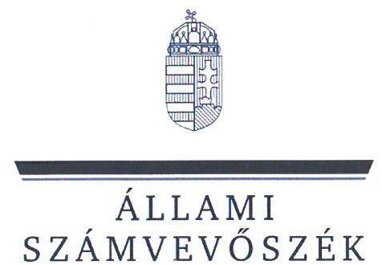
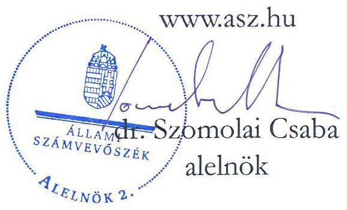
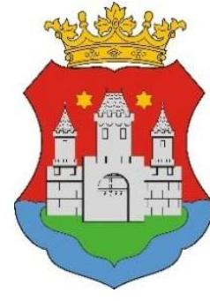
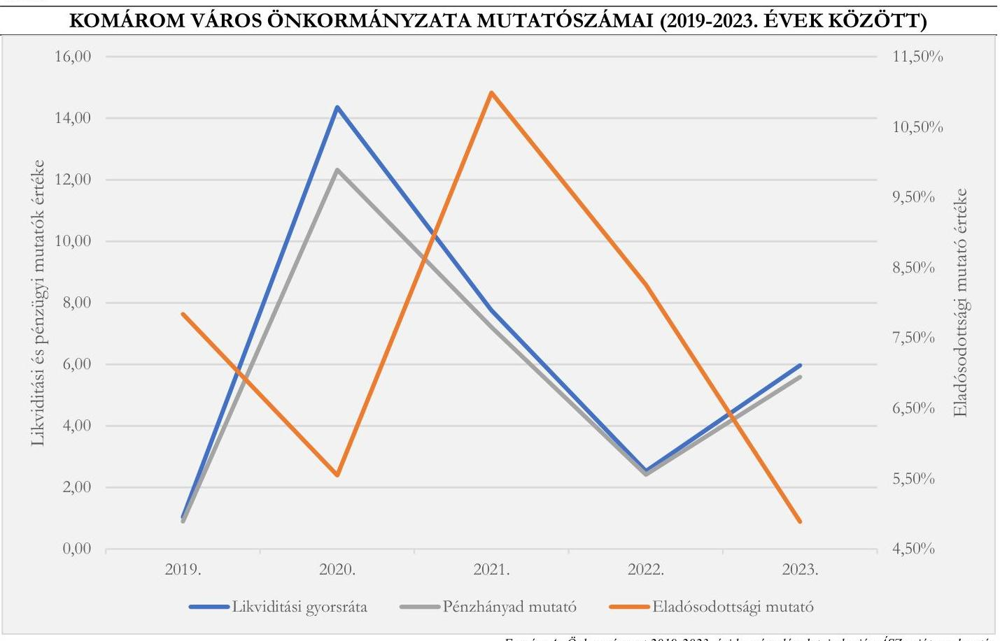
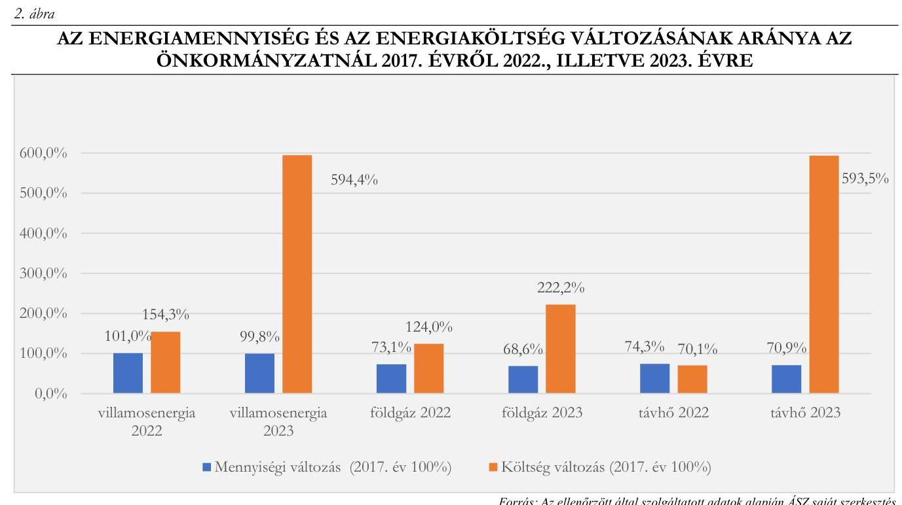
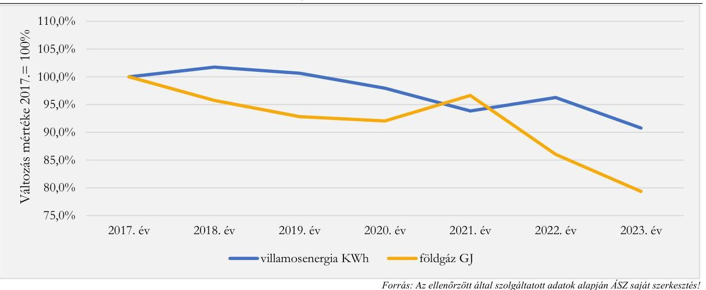
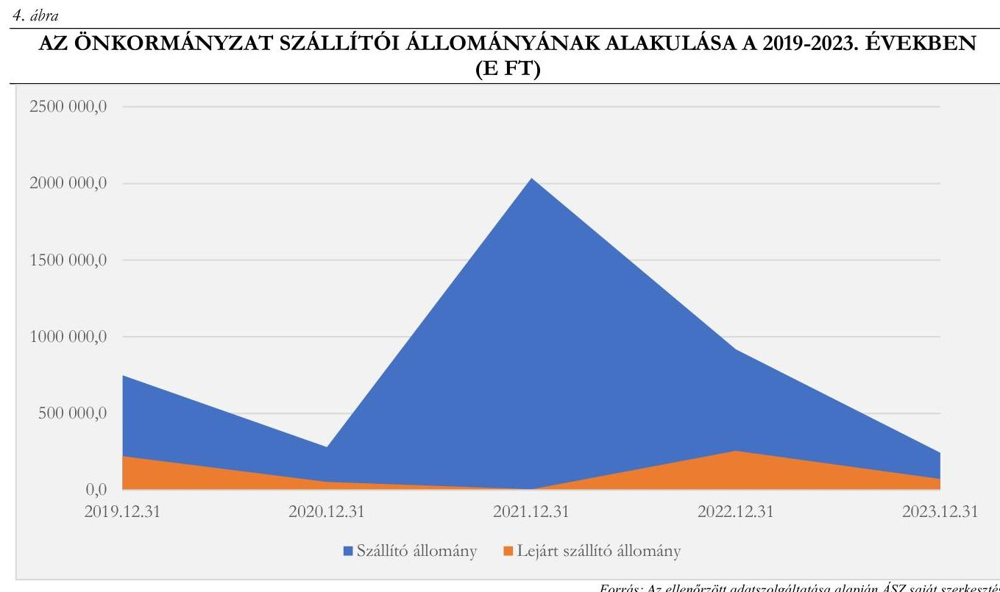
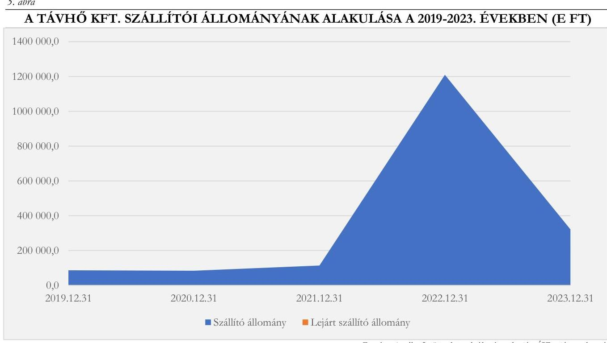

# JELENTÉS 

## Az önkormányzatok energiahatékonysági intézkedéseinek ellenőrzése

## Komárom Város Önkormányzata

2024.

---

ÁLLAMI
SZÁMVEVŐSZÉK

# JELENTÉS 

## Az önkormányzatok energiahatékonysági intézkedéseinek ellenőrzése

Komárom Város Önkormányzata

2024.

24162

---

# ELLENŐRZÉSI IGAZGATÓSÁG: 

## ÁLLAMHÁZTARTÁS HELYI SZINTJÉT ELLENŐRZŐ IGAZGATÓSÁG

## ELLENŐRZÉSI IGAZGATÓ:

DR. BAFFIA GERGELY GÁBOR igazgató

## ELLENŐRZÉSVEZETŐ:

Jelentéseink az interneten a www.asz.hu címen olvashatók.

HUDÁK MAGDOLNA ellenőrzésvezető

IKTATÓSZÁM: EL-4091-007/2024.
TÉMASZÁM: 2676
ELLENŐRZÉS-AZONOSÍTÓ SZÁM: V102007

---

# TARTALOMJEGYZÉK 

AZ ELLENŐRZÉS ALAPADATAI ..... 5
AZ ELLENŐRZÖTT SZERVEZET ..... 7
ÖSSZEFOGLALÁS ..... 9
AZ ELLENŐRZÉS FÓKUSZTERÜLETEI ..... 12
MEGÁLLAPÍTÁSOK ..... 13
JAVASLATOK ..... 29
MELLÉKLETEK ..... 31
I. sz. melléklet: Értelmező szótár ..... 31
II. sz. melléklet: Az ellenőrzött szervezetek jegyzéke ..... 35
III. sz. melléklet: Ellenőrzési kritériumok ..... 36
IV. sz. melléklet: Az Önkormányzat közfeladatellátásban érintett épületeivel és energiahatékonysági intézkedéseivel kapcsolatos tájékoztató adatok ..... 38
FÜGGELÉK: ÉSZREVÉTELEK ..... 48
RÖVIDÍTÉSEK JEGYZÉKE ..... 49

---

.

---

# AZ ELLENŐRZÉS ALAPADATAI 

## AZ ELLENŐRZÉS CÉLJA

Az ellenőrzés célja annak vizsgálata volt, hogy az Önkormányzat ${ }^{1}$ értékelte-e az energiaárak változásának a költségvetése végrehajtására, a gazdálkodására, valamint a kötelező és önként vállalt feladatainak ellátására gyakorolt hatását. Az ellenőrzés kiterjedt arra, hogy az Önkormányzat és a költségvetési szervei az energiaköltségek csökkentése érdekében tettek-e energiahatékonysági intézkedéseket, továbbá az Önkormányzat által tett intézkedések hozzájárultak-e a költségvetés pénzügyi egyensúlyának, a kötelező feladatok ellátásának a biztosításához.

## AZ ELLENŐRZÉS TÍPUSA

Kombinált ellenőrzés

## AZ ELLENŐRZÖTT IDŐSZAK

A 2022. év és a 2023. év.
A 3. fókuszterületnél a megkezdett és lebonyolított beruházások tekintetében a 2017-2023. évek, továbbá a 4. fókuszterületnél a pénzügyi egyensúly alakulása tekintetében a 2019-2023. évek.

## AZ ELLENŐRZÉS TÁRGYA

Az ellenőrzés tárgyát képezte az Önkormányzat és költségvetési szervei gazdálkodásának biztonsága és a kötelező feladatok ellátása érdekében - az energiaárak 2022. évi változásának ellensúlyozására - tett energiahatékonyságot növelő, energiamegtakarítást célzó, a pénzügyi egyensúly fenntartására tett intézkedések megfelelőségének és eredményességének értékelése a 2022-2023. években.

Elemzési módszerrel a 2017-2023. években végrehajtott energiahatékonysági beruházások, fejlesztések, szakpolitikai intézkedésekben való részvétel értékelését végezte az ÁSZ a tekintetben, hogy azok megelőző intézkedést jelentettek-e, illetve befolyásolták-e az energiaköltségek csökkentése érdekében a 2022-2023. években megtett intézkedéseket.

Az ellenőrzés kiterjedt az önkormányzati tulajdonban lévő, az Önkormányzat energiagazdálkodási feladataiban érintett Távhő Kft. ${ }^{2}$-re is.

## AZ ELLENŐRZÉS JOGALAPJA

Az ellenőrzés jogszabályi alapját az ÁSZ tv. ${ }^{3}$ 5. § (2) bekezdés előírásai képezték.

---

# AZ ELLENŐRZÉS MÓDSZERE 

Az ellenőrzést az Alaptörvény ${ }^{4}$ 43. cikk (1) bekezdésében meghatározott törvényességi, célszerűségi és eredményességi szempontok, valamint a nemzetközi standardokat irányadónak tekintve az ellenőrzési program szempontjai, az ellenőrzött időszakban hatályos jogszabályok, az ellenőrzés szakmai szabályok és módszertanok figyelembevételével végezte az ÁSZ ${ }^{5}$.

Az ellenőrzési kérdések megválaszolásához szükséges bizonyítékok megszerzése az ellenőrzött szervezet által rendelkezésre bocsátott dokumentumokra és adatokra, valamint az ellenőrzést támogató szervezetektől ${ }^{6}$ kapott adatokra alapozva, továbbá megfigyelés, szemle (szemrevételezés), kérdésfeltevés (információkérés), valamint elemző eljárás útján történt.

Az ellenőrzés során bizonyítékként felhasználható adatforrások közé tartoztak egyrészt az ellenőrzéshez kért dokumentumok, adatforrások, másrészt adatforrás volt még minden, az Elektronikus Közbeszerzési rendszerből és az Önkormányzati rendelettárból származó dokumentum.

Az ellenőrzés lefolytatásához az ellenőrzött szervezet a tanúsítványok kitöltésével, valamint az ÁSZ által kért dokumentumok, adatok, információk megküldésével és a helyszíni ellenőrzés során szolgáltatott adatokat. Az ÁSZ adatot kért a BM${ }^{7}$-től, a PM${ }^{8}$-től, az EM${ }^{9}$-től, a HM${ }^{10}$-től és a ME${ }^{11}$-től mint ellenőrzést támogató szervezetektől az energiaáremelkedéssel kapcsolatos intézkedések keretében nyújtott állami támogatásokról, továbbá az EMIT${ }^{12}$-ek teljesítésére vonatkozóan a MEKH${ }^{13}$-től, amely szervezet az Energetikusi Hálózaton keresztül támogatta a közintézmények Ehat. tv. ${ }^{14}$-ben foglalt adatszolgáltatási kötelezettségeinek teljesítését.

Az ellenőrzés során a közvilágítási, valamint egy jelentős összegű intézményi energiahatékonyság növelését célzó beruházás előkészítése, megvalósítása, elszámolása, nyilvántartása tételes ellenőrzésre került.

Tanúsítványon szolgáltatott adatok alapján elemzési módszerrel értékeltük, hogy a 2017-2023. között végrehajtott (indított, illetve befejezett) energiahatékonyságot növelő, energiamegtakarítást célzó beruházások mennyiben befolyásolták, milyen hatással voltak a rendkívüli energiaár növekedések következtében a 2022. és 2023. években megtett intézkedésekre.

A tanúsítványokon szolgáltatott adatok, az Önkormányzat által rendelkezésre bocsátott dokumentumok alapján értékeltük, hogy a meghozott takarékossági intézkedések hogyan érintették az Önkormányzat kötelező, illetve önként vállalt feladatainak ellátását, öt mutatószám (likviditási gyorsráta, likviditási gyorsráta változása, eladósodottsági mutató, lejárt szállítói állomány változása, pénzhányad mutató alakulása) segítségével értékeltük az Önkormányzatnál a pénzügyi egyensúly alakulását.

Az ellenőrzés kiterjedt minden olyan körülményre és adatra, amely az ÁSZ jogszabályban meghatározott feladatainak teljesítéséhez, valamint a program végrehajtása folyamán felmerült újabb összefüggések feltárásához szükséges volt.

---

# AZ ELLENŐRZÖTT SZERVEZET 

Komárom város Komárom-Esztergom vármegyében, a Kisalföld keleti szélén, a Komáromi járásban található. Lakónépessége a KSH${ }^{15}$ adata szerint 19652 fő volt 2023. január 1-jén.

A város polgármestere ${ }^{16}$ 2010. év óta látta el tisztségét, a Képviselő-testületnek ${ }^{17}$ a polgármesteren kívül 11 fő képviselő tagja volt. Az Önkormányzat működésével kapcsolatos feladatokat a Komáromi Polgármesteri Hivatal látta el. A Hivatal ${ }^{18}$ engedélyezett létszáma a 2022. évben 96 fő, a 2023. évben 88 fő volt, a jegyző ${ }^{19}$ 2013. február 1-től töltötte be tisztségét.

Az Önkormányzat - a Hivatal mellett - bölcsődei, óvodai, könyvtári és kulturális, múzeumi, szociális, humán szolgáltatási feladatokat ellátó intézményeket, összesen 13 költségvetési szervet irányított. Az Önkormányzat kizárólagos, illetve többségi tulajdonában hat - távhőszolgáltatást, város- és intézményüzemeltetést, sportlétesítményeket üzemeltető, turisztikai, kulturális, valamint városi televízió szolgáltatást végző - gazdasági társaság volt. A gazdasági társaságok közül a Városgazda NKft. ${ }^{20}$ feladata a városüzemeltetési feladatok ellátása, az önkormányzati épületek és építmények üzemeltetése, valamint a kulturális feladatok ellátása volt, a Távhő Kft. biztosította az önkormányzat és költségvetési szervei számára a távhő és melegvíz szolgáltatást.

Az Önkormányzat 2022. és 2023. évi konszolidált beszámolójának főbb adatait az 1. táblázat mutatja be. 1. táblázat

AZ ÖNKORMÁNYZAT 2022. ÉS 2023. ÉVI KONSZOLIDÁLT BESZÁMOLÓJÁNAK FŐBB ADATAI (M FT)

| MÉGNEVEZÉS | 2022. ÉVI   KONSZOLIDÁLT BESZÁMOLÓ | 2023. ÉVI   KONSZOLIDÁLT BESZÁMOLÓ |
| :--: | :--: | :--: |
| Költségvetési bevétel | 11455,6 | 13394,9 |
| Ebből: Múködési célú támogatások államháztartáson belülről | 2696,9 | 2749,2 |
| Felhalmozási célú támogatások államháztartáson belülről | 971,3 | 1037,9 |
| Közhatalmi bevételek | 4416,9 | 7798,7 |
| Ebből: iparűzési adó | 3774,3 | 7127,9 |
| Költségvetési kiadás | 18010,8 | 12997,5 |
| Ebből: Dologi kiadások | 3973,5 | 3048,5 |
| Ebből: közüzemi díjak | 137,9 | 529,3 |
| Beruházások | 6971,7 | 1527,9 |
| Ebből: ingatlanok beszerzése | 6762,3 | 1296,8 |
| Felújítások | 338,9 | 151,2 |
| Ebből: ingatlanok felújítása | 269,6 | 119,1 |
| Finanszírozási bevételek | 13 246,3 | 6340,8 |
| Ebből: Hitel, kölcsönfelvétel | 3881,2 | 3391,4 |
| Maradvány igénybevétele | 9114,1 | 2431,4 |
| Államháztartáson belüli megelőlegezések | 251,0 | 517,9 |
| Finanszírozási kiadások | 4259,6 | 4225,5 |
| Ebből: Hitel- kölcsöntörlesztés | 4016,4 | 3711,7 |
| Államháztartáson belüli megelőlegezések | 243,2 | 513,8 |

---

Az Önkormányzat az energiahatékonysági és megújuló energetikai fejlesztések támogatására létrejött Virtuális Erőmú program ${ }^{21}$ keretében 2019-ben az „Energiahatékony Önkormányzat" díjban, a 2021. évben „Energiatudatos és Energiahatékony Önkormányzat" díjban részesült. A Képviselő-testület a 2021. évben elfogadta Komárom város Klímastratégiáját, amelyben ágazati bontásban és energiahordozóként bemutatták az ÜHG ${ }^{22}$ kibocsátást, a város energiafogyasztását, a klímastratégia célrendszerét, a megvalósítás pénzügyi és intézményei kereteinek és nyomonkövetési rendszerének kialakításával kapcsolatos feladatokat.

---

# ÖSSZEFOGLALÁS 

Az energiaárak 2022. évben bekövetkezett jelentős emelkedése, a források korlátozott rendelkezésre állása új fókuszba helyezte az önkormányzatoknál az energiagazdálkodás kérdését. Az energia változatlan mennyiségben történő felhasználása a magas költségkitettség miatt jelentős kockázatokat eredményezett az önkormányzatok pénzügyi-gazdasági egyensúlyára, valamint a közfeladatok ellátásának biztonságára. Az energiaárak emelkedéséből eredő kockázatok önkormányzati kezelésének támogatása érdekében kormányzati intézkedések történtek. Az európai uniós irányelveken alapuló energiahatékonyságról szóló törvény a települési önkormányzatok, mint a közfeladat ellátását szolgáló épületek tulajdonosai, használói, valamint az üzemeltetésért és fenntartásért felelős szervezetek vezetői számára több energiahatékonysági feladatot is meghatározott. Az ellenőrzés rávilágított az Önkormányzat törvényben foglalt energiagazdálkodással kapcsolatos feladatai ellátásának megfelelőségére, az energiagazdálkodási feladatok és a pénzügyi-gazdálkodási feladatok közötti összefüggésekre.

Az Önkormányzat a 2022. és a 2023. évben az energiaáremelkedésből eredő problémákat eredményesen kezelte, intézkedéseivel, energiahatékonyságot növelő beruházásaival hozzájárult az Önkormányzat működőképességének, pénzügyi egyensúlyának fenntartásához, kötelező feladatainak ellátásához. A közfeladatok ellátását szolgáló épületekkel kapcsolatos jogszabályi előírások teljesítésével kapcsolatban hiányosságokat tárt fel az ellenőrzés.

Az Önkormányzat és a költségvetési szervek vezetőinek az Önkormányzat tulajdonában, illetve használatában álló, közfeladat ellátását szolgáló épületekkel kapcsolatos energetikai üzemeltetési és fenntartási feladatellátása nem felelt meg teljeskörűen a jogszabályi előírásoknak, mivel 2023-ban az Önkormányzat és költségvetési szervei által használt épületállomány 24,0%-ára (hat épületre) nem álltak rendelkezésre EMIT-ek, valamint az elkészült EMIT-ek nem feleltek meg a MEKH által kiadott mintának. A középületekre elkészült energetikai tanúsítványokat nem töltötték fel a Nemzeti Energetikusi Hálózat által üzemeltetett online felületre. Az Önkormányzat és a költségvetési szervek vezetői a havi energiaadatszolgáltatási és éves beszámolási kötelezettségüknek nem tettek eleget, az Önkormányzatnál az energetikusi feladatokat ellátó személyek megbízási szerződésében, illetve munkaköri leírásában nem rögzítették az Ehat. tv.-ből eredő konkrét feladatokat.

A Képviselő-testület az Önkormányzat és költségvetési szervei energiaköltségeinek csökkentése, a pénzügyi egyensúly fenntartása érdekében menedzsmenttervről, bevételnövelő és kiadáscsökkentő intézkedésekről döntött a villamosenergia, a földgázfogyasztás, a távhőfelhasználás terén. A 2022. és 2023. évben a bevételnövelő intézkedések költségvetési hatása 592,1 M Ft, a kiadást csökkentő intézkedések költségvetési hatása 3891,9 M Ft volt.

A 2022. évben a villamosenergia, valamint a földgáz ellátás érdekében az Önkormányzat és költségvetési szervei éltek a végsőmenedékes státusz lehetőségével. A fixált áras árképzésű villamosenergia, illetve földgáz beszerzés lehetőségével - tekintettel a központosított közbeszerzés keretében megkötött szerződéseikre - nem éltek.

Az Önkormányzat pénzügyi helyzete stabil, likviditása biztosított volt, amelyet főbb pénzügyi mutatóinak alakulása is alátámasztott. A 2019-2023. évek között az eladósodottsági mutató értéke kedvezően, a referencia tartományban alakult a korábbi években felvett fejlesztési célú hitelállomány csökkenése, valamint helyi iparűzési adó bevétel emelkedése következtében. A pénzhányad mutató és a likviditási mutató értéke a 2021-2022. években jelentősen romlott, amely összefüggésben volt az energiaáremelkedésből eredő inflációs

---

hatással is, azonban a 2023. évre javuló tendenciát mutatott az Önkormányzat által megtett intézkedések eredményeképpen. Az Önkormányzat pénzügyi mutatóinak alakulását az 1. ábra mutatja be.
1. ábra

A Képviselő-testület a 2017-2022. években 15, összesen 5872,0 M Ft tervezett bekerülési költségű hőszigetelésre, nyílászáró cserére, napelemes rendszerek telepítésére, közvilágítás korszerűsítésre irányuló, energetikai megtakarítást célzó elemeket is tartalmazó fejlesztésről döntött. A fejlesztéseket 53,1%-ban hazai és uniós forrásból, 4,6%-ban önkormányzati saját forrásból, valamint - a Stabilitási tv. ${ }^{23}$ előírásait betartva -42,3%-ban fejlesztési célú hitelből valósították meg. 2023. december 31-én 1219,6 M Ft értékben négy energetikai célú fejlesztés, valamint egy közvilágítás korszerűsítés projekt volt folyamatban. Az Önkormányzat által végrehajtott energiahatékonyságot növelő, energiamegtakarítást
 célzó fejlesztésekkel kapcsolatos döntések előkészítése vonatkozásában a jogszabályi előírások ellenére nem építettek ki a szervezeti célok elérését veszélyeztető kockázatok csökkentésére irányuló kontrollokat a döntések célszerűségi, gazdaságossági, hatékonysági és eredményességi szempontú megalapozottsága érdekében. Nem vizsgálták a létrejövő épületek, tárgyi eszközök, berendezések üzemeltetésével, működtetésével, karbantartásával kapcsolatos várható kiadásokat, és a 2022. és 2023. évi közvilágítás korszerűsítés kivételével a fejlesztésektől elvárt eredményeket nem számszerűsítették. Az Önkormányzatnál a 2017. évről 2023. évre a gázfogyasztás 31,4 %-kal, a távhő fogyasztás 29,1 %-kal csökkent, amelyhez a végrehajtott energiahatékonysági beruházások is hozzájárultak. A villamosenergia fogyasztás a 2022. évben üzembe helyezett létesítmények következtében a korábbi évekkel azonos szinten maradt.

Az ellenőrzésre kiválasztott a Jókai Mór Gimnázium energetikai korszerűsítése tárgyú bruttó 397,2 M Ft összköltségű fejlesztés, valamint a közvilágítás korszerűsítés 52,4 M Ft összegű 2023. évi ütemének előkészítése, megvalósítása és pénzügyi elszámolása során az Önkormányzat betartotta a jogszabályok, valamint a belső

---

szabályzatának előírásait. A Jókai Mór Gimnázium ${ }^{24}$ épületét érintő felújítás számviteli elszámolása nem felelt meg a jogszabályi előírásoknak, mivel az épület felújítására fordított összeget a vagyonkezelésbe adott eszközök nyilvántartási számlája helyett az Önkormányzat tárgyi eszközei között mutatták ki.

Az Önkormányzat az ingatlanok esetében a jogszabályi előírások és a belső szabályozás ellenére mennyiségi felvétellel történő leltározást a 2022-2023. években, és a polgármester és a jegyző közös nyilatkozata szerint azt megelőzően sem hajtott végre, azonban az ingatlanvagyon egyeztetéssel történő leltározásával a beszámoló adatainak alátámasztottsága biztosított volt. Az ellenőrzött időszakban két intézmény energiafogyasztási kiadásait a jogszabályi előírások ellenére nem a felmerülésük helye szerint mutatták ki, ezzel nem gondoskodtak arról, hogy a közüzemi díjak azon költségvetési szerveknél jelenjenek meg, ahol az energiafelhasználás ténylegesen megtörtént.

A Városgazda Nkft. folyószámlahitel igénybevétele során a polgármester a Képviselő-testület jóváhagyása, valamint a Kormány előzetes engedélye hiányában vállalt kezességet, amely azonban az Önkormányzat pénzügyi helyzetét az ellenőrzött időszakban nem befolyásolta.

Az Önkormányzat belső ellenőrzése a 2022. évben nem végzett energiahatékonysággal kapcsolatos ellenőrzést. A 2023. évben, az energiaköltségek előirányzatainak tervezése témában a Hivatalnál lefolytatott belső ellenőrzésről készített jelentés megállapításai összhangban voltak az ÁSZ megállapításaival.

A Távhő Kft. az Ehat.tv. előírásait betartva honlapján közzétette a 2022. évi összefoglaló éves jelentést. A Távhő Kft. a 2017-2023. évek között 136,5 M Ft értékben hajtott végre energetikai megtakarítást is célzó fejlesztést. A fejlesztések, valamint az Önkormányzat és költségvetési szervei által megtett intézkedések eredményeként a távhő előállításához szükséges villamosenergia és földgáz felhasználás csökkent. Az energiaárak emelkedését a Távhő Kft. kezelni tudta, lejárt szállítói állománnyal nem rendelkezett, köszönhetően a távhődíj kompenzálása címén kapott állami támogatásnak és a takarékossági intézkedéseknek.

Az ÁSZ az ellenőrzés során feltárt hiányosságok felszámolása, a szabályszerű működés feltételeinek megteremtése érdekében a polgármesternek hat, a jegyzőnek öt javaslatot tett.

---

# AZ ELLENŐRZÉS FÓKUSZTERÜLETEI 

1.     - Az Önkormányzat és költségvetési szervei tulajdonában, illetve használatában álló, közfeladat ellátását szolgáló épületekkel kapcsolatos energetikai üzemeltetési és fenntartási feladatellátás
2.     - Az energiaárak változására tekintettel a gazdálkodás biztonsága érdekében a központi intézkedések adta lehetőségek Önkormányzat általi hasznosítása
3.     - Az energiaköltségek csökkentése, az energiahatékonyság növelése érdekében kezdeményezett, illetve folyamatban lévő energetikai beruházások értékelése
4.     - Az energiaárak hatásának kezelésére, a kötelező feladatok ellátására, a pénzügyi egyensúly fenntartására tett intézkedések értékelése

---

# MEGÁLLAPÍTÁSOK 

## 1. Az Önkormányzat és költségvetési szervei tulajdonában, illetve használatában álló, közfeladat ellátását szolgáló épületekkel kapcsolatos energetikai üzemeltetési és fenntartási feladatellátás

Összegző megállapítás Az Önkormányzat és a költségvetési szervei vezetői a közfeladat ellátást szolgáló, az Önkormányzat tulajdonában, illetve használatában álló épületekkel kapcsolatos energetikai üzemeltetési és fenntartási feladatainak ellátása nem felelt meg teljeskörűen az Ehat. tv. és az Mötv. ${ }^{25}$ előírásainak.

Az Önkormányzat tulajdonában álló 56 közfeladatellátásban érintett épületből 25 volt az Önkormányzat és költségvetési szervei használatában.
Az ellenőrzött időszakban az Önkormányzat és költségvetési szerveinek vezetői a közfeladat ellátást szolgáló épületek, épületrészek esetében nem tettek teljeskörűen eleget az Ehat. tv. 11/A. § előírásainak.

- Az Ehat. tv. 11/A. § a) pontjának előírása ellenére az Önkormányzat és költségvetési szervei használatában lévő 25 épületből hat épületre (Hivatal egy épülete ${ }^{26}$, öt orvosi rendelő ${ }^{27}$ ) nem készítettek EMIT-et, továbbá az elkészített EMIT-ek tartalma nem felelt meg teljeskörűen a MEKH által kiadott mintának. Hiányoztak az előírt mellékletek, így az épületenergetikai tanúsítvány másolata, az egyéb veszteségfeltárások, fotódokumentációk, valamint a tervezett szemléletformáló akciók dokumentumai.
- Az Ehat. tv. 11/A. § b) pontjában előírt (tárgyévet követő év március 31-i) határidőn túl, közel egy éves késedelemmel, 2024. március 20-án töltötték fel a 2022. évi EMIT-ek teljesítéséről készített éves jelentést a Nemzeti Energetikusi Hálózat által üzemeltetett online felületre.
- Az Ehat. tv. 11/A. § c) pontjának, valamint a 122/2015. (V. 26.) Korm. rendelet ${ }^{28}$ 7/F. § előírásának ellenére egyetlen esetben sem jelentették be az épületekre, illetve épületrészekre vonatkozó havi energiafogyasztási adatokat.
- Az Önkormányzat 20 épület esetében rendelkezett energetikai tanúsítvánnyal, azonban azokat az Ehat. tv. 11/A. § f) pontja előírása ellenére nem töltötték fel a Nemzeti Energetikusi Hálózat által üzemeltetett online felületre.
- Az Ehat. tv. 11/A. § i) pontjában foglaltak ellenére az épületekkel kapcsolatos energiahatékonysági feladatok közvetlen ellátása és a Nemzeti Energetikusi Hálózattal történő kapcsolattartás céljából az Önkormányzatnál nem jelöltek ki energetikai felelőst. Az Önkormányzat által megbízási szerződéssel foglalkoztatott energetikus feladata volt a közműszolgáltatókkal való kapcsolattartás, a szolgáltatási számlák szakmai ellenőrzése, közművekkel (villamosenergia, földgáz, víz és csatorna) kapcsolatos információs rendszerek kialakítása a fogyasztási pontoknál, fejlesztésekhez kapcsolódó szakmai támogatás, közreműködés A Hivatal állományában lévő energetikai ügyintéző feladata volt többek között az intézmények energiafogyasztásának ellenőrzése, a fogyasztási adatok összegyűjtése, kiértékelése, villamos hálózat, közvilágítás fejlesztésével kapcsolatos eljárások előkészítése. Sem az energetikus, sem a Hivatal állományában lévő energetikai ügyintéző munkaköri leírása nem rendelkezett az Ehat. tv.-hez kapcsolódóan ellátandó konkrét feladatokról, így az EMIT, valamint az éves és a

---

havi jelentés készítési kötelezettségről sem. Az energetikus külön megbízás és megrendelés alapján készítette el a 2022. évben az EMIT-eket, a 2023. évben a még hiányzó EMIT-ek elkészítése nem történt meg.
Az Önkormányzat tulajdonában lévő épületek számát, az EMIT-ek, valamint az energetikai tanúsítványok számának alakulását a 2. táblázat szemlélteti.
2. táblázat

A KÖZFELADATELLÁTÁSBAN ÉRINTETT ÉPÜLETEKRE AZ EHAT. TV. ALAPJÁN A 2022-2023. ÉVEKBEN ELKÉSZÍTETT DOKUMENTUMOK

| KÖZFELADAT ELLÁTÁSÁBAN ÉRINTETT   SZERVEZETCSOPORT MEGNEVEZÉSE | KÖZFELADAT   ELLÁTÁSBAN   ÉRINTETT   ÉPÜLETEK   SZÁMA | ÉPÜLETEKRE   ELKÉSZÍTETT 2022. ÉS   2023. ÉVBEN MEGLÉVŐ   EMIT-EK |  | ÉPÜLETEKRE   ELKÉSZÍTETT 2022. ÉS   2023. ÉVBEN MEGLÉVŐ   ENERGETIKAI   TANÚSÍTVÁNYOK |  |
| :--: | :--: | :--: | :--: | :--: | :--: |
|  | DB | SZÁMA   (DB) | ARÁNYA \% | SZÁMA   (DB) | ARÁNYA \% |
| Önkormányzat tulajdonában lévő épületek száma | 56 | 19 | 33,9 % | 26 | 45,4 % |
| Ebből |  |  |  |  |  |
| Önkormányzat használatában | 4 | 3 | 75,0 % | 4 | 100,0 % |
| Polgármesteri Hivatal használatában | 2 | 1 | 50,0 % | 2 | 100,0 % |
| Intézmények használatában | 19 | 15 | 78,9 % | 14 | 73,7 % |
| Önkormányzat és költségvetési szervei használatában összesen | 25 | 19 | 76,0% | 20 | 80,0% |
| Gazdasági társaságok használatában | 15 | na | na | 5 | 33,3 % |
| Vagyonkezelő szervezetek használatában | 14 | na | na | 1 | 7,1 % |
| Egyéb szervezetek használatában | 2 | na | na | 0 | 0,0 % |

Forrás: ASZ saját szerkesztés az ellenőrzött tanúsítványon szolgáltatott adatai alapján.
Az Önkormányzat tulajdonában álló 56 közfeladatellátásban érintett épületből 31 épület gazdasági társaságok, vagyonkezelő szervezetek és egyéb szervezetek használatában volt:

- A gazdasági társaságok (Városgazda NKft., JU-GO Háziorvosi Kkt., Monostori Erőd Nonprofit Kft.) használatában összesen 15, a vagyonkezelő szervezetek (Tatabányai Szakképzési Centrum, Tatabányai Tankerületi Központ) használatában 14, egyéb szervezetek (Koppánymonostori Kulturális Egyesület, Szőnyi Kulturális Egyesület) használatában kettő közfeladatellátásban érintett épület volt.
- Az ellenőrzött időszakban - az Önkormányzat tulajdonában lévő - Városgazda NKft. az általa üzemeltett 13 közfeladatot ellátó épület esetében nem tett eleget az Ehat. tv. 11/A. $\S$-ában meghatározott EMIT készítési és azok teljesítéséről szóló beszámolási, valamint a havi energiafogyasztással kapcsolatos adatszolgáltatási kötelezettségének.
A Képviselő-testület nem gyakorolta az Mötv. 107. §-ában rögzített tulajdonosi jogát, mivel nem ellenőrizte a közfeladat ellátásban érintett 31 épületet használó szervezetek vezetői Ehat. tv. 11/A. § szerinti feladatainak teljesítését.

---

Az Önkormányzat tulajdonában lévő, energiagazdálkodási feladatokban érintett Távhő Kft. az Ehat. tv. előírásai szerint energetikai szakreferenst foglalkoztatott. A 122/2015. (V. 26.) Korm. rendelet szerint az energetikai szakreferens elkészítette a havi jelentéseket, valamint a 2022. évi éves jelentést határidőben közzétette a Távhő Kft. honlapján.

# 2. Az energiaárak változására tekintettel a gazdálkodás biztonsága érdekében a központi intézkedések adta lehetőségek Önkormányzat általi hasznosítása 

## Összegző megállapítás

Az Önkormányzat az energiaszolgáltatás folyamatosságának biztosítása érdekében élt az energiaárak hatásának mérséklését célzó központi intézkedések adta lehetőségekkel. Két intézmény esetében a közüzemi díjakat nem az energiafelhasználás helyén mutatták ki.

Az energiaárak jelentős emelkedésével párhuzamosan a Kormány ${ }^{29}$ több olyan intézkedést hozott, amelyek célja az energiaválság kezelésének megkönnyítése volt az önkormányzatok és intézményeik számára. A kormányzati intézkedéseket és az azokhoz kapcsolódó, az igénybe vett lehetőségekről megtett önkormányzati nyilatkozatokat a 3. táblázat mutatja be. Az Önkormányzat és költségvetési szervei a végső menedékes jogintézmény keretében biztosított villamosenergia ellátás és földgázellátás lehetőségével éltek.
3. táblázat

A KORMÁNY ÁLTAL BIZTOSÍTOTT LEHETŐSÉGEKHEZ KAPCSOLÓDÓAN 2022-2023. ÉVEKBEN MEGTETT NYILATKOZATOK SZÁMA (DB)

| KORMÁNYZATI INTÉZKEDÉS | ÖNKORMÁNYZAT |  | KÖLTSÉGVEITÉSI   SZERVEK   HIVATALLAL EGYÜTT |  |  |
| :--: | :--: | :--: | :--: | :--: | :--: |
|  | IGEN | NEM | IGEN | NEM | NR |
| Végső menedékes jogintézmény keretében biztosított villamosenergia-ellátás - 217/2022. (VI.17.) Korm. rendelet ${ }^{30} 3 . \S$ | 1 | 0 | 14 | 0 | 0 |
| Végső menedékes jogintézmény keretében biztosított földgázellátás   217/2022. (VI.17.) Korm. rendelet 8. § | 1 | 0 | 12 | 0 | 2 |
| Teljes ellátás alapú veszélyhelyzeti átmeneti villamosenergiaellátás biztosítása 520/2022. (XII. 13.) Korm. rendelet ${ }^{31} 5 . \S$ | 0 | 1 | 0 | 14 | 0 |
| Veszélyhelyzeti átmeneti földgázellátás

 biztosítása 388/2022. (X.14.) Korm. rendelet ${ }^{32} 4 . \S$ | 0 | 1 | 0 | 12 | 2 |
| Fixált áras árképzésű villamosenergia vásárlás 41/2023. (II. 20.) Korm. rendelet ${ }^{33} 2 . \S$ | 0 | 1 | 0 | 14 | 0 |
| Fixált áras árszabású földgáz vásárlás 12/2023. (I. 20.) Korm. rendelet ${ }^{34} 2 . \S$ | 0 | 1 | 0 | 12 | 2 |
| Földgáz-kereskedelmi szerződésben rögzített minimális mennyiség érvényesítése - 354/2022 (IX.19.) Korm. rendelet ${ }^{35} 2 . \S$ | 0 | 1 | 0 | 12 | 2 |

Forrás: Az ellenőrzött szervezet által szolgáltatott adatok alapján ÁSZ saját szerkesztés
A 2023. évre meglévő - központosított közbeszerzési eljárás keretében megkötött - villamosenergia, illetve földgáz szerződéseikre tekintettel az Önkormányzat, és költségvetési szervei nem éltek a fixált áras

---

árképzésű villamosenergia és földgáz vásárlás lehetőségével. A villamosenergia és földgáz beszerzésére irányuló közbeszerzési eljárásokat - az intézmények és gazdasági társaságok (Városgazda NKft., Városmarketing Kft. ${ }^{39}$ ) felhatalmazása alapján - a Kbt. előírásainak megfelelően az Önkormányzat folytatta le.

- A 2022. és 2023. évben a Hivatal és 11 intézmény (Szivárvány Óvoda ${ }^{37}$ „, Kistáltos Óvoda ${ }^{38}$, Gesztenyés Óvoda ${ }^{39}$, Tóparti Óvoda ${ }^{40}$, Napsugár Óvoda ${ }^{41}$, Szőnyi Óvoda ${ }^{42}$, Csillag Óvoda ${ }^{43}$, Bölcsőde ${ }^{44}$, Szociális Intézmény ${ }^{45}$, Múzeum ${ }^{46}$, Egészségügyi Alapellátási Szolgálat ${ }^{47}$ ) valamint két gazdasági társaság (Városgazda NKft., Városmarketing Kft.) hatalmazta fel az Önkormányzatot a villamosenergia beszerzésére irányuló közbeszerzési eljárás lebonyolítására.
- A 2022. évben a Hivatal és kilenc intézmény (Szivárvány Óvoda, Kistáltos Óvoda, Napsugár Óvoda, Szőnyi Óvoda, Csillag Óvoda, Bölcsőde, Szociális Intézmény, Múzeum, Egészségügyi Alapellátási Szolgálat, valamint két gazdasági társaság (Városgazda NKft., Városmarketing Kft.), a 2023. évben nyolc intézmény (Szivárvány Óvoda, Kistáltos Óvoda, Napsugár Óvoda, Szőnyi Óvoda, Csillag Óvoda, Bölcsőde, Szociális Intézmény, Múzeum), valamint a fenti két gazdasági társaság meghatalmazta az Önkormányzatot a földgáz energia beszerzésére irányuló közbeszerzési eljárás lebonyolítására. 2023-ban a Hivatal mérőórája, valamint az Egészségügyi Alapellátási Szolgálat három épületének mérőórái közül kettő az Önkormányzathoz, egy az Országos Mentőszolgálathoz került.
A villamosenergia és földgáz ellátási szerződéseket az Ávr. előírásaival összhangban az Önkormányzat, az intézmények és a gazdasági társaságok vezetői külön-külön kötötték meg.
Az Önkormányzat és költségvetési szervei éltek a földgáz-kereskedelmi szerződésben lekötött földgázmennyiségnél kisebb (75%, majd 2022. december 16-tól 60%) mennyiségű földgáz felhasználására biztosított lehetőséggel, mivel a 2022. évre érvényes szerződésükben lekötött minimális mennyiség nem volt kedvezőbb, mint a jogszabályban rögzített minimális mennyiség.
(A kormányzati intézkedéseket és a megtett nyilatkozatokat a IV. számú melléklet 1. táblázata részletezi.) Az ellenőrzött időszakban a Tám-pont ${ }^{48}$ villamosenergia és földgáz fogyasztásával kapcsolatos kiadásokat az intézmény helyett az Önkormányzatnál, illetve a Könyvtár villamosenergia és földgáz fogyasztásával kapcsolatos kiadásokat a Városgazda Kft.-nél tervezték és számolták el, továbbá a 2023. év második félévétől a Hivatal egy, valamint az Egészségügyi Alapellátási Szolgálat két telephelyének földgáz fogyasztása esetében az Önkormányzat volt a szerződő és számlafizető fél. Ezzel az Önkormányzat megsértette az Áht. ${ }^{49} 6 . \S$ (1) bekezdésének előírását, amely szerint a tervezés, gazdálkodás és beszámolás során a bevételeket és kiadásokat kormányzati funkciók szerinti funkcionális osztályozás szerint kell bemutatni. Ez a gyakorlat a költségvetési szerveket nem ösztönözte a takarékos energiafelhasználásra, mivel a kifizetések fedezetét nem nekik kellett kigazdálkodni. Ennek költségvetési hatása az energiahatékonysági fejlesztések és energiamegtakarító intézkedések miatt nem volt kimutatható.
Az Önkormányzat a 2021-2023. években három ütemben, saját forrásból összesen 128 586,9 E Ft értékben döntött a közvilágítás korszerűsítéséről. A közvilágítás korszerűsítéséhez szükséges forrást a Képviselő-testület az éves költségvetési rendeleteiben megtervezte. A 2022. évi korszerűsítés eredményeként évi 14 030,8 E Ft, a 2023. évben indított korszerűsítés eredményeként évi 12 270,0 E Ft megtakarítással számoltak.
A Képviselő-testület a 449/2022. (XI. 9.) Korm. rendelet ${ }^{50}$-ben szereplő a rendeletalkotás lehetőségével nem élt, nem döntött a közvilágítás korlátozásáról.

---

# 3. Az energiaköltségek csökkentése, az energiahatékonyság növelése érdekében kezdeményezett, illetve folyamatban lévő energetikai beruházások értékelése 

Összegző megállapítás Az Önkormányzatnál végrehajtott fejlesztések támogatták az energiaárak emelkedésének kompenzálására tett intézkedések teljesülését, azonban a jegyző a Bkr. ${ }^{51}$-ben foglaltak ellenére nem építette ki a szervezeti célok elérését veszélyeztető kockázatok csökkentésére irányuló kontrollokat a beruházási döntések megalapozottsága érdekében.

Az Önkormányzat a 2017. év és 2023. év között 12 épületet, valamint a közvilágítás korszerűsítést érintően 15 energiahatékonyság növelést, energiamegtakarítást célzó fejlesztést tervezett megvalósítani 5871 970,9 E Ft összegben, melyek főbb adatait a 4. táblázat mutatja be.
4. táblázat

AZ ÖNKORMÁNYZATNÁL A 2017-2023. ÉVEKBEN INDÍTOTT, FOLYAMATBAN LÉVŐ, ILLETVE BEFEJEZETT ENERGIAHATÉKONYSÁGOT CÉLZŐ FEJLESZTÉSI FELADATOK FÖBB ADATAI (E FT)

| MEGNEVEZÉS | DB | TERVEZETT FEJLESZTÉSI   ELADÁS | PÁLYÁZATI   FORRÁS | EBBŐL   FEJLESZTÉSI   HITEL | SAJÁT   FORRÁS | 2023. 12.   31-ÉN   TELEJESÜLT   FEJLESZTÉSI   ELADÁS | PÁLYÁZATI FORRÁS | FEJLESZTÉSI   HITEL | SAJÁT   FORRÁS |
| :--: | :--: | :--: | :--: | :--: | :--: | :--: | :--: | :--: | :--: |
| 2017-2023. években tervezett és befejezett fejlesztési feladatok |  |  |  |  |  |  |  |  |  |
| Megvalósított fejlesztések | 10 | 4652357,90 | 2469 934,0 | 1966779,0 | 215644,9 | 4652 357,9 | 2469 934,0 | 1966 779,0 | 215644,9 |
| 2023. december 31-én folyamatban lévő fejlesztési feladat |  |  |  |  |  |  |  |  |  |
| Megvalósítás alatt lévő projekt | 5 | 1219613,0 | 1167 224,0 |  | 52389,0 | 14975,0 | 14975,0 |  |  |
| Mindösszesen | 15 | 5871 970,9 | 3637 158,0 | 1966 779,0 | 268 033,9 | 4667 332,9 | 2484 909,0 | 1966 779,0 | 215644,9 |

(Az energetikai célú beruházások, fejlesztések adatait a IV. számú melléklet 2. táblázata tartalmazza.)
A Képviselő-testület az SZMSZ ${ }^{52}$ előírásaival összhangban a Pénzügyi Bizottság ${ }^{53}$ előzetes véleményezését követően megtárgyalta és elfogadta a pályázati programok tartalmát, egyetértett a pályázati célok megvalósításával. Az energetikai megtakarítást célzó elemeket is tartalmazó fejlesztések forrásait az Áht. és az Ávr. ${ }^{54}$ előírásainak megfelelően az éves költségvetésben megtervezték, amelynek elfogadása során az SZMSZ előírásai szerint a Képviselő-testület figyelemmel volt a Pénzügyi bizottság véleményére is. A beruházások állásáról a polgármester tájékoztatta a Képviselő-testületet.
A beruházási célú fejlesztésekre vonatkozó döntések meghozatala során a Képviselő-testület figyelemmel volt az Önkormányzat teherbíró képességére, pályázati lehetőségekkel is éltek. Az energetikai megtakarítást célzó elemeket is tartalmazó fejlesztések 47,2%-ban európai uniós, 5,9%-ban hazai

---

támogatásból, 42,3%-ban fejlesztési hitelből és 4,6%-ban az Önkormányzat saját forrásaiból valósultak meg. A hitelek és járulékos költségeik fizetése nem okozott pénzügyi nehézséget az Önkormányzat számára.

- Az Önkormányzat 2018-tól kezdődően 2023. december 31-ig három hitelszerződéssel összesen 2858 116,5 E Ft fejlesztési célú hitelt vett igénybe, amelyből 1966 779,0 E Ft energetikai megtakarítást célzó elemeket is tartalmazó fejlesztéshez kapcsolódott. A fejlesztési célú hitelek után 2018-tól az ellenőrzött időszak végéig az Önkormányzat összesen 605 220,8 E Ft kamat kiadást teljesített.
Az energiaracionalizálási döntések előkészítése során a jegyző a döntések célszerűségi, gazdaságossági, hatékonysági és eredményességi szempontú megalapozottsága vonatkozásában a Bkr. 8. § (2) bekezdés a) és b) pontjában foglaltak, valamint az éves költségvetési rendeletek ${ }^{55} 15$. § előírása ellenére nem építette ki a szervezeti célok elérését veszélyeztető kockázatok csökkentésére irányuló kontrollokat, nem vizsgálta a létrejövő ingatlanok, tárgyi eszközök, berendezések (pl. Látogatóközpont ${ }^{56}$, Generációk háza, Inkubátorház, napelemes rendszerek) üzemeltetésével, működtetésével, karbantartásával kapcsolatos várható kiadásokat. Három, európai uniós forrásból megvalósuló, nyílászárók cseréjére, fűtéskorszerűsítésre, napelem rendszerek telepítésére irányuló beruházás kivételével az előterjesztésekben nem mutatta be a fejlesztés elvárt eredményét, illetve a 2022. és 2023. évi közvilágítás korszerűsítés kivételével nem számszerúsítették az elvárt energiamegtakarítást sem.
- A TOP ${ }^{57}$ pályázat keretében végrehajtott energetikai korszerűsítésre vonatkozó támogatási okiratban feltüntették az érintett, Jókai Mór Gimnáziumra vonatkozóan a fejlesztés eredményeként elérni kívánt indikátorok célértékeit. Indikátorokat határoztak meg az üvegházhatású gázok kibocsájtásának, a középületek éves elsődleges energia-fogyasztásának, valamint az energiahatékonysági fejlesztések által elért primer energiafelhasználás csökkentésére. Az Önkormányzat adatszolgáltatása szerint ezek visszamérése a fenntartási időszakban megtörtént, az indikátorok elvárt célértékei teljesültek.
Az energetikai fejlesztésekkel érintett költségvetési szervek villamosenergia-, földgáz-, valamint távhő fogyasztási adatai az önkormányzati épületek energetikai felújítását követő években az érintett intézményekben csökkenést mutattak. Az energiafogyasztás csökkenéséhez az energiahatékonyságot célzó fejlesztéseken kívül hozzájárultak az energiamegtakarító intézkedések (többek között hőfok visszavétele, intézmények korlátozott nyitvatartása, átmeneti bezárása, közigazgatási szünet és otthoni munkavégzés elrendelése) és ezek mellett egyéb tényezők - a 2020-2022. években a COVID járvány miatti, szokásostól eltérő, csökkentett igénybevétel - is.
(Az Önkormányzat által megvalósított energetikai felújítással és korszerűsítéssel érintett intézmények villamosenergia és földgáz felhasználásának mennyiségi adataiban bekövetkezett változást a IV. számú melléklet 3. táblázata mutatja be.)
Az energiafogyasztásban kimutatható csökkenés azonban teljeskörűen nem ellensúlyozta az áremelkedések hatását, a közüzemi költségek emelkedését, amelyet a 2. ábra szemléltet.

---

Az Önkormányzat 2022. évi villamosenergia felhasználása növekedéséhez hozzájárult, hogy ekkor kezdték működtetni a korábbi évek fejlesztéseként kialakított három épületet (Látogatóközpont, Inkubátorház, Generációk háza).
A villamosenergia költségnek a 2022. évhez képest történő 2023. évi közel négyszeres emelkedését az energiaár, valamint a rendszerhasználati díjak emelkedése mellett a 2022. évi közvilágítási költségek 2023. évi számlázása és rendezése okozta. A földgáz költségek mérsékeltebb ütemű 2023. évi emelkedését részben a gáz árának csökkenése, a megtakarítási intézkedések, valamint a rendszerhasználati díjak emelkedése együttesen eredményezte. A Távhő Kft. a távhő előállításhoz szükséges gázenergiát az Önkormányzatnál magasabb - több mint háromszoros - áron tudta beszerezni. A távhő előállításához felhasznált földgáz árának emelkedése a Távhő Kft-nél jelentkezett, amely megemelte a távhő díját, amelynek következtében - a takarékossági intézkedések mellett is - önkormányzati szinten több mint nyolcszorosára emelkedett a távhő költsége a 2023. évben a 2022. évihez képest.

- Az energia költségek jelentős emelkedéséhez hozzájárult, hogy a villamosenergia ára a 2017. évről (13,27 Ft/kWh) 2022. augusztusára nyolcszorosára (106,17 Ft/kWh), 2023. évre tizenháromszorosára (172,30 Ft/kWh), a földgáz ára 2017. évről (3,19 Ft/MJ) 2022. augusztusára több mint négyszeresére (13,17 Ft/MJ), 2023. évi ára a 2017. évhez képest kétszeresére (6,5 Ft/MJ)
 emelkedett. A távhő díja 2022. október 1-től a korábbi összeg ( $3204 \mathrm{Ft} / \mathrm{GJ}$ ) közel tizennyolcszorosára ( $56789 \mathrm{Ft} / \mathrm{GJ}$ ) változott. A közvilágításhoz kapcsolódó villamosenergia ára az általános célú villamosenergia árához hasonló arányban nőtt. A megemelkedett kiadások fedezetét a bevételnövelő és kiadáscsökkentő intézkedések mellett az Önkormányzat saját forrásból, valamint központi támogatásokból biztosította.
(Az energiafogyasztási, valamint energiaköltség adatok alakulását a 2017-2023. évek között a IV. számú melléklet 4. táblázata mutatja be.)
A Távhő Kft. a 2017-2023. évek között 136 456,0 E Ft összegben valósított meg energetikai megtakarítást célzó beruházást, fejlesztést. A 17, energetikai megtakarítást célzó elemet is tartalmazó fejlesztési projekt $53,5 \%$-át ( $72970,0 \mathrm{E} \mathrm{Ft})$ a Távhő Kft. saját forrásból, $24,5 \%$-át ( $33486,0 \mathrm{E} \mathrm{Ft})$ önkormányzati

---

támogatásból, 22,0%-át (30 000,0 E Ft) visszafizetési kötelezettséggel terhelt egyéb forrásból biztosította. A fejlesztések hőközpont korszerűsítésre, szivattyúk, gázkazánok, vezetékek cseréjére, távvezeték átépítésére, hőközpont felügyelet kialakítására irányultak. Az energiamegtakarítást célzó fejlesztések, valamint a megtakarítási intézkedések (többek között kazánok üzemének optimalizálása, hőmérséklet maximalizálása) együttes eredményeként a Távhő Kft. energiafelhasználási adatai a 2017. évhez viszonyítva az ellenőrzött időszakban csökkentek, amelyet a 3. ábra szemléltet.
3. ábra

# A TÁVHŐ KFT. ENERGIAFOGYASZTÁSI ADATAINAK ALAKULÁSA A 2018-2023. ÉVEK KÖZÖTT, 2017. ÉVHEZ KÉPEST 

Forrás: Az ellenőrzött által szolgáltatott adatok alapján ÁSZ saját szerkesztés!
Az ÁSZ tételesen ellenőrizte a TOP-3.2.1-16-KOI-2017-00006 azonosító számú, Komáromi Jókai Mór Gimnázium energetikai korszerűsítés tárgyú fejlesztés, valamint a 2023. évi Közvilágítás korszerűsítés tárgyú fejlesztés előkészítését, megvalósítását és elszámolását.
A Komáromi Jókai Mór Gimnázium bruttó 397 220,0 E Ft összköltségvetésű energetikai fejlesztésének megvalósításáról, a pályázat benyújtásáról, az önerő, saját forrás biztosításáról a Képviselő-testület több ütemben döntött, amelynek során az SZMSZ előírásaival összhangban figyelemmel volt a Pénzügyi bizottság előzetes véleményére. Az építési beruházás kivitelezőjét a Kbt. ${ }^{58}$ előírásait betartva választotta ki a Közbeszerzési Bírálóbizottság, a Kbt. hatálya alá nem tartozó beszerzések (műszaki ellenőri szolgáltatás, közbeszerzői szakértő, nyilvánosság biztosítása) esetében a beszerzési szabályzat; ${ }^{59}$ előírását betartva három ajánlat közül választotta ki a polgármester a nyertes ajánlattevőket. A kivitelezési, valamint a további feladatok elvégzésére irányuló szerződéseket a Kbt. és a beszerzési szabályzat; előírását betartva a legjobb ajánlatot tevőkkel a polgármester, illetve a polgármester által írásban felhatalmazott személy kötötte meg az árajánlatok szerinti összeggel. A gazdasági eseményhez kapcsolódó gazdálkodási jogkörgyakorlás az Áht. előírása és a Gazdálkodási szabályzatban ${ }^{60}$ foglaltak szerint történt, az Ávr.-ben előírtak szerint a jegyző gondoskodott a kötelezettségvállalás nyilvántartásba vételéről, és a kifizetést alátámasztó dokumentumok (számla, teljesítés igazolás) rendelkezésre álltak.
A gazdasági események az Áhsz. ${ }^{61}$ előírása szerint elszámolásra kerültek. A fejlesztés üzembehelyezése és aktiválása a Számv. tv. előírása szerint megtörtént.
Az Áhsz. 10. § (2) bekezdésében foglaltak ellenére a Tatabányai Tankerületi Központ vagyonkezelésében lévő, Komáromi Jókai Mór Gimnázium épületének felújítására fordított összeget, - nettó 296 336,9 E Ft - a felújítás aktiválását (2020. április) követően is az Önkormányzat a tárgyi eszközök között mutatta ki a

---

vagyonkezelésbe adott eszközök nyilvántartási számlája helyett, amelynek következtében az Önkormányzat 2020-2023. évi beszámolója a Számv. tv. ${ }^{62}$ 15. § (3) bekezdés előírását megsértve nem mutatott valós képet a tárgyi eszközök állományáról.
Az Önkormányzatnál a mérlegben kimutatandó eszközök közül a tárgyi eszközöket a 2022. és 2023. években mennyiségi felvétellel leltározták, azonban az ingatlanokat a Számv. tv. 69. § (3) bekezdésének, az Áhsz. 22. § (2) bekezdésének, valamint a Leltározási szabályzat ${ }^{63}$ 5.1 pontjának előírása ellenére háromévenkénti mennyiségi felvétellel végzett leltárral a 2022-2023. években és azt megelőzően sem támasztották alá.
A polgármester és a jegyző együttes nyilatkozata szerint az ingatlanok vonatkozásában mennyiségi leltár felvételére korábban sem került sor, azonban az ingatlanvagyon kataszterben szereplő tételek egyeztetése a Földkönyv ${ }^{64}$ tartalmával megtörtént, a beszámoló adatai az ingatlanok tekintetében ezáltal leltárral alátámasztott voltak.
Az energetikai fejlesztéssel az épület energiahatékonysága javult, az energetikai tanúsítványok adatai szerint az energetikai beruházással érintett intézmény eredeti, átlagost megközelítő (GG) energetikai besorolása korszerű (CC) besorolásúvá vált.
A Közvilágítás korszerűsítés 2023. évi üteméről a Képviselő-testület a 2023. évi költségvetési rendeletének elfogadása során döntött. A szerződést a Beszerzési szabályzat; ${ }^{65}$ előírásait betartva a legjobb ajánlatot tevővel a polgármester kötötte meg. A kötelezettségvállalás, valamint a pénzügyi ellenjegyzés az Áht. előírása szerint az arra jogosultak által történt, az Ávr.-ben előírtak szerint gondoskodtak a kötelezettségvállalás nyilvántartásba vételéről.
A bruttó 52 389,0 E Ft bekerülési költségű beruházás üzembehelyezése az ellenőrzött időszakot követően történt meg a 2024. évben. A gazdasági események elszámolása az Áhsz.-ben foglaltak, a fejlesztés üzembehelyezése és aktiválása a Számv. tv. előírása szerint történt, valamint az Áhsz. előírása szerint határozták meg az értékcsökkenési leírási kulcsot és számolták el az értékcsökkenést.
A közvilágítás korszerűsítés fejlesztés előkészítése során a jegyző a Bkr.-ben foglaltakat betartva a szervezeti célok elérését veszélyeztető kockázatok csökkentésére irányuló kontrollokat kiépítette a beruházási döntés célszerűségi, gazdaságossági, hatékonysági és eredményességi szempontú megalapozottsága érdekében. Az előterjesztésben a 2023. évben indított korszerűsítés eredményeként évi 12 270,0 E Ft megtakarítással és 3,36 év megtérülési idővel számoltak. A tervezett megtakarítás visszamérése az ÁSZ ellenőrzés lezárásáig nem történt meg.

---

# 4. Az energiaárak hatásának kezelésére, a kötelező feladatok ellátására, a pénzügyi egyensúly fenntartására tett intézkedések értékelése 

| Összegző megállapítás | Az Önkormányzat a 2022-2023. években a pénzügyi |
| :-- | :-- |
|  | egyensúly fenntartása érdekében hozott és megtett |
|  | intézkedései eredményesek voltak, az Önkormányzat |
|  | megőrizte és fenntartotta működőképességét, pénzügyi |
|  | helyzete stabil volt. A polgármester általi kezességvállalás |
|  | nem felelt meg a jogszabályi előírásoknak, amely azonban az |
|  | Önkormányzat pénzügyi helyzetét az ellenőrzött időszakban |
|  | nem befolyásolta. |

A polgármester 2022. október hónapban értékelte az energiaárak változásának hatását a költségvetés végrehajtására, az Önkormányzat gazdálkodására, a kötelező és önként vállalt feladatok ellátására, amelynek keretében bemutatta a Képviselő-testületnek az energiahordozók áremelkedése miatti várható többlet forrás igényeket az Önkormányzat, a Hivatal, a költségvetési szervek, a gazdasági társaságok, valamint a közvilágítás vonatkozásában.

- A Hivatal 2022. évi számításai szerint - önkormányzati szinten változatlan fogyasztási volument feltételezve a várható éves energiaköltség a 2022. évben háromszorosával (352 667,5 E Ft-tal), a 2023. évben közel hétszeresével, (1 017 537,3 E Ft-tal) meghaladta a 2021. évi nettó 170 927,2 E Ft összegű éves energiaköltséget.
A Képviselő-testület a 246/2022. (X. 26.) számú határozatával ${ }^{66}$ elfogadott menedzsmenttervben felelősök és határidő megjelölésével kiadáscsökkentő intézkedésekről döntött, beavatkozási pontokat határozott meg a Hivatal, a költségvetési szervek, valamint a gazdasági társaságai vonatkozásában a villamosenergia, a földgáz fogyasztás, a távhőfelhasználás, valamint a közösségi közlekedés és a sportlétesítmények üzemeltetése területén. A takarékossági intézkedések megvalósítása során kiemelt szempontként rögzítették az ellátási színvonal, a meglévő kedvezményrendszer, valamint a munkahelyek megőrzését.
A Képviselő-testület a 247/2022. (X. 26.) számú határozatában ${ }^{67}$ rögzítette, hogy a gyermekétkeztetés többletköltségét nem hárítja át a szülőkre, a vállalkozó háziorvosoknak, a rászoruló családoknak rezsitámogatást biztosít.
A növekvő energiaárak kezelése céljából hozott intézkedések főbb adatait az 5. táblázat mutatja be.

---

# 5. táblázat 

AZ ENERGIAÁRAK VÁLTOZÁSÁNAK KEZELÉSÉRE, ILLETVE A BEVÉTELEK NÖVELÉSÉRE TETT INTÉZKEDÉSEK BEMUTATÁSA AZ ÖNKORMÁNYZATNÁL ÉS A KÖLTSÉGVETÉSI SZERVEINÉL - 2022. ÉS 2023. ÉVEKBEN ÖSSZESEN

|  | ÖNKORMÁNYZAT |  | KÖLTSÉGVETÉSI SZERVEK |  |
| :--: | :--: | :--: | :--: | :--: |
| MEGTETT INTÉZKEDÉSEK | SZÁMA   (DB) | TERVEZETT   BEVÉTEL/   MEGTAKARÍTÁS   ÖSSZEGE (E.ET) | SZÁMA   (DB) | TERVEZETT   MEGTAKARÍTÁS   ÖSSZEGE (E.ET) |
| Bevételt növelő intézkedések | 2 | 592 104,5 | - | - |
| Ebből:   ingatlanértékesítés, hasznosítás | 2 | 592 104,5 | - | - |
| Kiadáscsökkentő intézkedések   Ebből:   személyi jellegű kiadásokhoz   kapcsolódó | 48 | 3725 047,0 | 30 | 166 837,2 |
| beszerzéseket érintő | - | - | 2 | 114 976,1 |
| beruházások, felújítások   elhalasztásából eredő megtakarítások | 38 | 3572 357,0 | 4 | 36345,0 |
| működést, üzemeltetést érintő | 9 | 67 937,1 | 3 | 8000,0 |
| Egyéb (helyi autóbusz járat ritkítás) | 1 | 84752,9 | 3 | 7516,1 |

A Képviselő-testület a bevételek növelése érdekében ingatlanok értékesítéséről, valamint a Carrier Hotel épületének bérbeadásáról döntött. Az értékesítésből 564 154,7 E Ft, a bérbeadásból 27 949,8 E Ft többletbevételt kalkuláltak.
A 78 kiadáscsökkentő intézkedés $92,9 \%$-a a tervezett beruházások és fejlesztések, beszerzések elhalasztására irányult, továbbá személyi jellegű, működést korlátozó, valamint közösségi közlekedést érintő intézkedések voltak.

- Az intézkedések kiterjedtek a nem energetikai fejlesztést érintő beruházások elhalasztására (többek között ipari park kialakításához terület, kiállítási vitrinek, tárolók, interaktív tábla beszerzése, fedett kerékpártárolók kialakítása), intézmények nyitvatartásának korlátozására, az energiafogyasztási adatok rögzítésére, elemzésére, az autóbusz járatok menetrendjének módosítására, az otthoni munkavégzés elrendelésére. A Hivatal létszámát 2023. január 1-től nyolc fővel csökkentették, valamint az üres álláshelyek betöltésének átmeneti felfüggesztését vezették be.
A Képviselő-testület az energiaköltségek várható emelkedése miatt - az Áht. előírásait betartva gondoskodott a 2022. évi és a 2023. évi költségvetési rendelet módosításáról. Az előirányzatok módosítása, valamint a 2023. évi költségvetési rendelet megalkotása során figyelembe vette az energiaárak változásának és a megtett intézkedéseknek a költségvetési hatásait, továbbá az energiaárak emelkedése miatti többletköltségek fedezetének biztosítása céljából megemelte az általános tartalék összegét.
Az energiaárak változásának kezelése céljából tett intézkedések végrehajtása a Képviselő-testület döntéseinek megfelelően történt, a végrehajtás eredményét a Hivatal munkatársai a Bkr.-ben foglaltakat betartva folyamatosan nyomon követték, az intézkedések végrehajtásáról, a helyi autóbusz járatszám csökkentés tapasztalatairól a polgármester 2023. márciusában tájékoztatta a Képviselő-testületet.
Az energiaköltségek csökkentése, a pénzügyi egyensúly fenntartása érdekében hozott intézkedések mellett az Önkormányzat figyelmet fordított a követelések behajtására, amelynek eredményeként a 2022. évben

---

58 715,0 E Ft, a 2023. évben 55 360,8 E Ft helyi adótartozást szedett be, amely a helyi adó hátralék 81,2%-át, illetve 60,6%-át jelentette.
Az Önkormányzat az energiaáremelések hatásainak csökkentése, a működési költségek finanszírozása érdekében élt a központi költségvetésből igényelhető támogatással, amelyből származó forrást a 6. táblázat mutatja be.
6. táblázat

# AZ ENERGIAÁRAK VÁLTOZÁSÁHOZ KAPCSOLÓDÓ, MEGÍTÉLT KÖZPONTI KÖLTSÉGVETÉSI TÁMOGATÁS A 2022-2023. ÉVEKBEN 

| SSZ. | TÁMOGATÁS JOGCÍME | 2022. ÉV |  | 2023. ÉV |  |
| :--: | :--: | :--: | :--: | :--: | :--: |
|  |  | DB | ÖSSZEG   (E-Ft) | DB | ÖSSZEG   (E-Ft) |
| 1. | Közvilágítás 2022. évi Önkormányzatok rendkívüli támogatása ${ }^{68}$

 | 1 | 10000,0 | 1 | 0,0 |
| 2. | Közvilágítás 2023. évi Önkormányzatok rendkívüli támogatása ${ }^{69}$ |  | 0,0 | 1 | 19294,5 |
| 3. | Önkormányzatok Közmű rendkívüli támogatása ${ }^{70}$ |  | 0,0 | 1 | 17366,0 |
| 4. | 10000 lakos feletti önkormányzatok támogatása ${ }^{71}$ |  | 0,0 | 1 | 70714,4 |
| 5. | Honvédelmi Minisztérium uszodatámogatás |  | 0,0 | 3 | 53281,5 |
|  | ÖSSZESEN: | 1 | 10000,0 | 7 | 160656,4 |

A Távhő Kft. az 51/2011. (IX. 30.) NFM rendelet ${ }^{72}$ alapján a 2022. évben 1139 026,3 E Ft, 2023. évben 1123 933,5 E Ft távhő szolgáltatási támogatásban részesült a lakossági fűtés és melegvíz ellátás biztosítása érdekében. A megemelkedett energiaárak következtében a támogatás összege mindkét évben több, mint tizenegyszerese volt a 2021. évi 97 883,0 E Ft összegű támogatásnak.
A Képviselő-testület az Önkormányzat kizárólagos tulajdonában lévő öt gazdasági társasága részére a 2022-2023. években működési és fejlesztési célra összesen 2881 753,3 E Ft támogatást nyújtott. A működési célú támogatások hozzájárultak az energiaárak emelkedése miatti kedvezőtlen pénzügyi hatások kezeléséhez, fedezetet biztosítottak a takarékossági intézkedés ellenére is jelentkező többletköltségekre. (Az Önkormányzat által a többségi tulajdonában lévő gazdasági társaságai részére nyújtott támogatások adatait a IV. számú melléklet 5. táblázata tartalmazza.)
Az Önkormányzat és Városgazda NKft. 2015. évtől kezdődően megállapodásban rögzítette a Városgazda NKft. által átvállalt önkormányzati feladatok ellátásával összefüggésben az éves önkormányzati támogatás összegét. Az ellenőrzött időszakban az Önkormányzat az Áht. 4. § (2) bekezdésében foglaltak ellenére nem vizsgálta a Városgazda NKft. általi támogatási igény indokoltságát, megalapozottságát, azt indoklással, számításokkal nem támasztották alá. A Városgazda NKft. által üzleti tervként benyújtott támogatási igényét változtatás nélkül jóváhagyta.

- Az önálló költségvetési szervként működő Könyvtár épületeinek üzemeltetési költségei után a Városgazda NKft. a 2022-2023. években 15 347,0 E Ft támogatásban részesült. A támogatás összege a 2022. évről (4504,0 E Ft) 2023. évre (10 843,0 E Ft) annak ellenére több, mint kétszeresére emelkedett, hogy a 2022. évben végrehajtott energetikai fejlesztések és energiamegtakarítási intézkedések hatására a Könyvtár villamosenergia és földgáz felhasználásának költsége az előző évekhez képest csökkent.

---

# 7. táblázat 

## A KÖNYVTÁR MŰKÖDTETÉSÉHEZ BIZTOSÍTOTT TÁMOGATÁS, VALAMINT AZ ENERGIA KIADÁSOK ALAKULÁSA A 2022-2023. ÉVEKBEN (E FT)

| ÉV | ÜZEMELTETÉSI TÁMOGATÁS | ENERGIA KIADÁS |  |  |
| :--: | :--: | :--: | :--: | :--: |
|  |  | VILLAMOSENERGIA | FÖLDGÁZ | ÖSSZESEN |
| 2022. | 4504,0 | 1079,1 | 2340,9 | 3420,0 |
| 2023. | 10 843,0 | 635,4 | 1553,5 | 2188,9 |
| Összesen | 15 347,0 | 1714,5 | 3894,4 | 5608,9 |
| Változás   2023/2022 | 240,7\% | 58,9\% | 66,4\% | 64,0\% |

Forrás: Az ellenőrzött tanúsítványon szolgáltatott adatai alapján ÁSZ saját szerkesztés
A Képviselő-testület és a polgármester pénzügyi egyensúly fenntartása érdekében hozott és megtett intézkedései eredményesek voltak, azok elérték céljukat, az Önkormányzat megőrizte és fenntartotta működőképességét. Intézmények bezárására, feladatok átadására nem került sor, a meghozott intézkedések eredményeként az Önkormányzat kötelező feladatait ellátta, pénzügyi helyzete a 2019-2023. években stabil volt, likviditását biztosítani tudta. A főbb pénzügyi mutatók alakulását a 8. táblázat mutatja be.
8. táblázat

## A PÉNZÜGYI EGYENSÚLY ALAKULÁSA - MUTATÓSZÁMOK

| Ssz. | MEGNEVEZÉS | KEDVEZŐ   REFERENCIA   ÉRTÉK | 2019.12.31 | 2020.12.31 | 2021.12.31 | 2022.12.31 | 2023.12.31 |
| :--: | :--: | :--: | :--: | :--: | :--: | :--: | :--: |
| 1. | Likviditási gyorsráta: a likvid eszközök és a rövid időn belül esedékes kötelezettségek hányadosa | $>1,00$ | 1,04 | 14,36 | 7,75 | 2,53 | 5,97 |
| 2. | Likviditási gyorsráta változása az előző évhez képest | $>0$ | - | 13,32 | $-6,60$ | $-5,22$ | 3,44 |
| 3. | Eladósodottsági mutató: a kötelezettségek és az összes forrás hányadosa (\%) | $\max .50-60 \%$ | $7,84 \%$ | $5,55 \%$ | $10,99 \%$ | $8,26 \%$ | $4,89 \%$ |
| 4. | Lejárt szállítói állomány aránya az összes szállítói állományon belül (\%) | aránya nem növekvő | $29,51 \%$ | $19,32 \%$ | $0,24 \%$ | $27,93 \%$ | $29,66 \%$ |
| 5. | Pénzhányad mutató: a pénzeszközök és a rövid időn belül esedékes kötelezettségek hányadosa | $\begin{gathered}>=0,4 \text { és az } \\ \text { előző } \\ \text { időszakhoz } \\ \text { képest nem } \\ \text { csökken } \end{gathered}$ | 0,89 | 12,32 | 7,21 | 2,42 | 5,59 |

Forrás: Az ellenőrzött adatszolgáltatása alapján ÁSZ saját szerkesztés

Az Önkormányzatnál az ellenőrzött időszakban a likviditási gyorsráta és a pénzhányad mutató értéke a 2021. és a 2022. években csökkent, a rövidlejáratú kötelezettségek állományának növekedése miatt, a 2023. évben ismét növekedett az iparűzési adóbevételek növekedése következtében.

- A likviditási gyorsráta és a pénzhányad mutató a 2020. évről a 2021. évre, majd a 2022. évre való csökkenését befolyásolta, hogy a rövid időn belüli kötelezettségek (működési és beruházási számlák, a fejlesztési célú hitel következő évi törlesztése) állománya a 2020. évről a 2021. évre a négyszeresére emelkedett a pénzeszközök állományának $15,8 \%$-os, illetve a 2021-2022. évek közötti $67,7 \%$-os csökkenése mellett.
- A 2023. év végén a pénzeszközök állománya 2852706,9 E Ft (a 2022. év végi állományhoz képest 2,0\%-kal több), a rövid lejáratú kötelezettségek állománya 510210,4 E Ft (a 2022. év végi kötelezettségek 44,1\%) volt,

---

amelyek alakulására hatással volt a 2023. évben beszedett iparűzési adóbevétel (7 127 857,7 E Ft), valamint a 2023. évi szállítói állomány (243 333,0 E Ft) alakulása.

Az Önkormányzat eladósodottsági szintje az ellenőrzött időszakban kedvező volt és 2021. év kivételével csökkenő tendenciájú, amelyet az ellenőrzött időszakot megelőzően (2017-2018. és 2020. években) felvett, fejlesztési célú hitelállományának, valamint egyéb (szállítói) kötelezettségeinek csökkenése, illetve a helyi iparűzési adó bevétel emelkedése együttesen eredményezett.

- Az Önkormányzat helyi iparűzési adó bevétele 2022. évben 3774 274,7 E Ft volt, amely összeg a 2023. évben közel kétszeresére 7127 857,7 E Ft-ra emelkedett.
(A pénzügyi egyensúly alakulását megalapozó adatokat a IV. számú melléklet 7. és 8. táblázata tartalmazza.)
Az Önkormányzat a Stabilitási tv. előírásait betartva, a 2017. évtől, három alkalommal, összesen 2858 116,5 E Ft összegben vett fel fejlesztési célú hitelt, amelynek 41,3\%-át 2023. végére visszafizette, továbbá 2017. óta éven belüli lejáratú, működési hitelt is igénybe vett, melyet a december 31-i fordulónapon minden évben visszafizetett. A Képviselő-testület készfizető kezességet ${ }^{73}$ vállalt a Városgazda NKft. 50 000,0 E Ft-os folyószámlahitelének és járulékainak visszafizetésére.
A Városgazda NKft. 2023. december 22-én 50 000,0 E Ft összegű szerződést kötött 2024. december 20-ai lejárattal folyószámlahitel igénybevételére, amelyhez kapcsolódóan az Önkormányzat - szintén 2023. december 22-én - készfizető kezességvállalási szerződést írt alá. A folyószámlahitel felvételének és a kezesség vállalásának jóváhagyásáról a Képviselő-testület 270/2023. (XI. 14.) határozatában döntött, azonban abban a 2024. január 2. - december 31. közötti időszakot jelölte meg a hitel és kezességvállalás időtartamának. Ezáltal a 2023. december 23-2024. január 1. közötti időszakban a polgármester az Mötv. 42. § 4. pontjában foglaltak ellenére a Képviselő-testület jóváhagyása nélkül vállalt kötelezettséget adósságot keletkeztető ügyletre. A naptári éven átnyúló kezességvállaláshoz a Stabilitási tv. 10. § (3) bekezdés d) pontjának előírásai ellenére az Önkormányzat nem rendelkezett a Kormány előzetes engedélyével sem.
(Az Önkormányzat adósságot keletkeztető ügyleteinek alakulását a 2017-2023. évek között a IV. számú melléklet 6. táblázata mutatja be.)
A szállítói állomány aránya az összes kötelezettségen belül a 2019-2023. években - a 2021. év kivételével - csökkent, 2023. végére 0,01\% (243 333,0 E Ft) volt. A lejárt szállítói állomány - a 2020. és 2022. év kivételével - jellemzően 30 napon belüli tartozás volt.
$\cdot$ A 2021. évi 2036 075,8 E Ft összegű szállítói állományból 1907338 E Ft az Önkormányzat által megvalósított Ipari Park fejlesztéshez kapcsolódott.
$\cdot$ A 30 napon túl lejárt szállítóállomány a 2020. évben a szökőkút karbantartással (43 252,5 E Ft), valamint a 2022. évben a gyermekétkeztetéssel kapcsolatos szállítói számlák kamatmentes fizetési átütemezéséből keletkezett.
$\cdot$ A 2023. évben a lejárt szállító állomány 29,7\%-ot jelentett az összes szállítói állományon belül és 97,7\%-ban az Önkormányzat 30 napon belüli tartozása volt.
A szállítói állomány változása az ellenőrzött időszakban nem volt negatív hatással az Önkormányzat pénzügyi helyzetére.
(A szállítói állomány alakulását a IV. számú melléklet 8. táblázata részletezi és a 4. ábra szemlélteti.)

---

*Forrás: Az ellenőrzött adatszolgáltatása alapján ÁSZ saját szerkesztés*

**A Távhő Kft.** szállítói állományának növekedése az ellenőrzött időszakban nem okozott fizetési nehézséget a gazdasági társaságnak, a 2021. évi 1 781,0 E Ft összegű, 30 napon belül lejárt szállítói állomány kivételével nem rendelkezett lejárt szállítói állománnyal. A 2022. évi 1 209 722,0 E Ft összegű szállító állomány a földgáz - és villamosenergia többletköltségek miatt emelkedett.

A Távhő Kft. szállítói állományának alakulását az 5. ábra szemlélteti.

---

A belső ellenőrzés a 2022. évben nem végzett energiahatékonyságot, energiamegtakarítást érintő ellenőrzést. A 2023. évi belső ellenőrzési terv szerint a Hivatalnál végrehajtott, a 2022. évre vonatkozó „Energiaköltségek előirányzatainak tervezése és teljesítése" című rendszer ellenőrzésről készített belső ellenőrzési jelentésben foglaltak összhangban voltak az ÁSZ ellenőrzés megállapításaival.

- A belső ellenőr megállapítása szerint a Képviselő-testület az energiaköltségek várható változásával összhangban módosította a 2022. évi költségvetési rendeletét, az energiaköltségek kezelése céljából menedzsmenttervet fogadott el. A gazdálkodási jogköröket a jogszabályi előírások szerint gyakorolták. A szállítói számlák rendezése késedelmesen történt.

---

# JAVASLATOK 

Az ÁSZ tv. 33. § (1) bekezdésében foglaltak értelmében az ellenőrzött szervezet vezetője köteles a jelentésben foglalt megállapításokhoz kapcsolódó intézkedési tervet összeállítani és azt a jelentés kézhezvételétől számított 30 napon belül az ÁSZ részére megküldeni. Amennyiben az ellenőrzött szervezet vezetője nem küldi meg határidőben az intézkedési tervet, vagy továbbra sem elfogadható intézkedési tervet küld, az Állami Számvevőszék elnöke az ÁSZ tv. 33. § (3) bekezdése a) és b) pontjaiban foglaltakat érvényesítheti.

## KOMÁROM VÁROS ÖNKORMÁNYZATA POLGÁRMESTERE RÉSZÉRE

1. Intézkedjen az Állami Számvevőszék nyilvánosságra hozott jelentésének a kézhezvételt követő 30 napon belül a Képviselő-testület elé terjesztéséről. A jelentést a napirend tárgyalásáról szóló jegyzőkönyvvel együtt tájékoztatásul küldje meg a Kormányhivatal részére is.
2. Az Ehat. tv. 11/A. §-ában foglalt felelőssége körében, a közfeladat ellátását szolgáló épületek tulajdonosának képviseletében az üzemeltetésért és fenntartásért felelős vezetőként gondoskodjon az energiamegtakarítási intézkedési tervek és éves beszámolók elkészítéséről, a havi fogyasztási adatokkal kapcsolatos adatszolgáltatás teljesítéséről.
3.
 Az Ehat. tv. 11/A. § f) pontjában foglaltak szerint gondoskodjon az Önkormányzat tulajdonában lévő épületekre elkészített energetikai tanúsítványoknak a Nemzeti Energetikusi Hálózat által üzemeltetett online felületre történő feltöltéséről.
4. Az Ehat. tv. 11/A. § i) pontjában foglaltakra tekintettel intézkedjen az Önkormányzatnál energetikai felelős kijelöléséről és a jegyző közreműködésével írja elő az energetikai felelős számára az Ehat. tv. 11/A. §-a szerinti feladatok ellátását.
5. Az Áht. 4. § (2) bekezdésben foglaltakra tekintettel írja elő a Városgazda Nkft. vezetője részére, hogy az a támogatási igényének tárgyalásához készített előterjesztésben a Képviselő-testület részére mutassa be a támogatási igény megalapozottságát alátámasztó indokokat és számításokat.
6. A Stabilitási tv. 10. § (1) bekezdésében foglaltakat figyelembe véve az Önkormányzat adósságot keletkeztető ügyleteiről szóló szerződések aláírását megelőzően a Kormány előzetes hozzájárulását kérje meg.

---

# KOMÁROMI POLGÁRMESTERI HIVATAL JEGYZŐJE RÉSZÉRE 

1. A Mötv. 41. § (1) bekezdésében foglaltakra tekintettel, a Hivatal vezetőjeként intézkedjen a Bkr. 8. § (1) bekezdésében foglalt olyan kontrolltevékenységek kialakításáról, amelyek biztosítják az Ehat. tv. 11/A. § a), b), c), f) és i) pontjában foglalt dokumentumok és nyilvántartások elkészítését, illetve az adatszolgáltatási kötelezettségek teljesítését.
2. Az Áht. 6. § (1) bekezdésében foglalt előírásnak megfelelően gondoskodjon arról, hogy az önkormányzati szintű költségvetés és beszámoló összeállításánál a közüzemi díjak azon költségvetési szerveknél jelenjenek meg, ahol az energiafelhasználás ténylegesen megtörténik.
3. A Számv. tv. 69. § (3) bekezdésében, az Áhsz. 22. § (2) bekezdésében foglalt előírásnak megfelelően gondoskodjon a tárgyi eszközök, különösen az ingatlanok tekintetében a Leltározási szabályzat 5.1. pont előírása szerinti mennyiségi felvétellel történő leltározás elvégzéséről.
4. Az Áhsz. 10. § (2) bekezdésében foglaltaknak megfelelően gondoskodjon a vagyonkezelésbe adott épületek felújítására fordított aktivált összegnek a vagyonkezelésbe adott eszközök közé történő átvezetéséről.
5. A Bkr. 8. § (2) bekezdés b) pontjában foglaltakra tekintettel az energetikai célú fejlesztésekre irányuló döntések megalapozottsága, a létrehozott tárgyi eszközök hosszú távú üzemeltethetősége érdekében gondoskodjon olyan kontrollok kiépítéséről, amelyek biztosítják, hogy az előterjesztések tartalmazzanak a tervezett beruházásokra vonatkozóan gazdaságossági számításokat, valamint amelyben kimutatják az eszközök, berendezések fenntartásával, működtetésével kapcsolatos várható kiadásokat, illetve tegyen javaslatot a beruházások eredményeképpen elért megtakarítások folyamatos figyelemmel kísérésére.

---

# MELLÉKLETEK 

## I. SZ. MELLÉKLET: ÉRTELMEZŐ SZÓTÁR

beruházás
egyetemes szolgáltatás
egyetemes szolgáltatásra jogosultak
eladósodottsági mutató
energia
energia-hatékonyság
javulása
energia megtakarítás

A tárgyi eszköz beszerzése, létesítése, saját vállalkozásban történő előállítása, a beszerzett tárgyi eszköz üzembe helyezése, rendeltetésszerű használatbavétele érdekében az üzembe helyezésig, a rendeltetésszerű használatbavételig végzett tevékenység (szállítás, vámkezelés, közvetítés, alapozás, üzembe helyezés, továbbá mindaz a tevékenység, amely a tárgyi eszköz beszerzéséhez hozzákapcsolható, ideértve a tervezést, az előkészítést, a lebonyolítást, a hiteligénybevételt, a biztosítást is); beruházás a meglévő tárgyi eszköz bővítését, rendeltetésének megváltoztatását, átalakítását, élettartamának, teljesítőképességének közvetlen növelését eredményező tevékenység is, az előbbiekben felsorolt, e tevékenységhez hozzákapcsolható egyéb tevékenységekkel együtt. (Forrás: Számev.tv. 3. § (4) bek. 7. pont)
A gáz- és villamosenergia-kereskedelem körébe tartozó sajátos gáz- és villamosenergiaértékesítési mód, amely Magyarország területén bárhol, meghatározott minőségben a jogosult felhasználó számára méltányos, összehasonlítható, átlátható ár ellenében igénybe vehető. (Forrás: Vet. ${ }^{74}$ 3. $\S$ (7.) pont; Get. ${ }^{75}$ tv. 3. $\S$ (8) pont)
2022. augusztus 1-jétől villamosenergia egyetemes szolgáltatásra jogosult a lakossági fogyasztó, valamint kis- és középvállalkozásokról, fejlődésük támogatásáról szóló 2004. évi XXXIV. törvény 3. § (3) bekezdése szerinti mikrovállalkozásnak minősülő, kisfeszültségen vételező, összes felhasználási helye tekintetében együttesen 3*63 A-nál nem nagyobb csatlakozási teljesítményű felhasználó $4606 \mathrm{kWh} /$ év/összes felhasználási hely fogyasztásig.
2022. augusztus 1-jétől földgázellátás egyetemleges szolgáltatásra jogosult a lakossági felhasználó, valamint a $20 \mathrm{~m} 3 /$ óra kapacitást meg nem haladó vásárolt kapacitással rendelkező mikrovállalkozás 54810 MJ/év/összes felhasználási hely mértékig. (Forrás: 217/2022. (VI. 17.) Korm. rendelet 2. § (1) bekezdés, 7. § (1) bekezdés)
Az eladósodottsági mutató alapképlete az idegen forrásoknak az összes eszközhöz viszonyított aránya megállapítására szolgál. A mutató az eladósodottság mértékét fejezi ki százalékos formában. Jelen ellenőrzés keretében a mutató az önkormányzat kötelezettségeinek arányát mutatja az összes forráson belül. Kedvező, ha az eladósodottságot jelző mutatószám 50-60% körül van, magas, ha 60% és 100% között van, kedvezőtlen a helyzet, ha 100% vagy e felett helyezkedik el.
(Forrás Zéman Zoltán, Béhm Imre A pénzügyi menedzsment controll elemzési eszköztára, https://mersz.hu/dokumentum/dj242apnece_152/ alapján ÁSZ meghatározás)
Az energiastatisztikáról szóló, 2008. október 22-i 1099/2008/EK európai parlamenti és tanácsi rendelet 2. cikk d) pontja szerinti energiatermékek minden formája, éghető üzemanyagok, hő, megújuló energiák, villamosenergia vagy az energia bármely más formája. (Forrás: Ebat. tv. 1. § 3. pont)
A teljesítményben, a szolgáltatásban, a termékben vagy az energiában kifejezett eredmény és a befektetett energia hányadosa (Forrás: Ebat. tv. 1. § 6. pont)
Az energiahatékonyság növekedése a technológiai, magatartásbeli, vagy gazdasági változások vagy ezek kombinációjának eredményeképpen. (Forrás: Ebat. tv. 1. § 10. pont)
Az az energiamennyiség, amellyel csökkent valamely energiahatékonyság-javító intézkedés végrehajtása után a mért vagy becsült fogyasztás az intézkedést megelőzőhöz képest, biztosítva az energiafogyasztást befolyásoló külső feltételeknek megfelelő normalizálást. (Forrás: Ebat. tv. 1. § 11. pont)

---

energia-megtakarítási intézkedési terv - EMIT

A közintézményi tulajdonban és használatban álló, közfeladat ellátását szolgáló épület vagy épületrész üzemeltetéséért és fenntartásáért felelős szervezet vezetője ötévente a MEKH által elkészített és az energiahatékonysági tájékoztató honlapon közzétett minta szerinti energiamegtakarítási intézkedési tervet készít, amit a készítés évében március 31-ig köteles feltölteni a Nemzeti Energetikusi Hálózat által üzemeltetett online felületre. A teljesítésről évente jelentést készít, amit a tárgyévet követő év március 31-ig köteles feltölteni az online felületre. (Forrás: Ebat. tv.11/A. § a); b) bekezdés)
építmény
épület
épületrész
felújítás
költségvetési szerv
közfeladat

Építési tevékenységgel létrehozott, illetve késztermékként az építési helyszínre szállított, rendeltetésére, szerkezeti megoldására, anyagára, készültségi fokára és kiterjedésére tekintet nélkül - minden olyan helyhez kötött műszaki alkotás, amely a terepszint, a víz vagy az azok alatti talaj, illetve azok feletti légtér megváltoztatásával, beépítésével jön létre, az építmény, az épület és műtárgy gyűjtőfogalma. (Forrás: Étv. tv. ${ }^{76}$ 2. § 8. pontja)
Jellemzően emberi tartózkodás céljára szolgáló építmény, amely szerkezeteivel részben vagy egészben teret, helyiséget vagy ezek együttesét zárja körül meghatározott rendeltetés vagy rendeltetésével összefüggő tevékenység, avagy rendszeres munkavégzés, illetve tárolás céljából. (Forrás: Étv. tv. 2. § 10. pontja)
Az épület önálló rendeltetésű, a szabadból vagy az épület közös közlekedőjéből nyíló önálló bejárattal ellátott helyisége vagy helyiség-csoportja, amely azzal a feltétellel felel meg lakásnak, üdülőnek, kereskedelmi egységnek, egyéb nem lakás céljára szolgáló épületnek, hogy az ingatlan-nyilvántartásban önálló ingatlanként nem szerepel.
(Forrás: Htv. 52. § 6. pontja)
Az elhasználódott tárgyi eszköz eredeti állaga (kapacitása, pontossága) helyreállítását szolgáló, időszakonként visszatérő olyan tevékenység, amely mindenképpen azzal jár, hogy az adott eszköz élettartama megnövekszik, eredeti műszaki állapota, teljesítőképessége megközelítőleg vagy teljesen visszaáll, az előállított termékek minősége vagy az adott eszköz használata jelentősen javul és így a felújítás pótlólagos ráfordításából a jövőben gazdasági előnyök származnak; felújítás a korszerűsítés is, ha az a korszerű technika alkalmazásával a tárgyi eszköz egyes részeinek az eredetitől eltérő megoldásával vagy kicserélésével a tárgyi eszköz üzembiztonságát, teljesítőképességét, használhatóságát vagy gazdaságosságát növeli; a tárgyi eszközt akkor kell felújítani, amikor a folyamatosan, rendszeresen elvégzett karbantartás mellett a tárgyi eszköz oly mértékben elhasználódott (szerkezeti elemei elöregedtek), amely elhasználódottság már a rendeltetésszerű használatot veszélyezteti; nem felújítás az elmaradt és felhalmozódó karbantartás egyidőben való elvégzése, függetlenül a költségek nagyságától. (Forrás: Számv.tv. 3. § (4) bekezdés 8. pont)
A költségvetési szerv az államháztartás sajátos jogi személyiségtípusa. A költségvetési szerv jogszabályban vagy alapító okiratban meghatározott közfeladat ellátására létrejött jogi személy. A költségvetési szerv jogi személyiségéből adódóan bármilyen olyan jogot megszerezhet és kötelezettséget vállalhat, amely megszerzését vagy vállalását törvény kifejezetten nem tiltja. A költségvetési szerv tevékenysége lehet a nem haszonszerzés céljából végzett alaptevékenység, valamint államháztartáson kívüli forrásból, haszonszerzés céljából, nem kötelezően végzett vállalkozási tevékenység (Forrás: Ábt. 7. § (1)-(2) bekezdés https://allambaztartas.kommays.bulkoltsesetessissyvek)
Közfeladat a jogszabályban meghatározott állami vagy önkormányzati feladat. A közfeladatok ellátása költségvetési szervek alapításával és működtetésével vagy az azok ellátásához szükséges pénzügyi fedezet az Ábt-ban meghatározott eszközökkel, részben vagy egészben történő biztosításával valósul meg. A közfeladatok ellátásában államháztartáson kívüli szervezet jogszabályban meghatározott rendben közreműködhet. A közfeladatot meghatározó jogszabályban meg kell határozni a közfeladat ellátásának módját és egyidejűleg rendelkezni kell az annak ellátásához szükséges pénzügyi fedezet biztosításáról. Új közfeladat kizárólag az annak ellátásához megfelelő pénzügyi fedezet rendelkezésre állása esetén írható elő vagy vállalható. Ha a pénzügyi fedezet már nem áll rendelkezésre, intézkedni kell a pénzügyi fedezet biztosításáról vagy a közfeladat megszüntetéséről. (Forrás: Ábt. 3/A. §)

---

közintézmény

közüzemi díjak
lejárt szállítói állomány
likviditási gyorsráta
megújuló energiaforrás
menedzsment-terv
önkormányzat
önkormányzati vagyon
pénzhányad mutató

A közbeszerzésekről szóló törvényben meghatározott ajánlatkérő szervezet. Az ajánlatkérő szervezeteket a Kbt. 5. § (1) bekezdés határozza meg. (Forrás: Ebat. tv. 1. § 23. pont)
Közbeszerzési eljárás lefolytatására kötelezett a költségvetési szerv, a helyi önkormányzat, a jogképes szervezet, amelyet kifejezetten közérdekű tevékenység céljából hoztak létre, vagy amely bármilyen mértékben ilyen tevékenységet lát el.
(Forrás: Kbt. 5. § (1) bekezdés ch), cd, e) pont)
Kormányrendeletben meghatározott állami vagy önkormányzati feladatot ellátó szociális, gyermekjóléti, gyermekvédelmi, egészségügyi, köznevelési vagy szakképző intézmény. (Forrás: Vet. tv. 63/A. § (1) bekezdés)
Villamosenergia szolgáltatás díja, gázenergia szolgáltatás díja, távhő- és melegvízszolgáltatás díja, víz- és csatorna szolgáltatás díja (Áhsz. 15. melléklet K331)
A számlán rögzített fizetési határidőn túli (lejárt) szállítói állomány. A pénzügyi egyensúly szempontjából magas kockázatú, kedvezőtlen, ha a lejárt szállítói állomány aránya az összes szállítói állományon belül emelkedett. (Forrás: ÁSZ)
A likviditási gyorsráta a likvid eszközök és a likvid források közötti arányt oly módon határozza meg, hogy a készletállományt a likvid eszközök közül figyelmen kívül hagyja. Jelen ellenőrzés keretében a mutató mutatja, hogy a likvid eszközök hányszorosát teszik ki a likvid forrásoknak, vagyis a forgóeszközök mekkora mértékben fedezik a rövid lejáratú kötelezettségeket. Kedvező, ha a mutató értéke 1-nél nagyobb értéket ér el. Ha kisebb, mint 1 akkor fizetőképtelenség fenyeget, vagy bekövetkezett (Forrás: Zéman Zoltán, Béhm Imre A pénzügyi menedzsment controll elemzési eszköztára, https://mersz.hu/dokumentum/dj242apmcee_152/ alapján ÁSZ meghatározás.)
Nem fosszilis és nem nukleáris energiaforrás, amelyből nap-, szél-, légtermikus, geotermikus, hidrotermikus energia, vízenergia, biomasszából nyert energia - beleértve a biogázból (hulladéklerakóból, illetve szennyvízkezelő létesítményből származó, valamint az egyéb szerves anyagokból előállított éghető gázból) nyert energiát - állítható elő.
(Forrás: Vet.tv. 3. § 45. pont)
A menedzsmentterv olyan dokumentum, amelyben az önkormányzat bemutatja, milyen intézkedéseket tesz a megnövekedett működési költségek fedezetének biztosítása, illetve a kiadások csökkentése érdekében, amennyiben szükséges a rendelkezésre álló tartalékok felhasználásának ütemezését, illetve a vagyonértékesítés kapcsán megtenni tervezett intézkedéseket. (Forrás: 1473/2022. (X. 5.) Korm. határozat 3. pont)
A helyi önkormányzat jogi személy. Az önkormányzati feladatok ellátását a képviselőtestület és szervei biztosítják. A

 képviselőtestület szervei: a polgármester, a főpolgármester, a vármegyei közgyűlés elnöke, a képviselő-testület bizottságai, a részönkormányzat testülete, a polgármesteri hivatal, a vármegyei önkormányzati hivatal, a közös önkormányzati hivatal, a jegyző, továbbá a társulás. A képviselő-testület a feladatkörébe tartozó közszolgáltatások ellátására - jogszabályban meghatározottak szerint - költségvetési szervet, a Polgári perrendtartásról szóló 2016. évi CXXX. törvény szerinti gazdálkodó szervezetet (a továbbiakban: gazdálkodó szervezet), nonprofit szervezetet és egyéb szervezetet (a továbbiakban együtt: intézmény) alapíthat, továbbá szerződést köthet természetes és jogi személlyel vagy jogi személyiséggel nem rendelkező szervezettel. (Forrás: Mötv. 41. § (1), (2), (6) bekezdései)
A helyi önkormányzat vagyona a tulajdonából és a helyi önkormányzatot megillető vagyoni értékű jogokból áll, amelyek az önkormányzati feladatok és célok ellátását szolgálják. (Forrás: Mötv. 106. § (2) bekezdés)
A Pénzhányad a készletek és a követelések nélküli likvid eszközök likviditását fejezi ki. Jelen ellenőrzés keretében a mutató a mobilizálható pénzeszközöket veti össze a rövid lejáratú kötelezettségekkel. Megfelelő az értéke, ha értéke 0,4 vagy magasabb. (Forrás: Zéman Zoltán, Béhm Imre A pénzügyi menedzsment controll elemzési eszköztára https://mersz.bu/dokumentum/dj242apmcee 152/alapján ÁSZ meghatározás)

---

végső menedék státusz

Ideiglenes földgáz- és villamosenergia-ellátás, amelyet a Hivatal által kijelölt földgáz- és villamosenergiakereskedő biztosít azon egyetemes szolgáltatók vagy egyetemes szolgáltatásra jogosult felhasználók részére, akiket földgáz- és villamosenergiakereskedőjük valamilyen okból nem képes ellátni.
(Forrás: Get tv. 3. § 69. fogalommeghatározás alapján ÁVZ szerkesztés)
veszélyhelyzeti átmeneti földgázellátás
veszélyhelyzeti átmeneti villamosenergia-ellátás

Azon egyetemes szolgáltatásra nem jogosult felhasználók, akik számára az őket 2022. október végéig ellátó földgázkereskedő a továbbiakban egyéb módon nem biztosítja a szolgáltatást. (Forrás: MVM birek, https://memenergiakereskedo.hu/aktualitasok/11409)
Azon egyetemes szolgáltatásra nem jogosult felhasználók, akik villamosenergia-ellátása 2022. december 12. napján semmilyen formában nem volt biztosított, nem rendelkeztek ezen időpontban elfogadott ajánlattal, megkötött villamosenergia-vásárlási szerződéssel, továbbá a végső villamosenergia-menedék ellátást követően nem került automatikusan az MVM Next versenypiaci ellátásába.
(Forrás: MVM birek, https://www.memenergiakereskedo.hu/aktualitasok/31311)

---

# II. SZ. MELLÉKLET: AZ ELLENŐRZÖTT SZERVEZETEK JEGYZÉKE 

## ELLENŐRZÖTT SZERVEZETEK

Komárom Város Önkormányzata
Komáromi Polgármesteri Hivatal
Jókai Mór Városi Könyvtár
Komáromi Aprótalpak Bölcsőde
Komáromi Csillag Óvoda
Komáromi Gesztenyés Óvoda
Komáromi Kistáltos Óvoda
Komáromi Klapka György Múzeum
Komáromi Napsugár Óvoda
Komáromi Szivárvány Óvoda
Komáromi Szőnyi Színes Óvoda
Komáromi Tám-pont Család és Gyermekjóléti Intézmény
Komáromi Tóparti Óvoda
Komárom Város Egészségügyi Alapellátási Szolgálata
Komárom Város Egyesített Szociális Intézménye
Komáromi Távhőszolgáltató Kft.

---

# III. SZ. MELLÉKLET: ELLENŐRZÉSI KRITÉRIUMOK 

## FOKUSZTÉRÜLET/FOKUSZKÉRDÉS

1. Az Önkormányzat és költségvetési szervei tulajdonában, illetve használatában álló, közfeladat ellátását szolgáló épületekkel kapcsolatos energetikai üzemeltetési és fenntartási feladatellátás
2. Az energiaárak változására tekintettel a gazdálkodás biztonsága érdekében a központi intézkedések adta lehetőségek Önkormányzat általi hasznosítása
3. Az energiaköltségek csökkentése, az energiahatékonyság növelése érdekében kezdeményezett, illetve folyamatban lévő energetikai beruházások értékelése
4. Az energiaárak hatásának kezelésére, a kötelező feladatok ellátására, a pénzügyi egyensúly fenntartására tett intézkedések értékelése

## ELLENŐRZÉSI KRITÉRIUMOK

Ehat. tv. 11/A § a), b), c), d), f), i) pont
Mötv. 81. § (3) bekezdés c) pont; 107. §
122/2015. (V. 26.) Korm. rendelet 7/A§ (2), 7/F §
217/2022. (VI.17) Korm. rendelet 3. § (1) bekezdés, 8. § (1) és (5) bekezdés
354/2022. (IX. 19). Korm. rendelet 2. §
388/2022. (X. 14.) Korm. rendelet 4. §
520/2022. (XII. 13.) Korm. rendelet 5. §
12/2023.(I. 20) Korm. rendelet 2. § (1) bekezdés
41/2023. (II. 20) Korm. rendelet 2. § (1) bekezdés
Ávr. 52. § (1) bekezdés; 55. § (1) bekezdés; 58. § (1) bekezdés
Bkr. 3. § c) pont; 8. § (2) bekezdés c) pont
Mötv. 6. § b) pont, 41.§ (3)
Számv.tv. 52. § (2), 69. § (3) bekezdés
Kbt. 115. §, 131. § (1) bekezdés
Áht. 36-38. §
Áhsz. 10. § (2) bekezdés, 16. § (3d) bekezdés, 17. § (3),
22. § (1)-(2) bekezdés, 15., 16. melléklet

Ávr. 56. § (1) bekezdés, 60. § (3) bekezdés
Bkr. 8. § (2) bekezdés b) pont,
Képviselő-testületi határozat
SZMSZ 64. §; 66. § (1), (2), (6) és (7) bekezdései
Gazdálkodás szabályzat
Alaptörvény N) cikk (1) és (2) bekezdés
Nvtv. 77. 7. §
Mötv. 6. §, 42. § 4. pont, 115. §
2023. évi Kvtv 78. 2-3. mellékletek

Számv.tv. 15. § (1)
Hatásköri tv 79. 138. § (1) b)-e) és h) pontok
2021. évi XCIX. törvény 80. 147. §

Helyi adó tv 81. 51/L §
Bkr. 8. § (2) bekezdés a)-b) pont, 9. § (2) bekezdés, 10. §
Áht. 4. § (2), 11. §, 23. §, 24. § (2) 34. § (3) bekezdés
Áhsz. 14. §, 37. §, 14. melléklet
Ávr. 14. § 24. § 42. §
353/2022. (IX.19) Korm. rendelet 82. 5. §
1473/2022. (X. 5.) Korm. határozat

---

Az ellenőrzés során alkalmazott mutatószámok és referencia értékük:

Likviditási gyorsráta: Kedvező volt, ha a mutató értéke 1-nél nagyobb értéket ért el.

Likviditási gyorsráta változása: Kedvező, ha a mutató az előző időszakhoz képest nem csökken.

Eladósodottsági mutató: Kedvező, ha a mutatószám 50-60% körül volt, magas, ha 60,0% és 100,0% között volt, kedvezőtlen, ha 100% vagy e felett helyezkedett el.

Lejárt szállítói állomány változása: Kedvező, ha a lejárt szállítói állomány aránya az összes szállítói állományon belül nem emelkedett.

Pénzhányad mutató alakulása: A mutatószám akkor megfelelő, ha értéke 0,4 vagy 0,4-nél magasabb. Kedvező, ha a mutató az előző időszakhoz képest nem csökkent.

---

# IV. SZ. MELLÉKLET: AZ ÖNKORMÁNYZAT KÖZFELADATELLÁTÁSBAN ÉRINTETT ÉPÜLETEIVEL ÉS ENERGIAHATÉKONYSÁGI INTÉZKEDÉSEIVEL KAPCSOLATOS TÁJÉKOZTATÓ ADATOK

|  1. táblázat |  |  |  |  |  |  |   |
| --- | --- | --- | --- | --- | --- | --- | --- |
|  AZ ÖNKORMÁNYZAT ÉS KÖLTSÉGVETÉSI SZERVEINEK NYILATKOZATAI A KORMÁNYZATI INTÉZKEDÉSEKHEZ KAPCSOLÓDÓAN |  |  |  |  |  |  |   |
|   | VÉGSŐ MENEDÉK JOGINTÉZMÉNY |  | VÉSZÉLYHELYZETI ÁTMENETI ELLÁTÁS |  | FIX ÁRAS ÁRKÉPZÉSŰ VÁSÁRLÁSI LEHETŐSÉG |  | FÖLDGÁZKERESKEDELMI SZERZŐDÉSBEN RÖGZÍTETT MINIMÁLIS MENNYISÉG ÉRVÉNYESÍTÉSE  |
|  MEGNEVEZÉS | ELEKTROMOS ÁRAM | FÖLDGÁZ | ELEKTROMOS ÁRAM | FÖLDGÁZ | ELEKTROMOS ÁRAM | FÖLDGÁZ | (I/N/NR)  |
|   | (I/N/NR) | (I/N/NR) | (I/N/NR) | (I/N/NR) | (I/N/NR) | (I/N/NR) | (I/N/NR)  |
|  Komárom Város Önkormányzata | I | I | N | N | N | N | N  |
|  Komáromi Polgármesteri Hivatal | I | I | N | N | N | N | N  |
|  Jókai Mór Városi Könyvtár | I | I | N | N | N | N | N  |
|  Komáromi Aprótalpak Bölcsőde | I | I | N | N | N | N | N  |
|  Komáromi Csillag Óvoda | I | I | N | N | N | N | N  |
|  Komáromi Gesztenyés Óvoda | I | NR | N | NR | N | NR | NR  |
|  Komáromi Kistáltos Óvoda | I | I | N | N | N | N | N  |
|  Komáromi Klapka György Múzeum | I | I | N | N | N | N | N  |
|  Komáromi Napsugár Óvoda | I | I | N | N | N | N | N  |
|  Komáromi Szivárvány Óvoda | I | I | N | N | N | N | N  |
|  Komáromi Szőnyi Színes Óvoda | I | I | N | N | N | N | N  |
|  Komáromi Tám-pont Család és Gyermekjóléti Intézmény | I | I | I | N | N | N | N  |
|  Komáromi Tóparti Óvoda | I | NR | N | NR | N | NR | NR  |
|  Komárom Város Egészségügyi Alapellátási Szolgálata | I | I | N | N | N | N | N  |
|  Komárom Város Egyesített Szociális Intézménye | I | I | N | N | N | N | N  |
|  Összesen | 15 | 15 | 15 | 15 | 15 | 15 | 15  |
|  Igen | 15 | 13 | 0 | 0 | 0 | 0 | 0  |
|  Nem | 0 | 0 | 15 | 13 | 15 | 13 | 13  |
|  Nem releváns | 0 | 2 | 0 | 2 | 0 | 2 | 2  |

---

### *Mellékletek*

*2. táblázat*

### **AZ ÖNKORMÁNYZAT ÁLTAL 2017-2023. DECEMBER 31. KÖZÖTT INDÍTOTT, MEGVALÓSÍTOTT, FOLYAMATBAN LÉVŐ ENERGETIKAI CÉLÚ FEJLESZTÉSEK**

|  SŐRSZÁM | PROJEKT MEGNEVEZÉSE | FEJLESZTÉS
MEGKEZ-
DÉSÉNEK
DÁTUMA | TERVEZETT
FEJLESZTÉSI
KIADÁS | TELJESÍTETT
FEJLESZTÉSI
KIADÁS | UNIÓS
FORRÁS | HAZAI
TÁMOGATÁS | FEJLESZTÉSI
HITÉL | SAJÁT
FORRÁS | FEJLESZ-
TÉSSEL
ÉRINTETT
ÉPÜLETEK
SZÁMA  |
| --- | --- | --- | --- | --- | --- | --- | --- | --- | --- |
|   |  |  | E Ft | E Ft | E Ft | E Ft | E Ft | E Ft | DB  |
|  1. | TOP_PLUSZ-2.1.1-21-KO1-2022-00002
Energetikai fejlesztés Komáromban
Szőnyi Színes Óvoda és a Kistáltos Óvoda
energetikai korszerűsítése
épülethatároló falszerkezetek utólagos hőszigetelése,
fűtési rendszer korszerűsítése, világítási rendszer
korszerűsítése, napelem kialakítása | 2022.07.01 | 185 973,0 | 953,0 | 953,0 |  |  |  | 2  |
|  2. | TOP_PLUSZ-3.3.1-21-KO1-2022-00007 A
Gesztenyés Óvoda fejlesztése
Tetőcsere, külső hőszigetelés, nyílászáró csere a
teljes épületben, napelemrendszer telepítése,
villamoshálózat felújítása és a lámpatestek cseréje. | 2022.03.28 | 485 981,0 | 11 508,0 | 11 508,0 |  |  |  | 1  |
|  3. | TOP_PLUSZ-2.1.1-21-KO1-2022-00003
Komáromi Idősek Otthona energetikai
korszerűsítése
padlásfödém, tető utólagos hőszigetelése, nyílászárók
cseréje, fűtési rendszer felújítása: radiátorok cseréje,
termosztatikus szelepek beépítése; használati
melegvíz termelés: részben napkollektorokkal,
villamos hálózat felújítása, megújuló energia
hasznosítása: napelemes rendszer telepítése. | 2023.03.01 | 215 270,0 | 953,0 | 953,0 |  |  |  | 1  |
|  4. | TOP_PLUSZ-3.3.2-21-KO1-2022-00005 Az
egészségügyi alapellátás fejlesztése Komáromban
háziorvosi ügyeletnek helyet biztosító épület
felújítása és energetikai korszerűsítése, homlokzati
és tetőszigetelés, nyílászárócsere, gázkazáncsere,
napelemrendszer telepítése. | 2023.06.15 | 280 000,0 | 1 561,0 | 1 561,0 |  |  |  | 1  |
|  5. | Közvilágítás korszerűsítése Komárom közigazgatási
területén 2023*
24 utcában LED fényforrások cseréje | 2023.08.30 | 52 389,0 |  |  |  |  |  |   |
|  Folyamatban lévő projektek összesen |  |  | 1 219 613,0 | 14 975,0 |

 14 975,0 | 0,0 | 0,0 | 0,0 | 5  |

---

|  SORSZÁM | PROJEKT MEGNEVEZÉSE | FEJLESZTÉS
MEGKEZ-
DÉSÉNEK
DÁTUMA | TERVEZETT
FEJLESZTÉSI
KIADÁS | TELJESÍTETT FEJLESZTÉSI KIADÁS FORRÁSA |  |  |  | FEJLESZ-
TÉSSEL
ÉRINTETT
ÉPÜLETEK
SZÁMA  |
| --- | --- | --- | --- | --- | --- | --- | --- | --- |
|   |  |  |  | UNIÓS
FORRÁS | HAZAI
TÁMOGATÁS | FEJLESZTÉSI
HITÉL | SAJÁT
FORRÁS |   |
|   |  |  | E Ft | E Ft | E Ft | E Ft | E Ft | D  |
|  6. | GZR-T-O-2016-0041 Elektromos töltőállomások kialakítása Komáromban 2 db „A" típusú töltőberendezés kialakítás | 2017.08.17 | 8780,0 | 8780,0 |  | 4952,0 |  | 3828,0  |
|   | TOP-1.4.1-15-KO1-2016-00010 A Komáromi Aprótalpak Bölcsőde felújítása |  |  |  |  |  |  |   |
|   | Aprótalpak Bölcsőde felújítása és energetikai korszerűsítése, a Zsebibaba Bölcsőde épületének felújítása | 2017.01.01 | 294848,0 | 294848,0 | 219558,0 |  |  | 75290,0  |
|  7. | Homlokzati- és tető hőszigetelés, homlokzati nyílászárók cseréje, gázkazán cseréje, radiátorok cseréje, napkollektor telepítése, belső világítás korszerűsítése lámpatest cserékkel |  |  |  |  |  |  |   |
|   | TOP-1.2.1-15-KO1-2016-00002 Brigetio öröksége látogatóközpont kialakítása Komáromban | 2017.05.15 | 1487018,0 | 1487018,0 | 230000,0 |  | 1257018,0 |   |
|  8. | Homlokzati- és padlástér hőszigetelése, nyílászáró csere, fűtéskorszerűsítés, villamoshálózat komplett cseréje. |  |  |  |  |  |  |   |
|   | TOP-2.1.1-15-KO1-2016-00002 Nonprofit szolgáltatóház és környezetének kialakítása Komáromban |  |  |  |  |  |  |   |
|  9. | Generációk háza kialakítása homlokzati- és tetőtérszigetelés, 3 rétegű homlokzati nyílászárók beépítése, napelemrendszer telepítése, energiatakarékos világítás kiépítése | 2017.09.25 | 875465,0 | 875465,0 | 544350,0 |  | 331115,0 |   |
|  10. | TOP-2.1.2-16-KO1-2017-00003 A komáromi Jókaibiget és környezete zöldhálózatának fejlesztése napelemes térkőburkolat által megtermelt energiát az ülőfalakban elhelyezett USB töltők és a LED-es lámpatestek közvetlenül tudják felhasználni. | 2018.03.01 | 359008,0 | 359008,0 | 265253,0 |  | 93755,0 |   |
|   | TOP-1.1.2-16-KO1-2017-00001 Inkubátorház építése Komáromban |  |  |  |  |  |  |   |
|  11. | Megújuló energiaforrásként napelem került telepítésre a tetőre. A parkolóban telepítésre került egy ún. C típusú e-autó töltőállomás | 2018.08.01 | 823992,0 | 823992,0 | 709652,0 |  | 114340,0 |   |

---

|  SORSZÁM | PROJEKT MEGNEVEZÉSE | FEJLESZTÉS
MEGKEZ-
DÉSÉNEK
DÁTUMA | TERVEZETT
FEJLESZTÉSI
KIADÁS | TELJESÍTETT FEJLESZTÉSI KIADÁS FORRÁSA |  |  |  | FEJLESZ-
TÉSSEL
ÉRINTETT
ÉPÜLETEK
SZÁMA  |
| --- | --- | --- | --- | --- | --- | --- | --- | --- |
|   |  |  |  | UNIÓS
FORRÁS | HAZAI
TÁMOGATÁS | FEJLESZTÉSI
HITÉL | SAJÁT
FORRÁS |   |
|   |  |  | E Ft | E Ft | E Ft | E Ft | E Ft |   |
|  12. | TOP-3.2.1-16-KO1-2017-00006 Komáromi Jókai
Mór Gimnázium energetikai korszerűsítése
Utólagos külső oldali szigetelés
Műanyag nyílászáró csere/korszerűsítés, fűtési /
HMV / hűtési rendszer(ek) korszerűsítése, egyéb
gépészeti korszerűsítés(ek)(a tornaterembe
hővisszanyerős szellőztető rendszer került
kiépítésre), napelemes rendszer telepítése | 2018.01.01 | 397 220,0 | 397 220,0 | 226 669,0 |  | 170 551,0 |   |
|  13. | Kisvárosi Program: Gyár utca járdafelújítás; Jókai
Mór Városi Könyvtár felújítása
homlokzati- és padlástér hőszigetelés, homlokzati
nyílászárók cseréje, napelemrendszer telepítése. | 2021.12.06 | 329 829,0 | 329 829,0 |  | 269 500,0 |  | 60 329,0  |
|  14. | Közvilágítás korszerűsítése Komárom közigazgatási
területén 2021.
25 utcában LED fényforrások cseréje | 2021.05.27 | 33 260,5 | 33 260,5 |  |  |  | 33 260,5  |
|  15. | Közvilágítás korszerűsítése Komárom közigazgatási
területén 2022.
16 utcában LED fényforrások cseréje | 2022.10.24 | 42 937,4 | 42 937,4 |  |  |  | 42 937,4  |
|  Megvalósult/Lezárt projektek összesen |  |  | 4 652 357,9 | 4 652 357,9 | 2 195 482,0 | 274 452,0 | 1 966 779,0 | 215 644,9  |
|  Projektek összesen |  |  | 5 871 970,9 | 4 667 332,9 | 2 210 457,0 | 274 452,0 | 1 966 779,0 | 215 644,9  |

*Közvilágítás korszerűsítés - 2023. projekt: 2024-ben elkészült, pénzügyi rendezése, üzembehelyezése 2024. február hónapban megtörtént.* * A 15 projekt 12 épületet érintett fejlesztéssel.

---

# 3. táblázat

ENERGIAHATÉKONYSÁG NÖVELÉSÉT CÉLZŐ 2017-2023. ÉVI BERUHÁZÁSOKBAN ÉRINTETT ÉPÜLETEK ENERGIAFOGYASZTÁS VÁLTOZÁSA

|  ENERGIAFOGYASZTÁS NATURÁLIS ADATOK VÁLTOZÁSA - 2017. ÉVHEZ VISZONYÍTVA |  |  |  |  |  |  |  |  |  |  |  |   |
| --- | --- | --- | --- | --- | --- | --- | --- | --- | --- | --- | --- | --- |
|  IDŐSZAK | ÖNKORMÁNYZAT (1) |  |  | APRÓTALPAK BÓLCSÓDE (2) |  |  | JÓKAI MÓR VÁROSI KÖNYVTÁR (3) |  |  | ÖSSZESEN |  |   |
|   | ÁRAM
(KWH) | FÖLDGÁZ
(GJ) | TÁVHŐ
(GJ) | ÁRAM
(KWH) | FÖLDGÁZ
(GJ) | TÁVHŐ
(GJ) | ÁRAM (KWH) | FÖLDGÁZ
(GJ) | TÁVHŐ
(GJ) | ÁRAM (KWH) | FÖLDGÁZ
(GJ) | TÁVHŐ
(GJ)  |
|  2017. év |  |  |  |  |  |  |  |  |  |  |  |   |
|  2018. év | 26830,0 | $-13,3$ | $-3,8$ | $-4777,0$ | $-107,32$ | 0,0 | 4290,0 | 33,1 | 0,0 | 26343,0 | $-87,4$ | $-3,8$  |
|  2019. év | $-34085,0$ | 56,0 | $-30,8$ | 2988,0 | $-349,3$ | 0,0 | 8975,0 | 10,0 | 0,0 | $-22122,0$ | $-282,3$ | $-30,8$  |
|  2020. év | $-26570,0$ | $-45,0$ | $-55,9$ | 1319,0 | $-353,1$ | 0,0 | 14586,0 | 1,8 | 0,0 | $-10665,0$ | $-395,3$ | $-55,9$  |
|  2021. év | 30010,0 | 342,6 | 247,7 | 2383,0 | $-224,4$ | 0,0 | $-7525,0$ | 58,9 | 0,0 | 24868,0 | 178,1 | 247,7  |
|  2022. év | 98420,0 | 209,3 | 179,7 | 3739,0 | $-285,1$ | 0,0 | $-37674,0$ | 125,1 | 0,0 | 64485,0 | 50,3 | 179,7  |
|  2023. év | 109630,0 | 646,0 | 405,6 | 1119,0 | $-347,2$ | 0,0 | $-37650,0$ | 75,0 | 0,0 | 73099,0 | 374,8 | 405,6  |

Forrás: Az ellenőrzött tanúsítványon szolgáltatott adatai alapján $A SZ$ saját szerkesztés (1) Aktiválás: Brigetio Öröksége Látogatóközpont 2020.10.02., Generációk háza 2020.12.14., Inkubátorház 2020.12.23., Közvilágítás korszerűsítés 2021.10.01., 2023.05.04. (2) Önkormányzat tulajdonában lévő épületek energetikai felújításának aktiválásai 2018.10.26. (3) Önkormányzat tulajdonában lévő épületek energetikai felújításának aktiválásai 2022.06.07.

---

4. táblázat

# AZ ÖNKORMÁNYZAT ÉS KÖLTSÉGVETÉSI SZERVEI ENERGIAFELHASZNÁLÁSÁNAK NATURÁLIS ADATAI ÉS KIADÁSAI A 2017-2023 ÉVEKBEN

|  IDŐSZAK | NATURÁLIS ADATOK |  |  | KIADÁSOK ÖSSZESEN |  |   |
| --- | --- | --- | --- | --- | --- | --- |
|   | VILLAMOS ENERGIA | FÖLDGÁZ | TÁVHŐ | VILLAMOS ENERGIA | FÖLDGÁZ | TÁVHŐ  |
|   | KWH | GJ | GJ | E FT | E FT | E FT  |
|  2017. év | 1533 942,0 | 5 509,2 | 4 072,4 | 69 407,4 | 26 486,3 | 26 148,9  |
|  2018. év | 1532 538,0 | 3 737,3 | 3 406,3 | 71 339,2 | 19 727,8 | 19 718,0  |
|  2019. év | 1490 774,0 | 3 457,4 | 3 673,5 | 64 594,0 | 16 204,6 | 18 821,6  |
|  2020. év | 1484 494,0 | 3 339,1 | 3 418,3 | 51 870,1 | 13 814,2 | 19 072,1  |
|  2021. év | 1517 276,0 | 4 453,8 | 3 996,9 | 128 846,2 | 18 318,7 | 22 875,7  |
|  2022. év | 1549 955,0 | 4 027,6 | 3 027,7 | 107 082,0 | 32 836,1 | 18 324,7  |
|  2023. év | 1530 942,0 | 3 776,2 | 2 888,9 | 412 532,5 | 58 840,3 | 155 200,9  |
|  Változás 2021. év (2017. év 100%) | 98,91% | 80,84% | 98,15% | 185,64% | 69,16% | 87,48%  |
|  Változás 2022. év (2017. év 100%) | 101,04% | 73,11% | 74,35% | 154,28% | 123,97% | 70,08%  |
|  Változás 2023. év (2017. év 100%) | 99,80% | 68,54% | 70,94% | 594,36% | 222,15% | 593,53%  |

*Forrás: Az ellenőrzött adatszolgáltatása alapján ÁSZ saját szerkesztés*

---

Mellékletek 5. táblázat

AZ ÖNKORMÁNYZAT TÖBBSÉGI TULAJDONÁBAN LÉVŐ GAZDASÁGI TÁRSASÁGI RÉSZÉRE NYÚJTOTT TÁMOGATÁSOK A 2022-2023. ÉVEKBEN

|  ÖNKORMÁNYZATI TÁMOGATÁSOK CÍMZETTJE |  | 2022. ÉV |  | 2023. ÉV  |
| --- | --- | --- | --- | --- |
|   | Összög E Ft | TÁMOGATÁS CÉLJA | Összög E Ft | TÁMOGATÁS CÉLJA  |
|  Komáromi Városgazda NKft. | 1 002 710,0 | 2022 évi működés |  | 2023 évi működés  |
|   |  | Városüzemeltetés 712 606 E Ft |  | Városüzemeltetés 933 507 E Ft  |
|   |  | Épületüzemeltetés 252 832 E Ft | 1 317 532,0 | Épületüzemeltetés 320 438 E Ft  |
|   |  | Kulturális feladatok 37 272 E Ft |  | Kulturális feladatok 63 587 E Ft  |
|

  Komáromi Városgazda NKft. |  |  | 19 672,3 | Mitsubishi teherautó és tartozékai  |
|  Komáromi Városgazda NKft. |  |  | 7 600,1 | Memoriter temető nyilvántartó szoftver  |
|  Komáromi Városgazda NKft. |  |  | 9 920,0 | Fűnyíró traktor  |
|  Komáromi Városmarketing és Turisztikai Közhasznú Nonprofit Kft. | 175 000,0 | 2022 évi működés | 173 471,6 | 2023 évi működés  |
|  Komáromi Televízió Kft. | 62 400,0 | 2022 évi működés | 61 000,0 | 2023 évi működés  |
|  Komáromi Távhőszolgáltató Kft. | 7 164,6 | Gesztenyés – Liget lakópark 20 lakásos társasház távhőre kapcsolása, MOL kazánház automata nyomástartó rendszer kialakítás, Komárom, Frigyes kazánház gázérzékelő rendszer cseréje
• MOL kazánház automata nyomástartó rendszer kialakítása
• Komárom, Frigyes kazánház gázérzékelő rendszer cseréje | 15 000,0 | Komárom Csillag ltp.-i kazánok felújítása, Komárom MOL ltp. - Gáz utcai szakasz fűtés és HMV vezetékek cseréje, Komárom, Csillag ltp. kazánház tetőszerkezetének cseréje, Komárom, Jókai tér 2. hőközpont lapostető szigetelése  |
|  Komáromi Thermálfürdő Szolgáltató Kft. | 30 282,7 | Medencék vízforgató vegyszerelemző automatikájának cseréje és kapcsolódó berendezéseinek felújítása, Uszoda mennyezeti védőháló készítés |  |   |
|  Összesen | 1 277 557,3 |  | 1 604 196,0 |   |

Forrás: Az ellenőrzött adatszolgáltatása alapján ÁSZ saját szerkesztés

---

|  6. táblázat |  |  |  |  |  |  |   |
| --- | --- | --- | --- | --- | --- | --- | --- |
|  AZ ÖNKORMÁNYZAT ADÓSSÁGOT KELETKEZTETŐ ÜGYLETEIRŐL A 2017-2023. ÉVEKBEN |  |  |  |  |  |  |   |
|  ADÓSSÁGOT KELETKEZTETŐ ÜGYLEET MEGNEVEZÉSE/AZONOSÍTÓJA | A STABILITÁSI TV. SZERINT |  | Hozzájárulás azonosítója/ Korm. hat. | ADÓSSÁGOT KELETKEZTETŐ ÜGYLEET TÁRGYA/CÉLJA | ADÓSSÁGOT KELETKEZTETŐ ÜGYLEET ÖSSZEGE (E FT) | AZ ELLENŐRZÉS IDŐPONTJÁIG TELJESÍTETT KÖTELEZETTSÉG ÖSSZEGE (E FT) | ADÓSSÁGOT KELETKEZTETŐ ÜGYLELET 2023. DECEMBER 31-EN FENNÁLLÓ KÖTELEZETTSÉGE (E FT)  |
|   | MŰKÖDÉSI CÉLÚ ADÓSSÁGOT KELETKEZTETŐ ÜGYLEET (I/N) | FELHALMOZÁSI CÉLÚ ADÓSSÁGOT KELETKEZTETŐ ÜGYLEET (I/N) |  |  |  |  |   |
|  Ellenőrzött időszakot megelőzően felvett hitel |  |  |  |  | 2 858 116,5 | 1 182 489,6 | 1 675 626,9  |
|  Ebből az ellenőrzött időszakban fennálló fejlesztési célú hitel |  |  |  |  |  |  |   |
|  Kölesönszerződés MBD-UNIC-13/2018 | N | I | 2058/2017.(XII. 27.) Korm. hat. | Önkormányzati beruházások finanszírozása | 615 000,0 | 335 808,1 | 279 191,9  |
|  Hitelszerződés 055L844182490002M | N | I | 1812/2018.(XII. 23.) Korm. hat. | Önkormányzati beruházások finanszírozása | 1 467 836,0 | 652 371,5 | 815 464,5  |
|  Kölesönszerződés MBD-UNIC-25/2020 | N | I | 1859/2020.(XI. 28.) Korm. hat. | Önkormányzati beruházások finanszírozása | 775 280,5 | 194 310,0 | 580 970,5  |
|  Ellenőrzött időszakban felvett fejlesztési célú hitel |  |  |  |  | 0,0 | 0,0 | 0,0  |
|  Ellenőrzött időszakban felvett működési célú hitel |  |  |  |  |  |  |   |
|  Folyószámlahitel 1704/020963/2023 | I | N | --- | Íkvid hitel | 1 500 000,0 | 1 500 000,0 | 0,0  |
|  Készfizető kezességvállalás 1704/020964/2023. | I | N | --- | Íkvid hitel kezesség | 50 000,0 | 0,0 | 50 000,0  |

*Forrás: Az ellenőrzött tanúsítványon szolgáltatott adatai alapján ÁSZ saját szerkesztés*

---

### *7. táblázat*

|   | A PÉNZÜGYI EGYENSÜLY ALAKULÁSÁT MEGALAPOZÓ BESZÁMOLÓ ADATOK (FT) |  |  |  |  |   |
| --- | --- | --- | --- | --- | --- | --- |
|   | MÉRLEGSOR | 2019. | 2020. | 2021. | 2022. | 2023.  |
|   | Likviditási gyorsrátához |  |  |  |  |   |
|  1. | B/II - Értékpapírok | 0 | 0 | 0 | 0 | 0  |
|  2. | C-Pénzeszközök | 1 434 162 290 | 10 276 339 376 | 8 654 352 978 | 2 797 006 614 | 2 852 706 881  |
|  3. | C/I/1 - Éven túli lejáratú
forint lekötött bankbetétek | 0 | 0 | 0 | 0 | 0  |
|  4. | C/I/2 - Éven túli lejáratú
deviza lekötött bankbetétek | 0 | 0 | 0 | 0 | 0  |
|  5. | D/I - Költségvetési évben
esedékes követelések | 226 832 181 | 1 697 880 808 | 652 881 425 | 133 533 055 | 191 353 278  |
|  6. | Likvid eszközök
(1+2-3-4+5 sor) | 1 660 994 471 | 11 974 220 184 | 9 307 234 403 | 2 930 539 669 | 3 044 060 159  |
|  7. | H/I - Költségvetési évben
esedékes kötelezettségek | 487 782 851 | 272 547 340 | 832 913 206 | 616 468 403 | 90 935 095  |
|  8. | H/III - Kötelezettség
jellegű sajátos
elszámolások | 1 116 069 812 | 561 450 944 | 367 479 632 | 541 680 563 | 419 275 296  |
|  9. | Rövid időn belül esedékes
kötelezettségek (7+8) | 1 603 852 663 | 833 998 284 | 1 200 392 838 | 1 158 148 966 | 510 210 391  |
|   | Eladósodottsági mutatóhoz: Összes kötelezettség/Összes forrás |  |  |  |  |   |
|  1. | H) Kötelezettségek | 2 622 050 174 | 2 707 605 841 | 6 117 201 483 | 4 345 052 481 | 2 599 735 859  |
|  2. | FORRÁSOK ÖSSZESEN
(=G+H+I+J) | 33 450 330 933 | 48 814 274 201 | 55 676 213 334 | 52 609 360 426 | 53 194 179 078  |
|   | Pénzhányad mutatóhoz |  |  |  |  |   |
|  1. | Pénzeszközök (Mérleg C) | 1 434 162 290 | 10 276 339 376 | 8 654 352 978 | 2 797 006 614 | 2 852 706 881  |
|  2. | Költségvetési évben
esedékes kötelezettségek
(Mérleg H/I) | 487 782 851 | 272 547 340 | 832 913 206 | 616 468 403 | 90 935 095  |
|  3. | Kötelezettség jellegű
sajátos elszámolások
(Méreg H/III) | 1 116 069 812 | 561 450 944 | 367 479 632 | 541 680 563 | 419 275 296  |
|  4. | Rövid időn belül esedékes
kötelezettségek (2+3 sor) | 1 603 852 663 | 833 998 284 | 1 200 392 838 | 1 158 148 966 | 510 210 391  |

*Forrás: Az ellenőrzött által szolgáltatott adatok alapján ÁSZ saját szerkesztés.*

---

E. táblázat

# AZ ÖNKORMÁNYZAT ÉS KÖLTSÉGVETÉSI SZERVEI SZÁLLÍTÓI TARTOZÁSAINAK ALAKULÁSA A 2019-2023. ÉVEKBEN (E FT) 

| MEGNEVEZÉS | 2019.12.31 | 2020.12.31 | 2021.12.31 | 2022.12.31 | 2023.12.31 |
| :--: | :--: | :--: | :--: | :--: | :--: |
| Önkormányzat |  |  |  |  |  |
| Szállítói kötelezettség összesen | 728 458,6 | 268 948,1 | 2018 321,5 | 853 798,9 | 223 942,1 |
| Ebből lejárt szállítói tartozás | 218 771,2 | 53 539,5 | 4331,4 | 217 057,7 | 70 529,3 |
| Lejárt szállítói tartozás aránya az összes szállítói kötelezettségből | $30,00 \%$ | $19,90 \%$ | $0,20 \%$ | $25,40 \%$ | $31,50 \%$ |
| Költségvetési szervek |  |  |  |  |  |
| Szállítói kötelezettség összesen | 21 027,0 | 11 211,1 | 17754,3 | 64 165,6 | 19 390,9 |
| Ebből lejárt szállítói tartozás | 2434,3 | 589 | 575,6 | 39 312,5 | 1640,5 |
| Lejárt szállítói tartozás aránya az összes szállítói kötelezettségből | $11,60 \%$ | $5,30 \%$ | $3,20 \%$ | $61,30 \%$ | $8,50 \%$ |
| Önkormányzat, költségvetési szervek szállítói kötelezettségek együtt | 749 485,6 | 280 159,2 | 2036 075,8 | 917 964,5 | 243 333,0 |

Forrás: Az ellenőrzött tanúsítványon szolgáltatott adatai alapján ÁSZ saját szerkesztés

---

# FÜGGELÉK: ÉSZREVÉTELEK 

A jelentéstervezetet a Számvevőszék 15 napos észrevételezésre megküldte az ellenőrzött szervezet vezetőjének az ÁSZ tv. 29. § (1) bekezdése előírásának megfelelően.

Az ellenőrzött szervezetek a jelentéstervezet megállapításaira észrevételt nem tettek.

[^0]
[^0]:    * 29. § (1) Az Állami Számvevőszék az ellenőrzési megállapításait megküldi az ellenőrzött szervezet vezetőjének vagy az általa megbízott személynek, és annak, akinek személyes felelősségét állapította meg.
    (2) Az ellenőrzött szervezet vezetője és a felelősként megjelölt személy az ellenőrzés megállapításaira tizenöt napon belül írásban észrevételt tehet.
    (3) Az Állami Számvevőszék az észrevételre a beérkezésétől számított harminc napon belül írásban válaszol. A figyelembe nem vett észrevételeket köteles a jelentésben feltüntetni, és megindokolni, hogy azokat miért nem fogadta el.

---

# RÖVIDÍTÉSEK JEGYZÉKE 

${ }^{1}$ Önkormányzat
${ }^{2}$ Távhő Kft.
${ }^{3}$ ÁSZ tv.
${ }^{4}$ Alaptörvény
${ }^{5}$ ÁSZ
${ }^{6}$ ellenőrzést támogató szervezetek
${ }^{7}$ BM
${ }^{8}$ PM
${ }^{9} \mathrm{EM}$
${ }^{10} \mathrm{HM}$
${ }^{11} \mathrm{ME}$
${ }^{12}$ EMIT
${ }^{13}$ MEKH
${ }^{14}$ Ehat. tv.
${ }^{15} \mathrm{KSH}$
${ }^{16}$ polgármester
${ }^{17}$ Képviselő-testület
${ }^{18}$ Hivatal
${ }^{19}$ jegyző
${ }^{20}$ Városgazda NKft.
${ }^{21}$ Virtuális Erőmú program
${ }^{22}$ ÜHG
${ }^{23}$ Stabilitási tv.
${ }^{24}$ Gimnázium
${ }^{25}$ Mötv.
${ }^{26}$ Hivatal egy épülete
${ }^{27}$ öt orvosi rendelő
${ }^{28} 122 / 2015$. (V. 26.) Korm. rendelet
${ }^{29}$ Kormány
${ }^{30} 217 / 2022$. (VI. 17.) Korm. rendelet
${ }^{31} 520 / 2022$. (XII. 13.) Korm. rendelet

Komárom Város Önkormányzata
Komáromi Távhőszolgáltató Korlátolt Felelősségű Társaság
2011. évi
 LXVI. törvény az Állami Számvevőszékről

Magyarország Alaptörvénye (2011. április 25.)
Állami Számvevőszék
Belügyminisztérium, Energiaügyi Minisztérium, Honvédelmi Minisztérium, Miniszterelnökség, Pénzügyminisztérium, Magyar Energetikai és Közműszabályozási Hivatal
Belügyminisztérium
Pénzügyminisztérium
Energiaügyi Minisztérium
Honvédelmi Minisztérium
Miniszterelnökség
Energiamegtakarítási intézkedési terv
Magyar Energetikai és Közműszabályozási Hivatal
2015. évi LVII. törvény az energiahatékonyságról (hatályos: 2015. június 7-től)

Központi Statisztikai Hivatal
Komárom Város polgármestere
Komárom Város Önkormányzata Képviselő-testülete
Komáromi Polgármesteri Hivatal
Komáromi Polgármesteri Hivatal jegyzője
Komáromi Városgazda Nonprofit Korlátolt Felelősségű Társaság
A Virtuális Erőmű Program (VEP), mint prevenciós program célja, hogy az energiahatékonysági és megújuló energia alapú jó gyakorlatok gyűjtésével és disszeminációjával, ill. projektek generálásával és megvalósítás-támogatásával elősegítse a hazai vállalati, intézményi, önkormányzati és lakossági szektor energetikai szükséglet racionalizálását, ill. ezen keresztül a fenntarthatatlan, fosszilis bázisú energiatermelő rendszerek kiváltását és megszüntetését egy olyan virtuálisan vizualizált építéssel (ún. energia és CO2 megtakarítás bebankolással), ami a sikeresen megvalósított zöld energetikai projektek energiamegtakarításaiból felépítve épít fel egy olyan fosszilis erőművet, aminek a VEP sikere esetén sosem kell felépülnie.
üvegházhatású gázok
2011. évi CXCIV. törvény Magyarország gazdasági stabilitásáról

Jókai Mór Gimnáziuma
2011. évi CLXXXIX. törvény Magyarország helyi önkormányzatairól

Szőnyi Kirendeltség (Hősök tere 1. HRSZ:1)
Molaj Orvosi rendelő (Hága L. u. 2., HRSZ: 5410/247), Központi ügyelet (Széchenyi u. 1A, HRSZ: 4303/3), Orvosi rendelő (Tóth Lőrinc u. 3., HRSZ:677/2), védőnők (Tóth Lőrinc utca 7A, HRSZ: 673/C/1, HRSZ: 673/C/2), védőnők, háziorvos (Tamási Á. u. 9., HRSZ: 2437/5)
122/2015. (V. 26.) Korm. rendelet az energiahatékonyságról szóló törvény végrehajtásáról
Magyarország Kormánya
217/2022. (VI. 17.) Korm. rendelet a veszélyhelyzet ideje alatt az egyetemes szolgáltatásra jogosultak körének meghatározásáról
520/2022. (XII. 13.) Korm. rendelet a veszélyhelyzeti átmeneti villamosenergia-ellátás biztosításáról és egyetemes szolgáltatási árszabások meghatározásával kapcsolatos szabályokról

---

32 388/2022. (X. 14.) Korm. rendelet
33 41/2023. (II.20.) Korm. rendelet
34 12/2023. (I. 20) Korm. rendelet
35 354/2022. (IX.19) Korm. rendelet
${ }^{36}$ Városmarketing Kft.
${ }^{37}$ Szivárvány Óvoda
${ }^{38}$ Kistáltos Óvoda
${ }^{39}$ Gesztenyés Óvoda
${ }^{40}$ Tóparti Óvoda
${ }^{41}$ Napsugár Óvoda
${ }^{42}$ Szőnyi Óvoda
${ }^{43}$ Csillag Óvoda
${ }^{44}$ Bölcsőde
${ }^{45}$ Szociális Intézmény
${ }^{46}$ Múzeum
${ }^{47}$ Egészségügyi Alapellátási Szolgálat
${ }^{48}$ Tám-pont
${ }^{49}$ Áht.
${ }^{50} 449 / 2022$. (XI. 9.) Korm. rendelet
${ }^{51}$ Bkr.
${ }^{52}$ SZMSZ
${ }^{53}$ Pénzügyi Bizottság
${ }^{54}$ Ávr.
${ }^{55}$ éves költségvetési rendelet
${ }^{56}$ Látogatóközpont
${ }^{57}$ TOP
${ }^{58} \mathrm{Kbt}$.
${ }^{59}$ Beszerzési szabályzat ${ }_{1}$
${ }^{60}$ Gazdálkodási szabályzat
${ }^{61}$ Áhsz.
${ }^{62}$ Számv. tv.
${ }^{63}$ Leltározási szabályzat

388/2022. (X. 14.) Korm. rendelet a veszélyhelyzeti átmeneti földgázellátás biztosításáról
41/2023. (II. 20.) Korm. rendelet az intézmények villamosenergia-beszerzéseivel kapcsolatos veszélyhelyzeti szabályokról
12/2023. (I. 20) Korm. rendelet egyes intézmények földgázbeszerzéseivel kapcsolatos veszélyhelyzeti szabályokról
354/2022. (IX.19) Korm. rendelet egyes intézmények földgázfelhasználásának szabályozásáról
Komáromi Városmarketing és Turisztikai Kft.
Komáromi Szivárvány Óvoda
Komáromi Kistáltos Óvoda
Komáromi Gesztenyés Óvoda
Komáromi Tóparti Óvoda
Komáromi Napsugár Óvoda
Komáromi Szőnyi Színes Óvoda
Komáromi Csillag Óvoda
Komáromi Aprótalpak Bölcsőde
Komárom Város Egyesített Szociális Intézménye
Komáromi Klapka György Múzeum
Komárom Város Egészségügyi Alapellátási Szolgálata
Komáromi Tám-pont Család és Gyermekjóléti Intézmény
2011. évi CXCV. törvény az államháztartásról

449/2022. (XI. 9.) Korm. rendelet a veszélyhelyzet során a közvilágítás üzemeltetésével kapcsolatos szabályokról
370/2011. (XII. 31.) Korm. rendelet a költségvetési szervek belső kontrollrendszeréről és belső ellenőrzéséről
Komárom Város Önkormányzat Képviselő-testületének 12/2020. (VII. 17.) önkormányzati rendelete a Képviselő-testület Szervezeti és Működési Szabályzatáról
Pénzügyi Városfejlesztési Egészségügyi és Szociális Bizottság
368/2011. (XII. 31.) Korm. rendelet az államháztartásról szóló törvény végrehajtásáról
Komárom Város Önkormányzat Képviselő-testületének 5/2022. (II. 10.) önkormányzati rendelete Komárom Város Önkormányzata 2022. évi költségvetéséről
Komárom Város Önkormányzat Képviselő-testületének 1/2023. (I. 27.) önkormányzati rendelete Komárom Város Önkormányzata 2023. évi költségvetéséről
Brigetio Öröksége Látogatóközpont
Területi Operatív Program
2015. évi CXLIII. törvény a közbeszerzésekről
4/2016. számú Polgármesteri-Jegyzői együttes utasítás Komárom Város Önkormányzata és intézményei, a Komáromi Polgármesteri Hivatal, valamint Komárom és Környéke Önkormányzati Társulás, Beszerzési szabályzata
26/2021. Polgármesteri-Jegyzői együttes utasítás Komárom Város Önkormányzata és intézményei, Komáromi Polgármesteri Hivatal, Komárom és Környéke Önkormányzati Társulás, Roma Nemzetiségi Önkormányzat gazdálkodási szabályzata
4/2013. (I. 11.) Korm. rendelet az államháztartás számviteléről
2000. évi C. törvény a számvitelről
10/2021. számú Polgármesteri-Jegyzői együttes utasítás Komárom Város Önkormányzata és intézményei, a Komáromi Polgármesteri Hivatal, Komárom és Környéke Önkormányzati Társulás, Roma Nemzetiségi Önkormányzat Leltározási és leltárkészítési szabályzata

---

${ }^{64}$ Földkönyv
${ }^{65}$ Beszerzési szabályzat ${ }_{2}$
${ }^{66} 246 / 2022$. (X.26.) számú határozat
${ }^{67} 247 / 2022$. (X.26.) számú határozat
${ }^{68}$ Önkormányzatok rendkívüli tám. 2022.
${ }^{69}$ Önkormányzatok rendkívüli tám. 2023
${ }^{70}$ Önkormányzatok közmű támogatása
${ }^{71} 10000$ lakos feletti önkorm. tám.
${ }^{72} 51 / 2011$. (IX. 30.) NFM rendelet
${ }^{73} 270 / 2023$. (XI.14.) határozat
${ }^{74}$ Vet. tv.
${ }^{75}$ Get. tv.
${ }^{76}$ Étv. tv.
${ }^{77}$ Nvtv.
${ }^{78} 2023$. évi Kvtv.
${ }^{79}$ Hatásköri tv.
${ }^{80}$ 2021. évi XCIX törvény
${ }^{81}$ Helyi adó tv.
${ }^{82} 353 / 2022$. (IX. 19.) Korm.rendelet

A földkönyv az ingatlanok nyilvántartási szempontból lényeges adatait (csak a tulajdoni lap I. részén szereplő leíró adatok) tartalmazza a település egészére vagy annak egy részletére, illetőleg egyes ingatlanokra vonatkozóan. (Földhivatali portál)
24/2021. számú Polgármesteri-Jegyzői együttes utasítás Komárom Város Önkormányzata és intézményei, a Komáromi Polgármesteri Hivatal, Komárom és Környéke Önkormányzati Társulás, Roma Nemzetiségi Önkormányzat Beszerzési szabályzata
Komárom Város Önkormányzat Képviselő-testületének 246/2022. (X.26.) határozata
Komárom Város Önkormányzat Képviselő-testületének 247/2022. (X.26.) határozata
2021. évi XC. tv. 3. melléklet 2.1.5. sor, Közvilágítás 587109 BMÖGF/201-45/2022 Önkormányzatok rendkívüli támogatása
2022. évi XXV. tv. 3. melléklet 2.1.5., Közvilágítás BMÖGF/63-98/2023 Önkormányzatok rendkívüli támogatása
2022. évi XXV. tv. 3. melléklet 2.1.5. sor Közmű BMÖGF/63-10/2023 Önkormányzatok rendkívüli támogatása
2022. évi XXV. Törvény 3. melléklete: 10000 lakos feletti önkormányzatok energiaáremelkedés miatti támogatása Miniszterelnökség 1473/2022. (X. 5.) Korm. határozat
51/2011. (IX. 30.) NFM rendelet a távhőszolgáltatás támogatásáról
Komárom Város Önkormányzat Képviselő-testületének 270/2023. (XI.14.) határozata
2007. évi LXXXVI. törvény a villamos energiáról
2008. évi XL. törvény a földgázellátásról
1997. évi LXXVIII. törvény az épített környezet alakításáról és védelméről
2011. évi CXCVI. törvény a nemzeti vagyonról
2022. évi XXV. törvény Magyarország 2023. évi költségvetéséről
1991. évi XX. törvény a helyi önkormányzatok és szerveik, a köztársasági megbízottak, valamint egyes centrális alárendeltségű szervek feladat- és hatásköreiről 2021. évi XCIX törvény a veszélyhelyzettel összefüggő átmeneti szabályokról 1990. évi C. törvény a helyi adóktól

353/2022. (IX. 19.) Korm. rendelet egyes intézmények veszélyhelyzeti működéséről

---

1052 Budapest, Apáczai Csere János u. 10. | 1364 Budapest 4., Pf. 54
www.asz.hu | szamvevoszek@asz.hu
telefon: +36 14849100

