# JELENTÉS 

2023. évi zárszámadás

Magyarország 2023. évi központi költségvetése végrehajtásának ellenőrzése

2024.

24163
T/9346/1
www.asz.hu

---

# JELENTÉS 

2023. évi zárszámadás

Magyarország 2023. évi központi költségvetése végrehajtásának ellenőrzése
2024.

24163
T/9346/1
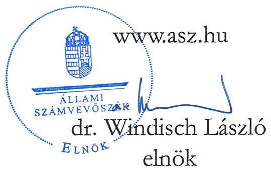

---

# ELLENŐRZÉSI IGAZGATÓSÁG: 

## ÁLLAMHÁZTARTÁS KÖZPONTI SZINTJÉT ELLENŐRZŐ IGAZGATÓSÁG

## ELLENŐRZÉSI IGAZGATÓ:

## SINKÁNÉ DR. CSENDES ÁGNES igazgató

## ELLENŐRZÉSVEZETŐ:

Jelentéseink az interneten a www.asz.hu címen olvashatók.

JANIK JÓZSEF ellenőrzésvezető

IKTATÓSZÁM: EL-4147-001/2024
TÉMASZÁM: 2748
ELLENŐRZÉS-AZONOSÍTÓ SZÁM: V1092

---

# TARTALOMJEGYZÉK 

AZ ELLENŐRZÉS ALAPADATAI ..... 5
AZ ELLENŐRZÉS HATÓKÖRE ÉS TERÜLETE, AZ ELLENŐRZÖTT SZERVEZETEK ..... 8
ÖSSZEFOGLALÁS ..... 9
AZ ELLENŐRZÉS FÓKUSZTERÜLETEI ..... 12
MEGÁLLAPÍTÁSOK ..... 13
MELLÉKLETEK ..... 35
I. sz. melléklet: Értelmező szótár ..... 35
II. sz. melléklet: Az ellenőrzött szervezetek jegyzéke ..... 38
III. sz. melléklet: Ellenőrzési kritériumok ..... 44
IV. sz. melléklet: A költségvetés központi tartalék előirányzatainak alakulása. ..... 45
FÜGGELÉK: ÉSZREVÉTELEK ..... 47
RÖVIDÍTÉSEK JEGYZÉKE ..... 48

---

.

---

# AZ ELLENŐRZÉS ALAPADATAI 

## AZ ELLENŐRZÉS CÉLJA

Az ÁSZ ${ }^{1}$ törvényben meghatározott feladatkörében évente ellenőrzi a központi költségvetés végrehajtásáról készített zárszámadást.

Az ellenőrzés célja annak értékelése volt, hogy a 2023. évben a központi költségvetés bevételi és kiadási előirányzatainak teljesítése megfelelt-e a jogszabályi előírásoknak, a központi költségvetés bevételeit a költségvetési törvényben rögzítettekkel összhangban, a közpénzekkel való gazdálkodás jogszabályi követelményeinek megfelelően használták-e fel; a 2023. évi zárszámadási törvényjavaslat valósághűen mutattae be a költségvetés végrehajtására vonatkozó pénzügyi adatokat, információkat, az abban szereplő teljesítési adatok tartalmaztak-e lényeges hibát; a zárszámadási törvényjavaslat tartalma, szerkezete megfelelt-e a jogszabályi előírásoknak; továbbá, hogy érvényesültek-e a 2023. évben az Alaptörvény ${ }^{2}$ és a Stabilitási tv. ${ }^{3}$ államadósságra vonatkozó előírásai.

Az ÁSZ az ellenőrzés elvégzésével hozzájárul ahhoz, hogy az Országgyűlés a zárszámadási törvényjavaslatra vonatkozóan megalapozott döntést hozhasson.

## AZ ELLENŐRZÉS TÍPUSA

Megfelelőségi ellenőrzés

## AZ ELLENŐRZŐTT IDŐSZAK

A 2023. év; a zárszámadási törvényjavaslat elkészítése tekintetében 2024. I-III. negyedév

## AZ ELLENŐRZÉS TÁRGYA

Az ellenőrzés tárgya a 2023. évi zárszámadási törvényjavaslat megfelelősége, az abban szereplő adatok megbízhatósága, a TB Alapok ${ }^{4}$ pénzügyi beszámolója, továbbá a költségvetési fejezetek, a központi alrendszerbe tartozó szervezetek, a TB Alapok és az ELKA ${ }^{5}$ gazdálkodása, előirányzat-felhasználása során a költségvetési gazdálkodásra vonatkozó alapvető szabályokkal való összhangja volt.

Az ellenőrzés kiterjedt minden olyan körülményre és adatra, amely az ÁSZ jogszabályban meghatározott feladatainak teljesítéséhez, valamint a program végrehajtása folyamán felmerült újabb összefüggések feltárásához szükséges volt.

## AZ ELLENŐRZÉS JOGALAPJA

Az ellenőrzés jogszabályi alapját az ÁSZ tv. ${ }^{6}$ 5. § (7) bekezdésének előírásai képezték.

---

# AZ ELLENŐRZÉS MÓDSZERE 

Az ellenőrzés végrehajtása a nemzetközi standardokat irányadónak tekintve az ellenőrzési program szempontjai, az ellenőrzött időszakban hatályos jogszabályok, az ellenőrzés szakmai szabályok és módszertanok figyelembevételével történt.

Az ellenőrzési bizonyítékként felhasználható adatforrások közé tartoztak egyrészt az ellenőrzéshez kért dokumentumok, adatforrások, az ellenőrzés tárgya kapcsán releváns, nyilvánosan hozzáférhető adatok, dokumentumok, a Magyar Államkincstár adatbázisai, másrészt adatforrás volt minden egyéb, az ellenőrzés folyamán feltárt, az ellenőrzés szempontjából információkat tartalmazó dokumentum.

Az ellenőrzési kérdések megválaszolásához szükséges bizonyítékok megszerzése az ellenőrzött szervezetek által rendelkezésre bocsátott dokumentumokra és adatokra alapozva, továbbá megfigyelés, szemle (szemrevételezés), kérdésfeltevés (információkérés), valamint elemző eljárás útján történt.

Az ellenőrzés lefolytatásához az ellenőrzött szervezetek az ellenőrzés során az ÁSZ által kért dokumentumok, adatok, információk megküldésével, valamint tanúsítványok kitöltésével szolgáltattak adatokat.

A 2023. évi zárszámadási törvényjavaslatban szereplő pénzforgalmi bevételek és kiadások teljesítésének ellenőrzése reprezentativitást biztosító mintavételi eljárással kiválasztott mintatételek értékelésére, adatok, folyamatok mintatételek alapján történt tesztelésére, és meghatározott területeken elemző eljárások alkalmazására épült.

A mintatételek ellenőrzése, eredményeinek kiértékelése során az ÁSZ a feltárt hibákat két fő csoportba sorolta: megbízhatósági hibák, amelyek a zárszámadási törvényjavaslat adatainak megbízhatóságát befolyásolhatják, illetve szabályszerűségi hibák, azaz a jogszabályi előírásoknak való meg nem felelés esetei.

A Számvevőszék az ellenőrzés során azonosított hibákat értékelte abból a szempontból, hogy azok egyedileg vagy együttesen lényegesek-e, és meghatározta, hogy azok milyen hatást gyakorolhatnak a számvevőszéki ellenőrzés eredményeire. Ehhez a Számvevőszék mérlegelte a hibák jellegét és összegét a zárszámadási törvényjavaslat egésze vonatkozásában, valamint az előfordulásuk körülményeit.

Az ÁSZ a 2023. évi pénzforgalmi bevételi és kiadási adatokból statisztikai mintavételezéssel választotta ki az ellenőrizendő tételeket és a zárszámadási törvényjavaslatban szereplő pénzforgalmi bevételi és kiadási adatok megbízhatóságát az ellenőrzött tételek alapján statisztikai módszer alkalmazásával értékelte. A zárszámadási törvényjavaslatról szóló véleménye kialakításakor az ÁSZ a zárszámadási törvényjavaslat megbízhatóságát befolyásoló összes hiba összegét viszonyította a lényegességi küszöbértékhez, amelyet a zárszámadási törvényjavaslatban szereplő kiadási és bevételi főösszegek értékének 2\%-ában határozott meg. Lényeges szintű megbízhatósági hibának azt tekinti az ÁSZ, amennyiben az ellenőrzés eredményeinek kiértékelése alapján a teljes alapsokaságban (azaz az ellenőrzési terület adatainak összességében) előforduló megbízhatósági hibák összértéke $95 \%$-os elvárt bizonyossági szint mellett meghaladja a $2 \%$-os lényegességi küszöbértéket.

A központi kezelésű kiadási és bevételi előirányzatok ellenőrzése az automatizált folyamatok, informatikai rendszerekben standardizált módon feldolgozott adatok mintatételek alapján történő tesztelésével egészült ki.

Elemző eljárással történt az állam által vállalt kezesség és viszontgarancia érvényesítésével kapcsolatos bevételek és kiadások, az adósságszolgálattal kapcsolatos bevételek, az uniós forrású támogatási előirányzatok bevételeinek, az ELKA bevételeinek, valamint a TB Alapok ellátási bevételeinek értékelése. Szintén elemzéssel végezte az ÁSZ a költségvetés központi tartalék előirányzatai képzésének és felhasználásának értékelését.

---

A szabályszerűségi szempontok értékelése az ellenőrzési területek működésére, gazdálkodására vonatkozó egyes jogszabályi előírások alapján történt.

A TB Alapok beszámolóinak értékelése a bevételek és a kiadások kimutatására, valamint a jogszabályokban előírt egyes követelmények teljesülésére irányult.

Az ellenőrzés a zárszámadási törvénytervezet teljesítési adatainak értékelése során eredeti előirányzatként a 2023. január 1-én hatályos, a Magyarország 2023. évi központi költségvetésének a veszélyhelyzettel összefüggő eltérő szabályairól szóló 613/2022. (XII. 29.) Korm. rendeletben rögzített, a 2022. október 1-től hatályos Kvtv. ${ }^{7}$-ben szereplőkhöz képest módosított adatokat vette figyelembe.

---

# AZ ELLENŐRZÉS HATÓKÖRE ÉS TERÜLETE, AZ ELLENŐRZÖTT SZERVEZETEK 

Az Országgyűlés 2022. július 19-én fogadta el a Magyarország 2023. évi központi költségvetéséről szóló 2022. évi XXV. törvényt. A 2023. január 1-én hatályba lépett, Magyarország 2023. évi központi költségvetésének a veszélyhelyzettel összefüggő eltérő szabályairól szóló 613/2022. (XII. 29.) Korm. rendelet a Kvtv. előírásainak eltérő alkalmazásáról rendelkezett. Az Országgyűlés 2023. március 31-én a Magyarország 2023. évi központi költségvetéséről szóló 2022. évi XXV. törvény módosításáról szóló 2023. évi VI. törvénnyel elfogadta a Kvtv. módosítását. A 613/2022. (XII. 29.) Korm. rendelet a Kvtv. módosításával egyidejűleg hatályát vesztette, a módosított Kvtv. 2023. április 6-án lépett hatályba és az év folyamán a továbbiakban már nem változott.

Az Alaptörvény előírásaival összhangban az Országgyűlés minden évre vonatkozóan törvényt alkot a központi költségvetés végrehajtásáról. Az Áht. ${ }^{8}$ rendelkezései szerint a költségvetés végrehajtásáról és a vagyoni helyzetről szóló zárszámadási törvényjavaslatot az adott évre vonatkozóan elfogadott költségvetéssel való összehasonlításra alkalmas formában kell elkészíteni, egyben meghatározza a zárszámadási törvényjavaslat tartalmi követelményeit. Az Áht. rögzíti azt is, hogy a Kormánynak a zárszámadási törvényjavaslatot a költségvetési évet követő év szeptember 30 -áig - az országgyűlési képviselők általános választásának évében november 10-éig - kell az Országgyűlés elé terjeszteni, amely azt az Állami Számvevőszék jelentésével együtt tárgyalja meg.

Az ellenőrzés kiterjedt az Alaptörvény és a Stabilitási tv. államadósságra vonatkozó előírásainak érvényesülésére, az államháztartás központi alrendszerében a hiány alakulására, a zárszámadási törvényjavaslat tartalmának, szerkezetének megfelelőségére, továbbá a központi és a fejezeti kezelésű előirányzatok, az uniós és kapcsolódó hazai forrásból finanszírozott támogatások, a központi alrendszerbe tartozó szervezetek, az ELKA, valamint a TB Alapok előirányzatainak teljesítésére, a zárszámadási törvényjavaslatban szereplő teljesítési adatok megbízhatóságára.

Az ellenőrzött szervezetek körét a központi kezelésű előirányzatokért, a fejezeti kezelésű előirányzatokért, valamint az uniós és kapcsolódó hazai forrásból finanszírozott támogatások előirányzataiért felelős szervezetek, az ELKA és a TB Alapok kezelő szervei, továbbá a központi alrendszerbe tartozó kiválasztott szervezetek képezték. Az ellenőrzött szervezetek részletes felsorolását a II. számú melléklet tartalmazza.

---

# ÖSSZEFOGLALÁS

A Magyarország 2023. évi központi költségvetésének a veszélyhelyzettel összefüggő eltérő szabályairól szóló 613/2022. (XII. 29.) Korm. rendelet 2023. január 1-i hatállyal az államháztartás központi alrendszerének bevételi főösszegét 36 358,4 Mrd Ft-ban, kiadási főösszegét 39 758,6 Mrd Ft-ban, hiányát 3 400,2 Mrd Ft-ban állapította meg. A Kvtv. Országgyűlés által elfogadott, 2023 április 6-tól hatályos módosítása a hiány tervezett összegének változatlan fenntartása mellett az államháztartás központi alrendszerének bevételi és kiadási főösszegét egyaránt 17,5 Mrd Ft-tal (0,05%-ot el nem érő mértékben) megemelve 36 375,9 Mrd Ft-ra, illetve 39 776,1 Mrd Ft-ra módosította.

A 2023. évi zárszámadási törvényjavaslat az Áht. irányadó rendelkezései szerinti szerkezetben és tartalommal került összeállításra, a bevételi és kiadási teljesítési adatokat valósághűen mutatta be.

A központi költségvetés kiadási és bevételi előirányzatainak a zárszámadási törvényjavaslatban szereplő teljesítési adataiban az ellenőrzés nem tárt fel olyan lényeges hibát, amely befolyásolná a zárszámadási törvényjavaslat adatainak megbízhatóságát.

A központi alrendszer teljesített bevételei és kiadásai meghaladták az előirányzott értékeket, a túlteljesülés mértéke azonban a kiadások esetében a bevételekhez képest jelentősen magasabb volt, így a pénzforgalmi hiány a tervezetthez képest mintegy 30%-kal magasabban alakult, amelyről az 1. táblázat ad áttekintést.

|  MEGNEVEZÉS | ELŐRÁNYZAT | TELJESÍTÉS | TELJESÍTÉSI ARÁNY  |
| --- | --- | --- | --- |
|  Bevétel | 36 358,4 | 36 831,9 | 101,3%  |
|  Kiadás | 39 758,6 | 41 267,4 | 103,8%  |
|  Pénzforgalmi hiány | -3 400,2 | -4 435,5 | 130,4%  |

*1. táblázat*

**A KÖZPONTI ALRENDSZER BEVÉTELEINEK, KIADÁSAINAK, VALAMINT PÉNZFORGALMI HIÁNYÁNAK ALAKULÁSA A 2023. ÉVBEN (MRD FT)**

Forrás: Kvtv., 2023. évi zárszámadási törvényjavaslat, ÁSZ saját szerkezésre

|  MEGNEVEZÉS | ELŐRÁNYZAT | TELJESÍTÉS | TELJESÍTÉSI ARÁNY  |
| --- | --- | --- | --- |
|  Bevétel | 36 358,4 | 36 831,9 | 101,3%  |
|  Kiadás | 39 758,6 | 41 267,4 | 103,8%  |
|  Pénzforgalmi hiány | -3 400,2 | -4 435,5 | 130,4%  |

A 2023. évben az előző évhez képest a központi alrendszer bevételei 23,2%-kal, kiadásai 19,4%-kal magasabb összegben teljesültek, a pénzforgalmi hiány ennek következtében 5,1%-kal mérséklődött.

Az államháztartás központi alrendszerének GDP^{5} arányos pénzforgalmi hiánya a 2023. évben 5,9%-ra mérséklődött a 2022. évi 7,1%-os mértékhez képest.

A kormányzati szektor GDP arányos, uniós módszertan szerint számított, eredményszemléletű hiánya a 2023. évben a GDP 6,7%-át érte el, amely a 2022. évi 6,2%-os mértéket 0,5 százalékponttal meghaladta. A 3,0%-os maastrichti kritérium teljesítése alól a COVID-19 járvány negatív hatásainak kezelése érdekében meghozott uniós szabályozások, a hazai jogrendben pedig a Stabilitási tv. nemzetgazdasági stabilitás válsághelyzetben történő garantálása érdekében rögzített rendelkezései a 2023. évben is mentesítést biztosítottak.

Az államadósság-mutató a 2023. év végére 73,4%-ra mérséklődött a 2022. év végi 73,8%-os mértékhez képest, így az Alaptörvény és a Stabilitási tv. államadósságra vonatkozó előírásai érvényesültek. Ugyanakkor az államadósság összege 2023. december 31-re a 2022. év végi állományhoz képest mintegy 12,9%-kal növekedett, és az államadósság-mutató év végi tényadata a 2023. évre tervezett 70,2%-os mérték felett alakult.

---

Az ellenőrzés során a központi alrendszerbe tartozó szervezetek, valamint az ELKA területén feltárt eseti szabályszerűségi hibák a gazdasági események elszámolását, a kifizetések teljesítését megelőző kontrollokat, a gazdálkodási jogkörök gyakorlását, valamint a belső szabályozásokat érintették. E hiányosságokat az ÁSZ az érintett ellenőrzött szervezetek vezetői részére jelezte.

A bevételi és kiadási teljesítési adatok ellenőrzési területek szerinti megbontását az 1. ábra, míg a költségvetési hiány ellenőrzési területek szerinti összetételét, valamint alakulását a 2. ábra szemlélteti.
1. ábra

# A KÖZPONTI ALRENDSZER 2023. ÉVI TELJESÍTETT BEVÉTELI ÉS KIADÁSI ADATAI (ELLENŐRZÉSI TERÜLETEK SZERINT, ILLETVE A FŐÖSSZEG \%-ÁBAN) 

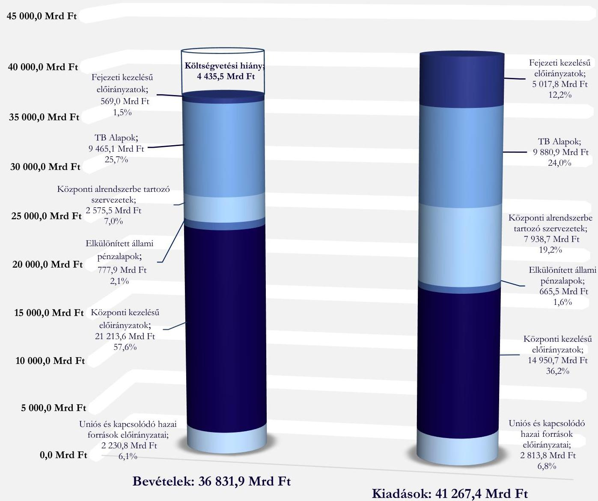

Forrás: 2023. évi zározzámadási töroónyjavaslat, ÁSZ saját szerkestés

---

# Az államháztartás Központi Alhemszere Előirányzott és teljesített Egyenlegének Alakulása ElLENŐRZÉSI TERÜLETEK SZERINT, 2023. ÉV

|  -6 000,0 | -4 000,0 | -2 000,0 | 0,0 | 2 000,0 | 4 000,0 | 6 000,0  |
| --- | --- | --- | --- | --- | --- | --- |
|   |  |  | 5 255,6 Mrd Ft
6 262,9 Mrd Ft |  |  |   |
|   |  |  | 162,7 Mrd Ft
112,4 Mrd Ft |  |  |   |
|  0,0 Mrd Ft
- 415,8 Mrd Ft |  |  |  |  |  |   |
|   |  | -1 549,0 Mrd Ft
- 583,0 Mrd Ft |  |  |  |   |
|   |  | -3 496,4 Mrd Ft
-4 448,8 Mrd Ft |  |  |  |   |
|   |  | -3 773,1 Mrd Ft
-5 363,2 Mrd Ft |  |  |  |   |
|   |  | -3 400,2 Mrd Ft
-4 435,5 Mrd Ft |  |  |  |   |

Központi KEZELÉSŰ ELŐIRÁNYZATOK

ELKÜLÖNÍTETT ÁLLAMI PÉNZALAPOK

TB ALAPOK

UNIÓS ÉS KAPCSOLÓDÓ HAZAI FORRÁSOK ELŐIRÁNYZATAI

FEJEZETI KEZELÉSŰ ELŐIRÁNYZATOK

KÖZPONTI ALRENDSZERBE TARTOZÓ SZERVEZETEK

ÖSSZESEN

2023. évi előirányzott egyenleg 2023. évi teljesített egyenleg

*Forrás: 2023. évi zárszámodási törvényjavaslat, ÁSZ saját szerkezését*

---

# AZ ELLENŐRZÉS FÓKUSZTERÜLETEI 

1. Az államadósság és a hiány alakulása
2. A zárszámadási törvényjavaslat tartalmának, szerkezetének
megfelelősége
3. A zárszámadási törvényjavaslatban szereplő előirányzatok teljesitése, a teljesitési adatok megbizhatósága

---

# 1. Az államadósság és a hiány alakulása 

## Összegző megállapítás

1.1 számú megállapítás

Az Alaptörvény és a Stabilitási tv. államadósságra és hiányra vonatkozó előírásai érvényesültek. Az államadósság és a hiány a Kvtv.-ben előirányzottnál kedvezőtlenebbül alakult, a kormányzati szektor GDP arányos hiánya a 2022. évhez képest emelkedett.
Az államháztartás központi alrendszerének bevételi és kiadási főösszege, valamint pénzforgalmi hiánya a Kvtv.-ben meghatározottakat meghaladóan teljesült.

A Magyarország 2023. évi központi költségvetésének a veszélyhelyzettel összefüggő eltérő szabályairól szóló 613/2022. (XII. 29.) Korm. rendelet 2023. január 1-i hatállyal az államháztartás központi alrendszerének bevételi főösszegét 36 358,4 Mrd Ft-ban, kiadási főösszegét 39 758,6 Mrd Ft-ban, hiányát 3 400,2 Mrd Ft-ban állapította meg.
A központi alrendszer előirányzatain belül a hazai múködési költségvetés tervezett bevételei és kiadásai egyensúlyban voltak. A hazai felhalmozási költségvetés esetében a tervezett hiány 1 851,2 Mrd Ft-ban került rögzítésre, míg az európai uniós fejlesztési költségvetés tervezett hiánya 1 549,0 Mrd Ft volt.
Az államháztartás központi alrendszerének 2023. évi bevétele az eredeti előirányzatot 1,3\%-kal meghaladva, 36 831,9 Mrd Ft-ban teljesült, kiadása a tervezetthez képest 3,8\%-kal volt magasabb, 41 267,4 Mrd Ft-ot tett ki, a pénzforgalmi hiány a tervezettet mintegy 30,4\%-kal meghaladva, 4 435,5 Mrd Ft lett. Ezzel az államháztartás központi alrendszerének GDP arányos pénzforgalmi hiánya 5,9\%-ra mérséklődött a 2022. évi 7,1\%-os mértékhez képest.
A központi alrendszer előirányzatain belül a hazai múködési költségvetés hiánya 1 188,3 Mrd Ft, a hazai felhalmozási költségvetés hiánya 3 951,6 Mrd Ft, míg az európai uniós fejlesztési költségvetés többlete 704,4 Mrd Ft összegben alakult.
Az államháztartás központi alrendszerén belül a központi költségvetés 4 132,1 Mrd Ft-os, a TB Alapok 415,8 Mrd Ft-os hiánnyal, az ELKA 112,4 Mrd Ft-os többlettel zárták a 2023-as évet.
A TB Alapok 2023. évi hiánya az Ny. Alap ${ }^{10}$ 329,7 Mrd Ft-os és az E. Alap ${ }^{11}$ 86,1 Mrd Ft-os deficitjéből tevődött össze.
Az államháztartás egészének 2023. évi pénzforgalmi hiánya (amely tartalmazza az önkormányzati alrendszer 37,6 Mrd Ft-os többletét is) 4 397,9 Mrd Ft összegben teljesült, ami - az államháztartás központi alrendszerének hiányával megegyező mértékben - a GDP 5,9\%-ának felelt meg.
A bevételek és kiadások, ezek egyenlegeként a hiány alakulására jelentős hatást gyakorolt a kedvezőtlenül változó makrogazdasági környezet.

---

A gazdaság teljesítménye a Pénzügyminisztérium középtávú makrogazdasági és költségvetési előrejelzésében 2022. év végén előrejelzett 1,5\%-os növekedéssel szemben a 2023-as év egészét tekintve $0,9 \%$ mértékủ visszaesést mutatott. A fogyasztói árindex éves szinten a 2022. év végén figyelembe vett $15,0 \%$ helyett $17,6 \%$-kal emelkedett, az általános kamatkörnyezet, ezzel együtt a jegybanki alapkamat, valamint az állampapírpiaci kamat- és hozamszint a tervezéshez figyelembe vett értékhez képest 1,5-3 százalékponttal magasabban alakult.
A központi költségvetés 2023. évi fő teljesítési adatainak a tervezett, valamint a 2022. évi tény adatokhoz viszonyított alakulását a 3. ábra szemlélteti.
3. ábra

A KÖLTSÉGVETÉSI FŐŐSSZEGEK ALAKULÁSA A 2022. ÉVI TELJESÍTÉS BÁZISÁN (ÉRTÉKEK MRD FT-BAN)
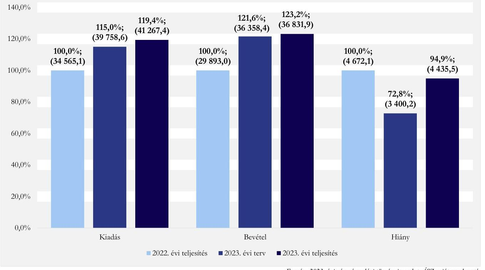

A központi költségvetés hiányának a tervezetthez képest kedvezőtlenebb teljesülésére jelentős hatást gyakorló előirányzatok a következők voltak:

- A központi költségvetés bevételei esetében az előirányzathoz képest az adóbevételek jelentősen elmaradtak, a legnagyobb, 1004,1 Mrd Ft összegű kiesés az általános forgalmi adónál jelentkezett, a tervezettnél alacsonyabban teljesült továbbá néhány nagyobb bevételi előirányzat, így az energia ágazat befizetései, a jövedéki adó, a személyi jövedelemadó, valamint az illeték-befizetések.
- Kiadási oldalon a legnagyobb mértékủ túllépések az egészségügyhöz és az állami vagyonhoz kapcsolódó előirányzatokon, az adósságszolgálati, valamint a nyugdíj kiadásoknál jelentkeztek.
A legjelentősebb bevételi elmaradással, illetve kiadási többlettel érintett előirányzatokról, amelyek jelentős hatást gyakorolhattak a hiány alakulására, a 4. ábra ad áttekintést.

---

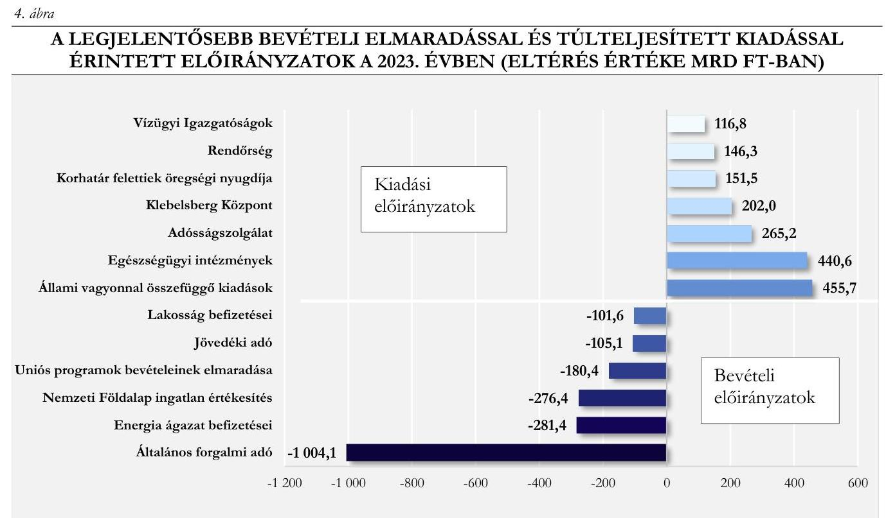
(a Lakosság befizetései kategóriába tartozik a személyi jövedelemadó, gépjárműadó, lakossági illetékek és az egyéb lakossági adók - pl. bérfilzési szeszadói Forrás: 2023. évi zárszámadási törvényjavaslat, ÁsZ saját szerkesztés
1.2 számú megállapítás

Az Alaptörvény és a Stabilitási tv. államadósságra vonatkozó előírásai érvényesültek. A kormányzati szektor GDP arányos hiánya a 2022. évhez viszonyítva emelkedett, az államadósság az előirányzotthoz képest kedvezőtlenebbül alakult.

A 2023. év végén az államadósság-mutató számlálójának (államadósság) összege 55 142,1 Mrd Ft, nevezőjének (GDP) összege 75 086,6 Mrd Ft, az államadósság-mutató mértéke 73,4\% volt. Ezáltal az államadósság-mutató a 2022. év végi 73,8\%-hoz képest 0,4 százalékponttal csökkent, összhangban az államadósság teljes hazai össztermékhez viszonyított arányának csökkentésére vonatkozóan az Alaptörvényben és a Stabilitási tv.-ben foglalt előírással.
A 2023. évben az éves bruttó hazai termék reál értékének csökkenése következett be, amely esetre az államadósság-mutató csökkentésére vonatkozó kötelezettség a Stabilitási tv. 7. §-ban foglalt rendelkezés alapján felfüggesztésre kerül. Ennek a felfüggesztő rendelkezésnek az alkalmazására nem került sor.
Az államadósság-mutató 2023. év végi tényadata a tervezett 70,2\%-os mérték felett alakult, az államadósság összege a 2022. év végi 48 858,6 Mrd Ft-hoz képest mintegy 12,9\%-kal növekedett. A nominális GDP az államadósságot meghaladó mértékben, 13,5\%-kal növekedett, ami az államadósságmutató csökkenését eredményezte.
A Stabilitási tv. szerinti államadósság és az államadósság-mutató alakulását a 2022-2023. években az 5. ábra szemlélteti.

---

5. ábra

AZ ÁLLAMADÓSSÁG (MRD FT), ÉS AZ ÁLLAMADÓSSÁG-MUTATÓ (GDP \%-A) ALAKULÁSA A 2022. ÉS A 2023. ÉVBEN
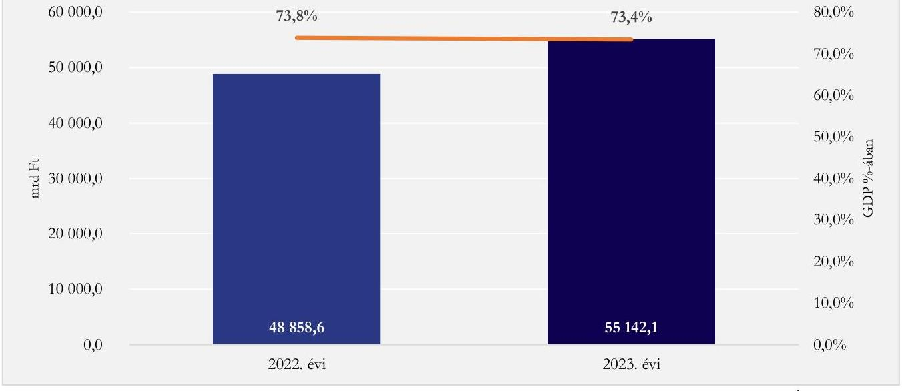

Forrás: 2023. évi záro számadási törvényjavaslat, 2024. évi II. EDP jelentés, ÁSZ saját szerkestés
A 2023. évben a kormányzati szektor bevétele 32 111,4 Mrd Ft, kiadása 37 146,5 Mrd Ft, hiánya 5 035,1 Mrd Ft volt.

A kormányzati szektor GDP arányos hiányának mértéke 2023. december végén $6,7 \%$ volt, ami 0,5 százalékponttal haladta meg a 2022. év végi $6,2 \%$-os mértéket, illetve jelentősen magasabb volt a tervezés során a 2023. évre számított $3,9 \%$-nál.
A maastrichti kritérium szerinti 3\%-os mérték teljesítése alól a COVID-19 járvány negatív hatásainak kezelése érdekében meghozott uniós szabályozások, a hazai jogrendben pedig a Stabilitási tv. 48. § (3) bekezdésében rögzített rendelkezései a 2023. évben is mentesítést biztosítottak.

A kormányzati szektor európai uniós módszertan szerinti hiánya összegének és GDP-hez viszonyított arányának alakulását a 6. ábra szemlélteti.
6. ábra

A KORMÁNYZATI SZEKTOR UNIÓS MÓDSZERTAN SZERINTI HIÁNYÁNAK ÖSSZEGE (MRD FT) ÉS GDP-HEZ VISZONYÍTOTT ARÁNYA (\%) A 2022. ÉS A 2023. ÉVBEN
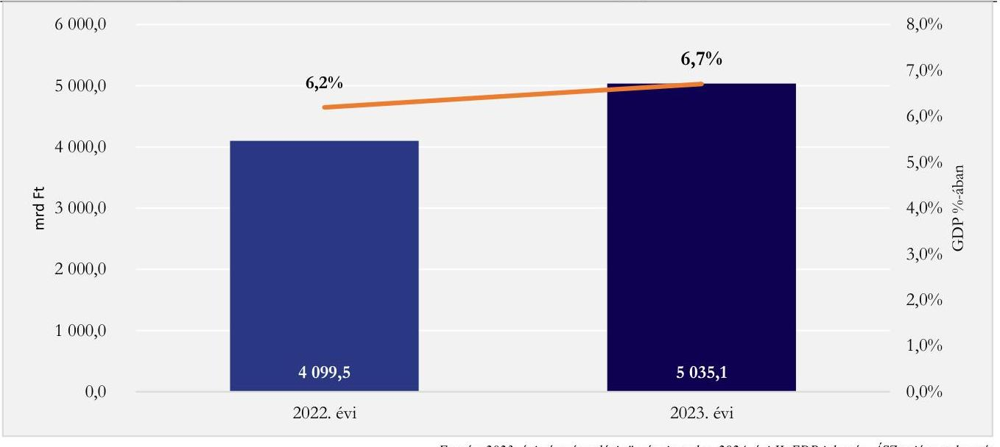

Forrás: 2023. évi záro számadási törvényjavaslat, 2024. évi II. EDP jelentés, ÁSZ saját szerkestés

---

# 2. A zárszámadási törvényjavaslat tartalmának, szerkezetének megfelelősége 

## Összegző megállapítás

A zárszámadási törvényjavaslatot a Pénzügyminisztérium a jogszabályi előírások szerint, azoknak megfelelő tartalommal és szerkezetben, az éves költségvetési beszámolók alapján, az elfogadott költségvetéssel összehasonlítható módon készítette el.

A Pénzügyminisztérium a zárszámadási törvényjavaslatot az Áht. előírásaival összhangban az éves költségvetési beszámolók alapján, az elfogadott költségvetéssel összehasonlítható módon, az év utolsó napján érvényes szervezeti, besorolási rendnek megfelelően készítette el.
A zárszámadásról szóló törvényjavaslat tartalmazta az Áht.-ban meghatározott adatokat, információkat, ismertette a központi alrendszer hiányának a költségvetésben tervezett mértékétől való eltérés okait, továbbá bemutatta a költségvetési hiány finanszírozásának módját.
Az Áht. irányadó előírásainak megfelelően a zárszámadásról szóló törvényjavaslatban és az indokolás mellékleteiben bemutatásra kerültek többek között:

- a költségvetési mérlegek alrendszerenként és összevontan, közgazdasági és funkcionális tagolásban;
- az államháztartás alrendszerei költségvetési egyenlegének összefüggései és kapcsolata a 479/2009/EK rendelet ${ }^{12}$ szerinti kormányzati szektor hiányával és az elsődleges egyenlegmutatóval;
- az államháztartás központi alrendszerében a finanszírozási bevételekről és kiadásokról készített összegzés;
- az államadósságot és az államadósság állományának változását bemutató összegzés;
- az állami kezességek, állami garanciák és állami viszont-garanciák, továbbá a helyi önkormányzatok által kibocsátott garanciák és kezességek állománya;
- az állam tulajdonában álló részesedések, valamint az állam többségi befolyása alatt álló gazdasági társaságok kötelezettségállományának alakulása, valamint a helyi önkormányzatok tulajdonában álló gazdálkodó szervezetek múködéséből származó kötelezettségek;
- a középtávú tervezés során figyelembe vett makrogazdasági és költségvetési előrejelzés értékelése;
- a kormányzati szektorba sorolt egyéb szervezeteknél a nem teljesítő hitelkövetelések állománya;
- a központi költségvetés fejezet- és címrendjének évközi változásai.

---

# 3. A zárszámadási törvényjavaslatban szereplő előirányzatok teljesítése, a teljesítési adatok megbízhatósága 

Összegző megállapítás

A központi költségvetés kiadási és bevételi előirányzatainak a zárszámadási törvényjavaslatban szereplő teljesítési adataiban az ellenőrzés nem tárt fel olyan lényeges hibát, amely befolyásolná a zárszámadási törvényjavaslat adatainak megbízhatóságát. A feltárt szabályszerűségi hibák a központi alrendszerbe tartozó szervezeteket és az ELKA-t érintették.
3.1. számú megállapítás

A központi kezelésű bevételi és kiadási előirányzatok kapcsán a teljesítési adatok megbízhatóságát befolyásoló hibát az ellenőrzés nem tárt fel. Az előirányzatok teljesítése kapcsán az ellenőrzés szabályszerűségi hibát nem tárt fel.

## A KÖLTSÉGVETÉS KÖZPONTI KEZELÉSŰ BEVÉTELI ÉS KIADÁSI ELŐIRÁNYZATAI

tekintetében teljesített kifizetések számviteli elszámolását a Számv. tv. ${ }^{13}$ előírásainak megfelelően bizonylattal alátámasztották, a Számv. tv. előírásaival összhangban a kiadások elszámolt összege (részösszege) megegyezett a gazdasági esemény számviteli elszámolását alátámasztó bizonylatokon szereplő összeggel, elszámolásuk az Áhsz. ${ }^{14}$-ben foglaltaknak megfelelően történt.
A költségvetés központi kezelésű előirányzatainak teljesített kiadásairól a 2. táblázat, bevételeiről a 3. táblázat ad áttekintést.
2. táblázat

A KÖZPONTI KEZELÉSŰ KIADÁSI ELŐIRÁNYZATOK ALAKULÁSA A 2023. ÉVBEN (MRD FT)

| ELÖIRÁNYZAT MEGNEVEZÉSE | ÉREDEETi   ELÖIRÁNYZAT | TELJESÍTÉS |
| :--: | :--: | :--: |
| Központi kezelésű egyéb kiadási előirányzatok | 6091,6 | 4411,3 |
| -ebből: Rezzisvédelmi szolgáltatás ellentételezésével összefüggö kiadások | 0 | 946,6 |
| Lakástámogatások | 382,9 | 444,6 |
| Vasúti személyszállitási közzzolgáltatások költségtérítése | 277,0 | 317,3 |
| Távbözzolgáltatók kompenzációjával kapcsolatos kiadások | 0 | 269,3 |
| A vasúti pályabálózat müködtetésének költségtérítése | 174,0 | 232,9 |
| Babaváró támogatások | 178,2 | 177,0 |
| Autóbusszal végzett személyszállitási közzzolgáltatások költségtérítése | 133,0 | 166,9 |
| Szociálpolitikai menetdíj támogatás | 105,0 | 124,5 |
| Diákbitel konstrukciók támogatása | 14,7 | 19,1 |
| Egyéb | 4826,8 | 1713,1 |
| Az adósságszolgálattal kapcsolatos kiadások | 2541,2 | 2806,3 |
| Az állami vagyonnal összefüggő kiadások | 1404,6 | 1860,3 |
| A helyi, a települési és területi nemzetiségi önkormányzatok támogatása | 972,5 | 1181,8 |
| A Nemzeti Család- és Szociálpolitikai Alap kiadásai | 754,8 | 754,9 |
| Összesen: | 11764,7 | 11014,6 |
| Összesen a központi alrendszeren belüli transzferekkel együtt: |  | 14950,7 |

---

# A KÖZPONTI KEZELÉSŰ BEVÉTELI ELŐIRÁNYZATOK ALAKULÁSA A 2023. ÉVBEN (MRD FT) 

| ELÖIRÁNYZAT MEGNEVEZÉSE | ÉREDEIT   ELÖIRÁNYZAT | FELJESÍTÉS |
| :--: | :--: | :--: |
| Kiszabás, vagy kivetés alapján befolyt adó-, illeték-, egyéb bevételek (egyéb befizetések, regisztrációs adó, lakossági illetékek, gépjárműadó, vegyes bevételek, késedelmi pótlék, bírságbevételek) | 699,8 | 597,2 |
| Az állami vagyonnal összefüggő bevételek | 628,9 | 1177,4 |
| Társasági adó | 1004,9 | 1013,8 |
| Cégautóadó | 78,8 | 79,0 |
| Környezetterhelési díj | 5,4 | 4,8 |
| Kiskereskedelmi adó | 205,2 | 242,4 |
| Pénzügyi szervezetek befizetései | 358,0 | 352,6 |
| Gazdálkodó szervezetek egyéb befizetései | 1935,6 | 1673,5 |
| Általános forgalmi adó | 7986,0 | 6981,9 |
| Jövedéki adó | 1464,9 | 1359,8 |
| Egyéb fogyasztáshoz kapcsolt adók | 720,0 | 698,5 |
| Személyi jövedelemadó | 4060,5 | 3996,3 |
| Szociális hozzájárulási adó | 2748,1 | 2656,5 |
| Társadalombiztosítási-, nyugdíj- és egészségbiztosítási járulék | 4489,0 | 4387,4 |
| Megtett úttal arányos útdíj | 310,4 | 306,0 |
| Bányajáradék | 334,0 | 241,9 |
| Az adósságszolgálattal kapcsolatos bevételek | 424,5 | 442,8 |
| Tartalékok | 0,0 | 345,4 |
| Egyéb bevételek | 41,1 | 139,1 |
| Összesen: | 27 495,1 | 26 696,3 |
| Összesen a központi alrendszeren belüli transzferekkel együtt: | 29 551,4 | 28 662,9 |
| Összesen a TB Alapokat és ELKA-t megillető bevételek nélkül: | 21931,4 | 21213,6 |

Az ellenőrzött kiadási és bevételi előirányzatok felhasználása kapcsán az ellenőrzés nem tárt fel szabályszerűségi hibát.
A NAV ${ }^{15}$ által beszedett, bevallás alapján megállapított adók és adó jellegű közterhek tekintetében a társasági adó, cégautóadó, környezetterhelési díj, kiskereskedelmi adó, általános forgalmi adó, jövedéki adó, személyi jövedelemadó, pénzügyi szervezetek befizetései (ebből: pénzügyi szervezetek különadója), társadalombiztosítási járulék Nemzeti Foglalkoztatási Alapot, E. Alapot, Ny. Alapot megillető része és nyugdíjjárulék, Szociális hozzájárulási adó Ny. Alapot, E. Alapot megillető része adónemeken elszámolt bevételek teszteléses módszerrel végzett értékelése alapján a NAV bevallás feldolgozó rendszereinek

---

működése megbízható volt. A bevallások feldolgozása az Art. ${ }^{16}$, az Adóig. vhr. ${ }^{17}$, az Ibtv. ${ }^{18}$, az Avt. ${ }^{19}$, az állami és önkormányzati szervek elektronikus információbiztonságáról szóló 2013. évi L. törvényben meghatározott technológiai biztonsági, valamint a biztonságos információs eszközökre, termékekre, továbbá a biztonsági osztályba és biztonsági szintbe sorolásra vonatkozó követelményekről szóló 41/2015. (VII. 15.) BM rendelet, és a NAV belső előírásainak megfelelő volt, a kiutalás előtti felülvizsgálat szabályszerűen történt, az átvezetések és kiutalások (folyószámla könyvelés), a bevallásfeldolgozás eseményeinek nyomon követhetősége biztosított volt. A NAV informatikai rendszereiben a rögzített és elszámolt tranzakciók megbízhatóságát biztosító beépített kontrollok megfelelően múködtek. A bevallás alapján megállapított adók, közterhek meghatározott előirányzatain beszedett ellenőrzött bevételek alakulását a 4. táblázat tartalmazza.
A Kiszabás, vagy kivetés alapján befolyt adó-, illeték-, egyéb bevételek ellenőrzött tételei esetében a regisztrációs adót a regisztrációs adóról szóló 2003. évi CX. törvény, a lakossági illetékeket az illetékekről szóló 1990. évi XCIII. törvény, a bírságbevételeket az Art. és az Avt., a gépjárműadó bevételeit a gépjárműadóról szóló 1991. évi LXXXII. törvény hatályos rendelkezéseinek megfelelően írták elő és vették nyilvántartásba.
A Helyi önkormányzatok támogatásai, valamint a Települési és területi nemzetiségi önkormányzatok támogatása előirányzatok terhére a kifizetések teljesítése az elvégzett teszteléses értékelés alapján a Kvtv., az Áht., és az Ávr. ${ }^{20}$ vonatkozó rendelkezéseivel összhangban történt.
A Központi kezelésű egyéb kiadási előirányzatokon az ellenőrzött kifizetések jelentős részét a lakástámogatások, a személyszállítási közszolgáltatások, valamint a vasúti pályahálózatok múködtetésének költségtérítése képezte. A Lakástámogatások cím eredeti előirányzata a 2023. évben 382,9 Mrd Ft volt, a teljesített kiadás 444,6 Mrd Ft volt, amely 116,1\%-os teljesítést jelentett. A 2023. évi kiadás a 2022. évinél $30,0 \%$-kal volt kevesebb, amelynek fő oka, hogy 2023. évben az otthonfelújítási támogatásokra 37,8\%kal, a családi otthonteremtési kedvezményre 34,5\%-kal alacsonyabb összeg került kifizetésre a 2022. évhez képest.
A Nemzeti Család- és Szociálpolitikai Alap kiadásai a tervezett előirányzattal összhangban, 754,9 Mrd összegben teljesültek. Az ellenőrzött kifizetések tekintetében az ellátások folyósításával összefüggő kontrollok múködése szabályszerű volt, az ellenőrzött szervezetek a Kvtv. előírásainak megfelelően rendelkeztek a kifizetést alátámasztó dokumentumokkal.
Az Adósságszolgálattal kapcsolatos kiadási előirányzatok felhasználása a jogszabályi előírásokkal összhangban történt. A tervezett előirányzathoz viszonyított 265,1 Mrd Ft összegű többletkiadást elsősorban a nagymértékủ hozamemelkedés, valamint a tervezettnél magasabb hiány miatt szükséges többlet kibocsátásokból fakadó költségek okozták.
Az Adósságszolgálattal kapcsolatos bevételek a tervezetthez képest 18,3 Mrd Ft-tal, 4,3\%-os mértékben túlteljesültek. A teljesített bevételek legnagyobb tételét ( $37,9 \%$-át) a KESZ számla ${ }^{21}$ kamatbevétele képezte. Az adósságszolgálattal kapcsolatos bevételek teljesítése a Kvtv. előírásainak megfelelt.

---

Az állam által vállalt kezesség és viszontgarancia érvényesítésével kapcsolatos kifizetések túlnyomó részét a Garantiqa Hitelgarancia Zrt. garanciaügyleteiből (45,0 Mrd Ft), valamint a Magyar Exporthitel Biztosító Zártkörűen működő Részvénytársaság biztosítási tevékenységből (2,5 Mrd Ft) eredő fizetési kötelezettségek tették ki.
Az állami kezességek és viszontgaranciák beváltásából keletkezett állami követelések visszatérüléséből származó bevételek meghatározó tételei az állami viszontgaranciákkal kapcsolatos követelések behajtásából származtak.
A Kincstár ${ }^{22}$ és a garantőr szervezetek betartották a Kvtv. állam által vállalt kezességek, garanciák, viszontgaranciák és nyújtott hitelek állományának felső határára vonatkozó előírásait.
Az állami vagyonnal összefüggő kiadások és bevételek kapcsán az ellenőrzés a XLIII. Állami vagyonnal kapcsolatos bevételek és kiadások fejezet mellett a XLIV. A Nemzeti Földalappal kapcsolatos bevételek és kiadások fejezet, a

A 2022. évhez képest az állami vagyon tekintetében figyelembe vett előirányzatok összesített teljesítési adatain belül a XLIII. Állami vagyonnal kapcsolatos bevételek és kiadások fejezet előirányzatainak aránya jelentős mértékben (a kiadások esetében 48,2\%-ról 28,2\%-ra, míg a bevételek esetében 47,5\%-ról 4,4\%ra) csökkent. Ennek hátterében az egyes fejezetek (kiadások esetében elsődlegesen a XIII. Honvédelmi Minisztérium, valamint a XVIII. Külgazdasági és Külügyminisztérium fejezet, bevételek esetében elsődlegesen a XVII. Energiaügyi Minisztérium fejezet) tulajdonosi joggyakorlással kapcsolatos előirányzatain, valamint a központi költségvetésen belül 2023. évben megjelent új, XLV. Állami beruházások fejezetben elszámolt jelentős teljesítési összegek állnak.
29/2021. (XII. 30.) NVTNM rendelet és a XLV. Állami beruházások fejezet központi kezelésű előirányzatainak kezeléséről és felhasználásáról szóló 25/2023. (XII. 29.) ÉKM rendelet előírásainak megfelelően rendelkezésre állt, illetve a tulajdonosi joggyakorlással összefügésben a szerződéskötések és az ügyletek lebonyolítása az Vtv. ${ }^{23}$ és az Nfa tv. ${ }^{24}$ előírásainak megfelelt.
Az állami vagyont érintő teljesített kiadások megoszlásáról a 7. ábra ad áttekintést.

---

7. ábra

# AZ ÁLLAMI VAGYONNAL ÖSSZEFÜGGŐ TELJESÍTETT KIADÁSOK MEGOSZLÁSA A 2023. ÉVBEN 

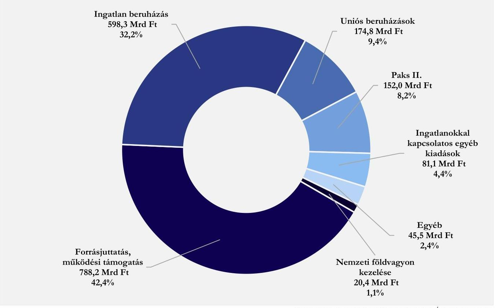

Forrás: 2023. évi záxszámadási törvénypavaslat, ÁSZ saját szerkesztés
Az állami vagyonnal összefüggő bevételek esetében a bérbeadással és ingatlanértékesítéssel Az állami vagyonnal összefüggő bevételek eredeti előirányzatai összességében 548,5 Mrd Ft-tal túlteljesültek, amely főként az Építési és Közlekedési Minisztérium tulajdonosi joggyakorlása alá tartozó gazdasági társaságok feladatainak a központi költségvetési szerv általi átvétele kapcsán megszűnt társaságok beutalt forrásaira és az év közben érkező uniós forrásokra vezethető vissza.
összefüggően a Vtv., az Nfa. tv. és a Vtvr. ${ }^{25}$, az osztalék- és az egyéb bevételek tekintetében a Ptk. ${ }^{26}$ és a Számv. tv., a koncessziós, vagyonkezelői és bérleti díjak tekintetében a Vtv., a Ptk. vonatkozó előírásai érvényesültek, a kibocsátási egységek értékesítése az előírásoknak megfelelően árverés útján történt.

Az állami vagyonnal összefüggő bevételek megoszlását a 8. ábra szemlélteti.

---

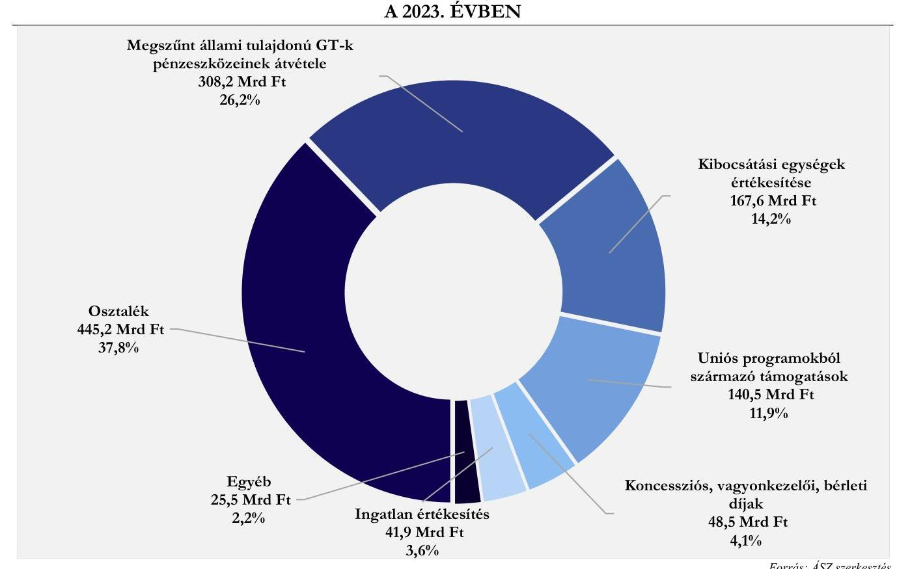

A Bányajáradékkal kapcsolatos bevétel a 2023. évben az eredeti előirányzathoz képest 27,6\%-kal

A bányajáradékkal kapcsolatos bevétel mértékére hatással voltak a piaci tényezők (TTF gázár, Brent kőolajár, árfolyamok), a volumen- és jogszabályváltozások. Az extraprofit adókról szóló 197/2022. (VI. 4.) Korm. rendelet módosításával 2023. szeptember 1-jétől módosult, differenciáltabb lett a szénhidrogén bányajáradék mértékének számítási módja.
alacsonyabb szinten teljesült. A bányafelügyelet az ellenőrzött tételeknél a bányajáradékkal kapcsolatban beérkezett bevallásokat ellenőrizte, a bevételek teljesítése a bányászatról szóló 1993. évi XLVIII. törvény végrehajtásáról szóló 203/1998. (XII. 19.) Korm. rendelet, valamint a gazdaság újraindítása érdekében fizetendő kiegészítő bányajáradékról szóló 404/2021. (VII. 8.) Korm. rendelet vonatkozó előírásainak megfelelt.
A Megtett úttal arányos útdíj előirányzaton elszámolt bevételek összegének megállapítása és a díjbevételek beszedése a teszteléses értékelés alapján megfelelt az autópályák, autóutak és főutak használatáért fizetendő megtett úttal arányos díjról szóló 2013. évi LXVII. törvény végrehajtásáról szóló 209/2013. (VI. 18.) Korm. rendelet előírásainak.
A központi tartalék előirányzatok esetében a felhasználás az előirányzott összegek más előirányzatok javára történő átcsoportosításával valósult meg. A tartalékok átcsoportosításai a felhasználási célokkal összhangban történtek.
A 2023. évben a Beruházási Alap, a Céltartalékok, a Járványügyi kiadások és a Rendkívüli kormányzati intézkedések, valamint a Rezsivédelmi Alap (ezen belül: Lakossági rezsivédelem, Központi költségvetési

---

szervek kompenzációja, Önkormányzatok kompenzációja, Egyházi és civil intézményfenntartók támogatása, Állami tulajdonú társaságok támogatása, Versenyszektor támogatása), mint a költségvetés központi tartalék előirányzatainak képzése és felhasználása szabályszerű volt.
A 2023. évi költségvetés központi tartalék előirányzatainak alakulását az 5. táblázat foglalja össze, amelyben a felhasználás a tartalék előirányzatok közötti átcsoportosítások kiszűrésével számított összegeket mutatja.
5. táblázat

# A 2023. ÉVI KÖLTSÉGVETÉS KÖZPONTI TARTALÉK ELŐIRÁNYZATAINAK ALAKULÁSA (MRD FT) 

| MEGNEVEZÉSE | EREDETT   ELŐIRÁNYZAT | FELHASZNALÁS |
| :--: | :--: | :--: |
| Céltartalékok | 514,5 | 466,7 |
| XV. Pénzügyminisztérium fejezet/ 26. cim Központi kezelésű előirányzatok / 2. alcim Központi tartalékok / 3. jogcimcsoport |  |  |
| Rendkívüli kormányzati intézkedések | 255,0 | 253,9 |
| XV. Pénzügyminisztérium fejezet / 26. cim Központi kezelésű előirányzatok / 2. alcím Központi tartalékok / 7. jogcimcsoport |  |  |
| Beruházási Alap | 200,0 | 156,6 |
| XLVII. Gazdaság-újraindítási Alap fejezet/ 1. cim Központi kezelésű előirányzatok / 1. alcím Központi tartalékok / 3. jogcimcsoport |  |  |
| Járványügyi kiadások | 7,7 | 0,3 |
| XV. Pénzügyminisztérium fejezet / 26. cim Központi kezelésű előirányzatok / 2. alcím Központi tartalékok / 4. jogcimcsoport |  |  |
| Lakossági rezsivédelem | 1458,2 | 1383,4 |
| L. Rezsivédelmi Alap fejezet/ 1. cim Lakossági rezsivédelem |  |  |
| Központi költségvetési szervek kompenzációja | 399,6 | 319,0 |
| L. Rezsivédelmi Alap fejezet/ 2. cim Központi költségvetési szervek kompenzációja |  |  |
| Önkormányzatok kompenzációja | 144,7 | 91,9 |
| L. Rezsivédelmi Alap fejezet/ 3. cim Önkormányzatok kompenzációja |  |  |
| Egyházi és civil intézményfenntartók támogatása | 150,3 | 103,1 |
| L. Rezsivédelmi Alap fejezet/ 4. cim Egyházi és civil intézményfenntartók támogatása |  |  |
| Állami tulajdonú társaságok támogatása | 178,2 | 178,0 |
| L. Rezsivédelmi Alap fejezet/ 5. cim Állami tulajdonú társaságok támogatása |  |  |
| Versenyszektor támogatása | 279,0 | 121,5 |
| L. Rezsivédelmi Alap fejezet/ 6. cim Versenyszektor támogatása |  |  |
| Központi Maradvány-elszámolási Alap | 0 | 371,0 |
| XLII. Költségvetés közvetlen bevételei és kiadásai fejezet/ 45. cim |  |  |
| Megtakarítási Alap | 0 | 96,8 |
| XLII. Költségvetés közvetlen bevételei és kiadásai fejezet/ 46. cim |  |  |
| Összesen: | 3587,2 | 3542,2 |

A Kvtv. a központi tartalékok tekintetében összesen 3 587,2 Mrd Ft eredeti előirányzatot tartalmazott. A központi tartalék előirányzatok együttes felhasználása az előirányzatok tervezett összegének 98,7\%-ában történt. A központi tartalék előirányzatok felhasználása a központi költségvetés kiadási főösszege 8,6\%át képviselte, ami a 2022. évi 12,9\%-hoz képest csökkenést jelentett.
A $\mathrm{KMA}^{27}$ és az $\mathrm{MA}^{28}$ a 2023. évben betöltötte a költségvetés végrehajtása során felmerülő finanszírozási problémák kezelését célzó szerepét, az előirányzatok képzése és felhasználása az előírásoknak megfelelően történt.

---

A központi költségvetés központi tartalékai képzésének és felhasználásának részletes értékelését a IV. sz. melléklet tartalmazza.
3.2. számú megállapítás

A fejezeti kezelésű kiadási előirányzatok teljesítési adatainak megbízhatóságát befolyásoló hibát az ellenőrzés nem tárt fel. Az előirányzatok teljesítése kapcsán az ellenőrzés szabályszerűségi hibát nem tárt fel.

A fejezeti kezelésű előirányzatok kiadási előirányzatain teljesített kifizetések számviteli elszámolását a Számv. tv. előírásainak megfelelően bizonylattal alátámasztották, a Számv. tv. előírásaival összhangban a kiadások elszámolt összege (részösszege) megegyezett a gazdasági esemény számviteli elszámolását
6. táblázat

A FEJEZETI KEZELÉSŰ ELŐIRÁNYZATOK BEVÉTELEI ÉS KIADÁSAI A 2023. ÉVBEN (MRD FT)

| MEONEVEZÉS | ERÉDÉTI   ELÖIRÁNYZAT | TELJESÍTÉS |
| :-- | :--: | :--: |
| Bevétel | 228,0 | 569,0 |
| Kiadás | 3724,4 | 5017,8 |

Forrás: 2023. évi zározzámadási tö́rvényjavaslat, $A S Z$ saját szerkesztés
alátámasztó bizonylatokon szereplő összeggel, elszámolásuk az Áhsz.-ben foglaltaknak megfelelően történt. A fejezeti kezelésű előirányzatok bevételeit és kiadásait a 6. táblázat mutatja be. A teljesített kiadások fejezetet irányító szervek szerinti összetételét a 9. ábra szemlélteti, amely az Egyéb kategóriában tartalmazza a XIX. Uniós fejlesztések fejezetben kimutatott 332,4 Mrd Ft összegű kiadást is.
9. ábra

A FEJEZETI KEZELÉSŰ ELŐIRÁNYZATOK TELJESÍTETT KIADÁSAINAK IRÁNYÍTÓ SZERVEK SZERINTI ÖSSZETÉTELE
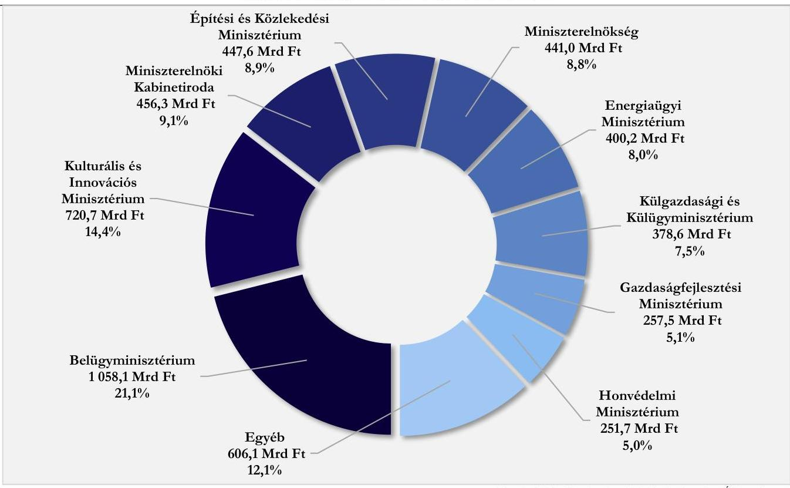

Forrás: 2023. évi zározzámadási tö́rvényjavaslat, $A S Z$ szerkesztés
A bevételek a fejezeti kezelésű előirányzatok esetében nem voltak jelentősek, a kiadási előirányzatok forrásaként jellemzően a központi kezelésű bevételek szolgáltak.

---

A fejezeti kezelésű kiadási előirányzatok terhére teljesített kiadások ellenőrzött mintatételei a vonatkozó jogszabályok (Áht., Ávr.) rendelkezéseinek és a belső szabályzatoknak megfeleltek, szabályszerűek voltak, érvényesültek a gazdálkodási jogkörök gyakorlására vonatkozó felhatalmazások és kontrollok.
A támogatásról jogszabályban, vagy a fejezetet irányító szerv belső szabályzatában meghatározott személy, testület döntött, jogszabályi előírások, vagy döntéselőkészítő dokumentáció alapján. A támogatási döntések tárgya összhangban volt az előirányzatok céljával, amely alapján - a jogszabályi előírásokra figyelemmel - támogatási határozatot hoztak, közszolgáltatási szerződést, támogatási szerződést, megállapodást kötöttek úgy, hogy azokban rendelkeztek - többek között - a támogatással való elszámolás, részbeszámolás kötelezettségéről.
A kötelezettségvállalás jogkörét az Áht. és az Ávr. rendelkezéseinek és a belső szabályozásoknak megfelelően felhatalmazott személyek szabályszerűen gyakorolták. A teljesítések igazolását a szükséges esetekben az Ávr., illetve a belső szabályozások előírásainak megfelelően, az arra jogosult személy szabályszerűen végezte.
A támogatási célú előirányzatok esetében az egyes kifizetések teljesítése a vonatkozó jogszabályok, ágazati rendeletek és a belső szabályzatok rendelkezései szerint, jellemzően támogatási szerződések alapján történt.
3.3. számú megállapítás

Az uniós források és a kapcsolódó hazai forrásból finanszírozott támogatások kiadási előirányzatai teljesítési adatainak megbízhatóságát befolyásoló hibát az ellenőrzés nem tárt fel. Az előirányzatok teljesítése kapcsán az ellenőrzés szabályszerűségi hibát nem tárt fel.

A XIX. Uniós Fejlesztések fejezet, valamint az uniós kiadási előirányzattal rendelkező további fejezetek uniós programok és kapcsolódó hazai forrásból finanszírozott támogatások kiadási előirányzatai teljesítési adatainak megbízhatóságát befolyásoló hibát az ellenőrzés nem tárt fel.
A 2014-2020 programozási időszak és a 2021-2027 programozási időszak kohéziós politikai operatív programjai, a Helyreállítási és Ellenállóképességi Eszköz, valamint a Vidékfejlesztési és halászati programok, továbbá az egyéb uniós programok esetében a teljesített kifizetések számviteli elszámolását a Számv. tv. előírásainak megfelelően bizonylattal alátámasztották, a Számv. tv. előírásaival összhangban a kiadások elszámolt összege (részösszege) megegyezett a gazdasági esemény számviteli elszámolását alátámasztó bizonylatokon szereplő összeggel, elszámolásuk az Áhsz.-ben foglaltaknak megfelelően történt.

Az XIX. Uniós Fejlesztések fejezet és az uniós kiadási előirányzattal rendelkező további fejezetek 2023. évi eredeti kiadási előirányzatait és azok teljesítési adatait a 7. táblázat szemlélteti.

---

7. táblázat

# AZ UNIÓS FORRÁSOK ÉS KAPCSOLÓDÓ HAZAI FORRÁSBÓL FINANSZÍROZOTT TÁMOGATÁSOK KIADÁSAI A 2023. ÉVBEN (MRD FT) 

| MEGNEVEZÉSE | EREDFti   ELÖIRÁNYZAT | TEJESITÉs |
| :--: | :--: | :--: |
| 2014-2020. közötti kohéziós politikai operatív programok (XIX. fejezet) | 1173,3 | 1366,7 |
| 2021-2027. közötti kohéziós politikai operatív programok (XIX. fejezet) | 1229,4 | 364,3 |
| Egyéb kohéziós kiadási előirányzatok (XIX. fejezet)* | 72,9 | 14,5 |
| Helyreállítási és Ellenállóképességi Eszköz (XIX. fejezet) | 505,3 | 270,4 |
| Agrár- és halászati alapok programjai (XII., XIX. fejezet)** | 767,5 | 769,7 |
| Egyéb uniós programok (XIV., XVIII., XIX. fejezet)*** | 45,1 | 28,2 |
| ÖSSZESEN: | 3793,5 | 2813,8 |

* Európai Területi Együttmüködési 2014-2020 és 2021-2027. az Európai Hálózatfinanszirozási Eszköz (CEF) projektek 2014-2020 és 2021-2027, valamint a Transznacionális és Interregionális Együttmüködés (2014-2020) és (2021-2027)
** A XIX. fejezeten belül a Vidékfejlesztési Program, Magyar Halgazdálkodási Operatív Program, Magyar Halgazdálkodási Operatív Program Plusz és a KAP Stratégiai Terv Vidékfejlesztési Intézkedései, valamint a XII. Agrárminisztérium fejezeten belül az Uniós programok kiegészitő támogatása
*** A XIV. Belügyminisztérium fejezeten belül az Európai Uniós és nemzetközi projektek/programok megvalósitásához kapcsolódó kiadások, Belügyi Alapok 2014-2020, Belügyi Alapok 2021-2027, a XVIII. Kálgazdasági és Kállagyminisztérium fejezeten belül a Brexit Alkalmazkodási Tartalék, továbbá a XIX. fejezeten belül az EGT és Norvég Finanszirozási Mechanizmusok 2014-2021 és a Svájci-Magyar Együttmüködési Program II.

Forrás: 2023. évi zározzámadási törvényjavaslat, ÁSZ saját szerkesztés

Az uniós források és a kapcsolódó hazai forrásból finanszírozott támogatások kiadási előirányzatainak teljesítése kapesán az ellenőrzés nem tárt fel szabályszerűségi hibát.
A költségvetés közvetlen bevételei és kiadásai fejezeten belül az uniós programok 2023. évi eredeti bevételi előirányzatait és azok teljesítési adatait a 8. táblázat szemlélteti.
8. táblázat

AZ UNIÓS PROGRAMOK EURÓPAI UNIÓTÓL ÉRKEZŐ BEVÉTELEINEK ALAKULÁSA A 2023. ÉVBEN (MRD FT)

| MEGNEVEZÉSE | EREDFti   ELÖIRÁNYZAT | TEJESITÉs |
| :-- | :--: | :--: |
| 6/1 Kohéziós Operatív Programok | 948,2 | 1314,1 |
| 6/10 Vidékfejlesztési Program (VP) | 322,7 | 325,2 |
| 6/11 Magyar Halgazdálkodási Operatív Program (MAHOP) | 2,7 | 3,6 |
| 6/12 Európai Hálózatfinanszírozási Eszköz (CEF) projektek | 19,6 | 4,1 |
| 6/13 Egyéb programok | 12,8 | 3,1 |
| 6/15 KAP Stratégiai Terv Vidékfejlesztési Intézkedései | 10,0 | 6,1 |
| 6/16 Magyar Halgazdálkodási Operatív Program (MAHOP) Plusz | 0,5 | 0,0 |
| 6/17 Európai Hálózatfinanszírozási Eszköz (CEF) projektek 2021-től | 23,4 | 41,0 |
| 6/18 Egyéb programok 2021-2027 | 7,6 | 5,2 |
| 6/19 Helyreállítási és Ellenállóképességi Eszköz (RRF) | 325,4 | 0,0 |
| 6/20 Kohéziós Operatív Programok 2021-2027 | 480,0 | 270,2 |
| ÖSSZESEN: | 2152,9 | 1972,5 |

A XLII. fejezet 6. cím Uniós programok bevételi előirányzatai összességében 91,6\%-on teljesültek, azonban az egyes jogcímeken lévő előirányzatok teljesülési adatai eltérően alakultak.
A hazai forrásból származó bevételek az uniós kiadási előirányzatokkal rendelkező más fejezetekben jelentek meg, teljesített összegük a 2023. évben összességében 258,2 Mrd Ft volt. Így az uniós és a kapcsolódó hazai forrásból származó bevételek együttesen 2 230,8 Mrd Ft-ban teljesültek.

---

3.4. számú megállapítás

A központi alrendszerbe tartozó szervezetek bevételi és kiadási előirányzatai teljesítési adatainak megbízhatóságát befolyásoló lényeges hibát az ellenőrzés nem tárt fel. Az előirányzatok teljesítése kapcsán az ellenőrzés szabályszerűségi hibákat állapított meg.

A központi alrendszerbe tartozó szervezetek bevételi és kiadási adatait a 9. táblázat szemlélteti (a táblázat nem tartalmazza a NEAK ${ }^{29}$ adatait, figyelemmel arra, hogy az intézmény bevételei és kiadásai a LXXII. Egészégbiztosítási Alap fejezetben szerepelnek).

| 9. táblázat |  |  |
| :--: | :--: | :--: |
| A KÖZPONTI ALRENDSZERBE TARTOZÓ SZERVEZETEK BEVÉTELEI ÉS KIADÁSAI A 2023. ÉVBEN (MRD FT) |  |  |
| MEGNEVEZÉS | EREDEIT   ELÖIRÁNYZAT | TEHJESÍTÉS |
| Bevétel | 1610,7 | 2575,5 |
| Kiadás | 5383,8 | 7938,7 |

A gazdasági események számviteli elszámolása összességében megfelelt a Számv. tv. és az Áhsz. előírásainak, a gazdasági események az elszámolást alátámasztó bizonylaton szereplő összegben, az egységes rovatrend előírásainak figyelembevételével kerültek elszámolásra.
A kiadások tekintetében egyedi megbízhatósági hibaként tárta fel az ellenőrzés nyolc intézménynél, hogy a gazdasági esemény elszámolása az Áhsz. 40. $\$ (1) bekezdésében és 15. mellékletében foglaltak ellenére nem az egységes rovatrend előírásainak megfelelő nyilvántartási számlákon történt.
A hibák összértéke a lényegességi küszöbérték alatt maradt, így a központi alrendszerbe tartozó szervezetek kiadási adatainak megbízhatóságát nem befolyásolták.
A bevételek tekintetében megbízhatósági hibaként fordult elő egy intézménynél, hogy adott tétel számviteli elszámolása nem az Áhsz. 40. $\$ (1) bekezdésében a és 15. mellékletében előírt rovaton, egy további intézmény esetében pedig nem a Számv. tv. 167. § (1) bekezdés h) pontjában meghatározott tartalmi követelményeknek megfelelő számviteli bizonylatok alapján történt.
A hibák összértéke nem haladta meg a lényegességi küszöbértéket, így azok a központi alrendszerbe tartozó szervezetek bevételi adatainak megbízhatóságát nem befolyásolták.
A központi alrendszerbe tartozó szervezetek teljesítési adatainak megoszlását tranzakció típusonként a kiadási előirányzatokra vonatkozóan a 10. ábra, a bevételi előirányzatokra vonatkozóan a 11. ábra szemlélteti.

---

10. álna

A KÖZPONTI ALRENDSZERBE TARTOZÓ SZERVEZETEK 2023. ÉVI TELJESÍTETT KÖLTSÉGVETÉSI KIADÁSAINAK MEGOSZLÁSA
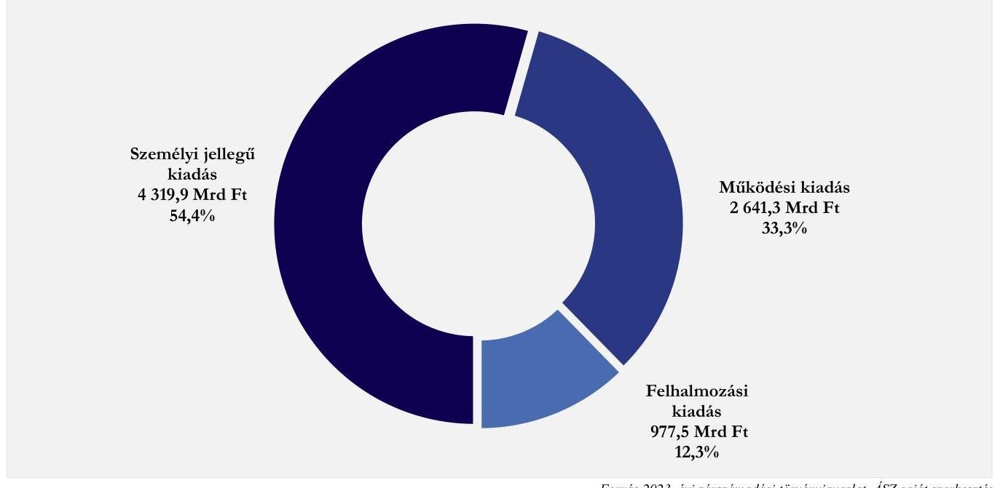

Forrás 2023. évi zárszámadási törvényjavaslat, ÁSZ saját szerkesztés
11. álna

A KÖZPONTI ALRENDSZERBE TARTOZÓ SZERVEZETEK 2023. ÉVI TELJESÍTETT KÖLTSÉGVETÉSI BEVÉTELEINEK MEGOSZLÁSA
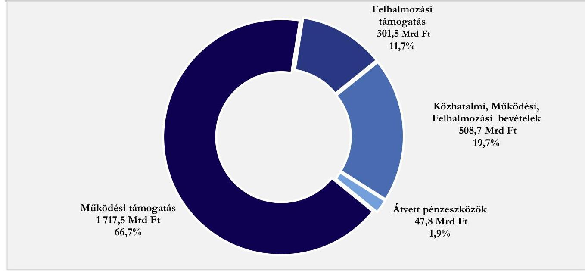

Forrás: 2023. évi zárszámadási törvényjavaslat, ÁSZ saját szerkesztés
A központi alrendszerbe tartozó szervezetek személyi juttatásokkal kapcsolatos kiadási előirányzatainak teljesítésével összefüggésben az ellenőrzés több intézménynél tárt fel a költségvetés végrehajtása során alkalmazott szabálytalan gyakorlatot. 10 intézménynél az Áht. 38. § (1) bekezdésében foglaltak ellenére utalványozás mellőzésével került sor a személyi jellegű kifizetések teljesítésére, mivel az utalványozás vagy a kifizetés dátumát követően, vagy egyáltalán nem történt meg. Két további intézmény esetében a személyi juttatások kifizetésére vonatkozó külön írásbeli rendelkezés tartalma nem felelt meg az Ávr. 59. § (3) bekezdés d)-e) pontjaiban előírtaknak.

---

A kiadási előirányzatok terhére történt egyéb kifizetések ellenőrzött tételei esetében feltárt eseti szabályszerűségi hibák a kötelezettségvállalás, a pénzügyi ellenjegyzés és a teljesítés igazolása gazdálkodási jogkörök gyakorlására vonatkozóan az Áht. 37. § (1) bekezdésében, valamint az Ávr. 55. § (1) és 57. § (1), (3) bekezdéseiben előírtak megsértéséből adódtak.

Két intézmény esetében tárta fel az ellenőrzés a bevételek utalványozásának az Áht. 38. § (1) bekezdésében, valamint az Ávr. 59. § (5) bekezdésében előírtaknak meg nem felelő szabályozását, ezen felül egyiküknél - a teljesítésigazolás mellőzésének előírása miatt egyebek mellett az illetmények esetében - a teljesítésigazolás nélkül kifizethető kiadásokra vonatkozó szabályozás Ávr. 53. § (1) és 57. § (3) bekezdésében foglaltakkal való összhangjának hiányát.
3.5. számú megállapítás

Az ELKA kiadási előirányzatai teljesítési adatainak megbízhatóságát befolyásoló hibát az ellenőrzés nem tárt fel. Az előirányzatok teljesítése kapcsán az ellenőrzés szabályszerűségi hibákat állapított meg. Az ELKA keretében működő alapok beszámolási kötelezettségüket szabályszerűen teljesítették.

AZ ELKA KIADÁSI ELŐIRÁNYZATAI - a BGA ${ }^{30}$, a KNPA $^{31}$, az NFA $^{32}$, az NKA $^{33}$, valamint az NKFIA $^{34}$ - teljesített kifizetéseinek számviteli elszámolását a Számv. tv. előírásainak megfelelően bizonylattal alátámasztották, a Számv. tv. előírásaival összhangban a kiadások elszámolt összege (részösszege) megegyezett a gazdasági esemény számviteli elszámolását alátámasztó bizonylatokon szereplő összeggel, elszámolásuk az Áhsz.-ben foglaltaknak megfelelően történt.
Az ELKA kiadásainak és bevételeinek alakulását összesítve a 10. táblázat mutatja be. Az ELKA összes teljesített kiadása legnagyobb részét (közel 58\%-át) az NFA-ból teljesített kiadások tették ki.
A teljesített kiadások \%-os megoszlását alaponként a 12. ábra szemlélteti.

10. táblázat

AZ ELKA BEVÉTELEI ÉS KIADÁSAI A 2023. ÉVBEN (MRD FT)

| MEGSEVEZÉS | ÉREDETT   ELŐIRÁNYZAT | TELJESÍTÉS |
| :-- | :--: | :--: |
| Bevétel | 755,8 | 777,9 |
| Kiadás | 593,1 | 665,5 |

Forrás: 2023. évt zározzámadási törvènysavaslat, ÁSZ saját szerkesztés
12. ábra

AZ ELKA-BÓL TELJESÍTETT KÖLTSÉGVETÉSI KIADÁSOK ALAPOK KÖZÖTTI MEGOSZLÁSA A 2023. ÉVBEN
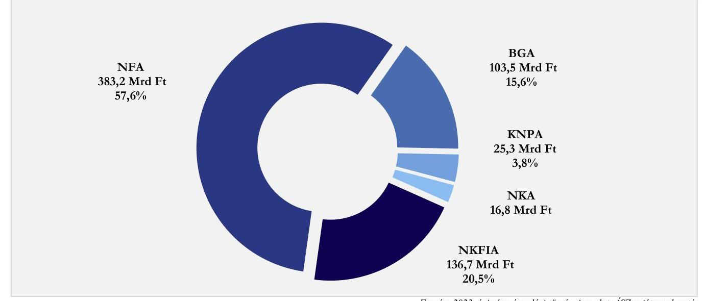

Forrás: 2023. évt zározzámadási törvénysavaslat, ÁSZ saját szerkesztés

---

Az ELKA tervezett bevételi többlete 162,7 Mrd Ft volt, amely a teljesítési adatok alapján 112,4 Mrd Ft
A 2022. évhez képest legnagyobb változás a kiadások
tekintetében a BGA-t érintette, az alap 2023. évi teljesített kiadása
az eredeti 62,0 Mrd Ft- előirányzathoz képest 103,5 Mrd Ft lett,
ezzel a 2022. évi teljesített kiadási összeghez (47,9 Mrd Ft)
viszonyítva több, mint kétszeresére növekedett.
összegben $(69,0 \%)$ alakult.
Az ELKA 2023. évi bevételei a 2022. évihez képest 24,3 Mrd Ft-tal (3\%-kal) alacsonyabb összegben, a kiadásai 127,0 Mrd Ft-tal (23,6\%-kal) magasabb összegben teljesültek.

A 2023. évi teljesített bevételek és kiadások, valamint az egyenlegek alakulását Alaponként a 13. ábra szemlélteti.
13. ábra

AZ ELKA TELJESÍTETT KÖLTSÉGVETÉSI BEVÉTELEI ÉS KIADÁSAI ALAPONKÉNT A 2023. ÉVBEN (MRD FT)
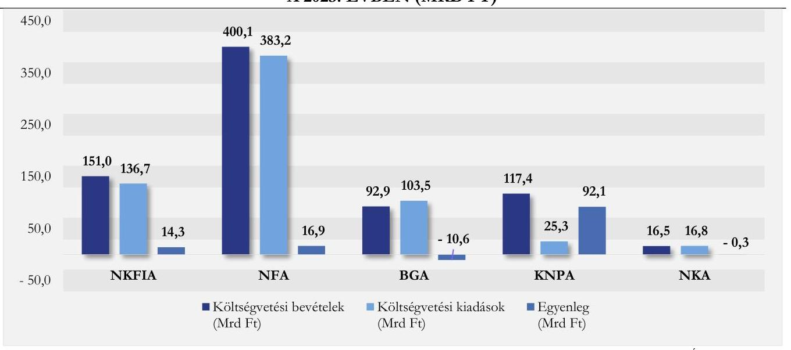

Forrás: 2023. évi zározzámadási törvénytavaslat, ÁSZ saját szerkecités
Az ELKA kiadási előirányzatainak teljesítése során az Áht. és az Ávr. rendelkezései szerint a kötelezettségvállalási és teljesítésigazolási jogkört az arra jogosult személyek gyakorolták, továbbá a teljesítésigazolt és kifizetett összegek összhangban voltak a kötelezettségvállalás dokumentumában foglaltakkal. Az Alapokból teljesített kiadások az Alapokat létrehozó törvényekben meghatározott céloknak megfeleltek. A támogatások odaítéléséről a megfelelő testület/szerv/személy döntött, a támogatói okiratban, támogatási szerződésben rögzítették a jogszabályokban foglalt kötelezettségek megtartását biztosító feltételeket.
A kiadási előirányzatok terhére történt támogatások vonatkozásában egy Alapnál feltárt szabályszerűségi hibák a kifizetést megelőző kontrollokat érintették, az Áht. 38. § (1) bekezdésében foglaltak ellenére az utalványozás és a teljesítésigazolás a kifizetés dátumát követően történt meg.
Az éves költségvetési beszámolókat az alapkezelők az Áhsz.-ben előírt határidőre elkészítették, a költségvetési jelentéseket főkönyvi kivonattal alátámasztották, a beszámolók tartalmazták az Áhsz.-ben előírt dokumentumokat. Az NFA-t, az NKA-t és az NKFIA-t megillető, a NAV által beszedett bevételek éves beszámolókban megjelenő összegei összhangban voltak a NAV adatszolgáltatásában szereplő összegekkel.

---

3.6. számú megállapítás

A TB Alapok bevételi és kiadási előirányzatai teljesítési adatainak megbízhatóságát befolyásoló hibát az ellenőrzés nem tárt fel. Az előirányzatok teljesítése kapcsán az ellenőrzés szabályszerűségi hibát nem tárt fel. A TB Alapok beszámolási kötelezettségüket szabályszerűen teljesítették.

Az Ny. Alap, valamint az E. Alap ellátási szektorai tekintetében teljesített kifizetések, valamint az E. Alap költségvetési fejezetének részét képező NEAK működéséhez kapcsolódó bevételek, illetve kiadások számviteli elszámolását a Számv. tv. előírásainak megfelelő bizonylattal alátámasztották, a Számv. tv. előírásaival összhangban a kiadások elszámolt összege (részösszege) megegyezett a gazdasági esemény számviteli elszámolását alátámasztó bizonylatokon szereplő összeggel, elszámolásuk az Áhsz.-ben foglaltaknak megfelelően történt.

A TB Alapok bevételeinek meghatározó részét képező, a NAV által beszedett, az Ny. Alapot, illetve az E. Alapot megillető adók, járulékok, egyéb közterhek elszámolásának megbízhatóságáról a központi kezelésű bevételi előirányzatok ellenőrzése keretében győződött meg az ÁSZ.

A TB Alapok bevételi és kiadási adatait összesítve a 11. táblázat, alaponként elkülönítve a 14. ábra szemlélteti ellenőrzése keretében győződött meg az ÁSZ.

A TB ALAPOK BEVÉTELEI ÉS KIADÁSAI A 2023. ÉVBEN (MRD FT)

|  MEGNEVEZÉS | EREBETI
ELŐIRÁNYZAT | TELJESÍTÉS  |
| --- | --- | --- |
|  Bevétel | 9 587,9 | 9 465,1  |
|  Kiadás | 9 587,9 | 9 880,9  |

Forrás: 2023. évi záxszámadási törvényjavaslat, ÁSZ saját szerkesztés 14. ábra

# A TB ALAPOK 2023. ÉVI TELJESÍTETT KIADÁSI ÉS BEVÉTELI ELŐIRÁNYZATAINAK MEGÓSZLÁSA ALAPONKÉNT (MRD FT)

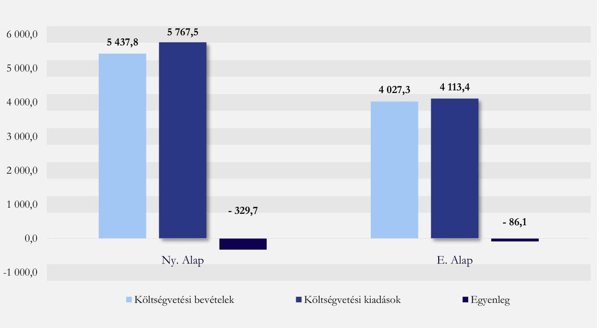

Forrás: 2023. évi záxszámadási törvényjavaslat, ÁSZ saját szerkesztés

---

Az Ny. Alap tervezése 2023-ra azonos összegű, 5 554,6 Mrd Ft kiadási és bevételi főösszeggel történt. A bevételi előirányzat teljesítése az eredeti előirányzat $97,9 \%$-át érte el, míg a kiadási előirányzat az eredeti előirányzat $103,8 \%$ ában teljesült. Az Ny. Alap így a 2023. évet 329,7 Mrd Ft hiánnyal zárta.
Az E. Alap 2023. évi tervezése is azonos (4 033,3 Mrd Ft) összegű kiadási és bevételi főösszeggel történt. A bevételi előirányzat teljesítése az eredeti előirányzat $99,9 \%$-át érte el, míg a kiadási előirányzat az eredeti előirányzat 102,0\%ában teljesült. Ennek eredményeként az E. Alap a 2023. évet 86,1 Mrd Ft hiánnyal zárta.
A TB Alapok 2022. és 2023. évi bevételi és kiadási adatait a 15. ábra mutatja be.
15. ábra

# A TB ALAPOK TELJESÍTETT BEVÉTELI ÉS KIADÁSI ELŐIRÁNYZATAI A 2022. ÉS 2023. ÉVBEN 

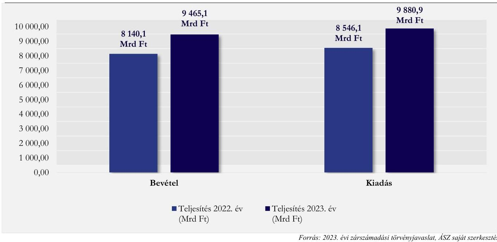

A TB Alapok bevételei meghatározó arányban ( $70,7 \%$-ban) a TB Alapokhoz rendelt szociális hozzájárulási adó és járulék bevételekből származtak, az egyéb adók, járulékok és hozzájárulások az összes bevétel további $2,5 \%$-át tették ki. A szociális hozzájárulási adó és járulék 2023. évi teljesített bevételi előirányzata a 2022. évi teljesítésnél $14,5 \%$-kal magasabb volt, ugyanakkor a 2023. évi eredeti előirányzattól 2,7\%-kal maradt el.

---

A központi költségvetési hozzájárulások mértéke a 2023. évben a TB Alapok bevételeinek 24,7\%-át tette ki. A költségvetési hozzájárulások 2023. évi teljesített bevételi előirányzata 20,0\%-kal haladta meg a 2022. évi teljesítést, és a 2023. évi eredeti előirányzat $100 \%$-ában teljesült.
A TB Alapok bevételeinek összetételét a 16. ábra szemlélteti
16. ábra

# A TB ALAPOK BEVÉTELEI ÖSSZETÉTELÉNEK MEGOSZLÁSA A 2023. ÉVBEN 

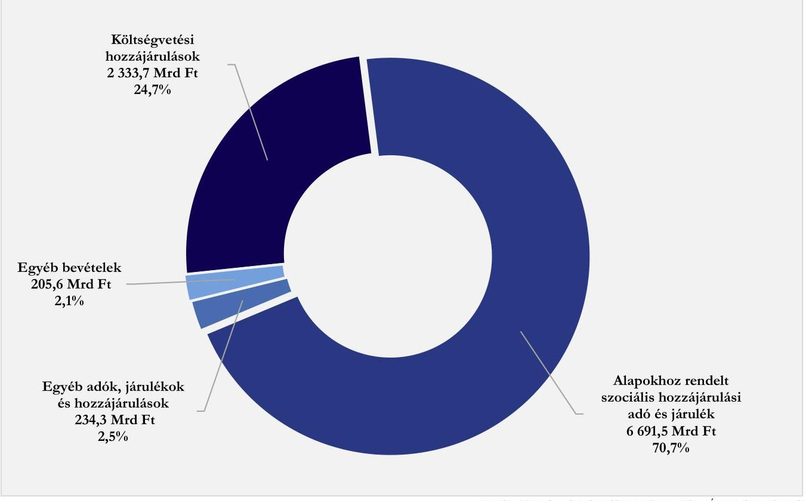

Forrás: 2023. évi záxszámadási törvénypavaslat, ÁSZ saját szerkesztés
A TB Alapok ellátási kiadási előirányzatainak felhasználása, valamint a NEAK működési bevételi és kiadási előirányzatainak felhasználása kapcsán az ellenőrzés szabályszerűségi hibát nem tárt fel. Az ellenőrzött mintatételek esetében az Áht. és az Ávr. rendelkezéseinek megfelelően a kötelezettségvállalási és teljesítésigazolási jogkört az arra jogosult személyek gyakorolták, a kiadások jogszerűsége, a kifizetések megalapozottsága dokumentált volt, továbbá a teljesítésigazolt és kifizetett összegek összhangban voltak a kötelezettségvállalás dokumentumában foglaltakkal.
A TB Alapok költségvetési beszámolójának összeállítása szabályszerűen történt.
A TB Alapok éves bevételi összegei az alapok költségvetési beszámolóiban megjelentek, a bevételek számviteli elszámolásánál az ellenőrzés nem tárt fel lényeges hibát.
A TB Alapok kezelői a költségvetési beszámolókat a teljes főkönyvi kivonattal együtt határidőben elkészítették, a beszámolók tartalmazták az Áhsz. által előírt dokumentumokat, a beszámoló részét képező költségvetési jelentések megfeleltek az Áhsz.-ben előírt tartalmi követelményeknek. A 2023. évi költségvetési jelentések az Áhsz. előírásával összhangban a könyvviteli zárlat során készített főkönyvi kivonattal alátámasztottak voltak.

---

# MELLÉKLETEK 

## I. SZ. MELLÉKLET: ÉRTELMEZŐ SZÓTÁR

államadósság
államadósság-mutató
államháztartás központi
alrendszere

EDP jelentés

Elkülönített Állami
Pénzalapok (ELKA)
előirányzat-átcsoportosítás
előirányzat módosítás
európai uniós forrás

Az államadósság az Európai Közösséget létrehozó szerződéshez csatolt, a túlzott hiány esetén követendő eljárásról szóló jegyzőkönyv alkalmazásáról szóló, 2009. május 25-i 479/2009/EK tanácsi rendeletben meghatározott módon számított adósság összege. (Forrás: Stabilitási tv. 1. § f) pont)
Az Alaptörvény 36. cikk (4) és (5) bekezdésében, valamint 37. cikk (2) és (3) bekezdésében foglaltak végrehajtása során figyelembe veendő mindenkori államadósság mutatója olyan, százalékban kifejezett, egy tizedesig kerekített hányados, amely számlálójában az államadósságnak, nevezőjében a Közösségben a nemzeti és regionális számlák európai rendszeréről szóló tanácsi rendeletben meghatározottak szerint számított bruttó hazai terméknek a Stabilitási tv. szerinti értéke szerepel. (Forrás: Stabilitási tv. 2. §)
Az államháztartás központi és önkormányzati alrendszerből áll. Az államháztartás központi alrendszerébe tartozik az állam, a központi költségvetési szerv, a törvény által az államháztartás központi alrendszerébe sorolt köztestület, illetve az e köztestület által irányított köztestületi költségvetési szerv. (Forrás: Ábt. 3. § (1)-(2) bekezdés)
Az Európai Unió Túlzott Hiány Eljárása (Excessive Deficit Procedure $=$ EDP) keretében a tagországok évente kétszer adatszolgáltatásban (EDP Jelentés) jelentik a kormányzati szektor két kiemelt mutatójának: a kormányzati szektor hiányának és adósságának alakulását. Annak érdekében, hogy az uniós konvergencia kritériumok által meghatározott mutatók és az államháztartási mutatók módszertani megkülönböztetése egyértelmű legyen, a Stabilitási tv. a kormányzati szektor hiánya elnevezést használja az uniós módszertan szerinti egyenlegre, míg a Stabilitási tv. szerinti államadósság és a kormányzati szektor uniós módszertan szerinti konszolidált bruttó adóssága (ún. maastrichti adósság) megegyeznek. A Konvergencia Programban használatos mutatók számítási módszertana megegyezik az EDP jelentésével. A kormányzati szektor egyenlegének (hiányának), valamint konszolidált bruttó adósságának az EDP jelentésben rögzített összege változhat, ameddig nem kerül az adott év végleges státuszba. (Forrás: Pénzügyminisztérium bonlap szerinti definíció, KSH bonlapon publikált EDP-jelentések)
Az Elkülönített Állami Pénzalapok a közfeladatok ellátása során az állam nevében beszedendő költségvetési bevételek és teljesítendő költségvetési kiadások alapszerű elszámolására szolgálnak. Elkülönített Állami Pénzalapot közfeladat részben vagy egészben államháztartáson kívüli forrásból történő ellátásának biztosítása céljából törvény hozhat létre. Ide tartozik a Bethlen Gábor Alap, a Központi Nukleáris Pénzügyi Alap, a Nemzeti Foglalkoztatási Alap, a Nemzeti Kulturális Alap, valamint a Nemzeti Kutatási, Fejlesztési és Innovációs Alap. (Forrás: Ábt. 6/A. § (5) bekezdés, Ketv. 11. §, 1. sz. melléklet LXII, LXIII., LXV., LXVI., LXVII. fejezetek)
Az átcsoportosítást végrehajtó költségvetésének - az Országgyűlés vagy a Kormány intézkedése, és a fejezetet irányító szervek megállapodása esetén a központi költségvetés, a fejezetet irányító szerv intézkedése esetén a fejezet, az államháztartás önkormányzati alrendszerében a költségvetési rendelet, határozat összesített - kiadási előirányzatai főösszegének változatlansága mellett a kiadási előirányzatok egyidejű csökkentésével és növelésével végrehajtott módosítás. (Forrás: Ábt. 1. § 5. pont)
A bevételi előirányzat vagy a kiadási előirányzat növelése, vagy csökkentése. (Forrás: Ábt. 1. § 6. pont)

Az Európai Unió költségvetéséből, az Európai Gazdasági Térség Európai Unión kívüli tagállamának költségvetéséből, valamint a Svájci Hozzájárulás programból származó forrás. (Forrás: Ábt. 1. § 7. pont)

---

fejezetet irányító szerv
fejezeti kezelésű előirányzat
garantőr szervezet
konszolidált adósság
kormányzati szektor
kormányzati szektor egyenlege

Konvergencia Program
költségvetési bevételi és kiadási előirányzatok
költségvetési hiány
központi alrendszerbe tartozó szervezetek

A fejezetet irányító szerv látja el a központi kezelésű előirányzatokhoz, a fejezeti kezelésű előirányzatokhoz, az ELKA-hoz és a Társadalombiztosítási Alapokhoz kapcsolódó tervezési, gazdálkodási, ellenőrzési, adatszolgáltatási és beszámolási feladatokat. A fejezetet irányító szerveket és azok vezetőit az Ávr. 1. sz. melléklete határozza meg. (Forrás: Abt. 6/B. § (1) bekezdés, Avr. 6. §)
A fejezeti kezelésű előirányzatok a fejezetet irányító szerv sajátos szakmai, ágazati feladatai ellátása, vagy az államnak a fejezethez tartozó költségvetési szervek tevékenységével kapcsolatban felmerülő, illetve szakmailag ahhoz kapcsolódó sajátos kötelezettségei teljesítése során felmerülő költségvetési bevételek és költségvetési kiadások elszámolására szolgálnak. (Forrás: Abt. 6/A. § (3) bekezdés)
Az állami viszontgarancia alapjául szolgáló kezességet, garanciát nyújtó jogi személy, amelynek feladata az állam által a viszontgarancia alapján kifizetett összeg behajtása is. (Forrás: Abt. 93. § (2) bekezdés)
A kormányzati szektorba sorolt pénzügyi intézmény költségvetési év utolsó napján fennálló, az államháztartás központi alrendszerével, az államháztartás önkormányzati alrendszerével, és a kormányzati szektorba sorolt egyéb szervezetekkel szemben fennálló követelései és kötelezettségei kiszűrésével számított adósságállomány. (Forrás: Stabilitási törvény 9. § (4) bekezdés)
Az államháztartás központi és önkormányzati alrendszeréhez tartozó szervezeteken felül magában foglalja az Európai Közösséget létrehozó szerződéshez csatolt, a túlzott hiány esetén követendő eljárásról szóló jegyzőkönyv alkalmazásáról szóló 2009. május 25-i 479/2009/EK rendelet szerinti kormányzati szektorba sorolt egyéb szervezeteket. (Forrás: Abt. 1. § 12. pont)
Az Európai Közösséget létrehozó szerződéshez csatolt, a túlzott hiány esetén követendő eljárásról szóló jegyzőkönyv alkalmazásáról szóló 2009. május 25-i 479/2009/EK tanácsi rendelet alapján számított egyenleg. (Forrás: Stabilitás tv. 1.§ e) pont)
A Kormány által évente elfogadott, adott időszakra vonatkozó gazdaságpolitikai célokat, makrogazdasági előrejelzéseket, az államháztartás egyenlege és az államadósság alakulására, az államháztartás folyamataira és rendszerére vonatkozó prognózisokat, követelményeket tartalmazó dokumentum, amely a költségvetési fegyelem biztosításának feltételrendszerét rögzíti. Magyarország Konvergencia programja 2023-2027 kiadására 2023. áprilisában került sor. (Forrás: Magyarország Konvergencia Programja, kormany.hu)

A központi költségvetésről szóló törvényben a költségvetési bevételi előirányzatok és a költségvetési kiadási előirányzatok központi kezelésű előirányzatként, fejezeti kezelésű előirányzatként, a TB Alapok előirányzataiként, az ELKA előirányzataiként, az államháztartás központi alrendszerébe tartozó költségvetési szervek előirányzataiként jelennek meg. A központi kezelésű előirányzatok - a törvényben meghatározott kivételekkel - az állam nevében beszedendő költségvetési bevételek és teljesítendő költségvetési kiadások elszámolására szolgálnak. (Forrás: Abt. 6/A. § (1)-(2) bekezdés)
A költségvetési hiány a kormányzati szektor negatív egyenlege, az alábbi tételek figyelembe vételével számítva:

| Bevétel | Kiadás |
| :-- | :-- |
| Eredményszemléletű adóbevétel | Eredményszemléletű kamatkiadás |
| Folyó- és tőketranszfer bevétel | Eredményszemléletű bér és dologi kiadás |
|  | Folyó- és tőketranszfer kiadás |
|  | Eredményszemléletű beruházási kiadás |

(Forrás: Stabilitási tv. 1. § e) pontja alapján $A S Z$ megfogalmazás)
Az államháztartás központi alrendszerébe tartozó költségvetési szervek, valamint az önálló költségvetési beszámolót készítő egyéb szervezetek. (ASZ meghatározás)

---

maastrichti kritérium
pénzforgalmi hiány

TB Alapok

TB Alapokhoz rendelt járulék bevételek, hozzájárulások

Az 1993-ban hatályba lépett Maastrichti Szerződésben meghatározott, úgynevezett konvergencia-kritériumok alapján az államháztartás hiánya nem haladhatja meg a GDP $3 \%$-át, az államadósság pedig a GDP 60\%-át. (Forrás: Maastricht Szerrődés - Szerződés az Európai Unióról (92/C 191/01))
A pénzforgalmi hiány (deficit) a legegyszerúbb hiánymutató a központi költségvetés jellemzésére, amely az alábbi tételek negatív egyenlegével egyenlő:

| A pénzforgalmi egyenleg főbb bevételei és kiadásai |  |
| :-- | :-- |
| Bevétel | Kiadás |
| Pénzforgalmi adóbevétel | Pénzforgalmi kamatkiadás |
| Folyó- és tőketranszfer bevétel | Pénzforgalmi bér és dologi kiadás |
| Privatizációs bevétel | Folyó- és tőketranszfer kiadás |
|  | Pénzforgalmi beruházási kiadás |
|  | Tulajdonosi részesedés szerzése |

(Forrás: MNB oktatási fïzetek, 9. szám)
A társadalombiztosítás pénzügyi alapjai, amelyek a társadalombiztosítás rendszerének müködtetése során az állam nevében beszedendő költségvetési bevételek és teljesítendő költségvetési kiadások elszámolására szolgálnak. A TB Alapokhoz tartozik az Ny. Alap és az E. Alap. Az Ny. Alap az öregségi nyugdíj - ideértve a társadalombiztosítási nyugellátásról szóló törvényben meghatározott szolgálatfüggő nyugellátást is -, a hozzátartozói nyugellátás és a törvényben meghatározott méltányossági kifizetések fedezetére szolgál, kezelő szerve a Kincstár. Az E. Alap a társadalombiztosítási ellátások közül az egészségbiztosítási (pénzbeli, természetbeni) ellátásokat finanszírozza, kezelő szerve a NEAK. (Forrás: Ábt. 6/A. § (4) bekezdés alapján ÁSZ meghatározás)
az Ny. Alapnál: a szociális hozzájárulási adó Ny. Alapot megillető része, a társadalombiztosítási járulék Ny. Alapot megillető része és a nyugdíjjárulék, az egyéb járulékok és hozzájárulások, és a késedelmi pótlék, bírság.
az E. Alapnál: a szociális hozzájárulási adó E. Alapot megillető része, a társadalombiztosítási járulék E. Alapot megillető része és az egészségbiztosítási járulék, továbbá az egyéb járulékok és hozzájárulások, és a késedelmi pótlék és bírság. (Forrás: 2023. évi zárszámadási törvényjavaslat)

---

# II. SZ. MELLÉKLET: AZ ELLENŐRZÖTT SZERVEZETEK JEGYZÉKE

|  SORSZ. | ELLENŐRZÖTT SZERVEZET NEVE | ADÓSZÁM |  |  |  |  |  |   |
| --- | --- | --- | --- | --- | --- | --- | --- | --- |
|   |  |  | KÖZPONTI
KEZ. EL. | FEJEZETI
KEZ. EL. | UNIÓs
EL. | KÖZPONTI
ALRENDSZER
SZERVEZETEI | ELKA | TB
ALAPOK  |
|  1. | Agrárminisztérium | 15305679-2-41 | X | X |  |  |  |   |
|  2. | Államadósság Kezelő Központ Zártkörűen Működő
Részvénytársaság | 12598757-1-41 | X |  |  |  |  |   |
|  3. | Állambiztonsági Szolgálatok Történeti Levéltára | 15597580-2-51 |  |  |  | X |  |   |
|  4. | Alpokalja Integrált Szociális Intézmény Győr-Moson-Sopron
Vármegye | 15369691-1-08 |  |  |  | X |  |   |
|  5. | Bábolna Nemzeti Ménesbírtok | 15833710-2-11 |  |  |  | X |  |   |
|  6. | Bács-Kiskun Vármegyei Kormányhivatal | 15789257-2-03 | X |  |  |  |  |   |
|  7. | Baranya Vármegyei Kormányhivatal | 15789240-2-02 | X |  |  |  |  |   |
|  8. | Békés Vármegyei Kormányhivatal | 15789264-2-04 | X |  |  | X |  |   |
|  9. | Békéscsabai Szakképzési Centrum | 15831835-2-04 |  |  |  | X |  |   |
|  10. | Belügyminisztérium | 15311605-2-41 | X | X | X |  |  |   |
|  11. | Bethlen Gábor Alapkezelő Közhasznú Nonprofit Zártkörűen
Működő Részvénytársaság | 23300576-2-41 |  |  |  |  | X |   |
|  12. | Borsod-Abaúj-Zemplén Vármegyei Kormányhivatal | 15789271-2-05 | X |  |  |  |  |   |
|  13. | Borsod-Abaúj-Zemplén Vármegyei Központi Kórház és
Egyetemi Oktatókórház | 15837501-2-05 |  |  |  | X |  |   |
|  14. | Budapest Főváros Kormányhivatala | 15789233-2-41 | X |  |  |  |  |   |
|  15. | Budapest Környéki Törvényszék | 15311409-2-42 |  |  |  | X |  |   |

---

|  SORSZ. | ELLENŐRZÓTT SZERVEZET NEVE | ADÓSZÁM | ELLENŐRZÉSI TERÜLET |  |  |  |  |   |
| --- | --- | --- | --- | --- | --- | --- | --- | --- |
|   |  |  | KÖZPONTI
KEZ. EL | FEJEZETI
KEZ. EL | UNIÓs
EL | KÖZPONTI
ALRENDSZER
SZERVEZETEI | ELKA | TB
ALAPOK  |
|  16. | Bükki Nemzeti Park Igazgatóság | 15323864-2-10 |  |  |  | X |  |   |
|  17. | Csongrád-Csanád Vármegyei Katasztrófavédelmi Igazgatóság | 15722854-2-51 |  |  |  | X |  |   |
|  18. | Csongrád-Csanád Vármegyei Kormányhivatal | 15789288-2-06 | X |  |  |  |  |   |
|  19. | Debreceni Ítélőtábla | 15597920-1-09 |  |  |  | X |  |   |
|  20. | Debreceni Szakképzési Centrum | 15831914-2-09 |  |  |  | X |  |   |
|  21. | Dél-Pesti Centrumkórház-Országos Hematológiai és Infektológiai Intézet | 15490342-2-43 |  |  |  | X |  |   |
|  22. | Edelényi Koch Róbert Kórház és Rendelőintézet | 15439196-2-05 |  |  |  | X |  |   |
|  23. | Energiaügyi Minisztérium | 15764412-2-43 | X | X |  |  |  | X  |
|  24. | Építési és Közlekedési Minisztérium | 15847397-2-41 | X | X |  |  |  |   |
|  25. | Észak-Budapesti Tankerületi Központ | 15835107-2-41 |  |  |  | X |  |   |
|  26. | Esztergomi Speciális Gyermekotthoni Központ, Általános Iskola és Szakiskola | 15308672-2-11 |  |  |  | X |  |   |
|  27. | Esztergomi Tankerületi Központ | 15839156-2-11 |  |  |  | X |  |   |
|  28. | Fejér Vármegyei Kormányhivatal | 15789295-2-07 | X |  |  |  |  |   |
|  29. | Fejér Vármegyei Szent György Egyetemi Oktató Kórház | 15360025-2-07 |  |  |  | X |  |   |
|  30. | Fővárosi Katasztrófavédelmi Igazgatóság | 15494140-2-51 |  |  |  | X |  |   |
|  31. | Galagonya Integrált Szociális Intézmény Tolna Vármegye | 15768650-2-17 |  |  |  | X |  |   |
|  32. | Gyermekvédelmi Központ Jász-Nagykun-Szolnok Vármegye | 15576347-1-16 |  |  |  | X |  |   |
|  33. | Győr-Moson-Sopron Vármegyei Kormányhivatal | 15789305-2-08 | X |  |  |  |  |   |
|  34. | Hajdú-Bihar Vármegyei Kormányhivatal | 15789312-2-09 | X |  |  |  |  |   |
|  35. | Hajdúbőszörményi Tankerületi Központ | 15835145-2-09 |  |  |  | X |  |   |

---

|  SORSZ. | ELLENŐRZÓTT SZERVEZET NEVE | ADÓSZÁM | ELLENŐRZÉSI TERÜLET |  |  |  |  |   |
| --- | --- | --- | --- | --- | --- | --- | --- | --- |
|   |  |  | KÓZPONTI
KEZ. EL | FEJEZETI
KEZ. EL | UNIÓs
EL | KÓZPONTI
ALRENDSZER
SZERVEZETEI | ELKA | TB
ALAPOK  |
|  36. | Harmónia Integrált Szociális és Gyermekvédelmi Intézmény Heves Vármegye | 16748693-2-10 |  |  |  | X |  |   |
|  37. | HEPA Magyar Exportfejlesztési Ügynökség Nonprofit Zártkörűen Működő Részvénytársaság | 26502887-2-41 | X |  |  |  |  |   |
|  38. | Heves Vármegyei Kormányhivatal | 15789329-2-10 | X |  |  |  |  |   |
|  39. | Heves Vármegyei Markhot Ferenc Oktatókórház és Rendelőintézet | 15813839-2-10 |  |  |  | X |  |   |
|  40. | Honvédelmi Minisztérium | 15701051-2-51 | X | X |  |  |  |   |
|  41. | Igazságügyi Minisztérium | 15300076-2-41 | X |  |  |  |  |   |
|  42. | Iparművészeti Múzeum | 15321185-2-43 |  |  |  | X |  |   |
|  43. | Jász-Nagykun-Szolnok Vármegyei Kormányhivatal | 15789381-2-16 | X |  |  |  |  |   |
|  44. | Készenléti Rendőrség | 15720199-2-51 | X |  |  |  |  |   |
|  45. | Kisalföldi Agrárszakképzési Centrum | 15833002-2-08 |  |  |  | X |  |   |
|  46. | Kiskunhalasi Országos Büntetés-Végrehajtási Intézet | 15839929-2-51 |  |  |  | X |  |   |
|  47. | Komárom-Esztergom Vármegyei Kormányhivatal | 15789336-2-11 | X |  |  |  |  |   |
|  48. | Kőris Integrált Szociális Intézmény Pest Vármegye | 15395199-2-13 |  |  |  | X |  |   |
|  49. | Közigazgatási és Területfejlesztési Minisztérium | 15849272-2-41 |  |  | X |  |  |   |
|  50. | Kulturális és Innovációs Minisztérium | 15309271-2-41 | X | X |  |  |  |   |
|  51. | Külgazdasági és Külügyminisztérium | 15311344-1-41 | X | X | X |  |  |   |
|  52. | Liszt Ferenc Zeneművészeti Egyetem | 15308957-2-42 |  |  |  | X |  |   |
|  53. | Mádl Ferenc Összehasonlító Jogi Intézet | 15840194-1-43 |  |  |  | X |  |   |
|  54. | Magyar Államkincstár | 15329970-2-41 | X | X | X |  |  | X  |

---

|  SORSZ. | ELLENŐRZÓTT SZERVEZET NEVE | ADÓSZÁM | ELLENŐRZÉSI TERÜLET |  |  |  |  |   |
| --- | --- | --- | --- | --- | --- | --- | --- | --- |
|   |  |  | KÓZPONTI
KEZ. EL | FEJEZETI
KEZ. EL | UNIÓS
EL | KÓZPONTI
ALRENDSZER
SZERVEZETEI | ELKA | TB
ALAPOK  |
|  55. | Magyar Művészeti Akadémia Művészetelméleti és
Módszertani Kutatóintézet | 15825476-2-43 |  |  |  | X |  |   |
|  56. | Magyar Nemzeti Vagyonkezelő Zártkörűen Működő
Részvénytársaság | 14077340-2-44 | X |  |  |  |  |   |
|  57. | Magyar Turisztikai Ügynökség Zártkörűen Működő
Részvénytársaság | 10356113-4-41 | X |  |  |  |  |   |
|  58. | Maradványvagyon-hasznosító Zártkörűen Működő
Részvénytársaság | 27429589-2-43 | X |  |  |  |  |   |
|  59. | Mátészalkai Tankerületi Központ | 15835279-2-15 |  |  |  | X |  |   |
|  60. | Miniszterelnöki Kabinetiroda | 15833167-2-41 | X | X |  |  |  |   |
|  61. | Miniszterelnökség (EU Irányító hatóság funkciók
tekintetében 2024. január 1-től a Közigazgatási és
Területfejlesztési Minisztérium) | 15775292-2-41 | X | X |  |  |  |   |
|  62. | Nemzetgazdasági Minisztérium (2023.12.31-ig
Gazdaságfejlesztési Minisztérium) | 15848398-2-41 | X | X |  |  | X |   |
|  63. | Nemzeti Adó- és Vámhivatal | 15789934-2-51 | X |  |  |  |  |   |
|  64. | Nemzeti Egészségbiztosítási Alapkezelő | 15328106-2-41 | X |  |  |  |  | X  |
|  65. | Nemzeti Élelmiszerlánc-Biztonsági Hivatal | 15598347-2-41 | X |  |  |  |  |   |
|  66. | Nemzeti Földügyi Központ | 15840369-2-42 | X |  |  |  |  |   |
|  67. | Nemzeti Kommunikációs Hivatal | 15827186-2-41 |  |  |  | X |  |   |
|  68. | Nemzeti Kulturális Támogatáskezelő (2023. augusztus 8-ig
Emberi Erőforrás Támogatáskezelő) | 15329114-2-42 | X |  |  |  | X |   |
|  69. | Nemzeti Kutatási, Fejlesztési és Innovációs Hivatal | 15831000-2-42 |  |  |  |  | X |   |

---

|  SORSZ. | ELLENŐRZÓTT SZERVEZET NEVE | ADÓSZÁM | ELLENŐRZÉSI TERÜLET |  |  |  |  |   |
| --- | --- | --- | --- | --- | --- | --- | --- | --- |
|   |  |  | KÖZPONTI
KEZ. EL | FEJEZETI
KEZ. EL | UNIÓs
EL | KÖZPONTI
ALRENDSZER
SZERVEZETEI | ELKA | TB
ALAPOK  |
|  70. | Nemzeti Sportügynökség Nonprofit Zártkörűen Működő
Részvénytársaság | 27750409-2-51 | X |  |  |  |  |   |
|  71. | Nemzeti Szakképzési és Felnőttképzési Hivatal | 15830731-2-42 |  |  |  |  | X |   |
|  72. | Nemzeti Útdíjfizetési Szolgáltató Zártkörűen Működő
Részvénytársaság | 12147715-2-44 | X |  |  |  |  |   |
|  73. | Nemzeti Védelmi Szolgálat | 15722603-2-51 |  |  |  | X |  |   |
|  74. | Nemzeti Vízművek Zártkörűen Működő Részvénytársaság | 28950334-2-43 | X |  |  |  |  |   |
|  75. | Néprajzi Múzeum | 15321178-2-42 |  |  |  | X |  |   |
|  76. | N7 Holding Nemzeti Védelmi Ipari Innovációs Zártkörűen
Működő Részvénytársaság | 29219317-2-51 | X |  |  |  |  |   |
|  77. | Nógrád Vármegyei Kormányhivatal | 15789343-2-12 | X |  |  |  |  |   |
|  78. | Nyugat-Dunántúli Vízügyi Igazgatóság | 15308421-2-18 |  |  |  | X |  |   |
|  79. | Orosházi Dr. László Elek Kórház és Rendelőintézet | 15346487-2-04 |  |  |  | X |  |   |
|  80. | Országos Mentőszolgálat | 15309989-2-41 |  |  |  | X |  |   |
|  81. | Országos Onkológiai Intézet | 15309769-2-43 |  |  |  | X |  |   |
|  82. | Pásztói Margit Kórház | 15450061-2-12 |  |  |  | X |  |   |
|  83. | Pénzügyminisztérium | 15303392-2-41 | X | X |  |  |  |   |
|  84. | Pest Vármegyei Kormányhivatal | 15789350-2-41 | X |  |  |  |  |   |
|  85. | Pest Vármegyei Rendőr-Főkapitányság | 15720120-2-51 |  |  |  | X |  |   |
|  86. | Remény Integrált Szociális Intézmény Somogy Vármegye | 15492935-1-14 |  |  |  | X |  |   |
|  87. | Siófoki Tankerületi Központ | 15835406-2-14 |  |  |  | X |  |   |
|  88. | Somogy Vármegyei Kormányhivatal | 15789367-2-14 | X |  |  |  |  |   |

---

|  SORSZ. | ELLENŐRZÓTT SZERVEZET NEVE | ADÓSZÁM | ELLENŐRZÉSI TERÜLET |  |  |  |  |   |
| --- | --- | --- | --- | --- | --- | --- | --- | --- |
|   |  |  | KÖZPONTI
KEZ. EL | FEJEZETI
KEZ. EL | UNIÓs
EL | KÖZPONTI
ALRENDSZER
SZERVEZETEI | ELKA | TB
ALAPOK  |
|  89. | Soproni Szakképzési Centrum | 15832135-2-08 |  |  |  | X |  |   |
|  90. | Szabályozott Tevékenységek Felügyeleti Hatósága | 15846853-2-43 | X |  |  |  |  |   |
|  91. | Szaboles-Szatmár-Bereg Vármegyei Kormányhivatal | 15789374-2-15 | X |  |  |  |  |   |
|  92. | Szaplonczay Manó Marcali Kórház | 15847201-1-14 |  |  |  | X |  |   |
|  93. | HUN-REN Szegedi Biológiai Kutatóközpont | 15300564-2-06 |  |  |  | X |  |   |
|  94. | Szegedi Szakképzési Centrum | 15832142-2-06 |  |  |  | X |  |   |
|  95. | Szekszárdi Törvényszék | 15311533-1-17 |  |  |  | X |  |   |
|  96. | Szombathelyi Tankerületi Központ | 15835499-2-18 |  |  |  | X |  |   |
|  97. | Szombathelyi Törvényszék | 15311564-1-18 |  |  |  | X |  |   |
|  98. | Társadalmi Esélyteremtési Főigazgatóság | 15840510-2-41 |  |  |  | X |  |   |
|  99. | Terrorelhárítási Központ | 15775694-2-51 |  |  |  | X |  |   |
|  100. | Tiszalöki Országos Büntetés-Végrehajtási Intézet | 15598835-2-51 |  |  |  | X |  |   |
|  101. | Tolna Vármegyei Katasztrófavédelmi Igazgatóság | 15722964-2-51 |  |  |  | X |  |   |
|  102. | Tolna Vármegyei Kormányhivatal | 15789398-2-17 | X |  |  |  |  |   |
|  103. | Vas Vármegyei Katasztrófavédelmi Igazgatóság | 15722971-2-51 |  |  |  | X |  |   |
|  104. | Vas Vármegyei Kormányhivatal | 15789408-2-18 | X |  |  |  |  |   |
|  105. | Veszprém Vármegyei Kormányhivatal | 15789415-2-19 | X |  |  |  |  |   |
|  106. | Veszprémi Tankerületi Központ | 15835530-2-19 |  |  |  | X |  |   |
|  107. | Zala Vármegyei Kormányhivatal | 15789422-2-20 | X |  |  |  |  |   |
|  108. | Zala Vármegyei Rendőr-Főkapitányság | 15720429-2-51 |  |  |  | X |  |   |

---

# III. SZ. MELLÉKLET: ELLENŐRZÉSI KRITÉRIUMOK 

| FOKUSZTERÜLET | ELLENŐRZÉSI KRITÉRIUMOK |
| :--: | :--: |
| 1. Az államadósságra és a hiány alakulása | Kvtv. 1-3. §, Kvtv. 4. melléklet   Alaptörvény 36. cikk (4)-(5) és 37. cikk (1)-(4) bekezdések Stabilitási tv. 1. § f) pont, 2. §, 4. § (1) és 5. § (1) bekezdések, 10. §   Áht. 90. § (3) bekezdés c) pont   Konvergencia Program   479/2009/EK rendelet   549/2013/EU rendelet |
| 2. A zárszámadási törvényjavaslat tartalmának, szerkezetének megfelelősége | Kvtv.   Áht. 4. § (4) és 22. § (4) bekezdések, 87. § b) pont, 90. § (2)-(3) bekezdések   Ávr. 157-161. § |
| 3. A zárszámadási törvényjavaslatban szereplő előirányzatok teljesítése, a teljesítési adatok megbízhatósága | A megbízhatóság értékelése tekintetében:   Számv. tv. 165. § (1)-(2), 166. § (1)-(2) és 167. § (1) bekezdések   Áhsz. 40. § (1) és 44. § (4) bekezdések, 52. §, 15. melléklet Ávr. 59. § (3) bekezdés e) pont, 62/D. § (1) és 62/E. § (1) bekezdések   A szabályszerűség értékelése tekintetében:   az adott ellenőrzési területre specifikusan vonatkozó egyes jogszabályi rendelkezések, amelyek a 3. fókuszterület megállapításainál kerülnek kiemelésre. |

---

# IV. SZ. MELLÉKLET: A KÖLTSÉGVETÉS KÖZPONTI TARTALÉK ELŐIRÁNYZATAINAK ALAKULÁSA 

A Céltartalékok előirányzatának felhasználása a Kvtv. 4. § (1) bekezdésében előírt célok megvalósítása érdekében több mint $95,0 \%$-os arányban a humánpolitikai döntésekkel kapcsolatos kiadásokra történt, a fennmaradó részből 3,0\%-ot érintően a Nemzetbiztonsági Operatív Törzs javaslata alapján és az Ukrajnában kialakult fegyveres konfliktussal összefüggésben felmerült kiadásokkal kapcsolatos felhasználásra került sor.
A Rendkívüli kormányzati intézkedések előirányzat terhére a legnagyobb összegű átcsoportosítások a Kormány alá tartozó fejezetek tulajdonosi joggyakorlásának javára történtek, a keret 17,6\%-a erejéig. Ezek elsősorban a Miniszterelnöki Kabinetirodát, mint a Nemzeti Útdíjfizetési Szolgáltató Zrt. (18,4 Mrd Ft) és a Külgazdasági és Külügyminisztériumot, mint a HIPA Magyar Exportfejlesztési Ügynökség Zrt. (12,5 Mrd Ft) tulajdonosi joggyakorlóját érintették. További kiemelt támogatási területként egyrészt a közlekedési ágazat jelölhető meg, amelyen belül a közlekedési közszolgáltatások költségtérítése előirányzatok javára történt átcsoportosítások 29,9 Mrd Ft-ot, a tartalék előirányzat több mint $10 \%$-t tették ki, illetve az agrár ágazat, amelynek javára összesen 23,8 Mrd Ft értékủ átcsoportosítás került végrehajtásra a 2022. kárenyhítési év rendkívüli aszály helyzete kapcsán, illetve a 2023. költségvetési éven belüli további agrártámogatásokra.
A Beruházási Alapból 83,6 Mrd Ft támogatás átadására került sor a költségvetési szervek részére, amely a Beruházási Alap kiadási előirányzat felhasználásának 53,4\%-át tette ki. A legtöbbször és egyben legnagyobb részben, a Beruházási Alap kiadási előirányzat felhasználásának 29,7\%-a a XLV. Állami beruházások fejezet javára történt (mélyépítés támogatása), amely megfelel a jogszabályban meghatározott céloknak. Az állami beruházások javára történő átcsoportosítás az alábbi beruházásokat érintette, összesen 58,3 Mrd Ft összegben: az M4 gyorsforgalmi út Törökszentmiklós (Nyugat) és Kisújszállás (Kelet) közötti útszakaszának, az M49 gyorsforgalmi út M3 autópálya - (Őr) - Ököritófülpös (Porcsalma) közötti útszakasz II. részteljesítésének, az M44 gyorsforgalmi út M5 autópálya és Szentkirály közötti útszakaszának megvalósítása, továbbá az 52. számú főút M5 autópálya és Kecskemét, Nagykörút közötti szakasz négysávossá történő kapacitásbővítésének finanszírozása. A Beruházási Alapból 40,0 Mrd Ft átcsoportosítás történt a KMA javára.
A Járványügyi kiadások a járványügyi védekezés érdekében szükséges feladatok végrehajtására szolgáltak. Az előirányzott kiadási összeg 3,9\%-a került felhasználásra, 298,3 M Ft értékben, amely a 2023. év első negyedévében történt a Nemzeti Népegészségügyi Központ javára, a Nicaraguai Köztársaság részére biztosított COVID-19 vakcina adomány szállításával kapcsolatos kiadások teljesítése érdekében.
A Rezsivédelmi alap fejezet hat címe a világpiaci energiaár-emelkedés hatásainak mérséklése és a rezsicsökkentés eredményeinek megőrzése érdekében szükséges kiadások fedezetére szolgált a 2023. évben.

A Lakossági rezsivédelem előirányzat terhére a 2023. évben öt, a fűtési szezont érintő hónapban került sor előirányzat átcsoportosításra 1 383,4 Mrd Ft értékben. Ezek a Lakossági rezsivédelem címről történő átcsoportosítások az eredeti előirányzat $94,9 \%$-t jelentették, a központi tartalék előirányzatok összes felhasználásán belül is meghatározó részt képviselve.
A Központi költségvetési szervek kompenzációja előirányzatának felhasználása 141,7 Mrd Ft összegben a XIV. Belügyminisztérium fejezet javára történt. A címről az összes teljesítés 44,4\%-a a minisztérium igazgatása, a minisztérium alá tartozó szervezetek támogatása érdekében történt átcsoportosítást jelentette.
Az Önkormányzatok kompenzációja előirányzat felhasználása a 2023. évben 55,0 Mrd Ft értékben a helyi önkormányzatok általános feladatainak (59,9\%), 32,3 Mrd Ft értékben az önkormányzatok (35,1\%) általános és ágazati területeinek támogatása érdekében történt. Ezen kívül a vármegyei önkormányzatok

---

támogatása $0,3 \mathrm{MrdFt}$ értékben $(0,3 \%)$ és a sportági fejlesztések támogatása 4,3 Mrd Ft értékben (4,7\%) valósult meg a tartalék előirányzat felhasználásával.
Az Egyházi és civil intézményfenntartók támogatása előirányzat felhasználása három fejezet, 57,6 Mrd Ft értékben a XX. Kulturális és Innovációs Minisztérium, 45,0 Mrd Ft értékben a XIV. Belügyminisztérium és $0,5 \mathrm{MrdFt}$ értékben a XIII. Honvédelmi Minisztérium javára történt. A Belügyminisztérium fejezeténél a nem állami szociális célú támogatások, köznevelési célú támogatások, egészségügyi feladatok és a minisztérium igazgatása javára történtek az átcsoportosítások. A Kulturális és Innovációs Minisztérium részére történő előirányzat átcsoportosítások minden esetben a nem állami felsőoktatási intézmények támogatása érdekében történtek. A Honvédelmi Minisztérium esetében a sport ágazat részére, ezen belül a Sportági fejlesztési koncepciók megvalósítása érdekében végrehajtott átcsoportosítások az uszodák üzemeltetési támogatását érintették, amelyek minden esetben együtt valósultak meg az Önkormányzatok kompenzációja tartalék előirányzat felhasználásával.
Az Állami tulajdonú társaságok támogatása előirányzat terhére történt átcsoportosítások 92,1\%-a a 2023. év utolsó harmadában történt, 163,9 Mrd Ft értékben, amelynek fő okaként a 2023. évi világpiaci energiaár emelkedése jelölhető meg. A tartalék felhasználása döntően kettő kiemelt előirányzat támogatását szolgálta. A XVI. Építési és Közlekedési Minisztérium fejezet Közlekedési közszolgáltatások költségtérítése előirányzat javára összesen 103,0 Mrd Ft értékủ, valamint a XVII. Energiaügyi Minisztérium fejezet Nemzeti Vízmúvek Zrt. (Vízközmú) előirányzata javára 63,5 Mrd Ft értékủ átcsoportosítás valósult meg.
A Versenyszektor támogatása előirányzat 51,2\%-ban átcsoportosításra került a MA és a KMA tartalék előirányzatok javára, összesen 127,5 Mrd Ft összegben.
A KMA és a MA célja a kormányzati döntésekből következő, illetve évközben jelentkező finanszírozási problémák kezelése volt. A KMA és az MA terhére az átcsoportosítások a költségvetési szervek, fejezeti kezelésű előirányzatok, központi kezelésű előirányzatok javára, az alapok céljaival összhangban történtek.
Az államháztartás központi alrendszerébe tartozó költségvetési szerv és a fejezeti kezelésű előirányzat kötelezettségvállalással nem terhelt költségvetési maradványaként 2023. évben az Ávr. 150. § (4) bekezdésében és az Ávr. 152. § (2) bekezdésében foglaltak szerinti befizetés a KMA javára 99,2 Mrd Ft volt. A KMA előirányzatának emelésére 20 alkalommal került sor, összesen 371,0 Mrd Ft összegben, illetve az előirányzat terhére átcsoportosítás 16 alkalommal történt, szintén 371,0 Mrd Ft összegben. A KMA terhére végrehajtott átcsoportosítások közel kétharmada (66,0\%) öt fejezet, a Miniszterelnöki Kabinetiroda (81,8 Mrd Ft), a Belügyminisztérium (44,5 Mrd Ft), a Pénzügyminisztérium (42,9 Mrd Ft), a Miniszterelnökség (39,1 Mrd Ft) és a Honvédelmi Minisztérium (38,6 Mrd Ft) javára történt.
Az államháztartás központi alrendszerébe tartozó költségvetési szervek 2023. évben a fejezeti kezelésű előirányzat kötelezettségvállalással nem terhelt költségvetési maradványaként 246,2 Mrd Ft-ot fizettek be az MA javára. Az MA előirányzatának 2023. évi emelésére 10 alkalommal került sor, összesen 366,2 Mrd Ft összegben. A kormányzati döntésekből következő, illetve év közben jelentkező finanszírozási problémák kezelését célzó MA 2023. évi kiadási előirányzata terhére történő átcsoportosításra 75, a Kormány, illetve a Pénzügyminisztérium hatáskörében hozott döntés alapján került sor, összesen 293,2 Mrd Ft összegben. A kiadási előirányzatok több mint kétharmada a KMA javára került átcsoportosításra (196,4 Mrd Ft). Az ukrajnai konfliktussal kapcsolatos kiadások finanszírozása céljából átcsoportosított forrás a megelőző 2022. évi hasonló tartalmú összeghez képest fele akkora volt. Az egyes fejezetek felé (Miniszterelnökség, Belügyminisztérium, Pénzügyminisztérium, Kulturális és Innovációs Minisztérium) a tárcakérelmek alapján összesen 84,2 Mrd Ft, továbbá az ukrajnai konfliktussal összefüggő kiadások finanszírozására 12,6 Mrd Ft került átcsoportosításra.

---

# FÜGGELÉK: ÉSZREVÉTELEK 

A jelentéstervezetet a Számvevőszék 15 napos észrevételezésre megküldte a Pénzügyminisztérium részére az ÁSZ tv. 29. $8^{\text {.* }}$ (1) bekezdése elöirásának megfelelően.

A Pénzügyminisztérium nem tett észrevételt.

[^0]
[^0]:    * 29. § (1) Az Állami Számvevőszék az ellenőrzési megállapításait megküldi az ellenőrzött szervezet vezetőjének vagy az általa megbízott személynek, és annak, akinek személyes felelősségét állapította meg.
    (2) Az ellenőrzött szervezet vezetője és a felelősként megjelölt személy az ellenőrzés megállapításaira tizenöt napon belül írásban észrevételt tehet.
    (3) Az Állami Számvevőszék az észrevételre a beérkezésétől számított harminc napon belül írásban válaszol. A figyelembe nem vett észrevételeket köteles a jelentésben feltüntetni, és megindokolni, hogy azokat miért nem fogadta el.

---

# RÖVIDÍTÉSEK JEGYZÉKE 

${ }^{1}$ ÁSZ
${ }^{2}$ Alaptörvény
${ }^{3}$ Stabilitási tv.
${ }^{4}$ TB Alapok
${ }^{5}$ ELKA
${ }^{6}$ ÁSZ tv.
${ }^{7}$ Kvtv.
${ }^{8}$ Áht.
${ }^{9}$ GDP
${ }^{10}$ Ny. Alap
${ }^{11}$ E. Alap
${ }^{12}$ 479/2009/EK rendelet
${ }^{13}$ Számv. tv.
${ }^{14}$ Áhsz.
${ }^{15}$ NAV
${ }^{16}$ Art.
${ }^{17}$ Adóig. vhr.
${ }^{18}$ Íbtv.
${ }^{19}$ Avt.
${ }^{20}$ Ávr.
${ }^{21}$ KESZ számla
${ }^{22}$ Kincstár
${ }^{23}$ Vtv.
${ }^{24}$ Nfa tv.
${ }^{25}$ Vtvr.
${ }^{26}$ Ptk.
${ }^{27}$ KMA
${ }^{28}$ MA
${ }^{29}$ NEAK
${ }^{30}$ BGA
${ }^{31}$ KNPA
${ }^{32}$ NFA
${ }^{33}$ NKA
${ }^{34}$ NKFIA

Állami Számvevőszék
Magyarország Alaptörvénye
a Magyarország gazdasági stabilitásáról szóló 2011. évi CXCIV. törvény
társadalombiztosítás pénzügyi alapjai
Elkülönített Állami Pénzalapok
Állami Számvevőszékről szóló 2011. évi LXVI. törvény
Magyarország 2023. évi központi költségvetéséről szóló 2022. évi XXV. törvény
az államháztartásról szóló 2011. évi CXCV. törvény
bruttó hazai termék (gross domestic product)
Nyugdíjbiztosítási Alap
Egészségbiztosítási Alap
Az Európai Unió Tanácsának 479/2009/EK rendelete (2009. május 25.) az Európai
Közösséget létrehozó szerződéshez csatolt, a túlzott hiány esetén követendő eljárásról szóló jegyzőkönyv alkalmazásáról
a számvitelről szóló 2000 . évi C. törvény
az államháztartás számviteléről szóló 4/2013. (I. 11.) Korm. rendelet
Nemzeti Adó- és Vámhivatal
az adózás rendjéről szóló 2017. évi CL. törvény
az adóigazgatási eljárás részletszabályairól szóló 465/2017. (XII.28.) Korm. rendelet
az állami és önkormányzati szervek elektronikus információbiztonságáról szóló 2013. évi L. törvény
az adóhatóság által foganatosítandó végrehajtási eljárásokról szóló 2017. évi CLIII. törvény
az államháztartásról szóló törvény végrehajtásáról szóló 368/2011. (XII. 31.) Korm. rendelet
A Kincstár Magyar Nemzeti Banknál vezetett, Kincstári Egységes Számla elnevezésű forint, illetve deviza alapú számlája
Magyar Államkincstár
az állami vagyonról szóló 2007. évi CVI. törvény
a Nemzeti Földalapról szóló 2010. évi LXXXVII. törvény
az állami vagyonnal való gazdálkodásról szóló 254/2007. (X. 4.) Korm. rendelet
a Polgári Törvénykönyvről szóló 2013. évi V. törvény
Központi Maradvány-elszámolási Alap
Megtakarítási Alap
Nemzeti Egészégbiztosítási Alapkezelő
Bethlen Gábor Alap (Kvtv. LXV. fejezet)
Központi Nukleáris Pénzügyi Alap (Kvtv. LXVI. fejezet)
Nemzeti Foglalkoztatási Alap (Kvtv. LXIII. fejezet)
Nemzeti Kulturális Alap (Kvtv. LXVII. fejezet)
Nemzeti Kutatási, Fejlesztési és Innovációs Alap (Kvtv. LXII. fejezet)

---

1052 Budapest, Apáczai Csere János u. 10. | 1364 Budapest 4., Pf. 54
www.asz.hu | szamvevoszek@asz.hu
telefon: +36 14849100