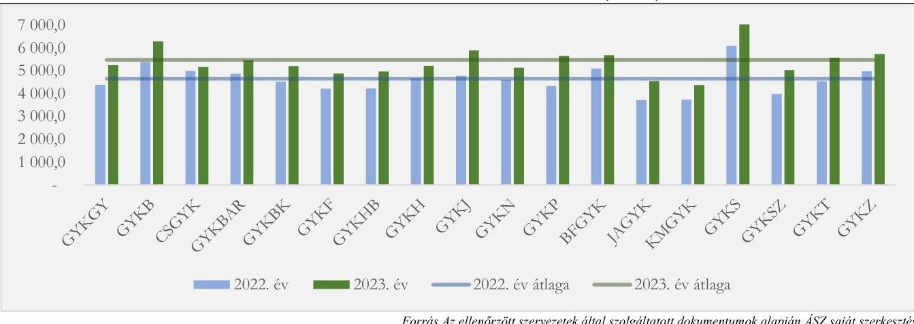
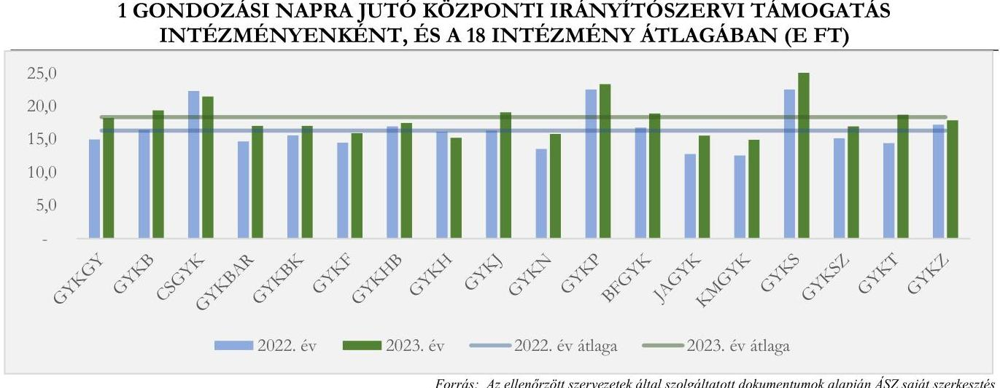
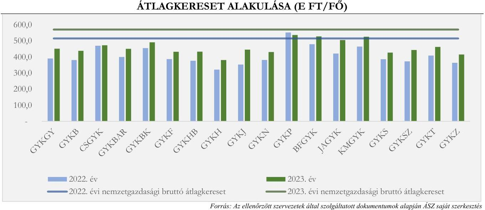
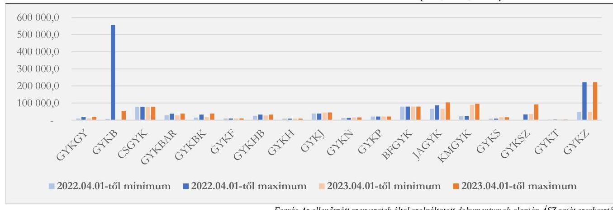

# JELENTÉS 

## Központi költségvetési szervek ellenőrzése - Az állami fenntartású, gyermekvédelmi szakellátást végző intézmények ellenőrzése

2024.

---

# JELENTÉS 

## Központi költségvetési szervek ellenőrzése - Az állami fenntartású, gyermekvédelmi szakellátást végző intézmények ellenőrzése

2024.

---

# ELLENŐRZÉSI IGAZGATÓSÁG: 

## ÁLLAMHÁZTARTÁS KÖZPONTI SZINTJÉT ELLENŐRZŐ IGAZGATÓSÁG

## ELLENŐRZÉSI IGAZGATÓ:

## SINKÁNÉ DR. CSENDES ÁGNES igazgató

## ELLENŐRZÉSVEZETŐ:

Jelentéseink az interneten a www.asz.hu címen olvashatók.

DR. KOVÁCS DIÁNA ellenőrzésvezető

IKTATÓSZÁM: EL-4146-001/2024
TÉMASZÁM: 2665
ELLENŐRZÉS-AZONOSÍTÓ SZÁM: V1009

---

# TARTALOMJEGYZÉK 

AZ ELLENŐRZÉS ALAPADATAI ..... 5
AZ ELLENŐRZÉS HATÓKÖRE ÉS TERÜLETE ..... 8
ÖSSZEFOGLALÁS ..... 12
AZ ELLENŐRZÉS FÓKUSZTERÜLETEI. ..... 14
MEGÁLLAPÍTÁSOK ..... 15
JAVASLATOK. ..... 38
MELLÉKLETEK ..... 44
I. sz. melléklet: Értelmező szótár ..... 44
II. sz. melléklet: Az ellenőrzött szervezetek jegyzéke ..... 47
III. sz. melléklet: Ellenőrzési kritériumok ..... 48
IV. sz. melléklet: Az ellenőrzött gyermekvédelmi szakellátást nyújtó intézmények 2021. évi és 2022. évi költségvetési kiadásai és bevételei (E Ft) ..... 51
V. sz. melléklet: Az ellenőrzött gyermekvédelmi szakellátást nyújtó intézmények 2021. évi és 2022. évi költségvetési beszámoló mérlegadatai (E Ft) ..... 52
VI. sz. melléklet: Az ellenőrzött gyermekvédelmi szakellátását nyújtó intézmények 2022. évben hatályos ellenőrzési nyomvonalai tartalmának bemutatása ..... 53
VII. sz. melléklet: A kizárólag gyermekvédelmi szakellátást nyújtó intézmények 2022-2023. évi finanszírozási adatai és mutatói ..... 54
VIII. sz. melléklet: A kizárólag gyermekvédelmi szakellátást nyújtó intézmények 2022-2023. évi teljesített kiadásai ..... 55
IX. sz. melléklet: A kizárólag gyermekvédelmi szakellátást nyújtó intézmények 2022-2023. évi foglalkoztatási adatai ..... 56
X. sz. melléklet: A kizárólag gyermekvédelmi szakellátást nyújtó intézmények 2022-2023. évi kereseti adatai és létszámmozgása ..... 57
XI. sz. melléklet: A kizárólag gyermekvédelmi szakellátást nyújtó intézmények 2022-2023. évi telephely adatai és intézményi térítési díjai ..... 58
FÜGGELÉK: ÉSZREVÉTELEK ..... 59
RÖVIDÍTÉSEK JEGYZÉKE ..... 60

---

.

---

# AZ ELLENŐRZÉS ALAPADATAI 

## AZ ELLENŐRZÉS CÉLJA

Az ellenőrzés célja annak értékelése volt, hogy a Szociális és Gyermekvédelmi Főigazgatóság mint középirányító szerv a gyermekvédelmi szakellátást nyújtó intézmények vonatkozásában a középirányítói és fenntartói feladatellátását a jogszabályi előírásoknak megfelelően végezte-e, a középirányítói és fenntartói hatásköröket a közfeladat megfelelő ellátása, a közpénzekkel való megbízható gazdálkodás előmozdítása, valamint a nemzeti vagyon felelős kezelése érdekében gyakorolta-e. Az ellenőrzés további célja volt a gyermekvédelmi szakellátást nyújtó intézmények főbb működési kockázatainak feltárása.

Az ellenőrzés célja volt továbbá annak értékelése, hogy a gyermekvédelmi szakellátást nyújtó intézményeknél ellátottak személyi térítési díjának megállapítása, beszedése, nyilvántartása, valamint a gondozási díjak beszedése, nyilvántartása a jogszabályoknak és egyéb szabályozó eszközöknek megfelelt-e, illetve az ellátás során felmerült kiadások felhasználása és elszámolása szabályszerű volt-e, a nyújtott ellátás vonatkozásában a jogszabályokban meghatározott előírások teljesültek-e.

## AZ ELLENŐRZÉS TÍPUSA

Megfelelőségi ellenőrzés

## AZ ELLENŐRZÖTT IDŐSZAK

A 2022. év, kitekintéssel a helyszíni ellenőrzés lezárásának időpontjáig, 2023. december 31-ig.

## AZ ELLENŐRZÉS TÁRGYA

Az ellenőrzött gyermekvédelmi szakellátást nyújtó intézmény működési és gazdálkodási kereteinek kialakítása, feladatellátása, pénzügyi és vagyongazdálkodása keretében a költségvetésének tervezési folyamata, a bevételek és kiadások elszámolása, a gazdálkodási jogkörgyakorlás, a beszámolási kötelezettség teljesítése, továbbá az SZGYF ${ }^{1}$ középirányító szervi és fenntartói feladatellátásának szabályszerűsége volt. Az SZGYF az ellenőrzött gyermekvédelmi szakellátást nyújtó intézmények gazdálkodási feladatainak ellátásában munkamegosztási megállapodás ${ }^{2}$ alapján működött közre, ez alapján az ellenőrzés az SZGYF tevékenységét e vonatkozásban költségvetési szervként értékelte.

Az ellenőrzés kiterjedt minden olyan körülményre és adatra, amely az ÁSZ ${ }^{3}$ jogszabályban meghatározott feladatainak teljesítéséhez, valamint a program végrehajtása folyamán felmerült újabb összefüggések feltárásához szükséges volt.

Az elemzés tárgyát képezte a kizárólag gyermekvédelmi szakellátást nyújtó intézmények szakmai feladatellátással és gazdálkodással kapcsolatos adatainak összehasonlítása, nemzetgazdasági szempontból történő bemutatása.

---

# Az ellenőrzés jogsalapja 

Az ellenőrzés jogszabályi alapját az ÁSZ tv. ${ }^{4} 1 . \int$ (3) bekezdés, 5. $\int$ (2), (3) és (6) bekezdései, 5. $\int$ (4) bekezdés a) pontja, valamint az Áht. ${ }^{5} 61 . \int$ (2) bekezdésének előírásai képezték.

## AZ ELLENŐRZÉS MÓDSZERE

Az ellenőrzést a nemzetközi standardokat irányadónak tekintve az ellenőrzési program szempontjai, az ellenőrzött időszakban hatályos jogszabályok, az ellenőrzés szakmai szabályok és módszertanok figyelembevételével végezte az ÁSZ.

Az ellenőrzési kérdések megválaszolásához szükséges bizonyítékok megszerzése az ellenőrzött szervezetek által rendelkezésre bocsátott dokumentumokra és adatokra alapozva, továbbá megfigyelés, szemle (szemrevételezés), kérdésfeltevés (információkérés), valamint elemző eljárás útján történt.

Az ellenőrzés lefolytatásához az ellenőrzött szervezetek tanúsítványok kitöltésével, valamint az ÁSZ által kért dokumentumok, adatok, információk megküldésével szolgáltattak adatokat.

Az ellenőrzési bizonyítékként felhasználható adatforrások közé tartoztak egyrészt az ellenőrzéshez kért dokumentumok, adatforrások, másrészt adatforrás volt még minden további, az ellenőrzés folyamán feltárt, az ellenőrzés szempontjából információkat tartalmazó dokumentum.

Mintavételi eljárással kiválasztott tételek alapján ellenőrizte az ÁSZ az előirányzat-módosítások és előirányzat-átcsoportosítások, a bevételek, a külső személyi juttatások, a dologi- és felhalmozási kiadások elszámolásának szabályszerűségét és a vagyongazdálkodás megfelelőségét. Intézményenként és mintavételi területenként a 10-10 elemű egyszerű véletlen mintavétellel kiválasztott mintatételt 3-3, kockázat alapon - a legmagasabb összegű tételekből - kiválasztott tétel egészítette ki. A külső személyi juttatásokból, dologi és felhalmozási kiadásokból ellenőrzésre kiválasztott tételek esetében, amennyiben csoportos könyvelési tétel került kiválasztásra, az ahhoz tartozó legnagyobb értékű tétel került ellenőrzésre.

Egyszerű véletlen mintavétellel történt a személyi térítési díjak megállapításának, az utógondozottakkal kötött megállapodásnak (intézményenként 20 db ), a csoportgazdálkodásnak (intézményenként 10 db ) és a gondozási díjak beszedésének (a három intézményre összesen 20 db ) ellenőrzése. Telephelytípus szerinti rétegzett mintavétellel történt az intézményi telephelyek múködésének (intézményenként 4 db ), életkor szerint rétegzett véletlen mintavétellel történt a zsebpénzek kifizetésének és a tájékoztatási kötelezettség teljesítésének (intézményenként 20 db ) ellenőrzése.

Amennyiben valamely sokaság elemszáma kisebb volt, mint az előírt mintaelemszám, a sokaságot tételesen ellenőrizte az ÁSZ, így tételes ellenőrzés történt az ellenőrzött gyermekvédelmi szakellátást nyújtó intézmények közül a GYKB ( 4 db ) és az SZGYF ( 1 db ) panaszkezelési gyakorlata, valamint a maradványelszámolás (CSGYK 2 db , GYKGY 1 db , GYKB 4 db ) esetében. A CSGYK és a GYKGY esetében panaszkezelésre nem került sor az ellenőrzött időszakban. A kiválasztott mintatételek ellenőrzésének eredménye nem került kivetítésre a teljes sokaságra, a megállapítások az adott ellenőrzött mintatételekre vonatkoznak.

A három gyermekvédelmi szakellátást nyújtó intézmény ellenőrzésre történő kiválasztása során fontos szempont volt, hogy az ország különböző pontjairól történjen a kiválasztás (Budapestről, valamint az ország nyugati és keleti részéről is kiválasztásra került gyermekvédelmi szakellátást nyújtó intézmény), valamint

---

további kockázati szempontok is figyelembevételre kerültek, mint az ellátotti létszám, ezen belül az utógondozotti létszám, az eszközállomány változásai, a kötelezettségállomány változásai és a teljesített kiadások volumene.

A három ellenőrzött szervezeten kívül a II. melléklet szerinti 16 ellenőrzést támogató szervezettől gyermekvédelmi szakellátást nyújtó intézménytől - szakmai és gazdálkodási adatokat kért az ÁSZ elemzési céllal a gyermekvédelmi szakellátási ágazat átfogó, naprakész helyzetképének ismertetése érdekében. Az ellenőrzést támogató szervezetek egyikének, a Károlyi István Gyermekközpontnak a működése speciális volt, mivel országos hatókörrel speciális szükségletű, valamint kísérő nélküli kiskorúak ellátását végezte, ami a közvetlen összehasonlíthatóságot akadályozta, így az elemzés során a 18 gyermekvédelmi szakellátást nyújtó intézmény adatai kerültek összevetésre.

---

# AZ ELLENŐRZÉS HATÓKÖRE ÉS TERÜLETE 

A gyermekvédelem a gyermek testi, értelmi, érzelmi, erkölcsi fejlődését gátló, vagy akadályozó magatartás, mulasztás vagy körülmény következtében kialakult veszélyeztetettség megelőzésére és megszüntetésére irányuló tevékenység. A cél a gyermekek lelki, erkölcsi, szocializálódási fejlődésének elősegítése, családban történő nevelkedésük, egészségügyi ellátásuk, mindennapi alapvető megélhetésük biztosítása annak érdekében, hogy a gyermekek egy életre szóló esélyt kapjanak, lehetőségük nyíljon a közösségbe való beilleszkedésre. Ha a gyermek veszélyeztetettségét a gyermekjóléti alapellátás keretében, vagy a védelembe vétellel előírt szabályokkal nem sikerül megszüntetni, akkor az állam szakellátás formájában biztosít különleges védelmet és segítséget, ami lehet a gyermek ideiglenes hatályú elhelyezése, nevelésbe vétele, otthont nyújtó ellátás keretében való gondoskodás. A gyermekvédelmi szakellátás a nevelésbe vett gyermekeknek, és a családjukból ideiglenes hatállyal kikerült gyermekeknek ad otthont, továbbá a fiatal felnőttek utógondozói ellátására is lehetőséget nyújt.

A gyermekvédelem területét érintő nemzeti stratégiák közé tartozik a Magyar Nemzeti Társadalmi Felzárkózási Stratégia 2030, a Nemzeti Ifjúsági Stratégia 2009-2024, a „Legyen jobb a gyermekeknek!" Nemzeti Stratégia 2007-2032, valamint Az emberkereskedelem elleni küzdelemről szóló 2020-2023 közötti nemzeti stratégia.

A Magyar Nemzeti Társadalmi Felzárkózási Stratégia 2030 dokumentumának elfogadásáról szóló 1605/2021. (VIII. 18.) Korm. határozatban ${ }^{6}$ a Kormány felhívta az érintett minisztereket, hogy az MNTFS $2030^{7}$ céljait, beavatkozási területeit és szempontjait vegyék figyelembe a szakpolitikák alakítása, valamint a hazai és a 2021-2027-es időszak uniós társfinanszírozású programjainak tervezése és végrehajtása során. A stratégiában célként jelölték meg a gyermekjóléti alap- és szakellátások minőségének és elérhetőségének javítását, a gyermekvédelmi szakellátásban lévő ellátottak családi kapcsolatainak erősítését, továbbá a gyermekvédelmi szakellátásból kikerült fiatal felnőttek mentorálását, hatékony utánkövetését, utógondozását.

Az Országgyűlés 88/2009. (X. 29.) OGY határozatával ${ }^{8}$ elfogadott Nemzeti Ifjúsági Stratégia 2009-2024 részcélként fogalmazta meg, hogy a gyermekvédelmi szolgáltatásokat demokratizálni szükséges: az ifjúságot be kell vonni az élethelyzetükre hatással lévő intézményi döntések meghozatalába, a gyermekvédelmi intézményekben a fenntartóval és a vezetővel biztosíttatni kell a gyermekjogi és ifjúsági jogi sérelmek állandó, szervezett artikulációs és jogorvoslati fórumát, valamint a jelzések kivizsgálásának, a kérelmek elbírálásának az intézmény szakmai, munkamegosztási, költségvetési érdekeitől független módját.

A „Legyen jobb a gyermekeknek!" Nemzeti Stratégia, 2007-2032-t az Országgyűlés a 47/2007. (V. 31.) OGY határozattal ${ }^{9}$ fogadta el. Alapelvei közé tartozik, hogy a gyermekszegénység csökkentéséhez átfogó, minden ágazatra kiterjedő intézkedésekre van szükség. Ehhez az egyes programokat össze kell hangolni településeken belül is, a kistérségeken belül is, az ország szintjén is. Mindezen szinteken, a gyermekvédelmi szolgáltatások területén is egymással összhangban álló, egymásra épülő intézkedéseknek kell születniük. Alapelve továbbá, hogy megfelelő szolgáltatásokkal és fejlesztésekkel csökkentse a gyermekvédelmi szolgáltatásokhoz és intézményekhez való hozzáférési egyenlőtlenségeket, és biztosítsa ezekben a magas színvonalú szakmai tevékenység alapvető feltételeit.

Az emberkereskedelem elleni küzdelemről szóló - a Kormány 1046/2020. (II. 18.) Korm. határozatával ${ }^{10}$ elfogadott, - 2020-2023 közötti nemzeti stratégia kiemelt figyelmet fordít az emberkereskedelem 18 év alatti áldozataira. A stratégia 2022-2023 közötti időszakra vonatkozó emberkereskedelmi intézkedési terve ${ }^{11}$ tartalmazta többek között a gyermekprostitúció megelőzése érdekében megvalósuló felkészítő továbbképzési

---

programokba gyermekvédelmi szakellátási szakemberek bevonását, továbbá előirányozta emberkereskedelem áldozatává vált gyermekek védett gyermekotthonban történő terápiás intézményi ellátásával kapcsolatban megvalósíthatósági tanulmány elkészítését (utóbbi 2023. évben elkészült).

A korábban önkormányzati fenntartású gyermekvédelmi szakellátást nyújtó intézmények 2013. január 1jével kerültek állami fenntartásba, amely időponttól a gyermekvédelmi szakellátást nyújtó intézmények fenntartói feladatait ellátó központi szerv az SZGYF volt. Az SZGYF a belügyminiszter (2022. május 24-ig az emberi erőforrások minisztere) irányítása alá tartozó, központi hivatalként működő központi költségvetési szerv volt az ellenőrzött időszakban, amely az intézményfenntartói feladatok mellett az állami fenntartású gyermekvédelmi szakellátást nyújtó intézmények vonatkozásában középirányítói feladatokat is ellátott. Az ellenőrzött időszakban az SZGYF központi szervből, valamint területi szervként működő 19 (vár)megyei kirendeltségből állt. A fenntartásában álló gyermekvédelmi szakellátást nyújtó intézmények felett - néhány kivételtől eltekintve - az SZGYF a fenntartói feladatokat a területi szervek közreműködésével látta el.

A gyermekvédelmi szakellátást nyújtó intézmények feladatellátására vonatkozó alapvető előírásokat a Gyvt. ${ }^{12}$ határozza meg, míg az SZGYF jogállása, feladat- és hatásköre az SZGYF rendelet ${ }^{13}$-ben került meghatározásra. A gyermekvédelmi szakellátást nyújtó intézmények szakmai feladatairól és működésük feltételeiről szóló legfontosabb előírásokat a 15/1998. (IV. 30.) NM rendelet ${ }^{14}$ tartalmazta.

Az SZGYF rendelet 3. § (2) bekezdése szerint az SZGYF középirányító szervi feladatai közé tartozott, hogy a fenntartott gyermekvédelmi szakellátást nyújtó intézmények vonatkozásában jóváhagyásra felterjeszti a miniszternek a fenntartott gyermekvédelmi szakellátást nyújtó intézmények éves költségvetését, létszámát, alapító, megszüntető okiratát, illetve az alapító okirat módosítását, figyelemmel kíséri a fenntartott gyermekvédelmi szakellátást nyújtó intézmények költségvetésének végrehajtását, illetve az azokból ellátandó feladatok teljesülését, a fenntartott költségvetési szervek vezetőit kinevezi, megbízza, felmenti, megbízását visszavonja, továbbá érvényesíti a közfeladatok ellátására vonatkozó követelményeket, és az erőforrásokkal való szabályszerű és hatékony gazdálkodás követelményeit, továbbá számon kéri, ellenőrzi e követelmények érvényre juttatását.

Az SZGYF rendelet 4. § (3)-(4) bekezdése és a Gyvt. 104. § (1) bekezdése szerint az SZGYF fenntartói feladatai közé tartozott, hogy meghatározza a fenntartott költségvetési szervek éves költségvetését, meghatározza a gazdálkodásuk részletes rendjét, megállapítja az intézményi térítési díjat, eljár a működési engedélyezéssel kapcsolatos ügyekben, szervezi, irányítja és ellenőrzi a fenntartott gyermekvédelmi szakellátást nyújtó intézmények szakmai feladatainak végrehajtásához szükséges pénzügyi feltételeket, ellenőrzi a gyermekvédelmi szakellátást nyújtó intézmény gazdálkodását és működésének törvényességét, jóváhagyja a gyermekvédelmi szakellátást nyújtó intézmény szervezeti és működési szabályzatát, szakmai programját, gyakorolja a gyermekvédelmi szakellátást nyújtó intézmény vezetője tekintetében a munkáltatói jogokat, gondoskodik a szakemberek képzéséről, továbbképzéséről, továbbá ellenőrzi és évente egy alkalommal értékeli a szakmai munka eredményességét, a szakmai program végrehajtását, valamint a gazdálkodás szabályszerűségét és hatékonyságát.

A gyermekvédelmi szakellátást nyújtó intézmények költségvetési szervek, amelyek az alapító okiratban meghatározott szakmai feladatokat látták el. Ugyanakkor önálló gazdasági szervezettel nem rendelkeztek, a gazdasági szervezet Áht. szerinti feladatait az SZGYF központi szerve a (vár)megyei gazdasági osztályokon keresztül, a gyermekvédelmi szakellátást nyújtó intézményekkel kötött munkamegosztási megállapodás alapján látta el.

A 2022. évi költségvetési beszámolók adatai alapján az elemzésben érintett 18 gyermekvédelmi szakellátást nyújtó intézmény működtetésére a központi költségvetés 19,1 milliárd Ft központi irányítószervi

---

támogatást biztosított, amelynek felhasználásával 2022. évben éves átlagban 3204 ellátott gyermekről gondoskodtak.

Az ellenőrzés a központi költségvetési szervek körébe tartozó három állami fenntartású gyermekvédelmi szakellátást nyújtó intézmény alapvető működési és gazdálkodási keretei kialakításának, gazdálkodásának és feladatellátásának, illetve az SZGYF középirányítói, fenntartói és gazdálkodási feladatellátásának megfelelőségére terjedt ki. Az ellenőrzésre kiválasztott három gyermekvédelmi szakellátást nyújtó intézmény fő tevékenysége gyermekotthonban elhelyezettek ellátása volt.

Az 1980. február 15-én alapított Cseppkő Gyermekotthoni Központ Budapest működési területe Budapestre terjedt ki. A CSGYK ${ }^{15}$ alaptevékenységei közé tartozott a gyermekotthonaiban ideiglenes hatállyal elhelyezett, valamint gyámhatóság által nevelésbe vett kiskorúak otthont nyújtó ellátása, a gyámhatóság által elrendelt utógondozás biztosítása, valamint az utógondozói ellátásban részesülő fiatal felnőtt gyermekének befogadása, átmeneti gondozása, külső férőhelyek működtetése. A CSGYK 2023. év végén négy feladatellátási helyen múködött.

A Gyermekvédelmi Központ Győr-Moson-Sopron Vármegye intézményt 1998. augusztus 1-jén alapították, illetékessége Győr-Moson-Sopron vármegyére terjedt ki. A GYKGY ${ }^{16}$ alaptevékenységei közé tartozott a gyermekotthonaiban ideiglenes hatállyal elhelyezett, valamint gyámhatóság által nevelésbe vett kiskorúak otthont nyújtó ellátása, a gyámhatóság által elrendelt utógondozás biztosítása, az utógondozói ellátásban részesülő fiatal felnőtt gyermekének befogadása, átmeneti gondozása, külső férőhelyek működtetése, továbbá ideiglenes gondozás biztosítása a lakóhelyükről önkényesen eltávozott, így ellátás és felügyelet nélkül maradó gyermekek számára. A GYKGY 2023. év végén 16 telephelyen látta el feladatát.

A Gyermekvédelmi Központ Borsod-Abaúj-Zemplén Vármegye alapításának dátuma 1991. április 19. volt. A Borsod-Abaúj-Zemplén (vár)megyei illetékességű GYKB ${ }^{17}$ alaptevékenysége kiterjedt a gyermekotthonaiban ideiglenes hatállyal elhelyezett, valamint gyámhatóság által nevelésbe vett kiskorúak otthont nyújtó ellátására, a gyámhatóság által elrendelt utógondozási feladatokra, az utógondozói ellátásban részesülő fiatal felnőtt gyermekének befogadására, átmeneti gondozására, külső férőhelyek működtetésére, továbbá ideiglenes gondozás biztosítására a lakóhelyükről önkényesen eltávozott, így ellátás és felügyelet nélkül maradó gyermekek számára. A GYKB 2023. végén 28 telephelyen látott el feladatokat.

---

Az ellenőrzött gyermekvédelmi szakellátást nyújtó intézmények főbb 2022. és 2023. évi adatait a következő táblázat foglalja össze:

# 1. táblázat 

AZ ELLENŐRZÖTT GYERMEKVÉDELMI SZAKELLÁTÁST NYÚJTÓ INTÉZMÉNYEK FŐBB 2022. ÉS 2023. ÉVI ADATAI

|  | CSGYK |  | GYKGY |  | GYKB |  |
| :--: | :--: | :--: | :--: | :--: | :--: | :--: |
|  | 2022. | 2023. | 2022. | 2023. | 2022. | 2023. |
| Teljesített költségvetési kiadás (MFt) | 1127,5 | 1042,1 | 1412,8 | 1644,9 | 2656,3 | 2877,2 |
| Foglalkoztatottak átlagos statisztikai állományi létszáma (fő) | 108,0 | 113,5 | 195,0 | 184,0 | 323,0 | 326,0 |
| Mérlegfőösszeg (M Ft) | 42,6 | 127,4 | 69,1 | 68,6 | 78,1 | 166,2 |
| Ellátotti férőhelyek átlagos száma tárgyévben (fő) | 211,0 | 211,0 | 303,0 | 303,0 | 447,9 | 454,0 |

A CSGYK, a GYKGY és a GYKB 2022. évi költségvetési beszámolóinak főbb adatait a IV. és V. számú melléklet tartalmazza. A három ellenőrzött, kizárólag gyermekvédelmi szakellátást nyújtó intézményen kívül a további 16, kizárólag gyermekvédelmi szakellátást nyújtó intézmény 2022-2023. évi adatait és a számított mutatókat a VII.-XI. számú mellékletek tartalmazzák.

---

# ÖSSZEFOGLALÁS 

Az ÁSZ a közpénzekkel és a nemzeti vagyonnal való felelős gazdálkodás érdekében az ÁSZ tv. alapján ellenőrizte az ellenőrzésre kiválasztott gyermekvédelmi szakellátást nyújtó intézmények működését, gazdálkodását és a középirányító szerv kapcsolódó középirányítói és fenntartói tevékenységét, továbbá elemzéssel értékelte a kizárólag gyermekvédelmi szakellátással foglalkozó állami fenntartású intézmények szakmai feladatellátással és működéssel kapcsolatos adatait.

Az SZGYF a fenntartói és középirányítói feladatait nem a jogszabályi előírásoknak megfelelően látta el. Az SZGYF ellenőrizte a gyermekvédelmi szakellátást nyújtó intézményekben folyó szakmai munkát, értékelte a szakmai programok végrehajtását és gazdálkodásuk szabályszerűségét. Az SZGYF a jogszabályi előírások ellenére nem értékelte a gyermekvédelmi szakellátást nyújtó intézmények gazdálkodásának hatékonyságát. Az SZGYF Főigazgatója nem tett teljeskörűen eleget az SZGYF SZMSZ ${ }^{18}$-ében foglalt azon feladatának, hogy eljárási rendekkel, módszertani útmutatókkal és szakmai ajánlásokkal segítse a fenntartott gyermekvédelmi szakellátást nyújtó intézmények szolgáltató tevékenységét, nem határozta meg az utógondozottakkal kötendő megállapodások és az utógondozói ellátás intézményi térítési díja megállapításának részletszabályait. Az SZGYF a jogszabályi előírások ellenére a gondozási díj hátralékokról az illetékes hatóságokat nem minden esetben tájékoztatta. Az SZGYF a 2022. évi éves munkatervének teljesítéséről az SZGYF SZMSZ-ben foglaltak ellenére nem állított össze beszámolót a miniszter részére.

Az SZGYF az ellenőrzött három gyermekvédelmi szakellátást nyújtó intézmény gazdasági feladatait a velük kötött munkamegosztási megállapodásnak és a jogszabályi előírásoknak megfelelően látta el. A 2022. év vonatkozásában szabályszerűen került sor a gyermekvédelmi szakellátást nyújtó intézmények költségvetésének tervezésére, költségvetési beszámoló készítésére, maradványelszámolására és leltározására. A gyermekvédelmi szakellátást nyújtó intézmények 2022. évi elemi költségvetése nem tartalmazott beruházásra vagy felújításra szolgáló kiadási előirányzatot, amely nem biztosított forrást az intézmények eszközpótlására.

A CSGYK, a GYKGY és a GYKB vonatkozásában az alapvető múködési és gazdálkodási keretek kialakítása a jogszabályi előírásoknak megfelelő volt. Az ellenőrzött intézmények rendelkeztek a jogszabályi előírások szerint SZMSZ-szel, szakmai programmal, házirenddel, kialakították az integrált kockázatkezelés eljárásrendjét, az adatvédelmi és adatbiztonsági- valamint iratkezelési szabályzataikat. Az ellenőrzési nyomvonalak korlátozott hatókörére, a vagyonnyilatkozattételi szabályzatok hiányára mindhárom ellenőrzött gyermekvédelmi intézménynél, a CSGYK és a GYKB esetében az információs és kommunikációs rendszer kialakításának hiányára, valamint a GYKGY és a CSGYK esetén a szervezeti integritást sértő események kezelésének eljárásrendjével kapcsolatosan az ellenőrzés tárt fel hiányosságokat.

A CSGYK, a GYKGY és a GYKB a zsebpénzek megállapítását és kifizetését, a személyi térítési díjak megállapítását, valamint az ellátottak tájékoztatását nem megfelelően végezte. Az utógondozotti megállapodások megkötésénél a GYKGY és a GYKB esetében, a csoportszintú gazdálkodásnál a CSGYK és a GYKB esetében tárt fel hiányosságokat az ellenőrzés.

A CSGYK, a GYKGY és a GYKB pénzügyi- és vagyongazdálkodása a mintatételek ellenőrzésének eredménye alapján a jogszabályi előírásoknak és a belső szabályzatoknak megfelelő volt, de a gazdálkodási jogkörök gyakorlása, a beszerzési eljárások lefolytatása és a tárgyi eszközök nyilvántartása tekintetében tárt fel az ellenőrzés hiányosságokat.

---

2023. évben az elemzéssel értékelt 18 gyermekvédelmi szakellátást nyújtó intézmény együttesen, éves átlagban 2573 fő munkatársat foglalkoztatott, 4044 db férőhelyet tartott fenn, továbbá éves átlagban 3304 gyermek vagy fiatal felnőtt ellátásáról gondoskodott. A 18 gyermekvédelmi szakellátást nyújtó intézmény 2023. évi bevételeinek átlagosan $94,4 \%$-a, közel 22,2 milliárd Ft központi irányítószervi támogatásból származott, így érdemi nagyságrendű saját bevételek hiányában különösen meghatározó volt a költségvetéstől kapott támogatások szerepe.

Az elemzés feltárta, hogy a gyermekvédelmi szakellátást nyújtó intézmények között a központi irányítószervi támogatás nem a fenntartott férőhelyekkel vagy az ellátottakkal arányosan oszlott meg. 2023. évben az elemzésbe bevont intézményeknél az egy fenntartott férőhelyre jutó központi irányítószervi támogatás összegében a két szélsőértéket képviselő gyermekvédelmi szakellátást nyújtó intézmény között másfélszeres, az egy gondozási napra jutó költségvetési támogatás tekintetében 1,8-szoros volt a különbség, azaz volt olyan gyermekvédelmi szakellátást nyújtó intézmény, amely több mint másfélszer annyi támogatásban részesült egységnyi elvégzett feladat után. Az ellenőrzés során feltártak alapján ennek oka, hogy a bázisalapú költségvetéstervezési gyakorlat miatt rögzültek a gyermekvédelmi szakellátást nyújtó intézmények finanszírozási és vagyoni helyzetének 2012. év előtti, önkormányzati fenntartású időszakból eredő különbségei.

A 18 gyermekvédelmi szakellátást nyújtó intézményben foglalkoztatottak havi bruttó átlagkeresete 450,3 E Ft volt a 2023. évben, amely jelentősen elmaradt a $\mathrm{KSH}^{19}$ által a nemzetgazdaság egészére kimutatott 571,2 E Ft átlagkeresettől, annak mindössze átlagosan 78,8\%-a volt. Az egyes intézményeknél a bruttó átlagkeresetek alakulásában is tapasztalhatók eltérések. A központi elhelyezkedésű vármegyékben (pl.: Pest vármegyében) és a fővárosban működő gyermekvédelmi szakellátást nyújtó intézmények a 2023. évben az országos átlagnál közel $14 \%$-kal magasabb keresetet tudtak biztosítani. Az alacsony kereseti viszonyok is hozzájárulhattak ahhoz, hogy a 2023. évben a 18 gyermekvédelmi szakellátást nyújtó intézmény átlagában rendkívül magas, $31,9 \%$-os ( 822 fő) volt a kilépett munkatársak átlagos statisztikai állományi létszámhoz viszonyított aránya. A 2023. évben 856 fő belépése mellett is magas maradt az üres álláshelyek száma (2023. év végén 362 fő volt), illetve esetenként a megfelelő speciális szakképzettséggel rendelkező munkatársak (pl.: gyermekpszichológus) biztosítása okozott gondot.

A jogszabályok által a gyermekvédelmi szakellátást nyújtó intézményekkel szemben támasztott személyi és tárgyi minimumfeltételek betartását hatósági ellenőrzések keretében rendszeresen ellenőrzik a kormányhivatalok, a minimumfeltételek be nem tartása az érintett telephely múködési státuszának ideiglenesre módosítását vagy a múködés felfüggesztését is eredményezheti. A minimumfeltételek teljesítésének hiánya következtében a 2023. évben a 18 elemzett gyermekvédelmi szakellátást nyújtó intézmény közül háromnál az ideiglenes múködési státuszú telephelyek aránya közelítette vagy meg is haladta a telephelyek számának $50 \%$-át. A negatív trendek folytatódása hosszabb távon telephelyek, csoportok bezárásához, a férőhelyek számának csökkenéséhez vezethet, így akár a közfeladat ellátása is veszélybe kerülhet.

---

# AZ ELLENŐRZÉS FÓKUSZTERÜLETEI 

1. Az ellenőrzött gyermekvédelmi szakellátást nyújtó intézmények alapvető müködési és gazdálkodási keretei
2. Az ellenőrzött gyermekvédelmi szakellátást nyújtó intézmények egyes feladatainak ellátása
3. Az ellenőrzött gyermekvédelmi szakellátást nyújtó intézmények pénzügyíés vagyongazdálkodása
4. Az SZGYF ellenőrzött gyermekvédelmi szakellátást nyújtó intézményekhez kapcsolódó gazdasági szervezeti, középirányító szervi és fenntartói feladatellátása

---

# 1. Az ellenőrzött gyermekvédelmi szakellátást nyújtó intézmények alapvető múködési és gazdálkodási keretei 

## Összegző megállapítás

A CSGYK, a GYKGY és a GYKB alapvető múködési és gazdálkodási kereteinek kialakítása a feltárt hiányosságok mellett megfelelő volt.

Az ellenőrzött időszakban a CSGYK, a GYKGY és a GYKB alapító okiratai az Ávr. ${ }^{20}$-ben előírt tartalmi követelményeknek megfeleltek. Az alapító okiratokat 2022. évben egy alkalommal módosították az irányító szerv változása miatt. A CSGYK, a GYKGY és a GYKB rendelkeztek a fenntartó által jóváhagyott SZMSZ ${ }^{21}$-ekkel, amelyek megfeleltek az Ávr. tartalmi előírásainak.
A CSGYK, a GYKGY és a GYKB feladatellátási helyei a 15/1998. (IV.30.) NM rendelettel összhangban rendelkeztek a fenntartó által jóváhagyott szakmai programmal, valamint - az érdeképviseleti fórumok egyetértésével kiadott - házirendekkel.
A CSGYK, a GYKGY és a GYKB vezetői a Vnytv. ${ }^{22}$ 11. § (6) bekezdés előírásai ellenére nem állapították meg szabályzatban a vagyonnyilatkozat átadására, nyilvántartására, a vagyonnyilatkozatban foglalt személyes adatok védelmére vonatkozó szabályokat.
A CSGYK és a GYKB vezetői a Bkr. 6. $\$ (1) bekezdés c) pontjában előírtak ellenére nem alakítottak ki olyan kontrollkörnyezetet, amelyben az etikai elvárások meghatározottak, ismertek és elfogadottak a szervezet minden szintjén. A GYKGY vezetője a Bkr-nek megfelelően a Szociális Szakmai Szövetség Etikai Kollégiuma által kiadott „Szociális Munka Etikai Kódexe"23 kötelező betartását előírta az alkalmazottak munkaköri leírásában.
A GYKB vezetője a Bkr. 9. § (1) bekezdésében foglaltak ellenére nem alakította ki az információs és kommunikációs rendszert, nem biztosította, hogy az információk megfelelő időben eljussanak az illetékes szervezethez, szervezeti egységhez, illetve személyhez. A CSGYK és a GYKGY vezetője az információs és kommunikációs rendszert a Bkr-nek megfelelően alakította ki.
A CSGYK, a GYKGY és a GYKB rendelkeztek ellenőrzési nyomvonallal, de azokban a Bkr. 6. § (3) bekezdésének előírásai ellenére a szakmai feladatellátáshoz kapcsolódó folyamatok nem kerültek teljeskörűen leírásra. Az ellenőrzési nyomvonalak tartalmát ellenőrzött szervezetenként a VI. számú melléklet szemlélteti.
A CSGYK a 2022. január 1. - 2022. szeptember 14. közötti időszakban a Bkr. 6. § (4) bekezdésében foglaltak ellenére nem rendelkezett az integrált kockázatkezelés eljárásrendjével. A CSGYK 2022. szeptember 15-től hatályos, a GYKGY, valamint a GYKB 2022. évben hatályos integrált kockázatkezelés eljárásrendje ${ }^{24}$ a Bkr. előírásaival összhangban tartalmazta a kockázatok azonosításának feltételeit, módszereit, a kockázatok meghatározott kritériumok szerinti értékelését, a kockázatok kezelése érdekében szükséges intézkedések megtételének kötelezettségét, a kockázatok kezelése érdekében meghatározott intézkedések végrehajtásának nyomon követésére vonatkozó kötelezettséget. A CSGYK

---

és a GYKB vezetője a Bkr. szerint kijelölte az integrált kockázatkezelési rendszer koordinálásának szervezeti felelősét. A GYKGY vezetője a Bkr. 7. § (4) bekezdésben foglaltak ellenére az integrált kockázatkezelési rendszer koordinálására nem jelölt ki felelőst.
A GYKB vezetője a Bkr.-rel összhangban szabályozta a szervezeti integritást sértő események kezelésének eljárásrendjét ${ }^{25}$. A GYKGY szervezeti integritást sértő események kezelésének eljárásrendje ${ }^{26}$ a Bkr. 6. $\mathbb{S}$ (4a) bekezdés c) és g) pontjaiban foglaltak ellenére nem tartalmazta az érintettek meghallgatásának eljárási szabályait, valamint a bejelentő szervezeten belüli védelmére, illetve elismerésére, valamint a vizsgálat eredményéről való tájékoztatására vonatkozó szabályokat. A CSGYK vezetője a Bkr. 6. § (4) bekezdésében foglaltak ellenére nem szabályozta a szervezeti integritást sértő események kezelésének eljárásrendjét.
A CSGYK, a GYKGY és a GYKB vezetői az Info tv. ${ }^{27}$ előírásainak megfelelően elkészítették a közérdekú adatok megismerésére irányuló igények teljesítésének rendjét, a kötelezően közzéteendő adatok nyilvánosságra hozatalának rendjét rögzítő szabályzataikat ${ }^{28}$, valamint az adatvédelmi és adatbiztonsági szabályzataikat ${ }^{29}$, továbbá az Ltv. ${ }^{30}$-nek megfelelően az iratkezelési szabályzataikat ${ }^{31}$. A CSGYK, a GYKGY és a GYKB rendelkeztek informatikai biztonsági szabályzattal, ${ }^{32}$ mely a 2013. évi L. tv. ${ }^{33}$ előírásaival összhangban tartalmazta az elektronikus információs rendszereik védelmének felelőseire, feladataira és az ehhez szükséges hatáskörökre, felhasználókra vonatkozó szabályokat.
Az intézmény belső kontrollrendszerének minőségét a CSGYK, a GYKGY és a GYKB vezetői a Bkr. szerinti nyilatkozatban értékelték 2022. évre vonatkozóan. A vezetők által megtett nyilatkozatok nem voltak összhangban az ÁSZ által a belső kontrollrendszer kialakításával és múködtetésével összefüggésben feltárt hiányosságokkal.
A gazdálkodási feladatokkal kapcsolatos munkamegosztási megállapodásokban - az Ávr.-rel összhangban - rendezték a tervezéssel, az ellenőrzési, az adatszolgáltatási és a beszámolási feladatok teljesítésével kapcsolatos belső előírásokat, feltételeket, valamint a CSGYK-t, GYKGY-t és GYKB-t és az SZGYF-et érintő feladatokat, felelősségi köröket.
A CSGYK, a GYKGY és a GYKB az Ávr.-ben foglaltaknak megfelelően a kötelezettségvállalási szabályzatban ${ }^{34}$ rendezte a kötelezettségvállalás, a pénzügyi ellenjegyzés, a teljesítés igazolása, az érvényesítés és az utalványozás módját, eljárási, dokumentálási szabályait, valamint a beszerzések lebonyolításának eljárásrendjét ${ }^{35}$. A CSGYK, a GYKGY és a GYKB az Ávr.-előírásaival összhangban rendelkezett a kötelezettségvállalásra, pénzügyi ellenjegyzésre, teljesítés igazolására, érvényesítésre, utalványozásra jogosult személyekről és aláírás-mintájukról vezetett nyilvántartással.
A CSGYK, a GYKGY és a GYKB rendelkezett az ellenőrzött időszakban hatályos számviteli politikával ${ }^{36}$, amelyek a Számv. tv-nek megfelelően tartalmazták, hogy mit tekintenek a számviteli elszámolás, az értékelés szempontjából lényegesnek, jelentősnek, kivételes nagyságú vagy előfordulású bevételnek, költségnek és ráfordításnak. A számviteli politikák tartalmazták továbbá az Áhsz. ${ }^{37}$ előírásainak megfelelően az általános költségek, kiadások és bevételek tevékenységekre történő felosztásának módját, a felosztáshoz alkalmazott mutatókat, vetítési alapokat. A CSGYK, a GYKGY és a GYKB rendelkezett a Számv. tv.-ben előírt eszközök és források leltározási és leltárkészítési szabályzatával ${ }^{38}$, az eszközök és források értékelési szabályzatával ${ }^{39}$, pénzkezelési szabályzattal ${ }^{40}$, továbbá az Áhsz. előírásainak megfelelően számlarenddel ${ }^{41}$.

---

# 2. Az ellenőrzött gyermekvédelmi szakellátást nyújtó intézmények egyes feladatainak ellátása 

## Összegző megállapítás

A CSGYK, a GYKGY és a GYKB egyes feladatainak ellátása a zsebpénzek kifizetésénél, a személyi térítési díjak megállapításánál, az ellátottak tájékoztatásánál, a GYKGY és a GYKB esetén a megállapodások megkötésénél, a CSGYK és a GYKB esetén a csoportszintú kiadások elszámolásánál feltárt hiányosságokra tekintettel nem volt megfelelő.

## Zsebpénzek kifizetése

A zsebpénzek kifizetésével összefüggő egyes feladatokról a CSGYK Csoportgazdálkodási szabályzata ${ }^{42}$, a GYKGY Ellátottak pénzbeli kiadásai szabályzata ${ }^{43}$, valamint a GYKB Zsebpénz és értéktárgyak kezelésének rendjéről szóló szabályzata ${ }^{44}$ rendelkezett, amelyek a 15/1998. (IV.30.) NM rendeletben foglalt jogszabályi előírásokkal összhangban, a jogszabályi előírásokat szükség szerint részletszabályokkal kiegészítve tartalmazták a zsebpénzek kifizetési rendjével kapcsolatos intézményi előírásokat.
A CSGYK-nál a zsebpénz összegének megállapítása, kifizetése és nyilvántartása tekintetében az ellenőrzött tételeknél az ellenőrzés megállapította, hogy

- a 15/1998. (IV. 30.) NM rendelet 82. §(1) bekezdésben foglaltak ellenére öt esetben a gondozott gyermekek részére kevesebb összegű zsebpénz került kifizetésre, mint a részükre irányadó minimum volt. Két esetben (2., 6. sz. mintatétel) a ki nem fizetett különbözetet egy, illetve másfél évvel később rendezték: a 2022. január 17. - 2022. január 20. közötti időszak zsebpénze 2023. szeptember 21-én, a 2022. július 19. - 2022. július 31. közötti időszakra jutó zsebpénz 2023. szeptember 20. napon került kifizetésre. Két esetben (3., 5. sz. mintatétel) a 2022. április 21.
Az ellenőrzött intézményekben az ellátottak személyes adataival, jelenlétiés gondozási napjaival összefüggésben vezetett papír alapú és elektronikus nyilvántartások számos esetben átfedéseket tartalmaztak, mivel ugyanazt az adatot más-más rendszerekben is nyilvántartották. A nyilvántartások sokrétűsége és széttagoltsága miatt előfordulhat, hogy az egyes nyilvántartások eltérő információkat tartalmaznak, ami kockázatot jelent a szakmai feladatellátás (tájékoztatási kötelezettség, térítési díj fizetése) szempontjából.
- május 23. közötti időszakra, egy esetben (11.
sz. mintatétel) a 2022. június 21. - 2022. június 29. közötti időszakra vonatkozó zsebpénz összege nem került a gyermekek részére kifizetésre,
- a 15/1998. (IV. 30.) NM rendelet 82. §(4) bekezdésében foglaltak ellenére a zsebpénznyilvántartás vezetése nem volt szabályszerű: egy tétel esetében (15. sz. mintatétel) a zsebpénznyilvántartás nem a havi csoportszintű zsebpénz kifizetési jegyzéken szereplő, ténylegesen kifizetett összeget tartalmazta. A gyermek mindkét dokumentumon aláírásával elismerte a - két különböző összegű - kifizetés megtörténtét. További egy tétel (13. sz. mintatétel) esetében ugyanarra az időszakra két zsebpénznyilvántartás állt rendelkezésre, amely adott hónapra különböző kifizetett összegeket tartalmazott. Az ellátott ebben az esetben is aláírta mindkét nyilvántartáson a különböző összegű zsebpénzek átvételét,

---

- a 15/1998. (IV. 30.) NM rendelet 82. § (4) bekezdés b), e) pontjaiban foglaltak ellenére a zsebpénznyilvántartás nem tartalmazta egy esetben (6. sz. mintatétel) a csoportvezető nevelő megnevezését, három esetben (4., 16., 18. sz. mintatétel) a zsebpénz felhasználásának időpontját.
A GYKGY-nál a zsebpénz összegének megállapítása, kifizetése és nyilvántartása tekintetében az ellenőrzött tételeknél az ellenőrzés megállapította, hogy
- a 15/1998. (IV. 30.) NM rendelet 82. $\$ (1) bekezdés a)-c) pontjaiban foglaltak ellenére két esetben (5., 13. sz. mintatétel) az ellátott részére kevesebb összegű zsebpénz került kifizetésre, mint a részére az életkor és a jelenlét szerint irányadó összeg. A ki nem fizetett zsebpénz pontos összege a rendelkezésre bocsátott dokumentumok, nyilvántartások ellentmondásai miatt nem állapítható meg,
- a 15/1998. (IV. 30.) NM rendelet 82. $\$ (3) bekezdésben foglaltak ellenére két esetben (14., 15. sz. mintatétel) az ellátott zsebpénzben részesült a szökésben töltött napokra. Egyik esetben a 2022. év 9-11. hónapjaiban összesen 64 napot volt szökésben az ellátott, a zsebpénznyilvántartás szerint azonban összesen 52 szökési nap figyelembevételére került sor a zsebpénz kifizetésénél, a másik esetben két szökési nap figyelembevétele maradt el,
- a 15/1998. (IV. 30.) NM rendelet 82. § (4) bekezdés b), d), e) pontjaiban foglaltak ellenére a zsebpénznyilvántartás nem tartalmazta egy esetben (1 sz. mintatétel) az intézményen belüli áthelyezést követően, az előző gondozási helyen felhalmozott, fel nem vett egyenleget, vagy annak felhasználását, egy esetben (14. sz. mintatétel) a zsebpénz megállapított havi összegét, két esetben (11., 12. sz. mintatétel) a csoportvezető nevelő megnevezését, egy esetben (3. sz. mintatétel) a zsebpénz felhasználásának időpontját.
A GYKB-nél a zsebpénz összegének megállapítása, kifizetése és nyilvántartása tekintetében az ellenőrzött tételeknél az ellenőrzés megállapította, hogy
- A 15/1998. (IV. 30.) NM rendelet 82. § (1) bekezdésben foglaltak ellenére nyolc gondozott gyermek részére kevesebb összegű zsebpénz került kifizetésre, mint a részükre irányadó minimum volt (1., 4., 6., 12., 13., 17.,18., 19. sz. mintatételek),
- egy esetben (15. sz. mintatétel) a 15/1998. (IV. 30.) NM rendelet 82. § (4) bekezdés b) pontban foglaltak ellenére a zsebpénznyilvántartás nem tartalmazta a csoportvezető nevelő megnevezését.

# A személyi térítési díjak megállapítása 

Az SZGYF mint fenntartó a 10/2017. (IV.24.) SZGYF szabályzat ${ }^{45}$-ban határozta meg a személyi térítési díj megállapításának és megfizetésének szabályait, amelynek hatálya kiterjedt az SZGYF által fenntartott gyermekvédelmi szakellátást nyújtó intézményekre is. A 10/2017. (IV.24.) SZGYF szabályzat a Gyvt.-ben és a 328/2011. (XII. 29.) Korm. rendelet ${ }^{46}$-ben foglalt jogszabályi előírásokkal összhangban határozta meg a személyi térítési díjak megállapításának és megfizetésének szabályait, illetve azt a fenntartott gyermekvédelmi szakellátást nyújtó intézményekre érvényes további előírásokkal, részletszabályokkal egészítette ki. A 10/2017. (IV.24.) SZGYF szabályzat 13. § (5) bekezdése az utógondozói ellátás esetén fizetendő személyi térítési díj legmagasabb mértékét - a Gyvt-ben a jövedelem 30\%-ában meghatározott mérték helyett alacsonyabb szinten - a kötelezett rendszeres havi jövedelmének 10\%-ában határozta meg, amennyiben az utógondozott nappali tagozaton köznevelési, felsőoktatási vagy felnőttképzési intézménnyel tanulói, hallgatói vagy felnőttképzési jogviszonyban áll.
A CSGYK rendelkezett a személyi térítési díjak megállapításának és befizetésének rendjét megállapító saját belső szabályzattal (CSGYK Térítési díj szabályzat ${ }^{47}$ ), de annak 2022. április 1-től hatályos változata

---

a 328/2011. (XII. 29.) Korm. rendelet 15. $\$ (5) és (7) bekezdésében foglalt előírásokat megsértve rögzítette az előzetesen bejelentett távollétek esetén alkalmazandó személyi térítési díjkorrekeiók módját: a távolléti napokra a jogszabályban előírt $20 \%$-os térítés helyett a napi térítési díj $80 \%$-ának megfizetését írták elő.
A CSGYK-nál a személyi térítési díjak megállapítása, beszedése, nyilvántartása vonatkozásában az ellenőrzött tételek tekintetében az ellenőrzés megállapította, hogy

- a távolléti napokra eső személyi térítési díj kalkulációja a hibás belső szabályozás miatt a gyakorlatban is szabálytalanul múködött. Hét esetben (2., 4., 9., 12., 14., 18., 20. sz. mintatétel) a 328/2011. (XII. 29.) Korm. rendelet 15. $\$ (7) bekezdésében foglaltak ellenére a távolléti napokra jutó térítési díj számítása nem volt szabályszerű,
- hat esetben (2., 3., 4., 6., 12., 16. sz. mintatétel) az intézmény a 10/2017. (IV.24.) SZGYF szabályzat 13. $\$ (5) bekezdésében foglaltak ellenére a tanulók személyi térítési díjainak összegét a jövedelmük 10\%-ánál magasabb összegben határozta meg,
- egy esetben (8. sz. mintatétel) a 328/2011. (XII. 29.) Korm. rendelet 17. § (1) bekezdésében előírtak ellenére a személyi térítési díj megállapítása jövedelemnyilatkozat benyújtásának hiányában történt,
- két esetben (1., 13. sz. mintatétel) a 328/2011. (XII. 29.) Korm. rendelet 16. $\$ (2) bekezdésében foglaltak ellenére az elmulasztott befizetés esetén az intézményvezető nem hívta fel a kötelezettet írásban az elmaradt személyi térítési díj befizetésére,
- a 328/2011. (XII. 29.) Korm. rendeletnek megfelelően a személyi térítési díjak megállapítása ellátási napra és hónapra vetítve, a kerekítés szabályai szerint történt, megfizetését - a fenntartó eltérő rendelkezése hiányában - havonta utólag írták elő. Az intézményvezető minden esetben dokumentálta az ellátást igénybe vevők személyi térítésidíj-fizetési kötelezettségét, valamint az ellátási napokon az ellátást igénybe vevők jelen- vagy távollétét a 328/2011. (XII. 29.) Korm. rendelet szerinti formában és tartalommal.
A GYKGY a személyi térítési díj szabályzatban (GYKGY térítési díj szabályzat ${ }^{48}$ ) határozta meg a személyi térítési díj megállapításának, megfizetésének részletszabályait. A GYKGY térítési díj szabályzat alapján a személyi térítési díjat a szolgáltatás igénybevétel napjától havonként a tárgyhónap 10. napjáig kellett befizetni a GYKGY elszámolási számlájára, amely ellentétes volt a 328/2011. (XII.29.) Korm. rendelet 7. § (1) bekezdés c) pontjában és a 10/2017. (IV.24.) SZGYF szabályzat 11. §-ában foglaltakkal, mivel a személyi térítési díj fizetését havonta utólag kellett volna előírni.
A GYKGY-nál a személyi térítési díjak megállapítása, beszedése, nyilvántartása vonatkozásában az ellenőrzött tételek tekintetében az ellenőrzés megállapította, hogy
- 11 esetben (1., 2., 5., 6., 7., 8., 9., 11., 12., 13., 14. sz. mintatétel) az utógondozói ellátás személyi térítési díjának megállapításához a jövedelemnyilatkozatokban az utógondozottak a 328/2011. (XII. 29.) Korm. rendelet 5. melléklet II/5. és III/3. pontjaiban foglaltak ellenére nem tüntették fel jövedelmeik között az iskoláztatási támogatás összegét, így alacsonyabb személyi térítési díj került megállapításra,
- öt esetben (6., 9., 14., 18., 20. sz. mintatétel) a nappali tagozaton tanulók esetében a 10/2017. (IV.24.) SZGYF szabályzat 13. § (5) bekezdésében foglaltak ellenére a tanulók személyi térítési díjainak összegét a jövedelmük 10\%-ánál magasabb összegben határozták meg,
- egy esetben (14. sz. mintatétel) a 328/2011. (XII. 29.) Korm. rendelet 7. § (2) bekezdésében előírtak ellenére törthavi ellátás esetén az utógondozott a teljes havi ellátást fizette meg,

---

- hét esetben (3., 6., 9., 16., 17., 18., 20. sz. mintatétel) a 328/2011. (XII. 29.) Korm. rendelet 5. § (1) bekezdés c) pontjában foglaltak ellenére a személyi térítési díj napi összegét nem határozták meg,
- hat esetben (3., 9., 16., 18., 19., 20. sz. mintatétel) az intézményvezető a 328/2011. (XII. 29.) Korm. rendelet 8. $\S$ (2) bekezdésében foglaltak ellenére nem a 328/2011. (XII. 29.) Korm. rendelet 2. melléklete szerinti formában és tartalommal dokumentálta az utógondozottak jelen- vagy távollétét,
- a Gyvt-ben előírtaknak megfelelően a GYKGY a személyi térítési díjak összegét az intézményi térítési díjjal megegyezően, vagy annál alacsonyabb összegben, illetve az utógondozott rendszeres havi jövedelmének 30\%-ával megegyezően, vagy annál kisebb összegben állapította meg.
A GYKB-nál a személyi térítési díjak megállapítása, beszedése, nyilvántartása vonatkozásában az ellenőrzött tételek tekintetében az ellenőrzés megállapította, hogy
- három esetben (7., 9., 18. sz. mintatétel) a Gyvt. 150. § (1) bekezdés a) pontjában foglaltakat megsértve törthavi személyi térítési díj megállapításánál nem vették figyelembe, hogy az érintett időszakban az ellátott jövedelemmel nem rendelkezett,
- két esetben (4., 15. sz. mintatétel) a személyi térítési díj összegének felülvizsgálatánál nem tartották be a Gyvt. 148. § (8) bekezdésében előírtakat, mivel a felülvizsgálatot megelőző időszakra vonatkozóan kötelezték az utógondozottakat a magasabb személyi térítési díj megfizetésére,
- az intézményvezető nem tett eleget a 328/2011. (XII. 29.) Korm. rendelet 16. § (2)-(3) bekezdésében előírtaknak, mivel a befizetést elmulasztókat a 15 esetből (1-4., 7., 9., 11-16., 1820.sz. mintatétel) egy esetben sem hívta fel írásban az elmaradt személyi térítési díj befizetésére, továbbá két esetben (4., 20. sz. mintatétel) nem tett eleget a fenntartó felé a negyedéves tájékoztatási kötelezettségének a nyilvántartott díjhátralékról,
- az intézményvezető minden esetben a 328/2011. (XII. 29.) Korm. rendelet szerinti formában és tartalommal dokumentálta az utógondozói ellátás esetében az ellátási napokon az ellátást igénybe vevők jelen- vagy távollétét,
- az utógondozói ellátás személyi térítési díjának megállapításához a 328/2011. (XII. 29.) Korm. rendelet 5. melléklete szerinti jövedelemnyilatkozat rendelkezésre állt,
- a 328/2011. (XII. 29.) Korm. rendelettel összhangban az utógondozói ellátás személyi térítési díjának megállapítása minden esetben ellátási napra és hónapra vetítve történt, megfizetését havonta utólag írták elő.

# Az ellátottak tájékoztatása 

Az ellátottak Gyvt. szerinti tájékoztatása vonatkozásában az ellenőrzött tételek tekintetében a következő hiányosságokat tárta fel az ÁSZ:

- A CSGYK-nál két esetben (12., 13. sz. mintatétel) a Gyvt. 33. § (2) bekezdésben foglaltak ellenére a törvényes képviselő tájékoztatására nem az ellátás megkezdésekor került sor, valamint egy esetben (19. sz. mintatétel) a Gyvt. 33. § (2) bekezdés c) pontban foglaltak ellenére a tájékoztatás tartalma nem terjedt ki az ellátásra jogosult és hozzátartozói kapcsolattartására, a látogatás, a távozás, illetve a visszatérés rendjére.
- A GYKGY-nál két esetben (14., 19. sz. mintatétel) a Gyvt. 33. § (2) bekezdésben foglaltak ellenére a törvényes képviselő tájékoztatására nem az ellátás megkezdésekor került sor, valamint egy

---

esetben (13. sz. mintatétel) nem került sor az ellátásra jogosult gyermek és törvényes képviselőjének Gyvt. 33. $\$ (2) bekezdés szerinti tájékoztatására.

- A GYKB-nál egy esetben (1. sz. mintatétel) a Gyvt. 33. $\$ (2) bekezdésében foglaltak ellenére a törvényes képviselő tájékoztatására nem az ellátás megkezdésekor került sor, valamint egy esetben (13. sz. mintatétel) a törvényes képviselő a Gyvt. 33. (3) bekezdés a) pontjában foglaltak ellenére a tájékoztatás megtörténtéről nem nyilatkozott.

# Az utógondozottakkal megkötött megállapodások 

A CSGYK-nál az utógondozottakkal a megállapodás megkötése szabályszerű volt az ellenőrzött tételek esetében:

- A gyermekvédelmi szakellátást nyújtó intézmény vezetője valamennyi utógondozásban részesülő ellátottal megkötötte a Gyvt. szerinti megállapodást, amely tartalmazta az ellátás kezdetének időpontját, az intézményi ellátás időtartamát, az ellátás megszüntetésének eseteit, a nyújtott szolgáltatások és ellátások tartalmát, a személyi térítési díj megállapítására és megfizetésére vonatkozó szabályokat.
A GYKGY-nál az utógondozottakkal a megállapodás megkötése nem volt szabályszerű az ellenőrzött tételek esetében:
- a 328/2011. (XII. 29.) Korm. rendelet 7. § (1) bekezdés c) pontjában foglaltak, valamint a 10/2017. (IV.24.) SZGYF szabályzat 11. §-a ellenére az utógondozói ellátásról megkötött megállapodásokban az utógondozói ellátás személyi térítési díjának megfizetését tárgyhóban írták elő a tárgyhót követő hónap helyett,
- a megállapodások a Gyvt. 32. $\$ (7) bekezdés c) pontjában foglaltak ellenére nem tartalmazták a

Az SZGYF fenntartóként sablon dokumentumok előkészítésével nem járult hozzá az ellenőrzött intézmények és az utógondozottak közötti megállapodások formai és tartalmi megfelelőségéhez. Ha az intézmények által alkalmazott megállapodások tartalmi és formai egységességének hiányában az utógondozottak nem kapnak meg minden szükséges információt, alapvető érdekeik sérülhetnek.
fiatal felnőtt számára nyújtott szolgáltatások és ellátások tartalmát. A megállapodásokban mindösszesen az került rögzítésre, hogy az intézmény "szükéség szverinti ellátást biztosit".
A megkötött megállapodások a Gyvt. előírásai szerint tartalmazták az ellátás kezdetének időpontját, az intézményi ellátás időtartamát, az ellátás megszüntetésének eseteit, valamint a személyi térítési díj megállapítására vonatkozó szabályokat.
A GYKB-nél az utógondozottakkal a megállapodás megkötése nem volt szabályszerű az ellenőrzött tételek esetében:

- a Gyvt. 32. § (7) bekezdés d) pontjában foglaltak ellenére a megállapodás egy esetben (13. sz. mintatétel) nem tartalmazta a személyi térítési díj megállapítására vonatkozó szabályokat, 14 esetben (1-4., 7., 9., 11-12., 14., 16-20. sz. mintatétel) nem tartalmazta a személyi térítési díj megállapítására vonatkozó szabályt, mely szerint a személyi térítési díj nem haladhatja meg a kötelezett rendszeres havi jövedelmének $10 \%$-át, amennyiben az utógondozói ellátásra jogosult fiatal felnőtt nappali tagozaton köznevelési, felsőoktatási vagy felnőttképzési intézménnyel (szolgáltatóval) tanulói, hallgatói vagy felnőttképzési jogviszonyban áll,

---

- a Gyvt. 32. § (7) bekezdés g) pontjában előírtak ellenére az ellenőrzött megállapodásokban nem rögzítették a fiatal felnőtt Gyvt. 33. § (2) bekezdés d) pontja szerinti nyilatkozatát az érték- és vagyonmegőrzés módjáról szóló tájékoztatás megtörténtéről, két esetben (3., 13. sz. mintatétel) a Gyvt. 33. § (2) bekezdés a)-h) pontjaiban foglalt tájékoztatásokról nem tartalmazott nyilatkozatot a megállapodás, így a tájékoztatások megtörténte nem volt igazolható.
A megkötött megállapodások a Gyvt. előírásaival összhangban tartalmazták az ellátás kezdetének időpontját, az intézményi ellátás időtartamát, az ellátás megszüntetésének eseteit, a fiatal felnőtt számára nyújtott szolgáltatások és ellátások tartalmát.

# A csoportszintú kiadások elszámolása 

A csoportszintű kiadások kezelésének előírásait a CSGYK, a GYKGY és a GYKB önálló szabályzatokban rendezte. A kiadások teljesítésére az intézmények csoportonként az előre tervezett kiadások alapján, jellemzően havonta készpénz előleget igényeltek és vettek fel, amellyel utólag el kellett számolniuk.
A CSGYK, a GYKGY és a GYKB intézményeknél az Áhsz. előírásai szerint a csoportok számára biztosított ellátmányok főkönyvi elszámolása szabályszerű volt, az ellátmányok felhasználását minden esetben dokumentálták.
Az előlegekről vezetett nyilvántartások a CSGYK, a GYKGY és a GYKB esetében azonos szerkezetben készültek, amelyek az Áhsz. 14. melléklet IV. d), f) pontjaiban foglaltak ellenére nem tartalmazták az előleggel való elszámolás adatait, az elszámolás adatai könyvviteli számlákon történő elszámolásának időpontjait és a könyvviteli számlák megnevezését.
A CSGYK csoportgazdálkodási szabályzata a 15/1998. (IV.30.) NM rendelet előírásaival

A CSGYK, GYKGY és GYKB csoportszintű kiadások elszámolásának ellenőrzése során előfordult, hogy az előző előleg elszámolása és a következő előleg felvétele között voltak olyan időszakok, amelyekben a csoportok nem rendelkeztek kiadott előleggel, vagy az előleg már teljes egészében felhasználásra került, amely esetekben a dolgozók maguk előlegezték meg az esetleges azonnali, sürgős kiadásokat, és a következő elszámolásnál számolták el azokat. Ilyen esetben az elszámolt számlák dátuma megelőzte az előleg felvételének dátumát. A sajátos pénzkezelési gyakorlat miatt előfordulhat, hogy a gyermekek ellátásából adódó élethelyzetekkel kapcsolatos kiadásokhoz nem minden esetben áll rendelkezésre forrás, ami az ellátás biztosítása szempontjából kockázatot jelent.
összhangban meghatározta az egy ellátottra jutó normatív ellátási összeget életkoronként és ellátási szükséglet szerint, továbbá előírták benne az ellátmánykezelő részére a pénz felvételétől számított 30 napon belüli elszámolási kötelezettséget. Két ellenőrzött csoport esetben (6., 8. sz. mintatétel) a 2022. év december vonatkozásában kapott előleggel 30 napon túl számoltak el, amellyel az előleget felvevő csoportvezető nevelő megsértette a CSGYK csoportgazdálkodási szabályzatának III./2. pontjában foglalt előírást.
A CSGYK-nál két esetben (3., 9. sz. mintatétel) a csoport havi előleg igénylésében és a csoportgazdálkodási szabályzat 3. mellékletében meghatározott maximális, 10.000 Ft-os havi keretösszeg helyett 190.500 Ft tisztítószer kiadást számoltak el, amelyet utólag, kézírással vezettek fel az elszámolásra. A Számv. tv. 165. § (2) bekezdésében foglaltakat megsértve a bizonylatot nem szabályszerűen javították, nem volt megállapítható a javító személy neve és a javítás időpontja.
A CSGYK vezetőjének nyilatkozata alapján két esetben 190.500 Ft összegű vásárlásra az intézmény pénztárából fizettek előleget, azonban annak kifizetésére a Számv. tv. 165. § (1)-(2) bekezdései, és az

---

Áhsz. 52. § előírásai ellenére bizonylat nélkül került sor. A két ellenőrzött tételhez benyújtott pénztárbizonylatok a Számv. tv. 15. (3) bekezdése és az Áhsz. 4. § (1) bekezdése előírásait megsértve nem a valós pénzmozgást rögzítették, mivel elszámoláskor a számlák ellenértékének átvételét az előleget ténylegesen felvevő gazdasági ügyintéző munkatárs helyett a szakmai felelős igazolta aláírásával.
A GYKGY csoportgazdálkodási szabályzata ${ }^{49}$ a 15/1998. (IV.30.) NM rendelet előírásaival összhangban határozta meg a csoportgazdálkodás pénzügyi lebonyolításának menetét, az ellátmány felhasználásának, bizonylatolásának, elszámolásának részletszabályait, továbbá előírta az ellátmánnyal egy hónapon belüli elszámolási kötelezettséget. A GYKGY-nál az ellenőrzéssel érintett csoportok a 2022. december hónap vonatkozásában felvett előlegekkel a csoportgazdálkodási szabályzatban előírt határidőben elszámoltak.
A GYKB Fenntartói utasítása ${ }^{50}$ a 15/1998. (IV.30.) NM rendelet előírásaival összhangban rendelkezett a GYKB gyermekotthoni csoportjainak működtetése során a készpénzellátás menetéről és dokumentálásáról, továbbá meghatározta az ellátottanként igényelhető ellátmány, valamint a dolgozók munkavégzéséhez szükséges kiadások biztosítására szakmai egységenként felvehető előleg összegét. A GYKB-nál az ellenőrzéssel érintett csoportok a 2022. december hónap vonatkozásában felvett előlegekkel 30 napon belül elszámoltak. Az ellenőrzött tételeknél a Számv. tv. 165. § (2) bekezdésében foglaltakat megsértve az előlegfelvételt alátámasztó bizonylatokon a kért előleg összegének javítása nem volt előírásszerű, mivel nem volt megállapítható a javító személy neve és a javítás időpontja.

# A panaszkezelés gyakorlata 

A panaszok és közérdekű bejelentések intézményen belüli elintézésének rendjéről a GYKGY és a GYKB önálló szabályzatban ${ }^{51}$ rendelkezett. A CSGYK szabálytalanság kezelési szabályzata ${ }^{52}$ a közérdekű bejelentésekkel, az egyes feladatellátási helyek házirendjei panaszkezeléssel kapcsolatos rendelkezéseket is tartalmaztak.
A CSGYK-hoz 2022. évben közvetlenül panaszbejelentés nem érkezett, ugyanakkor egy, az SZGYF-hez benyújtott panaszbejelentés érintette. Ezen panaszbejelentést az SZGYF a CSGYK közreműködésével a Gyvt. és a 2013. évi CLXV. törvény ${ }^{53}$ előírásainak megfelelően kivizsgálta és kezelte, amelynek során a panaszbejelentővel személyes egyeztetésre is sor került, illetve a panaszbejelentőt a megtett intézkedésekről írásban tájékoztatták.
A GYKGY-t 2022. évben panaszbejelentés nem érintette.
A 2022. év során a GYKB-t négy panaszbejelentés érintette. Egy panasz egy ellátott magatartásával kapcsolatban érkezett egy iskolatárs szülőjétől, a további három panaszt a gyermekjogi képviselő nyújtotta be, az ellátottak kapcsolattartása, a személyi feltételek hiánya, illetve a tárgyi feltételek hiánya miatt. A panaszokat a GYKB a Gyvt. és a 2013. évi CLXV. törvény előírásainak megfelelően az irányadó határidőn belül elbírálta, a panasszal érintett probléma megszüntetésére intézkedett, továbbá a panasz tevő személyt a panaszkezelés eredményéről és a megtett intézkedésekről tájékoztatta.

## Hatósági ellenőrzések

A 2022. évben elvégzett, a feladatellátás személyi és tárgyi feltételeit érintő hatósági ellenőrzések megállapításai alapján szükségessé vált intézkedések végrehajtása a CSGYK-nál megtörtént, a GYKGY és a GYKB esetében nem teljeskörűen történt meg.
Az ellenőrzött időszakban mindhárom ellenőrzött gyermekvédelmi szakellátást nyújtó intézményt érintette a kormányhivatalok által végzett ellenőrzés.
A CSGYK-nál 2022. évben négy alkalommal került sor a feladatellátás tárgyi feltételeit érintő hatósági ellenőrzésre. A négy hatósági ellenőrzésből egynél születtek intézkedést igénylő megállapítások, amelyek

---

vonatkozásában a fenntartó és az intézmény a szükséges intézkedéseket megtette. A feladatellátás személyi feltételeit érintő hatósági ellenőrzésre nem került sor 2022. évben.
A GYKGY-t 2022. évben a Győr-Moson-Sopron Megyei Kormányhivatal összesen 31 esetben ellenőrizte. A hatósági ellenőrzések kilenc esetben személyi feltételek, hét esetben a tárgyi feltételek biztosításának hiányára mutattak rá. A tárgyi feltételek biztosítására az intézkedések megtörténtek, a szükséges álláshelyek betöltésére hét esetben jelentkező hiányában nem került sor. A Győr-Moson-Sopron Megyei Kormányhivatal kiadott határozataival a szolgáltatói nyilvántartásban ezen hét feladatellátási helyet érintően ideiglenes hatályúra módosította a szolgáltatás bejegyzésének hatályát, mivel a fenntartó a hatósági ellenőrzések során feltárt hiányosságok megszüntetését nem igazolta.
A GYKB-nál 2022. évben a Borsod-Abaúj-Zemplén Megyei Kormányhivatal tíz feladatellátási helyet érintően indított a feladatellátás személyi és tárgyi feltételeit érintő hatósági ellenőrzést. A tíz ellenőrzésből három zárult le az ÁSZ helyszíni ellenőrzésének lezárásáig. Két esetben az engedélyes működését megalapozó belső szabályzatok aktualizálásának és felülvizsgálatának szükségességét állapították meg. A harmadik esetben az ellenőrzés jogszabálysértést nem tárt fel, így intézkedési kötelezettség sem keletkezett.

# Helyszíni szemle tapasztalatai 

A CSGYK, a GYKGY és a GYKB véletlenszerűen kiválasztott és az ellenőrzés keretében megtekintett 4 - 4 telephelyén, a gyermekvédelmi szakellátási feladatot szolgáló ingatlanok jellemzően átlagos állapotúak voltak. A helyszíni szemle során megtekintett ingatlanok minden esetben kerítéssel körbekerítettek voltak, valamint minden telephelyen, csoportonként rendelkezésre állt a személyzet részére különálló helyiség, pihenőszoba.
A CSGYK, a GYKGY és a GYKB megtekintett telephelyein a csoportszintú nyilvántartások közül a zsebpénznyilvántartás és a ruházati nyilvántartás ellenőrzése alapján az ÁSZ megállapította, hogy a nyilvántartások naprakészek voltak. A megtekintett telephelyeken a házirendet, a gyermekjogi képviselő nevét minden esetben jól látható helyre függesztették ki, azok az aktuális információkat tartalmazták.
A CSGYK, a GYKGY és a GYKB megtekintett telephelyein csoportszintú kiadások fedezésére felvett ellátmány előlegeket mindenhol zárható kazettában, vagy páncélszekrényben tárolták, azonban azok kezelését jellemzően 1 fő végezte, így az ellátmányhoz való hozzáférés helyettesítés, betegség, szabadság esetén nem volt minden esetben biztosított.

## 3. Az ellenőrzött gyermekvédelmi szakellátást nyújtó intézmények pénzügyi- és vagyongazdálkodása

| Összegző megállapítás | A CSGYK, a GYKGY és a GYKB pénzügyi- és   vagyongazdálkodása a mintatételek ellenőrzésének   eredménye alapján megfelelő volt. |
| :-- | :-- |

A kiadások pénzügyi ellenjegyzése és főkönyvi elszámolása mindhárom gyermekvédelmi szakellátást nyújtó intézménynél szabályszerű volt. A legtöbb esetben a beszerzési szabályzat be nem tartása, a kötelezettségvállalás, a teljesítésigazolás és az érvényesítés jogkörök gyakorlása során történt szabálytalanság.

A CSGYK-nál, a GYKGY-nál és a GYKB-nál a külső személyi juttatások, a dologi kiadások és a felhalmozási kiadások teljesítése és elszámolása szabályszerűségének értékelését a 2. táblázat foglalja össze.

---

# 2. táblázat 

## AZ ELLENŐRZÖTT 2022. ÉVI KIADÁSOK ÉRTÉKELÉSE

| ELLENŐRZÖTT TEVÉKENYSÉGEK | KÜLSŐ SZEMELYI JUTTATÁSOK |  |  | DOLOGI KIADÁSOK |  |  | FELHALMOZÁSI KIADÁSOK |  |  |
| :--: | :--: | :--: | :--: | :--: | :--: | :--: | :--: | :--: | :--: |
|  | CSGYK | GYKGY | GYKB | CSGYK | GYKGY | GYKB | CSGYK | GYKGY | GYKB |
| beszerzési szabályzat szerinti eljárás | n.ć. | n.ć. | n.ć. | $\checkmark$ | $\checkmark$ | $\boxtimes$ | $\checkmark$ | $\boxtimes$ | $\boxtimes$ |
| pénzügyi ellenjegyzés | $\checkmark$ | $\checkmark$ | $\checkmark$ | $\checkmark$ | $\checkmark$ | $\checkmark$ | $\checkmark$ | $\checkmark$ | $\checkmark$ |
| kötelezettségvállalás | $\boxtimes$ | $\checkmark$ | $\checkmark$ | $\checkmark$ | $\checkmark$ | $\boxtimes$ | $\boxtimes$ | $\boxtimes$ | $\boxtimes$ |
| teljesítésigazolás | $\boxtimes$ | $\checkmark$ | $\checkmark$ | $\boxtimes$ | $\checkmark$ | $\checkmark$ | $\boxtimes$ | $\checkmark$ | $\checkmark$ |
| érvényesítés | $\boxtimes$ | $\checkmark$ | $\checkmark$ | $\boxtimes$ | $\checkmark$ | $\boxtimes$ | $\boxtimes$ | $\boxtimes$ | $\boxtimes$ |
| utalványozás | $\checkmark$ | $\checkmark$ | $\checkmark$ | $\checkmark$ | $\checkmark$ | $\checkmark$ | $\boxtimes$ | $\checkmark$ | $\checkmark$ |
| főkönyvi elszámolás | $\checkmark$ | $\checkmark$ | $\checkmark$ | $\checkmark$ | $\checkmark$ | $\checkmark$ | $\checkmark$ | $\checkmark$ | $\checkmark$ |

Az ellenőrzött külső személyi juttatás kifizetések vonatkozásában az ÁSZ megállapította, hogy:

- a CSGYK-nál négy mintatétel esetében (2., 7., 9., 13. sz. mintatétel - bruttó 1405 E Ft összértékben) a kifizetést megalapozó megbízási szerződések nem tartalmazták a megbízó és a megbízott aláírásának dátumát, ezáltal nem volt megállapítható, hogy a kötelezettségvállalásra az Áht. 37. § (1) bekezdésének megfelelően a pénzügyi ellenjegyzést követően és a pénzügyi teljesítés esedékességét megelőzően került sor,
- a CSGYK-nál három mintatétel esetében (1., 6., 10. sz. számú mintatétel - bruttó 936 E Ft összértékben) a teljesítésigazolás az Ávr. 57. § (3) bekezdés előírása ellenére nem tartalmazta a teljesítésigazolás dátumát,
- a CSGYK-nál a hét mintatétel esetében az Ávr. 58. § (1) bekezdésében foglaltak ellenére az érvényesítő nem ellenőrizte, hogy a megelőző ügymenetben az Áht. és az Ávr. előírásait megtartották-e.

A CSGYK, a GYKGY és a GYKB az Ávr. előírásainak megfelelően rendelkeztek a beszerzések rendjéről szóló szabályzattal ${ }^{54}$, a dologi és a felhalmozási kiadások ellenőrzött tételei alapján a beszerzés, építési beruházás, szolgáltatás megrendelés becsült értéke a Kbt. ${ }^{55}$ előírásai szerint került megállapításra. Az ellenőrzött tételek esetében a beszerzések megkezdésének időpontjára megállapított becsült érték alapján a Kbt. előírásának megfelelően döntöttek a lefolytatandó eljárásról.

Az ellenőrzött dologi kiadásokkal kapcsolatban az ÁSZ megállapította, hogy:

- a CSGYK-nál négy mintatétel esetében (4., 5., 7., 12. sz. mintatétel), összesen 40,2 E Ft kifizetése során az Ávr. 57. § (4) bekezdésben foglaltakat megsértve, a teljesítés igazolását nem az arra jogosult személy végezte,
- a GYKB-nál kilenc, összesen 91,9 E Ft értékű mintatétel (4-7., 9-13. sz. mintatétel) esetében a kiadások teljesítése során nem tartották be a 2022. április 27-ig hatályos beszerzési szabályzat V/19., illetve a 2022. április 28-tól hatályos beszerzési szabályzat V/20. pontjában foglalt előírásokat, mivel a beszerzésekhez a beszerzési szabályzat által előírt számú árajánlat bekérése nem történt meg,

---

- a GYKB-nál kilenc mintatétel esetében (3-6., 9-13. sz. mintatétel) összesen 7196,9 E Ft értékű kötelezettségvállalásra az Ávr. 50. § (1a) bekezdésben foglaltak, illetve a 2022. április 27-ig hatályos beszerzési szabályzat V/19., illetve a 2022. április 28-tól hatályos beszerzési szabályzat V/20. pontjában foglalt előírások ellenére a szállító gazdasági társaságra vonatkozó átláthatósági nyilatkozat nélkül került sor,
- Az Ávr. 58. § (1) bekezdésében foglaltak ellenére az érvényesítő nem ellenőrizte, hogy a megelőző ügymenetben a CSGYK-nál négy esetben az Ávr., a GYKB-nál tíz esetben az Ávr. és a belső szabályzatok előírásait megtartották-e.

Az ellenőrzött felhalmozási kiadásokkal kapcsolatban a következő megállapításokat tette az ÁSZ:

- a CSGYK-nál tíz esetben (1-3., 5-11. sz. mintatétel, melyek összege összesen 5460,2 E Ft), a GYKGY-nál öt esetben (5., 7., 9., 11., 13. sz. mintatétel, melyek összege összesen 1682,8 E Ft) az Ávr. 50. $\$ (1) bekezdés a) pontja ellenére a kötelezettségvállalás alapját jelentő megrendelés nem tartalmazta a szakmai, műszaki teljesítés mennyiségi, illetve minőségi jellemzőit,
- a CSGYK-nál egy darab 53,5 E Ft értékű tárgyi eszköz beszerzése során (4. sz. mintatétel) a kiadás utalványozására és a kifizetésre az Áht. 38. § (1) bekezdés előírása ellenére a teljesítés igazolása nélkül került sor,
- a GYKGY-nál két, összesen 1432,1 E Ft összegű beszerzés során (7., 13. sz. mintatétel) a beszerzési szabályzata 24. $\$ (1) pontja ellenére az előírt három árajánlat bekérésére nem került sor,
- a GYKGY-nál egy 70 E Ft összegű tétel esetében (7. sz. mintatétel), a GYKB-nál két db összesen 3602,2 E Ft összértékủ mintatétel esetében (1., 3. sz. mintatétel) az Ávr. 50. § (1a) bekezdés ellenére a kötelezettségvállalásra a szállító gazdasági társaságokra vonatkozó átláthatósági nyilatkozat bekérésének mellőzésével került sor,
- A GYKB hat, összesen 342,1 E Ft összegű kiadás esetében a 2022. április 27-ig hatályos beszerzési szabályzat V. 19. és VI. 21. pontjai, valamint a 2022. április 28-tól hatályos beszerzési szabályzat V.20. és VI. 22. pontjai előírásainak nem felelt meg, mert a megfelelő számú árajánlat (4, 6, 8, 10, 13. sz. mintatétel) és átláthatósági nyilatkozat (4, 6, 8, 9, 10, 13. sz. mintatétel) bekérésének mellőzésével került sor az eszközök, illetve szolgáltatás beszerzésére,
- Az Ávr. 58. § (1) bekezdésében foglaltak ellenére az érvényesítő nem ellenőrizte, hogy a megelőző ügymenetben a CSGYK-nál 11 esetben az Áht. és az Ávr., a GYKGY-nál öt esetben, a GYKBnál nyolc esetben az Ávr. és a belső szabályzatok előírásait megtartották-e.

Az ellenőrzött felhalmozási kiadások eredményeképpen létrejövő vagyonelemek tekintetében az ÁSZ megállapította, hogy a CSGYK, a GYKGY és a GYKB a vagyonelemek üzembehelyezését az Áhsz. előírásainak megfelelően dokumentálta, a Számv. tv. és az Áhsz. előírásainak figyelembevételével határozta meg a létrejött eszközök értékcsökkenési leírási kulcsait és megfelelően elvégezte az eszközök év végi értékelését. A vagyonelemek nyilvántartásba vétele során hiányosság volt, hogy:

- a CSGYK-nál három darab összesen 1791,0 E Ft értékű eszköz (1., 5. sz. mintatétel), a GYKGYnál négy darab összesen 149,9 E Ft értékű eszköz (2., 4., 7., 9. sz. mintatétel), a GYKB-nál 2 darab, 264,9 E Ft összértékủ eszköz (11., 12. sz. mintatétel) egyedi nyilvántartása az Áhsz. 45. § (3) bekezdésében és a 14. melléklet VII/1. a-b) pontjaiban előírtak ellenére nem tartalmazta a tárgyi eszközök sajátos adatait, amelyek lehetővé teszik egyértelmű beazonosításukat (pl.: a gyártó megnevezését, a tárgyi eszközök gyártási számát),

---

- a CSGYK egy ellenőrzött tételnél (5. sz. mintatétel) az Áhsz. 16. § (3) bekezdésében foglaltak ellenére az eszköz bekerülési értékének megállapításánál a vételáron felül a - bekerülési értékbe nem beszámítandó - szállítási és az üzembe helyezési díj összegét is figyelembe vette.

Az ellenőrzött bevételi tételekkel kapcsolatban az ÁSZ megállapította, hogy:

- a CSGYK-nál, a GYKGY-nál és a GYKB-nál az ellenőrzött bevételi tételek bizonylattal való alátámasztása, a bevételi tételek utalványozása, főkönyvi elszámolása a Számv. tv., az Áhsz. és az Ávr. előírásaival összhangban szabályszerűen történt.
A CSGYK, a GYKGY és a GYKB 2022. évi fizetési kötelezettségeinek teljesítése a lejáratot követő 30 napot nem haladta meg, így lejárt esedékességű elismert tartozásállomány felszámolásával kapcsolatosan intézkedésre nem volt szükség.

# 4. Az SZGYF ellenőrzött gyermekvédelmi szakellátást nyújtó intézményekhez kapcsolódó gazdasági szervezeti, középirányító szervi és fenntartói feladatellátása 

Összegző megállapítás Az SZGYF ellenőrzött gyermekvédelmi szakellátást nyújtó intézményekhez kapcsolódó gazdasági szervezeti feladatellátása megfelelő volt. Az SZGYF ellenőrzött gyermekvédelmi szakellátást nyújtó intézményekhez kapcsolódó középirányító szervi és fenntartói feladatellátása a feltárt hiányosságokra tekintettel nem volt megfelelő.

## Költségvetés tervezés

Az SZGYF MGO ${ }^{56}$ az Áht.-ban és Ávr-ben foglalt jogszabályi előírásoknak és a munkamegosztási megállapodásban rögzítetteknek megfelelően végezte el a CSGYK, GYKGY és GYKB költségvetésének tervezési folyamatát, az Ávr. szerint határidőben elkészítette a CSGYK, a GYKGY és a GYKB 2022. évi elemi költségvetését és a szöveges indokolást. A 2022. évi költségvetés tervezés folyamatában bázis adatként az intézmények 2021. évi eredeti előirányzatait vették alapul, amelyet szerkezeti változásokra és szintrehozásokra tekintettel korrigáltak. A tervezett bevételek és kiadások költségvetési javaslatban történő meghatározásánál figyelembe vették a fejezetet irányító szerv által meghatározott tervezési követelményeket, szempontokat.
A költségvetés tervezési folyamatába a gyermekvédelmi szakellátást nyújtó intézmények is bevonásra kerültek, táblázatos formában szöveges indokolással alátámasztott módon jelezhették, hogy a bázis adatokhoz képest számítanak-e 2022. évben saját bevételi többletre, valamint 2022. évre vonatkozóan merül-e fel támogatási többletigényük. A költségvetés tervezése során bázis adatként szolgáló 2021. évi eredeti intézményi kiadási előirányzatok beruházásra és felújításra nem tartalmaztak előirányzatot, amelyhez képest a GYKGY 7,4 M Ft értékben, a CSGYK 7,6 M Ft értékben jelzett 2022. év vonatkozásában eszközbeszerzési többletigényt, míg a GYKB a költségvetés tervezése folyamán eszközbeszerzési többletigényt nem adott le.
A GYKB-nál a 2022. évi tervezés során figyelembe vették a gyermekvédelmi szakszolgálati feladat Országos Gyermekvédelmi Szakszolgálat részére 2021. július 1-i hatállyal történő átadásával összefüggő feladatváltozásokat, amelyre tekintettel a kapcsolódó szerkezeti változások és szintrehozások korrekciói

---

miatt a GYKB 2022. évi eredeti kiadási előirányzatai összesen 845,8 M Ft-tal (21,5\%-kal) csökkentek az előző évhez képest. A GYKB-nál további, 153,4 M Ft szervezeti változás miatti korrekciót is érvényesítettek az egyházi fenntartónak történő 2021. január 1-i hatályú feladatátadások miatt a 2022. évi költségvetés tervezése során, de az EMMI-vel történt egyeztetés értelmében a nevelőszülői hálózat egyháznak történő átadásával felszabadult források egy része átmenetileg a GYKB-nál maradt.
2021-ben a CSGYK-t is érintették az egyházi fenntartónak történő feladatátadások, de lényegesen kisebb volumenben. A korábban a CSGYK által működtetett nevelőszülői hálózat (10 nevelőszülő) került 2021. június 30-i hatállyal egyházi fenntartó részére átadásra, amelynek a CSGYK 2021. évi szöveges beszámolója szerinti kiadás megtakarítási hatása 21,1 M Ft-ot tett ki. A CSGYK 2022-es költségvetésének tervezése során az egyházi átadásra került feladatra tekintettel korrekciós tételt nem érvényesítettek, továbbá évközi irányítószervi előirányzat módosítással sem került az így képződött kiadás megtakarítás elvonásra a CSGYK-tól.
A GYKGY a feladatátadásokban nem volt érintett.

# Előirányzat-módosítások 

A 2022. évi eredeti kiadási és bevételi előirányzatok az év folyamán a CSGYK-nál 40,9\%-kal (329,2 M Ft), a GYKGY-nál 19,6\%-kal (233,1 M Ft) emelkedtek az előirányzat-módosítások eredményeként, a GYKB-nál az eredeti kiadási és bevételi előirányzatok összességében 10,5\%-kal, (317,5 M Ft) csökkentek. Az évközben végzett előirányzat-módosítások nagyságrendjét növelte az infláció gyorsuló üteme, valamint a rezsi költségek jelentős emelkedése.
A CSGYK-nál, a GYKGY-nál és a GYKB-nál a dologi kiadások előirányzata nagy mértékben emelkedett az eredeti előirányzathoz képest. Többek között kormányzati és irányító szervi hatáskörű előirányzatmódosítások történtek a megemelkedett üzemeltetési költségek fedezésére, valamint az energia áremelkedések miatti többletkiadások kompenzálására. A CSGYK-nál, a GYKGY-nál és a GYKB-nál a kormányzati hatáskörben végrehajtott előirányzat-módosítások másik csoportja a személyi juttatások előirányzatához kapcsolódott, így a minimálbér, a garantált bérminimum és a pedagógus bérek emelésének végrehajtásához, illetve a szociális ágazati pótlék növekedéséhez szükséges többlet támogatás biztosítását szolgálta.
A CSGYK-nál, a GYKGY-nál és a GYKB-nál a kormányzati és irányítószervi hatáskörben történt főbb előirányzat-módosításokat a 3. táblázat mutatja be.
3. táblázat

A FŐBB 2022. ÉVI ELŐIRÁNYZAT MÓDOSÍTÁSOK AZ ELLENŐRZÖTT GYERMEKVÉDELMI SZAKELLÁTÁST NYÚJTÓ INTÉZMÉNYEKNÉL

|  | KORMÁNYZATI HATÁSKÖRBEN |  | IRÁNYITÓSZERVI HATÁSKÖRBEN |  |
| :--: | :--: | :--: | :--: | :--: |
| CSGYK | 220,4 M Ft | energia ár kompenzálása | 25,1 M Ft | üzemeltetés megemelkedett költsége |
|  | 77,6 M Ft | ágazati és min.bér emelkedés |  |  |
| GYKGY | 14,8 M Ft | közmű díjak emelkedése | 23,0 M Ft | élelmiszer árak emelkedése |
|  | 155,9 M Ft | ágazati és min.bér emelkedés |  |  |
| GYKB | 248,5 M Ft | áremelkedések kompenzálása | - 839,8 M Ft | közfeladatellátás egyházi átadása |
|  | 233,3 M Ft | ágazati és min.bér emelkedés |  |  |

---

A CSGYK-nál a közüzemi díj kifizetések a 2022. év első négy hónapjában elérték az eredeti kiadási előirányzat $92,2 \%$-át, május hónapra $66,0 \mathrm{M} \mathrm{Ft}$ összegű közüzemi díj tartozás keletkezett. A fedezet biztosítása érdekében a közüzemi díjak előirányzatát a CSGYK-nál saját hatáskörben végzett előirányzatátcsoportosítással több alkalommal megemelték, majd 2022 júniusában kormányzati hatáskörben megszületett a döntés a kiadási előirányzat emeléséről az energia áremelkedés kompenzálására.
A GYKB-nál a személyi juttatások, a munkaadót terhelő járulékok és adók, valamint az intézményi ellátottak pénzbeli juttatásai eredeti kiadási előirányzatainak 14,6\%-os ( $839,8 \mathrm{MFt}$ ) csökkentésére került sor, mivel a tervezés során a GYKB-nál hagyott, a nevelőszülői hálózat 2021. évi egyházi fenntartónak történt átadása eredményeképpen keletkezett előirányzat megtakarítást az irányítószerv évközben elvonta.
A CSGYK, a GYKGY és a GYKB az év folyamán a beruházásokra és felújításokra szükséges forrásokat saját hatáskörű előirányzat-átcsoportosítással biztosította más kiadási előirányzatai terhére.
Az SZGYF a felhalmozási előirányzatok tervezésével kapcsolatosan a következőkről nyilatkozott. „Az SZGYF és a fenntartott intézmények saját költségyetéssel rendelkeznek, ezek összege - vagyis az alcím költségeetése azonban a központi költségyetésben, a mindenkori besorolás szerinti fejezet és címrenden belül egy soron szerepel. Ezért az adott évi kiadási elöirányzatok összege is alcím szúnten kerül meghatározásra a következö bontásban: müködési kiadások (ezen belül személyi juttatások és egyéb müködési kiadások) és felhalmozaási kiadások. Tebát az intézmények költségvetésébe csak azt az összegü felhalmozaási elöirányzatot lehet eredeti elöirányzatként megtervezni, ami (a költségvetési törvényben) az, alcím részére rendelkezésre áll. A felhalmozaási elöirányzat összegéröl általánosan elmondható, bogy nem biztosit fedezetet az, alcím intézményeinél az eszközök pótlására, ezért az SZGYF a költségvetés tervezésénél - az intézményi igények alapján - többletigénnyel élt az eszközbeszerzésekkel kapcsolatban. Erre a jogcímre többletigény nem került azonban beépitésre az, alcím költségyetésébe. Ezért az SZGYF az intézmények részére a költségvetés tervezésénél nem tudta biztositani az eszközbeszerzések miatti többletforrást (előirányzatot)."
A CSGYK-nál, a GYKGY-nál és a GYKB-nál az ellenőrzött előirányzat-módosítások, illetve átcsoportosítások az Áht. előírásainak megfelelő hatáskörben történtek, azokat az arra jogosult személy rendelte el. Az előirányzat-módosítások, átcsoportosítások végrehajtása az azt elrendelő dokumentum szerint történt. Az előirányzatmódosítások, -átcsoportosítások főkönyvi könyvelése az Áhsz.-nek megfelelően szabályszerűen történt.
Az SZGYF MGO 2022. évben az előirányzatmódosítások végrehajtása során az Ávr. 167. § (4) bekezdésében foglalt előírás ellenére a

Az ellenőrzött gyermekvédelmi szakellátást nyújtó intézmények a beruházási, felújítási feladataikhoz forrást nem tervezhettek, a legszükségesebb beszerzések megvalósítása más előirányzatokon keletkezett megtakarításaik terhére történhetett, veszélyeztetve az eszközvagyon pótlását és a feladat megfelelő színvonalon történő ellátását.

CSGYK-nál tíz (1-5. és 9-13. sz. mintatételek), a GYKGY-nál egy (9. sz. mintatétel), a GYKB-nál öt mintatétel (4., 5., 6., 8., 9. sz. mintatétel) esetében az az ellenőrzött gyermekvédelmi szakellátást nyújtó intézmények saját hatáskörében végrehajtott előirányzat-módosításairól, átcsoportosításairól az intézkedés meghozatalát követően nem tájékoztatta a fejezetet irányító szervet, valamint a GYKGY-nál egy (12. sz. mintatétel), és a GYKB-nál öt ellenőrzött tétel (3., 7., 10., 11., 13. sz. mintatétel) esetében öt munkanapon túl történt a tájékoztatás. A CSGYK-nál (10., 13. sz. mintatétel) és a GYKB-nál (4., 10. sz. mintatétel) kétkét ellenőrzött tétel esetében a Kincstár ${ }^{57}$ részére történő tájékoztatás SZGYF MGO általi megküldése is öt munkanapon túl történt.

---

Az SZGYF MGO által az előirányzat-módosításokról, -átcsoportosításokról vezetett részletező nyilvántartások a GYKGY-nál négy (3., 6., 10., 13. sz. mintatétel), a GYKB-nál három ellenőrzött tétel (1., 2., 12. sz. mintatétel) esetében az Áhsz. 14. melléklet I. 2. b) pontjában előírtak ellenére nem tartalmazták az elrendelő dokumentum azonosításához szükséges adatokat.

# Költségvetési beszámoló-készítés, leltározás 

Az SZGYF MGO a munkamegosztási megállapodás alapján a CSGYK, a GYKGY és a GYKB 2022. évi költségvetési beszámolóját a Számv. tv., az Ávr., és az Áhsz. előírásainak megfelelően elkészítette és határidőben feltöltötte a Kincstár által működtetett adatszolgáltató rendszerbe, a beszámolókat főkönyvi kivonattal alátámasztották.
A CSGYK, a GYKGY és a GYKB a Számv. tv. és az Áhsz. előírásai, valamint az eszközök és források leltárkészítési és leltározási szabályzatában foglaltak szerint szabályszerűen összeállították a 2022. évi beszámoló mérleg tételeinek alátámasztásához a leltárt. A befektetett eszközök leltározása az eszközök és források leltározási és leltárkészítési szabályzatai szerint mennyiségi felvétellel és egyeztetéssel történt. A pénzeszközök, a követelések, a saját tőke, a kötelezettségek és a passzív időbeli elhatárolások esetében a leltározást egyeztetéssel végezték. A mennyiségi felvétellel készült leltár kiértékelését az intézmények elvégezték, leltártöbblet és -hiány nem volt.

## Költségvetési maradvány kimutatása

A CSGYK, a GYKGY és a GYKB 2022. évi beszámolói az Ávr-ben előírtaknak megfelelően és az Áhsz. szerinti formában tartalmazták a költségvetési maradvány kimutatását. Az SZGYF MGO az Ávr. és az Áhsz. előírásainak megfelelően állapította meg az ellenőrzött intézmények kötelezettségvállalással terhelt maradványát, a CSGYK és a GYKGY kötelezettségvállalással terhelt költségvetési maradványának összegét az Áhsz-nek megfelelően részletező nyilvántartásokkal alátámasztotta.
Az SZGYF MGO a GYKB három, kötelezettségvállalással terhelt maradványként figyelembe vett tétele esetében (10 076,1 E Ft értékben) a kapcsolódó kötelezettségvállalások nyilvántartásba vételét az Ávr. 56. § (1) bekezdésben foglaltak ellenére 2022. évben nem végezte el.

## SZGYF középirányító szervi és fenntartói feladatellátása

A gyermekvédelmi ágazatra vonatkozóan nem készült önálló, átfogó stratégia, azonban a Magyar Nemzeti Társadalmi Felzárkózási Stratégia 2030, a Nemzeti Ifjúsági Stratégia 2009-2024, a „Legyen jobb a gyermekeknek!" Nemzeti Stratégia 2007-2032, valamint Az emberkereskedelem elleni küzdelemről szóló 2020-2023 közötti nemzeti stratégia tartalmazott a gyermekvédelmi ellátórendszer továbbfejlesztését érintő célokat. A stratégiák ${ }^{58}$ konkrét feladatot nem írtak elő az SZGYF részére.
Az SZGYF SZMSZ I. függelékének XIV/1/6. és XIV/2/12. pontjaiban foglaltaknak megfelelően állított össze - gyermekvédelemre és szociális területre egy dokumentumban - stratégiai fejlesztési javaslatokat, amelyet a „Szociális és Gyermekvédelmi Főigazgatóság szervezetfejlesztési koncepciója - javaslat" című, 2022. szeptember 26-án kelt dokumentumban összegzett. Az SZGYF fejlesztési koncepciójának ${ }^{59}$ kidolgozását a (vár)megyékben működő szociális és gyermekvédelmi szakellátást nyújtó intézmények segítették a feladatellátásuk során jelentkező problémáikkal, fejlesztési javaslataikkal. Az SZGYF fejlesztési koncepció a jelenlegi működési feltételek bemutatásából (pl.: feladatot szolgáló ingó és ingatlan vagyon, költségvetési helyzet, egy ellátottra jutó működési költségek) kiindulva vázolja fel az állami fenntartású gyermekvédelmi szakellátás és a szociális szakellátás főbb kihívásait, megoldandó feladatait. Az SZGYF fejlesztési koncepció a gyermekvédelmi területet érintő kihívások között nevesíti a hatósági

---

kötelezéseknek megfelelést, a szakemberhiányt, a bérhelyzetet és általánosságban a pénzügyi helyzet rendezését.
A hatósági kötelezéseknek megfelelés alatt azt értik, hogy a jogszabály által előírt tárgyi, személyi és szakmai minimum feltételeknek történő megfelelés kormányhivatal általi ellenőrzése során ideiglenes működési státuszba átsorolt gyermekvédelmi szakellátást végző engedélyesek aránya a 2022. év közepén $14,6 \%$ volt, amelyek esetében intézkedéseket kell tenni a hosszú távú működőképesség fenntartása érdekében. Egyre nagyobb problémát okozott a szakemberhiány, amely a dolgozók korösszetétele miatt a jövőben tovább súlyosbodhat, mivel a koncepció szerint a gyermekvédelmi szakellátásban foglalkoztatottak közel $41 \%$-a 50 év feletti volt. A nemzetgazdasági viszonylatban alacsony bérek fokozzák a pályaelhagyást, illetve kevéssé vonzóak a pályakezdők számára. A bérhelyzet rendezése mellett további forrásigényeket is felvet a koncepció, többek között a megnövekedett energiaköltségek és élelmiszernorma emelés fedezetére, ingatlan felújításra, gépjármúpark részleges cseréjére.
Az SZGYF az SZMSZ-e előírásainak megfelelően elkészítette a 2022. évi éves munkatervét, amelyet 2022. február 24-ei dátummal az irányító szerv részéről a szociális ügyekért felelős államtitkár jóváhagyott. Az SZGYF 2022. évi munkaterve 45 pontban határozott meg feladatokat az SZGYF részére, amelyeknek egy része kapcsolódott közvetlenül a gyermekvédelmi szakellátáshoz. A munkatervi pontokban meghatározott feladatok között többek mellett helyett kaptak különféle informatikai fejlesztések és bevezetésük, az alkalmazott nyilvántartási rendszerek fejlesztése, továbbképzések és rendezvények szervezése, különféle üdültetési lehetőségek fejlesztése, továbbá egyes konkrét intézményekkel kapcsolatosan tervezett átszervezési, optimalizálási, férőhely bővítési feladatok. Az SZGYF 2022. évi munkaterve tartalmazta a fenntartott gyermekvédelmi szakellátást nyújtó intézmények gazdálkodásának kontrolling feladatai keretében egységes fajlagos mutatók kidolgozását, amelynek a szabályszerű működés mellett a gazdaságosság, hatékonyság és eredményesség követelményeinek érvényesítése lenne a megcélzott eredménye, de a munkaterv jelölte, hogy a feladat ellátásához szükséges feltételek nem állnak rendelkezésre.
Az SZGYF a munkatervi feladatainak megvalósulásáról az SZGYF SZMSZ 8. § (2) bekezdés l) pontja előírása ellenére nem állított össze beszámolót a miniszter részére.
Az SZGYF a Gyvt.-ben foglaltaknak megfelelően - fenntartói ellenőrzési tevékenysége keretében ellenőrizte és értékelte az ellenőrzött gyermekvédelmi intézményekben folyó szakmai munka eredményességét, a szakmai program végrehajtását. A gyermekvédelmi szakellátást nyújtó intézmények tekintetében összeállított átfogó értékelését megküldte a gyámhatóságnak.
A CSGYK, a GYKGY és a GYKB Bkr. szerinti belső ellenőrzését az SZGYF SZMSZ, valamint a CSGYK, a GYKGY és a GYKB és az SZGYF között megkötött munkamegosztási megállapodások alapján az SZGYF Belső Ellenőrzési Főosztálya látta el. Az SZGYF - belső ellenőrzési tevékenysége keretében - 2022. évben a Gyvt-ben előírtak alapján ellenőrizte a gyermekvédelmi szakellátást nyújtó intézmények gazdálkodásának szabályszerűségét.

- A CSGYK-nál végrehajtott két belső ellenőrzés a kötelezettségvállalásokat és azok nyilvántartásba vételének folyamatát, valamint a korábbi ellenőrzések intézkedési terveinek végrehajtását ellenőrizte.
- A GYKGY vonatkozásában lefolytatott két belső ellenőrzés során a belső kontrollrendszer kialakítását, a gépjárművek üzemeltetését, az üzemanyag-elszámolást és a kapcsolódó nyilvántartásokat ellenőrizték.

---

- A GYKB vonatkozásában elvégzett három belső ellenőrzés során ellenőrizték a beszerzések, közbeszerzések lebonyolításának szabályosságát, az ellátottakra vonatkozó pénzeszközök intézményi kezelését és az élelmezési tevékenységet.
A 2022. évben lefolytatott belső ellenőrzések megállapításaihoz kapcsolódóan a GYKB-nál 20 db , a CSGYK-nál 3 db , a GYKGY-nál 12 db intézkedés megtételét irányozták elő.
Az SZGYF az ellenőrzött gyermekvédelmi szakellátást nyújtó intézmények gazdálkodása hatékonyságának értékelését a Gyvt. 104. § (1) bekezdés e) pont előírása ellenére nem végezte el.
Az intézményi térítési díjak megállapításának módját a 10/2017. (IV.24.) SZGYF szabályzat ${ }^{60}$ 9-10. §-ai tartalmazták, amely nem határozta meg az intézményi térítési díj számításának részletszabályait, főképp a jogszabályi rendelkezésekre utalt vissza, így nem volt biztosított az egyes intézmények, telephelyek intézményi térítési díj kalkulációinak egységessége.
A gyermekvédelmi szakellátás keretében biztosított utógondozói ellátás intézményi térítési díját a Gyvt.-ben foglaltak szerint szolgáltatásonként és feladatellátási helyenként, az SZGYF (vár)megyei

Az intézményi térítési díjakat megalapozó önköltségszámításra, a költségvetési támogatás figyelembevételének módjára meghatározott egységes fenntartói részletszabályok hiányában nem volt összehasonlítható és átlátható az ellenőrzött gyermekvédelmi szakellátást nyújtó intézmények intézményi térítési díjmegállapítási gyakorlata. A megalapozottság hiányában megállapított, az egyes telephelyek között nagyságrendi különbségeket mutató, ugyanazon szolgáltatásért megállapított eltérő intézményi térítési díjak miatt fennáll a kockázata, hogy az ellátottak esélyegyenlősége sérül.
kirendeltségei állapították meg. Az intézményi térítési díjak megállapítása a Gyvt. 147. § (1) bekezdés előírásainak nem felelt meg, az nem az utógondozói ellátásra eső közvetlen és közvetett költségek, valamint az utógondozói ellátásra jutó állami támogatás különbözeteként került meghatározásra.
A 328/2011. (XII. 29.) Korm. rendelet előírásának megfelelően, a kerekítés szabályai szerint megállapított intézményi térítési díjak közzététele - ellátási napra és hónapra vetítve - az SZGYF honlapján megtörtént. A 328/2011. (XII. 29.) Korm. rendelet 3. § (4) bekezdése előírása ellenére az SZGYF Pest és Győr-Moson-Sopron (vár)megyei kirendeltségei nem tettek eleget tájékoztatási kötelezettségüknek, mivel az intézményi térítési díjról nem tájékoztatták az ellátási terület szerinti önkormányzat jegyzőjét, főjegyzőjét.
Az SZGYF-nél az ellenőrzött gyermekvédelmi szakellátást végző intézményeket érintő gondozási díjak beszedése, nyilvántartása az ellenőrzött tételeknél szabályszerű volt.
Az ÁSZ a gondozási díjhátralékokkal összefüggésben az SZGYF-nél az alábbi hiányosságokat tárta fel:

- 13 esetben a Gyet. ${ }^{61}$ 118. § (1) bekezdésében foglaltak ellenére elmulasztotta az illetékes gyámhivatal és jegyző fél évenkénti tájékoztatását a tízezer forint összeget meghaladó hátralékról,
- 5 esetben a Gyvt. 154. § (4) bekezdésében foglaltak ellenére a gondozási díjhátralék végrehajtása érdekében nem kereste meg a kötelezett lakóhelye szerinti önkormányzati adóhatóságot.
Az SZGYF-hez 2022. évben az ellenőrzött gyermekvédelmi szakellátást nyújtó intézmények kapcsán egy panaszbejelentés érkezett külső személytől. A 2013. évi CLXV. törvény előírásainak megfelelően harminc napon belül megtörtént a panaszbejelentés elbírálása, a kivizsgálás és az intézkedés egyaránt, továbbá a bejelentő tájékoztatása is határidőben megtörtént.
Az ellenőrzött gyermekvédelmi szakellátást nyújtó intézményeknél átszervezés, feladatkör változás 2022. évben nem történt, de a 2021-ben lezajlott feladatkör változásoknak voltak áthúzódó hatásai.

---

A korábban lezajlott feladatkör változásokhoz kapcsolódóan 2022. évben került sor a CSGYK és a GYKB intézményeket érintően egy-egy ingatlan Szeged-Csanádi Egyházmegye egyházi engedélyes részére történő átadására. Az ingatlanok és a kapcsolódó ingóságok ingyenes tulajdonba adását mindkét esetben megelőzte a 2020. évi XXVIII. törvény ${ }^{62}$ előírásainak megfelelően a Kormány nyilvános határozatokban ${ }^{63}$ hozott kapcsolódó döntése. Mindkét esetben rendelkezésre állt a 2020. évi XXVIII. törvény előírásainak megfelelő megállapodás a feladatátadásról, és a jegyzőkönyv az átadásra került ingóságokról.

# Kizárólag gyermekvédelmi szakellátást nyújtó intézmények adatainak elemzése 

Az ellenőrzött három gyermekvédelmi szakellátást nyújtó intézmény mellett az ÁSZ elemezte az SZGYF által fenntartott további 15 , kizárólag gyermekvédelmi szakellátást nyújtó intézmény főbb feladatellátási, költségvetési adatait a 2022. és 2023. évek vonatkozásában.
A 18, kizárólag gyermekvédelmi szakellátást nyújtó intézmény együtt éves átlagban 2022. évben 2566 fő, 2023. évben 2573 fő munkatársat foglalkoztatott, éves átlagban 2022. évben 4104 db, 2023. évben 4044 db férőhelyet tartott fenn, továbbá a teljesített gondozási napokból kalkulálva éves átlagban 2022. évben 3204 fő, 2023. évben 3304 fő ellátásáról gondoskodott. A 18 gyermekvédelmi szakellátást nyújtó intézmény bevételeinek 2022. évben átlagosan $89,4 \%-a, 19,1$ milliárd Ft, 2023. évben átlagosan $94,4 \%-a$, 22,2 milliárd Ft központi irányítószervi támogatásból származott.
Az 1. ábra szemlélteti a 18 intézménynél az egy férőhelyre jutó központi irányítószervi támogatás összegét intézményenként, valamint a 18 intézmény átlagában.

## 1. ábra

1 FÉRŐHELYRE JUTÓ KÖZPONTI IRÁNYÍTÓSZERVI TÁMOGATÁS INTÉZMÉNYENKÉNT ÉS A 18 INTÉZMÉNY ÁTLAGÁBAN (E FT)

Forrás Az ellenőrzött szervezetek által szolgáltatott dokumentumok alapján ÁSZ saját szerkesztés
Az egy fenntartott férőhelyre jutó központi irányítószervi támogatás a 18 gyermekvédelmi szakellátást nyújtó intézmény átlagában 2022. évben 4653,1 E Ft volt, 2023. évben pedig 5477,9 E Ft-ot tett ki, az egyes intézményeknél ugyanakkor jelentős különbségek mutatkoztak. Egy fenntartott férőhelyre számítva az átlagnál közel $30 \%$-kal több - 2022. évben 6085,6 E Ft, 2023. évben 7089,6 E Ft - központi irányítószervi támogatásban részesült a GYKS ${ }^{64}$, az átlagnál 20\%-kal kevesebb egy fenntartott férőhelyre eső központi irányítószervi támogatásban részesült 2022. évben a JAGYK ${ }^{65}$, valamint 2022. és 2023. évben a KMGYK ${ }^{66}$. Az egy fenntartott férőhelyre jutó központi költségvetési támogatás tekintetében a két szélsőértéket képviselő (2022. évben a JAGYK és a GYKS, 2023. évben a KMGYK és a GYKS) intézmény között mindkét évben 1,6-szoros különbség állt fenn. A speciális, országos feladatkört ellátó $\mathrm{KIGY}^{67}$ esetében az egy fenntartott férőhelyre számított központi irányítószervi támogatás még kiugróbb

---

értéket ért el, 2022. évben 11 591,1 E Ft, 2023. évben 11 901,1 E Ft volt, amely a többi gyermekvédelmi szakellátást nyújtó intézmény átlagának több mint kétszerese.

A 2. ábra szemlélteti a 18 intézménynél az egy gondozási napra jutó központi irányítószervi támogatás összegét intézményenként, valamint a 18 intézmény átlagában.

*2. ábra*

Az egy gondozási napra jutó központi irányítószervi támogatás vizsgálata a férőhely-kihasználtságot is figyelembe vevő összehasonlításra nyújt lehetőséget. A 18 gyermekvédelmi szakellátást nyújtó intézményben átlagosan 2022. évben 16,3 E Ft, 2023. évben 18,4 E Ft központi irányítószervi támogatás jutott egy teljesített gondozási napra. Az egy gondozási napra jutó központi irányítószervi támogatás a 2022-2023. években a KMGYK intézménynél volt a legalacsonyabb, mindössze 12,6 E Ft, illetve 14,9 E Ft volt, a GYKS-nél a legmagasabb: 22,5 E Ft, illetve 26,3 E Ft volt. Az egy gondozási napra jutó központi irányítószervi támogatás tekintetében a két szélsőértéket képviselő gyermekvédelmi szakellátást nyújtó intézmény között 2022. és 2023. évben is közel 1,8-szoros különbség állt fenn. A speciális, országos feladatkört ellátó KIGY még jobban kimagaslott ebben a tekintetben is, mivel 2022. évben 58,1 E Ft, 2023. évben 62,0 E Ft központi irányítószervi támogatáshoz jutott gondozási naponként, amely a többi gyermekvédelmi szakellátást nyújtó intézmény átlagának több mint háromszorosa.

Az egy gondozási napra jutó irányító szervi támogatás összegét jelentősen befolyásolta az intézmények férőhelykihasználtsága is. Miközben egyes gyermekvédelmi szakellátást nyújtó intézményekben a 90%-ot közelítő vagy azt meghaladó volt az átlagos éves férőhelykihasználtság (pl.: GYKBAR68, GYKN69), addig más gyermekvédelmi szakellátást nyújtó intézményeknél az átlagos éves férőhelyek számának kevesebb mint kétharmada volt betöltve a 2022-2023. években (pl.: KIGY, GYKP70, CSGYK).

A fentiekből látható, hogy a jelenleg működő rendszerben a gyermekvédelmi szakellátást nyújtó intézmények között a központi irányítószervi támogatás nem a fenntartott férőhelyekkel vagy a gondozott ellátottakkal arányosan oszlott meg, amelyet az sem indokolhat teljes egészében, hogy az egyes gyermekvédelmi szakellátást nyújtó intézmények különböző arányban láttak el eltérő szükségletű gyermekeket. Mindez inkább annak következménye, hogy a gyermekvédelmi szakellátást nyújtó intézmények költségvetésének tervezése évről évre bázisalapú volt, így az elmúlt évek során rögzültek az intézmények 2012. év előtti, önkormányzati fenntartású időszakra visszavezethető, eltérő finanszírozási adottságai.

---

A 2022-2023. években a 18 gyermekvédelmi szakellátást nyújtó intézmény együttes kiadásainak 66,5\%-át, illetve $70,6 \%$-át a dolgozóknak kifizetett személyi juttatásokra és járulékaikra, $23,7 \%$-át, illetve $24,8 \%$-át dologi kiadásokra, mindkét évben 2,5\%-át beruházásra és felújításra fordították. Az intézmények többségénél hasonlóan alakult a kiadástípusok aránya, de előfordultak eltérések. A speciális, országos feladatkört ellátó KIGY esetében 2022-2023. években a személyi juttatások és járulékaik a kiadások $47,3 \%$-át, illetve $51,7 \%$-át tették ki, a dologi kiadások részaránya átlagot meghaladó mértékű volt: $49,1 \%$, illetve $45,3 \%$, amelyben szerepet játszott, hogy a feladatellátási helyként szolgáló műemlék kastély épület fenntartási költségei magasak voltak.
A beruházásokra és felújításokra egyik gyermekvédelmi szakellátást nyújtó intézmény sem költött többet 2022. évben a kiadásai 6,3\%-ánál, 2023. évben a kiadásai 5,5\%-ánál, viszont előfordult olyan intézmény, amely 2022-2023. években az összes kiadása $0,3 \%$-át, illetve $0,1 \%$-át fordította erre a célra. A képet árnyalja, hogy a tevékenységhez használt ingatlanok az SZGYF vagyonkezelésében vannak, azokat a gyermekvédelmi szakellátást nyújtó intézmények használatba kapták feladatuk ellátásához, így az ingatlanokon végzett beruházások és felújítások kiadásai jellemzően nem az intézményeknél jelentek meg. Az intézmények beruházási és felújítási kiadásai jellemzően az ellátott tevékenységhez szükséges ingó vagyon (pl.: háztartási gépek, bútorok) biztosítására irányultak.
A 2022-2023. években a 18 gyermekvédelmi szakellátást nyújtó intézményben foglalkoztatott munkavállalók $86,4 \%$-a, illetve $86,8 \%$-a látott el alapfeladatot, a munkatársak $87,4 \%$, illetve $86,6 \%$-a rendelkezett szakképzettséggel. A 2022-2023. években a foglalkoztatottak 10,1\%, illetve 11,8\%-a alapfokú végzettségű, $55,4 \%$-a, illetve $51,9 \%$-a középfokú végzettségű, $34,6 \%$-a, illetve $36,4 \%$-a felsőfokú végzettségű volt. Az alapfeladatot ellátó munkatársak aránya a speciális, országos feladatkört ellátó KIGYnél volt a legalacsonyabb, 2022. évben $67,6 \%, 2023$. évben $54,0 \%$ volt, míg a többi gyermekvédelmi szakellátást nyújtó intézmény esetében legalább a munkatársak háromnegyede az alapfeladatok ellátásában múködött közre.
A gyermekvédelmi szakellátást nyújtó intézmények megközelítően a felénél a felsőfokú végzettségűek aránya elérte a munkatársak létszámának harmadát, de néhány intézmény esetében előfordult, hogy az arányuk közelítette vagy meg is haladta az $50 \%$-ot (pl.: GYKB, KMGYK, GYKZ ${ }^{71}$ ). A KIGY abban a tekintetben is szélső értéket képviselt, hogy itt volt a legmagasabb az alapfokú végzettséggel rendelkező munkatársak aránya (2022. évben 32,4\%, 2023. évben 32,7\%), miközben volt olyan intézmény, amely nem foglalkoztatott alapfokú végzettségű munkatársakat (pl.: GYKF ${ }^{72}$, KMGYK).
A 3. ábra mutatja a havi bruttó átlagkeresetek alakulását a 18 elemzés alá vont intézmény tekintetében, és azok nemzetgazdasági bruttó átlagkeresethez viszonyított alakulását.

---

A 18 gyermekvédelmi szakellátást nyújtó intézményben foglalkoztatottak havi bruttó átlagkeresete 2022-2023. években jelentősen elmaradt a KSH által a nemzetgazdaság egészére kimutatott bruttó átlagkeresetektől, mivel 2022. évben 515,8 E Ft átlagkeresettel szemben a gyermekvédelmi szakellátást nyújtó intézmények alkalmazottai átlagosan 395,9 E Ft-os, 2023. évben az 571,2 E Ft átlagkeresettel szemben 450,3 E Ft-os havi bruttó átlagkeresettel rendelkeztek, így a nemzetgazdasági átlagkeresetnek átlagosan mindössze 76,7\%-át, illetve 78,8\%-át keresték az ellenőrzött gyermekvédelmi szakellátást nyújtó intézményekben dolgozók.
A bruttó átlagkeresetek alakulásában az egyes gyermekvédelmi szakellátást nyújtó intézmények között is tapasztalhatóak eltérések, mivel a Pest (vár)megyei és a fővárosi intézmények valamivel magasabb keresetet tudtak biztosítani alkalmazottaiknak a vidéki intézményekhez képest. A legmagasabb bruttó átlagkeresettel rendelkező GYKP intézménynél a legalacsonyabb átlagkeresettel rendelkező GYKH ${ }^{73}$ intézményhez képest 2022. évben 71,6\%-kal, a 2023. évben 41,1\%-kal volt magasabb a bruttó átlagkereset.
Az alacsony kereseti viszonyok is hozzájárulhattak ahhoz, hogy rendkívül magas volt a kilépett munkatársak átlagos statisztikai állományi létszámhoz viszonyított aránya. A 18 gyermekvédelmi szakellátást nyújtó intézménynél összességében 2022. évben a munkatársak 30,0\%-a (769 fő), 2023. évben $31,9 \%$-a ( 822 fő) lépett ki, de a BFGYK ${ }^{74}$ intézmény esetében ez az arány elérte 2022. évben az 53,8\%-ot, 2023. évben a $82,0 \%$-ot. Megfigyelhető, hogy a kilépettek aránya jellemzően nem a legalacsonyabb kereseti lehetőséget kínáló vidéki intézményeknél, hanem - egyes kivételektől eltekintve - a Pest (vár)megyei és fővárosi gyermekvédelmi szakellátást nyújtó intézményeknél volt a legmagasabb. Miközben a legalacsonyabb keresetet kínáló GYKH intézménynél a munkatársak alig több mint negyede távozott, addig a legmagasabb keresetet biztosító GYKP intézménynél a munkatársak 45,8\%-a, illetve 42,4\%-a lépett ki. Ebben a jelenségben feltehetőleg szerepet játszik, hogy a központi régióban több az álláslehetőség és magasabbak az elérhető keresetek, ami a munkaerő fluktuációját erősíti.
A 18 gyermekvédelmi szakellátást nyújtó intézménynél 2022. évben kilépő 769 fő helyére 838 főt, a 2023. évben kilépő 822 fő helyére 856 főt vettek fel. Ugyanakkor fontos kiemelni, hogy a 18 gyermekvédelmi szakellátást nyújtó intézménynél a 2022. év kezdetén összesen 400 üres álláshelyet, a betöltött álláshelyek közel hatodát ( $15,6 \%$-át) tartották nyilván, így a 2022-2023. évek kilépőforgalomnál magasabb belépőforgalma csak enyhíteni tudott a munkaerőhiányon. Az üres álláshelyek száma nem

---

egyenletesen oszlott meg az egyes intézmények között, így a KMGYK-t leszámítva az összes Pest (vár)megyei és fővárosi székhelyű gyermekvédelmi szakellátást nyújtó intézmény esetében a többi intézményhez képest magasabb volt az adott év végén az üres álláshelyek száma.
A 2022-2023. évek vonatkozásában a 18 gyermekvédelmi szakellátást nyújtó intézmény fele kizárólag határozatlan működési státuszú telephelyekkel rendelkezett, hat gyermekvédelmi szakellátást nyújtó intézménynél 1-2 telephely volt ideiglenes múködési státusszal érintett. Három intézmény (GYKGY, GYKN, GYKSZ ${ }^{78}$ ) esetében az ideiglenes múködési státusszal érintett

A személyi és tárgyi minimumfeltételek gyermekvédelmi szakellátást nyújtó intézmények általi teljesítésének hiányában a gyermekvédelmi gondoskodásban részesülő gyermek részére nem voltak biztosítottak a korához és szükségleteihez igazodó gondozásának, nevelésének, egészséges személyiségfejlődésének feltételei.
telephelyek száma közelítette vagy meghaladta az intézmény által működtetett telephelyek felét, ami a tevékenység hosszú távú folytathatósága szempontjából komoly kockázatot hordozott. A személyi és tárgyi minimumfeltételek teljesítésének hiánya hosszabb távon csoportok összevonásához, telephelyek bezárásához, a férőhelyek számának csökkenéséhez vezethet.
A 18 gyermekvédelmi szakellátást nyújtó intézményt érintően a 2022. évben és a 2023. évben az intézményi térítési díj megállapításának gyakorlatában két módszert alkalmaztak: az intézmények felénél telephelyenként azonos havi intézményi térítési díj, az intézmények másik felénél a telephelyekre differenciált intézményi térítési díj került megállapításra. A 4. ábra mutatja évenként és intézményenként a 18 intézmény április 1-től érvényes intézményi térítési díjainak legalacsonyabb és legmagasabb összegeit.
4. ábra

2022 ÁPRILISÁTÓL ÉS 2023 ÁPRILISÁTÓL ÉRVÉNYES INTÉZMÉNYI TÉRÍTÉSI DÍJAK SZÉLSŐÉRTÉKEINEK ÖSSZEHASONLÍTÁSA (FT/FŐ/HÓ)

A 18 gyermekvédelmi szakellátást nyújtó intézmény egésze tekintetében a 2022. áprilistól, illetve 2023. áprilistól érvényes havi intézményi térítési díjak erős szóródást mutattak (2022. áprilistól $1050 \mathrm{Ft} / \mathrm{fő}$ $557400 \mathrm{Ft} /$ fő, 2023. áprilistól $3150 \mathrm{Ft} /$ fő - $222750 \mathrm{Ft} /$ fő sávban), amely nagyfokú eltérések nem magyarázhatók az egyes telephelyek vagy ellátási formák különböző adottságaival. Az SZGYF fenntartói szerepköre keretében nem fordított figyelmet a hasonló alapokon nyugvó intézményi térítési díj részletszabályok lefektetésére és a részletszabályok alkalmazásának betartatására. Az intézményi térítési díjak jelentős szóródása - különös tekintettel arra, hogy a gyámhivatal jelöli ki a gyermekvédelmi szakellátást nyújtó intézményt - az ellátottak számára intézményenként gyökeresen eltérő kötelezettséget keletkeztetett, így az egyes gondozottak esélyegyenlősége sérülhetett.

---

# JAVASLATOK 

Az ÁSZ tv. 33. § (1) bekezdésében foglaltak értelmében az ellenőrzött szervezet vezetője köteles a jelentésben foglalt megállapításokhoz kapcsolódó intézkedési tervet összeállítani és azt a jelentés kézhezvételétől számított 30 napon belül az ÁSZ részére megküldeni. Amennyiben az ellenőrzött szervezet vezetője nem küldi meg határidőben az intézkedési tervet, vagy továbbra sem elfogadható intézkedési tervet küld, az Állami Számvevőszék elnöke az ÁSZ tv. 33. § (3) bekezdése a) és b) pontjaiban foglaltakat érvényesítheti.

## A SZOCIÁLIS ÉS GYERMEKVÉDELMI FŐIGAZGATÓSÁG FŐIGAZGATÓJA RÉSZÉRE

1. 

Vizsgálja meg annak a lehetőségét, hogy a gyermekvédelmi szakellátást nyújtó intézmények költségvetésének teljesítménymutatókra támaszkodó felülvizsgálata révén megvalósítható-e a központi irányítószervi támogatások fenntartott férőhelyekkel és/vagy az ellátottakkal arányos felosztása.
2. Intézkedjen, hogy az előlegekről vezetett nyilvántartások az Áhsz. 14. melléklet IV. d), f) pontjaiban foglaltakkal összhangban tartalmazzák az előleggel való elszámolás adatait, az elszámolás adatai könyvviteli számlákon történő elszámolásának időpontjait és a könyvviteli számlák megnevezését.
3. Intézkedjen, hogy a Számv. tv 165. § (2) bekezdésében előírtak szerint a csoportgazdálkodás körében kiállított bizonylatok javítása elöirásszerüen történjen.
4. Intézkedjen, hogy az Ávr. 167. § (4) bekezdése szerint az intézményi hatáskörben végrehajtott előirányzat-módosításokról, átcsoportosításokról az intézkedés meghozatalát követő öt munkanapon belül megtörténjen a Kincstár tájékoztatása, továbbá a kapcsolódó részletező nyilvántartások tartalmazzák az Áhsz. 14. melléklet I. 2. b) pontjában elöirtak szerint az elrendelő dokumentum azonosításához szükséges adatokat.
5. Intézkedjen, hogy a tárgyi eszközökről vezetett részletező nyilvántartások tartalmazzák az Áhsz. 45. § (3) bekezdésében, és 14. mellékletének VII/1. a-b) pontjaiban foglalt elöirásoknak megfelelően az egyes tárgyi eszközök sajátos adatait, amelyek biztositják egyértelmü beazonosításukat, valamint, hogy a tárgyi eszközök bekerülési értékének megállapítása az Áhsz. 16. § (3) bekezdése szerint történjen.
6. Intézkedjen, hogy a kötelezettségvállalást követően haladéktalanul megtörténjen az Ávr. 56. § (1) bekezdése szerint a kötelezettségvállalás nyilvántartásba vétele.

---

7. Kezdeményezzen a Bkr. 31. § (6) bekezdése alapján soron kívüli belső ellenőrzést a jelen ellenőrzés során feltárt szabálytalanságok kialakulása okainak feltárása, illetve a szabálytalanságok megszüntetése érdekében.
8. A Bkr. 3. § c) pontja alapján tegyen intézkedéseket azon kontrolltevékenységek kiépítésére és/vagy megfelelő müködtetésére, amelyek megelőzik a jelentésben leírt szabálytalanságok ismételt előfordulását.
9. Készítsen a miniszternek az SZGYF SZMSZ 8. § (2) bekezdés l) pontjában előírtaknak megfelelően évente intézményi beszámolót az SZGYF munkatervi feladatainak elvégzéséről.
10. Intézkedjen, hogy a Gyvt. 104. § (1) bekezdés e) pontjában foglaltak szerint megtörténjen a fenntartott intézmények tekintetében a gazdálkodás hatékonyságának értékelése.
11. Intézkedjen, hogy az intézményi térítési díj számítása megfeleljen a Gyvt. 147. § (1) bekezdés előírásainak.
12. Intézkedjen, hogy a 328/2011. (XII. 29.) Korm. rendelet 3. § (4) bekezdés előírásai szerint a Pest és Győr-Moson-Sopron vármegyei kirendeltségek eleget tegyenek tájékoztatási kötelezettségüknek, az intézményi térítési dijról tájékoztassák az ellátási terület szerinti önkormányzat jegyzőjét, főjegyzőjét.
13. Intézkedjen, hogy a Gyer. 118. § (1) bekezdésében foglaltaknak megfelelően a tízezer forint összeget meghaladó gondozási dij hátralékról a kötelezett lakóhelye vagy ennek hiányában tartózkodási helye szerint illetékes gyámhivatal és jegyző évenkénti tájékoztatása minden esetben megtörténjen, valamint a Gyvt. 154. § (4) bekezdésében foglaltak szerint a gondozási dijhátralék végrehajtása érdekében megtörténjen a kötelezett lakóhelye szerinti önkormányzati adóhatóság megkeresése.
14. Intézkedjen, hogy az SZGYF SZMSZ 8. § (2) bekezdés p) pontjának megfelelően eljárási rendek, módszertani útmutatók, szakmai ajánlások készítésével az SZGYF segítse a fenntartott intézmények szolgáltatótevékenységét, az utógondozottakkal megkötendő megállapodások, valamint az intézményi térítési dij megállapítása tekintetében.
15. Dolgozzon ki javaslatot a miniszter részére az ellátottak esélyegyenlőségének biztosítása érdekében a szolgáltatásonkénti egységes intézményi térítési díjak megállapítására.

---

# A GYERMEKVÉDELMI KÖZPONT GYŐR-MOSON-SOPRON VÁRMEGYE INTÉZMÉNYVEZETŐJE RÉSZÉRE 

1. Intézkedjen a Vnytv. 11. § (6) bekezdés elöírásainak megfelelően a vagyonnyilatkozat átadására, nyilvántartására, a vagyonnyilatkozatban foglalt személyes adatok védelmére vonatkozó további szabályok belső szabályzatban történő megállapítása érdekében.
2. Intézkedjen a Bkr. 6. § (3) bekezdése előírásainak maradéktalan teljesülése érdekében, hogy az intézmény ellenőrzési nyomvonalai valamennyi müködési folyamat leírását tartalmazzák, a gazdálkodással összefüggő folyamatok mellett a szakmai feladatellátás folyamataira is terjedjenek ki.
3. Jelöljön ki az intézménynél - a Bkr. 7. § (4) bekezdéssel összhangban - az integrált kockázatkezelési rendszer koordinálására szervezeti felelőst.
4. Intézkedjen, hogy az intézmény szervezeti integritást sértő események kezelésének eljárásrendje teljeskörüen tartalmazza a Bkr. 6. § (4a) bekezdésben foglalt tartalmi elemeket.
5. Intézkedjen arról, hogy az intézménynél a zsebpénzek összegének megállapítása, kifizetése, és nyilvántartása vonatkozásában a 15/1998. (IV.30.) NM rendelet 82. § (1), (3)-(4) bekezdéseiben foglaltak be nem tartása miatt feltárt hiányosságok megszüntetésre kerüljenek, továbbá hozzon intézkedéseket a hiányosságok jövőbeni előfordulásának megelőzése érdekében.
6. Intézkedjen, hogy az intézménynél a személyi térítési díjak megállapítása, beszedése, nyilvántartása vonatkozásában a 328/2011. (XII.29.) Korm. rendelet 5. § (1) bekezdés c) pont, 7. § (1) bekezdés c), 7. § (2) bekezdés, 8. § (2) bekezdés, 5. mellékletének II/5. és III/3. pontok, és a 10/2017. (IV.24.) SZGYF szabályzat 11. §, 13. § (5) bekezdésben foglaltak be nem tartása miatt feltárt hiányosságok megszüntetésre kerüljenek, továbbá hozzon intézkedéseket a hiányosságok jövőbeni előfordulásának megelőzése érdekében.
7. Intézkedjen, hogy a törvényes képviselők tájékoztatása során a Gyvt. 33. § (2) bekezdés előírásai maradéktalanul betartásra kerüljenek.
8. Intézkedjen, hogy az utógondozottakkal kötött megállapodások a Gyvt. 32. § (7) bekezdésében előírtak szerint tartalmazzák a fiatal felnőtt számára nyújtott szolgáltatások és ellátások tartalmát.
9. Intézkedjen a felhalmozási kiadások ellenőrzése során feltárt, a gazdálkodási jogkörök gyakorlásával összefüggő szabálytalanságok megszüntetése érdekében.

---

# A GYERMEKVÉDELMI KÖZPONT BORSOD-ABAÚJ-ZEMPLÉN VÁRMEGYE INTÉZMÉNYVEZETŐJE RÉSZÉRE 

1. Intézkedjen a Vnytv. 11. § (6) bekezdés elöírásainak megfelelően a vagyonnyilatkozat átadására, nyilvántartására, a vagyonnyilatkozatban foglalt személyes adatok védelmére vonatkozó további szabályok belső szabályzatban történő megállapítása érdekében.
2. A Bkr. 6. § (1) bekezdés c) pontjában foglalt elöírás szerint alakítson ki olyan kontrollkörnyezetet, amelyben az etikai elvárások meghatározottak, ismertek és elfogadottak a szervezet minden szintjén.
3. Intézkedjen a Bkr. 9. § (1) bekezdése szerinti információs és kommunikációs rendszer kialakításáról, amely biztosítja, hogy a megfelelő információk a megfelelő időben eljussanak az illetékes szervezethez, szervezeti egységhez, illetve személyhez.
4. Intézkedjen a Bkr. 6. § (3) bekezdése elöírásainak maradéktalan teljesülése érdekében, hogy az intézmény ellenőrzési nyomvonalai valamennyi müködési folyamat leírását tartalmazzák, a gazdálkodással összefüggő folyamatok mellett a szakmai feladatellátás folyamataira is terjedjenek ki.
5. Intézkedjen, hogy az intézménynél a zsebpénzek összegének megállapítása, kifizetése, és nyilvántartása vonatkozásában a 15/1998. (IV.30.) NM rendelet 82. § (1) bekezdés és a (4) bekezdés b) pontjában foglaltak be nem tartása miatt feltárt hiányosságok megszüntetésre kerüljenek, továbbá hozzon intézkedéseket a hiányosságok jövőbeni előfordulásának megelőzése érdekében.
6. Intézkedjen, hogy az intézménynél a személyi térítési díjak megállapítása, beszedése, nyilvántartása vonatkozásában a Gyvt. 148. § (8) bekezdés, a 150. § (1) bekezdés a) pontja, 328/2011. (XII.29.) Korm. rendelet 16. § (2)-(3) bekezdéseiben foglaltak be nem tartása miatt feltárt hiányosságok megszüntetésre kerüljenek, továbbá hozzon intézkedéseket a hiányosságok jövőbeni előfordulásának megelőzése érdekében.
7. Intézkedjen, hogy a törvényes képviselők tájékoztatása során a Gyvt. 33. § (2) bekezdésének és (3) bekezdés a) pontjának előírásai maradéktalanul betartásra kerüljenek.
8. Intézkedjen, hogy az utógondozottakkal kötött megállapodások a Gyvt. 32. § (7) bekezdés d) és g) pontjaiban elöírtak szerint tartalmazzák a személyi térítési díj megállapításának szabályait, valamint az elöírt tájékoztatás megtörténtére vonatkozó nyilatkozatot.

---

9. Intézkedjen, hogy a Számv. tv 165. § (2) bekezdésében előírtak szerint a csoportgazdálkodás körében kiállított bizonylatok javítása előírásszerüen történjen.
10. Intézkedjen a dologi- és a felhalmozási kiadások ellenőrzése során feltárt, a gazdálkodási jogkörök gyakorlásával összefüggő szabálytalanságok megszüntetése érdekében.

# A CSEPPKÖ GYERMEKPOTTHONI KÖZPONT BUDAPEST INTÉZMÉNYVEZETŐJE RÉSZÉRE 

1. Intézkedjen a Vnytv. 11. § (6) bekezdés előírásainak megfelelően a vagyonnyilatkozat átadására, nyilvántartására, a vagyonnyilatkozatban foglalt személyes adatok védelmére vonatkozó további szabályok belső szabályzatban történő megállapítása érdekében.
2. A Bkr. 6. § (1) bekezdés c) pontjában foglalt előírás szerint alakítson ki olyan kontrollkörnyezetet, amelyben az etikai elvárások meghatározottak, ismertek és elfogadottak a szervezet minden szintjén.
3. Intézkedjen a Bkr. 9. § (1) bekezdése szerinti információs és kommunikációs rendszer kialakításáról, amely biztosítja, hogy a megfelelő információk a megfelelő időben eljussanak az illetékes szervezethez, szervezeti egységhez, illetve személyhez.
4. Intézkedjen a Bkr. 6. § (3) bekezdése előírásainak maradéktalan teljesülése érdekében, hogy az intézmény ellenőrzési nyomvonalai valamennyi müködési folyamat leírását tartalmazzák, a gazdálkodással összefüggő folyamatok mellett a szakmai feladatellátás folyamataira is terjedjenek ki.
5. Intézkedjen, hogy a Bkr. 6. § (4) bekezdése szerint a szervezeti integritást sértő események kezelésének eljárásrendje szabályozásra kerüljön.
6. Intézkedjen, hogy az intézménynél a zsebpénzek összegének megállapítása, kifizetése, és nyilvántartása vonatkozásában a 15/1998. (IV.30.) NM rendelet 82. § (1) bekezdés és a (4) bekezdés b), e) pontjaiban foglaltak be nem tartása miatt feltárt hiányosságok megszüntetésre kerüljenek, továbbá hozzon intézkedéseket a hiányosságok jövőbeni előfordulásának megelőzése érdekében.

---

7. Intézkedjen, hogy az intézménynél a személyi térítési díjak megállapítása, beszedése, nyilvántartása vonatkozásában a 328/2011. (XII.29.) Korm. rendelet 15. § (5) és (7) bekezdéseiben, a 16. § (2) bekezdésében, és a 17. § (1) bekezdésében, valamint a 10/2017. (IV.24.) SZGYF szabályzata 13. § (5) bekezdésében foglaltak be nem tartása miatt feltárt hiányosságok megszüntetésre kerüljenek, továbbá hozzon intézkedéseket a hiányosságok jövőbeni előfordulásának megelőzése érdekében.
8. Intézkedjen, hogy a törvényes képviselők tájékoztatása során a Gyvt. 33. § (2) bekezdésének előirásai maradéktalanul betartásra kerüljenek.
9. Intézkedjen, hogy a csoportgazdálkodással összefüggésben felvett előlegekkel a csoportgazdálkodási szabályzat III/2. pontjában foglaltak szerint 30 napon belül elszámoljanak.
10. Intézkedjen, hogy a Számv. tv 165. § (2) bekezdésében előirtak szerint a csoportgazdálkodás körében kiállított bizonylatok javítása előíásszerüen történjen.
11. Intézkedjen, hogy a Számv. tv 165. § (1)-(2) bekezdései, valamint az Áhsz. 52. § előírásai szerint a pénztárból előleg felvételére kizárólag bizonylat kiállítása mellett, dokumentáltan kerüljön sor, továbbá a Számv. tv. 15. § (3) bekezdése és az Áhsz. 4. § (1) bekezdésében foglaltak betartása érdekében a kiállított bizonylatok minden esetben a valós pénzmozgást rögzítsék.
12. Intézkedjen a külső személyi juttatások, a dologi kiadások és a felhalmozási kiadások ellenőrzése során feltárt, a gazdálkodási jogkörök gyakorlásával összefüggő szabálytalanságok megszüntetése érdekében.

---

# MELLÉKLETEK 

## I. SZ. MELLÉKLET: ÉRTELMEZŐ SZÓTÁR

állami fenntartó
csoport
ellátás
engedélyes
éves átlagban számított férőhely
éves férőhelykihasználtság
fluktuáció
gondozási díj
gondozási nap
gyermekvédelmi szakellátás
házirend

Az állam fenntartói feladatainak ellátására a Szoc. tv., valamint a Gyvt. alapján a Kormány rendeletében kijelölt szerv. (Forrás: 2020. évi XXVIII. törvény 1. § 1. pont)
A gyermekotthonban a gondozott gyermek nevelését, gondozását a szakmai programban meghatározott elvek szerint kialakított kisközösségekben (a továbbiakban: csoport) kell biztosítani. Egy csoportban legfeljebb 12 fő helyezhető el, kivéve a 15/1998. (IV.30.) NM rendelet 126. § (5) bekezdésében, a 128. $\$ 1$ (1) bekezdésében és a 128/A. $\$$ (1a)-(3) bekezdésében foglalt eseteket. (Forrás: 15/1998. (IV.30.) NM rendelet 124. § (2) bekezdés)
A jogszabályban meghatározott pénzbeli, természetbeni, valamint személyes gondoskodást nyújtó alapellátás és szakellátás, továbbá a javítóintézeti ellátás. (Forrás: Gyvt. 5. § i) pont)
A Szoc. tv. szerinti szociális intézménynek, valamint a Gyvt. szerinti intézménynek, hálózatnak a szociális, gyermekjóléti és gyermekvédelmi szolgáltatók, intézmények és hálózatok hatósági nyilvántartásába bejegyzett székhelye, telephelye. (Forrás: 2020. évi XXVIII. törvény 1. § 3. pont)
Az intézmény jóváhagyott férőhelyeinek éven belüli változását figyelembe véve kiszámított mutató, amely megmutatja, hogy az intézmény az adott év során átlagosan hány db jóváhagyott férőhellyel rendelkezett.
Az intézmény éves átlagban számított férőhelyeinek kihasználtságát jellemző mutató. Éves férőhelykihasználtság (\%) = ((intézményben adott évben teljesített gondozási napok száma / 365)/ éves átlagban számított férőhelyek)
A szervezetből önként vagy kényszer hatása által távozott munkatársak pótlására felvett munkatársak százalékos aránya az átlagos állományi létszámhoz képest, 12 hónapos időintervallumra vetítve. Megmutatja, hogy egységnyi alkalmazottra mekkora létszámváltozás (ami a belépők és kilépők számának egyesítéséből, vagyis ezek különbségének értelmezéséből adódik) jut. (Belépők száma (fő) + Kilépők száma (fő) / Átlagos állományi létszám) x 100)
A gyámhivatal által határozatban megjelölt, a nevelésbe vett gyermek és az utógondozói ellátásban részesülő fiatal felnőtt gondozási költségeihez hozzájárulás. (Forrás: Gyvt. 152. § (1) és (2) bekezdés, Gyer. 117. § (1) bekezdés)
A személyes gondoskodást nyújtó gyermekvédelmi szakellátás keretében az ellátott gyermek vagy utógondozott által az ellátására kijelölt intézményben töltött naptári nap.
A gyermekvédelmi szakellátás keretében kell biztosítani az ideiglenes hatállyal elhelyezett, a nevelésbe vett gyermek otthont nyújtó ellátását, a fiatal felnőtt további utógondozói ellátását, valamint a szakellátást más okból igénylő gyermek teljes körű ellátását. (Forrás: Gyvt. 52. §)
A gyermekotthon belső életének rendjét, a gyermek, fiatal felnőtt jogai gyakorlásának és kötelességei teljesítésének szabályait tartalmazó dokumentum. (Forrás: 15/1998 (IV.30.) NM rendelet 112. § (1) bekezdés)

---

intézményi térítési díj
kapott központi irányítószervi támogatásból az 1 férőhelyre jutó összeg
kapott központi irányítószervi támogatásból az 1 gondozási napra jutó összeg
kilépési forgalom
kísérő nélküli kiskorú
maradványkimutatás
működést engedélyező szerv rendes ellenőrzése
panasz
szakmai program

A személyes gondoskodást nyújtó gyermekjóléti alapellátás keretében biztosított gyermekek napközbeni ellátásáért és gyermekek átmeneti gondozásáért, valamint a személyes gondoskodást nyújtó gyermekvédelmi szakellátás keretében biztosított utógondozói ellátások ellenértéke. (Forrás: Gyvt. 146. § (1) bekezdés)
A mutató kifejezi, hogy az intézmény által az adott évben kapott központi irányítószervi támogatásból mekkora összeg esik 1 éves átlagban számított férőhelyre.

A mutató kifejezi, hogy az intézmény által az adott évben kapott központi irányítószervi támogatásból mekkora összeg esik 1 teljesített gondozási napra.

Kifejezi, hogy egy foglalkoztatottra hány kilépő, szervezetet elhagyó ember jut. A mutató értéke csökkenthető, ha a kilépők száma csökken, vagy ha az összes alkalmazott száma nő változatlan kilépőszám mellett. Kilépési forgalom $(\%)=$ (Kilépők száma (fő) / Átlagos statisztikai állományi létszám (fő))
az a tizennyolcadik életévét be nem töltött külföldi, aki jogszabály vagy szokás alapján felügyeletéért felelős nagykorú személy kísérete nélkül lépett Magyarország területére, vagy a belépést követően maradt felügyelet nélkül, mindaddig, amíg ilyen személy felügyelete alá nem kerül. (Forrás: 2007. évi LXXX. törvény a menedékjogról 2. § f) pont)
A maradványkimutatás az Áhsz 3. melléklet szerinti formában az alaptevékenység és a vállalkozási tevékenység bevételeit és kiadásait tartalmazza, továbbá bemutatja a kötelezettségvállalással terhelt maradványt, a szabad maradványt és a vállalkozási maradványt terhelő befizetési kötelezettséget. (Forrás: Áhsz. 8. § (3) bekezdés)
A működést engedélyező szerv otthont nyújtó ellátás esetén a teljes körű ellátás, utógondozói ellátás esetén az utógondozás és a szükség szerinti ellátás megvalósulását legalább évente hivatalból ellenőrzi, továbbá e szolgáltatások esetén legalább kétévente hivatalból ellenőrzi, hogy az engedélyes a jogszabályokban és a szolgáltatói nyilvántartásban foglaltaknak megfelelően működik-e (a továbbiakban: rendes ellenőrzés) (forrás: Sznyr. ${ }^{76}$ 36. § (1) bekezdés)

A gyermek, a gyermek szülője vagy más törvényes képviselője, valamint a gyermekönkormányzat és a fiatal felnőtt, továbbá a gyermekek érdekeinek védelmét ellátó érdek-képviseleti és szakmai szervek a házirendben foglaltak szerint panasszal élhetnek az intézmény vezetőjénél vagy érdek-képviseleti fórumánál a) az ellátást érintő kifogások orvoslása érdekében, b) a gyermeki jogok sérelme, továbbá az intézmény dolgozói kötelezettségszegése esetén, c) a Gyvt. 136/A. § szerinti iratbetekintés megtagadása esetén. Az intézmény vezetője, illetve az érdekképviseleti fórum a panaszt kivizsgálja, és tájékoztatást ad a panasz orvoslásának más lehetséges módjáról. A gyermek szülője vagy más törvényes képviselője, valamint a gyermekönkormányzat és a gyermek, illetve fiatal felnőtt az intézmény fenntartójához vagy a gyermekjogi képviselőhöz fordulhat, ha az intézmény vezetője vagy az érdekképviseleti fórum 15 napon belül nem küld értesítést a vizsgálat eredményéről, vagy ha a megtett intézkedéssel nem ért egyet. (forrás: Gyvt. 36. §)
Gyermekotthoni nevelési intézmény nevelési céljait, alapelveit és módszereit tartalmazó alapdokumentum. (Forrás: 15/1998 (IV.30.) NM rendelet 111. §.)

---

személyi térítési díj

Szociális és Gyermekvédelmi Főigazgatóság által gyakorolt fenntar-tói feladat- és hatáskör

Szociális és Gyermekvédelmi Főigazgatóság középirányító szerv által gyakorolt hatáskörök
szolgáltatói nyilvántartás
tájékoztatás
utógondozás
utógondozottakkal megkötött megállapodás
zsebpénz

A gyermekvédelmi rendszer múködéséhez szükséges pénzügyi fedezetet a központi költségvetés hozzájárulása biztosítja, amit az igénylő által fizetendő térítési és gondozási dí egészít ki. A személyes gondoskodást nyújtó gyermekvédelmi szakellátás keretében biztosított utógondozói ellátásért - ha törvény másként nem rendelkezik - térítési díjat kell fizetni. A térítési díjat az ellátást igénybe vevő nagykorú jogosult az intézménynek fizeti meg. (forrás: Gyvt. 143. §, 146. §)

A Szociális és Gyermekvédelmi Főigazgatóság vármegyei kirendeltségei látják el a fenntartói feladatokat a megyei önkormányzatok konszolidációjáról, a megyei önkormányzati intézmények és a Fővárosi Önkormányzat egyes egészségügyi intézményeinek átvételéről szóló 2011. évi CLIV. törvény, valamint az egyes szakosított szociális és gyermekvédelmi szakellátási intézmények állami átvételéről és egyes törvények módosításáról szóló 2012. évi CXCII. törvény alapján átvett intézmények esetében. (Forrás: SZGYF rendelet 4. § (2) bekezdés)
A Szociális és Gyermekvédelmi Főigazgatóság az általa fenntartott intézmények tekintetében középirányító szervként gyakorolja a SZGYF rendelet 3. § (2) bekezdés a-g) pontjaiban meghatározott irányítói jogköröket. (Forrás: SZGYF rendelet 3. § (2) bekezdés)
a szociális, gyermekjóléti és gyermekvédelmi szolgáltatók, intézmények és hálózatok hatósági nyilvántartása (Forrás: Gyvt. 10/B. §)
A személyes gondoskodást nyújtó ellátás esetén az ellátás megkezdésekor az ellátásra jogosult gyermeket és törvényes képviselőjét, illetve a fiatal felnőttet tájékoztatni kell a) az ellátás tartamáról és feltételeiről, b) az intézmény által vezetett, reá vonatkozó nyilvántartásokról, c) az ellátásra jogosult gyermek, fiatal felnőtt és hozzátartozói közötti kapcsolattartásról, különösen a látogatás, a távozás és a visszatérés rendjéről, ca) a gyermekek átmeneti otthonában biztosított személyes gondoskodást nyújtó gyermekjóléti alapellátásnál, ha a gyermek kapcsolattartásra jogosult hozzátartozói külön élnek, cb) a családok átmeneti otthonában biztosított személyes gondoskodást nyújtó gyermekjóléti alapellátásnál, ha a gyermeknek van különélő, kapcsolattartásra jogosult hozzátartozója, cc) a gyermekotthonban biztosított személyes gondoskodást nyújtó gyermekvédelmi szakellátásnál (a ca)-cc) alpontokban szereplő intézmények a továbbiakban együtt: bentlakásos gyermekintézmény), cd) a helyettes szülőnél biztosított személyes gondoskodást nyújtó gyermekjóléti alapellátásnál és ce) a nevelőszülőnél biztosított személyes gondoskodást nyújtó gyermekvédelmi szakellátásnál, d) az érték- és vagyonmegőrzés módjáról, e) az intézmény házirendjéről, f) panaszjoga gyakorlásának módjáról, g) a fizetendő térítési, illetve gondozási díjról, h) a jogosult jogait és érdekeit képviselő érdekképviseleti fórumról. (Forrás: Gyvt. 33. § (2) bekezdés 2022. december 31-én hatályos)
A nevelésbe vétel megszüntetését, megszűnését követően a gyermek családjába való visszailleszkedését elősegítő utógondozó szociális segítőmunka, illetve a fiatal felnőttnek az önálló élet megkezdéséhez szükséges személyre szóló tanácsadás és a társadalomba való beilleszkedéshez történő segítségnyújtás. (Forrás: Gyvt. 5. § zs) pont)
az utógondozói ellátás igénybevételének megkezdésekor az intézményvezető a kérelmezővel, illetve törvényes képviselőjével írásban megállapodást köt.
A 3 éven felüli gondozott gyermeket személyes szükségleteinek kielégítésére havonta zsebpénzzel kell ellátni. A zsebpénz havi összege nem lehet kevesebb a szociális vetítési alap összegének a) $5 \%$-ánál a 3-10 éves, b) $13 \%$-ánál a 10-14 éves, c) $18 \%$-ánál a 14 év feletti gyermek esetében. A gondozási helyéről önkényesen eltávozott (szökött) gondozott gyermeket a szökés időtartama alatt zsebpénz nem illeti meg. (forrás: 15/1998. (IV. 30.) NM rendelet 82. §))

---

# II. SZ. MELLÉKLET: AZ ELLENŐRZÖTT SZERVEZETEK JEGYZÉKE 

## ELLENŐRZÖTT SZERVEZETEK MEGNEVEZÉSE

Szociális és Gyermekvédelmi Főigazgatóság (SZGYF)
Gyermekvédelmi Központ Győr-Moson-Sopron Vármegye (GYKGY)
Gyermekvédelmi Központ Borsod-Abaúj-Zemplén Vármegye (GYKB)
Cseppkő Gyermekotthoni Központ Budapest (CSGYK)

## ELLENŐRZÉST TÁMOGATÓ SZERVEZETEK MEGNEVEZÉSE

Belügyminisztérium
Bolyai Farkas Gyermekotthoni Központ Budapest (BFGYK)
Gyermekvédelmi Központ Baranya Vármegye (GYKBAR)
Gyermekvédelmi Központ Bács-Kiskun Vármegye (GYKBK)
Gyermekvédelmi Központ Fejér Vármegye (GYKF)
Gyermekotthoni Központ Hajdú-Bihar Vármegye (GYKHB)
Gyermekvédelmi Központ Heves Vármegye (GYKH)
Gyermekvédelmi Központ Jász-Nagykun-Szolnok Vármegye (GYKJ)
Gyermekvédelmi Központ Nógrád Vármegye (GYKN)
Gyermekvédelmi Központ Pest Vármegye (GYKP)
Gyermekvédelmi Központ Somogy Vármegye (GYKS)
Gyermekvédelmi Központ Szabolcs-Szatmár-Bereg Vármegye (GYKSZ)
Gyermekvédelmi Központ Tolna Vármegye (GYKT)
Gyermekvédelmi Központ Zala Vármegye (GYKZ)
József Attila Gyermekotthoni Központ Budapest (JAGYK)
Kaffka Margit Utógondozói és Gyermekotthoni Központ Budapest (KMGYK)
Károlyi István Gyermekközpont (KIGY)

---

# HII. SZ. MELLÉKLET: ELLENŐRZÉSI KRITÉRIUMOK 

## FOKUSZTERÜLET

1. Az ellenőrzött gyermekvédelmi szakellátást nyújtó intézmények alapvető múködési és gazdálkodási keretei

## ELLENŐRZÉSI KRITÉRIUMOK

Áht. 8. § (1) bekezdés a) pont, 8/A. § (1)-(3) bekezdés, 9. § a)-b) pontok, 10. § (4)-(5) bekezdés, 9. § b) pont, 10. § (5) bekezdés, 70. § (1) bekezdés,

Ávr. 5. §, 13. § (1) bekezdés és (2) bekezdés h) pont, 9. § (3) bekezdés, 10/A. §, 13. § (2) és (5) bekezdés, 53. § (2) bekezdés, 60. § (3) bekezdés,
Bkr. 2. § m) pont, 6. § (1) b)-c) pont és (2)-(4a) bekezdés, 7. § (2) és (4) bekezdés, 9. §, 11. § (1)-(2) bekezdés, 14. § (1) bekezdés, 15. § (2) bekezdés, 17-19. §, 21. § (1) és (2) bekezdés a)-b) pont, 22. §(1) bekezdés b) pont, 31. § (1) bekezdés, 32. § (1) és (5) bekezdés, 44. § (1) bekezdés b)c) pontok, 47. § (1)-(2) bekezdés, 49. § (1)-(1a) és (4) bekezdés, 50. §,
Vnytv. 4. § a) pont, 11. § (6) bekezdés
Info tv. 25/A. § (3) bekezdés,30. § (6) bekezdés, 35. § (3) bekezdés
2013. évi L. tv. 11. § (1) bek f) pont

305/2005. (XII. 25.) Korm. rendelet 3. §
Ltv. 9. § (4) bekezdés, 10. §
Ikr. 39-50. §, 52-54. §, 59-63/B. §
15/1998. (IV.30.) NM rendelet 4/A. § (1) bekezdés a)-i) pont, 112. § (1) bekezdés a)-f) pont
Számv. tv. 14. § (3)-(5) és (8) bekezdés, 69. § (3) bekezdés, 161. § (1)-(3) bekezdés,

Áhsz. 17-19. §, 20-21. §, 22. § (2) bekezdés, 50. § (1)-(2) és (6)-(7) bekezdés, 51. § (2)-(3) bekezdés

Kbt. 27. § (1)-(2) bekezdés
2. Az ellenőrzött gyermekvédelmi szakellátást nyújtó intézmények egyes feladatainak ellátása

Gyvt. 8. § (2) bekezdés, 32. § (5) bekezdés a) pont, (7) bekezdés, 33. § (2) bekezdés, 33. § (3) bekezdés a) pont, 36. § (1)-(2) bekezdés, 53. § (1) bekezdés a) pont, 79. § (1) bekezdés, (5) bekezdés a) pont, 93. § (4) bekezdés, 100/A. $\S, 139 . \S$ (1) bekezdés, 148. § (3) bekezdés b) pont, (4), (5), (8) bekezdés, 150. § (1) bekezdés a) pont, 150. § (3) bekezdés e) pont
328/2011. (XII. 29.) Korm. rendelet 5. § (1) bekezdés c) pont, (2) bekezdés, 7. § (1) bekezdés e) pont, 7. § (2) bekezdés, 8. § (1)-(2) bekezdés, 15. § (6), (7) bekezdés,16. $\S(2)$, (3) bek 17. § (1) bekezdés
15/1998. NM rendelet 76. § (1) bekezdés, 82. § (1) bekezdés, (2) bekezdés a) pont, (3), (4), (6) bekezdés, 112. $\S$ (1) és (3) bekezdés, 124. § (2a), (4) és (7) bekezdés, 125. $\S, 125 /$ A. §, 1. melléklet II. rész, 6. melléklet,
Gyer. 125. § a) pont
Számv. tv. 165. § (1)-(2) bekezdés,

---

## 3. Az ellenőrzőtt gyermekvédelmi szakellátást nyújtó intézmények pénzügyi- és vagyongazdálkodása

## 4. Az SZGYF ellenőrzőtt gyermekvédelmi szakellátást nyújtó intézményekhez kapcsolódó gazdasági szervezeti, középirányító szervi és fenntartói feladatellátása

Áhsz. 39. § (3) bekezdés, 48. § (8) bekezdés a) pont, 52. §, 14. melléklet IV. pont

Ávr. 148. (2) bekezdés,
SZJA tv. 72. § (4) bekezdés c) pont,
2013. évi CLXV. törvény 2. § (1), (2), (4), (5) bekezdés, 2/A. $\S, 3 . \S(1),(1 a)$ bekezdés
369/2013. (X. 24.) Korm. rendelet 36. § (1) bekezdés a) pont és (2) bekezdés
2008. évi III. tv. ${ }^{77} 2 . \S$

Áht. 6. § (1)-(4), (7)-(8) bek, 36. § (7) bekezdés, 37. § (1) bekezdés, 38. § (1), (2) bekezdés, 48/A. § (1) bekezdés, 60. § (3) bekezdés, 85. §
Ávr. 50. § (1) bekezdés a), b), c) pont, 50. § (1a) bekezdés, 52. § (1) bekezdés a) pont, (9) bekezdés, 53. § (1) bekezdés a) pont, 56. § (1)-(2), (5)-(6) bekezdés, 56/A. §, 57. § (1) bekezdés, 57. § (2), (3), (4), (5) bekezdés, 58. § (3) bekezdés, (4)-(6) bekezdés, 59. § (1), (1b), (2)-(4) bekezdés, 60. § (1) bekezdés, (3) bekezdés, 148. §,

Áhsz. 15-16/A. §, 17. §, 21. § (1) bekezdés, 22. § (1)-(3) bekezdés, 26. § (11) bekezdés, 39. § (3) bekezdés, 40. § (1) bekezdés, 43. § (6)-(12) bekezdés, 45. § (2)-(3) bekezdés, 51. § (1) bekezdés, 52. §, 14. sz. melléklet II., VI. -VII. pontok, 15. melléklet, 16. melléklet,
Számv. tv. 47-51. §, 52. §, 53. §, 69. § (3) bekezdés, 165. § (1), (2) és (4) bekezdés, 166. § (1)-(2) bekezdés, 167. § (1) bekezdés a), d), e), f) pont,
Kbt. 15. §, 131. §,
Vtv. 36. § (1)-(3) bekezdés,
Nvtv. 13. § (3) bekezdés
Vtvr. 14. § (2) bekezdés
2020. évi XXVIII. tv. 3. § (1)-(2) bekezdés, 5. §

38/2013. (IX. 19.) NGM rendelet III. fejezet Csökkenések rész F) pont
Áht. 4. § (1)-(2) bekezdés, 6. §, 13. § (2) bekezdés, 28/A. § (2) bekezdés, 30-33. §, 36. § (1), (7) bekezdés, 37. § (1) bekezdés
Ávr. 3. § (3) bekezdés, 16. § (1) bekezdés, 17. § (1) bekezdés, 31/A. §, 32. § (1) bekezdés, 33/B. §, 34-41. §, 52. § (1) bekezdés a) pont, (9) bekezdés, 46. § (2) bekezdés a), b) pont, 56. § (1)-(2) és (5)-(6) bekezdés, 60. § (3) bekezdés, 149. § (1) bekezdés, 150. § (1) bekezdés a-p) pont és (4) bekezdés, 152. § (1) bekezdés, 160. §, 167. § (1)-(4) bekezdés
Áhsz. 5. §, 6. § (2) bekezdés ab) pont, 8. § (3) bekezdés, 22. $\S, 31 . \S(1)$ bekezdés, 32. § (1), (1a) bekezdés, 39. § (1), (3) bekezdés, 52. §, 53. § (1) bekezdés, (8) bekezdés b) pont, 3. sz., 5. sz. és 14. sz. melléklet,

Számv.tv. (3)-(5) bekezdés, 14. § (5) bekezdés a-d) pont, 46. § (3) bekezdés, 69. § (1) bekezdés, (3)-(5) bekezdés, 161. § (1) bekezdés, 164. § (1), (2) bekezdés, 169. § (1) bekezdés

---

2/2021. (II.26.) EMMI utasítás 8. § (2) bekezdés 1) pont, 34. $\S$, 1. függelék

Gyvt. 8. § (2) bekezdés, 33. § (2) bekezdés g) pont, 36. § (2) bekezdés, 81/A. § (9) bekezdés, 96. § (6) bekezdés., 104. § (1) bekezdés, 122. § (2) bekezdés, 147. § (1), (3), (4) bek, 154. § (4) bekezdés,
15/1998. (IV. 30.) NM rendelet 4/A. §, 112. § (1) bekezdés d) pont

Gyer. 117. § (1) bekezdés a) pont, 117. § (2) bekezdés, 118. $\S$ (1), (3) bekezdés, 10. számú melléklet II. pont
328/2011. (XII. 29.) Korm. rendelet 2. § (1a) bekezdés, (2) bekezdés a) pont, 3. § (4) bekezdés, 5. § (1) bekezdés c) pont, (2) bekezdés, 15. § (1)-(2) bekezdés
2013. évi CLXV. törvény 1. § (2) bekezdés, 2. §, 2/A. §, 3. §

SZGYF rendelet 3.§ (2) bekezdés e) pont, 4. § (3) bekezdés a) pont, 4. § (4) bekezdés a) pont
2020. évi XXVIII. tv. 2.§ (1) bekezdés, 3. § (1)-(3) bekezdés, 4. § (1) bekezdés, 5. § (1) bekezdés
Nvtv. 11. § (13)-(15) bekezdés
Vtv. 27. § (1) bekezdés
Vtvr. 7. § (1) bekezdés, 12. § (1) bekezdés c) pont, 12. § (8) bekezdés

---

# IV. SZ. MELLÉKLET: AZ ELLENŐRZÖTT GYERMEKVÉDELMI SZAKELLÁTÁST NYÚJTÓ INTÉZMÉNYEK 2021. ÉVI ÉS 2022. ÉVI KÖLTSÉGVETÉSI KIADÁSAI ÉS BEVÉTELEI (E FT) 

|  |  | CŚGYK |  |  | GYKGY |  |  | GYKK |  |
| :--: | :--: | :--: | :--: | :--: | :--: | :--: | :--: | :--: | :--: |
| ELŐIRÁNYZATOK | TEIJESI-   TES | $\begin{gathered} \text { EREDEtI } \\ \text { elÓ- } \\ \text { irÁnyZAT } \end{gathered}$ | TEIJESI-   TES | TEIJESI-   TES | $\begin{gathered} \text { EREDEtI } \\ \text { elÓ- } \\ \text { irÁnyZAT } \end{gathered}$ | TEIJESI-   TES | TEIJESI-   TES | $\begin{gathered} \text { EREDEtI } \\ \text { elÓ- } \\ \text { irÁnyZAT } \end{gathered}$ | TEIJESI-   TES |
|  | 2021 | 2022. | 2022. | 2021. | 2022. | 2022. | 2021. | 2022. | 2022. |
| Személyi juttatások | 584 816,8 | 572 872,0 | 622 692,1 | 831 134,8 | 816 354,0 | 916 496,9 | 1681 837,8 | 2401 839,0 | 1517 945,4 |
| Monkaadókat terhelő járulékok és szociális hozzájárulási adó | 109 263,7 | 86 989,0 | 80 630,8 | 141 497,2 | 124 778,0 | 135 026,9 | 286 794,8 | 327 431,0 | 218 083,2 |
| Dologi kiadások | 165 913,8 | 137 249,0 | 338 904,1 | 219 297,1 | 208 460,0 | 268 821,1 | 466 138,6 | 250 354,0 | 732 804,2 |
| Ellátottak pénzbeli juttatásai | 28 727,0 | 8 577,0 | 45 620,4 | 25 800,9 | 41 900,0 | 29 412,0 | 33 861,1 | 44 166,0 | 37 239,0 |
| Egyéb múködési célú kiadások | - | - | 88,8 | 777,7 | - | 3 198,4 | 1 966,3 | - | 26 600,4 |
| Beruházások | 15 359,9 | - | 9 471,8 | 2 885,3 | - | 15 769,7 | 76 756,0 | - | 35 020,2 |
| Felújítások | 1383,3 | - | 200,0 | - | - | - | 51 872,2 | - | 11234,9 |
| Egyéb felhalmozási célú kiadások | 0,0 | - | - | - | - | - | 646,0 | - | 8 927,6 |
| Költségvetési kiadások összesen | 905 464,6 | 805 687,0 | 1097 608,0 | 1221 393,0 | 1191 492,0 | 1368 725,0 | 2599 872,9 | 3023 790,0 | 2587 854,9 |
| Államháztartáson belüli megelőlegezések visszafizetése | - | - | 29 920,3 | 0,0 | 0,0 | 44 101,8 | - | - | 68 427,6 |
| KIADÁSOK ÖSSZESEN | 905 464,6 | 805 687,0 | 1127 528,3 | 1221 393,0 | 1191 492,0 | 1412 826,7 | 2599 872,9 | 3023 790,0 | 2656 282,5 |
| Múködési célú támogatások államháztartáson belülről | 2003,2 | - | 6 569,5 | 0,0 | 0,0 | - | 6 271,2 | - | 1232,7 |
| Felhalmozási célú támogatások államháztartáson belülről | - | - | - | - | - | - | - | - | - |
| Közhatalmi bevételek | - | - | - | - | - | - | - | - | - |
| Múködési bevételek | 27 177,6 | 13 892,0 | 36 966,6 | 44 673,0 | 47 300,0 | 46 880,9 | 96 634,8 | 103 647,0 | 174 368,9 |
| Felhalmozási bevételek | - | - | - | - | - | - | - | - | - |
| Múködési célú átvett pénzeszközök | - | - | 850,0 | - | - | - | 5 726,6 | - | 1530,0 |
| Felhalmozási célú átvett pénzeszközök | - | - | - | - | - | - | - | - | 10 405,5 |
| Költségvetési bevételek összesen | 29 180,8 | 13 892,0 | 44 386,1 | 44 673,0 | 47 300,0 | 46 880,9 | 108 632,7 | 103 647,0 | 187 537,1 |
| Maradvány igénybevétele | 4789,1 | - | 36 333,3 | 3 356,0 | - | 50 172,6 | 17 378,3 | - | 109 086,0 |
| Államháztartáson belüli megelőlegezések | 29 920,3 | - | - | 44 101,8 | - | - | 68 427,6 | - | - |
| Központi irányító szervi támogatás | 877 907,7 | 791 795,0 | 1054 152,2 | 1179 434,8 | 1144 192,0 | 1327 545,1 | 2514 520,3 | 2920 143,0 | 2409 638,0 |
| BEVÉTELEK ÖSSZESEN | 941 797,9 | 805 687,0 | 1134 871,5 | 1271 565,7 | 1191 492,0 | 1424 598,6 | 2708 958,9 | 3023 790,0 | 2706 261,1 |

Forrás: Az ellenőrzött intézmények 2021. évi és 2022. évi költségvetési beszámolói alapján ÁSZ saját szerkesztés

---

V. SZ. MELLÉKLET: AZ ELLENŐRZŐTT GYERMEKVÉDELMI SZAKELLÁTÁST NYÚJTÓ INTÉZMÉNYEK 2021. ÉVI ÉS 2022. ÉVI KÖLTSÉGVETÉSI BESZÁMOLÓ MÉRLEGADATAI (E FT)

|  MÉRLEG TÉTELEK | CSGYK |  | GYKOY |  | GYKÉ |   |
| --- | --- | --- | --- | --- | --- | --- |
|   | 2021. | 2022. | 2021. | 2022. | 2021. | 2022.  |
|  Immateriális javak | 0,0 | 0,0 | 10,0 | 0,0 | 0,0 | 0,0  |
|  Tárgyi eszközök | 25343,4 | 21070,4 | 59595,6 | 55845,9 | 26172,6 | 18701,1  |
|  Nemzeti vagyonba tartozó befektetett eszközök | 25343,4 | 21070,4 | 59605,6 | 55845,9 | 26172,6 | 18701,1  |
|  Készletek | 5,8 | 0,0 | 763,5 | 807,1 | 430,9 | 2068,5  |
|  Nemzeti vagyonba tartozó forgóeszközök | 5,8 | 0,0 | 763,5 | 807,1 | 430,9 | 2068,5  |
|  Pénzeszközök | 10351,2 | 5338,5 | 6070,8 | 11905,4 | 23276,5 | 14434,8  |
|  Követelések | 9859,1 | 16183,5 | 35,3 | 492,8 | 29359,2 | 41134,6  |
|  Egyéb sajátos elszámolások | 29 920,3 | 0,0 | 44 101,8 | 21,0 | 71 380,6 | 1726,0  |
|  Aktív időbeli elhatárolások | 0,0 | 0,0 | 0,0 | 0,0 | 0,0 | 0,0  |
|  ESZKÖZÖK ÖSSZESEN | 75479,8 | 42592,4 | 110577,0 | 69072,2 | 150619,8 | 78065,0  |
|  Saját tőke | $-17820,0$ | $-29042,8$ | $-10286,5$ | $-20453,0$ | $-36604,2$ | $-58192,8$  |
|  Költségvetési évben esedékes kötelezettségek | 0,0 | 0,0 | 0,0 | 0,0 | 0,0 | 0,0  |
|  Költségvetési évet követően esedékes kötelezettségek | 29 920,3 | 0,0 | 46037,3 | 598,6 | 68427,6 | 0,0  |
|  Kötelezettséget jelentő sajátos elszámolások | 13 476,0 | 14 178,7 | 0,0 | 606,0 | 3225,4 | 3298,3  |
|  Kötelezettségek | 46396,3 | 14 178,7 | 46037,3 | 1204,6 | 71 653,0 | 3298,3  |
|  Kincstári számlavezetéssel kapcsolatos elszámolások | 0,0 | 0,0 | 0,0 | 0,0 | 0,0 | 0,0  |
|  Passzív időbeli elhatárolások | 49 903,5 | 57 456,5 | 74 826,2 | 88320,6 | 115 571,0 | 132 959,5  |
|  FORRÁSOK ÖSSZESEN | 75479,8 | 42592,4 | 110577,0 | 69072,2 | 150619,8 | 78065,0  |

Forrás: Az ellenőrzött intézmények 2021. évi és 2022. évi költségvetési beszámolói alapján ÁSZ saját szerkesztés

---

# VI. SZ. MELLÉKLET: AZ ELLENŐRZÖTT GYERMEKVÉDELMI SZAKELLÁTÁSÁT NYÚJTÓ INTÉZMÉNYEK 2022. ÉVBEN HATÁLYOS ELLENŐRZÉSI NYOMVONALAI TARTALMÁNAK BEMUTATÁSA 

|  | CSGYK | GYKGY | GYKB |
| :--: | :--: | :--: | :--: |
| Természetben kapott adományok elszámolásának folyamata | $\boxtimes$ | $\boxtimes$ | $\boxtimes$ |
| Zsebpénzek számításának, nyilvántartásának, kifizetésének folyamata | $\boxtimes$ | $\boxtimes$ | $\boxtimes$ |
| Tájékoztatási kötelezettség ellátottak felé történő teljesítésének folyamata | $\boxtimes$ | $\boxtimes$ | $\boxtimes$ |
| Beérkezett panaszok kezelésének folyamata | $\boxtimes$ | $\boxtimes$ | $\boxtimes$ |
| Szervezeti integritást sértő események kezelésének folyamata | $\boxtimes$ | $\boxtimes$ | $\checkmark$ |
| Térítési díj megállapítás, dokumentálás, beszedés folyamata | $\boxtimes$ | $\boxtimes$ | $\checkmark$ |
| Vagyonnyilatkozat tétel folyamata | $\boxtimes$ | $\boxtimes$ | $\checkmark$ |
| Belső szabályzatok kiadásának és felülvizsgálatának folyamata | $\boxtimes$ | $\boxtimes$ | $\checkmark$ |
| Alkalmazottak jogviszonyához kapcsolódó személyügyi folyamatok | $\boxtimes$ | $\boxtimes$ | $\checkmark$ |
| Kiküldetések elszámolásának folyamata | $\boxtimes$ | $\boxtimes$ | $\checkmark$ |
| Adatszolgáltatások teljesítésének folyamata | $\boxtimes$ | $\boxtimes$ | $\checkmark$ |
| Csoportok részére folyósított ellátmányok kezelésének folyamata | $\boxtimes$ | $\boxtimes$ | $\checkmark$ |
| Rendkívüli események jelentésének folyamata | $\boxtimes$ | $\boxtimes$ | $\checkmark$ |
| Zárlati feladatok ellátásának folyamata | $\boxtimes$ | $\checkmark$ | $\boxtimes$ |
| Közbeszerzési, beszerzési eljárások lefolytatásának folyamata | $\boxtimes$ | $\checkmark$ | $\boxtimes$ |
| Pénzforgalmi jelentéskészítés folyamata | $\boxtimes$ | $\checkmark$ | $\boxtimes$ |
| Beszámoló készítés folyamata | $\checkmark$ | $\boxtimes$ | $\checkmark$ |
| Kiegészítő melléklet készítés folyamata | $\checkmark$ | $\boxtimes$ | $\checkmark$ |

---

# VIL SZ. MELLÉKLET: A KIZÁRÓLAG GYERMEKVÉDELMI SZAKELLÁTÁST NYÚJTÓ INTÉZMÉNYEK 2022-2023. ÉVI FINANSZÍROZÁSI ADATAI ÉS MUTATÓI

|  INTÉZMÉNY MEGNEVEZÉSE | KÖZPONTI
IRÁNYÍTÓSZERVI
TÁMOGATÁS ÖSSZEGE
(EFY) |  | TELJESÜLT
BEVÉTELEKBŐL A
KÖZPONTI
IRÁNYÍTÓSZERVI
TÁMOGATÁS ARÁNYA
(\%) |  | KÖZPONTI
IRÁNYÍTÓSZERVI
TÁMOGATÁSBOL AZ I
FÉRŐHELYRE JUTÓ
ÖSSZEG
(EFY) |  | KÖZPONTI
IRÁNYÍTÓSZERVI
TÁMOGATÁSBOL AZ
I GONDÓZÁSI NÁPRA
JUTÓ ÖSSZEG
(EFY) |  | ÉVES FÉRŐHELY-
KIHASZNÁLTSÁG
(\%) |   |
| --- | --- | --- | --- | --- | --- | --- | --- | --- | --- | --- |
|   | 2022. | 2023. | 2022. | 2023. | 2022. | 2023. | 2022. | 2023. | 2022. | 2023.  |
|  Gyermekvédelmi Központ Győr-Moson-Sopron Vármegye | 1327545 | 1589045 | 93,2\% | 96,1\% | 4381,3 | 5244,4 | 15,0 | 18,2 | 80,0\% | 78,8\%  |
|  Gyermekvédelmi Központ Borsod-Abaúj-Zemplén Vármegye | 2409638 | 2854280 | 89,0\% | 94,4\% | 5379,9 | 6287,0 | 16,5 | 19,4 | 88,4\% | 88,8\%  |
|  Cseppkő Gyermekotthoni Központ Budapest | 1054152 | 1090294 | 92,9\% | 94,2\% | 4996,0 | 5167,3 | 22,3 | 21,5 | 61,4\% | 66,0\%  |
|  Gyermekvédelmi Központ Baranya Vármegye | 1299907 | 1486325 | 91,9\% | 97,0\% | 4868,6 | 5457,3 | 14,7 | 17,0 | 90,7\% | 87,8\%  |
|  Gyermekvédelmi Központ Bács-Kiskun Vármegye | 623728 | 718835 | 94,3\% | 95,5\% | 4519,8 | 5209,0 | 15,6 | 17,1 | 79,4\% | 83,7\%  |
|  Gyermekvédelmi Központ Fejér Vármegye | 737948 | 854142 | 73,8\% | 90,7\% | 4216,8 | 4880,8 | 14,5 | 15,9 | 79,7\% | 83,9\%  |
|  Gyermekotthoni Központ Hajdú-Bihar Vármegye | 1181213 | 1391907 | 91,6\% | 96,9\% | 4218,6 | 4971,1 | 17,0 | 17,5 | 68,1\% | 77,9\%  |
|  Gyermekvédelmi Központ Heves Vármegye | 769658 | 886264 | 91,7\% | 94,1\% | 4673,1 | 5213,3 | 16,2 | 15,2 | 79,2\% | 93,8\%  |
|  Gyermekvédelmi Központ Jász-Nagykun-Szolnok Vármegye | 1146205 | 1415412 | 92,0\% | 91,8\% | 4775,9 | 5885,3 | 16,3 | 19,1 | 80,1\% | 84,4\%  |
|  Gyermekvédelmi Központ Nógrád Vármegye | 536751 | 601292 | 88,9\% | 88,7\% | 4587,6 | 5139,3 | 13,6 | 15,8 | 92,7\% | 89,0\%  |
|  Gyermekvédelmi Központ Pest Vármegye | 744311 | 971095 | 89,8\% | 96,0\% | 4327,4 | 5645,9 | 22,5 | 23,3 | 52,6\% | 66,3\%  |
|  Bolyai Farkas Gyermekotthoni Központ Budapest | 875839 | 977475 | 94,1\% | 96,5\% | 5092,1 | 5683,0 | 16,8 | 18,9 | 83,1\% | 82,4\%  |
|  József Attila Gyermekotthoni Központ Budapest | 614230 | 750806 | 83,2\% | 97,0\% | 3722,6 | 4550,3 | 12,8 | 15,6 | 79,7\% | 80,1\%  |
|  Kaffka Margit Utógondozói és Gyermekotthoni Központ Budapest | 444849 | 520175 | 95,9\% | 98,4\% | 3738,2 | 4371,2 | 12,6 | 14,9 | 81,5\% | 80,1\%  |
|  Gyermekvédelmi Központ Somogy Vármegye | 1490972 | 1736949 | 85,7\% | 96,2\% | 6085,6 | 7089,6 | 22,5 | 26,3 | 74,0\% | 73,9\%  |
|  Gyermekvédelmi Központ Szabolcs-Szatmár-Bereg Vármegye | 2052287 | 2211344 | 90,9\% | 94,0\% | 3981,2 | 5022,4 | 15,2 | 17,0 | 71,9\% | 81,0\%  |
|  Gyermekvédelmi Központ Tolna Vármegye | 661109 | 802014 | 77,3\% | 96,7\% | 4537,5 | 5569,5 | 14,4 | 18,7 | 86,2\% | 81,5\%  |
|  Gyermekvédelmi Központ Zala Vármegye | 1124651 | 1295812 | 86,2\% | 86,6\% | 4978,5 | 5733,7 | 17,2 | 17,9 | 79,2\% | 87,9\%  |
|  18 db gyermekvédelmi szakellátást nyújtó intézmény együtt | 19094997 | 22153469 | 89,4\% | 94,4\% | 4653,1 | 5477,9 | 16,3 | 18,4 | 78,1\% | 81,7\%  |
|  Károlyi István Gyermekközpont | 1263426 | 1297222 | 89,5\% | 88,9\% | 11591,1 | 11901,1 | 58,1 | 62,0 | 54,6\% | 52,6\%  |

Fornás: Az ellenőrzött szervezetek által szolgáltatott dokumentumok alapján ÁSZ saját szerkezésétes

---

# VIII. SZ. MELLÉKLET: A KIZÁRÓLAG GYERMEKVÉDELMI SZAKELLÁTÁST NYÚJTÓ INTÉZMÉNYEK 2022-2023. ÉVI TELJESÍTETT KIADÁSAI

|  INTÉZMÉNY MEGNEVEZÉSE | KÖLTSÉGVETÉSI ÉS
FINANSZÍROZÁSI KIADÁSOK TELJESÜLT ÖSSZEGE (EÍT) |  | TELJESÜLT KIADÁSOKON BELÜL SZEMÉLYI JUTTATÁSOK ÉS ADÓ, JÁRULÉK VONZATUK EGYÜTTES ARÁNYA (\%) |  | TELJESÜLT KIADÁSOKON BELÜL DOLOGI KIADÁSOK ARÁNYA (\%) |  | TELJESÜLT KIADÁSOKON BELÜL BERUHÁZÁSOK ÉS FELÜJÍTÁSOK EGYÜTTES ARÁNYA (\%) |   |
| --- | --- | --- | --- | --- | --- | --- | --- | --- |
|   | 2022 | 2023 | 2022 | 2023 | 2022 | 2023 | 2022 | 2023  |
|  Gyermekvédelmi Központ Győr-Moson-Sopron Vármegye | 1412827 | 1644868 | 74,4\% | 69,1\% | 19,0\% | 26,9\% | 1,1\% | 1,8\%  |
|  Gyermekvédelmi Központ Borsod-Abaúj-Zemplén Vármegye | 2656282 | 2877245 | 65,4\% | 69,4\% | 27,6\% | 25,5\% | 1,7\% | 3,2\%  |
|  Cseppkő Gyermekotthoni Központ Budapest | 1127528 | 1042071 | 62,4\% | 71,3\% | 30,1\% | 24,6\% | 0,9\% | 0,1\%  |
|  Gyermekvédelmi Központ Baranya Vármegye | 1406105 | 1488649 | 67,2\% | 72,1\% | 18,4\% | 20,9\% | 6,3\% | 2,6\%  |
|  Gyermekvédelmi Központ Bács-Kiskun Vármegye | 661297 | 752522 | 70,2\% | 73,3\% | 19,9\% | 21,5\% | 4,3\% | 2,3\%  |
|  Gyermekvédelmi Központ Fejér Vármegye | 977332 | 886568 | 47,1\% | 61,0\% | 28,5\% | 34,0\% | 2,9\% | 1,0\%  |
|  Gyermekotthoni Központ Hajdú-Bihar Vármegye | 1283268 | 1416636 | 73,8\% | 75,4\% | 18,9\% | 22,8\% | 0,6\% | 0,6\%  |
|  Gyermekvédelmi Központ Heves Vármegye | 813429 | 865517 | 63,6\% | 70,8\% | 27,6\% | 26,7\% | 5,4\% | 1,9\%  |
|  Gyermekvédelmi Központ Jász-Nagykun-Szolnok Vármegye | 1180636 | 1437882 | 72,8\% | 67,8\% | 19,9\% | 26,5\% | 2,6\% | 3,6\%  |
|  Gyermekvédelmi Központ Nógrád Vármegye | 581944 | 623772 | 63,9\% | 65,9\% | 28,2\% | 30,7\% | 4,4\% | 1,9\%  |
|  Gyermekvédelmi Központ Pest Vármegye | 826554 | 930366 | 66,6\% | 72,8\% | 26,5\% | 23,2\% | 3,5\% | 2,9\%  |
|  Bolyai Farkas Gyermekotthoni Központ Budapest | 921215 | 982786 | 66,0\% | 73,6\% | 28,2\% | 22,8\% | 0,3\% | 0,5\%  |
|  József Attila Gyermekotthoni Központ Budapest | 657490 | 766449 | 68,9\% | 70,1\% | 23,1\% | 25,5\% | 0,3\% | 0,3\%  |
|  Kaffka Margit Utógondozói és Gyermekotthoni Központ Budapest | 459043 | 511862 | 65,4\% | 68,3\% | 22,8\% | 22,7\% | 1,8\% | 1,3\%  |
|  Gyermekvédelmi Központ Somogy Vármegye | 1735284 | 1770523 | 66,7\% | 74,6\% | 22,0\% | 22,7\% | 3,6\% | 1,9\%  |
|  Gyermekvédelmi Központ Szabolcs-Szatmár-Bereg Vármegye | 2180531 | 2284963 | 66,5\% | 68,4\% | 24,2\% | 24,7\% | 2,8\% | 5,5\%  |
|  Gyermekvédelmi Központ Tolna Vármegye | 850589 | 810718 | 64,4\% | 79,5\% | 14,4\% | 18,5\% | 2,9\% | 1,1\%  |
|  Gyermekvédelmi Központ Zala Vármegye | 1266689 | 1486499 | 65,9\% | 67,4\% | 26,0\% | 26,9\% | 1,3\% | 4,6\%  |
|  18 db gyermekvédelmi szakellátást nyújtó intézmény együtt | 20998043 | 22579896 | 66,5\% | 70,6\% | 23,7\% | 24,8\% | 2,5\% | 2,5\%  |
|  Károlyi István Gyermekközpont | 1411366 | 1411187 | 47,3\% | 51,7\% | 49,1\% | 45,3\% | 0,6\% | 1,9\%  |

Forrás: Az ellenőrzött szervezetek által szolgáltatott dokumentumok alapján ÁSZ saját szerkezésé

---

# IX. SZ. MELLÉKLET: A KIZÁRÓLAG GYERMEKVÉDELMI SZAKELLÁTÁST NYÚJTÓ INTÉZMÉNYEK 2022-2023. ÉVI FOGLALKOZTATÁSI ADATAI

|  INTÉZMÉNY MEGNEVEZÉSE | Átlagos
STATISZTIKAI
ÁLLOMÁNYI
LÉTSZÁM (FÓ) |  | FOGLALKOZTATOTTAKON BELÜL AZ ALAPFELADATOT ELLÁTÓK LÉTSZÁMARÁNYA (\%) |  | FOGLALKOZTATOTTAK KÖZÜL AZ ALAPFOKÜ VÉGZETTSÉGÜE K ARÁNYA (\%) |  | FOGLALKOZTATOTTAK KÖZÜL A KÖZÉPFOKÜ VÉGZETTSÉGÜEK ARÁNYA (\%) |  | FOGLALKOZTATOTTAK KÖZÜL A FELSÖFOKÜ VÉGZETTSÉGÜEK ARÁNYA (\%) |  | FOGLALKOZTATOTTAK KÖZÜL A SZAKKÉPZETTSÉG -GEL RENDELKEZÖK ARÁNYA (\%) |   |
| --- | --- | --- | --- | --- | --- | --- | --- | --- | --- | --- | --- | --- |
|   | 2022. | 2023. | 2022. | 2023. | 2022. | 2023. | 2022. | 2023. | 2022. | 2023. | 2022. | 2023.  |
|  Gyermekvédelmi Központ Győr-Moson-Sopron Vármegye | 195,0 | 184,0 | 86,2\% | 85,3\% | 15,9\% | 23,9\% | 59,0\% | 45,7\% | 25,1\% | 30,4\% | 76,9\% | 78,3\%  |
|  Gyermekvédelmi Központ Borsod-Abaúj-Zemplén Vármegye | 323,0 | 326,0 | 83,9\% | 84,4\% | 13,3\% | 10,7\% | 39,6\% | 33,7\% | 47,1\% | 55,5\% | 77,1\% | 86,2\%  |
|  Cseppkő Gyermekotthoni Központ Budapest | 108,0 | 113,5 | 87,0\% | 87,7\% | 5,6\% | 8,8\% | 48,1\% | 45,8\% | 46,3\% | 45,4\% | 95,4\% | 80,6\%  |
|  Gyermekvédelmi Központ Baranya Vármegye | 170,1 | 172,0 | 89,3\% | 89,3\% | 15,5\% | 12,8\% | 50,8\% | 53,5\% | 33,7\% | 33,7\% | 94,7\% | 95,2\%  |
|  Gyermekvédelmi Központ Bács-Kiskun Vármegye | 73,8 | 81,3 | 96,3\% | 96,6\% | 18,8\% | 29,2\% | 51,3\% | 41,6\% | 30,0\% | 29,2\% | 77,5\% | 83,1\%  |
|  Gyermekvédelmi Központ Fejér Vármegye | 85,0 | 91,0 | 88,6\% | 88,8\% | 0,0\% | 0,0\% | 77,2\% | 73,8\% | 22,8\% | 26,2\% | 79,3\% | 81,8\%  |
|  Gyermekotthoni Központ Hajdú-Bihar Vármegye | 178,0 | 178,0 | 92,1\% | 91,6\% | 0,6\% | 0,6\% | 72,5\% | 71,3\% | 27,0\% | 28,1\% | 97,8\% | 96,6\%  |
|  Gyermekvédelmi Központ Heves Vármegye | 115,0 | 115,0 | 87,0\% | 87,0\% | 0,0\% | 22,6\% | 73,0\% | 48,7\% | 27,0\% | 28,7\% | 95,7\% | 98,3\%  |
|  Gyermekvédelmi Központ Jász-Nagykun-Szolnok Vármegye | 175,0 | 156,0 | 88,0\% | 90,7\% | 16,0\% | 16,1\% | 58,9\% | 59,0\% | 25,1\% | 24,8\% | 92,6\% | 88,2\%  |
|  Gyermekvédelmi Központ Nógrád Vármegye | 78,0 | 79,0 | 86,5\% | 87,0\% | 19,5\% | 18,8\% | 55,6\% | 55,1\% | 24,8\% | 26,1\% | 86,5\% | 87,0\%  |
|  Gyermekvédelmi Központ Pest Vármegye | 83,0 | 92,0 | 88,1\% | 87,0\% | 11,9\% | 12,0\% | 57,1\% | 57,6\% | 31,0\% | 30,4\% | 88,1\% | 87,0\%  |
|  Bolyai Farkas Gyermekotthoni Központ Budapest | 93,0 | 98,8 | 97,5\% | 97,5\% | 5,9\% | 10,9\% | 50,4\% | 42,9\% | 43,7\% | 46,2\% | 76,5\% | 75,6\%  |
|  József Attila Gyermekotthoni Központ Budapest | 78,1 | 76,9 | 93,2\% | 94,3\% | 11,4\% | 13,6\% | 53,4\% | 51,1\% | 35,2\% | 35,2\% | 80,7\% | 73,9\%  |
|  Kaffka Margit Utógondozói és Gyermekotthoni Központ Budapest | 47,6 | 49,4 | 90,9\% | 89,3\% | 0,0\% | 0,0\% | 52,7\% | 48,2\% | 47,3\% | 51,8\% | 92,7\% | 96,4\%  |
|  Gyermekvédelmi Központ Somogy Vármegye | 219,0 | 226,0 | 75,3\% | 76,1\% | 2,3\% | 1,8\% | 59,4\% | 66,4\% | 38,4\% | 31,9\% | 79,9\% | 73,0\%  |
|  Gyermekvédelmi Központ Szabolcs-Szatmár-Bereg Vármegye | 282,0 | 256,0 | 85,1\% | 85,9\% | 19,5\% | 20,7\% | 56,4\% | 53,5\% | 24,1\% | 25,8\% | 96,8\% | 94,1\%  |
|  Gyermekvédelmi Központ Tolna Vármegye | 98,0 | 102,0 | 84,7\% | 85,3\% | 7,1\% | 3,9\% | 48,0\% | 51,0\% | 44,9\% | 45,1\% | 96,9\% | 97,1\%  |
|  Gyermekvédelmi Központ Zala Vármegye | 164,0 | 176,0 | 78,7\% | 79,3\% | 3,4\% | 4,5\% | 49,4\% | 46,4\% | 47,2\% | 49,2\% | 91,0\% | 86,6\%  |
|  18 db gyermekvédelmi szakellátást nyújtó intézmény együit | $\begin{gathered} 2565, \\ 6 \end{gathered}$ | $\begin{gathered} 2572, \\ 8 \end{gathered}$ | 86,4\% | 86,8\% | 10,1\% | 11,8\% | 55,4\% | 51,9\% | 34,6\% | 36,4\% | 87,4\% | 86,6\%  |
|  Károlyi István Gyermekközpont | 111,0 | 113,0 | 67,6\% | 54,0\% | 32,4\% | 32,7\% | 36,9\% | 31,9\% | 30,6\% | 35,4\% | 92,8\% | 90,3\%  |

Forrás: Intézményi adatszolgáltatás alapján ÁSZ saját szerkestés

---

Mellékletek

X. SZ. MELLÉKLET: A KIZÁRÓLAG GYERMEKVÉDELMI SZAKELLÁTÁST NYÚJTÓ INTÉZMÉNYEK 2022-2023. ÉVI KERESETI ADATAI ÉS LÉTSZÁMMOZGÁSA

|  INTÉZMÉNYEK MEGNEVEZÉSE | ÖSSZES FOGLALKOZTATOTTRA SZÁMOLT HAVI BRUTTÓ ÁTLAGKERESET (EFT/FÖ) | TÁRGYÉVBEN KILÉPETT MUNKAVÁLLALÓK SZÁMA/ ÁTLAGOS STATISZTIKAI ÁLLOMÁNYI LÉTSZÁM (%) | TÁRGYÉVBEN BELÉPETT MUNKAVÁLLALÓK SZÁMA/ ÁTLAGOS STATISZTIKAI ÁLLOMÁNYI LÉTSZÁM (%) | ÜRES ÁLLÁSHELYEK ÉVVÉGI SZÁMA/ ÁTLAGOS STATISZTIKAI ÁLLOMÁNYI LÉTSZÁM (%)  |
| --- | --- | --- | --- | --- |
|   | 2022. | 2023. | 2022. | 2023.  |
|  Gyermekvédelmi Központ Győr-Moson-Sopron Vármegye | 391,1 | 451,6 | 31,3% | 49,5%  |
|  Gyermekvédelmi Központ Borsod-Abaúj-Zemplén Vármegye | 381,2 | 438,8 | 28,2% | 32,5%  |
|  Cseppkő Gyermekotthoni Központ Budapest | 470,0 | 473,3 | 53,7% | 24,7%  |
|  Gyermekvédelmi Központ Baranya Vármegye | 400,3 | 450,8 | 21,2% | 32,6%  |
|  Gyermekvédelmi Központ Bács-Kiskun Vármegye | 455,8 | 491,9 | 39,3% | 28,3%  |
|  Gyermekvédelmi Központ Fejét Vármegye | 387,1 | 432,9 | 38,8% | 33,0%  |
|  Gyermekotthoni Központ Hajdú-Bihar Vármegye | 376,7 | 433,3 | 25,8% | 20,8%  |
|  Gyermekvédelmi Központ Heves Vármegye | 322,0 | 380,9 | 25,2% | 25,2%  |
|  Gyermekvédelmi Központ Jász-Nagykun-Szolnok Vármegye | 353,2 | 445,8 | 31,4% | 39,1%  |
|  Gyermekvédelmi Központ Nógrád Vármegye | 382,4 | 431,3 | 43,6% | 31,6%  |
|  Gyermekvédelmi Központ Pest Vármegye | 552,4 | 537,5 | 45,8% | 42,4%  |
|  Bolyai Farkas Gyermekotthoni Központ Budapest | 479,8 | 528,6 | 53,8% | 82,0%  |
|  József Attila Gyermekotthoni Központ Budapest | 421,4 | 506,0 | 42,2% | 61,2%  |
|  Kaffka Margit Utógondozói és Gyermekotthoni Központ Budapest | 464,8 | 526,3 | 12,6% | 26,3%  |
|  Gyermekvédelmi Központ Somogy Vármegye | 386,1 | 428,0 | 20,1% | 13,7%  |
|  Gyermekvédelmi Központ Szaboles-Szatmár-Bereg Vármegye | 372,9 | 443,7 | 23,8% | 28,9%  |
|  Gyermekvédelmi Központ Tolna Vármegye | 409,5 | 462,8 | 24,5% | 14,7%  |
|  Gyermekvédelmi Központ Zala Vármegye | 364,3 | 416,1 | 21,3% | 20,5%  |
|  18 db gyermekvédelmi szakellátást nyújtó intézmény együtt | 395,9 | 450,3 | 30,0% | 31,9%  |
|  Károlyi István Gyermekközpont | 435,8 | 472,1 | 35,1% | 32,7%  |

Fonrás: Az ellenőrzött szervezetek által szolgáltatott dokumentumok alapján ÁSZ saját szerkecstés

57

---

# XI. SZ. MELLÉKLET: A KIZÁRÓLAG GYERMEKVÉDELMI SZAKELLÁTÁST NYÚJTÓ INTÉZMÉNYEK 2022-2023. ÉVI TELEPHELY ADATAI ÉS INTÉZMÉNYI TÉRÍTÉSI DÍJAI

|  INTÉZMÉNYEK MEGNEVEZÉSE | TELEPHELYEK SZÁMA (DB) |  | IDEIGLENES
STÁTUSZÚ
TELEPHELYEK
ARÁNYA (\%) |  | HAVI INTÉZMÉNYI TÉRÍTÉSI DÍJ ÁTLAGA (FT) |  | LEGALACSONYABB
MEGÁLLAPÍTOTT
HAVI INTÉZMÉNYI TÉRÍTÉSI DÍJ (FT) |  | LEGMAGASABB
MEGÁLLAPÍTOTT
HAVI INTÉZMÉNYI TÉRÍTÉSI DÍJ (FT) |   |
| --- | --- | --- | --- | --- | --- | --- | --- | --- | --- | --- |
|   | 2022.12.31 | 2023.12.31 | 2022.12.31 | 2023.12.31 | 2022.04.01
-tól | 2023.04.01
-tól | 2022.04.01
-tól | 2023.04.01
-tól | 2022.04.01
-tól | 2023.04.01
-tól  |
|  Gyermekvédelmi Központ Győr-Moson-Sopron Vármegye | 18 | 18 | 50,0\% | 50,0\% | 14325,0 | 15016,7 | 10050,0 | 10800,0 | 18000,0 | 19500,0  |
|  Gyermekvédelmi Központ Borsod-Abaúj-Zemplén Vármegye | 28 | 29 | 3,6\% | 3,4\% | 130 996,2 | 17175,0 | 7350,0 | 3450,0 | 557 400,0 | 54000,0  |
|  Cseppkő Gyermekorthoni Központ Budapest | 4 | 4 | 0,0\% | 0,0\% | 78750,0 | 78750,0 | 78500,0 | 78500,0 | 78500,0 | 78500,0  |
|  Gyermekvédelmi Központ Baranya Vármegye | 21 | 22 | 0,0\% | 0,0\% | 34 990,9 | 35972,7 | 27900,0 | 27900,0 | 37650,0 | 39000,0  |
|  Gyermekvédelmi Központ Bács-Kiskun Vármegye | 15 | 15 | 6,7\% | 0,0\% | 27710,9 | 33202,2 | 14550,0 | 17400,0 | 32700,0 | 38850,0  |
|  Gyermekvédelmi Központ Fejér Vármegye | 14 | 14 | 14,3\% | 14,3\% | 9450,0 | 9450,0 | 9450,0 | 9450,0 | 9450,0 | 9450,0  |
|  Gyermekorthoni Központ Hajdú-Bihar Vármegye | 20 | 20 | 0,0\% | 0,0\% | 29520,0 | 30240,0 | 25200,0 | 27000,0 | 32400,0 | 32400,0  |
|  Gyermekvédelmi Központ Heves Vármegye | 11 | 14 | 18,2\% | 21,4\% | 9150,0 | 9150,0 | 9150,0 | 9150,0 | 9150,0 | 9150,0  |
|  Gyermekvédelmi Központ Jász-Nagykun-Szolnok Vármegye | 23 | 23 | 0,0\% | 0,0\% | 39000,0 | 45000,0 | 39000,0 | 45000,0 | 39000,0 | 45000,0  |
|  Gyermekvédelmi Központ Nógrád Vármegye | 8 | 8 | 62,5\% | 50,0\% | 13500,0 | 15600,0 | 13500,0 | 15600,0 | 13500,0 | 15600,0  |
|  Gyermekvédelmi Központ Pest Vármegye | 14 | 15 | 7,1\% | 0,0\% | 21000,0 | 21000,0 | 21000,0 | 21000,0 | 21000,0 | 21000,0  |
|  Bolyai Farkas Gyermekorthoni Központ Budapest | 7 | 7 | 0,0\% | 0,0\% | 78750,0 | 78750,0 | 78750,0 | 78750,0 | 78750,0 | 78750,0  |
|  József Attila Gyermekorthoni Központ Budapest | 7 | 7 | 0,0\% | 0,0\% | 78450,0 | 77866,7 | 66900,0 | 66900,0 | 86700,0 | 103950,0  |
|  Kaffka Margit Utógondozói és Gyermekorthoni Központ Budapest | 8 | 8 | 0,0\% | 0,0\% | 23542,5 | 81166,7 | 23250,0 | 90000,0 | 24360,0 | 96000,0  |
|  Gyermekvédelmi Központ Somogy Vármegye | 12 | 12 | 0,0\% | 0,0\% | 9000,0 | 16500,0 | 9000,0 | 16500,0 | 9000,0 | 16500,0  |
|  Gyermekvédelmi Központ Szabolcs-Szatmár-Bereg Vármegye | 28 | 26 | 46,4\% | 53,8\% | 16055,8 | 65850,0 | 1050,0 | 36000,0 | 33000,0 | 92250,0  |
|  Gyermekvédelmi Központ Tolna Vármegye | 9 | 9 | 0,0\% | 0,0\% | 3150,0 | 3150,0 | 3150,0 | 3150,0 | 3150,0 | 3150,0  |
|  Gyermekvédelmi Központ Zala Vármegye | 17 | 17 | 11,8\% | 11,8\% | 116 696,9 | 116366,7 | 49200,0 | 49200,0 | 222 750,0 | 222 750,0  |
|  18 db gyermekvédelmi szakellátást nyújtó intézmény együtt | 264 | 268 | 13,6\% | 13,1\% | 44208,3 | 39348,6 | - | - | - | -  |
|  Károlyi István Gyermekközpont | 3 | 3 | 0,0\% | 0,0\% | 4400,0 | 76050,0 | 4400,0 | 52200,0 | 4400,0 | 108 150,0  |

Forrás: Az ellenőrzött szervezetek által szolgáltatott dokumentumok alapján ÁSZ saját szerkezésé

---

# FÜGGELÉK: ÉSZREVÉTELEK 

A jelentéstervezetet a Számvevőszék 15 napos észrevételezésre megküldte az ellenőrzött szervezet vezetőjének az ÁSZ tv. 29. §* (1) bekezdése előírásának megfelelően.

A jelentéstervezet megállapításaira a Szociális és Gyermekvédelmi Főigazgatóság, a Cseppkő Gyermekotthoni Központ Budapest, a Gyermekvédelmi Központ Győr-MosonSopron Vármegye és a Gyermekvédelmi Központ Borsod-Abaúj-Zemplén Vármegye nem tett észrevételt.

[^0]
[^0]:    * 29. § (1) Az Állami Számvevőszék az ellenőrzési megállapításait megküldi az ellenőrzött szervezet vezetőjének vagy az általa megbízott személynek, és annak, akinek személyes felelősségét állapította meg.
    (2) Az ellenőrzött szervezet vezetője és a felelősként megjelölt személy az ellenőrzés megállapításaira tizenöt napon belül írásban észrevételt tehet.
    (3) Az Állami Számvevőszék az észrevételre a beérkezésétől számított harminc napon belül írásban válaszol. A figyelembe nem vett észrevételeket köteles a jelentésben feltüntetni, és megindokolni, hogy azokat miért nem fogadta el.

---

# RÖVIDÍTÉSEK JEGYZÉKE 

${ }^{1}$ SZGYF
${ }^{2}$ munkamegosztási megállapodások
${ }^{3}$ ÁSZ
${ }^{4}$ ÁSZ tv.
${ }^{5}$ Áht.
${ }^{6} 1605 / 2021$. (VIII. 18.) Korm. határozat
${ }^{7}$ MNTFS 2030
${ }^{8} 88 / 2009$. (X. 29.) OGY határozat
${ }^{9} 47 / 2007$. (V. 31.) OGY határozat
${ }^{10} 1046 / 2020$. (II. 18.) Korm. határozat
${ }^{11}$ emberkereskedelemi intézkedési terv
${ }^{12}$ Gyvt.
${ }^{13}$ SZGYF rendelet
${ }^{14} 15 / 1998$. (IV.30.) NM rendelet
${ }^{15}$ CSGYK
${ }^{16}$ GYKGY
${ }^{17}$ GYKB
${ }^{18}$ SZGYF SZMSZ
${ }^{19} \mathrm{KSH}$
${ }^{20}$ Ávr.
${ }^{21}$ SZMSZ
${ }^{22}$ Vnytv.
${ }^{23}$ Szociális Munka Etikai Kódexe

Szociális és Gyermekvédelmi Főigazgatóság
Szociális és Gyermekvédelmi Főigazgatóság és a Cseppkő Gyermekotthoni Központ közötti feladatmegosztási megállapodás (hatályos: 2019. december 1-től)
Szociális és Gyermekvédelmi Főigazgatóság és a Győr-Moson-Sopron Megyei Gyermekvédelmi Központ közötti Megállapodás a gazdálkodást érintő feladatmegosztásról (hatályos: 2015. október 1-től)
Szociális és Gyermekvédelmi Főigazgatóság B.A.Z. Megyei Kirendeltsége és a Borsod-Abaúj-Zemplén Megyei Szociális, Gyermekvédelmi Központ és Területi Gyermekvédelmi Szakszolgálat közötti megállapodás a gazdálkodást érintő feladatmegosztásról (hatályos: 2015. szeptember 17-től)
Állami Számvevőszék
2011. évi LXVI. törvény az Állami Számvevőszékről
2011. évi CXCV. törvény az államháztartásról

1605/2021. (VIII. 18.) Korm. határozat a Magyar Nemzeti Társadalmi Felzárkózási Stratégia 2030 elfogadásáról
Magyar Nemzeti Társadalmi Felzárkózási Stratégia 2030
88/2009. (X. 29.) OGY határozat a Nemzeti Ifjúsági Stratégiáról
47/2007. (V. 31.) OGY határozat a „Legyen jobb a gyermekeknek!" Nemzeti Stratégiáról, 2007-2032
1046/2020. (II. 18.) Korm. határozat az emberkereskedelem elleni küzdelemről szóló 2020-2023 közötti nemzeti stratégiáról, valamint annak végrehajtását szolgáló, 20202021 közötti időszakban végrehajtandó intézkedési tervről
1228/2022. (IV. 14.) Korm. határozat az emberkereskedelem elleni küzdelemről szóló 2020-2023 közötti nemzeti stratégiá végrehajtását szolgáló, 2022-2023 közötti időszakban végrehajtandó intézkedési tervről
1997. évi XXXI. törvény a gyermekek védelméről és a gyámügyi igazgatásról

316/2012. (XI. 13.) Korm. rendelet a Szociális és Gyermekvédelmi Főigazgatóságról 15/1998. (IV. 30.) NM rendelet a személyes gondoskodást nyújtó gyermekjóléti, gyermekvédelmi intézmények, valamint személyek szakmai feladatairól és müködésük feltételeiről
Cseppkő Gyermekotthoni Központ Budapest
Gyermekvédelmi Központ Győr-Moson-Sopron Vármegye
Gyermekvédelmi Központ Borsod-Abaúj-Zemplén Vármegye
2/2021. (II. 26.) EMMI utasítás a Szociális és Gyermekvédelmi Főigazgatóság Szervezeti és Müködési Szabályzatáról (hatályos: 2021. február 26-tól)
Központi Statisztikai Hivatal
368/2011. (XII. 31.) Korm. rendelet az államháztartásról szóló törvény végrehajtásáról
Cseppkő Gyermekotthoni Központ szervezeti és működési szabályzata (hatályos 2021. december 28-től)

Győr-Moson-Sopron Megyei Gyermekvédelmi Központ szervezeti és működési szabályzat (2018. január 09-től)
Borsod-Abaúj Zemplén Megyei Gyermekvédelmi Központ szervezeti és működési szabályzat (hatályos 2021. július 1-től 2022. szeptember 14-ig)
Borsod-Abaúj Zemplén Megyei Gyermekvédelmi Központ szervezeti és működési szabályzata (hatályos 2022. szeptember 15-től)
2007. évi CLII. törvény egyes vagyonnyilatkozat-tételi kötelezettségekről
a Szociális Szakmai Szövetség Etikai Kollégiuma által 2015-16-ban átdolgozott Szociális Munka Etikai Kódexe, amelyet a Szociális Szakmai Szövetség

---

24 integrált kockázatkezelés eljárásrendje

Küldöttgyűlése 2016. április 15-én fogadott el, utoljára 2022. március 21-én került felülvizsgálatra.
Cseppkő Gyermekotthoni Központ integrált kockázatkezelés eljárásrendje (hatályos 2022. szeptember 15-től)

Győr-Moson-Sopron Megyei Gyermekvédelmi Központ Belső Kontroll Kézikönyv (hatályos 2017.október 01-től)
Borsod-Abaúj Zemplén Megyei Gyermekvédelmi Központ szabályzata a kockázatkezelés rendjéről (hatályos 2021.09.23-tól)
25 szervezeti integritást sértő események kezelésének eljárásrendje (GYKB)
Borsod-Abaúj-Zemplén Megyei Gyermekvédelmi Központ szabályzata a szervezeti integritást sértő események kezelésének rendjéről (hatályos: 2021. október 1-től)
26 szervezeti integritást sértő események kezelésének eljárásrendje (GYKGY)
Győr-Moson-Sopron Megyei Gyermekvédelmi Központ Belső Kontroll Kézikönyv (hatályos 2017.10.01-től)
27 Info tv.
28 közérdekú adatok megismerésére irányuló igények teljesítésének rendje, valamint a kötelezően közzéteendő adatok nyilvánosságra hozatalának rendje
29 adatvédelmi és adatbiztonsági szabályzat
30 Ltv.
31 iratkezelési szabályzat
32 informatikai biztonsági szabályzat
33 2013. évi L. tv.
34 kötelezettségvállalási szabályzat

Küldöttgyűlése 2016. április 15-én fogadott el, utoljára 2022. március 21-én került felülvizsgálatra.
Cseppkő Gyermekotthoni Központ integrált kockázatkezelés eljárásrendje (hatályos 2022. szeptember 15-től)
Győr-Moson-Sopron Megyei Gyermekvédelmi Központ Belső Kontroll Kézikönyv (hatályos 2017.október 01-től)
Borsod-Abaúj Zemplén Megyei Gyermekvédelmi Központ szabályzata a kockázatkezelés rendjéről (hatályos 2021.09.23-tól)
Borsod-Abaúj-Zemplén Megyei Gyermekvédelmi Központ szabályzata a szervezeti integritást sértő események kezelésének rendjéről (hatályos: 2021. október 1-től)
Győr-Moson-Sopron Megyei Gyermekvédelmi Központ Belső Kontroll Kézikönyv (hatályos 2017.10.01-től)
2011. évi CXII. törvény az információs önrendelkezési jogról és az információszabadságról
Cseppkő Gyermekotthoni Központ szabályzata a közérdekú adatok megismerésének és a kötelezően közzéteendő adatok nyilvánosságra hozatalának rendjéről (hatályos2020. február 27-től)
Győr-Moson-Sopron Megyei Gyermekvédelmi Központ szabályzata a közérdekú adatok megismerésének és a kötelezően közzéteendő adatok nyilvánosságra hozatalának rendjéről (hatályos 2018. szeptember 01-től)
Borsod-Abaúj Zemplén Megyei Gyermekvédelmi Központ szabályzata a közérdekú adatok megismerésére irányuló kérelmek intézésének és a kötelezően közzéteendő adatok nyilvánosságra hozatalának rendjéről (hatályos: 2021. október 1-től)
Cseppkő Gyermekotthoni Központ szabályzata az adatvédelemről és adatbiztonságról (hatályos 2020.02.27-től)
Győr-Moson-Sopron Megyei Gyermekvédelmi Központ szabályzata az adatvédelemről és adatbiztonságról (hatályos 2018.08.22-től)
Borsod-Abaúj-Zemplén Megyei Gyermekvédelmi Központ szabályzata az adatvédelemről és adatbiztonságról (hatályos: 2021. július 1-től)
1995. évi LXVI. törvény a köziratokról, a közlevéltárakról és a magánlevéltári anyag védelméről
Cseppkő Gyermekotthoni Központ intézményvezetői utasítás az iratkezelés rendjéről (hatályos 2019. december 16-tól)
Győr-Moson-Sopron Megyei Gyermekvédelmi Központ szabályzata az iratkezelés rendjéről (hatályos 2016. október 12-től)
Borsod-Abaúj-Zemplén Megyei Gyermekvédelmi Központ szabályzata az iratkezelés rendjéről (hatályos: 2021. október 1-től)
Cseppkő Gyermekotthoni Központ szabályzata az informatikai biztonságról (hatályos 2020. január 31-től)
Győr-Moson-Sopron Megyei Gyermekvédelmi Központ szabályzata az informatikai biztonságról (hatályos 2017. február 15-től)
Borsod-Abaúj-Zemplén Megyei Gyermekvédelmi Központ Informatikai Biztonsági Szabályzat (hatályos: 2021. október 1-től)
2013. évi L. törvény az állami és önkormányzati szervek elektronikus információbiztonságáról
Cseppkő Gyermekotthoni Központ 90104/2020. (VII.22) igazgatói utasítás a kötelezettségvállalás, pénzügyi ellenjegyzés, teljesítés igazolása, érvényesítés és utalványozás rendjéről (hatályos: 2020. július 27-től)
Győr-Moson-Sopron Megyei Gyermekvédelmi Központ 7/2017. számú intézményvezetői utastás a kötelezettségvállalás, pénzügyi ellenjegyzés, teljesítés igazolása, érvényesítés és utalványozás rendjéről (hatályos: 2017. december 1-től)
Borsod-Abaúj-Zemplén Megyei Gyermekvédelmi Központ és Területi Gyermekvédelmi Szakszolgálat Kötelezettségvállalás, pénzügyi ellenjegyző, teljesítés

---

igazolás, érvényesítés, utalványozás rendjének szabályzata (hatályos: 2021. április 30-tól-2022. június 29-ig)
Borsod-Abaúj-Zemplén Megyei Gyermekvédelmi Központ Kötelezettségvállalás, pénzügyi ellenjegyző, teljesítés igazolás, érvényesítés, utalványozás rendjének szabályzata (hatályos: 2022. június 30 -tól)
${ }^{35}$ beszerzések lebonyolításának eljárásrendje
${ }^{36}$ számviteli politika
${ }^{37}$ Áhsz.
${ }^{38}$ eszközök és források leltározási és leltárkészítési szabályzata
${ }^{39}$ eszközök és források értékelési szabályzata
${ }^{40}$ pénzkezelési szabályzat
${ }^{41}$ számlarend
${ }^{42}$ CSGYK csoportgazdálkodási szabályzat
${ }^{43}$ GYKGY Ellátottak pénzbeli kiadásai szabályzata
${ }^{44}$ GYKB Zsebpénz és értéktárgyak kezelésének rendjéről szóló szabályzata
${ }^{45}$ 10/2017.(IV.24.) SZGYF szabályzat
igazolás, érvényesítés, utalványozás rendjének szabályzata (hatályos: 2021. április 30-tól-2022. június 29-ig)
Borsod-Abaúj-Zemplén Megyei Gyermekvédelmi Központ Kötelezettségvállalás, pénzügyi ellenjegyzö, teljesítés igazolás, érvényesítés, utalványozás rendjének szabályzata (hatályos: 2022. június 30 -tól)
Cseppkő Gyermekotthoni Központ szabályzata a beszerzések rendjéről (hatályos: 2019. november 28 -tól)

Győr-Moson-Sopron Megyei Gyermekvédelmi Központ 1-2/2019. számú intézményvezetői utasítás a beszerzések rendjéről (hatályos: 2019. július 1-től)
Borsod-Abaúj-Zemplén Megyei Gyermekvédelmi Központ 5/2021. (IX.23.) intézményvezetői utasítás a beszerzések rendjéről (hatályos: 2021. szeptember 24-tól 2022. április 26 -ig)
Borsod-Abaúj-Zemplén Megyei Gyermekvédelmi Központ szabályzata a beszerzések rendjéről (hatályos: 2022. április 27-től)
A Szociális és Gyermekvédelmi Főigazgatóság 16/2019. (XI.28.) SZGYF szabályzata a Szociális és Gyermekvédelmi Főigazgatóság Számviteli politikájáról (hatályos: 2019. december 1-től)
A Borsod-Abaúj-Zemplén Megyei Gyermekvédelmi Központ Számviteli politikája (érvényes2021. szeptember 1-től)
4/2013. (I. 11.) Korm. rendelet az államháztartás számviteléről
Cseppkő Gyermekotthoni Központ K/4/2018 Intézményvezetői utasítás a leltározásról és leltárkészítésről (hatályos: 2018. január 25-től)
Győr-Moson-Sopron Megyei Gyermekvédelmi Központ eszközök és források leltározási és leltárkészítési szabályzata (hatályos: 2020. szeptember 28-tól)
Borsod-Abaúj-Zemplén Megyei Gyermekvédelmi Központ leltározási és leltárkészítési szabályzat (hatályos: 2021. szeptember 24-tól)
Cseppkő Gyermekotthoni Központ intézményvezetői utasítás az eszközök és források értékelési szabályzatáról (hatályos: 202. január 22-től)
Győr-Moson-Sopron Megyei Gyermekvédelmi Központ eszközök és források értékelési szabályzata (hatályos: 2015. október 1-től)
Borsod-Abaúj-Zemplén Megyei Gyermekvédelmi Központ eszközök és források értékelési szabályzata (hatályos: 2021. október 1-től)
Borsod-Abaúj-Zemplén Megyei Gyermekvédelmi Központ eszközök és források értékelési szabályzata (hatályos: 2021. szeptember 1-től)
Cseppkő Gyermekotthoni Központ K/96-3/2019. számú intézményvezetői utasítás a pénzkezelésről szóló szabályzatról (hatályos: 2017. augusztus 22-tól)
Győr-Moson-Sopron Megyei Gyermekvédelmi Központ D57-1/2017. intézményvezetői utasítás a pénzkezelés rendjéről (hatályos: 2017. december 1-től)
Borsod-Abaúj-Zemplén Megyei Gyermekvédelmi Központ pénzkezelési szabályzat (hatályos: 2021. július 1-től)
Cseppkő Gyermekotthoni Központ számlarend (hatályos: 2022. január 1-től)
Győr-Moson-Sopron Megyei Gyermekvédelmi Központ számlarend (hatályos: 2020. február 13-tól)
Borsod-Abaúj-Zemplén Megyei Gyermekvédelmi Központ számlarend (hatályos: 2021 szeptember 1-től)
Szabályzat a Cseppkő Gyermekotthoni Központban történő csoportgazdálkodásról (hatályos: 2021. július 1-től)
Győr-Moson-Sopron Megyei Gyermekvédelmi Központ Szabályzat az ellátottaknak nyújtott pénzbeli juttatásokról (hatályos 2018. február 1-től 2022. június 30-ig)
Győr-Moson-Sopron Megyei Gyermekvédelmi Központ Szabályzat az ellátottaknak nyújtott pénzbeli juttatásokról, (hatályos 2022. július 1-től)
Borsod-Abaúj-Zemplén Megyei Gyermekvédelmi Központ szabályzata a zsebpénz és értéktárgyak kezelésének rendjéről (hatályos 2021. szeptember 23-tól)
A Szociális és Gyermekvédelmi Főigazgatóság 10/2017. (IV.24.) SZGYF szabályzata a Szociális és Gyermekvédelmi Főigazgatóság fenntartásában lévő személyes gondoskodást nyújtó gyermekvédelmi intézmények által biztosított ellátások formáiról, igénybevételének módjáról és a térítési díjról

---

${ }^{46}$ 328/2011. (XII. 29.) Korm. rendelet
${ }^{47}$ CSGYK Térítési díj szabályzat
${ }^{48}$ GYKGY térítési díj szabályzat
${ }^{49}$ GYKGY csoportgazdálkodási szabályzat
${ }^{50}$ GYKB Fenntartói utasítás
${ }^{51}$ panaszok és közérdekủ bejelentések intézményen belüli elintézésének rendjéről szóló szabályzat
${ }^{52}$ szabálytalanság kezelési szabályzat
${ }^{53}$ 2013. évi CLXV. törvény
${ }^{54}$ beszerzési szabályzat
${ }^{55}$ Kbt.
${ }^{56}$ SZGYF MGO
${ }^{57}$ Kincstár
${ }^{58}$ stratégiák
${ }^{59}$ SZGYF fejlesztési koncepció
${ }^{60}$ 10/2017.(IV.24.) SZGYF szabályzat

328/2011. (XII. 29.) Korm. rendelet a személyes gondoskodást nyújtó gyermekjóléti alapellátások és gyermekvédelmi szakellátások térítési díjáról és az igénylésükhöz felhasználható bizonyítékokról
Szabályzat a Cseppkő Gyermekotthoni Központ székhelyén (1025 Budapest, Cseppkő u. 74.) és a telephelyein (Szilágyi Erzsébet Gyermekotthona 1038 Budapest, Dózsa Gy. u. 44., 1038 Budapest, Perje u. 25/A, 1068 Budapest, Szondi u. 92., 3045 Bér Újtelep u. 3. Nevelőszülői hálózat) élő utógondozói ellátásban részesülő fiatalok személyi térítési díjának megállapításáról és befizetéséről (hatályos 2021. április 1-től 2022. március 31-ig)

Szabályzat a Cseppkő Gyermekotthoni Központ székhelyén (1025 Budapest, Cseppkő u. 74.) és a telephelyein (Szilágyi Erzsébet Gyermekotthona 1038 Budapest, Dózsa Gy. u. 44., 1068 Budapest, Szondi u. 92. száma alatt élő utógondozói ellátásban részesülő fiatalok személyi térítési díjának megállapításáról és befizetéséről (hatályos 2022. április 1-től)

Szabályzat a személyi térítési díjról, Győr-Moson- Sopron Megyei Gyermekvédelmi Központ (hatályos: 2015. április 15-től)
Győr-Moson Sopron Megyei Gyermekvédelmi Központ Csoportgazdálkodási szabályzata (hatályos: 2016. május 1-től)
Fenntartói utasítás a Borsod-Abaúj-Zemplén Megyei Gyermekvédelmi Központ lakásotthonainak és gyermekotthoni csoportjainak müködtetéséhez szükséges készpénzellátás menete és dokumentálása, tervezhető kiadási normatívák a lakásotthonokban, gyermekotthoni csoportokban (hatályos: 2022. július 1-től)
Fenntartói utasítás a Borsod-Abaúj-Zemplén Megyei Gyermekvédelmi Központ lakásotthonainak és gyermekotthoni csoportjainak müködtetéséhez szükséges készpénzellátás menete és dokumentálása, tervezhető kiadási normatívák a lakásotthonokban, gyermekotthoni csoportokban (hatályos: 2020. október 1-től 2022. június 30 -ig)
553-7/2016. Intézményvezetői utasítás a panaszok és a közérdekủ bejelentések intézményen belüli elintézésének rendjéről (hatályos: 2016. október 25-től) 4/2021.(IX.23.) Intézményvezetői utasítás a panaszok és a közérdekủ bejelentések intézményen belüli elintézésének rendjéről (hatályos: 2021. szeptember 23-től)
Cseppkő Gyermekotthoni Központ intézményvezetői utasítás a szabálytalanságok kezelésének rendjéről (hatályos: 2016. június 16 -tól)
2013. évi CLXV. törvény a panaszokról és a közérdekủ bejelentésekről

Cseppkő Gyermekotthoni Központ szabályzata a beszerzések rendjéről (hatályos: 2019. november 27 -től)

Győr-Moson Sopron Megyei Gyermekvédelmi Központ 1-2/2019. számú intézményvezetői utasítás a beszerzések rendjéről (hatályos: 2019. július 1-től)
Borsod-Abaúj-Zemplén Megyei Gyermekvédelmi Központ 5/2021. (IX.23.) Intézményvezetői utasítás a beszerzések rendjéről (hatályos: 2021. szeptember 24-től 2022. április 26 -ig)
Borsod-Abaúj-Zemplén Megyei Gyermekvédelmi Központ szabályzata a beszerzések rendjéről (hatályos: 2022. április 27-től)
2015. évi CXLIII. törvény a közbeszerzésekről
a Szociális és Gyermekvédelmi Főigazgatóság Megyei Gazdálkodási Osztálya
Magyar Államkincstár
A Magyar Nemzeti Társadalmi Felzárkózási Stratégia 2030
Nemzeti Ifjúsági Stratégia 2009-2024 (Az Országgyűlés 88/2009. (X. 29.) OGY határozata a Nemzeti Ifjúsági Stratégiáról
„Legyen jobb a gyermekeknek!" Nemzeti Stratégia, 2007-2032 (47/2007. (V. 31. OGY határozat a „Legyen jobb a gyermekeknek!" Nemzeti Stratégiáról, 2007-2032)
A Szociális és Gyermekvédelmi Főigazgatóság szervezetfejlesztési koncepciója
A Szociális és Gyermekvédelmi Főigazgatóság 10/2017. (IV.24.) SZGYF szabályzata a Szociális és Gyermekvédelmi Főigazgatóság fenntartásában lévő személyes gondoskodást nyújtó gyermekvédelmi intézmények által biztosított ellátások formáiról, igénybevételének módjáról és a térítési díjról

---

| 61 Gyer. | 149/1997. (IX. 10.) Korm. rendelet a gyámhatóságokról, valamint a gyermekvédelmi és gyámügyi eljárásról |
| :--: | :--: |
| 62 2020. évi XXVIII. törvény | 2020. évi XXVIII. törvény - az egyházak szociális és gyermekvédelmi ellátások terén betöltött szerepének megerősítéséről |
| ${ }^{63}$ Kormány nyilvános határozatok | 1015/2022. (I. 25.) Korm. határozat - a szociális szakosított ellátásokhoz és a gyermekvédelmi szakellátáshoz kapcsolódó egyes állami vagyonelemek ingyenes egyházi tulajdonba adásáról |
| ${ }^{64}$ GYKS | 1407/2021. (VI. 30.) Korm. határozat - a gyermekvédelmi szakellátáshoz kapcsolódó egyes állami vagyonelemek ingyenes egyházi tulajdonba adásáról |
| ${ }^{65}$ JAGYK | Gyermekvédelmi Központ Somogy Vármegye |
| ${ }^{66}$ KMGYK | József Attila Gyermekotthoni Központ Budapest |
| ${ }^{67}$ KIGY | Kaffka Margit Utógondozói és Gyermekotthoni Központ Budapest |
| ${ }^{68}$ GYKBAR | Károlyi István Gyermekközpont |
| ${ }^{69}$ GYKN | Gyermekvédelmi Központ Baranya Vármegye |
| ${ }^{70}$ GYKP | Gyermekvédelmi Központ Nógrád Vármegye |
| ${ }^{71}$ GYKZ | Gyermekvédelmi Központ Pest Vármegye |
| ${ }^{72}$ GYKF | Gyermekvédelmi Központ Zala Vármegye |
| ${ }^{73}$ GYKH | Gyermekvédelmi Központ Fejér Vármegye |
| ${ }^{74}$ BFGYK | Gyermekvédelmi Központ Heves Vármegye |
| ${ }^{75}$ GYKSZ | Bolyai Farkas Gyermekotthoni Központ Budapest |
| ${ }^{76}$ Sznyr. | Gyermekvédelmi Központ Szabolcs-Szatmár-Bereg Vármegye |
| ${ }^{77}$ 2008. évi III. tv. | 369/2013.(X.24.) Korm. rendelet a szociális, gyermekjóléti és gyermekvédelmi szolgáltatók, intézmények és hálózatok hatósági nyilvántartásáról és ellenőrzéséről 2008. évi III. törvény az 1 és 2 forintos címletű érmék bevonása következtében szükséges kerekítés szabályairól |

---

1052 Budapest, Apáczai Csere János u. 10. | 1364 Budapest 4., Pf. 54
www.asz.hu | szamvevoszek@asz.hu
telefon: +36 14849100