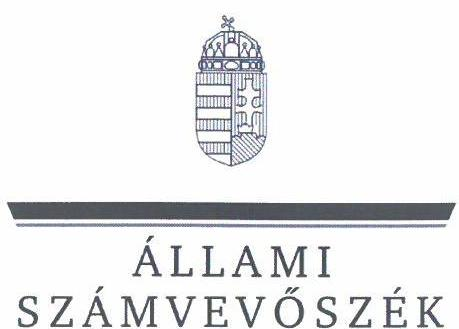
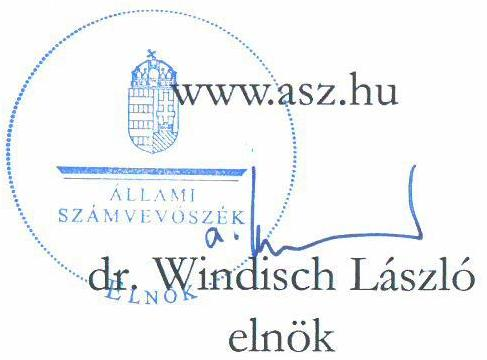
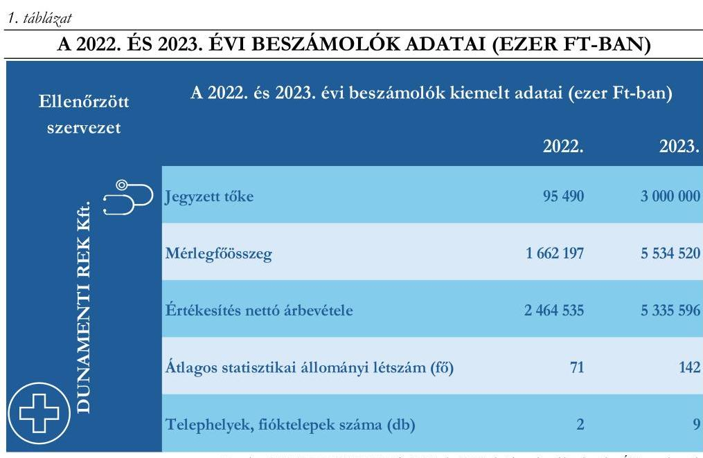

# JELENTÉS 

## Tulajdonosi joggyakorlás változása gazdasági társaságok beolvadása esetén

Országos Kórházi Főigazgatóság DUNAMENTI REK Reprodukciós Központ Korlátolt Felelősségű Társaság

2024.

---

ÁLLAMI
SZÁMVEVŐSZÉK

# JELENTÉS 

## Tulajdonosi joggyakorlás változása gazdasági társaságok beolvadása esetén

Országos Kórházi Főigazgatóság DUNAMENTI REK Reprodukciós Központ Korlátolt Felelősségű Társaság

2024.

24165

---

# ELLENŐRZÉSI IGAZGATÓSÁG: 

ÁLLAMI VAGYONGAZDÁLKODÁST ELLENŐRZŐ IGAZGATÓSÁG

ELLENŐRZÉSI IGAZGATÓ:
HERCZEGH ZSOLT igazgató

ELLENŐRZÉSVEZETŐ:
Jelentéseink az interneten a www.asz.hu címen olvashatók.

PENCZ MÁRIA ellenőrzésvezető

IKTATÓSZÁM: EL-4015-003/2024
TÉMASORSZÁM: 42
ELLENŐRZÉS-AZONOSÍTÓ SZÁM: V1071

---

# TARTALOMJEGYZÉK 

AZ ELLENŐRZÉS ALAPADATAI ..... 5
ELLENŐRZÖTT SZERVEZETEK ..... 7
ÖSSZEFOGLALÁS ..... 9
AZ ELLENŐRZÉS FÓKUSZTERÜLETEI ..... 10
MEGÁLLAPÍTÁSOK ..... 11
JAVASLATOK ..... 15
MELLÉKLETEK ..... 16
I. sz. melléklet: Értelmező szótár ..... 16
II. sz. melléklet: Az ellenőrzött szervezetek jegyzéke ..... 17
III. sz. melléklet: Ellenőrzési kritériumok ..... 18
III. sz. melléklet: Kimutatás az ellenőrzött időszakban meghozott taggyűlési határozatokról ..... 19
FÜGGELÉK: ÉSZREVÉTELEK ..... 22
RÖVIDÍTÉSEK JEGYZÉKE ..... 23

---

.

---

# AZ ELLENŐRZÉS ALAPADATAI 

## AZ ELLENŐRZÉS CÉLJA

Az ellenőrzés célja annak értékelése volt, hogy az állam tulajdonosi jogait gyakorló szervezet a tulajdonosi joggyakorlás kereteit a megváltozott helyzethez igazította-e és tulajdonosi joggyakorlói tevékenységét annak megfelelően végezte-e, továbbá annak értékelése, hogy a jogutód gazdasági társaság által a beolvadást követően kialakított szabályozási és működési környezet és az adatszolgáltatási kötelezettségek teljesítése összhangban volt-e a tulajdonosi joggyakorló előírásaival.

## AZ ELLENŐRZÉS TÍPUSA

Megfelelőségi ellenőrzés

## AZ ELLENŐRZÖTT IDŐSZAK

A 2023. május 1. - 2023. december 31. közötti időszak. A számviteli törvény szerinti 2023. évi beszámoló elfogadását érintő döntések vonatkozásában a 2024. január 01-jétől 2024. május 31. napjáig tartó időszak volt.

## AZ ELLENŐRZÉS TÁRGYA

Az ellenőrzés a beolvadással érintett jogutód gazdasági társaság felett tulajdonosi jogokat gyakorló szervezet beolvadást követő tulajdonosi joggyakorlás kereteinek felülvizsgálatára, szükség szerinti módosításának megfelelőségére, valamint a jogutód gazdasági társaság beolvadást követő, a tulajdonosi joggyakorló által meghatározott keretek szerinti működése megfelelőségének értékelésére terjedt ki.

Az ÁSZ ${ }^{1}$ a tulajdonosi joggyakorlás megfelelőségét egyrészt a tulajdonosi joggyakorló szervezet, másrészt a beolvadással érintett jogutód gazdasági társaság beolvadást követő tevékenységén keresztül értékelte.

Az ellenőrzés keretében az ÁSZ a tulajdonosi joggyakorlónál a tulajdonosi joggyakorlás kereteinek a beolvadást követő kialakítása, szükség szerinti módosítása és működtetése megfelelőségét, a jogutód gazdasági társaságnál a szervezeti és működési keretek tulajdonosi előírásoknak megfelelő kialakítását és működtetését, valamint az adatszolgáltatások megfelelő teljesítését vizsgálta.

Az ellenőrzés során értékelésre került az ellenőrzött szervezetek Infotv. ${ }^{2}$ szerinti, beolvadással összefüggő közzétételi kötelezettségei teljesítésének megfelelősége.

Az ellenőrzés kiterjedt minden olyan körülményre és adatra, amely az ÁSZ jogszabályban meghatározott feladatainak teljesítéséhez, valamint a program végrehajtása folyamán felmerült újabb összefüggések feltárásához volt szükséges.

---

# Az ellenőrzés jogalapja 

Az ellenőrzés jogszabályi alapját az ÁSZ tv. ${ }^{3} 1 . \int$ (3) bekezdésének, az 5. § (4) bekezdésének, valamint a Vtv. ${ }^{4} 3 . \int$ (4) bekezdésének előírásai képezték.

## AZ ELLENŐRZÉS MÓDSZERE

Az ellenőrzés végrehajtása a nemzetközi standardokat irányadónak tekintve az ellenőrzési program szempontjai, az ellenőrzött időszakban hatályos jogszabályok, az ellenőrzés szakmai szabályok és módszertanok figyelembevételével történt.

Az ellenőrzési kérdések megválaszolásához szükséges bizonyítékok megszerzése az ellenőrzött szervezetek által rendelkezésre bocsátott dokumentumokra és adatokra alapozva, továbbá megfigyelés, szemle (szemrevételezés), kérdésfeltevés (információkérés), valamint elemző eljárás útján történt. Az ellenőrzés során mintavételi eljárás alkalmazására nem került sor.

Az ellenőrzés lefolytatásához az ellenőrzött szervezetek az ÁSZ által kért dokumentumok, adatok, információk megküldésével, és az ellenőrzés során szolgáltattak adatokat.

Az ellenőrzési bizonyítékként felhasználható adatforrások közé tartoztak egyrészt az ellenőrzéshez kért dokumentumok, adatforrások, másrészt adatforrás volt minden - az ellenőrzés folyamán - feltárt, az ellenőrzés szempontjából információkat tartalmazó dokumentum.

---

# ELLENŐRZÖTT SZERVEZETEK 

AZ OKFŐ ${ }^{5}$ az egészségügyért felelős miniszter irányítása alá tartozó központi hivatalként működő központi költségvetési szerv, amelynek feladata az 506/2020. (XI. 17.) Korm. rendelet ${ }^{6}$ 3. §-a alapján az egészségügyi ellátórendszer működésének figyelemmel kísérése, valamint a felülvizsgálatát érintő stratégiai kormányzati döntések megalapozása. Az egyes állami tulajdonban álló gazdasági társaságok felett az államot megillető tulajdonosi jogok és kötelezettségek összességét gyakorló személyek kijelöléséről szóló 1/2022. (V. 26.) GFM rendelet ${ }^{7}$ 2. § és a 2. melléklet XIV.1. pontja alapján az OKFŐ gyakorolja az államot megillető tulajdonosi jogok és kötelezettségek összességét a DUNAMENTI REK Kft. ${ }^{8}$ felett. Az OKFŐ az ellenőrzött időszakban a Bkr. ${ }^{9}$ hatálya alá tartozott.

A DUNAMENTI REK KFT. 1991. október 9-én "KAÁLI" Ambuláns Nőgyógyászati Intézet Kft. néven alakult. 2019. december 19-től a Magyar Állam 99,7%-os és a MENTOREX Ingatlanhasznosító Kft. 0,3%-os tulajdonában áll, 2021. december 15-től DUNAMENTI REK Kft. néven működik. Feladata szakorvosi járóbeteg-ellátás, biotechnológiai kutatás, fejlesztés, valamint egyéb humán-egészségügyi ellátás, amelynek keretében ellátja a humán reprodukciós eljárásokkal kapcsolatos tevékenységeket.
Magyarország demográfiai stabilitásának elérése érdekében Magyarország Kormánya kiemelt célként határozta meg a humán reprodukciós eljárásokhoz történő egyenlő hozzáférés megteremtését. Ezen kormányzati cél elérése érdekében a humán reprodukciós terület működtetése 2022. július 1-jétől állami keretek között történik. Az állami tulajdonba került gazdasági társaságok közül a Forgács Intézet Kft. ${ }^{10}$, a Róbert Károly Meddőségi Centrum Kft. ${ }^{11}$, a Pannon Reprodukciós Kft. ${ }^{12}$, a Várandós Kft. ${ }^{13}$ és a Sterilitas Kft. ${ }^{14}$ 2023. április 30-val beolvadtak a DUNAMENTI REK Kft.-be, és ezzel jogutódlással megszűntek. Ezen időponttól a DUNAMENTI REK Kft. a beolvadással megszűnt gazdasági társaságok jogutódjaként látja el a humán reprodukciós eljárással kapcsolatos feladatokat.
A DUNAMENTI REK Kft. az ellenőrzött időszakban a beszámoló adatai alapján a Taktv. ${ }^{15}$ 7/J. § (1) bekezdés szerint a Gbkr. ${ }^{16}$ hatálya alá tartozott.

---

A beolvadás DUNAMENTI REK Kft. gazdálkodására gyakorolt hatását az 1. számú táblázat szemlélteti:

---

# ÖSSZEFOGLALÁS 

A humán reprodukciós területen végbement változások eredményeként a DUNAMENTI REK Kft. szervezeti struktúrája, gazdálkodásának jellemzői és volumene megváltozott. A beolvadás jelentős hatást gyakorolt a társasági vagyon nagyságára. A beolvadás következtében megszűnő gazdasági társaságok vagyona a jogutód gazdasági társaság vagyongazdálkodásának részévé vált. Ennek következtében a gazdálkodást érintő döntések volumene is jelentősen megváltozott. Az öt jogelőd gazdasági társaság bevételei és ráfordításai, valamint az azokkal összefüggő gazdálkodási döntések is a jogutód gazdasági társaságnál koncentrálódtak.

A megváltozott gazdálkodási körülmények - a beolvadásokat megelőző időszakhoz képest - eltérő gazdálkodási kockázatokat is eredményeztek. A gazdálkodási kockázatok kezelésében a megfelelő tulajdonosi joggyakorlásnak kiemelt szerepe van. Egy átalakulással érintett helyzetben akkor tekinthető megfelelőnek a tulajdonosi joggyakorlás kereteinek kialakítása és működtetése, ha az képes biztosítani a beolvadással együtt járó feladatok szabályszerű végrehajtását és kezeli a tulajdonosi joggyakorlással érintett gazdasági társaság működése során a megváltozott gazdálkodási kockázatokat.

AZ OKFŐ tulajdonosi joggyakorlása - az ellenőrzés megállapítása szerint - alapvetően alkalmas volt a Magyar Állam tulajdonosi érdekeinek érvényesítésére. Az ellenőrzött időszakban az OKFŐ tulajdonosi joggyakorlása keretében hozott döntései szabályszerűek voltak. Az OKFŐ tulajdonosi joggyakorlói döntéseit az FB${ }^{17}$ véleményének figyelembevételével hozta. Az OKFŐ a beolvadást követően egy általa létrehozott munkacsoport bevonásával felmérte a tulajdonosi joggyakorlása alá tartozó DUNAMENTI REK Kft. szervezetében és gazdálkodásában végbement lényeges változásokat, releváns kockázatokat, e vizsgálat eredményeit azonban a jogszabályi előírások ellenére nem dokumentálta. A felmérés alapján nem tartotta indokoltnak a belső szabályozási környezetének, továbbá joggyakorlóként a magához vont döntési jogkörök módosításának szükségességét.

Az ellenőrzött időszakban az ellenőrzés az OKFŐ szabályozási környezetét érintő hiányosságként tárta fel, hogy a jogszabályi előírások ellenére az SZMSZ${ }^{18}$-ét nem aktualizálta, továbbá a tulajdonosi joggyakorlás folyamatára vonatkozóan ellenőrzési nyomvonallal nem rendelkezett.

Az OKFŐ az általa kialakított tulajdonosi kontrollokat ugyan erősítette azzal, hogy a DUNAMENTI REK Kft. 1 millió forintértéket meghaladó beszerzéseit, megrendeléseit taggyűlési határozatban előzetes tulajdonosi engedélyhez kötötte, ugyanakkor a DUNAMENTI REK Kft. 1 millió forintot meghaladó beszerzéseire, megrendeléseire vonatkozó engedélykérési kötelezettségének elmulasztását nem tárta fel.

Az OKFŐ a 2023. évi rábízott vagyonra vonatkozó beszámolója tekintetében a jogszabályban előírt közzétételi kötelezettségének nem tett eleget.

A DUNAMENTI REK KFT. a jogszabályi előírásoknak megfelelően rendelkezett a szervezeti és a számviteli kereteket meghatározó szabályzatokkal, azonban az átalakulást követően az SZMSZ${ }^{18}$-t nem aktualizálta, az nem tartalmazta a beolvadáshoz kapcsolódó szervezeti változásokat. A DUNAMENTI REK Kft. az ellenőrzött időszakban határidőben teljesítette a tulajdonosi joggyakorló ${ }^{19}$ által kért eseti adatszolgáltatásokat, tájékoztatásokat.

Az ellenőrzés azonban a tulajdonosi joggyakorló által előírtak betartása tekintetében lényeges hiányosságnak értékelte, hogy a DUNAMENTI REK Kft. a 2022. október 7-én kelt 20/2022. számú taggyűlési határozatban foglaltak ellenére több esetben nem kérte meg az OKFŐ engedélyét az egyösszegben 1 millió forintot elérő beszerzéseihez, megrendeléseihez.

A DUNAMENTI REK Kft. jogszabályban előírt közzétételi kötelezettségének az SZMSZ${ }^{18}$ vonatkozásában nem tett eleget.

---

# AZ ELLENŐRZÉS FÓKUSZTERÜLETEI 

1. A tulajdonosi joggyakorló szervezet beolvadást követő tulajdonosi joggyakorlói tevékenységének megfelelősége a beolvadásban érintett jogutód gazdasági társaság tekintetében.
2. A gazdasági társaság tulajdonosi elvárásoknak megfelelő működése a beolvadást követően.

---

# 1. A tulajdonosi joggyakorló szervezet beolvadást követő tulajdonosi joggyakorlói tevékenységének megfelelősége a beolvadásban érintett jogutód gazdasági társaság tekintetében. 

Összegző megállapítás: Az OKFŐ a beolvadást követően alapvetően ellátta a tulajdonosi joggyakorlással kapcsolatos feladatait, azonban a tulajdonosi kontrollt nem működtette megfelelően.

AZ OKFŐ főigazgatójának nyilatkozata szerint a beolvadásra tekintettel, a DUNAMENTI REK Kft. szervezete és gazdálkodása volumenében bekövetkezett változások értékelése céljából létrehozott egy munkacsoportot, amelynek bevonásával felmérte a lehetséges kockázatokat. A vizsgálat eredményeként nem tartotta indokoltnak a tulajdonosi joggyakorlás kereteinek, szabályozási környezetének, joggyakorlóként a magához vont döntési jogköröknek, továbbá a kontrolltevékenységének módosítását. A kockázatok azonosításának folyamatát, annak eredményét és a kapcsolódó döntéseket az OKFŐ a Bkr. 8. § (2) bekezdés a) pontjában előírtak ellenére nem dokumentálta.

Az OKFŐ az Áht. ${ }^{20}$ előírásaival összhangban rendelkezett az ellenőrzött időszakban hatályos SZMSZ${ }^{21}$ -szel, amely tartalmazta a tulajdonosi joggyakorlással kapcsolatos feladatokat, felelősöket és hatásköröket.
Az SZMSZ${ }^{21}$-ben foglaltak szerint a főigazgató gyakorolta többek között a tulajdonosi jogokat a jogszabályok által a hatáskörébe tartozó intézmények, valamint a joggyakorlásába tartozó vagyon tekintetében. A gazdasági főigazgató-helyettes felelősségi körébe tartozott egyebek mellett az OKFŐ tulajdonosi joggyakorlása alatt álló egészségügyi intézmények gazdálkodásának elemzése és időszakos értékelése, a kontrolling feladatok ellátása. Az SZMSZ${ }^{21}$ alapján a Vagyongazdálkodási és Beruházási Főosztály feladata volt az OKFŐ tulajdonosi joggyakorlása alá tartozó gazdasági társaságok adatainak nyilvántartása, működésük és gazdálkodásuk folyamatos felügyelete és ellenőrzése, a társaságok számviteli beszámolóinak ellenőrzése, elfogadása, időszakos pénzügyi kontrolling jelentések feldolgozása, szükség esetén a tulajdonosi beavatkozások előkészítése és azok végrehajtásának ellenőrzése. A Szabályozásfelügyeleti Főosztály feladatkörébe tartozott a tulajdonosi joggyakorláshoz kapcsolódó jogi feladatok ellátása.
Az OKFŐ főigazgatója nem tett eleget az SZMSZ${ }^{21}$ 5. § (3) bekezdés f) pontjában foglalt kötelezettségének - amely szerint az OKFŐ főigazgatójának feladata volt gondoskodni az OKFŐ belső szervezetszabályozó dokumentumainak elkészítéséről, kiadásáról, azok folyamatos karbantartásáról - mivel az SZMSZ${ }^{21}$ módosítását az ellenőrzött időszakban a beolvadásra tekintettel nem készítette el. Az SZMSZ${ }^{21}$ 8. számú, az OKFŐ tulajdonosi joggyakorlásával érintett cégeket

 tartalmazó függelékéből nem került kivezetésre a tulajdonosi joggyakorlás körébe már nem tartozó, a DUNAMENTI REK Kft.-be 2023. április 30-ával beolvadt öt gazdasági társaság. Az OKFŐ SZMSZ$_{1}$-e ezáltal nem felel meg az Ávr. $^{22}$ 13. § (1) bekezdés d) pontjában foglaltaknak, mivel nem azon társaságok részletes felsorolását tartalmazta, amelyek felett az ellenőrzött időszakban az OKFŐ tulajdonosi jogokat gyakorolt. Az OKFŐ főigazgatója az Ávr. 13. § (4a) bekezdésében foglaltakkal ellentétben az 1/2022. (V. 26.) GFM rendelet módosításának 2023. június 17-i

---

hatályba lépését követő 30 napon belül a tulajdonosi joggyakorlásban bekövetkezett változásokat az SZMSZ$_{1}$-en nem vezette át, és az Áht. 9. § b) pontjában előírt jóváhagyás érdekében az SZMSZ$_{1}$-t a belügyminiszter részére nem küldte meg. Az ellenőrzött időszakot követően, 2024. június 21-től hatályos a 13/2024. (VI. 20.) BM utasítással kiadott SZMSZ$_{2}$ $^{23}$, amelynek 5. számú függelékében a beolvadással megszűnt gazdasági társaságok már nem szerepelnek.
Az OKFŐ a Bkr. 3. § c) pontjában és 8. §-ban előírtak ellenére az SZMSZ$_{1}$ 5. függelék 3.2.10. pontjában szerinti, a tulajdonosi joggyakorlása alá tartozó gazdasági társaságok folyamatos felügyeletére vonatkozó kötelezettségét nem teljesítette, mivel a DUNAMENTI REK Kft.-nek a beolvadási folyamatra tekintettel fennálló SZMSZ$_{2}$ módosítási kötelezettségének elmaradását nem kifogásolta.
Az OKFŐ főigazgatója a Bkr. 6. § (3) bekezdésében foglaltak ellenére nem alakította ki a tulajdonosi joggyakorlás folyamatára vonatkozóan az ellenőrzési nyomvonalat, ezzel nem tette lehetővé a tulajdonosi joggyakorlás folyamatának nyomon követhetőségét és ellenőrizhetőségét.
Az OKFŐ a DUNAMENTI REK Kft. Társasági szerződés$_{1,2}$ $^{24}$-ben a Ptk. $^{25}$-ban előírt jogokon és kötelezettségeken felül saját hatáskörbe nem vont egyéb jogköröket. A 20/2022. számú taggyűlési határozat a DUNAMENTI REK Kft. egyösszegben 1 millió forintot elérő beszerzéseit, megrendeléseit az OKFŐ Vagyongazdálkodási és Beruházási Főosztály előzetes engedélyéhez kötötte. Az engedélyt az OKFŐ-nek a megkereséstől számított 5 munkanapon belül kellett elektronikusan megadnia. Az ellenőrzött időszakban a DUNAMENTI REK Kft. tekintetében az engedélyezések száma 16 db volt, azonban a DUNAMENTI REK Kft. 1 millió forintértéket meghaladó, engedélyköteles beszerzéseinek, megrendeléseinek száma az ellenőrzött időszakban ezt meghaladta. A rendelkezésre álló adatok alapján az ellenőrzött időszakban a DUNAMENTI REK Kft. legalább 21 esetben nem kérte meg az OKFŐ engedélyét az egyösszegben 1 millió forintot meghaladó beszerzéseihez, megrendeléseihez. Az OKFŐ által működtetett tulajdonosi kontroll az engedélykérések elmaradását nem tárta fel, ezzel nem tett eleget az SZMSZ$_{1}$ 5. függelék 3.2.10. pontjában előírt, a tulajdonosi joggyakorlása alá tartozó gazdasági társaságok folyamatos felügyeletére vonatkozó kötelezettségének.
Az OKFŐ a Ptk. előírásainak megfelelően a DUNAMENTI REK Kft. legfőbb szervén, a taggyűlésen keresztül gyakorolta a Magyar Államot megillető tulajdonosi jogait. Az OKFŐ a taggyűlés résztvevőjeként a Ptk. és a DUNAMENTI REK Kft. Társasági szerződés$_{1,2}$-ében foglaltaknak megfelelően Taggyűlési határozatban döntött - többek között - a DUNAMENTI REK Kft. 2022. és 2023. évi számviteli beszámolóinak elfogadásáról az FB határozat és a könyvvizsgálói jelentés birtokában, a 2022. és 2023. évi adózott eredmények felhasználásáról, a társaság 2022. és 2023. évi üzleti terveinek jóváhagyásáról, valamint a Társasági szerződés módosításának elfogadásáról. A taggyűlés a DUNAMENTI REK Kft.-re vonatkozó határozatait az FB javaslatainak figyelembevételével hozta meg. Az ellenőrzött időszakban meghozott 61 db Taggyűlési határozat közül 42 db a beolvadási folyamatra, 14 db a Társaság gazdálkodására vonatkozott, 5 esetben egyéb témában született döntés. A Taggyűlési határozatokról készített kimutatást a IV. számú melléklet tartalmazza.
A DUNAMENTI REK Kft.-nél az ellenőrzött időszakban a Taktv.-ben foglaltaknak megfelelően öt tagú FB működött. Az ellenőrzött időszakban az OKFŐ két új FB tag kijelöléséről döntött, amivel a Ptk. és az Alapszabály előírásainak megfelelően biztosította az FB szabályszerű működéséhez szükséges létszámot.
Az OKFŐ szabályzatban, utasításban, határozatban rendszeres adatszolgáltatási kötelezettséget a DUNAMENTI REK Kft. részére nem írt elő. Eseti jelleggel az ellenőrzött időszakban 29 esetben kért adatszolgáltatást, tájékoztatást a társaság gazdálkodásával és működésével kapcsolatosan. Az OKFŐ a

---

teljesített eseti adatszolgáltatáson keresztül a Bkr. előírásainak megfelelően nyomon követte a tulajdonosi joggyakorlása alá tartozó DUNAMENTI REK Kft. gazdálkodását. Az OKFŐ Vagyongazdálkodási és Beruházási Főosztálya az adatszolgáltatások ellenőrzésével, értékelésével kapcsolatos feladatait ellátta.
Az OKFŐ az Infotv. 37. § (1) bekezdésében előírtak ellenére a törvény 1. melléklet III.1. pontjában előírt közzétételi kötelezettségének - a 2023. évre vonatkozó rábízott vagyon tekintetében - nem tett eleget.

# 2. A gazdasági társaság tulajdonosi elvárásoknak megfelelő működése a beolvadást követően. 

Összegző megállapítás: A DUNAMENTI REK Kft. beolvadást követő működése alapvetően megfelelt a tulajdonosi joggyakorló által előírtaknak, azonban az 1 millió forintértéket meghaladó beszerzések, megrendelések tulajdonosi joggyakorlóval történő engedélyeztetése részben történt meg.

A DUNAMENTI REK KFT. a Ptk. előírásainak megfelelően rendelkezett az ellenőrzött időszakban hatályos Társasági szerződés$_{1,2}$-sel, a Társasági Szerződés$_{2}$ a Ptk. előírásai szerint tartalmazta a beolvadáshoz kapcsolódó szervezeti változásokat. A DUNAMENTI REK Kft. Társasági szerződés$_{2}$-e tartalmazta az újonnan létrejött telephelyeket és a fióktelepeket, a megemelt törzstőke összegét, valamint a két új FB tag kijelölését.
A DUNAMENTI REK Kft. rendelkezett az ellenőrzött időszakban hatályos SZMSZ$_{2}$-szel, azonban az nem tartalmazta a beolvadáshoz kapcsolódó szervezeti változásokat. A DUNAMENTI REK Kft. ügyvezető igazgatója a Gbkr. 4. § (1) bekezdés a) pontjában előírtak ellenére nem alakított ki olyan kontrollkörnyezetet, amelyben a szervezeti struktúra világos, a folyamatok átláthatóak. Az SZMSZ$_{2}$ I.1. pontjában a DUNAMENTI REK Kft. 2021. december 15-e előtti - "KAÁLI" Ambuláns Nőgyógyászati Intézet Kft. - elnevezése szerepelt, az SZMSZ$_{2}$ I/2. pontjában feltüntetett telephelyek, fióktelepek nem voltak összhangban a Társasági Szerződés$_{2}$ I/2. pontjában foglaltakkal, mivel az SZMSZ a telephelyeket nem, a fióktelepeket nem teljeskörűen tartalmazta. A DUNAMENTI REK Kft. ügyvezető igazgatója nem tett eleget a Ptk. 3:112. § (2) bekezdésében foglaltaknak, nem biztosította az Eütv. 155. § (1) bekezdés f) pontjában foglaltak érvényesülését, mivel nem készítette elő a társaság SZMSZ$_{2}$-ének módosítását és annak OKFŐ részére történő megküldését jóváhagyás céljából.
A DUNAMENTI REK Kft. a Számv. tv. $^{26}$ előírásainak megfelelően rendelkezett a beolvadást követően módosított, és a DUNAMENTI REK Kft. ügyvezetője által jóváhagyott Számviteli politika$_{1,2}$ $^{27}$-val, valamint annak keretében elkészített Eszközök és források leltárkészítési és leltározási szabályzat$_{1,2}$ $^{28}$-val, Eszközök és források értékelési szabályzat$_{1,2}$ $^{29}$-val, Önköltségszámítási szabályzat$^{30}$-tal, Pénzkezelési szabályzat$_{1,2}$ $^{31}$-tal, valamint Számlarend$^{32}$-del.
A DUNAMENTI REK Kft. az ellenőrzött időszakban a társaság gazdálkodásáról, mérleg, eredménykimutatás adatairól havi rendszerességgel adatszolgáltatást teljesített a KAPOR$^{33}$ rendszerben. Az ellenőrzött időszakban a DUNAMENTI REK Kft. a Gbkr. előírásainak megfelelően eleget tett az OKFŐ által a társaság gazdálkodásával és működésével összefüggésben elektronikusan előírt adatszolgáltatási és tájékoztatási kötelezettségeinek.

---

Az ellenőrzött időszakban a DUNAMENTI REK Kft. ügyvezetőjének a 20/2022. számú taggyűlési határozat alapján az OKFŐ Vagyongazdálkodási és Beruházási Főosztályával előzetesen engedélyeztetnie kellett az 1 millió forintot elérő beszerzéseket, megrendeléseket. A DUNAMENTI REK Kft. ügyvezetője a 20/2022. számú taggyűlési határozatban foglaltak végrehajtását maradéktalanul nem biztosította. A DUNAMENTI REK Kft. ügyvezetője nyilatkozata értelmében ugyan az engedélykérési kötelezettségét 16 esetben teljesítette, azonban legalább 21 esetben nem kérte meg az OKFŐ engedélyét az egyösszegben 1 millió forintot elérő beszerzésekhez, megrendelésekhez. Az ellenőrzés rendelkezésre bocsátott dokumentumok alapján az engedélyeztetett beszerzések összértéke az ellenőrzött időszakban 43,5 millió Ft volt, míg a nem engedélyeztetett beszerzések összege elérte a 76,3 millió Ft-ot. A nem engedélyeztetett beszerzések túlnyomó része fogyóanyag beszerzés volt. A rendelkezésre álló dokumentumok alapján az engedélyeztetés elmaradásának indoka a folyamatos, biztonságos betegellátás biztosítása volt. A DUNAMENTI REK Kft. ügyvezetője a Gbkr. 6. § (2) bekezdés a) pontjában előírtak ellenére nyilvántartást sem az engedélyköteles beszerzésekről, sem az engedélykérésekről nem vezetett. A DUNAMENTI REK Kft. a 20/2022. számú taggyűlési határozatban foglalt, 1 millió forint értékhatár módosítását az ellenőrzött időszakban nem kezdeményezte.
A DUNAMENTI REK Kft. a Számv. tv. előírásainak megfelelően elkészítette a 2022. és a 2023. évi számviteli törvény szerinti éves beszámolóit és üzleti jelentéseit. A beszámolókat a könyvvizsgáló elfogadó záradékkal látta el.
A DUNAMENTI REK Kft. az Infotv. 37. § (1) bekezdés és Infotv. 1. melléklet II/1. pontjában foglaltak ellenére SZMSZ$_{2}$-ét nem tette közzé.

---

# JAVASLATOK 

Az ÁSZ tv. 33. § (1) bekezdésében foglaltak értelmében az ellenőrzött szervezet vezetője köteles a jelentésben foglalt megállapításokhoz kapcsolódó intézkedési tervet összeállítani és azt a jelentés kézhezvételétől számított 30 napon belül az ÁSZ részére megküldeni. Amennyiben az ellenőrzött szervezet vezetője nem küldi meg határidőben az intézkedési tervet, vagy továbbra sem elfogadható intézkedési tervet küld, az Állami Számvevőszék elnöke az ÁSZ tv. 33. § (3) bekezdése a) és b) pontjaiban foglaltakat érvényesítheti.

## AZ OKFŐ FŐIGAZGATÓJA RÉSZÉRE

1. Intézkedjen a Bkr. 6. § (3) bekezdésében foglaltaknak megfelelően a tulajdonosi joggyakorlói tevékenységre vonatkozó ellenőrzési nyomvonal kialakítása, továbbá a 20/2022. számú taggyűlési határozatban foglaltak maradéktalan teljesítése érdekében.
2. Intézkedjen az Infotv. 37. § (1) bekezdésében és az 1. melléklet III/1. pontjában foglaltak szerint a rábízott vagyon tekintetében elkészített éves költségvetési beszámoló honlapon történő közzétételéről.

## A DUNAMENTI REK KFT. ÜGYVEZETŐJE RÉSZÉRE

1. Tegyen intézkedéseket azon kontrolltevékenységek kialakítására és megfelelő működtetésére, amelyek a Gbkr. 4. § (3) bekezdése és a Taktv. 7/J. § (3) bekezdés e) pontja előírásainak megfelelően biztosítják az SZMSZ jogszabályi változást követő felülvizsgálatát.
2. Tegyen intézkedéseket azon kontrolltevékenységek kialakítására és megfelelő működtetésére, amelyek biztosítják a 20/2022. számú taggyűlési határozatban foglaltak maradéktalan teljesítését.
3. Intézkedjen az Infotv. 37. § (1) bekezdésében és az Infotv. 1. melléklet II/1. pontjában előírtak szerint a DUNAMENTI REK Kft. SZMSZ-ének honlapon történő közzétételéről.

---

# MELLÉKLETEK 

## I. SZ. MELLÉKLET: ÉRTELMEZŐ SZÓTÁR

átalakulás
beolvadás
KAPOR
köztulajdonban álló gazdasági társaság
gazdasági társaság
tulajdonosi
joggyakorló

Jogi személy más típusú jogi személlyé történő átalakulása esetén az átalakuló jogi személy megszűnik, jogai és kötelezettségei az átalakulással keletkező jogi személyre, mint általános jogutódra szállnak át.
Forrás: Ptk. 3:39. § (1) bekezdés
Beolvadásnál a beolvadó jogi személy szűnik meg, általános jogutódja az egyesülésben részt vevő másik jogi személy.
Forrás: Ptk. 3:44. § (1) bekezdés
A KAPOR egy, az MNV Zrt. által működtetett, tulajdonosi kontrollt segítő online web böngészőn keresztül működő adatszolgáltató rendszer, amely felületen az adatszolgáltató társaságok jelentések kitöltésével teljesítik a havi kontrolling adatszolgáltatásukat. Adatszolgáltatásra a közvetlen többségi állami tulajdonú gazdasági társaságok kötelezettek. Forrás:
www.mnv.hu/gazdalkodas/mnvgazdalkodasa/informatikairendszerek/informatikai_rendszerek
Az a gazdasági társaság, amelyben a Magyar Állam, helyi önkormányzat, a helyi önkormányzat jogi személyiséggel rendelkező társulása, többcélú kistérségi társulás, fejlesztési tanács, nemzetiségi önkormányzat, nemzetiségi önkormányzat jogi személyiségű társulása, költségvetési szerv vagy közalapítvány külön-külön vagy együttesen számítva többségi befolyással rendelkezik.
Forrás: Taktv. 1. § a) pont
A
 gazdasági társaságok üzletszerű közös gazdasági tevékenység folytatására, a tagok vagyoni hozzájárulásával létrehozott, jogi személyiséggel rendelkező vállalkozások, amelyekben a tagok a nyereségből közösen részesednek, és a veszteséget közösen viselik.
(Forrás: Ptk. 3:88. § (1) bekezdése)
Aki a nemzeti vagyon felett az államot vagy a helyi önkormányzatot megillető tulajdonosi jogok és kötelezettségek összességének gyakorlására jogosult.
(Forrás: Nvtv. 3. § (1) bekezdés 17. pont)

---

# II. SZ. MELLÉKLET: AZ ELLENŐRZÖTT SZERVEZETEK JEGYZÉKE 

## ELLENŐRZÖTT SZERVEZET NEVE

Országos Kórházi Főigazgatóság
DUNAMENTI REK Reprodukciós Központ Korlátolt Felelősségű Társaság

---

# III. SZ. MELLÉKLET: ELLENŐRZÉSI KRITÉRIUMOK 

## FOKUSZTERÜLET

1. A tulajdonosi joggyakorló szervezet beolvadást követő tulajdonosi joggyakorlói tevékenységének megfelelősége a beolvadásban érintett jogutód gazdasági társaság tekintetében.
2. A gazdasági társaság tulajdonosi elvárásoknak megfelelő működése a beolvadást követően.

## ELLENŐRZÉSI KRITÉRIUMOK

Ptk., Áht., Ávr., Bkr., Eütv., 516/2020. (XI. 25.) Korm. rend., Infotv., létesítő okirat, belső szabályzatok.

Ptk., Gbkr., Infotv., Számv.tv., Taktv., létesítő okirat, belső szabályzatok, tulajdonosi döntések

---

# III. SZ. MELLÉKLET: KIMUTATÁS AZ ELLENŐRZÖTT IDŐSZAKBAN MEGHOZOTT TAGGYÜLÉSI HATÁROZATOKRÓL

|  SORSZÁM | HATÁROZAT
SZÁMA | DATUM | HATÁROZAT TÁRGYA | DÖNTÉS
TÉRÜLÉTE  |
| --- | --- | --- | --- | --- |
|  1. | 25/2023 | 2023.05.09 | Döntés az ügyvezető 2022. évről szóló beszámolójának elfogadásáról. | gazdálkodás  |
|  2. | 26/2023 | 2023.05.09 | Döntés az FB beszámolójának elfogadásáról | gazdálkodás  |
|  3. | 27/2023 | 2023.05.09 | Döntés a könyvvizsgálói beszámoló, könyvvizsgálói jelentés elfogadásáról | gazdálkodás  |
|  4. | 28/2023 | 2023.05.09 | Döntés a 2022. év gazdálkodásáról szóló beszámolónak, mérlegnek és eredménykimutatásnak elfogadásáról. | gazdálkodás  |
|  5. | 29/2023 | 2023.05.09 | Döntés az adózott eredmény teljes összegének eredménytartalékba kerüléséről. | gazdálkodás  |
|  6. | 30/2023 | 2023.05.09 | Döntés a könyvvizsgáló díjának a 2023. évi megállapításáról. | gazdálkodás  |
|  7. | 31/2023 | 2023.05.09 | Döntés az IVF társaságok egyesüléséről, a cégeljárásról és a még hátralévő teendőkről szóló beszámolójának elfogadásáról. | beolvadási folyamat  |
|  8. | 32/2023 | 2023.05.09 | Döntés a 2023. évi üzleti terv elfogadásáról. | gazdálkodás  |
|  9. | 33/2023 | 2023.07.13 | Döntés az ügyvezető Átalakulási törvény szerinti beszámolójának elfogadásáról. | beolvadási folyamat  |
|  10. | 34/2023 | 2023.07.13 | Döntés az FB-nek a FORGÁCS INTÉZET Kft. beszámolójáról szóló véleményének elfogadásáról. | beolvadási folyamat  |
|  11. | 35/2023 | 2023.07.13 | Döntés az állandó könyvvizsgálónak a FORGÁCS INTÉZET Kft. beszámolójáról szóló jelentés elfogadásáról. | beolvadási folyamat  |
|  12. | 36/2023 | 2023.07.13 | Döntés a FORGÁCS INTÉZET Kft. 2023.04.30-i tevékenységet lezáró beszámolójának elfogadásáról. | beolvadási folyamat  |
|  13. | 37/2023 | 2023.07.13 | Döntés az FB-nek a FORGÁCS INTÉZET Kft. 2023.04.30-i végleges vagyonmérlegéről és vagyonleltáráról szóló véleményének elfogadásáról. | beolvadási folyamat  |
|  14. | 38/2023 | 2023.07.13 | Döntés a független könyvvizsgálónak a FORGÁCS INTÉZET Kft. 2023.04.30-i vagyonmérlegéről és vagyonleltáráról szóló jelentés elfogadásáról. | beolvadási folyamat  |
|  15. | 39/2023 | 2023.07.13 | Döntés a FORGÁCS INTÉZET Kft. 2023.04.30-i végleges vagyonmérlegének és vagyonleltárának elfogadásáról. | beolvadási folyamat  |
|  16. | 40/2023 | 2023.07.13 | Döntés az FB-nek a VÁRANDÓS Kft. beszámolójáról szóló véleményének elfogadásáról. | beolvadási folyamat  |
|  17. | 41/2023 | 2023.07.13 | Döntés az állandó könyvvizsgálónak a VÁRANDÓS Kft. beszámolójáról szóló jelentés elfogadásáról. | beolvadási folyamat  |
|  18. | 42/2023 | 2023.07.13 | Döntés a VÁRANDÓS Egészségügyi Szolgáltató Kft. 2023.04.30-i tevékenységet lezáró beszámolójának elfogadásáról. | beolvadási folyamat  |
|  19. | 43/2023 | 2023.07.13 | Döntés az FB-nek a VÁRANDÓS Egészségügyi Szolgáltató Kft. 2023.04.30-i végleges vagyonmérlegéről és vagyonleltáráról szóló véleményének elfogadásáról. | beolvadási folyamat  |
|  20. | 44/2023 | 2023.07.13 | Döntés a független könyvvizsgálónak a VÁRANDÓS Egészségügyi Szolgáltató Kft. 2023.04.30-i vagyonmérlegéről és vagyonleltáráról szóló jelentésének elfogadásáról. | beolvadási folyamat  |
|  21. | 45/2023 | 2023.07.13 | Döntés a VÁRANDÓS Egészségügyi Szolgáltató Kft. 2023.04.30-i végleges vagyonmérlegének és vagyonleltárának elfogadásáról. | beolvadási folyamat  |
|  22. | 46/2023 | 2023.07.13 | Döntés az FB-nek a STERILITÁS Kft. 2023.04.30-i beszámolójáról szóló véleményének elfogadásáról. | beolvadási folyamat  |

---

|  SORSZÁM | HATÁROZAT
SZÁMA | DÁTUM | HATÁROZAT TÁRGYA | DÖNTÉS
TERÜLETE  |
| --- | --- | --- | --- | --- |
|  23. | 47/2023 | 2023.07.13 | Döntés az állandó könyvvizsgálónak a STERILITÁS Kft. 2023.04.30-i beszámolójáról szóló jelentésének elfogadásáról. | beolvadási folyamat  |
|  24. | 48/2023 | 2023.07.13 | Döntés a STERILITÁS Egészségügyi Ellátó Kft. 2023.04.30-i tevékenységet lezáró beszámolójának elfogadásáról. | beolvadási folyamat  |
|  25. | 49/2023 | 2023.07.13 | Döntés az FB-nek a STERILITÁS Egészségügyi Ellátó Kft. 2023.04.30-i végleges vagyonmérlegéről és vagyonleltáráról szóló véleményének elfogadásáról. | beolvadási folyamat  |
|  26. | 50/2023 | 2023.07.13 | Döntés a független könyvvizsgálónak a STERILITÁS Egészségügyi Ellátó Kft. 2023.04.30-i vagyonmérlegéről és vagyonleltáráról szóló jelentésének elfogadásáról. | beolvadási folyamat  |
|  27. | 51/2023 | 2023.07.13 | Döntés a STERILITÁS Egészségügyi Ellátó Kft. 2023.04.30-i végleges vagyonmérlegének és vagyonleltárának elfogadásáról. | beolvadási folyamat  |
|  28. | 52/2023 | 2023.07.13 | Döntés az FB-nek a Pannon Reprodukciós Intézet Kft. 2023.04.30-i beszámolójáról szóló véleményének elfogadásáról. | beolvadási folyamat  |
|  29. | 53/2023 | 2023.07.13 | Döntés az állandó könyvvizsgálónak a Pannon Reprodukciós Intézet Kft. 2023.04.30-i beszámolójáról szóló jelentésének elfogadásáról. | beolvadási folyamat  |
|  30. | 54/2023 | 2023.07.13 | Döntés a Pannon Reprodukciós Intézet Kft. 2023.04.30-i tevékenységet lezáró beszámolójának elfogadásáról. | beolvadási folyamat  |
|  31. | 55/2023 | 2023.07.13 | Döntés az FB-nek a Pannon Reprodukciós Intézet Kft. 2023.04.30-i végleges vagyonmérlegéről és vagyonleltáráról szóló véleményének elfogadásáról. | beolvadási folyamat  |
|  32. | 56/2023 | 2023.07.13 | Döntés a független könyvvizsgálónak a Pannon Reprodukciós Intézet Kft. 2023.04.30-i vagyonmérlegéről és vagyonleltáráról szóló jelentésének elfogadásáról. | beolvadási folyamat  |
|  33. | 57/2023 | 2023.07.13 | Döntés a Pannon Reprodukciós Intézet Kft. 2023.04.30-i végleges vagyonmérlegének és vagyonleltárának elfogadásáról. | beolvadási folyamat  |
|  34. | 58/2023 | 2023.07.13 | Döntés az FB-nek a Róbert Károly Meddőségi Centrum Kft. 2023.04.30-i beszámolójáról szóló véleményének elfogadásáról. | beolvadási folyamat  |
|  35. | 59/2023 | 2023.07.13 | Döntés az állandó könyvvizsgálónak a Róbert Károly Meddőségi Centrum Kft. 2023.04.30-i beszámolójáról szóló jelentésének elfogadásáról. | beolvadási folyamat  |
|  36. | 60/2023 | 2023.07.13 | Döntés a Róbert Károly Meddőségi Centrum Kft. 2023.04.30-i tevékenységet lezáró beszámolójának elfogadásáról. | beolvadási folyamat  |
|  37. | 61/2023 | 2023.07.13 | Döntés az FB-nek a Róbert Károly Meddőségi Centrum Kft. 2023.04.30-i végleges vagyonmérlegéről és vagyonleltáráról szóló véleményének elfogadásáról. | beolvadási folyamat  |
|  38. | 62/2023 | 2023.07.13 | Döntés a független könyvvizsgálónak a Róbert Károly Meddőségi Centrum Kft. 2023.04.30-i vagyonmérlegéről és vagyonleltáráról szóló jelentésének elfogadásáról. | beolvadási folyamat  |
|  39. | 63/2023 | 2023.07.13 | Döntés a Róbert Károly Meddőségi Centrum Kft. 2023.04.30-i végleges vagyonmérlegének és vagyonleltárának elfogadásáról. | beolvadási folyamat  |
|  40. | 64/2023 | 2023.07.13 | Döntés az FB-nek a DUNAMENTI REK Reprodukciós Központ Kft. 2023.04.30-i mérlegéről szóló véleményének elfogadásáról. | beolvadási folyamat  |
|  41. | 65/2023 | 2023.07.13 | Döntés a DUNAMENTI REK Reprodukciós Központ Kft. 2023.04.30-i alapul szolgáló mérlegének elfogadásáról. | beolvadási folyamat  |
|  42. | 66/2023 | 2023.07.13 | Döntés az FB-nek a DUNAMENTI REK Reprodukciós Központ Kft. 2023.04.30-i végleges vagyonmérlegéről és vagyonleltáráról szóló véleményének elfogadásáról. | beolvadási folyamat  |
|  43. | 67/2023 | 2023.07.13 | Döntés a független könyvvizsgálónak a DUNAMENTI REK Reprodukciós Központ Kft. 2023.04.30-i vagyonmérlegéről és vagyonleltáráról szóló jelentésének elfogadásáról. | beolvadási folyamat  |

---

|  SORSZÁM | HATÁROZAT
SZÁMA | DÁTUM | HATÁROZAT TÁRGYA | DÖNTÉS
TERÜLETE  |
| --- | --- | --- | --- | --- |
|  44. | 68/2023 | 2023.07.13 | Döntés a DUNAMENTI REK Reprodukciós Központ Kft. 2023.04.30-i végleges vagyonmérlegének és vagyonleltárának elfogadásáról. | beolvadási folyamat  |
|  45. | 69/2023 | 2023.07.13 | Döntés az FB-nek a DUNAMENTI REK Reprodukciós Központ Kft. beszámolójának elfogadásáról, a 2023.05.01-i vagyonmérlegéről és vagyonleltáráról szóló véleményének elfogadásáról. | beolvadási folyamat  |
|  46. | 70/2023 | 2023.07.13 | Döntés a független könyvvizsgálónak a DUNAMENTI REK Reprodukciós Központ Kft. 2023.05.01-i vagyonmérlegéről és vagyonleltáráról szóló jelentésének elfogadásáról. | beolvadási folyamat  |
|  47. | 71/2023 | 2023.07.13 | Döntés a DUNAMENTI REK Reprodukciós Központ Kft. 2023.05.01-i vagyonmérlegének és vagyonleltárának elfogadásáról. | beolvadási folyamat  |
|  48. | 72/2023 | 2023.07.13 | Döntés arról, hogy a DUNAMENTI REK Reprodukciós Központ Kft. társasági szerződésének IV. pontja szerinti törzstőke és törzsbetétek nem változnak, a társasági szerződés módosítására nincs szükség. | beolvadási folyamat  |
|  49. | 73/2023 | 2023.08.03 | Döntés a taggyűlés levezető elnöknek és jegyzőkönyvvezetőnek és a jegyzőkönyv-hitelesítőnek a kijelöléséről. | egyéb  |
|  50. | 74/2023 | 2023.08.03 | Döntés a Társaság új ügyvezetőjének pályázati úton történő kiválasztásáról. | egyéb  |
|  51. | 75/2023 | 2023.08.03 | Döntés az ügyvezetői munkakör pályáztatásának a lefolytatásáról. | egyéb  |
|  52. | 76/2023 | 2023.10.13 | Döntés a taggyűlés levezető elnöknek és jegyzőkönyvvezetőnek és jegyzőkönyv-hitelesítőnek kijelöléséről. | egyéb  |
|  53. | 77/2023 | 2023.10.13 | Döntés a Társaság társasági szerződésének I. pontjának az új telephelyel és új fiókteleppel történő kiegészítéséről. | beolvadási folyamat  |
|  54. | 78/2023 | 2023.10.13 | Döntés az új telephelyre és fióktelepre vonatkozó bérleti szerződés megkötésére és aláírására vonatkozóan az ügyvezető felhatalmazásáról. | gazdálkodás  |
|  55. | 2/2024 | 2024.05.28 | Döntés a taggyűlés levezető elnöknek és jegyzőkönyvvezetőnek és a jegyzőkönyv-hitelesítőnek a kijelöléséről. | egyéb  |
|  56. | 3/2024 | 2024.05.28 | Döntés az ügyvezető 2023. évről szóló beszámolójának elfogadásáról. | gazdálkodás  |
|  57. | 4/2024 | 2024.05.28 | Döntés a Felügyelőbizottság beszámolójának elfogadásáról. | gazdálkodás  |
| 

 58. | 5/2024 | 2024.05.28 | Döntés a könyvvizsgáló beszámolójának, a könyvvizsgálói jelentésének elfogadásáról. | gazdálkodás  |
|  59. | 6/2024 | 2024.05.28 | Döntés a Társaság az előző évek eredménytartalékából történő lekötésről és a lekötött tartalékba történő átvezetésről és arról, hogy a Társaság osztalékot nem fizet. | gazdálkodás  |
|  60. | 7/2024 | 2024.05.28 | Döntés a Társaság 2023. év gazdálkodásáról szóló beszámolójának, mérleg és eredmény-kimutatásának elfogadásáról, az adózott eredmény teljes összegének eredménytartalékba helyezéséről. | gazdálkodás  |
|  61. | 8/2024 | 2024.05.28 | Döntés a Társaság könyvvizsgálójának, a Kaurik Könyvvizsgáló, Könyvelő, Adószakértő Kft.-nek a megválasztásáról, az ügyvezető felhatalmazásáról a szerződés megkötésére és a megbízási díjának meghatározásáról. | gazdálkodás  |

---

# FÜGGELÉK: ÉSZREVÉTELEK 

A jelentéstervezetet a Számvevőszék 15 napos észrevételezésre megküldte az ellenőrzött szervezet vezetőjének az ÁSZ tv. 29. § (1) bekezdése előírásának megfelelően.

Az ellenőrzött szervezetek vezetői a jelentéstervezet megállapításaira észrevételt nem tettek.

[^0]
[^0]:    * 29. § (1) Az Állami Számvevőszék az ellenőrzési megállapításait megküldi az ellenőrzött szervezet vezetőjének vagy az általa megbízott személynek, és annak, akinek személyes felelősségét állapította meg.
    (2) Az ellenőrzött szervezet vezetője és a felelősként megjelölt személy az ellenőrzés megállapításaira tizenöt napon belül írásban észrevételt tehet.
    (3) Az Állami Számvevőszék az észrevételre a beérkezésétől számított harminc napon belül írásban válaszol. A figyelembe nem vett észrevételeket köteles a jelentésben feltüntetni, és megindokolni, hogy azokat miért nem fogadta el.

---

# RÖVIDÍTÉSEK JEGYZÉKE 

${ }^{1}$ ÁSZ
${ }^{2}$ Infotv.
${ }^{3}$ ÁSZ tv.
${ }^{4}$ Vtv.
${ }^{5}$ OKFŐ
${ }^{6}$ 506/2020. (XI. 17.) Korm. rendelet
${ }^{7}$ 1/2022. (V. 26.) GFM rendelet
${ }^{8}$ DUNAMENTI REK Kft.
${ }^{9}$ Bkr.
${ }^{10}$ Forgács Intézet Kft.
${ }^{11}$ Róbert Károly Meddőségi Centrum Kft.
${ }^{12}$ Pannon Reprodukciós Kft.
${ }^{13}$ Várandós Kft.
${ }^{14}$ Sterilitas Kft.
${ }^{15}$ Taktv.
${ }^{16}$ Gbkr.
${ }^{17}$ FB
${ }^{18}$ SZMSZ2
${ }^{19}$ tulajdonosi joggyakorló
${ }^{20}$ Ábt.
${ }^{21}$ SZMSZ ${ }_{1}$
${ }^{22}$ Ávr.
${ }^{23}$ SZMSZ3
${ }^{24}$ Társasági szerződés
Társasági szerződés2
${ }^{25}$ Ptk.
${ }^{26}$ Számv. tv.
${ }^{27}$ Számviteli politika
Számviteli politika2
${ }^{28}$ Eszközök és források leltárkészítési és leltározási szabályzat
Eszközök és források leltárkészítési és

Állami Számvevőszék
2011. évi CXII. törvény az információs önrendelkezési jogról és az információszabadságról
2011. évi LXVI. törvény az Állami Számvevőszékről
2007. évi CVI. törvény az állami vagyonról

Országos Kórházi Főigazgatóság
506/2020. (XI. 17.) Korm. rendelet az Országos Kórházi Főigazgatóságról
1/2022. (V. 26.) GFM rendelet az egyes állami tulajdonban álló gazdasági társaságok felett az államot megillető tulajdonosi jogok és kötelezettségek összességét gyakorló személyek kijelöléséről
DUNAMENTI REK Reprodukciós Központ Korlátolt Felelősségű
Társaság, mint jogutód gazdasági társaság
370/2011. (XII. 31.) Korm. rendelet a költségvetési szervek belső kontrollrendszeréről és belső ellenőrzéséről
Forgács Intézet Egészségügyi és Szolgáltató Kft.
Róbert Károly Meddőségi Centrum Kft.
Pannon Reprodukciós Intézet Egészségügyi és Szolgáltató Kft.
VÁRANDÓS Egészségügyi Szolgáltató Kft.
STERILITAS Egészségügyi Ellátó Kft.
2009. évi CXXII. törvény a köztulajdonban álló gazdasági társaságok takarékosabb működéséről
339/2019. (XII. 23.) Korm. rendelet a köztulajdonban álló gazdasági társaságok belső kontrollrendszeréről
a DUNAMENTI REK Kft. Felügyelőbizottsága
„KAÁLI" AMBULÁNS NŐGYÓGYÁSZATI INTÉZET KFT. Szervezeti és működési szabályzata (hatályos: 2021. február 22-től)
OKFŐ
2011. évi CXCV. törvény az államháztartásról

31/2020. (XII.30.) BM utasítás az Országos Kórházi Főigazgatóság szervezeti és működési szabályzatáról (hatályos 2023. január 1-jétől 2024. június 20-ig)
368/2011. (XII.31.) Kormányrendelet az államháztartásról szóló törvény végrehajtásáról
13/2024. (VI.20.) BM utasítás az az Országos Kórházi Főigazgatóság szervezeti és működési szabályzatáról
DUNAMENTI REK Reprodukciós Központ Kft. létesítő okirata (2023. május 1-től 2023. október 12-ig)
DUNAMENTI REK Reprodukciós Központ Korlátolt Felelősségű Társaság egységes szerkezetbe foglalt társasági szerződése (hatályos: 2023. október 13-től)
2013. évi V. törvény a Polgári Törvénykönyvről
2000. évi C. törvény a számvitelről
„KAÁLI"Ambuláns Nőgyógyászati Intézet Kft. Számviteli politikája (hatályos: 2019. január 1.- 2023. október 31.)
DUNAMENTI REK Reprodukciós Központ Kft. 16/2023. számú szabályzata Számviteli politika (hatályos: 2023. november 1-jétől)
„KAÁLI"Ambuláns Nőgyógyászati Intézet Kft. Leltárkészítési és leltározási szabályzata (hatályos: 2017. január 1.- 2023. október 31.)
DUNAMENTI REK Reprodukciós Központ Kft. Eszközök és források

---

leltározási szabályzat ${ }_{2}$
${ }^{29}$ Eszközök és források értékelési szabályzata ${ }_{1}$
Eszközök és források értékelési szabályzata ${ }_{2}$
${ }^{30}$ Önköltségszámítási szabályzat
${ }^{31}$ Pénzkezelési szabályzat ${ }_{1}$

Pénzkezelési szabályzat ${ }_{2}$
${ }^{32}$ Számlarend
${ }^{33}$ KAPOR
leltárkészítési és leltározási szabályzata (hatályos: 2023. november 1-jétől)
„KAÁLI"Ambuláns Nőgyógyászati Intézet Kft. Eszközök és források értékelési szabályzata (hatályos: 2017. január 1.- 2023. október 31.)
DUNAMENTI REK Reprodukciós Központ Kft. Eszközök és források értékelési szabályzata (hatályos: 2023. november 1-jétől)
„KAÁLI"Ambuláns Nőgyógyászati Intézet Kft. Önköltségszámítási szabályzata (hatályos: 2017. január 1-jétől)
„KAÁLI"Ambuláns Nőgyógyászati Intézet Kft. Pénzkezelési szabályzata (hatályos: 2019. január 1.- 2023. október 31.)

DUNAMENTI REK Reprodukciós Központ Kft. Pénzkezelési szabályzat (hatályos: 2023. november 1-jétől)

DUNAMENTI REK Reprodukciós Központ Kft. Számlarend (hatályos: 2023. november 1-jétől)
Kontrolling Adatgyűjtő Portál

---

1052 Budapest, Apáczai Csere János u. 10. | 1364 Budapest 4., Pf. 54
www.asz.hu | szamvevoszek@asz.hu
telefon: +36 14849100

