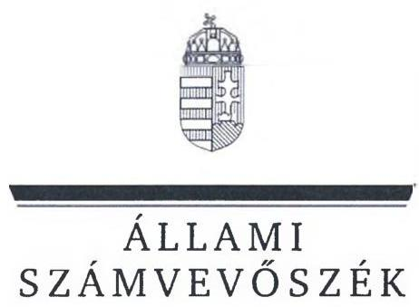
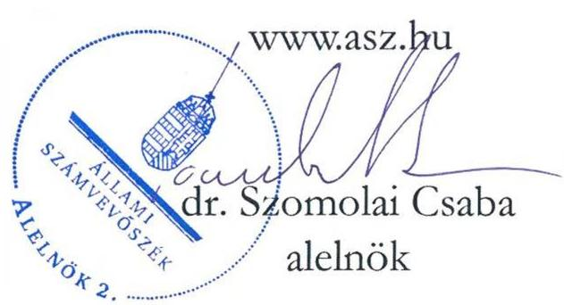
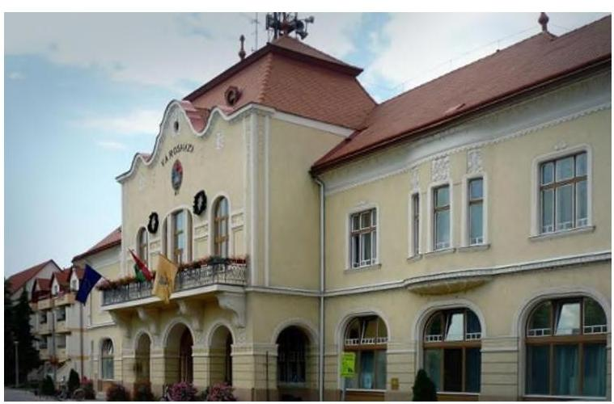
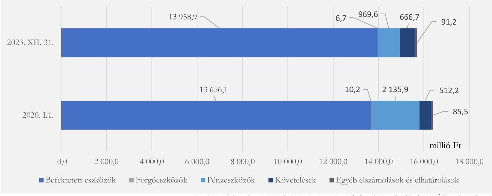
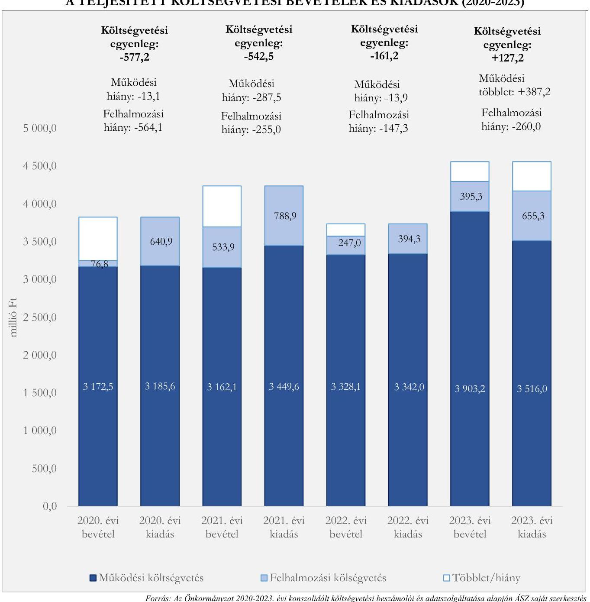
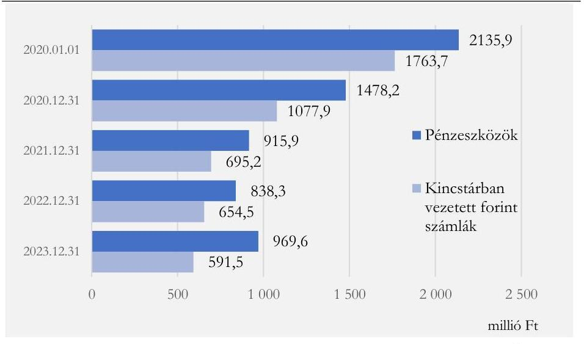
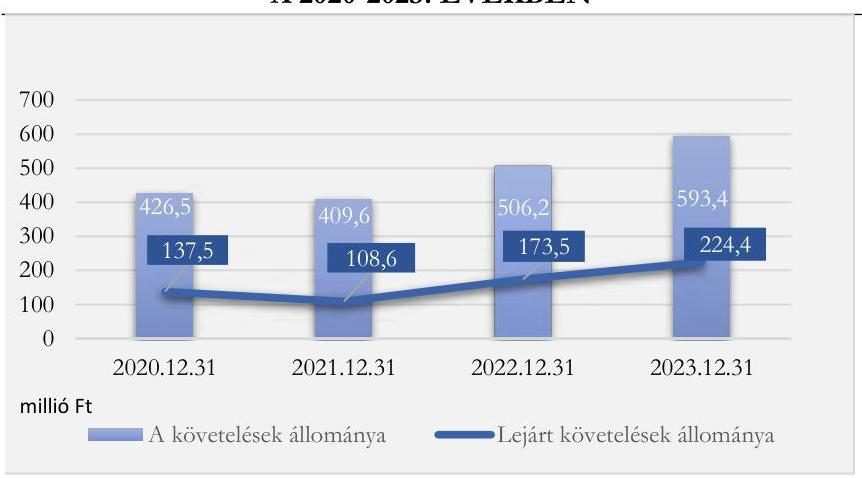
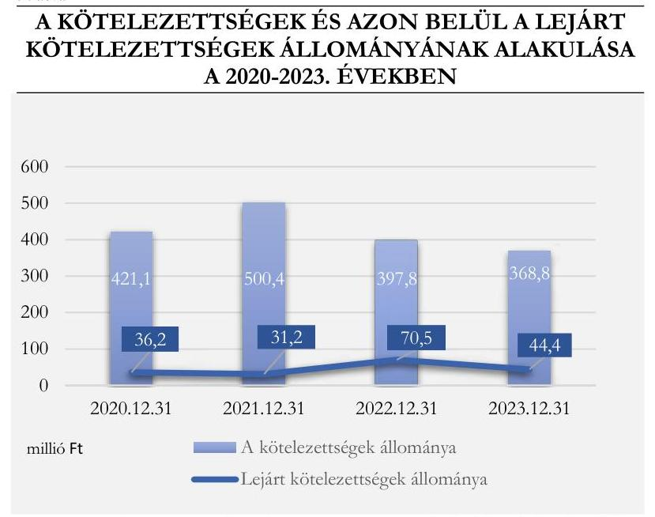
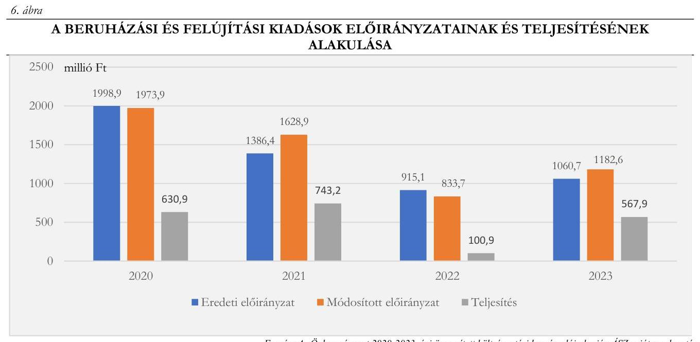

# JELENTÉS 

## Az önkormányzatok múködésének és gazdálkodásának ellenőrzése

Balmazújváros Város Önkormányzata

2024.

---

ÁLLAMI
SZÁMVEVŐSZÉK

# JELENTÉS 

## Az önkormányzatok múködésének és gazdálkodásának ellenőrzése

Balmazújváros Város Önkormányzata

2024.

24166

---

# ELLENŐRZÉSI IGAZGATÓSÁG: 

## ÁLLAMHÁZTARTÁS HELYI SZINTJÉT ELLENŐRZŐ IGAZGATÓSÁG

## ELLENŐRZÉSI IGAZGATÓ:

DR. BAFFIA GERGELY GÁBOR igazgató

## ELLENŐRZÉSVEZETŐ:

Jelentéseink az interneten a www.asz.hu címen olvashatók.

KERSMÁJER ÁGOTA ellenőrzésvezető

IKTATÓSZÁM: EL-3848-008/2024
TÉMASORSZÁM: 52
ELLENŐRZÉS-AZONOSÍTÓ SZÁM: V-101803

---

# TARTALOMJEGYZÉK 

AZ ELLENŐRZÉS ALAPADATAI ..... 5
AZ ELLENŐRZÖTT SZERVEZET ..... 8
ÖSSZEFOGLALÁS ..... 10
AZ ELLENŐRZÉS FÓKUSZTERÜLETEI ..... 14
MEGÁLLAPÍTÁSOK ..... 15
JAVASLATOK ..... 42
MELLÉKLETEK ..... 45
I. sz. melléklet: Értelmező szótár ..... 45
II. sz. melléklet: Az ellenőrzött szervezetek jegyzéke ..... 48
III. sz. melléklet: Ellenőrzési kritériumok ..... 49
IV. sz. melléklet: Az analitikus nyilvántartások hiányosságai ..... 51
FÜGGELÉK: ÉSZREVÉTELEK ..... 52
RÖVIDÍTÉSEK JEGYZÉKE ..... 53

---

.

---

# AZ ELLENŐRZÉS ALAPADATAI 

## AZ ELLENŐRZÉS CÉLJA

Az ellenőrzés célja az Önkormányzat ${ }^{1}$ közfeladat ellátásának, pénzügyi és vagyoni helyzetének ellenőrzése volt. Az ellenőrzés során az ÁSZ ${ }^{2}$ értékelte az Önkormányzat költségvetés tervezése és végrehajtása, a pénzügyi és vagyongazdálkodása, valamint beszámolási kötelezettsége teljesítésének megfelelőségét. Az ellenőrzés kiterjedt annak vizsgálatára, hogy a belső ellenőrzés támogatta-e a gazdálkodás folyamatainak szabályosságát.

Az ellenőrzés célja volt továbbá annak megállapítása, hogy az Önkormányzat közzétételi kötelezettségeinek eleget tett-e.

## AZ ELLENŐRZÉS TÍPUSA

Megfelelőségi ellenőrzés

## AZ ELLENŐRZŐTT IDŐSZAK

Az egyes fókuszterületek esetében az ellenőrzött időszak az alábbiak szerint alakult:

| 1. A költségvetés tervezése, végrehajtása, az éves beszámolási és zárszámadási kötelezettség teljesítése | a 2023. és a 2024. évi költségvetés tervezése, a 2023. évi költségvetés végrehajtása, a 2022. és a 2023. évi beszámolási és zárszámadási kötelezettség teljesítése |
| :--: | :--: |
| 2. Az Önkormányzat által ellátott közfeladatok pénzügyi feltételei és az Önkormányzat fizetőképessége | 2020-2023. évek |
| 3. Az Önkormányzat vagyongazdálkodása, az éves költségvetési beszámoló mérlegének alátámasztottsága |  |
| - a vagyoni helyzetet befolyásoló vagyonváltozások,   - a vagyon nyilvántartása, a költségvetési beszámoló mérlegének alátámasztottsága, | 2020-2023. évek   2022-2023. évek |
| 4. Közzétételi kötelezettség teljesítése | a helyszíni ellenőrzés indulásakor (2024. február 21.) fennálló állapot |
| 5. A belső ellenőrzés szervezeti kereteinek megfelelősége, a belső és külső ellenőrzések gazdálkodásra vonatkozó megállapításaira tett intézkedések Önkormányzat általi nyomon követése | 2022-2023. évek |

---

# AZ ELLENŐRZÉS TÁRGYA 

Az Önkormányzat költségvetésének tervezése és annak végrehajtása, a pénzügyi gazdálkodás szabályozottsága és szabályszerűsége, az éves beszámolási kötelezettség teljesítése, az Önkormányzat közfeladatainak finanszírozása, az Önkormányzat pénzügyi helyzete és fizetőképessége. A vagyongazdálkodás szabályozottsága, a vagyonban bekövetkezett változások döntéshozatalának és elszámolásának szabályszerűsége, az Önkormányzat vagyoni helyzete, az Önkormányzat mérlegében kimutatott vagyon nyilvántartásának szabályszerűsége, a vagyon kimutatása, értékelése és a mérleg leltárral való alátámasztásának szabályszerűsége.

A közzétételi kötelezettség teljesítése, a belső ellenőrzés szervezeti kereteinek megfelelősége, a belső és külső ellenőrzések gazdálkodásra vonatkozó megállapításaira tett intézkedések Önkormányzat általi nyomon követése.

Az ellenőrzés kiterjedt minden olyan körülményre és adatra, amely az ÁSZ jogszabályban meghatározott feladatainak teljesítéséhez, valamint a program végrehajtása folyamán felmerült újabb összefüggések feltárásához szükséges volt.

## AZ ELLENŐRZÉS JOGALAPJA

Az ellenőrzés jogszabályi alapját az ÁSZ tv. ${ }^{3} 1 . \int(3)$ bekezdésében, az 5. $\int(2)$-(3), (5) és (6) bekezdéseiben, valamint az Áht. ${ }^{4} 61 . \int(2)$ bekezdésében foglalt előírások képezték.

## AZ ELLENŐRZÉS MÓDSZERE

Az ellenőrzés a nemzetközi standardokat irányadónak tekintve az ellenőrzési program szempontjai, az ellenőrzött időszakban hatályos jogszabályok, az ellenőrzés szakmai szabályok és módszertanok figyelembevételével került végrehajtásra.

Az ellenőrzési kérdések megválaszolásához szükséges bizonyítékok megszerzése az ellenőrzött szervezet által rendelkezésre bocsátott dokumentumokra, adatokra alapozva, interjú, információkérés, mintavételezés, valamint elemző eljárás alkalmazásával történt.

Az ellenőrzési bizonyítékként felhasználható adatforrások közé tartoztak az ellenőrzéshez kért dokumentumok, az ellenőrzés tárgya kapcsán releváns, nyilvánosan hozzáférhető adatok, dokumentumok, a Kincstár ${ }^{5}$ adatbázisai. Adatforrás volt ezeken túlmenően minden az ellenőrzés folyamán feltárt, az ellenőrzés szempontjából információkat tartalmazó nyilatkozat, jegyzőkönyv, egyéb dokumentum.

Az ellenőrzés lefolytatásához az ellenőrzött szervezet tanúsítványok kitöltésével, valamint az ÁSZ által kért dokumentumok, adatok, információk megküldésével és átadásával szolgáltatott adatokat.

Az Önkormányzat pénzügyi helyzetének elemzéséhez a 2020-2023. évi összevont éves költségvetési beszámolókból származó adatokon túl felhasználásra kerültek a helyi adóbevételek, a kiszámlázott általános forgalmi adó, az általános forgalmi adó-visszatérítés, a kamatbevételek, az egyéb pénzügyi műveletek bevétele, a maradvány igénybevétele, valamint kamatkiadások, egyéb pénzügyi műveletek kiadása jogcímek működési és felhalmozási célú megosztásáról szolgáltatott önkormányzati adatok.

---

Az ellenőrzés az egyes területek szabályszerűségének, megfelelőségének értékelését a III. számú mellékletben megjelölt kritériumok alapján végezte el. A költségvetés végrehajtása, valamint a vagyoni helyzetet befolyásoló vagyonnövekedések és vagyoncsökkenések szabályszerűségének értékeléséhez az ÁSZ mintatételeket alkalmazott. Mintavételezés történt a 2020-2021. évi, valamint a 2022-2023. évi felhalmozási célú kiadások (beruházások és felújítások) tekintetében (15-15 db), továbbá a 2023. évi múködési célú kiadásokon belül a személyi juttatások (Munkavégzésre irányuló egyéb jogviszonyban nem saját dolgozónak fizetett juttatások főkönyvi számla), a dologi kiadások (Szakmai tevékenységet segítő szolgáltatások és Egyéb szolgáltatások főkönyvi számlák), az államháztartáson kívülre irányuló támogatások (Egyéb működési célú támogatások államháztartáson kívülre) tekintetében (területenként 15-15 db, összesen 45 db ). A teljes sokaság tételes ellenőrzésére került sor a 2020-2023. évi vagyonértékesítések ( 9 db ), valamint a térítés nélküli vagyonátadások ( 4 db ) esetében, mivel ezeken a területeken a rendelkezésre álló sokaság mintaelemszáma kisebb volt, mint az ellenőrzési programban az adott területre előírt mintaelemszám. A behajthatatlan követelések leírásából az ellenőrzött időszakban leírt öt legnagyobb összegű tétel került kiválasztásra. Az ellenőrzésben nem statisztikai mintavételre került sor, ezért nem történt kivetítés a teljes sokaságra, a megállapításokat az ellenőrzött mintatételekre vonatkozóan fogalmazta meg az ÁSZ.

---

# AZ ELLENŐRZÖTT SZERVEZET 

Balmazújvárosi Közös Önkormányzati Hivatal épülete
Forrás: Balmazújváros (termallardo.hu)

Balmazújváros az Alföld sajátos, mezővárosi jellegű települése Hajdú-Bihar vármegyében. A nagy kiterjedésű város két jellegzetes alföldi táj, a Hortobágy és a Hajdúság határán fekszik. Lakónépessége a 2022. évi népszámlálási adatok szerint 16994 fő volt*.

Az Önkormányzat munkáját 12 tagú Képviselő-testület ${ }^{6}$, valamint három bizottság segíti: Pénzügyi és Jogi Bizottság; Gazdasági, Településfejlesztési és Településüzemeltetési Bizottság; Egészségügyi, Szociális, Kulturális, Oktatási, Sport és Környezetvédelmi Bizottság. A polgármester* a 2018. augusztus 12-i időközi választásoktól 2024. szeptember 30-ig töltötte be a tisztségét, munkáját egy alpolgármester támogatta. Az ellenőrzött időszak kezdetétől 2024. augusztus 31-ig az Önkormányzatnál három jegyző ${ }^{8}$ volt hivatalban, munkájukat aljegyző támogatta.

A Hivatal ${ }^{9}$ az Önkormányzaton kívül 2020-ban Újszentmargita Község Önkormányzat és Hortobágy Község Önkormányzat részére, 2021-től Hortobágy Község Önkormányzat részére látta el az Áht. 6/C. § (1) bekezdése szerinti, az önkormányzatok bevételeivel és kiadásaival kapcsolatban a tervezési, gazdálkodási, ellenőrzési, finanszírozási, adatszolgáltatási és beszámolási feladatokat. A Hivatal a következő szervezeti egységekre tagolódik: Jegyző, Aljegyző, Titkársági Osztály, Pénzügyi Osztály (Költségvetési Csoport, Adócsoport), Hatósági Osztály, Hortobágyi Kirendeltség. A Hivatal 2023. évi átlagos statisztikai állományi létszáma 51 fő volt.

A településen roma és német nemzetiségi önkormányzat múködött.
Az Önkormányzat az ellenőrzött időszakban a kötelező és az önként vállalt feladatainak ellátásáról a Hivatal és az irányítása alá tartozó további költségvetési szervek ${ }^{10}$, a közfeladatok ellátására létrehozott önkormányzati tulajdonú gazdasági társaságok ${ }^{11}$, továbbá feladatellátási szerződéssel más gazdasági társaságok, az Önkormányzattal szerződéses jogviszonyban álló egyéb szervezetek, illetve a Társulás ${ }^{12}$ útján gondoskodott.

Az Egyesített Óvoda és Bölcsőde Intézmény a bölcsődei ellátás, óvodai nevelés, ellátás, és gyermekétkeztetés, a Balmazújvárosi Nefelejcs Idősek Otthona az idősek, demens betegek bentlakásos ellátása, a Veres Péter Kulturális Központ a közművelődési, múzeumi közművelődési, közönségkapcsolati tevékenység, a Lengyel Menyhért Városi Könyvtár a közművelődési és könyvtári szolgáltatás önkormányzati közfeladatot végezte.

A Társulás - többek között - család- és gyermekjóléti, szociális alapszolgáltatási (házi segítségnyújtás, nappali ellátások, szociális étkeztetés, közösségi ellátások, támogató szolgáltatás), belső ellenőrzési, állati hulladék elszállítási, orvosi ügyeleti feladatokat látott el.

[^0]
[^0]:    * Forrás: A települések legfontosabb adatai - Népszámlálás 2022 - Balmazújváros (ksh.hu)

---

Az Önkormányzat a könyvvizsgálói feladatok folyamatos ellátására vonatkozó szerződést nem kötött.
Az Önkormányzat többségi befolyása alatt 2020. január 1-jén öt, 2023. december 31-én hat gazdasági társaság volt, amelyek közül kettő felszámolás alatt állt és a 2024. évben megszűnt. A Balmazújvárosi VESZ Városi Egészségügyi Szolgálat Nonprofit Kft. járóbeteg szakellátást nyújtott. A Balmaz InterCOM Távközlési és Szolgáltató Kft. vezetékes távközlési és egyéb információs szolgáltatási feladatokat látott el. A Balmazújváros Sport Kft. sportlétesítményeket múködtetett, sport, szabadidős képzési feladatokat látott el, a társaság 2020. június 8 -tól felszámolás alatt állt, majd 2024. augusztus 13. napján megszűnt. A Balmazújvárosi Városgazdálkodási Nonprofit Közhasznú Kft. ingatlankezelési feladatokat, piac üzemeltetést, park és zöldterület fenntartást, közutak, járdák karbantartását, belvízvédelmi feladatokat, hulladékkezelést, állategészségügyi feladatokat, továbbá 2021-től az önkormányzati tulajdonú Kamilla Gyógy-, Termál- és Strandfürdő üzemeltetését látta el. A 2020. december 18-án - vendéglátási, szállodai szolgáltatási feladatok ellátására - létrehozott Balmazújvárosi Turisztikai és Szolgáltató Kft. üzemelteti 2021-től az önkormányzati tulajdonban lévő Hotel Kamilla**** szállodát. A fürdőt és a szállodát a 2020. évben a BALMAZ-KAMILLA Kft. üzemeltette, a társaság 2021. január 13-tól felszámolás alá került, majd 2024. január 23. napjával megszűnt.

Az Önkormányzat konszolidált költségvetési beszámolója szerinti költségvetési bevétele a 2020. évben 3249,3 millió Ft volt, amely a 2023. évre 4298,5 millió Ft-ra ( $32,3 \%$-kal) nőtt. A konszolidált költségvetési beszámoló szerinti költségvetési kiadások a 2020. évi 3826,5 millió Ft-ról a 2023. évre 4171,3 millió Ft-ra ( $9,0 \%$ kal) növekedtek.

Az Önkormányzat konszolidált mérleg szerinti vagyona a 2020. január 1-jei 16 399,9 millió Ft-ról 2023. év végére 15693,1 millió Ft-ra ( $95,7 \%$-ra) csökkent. A mérleg szerinti eszközök 4,3\%-os (706,8 millió Ft) csökkenését a nemzeti vagyonba tartozó forgóeszközök 34,3\%-os ( 3,5 millió Ft), valamint a pénzeszközök 54,6\%-os (1166,3 millió Ft) csökkenése okozta, amelyet nem ellensúlyozott a nemzeti vagyonba tartozó befektetett eszközök 2,2\%-os (302,8 millió Ft), a követelések 30,2\%-os (154,5 millió Ft), valamint az egyéb elszámolások és elhatárolások 6,7\%-os ( 5,7 millió Ft) növekedése. Ugyanebben az időszakban a mérleg forrásoldalán a saját tőke 3,5\%-os (393,2 millió Ft) és a passzív időbeli elhatárolások 6,8\%-os (317,5 millió Ft) csökkenése mellett a kötelezettségek $0,8 \%$-kal ( 3,9 millió Ft) növekedtek.

Az Önkormányzat vagyonának változását az 1. ábra szemlélteti:
1. ábra

AZ ÖNKORMÁNYZAT VAGYONÁNAK VÁLTOZÁSA

Forrás: Az Önkormányzat 2020. és 2023. évi összestett költségvetési beszámolói alapján ÁSZ saját szerkesztés

---

# ÖSSZEFOGLALÁS 

A helyi közügyek intézése, és ennek keretében a lakosság közszolgáltatásokkal való ellátása az önkormányzatok alapvető feladata. Az önkormányzati közfeladatokra fordított pénzeszközökkel és az ellátásukat szolgáló köztulajdonnal való felelős és átlátható gazdálkodás közérdek. Az ÁSZ az államháztartás ellenőrzésére kapott általános felhatalmazása keretében, mindezek figyelembevételével ellenőrizte az Önkormányzat közpénzekkel és vagyonnal való gazdálkodását.

Az Önkormányzat a 2020-2022. években megfelelő pénzügyi mutatókkal és fizetőképességgel rendelkezett, kötelező és önként vállalt feladatainak ellátása biztosított volt. A Képviselő-testület a 2023-2024. években a rendeletalkotások és egyéb döntések során nem a jó gazda gondosságával járt el, a törvényi előírás ellenére nem gondoskodott az Önkormányzat gazdálkodásának biztonságáról, ami a 2023. évben jelentkező átmeneti pénzügyi nehézségeket követően a 2024. évben fizetésképtelenséghez, ezzel a kötelező feladatok ellátásának veszélyeztetéséhez vezetett. Emellett az Önkormányzat vagyongazdálkodása, vagyonnyilvántartása nem felelt meg a jogszabályi előírásoknak, az éves költségvetési beszámoló mérlegét nem támasztották alá leltárral, ezáltal a valódiság számviteli alapelve nem érvényesült.

A 2023. és a 2024. évi költségvetés tervezése és jóváhagyása során az Önkormányzat nem tartotta be a jogszabályi előírásokat. A polgármester a költségvetési rendelettervezeteket - első alkalommal - mindkét évben a törvényi határidőben benyújtotta a Képviselő-testületnek. A 2023. évi költségvetési rendeletet a Képviselő-testület másfél hónapos késedelemmel alkotta meg. A 2024. évi költségvetési rendelettervezetet több sikertelen előterjesztést követően a polgármester az átmeneti törvényi rendelkezésekre hivatkozással 2024 júniusában jóváhagyta, azonban a Kormányhivatal azzal szemben egyrészt törvényességi felhívással élt az Önkormányzat felé, másrészt annak érvénytelensége megállapítására eljárást kezdeményezett a Kúria előtt. A Kúria eljárása az ÁSZ ellenőrzés lezárásakor még folyamatban volt. A Képviselő-testület 2024 augusztusában új költségvetési rendeletet alkotott, amely a bevételi és kiadási főösszeg tekintetében nem egyezett meg a polgármester által korábban elfogadott költségvetési rendelettel.

A költségvetési rendelettervezetek előterjesztésekor a jogszabályokban előírtak ellenére tájékoztatásul nem mutatták be teljeskörűen a többéves kihatással járó döntéseket, továbbá nem csatolták a Pénzügyi és Jogi Bizottság írásos véleményét. A 2024. évi költségvetési rendelettervezet előterjesztésekor a közvetett támogatásokat nem a jogszabályban előírt részletezettségben mutatták be. Az Önkormányzat költségvetéséről szóló rendeletek - a kötelező és az önként vállalt feladatok feladatonkénti bemutatása kivételével - megfeleltek a törvényben előírt tartalmi követelményeknek.

A törvényi előírás ellenére, a Képviselő-testület a 2024. évi átmeneti gazdálkodásról nem alkotott rendeletet, a polgármester a törvényi felhatalmazás alapján folytatott átmeneti gazdálkodásról nem számolt be, továbbá nem volt szabályszerű a központi információs rendszerbe történő 2024. I. negyedévi adatszolgáltatás sem.

Az ellenőrzött mintatételek teljesítése és elszámolása során a gazdálkodási jogkörök gyakorlása - a kötelezettségvállalások 12,5\%-a, a kötelezettségvállalások pénzügyi ellenjegyzése 96,8\%-a, a teljesítésigazolás $29,8 \%$-a, az utalványozás $26,3 \%$-a esetében - nem felelt meg a jogszabályi és belső előírásoknak.

A 2022. és 2023. évi beszámolási és zárszámadási kötelezettség teljesítése nem volt szabályszerű. A polgármester a zárszámadási rendelettervezeteket - első alkalommal - a törvényben előírt határidőig a Képviselő-testület elé terjesztette, azok azonban - elfogadás hiányában - a törvényi előírások ellenére egyik

---

évben sem léptek hatályba a költségvetési évet követő ötödik hónap utolsó napjáig. A 2022. évi zárszámadási rendeletet - a Képviselő-testület elé történő 17 előterjesztést követően - a Kormányhivatal vezetője alkotta meg 2023 decemberében. A 2023. évi zárszámadási rendeletet a polgármester fogadta el az átmeneti törvényi rendelkezésekre hivatkozással 2024 júniusában, azonban érvényességével kapcsolatban a Kormányhivatal a Kúria döntését kérte. A Képviselő-testület 2024 augusztusában elfogadta a 2023. évi zárszámadási rendeletet, a Kúria döntését nem várták meg.

A 2022. és a 2023. évi zárszámadási rendelettervezetek előterjesztésekor a jogszabályi előírások ellenére nem mutatták be teljeskörűen a többéves kihatással járó döntések számszerűsítését, valamint a 2023. évi zárszámadási rendelettervezet előterjesztésekor a közvetett támogatásokat. A 2022. évi és a 2023. évi zárszámadási rendelet a jogszabályi előírások ellenére nem tartalmazta az adatokat kötelező feladatok, önként vállalt feladatok és államigazgatási feladatok szerinti bontásban, valamint az aktuális módosított előirányzatot. A 2023. évi költségvetési rendeletet a Képviselő-testület a jogszabályi határidőn belül nem módosította. A 2022. és 2023. évi zárszámadási rendelettervezet előterjesztéséhez csatolt vagyonkimutatás tartalma nem felelt meg teljeskörűen a jogszabályi előírásoknak.

Az éves költségvetési beszámolókban, valamint a zárszámadási rendeletekben az Önkormányzat összes maradványát szabályszerűen megállapították, döntöttek a költségvetési szervek maradványának elvonandó és felhasználható összegéről, a kötelezettségvállalással terhelt és a szabad maradvány összege azonban a költségvetési beszámolóban és a zárszámadási rendeletekben eltért egymástól.

A 2020-2023. években a teljesített költségvetési bevételek 32,3\%-kal, a teljesített költségvetési kiadások 9,0\%-kal növekedtek. A teljesített költségvetési kiadásokra a 2020-2022. években maradvány igénybevételével, míg a 2023. évben a maradvány igénybevétele nélkül is fedezetet nyújtottak a teljesített költségvetési bevételek.

Az Önkormányzat összesített pénzeszköz-állománya a 2020-2023. években folyamatosan, a 2020. év eleji 2135,9 millió Ft-ról 2023. év végére 969,6 millió Ft-ra csökkent, elsősorban az előfinanszírozott uniós projektek megvalósulásával, illetve a visszafizetési kötelezettséggel összefüggésben. Az Önkormányzatnál a 2020-tól folyamatban volt 20 uniós projekt közül öt projektnél összesen kilenc szabálytalansági eljárást folytattak le, amelyek következtében összesen 457,6 millió Ft visszafizetési kötelezettségük keletkezett.

Az Önkormányzat pénzügyi helyzetére emellett a 2020. január 1. és 2024. május 31. közötti időszakban folyamatban lévő 11 peres ügy is hatással lehet, amelyekhez kapcsolódóan összesen 536,7 millió Ft az önkormányzati követelés, és 3,3 millió Ft az önkormányzati kötelezettség összege.

Az Önkormányzat a 2020-2023. években nem vállalt adósságot keletkeztető hosszú lejáratú kötelezettséget, átmeneti likviditási problémák kezelésének érdekében minden évben folyószámlahitelt vett igénybe. A jogszabályi előírások ellenére a folyószámlahitelek felvételét és törlesztését a számviteli nyilvántartásokban és a beszámolókban nem mutatták ki 2021-2023-ban. Az Önkormányzat a 2024. évben folyószámla hitelkerettel nem rendelkezett, mert az arra vonatkozó szerződés megkötését a Képviselő-testület nem hagyta jóvá.

A 2023. és a 2024. évben az Önkormányzatot megillető állami támogatások felfüggesztését vonta maga után, hogy a Képviselő-testület nem fogadta el a törvényi határidőig a tárgyévre vonatkozó költségvetési és az előző évre vonatkozó zárszámadási rendeletet. A 2024. évben a pénzügyi helyzetet tovább rontotta egy uniós támogatás visszafizetési kötelezettségéhez kapcsolódó, az Önkormányzat bankszámláját terhelő - a részletfizetési megállapodás el nem fogadása miatti - inkasszó. Az Önkormányzat 60 napon túl lejárt tartozásainak összege 2024 augusztusában már meghaladta a törvényben előírt mértéket,

---

ezért a polgármester a Képviselő-testület felhatalmazása alapján 2024 augusztusában kezdeményezte az adósságrendezési eljárás meginditását.

Az Önkormányzat az ellenőrzött időszakra vonatkozóan a törvényi előírások ellenére közép- és hosszú távú vagyongazdálkodási tervvel nem rendelkezett. A Képviselő-testület rendeletet alkotott a vagyonnal történő gazdálkodásról, azonban azt a vagyontárgyakban bekövetkezett változások tekintetében a jogszabályi rendelkezés ellenére nem módosították. Az Önkormányzat a jogszabályi előírásoknak eleget téve szabályozta a közbeszerzési értékhatárt elérő és el nem érő beszerzések helyi szabályait.

A közbeszerzési értékhatárt elérő ellenőrzött fejlesztéseknél az Önkormányzat a közbeszerzési eljárásokat lefolytatta. A közbeszerzési értékhatárt el nem érő ellenőrzött fejlesztések megvalósításához az Önkormányzat - kettő kivételével - a szükséges árajánlatokat bekérte. A beszerzési szabályzat előírásai ellenére a bekért árajánlatok elbírálásáról az ajánlattevők részére nem készítettek értesítést, és a beszerzési eljárást lezáró döntés nem volt dokumentált. Az ellenőrzött fejlesztési célú szerződések közül a jogszabályi előírások ellenére szakmai, műszaki teljesítés minőségi jellemzőinek meghatározását öt szerződés, a pénzügyi teljesítés módját és feltételeit egy szerződés, a több év előirányzatai terhére vállalt kötelezettség esetén a kifizetés határidejét évenkénti ütemezésben hét szerződés, a szervezetek képviselőinek nyilatkozatát arra vonatkozóan, hogy átlátható szervezetnek minősülnek 10 szerződés nem tartalmazta.

Az Önkormányzat a vagyon értékesítések során nem tartotta be a forgalomképtelen és a korlátozottan forgalomképes törzsvagyon elidegenítésére vonatkozó törvényi korlátokat és a helyi szabályokat, mert a vagyonrendelet szerint forgalomképtelen ingatlanrészt is értékesítettek, illetve területrendezés során forgalomképes ingatlanhoz csatoltak. A vagyontárgyak értékesítése, nyilvántartásokból történt kivezetése során nem tartották be maradéktalanul a számviteli jogszabályi előírásokat sem.

A törvényi előírások ellenére az Önkormányzat, mint az ellátásért felelős, a víziközmú-szolgáltatási díjban képződött használati díjat nem kezelte elkülönített számlán, és a szerződésekben foglaltak ellenére annak elkülönített kezelését más módon sem alakította ki, továbbá azok összege nem került felülvizsgálatra.

A követelések behajthatatlanná minősítése az ellenőrzött öt eset egyikénél sem volt szabályszerű, a behajthatatlanná minősítés oka és számviteli elszámolása nem felelt meg a jogszabályokban, az engedélyezése a belső szabályzatokban foglaltaknak.

Az Önkormányzat a 2022-2023. években az önkormányzati törzsvagyont a törvényi előírásoknak megfelelve, a többi vagyontárgytól elkülönítve tartotta nyilván. A fökönyvi számlákhoz kapcsolódóan nem vezettek analitikus nyilvántartást a részesedésekről, a készletekről, nem teljeskörűen vezettek a követelésekről és a kötelezettségekről. A vezetett analitikus nyilvántartások tartalma a tárgyi eszközöknél, a követeléseknél, valamint a kötelezettségvállalások, más fizetési kötelezettségeknél nem felelt meg a jogszabályban előírtaknak.

Az Önkormányzatnál a jogszabályi és a belső előírások ellenére a négy év egyikében sem történt mennyiségi felvétellel leltározás, valamint a 2022. és 2023. évekre vonatkozóan nem állítottak össze olyan leltárt, amely tételesen, ellenőrizhető módon tartalmazta volna az Önkormányzat mérleg fordulónapján meglévő eszközeit és forrásait mennyiségben és értékben. A vagyongazdálkodás, a vagyon nyilvántartása és az éves költségvetési beszámoló mérlegének leltárral történő alátámasztása kapcsán megállapított hiányosságok miatt az Önkormányzatnál nem érvényesült a valódiság számviteli alapelve, és a jegyző nem érvényesítette maradéktalanul a felelős vagyongazdálkodásra vonatkozó törvényi követelményeket az ellenőrzött időszakban.

---

Az Önkormányzat kialakította a közérdekű adatok elektronikus közzétételi rendjét, azonban a szabályozása nem tartalmazta hiánytalanul a jogszabály által előírtakat. Az Önkormányzat a közérdekú adatait a jogszabályban foglaltak ellenére nem teljeskörűen tette közzé.

Az Önkormányzatnál a belső ellenőrzés működtetése nem támogatta az Önkormányzat pénzügyi és vagyongazdálkodásának szabályszerűségét, mert az éves ellenőrzési terveket kockázatelemzéssel nem alapozták meg, a belső ellenőrzés szabálytalanságokat nem tárt fel, javaslatot nem fogalmazott meg, vagy a feltárt hiányosságok alapján megfogalmazott javaslatok hasznosulása elmaradt.

A helyszíni ellenőrzés lezárását követően a Kúria 2024. október 1-jén megszüntette a polgármester által 2024. június 10-én elfogadott önkormányzati rendeletek más jogszabályba ütközésének vizsgálatára indult eljárásait tekintettel arra, hogy az eljárások megindítását követően a Képviselő-testület 2024 augusztusában hatályon kívül helyezte a törvényességi vizsgálatok tárgyát képező önkormányzati rendeleteket. A 2023. évi költségvetést módosító rendelet, a 2023. évi zárszámadási rendelet, illetve a 2024. évi költségvetési rendelet Képviselő-testület általi elfogadását követően az Önkormányzat részére a 2024 áprilisától felfüggesztett támogatás egy összegben folyósításra került a 2024. szeptember havi nettó finanszírozás során.

---

# AZ ELLENŐRZÉS FÓKUSZTERÜLETEI 

1.     - A költségvetés tervezése, végrehajtása, az éves beszámolási és zárszámadási kötelezettség teljesitése
2.     - Az Önkormányzat által ellátott közfeladatok pénzügyi feltételei, az Önkormányzat fizetőképessége
3.     - Az Önkormányzat vagyongazdálkodása, az éves költségvetési beszámoló mérlegének alátámasztottsága
4.     - Közzétételi kötelezettség teljesitése
5.     - A belső ellenőrzés szervezeti kereteinek megfelelősége, a belső és külső ellenőrzések gazdálkodásra vonatkozó megállapításaira tett intézkedések Önkormányzat általi nyomon követése

---

# 1. A költségvetés tervezése, végrehajtása, az éves beszámolási és zárszámadási kötelezettség teljesítése 

Összegző megállapítás A költségvetés tervezése és végrehajtása, a gazdálkodási jogkörök gyakorlása, az adatszolgáltatási kötelezettségek teljesítése, valamint a beszámolási és zárszámadási kötelezettség teljesítése nem volt szabályszerű.
1.1. számú megállapítás

A költségvetés tervezése, a rendelettervezetek előterjesztése, a központi információs rendszerbe történő adatszolgáltatás nem felelt meg teljeskörűen a jogszabályi és a helyi előírásoknak. A költségvetési rendelet a jogszabályban előírt határidőn túl került jóváhagyásra.
A polgármester a 2023. és a 2024. évi költségvetési rendelettervezetet - első alkalommal - az Áht.ban előírt határidőig (február 15-ig) benyújtotta a Képviselő-testületnek. Az előterjesztésekhez azonban egyik évben sem csatolta - az Ávr. ${ }^{13} 27 . \S$ (2) bekezdésében foglaltak ellenére - a Pénzügyi és Jogi Bizottság írásos véleményét, továbbá - az önkormányzati SZMSZ ${ }^{14} 27 . \S$ (2) bekezdésében foglaltak ellenére - valamennyi bizottság véleményét. A költségvetési rendelettervezettel kapcsolatos bizottsági tárgyalásokra - és így a bizottsági vélemények kialakítására - mindkét évben a rendelettervezet Képviselőtestület elé történt beterjesztését követően, de a képviselő-testületi ülés előtt került sor. A Pénzügyi és Jogi Bizottság véleményét a rendelettervezeteket tárgyaló képviselő-testületi üléseken szóban ismertette a bizottság elnöke.
A költségvetési rendelettervezetet a jegyző mindkét évben az Ávr.-nek megfelelően egyeztette az Önkormányzat irányítása alá tartozó költségvetési szervek vezetőivel, amely egyeztetések eredményét jegyzőkönyvekben rögzítették.
A 2023. és a 2024. évi költségvetés előterjesztésekor az Áht.-ban előírt mérlegek és kimutatások közül a Képviselő-testület részére tájékoztatásul bemutatták - szöveges indokolással együtt - az Önkormányzat költségvetési mérlegét közgazdasági tagolásban, valamint az előirányzat felhasználási tervet. A jegyző által előkészített 2023. és 2024. évi költségvetési rendelettervezet az Áht. 24. § (4) bekezdés b) pontjában előírtak ellenére nem mutatta be teljeskörűen a többéves kihatással járó döntések számszerűsítését (pl. a folyamatban lévő európai uniós támogatással megvalósuló fejlesztésekre vonatkozó döntések, a helyi személyszállítási szolgáltatás ellátását megalapozó döntés). A 2024. évi költségvetési rendelettervezet előterjesztésekor a közvetett támogatásokat nem az Ávr. 28. § a), b), d) és e) pontokban előírt részletezettséggel mutatták be, mivel hiányzott az ellátottak térítési díjának, kártérítésének méltányossági alapon történő elengedésének összege, a lakosság részére lakásépítéshez, lakásfelújításhoz nyújtott kölcsönök elengedése, a helyiségek, eszközök hasznosításából származó bevételből nyújtott kedvezmény, mentesség, valamint az egyéb nyújtott kedvezmény vagy kölcsön elengedés összegének bemutatása.

---

A Képviselő-testület az Áht. 25. § (1) bekezdése ellenére nem alkotta meg az Önkormányzat 2023. és 2024. évi költségvetéséről szóló rendeletet március 15-ig, ezzel - az Mötv. 111/A. § és az Áht. 83. § (6) bekezdés előírásaira tekintettel - előidézte az Önkormányzat számára járó állami támogatások folyósításának felfüggesztését és veszélyeztette likviditását, valamint a kötelező feladatainak ellátását. Ezáltal a Képviselő-testület az Mötv. ${ }^{15}$ 115. § (1) bekezdésében foglaltak ellenére nem gondoskodott az Önkormányzat gazdálkodásának biztonságáról.
A 2023. évi költségvetési rendelettervezet összesen hat alkalommal került előterjesztésre, ezek közül egy alkalommal a képviselő-testületi ülés a meg nem jelent képviselők miatt határozatképtelen volt, négy esetben a 12 tagú Képviselő-testületből mindössze hat képviselő fogadta el a rendelettervezetet, a további jelenlévő négy, illetve öt képviselő nem fogadta el, vagy tartózkodott a szavazás során. Végül a Képviselőtestület a 6/2023. (V. 3.) számú rendeletével egyhangúlag hagyta jóvá a 2023. évi költségvetési rendeletet ${ }^{16}$. A rendelet késedelmes megalkotása a nettó finanszírozás alapján az Önkormányzatot megillető állami támogatások egy hónapos felfüggesztését vonta maga után.
A 2024. évi költségvetési rendelettervezetet összesen nyolc alkalommal terjesztették a Képviselő-testület elé elfogadásra. Ezek közül öt alkalommal a költségvetési rendelettervezet tárgyalásra sem került, mivel egy alkalommal a képviselő-testületi ülés napirendi pontjait nem fogadták el a képviselők, két alkalommal - egy-egy bizottság előzetes tárgyalásának hiányában - a költségvetési rendelettervezet tárgyalását a polgármester kezdeményezésére levették a napirendről, a 2024. június 10-én kétszer összehívott képviselőtestületi ülések pedig nem voltak határozatképesek. Három képviselő-testületi ülésen megtárgyalták a 2024. évi költségvetési rendelettervezet, azonban azt a Képviselő-testület nem fogadta el, miután a kapcsolódó további határozati javaslatokat, valamint a konkrét módosító indítványokat sem fogadták el (a 12 tagú Képviselő-testületből hat képviselő fogadta el a rendelettervezetet, további hat nem fogadta el, vagy tartózkodott a szavazás során).
Tekintettel arra, hogy az Önkormányzatnak 2024. március 15-ig nem volt elfogadott 2024. évi költségvetési rendelete, a nettó finanszírozás alapján az Önkormányzatot megillető állami támogatások folyósítása - az Mötv. 111/A. § és az Áht. 83. § (6) bekezdése alapján - 2024 áprilisától felfüggesztésre került. A 2024. június 10 -én két alkalommal előterjesztett 2024. évi költségvetési rendelettervezetet a polgármester - az Mötv. 146/L. § (1) bekezdésében kapott felhatalmazásra hivatkozással - jóváhagyta a 8/2024. (VI. 11.) önkormányzati rendelettel. A Kormányhivatal ${ }^{17}$ az így elfogadott 2024. évi költségvetési rendelet ${ }_{1}$-et ${ }^{18}$ nem tartotta érvényesnek, ezért azzal szemben egyrészt törvényességi felhívással élt az Önkormányzat felé, másrészt a Kúria előtt eljárást kezdeményezett annak érvénytelensége megállapítására.
A 2024. június 10 -én meghozott polgármesteri döntéseket követően - azok vitatott érvényessége miatt a nettó finanszírozás felfüggesztése nem került megszüntetésre. Így az Önkormányzatnak - az uniós támogatás visszafizetésének kötelezettsége kapcsán a bankszámlát terhelő inkasszóra is tekintettel likviditási problémái keletkeztek, és 2024 júliusában, majd augusztusában a dolgozóknak nem tudott munkabért fizetni (2024. júniusi és júliusi bérek). Miután az Önkormányzat részére a 2024. július végi nettó finanszírozás sem került folyósításra, a Képviselő-testület 2024. augusztus 8-án elfogadta a 2024. évi költségvetési rendelet ${ }_{2}$-et ${ }^{19}$, amelyben hatályon kívül helyezte a polgármesteri döntéssel elfogadott korábbi 2024. évi költségvetési rendelet ${ }_{1}$-et.
A 2024. évi költségvetési rendelet ${ }_{2}$-ben a költségvetési rendelet ${ }_{1}$-hez képest a kiadások és bevételek föösszege 5157,1 millió Ft-ról 5679,8 millió Ft-ra (522,7 millió Ft-tal) növekedett, amely a költségvetési kiadások 388,3 millió Ft-os, és a finanszírozási kiadások 134,4 millió Ft-os növekedésének a

---

következménye. A költségvetési kiadásokon belül a múködési költségvetési kiadások 240,6 millió Ft-tal, a felhalmozási kiadások 147,7 millió Ft-tal növekedtek. A 2024. évi költségvetési rendelet; eredeti előirányzatai a Kitöltési útmutató ${ }^{20}$ I. Általános szabályok fejezetben foglaltak ellenére tartalmazták a 2024. július 1-jétől alakult Balmazújvárosi Városi Egészségügyi Intézmény 323,2 millió Ft-os költségvetését. A Kitöltési útmutató szerint csak a január 1-jén múködő szervezeteknek kell kitölteniük - a költségvetési rendelet Áht. 6. § (8) bekezdése alapján rovatokra tovább bontott adatai alapján - az eredeti előirányzatokat az időközi költségvetési jelentésben. Év közben alapított költségvetési szerv esetében eredeti előirányzat nem tervezhető, a módosított előirányzatokat a törzskönyvi bejegyzést követő időközi költségvetési jelentésben kell szerepeltetni. A felhalmozási kiadásokba betervezték a Gázmotor projektnek ${ }^{21}$ a szabálytalansági eljárást követően visszafizetendő teljes összegét ( 427,0 millió Ft). Mindezekkel párhuzamosan egyes múködési és felhalmozási kiadási előirányzatokat csökkentettek.
Az Önkormányzat 2023. és 2024. évi költségvetési rendeletei megfeleltek az Áht.-ban előírt szerkezeti követelményeknek, egy kivétellel. A 2023. és a 2024. évi költségvetési rendeletek az Áht. 23. $\$ (2) bekezdés a) pont ab) alpontjában, valamint a b) pont bb) alpontjában foglaltak ellenére nem tartalmazták az Önkormányzat, valamint az Önkormányzat által irányított költségvetési szervek költségvetési bevételi előirányzatait és költségvetési kiadási előirányzatait kötelező feladatok, önként vállalt feladatok és államigazgatási feladatok szerinti bontásban. A 2023. évi költségvetési rendelet csak önkormányzati szintre összesítve, és csak azok közgazdasági jellege szerint tartalmazta a kötelező, önként vállalt és államigazgatási feladatok tervezett költségvetési bevételi és kiadási előirányzatait, feladatonkénti tagolásban azonban nem. A 2024. évi költségvetési rendelet ${ }_{1,2}$ az Önkormányzat, valamint az Önkormányzat által irányított költségvetési szervek által ellátott kötelező, önként vállalt és államigazgatási feladatok tervezett költségvetési bevételi és kiadási előirányzatait azok közgazdasági jellege szerint tartalmazta, feladatonkénti tagolásban nem. Így a 2023. és a 2024. évi költségvetési rendelet nem ad információt az Önkormányzat által ellátott egyes feladatok tervezett kiadásairól és azok finanszírozási forrásairól.
Az Önkormányzat a 2023. és 2024. évi költségvetéseiben a költségvetési hiány finanszírozására nem tervezett külső finanszírozási forrást, nem tervezett olyan fejlesztési célt, amelyhez a Gst. ${ }^{22}$ szerinti adósságot keletkeztető ügylet megkötése vált volna szükségessé.
A Képviselő-testület az Áht. előírásai alapján a 2023. évi költségvetési rendelet hatálybalépéséig terjedő időszakra az átmeneti gazdálkodásról rendeletet alkotott (18/2022. (XII. 21.) önkormányzati rendelet). Az Áht. 25. § (1) bekezdésében foglaltakat megsértve, a Képviselő-testület a 2024. évi átmeneti gazdálkodásról nem alkotott rendeletet, annak ellenére, hogy a költségvetési rendeletet legkésőbb március 15 -ig nem fogadta el. Így a polgármester az Áht. 25. § (3) bekezdésének előírásai alapján jogosult volt az Önkormányzatot megillető bevételek beszedésére és az előző évi kiadási előirányzatokon belül a kiadások arányos teljesítésére. A polgármester az Áht. 25. § (4) bekezdésében foglaltak ellenére, a (3) bekezdés alapján folytatott átmeneti gazdálkodásról nem számolt be a Képviselő-testület részére.
Önkormányzati szinten biztosított volt az egyezőség a 2023. évi költségvetési rendeletben tervezett eredeti előirányzatok és a 2023. évi első időközi költségvetési jelentés vonatkozó adatai között. Az Önkormányzat mint költségvetési rend szerint gazdálkodó szerv 2024. 01-03. havi időközi költségvetési jelentését az Ávr. 169. § (3) bekezdésében foglalt április 20-a helyett 2024. július 23-án töltötték fel a Kincstár által működtetett elektronikus adatszolgáltató rendszerbe. Önkormányzati szinten a 2024. évi első időközi költségvetési jelentés vonatkozó adatai megegyeztek a 2024. évi költségvetési rendelet ${ }_{1}$-ben tervezett eredeti előirányzatokkal, eltértek azonban - a két költségvetési rendelet eltérő eredeti előirányzatai

---

következtében - a 2024. évi költségvetési rendelet ${ }_{2}$-ben tervezett eredeti előirányzatoktól valamennyi kiemelt kiadási előirányzatnál (K1-K9), valamint a B1, B4 és B8 kiemelt bevételi előirányzatoknál a Kitöltési útmutató I. Általános szabályok fejezetben foglaltak ellenére.
1.2. számú megállapítás

A költségvetés végrehajtásához kapcsolódóan az előirányzatmódosítások költségvetési rendeleten történő átvezetése, az előirányzatok nyilvántartása, valamint a gazdálkodási jogkörök gyakorlása nem felelt meg a jogszabályi előírásoknak. A beszerzési eljárások nem feleltek meg teljeskörűen a belső szabályzat előírásainak.

Az Önkormányzat a jogszabályi előírásoknak megfelelően rendelkezett 2023-ban előirányzat nyilvántartással. A 2023. évi előirányzat nyilvántartás adatai azonban az Áhsz. ${ }^{23}$ 39. § (3) bekezdésben foglaltak ellenére - a B1, B2, B3, B4 és B5, valamint a K3 és K5 rovat vonatkozásában - eltértek a 2023. évi költségvetési beszámolótól és a 2023. évi záró főkönyvi kivonattól. Az előirányzat nyilvántartás az Áhsz. 39. § (3) bekezdés és a 14. melléklet I.2. pont b) alpont előírásai ellenére nem tartalmazta teljeskörűen az eredeti előirányzatok módosításának hatásköreit, valamint az előirányzat módosítást elrendelő dokumentum azonosításához szükséges adatokat.
A Képviselő-testület 2023-ban - az előirányzat nyilvántartás szerint - 15 alkalommal hozott határozatot előirányzatok módosításával kapcsolatban (pl. tartalék felhasználása, előirányzat átcsoportosítás engedélyezése), továbbá előirányzat módosításra több esetben a költségvetési támogatásokhoz kapcsolódóan került sor. Az Önkormányzat 2023. évi költségvetési rendeletében megjelenő bevételi és kiadási előirányzatok módosításáról, a kiadási előirányzatok közötti átcsoportosításról azonban az Áht. 34. § (1) bekezdésében, a Hatásköri tv. ${ }^{24}$ 138. § (1) bekezdés d) pontjában, valamint a Jat. ${ }^{25}$ 8. $\$ 1$ (1) bekezdésében foglaltak ellenére a Képviselő-testület a költségvetési éven belül rendelettel nem döntött és nem vezette át a költségvetési rendeleten a saját, korábbi határozataival elfogadott módosításokat, valamint az állami támogatások növekedése miatt a Kincstár által közölt előirányzatmódosításokat sem.
A polgármester számára a 2023. évi költségvetési rendelet nem tette lehetővé az Áht. 34. § (2) bekezdésében előírt, az Önkormányzat bevételeinek és kiadásainak módosítását és a kiadási előirányzatok közötti átcsoportosítást. Emellett a Képviselő-testület az Áht. 34. § (4) bekezdése alapján az Áht. 34. § (3) bekezdése szerinti átruházott hatáskörű előirányzat-módosítás, előirányzat-átcsoportosítás átvezetéseként, legkésőbb az éves költségvetési beszámoló elkészítésének határidejéig (február 28-ig), december 31-i hatállyal sem módosította a 2023. évi költségvetési rendeletet.
A fentiek miatt - az Áht. 5. § (4) bekezdése alapján - az Önkormányzat költségvetési kiadásai a 2023. évi költségvetési rendeletben megállapított eredeti előirányzatok mértékéig voltak teljesíthetők a 2023. évben, és az Áht. 36. § (1) bekezdése alapján kötelezettségvállalásra is csak az eredeti kiadási előirányzatok mértékéig kerülhetett sor. Ennek következtében az Önkormányzat a 2023. évben nem tartotta be az Áht. 5. § (4) bekezdésének és 36 . § (1) bekezdésének előírásait, mivel a személyi juttatások kiemelt előirányzatnál 2,7 millió Ft-tal, a munkaadókat terhelő járulékok és szociális hozzájárulási adó kiemelt előirányzatnál 0,9 millió Ft-tal, a dologi kiadások kiemelt előirányzatnál 75,6 millió Ft-tal, az egyéb felhalmozási célú kiadások kiemelt előirányzatnál 36,9 millió Ft-tal túllépte a költségvetési rendeletben jóváhagyott előirányzatot.
A 2023. évi költségvetés módosításáról a polgármester 2023. szeptember és december között négy, 2024 májusában kettő, majd 2024. június 10-én kettő alkalommal nyújtott be előterjesztést a Képviselő-testület

---

elé. Ezek közül öt képviselő-testületi ülésen tárgyalták meg a 2023. évi költségvetési rendelet módosítását, azonban az nem került elfogadásra. Egy képviselő-testületi ülésen - egy bizottság előzetes tárgyalásának hiányában - a 2023. évi költségvetési rendelet módosítását a polgármester kezdeményezésére levették a napirendről, továbbá a 2024. június 10 -én kétszer összehívott ülések nem voltak határozatképesek. A 2024. június 10 -én két alkalommal előterjesztett 2023. évi költségvetési rendelet módosítását a polgármester - az Mötv. 146/L. § (1) bekezdésében kapott felhatalmazásra hivatkozással - jóváhagyta a 6/2024. (VI. 11.) önkormányzati rendelettel. A Kormányhivatal - a 2024. évi költségvetési rendelethez hasonlóan - e rendeletet sem tartotta érvényesnek, ezért azzal szemben törvényességi felhívással élt az Önkormányzat felé, továbbá a Kúria előtt eljárást kezdeményezett annak érvénytelensége megállapítására. A nettó finanszírozás felfüggesztése, illetve a 2024. június 10 -én meghozott polgármesteri döntések vitatott érvényessége miatt kialakult helyzetben a Képviselő-testület 2024. augusztus 13-án a 11/2024. (VIII. 14.) önkormányzati rendelettel elfogadta a 2023. évi költségvetési rendelet módosítását, amelyben hatályon kívül helyezte a polgármesteri döntéssel jóváhagyott 6/2024. (VI. 11.) önkormányzati rendeletet. A Képviselő-testület által megalkotott 11/2024. (VIII. 14.) önkormányzati rendelet tartalma megegyezett a hatályon kívül helyezett 6/2024. (VI. 11.) önkormányzati rendelet tartalmával.
A kötelezettségvállalások nyilvántartásba vétele nem visszakereshetően történt meg, mivel az Áhsz. 14. melléklet II. pont 4. a) alpontjában foglaltak ellenére az utalványrendeleten és/vagy a kötelezettségvállalás nyilvántartásba vételi bizonylaton szereplő kötelezettségvállalási sorszám nem volt beazonosítható a kötelezettségvállalás nyilvántartásban az ellenőrzött személyi jellegű kiadások valamennyi mintatételének (mintatételek 100,0\%-a, 1-15. mintatétel) kifizetését megalapozó hét kötelezettségvállalás, az átadott pénzeszközök öt mintatételének (mintatételek 33,3\%-a, a 4., 6., 9., 13., 15. mintatétel) kifizetését megalapozó három kötelezettségvállalás, valamint a dologi kiadások 14 előzetes írásbeli kötelezettségvállalást igénylő mintatételének (mintatételek 93,3\%-a, 3-15., Pót1 mintatétel) kifizetését megalapozó 12 kötelezettségvállalás esetében.
A Beszerzési szabályzat ${ }^{26}$ IV./1.1./b) és V./4.1. pontjában foglaltak ellenére, az Önkormányzat nem kért be három ajánlatot, és a polgármester nem hozott döntést a bekért kettő ajánlat elbírálásáról a dologi kiadások/10. mintatétel esetében. A Beszerzési szabályzat IV./1.1./b) pontjában foglaltak ellenére nem folytatott le beszerzési eljárást az Önkormányzat a dologi kiadások/12. mintatétel esetében.
Az Áht. 37. § (1) bekezdésében és a 48. § (1) bekezdésében foglaltak ellenére nem történt írásban kötelezettségvállalás, támogatói okirat vagy támogatási szerződés (közszolgáltatási szerződés) nem állt rendelkezésre az államháztartáson kívülre nyújtott támogatások nyolc mintatételéhez (mintatételek 53,3\%a, 2., 3., 5., 7., 8., 10., 14., 15. mintatételek) kapcsolódó kettő kötelezettségvállalás esetén. A gazdasági társaságok finanszírozása üzleti terv alapján történt.
A megkötött visszterhes szerződés, adott megbízás, megrendelés nem tartalmazta

- az Ávr. 50. § (1) bekezdés b) pontjában foglaltak ellenére, a kifizetendő összeget vagy a számlázás alapjául szolgáló egységárat a személyi juttatások/1., a dologi kiadások/4. és 12. mintatételeknél (kötelezettségvállalások értéke nem volt megállapítható),
- az Ávr. 50. § (1) bekezdés a) pontjában foglaltak ellenére a szakmai teljesítés mennyiségi és minőségi jellemzőinek meghatározását a dologi kiadások/4. mintatételnél,
- az Ávr. 50. § (1) bekezdés a), b), c) pontjában foglaltak ellenére a teljesítés határidejét, a kifizetés módját, feltételeit és a kifizetés határidejét a dologi kiadások/12. számú mintatételnél,

---

- az Ávr. 50. § (1) bekezdés b), c) pontjában foglaltak ellenére a kifizetés módját, valamint a határidejét a személyi juttatások/10. mintatételnél.
Az Áht. 37. § (1) bekezdésében, valamint az Ávr. 50. § (1) bekezdés d) pontjában és az 55. § (1) bekezdésében foglaltak ellenére a kötelezettségvállalás pénzügyi ellenjegyzése nem történt meg a személyi juttatások mind a 15 mintatételéhez (mintatételek 100,0\%-a) tartozó hét kötelezettségvállalás, az államháztartáson kívülre nyújtott támogatások öt mintatételéhez (írásbeli kötelezettségvállalással érintett mintatételek 100,0\%-a, 1., 4., 6., 9. és 13. mintatételek) tartozó három kötelezettségvállalás, a dologi kiadások 14 mintatételéhez (írásbeli kötelezettségvállalással érintett mintatételek 100,0\%-a, 3-15., Pót1 mintatétel) tartozó 12 kötelezettségvállalás, valamint a felhalmozási (beruházási és felújítási) kiadások 26 mintatételéhez (a mintatételek 86,7\%-a, 2020-2021/3., 6-15. mintatétel, 2022-2023/1-15. mintatétel) kapcsolódó 19 szerződés esetén. A pénzügyi ellenjegyzés elmaradásával nem biztosították az Ávr. 54. § (3) bekezdése szerinti kontrollok érvényesülését. További egy ellenőrzött felhalmozási szerződés (amelyhez két mintatétel kapcsolódott, a mintatételek 6,7\%-a, 2020-2021/4-5. mintatétel) nem tartalmazta a pénzügyi ellenjegyzés keltét az Ávr.50. § (1) bekezdés d) pontjában foglaltak ellenére.
Az Ávr. 57. § (1) bekezdésében foglaltak ellenére teljesítésigazolás hiányában került sor az államháztartáson kívülre nyújtott támogatások körébe tartozó 13 mintatétel (teljesítésigazolási kötelezettséggel érintett mintatételek 100,0\%-a, 1-10., 13-15. mintatétel) esetében a kifizetésekre. A teljesítésigazolás nem tartalmazta az Ávr. 57. § (3) bekezdése ellenére a teljesítésigazolás dátumát a dologi kiadások/3. mintatétel esetében. A teljesítésigazoló az Ávr. 57. § (1) bekezdés előírásait megsértve annak ellenére igazolta a kiadások teljesítésének jogosságát és összegszerűségét, hogy a számlán szereplő egyes tételek egységára nem egyezett meg a szerződésben meghatározott egységárakkal, továbbá nem volt ellenőrizhető a közvetített szolgáltatásként tovább számlázott szolgáltatások összegszerűsége, mivel e szolgáltatások ellenértékét a szerződésben nem rögzítették (dologi kiadások/4. mintatétel).
Az Áht. 38. § (1) bekezdésében foglaltaktól eltérően utalványozás nélkül történt az államháztartáson kívülre nyújtott támogatások/11-12. mintatétel (mintatételek 13,3\%-a) pénzügyi teljesítése. A tárgyi eszközök értékesítéséből származó bevételek utalványozása - az Áht. 38. § (1) bekezdésében foglaltak ellenére - nem történt meg (vagyonértékesítések/1-2., 5., 7-10. mintatételek). Az Önkormányzat az államháztartáson kívülre nyújtott támogatások/1-3., 5-8., 10., 14-15. mintatételhez kapcsolódó három támogatási döntés vonatkozásában nem győződött meg arról, hogy az Áht. 48/B. § (1) bekezdésében foglalt kizáró okok a támogatottal szemben nem álltak-e fenn.
1.3. számú megállapítás

A 2022. és a 2023. évi beszámolási és zárszámadási kötelezettség teljesítése nem volt szabályszerű.

Az Önkormányzat az Áhsz. előírásainak megfelelően a 2022. évi éves költségvetési beszámolóját és az azt alátámasztó főkönyvi kivonatot határidőben feltöltötte a Kincstár által működtetett elektronikus adatszolgáltató rendszerbe. A 2023. évi adatszolgáltatást az Áhsz. 32. § (4) bekezdésében előírt március 20-i határidőt követően, 2024. április 18-án teljesítette. Az Áhsz. 32. § (1) bekezdésében előírtak ellenére, az Önkormányzat által irányított költségvetési szervek a költségvetési évet követő február 28-i határidőig nem töltötték fel a 2022. és 2023. évi éves költségvetési beszámolóik adatait, valamint a beszámolóikat alátámasztó teljes főkönyvi kivonatot a Kincstár által működtetett elektronikus adatszolgáltató rendszerbe, az adatszolgáltatást 2023. március 20-án, illetve 2024. március 19-én teljesítették.
A 2022. évi és a 2023. évi zárszámadási rendeletek az Áht. 91. § (1) bekezdésében foglaltak ellenére a költségvetési évet követő ötödik hónap utolsó napjáig nem léptek hatályba.

---

A polgármester a 2022. évi zárszámadási rendelettervezetet - első alkalommal - a 2023. május 24-i képviselő-testületi ülésre terjesztette be, azonban azt a Képviselő-testület a 144/2023. (V. 24.) számú határozatával nem fogadta el. A polgármester a 2022. évi zárszámadási rendelettervezetet 2023. május 26. és november 13. között további 16 alkalommal terjesztette a Képviselő-testület elé. A 17 előterjesztés közül nyolc esetben a Képviselő-testület a 2022. évi zárszámadási rendelettervezetet nem tárgyalta, mivel három esetben a képviselők távolmaradása miatt a képviselő-testületi ülés határozatképtelen volt, öt esetben pedig a napirendi pontok tárgyalása előtt a képviselők távozása miatt vált határozatképtelenné. Kilenc esetben a 2022. évi zárszámadási rendelettervezetet - jellemzően hat igen és a további jelenlévő képviselők tartózkodása mellett - nem fogadták el és további, az elfogadás érdekében szükséges feladatokról sem hoztak döntést.
Miután a 2022. évi zárszámadási rendelettervezet - a Kormányhivatal törvényességi felhívása, valamint a Kúria Önkormányzati Tanácsa határozata ellenére - nem került elfogadásra, a Kúria Önkormányzati Tanácsa Köm.5028/2023/5. határozata alapján a Kormányhivatal vezetője alkotta meg a 2022. évi zárszámadási rendeletet ${ }^{27}$.
Tekintettel arra, hogy az Önkormányzatnak 2023. május 31-ig nem volt elfogadott 2022. évi zárszámadási rendelete, a nettó finanszírozásban az Önkormányzatot megillető támogatások folyósítása - az Mötv. 111/A. § és az Áht. 83. § (6) bekezdése alapján - 2023 júniusától a zárszámadási rendelet Kormányhivatal vezetője általi 2023 decemberi megalkotásáig felfüggesztésre került. Ennek következtében az Önkormányzat dolgozóinak jelentős része a 2023. októberi béreket 2023. november 5. helyett csak november 29-én kapta meg. A Képviselő-testület a Hatásköri tv. 138. § (1) bekezdés k) pontjában foglaltak ellenére nem alkotta meg az Önkormányzat zárszámadásáról szóló rendeletet, ezzel veszélyeztette az Önkormányzat gazdálkodásának biztonságát, amelyért az Mötv. 115. § (1) bekezdésében foglaltak alapján a Képviselő-testület a felelős.
A 2023. évi zárszámadási rendelettervezetet a polgármester első alkalommal a 2024. május 15-i képviselőtestületi ülésre terjesztette be, azonban azt a Képviselő-testület határozatképtelenség miatt nem fogadta el. A polgármester a 2023. évi zárszámadási rendelettervezetet második alkalommal a 2024. május 28-i, majd a június 10-i (kettő) képviselő-testületi ülésre terjesztette be, a képviselő-testületi ülés azonban mindhárom alkalommal határozatképtelen volt. A 2023. évi zárszámadási rendelettervezetet a polgármester - az Mötv. 146/L. § (1) bekezdésében kapott felhatalmazásra hivatkozással - 2024. június 10-én elfogadta, a 7/2024. (VI. 11.) számú rendelettel. A Kormányhivatal az így elfogadott 2023. évi zárszámadási rendelet ${ }_{1}$-et $^{28}$ nem tartotta érvényesnek, ezért azzal szemben egyrészt törvényességi felhívással élt az Önkormányzat felé, másrészt a Kúria előtt eljárást kezdeményezett annak érvénytelensége megállapítására.
A nettó finanszírozás felfüggesztése, illetve a 2024. június 10-én meghozott polgármesteri döntések vitatott érvényessége miatt kialakult helyzetben a Képviselő-testület 2024. augusztus 13-án elfogadta a 2023. évi zárszámadási rendelet ${ }_{2}$-et $^{29}$, amely hatályon kívül helyezte a polgármesteri döntéssel elfogadott 2023. évi zárszámadási rendelet ${ }_{1}$-et. A 2023. évi zárszámadásról szóló két rendelet tartalma megegyezett.
A polgármester a Bkr. ${ }^{30}$ 11. § (1) és (2a) bekezdéseiben foglaltak ellenére a Bkr. 1. melléklete szerinti vezetői nyilatkozatokat nem terjesztett a 2022. és a 2023. évi zárszámadási rendelettervezetekkel együtt a Képviselő-testület elé.
A 2022. és a 2023. évi zárszámadási rendelettervezeteket az Mötv. előírásainak megfelelően a Pénzügyi és Jogi Bizottság véleményezte és elfogadásra javasolta.

---

A jegyző által előkészített 2022. és 2023. évi zárszámadási rendelettervezetek előterjesztésekor az Áht. 91. § (2) bekezdés a) pontjában előírtak ellenére nem mutatták be teljeskörűen az Áht. 24. § (4) bekezdés b) pontja szerinti, többéves kihatással járó döntések számszerűsítését (kimaradtak pl. a folyamatban lévő európai uniós támogatással megvalósuló fejlesztésekre vonatkozó döntések, a helyi személyszállítási szolgáltatás ellátását megalapozó döntés).
A 2023. évi zárszámadási rendelettervezetek előterjesztésekor az Áht. 91. § (2) bekezdés a) pontjában foglaltak ellenére a közvetett támogatásokat nem az Ávr. 28. § a), b) pontokban előírt részletezettséggel mutatták be, mivel hiányzott az ellátottak térítési díjának, kártérítésének méltányossági alapon történő elengedésének összege, valamint a lakosság részére lakásépítéshez, lakásfelújításhoz nyújtott kölcsönök elengedése.
Az Áht. 91. § (2) bekezdés d) pontban foglaltak ellenére, a 2022. és a 2023. évi zárszámadási rendelettervezetek előterjesztésekor a Képviselő-testületnek nem mutatták be az Önkormányzat tulajdonában álló gazdálkodó szervezetek múködéséből származó aktuális évi kötelezettségeket.
Az Áht. 23. § (2) bekezdés a) pont ab) alpontjában, a b) pont bb) alpontjában, és d) pontjában, valamint a 87. § b) pontjában foglaltak ellenére, a 2022. évi és a 2023. évi zárszámadási rendeletek nem tartalmazták

- az Önkormányzat és az Önkormányzat által irányított költségvetési szervek költségvetési bevételi előirányzatait és költségvetési kiadási előirányzatait a múködési bevételek és múködési kiadások, felhalmozási bevételek és felhalmozási kiadások, kiemelt előirányzatok szerinti bontásban, valamint a költségvetési hiány belső finanszírozására szolgáló finanszírozási bevételi előirányzatok összegeit, mivel csak az eredeti előirányzatokat szerepeltették, az aktuális módosított előirányzatot nem;
- az Önkormányzat és az Önkormányzat által irányított költségvetési szervek vonatkozásában a költségvetési bevételi és kiadási előirányzatokat a kötelező feladatok, önként vállalt feladatok és államigazgatási feladatok szerinti felbontásban.
Az Áht. 23. § (2) bekezdés a) pontjában, valamint a 87. § b) pontjában foglaltak ellenére, a 2023. évi zárszámadási rendelet ${ }_{1,2}$ nem tartalmazta az Önkormányzat mint önálló költségvetési beszámolót készítő szerv módosított előirányzatait, mindössze az eredeti előirányzatokat és a teljesítési adatokat mutatták be.
A jegyző a Hatásköri tv. 140. § (1) bekezdés h) pontjában foglaltak ellenére a 2022. és a 2023. évi zárszámadása keretében nem számolt el a feladatalapú támogatásokkal.
Az Áhsz. és az Ávr. előírásainak megfelelően, az Önkormányzat maradványát az éves költségvetési beszámoló készítésekor megállapították, döntöttek a költségvetési szervek maradványának elvonandó és felhasználható összegéről. A 2022., illetve a 2023. évi zárszámadási rendeletek maradvány összesen adatai megegyeztek a 2022., illetve a 2023. évi önkormányzati szinten összesített költségvetési beszámolók maradvány összesen adataival. Az Áht. 87. § b) pontjában foglaltak ellenére a_kötelezettségvállalással terhelt maradvány és a szabad maradvány vonatkozásában a zárszámadási adatokat nem az éves költségvetési beszámolók alapján állították össze. Az eltérés oka az volt, hogy a költségvetési beszámolók kötelezettségvállalással terhelt maradvány adatai a zárszámadási rendeletekben a négy önkormányzati intézmény kötelezettségvállalással terhelt maradvány adataival egyeztek meg, azonban nem tartalmazták a Hivatal és az Önkormányzat mint önálló költségvetési beszámolót készítő szerv adatait. A költségvetési beszámolók szabad maradvány adatai pedig az összes maradvány fennmaradó összegét tartalmazták. Az eltéréseket az 1. táblázat szemlélteti.

---

1. táblázat

AZ ÖNKORMÁNYZAT 2022. ÉS 2023. ÉVI KÖLTSÉGVETÉSI MARADVÁNYÁNAK FŐBB ADATAI (MILLIÓ FT)

|  | 2022. EVI   ZÁRSZÁMADÁSI   RENDELET | 2022. EVI   KÖLTSÉGVETÉSI   BESZÁMOLÓ | 2023. EVI   ZÁRSZÁMADÁSI   RENDELET | 2023. EVI   KÖLTSÉGVETÉSI   BESZÁMOLÓ |
| :-- | :--: | :--: | :--: | :--: |
| Kötelezettségvállalással terhelt   maradvány | 758,7 | 17,2 | 626,4 | 6,8 |
| Szabad maradvány | 34,9 | 776,4 | 280,7 | 900,3 |
| Összes maradvány | 793,6 | 793,6 | 907,1 | 907,1 |

Forrás: 2022. és 2023 évi önkormányzati szinten összesített költségvetési beszámolók és zárszámadási rendeletek alapján ÁSZ saját szerkesztés

# 2. Az Önkormányzat által ellátott közfeladatok pénzügyi feltételei, az Önkormányzat fizetőképessége 

Összegző megállapítás Az Önkormányzat az ellátott közfeladatok pénzügyi fedezetét a 2020-2022. években biztosította, az önként vállalt feladatokra fordított múködési célú kiadások nem veszélyeztették a kötelező feladatok ellátását. A 2023. évben jelentkező átmeneti fizetési nehézségeket követően a 2024. év II. negyedévétől az Önkormányzat likviditási helyzetének jelentős romlása veszélyeztette a közfeladatok biztonságos ellátását.

Az Önkormányzat a kötelező és az önként vállalt feladatokat teljeskörűen nem különítette el az ellenőrzött években. Az Mötv. 111. § (2)-(3) bekezdésében, valamint az Áht. 23. § (2) bekezdés a) pontjának ab) pontjában előírtak ellenére, az Önkormányzat által ellátott kötelező, valamint önként vállalt feladatok ellátásának forrásait és kiadásait a 2020-2023. évek költségvetési ${ }^{31}$ és zárszámadási ${ }^{32}$ rendeletei feladatonkénti tagolásban nem tartalmazták. Az önkormányzati SZMSZ három feladatot - járóbeteg szakellátás, mezei őrszolgálat, nem kötelező helyi szociális ellátások - sorolt be az önként vállalt feladatok közé, kimaradtak abból például egyes önként ellátott közművelődési és sport feladatok, a helyi közlekedés támogatása, a közfoglalkoztatás, a panzió működtetése, a gyógyfürdő üzemeltetése, a helyi televízió működtetése a Bkr. 3. § a) pontja ellenére.
A teljesített költségvetési bevételek a 2020. évről a 2023. évre összességében 32,3\%-kal, 3249,3 millió Ftról 4298,5 millió Ft-ra, a teljesített költségvetési kiadások 9,0\%-kal, 3826,5 millió Ft-ról 4171,3 millió Ftra növekedtek. Az Önkormányzat teljesített költségvetési bevételei és kiadásai - a 2022. év kivételével évről évre növekedtek. A 2020-2023. években teljesített költségvetési bevételeket és kiadásokat, valamint a költségvetési egyenleget a 2. ábra szemlélteti.

---

A 2020-2022. években az Önkormányzat költségvetési egyenlege negatív volt, azonban a pénzügyi egyensúly az előző évi maradvány igénybevétele (a 2020. évben: 2126,9 millió Ft, a 2021. évben 1536,1 millió Ft, a 2022. évben 970,7 millió Ft) mellett biztosított volt.
Ezen belül a 2020-2022. években mind a múködési célú, mind a felhalmozási célú bevételek alacsonyabb szinten teljesültek a múködési, illetve felhalmozási célú kiadásoknál. A múködési költségvetés egyensúlya a múködési célú maradvány (a 2020. évben: 309,1 millió Ft, a 2021. évben: 419,5 millió Ft, a 2022. évben: 201,3 millió Ft) igénybevétele mellett biztosított volt, a felhalmozási költségvetés hiányára fedezetet nyújtott a felhalmozási maradvány igénybevétele (a 2020. évben 1817,8 millió Ft, a 2021. évben 1116,6 millió Ft, a 2022. évben 769,4 millió Ft).

---

A 2023. évben a teljesített költségvetési bevételek a maradvány igénybevétele nélkül is fedezetet nyújtottak a teljesített költségvetési kiadásokra. Ezen belül a múködési költségvetés egyensúlya változott kedvezően, a múködési célú kiadásoknál 387,2 millió Ft-tal nagyobb összegben teljesültek a múködési célú bevételek, míg a felhalmozási célú bevételek csak 60,3\%-ban fedezték a felhalmozási célú kiadásokat. A felhalmozási költségvetés hiányára a felhalmozási célú maradvány igénybevétele (636,7 millió Ft) fedezetet jelentett.
A múködési költségvetés végrehajtása során a teljesített múködési célú bevételek 2020-ról 2023-ra 23,0\%-kal (730,7 millió Ft-tal), a kiadások 10,4\%-kal (330,4 millió Ft-tal) növekedtek.
A múködési bevételek kedvező változása alapvetően a múködési költségvetési támogatások 18,0\%-os (2179,4 millió Ft-ról 2570,9 millió Ft-ra), valamint a közhatalmi bevételek 45,4\%-os (658,4 millió Ft-ról 957,6 millió Ft-ra) növekedésének eredménye, amelynek mintegy háromnegyedét a helyi iparűzési adó bevételek tették ki. A helyi iparűzési adó bevételek a 2020-2022. évek csökkenő tendenciáját követően a 2023. évre az előző évi közel kétszeresére emelkedett (2020-ban 498,3 millió Ft, 2021-ben 381,8 millió Ft, a 2022. évben 370,6 millió Ft, a 2023. évben 737,8 millió Ft volt.)

A kiadási oldalon 2020-ról 2023-ra a személyi juttatások - főként a garantált bérminimum, az ágazati pótlékok, a köztisztviselői illetményalap emelkedése miatt - 10,9\%-kal (1191,1 millió Ft-ról 1320,9 millió Ft-ra), az egyéb múködési célú kiadások - a Társulás keretében ellátott feladatokhoz nyújtott hozzájárulások, gazdasági társaságoknak, egyéb szervezeteknek nyújtott támogatások emelkedése, támogatás visszafizetése miatt (pl. uszoda támogatás visszafizetése) - 32,2\%-kal (756,9 millió Ft-ról 1000,6 millió Ft-ra) nőttek.
Az Önkormányzat kimutatása szerint a teljesített múködési célú kiadásokon belül a kötelező feladatokra fordított kiadások - a bérköltségek, az infláció és az energiaárak emelkedése miatt - az ellenőrzött időszakban $24,3 \%$-kal növekedtek, míg az önként vállalt feladatokra fordított kiadások - pl. a közfoglalkoztatottakra fordított kiadások, egyes támogatások csökkenése miatt - 28,5\%-kal mérséklődtek, amelynek következtében $\mathbf{2 5 , 7 \% - r o l} \mathbf{1 6 , 6 \% - r a}$ csökkent az önként vállalt feladatokra fordított kiadások aránya.
A teljesített múködési célú kiadások finanszírozását döntően az állami támogatás biztosította, amely a 2020. évi 47,9\%-ról a 2023. évre 61,9\%-ra emelkedett, ezzel párhuzamosan az önkormányzati hozzájárulás és az egyéb források aránya csökkent ( $20,2 \%$-ról $17,7 \%$-ra, illetve $31,9 \%$-ról $20,4 \%$-ra).
A kötelező feladatok kiadásaival csökkentett múködési bevételek a múködési célú maradvány felhasználásával - együttesen a 2020. évben 1111,3 millió Ft, a 2023. évben 1113,0 millió Ft - a 20202023. években fedezetet nyújtottak az önként vállalt feladatok múködési célú kiadásaira, így az Mótv. előírásának megfelelően éves szinten az önként vállalt feladatokra fordított múködési célú kiadások nem veszélyeztették az Önkormányzat kötelező feladatainak az ellátását. A 2024. évben az Önkormányzat fizetőképességének romlása veszélyeztette a feladatok ellátását.
Az Önkormányzatnál az ellenőrzött időszakban a teljesített felhalmozási célú bevételek 414,7\%-kal, míg a teljesített felhalmozási célú kiadások 2,2\%-kal növekedtek. Az Önkormányzat felhalmozási költségvetését alapvetően meghatározták az uniós projektekre kapott támogatások bevételei, valamint azok beruházási célú felhasználása, és a kettő közötti időbeli eltolódás (az európai uniós projektek előfinanszírozásából származó pénzeszközök 2020. január 1-jén 1763,7 millió Ft-ot tettek ki). Ezen időbeli eltolódás eredményezte a 2020-2023. évek felhalmozási hiányát, amelyre a felhalmozási célú maradvány igénybevétele fedezetet nyújtott.

---

Az Önkormányzat kimutatása szerint a teljesített felhalmozási célú kiadásokon belül döntő részt képviseltek az önként vállalt feladatokra fordított kiadások (pl. záportározó közösségi térré alakítása, iparterület fejlesztés, középületek fűtési és villamos energia igényének kielégítése termálvíz hasznosításával), arányuk egyik évben sem csökkent 80\% alá, 2020-ban 83,4\%, 2023-ban 92,5\% volt. Fedezetüket döntően európai uniós támogatások biztosították, amelyek aránya az ellenőrzött időszak egyes éveiben $75,7 \%$ és $86,4 \%$ között változott.
A teljesített költségvetési bevételek és kiadások javuló egyenlege mellett az Önkormányzat és az általa irányított költségvetési szervek pénzeszköz-állománya a 2020-2023. években folyamatosan, összesen 54,6\%-kal csökkent. Ezen belül a Kincstárban vezetett forintszámlákon lévő, jellemzően európai uniós projektekre felhasználható pénzeszközök 66,5\%-kal csökkentek, ami alapvetően az előfinanszírozott projektek megvalósulásával (illetve meghiúsulásával) volt összefüggésben. A pénzeszközök és azon belül a Kincstárban vezetett forintszámlák állományának alakulását a 2020-2023. években a 3. ábra szemlélteti.

A PÉNZESZKÖZÖK ÉS AZON BELÜL A KINCSTÁRBAN VEZETETT FORINTSZÁMLÁK ÁLLOMÁNYÁNAK ALAKULÁSA A 2020-2023. ÉVEKBEN

Forrás: A 2020-2023. évi önkormányzati szinten összesített költségvetési beszámolók és az Önkormányzat adatszolgáltatása alapján, $A S Z$ saját szerkezésre

Az Önkormányzat az ellenőrzött időszakban nem hozott a pénzügyi helyzetet javító bevételnövelő intézkedéseket, és - egy gazdasági társaság felszámolásán túl - nem tett konkrét intézkedést kiadásainak csökkentésére sem. Az Önkormányzat 100\%-os tulajdonában lévő Balmazújváros Sport Kft. 2020. június 8. napján felszámolás alá került (2024. augusztus 13-án megszűnt), az általa végzett önként vállalt feladatok (sportlétesítmény működtetése, sport, szabadidős képzés) megszűntek, nem kerültek átadásra sem más gazdasági társaságnak, sem egyéb szervezetnek.
A 2020-2023. évek között végrehajtott feladatátszervezések nem voltak hatással az Önkormányzat pénzügyi helyzetére, mivel ezek következtében a kötelező és önként vállalt feladatok köre és ellátási formája nem változott. A 100\%-os önkormányzati tulajdonú, 2021. január 13-án felszámolás alá került és 2024. január 23-án megszűnt BALMAZ-KAMILLA Kft. által korábban ellátott két fő feladat közül a Hotel Kamilla üzemeltetése 2021-től a 2020. december 18-án alapított, szintén 100\%-os önkormányzati tulajdonú Balmazújvárosi Turisztikai és Szolgáltató Kft.-hez, a Kamilla fürdő és strand üzemeltetése pedig a Balmazújvárosi Városgazdálkodási Nonprofit Közhasznú Kft.-hez került.
Az Önkormányzat a kizárólagos tulajdonában lévő gazdasági társaságoknak a 2020-2023. években tulajdonosi pótbefizetést és tőkeemelés címén tőkejuttatást nem teljesített, feladataik ellátásához összesen 1 140,7 millió Ft múködési célú támogatás és 15,0 millió Ft múködési kölcsön nyújtásával járult hozzá.
Az Önkormányzatnak 2023. december 31-ig - főként az ellenőrzött időszakban felszámolás alatt álló gazdasági társaságaival szemben jelentős összegű, összesen 159,1 millió Ft követelésállománya

---

halmozódott fel működési kölcsön, üzemeltetési és bérleti díj jogcímeken (BALMAZ KAMILLA Kft. „f.a." 108,0 millió Ft, Balmazújváros Sport Kft. „f.a." 25,0 millió Ft, Balmazújvárosi Turisztikai és Szolgáltató Kft. 24,1 millió Ft, Balmazújváros VESZ Nonprofit Kft. 2,0 millió Ft).
A városüzemeltetési feladatokat ellátó Balmazújvárosi Városgazdálkodási Nonprofit Közhasznú Kft.-vel 2021. március 19-én kötött megállapodás szerint az Önkormányzat vállalta, hogy legalább a szerződésben szereplő keretösszeg erejéig a társasággal éves közhasznú szerződést köt, illetőleg a megállapodást évente aktualizálja. A megállapodás a 2022., 2023. évekre vonatkozóan nem került módosításra és közhasznú szerződések sem születtek. A gazdasági társaság részére az Önkormányzat az éves üzleti terv alapján folyósította a feladatok ellátásához szükséges múködési támogatást.
Az Áht. 108. § (1) bekezdés b) pontjában, valamint az Ávr. 169. § (1) bekezdésben foglaltak ellenére, az Önkormányzat a 2023. június havi időközi költségvetési jelentés 21-es űrlapján nem szerepeltette az önkormányzati gazdasági társaságok 2022. évi adatait, abban a korábbi, 2021. évi adatok szerepeltek.
A követelések állománya a 2020. év végéről a 2023. év végére 39,1\%-kal - egy év kivételével folyamatosan - nőtt. Ezen belül a lejárt követelések állománya - hasonló tendenciát mutatva -$63,2 \%$-kal emelkedett. A követelések és azokon belül a lejárt követelések állományának alakulását a 2020-2023. években a 4. ábra szemlélteti.
A követelések év végi állományában bekövetkezett növekedéshez hozzájárult a víz- és csatornaszolgáltatást végző gazdasági társaság felé (2021-ben 38,1 millió Ft, 2023-ban 109,0 millió Ft) fennálló lejárt követelések növekedése. A követelések állományában minden évben jelentős részt képviseltek a közhatalmi bevételekhez kapcsolódó lejárt, illetve költségvetési évet követően esedékes követelések, valamint a felszámolás alatt lévő gazdasági társaságok felé fennálló követelések
4. ábra

A KÖVETELÉSEK ÉS AZON BELÜL A LEJÁRT KÖVETELÉSEK ÁLLOMÁNYÁNAK ALAKULÁSA A 2020-2023. ÉVEKBEN

Forrás: Az önkormányzati szintü 2020-2023. évi költségvetési beszámolók, valamint az Önkormányzat adatszolgáltatása alapján, A\$2 saját szerkezzés. A követelések állománya a költségvetési évben és a költségvetési évet követöen esedékes követelések állományának az összegét tartalmazza
is. Az Önkormányzat a közhatalmi bevételekhez kapcsolódóan foganatosított végrehajtási cselekményeket, amelyekből a négy ellenőrzött évben összesen 60,6 millió Ft bevétel realizálódott. A követelésekhez kapcsolódóan nyilvántartott értékvesztés összege az ellenőrzött időszakban 90,0 millió Ft-ról több mint a duplájára, 184,6 millió Ft-ra nőtt, amely döntően a közhatalmi bevételekhez (adók), valamint a gazdasági társaságokhoz kapcsolódó követelésekhez köthető. Behajthatatlanság címén 2020-ban 2,7 millió Ft, 2021-ben 0,4 millió Ft, 2022-ben 0,1 millió Ft követelés leírás történt, helyiség bérleti szerződéshez kapcsolódóan.

---

Az Önkormányzat az ellenőrzött időszakban nem teljeskörűen teljesítette határidőn belül a fizetési kötelezettségeit, amelyet az év végi kötelezettség állományok is mutatnak. A kötelezettségek és azon belül a lejárt kötelezettségek állományának alakulását a 2020-2023. években az 5. ábra szemlélteti.
A kötelezettségek állománya a 2020. év végéről a 2023. év végére $12,4 \%$-kal csökkent. Az év végi állomány a 2021. évben volt a legmagasabb az uszoda felújítás támogatásának a következő évben visszafizetendő összege miatt. A kötelezettségek között minden évben szerepelt a 2016. évben a szállodavásárláshoz felvett 230,0 millió Ft fejlesztési célú hitel költségvetési évet követően esedékes állománya, amely a 2020. év végi 148,6 millió Ft-ról a 2023. év végére 84,9 millió Ft-ra csökkent, továbbá az állami támogatások megelőlegezése, amely a 2020. évi 67,0 millió Ft-ról 78,3 millió Ft-ra nőtt a 2023. évre. A

Fotrás: A 2020-2023. évi önkormányzati szinten összesített költségvetési beszámolók és az Önkormányzat adatszolgáltatása alapján. ÁSZ saját szerkesztés. A kötelezettségek állománya a költségvetési évben és a költségvetési évet követően esedékes kötelezettségek állományának az összegét tartalmazza.
lejárt kötelezettségek állománya a 2020. év végéről a 2023. év végére 22,7\%-kal nőtt.
A lejárt kötelezettségek állománya 2024. április és augusztus között többszörösére emelkedett, miután a nettó finanszírozásban az Önkormányzatot megillető támogatások folyósítása 2024 áprilisától felfüggesztésre került, és ezzel egyidejűleg az uniós támogatás visszafizetéséhez kapcsolódóan az Önkormányzat bankszámláit inkasszó is terhelte. A Képviselő-testület a 155/2024. (VIII. 8.) számú határozatában felhatalmazta a polgármestert az adósságrendezési eljárás kezdeményezésére, mivel az Önkormányzat 60 napon túli lejárt tartozásainak összege 2024. augusztus 5-én 203,7 millió Ft volt (ebből lejárt számlák 69,7 millió Ft, inkasszó fennálló összege 134,0 millió Ft), amely jelentősen meghaladta az Adósságrendezési tv. ${ }^{35} 39 . \S$ (2) bekezdésében foglalt, az előző évi zárszámadási rendelet szerinti kiadási főösszeg $1 \%$-át ( 72,4 millió Ft ). Az adósságrendezési eljárás megindítása iránti kérelmet 2024. augusztus 16-án nyújtották be az illetékes Debreceni Törvényszéknek.

Az Önkormányzat az ellenőrzött időszakban nem vállalt hosszú lejáratú adósságot keletkeztető kötelezettséget. A banki kötelezettségek között az ellenőrzött időszakot megelőzően felvett, 2017-2027 között törlesztendő 230,0 millió Ft fejlesztési célú hitelt mutatták ki, amelynek nagysága 2023. év végén 84,9 millió Ft volt.
Az átmeneti likviditási problémák kezelésének érdekében, az Önkormányzat a 2020-2023. évek mindegyikében rendelkezett folyószámla hitelkerettel, amely a 2020-2022. évi 100,0 millió Ft-ról 2023-ra 150,0 millió Ft-ra emelkedett. A folyószámlahitellel zárt napok száma 2020-ban 227, 2021-ben 142, 2022ben 184, míg 2023-ban 66 nap, a folyószámlahitel átlagos napi állománya az évek sorrendjében 69,1-51,7-$68,7-69,9$ millió Ft volt.

---

Az Önkormányzat a 2024. évre folyószámla hitelkerettel nem rendelkezett, mivel azt a Képviselőtestület nem hagyta jóvá. A polgármester - az Mötv. 2024. június 9-től hatályos 146/L. § (1) bekezdésében kapott felhatalmazásra hivatkozással - a 46/2024. (VII. 1.) számú határozatban döntött 400,0 millió Ft forgóeszközhitel, valamint 45/2024. (VII. 1.) számú határozatában 200,0 millió Ft folyószámla hitelkeretszerződés megkötéséről. A hitelszerződések megkötésére az ÁSZ ellenőrzés lezárásáig nem került sor.
Az Áhsz. 15. melléklet B8. és K9. pontjaiban, valamint a 38/2013. (IX. 19.) NGM rendelet ${ }^{34}$ VII. Fejezet I.) pontjában foglaltak ellenére, az Önkormányzat számviteli nyilvántartásaiban a 2021-2023. években nem számolták el a folyószámlahitelek felvételét bevételként, illetve a folyószámlahitelek törlesztését kiadásként a hitelek napi záró egyenlege alapján, amelynek következtében azok adatai - a Számv. tv 15. § (2) bekezdése és az Áhsz. 4. § (3) bekezdése szerinti teljesség számviteli alapelvet megsértve - hiányoztak az Önkormányzat adott évi költségvetési beszámolóiból.
Az Önkormányzat a 2020-2023. években garancia- és kezességvállalási szerződést, megállapodást nem kötött, ilyen szerződésből, megállapodásból fizetési kötelezettsége nem keletkezett. Ennek ellenére, az Áhsz. 15. melléklet K5. pontjában foglaltakat figyelmen kívül hagyva, a K507. „Müködési célú garancia- és kezességvállalásból származó kifizetés állambázztartáson kivülıv" rovaton számolták el a 2020. évben a BALMAZKAMILLA Kft. helyett kifizetett, összesen 7,0 millió Ft összegű két villamosenergia számlát. A szabálytalan elszámolásokkal megsértették a Számv. tv. 15. § (3) bekezdésében megfogalmazott valódiság számviteli alapelvet.

# 3. Az Önkormányzat vagyongazdálkodása, az éves költségvetési beszámoló mérlegének alátámasztottsága 

## Összegző megállapítás

3.1. számú megállapítás

A vagyongazdálkodás, a vagyon nyilvántartása és az éves költségvetési beszámoló mérlegének alátámasztása során az Önkormányzat nem tartotta be a jogszabályi előírásokat.

Az Önkormányzat a döntések előkészítése és végrehajtása, valamint a behajthatatlan követelések leírása során nem tartotta be a jogszabályok és a belső szabályzatok előírásait. Az ellenőrzött beruházások és felújítások, vagyon értékesítések esetében a döntéseket az arra jogosultak hozták meg. A gazdasági események elszámolása során nem tartották be maradéktalanul a Számv. tv. és az Áhsz. előírásait.

Az Önkormányzat a 2020-2023. évek költségvetéseiben jelentős nagyságrendű beruházási és felhalmozási kiadásokat tervezett. Az eredeti előirányzatok 915,1-1998,9 millió Ft, a módosított előirányzatok 833,71973,9 millió Ft között alakultak, amelyhez képest a teljesítési adatok egyik évben sem érték el a tervezett módosított előirányzatok felét sem (100,9-743,2 millió Ft, illetve 12,1-48,0\% között alakultak). A beruházási és a felújítási kiadások változó alakulásának, valamint a teljesítések elmaradásának oka egyrészt az Önkormányzat felhalmozási tevékenységének pályázati kitettsége, másrészt a fejlesztések elhúzódó megvalósításai - benne az eredménytelen közbeszerzési eljárások - voltak.
A beruházási és fejújítási kiadások eredeti és módosított előirányzatainak, valamint teljesítésének 2020-2023. évi adatait a 6. ábra szemlélteti.

---

Forrás: Az Önkormányzat 2020-2023. évi összesített költségvetési beszámolói alapján ÁSZ saját szerkesztés
Az Önkormányzat az ellenőrzött időszakra vonatkozóan az Nvtv. ${ }^{35}$ 9. § (1) bekezdésében foglaltak ellenére közép- és hosszú távú vagyongazdálkodási tervvel nem rendelkezett. Az Önkormányzat 2019-2024. évekre szóló gazdaság programját a polgármester a 46/2020. (V. 27.) számú határozatával hagyta jóvá.
A törvényi előírásoknak (Mötv., Hatásköri tv.) eleget téve az Önkormányzat vagyonrendeletben ${ }^{36}$ szabályozta a vagyonnal történő gazdálkodás helyi szabályait. A vagyonrendeletet az ellenőrzött időszakban többször módosították, ennek során azonban Bkr. 3. § a) pontjában foglaltak ellenére - nem vezettek át egyes időközben bekövetkezett változásokat. Az ellenőrzött időszakban a vagyonrendelet 7. § (4) bekezdése a 2019. év választásokat követően megszűnt Pénzügyi-, Város- és Vállalkozásfejlesztési Bizottság hatáskörébe tartozó döntésekről rendelkezett. A vagyonrendelet - az ingatlanok forgalomképesség szerinti besorolását tartalmazó - 2. melléklete az ellenőrzött időszak végén is tartalmazta az 1511/1 hrsz-ú ingatlant, amelyet 2022. április 28 -án értékesítettek, továbbá nem kerültek átvezetésre a közlekedési infrastruktúra fejlesztése közérdekủ célra a Magyar Állam javára 2021-ben 11 db kormányhivatali határozat alapján történt telekmegosztások és kisajátítások adatai sem.
A 2020-2023. években a közbeszerzési értékhatárt elérő önkormányzati beszerzésekre a közbeszerzési szabályzat ${ }^{37}$, a közbeszerzési értékhatárt el nem érő beszerzésekre a beszerzési szabályzat ${ }^{38}$ tartalmazta a helyi szabályokat.
Az ellenőrzött mintatételeknél az önkormányzati fejlesztések (beruházások, felújítások) megvalósítására vonatkozó döntéseket az arra jogszabály alapján jogosult - Képviselő-testület, illetve polgármester - hozta meg. A közbeszerzési értékhatárt elérő, ellenőrzött fejlesztéseknél az Önkormányzat a Kbt. ${ }^{39}$ előírásainak megfelelve az eljárásokat lefolytatta. A nyertes ajánlattevők kiválasztásáról a közbeszerzési szabályzatban meghatározottaknak megfelelően a Képviselő-testület, illetve a veszélyhelyzeti időszakban a polgármester hozta meg a döntést.
A közbeszerzési értékhatárt el nem érő, ellenőrzött tíz szerződésből kettő esetben (2020-2021/14. és a 2022-2023/14. mintatétel) az Önkormányzat nem tartotta be a beszerzési szabályzat IV.1.b) pontját, mivel az ajánlatkérés tárgya szerinti felelős személyek nem kértek be a lehetséges szállítóktól ajánlatokat. A további nyolcból öt esetben nem tartották be a beszerzési szabályzat V.1. és V.4.1. és V.4.5. pontjaiban

---

foglaltakat, mivel a bekért árajánlatok elbírálásáról az ajánlattevők részére nem készítettek értesítést, és a beszerzési eljárást lezáró döntés nem volt dokumentált (2020-2021/3. és 7., 2022-2023/7., 10. és 15. mintatétel).
Az Ávr. 50. § (1) bekezdés a)-c) pontjainak előírásai ellenére

- öt szerződés nem tartalmazta a szakmai, műszaki teljesítés minőségi jellemzőinek meghatározását (a mintatételek 16,7\%-a, 2020-2021/3. és 7. mintatételek, 2022-2023/2., 10. és 15. mintatételek);
- egy szerződés nem tartalmazta a pénzügyi teljesítés módját és feltételeit (a mintatételek 3,3\%-a, 2022-2023/1. mintatétel);
- hét szerződés - amelyekhez 12 mintatétel kapcsolódott (a mintatételek 40,0\%-a, 2020-2021/1., 2., 9., 11., 12. mintatétel, 2022-2023/5., 6., 8-12. mintatétel) - a több év előirányzatai terhére vállalt kötelezettség esetén nem tartalmazta a kifizetés határidejét évenkénti ütemezésben.
Az Önkormányzat nem tartotta be az Ávr. 50. § (1a) bekezdésének előírásait, mivel jogi személyekkel kötött 10 visszterhes szerződés (mintatételek 33,3\%-a, 2020-2021/3., 7., 10. mintatétel, 2022-2023/1., 2., 7., 10., 13-15. mintatétel) nem tartalmazta a szervezet képviselőjének nyilatkozatát arra vonatkozóan, hogy átlátható szervezetnek minősül, és arról külön nyilatkozat sem állt rendelkezésre. Ennek következtében nem volt igazolt, hogy a kifizetések során biztosították az Áht. 41. § (6) bekezdés előírásainak betartását.
Az Ávr. 57. § (1) bekezdésében foglaltak ellenére, a 2023. március 2-án kötött adásvételi szerződéssel vásárolt ingatlanrész 2023. március 9-i kifizetéséhez kapcsolódóan a teljesítés igazolása nem történt meg (2022-2023/4. mintatétel). Mindemellett a megvásárolt 75/561-ed arányú ingatlanrészt - célszerűtlenül önálló nyilvántartó lapon, a korábban az Önkormányzat tulajdonában álló további tulajdonrésztől elkülönítetten tartották nyilván.
Az önkormányzati vagyon értékesítésére vonatkozó döntéseket az ellenőrzött időszakban az arra jogszabály, illetve helyi szabályozás alapján jogosult hozta meg.
Az Önkormányzat nem tartotta be a forgalomképtelen törzsvagyon elidegenítésének tilalmára vonatkozóan az Nvtv. 3. § (1) bekezdés 3. pontjában előírtakat, valamint a vagyonrendelet 2. § (3) bekezdését. A Képviselő-testület a 76/2021. (IX. 15.) számú határozatában értékesítésre jelölte ki az önkormányzati tulajdonban lévő 5097 hrsz-ú ingatlannak a - magánszemély vevő tulajdonában lévő 4655 hrsz-ú ingatlannal határos részét. A vagyonrendelet mellékletében az 5097 hrsz-ú „Közterület, Vasút sor" elnevezésű ingatlan a forgalomképtelen ingatlanok között szerepelt. A kapcsolódóan megkötött telekalakítási okirat és adásvételi szerződés szerint az 5097/1. hrsz-ú ingatlan $633 \mathrm{~m}^{2}$-rel csökkent, amelyből $523 \mathrm{~m}^{2}$ az Önkormányzat forgalomképes ingatlanához került csatolásra, $110 \mathrm{~m}^{2}$ pedig eladásra került (vagyonértékesítések/7. mintatétel).
Az 1511/1 hrsz-ú ingatlant (vagyonértékesítések/5. mintatétel) értékesítés előtt a vagyonrendelet módosításáról szóló 22/2021. (XII. 15.) önkormányzati rendelet forgalomképessé sorolta, azt azonban az Áhsz. 53. § (2) bekezdésében foglaltak ellenére nem rögzítették a könyvviteli nyilvántartásokban, így forgalomképtelen vagyontárgyként vezették ki a számviteli nyilvántartásból.
Az Önkormányzatnál 2021-ben 11 ingatlanrészt ellenérték fejében, kisajátítás útján adtak át a Magyar Állam javára (vagyonértékesítések/8. mintatétel). A kisajátítás ellenértékeként kapott 6,9 millió Ft-ot - a 38/2013. (IX. 19.) NGM rendelet III. fejezet Csökkenések D) pontjában foglaltak ellenére - a felhalmozási bevételek helyett az egyéb múködési célú bevételek között számolták el. A gazdasági események (kisajátítások) 2021. április 9-május 19. közötti megtörténtét, valamint a kapcsolódó bevételek 2021. augusztus 2-ig történt beérkezését követően az ingatlanokat a negyedéves zárlat keretében nem

---

vezették ki a nyilvántartásból, azt több éves késedelemmel, 2023. december 31-i dátummal helyesbítették, amely nem felelt meg az Áhsz. 53. § (6) bekezdés b) pontjában foglalt előírásoknak.
Az Önkormányzat 2020-ban és 2023-ban „0"-ra leírt tenyészállatokat értékesített. Az értékesítést megelőzően a tenyészállatokat a készletek közé nem sorolták át, ennek ellenére a bevételeket - a 38/2013. (IX. 19.) NGM rendelet III. fejezet Csökkenések D) pontjában foglaltak ellenére - a felhalmozási bevételek helyett a múködési bevételek (2020-ban a készletértékesítés bevételei, 2023-ban a tulajdonosi bevételek) között számolták el (vagyonértékesítések/1., 2., 9. és 10. mintatétel).
Az Önkormányzat - az Áhsz. 25. § (9a) bekezdés c) pontjában, valamint a 38/2013. (IX. 19.) NGM rendelet III. fejezet Csökkenések D) pontjában foglaltak ellenére - 2021-től nem a különféle egyéb eredményszemléletű bevételek között számolta el az értékesített tárgyi eszközök könyv szerinti értékének és az értékesítésből származó bevételnek a különbözetét, amennyiben az értékesítés bevétele meghaladta a könyv szerinti értéket (vagyonértékesítések/4., 5., 7-10. mintatétel), mivel az értékesített tárgyi eszközök könyv szerinti értékét minden esetben az egyéb ráfordítások között számolták el.
A 2020-2023. években az Önkormányzat nem hozott döntést önkormányzati tulajdonú eszközök ingyenes átadásáról. Az ellenőrzött időszakban két ingatlan elbirtoklás miatt (vagyonátadás/2-3. mintatétel) került más szervezet tulajdonába, négy ingatlan tartós használat miatt (vagyonátadás/1. és 8. mintatétel) került a kérelmező magánszemélyek tulajdonába. Az ingatlanok nyilvántartásokból történt kivezetése nem szabályszerű bizonylatok alapján történt, a Számv. tv. 167. § (1) bekezdés c) pontjában foglalt előírások ellenére a bizonylaton nem szerepelt a gazdasági művelet végrehajtását elrendelő személy megjelölése (vagyonátadás/1-3. és 8 . mintatétel).
Az Áhsz. 8. mellékletében foglaltak ellenére a vagyonkezelési szerződés felmondását követően nem vagyonkezelői jog visszaadásaként, hanem térítésmentes átadásként mutatták ki a 2022. évi költségvetési beszámoló 15/A űrlapján a 46,5 millió Ft bruttó értékű, múzeum megnevezésű - több nyilvántartó lapon szereplő - ingatlan számviteli nyilvántartásokból való kivezetését (ebből 46,1 millió Ft a vagyonátadás/45. mintatétel).

A Vksztv. ${ }^{40}$ 18. § (1) bekezdésében, továbbá a közműves szennyvízelvezetés és tisztítás szolgáltatásra, valamint a közműves ivóvíz szolgáltatásra kötött bérleti-üzemeltetési szerződések II.2.2. pontjaiban foglaltak ellenére, az Önkormányzat mint az ellátásért felelős a víziközmú-szolgáltatási díjban képződött használati díjat nem kezelte elkülönített számlán, azok elkülönített naprakész kezelését más módon sem alakította ki. Az erről vezetett nyilvántartás nem volt teljes körű, így nem volt arról információ, hogy az ellenőrzött időszak végén a bérleti-üzemeltetési szerződések eltelt időszakában a bérleti díjak és a rendszereken végzett felújítások hogyan viszonyultak egymáshoz. A bérletiüzemeltetési szerződések II.2.2. pontjaiban foglaltak ellenére, az üzemeltetési tapasztalatokra, illetve az üzemeltetés során felmerülő bevételek és költségek alapján az Önkormányzat tulajdonában lévő víziközművek üzemeltetésének eredményessége vonatkozásában a bérleti díj mértékét nem módosították.
Az Önkormányzatnál az ellenőrzött időszakban követelés elengedés nem történt. A 2020. évben 2,5 millió Ft, 2021-ben 0,4 millió Ft behajthatatlan követelés leírás történt, a 2022-2023. években behajthatatlan követelés leírás nem volt.
Az Önkormányzat nem tartotta be az Áhsz. 1. § (1) bekezdés 1.a) pontjában hivatkozott, a Számv tv. 3. § (4) bekezdés 10. pontját, amely szerint a behajthatatlanság tényét és mértékét bizonyítani kell. Az ellenőrzött öt mintatétel közül négy esetben az Önkormányzat nem jelölte meg a behajthatatlanná minősítés okát (behajthatatlan követelések/1-4. mintatétel), egy esetben sem jelölte meg a behajthatatlanná

---

minősítés keltét. Az Önkormányzat az öt mintatétel közül három esetben nem tartotta be a Vagyonrendelet 7. $\$ (3) bekezdés f) pontját, mivel a 100 ezer Ft egyedi nettó érték feletti behajthatatlan követelés törléséről nem döntött a Képviselő-testület (behajthatatlan követelések/1-3. mintatétel), míg a további két esetben nem tartotta be a Vagyonrendelet 7. $\$ (4) bekezdés d) pontját és a Képviselő-testület SZMSZ-e 2. melléklet 1.7.) pontját, mivel a 100 ezer Ft egyedi nettó érték alatti behajthatatlan követelés törléséről nem döntött a Pénzügyi és Jogi Bizottság (behajthatatlan követelések/4-5. mintatétel). Az Önkormányzat a behajthatatlanná minősítésről - mint az eszközök és források állományát megváltoztató eseményről - nem állított ki bizonylatot, megsértve ezzel a Számv. tv. 165. § (1) bekezdésének előírásait (behajthatatlan követelések/1-5. mintatétel).
3.2. számú megállapítás

Az Önkormányzat a vagyonáról a jogszabályban előírt nyilvántartásokat nem teljeskörűen vezette, illetve a vezetett nyilvántartások tartalma nem felelt meg maradéktalanul az Áhsz. előírásainak. A 2022. és a 2023. évi költségvetési beszámoló mérlegét nem támasztották alá szabályszerű leltárral, amellyel sérült a valódiság számviteli alapelve.

Az Önkormányzat a 2022-2023. években az önkormányzati (forgalomképtelen és a korlátozottan forgalomképes) törzsvagyont az Áht.-ban, az Mötv.-ben és az Nvtv.-ben foglaltaknak megfelelően, a többi vagyontárgytól (forgalomképes vagyon) elkülönítve tartotta nyilván a számviteli nyilvántartásokban.
A 2022-2023. években az Áhsz.-ben foglaltaknak megfelelve a fökönyvi számlákhoz kapcsolódóan analitikus (részletező) nyilvántartást vezettek a tárgyi eszközökről, a pénzeszközökről, továbbá a követeléseken belül a közhatalmi bevételekről (költségvetési évben, illetve költségvetési évet követően), a költségvetési évben esedékes működési és felhalmozási bevételekről, a kötelezettségeken belül a költségvetési évben esedékes és a költségvetési évet követően esedékes kötelezettségekről.
Nem vezettek analitikus (részletező) nyilvántartást az Áhsz. 39. § (3) bekezdésében és 45. § (3) bekezdésében, valamint a 14. melléklet VIII. pontjában foglaltak ellenére a részesedésekről, a 14. melléklet X. pontjában foglaltak ellenére a készletekről, a 14. melléklet III. pontjában foglaltak ellenére a követeléseken belül a költségvetési évben esedékes működési és felhalmozási célú átvett pénzeszközökről, költségvetési évet követően esedékes követelésekről a közhatalmi bevételek kivételével, a követelés jellegű sajátos elszámolásokról, továbbá a 14. melléklet II. pontjában foglaltak ellenére a kötelezettség jellegű sajátos elszámolásokról.
Az Önkormányzatnál a 2022-2023-ban vezetett analitikus (részletező) nyilvántartások tartalma nem felelt meg az Áhsz. előírásainak, mivel az Áhsz. 39. § (3) bekezdésében és 45. § (3) bekezdésében foglaltak ellenére nem tartalmazták teljeskörűen

- a tárgyi eszközök esetében az Áhsz. 14. melléklet VII. 1. a)-b) és q) pontjaiban, a 4.b) pontjában és az 5. a)-c) pontjaiban, a
- a követelések esetében - a közhatalmi bevételeken túl, amelyek nyilvántartása az ASP-ADO szakrendszerben történt - az Áhsz. 14. melléklet III. 4 b), e), j) és l) pontjaiban,
- a kötelezettségvállalások, más fizetési kötelezettségek esetében az Áhsz. 14. melléklet II. 4. b), e) f) és h) pontjaiban előírt adatokat.

A vezetett analitikus nyilvántartások hiányosságait a IV. sz. melléklet részletezi.
A különböző pályázati pénzeszközökből felújított eszközök értékét nem növelték meg az azokhoz kapcsolódóan elszámolt, befejezett felújítások értékével az Áhsz. 16. § (4) bekezdésének előírásai ellenére (pl. 4/2019.; 36/2019.; 23/2023. eszköznyilvántartó lapok), hanem a felújítások értékét külön

---

eszköznyilvántartó lapon szerepeltették. Emiatt a felújított eszközök nyilvántartó lapjain - az Áhsz. 39. § (3) bekezdése és a 14. melléklet VII. 1.k) és 7. pontjában előírtak ellenére - nem szerepeltették a felújításra vonatkozó értékváltozások időpontjait, a változás okait, jellegét, az ezeket alátámasztó bizonylatok azonosításához szükséges adatokat.
Az Önkormányzatnál nem tartották be az Áhsz 14. melléklet VII. 7. pontjában előírtakat, mivel a tárgyi eszközök nyilvántartására vonatkozó szabályokat a még használatba nem vett (beruházások között elszámolt) eszközökre nem alkalmazták, az Önkormányzat által használt KATI eszköznyilvántartó program a beruházási adatokat nem tartalmazta.
A 2019 előtt használatba vett tárgyi eszközök esetében az Áhsz. 39. § (3) bekezdése és a 14. melléklet VII. 1.f) pontja ellenére nem szerepeltették a beszerzést, létesítést és a használatbavételt igazoló bizonylatok azonosításához szükséges adatokat, a használatbavétel dátumát.
Az Áhsz. 41. § (2) bekezdésében, valamint a 39. § (3) bekezdésében, a 14. melléklet II. 6. pontjában és a III. 6. pontjában foglaltak ellenére nem tartották nyilván a függő kötelezettségeket (pl. támogatási célú előlegek) és a függő követeléseket (pl. kétes és peresített követelések).
A 2022. és a 2023. évi zárszámadási rendelettervezetek előterjesztésekor az Áht. 91. § (2) bekezdés e) pontjában foglaltaknak megfelelően tájékoztatásul a Képviselő-testület részére bemutatásra került a vagyonkimutatás. A vagyonkimutatás az Önkormányzat 2022. és 2023. évi zárszámadási rendeleteinek a 10. mellékletét képezte. A vagyonkimutatás egyik évben sem felelt meg a jogszabályi előírásoknak, mivel

- a 2022. évi vagyonkimutatás az Áhsz. 30. § (2) bekezdésével ellentétben nem tartalmazta a vagyont forgalomképtelen törzsvagyon, nemzetgazdasági szempontból kiemelt jelentőségű törzsvagyon, korlátozottan forgalomképes vagyon és üzleti vagyon bontásban;
- a 2022. és a 2023. évi vagyonkimutatás az Áhsz. 30. § (3) bekezdésével ellentétben nem tartalmazta államháztartáson belüli szervezetek részére vagyonkezelésbe átadott, a 01. számlacsoportban nyilvántartott 926,7 millió Ft bruttó értékủ eszközök állományát.
Az ellenőrzött időszakban az Önkormányzatnál a leltározás és leltárkészítés szabályait a leltározási szabályzat ${ }^{41}$ határozta meg.
Az Önkormányzatnál a 2020-2023. évek mindegyikében egyeztetéssel történt a leltározás, és a négy év egyikében sem történt mennyiségi felvétellel a leltározás, amely nem felelt meg a Számv. tv. 69. § (3) bekezdésében foglaltaknak, valamint a leltárkészítési és leltározási szabályzat II.2.1. pont előírásának, amely - a törvényi előírásokkal összhangban - háromévente határozta meg a mennyiségi felvétellel történő leltározás gyakoriságát. A leltárkészítési és leltározási szabályzat II.3.1. és II.3.4. pontjában foglaltak ellenére a 2022. és a 2023. évi leltározáshoz leltározási utasítás, valamint a leltározásban résztvevők számára megbízólevél nem készült.
A Számv. tv. 69. § (1) bekezdése, valamint az Áhsz. 22. § (1) bekezdése előírásai ellenére az ellenőrzött 2022. és 2023. években nem állítottak össze olyan leltárt, amely tételesen, ellenőrizhető módon tartalmazza az Önkormányzat mérleg fordulónapján meglévő eszközeit és forrásait mennyiségben és értékben. Ezáltal nem érvényesült a Számv. tv. 15. § (3) bekezdésében előírt valódiság számviteli alapelve.
A 2022. évre vonatkozóan a mérlegtételek alátámasztásához az Áhsz. 22. § (1) bekezdésében foglaltak ellenére leltárkimutatást nem állítottak össze (mindössze a főkönyvi számlák tételes forgalmát nyomtatták ki) és/vagy a dokumentációt a mérleg készítésére az Áhsz. 30/A. § a) pontjában meghatározott határidőt

---

követően állították össze, továbbá a dokumentációkon sem a tényleges leltárfelvételt, sem az egyeztetés tényét nem rögzítették az alábbi mérlegsoroknál:

- az A) Nemzeti vagyonba tartozó befektetett eszközök mérlegfőcsoport alá tartozó mérlegsoroknál a beruházások kivételével,
- a B/I/2 Átsorolt, követelés fejében átvett készletek mérlegsornál,
- a D) Követelések, az E) Egyéb sajátos elszámolások és az F) Aktív időbeli elhatárolások mérlegfőcsoportok valamennyi mérlegsoránál,
- a H) Kötelezettségek és a J) Passzív időbeli elhatárolások mérlegfőcsoportok valamennyi mérlegsoránál.
A 2023. évre vonatkozóan az Áhsz. 30/A. § a) pontjában meghatározott határidőig a mérlegtételek alátámasztásához leltárkimutatást nem állítottak össze.
Az Áhsz. 53. § (8) bekezdés c) pontjában foglaltak ellenére a 2022. évi könyvviteli zárlat keretében nem végezték el az eszközök értékelését, a (6) bekezdés e) pontja szerinti kivétellel az értékvesztés elszámolását. Az Áhsz. 53. § (6) bekezdés e) pontja szerinti, egyszerűsített értékelési eljárás alá vont közhatalmi bevételekre vonatkozó követelések értékelése során az értékvesztés összegének elszámolása eltért az ASPADÓ szakrendszerben megállapított értékvesztéstől, a 2022. december 31-i főkönyvi kivonatban 61978135 Ft szerepelt az ASP-ADÓ szakrendszer által elszámolásra feladott 62441635 Ft-tal szemben.
Az Önkormányzat két gazdasági társasága az ellenőrzött időszakban felszámolás alatt volt - a BALMAZKAMILLA Kft. "f. a." 2021. január 13-tól (törölve: 2024. január 23.), a Balmazújváros Sport Kft. "f. a." 2020. június 8 -tól (törölve: 2024. augusztus 13.) -, ennek ellenére a tartós részesedések értékelését nem végezték el, a nyilvántartásokban változatlanul bekerülési értéken szerepeltek. A BALMAZ-KAMILLA Kft. "f. a." 2021. évi záró beszámolója szerint a saját tőke összege -200,4 millió Ft, a fennállt kötelezettségek összege 226,7 millió Ft volt. A Balmazújváros Sport Kft. "f. a." az ellenőrzött években beszámolót nem készített.
A költségvetési évben esedékes, tulajdonosi bevételekre vonatkozó követelések értékelését nem végezték el annak ellenére, hogy az ott nyilvántartott követelések 41\%-a (61,9 millió Ft) a két felszámolás alatt állt gazdasági társasággal szembeni követelés volt. Ezen követelésekkel szemben elszámolt értékvesztés 2022 előtt 58,6 millió Ft volt.
A költségvetési évben esedékes, működési célú átvett pénzeszközökre vonatkozó követelések értékelését nem végezték el annak ellenére, hogy a nyilvántartott 20,5 millió Ft követelésből 17,0 millió Ft a BALMAZ-KAMILLA Kft. "f. a."-val szemben állt fenn, értékvesztés elszámolása nem történt.
A költségvetési évet követően esedékes, működési célú átvett pénzeszközökre vonatkozó követelések értékelését nem végezték el annak ellenére, hogy a nyilvántartott 52,1 millió Ft követelésből 37,1 millió Ft a BALMAZ-KAMILLA Kft. "f. a."-val szemben állt fenn, értékvesztés elszámolása nem történt.
A beruházásokra, felújításokra adott előlegek értékelését nem végezték el annak ellenére, hogy azok között 55,2 millió Ft egy 2021. április 4-e óta felszámolás alatt lévő gazdasági társasággal szemben állt fenn, értékvesztés elszámolása nem történt. A gazdasági társasággal szemben fennálló további követelés teljes összegére értékvesztést számoltak el.
A túlfizetések, téves és visszajáró kifizetések értékelését nem végezték el, behajthatóságát nem vizsgálták, annak ellenére, hogy az Önkormányzat nyilatkozata szerint „a 2022. évi mérlegben nyilvántartott személyi juttatások, tülfizetések, túlnyomó része 2019 elötti tételek.".

---

Az Önkormányzat a követeléseket a kötelezettekkel nem egyeztette, így fennáll annak a kockázata, hogy - az Áhsz. 1. § (1) bekezdés 6. pontjában foglaltak ellenére - a számviteli nyilvántartásokban és a mérlegben a követelések között el nem ismert követelések is szerepelnek.
Az Önkormányzat a leltárkészítési és leltározási szabályzat II.2.7. és II.6. pontjaiban foglaltak ellenére a vagyonkezelést végző Hajdúböszörményi Tankerületi Központtól és Berettyóújfalui Szakképzési Centrumtól beérkezett 2022. és 2023. évi leltárakat nem értékelte ki, a nyilvántartásaiban lévő adatokkal dokumentált módon nem egyeztette.
3.3. számú megállapítás

Az Önkormányzatnál a jelentős számú és nagyságrendű, Európai Unió által támogatott projekt lebonyolításának hiányosságai elhúzódó megvalósításokhoz, műszaki tartalomváltozásokhoz és végül pénzügyi nehézségekhez vezettek.

Az Önkormányzatnál az ellenőrzött 2020-2023. közötti időszakban - az intézmények és a Hivatal nélkül - 20 uniós projekt volt folyamatban, amelyből kettő nem valósult meg, hét megvalósult és lezárult, további nyolc projekt esetében a pénzügyi elszámolás, kettőnél a megvalósítás, egynél pedig szabálytalansági eljárás miatti visszafizetés volt folyamatban a 2023. év végén. A projektek pénzügyi összefoglalását a 2. táblázat szemlélteti.
2. táblázat

# AZ ÖNKORMÁNYZATNÁL A 2020-2023. ÉVEKBEN FOLYAMATBAN LÉVŐ UNIÓS PROJEKTEK A 2023. DECEMBER 31-I ÁLLAPOT SZERINT 

| A PROJEKTEK AZ   ELLENŐRZÖTT   IDŐSZAK VÉGÉN | PROJEKTEK   SZÁMA (DB) | PROJEKTEK   TELJESÍTETT   ÖSSZKÖLTSÉGE   (MILLIÓ FT) | AZ ÖSSZKÖLTSÉGBŐL   UNIÓS FORRÁS (HAZAI   TÁRSFINÁNSZÍROZÁSSAL,   MILLIÓ FT, \%) | AZ   ÖSSZKÖLTSÉGBŐL   ÖNKORMÁNYZATI   FORRÁS   (MILLIÓ FT) |
| :-- | :--: | :--: | :--: | :--: |
| Nem valósult meg | 2 | 283,7 | 267,9 | 15,8 |
| Megvalósult és lezárt | 7 | 568,0 | 552,1 | 15,9 |
| Pénzügyi elszámolás   folyamatban | 8 | 1728,5 | 1607,4 | 121,1 |
| Szabálytalansági eljárás   miatti visszafizetés   folyamatban   (Gázmotor projekt) | 1 | 492,1 | 400,0 | 92,1 |
| Megvalósítás   folyamatban | 2 | 252,1 | 252,1 | 0,0 |
| Összesen | $\mathbf{2 0}$ | $\mathbf{3 3 2 4 , 4}$ | $\mathbf{3 0 7 9 , 5}$ | $\mathbf{2 4 4 , 9}$ |
| Összesen megoszlása |  |  | $\mathbf{9 2 , 6}$ | $\mathbf{7 , 4}$ |

Forrás: Önkormányzat adatszolgáltatása alapján ÁSZ saját szerkezetés
*A 2023. december 31-én folyamatban lévő visszafizetési kötelezettség nélküli összeg
Az Önkormányzatnál a 2020-tól folyamatban volt, uniós támogatással megvalósult/megvalósuló 20 közül öt projektnél összesen kilenc szabálytalansági eljárást folytatott le az illetékes Irányító Hatóság, illetve a Közreműködő Szervezet. A szabálytalansági eljárások a projektek időbeli előrehaladására nem voltak lényegi hatással, pénzügyi hatásuk azonban jelentős, összesen 457,6 millió Ft visszafizetés volt. A szabálytalansági eljárások közül 2024. május 31-én még egy volt folyamatban, a Belvízvédelmi fejlesztések ${ }^{42}$ 212,2 millió Ft összköltségű és 199,8 millió Ft uniós támogatású projektnél, amelyet 20,2 millió Ft visszafizetési kötelezettséggel érintett az eljárás. A legnagyobb pénzügyi kihatása a

---

Gázmotor projekthez kapcsolódó szabálytalansági eljárásnak volt, amely összesen 400,0 millió Ft tőke és kamatainak a visszafizetési kötelezettségét jelentette.
A Gázmotor projekt célja a helyi adottságokra, termál kutak kísérő gázára támaszkodva villamos energiatermelés és geotermikus hőhasznosítás megvalósítása volt. A projekt 10 helyrajzi számon négy épületet érintett, a Kamilla Gyógyfürdőt, a Stadiont, a Semsey-kastélyt és a Liget Közösségi házat. Az Irányító Hatóság 2023. szeptember 12-én kelt jogerős döntésével szabálytalanságot állapított meg, melynek jogkövetkezményeként a támogatási szerződéstől való elállásról, valamint a kifizetett támogatás és annak kamatai visszaköveteléséről döntött. Így a projektre 2024-ben jelentős összegű saját forrást kell fordítani. A 2023-ban lefolytatott szabálytalansági eljárás megállapítása szerint a Kincstár helyszíni ellenőrzésekor hatályos Támogatási Szerződésben szereplő megvalósítási helyszínek egyike (5179. hrsz) már nem volt az Önkormányzat 100\%-os tulajdonában, mivel annak 34\%-os - korábban az önkormányzati tulajdonú Balmazújváros Sport Kft. tulajdonában állt - tulajdonrészét a társaság felszámolási eljárása során egy nem önkormányzati tulajdonú szervezet vásárolta meg. Az Önkormányzat továbbá nem tartotta be az Általános Szerződési Feltételek 3.4.1 pontja szerinti beszámolási kötelezettségét, mivel 2022. május 16-án (késve) nyújtott be beszámolót a 2021. június 30-ra előirányzott mérföldkő kapcsán, a 2022. október 31-i mérföldkő kapcsán pedig nem nyújtott be beszámolót. A két részre bontott projekt 2. része (visszasajtoló kút kivitelezése) 100\%-ban megvalósult, az 1. rész (kísérő gáz hasznosítás) készültsége a 2023. márciusi helyszíni ellenőrzéskor $30 \%$-os volt. Az 1. rész tekintetében megkötött szerződés tartalmazta az Önkormányzat nem 100\%-os tulajdonában álló 5179 hrsz. teljesítési helyszínt is (ez csak 2023. július 26-án került ki a szerződésből), továbbá a szerződésben a kivitelezésre vállalt 2023. november 8-i határidő késedelmes volt a támogatási szerződésben szereplő 2023. szeptember 10-i kivitelezési és 2023. szeptember 30-i fizikai befejezési mérföldkőhöz képest.
Az Önkormányzat a szabálytalanságot megállapító döntés ellen 2023. szeptember 21-én jogorvoslati kérelmet, majd a fizetési felszólítás 2023. november 23-ai kézhezvételét követően 2023. november 30-án kifogást és felülvizsgálati kérelmet nyújtott be. A Belső Ellenőrzési és Integritási Igazgatóság a szabálytalanságot megállapító döntést 2023. november 14-én helybenhagyta, a kifogást 2024. február 19én érdemi vizsgálat nélkül elutasította. Az Önkormányzat 2024. február 29-én kelt levelében részletfizetési kérelemmel fordult a Kincstárhoz a követelésként előírt 400,0 millió Ft tőkeösszeg, illetve a 20,85 millió Ft ügyleti kamat vonatkozásában. A Kincstár 2024. április 11-én kelt levelével megküldött - a Kincstár részéről már aláírt - részletfizetési megállapodás szerint az Irányító Hatóság a 12 havi részletfizetést 2024. április 30. és 2025. március 31. között - az Önkormányzat kérelmében foglaltakkal egyezően - nem egyenlő részletekben, oly módon engedélyezte, hogy a 420,85 millió Ft-ból 180,0 millió Ft 2024-ben, míg 240,85 millió Ft 2025-ben lett volna esedékes. A Kincstár a 2024. április 23-án kelt levelében e részletfizetési megállapodást visszavonta, és arról tájékoztatta az Önkormányzatot, hogy „A részletfizetési kérelemröl szóló döntés felülvizsgálatát követöen megállapitást nyert, bogy a vonatkozó jogszabályoknak megfelelöen a balasztott részletfizetés nem engedélyezhetö. A követelt összeg nagsságát tekintve a nem egyenlö részletekben történő részletfizetés engedélyezése fizetési balasztásnak minösülne." Az új részletfizetési megállapodás is tartalmazta, hogy az Irányító Hatóság álláspontja alapján az Önkormányzat kérelmében feltüntetett, nem egyenlő részletekben történő törlesztés nem engedélyezhető. Az Önkormányzat számára kedvezőtlenebb, új részletfizetési megállapodás szerint 2024-ben 315,64 millió Ft, míg 2025-ben 105,21 millió Ft megfizetése lett volna esedékes.
A Képviselő-testület 2023. április 23-i, majd április 29-i ülésén tárgyalt a részletfizetési megállapodásokról, azonban a polgármester által előterjesztett első, illetve az időközben ismertté vált második

---

megállapodás sem került elfogadásra és az Önkormányzat részéről aláírásra. Ennek következménye volt, hogy az Önkormányzat bankszámlája terhére hatósági átutalási megbizás (inkasszó) került beállításra és - fedezet hiányában - sorba állításra, 2024. június 10-én 213,5 millió Ft, majd 2024. június 27-én 214,9 millió Ft összegben (együtt 428,4 millió Ft), amely hozzájárult az Önkormányzat fizetésképtelenné válásához és az adósságrendezési eljárás elindításához.
Az Önkormányzat 2024. május 31-én pert indított a Gázmotor projekt szabálytalansági eljárásában jelentős szerepet játszó, a 2016. október 30-i Támogatási Szerződésében szereplő 5179. hrsz.-ú projekthelyszínen megvalósuló beruházás támogatása vonatkozásában az érvénytelenség megállapítása iránt. Az Önkormányzat álláspontja szerint a stadion professzionális sportlétesítményként eleve kizárt volt a támogatható projektelemek sorából, emiatt jogok és kötelezettségek nem keletkezhettek a részleges érvénytelenség miatt, így az erre történő szerződéstől való elállási hivatkozás sem alapos és a visszafizetési kötelezettség sem.
Az Önkormányzatnak két további projektnél is keletkezett visszafizetési kötelezettsége a pénzügyi elszámolás során. Az Újtelepi szegregátum rehabilitációja projekt ${ }^{43}$ szociális bérlakások felújítását, közösségi ház, közösségi tér, játszótér, közösségi iroda kialakítását, alapinfrastruktúra fejlesztéseket tartalmazott, eredetileg 333,0 millió Ft, 100\%-ban támogatott költséggel. A módosítások során a projekt összköltsége 248,9 millió Ft-ra, uniós forrásokból támogatott költsége 191,2 millió Ft-ra csökkent. A projekt végül csökkentett műszaki tartalommal valósult meg, a közösségi ház és a közösségi iroda kialakítása elmaradt. A pénzügyi elszámolás során az Önkormányzatnak - a 2024. március 22-én visszafizetett 11,74 millió Ft-on túl - további 8,3 millió Ft visszafizetési kötelezettsége keletkezett a folyósított támogatási előlegből. A Böszörményi úti iparterület fejlesztése projekt ${ }^{44}$ eredetileg 552,5 millió Ft összköltséggel, 100\%-os uniós támogatással egy $1200 \mathrm{~m}^{2}$-es csarnoképület építését, valamint öt darab ipari telephely létesítését tartalmazta. A műszaki tartalom többször módosult, végül 10 ipari telephely létesítésével, de a magasépítési rész (csarnoképületek) nélkül valósult meg. A projekt összköltsége 408,7 millió Ft, ebből az uniós forrásokból támogatott költség 318,4 millió Ft lett, és az Önkormányzatnak 197,72 millió Ft visszafizetési kötelezettsége keletkezett. Kötelezettségének az Önkormányzat 2024. március 12-én 164,17 millió Ft összegben eleget tett, 33,55 millió Ft-ra 12 havi részletfizetési lehetőséget kapott.
Az Önkormányzatnál 2020-tól folyamatban volt 20 uniós projekt megvalósítása rendszeresen elhúzódott, nemcsak a közbeszerzési eljárások időigénye, hanem az időközben történt műszaki-pénzügyi módosítások miatt is. Ezt mutatja, hogy az ellenőrzés által vizsgált hét, műszakilag megvalósult és pénzügyileg lezárt vagy pénzügyileg 2023 végén még folyamatban volt projektnél összesen 47 szerződésmódosítás történt, amelyek közül 29 esetben változott az időbeni ütemezés, 17 esetben a pénzügyi források nagysága és/vagy összetétele, 15 esetben változott a műszaki tartalom, továbbá hat esetben műszaki tartalomcsökkenés is történt. Mindezek következményeként a korábbi időszakban indult projektek is a 2020 utáni időszakra húzódtak át.
Az Önkormányzatnál 2020. január 1. és 2024. május 31. közötti időszakban 11 peres ügy volt folyamatban, amelyből öt jogerős határozattal lezárt, de ki nem fizetett, a további hat még jogerős határozattal le nem zárt. A peres ügyekben összesen 536,7 millió Ft az önkormányzati követelés, míg 3,3 millió Ft az önkormányzati kötelezettség, amely további hatással lehet a pénzügyi helyzetre.
A 427,0 millió Ft perértékű, a Gázmotor projektet érintő - fentiekben részletezett - önkormányzati peren túl, a Hivatal 35,2 millió Ft követeléssel pert indított két korábbi jegyző ellen a közszolgálati jogviszonnyal

---

kapcsolatban keletkezett kár címen, mivel az EFOP-1.2.9-17 Nőközpont kialakítása Balmazújvároson projekt kapcsán olyan szerződést kötöttek, amelynek tartalma nem volt elszámolható a projektnél.
Az Önkormányzat 62,9 millió Ft perértékben használati díj megállapítása és ingatlan kiürítése iránti pert indított a Balmazújvárosi Football Clubbal szemben, mivel több ingatlan vonatkozásában 2018. április 1. óta nem viseli a költségeket.

# 4. Közzétételi kötelezettség teljesítése 

## Összegző megállapítás Az Önkormányzat a jogszabályoknak megfelelően kialakította a közérdekú adatok elektronikus közzétételi felületét, közérdekú adatait azonban nem teljeskörűen tette közzé.

Az Önkormányzat rendelkezett a kötelezően közzéteendő adatok nyilvánosságra hozatalának rendjéről szóló Közzétételi szabályzattal ${ }^{45}$. A 305/2005. (XII. 25.) Korm. rendelet ${ }^{46}$ 3. § (1) bekezdés a)-b) pontjaiban foglaltak ellenére, a Közzétételi szabályzat - és az Önkormányzat más belső szabályzata - nem tartalmazta a közzététellel és frissítéssel kapcsolatos feladatok ellátásának részletes rendjét, a feladatellátásra kijelölt munkaköröket, a munkakörök közötti együttmúködés rendjét.
Az Önkormányzat honlapjának (https://balmazujvaros.hu/) kialakítására - a 305/2005. (XII. 25.) Korm. rendeletnek megfelelően - oly módon került sor, hogy az a széles körben elterjedt, valamint a vakok és gyengénlátók által széles körben használt eszközökkel is olvasható legyen.
A 305/2005. (XII. 25.) Korm. rendeletnek eleget téve, a „Közérdekú adatok" menüpont az Önkormányzat honlapjának nyitólapjáról közvetlenül elérhető. A hivatkozás közvetlen elérést biztosít az „I. Szervezeti, személyzeti adatok", a „II. Tevékenységre, müködésre vonatkozó adatok" és a „III. Gazdálkodási adatok" vonatkozásában az IHM rendelet ${ }^{47} 2$. mellékletében meghatározott tagolásnak megfelelő közzétételi egységeket tartalmazó jegyzékre.
A közérdekú adatok körében az Önkormányzat nem tette közzé az Info tv. ${ }^{48}$ 37. § (1) bekezdésében és az 1. melléklet II.1., II.3., II.11., III.1., III.2., III.4, III.6., III.7. és III.8. pontjaiban foglaltak ellenére:

- az Önkormányzat hatályos SZMSZ-ét;
- az Önkormányzat hatályos SZMSZ-ében rögzített önként vállalt feladatokra vonatkozó adatokat, mivel a közzétételi egységben elérhető adatokat negyedévente nem frissítették (a közzétételi egység utolsó frissítése 2021. december 21. volt);
- az Önkormányzat által kiírt pályázatok eredményeit és indokolásukat;
- az Önkormányzat 2023. évi költségvetését tartalmazó 6/2023. (V. 3.) számú rendeletet (továbbá a 2022. évi költségvetését tartalmazó 2/2022. (II. 16.) számú rendeletet, mivel az archív állományban nem szerepelt);
- az Önkormányzat 2022. évi költségvetésének végrehajtására vonatkozó 11/2023. (XII. 7.) számú rendeletet (továbbá a 2012-2018. és a 2020-2021. évek költségvetéseinek végrehajtására vonatkozó rendeleteket, mivel azok az archív állományban nem szerepeltek);
- a közfeladatot ellátó szervnél foglalkoztatottak létszámára és személyi juttatásaira vonatkozó összesített adatokat, mivel azokat negyedévente nem frissítették (a közzétételi egység utolsó frissítése 2021. december 20. volt);

---

- az ellenőrzött mintatételek közül az államháztartás pénzeszközei felhasználásával, az államháztartáshoz tartozó vagyonnal történő gazdálkodással összefüggő, ötmillió forintot elérő vagy azt meghaladó értékű 38 szerződés közül 37 szerződésre vonatkozó adatokat, illetve egy szerződés esetében a szerződés típusát és tárgyát (beruházások 2020-2021/6. és 15. mintatételhez, valamint a 2022-2023/3. mintatételhez tartozó azonos szerződés);
- az Önkormányzat nem alapfeladatai ellátására fordított, ötmillió forintot meghaladó kifizetések körében a Balmazújvárosi Önkormányzati Tűzoltóság részére 2023. június 12-én kifizetett 8 millió Ft támogatást (államháztartáson kívülre nyújtott támogatások/4. mintatétel);
- az Európai Unió támogatásával megvalósuló fejlesztések leírását a fizikai megvalósítás és/vagy pénzügyi elszámolás tekintetében folyamatban lévő 11 projekt esetében, valamint közülük 7 projekt vonatkozásában a mintatételek szerinti szerződéseket (fejlesztések 2020-2021/1-2, 4-5, 89, 13, Pót1-Pót3, 2022-2023/5-12, Pót2-Pót3);
- az Önkormányzat 2023. évi közbeszerzési tervét, hat közbeszerzési eljárás esetében az összegzést az ajánlatok elbírálásáról (EKR002022642022, EKR000226222023, EKR000836272023, EKR001197202023, EKR001668702023, EKR000311562023), továbbá négy közbeszerzési szerződés (SZ0101652, SZ0090120, SZ0083715, SZ0083712) adatait.

# 5. A belső ellenőrzés szervezeti kereteinek megfelelősége, a belső és külső ellenőrzések gazdálkodásra vonatkozó megállapításaira tett intézkedések Önkormányzat általi nyomon követése 

Összegző megállapítás Az Önkormányzat kialakította a belső ellenőrzést, múködtetése azonban nem támogatta az Önkormányzat pénzügyi és vagyongazdálkodásának szabályszerűségét. Az Önkormányzat nem követte nyomon az ellenőrzések gazdálkodásra vonatkozó megállapításaira tett intézkedéseket.

Az Áht. és a Bkr. előírásaival összhangban a jegyző gondoskodott a belső ellenőrzés kialakításáról. Az Önkormányzat és a Hivatal belső ellenőrzési feladatainak ellátása társulás keretében, a Társulási megállapodás ${ }^{49}$ II./3.2. pontja alapján történt. A 2022. és 2023. évi belső ellenőrzési feladatok ellátására a Társulás évente kötött megbízási szerződést (2021. december 22-én és 2022. december 30-án). A belső ellenőr funkcionális függetlensége a Bkr.-nek megfelelően biztosított volt.
A külső szolgáltató által történt feladatellátás miatt a Hivatalban a belső ellenőrzési feladatok szervezeti és személyi kereteinek meghatározása nem volt indokolt. Az Áht. 10. § (5) bekezdésében előírtak ellenére a Hivatal ellenőrzött időszakban hatályos SZMSZ-e ugyanakkor nem tartalmazta a belső ellenőrzési feladatokkal összefüggő további feladat- és hatásköröket (pl. a belső ellenőrzési vezető megbízólevélének aláírása, a belső ellenőrzési jelentéssel, intézkedési terv készítésével, intézkedési tervben foglalt feladatok végrehajtásáról történő beszámolással, éves ellenőrzési jelentéssel kapcsolatos feladatok).
Az Önkormányzat a belső ellenőrzési feladatok ellátásához rendelkezett a 2022. és a 2023. évre vonatkozó, a Képviselő-testület által jóváhagyott éves belső ellenőrzési tervekkel. A Bkr. 29. § (1) bekezdésében foglaltak ellenére az éves belső ellenőrzési terveket nem kockázatelemzés alapján készítették el, a

---

kockázatelemzések kizárólag az ellenőrzési tervben már szereplő ellenőrzési területekre, témákra terjedtek ki. Ez a gyakorlat a Bkr. 31. § (3) bekezdésében foglaltak ellenére nem biztosította a szervezeti folyamatok kockázatalapú, dokumentált összehasonlíthatóságát, a magas kockázatú területek meghatározásának a lehetőségét, és így azok ellenőrzésre történő kiválasztását. E gyakorlat következménye az is, hogy a 2022. és 2023. évi éves ellenőrzési tervben a megelőző évi belső ellenőrzések utóellenőrzését - megalapozatlanul - úgy szerepeltették, hogy nem volt utóellenőrizhető javaslat.

A 2022. és 2023. évi ellenőrzési terv négy-négy ellenőrzést irányzott elő, amelyeket megvalósítottak. Soron kívüli és terven felüli ellenőrzés elrendelésére nem került sor.
A belső ellenőrzés a 2022. évi ellenőrzések során szabálytalanságot nem tárt fel, javaslatot nem fogalmazott meg. A 2023. évben a 2. és a 3. számú ellenőrzésekhez (IT biztonsági ellenőrzés és az előirányzatfelhasználás ellenőrzése) kapcsolódóan került sor negatív megállapítás és javaslat megfogalmazására.
A Bkr. 42. § (1) bekezdésében, valamint a Belső ellenőrzési kézikönyv ${ }^{50}$ V. fejezet 4. pontjában foglaltak ellenére a belső ellenőr a jelentés tervezetét, illetve annak kivonatát egyeztetés céljából nem küldte meg az ellenőrzött szerv, illetve szervezeti egység vezetőjének. A Belső ellenőrzési kézikönyv V. fejezet 4. pontjában foglaltak ellenére, a belső ellenőr az ellenőrzési jelentéseket- negatív megállapítás és javaslat megfogalmazása esetén is - a szabályozásban foglalt eljárásrend és a 27. iratminta alkalmazásának mellőzésével, intézkedési terv készítésére vonatkozó tájékoztatás nélkül adta át a jegyzőnek mint az ellenőrzött szerv vezetőjének.
A jegyző a belső ellenőrzésekről készült jelentéseket vezetői értekezleteken, vagy elektronikus levél formájában, intézkedési terv készítésére vonatkozó felhívás nélkül adta át az érintett szervezeti egység vezetője részére, ami nem felel meg a Bkr. 44. § (1) bekezdés b) pontjában foglaltaknak.
A 2023. évben a 2. és a 3. számú ellenőrzések (IT biztonsági ellenőrzés és az előirányzatfelhasználás ellenőrzése) javaslatai alapján az ellenőrzött Pénzügyi Osztály vezetője nem készített intézkedési tervet, ami ellentétes a Bkr. 28. § c) pontjában és a 45. § (3) bekezdésében foglaltakkal.
A belső ellenőrzési vezető - a Bkr.-nek megfelelő szerkezetben - vezetett nyilvántartást az elvégzett belső ellenőrzésekről, a nyilvántartás tartalma azonban nem volt teljes körű, mivel a Bkr. 47. § (2) bekezdésében foglaltak ellenére nem tartalmazta a 2/2023. és 3/2023. számú jelentésekben megfogalmazott konkrét javaslatokat, továbbá - elkészítés hiányában - az elfogadott intézkedési tervet.
A Bkr.-nek megfelelően, a belső ellenőrzési vezető mindkét ellenőrzött évre vonatkozóan elkészítette az éves ellenőrzési jelentést, amelyet 2022-re vonatkozóan a Képviselő-testület, 2023. évre vonatkozóan az Mötv. 146/L. § (1) bekezdése alapján, a Képviselő-testület feladat- és hatáskörében eljárva a polgármester hagyott jóvá.
Az Önkormányzat rendelkezett a Bkr. szerinti, a külső ellenőrzésekre vonatkozó nyilvántartással. A nyilvántartás a 2022-2023.év vonatkozásában egy ellenőrzést tartalmazott, a Kincstár 2022. költségvetési évet érintő ellenőrzését. A nyilvántartás nem felelt meg a Bkr. 14. § (1) bekezdésében és a 47. § (2) bekezdésében foglaltaknak, mivel nem tartalmazta a V0909 ellenőrzés-azonosító számú „nemzeti tulajdonú gazdasági társaságok feletti tulajdonosi joggyakorlás ellenőrzése" témájú ÁSZ által végzett ellenőrzés adatait.

---

# JAVASLATOK 

Az ÁSZ tv. 33. § (1) bekezdésében foglaltak értelmében az ellenőrzött szervezet vezetője köteles a jelentésben foglalt megállapításokhoz kapcsolódó intézkedési tervet összeállítani és azt a jelentés kézhezvételétől számított 30 napon belül az ÁSZ részére megküldeni. Amennyiben az ellenőrzött szervezet vezetője nem küldi meg határidőben az intézkedési tervet, vagy továbbra sem elfogadható intézkedési tervet küld, az Állami Számvevőszék elnöke az ÁSZ tv. 33. § (3) bekezdése a) és b) pontjaiban foglaltakat érvényesítheti.

## A POLGÁRMESTER RÉSZÉRE

1. Intézkedjen a nyilvános jelentés kézhezvételét követő 30 napon belül annak Képviselő-testület elé terjesztéséről. A napirend tárgyalásáról szóló jegyzőkönyvvel együtt a jelentést tájékoztatásul küldje meg a Kormányhivatal számára is.
2. A költségvetési rendelettervezet Képviselő-testület elé terjesztéséhez az Ávr. 27. § (2) bekezdésének megfelelően csatolja a pénzügyi bizottság írásos véleményét, továbbá az önkormányzati SZMSZ 27. § (2) bekezdésének megfelelően valamennyi bizottság véleményét. A zárszámadási rendelettervezet Képviselő-testület elé terjesztéséhez a Bkr. 11. § (1) és (2a) bekezdéseinek megfelelően csatolja a Bkr. 1. melléklete szerinti vezetői nyilatkozatokat.
3. A költségvetési rendelet törvényi határidőben történő el nem fogadása esetén az Áht. 25. § (1) bekezdésének megfelelően terjessze a Képviselő-testület elé az átmeneti gazdálkodásról szóló rendelettervezetet.

## A JEGYZŐ RÉSZÉRE

1. Tegyen intézkedéseket a Bkr. 3. § c) pontja szerinti felelősségi körében azon kontrolltevékenységek kialakítására és megfelelő müködtetésére, amelyek megelőzik a költségvetés tervezés, módosítás és a zárszámadási rendelet készítése folyamatában - a rendelettervezet előterjesztésében a többéves kihatással járó döntések számszerüsítése, a közvetett támogatások bemutatása, a kötelező és önként vállalt feladatok bevételi és kiadási előirányzatainak és teljesítéseinek bemutatása, az Önkormányzat tulajdonában álló gazdálkodó szervezetek müködéséből származó aktuális évi kötelezettségek bemutatása, aktuális módosított előirányzatok bemutatása, vagyonkimutatás elkészítése, feladatalapú támogatásokkal történő elszámolás, a bevételek és kiadások módosításainak, a kiadási előirányzatok közötti átcsoportosítások költségvetési rendeleten történő átvezetése, az éves költségvetési beszámolók és az időközi költségvetési jelentés Kincstár által müködtetett elektronikus adatszolgáltató rendszerbe történő feltöltése, a zárszámadási rendelet és a költségvetési beszámolók egyezősége vonatkozásában a jelentésben leírt szabálytalanságok ismételt előfordulását.

---

2. Intézkedjen a Bkr. 3. § c) pontja szerinti felelősségi körében az Áht. 37. § (1) bekezdésében és az Áht. 38. § (1) bekezdésében meghatározott kontrolltevékenységek kiépítésére és megfelelő müködtetésére, amelyek megelőzik a gazdálkodási jogkörök - kötelezettségvállalás, pénzügyi ellenjegyzés, teljesítés igazolás, utalványozás - gyakorlásával összefüggő, a jelentésben leírt szabálytalanságok ismételt előfordulását.
3. Biztosítsa az Ávr. 55. § (2) bekezdés f) pontja szerinti, a kötelezettségvállalások pénzügyi ellenjegyzésére vonatkozó jogkörében, hogy az Áht. 5. § (4) bekezdése és a 36. § (1) bekezdése előírásainak megfelelően, kötelezettségvállalásra a költségvetésben megállapított vagy az év közben módosított költségvetési kiadási előirányzatok mértékéig kerüljön sor.
4. Intézkedjen a Bkr. 3. § c) pontja szerinti felelősségi körében olyan kontrolltevékenységek kiépítésére és/vagy müködtetésére, amelyek biztosítják a beszerzések (beruházások, felújítások, személyi és dologi kiadások) céljából kötött szerződéseknél az Ávr. 50. § (1) bekezdés a)-c) pontjaiban foglalt tartalmi előírások, az Ávr. 50. § (1a) bekezdésében előírt átláthatósági követelmények, valamint a saját belső szabályozások teljeskörü érvényesülését, az államháztartáson kívülre nyújtott támogatásoknál az Áht. 48/B. § (1) bekezdésben foglalt kizáró okok vizsgálatát, továbbá a vagyontárgyak értékesítése során az Nvtv. 3. § (1) bekezdés 3. pontjában és a vagyonrendelet 2. § (3) bekezdésében a forgalomképtelen törzsvagyon elidegenítésének tilalmára vonatkozó rendelkezések betartását.
5. Biztosítsa a Bkr. 3. § szerinti, a belső kontrollrendszer kiépítéséért és müködtetéséért, valamint az Áhsz. 31. § (1) bekezdése és az 50. § (1) bekezdése szerinti, az éves költségvetési beszámoló és a számviteli politika készítéséért való felelősségi körében olyan számviteli rendszer müködtetését, amely megelőzi a folyószámlahitelek, a garancia- és kezességvállalások, a bizonylatok kiállítása és rögzítése, a vagyonértékesítések és a behajthatatlan követelések elszámolása, valamint a beszámoló készítése területén - a jelentésben leírt szabálytalanságok ismételt előfordulását.
6. Intézkedjen az Áhsz. 39. § (3) bekezdésében és 45. § (3) bekezdésében előírtak alapján az Áhsz. 14. mellékletében előírt tartalmú analitikus nyilvántartások teljes körű vezetéséről. Intézkedjen, hogy az analitikus nyilvántartások adatait, és az azokban bekövetkezett változásokat az Áhsz. 16. § (4) bekezdésének, 20. § (2) bekezdésének, 41. § (2) bekezdésének, 53. § (2) bekezdésének és a (6) bekezdés b) pontjának megfelelően rögzítsék.
7. Intézkedjen a Számv. tv. 69. § (1) bekezdésében, valamint az Áhsz. 22. § (1) bekezdésében előírtak alapján az Önkormányzat éves költségvetési beszámolója mérlegének leltárral történő alátámasztásáról. Biztosítsa, hogy a Számv. tv. 69. § (3) bekezdésében foglaltaknak megfelelően, a leltárba kerülő adatok valódiságáról - a leltár Áhsz. 30/A. § a) pontjában előírt határidőben történő összeállítását megelőzően - az eszközök és a források leltárkészítési és leltározási szabályzatában meghatározott időszakonként, de legalább háromévente mennyiségi felvétellel elvégzett leltározással, illetve a Számv. tv. 69. § (3) bekezdésében megjelölt esetekben egyeztetéssel meggyőződjenek.

---

8. Intézkedjen az Áhsz. 53. § (6) bekezdés e) pontjában foglaltaknak megfelelően az éves könyvviteli zárlat keretében az eszközök értékelésére, indokolt esetben az értékvesztés elszámolására.
9. Intézkedjen a Vksztv. 18. § (1) bekezdése, továbbá a közmüves szennyvizelvezetés és tisztitás szolgáltatásra, valamint a közmüves ivóvíz szolgáltatásra kötött bérleti-üzemeltetési szerződések II.2.2. pontjaiban foglaltak alapján a víziközmü-szolgáltatási dijban képződött használati díjak elkülönített számlán történő kezeléséről.
10. Intézkedjen a 305/2005. (XII. 25.) Korm. rendelet 3. § (1) bekezdés a)-b) pontjai alapján a Közzétételi szabályzat közzététellel és frissitéssel kapcsolatos feladatok ellátásának részletes rendjével, a feladatellátásra kijelölt munkakörökkel, a munkakörök közötti együttmüködés rendjével történő kiegészítéséről, valamint az Önkormányzat közérdekü adatainak az Info tv. 37. § (1) bekezdése és az 1. melléklete szerinti teljeskörü közzétételéről.
11. Intézkedjen az Nvtv. 9. § (1) bekezdés szerinti közép- és hosszú távú vagyongazdálkodási terv elkészitéséről, valamint elfogadása érdekében a Képviselő-testület elé terjesztéséről.
12. Kezdeményezze a Bkr. 3. § a) pontja szerinti, a kontrollkörnyezet kialakítására vonatkozó felelősségi körében az Önkormányzat vagyonrendeletének módosítását, pontositását a vagyontárgyakban bekövetkezett változások tekintetében.
13. Kezdeményezze az Áht. 10. § (5) bekezdése alapján a Hivatal SZMSZ-ének kiegészitését a belső ellenőrzési feladatokkal összefüggő feladat- és hatáskörökkel, a jelentésben feltárt szabálytalanságok megszüntetése és a jövőbeni szabálytalanságok előfordulásának megelőzése érdekében.
14. Biztosítsa az Áht. 6/C. § (1) bekezdésében és 70. § (1) bekezdésében foglalt, a belső ellenőrzés kialakításáért és megfelelő müködtetéséért való felelősségi körében, hogy a Bkr. 29. § (1) bekezdésében foglaltaknak megfelelően az éves ellenőrzési terveket a Bkr. 21. § (1)-(2) bekezdésében meghatározott területekre is kiterjedő kockázatelemzéssel alapozzák meg, és azáltal a Bkr. 31. § (3) bekezdésében foglaltaknak megfelelően biztosított legyen a szervezeti folyamatok kockázatalapú, dokumentált összehasonlíthatósága, a magas kockázatú területek meghatározásának a lehetősége, és azok ellenőrzésre történő kiválasztása.
15. Intézkedjen a Bkr. 3. § c) pontja szerinti felelősségi körében olyan kontrolltevékenységek kiépitésére és/vagy müködtetésére, amelyek megelőzik a belső ellenőrzések végrehajtásával - a jelentéstervezet készitésével, a jelentések átadásával, az intézkedési tervek elkészitésével -, valamint a belső és külső ellenőrzésekről vezetett nyilvántartásokkal kapcsolatban a jelentésben leírt szabálytalanságok ismételt előfordulását.

---

# MELLÉKLETEK 

## I. SZ. MELLÉKLET: ÉRTELMEZŐ SZÓTÁR

adósságot
keletkeztető ügylet
állami támogatás
belső ellenőrzés
gazdasági program (fejlesztési terv)
képviselő-testület

Adósságot keletkeztető ügylet és annak értéke:
a) hitel, kölcsön felvétele, átvállalása a folyósítás, átvállalás napjától a végtörlesztés napjáig, és annak aktuális tőketartozása,
b) a Számv. tv. szerinti hitelviszonyt megtestesítő értékpapír forgalomba hozatala a forgalomba hozatal napjától a beváltás napjáig, kamatozó értékpapír esetén annak névértéke, egyéb értékpapír esetén annak vételára,
c) váltó kibocsátása a kibocsátás napjától a beváltás napjáig, és annak a váltóval kiváltott kötelezettséggel megegyező, kamatot nem tartalmazó értéke,
d) a jogszabályban pénzügyi lízing lízingbevevői félként történő megkötése a lízing futamideje alatt, és a lízingszerződésben kikötött tőkerész hátralévő összege,
e) a visszavásárlási kötelezettség kikötésével megkötött adásvételi szerződés eladói félként történő megkötése - ideértve az Számv. tv. szerinti valódi penziós és óvadéki repóügyleteket is - a visszavásárlásig, és a kikötött visszavásárlási ár,
f) a szerződésben kapott, legalább háromszázhatvanöt nap időtartamú halasztott fizetés, részletfizetés, és a még ki nem fizetett ellenérték,
g) hitelintézetek által, származékos műveletek különbözeteként az Államadósság Kezelő Központ Zrt.-nél elhelyezett fedezeti betétek, és azok összege. (Gst. 8. § (2) bekezdés) az államháztartás alrendszereinek költségvetése terhére ingyenes vagy kedvezményes források, illetve egyéb előny bármilyen formában történő nyújtása oly módon, hogy ez állami bevételkiesést vagy állami kiadást jelent, ideértve az állami kezességvállalást is, valamint az Európai Unióból, nemzetközi szervezetektől és más államokból származó források, adományok és segélyek, amennyiben azok a központi költségvetésen keresztül kerülnek folyósításra (2003. évi CXXV. tv. ${ }^{51}$ 3. § 1) bekezdés c) pontja)
Független, tárgyilagos bizonyosságot adó és tanácsadó tevékenység, amelynek célja, hogy az ellenőrzött szervezet múködését fejlessze és eredményességét növelje, az ellenőrzött szervezet céljai elérése érdekében rendszerszemléletű megközelítéssel és módszeresen értékeli, illetve fejleszti az ellenőrzött szervezet irányítási és belső kontrollrendszerének hatékonyságát. (Forrás: Bkr. 2. § b) pontja)
a képviselő-testület hosszú távú fejlesztési elképzeléseit tartalmazó dokumentum, amely helyi szinten meghatározza mindazokat a célkitüzéseket és feladatokat, amelyek a helyi önkormányzat költségvetési lehetőségeivel összhangban, a helyi társadalmi, környezeti és gazdasági adottságok átfogó figyelembevételével a helyi önkormányzat által nyújtandó feladatok biztosítását, színvonalának javítását szolgálják. (Forrás: Mötv. 116. § (1) és (3) bekezdés)
Az önkormányzati feladatok végrehajtását a képviselő-testület és szervei biztosítják. A képviselő-testület szervei: a polgármester, a főpolgármester, a (vár)megyei közgyűlés elnöke, a képviselő-testület bizottságai, a részönkormányzat testülete, a polgármesteri hivatal, a (vár)megyei önkormányzati hivatal, a közös önkormányzati hivatal, a jegyző, továbbá a társulás. A képviselő-testület az alakuló ülését a választás eredményének jogerőssé válását követő tizenöt napon belül tartja meg. A képviselő-testület szükség szerint, az SZMSZ-ében meghatározott számú, de évente legalább hat ülést tart. Az ülései - amennyiben jogszabály nem rendelkezik zárt ülés elrendeléséről - nyilvánosak. A megyei jogú város, a főváros és a vármegye képviselő-testülete a közgyűlés. (Forrás: Mötv. 21. § (4) bekezdés, 22. § (3) bekezdés, 27. § (1) bekezdés, 41. §)

---

kezességvállalás
koncessziós jog
költségvetési támogatás
költségvetési rendelet
közérdekủ adat
közfeladat
maradvány
önkormányzat
kezességi szerződéssel a kezes kötelezettséget vállal a jogosulttal szemben, hogyha a kötelezett nem teljesít, maga fog helyette a jogosultnak teljesíteni. Kezesség egy vagy több, fennálló vagy jövőbeli, feltétlen vagy feltételes, meghatározott vagy meghatározható összegű pénzkövetelés vagy pénzben kifejezhető értékkel rendelkező egyéb kötelezettség biztosítására vállalható. A szerződést írásba kell foglalni. (Forrás: Ptk. ${ }^{52}$ 6:416. § (1)-(3) bekezdései)
az állam és a helyi önkormányzat a kizárólagos gazdasági tevékenysége gyakorlásának időleges jogát, az Nvtv-ben meghatározott kivételekkel kizárólag koncesszió útján, külön törvényben szabályozott módon engedheti át. A koncesszióról szóló törvény szerinti koncessziós szerződés határozott időtartamra köthető, amelynek leghosszabb ideje harmincöt év. (Forrás: Nvtv. 12. § (3) bekezdése)
a társadalombiztosítás pénzügyi alapjai kivételével az államháztartás központi alrendszeréből ellenérték nélkül, pénzben nyújtott támogatások, ide nem értve az Áht. 1. § 14. a)-o) pontjába sorolt kivételeket. (Forrás: Áht. 1. § 14. pontja)
a költségvetési évben teljesülő költségvetési bevételek és költségvetési kiadások előirányzott összegét az államháztartás önkormányzati alrendszere esetében a költségvetési rendelet, határozat állapítja meg. (Forrás: Áht. 5. § (1) bekezdése)
Az állami vagy helyi önkormányzati feladatot, valamint jogszabályban meghatározott egyéb közfeladatot ellátó szerv vagy személy kezelésében lévő és tevékenységére vonatkozó vagy közfeladatának ellátásával összefüggésben keletkezett, a személyes adat fogalma alá nem eső, bármilyen módon vagy formában rögzített információ vagy ismeret, függetlenül kezelésének módjától, önálló vagy gyűjteményes jellegétől, így különösen a hatáskörre, illetékességre, szervezeti felépítésre, szakmai tevékenységre, annak eredményességére is kiterjedő értékelésére, a birtokolt adatfajtákra és a múködést szabályozó jogszabályokra, valamint a gazdálkodásra, a megkötött szerződésekre vonatkozó adat (Forrás: Info tv. 3. §5. pont)
Közfeladat a jogszabályban meghatározott állami vagy önkormányzati feladat. A közfeladatok ellátása költségvetési szervek alapításával és múködtetésével vagy az azok ellátásához szükséges pénzügyi fedezet e törvényben meghatározott eszközökkel, részben vagy egészben történő biztosításával valósul meg. A közfeladatok ellátásában államháztartáson kívüli szervezet jogszabályban meghatározott rendben közreműködhet. A közfeladatot meghatározó jogszabályban meg kell határozni a közfeladat ellátásának módját és egyidejűleg rendelkezni kell az annak ellátásához szükséges pénzügyi fedezet biztosításáról. Új közfeladat kizárólag az annak ellátásához megfelelő pénzügyi fedezet rendelkezésre állása esetén írható elő vagy vállalható. Ha a pénzügyi fedezet már nem áll rendelkezésre, intézkedni kell a pénzügyi fedezet biztosításáról vagy a közfeladat megszüntetéséről. (Forrás: Áht. 3/A. §)
A költségvetési év során a bevételek és kiadások különbözete, amely az alaptevékenység bevételei és kiadásai tekintetében a költségvetési maradvány, a vállalkozási tevékenység bevételei és kiadásai tekintetében a vállalkozási maradvány (Forrás: Áht. 1. § 17. pont)
A helyi önkormányzat jogi személy. Az önkormányzati feladatok ellátását a képviselőtestület és szervei biztosítják. A képviselőtestület szervei: a polgármester, a főpolgármester, a (vár)megyei közgyűlés elnöke, a képviselő-testület bizottságai, a részönkormányzat testülete, a polgármesteri hivatal, a (vár)megyei önkormányzati hivatal, a közös önkormányzati hivatal, a jegyző, továbbá a társulás. A képviselő-testület a feladatkörébe tartozó közszolgáltatások ellátására - jogszabályban meghatározottak

---

önkormányzat többségi tulajdonában lévő gazdasági társaságok
polgármesteri hivatal
vagyongazdálkodás
vagyongazdálkodási terv (koncepció)
vagyonkezelői jog
zárszámadási rendelet
szerint - költségvetési szervet, a Polgári perrendtartásról szóló 2016. évi CXXX. törvény szerinti gazdálkodó szervezetet, nonprofit szervezetet és egyéb szervezetet alapíthat, továbbá szerződést köthet természetes és jogi személlyel vagy jogi személyiséggel nem rendelkező szervezettel. (Forrás: Mötv. 41. § (1), (2), (6) bekezdései)
Azok a gazdasági társaságok, amelyekben az önkormányzat a szavazatok több mint ötven százalékával vagy a Ptk. 8:2. § (1)-(2) bekezdéseiben rögzített meghatározó befolyással rendelkezik. A befolyással rendelkező akkor rendelkezik egy jogi személyben meghatározó befolyással, ha annak tagja, illetve részvényese, és jogosult e jogi személy vezető tisztségviselői vagy felügyelő-bizottsága tagjai többségének megválasztására, illetve visszahívására, vagy a jogi személy más tagjaival, illetve részvényesei a befolyással rendelkezővel kötött megállapodás alapján a befolyással rendelkezővel azonos tartalommal szavaznak, vagy a befolyással rendelkezőn keresztül gyakorolják szavazati jogukat, feltéve, hogy együtt a szavazatok több mint felével rendelkeznek. A meghatározó befolyás akkor is fennáll, ha a befolyással rendelkező számára e jogosultságok közvetett módon (köztes vállalkozásain keresztül) biztosítottak. (Forrás: Ptk. 8:2. § (1)-(3) bekezdései)
A programban a polgármesteri hivatal megnevezés alatt értjük a polgármesteri hivatalt, a főpolgármesteri hivatalt, a (vár)megyei önkormányzati hivatalt, a közös önkormányzati hivatalt.
A helyi önkormányzat képviselő-testülete az önkormányzat működésével, valamint a polgármester vagy a jegyző feladat- és hatáskörébe tartozó ügyek döntésre való előkészítésével és végrehajtásával kapcsolatos feladatok ellátására polgármesteri hivatalt vagy közös önkormányzati hivatalt hoz létre. A hivatal közreműködik az önkormányzatok egymás közötti, valamint az állami szervekkel történő együttműködésének összehangolásában. (Mötv. 84. § (1) bekezdés)
A nemzeti vagyongazdálkodás feladata a nemzeti vagyon rendeltetésének megfelelő, az állam, az önkormányzat mindenkori teherbíró képességéhez igazodó, elsődlegesen a közfeladatok ellátásához és a mindenkori társadalmi szükségletek kielégítéséhez szükséges, egységes elveken alapuló, átlátható, hatékony és költségtakarékos működtetése, értékének megőrzése, állagának védelme, értéknövelő használata, hasznosítása, gyarapítása, továbbá az állam vagy a helyi önkormányzat feladatának ellátása szempontjából feleslegessé váló vagyontárgyak elidegenítése. (Forrás: Nvtv. 7. § (2) bekezdése)
A helyi önkormányzat által, vagyongazdálkodásának az Alaptörvényben, valamint az Nvtv. 7. § (2) bekezdésében meghatározott rendeltetése biztosítása érdekében készített, közép- és hosszú távú célokat tartalmazó dokumentum. (Forrás: Nvtv. 9. § (1) bekezdés)
A képviselő-testület a helyi önkormányzat tulajdonában lévő nemzeti vagyonra a nemzeti vagyonról szóló törvény rendelkezései szerint az önkormányzati közfeladat átadásához kapcsolódva vagyonkezelői jogot létesíthet. Vagyonkezelői jog önkormányzati lakóépületre és vegyes rendeltetésű épületre, társasházban lévő önkormányzati lakásra és nem lakás céljára szolgáló helyiségre kizárólag a helyi önkormányzat $100 \%$-os tulajdonában álló gazdálkodó szervezettel, vagy annak 100\%os tulajdonában álló gazdálkodó szervezettel létesíthető, és kizárólag általuk gyakorolható. A vagyonkezelési szerződésnek a gazdálkodó szervezet tulajdonosi szerkezetében történő tulajdonosváltozás miatti megszűnésének esetére a nemzeti vagyonról szóló törvényben meghatározottak az irányadók. (Forrás: Mötv. 109. § (1) bekezdése)
A helyi önkormányzat költségvetésének végrehajtására vonatkozó rendelet. (Forrás: Áht. 91. § (1) bekezdése)

---

II. SZ. MELLÉKLET: AZ ELLENŐRZÖTT SZERVEZETEK JEGYZÉKE

# MEGNEVEZÉS 

Balmazújváros Város Önkormányzata
Balmazújvárosi Közös Önkormányzati Hivatal

---

# FOKUSZTERÜLET 

1. A költségvetés tervezése, végrehajtása, az éves beszámolási és zárszámadási kötelezettség teljesítése
2. Az Önkormányzat által ellátott közfeladatok pénzügyi feltételei, az Önkormányzat fizetőképessége

## ELLENŐRZÉSI KRITÉRIUMOK

Áht. 5. § (4) bekezdés, 6. § (8) bekezdés, 23. § (2)-(3) bekezdés, 24. § (2)-(4) bekezdések, 25. § (1)-(4) bekezdések, 29/A. §, 34. § (1) és (4) bekezdés, 36. §, 37. § (1) bekezdés, 38. §, 48. § (1), (3) bekezdés, 48/B. § (1)(2) bekezdés, 78. § (2) bekezdés, 83. § (6) bekezdés, 86. § (5) bekezdés, 87. § (b) pont, 91. § (1)-(2) bekezdés, 108. § (1) bekezdés

Mötv. 57. § (2) bekezdés, 110. § (2) bekezdés, 111. § (2)(3) bekezdés, Mótv. 111/A. §, 115. § (1) bekezdés, 120. § (1) bekezdés a) pont, (2) bekezdés, 146/L. §
Gst. 8. § (2) bekezdés, 10/C. § (1) bekezdés, 45. § (1) bekezdés a) pont
Kbt. 15. §, 19. §, 27. § (1) bekezdés, 131. §
Számv. tv. 155. § (1)-(2) bekezdései, 156. § (1)-(5) bekezdései, 165. § (1)-(2) bekezdés, 166. §, 167. § (1) bekezdés
Hatásköri tv. 138. § (1) bekezdés j) pont, 140. § (1) bekezdés h) pont
Jat. 8. § (1) bekezdés
Ávr. 27. § (1)-(2) bekezdés, 28. §, 50. § (1)-(1a) bekezdés, 52. § (1) bekezdés, 53. § (1) bekezdés, 54. § (3) bekezdés, 55. § (1) bekezdés, 56. § (1) bekezdés, 57. § (1)-(4) bekezdések, 59. § (3)-(5) bekezdés, 60. § (3) bekezdés, 149. § (1) bekezdés, 155. § (2) bekezdés, 157. § b) pont, 160. §, 162. §, 169. §(1) bekezdés

Áhsz. 4. § (3) bekezdés, 6. § (2) bekezdés, 8. § (3) bekezdés, 22. § (1)-(2) bekezdés, 26. §, 31. § (1) bekezdés, 32. § (1), (1a), (4) bekezdései, 39. § (1), (1a), (3) bekezdés, 40. § (1) bekezdés, 43. § (6)-(12) bekezdés, 50. § (1)-(2) bekezdés, 3. melléklet, 15. melléklet,
Bkr. 11. § (1), (2a) és (4) bekezdés, 1. melléklet
Önkormányzati SZMSZ 27. § (2) bekezdés
Nyilvántartás a gazdálkodási jogkörök gyakorlására jogosult személyekről
Mötv. 10-13. §, 111. § (2)-(4) bekezdések, 117. § (1) bekezdés a)-(b) pontok, 118. §, 120. § (1) bekezdés c) pont, 143. § (4) bekezdés g) pont, 146/L. §
Áht. 3/A. §, 4. § (2)-(3) bekezdések, 4/A. § (2) bekezdés, 6. § (2)-(6) bekezdések, 11/A. § (2) bekezdés, 23. § (2) és (4) bekezdés, 78. § (2) bekezdés, 87. §, 96. § (1) bekezdés, 97. § (2) bekezdés, 108. § (1) bekezdés

Ptk. 3:133. § (2) bekezdés, 3:189. § (1) bekezdés, 3:270. § (1) bekezdés a) pont

Gst. 10. § (1)-(3) bekezdések, 10/B. § (3) és (5) bekezdés Adósságrendezési tv. 39. § (2) bekezdés
Bkr. 3. § a) pont, 8. § (1) bekezdés és (2) bekezdés b) pont
Ávr. 122. § (2) bekezdés, 169. § (1) bekezdés
Áhsz. 1. § (1) bekezdés 1. a) pont, 4. § (3) bekezdés, 15. melléklet
38/2013. (IX. 19.) NGM rendelet VII. fejezet L) pont

---

3. Az Önkormányzat vagyongazdálkodása, az éves költségvetési beszámoló mérlegének alátámasztottsága
4. Közzétételi kötelezettség teljesítése
5. A belső ellenőrzés szervezeti kereteinek megfelelősége, a belső és külső ellenőrzések gazdálkodásra vonatkozó megállapításaira tett intézkedések Önkormányzat általi nyomon követése

Mötv. 41. § (3) és (4) bekezdése, 108.-109. §, 110. § (1)(2) bekezdései, 116. § (1) és (4) bekezdések, 146/L. §
Áht. 37. § (1) bekezdés, 41. § (6) bekezdés, 91. § (2) c) pont, 97. § (2) bekezdés
Kbt. 15. § (1) bekezdés, 19. §, 27. § (1) bekezdés, 131. §
Számv. tv. 46. §, 47. §, 52. §, 54-56. §, 57. § (2) bekezdése, 58. § (1)-(3) bekezdése, 59. § (2) bekezdése, 69. §, 165166. §, 167. § (1) bekezdés

Nvtv. 3. § (1) bekezdés 3. és 6. pont, 5. § (7) bekezdése, 7. § (2) bekezdés, 9. § (1) bekezdés, 10. § (1) bekezdése, 11. § (1), (7) és (16) bekezdése, 12. § (3) bekezdése, 13. § (1)-(7) bekezdése, 14. § (1) bekezdés

Koncessziós tv. ${ }^{53}$ 4. § (1) bekezdése, 11. § 13. § (2) bekezdés,
Hatásköri tv. 138. § (1) bekezdés a) pont
Vksztv. 18. § (1) bekezdése
Jat. 22. § (2) bekezdés
Áhsz. 1. § (1) bekezdés 1. és 7. pont, 10. (2) bekezdése, 11. (1), (11) bekezdése, 13. § (5)-(6) bekezdés, 15-16/A. §, 17.-22. §, 25. § (9a) bekezdés c) pontja, 26. § (10a) bekezdés, 30. §, 30/A. §, 39. § (2)-(3) bekezdései, 41. § (2) bekezdés, 43. § (1)-(2) bekezdései, 45. § (2)-(3) bekezdései, 47. § (3) bekezdés, 48. § (8) bekezdés e) pont, 51. § (1) bekezdése, 52. §, 53. § (6) bekezdés, (8) bekezdés e) pont, 8,14 . és 16 . melléklet,

Ávr. 13. (2 bekezdés b) pont, 50. § (1) és (1a) bekezdések, 52.-53. §, 55. §, 57. §, 60. §

Bkr. 3. § a) pont, 5. § (1) bekezdés, 6. § (2) bekezdés, 10. §
38/2013. (IX. 19.) NGM rendelet III. fejezet Csökkenések D) pont
Nyilvántartás a gazdálkodási jogkörök gyakorlására jogosult személyekről
Beszerzési szabályzat IV./1.1./b) és V./4.1. pontok
Vagyonrendelet 2. § (3) bekezdés, 7. § (3)-(4) bekezdés
Leltározási szabályzat II.2.1, II.3.1 és II.3.4. pontok
Önkormányzati SZMSZ 1 és 2. melléklet
Info tv. 35. § (3) bekezdés; 37. § (1) és (3) bekezdés, 37/C. § (1)-(3) bekezdések 1. melléklet
305/2005. (XII. 25.) Korm. rendelet 3. §, 5. § (3) és (6) bekezdések
499/2022. (XII. 8.) Korm. rendelet ${ }^{54}$ 2. § (1) bekezdés a) pont, 3. § (2) bekezdés, 6. § (1) bekezdés

IHM rendelet 2. § (1) bekezdés, 2. melléklet
Áht. 10. § (5) bekezdés, 70. § (1) bekezdés
Mötv. 119. § (5) bekezdés, 146/L. §
Bkr. 4. §, 6. § (1) bekezdés, 8. § (2) bekezdés, 13. § (1) bekezdés, 14. § (1) bekezdés, 15. § (2) bekezdés, 16. § (6) bekezdés, 17.-19. §, 21. § (1)-(2) bekezdés, 22. § (1) bekezdés b) és g) pont, 28. § c) pont, 29. § (1) bekezdés, 31. § (1) és (3) bekezdés, 39. § (1)-(2) bekezdés, 42. § (1) bekezdés, 44. § (1) bekezdés, 45. § (1)-(4) bekezdés, 47. § (1)-(2) bekezdés, 48. §

Belső ellenőrzési kézikönyv V. fejezet 4. pont

---

# IV. SZ. MELLÉKLET: AZ ANALITIKUS NYILVÁNTARTÁSOK HIÁNYOSSÁGAI 

| ANALITIKUS NYILVÁNTARTÁS TERÜLETE | HIÁNYOSSÁGOK |
| :--: | :--: |
| Tárgyi eszközök | Az Áhsz. 39. § (3) bekezdése és a 14. melléklet   - VII. 1. a)-b) és q) pontja ellenére nem rögzítették a tárgyi eszköz sajátos adatait, illetve az azonosításhoz szükséges egyéb adatokat, a leltározással kapcsolatos feljegyzéseket;   - VII. 4.b) pontja ellenére az épület, építmény műszaki jellemzőit (falazat, tetőzet, szintek száma, területe, komfort fokozat stb.);   - VII. 5. a)-e) pontja ellenére a gépek, berendezések, felszerelések gyártójának megnevezését, a gyártás évét, VTSZ számát, és egyedi nyilvántartás esetén annak gyártási számát. |
| Követelések | Az Áhsz. 39. § (3) bekezdése és a 14. melléklet   - III. 4 b) pontja ellenére nem rögzítették a követelést tanúsító dokumentum iktató- vagy érkeztető számát,   - III. 4. e) pontja ellenére nem tartalmazta több részletben vagy folyamatosan (időszakonként) fennálló követelés esetén annak évek szerinti megoszlását, a költségvetési évben a teljesítési határidőket dátum szerint, hogy abból az Áht. és Ávr. szerinti finanszírozási, likviditási terv összeállítható legyen,   - III. 4. j), 1) pontjai ellenére nem tartalmazta a követelésekkel kapcsolatos fizetési felhívások, behajtására tett intézkedések adatait, a követelések értékvesztésével és a behajthatatlanná vált követelésekkel kapcsolatos adatokat. |
| Kötelezettségvállalások, más fizetési kötelezettségek | Áhsz. 39. § (3) bekezdése és a 14. melléklet   - II. 4. b) pontja ellenére nem rögzítették a kötelezettségvállalást, más fizetési kötelezettséget tanúsító dokumentum iktató- vagy érkeztető számát,   - II. 4. e) pontja ellenére nem tartalmazta a kötelezettségvállalás, más fizetési kötelezettség évek szerinti megoszlását, a költségvetési évben a pénzügyi teljesítési határidőket dátum szerint, hogy abból az Áht. és Ávr. szerinti finanszírozási, likviditási terv összeállítható legyen,   - II. 4. f) pontja ellenére nem tartalmazta kötelezettségvállalás, más fizetési kötelezettség módosulásait, az azokat tanúsító dokumentum megnevezését, iktatószámát, keltét,   - II. 4. h) pontja ellenére nem tartalmazta a kötelezettségvállalás, más fizetési kötelezettség végleges vagy nem végleges jellegét. |

---

# FÜGGELÉK: ÉSZREVÉTELEK 

A jelentéstervezetet a Számvevőszék 15 napos észrevételezésre megküldte az ellenőrzött szervezetek vezetőinek az ÁSZ tv. 29. §* (1) bekezdése előirásának megfelelően.

Balmazújváros Város Önkormányzatának polgármestere, valamint a Balmazújvárosi Közös Önkormányzati Hivatal jegyzője nem tett észrevételt.

[^0]
[^0]:    * 29. § (1) Az Állami Számvevőszék az ellenőrzési megállapításait megküldi az ellenőrzött szervezet vezetőjének vagy az általa megbízott személynek, és annak, akinek személyes felelősségét állapította meg.
    (2) Az ellenőrzött szervezet vezetője és a felelősként megjelölt személy az ellenőrzés megállapításaira tizenöt napon belül írásban észrevételt tehet.
    (3) Az Állami Számvevőszék az észrevételre a beérkezésétől számított harminc napon belül írásban válaszol. A figyelembe nem vett észrevételeket köteles a jelentésben feltüntetni, és megindokolni, hogy azokat miért nem fogadta el.

---

# RÖVIDÍTÉSEK JEGYZÉKE 

${ }^{1}$ Önkormányzat
${ }^{2}$ ÁSZ
${ }^{3}$ ÁSZ tv.
${ }^{4}$ Áht.
${ }^{5}$ Kincstár
${ }^{6}$ Képviselő-testület
${ }^{7}$ polgármester
${ }^{8}$ jegyző
${ }^{9}$ Hivatal
${ }^{10}$ költségvetési szervek
${ }^{11}$ gazdasági társaságok
${ }^{12}$ Társulás
${ }^{13}$ Ávr.
${ }^{14}$ önkormányzati SZMSZ
${ }^{15}$ Mötv.
${ }^{16}$ 2023. évi költségvetési rendelet
${ }^{17}$ Kormányhivatal
${ }^{18}$ 2024. évi költségvetési rendelet ${ }_{1}$
${ }^{19}$ 2024. évi költségvetési rendelet ${ }_{2}$
${ }^{20}$ Kitöltési útmutató
${ }^{21}$ Gázmotor projekt
${ }^{22}$ Gst.
${ }^{23}$ Áhsz.
${ }^{24}$ Hatásköri tv.
${ }^{25}$ Jat.
${ }^{26}$ Beszerzési szabályzat

Balmazújváros Város Önkormányzata
Állami Számvevőszék
2011. évi LXVI. törvény az Állami Számvevőszékről
2011. évi CXCV. törvény az államháztartásról

Magyar Államkincstár
Balmazújváros Város Önkormányzat Képviselő-testülete
Balmazújváros Város Önkormányzat polgármestere
Balmazújvárosi Közös Önkormányzati Hivatal jegyzője
Balmazújvárosi Közös Önkormányzati Hivatal
Az Önkormányzat irányítása alá tartozó költségvetési szervek:
Balmazújvárosi Közös Önkormányzati Hivatal
Veres Péter Kulturális Központ
Lengyel Menyhért Városi Könyvtár
Egyesített Óvoda és Bölcsőde Intézmény
Balmazújvárosi Nefelejes Idősek Otthona
Az önkormányzati tulajdonú gazdasági társaságok:
Balmazújvárosi VESZ Városi Egészségügyi Szolgálat Nonprofit Kft.
Balmaz InterCOM Távközlési és Szolgáltató Kft.
Balmazújvárosi Turisztikai és Szolgáltató Kft. (2020. december 18-tól)
Balmazújvárosi Városgazdálkodási Nonprofit Közhasznú Kft.
BALMAZ-KAMILLA Kft. "felszámolás alatt" (törölve: 2024. január 23.)
Balmazújváros Sport Kft. "felszámolás alatt" (törölve: 2024. augusztus 13.)
Balmazújvárosi Kistérség Többcélú Társulása
368/2011. (XII. 31.) Korm. rendelet az államháztartásról szóló törvény végrehajtásáról
A Képviselő-testület többször módosított 16/2010. (XI. 25.) számú rendelete a Képviselő-testület Szervezeti és müködési szabályzatáról
2011. évi CLXXXIX. törvény Magyarország helyi önkormányzatairól

Balmazújváros Város Önkormányzata Képviselő-testületének 6/2023. (V. 3.) önkormányzati rendelete az Önkormányzat 2023. évi költségvetéséről
Hajdú-Bihar Vármegyei Kormányhivatal
Balmazújváros Város Önkormányzata Képviselő-testületének 8/2024. (VI. 11.) önkormányzati rendelete az Önkormányzat 2024. évi költségvetéséről
Balmazújváros Város Önkormányzata Képviselő-testületének 10/2024. (VIII. 9.) önkormányzati rendelete az Önkormányzat 2024. évi költségvetéséről
Magyar Államkincstár Kitöltési útmutató az időközi költségvetési jelentés az államháztartás önkormányzati alrendszerében űrlapokhoz
TOP-3.2.2-15-HB1-2016-00004 Középületek fütési-és villamosenergia igényének kielégítése termálvíz hasznosításával Balmazújvároson projekt
2011. évi CXCIV. törvény Magyarország gazdasági stabilitásáról
4/2013. (I. 11.) Korm. rendelet az államháztartás számviteléről
1991. évi XX. törvény a helyi önkormányzatok és szerveik, a köztársasági megbízottak, valamint egyes centrális alárendeltségủ szervek feladat- és hatásköreiről 2010. évi CXXX. törvény a jogalkotásról

Beszerzések lebonyolításának szabályzata (hatályos: 2017. január 1-jétől)

---

${ }^{27}$ 2022. évi zárszámadási rendelet
${ }^{28}$ 2023. évi zárszámadási rendelet ${ }_{1}$
${ }^{29}$ 2023. évi zárszámadási rendelet ${ }_{2}$
${ }^{30}$ Bkr.
${ }^{31}$ költségvetési rendeletek
${ }^{32}$ zárszámadási rendeletek
${ }^{33}$ Adósságrendezési tv.
${ }^{34}$ 38/2013. (IX. 19.) NGM rendelet
${ }^{35}$ Nvtv.
${ }^{36}$ vagyonrendelet
${ }^{37}$ közbeszerzési szabályzat
${ }^{38}$ beszerzési szabályzat
${ }^{39} \mathrm{Kbt}$.
${ }^{40}$ Vksztv.
${ }^{41}$ leltárkészítési és leltározási szabályzat
${ }^{42}$ Belvízvédelmi fejlesztések projekt
${ }^{43}$ Újtelepi szegregátum rehabilitációja
${ }^{44}$ Böszörményi úti iparterület fejlesztése
${ }^{45}$ Közzétételi szabályzat
${ }^{46}$ 305/2005. (XII. 25.) Korm. rendelet
${ }^{47}$ IHM rendelet
${ }^{48}$ Info tv.
${ }^{49}$ Társulási megállapodás
${ }^{50}$ Belső ellenőrzési kézikönyv
${ }^{51}$ 2003. évi CXXV. tv.

Balmazújváros Város Önkormányzata Képviselő-testületének 11/2023. (XII. 7.) önkormányzati rendelete a 2022. évi költségvetés végrehajtásáról
Balmazújváros Város Önkormányzata Képviselő-testületének 7/2024. (VI. 11.) önkormányzati rendelete az Önkormányzat 2023. évi költségvetés végrehajtásáról Balmazújváros Város Önkormányzata Képviselő-testületének 12/2024. (VIII. 14.) önkormányzati rendelete az Önkormányzat 2023. évi költségvetés végrehajtásáról 370/2011. (XII. 31.) Korm. rendelet a költségvetési szervek belső kontrollrendszeréről és belső ellenőrzéséről
az Önkormányzat 2020. évi költségvetéséről szóló 3/2020. (II. 12.) rendelet, az Önkormányzat 2021. évi költségvetéséről szóló 2/2021. (II. 18.) rendelet, az Önkormányzat 2022. évi költségvetéséről szóló 2/2022. (II. 16.) rendelet, az Önkormányzat 2023. évi költségvetéséről szóló 6/2023. (V. 3.) rendelet
az Önkormányzat 2020. évi költségvetésének végrehajtásáról szóló 10/2021. (V. 26.) rendelet, az Önkormányzat 2021. évi költségvetésének végrehajtásáról szóló 9/2022. (V. 25.) rendelet, az Önkormányzat 2022. évi költségvetésének végrehajtásáról szóló 11/2023. (XII. 7.) rendelet, az önkormányzat 2023. évi költségvetésének végrehajtásáról szóló 7/2024. (VI. 11.) rendelet, illetve 12/2024. (VIII. 14.) rendelet 1996. évi XXV. törvény a helyi önkormányzatok adósságrendezési eljárásáról 38/2013. (IX. 19.) NGM rendelet az államháztartásban felmerülő egyes gyakoribb gazdasági események kötelező elszámolási módjáról
2011. évi CXCVI. törvény a nemzeti vagyonról

Balmazújváros Város Önkormányzat Képviselő-testületének 15/2007. (V. 24.) számú rendelete az önkormányzat vagyonáról és a vagyongazdálkodás szabályairól
Balmazújváros Város Önkormányzatának Közbeszerzési szabályzata (2019. október 30., jóváhagyva a Képviselő-testület 298/2019. (X. 30.) számú határozatával); Balmazújváros Város Önkormányzatának Közbeszerzési szabályzata (2020. október 28-tól, jóváhagyva a Képviselő-testület 146/2020. (X. 28.) számú határozatával)
Beszerzések lebonyolításának szabályzata (hatályos: 2017. január 1-jétől)
2015. évi CXLIII. törvény a közbeszerzésekről
2011. évi CCIX. törvény a víziközmű-szolgáltatásról

Leltárkészítési és leltározási szabályzat, hatályos 2017. január 1-jétől
TOP-2.1.3-15-HB1-2016-00007 Belvízvédelmi fejlesztések megvalósítása Balmazújvárosban projekt
TOP-4.3.1-16-HB1-2017-00004 Infrastruktúrafejlesztés az újtelepi szegregátum rehabilitációja érdekében projekt
TOP-1.1.1-15-HB1-2016-00016 Balmazújváros gazdasági potenciáljának növelése a Böszörményi úti iparterület fejlesztése által projekt
Szabályzat a közérdekű adatok megismerésére irányuló kérelmek intézésének, továbbá a kötelezően közzéteendő adatok nyilvánosságra hozatalának rendjéről (hatályos: 2017. január 1-től
305/2005. (XII. 25.) Korm. rendelet a közérdekủ adatok elektronikus közzétételére, az egységes közadatkereső rendszerre, valamint a központi jegyzék adattartalmára, az adatintegrációra vonatkozó részletes szabályokról
18/2005. (XII. 27.) IHM rendelet - a közzétételi listákon szereplő adatok közzétételéhez szükséges közzétételi mintákról
2011. évi CXII. törvény az információs önrendelkezési jogról és az információszabadságról
Balmazújvárosi Kistérség Többeélú Társulása Társulási megállapodás, 2020. december 17.
Balmazújváros Város Önkormányzata és intézményei, Közös Önkormányzati Hivatala, Balmazújváros Német Nemzetiségi Önkormányzat, Balmazújváros Roma Nemzetiségi Önkormányzat Belső Ellenőrzési Kézikönyv, hatályos 2022. január 1jétől
2003. évi CXXV. törvény az egyenlő bánásmódról és az esélyegyenlőség előmozdításáról

---

${ }^{52}$ Ptk.
${ }^{53}$ Koncessziós tv.
${ }^{54}$ 499/2022. (XII. 8.) Korm. rendelet

2013. évi V. törvény a Polgári Törvénykönyvröl
1991. évi XVI. törvény a koncesszióról
499/2022. (XII. 8.) Korm. rendelet a Központi Információs Közadat-nyilvántartás részletszabályairól

---

1052 Budapest, Apáczai Csere János u. 10. | 1364 Budapest 4., Pf. 54
www.asz.hu | szamvevoszek@asz.hu
telefon: +3614849100