# JELENTÉS 

## Az önkormányzati tulajdonú lakások hasznosításának célzott ellenőrzése

Győr Megyei Jogú Város Önkormányzata Miskolc Megyei Jogú Város Önkormányzata Szeged Megyei Jogú Város Önkormányzata

2024.

---

# JELENTÉS 

## Az önkormányzati tulajdonú lakások hasznosításának célzott ellenőrzése

Győr Megyei Jogú Város Önkormányzata Miskolc Megyei Jogú Város Önkormányzata Szeged Megyei Jogú Város Önkormányzata

2024. 

24167
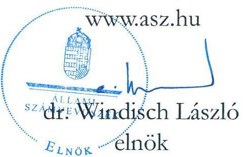

---

# ELLENŐRZÉSI IGAZGATÓSÁG: 

## TELJESÍTMÉNYELLENŐRZÉSI IGAZGATÓSÁG

## ELLENŐRZÉSI IGAZGATÓ:

DR. JAKAB KORNÉL igazgató

## ELLENŐRZÉSVEZETŐ:

HORVÁTH KRISZTIÁN ellenőrzésvezető

Jelentéseink az interneten a www.asz.hu címen olvashatók.

IKTATÓSZÁM: EL-3926-004/2024
TÉMASORSZÁM: 44.
ELLENŐRZÉS-AZONOSÍTÓ SZÁM: V-1048

---

# TARTALOMJEGYZÉK 

AZ ELLENŐRZÉS ALAPADATAI ..... 5
AZ ELLENŐRZÉS HATÓKÖRE ÉS TERÜLETE ..... 7
ÖSSZEFOGLALÁS ..... 9
AZ ELLENŐRZÉS FÓKUSZTERÜLETE ..... 11
MEGÁLLAPÍTÁSOK ..... 12
JAVASLATOK ..... 25
MELLÉKLETEK ..... 27
I. sz. melléklet: Értelmező szótár ..... 27
II. sz. melléklet: Az ellenőrzött szervezetek jegyzéke ..... 29
III. sz. melléklet: Ellenőrzési kritériumok ..... 30
FÜGGELÉK: ÉSZREVÉTELEK ..... 31
RÖVIDÍTÉSEK JEGYZÉKE ..... 32

---

.

---

# AZ ELLENŐRZÉS ALAPADATAI 

## AZ ELLENŐRZÉS CÉLJA

Az ellenőrzés célja annak feltárása és bemutatása volt, hogy az ellenőrzött időszakban hogyan változott az önkormányzatok tulajdonában lévő lakásállomány és annak összetétele, valamint, hogy a tervekkel összhangban, az eredményesség és a vagyon megőrzésének elveire figyelemmel történt-e az önkormányzati lakások hasznosítása.

## AZ ELLENŐRZÉS TÍPUSA

Teljesítmény-ellenőrzés

## AZ ELLENŐRZÖTT IDŐSZAK

2018.01.01 - 2023.06.30.

## AZ ELLENŐRZÉS TÁRGYA

Az ellenőrzés tárgyát képezte a kiválasztott önkormányzatok tulajdonában lévő lakásállomány jellemző adatainak, trendjeinek, az önkormányzatok nyilvántartott adatainak összessége, az ingatlangazdálkodási stratégiák, tervek, koncepciók, egyéb célok tervadatai.

Az ellenőrzés kiterjedt minden olyan körülményre és adatra, amely az ÁSZ¹ jogszabályban meghatározott feladatainak teljesítéséhez, valamint a program végrehajtása folyamán felmerült újabb összefüggések feltárásához szükséges volt.

## AZ ELLENŐRZÉS JOGALAPJA

Az ellenőrzés jogszabályi alapját az Állami Számvevőszékről szóló 2011. évi LXVI. törvény 1. § (3) és 5. § (2)-(3) bekezdései képezték.

## AZ ELLENŐRZÉS MÓDSZERE

Az ellenőrzést a nemzetközi standardokat irányadónak tekintve az ellenőrzési program szempontjai, az ellenőrzött időszakban hatályos jogszabályok, az ellenőrzés szakmai szabályok és módszertanok figyelembevételével végezte az ÁSZ.

Az ellenőrzés lefolytatásához az ellenőrzött, illetve ellenőrzést támogató szervezetek a tanúsítványok kitöltésével, valamint az ÁSZ által kért dokumentumok, adatok, információk megküldésével és az ellenőrzés során szolgáltatott adatokkal járultak hozzá.

---

Az ellenőrzési bizonyítékként felhasznált adatforrások közé tartoztak egyrészt az ellenőrzéshez kért dokumentumok, adatforrások, másrészt adatforrás volt még minden - az ellenőrzés folyamán - feltárt, az ellenőrzés szempontjából információkat tartalmazó dokumentum.

Az ellenőrzés - az ellenőrzésre kiválasztott Győr Megyei Jogú Város Önkormányzata, Miskolc Megyei Jogú Város Önkormányzata és Szeged Megyei Jogú Város Önkormányzata lakásállományának főbb adatai alapján és azok tényszerű bemutatásával - az adatok és tendenciák tervekkel való összevetésével történt. Az ellenőrzés keretében felhasználásra kerültek a KSH² által közzétett, az önkormányzati lakásgazdálkodáshoz kapcsolódó nyilvános adatok.

Az ellenőrzési kérdések megválaszolásához szükséges bizonyítékok megszerzése az ellenőrzött szervezet és az ellenőrzést támogató szervezet által rendelkezésre bocsátott dokumentumokra, adatokra alapozva, kérdésfeltevés (információkérés), valamint elemző eljárás útján történt.

---

# AZ ELLENŐRZÉS HATÓKÖRE ÉS TERÜLETE 

Magyarországon 1990-ben a tanácsrendszer helyébe a helyi önkormányzati rendszer lépett. Az Ötv.³ rögzítette, hogy a helyi önkormányzat önként vállalt, illetőleg kötelezően előírt feladat- és hatáskörei a helyi közügyek széles körét fogják át. Az Ötv. indoklása szerint az önkormányzatok működésének egyik meghatározó feltétele, hogy megfelelő vagyonnal rendelkezzenek feladataik ellátásához, így 1990. szeptember 30-án a helyi önkormányzatok tulajdonába kerültek az Ötv. 107. §-ában rögzített tanácsi, illetőleg a tanácsi ingatlankezelő szervek kezelésében levő állami bérlakások.

Az Alaptörvény 32. cikke szerint a helyi önkormányzat - a helyi közügyek intézése körében - többek között gyakorolja az önkormányzati tulajdon tekintetében a tulajdonost megillető jogokat, meghatározza költségvetését, annak alapján önállóan gazdálkodik és az e célra felhasználható vagyonával és bevételeivel kötelező feladatai ellátásának veszélyeztetése nélkül vállalkozási tevékenységet folytathat.

Az Nvtv.⁴ kimondja, hogy a nemzeti vagyongazdálkodás feladata a nemzeti vagyon megőrzése, értékének és állagának védelme, rendeltetésének megfelelő, az állam, az önkormányzat mindenkori teherbíró képességéhez igazodó, elsődlegesen a közfeladatok ellátásához és a mindenkori társadalmi szükségletek kielégítéséhez szükséges, egységes elveken alapuló, átlátható, hatékony és költségtakarékos működtetése, értéknövelő használata, hasznosítása, gyarapítása, továbbá az állam vagy a helyi önkormányzat feladatának ellátása szempontjából feleslegessé váló vagyontárgyak elidegenítése.

A Mötv.⁵ a helyi közügyek között sorolja fel a lakásgazdálkodást.
A Lakástörvény⁶ rendelkezése értelmében az önkormányzati tulajdonú lakásokra az önkormányzat rendeletében meghatározott feltételekkel lehet szerződést kötni.

A rendszerváltáskor a tanácsi bérlakások települési önkormányzatok tulajdonába kerülésével minden ötödik magyarországi lakás önkormányzati tulajdon lett. Az elmúlt 30 évben az önkormányzati tulajdonú lakások száma több mint 600 ezer lakással csökkent, a magyarországi lakásállományhoz viszonyított arányuk 18,7%-ról 2,5%-ra zsugorodott.

Az önkormányzati lakásállomány (a továbbiakban lakásállomány) az 1990-es években rendkívül gyorsan (~ 49,4 ezer lakás/év), azóta lassuló ütemben fogyott, 2018-2022. között országosan 4,8%-kal, 5677 lakással csökkent a lakásállomány (1. ábra).
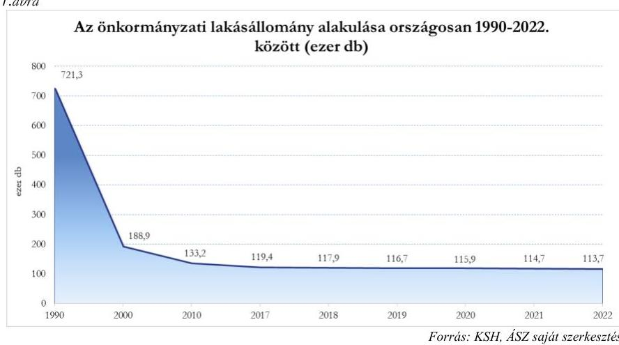

---

A biztonságos, megfizethető, széles rétegek számára elérhető lakhatás elősegítése, a lakhatási szegénység csökkentésének meghatározó eszköze az önkormányzati tulajdonú lakásállomány. Ezen célok mellett az önkormányzatok komplex, sokrétű szempontok figyelembevételével és széleskörű önállósággal alakíthatják ki és valósíthatják meg lakáspolitikájukat annak érdekében, hogy a helyi lakosság igényeit és a település fejlődését egyaránt szolgálják (2. ábra).

Országos szinten az önkormányzati
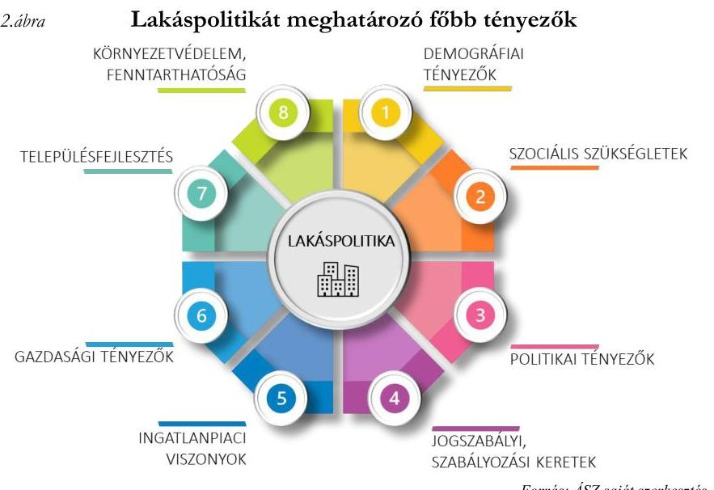

Fonrás: ÁSZ saját szerkesztés
lakások hasznosítási módjában 2018-2022. között átrendeződés volt megfigyelhető, a szociális alapon bérbeadott lakások arányának 7,5 százalékpontos csökkenésével közel azonos mértékben emelkedett a magasabb bevétel elérését célzó, piaci alapon hasznosított lakások száma (3. ábra).
3.ábra

Az önkormányzati tulajdonú lakások hasznosítási kategórák szerinti összetételének alakulása 2018.01.01 - 2022.12.31. között országosan (%)
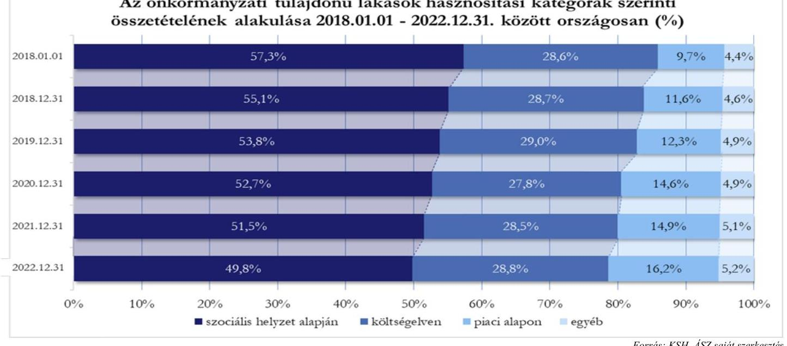

2018-2022. között az önkormányzati tulajdonú lakások átlagos lakbére országosan 24,3%-kal nőtt, a lakások bérbeadásából származó bérleti díjbevétel - a csökkenő lakásszám és a hasznosítási összetétel változása miatt is - 14,1%-kal emelkedett.

Célzott ellenőrzés keretében a nemzetközi gyakorlatban alkalmazott módszer alapján az ÁSZ Győr Megyei Jogú Város Önkormányzata, Miskolc Megyei Jogú Város Önkormányzata és Szeged Megyei Jogú Város Önkormányzata tulajdonában álló lakásállomány hasznosításának tervszerűségét, a kitűzött célok terv szerinti elérését ellenőrizte. Konkrét, visszamérhető célok hiányában a tényhelyzet rögzítése, illetve a lakásállomány mennyiségi-minőségi változásának tendenciái kerültek a jelentésben bemutatásra, továbbá a tendenciák alapján beazonosított kockázatok mérséklése érdekében javaslatok kerültek megfogalmazásra.

---

# ÖSSZEFOGLALÁS 

Az Mötv. rendelkezése értelmében a lakásgazdálkodás helyi önkormányzati feladat. A helyi önkormányzatok tulajdona nemzeti vagyon, amelynek alapvető rendeltetése a közfeladat ellátásának biztosítása.

A lakásállomány az önkormányzatok jelentős értékű vagyoneleme, értékének védelme nemzeti érdek; hasznosítása egyfelől szociális célokat szolgál, másfelől az önkormányzati bevételeken keresztül hatással van az önkormányzat költségvetésére. Jelen ellenőrzéssel az ÁSZ fel kívánja hívni a figyelmet a lakásállomány tervszerű, célszerű hasznosításának szükségességére.

A megyei jogú városok közül ellenőrzésre kiválasztott önkormányzatok: Győr Megyei Jogú Város Önkormányzata, Miskolc Megyei Jogú Város Önkormányzata és Szeged Megyei Jogú Város Önkormányzata. 4.ábra

## Az ellenőrzött önkormányzatok lakásállományának jellemző adatai (és azok ellenőrzött időszaki változásai), 2023. I. félév

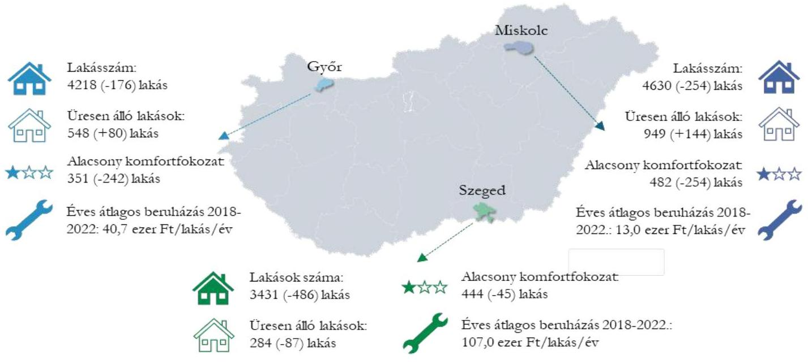

Forrás: önkormányzatok adatszolgáltatása alapján, ÁSZ saját szerkesztés
Az ellenőrzés a lakásgazdálkodási döntések előkészítésének megalapozását jelentő pontos, átlátható és aktualizált adatok rendelkezésre állásából indult ki.
Az önkormányzatok⁷ rendelkeztek tervdokumentumokkal, amelyekben általános érvényű fejlesztési irányokat fogalmaztak meg, azokhoz - néhány kivételtől eltekintve - mérhető célszámokat nem rendeltek. Mindhárom önkormányzat célként határozta meg a lakásállomány fejlesztését, Miskolc⁸ a vagyonhasznosításából származó bevételek növelését, 2020-ig Győr⁹ a lakásállomány bővítését.
A meghatározott célok alakulását az önkormányzatok nyomon követték.
Az önkormányzatoknál összesen 6,9%-kal, 916 lakással csökkent a lakásszám, a lakásállomány bővítését 2020-ig célul kitűző Győrben is 2018-2020. között 2,3%-kal csökkent az önkormányzati tulajdonú lakások száma.

---

Miskolcon az önkormányzat vagyonhasznosításból származó bevételek növelésére kitűzött cél eléréséhez hozzájárult a lakáshasznosításból származó bevételek növekedése.
A lakáshasznosításból származó bevételek növelésének korlátai közül kiemelendőek az alábbi tényezők:

- az önkormányzatok összesített adatai alapján az ellenőrzött időszakban nőtt az üres, nem hasznosított lakások száma és aránya, 2023.06.30-án az összlakásszám 14,5%-a, 1781 lakás üresen állt, ezek a lakások nemcsak bevételkiesést, de folyamatos fenntartási költséget is jelentettek az önkormányzatok számára,
- a bevételpotenciált jelentő, piaci alapon meghatározott lakbérek nominálisan, illetve növekedési ütemük tekintetében is jelentősen elmaradtak a tényleges piaci áraktól és azok változásaitól,
- az önkormányzatok 58-341 millió forint összegű lejárt bérleti díjkövetelést tartottak nyilván 2023. június végén, az elmaradt, nem realizált bevételek forrást vontak el a bérlakások fenntartásától, karbantartásától, felújításától, továbbá azok kezelése adminisztratív terhet és költséget jelentett az önkormányzatok számára.
Miskolc az ellenőrzött időszakban átlagosan 13,0 ezer forint/lakás/év, Győr 40,7 ezer forint/lakás/év, Szeged 107,0 ezer forint/lakás/év összeget fordított a lakásállomány fejlesztésére, felújítására, mely a lakásállomány elöregedésének kompenzálásához, műszaki állapot fenntartásához, értékmegőrzéshez szükséges visszapótlás mértékétől lényegesen elmaradt. A fejlesztésre, felújításra fordított összegek alacsony mértéke kockázatot jelent az önkormányzati tulajdonú lakásállomány értékének, állagának megőrzésére.
Bár az önkormányzatoknál csökkent az alacsony komfortfokozatú (félkomfortos, komfort nélküli, vagy szükséglakás) lakások száma, azonban 2023. I. félév végén 1277 olyan lakás volt (az önkormányzatok együttes lakásállományának 10,4%-a), ahol hiányzott a vizes helyiség, nem volt melegvíz ellátás, illetve rendkívül kicsi alapterületű szükséglakás besorolású volt.

A fenti megállapítások alapján az ÁSZ indokoltnak tartja a lakásállomány fejlesztésének, az üresen álló lakásállomány hasznosítási lehetőségeinek felmérését és a bérleti díjhátralékállomány csökkentése lehetőségeinek feltérképezését.

---

# AZ ELLENŐRZÉS FÓKUSZTERÜLETE 

1.- Az önkormányzati lakásállomány hasznosításának tervszerűsége, tervek-tendenciák összhangja, figyelemmel az eredményesség és vagyonmegőrzés elveire

---

# MEGÁLLAPÍTÁSOK 

## 1. Az önkormányzati lakásállomány hasznosításának

tervszerűsége, tervek-tendenciák összhangja, figyelemmel az eredményesség és vagyonmegőrzés elveire

## I. TERVSZERŰSÉG, NYILVÁNTARTÁSOK RENDELKEZÉSRE ÁLLÁSA

Az önkormányzatok az ellenőrzött időszakban a tulajdonukban lévő lakásokkal való gazdálkodáshoz, hasznosításhoz kapcsolódó általános célokat, elveket, irányokat közép- vagy hosszú távú stratégiai tervdokumentumokban meghatározták, és a lakásgazdálkodási célok megvalósításának előrehaladását nyomon követték (5. ábra).
5. ábra¹

Tervdokumentumok rendelkezésre állása

Integrált Településfejlesztési Stratégia
Gazdasági program
Közép- és hosszú távú vagyongazdálkodási terv
Rövid- és középtávú koncepció, terv
Beszámolás/Visszamérés dokumentumai

Győr
✓
✓
I
✓
✓
✓
✓
✓
✓
✓

Fonrás: önkormányzatok adatszolgáltatása alapján, ÁSZ saját szerkesztés

Az önkormányzatok készítettek Integrált Településfejlesztési Stratégiát² és Gazdasági programot.
Közép- és hosszútávú vagyongazdálkodási tervvel Győr az Nvtv. 9.§ (1) bekezdés előírása ellenére 2018-2020. között nem rendelkezett, Miskolc és Szeged a teljes ellenőrzött időszakban rendelkezett.
Miskolc és Szeged a stratégiai terveken túl rövidtávú terveket is készített (miskolci vagyonkezelő¹⁰ ingatlangazdálkodási terve, szegedi vagyonkezelő¹¹ üzleti terve), továbbá a 2018., 2019., 2022. és 2023. években Szeged az eredményes lakásgazdálkodás érdekében mérhető célkitűzéseket és premizációs ösztönzőt határozott meg a szegedi vagyonkezelő elnök-vezérigazgatója részére.

[^0]:
[^0]: *jelmagyarázat:
    × : az ellenőrzött időszakban nem rendelkezett az adott dokumentummal
    ✓ : az ellenőrzött időszakban rendelkezett az adott dokumentummal
    I : az ellenőrzött időszakban részben rendelkezett az adott dokumentummal
    † Szegeden a 2021-2027. közötti időszakra Szeged Megyei Jogú Város Fenntartható Városfejlesztési Stratégiája

---

A közép- és hosszútávú tervekben - néhány kivételtől eltekintve - mérhető célszámokat, mutatókat nem tartalmazó, általános érvényű fejlesztési irányként, célkitűzésként fogalmazta meg:

- mindhárom

 önkormányzat a lakásállomány fejlesztését,
- Miskolc a vagyonhasznosításából származó bevételek növelését,
- 2020-ig Győr a lakásállomány bővítését.

Győr gazdasági programja ${ }^{12}$ alapján az önkormányzati lakásgazdálkodás elsődlegesen a szociális ellátórendszer része és eszköze. Szeged gazdasági programjában ${ }^{13}$ kiemelt feladatként rögzítette a városban élők lakásgondjainak enyhítését, a szociálisan hátrányos helyzetben lévő igénylők lakhatási problémáinak megoldását.

A meghatározott célok alakulását az önkormányzatok nyomon követték, azok teljesülését Győr az éves lakáshasználati tevékenységről szóló feljegyzésekben, Miskolc az éves ingatlangazdálkodási terv részét képező beszámolókban és azok előterjesztéseiben, Szeged a szegedi vagyonkezelő féléves és éves beszámolóiban, az önkormányzat zárszámadásaiban és a zárszámadási rendeletek előterjesztéseiben mutatta be.
Miskolc kivételével az önkormányzatok nyilvántartásai kitértek a fejlesztési/felújítási szükségletek és a tervezés megalapozására alkalmas információkra (6. ábra).
6. ábra

| Nyilvántartások rendelkezésre állása | Győr | Miskolc | Szeged |
| :--: | :--: | :--: | :--: |
| lakások értékének elkülönített nyilvántartása | $\checkmark$ | $\checkmark$ | $\checkmark$ |
| lakások elkülönített ÉCS nyilvántartása | $\checkmark$ | $\checkmark$ | $\checkmark$ |
| állagmutató nyilvántartása | $\checkmark$ | $\Gamma$ | $\checkmark$ |
| lakásigénylők nyilvántartása | $\checkmark$ | $\times$ | $\checkmark$ |
| kiutalási/jogcím adatok rendelkezésre állása | $\checkmark$ | $\checkmark$ | $\checkmark$ |

Könyvviteli nyilvántartásaikban az önkormányzatok lakásállományuk értékét az ingatlanvagyon értékén belül elkülönítetten tartották nyilván, a lakáskiutalások nyilvántartását jogcímenként vezették. Miskolc a lakásigénylőket nem tartotta nyilván, így a lakásállomány hasznosításának tervezése során historikus keresleti adatokat nem tudott figyelembe venni. A lakásállomány minőségét jellemző állagmutatókat - mivel az ingatlanok állapotában bekövetkező változások bejegyzése folyamatosan felülírta a nyilvántartásban szereplő korábbi adatokat - csak az aktuális legfrissebb időpontra vonatkozóan tartotta nyilván. Múltbéli állagmutató adatok hiányában a lakásállomány minőségének nyomon követését a lakásállomány állagmutató szerinti nyilvántartása nem támogatta.

[^0]
[^0]:    $\ddagger$ jelmagyarázat:
    $\times$ : az ellenőrzött időszakban nem rendelkezett az adott dokumentummal
    $\checkmark$ : az ellenőrzött időszakban rendelkezett az adott dokumentummal
    $\Gamma$ : az ellenőrzött időszakban részben rendelkezett az adott dokumentummal

---

# I. TERVEK-TENDENCIÁK ÖSSZHANGJA 

## 1. A LAKÁSÁLLOMÁNY MEGTARTÁSA, BŐVÍTÉSE

Az önkormányzatoknál - a lakásállomány bővítését 2020-ig célként kitűző Győr városában is - lakásgazdálkodási döntések következtében csökkent az önkormányzati tulajdonú lakások száma.
A legkisebb, 4,0%-os lakásállomány csökkenés Győrben történt és itt volt a legmagasabb az ezer lakosra jutó önkormányzati tulajdonú lakások száma, 2023. júniusában 34,7 lakás. A legnagyobb, közel 12,4%-os lakásszám csökkenés az abszolút mértékben és lakosságszám arányosan is legkisebb lakásállománnyal rendelkező Szegeden történt. (7. ábra)
7. ábra

Az önkormányzati lakásállomány alakulása 2018.01.01-2022.12.31., illetve 2023. I. félév
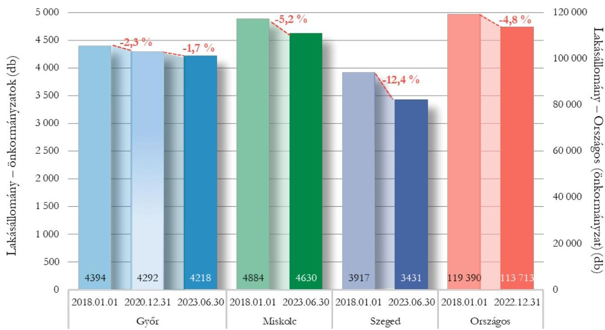

Az 1000 lakosra jutó önkormányzati lakásszám alakulása (db)

|  | Győr | Miskolc | Szeged | Országos   (önkormányzat) |
| :--: | :--: | :--: | :--: | :--: |
| 2018.01.01 | 35,1 | 30,3 | 23,8 | 12,2 |
| 2023.06.30 | 34,7 | 30,8 | 21,8 | $11,8^{*}$ |
| Változás | $-1,1 \%$ | $1,7 \%$ | $-8,4 \%$ | $-3,3 \%$ |
| *Országos 2022.12.31 |  |  |  |  |

Forrás: KSH STADAT adatáblák és önkormányzatok adatszolgáltatása alapján, ÁSZ saját szerkesztés
Az önkormányzatok lakásállományának csökkenése hátterében az alábbi gazdasági események álltak:

- Győr 28 db lakást értékesített és 156 db lakást szüntetett meg, emellett 8 db lakást épített.
- Miskolc 158 db lakást értékesített, 164 db lakást szüntetett meg, 2 db lakás esetében egyéb ok miatt történt lakásszámcsökkenés, emellett 70 db lakást vásárolt.
- Szeged 435 db lakást értékesített és 51 db lakást szüntetett meg.

Miskolc kivételével kis számban történt a lakásszám növelését célzó ingatlantranzakció. Az ellenőrzött időszakban országosan 5677, az ellenőrzött önkormányzatoknál összesen 916 lakással

---

csökkent az önkormányzati lakásállomány, amely a jövőre nézve szűkíti az önkormányzatok mozgásterét lakáspolitikai céljaik elérésében.

# 2. AZ ÖNKORMÁNYZATI LAKÁSHASZNOSÍTÁSBÓL SZÁRMAZÓ BEVÉTELEK NÖVELÉSE, OPTIMALIZÁLÁSA 

A lakáshasznosításból származó bevételekre, azok változására hatással volt az önkormányzatok által saját hatáskörben meghatározott lakbérmérték, azok időbeni megfizetése, a különböző hasznosítási kategóriák alkalmazása, az üresen álló lakásokkal való gazdálkodás.
Miskolcon a vagyonhasznosításából származó bevételek növelésére kitűzött cél eléréséhez hozzájárult a lakáshasznosításból származó bevételek növekedése.
Miskolcon és Szegeden a lakások hasznosításából származó bevételek annak ellenére nőttek (18,4 és 17,8%-kal), hogy a lakásállomány csökkent (3,4 és 7,8%-kal). Ez elsősorban a díjtételek emelésének, valamint a lakásállomány magasabb fajlagos díjtételű lakások felé történő átrendeződésének volt köszönhető. Győrben a lakások hasznosításából származó bevételek a lakásszám 2,3%-os csökkenése mellett 3,6%-kal csökkentek. (8. ábra)
8. ábra

Az önkormányzatok lakáshasznosításból származó bevételeinek és lakásállományának alakulása a 2018. és 2022. évek* összevetésében
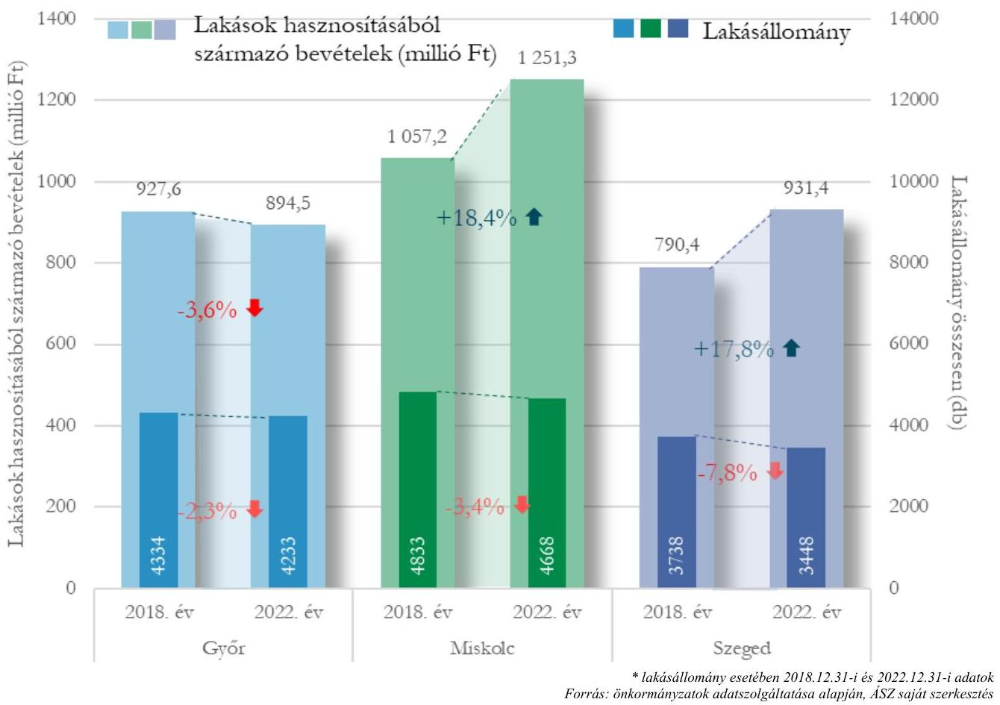

Az önkormányzatok a bérleti díjhátralék összegét csökkenteni tudták, de Miskolcon és Szegeden 2023. június végén még mindig 292 M Ft, illetve 341 M Ft lejárt követelést tartottak nyilván. (1. táblázat)

---

1. táblázat

| LAKÁSBÉRLŐK BÉRLETI DÍJ HÁTRALÉKA (EZER FT) |  |  |  |  |  |  |  |  |
| :--: | :--: | :--: | :--: | :--: | :--: | :--: | :--: | :--: |
| MEGNEVEZÉS | HÁTRALÉK ÖSSZEGE |  | VÁLTOZÁS |  | EGY LAKÁSRA JUTO HÁTRALÉK |  | VÁLTOZÁS |  |
|  | 2018.01.01 | 2023.06.30 | Összeg | \% | 2018.01.01 | 2023.06.30 | Összeg | \% |
| Győr | 67611 | 57706 | $-9905$ | $-14,6 \%$ | 15,4 | 13,7 | $-1,7$ | $-11,0 \%$ |
| Miskolc | 362622 | 292476 | $-70146$ | $-19,3 \%$ | 74,2 | 63,2 | $-11,0$ | $-14,8 \%$ |
| Szeged | 353873 | 341485 | $-12388$ | $-3,5 \%$ | 90,3 | 99,5 | 9,2 | $10,2 \%$ |

# BÉRLETI DÍJ MEGHATÁROZÁSA 

Az önkormányzati tulajdonú lakásállomány bérleti díját alapvetően meghatározta az adott önkormányzat szociálpolitikai célrendszere, illetve a lakásállomány szociálpolitikai eszköztáron belül elfoglalt helye.
Az önkormányzatok rendeleteikben eltérő módon (részletezettségben, kalkulációs módszerében) határozták meg a bérleti és hasznosítási díjakat, ezért azok egymással nem összehasonlíthatóak.
Győr Lakbérrendeletében ${ }^{14}$ a havi lakbért a rendelet szerinti egységdíjon felül a lakás alapterületének és számszerűsített használati értékének szorzata, valamint egyedi csökkentő tényezők (pl. földszinti, illetve alagsori lakás, kedvezőtlen fekvés) alkalmazásával határozták meg. A számszerűsített használati érték meghatározásánál a lakás komfortfokozatát, fűtési módját, az épület építési módját, felújítottságának mértékét és az övezet szerinti besorolást vették alapul. Az önkormányzat az ellenőrzött időszakban a havi lakbér mértékét egy alkalommal, 2023. január 1-jétől módosította. Költségelven történő hasznosítás az önkormányzatnál nem volt, szociális és piaci alapú bérbeadásnál az átlagos havi lakbér mértékét az önkormányzati lakások országos átlagos szociális, illetve piaci alapú lakbérénél magasabb összegben határozta meg ${ }^{5}$.
Miskolc Lakásrendeletében ${ }^{15}$ meghatározta, hogy alacsony komfortfokozatú (komfort nélküli, félkomfortos) lakásokat hasznosít szociális alapon. 2020-ig a költségelvű és a piaci alapon bérbe adandó lakások bérleti díjmeghatározásánál az épület építési módját, övezet szerinti besorolását, felújítottságának mértékét, továbbá egyedi csökkentő tényezőket vettek figyelembe (pl.: a lakást a bérlő teszi rendeltetésszerű használatra alkalmas állapotúvá ill. a bérlemény elhelyezkedése, műszaki állapota). 2021-től az önkormányzat további díjmeghatározási szempontként vette figyelembe a komfortfokozat szerinti besorolást és a lakás alapterületét. Az ellenőrzött időszakban a bérleti díjak 2021-től évente emelkedtek. A szociális alapon bérbeadott lakások átlagos lakbére az önkormányzati lakások országos átlagos szociális alapú lakbére körül mozgott. A költségelven és a piaci alapon bérbeadott lakások átlagos lakbére mind összegében, mind emelkedésének ütemében meghaladta az önkormányzati lakások országos átlagos költségelvű, illetve piaci alapú lakbérét.
Szeged Lakásrendeletében ${ }^{16}$ hasznosítási kategóriánként, komfortfokozatonként és az összkomfortos lakások esetében az épület építési módja szerint, továbbá csökkentő tényezők (pl.: a lakás épületen belüli fekvése, műszaki állapota) figyelembevételével határozta meg a lakbéreket. A lakbérek mértéke a szociális, költségelvű és a piaci kategóriákban egyaránt évente emelkedett. A szociális, költségelvű és piaci

---

kategóriákban a teljes ellenőrzött időszakban az átlagos havi lakbér mértéke az önkormányzati lakások országos átlagos szociális, költségelvű, illetve piaci alapon meghatározott lakbére felett volt.
A piaci alapon hasznosított lakásállomány esetében meghatározott lakbérek nominálisan, illetve növekedési ütemük tekintetében jelentősen elmaradtak a tényleges piaci áraktól és azok változásaitól.
Az önkormányzatok piaci bérbeadás esetén alkalmazott lakbére a megyei jogú városok regionális lakáspiacon elérhető átlagos piaci lakbérének 51,2-58,5%-a volt Győrben, 42,9-54,8%-a Miskolcon, 51,2-59,7%-a Szegeden. (9. ábra)
9. ábra

A megyei jogú városok átlagos lakáspiaci lakbéreinek és az önkormányzatok átlagos piaci alapú lakbéreinek alakulása (forint/ $\mathrm{m}^{2}, \%$ )
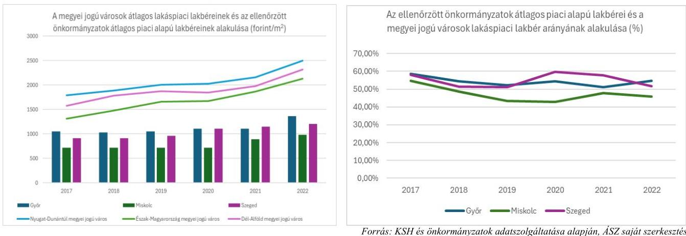

# A HASZNOSÍTÁSI KATEGÓRIÁK 

Az önkormányzatok más-más hasznosítási koncepciót követtek, Miskolc esetében megfigyelhető a - bevételek növelését célzó - piaci alapú, Szegeden a költségelvű hasznosítás térnyerése.
Országos szinten csökkenő tendenciát mutatott a szociális alapon bérbeadott lakások száma és aránya, szemben a piaci alapon történő bérbeadások számával és arányával. Ezzel együtt a szociális alapon történő bérbeadás az ellenőrzött időszak végén is hazánk teljes önkormányzati lakásállományának közel 50%-át tette ki. A költségelven történő bérbeadás országos átlaga az ellenőrzött időszakban szignifikánsan nem változott, mintegy 29% volt (10. ábra).

---

10. ábra

Az önkormányzatok és az országos lakásállomány megoszlása hasznosítási kategóriák szerint 2018.01.01-2022.12.31, illetve 2023. I. félév
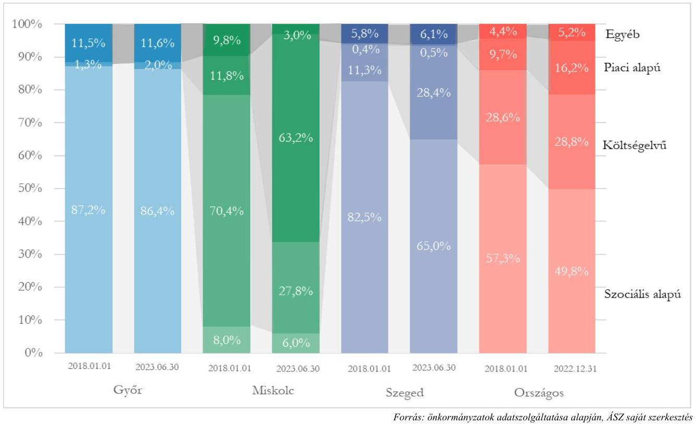

Győr esetében a lakásállomány hasznosítás szerinti összetétele nem mutatott érdemi átrendeződést az ellenőrzött időszakban. Az országos adatokkal összevetve - gazdasági programjával összhangban, amely szerint az önkormányzati lakásgazdálkodás elsődlegesen a szociális ellátórendszer része és eszköze - kiemelkedően magas, 86-87% volt a szociális alapon hasznosított lakások aránya, költségelven hasznosított lakás nem volt és csekély, 1-2% arányt képviseltek a piaci alapon hasznosított lakások.
Szegeden a szociális alapon hasznosított lakások csökkenésével párhuzamosan 17,1 százalékponttal, az országos átlagos 28,4%-os szintre emelkedett a költségelven hasznosított lakások aránya. A csökkenés ellenére az önkormányzat az országos adatokat 15 százalékponttal meghaladó, 65%-os arányban hasznosította szociális alapon lakásait 2023. június végén, emellett csekély, 1% alatti arányt képviseltek a piaci alapon hasznosított lakások.
Miskolcon az országos átlagnál lényegesen alacsonyabb, 6-8% részarányt képviseltek a szociális alapon bérbeadott lakások. A költségelven történő hasznosítás az ellenőrzött időszak kezdetén több mint 70%-ot, az országos átlag két és félszeresét képviselte, amely az ellenőrzött időszakban az országos átlagos aránynak megfelelő szintre csökkent, miközben a piaci alapon hasznosított lakások aránya 11,8%-ról 63,2%-ra, az országos átlagos érték közel négyszeresére nőtt.

---

# AZ ÜRESEN ÁLLÓ LAKÁSOKKAL VALÓ GAZDÁLKODÁS 

Az üresen álló önkormányzati lakások azon túl, hogy nem töltik be szerepüket és nem szolgálják az önkormányzat feladatellátását, többletköltséget jelentenek, ezért is fontos, hogy az önkormányzatok az üresen álló lakások számát lehetőség szerint csökkentsék.
Az önkormányzatok közül Szeged célként tűzte ki az üres lakások számának csökkentését, az üres lakások mielőbbi hasznosítását. Az üresen
 álló lakások év végi állomány darabszámának változása alapján a kitűzött cél a teljesülés irányába mutatott, az üresen álló lakások száma és részaránya összességében csökkent.
Az ellenőrzött időszakban a nem hasznosított, üresen álló lakások aránya az egyes önkormányzatoknál jelentős különbséget mutatott, Szegeden volt a legalacsonyabb (7,7-9,5%), Miskolcon a legmagasabb (16,5-20,5%) azok részaránya. Győrben és Miskolcon az üres lakások aránya 2,3, illetve 4,0 százalékponttal emelkedett.
Az önkormányzatok együttes lakásállományán belül 2,0 százalékponttal, 14,5%-ra nőtt az üres, nem hasznosított lakások aránya, ami 2023.06.30-án az önkormányzatok esetében összesen 1781 üresen álló lakást jelentett. (11. ábra)
11.ábra

Az ellenőrzött önkormányzatok üresen álló, nem hasznosított lakásállományának alakulása, 2018-2023. I. félév
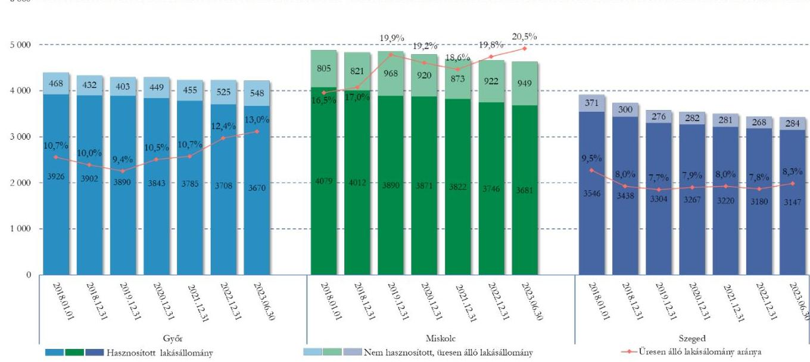

Forrás: önkormányzatok adatszolgáltatása alapján, ÁSZ saját szerkesztés

## 3. LAKÁSÁLLOMÁNY FEJLESZTÉSE

A lakásállomány értékének megőrzése, fejlesztése célok teljesülése a lakásállomány ingatlanpiaci értékének változása mellett a megvalósított beruházások és felújítások volumenének, végső soron a lakásállomány minőséget jellemző állagmutató és komfortkategória szerinti összetételének változásán keresztül mérhető, értékelhető.
A lakásállomány értékének változásán keresztül - a lakásállomány ingatlanpiaci értéken történő nyilvántartása hiányában - egyik önkormányzat esetében sem volt nyomon követhető a vagyon megőrzése, fejlesztése. Az önkormányzatok lakásállományának könyv szerinti nettó értéke a vármegyeszékhelyek átlagos piaci árának 0,9-35,5%-án volt nyilvántartva. (2. táblázat)

---

| 2. táblázat |  |  |  |  |  |  |
| :--: | :--: | :--: | :--: | :--: | :--: | :--: |
| EGY ÖNKORMÁNYZATI LAKÁS ÁTLAGOS KÖNYV SZERINTI ÉRTÉKE ÉS AZ ÁTLAGOS PIACI ÁRAK ALAKULÁSA A VÁRMEGYESZÉKHELYEKEN (EZER FT) |  |  |  |  |  |  |
| MEGNEVEZÉS | 2018. ÉV | 2019. ÉV | 2020. ÉV | 2021. ÉV | 2022. ÉV | $\begin{gathered} \text { VÁLTOZÁS } \\ 2018-2022 .(\%) \end{gathered}$ |
| Győr | 958 | 1022 | 1099 | 1128 | 1130 | $18,0 \%$ |
| Nyugat-Dunántúl vármegyeszékhely piaci ár | 18000 | 21300 | 23000 | 25800 | 32800 | $82,2 \%$ |
| Miskolc | 136 | 144 | 201 | 198 | 199 | $46,3 \%$ |
| Észak-Magyarország vármegyeszékhely piaci ár | 10600 | 13600 | 14600 | 17700 | 21700 | $104,7 \%$ |
| Szeged | 5687 | 5730 | 5704 | 5739 | 5843 | $2,7 \%$ |
| Dél-Alföld vármegyeszékhely piaci ár** | 16000 | 20000 | 20900 | 24500 | 29800 | $86,3 \%$ |

# BERUHÁZÁSOK, FELÚJÍTÁSOK FAJLAGOS VOLUMENE ÉS BEVÉTELEKHEZ VISZONYÍTOTT ARÁNYA 

Győr a 2018-2022. években a lakásgazdálkodásból származó bevételeinek 17,7%-át költötte a lakásállomány fejlesztésére, felújítására, a legalacsonyabb összeget, lakásonként 35,9 e Ft-ot 2020. évben, a legmagasabbat, lakásonként 49,5 e Ft-ot 2021. évben. A lakásgazdálkodásból származó bevételek 654,3 millió forinttal haladták meg a lakásállományra fordított kiadásokat.
Miskolc a 2018-2022. években a lakásgazdálkodásból származó bevételeinek 4,7%-át költötte a lakásállomány fejlesztésére, felújítására, a legalacsonyabb összeget, lakásonként 2,7 e Ft-ot 2020. évben, a legmagasabbat, lakásonként 20,8 e Ft-ot 2018. évben, a lakásállományra fordított kiadások 848,9 millió forinttal haladták meg a lakásgazdálkodásból származó bevételeket.
Szeged a 2018-2022. években a lakásgazdálkodásból származó bevételeinek 13,3%-át költötte a lakásállomány fejlesztésére, felújítására, a legalacsonyabb összeget, lakásonként 21,2 e Ft-ot 2022. évben, a legmagasabbat, lakásonként 211,5 e Ft-ot 2019. évben, a lakásgazdálkodásból származó bevételek 5 milliárd forinttal haladták meg a lakásállományra fordított kiadásokat. (3. táblázat)
A lakásállomány fejlesztésére, felújítására fordított összegek alacsony mértéke, különösen Miskolc esetében kockázatot jelent az önkormányzati tulajdonú lakásállomány értékének, állagának megőrzésére.

[^0]
[^0]:    ** https://www.ksh.hu/stadat_files/lak/hu/lak0024.html

---

# A LAKÁSÁLLOMÁNYON REALIZÁLT ÖSSZES BEVÉTEL ÉS A FELÚJÍTÁS, PÓTLÓLAGOS BERUHÁZÁS ÉRTÉKÉNEK VISZONYA ÖNKORMÁNYZATONKÉNT 

|  | 2018. | 2019. | 2020. | 2021. | 2022. | ÖSSZESEN |
| :--: | :--: | :--: | :--: | :--: | :--: | :--: |
|  | GYŐR |  |  |  |  |  |
| Bevétel (ezer Ft) | 1094356 | 1042400 | 975316 | 914448 | 896947 | 4923467 |
| Kiadás (ezer Ft) | 801339 | 799883 | 836313 | 936813 | 894829 | 4269177 |
| Bevétel - kiadás (ezer Ft) | 293017 | 242517 | 139003 | $-22365$ | 2118 | 654290 |
| Felújítás, pótlólagos beruházás (ezer Ft) | 166303 | 178387 | 154084 | 209815 | 161343 | 869932 |
| Felújítás, pótlólagos beruházás / Bevétel | $15,2 \%$ | $17,1 \%$ | $15,8 \%$ | $22,9 \%$ | $18,0 \%$ | $17,7 \%$ |
| Egy lakásra jutó felújítás, pótlólagos beruházás (ezer Ft/lakás) | 38,4 | 41,6 | 35,9 | 49,5 | 38,1 | 203,4 |
|  | MISKOLC |  |  |  |  |  |
| Bevétel (ezer Ft) | 1252259 | 1135073 | 1159837 | 1636750 | 1458805 | 6642724 |
| Kiadás (ezer Ft) | 1416870 | 1657084 | 1486523 | 1462809 | 1468361 | 7491647 |
| Bevétel - kiadás (ezer Ft) | $-164611$ | $-522011$ | $-326686$ | 173941 | $-9556$ | $-848923$ |
| Felújítás, pótlólagos beruházás (ezer Ft) | 100359 | 58492 | 12886 | 74739 | 63741 | 310217 |
| Felújítás, pótlólagos beruházás / Bevétel | $8,0 \%$ | $5,2 \%$ | $1,1 \%$ | $4,6 \%$ | $4,4 \%$ | $4,7 \%$ |
| Egy lakásra jutó felújítás, pótlólagos beruházás (ezer Ft/lakás) | 20,8 | 12,0 | 2,7 | 15,9 | 13,7 | 65,1 |
|  | SZEGED |  |  |  |  |  |
| Bevétel (ezer Ft) | 3324657 | 3367415 | 2494336 | 2426522 | 2961996 | 14574926 |
| Kiadás (ezer Ft) | 2284799 | 2295861 | 1697883 | 1550749 | 1740040 | 9569332 |
| Bevétel - kiadás (ezer Ft) | 1039858 | 1071554 | 796453 | 875773 | 1221956 | 5005594 |
| Felújítás, pótlólagos beruházás (ezer Ft) | 745488 | 757282 | 267149 | 96933 | 73208 | 1940060 |
| Felújítás, pótlólagos beruházás / Bevétel | $22,4 \%$ | $22,5 \%$ | $10,7 \%$ | $4,0 \%$ | $2,5 \%$ | $13,3 \%$ |
| Egy lakásra jutó felújítás, pótlólagos beruházás (ezer Ft/lakás) | 199,4 | 211,5 | 75,3 | 27,7 | 21,2 | 535,2 |

## LAKÁSÁLLOMÁNY MINŐSÉGÉNEK VÁLTOZÁSA

Ellenőrzésünkben minőséget jellemző mutatóként kezeltük a lakások állapotát leíró állagmutatót és komfortfokozat szerinti besorolásokat.
Győrben 4%-kal csökkenő teljes lakásszám mellett a lakásállomány állagmutató szerinti megoszlása 1,0% alatti pozitív irányú átrendeződést mutatott, a magasabb komfortfokozatú (összkomfortos, komfortos) lakások részaránya a 2018. év végi adatokhoz viszonyítva 5,2 százalékponttal - a lakásállomány csökkenését meghaladó mértékben - nőtt.
Az üresen álló lakásállomány átlagos komfortszintje és állagmutató szerinti összetétele jelentősen javult, azonban érdemben elmaradt a teljes lakásállományétól (12. és 13. ábra).

---

12. ábra

Győr önkormányzati tulajdonú lakások állagmutató szerinti összetételének alakulása 2018.01.01-2023.06.30 (%)
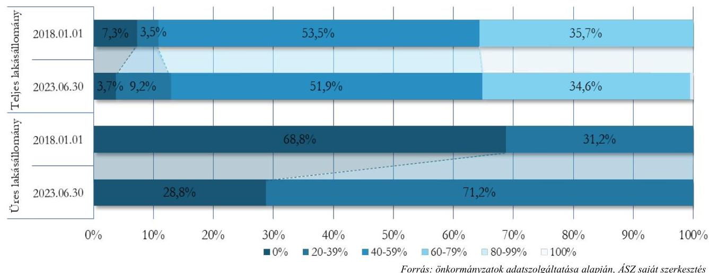
13. ábra

Győr önkormányzati tulajdonú lakások komfortkategória szerinti összetételének alakulása 2018.01.01-2023.06.30 (%)
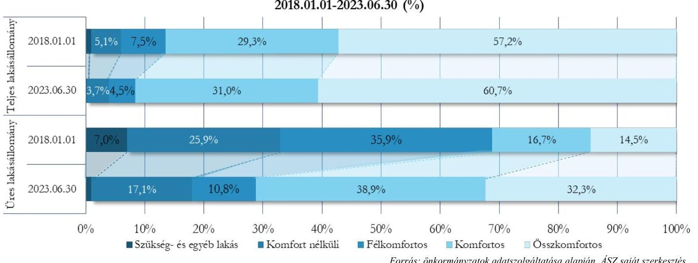

Miskolcon 5,2%-kal csökkenő teljes lakásszám mellett a magasabb komfortfokozatú (összkomfortos, komfortos) lakások részaránya a 2018. év végi adatokhoz viszonyítva 4,6 százalékponttal - a lakásállomány csökkenésétől elmaradó mértékben - nőtt. Az üresen álló lakásállomány komfortszintje szintén javult (a magasabb komfortkategóriák összesen 12,4 százalékponttal), azonban az így is érdemben elmaradt a teljes lakásállományétól (14. ábra).
Az állagmutató szerinti összetétel változása az ellenőrzött időszakot lefedő adatok hiányában nem volt értékelhető.

---

14. ábra

Miskolc önkormányzati tulajdonú lakások komfortkategória szerinti összetételének alakulása 2018.01.01-2023. I. félév (%)
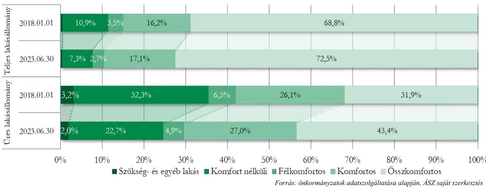

Szegeden a lakásállomány minőségét jellemző mutatók a lakásszám 12,4%-os csökkenése ellenére nem mutattak javulást. A lakásállomány állagmutató szerinti megoszlása 1,0% alatti pozitív irányú átrendeződést mutatott, a magasabb komfortfokozatú (összkomfortos, komfortos) lakások részaránya a 2018. év végi adatokhoz viszonyítva 0,5 százalékponttal csökkent. Az üresen álló lakásállomány átlagos komfortszintje és állagmutatója romlott és azok érdemben elmaradtak a teljes lakásállományétól (15. és 16. ábra).
15. ábra

Szeged önkormányzati tulajdonú lakások állagmutató szerinti összetételének alakulása 2018.01.01-2023.06.30 (%)
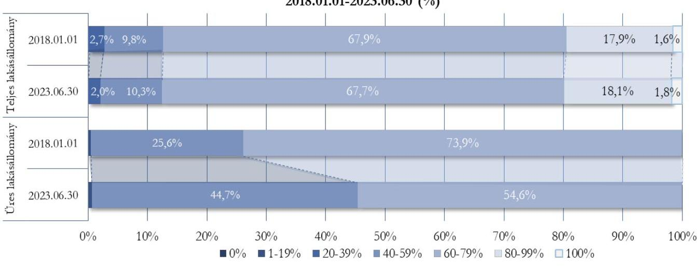

Forrás: önkormányzatok adatszolgáltatása alapján, ÁSZ saját szerkesztés

---

16. ábra

Szeged önkormányzati tulajdonú lakások komfortkategória szerinti összetételének alakulása 2018.01.01-2023.06.30 (%)
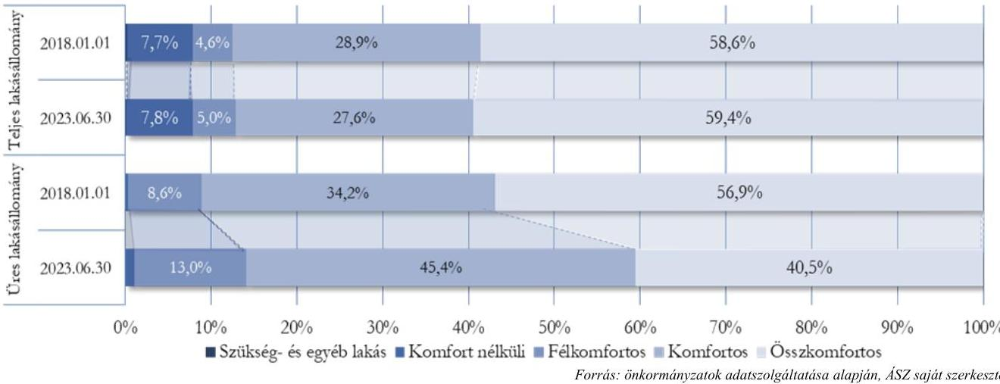

Miskolcon és Szegeden a lakásszám csökkenése nagyobb mértékű volt, mint a megmaradt lakásállomány minőségi mutatóinak javulása, Győrben a lakásszám csökkenését meghaladó mértékű pozitív irányú átrendeződés volt megfigyelhető a minőséget jellemző mutatók alakulásában.
Bár az önkormányzatoknál csökkent az alacsony komfortfokozatú (félkomfortos, komfort nélküli, vagy szükséglakás) lakások száma, azonban 2023. I. félév végén még mindig 1277 olyan lakás volt (a teljes lakásállomány 10,4%-a), ahol hiányzott a vizes helyiség, nem volt melegvíz ellátás, illetve rendkívül kicsi alapterületű szükséglakás besorolású volt.
Az önkormányzatoknál az üres lakások teljes lakásállománytól érdemben elmaradó állag- és komfortszintje a felújítás, fejlesztés fokozott igényét jelezte és az újrahasznosíthatóság kockázatára mutat rá.

---

# JAVASLATOK 

Az ÁSZ tv. 33. § (1) bekezdésében foglaltak értelmében az ellenőrzött szervezet vezetője köteles a jelentésben foglalt megállapításokhoz kapcsolódó intézkedési tervet összeállítani és azt a jelentés kézhezvételétől számított 30 napon belül az ÁSZ részére megküldeni. Amennyiben az ellenőrzött szervezet vezetője nem küldi meg határidőben az intézkedési tervet, vagy továbbra sem elfogadható intézkedési tervet küld, az Állami Számvevőszék elnöke az ÁSZ tv. 33. § (3) bekezdése a) és b) pontjaiban foglaltakat érvényesítheti.

## GYŐR MEGYEI JOGÚ VÁROS ÖNKORMÁNYZATA POLGÁRMESTERE RÉSZÉRE

1. Kezdeményezze a lakásállomány, kiemelten a teljes lakásállománytól érdemben elmaradó állag-, illetve komfortszintű lakások fejlesztési lehetőségeinek felmérését a lakásállomány értékének megőrzése, védelme érdekében, valamint e felmérés eredményeinek a lakásgazdálkodás célrendszerébe történő lehetőség szerinti beépítését.
2. Kezdeményezzen intézkedéseket az üresen álló lakásállomány hasznosítási lehetőségeinek felmérése, az üresen álló lakásállomány lehetőség szerinti hasznosítása érdekében.
3. Kezdeményezze a település szociális viszonyait is szem előtt tartó, visszamérhető, lakásgazdálkodásra, illetve lakáshasznosításra vonatkozó célrendszer kialakítását, továbbá annak rendszeres nyomon követését, értékelését a Bkr. ${ }^{17}$ 5. § (1) bekezdése szerinti módszertani útmutatóban foglaltakra figyelemmel.

## MISKOLC MEGYEI JOGÚ VÁROS ÖNKORMÁNYZATA POLGÁRMESTERE RÉSZÉRE

1. Kezdeményezze a lakásállomány, kiemelten a teljes lakásállománytól érdemben elmaradó állag-, illetve komfortszintű lakások fejlesztési lehetőségeinek felmérését a lakásállomány értékének megőrzése, védelme érdekében, valamint e felmérés eredményeinek a lakásgazdálkodás célrendszerébe történő lehetőség szerinti beépítését.
2. Kezdeményezzen intézkedéseket az üresen álló lakásállomány hasznosítási lehetőségeinek felmérése, az üresen álló lakásállomány lehetőség szerinti hasznosítása érdekében.
3. Kezdeményezze a település szociális viszonyait is szem előtt tartó, visszamérhető, lakásgazdálkodásra, illetve lakáshasznosításra vonatkozó célrendszer kialakítását, továbbá annak rendszeres nyomon követését, értékelését a Bkr. 5. § (1) bekezdése szerinti módszertani útmutatóban foglaltakra figyelemmel.

---

4. Kezdeményezze a bérleti díjhátralék-állomány csökkentése érdekében az önkormányzat számára lehetséges eszközök feltérképezését / felülvizsgálatát, valamint e felmérés eredményeinek a lakásgazdálkodás célrendszerébe építését.
5. Kezdeményezzen intézkedéseket olyan nyilvántartás kialakítása érdekében, amelyben a lakások

 állagmutatóinak historikus adatai visszakereshetőek.

# SZEGED MEGYEI JOGÚ VÁROS ÖNKORMÁNYZATA POLGÁRMESTERE RÉSZÉRE 

1. Kezdeményezze a lakásállomány, kiemelten a teljes lakásállománytól érdemben elmaradó állag-, illetve komfortszintű lakások fejlesztési lehetőségeinek felmérését a lakásállomány értékének megőrzése, védelme érdekében, valamint e felmérés eredményeinek a lakásgazdálkodás célrendszerébe történő lehetőség szerinti beépítését.
2. Kezdeményezzen intézkedéseket az üresen álló lakásállomány hasznosítási lehetőségeinek felmérése, az üresen álló lakásállomány lehetőség szerinti hasznosítása érdekében.
3. Kezdeményezze a település szociális viszonyait is szem előtt tartó, visszamérhető, lakásgazdálkodásra, illetve lakáshasznosításra vonatkozó célrendszer kialakítását, továbbá annak rendszeres nyomon követését, értékelését a Bkr. 5. § (1) bekezdése szerinti módszertani útmutatóban foglaltakra figyelemmel.
4. Kezdeményezze a bérleti díjhátralék-állomány csökkentése érdekében az önkormányzat számára lehetséges eszközök feltérképezését / felülvizsgálatát, valamint e felmérés eredményeinek a lakásgazdálkodás célrendszerébe építését.

---

# MELLÉKLETEK 

## I. SZ. MELLÉKLET: ÉRTELMEZŐ SZÓTÁR

állagmutató
eredményesség
hasznosítás
összkomfortos lakás
komfortos lakás
félkomfortos lakás
komfort nélküli lakás

Az állagmutató az adott építmény műszaki állapotát határozza meg egy adott időpontban. Az állagmutatót az önkormányzat becslése szerint kell megállapítani. A becsült állagmutató 100% a beszerzés, illetve létesítés időpontjában, új állapotban. A becsült állagmutató 0% amikor a tárgyi eszköz hasznavehetetlen függetlenül attól, hogy hány év telt el az első üzembe helyezéstől számítva (ez a mutató tehát független a számviteli előírások szerinti „nettó érték" alakulásától). Feltételezhető egy adott ingatlanra vonatkozóan, hogy felújítás nélkül a várható teljes használati időtartam végéhez közeledve ez a mutató egyre kisebb lesz. Ha azonban állagot javító felújítás, korszerűsítés történik, ezzel ugrásszerűen növelhető az életkor miatt lecsökkent állagmutató (pl. födémcsere esetén az előző évi 20%-os állagmutató ennek kétszeresére is nőhet). 147/1992. (XI. 6.) Korm. rendelet ${ }^{18}$ 4. számú melléklet Fogalomjegyzék az önkormányzati ingatlanvagyon-kataszterhez.
Az eredményesség elve a kitűzött célok és a szándékolt eredmények (hatások) elérését jelenti. A gazdálkodás, feladatellátás eredményességét mutatja a tényleges és a tervezett eredmények (hatások) összevetése.
(ÁSZ Módszertani útmutató a teljesítmény-ellenőrzéshez - 2020.)
A tulajdonosi joggyakorló vagy a nemzeti vagyon használója által a nemzeti vagyon birtoklásának, használatának, hasznok szedése jogának bármely - a tulajdonjog átruházását nem eredményező - jogcímen történő átengedése, ide nem értve a vagyonkezelésbe adást, valamint a haszonélvezeti jog alapítását (Forrás: Netv. 3. § (1) bek. 4. pont)
Az a lakás, amely legalább 12 m²-t meghaladó alapterületű lakószobával, főzőhelyiséggel és WC-vel, közművesítettséggel (villany- és vízellátással, szennyvízelvezetéssel), melegvíz-ellátással és központos fütési móddal (táv-, egyedi központi vagy etázsfűtéssel) rendelkezik.
147/1992. (XI.6.) Korm. rendelet 4. számú melléklet Fogalomjegyzék az önkormányzati ingatlanvagyon-kataszterhez
Az a lakás, amely legalább 12 m²-t meghaladó alapterületű lakószobával, főzőhelyiséggel és WC-vel, közművesítettséggel, melegvízellátással és egyedi fütési móddal (gázfűtéssel, szilárd vagy olajtüzelésű kályhafűtéssel, elektromos hőtároló kályhával) rendelkezik.
147/1992. (XI.6.) Korm. rendelet 4. számú melléklet Fogalomjegyzék az önkormányzati ingatlanvagyon-kataszterhez
Az a lakás, amely a komfortos lakás követelményeinek nem felel meg, de legalább 12 m²-t meghaladó alapterületű lakószobával és főzőhelyiséggel, továbbá a fürdőhelyiséggel vagy WC-vel és közművesítettséggel (legalább villany- és vízellátással), valamint egyedi fütési móddal rendelkezik.
147/1992. (XI.6.) Korm. rendelet 4. számú melléklet Fogalomjegyzék az önkormányzati ingatlanvagyon-kataszterhez
Az a lakás, amely a félkomfortos lakás követelményeinek sem felel meg, de legalább 12 m²-t meghaladó alapterületű lakószobával és főzőhelyiséggel, továbbá a lakáson kívül WC (árnyékszék) használatával és egyedi fütési móddal rendelkezik, valamint a vízfelvétel lehetősége biztosított.
147/1992. (XI.6.) Korm. rendelet 4. számú melléklet Fogalomjegyzék az önkormányzati ingatlanvagyon-kataszterhez

---

szükséglakás
megszűnt lakás
szociális alapon történő bérbeadás
kültségelven történő bérbeadás
piaci alapon történő bérbeadás
szociális helyzet alapján bérbe adott, illetőleg az állami lakás lakbérének mértékét a lakás alapvető jellemzői, így különösen: a lakás komfortfokozata, alapterülete, minősége, a lakóépület állapota és településen, illetőleg a lakóépületen belüli fekvése, valamint a 10. § rendelkezéseinek megfelelően a bérbeadó által a szerződés keretében nyújtott szolgáltatás alapján, továbbá a 13. § (2) bekezdés rendelkezéseinek figyelembevételével kell meghatározni.
A szociális helyzet alapján történő bérbeadással érintett bérlők részére az önkormányzati lakbértámogatás mértékét, a jogosultság feltételeit és eljárási szabályait az önkormányzat rendeletében kell megállapítani. A bérbeadó a jogosultság fennállását évente felülvizsgálja és a feltételek megszűnése esetén a lakbértámogatás nyújtását megszünteti.
1993. évi LXXVIII. törvény - a lakások és helyiségek bérletére, valamint az elidegenítésükre vonatkozó egyes szabályokról (34. § (2)-(3) bekezdések)
A költségelven bérbe adott lakás lakbérének mértékét a lakás (2) bekezdésben meghatározott alapvető jellemzői, továbbá a 10. § és a 13. § (1) bekezdésének rendelkezései alapján úgy kell megállapítani, hogy a bérbeadónak az épülettel, az épület központi berendezéseivel és a lakással, a lakásberendezésekkel kapcsolatos ráfordításai megtérüljenek.
1993. évi LXXVIII. törvény - a lakások és helyiségek bérletére, valamint az elidegenítésükre vonatkozó egyes szabályokról (34. § (4) bekezdés)
A piaci alapon bérbe adott lakás lakbérének mértékét a (4) bekezdésben foglaltak figyelembevételével úgy kell megállapítani, hogy az önkormányzat ebből származó bevételei nyereséget is tartalmazzanak.
1993. évi LXXVIII. törvény - a lakások és helyiségek bérletére, valamint az elidegenítésükre vonatkozó egyes szabályokról (34. § (5) bekezdés)

---

# II. SZ. MELLÉKLET: AZ ELLENŐRZÖTT SZERVEZETEK JEGYZÉKE 

## ELLENŐRZÖTT SZERVEZET MEGNEVEZÉSE

Győr Megyei Jogú Város Önkormányzata
Miskolc Megyei Jogú Város Önkormányzata
Szeged Megyei Jogú Város Önkormányzata

---

# III. SZ. MELLÉKLET: ELLENŐRZÉSI KRITÉRIUMOK 

## FOKUSZTERÜLET

1. Az önkormányzati lakásállomány hasznosításának tervszerűsége, tervek-tendenciák összhangja, figyelemmel az eredményesség és vagyonmegőrzés elveire

## ELLENŐRZÉSI KRITÉRIUMOK

Az önkormányzati tulajdonban lévő lakásokkal (mint ingatlanvagyonnal) való gazdálkodást/hasznosítást tartalmazó rövid- és középtávú koncepciók, tervek

---

# FÜGGELÉK: ÉSZREVÉTELEK 

A jelentéstervezetet a Számvevőszék 15 napos észrevételezésre megküldte az ellenőrzött szervezet vezetőjének az ÁSZ tv. 29. § (1) bekezdése előírásának megfelelően.

A jelentéstervezetre az ellenőrzött szervezetek nem tettek észrevételt.

[^0]
[^0]:    * 29. § (1) Az Állami Számvevőszék az ellenőrzési megállapításait megküldi az ellenőrzött szervezet vezetőjének vagy az általa megbízott személynek, és annak, akinek személyes felelősségét állapította meg.
    (2) Az ellenőrzött szervezet vezetője és a felelősként megjelölt személy az ellenőrzés megállapításaira tizenöt napon belül írásban észrevételt tehet.
    (3) Az Állami Számvevőszék az észrevételre a beérkezésétől számított harminc napon belül írásban válaszol. A figyelembe nem vett észrevételeket köteles a jelentésben feltüntetni, és megindokolni, hogy azokat miért nem fogadta el.

---

# RÖVIDÍTÉSEK JEGYZÉKE 

${ }^{1}$ ÁSZ
${ }^{2}$ KSH
${ }^{3}$ Ötv.
${ }^{4}$ Nvtv.
${ }^{5}$ Mötv
${ }^{6}$ Lakástörvény
${ }^{7}$ önkormányzatok
${ }^{8}$ Miskolc
${ }^{9}$ Győr
${ }^{10}$ miskolci vagyonkezelő
${ }^{11}$ szegedi vagyonkezelő
${ }^{12}$ Győr gazdasági program
${ }^{13}$ Szeged gazdasági program
${ }^{14}$ Győr Lakbérrendelet
${ }^{15}$ Miskolc Lakásrendelet
${ }^{16}$ Szeged Lakásrendelet
${ }^{17}$ Bkr.
${ }^{18}$ 147/1992. (XI. 6.) Korm. rendelet

Állami Számvevőszék
Központi Statisztikai Hivatal
A helyi önkormányzatokról szóló 1990. évi LXV. törvény (az Ötv. a 2014. évi általános önkormányzati választások napjától, 2014. október 12-től hatálytalan)
2011. évi CXCVI. törvény - a nemzeti vagyonról
2011. évi CLXXXIX. törvény - Magyarország helyi önkormányzatairól (hatályos 2012.01.01-től)
1993. évi LXXVIII. törvény a lakások és helyiségek bérletére, valamint az elidegenítésükre vonatkozó egyes szabályokról
Győr Megyei Jogú Város Önkormányzata, Miskolc Megyei Jogú Város Önkormányzata, Szeged Megyei Jogú Város Önkormányzata együttesen
Miskolc Megyei Jogú Város Önkormányzata
Győr Megyei Jogú Város Önkormányzata
Miskolc Holding Önkormányzati Vagyonkezelő Zrt.
IKV Ingatlankezelő és Vagyongazdálkodó Zrt.
Győr Megyei Jogú Város Önkormányzatának 2015-2025. évekre vonatkozó Gazdasági Programjai
Szeged Megyei Jogú Város 2015-2024. évekre vonatkozó Gazdasági Programjai
Győr Megyei Jogú Város Önkormányzata Közgyűlésének 18/2004. (IV.16.) önkormányzati rendelet az önkormányzati lakások lakbérének mértékéről, a külön szolgáltatási díjakról, ezek megfizetésének módjáról
Miskolc Megyei Jogú Város Önkormányzatának 25/2006. (VII.12.) önkormányzati rendelete a lakások bérletéről, Miskolc Megyei Jogú Város Önkormányzata Közgyűlésének 30/2021. (VIII.31.) önkormányzati rendelete a lakások bérletéről
Szeged Megyei Jogú Város Önkormányzata Közgyűlésének 45/2006. (XII.13.) közgyűlési rendelete az önkormányzat tulajdonában álló önkormányzati lakások bérletéről, a lakbérek mértékéről és a lakbértámogatásról, Szeged Megyei Jogú Város Önkormányzata Közgyűlésének 11/2022. (V.9.) önkormányzati rendelete az önkormányzat tulajdonában álló önkormányzati lakások bérletéről, a lakbérek mértékéről a költségvetési szervek belső kontrollrendszeréről és belső ellenőrzéséről szóló 370/2011. (XII. 31.) Korm. rendelet (hatályos: 2012. január 1-jétől)
147/1992. (XI.6.) Korm. rendelet az önkormányzat tulajdonában lévő ingatlanvagyon nyilvántartási és adatszolgáltatási rendjétől

---

1052 Budapest, Apáczai Csere János u. 10. | 1364 Budapest 4., Pf. 54
www.asz.hu | szamvevoszek@asz.hu
telefon: +36 14849100
