# JELENTÉS 

## Az önkormányzati tulajdonú lakások hasznosításának célzott ellenőrzése

Budapest Főváros III. Kerület, Óbuda-Békásmegyer Önkormányzat
Budapest Főváros IX. Kerület, Ferencváros Önkormányzata
Budapest Főváros XVIII. Kerület, Pestszentlőrinc - Pestszentimre Önkormányzata
2024.

---

# JELENTÉS 

## Az önkormányzati tulajdonú lakások hasznosításának célzott ellenőrzése

Budapest Főváros III. Kerület, Óbuda-Békásmegyer Önkormányzat
Budapest Főváros IX. Kerület, Ferencváros Önkormányzata
Budapest Főváros XVIII. Kerület, Pestszentlőrinc - Pestszentimre Önkormányzata

2024. 

24168
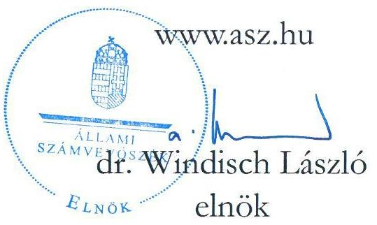

---

# ELLENŐRZÉSI IGAZGATÓSÁG: 

## TELJESÍTMÉNYELLENŐRZÉSI IGAZGATÓSÁG

## ELLENŐRZÉSI IGAZGATÓ:

DR. JAKAB KORNÉL igazgató

## ELLENŐRZÉSVEZETŐ:

HORVÁTH KRISZTIÁN ellenőrzésvezető

Jelentéseink az interneten a www.asz.hu címen olvashatók.

IKTATÓSZÁM: EL-3926-003/2024
TÉMASORSZÁM: 44.
ELLENŐRZÉS-AZONOSÍTÓ SZÁM: V-1048

---

# TARTALOMJEGYZÉK 

AZ ELLENŐRZÉS ALAPADATAI ..... 5
AZ ELLENŐRZÉS HATÓKÖRE ÉS TERÜLETE ..... 7
ÖSSZEFOGLALÁS ..... 9
AZ ELLENŐRZÉS FÓKUSZTERÜLETE ..... 11
MEGÁLLAPÍTÁSOK ..... 12
JAVASLATOK ..... 25
MELLÉKLETEK ..... 27
I. sz. melléklet: Értelmező szótár ..... 27
II. sz. melléklet: Az ellenőrzött szervezetek jegyzéke ..... 29
III. sz. melléklet: Ellenőrzési kritériumok ..... 30
III. sz. melléklet: Az ellenőrzött kerületek által meghatározott Bérleti díjak alakulása az ellenőrzött időszakban ..... 31
FÜGGELÉK: ÉSZREVÉTELEK ..... 32
RÖVIDÍTÉSEK JEGYZÉKE ..... 34

---

.

---

# AZ ELLENŐRZÉS ALAPADATAI 

## AZ ELLENŐRZÉS CÉLJA

Az ellenőrzés célja annak feltárása és bemutatása volt, hogy az ellenőrzött időszakban hogyan változott az önkormányzatok tulajdonában lévő lakásállomány és annak összetétele, valamint, hogy a tervekkel összhangban, az eredményesség és a vagyon megőrzésének elveire figyelemmel történt-e az önkormányzati lakások hasznosítása.

## AZ ELLENŐRZÉS TÍPUSA

Teljesítmény-ellenőrzés

## AZ ELLENŐRZÖTT IDŐSZAK

2018.01.01 - 2023.06.30.

## AZ ELLENŐRZÉS TÁRGYA

Az ellenőrzés tárgyát képezte a kiválasztott önkormányzatok tulajdonában lévő lakásállomány jellemző adatainak, trendjeinek, az önkormányzatok nyilvántartott adatainak összessége, az ingatlangazdálkodási stratégiák, tervek, koncepciók, egyéb célok tervadatai.

Az ellenőrzés kiterjedt minden olyan körülményre és adatra, amely az ÁSZ ${ }^{1}$ jogszabályban meghatározott feladatainak teljesítéséhez, valamint a program végrehajtása folyamán felmerült újabb összefüggések feltárásához szükséges volt.

## AZ ELLENŐRZÉS JOGALAPJA

Az ellenőrzés jogszabályi alapját az Állami Számvevőszékről szóló 2011. évi LXVI. törvény 1. § (3) és 5. § (2)-(3) bekezdései képezték.

## AZ ELLENŐRZÉS MÓDSZERE

Az ellenőrzést a nemzetközi standardokat irányadónak tekintve az ellenőrzési program szempontjai, az ellenőrzött időszakban hatályos jogszabályok, az ellenőrzés szakmai szabályok és módszertanok figyelembevételével végezte az ÁSZ.

Az ellenőrzés lefolytatásához az ellenőrzött, illetve ellenőrzést támogató szervezetek a tanúsítványok kitöltésével, valamint az ÁSZ által kért dokumentumok, adatok, információk megküldésével és az ellenőrzés során szolgáltatott adatokkal járultak hozzá.

---

Az ellenőrzési bizonyítékként felhasznált adatforrások közé tartoztak egyrészt az ellenőrzéshez kért dokumentumok, adatforrások, másrészt adatforrás volt még minden - az ellenőrzés folyamán - feltárt, az ellenőrzés szempontjából információkat tartalmazó dokumentum.

Az ellenőrzés - az ellenőrzésre kiválasztott Budapest Főváros III. Kerület, Óbuda-Békásmegyer Önkormányzat, Budapest Főváros IX. Kerület Ferencváros Önkormányzata és Budapest Főváros XVIII. kerület Pestszentlőrinc-Pestszentimre Önkormányzata lakásállományának főbb adatai alapján és azok tényszerű bemutatásával - az adatok és tendenciák tervekkel való összevetésével történt. Az ellenőrzés keretében felhasználásra kerültek a $\mathrm{KSH}^{2}$ által közzétett, az önkormányzati lakásgazdálkodáshoz kapcsolódó nyilvános adatok.

Az ellenőrzési kérdések megválaszolásához szükséges bizonyítékok megszerzése az ellenőrzött szervezet és az ellenőrzést támogató szervezet által rendelkezésre bocsátott dokumentumokra, adatokra alapozva, kérdésfeltevés (információkérés), valamint elemző eljárás útján történt.

---

# AZ ELLENŐRZÉS HATÓKÖRE ÉS TERÜLETE 

Magyarországon 1990-ben a tanácsrendszer helyébe a helyi önkormányzati rendszer lépett. Az Ötv. ${ }^{3}$ rögzítette, hogy a helyi önkormányzat önként vállalt, illetőleg kötelezően előírt feladat- és hatáskörei a helyi közügyek széles körét fogják át. Az Ötv. indoklása szerint az önkormányzatok működésének egyik meghatározó feltétele, hogy megfelelő vagyonnal rendelkezzenek feladataik ellátásához, így 1990. szeptember 30-án a helyi önkormányzatok tulajdonába kerültek az Ötv. 107. §-ában rögzített tanácsi, illetőleg a tanácsi ingatlankezelő szervek kezelésében levő állami bérlakások.

Az Alaptörvény 32. cikke szerint a helyi önkormányzat - a helyi közügyek intézése körében - többek között gyakorolja az önkormányzati tulajdon tekintetében a tulajdonost megillető jogokat, meghatározza költségvetését, annak alapján önállóan gazdálkodik és az e célra felhasználható vagyonával és bevételeivel kötelező feladatai ellátásának veszélyeztetése nélkül vállalkozási tevékenységet folytathat.

Az Nvtv. ${ }^{4}$ kimondja, hogy a nemzeti vagyongazdálkodás feladata a nemzeti vagyon megőrzése, értékének és állagának védelme, rendeltetésének megfelelő, az állam, az önkormányzat mindenkori teherbíró képességéhez igazodó, elsődlegesen a közfeladatok ellátásához és a mindenkori társadalmi szükségletek kielégítéséhez szükséges, egységes elveken alapuló, átlátható, hatékony és költségtakarékos működtetése, értéknövelő használata, hasznosítása, gyarapítása, továbbá az állam vagy a helyi önkormányzat feladatának ellátása szempontjából feleslegessé váló vagyontárgyak elidegenítése.

A hatályos önkormányzati törvény (Mötv.) ${ }^{5}$ a helyi közügyek között sorolja fel a lakásgazdálkodást.
A Lakástörvény ${ }^{6}$ rendelkezése értelmében az önkormányzati tulajdonú lakásokra az önkormányzat rendeletében meghatározott feltételekkel lehet szerződést kötni.

A rendszerváltáskor a tanácsi bérlakások települési önkormányzatok tulajdonába kerülésével minden ötödik magyarországi lakás önkormányzati tulajdon lett. Az elmúlt 30 évben az önkormányzati tulajdonú lakások száma több mint 600 ezer lakással csökkent, a magyarországi lakásállományhoz viszonyított arányuk 18,7\%-ról 2,5\%-ra zsugorodott.

Az önkormányzati lakásállomány (a továbbiakban lakásállomány) az 1990-es években rendkívül gyorsan (49,4 ezer lakás/év), azóta lassuló ütemben és az ellenőrzött időszakban is fogyott, 2018-2022. között országosan 4,8\%-kal, 5677 lakással csökkent (1. ábra).
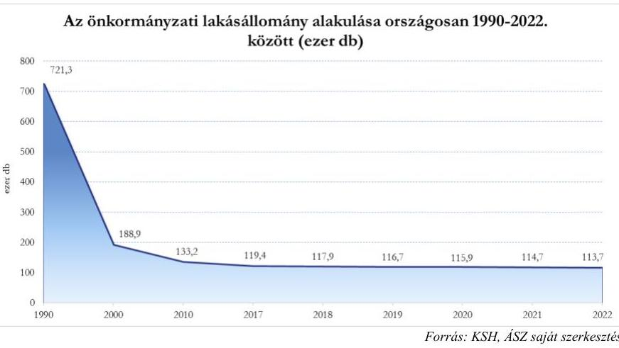

---

A biztonságos, megfizethető, 2.ábra széles rétegek számára elérhető lakhatás elősegítése, a lakhatási szegénység csökkentésének meghatározó eszköze az önkormányzati tulajdonú bérlakásállomány. Ezen célok mellett az önkormányzatok komplex, sokrétű szempontok figyelembevételével és széleskörű önállósággal alakíthatják ki és valósíthatják meg lakáspolitikájukat annak érdekében, hogy a helyi lakosság igényeit és a település fejlődését egyaránt szolgálják (2. ábra).

Országos szinten az
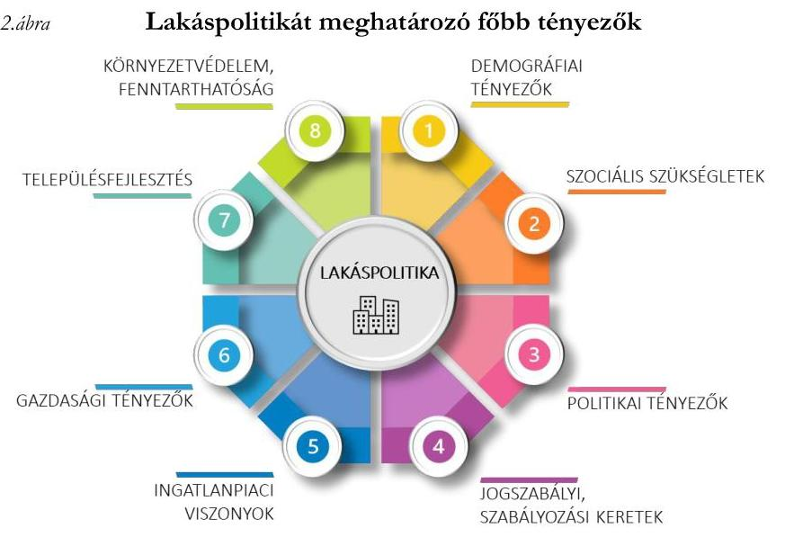

Forrás: ÁSZ saját szerkesztés
önkormányzati lakások hasznosítási módjában 2018-2022. között átrendeződés volt megfigyelhető, a szociális alapon bérbeadott lakások arányának 7,5 százalékpontos csökkenésével közel azonos mértékben emelkedett a magasabb bevétel elérését célzó, piaci alapon hasznosított lakások száma (3. ábra).
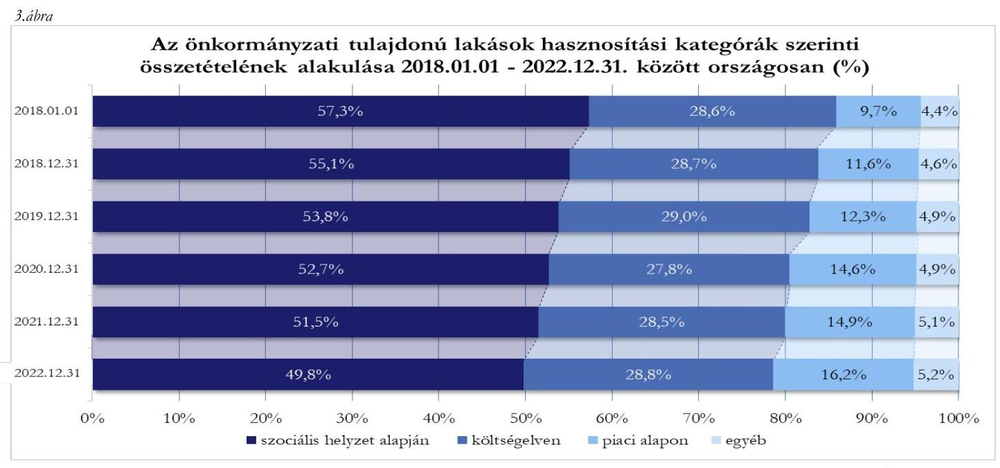

Forrás: KSH, ÁSZ saját szerkesztés
2018-2022. között az önkormányzati tulajdonú lakások átlagos lakbére országosan 24,3\%-kal nőtt, a lakások bérbeadásából származó bérleti díjbevétel - a csökkenő lakásszám és a hasznosítási összetétel változása miatt is - 14,1\%-kal emelkedett.

Célzott ellenőrzés keretében a nemzetközi gyakorlatban alkalmazott módszer alapján az ÁSZ Budapest Főváros III. Kerület, Óbuda-Békásmegyer Önkormányzat, Budapest Főváros IX. Kerület Ferencváros Önkormányzata és Budapest Főváros XVIII. kerület Pestszentlőrinc-Pestszentimre Önkormányzata tulajdonában álló lakásállomány hasznosításának tervszerűségét, a kitűzött célok terv szerinti elérését ellenőrizte. Tervdokumentum vagy konkrét, visszamérhető célok hiányában a tényhelyzet rögzítése, illetve a lakásállomány mennyiségi-minőségi változásának tendenciái kerültek a jelentésben bemutatásra, továbbá a tendenciák alapján beazonosított kockázatok mérséklése érdekében javaslatok kerültek megfogalmazásra.

---

# ÖSSZEFOGLALÁS 

Az Mötv. rendelkezése értelmében a lakásgazdálkodás helyi önkormányzati feladat. A helyi önkormányzatok tulajdona nemzeti vagyon, amelynek alapvető rendeltetése a közfeladat ellátásának biztosítása. A lakásállomány az önkormányzatok jelentős értékű vagyoneleme, értékének védelme nemzeti érdek; hasznosítása egyfelől szociális célokat szolgál, másfelől az önkormányzati bevételeken keresztül hatással van az önkormányzat költségvetésére. Jelen ellenőrzéssel az ÁSZ fel kívánja hívni a figyelmet a lakásállomány tervszerű, célszerű hasznosításának szükségességére.
Az ellenőrzésre kiválasztott kerületek: Budapest Főváros III. Kerület, Óbuda-Békásmegyer Önkormányzat, Budapest Főváros IX. Kerület Ferencváros Önkormányzata és Budapest Főváros XVIII. kerület Pestszentlőrinc-Pestszentimre Önkormányzata.
4.ábra

Az ellenőrzött kerületek lakásállományának jellemző adatai (és azok ellenőrzött időszaki változásai), 2023. I. félév
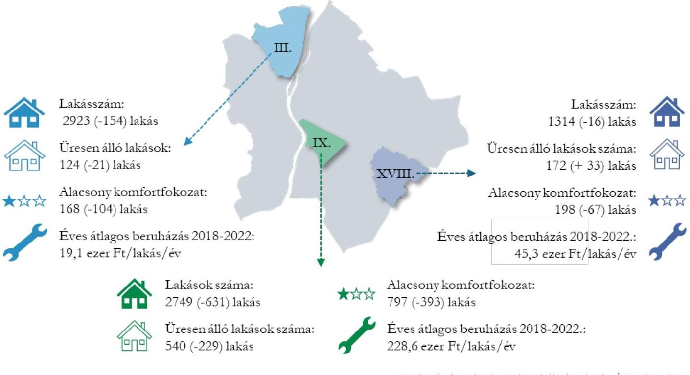

Az ellenőrzés a lakásgazdálkodási döntések előkészítésének megalapozását jelentő pontos, átlátható és aktualizált adatok rendelkezésre állásából indult ki.
A III. ${ }^{7}$ és a IX. ${ }^{8}$ kerület nyilvántartásai nem tértek ki a fejlesztési, felújítási szükségletek alátámasztására, illetve a tervezés megalapozására, a célok visszamérésére alkalmas információkra.
Az ellenőrzött kerületek rendelkeztek tervdokumentumokkal, amelyekben általános érvényű fejlesztési irányokat fogalmaztak meg, azokhoz mérhető célszámokat nem rendeltek. Mindhárom ellenőrzött kerület célként határozta meg a lakásállomány fejlesztését, a lakásállomány hasznosításából származó bevételek növelését, optimalizálását, a III. és XVIII. ${ }^{9}$ kerület ezeken felül a lakásállomány megtartását, bővítését.

---

Az ellenőrzött kerületekben összesen 10,3\%-kal, 801 lakással csökkent a lakásszám, a lakásállomány megtartását, bővítését célként kitűző III. és XVIII. kerületben is 5,0, illetve 1,2\%-kal csökkent az önkormányzati tulajdonú lakások száma.
A lakáshasznosításból származó bevételek növelése, optimalizálása célok a III. és IX. kerületben teljesültek, a XVIII. kerületben - az általuk célként meghatározott - a bevételek és kiadások tartós egyensúlyban tartása célkitűzés a 2021. évtől nem valósult meg. A céloktól való elmaradás okai, illetve a bevételnövelés korlátai közül kiemelendőek az alábbi tényezők:

- a XVIII. kerület kivételével a kerületekben csökkent az üres, nem hasznosított lakások száma és aránya, ennek ellenére 2023.06.30-án a három kerület összlakásszámának 12\%-a, 836 lakás üresen állt, ezek a lakások nemcsak bevételkiesést, de folyamatos fenntartási költséget is jelentettek az önkormányzatok számára,
- a bevételpotenciált jelentő, piaci alapon meghatározott lakbérek nominálisan, illetve a XVIII. kerület kivételével növekedési ütemük tekintetében is jelentősen elmaradtak a tényleges piaci áraktól és azok változásaitól,
- az ellenőrzött kerületek 130-590 millió forint összegű lejárt bérleti díjkövetelést tartottak nyilván 2023. június végén, az elmaradt, nem realizált bevételek forrást vontak el a bérlakások fenntartásától, karbantartásától, felújításától, továbbá azok kezelése adminisztratív terhet és költséget jelentett az önkormányzatok számára.
A III. kerület az ellenőrzött időszakban átlagosan 19,1 ezer forint/lakás/év, a XVIII. kerület 45,3 ezer forint/lakás/év összeget fordított a lakásállomány fejlesztésére, felújítására, mely a lakásállomány elöregedésének kompenzálásához, műszaki állapot fenntartásához, értékmegőrzéshez szükséges visszapótlás mértékétől lényegesen elmaradt. A fejlesztésre, felújításra fordított összegek alacsony mértéke kockázatot jelent az önkormányzati tulajdonú lakásállomány értékének, állagának megőrzésére.
Az ellenőrzött kerületek mindegyikében csökkent az alacsony komfortfokozatú (félkomfortos, komfort nélküli, vagy szükséglakás) lakások száma és aránya, ugyanakkor 2023. I félév végén még mindig 1163 olyan lakás volt (a három kerület együttes lakásállományának 16,6\%-a), ahol hiányzott a vizes helyiség, nem volt melegvíz ellátás, illetve rendkívül kicsi alapterületű szükséglakás besorolású volt.

A fenti megállapítások alapján az ÁSZ indokoltnak tartja tervezést támogató nyilvántartások kialakítását, illetve aktualizálását, a lakásállomány fejlesztésének, az üresen álló lakásállomány hasznosítási lehetőségeinek felmérését és a bérleti díjhátralékállomány csökkentése lehetőségeinek feltérképezését.

---

# AZ ELLENŐRZÉS FÓKUSZTERÜLETE 

1.- Az önkormányzati lakásállomány hasznosításának tervszerűsége, tervek-tendenciák összhangja, figyelemmel az eredményesség és vagyonmegőrzés elveire

---

# MEGÁLLAPÍTÁSOK 

## 1. Az önkormányzati lakásállomány hasznosításának

tervszerűsége, tervek-tendenciák összhangja, figyelemmel az eredményesség és vagyonmegőrzés elveire

## I. TERVSZERŰSÉG, NYILVÁNTARTÁSOK RENDELKEZÉSRE ÁLLÁSA

Az ellenőrzött kerületek ${ }^{10}$ az ellenőrzött időszakban a tulajdonukban lévő lakásokkal való gazdálkodáshoz, hasznosításhoz kapcsolódó általános célokat tervdokumentumokban, közép- vagy hosszú távú stratégiai tervekben meghatározták és a lakásgazdálkodási célok megvalósításának előrehaladását nyomon követték (5. ábra).
5. ábra ${ }^{1}$

Tervdokumentumok rendelkezésre állása

Integrált Településfejlesztési Stratégia
Gazdasági program
Közép- és hosszú távú vagyongazdálkodási terv
Rövid- és középtávú koncepció, terv
Beszámolás/Visszamérés dokumentumai

III. kerület
IX. kerület
XVIII. kerület

Valamennyi ellenőrzött kerület készített Integrált Településfejlesztési Stratégiát és Gazdasági programot. Az Nvtv. 9. § (1) bekezdésben foglaltakkal ellentétben a III. kerület 2020-2022. között, a IX. kerület az ellenőrzött időszakban nem rendelkezett közép- és hosszútávú vagyongazdálkodási tervvel.
A III. kerület és a IX. kerület a stratégiai terveket lakásgazdálkodási koncepcióval is kibővítette.
Általános érvényű fejlesztési irányként, célkitűzésként fogalmazta meg mindhárom ellenőrzött kerület a lakásállomány fejlesztését, a lakásállomány hasznosításából származó bevételek növelését, optimalizálását, a III. és XVIII. kerület ezeken túl a lakásállomány megtartását,
 bővítését, azonban a célkitűzésekhez mérhető célszámokat, mutatókat nem rendeltek.
A meghatározott célok megvalósulását a III. kerület az Óbudai Vagyonkezelő Nonprofit Zrt. által készített működési jelentésekben, éves beszámolókban és üzleti jelentésekben követte nyomon.
A IX. kerület a gazdasági programjának 2023-ban készített, négy évet átfogó időszaki értékelésében tájékoztatást nyújtott a lakásgazdálkodási célok teljesüléséről, ezen túl a Ferencvárosi Polgármesteri Hivatal 2020-2022. évi tevékenységéről szóló beszámolója kitért a Vagyongazdálkodási Iroda lakásgazdálkodási tevékenységére. A XVIII. kerület a lakásgazdálkodási célok megvalósításának előrehaladását 2019-2022. között a Polgármesteri Hivatal tevékenységéről szóló beszámolóiban követte nyomon.

[^0]
[^0]:    *jelmagyarázat: $\times$ : az ellenőrzött időszakban nem rendelkezett az adott dokumentummal
    $\checkmark$ : az ellenőrzött időszakban rendelkezett az adott dokumentummal
    1 : az ellenőrzött időszakban részben rendelkezett az adott dokumentummal

---

Az önkormányzati vagyon pontos és átlátható nyilvántartása a lakásgazdálkodás és -hasznosítás tervszerűségéhez szükséges.
6.ábra ${ }^{t}$

| Nyilvántartások rendelkezésre állása | III. kerület | IX. kerület | XVIII. kerület |
| :--: | :--: | :--: | :--: |
| lakások értékének elkülönített nyilvántartása | I | X | $\checkmark$ |
| lakások elkülönített ÉCS nyilvántartása | I | X | $\checkmark$ |
| állagmutató nyilvántartása | I | I | $\checkmark$ |
| lakásigénylők nyilvántartása | I | $\checkmark$ | X |
| kiutalási/jogcím adatok rendelkezésre állása |  | $\checkmark$ | $\checkmark$ |

A III. kerület lakásállományának értékét az ingatlanvagyon értékén belül 2019. évtől tartotta elkülönítetten nyilván könyvviteli nyilvántartásában. A kerület a lakásgazdálkodás tervezését megalapozó állagfelméréseket nem frissítette, „hasznavehetetlen", 0% állagmutatón tartotta nyilván lakásainak mintegy 20%-át annak ellenére, hogy azok több, mint 90%-át hasznosította. A lakáspályázatot benyújtókat, mint lakásigénylőket nem, a szociális alapon hasznosított lakásokra jelentkezőket 2021-től tartotta nyilván. A kerület a kiutalási jogcímek részletező nyilvántartásának frissítését hasznosított lakásállományának több mint 10%-ára, közel 300 lakásra nem hajtotta végre, ezeket az egyéb jogcímen belül „ismeretlen" kategóriába sorolta be, azok hasznosítási módjáról naprakész információval nem rendelkezett.
A IX. kerület lakásállománya értékét könyvviteli nyilvántartásában az Ingatlanok és a kapcsolódó vagyoni értékű jogok értékén belül nem különítette el, a kerület nyilvántartotta a lakásigénylőket és rendelkezett a lakáskiutalások részletező nyilvántartásával jogcímenként éves bontásban.
A XVIII. kerület a lakásállományát az ingatlancsoporton belül elkülönítetten tartotta nyilván és felülvizsgált adatokkal rendelkezett a lakások állagáról. A kerületben a lakásigénylőket nem tartották nyilván, a kerület a kiutalások nyilvántartását vezette.

# II. TERVEK-TENDENCIÁK ÖSSZHANGJA 

## 1. A LAKÁSÁLLOMÁNY MEGTARTÁSA, BŐVÍTÉSE

A III. és XVIII. kerület célként tűzte ki a lakásállomány megtartását, bővítését; ennek ellenére lakásgazdálkodási döntések következtében - az országos és a budapesti adatokhoz hasonlóan - csökkent az önkormányzati tulajdonú lakások száma.
A legnagyobb, közel 20%-os lakásszámcsökkenés az átfogó városrészrehabilitációt megvalósító és ennek érdekében lakásokat is megszüntető IX. kerületben történt, ennek ellenére az ellenőrzött kerületek között továbbra is itt a legkedvezőbb az ezer lakosra jutó önkormányzati tulajdonú lakások száma (2023. júniusában 51,5 lakás). Az abszolút mértékben és lakosságszám arányosan is legkisebb lakásállománnyal rendelkező XVIII. kerületben a lakásszám az ellenőrzött időszakban kis mértékben csökkent (7. ábra).

[^0]
[^0]:    ${ }^{\dagger}$ jelmagyarázat: $\times$ : az ellenőrzött időszakban nem rendelkezett az adott dokumentummal
    $\checkmark$ : az ellenőrzött időszakban rendelkezett az adott dokumentummal
    I : az ellenőrzött időszakban részben rendelkezett az adott dokumentummal

---

7.ábra

Az önkormányzati lakásállomány alakulása 2018.01.01-2022.12.31, illetve 2023. I. félév
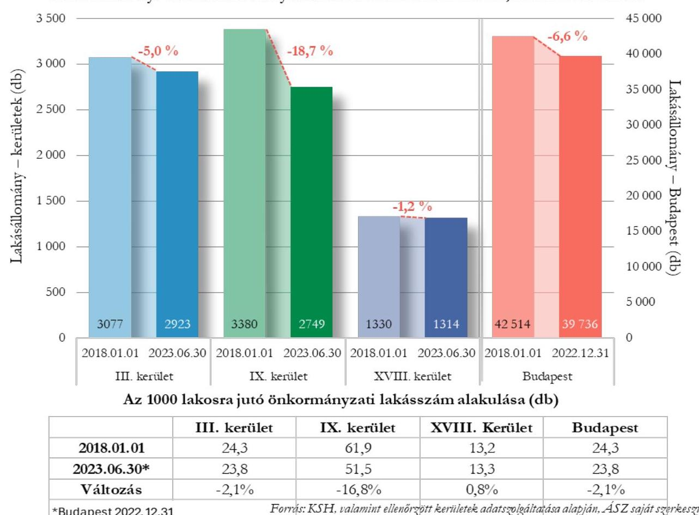

Az ellenőrzött kerületek lakásállományának csökkenése hátterében az alábbi gazdasági események álltak:

- a III. kerület 160 db lakást értékesített és 6 db egyéb jogcímen történő növekedés valósult meg.
- A IX. kerület összesen 83 db lakást értékesített és 548 db lakás szűnt meg.
- A XVIII. kerület 36 db lakást értékesített és 41 db lakás szűnt meg, emellett 3 db lakást vásárolt és 2018-ban 58 db lakást vontak be a bérlakásprogramba.
A lakásállomány növelése érdekében végrehajtott ingatlantranzakció a IX. kerületben nem, a III. kerületben kis számban történt.
Az ellenőrzött időszakban Budapesten 2778, az ellenőrzött kerületekben összesen 801 lakással csökkent a lakásállomány, amely a jövőre nézve szűkíti a kerületek mozgásterét lakáspolitikai céljaik elérésében.

# 2. AZ ÖNKORMÁNYZATI LAKÁSHASZNOSÍTÁSBÓL SZÁRMAZÓ BEVÉTELEK NÖVELÉSE, OPTIMALIZÁLÁSA 

A lakáshasznosításból származó bevételekre, azok változására hatással volt az önkormányzatok által saját hatáskörben meghatározott lakbérmérték, azok időbeni megfizetése, a különböző hasznosítási kategóriák alkalmazása, az üresen álló lakásokkal való gazdálkodás.

---

A III. és IX. kerületben a bérleti és használati díjbevétel annak ellenére nőtt (9,4 és 13,2%-kal), hogy a lakásállomány csökkent (4,6 és 12,7%-kal). Ez elsősorban a díjtételek emelésének valamint a lakásállomány magasabb fajlagos díjtételű lakások felé történő átrendeződésének volt köszönhető. A XVIII. kerületben a lakások hasznosításából származó bevételek nem növekedtek annak ellenére, hogy vagyongazdálkodási tervében célként határozta meg a lakásokra fordított kiadások bevétellel történő nagyobb arányú fedezettségének elérését (8. ábra).
A lakáshasznosításból származó bevételek növelésére kitűzött célok megvalósulását a III. és IX. kerület adatai alátámasztják. A XVIII. kerületben - a kitűzött céltól eltérően - a bevételek és kiadások tartós egyensúlyban tartása a 2021. évtől nem valósult meg ${ }^{\ddagger}$.
8.ábra

Az ellenőrzött kerületek lakáshasznosításból származó bevételeinek és lakásállományának alakulása a 2018. és 2022. évek összevetésében
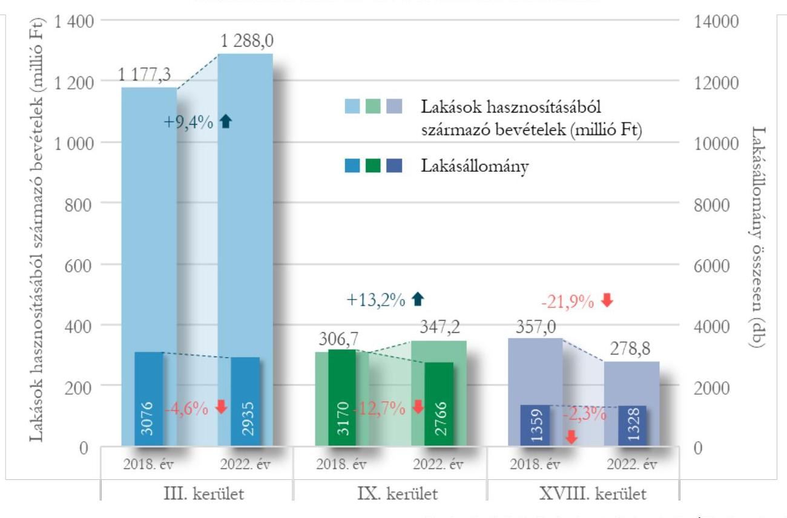

A III. és a IX. kerület a díjhátralék összegét csökkenteni tudta, de kerületenként még mindig jelentős, 130-270 millió forint lejárt követelést tartottak nyilván. A XVIII. kerületnél ${ }^{1}$ a hátralékok lakásonkénti összege meghaladta a 450 ezer forintot 2023. június végén (1. táblázat).

[^0]
[^0]:    ${ }^{\ddagger}$ A XVIII. kerület nyilatkozata alapján a bevételek és kiadások tartós egyensúlyban tartása érdekében intézkedett, 2020. novemberben lakbéremelésre vonatkozó rendeletet készített, azonban az a veszélyhelyzeti intézkedések miatt nem lépett hatályba.
    § A XVIII. kerületnél a 2018-2020. évektől eltérően, 2021. évtől a hátralék összege a bérlakásokkal kapcsolatban fennálló teljes hátralékot tartalmazza (a bérleti díj és használati díj hátralékot, az Önkormányzat mögöttes felelőssége által a hátralékos bérlők után megfizetett távhődíj hátralékot, annak behajtásával kapcsolatos valamennyi egyéb díjat, pl. fizetési meghagyásos eljárás és végrehajtás díja, valamint a végrehajtási költségek is).

---

1. táblázat

LAKÁSBÉRLŐK BÉRLETI DÍJ HÁTRALÉKA (EZER FT)

| MEGNEVEZÉS | HÁTRALÉK ÖSSZEGE |  | VÁLTOZÁS \% | EGY LAKÁSRAJUTO HÁTRALEK |  | VÁLTOZÁS \% |
| :--: | :--: | :--: | :--: | :--: | :--: | :--: |
|  | 2018.01.01 | 2023.06.30 |  | 2018.01.01 | 2023.06.30 |  |
| III. kerület | 437728 | 272493 | $-37,7 \%$ | 142,3 | 93,2 | $-34,5 \%$ |
| IX. kerület | 196971 | 128217 | $-34,9 \%$ | 58,3 | 46,6 | $-20,1 \%$ |
| XVIII. kerület | 353265 | 591983 | $67,6 \%$ | 265,6 | 450,5 | $69,6 \%$ |

# BÉRLETI DÍJ MEGHATÁROZÁSA 

Az önkormányzati tulajdonú lakásállomány bérleti díját alapvetően meghatározza az adott kerület szociálpolitikai célrendszere, illetve a bérlakásállomány szociálpolitikai eszköztáron belül elfoglalt helye, azonban ellenőrzésünk ezen területek vizsgálatára nem terjedt ki.
Az ellenőrzött kerületek Rendeleteikben eltérő módszert alkalmazva (felépítésben, részletezettségben, kalkulációs módszerében), egymással össze nem hasonlítható módon határozták meg a bérleti és hasznosítási díjakat.
A III. kerület a 2018 évben végrehajtott díjemelést követően 2020 áprilisában bevezette a piaci II. bérleti díj kategóriát, ezzel a piaci I. kategóriánál magasabb piaci bérleti díjmértéket emelt a Rendeletbe és a komfortfokozaton túl tovább differenciálta a piaci alapon hasznosított lakások bérleti díját. Az átlagos havi lakbér mértéke valamennyi kategóriában - a szociális, költségelvű és piaci alapú bérbeadásnál is - az önkormányzati lakások országos átlagos lakbére felett volt.
A IX. kerületben a bérleti díj meghatározásánál a lakás komfortfokozatán túl figyelembe vették annak állagát, állapotát. Nem egységes, négyzetméterre vetített díjat határoztak meg, hanem lakásonként a négyzetméter alapú bérleti érték és különböző differenciáló szorzók szerint számolta ki az önkormányzat a bérleti díj mértékét. A költségelven és a piaci alapon bérbeadott önkormányzati lakások lakbére a IX. kerületben meghaladta az önkormányzati lakások országos átlagát mind összegben, mind az emelkedés ütemében, szociális alapú bérbeadásnál a bérleti díjat az önkormányzati lakások országos átlagos lakbére alatt tartották. Az ellenőrzött időszakban a Rendelet módosításakor figyelembe vették a gazdasági környezet változásait, a szociális alapú bérbeadás kivételével minden bérbeadási kategórián belül emelkedett a bérbeadott lakások lakbére.
A XVIII. kerület Rendeleteiben komfortfokozatonként és hasznosítási kategóriánként összegszerűen határozta meg a lakbérek négyzetméterárát. Az alap a költségelven bérbeadott lakások lakbére volt, a szociális és piaci alapon bérbeadott lakások lakbérét ennek százalékában határozták meg. Az Önkormányzatnál a költségelven és szociális alapon bérbeadott lakások esetében a lakbérek mértéke az ellenőrzött időszakban nem emelkedett, a piaci alapon bérbeadott összkomfortos és komfortos lakások lakbére 2020-ban emelkedett. A szociális és költségelvű kategóriákban a teljes ellenőrzött időszakban, a piaci alapú bérbeadásnál 2020-tól az átlagos havi lakbér mértéke az önkormányzati lakások országos átlagos lakbére felett volt.
Mindhárom ellenőrzött kerületben a bevételpotenciált jelentő, piaci alapon hasznosított lakásállomány esetében meghatározott - a piaci alapon hasznosított önkormányzati lakások országos átlagos lakbérét meghaladó - lakbérek nominálisan, a III. és IX. kerületek esetében növekedési ütemük tekintetében is elmaradtak a tényleges piaci áraktól és azok változásaitól.

---

2022. év végén a kerületek piaci bérbeadás esetén alkalmazott lakbére a budapesti lakáspiacon elérhető átlagos piaci lakbér 28-46%-a volt, a budapesti lakáspiaci árak növekedési ütemét csak a nominálisan legalacsonyabb piaci alapú lakbéreket meghatározó XVIII. kerület haladta meg (9. ábra).
9.ábra

A budapesti átlagos lakáspiaci lakbér és az ellenőrzött kerületek átlagos piaci alapú lakbéreinek alakulása (forint $/ \mathrm{m}^{2}, \%)$
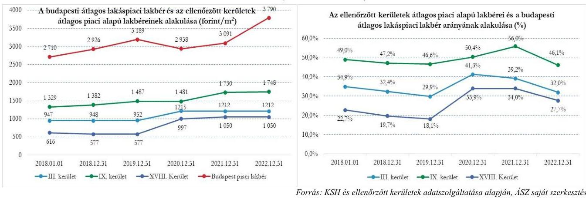

# A HASZNOSÍTÁSI KATEGÓRIÁK 

Az ellenőrzött kerületek más-más hasznosítási koncepciót követtek, ugyanakkor kerületenként eltérő mértékben, de megfigyelhető a piaci alapú - bevételek növelését célzó - hasznosítás térnyerése.
Országos szinten csökkenő tendenciát mutatott a szociális alapon bérbeadott lakások száma és aránya, szemben a piaci alapon történő bérbeadások számával és arányával. Ezzel együtt a szociális alapon történő bérbeadás az ellenőrzött időszak végén is hazánk teljes önkormányzati bérlakás állományának közel 50%-át tette ki. A költségelven történő bérbeadás országos átlaga az ellenőrzött időszakban szignifikánsan nem változott, mintegy 29% volt (10. ábra).

---

10.ábra

Az ellenőrzött kerületek és az országos lakásállomány megoszlása hasznosítási kategóriák szerint 2018.01.01-2022.12.31, illetve 2023. I. félév
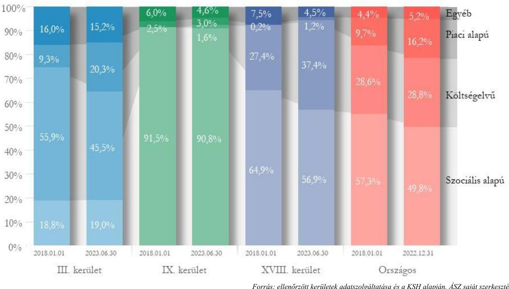

Forrás: ellenőrzött kerületek adatszolgáltatása és a KSH alapján, ÁSZ saját szerkesztés

Az országos hasznosítási arányokkal összevetve kiemelkedően magas volt a IX. kerületben a szociális alapon hasznosított lakások aránya és ennek csökkenése is az országos trend alatt maradt. A III. kerületben a szociális alapon bérbeadott lakások aránya minimálisan növekedett, de az országos átlagnál lényegesen alacsonyabb.
 volt az ellenőrzött időszak egészében. 2018-ban a XVIII. kerületben a szociális alapon történő bérbeadás az országos átlagot 7,6 százalékponttal meghaladta, az ellenőrzött időszak végén a hasznosítás arányai változásának eredményeképpen az országos arányt közelítette.
A piaci alapon hasznosított lakások száma a XVIII. kerületben hétszeresére, 1,2%-ra nőtt, de részarányuk az ellenőrzött időszakban ezzel együtt is mélyen az országos átlag alatt maradt. A IX. kerületben ugyanezen kategóriában hasznosított lakások darabszáma és aránya közel változatlan maradt (2,5%-3%). A III. kerületben piaci alapon hasznosított lakások száma megkétszereződött, aránya 9,3%-ról 20,3%-ra nőtt.
A III. kerületre jellemző volt, hogy a költségelven történő hasznosítás aránya az országos átlag felett volt, noha annak száma és aránya is csökkent a piaci alapon hasznosított lakások darabszámának és arányának változásával összefüggésben. A IX. kerületben alacsony volt a költségelven hasznosított lakások száma és aránya, 2018. elején mindössze 1 db, mely 34 db lakóingatlannal bővült az ellenőrzött időszakban. A XVIII. kerületben az ellenőrzött időszak kezdetén a költségelven hasznosított lakások aránya az országos aránnyal lényegében azonos volt, a 2023. I. félévig a költségelvű hasznosításba vont 101 db lakással az országos átlagot közel 9 százalékponttal meghaladta. A költségelvű hasznosítás arányának növekedése a szociális alapon történő hasznosítás terhére valósult meg.

---

# AZ ÜRESEN ÁLLÓ LAKÁSOKKAL VALÓ GAZDÁLKODÁS 

Az üresen álló önkormányzati lakások azon túl, hogy nem töltik be szerepüket és nem szolgálják az önkormányzat feladatellátását, többletköltséget jelentenek, ezért is fontos, hogy az önkormányzatok az üresen álló lakások számát lehetőség szerint csökkentsék.
Az ellenőrzött időszakban a nem hasznosított, üresen álló lakások aránya az egyes budapesti kerületekben jelentős különbséget mutatott, a III. kerületben volt a legalacsonyabb (4,2-6,5%), a IX. kerületben volt a legmagasabb (17,5-22,8%) az üres lakások részaránya.
A III. és a XVIII. kerület célként tűzte ki a megüresedő lakások mihamarabbi hasznosítását (pl.: kiutalható üres lakás bérbeadása; üresen álló, gazdaságosan nem felújitható, rossz műszaki állapotú lakás értékesítésre történő előkészítése; megüresedő bérlakás felújítása). Az üresen álló lakások év végi állomány darabszámának változása alapján nem minden évben csökkent a megüresedett lakóingatlanok száma a két kerületben, a XVIII. kerületben 2018. és 2023. I. féléve között növekedett az üresen álló lakások részaránya.

Az ellenőrzött kerületek együttes lakásállományán belül 1,5 százalékponttal 12,0%-ra csökkent az üres, nem hasznosított lakások aránya, ami 2023.06.30-án a három kerület esetében összesen 836 üresen álló lakást jelentett. (11. ábra)
11.ábra

Az ellenőrzött kerületek üresen álló, nem hasznosított lakásállományának alakulása, 2018-2023. I. félév (db / %)
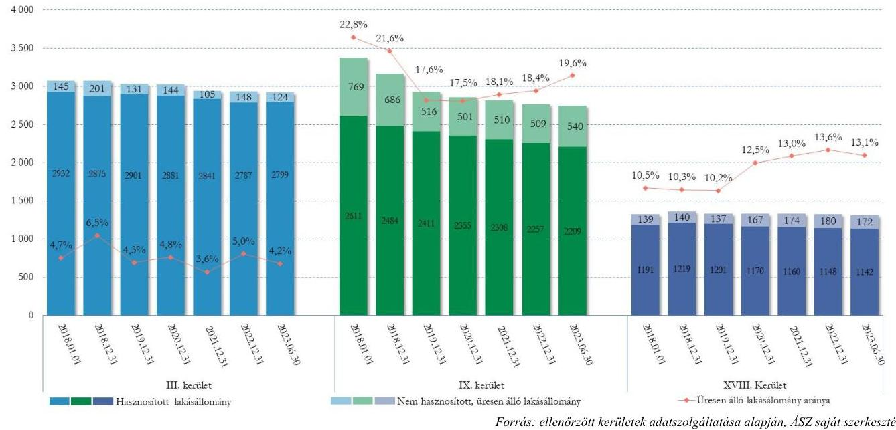

## 3. BÉRLAKÁSÁLLOMÁNY FEJLESZTÉSE

A lakásállomány értékének megőrzése, fejlesztése célok teljesülése a lakásállomány ingatlanpiaci értékének változása mellett a megvalósított beruházások és felújítások volumenének, végső soron a lakásállomány minőséget jellemző állagmutató és komfortkategória szerinti összetételének változásán keresztül mérhető, értékelhető.
A lakásállomány értékének változásán keresztül - a lakásállomány ingatlanpiaci értéken történő nyilvántartása hiányában - egyik ellenőrzött kerület esetében sem volt nyomonkövethető a vagyon megőrzése, fejlesztése. A IX. kerületben vonatkozó adat nem állt rendelkezésre, a III. és XVIII. kerület lakásállománya nem ingatlanpiaci értéken, az átlagos budapesti lakásár 0,7-3,6%-án volt nyilvántartva (2. táblázat).

---

# 2. táblázat 

EGY ÖNKORMÁNYZATI LAKÁS ÁTLAGOS KÖNYV SZERINTI ÉRTÉKE ÉS AZ ÁTLAGOS PIACI ÁRAK ALAKULÁSA BUDAPESTEN (EZER FT)

| MEGNEVEZÉS | 2018. Év | 2019. Év | 2020. Év | 2021. Év | 2022. Év | VALTOZÁS   2018-2022.   (%) |
| :-- | :--: | :--: | :--: | :--: | :--: | :--: |
| III. kerület | n.a. | 1305 | 1218 | 1386 | 1482 | 13,6% |
| IX. kerület | n.a. | n.a. | n.a. | n.a. | n.a. | n.a. |
| XVIII. kerület | 289,3 | 297,3 | 296,3 | 304,4 | 329,0 | 13,7% |
| Budapest átlagos piaci ár** | 29500 | 36100 | 36200 | 40400 | 48800 | 65,4% |

## BERUHÁZÁSOK, FELÚJÍTÁSOK FAJLAGOS VOLUMENE ÉS BEVÉTELEKHEZ VISZONYÍTOTT ARÁNYA

A III. kerület a 2018-2022. években a lakásgazdálkodásból származó bevételeinek 3,2%-át költötte a lakásállomány fejlesztésére, felújítására, a legalacsonyabb összeget, lakásonként 7,7 e Ft-ot 2019. évben, a legmagasabbat, lakásonként 47,6 e Ft-ot 2022. évben, a lakásállományra fordított kiadások 8,1 milliárd forinttal maradtak el a lakásgazdálkodásból származó bevételektől.
Az átfogó városrészrehabilitációt megvalósító IX. kerületben a lakásgazdálkodásból származó bevételeket 6,3 milliárd forinttal haladták meg a lakásállományra fordított kiadások. Az önkormányzat egy lakásra vetítve a legmagasabb összeget, 369,7 ezer Ft-ot 2020. évben, a legalacsonyabb összeget, 81,6 ezer Ft-ot 2021. évben fordította a lakásállomány felújítására.

A XVIII. kerület a 2018-2022. években a lakásgazdálkodásból származó bevételeinek 15,6%-át költötte a lakásállomány fejlesztésére, felújítására, a legalacsonyabb összeget, lakásonként 10,3 e Ft-ot 2019. évben, a legmagasabbat, lakásonként 108,3 e Ft-ot 2022. évben. A lakásállományra fordított kiadások és a lakásgazdálkodásból származó bevételek az 5 évben megközelítőleg megegyeztek (3. táblázat).
A lakásállomány fejlesztésére, felújítására fordított összegek alacsony mértéke, különösen a III. kerület esetében kockázatot jelent az önkormányzati tulajdonú lakásállomány értékének, állagának megőrzésére.
1. táblázat

A LAKÁSÁLLOMÁNYON REALIZÁLT ÖSSZES BEVÉTEL ÉS A FELÚJÍTÁS, PÓTLÓLAGOS BERUHÁZÁS ÉRTÉKÉNEK VISZONYA KERÜLETENKÉNT

|  | 2018. | 2019. | 2020. | 2021. | 2022. | Összesen |
| :--: | :--: | :--: | :--: | :--: | :--: | :--: |
|  | III. kerület |  |  |  |  |  |
| Bevétel (ezer Ft) | 1379565 | 2054064 | 1505028 | 2259865 | 1719326 | 8917848 |
| Kiadás (ezer Ft) | 101870 | 151450 | 111531 | 169778 | 268964 | 803593 |
| Bevétel - kiadás (ezer Ft) | 1277695 | 1902614 | 1393497 | 2090087 | 1450362 | 8114255 |
| Felújítás, pótlólagos beruházás (ezer Ft) | 41477 | 23221 | 32955 | 44230 | 139612 | 281495 |
| Felújítás, pótlólagos beruházás / Bevétel | 3,0% | 1,1% | 2,2% | 2,0% | 8,1% | 3,2% |
| Egy lakásra jutó felújítás, pótlólagos beruházás (ezer Ft/lakás) | 13,5 | 7,7 | 10,9 | 15,0 | 47,6 | 94,6 |

[^0]
[^0]:    ** https://www.ksh.hu/stadat_files/lak/hu/lak0024.html

---

| IX. kerület |  |  |  |  |  |  |
| :--: | :--: | :--: | :--: | :--: | :--: | :--: |
| Bevétel (ezer Ft) | 851122 | 803846 | 709378 | 779173 | 772228 | 3915747 |
| Kiadás (értékcsökkenés nélkül, ezer Ft) | 2075973 | 1932069 | 2201339 | 1981885 | 1994344 | 10185610 |
| Bevétel - kiadás (ezer Ft) | -1224851 | -1128223 | -1491961 | -1202712 | -1222116 | -6269863 |
| Felújítás, pótlólagos beruházás (ezer Ft) | 601270 | 1081713 | 1055839 | 229893 | 367590 | 3336305 |
| Felújítás, pótlólagos beruházás / Bevétel | 70,6% | 134,6% | 148,8% | 29,5% | 47,6% | 85,2% |
| Egy lakásra jutó felújítás, pótlólagos beruházás (ezer Ft/lakás) | 189,7 | 369,6 | 369,7 | 81,6 | 132,9 | 1143,5 |
| XVIII. kerület |  |  |  |  |  |  |
| Bevétel (ezer Ft) | 476594 | 471495 | 401378 | 308107 | 282846 | 1940420 |
| Kiadás (ezer Ft) | 320937 | 335854 | 351189 | 455678 | 559072 | 2022730 |
| Bevétel - kiadás (ezer Ft) | 155657 | 135641 | 50189 | -147571 | -276226 | -82310 |
| Felújítás, pótlólagos beruházás (ezer Ft) | 25321 | 13768 | 19129 | 99683 | 143840 | 301741 |
| Felújítás, pótlólagos beruházás / Bevétel | 5,3% | 2,9% | 4,8% | 32,4% | 50,9% | 15,6% |
| Egy lakásra jutó felújítás, pótlólagos beruházás (ezer Ft/lakás) | 18,6 | 10,3 | 14,3 | 74,7 | 108,3 | 226,2 |

LAKÁSÁLLOMÁNY MINŐSÉGÉNEK VÁLTOZÁSA
Ellenőrzésünkben minőséget jellemző mutatóként kezeltük a lakások állapotát leíró állagmutatókat és komfortfokozat szerinti besorolásokat.
A III. kerületben az önkormányzati lakások állagmutató szerinti nyilvántartása az ellenőrzött időszakban nem mutatott valós képet, 0%-os állagmutató értékkel tartottak nyilván olyan lakásokat, melyek között - nyilatkozatuk szerint - voltak olyanok, amelyek tényleges természetbeni állapota meghaladta a 0%-os értéket.
5%-kal csökkenő teljes lakásszám mellett a magasabb komfortfokozatú (összkomfortos, komfortos) lakások részaránya, a 2018. év végi adatokhoz viszonyítva 3,1 százalékponttal - a lakásállomány csökkenésétől elmaradó mértékben - nőtt. Az üresen álló lakásállomány komfortszintje szintén javult (a magasabb komfortkategóriák összesen 8,8 százalékponttal), azonban az így is érdemben elmaradt a teljes lakásállományétól (12. ábra).

---

12.ábra

A III. kerületi önkormányzati tulajdonú lakások komfortkategória szerinti összetételének alakulása 2018-2023. I. félév (%)
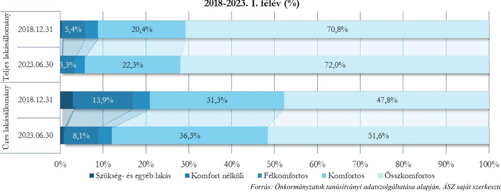

A IX. kerület az üres lakásokat a beköltözhető lakások, felújítható lakások, újrabasznosításra alkalmatlan, műszaki állapot szempontjából felülvizsgálandó lakások, míg a hasznosított lakásokat a beköltözhető és a felújítható kategóriában tartotta nyilván. A lakásállomány minősége - a 18,7%-os lakásszám csökkenéstől elmaradó mértékű - javulást mutatott az állagmutatók és komfortkategóriák változása alapján. A beköltözhető lakások aránya 8,5 százalékponttal emelkedett a felújítandó lakások száma 9,9 százalékpontos csökkenése mellett. Az összkomfortos lakások aránya 6,7 százalékponttal növekedett az alacsonyabb komfortkategóriák terhére. Az üresen álló lakásállomány átlagos komfortszintje elmaradt a teljes lakásállományétól, az újrabasznosításra alkalmatlan, műszaki állapot szempontjából felülvizsgálandó lakások és felújítandó lakások részaránya 2023. júniusban meghaladta a 90%-ot (13. és 14. ábra).
13.ábra

A IX. kerületi önkormányzati tulajdonú lakások állagmutató szerinti összetételének alakulása 2018-2023. I. félév (%)
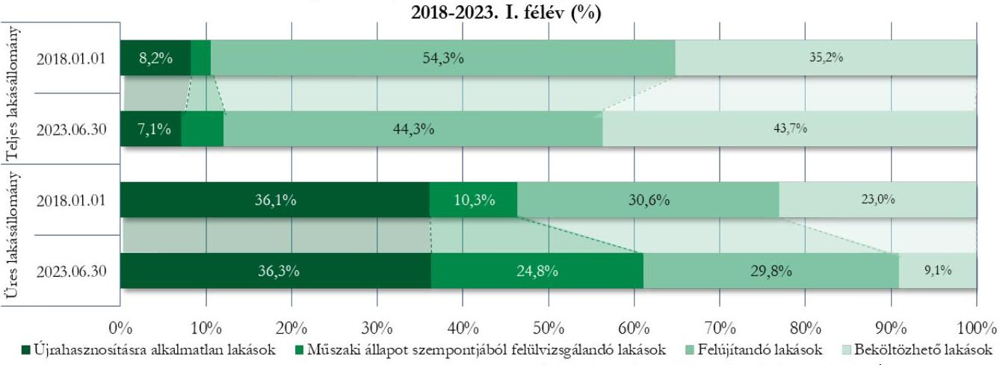

---

14.ábra

A IX. kerületi önkormányzati tulajdonú lakások komfortkategória szerinti összetételének alakulása
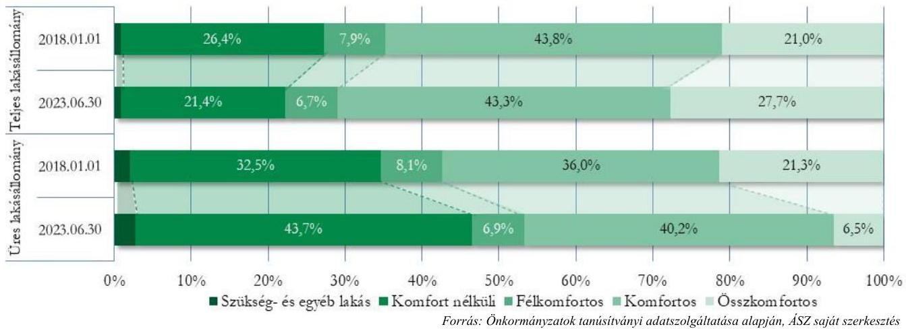

A XVIII. kerület lakásállomány minősége a lakásszám 1,2%-os csökkenését meghaladó mértékű javulást mutat az állagmutatók és komfortkategóriák pozitív irányú átrendeződése alapján, az üresen álló lakásállomány átlagos komfortszintje és állagmutatói ezen kerület esetében is érdemben elmaradtak a teljes lakásállományétól (15. és 16. ábra).
15.ábra

A XVIII. kerületi önkormányzati tulajdonú lakások állagmutató szerinti összetételének alakulása 2018-2023. I. félév (%)
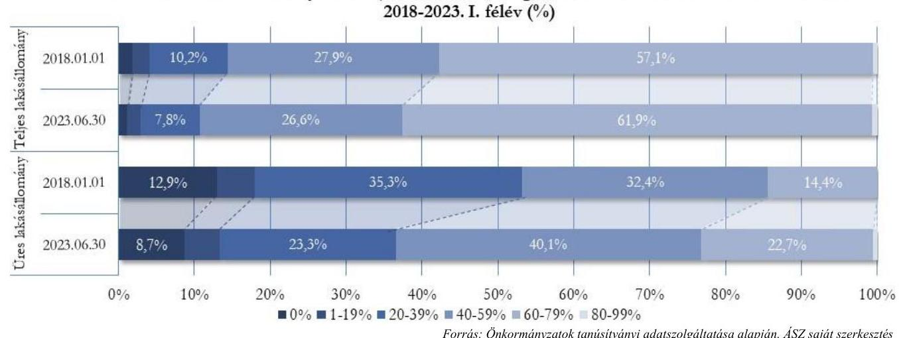

---

16.ábra

A XVIII. kerületi önkormányzati tulajdonú lakások komfortkategória szerinti összetételének alakulása 2018-2023. I. félév (%)
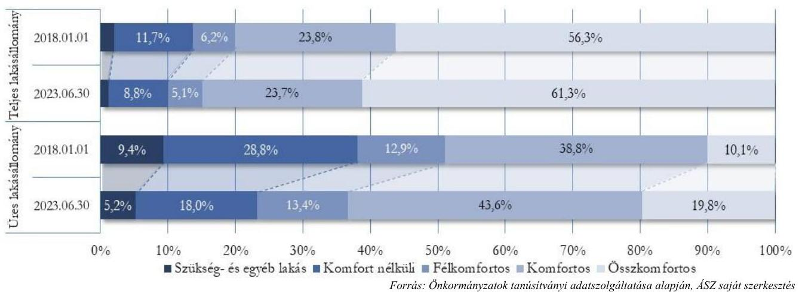

A III. és IX. kerületben a lakásszám csökkenése nagyobb mértékű volt, mint a megmaradt lakásállomány minőségi mutatóinak javulása, a XVIII. kerületben a lakásszám csökkenését meghaladó mértékű pozitív irányú átrendeződés figyelhető meg a minőséget jellemző mutatók alakulásában.
Bár mindhárom kerületben csökkent az alacsony komfortfokozatú lakások száma és aránya, ugyanakkor az ellenőrzött kerületekben 2023. I. félév végén még mindig 1163 olyan lakás volt (a teljes lakásállomány 16,6%-a), ahol hiányzott a vizes helyiség, nem volt melegvíz ellátás, illetve besorolása szükséglakás volt, így annak - definíciója szerint - rendkívül kicsi volt az alapterülete.
Mindhárom kerületben

 az üres lakások teljes lakásállománytól érdemben elmaradó állag- és komfortszintje a felújítás, fejlesztés fokozott igényét jelezte és az újrahasznosíthatóság kockázatára mutatott rá.

---

# JAVASLATOK 

Az ÁSZ tv. 33. § (1) bekezdésében foglaltak értelmében az ellenőrzött szervezet vezetője köteles a jelentésben foglalt megállapításokhoz kapcsolódó intézkedési tervet összeállítani és azt a jelentés kézhezvételétől számított 30 napon belül az ÁSZ részére megküldeni. Amennyiben az ellenőrzött szervezet vezetője nem küldi meg határidőben az intézkedési tervet, vagy továbbra sem elfogadható intézkedési tervet küld, az Állami Számvevőszék elnöke az ÁSZ tv. 33. § (3) bekezdése a) és b) pontjaiban foglaltakat érvényesítheti.

## BUDAPEST FŐVÁROS III. KERÜLET, ÓBUDA-BÉKÁSMEGYER ÖNKORMÁNYZAT POLGÁRMESTERE RÉSZÉRE

1. Kezdeményezzen intézkedéseket a lakások állagmutatóinak, valamint a kiutalási jogcímek részletező nyilvántartásának aktualizálása érdekében.
2. Kezdeményezze az önkormányzati lakásállomány, kiemelten a teljes lakásállománytól érdemben elmaradó állag-, illetve komfortszintű lakások fejlesztési lehetőségeinek felmérését a lakásállomány értékének megőrzése, védelme érdekében, valamint e felmérés eredményeinek a lakásgazdálkodás célrendszerébe történő lehetőség szerinti beépítését.
3. Kezdeményezzen intézkedéseket az üresen álló lakásállomány hasznosítási lehetőségeinek felmérése, az üresen álló lakásállomány lehetőség szerinti hasznosítása érdekében.
4. Kezdeményezze aktualizált nyilvántartási adatokra támaszkodó, a kerület szociális viszonyait is szem előtt tartó, visszamérhető, lakásgazdálkodásra, illetve lakáshasznosításra vonatkozó célrendszer kialakítását, továbbá annak rendszeres nyomon követését, értékelését a Bkr. ${ }^{12}$ 5. § (1) bekezdése szerinti módszertani útmutatóban foglaltakra figyelemmel.

## BUDAPEST FŐVÁROS IX. KERÜLET FERENCVÁROS ÖNKORMÁNYZATA POLGÁRMESTERE RÉSZÉRE

1. Kezdeményezze az Ingatlanok és a kapcsolódó vagyoni értékű jogok értékén belül a lakásállomány értékének elkülönített könyvviteli nyilvántartásának biztosítását.
2. Kezdeményezze az önkormányzati lakásállomány, kiemelten a teljes lakásállománytól érdemben elmaradó állag-, illetve komfortszintű lakások fejlesztési lehetőségeinek felmérését a lakásállomány értékének megőrzése, védelme érdekében, valamint e felmérés eredményeinek a lakásgazdálkodás célrendszerébe történő lehetőség szerinti beépítését.

---

3. Kezdeményezzen intézkedéseket az üresen álló lakásállomány hasznosítási lehetőségeinek felmérése, az üresen álló lakásállomány lehetőség szerinti hasznosítása érdekében.
4. Kezdeményezze aktualizált nyilvántartási adatokra támaszkodó, a kerület szociális viszonyait is szem előtt tartó, visszamérhető, lakásgazdálkodásra, illetve lakáshasznosításra vonatkozó célrendszer kialakítását, továbbá annak rendszeres nyomon követését, értékelését a Bkr. 5. § (1) bekezdése szerinti módszertani útmutatóban foglaltakra figyelemmel.
5. Kezdeményezze közép- és hosszútávú vagyongazdálkodási terv kialakítását az Nvtv. 9. § (1) bekezdésben foglaltaknak megfelelően.

# BUDAPEST FŐVÁROS XVIII. KERÜLET PESTSZENTLŐRINCPESTSZENTIMRE ÖNKORMÁNYZATA POLGÁRMESTERE RÉSZÉRE 

1. Kezdeményezze az önkormányzati lakásállomány, kiemelten a teljes lakásállománytól érdemben elmaradó állag-, illetve komfortszintű lakások fejlesztési lehetőségeinek felmérését a lakásállomány értékének megőrzése, védelme érdekében, valamint e felmérés eredményeinek a lakásgazdálkodás célrendszerébe történő lehetőség szerinti beépítését.
2. Kezdeményezzen intézkedéseket az üresen álló lakásállomány hasznosítási lehetőségeinek felmérése, az üresen álló lakásállomány lehetőség szerinti hasznosítása érdekében.
3. Kezdeményezze aktualizált nyilvántartási adatokra támaszkodó, a kerület szociális viszonyait is szem előtt tartó, visszamérhető, lakásgazdálkodásra, illetve lakáshasznosításra vonatkozó célrendszer kialakítását, továbbá annak rendszeres nyomon követését, értékelését a Bkr. 5. § (1) bekezdése szerinti módszertani útmutatóban foglaltakra figyelemmel.
4. Kezdeményezze a bérleti díjhátralékállomány csökkentése érdekében az önkormányzat számára lehetséges eszközök feltérképzését / felülvizsgálatát, valamint e felmérés eredményeinek a lakásgazdálkodás célrendszerébe építését.

---

# MELLÉKLETEK 

## I. SZ. MELLÉKLET: ÉRTELMEZŐ SZÓTÁR

állagmutató
eredményesség
hasznosítás
összkomfortos lakás
komfortos lakás
félkomfortos lakás
komfort nélküli lakás

Az állagmutató az adott építmény műszaki állapotát határozza meg egy adott időpontban. Az állagmutatót az önkormányzat becslése szerint kell megállapítani. A becsült állagmutató $100 \%$ a beszerzés, illetve létesítés időpontjában, új állapotban. A becsült állagmutató $0 \%$ amikor a tárgyi eszköz hasznavehetetlen függetlenül attól, hogy hány év telt el az első üzembe helyezéstől számítva (ez a mutató tehát független a számviteli előírások szerinti „nettó érték" alakulásától). Feltételezhető egy adott ingatlanra vonatkozóan, hogy felújítás nélkül a várható teljes használati időtartam végéhez közeledve ez a mutató egyre kisebb lesz. Ha azonban állagot javító felújítás, korszerűsítés történik, ezzel ugrásszerűen növelhető az életkor miatt lecsökkent állagmutató (pl. födémcsere esetén az előző évi $20 \%$-os állagmutató ennek kétszeresére is nőhet). 147/1992. (XI. 6.) Korm. rendelet ${ }^{13}$ 4. számú melléklet Fogalomjegyzék az önkormányzati ingatlanvagyonkataszterhez
Az eredményesség elve a kitűzött célok és a szándékolt eredmények (hatások) elérését jelenti. A gazdálkodás, feladatellátás eredményességét mutatja a tényleges és a tervezett eredmények (hatások) összevetése.
(ÁSZ Módszertani útmutató a teljesítmény-ellenőrzéshez - 2020.)
A tulajdonosi joggyakorló vagy a nemzeti vagyon használója által a nemzeti vagyon birtoklásának, használatának, hasznok szedése jogának bármely - a tulajdonjog átruházását nem eredményező - jogcímen történő átengedése, ide nem értve a vagyonkezelésbe adást, valamint a haszonélvezeti jog alapítását (Forrás: Netv. 3. § (1) bek. 4. pont)
Az a lakás, amely legalább $12 \mathrm{~m}^{2}$-t meghaladó alapterületű lakószobával, főzőhelyiséggel és WCvel, közművesítettséggel (villany- és vízellátással, szennyvízelvezetéssel), melegvíz-ellátással és központos fütési móddal (táv-, egyedi központi vagy etázsfűtéssel) rendelkezik.
147/1992. (XI.6.) Korm. rendelet 4. számú melléklet Fogalomjegyzék az önkormányzati ingatlanvagyon-kataszterhez
Az a lakás, amely legalább 12 m² -t meghaladó alapterületű lakószobával, főzőhelyiséggel és WCvel, közművesítettséggel, melegvízellátással és egyedi fütési móddal (gázfütéssel, szilárd vagy olajtüzelésű kályhafütéssel, elektromos hőtároló kályhával) rendelkezik.
147/1992. (XI.6.) Korm. rendelet 4. számú melléklet Fogalomjegyzék az önkormányzati ingatlanvagyon-kataszterhez
Az a lakás, amely a komfortos lakás követelményeinek nem felel meg, de legalább 12 m² -t meghaladó alapterületű lakószobával és főzőhelyiséggel, továbbá fürdőhelyiséggel vagy WC-vel és közművesítettséggel (legalább villany- és vízellátással), valamint egyedi fütési móddal rendelkezik.
147/1992. (XI.6.) Korm. rendelet 4. számú melléklet Fogalomjegyzék az önkormányzati ingatlanvagyon-kataszterhez
Az a lakás, amely a félkomfortos lakás követelményeinek sem felel meg, de legalább 12 m² -t meghaladó alapterületű lakószobával és főzőhelyiséggel, továbbá a lakáson kívül WC (árnyékszék) használatával és egyedi fütési móddal rendelkezik, valamint a vízfelvétel lehetősége biztosított.
147/1992. (XI.6.) Korm. rendelet 4. számú melléklet Fogalomjegyzék az önkormányzati ingatlanvagyon-kataszterhez

---

szükséglakás
megszűnt lakás:
szociális alapon történő bérbeadás
piaci alapon történő bérbeadás

Az a lakás, amely komfortfokozatba nem sorolható olyan helyiség (helyiségcsoport), amelynek (amelyben legalább egy helyiségnek) alapterülete a 6 m² -t meghaladja, külső határoló fala legalább 12 cm vastag téglafal, vagy más anyagból épült ezzel egyenértékű fal, ablaka vagy üvegezett ajtaja van, továbbá fűthető és WC (árnyékszék) használata, valamint a vízvétel lehetősége biztosított.
147/1992. (XI.6.) Korm. rendelet 4. számú melléklet Fogalomjegyzék az önkormányzati ingatlanvagyon-kataszterhez
Az a lakás, mely a települési önkormányzat lakásmegszűnési nyilvántartása alapján az elemi csapás, megsemmisülés, avulás, bontás, átépítés miatt megszűnt lakás, továbbá jogszabályban megengedett esetben lakásnak nem lakás céljára való használatbavétele.
A szociális helyzet alapján bérbe adott, illetőleg az állami lakás lakbérének mértékét a lakás alapvető jellemzői, így különösen: a lakás komfortfokozata, alapterülete, minősége, a lakóépület állapota és településen, illetőleg a lakóépületen belüli fekvése, valamint a 10. § rendelkezéseinek megfelelően a bérbeadó által a szerződés keretében nyújtott szolgáltatás alapján, továbbá a 13. § (2) bekezdés rendelkezéseinek figyelembevételével kell meghatározni.
A szociális helyzet alapján történő bérbeadással érintett bérlők részére az önkormányzati lakbértámogatás mértékét, a jogosultság feltételeit és eljárási szabályait az önkormányzat rendeletében kell megállapítani. A bérbeadó a jogosultság fennállását évente felülvizsgálja és a feltételek megszűnése esetén a lakbértámogatás nyújtását megszünteti.
1993. évi LXXVIII. törvény - a lakások és helyiségek bérletére, valamint az elidegenítésükre vonatkozó egyes szabályokról
A költségelven bérbe adott lakás lakbérének mértékét a lakás alapvető jellemzői (különösen: a lakás komfortfokozata, alapterülete, minősége, a lakóépület állapota és településen, illetőleg a lakóépületen belüli fekvése), továbbá a 10. § és a 13. § (1) bekezdésének rendelkezései alapján úgy kell megállapítani, hogy a bérbeadónak az épülettel, az épület központi berendezéseivel és a lakással, a lakásberendezésekkel kapcsolatos ráfordításai megtérüljenek.
1993. évi LXXVIII. törvény - a lakások és helyiségek bérletére, valamint az elidegenítésükre vonatkozó egyes szabályokról
A piaci alapon bérbe adott lakás lakbérének mértékét a (4) bekezdésben foglaltak figyelembevételével úgy kell megállapítani, hogy az önkormányzat ebből származó bevételei nyereséget is tartalmazzanak.
1993. évi LXXVIII. törvény - a lakások és helyiségek bérletére, valamint az elidegenítésükre vonatkozó egyes szabályokról

---

# II. SZ. MELLÉKLET: AZ ELLENŐRZÖTT SZERVEZETEK JEGYZÉKE 

## ELLENŐRZÖTT SZERVEZET MEGNEVEZÉSE

Budapest Főváros III. Kerület, Óbuda-Békásmegyer Önkormányzat
Budapest Főváros IX. Kerület Ferencváros Önkormányzata
Budapest Főváros XVIII. kerület Pestszentlőrinc-Pestszentimre Önkormányzata

---

# III. SZ. MELLÉKLET: ELLENŐRZÉSI KRITÉRIUMOK 

## FOKUSZTERÜLET

1. Az önkormányzati lakásállomány hasznosításának tervszerűsége, tervek-tendenciák összhangja, figyelemmel az eredményesség elveire és a vagyon megőrzésére

## ELLENŐRZÉSI KRITÉRIUMOK

Az önkormányzati tulajdonban lévő lakásokkal (mint ingatlanvagyonnal) való gazdálkodást/hasznosítást tartalmazó rövid- és középtávú koncepciók, tervek Nvtv. 9. § (1) bekezdés

---

### **III. SZ. MELLÉKLET: AZ ELLENŐRZŐTT KERÜLETEK ÁLTAL MEGHATÁROZOTT BÉRLETI DÍJAK ALAKULÁSA AZ ELLENŐRZŐTT IDŐSZAKBAN**

|  Önkormányzati tulajdonban lévő lakások komfortfokozat szerinti bérleti díj adatai |  |  |  |  |  |  |  |  |   |
| --- | --- | --- | --- | --- | --- | --- | --- | --- | --- |
|  Sorszám | Megnevezés | 2018.01.01 | 2018.12.31 | 2019.12.31 | 2020.12.31 | 2021.12.31 | 2022.12.31 | 2023.06.30 | Változás  |
|   |  | Alaplakbér III. | Alaplakbér III. | Alaplakbér III. | Alaplakbér III. | Alaplakbér III. | Alaplakbér III. | Alaplakbér III. | 2023.06.30./2018.01.01  |
|   |  | (H/m²/hó) | (H/m²/hó) | (H/m²/hó) | (H/m²/hó) | (H/m²/hó) | (H/m²/hó) | (H/m²/hó) |   |
|   |  |  |  |  | III.KERÜLET |  |  |  |   |
|  A./ Bérbeadott lakások |  |  |  |  |  |  |  |  |   |
|  1. Szociális alapon |  |  |  |  |  |  |  |  |   |
|  a. | Összkomfortos | 431 | 440 | 440 | 440 | 440 | 440 | 440 | 2,1%  |
|  b. | Komfortos | 412 | 420 | 420 | 420 | 420 | 420 | 420 | 1,9%  |
|  c. | Félkomfortos | 267 | 272 | 272 | 272 | 272 | 272 | 272 | 1,9%  |
|  d. | Komfort nélküli | 204 | 208 | 208 | 208 | 208 | 208 | 208 | 2,0%  |
|  e. | Szükség- és egyéb lakás | 176 | 181 | 181 | 181 | 181 | 181 | 181 | 1,7%  |
|  2. Költségelven |  |  |  |  |  |  |  |  |   |
|  a. | Összkomfortos | 692 | 706 | 706 | 706 | 706 | 706 | 706 | 2,02%  |
|  b.

 | Komfortos | 633 | 646 | 646 | 646 | 646 | 646 | 646 | 2,05%  |
|  c. | Félkomfortos | 407 | 415 | 415 | 415 | 415 | 415 | 415 | 1,97%  |
|  d. | Komfort nélküli | 284 | 290 | 290 | 290 | 290 | 290 | 290 | 2,11%  |
|  e. | Szükség- és egyéb lakás | 0 | 0 | 0 | 0 | 0 | 0 | 0 |   |
|  3. Placi alapon (Összesen) |  |  |  |  |  |  |  |  |   |
|  a. | Összkomfortos | 1017 | 1017 | 1017 | 1271 | 1271 | 1271 | 1271 | 25,0%  |
|  b. | Komfortos | 932 | 932 | 932 | 1265 | 1265 | 1265 | 1265 | 25,0%  |
|  c. | Félkomfortos | 599 | 599 | 599 | 749 | 749 | 749 | 749 | 25,0%  |
|  d. | Komfort nélküli | 417 | 417 | 417 | 522 | 522 | 522 | 522 | 25,2%  |
|  e. | Szükség- és egyéb lakás | 0 | 0 | 0 | 0 | 0 | 0 | 0 |   |
|  4.1. Placi I. |  |  |  |  |  |  |  |  |   |
|  a. | Összkomfortos | 0 | 0 | 0 | 1017 | 1017 | 1017 | 1017 | 2  |
|  b. | Komfortos | 0 | 0 | 0 | 932 | 932 | 932 | 932 |   |
|  c. | Félkomfortos | 0 | 0 | 0 | 599 | 599 | 599 | 599 |   |
|  d. | Komfort nélküli | 0 | 0 | 0 | 417 | 417 | 417 | 417 |   |
|  e. | Szükség- és egyéb lakás | 0 | 0 | 0 | 0 | 0 | 0 | 0 |   |
|  4.2. Placi II. |  |  |  |  |  |  |  |  |   |
|  a. | Összkomfortos | 0 | 0 | 0 | 1525 | 1525 | 1525 | 1525 |   |
|  b. | Komfortos | 0 | 0 | 0 | 1398 | 1398 | 1398 | 1398 |   |
|  c. | Félkomfortos | 0 | 0 | 0 | 899 | 899 | 899 | 899 |   |
|  d. | Komfort nélküli | 0 | 0 | 0 | 626 | 626 | 626 | 626 |   |
|  e. | Szükség- és egyéb lakás | 0 | 0 | 0 | 0 | 0 | 0 | 0 |   |
|   |  |  |  |  | IX.KERŰLET |  |  |  |   |
|  A./ Bérbeadott lakások |  |  |  |  |  |  |  |  |   |
|  1. Szociális alapon |  |  |  |  |  |  |  |  |   |
|  a. | Összkomfortos | 460 | 463 | 463 | 467 | 467 | 463 | 463 | 0,7%  |
|  b. | Komfortos | 289 | 295 | 291 | 293 | 294 | 297 | 297 | 2,8%  |
|  c. | Félkomfortos | 172 | 173 | 171 | 172 | 172 | 173 | 173 | 0,6%  |
|  d. | Komfort nélküli | 120 | 121 | 122 | 122 | 121 | 121 | 121 | 0,8%  |
|  e. | Szükség- és egyéb lakás | 92 | 98 | 98 | 98 | 99 | 99 | 99 | 7,6%  |
|  2. Költségelvám |  |  |  |  |  |  |  |  |   |
|  a. | Összkomfortos | 811 | 814 | 818 | 818 | 1023 | 1059 | 1081 | 33,3%  |
|  b. | Komfortos | 0 | 0 | 0 | 0 | 838 | 974 | 974 |   |
|  c. | Félkomfortos | 0 | 0 | 0 | 0 | 0 | 0 | 0 |   |
|  d. | Komfort nélküli | 0 | 0 | 0 | 0 | 0 | 0 | 0 |   |
|  e. | Szükség- és egyéb lakás | 0 | 0 | 0 | 0 | 0 | 0 | 0 |   |
|  3. Placi alapon |  |  |  |  |  |  |  |  |   |
|  a. | Összkomfortos | 1329 | 1379 | 1483 | 1476 | 1725 | 1746 | 1861 | 49,0%  |
|  b. | Komfortos | 0 | 1626 | 1789 | 1789 | 1789 | 1848 | 1942 |   |
|  c. | Félkomfortos | 0 | 0 | 0 | 0 | 0 | 0 | 0 |   |
|  d. | Komfort nélküli | 0 | 0 | 0 | 0 | 0 | 0 | 0 |   |
|  e. | Szükség- és egyéb lakás | 0 | 0 | 0 | 0 | 0 | 0 | 0 |   |
|   |  |  |  |  | XVIII.KERŰLET |  |  |  |   |
|  1. Szociális alapon |  |  |  |  |  |  |  |  |   |
|  a. | Összkomfortos | 420 | 420 | 420 | 420 | 420 | 420 | 420 | 0,0%  |
|  b. | Komfortos | 378 | 378 | 378 | 378 | 378 | 378 | 378 | 0,0%  |
|  c. | Félkomfortos | 210 | 210 | 210 | 210 | 210 | 210 | 210 | 0,0%  |
|  d. | Komfort nélküli | 168 | 168 | 168 | 168 | 168 | 168 | 168 | 0,0%  |
|  e. | Szükség- és egyéb lakás | 126 | 126 | 126 | 126 | 126 | 126 | 126 | 0,0%  |
|  2. Költségelvám |  |  |  |  |  |  |  |  |   |
|  a. | Összkomfortos | 525 | 525 | 525 | 525 | 525 | 525 | 525 | 0,0%  |
|  b. | Komfortos | 472 | 472 | 472 | 472 | 472 | 472 | 472 | 0,0%  |
|  c. | Félkomfortos | 262 | 262 | 262 | 262 | 262 | 262 | 262 | 0,0%  |
|  d. | Komfort nélküli | 210 | 210 | 210 | 210 | 210 | 210 | 210 | 0,0%  |
|  e. | Szükség- és egyéb lakás | 157 | 157 | 157 | 157 | 157 | 157 | 157 | 0,0%  |
|  3. Placi alapon |  |  |  |  |  |  |  |  |   |
|  a. | Összkomfortos | 787 | 708 | 708 | 1050 | 1050 | 1050 | 1050 | 33,4%  |
|  b. | Komfortos | 445 | 445 | 445 | 944 | 944 | 944 | 944 | 112,1%  |
|  c. | Félkomfortos | 0 | 0 | 0 | 0 | 0 | 0 | 0 |   |
|  d. | Komfort nélküli | 0 | 0 | 0 | 0 | 0 | 0 | 0 |   |
|  e. | Szükség- és egyéb lakás | 0 | 0 | 0 | 0 | 0 | 0 | 0 |   |

---

# FÜGGELÉK: ÉSZREVÉTELEK 

A jelentéstervezetet a Számvevőszék 15 napos észrevételezésre megküldte az ellenőrzött szervezet vezetőjének az ÁSZ tv. 29. § (1) bekezdése előírásának megfelelően.

A jelentéstervezet megállapításaira Budapest Főváros III. Kerület, Óbuda-Békásmegyer Önkormányzat és Budapest Főváros IX. Kerület Ferencváros Önkormányzata polgármestere nem tett észrevételt.

Budapest Főváros XVIII. kerület Pestszentlőrinc-Pestszentimre Önkormányzata polgármestere a jelentéstervezetre észrevételt tett.

A függelék tartalmazza Budapest Főváros XVIII. kerület Pestszentlőrinc-Pestszentimre Önkormányzata polgármesterének azon észrevételeit, amit a Számvevőszék nem fogadott el és azok indoklását.

Budapest Főváros XVIII. kerület Pestszentlőrinc-Pestszentimre Önkormányzata polgármesterének észrevétele:
„Véleményem szerint az ezer lakosra jutó önkormányzati lakások számának összehasonlítása a kerületek között nem feltétlenül szerencsés. A III. és XVIII. kerületek a nagy lakótelepek mellett jelentős kertvárosi, családiházas területtel rendelkeznek, melyből fakadóan - ellentétben a belvárosias jellegű IX. kerülettel - ezen kerületekben az itt élő lakosságnak is eltérő szociális, lakhatási problémái lehetnek, amelynek nyomán nem lehet egyértelműen deklarálni azt az igényt, miszerint szükséges, hogy az önkormányzatok jelentősebb számú bérlakással rendelkezzenek."
„Jelezni szeretném, hogy a lakások megszünése sok esetben az alacsony komfortfokozatú és kis alapterületű lakások összevonása és komfortosítása miatt történt. Kiemelendő, hogy az elidegenített ingatlanok vagy kerületen kívül helyezkedtek el és üzemeltetésük nehézkes volt, vagy olyan alacsony műszaki állapotban voltak, hogy a lakások felújítása már nem volt gazdaságos. Ezekkel az intézkedésekkel az

 Önkormányzat lakásállománya csökkent ugyan, de az üzemeltetési és fenntartási költségek is csökkentek, továbbá az önkormányzati lakásállomány műszaki állapota összességében kedvezőbbé vált."
„Budapest Főváros XVIII. kerület Pestszentlőrinc-Pestszentimre Önkormányzata a Széchenyi 2020 Versenyképes Közép-Magyarország Operatív Program (VEKOP)

[^0]
[^0]:    ${ }^{\text {TT }}$ 29. § (1) Az Állami Számvevőszék az ellenőrzési megállapításait megküldi az ellenőrzött szervezet vezetőjének vagy az általa megbízott személynek, és annak, akinek személyes felelősségét állapította meg.
    (2) Az ellenőrzött szervezet vezetője és a felelősként megjelölt személy az ellenőrzés megállapításaira tizenöt napon belül írásban észrevételt tehet.
    (3) Az Állami Számvevőszék az észrevételre a beérkezésétől számított harminc napon belül írásban válaszol. A figyelembe nem vett észrevételeket köteles a jelentésben feltüntetni, és megindokolni, hogy azokat miért nem fogadta el.

---

támogatási rendszeréhez benyújtotta a VEKOP-6.2.1-15-2016-00002 azonosítószámú „Fáy utca és környékének integrált szociális célú rehabilitációja" című pályázatát (a továbbiakban: Pályázat). A Nemzetgazdasági Minisztérium Regionális Fejlesztési Programokért Felelős Helyettes Államtitkárságának (a továbbiakban: KSZ) vezetője a projektet 2017. október 18. napján támogatásra érdemesnek ítélte az IKT-2017-3 02-1100006391 iktatószámú támogató levelében. A Pályázat sikeres megvalósítása érdekében a vizsgált időszakban jelentős számú lakás kiürítésre került. A Pályázat keretében 56 db lakás felújítása folyt egyidőben, és két ingatlan (amin összesen 27 db lakás volt) elbontásra került ezen pályázat kapcsán. A projekt befejezése, az üres lakásokra vonatkozóan a bérlők kijelölése megtörtént, azonban erre nem a jelenlegi vizsgálati időszakban került sor."

Az észrevételek el nem fogadásának indoklása:
Az észrevételek a jelentésben szereplő megállapításokat, tényleírásokat nem vitatják, ennek megfelelően a jelentés szövegezése nem módosult. A jelentésben a tényhelyzet rögzítése, illetve a lakásállomány mennyiségi-minőségi változásának tendenciái kerültek bemutatásra, az észrevételben szereplő szempontok, háttérinformáció vizsgálatára az ellenőrzés - az annak hatókörében leírtaknak megfelelően - nem terjedt ki.

---

# RÖVIDÍTÉSEK JEGYZÉKE 

${ }^{1}$ ÁSZ
${ }^{2}$ KSH
${ }^{3}$ Ötv.
${ }^{4}$ Nvtv.
${ }^{5}$ Mötv
${ }^{6}$ Lakástörvény
${ }^{7}$ III. kerület
${ }^{8}$ IX. kerület
${ }^{9}$ XVIII. kerület
${ }^{10}$ ellenőrzött kerületek
${ }^{11}$ Rendelet $_{1}$

Rendelet $_{2}$

Rendelet $_{3}$

Rendelet $_{4}$

Rendelet $_{5}$

Rendelet $_{6}$
${ }^{12}$ Bkr.
${ }^{13}$ 147/1992. (XI. 6.) Korm. rendelet

Állami Számvevőszék
Központi Statisztikai Hivatal
A helyi önkormányzatokról szóló 1990. évi LXV. törvény (Az Ötv. a 2014. évi általános önkormányzati választások napjától, 2014. október 12-től hatálytalan.)
2011. évi CXCVI. törvény - a nemzeti vagyonról
2011. évi CLXXXIX. törvény - Magyarország helyi önkormányzatairól (hatályos 2012.01.01-től)
1993. évi LXXVIII. törvény a lakások és helyiségek bérletére, valamint az elidegenítésükre vonatkozó egyes szabályokról
Budapest Főváros III. Kerület, Óbuda-Békásmegyer Önkormányzat
Budapest Főváros IX. Kerület Ferencváros Önkormányzata
Budapest Főváros XVIII. Kerület Pestszentlőrinc-Pestszentimre Önkormányzata
Budapest Főváros III. Kerület Óbuda-Békásmegyer Önkormányzat, Budapest Főváros IX. Kerület Ferencváros Önkormányzata és Budapest Főváros XVIII. Kerület Pestszentlőrinc-Pestszentimre Önkormányzata együttesen
Budapest Főváros III. Kerület Óbuda-Békásmegyer Önkormányzat Képviselőtestületének 9/2015 (II.16.) önkormányzati rendelete az önkormányzat tulajdonában álló egyes vagyontárgyak bérbeadásáról
Budapest Főváros III. Kerület Óbuda-Békásmegyer Önkormányzat Képviselőtestületének 60/2020 (XII.18.) önkormányzati rendelete az önkormányzat tulajdonában lévő lakások bérbeadásáról
Budapest Főváros IX. Kerület Ferencváros Önkormányzata Képviselőtestületének 7/2006. (III.10.) önkormányzati rendelete a lakások és helyiségek bérletére, elidegenítésére és megszerzésére vonatkozó szabályokról (hatálytalan: 2020.10.13-tól)
Budapest Főváros IX. Kerület Ferencváros Önkormányzata Képviselőtestülete 30/2020. (X. 13.) önkormányzati rendelete a lakások és helyiségek bérletére és elidegenítésére vonatkozó szabályokról
Budapest Főváros XVIII. Kerület Pestszentlőrinc-Pestszentimre Önkormányzat Képviselő-testületének 19/2011. (V.31.) önkormányzati rendelete a lakások bérletéről és elidegenítéséről szóló rendelet (hatálytalan: 2020.07.06-tól)
Budapest Főváros XVIII. Kerület Pestszentlőrinc-Pestszentimre Önkormányzat Képviselő-testületének 25/2020. (VII.6.) önkormányzati rendelete a lakások bérletéről és elidegenítéséről
a költségvetési szervek belső kontrollrendszeréről és belső ellenőrzéséről szóló 370/2011. (XII. 31.) Korm. rendelet (hatályos: 2012. január 1-jétől)
147/1992. (XI.6.) Korm. rendelet az önkormányzat tulajdonában lévő ingatlanvagyon nyilvántartási és adatszolgáltatási rendjéről

---

1052 Budapest, Apáczai Csere János u. 10. | 1364 Budapest 4., Pf. 54
www.asz.hu | szamvevoszek@asz.hu
telefon: +36 14849100

