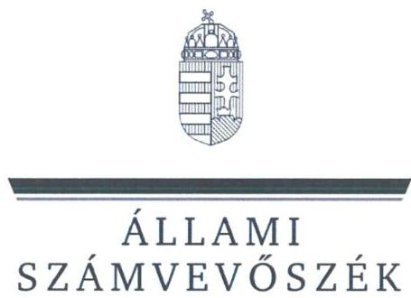
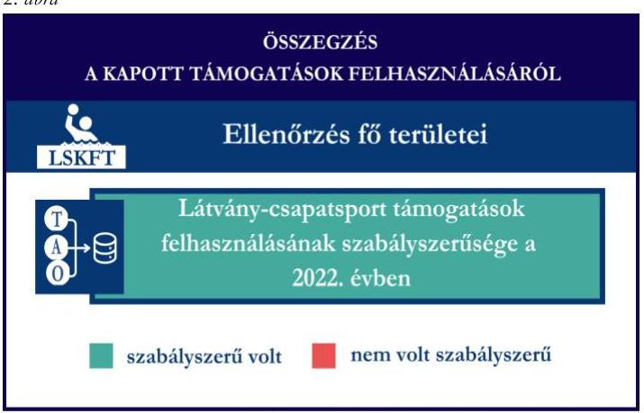
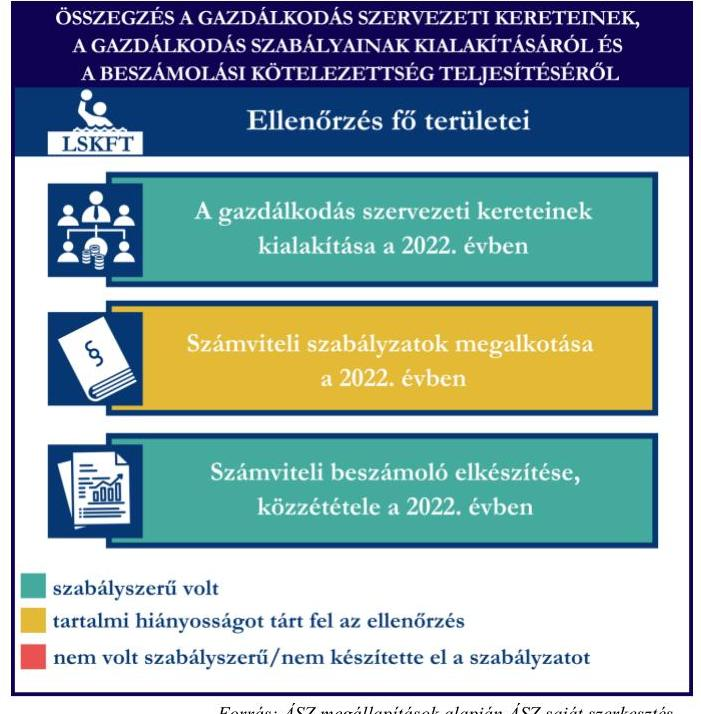
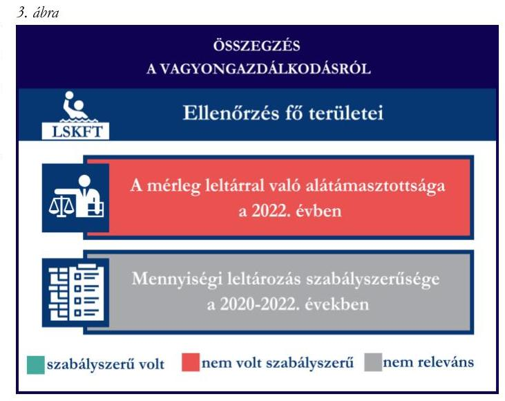

# JELENTÉS 

## Támogatásban részesülő sportszövetségek, sportegyesületek és sportvállalkozások gazdálkodásának ellenőrzése

Latorca Sport Korlátolt Felelősségű Társaság

2024.

---

ÁLLAMI
SZÁMVEVŐSZÉK

# JELENTÉS 

## Támogatásban részesülő sportszövetségek, sportegyesületek és sportvállalkozások gazdálkodásának ellenőrzése

Latorca Sport Korlátolt Felelősségű Társaság

2024.

---

# ELLENŐRZÉSI IGAZGATÓSÁG:

## ÁLLAMHÁZTARTÁSON KÍVÜLI SZERVEZETEKET ELLENŐRZŐ IGAZGATÓSÁG

### ELLENŐRZÉSI IGAZGATÓ:

#### KLINGA LÁSZLÓ igazgató

### ELLENŐRZÉSVEZETŐ:

Jelentéseink az interneten a www.asz.hu címen olvashatók.

#### KAKAS SÁNDOR ellenőrzésvezető

#### IKTATÓSZÁM: EL-4031-005/2024

#### TÉMASORSZÁM: 30

#### ELLENŐRZÉS-AZONOSÍTÓ SZÁM: V1078

---

# TARTALOMJEGYZÉK 

AZ ELLENŐRZÉS ALAPADATAI ..... 5
AZ ELLENŐRZÖTT SZERVEZET ..... 7
ÖSSZEFOGLALÁS ..... 8
AZ ELLENŐRZÉS FÓKUSZTERÜLETEI ..... 10
MEGÁLLAPÍTÁSOK ..... 11
JAVASLATOK ..... 14
MELLÉKLETEK ..... 15
I. sz. melléklet: Értelmező szótár ..... 15
II. sz. melléklet: Az ellenőrzött szervezetek jegyzéke ..... 17
III. sz. melléklet: Fő ellenőrzési kritériumok fő ellenőrzési fókuszterületek szerint. ..... 18
FÜGGELÉK: ÉSZREVÉTELEK ..... 19
RÖVIDÍTÉSEK JEGYZÉKE ..... 20

---

.

---

# AZ ELLENŐRZÉS ALAPADATAI 

## AZ ELLENŐRZÉS CÉLJA

Az ellenőrzés célja az államháztartásból nyújtott támogatással, vagy az államháztartásból meghatározott célra ingyenesen juttatott vagyon felhasználásával érintett sportszövetségek, sportegyesületek és sportvállalkozások gazdálkodása szabályozottságának, gazdálkodási tevékenységének, ezen belül a beszámolási kötelezettség teljesítésének, a támogatások elkülönített nyilvántartásának, valamint a támogatások felhasználásának ellenőrzése.

## AZ ELLENŐRZÉS TÍPUSA

Kombinált ellenőrzés.

## AZ ELLENŐRZÖTT IDŐSZAK

Az 1. fókuszterület vonatkozásában a 2022. év.
A 2. fókuszterület vonatkozásában a 2021-2022. évek.
A 3. fókuszterület vonatkozásában a 2022. év, a mennyiségi felvétellel történő leltározás dokumentumai tekintetében a 2020-2022. évek.

## AZ ELLENŐRZÉS TÁRGYA

Az ellenőrzés tárgyát képezte a támogatásban részesülő sportvállalkozás gazdálkodása szabályozottságának, gazdálkodási tevékenységén belül a beszámolási kötelezettség teljesítésének, a vagyonnyilvántartásának, a támogatások elkülönített nyilvántartásának, valamint az államháztartási forrásból származó közvetlen vagy közvetett támogatások és a meghatározott célra ingyenesen juttatott vagyon felhasználásának vizsgálata. Az ellenőrzés a támogatások vonatkozásában kiterjedt továbbá a támogató felé történő beszámolási és elszámolási kötelezettségek teljesítésére, a jogszabályi és belső előírások betartására.

Az ellenőrzés kiterjedt minden olyan körülményre és adatra, amely az ÁSZ ¹ jogszabályban meghatározott feladatainak teljesítéséhez, valamint az ellenőrzési program végrehajtása során felmerülő újabb összefüggések feltárásához szükséges volt. Az ellenőrzés az 1. és 3. fókuszterületek esetében az ellenőrzött szervezet egészére, a 2. fókuszterület esetén kizárólag a vízilabda szakágra vonatkozóan került végrehajtásra.

## AZ ELLENŐRZÉS JOGALAPJA

Az ellenőrzés jogszabályi alapját az ÁSZ tv. ² 1. § (3) bekezdése, az 5. § (3) bekezdése előírásai képezték.

---

# AZ ELLENŐRZÉS MÓDSZERE 

Az ellenőrzést a nemzetközi standardokat irányadónak tekintve az ellenőrzési program szempontjai, az ellenőrzött időszakban hatályos jogszabályok, az ellenőrzés általános szakmai szabályai, az ellenőrzésre irányadó ÁSZ módszertanok figyelembevételével végezte az ÁSZ.

Az ellenőrzési kérdések megválaszolásához szükséges bizonyítékok megszerzése az ellenőrzött szervezet által rendelkezésre bocsátott dokumentumokra, adatokra alapozva kérdésfeltevés (információkérés), mintavételezés útján történt.

Az ellenőrzési bizonyítékként felhasználható adatforrások közé tartoztak egyrészt az ellenőrzés során az ellenőrzött szervezettől bekért dokumentumok, másrészt adatforrás volt minden további, az ellenőrzés folyamán feltárt, az ellenőrzés szempontjából információt tartalmazó egyéb adatforrás.

A támogatásokkal, azok felhasználásával kapcsolatos kötelezettségek vizsgálatára mintavételi eljárások kerültek alkalmazásra. Támogatás-típusok szerint nagyságrend alapján egy darab támogatás képezte a vizsgálat tárgyát. Ezen támogatások felhasználásának szabályszerűsége támogatásonként kockázatértékelés alapján kiválasztott tételekkel került ellenőrzésre. A kiválasztott támogatási szerződésekhez kapcsolódó elszámolásokból 30 db tétel került ellenőrzésre, ahol az elszámolás nem érte el a 30 db -ot, ott tételes ellenőrzésre került sor. Ezen felül a vagyongazdálkodás szabályszerűségének ellenőrzéséhez is kockázatalapú mintavétel kapcsolódott. A támogatások felhasználása és a vagyongazdálkodás területén a tételek ellenőrzése kiterjedt a könyvvezetési kötelezettség vizsgálatára is. A tárgyi eszközök tekintetében 30 db került kiválasztásra a 2022. évben állományban lévő eszközök közül azok nyilvántartásának, elszámolásának szabályszerűsége ellenőrzése céljából. A kiválasztott tételek ellenőrzésének eredménye nem került kivetítésre a teljes sokaságra, a megállapítások az adott ellenőrzött tételek vonatkozásában kerültek megjelenítésre.

---

# AZ ELLENŐRZÖTT SZERVEZET 

A Latorca Sport Korlátolt Felelősségű Társaság 2006. augusztus 30-án alakult. Az LSKFT⁵ elnevezése 2006. december 20. és 2018. május 17. között ELMŰ-ÉMÁSZ Hálózati Szolgáltató Korlátolt Felelősségű Társaság, 2018. május 17. és 2020. november 25. között ELMŰ-ÉMÁSZ Telco Korlátolt Felelősségű Társaság volt. A Társasági szerződés ⁴ szerint az LSKFT-nek két tagja van: az E.ON Hungária Zártkörűen Működő Részvénytársaság, amelynek törzsbetétje 2,9 M Ft és tulajdonosi hányada 96,67 %, valamint a BEAC⁵ Női Kosárlabda Szakosztály, mint a Budapesti Egyetemi Atlétikai Club jogi személyiségű szervezeti egysége, amelynek törzsbetétje 0,1 M Ft és tulajdonosi hányada 3,33%. Az LSKFT-nél az ellenőrzött időszakban két szakosztály, vízilabda és kosárlabda működött.

Az LSKFT legfőbb döntéshozó szerve a taggyűlés. Az LSKFT törvényes képviseletét egy ügyvezető és egy cégvezető látja el.

Az LSKFT a jogszabályi előírás alapján felügyelőbizottság létrehozására és könyvvizsgálatra nem volt kötelezett, a könyvvizsgálatról saját döntés alapján rendelkezett. Az LSKFT, mint sportvállalkozás az ellenőrzött időszakban folyamatosan vállalkozási tevékenységet végzett.

Az LSKFT vízilabda szakosztálya által az ellenőrzött időszakban igénybe vett támogatásokat az 1. táblázat mutatja be.
1. táblázat

AZ LSKFT VÍZILABDA SZAKOSZTÁLYA ÁLTAL IGÉNYBE VETT TÁMOGATÁS (ADATOK M FT-BAN)

|  | 2021. év | 2022. év |
| :-- | :--: | :--: |
| Központi költségvetési támogatás | - | - |
| Látvány-csapatsport támogatás | - | 23,8 |
| Helyi önkormányzati támogatás | - | - |
| Magyar Vízilabda Szövetségtől kapott támogatás | - | - |

---

# ÖSSZEFOGLALÁS 

Magyarország Alaptörvényének XX. cikke kimondja, hogy mindenkinek joga van a testi és lelki egészséghez, melynek érvényesülését Magyarország többek között a sportolás és a rendszeres testedzés támogatásával segíti elő. Az Országgyűlés a Sport tv.⁶-ben kinyilvánította, hogy a nemzet közössége a test művelését, a sportot, a nemzet alapértékének, kívánatos célnak tekinti. A sport a közjó része. Erősíti a közösség tagjainak egymáshoz tartozását, miként az egyén testi és lelki egészségét.

A sportegyesületek, sportszövetségek, sportvállalkozások működésükre és szakmai tevékenységük ellátására költségvetési támogatásban, önkormányzati támogatásban, ingyenes vagyonjuttatásban, valamint látvány-csapatsport támogatásban részesülhetnek, amelyekre fokozott figyelem irányul.

A társadalom részéről jogosan felmerülő elvárás, hogy a közpénzeket kezelő, azzal gazdálkodó szervezetek működéséről, tevékenységéről átfogó képet kapjon, a közpénzek rendeltetésszerű és átlátható módon történő felhasználásának értékelésére időről-időre sor kerüljön az ellenőrzések keretében.

Az LSKFT a könyvviteli szolgáltatás személyi feltételeinek megteremtéséről gondoskodott. A 2022. évre vonatkozó egyszerűsített éves beszámolót könyvvizsgáló felülvizsgálta. A jogszabályi előírások szerint az LSKFT kialakította a számviteli politikáját, valamint elkészítette számviteli szabályzatait, továbbá rendelkezett számlarenddel. A szabályzatok az ellenőrzött jogszabályi kritériumoknak megfeleltek, a számlarend tekintetében tartalmi hiányosságot tárt fel az ellenőrzés.

A könyvvezetés formája a 2022. évben megfelelt a jogszabályi előírásoknak. Az LSKFT a jogszabályoknak megfelelően teljesítette a számviteli beszámoló készítési- és közzétételi kötelezettségét.

A gazdálkodás szervezeti keretei kialakításának, a számviteli szabályzatok megalkotásának, valamint a számviteli beszámoló elkészítésének és közzétételének értékelését az 1. ábra mutatja be.
2. ábra

Forrás: ÁSZ megállapítások alapján ÁSZ saját szerkesztés

1. ábra

Az LSKFT a látvány-csapatsport támogatást és kiegészítő sportfejlesztési támogatást a 2022. évben az ellenőrzött tételek esetében a támogatási célnak megfelelően, szabályszerűen használta fel. Számviteli nyilvántartásában a kapott támogatások felhasználását a jogszabályi előírás ellenére elkülönítetten nem tartotta nyilván.
A kapott támogatások felhasználásának értékelését a 2. ábra mutatja be.

---

Az LSKFT vagyongazdálkodása a 2022. évben nem volt szabályszerű, mert a 2022. évi egyszerűsített éves beszámolójának mérleg tételeit nem támasztotta alá leltárral.

A vagyongazdálkodás értékelését a 3. ábra mutatja be.

Forrás: ÁSZ megállapítások alapján ÁSZ saját szerkesztés

---

# AZ ELLENŐRZÉS FÓKUSZTERÜLETEI 

1.     - A gazdálkodási szabályok kialakítása, a könyvvezetési- és beszámolási kötelezettség teljesítése
2.     - A kapott támogatások felhasználása
3.     - Az ellenőrzött szervezet vagyongazdálkodása

---

# 1. A gazdálkodási szabályok kialakítása, a könyvvezetési- és beszámolási kötelezettség teljesítése 

Összegző megállapítás

Az LSKFT a 2022. évre vonatkozóan a jogszabályokban előírt szervezeti keretek kialakításával, a gazdálkodást biztosító belső szabályozó eszközök és számviteli keretek megalkotásával megteremtette a szabályszerű gazdálkodásának feltételeit, azonban a számlarend tekintetében az ellenőrzés hiányosságot tárt fel. Az LSKFT a jogszabályoknak megfelelően teljesítette könyvvezetési-, számviteli beszámoló készítési-, valamint közzétételi kötelezettségét.

A 2022. évben az LSKFT a Számv. tv.⁷-ben foglalt jogszabályi előírások betartásával gondoskodott a könyvviteli szolgáltatás személyi feltételeinek megteremtéséről, a könyvviteli szolgáltatás körébe tartozó feladatok ellátásával olyan számviteli szolgáltatást nyújtó társaságot bízott meg, amelynek a feladat irányításával, vezetésével, a beszámoló elkészítésével megbízott tagja megfelelt a jogszabályi követelményeknek.
Az LSKFT saját döntésével rendelkezett a 2022. évre vonatkozó egyszerűsített éves beszámolója könyvvizsgálóval történő felülvizsgálatáról.
Az LSKFT a 2022. évben rendelkezett a Számv. tv.-ben előírt számviteli politikával⁸, illetve annak keretében elkészítette az értékelési szabályzatot⁹, a leltározási szabályzatot¹⁰ és a pénzkezelési szabályzatot¹¹. A szabályzatok az ellenőrzött tartalmi kritériumoknak megfeleltek. Az LSKFT a Számv. tv. szerint a számlarendet¹² elkészítette, amely azonban a Számv. tv. 161. § (2) bekezdés a) pontjában foglaltak ellenére nem teljeskörűen tartalmazta minden alkalmazásra kijelölt számla számjelét és megnevezését (pl. 483005 Költségre kap.tám.PIE; 483003 Eszközre kap.tám.PIE; 384301 CIB Vízilabda UP, 384302 CIB Vízilabda TE, 384303 CIB Vízilabda KIEG) valamint a Számv. tv. 161. § (2) bekezdés b) pontjában foglaltak ellenére nem teljeskörűen tartalmazta a számla tartalmát, ha az a számla megnevezéséből egyértelműen nem következik, továbbá nem tartalmazta a Számv. tv. 161. § (2) bekezdés d) pontjában előírtak ellenére a számlarendben foglaltakat alátámasztó bizonylati rendet.
Az LSKFT a Számv. tv. előírásainak megfelelően a 2022. évben kettős könyvvitelt vezetett. A könyvviteli nyilvántartásait a Számv. tv. rendelkezéseinek megfelelően úgy alakította ki, hogy az alkalmas volt a 2022. évben az egyszerűsített éves beszámolóban a visszafizetési kötelezettség nélkül kapott támogatások egyéb bevételeken belüli kimutatására. Az LSKFT könyvvezetési rendszerét a Számv. tv. 161/A. § (2) bekezdésben foglaltakkal ellentétben nem részletezte tovább oly módon, hogy az alapján a támogatás felhasználásra a 107/2011. (VI.30.) Korm. rendelet¹³ által előírt adatok ellenőrizhető módon rendelkezésre álljanak.

---

Az LSKFT a Számv. tv. előírásainak megfelelően elkészítette a 2022. évre vonatkozó egyszerűsített éves beszámolóját.
A 2022. évre vonatkozó egyszerűsített éves beszámolót a könyvvizsgáló a Társasági szerződés szerint felülvizsgálta, a taggyűlés a Ptk.¹⁴-ban foglaltaknak megfelelően taggyűlési határozattal jóváhagyta.
Az LSKFT a 2022. évi egyszerűsített éves beszámolóját a Számv. tv.-nek megfelelően - a könyvvizsgálói záradékot is tartalmazó független könyvvizsgálói jelentéssel együtt - letétbe helyezte és közzétette.

# 2. A kapott támogatások felhasználása 

## Összegző megállapítás

Az LSKFT a 2022. évben a kapott támogatásokat az ellenőrzött tételek esetében szabályszerűen használta fel, azonban a kapott támogatások felhasználását a jogszabályi előírás ellenére elkülönítetten nem tartotta nyilván.

Az LSKFT a látvány-csapatsport támogatások esetében a 2022. évben eleget tett a 107/2011. (VI. 30.) Korm. rendeletben foglaltaknak, a támogatás felhasználásáról negyedévente az előrehaladási jelentéseket benyújtotta az MVLSZ¹⁵ felé.
Mivel a támogatási időszak még nem zárult le, ezért az LSKFT a számára nyújtott látvány-csapatsport támogatásról

 és kiegészítő sportfejlesztési támogatásról a támogató felé az ellenőrzött időszakban még nem nyújtotta be a 107/2011. (VI. 30.) Korm. rendelet szerinti (záró)elszámolást. Az ellenőrzött időszakban az LSKFT egy részelszámolást nyújtott be, a részelszámolást az ellenőrző szervezet a 107/2011. (VI. 30.) Korm. rendelet 13. $\int(1)$ bekezdésének előírása alapján elfogadta. A részelszámolás során, a támogatás felhasználását a jogszabályban foglaltak szerint záradékolt számviteli bizonylatokkal alátámasztott módon, összesített elszámolási táblázattal és szöveges szakmai beszámolóval igazolta. Az LSKFT a 107/2011. (VI. 30.) Korm. rendeletnek megfelelően - a részelszámolást illetően - könyvvizsgáló által ellenőrzött számviteli bizonylatokkal számolt el a támogató felé. A könyvvizsgáló a 107/2011. (VI. 30.) Korm. rendeletben előírt felelősségbiztosítással rendelkezett.
Az LSKFT a 107/2011. (VI. 30.) Korm. rendelet 9. § (9) bekezdés előírása ellenére a látvány-csapatsport támogatás és kiegészítő sportfejlesztési támogatás felhasználását elkülönítetten és naprakészen, ellenőrizhető módon nem tartotta nyilván.
Az LSKFT esetében a látvány-csapatsport támogatás és kiegészítő sportfejlesztési támogatás tételeinek (24-1 db) ellenőrzése során az alábbiak kerültek megállapításra:

- a tételek számviteli elszámolását a Számv. tv.-ben és a 107/2011. (VI. 30.) Korm. rendeletben előírtak szerint bizonylatokkal alátámasztották;
- a 107/2011. (VI. 30.) Korm. rendeletben foglaltaknak megfelelően
- a tételek tartalma (gazdasági esemény) és összege alapján a támogatási igazolásban meghatározottak szerinti jogcímre, az abban meghatározott mértékben használták fel;
- a tételek számviteli bizonylatai alapján a gazdasági események a támogatási időszak (meghosszabbított támogatási időszak) végéig szerződés szerint teljesültek;
- a tételek számviteli bizonylatai alapján a gazdasági események pénzügyi rendezése az elszámolás benyújtására nyitva álló határidőig - figyelemmel az esetleges elszámolási határidő hosszabbítására

---

- teljesült; két látvány-csapatsport támogatás tétel és egy kiegészítő sportfejlesztési támogatás tétel esetében a 107/2011. (VI. 30.) Korm. rendelet 9. § (8) bekezdésében foglaltak ellenére a pénzügyi rendezés nem a támogatási jogcímnek megfelelő pénzforgalmi számláról történt.
- a tételek számviteli bizonylatait - egy kiegészítő sportfejlesztési támogatás tétel kivételével - a jogszabályi előírás szerint ellátták záradékkal. A kivételt képező tétel esetén a számviteli bizonylatokat a 107/2011. (VI. 30.) Korm. rendelet 11. § (1) és (5) bekezdések előírásai ellenére záradékkal nem látták el.
- a számviteli bizonylatokon záradékolt összegek - egy látvány-csapatsport támogatás tétel kivételével - megegyeztek a számlaösszesítőben feltüntetett értékekkel. A kivételt képező tétel esetén a 107/2011. (VI. 30.) Korm. rendelet 11. § (1) bekezdésében foglaltakkal ellentétben az összesített elszámolási táblázatban szereplő értéket a záradékolt számviteli bizonylat nem támasztotta alá.
- a tételek számviteli bizonylatának az adott sportfejlesztési program terhére záradékolt összegei a Számv. tv.-ben előírtak szerint a tartalmuknak megfelelő főkönyvi számra kerültek elszámolásra.

# 3. Az ellenőrzött szervezet vagyongazdálkodása 

## Összegző megállapítás

A 2022. évben az LSKFT vagyongazdálkodása nem volt szabályszerű, mivel a 2022. évi egyszerűsített éves beszámolójának mérlegtételeit nem támasztotta alá szabályszerű leltárral.

Az LSKFT a Számv. tv. 69. § (1), (2) bekezdések előírásainak ellenére a 2022. évi egyszerűsített éves beszámolójának mérlegtételeit, a mérlegben szereplő eszközöket és forrásokat nem támasztotta alá szabályszerű leltárral, a követelések, a pénzeszközök, az aktív időbeli elhatárolások, a saját tőke, a kötelezettségek és a passzív időbeli elhatárolások mérlegtételek tekintetében.
Az LSKFT számára a Számv. tv. szerinti mennyiségi felvétellel történő leltározás elvégzése a 2020-2022. évekre vonatkozóan nem volt releváns, mivel a 2020., a 2021. és a 2022. évi egyszerűsített éves beszámolója szerint befektetett eszközei, készletei nem voltak, ezt alátámasztotta az ügyvezető által tett nyilatkozat is. A 2022. évi egyszerűsített éves beszámoló tárgyi eszköz mérlegtétele a kiegészítő mellékletben és a könyvviteli nyilvántartásban foglaltak szerint teljes mértékben a tárgyévben megkezdett beruházások és a beruházásokra adott előlegek értékét tartalmazza. Az LSKFT a 2022. évi egyszerűsített éves beszámolója mérlegtételei alapján, a kiegészítő mellékletében foglaltak szerint a 2022. évben nem rendelkezett immateriális javakkal és tárgyi eszközökkel, tevékenységéhez és működéséhez szükséges immateriális javakat és tárgyi eszközöket bérelte, azok analitikus nyilvántartása a bérbeadó társaságnál történt.

---

# JAVASLATOK 

Az ÁSZ tv. 33. § (1) bekezdésében foglaltak értelmében az ellenőrzött szervezet vezetője köteles a jelentésben foglalt megállapításokhoz kapcsolódó intézkedési tervet összeállítani és azt a jelentés kézhezvételétől számított 30 napon belül az ÁSZ részére megküldeni. Amennyiben az ellenőrzött szervezet vezetője nem küldi meg határidőben az intézkedési tervet, vagy továbbra sem elfogadható intézkedési tervet küld, az Állami Számvevőszék elnöke az ÁSZ tv. 33. § (3) bekezdés a) és b) pontjaiban foglaltakat érvényesítheti.

## A Latorca Sport Korlátolt Felelősségű Társaság Ügyvezetőjének

1. Gondoskodjon a számlarend Számv. tv. 161. § (2) bekezdésben előírtaknak megfelelő tartalommal való elkészítéséről.
2. Gondoskodjon a 107/2011. (VI. 30.) Korm. rendelet 9. § (9) bekezdésében előírtaknak megfelelően, a látvány-csapatsport támogatás és kiegészítő sportfejlesztési támogatás felhasználásának elkülönített és naprakész, ellenőrizhető nyilvántartásáról.
3. Gondoskodjon a beszámoló mérlegtételeinek leltárral történő alátámasztásáról a Számv. tv. 69. § (1) bekezdés előírásainak megfelelően.

---

# MELLÉKLETEK 

## I. SZ. MELLÉKLET: ÉRTELMEZŐ SZÓTÁR

Kiegészítő sportfejlesztési támogatás

Költségvetési támogatás

Közhasznú szervezet

Közhasznú tevékenység

Látvány-csapatsport támogatás

Látvány-csapatsportban működő amatőr sportszervezet

Látvány-csapatsportban működő hivatásos sportszervezet

Országos sportági szakszövetség

Sportági szövetség

A látvány-csapatsportok támogatása esetében rendelkező nyilatkozatban felajánlott összeg 12,5 százaléka kiegészítő sportfejlesztési támogatásnak minősül. (Forrás: Tao tv. ${ }^{16}$ 24/A. § (9) bekezdés)
A társadalombiztosítás pénzügyi alapjai kivételével az államháztartás központi alrendszeréből ellenérték nélkül, pénzben nyújtott támogatások. (Forrás: Áht. ${ }^{17}$ 1. $\S 14$. pont)

Közhasznú szervezetté minősíthető a Magyarországon nyilvántartásba vett közhasznú tevékenységet végző szervezet, amely a társadalom és az egyén közös szükségleteinek kielégítéséhez megfelelő erőforrásokkal rendelkezik, továbbá amelynek megfelelő társadalmi támogatottsága kimutatható, és amely:
a) civil szervezet (ide nem értve a civil társaságot), vagy
b) olyan egyéb szervezet, amelyre vonatkozóan a közhasznú jogállás megszerzését törvény lehetővé teszi. (Forrás: Civil tv. ${ }^{18}$ 32. § (1) bekezdés)
Minden olyan tevékenység, amely a létesítő okiratban megjelölt közfeladat teljesítését közvetlenül vagy közvetve szolgálja, ezzel hozzájárulva a társadalom és az egyén közös szükségleteinek kielégítéséhez. (Forrás: Civil tv. 2. § 20. pont)

Az adóévben visszafizetési kötelezettség nélkül nyújtott támogatás, juttatás, véglegesen átadott pénzeszköz és térítés nélkül átadott eszköz könyv szerinti értéke, az adóévben térítés nélkül nyújtott szolgáltatás bekerülési értéke a Tao tv.-ben meghatározott jogcímeken. (Forrás: Tao tv. 4. § 44. pont)

Minden olyan, a sportról szóló törvényben meghatározott szabályok szerint a látvány-csapatsportban működő sportegyesület vagy sportvállalkozás, amelyik nem minősül a látvány-csapatsportban működő hivatásos sportszervezetnek. (Forrás: Tao tv. 4. § 42. pont)

A látvány-csapatsportágak országos sportági szakszövetsége által kiírt versenyrendszer legmagasabb felnőtt bajnoki osztályában - a veterán korosztályokra kiírt versenyrendszer kivételével - részt vevő (indulási jogot elnyert) sportszervezet, vagy alsóbb bajnoki osztályaiban részt vevő (indulási jogot elnyert) sportszervezet abban az esetben, ha az ilyen sportszervezet hivatásos sportolót alkalmaz. Több látvány-csapatsportban több jogi személy szervezeti egységgel (szakosztállyal) működő sportszervezet esetén csak az a jogi személy szervezeti egység (szakosztály), amely a fent részletezett versenyrendszerek bajnoki osztályaiban részt vesz. (Forrás: Tao tv. 4. § 43. pont)

Olyan sportszövetség, amely sportágában kizárólagos jelleggel az e törvényben, valamint más jogszabályokban meghatározott feladatokat lát el és e törvényben megállapított különleges jogosítványokat gyakorol. Olyan sportágban hozható létre, amelyet vagy a Nemzetközi Olimpiai Bizottság elismert, vagy amely sportág nemzetközi szövetségét felvették a Nemzetközi Sportszövetségek Szövetségébe (GAISF). (Forrás: Sport tv. 20. § (1), (4) bekezdés)
A Civil tv. és a Ptk. előírásai alapján - a Sport tv.-ben meghatározott eltérésekkel - működő szövetség, amelynek tagjai kizárólag sportszervezetek lehetnek. Sportági szövetség országos jelleggel is működhet. Egy sportágban csak egy országos sportági szövetség működhet. Törvényi feltételek teljesülése esetén szakszövetségi feladatokat is elláthat. (Forrás: Sport tv. 28. §)

---

Sportegyesület

Sportegyesületeknek, sportszövetségeknek nyújtott költségvetési támogatás

Sportszövetség

Sporttevékenység

Sportvállalkozás

A Civil tv. és a Ptk. szabályai szerint működő olyan egyesület, amelynek alaptevékenysége a sporttevékenység szervezése, valamint a sporttevékenység feltételeinek megteremtése. A sportegyesületek a Sport tv. 15. § (1) bekezdésében meghatározott sportszervezetek körébe tartoznak. A sportegyesületeken kívül sportszervezet még a sportvállalkozás, a sportiskola, valamint az utánpótlás-nevelés fejlesztését végző alapítvány. (Forrás: Sport tv. 16. $\S$ (1) bekezdés)

Az állami sport célú támogatások felhasználásáról és elosztásáról szóló 474/2016. (XII. 27.) Korm. rendelet ${ }^{19}$ és a 27/2013. (III. 29.) EMMI rendelet ${ }^{20}$ 1. $\S$-ában meghatározott fejezeti kezelésű előirányzatokból nyújtott támogatás.
Meghatározott sporttevékenységek körében a sportversenyek szervezésére, a tagok érdekvédelmére és a részükre való szolgáltatásokra, valamint a nemzetközi kapcsolatok lebonyolítására létrehozott, jogi személyiséggel és önkormányzattal rendelkező, a Civil tv. és a Ptk. alapján - az e törvényben foglalt eltérésekkel különös formában működő egyesületek. A Sport tv. 19. § (3) bekezdése szerint a sportszövetségeknek az alábbi típusai léteznek: országos sportági szakszövetségek, sportági szövetségek, szabadidősport szövetségek, fogyatékosok sportszövetségei, diák- és egyetemi-főiskolai sport sportszövetségei, nemzetközi sportszövetségek. (Forrás: Sport tv. 19. § (1), (3) bekezdés)

Meghatározott szabályok szerint, a szabadidő eltöltéseként kötetlenül vagy szervezett formában, illetve versenyszerűen végzett testedzés vagy szellemi sportágban kifejtett tevékenység, amely a fizikai erőnlét és a szellemi teljesítőképesség megtartását, fejlesztését szolgálja. (Forrás: Sport tv. 1. $\S$ (2) bekezdés)

Az a gazdasági társaság, amelynek a cégnyilvántartásról, a cégnyilvánosságról és a bírósági cégeljárásról szóló törvény alapján a cégjegyzékbe bejegyzett tevékenysége sporttevékenység, továbbá a gazdasági társaság célja sporttevékenység szervezése, valamint a sporttevékenység feltételeinek megteremtése egy vagy több sportágban. Korlátolt felelősségű társasági, illetve részvénytársasági formában alapítható, a fogyatékosok sportja, illetve a szabadidősport területén közhasznú társaságként is működhet. (Forrás: Sport tv. 18. §)

---

II. SZ. MELLÉKLET: AZ ELLENŐRZÖTT SZERVEZETEK JEGYZÉKE

| ELLENŐRZÖTT SZERVEZET NEVE | ELLENŐRZÖTT SZERVEZET SZÉKHELYE |
| :-- | :-- |
| Latorca Sport Korlátolt Felelősségű Társaság | 1132 Budapest, Váci út 72-74. |

---

# III. SZ. MELLÉKLET: FŐ ELLENŐRZÉSI KRITÉRIUMOK FŐ ELLENŐRZÉSI FÓKUSZTERŰLETEK SZERINT 

## FŐ ELLENŐRZÉSI FÓKUSZTERŰLETEK

1. A gazdálkodási szabályok kialakítása, a könyvvezetési és beszámolási kötelezettség teljesítése
2. A kapott támogatások felhasználása
3. Az ellenőrzött szervezet vagyongazdálkodása

## FŐ ELLENŐRZÉSI KRITÉRIUMOK

Ptk. 3:26. § (1) bekezdés, 3:27. § (1) bekezdés, 3:82. § (1)-(2) bekezdés
Számv. tv. 4. §, 6. § (2) bekezdés, 12. §, 14. § (3), (5) bekezdés a), b), d) pont, (8) bekezdés, (11)-(12) bekezdés, 69. § (1), (3) bekezdés, 90. § (3) bekezdés c) pont, 96. § (4) bekezdés, 150. § (2) bekezdés, 153. § (1) bekezdés, 154. § (1) bekezdés, 161. § (1) bekezdés, (2) bekezdés a)-d) pont, (3)-(4) bekezdés, 161/A. § (1)(2) bekezdés, 165. § (2) bekezdés

Tao tv. 22/C. §
107/2011. (VI.30.) Korm. rendelet 9. § (9) bekezdés
Számv. tv. 16. § (3) bekezdés, 25-26. §, 44. § (2) bekezdés, 45. § (1)-(2) bekezdés, 77. § (3) bekezdés b) pont, 78-81. §, 159. §, 161/A. § (2) bekezdés, 162. § (1) bekezdés, 165. § (1)-(2) bekezdés, 166. § (1) bekezdés, 167. § (1) bekezdés a), d), e), h) pont

Tao. tv. 22/C. §, 24/A. § (9) bekezdés
107/2011. (VI.30.) Korm. rendelet 2. §

 (3b) bekezdés, 4. § (11) bekezdés, 5. § (1) bekezdés, 6. § (1) bekezdés e) pont, 9. § (8)(10) bekezdés, 10. § (2), (2a), (2b), (4) bekezdés, 10. § (5a) bekezdés, 11. § (1), (1a), (1d), (1e), (2), (4), (4a), (5), (6) bekezdés, 13. § (1), (2a) bekezdés, 14. § (1), (4), (4b), (4c), (6c) bekezdés

275/2022. (VII.29.) Korm. rendelet ${ }^{21} 1 . \S$ (3)
444/2022. (XI.7.) Korm. rendelet ${ }^{22} 2 . \S$
474/2016. (XII. 27.) Korm. rendelet 26. § (3) bekezdés
Ptk. 3:63. § (4) bekezdés
Számv. tv. 15. § (3) bekezdés, 26. §, 46. § (3) bekezdés, 47-53. §, 57. §, 69. § (1)-(6) bekezdés, 165-166. §, 169. § (2) bekezdés

Tao tv. 22/C (6) bekezdés a), d), e) pont, (11) bekezdés
107/2011. (VI.30.) Korm. rendelet 11. § (5) bekezdés
474/2016. (XII. 27.) Korm. rendelet 17. § (1) bekezdés 11a. a) pont, 11b. pont, 17. § (2a) bekezdés, 24. § (2) bekezdés

---

# FÜGGELÉK: ÉSZREVÉTELEK 

A jelentéstervezetet a Számvevőszék 15 napos észrevételezésre megküldte az ellenőrzött szervezet vezetőjének az ÁSZ tv. 29. § (1) bekezdése előírásának megfelelően.

A Latorca Sport Korlátolt Felelősségű Társaság ügyvezetője a jelentéstervezetre nem tett észrevételt.

[^0]
[^0]:    * 29. § (1) Az Állami Számvevőszék az ellenőrzési megállapításait megküldi az ellenőrzött szervezet vezetőjének vagy az általa megbízott személynek, és annak, akinek személyes felelősségét állapította meg.
    (2) Az ellenőrzött szervezet vezetője és a felelősként megjelölt személy az ellenőrzés megállapításaira tizenöt napon belül írásban észrevételt tehet.
    (3) Az Állami Számvevőszék az észrevételre a beérkezésétől számított harminc napon belül írásban válaszol. A figyelembe nem vett észrevételeket köteles a jelentésben feltüntetni, és megindokolni, hogy azokat miért nem fogadta el.

---

# RÖVIDÍTÉSEK JEGYZÉKE 

${ }^{1}$ ÁSZ
${ }^{2}$ ÁSZ tv.
${ }^{3}$ LSKFT
${ }^{4}$ Társasági szerződés
Társasági szerződés
Társasági szerződés
Társasági szerződés ${ }_{4}$
${ }^{5}$ BEAC
${ }^{6}$ Sport tv.
${ }^{7}$ Számv. tv.
${ }^{8}$ számviteli politika
${ }^{9}$ értékelési szabályzat
${ }^{10}$ leltározási szabályzat
${ }^{11}$ pénzkezelési szabályzat
${ }^{12}$ számlarend
${ }^{13}$ 107/2011. (VI.30.) Korm. rendelet
${ }^{14}$ Ptk.
${ }^{15}$ MVLSZ
${ }^{16}$ Tao tv.
${ }^{17}$ Áht.
${ }^{18}$ Civil. tv.
${ }^{19}$ 474/2016. (XII. 27.) Korm. rendelet
${ }^{20}$ 27/2013. EMMI rendelet
${ }^{21}$ 275/2022. (VII.29.) Korm. rendelet
${ }^{22}$ 444/2022. (XI.7.) Korm. rendelet

Állami Számvevőszék
2011. évi LXVI. törvény az Állami Számvevőszékről

Latorca Sport Korlátolt Felelősségű Társaság
A Latorca Sport Korlátolt Felelősségű Társaság Társasági szerződése (hatályos: 2021. január 21-től)
A Latorca Sport Korlátolt Felelősségű Társaság Társasági szerződése (hatályos: 2021. február 23-tól)
A Latorca Sport Korlátolt Felelősségű Társaság Társasági szerződése (hatályos: 2022. június 1-től)
A Latorca Sport Korlátolt Felelősségű Társaság Társasági szerződése (hatályos: 2022. december 1-től)
Budapesti Egyetemi Atlétikai Club
2004. évi I. törvény a sportról
2000. évi C. törvény a számvitelről
A Latorca Sport Korlátolt Felelősségű Társaság Számviteli politikája (hatályos: 2022. január 1-től)
A Latorca Sport Korlátolt Felelősségű Társaság Értékelési szabályzata (hatályos: 2019. január 1-től)
A Latorca Sport Korlátolt Felelősségű Társaság Leltározási szabályzata (hatályos: 2012. december 1-től)
A Latorca Sport Korlátolt Felelősségű Társaság pénzkezelési szabályzata (hatályos: 2014. január 1-től)
A Latorca Sport Korlátolt Felelősségű Társaság számlarendje (hatályos: 2018. május 17-től)
107/2011. (VI. 30.) Korm. rendelet a látvány-csapatsport támogatását biztosító támogatási igazolás kiállításáról, felhasználásáról, a támogatás elszámolásának és ellenőrzésének, valamint visszafizetésének szabályairól
2013. évi V. törvény a Polgári Törvénykönyvről

Magyar Vízilabda Szövetség
1996. évi LXXXI. törvény a társasági adóról és az osztalékadóról
2011. évi CXCV. törvény az államháztartásról
2011. évi CLXXV. törvény az egyesülési jogról, a közhasznú jogállásról, valamint a civil szervezetek működéséről és támogatásáról
474/2016. (XII. 27.) Korm. rendelet az állami sport célú támogatások felhasználásáról és elosztásáról
27/2013. (III. 29.) EMMI rendelet az állami sport célú támogatások felhasználásáról és elosztásáról
275/2022. (VII.29.) Korm. rendelet a látvány-csapatsport támogatását biztosító támogatási igazolás kiállításáról, felhasználásáról, a támogatás elszámolásának és ellenőrzésének, valamint visszafizetésének szabályairól szóló 107/2011. (VI. 30.) Korm. rendelet veszélyhelyzet ideje alatt történő eltérő alkalmazásáról
444/2022. (XI.7.) Korm. rendelet a veszélyhelyzet idején a látvány-csapatsport támogatását biztosító támogatási igazolás kiállításáról, felhasználásáról, a támogatás elszámolásának és ellenőrzésének, valamint visszafizetésének szabályairól szóló 107/2011. (VI. 30.) Korm. rendelet szabályainak eltérő alkalmazásáról

---

1052 Budapest, Apáczai Csere János u. 10. | 1364 Budapest 4., Pf. 54
www.asz.hu | szamvevoszek@asz.hu
telefon: +36 14849100

