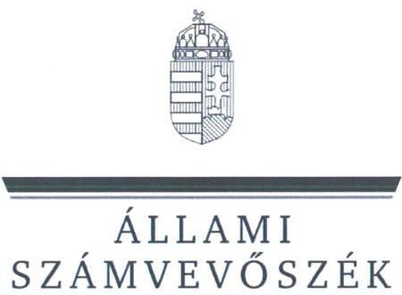
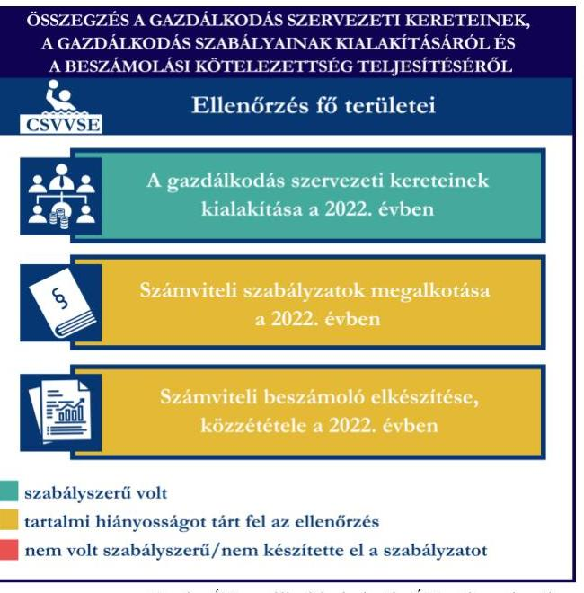
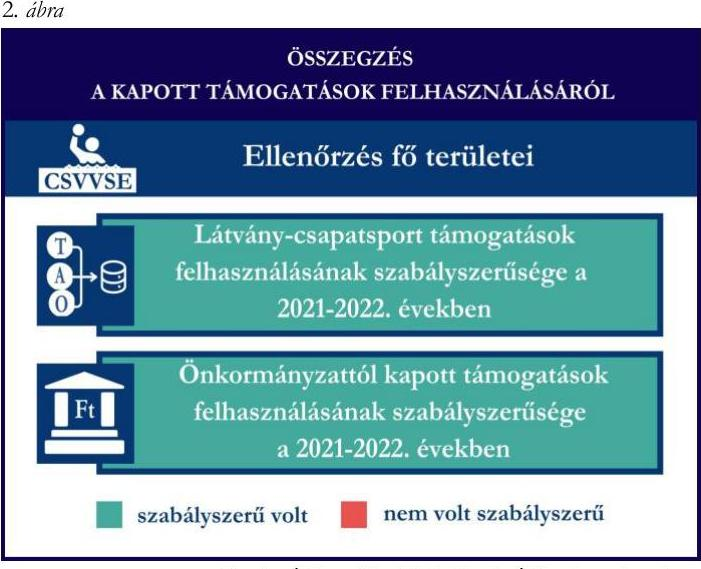
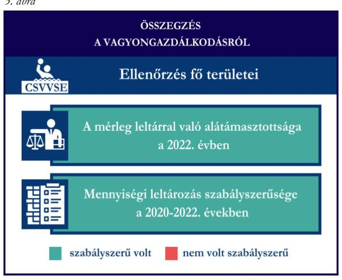

# JELENTÉS 

Támogatásban részesülő sportszövetségek, sportegyesületek és sportvállalkozások gazdálkodásának ellenőrzése

Csongrád Városi Vízilabda Sportegyesület

2024.

---

ÁLLAMI
SZÁMVEVÔSZÉK

# JELENTÉS 

## Támogatásban részesülő sportszövetségek, sportegyesületek és sportvállalkozások gazdálkodásának ellenőrzése

Csongrád Városi Vízilabda Sportegyesület

2024.

---

# ELLENŐRZÉSI IGAZGATÓSÁG: 

ÁLLAMHÁZTARTÁSON KÍVÜLI SZERVEZETEKET ELLENŐRZŐ IGAZGATÓSÁG

## ELLENŐRZÉSI IGAZGATÓ:

## KLINGA LÁSZLÓ igazgató

## ELLENŐRZÉSVEZETŐ:

## KAKAS SÁNDOR ellenőrzésvezető

## IKTATÓSZÁM: EL-4031-006/2024

TÉMASORSZÁM: 30
ELLENŐRZÉS-AZONOSÍTÓ SZÁM: V1078

---

# TARTALOMJEGYZÉK 

AZ ELLENŐRZÉS ALAPADATAI ..... 5
AZ ELLENŐRZÖTT SZERVEZET ..... 7
ÖSSZEFOGLALÁS ..... 8
AZ ELLENŐRZÉS FÓKUSZTERÜLETEI ..... 10
MEGÁLLAPÍTÁSOK ..... 11
JAVASLATOK ..... 15
MELLÉKLETEK ..... 16
I. sz. melléklet: Értelmező szótár ..... 16
II. sz. melléklet: Az ellenőrzött szervezetek jegyzéke ..... 18
III. sz. melléklet: Fő ellenőrzési kritériumok fő ellenőrzési fókuszterületek szerint. ..... 19
FÜGGELÉK: ÉSZREVÉTELEK ..... 21
RÖVIDÍTÉSEK JEGYZÉKE ..... 22

---

.

---

# AZ ELLENŐRZÉS ALAPADATAI 

## AZ ELLENŐRZÉS CÉLJA

Az ellenőrzés célja az államháztartásból nyújtott támogatással, vagy az államháztartásból meghatározott célra ingyenesen juttatott vagyon felhasználásával érintett sportszövetségek, sportegyesületek és sportvállalkozások gazdálkodása szabályozottságának, gazdálkodási tevékenységének, ezen belül a beszámolási kötelezettség teljesítésének, a támogatások elkülönített nyilvántartásának, valamint a támogatások felhasználásának ellenőrzése.

## AZ ELLENŐRZÉS TÍPUSA

Kombinált ellenőrzés.

## AZ ELLENŐRZŐTT IDŐSZAK

Az 1. fókuszterület vonatkozásában a 2022. év.
A 2. fókuszterület vonatkozásában a 2021-2022. évek.
A 3. fókuszterület vonatkozásában a 2022. év, a mennyiségi felvétellel történő leltározás dokumentumai tekintetében a 2020-2022. évek.

## AZ ELLENŐRZÉS TÁRGYA

Az ellenőrzés tárgyát képezte a támogatásban részesülő sportegyesület gazdálkodása szabályozottságának, gazdálkodási tevékenységén belül a beszámolási kötelezettség teljesítésének, a vagyonnyilvántartásának, a támogatások elkülönített nyilvántartásának, valamint az államháztartási forrásból származó közvetlen vagy közvetett támogatások és a meghatározott célra ingyenesen juttatott vagyon felhasználásának vizsgálata. Az ellenőrzés a támogatások vonatkozásában kiterjedt továbbá a támogató felé történő beszámolási és elszámolási kötelezettségek teljesítésére, a jogszabályi és belső előírások betartására.

Az ellenőrzés kiterjedt minden olyan körülményre és adatra, amely az ÁSZ ${ }^{1}$ jogszabályban meghatározott feladatainak teljesítéséhez, valamint az ellenőrzési program végrehajtása során felmerülő újabb összefüggések feltárásához szükséges volt. Az ellenőrzés az 1. és 3. fókuszterületek esetében az ellenőrzött szervezet egészére, a 2. fókuszterület esetén kizárólag a vízilabda szakágra vonatkozóan került végrehajtásra.

## AZ ELLENŐRZÉS JOGALAPJA

Az ellenőrzés jogszabályi alapját az ÁSZ tv. ${ }^{2} 1 . \int$ (3) bekezdése és az 5. $\$ (3) bekezdése előírásai képezték.

---

# AZ ELLENŐRZÉS MÓDSZERE 

Az ellenőrzést a nemzetközi standardokat irányadónak tekintve az ellenőrzési program szempontjai, az ellenőrzött időszakban hatályos jogszabályok, az ellenőrzés általános szakmai szabályai, az ellenőrzésre irányadó ÁSZ módszertanok figyelembevételével végezte az ÁSZ.

Az ellenőrzési kérdések megválaszolásához szükséges bizonyítékok megszerzése az ellenőrzött szervezet által rendelkezésre bocsátott dokumentumokra, adatokra alapozva kérdésfeltevés (információkérés), interjú, mintavételezés útján történt.

Az ellenőrzési bizonyítékként felhasználható adatforrások közé tartoztak egyrészt az ellenőrzés során az ellenőrzött szervezettől bekért dokumentumok, másrészt adatforrás volt minden további, az ellenőrzés folyamán feltárt, az ellenőrzés szempontjából információt tartalmazó egyéb adatforrás.

A támogatásokkal, azok felhasználásával, kapcsolatos kötelezettségek vizsgálatára mintavételi eljárások kerültek alkalmazásra. Támogatás-típusok szerint nagyságrend alapján egy darab támogatás képezte a vizsgálat tárgyát. Ezen támogatások felhasználásának szabályszerűsége támogatásonként kockázatértékelés alapján kiválasztott tételekkel került ellenőrzésre. A kiválasztott támogatási szerződésekhez kapcsolódó elszámolásokból 30 db tétel került ellenőrzésre, ahol az elszámolás nem érte el a 30 db -ot, ott tételes ellenőrzésre került sor. Ezen felül a vagyongazdálkodás szabályszerűségének ellenőrzéséhez is kockázatalapú mintavétel kapcsolódott. A támogatások felhasználása és a vagyongazdálkodás területén a tételek ellenőrzése kiterjedt a könyvvezetési kötelezettség vizsgálatára is. A tárgyi eszközök tekintetében 30 db került kiválasztásra a 2022. évben állományban lévő eszközök közül azok nyilvántartásának, elszámolásának szabályszerűsége ellenőrzése céljából. A kiválasztott tételek ellenőrzésének eredménye nem került kivetítésre a teljes sokaságra, a megállapítások az adott ellenőrzött tételek vonatkozásában kerültek megjelenítésre.

---

# **AZ ELLENŐRZŐTT SZERVEZET**

A Csongrád Városi Vízilabda Sportegyesületet 2001. június 25. napján alapították. Alapszabálya^{3} szerinti célja "*Csongrád város és térsége területén a vízilabda és úszás utánpótlás nevelése, sportversenyekre történő felkészítése, vízilabda bajnokságokban, üszóversenyeken való részvétel, versenyek és szabadidős sportprogramok szervezése és együttműködés a térségben más egyesületekkel.*"

A CSVVSE^{4} legfőbb döntéshozó szerve a Közgyűlés, ügyvezető szerve a három tagból álló Elnökség, törvényes képviseletét az Elnök látja el, képviseleti joga gyakorlásának terjedelme általános, módja önálló.

A CSVVSE az ellenőrzött időszakban jogszabályi előírás alapján könyvvizsgálatra nem volt kötelezett, felügyelőbizottság létrehozására kötelezett volt. A CSVVSE az ellenőrzött időszakban három tagú felügyelőbizottsággal rendelkezett. A 2022. évben a CSVVSE vállalkozási tevékenységet nem végzett.

A CSVVSE vízilabda szakága által az ellenőrzött időszakban igénybe vett támogatásokat az 1. táblázat mutatja be.

|   | 2021. fév | 2022. fév  |
| --- | --- | --- |
|  Központi költségvetési támogatás | - | -  |
|  Látvány-csapatsport támogatás | 122,0 | 738,9  |
|  Helyi önkormányzati támogatás | 1,4 | 138,7  |
|  Magyar Vízilabda Szövetségtől kapott támogatás | - | -  |

*Forrás: Az ellenőrzött szervezet ellenőrzési dokumentumai alapján ÁSZ saját szerkeztés*

---

# ÖSSZEFOGLALÁS 

Magyarország Alaptörvényének XX. cikke kimondja, hogy mindenkinek joga van a testi és lelki egészséghez, melynek érvényesülését Magyarország többek között a sportolás és a rendszeres testedzés támogatásával segíti elő. Az Országgyűlés a Sport tv. ${ }^{5}$-ben kinyilvánította, hogy a nemzet közössége a test művelését, a sportot, a nemzet alapértékének, kívánatos célnak tekinti. A sport a közjó része. Erősíti a közösség tagjainak egymáshoz tartozását, miként az egyén testi és lelki egészségét.

A sportegyesületek, sportszövetségek, sportvállalkozások müködésükre és szakmai tevékenységük ellátására költségvetési támogatásban, önkormányzati támogatásban, ingyenes vagyonjuttatásban, valamint látvány-csapatsport támogatásban részesülhetnek, amelyekre fokozott figyelem irányul.

A társadalom részéről jogosan felmerülő elvárás, hogy a közpénzeket kezelő, azzal gazdálkodó szervezetek müködéséről, tevékenységéről átfogó képet kapjon, a közpénzek rendeltetésszerủ és átlátható módon történő felhasználásának értékelésére időről-időre sor kerüljön az ellenőrzések keretében.

A CSVVSE a könyvviteli szolgáltatás személyi 1. ábra feltételeinek megteremtéséről, felügyelőbizottság létrehozásáról és müködéséről gondoskodott. A jogszabályi előírások szerint a CSVVSE kialakította a számviteli politikáját, valamint elkészítette számviteli szabályzatait, továbbá rendelkezett számlarenddel. A pénzkezelési szabályzat tekintetében tartalmi hiányosságot tárt fel az ellenőrzés.

A könyvvezetés formája a 2022. évben megfelelt a jogszabályi előírásoknak. A CSVVSE a számviteli beszámoló- és közhasznúsági melléklet készítési- és közzétételi kötelezettségét teljesítette, azonban az ellenőrzés a közzétételi kötelezettség tekintetében hiányosságot tárt fel.

A gazdálkodás szervezeti keretei kialakításának, a

számviteli szabályzatok megalkotásának, valamint a
számviteli beszámoló elkészítésének és közzétételének értékelését az 1. ábra mutatja be.

---

A CSVVSE a látvány-csapatsport támogatást és kiegészítő sportfejlesztési támogatást, valamint az önkormányzattól kapott támogatást a 2021-2022. években az ellenőrzött tételek esetében a támogatási célnak megfelelően, szabályszerűen használta fel. Számviteli nyilvántartásában a látvány-csapatsport támogatás- és kiegészítő sportfejlesztési támogatás felhasználását a jogszabályi előírás ellenére elkülönítetten nem tartotta nyilván. Az önkormányzattól kapott támogatás esetén elszámolási kötelezettségét nem teljeskörűen teljesítette. A kapott támogatások felhasználásának értékelését a 2. ábra mutatja be.

A CSVVSE vagyongazdálkodása a beszámoló leltárral való alátámasztottsága, a tárgyi eszközök üzembe helyezése és értékcsökkenésük elszámolása az ellenőrzött tételek esetében a 2022. évben szabályszerű volt. A jogszabályoknak megfelelően gondoskodott saját vagyona éves beszámolóban történő megjelenítéséről az ellenőrzött tételek alapján. A 2022. évi éves beszámolójának mérleg tételeit alátámasztotta szabályszerű leltárral, valamint a mennyiségi felvétellel történő leltározást elvégezte.

A vagyongazdálkodás értékelését a 3. ábra mutatja be.

---

# AZ ELLENŐRZÉS FÓKUSZTERÜLETEI 

1.     - A gazdálkodási szabályok kialakítása, a könyvvezetési- és beszámolási kötelezettség teljesítése
2.     - A kapott támogatások felhasználása
3.     - Az ellenőrzött szervezet vagyongazdálkodása

---

# 1. A gazdálkodási szabályok kialakítása, a könyvvezetési- és beszámolási kötelezettség teljesítése 

Összegző megállapítás

A 2022. évben a CSVVSE-nél a gazdálkodás szervezeti kereteinek, a gazdálkodás szabályainak kialakítása megfelelt a jogszabályi előírásoknak, azonban a pénzkezelési szabályzat tekintetében az ellenőrzés hiányosságot tárt fel. A könyvvezetési-, a beszámolási- kötelezettség teljesítése megfelelt, a közzétételi kötelezettség teljesítése teljeskörűen nem felelt meg a jogszabályi előírásoknak.

A 2022. évben a CSVVSE a Számv. tv. ${ }^{6}$ és a Civilszr. ${ }^{7}$-ben foglalt jogszabályi előírások betartásával gondoskodott a könyvviteli szolgáltatás személyi feltételeinek megteremtéséről, a könyvviteli szolgáltatás körébe tartozó feladatok ellátására magánszemélyt alkalmazott, aki a jogszabályi előírásoknak megfelelő képesítéssel rendelkezett.
A CSVVSE a Ptk. ${ }^{8}$ előírása szerint létrehozta a felügyelőbizottságot, a felügyelőbizottság tagjainak száma megfelelt a Ptk. előírásainak.
A CSVVSE a 2022. évben rendelkezett a Számv. tv.-ben előírt számviteli politikával ${ }^{9}$, illetve annak keretében elkészítette az értékelési szabályzatot ${ }^{10}$, a leltározási szabályzatot ${ }^{11}$ és a pénzkezelési szabályzatot ${ }^{12}$, amelyek - a pénzkezelési szabályzat kivételével - az ellenőrzött tartalmi kritériumoknak megfeleltek.
A CSVVSE a pénzkezelési szabályzatában a Számv. tv. 14. § (8) bekezdésében foglaltak ellenére nem rendelkezett a napi készpénz záró állomány maximális mértékéről. A CSVVSE a Számv. tv. szerint a számlarendet ${ }^{13}$ elkészítette.
A CSVVSE a Civilszr. előírásainak megfelelően a 2022. évben kettős könyvvitelt vezetett. A könyvviteli nyilvántartásait a Számv. tv. és a Civilszr. rendelkezéseinek megfelelően úgy alakította ki, hogy a 2022. évben az egyszerűsített éves beszámolóban a bevételeit az értékesítés nettó árbevétele, egyéb bevétel és pénzügyi műveletek bevétele bontásban mutatta ki, továbbá az egyéb bevételeken belül a tagdíjakat és a kapott támogatások összegét részletezni tudta.
A CSVVSE a Számv. tv., a Civil tv., valamint a Civilszr. előírásainak megfelelően elkészítette a 2022. évre vonatkozó egyszerűsített éves beszámolóját. A CSVVSE a Civil tv.-nek megfelelően a beszámolóval egyidejűleg elkészítette a közhasznúsági mellékletet, azonban annak ellenére, hogy az Alapszabály 16. pontjában és a főkönyvi nyilvántartásban rögzítettek alapján az elnök és további két elnökségi tag munkabér kifizetésben részesült, a Civil tv. 29. § (7) bekezdésében és a Civil vhr. ${ }^{14}$ mellékletében foglaltakkal ellentétesen, a közhasznúsági melléklet nem tartalmazta a vezető tisztségviselőknek nyújtott juttatások összegét.
A 2022. évre vonatkozó egyszerűsített éves beszámolót a Ptk. rendelkezései alapján a felügyelőbizottság határozattal elfogadta, a Közgyűlés a Civil tv.-nek megfelelően jóváhagyta. A CSVVSE a 2022. évi

---

egyszerűsített éves beszámolóját, valamint közhasznúsági mellékletét a Civil tv.-nek megfelelően letétbe helyezte és közzétette, azonban a saját honlapon közzétett 2022. évi egyszerűsített éves beszámoló a Civil tv. 30. § (4) bekezdésében előírtak ellenére nem tartalmazta az egyszerűsített éves beszámoló részét képező kiegészítő mellékletet.

# 2. A kapott támogatások felhasználása 

Összegző megállapítás

A CSVVSE a 2021. és a 2022. években a kapott támogatásokat az ellenőrzött tételek vonatkozásában szabályszerűen használta fel. A látvány-csapatsport támogatás, illetve a kiegészítő sportfejlesztési támogatás felhasználását nem tartotta elkülönítetten nyilván. Az önkormányzat költségvetéséből számára juttatott sportcélú támogatás esetén elszámolási kötelezettségét - a szöveges értékelés elmaradása miatt - nem teljeskörűen teljesítette.

A CSVVSE a látvány-csapatsport támogatások esetében a 2021-2022. években eleget tett a 107/2011. (VI. 30.) Korm. rendeletben ${ }^{15}$ foglaltaknak, a támogatás felhasználásáról negyedévente az előrehaladási jelentéseket benyújtotta az MVLSZ ${ }^{16}$ felé.
A CSVVSE a számára nyújtott látvány-csapatsport támogatásról és kiegészítő sportfejlesztési támogatásról a 107/2011. (VI. 30.) Korm. rendeletnek megfelelően határidőben benyújtotta az elszámolást a támogató felé. A támogatási időszak lezárultát követően a támogatás felhasználását a jogszabályban foglaltak szerint záradékolt számviteli bizonylatokkal alátámasztott módon, összesített elszámolási táblázattal és szöveges szakmai beszámolóval igazolta. A CSVVSE a 107/2011. (VI. 30.) Korm. rendeletnek megfelelően könyvvizsgáló által ellenőrzött számviteli bizonylatokkal számolt el a támogató felé. A könyvvizsgáló a 107/2011. (VI. 30.) Korm. rendeletben előírt felelősségbiztosítással rendelkezett. A látvány-csapatsport támogatás felhasználása során közbeszerzési értékhatárt elérő beruházás történt, amellyel kapcsolatban a CSVVSE az Ábt. ${ }^{17}$, a 474/2016. (XII. 27.) Korm. rendelet ${ }^{18}$ és a Kbt. ${ }^{19}$ előírásai alapján a beruházás megrendelése előtt lebonyolította a közbeszerzést.
A CSVVSE az ellenőrzött időszak könyvvezetése során az alapcél szerinti tevékenysége költségei, ráfordításai ellentételezésére kapott támogatásokról nem vezetett a Civil tv. 20. § (4) bekezdésében előírt elkülönített számviteli nyilvántartást, amelynek alapján támogatásonként megállapítható és ellenőrizhető a kapott támogatás felhasználása, ezáltal nem tett eleget a 107/2011. (VI. 30.) Korm. rendelet 9. § (9) bekezdésében előírtaknak, mivel a látvány-csapatsport támogatás, illetve a kiegészítő sportfejlesztési támogatás felhasználását nem tartotta elkülönítetten nyilván.
A CSVVSE esetében a látvány-csapatsport támogatás és kiegészítő sportfejlesztési támogatás ellenőrzött tételeinek (30-30 db) vonatkozásában az alábbiak kerültek megállapításra:

- a tételek számviteli elszámolását a Számv. tv.-ben és a 107/2011. (VI. 30.) Korm. rendeletben előírtak szerint bizonylatokkal alátámasztották;
- a 107/2011. (VI. 30.) Korm. rendeletben foglaltaknak megfelelően
- a tételek tartalma (gazdasági esemény) és összege alapján a támogatási igazolásban meghatározottak szerinti jogcímre, az abban meghatározott mértékben használták fel;

---

o a tételek számviteli bizonylatai alapján a gazdasági események a támogatási időszak (meghosszabbított támogatási időszak) végéig szerződés szerint teljesültek;
o a tételek számviteli bizonylatai alapján a gazdasági események pénzügyi rendezése az elszámolás benyújtására nyitva álló határidőig - figyelemmel az esetleges elszámolási határidő hosszabbítására - teljesült;

- a tételek számviteli bizonylatait - egy tétel kivételével - ellátták záradékkal. A kivételt képező tétel esetében a CSVVSE nem tett eleget a 107/2011. (VI. 30.) Korm. rendelet 11. § (5) bekezdésében előírtaknak, mivel az SFP-01172/2016/MVLSZ sportfejlesztési program terhére 2022. november 4-én elszámolt számviteli bizonylatot nem látták el záradékkal.
- a számviteli bizonylatokon elszámolt/záradékolt összegek megegyeznek a számlaösszesítőben feltüntetett értékekkel;
- a tételek számviteli bizonylatának az adott sportfejlesztési program terhére záradékolt összegei a Számv. tv.-ben előírtak szerint a tartalmuknak megfelelő főkönyvi számra kerültek elszámolásra.
A CSVVSE a 2021. és 2022. évben a helyi önkormányzattól kapott sportcélú támogatásokat a Civil tv. előírásai szerint elkülönítetten mutatta ki a könyveiben, a Civil tv. rendelkezéseinek megfelelően a kapott támogatások felhasználásáról elkülönített számviteli nyilvántartást vezetett. A CSVVSE a beszámolási kötelezettségét a támogatás rendeltetésszerú felhasználásáról az Áht.-nak megfelelően teljesítette a helyi önkormányzat felé, azonban a Csongrád Városi Önkormányzattal 2022. május 10-én kötött Megállapodás 3. pontjában előírt szöveges értékelést nem készített.

A CSVVSE esetében az önkormányzati támogatás tételeinek ( 3 db ) ellenőrzése során az alábbiak kerültek megállapításra:

- a tételek számviteli elszámolását a Számv. tv.-ben előírtak szerint bizonylatokkal alátámasztották;
- a megállapodásban foglaltaknak megfelelően:
- a tételek gazdasági eseményének teljesítési időpontja a megállapodásban meghatározott támogatott tevékenység időtartamán belül történt;
- a megállapodásban meghatározott felhasználási határidőig megtörtént a tételek pénzügyi rendezése;
- a számviteli bizonylatokat záradékkal ellátták, amelyben jelzésre került, hogy a számviteli bizonylaton szereplő összegből mennyit számoltak el a hivatkozott megállapodás terhére;
- a hivatkozott megállapodás terhére a számviteli bizonylaton záradékolt összeg megegyezik a számlaösszesítőben feltüntetett értékkel;
- a tételek számviteli bizonylatának a hivatkozott megállapodás terhére záradékolt összege a Számv. tv.-ben előírtak szerint, a tartalmának megfelelő főkönyvi számra került elszámolásra;
- a hivatkozott megállapodás terhére a számviteli bizonylaton záradékolt összeg a Civil tv. és a Számv. tv. előírásainak megfelelően megegyezett a támogatás felhasználásának elkülönített számviteli nyilvántartásában szereplő összeggel.

---

# 3. Az ellenőrzött szervezet vagyongazdálkodása 

## Összegző megállapítás A 2022. évben a CSVVSE vagyongazdálkodása az ellenőrzött tételek vonatkozásában szabályszerű volt.

A CSVVSE a Számv. tv.-nek megfelelően a 2022. évi egyszerűsített éves beszámolójának mérlegtételeit szabályszerű leltárral alátámasztotta.
A Számv. tv. előírásaival összhangban a 2022. évre vonatkozóan a mennyiségi felvétellel történő leltározást elvégezte.
A CSVVSE esetében a tárgyi eszköz tételek ( 30 db ) ellenőrzése során az alábbiak kerültek megállapításra:

- a tételek bekerülési értékét meghatározó számviteli bizonylatok a Számv. tv.-nek megfelelően rendelkezésre álltak;
- a tárgyi eszközök számviteli besorolása megfelelt a Számv. tv. előírásainak;
- az üzembe helyezés tényét és időpontját a Számv. tv.-nek megfelelően hitelt érdemlően dokumentálták;
- az értékcsökkenés elszámolása a Számv. tv.-nek megfelelően történt;
- huszonhét tétel esetén - ahol a tárgyi eszköz beszerzés támogatásból valósult meg - a tétel bekerülési értékét meghatározó számviteli bizonylatokat ellátták záradékkal, amelyből kiderül, hogy a számviteli bizonylaton szereplő összegből mennyit számoltak el a hivatkozott támogatás terhére;
- egy tétel esetén, amely építési engedély köteles sportcélú ingatlan volt, a meghatározott hasznos élettartam a Tao tv. ${ }^{20}$-ben foglaltaknak megfelelően 15 évben került meghatározásra.

---

# JAVASLATOK 

Az ÁSZ tv. 33. § (1) bekezdésében foglaltak értelmében az ellenőrzött szervezet vezetője köteles a jelentésben foglalt megállapításokhoz kapcsolódó intézkedési tervet összeállítani és azt a jelentés kézhezvételétől számított 30 napon belül az ÁSZ részére megküldeni. Amennyiben az ellenőrzött szervezet vezetője nem küldi meg határidőben az intézkedési tervet, vagy továbbra sem elfogadható intézkedési tervet küld, az Állami Számvevőszék elnöke az ÁSZ tv. 33. § (3) bekezdése a) és b) pontjaiban foglaltakat érvényesítheti.

## A CsongRÁd VÁrosi Vízilabda SPORTEGYESÜLET ELNÖKÉNEK

1. Gondoskodjon a pénzkezelési szabályzat Számv. tv. 14. § (8) bekezdésben elöirtaknak megfelelő tartalommal való elkészitéséről.
2. Gondoskodjon a beszámolóval egyidejüleg a Civil tv. 29. § (7) bekezdésében elöirtaknak megfelelően, a Civil vhr. melléklete szerinti tartalmú közhasznúsági melléklet elkészitéséről.
3. Gondoskodjon a beszámoló Civil tv. 30. § (4) bekezdésében elöirtaknak megfelelő saját honlapon történő közzétételéről.
4. Gondoskodjon arról, hogy a látvány-csapatsport támogatás és kiegészitő sportfejlesztési támogatások felhasználását a Civil tv. 20. § (4) bekezdésében és a 107/2011. (VI. 30.) Korm. rendelet 9. § (9) bekezdésében foglalt elöírásoknak megfelelően elkülönítetten tartsa nyilván.
5. Gondoskodjon az önkormányzattól kapott támogatás esetén az elszámolási kötelezettség megállapodásban foglaltak szerinti teljesítéséről.

---

# MELLÉKLETEK 

I. SZ. MELLÉKLET: ÉRTELMEZŐ SZÓTÁR

Civil szervezet

Egyesület

Kiegészítő sportfejlesztési támogatás

Költségvetési támogatás

Közhasznú szervezet

Közhasznú tevékenység

Látvány-csapatsport támogatás

Látvány-csapatsportban múködő amatőr sportszervezet

Látvány-csapatsportban múködő hivatásos sportszervezet

A civil társaság; a Magyarországon nyilvántartásba vett egyesület - a párt, a szakszervezet és a kölcsönös biztosító egyesület kivételével és - a közalapítvány és a pártalapítvány kivételével - az alapítvány. (Forrás: Civil tv. 2. $\$ 6$. pont a)-c) alpontjai)

Az egyesület a tagok közös, tartós, alapszabályban meghatározott céljának folyamatos megvalósítására létesített, nyilvántartott tagsággal rendelkező jogi személy. (Forrás: Ptk. 3:63. §(1) bekezdés)
A Számv. tv. szempontjából egyéb szervezet. (Számv. tv. 3. § (1) bekezdés 4. pont a) alpontja)

A látvány-csapatsportok támogatása esetében rendelkező nyilatkozatban felajánlott összeg 12,5 százaléka kiegészítő sportfejlesztési támogatásnak minősül. (Forrás: Tao tv. 24/A. § (9) bekezdés)
A társadalombiztosítás pénzügyi alapjai kivételével az államháztartás központi alrendszeréből ellenérték nélkül, pénzben nyújtott támogatások. (Forrás: Áht. 1. § 14. pont)
Közhasznú szervezetté minősíthető a Magyarországon nyilvántartásba vett közhasznú tevékenységet végző szervezet, amely a társadalom és az egyén közös szükségleteinek kielégítéséhez megfelelő erőforrásokkal rendelkezik, továbbá amelynek megfelelő társadalmi támogatottsága kimutatható, és amely:
a) civil szervezet (ide nem értve a civil társaságot), vagy
b) olyan egyéb szervezet, amelyre vonatkozóan a közhasznú jogállás megszerzését törvény lehetővé teszi. (Forrás: Civil tv. 32. § (1) bekezdés)

Minden olyan tevékenység, amely a létesítő okiratban megjelölt közfeladat teljesítését közvetlenül vagy közvetve szolgálja, ezzel hozzájárulva a társadalom és az egyén közös szükségleteinek kielégítéséhez. (Forrás: Civil tv. 2. $\$ 20$. pont)

Az adóévben visszafizetési kötelezettség nélkül nyújtott támogatás, juttatás, véglegesen átadott pénzeszköz és térítés nélkül átadott eszköz könyv szerinti értéke, az adóévben térítés nélkül nyújtott szolgáltatás bekerülési értéke a Tao tv.-ben meghatározott jogcímeken. (Forrás: Tao tv. 4. § 44. pont)
Minden olyan, a sportról szóló törvényben meghatározott szabályok szerint a látvány-csapatsportban múködő sportegyesület vagy sportvállalkozás, amelyik nem minősül a látvány-csapatsportban múködő hivatásos sportszervezetnek. (Forrás: Tao tv. 4. § 42. pont)
A látvány-csapatsportágak országos sportági szakszövetsége által kiírt versenyrendszer legmagasabb felnőtt bajnoki osztályában - a veterán korosztályokra kiírt versenyrendszer kivételével - részt vevő (indulási jogot elnyert) sportszervezet, vagy alsóbb bajnoki osztályaiban részt vevő (indulási jogot elnyert) sportszervezet abban az esetben, ha az ilyen sportszervezet hivatásos sportolót alkalmaz. Több látvány-csapatsportban több jogi személy szervezeti egységgel (szakosztállyal) múködő sportszervezet esetén csak az a jogi személy szervezeti egység (szakosztály), amely a fent részletezett versenyrendszerek bajnoki osztályaiban részt vesz. (Forrás: Tao tv. 4. $\S 43$. pont)

---

Országos sportági szakszövetség

Sportági szövetség

Sportegyesület

Sportegyesületeknek, sportszövetségeknek nyújtott költségvetési támogatás

Sportszövetség

Sporttevékenység

Sportvállalkozás

Olyan sportszövetség, amely sportágában kizárólagos jelleggel az e törvényben, valamint más jogszabályokban meghatározott feladatokat lát el és e törvényben megállapított különleges jogosítványokat gyakorol. Olyan sportágban hozható létre, amelyet vagy a Nemzetközi Olimpiai Bizottság elismert, vagy amely sportág nemzetközi szövetségét felvették a Nemzetközi Sportszövetségek Szövetségébe (GAISF). (Forrás: Sport tv. 20. § (1), (4) bekezdés)
A Civil tv. és a Ptk. előírásai alapján - a Sport tv.-ben meghatározott eltérésekkel - müködő szövetség, amelynek tagjai kizárólag sportszervezetek lehetnek. Sportági szövetség országos jelleggel is müködhet. Egy sportágban csak egy országos sportági szövetség müködhet. Törvényi feltételek teljesülése esetén szakszövetségi feladatokat is elláthat. (Forrás: Sport tv. 28. §)

A Civil tv. és a Ptk. szabályai szerint müködő olyan egyesület, amelynek alaptevékenysége a sporttevékenység szervezése, valamint a sporttevékenység feltételeinek megteremtése. A sportegyesületek a Sport tv. 15. § (1) bekezdésében meghatározott sportszervezetek körébe tartoznak. A sportegyesületeken kívül sportszervezet még a sportvállalkozás, a sportiskola, valamint az utánpótlás-nevelés fejlesztését végző alapítvány. (Forrás: Sport tv. 16. § (1) bekezdés)
Az állami sport célú támogatások felhasználásáról és elosztásáról szóló 474/2016. (XII. 27.) Korm. rendelet és a 27/2013. (III. 29.) EMMI rendelet ${ }^{21}$ 1. §-ában meghatározott fejezeti kezelésű előirányzatokból nyújtott támogatás.
Meghatározott sporttevékenységek körében a sportversenyek szervezésére, a tagok érdekvédelmére és a részükre való szolgáltatásokra, valamint a nemzetközi kapcsolatok lebonyolítására létrehozott, jogi személyiséggel és önkormányzattal rendelkező, a Civil tv. és a Ptk. alapján - az e törvényben foglalt eltérésekkel - különös formában müködő egyesületek. A Sport tv. 19. § (3) bekezdése szerint a sportszövetségeknek az alábbi típusai léteznek: országos sportági szakszövetségek, sportági szövetségek, szabadidősport szövetségek, fogyatékosok sportszövetségei, diák- és egyetemi-főiskolai sport sportszövetségei, nemzetközi sportszövetségek. (Forrás: Sport tv. 19. § (1), (3) bekezdés)

Meghatározott szabályok szerint, a szabadidő eltöltéseként kötetlenül vagy szervezett formában, illetve versenyszerűen végzett testedzés vagy szellemi sportágban kifejtett tevékenység, amely a fizikai erőnét és a szellemi teljesítőképesség megtartását, fejlesztését szolgálja. (Forrás: Sport tv. 1. § (2) bekezdés)

Az a gazdasági társaság, amelynek a cégnyilvántartásról, a cégnyilvánosságról és a bírósági cégeljárásról szóló törvény alapján a cégjegyzékbe bejegyzett tevékenysége sporttevékenység, továbbá a gazdasági társaság célja sporttevékenység szervezése, valamint a sporttevékenység feltételeinek megteremtése egy vagy több sportágban. Korlátolt felelősségű társasági, illetve részvénytársasági formában alapítható, a fogyatékosok sportja, illetve a szabadidősport területén közhasznú társaságként is müködhet. (Forrás: Sport tv. 18. §)

---

II. SZ. MELLÉKLET: AZ ELLENŐRZÖTT SZERVEZETEK JEGYZÉKE

| ELLENŐRZÖTT SZERVEZET NEVE | ELLENŐRZÖTT SZERVEZET SZÉKHELYE |
| :-- | :-- |
| Csongrád Városi Vízilabda Sportegyesület | 6640 Csongrád, Dob u.3. |

---

# III. SZ. MELLÉKLET: FŐ ELLENŐRZÉSI KRITÉRIUMOK FŐ ELLENŐRZÉSI FÓKUSZTERÜLETEK 

SZERINT

## FŐ ELLENŐRZÉSI FÓKUSZTERÜLETEK

1. A gazdálkodási szabályok kialakítása, a könyvvezetési és beszámolási kötelezettség teljesítése

## FŐ ELLENŐRZÉSI KRITÉRIUMOK

Civil tv. 2. § 7., 11. pont, 20. § (3) bekezdés c) pont, (4) bekezdés, 28. § (1)-(3) bekezdés, 29. § (1) bekezdés, (2) bekezdés c) pont, (3), (6), (7) bekezdés, 30. § (1)-(4) bekezdés, 40. § (1), (2) bekezdés, 41. § (1) bekezdés
Civilszr. 7. § (1) bekezdés, (4) bekezdés b), c) pont, (6) bekezdés, 8. § (2), (3) bekezdés, 9. § (4), (5), (8) bekezdés, 12. § (4), (5) bekezdés, 15. § (1) bekezdés a), b) pont, (2) bekezdés, 16. § (1), (3) bekezdés, 22. § (1) bekezdés, 24. § (2) bekezdés, 3.-4. sz. melléklet
Civil vhr. 12. § és melléklet
Cnytv. ${ }^{22}$ 39. § (1), (4) bekezdés, 40. § (2) bekezdés
Ptk. 3:26. § (1) bekezdés, 3:27. § (1) bekezdés, 3:82. § (1)-(2) bekezdés
Számv. tv. 4. §, 6. § (2) bekezdés, 12. §, 14. § (3), (5) bekezdés a), b), d) pont, (8) bekezdés, (11)-(12) bekezdés, 69. § (1), (3) bekezdés, 90. § (3) bekezdés c) pont, 96. § (4) bekezdés, 150. § (2) bekezdés, 153. § (1) bekezdés, 154. § (1) bekezdés, 161. § (1) bekezdés, (2) bekezdés a)-d) pont, (3)-(4) bekezdés, 161/A. § (1)(2) bekezdés, 165. § (2) bekezdés
Tao tv. 22/C. §
107/2011. (VI.30.) Korm. rendelet 9. § (9) bekezdés
2. A kapott támogatások felhasználása

Áht. 52. § (1) bekezdés, 53. §
Ávr. ${ }^{23} 76 . \S$ (1) bekezdés c) pont, 93. § (1)-(3), (5) bekezdés
Civil tv. 20. § (1) bekezdés c) pont, (2) bekezdés a) pont, (3) bekezdés a), c) pont, (4) bekezdés, 29. § (4), (5) bekezdés
Civilszr. 13. § (3) bekezdés, 24. § (1)-(2) bekezdés
Kbt. 5. § (2) bekezdés, 15. §
Számv. tv. 16. § (3) bekezdés, 25-26. §, 44. § (2) bekezdés, 45. § (1)-(2) bekezdés, 77. § (3) bekezdés b) pont, 78-81. §, 159. §, 161/A. § (2) bekezdés, 162. § (1) bekezdés, 165. § (1)-(2) bekezdés, 166. § (1) bekezdés, 167. § (1) bekezdés a), d), e), h) pont
Tao. tv. 22/C. §, 24/A. § (9) bekezdés
107/2011. (VI.30.) Korm. rendelet 2. § (3b) bekezdés, 4. § (11) bekezdés, 5. § (1) bekezdés, 6. § (1) bekezdés e) pont, 9. § (8)(10) bekezdés, 10. § (2), (2a), (2b), (4) bekezdés, 10. § (5a) bekezdés, 11. § (1), (1a), (1d), (1e), (2), (4), (4a), (5), (6) bekezdés, 13. § (1), (2a) bekezdés, 14. § (1), (4), (4b), (4c), (6c) bekezdés

275/2022. (VII.29.) Korm. rendelet ${ }^{24}$ 1. § (3)
444/2022. (XI.7) Korm. rendelet ${ }^{25}$ 2. §
474/2016. (XII. 27.) Korm. rendelet 26. § (3) bekezdés

---

3. Az ellenőrzött szervezet vagyongazdálkodása

Ptk. 3:63. § (4) bekezdés
Számv. tv. 15. § (3) bekezdés, 26. §, 46. § (3) bekezdés, 47-53. §, 57. §, 69. § (1)-(6) bekezdés, 165-166. §, 169. § (2) bekezdés

Tao tv. 22/C (6) bekezdés a), d), e) pont, (11) bekezdés
Ávr. 93. § (5) bekezdés
107/2011. (VI.30.) Korm. rendelet 11. § (5) bekezdés
474/2016. (XII. 27.) Korm. rendelet 17. § (1) bekezdés 11a. a) pont, 11b. pont, 17. § (2a) bekezdés, 24. § (2) bekezdés

---

# FÜGGELÉK: ÉSZREVÉTELEK 

A jelentéstervezetet a Számvevőszék 15 napos észrevételezésre megküldte az ellenőrzött szervezet vezetőjének az ÁSZ tv. 29. §* (1) bekezdése előírásának megfelelően.

A Csongrád Városi Vízilabda Sportegyesület elnöke a jelentéstervezetre nem tett észrevételt.

[^0]
[^0]:    * 29. § (1) Az Állami Számvevőszék az ellenőrzési megállapításait megküldi az ellenőrzött szervezet vezetőjének vagy az általa megbízott személynek, és annak, akinek személyes felelősségét állapította meg.
    (2) Az ellenőrzött szervezet vezetője és a felelősként megjelölt személy az ellenőrzés megállapításaira tizenöt napon belül írásban észrevételt tehet.
    (3) Az Állami Számvevőszék az észrevételre a beérkezésétől számított harminc napon belül írásban válaszol. A figyelembe nem vett észrevételeket köteles a jelentésben feltüntetni, és megindokolni, hogy azokat miért nem fogadta el.

---

# RÖVIDÍTÉSEK JEGYZÉKE 

${ }^{1}$ ÁSZ
${ }^{2}$ ÁSZ tv.
${ }^{3}$ Alapszabály
${ }^{4}$ CSVVSE
${ }^{5}$ Sport tv.
${ }^{6}$ Számv. tv.
${ }^{7}$ Civilszr.
${ }^{8}$ Ptk.
${ }^{9}$ számviteli politika
${ }^{10}$ értékelési szabályzat
${ }^{11}$ leltározási szabályzat
${ }^{12}$ pénzkezelési szabályzat
${ }^{13}$ számlarend
${ }^{14}$ Civil vhr.
${ }^{15}$ 107/2011. (VI.30.) Korm. rendelet
${ }^{16}$ MVLSZ
${ }^{17}$ Áht.
${ }^{18}$ 474/2016. (XII. 27.) Korm. rendelet
${ }^{19}$ Kbt.
${ }^{20}$ Tao tv.
${ }^{21}$ 27/2013. EMMI rendelet
${ }^{22}$ Cnytv.
${ }^{23}$ Ávr.
${ }^{24}$ 275/2022. (VII.29.) Korm. rendelet
${ }^{25}$ 444/2022. (XI.7.) Korm. rendelet

Állami Számvevőszék
2011. évi LXVI. törvény az Állami Számvevőszékről

A Csongrád Városi Vízilabda Sportegyesület Alapszabálya (hatályos: 2017. március 24-től)
Csongrád Városi Vízilabda Sportegyesület
2004. évi I. törvény a sportról
2000. évi C. törvény a számvitelről
479/2016. (XII.28.) Korm. rendelet a számviteli törvény szerinti egyes egyéb szervezetek beszámoló készítési és könyvvezetési kötelezettségének sajátosságairól
2013. évi V. törvény a Polgári Törvénykönyvről

Csongrád Városi Vízilabda Sportegyesület 2021.01.01-től hatályos Számviteli politikája
Csongrád Városi Vízilabda Sportegyesület 2021.01.01-től hatályos Értékelési szabályzata
Csongrád Városi Vízilabda Sportegyesület 2020.01.01-től hatályos Leltározási szabályzata
Csongrád Városi Vízilabda Sportegyesület 2021.01.01-től hatályos Pénzkezelési szabályzata
Csongrád Városi Vízilabda Sportegyesület 2020.01.01-től hatályos Számlarendje
350/2011. (XII. 30.) Korm. rendelet a civil szervezetek gazdálkodása, az adománygyűjtés és a közhasznúság egyes kérdéseiről
107/2011. (VI. 30.) Korm. rendelet a látvány-csapatsport támogatását biztosító támogatási igazolás kiállításáról, felhasználásáról, a támogatás elszámolásának és ellenőrzésének, valamint visszafizetésének szabályairól
Magyar Vízilabda Szövetség
2011. évi CXCV. törvény az államháztartásról
474/2016. (XII. 27.) Korm. rendelet az állami sport célú támogatások felhasználásáról és elosztásáról
2015. évi CXLIII. törvény a közbeszerzésekről
1996. évi LXXXI. törvény a társasági adóról és az osztalékadóról
27/2013. (III. 29.) EMMI rendelet az állami sport célú támogatások felhasználásáról és elosztásáról
2011. évi CLXXXI. törvény a civil szervezetek bírósági nyilvántartásáról és az ezzel összefüggő eljárási szabályokról
368/2011. (XII. 31.) Korm. rendelet az államháztartásról szóló törvény végrehajtásáról
275/2022. (VII.29.) Korm. rendelet a látvány-csapatsport támogatását biztosító támogatási igazoláskiállításáról, felhasználásáról, a támogatás elszámolásának és ellenőrzésének, valamint visszafizetésének szabályairól szóló 107/2011. (VI. 30.) Korm. rendelet veszélyhelyzet ideje alatt történő eltérő alkalmazásáról
444/2022. (XI.7.) Korm. rendelet a veszélyhelyzet idején a látvány-csapatsport támogatását biztosító támogatási igazolás kiállításáról, felhasználásáról, a támogatás elszámolásának és ellenőrzésének, valamint visszafizetésének szabályairól szóló 107/2011. (VI. 30.) Korm. rendelet szabályainak eltérő alkalmazásáról

---

1052 Budapest, Apáczai Csere János u. 10. | 1364 Budapest 4., Pf. 54
www.asz.hu | szamvevoszek@asz.hu
telefon: +36 14849100