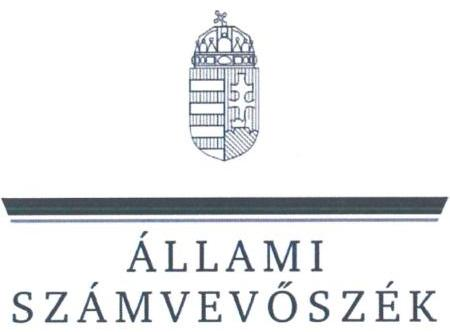
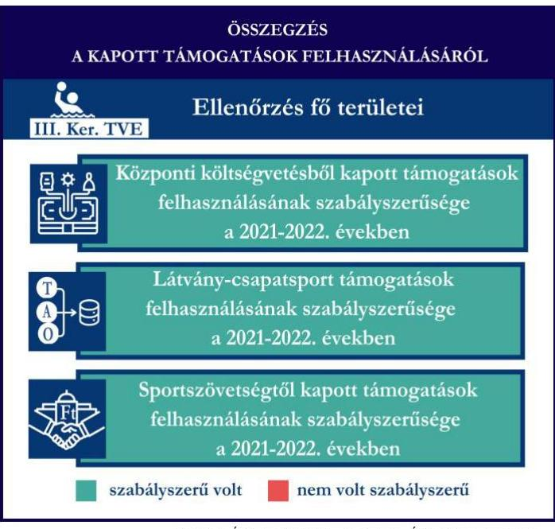
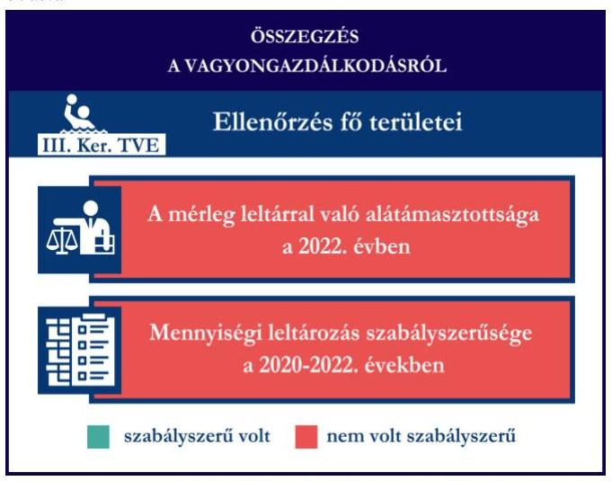

# JELENTÉS 

Támogatásban részesülő sportszövetségek, sportegyesületek és sportvállalkozások gazdálkodásának ellenőrzése
III. Kerületi Torna és Vívó Egylet
2024.

---

ÁLLAMI
SZÁMVEVÔSZÉK

# JELENTÉS 

## Támogatásban részesülő sportszövetségek, sportegyesületek és sportvállalkozások gazdálkodásának ellenőrzése

III. Kerületi Torna és Vívó Egylet

2024.

---

# ELLENŐRZÉSI IGAZGATÓSÁG: 

ÁLLAMHÁZTARTÁSON KÍVÜLI SZERVEZETEKET ELLENŐRZŐ IGAZGATÓSÁG

## ELLENŐRZÉSI IGAZGATÓ:

## KLINGA LÁSZLÓ igazgató

## ELLENŐRZÉSVEZETŐ:

## KAKAS SÁNDOR ellenőrzésvezető

## Jelenéseink az interneten a www.asz.hu címen olvashatók.

IKTATÓSZÁM: EL-4031-002/2024.
TÉMASORSZÁM: 30
ELLENŐRZÉS-AZONOSÍTÓ SZÁM: V1078

---

# TARTALOMJEGYZÉK 

AZ ELLENŐRZÉS ALAPADATAI ..... 5
AZ ELLENŐRZÖTT SZERVEZET ..... 7
ÖSSZEFOGLALÁS ..... 8
AZ ELLENŐRZÉS FÓKUSZTERÜLETEI ..... 10
MEGÁLLAPÍTÁSOK ..... 11
JAVASLATOK ..... 16
MELLÉKLETEK ..... 17
I. sz. melléklet: Értelmező szótár ..... 17
II. sz. melléklet: Az ellenőrzött szervezetek jegyzéke ..... 19
III. sz. melléklet: Fő ellenőrzési kritériumok fő ellenőrzési fókuszterületek szerint. ..... 20
FÜGGELÉK: ÉSZREVÉTELEK ..... 22
RÖVIDÍTÉSEK JEGYZÉKE ..... 23

---

.

---

# AZ ELLENŐRZÉS ALAPADATAI 

## AZ ELLENŐRZÉS CÉLJA

Az ellenőrzés célja az államháztartásból nyújtott támogatással, vagy az államháztartásból meghatározott célra ingyenesen juttatott vagyon felhasználásával érintett sportszövetségek, sportegyesületek és sportvállalkozások gazdálkodása szabályozottságának, gazdálkodási tevékenységének, ezen belül a beszámolási kötelezettség teljesítésének, a támogatások elkülönített nyilvántartásának, valamint a támogatások felhasználásának ellenőrzése.

## AZ ELLENŐRZÉS TÍPUSA

Kombinált ellenőrzés.

## AZ ELLENŐRZŐTT IDŐSZAK

Az 1. fókuszterület vonatkozásában a 2022. év.
A 2. fókuszterület vonatkozásában a 2021-2022. évek.
A 3. fókuszterület vonatkozásában a 2022. év, a mennyiségi felvétellel történő leltározás dokumentumai tekintetében a 2020-2022. évek.

## AZ ELLENŐRZÉS TÁRGYA

Az ellenőrzés tárgyát képezte a támogatásban részesülő sportegyesület gazdálkodása szabályozottságának, gazdálkodási tevékenységén belül a beszámolási kötelezettség teljesítésének, a vagyonnyilvántartásának, a támogatások elkülönített nyilvántartásának, valamint az államháztartási forrásból származó közvetlen vagy közvetett támogatások és a meghatározott célra ingyenesen juttatott vagyon felhasználásának vizsgálata. Az ellenőrzés a támogatások vonatkozásában kiterjedt továbbá a támogató felé történő beszámolási és elszámolási kötelezettségek teljesítésére, a jogszabályi és belső előírások betartására.

Az ellenőrzés kiterjedt minden olyan körülményre és adatra, amely az ÁSZ ${ }^{1}$ jogszabályban meghatározott feladatainak teljesítéséhez, valamint az ellenőrzési program végrehajtása során felmerülő újabb összefüggések feltárásához szükséges volt. Az ellenőrzés az 1. és 3. fókuszterületek esetében az ellenőrzött szervezet egészére, a 2. fókuszterület esetén kizárólag a vízilabda szakágra vonatkozóan került végrehajtásra.

## AZ ELLENŐRZÉS JOGALAPJA

Az ellenőrzés jogszabályi alapját az ÁSZ tv. ${ }^{2} 1 . \int$ (3) bekezdése és az 5. $\$ (3) bekezdése előírásai képezték.

---

# AZ ELLENŐRZÉS MÓDSZERE 

Az ellenőrzést a nemzetközi standardokat irányadónak tekintve az ellenőrzési program szempontjai, az ellenőrzött időszakban hatályos jogszabályok, az ellenőrzés általános szakmai szabályai, az ellenőrzésre irányadó ÁSZ módszertanok figyelembevételével végezte az ÁSZ.

Az ellenőrzési kérdések megválaszolásához szükséges bizonyítékok megszerzése az ellenőrzött szervezet által rendelkezésre bocsátott dokumentumokra adatokra alapozva kérdésfeltevés (információkérés), interjú, mintavételezés útján történt.

Az ellenőrzési bizonyítékként felhasználható adatforrások közé tartoztak egyrészt az ellenőrzés során az ellenőrzött szervezettől bekért dokumentumok, másrészt adatforrás volt minden további, az ellenőrzés folyamán feltárt, az ellenőrzés szempontjából információt tartalmazó egyéb adatforrás. Ezenfelül a támogatásból beszerzett tárgyi eszközök használatára, fizikai fellelhetőségére irányulóan az érintett vagyontárgyak helyszíni szemle keretében történő szemrevételezésére is sor került.

A támogatásokkal, azok felhasználásával, kapcsolatos kötelezettségek vizsgálatára mintavételi eljárások kerültek alkalmazásra. Támogatás-típusok szerint nagyságrend alapján egy darab támogatás képezte a vizsgálat tárgyát. Ezen támogatások felhasználásának szabályszerűsége támogatásonként kockázatértékelés alapján kiválasztott tételekkel került ellenőrzésre. A kiválasztott támogatási szerződésekhez kapcsolódó elszámolásokból 30 db tétel került ellenőrzésre, ahol az elszámolás nem érte el a 30 db -ot, ott tételes ellenőrzésre került sor. Ezen felül a vagyongazdálkodás szabályszerűségének ellenőrzéséhez is kockázatalapú mintavétel kapcsolódott. A támogatások felhasználása és a vagyongazdálkodás területén a tételek ellenőrzése kiterjedt a könyvvezetési kötelezettség vizsgálatára is. A tárgyi eszközök tekintetében 30 db került kiválasztásra a 2022. évben állományban lévő eszközök közül azok nyilvántartásának, elszámolásának szabályszerűsége ellenőrzése céljából. A kiválasztott tételek ellenőrzésének eredménye nem került kivetítésre a teljes sokaságra, a megállapítások az adott ellenőrzött tételek vonatkozásában kerültek megjelenítésre.

---

# AZ ELLENŐRZÖTT SZERVEZET 

A III. Kerületi Torna és Vívó Egyletet a civil szervezetek közhiteles bírósági nyilvántartása alapján 2000. június 27. napján III. ker. TUE Utánpótlásnevelő Egyesület néven alapították. Alapszabálya ${ }_{1-2}{ }^{3}$ szerinti kiemelt célja „az egészzéges életmód és szabadidősport gyakorlása feltételeinek megteremtése, gyermek- és ifjúsági sport támogatása, közfeladatok" ellátása, célja továbbá többek között „a hazai és nemzetközi sportkapcsolatok létesitése, fenntartása". Az egyesületnél az ellenőrzött időszakban három szakosztály - vízilabda, labdarúgás, atlétika működött.

A III. Ker. TVE ${ }^{4}$ legfőbb döntéshozó szerve a Küldöttgyűlés, ügyintéző és képviseleti szerve az öt tagból álló Elnökség, törvényes képviseletét az Elnök, napi operatív irányítását az Ügyvezető látja el. Az Elnök és az Ügyvezető képviseleti joga gyakorlásának terjedelme általános, módja önálló.

A III. Ker. TVE az ellenőrzött időszakban jogszabályi előírás alapján könyvvizsgálatra, felügyelőbizottság létrehozására kötelezett volt. A III. Ker. TVE az ellenőrzött időszakban három tagú felügyelőbizottsággal rendelkezett. A 2022. évben a III. Ker. TVE vállalkozási tevékenységet végzett.

A III. Ker. TVE által az ellenőrzött időszakban a vízilabda szakág vonatkozásában igénybe vett támogatásokat az 1. táblázat mutatja be.

1. táblázat

## A III. KER. TVE ÁLTAL IGÉNYBE VETT TÁMOGATÁSOK (ADATOK M FT-BAN)

|  | 2021. EV | 2022. EV |
| :--: | :--: | :--: |
| Központi költségvetési támogatás | - | $23,0^{1}$ |
| Látvány-csapatsport támogatás | $96,8^{2}$ | $121,9^{2}$ |
| Helyi önkormányzati támogatás | - | - |
| Magyar Vízilabda Szövetségtől kapott támogatás | - | 3,2 |

Forrás: Az ellenőrzött szervezet ellenőrzési dokumentumai alapján ÁSZ saját szerkesztés

[^0]
[^0]:    ${ }^{1}$ A III. Ker. TVE vízilabda szakosztályát is érintő működési támogatás.
    ${ }^{2}$ A III. Ker. TVE vízilabda és labdarúgás szakosztálya vonatkozásában igénybe vett támogatások.

---

# ÖSSZEFOGLALÁS 

Magyarország Alaptörvényének XX. cikke kimondja, hogy mindenkinek joga van a testi és lelki egészséghez, melynek érvényesülését Magyarország többek között a sportolás és a rendszeres testedzés támogatásával segíti elő. Az Országgyűlés a Sport tv. ${ }^{5}$-ben kinyilvánította, hogy a nemzet közössége a test művelését, a sportot, a nemzet alapértékének, kívánatos célnak tekinti. A sport a közjó része. Erősíti a közösség tagjainak egymáshoz tartozását, miként az egyén testi és lelki egészségét.

A sportegyesületek, sportszövetségek, sportvállalkozások müködésükre és szakmai tevékenységük ellátására költségvetési támogatásban, önkormányzati támogatásban, ingyenes vagyonjuttatásban, valamint látvány-csapatsport támogatásban részesülhetnek, amelyekre fokozott figyelem irányul.

A társadalom részéről jogosan felmerülő elvárás, hogy a közpénzeket kezelő, azzal gazdálkodó szervezetek müködéséről, tevékenységéről átfogó képet kapjon, a közpénzek rendeltetésszerủ és átlátható módon történő felhasználásának értékelésére időről-időre sor kerüljön az ellenőrzések keretében.

A III. Ker. TVE a könyvviteli szolgáltatás személyi feltételeinek megteremtéséről, felügyelőbizottság létrehozásáról és működéséről gondoskodott. A jogszabályi előírások szerint a III. Ker. TVE kialakította a számviteli politikáját, valamint elkészítette számviteli szabályzatait, továbbá rendelkezett számlarenddel. A számlarend tekintetében tartalmi hiányosságot tárt fel az ellenőrzés.

A könyvvezetés formája a 2022. évben megfelelt a jogszabályi előírásoknak. A III. Ker. TVE a számviteli beszámoló- és közhasznúsági melléklet készítési- és közzétételi kötelezettségét teljesítette, azonban az ellenőrzés a kiegészítő melléklet tekintetében, továbbá a beszámoló közzétételi kötelezettség, valamint a közhasznúsági melléklet készítési- és közzétételi kötelezettség tekintetében hiányosságot tárt fel.

A gazdálkodás szervezeti keretei kialakításának, a
számviteli szabályzatok megalkotásának, valamint a számviteli beszámoló elkészítésének és közzétételének értékelését az 1. ábra mutatja be.

---

2. ábra

Forrás: ÁSZ megállapítások alapján ÁSZ saját szerkesztés
A III. Ker. TVE vagyongazdálkodása a 2022. évben nem volt szabályszerű, mert a 2022. évi éves beszámolójának mérleg tételeit nem támasztotta alá leltárral, továbbá a 2020-2022. évekre vonatkozóan a tárgyi eszközök esetében a mennyiségi felvétellel történő leltározást egyik évben sem végezte el.

Az ellenőrzött tételek esetében a tárgyi eszközök üzembe helyezése és értékesökkenésük elszámolása a 2022. évben szabályszerű volt.

A vagyongazdálkodás értékelését a 3. ábra mutatja be.

A III. Ker. TVE a központi költségvetésből kapott támogatást, a látvány-csapatsport támogatást és kiegészítő sportfejlesztési támogatást, valamint az MVLSZ ${ }^{6}$-től számára juttatott támogatást a 20212022. években az ellenőrzött tételek esetében a támogatási célnak megfelelően, szabályszerűen használta fel. Számviteli nyilvántartásában a kapott támogatások felhasználását a jogszabályi előírás ellenére elkülönítetten nem tartotta nyilván.
A kapott támogatások felhasználásának értékelését a 2. ábra mutatja be.
3. ábra

---

# AZ ELLENŐRZÉS FÓKUSZTERÜLETEI 

1.     - A gazdálkodási szabályok kialakítása, a könyvvezetési- és beszámolási kötelezettség teljesítése
2.     - A kapott támogatások felhasználása
3.     - Az ellenőrzött szervezet vagyongazdálkodása

---

# MEGÁLLAPÍTÁSOK 

## 1. A gazdálkodási szabályok kialakítása, a könyvvezetési- és beszámolási kötelezettség teljesítése

Összegző megállapítás

A III. Ker. TVE a 2022. évre vonatkozóan a jogszabályokban előírt szervezeti keretek kialakításával, a gazdálkodást biztosító belső szabályozó eszközök és számviteli keretek megalkotásával megteremtette a szabályszerű gazdálkodásának feltételeit, azonban a számlarend tekintetében az ellenőrzés hiányosságot tárt fel. A könyvvezetési kötelezettség teljesítése megfelelt a jogszabályi előírásoknak, azonban a beszámolási- és közzétételi kötelezettség esetén az ellenőrzés hiányosságot tárt fel.

A 2022. évben a III. Ker. TVE a Számv. tv. ${ }^{7}$ és a Civilszr. ${ }^{8}$-ben foglalt jogszabályi előírások betartásával gondoskodott a könyvviteli szolgáltatás személyi feltételeinek megteremtéséről, a könyvviteli szolgáltatás körébe tartozó feladatok ellátásával olyan számviteli szolgáltatást nyújtó társaságot bízott meg, amelynek a feladat irányításával, vezetésével, a beszámoló elkészítésével megbízott tagja megfelelt a jogszabályi követelményeknek.
A III. Ker. TVE a Ptk. ${ }^{9}$ előírása szerint létrehozta a felügyelőbizottságot, a felügyelőbizottság tagjainak száma megfelelt a Ptk. előírásainak.
A III. Ker. TVE a 2022. évben rendelkezett a Számv. tv.-ben előírt számviteli politikával ${ }^{10}$, illetve annak keretében elkészítette az értékelési szabályzatot ${ }^{11}$, a leltározási szabályzatot ${ }^{12}$ és a pénzkezelési szabályzatot ${ }^{13}$. A szabályzatok az ellenőrzött tartalmi kritériumoknak megfeleltek. A III. Ker. TVE a Számv. tv. alapján a számlarendet ${ }^{14}$ elkészítette, azonban a számlarend a Számv. tv. 161. § (2) bekezdés b) pontjában foglaltak ellenére nem tartalmazta a számla értéke növekedésének, csökkenésének jogcímeit, más számlákkal való kapcsolatát, és nem teljeskörűen tartalmazta a számlát érintő gazdasági eseményeket, továbbá a Számv. tv. 161. § (2) bekezdés c) pontjában előírtakkal szemben nem teljeskörűen tartalmazta a főkönyvi számla és az analitikus nyilvántartás kapcsolatát. A számlarend, illetve a számlatükörként rendelkezésre bocsátott főkönyvi törzs listája tartalmazta a 88 Rendkívüli ráfordítások és 98 Rendkívüli bevételek főkönyvi számlacsoportokat és azok alábontásait, annak ellenére, hogy 2015. július 4-től a rendkívüli bevételek és ráfordítások a Számv. tv. rendelkezései szerint megszűntek.
A III. Ker. TVE a Civilszr. előírásainak megfelelően a 2022. évben kettős könyvvitelt vezetett. A 2022. évben a III. Ker. TVE végzett vállalkozási tevékenységet, amelynek bevételeit és ráfordításait a könyvvezetése során a Civil tv.-nek megfelelően az alaptevékenységtől elkülönítetten tartotta nyilván és mutatta ki éves beszámolójában. A könyvviteli nyilvántartásait a Számv. tv. és a Civilszr. rendelkezéseinek megfelelően úgy alakította ki, hogy a 2022. évben az éves beszámolóban a bevételeit az értékesítés nettó

---

árbevétele, egyéb bevétel és pénzügyi műveletek bevétele bontásban mutatta ki, továbbá az egyéb bevételeken belül a tagdíjakat és a kapott támogatások összegét részletezni tudta.
A III. Ker. TVE a Számv. tv., a Civil tv., valamint a Civilszr. előírásainak megfelelően elkészítette a 2022. évre vonatkozó éves beszámolóját, azonban a kiegészítő mellékletben a kapott támogatásokat a Számv. tv. 93. § (3) bekezdésében előírtak ellenére a kapott összeg, annak felhasználása (jogcímenként és évenként), a rendelkezésre álló összeg megbontásban nem mutatta be.
A III. Ker. TVE a Civil tv.-nek megfelelően a beszámolóval egyidejűleg elkészítette a közhasznúsági mellékletet, azonban annak ellenére, hogy a főkönyvi nyilvántartásban rögzítettek alapján az ügyvezető munkabér kifizetésben részesült, a Civil tv. 29. § (7) bekezdésében és a Civil vhr. ${ }^{15}$ mellékletében foglaltakkal ellentétesen, a közhasznúsági melléklet nem tartalmazta a vezető tisztségviselőknek nyújtott juttatások összegét.
A 2022. évre vonatkozó éves beszámolót a Civilszr. előírása alapján könyvvizsgáló felülvizsgálta, a felügyelőbizottság véleményezte, a Küldöttgyűlés a Civil tv.-nek megfelelően jóváhagyta.
A III. Ker. TVE a 2022. évi éves beszámolóját, valamint közhasznúsági mellékletét a Civil tv. alapján letétbe helyezte és közzétette, azonban a Civil tv. 30. § (1) bekezdésében foglaltakkal ellentétben a független könyvvizsgálói jelentést nem tette közzé. Továbbá a Civil tv. 30. § (4) bekezdésben előírtak ellenére saját honlapján - az ellenőrzés ideje alatt - közzétett 2022. évi éves beszámoló nem tartalmazta az éves beszámoló részét képező kiegészítő mellékletet, továbbá a III. Ker. TVE nem gondoskodott a közhasznúsági melléklet saját honlapon történő elhelyezéséről sem.

# 2. A kapott támogatások felhasználása 

Összegző megállapítás A III. Ker. TVE a 2021. és a 2022. években a kapott támogatásokat az ellenőrzött tételek esetében szabályszerűen használta fel, azonban a támogatások felhasználását nem tartotta elkülönítetten nyilván.

A III. Ker. TVE a központi költségvetésből kapott támogatás bevételeit a Civil tv. előírásai alapján elkülönítetten mutatta ki a könyveiben. A Civil tv. 20. § (4) bekezdésében foglaltakkal ellentétben a központi költségvetésből részére juttatott támogatás felhasználásáról nem vezetett olyan elkülönített számviteli nyilvántartást, amelynek alapján megállapítható és ellenőrizhető a kapott támogatás felhasználása. A III. Ker. TVE a támogatás felhasználásáról a támogató felé benyújtott beszámolót és annak részeként az összesített elszámolási táblázatot a Honvédelmi Minisztérium által 2022. december 22én kiállított, 1873/2022. számú támogatói okiratban előírt formában és tartalommal elkészítette. A III. Ker. TVE a 765/2021. (XII.23.) Korm. rendelet ${ }^{16}$ 10. §-a szerinti adatszolgáltatási kötelezettségét a nemzeti sportinformációs rendszer "Szervezetek", "Létesítmények" és "Támogatás és ellenőrzés" moduljába nem teljesítette.
A III. Ker. TVE esetében a központi költségvetésből kapott támogatás tételeinek (4 db) ellenőrzése során az alábbiak kerültek megállapításra:

- a tételek számviteli elszámolását a Számv. tv.-ben előírtak szerint bizonylatokkal alátámasztották;
- a támogatói okiratban foglaltaknak megfelelően:

---

- a tétel gazdasági eseményének teljesítési időpontja a támogatói okiratban meghatározott támogatott tevékenység időtartamán belül történt;
- a támogatói okiratban meghatározott felhasználási határidőig megtörtént a tétel pénzügyi rendezése.
- a számviteli bizonylatokat a 474/2016. (XII. 27.) Korm. rendelet ${ }^{17}$ és a 27/2013. (III. 29.) EMMI rendelet ${ }^{18}$ előírásainak megfelelően záradékkal ellátták, amelyben jelzésre került, hogy a számviteli bizonylaton szereplő összegből mennyit számoltak el a hivatkozott támogatói okirat terhére;
- a hivatkozott támogatói okirat terhére a számviteli bizonylaton záradékolt összeg a 474/2016. (XII. 27.) Korm. rendeletben foglaltaknak megfelelően megegyezik a számlaösszesítőben feltüntetett értékkel;
- a tételek számviteli bizonylatának a hivatkozott támogatói okirat terhére záradékolt összege a Számv. tv.-ben előírtak szerint, tartalmának megfelelő főkönyvi számra került elszámolásra.
A III. Ker. TVE a látvány-csapatsport támogatások esetében a 2021-2022. években eleget tett a 107/2011. (VI. 30.) Korm. rendeletben ${ }^{19}$ foglaltaknak, a támogatás felhasználásáról negyedévente az előrehaladási jelentéseket benyújtotta az MVLSZ felé.
A III. Ker. TVE a számára nyújtott látvány-csapatsport támogatásról és kiegészítő sportfejlesztési támogatásról a 107/2011. (VI. 30.) Korm. rendeletnek megfelelően határidőben benyújtotta az elszámolást a támogató felé. A támogatási időszak lezárultát követően a támogatás felhasználását a jogszabályban foglaltak szerint záradékolt számviteli bizonylatokkal alátámasztott módon, összesített elszámolási táblázattal és szöveges szakmai beszámolóval igazolta. A III. Ker. TVE a 107/2011. (VI. 30.) Korm. rendeletnek megfelelően könyvvizsgáló által ellenőrzött számviteli bizonylatokkal számolt el a támogató felé. A könyvvizsgáló a 107/2011. (VI. 30.) Korm. rendeletben előírt felelősségbiztosítással rendelkezett.
A III. Ker. TVE az ellenőrzött időszak könyvvezetése során az alapcél szerinti tevékenysége költségei, ráfordításai ellentételezésére kapott támogatásokról nem vezetett a Civil tv. 20. § (4) bekezdésében előírt elkülönített számviteli nyilvántartást, amelynek alapján támogatásonként megállapítható és ellenőrizhető a kapott támogatás felhasználása, ezáltal nem tett eleget a 107/2011. (VI. 30.) Korm. rendelet 9. § (9) bekezdésében előírtaknak, mivel a látvány-csapatsport támogatás, illetve a kiegészítő sportfejlesztési támogatás felhasználását nem tartotta elkülönítetten nyilván.
A III. Ker. TVE esetében a látvány-csapatsport támogatás és kiegészítő sportfejlesztési támogatás ellenőrzött tételeinek (összesen 40 db ) vonatkozásában az alábbiak kerültek megállapításra:
- a tételek számviteli elszámolását a Számv. tv.-ben és a 107/2011. (VI. 30.) Korm. rendeletben előírtak szerint bizonylatokkal alátámasztották;
- a 107/2011. (VI. 30.) Korm. rendeletben foglaltaknak megfelelően
- a tételek tartalma (gazdasági esemény) és összege alapján a támogatási igazolásban meghatározottak szerinti jogcímre, az abban meghatározott mértékben használták fel;
- a tételek számviteli bizonylatai alapján a gazdasági események a támogatási időszak (meghosszabbított támogatási időszak) végéig szerződés szerint teljesültek;
- a tételek számviteli bizonylatai alapján a gazdasági események pénzügyi rendezése az elszámolás benyújtására nyitva álló határidőig - figyelemmel az esetleges elszámolási határidő hosszabbítására - teljesült;
- a tételek számviteli bizonylatait ellátták záradékkal;

---

- a számviteli bizonylatokon elszámolt/záradékolt összegek megegyeznek a számlaösszesítőben feltüntetett értékekkel;
- a tételek számviteli bizonylatának az adott sportfejlesztési program terhére záradékolt összegei a Számv. tv.-ben előírtak szerint a tartalmuknak megfelelő főkönyvi számra kerültek elszámolásra.
A III. Ker. TVE a 2022. évben a MVLSZ-en keresztül számára juttatott támogatás bevételét a Civil tv. előírásai alapján elkülönítetten mutatta ki a könyveiben, azonban a kapott támogatásokról nem vezetett a Civil tv. 20. § (4) bekezdésében előírt elkülönített számviteli nyilvántartást, amelynek alapján támogatásonként megállapítható és ellenőrizhető a kapott támogatás felhasználása. A támogatás felhasználásáról az MVLSZ felé benyújtott beszámolót és annak részeként az összesített elszámolási táblázatot az MVLSZ-el 2021. november 12-én kötött, MVLSZ-07/2021. számú támogatási szerződésben előírt formában és tartalommal elkészítette.
A III. Ker. TVE esetében az MVLSZ-en keresztül számára juttatott támogatás tételeinek (18 db) ellenőrzése során az alábbiak kerültek megállapításra:
- a tételek számviteli elszámolását a Számv. tv.-ben előírtak szerint bizonylatokkal alátámasztották;
- a támogatási szerződésben foglaltaknak megfelelően:
- a tétel gazdasági eseményének teljesítési időpontja a támogatási szerződésben meghatározott támogatott tevékenység időtartamán belül történt;
- a támogatási szerződésben meghatározott felhasználási határidőig megtörtént a tétel pénzügyi rendezése;
- a számviteli bizonylatokat záradékkal ellátták;
- a hivatkozott támogatási szerződés terhére a számviteli bizonylaton záradékolt összeg megegyezik a számlaösszesítőben feltüntetett értékkel;
- a tétel számviteli bizonylatának a hivatkozott támogatási szerződés terhére záradékolt összege Számv. tv.-ben előírtak szerint tartalmának megfelelő főkönyvi számra került elszámolásra.
A helyszíni ellenőrzés során a III. Ker. TVE képviselője megerősítette, hogy a kapott támogatások felhasználásáról az ellenőrzött időszakban elkülönített számviteli nyilvántartást támogatásonként nem vezettek.

# 3. Az ellenőrzött szervezet vagyongazdálkodása 

## Összegző megállapítás A III. Ker. TVE vagyongazdálkodása a 2022. évben nem volt szabályszerű.

A III. Ker. TVE a 2022. évi éves beszámolója mérlegtételeinek alátámasztásához a Számv. tv. 69. § (1) bekezdésében előírtak ellenére nem állított össze olyan leltárat, amely tételesen és ellenőrizhető módon tartalmazta a III. Ker. TVE mérleg fordulónapján meglévő eszközeit és forrásait mennyiségben és értékben. A III. Ker. TVE a Számv. tv. 69. § (2) bekezdésében előírtak ellenére a főkönyvi könyvelés és az analitikus nyilvántartások adatai közötti egyeztetést a 2022. év mérlegfordulónapjára vonatkozóan a mérlegtételek esetében - kivéve a befektetett pénzügyi eszközöket - dokumentáltan nem végezte el.
A III. Ker. TVE a Számv. tv. 69. § (4) bekezdésében foglaltak ellenére a 2020-2022. évekre vonatkozóan a mennyiségi felvétellel történő leltározást egyik évben sem végezte el.

---

Az ellenőrzés során a tárgyi eszközök vonatkozásában sor került a tételek helyszíni szemrevételezésére, amely alapján az eszközök fizikailag fellelhetőek voltak.
A III. Ker. TVE esetében a tárgyi eszköz tételek ( 30 db ) ellenőrzése során az alábbiak kerültek megállapításra:

- a tételek bekerülési értékét meghatározó számviteli bizonylatok - egy tétel kivételével - a Számv. tv.-nek megfelelően rendelkezésre álltak. A kivételt képező tétel esetén a Számv. tv. 47. § (1) bekezdése szerinti bekerülési értékét ( 3784232 Ft - 2017. június havi elmú csatlakozási díj és vízbekötés) a Számv. tv. 165. § (2) bekezdésében foglaltak ellenére bizonylattal nem támasztotta alá.
- a tárgyi eszközök számviteli besorolása megfelelt a Számv. tv. előírásainak;
- az üzembe helyezés tényét és időpontját a Számv. tv.-nek megfelelően hitelt érdemlően dokumentálták;
- az értékcsökkenés elszámolása a Számv. tv.-nek megfelelően történt;
- huszonhat tétel esetén - ahol a tárgyi eszköz beszerzés támogatásból valósult meg - a tétel bekerülési értékét meghatározó számviteli bizonylatokat - egy tétel kivételével - ellátták záradékkal, amelyből kiderül, hogy a számviteli bizonylaton szereplő összegből mennyit számoltak el a hivatkozott támogatás terhére.

---

# JAVASLATOK 

Az ÁSZ tv. 33. § (1) bekezdésében foglaltak értelmében az ellenőrzött szervezet vezetője köteles a jelentésben foglalt megállapításokhoz kapcsolódó intézkedési tervet összeállítani és azt a jelentés kézhezvételétől számított 30 napon belül az ÁSZ részére megküldeni. Amennyiben az ellenőrzött szervezet vezetője nem küldi meg határidőben az intézkedési tervet, vagy továbbra sem elfogadható intézkedési tervet küld, az Állami Számvevőszék elnöke az ÁSZ tv. 33. § (3) bekezdése a) és b) pontjaiban foglaltakat érvényesítheti.

## A III. KERÜLETI TORNA ÉS VÍVÓ EGYLET ELNÖKÉNEK

1. Gondoskodjon a számlarend Számv. tv. 161. § (2) bekezdésben elöirtaknak megfelelő tartalommal való elkészitéséről.
2. Gondoskodjon a beszámoló kiegészítő mellékletének Számv. tv. 93. § (3) bekezdésében elöirtaknak megfelelően történő elkészitéséről.
3. Gondoskodjon a beszámolóval egyidejüleg a Civil tv. 29. § (7) bekezdésében elöirtaknak megfelelően, a Civil vhr. melléklete szerinti tartalmú közhasznúsági melléklet elkészitéséről.
4. Gondoskodjon a beszámoló Civil tv. 30. § (1) bekezdésében elöirtaknak megfelelő letétbe helyezésérő és közzétételéről.l.
5. Gondoskodjon a beszámoló és a közhasznúsági melléklet Civil tv. 30. § (4) bekezdésében elöirtaknak megfelelő saját honlapon történő közzétételéről.
6. Gondoskodjon arról, hogy kapott támogatások felhasználását a Civil tv. 20. § (4) bekezdésében és a 107/2011. (VI. 30.) Korm. rendelet 9. § (9) bekezdésében foglalt elöírásoknak megfelelően elkülönítetten tartsa nyilván.
7. Gondoskodjon a beszámoló mérlegtételeinek leltárral történő alátámasztásáról a Számv. tv. 69. § (1) bekezdése elöírásainak megfelelően.
8. Gondoskodjon a Számv. tv. 69. § (4) bekezdésében foglaltaknak megfelelően mennyiségi felvétellel történő leltározás elvégzéséről.
9. Gondoskodjon a tárgyi eszközök esetében a bekerülési érték bizonylattal történő alátámasztásáról a Számv. tv. 165. § (2) bekezdésében elöírtak szerint.

---

# MELLÉKLETEK 

## I. SZ. MELLÉKLET: ÉRTELMEZŐ SZÓTÁR

Civil szervezet

Egyesület

Kiegészítő sportfejlesztési támogatás

Költségvetési támogatás

Közhasznú szervezet

Közhasznú tevékenység

Látvány-csapatsport támogatás

Látvány-csapatsportban múködő amatőr sportszervezet

Látvány-csapatsportban múködő hivatásos sportszervezet

A civil társaság; a Magyarországon nyilvántartásba vett egyesület - a párt, a szakszervezet és a kölcsönös biztosító egyesület kivételével és - a közalapítvány és a pártalapítvány kivételével - az alapítvány. (Forrás: Civil tv. 2. $\S 6$. pont a)-c) alpontjai)

Az egyesület a tagok közös, tartós, alapszabályban meghatározott céljának folyamatos megvalósítására létesített, nyilvántartott tagsággal rendelkező jogi személy. (Forrás: Ptk. 3:63. § (1) bekezdés)
A Számv. tv. szempontjából egyéb szervezet. (Számv. tv. 3. § (1) bekezdés 4. pont a) alpontja)

A látvány-csapatsportok támogatása esetében rendelkező nyilatkozatban felajánlott összeg 12,5 százaléka kiegészítő sportfejlesztési támogatásnak minősül. (Forrás: Tao tv. ${ }^{20}$ 24/A. § (9) bekezdés)
A társadalombiztosítás pénzügyi alapjai kivételével az államháztartás központi alrendszeréből ellenérték nélkül, pénzben nyújtott támogatások. (Forrás: Áht. ${ }^{21} 1 . \S 14$. pont)
Közhasznú szervezetté minősíthető a Magyarországon nyilvántartásba vett közhasznú tevékenységet végző szervezet, amely a társadalom és az egyén közös szükségleteinek kielégítéséhez megfelelő erőforrásokkal rendelkezik, továbbá amelynek megfelelő társadalmi támogatottsága kimutatható, és amely:
a) civil szervezet (ide nem értve a civil társaságot), vagy
b) olyan egyéb szervezet, amelyre vonatkozóan a közhasznú jogállás megszerzését törvény lehetővé teszi. (Forrás: Civil tv. 32. $\S$ (1) bekezdés)

Minden olyan tevékenység, amely a létesítő okiratban megjelölt közfeladat teljesítését közvetlenül vagy közvetve szolgálja, ezzel hozzájárulva a társadalom és az egyén közös szükségleteinek kielégítéséhez. (Forrás: Civil tv. 2. $\S 20$. pont)

Az adóévben visszafizetési kötelezettség nélkül nyújtott támogatás, juttatás, véglegesen átadott pénzeszköz és térítés nélkül átadott eszköz könyv szerinti értéke, az adóévben térítés nélkül nyújtott szolgáltatás bekerülési értéke a Tao tv.-ben meghatározott jogcímeken. (Forrás: Tao tv. 4. § 44. pont)
Minden olyan, a sportról szóló törvényben meghatározott szabályok szerint a látvány-csapatsportban múködő sportegyesület vagy sportvállalkozás, amelyik nem minősül a látvány-csapatsportban múködő hivatásos sportszervezetnek. (Forrás: Tao tv. 4. § 42. pont)
A látvány-csapatsportágak országos sportági szakszövetsége által kiírt versenyrendszer legmagasabb felnőtt bajnoki osztályában - a veterán korosztályokra kiírt versenyrendszer kivételével - részt vevő (indulási jogot elnyert) sportszervezet, vagy alsóbb bajnoki osztályaiban részt vevő (indulási jogot elnyert) sportszervezet abban az esetben, ha az ilyen sportszervezet hivatásos sportolót alkalmaz. Több látvány-csapatsportban több jogi személy szervezeti egységgel (szakosztállyal) múködő sportszervezet esetén csak az a jogi személy szervezeti egység (szakosztály), amely a fent részletezett

---

Országos sportági szakszövetség

Sportági szövetség

Sportegyesület

Sportegyesületeknek, sportszövetségeknek nyújtott költségvetési támogatás

Sportszövetség

Sporttevékenység

Sportvállalkozás
versenyrendszerek bajnoki osztályaiban részt vesz. (Forrás: Tao tv. 4. $\S 43$. pont)

Olyan sportszövetség, amely sportágában kizárólagos jelleggel az e törvényben, valamint más jogszabályokban meghatározott feladatokat lát el és e törvényben megállapított különleges jogosítványokat gyakorol. Olyan sportágban hozható létre, amelyet vagy a Nemzetközi Olimpiai Bizottság elismert, vagy amely sportág nemzetközi szövetségét felvették a Nemzetközi Sportszövetségek Szövetségébe (GAISF). (Forrás: Sport tv. 20. §(1), (4) bekezdés)

A Civil tv. és a Ptk. előírásai alapján - a Sport tv.-ben meghatározott eltérésekkel - müködő szövetség, amelynek tagjai kizárólag sportszervezetek lehetnek. Sportági szövetség országos jelleggel is müködhet. Egy sportágban csak egy országos sportági szövetség müködhet. Törvényi feltételek teljesülése esetén szakszövetségi feladatokat is elláthat. (Forrás: Sport tv. 28. §)

A Civil tv. és a Ptk. szabályai szerint müködő olyan egyesület, amelynek alaptevékenysége a sporttevékenység szervezése, valamint a sporttevékenység feltételeinek megteremtése. A sportegyesületek a Sport tv. 15. § (1) bekezdésében meghatározott sportszervezetek körébe tartoznak. A sportegyesületeken kívül sportszervezet még a sportvállalkozás, a sportiskola, valamint az utánpótlás-nevelés fejlesztését végző alapítvány. (Forrás: Sport tv. 16. § (1) bekezdés)
Az állami sport célú támogatások felhasználásáról és elosztásáról szóló 474/2016. (XII. 27.) Korm. rendelet és a 27/2013. (III. 29.) EMMI rendelet 1. §-ában meghatározott fejezeti kezelésű előirányzatokból nyújtott támogatás.
Meghatározott sporttevékenységek körében a sportversenyek szervezésére, a tagok érdekvédelmére és a részükre való szolgáltatásokra, valamint a nemzetközi kapcsolatok lebonyolítására létrehozott, jogi személyiséggel és önkormányzattal rendelkező, a Civil tv. és a Ptk. alapján - az e törvényben foglalt eltérésekkel - különös formában müködő egyesületek. A Sport tv. 19. § (3) bekezdése szerint a sportszövetségeknek az alábbi típusai léteznek: országos sportági szakszövetségek, sportági szövetségek, szabadidősport szövetségek, fogyatékosok sportszövetségei, diák- és egyetemi-főiskolai sport sportszövetségei, nemzetközi sportszövetségek. (Forrás: Sport tv. 19. § (1), (3) bekezdés)

Meghatározott szabályok szerint, a szabadidő eltöltéseként kötetlenül vagy szervezett formában, illetve versenyszerűen végzett testedzés vagy szellemi sportágban kifejtett tevékenység, amely a fizikai erőnlét és a szellemi teljesítőképesség megtartását, fejlesztését szolgálja. (Forrás: Sport tv. 1. $\S(2)$ bekezdés)

Az a gazdasági társaság, amelynek a cégnyilvántartásról, a cégnyilvánosságról és a bírósági cégeljárásról szóló törvény alapján a cégjegyzékbe bejegyzett tevékenysége sporttevékenység, továbbá a gazdasági társaság célja sporttevékenység szervezése, valamint a sporttevékenység feltételeinek megteremtése egy vagy több sportágban. Korlátolt felelősségű társasági, illetve részvénytársasági formában alapítható, a fogyatékosok sportja, illetve a szabadidősport területén közhasznú társaságként is müködhet. (Forrás: Sport tv. 18. §)

---

II. SZ. MELLÉKLET: AZ ELLENŐRZÖTT SZERVEZETEK JEGYZÉKE

| ELLENŐRZÖTT SZERVEZET NEVE | ELLENŐRZÖTT SZERVEZET SZÉKHELYE |
| :-- | :-- |
| III. Kerületi Torna és Vívó Egylet | 1037 Budapest, Kalap u. 1. |

---

# III. SZ. MELLÉKLET: FŐ ELLENŐRZÉSI KRITÉRIUMOK FŐ ELLENŐRZÉSI FÓKUSZTERŰLETEK SZERINT 

## FŐ ELLENŐRZÉSI FÓKUSZTERŰLETEK

1. A gazdálkodási szabályok kialakítása, a könyvvezetési és beszámolási kötelezettség teljesítése

## FŐ ELLENŐRZÉSI KRITÉRIUMOK

Civil tv. 2. § 7., 11. pont, 20. § (3) bekezdés c) pont, (4) bekezdés, 28. § (1)-(3) bekezdés, 29. § (1) bekezdés, (2) bekezdés c) pont, (3), (6), (7) bekezdés, 30. § (1)-(4) bekezdés, 40. § (1), (2) bekezdés, 41. § (1) bekezdés
Civilszr. 7. § (1) bekezdés, (4) bekezdés b), c) pont, (6) bekezdés, 8. § (2), (3) bekezdés, 9. § (4), (5), (8) bekezdés, 12. § (4), (5) bekezdés, 15. § (1) bekezdés a), b) pont, (2) bekezdés, 16. § (1), (3) bekezdés, 22. § (1) bekezdés, 24. § (2) bekezdés, 3.-4. sz. melléklet
Civil vhr. 12. § és melléklet
Cnytv. ${ }^{22}$ 39. § (1), (4) bekezdés, 40. § (2) bekezdés
Ptk. 3:26. § (1) bekezdés, 3:27. § (1) bekezdés, 3:82. § (1)-(2) bekezdés
Számv. tv. 4. §, 6. § (2) bekezdés, 12. §, 14. § (3), (5) bekezdés a), b), d) pont, (8) bekezdés, (11)-(12) bekezdés, 69. § (1), (3) bekezdés, 90. § (3) bekezdés c) pont, 93. § (3) bekezdés, 96. § (4) bekezdés, 150. § (2) bekezdés, 153. § (1) bekezdés, 154. § (1) bekezdés, 161. § (1) bekezdés, (2) bekezdés a)-d) pont, (3)-(4) bekezdés, 161/A. § (1)-(2) bekezdés, 165. § (2) bekezdés
Tao tv. 22/C. §
107/2011. (VI.30.) Korm. rendelet 9. § (9) bekezdés
2. A kapott támogatások felhasználása

Ábt. 52. § (1) bekezdés, 53. §
Ávr. ${ }^{23} 76 . \S$ (1) bekezdés c) pont, 93. § (1)-(3), (5) bekezdés
Civil tv. 20. § (1) bekezdés c) pont, (2) bekezdés a) pont, (3) bekezdés a), c) pont, (4) bekezdés, 29. § (4), (5) bekezdés
Civilszr. 13. § (3) bekezdés, 24. § (1)-(2) bekezdés
Kbt. ${ }^{24}$ 5. § (2) bekezdés, 15. §
Számv. tv. 16. § (3) bekezdés, 25-26. §, 44. § (2) bekezdés, 45. § (1)-(2) bekezdés, 77. § (3) bekezdés b) pont, 78-81. §, 93. § (3) bekezdés, 159. §, 161/A. § (2) bekezdés, 162. § (1) bekezdés, 165. § (1)-(2) bekezdés, 166. § (1) bekezdés, 167. § (1) bekezdés a), d), e), h) pont
Tao. tv. 22/C. §, 24/A. § (9) bekezdés
107/2011. (VI.30.) Korm. rendelet 2. § (3b) bekezdés, 4. § (11) bekezdés, 5. § (1) bekezdés, 6. § (1) bekezdés e) pont, 9. § (8)(10) bekezdés, 10. § (2), (2a), (2b), (4) bekezdés, 10. § (5a) bekezdés, 11. § (1), (1a), (1d), (1e), (2), (4), (4a), (5), (6) bekezdés, 13. § (1), (2a) bekezdés, 14. § (1), (4), (4b), (4c), (6c) bekezdés

275/2022. (VII.29.) Korm. rendelet 1. § (3)
444/2022. (XI.7) Korm. rendelet ${ }^{25}$ 2. §
474/2016. (XII. 27.) Korm. rendelet 26. § (3) bekezdés

---

3. Az ellenőrzött szervezet vagyongazdálkodása

Ptk. 3:63. § (4) bekezdés
Számv. tv. 15. § (3) bekezdés, 26. §, 46. § (3) bekezdés, 47-53. §, 57. §, 69. § (1)-(6) bekezdés, 165-166. §, 169. § (2) bekezdés

Tao tv. 22/C (6) bekezdés a), d), e) pont, (11) bekezdés
Ávr. 93. § (5) bekezdés
107/2011. (VI.30.) Korm. rendelet 11. § (5) bekezdés
474/2016. (XII. 27.) Korm. rendelet 17. § (1) bekezdés 11a. a) pont, 11b. pont, 17. § (2a) bekezdés, 24. § (2) bekezdés

---

# FÜGGELÉK: ÉSZREVÉTELEK 

A jelentéstervezetet a Számvevőszék 15 napos észrevételezésre megküldte az ellenőrzött szervezet vezetőjének az ÁSZ tv. 29. §² (1) bekezdése előírásának megfelelően.

A III. Kerületi Torna és Vivó Egylet elnöke a jelentéstervezetre nem tett észrevételt.

[^0]
[^0]:    § 29. § (1) Az Állami Számvevőszék az ellenőrzési megállapításait megküldi az ellenőrzött szervezet vezetőjének vagy az általa megbízott személynek, és annak, akinek személyes felelősségét állapította meg.
    (2) Az ellenőrzött szervezet vezetője és a felelősként megjelölt személy az ellenőrzés megállapításaira tizenöt napon belül írásban észrevételt tehet.
    (3) Az Állami Számvevőszék az észrevételre a beérkezésétől számított harminc napon belül írásban válaszol. A figyelembe nem vett észrevételeket köteles a jelentésben feltüntetni, és megindokolni, hogy azokat miért nem fogadta el.

---

# RÖVIDÍTÉSEK JEGYZÉKE 

${ }^{1}$ ÁSZ ${ }^{2}$ ÁSZ tv. ${ }^{3}$ Alapszabály; Alapszabályz ${ }^{4}$ III. Ker. TVE ${ }^{5}$ Sport tv. ${ }^{6}$ MVLSZ ${ }^{7}$ Számv. tv. ${ }^{8}$ Civilszr. ${ }^{9}$ Ptk. ${ }^{10}$ számviteli politika; ${ }^{11}$ értékelési szabályzat ${ }^{12}$ leltározási szabályzat ${ }^{13}$ pénzkezelési szabályzat ${ }^{14}$ számlarend ${ }^{15}$ Civil vhr. ${ }^{16}$ 765/2021. (XII.23.) Korm. ${ }^{17}$ 474/2016. (XII.27.) Korm. rendelet ${ }^{18}$ 27/2013. EMMI rendelet ${ }^{19}$ 107/2011. (VI.30.) Korm. rendelet ${ }^{20}$ Tao tv. ${ }^{21}$ Áht. ${ }^{22}$ Cnytv. ${ }^{23}$ Ávr. ${ }^{24}$ Kbt. ${ }^{25}$ 444/2022. (XI.7.) Korm. rendelet

Állami Számvevőszék
2011. évi LXVI. törvény az Állami Számvevőszékről
A III. Kerületi Torna és Vívó Egylet Alapszabálya (hatályos: 2019. május 29-től)
A III. Kerületi Torna és Vívó Egylet Alapszabálya (hatályos: 2021. október 6-től)
III. Kerületi Torna és Vívó Egylet
2004. évi I. törvény a sportról

Magyar Vízilabda Szövetség
2000. évi C. törvény a számvitelről
479/2016. (XII.28.) Korm. rendelet a számviteli törvény szerinti egyes egyéb szervezetek beszámoló készítési és könyvvezetési kötelezettségének sajátosságairól
2013. évi V. törvény a Polgári Törvénykönyvről
III. Kerületi Torna és Vívó Egylet 2021.01.01-től hatályos Számviteli politikája
III. Kerületi Torna és Vívó Egylet 2020.11.02-től hatályos Eszközök és források értékelési szabályzata
III. Kerületi Torna és Vívó Egylet 2020.11.02-től hatályos Leltározási szabályzata
III. Kerületi Torna és Vívó Egylet 2020.07.15-től hatályos Pénzkezelési szabályzata
III. Kerületi Torna és Vívó Egylet 2021.01.01-től hatályos Számlarendje

350/2011. (XII. 30.) Korm. rendelet a civil szervezetek gazdálkodása, az adománygyűjtés és a közhasznúság egyes kérdéseiről
765/2021. (XII.23.) Korm. rendelet a nemzeti sportinformációs rendszerről rendelet
474/2016. (XII. 27.) Korm. rendelet az állami sport célú támogatások felhasználásáról és elosztásáról
27/2013. (III. 29.) EMMI rendelet az állami sport célú támogatások felhasználásáról és elosztásáról
107/2011. (VI. 30.) Korm. rendelet a látvány-csapatsport támogatását biztosító támogatási igazolás kiállításáról, felhasználásáról, a támogatás elszámolásának és ellenőrzésének, valamint visszafizetésének szabályairól
1996. évi LXXXI. törvény a társasági adóról és az osztalékadóról
2011. évi CXCV. törvény az államháztartásról
2011. évi CLXXXI. törvény a civil szervezetek bírósági nyilvántartásáról és az ezzel összefüggő eljárási szabályokról
368/2011. (XII. 31.) Korm. rendelet az államháztartásról szóló törvény végrehajtásáról
2015. évi CXLIII. törvény a közbeszerzésekről
444/2022. (XI.7.) Korm. rendelet a veszélyhelyzet idején a látvány-csapatsport támogatását biztosító támogatási igazolás kiállításáról, felhasználásáról, a támogatás elszámolásának és ellenőrzésének, valamint visszafizetésének szabályairól szóló 107/2011. (VI. 30.) Korm. rendelet szabályainak eltérő alkalmazásáról

---

1052 Budapest, Apáczai Csere János u. 10. | 1364 Budapest 4., Pf. 54
www.asz.hu | szamvevoszek@asz.hu
telefon: +36 14849100