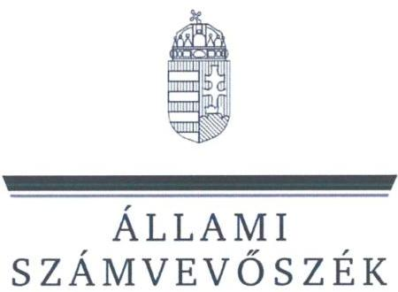
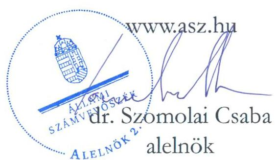
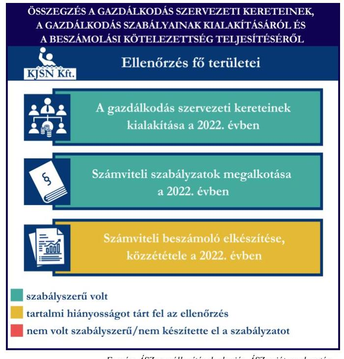
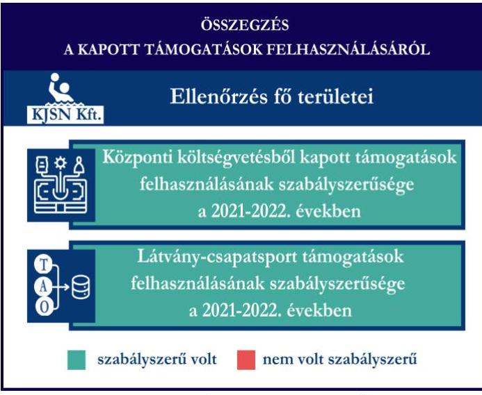
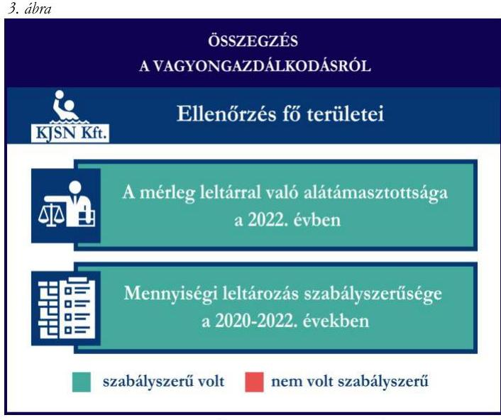

# JELENTÉS 

## Támogatásban részesülő sportszövetségek, sportegyesületek és sportvállalkozások gazdálkodásának ellenőrzése

Kecskeméti Junior Sport Nonprofit Korlátolt Felelősségű Társaság
2024.

---

ÁLLAMI
SZÁMVEVÔSZÉK

# JELENTÉS 

## Támogatásban részesülő sportszövetségek, sportegyesületek és sportvállalkozások gazdálkodásának ellenőrzése

Kecskeméti Junior Sport Nonprofit Korlátolt Felelősségű Társaság
2024.

24172

---

# ELLENŐRZÉSI IGAZGATÓSÁG: 

ÁLLAMHÁZTARTÁSON KÍVÜLI SZERVEZETEKET ELLENŐRZŐ IGAZGATÓSÁG

## ELLENŐRZÉSI IGAZGATÓ:

## KLINGA LÁSZLÓ igazgató

## ELLENŐRZÉSVEZETŐ:

## KAKAS SÁNDOR ellenőrzésvezető

## Jelenéseink az interneten a www.asz.hu címen olvashatók.

IKTATÓSZÁM: EL-4031-004/2024
TÉMASORSZÁM: 30
ELLENŐRZÉS-AZONOSÍTÓ SZÁM: V1078

---

# TARTALOMJEGYZÉK 

- AZ ELLENŐRZÉS ALAPADATAI ..... 5
- AZ ELLENŐRZÖTT SZERVEZET ..... 7
- ÖSSZEFOGLALÁS ..... 8
- AZ ELLENŐRZÉS FÓKUSZTERÜLETEI ..... 10
- MEGÁLLAPÍTÁSOK ..... 11
- JAVASLATOK ..... 15
- MELLÉKLETEK ..... 16
I. sz. melléklet: Értelmező szótár ..... 16
II. sz. melléklet: Az ellenőrzött szervezetek jegyzéke ..... 18
III. sz. melléklet: Fő ellenőrzési kritériumok fő ellenőrzési fókuszterületek szerint. ..... 19
- FÜGGELÉK: ÉSZREVÉTELEK ..... 20
- RÖVIDÍTÉSEK JEGYZÉKE ..... 23

---

.

---

# AZ ELLENŐRZÉS ALAPADATAI 

## AZ ELLENŐRZÉS CÉLJA

Az ellenőrzés célja az államháztartásból nyújtott támogatással, vagy az államháztartásból meghatározott célra ingyenesen juttatott vagyon felhasználásával érintett sportszövetségek, sportegyesületek és sportvállalkozások gazdálkodása szabályozottságának, gazdálkodási tevékenységének, ezen belül a beszámolási kötelezettség teljesítésének, a támogatások elkülönített nyilvántartásának, valamint a támogatások felhasználásának ellenőrzése.

## AZ ELLENŐRZÉS TÍPUSA

Kombinált ellenőrzés.

## AZ ELLENŐRZŐTT IDŐSZAK

Az 1. fókuszterület vonatkozásában a 2022. év.
A 2. fókuszterület vonatkozásában a 2021-2022. évek.
A 3. fókuszterület vonatkozásában a 2022. év, a mennyiségi felvétellel történő leltározás dokumentumai tekintetében a 2020-2022. évek.

## AZ ELLENŐRZÉS TÁRGYA

Az ellenőrzés tárgyát képezte a támogatásban részesülő sportvállalkozás gazdálkodása szabályozottságának, gazdálkodási tevékenységén belül a beszámolási kötelezettség teljesítésének, a vagyonnyilvántartásának, a támogatások elkülönített nyilvántartásának, valamint az államháztartási forrásból származó közvetlen vagy közvetett támogatások és a meghatározott célra ingyenesen juttatott vagyon felhasználásának vizsgálata. Az ellenőrzés a támogatások vonatkozásában kiterjedt továbbá a támogató felé történő beszámolási és elszámolási kötelezettségek teljesítésére, a jogszabályi és belső előírások betartására.

Az ellenőrzés kiterjedt minden olyan körülményre és adatra, amely az ÁSZ ${ }^{1}$ jogszabályban meghatározott feladatainak teljesítéséhez, valamint az ellenőrzési program végrehajtása során felmerülő újabb összefüggések feltárásához szükséges volt. Az ellenőrzés az 1. és 3. fókuszterületek esetében az ellenőrzött szervezet egészére, a 2. fókuszterület esetén kizárólag a vízilabda szakágra vonatkozóan került végrehajtásra.

## AZ ELLENŐRZÉS JOGALAPJA

Az ellenőrzés jogszabályi alapját az ÁSZ tv. ${ }^{2} 1 . \int(3)$ bekezdése, az 5. $\int(3)$ bekezdése előírásai képezték.

---

# AZ ELLENŐRZÉS MÓDSZERE 

Az ellenőrzést a nemzetközi standardokat irányadónak tekintve az ellenőrzési program szempontjai, az ellenőrzött időszakban hatályos jogszabályok, az ellenőrzés általános szakmai szabályai, az ellenőrzésre irányadó ÁSZ módszertanok figyelembevételével végezte az ÁSZ.

Az ellenőrzési kérdések megválaszolásához szükséges bizonyítékok megszerzése az ellenőrzött szervezet által rendelkezésre bocsátott dokumentumokra adatokra alapozva kérdésfeltevés (információkérés), interjú, mintavételezés útján történt.

Az ellenőrzési bizonyítékként felhasználható adatforrások közé tartoztak egyrészt az ellenőrzés során az ellenőrzött szervezettől bekért dokumentumok, másrészt adatforrás volt minden további, az ellenőrzés folyamán feltárt, az ellenőrzés szempontjából információt tartalmazó egyéb adatforrás.

A támogatásokkal, azok felhasználásával kapcsolatos kötelezettségek vizsgálatára mintavételi eljárások kerültek alkalmazásra. Támogatás-típusok szerint nagyságrend alapján egy darab támogatás képezte a vizsgálat tárgyát. Ezen támogatások felhasználásának szabályszerűsége támogatásonként kockázatértékelés alapján kiválasztott tételekkel került ellenőrzésre. A kiválasztott támogatási szerződésekhez kapcsolódó elszámolásokból 30 db tétel került ellenőrzésre, ahol az elszámolás nem érte el a 30 db -ot, ott tételes ellenőrzésre került sor. Ezen felül a vagyongazdálkodás szabályszerűségének ellenőrzéséhez is kockázatalapú mintavétel kapcsolódott. A támogatások felhasználása és a vagyongazdálkodás területén a tételek ellenőrzése kiterjedt a könyvvezetési kötelezettség vizsgálatára is. A tárgyi eszközök tekintetében 30 db került kiválasztásra a 2022. évben állományban lévő eszközök közül azok nyilvántartásának, elszámolásának szabályszerűsége ellenőrzése céljából. A kiválasztott tételek ellenőrzésének eredménye nem került kivetítésre a teljes sokaságra, a megállapítások az adott ellenőrzött tételek vonatkozásában kerültek megjelenítésre.

---

# AZ ELLENŐRZÖTT SZERVEZET 

A Kecskeméti Junior Sport Nonprofit Korlátolt Felelősségű Társaság 2018. április 26-án kiválás útján jött létre, a Hírös Sport Szabadidő Létesítményeket Működtető és Szolgáltató Nonprofit Korlátolt felelősségű társaság egyetemleges jogutódjaként. Az alapító okirat ${ }_{1-3}{ }^{3}$ szerint a KJSNKft. ${ }^{4}$ egyedüli tagja Kecskemét Megyei Jogú Város Önkormányzata. Az alapító okirat ${ }_{1-3}$ szerint a KJSNKft. célja többek között, „verseny, tömeg, diák és lakossági sportrendezvények lebonyolításában kö̉remüködés", feladata, hogy Kecskemét Megyei Jogú Város Önkormányzat működési területén „figyelemmel az országos és belyi sportéletben meghatározott célkitüzzésekere, fejlesztési elvekre segitséget nyújtson a testnevelési és sportfejlesztési célkitüzzések és feladatok teljesitéséhez". A KJSNKft. keretein belül működő sportágak: kosárlabda, kézilabda, röplabda, úszás, vízilabda, cselgáncs, atlétika, rögbi, asztalitenisz, ökölvívás és a jégkorong.

A KJSNKft. legfőbb döntéshozó szerve a Taggyűlés, amelynek hatáskörét és jogkörét az alapító okirat ${ }_{1-3}$ szerint „Kecskemét Megyei Jogú Város Közgyülése, vagy annak Szervezeti és Müködési Szabályzata szerint feladat és hatáskörrel rendelkezzö szerve gyakorolja". A KJSNKft. tevékenységét az ügyvezető irányítja, képviseli a KJSNKft.-t harmadik személyekkel szemben a bíróságok, illetve a hatóságok előtt. Az ügyvezető cégjegyzési joga önálló.

A KJSNKft. az ellenőrzött időszakban jogszabályi előírás alapján felügyelőbizottság létrehozására kötelezett volt, három tagú felügyelőbizottsággal rendelkezett. A beszámoló felülvizsgálatával saját döntés alapján könyvvizsgálót bízott meg. A KJSNKft. az alapító okirat ${ }_{1-3}$-ban foglaltak alapján az ellenőrzött időszakban közhasznú jogállással rendelkező szervezet volt. A KJSNKft. az ellenőrzött időszakban vállalkozási és közhasznú tevékenységet is folytatott.

A KJSNKft. vízilabda szakága által az ellenőrzött időszakban igénybe vett támogatásokat az 1. táblázat mutatja be.

## 1. táblázat

A KJSN KFT. VÍZILABDA SZAKÁGA ÁLTAL IGÉNYBE VETT TÁMOGATÁSOK (ADATOK M FT-BAN)

|  | 2021. EV | 2022. EV |
| :-- | :--: | :--: |
| Központi költségvetési támogatás | 18,4 | 0,5 |
| Látvány-csapatsport támogatás | 28,2 | 77,3 |
| Helyi önkormányzati támogatás | - | - |
| Magyar Vízilabda Szövetségtől kapott támogatás | - | - |

---

# ÖSSZEFOGLALÁS 

Magyarország Alaptörvényének XX. cikke kimondja, hogy mindenkinek joga van a testi és lelki egészséghez, melynek érvényesülését Magyarország többek között a sportolás és a rendszeres testedzés támogatásával segíti elő. Az Országgyűlés a Sport tv. ${ }^{5}$-ben kinyilvánította, hogy a nemzet közössége a test művelését, a sportot, a nemzet alapértékének, kívánatos célnak tekinti. A sport a közjó része. Erősíti a közösség tagjainak egymáshoz tartozását, miként az egyén testi és lelki egészségét.

A sportegyesületek, sportszövetségek, sportvállalkozások müködésükre és szakmai tevékenységük ellátására költségvetési támogatásban, önkormányzati támogatásban, ingyenes vagyonjuttatásban, valamint látvány-csapatsport támogatásban részesülhetnek, amelyekre fokozott figyelem irányul.

A társadalom részéről jogosan felmerülő elvárás, hogy a közpénzeket kezelő, azzal gazdálkodó szervezetek müködéséről, tevékenységéről átfogó képet kapjon, a közpénzek rendeltetésszerủ és átlátható módon történő felhasználásának értékelésére időről-időre sor kerüljön az ellenőrzések keretében.

A KJSNKft. a könyvviteli szolgáltatás személyi feltételeinek megteremtéséről, valamint felügyelőbizottság létrehozásáról és működéséről a jogszabályi előírásnak megfelelően gondoskodott. Saját döntés alapján rendelkezett a 2022. évre vonatkozó éves beszámoló könyvvizsgáló általi felülvizsgálatáról. A jogszabályi előírások szerint a KJSNKft. kialakította a számviteli politikáját, valamint elkészítette számviteli szabályzatait, továbbá rendelkezett számlarenddel. A szabályzatok az ellenőrzött jogszabályi kritériumoknak megfeleltek.

A könyvvezetés formája a 2022. évben megfelelt a jogszabályi előírásoknak.

A KJSNKft. a jogszabályoknak megfelelően teljesítette a számviteli beszámoló készítési- és közzétételi kötelezettségét, azonban kiegészítő mellékletében a kapott támogatásokat a Számv. tv. ${ }^{6}$

A gazdálkodás szervezeti kereteinek kialakítása a 2022. évben

Számviteli szabályzatok megalkotása a 2022. évben

Számviteli beszámoló elkészítése, közzététele a 2022. évben
szabályszerü volt
tartalmi hiányosságot tárt fel az ellenőrzés
nem volt szabályszzerű/nem készítette el a szabályzatot

Forrás: ÁSZ megállapítások alapján ÁSZ saját szerkesztés
szerinti megbontásban nem mutatta be.

A gazdálkodás szervezeti keretei kialakításának, a számviteli szabályzatok megalkotásának, valamint a számviteli beszámoló elkészítésének és közzétételének értékelését az 1. ábra mutatja be.

---

2. ábra

Forrás: ÁSZ megállapítások alapján ÁSZ saját szerkesztés
A KJSNKft. vagyongazdálkodása a beszámoló leltárral való alátámasztottsága, a tárgyi eszközök üzembe helyezése és értékcsökkenésük elszámolása tekintetében, az ellenőrzött tételek esetében a 2022. évben szabályszerű volt. A jogszabályoknak megfelelően gondoskodott saját vagyona éves beszámolóban történő megjelenítéséről az ellenőrzött tételek alapján. A 2022. évi éves beszámolójának mérlegtételeit alátámasztotta szabályszerű leltárral, valamint a mennyiségi felvétellel történő leltározást elvégezte.

A vagyongazdálkodás értékelését a 3. ábra mutatja be.

A KJSNKft. a központi költségvetésből kapott támogatást, továbbá a látvány-csapatsport támogatást és kiegészítő sportfejlesztési támogatást a 2021-2022. években az ellenőrzött tételek esetében a támogatási célnak megfelelően, szabályszerűen használta fel. Számviteli nyilvántartásában a központi költségvetésből kapott támogatás felhasználását a támogatói okiratban foglaltak ellenére, a látványcsapatsport támogatás és kiegészítő sportfejlesztési támogatás felhasználását a jogszabályi előírás ellenére elkülönítetten nem tartotta nyilván.

A kapott támogatások felhasználásának értékelését a 2. ábra mutatja be.
3. ábra

Forrás: ÁSZ megállapítások alapján ÁSZ saját szerkesztés

---

# AZ ELLENŐRZÉS FÓKUSZTERÜLETEI 

1.     - A gazdálkodási szabályok kialakítása, a könyvvezetési- és beszámolási kötelezettség teljesítése
2.     - A kapott támogatások felhasználása
3.     - Az ellenőrzött szervezet vagyongazdálkodása

---

# 1. A gazdálkodási szabályok kialakítása, a könyvvezetési- és beszámolási kötelezettség teljesítése 

Összegző megállapítás

A KJSNKft. a 2022. évre vonatkozóan a jogszabályokban előírt szervezeti keretek kialakításával, a gazdálkodást biztosító belső szabályozó eszközök és számviteli keretek megalkotásával megteremtette a szabályszerű gazdálkodásának feltételeit. A KJSNKft. a jogszabályoknak megfelelően teljesítette könyvvezetési-, számviteli beszámoló készítési-, valamint közzétételi kötelezettségét, azonban az éves beszámoló kiegészítő mellékletében a kapott támogatásokat a Számv. tv. szerinti megbontásban nem mutatta be.

A 2022. évben a KJSNKft. a Számv. tv.-ben foglalt előírások betartásával gondoskodott a könyvviteli szolgáltatás személyi feltételeinek megteremtéséről, a könyvviteli szolgáltatás körébe tartozó feladatok ellátásával olyan számviteli szolgáltatást nyújtó társaságot bízott meg, amelynek a feladat irányításával, vezetésével, a beszámoló elkészítésével megbízott tagja megfelelt a jogszabályi követelményeknek.
A KJSNKft. saját döntésével rendelkezett a 2022. évre vonatkozó éves beszámolója könyvvizsgálóval történő felülvizsgálatáról.
A KJSNKft. a Tak. tv. ${ }^{7}$ előírása szerint létrehozta a felügyelőbizottságot, a felügyelőbizottság tagjainak száma megfelelt Tak. tv. előírásainak.
A KJSNKft. a 2022. évben rendelkezett a Számv. tv.-ben előírt számviteli politikával ${ }_{1.2}{ }^{8}$, illetve annak keretében elkészítette az értékelési szabályzatot ${ }^{9}$, a leltározási szabályzatot ${ }_{1.2}{ }^{10}$ és a pénzkezelési szabályzatot ${ }_{1.2}{ }^{11}$. A szabályzatok az ellenőrzött tartalmi kritériumoknak megfeleltek. A KJSNKft. a Számv. tv. szerint a számlarendet ${ }_{1.2}{ }^{12}$ elkészítette.
A KJSNKft. a Számv. tv. előírásainak megfelelően a 2022. évben kettős könyvvitelt vezetett. A könyvviteli nyilvántartásait a Számv. tv. rendelkezéseit figyelembe véve úgy alakította ki, hogy a 2022. évi éves beszámolójában az egyéb bevételeken belül a visszafizetési kötelezettség nélkül kapott támogatások összegéből az üzleti évben költséggel, ráfordítással ellentételezett összeget mutatta ki. A KJSNKft. könyvvezetési rendszerét a Számv. tv. 161/A. § (2) bekezdésben foglaltakkal ellentétben nem részletezte tovább oly módon, hogy az alapján a támogatás felhasználásra a 107/2011. (VI.30.) Korm. rend. ${ }^{13}$ által előírt adatok ellenőrizhető módon rendelkezésre álljanak.
A KJSNKft. a Számv. tv. előírásainak megfelelően elkészítette a 2022. évre vonatkozó éves beszámolóját. A kiegészítő mellékletben a kapott támogatásokat a Számv. tv. 93. § (3) bekezdésében előírtak ellenére a kapott összeg, annak felhasználása (jogcímenként és évenként), a rendelkezésre álló összeg megbontásban nem mutatta be. A KJSNKft. a 2022. évre vonatkozó éves beszámolóval egyidejűleg az üzleti jelentést is elkészítette.

---

A 2022. évre vonatkozó éves beszámolót a könyvvizsgáló az alapító okirat3 szerint felülvizsgálta, a Ptk. ${ }^{14}$ rendelkezései alapján a felügyelőbizottság határozattal elfogadta, a Taggyűlés a Ptk.-ban foglaltaknak megfelelően taggyűlési határozattal jóváhagyta.
A KJSNKft. a 2022. évi éves beszámolóját a Számv. tv.-nek megfelelően letétbe helyezte és közzétette.

# 2. A kapott támogatások felhasználása 

Összegző megállapítás

A KJSNKft. a 2021. és a 2022. években a kapott támogatásokat az ellenőrzőtt tételek esetében szabályszerűen használta fel, azonban a támogatások felhasználásáról elkülönített számviteli nyilvántartást nem vezetett.

A KJSNKft. a központi költségvetésből kapott támogatás bevételeit, mint saját felhasználásra előlegként kapott támogatások összegét a Számv. tv. előírásainak megfelelően tartotta nyilván. A Számv. tv. előírásai szerint a könyvvezetési rendszerét oly módon tovább részletezte, hogy abból a központi költségvetésből kapott támogatások adatai rendelkezésre álltak, azonban az Emberi Erőforrások Minisztériuma által 2021. augusztus 13-án kiállított, IX-4717-2/2021 iktatószámú Támogatói okirat 6.3. pontjában foglaltak ellenére a támogatási összeg felhasználásáról elkülönített számviteli nyilvántartást nem vezetett.
A KJSNKft. a támogatás felhasználásáról a támogató felé benyújtott beszámolót és annak részeként az összesített elszámolási táblázatot a támogatói okiratban előírt formában és tartalommal elkészítette.
A KJSNKft. esetében a központi költségvetésből kapott támogatás ellenőrzött tételeinek ( 30 db ) vonatkozásában az alábbiak kerültek megállapításra:

- a tételek számviteli elszámolását a Számv. tv.-ben előírtak szerint bizonylatokkal alátámasztották;
- a támogatói okiratban foglaltaknak megfelelően:
- a tétel gazdasági eseményének teljesítési időpontja a támogatói okiratban meghatározott támogatott tevékenység időtartamán belül történt;
- a támogatói okiratban meghatározott felhasználási határidőig megtörtént a tétel pénzügyi rendezése;
- a számviteli bizonylatokat a 474/2016. (XII. 27.) Korm. rendelet ${ }^{15}$ és a 27/2013. (III. 29.) EMMI rendelet ${ }^{16}$ előírásainak megfelelően záradékkal ellátták, amelyben jelzésre került, hogy a számviteli bizonylaton szereplő összegből mennyit számoltak el a szerződésszámmal hivatkozott támogatói okirat terhére;
- a hivatkozott támogatói okirat terhére a számviteli bizonylaton záradékolt összeg a 474/2016. (XII. 27.) Korm. rendeletben foglaltaknak megfelelően megegyezik a számlaösszesítőben feltüntetett értékkel;
- a tételek számviteli bizonylatának a hivatkozott támogatói okirat terhére záradékolt összege a Számv. tv.-ben előírtak szerint, tartalmának megfelelő főkönyvi számra került elszámolásra.
A KJSNKft. a látvány-esapatsport támogatások esetében a 2021-2022. években eleget tett a 107/2011. (VI. 30.) Korm. rendeletben foglaltaknak, a támogatás felhasználásáról negyedévente az előrehaladási jelentéseket benyújtotta az MVLSZ ${ }^{17}$ felé.

---

A KJSNKft. a számára nyújtott látvány-csapatsport támogatásról és kiegészítő sportfejlesztési támogatásról a 107/2011. (VI. 30.) Korm. rendelet szerinti (záró)elszámolást a támogató felé az ellenőrzött időszakban nem nyújtotta be, mivel a támogatási időszak nem zárult le. A KJSNKft. a 107/2011. (VI. 30.) Korm. rendeletnek megfelelően - részelszámolást illetően - könyvvizsgáló által ellenőrzött számviteli bizonylatokkal számolt el a támogató felé. A könyvvizsgáló a 107/2011. (VI. 30.) Korm. rendeletben előírt felelősségbiztosítással rendelkezett.
A KJSNKft. a 107/2011. (VI. 30.) Korm. rendelet 9. § (9) bekezdés előírása ellenére a látvány-csapatsport támogatás és kiegészítő sportfejlesztési támogatás felhasználását elkülönítetten és naprakészen, ellenőrizhető módon nem tartotta nyilván.
A KJSNKft. esetében a látvány-csapatsport támogatás és kiegészítő sportfejlesztési támogatás ellenőrzött tételeinek (30-30 db) vonatkozásában az alábbiak kerültek megállapításra:

- a tételek számviteli elszámolását a Számv. tv.-ben és a 107/2011. (VI. 30.) Korm. rendeletben előírtak szerint bizonylatokkal alátámasztották;
- a 107/2011. (VI. 30.) Korm. rendeletben foglaltaknak megfelelően
- a tételek tartalma (gazdasági esemény) és összege alapján a támogatási igazolásban meghatározottak szerinti jogcímre, az abban meghatározott mértékben használták fel;
- a tételek számviteli bizonylatai alapján a gazdasági események az ellenőrzött időszakot érintő támogatási időszakban (meghosszabbított támogatási időszak) szerződés szerint teljesültek;
- a tételek számviteli bizonylatai alapján a gazdasági események pénzügyi rendezése az elszámolás benyújtására nyitva álló határidőig - figyelemmel az esetleges elszámolási határidő hosszabbítására - teljesült;
- a tételek számviteli bizonylatait ellátták záradékkal;
- a számviteli bizonylatokon záradékolt összegek megegyeztek a számlaösszesítőben feltüntetett értékekkel;
- a tételek számviteli bizonylatának az adott sportfejlesztési program terhére záradékolt összegei a Számv. tv.-ben előírtak szerint, a tartalmuknak megfelelő főkönyvi számra kerültek elszámolásra.

# 3. Az ellenőrzött szervezet vagyongazdálkodása 

## Összegző megállapítás A 2022. évben a KJSNKft. vagyongazdálkodása az ellenőrzött tételek vonatkozásában szabályszerű volt.

A KJSNKft. a Számv. tv.-nek megfelelően a 2022. évi éves beszámolójának mérlegtételeit szabályszerű leltárral alátámasztotta, elvégezte a főkönyvi könyvelés és az analitikus nyilvántartások adatai közötti egyeztetést.
A Számv. tv. előírásaival összhangban a 2021. évre vonatkozóan a mennyiségi felvétellel történő leltározást elvégezte.
A KJSNKft. esetében a tárgyi eszköz tételek ( 30 db ) ellenőrzése során az alábbiak kerültek megállapításra:

- a tételek bekerülési értékét meghatározó számviteli bizonylatok a Számv. tv.-nek megfelelően rendelkezésre álltak;
- a tárgyi eszközök számviteli besorolása megfelelt a Számv. tv. előírásainak;

---

- az üzembe helyezés tényét és időpontját a Számv. tv.-nek megfelelően hitelt érdemlően dokumentálták;
- az értékcsökkenés elszámolása a Számv. tv.-nek megfelelően történt;
- huszonöt tétel esetén - ahol a tárgyi eszköz beszerzés támogatásból valósult meg - a tétel bekerülési értékét meghatározó számviteli bizonylatokat ellátták záradékkal, amelyből kiderült, hogy a számviteli bizonylaton szereplő összegből mennyit számoltak el a hivatkozott támogatás terhére.

---

# JAVASLATOK 

Az ÁSZ tv. 33. § (1) bekezdésében foglaltak értelmében az ellenőrzött szervezet vezetője köteles a jelentésben foglalt megállapításokhoz kapcsolódó intézkedési tervet összeállítani és azt a jelentés kézhezvételétől számított 30 napon belül az ÁSZ részére megküldeni. Amennyiben az ellenőrzött szervezet vezetője nem küldi meg határidőben az intézkedési tervet, vagy továbbra sem elfogadható intézkedési tervet küld, az Állami Számvevőszék elnöke az ÁSZ tv. 33. § (3) bekezdése a) és b) pontjaiban foglaltakat érvényesítheti.

## A Kecskeméti Junior Sport Nonprofit Korlátolt FELELŐSSÉGŰ TÁRSASÁG ÜGYVEZETŐJÉNEK

1. Gondoskodjon arról, hogy a kapott támogatások a Számv.tv. 93. § (3) bekezdésében előírtaknak megfelelően a kiegészítő mellékletben a kapott összeg, annak felhasználása (jogcímenként és évenként), a rendelkezésre álló összeg megbontásban kerüljenek bemutatásra.
2. Gondoskodjon a 107/2011. (VI. 30.) Korm. rendelet 9. § (9) bekezdésében előírtaknak megfelelően, a látvány-csapatsport támogatás és kiegészítő sportfejlesztési támogatás felhasználásának elkülönített és naprakész, ellenőrizhető nyilvántartásáról.
3. Gondoskodjon a központi költségvetésből kapott támogatások felhasználásának támogatói okiratban foglaltak szerinti elkülönített számviteli nyilvántartásáról.

---

# MELLÉKLETEK 

## I. SZ. MELLÉKLET: ÉRTELMEZŐ SZÓTÁR

Kiegészítő sportfejlesztési támogatás

Költségvetési támogatás

Közhasznú szervezet

Közhasznú tevékenység

Látvány-csapatsport támogatás

Látvány-csapatsportban múködő amatőr sportszervezet

Látvány-csapatsportban múködő hivatásos sportszervezet

Országos sportági szakszövetség

Sportági szövetség

A látvány-csapatsportok támogatása esetében rendelkező nyilatkozatban felajánlott összeg 12,5 százaléka kiegészítő sportfejlesztési támogatásnak minősül. (Forrás: Tao tv. ${ }^{18}$ 24/A. § (9) bekezdés)
A társadalombiztosítás pénzügyi alapjai kivételével az államháztartás központi alrendszeréből ellenérték nélkül, pénzben nyújtott támogatások. (Forrás: Áht. ${ }^{19}$ 1. $\S 14$. pont)

Közhasznú szervezetté minősíthető a Magyarországon nyilvántartásba vett közhasznú tevékenységet végző szervezet, amely a társadalom és az egyén közös szükségleteinek kielégítéséhez megfelelő erőforrásokkal rendelkezik, továbbá amelynek megfelelő társadalmi támogatottsága kimutatható, és amely:
a) civil szervezet (ide nem értve a civil társaságot), vagy
b) olyan egyéb szervezet, amelyre vonatkozóan a közhasznú jogállás megszerzését törvény lehetővé teszi. (Forrás: Civil tv. 32. $\S$ (1) bekezdés)

Minden olyan tevékenység, amely a létesítő okiratban megjelölt közfeladat teljesítését közvetlenül vagy közvetve szolgálja, ezzel hozzájárulva a társadalom és az egyén közös szükségleteinek kielégítéséhez. (Forrás: Civil tv. 2. § 20. pont)
Az adóévben visszafizetési kötelezettség nélkül nyújtott támogatás, juttatás, véglegesen átadott pénzeszköz és térítés nélkül átadott eszköz könyv szerinti értéke, az adóévben térítés nélkül nyújtott szolgáltatás bekerülési értéke a Tao tv.-ben meghatározott jogcímeken. (Forrás: Tao tv. 4. § 44. pont)
Minden olyan, a sportról szóló törvényben meghatározott szabályok szerint a látvány-csapatsportban múködő sportegyesület vagy sportvállalkozás, amelyik nem minősül a látvány-csapatsportban múködő hivatásos sportszervezetnek. (Forrás: Tao tv. 4. § 42. pont)
A látvány-csapatsportágak országos sportági szakszövetsége által kiírt versenyrendszer legmagasabb felnőtt bajnoki osztályában - a veterán korosztályokra kiírt versenyrendszer kivételével - részt vevő (indulási jogot elnyert) sportszervezet, vagy alsóbb bajnoki osztályaiban részt vevő (indulási jogot elnyert) sportszervezet abban az esetben, ha az ilyen sportszervezet hivatásos sportolót alkalmaz. Több látvány-csapatsportban több jogi személy szervezeti egységgel (szakosztállyal) múködő sportszervezet esetén csak az a jogi személy szervezeti egység (szakosztály), amely a fent részletezett versenyrendszerek bajnoki osztályaiban részt vesz. (Forrás: Tao tv. 4. § 43. pont)
Olyan sportszövetség, amely sportágában kizárólagos jelleggel az e törvényben, valamint más jogszabályokban meghatározott feladatokat lát el és e törvényben megállapított különleges jogosítványokat gyakorol. Olyan sportágban hozható létre, amelyet vagy a Nemzetközi Olimpiai Bizottság elismert, vagy amely sportág nemzetközi szövetségét felvették a Nemzetközi Sportszövetségek Szövetségébe (GAISF). (Forrás: Sport tv. 20. § (1), (4) bekezdés)
A Civil tv. és a Ptk. előírásai alapján - a Sport tv.-ben meghatározott eltérésekkel - múködő szövetség, amelynek tagjai kizárólag sportszervezetek lehetnek. Sportági szövetség országos jelleggel is múködhet. Egy sportágban csak egy országos sportági szövetség múködhet. Törvényi feltételek teljesülése esetén szakszövetségi feladatokat is elláthat. (Forrás: Sport tv. 28. §)

---

Sportegyesület

Sportegyesületeknek, sportszövetségeknek nyújtott költségvetési támogatás
Sportszövetség

Sporttevékenység

Sportvállalkozás

A Civil tv. és a Ptk. szabályai szerint müködő olyan egyesület, amelynek alaptevékenysége a sporttevékenység szervezése, valamint a sporttevékenység feltételeinek megteremtése. A sportegyesületek a Sport tv. 15. § (1) bekezdésében meghatározott sportszervezetek körébe tartoznak. A sportegyesületeken kívül sportszervezet még a sportvállalkozás, a sportiskola, valamint az utánpótlás-nevelés fejlesztését végző alapítvány. (Forrás: Sport tv. 16. $\S$ (1) bekezdés)

Az állami sport célú támogatások felhasználásáról és elosztásáról szóló 474/2016. (XII. 27.) Korm. rendelet és a 27/2013. (III. 29.) EMMI rendelet 1. $\S$-ában meghatározott fejezeti kezelésű előirányzatokból nyújtott támogatás.
Meghatározott sporttevékenységek körében a sportversenyek szervezésére, a tagok érdekvédelmére és a részükre való szolgáltatásokra, valamint a nemzetközi kapcsolatok lebonyolítására létrehozott, jogi személyiséggel és önkormányzattal rendelkező, a Civil tv. és a Ptk. alapján - az e törvényben foglalt eltérésekkel különös formában müködő egyesületek. A Sport tv. 19. § (3) bekezdése szerint a sportszövetségeknek az alábbi típusai léteznek: országos sportági szakszövetségek, sportági szövetségek, szabadidősport szövetségek, fogyatékosok sportszövetségei, diák- és egyetemi-főiskolai sport sportszövetségei, nemzetközi sportszövetségek. (Forrás: Sport tv. 19. § (1), (3) bekezdés)

Meghatározott szabályok szerint, a szabadidő eltöltéseként kötetlenül vagy szervezett formában, illetve versenyszerűen végzett testedzés vagy szellemi sportágban kifejtett tevékenység, amely a fizikai erőnét és a szellemi teljesítőképesség megtartását, fejlesztését szolgálja. (Forrás: Sport tv. 1. § (2) bekezdés)

Az a gazdasági társaság, amelynek a cégnyilvántartásról, a cégnyilvánosságról és a bírósági cégeljárásról szóló törvény alapján a cégjegyzékbe bejegyzett tevékenysége sporttevékenység, továbbá a gazdasági társaság célja sporttevékenység szervezése, valamint a sporttevékenység feltételeinek megteremtése egy vagy több sportágban. Korlátolt felelősségű társasági, illetve részvénytársasági formában alapítható, a fogyatékosok sportja, illetve a szabadidősport területén közhasznú társaságként is müködhet. (Forrás: Sport tv. 18. §)

---

II. SZ. MELLÉKLET: AZ ELLENŐRZÖTT SZERVEZETEK JEGYZÉKE

| ELLENŐRZÖTT SZERVEZET NEVE | ELLENŐRZÖTT SZERVEZET SZÉKHELYE |
| :-- | :-- |
| Kecskeméti Junior Sport Nonprofit Korlátolt Felelősségű | 6000 Kecskemét, Izsáki út 1. |
| Társaság |  |

---

# III. SZ. MELLÉKLET: FŐ ELLENŐRZÉSI KRITÉRIUMOK FŐ ELLENŐRZÉSI FÓKUSZTERÜLETEK 

SZERINT

## FŐ ELLENŐRZÉSI FÓKUSZTERÜLETEK

1. A gazdálkodási szabályok kialakítása, a könyvvezetési és beszámolási kötelezettség teljesítése
2. A kapott támogatások felhasználása
3. Az ellenőrzött szervezet vagyongazdálkodása

## FŐ ELLENŐRZÉSI KRITÉRIUMOK

Ptk. 3:26. $\$ (1) bekezdés, 3:27. $\$ (1) bekezdés, 3:82. $\$ (1)-(2)$ bekezdés
Számv. tv. 4. §, 6. § (2) bekezdés, 12. §, 14. § (3), (5) bekezdés a), b), d) pont, (8) bekezdés, (11)-(12) bekezdés, 69. § (1), (3) bekezdés, 90 . $\$ (3) bekezdés c) pont, 93. § (3) bekezdés, 96. § (4) bekezdés, 150. § (2) bekezdés, 153. § (1) bekezdés, 154. § (1) bekezdés, 161. § (1) bekezdés, (2) bekezdés a)-d) pont, (3)-(4) bekezdés, 161/A. § (1)-(2) bekezdés, 165. § (2) bekezdés
Tao tv. 22/C. §
107/2011. (VI.30.) Korm. rendelet 9. § (9) bekezdés
Tak. tv. 4. § (1)
Áht. 52. § (1) bekezdés, 53. §
Ávr. ${ }^{20}$ 76. § (1) bekezdés c) pont, 93. § (1)-(3), (5) bekezdés
Számv. tv. 16. § (3) bekezdés, 25-26. §, 44. § (2) bekezdés, 45. § (1)-(2) bekezdés, 77. § (3) bekezdés b) pont, 78-81. §, 93. § (3) bekezdés, 159. §, 161/A. § (2) bekezdés, 162. § (1) bekezdés, 165. § (1)-(2) bekezdés, 166. § (1) bekezdés, 167. § (1) bekezdés a), d), e), h) pont

Tao. tv. 22/C. §, 24/A. § (9) bekezdés
107/2011. (VI.30.) Korm. rendelet 2. § (3b) bekezdés, 4. § (11) bekezdés, 5. § (1) bekezdés, 6. § (1) bekezdés e) pont, 9. § (8)(10) bekezdés, 10. § (2), (2a), (2b), (4) bekezdés, 10. § (5a) bekezdés, 11. § (1), (1a), (1d), (1e), (2), (4), (4a), (5), (6) bekezdés, 13. § (1), (2a) bekezdés, 14. § (1), (4), (4b), (4c), (6c) bekezdés

275/2022. (VII.29.) Korm. rendelet ${ }^{21} 1 . \S$ (3)
444/2022. (XI.7) Korm. rendelet ${ }^{22} 2 . \S$
474/2016. (XII. 27.) Korm. rendelet 26. § (3) bekezdés
Ptk. 3:63. § (4) bekezdés
Számv. tv. 15. § (3) bekezdés, 26. §, 46. § (3) bekezdés, 47-53. §, 57. §, 69. § (1)-(6) bekezdés, 165-166. §, 169. § (2) bekezdés

Tao tv. 22/C (6) bekezdés a), d), e) pont, (11) bekezdés
Ávr. 93. § (5) bekezdés
107/2011. (VI.30.) Korm. rendelet 11. § (5) bekezdés
474/2016. (XII. 27.) Korm. rendelet 17. § (1) bekezdés 11a. a) pont, 11b. pont, 17. § (2a) bekezdés, 24. § (2) bekezdés

---

# FÜGGELÉK: ÉSZREVÉTELEK 

A jelentéstervezetet a Számvevőszék 15 napos észrevételezésre megküldte az ellenőrzött szervezet vezetőjének az ÁSZ tv. 29. §* (1) bekezdése előírásának megfelelően.

A Kecskeméti Junior Sport Nonprofit Korlátolt Felelősségü Társaság ügyvezetője a jelentéstervezetre észrevételt tett. A függelék tartalmazza az el nem fogadott észrevételek elutasításának indoklását.
A Kecskeméti Junior Sport Nonprofit Korlátolt Felelősségü Társaság ügyvezetőjének észrevételei:

1. „Az ellenőrzés idején hatályos számviteli politika értelmében: „A kapott támogatás összegét évenkénti, szakosztályi és támogatási jogcím szerinti (utánpótlás nevelésre, személyi jellegü költségekre, tárgyi eszközökre) bontásban a 479-es számlaosztályban tartjuk nyilván kötelezettségként. A kiegészítő mellékletben részletesen bemutatva."
Ez az elkülönítés a 2022.évi beszámoló kiegészítő mellékletében a rövid lejáratú kötelezettségek között a 2.1.2.4. kötelezettségek fejezetben bemutatásra került. "

## Az észrevétellel érintett megállapítás:

A kiegészítő mellékletben a kapott támogatásokat a Számv. tv. 93. § (3) bekezdésében előirtak ellenére a kapott összeg, annak felhasználása (jogcímenként és évenként), a rendelkezésre álló összeg megbontásban nem mutatta be.

## El nem fogadás indoklása:

Az észrevételben jelzettek alapján a kapott támogatás összege évenkénti, szakosztályi és támogatási jogcím szerinti (utánpótlás nevelésre, személyi jellegü költségekre, tárgyi eszközökre) bontásban a 2022. évi beszámoló kiegészítő melléklet 2.1.2.4. Kötelezettségek fejezetben részletesen bemutatásra került. A rendelkezésre álló dokumentumok, továbbá a Kiegészítő melléklet hivatkozott pontjában leírtak nem támasztják alá, hogy a kapott támogatásokat, a kapott összeg, annak felhasználása (jogcímenként és évenként), a rendelkezésre álló összeg megbontásban bemutatta. A kiegészítő melléklet 2.1.2.4. Kötelezettségek fejezetben egy olyan táblázat (28-30. o.) található, amelyekben támogatási jogcímek szerepelnek. A táblázat az egyéb rövid lejáratú kötelezettségek értékének részletezését tartalmazza. A Kecskeméti Junior Sport Nonprofit Kft. a látvány-csapatsport támogatás és kiegészítő támogatások összegét évenkénti, szakosztályi és

[^0]
[^0]:    * 29. § (1) Az Állami Számvevőszék az ellenőrzési megállapításait megküldi az ellenőrzött szervezet vezetőjének vagy az általa megbízott személynek, és annak, akinek személyes felelősségét állapította meg.
    (2) Az ellenőrzött szervezet vezetője és a felelősként megjelölt személy az ellenőrzés megállapításaira tizenöt napon belül írásban észrevételt tehet.
    (3) Az Állami Számvevőszék az észrevételre a beérkezésétől számított harminc napon belül írásban válaszol. A figyelembe nem vett észrevételeket köteles a jelentésben feltüntetni, és megindokolni, hogy azokat miért nem fogadta el.

---

támogatási jogcím szerinti bontásban az egyéb rövid lejáratú kötelezettségek között tartja nyilván. A Kecskeméti Junior Sport Nonprofit Kft. az egyéb bevételek között a felhasználás után a kötelezettségekből egyeztetés után átvezetett összeget mutatta ki. A fel nem használt támogatás összege az esetleges visszafizetés időpontjáig kötelezettségként van nyilvántartva. Figyelemmel az alkalmazott gyakorlatra a hivatkozott táblázatban kizárólag a fel nem használt támogatás összege és annak változása szerepel. Az ügyvezető észrevételéhez az ellenőrzés során rendelkezésre bocsátott dokumentumokon túl egyéb dokumentumot nem küldött.
A fentiekben részletezettek alapján a jelentéstervezet módosítása nem indokolt.
2. „Az Emberi Erőforrások Minisztériuma által 2021. augusztus 13-án kiállított, IX-4717-2/2021 iktatószámú Támogatói okirat felhasználásáról IX/4717-2/2021_Junior néven támogatás felhasználási részletező belső analitikus nyilvántartást vezettünk."

# Az észrevétellel érintett megállapítás: 

A Számv. tv. előírásai szerint a könyvvezetési rendszerét oly módon tovább részletezte, hogy abból a központi költségvetésből kapott támogatások adatai rendelkezésre álltak, azonban az Emberi Erőforrások Minisztériuma által 2021. augusztus 13-án kiállított, IX-4717-2/2021 iktatószámú Támogatói okirat 6.3. pontjában foglaltak ellenére a támogatási összeg felhasználásáról elkülönített számviteli nyilvántartást nem vezetett.

## El nem fogadás indoklása:

Az ügyvezető észrevételében jelezte, hogy az IX-4717-2/2021 iktatószámú Támogatói okirathoz kapcsolódó támogatás felhasználásáról IX/4717-2/2021_Junior néven támogatás felhasználási részletező belső analitikus nyilvántartást vezettek.
Az ellenőrzés során a Kecskeméti Junior Sport Nonprofit Korlátolt Felelősségű Társaság által rendelkezésre bocsátott dokumentumokat ismételten áttekintettük és megállapítottuk, hogy az IX-4717-2/2021 iktatószámú Támogatói okirathoz kapcsolódó támogatás felhasználásáról a Kecskeméti Junior Sport Nonprofit Korlátolt Felelősségü Társaság a támogatás elszámolásához készített számlaösszesítőn kívül, a teljes támogatási összegről (180 M Ft) egy excel fájlt küldött, 2021-22 EMMI analitika.xls megnevezéssel, azon túl a vízilabda szakág vonatozásában felhasznált támogatást érintően további három excel fájlt küldött, EMMI - vízilabda.xlsx, IX-4717-2201_Junior (Víz.xls és IX-4717-2-2021_Junior (Vizi.xls megnevezésekkel. Mindhárom fájl eltérő összeggel tartalmazta a vízilabda szakágat érintően felhasznált támogatás összegét. Az EMMI vízilabda.xlsx megnevezésű fájl külön tartalmazza a személyi, járulék és dologi kiadásokat, összesen 20227940 Ft értékben, az IX-4717-2-201_Junior (Víz.xls megnevezésű fájl mindösszesen 10085995 Ft felhasználását, továbbá a IX-4717-2-2021_Junior (Vizi.xls megnevezésű fájl mindösszesen 18382915 Ft felhasználását tartalmazta.
A helyszíni ellenőrzésen az ellenőrzött szervezet képviselője előadta, hogy "...a támogatás nyilvántartása az ún. "BEJ" számok szerinti könyvelési azonosítók alapján történik. Kettős kódszűrésre nem volt alkalmas a vizsgált időszakban használt program. 2023. évtől új programot alkalmaznak. A BEJ listát feltöltik." A helyszíni ellenőrzést követően BEJ lista nem került feltöltésre. Az ellenőrzött szervezet a könyvviteli nyilvántartásában ügyletkódot (munkaszám)

---

alkalmaz, amelyhez Munkaszámok.pdf megnevezésű dokumentumot küldött, amely szerint UIVIZ VÍZILABDA FIÚ, LEÁNY HU; UITVIZ TAO VÍZILABDA HU; UISVIZ TAO VÍZILABDA SZEMÉL HU. A munkaszámok szerinti szürés a fökönyvi nyilvántartásban elvégezhető, azonban az csak a vízilabda szakosztály költségeit mutatja, a kód nem különíti el támogatási programonként a költségeket. Ezen túl az IX-4717-2-2021_Junior (Vízi.xls megnevezésű analitikus kimutatás (Bizonylatszám: IX-4717-2-2021_Junior), amely a vízilabda szakág vonatkozásában az ellenőrzés során értékelésre került, adattartalmát tekintve megegyezik a támogatás tételes elszámolásához készített számlaösszesítővel, kiegészítve iktatószámokkal (BEJ szám) és az ügyletkódokkal, azonban a bérköltség tekintetében iktatószám (BEJ szám) nem került feltüntetésre, így az analitikus kimutatás és a fökönyvi nyilvántartás közötti kapcsolat teljeskörüen nem áll fenn. Az ügyvezető észrevételéhez az ellenőrzés során rendelkezésre bocsátott dokumentumokon túl egyéb dokumentumot nem küldött. Az ellenőrzés rendelkezésére bocsátott dokumentumok pedig a támogatások elkülönített számviteli nyilvántartásának nem feleltethetőek meg.
A fentiekben részletezettek alapján a jelentéstervezet módosítása nem indokolt.
3. „Társaságunk a látványcsapatsportban érintett tevékenységének támogatása érdekében él a jogszabályok által biztosított lehetőségekkel és az ehhez szükséges adminisztráció lebonyolításához és az elszámoláshoz közremüködőt vesz igénybe. A szolgáltató folyamatosan együttmüködve Társaságunkkal a nálunk részletesen analitikusan nyilvántartott adatok alapján rögzíti és ellenőrzi a látványcsapatsport támogatások programjai esetén felmerülő költségeket, azok önrészét is tartalmazó módon történő kifizetését és ezzel párhuzamosan a már lehívott támogatások felhasználásának elszámolását."

# Az észrevétellel érintett megállapítás: 

A KJSNKft. a 107/2011. (VI. 30.) Korm. rendelet 9. § (9) bekezdés előirása ellenére a látványcsapatsport támogatás és kiegészítő támogatás felhasználását elkülönítetten és naprakészen, ellenőrizhető módon nem tartotta nyilván.

## El nem fogadás indoklása:

Az ügyvezető észrevételében tájékoztatást adott arról, hogy a látványcsapatsport támogatáshoz kapcsolódó feladatok ellátásához a Társaság közremüködő szolgáltatót vesz igénybe, aki a Társasággal együttmüködve folyamatosan ellátja a feladatát. Tekintettel arra, hogy az ügyvezető észrevételéhez az ellenőrzés során rendelkezésre bocsátott dokumentumokon túl egyéb dokumentumot nem küldött, a látvány-csapatsport támogatás és kiegészítő sportfejlesztési támogatás felhasználásának elkülönített és naprakész, ellenőrizhető módon történő nyilvántartásáról, a jelentéstervezet módosítása nem indokolt.

---

# RÖVIDÍTÉSEK JEGYZÉKE 

${ }^{1}$ ÁSZ ${ }^{2}$ ÁSZ tv. ${ }^{3}$ alapító okirat ${ }_{1}$ alapító okirat ${ }_{2}$ alapító okirat ${ }_{3}$ ${ }^{4}$ KJSNKft. ${ }^{5}$ Sport tv. ${ }^{6}$ Számv. tv. ${ }^{7}$ Tak. tv. ${ }^{8}$ számviteli politika ${ }_{1}$ számviteli politika ${ }_{2}$ ${ }^{9}$ értékelési szabályzat ${ }^{10}$ leltározási szabályzat ${ }_{1}$ leltározási szabályzat ${ }_{2}$ ${ }^{11}$ pénzkezelési szabályzat ${ }_{1}$ pénzkezelési szabályzat ${ }_{2}$ ${ }^{12}$ számlarend ${ }_{1}$ számlarend $_{2}$ ${ }^{13} 107 / 2011$. (VI.30.) Korm. rendelet ${ }^{14}$ Ptk. ${ }^{15} 474 / 2016$. (XII. 27.) Korm. rendelet ${ }^{16} 27 / 2013$. EMMI rendelet ${ }^{17}$ MVLSZ ${ }^{18}$ Tao tv. ${ }^{19}$ Áht. ${ }^{20}$ Ávr. ${ }^{21} 275 / 2022$. (VII.29.) Korm. rendelet

[^0]Állami Számvevőszék
2011. évi LXVI. törvény az Állami Számvevőszékről

Kecskeméti Junior Sport Nonprofit Korlátolt Felelősségű Társaság módosításokkal egységes szerkezetbe foglalt alapító okirata (hatályos: 2020. január 3-től)
Kecskeméti Junior Sport Nonprofit Korlátolt Felelősségű Társaság módosításokkal egységes szerkezetbe foglalt alapító okirata (hatályos: 2021. június 3-től)
Kecskeméti Junior Sport Nonprofit Korlátolt Felelősségű Társaság módosításokkal egységes szerkezetbe foglalt alapító okirata (hatályos: 2022. július 26-től)
Kecskeméti Junior Sport Nonprofit Korlátolt Felelősségű Társaság
2004. évi I. törvény a sportról
2000. évi C. törvény a számvitelről
2009. évi CXXII. törvény a köztulajdonban álló gazdasági társaságok takarékosabb müködéséről
A Kecskeméti Junior Sport Nonprofit Korlátolt Felelősségű Társaság Számviteli politikája (hatályos: 2021. július 1-től)
A Kecskeméti Junior Sport Nonprofit Korlátolt Felelősségű Társaság Számviteli politikája (hatályos: 2022. február 1-től)
A Kecskeméti Junior Sport Nonprofit Korlátolt Felelősségű Társaság Leltározási szabályzata (hatályos: 2021. október 1-től)
A Kecskeméti Junior Sport Nonprofit Korlátolt Felelősségű Társaság Leltározási szabályzata (hatályos: 2021. szeptember 30-tól)
A Kecskeméti Junior Sport Nonprofit Korlátolt Felelősségű Társaság Leltározási szabályzata (hatályos: 2022. március 1-től)
Kecskeméti Junior Sport Nonprofit Korlátolt Felelősségű Társaság Pénzkezelési szabályzata (hatályos: 2021. július 1-től)
Kecskeméti Junior Sport Nonprofit Korlátolt Felelősségű Társaság Pénzkezelési szabályzata (hatályos: 2022. október 28-től)
Kecskeméti Junior Sport Nonprofit Korlátolt Felelősségű Társaság Számlarendje (hatályos: 2021. október 31-től)
Kecskeméti Junior Sport Nonprofit Korlátolt Felelősségű Társaság Számlarendje (hatályos: 2022. február 1-től)
107/2011. (VI. 30.) Korm. rendelet a látvány-csapatsport támogatását biztosító támogatási igazolás kiállításáról, felhasználásáról, a támogatás elszámolásának és ellenőrzésének, valamint visszafizetésének szabályairól
2013. évi V. törvény a Polgári Törvénykönyvről

474/2016. (XII. 27.) Korm. rendelet az állami sport célú támogatások felhasználásáról és elosztásáról
27/2013. (III. 29.) EMMI rendelet az állami sport célú támogatások felhasználásáról és elosztásáról
Magyar Vízilabda Szövetség
1996. évi LXXXI. törvény a társasági adóról és az osztalékadóról
2011. évi CXCV. törvény az állambáztartásról
368/2011. (XII. 31.) Korm. rendelet az állambáztartásról szóló törvény végrehajtásáról
275/2022. (VII.29.) Korm. rendelet a látvány-csapatsport támogatását biztosító támogatási igazoláskiállításáról, felhasználásáról, a támogatás elszámolásának és ellenőrzésének, valamint visszafizetésének szabályairól szóló 107/2011. (VI. 30.) Korm. rendelet veszélyhelyzet ideje alatt történő eltérő alkalmazásáról
444/2022. (XI.7.) Korm. rendelet a veszélyhelyzet idején a látvány-csapatsport támogatását biztosító támogatási igazolás kiállításáról, felhasználásáról, a támogatás elszámolásának és ellenőrzésének, valamint visszafizetésének szabályairól szóló 107/2011. (VI. 30.) Korm. rendelet szabályainak eltérő alkalmazásáról

[^0]:    ${ }^{1}$ ÁSZ
    ${ }^{2}$ ÁSZ tv.
    ${ }^{3}$ alapító okirat ${ }_{1}$
    alapító okirat ${ }_{2}$
    alapító okirat ${ }_{3}$
    ${ }^{4}$ KJSNKft.
    ${ }^{5}$ Sport tv.
    ${ }^{6}$ Számv. tv.
    ${ }^{7}$ Tak. tv.
    ${ }^{8}$ számviteli politika ${ }_{1}$
    számviteli politika ${ }_{2}$
    ${ }^{9}$ értékelési szabályzat
    ${ }^{10}$ leltározási szabályzat ${ }_{1}$
    leltározási szabályzat ${ }_{2}$
    ${ }^{11}$ pénzkezelési szabályzat ${ }_{1}$
    pénzkezelési szabályzat ${ }_{2}$
    ${ }^{12}$ számlarend ${ }_{1}$
    számlarend $_{2}$
    ${ }^{13} 107 / 2011$. (VI.30.) Korm. rendelet
    ${ }^{14}$ Ptk.
    ${ }^{15} 474 / 2016$. (XII. 27.) Korm. rendelet
    ${ }^{16} 27 / 2013$. EMMI rendelet
    ${ }^{17}$ MVLSZ
    ${ }^{18}$ Tao tv.
    ${ }^{19}$ Áht.
    ${ }^{20}$ Ávr.
    ${ }^{21} 275 / 2022$. (VII.29.) Korm. rendelet

---

1052 Budapest, Apáczai Csere János u. 10. | 1364 Budapest 4., Pf. 54
www.asz.hu | szamvevoszek@asz.hu
telefon: +36 14849100