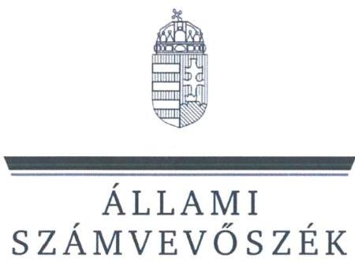
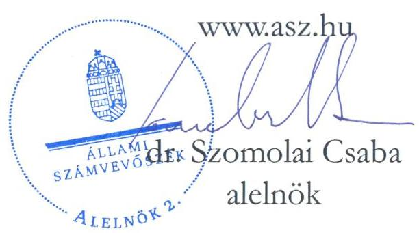
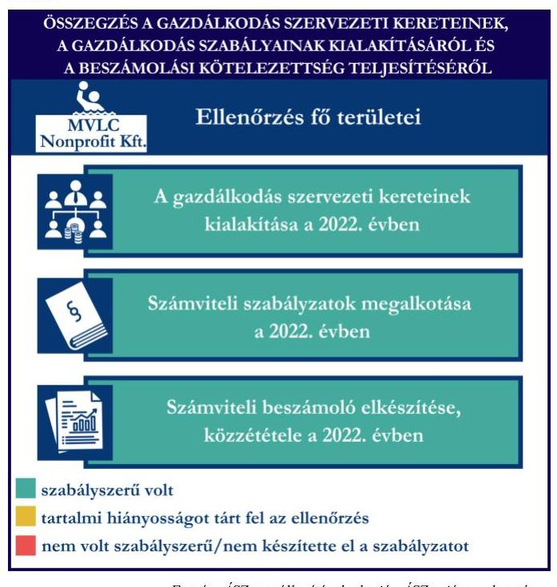
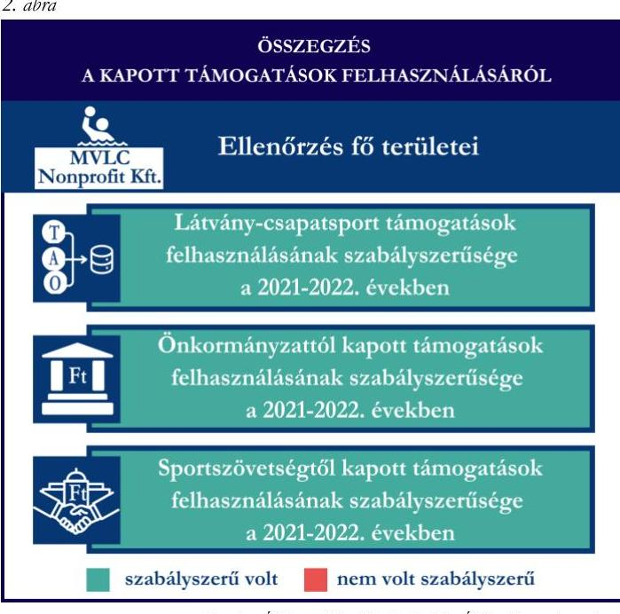
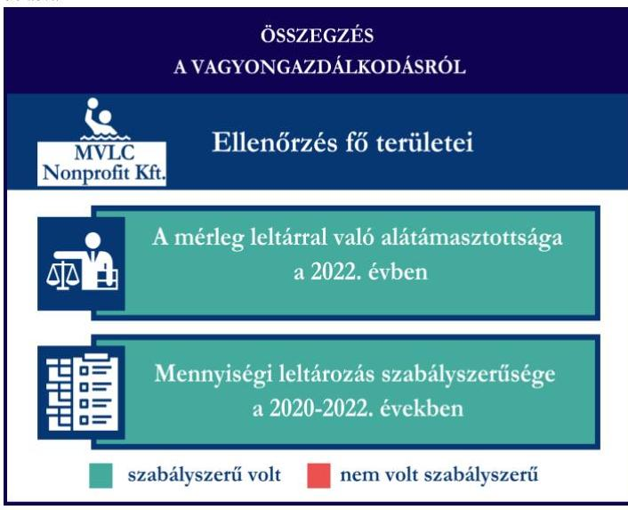

# JELENTÉS 

Támogatásban részesülő sportszövetségek, sportegyesületek és sportvállalkozások gazdálkodásának ellenőrzése

MVLC Miskolci Vízilabda Club
Nonprofit Korlátolt Felelősségű Társaság

2024.

---

ÁLLAMI
SZÁMVEVÔSZÉK

# JELENTÉS 

## Támogatásban részesülő sportszövetségek, sportegyesületek és sportvállalkozások gazdálkodásának ellenőrzése

MVLC Miskolci Vízilabda Club Nonprofit Korlátolt Felelősségű Társaság

2024. 

24173

---

# ELLENŐRZÉSI IGAZGATÓSÁG:

## ÁLLAMHÁZTARTÁSON KÍVÜLI SZERVEZETEKET ELLENŐRZŐ IGAZGATÓSÁG

### ELLENŐRZÉSI IGAZGATÓ:

#### KLINGA LÁSZLÓ igazgató

### ELLENŐRZÉSVEZETŐ:

Jelentéseink az interneten a www.asz.hu címen olvashatók.

#### KAKAS SÁNDOR ellenőrzésvezető

#### IKTATÓSZÁM: EL-4031-003/2024

#### TÉMASORSZÁM: 30

#### ELLENŐRZÉS-AZONOSÍTÓ SZÁM: V1078

---

# TARTALOMJEGYZÉK 

AZ ELLENŐRZÉS ALAPADATAI ..... 5
AZ ELLENŐRZÖTT SZERVEZET ..... 7
ÖSSZEFOGLALÁS ..... 8
AZ ELLENŐRZÉS FÓKUSZTERÜLETEI ..... 10
MEGÁLLAPÍTÁSOK ..... 11
JAVASLATOK ..... 15
MELLÉKLETEK ..... 16
I. sz. melléklet: Értelmező szótár ..... 16
II. sz. melléklet: Az ellenőrzött szervezetek jegyzéke ..... 18
III. sz. melléklet: Fő ellenőrzési kritériumok fő ellenőrzési fókuszterületek szerint. ..... 19
FÜGGELÉK: ÉSZREVÉTELEK ..... 20
RÖVIDÍTÉSEK JEGYZÉKE ..... 21

---

.

---

# AZ ELLENŐRZÉS ALAPADATAI 

## AZ ELLENŐRZÉS CÉLJA

Az ellenőrzés célja az államháztartásból nyújtott támogatással, vagy az államháztartásból meghatározott célra ingyenesen juttatott vagyon felhasználásával érintett sportszövetségek, sportegyesületek és sportvállalkozások gazdálkodása szabályozottságának, gazdálkodási tevékenységének, ezen belül a beszámolási kötelezettség teljesítésének, a támogatások elkülönített nyilvántartásának, valamint a támogatások felhasználásának ellenőrzése.

## AZ ELLENŐRZÉS TÍPUSA

Kombinált ellenőrzés.

## AZ ELLENŐRZŐTT IDŐSZAK

Az 1. fókuszterület vonatkozásában a 2022. év.
A 2. fókuszterület vonatkozásában a 2021-2022. évek.
A 3. fókuszterület vonatkozásában a 2022. év, a mennyiségi felvétellel történő leltározás dokumentumai tekintetében a 2020-2022. évek.

## AZ ELLENŐRZÉS TÁRGYA

Az ellenőrzés tárgyát képezte a támogatásban részesülő sportvállalkozás gazdálkodása szabályozottságának, gazdálkodási tevékenységén belül a beszámolási kötelezettség teljesítésének, a vagyonnyilvántartásának, a támogatások elkülönített nyilvántartásának, valamint az államháztartási forrásból származó közvetlen vagy közvetett támogatások és a meghatározott célra ingyenesen juttatott vagyon felhasználásának vizsgálata. Az ellenőrzés a támogatások vonatkozásában kiterjedt továbbá a támogató felé történő beszámolási és elszámolási kötelezettségek teljesítésére, a jogszabályi és belső előírások betartására.

Az ellenőrzés kiterjedt minden olyan körülményre és adatra, amely az ÁSZ ${ }^{1}$ jogszabályban meghatározott feladatainak teljesítéséhez, valamint az ellenőrzési program végrehajtása során felmerülő újabb összefüggések feltárásához szükséges volt.

## AZ ELLENŐRZÉS JOGALAPJA

Az ellenőrzés jogszabályi alapját az ÁSZ tv. ${ }^{2} 1 . \int(3)$ bekezdése, az 5. $\int(3)$ bekezdése előírásai képezték.

---

# AZ ELLENŐRZÉS MÓDSZERE 

Az ellenőrzést a nemzetközi standardokat irányadónak tekintve az ellenőrzési program szempontjai, az ellenőrzött időszakban hatályos jogszabályok, az ellenőrzés általános szakmai szabályai, az ellenőrzésre irányadó ÁSZ módszertanok figyelembevételével végezte az ÁSZ.

Az ellenőrzési kérdések megválaszolásához szükséges bizonyítékok megszerzése az ellenőrzött szervezet által rendelkezésre bocsátott dokumentumokra adatokra alapozva kérdésfeltevés (információkérés), mintavételezés útján történt.

Az ellenőrzési bizonyítékként felhasználható adatforrások közé tartoztak egyrészt az ellenőrzés során az ellenőrzött szervezettől bekért dokumentumok, másrészt adatforrás volt minden további, az ellenőrzés folyamán feltárt, az ellenőrzés szempontjából információt tartalmazó egyéb adatforrás.

A támogatásokkal, azok felhasználásával kapcsolatos kötelezettségek vizsgálatára mintavételi eljárások kerültek alkalmazásra. Támogatás-típusok szerint nagyságrend alapján egy darab támogatás képezte a vizsgálat tárgyát. Ezen támogatások felhasználásának szabályszerűsége támogatásonként kockázatértékelés alapján kiválasztott tételekkel került ellenőrzésre. A kiválasztott támogatási szerződésekhez kapcsolódó elszámolásokból 30 db tétel került ellenőrzésre, ahol az elszámolás nem érte el a 30 db -ot, ott tételes ellenőrzésre került sor. Ezen felül a vagyongazdálkodás szabályszerűségének ellenőrzéséhez is kockázatalapú mintavétel kapcsolódott. A támogatások felhasználása és a vagyongazdálkodás területén a tételek ellenőrzése kiterjedt a könyvvezetési kötelezettség vizsgálatára is. A tárgyi eszközök tekintetében 30 db került kiválasztásra a 2022. évben állományban lévő eszközök közül azok nyilvántartásának, elszámolásának szabályszerűsége ellenőrzése céljából. A kiválasztott tételek ellenőrzésének eredménye nem került kivetítésre a teljes sokaságra, a megállapítások az adott ellenőrzött tételek vonatkozásában kerültek megjelenítésre.

---

# AZ ELLENŐRZÖTT SZERVEZET 

Az MVLC Miskolci Vízilabda Club Nonprofit Korlátolt Felelősségű Társaság 2012. április 27-én alakult, Társasági szerződés ${ }_{1-3}{ }^{3}$ szerinti tagja a Miskolci Sportiskola Nonprofit Közhasznú Kft. és a Miskolc Holding Önkormányzati Vagyonkezelő Zrt. Az MVLC Nonprofit Kft. ${ }^{4}$ törzsfőkéje 3 M Ft volt, amelyből a Miskolci Sportiskola Nonprofit Közhasznú Kft-nek a törzsbetétje 2,1 M Ft-ot, míg a Miskolc Holding Önkormányzati Vagyonkezelő Zrt. törzsbetétje 0,9 M Ft-ot tett ki. Az üzletrész a tagok törzsbetétjéhez igazodott, vagyis 70\%-30\%-ban oszlott meg a két tag között. A Társasági szerződés ${ }_{1-3}$ szerint az MVLC Nonprofit Kft. főtevékenysége „Egyéb sporttevékenység", amelyen kívül az MVLC Nonprofit Kft. többek között a következő egyéb tevékenységi körök végzésére rendelkezett engedéllyel: rendezvényi étkeztetés, filmvetítés, PR, kommunikáció, sportszer-kiskereskedelem, ruházat, egyéb áruk piaci kiskereskedelme, gépjárműkölcsönzés, szabadidős sporteszköz kölcsönzése, oktatási kiegészítő tevékenység, sportlétesítmény működtetése, sportegyesületi tevékenység.

Az MVLC Nonprofit Kft. legfőbb döntéshozó szerve a Taggyűlés. Az MVLC Nonprofit Kft. tevékenységét az ügyvezető irányítja, képviseli az MVLC Nonprofit Kft.-t harmadik személyekkel szemben a bíróságok, illetve a hatóságok előtt. Az ügyvezető cégjegyzési joga önálló.

Az MVLC Nonprofit Kft. az ellenőrzött időszakban jogszabályi előírás alapján könyvvizsgálatra kötelezett volt, felügyelőbizottság létrehozásáról saját döntés alapján rendelkezett. Az MVLC Nonprofit Kft., mint sportvállalkozás az ellenőrzött időszakban folyamatosan vállalkozási tevékenységet végzett.

Az MVLC Nonprofit Kft. vízilabda szakága által az ellenőrzött időszakban igénybe vett támogatásokat az 1. táblázat mutatja be.
1. táblázat

AZ MVLC NONPROFIT KFT. VÍZILABDA SZAKÁGA ÁLTAL IGÉNYBE VETT TÁMOGATÁSOK (ADATOK M FT-BAN)

|  | 2021. EV | 2022. EV |
| :-- | :--: | :--: |
| Központi költségvetési támogatás | - | - |
| Látvány-csapatsport támogatás | 197,2 | 188,4 |
| Helyi önkormányzati támogatás | 17 | 20 |
| Magyar Vízilabda Szövetségtől kapott támogatás | - | 3,2 |

---

# ÖSSZEFOGLALÁS 

Magyarország Alaptörvényének XX. cikke kimondja, hogy mindenkinek joga van a testi és lelki egészséghez, melynek érvényesülését Magyarország többek között a sportolás és a rendszeres testedzés támogatásával segíti elő. Az Országgyűlés a Sport tv. ${ }^{5}$-ben kinyilvánította, hogy a nemzet közössége a test művelését, a sportot, a nemzet alapértékének, kívánatos célnak tekinti. A sport a közjó része. Erősíti a közösség tagjainak egymáshoz tartozását, miként az egyén testi és lelki egészségét.

A sportegyesületek, sportszövetségek, sportvállalkozások működésükre és szakmai tevékenységük ellátására költségvetési támogatásban, önkormányzati támogatásban, ingyenes vagyonjuttatásban, valamint látvány-csapatsport támogatásban részesülhetnek, amelyekre fokozott figyelem irányul.

A társadalom részéről jogosan felmerülő elvárás, hogy a közpénzeket kezelő, azzal gazdálkodó szervezetek működéséről, tevékenységéről átfogó képet kapjon, a közpénzek rendeltetésszerű és átlátható módon történő felhasználásának értékelésére időről-időre sor kerüljön az ellenőrzések keretében.

Az MVLC Nonprofit Kft. a könyvviteli 1. ábra szolgáltatás személyi feltételeinek megteremtéséről gondoskodott. Felügyelőbizottság létrehozásáról és működéséről saját döntés alapján rendelkezett. A 2022. évre vonatkozó egyszerűsített éves beszámolót könyvvizsgáló felülvizsgálta. A jogszabályi előírások szerint az MVLC Nonprofit Kft. kialakította a számviteli politikáját, valamint elkészítette számviteli szabályzatait, továbbá rendelkezett számlarenddel. A szabályzatok az ellenőrzött jogszabályi kritériumoknak megfeleltek.

A könyvvezetés formája a 2022. évben megfelelt a jogszabályi előírásoknak. Az MVLC Nonprofit Kft. a jogszabályoknak megfelelően teljesítette a számviteli beszámoló készítési- és közzétételi kötelezettségét.

A gazdálkodás szervezeti keretei kialakításának, a számviteli szabályzatok megalkotásának, valamint a

Forrás: ÁSZ megállapítások alapján ÁSZ saját szerkeustés
számviteli beszámoló elkészítése, közzététele a 2022. évben
szabályszerü volt
tartalmi hiányosságot tárt fel az ellenőrzés
nem volt szabályszzerű/nem készítette el a szabályzatot

számviteli beszámoló elkészítésének és közzétételének értékelését az 1. ábra mutatja be.

---

A MVLC Nonprofit Kft. vagyongazdálkodása a beszámoló leltárral való alátámasztottsága, a tárgyi eszközök üzembe helyezése és értékcsökkenésük elszámolása tekintetében, az ellenőrzött tételek esetében a 2022. évben szabályszerű volt. A jogszabályoknak megfelelően gondoskodott saját vagyona éves beszámolóban történő megjelenítéséről az ellenőrzött tételek alapján. A 2022. évi éves beszámolójának mérleg tételeit alátámasztotta szabályszerű leltárral, valamint a mennyiségi felvétellel történő leltározást elvégezte.

A vagyongazdálkodás értékelését a 3. ábra mutatja be.

Az MVLC Nonprofit Kft. a látványcsapatsport támogatást és kiegészítő sportfejlesztési támogatást, valamint az önkormányzattól juttatott támogatást, továbbá az MVLSZ ${ }^{6}$-n keresztül számára juttatott támogatást a 2021-2022. években az ellenőrzött tételek esetében a támogatási célnak megfelelően, szabályszerűen használta fel.

A kapott támogatások felhasználásának értékelését a 2. ábra mutatja be.
3. ábra

Forrás: ÁSZ megállapítások alapján ÁSZ saját szerkesztés

---

# AZ ELLENŐRZÉS FÓKUSZTERÜLETEI 

1.     - A gazdálkodási szabályok kialakítása, a könyvvezetési- és beszámolási kötelezettség teljesítése
2.     - A kapott támogatások felhasználása
3.     - Az ellenőrzött szervezet vagyongazdálkodása

---

# 1. A gazdálkodási szabályok kialakítása, a könyvvezetési- és beszámolási kötelezettség teljesítése 

Összegző megállapítás Az MVLC Nonprofit Kft. a 2022. évre vonatkozóan a jogszabályokban előírt szervezeti keretek kialakításával, a gazdálkodást biztosító belső szabályozó eszközök és számviteli keretek megalkotásával megteremtette a szabályszerű gazdálkodásának feltételeit. Az MVLC Nonprofit Kft. a jogszabályoknak megfelelően teljesítette könyvvezetési-, számviteli beszámoló készítési-, valamint közzétételi kötelezettségét.

A 2022. évben az MVLC Nonprofit Kft. a Számv. tv. ${ }^{7}$-ben foglalt jogszabályi előírások betartásával gondoskodott a könyvviteli szolgáltatás személyi feltételeinek megteremtéséről, a könyvviteli szolgáltatás körébe tartozó feladatok ellátásával olyan számviteli szolgáltatást nyújtó társaságot bízott meg, amelynek a feladat irányításával, vezetésével, a beszámoló elkészítésével megbízott tagja megfelelt a jogszabályi követelményeknek.
Az MVLC Nonprofit Kft. a Ptk. ${ }^{8}$ előírása alapján a társasági szerződésben három tagból álló felügyelőbizottság létrehozását rendelte el.
Az MVLC Nonprofit Kft. a 2022. évben rendelkezett a Számv. tv.-ben előírt számviteli politikával ${ }^{9}$, illetve annak keretében elkészítette az értékelési szabályzatot ${ }^{10}$, a leltározási szabályzatot ${ }^{11}$ és a pénzkezelési szabályzatot ${ }^{12}$. A szabályzatok az ellenőrzött tartalmi kritériumoknak megfeleltek. A MVLC Nonprofit Kft. a Számv. tv. szerint a számlarendet ${ }^{13}$ elkészítette.
Az MVLC Nonprofit Kft. a Számv. tv. előírásainak megfelelően a 2022. évben kettős könyvvitelt vezetett. A könyvviteli nyilvántartásait a Számv. tv. rendelkezéseinek megfelelően úgy alakította ki, hogy a 2022. évben az egyszerűsített éves beszámolóban a visszafizetési kötelezettség nélkül kapott támogatásokat az egyéb bevételeken belül ki tudta mutatni. Az MVLC Nonprofit Kft. könyvvezetési rendszerét a Számv. tv.-ben foglaltaknak megfelelően úgy részletezte tovább, hogy az alapján a 107/2011. (VI.30.) Korm. rend. ${ }^{14}$ által előírt adatok ellenőrizhető módon rendelkezésre állnak.
Az MVLC Nonprofit Kft. a Számv. tv. előírásainak megfelelően elkészítette a 2022. évre vonatkozó egyszerűsített éves beszámolóját.
A 2022. évre vonatkozó egyszerűsített éves beszámolót a Számv. tv. előírásainak megfelelően a könyvvizsgáló felülvizsgálta, a Ptk. rendelkezései alapján a felügyelőbizottság határozattal elfogadta, a Taggyűlés a Ptk.-ban foglaltaknak megfelelően taggyűlési határozattal jóváhagyta.
Az MVLC Nonprofit Kft. a 2022. évi egyszerűsített éves beszámolóját a Számv. tv.-nek megfelelően letétbe helyezte és közzétette.

---

# 2. A kapott támogatások felhasználása 

## Összegző megállapítás

Az MVLC Nonprofit Kft. a 2021. és a 2022. években a kapott támogatásokat az ellenőrzött tételek esetében szabályszerűen használta fel.

Az MVLC Nonprofit Kft. a látvány-csapatsport támogatások esetében a 2021-2022. években eleget tett a 107/2011. (VI. 30.) Korm. rendeletben foglaltaknak, a támogatás felhasználásáról negyedévente az előrehaladási jelentéseket benyújtotta az MVLSZ felé.
Az MVLC Nonprofit Kft. a számára nyújtott látvány-csapatsport támogatásról és kiegészítő sportfejlesztési támogatásról a 107/2011. (VI. 30.) Korm. rendeletnek megfelelően határidőben benyújtotta az elszámolást a támogató felé. A támogatási időszak lezárultát követően a támogatás felhasználását a jogszabályban foglaltak szerint záradékolt számviteli bizonylatokkal alátámasztott módon, összesített elszámolási táblázattal és szöveges szakmai beszámolóval igazolta. Az MVLC Nonprofit Kft. a 107/2011. (VI. 30.) Korm. rendeletnek megfelelően könyvvizsgáló által ellenőrzött számviteli bizonylatokkal számolt el a támogató felé. A könyvvizsgáló a 107/2011. (VI. 30.) Korm. rendeletben előírt felelősségbiztosítással rendelkezett.
Az MVLC Nonprofit Kft. összhangban a 107/2011. (VI. 30.) Korm. rendeletben foglaltakkal rendelkezett látvány-csapatsport támogatás és kiegészítő sportfejlesztési támogatás felhasználásának elkülönített nyilvántartásával. Az MVLC Nonprofit Kft. a Számv. tv.-ben előírtaknak megfelelően a befektetett eszköz beszerzéséhez, létesítéséhez kapott vissza nem térítendő támogatást, halasztott bevételként mutatta ki, és annak összegét az értékcsökkenés elszámolásának ütemében oldotta fel.
Az MVLC Nonprofit Kft. esetében a látvány-csapatsport támogatás és kiegészítő sportfejlesztési támogatás ellenőrzött tételeinek ( 30 db ) vonatkozásában az alábbiak kerültek megállapításra:

- a tételek számviteli elszámolását a Számv. tv.-ben és a 107/2011. (VI. 30.) Korm. rendeletben előírtak szerint bizonylatokkal alátámasztották;
- a 107/2011. (VI. 30.) Korm. rendeletben foglaltaknak megfelelően
- a tételek tartalma (gazdasági esemény) és összege alapján a támogatási igazolásban meghatározottak szerinti jogcímre, az abban meghatározott mértékben használták fel;
- a tételek számviteli bizonylatai alapján a gazdasági események a támogatási időszak (meghosszabbított támogatási időszak) végéig szerződés szerint teljesültek;
- a tételek számviteli bizonylatai alapján a gazdasági események pénzügyi rendezése az elszámolás benyújtására nyitva álló határidőig - figyelemmel az esetleges elszámolási határidő hosszabbítására - teljesült;
- a tételek számviteli bizonylatait ellátták záradékkal;
- a számviteli bizonylatokon záradékolt összegek - két látvány-csapatsport támogatás tétel kivételével - megegyeztek a számlaösszesítőben feltüntetett értékekkel. A kivételt képező tételek esetében a záradékkal ellátott számviteli bizonylatokon a hivatkozott sportfejlesztési program terhére elszámolni kívánt összeg (1. tétel (2021.07.25 és 2022.05.15. közötti üzemanyag tankolások.): 1170916 Ft alap +134126 Ft kiegészítő sportfejlesztési támogatás, összesen 1305042 Ft ; 2. tétel (Étkezés (Észak-keleti, Sátoraljaújhely - MVLC)): 17765 Ft alap +660 Ft kiegészítő sportfejlesztési támogatás, összesen 18425 Ft ) nem került feltüntetésre, és a számviteli

---

bizonylatok fizetendő összege (1. tétel: 1351534 Ft ; 2. tétel: 19800 Ft ) magasabb volt, mint a ki/JH01-08033/2021/MVLSZ sportfejlesztési program terhére elszámolt összeg. Az MVLC Nonprofit Kft. teljeskörűen nem tett eleget a 107/2011. (VI. 30.) Korm. rendelet 11. § (1) bekezdésében előírtaknak, mivel a két tétel esetén a sportfejlesztési támogatás összegének felhasználásáról történő elszámolást nem a záradékolt számviteli bizonylatokkal alátámasztott módon nyújtotta be.

- a tételek számviteli bizonylatának az adott sportfejlesztési program terhére záradékolt összegei a Számv. tv.-ben előírtak szerint a tartalmuknak megfelelő főkönyvi számra kerültek elszámolásra.
Az MVLC Nonprofit Kft. a 2021. és 2022. évben a Számv. tv. előírásai szerint a könyvvezetési rendszerét oly módon tovább részletezte, hogy abból a helyi önkormányzattól kapott sportcélú támogatások, továbbá a kapott támogatások felhasználásának adatai rendelkezésre álltak. Az MVLC Nonprofit Kft. a beszámolási kötelezettségét a támogatás rendeltetésszerű felhasználásáról az Áht. ${ }^{15}$-nak megfelelően teljesítette a helyi önkormányzat felé, a szakmai beszámoló rendelkezésre áll. A beszámoló az Ávr. ${ }^{16}$-ben és Miskolc Megyei Jogú Város Önkormányzatával 2022. március 10-én kötött, 201.182-0/2022 számú Megállapodásban előírtaknak megfelelően tartalmazta a tartalmi elemeket.
Az MVLC Nonprofit Kft. esetében az önkormányzati támogatás ellenőrzött tételeinek ( 30 db ) vonatkozásában az alábbiak kerültek megállapításra:
- a tételek számviteli elszámolását a Számv. tv.-ben előírtak szerint bizonylatokkal alátámasztották;
- a megállapodásban foglaltaknak megfelelően:
- a tétel gazdasági eseményének teljesítési időpontja a megállapodásban meghatározott támogatott tevékenység időtartamán belül történt;
- a megállapodásban meghatározott felhasználási határidőig megtörtént a tétel pénzügyi rendezése;
- a számviteli bizonylatokat záradékkal ellátták, amelyben jelzésre került, hogy a számviteli bizonylaton szereplő összegből mennyit számoltak el a hivatkozott megállapodás terhére;
- a hivatkozott megállapodás terhére a számviteli bizonylaton záradékolt összeg megegyezik a számlaösszesítőben feltüntetett értékkel;
- a tételek számviteli bizonylatának a hivatkozott megállapodás terhére záradékolt összege a Számv. tv.-ben előírtak szerinti tartalmának megfelelő főkönyvi számra került elszámolásra;
- a hivatkozott megállapodás terhére a számviteli bizonylaton záradékolt összeg a Számv. tv. előírásainak megfelelően megegyezik a támogatás felhasználásának elkülönített számviteli nyilvántartásában szereplő összeggel.
A MVLC Nonprofit Kft. a 2021. és 2022. évben a Számv. tv. előírásai szerint a könyvvezetési rendszerét oly módon tovább részletezte, hogy abból az MVLSZ-en keresztül számára juttatott támogatás, továbbá a kapott támogatás felhasználásának adatai rendelkezésre álltak. A támogatás felhasználásáról az MVLSZ felé beszámolt, az összesített elszámolási táblázatot az MVLSZ-el 2021. október 19-én kötött, MVLSZ10/2021. számú támogatási szerződésben előírt formában és tartalommal elkészítette. A támogató felé benyújtott elszámolásokat alátámasztó számviteli bizonylatok a Számv. tv.-ben foglalt alaki és tartalmi követelményeknek megfeleltek, a benyújtott számlák a 474/2016. (XII. 27.) Korm. rendeletben ${ }^{17}$ előírtaknak megfelelően záradékolásra kerültek.
Az MVLC Nonprofit Kft. esetében az MVLSZ-en keresztül számára juttatott támogatás tételeinek ( 2 db ) ellenőrzése során az alábbiak kerültek megállapításra:
- a tételek számviteli elszámolását a Számv. tv.-ben előírtak szerint bizonylatokkal alátámasztották;

---

- a támogatási szerződésben foglaltaknak megfelelően:
- a tétel gazdasági eseményének teljesítési időpontja a támogatási szerződésben meghatározott támogatott tevékenység időtartamán belül történt;
- a támogatási szerződésben meghatározott felhasználási határidőig megtörtént a tétel pénzügyi rendezése;
- a számviteli bizonylatokat záradékkal ellátták;
- a hivatkozott támogatási szerződés terhére a számviteli bizonylaton záradékolt összeg megegyezik a számlaösszesítőben feltüntetett értékkel;
- a tételek számviteli bizonylatának a hivatkozott támogatási szerződés terhére záradékolt összege Számv. tv.-ben előírtak szerint tartalmának megfelelő főkönyvi számra került elszámolásra;
- a hivatkozott támogatási szerződés terhére a számviteli bizonylaton záradékolt összeg a Számv. tv. előírásainak megfelelően megegyezik a támogatás felhasználásának elkülönített számviteli nyilvántartásában szereplő összeggel.

# 3. Az ellenőrzött szervezet vagyongazdálkodása 

## Összegző megállapítás A 2022. évben az MVLC Nonprofit Kft. vagyongazdálkodása az ellenőrzött tételek vonatkozásában szabályszerű volt.

Az MVLC Nonprofit Kft. a Számv. tv.-nek megfelelően a 2022. évi egyszerűsített éves beszámolójának mérlegtételeit szabályszerű leltárral alátámasztotta.
A Számv. tv. előírásaival összhangban a 2022. évre vonatkozóan a mennyiségi felvétellel történő leltározást elvégezte.
Az MVLC Nonprofit Kft. esetében a tárgyi eszköz tételek ( 30 db ) ellenőrzése során az alábbiak kerültek megállapításra:

- a tételek bekerülési értékét meghatározó számviteli bizonylatok a Számv. tv.-nek megfelelően rendelkezésre álltak;
- a tárgyi eszközök számviteli besorolása megfelelt a Számv. tv. előírásainak;
- az üzembe helyezés tényét és időpontját a Számv. tv.-nek megfelelően hitelt érdemlően dokumentálták;
- az értékcsökkenés elszámolása a Számv. tv.-nek megfelelően történt;
- huszonöt tétel esetén - ahol a tárgyi eszköz támogatásból valósult meg - a tétel bekerülési értékét meghatározó számviteli bizonylatokat a 107/2011. (VI. 30.) Korm. rendeletben foglaltaknak megfelelően ellátták záradékkal, amelyből kiderül, hogy a számviteli bizonylaton szereplő összegből mennyit számoltak el a szerződésszámmal hivatkozott támogatási szerződés terhére;
- hat tétel esetén, amelyek építési engedély köteles sportcélú ingatlanok voltak, a meghatározott hasznos élettartam a Tao tv.-ben ${ }^{18}$ foglaltaknak megfelelően 15 évben került meghatározásra.

---

# JAVASLATOK 

Az ÁSZ tv. 33. § (1) bekezdésében foglaltak értelmében az ellenőrzött szervezet vezetője köteles a jelentésben foglalt megállapításokhoz kapcsolódó intézkedési tervet összeállítani és azt a jelentés kézhezvételétől számított 30 napon belül az ÁSZ részére megküldeni. Amennyiben az ellenőrzött szervezet vezetője nem küldi meg határidőben az intézkedési tervet, vagy továbbra sem elfogadható intézkedési tervet küld, az Állami Számvevőszék elnöke az ÁSZ tv. 33. § (3) bekezdése a) és b) pontjaiban foglaltakat érvényesítheti.

## Az MVLC Miskolci Vízilabda Club Nonprofit Korlátolt FELELŐSSÉGŰ TÁRSASÁG ÜGYVEZETŐJÉNEK

1. Gondoskodjon a 107/2011. (VI. 30.) Korm. rendelet 11. § (1) bekezdésében előírtaknak megfelelően, a sportfejlesztési támogatás összegének felhasználásáról történő elszámolás valamennyi záradékolt számviteli bizonylat általi alátámasztásáról.

---

# MELLÉKLETEK 

I. SZ. MELLÉKLET: ÉRTELMEZŐ SZÓTÁR

Kiegészítő sportfejlesztési támogatás

Költségvetési támogatás

Közhasznú szervezet

Közhasznú tevékenység

Látvány-csapatsport támogatás

Látvány-csapatsportban múködő amatőr sportszervezet

Látvány-csapatsportban múködő hivatásos sportszervezet

Országos sportági szakszövetsé

A látvány-csapatsportok támogatása esetében rendelkező nyilatkozatban felajánlott összeg 12,5 százaléka kiegészítő sportfejlesztési támogatásnak minősül. (Forrás: Tao tv. 24/A. § (9) bekezdés)
A társadalombiztosítás pénzügyi alapjai kivételével az államháztartás központi alrendszeréből ellenérték nélkül, pénzben nyújtott támogatások. (Forrás: Áht. 1. § 14. pont)
Közhasznú szervezetté minősíthető a Magyarországon nyilvántartásba vett közhasznú tevékenységet végző szervezet, amely a társadalom és az egyén közös szükségleteinek kielégítéséhez megfelelő erőforrásokkal rendelkezik, továbbá amelynek megfelelő társadalmi támogatottsága kimutatható, és amely:
a) civil szervezet (ide nem értve a civil társaságot), vagy
b) olyan egyéb szervezet, amelyre vonatkozóan a közhasznú jogállás megszerzését törvény lehetővé teszi. (Forrás: Civil tv. 32. § (1) bekezdés)
Minden olyan tevékenység, amely a létesítő okiratban megjelölt közfeladat teljesítését közvetlenül vagy közvetve szolgálja, ezzel hozzájárulva a társadalom és az egyén közös szükségleteinek kielégítéséhez. (Forrás: Civil tv. 2. § 20. pont)
Az adóévben visszafizetési kötelezettség nélkül nyújtott támogatás, juttatás, véglegesen átadott pénzeszköz és térítés nélkül átadott eszköz könyv szerinti értéke, az adóévben térítés nélkül nyújtott szolgáltatás bekerülési értéke a Tao tv.-ben meghatározott jogcímeken. (Forrás: Tao tv. 4. § 44. pont)
Minden olyan, a sportról szóló törvényben meghatározott szabályok szerint a látvány-csapatsportban múködő sportegyesület vagy sportvállalkozás, amelyik nem minősül a látvány-csapatsportban múködő hivatásos sportszervezetnek. (Forrás: Tao tv. 4. § 42. pont)
A látvány-csapatsportágak országos sportági szakszövetsége által kiírt versenyrendszer legmagasabb felnőtt bajnoki osztályában - a veterán korosztályokra kiírt versenyrendszer kivételével - részt vevő (indulási jogot elnyert) sportszervezet, vagy alsóbb bajnoki osztályaiban részt vevő (indulási jogot elnyert) sportszervezet abban az esetben, ha az ilyen sportszervezet hivatásos sportolót alkalmaz. Több látványcsapatsportban több jogi személy szervezeti egységgel (szakosztállyal) múködő sportszervezet esetén csak az a jogi személy szervezeti egység (szakosztály), amely a fent részletezett versenyrendszerek bajnoki osztályaiban részt vesz. (Forrás: Tao tv. 4. § 43. pont)
Olyan sportszövetség, amely sportágában kizárólagos jelleggel az e törvényben, valamint más jogszabályokban meghatározott feladatokat lát el és e törvényben megállapított különleges jogosítványokat gyakorol. Olyan sportágban hozható létre, amelyet vagy a Nemzetközi Olimpiai Bizottság elismert, vagy amely sportág nemzetközi szövetségét felvették a Nemzetközi Sportszövetségek Szövetségébe (GAISF). (Forrás: Sport tv. 20. § (1), (4) bekezdés)

---

Sportági szövetség

Sportegyesület

Sportegyesületeknek, sportszövetségeknek nyújtott költségvetési támogatás

Sportszövetség

Sporttevékenység

Sportvállalkozás

A Civil tv. és a Ptk. előírásai alapján - a Sport tv.-ben meghatározott eltérésekkel - müködő szövetség, amelynek tagjai kizárólag sportszervezetek lehetnek. Sportági szövetség országos jelleggel is müködhet. Egy sportágban csak egy országos sportági szövetség müködhet. Törvényi feltételek teljesülése esetén szakszövetségi feladatokat is elláthat. (Forrás: Sport tv. 28. §)
A Civil tv. és a Ptk. szabályai szerint müködő olyan egyesület, amelynek alaptevékenysége a sporttevékenység szervezése, valamint a sporttevékenység feltételeinek megteremtése. A sportegyesületek a Sport tv. 15. § (1) bekezdésében meghatározott sportszervezetek körébe tartoznak. A sportegyesületeken kívül sportszervezet még a sportvállalkozás, a sportiskola, valamint az utánpótlás-nevelés fejlesztését végző alapítvány. (Forrás: Sport tv. 16. § (1) bekezdés)
Az állami sport célú támogatások felhasználásáról és elosztásáról szóló 474/2016. (XII. 27.) Kormány rendelet és a 27/2013. (III. 29.) EMMI rendelet ${ }^{10}$ 1. $\S$-ában meghatározott fejezeti kezelésű előirányzatokból nyújtott támogatás.
Meghatározott sporttevékenységek körében a sportversenyek szervezésére, a tagok érdekvédelmére és a részükre való szolgáltatásokra, valamint a nemzetközi kapcsolatok lebonyolítására létrehozott, jogi személyiséggel és önkormányzattal rendelkező, a Civil tv. és a Ptk. alapján - az e törvényben foglalt eltérésekkel - különös formában müködő egyesületek. A Sport tv. 19. § (3) bekezdése szerint a sportszövetségeknek az alábbi típusai léteznek: országos sportági szakszövetségek, sportági szövetségek, szabadidősport szövetségek, fogyatékosok sportszövetségei, diák- és egyetemi-főiskolai sport sportszövetségei, nemzetközi sportszövetségek. (Forrás: Sport tv. 19. § (1), (3) bekezdés)

Meghatározott szabályok szerint, a szabadidő eltöltéseként kötetlenül vagy szervezett formában, illetve versenyszerűen végzett testedzés vagy szellemi sportágban kifejtett tevékenység, amely a fizikai erőnét és a szellemi teljesítőképesség megtartását, fejlesztését szolgálja. (Forrás: Sport tv. 1. § (2) bekezdés)
Az a gazdasági társaság, amelynek a cégnyilvántartásról, a cégnyilvánosságról és a bírósági cégeljárásról szóló törvény alapján a cégjegyzékbe bejegyzett tevékenysége sporttevékenység, továbbá a gazdasági társaság célja sporttevékenység szervezése, valamint a sporttevékenység feltételeinek megteremtése egy vagy több sportágban. Korlátolt felelősségű társasági, illetve részvénytársasági formában alapítható, a fogyatékosok sportja, illetve a szabadidősport területén közhasznú társaságként is müködhet. (Forrás: Sport tv. 18. §)

---

II. SZ. MELLÉKLET: AZ ELLENŐRZÖTT SZERVEZETEK JEGYZÉKE

| ELLENŐRZÖTT SZERVEZET NEVE | ELLENŐRZÖTT SZERVEZET SZÉKHELYE |
| :-- | :-- |
| MVLC Miskolci Vízilabda Club Nonprofit Korlátolt Felelősségű | 3515 Miskolc, Egyetem utca 2. |
| Társaság |  |

---

# III. SZ. MELLÉKLET: FŐ ELLENŐRZÉSI KRITÉRIUMOK FŐ ELLENŐRZÉSI FÓKUSZTERÜLETEK 

SZERINT

## FŐ ELLENŐRZÉSI FÓKUSZTERÜLETEK

1. A gazdálkodási szabályok kialakítása, a könyvvezetési és beszámolási kötelezettség teljesítése
2. A kapott támogatások felhasználása

## FŐ ELLENŐRZÉSI KRITÉRIUMOK

Ptk. 3:26. $\$ 1$ ) bekezdés, 3:27. $\$ 1$ ) bekezdés, 3:82. $\$$ (1)-(2) bekezdés
Számv. tv. 4. §, 6. § (2) bekezdés, 12. §, 14. § (3), (5) bekezdés a), b), d) pont, (8) bekezdés, (11)-(12) bekezdés, 69. § (1), (3) bekezdés, 90. § (3) bekezdés c) pont, 96. § (4) bekezdés, 150. § (2) bekezdés, 153. § (1) bekezdés, 154. § (1) bekezdés, 161. § (1) bekezdés, (2) bekezdés a)-d) pont, (3)-(4) bekezdés, 161/A. § (1)(2) bekezdés, 165. § (2) bekezdés

Tao tv. 22/C. §
107/2011. (VI.30.) Korm. rendelet 9. § (9) bekezdés
Áht. 52. § (1) bekezdés, 53. §
Ávr. 76. § (1) bekezdés c) pont, 93. § (1)-(3), (5) bekezdés
Számv. tv. 16. § (3) bekezdés, 25-26. §, 44. § (2) bekezdés, 45. § (1)-(2) bekezdés, 77. § (3) bekezdés b) pont, 78-81. §, 159. §, 161/A. § (2) bekezdés, 162. § (1) bekezdés, 165. § (1)-(2) bekezdés, 166. § (1) bekezdés, 167. § (1) bekezdés a), d), e), h) pont

Tao. tv. 22/C. §, 24/A. § (9) bekezdés
107/2011. (VI.30.) Korm. rendelet 2. § (3b) bekezdés, 4. § (11) bekezdés, 5. § (1) bekezdés, 6. § (1) bekezdés e) pont, 9. § (8)(10) bekezdés, 10. § (2), (2a), (2b), (4) bekezdés, 10. § (5a) bekezdés, 11. § (1), (1a), (1d), (1e), (2), (4), (4a), (5), (6) bekezdés, 13. § (1), (2a) bekezdés, 14. § (1), (4), (4b), (4c), (6c) bekezdés

275/2022. (VII.29.) Korm. rendelet ${ }^{20} 1 . \S$ (3)
444/2022. (XI.7) Korm. rendelet ${ }^{21} 2 . \S$
474/2016. (XII. 27.) Korm. rendelet 26. § (3) bekezdés
3. Az ellenőrzött szervezet vagyongazdálkodása

Ptk. 3:63. § (4) bekezdés
Számv. tv. 15. § (3) bekezdés, 26. §, 46. § (3) bekezdés, 47-53. §, 57. §, 69. § (1)-(6) bekezdés, 165-166. §, 169. § (2) bekezdés

Tao tv. 22/C (6) bekezdés a), d), e) pont, (11) bekezdés
Ávr. 93. § (5) bekezdés
107/2011. (VI.30.) Korm. rendelet 11. § (5) bekezdés
474/2016. (XII. 27.) Korm. rendelet 17. § (1) bekezdés 11a. a) pont, 11b. pont, 17. § (2a) bekezdés, 24. § (2) bekezdés

---

# FÜGGELÉK: ÉSZREVÉTELEK 

A jelentéstervezetet a Számvevőszék 15 napos észrevételezésre megküldte az ellenőrzött szervezet vezetőjének az ÁSZ tv. 29. §* (1) bekezdése előírásának megfelelően.

A MVLC Miskolci Vizilabda Club Nonprofit Korlátolt Felelősségü Társaság ügyvezetője a jelentéstervezetre nem tett észrevételt.

[^0]
[^0]:    * 29. § (1) Az Állami Számvevőszék az ellenőrzési megállapításait megküldi az ellenőrzött szervezet vezetőjének vagy az általa megbízott személynek, és annak, akinek személyes felelősségét állapította meg.
    (2) Az ellenőrzött szervezet vezetője és a felelősként megjelölt személy az ellenőrzés megállapításaira tizenöt napon belül írásban észrevételt tehet.
    (3) Az Állami Számvevőszék az észrevételre a beérkezésétől számított harminc napon belül írásban válaszol. A figyelembe nem vett észrevételeket köteles a jelentésben feltüntetni, és megindokolni, hogy azokat miért nem fogadta el.

---

# RÖVIDÍTÉSEK JEGYZÉKE 

${ }^{1}$ ÁSZ ${ }^{2}$ ÁSZ tv. ${ }^{3}$ Társasági szerződés ${ }_{1}$

Társasági szerződés ${ }_{2}$

Társasági szerződés ${ }_{3}$
${ }^{4}$ MVLC Nonprofit Kft.
${ }^{5}$ Sport tv.
${ }^{6}$ MVLSZ
${ }^{7}$ Számv. tv.
${ }^{8}$ Ptk.
${ }^{9}$ számviteli politika
${ }^{10}$ értékelési szabályzat
${ }^{11}$ leltározási szabályzat
${ }^{12}$ pénzkezelési szabályzat
${ }^{13}$ számlarend
${ }^{14}$ 107/2011. (VI.30.) Korm. rendelet
${ }^{15}$ Áht.
${ }^{16}$ Ávr.
${ }^{17}$ 474/2016. (XII. 27.) Korm. rendelet
${ }^{18}$ Tao tv.
${ }^{19}$ 27/2013. EMMI rendelet
${ }^{20}$ 275/2022. (VII.29.) Korm. rendelet
${ }^{21}$ 444/2022. (XI.7.) Korm. rendelet

Állami Számvevőszék
2011. évi LXVI. törvény az Állami Számvevőszékről

MVLC Miskolci Vízilabda Club Nonprofit Korlátolt Felelősségű Társaság Társasági szerződése (hatályos: 2020. november 25-től)
MVLC Miskolci Vízilabda Club Nonprofit Korlátolt Felelősségű Társaság Társasági szerződése (hatályos: 2021. június 1-től)
MVLC Miskolci Vízilabda Club Nonprofit Korlátolt Felelősségű Társaság Társasági szerződése (hatályos: 2022. június 1-től)
MVLC Miskolci Vízilabda Club Nonprofit Korlátolt Felelősségű Társaság
2004. évi I. törvény a sportról

Magyar Vízilabda Szövetség
2000. évi C. törvény a számvitelről
2013. évi V. törvény a Polgári Törvénykönyvről

MVLC Miskolci Vízilabda Club Nonprofit Korlátolt Felelősségű Társaság Számviteli politikája (hatályos: 2021. január 1-től)
MVLC Miskolci Vízilabda Club Nonprofit Korlátolt Felelősségű Társaság Értékelési szabályzata (hatályos: 2021. január 1-től)
MVLC Miskolci Vízilabda Club Nonprofit Korlátolt Felelősségű Társaság Leltározási szabályzata (hatályos: 2021. január 1-től)
MVLC Miskolci Vízilabda Club Nonprofit Korlátolt Felelősségű Társaság Pénzkezelési szabályzata (hatályos: 2021. január 1-től)
MVLC Miskolci Vízilabda Club Nonprofit Korlátolt Felelősségű Társaság Számlarendje (hatályos: 2021. január 1-től)
107/2011. (VI. 30.) Korm. rendelet a látvány-csapatsport támogatását biztosító támogatási igazolás kiállításáról, felhasználásáról, a támogatás elszámolásának és ellenőrzésének, valamint visszafizetésének szabályairól
2011. évi CXCV. törvény az államháztartásról

368/2011. (XII. 31.) Korm. rendelet az államháztartásról szóló törvény végrehajtásáról
474/2016. (XII. 27.) Korm. rendelet az állami sport célú támogatások felhasználásáról és elosztásáról
1996. évi LXXXI. törvény a társasági adóról és az osztalékadóról

27/2013. (III. 29.) EMMI rendelet az állami sport célú támogatások felhasználásáról és elosztásáról
275/2022. (VII.29.) Korm. rendelet a látvány-csapatsport támogatását biztosító támogatási igazoláskiállításáról, felhasználásáról, a támogatás elszámolásának és ellenőrzésének, valamint visszafizetésének szabályairól szóló 107/2011. (VI. 30.) Korm. rendelet veszélyhelyzet ideje alatt történő eltérő alkalmazásáról
444/2022. (XI.7.) Korm. rendelet a veszélyhelyzet idején a látvány-csapatsport támogatását biztosító támogatási igazolás kiállításáról, felhasználásáról, a támogatás elszámolásának és ellenőrzésének, valamint visszafizetésének szabályairól szóló 107/2011. (VI. 30.) Korm. rendelet szabályainak eltérő alkalmazásáról

---

1052 Budapest, Apáczai Csere János u. 10. | 1364 Budapest 4., Pf. 54
www.asz.hu | szamvevoszek@asz.hu
telefon: +36 14849100