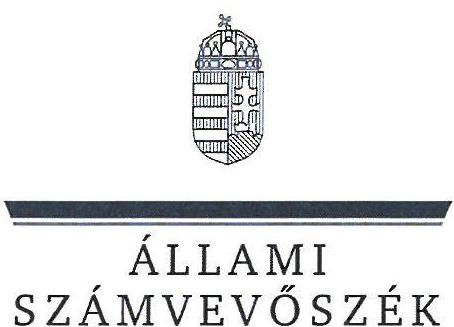
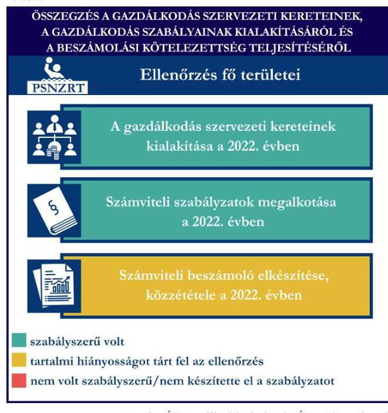
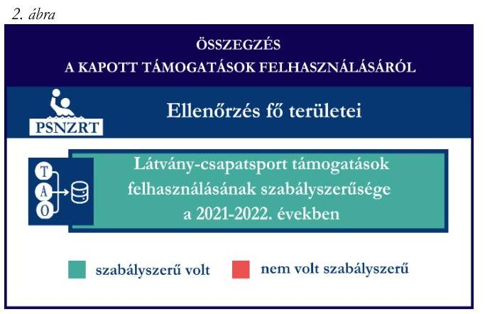
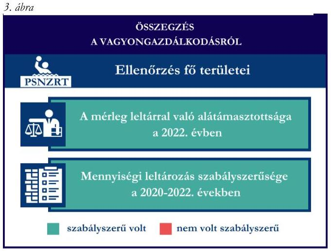

# JELENTÉS 

Támogatásban részesülő sportszövetségek, sportegyesületek és sportvállalkozások gazdálkodásának ellenőrzése

Pécsi Sport Nonprofit Zártkörűen Müködő Részvénytársaság

2024.

---

ÁLLAMI
SZÁMVEVŐSZÉK

# JELENTÉS 

## Támogatásban részesülő sportszövetségek, sportegyesületek és sportvállalkozások gazdálkodásának ellenőrzése

Pécsi Sport Nonprofit Zártkörűen Müködő Részvénytársaság

2024.

---

# ELLENŐRZÉSI IGAZGATÓSÁG: 

ÁLLAMHÁZTARTÁSON KÍVÜLI SZERVEZETEKET ELLENŐRZŐ IGAZGATÓSÁG

ELLENŐRZÉSI IGAZGATÓ:
KLINGA LÁSZLÓ igazgató

ELLENŐRZÉSVEZETŐ:
KAKAS SÁNDOR ellenőrzésvezető

Jelentéseink az interneten a www.asz.hu címen olvashatók.

IKTATÓSZÁM: EL-4031-011/2024
TÉMASORSZÁM: 30
ELLENŐRZÉS-AZONOSÍTÓ SZÁM: V1078

---

# TARTALOMJEGYZÉK 

AZ ELLENŐRZÉS ALAPADATAI ..... 5
AZ ELLENŐRZÖTT SZERVEZET ..... 7
ÖSSZEFOGLALÁS ..... 8
AZ ELLENŐRZÉS FÓKUSZTERÜLETEI ..... 10
MEGÁLLAPÍTÁSOK ..... 11
JAVASLATOK ..... 14
MELLÉKLETEK ..... 15
I. sz. melléklet: Értelmező szótár ..... 15
II. sz. melléklet: Az ellenőrzött szervezetek jegyzéke ..... 17
III. sz. melléklet: Fő ellenőrzési kritériumok fő ellenőrzési fókuszterületek szerint. ..... 18
FÜGGELÉK: ÉSZREVÉTELEK ..... 19
RÖVIDÍTÉSEK JEGYZÉKE ..... 20

---

.

---

# AZ ELLENŐRZÉS ALAPADATAI 

## AZ ELLENŐRZÉS CÉLJA

Az ellenőrzés célja az államháztartásból nyújtott támogatással, vagy az államháztartásból meghatározott célra ingyenesen juttatott vagyon felhasználásával érintett sportszövetségek, sportegyesületek és sportvállalkozások gazdálkodása szabályozottságának, gazdálkodási tevékenységének, ezen belül a beszámolási kötelezettség teljesítésének, a támogatások elkülönített nyilvántartásának, valamint a támogatások felhasználásának ellenőrzése.

## AZ ELLENŐRZÉS TÍPUSA

Kombinált ellenőrzés.

## AZ ELLENŐRZŐTT IDŐSZAK

Az 1. fókuszterület vonatkozásában a 2022. év.
A 2. fókuszterület vonatkozásában a 2021-2022. évek.
A 3. fókuszterület vonatkozásában a 2022. év, a mennyiségi felvétellel történő leltározás dokumentumai tekintetében a 2020-2022. évek.

## AZ ELLENŐRZÉS TÁRGYA

Az ellenőrzés tárgyát képezte a támogatásban részesülő sportvállalkozás gazdálkodása szabályozottságának, gazdálkodási tevékenységén belül a beszámolási kötelezettség teljesítésének, a vagyonnyilvántartásának, a támogatások elkülönített nyilvántartásának, valamint az államháztartási forrásból származó közvetlen vagy közvetett támogatások és a meghatározott célra ingyenesen juttatott vagyon felhasználásának vizsgálata. Az ellenőrzés a támogatások vonatkozásában kiterjedt továbbá a támogató felé történő beszámolási és elszámolási kötelezettségek teljesítésére, a jogszabályi és belső előírások betartására.

Az ellenőrzés kiterjedt minden olyan körülményre és adatra, amely az ÁSZ ${ }^{1}$ jogszabályban meghatározott feladatainak teljesítéséhez, valamint az ellenőrzési program végrehajtása során felmerülő újabb összefüggések feltárásához szükséges volt. Az ellenőrzés az 1. és 3. fókuszterületek esetében az ellenőrzött szervezet egészére, a 2. fókuszterület esetén kizárólag a vízilabda szakágra vonatkozóan került végrehajtásra.

## AZ ELLENŐRZÉS JOGALAPJA

Az ellenőrzés jogszabályi alapját az ÁSZ tv. ${ }^{2} 1 . \int(3)$ bekezdése, az 5. $\int(3)$ bekezdése, valamint a Civil tv. ${ }^{3}$ 47. § előírásai képezték.

---

# AZ ELLENŐRZÉS MÓDSZERE 

Az ellenőrzést a nemzetközi standardokat irányadónak tekintve az ellenőrzési program szempontjai, az ellenőrzött időszakban hatályos jogszabályok, az ellenőrzés általános szakmai szabályai, az ellenőrzésre irányadó ÁSZ módszertanok figyelembevételével végezte az ÁSZ.

Az ellenőrzési kérdések megválaszolásához szükséges bizonyítékok megszerzése az ellenőrzött szervezet által rendelkezésre bocsátott dokumentumokra adatokra alapozva kérdésfeltevés (információkérés), interjú, mintavételezés útján történt.

Az ellenőrzési bizonyítékként felhasználható adatforrások közé tartoztak egyrészt az ellenőrzés során az ellenőrzött szervezettől bekért dokumentumok, másrészt adatforrás volt minden további, az ellenőrzés folyamán feltárt, az ellenőrzés szempontjából információt tartalmazó egyéb adatforrás.

A támogatásokkal, azok felhasználásával, kapcsolatos kötelezettségek vizsgálatára mintavételi eljárások kerültek alkalmazásra. Támogatás-típusok szerint nagyságrend alapján egy darab támogatás képezte a vizsgálat tárgyát. Ezen támogatások felhasználásának szabályszerűsége támogatásonként kockázatértékelés alapján kiválasztott tételekkel került ellenőrzésre. A kiválasztott támogatási szerződésekhez kapcsolódó elszámolásokból 30 db tétel került ellenőrzésre, ahol az elszámolás nem érte el a 30 db -ot, ott tételes ellenőrzésre került sor. Ezen felül a vagyongazdálkodás szabályszerűségének ellenőrzéséhez is kockázatalapú mintavétel kapcsolódott. A támogatások felhasználása és a vagyongazdálkodás területén a tételek ellenőrzése kiterjedt a könyvvezetési kötelezettség vizsgálatára is. A tárgyi eszközök tekintetében 30 db került kiválasztásra a 2022. évben állományban lévő eszközök közül azok nyilvántartásának, elszámolásának szabályszerűsége ellenőrzése céljából. A kiválasztott tételek ellenőrzésének eredménye nem került kivetítésre a teljes sokaságra, a megállapítások az adott ellenőrzött tételek vonatkozásában kerültek megjelenítésre.

---

# AZ ELLENŐRZÖTT SZERVEZET

A Pécsi Sport Nonprofit Zártkörűen Működő Részvénytársaság 2010. június 10-én alakult, alapítója Pécs Megyei Jogú Város Önkormányzata volt.

A PSNZRT. ${ }^{4}$ Alapszabályában ${ }^{5}$ megfogalmazott célja, hogy közszolgáltatási szerződés alapján ellássa az alapító ${ }^{6}$ Sportlétesítmények Igazgatósága szervezeti egységének valamennyi feladatát. A társaság célja az alapító által meghatározott sportkoncepció megvalósítása, a pécsi versenyszerű és szabadidősport támogatása. A PSNZRT. az ellenőrzött időszakban 16 szakosztályt működtetett, köztük vízilabda, kézilabda, labdarúgás szakosztályokat is, továbbá sportlétesítményeket és sportpályákat üzemeltetett.

Az Alapszabály szerint a PSNZRT. legfőbb szerve a Közgyűlés ${ }^{7}$, melynek hatáskörét az alapító, mint egyedüli részvényes gyakorolta. Igazgatóság kinevezésére nem került sor, az igazgatóság jogait az Alapszabály rendelkezése alapján a vezérigazgató gyakorolta.

A PSNZRT. Alapszabályának rendelkezése alapján gazdasági- vállalkozási tevékenységet csak közhasznú céljainak megvalósítása érdekében, a közhasznú célok megvalósítását nem veszélyeztetve végezhet. Az ellenőrzött időszakban a PSNZRT. folyamatosan vállalkozási tevékenységet végzett.

A PSNZRT. az ellenőrzött időszakban a jogszabályi előírások alapján könyvvizsgálatra, felügyelőbizottság létrehozására kötelezett volt. A PSNZRT-nél az ellenőrzött időszakban három tagú felügyelő bizottság működött.

A PSNZRT. az alapító Pécs Megyei Jogú Város Önkormányzatával közszolgáltatási szerződést kötött. A társaság az ellenőrzött időszakban kiemelten közhasznú jogállású volt.

A PSNZRT. a 2022. évben rendelkezett önálló jogi személyiséggel bíró szervezeti egységgel, a Pécsi Sport Nonprofit Zrt. Kollégiummal, melynek tulajdonosa Pécs Megyei Jogú Város Önkormányzata, fenntartója pedig a PSNZRT. volt. Tulajdoni részesedéssel rendelkezett a Kosárlabda Akadémia Sport Korlátolt Felelősségű Társaságban és a PMFC - Labdarúgó Szolgáltató Nonprofit Korlátolt Felelősségű Társaságban.

A PSNZRT vízilabda szakága által az ellenőrzött időszakban igénybe vett támogatásokat az 1. táblázat mutatja be.

1. táblázat

A PSNZRT. VÍZILABDA SZAKÁGA ÁLTAL IGÉNYBE VETT TÁMOGATÁSOK (ADATOK M FT-BAN)

|   | 2021. év | 2022. év  |
| --- | --- | --- |
|  Központi költségvetési támogatás | - | -  |
|  Látvány-csapatsport támogatás | 208,2 | 240,2  |
|  Helyi önkormányzati támogatás | - | -  |
|  Magyar Vízilabda Szövetségtől kapott támogatás | - | -  |

---

# ÖSSZEFOGLALÁS 

Magyarország Alaptörvényének XX. cikke kimondja, hogy mindenkinek joga van a testi és lelki egészséghez, melynek érvényesülését Magyarország többek között a sportolás és a rendszeres testedzés támogatásával segíti elő. Az Országgyűlés a Sport tv. ${ }^{8}$-ben kinyilvánította, hogy a nemzet közössége a test művelését, a sportot, a nemzet alapértékének, kívánatos célnak tekinti. A sport a közjó része. Erősíti a közösség tagjainak egymáshoz tartozását, miként az egyén testi és lelki egészségét.

A sportegyesületek, sportszövetségek, sportvállalkozások működésükre és szakmai tevékenységük ellátására költségvetési támogatásban, önkormányzati támogatásban, ingyenes vagyonjuttatásban, valamint látvány-csapatsport támogatásban részesülhetnek, amelyekre fokozott figyelem irányul.

A társadalom részéről jogosan felmerülő elvárás, hogy a közpénzeket kezelő, azzal gazdálkodó szervezetek működéséről, tevékenységéről átfogó képet kapjon, a közpénzek rendeltetésszerű és átlátható módon történő felhasználásának értékelésére időről-időre sor kerüljön az ellenőrzések keretében.

A PSNZRT. a könyvviteli szolgáltatás személyi feltételeinek megteremtéséről, valamint felügyelőbizottság létrehozásáról és működéséről a jogszabályi előírásnak megfelelően gondoskodott. A jogszabályi előírásoknak megfelelve rendelkezett a 2022. évre vonatkozó éves beszámoló könyvvizsgáló általi felülvizsgálatáról. A jogszabályi előírások szerint a PSNZRT. kialakította a számviteli politikáját, valamint elkészítette számviteli szabályzatait, továbbá rendelkezett számlarenddel és bizonylati renddel. A szabályzatok az ellenőrzött jogszabályi kritériumoknak megfeleltek.

A könyvvezetés formája a 2022. évben megfelelt a jogszabályi előírásoknak. A PSNZRT. számviteli beszámoló készítési kötelezettsége kapcsán a kiegészítő melléklet tartalma vonatkozásában az ellenőrzés hiányosságot tárt fel.

A gazdálkodás szervezeti keretei kialakításának, a

számviteli szabályzatok megalkotásának, valamint a számviteli beszámoló elkészítésének és közzétételének értékelését az 1. ábra mutatja be.

---

A PSNZRT. a látvány-csapatsport támogatást és kiegészítő támogatást a 2021-2022. években az ellenőrzött tételek esetében a támogatási célnak megfelelően, szabályszerűen használta fel.

A PNZRT. számviteli nyilvántartásában a látványcsapatsport támogatás és kiegészítő támogatás felhasználását a jogszabályi előírás ellenére elkülönítetten nem tartotta nyilván.
A kapott támogatások felhasználásának értékelését a 2. ábra mutatja be.

A PŜNZRT. vagyongazdálkodása 2022. évben az ellenőrzött tételek esetében szabályszerű volt. A jogszabályoknak megfelelően gondoskodott saját vagyona éves beszámolóban történő megjelenítéséről az ellenőrzött tételek alapján. A 2022. évi éves beszámolójának mérleg tételeit alátámasztotta szabályszerű leltárral, valamint a mennyiségi felvétellel történő leltározást elvégezte.

A vagyongazdálkodás értékelését a 3. ábra mutatja be.

Forrás: ÁSZ megállapítások alapján ÁSZ saját szerkesztés

---

# AZ ELLENŐRZÉS FÓKUSZTERÜLETEI 

1.     - A gazdálkodási szabályok kialakítása, a könyvvezetési- és beszámolási kötelezettség teljesítése
2.     - A kapott támogatások felhasználása
3.     - Az ellenőrzött szervezet vagyongazdálkodása

---

# 1. A gazdálkodási szabályok kialakítása, a könyvvezetési- és beszámolási kötelezettség teljesítése 

Összegző megállapítás A PSNZRT. a 2022. évre vonatkozóan a jogszabályokban előírt szervezeti keretek kialakításával, a gazdálkodást biztosító belső szabályozó eszközök és számviteli keretek megalkotásával megteremtette a szabályszerű gazdálkodásának feltételeit. A könyvvezetési kötelezettség teljesítése megfelelt a jogszabályoknak, azonban a beszámolási kötelezettség teljesítésében a kiegészítő melléklet tartalmát tekintve az ellenőrzés hiányosságot tárt fel.

A 2022. évben a PSNZRT. a Számv. tv. ${ }^{9}$-ben foglalt jogszabályi előírásoknak megfelelően a könyvviteli szolgáltatás körébe tartozó feladatok elvégzésével, a beszámoló elkészítésével kapcsolatos feladatok ellátására a jogszabályi előírásoknak megfelelő képesítéssel rendelkező személyt bízott meg.
A PSNZRT. a Számv. tv. előírása szerint a 2022. évre vonatkozó éves beszámolója könyvvizsgálóval történő felülvizsgálatára szerződést kötött. A PSNZRT-nél az ellenőrzött időszakban a Ptk. ${ }^{10}$ és az Alapszabály előírásainak megfelelően három tagú felügyelőbizottság működött.
A PSNZRT. a 2022. évben rendelkezett a Számv. tv. előírásainak megfelelő számviteli politikával ${ }^{11}$ és az annak keretében elkészítendő eszközök és források leltárkészítési és leltározási szabályzatával ${ }^{12}$, eszközök és források értékelési szabályzatával ${ }^{13}$, pénzkezelési szabályzattal ${ }^{14}$. A PSNZRT. a Számv. tv. előírásainak megfelelően rendelkezett a 2022. évben számlarenddel ${ }^{15}$ és bizonylati renddel ${ }^{16}$. A szabályzatok az ellenőrzött tartalmi kritériumoknak megfeleltek.
A PSNZRT. a Számv. tv. előírásainak megfelelően kettős könyvvitelt vezetett. A PSNZRT. könyvvezetési rendszerét a Számv. tv. 161/A. § (2) bekezdésben foglaltakkal ellentétben nem részletezte tovább oly módon, hogy az alapján a támogatások felhasználására vonatkozóan a 107/2011. (VI.30.) Korm. rendelet ${ }^{17}$ által előírt adatok ellenőrizhető módon rendelkezésre álljanak.
A PSNZRT. a Számv. tv. előírásainak megfelelően elkészítette a 2022. évre vonatkozó éves beszámolóját, azonban a kiegészítő mellékletben a kapott támogatásokat a Számv. tv. 93. § (3) bekezdésében előírtak ellenére a kapott összeg, annak felhasználása (jogcímenként és évenként), a rendelkezésre álló összeg megbontásban nem mutatta be.
A 2022. évre vonatkozó éves beszámolót a Ptk. előírásainak megfelelően a felügyelőbizottság véleményezte, a Számv. tv. előírásainak megfelelően könyvvizsgáló felülvizsgálta, a Közgyűlés a Ptk.-ban foglaltaknak megfelelően közgyűlési határozattal jóváhagyta.
A PSNZRT. a 2022. évi éves beszámolóját a Számv. tv.-nek megfelelően - a könyvvizsgálói záradékot is tartalmazó független könyvvizsgálói jelentéssel együtt - letétbe helyezte és közzétette.

---

# 2. A kapott támogatások felhasználása 

| Összegző megállapítás | A PSNZRT. a 2021. és a 2022. években a kapott |
| :-- | :-- |
|  | támogatásokat az ellenőrzött tételek esetében |
|  | szabályszerűen használta fel, azonban a támogatások |
|  | felhasználását a jogszabályi előírások ellenére nem tartotta |
|  | elkülönítetten nyilván. |

A PSNZRT. a látvány-csapatsport támogatásról és kiegészítő támogatásról a 107/2011. (VI. 30.) Korm. rendeletnek megfelelően, az előírt határidőben benyújtotta az elszámolást a támogató felé. A támogatási időszak lezárultát követően a támogatás felhasználását a jogszabályban foglaltaknak megfelelően záradékolt számviteli bizonylatokkal alátámasztott módon, összesített elszámolási táblázattal és szöveges szakmai beszámolóval igazolta. A PSNZRT. a 107/2011. (VI. 30.) Korm. rendeletnek megfelelően - a jogszabályban előírt felelősségbiztosítással rendelkező - könyvvizsgáló által ellenőrzött számviteli bizonylatokkal számolt el a támogató felé.
A PSNZRT. a 2021-2022. években a 107/2011. (VI. 30.) Korm. rend. 11. § (2) bekezdésében foglaltak ellenére a támogatás felhasználásáról negyedévente az előrehaladási jelentéseket nem nyújtotta be az MVLSZ ${ }^{18}$ felé.
A PSNZRT. a 107/2011. (VI. 30.) Korm. rendelet 9. § (9) bekezdés előírása ellenére a látvány-csapatsport támogatás és kiegészítő támogatás felhasználását elkülönítetten és naprakészen, ellenőrizhető módon nem tartotta nyilván.
A PSNZRT. esetében a látvány-csapatsport támogatás és kiegészítő támogatás tételek ( $30+28 \mathrm{db}$ ) ellenőrzése során az alábbiak kerültek megállapításra:

- a tételek számviteli elszámolását a Számv. tv.-ben és a 107/2011. (VI. 30.) Korm. rendeletben előírtaknak megfelelően bizonylatokkal alátámasztották;
- a 107/2011. (VI. 30.) Korm. rendeletben foglaltaknak megfelelően a tételek tartalma (gazdasági esemény) és összege alapján a támogatási igazolásban meghatározottak szerinti jogcímre, az abban meghatározott mértékben használták fel, a tételek számviteli bizonylatai alapján a gazdasági események a támogatási időszak (meghosszabbított támogatási időszak) végéig teljesültek;
- a 107/2011. (VI. 30.) Korm. rendelet előírásainak megfelelve, a tételek pénzügyi rendezése a támogatási jogcímnek megfelelő pénzforgalmi számláról történt;
- a tételek számviteli bizonylatait a 107/2011. (VI. 30.) Korm. rendelet előírása szerint záradékkal ellátták;
- a számviteli bizonylatokon záradékolt összegek megegyeztek a számlaösszesítőben feltüntetett értékekkel;
- a tételek számviteli bizonylatának a sportfejlesztési program terhére záradékolt összegei a Számv. tv. előírtak szerint a tartalmuknak megfelelő főkönyvi számra kerültek elszámolásra.

---

# 3. Az ellenőrzött szervezet vagyongazdálkodása 

## Összegző megállapítás A 2022. évben a PSNZRT. vagyongazdálkodása az ellenőrzött tételek vonatkozásában szabályszerű volt.

A PSNZRT. a Számv. tv.-nek megfelelően a 2022. évi éves beszámolójának mérlegtételeit egyeztetéssel készített szabályszerű leltárral alátámasztotta. A Számv. tv. előírásaival összhangban a 2022. évre vonatkozóan a mennyiségi felvétellel történő leltározást elvégezte.
A PSNZRT. esetében a tárgyi eszköz tételek ( 30 db ) ellenőrzése során az alábbiak kerültek megállapításra:

- a tételek bekerülési értékét alátámasztó számviteli bizonylatok a Számv. tv.-nek megfelelően rendelkezésre álltak;
- a tárgyi eszközök számviteli besorolása megfelelt a Számv. tv. előírásainak;
- az üzembe helyezés tényét és időpontját a Számv. tv.-nek megfelelően hitelt érdemlően dokumentálták;
- az értékcsökkenés elszámolása a Számv. tv.-nek megfelelően történt;
- tizenkilenc tétel esetén a tárgyi eszköz beszerzése látvány-csapatsport támogatásból valósult meg, a tételek bekerülési értékét meghatározó számviteli bizonylatokat a 107/2011. (VI. 30.) Korm. rendeletben foglaltaknak megfelelően ellátták záradékkal, amelyből kiderül, hogy a számviteli bizonylaton szereplő összegből mennyit számoltak el a szerződésszámmal hivatkozott támogatási igazolás terhére. További tíz tétel esetén az eszközök beszerzése központi költségvetési támogatásból valósult meg, a tételek bekerülési értékét meghatározó számviteli bizonylatokat a támogatói okiratnak megfelelően látták el záradékkal.

---

# JAVASLATOK 

Az ÁSZ tv. 33. § (1) bekezdésében foglaltak értelmében az ellenőrzött szervezet vezetője köteles a jelentésben foglalt megállapításokhoz kapcsolódó intézkedési tervet összeállítani és azt a jelentés kézhezvételétől számított 30 napon belül az ÁSZ részére megküldeni. Amennyiben az ellenőrzött szervezet vezetője nem küldi meg határidőben az intézkedési tervet, vagy továbbra sem elfogadható intézkedési tervet küld, az Állami Számvevőszék elnöke az ÁSZ tv. 33. § (3) bekezdése a) és b) pontjaiban foglaltakat érvényesítheti.

## A PÉCSI SPORT NONPROFIT ZÁRTKÖRÜEN MÜKÖDŐ RÉSZVÉNYTÁRSASÁG VEZÉRIGAZGATÓJA RÉSZÉRE

1. Gondoskodjon a 107/2011. (VI. 30.) Korm. rendelet 9. § (9) bekezdésében elöirtaknak megfelelően, a látvány-csapatsport támogatás és kiegészitő támogatás felhasználásának elkülönített és naprakész, ellenőrizhető nyilvántartásáról.
2. Gondoskodjon arról, hogy a kapott támogatások a Számv.tv. 93. § (3) bekezdésében elöirtaknak megfelelően a kiegészitő mellékletben a kapott összeg, annak felhasználása (jogcímenként és évenként), a rendelkezésre álló összeg megbontásban kerüljenek bemutatásra.
3. Gondoskodjon arról, hogy a látvány-csapatsport támogatások felhasználásáról a negyedéves előrehaladási jelentések a 107/2011. (VI. 30.) Korm. rend. 11. § (2) bekezdésében foglaltak szerint a kerüljenek benyújtására.

---

# MELLÉKLETEK 

## I. SZ. MELLÉKLET: ÉRTELMEZŐ SZÓTÁR

Civil szervezet

Egyesület

Kiegészítő sportfejlesztési támogatás

Költségvetési támogatás

Közhasznú szervezet

Közhasznú tevékenység

Látvány-csapatsport támogatás

Látvány-csapatsportban amatőr sportszervezet

Látvány-csapatsportban hivatásos sportszervezet

A civil társaság; a Magyarországon nyilvántartásba vett egyesület - a párt, a szakszervezet és a kölcsönös biztosító egyesület kivételével és - a közalapítvány és a pártalapítvány kivételével - az alapítvány. (Forrás: Civil tv. 2. $\S 6$. pont a)-c) alpontjai)

Az egyesület a tagok közös, tartós, alapszabályban meghatározott céljának folyamatos megvalósítására létesített, nyilvántartott tagsággal rendelkező jogi személy. (Forrás: Ptk. 3:63. § (1) bekezdés)
A Számv. tv. szempontjából egyéb szervezet. (Számv. tv. 3. § (1) bekezdés 4. pont a) alpontja)
A látvány-csapatsportok támogatása esetében rendelkező nyilatkozatban felajánlott összeg 12,5 százaléka kiegészítő sportfejlesztési támogatásnak minősül. (Forrás: Tao tv. 19 24/A. § (9) bekezdés)
A társadalombiztosítás pénzügyi alapjai kivételével az államháztartás központi alrendszeréből ellenérték nélkül, pénzben nyújtott támogatások. (Forrás: Áht. 20 1. § 14. pont)
Közhasznú szervezetté minősíthető a Magyarországon nyilvántartásba vett közhasznú tevékenységet végző szervezet, amely a társadalom és az egyén közös szükségleteinek kielégítéséhez megfelelő erőforrásokkal rendelkezik, továbbá amelynek megfelelő társadalmi támogatottsága kimutatható, és amely:
a) civil szervezet (ide nem értve a civil társaságot), vagy
b) olyan egyéb szervezet, amelyre vonatkozóan a közhasznú jogállás megszerzését törvény lehetővé teszi. (Forrás: Civil tv. 32. § (1) bekezdés)
Minden olyan tevékenység, amely a létesítő okiratban megjelölt közfeladat teljesítését közvetlenül vagy közvetve szolgálja, ezzel hozzájárulva a társadalom és az egyén közös szükségleteinek kielégítéséhez. (Forrás: Civil tv. 2. § 20. pont)
Az adóévben visszafizetési kötelezettség nélkül nyújtott támogatás, juttatás, véglegesen átadott pénzeszköz és térítés nélkül átadott eszköz könyv szerinti értéke, az adóévben térítés nélkül nyújtott szolgáltatás bekerülési értéke a Tao tv.-ben meghatározott jogcímeken. (Forrás: Tao tv. 4. § 44. pont)
múködő Minden olyan, a sportról szóló törvényben meghatározott szabályok szerint a látvány-csapatsportban múködő sportegyesület vagy sportvállalkozás, amelyik nem minősül a látvány-csapatsportban múködő hivatásos sportszervezetnek. (Forrás: Tao tv. 4. § 42. pont)
működő A látvány-csapatsportágak országos sportági szakszövetsége által kiírt versenyrendszer legmagasabb felnőtt bajnoki osztályában - a veterán korosztályokra kiírt versenyrendszer kivételével - részt vevő (indulási jogot elnyert) sportszervezet, vagy alsóbb bajnoki osztályaiban részt vevő (indulási jogot elnyert) sportszervezet abban az esetben, ha az ilyen sportszervezet hivatásos sportolót alkalmaz. Több látvány-csapatsportban több jogi személy szervezeti egységgel (szakosztállyal) múködő sportszervezet esetén csak az a jogi személy szervezeti egység (szakosztály), amely a fent részletezett versenyrendszerek bajnoki osztályaiban részt vesz. (Forrás: Tao tv. 4. § 43. pont)

---

Országos sportági szakszövetség

Sportági szövetség

Sportegyesületeknek, sportszövetségeknek nyújtott költségvetési támogatás

Sportszövetség

Sporttevékenység

Sportvállalkozás

Olyan sportszövetség, amely sportágában kizárólagos jelleggel az e törvényben, valamint más jogszabályokban meghatározott feladatokat lát el és e törvényben megállapított különleges jogosítványokat gyakorol. Olyan sportágban hozható létre, amelyet vagy a Nemzetközi Olimpiai Bizottság elismert, vagy amely sportág nemzetközi szövetségét felvették a Nemzetközi Sportszövetségek Szövetségébe (GAISF). (Forrás: Sport tv.
A Civil tv. és a Ptk. előírásai alapján - a Sport tv.-ben meghatározott eltérésekkel - müködő szövetség, amelynek tagjai kizárólag sportszervezetek lehetnek. Sportági szövetség országos jelleggel is müködhet. Egy sportágban csak egy országos sportági szövetség müködhet. Törvényi feltételek teljesülése esetén szakszövetségi feladatokat is elláthat. (Forrás: Sport tv. 28. §)
Az állami sport célú támogatások felhasználásáról és elosztásáról szóló 474/2016. (XII. 27.) Kormány rendelet és a 27/2013. (III. 29.) EMMI rendelet ${ }^{21}$ 1. $\S$-ában meghatározott fejezeti kezelésű előirányzatokból nyújtott támogatás.
Meghatározott sporttevékenységek körében a sportversenyek szervezésére, a tagok érdekvédelmére és a részükre való szolgáltatásokra, valamint a nemzetközi kapcsolatok lebonyolítására létrehozott, jogi személyiséggel és önkormányzattal rendelkező, a Civil tv. és a Ptk. alapján - az e törvényben foglalt eltérésekkel - különös formában müködő egyesületek. A Sport tv. 19. § (3) bekezdése szerint a sportszövetségeknek az alábbi típusai léteznek: országos sportági szakszövetségek, sportági szövetségek, szabadidősport szövetségek, fogyatékosok sportszövetségei, diák- és egyetemi-főiskolai sport sportszövetségei, nemzetközi sportszövetségek. (Forrás: Sport tv. 19. § (1), (3) bekezdés)

Meghatározott szabályok szerint, a szabadidő eltöltéseként kötetlenül vagy szervezett formában, illetve versenyszerűen végzett testedzés vagy szellemi sportágban kifejtett tevékenység, amely a fizikai erőnlét és a szellemi teljesítőképesség megtartását, fejlesztését szolgálja. (Forrás: Sport tv. 1. § (2) bekezdés)
Az a gazdasági társaság, amelynek a cégnyilvántartásról, a cégnyilvánosságról és a bírósági cégeljárásról szóló törvény alapján a cégjegyzékbe bejegyzett tevékenysége sporttevékenység, továbbá a gazdasági társaság célja sporttevékenység szervezése, valamint a sporttevékenység feltételeinek megteremtése egy vagy több sportágban. Korlátolt felelősségủ társasági, illetve részvénytársasági formában alapítható, a fogyatékosok sportja, illetve a szabadidősport területén közhasznú társaságként is müködhet. (Forrás: Sport tv. 18. §)

---

# II. SZ. MELLÉKLET: AZ ELLENŐRZÖTT SZERVEZETEK JEGYZÉKE 

## ELLENŐRZÖTT SZERVEZET NEVE

## ELLENŐRZÖTT SZERVEZET SZÉKHELYE

Pécsi Sport Nonprofit Zártkörűen Müködő Részvénytársaság
7633 Pécs, Dr. Veress Endre utca 10.

---

# III. SZ. MELLÉKLET: FŐ ELLENŐRZÉSI KRITÉRIUMOK FŐ ELLENŐRZÉSI FÓKUSZTERŰLETEK SZERINT 

## FÓKUSZTERÜLET/FÓKUSZKÉRDES

1. A gazdálkodási szabályok kialakítása, a könyvvezetési és beszámolási kötelezettség teljesítése
2. A kapott támogatások felhasználása
3. Az ellenőrzött szervezet vagyongazdálkodása

## ELLENŐRZÉSI KRITÉRIUMOK

Ptk. 3:26. § (1) bekezdés, 3:27. § (1) bekezdés, 3:82. § (1)(2) bekezdés
Számv. tv. 4. §, 6. § (2) bekezdés, 12. §, 14. § (3), (5) bekezdés a), b), d) pont, (8) bekezdés, (11)-(12) bekezdés, 69. § (1), (3) bekezdés, 93. § (3) bekezdés c) pont, 96. § (4) bekezdés, 150. § (2) bekezdés, 153. § (1) bekezdés, 154. § (1) bekezdés, 161. § (1) bekezdés, (2) bekezdés a)-d) pont, (3)-(4) bekezdés, 161/A. § (1)-(2) bekezdés, 165. § (2) bekezdés
Tao tv. 22/C. §
107/2011. (VI.30.) Korm. rendelet 9. § (9) bekezdés
Számv. tv. 16. § (3) bekezdés, 25-26. §, 44. § (2) bekezdés, 45. § (1)-(2) bekezdés, 77. § (3) bekezdés b) pont, 78-81. §, 159. §, 161/A. § (2) bekezdés, 162. § (1) bekezdés, 165. § (1)-(2) bekezdés, 166. § (1) bekezdés, 167. § (1) bekezdés a), d), e), h) pont

Tao. tv. 22/C. §, 24/A. § (9) bekezdés
107/2011. (VI.30.) Korm. rendelet 2. § (3b) bekezdés, 4. § (11) bekezdés, 5. § (1) bekezdés, 6. § (1) bekezdés c) pont, 9. § (8)-(10) bekezdés, 10. § (2), (2a), (2b), (4) bekezdés, 10. § (5a) bekezdés, 11. § (1), (1a), (1d), (1e), (2), (4), (4a), (5), (6) bekezdés, 13. § (1), (2a) bekezdés, 14. § (1), (4), (4b), (4c), (6c) bekezdés
275/2022. (VII.29.) Korm. rendelet ${ }^{22}$ 1. § (3)
444/2022. (XI.7) Korm. rendelet ${ }^{23} 2 . \S$
474/2016. (XII. 27.) Korm. rendelet 26. § (3) bekezdés
Ptk. 3:63. § (4) bekezdés
Számv. tv. 15. § (3) bekezdés, 26. §, 46. § (3) bekezdés, 4753. §, 57. §, 69. § (1)-(6) bekezdés, 165-166. §, 169. § (2) bekezdés
Tao tv. 22/C (6) bekezdés a), d), e) pont, (11) bekezdés 107/2011. (VI.30.) Korm. rendelet 11. § (5) bekezdés
474/2016. (XII. 27.) Korm. rendelet 17. § (1) bekezdés 11a. a) pont, 11b. pont, 17. § (2a) bekezdés, 24. § (2) bekezdés

---

# FÜGGELÉK: ÉSZREVÉTELEK 

A jelentéstervezetet a Számvevőszék 15 napos észrevételezésre megküldte az ellenőrzött szervezet vezetőjének az ÁSZ tv. 29. §* (1) bekezdése előírásának megfelelően.
A Pécsi Sport Nonprofit Zártkörüen Müködő Részvénytársaság vezérigazgatója a jelentéstervezetre nem tett észrevételt.

[^0]
[^0]:    * 29. § (1) Az Állami Számvevőszék az ellenőrzési megállapításait megküldi az ellenőrzött szervezet vezetőjének vagy az általa megbízott személynek, és annak, akinek személyes felelősségét állapította meg.
    (2) Az ellenőrzött szervezet vezetője és a felelősként megjelölt személy az ellenőrzés megállapításaira tizenöt napon belül írásban észrevételt tehet.
    (3) Az Állami Számvevőszék az észrevételre a beérkezésétől számított harminc napon belül írásban válaszol. A figyelembe nem vett észrevételeket köteles a jelentésben feltüntetni, és megindokolni, hogy azokat miért nem fogadta el.

---

# RÖVIDÍTÉSEK JEGYZÉKE 

${ }^{1}$ ÁSZ
${ }^{2}$ ÁSZ tv.
${ }^{3}$ Civil tv.
${ }^{4}$ PSNZRT.
${ }^{5}$ Alapszabály
${ }^{6}$ alapító
${ }^{7}$ Közgyűlés
${ }^{8}$ Sport tv.
${ }^{9}$ Számv. tv.
${ }^{10}$ Ptk.
${ }^{11}$ számviteli politika
${ }^{12}$ eszközök és források leltárkészítési és leltározási szabályzata
${ }^{13}$ eszközök és források értékelési szabályzata
${ }^{14}$ pénzkezelési szabályzat
${ }^{15}$ számlarend
${ }^{16}$ bizonylati rend
${ }^{17}$ 107/2011. (VI.30.) Korm. rendelet
${ }^{18}$ MVLSZ
${ }^{19}$ Tao tv.
${ }^{20}$ Áht.
${ }^{21}$ 27/2013. (III. 29.) EMMI rendelet
${ }^{22}$ 275/2022. (VII.29.) Korm. rendelet
${ }^{23}$ 444/2022. (XI.7.) Korm. rendelet

Állami Számvevőszék
2011. évi LXVI. törvény az Állami Számvevőszékről
2011. évi CLXXV. törvény az egyesülési jogról, a közhasznú jogállásról, valamint a civil szervezetek múködéséről és támogatásáról
Pécsi Sport Nonprofit Zártkörűen Müködő Részvénytársaság
A Pécsi Sport Nonprofit Zrt. 2019. június 1-től hatályos Alapszabálya
Pécs Megyei Jogú Város Önkormányzata
Pécsi Sport Nonprofit Zrt. közgyűlése
2004. évi I. törvény a sportról
2000. évi C. törvény a számvitelről
2013. évi V. törvény a Polgári Törvénykönyvről

Pécsi Sport Nonprofit Zrt. Számviteli politika (hatályos 2020.09.01-től)
Pécsi Sport Nonprofit Zrt. Eszközök és források leltárkészítési és leltározási szabályzata (hatályos 2020.09.01-től)
Pécsi Sport Nonprofit Zrt. Eszközök és források értékelése szabályzata (hatályos 2020.09.01-től)
Pécsi Sport Nonprofit Zrt. Pénzkezelési szabályzata (hatályos 2020.09.01-től)
Pécsi Sport Nonprofit Zrt. Számlarend (hatályos 2020.09.01-től)
Pécsi Sport Nonprofit Zrt. Bizonylati rend (hatályos 2020.09.01-től)
107/2011. (VI. 30.) Korm. rendelet a látvány-csapatsport támogatását biztosító támogatási igazolás kiállításáról, felhasználásáról, a támogatás elszámolásának és ellenőrzésének, valamint visszafizetésének szabályairól
Magyar Vízilabda Szövetség
1996. évi LXXXI. törvény a társasági adóról és az osztalékadóról
2011. évi CXCV. törvény az államháztartásról
27/2013. (III. 29.) EMMI rendelet az állami sport célú támogatások felhasználásáról és elosztásáról
275/2022. (VII.29.) Korm. rendelet a látvány-csapatsport támogatását biztosító támogatási igazoláskiállításáról, felhasználásáról, a támogatás elszámolásának és ellenőrzésének, valamint visszafizetésének szabályairól szóló 107/2011. (VI. 30.) Korm. rendelet veszélyhelyzet ideje alatt történő eltérő alkalmazásáról
444/2022. (XI.7.) Korm. rendelet a veszélyhelyzet idején a látvány-csapatsport támogatását biztosító támogatási igazolás kiállításáról, felhasználásáról, a támogatás elszámolásának és ellenőrzésének, valamint visszafizetésének szabályairól szóló 107/2011. (VI. 30.) Korm. rendelet szabályainak eltérő alkalmazásáról

---

1052 Budapest, Apáczai Csere János u. 10. | 1364 Budapest 4., Pf. 54
www.asz.hu | szamvevoszek@asz.hu
telefon: +36 14849100