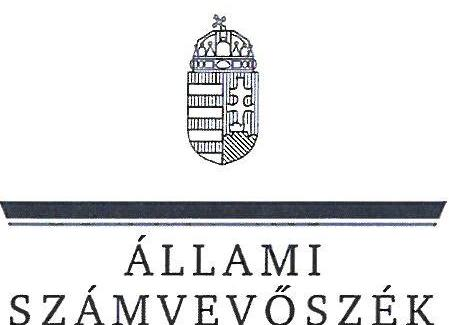
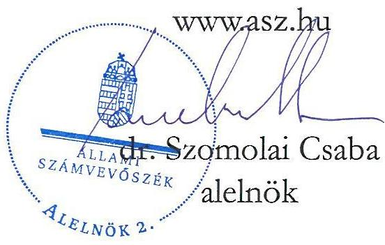
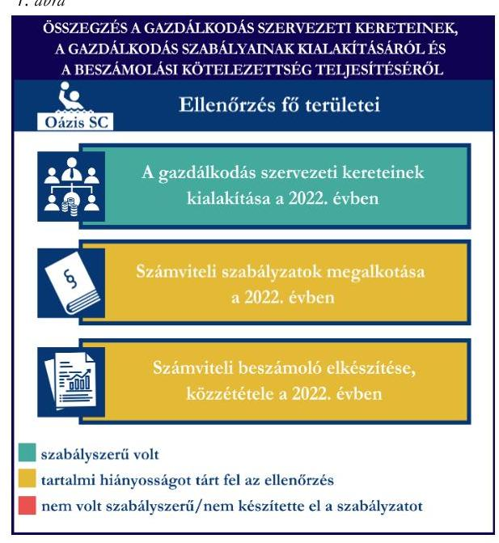
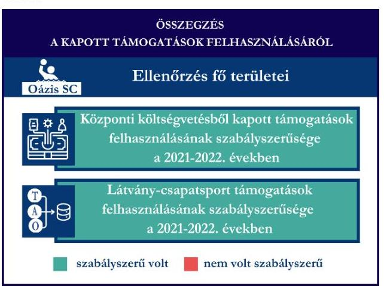
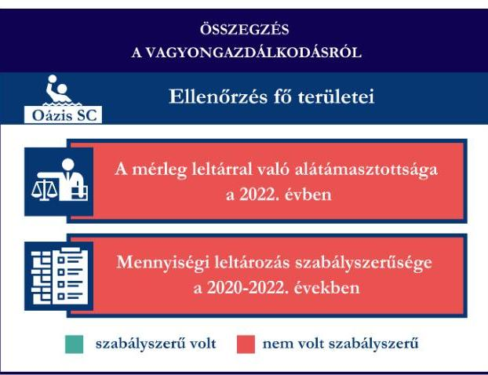

# JELENTÉS 

Támogatásban részesülő sportszövetségek, sportegyesületek és sportvállalkozások gazdálkodásának ellenőrzése

Oázis Sport Club

2024.

---

ÁLLAMI
SZÁMVEVŐSZÉK

# JELENTÉS 

## Támogatásban részesülő sportszövetségek, sportegyesületek és sportvállalkozások gazdálkodásának ellenőrzése

Oázis Sport Club

2024. 

24175

---

# ELLENŐRZÉSI IGAZGATÓSÁG: 

ÁLLAMHÁZTARTÁSON KÍVÜLI SZERVEZETEKET ELLENŐRZŐ IGAZGATÓSÁG

ELLENŐRZÉSI IGAZGATÓ:
KLINGA LÁSZLÓ igazgató

ELLENŐRZÉSVEZETŐ:
KAKAS SÁNDOR ellenőrzésvezető

Jelentéseink az interneten a www.asz.hu címen olvashatók.

IKTATÓSZÁM: EL-4031-009/2024
TÉMASORSZÁM: 30
ELLENŐRZÉS-AZONOSÍTÓ SZÁM: V1078

---

# TARTALOMJEGYZÉK 

AZ ELLENŐRZÉS ALAPADATAI ..... 5
AZ ELLENŐRZÖTT SZERVEZET ..... 7
ÖSSZEFOGLALÁS ..... 8
AZ ELLENŐRZÉS FÓKUSZTERÜLETEI ..... 10
MEGÁLLAPÍTÁSOK ..... 11
JAVASLATOK ..... 15
MELLÉKLETEK ..... 17
I. sz. melléklet: Értelmező szótár ..... 17
II. sz. melléklet: Az ellenőrzött szervezetek jegyzéke ..... 19
III. sz. melléklet: Fő ellenőrzési kritériumok fő ellenőrzési fókuszterületek szerint. ..... 20
FÜGGELÉK: ÉSZREVÉTELEK ..... 22
RÖVIDÍTÉSEK JEGYZÉKE ..... 23

---

.

---

# AZ ELLENŐRZÉS ALAPADATAI 

## AZ ELLENŐRZÉS CÉLJA

Az ellenőrzés célja az államháztartásból nyújtott támogatással, vagy az államháztartásból meghatározott célra ingyenesen juttatott vagyon felhasználásával érintett sportszövetségek, sportegyesületek és sportvállalkozások gazdálkodása szabályozottságának, gazdálkodási tevékenységének, ezen belül a beszámolási kötelezettség teljesítésének, a támogatások elkülönített nyilvántartásának, valamint a támogatások felhasználásának ellenőrzése.

## AZ ELLENŐRZÉS TÍPUSA

Kombinált ellenőrzés.

## AZ ELLENŐRZÖTT IDŐSZAK

Az 1. fókuszterület vonatkozásában a 2022. év.
A 2. fókuszterület vonatkozásában a 2021-2022. évek.
A 3. fókuszterület vonatkozásában a 2022. év, a mennyiségi felvétellel történő leltározás dokumentumai tekintetében a 2020-2022. évek.

## AZ ELLENŐRZÉS TÁRGYA

Az ellenőrzés tárgyát képezte a támogatásban részesülő sportegyesület gazdálkodása szabályozottságának, gazdálkodási tevékenységén belül a beszámolási kötelezettség teljesítésének, a vagyonnyilvántartásának, a támogatások elkülönített nyilvántartásának, valamint az államháztartási forrásból származó közvetlen vagy közvetett támogatások és a meghatározott célra ingyenesen juttatott vagyon felhasználásának vizsgálata. Az ellenőrzés a támogatások vonatkozásában kiterjedt továbbá a támogató felé történő beszámolási és elszámolási kötelezettségek teljesítésére, a jogszabályi és belső előírások betartására.

Az ellenőrzés kiterjedt minden olyan körülményre és adatra, amely az ÁSZ ${ }^{1}$ jogszabályban meghatározott feladatainak teljesítéséhez, valamint az ellenőrzési program végrehajtása során felmerülő újabb összefüggések feltárásához szükséges volt.

## AZ ELLENŐRZÉS JOGALAPJA

Az ellenőrzés jogszabályi alapját az ÁSZ tv. ${ }^{2}$ 1. § (3) bekezdése, az 5. § (3) bekezdése előírásai képezték.

---

# AZ ELLENŐRZÉS MÓDSZERE 

Az ellenőrzést a nemzetközi standardokat irányadónak tekintve az ellenőrzési program szempontjai, az ellenőrzött időszakban hatályos jogszabályok, az ellenőrzés általános szakmai szabályai, az ellenőrzésre irányadó ÁSZ módszertanok figyelembevételével végezte az ÁSZ.

Az ellenőrzési kérdések megválaszolásához szükséges bizonyítékok megszerzése az ellenőrzött szervezet által rendelkezésre bocsátott dokumentumokra, adatokra alapozva kérdésfeltevés (információkérés), interjú, mintavételezés útján történt.

Az ellenőrzési bizonyítékként felhasználható adatforrások közé tartoztak egyrészt az ellenőrzés során az ellenőrzött szervezettől bekért dokumentumok, másrészt adatforrás volt minden további, az ellenőrzés folyamán feltárt, az ellenőrzés szempontjából információt tartalmazó egyéb adatforrás. Ezenfelül a támogatásból beszerzett tárgyi eszközök használatára, fizikai fellelhetőségére irányulóan az érintett vagyontárgyak helyszíni szemle keretében történő szemrevételezésére is sor került.

A támogatásokkal, azok felhasználásával kapcsolatos kötelezettségek vizsgálatára mintavételi eljárások kerültek alkalmazásra. Támogatás-típusok szerint nagyságrend alapján egy darab támogatás képezte a vizsgálat tárgyát. Ezen támogatások felhasználásának szabályszerűsége támogatásonként kockázatértékelés alapján kiválasztott tételekkel került ellenőrzésre. A kiválasztott támogatási szerződésekhez kapcsolódó elszámolásokból 30 db tétel került ellenőrzésre, ahol az elszámolás nem érte el a 30 db-ot, ott tételes ellenőrzésre került sor. Ezen felül a vagyongazdálkodás szabályszerűségének ellenőrzéséhez is kockázatalapú mintavétel kapcsolódott. A támogatások felhasználása és a vagyongazdálkodás területén a tételek ellenőrzése kiterjedt a könyvvezetési kötelezettség vizsgálatára is. A tárgyi eszközök tekintetében 30 db került kiválasztásra a 2022. évben állományban lévő eszközök közül azok nyilvántartásának, elszámolásának szabályszerűsége ellenőrzése céljából. A kiválasztott tételek ellenőrzésének eredménye nem került kivetítésre a teljes sokaságra, a megállapítások az adott ellenőrzött tételek vonatkozásában kerültek megjelenítésre.

---

# AZ ELLENŐRZÖTT SZERVEZET

Az Oázis Sport Club 2006. május 20-án jött létre. Az Oázis SC^{3} Alapszabályában^{4} rögzített kiemelt céljai a vízilabda sporttevékenység szervezése, a sporttevékenység feltételeinek megteremtése, a nemzetközi sportéletben történő folyamatos részvétel, hazai sportesemények és kapcsolódó tevékenységek tervezése, szervezése, lebonyolítás, a vízilabda utánpótlás nevelése. Az Oázis SC az ellenőrzött időszakban csak vízilabda szakosztályt működtetett.

Az Alapszabály szerint az Oázis SC legfőbb szerve a Közgyűlés^{5}. A Közgyűlés által választott három főből álló Elnökség az egyesület ügyintéző és képviseleti szerve, vezető tisztségviselői az elnök, az alelnök és a titkár. Az elnök irányítja és szervezi az egyesület tevékenységét, képviseleti joga gyakorlásának terjedelme általános, módja önálló.

Az Oázis SC Alapszabályának rendelkezése alapján gazdasági-vállalkozási tevékenységet csak közhasznú vagy az alapszabályban meghatározott egyéb céljainak megvalósítása érdekében, a közhasznú célok megvalósítását nem veszélyeztetve végezhet. Az ellenőrzött időszakban az Oázis SC vállalkozási tevékenységet végzett.

Az Oázis SC az ellenőrzött időszakban a jogszabályi előírások szerint könyvvizsgálatra, felügyelőbizottság létrehozására nem volt kötelezett.

Az ellenőrzött időszakban az Oázis SC-nek tulajdonosi részesedése volt az Oázis Sport Szolgáltató Nonprofit Kft-ben, továbbá az Oázis Group Kft-ben.

Az Oázis SC által az ellenőrzött időszakban igénybe vett támogatásokat az 1. táblázat mutatja be. 1. táblázat

AZ OÁZIS SPORT CLUB ÁLTAL IGÉNYBE VETT TÁMOGATÁSOK (ADATOK M FT-BAN)

|   | 2021. év | 2022. év  |
| --- | --- | --- |
|  Központi költségvetési támogatás | 3,3 | -  |
|  Látvány-csapatsport támogatás | 178,7 | 141,6  |
|  Helyi önkormányzati támogatás | - | -  |
|  Magyar Vízilabda Szövetségtől kapott támogatás | - | -  |

*Forrás: Az ellenőrzött szervezet ellenőrzési dokumentumai alapján ÁSZ saját szerkesztés*

---

# ÖSSZEFOGLALÁS 

Magyarország Alaptörvényének XX. cikke kimondja, hogy mindenkinek joga van a testi és lelki egészséghez, melynek érvényesülését Magyarország többek között a sportolás és a rendszeres testedzés támogatásával segíti elő. Az Országgyűlés a Sport tv. ${ }^{6}$-ben kinyilvánította, hogy a nemzet közössége a test művelését, a sportot, a nemzet alapértékének, kívánatos célnak tekinti. A sport a közjó része. Erősíti a közösség tagjainak egymáshoz tartozását, miként az egyén testi és lelki egészségét.

A sportegyesületek, sportszövetségek, sportvállalkozások működésükre és szakmai tevékenységük ellátására költségvetési támogatásban, önkormányzati támogatásban, ingyenes vagyonjuttatásban, valamint látvány-csapatsport támogatásban részesülhetnek, amelyekre fokozott figyelem irányul.

A társadalom részéről jogosan felmerülő elvárás, hogy a közpénzeket kezelő, azzal gazdálkodó szervezetek működéséről, tevékenységéről átfogó képet kapjon, a közpénzek rendeltetésszerű és átlátható módon történő felhasználásának értékelésére időről-időre sor kerüljön az ellenőrzések keretében.

Az Oázis SC a könyvviteli szolgáltatás személyi feltételeinek megteremtéséről gondoskodott. A jogszabályi előírások szerint kialakította a számviteli politikáját, valamint annak keretében elkészítette számviteli szabályzatait, továbbá rendelkezett számlarenddel. A számlarend tekintetében tartalmi hiányosságot tárt fel az ellenőrzés.

Az Oázis SC könyvvezetésének formája a 2022. évben megfelelt a jogszabályi előírásoknak. A számviteli beszámoló és közhasznúsági melléklet készítési és közzétételi kötelezettségét teljesítette, azonban az ellenőrzés a beszámoló eredménykimutatás tartalmában és a közzétételi kötelezettség teljesítése tekintetében hiányosságot tárt fel.

A gazdálkodás szervezeti keretei kialakításának, a számviteli szabályzatok megalkotásának, valamint a számviteli beszámoló elkészítésének és közzétételének értékelését az 1. ábra mutatja be.

Forrás: ÁSZ megállapítások alapján ÁSZ saját szerkesztés
2. ábra

Forrás: ÁSZ megállapítások alapján ÁSZ saját szerkesztés

Az Oázis SC a központi költségvetésből kapott sportcélú támogatást, a látvány-csapatsport támogatást és kiegészítő támogatást a 2021-2022. években az ellenőrzött tételek esetében a támogatási célnak megfelelően, szabályszerűen használta fel. Számviteli nyilvántartásában a központi költségvetésből kapott támogatás, a látványcsapatsport támogatás és kiegészítő támogatás felhasználását a jogszabályi előírás ellenére elkülönítetten nem tartotta nyilván.

A kapott támogatások felhasználásának értékelését a 2. ábra mutatja be.

---

Az Oázis SC vagyongazdálkodása a 2022. évben nem volt szabályszerű, mert a 2022. évi éves beszámolójának mérleg tételeit teljeskörűen leltárral nem támasztotta alá, továbbá a 2020-2022. évre vonatkozóan a tárgyi eszközök esetében a mennyiségi felvétellel történő leltározást egyik évben sem végezte el.

Az ellenőrzött tételek esetében a tárgyi eszközök bekerülési értékének meghatározása a 2022. évben nem volt szabályszerű.

A vagyongazdálkodás értékelését a 3. ábra mutatja be.

Forrás: ÁSZ megállapítások alapján ÁSZ saját szerkesztés

---

# AZ ELLENŐRZÉS FÓKUSZTERÜLETEI 

1.     - A gazdálkodási szabályok kialakítása, a könyvvezetési és beszámolási kötelezettség teljesítése
2.     - A kapott támogatások felhasználása
3.     - Az ellenőrzött szervezet vagyongazdálkodása

---

# 1. A gazdálkodási szabályok kialakítása, a könyvvezetési és beszámolási kötelezettség teljesítése 

Összegző megállapítás

Az Oázis SC a 2022. évre vonatkozóan a jogszabályokban előírt szervezeti keretek kialakításával, a gazdálkodást biztosító belső szabályozó eszközök és számviteli szabályzatok megalkotásával megteremtette a szabályszerű gazdálkodásának feltételeit, azonban a számlarend tekintetében az ellenőrzés hiányosságot tárt fel. Az eredménykimutatás tartalma nem felelt meg a jogszabályi előírásoknak. A beszámoló saját honlapon való közzététele a kiegészítő melléklet közzététele hiányában nem felelt meg a jogszabályoknak.

A 2022. évben az Oázis SC a Számv. tv. ${ }^{\circ}$-ben és a Civilszr. ${ }^{\circ}$-ben foglalt előírásoknak megfelelően a könyvviteli szolgáltatás körébe tartozó feladatok vezetésével, a beszámoló elkészítésével kapcsolatos feladatok ellátására a jogszabályi előírásoknak megfelelő társaságot bízott meg, melynek alkalmazottja a jogszabályi előírásoknak megfelelő képesítéssel rendelkezett.
Az Oázis SC a 2022. évben rendelkezett a Számv. tv. előírása szerinti számviteli politikával ${ }^{9}$ és annak részeként elkészített leltározási szabályzattal ${ }^{10}$, értékelési szabályzattal ${ }^{11}$, továbbá pénzkezelési szabályzattal ${ }^{12}$. Az Oázis SC a Számv. tv. szerint elkészítette a számlarendet ${ }^{13}$, és az abban foglaltakat alátámasztó bizonylati rendet ${ }^{14}$. A szabályzatok - a számlarend kivételével - az ellenőrzött kritériumoknak megfeleltek. A számlarend nem teljeskörűen tartalmazta a Számv. tv. 161. § (2) bekezdés a) pontjában előírtak ellenére minden alkalmazásra kijelölt számla számjelét és megnevezését, mert a számlarend részeként rendelkezésre bocsátott számlatükör (főkönyvi törzs) nem volt összhangban a számlarenddel (pl.: a számlarendben a 9635 Termékpálya- szabályozásához kapcsolódóan kapott összegek, a számlatükörben Tábor részvételi díj; a számlarendben a 9674 Magánszemélytől kapott támogatás, a számlatükörben Vállalkozástól kapott támogatás; a számlarendben a 9675 SZJA 1\%-a-ként kapott támogatás, a számlatükörben Magánszemélytől kapott támogatás; a számlarendben a 9678 Pályázati úton elnyert támogatás, a számlatükörben TAO-ból támogatás), b) pontjában előírtak ellenére a számlák más számlákkal való kapcsolatát, c) pontjában előírtak ellenére a főkönyvi számla és az analitikus nyilvántartás kapcsolatát.
Az Oázis SC a Számv. tv. és a Civilszr. előírásainak megfelelően a 2022. évben kettős könyvvitelt vezetett. Az Oázis SC könyvvezetését a Számv. tv. és a Civilszr. előírásainak megfelelően úgy alakította ki, hogy a 2022. évben az egyszerűsített éves beszámolóban a bevételeit az értékesítés nettó árbevétele, egyéb bevétel és pénzügyi műveletek bevétele bontásban mutatta ki, továbbá az egyéb bevételeken belül a kapott támogatások összegét részletezni tudta. Az Oázis SC a 2022. évben a főkönyvi nyilvántartása szerint vállalkozási tevékenységet folytatott, azonban az egyszerűsített éves beszámoló eredménykimutatásában a

---

Civilszr. 12. § (4) bekezdésben foglaltak ellenére az alaptevékenységgel, valamint a vállalkozási tevékenységgel összefüggő bevételeit elkülönítetten nem mutatta ki.
Az Oázis SC a Számv. tv., a Civil tv. ${ }^{15}$, valamint a Civilszr. előírásainak megfelelően elkészítette a 2022. évre vonatkozó egyszerűsített
 éves beszámolóját és azzal egyidejűleg elkészítette a közhasznúsági mellékletet.
A 2022. évre vonatkozó egyszerűsített éves beszámolót a Civil tv.-nek megfelelően a Közgyűlés jóváhagyta.
Az Oázis SC a 2022. évi egyszerűsített éves beszámolóját a Civil tv. és a Számv. tv. előírása szerint letétbe helyezte és közzétette. A saját honlapon közzétett 2022. évi egyszerűsített éves beszámoló a Civil tv. 30. $\int(4)$ bekezdésében előírtak ellenére nem tartalmazta a kiegészítő mellékletet.

# 2. A kapott támogatások felhasználása 

| Összegző megállapítás | Az Oázis SC a 2021. és a 2022. években a kapott |
| :-- | :-- |
| támogatásokat az ellenőrzött tételek esetében |  |
| szabályszerűen használta fel, azonban a központi |  |
| költségvetési támogatás, a látvány-csapatsport támogatás, |  |
| illetve a kiegészítő sportfejlesztési támogatás felhasználását |  |
| nem tartotta elkülönítetten nyilván. |  |

Az Oázis SC 2021. évben BP/0701/17138-2/2021. számú támogatási okirat alapján ágazati bértámogatás jogcímen kapott központi költségvetési támogatást, melyet az előírások szerint az egyéb bevételek között tartott nyilván. A Civil tv. 20. § (4) bekezdésében foglaltakkal ellentétben a központi költségvetésből részére juttatott támogatás felhasználásáról nem vezetett olyan elkülönített számviteli nyilvántartást, amelynek alapján megállapítható és ellenőrizhető a kapott támogatás felhasználása.
Az Oázis SC a támogatás felhasználásáról a támogató ${ }^{16}$ által előírt formában a 485/2020 (XI.10.) Korm. rendelet ${ }^{17}$ által meghatározott tartalommal az összesítő elszámolási lap benyújtásával az előírt határidőben elszámolt, melyet a támogató elfogadott.
Az Oázis SC esetében a központi költségvetésből kapott támogatás tételek (28 db) ellenőrzése során az alábbiak kerültek megállapításra:

- a tételek elszámolását a Számv. tv. előírásai szerint bizonylatokkal alátámasztották, a bérszámfejtés dokumentumai rendelkezésre álltak;
- a mintatétel tartalma olyan gazdasági eseményre utalt, amely a támogatási szerződésben előírt támogatott tevékenység megvalósításához kapcsolódott;
- a tételek teljesítési időpontja a támogatási szerződésben meghatározott, támogatott tevékenység időtartamán belül történt;
- a tételek pénzügyi rendezése a támogatási szerződésben meghatározott felhasználási határidőig megtörtént.
Az Oázis SC 2021-2022. évben a be/SFP-08070/2021/MVLSZ. számú sportfejlesztési program alapján kapott látvány-csapatsport támogatás és kiegészítő sportfejlesztési támogatás igénylésével, módosításával kapcsolatos feladatait a jogszabályi előírásoknak megfelelően teljesítette. A látvány-csapatsport

---

támogatások felhasználásáról 2021-2022. években a 107/2011. (VI. 30.) Korm. rendeletben ${ }^{18}$ foglaltaknak megfelelve negyedévente az előrehaladási jelentések MVLSZ ${ }^{19}$ felé történő benyújtásával tett eleget.
Az Oázis SC a látvány-csapatsport támogatás és kiegészítő támogatás felhasználásáról a 107/2011. (VI. 30.) Korm. rendeletnek megfelelően határidőben, összesített elszámolási táblázat és szöveges beszámoló benyújtásával elszámolt az MVLSZ felé. Az elszámolás számviteli bizonylatait a 107/2011. (VI. 30.) Korm. rendeletben előírt felelősségbiztosítással rendelkező könyvvizsgáló vizsgálta felül.
Az Oázis SC az ellenőrzött időszakban könyvvezetése során az alapcél szerinti tevékenysége költségei, ráfordításai ellentételezésére kapott támogatásokról nem vezetett a Civil tv. 20. § (4) bekezdésében előírt elkülönített számviteli nyilvántartást, amelynek alapján támogatásonként megállapítható és ellenőrizhető volt a kapott támogatás felhasználása, ezáltal nem tett eleget a 107/2011. (VI. 30.) Korm. rendelet 9. § (9) bekezdésében előírtaknak, mivel a látvány-csapatsport támogatás, illetve a kiegészítő sportfejlesztési támogatás felhasználását nem tartotta elkülönítetten nyilván.
Az Oázis SC esetében a látvány-csapatsport támogatás és kiegészítő támogatás tételek (30+30 db) ellenőrzése során az alábbiak kerültek megállapításra:

- a tételek számviteli elszámolását a Számv. tv.-ben és a 107/2011. (VI. 30.) Korm. rendeletben előírtak szerint bizonylatokkal alátámasztották;
- a tételek tartalma (gazdasági esemény) és összege alapján a támogatást a támogatási igazolásban meghatározottak szerinti jogcímre, és az abban meghatározott támogatástartalom figyelembevételével használták fel;
- a tételekhez kapcsolódó gazdasági események a támogatási időszak (meghosszabbított támogatási időszak) végéig szerződés szerint teljesültek, azok pénzügyi rendezése az elszámolás benyújtására nyitva álló időben, a támogatási jogcímnek megfelelő pénzforgalmi számláról történt;
- a tételekhez kapcsolódó számviteli bizonylatokat ellátták záradékkal, az elszámolt/záradékolt összegek két kiegészítő támogatás kivételével megegyeztek a számlaösszesítőben szereplő értékkel. A két kiegészítő támogatás tétel esetében a számviteli bizonylaton feltüntetett záradék szövegében a be/SFP-08070/2021/MVLSZ sportfejlesztési program terhére ténylegesen elszámolni kívánt összeget a 107/2011. (VI. 30.) Korm. rendelet 11. § (1) bekezdésében előírtakkal szemben nem jelölték meg annak ellenére, hogy az alátámasztó bizonylat nem teljes összegben került elszámolásra;
- a tételek számviteli bizonylatain a felhasznált összegek a Számv. tv. előírtak szerint a tartalmuknak megfelelő főkönyvi számra kerültek elszámolásra.

# 3. Az ellenőrzött szervezet vagyongazdálkodása 

## Összegző megállapítás A 2022. évben az Oázis SC vagyongazdálkodása nem volt szabályszerű.

Az Oázis SC a Számv. tv. 69. § (1)-(2) bekezdésében foglaltak ellenére a 2022. évi egyszerűsített éves beszámolójának immateriális javak, tárgyi eszközök, követelések, pénzeszközök, saját tőke, valamint a kötelezettségek mérlegtételeit nem támasztotta alá szabályszerű leltárral.
Az Oázis SC a Számv. tv. 69. § (3) bekezdésében foglaltak ellenére a 2020-2022. évekre vonatkozóan a tárgyi eszközök esetében a mennyiségi felvétellel történő leltározást egyik évben sem végezte el.

---

Az Oázis SC esetében a tárgyi eszköz tételek (30 db) ellenőrzése során az alábbiak kerültek megállapításra:

- a tételek bekerülési értékét számviteli bizonylatokkal - három eszköz kivételével - alátámasztották. A három kivétel tárgyi eszköz beszerzése esetében a Számv. tv. 47. § (1) és az 51. § (1) bekezdés a) pontjában foglaltak ellenére a bekerülési értéket a számviteli bizonylatok nem teljes összegben támasztották alá, mert egy ingatlan, továbbá két gépjármű tétel esetében a bekerülési értéket alátámasztó bizonylat összegénél magasabb összegben aktiválták az eszközöket;
- a tárgyi eszközök számviteli besorolása megfelelt a Számv. tv. előírásainak. A tárgyi eszközökön belül a saját ingatlan eszközt a számlarend 12. pontjában előírtak ellenére a 123. épületek, épületrészek számla helyett a 121. földterület főkönyvi számlán tartották nyilván;
- a tárgyi eszközök üzembehelyezését a Számv. tv. 52. § (2) bekezdése ellenére hat eszköz esetében hitelt érdemlő módon nem dokumentálták, a többi eszköz üzembe helyezésének dokumentálása megfelelt a jogszabályi előírásnak;
- az értékcsökkenés elszámolása - kilenc tétel kivételével - a Számv. tv.-nek megfelelően történt. Három tétel esetében a Számv. tv. 52. § (2) bekezdésében előírtak ellenére az eszközöket nem a bekerülési érték összegével egyező összeggel aktiválták, ennek okán az eszközök tárgyévi értékcsökkenésének elszámolása a Számv. tv. 52. § (1) bekezdésében foglaltakkal nem volt összhangban. Hat tárgyi eszköz esetében az üzembehelyezési jegyzőkönyv hiányában az értékcsökkenés elszámolása a Számv. tv. 52. § (2) bekezdése alapján nem volt ellenőrizhető;
- a huszonkét látványcsapat támogatásból megvalósult tárgyi eszköz beszerzés esetén a tétel bekerülési értékét meghatározó számviteli bizonylatokat ellátták záradékkal, amelyből kiderül, hogy a számviteli bizonylaton szereplő összegből mennyit számoltak el a hivatkozott támogatás terhére.

---

# JAVASLATOK 

Az ÁSZ tv. 33. § (1) bekezdésében foglaltak értelmében az ellenőrzött szervezet vezetője köteles a jelentésben foglalt megállapításokhoz kapcsolódó intézkedési tervet összeállítani és azt a jelentés kézhezvételétől számított 30 napon belül az ÁSZ részére megküldeni. Amennyiben az ellenőrzött szervezet vezetője nem küldi meg határidőben az intézkedési tervet, vagy továbbra sem elfogadható intézkedési tervet küld, az Állami Számvevőszék elnöke az ÁSZ tv. 33. § (3) bekezdése a) és b) pontjaiban foglaltakat érvényesítheti.

## AZ OÁZIS SPORT CLUB ELNÖKE RÉSZÉRE

1. Gondoskodjon a számlarend Számv. tv. 161. § (2) bekezdés a)-c) pontjaiban előírtaknak megfelelő tartalommal történő elkészítéséről.
2. Gondoskodjon az egyszerűsített éves beszámoló eredménykimutatásában az alaptevékenységgel, valamint a vállalkozási tevékenységgel összefüggő bevételeinek elkülönített kimutatásáról a Civilszr. 12. § (4) bekezdésben foglaltak szerint.
3. Gondoskodjon a Civil tv. 30. § (4) bekezdésében előírtaknak megfelelően a beszámoló saját honlapon történő közzétételéről.
4. Gondoskodjon arról, hogy a központi költségvetési támogatások felhasználását a Civil tv. 20. § (4) bekezdésében foglalt előírásoknak megfelelően, elkülönítetten tartsa nyilván.
5. Gondoskodjon arról, hogy a látvány-csapatsport támogatások és a kiegészítő támogatások felhasználását a Civil tv. 20. § (4) bekezdésében és a 107/2011. (VI. 30.) Korm. rendelet 9. § (9) bekezdésében foglalt előírásoknak megfelelően, elkülönítetten tartsa nyilván.
6. Gondoskodjon a kiegészítő támogatás terhére elszámolt számviteli bizonylatok 107/2011. (VI. 30.) Korm. rend. 11. § (1) bekezdésében előírtak szerinti záradékolásáról.
7. Gondoskodjon a beszámoló mérlegtételeinek leltárral történő alátámasztásáról a Számv. tv. 69. § (1) bekezdés előírásainak megfelelően.

---

8. | Gondoskodjon a Számv. tv. 69. § (3) bekezdésében foglaltaknak megfelelően a mennyiségi felvétellel történő leltározás elvégzéséről.
9. | Gondoskodjon a tárgyi eszközök bekerülési értékének bizonylattal történő alátámasztásáról, a Számv.tv. 47. § (1) bekezdésében foglaltakra figyelemmel, a Számv. tv. 52. § (1) bekezdés előírásainak megfelelően.
10. | Gondoskodjon arról, hogy a tárgyi eszközök üzembehelyezésére a Számv. tv. 52. § (2) bekezdésében foglaltak szerint hitelt érdemlő módon dokumentáltan kerüljön sor.
11. | Gondoskodjon a tárgyi eszközök esetében a Számv. tv. 52. § (1)-(2) bekezdéseiben foglaltaknak megfelelő értékcsökkenés elszámolásáról.

---

# MELLÉKLETEK 

## I. SZ. MELLÉKLET: ÉRTELMEZŐ SZÓTÁR

Civil szervezet

Egyesület

Kiegészítő sportfejlesztési támogatás

Költségvetési támogatás

Közhasznú szervezet

Közhasznú tevékenység

Látvány-csapatsport támogatás

Látvány-csapatsportban működő amatőr sportszervezet

Látvány-csapatsportban működő hivatásos sportszervezet

A civil társaság; a Magyarországon nyilvántartásba vett egyesület - a párt, a szakszervezet és a kölcsönös biztosító egyesület kivételével és - a közalapítvány és a pártalapítvány kivételével - az alapítvány. (Forrás: Civil tv. 2. §6. pont a)c) alpontjai)

Az egyesület a tagok közös, tartós, alapszabályban meghatározott céljának folyamatos megvalósítására létesített, nyilvántartott tagsággal rendelkező jogi személy. (Forrás: Ptk. ${ }^{20}$ 3:63. § (1) bekezdés)
A Számv. tv. szempontjából egyéb szervezet. (Számv. tv. 3. § (1) bekezdés 4. pont a) alpontja)
A látvány-csapatsportok támogatása esetében rendelkező nyilatkozatban felajánlott összeg 12,5 százaléka kiegészítő sportfejlesztési támogatásnak minősül. (Forrás: Tao tv. ${ }^{21}$ 24/A. § (9) bekezdés)
A társadalombiztosítás pénzügyi alapjai kivételével az államháztartás központi alrendszeréből ellenérték nélkül, pénzben nyújtott támogatások. (Forrás: Áht. ${ }^{22}$ 1. § 14. pont)
Közhasznú szervezetté minősíthető a Magyarországon nyilvántartásba vett közhasznú tevékenységet végző szervezet, amely a társadalom és az egyén közös szükségleteinek kielégítéséhez megfelelő erőforrásokkal rendelkezik, továbbá amelynek megfelelő társadalmi támogatottsága kimutatható, és amely:
a) civil szervezet (ide nem értve a civil társaságot), vagy
b) olyan egyéb szervezet, amelyre vonatkozóan a közhasznú jogállás megszerzését törvény lehetővé teszi. (Forrás: Civil tv. 32. § (1) bekezdés)
Minden olyan tevékenység, amely a létesítő okiratban megjelölt közfeladat teljesítését közvetlenül vagy közvetve szolgálja, ezzel hozzájárulva a társadalom és az egyén közös szükségleteinek kielégítéséhez. (Forrás: Civil tv. 2. § 20. pont)

Az adóévben visszafizetési kötelezettség nélkül nyújtott támogatás, juttatás, véglegesen átadott pénzeszköz és térítés nélkül átadott eszköz könyv szerinti értéke, az adóévben térítés nélkül nyújtott szolgáltatás bekerülési értéke a Tao tv.-ben meghatározott jogcímeken. (Forrás: Tao tv. 4. § 44. pont)
Minden olyan, a sportról szóló törvényben meghatározott szabályok szerint a látvány-csapatsportban működő sportegyesület vagy sportvállalkozás, amelyik nem minősül a látvány-csapatsportban működő hivatásos sportszervezetnek. (Forrás: Tao tv. 4. § 42. pont)
A látvány-csapatsportágak országos sportági szakszövetsége által kiírt versenyrendszer legmagasabb felnőtt bajnoki osztályában - a veterán korosztályokra kiírt versenyrendszer kivételével

 - részt vevő (indulási jogot elnyert) sportszervezet, vagy alsóbb bajnoki osztályaiban részt vevő (indulási jogot elnyert) sportszervezet abban az esetben, ha az ilyen sportszervezet hivatásos sportolót alkalmaz. Több látvány-csapatsportban több jogi személy szervezeti egységgel (szakosztállyal) működő sportszervezet esetén csak az a jogi személy szervezeti egység (szakosztály), amely a fent részletezett versenyrendszerek bajnoki osztályaiban részt vesz. (Forrás: Tao tv. 4. § 43. pont)

---

Országos sportági szakszövetség

Sportági szövetség

Sportegyesület

Sportszövetség

Sporttevékenység

Olyan sportszövetség, amely sportágában kizárólagos jelleggel az e törvényben, valamint más jogszabályokban meghatározott feladatokat lát el és e törvényben megállapított különleges jogosítványokat gyakorol. Olyan sportágban hozható létre, amelyet vagy a Nemzetközi Olimpiai Bizottság elismert, vagy amely sportág nemzetközi szövetségét felvették a Nemzetközi Sportszövetségek Szövetségébe (GAISF). (Forrás: Sport tv. 20. § (1), (4) bekezdés)
A Civil tv. és a Ptk. előírásai alapján - a Sport tv.-ben meghatározott eltérésekkel - működő szövetség, amelynek tagjai kizárólag sportszervezetek lehetnek. Sportági szövetség országos jelleggel is működhet. Egy sportágban csak egy országos sportági szövetség működhet. Törvényi feltételek teljesülése esetén szakszövetségi feladatokat is elláthat. (Forrás: Sport tv. 28. §)
A Civil tv. és a Ptk. szabályai szerint működő olyan egyesület, amelynek alaptevékenysége a sporttevékenység szervezése, valamint a sporttevékenység feltételeinek megteremtése. A sportegyesületek a Sport tv. 15. § (1) bekezdésében meghatározott sportszervezetek körébe tartoznak. A sportegyesületeken kívül sportszervezet még a sportvállalkozás, a sportiskola, valamint az utánpótlás-nevelés fejlesztését végző alapítvány. (Forrás: Sport tv. 16. §(1) bekezdés)

Meghatározott sporttevékenységek körében a sportversenyek szervezésére, a tagok érdekvédelmére és a részükre való szolgáltatásokra, valamint a nemzetközi kapcsolatok lebonyolítására létrehozott, jogi személyiséggel és önkormányzattal rendelkező, a Civil tv. és a Ptk. alapján - az e törvényben foglalt eltérésekkel különös formában működő egyesületek. A Sport tv. 19. § (3) bekezdése szerint a sportszövetségeknek az alábbi típusai léteznek: országos sportági szakszövetségek, sportági szövetségek, szabadidősport szövetségek, fogyatékosok sportszövetségei, diák- és egyetemi-főiskolai sport sportszövetségei, nemzetközi sportszövetségek. (Forrás: Sport tv. 19. § (1), (3) bekezdés)
Meghatározott szabályok szerint, a szabadidő eltöltéseként kötetlenül vagy szervezett formában, illetve versenyszerűen végzett testedzés vagy szellemi sportágban kifejtett tevékenység, amely a fizikai erőnlét és a szellemi teljesítőképesség megtartását, fejlesztését szolgálja. (Forrás: Sport tv. 1. § (2) bekezdés)

---

II. SZ. MELLÉKLET: AZ ELLENŐRZÖTT SZERVEZETEK JEGYZÉKE

# ELLENŐRZÖTT SZERVEZET NEVE 

Oázis Sport Club

## ELLENŐRZÖTT SZERVEZET SZÉKHELYE

1122 Budapest, Maros u. 17. III/6.

---

# III. SZ. MELLÉKLET: FŐ ELLENŐRZÉSI KRITÉRIUMOK FŐ ELLENŐRZÉSI FÓKUSZTERŰLETEK SZERINT 

## FÓKUSZTERŰLET/FÓKUSZKÉRDÉS

1. A gazdálkodási szabályok kialakítása, a könyvvezetési és beszámolási kötelezettség teljesítése
2. A kapott támogatások felhasználása

## ELLENŐRZÉSI KRITÉRIUMOK

Civil tv. 2. § 7., 11. pont, 20. § (3) bekezdés c) pont, (4) bekezdés, 28. § (1)-(3) bekezdés, 29. § (1) bekezdés, (2) bekezdés c) pont, (3), (6), (7) bekezdés, 30. § (1)-(4) bekezdés, 40. § (1), (2) bekezdés, 41. § (1) bekezdés

Civilszr. 7. § (1) bekezdés, (4) bekezdés b), c) pont, (6) bekezdés, 8. § (2), (3) bekezdés, 9. § (4), (5), (8) bekezdés, 12. § (4),(5) bekezdés, 15. § (1) bekezdés a), b) pont, (2) bekezdés, 16. § (1), (3) bekezdés, 22. § (1) bekezdés, 24. § (2) bekezdés, 3.-4. sz. melléklet

Civil vhr. $^{23}$ 12. § és melléklet
Cnytv. $^{24}$ 39. § (1), (4) bekezdés, 40. § (2) bekezdés
Ptk. 3:26. § (1) bekezdés, 3:27. § (1) bekezdés, 3:82. § (1)-(2) bekezdés
Számv. tv. 4. §, 6. § (2) bekezdés, 12. §, 14. § (3), (5) bekezdés a), b), d) pont, (8) bekezdés, (11)-(12) bekezdés, 69. § (1), (3) bekezdés, 90. § (3) bekezdés c) pont, 96. § (4) bekezdés, 150. § (2) bekezdés, 153. § (1) bekezdés, 154. § (1) bekezdés, 161. § (1) bekezdés, (2) bekezdés a)-d) pont, (3)-(4) bekezdés, 161/A. § (1)-(2) bekezdés, 165. § (2) bekezdés
Tao tv. 22/C. §
107/2011. (VI.30.) Korm. rendelet 9. § (9) bekezdés
Áht. 52. § (1) bekezdés, 53. §
Ávr. $^{25}$ 76. § (1) bekezdés , 93. § (1)-(3), (5) bekezdés
Civil tv. 20. § (1) bekezdés c) pont, (2) bekezdés a) pont, (3) bekezdés a), c) pont, (4) bekezdés, 29. § (4), (5) bekezdés
Civilszr. 13. § (3) bekezdés, 24. § (1)-(2) bekezdés
Kbt. $^{26}$ 5. § (2) bekezdés, 15. §
Számv. tv. 16. § (3) bekezdés, 25-26. §, 44. § (2) bekezdés, 45. § (1)(2) bekezdés, 77. § (3) bekezdés b) pont, 78-81. §, 159. §, 161/A. § (2) bekezdés, 162. § (1) bekezdés, 165. § (1)-(2) bekezdés, 166. § (1) bekezdés, 167. § (1) bekezdés a), d), e), h) pont
Tao. tv. 22/C. §, 24/A. § (9) bekezdés
107/2011. (VI.30.) Korm. rendelet 2. § (3b) bekezdés, 4. § (11) bekezdés, 5. § (1) bekezdés, 6. § (1) bekezdés e) pont, 9. § (8)(10) bekezdés, 10. § (2), (2a), (2b), (4) bekezdés, (5a) bekezdés, 11. § (1), (1a), (1d), (1e), (2), (4), (4a), (5), (6) bekezdés, 13. § (1), (2a) bekezdés, 14. § (1), (4), (4b), (4c), (6c) bekezdés 275/2022. (VII.29.) Korm. rendelet 1. § (3)
444/2022. (XI.7) Korm. rendelet 2. §
474/2016. (XII. 27.) Korm. rendelet 26. § (3) bekezdés

---

3. Az ellenőrzött szervezet vagyongazdálkodása

Ptk. 3:63. § (4) bekezdés
Számv. tv. 15. § (3) bekezdés, 26. §, 46. § (3) bekezdés, 47-53. §, 57. §, 69. §(1)-(6) bekezdés, 165-166. §, 169. §(2) bekezdés Tao tv. 22/C (6) bekezdés a), d), e) pont, (11) bekezdés Ávr. 93. §(5) bekezdés 107/2011. (VI.30.) Korm. rendelet 11. §(5) bekezdés 474/2016. (XII. 27.) Korm. rendelet 17. § (1) bekezdés 11a. a) pont, 11b. pont, 17. § (2a) bekezdés, 24. § (2) bekezdés

---

# FÜGGELÉK: ÉSZREVÉTELEK 

A jelentéstervezetet a Számvevőszék 15 napos észrevételezésre megküldte az ellenőrzött szervezet vezetőjének az ÁSZ tv. 29. § (1) bekezdése előírásának megfelelően.

Az Oázis Sport Club elnöke a jelentéstervezetre nem tett észrevételt.

* 29. § (1) Az Állami Számvevőszék az ellenőrzési megállapításait megküldi az ellenőrzött szervezet vezetőjének vagy az általa megbízott személynek, és annak, akinek személyes felelősségét állapította meg.
(2) Az ellenőrzött szervezet vezetője és a felelősként megjelölt személy az ellenőrzés megállapításaira tizenöt napon belül írásban észrevételt tehet.
(3) Az Állami Számvevőszék az észrevételre a beérkezéséről számított harminc napon belül írásban válaszol. A figyelembe nem vett észrevételeket köteles a jelentésben feltüntetni, és megindokolni, hogy azokat miért nem fogadta el.

---

# RÖVIDÍTÉSEK JEGYZÉKE 

$^{1}$ ÁSZ
$^{2}$ ÁSZ tv.
$^{3}$ Oázis SC
$^{4}$ Alapszabály
$^{5}$ Közgyűlés
$^{6}$ Sport tv.
$^{7}$ Számv. tv.
$^{8}$ Civilszr.
$^{9}$ számviteli politika
$^{10}$ leltározási szabályzat
$^{11}$ értékelési szabályzat
$^{12}$ pénzkezelési szabályzat
$^{13}$ számlarend
$^{14}$ bizonylati rend
$^{15}$ Civil tv.
$^{16}$ támogató
$^{17}$ 485/2020 (XI.10.) Korm. rendelet
$^{18}$ 107/2011. (VI.30.) Korm. rendelet
$^{19}$ MVLSZ
$^{20}$ Ptk.
$^{21}$ Tao tv.
$^{22}$ Áht.
$^{23}$ Civil vhr.
$^{24}$ Cnytv.
$^{25}$ Ávr.
$^{26}$ Kbt.

Állami Számvevőszék
2011. évi LXVI. törvény az Állami Számvevőszékről

Oázis Sport Club
Oázis Sport Club alapszabálya (hatályos 2017.07.11-től)
Oázis Sport Club Közgyűlés
2004. évi I. törvény a sportról
2000. évi C. törvény a számvitelről
479/2016. (XII.28.) Korm. rendelet a számviteli törvény szerinti egyes egyéb szervezetek beszámoló készítési és könyvvezetési kötelezettségének sajátosságairól
Oázis Sport Club Számviteli politika (hatályos 2022. január 1-től)
Oázis Sport Club Leltározási szabályzat (hatályos 2022. január 1-től)
Oázis Sport Club Értékelési szabályzat (hatályos 2022. január 1-től)
Oázis Sport Club Pénzkezelési szabályzat (hatályos 2022. január 1-től)
Oázis Sport Club Számlarend (hatályos 2022. január 1-től)
Oázis Sport Club Bizonylati rend (hatályos 2022. január 1-től)
2011. évi CLXXV. törvény az egyesülési jogról, a közhasznú jogállásról, valamint a civil szervezetek működéséről és támogatásáról
Budapest Főváros Kormányhivatala
485/2020 (XI.10.) Kormány rendelet a veszélyhelyzet ideje alatt egyes gazdaságvédelmi intézkedésekről szóló
107/2011. (VI. 30.) Korm. rendelet a látvány-csapatsport támogatását biztosító támogatási igazolás kiállításáról, felhasználásáról, a támogatás elszámolásának és ellenőrzésének, valamint visszafizetésének szabályairól
Magyar Vízilabda Szövetség
2013. évi V. törvény a Polgári Törvénykönyvről
1996. évi LXXXI. törvény a társasági adóról és az osztalékadóról
2011. évi CXCV. törvény az államháztartásról
350/2011. (XII. 30.) Korm. rendelet a civil szervezetek gazdálkodása, az adománygyűjtés és a közhasznúság egyes kérdéseiről
2011. évi CLXXXI. törvény a civil szervezetek bírósági nyilvántartásáról és az ezzel összefüggő eljárási szabályokról
368/2011. (XII. 31.) Korm. rendelet az államháztartásról szóló törvény végrehajtásáról
2015. évi CXLIII. törvény a közbeszerzésekről

---

1052 Budapest, Apáczai Csere János u. 10. | 1364 Budapest 4., Pf. 54
www.asz.hu | szamvevoszek@asz.hu
telefon: +36 14849100

