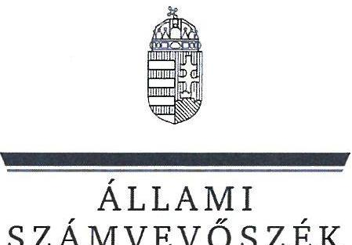
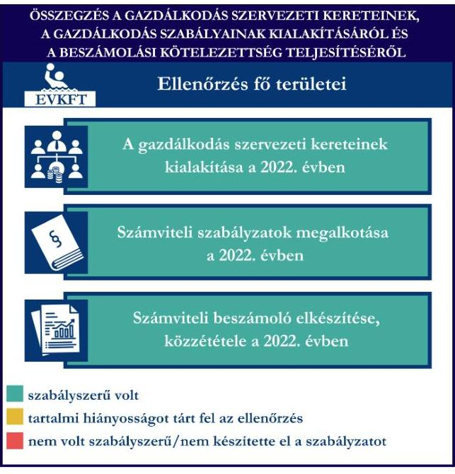
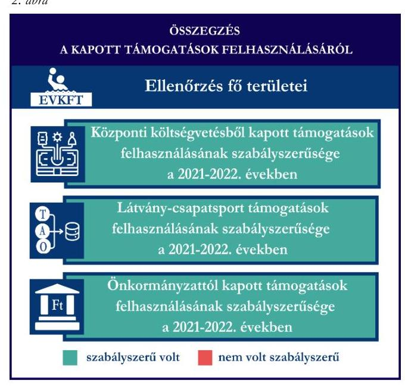
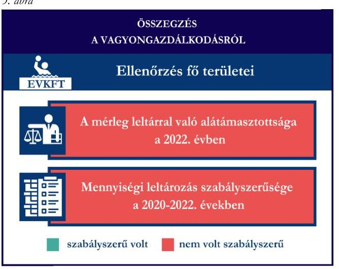

# JELENTÉS 

Támogatásban részesülő sportszövetségek, sportegyesületek és sportvállalkozások gazdálkodásának ellenőrzése

Egri Vízilabda Korlátolt Felelősségű Társaság

2024.

---

ÁLLAMI
SZÁMVEVŐSZÉK

# JELENTÉS 

## Támogatásban részesülő sportszövetségek, sportegyesületek és sportvállalkozások gazdálkodásának ellenőrzése

Egri Vízilabda Korlátolt Felelősségű Társaság

2024.

---

# ELLENŐRZÉSI IGAZGATÓSÁG: 

ÁLLAMHÁZTARTÁSON KÍVÜLI SZERVEZETEKET ELLENŐRZŐ IGAZGATÓSÁG

## ELLENŐRZÉSI IGAZGATÓ:

## KLINGA LÁSZLÓ igazgató

## ELLENŐRZÉSVEZETŐ:

Jelentéseink az interneten a www.asz.hu címen olvashatók.

KAKAS SÁNDOR ellenőrzésvezető

IKTATÓSZÁM: EL-4031-008/2024
TÉMASORSZÁM: 30
ELLENŐRZÉS-AZONOSÍTÓ SZÁM: V1078

---

# TARTALOMJEGYZÉK 

AZ ELLENŐRZÉS ALAPADATAI ..... 5
AZ ELLENŐRZÖTT SZERVEZET ..... 7
ÖSSZEFOGLALÁS ..... 8
AZ ELLENŐRZÉS FÓKUSZTERÜLETEI ..... 10
MEGÁLLAPÍTÁSOK ..... 11
JAVASLATOK ..... 15
MELLÉKLETEK ..... 16
I. sz. melléklet: Értelmező szótár ..... 16
II. sz. melléklet: Az ellenőrzött szervezetek jegyzéke ..... 18
III. sz. melléklet: Fő ellenőrzési kritériumok fő ellenőrzési fókuszterületek szerint ..... 19
FÜGGELÉK: ÉSZREVÉTELEK ..... 20
RÖVIDÍTÉSEK JEGYZÉKE ..... 21

---

.

---

# AZ ELLENŐRZÉS ALAPADATAI 

## AZ ELLENŐRZÉS CÉLJA

Az ellenőrzés célja az államháztartásból nyújtott támogatással, vagy az államháztartásból meghatározott célra ingyenesen juttatott vagyon felhasználásával érintett sportszövetségek, sportegyesületek és sportvállalkozások gazdálkodása szabályozottságának, gazdálkodási tevékenységének, ezen belül a beszámolási kötelezettség teljesítésének, a támogatások elkülönített nyilvántartásának, valamint a támogatások felhasználásának ellenőrzése.

## AZ ELLENŐRZÉS TÍPUSA

Kombinált ellenőrzés.

## AZ ELLENŐRZÖTT IDŐSZAK

Az 1. fókuszterület vonatkozásában a 2022. év.
A 2. fókuszterület vonatkozásában a 2021-2022. évek.
A 3. fókuszterület vonatkozásában a 2022. év, a mennyiségi felvétellel történő leltározás dokumentumai tekintetében a 2020-2022. évek.

## AZ ELLENŐRZÉS TÁRGYA

Az ellenőrzés tárgyát képezte a támogatásban részesülő sportvállalkozás gazdálkodása szabályozottságának, gazdálkodási tevékenységén belül a beszámolási kötelezettség teljesítésének, a vagyonnyilvántartásának, a támogatások elkülönített nyilvántartásának, valamint az államháztartási forrásból származó közvetlen vagy közvetett támogatások és a meghatározott célra ingyenesen juttatott vagyon felhasználásának vizsgálata. Az ellenőrzés a támogatások vonatkozásában kiterjedt továbbá a támogató felé történő beszámolási és elszámolási kötelezettségek teljesítésére, a jogszabályi és belső előírások betartására.

Az ellenőrzés kiterjedt minden olyan körülményre és adatra, amely az ÁSZ¹ jogszabályban meghatározott feladatainak teljesítéséhez, valamint az ellenőrzési program végrehajtása során felmerülő újabb összefüggések feltárásához szükséges volt.

## AZ ELLENŐRZÉS JOGALAPJA

Az ellenőrzés jogszabályi alapját az ÁSZ tv.² 1. § (3) bekezdése, az 5. § (3) bekezdése előírásai képezték.

---

# AZ ELLENŐRZÉS MÓDSZERE 

Az ellenőrzést a nemzetközi standardokat irányadónak tekintve az ellenőrzési program szempontjai, az ellenőrzött időszakban hatályos jogszabályok, az ellenőrzés általános szakmai szabályai, az ellenőrzésre irányadó ÁSZ módszertanok figyelembevételével végezte az ÁSZ.

Az ellenőrzési kérdések megválaszolásához szükséges bizonyítékok megszerzése az ellenőrzött szervezet által rendelkezésre bocsátott dokumentumokra adatokra alapozva kérdésfeltevés (információkérés), interjú, mintavételezés útján történt.

Az ellenőrzési bizonyítékként felhasználható adatforrások közé tartoztak egyrészt az ellenőrzés során az ellenőrzött szervezettől bekért dokumentumok, másrészt adatforrás volt minden további, az ellenőrzés folyamán feltárt, az ellenőrzés szempontjából információt tartalmazó egyéb adatforrás. Ezenfelül a támogatásból beszerzett tárgyi eszközök használatára, fizikai fellelhetőségére irányulóan az érintett vagyontárgyak helyszíni szemle keretében történő szemrevételezésére is sor került.

A támogatásokkal, azok felhasználásával kapcsolatos kötelezettségek vizsgálatára mintavételi eljárások kerültek alkalmazásra. Támogatás-típusok szerint nagyságrend alapján egy darab támogatás képezte a vizsgálat tárgyát. Ezen támogatások felhasználásának szabályszerűsége támogatásonként kockázatértékelés alapján kiválasztott tételekkel került ellenőrzésre. A kiválasztott támogatási szerződésekhez kapcsolódó elszámolásokból 30 db tétel került ellenőrzésre, ahol az elszámolás nem érte el a 30 db -ot, ott tételes ellenőrzésre került sor. Ezen felül a vagyongazdálkodás szabályszerűségének ellenőrzéséhez is kockázatalapú mintavétel kapcsolódott. A támogatások felhasználása és a vagyongazdálkodás területén a tételek ellenőrzése kiterjedt a könyvvezetési kötelezettség vizsgálatára is. A tárgyi eszközök tekintetében 30 db került kiválasztásra a 2022. évben állományban lévő eszközök közül azok nyilvántartásának, elszámolásának szabályszerűsége ellenőrzése céljából. A kiválasztott tételek ellenőrzésének eredménye nem került kivetítésre a teljes sokaságra, a megállapítások az adott ellenőrzött tételek vonatkozásában kerültek megjelenítésre.

---

# AZ ELLENŐRZÖTT SZERVEZET 

Az Egri Vízilabda Korlátolt Felelősségű Társaság 2012. február 24-én alakult. Az EVKft.³ elnevezése 2013. augusztus 13-ig EVK Reklám Korlátolt Felelősségű Társaság volt. Az egyszemélyes társaság egyedüli tagja az Alapító okirat⁴ szerint az Egri Vízilabda Klub. Az EVKft. Alapító okiratban meghatározott tevékenysége sportegyesületi tevékenység, mint fő tevékenység, továbbá sportlétesítmény működtetése, testedzési szolgáltatás és egyéb sporttevékenység.

Az Alapító okirat szerint az egyedüli tag a társaság tevékenységében személyes közreműködésre kötelezett volt, a társaság ügyvezetését az ellenőrzött időszakban 2021. január 1-től három, 2022. december 9-től kettő ügyvezető látta el. A társaság ügyeinek intézésére és képviseletére jogosult ügyvezetők képviseleti joga önálló volt.

Az EVKft. az ellenőrzött időszakban a jogszabályi előírások alapján felügyelőbizottság létrehozására és könyvvizsgálatra nem volt kötelezett. Az EVKft., mint sportvállalkozás az ellenőrzött időszakban vállalkozási tevékenységet végzett.

Az EVKft-nek az ellenőrzött időszakban más társaságban tulajdoni részesedése nem volt.
Az EVKft. által az ellenőrzött időszakban igénybe vett támogatásokat az 1. táblázat mutatja be.
1. táblázat

## AZ EVKft. ÁLTAL IGÉNYBE VETT TÁMOGATÁSOK (ADATOK MILLIÓ FT-BAN)

|  | 2021. év | 2022. év |
| :-- | --: | --: |
| Központi költségvetési támogatás | 2,8 | - |
| Látvány-csapatsport támogatás | 21,2 | - |
| Helyi önkormányzati támogatás | 17,1 | 55,0 |
| Magyar Vízilabda Szövetségtől kapott támogatás | - | - |

---

# ÖSSZEFOGLALÁS 

Magyarország Alaptörvényének XX. cikke kimondja, hogy mindenkinek joga van a testi és lelki egészséghez, melynek érvényesülését Magyarország többek között a sportolás és a rendszeres testedzés támogatásával segíti elő. Az Országgyűlés a Sport tv.⁵-ben kinyilvánította, hogy a nemzet közössége a test művelését, a sportot, a nemzet alapértékének, kívánatos célnak tekinti. A sport a közjó része. Erősíti a közösség tagjainak egymáshoz tartozását, miként az egyén testi és lelki egészségét.

A sportegyesületek, sportszövetségek, sportvállalkozások működésükre és szakmai tevékenységük ellátására költségvetési támogatásban, önkormányzati támogatásban, ingyenes vagyonjuttatásban, valamint látvány-csapatsport támogatásban részesülhetnek, amelyekre fokozott figyelem irányul.

A társadalom részéről jogosan felmerülő elvárás, hogy a közpénzeket kezelő, azzal gazdálkodó szervezetek működéséről, tevékenységéről átfogó képet kapjon, a közpénzek rendeltetésszerű és átlátható módon történő felhasználásának értékelésére időről-időre sor kerüljön az ellenőrzések keretében.

Az EVKft. a könyvviteli szolgáltatás személyi 1. ábra feltételeinek megteremtéséről gondoskodott. Az EVKft. a jogszabályi előírások szerint kialakította a számviteli politikáját, valamint annak keretében elkészítendő számviteli szabályzatait megalkotta, továbbá rendelkezett számlarenddel. A szabályzatok az ellenőrzött jogszabályi kritériumoknak megfeleltek.

A könyvvezetés formája a 2022. évben megfelelt a jogszabályi előírásoknak. Az EVKft. a jogszabályoknak megfelelően teljesítette az éves beszámoló készítési- és közzétételi kötelezettségét.

A gazdálkodás szervezeti keretei kialakításának, a számviteli szabályzatok megalkotásának, valamint az éves beszámoló elkészítésének és közzétételének értékelését az 1. ábra mutatja be.

Forrás: ÁSZ megállapítások alapján ÁSZ saját szerkesztésű

---

Az EVKft. a központi költségvetésből kapott támogatást a 2021. évben, a látvány-csapatsport támogatást a 2021-2022. években, továbbá az önkormányzati támogatást a 2022. évben az ellenőrzött tételek esetében a támogatási célnak megfelelően, szabályszerűen használta fel. Számviteli nyilvántartásában a támogatások felhasználását a jogszabályi előírásnak megfelelően elkülönítetten tartotta nyilván.

A kapott támogatások felhasználásának értékelését a 2. ábra mutatja be.

Az EVKft. a vagyongazdálkodása 2022. évben nem volt szabályszerű, mert a 2022. évi éves beszámolójának mérlegtételeit teljeskörűen nem támasztotta alá leltárral. A 2022. évre vonatkozóan a tárgyi eszközök esetében a mennyiségi felvétellel történő leltározást nem végezte el.

Az ellenőrzött tételek esetében a tárgyi eszközök üzembe helyezése szabályszerű volt, az értékcsökkenés elszámolása tekintetében az ellenőrzés hiányosságot tárt fel a 2022. évben.

A vagyongazdálkodás értékelését a 3. ábra mutatja be.

Forrás: ÁSZ megállapítások alapján ÁSZ saját szerkesztésű

---

# AZ ELLENŐRZÉS FÓKUSZTERÜLETEI 

1.     - A gazdálkodási szabályok kialakítása, a könyvvezetési- és beszámolási kötelezettség teljesítése
2.     - A kapott támogatások felhasználása
3.     - Az ellenőrzött szervezet vagyongazdálkodása

---

# 1. A gazdálkodási szabályok kialakítása, a könyvvezetési- és beszámolási kötelezettség teljesítése 

Összegző megállapítás A 2022. évben az EVKft-nél a gazdálkodás szervezeti kereteinek, a gazdálkodás szabályainak kialakítása megfelelt a jogszabályi előírásoknak. Az EVKft. a jogszabályoknak megfelelően teljesítette könyvvezetési-, számviteli beszámoló készítési-, valamint közzétételi kötelezettségét.

Az EVKft. a 2022. évben a Számv. tv.⁶ előírásainak betartásával gondoskodott a könyvviteli szolgáltatás személyi feltételeinek megteremtéséről. A könyvviteli szolgáltatás körébe tartozó feladatok ellátásával 2022. január 1-től olyan számviteli szolgáltatást nyújtó személyt, majd 2022. október 1-től olyan társaságot bízott meg, amelynek a feladat irányításával, vezetésével, a beszámoló elkészítésével megbízott tagja megfelelt a jogszabályi követelményeknek.
Az EVKft. a 2022. évben rendelkezett a Számv. tv-ben előírt számviteli politikával⁷, illetve annak keretében elkészítette az értékelési szabályzatot⁸, a leltározási szabályzatot⁹ és a pénzkezelési szabályzatot¹⁰. A szabályzatok az ellenőrzött tartalmi kritériumoknak megfeleltek. Az EVKft. a Számv. tv. szerint a számlarendet¹¹ és annak mellékleteként a bizonylati rendet¹² elkészítette.
Az EVKft. a Számv. tv. előírásainak megfelelően a 2022. évben kettős könyvvitelt vezetett. Az EVKft. könyvviteli nyilvántartásait a Számv. tv. rendelkezéseinek megfelelve úgy alakította ki, hogy a 2022. évi éves beszámolójában az egyéb bevételeken belül a visszafizetési kötelezettség nélkül kapott támogatások összegéből az üzleti évben költséggel, ráfordítással ellentételezett összeget mutatta ki. Könyvvezetési rendszerét a Számv. tv.-ben foglaltaknak megfelelően úgy részletezte tovább, hogy az alapján a 107/2011. (VI.30.) Korm. rendelet¹³ által előírt adatok ellenőrizhető módon rendelkezésre álltak.
Az EVKft. a Számv. tv. előírásai szerint elkészítette a 2022. évre vonatkozó egyszerűsített éves beszámolóját, melyet a Ptk.¹⁴-ban foglaltaknak megfelelően az alapító tag¹⁵ az 1/2023. (05.30.) számú közgyűlési határozatával jóváhagyott.
Az EVKft. a 2022. évi egyszerűsített éves beszámolóját a Számv. tv-nek megfelelően a jogszabályban előírt határidőben letétbe helyezte és közzétette.

## 2. A kapott támogatások felhasználása

## Összegző megállapítás Az EVKft. a 2022. évben a kapott támogatásokat az ellenőrzött tételek esetében szabályszerűen használta fel.

Az EVKft. a központi költségvetésből (Covid ágazati bértámogatás jogcímen) kapott támogatást a Számv. tv. előírásai szerint bevételei között egyéb bevételként, elkülönítetten mutatta ki.

---

Az EVKft. az ágazati bértámogatást a rendelkezésre álló határidőben teljes összegben felhasználta, arról a támogatást megállapító határozatban előírtaknak megfelelően havonta elszámoló lap és annak mellékleteként fizetési jegyzék, jelenléti ív, pénzügyi teljesítést alátámasztó dokumentumok benyújtásával számolt el.
Az EVKft. esetében a központi költségvetésből kapott támogatás tételek (20 db) ellenőrzése során az alábbiak kerültek megállapításra:

- a tételek számviteli elszámolását a Számv. tv.-ben előírtak szerint bizonylatokkal alátámasztották;
- a támogatást megállapító határozatban foglaltaknak megfelelően a tétel gazdasági eseményének teljesítési időpontja a meghatározott támogatott tevékenység időtartamán belül történt továbbá a támogatást megállapító határozatban meghatározott felhasználási határidőig megtörtént a tétel pénzügyi rendezése;
- a tételek számviteli bizonylatának a hivatkozott támogatást megállapító határozatban meghatározott összege a Számv. tv.-ben előírtak szerint, tartalmának megfelelő főkönyvi számra került elszámolásra.
Az EVKft. a látvány-csapatsport támogatások címén érkező bevételeit a Számv. tv. előírásainak megfelelően az egyéb bevételei között elkülönítve tartotta nyilván.
Az EVKft. a látvány-csapatsport támogatások esetében a 2021-2022. évben eleget tett a 107/2011. (VI. 30.) Korm. rendeletben foglaltaknak,

 a támogatás felhasználásáról negyedévente az előrehaladási jelentéseket benyújtotta az MVLSZ¹⁶ felé. Az SFP/08029/2021/MVLSZ számú sportfejlesztési program az ellenőrzött időszakon belül egy alkalommal meghosszabbításra került, a hosszabbítási kérelemhez a 107/2011. (VI. 30.) Korm. rendeletnek megfelelően a fel nem használt támogatás összegéről szóló igazolást benyújtották.
Az EVKft. a számára nyújtott látvány-csapatsport támogatásról a 107/2011. (VI. 30.) Korm. rendeletnek megfelelően határidőben benyújtotta az elszámolást a támogató felé. A támogatási időszak végdátumát követően a támogatás felhasználását a jogszabályban foglaltak szerint záradékolt számviteli bizonylatokkal alátámasztott módon, összesített elszámolási táblázattal és szöveges szakmai beszámolóval igazolta. Az EVKft. a 107/2011. (VI. 30.) Korm. rendeletnek megfelelően könyvvizsgáló által ellenőrzött számviteli bizonylatokkal számolt el a támogató felé. A könyvvizsgáló a 107/2011. (VI. 30.) Korm. rendeletben előírt összegű felelősségbiztosítással rendelkezett.
Az EVKft. esetében a látvány-csapatsport támogatás tételek (30 db) ellenőrzése során az alábbiak kerültek megállapításra:
- a tételek számviteli elszámolását a Számv. tv.-ben és a 107/2011. (VI. 30.) Korm. rendeletben előírtak szerint bizonylatokkal alátámasztották;
- a 107/2011. (VI. 30.) Korm. rendeletben foglaltaknak megfelelően a tételek tartalma (gazdasági esemény) és összege alapján a támogatási igazolásban meghatározottak szerinti jogcímre, az abban meghatározott mértékben használták fel;
- a tételek számviteli bizonylatai alapján a gazdasági események az ellenőrzött időszakot értintő támogatási időszakban teljesültek;
- a tételek számviteli bizonylatai alapján a gazdasági események pénzügyi rendezése az elszámolás benyújtására nyitva álló határidőig teljesült;

---

- a tételek számviteli bizonylatait a 107/2011. (VI. 30.) Korm. rendelet előírása szerint ellátták záradékkal,
- a számviteli bizonylatokon elszámolt/záradékolt összegek megegyeztek a számlaösszesítőben feltüntetett értékekkel;
- a tételek - egy kivételével - a 107/2011. (VI. 30.) Korm. rendelet előírásának megfelelően a támogatás felhasználására vonatkozó elkülönített nyilvántartásban szerepeltek. A kivételt képező tétel (tanácsadói díj) a 107/2011. (VI. 30.) Korm. rendelet 9. § (9) bekezdése ellenére nem szerepelt az SFP/08029/2021/MVLSZ számú sportfejlesztési program felhasználásának elkülönített számviteli nyilvántartásában.
- a tételek számviteli bizonylatának az adott sportfejlesztési program terhére záradékolt összegei a Számv. tv. előírtak szerint a tartalmuknak megfelelő főkönyvi számra kerültek elszámolásra.
Az EVKft. az ellenőrzött támogatási megállapodásban szereplő önkormányzati támogatást a Számv. tv. előírásai szerint bevételei között egyéb bevételként, elkülönítetten mutatta ki.
Az EVKft. az önkormányzati támogatás vonatkozásában az Áht.¹⁷ előírásainak és a 14614-2/2022. számú támogatás nyújtásáról szóló megállapodásban előírtaknak megfelelően beszámolási kötelezettségét az előírt határidőben teljesítette, a támogatás rendeltetésszerű felhasználásáról a számviteli bizonylatokról készített összesítővel szakmai beszámolót készített. A támogató az EVKft. szakmai beszámolóját határozattal fogadta el, visszafizetési kötelezettség előírása nélkül.
Az EVKft. esetében az önkormányzati támogatás tételek (30 db) ellenőrzése során az alábbiak kerültek megállapításra:
- a tételek számviteli elszámolását a Számv. tv.-ben előírtak szerint bizonylatokkal alátámasztották;
- a tétel gazdasági eseményének teljesítése a támogatás nyújtásáról szóló megállapodásban meghatározott támogatott tevékenység időtartamán belül történt;
- a támogatás nyújtásáról szóló megállapodásban meghatározott felhasználási határidőig megtörtént a tétel pénzügyi rendezése;
- a tételek számviteli bizonylatát az Ávr.¹⁸ és a támogatás nyújtásáról szóló megállapodás előírása szerint záradékkal látták el, a bizonylaton záradékolt összegek - egy kivételével - megegyeztek az elszámolási összesítőben szereplő értékkel. A kivételt képező tétel (bérfeladás) esetében a támogatás nyújtásáról szóló megállapodás 10. pontjában előírtak ellenére a bizonylaton záradékolt összeg kisebb volt, mint az elszámolási összesítőben szereplő összeg, mert a záradék csak a bér összegére vonatkozott, a kapcsolódó elszámolt járulékok összegét nem tartalmazta;
- a tételek számviteli bizonylatának a támogatás terhére záradékolt összege a Számv. tv.-ben előírtak szerinti, tartalmának megfelelő főkönyvi számra került elszámolásra.

# 3. Az ellenőrzött szervezet vagyongazdálkodása 

Összegző megállapítás A 2022. évben az EVKft. vagyongazdálkodása nem volt szabályszerű.

Az EVKft. a 2022. évi egyszerűsített éves beszámoló mérlegét a Számv. tv. 69. § (1) bekezdésének megfelelő leltárral teljeskörűen nem támasztotta alá, mert 2022. évre a tárgyi eszközökről leltárt nem készített.

---

Az EVKft. a tárgyi eszközökről a számviteli alapelveknek megfelelő folyamatos mennyiségi nyilvántartást nem vezetett. Az EVKft. a Számv. tv. 69. § (4) bekezdésében foglaltak ellenére a 2022. évre vonatkozóan a mennyiségi felvétellel történő leltározást nem végezte el.
Az ellenőrzés során a kiválasztott tárgyi eszközök (5 db) vonatkozásában sor került a tételek helyszíni szemrevételezésére, amely alapján az eszközök - 1 kivétellel - fizikailag fellelhetőek voltak. A kivételt képező tétel (Ariston Genus Premium EVO HP 85 EU fali fűtő gáz) 2023. szeptember 21-ei teljesítéssel kivezetésre került, 2022. évben még nyilvántartásban volt.
Az EVKft. esetében a tárgyi eszköz tételek (30 db) ellenőrzése során az alábbiak kerültek megállapításra:

- a tételek bekerülési értékét meghatározó számviteli bizonylatok a Számv. tv.-nek megfelelően rendelkezésre álltak;
- négy tárgyi eszköz bekerülési értékének meghatározása során a Számv. tv. 47. § (1) bekezdésében foglaltakat nem tartották be, mert egy tárgyi eszköz (Bárány István uszoda vízforgató berendezés) esetében az eszköz bekerülési értékét alátámasztó bizonylatok összege meghaladta az eszköz aktivált értékét, egy tárgyi eszköz (Apple Ipad tablet) esetében az aktiválás összegébe az eszközhöz egyedileg hozzá nem kapcsolható tételt (Full HD Videa Smart TV) is beszámítottak, továbbá kettő tárgyi eszköz (kisbusz gépjármű) esetében a bekerülési értéket alátámasztó bizonylat összegénél magasabb összegben aktiválták az eszközt;
- a tárgyi eszközök számviteli besorolása megfelelt a Számv. tv. előírásainak;
- a tárgyi eszközök üzembe helyezésének tényét és időpontját a Számv. tv.-nek megfelelően hitelt érdemlően dokumentálták;
- az értékcsökkenés elszámolása - négy kivétellel - a Számv. tv.-nek megfelelően történt. Három tárgyi eszköz esetében (Bárány István uszoda vízforgató berendezés, két kisbusz gépjármű) a Számv. tv. 52. § (2) bekezdésében előírtak ellenére az eszközöket nem a bekerülési érték összegével egyező összeggel aktiválták, ennek okán az eszközök tárgyévi értékcsökkenésének elszámolása a Számv. tv. 52. § (1) bekezdésében foglaltakkal nem volt összhangban. Továbbá egy tétel (Apple Ipad tablet) esetében az értékcsökkenés elszámolása során nem érvényesült a Számv. tv. 52. § (2) bekezdésében előírt egyedi értékelés elve, mert a nyilvántartott eszköz alatt több további eszközt összevontan kezeltek, így az értékcsökkenés elszámolása nem volt megalapozott;
- a támogatás igénybevételével beszerzett 18 eszköz esetében - kettő kivételével - az eszköz bekerülési értékét meghatározó számviteli bizonylatokat a támogatás összegét tartalmazó záradékkal ellátták. A kivételt képező egyik tétel nem felelt meg a 107/2011. (VI. 30.) Korm. rendelet 11. § (5) bekezdésében előírtaknak, mert a látvány-csapatsport támogatásból beszerzett eszköz (Bárány István uszoda vízforgató berendezés) esetében a számviteli bizonylatokat ellátták záradékolással, azonban azokon nem szerepelt, hogy a számlák végösszegéből mennyit számoltak el támogatás terhére. Továbbá egy tétel (Mikrofon Saramonic Blink 500) esetében a számviteli bizonylat a 107/2011. (VI. 30.) Korm. rendelet 11. § (5) bekezdésében előírtak ellenére záradékot egyáltalán nem tartalmazott.

---

# JAVASLATOK 

Az ÁSZ tv. 33. § (1) bekezdésében foglaltak értelmében az ellenőrzött szervezet vezetője köteles a jelentésben foglalt megállapításokhoz kapcsolódó intézkedési tervet összeállítani és azt a jelentés kézhezvételétől számított 30 napon belül az ÁSZ részére megküldeni. Amennyiben az ellenőrzött szervezet vezetője nem küldi meg határidőben az intézkedési tervet, vagy továbbra sem elfogadható intézkedési tervet küld, az Állami Számvevőszék elnöke az ÁSZ tv. 33. § (3) bekezdése a) és b) pontjaiban foglaltakat érvényesítheti.

## Az Egri Vízilabda Korlátolt Felelősségű Társaság Ügyvezetőjének

1. Gondoskodjon arról, hogy kapott látvány-csapatsport támogatások felhasználását a 107/2011. (VI. 30.) Korm. rendelet 9. § (9) bekezdésében foglalt előírásoknak megfelelően elkülönítetten tartsa nyilván.
2. Gondoskodjon a beszámoló mérlegtételeinek leltárral történő alátámasztásáról a Számv. tv. 69. § (1) bekezdése előírásainak megfelelően.
3. Gondoskodjon a Számv. tv. 69. § (4) bekezdésében foglaltaknak megfelelően mennyiségi felvétellel történő leltározás elvégzéséről.
4. Gondoskodjon a tárgyi eszközök esetében a bekerülési érték Számv. tv. 47. § (1) bekezdésében előírtak szerinti meghatározásáról.
5. Gondoskodjon arról, hogy a tárgyi eszközök esetében az értékcsökkenés elszámolása a Számv. tv. 52. § (1)-(2) bekezdése figyelembevételével történjen.
6. Gondoskodjon arról, hogy a látvány-csapatsport támogatással beszerzett tárgyi eszközök esetében az elszámolást megalapozó bizonylat a 107/2011. (VI. 30.) Korm. rendelet 11. § (5) bekezdésben előírtak szerint záradékolásra kerüljön.

---

# MELLÉKLETEK 

I. SZ. MELLÉKLET: ÉRTELMEZŐ SZÓTÁR

Kiegészítő sportfejlesztési támogatás

Költségvetési támogatás

Közhasznú szervezet

Közhasznú tevékenység

Látvány-csapatsport támogatás

Látvány-csapatsportban működő amatőr sportszervezet

Látvány-csapatsportban működő hivatásos sportszervezet

Országos sportági szakszövetség

Sportági szövetség

A látvány-csapatsportok támogatása esetében rendelkező nyilatkozatban felajánlott összeg 12,5 százaléka kiegészítő sportfejlesztési támogatásnak minősül. (Forrás: Tao tv.¹⁹ 24/A. § (9) bekezdés)
A társadalombiztosítás pénzügyi alapjai kivételével az államháztartás központi alrendszeréből ellenérték nélkül, pénzben nyújtott támogatások.
(Forrás: Áht. 1. § 14. pont)
Közhasznú szervezetté minősíthető a Magyarországon nyilvántartásba vett közhasznú tevékenységet végző szervezet, amely a társadalom és az egyén közös szükségleteinek kielégítéséhez megfelelő erőforrásokkal rendelkezik, továbbá amelynek megfelelő társadalmi támogatottsága kimutatható, és amely:
a) civil szervezet (ide nem értve a civil társaságot), vagy
b) olyan egyéb szervezet, amelyre vonatkozóan a közhasznú jogállás megszerzését törvény lehetővé teszi. (Forrás: Civil tv.²⁰ 32. § (1) bekezdés)

Minden olyan tevékenység, amely a létesítő okiratban megjelölt közfeladat teljesítését közvetlenül vagy közvetve szolgálja, ezzel hozzájárulva a társadalom és az egyén közös szükségleteinek kielégítéséhez. (Forrás: Civil tv. 2. § 20. pont)
Az adóévben visszafizetési kötelezettség nélkül nyújtott támogatás, juttatás, véglegesen átadott pénzeszköz és térítés nélkül átadott eszköz könyv szerinti értéke, az adóévben térítés nélkül nyújtott szolgáltatás bekerülési értéke a Tao tv.-ben meghatározott jogcímeken. (Forrás: Tao tv. 4. § 44. pont)
Minden olyan, a sportról szóló törvényben meghatározott szabályok szerint a látvány-csapatsportban működő sportegyesület vagy sportvállalkozás, amelyik nem minősül a látvány-csapatsportban működő hivatásos sportszervezetnek. (Forrás: Tao tv. 4. § 42. pont)
A látvány-csapatsportágak országos sportági szakszövetsége által kiírt versenyrendszer legmagasabb felnőtt bajnoki osztályában - a veterán korosztályokra kiírt versenyrendszer kivételével - részt vevő (indulási jogot elnyert) sportszervezet, vagy alsóbb bajnoki osztályaiban részt vevő (indulási jogot elnyert) sportszervezet abban az esetben, ha az ilyen sportszervezet hivatásos sportolót alkalmaz. Több látvány-csapatsportban több jogi személy szervezeti egységgel (szakosztállyal) működő sportszervezet esetén csak az a jogi személy szervezeti egység (szakosztály), amely a fent részletezett versenyrendszerek bajnoki osztályaiban részt vesz. (Forrás: Tao tv. 4. § 43. pont)
Olyan sportszövetség, amely sportágában kizárólagos jelleggel az e törvényben, valamint más jogszabályokban meghatározott feladatokat lát el és e törvényben megállapított különleges jogosítványokat gyakorol. Olyan sportágban hozható létre, amelyet vagy a Nemzetközi Olimpiai Bizottság elismert, vagy amely sportág nemzetközi szövetségét felvették a Nemzetközi Sportszövetségek Szövetségébe (GAISF). (Forrás: Sport tv. 20. § (1), (4) bekezdés)
A Civil tv. és a Ptk. előírásai alapján - a Sport tv.-ben meghatározott eltérésekkel - működő szövetség, amelynek tagjai kizárólag sportszervezetek lehetnek. Sportági szövetség országos jelleggel is működhet. Egy sportágban csak egy országos sportági szövetség működhet. Törvényi feltételek teljesülése esetén szakszövetségi feladatokat is elláthat. (Forrás: Sport tv. 28. §)

---

Sportegyesület

Sportegyesületeknek,
 sportszövetségeknek nyújtott költségvetési támogatás
Sportszövetség

Sporttevékenység

Sportvállalkozás

A Civil tv. és a Ptk. szabályai szerint működő olyan egyesület, amelynek alaptevékenysége a sporttevékenység szervezése, valamint a sporttevékenység feltételeinek megteremtése. A sportegyesületek a Sport tv. 15. § (1) bekezdésében meghatározott sportszervezetek körébe tartoznak. A sportegyesületeken kívül sportszervezet még a sportvállalkozás, a sportiskola, valamint az utánpótlásnevelés fejlesztését végző alapítvány. (Forrás: Sport tv. 16. § (1) bekezdés)
Az állami sport célú támogatások felhasználásáról és elosztásáról szóló 474/2016. (XII. 27.) Korm. rendelet ${ }^{21}$ és a 27/2013. (III. 29.) EMMI rendelet ${ }^{22}$ 1. §-ában meghatározott fejezeti kezelésű előirányzatokból nyújtott támogatás.
Meghatározott sporttevékenységek körében a sportversenyek szervezésére, a tagok érdekvédelmére és a részükre való szolgáltatásokra, valamint a nemzetközi kapcsolatok lebonyolítására létrehozott, jogi személyiséggel és önkormányzattal rendelkező, a Civil tv. és a Ptk. alapján - az e törvényben foglalt eltérésekkel különös formában működő egyesületek. A Sport tv. 19. § (3) bekezdése szerint a sportszövetségeknek az alábbi típusai léteznek: országos sportági szakszövetségek, sportági szövetségek, szabadidősport szövetségek, fogyatékosok sportszövetségei, diák- és egyetemi-főiskolai sport sportszövetségei, nemzetközi sportszövetségek. (Forrás: Sport tv. 19. § (1), (3) bekezdés)
Meghatározott szabályok szerint, a szabadidő eltöltéseként kötetlenül vagy szervezett formában, illetve versenyszerűen végzett testedzés vagy szellemi sportágban kifejtett tevékenység, amely a fizikai erőnlét és a szellemi teljesítőképesség megtartását, fejlesztését szolgálja.
(Forrás: Sport tv. 1. § (2) bekezdés)
Az a gazdasági társaság, amelynek a cégnyilvántartásról, a cégnyilvánosságról és a bírósági cégeljárásról szóló törvény alapján a cégjegyzékbe bejegyzett tevékenysége sporttevékenység, továbbá a gazdasági társaság célja sporttevékenység szervezése, valamint a sporttevékenység feltételeinek megteremtése egy vagy több sportágban. Korlátolt felelősségű társasági, illetve részvénytársasági formában alapítható, a fogyatékosok sportja, illetve a szabadidősport területén közhasznú társaságként is működhet. (Forrás: Sport tv. 18. §)

---

II. SZ. MELLÉKLET: AZ ELLENŐRZÖTT SZERVEZETEK JEGYZÉKE

# ELLENŐRZÖTT SZERVEZET NEVE 

Egri Vízilabda Korlátolt Felelősségű Társaság

## ELLENŐRZÖTT SZERVEZET SZÉKHELYE

3300 Eger, Frank Tivadar u. 5.

---

# III. SZ. MELLÉKLET: FŐ ELLENŐRZÉSI KRITÉRIUMOK FŐ ELLENŐRZÉSI FÓKUSZTERÜLETEK SZERINT 

## FÓKUSZTERÜLET/FÓKUSZKÉRDÉS

1. A gazdálkodási szabályok kialakítása, a könyvvezetési és beszámolási kötelezettség teljesítése
2. Az kapott támogatások felhasználása
3. Az ellenőrzött szervezet vagyongazdálkodása

## ELLENŐRZÉSI KRITÉRIUMOK

Ptk. 3:26. § (1) bekezdés, 3:27. § (1) bekezdés, 3:82. § (1)(2) bekezdés

Számv. tv. 4. §, 6. § (2) bekezdés, 12. §, 14. § (3), (5) bekezdés a), b), d) pont, (8) bekezdés, (11)-(12) bekezdés, 69. §(1), (3) bekezdés, 90. § (3) bekezdés c) pont, 96. § (4) bekezdés, 150. § (2) bekezdés, 153. § (1) bekezdés, 154. § (1) bekezdés, 161. § (1) bekezdés, (2) bekezdés a)-d) pont, (3)-(4) bekezdés, 161/A. § (1)-(2) bekezdés, 165. § (2) bekezdés
Tao tv. 22/C. §
107/2011. (VI.30.) Korm. rendelet 9. § (9) bekezdés
Számv. tv. 16. § (3) bekezdés, 25-26. §, 44. § (2) bekezdés, 45. § (1)-(2) bekezdés, 77. § (3) bekezdés b) pont, 78-81. §, 159. §, 161/A. § (2) bekezdés, 162. § (1) bekezdés, 165. § (1)-(2) bekezdés, 166. § (1) bekezdés, 167. § (1) bekezdés a), d), e), h) pont

Tao. tv. 22/C. §, 24/A. § (9) bekezdés
107/2011. (VI.30.) Korm. rendelet 2. § (3b) bekezdés, 4. § (11) bekezdés, 5. § (1) bekezdés, 6. § (1) bekezdés e) pont, 9. § (8)-(10) bekezdés, 10. § (2), (2a), (2b), (4) bekezdés, 10. $\S$ (5a) bekezdés, 11. § (1), (1a), (1d), (1e), (2), (4), (4a), (5), (6) bekezdés, 13. § (1), (2a) bekezdés, 14. § (1), (4), (4b), (4c), (6c) bekezdés
275/2022. (VII.29.) Korm. rendelet ${ }^{23} 1 . \S$ (3)
444/2022. (XI.7.) Korm. rendelet ${ }^{24} 2 . \S$
474/2016. (XII. 27.) Korm. rendelet 26. § (3) bekezdés
Áht. 52. § (1) bekezdés, 53. §
Ávr. 76. § (1) bekezdés, 93. § (1)-(3), (5) bekezdés
Ptk. 3:63. § (4) bekezdés
Számv. tv. 15. § (3) bekezdés, 26. §, 46. § (3) bekezdés, 4753. §, 57. §, 69. § (1)-(6) bekezdés, 165-166. §, 169. § (2) bekezdés
Tao tv. 22/C (6) bekezdés a), d), e) pont, (11) bekezdés 107/2011. (VI.30.) Korm. rendelet 11. § (5) bekezdés 474/2016. (XII. 27.) Korm. rendelet 17. § (1) bekezdés 11a. a) pont, 11b. pont, 17. § (2a) bekezdés, 24. § (2) bekezdés

---

# FÜGGELÉK: ÉSZREVÉTELEK 

A jelentéstervezetet a Számvevőszék 15 napos észrevételezésre megküldte az ellenőrzött szervezet vezetőjének az ÁSZ tv. 29. § (1) bekezdése előírásának megfelelően.

Az Egri Vízilabda Korlátolt Felelősségű Társaság ügyvezetője a jelentéstervezetre nem tett észrevételt.

* 29. § (1) Az Állami Számvevőszék az ellenőrzési megállapításait megküldi az ellenőrzött szervezet vezetőjének vagy az általa megbízott személynek, és annak, akinek személyes felelősségét állapította meg.
(2) Az ellenőrzött szervezet vezetője és a felelősként megjelölt személy az ellenőrzés megállapításaira tizenöt napon belül írásban észrevételt tehet.
(3) Az Állami Számvevőszék az észrevételre a beérkezésétől számított harminc napon belül írásban válaszol. A figyelembe nem vett észrevételeket köteles a jelentésben feltüntetni, és megindokolni, hogy azokat miért nem fogadta el.

---

# RÖVIDÍTÉSEK JEGYZÉKE 

${ }^{1}$ ÁSZ
${ }^{2}$ ÁSZ tv.
${ }^{3}$ EVKft.
${ }^{4}$ Alapító okirat
${ }^{5}$ Sport tv.
${ }^{6}$ Számv. tv
${ }^{7}$ számviteli politika
${ }^{8}$ értékelési szabályzat
${ }^{9}$ leltározási szabályzat
${ }^{10}$ pénzkezelési szabályzat
${ }^{11}$ számlarend
${ }^{12}$ bizonylati rend
${ }^{13}$ 107/2011. (VI.30.) Korm. rendelet
${ }^{14}$ Ptk.
${ }^{15}$ alapító tag
${ }^{16}$ MVLSZ
${ }^{17}$ Áht.
${ }^{18}$ Ávr.
${ }^{19}$ Tao tv.
${ }^{20}$ Civil tv.
${ }^{21}$ 474/2016. (XII. 27.) Korm. rendelet
${ }^{22}$ 27/2013. EMMI rendelet
${ }^{23}$ 275/2022. (VII.29.) Korm. rendelet
${ }^{24}$ 444/2022. (XI.7.) Korm. rendelet

Állami Számvevőszék
2011. évi LXVI. törvény az Állami Számvevőszékről

Egri Vízilabda Korlátolt Felelősségű Társaság
Az Egri Vízilabda Korlátolt Felelősségű Társaság 2020. október 2-án kelt alapító okirata
2004. évi I. törvény a sportról
2000. évi C. törvény a számvitelről

Egri Vízilabda Korlátolt Felelősségű Társaság Számviteli politika (hatályos 2021. január 1-től)
Egri Vízilabda Korlátolt Felelősségű Társaság Értékelési szabályzat (hatályos 2021. január 1-től)
Egri Vízilabda Korlátolt Felelősségű Társaság Leltározási szabályzat (hatályos 2021. január 1-től)
Egri Vízilabda Korlátolt Felelősségű Társaság Pénzkezelési szabályzat (hatályos 2021. január 1-től)
Egri Vízilabda Korlátolt Felelősségű Társaság Számlarend (hatályos 2021. január 1-től)
Egri Vízilabda Korlátolt Felelősségű Társaság Bizonylati rend (hatályos 2021. január 1-től)
107/2011. (VI. 30.) Korm. rendelet a látvány-csapatsport támogatását biztosító támogatási igazolás kiállításáról, felhasználásáról, a támogatás elszámolásának és ellenőrzésének, valamint visszafizetésének szabályairól
2013. évi V. törvény a Polgári törvénykönyvről

Egri Vízilabda Klub
Magyar Vízilabda Szövetség
2011. évi CXCV. törvény az államháztartásról

368/2011. (XII. 31.) Korm. rendeletaz államháztartásról szóló törvény végrehajtásáról
1996. évi LXXXI. törvény a társasági adóról és az osztalékadóról
2011. évi CLXXV. törvény az egyesülési jogról, a közhasznú jogállásról, valamint a civil szervezetek működéséről és támogatásáról
474/2016. (XII. 27.) Korm. rendelet az állami sport célú támogatások felhasználásáról és elosztásáról
27/2013. (III. 29.) EMMI rendelet az állami sport célú támogatások felhasználásáról és elosztásáról
275/2022. (VII.29.) Korm. rendelet a látvány-csapatsport támogatását biztosító támogatási igazolás kiállításáról, felhasználásáról, a támogatás elszámolásának és ellenőrzésének, valamint visszafizetésének szabályairól szóló 107/2011. (VI. 30.) Korm. rendelet veszélyhelyzet ideje alatt történő eltérő alkalmazásáról
444/2022. (XI.7.) Korm. rendelet a veszélyhelyzet idején a látvány-csapatsport támogatását biztosító támogatási igazolás kiállításáról, felhasználásáról, a támogatás elszámolásának és ellenőrzésének, valamint visszafizetésének szabályairól szóló 107/2011. (VI. 30.) Korm. rendelet szabályainak eltérő alkalmazásáról

---

1052 Budapest, Apáczai Csere János u. 10. | 1364 Budapest 4., Pf. 54
www.asz.hu | szamvevoszek@asz.hu
telefon: +36 14849100

