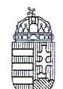
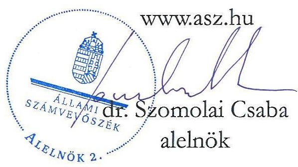
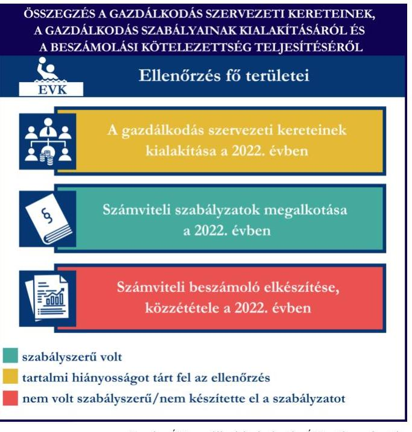
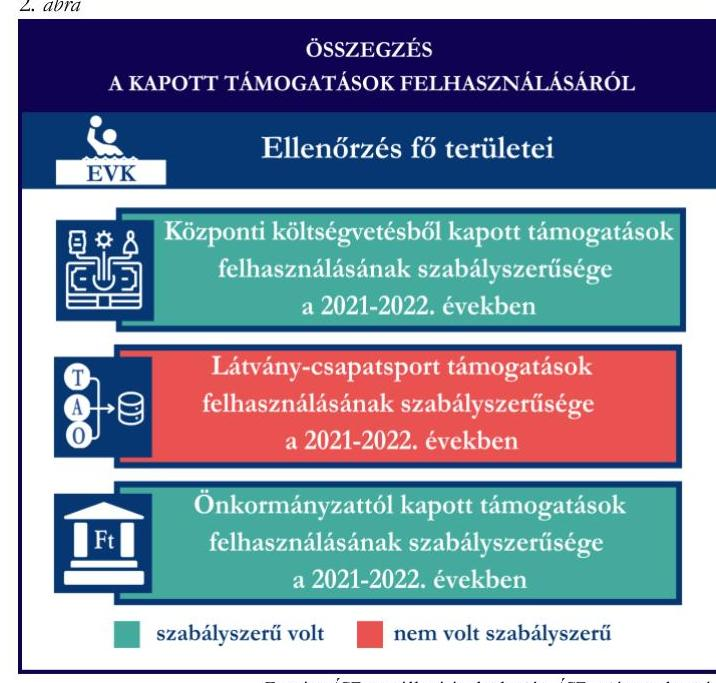
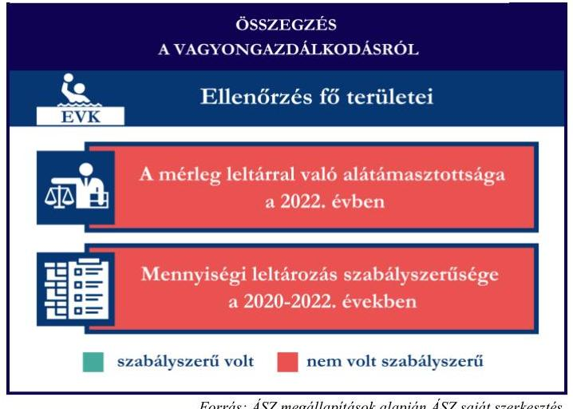
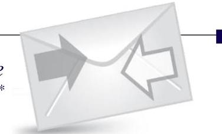

# JELENTÉS 

Támogatásban részesülő sportszövetségek, sportegyesületek és sportvállalkozások gazdálkodásának ellenőrzése

## Egri Vízilabda Klub

2024.

---

ÁLLAMI
SZÁMVEVŐSZÉK

# JELENTÉS 

## Támogatásban részesülő sportszövetségek, sportegyesületek és sportvállalkozások gazdálkodásának ellenőrzése

## Egri Vízilabda Klub

2024. 

24177

---

# ELLENŐRZÉSI IGAZGATÓSÁG: 

ÁLLAMHÁZTARTÁSON KÍVÜLI SZERVEZETEKET ELLENŐRZŐ IGAZGATÓSÁG

## ELLENŐRZÉSI IGAZGATÓ:

KLINGA LÁSZLÓ igazgató

## ELLENŐRZÉSVEZETŐ:

Jelentéseink az interneten a www.asz.hu címen olvashatók.

KAKAS SÁNDOR ellenőrzésvezető

IKTATÓSZÁM: EL-4031-007/2024
TÉMASORSZÁM: 30
ELLENŐRZÉS-AZONOSÍTÓ SZÁM: V1078

---

# TARTALOMJEGYZÉK 

AZ ELLENŐRZÉS ALAPADATAI ..... 5
AZ ELLENŐRZÖTT SZERVEZET ..... 7
ÖSSZEFOGLALÁS ..... 8
AZ ELLENŐRZÉS FÓKUSZTERÜLETEI ..... 10
MEGÁLLAPÍTÁSOK ..... 11
JAVASLATOK ..... 17
MELLÉKLETEK ..... 18
I. sz. melléklet: Fogalomtár ..... 18
II. sz. melléklet: Az ellenőrzött szervezetek jegyzéke ..... 20
III. sz. melléklet: Fő ellenőrzési kritériumok fő ellenőrzési fókuszterületek szerint. ..... 21
FÜGGELÉK: ÉSZREVÉTELEK ..... 23
RÖVIDÍTÉSEK JEGYZÉKE ..... 24

---

.

---

# AZ ELLENŐRZÉS ALAPADATAI 

## AZ ELLENŐRZÉS CÉLJA

Az ellenőrzés célja az államháztartásból nyújtott támogatással, vagy az államháztartásból meghatározott célra ingyenesen juttatott vagyon felhasználásával érintett sportszövetségek, sportegyesületek és sportvállalkozások gazdálkodása szabályozottságának, gazdálkodási tevékenységének, ezen belül a beszámolási kötelezettség teljesítésének, a támogatások elkülönített nyilvántartásának, valamint a támogatások felhasználásának ellenőrzése.

## AZ ELLENŐRZÉS TÍPUSA

Kombinált ellenőrzés.

## AZ ELLENŐRZŐTT IDŐSZAK

Az 1. fókuszterület vonatkozásában a 2022. év.
A 2. fókuszterület vonatkozásában a 2021-2022. évek.
A 3. fókuszterület vonatkozásában a 2022. év, a mennyiségi felvétellel történő leltározás dokumentumai tekintetében a 2020-2022. évek.

## AZ ELLENŐRZÉS TÁRGYA

Az ellenőrzés tárgyát képezte a támogatásban részesülő sportegyesület gazdálkodása szabályozottságának, gazdálkodási tevékenységén belül a beszámolási kötelezettség teljesítésének, a vagyonnyilvántartásának, a támogatások elkülönített nyilvántartásának, valamint az államháztartási forrásból származó közvetlen vagy közvetett támogatások és a meghatározott célra ingyenesen juttatott vagyon felhasználásának vizsgálata. Az ellenőrzés a támogatások vonatkozásában kiterjedt továbbá a támogató felé történő beszámolási és elszámolási kötelezettségek teljesítésére, a jogszabályi és belső előírások betartására.

Az ellenőrzés kiterjedt minden olyan körülményre és adatra, amely az ÁSZ ${ }^{1}$ jogszabályban meghatározott feladatainak teljesítéséhez, valamint az ellenőrzési program végrehajtása során felmerülő újabb összefüggések feltárásához szükséges volt.

## AZ ELLENŐRZÉS JOGALAPJA

Az ellenőrzés jogszabályi alapját az ÁSZ tv. ${ }^{2} 1 . \int(3)$ bekezdése és az 5. $\int(3)$ bekezdése előírásai képezték.

---

# AZ ELLENŐRZÉS MÓDSZERE 

Az ellenőrzést a nemzetközi standardokat irányadónak tekintve az ellenőrzési program szempontjai, az ellenőrzött időszakban hatályos jogszabályok, az ellenőrzés általános szakmai szabályai, az ellenőrzésre irányadó ÁSZ módszertanok figyelembevételével végezte az ÁSZ.

Az ellenőrzési kérdések megválaszolásához szükséges bizonyítékok megszerzése az ellenőrzött szervezet által rendelkezésre bocsátott dokumentumokra, adatokra alapozva kérdésfeltevés (információkérés), interjú, mintavételezés útján történt.

Az ellenőrzési bizonyítékként felhasználható adatforrások közé tartoztak egyrészt az ellenőrzés során az ellenőrzött szervezettől bekért dokumentumok, másrészt adatforrás volt minden további, az ellenőrzés folyamán feltárt, az ellenőrzés szempontjából információt tartalmazó egyéb adatforrás.

A támogatásokkal, azok felhasználásával kapcsolatos kötelezettségek vizsgálatára mintavételi eljárások kerültek alkalmazásra. Támogatás-típusok szerint nagyságrend alapján egy darab támogatás képezte a vizsgálat tárgyát. Ezen támogatások felhasználásának szabályszerűsége támogatásonként kockázatértékelés alapján kiválasztott tételekkel került ellenőrzésre. A kiválasztott támogatási szerződésekhez kapcsolódó elszámolásokból 30 db tétel került ellenőrzésre, ahol az elszámolás nem érte el a 30 db -ot, ott tételes ellenőrzésre került sor. Ezen felül a vagyongazdálkodás szabályszerűségének ellenőrzéséhez is kockázatalapú mintavétel kapcsolódott. A támogatások felhasználása és a vagyongazdálkodás területén a tételek ellenőrzése kiterjedt a könyvvezetési kötelezettség vizsgálatára is. A tárgyi eszközök tekintetében 30 db került kiválasztásra a 2022. évben állományban lévő eszközök közül azok nyilvántartásának, elszámolásának szabályszerűsége ellenőrzése céljából. A kiválasztott tételek ellenőrzésének eredménye nem került kivetítésre a teljes sokaságra, a megállapítások az adott ellenőrzött tételek vonatkozásában kerültek megjelenítésre.

---

# AZ ELLENŐRZÖTT SZERVEZET 

Az Egri Vízilabda Klubot a civil szervezetek közhiteles bírósági nyilvántartásába Úszó - Vizilabda Műúszó Klub néven 1994. január 14. napján jegyezték be. Alapszabálya ${ }^{3}$ szerinti célja többek között Eger városban a versenyszerű vízilabda sportág továbbfejlesztése, a vízilabda sport népszerűsítése, a megépült egri fedett uszoda fenntartásának támogatása, a vízi sportokra alkalmas vízfelületek megtartásának, illetve további vízfelületek kialakításának támogatása, a vízilabda sport utánpótlásának felkutatása, nevelése, versenyeztetése.

Az EVK ${ }^{4}$ legfőbb döntéshozó szerve a Közgyűlés, ügyvezető szerve a legalább öt tagból álló Elnökség, törvényes képviseletét az ügyvezető elnök és az ügyvezető igazgató látja el, képviseleti joguk gyakorlásának terjedelme általános, módja önálló.

Az EVK az ellenőrzött időszakban jogszabályi előírás alapján könyvvizsgálatra és felügyelőbizottság létrehozására kötelezett volt. Az EVK az ellenőrzött időszakban három tagú felügyelőbizottsággal rendelkezett. A 2022. évben az EVK vállalkozási tevékenységet nem végzett.

Az EVK, mint egyedüli tag 2012. február 24. napjával megalapította az Egri Vízilabda Korlátolt Felelősségű Társaságot.

Az EVK által az ellenőrzött időszakban igénybe vett támogatásokat az 1. táblázat mutatja be.
1. táblázat

## AZ EVK ÁLTAL IGÉNYBE VETT TÁMOGATÁSOK (ADATOK M FT-BAN)

|  | 2021. év | 2022. év |
| :-- | :--: | :--: |
| Központi költségvetési támogatás | 20,0 | 22,3 |
| Látvány-csapatsport támogatás | 303,0 | 316,5 |
| Helyi önkormányzati támogatás | 139,8 | 30 |
| Magyar Vízilabda Szövetségtől kapott támogatás | - | - |

---

# ÖSSZEFOGLALÁS 

Magyarország Alaptörvényének XX. cikke kimondja, hogy mindenkinek joga van a testi és lelki egészséghez, melynek érvényesülését Magyarország többek között a sportolás és a rendszeres testedzés támogatásával segíti elő. Az Országgyűlés a Sport tv. ${ }^{5}$-ben kinyilvánította, hogy a nemzet közössége a test művelését, a sportot, a nemzet alapértékének, kívánatos célnak tekinti. A sport a közjó része. Erősíti a közösség tagjainak egymáshoz tartozását, miként az egyén testi és lelki egészségét.

A sportegyesületek, sportszövetségek, sportvállalkozások müködésükre és szakmai tevékenységük ellátására költségvetési támogatásban, önkormányzati támogatásban, ingyenes vagyonjuttatásban, valamint látvány-csapatsport támogatásban részesülhetnek, amelyekre fokozott figyelem irányul.

A társadalom részéről jogosan felmerülő elvárás, hogy a közpénzeket kezelő, azzal gazdálkodó szervezetek működéséről, tevékenységéről átfogó képet kapjon, a közpénzek rendeltetésszerủ és átlátható módon történő felhasználásának értékelésére időről-időre sor kerüljön az ellenőrzések keretében.

Az EVK a könyvviteli szolgáltatás személyi feltételeinek megteremtéséről, felügyelőbizottság létrehozásáról és müködéséről gondoskodott. A 2022. évre vonatkozó egyszerűsített éves beszámolót könyvvizsgálóval nem vizsgáltatta felül. A jogszabályi előírások szerint az EVK kialakította a számviteli politikáját, valamint elkészítette számviteli szabályzatait, továbbá rendelkezett számlarenddel. A szabályzatok az ellenőrzött jogszabályi kritériumoknak megfeleltek.

A könyvvezetés formája a 2022. évben megfelelt a jogszabályi előírásoknak. Az EVK a könyvvizsgálat elmaradása okán nem a jogszabályoknak megfelelően teljesítette a számviteli beszámoló készítési kötelezettségét, továbbá az ellenőrzés a közzétételi kötelezettség tekintetében is hiányosságot tárt fel.

A gazdálkodás szervezeti keretei kialakításának, a számviteli szabályzatok megalkotásának, valamint a

Fonrás: $A S Z$ megállapítások alapján $A S Z$ saját szerkestés
számviteli beszámoló elkészítésének és közzétételének értékelését az 1. ábra mutatja be.

---

Az EVK a központi költségvetésből kapott támogatást és az önkormányzattól juttatott támogatást a 2021-2022. években az ellenőrzött tételek esetében a támogatási célnak megfelelően, szabályszerűen használta fel.

Az EVK a 2021-2022. években az ellenőrzött tételek esetében a látvány-csapatsport támogatást a támogatási célnak megfelelően, szabályszerűen, azonban a kiegészítő sportfejlesztési támogatást nem szabályszerűen használta fel, mert annak elszámolásakor olyan bizonylatokat is benyújtott, amelyek már korábban az $\mathrm{EMMI}^{6}$ felé elszámolásra kerültek, ami kettős finanszírozásnak minősül. Az EVK a feltárt szabálytalanság korrigálása érdekében az ellenőrzés ideje alatt hiánypótlást nyújtott be a $\mathrm{HM}^{7}$ felé.

Számviteli nyilvántartásában a kapott támogatások felhasználását a jogszabályi előírások ellenére teljeskörűen elkülönítetten nem tartotta nyilván.
A kapott támogatások felhasználásának értékelését a 2. ábra mutatja be.
Az EVK vagyongazdálkodása 2022. évben nem volt szabályszerű, mert a jogszabályi előírás ellenére a 2022. évi éves beszámolójának mérlegtételeit a tárgyi eszközök tekintetében nem támasztotta alá leltárral, továbbá a 2022. évre vonatkozóan a tárgyi eszközök esetében a mennyiségi felvétellel történő leltározást nem végezte el.

Az ellenőrzött tételek esetében a tárgyi eszközök üzembe helyezése és értékcsökkenésük elszámolása a 2022. évben szabályszerű volt.
A vagyongazdálkodás értékelését a 3. ábra mutatja be.

1. ábra

---

# AZ ELLENŐRZÉS FÓKUSZTERÜLETEI 

1.     - A gazdálkodási szabályok kialakítása, a könyvvezetési- és beszámolási kötelezettség teljesítése
2.     - A kapott támogatások felhasználása
3.     - Az ellenőrzött szervezet vagyongazdálkodása

---

# MEGÁLLAPÍTÁSOK 

## 1. A gazdálkodási szabályok kialakítása, a könyvvezetési- és beszámolási kötelezettség teljesítése

Összegző megállapítás

A 2022. évben a EVK-nál a gazdálkodás szervezeti kereteinek, a gazdálkodás szabályainak kialakítása megfelelt a jogszabályi előírásoknak, azonban az EVK 2022. évi egyszerűsített éves beszámolója könyvvizsgálattal nem volt alátámasztott. A könyvvezetési kötelezettség teljesítése megfelelt, a beszámolási- és a közzétételi kötelezettség teljesítése teljeskörűen nem felelt meg a jogszabályi előírásoknak.

A 2022. évben az EVK a Számv. tv. ${ }^{8}$-ben és a Civilszr. ${ }^{9}$-ben foglalt jogszabályi előírások betartásával gondoskodott a könyvviteli szolgáltatás személyi feltételeinek megteremtéséről, a könyvviteli szolgáltatás körébe tartozó feladatok ellátásával olyan személyt bízott meg, aki a jogszabályi előírásoknak megfelelő képesítéssel rendelkezett.
Az EVK 2022. évre vonatkozó egyszerűsített éves beszámolóját a Civilszr. 16. § (1) bekezdésében foglaltak ellenére könyvvizsgáló nem vizsgálta felül. Az EVK a 2019-2022. évi beszámolók utólagos könyvvizsgálatára 2024. március 13-án szerződést kötött.
Az EVK a Ptk. ${ }^{10}$ előírása alapján létrehozta a felügyelőbizottságot, a felügyelőbizottság tagjainak száma megfelelt a Ptk. előírásainak.
Az EVK a 2022. évben rendelkezett a Számv. tv.-ben előírt számviteli politikával ${ }^{11}$, illetve annak keretében elkészítette az értékelési szabályzatot ${ }^{12}$, a leltározási szabályzatot ${ }^{13}$ és a pénzkezelési szabályzatot ${ }^{14}$. A szabályzatok az ellenőrzött tartalmi kritériumoknak megfeleltek. Az EVK a Számv. tv. szerint a számlarendet ${ }^{15}$ elkészítette.
Az EVK a Számv. tv. előírásainak megfelelően a 2022. évben kettős könyvvitelt vezetett. A könyvviteli nyilvántartásait a Számv. tv. és a Civilszr. rendelkezéseinek megfelelően úgy alakította ki, hogy a 2022. évben az egyszerűsített éves beszámolóban a bevételeit az értékesítés nettó árbevétele és egyéb bevételek bontásban mutatta ki, továbbá az egyéb bevételeken belül a tagdíakat és a kapott támogatások összegét részletezni tudta.
Az EVK a Számv. tv., a Civil tv. ${ }^{16}$, valamint a Civilszr. előírásainak megfelelően elkészítette a 2022. évre vonatkozó egyszerűsített éves beszámolóját. Az EVK a Civil tv.-nek megfelelően a beszámolóval egyidejűleg elkészítette a közhasznúsági mellékletet.
A 2022. évre vonatkozó egyszerűsített éves beszámolót a Ptk. előírása alapján a felügyelőbizottság megvizsgálta, jelentéssel elfogadta, a Közgyűlés jóváhagyta. Az EVK a 2022. évi egyszerűsített éves beszámolóját, valamint közhasznúsági mellékletét a Civil tv. alapján letétbe helyezte és közzétette, azonban a Civil tv. 30. § (1) bekezdésében előírtak ellenére az elfogadott 2022. évi egyszerűsített éves beszámoló nem teljeskörűen került közzétételre, mivel az nem tartalmazta az elkészített kiegészítő mellékletet, valamint - a könyvvizsgálat elmaradása okán - a könyvvizsgálói jelentést. Továbbá az EVK a

---

saját honlapján a Civil tv. 30. § (4) bekezdésében előírtak ellenére nem tette közzé a közhasznúsági mellékletet.

# 2. A kapott támogatások felhasználása 

Összegző megállapítás

Az EVK a 2021. és a 2022. években a kapott támogatásokat a kiegészítő sportfejlesztési támogatás kivételével - az ellenőrzött tételek vonatkozásában szabályszerűen használta fel. A támogatások felhasználását nem minden esetben tartotta elkülönítetten nyilván.

Az EVK részére az ellenőrzésre kiválasztott központi költségvetésből kapott támogatás 2020. évben került folyósításra, az Emberi Erőforrások Minisztériuma által 2020. május 22-én kiállított, IX-3581-2/2020 iktatószámú Támogatói okirat 4. pontjában foglaltak szerint előlegként, amely bevételt a Számv. tv. előírásainak megfelelően az EVK kötelezettségként tartotta nyilván. A Számv. tv. előírásai szerint a könyvvezetési rendszerét oly módon tovább részletezte, hogy abból a központi költségvetésből kapott támogatás adatai rendelkezésre álltak, és a Támogatói okirat 6.3. pontjában foglaltaknak megfelelően a támogatási összeg felhasználásáról - részlegszám alkalmazásával - elkülönített számviteli nyilvántartást vezetett.
Az EVK a támogatás felhasználásáról a támogató felé benyújtott beszámolót és annak részeként az összesített elszámolási táblázatot a támogatói okiratban előírt formában és tartalommal elkészítette.
Az EVK esetében a központi költségvetésből kapott támogatás tételeinek ( 30 db ) ellenőrzése során az alábbiak kerültek megállapításra:

- a tételek számviteli elszámolását a Számv. tv.-ben előírtak szerint bizonylatokkal alátámasztották;
- a támogatói okiratban foglaltaknak megfelelően:
- a tétel gazdasági eseményének teljesítési időpontja a támogatói okiratban meghatározott támogatott tevékenység időtartamán belül történt;
- a támogatói okiratban meghatározott felhasználási határidőig megtörtént a tétel pénzügyi rendezése;
- a számviteli bizonylatokat a 474/2016. (XII. 27.) Korm. rendelet ${ }^{17}$ és a 27/2013. (III. 29.) EMMI rendelet ${ }^{18}$ előírásainak megfelelően záradékkal ellátták, amelyben jelzésre került, hogy a számviteli bizonylaton szereplő összegből mennyit számoltak el a szerződésszámmal hivatkozott támogatói okirat terhére;
- a hivatkozott támogatói okirat terhére a számviteli bizonylaton záradékolt összeg a 474/2016. (XII. 27.) Korm. rendeletben foglaltaknak megfelelően megegyezik a számlaösszesítőben feltüntetett értékkel;
- a tételek számviteli bizonylatának a hivatkozott támogatói okirat terhére záradékolt összege a Számv. tv.-ben előírtak szerint, tartalmának megfelelő főkönyvi számra került elszámolásra.
Az EVK a látvány-esapatsport támogatások esetében a 2021-2022. években eleget tett a 107/2011. (VI. 30.) Korm. rendeletben ${ }^{19}$ foglaltaknak, a támogatás felhasználásáról negyedévente az előrehaladási jelentéseket benyújtotta az MVLSZ felé.

---

Az EVK a számára nyújtott látvány-csapatsport támogatásról (ki/JHOSSZ201-0428/2019/MVLSZ) a 107/2011. (VI. 30.) Korm. rendeletnek megfelelően határidőben benyújtotta az elszámolást a támogató felé. A támogatási időszak lezárultát követően a támogatás felhasználását a jogszabályban foglaltak alapján záradékolt számviteli bizonylatokkal alátámasztott módon, összesített elszámolási táblázattal és szöveges szakmai beszámolóval igazolta.
Az EVK a 107/2011. (VI. 30.) Korm. rendeletnek megfelelően könyvvizsgáló által ellenőrzött számviteli bizonylatokkal számolt el a támogató felé. A könyvvizsgáló a 107/2011. (VI. 30.) Korm. rendeletben előírt felelősségbiztosítással rendelkezett.
Az EVK az ellenőrzött időszak könyvvezetése során a Civil tv. 20. § (4) bekezdésében előírt elkülönített számviteli nyilvántartást teljeskörűen nem vezetett, mivel a látvány-csapatsport támogatás elkülönített nyilvántartása nem tartalmazza hiánytalanul valamennyi elszámolt, ellenőrzött tételt, ezáltal az EVK nem tett eleget a 107/2011. (VI. 30.) Korm. rendelet 9. § (9) bekezdésében foglalt előírásnak, amely alapján a támogatás felhasználását elkülönítetten és naprakészen tartja nyilván.
Az EVK esetében a látvány-csapatsport támogatás ellenőrzött tételeinek ( 8 db ) vonatkozásában az alábbiak kerültek megállapításra:

- a tételek számviteli elszámolását a Számv. tv.-ben és a 107/2011. (VI. 30.) Korm. rendeletben előírtak szerint bizonylatokkal alátámasztották;
- a 107/2011. (VI. 30.) Korm. rendeletben foglaltaknak megfelelően
- a látvány-csapatsport támogatás tételek tartalma (gazdasági esemény) és összege alapján a támogatási igazolásban meghatározottak szerinti jogcímre, az abban meghatározott mértékben használták fel;
- a látvány-csapatsport támogatás tételek számviteli bizonylatai alapján a gazdasági események a támogatási időszak (meghosszabbított támogatási időszak) végéig szerződés szerint teljesültek;
- a tételek számviteli bizonylatai alapján a gazdasági események pénzügyi rendezése az elszámolás benyújtására nyitva álló határidőig - figyelemmel az elszámolási határidő hosszabbítására teljesült;
- a látvány-csapatsport támogatás tételek számviteli bizonylatait ellátták záradékkal.
- a számviteli bizonylatokon záradékolt összegek megegyeztek a számlaösszesítőben feltüntetett értékekkel.
- a tételek számviteli bizonylatának az adott sportfejlesztési program terhére záradékolt összegei a Számv. tv.-ben előírtak szerint a tartalmuknak megfelelő főkönyvi számra kerültek elszámolásra,
- a tételek számviteli bizonylatának az adott sportfejlesztési program terhére záradékolt összege - öt tétel (1. tétel: 56705238 Ft - tetőfelújítás; 2-3. tétel: 33078056 Ft - tetőfelújítás (ezen tételek esetében a 20439773 Ft előleg vonatkozásában nem szerepel az adott részlegszám); 4. tétel: 2999999 Ft - közreműködői díj; 5. tétel: 830691 Ft - közreműködői díj) kivételével - megegyezett a sportfejlesztési támogatás felhasználásának elkülönített számviteli nyilvántartásában szereplő összeggel. A kivételt képező tételek összegei a 107/2011. (VI. 30.) Korm. rend. 9. § (9) bekezdésében
foglaltak
ellenére a 0428/2019/MVLSZ látványcsapatsport támogatást azonosító részlegszámra szűrt elkülönített nyilvántartásában nem szerepeltek.

---

Az EVK a számára nyújtott kiegészítő sportfejlesztési támogatásról (be/SFP-08028/2021/MVLSZ) a 107/2011. (VI. 30.) Korm. rendelet 11. § (1) és (1d) bekezdés szerinti elszámolását nem megfelelően nyújtotta be a támogató felé, mivel az elszámoláshoz olyan számlákat is benyújtott, amelyek nem számolhatók el a kiegészítő sportfejlesztési támogatás terhére, mivel az EMMI felé korábban már elszámolásra kerültek. Ez kettős finanszírozásnak minősül. Az EMMI elszámolás és a kiegészítő sportfejlesztési támogatás számlaösszesitő adatainak összevetését követően megállapításra került, hogy a kiegészítő sportfejlesztési támogatás keretében elszámolt 22 db tétel, 15,6 M Ft összértékben, az EMMI IX/3581-2/2020 támogatás terhére korábban már benyújtásra került. Az EVK - az ÁSZ-hoz benyújtott dokumentum szerint - 2024. május 21-én önkéntes hiánypótlást nyújtott be a HM felé. A kiegészítő sportfejlesztési támogatás terhére elszámolt sportszakmai költségek módosított összesitő táblázatát az önkéntes hiánypótlást kérő levélhez csatolták, ez a dokumentum a kettős elszámolással érintett tételeket már nem tartalmazta.

Az EVK esetében a kiegészítő támogatás ellenőrzött tételeinek ( $30 \mathrm{db}+2 \mathrm{db}$ póttétel) vonatkozásában az alábbiak kerültek megállapításra:

- a tételek számviteli elszámolását a Számv. tv.-ben és a 107/2011. (VI. 30.) Korm. rendeletben előírtak szerint bizonylatokkal alátámasztották;
- a 107/2011. (VI. 30.) Korm. rendeletben foglaltaknak megfelelően a kiegészítő sportfejlesztési támogatás tételek tartalma (gazdasági esemény) - 19 tétel kivételével - megfelelt a támogatási okiratban előírt támogatott tevékenység megvalósításához kapcsolódó költségtervben meghatározott költségnek. A 19 ellenőrzött tétele vonatkozásában, mivel a benyújtott bizonylatok korábban már elszámolásra kerültek az EMMI IX-3581-2/2020 központi költségvetési támogatás terhére, így pedig a kiegészítő sportfejlesztési támogatás keretében történő felhasználásuk a támogatás céljának nem volt megfeleltethető, a felhasználás nem volt jogszerủ, nem felelt meg a 474/2016. Korm. rendelet 24. § (2) bekezdésének, valamint a 107/2011. (VI. 30.) Korm. rendelet 11. $\S$ (1a) és (5) bekezdésének;
- a 107/2011. (VI. 30.) Korm. rendeletben foglaltaknak megfelelően a kiegészítő sportfejlesztési támogatás tételek számviteli bizonylatának teljesítési időpontja (a támogatás felhasználása) - 19 tétel kivételével - a támogatási okiratban meghatározott támogatási tevékenység időtartamán belül történt (figyelembe véve a meghosszabbítást). A kivételt képező tételek esetén az eltérés az előző bekezdésben részletezésre került;
- a 107/2011. (VI. 30.) Korm. rendeletben foglaltaknak megfelelően a tételek számviteli bizonylatai alapján a gazdasági események pénzügyi rendezése az elszámolás benyújtására nyitva álló határidőig - figyelemmel az elszámolási határidő hosszabbítására - teljesült;
- a kiegészítő sportfejlesztési támogatás tételek számviteli bizonylatai a 107/2011. (VI. 30.) Korm. rend. 11. § (1) és (5) bekezdés rendelkezései ellenére nem tartalmazták a 08028/2021/MVLSZ támogatás keretében történő elszámolást jelző záradékot;
- a tételek számviteli bizonylatának az adott sportfejlesztési program terhére elszámolt összegei a Számv. tv.-ben előírtak szerint a tartalmuknak megfelelő főkönyvi számra kerültek elszámolásra;
- a kiegészítő sportfejlesztési támogatás tételek a 08028/2021/MVLSZ támogatás elkülönített nyilvántartásában nem voltak megtalálhatók.

---

Az EVK a 2021. és 2022. évben a helyi önkormányzattól kapott sportcélú támogatásokat a Civil tv. előírásai szerint elkülönítetten mutatta ki a könyveiben, Eger Megyei Jogú Város Önkormányzat által 2021. évben az EVK-nak juttatott $86,8 \mathrm{M}$ Ft összegű önkormányzati támogatás nyilvántartására a főkönyvi adatok tanúsága szerint a 483 halasztott bevételek között került sor. 2021. évben az értékcsökkenéssel arányosan 2,2 M Ft került bevételként elszámolásra, a felújítás 2022. évben fejeződött be. A kapott támogatások felhasználásáról a Civil tv. 20. § (4) bekezdésében előírt rendelkezés ellenére elkülönített számviteli nyilvántartást nem vezetett.
Az EVK a beszámolási kötelezettségét a támogatás rendeltetésszerű felhasználásáról az Áht.-nak megfelelően, azonban - az Eger Megyei Jogú Város Önkormányzatával 2021. augusztus 12-én kötött fejlesztési célú támogatás nyújtásáról szóló Megállapodás 5. pontjában előírt - határidőn túl teljesítette a helyi önkormányzat felé.
Az EVK esetében az önkormányzati támogatás tételeinek ( 6 db ) ellenőrzése során az alábbiak kerültek megállapításra:

- a tételek számviteli elszámolását a Számv. tv.-ben előírtak szerint bizonylatokkal alátámasztották;
- a megállapodásban foglaltaknak megfelelően:
- a tétel gazdasági eseményének teljesítési időpontja a támogatási szerződésben meghatározott támogatott tevékenység időtartamán belül történt;
- a támogatási szerződésben meghatározott felhasználási határidőig megtörtént a tétel pénzügyi rendezése;
- a számviteli bizonylatokat záradékkal ellátták, valamennyi számla két záradékot tartalmazott. Az egyik záradék a 0428/2019/MVLSZ látvány-csapatsport támogatásra vonatkozóan a számla teljes összegének elszámolására vonatkozott (közvetlen támogatás + önrész, amely jelen esetben az önkormányzati támogatás volt), a másik az Eger Megyei Jogú Város Önkormányzat által 178081/2021 iktatószámú támogatás terhére elszámolt támogatást rögzítette összegszerűen;
- a hivatkozott támogatási szerződés terhére a számviteli bizonylaton záradékolt összeg megegyezik a számlaösszesítőben feltüntetett értékkel;
- a tételek számviteli bizonylatának a hivatkozott támogatási szerződés terhére záradékolt összege a Számv. tv.-ben előírtak szerinti tartalmának megfelelő főkönyvi számra került elszámolásra.

# 3. Az ellenőrzött szervezet vagyongazdálkodása 

## Összegző megállapítás A 2022. évben az EVK vagyongazdálkodása nem volt szabályszerű.

Az EVK a Számv. tv. 69. § (1) bekezdés rendelkezései ellenére a 2022. évi egyszerűsített éves beszámolójának mérlegtételeit szabályszerű leltárral teljeskörűen nem támasztotta alá, mivel a tárgyi eszközök tekintetében nem állított össze leltárt.
Az EVK a számviteli alapelveknek megfelelő folyamatos mennyiségi nyilvántartást nem vezetett, a Számv. tv. 69. § (4) bekezdésében foglaltak ellenére a 2022. évre vonatkozóan a mennyiségi felvétellel történő leltározást nem végezte el.

---

Az EVK esetében a tárgyi eszköz tételek ( 30 db ) ellenőrzése során az alábbiak kerültek megállapításra:

- a tételek bekerülési értékét alátámasztó számviteli bizonylatok a Számv. tv.-nek megfelelően rendelkezésre álltak;
- a tárgyi eszközök számviteli besorolása megfelelt a Számv. tv. előírásainak;
- az üzembe helyezés tényét és időpontját a Számv. tv.-nek megfelelően hitelt érdemlően dokumentálták;
- az értékcsökkenés elszámolása a Számv. tv.-nek megfelelően történt;
- huszonhárom tétel esetén - ahol a tárgyi eszköz támogatásból valósult meg - a tétel bekerülési értékét meghatározó számviteli bizonylatokat a 107/2011. (VI. 30.) Korm. rendeletben foglaltaknak megfelelően ellátták záradékkal, amelyből kiderül, hogy a számviteli bizonylaton szereplő összegből mennyit számoltak el a szerződésszámmal hivatkozott támogatási szerződés terhére;
- egy tétel esetén, amely építési engedély köteles sportcélú ingatlan volt, a meghatározott hasznos élettartam a Tao tv.-ben ${ }^{20}$ foglaltaknak megfelelően 15 évben került meghatározásra.
Az EVK-nál az ellenőrzés során a tárgyi eszközök vonatkozásában sor került öt tétel helyszíni szemrevételezésére, amely alapján az eszközök fizikailag fellelhetőek voltak.

---

# JAVASLATOK 

Az ÁSZ tv. 33. § (1) bekezdésében foglaltak értelmében az ellenőrzött szervezet vezetője köteles a jelentésben foglalt megállapításokhoz kapcsolódó intézkedési tervet összeállítani és azt a jelentés kézhezvételétől számított 30 napon belül az ÁSZ részére megküldeni. Amennyiben az ellenőrzött szervezet vezetője nem küldi meg határidőben az intézkedési tervet, vagy továbbra sem elfogadható intézkedési tervet küld, az Állami Számvevőszék elnöke az ÁSZ tv. 33. § (3) bekezdése a) és b) pontjaiban foglaltakat érvényesítheti.

## AZ EGRI VÍZILABDA KLUB ELNÖKÉNEK

1. Gondoskodjon a beszámoló Civil tv. 30. § (1) bekezdésében elöírtaknak megfelelő letétbe helyezéséről.
2. Gondoskodjon a beszámoló Civil tv. 30. § (1) és (4) bekezdésében elöírtaknak megfelelő közzétételéről.
3. Gondoskodjon arról, hogy kapott támogatások felhasználását a Civil tv. 20. § (4) bekezdésében és a 107/2011. (VI. 30.) Korm. rendelet 9. § (9) bekezdésében foglalt elöírásoknak megfelelően elkülönítetten tartsa nyilván.
4. Gondoskodjon arról, hogy egy gazdasági eseményt alátámasztó számviteli bizonylat csak egy támogatás terhére kerüljön elszámolásra.
5. Gondoskodjon a beszámoló mérlegtételeinek leltárral történő teljeskörü alátámasztásáról a Számv. tv. 69. § (1) bekezdése elöírásainak megfelelően.
6. Gondoskodjon a Számv. tv. 69. § (4) bekezdésében foglaltaknak megfelelően mennyiségi felvétellel történő leltározás elvégzéséről.

---

# MELLÉKLETEK 

I. SZ. MELLÉKLET: FOGALOMTÁR

Civil szervezet

Egyesület

Kiegészítő sportfejlesztési támogatás

Költségvetési támogatás

Közhasznú szervezet

Közhasznú tevékenység

Látvány-csapatsport támogatás

Látvány-csapatsportban működő amatőr sportszervezet

A civil társaság; a Magyarországon nyilvántartásba vett egyesület - a párt, a szakszervezet és a kölcsönös biztosító egyesület kivételével és - a közalapítvány és a pártalapítvány kivételével - az alapítvány. (Forrás: Civil tv. 2. $\$ 6$. pont a)-c) alpontjai)
Az egyesület a tagok közös, tartós, alapszabályban meghatározott céljának folyamatos megvalósítására létesített, nyilvántartott tagsággal rendelkező jogi személy. (Forrás: Ptk. 3:63. § (1) bekezdés)
A Számv. tv. szempontjából egyéb szervezet. (Számv. tv. 3. $\$ (1)$ bekezdés 4. pont a) alpontja)

A látvány-csapatsportok támogatása esetében rendelkező nyilatkozatban felajánlott összeg 12,5 százaléka kiegészítő sportfejlesztési támogatásnak minősül. (Forrás: Tao tv. 4/A. § (9) bekezdés)
A társadalombiztosítás pénzügyi alapjai kivételével az államháztartás központi alrendszeréből ellenérték nélkül, pénzben nyújtott támogatások. (Forrás: Áht ${ }^{21}$. 1. § 14. pont)
Közhasznú szervezetté minősíthető a Magyarországon nyilvántartásba vett közhasznú tevékenységet végző szervezet, amely a társadalom és az egyén közös szükségleteinek kielégítéséhez megfelelő erőforrásokkal rendelkezik, továbbá amelynek megfelelő társadalmi támogatottsága kimutatható, és amely:
a) civil szervezet (ide nem értve a civil társaságot), vagy
b) olyan egyéb szervezet, amelyre vonatkozóan a közhasznú jogállás megszerzését törvény lehetővé teszi. (Forrás: Civil tv. 32. § (1) bekezdés)
Minden olyan tevékenység, amely a létesítő okiratban megjelölt közfeladat teljesítését közvetlenül vagy közvetve szolgálja, ezzel hozzájárulva a társadalom és az egyén közös szükségleteinek kielégítéséhez. (Forrás: Civil tv. 2. §20. pont)
Az adóévben visszafizetési kötelezettség nélkül nyújtott támogatás, juttatás, véglegesen átadott pénzeszköz és térítés nélkül átadott eszköz könyv szerinti értéke, az adóévben térítés nélkül nyújtott szolgáltatás bekerülési értéke a Tao tv.-ben meghatározott jogcímeken.
(Forrás: Tao tv. 4. § 44. pont)
Minden olyan, a sportról szóló törvényben meghatározott szabályok szerint a látvány-csapatsportban működő sportegyesület vagy sportvállalkozás, amelyik nem minősül a látvány-csapatsportban működő hivatásos sportszervezetnek. (Forrás: Tao tv. 4. § 42. pont)

---

Látvány-csapatsportban múködő hivatásos sportszervezet

Országos sportági szakszövetség

Sportági szövetség

Sportegyesület

Sportegyesületeknek, sportszövetségeknek nyújtott költségvetési támogatás

Sportszövetség

Sporttevékenység

A látvány-csapatsportágak országos sportági szakszövetsége által kiírt versenyrendszer legmagasabb felnőtt bajnoki osztályában - a veterán korosztályokra kiírt versenyrendszer kivételével - részt vevő (indulási jogot elnyert) sportszervezet, vagy alsóbb bajnoki osztályaiban részt vevő (indulási jogot elnyert) sportszervezet abban az esetben, ha az ilyen sportszervezet hivatásos sportolót alkalmaz. Több látvány-csapatsportban több jogi személy szervezeti egységgel (szakosztállyal) múködő sportszervezet esetén csak az a jogi személy szervezeti egység (szakosztály), amely a fent részletezett versenyrendszerek bajnoki osztályaiban részt vesz. (Forrás: Tao tv. 4. $\S 43$. pont)
Olyan sportszövetség, amely sportágában kizárólagos jelleggel az e törvényben, valamint más jogszabályokban meghatározott feladatokat lát el és e törvényben megállapított különleges jogosítványokat gyakorol. Olyan sportágban hozható létre, amelyet vagy a Nemzetközi Olimpiai Bizottság elismert, vagy amely sportág nemzetközi szövetségét felvették a Nemzetközi Sportszövetségek Szövetségébe (GAISF). (Forrás: Sport tv. 20. $\$ (1),(4)$ bekezdés)

A Civil tv. és a Ptk. előírásai alapján - a Sport tv.-ben meghatározott eltérésekkel - múködő szövetség, amelynek tagjai kizárólag sportszervezetek lehetnek. Sportági szövetség országos jelleggel is múködhet. Egy sportágban csak egy országos sportági szövetség múködhet. Törvényi feltételek teljesülése esetén szakszövetségi feladatokat is elláthat. (Forrás: Sport tv. 28. §)
A Civil tv. és a Ptk. szabályai szerint múködő olyan egyesület, amelynek alaptevékenysége a sporttevékenység szervezése, valamint a sporttevékenység feltételeinek megteremtése. A sportegyesületek a Sport tv. 15. $\$ (1) bekezdésében meghatározott sportszervezetek körébe tartoznak. A sportegyesületeken kívül sportszervezet még a sportvállalkozás, a sportiskola, valamint az utánpótlás-nevelés fejlesztését végző alapítvány. (Forrás: Sport tv. 16. § (1) bekezdés)
Az állami sport célú támogatások felhasználásáról és elosztásáról szóló 474/2016. (XII. 27.) Kormány rendelet és a 27/2013. (III. 29.) EMMI rendelet 1. $\$$-ában meghatározott fejezeti kezelésű előirányzatokból nyújtott támogatás.
Meghatározott sporttevékenységek körében a sportversenyek szervezésére, a tagok érdekvédelmére és a részükre való szolgáltatásokra, valamint a nemzetközi kapcsolatok lebonyolítására létrehozott, jogi személyiséggel és önkormányzattal rendelkező, a Civil tv. és a Ptk. alapján - az e törvényben foglalt eltérésekkel - különös formában múködő egyesületek. A Sport tv. 19. § (3) bekezdése szerint a sportszövetségeknek az alábbi típusai léteznek: országos sportági szakszövetségek, sportági szövetségek, szabadidősport szövetségek, fogyatékosok sportszövetségei, diák- és egyetemi-főiskolai sport sportszövetségei, nemzetközi sportszövetségek. (Forrás: Sport tv. 19. $\$$ (1), (3) bekezdés)
Meghatározott szabályok szerint, a szabadidő eltöltéseként kötetlenül vagy szervezett formában, illetve versenyszerủen végzett testedzés vagy szellemi sportágban kifejtett tevékenység, amely a fizikai erőnlét és a szellemi teljesítőképesség megtartását, fejlesztését szolgálja. (Forrás: Sport tv. 1. § (2) bekezdés)

---

II. SZ. MELLÉKLET: AZ ELLENŐRZÖTT SZERVEZETEK JEGYZÉKE

ELLENŐRZÖTT SZERVEZET NEVE
Egri Vízilabda Klub

ELLENŐRZÖTT SZERVEZET SZÉKHELYE
3300 Eger, Frank Tivadar utca 5.

---

# III. SZ. MELLÉKLET: FŐ ELLENŐRZÉSI KRITÉRIUMOK FŐ ELLENŐRZÉSI FÓKUSZTERÜLETEK SZERINT 

## FŐ ELLENŐRZÉSI FÓKUSZTERÜLETEK

1. A gazdálkodási szabályok kialakítása, a könyvvezetési és beszámolási kötelezettség teljesítése
2. A kapott támogatások felhasználása

## FŐ ELLENŐRZÉSI KRITÉRIUMOK

Civil tv. 2. § 7., 11. pont, 20. § (3) bekezdés c) pont, (4) bekezdés, 28. $\S$ (1)-(3) bekezdés, 29. § (1) bekezdés, (2) bekezdés c) pont, (3), (6), (7) bekezdés, 30. § (1)-(4) bekezdés, 40. § (1), (2) bekezdés, 41. $\$ (1) bekezdés
Civilszr. 7. § (1) bekezdés, (4) bekezdés b), c) pont, (6) bekezdés, 8. § (2), (3) bekezdés, 9. § (4), (5), (8) bekezdés, 12. § (4), (5) bekezdés, 15. § (1) bekezdés a), b) pont, (2) bekezdés, 16. § (1), (3) bekezdés, 22. § (1) bekezdés, 24. § (2) bekezdés, 3.-4. sz. melléklet Civil vhr. ${ }^{22} 12 . \S$ és melléklet
Cnytv. ${ }^{23} 39 . \S$ (1), (4) bekezdés, 40. § (2) bekezdés
Ptk. 3:26. § (1) bekezdés, 3:27. § (1) bekezdés, 3:82. § (1)-(2) bekezdés
Számv. tv. 4. §, 6. § (2) bekezdés, 12. §, 14. § (3), (5) bekezdés a), b), d) pont, (8) bekezdés, (11)-(12) bekezdés, 69. § (1), (3) bekezdés, 90. § (3) bekezdés c) pont, 96. § (4) bekezdés, 150. § (2) bekezdés, 153. § (1) bekezdés, 154. § (1) bekezdés, 161. § (1) bekezdés, (2) bekezdés a)-d) pont, (3)-(4) bekezdés, 161/A. § (1)(2) bekezdés, 165. § (2) bekezdés
Tao tv. 22/C. §
107/2011. (VI.30.) Korm. rendelet 9. § (9) bekezdés
Áht. 52. § (1) bekezdés, 53. §
Ávr. ${ }^{24} 76 . \S$ (1) bekezdés c) pont, 93. § (1)-(3), (5) bekezdés
Civil tv. 20. § (1) bekezdés c) pont, (2) bekezdés a) pont, (3) bekezdés a), c) pont, (4) bekezdés, 29. § (4), (5) bekezdés
Civilszr. 13. § (3) bekezdés, 24. § (1)-(2) bekezdés
Kbt. ${ }^{25} 5 . \S$ (2) bekezdés, 15. §
Számv. tv. 16. § (3) bekezdés, 25-26. §, 44. § (2) bekezdés, 45. § (1)-(2) bekezdés, 77. § (3) bekezdés b) pont, 78-81. §, 159. §, 161/A. § (2) bekezdés, 162. § (1) bekezdés, 165. § (1)-(2) bekezdés, 166. § (1) bekezdés, 167. § (1) bekezdés a), d), e), h) pont

Tao. tv. 22/C. §, 24/A. § (9) bekezdés
107/2011. (VI.30.) Korm. rendelet 2. § (3b) bekezdés, 4. § (11) bekezdés, 5. § (1) bekezdés, 6. § (1) bekezdés e) pont, 9. § (8)-(10) bekezdés, 10. § (2), (2a), (2b), (4) bekezdés, 10. § (5a) bekezdés, 11. § (1), (1a), (1d), (1e), (2), (4), (4a), (5), (6) bekezdés, 13. § (1), (2a) bekezdés, 14. § (1), (4), (4b), (4c), (6c) bekezdés
275/2022. (VII.29.) Korm. rendelet ${ }^{26} 1 . \S$ (3)
444/2022. (XI.7) Korm. rendelet ${ }^{27} 2 . \S$
474/2016. (XII. 27.) Korm. rendelet 24. § (2) bekezdés, 26. § (3) bekezdés

---

3. Az ellenőrzött szervezet vagyongazdálkodása

Ptk. 3:63. § (4) bekezdés
Számv. tv. 15. § (3) bekezdés, 26. §, 46. § (3) bekezdés, 47-53. §, 57. §, 69. § (1)-(6) bekezdés, 165-166. §, 169. § (2) bekezdés

Tao tv. 22/C (6) bekezdés a), d), e) pont, (11) bekezdés
Ávr. 93. § (5) bekezdés
107/2011. (VI.30.) Korm. rendelet 11. § (5) bekezdés
474/2016. (XII. 27.) Korm. rendelet 17. § (1) bekezdés 11a. a) pont, 11b. pont, 17. § (2a) bekezdés, 24. § (2) bekezdés

---

# FÜGGELÉK: ÉSZREVÉTELEK 

A jelentéstervezetet a Számvevőszék 15 napos észrevételezésre megküldte az ellenőrzött szervezet vezetőjének az ÁSZ tv. 29. §* (1) bekezdése előírásának megfelelően.

Az Egri Vízilabda Klub elnöke a jelentéstervezetre nem tett észrevételt.

[^0]
[^0]:    * 29. § (1) Az Állami Számvevőszék az ellenőrzési megállapításait megküldi az ellenőrzött szervezet vezetőjének vagy az általa megbízott személynek, és annak, akinek személyes felelősségét állapította meg.
    (2) Az ellenőrzött szervezet vezetője és a felelősként megjelölt személy az ellenőrzés megállapításaira tizenöt napon belül írásban észrevételt tehet.
    (3) Az Állami Számvevőszék az észrevételre a beérkezésétől számított harminc napon belül írásban válaszol. A figyelembe nem vett észrevételeket köteles a jelentésben feltüntetni, és megindokolni, hogy azokat miért nem fogadta el.

---

# RÖVIDÍTÉSEK JEGYZÉKE 

${ }^{1}$ ÁSZ
${ }^{2}$ ÁSZ tv.
${ }^{3}$ Alapszabály
${ }^{4}$ EVK
${ }^{5}$ Sport tv.
${ }^{6}$ EMMI
${ }^{7}$ HM
${ }^{8}$ Számv. tv.
${ }^{9}$ Civilszr.
${ }^{10}$ Ptk.
${ }^{11}$ számviteli politika
${ }^{12}$ értékelési szabályzat
${ }^{13}$ leltározási szabályzat
${ }^{14}$ pénzkezelési szabályzat
${ }^{15}$ Számlarend
${ }^{16}$ Civil tv.
${ }^{17}$ 474/2016. (XII. 27.) Korm. rendelet
${ }^{18}$ 27/2013. EMMI rendelet
${ }^{19}$ 107/2011. (VI.30.) Korm. rendelet
${ }^{20}$ Tao tv.
${ }^{21}$ Áht.
${ }^{22}$ Civil. vhr.
${ }^{23}$ Cnytv.
${ }^{24}$ Ávr.
${ }^{25} \mathrm{Kbt}$.
${ }^{26}$ 275/2022. (VII.29.) Korm. rendelet
${ }^{27}$ 444/2022. (XI.7.) Korm. rendelet

Állami Számvevőszék
2011. évi LXVI. törvény az Állami Számvevőszékről

Egri Vízilabda Klub alapszabálya módosításokkal egységes szerkezetben (készítés: 2020. október 2.)

Egri Vízilabda Klub
2004. évi I. törvény a sportról

Emberi Erőforrások Minisztériuma
Honvédelmi Minisztérium
2000. évi C. törvény a számvitelről

479/2016. (XII.28.) Korm. rendelet a számviteli törvény szerinti egyes egyéb szervezetek beszámoló készítési és könyvvezetési kötelezettségének sajátosságairól
2013. évi V. törvény a Polgári Törvénykönyvről

Egri Vízilabda Klub számviteli politika szabályzata (hatályos: 2021. január 1-től)
Egri Vízilabda Klub sportegyesület eszközök és források értékelési szabályzata (hatályos: 2020. január 1-től)
Egri Vízilabda Klub sportegyesület eszközök és források leltározási és leltárikészítési szabályzata (hatályos: 2021. január 1-től)
Egri Vízilabda Klub sportegyesület pénzkezelési szabályzata (hatályos: 2020. január 1-től)
Egri Vízilabda Klub számlarendje (hatályos: 2020. január 1-től)
2011. évi CLXXV. törvény az egyesülési jogról, a közhasznú jogállásról, valamint a civil szervezetek múködéséről és támogatásáról
474/2016. (XII. 27.) Korm. rendelet az állami sport célú támogatások felhasználásáról és elosztásáról
27/2013. (III. 29.) EMMI rendelet az állami sport célú támogatások felhasználásáról és elosztásáról
107/2011. (VI. 30.) Korm. rendelet a látvány-csapatsport támogatását biztosító támogatási igazolás kiállításáról, felhasználásáról, a támogatás elszámolásának és ellenőrzésének, valamint visszafizetésének szabályairól
1996. évi LXXXI. törvény a társasági adóról és az osztalékadóról
2011. évi CXCV. törvény az államháztartásról
350/2011. (XII. 30.) Korm. rendelet a civil szervezetek gazdálkodása, az adománygyűjtés és a közhasznúság egyes kérdéseiről
2011. évi CLXXXI. törvény a civil szervezetek bírósági nyilvántartásáról és az ezzel összefüggő eljárási szabályokról
368/2011. (XII. 31.) Korm. rendelet az államháztartásról szóló törvény végrehajtásáról
2015. évi CXLIII. törvény a közbeszerzésekről
275/2022. (VII.29.) Korm. rendelet a látvány-csapatsport támogatását biztosító támogatási igazoláskiállításáról, felhasználásáról, a támogatás elszámolásának és ellenőrzésének, valamint visszafizetésének szabályairól szóló 107/2011. (VI. 30.) Korm. rendelet veszélyhelyzet ideje alatt történő eltérő alkalmazásáról
444/2022. (XI.7.) Korm. rendelet a veszélyhelyzet idején a látvány-csapatsport támogatását biztosító támogatási igazolás kiállításáról, felhasználásáról, a támogatás elszámolásának és ellenőrzésének, valamint visszafizetésének szabályairól szóló 107/2011. (VI. 30.) Korm. rendelet szabályainak eltérő alkalmazásáról

---

1052 Budapest, Apáczai Csere János u. 10. | 1364 Budapest 4., Pf. 54
www.asz.hu | szamvevoszek@asz.hu
telefon: +36 14849100