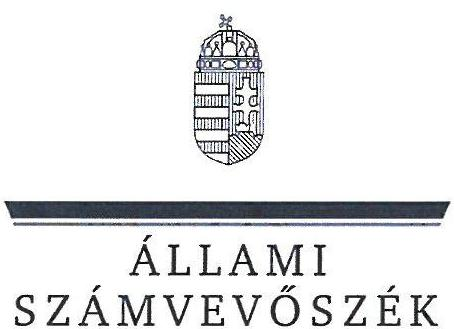
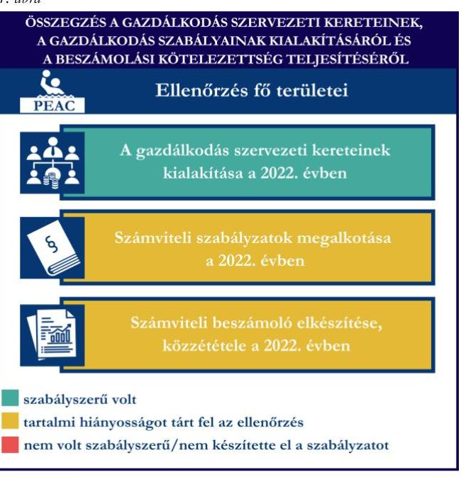
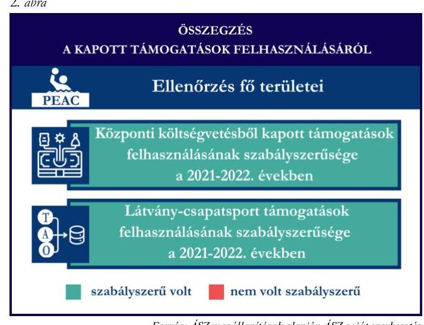
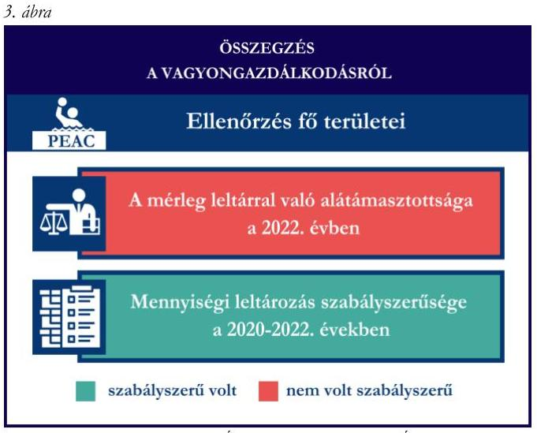

# JELENTÉS 

Támogatásban részesülő sportszövetségek, sportegyesületek és sportvállalkozások gazdálkodásának ellenőrzése

Pécsi Egyetemi Atlétikai Club

2024.

---

ÁLLAMI
SZÁMVEVŐSZÉK

# JELENTÉS 

## Támogatásban részesülő sportszövetségek, sportegyesületek és sportvállalkozások gazdálkodásának ellenőrzése

Pécsi Egyetemi Atlétikai Club

2024.

---

# ELLENŐRZÉSI IGAZGATÓSÁG: 

ÁLLAMHÁZTARTÁSON KÍVÜLI SZERVEZETEKET ELLENŐRZŐ IGAZGATÓSÁG

ELLENŐRZÉSI IGAZGATÓ:
KLINGA LÁSZLÓ igazgató

ELLENŐRZÉSVEZETŐ:
KAKAS SÁNDOR ellenőrzésvezető

Jelentéseink az interneten a www.asz.hu címen olvashatók.

IKTATÓSZÁM: EL-4031-010/2024
TÉMASORSZÁM: 30
ELLENŐRZÉS-AZONOSÍTÓ SZÁM: V1078

---

# TARTALOMJEGYZÉK 

AZ ELLENŐRZÉS ALAPADATAI ..... 5
AZ ELLENŐRZÖTT SZERVEZET ..... 7
ÖSSZEFOGLALÁS ..... 8
AZ ELLENŐRZÉS FÓKUSZTERÜLETEI ..... 10
MEGÁLLAPÍTÁSOK ..... 11
JAVASLATOK ..... 16
MELLÉKLETEK ..... 17
I. sz. melléklet: Fogalomtár ..... 17
II. sz. melléklet: Az ellenőrzött szervezetek jegyzéke ..... 19
III. sz. melléklet: Fő ellenőrzési kritériumok fő ellenőrzési fókuszterületek szerint. ..... 20
FÜGGELÉK: ÉSZREVÉTELEK ..... 22
RÖVIDÍTÉSEK JEGYZÉKE ..... 23

---

.

---

# AZ ELLENŐRZÉS ALAPADATAI 

## AZ ELLENŐRZÉS CÉLJA

Az ellenőrzés célja az államháztartásból nyújtott támogatással, vagy az államháztartásból meghatározott célra ingyenesen juttatott vagyon felhasználásával érintett sportszövetségek, sportegyesületek és sportvállalkozások gazdálkodása szabályozottságának, gazdálkodási tevékenységének, ezen belül a beszámolási kötelezettség teljesítésének, a támogatások elkülönített nyilvántartásának, valamint a támogatások felhasználásának ellenőrzése.

## AZ ELLENŐRZÉS TÍPUSA

Kombinált ellenőrzés.

## AZ ELLENŐRZŐTT IDŐSZAK

Az 1. fókuszterület vonatkozásában a 2022. év.
A 2-3. fókuszterület vonatkozásában a 2021-2022. évek.
A 4. fókuszterület vonatkozásában a 2022. év, a mennyiségi felvétellel történő leltározás dokumentumai tekintetében a 2020-2022. évek.

## AZ ELLENŐRZÉS TÁRGYA

Az ellenőrzés tárgyát képezte a támogatásban részesülő sportegyesület gazdálkodása szabályozottságának, gazdálkodási tevékenységén belül a beszámolási kötelezettség teljesítésének, a vagyonnyilvántartásának, a támogatások elkülönített nyilvántartásának, valamint az államháztartási forrásból származó közvetlen vagy közvetett támogatások és a meghatározott célra ingyenesen juttatott vagyon felhasználásának vizsgálata. Az ellenőrzés a támogatások vonatkozásában kiterjedt továbbá a támogató felé történő beszámolási és elszámolási kötelezettségek teljesítésére, a költségvetésből kapott támogatások továbbadásának szabályszerűségére, a jogszabályi és belső előírások betartására.

Az ellenőrzés kiterjedt minden olyan körülményre és adatra, amely az ÁSZ ${ }^{1}$ jogszabályban meghatározott feladatainak teljesítéséhez, valamint az ellenőrzési program végrehajtása során felmerülő újabb összefüggések feltárásához szükséges volt. Az ellenőrzés az 1. és 3. fókuszterületek esetében az ellenőrzött szervezet egészére, a 2. fókuszterület esetén kizárólag a vízilabda szakágra vonatkozóan került végrehajtásra.

## AZ ELLENŐRZÉS JOGALAPJA

Az ellenőrzés jogszabályi alapját az ÁSZ tv. ${ }^{2} 1 . \int$ (3) bekezdése és az 5. $\int$ (3) bekezdése előírásai képezték.

---

# AZ ELLENŐRZÉS MÓDSZERE 

Az ellenőrzést a nemzetközi standardokat irányadónak tekintve az ellenőrzési program szempontjai, az ellenőrzött időszakban hatályos jogszabályok, az ellenőrzés általános szakmai szabályai, az ellenőrzésre irányadó ÁSZ módszertanok figyelembevételével végezte az ÁSZ.

Az ellenőrzési kérdések megválaszolásához szükséges bizonyítékok megszerzése az ellenőrzött szervezet által rendelkezésre bocsátott dokumentumokra, adatokra alapozva kérdésfeltevés (információkérés), mintavételezés útján történt.

Az ellenőrzési bizonyítékként felhasználható adatforrások közé tartoztak egyrészt az ellenőrzés során az ellenőrzött szervezettől bekért dokumentumok, másrészt adatforrás volt minden további, az ellenőrzés folyamán feltárt, az ellenőrzés szempontjából információt tartalmazó egyéb adatforrás.

A támogatásokkal, azok felhasználásával, a továbbadott támogatásokkal kapcsolatos kötelezettségek vizsgálatára mintavételi eljárások kerültek alkalmazásra. Támogatás-típusok szerint nagyságrend alapján egy darab támogatás képezte a vizsgálat tárgyát. Ezen támogatások felhasználásának szabályszerűsége támogatásonként kockázatértékelés alapján kiválasztott tételekkel került ellenőrzésre. A kiválasztott támogatási szerződésekhez kapcsolódó elszámolásokból 30 db tétel került ellenőrzésre, ahol az elszámolás nem érte el a 30 db -ot, ott tételes ellenőrzésre került sor. Ezen felül a vagyongazdálkodás szabályszerűségének ellenőrzéséhez is kockázatalapú mintavétel kapcsolódott. A támogatások felhasználása és a vagyongazdálkodás területén a tételek ellenőrzése kiterjedt a könyvvezetési kötelezettség vizsgálatára is. A költségvetésből kapott támogatások továbbadásának szabályszerűségét teljeskörűen ellenőrizte az ÁSZ. A tárgyi eszközök tekintetében 30 db került kiválasztásra a 2022. évben állományban lévő eszközök közül azok nyilvántartásának, elszámolásának szabályszerűsége ellenőrzése céljából. A kiválasztott tételek ellenőrzésének eredménye nem került kivetítésre a teljes sokaságra, a megállapítások az adott ellenőrzött tételek vonatkozásában kerültek megjelenítésre.

---

# AZ ELLENŐRZÖTT SZERVEZET

A Pécsi Egyetemi Atlétikai Clubot 1923-ban alapították, a civil szervezetek közhiteles bírósági nyilvántartásába Pécsi Egyetemek és Főiskolák Sportegyesülete (Universitas-PEAC) néven 1989. október 13-án került bejegyzésre. Alapszabálya ${ }_{1-2}{ }^{3}$ szerinti célja többek között „...elősegiteni Baranya megye, Pécs város és a Pécsi Tudomány egyetem verseny- és élportjának, valamint szabadidő sportjának fejlesztését." „Aerobik, asztalitenisz, birkózás, kézilabda, küzdősport, kosárlabda, labdarúgás, röplabda, strand-röplabda, vivás, futsal, parasport, szabadidősport, vizilabda-üszás, E-Sport és kerékpár, cheerleading sportágakban hazai, és nemzetközi versenyzési lehetőség biztositása" Az egyesületnél az ellenőrzött időszakban 22 szakosztály működött, az Alapszabály ${ }_{1-2}$-ben felsorolt sportágakon kívül íjászat és egyetemi sport szakágakban, további a parasporton belül csörgőlabda, rolling basket és boccia szakágakban, valamint a kosárlabda szakágon belül férfi és női (PEAC Pécs és amatőr) szakosztály.

A PEAC ${ }^{4}$ legfőbb szerve a Küldöttgyűlés, ügyvezető szerve a 11 tagból álló (1 fő ügyvezető elnök, 1 fő társadalmi elnök, 1 fő ügyvezető igazgató és 8 fő elnökségi tag) Elnökség, legfőbb tisztségviselője az ügyvezető elnök, aki ellátja a törvényes képviseletet, képviseleti joga gyakorlásának terjedelme általános, módja önálló. A PEAC operatív teendőinek ellátására a Küldöttgyűlés legfeljebb öt évi időtartamra ügyvezető igazgatót választ.

A PEAC az ellenőrzött időszakban jogszabályi előírás alapján könyvvizsgálatra és felügyelőbizottság létrehozására is kötelezett volt. A PEAC az ellenőrzött időszakban három tagú felügyelőbizottsággal rendelkezett. A 2022. évben a PEAC vállalkozási tevékenységet nem végzett.

A PEAC vízilabda szakága által az ellenőrzött időszakban igénybe vett támogatásokat az 1. táblázat mutatja be.

|   | 2021. év | 2022. év  |
| --- | --- | --- |
|  Központi költségvetési támogatás | 300,0 | 300,0  |
|  - ebből továbbadott | 135,0 | 135,0  |
|  Látvány-csapatsport támogatás | 289,3 | -  |
|  Helyi önkormányzati támogatás | - | -  |
|  Magyar Vízilabda Szövetségtől kapott támogatás | - | -  |

Forrás: Az ellenőrzött szervezet ellenőrzési dokumentumai alapján ÁSZ saját szerkestés

---

# ÖSSZEFOGLALÁS 

Magyarország Alaptörvényének XX. cikke kimondja, hogy mindenkinek joga van a testi és lelki egészséghez, melynek érvényesülését Magyarország többek között a sportolás és a rendszeres testedzés támogatásával segíti elő. Az Országgyűlés a Sport tv. ${ }^{5}$-ben kinyilvánította, hogy a nemzet közössége a test művelését, a sportot, a nemzet alapértékének, kívánatos célnak tekinti. A sport a közjó része. Erősíti a közösség tagjainak egymáshoz tartozását, miként az egyén testi és lelki egészségét.

A sportegyesületek, sportszövetségek, sportvállalkozások müködésükre és szakmai tevékenységük ellátására költségvetési támogatásban, önkormányzati támogatásban, ingyenes vagyonjuttatásban, valamint látvány-csapatsport támogatásban részesülhetnek, amelyekre fokozott figyelem irányul.

A társadalom részéről jogosan felmerülő elvárás, hogy a közpénzeket kezelő, azzal gazdálkodó szervezetek müködéséről, tevékenységéről átfogó képet kapjon, a közpénzek rendeltetésszerü és átlátható módon történő felhasználásának értékelésére időről-időre sor kerüljön az ellenőrzések keretében.

A PEAC a könyvviteli szolgáltatás személyi feltételeinek megteremtéséről, felügyelőbizottság létrehozásáról és müködéséről gondoskodott. A jogszabályi előírások szerint a PEAC kialakította a számviteli politikáját, valamint elkészítette számviteli szabályzatait, továbbá rendelkezett számlarenddel. A számlarend tekintetében tartalmi hiányosságot tárt fel az ellenőrzés.

A könyvvezetés formája a 2022. évben megfelelt a jogszabályi előírásoknak. A PEAC a számviteli beszámoló készítési- és közzétételi kötelezettségét szabályszerűen teljesítette, azonban az ellenőrzés a közhasznúsági melléklet készítési- és közzétételi kötelezettség vonatkozásában hiányosságot tárt fel.

A gazdálkodás szervezeti keretei kialakításának, a
számviteli szabályzatok megalkotásának, valamint a
számviteli beszámoló elkészítésének és közzétételének értékelését az 1. ábra mutatja be.

---

A PEAC a központi költségvetésből kapott támogatást és a látvány-csapatsport támogatást a 2021-2022. években az ellenőrzött tételek esetében a támogatási célnak megfelelően, szabályszerűen használta fel. Számviteli nyilvántartásában a támogatások felhasználását a jogszabályi előírásnak megfelelően elkülönítetten tartotta nyilván.

A kapott támogatások felhasználásának értékelését a 2. ábra mutatja be.

A PEAC a 2021. és 2022. évben a költségvetésből kapott támogatást szabályszerűen adta tovább, azonban a 2021. és 2022. évi közhasznúsági mellékletében a továbbadott támogatásokat cél szerinti juttatásként nem tüntette fel.

A PEAC vagyongazdálkodása a 2022. évben nem volt szabályszerű, mert a 2022. évi egyszerűsített éves beszámolójának mérleg tételeit teljes körű leltárral nem támasztotta alá.

A 2022. évre vonatkozóan a tárgyi eszközök esetében a mennyiségi felvétellel történő leltározást elvégezte.

Az ellenőrzött tételek esetében a tárgyi eszközök üzembe helyezése és értékcsökkenésük elszámolása a 2022. évben szabályszerű volt.

A vagyongazdálkodás értékelését a 3. ábra mutatja be.

---

# AZ ELLENŐRZÉS FÓKUSZTERÜLETEI 

1.     - A gazdálkodási szabályok kialakítása, a könyvvezetési- és beszámolási kötelezettség teljesítése
2.     - A kapott támogatások felhasználása
3.     - A költségvetésből kapott támogatások továbbadása
4.     - Az ellenőrzött szervezet vagyongazdálkodása

---

# MEGÁLLAPÍTÁSOK 

## 1. A gazdálkodási szabályok kialakítása, a könyvvezetési- és beszámolási kötelezettség teljesítése

Összegző megállapítás

A 2022. évben a PEAC-nál a gazdálkodás szervezeti kereteinek, a gazdálkodás szabályainak kialakítása megfelelt a jogszabályi előírásoknak, azonban a számlarend tekintetében az ellenőrzés hiányosságot tárt fel. A könyvvezetési-, beszámolási kötelezettség teljesítése megfelelt, a közzétételi kötelezettség teljesítése teljeskörűen nem felelt meg a jogszabályi előírásoknak.

A 2022. évben a PEAC a Számv. tv. ${ }^{6}$ és a Civilszr. ${ }^{7}$-ben foglalt jogszabályi előírások betartásával gondoskodott a könyvviteli szolgáltatás személyi feltételeinek megteremtéséről, a könyvviteli szolgáltatás körébe tartozó feladatok ellátásával olyan számviteli szolgáltatást nyújtó társaságot bízott meg, amelynek a feladat irányításával, vezetésével, a beszámoló elkészítésével megbízott tagja megfelelt a jogszabályi követelményeknek.
A PEAC a Ptk. ${ }^{8}$ előírása szerint létrehozta a felügyelőbizottságot, a felügyelőbizottság tagjainak száma megfelelt a Ptk. előírásainak.
A PEAC a 2022. évben rendelkezett a Számv. tv.-ben előírt Számviteli politikával ${ }^{9}$, illetve annak keretében elkészítette az értékelési szabályzatot ${ }^{10}$, a leltározási szabályzatot ${ }^{11}$ és a pénzkezelési szabályzatot ${ }^{12}$. A szabályzatok az ellenőrzött tartalmi kritériumoknak megfeleltek. A PEAC a Számv. tv. szerint a számlarendet ${ }^{13}$ elkészítette, amely azonban a Számv. tv. 161. $\int$ (2) bekezdés c) pontjában foglaltak ellenére nem tartalmazta a főkönyvi számla és az analitikus nyilvántartások kapcsolatát, továbbá nem tartalmazta a Számv. tv. 161. § (2) bekezdés d) pontjában előírtak ellenére a számlarendben foglaltakat alátámasztó bizonylati rendet. Továbbá a Számlarend mellékletét képező számlatükör - a 2015. évi CI. törvény Számv. tv. módosításaira vonatkozó rendelkezései ellenére, amely 2015. július 4-től hatályon kívül helyezte a Számv. tv. rendkívüli bevételekre és ráfordításokra vonatkozó előírásait - tartalmazta a 88 Rendkívüli ráfordítások és 98 Rendkívüli bevételek főkönyvi számlacsoportokat és azok alábontásait.
A PEAC a Civilszr. előírásainak megfelelően a 2022. évben kettős könyvvitelt vezetett. A 2022. évben a PEAC végzett vállalkozási tevékenységet (reklámtevékenység, szponzorációs díj, pályabérlet), amelynek bevételeit a könyvvezetése során a Civil tv. ${ }^{14}$-nek megfelelően az alaptevékenységtől elkülönítetten tartotta nyilván és mutatta ki beszámolójában. A PEAC a Civilszr.-ben bekezdésben foglaltaknak megfelelően a nyilvántartási rendszerét úgy alakította ki, hogy abból a továbbutalási céllal kapott támogatással kapcsolatos információk is rendelkezésre álltak. A könyvviteli nyilvántartásait a Számv. tv. és a Civilszr. rendelkezéseinek megfelelően úgy alakította ki, hogy a 2022. évben az egyszerűsített éves beszámolóban a bevételeit az értékesítés nettó árbevétele, egyéb bevétel és pénzügyi műveletek bevétele bontásban mutatta ki, továbbá az egyéb bevételeken belül a tagdíjakat és a kapott támogatások összegét részletezni tudta.
A PEAC a Számv. tv., a Civil tv., valamint a Civilszr. előírásainak megfelelően elkészítette a 2022. évre vonatkozó egyszerűsített éves beszámolóját. A PEAC a Civil tv.-nek megfelelően a beszámolóval egyidejűleg elkészítette a közhasznúsági mellékletet, amely azonban a Civil tv. 29. § (7) bekezdésében és a

---

Civil vhr. ${ }^{15}$ mellékletében foglaltakkal ellentétesen nem tartalmazta a cél szerinti juttatások kimutatását, annak ellenére, hogy a PEAC-nak volt továbbadott támogatása, továbbá nem tartalmazta a vezető tisztségviselőknek nyújtott juttatások összegét sem, annak ellenére, hogy az Alapszabálya ${ }_{1-2}$-ben feltüntetett elnökségi tagok közül a főkönyvi nyilvántartásban rögzítettek alapján többen részesültek megbízási díjban.
A 2022. évre vonatkozó egyszerűsített éves beszámolót a Civilszr. rendelkezései alapján a könyvvizsgáló felülvizsgálta, a Ptk.-ban foglaltak alapján a felügyelőbizottság elfogadta, a Közgyűlés a Civil tv.-nek megfelelően jóváhagyta. A PEAC a 2022. évi egyszerűsített éves beszámolóját a Civil tv.-nek megfelelően letétbe helyezte, közzétette. A PEAC az $\mathrm{OBH}^{16}$ honlapján, valamint a saját honlapján a Civil tv. 30. § (1)(4) bekezdései ellenére tartalmilag hiányos közhasznúsági mellékletet tett közzé, mivel az nem tartalmazta a Civil vhr. mellékletének 1-6. pontjait.

# 2. A kapott támogatások felhasználása 

## Összegző megállapítás

A PEAC a 2021. és a 2022. években a kapott támogatásokat az ellenőrzött tételek vonatkozásában szabályszerűen használta fel.

A PEAC a központi költségvetésből kapott támogatás bevételeit a Civil tv. előírásai alapján elkülönítetten mutatta ki a könyveiben. A Civil tv.-ben és az Emberi Erőforrások Minisztériuma által 2021. augusztus 13-án kiállított, IX/4719-2/2021. iktatószámú Támogatói okirat 6.3. pontjában foglaltaknak megfelelően a támogatási összeg felhasználásáról elkülönített számviteli nyilvántartást vezetett, amely alapján megállapítható és ellenőrizhető a kapott támogatás felhasználása. A PEAC a támogatás felhasználásáról a támogató felé benyújtott beszámolót és annak részeként az összesített elszámolási táblázatot az Emberi Erőforrások Minisztériuma által 2021. augusztus 13-án kiállított, IX/4719-2/2021. számú támogatói okiratban előírt formában és tartalommal elkészítette.
A PEAC esetében a központi költségvetésből kapott támogatás tételek ( 30 db ) ellenőrzése során az alábbiak kerültek megállapításra:

- a tételek számviteli elszámolását a Számv. tv.-ben előírtak szerint bizonylatokkal alátámasztották;
- a támogatói okiratban foglaltaknak megfelelően:
- a tétel gazdasági eseményének teljesítési időpontja a támogatói okiratban meghatározott támogatott tevékenység időtartamán belül történt;
- a támogatói okiratban meghatározott felhasználási határidőig megtörtént a tétel pénzügyi rendezése.
- a számviteli bizonylatokat - hat tétel kivételével - a 474/2016. (XII. 27.) Korm. rendelet ${ }^{17}$ és a 27/2013. (III. 29.) EMMI rendelet ${ }^{18}$ előírásainak megfelelően záradékkal ellátták, amelyben jelzésre került, hogy a számviteli bizonylaton szereplő összegből mennyit számoltak el a hivatkozott támogatói okirat terhére. A kivételt képező tételek (ülésrendszer- 4902660 Ft ; projektmenedzsment - 1050000 Ft ; könyv adatgyűjtés - 1000000 Ft ; tehetséges sportolók felkutatása - 1068000 Ft ; sportszolgáltatás - 944880 Ft (2022.02.28.); sportszolgáltatás 944880 Ft (2022.03.29.)) esetén a számviteli bizonylatokat a 474/2016. (XII. 27.) Korm. rendelet

---

24. $\$ (2)$ bekezdés és a 27/2013. (III. 29.) EMMI rendelet 18. $\$ (2)$ bekezdés előírásai, továbbá a támogatói okirat 6.5.2. pontjában foglaltak ellenére záradékkal nem látták el.

- a hivatkozott támogatói okirat terhére a számviteli bizonylaton záradékolt összeg a 474/2016. (XII. 27.) Korm. rendeletben foglaltaknak megfelelően - egy tétel kivételével megegyezik a számlaösszesítőben feltüntetett értékkel. Egy tétel esetében (informatikai eszközök - 2188845 Ft ) a 474/2016. (XII. 27.) Korm. rendelet 24. § (2) bekezdése ellenére a számviteli bizonylaton záradékolt összeg ( 1901115 Ft ) nem egyezik meg a számlaösszesítőben feltüntetett (2 188845 Ft ) értékkel.
- a tételek számviteli bizonylatának a hivatkozott támogatói okirat terhére záradékolt összege a Számv. tv.-ben előírtak szerint, tartalmának megfelelő főkönyvi számra került elszámolásra.
A PEAC a látvány-csapatsport támogatások esetében a 2021-2022. években eleget tett a 107/2011. (VI. 30.) Korm. rendeletben ${ }^{19}$ foglaltaknak, a támogatás felhasználásáról negyedévente az előrehaladási jelentéseket benyújtotta az MVLSZ ${ }^{20}$ felé.
A PEAC a számára nyújtott látvány-csapatsport támogatásról a 107/2011. (VI. 30.) Korm. rendeletnek megfelelően határidőben benyújtotta az elszámolást a támogató felé. A támogatási időszak lezárultát követően a támogatás felhasználását a jogszabályban foglaltak szerint záradékolt számviteli bizonylatokkal alátámasztott módon, összesített elszámolási táblázattal és szöveges szakmai beszámolóval igazolta. A PEAC
107/2011. (VI. 30.) Korm. rendeletnek megfelelően könyvvizsgáló által ellenőrzött számviteli bizonylatokkal számolt el a támogató felé. A könyvvizsgáló a 107/2011. (VI. 30.) Korm. rendeletben előírt felelősségbiztosítással rendelkezett.
A PEAC az ellenőrzött időszak könyvvezetése során az alapcél szerinti tevékenysége költségei, ráfordításai ellentételezésére kapott támogatásokról a Civil tv.-nek megfelelően elkülönített számviteli nyilvántartást vezetett, továbbá eleget tett a 107/2011. (VI. 30.) Korm. rendeletben előírtaknak, mivel a látványcsapatsport támogatás felhasználását elkülönítetten tartotta nyilván.
A PEAC esetében a látvány-csapatsport támogatás tételeinek ( 30 db ) ellenőrzése során az alábbiak kerültek megállapításra:
- a tételek számviteli elszámolását a Számv. tv.-ben és a 107/2011. (VI. 30.) Korm. rendeletben előírtak szerint bizonylatokkal alátámasztották;
- a 107/2011. (VI. 30.) Korm. rendeletben foglaltaknak megfelelően
- a tételek tartalma (gazdasági esemény) és összege alapján a támogatási igazolásban meghatározottak szerinti jogcímre, az abban meghatározott mértékben használták fel;
- a tételek számviteli bizonylatai alapján a gazdasági események a támogatási időszak (meghosszabbított támogatási időszak) végéig szerződés szerint teljesültek;
- a tételek számviteli bizonylatai alapján a gazdasági események pénzügyi rendezése az elszámolás benyújtására nyitva álló határidőig - figyelemmel az elszámolási határidő hosszabbítására teljesült;
- a tételek számviteli bizonylatait ellátták záradékkal;
- a számviteli bizonylatokon záradékolt összegek megegyeztek a számlaösszesítőben feltüntetett értékekkel;
- a tételek számviteli bizonylatának az adott sportfejlesztési program terhére záradékolt összegei a Számv. tv.-ben előírtak szerint a tartalmuknak megfelelő főkönyvi számra kerültek elszámolásra.

---

# 3. A költségvetésből kapott támogatások továbbadása 

Összegző megállapítás A PEAC a 2021. és 2022. évben a költségvetésből kapott támogatást szabályszerűen adta tovább, azonban a 2021. és 2022. évi közhasznúsági mellékletében a továbbadott támogatásokat cél szerinti juttatásként nem tüntette fel.

A PEAC 2021. és 2022. évben a PVSK ${ }^{21}$-val konzorciumban pályázva összesen 300 M - 300 M Ft -ot kapott az $\mathrm{EMMI}^{22}$-től, amelyből mindkét évben összesen 135 M -135 M Ft támogatást adott tovább a PVSK részére.
A PEAC a nyilvántartási rendszerét úgy alakította ki, hogy abból a továbbutalási céllal kapott támogatásokkal kapcsolatos információk rendelkezésre álljanak.
A PEAC mindkét évben a 474/2016. (XII. 27.) Korm. rendeletnek megfelelően határozta meg a végső kedvezményezett általi beszámoló benyújtásának határidejét. A PEAC a 474/2016. (XII. 27.) Korm. rendeletben meghatározottak szerinti tartalommal elszámoltatta a támogatások végső kedvezményezettjét a költségvetési támogatásokról összesített elszámolási táblázattal.
A PEAC a Civilszr. rendelkezéseinek megfelelően a továbbutalási céllal kapott támogatásokat az egyéb bevételek között mutatta ki, a támogatás továbbadott összegét az egyéb ráfordítások között tartotta nyilván.
A PEAC a 2021. és 2022. évi közhasznúsági mellékletében a Civil tv. 29. § (7) bekezdésében előírtak ellenére a cél szerinti juttatások között nem mutatta be a továbbadott támogatásokat.

## 4. Az ellenőrzött szervezet vagyongazdálkodása

## Összegző megállapítás A 2022. évben a PEAC vagyongazdálkodása nem volt szabályszerű.

A PEAC a 2022. évi egyszerűsített éves beszámolója mérlegtételeinek alátámasztásához a Számv. tv. 69. § (1) bekezdésében előírtak ellenére - az immateriális javak és a tárgyi eszközök kivételével - nem állított össze leltárt. A PEAC a Számv. tv. 69. § (2) bekezdésében előírtak ellenére a főkönyvi könyvelés és az analitikus nyilvántartások adatai közötti egyeztetést a 2022. év mérlegfordulónapjára vonatkozóan a mérlegtételek esetében dokumentáltan nem végezte el.
A PEAC a Számv. tv. előírásaival összhangban a 2022. évre vonatkozóan a mennyiségi felvétellel történő leltározást elvégezte.
A PEAC esetében a tárgyi eszköz tételek ( 30 db ) ellenőrzése során az alábbiak kerültek megállapításra:

- a tételek bekerülési értékét meghatározó számviteli bizonylatok a Számv. tv.-nek megfelelően rendelkezésre álltak;
- a tárgyi eszközök számviteli besorolása megfelelt a Számv. tv. előírásainak;
- az üzembe helyezés tényét és időpontját a Számv. tv.-nek megfelelően hitelt érdemlően dokumentálták;
- az értékesökkenés elszámolása a Számv. tv.-nek megfelelően történt;

---

- huszonkilenc tétel közül - ahol a tárgyi eszköz beszerzés támogatásból valósult meg - huszonnégy tétel esetén, a tétel bekerülési értékét meghatározó számviteli bizonylatokat ellátták záradékkal, amelyből kiderül, hogy a számviteli bizonylaton szereplő összegből mennyit számoltak el a hivatkozott támogatás terhére. A kivételt képező öt látvány-csapatsport támogatásból finanszírozott tétel (Tornacsarnok Pécs, Jókai u. - 18923000 Ft; Ford Bus Titanium szgk. RNM794 - 9499000 Ft; Eredményjelző készülék - 5502948 Ft; Kerekesszékek - 5400000 Ft; Eredményjelző (asztali) - 1700000 Ft ) esetén a záradékolás a 107/2011. (VI. 30.) Korm. rend. 11. $\int$ (5) bekezdésében foglaltak ellenére nem történt meg.

---

# JAVASLATOK 

Az ÁSZ tv. 33. § (1) bekezdésében foglaltak értelmében az ellenőrzött szervezet vezetője köteles a jelentésben foglalt megállapításokhoz kapcsolódó intézkedési tervet összeállítani és azt a jelentés kézhezvételétől számított 30 napon belül az ÁSZ részére megküldeni. Amennyiben az ellenőrzött szervezet vezetője nem küldi meg határidőben az intézkedési tervet, vagy továbbra sem elfogadható intézkedési tervet küld, az Állami Számvevőszék elnöke az ÁSZ tv. 33. § (3) bekezdése a) és b) pontjaiban foglaltakat érvényesítheti.

## A PÉCSI EGYETEMI ATLÉTIKAI CLUB ELNÖKÉNEK

1. Gondoskodjon a számlarend Számv. tv. 161. § (2) bekezdés c) és d) pontjaiban elöirtaknak megfelelő tartalommal való elkészitéséről.
2. Gondoskodjon a beszámolóval egyidejüleg a Civil tv. 29. § (7) bekezdésében elöirtaknak megfelelően, a Civil vhr. melléklete szerinti tartalmú közhasznúsági melléklet elkészitéséről.
3. Gondoskodjon a jogszabályi elöírásoknak megfelelő tartalmú közhasznúsági melléklet Civil tv. 30. § (1)(4) bekezdésében elöirtaknak megfelelő közzétételéről.
4. Gondoskodjon arról, hogy a központi költségvetésből kapott támogatás felhasználását igazoló valamennyi bizonylat a 474/2016. (XII. 27.) Korm. rendelet 24. § (2) bekezdés és a 27/2013. (III. 29.) EMMI rendelet 18. § (2) bekezdés elöírásainak, továbbá a támogatói okiratban foglaltaknak megfelelően záradékolásra kerüljön.
5. Gondoskodjon arról, hogy a központi költségvetésből kapott támogatás esetén, a támogatói okirat terhére a számviteli bizonylaton záradékolt összeg a 474/2016. (XII. 27.) Korm. rendelet 24. § (2) bekezdésében foglaltaknak megfelelően megegyezzen a számlaösszesitőben feltüntetett értékkel.
6. Gondoskodjon a beszámoló mérlegtételeinek leltárral történő alátámasztásáról a Számv. tv. 69. § (1).(2) bekezdése elöírásainak megfelelően.

---

# MELLÉKLETEK 

## I. SZ. MELLÉKLET: FOGALOMTÁR

Civil szervezet

Egyesület

Kiegészítő sportfejlesztési támogatás

Költségvetési támogatás

Közhasznú szervezet

Közhasznú tevékenység

Látvány-csapatsport támogatás

Látvány-csapatsportban múködő amatőr sportszervezet

Látvány-csapatsportban múködő hivatásos sportszervezet

A civil társaság; a Magyarországon nyilvántartásba vett egyesület - a párt, a szakszervezet és a kölcsönös biztosító egyesület kivételével és - a közalapítvány és a pártalapítvány kivételével - az alapítvány. (Forrás: Civil tv. 2. $\$ 6$. pont a)-c) alpontjai)

Az egyesület a tagok közös, tartós, alapszabályban meghatározott céljának folyamatos megvalósítására létesített, nyilvántartott tagsággal rendelkező jogi személy. (Forrás: Ptk. 3:63. § (1) bekezdés)
A Számv. tv. szempontjából egyéb szervezet. (Számv. tv. 3. § (1) bekezdés 4. pont a) alpontja)

A látvány-csapatsportok támogatása esetében rendelkező nyilatkozatban felajánlott összeg 12,5 százaléka kiegészítő sportfejlesztési támogatásnak minősül. (Forrás: Tao tv. ${ }^{23}$ 24/A. § (9) bekezdés)
A társadalombiztosítás pénzügyi alapjai kivételével az államháztartás központi alrendszeréből ellenérték nélkül, pénzben nyújtott támogatások. (Forrás: Áht. ${ }^{24}$ 1. § 14. pont)
Közhasznú szervezetté minősíthető a Magyarországon nyilvántartásba vett közhasznú tevékenységet végző szervezet, amely a társadalom és az egyén közös szükségleteinek kielégítéséhez megfelelő erőforrásokkal rendelkezik, továbbá amelynek megfelelő társadalmi támogatottsága kimutatható, és amely:
a) civil szervezet (ide nem értve a civil társaságot), vagy
b) olyan egyéb szervezet, amelyre vonatkozóan a közhasznú jogállás megszerzését törvény lehetővé teszi. (Forrás: Civil tv. 32. § (1) bekezdés)
Minden olyan tevékenység, amely a létesítő okiratban megjelölt közfeladat teljesítését közvetlenül vagy közvetve szolgálja, ezzel hozzájárulva a társadalom és az egyén közös szükségleteinek kielégítéséhez. (Forrás: Civil tv. 2. $\$ 20$. pont)

Az adóévben visszafizetési kötelezettség nélkül nyújtott támogatás, juttatás, véglegesen átadott pénzeszköz és térítés nélkül átadott eszköz könyv szerinti értéke, az adóévben térítés nélkül nyújtott szolgáltatás bekerülési értéke a Tao tv.-ben meghatározott jogcímeken. (Forrás: Tao tv. 4. § 44. pont)
Minden olyan, a sportról szóló törvényben meghatározott szabályok szerint a látvány-csapatsportban múködő sportegyesület vagy sportvállalkozás, amelyik nem minősül a látvány-csapatsportban múködő hivatásos sportszervezetnek. (Forrás: Tao tv. 4. § 42. pont)
A látvány-csapatsportágak országos sportági szakszövetsége által kiírt versenyrendszer legmagasabb felnőtt bajnoki osztályában - a veterán korosztályokra kiírt versenyrendszer kivételével - részt vevő (indulási jogot elnyert) sportszervezet, vagy alsóbb bajnoki osztályaiban részt vevő (indulási jogot elnyert) sportszervezet abban az esetben, ha az ilyen sportszervezet hivatásos sportolót alkalmaz. Több látvány-csapatsportban több jogi személy szervezeti egységgel (szakosztállyal) múködő sportszervezet esetén csak az a jogi személy szervezeti egység (szakosztály), amely a fent részletezett versenyrendszerek bajnoki osztályaiban részt vesz. (Forrás: Tao tv. 4. § 43. pont)

---

Országos sportági szakszövetség

Sportági szövetség

Sportegyesület

Sportegyesületeknek, sportszövetségeknek nyújtott költségvetési támogatás

Sportszövetség

Sporttevékenység

Olyan sportszövetség, amely sportágában kizárólagos jelleggel az e törvényben, valamint más jogszabályokban meghatározott feladatokat lát el és e törvényben megállapított különleges jogosítványokat gyakorol. Olyan sportágban hozható létre, amelyet vagy a Nemzetközi Olimpiai Bizottság elismert, vagy amely sportág nemzetközi szövetségét felvették a Nemzetközi Sportszövetségek Szövetségébe (GAISF). (Forrás: Sport tv. 20. § (1), (4) bekezdés)
A Civil tv. és a Ptk. előírásai alapján - a Sport tv.-ben meghatározott eltérésekkel - müködő szövetség, amelynek tagjai kizárólag sportszervezetek lehetnek. Sportági szövetség országos jelleggel is müködhet. Egy sportágban csak egy országos sportági szövetség müködhet. Törvényi feltételek teljesülése esetén szakszövetségi feladatokat is elláthat. (Forrás: Sport tv. 28. §)
A Civil tv. és a Ptk. szabályai szerint müködő olyan egyesület, amelynek alaptevékenysége a sporttevékenység szervezése, valamint a sporttevékenység feltételeinek megteremtése. A sportegyesületek a Sport tv. 15. § (1) bekezdésében meghatározott sportszervezetek körébe tartoznak. A sportegyesületeken kívül sportszervezet még a sportvállalkozás, a sportiskola, valamint az utánpótlás-nevelés fejlesztését végző alapítvány. (Forrás: Sport tv. 16. $\S$ (1) bekezdés)

Az állami sport célú támogatások felhasználásáról és elosztásáról szóló 474/2016. (XII. 27.) Korm. rendelet és a 27/2013. (III. 29.) EMMI rendelet 1. $\S$-ában meghatározott fejezeti kezelésű előirányzatokból nyújtott támogatás.
Meghatározott sporttevékenységek körében a sportversenyek szervezésére, a tagok érdekvédelmére és a részükre való szolgáltatásokra, valamint a nemzetközi kapcsolatok lebonyolítására létrehozott, jogi személyiséggel és önkormányzattal rendelkező, a Civil tv. és a Ptk. alapján - az e törvényben foglalt eltérésekkel - különös formában müködő egyesületek. A Sport tv. 19. § (3) bekezdése szerint a sportszövetségeknek az alábbi típusai léteznek: országos sportági szakszövetségek, sportági szövetségek, szabadidősport szövetségek, fogyatékosok sportszövetségei, diák- és egyetemi-főiskolai sport sportszövetségei, nemzetközi sportszövetségek. (Forrás: Sport tv. 19. § (1), (3) bekezdés)

Meghatározott szabályok szerint, a szabadidő eltöltéseként kötetlenül vagy szervezett formában, illetve versenyszerűen végzett testedzés vagy szellemi sportágban kifejtett tevékenység, amely a fizikai erőnlét és a szellemi teljesítőképesség megtartását, fejlesztését szolgálja. (Forrás: Sport tv. 1. § (2) bekezdés)

---

II. SZ. MELLÉKLET: AZ ELLENŐRZÖTT SZERVEZETEK JEGYZÉKE

| ELLENŐRZÖTT SZERVEZET NEVE | ELLENŐRZÖTT SZERVEZET SZÉKHELYE |
| :-- | :-- |
| Pécsi Egyetemi Atlétikai Club | 7622 Pécs, Vasvári Pál utca 4. |

---

# III. SZ. MELLÉKLET: FŐ ELLENŐRZÉSI KRITÉRIUMOK FŐ ELLENŐRZÉSI FÓKUSZTERŰLETEK SZERINT 

## FŐ ELLENŐRZÉSI FÓKUSZTERŰLETEK FŐ ELLENŐRZÉSI KRITÉRIUMOK

1. A gazdálkodási szabályok kialakítása, a könyvvezetési és beszámolási kötelezettség teljesítése
2. A kapott támogatások felhasználása

Civil tv. 2. § 7., 11. pont, 20. § (3) bekezdés c) pont, (4) bekezdés, 28. $\S$ (1)-(3) bekezdés, 29. § (1) bekezdés, (2) bekezdés c) pont, (3), (6), (7) bekezdés, 30. § (1)-(4) bekezdés, 40. § (1), (2) bekezdés, 41. § (1) bekezdés
Civilszr. 7. § (1) bekezdés, (4) bekezdés b), c) pont, (6) bekezdés, 8. § (2), (3) bekezdés, 9. § (4), (5), (8) bekezdés, 12. § (4), (5) bekezdés, 14. $\S$ (1) bekezdés, 15. § (1) bekezdés a), b) pont, (2) bekezdés, 16. § (1), (3) bekezdés, 22. § (1) bekezdés, 24. § (2) bekezdés, 3.-4. sz. melléklet Civil vhr. 12. § és melléklet
Cnytv. ${ }^{25}$ 39. § (1), (4) bekezdés, 40. § (2) bekezdés
Ptk. 3:26. § (1) bekezdés, 3:27. § (1) bekezdés, 3:82. § (1)-(2) bekezdés Számv. tv. 4. §, 6. § (2) bekezdés, 12. §, 14. § (3), (5) bekezdés a), b), d) pont, (8) bekezdés, (11)-(12) bekezdés, 69. § (1), (3) bekezdés, 90. § (3) bekezdés c) pont, 96. § (4) bekezdés, 150. § (2) bekezdés, 153. § (1) bekezdés, 154. § (1) bekezdés, 161. § (1) bekezdés, (2) bekezdés a)-d) pont, (3)-(4) bekezdés, 161/A. § (1)-(2) bekezdés, 165. § (2) bekezdés Tao tv. 22/C. §
107/2011. (VI.30.) Korm. rendelet 9. § (9) bekezdés
Áht. 52. § (1) bekezdés, 53. §
Ávr. ${ }^{26}$ 76. § (1) bekezdés c) pont, 93. § (1)-(3), (5) bekezdés
Civil tv. 20. § (1) bekezdés c) pont, (2) bekezdés a) pont, (3) bekezdés a), c) pont, (4) bekezdés, 29. § (4), (5) bekezdés

Civilszr. 13. § (3) bekezdés, 24. § (1)-(2) bekezdés
Kbt. ${ }^{27}$ 5. § (2) bekezdés, 15. §
Számv. tv. 16. § (3) bekezdés, 25-26. §, 44. § (2) bekezdés, 45. § (1)-(2) bekezdés, 77. § (3) bekezdés b) pont, 78-81. §, 159. §, 161/A. § (2) bekezdés, 162. § (1) bekezdés, 165. § (1)-(2) bekezdés, 166. § (1) bekezdés, 167. § (1) bekezdés a), d), e), h) pont
Tao. tv. 22/C. §, 24/A. § (9) bekezdés
107/2011. (VI.30.) Korm. rendelet 2. § (3b) bekezdés, 4. § (11) bekezdés, 5. § (1) bekezdés, 6. § (1) bekezdés e) pont, 9. § (8)-(10) bekezdés, 10. § (2), (2a), (2b), (4) bekezdés, 10. § (5a) bekezdés, 11. § (1), (1a), (1d), (1e), (2), (4), (4a), (5), (6) bekezdés, 13. § (1), (2a) bekezdés, 14. § (1), (4), (4b), (4c), (6c) bekezdés
275/2022. (VII.29.) Korm. rendelet ${ }^{28}$ 1. § (3)
444/2022. (XI.7) Korm. rendelet ${ }^{29}$ 2. §
474/2016. (XII. 27.) Korm. rendelet 24. § (2) bekezdés, 26. § (3) bekezdés
27/2013. (III. 29.) EMMI rendelet 18. § (2) bekezdés

---

3. A költségvetésből kapott támogatások továbbadása
4. Az ellenőrzött szervezet vagyongazdálkodása

Számv. tv. 77. § (2) bekezdés d) pont, 81. § (2) bekezdés c) pont, 167.§ (1) bekezdés c) pont

Civil. tv. 2. §4. pont, 29. §(3), (6)-(7) bekezdés, 46.§ (1) bekezdés
Civilszr. 13.§ (4)-(5) bekezdés, 14.§ (1) bekezdés
Civil vhr. 12.§ (1), (3) bekezdés
Sport tv. 57.§ (2) bekezdés d) pont
474/2016. (XII. 27.) Korm. rendelet 17. § (1) bekezdés 13. pont, 23. § (1) bekezdés, 24.§ (1)-(2) bekezdés, 25.§ (1)-(2) bekezdés, 26. §, 29/A.§ 27/2013. EMMI rend. 17.§ (1) bekezdés, 18. § (1) bekezdés 166/2004. (V.21.) Korm.rendelet 4.§ (1-5) bekezdés (2021. december 31-ig) 765/2021.(XII.23.) Korm.rendelet (2022. január 1-től)
Ávr. 76. § (1) bek a)-d), f), k) pont
Áht. 52. § (1) bekezdés, 100.§ (3) bekezdés
Kbt. 5. § (2) bekezdés, 15. §
Ptk. 3:63. § (4) bekezdés
Számv. tv. 15. § (3) bekezdés, 26. §, 46. § (3) bekezdés, 47-53. §, 57. §, 69. § (1)-(6) bekezdés, 165-166. §, 169. § (2) bekezdés

Tao tv. 22/C (6) bekezdés a), d), e) pont, (11) bekezdés
Ávr. 93. § (5) bekezdés
107/2011. (VI.30.) Korm. rendelet 11. § (5) bekezdés
474/2016. (XII. 27.) Korm. rendelet 17. § (1) bekezdés 11a. a) pont, 11b. pont, 17. § (2a) bekezdés, 24. § (2) bekezdés

---

# FÜGGELÉK: ÉSZREVÉTELEK 

A jelentéstervezetet a Számvevőszék 15 napos észrevételezésre megküldte az ellenőrzött szervezet vezetőjének az ÁSZ tv. 29. §* (1) bekezdése előírásának megfelelően.

A Pécsi Egyetemi Atlétikai Club elnöke a jelentéstervezetre nem tett észrevételt.

[^0]
[^0]:    * 29. § (1) Az Állami Számvevőszék az ellenőrzési megállapításait megküldi az ellenőrzött szervezet vezetőjének vagy az általa megbízott személynek, és annak, akinek személyes felelősségét állapította meg.
    (2) Az ellenőrzött szervezet vezetője és a felelősként megjelölt személy az ellenőrzés megállapításaira tizenöt napon belül írásban észrevételt tehet.
    (3) Az Állami Számvevőszék az észrevételre a beérkezésétől számított harminc napon belül írásban válaszol. A figyelembe nem vett észrevételeket köteles a jelentésben feltüntetni, és megindokolni, hogy azokat miért nem fogadta el.

---

# RÖVIDÍTÉSEK JEGYZÉKE 

${ }^{1}$ ÁSZ ${ }^{2}$ ÁSZ tv. ${ }^{3}$ Alapszabály ${ }_{1}$ Alapszabályz ${ }^{4}$ PEAC ${ }^{5}$ Sport tv. ${ }^{6}$ Számv. tv. ${ }^{7}$ Civilszr. ${ }^{8}$ Ptk. ${ }^{9}$ számviteli politika ${ }^{10}$ értékelési szabályzat ${ }^{11}$ leltározási szabályzat ${ }^{12}$ pénzkezelési szabályzat ${ }^{13}$ számlarend ${ }^{14}$ Civil. tv. ${ }^{15}$ Civil vhr. ${ }^{16} \mathrm{OBH}$ ${ }^{17}$ 474/2016. (XII.27.) Korm. rendelet ${ }^{18}$ 27/2013. EMMI rendelet ${ }^{19}$ 107/2011. (VI.30.) Korm. rendelet ${ }^{20}$ MVLSZ ${ }^{21}$ PVSK ${ }^{22}$ EMMI ${ }^{23}$ Tao tv. ${ }^{24}$ Áht. ${ }^{25}$ Cnytv. ${ }^{26}$ Ávr. ${ }^{27} \mathrm{Kbt}$. ${ }^{28}$ 275/2022. (VII.29.) Korm. rendelet

[^0]
## Állami Számvevőszék

2011. évi LXVI. törvény az Állami Számvevőszékről

Pécsi Egyetemi Atlétikai Club Alapszabály (hatályos 2020. augusztus 25 -től)
Pécsi Egyetemi Atlétikai Club Alapszabály (hatályos 2022. május 17-től)
Pécsi Egyetemi Atlétikai Club
2004. évi I. törvény a sportról
2000. évi C. törvény a számvitelről
479/2016. (XII.28.) Korm. rendelet a számviteli törvény szerinti egyes egyéb szervezetek beszámoló készítési és könyvvezetési kötelezettségének sajátosságairól
2013. évi V. törvény a Polgári Törvénykönyvről

Pécsi Egyetemi Atlétikai Club Számviteli Politika (hatályos: 2019. január 2-től)
Pécsi Egyetemi Atlétikai Club Értékelési Szabályzat (hatályos: 2019. január 9-től)
Pécsi Egyetemi Atlétikai Club Leltározási Szabályzat (hatályos: 2017. október 31-től)
Pécsi Egyetemi Atlétikai Club Pénzkezelési Szabályzat (hatályos: 2019. január 2-től)
Pécsi Egyetemi Atlétikai Club Számlarendje (hatályos: 2019. január 2-től)
2011. évi CLXXV. törvény az egyesülési jogról, a közhasznú jogállásról, valamint a civil szervezetek müködéséről és támogatásáról
350/2011. (XII. 30.) Korm. rendelet a civil szervezetek gazdálkodása, az adománygyűjtés és a közhasznúság egyes kérdéseiről
Országos Bírósági Hivatal
474/2016. (XII. 27.) Korm. rendelet az állami sport célú támogatások felhasználásáról és elosztásáról
27/2013. (III. 29.) EMMI rendelet az állami sport célú támogatások felhasználásáról és elosztásáról
107/2011. (VI. 30.) Korm. rendelet a látvány-csapatsport támogatását biztosító támogatási igazolás kiállításáról, felhasználásáról, a támogatás elszámolásának és ellenőrzésének, valamint visszafizetésének szabályairól
Magyar Vízilabda Szövetség
Pécsi Vasutas Sportkör
Emberi Erőforrások Minisztériuma
1996. évi LXXXI. törvény a társasági adóról és az osztalékadóról
2011. évi CXCV. törvény az államháztartásról
2011. évi CLXXXI. törvény a civil szervezetek bírósági nyilvántartásáról és az ezzel összefüggő eljárási szabályokról
368/2011. (XII. 31.) Korm. rendelet az államháztartásról szóló törvény végrehajtásáról
2015. évi CXLIII. törvény a közbeszerzésekről
275/2022. (VII.29.) Korm. rendelet a látvány-csapatsport támogatását biztosító támogatási igazoláskiállításáról, felhasználásáról, a támogatás elszámolásának és ellenőrzésének, valamint visszafizetésének szabályairól szóló 107/2011. (VI. 30.) Korm. rendelet veszélyhelyzet ideje alatt történő eltérő alkalmazásáról
444/2022. (XI.7.) Korm. rendelet a veszélyhelyzet idején a látvány-csapatsport támogatását biztosító támogatási igazolás kiállításáról, felhasználásáról, a támogatás elszámolásának és ellenőrzésének, valamint visszafizetésének szabályairól szóló 107/2011. (VI. 30.) Korm. rendelet szabályainak eltérő alkalmazásáról

[^0]:    ${ }^{29} 444 / 2022$. (XI.7.) Korm. rendelet

---

1052 Budapest, Apáczai Csere János u. 10. | 1364 Budapest 4., Pf. 54
www.asz.hu | szamvevoszek@asz.hu
telefon: +36 14849100