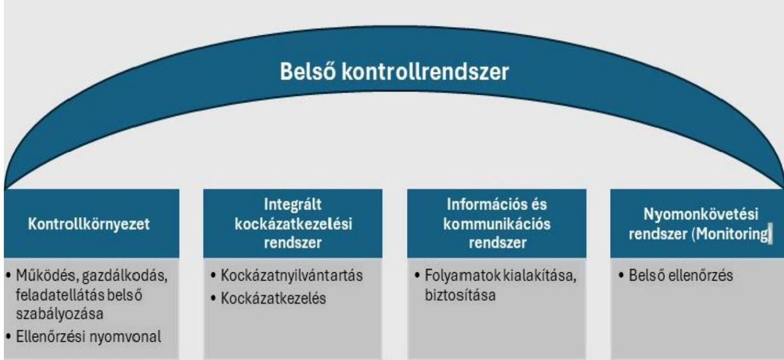
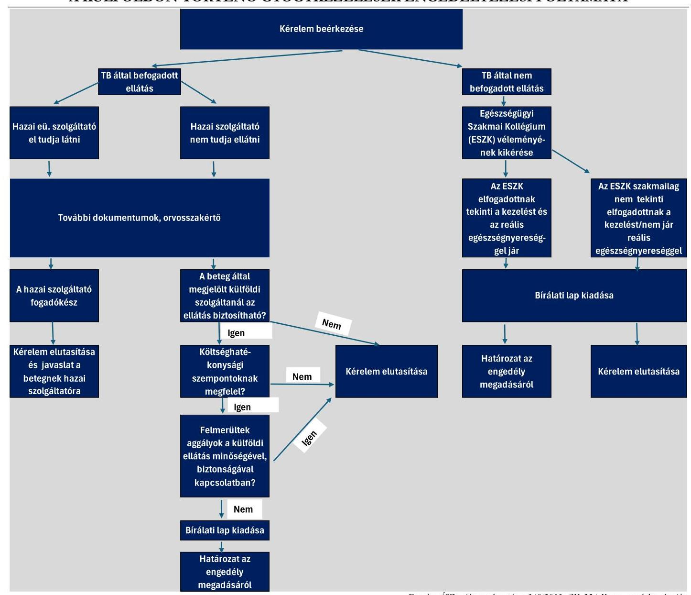
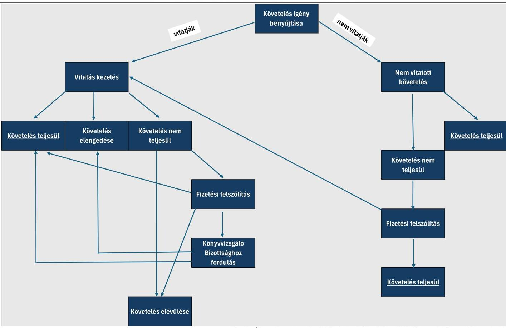
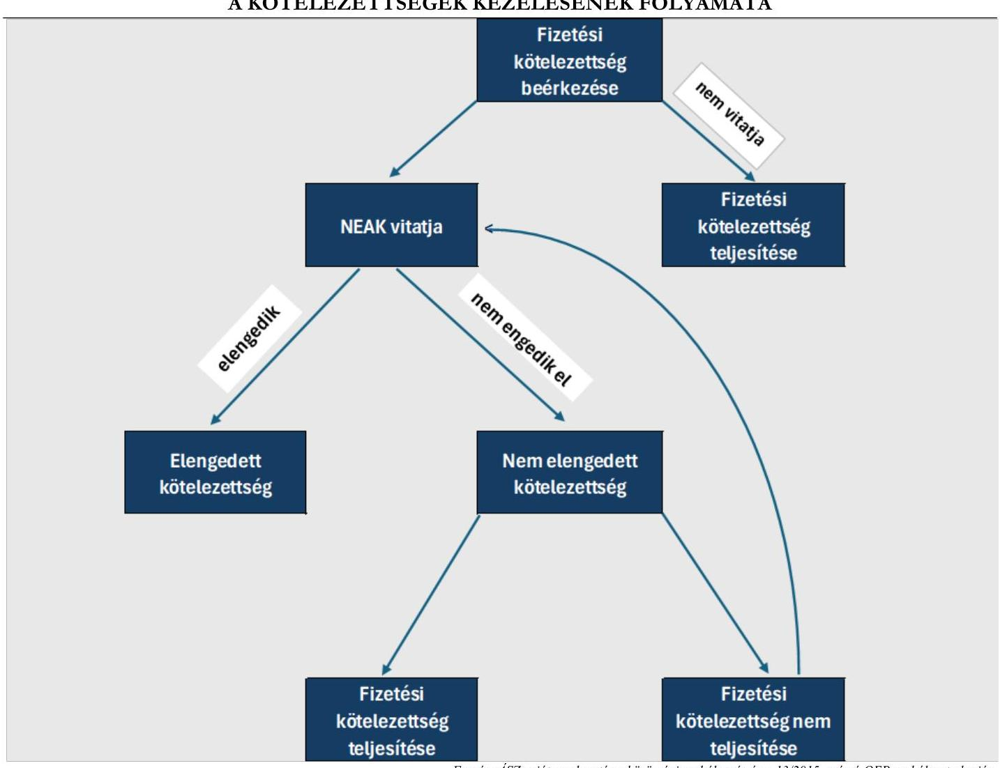
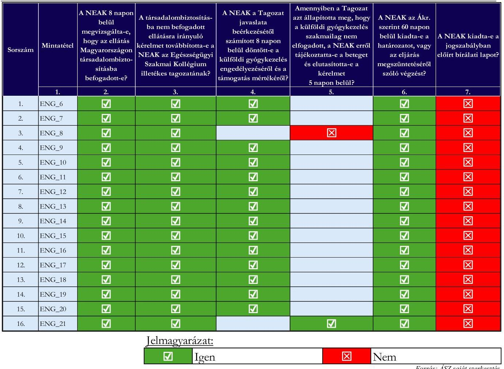
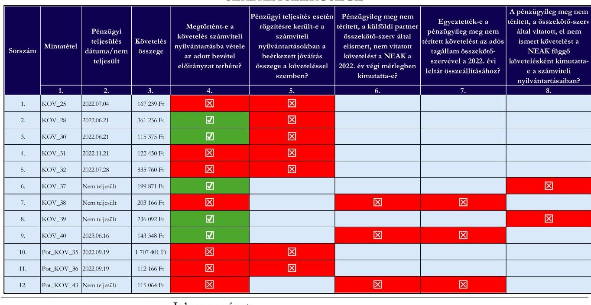
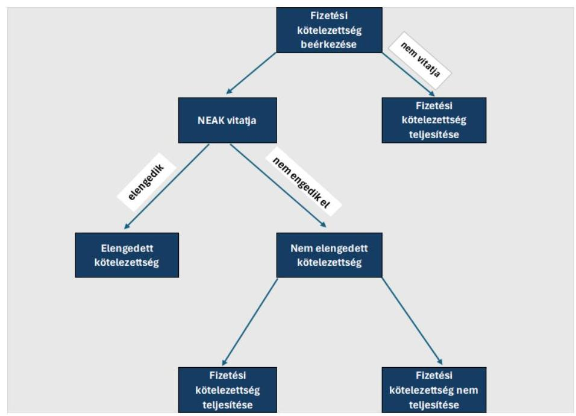

# JELENTÉS 

## Az egészségügyi ellátások nemzetközi elszámolásának ellenőrzése

2025.

---

# JELENTÉS 

## Az egészségügyi ellátások nemzetközi elszámolásának ellenőrzése

2025.

---

# ELLENŐRZÉSI IGAZGATÓSÁG: 

ÁLLAMHÁZTARTÁS KÖZPONTI SZINTJÉT ELLENŐRZŐ IGAZGATÓSÁG

## ELLENŐRZÉSI IGAZGATÓ:

SINKÁNÉ DR. CSENDES ÁGNES igazgató

## ELLENŐRZÉSVEZETŐ:

Jelentéseink az interneten a www.asz.hu címen olvashatók.

MOLNÁR ZSUZSANNA ellenőrzésvezető

IKTATÓSZÁM: EL-4156-001/2024.
TÉMASORSZÁM: 12/2023.
ELLENŐRZÉS-AZONOSÍTÓ SZÁM: V1011

---

# TARTALOMJEGYZÉK 

AZ ELLENŐRZÉS ALAPADATAI ..... 5
AZ ELLENŐRZÉS HATÓKÖRE ÉS TERÜLETE ..... 7
ÖSSZEFOGLALÁS ..... 11
AZ ELLENŐRZÉS FÓKUSZTERÜLETEI ..... 14
MEGÁLLAPÍTÁSOK ..... 15
JAVASLATOK ..... 49
MELLÉKLETEK ..... 52
I. sz. melléklet: Értelmező szótár ..... 52
II. sz. melléklet: Az ellenőrzött szervezetek jegyzéke ..... 53
III. sz. melléklet: Ellenőrzési kritériumok ..... 54
IV. sz. melléklet: a NEAK nemzetközi elszámolási feladatellátásához kapcsolódó Közbeszerzések ..... 57
FÜGGELÉK: ÉSZREVÉTELEK ..... 58
RÖVIDÍTÉSEK JEGYZÉKE ..... 79

---

.

---

# AZ ELLENŐRZÉS ALAPADATAI 

## AZ ELLENŐRZÉS CÉLJA

Az ellenőrzés célja annak értékelése volt, hogy a NEAK ${ }^{1}$ az előírásoknak megfelelően megtéríttette-e a külföldi biztosítókkal a külföldiek által - közösségi szabályozás ${ }^{2}$ alapján - a magyar közszolgáltatóknál igénybe vett egészségügyi ellátások költségeit, szabályszerűen folytatta-e le a magyar betegek tervezett külföldi gyógykezelésének engedélyezésével kapcsolatos eljárásokat, illetve, hogy a külföldi gyógykezelésre jogosult magyar betegek külföldön - közösségi szabályozás alapján - igénybe vett ellátása után járó költségeket megtérítette-e az előírásoknak megfelelően a biztosítóknak, megfelelő volt-e a NEAK-nál az egészségügyi ellátások költségeinek nemzetközi elszámolásához kapcsolódó működési, gazdálkodási keretek kialakítása és működtetése, az elszámoláshoz használt informatikai rendszer beszerzése, továbbá szabályszerű volt-e az egészségügyi ellátások nemzetközi elszámolásából eredő követelések és kötelezettségek bemutatása az E. Alap ${ }^{3}$ beszámolójának mérlegsoraiban.

## AZ ELLENŐRZÉS TÍPUSA

Megfelelőségi ellenőrzés

## AZ ELLENŐRZŐTT IDŐSZAK

A megtéríttetési feladatellátás tekintetében 2019-2022. évek, a vitatott, pénzügyileg nem teljesült követelések vonatkozásában a 2010. május 1-jétől kezdődő és 2023. június 19-ig tartó időszak. A külföldi gyógykezelés engedélyezésével kapcsolatos feladatellátás tekintetében a 2022. év. A megtérítési feladatellátás vonatkozásában a 2019-2022. évek. A működési keretek és a gazdálkodási keretek kialakítása és a működtetése tekintetében a 2019-2022. évek. Az egészségügyi ellátások nemzetközi elszámolásából eredő követelések és kötelezettségek nyilvántartását biztosító informatikai rendszer kialakítása tekintetében a 2018-2023. évek, a helyszíni ellenőrzés lezárásának 2024. február 27-ig tartó időpontjáig. Az E. Alap beszámolójának követelések és kötelezettségek mérlegsorai tekintetében a 2022. év.

## AZ ELLENŐRZÉS TÁRGYA

A NEAK-nak a külföldi betegek által magyar közszolgáltatóknál igénybe vett ellátások után elszámolt költségek megtérítésére, a magyar betegek tervezett külföldi gyógykezelésére irányuló NEAK engedélyezési eljárások lefolytatására és a magyar betegek által külföldön igénybe vett egészségügyi ellátások költségének megtérítésére vonatkozó feladatellátása. A feladatellátáshoz kapcsolódó működési és gazdálkodási keretek kialakítása, működtetése. Az egészségügyi ellátások nemzetközi elszámolásából eredő követelések és kötelezettségek nyilvántartását biztosító informatikai rendszer beszerzése. Az E. Alap beszámolójának követeléseket és kötelezettségeket tartalmazó mérlegsorainak ellenőrzése. Az ellenőrzés kiterjed minden olyan körülményre és adatra, amely az ÁSZ ${ }^{4}$ jogszabályban meghatározott feladatainak teljesítéséhez, valamint a program végrehajtása folyamán felmerült újabb összefüggések feltárásához szükséges volt.

---

# Az ellenőrzés jogalapját 

Az ellenőrzés jogalapját az ÁSZ tv. ${ }^{5} 1. §$ (3) bekezdésének, 5. § (2)-(3) bekezdéseinek, valamint az Áht. ${ }^{6} 61. §$ (2) bekezdésének előírásai képezték.

## AZ ELLENŐRZÉS MÓDSZERE

Az ellenőrzést az ÁSZ a nemzetközi standardokat irányadónak tekintve az ellenőrzési program szempontjai, az ellenőrzött időszakban hatályos jogszabályok, az ellenőrzés szakmai szabályok és az ÁSZ megfelelőségi ellenőrzési módszertana figyelembevételével végezte.

Az ellenőrzési kérdések megválaszolásához szükséges bizonyítékok megszerzése az ellenőrzött szervezet által rendelkezésre bocsátott dokumentumokra és adatokra alapozva, továbbá megfigyelés, szemle (szemrevételezés), kérdésfeltevés (információkérés), valamint elemző eljárás útján történt.

Az ÁSZ mintavételi eljárás alkalmazásával ellenőrizte a tervezett külföldi gyógykezelésekre irányuló NEAK engedélyezési eljárások lefolytatásának szabályszerűségét, valamint a közösségi szabályozás alapján igénybe vett egészségügyi ellátások költségeinek megtéríttetésére, illetve a külföldi biztosítóknak történő megtérítésére irányuló feladatellátás megfelelőségét. A tervezett külföldi gyógykezelésekre irányuló NEAK engedélyezési eljárások lefolytatásának szabályszerűségét 20 mintatételen, a külföldi betegek által közösségi szabályozás alapján magyar közszolgáltatónál igénybe vett egészségügyi ellátások költségeinek megtéríttetését 74 mintatételen, a magyar betegek ellátása után a külföldi biztosítókat megillető költségek megtérítésére irányuló feladatellátás megfelelőségét 35 mintatételen keresztül ellenőrizte az ÁSZ. A mintatételekkel kapcsolatban tett megállapítások nem kerültek kivetítésre a teljes feladatellátásra, azok kizárólag az ellenőrzött mintatételekre vonatkoznak.

Az ellenőrzési bizonyítékként felhasználható adatforrások közé tartoztak egyrészt az ellenőrzéshez kért dokumentumok, adatforrások, másrészt adatforrás volt még minden - az ellenőrzés folyamán - feltárt, az ellenőrzés szempontjából információkat tartalmazó dokumentum.

Az ellenőrzés lefolytatásához az ellenőrzött szervezet a tanúsítványok kitöltésével, valamint az ÁSZ által kért dokumentumok, adatok, információk megküldésével és az ellenőrzés során szolgáltatott adatokat.

---

# AZ ELLENŐRZÉS HATÓKÖRE ÉS TERÜLETE 

Az egészségbiztosítási szervekről szóló 386/2016. (XII. 2.) Korm. rendelet alapján a NEAK az E. Alap kezelésére kijelölt szervezet, amely, mint összekötő-szerv ${ }^{7}$ végrehajtja az európai uniós tagságból adódó, az európai közösségi rendeletek által előírt feladatokat, valamint a magyar állampolgárok külföldi gyógykezelésének engedélyezésével kapcsolatos feladatokat.

A NEAK egészségügyi ellátások nemzetközi elszámolásához kapcsolódó feladatellátása és a feladatellátáshoz kapcsolódó működési és gazdálkodási keretek ellenőrzésének hatóköre a közösségi szabályozás alapján történő nemzetközi ellátásokra terjedt ki.

A NEAK működési és gazdálkodási kereteinek ellenőrzése során az ÁSZ vizsgálta, hogy meghatározták-e a NEAK-nál a nemzetközi ellátáshoz kapcsolódó feladatellátás vonatkozásában a feladatellátás és pénzügyi gazdálkodás kereteit, ezen belül szabályozták-e a feladatellátás és pénzügyi gazdálkodás folyamatát, meghatározták-e a kapcsolódó határidőket, hatás-, és felelősségi köröket, feltárták-e a feladatellátáshoz, pénzügyi gazdálkodáshoz kapcsolódó kockázatokat, meghatározták-e a kockázatkezelés módját, kialakították-e az információs és kommunikációs folyamatokat, biztosították-e E. Alap beszámolójának követeléseket és kötelezettségeket tartalmazó mérlegsorainak leltárral való alátámasztottságát, gondoskodtak-e a feladatellátáshoz, pénzügyi gazdálkodáshoz kapcsolódó belső ellenőrzés működtetéséről. (1. ábra)
1. ábra

A NEAK NEMZETKÖZI ELSZÁMOLÁSOKKAL KAPCSOLATOS FELADATELLÁTÁSÁRA VONATKOZÓ MŰKÖDÉSI ÉS GAZDÁLKODÁSI KERETEK ELLENŐRZÖTT ELEMEI

Forrás: ÁSZ saját szerkesztés

---

A külföldi gyógykezelésre irányuló engedélyezési feladatellátás ellenőrzése a vonatkozó uniós rendeletek alapján, a határon átnyúló egészségügyi ellátás keretében és a méltányosságból történő külföldi gyógykezelés engedélyezésének ellenőrzésére terjedt ki. Az engedélyezési eljárás jogszabályban meghatározott folyamatát mutatja be a 2. ábra.
2. ábra

# A KÜLFÖLDÖN TÖRTÉNŐ GYÓGYKEZELÉSEK ENGEDÉLYEZÉSI FOLYAMATA 

Forrás: ÁSZ saját szerkesztés a 340/2013. (IX. 25.) Korm. rendelet alapján

---

A külföldi biztosítottak Magyarországon történt egészségügyi ellátásának költségmegtéríttetésére irányuló NEAK feladatellátáshoz kapcsolódó követeléskezelés folyamatát a 3. ábra mutatja be.
3. ábra

A KÖVETELÉSKEZELÉS FOLYAMATA

Forrás: ÁSZ saját szerkesztés a közösségi szabályozás és a 13/2015. számú OEP szabályzat alapján
A megtéríttetési feladatellátás ellenőrzése során a feladatellátás szabályszerűségén, megfelelőségén és a kapcsolódó nyilvántartások vezetésén túl, az ÁSZ értékelte a pénzügyileg határidőben nem rendezett tételek esetében tett intézkedések megfelelőségét is.

Az egészségügyi szolgáltatásra jogosult magyar betegek külföldön történt ellátásához kapcsolódó költség megtérítéshez kapcsolódó kötelezettségek kezelésének folyamatát a 4. ábra mutatja be.

A megtérítéssel kapcsolatos NEAK feladatellátás ellenőrzése a kiadások szabályszerű teljesítésének ellenőrzésén túl kiterjedt arra is, hogy tett-e intézkedéseket a NEAK a külföldi összekötő-szervek által benyújtott kötelezettségek vonatkozásában a visszaélésekkel kapcsolatos kockázatok feltárása és kezelése érdekében.

---

Forrás: ÁSZ saját szerkesztés a közösségi szabályozás és a 13/2015. számú OEP szabályzat alapján

---

# ÖSSZEFOGLALÁS 

Az ÁSZ törvényben deklarált célja, hogy ellenőrzési tapasztalatain alapuló megállapításaival, javaslataival segítse az ellenőrzött szervezetek munkáját a közpénzek és a nemzeti vagyon védelmének biztosítása érdekében. Az ÁSZ a közpénzekkel és a nemzeti vagyonnal való felelős gazdálkodás elősegítése érdekében az ÁSZ tv. alapján ellenőrizte a Nemzeti Egészségbiztosítási Alapkezelő működését.

A NEAK végzi az Egészségbiztosítási Alap kezelésével, az ehhez kapcsolódó nyilvántartások vezetésével, pénzügyi elszámolásokkal és adatszolgáltatással kapcsolatos feladatokat. Alapfeladatai közé tartozik a magyar betegek külföldi gyógykezelésével kapcsolatos engedélyezési eljárások lefolytatása, valamint az egészségügyi ellátások költségeinek nemzetközi elszámolása. A NEAK az E. Alapot, mint rábízott vagyont köteles felelős módon, a jogszabályi előírásoknak megfelelően kezelni.

A közösségi szabályozás, valamint a Brit együttműködési megállapodás értelmében az egészségügyi közszolgáltatásokra jogosult betegek jogosultak a külföldön történő ideiglenes tartózkodásuk alatt szükségessé vált egészségügyi ellátásokat egészségbiztosítójuk terhére igénybe venni. Továbbá, a biztosítás helye szerinti tagállamtól eltérő tagállamban lakóhellyel rendelkező betegek jogosultak az egészségügyi ellátásokat a lakóhelyükön igénybe venni a biztosítójuk által kiállított költség-átvállalást tanúsító igazolás birtokában. Az ellátások költségeit az országok összekötő-szervei a közösségi szabályozás alapján megtérítik egymásnak. A magyar összekötő-szerv a NEAK.

A NEAK az egészségügyi ellátások nemzetközi elszámolásával kapcsolatosan kialakított működési kereteit olyan hiányosságokkal alakította ki, amely nem biztosította a nemzetközi elszámolások szabályszerű teljesítését. A feladatellátás rendjét meghatározó 13/2015. számú OEP szabályzatát a közösségi szabályozásban 2020-ban - az elszámolások határidejére vonatkozóan - bekövetkezett változásokkal, valamint az EFORM rendszert 2020 novemberében felváltó HYDRA szakalkalmazás működésének figyelembevételével nem aktualizálta. Ellenőrzési nyomvonala nem tartalmazott minden működési folyamatot, kockázatnyilvántartása nem volt alkalmas a kockázatok feltárására. A NEAK főigazgatója az ÁSZ tv. 29. § (2) bekezdés szerinti, a jelentéstervezet megállapításaira tett észrevételében arról tájékoztatta az ÁSZ-t, hogy intézkedéseket kezdeményezett az ÁSZ ellenőrzés során felmerült hiányosságok megszüntetése érdekében. A NEAK-nak az egészségügyi ellátások nemzetközi elszámolásához kapcsolódó gazdálkodási keretei megfeleltek a jogszabályi előírásoknak.

A magyar betegek tervezett külföldi ellátása a NEAK által jogszabályban előírt eljárás lefolytatását követően kiadott előzetes engedélye alapján vehető igénybe az egészségbiztosítás terhére. A NEAK a magyar betegek tervezett külföldi gyógykezelésének engedélyezési feladatait nem a jogszabályi előírásoknak megfelelően látta el. A méltányosságból történő külföldi gyógykezelések engedélyezése során nem adta ki a kötelezően előírt bírálati lapokat. A külföldi egészségügyi ellátások uniós rendeletek alapján történő engedélyezési feladatellátása az elbírálással történő jelentős késedelembe esés, valamint a bírálati lap kiadásának és a költséghatékonysági szempontok vizsgálatának elmaradása miatt nem volt szabályszerű. A NEAK főigazgatója az ÁSZ tv. 29. § (2) bekezdés szerinti, a jelentéstervezet megállapításaira tett észrevételében arról tájékoztatta az ÁSZ-t, hogy intézkedéseket kezdeményezett az ÁSZ ellenőrzés során felmerült hiányosságok megszüntetése érdekében. Ezzel az ÁSZ megállapítása az ellenőrzés során hasznosult. A határon átnyúló egészségügyi ellátás keretében történő engedélyezési feladatát a NEAK a vizsgált esetben szabályszerűen végezte.

---

Az egészségügyi ellátások költségeinek nemzetközi elszámolásához a NEAK informatikai rendszert használt. A NEAK szakfőosztálya által az elszámolásához használt EFORM rendszert 2020. novemberétől a HYDRA rendszer váltotta fel, amelyet a NEAK közbeszerzési eljárás keretében beszerzett külső erőforrással, illetve belső munkatársai, szakértői útján fejlesztett le 154955808 Ft szerződéses díjért. A HYDRA szakalkalmazás azonban nem biztosította a NEAK számára az egészségügyi ellátások elszámolása során keletkezett követelésekkel és kötelezettségekkel kapcsolatos adatok riportolásának, nyomon követésének lehetőségét az elszámolások eredményes és szabályszerű végrehajtásához és nem támogatta az E. Alapról a jogszabályban előírtak szerinti, megbízható- és valós összképet mutató költségvetési beszámoló elkészítését. A HYDRA nem biztosította továbbá a külföldön igénybe vett egészségügyi ellátások valós költségének NEAK általi szabályszerű megtérítése érdekében a túlfizetések utólagos kezelésének lehetőségét. A NEAK főigazgatója az ÁSZ tv. 29. § (2) bekezdés szerinti, a jelentéstervezet megállapításaira tett észrevételében arról tájékoztatta az ÁSZ-t, hogy
 intézkedéseket kezdeményezett az ÁSZ ellenőrzés során felmerült hiányosságok megszüntetése érdekében.

A NEAK az EESSI fejlesztésére irányuló projekt Projekt Irányító Bizottságának döntése alapján az ismert súlyos hibák ellenére a lefejlesztett rendszert 2019. június 28-án átvette azzal, hogy rögzítésre került, hogy az addig jelzett és fennálló hiányosságokat a vállalkozó 2019. szeptember 30-ig javítja és részére átadja. A vállalkozó a fejlesztési hiányosságokat az ellenőrzés lezárásáig nem pótolta.
A NEAK - a követelések és kötelezettségek nyilvántartásának informatikai rendszer általi támogatása hiányában - a megtéríttetési és megtérítési feladat ellátásához szükséges nyilvántartásokat egyéb módon nem alakította ki.

A NEAK 2023. november 24-én élt újabb megrendeléssel, melynek során bruttó 11 798 675 Ft-ért rendelte meg az EU-s pénzügyi kimutatások és a NEAK negyedéves, éves pénzügyi feladások elkészítését lehetővé tévő funkciók fejlesztését a HYDRA szakalkalmazásban. A fejlesztésről történt mennyiségi átvétellel történő meggyőződés után a NEAK a teljesítést a szoftver működésének funkcionális tesztelése nélkül 2023. december 5-én leigazolta, majd 2023. december 14-én kifizette. A szoftver minőségi tesztelését és élesítését a NEAK az ellenőrzési időszak utánra tervezte, az esetleges felmerülő hibák javítását pedig garancia keretében kívánta érvényesíteni a szállító felé.

A külföldi biztosítottak magyar egészségügyi közszolgáltatóknál igénybe vett egészségügyi ellátásához kapcsolódó követelések nyilvántartásának hiányában nem álltak a NEAK rendelkezésére azon információk, melyek az E. Alapból megelőlegezett és a külföldi biztosítókat terhelő költségek teljes körű megtéríttetéséhez lettek volna szükségesek. Ez hatással volt a központi költségvetés bevételi előirányzatának teljesülésére.
A NEAK nem tett meg minden szükséges intézkedést a követelések megtérülése érdekében, továbbá nem élt az uniós jogszabályban biztosított késedelmi kamat felszámításának lehetőségével.

A magyar betegek által külföldön igénybe vett egészségügyi szolgáltatások kapcsán felmerült költségek külföldi összekötő-szervek számára történő megtérítésével kapcsolatos feladatait a NEAK nem látta el szabályszerűen. Az ellenőrzési időszak végéig lejárt határidejű fizetési kötelezettségek vonatkozásában fizetési kötelezettségek teljesítésének elmaradása, késedelmes teljesítése, továbbá a külföldi összekötőszerv által a kifizetést megelőzően csökkentett megtérítési igények esetében szabálytalan teljesítésigazolói jogkörgyakorlás miatt 2 117 052 Ft túlfizetést tárt fel az ellenőrzés. További - a külföldi összekötő-szerv által a kifizetést követően csökkentett összegű - megtérítési igényekre a NEAK 2 754 001 Ft-tal fizetett ki többet a tényleges igénynél. A feltárt túlfizetésekkel kapcsolatos, összesen 4 754 001 Ft értékű visszatérítési

---

igényét a NEAK a HYDRA rendszer hiányzó funkciója miatt nem érvényesítette a külföldi összekötőszervek felé.
2021. III. negyedévétől kezdődően a NEAK számviteli nyilvántartásaiban nem történt meg a jogszabályi előírás ellenére az egészségügyi ellátások költségeinek nemzetközi elszámolásához kapcsolódó követelések és kötelezettségek számviteli nyilvántartásba vétele, a beérkezett jóváírások nem kerültek rögzítésre a követelésekkel szemben, a kifizetések a kötelezettségekkel szemben. A NEAK az E. Alap 2022. év végi mérlegében a követelések és kötelezettségek állományában, továbbá a költségvetési évben esedékes és a költségvetési évet követően esedékes követelések és kötelezettségek mérlegsoron az egészségügyi ellátások költségeinek nemzetközi elszámolásához kapcsolódóan, számviteli nyilvántartás hiányában nem a valós összegeket mutatta ki. A NEAK ezzel megsértette a Számv. tv.-ben ${ }^{8}$ meghatározott valódiság és teljesség elvét.

A NEAK főigazgatója az ÁSZ tv. 29. § (2) bekezdés szerinti, a jelentéstervezet megállapításaira tett észrevételében arról tájékoztatta az ÁSZ-t, hogy intézkedéseket kezdeményezett az ÁSZ ellenőrzés során felmerült hiányosságok megszüntetése érdekében.

A feltárt hiányosságok alapján az egészségügyi ellátások nemzetközi elszámolása során a NEAK-nál a közpénzekkel való felelős gazdálkodás nem volt biztosított. Az egészségügyi ellátások nemzetközi elszámolására vonatkozó feladatellátás érdekében beszerzett szoftver fejlesztési díját az E. Alap kezelője kifizette annak ellenére, hogy az nem biztosította a szabályszerű feladatellátás és a közpénzekkel való elszámolás feltételeit. A szoftver működéséből eredő hiányosságokat egyéb módon a NEAK nem pótolta, ebből adódóan az egészségügyi ellátások nemzetközi elszámolásával érintett közpénzek kezelése és a közpénzekkel való elszámolás az új szoftver alkalmazását követően nem a jogszabályban foglaltaknak megfelelően történt. Ebből eredően az E. Alap 2022. évi éves költségvetési beszámolójának mérlegében az egészségügyi ellátások nemzetközi elszámolásával kapcsolatos adatok valódisága nem volt biztosított.

---

# AZ ELLENŐRZÉS FÓKUSZTERÜLETEI 

1.     - A külföldi betegek által magyar közszolgáltatóknál igénybe vett ellátások után elszámolt költségek megtéríttetésével és a magyar betegek által külföldön igénybe vett egészségügyi ellátások megtérítésével kapcsolatos NEAK működési és gazdálkodási keretek kialakítása.
2.     - A NEAK-nak a magyar betegek tervezett külföldi gyógykezelésének engedélyezésével kapcsolatos feladatellátása.
3.     - A NEAK-nak a külföldi betegek által magyarországi közszolgáltatóknál közösségi szabályozás alapján igénybe vett egészségügyi ellátások költségére irányuló megtéríttetési feladatellátása.
4.     - A NEAK-nak az egészségügyi ellátásra jogosult magyar betegek által közösségi szabályozás alapján külföldön igénybe vett egészségügyi ellátások költségei megtérítésére vonatkozó feladatellátása.
5.     - A NEAK által az egészségügyi ellátások nemzetközi elszámolására használt informatikai szakalkalmazás beszerzése.

---

# MEGÁLLAPÍTÁSOK 

## 1. A külföldi betegek által magyar közszolgáltatóknál igénybe vett ellátások után elszámolt költségek megtéríttetésével és a magyar betegek által külföldön igénybe vett egészségügyi ellátások megtérítésével kapcsolatos NEAK működési és gazdálkodási keretek kialakítása.

Összegző megállapítás

1.1.számú megállapítás

A NEAK külföldi betegek által magyar közszolgáltatóknál igénybe vett ellátások után elszámolt költségek megtéríttetésével és a magyar betegek által külföldön igénybe vett egészségügyi ellátások megtérítésével kapcsolatos működési kereteit olyan hiányosságokkal alakította ki, amely nem biztosította a nemzetközi elszámolások szabályszerű teljesítését, ugyanakkor a gazdálkodási keretek kialakítása szabályszerű volt.
A NEAK nem alakította ki az egészségügyi ellátások nemzetközi elszámolásával kapcsolatosan a szabályszerű feladatellátáshoz szükséges működési kereteket. A nemzetközi elszámolásra vonatkozó 13/2015. számú OEP szabályzatát nem aktualizálta, ellenőrzési nyomvonala nem tartalmazott minden működési folyamatot, kockázatnyilvántartása nem volt alkalmas a kockázatok feltárására.

## Kontrollkörnyezet - Belső szabályozás

A NEAK rendelkezett SZMSZ-szel ${ }^{9}$, amely az Ávr. ${ }^{10}$ előírásainak megfelelően tartalmazta - többek között az egészségügyi ellátások nemzetközi elszámolásával kapcsolatosan - az ellátandó, és a kormányzati funkció szerint besorolt alaptevékenységek megjelölését, a szervezet felépítését, a szervezeti ábrát, a szervezet működési rendjét, a szervezeti egységek megnevezését, a hozzájuk rendelt feladat- és hatásköröket. Az SZMSZ tartalmazta a NEAK vezetésére vonatkozó, valamint a szervezeti egységekhez rendelt hatáskörök gyakorlásának módját, a helyettesítés rendjét, és a kapcsolódó felelősségi szabályokat. Az SZMSZ az Ávr. előírásának megfelelően tartalmazta a munkáltatói jogkörök gyakorlásának rendjét.
Az egészségügyi ellátások nemzetközi elszámolását végző NKJNYF ${ }^{11}$ feladatellátásának részletes belső rendjére és módjára vonatkozó szabályokat az Áht.-ban foglaltak alapján az NKJNYF ügyrendje ${ }^{12}$ tartalmazta.
A nemzetközi ügyek végrehajtására vonatkozó eljárásrendet a 30/2014. számú OEP szabályzatban ${ }^{13}$ határozták meg. A nemzetközi költségelszámolási ügyekben alkalmazandó eljárásrendet a 13/2015. számú OEP szabályzat ${ }^{14}$ tartalmazta.
Az SZMSZ és a 13/2015. számú OEP szabályzat szerint a tagállamok közötti kapcsolattartásra kijelölt összekötő-szerv Magyarországon az egészségbiztosítási ellátások vonatkozásában a NEAK szervezetén

---

belül működő NKJNYF. Az elszámolásokkal kapcsolatos kifizetések kötelezettjei és kedvezményezettjei az adott ország összekötő-szervei. Mindkét belső szabályzat az EFORM ${ }^{15}$ rendszer működésére alapozva szabályozta a nemzetközi ügyekben, illetve a nemzetközi elszámolás során alkalmazandó eljárásokat. A NEAK 2020. novemberében új informatikai szakalkalmazást vezetett be a nemzetközi ügyek, illetve nemzetközi elszámolások vonatkozásában. A hatályban lévő 13/2015. számú OEP szabályzatot nem aktualizálták a bevezetett HYDRA szakalkalmazásra vonatkozóan, ezáltal a költségvetési szerv vezetője nem tett eleget a Bkr. 6. § (2) bekezdésében előírtaknak, mert nem adott ki olyan szabályzatot, amely biztosította volna az egészségügyi ellátások nemzetközi elszámolása során a rendelkezésre álló források átlátható, szabályszerű, szabályozott, gazdaságos, hatékony és eredményes felhasználását.
A 378/2016. (XII.2.) Korm. rendelet ${ }^{16}$ 14. § (1) bekezdésében foglaltak alapján 2017. január 1-jétől az $\mathrm{OEP}^{17}$ elnevezésében bekövetkezett névváltozás - az Ávr. 13. § (4a) bekezdés előírása ellenére - nem került átvezetésre a nemzetközi ügyek végrehajtására vonatkozó 30/2014. számú OEP szabályzaton és az egészségügyi ellátások nemzetközi elszámolására vonatkozó 13/2015. számú OEP szabályzaton.
A közösségi szabályozásban bekövetkezett változásokat a NEAK a 13/2015. számú OEP szabályzatában nem vezette át, mert

- a szabályzat nem tartalmazta a szabályzat kiadását követően megjelent H9 számú ${ }^{18}$ és H11 számú ${ }^{19}$ határozatokban előírtakat. A szabályzat aktualizálásának elmaradásából eredően a NEAK hatályban lévő szabályzatának I. 5. pontjában meghatározott határidők a követelés benyújtására, a vitatás megküldésére, a vitatott bizonylatok jogosságának igazolására és a követelések kiegyenlítésére vonatkozóan nem követték a Covid-19 okozta világjárvány miatti hat hónapos meghosszabbítást;
- nem került kiegészítésre a szabályzatnak a 3. Vonatkozó jogszabályok jegyzéke az S11 számú ${ }^{20}$ a H9 számú, a H11 számú határozatokkal és az Egyesült Királyság Európai Unióból történt kilépését követően létrejött Brit együttműködési megállapodással.
- Továbbá, nem aktualizálta a NEAK a belső szabályzatot a 2017. július 7-től hatályba lépett SZMSZ alapján, mert a szabályzat II.3.1.4. pontjában, II.6.2. pontjában, valamint II.6.8. pontjában nem az SZMSZ-ben nevesített Ellátás Gazdálkodási Főosztály, hanem az Ellátási Pénzügyi és Számviteli Főosztály szerepelt, mint nemzetközi elszámolási feladatokkal érintett szervezeti egység.
A NEAK főigazgatója az ÁSZ tv. 29. § (2) bekezdés szerinti, a jelentéstervezet megállapításaira tett észrevételében arról tájékoztatta az ÁSZ-t, hogy a hivatkozott szabályzatok aktualizálása folyamatban van. Az irányadó szabályozás(ok) módosítására az ÁSZ-vizsgálat javaslatainak és megállapításainak figyelembevételével kerül sor.

# Kontrollkörnyezet - Ellenőrzési nyomvonal 

A NEAK vezetője Belső Kontroll Kézikönyvben ${ }^{21}$ írta elő az egyes szervezeti egységek vezetői számára, hogy kötelesek a szervezet valamennyi folyamatára az ellenőrzési nyomvonalat és kapcsolódó mellékleteit (folyamatleltárt, jogszabályi alapokat, rövidítések jegyzékét) a Bkr.-ben ${ }^{22}$ előírtak alapján elkészíteni, illetve szükség szerint, de legalább évenként felülvizsgálni, aktualizálni.
Az ellenőrzési nyomvonalak és mellékleteik aktualizálását a Bkr. előírásának megfelelően rendszeresen elvégezték. A NEAK ellenőrzési nyomvonalai - a Bkr. 6. § (3) bekezdésben és a Belső Kontroll Kézikönyv I. fejezet 4.2 pontjában foglaltak ellenére - nem tartalmazták az NKJNYF működési folyamatait teljeskörűen, mert az NKJNYF ellenőrzési nyomvonalai ${ }^{23}$ nem tartalmazták a nemzetközi költség-

---

elszámolással kapcsolatos követelések teljesülésének nyomon követését a lejárt határidejű követelések érvényesítése, behajtása érdekében, továbbá a Végrehajtási rendelet ${ }^{24}$ 69. cikk (1) bekezdésében előírt Könyvvizsgáló Bizottság ${ }^{25}$ felé történő éves adatszolgáltatás teljesítését.
A költségvetési szerv vezetője az NKJNYF ellenőrzési nyomvonalai tekintetében nem gondoskodott a Bkr. 6. § (3) bekezdés szerinti ellenőrzési nyomvonalak elkészítéséről és aktualizálásáról, mert az NKJNYF ellenőrzési nyomvonalai az ellenőrzött időszakban nem voltak alkalmasak az egészségügyi ellátások költségeinek nemzetközi elszámolásával kapcsolatos hiányzó működési folyamatok vonatkozásában a felelősségi és információs szinteknek, kapcsolatoknak, irányítási és ellenőrzési folyamatoknak a nyomon követésére és utólagos ellenőrzésére.
A NEAK főigazgatója az ÁSZ tv. 29. § (2) bekezdés szerinti, a jelentéstervezet megállapításaira tett észrevételében arról tájékoztatta az ÁSZ-t, hogy az ellenőrzési nyomvonalak kiegészültek a nemzetközi elszámolásra vonatkozó eljárás további részfolyamataival. Ugyanakkor a NKJNYF 2024. október 3-án módosított és az
 észrevételezés keretében megküldött ellenőrzési nyomvonalában „A nyomtatványok ügyintézése összhangban a NEAK/OEP szabályzatban rögzítettekkel, minden előírt nyomtatvány berögzítése az HYDRA rendszerbe" folyamat leírás továbbra is a 13/2015. számú OEP Szabályzat előírásainak alkalmazását írja elő, annak ellenére, hogy a nemzetközi költségelszámolási ügyekben alkalmazandó, aktualizálásra szoruló belső szabályzat frissítésének megtörténtét a NEAK nem igazolta. Továbbá, nem tartalmazza a megküldött ellenőrzési nyomvonal a Végrehajtási rendelet 69. cikk (1) bekezdésében előírt Könyvvizsgáló Bizottság felé történő éves adatszolgáltatás teljesítését.
A költségvetési szerv vezetője - a Bkr. 6. § (1) bekezdés a) pontjában és (2) bekezdésében foglaltak ellenére - nem gondoskodott olyan kontrollkörnyezet kialakításáról, amelyben a folyamatok átláthatóak, továbbá nem adott ki olyan szabályzatokat, amelyek biztosítják a rendelkezésre álló források szabályszerű és szabályozott felhasználását.

# Integrált kockázatkezelési rendszer 

A NEAK a Bkr. előírásával összhangban a Belső Kontroll Kézikönyvben ${ }_{1-2}$ határozta meg az ellenőrzött időszakban az integrált kockázatkezelés eljárásrendjét. A Belső Kontroll Kézikönyvben ${ }_{1-2}$ meghatározottak szerint a főosztály feladatkörébe tartozó folyamatokért általános felelősséget viselő főosztályvezetők az általuk felügyelt, irányított működési folyamatok kockázatait 0-5-ig terjedő skálán értékelték.
A 2019-2020. közötti években a NEAK a Bkr. 7. § (2) bekezdése és a Belső Kontroll Kézikönyvben ${ }_{1}$ foglaltak alapján felmérte és megállapította a költségvetési szerv tevékenységében rejlő és szervezeti célokkal összefüggő kockázatokat, továbbá meghatározta az egyes kockázatokkal kapcsolatban szükségesnek tartott intézkedéseket, valamint azok végrehajtása folyamatos nyomon követésének módját. A NEAK az egészségügyi ellátások nemzetközi elszámolását érintő feladatellátáshoz kapcsolódóan nem tárt fel magas kockázatú folyamatot.
A 2021. évi és 2022. évi kockázatok feltárása során az NKJNYF, az $\mathrm{IFF}^{26}$ és az EGF vezetője nem értékelte megfelelően minden általa irányított, felügyelt folyamat kockázatát, mert a folyamatokhoz a Belső Kontroll Kézikönyv ${ }_{1-2}$ II. 3.1. pontjában foglaltak ellenére nem a megfelelő kockázati értékeket rendelte.
A NEAK főigazgatója az ÁSZ tv. 29. § (2) bekezdés szerinti, a jelentéstervezet megállapításaira tett észrevételében arról tájékoztatta az ÁSZ-t, hogy az ellenőrzési nyomvonal kiegészítésével összefüggésben a kockázat-nyilvántartás is módosításra került, mely főigazgatói jóváhagyás alatt van. A NEAK által az

---

észrevételezés keretében megküldött NKJNYF módosított kockázatnyilvántartás jóváhagyást követően tekinthető érvényesnek.
A NEAK 2021. évi és 2022. évi kockázatnyilvántartása ${ }^{27}$ 3-4 szerint az NKJNYF

- a „2. Külföldi gyógykezeléssel és nemzetközi költségelszámolásokkal összefüggő feladatok" alá tartozó, „c) A nemzetközi egyezmények, illetve közösségi rendeletek keretében nyújtott ellátások térítési dijának elszámolása a külföldi biztosítók, illetőleg a belföldi szolgáltatók felé; a közösségi rendeletek szerinti átalány-elszámolások kidolgozása és végrehajtása," folyamattal kapcsolatos kockázatokat alacsony kockázatúnak értékelte annak ellenére, hogy az egészségügyi ellátások elszámolására 2020. novemberétől használt HYDRA nevű szakalkalmazással nem tudták nyomon követni a nemzetközi elszámolások során keletkezett követelések és kötelezettségek állományának alakulását és nem tudták végrehajtani a szakmai feladatellátásra vonatkozó 13/2015. számú OEP szabályzatnak az „5.2. Értesítés közelgő fizetési határidőről" pontjában az „5.3. Fizetési felszólítás" pontjában előírt feladatokat és a 6.4. pontban a harmadik negyedév végén fennálló követelés állománynak a partner összekötő-szervvel való egyeztetésére vonatkozóan meghatározott feladatokat.
- a Nyilvántartási operatív feladatok alá tartozó, „a nyilvántartások folyamatos monitorozása, elemzése, vezetési információs jelentések készítése" folyamattal kapcsolatos kockázatokat a kockázatnyilvántartás szerint ${ }_{3-4}$ közepes kockázatúnak értékelte annak ellenére, hogy az egészségügyi ellátások elszámolására 2020. novemberétől használt HYDRA nevű szakalkalmazással nem tudták nyomon követni a nemzetközi elszámolások során keletkezett követelések és kötelezettségek állományának alakulását, ezáltal a 13/2015. számú OEP szabályzat II.6.2. pontjában foglaltak ellenére nem tudtak adatot szolgáltatni az EGF ${ }^{28}$ felé az azokban bekövetkezett változásokról.
A NEAK 2021. évi és 2022. évi kockázatnyilvántartása ${ }_{3-4}$ szerint az IFF,
- a „7. Felelős a NEAK egyedi fejlesztésű alkalmazások tesztmenedzsment feladatainak ellátásáért, az érintett szakfőosztályok bevonásával." folyamattal kapcsolatos kockázatot alacsony kockázatúnak értékelte annak ellenére, hogy
- az egészségügyi ellátások elszámolására 2020. novemberétől használt HYDRA nevű szakalkalmazással a szakfőosztály nem tudta nyomon követni a nemzetközi elszámolások során keletkezett követelések és kötelezettségek állományának alakulását és
- a 13/2015. számú OEP szabályzat II.6.2. pontjában foglaltak ellenére nem tudott arról adatot szolgáltatni az EGF-nek,
- továbbá a HYDRA szakalkalmazás - a fejlesztésére vonatkozóan meghatározott követelmények ellenére - nem támogatta teljeskörűen az NKJNYF egészségügyi szolgáltatások költségének külföldi összekötő-szervekkel történő megtéríttetésével kapcsolatos feladatellátását.
A NEAK 2021. évi és 2022. évi kockázatnyilvántartása ${ }_{3-4}$ szerint az EGF
- „Az analitikus nyilvántartásokat vezető szakfőosztályok könyvelési feladatainak egyeztetése, eltérés okának kiderítése, könyvelése", a „Követelés, kötelezettség állomány-változás könyvelése, követelés, illetve kötelezettség jellegű sajátos elszámolások rendezése, könyvelése" és
- a Belső Kontroll Kézikönyv ${ }_{2}$-ben a NEAK tevékenységére ható „A számviteli folyamatokkal kapcsolatos kockázatok" csoportba tartozó kockázatos folyamatok közül „Az E. Alap éves beszámolójának elkészítése, a kapcsolódó egyeztetések elvégzése, leltározás irányítása, mérlegsorok alátámasztása részletes kimutatásokkal" folyamatai az ellenőrzött időszakban alacsony összesített kockázatú

---

folyamatként kerültek beazonosításra, annak ellenére, hogy 2021. III. negyedévétől kezdődően az EGF a 13/2015. számú OEP szabályzat II.6.2. pontjában foglaltak ellenére nem kapott adatot a NKJNYF-től a követelés és a kötelezettség állomány-változás könyveléséhez, illetve az E. Alap éves költségvetési beszámolójának elkészítéséhez.
A kockázatértékelési folyamat végén a Belső Kontroll Kézikönyvben ${ }_{1.2}$ foglaltak szerint a NEAK belső működési folyamatainak kockázatkezelését végző AKF ${ }^{29}$ által kiválasztásra kerültek a kiemelten magas kockázati értékkel bíró tevékenységek, területek, melyek tekintetében a NEAK főigazgatója intézkedett.
Tekintettel a kockázati nyilvántartásban szereplő alacsony kockázati értékekre és a Belső Kontroll Kézikönyv ${ }_{1.2}$ II/7. pontjának azon előírására, mely szerint a kiemelten nagy kockázatú tevékenységek esetében intézkedik a főigazgató a terület, vagy tevékenység ellenőrzéséről, illetve beszámoltatásáról,

- a nemzetközi elszámolások során keletkezett követelések és kötelezettségek nyilvántartása vonatkozásában,
- a HYDRA rendszernek az érintett szakfőosztályok bevonásával történő tesztmenedzsment feladatainak ellátása vonatkozásában,
- valamint az E. Alap éves beszámolójának elkészítése, a kapcsolódó egyeztetések elvégzése és a mérlegsorok részletező kimutatásokkal történő alátámasztása vonatkozásában
a NEAK vezetője az integrált kockázatkezelési rendszer 2021-2022. évi működtetése során a Bkr. 7. § (2) bekezdésében előírtak ellenére nem határozta meg a kockázatokkal kapcsolatban szükséges intézkedéseket, valamint azok végrehajtása folyamatos nyomon követése módját.
A NEAK vezetője - a Bkr. 8. § (2) bekezdés d) pontjában foglaltak ellenére - 2021. és 2022. évben nem biztosította az E. Alap vonatkozásában a hatályos jogszabályoknak megfelelő könyvvezetést és beszámolást veszélyeztető kockázatok csökkentésére irányuló kontrollok kiépítését.
A NEAK által működtetett integrált kockázatkezelési rendszer - melynek során a kockázati tényezők azonosítása, értékelése, az azokra adott válaszreakciók révén csökkenthetőek a kockázatok hatásai, illetve megelőzhető a feltárt kockázatok tényleges bekövetkezése - az egészségügyi ellátások nemzetközi elszámolásához kapcsolódó NEAK feladatellátás vonatkozásában 2021-2022. években nem érte el a célját.

# Kontrollkörnyezet - Információs és kommunikációs rendszer 

A NEAK nemzetközi költség-elszámolási ügyekben a külföldi összekötő-szervekkel való kapcsolattartás szabályait a 13/2015. számú OEP szabályzatában határozta meg. A szabályzatban a közelgő fizetési határidőről szóló értesítések és a lejárt követelések fizetési felszólításainak kiküldését, valamint a partner összekötő-szervvel harmadik negyedév végén fennálló követelés állomány egyeztetések kiküldését a korábbi EFORM szakalkalmazásra szabályozták. Az új, 2020 novemberétől használt HYDRA szakalkalmazás bevezetését követően nem aktualizálták az információs és kommunikációs folyamatokat, a külföldi összekötő-szervekkel való kapcsolattartás szabályait.
A nemzetközi elszámolásokkal kapcsolatos követelések és kötelezettségek tekintetében a NEAK 2020. novemberétől - a Bkr. 9. § (1) bekezdésében előírtak ellenére - nem alakított ki és nem működtetett olyan információs és kommunikációs rendszert, amely biztosította volna, hogy a megfelelő információk a megfelelő időben eljussanak az illetékes szervezeti egységhez, mert az elszámoláshoz használt EFORM rendszert 2020 novemberében felváltó HYDRA rendszerrel nem tudták biztosítani az EGF-nek átadandó adatokat a nemzetközi elszámolásokkal

---

kapcsolatos követelések és kötelezettségek vonatkozásában. A NEAK ezáltal nem teljesítette a Bkr. 9. § (2) bekezdésében előírtakat, mely szerint az információs rendszerek keretében a beszámolási rendszereket úgy kell működtetni, hogy azok megbízhatóak, pontosak és összehasonlíthatóak legyenek. A NEAK vezetője nem tett eleget a Bkr. 3. § (d) pontjában foglaltaknak, mert nem gondoskodott a szervezet minden szintjén érvényesülő, megfelelő információs és kommunikációs rendszer kialakításáról, működtetéséről és fejlesztéséről.

# Kontrollkörnyezet - Nyomkövetési rendszer - Belső ellenőrzés 

A NEAK belső ellenőrzési feladatait a Bkr. 15. § (5) bekezdésében foglaltaknak megfelelően az EMMI és a NEAK között létrejött munkamegosztási megállapodás ${ }^{30}$ szerint a NEAK belső ellenőrzése látta el. A NEAK vezetője a Bkr.-ben foglaltaknak megfelelően biztosította a belső ellenőr feladatköri és szervezeti funkcionális függetlenségét.
A belső ellenőr bizonyosságot adó tevékenysége körében az egészségügyi ellátások költségei nemzetközi elszámolásának megfelelőségét, illetve az elszámoláshoz kapcsolódóan a beszámolók valódiságát a Bkr. 21. § (2) bekezdésében foglaltak alapján nem ellenőrizte 2019-2022. években.

## Vezetői nyilatkozat a belső kontrollrendszer minőségéről

A NEAK vezetője a Bkr. előírásainak megfelelően évente nyilatkozatban értékelte a költségvetési szerv belső kontrollrendszerének minőségét. A NEAK vezetőjének a 2021. és 2022. évek vonatkozásában tett Bkr. szerinti nyilatkozatában foglaltak nincsenek összhangban az ÁSZ jelen ellenőrzésének megállapításaival.
1.2. számú megállapítás

Az egészségügyi ellátások nemzetközi elszámolásával kapcsolatos gazdálkodási kereteit a NEAK a pénzkezelési szabályzat kivételével a jogszabályi előírásoknak megfelelően alakította ki.

A NEAK az Áht. és az Ávr. előírásainak megfelelően az egészségügyi ellátások nemzetközi elszámolásával kapcsolatos, gazdasági szervezetére vonatkozó feladatokat az EGF ügyrendjében ${ }_{1-2}$, az E. Alap ellátási szektor számviteli politikájában ${ }_{1-5}$ és a gazdálkodási jogköröket meghatározó belső szabályzatban ${ }_{1-5}$ határozta meg.
Az E. Alap ellátási szektor számviteli politikája ${ }_{1-5}$ az Áhsz. ${ }^{31}$ előírásának megfelelve tartalmazta az E. Alap ellátási szektor vonatkozásában az egységes számlakeret alapján készült számlarendet.
A NEAK rendelkezett a Számv. tv. ${ }^{32}$ és az Áhsz. előírásainak megfelelően az E. Alap ellátási szektor vonatkozásában az eszközök és források leltározási és leltárkészítési szabályzatával ${ }^{33}{ }_{1-3}$.
A NEAK elkészítette a Számv. tv. és az Áhsz. előírásainak megfelelően az E. Alap ellátási szektor vonatkozásában az eszközök és források értékelési szabályzatát ${ }^{34}{ }_{1-5}$, ami többek között tartalmazta a követelések értékelésének elveit és szempontjait.
A NEAK a Számv. tv., az Áhsz. előírásainak megfelelően az E.Alap ellátási szektor vonatkozásában rendelkezett pénzkezelési szabályzattal ${ }^{35}{ }_{1-2}$. A pénzkezelési szabályzatban ${ }_{1-2}$ meghatározta a Számv. tv. előírásainak megfelelően a pénzforgalom kincstári számlán történő lebonyolításának rendjét, valamint a pénzforgalommal kapcsolatos nyilvántartási szabályokat. A NEAK az Ávr. 13. § (4a) bekezdés előírása ellenére az irányítószerv vonatkozásában bekövetkezett változást a 182/2022. (V. 24.) Korm. rendelet hatálybalépését követő harminc napon belül pénzkezelési szabályzatán ${ }_{2}$ nem vezette át, mert a szabályzat hatálya nem a BM-re, hanem az EMMI Vagyongazdálkodási Főosztályára és az EMMI Egészségügyi

---

Finanszírozási és Rendszerfejlesztési Helyettes Államtitkárságára terjedt ki. A NEAK főigazgatója az ÁSZ tv. 29. § (2) bekezdés szerinti, a jelentéstervezet megállapításaira tett észrevételében
 arról tájékoztatta az ÁSZ-t, hogy az irányítószerv vonatkozásában bekövetkező változás átvezetése a 31/2023. számú 2023. december 6-tól hatályos szabályzatban megtörtént, ezzel az ÁSZ megállapítása hasznosult.
A NEAK az Áht. előírásának megfelelve rendelkezett az E. Alap ellátási szektorra vonatkozóan a gazdálkodási jogköröket meghatározó szabályzattal ${ }_{1-5}$. A gazdálkodási jogköröket meghatározó szabályzatban ${ }_{1-5}$ az Ávr.-ben előírtakkal összhangban meghatározásra kerültek az E. Alap vonatkozásában a gazdálkodási - így különösen a kötelezettségvállalás, pénzügyi ellenjegyzés, teljesítés igazolása, érvényesítés, utalványozás gyakorlásának módjával, eljárási és dokumentációs részletszabályaival, valamint az ezeket végző személyek kijelölésének rendjével - az ellenőrzési, adatszolgáltatási és beszámolási feladatok teljesítésével kapcsolatos szabályok, az EGF ügyrendjében ${ }_{1-2}$ pedig a tervezési, a finanszírozási, adatszolgáltatási és beszámolási feladatok teljesítésével kapcsolatos belső előírások. A NEAK az egészségügyi ellátások nemzetközi elszámolásának tekintetében gazdálkodási jogkör gyakorlására jogosult személyekről és aláírás-mintájukról az Ávr. előírásának megfelelően nyilvántartást vezetett.
1.3. számú megállapítás

A NEAK által kialakított működési keret nem biztosította a szabályszerű leltárral alátámasztott, a nyilvántartásokkal megegyező beszámoló elkészítését az egészségügyi ellátások nemzetközi elszámolásából eredő követelések és kötelezettségek tekintetében. A jogszabályi előírások szerint kialakított gazdálkodási kereteket nem tartották be.

A NEAK 2021. június 30-át követően nem rendelkezett a nemzetközi elszámolásokból eredő követelések és kötelezettségek vonatkozásában - az Áhsz. 39. § (3) és 45. § (3) bekezdéseiben foglaltak ellenére - részletező nyilvántartással.
Az E. Alap 2022. évi költségvetési beszámoló ${ }^{36}$ 12/A-Mérleg űrlapjának 71., 115., 188. és 214. soraiban kimutatott nemzetközi elszámolásokkal kapcsolatos éven belüli és éven túli követelések és kötelezettségek könyvelése és kimutatása során a NEAK megsértette a Számv. tv. 165. § (1) bekezdésében foglaltakat, mert a 2021. július 1. és 2022. december 31. közötti időszakra vonatkozóan nem könyvelte le a kibocsátott és a befogadott külföldi számlákat és a számlákhoz kapcsolódó pénzmozgásokat a követelésekkel és kötelezettségekkel szemben. A nemzetközi elszámolásokkal kapcsolatos éven belüli és éven túli követelések és kötelezettségek könyvelésének hiányában azok hatását az E. Alap 2022. évi éves beszámolójában nem mutatta ki, megsértve ezzel a Számv. tv. 15. § (2) bekezdésében foglalt teljesség elvét. Az E. Alap 2022. évi költségvetési beszámoló 12/A-Mérleg űrlapjának 71., 115., 188. és 214. soraiban kimutatott nemzetközi elszámolásokkal kapcsolódó éven belüli és éven túli követelések és kötelezettségek nem megalapozottak, ezért a beszámoló a Számv. tv. 4. § (2) bekezdésében foglaltak ellenére nem nyújt megbízható és valós összképet az egészségügyi ellátások költségeinek nemzetközi elszámolásához kapcsolódóan a gazdálkodó vagyonáról, annak összetételéről.
Az E. Alap 2022. évi éves költségvetési beszámolójának elkészítésekor a nemzetközi elszámolások során keletkezett függő követeléseknek a főkönyvi könyvelés és az analitikus nyilvántartások adatai közötti egyeztetését a Számv. tv. 69. § (2) bekezdésében, leltározását az Áhsz. 22. § (2) bekezdésében előírtak ellenére nem az üzleti év mérlegfordulónapjára vonatkozóan végezték el, hanem a 2021. év II. negyedév végére vonatkozóan. Ennek következtében az E. Alap 2022. évi költségvetési beszámolójában a 17/A Tájékoztató adatok űrlap 28. „Egyéb függő kötelezettségek állománya" soron kimutatott érték nem valós.

---

Az E. Alap 2022. évi költségvetési beszámolóját - az Áhsz. 5. § (1) bekezdésében foglaltak ellenére - a NEAK nem támasztotta alá a nemzetközi elszámolást érintő követelések és kötelezettségek vonatkozásában folyamatosan vezetett részletező nyilvántartásokkal, valamint a Számv.tv. 69. § (1) bekezdésében is előírt leltárral, mert a 2022. év végi leltározást nem a mérleg fordulónapjára vonatkozó nyilvántartások alapján végezte el, hanem a 2021. II. negyedéves analitikus nyilvántartás alapján. Az E. Alap 2022. évi költségvetési beszámolóját érintő hiba mértéke a részletező nyilvántartások, illetve a 2022. évi mérleg fordulónapjára elvégzett év végi leltár hiányában nem volt megállapítható.
A NEAK főigazgatója az ÁSZ tv. 29. § (2) bekezdés szerinti, a jelentéstervezet megállapításaira tett észrevételében kijelenthetőnek ítélte, hogy a nemzetközi elszámolásból eredő követelések és kötelezettségek tekintetében az E. Alap 2023. évi költségvetési beszámolója tekintetében már biztosított volt a szabályszerű, leltárral alátámasztott, az analitikus nyilvántartásokkal megegyező adatok megjelenítése a főkönyvi könyvelésben, ezáltal a 2023. évi beszámoló érintett - az egészségügyi ellátások költségeinek nemzetközi elszámolásához kapcsolódó - mérlegsora is megbízható és valós összképet mutatott. Észrevétele alátámasztásául megküldte a NKJNYF által 2024. május 9-én elkészített Számviteli Politikában előírt bizonylatokat a 2023. december 31-ei fordulónapra vonatkozóan.
A 2023. december 31-én fennálló tárgyévet terhelő és tárgyévet követő években esedékes követelések és kötelezettségek országonként összesített adatait tartalmazó kimutatások, főkönyvi kimutatások és leltárfelvételi jegyzőkönyvek - figyelemmel az ellenőrzés megállapításaira - nem támasztják alá az Egészségbiztosítási Alap 2023. évi költségvetési beszámolójának mérlegében az egészségügyi ellátások költségeinek nemzetközi elszámolásához kapcsolódó követelések és kötelezettségek megbízhatóságát, valódiságát.

# 2. A NEAK-nak a magyar betegek tervezett külföldi gyógykezelésének engedélyezésével kapcsolatos feladatellátása. 

Összegző megállapítás

A NEAK a magyar betegek tervezett külföldi gyógykezelésének uniós rendeletek alapján történő engedélyezésével kapcsolatos feladatait három vizsgált esetből két esetben nem szabályszerűen látta el. A határon átnyúló egészségügyi ellátás keretében történő engedélyezési feladatát a vizsgált egy esetben szabályszerűen végezte. A méltányosságból történő külföldi gyógykezelések engedélyezése során a NEAK az ellenőrzött 16 esetben nem szabályszerűen járt el.
2.1. számú megállapítás

A NEAK a magyar betegek tervezett, külföldi gyógykezelésének uniós rendeletek alapján történő engedélyezése során egy esetben jelentős késedelembe esett az elbírálással, további egy esetben pedig nem adta ki a 340/2013. (IX. 25.) Korm. rendeletben előírt bírálati lapot és nem vizsgált költséghatékonysági szempontokat.

A NEAK a külföldön történő gyógykezelések engedélyezésével kapcsolatos feladatait az Ákr. ${ }^{37}$ hatálya alá tartozó, kérelemre induló hatósági eljárás keretében végezte. A külföldi egészségügyi ellátásra irányuló, 340/2013. (IX. 25.) Korm. rendelet ${ }^{38}$ szerinti kérelmeket a jogszabályban foglaltak szerint a külföldi

---

gyógykezelésre jogosult személy, illetve törvényes képviselője, vagy az adott ellátásra beutalási jogosultsággal és finanszírozási szerződéssel rendelkező kezelőorvosa nyújtotta be a NEAK-hoz. Amennyiben a kérelem kitöltése nem volt megfelelő, vagy a kérelem elbírálásához további dokumentumra volt szükség, a NEAK a kérelmezőt az Ákr.-ben foglalt előírásoknak megfelelve hiánypótlásra szólította fel. A kérelmek alapján a NEAK az eljárásokat megindította és a kérelmezőket az Ákr.-ben foglaltaknak megfelelően tájékoztatta arról, hogy teljes eljárásban bírálja el a kérelmet, melynek lefolytatására az Ákr. szerint a kérelem beérkezéséről számítva 60 nap állt rendelkezésre. Az Ákr. szerint az ügyintézési határidőbe nem számít bele az eljárás felfüggesztésének, szünetelésének és az ügyfél mulasztásának vagy késedelmének időtartama, de beletartozik minden más, így az orvosszakértői vélemény elkészítésének ideje is. A NEAK a kérelmekben feltüntetett adatok felülvizsgálatára a 340/2013. (IX. 25.) Korm. rendelet alapján szakértőt vett igénybe.
Az uniós rendeletek alapján történő külföldi gyógykezelésre ${ }^{39}$ irányuló kérelmek vonatkozásában három engedélyezési eljárás lefolytatásának ellenőrzésére került sor.
A NEAK a 340/2013. (IX. 25.) Korm. rendeletben előírtak szerint a kérelem beérkezésétől számított 8 napon belül megvizsgálta, hogy az ellátás Magyarországon a társadalombiztosításba befogadott-e, a vizsgálat eredményét végzésben rögzítette.
A 2022. augusztus 8-án a NEAK-hoz benyújtott kérelem a NEAK által korábban engedélyezett külföldi gyógykezelés kontrollvizsgálatának engedélyezésére irányult, melynek kapcsán a NEAK a 340/2013. (IX. 25.) Korm. rendeletben és az Ákr.-ben meghatározott határidőben lefolytatta az engedélyezési eljárást. A külföldi gyógykezelés igénybevételéhez szükséges engedélyt a 340/2013. (IX. 25.) Korm. rendeletben foglaltaknak megfelelően az orvosszakmai vélemény alapján megadta. A NEAK az engedélyezésről nem adta ki a 340/2013. (IX. 25.) Korm. rendelet 5. § (5) bekezdésében előírt 3. melléklet szerinti bírálati lapot és a 340/2013. (IX. 25.) Korm. rendelet 5. § (4) bekezdésében foglaltak ellenére nem vizsgálta a bírálat során a költséghatékonysági szempontokat. (1. táblázat 1. sor)

---

1. táblázat

# A MAGYAR BETEGEK TERVEZETT KÜLFÖLDI GYÓGYKEZELÉSÉNEK UNIÓS RENDELETEK SZERINTI ELLÁTÁSOK ENGEDÉLYEZÉSÉVEL KAPCSOLATOS ELJÁRÁSOK SZABÁLYSZERÜSÉGE 

| Sorszám | Mintatétel | Megvizsgálta-e   15 napon belül   a NEAK hogy   a beteget   Magyarországon el tudja-e látni közfinanszirozott szolgáltató? | Amennyiben hazai szolgáltató el tudja látni a beteget, akkor a NEAK tett-e javaslatot hazai szolgáltatóra? | Uniós rendeletek szerinti engedélyezés esetén a NEAK kiadta-e a bírálati lapot, vizsgálta-e a beteg által megjelölt külföldi szolgáltatónál a költséghatékonysági szempontokat? | A NEAK   tájékozódott-e a hazai közfinanszírozott egészségügyi szolgáltató fogadókészségéről és a gyógykezelés lehetséges időpontjáról? | A NEAK az Ákr. tv. szerint 60 napon belül kiadta-e a határozatot, vagy az eljárás megszüntetéséről szóló végzést? |
| :--: | :--: | :--: | :--: | :--: | :--: | :--: |
|  | 1. | 2. | 3. | 4. | 5. | 6. |
| 1. | ENG_1 |  |  |  |  |  |
| 2. | ENG_2 |  |  |  |  |  |
| 3. | ENG_3 |  |  |  |  |  |

A 2022. május 30-án benyújtott külföldi gyógykezelésre irányuló kérelem esetében a NEAK a kérelem beérkezésétől számított 8 napon belül szabályszerűen megállapította, hogy az ellátás Magyarországon a társadalombiztosításba befogadott, azonban a 340/2013. (IX. 25.) Korm. rendelet 5. § (2) bekezdésben foglaltak ellenére nem vizsgálta meg 15 napon belül, hogy a beteget Magyarországon a kérelemben megjelölt orvosilag indokolt időn belül el tudja-e látni közfinanszírozott egészségügyi szolgáltató. A NEAK késedelembe esésének oka, hogy a NEAK által felkért orvosszakértő a 2022. június 7-én kiadott felkérésre - a szerződésében foglalt 21 nap helyett - 94 nap múlva, 2022. szeptember 9-én küldte meg válaszát. A szakértő válaszában a kérelmezett műtétet nem tartotta sürgetőnek, a diagnózist nem tartotta megalapozottnak, és a NEAK által feltett kérdések megválaszolása előtt - többek között, hogy mely hazai szolgáltató tudja elvégezni a kezelést - további MR/CT vizsgálatot kért.
A NEAK az Ákr. 50. § (2) bekezdés c) pontjában foglalt előírás ellenére nem tartotta be a 60 napos ügyintézési határidőt, mert 2022. október 24-ei végzésében értesítette a beteget arról, hogy a hiánypótlás elmaradását követően az eljárást megszüntette és az ügyintézési határidő túllépése miatt az Ákr. 51. § (1) bekezdés b) pontjában foglaltak alapján 10 ezer forintot fizet a beteg számára.
A NEAK főigazgatója az ÁSZ tv. 29. § (2) bekezdés szerinti, a jelentéstervezet megállapításaira tett észrevételében arról tájékoztatta az ÁSZ-t, hogy a NEAK javasolta a jogszabály módosítását. Ennek nyomán 2023. december 29. napjától a hatályos 340/2013. (IX. 25.) Korm. rendelet már tartalmazza a szakértői véleményre vonatkozó határidőnek a Tagozatra irányadó 15 nappal megegyező időtartamban történő megállapítását. Ezzel az ÁSZ megállapítása az ellenőrzés során hasznosult.
Az eljárás lezárása a késedelem miatti kifizetés szempontjából jogszerűen történt, azonban az eljárás során nem vették figyelembe a beteg tájékoztatáshoz fűződő jogait és érdekét, mert a beteg 82
 napos késedelemmel, 2022. október 24-én értesült a döntésről.

---

A beteg nem kapta meg az Ákr. által meghatározott időben a szükséges tájékoztatást, ezáltal sérült a betegnek, az Eü. tv. ${ }^{40} 5 . \S$ (3) bekezdés b) pontjában előírt, megfelelő tájékoztatáson alapuló egészségi állapotával kapcsolatos döntéshozatali lehetősége. (1. táblázat 2. sor)
A NEAK és az általa felkért orvosszakértő között 2019. november 7-én létrejött megbízási szerződésben megállapított 21 napos válaszadási határidő eredendően kockázatot hordozott a 340/2013. (IX. 25.) Korm. rendelet 5. § (2) bekezdésében meghatározott 15 napos határidő betartására nézve.
A 2022. október 5-én benyújtott kérelem vonatkozásában a NEAK a 340/2013. (IX. 25.) Korm. rendeletben meghatározott 8 napon belül megállapította, hogy az ellátás Magyarországon a társadalombiztosításba nem befogadott, mely véleményét az eljárás során az orvosszakmai vélemény alapján a „társadalombiztosításba befogadottra" módosította. Az orvos szakértői vélemény alapján a NEAK megállapította, hogy a gyógykezelést belföldi közfinanszírozott egészségügyi szolgáltató is el tudja látni, ezért a 340/2013. (IX. 25.) Korm. rendeletben előírtak szerint a NEAK határozatában a kérelmet elutasította és javaslatot tett hazai egészségügyi szolgáltatóra. A NEAK a 340/2013. (IX. 25.) Korm. rendeletben előírtak szerint előzetesen tájékozódott a hazai közfinanszírozott egészségügyi szolgáltató fogadókészségéről. A kérelmet a NEAK a 340/2013. (IX. 25.) Korm. rendeletben és az Ákr.-ben előírtaknak megfelelően bírálta el. A NEAK az eljárás lefolytatása végén az Ákr.-ben foglaltak szerint értesítette a kérelmezőt döntéséről. (1. táblázat 3. sor)
2.2. számú megállapítás

A NEAK a magyar betegek tervezett, külföldi gyógykezelésének határon átnyúló egészségügyi ellátás keretében történő engedélyezésével kapcsolatos feladatát a vizsgált esetben szabályszerűen látta el.

A határon átnyúló egészségügyi ellátás ${ }^{41}$ keretében történő külföldi gyógykezelésre irányuló kérelmek vonatkozásában egy engedélyezési eljárás ellenőrzésére került sor. A NEAK a hiánytalan kérelem rendelkezésre állását követően a 340/2013. (IX. 25.) Korm. rendeletben meghatározott 8 napon belül megállapította, hogy az ellátás Magyarországon a társadalombiztosításba nem befogadott. A NEAK a kérelmet a Tagozat véleménye és a 340/2013. (IX. 25.) Korm. rendeletben foglaltak alapján határozatában az Ákr. által meghatározott határidőn belül elutasította arra való hivatkozással, hogy a diagnosztizált betegségre ellátás orvosilag indokolt időn belül hazai közfinanszírozott egészségügyi szolgáltatónál biztosítható. Megállapította továbbá, hogy az eljárás alatt a beteg a külföldi ellátást a NEAK engedélye nélkül igénybe vette, ezért a külföldi gyógykezelés költségei a 340/2013. (IX. 25.) Korm. rendelet 13. § (1) bekezdésében előírtak szerint nem téríthetők meg. Az engedélyezési eljárás során a NEAK a 340/2013. (IX. 25.) Korm. rendeletben és az Ákr.-ben előírtak szerint járt el.
2.3. számú megállapítás

A NEAK a magyar betegek tervezett, méltányosságból történő külföldi gyógykezelésének engedélyezésével kapcsolatos feladatait nem szabályszerűen látta el, mivel az engedélyezés során nem adta ki a kötelezően előírt bírálati lapokat.

A méltányosságból történő külföldi gyógykezelésre ${ }^{42}$ irányuló kérelmek vonatkozásában 16 külföldi gyógykezelésre irányuló kérelem engedélyezésének ellenőrzésére került sor.
A NEAK a 340/2013. (IX. 25.) Korm. rendeletben előírtaknak megfelelve a méltányosságból történő külföldi gyógykezelés iránti kérelmek beérkezésétől számított 8 napon belül megállapította, hogy az igényelt gyógykezelés Magyarországon a társadalombiztosításba nem befogadott ellátás és ennek megjelölésével a kérelmet és az egészségügyi dokumentációt a 340/2013. (IX. 25.) Korm. rendeletben

---

előírtak szerint elektronikus úton továbbította az Egészségügyi Szakmai Kollégium ügyben illetékes tagozatának az ügy orvosszakmai megítélése érdekében. (2. táblázat 2-3. oszlopok)
A beteg nem kapta meg a jogszabály által meghatározott időben a szükséges tájékoztatást, ami az egészségi állapotával kapcsolatosan meghozandó döntéséhez szükséges, mert a NEAK a 2022. január 17-én benyújtott kérelmet nem a 340/2013. (IX. 25.) Korm. rendelet 9. $\S$ (4) bekezdésben előírt 5 napon belül utasította el arra hivatkozással, hogy a Tagozat ${ }^{43}$ véleménye szerint az ellátás szakmailag nem elfogadott, hanem a Tagozat véleményének beérkezésétől számított 10 nap múlva. (2. táblázat 5. oszlop, 3. sor)
2. táblázat

# A MAGYAR BETEGEK TERVEZETT KÜLFÖLDI GYÓGYKEZELÉSÉNEK MÉLTÁNYOSSÁGBÓL TÖRTÉNŐ ENGEDÉLYEZÉSÉVEL KAPCSOLATOS ELJÁRÁSOK SZABÁLYSZERÜSÉGE 

A NEAK a 340/2013. (IX. 25.) Korm. rendeletben előírtak szerint a Tagozat javaslatának beérkezésétől számított 8 napon belül döntött a külföldi gyógykezelés engedélyezéséről és a külföldi gyógykezelés finanszírozásának mértékéről, melyről az Ákr.-ben foglaltak szerint értesítette a kérelmezőt.
A külföldön történő gyógykezelések engedélyezése során a NEAK a 340/2013. (IX. 25.) Korm. rendelet 9. $\S$ (7) bekezdésében előírtak ellenére nem adta ki a 6. melléklet szerinti bírálati lapokat. A bírálati lapok egy dokumentumba rendszerezett adattartalma támogatja a 340/2013. (IX. 25.) Korm. rendelet 17. §-ában a NEAK számára a külföldi gyógykezelésekkel összefüggésben kötelezően előírt adatok gyűjtését.
A NEAK főigazgatója az ÁSZ tv. 29. § (2) bekezdés szerinti, a jelentéstervezet megállapításaira tett észrevételében arról tájékoztatta az ÁSZ-t, hogy a NEAK a 2025. év I. félévre vonatkozó jogalkotási tervbe felvette az érintett jogszabály módosítását.

---

# 3. A NEAK-nak a külföldi betegek által magyarországi közszolgáltatóknál közösségi szabályozás alapján igénybe vett egészségügyi ellátások költségére irányuló megtéríttetési feladatellátása. 

Összegző megállapítás A NEAK a külföldi betegek által magyarországi közszolgáltatóknál közösségi szabályozás alapján igénybe vett egészségügyi ellátások költségére irányuló megtéríttetési feladatellátása nem volt megfelelő. Az új informatikai szakalkalmazás bevezetését követően a jogszabály és a belső szabályzat előírása ellenére nem intézkedett az E. Alapot terhelő költségek megtéríttetéséhez szükséges nyilvántartások vezetéséről.

A nemzetközi elszámolásokkal kapcsolatos követelések vonatkozásában vezetett analitikus nyilvántartás

A NEAK analitikus nyilvántartásából ${ }^{44}$ ellenőrzésre kiválasztott 74 követelésből 73 követelés adatai nem egyeztek meg a követelésekhez tartozó dokumentumokon szereplő adatokkal. (IV/1. MELLÉKLET: KÖVETELÉSEK)
A NEAK analitikus nyilvántartásából kiválasztott 74 követelésből 73 követelés nyilvántartott adatai az Áhsz. 39. § (1) bekezdésében és 45. § (1) bekezdésében foglaltak ellenére nem feleltek meg a valóságnak, mert

- hat követelés esetében (IV/1. MELLÉKLET: KÖVETELÉSEK, 1-6. sorok) nem a követelés dokumentumain szereplő adatokkal tartotta nyilván a NEAK a követelés benyújtásának dátumát,
- 22 követelésnél (IV/1. MELLÉKLET: KÖVETELÉSEK, 7-28. sorok) a NEAK analitikus nyilvántartása nem a követelések dokumentumain szereplő adatokat tartalmazta a külföldi összekötő-szerv által visszajelzett, a követelés beérkezésének dátumára vonatkozóan,
- 22 követelés esetében a NEAK nem a Végrehajtási rendelet 67. cikk (5) bekezdésében előírtak alapján határozta meg a követelések teljesítésére vonatkozó fizetési határidőket, (IV/1. MELLÉKLET: KÖVETELÉSEK, 32-53. sor)
- 17 követelés (IV/1 MELLÉKLET: KÖVETELÉSEK, 54-70. sorok) esetében a NEAK nem a H11 határozatban előírtaknak megfelelően határozta meg követelései fizetési határidejét annak ellenére, hogy az Igazgatási Bizottság ${ }^{45}$ 2020. december 10-től alkalmazandó H11 számú határozata a Covid19-világjárvány miatti hat hónappal meghosszabbított minden - a követelések benyújtásának és rendezésének a 987/2009/EK rendelet 67. és 70. cikkében, valamint az S9 sz. határozatban ${ }^{46}$ említett - 2020. február 1. és 2021. június 30. között lejáró határidőt,
- 32 követelés esetében a pénzügyi teljesítés nyilvántartásban szereplő dátuma nem egyezett a követelés dokumentumai által igazolt valós pénzügyi teljesítés időpontjával. (IV/1. MELLÉKLET: KÖVETELÉSEK, 71-102. sorok)

---

- 17 követelést pénzügyileg nem teljesült követelésként tartott nyilván (IV/1. MELLÉKLET: KÖVETELÉSEK, 103-119. sorok) annak ellenére, hogy a követelések dokumentumai szerint a követelések teljesültek,
A NEAK főigazgatója az ÁSZ tv. 29. § (2) bekezdés szerinti, a jelentéstervezet megállapításaira tett észrevételében arról tájékoztatta az ÁSZ-t, hogy "A kifogásolt tételek rendszerben való rögzítése a vizsgálat óta megtörtént." Az észrevételhez csatolt 10., 11. és 12. számú mellékletek három követelés esetében alátámasztották a hiányosságok kijavítását. Ezzel az ÁSZ ellenőrzés során tett megállapítása hasznosult.
- egy követelést (IV/1. MELLÉKLET: KÖVETELÉSEK, 120. sor) teljesült követelésként tartott nyilván annak ellenére, hogy a követelés dokumentumai szerint nem történt pénzügyi teljesítés, ezzel megsértette a Számv. tv. 165. $\S$ (2) bekezdésében foglaltakat, mert számviteli nyilvántartásába nem szabályszerűen kiállított számviteli bizonylat alapján jegyezte be egy követelés esetén a pénzügyi teljesítés tényét.
- négy követelés esetében a Végrehajtási rendelet 69. cikk (1) bekezdésében előírt feladatok teljesítéséhez nem tartotta nyilván a vitatás tényét, (IV/1. MELLÉKLET: KÖVETELÉSEK, 121-124. sorok),
- 32 követelés esetében az Áhsz. 14. melléklet III. 4. f) pontban előírtak ellenére nem tartotta nyilván a követeléseket érintő változások leírását, mert folyamatban lévő ügyként tartotta nyilván az elfogadott vitatással érintett, 15 elengedett követelést (IV/1. MELLÉKLET: KÖVETELÉSEK, 125-139. sorok)
- 17 pénzügyileg teljesült követelés esetében az Áhsz. 14. melléklet III. 4. g) pontban előírtak ellenére nem tartotta nyilván a teljesített befizetéseket, mert azokat folyamatban lévő ügyként tartotta nyilván (IV/1. MELLÉKLET: KÖVETELÉSEK, 140-156. sorok)
A NEAK főigazgatója az ÁSZ tv. 29. § (2) bekezdés szerinti, a jelentéstervezet megállapításaira tett észrevételében arról tájékoztatta az ÁSZ-t, hogy "A kifogásolt tételek rendszerben való rögzítése a vizsgálat óta megtörtént." Az észrevételhez csatolt 10., 11. és 12. számú mellékletek három követelés esetében alátámasztották a hiányosságok kijavítását. Ezzel az ÁSZ ellenőrzés során tett megállapítása hasznosult.
- 33 követelés esetében az analitikus nyilvántartásában szereplő megtérített összeg nem egyezett meg a követeléshez tartozó dokumentumok által igazoltan megtérített összeggel. (IV/1. MELLÉKLET: KÖVETELÉSEK, 157-189. sor).
A követelések benyújtásának, a külföldi összekötő-szervhez történő beérkezésének valós dátuma nélkül, valamint a fizetési határidőknek a szabálytalan kiszámítása miatt a NEAK az Áhsz. 14. melléklet III. 4. e) pontjában előírt követelések teljesítésére, továbbá, a Végrehajtási rendelet 67. cikk (6) bekezdésében meghatározott vitatásra vonatkozó határidőket nem tudta a valóságnak megfelelően nyilvántartani.
A NEAK három követelés esetében az Áhsz. 14. melléklet III. 4. e) pontjában előírtak ellenére nem tartotta nyilván a követelések teljesítési határidejét (IV/1. melléklet, 29-31. sor).
A határidő nyilvántartás hiánya, illetve pontatlansága nem tette lehetővé a 13/2015. számú OEP szabályzat II.5.2. pontjában előírt feladat megfelelő ellátását, mely szerint a NEAK tájékoztatja az adóst a 3 hónapon belül lejáró fizetési határidőről. Továbbá, a fizetési határidő pontos nyilvántartásának hiányában a NEAK nem teremtette meg a Végrehajtási rendelet 68. cikkében biztosított késedelmi kamat felszámítása lehetőségének a feltételeit.

---

A pénzügyi teljesítések tényét, a teljesítések valós időpontját, valamint a követelés elengedések tényét tartalmazó nyilvántartás hiányában a NEAK nem tudott eleget tenni a Végrehajtási rendelet 69. cikk (1) bekezdésében meghatározott feladatának, mely szerint az összekötő-szervek minden évben értesítik a Könyvvizsgáló Bizottságot a benyújtott, rendezett vagy vitatott követelések összegéről.
A pénzügyi teljesítés ténye és dátuma nyilvántartásának hiányával kapcsolatban a NEAK főigazgatója az ÁSZ tv. 29. § (2) bekezdés szerinti, a jelentéstervezet megállapításaira tett észrevételében a HYDRA rendszer „pénzügyi kivezetés" moduljának az ellenőrzést követő fejlesztéséről tájékoztatta az ÁSZ-t, továbbá arról, hogy azóta a beérkezett követelések kivezetése folyamatosan feldolgozásra kerül.
A pénzügyileg teljesült követeléseknek nem teljesült követelésként való nyilvántartásával, továbbá a pénzügyileg nem teljesült követelésnek teljesült követelésként való nyilvántartásával a NEAK megsértette a Számv. tv. 15. § (3) bekezdés szerinti valódiság elvét, melynek következtében a NEAK a nemzetközi elszámolások vonatkozásában nem rendelkezett a Számv. tv. 12. § (1) bekezdésében
 előírt, számviteli alapelvek figyelembevételével vezetett könyvvezetéssel.
3.1. megállapítás

A NEAK 12 mintatételből 7 esetében nem a közösségi, illetve hazai szabályozásnak megfelelően látta el a külföldi betegek által a magyar közszolgáltatóknál igénybe vett egészségügyi ellátások költségeinek megtérítéséhez kapcsolódó feladatát. A NEAK a belső szabályzatában előírtak ellenére 4 mintatétel esetében nem tette meg a szükséges intézkedéseket a követelések teljesülése érdekében, 3 mintatételre érkezett jóváírást pedig a belső szabályzatában előírt határidőn túl azonosított be a követeléssel.

# Követelések kezelése - Követelések benyújtása 

A NEAK az ellenőrzés keretében vizsgált 12 darab mintatétel esetében az Alaprendelet ${ }^{47}$-ben foglaltak alapján és a Végrehajtási rendeletben, illetve a H11. határozatban meghatározott határidőn belül nyújtotta be a külföldi betegnek magyar közszolgáltatónál nyújtott egészségügyi ellátással kapcsolatos követelés igényét az adós tagállam összekötő-szervének. A Végrehajtási rendeletben és a 13/2015. számú OEP szabályzatban foglaltak alapján a NEAK elkészítette a külföldi betegnek magyar közszolgáltatónál nyújtott egészségügyi ellátás költség megtérítésére irányuló követelés igényét. A követelésigény a 13/2015. számú OEP szabályzatban foglaltaknak megfelelve tartalmazta a követelés összegét, a követelés egyedi referenciaszámát, a követelés végösszegét alátámasztó bizonylatok számát, a kedvezményezett és a kötelezett megnevezését, a követelés igényt alátámasztó bizonylatokról készített tételes listát, továbbá a követelést alátámasztó elszámolási bizonylatokat.

## Követelések kezelése - Követelések kézhezvételi időpontjának nyilvántartása

A követelések külföldi összekötő-szervhez történő beérkezésének időpontját - két követelés kivételével - a külföldi partner összekötő-szerv visszajelzése alapján a HYDRA szakalkalmazás tartalmazta a 13/2015. számú OEP szabályzatban előírtak szerint (3. táblázat, 5. oszlop, 9. és 12. sor).

---

KÖVETELÉSEK KEZELÉSE

| Sorszám | Mintatétel | Pénzügyileg 2022-ben teljesült/nem teljesült? | Követelés összege | Szabályszerű volt-e a követelés benyújtása? | Nyilvántartattak-e a követelés beérkezésének dátuma? | Szabályszerű volt-e a vitatás kezelése? | Küldtek-e értesítést a közelgő fizetési határidőről? | Küldtek-e fizetési felszólítást? | Hibátlanul beazonosíthatóak-e a jóváírások a nyilvántartásba vételhez? |
| :--: | :--: | :--: | :--: | :--: | :--: | :--: | :--: | :--: | :--: |
| 1. | KOV_25 | Teljesült | 167239 Ft | ㅇ | ㅇ |  |  |  | ㅇ |
| 2. | KOV_28 | Teljesült | 361236 Ft | ㅇ | ㅇ |  |  |  | ㅇ |
| 3. | KOV_30 | Teljesült | 115375 Ft | ㅇ | ㅇ |  |  |  | ㅇ |
| 4. | KOV_31 | Teljesült | 122450 Ft | ㅇ | ㅇ |  |  |  | ㅇ |
| 5. | KOV_32 | Teljesült | 835760 Ft | ㅇ | ㅇ |  |  |  | ㅇ |
| 6. | KOV_37 | Nem teljesült | 199871 Ft | ㅇ | ㅇ | ㅇ |  |  |  |
| 7. | KOV_38 | Nem teljesült | 203166 Ft | ㅇ | ㅇ |  | ㅇ |  |  |
| 8. | KOV_39 | Nem teljesült | 236092 Ft | ㅇ | ㅇ | ㅇ |  |  |  |
| 9. | KOV_40 | Nem teljesült | 143348 Ft | ㅇ | ㅇ |  | ㅇ | ㅇ |  |
| 10. | Pot_KOV_35 | Teljesült | 1707401 Ft | ㅇ | ㅇ |  |  |  | ㅇ |
| 11. | Pot_KOV_36 | Teljesült | 112166 Ft | ㅇ | ㅇ |  |  |  | ㅇ |
| 12. | Pot_KOV_43 | Nem teljesült | 115064 Ft | ㅇ | ㅇ |  | ㅇ |  |  |

# Jelmagyarázat: 

ㅇ Igen
ㅇ Nem
Fonrás: 852 saját szerkesztés az ellenőrzés megállapításai alapján

## Követelések kezelése - Vitatás kezelése

Az adós külföldi összekötő-szerv által vitatott két követelésből egy követelés esetében (3. táblázat, 6. oszlop, 6. sor) nem szabályszerűen látta el a NEAK a vitatás kezelésével kapcsolatos feladatait, mert a 13/2015. számú OEP szabályzat II.3.1.3. pontjában foglaltak ellenére nem vette nyilvántartásba a külföldi partner összekötő-szerv által határidőben történt vitatás tényét. A 2021. július 16-án beérkezett vitatást az S11. határozat 12. cikke (2) bekezdés alapján ezen hónap végétől számított 12 hónapon belül, legkésőbb 2022. július 31-ig meg kellett volna a NEAK-nak válaszolnia. A vitatás nyilvántartásba vételének hiányában nem tudta nyomon követni a NEAK, hogy a vitatással kapcsolatban további feladata van. A követeléssel kapcsolatban érkezett vitatást a NEAK - az S11. határozat 12. cikk (2) bekezdésében, illetve a 13/2015. számú OEP szabályzat I.5.c) pontjában és II.3.1.3. pontjában foglaltak ellenére - nem válaszolta meg határidőben és nem nyújtotta be a rendelkezésre álló határidőn belül a kért bizonyítékokat a külföldi partner összekötő-szervének. Az S11. határozat 12. cikke (2) bekezdésében foglaltak szerint, ha a hitelező tagállam összekötő-szerve nem válaszolt és nem nyújtotta be a kért bizonyítékokat azon hónap végétől számított 12 hónapon belül, amelyben a hitelező tagállam összekötő-szerve megkapta a követelés vitatását, - jelen esetben 2022. július 31-ig - úgy tekintendő, mintha a követelés vitatását a hitelező tagállam elfogadta volna, és a követelést vagy annak lényeges részeit véglegesen elutasítják. A NEAK a külföldi összekötő-szerv követelés vitatásával kapcsolatban a határidő lejárta után több mint egy évvel 2023. augusztus 30-án kelt válaszlevelében a 199 871,- Ft értékű követelést elengedte.

## Követelések kezelése - Értesítés a közelgő fizetési határidőről

A vizsgált 5 pénzügyileg 2022-ben nem rendezett követelés közül a közelgő fizetési határidővel érintett 3 követelés esetében (3. táblázat, 7. oszlop, 7., 9. és 12. sorok) a NEAK a 13/2015. számú OEP szabályzat II/5.2. pontja ellenére nem küldött értesítést a külföldi partner összekötő-szervnek arról, hogy a fizetési határidő 3 hónapon belül lejár.

---

# Követelések kezelése - Fizetési felszólítás 

Egy követelés esetében, melynek megtérítési határideje 2022. március 31-én lejárt, a 13/2015. számú OEP szabályzat II.5.3. pontjában foglaltak ellenére nem küldött a NEAK fizetési felszólítást a külföldi partner összekötő-szervének a lejárt határidejű kintlévőségek tekintetében. (3. táblázat, 8. oszlop, 9. sor)
A NEAK írásbeli nyilatkozata szerint a 13/2015. számú OEP szabályzat a korábbi szakalkalmazásra, az EFORM rendszerre készült, az új HYDRA szakalkalmazás használatbavétele óta a NEAK nem küldött írásbeli értesítést a közelgő fizetési határidőről és írásbeli felszólítást a lejárt határidejű kintlévőségek tekintetében a külföldi partner összekötő-szervnek. Az adós értesítésének és felszólításának elmulasztásával a NEAK nem törekedett a fennálló követelés Végrehajtási rendelet 67. cikke (5) bekezdése szerinti határidőben történő megtérítésére.

## Követelések kezelése - Jóváírás beazonosítása, nyilvántartása

A vizsgált 12 követelésből 7 esetben a pénzügyi teljesítés az ellenőrzött időszakban történt meg.
A pénzügyileg teljesült 7 követelés esetében az NKJNYF megkapta az EGF-től a jóváírási értesítőt a követelések kiegyenlítésére érkezett összegekről. Az NKJNYF 3 jóváírásra vonatkozóan a 13/2015. számú OEP szabályzat II.3.1.4. pontjában előírtak ellenére nem küldött válaszlevelet az EGF-nek a következő hónap 5.-éig arról, hogy az utalás melyik ország melyik követelésére érkezett, és az összeget mely költségvetési sorokra kell elszámolni. (3. táblázat, 9. oszlop, 2-3. és 5. sorok)
3.2. számú megállapítás

A NEAK 2021. III. negyedévétől kezdődően számviteli nyilvántartásaiban az Áhsz.-ben előírtak ellenére nem tartotta nyilván a külföldi betegek által magyar közszolgáltatónál igénybe vett egészségügyi ellátások kapcsán felmerült követeléseit: a vizsgált és 2021. II. negyedév után benyújtott hét követelés esetében nem történt meg a követelés számviteli nyilvántartásba vétele, továbbá hét pénzügyileg - 2021. II. negyedév után teljesült - követelés esetén a beérkezett jóváírás nem került rögzítésre a követeléssel szemben.

## Követelések a számviteli nyilvántartása - Mintatételekre vonatkozó megállapítások

A vizsgált és 2021. II. negyedév előtt benyújtott öt követelés esetében az NKJNYF által történő pénzügyi feladás és ezt követően a követelés Áhsz. szerint számviteli nyilvántartásba vétele az adott bevétel előirányzat terhére szabályszerűen megtörtént. (4. táblázat, 4. oszlop, 2-3., 6. és 8-9. sorok) Az NKJNYF a szakterület informatikai rendszeréből kimutatást készített a nemzetközi elszámolásokból adódó, 2021. II. negyedév végén fennálló követelések állományáról, megbontva a költségvetési évben és költségvetési évet követő év(ek)ben esedékes követelésekre, ezeken belül EU-s és nem EU-s elszámolásonként részletezve.
Az ellenőrzés keretében vizsgált 12 követelésből 7 esetben a 13/2015. számú OEP szabályzat II.6.2. pontjában foglaltak ellenére a nemzetközi elszámolási rendszerben nyilvántartott követelés pénzügyi feladása nem valósult meg, továbbá nem történt meg az Áhsz. 13. § (5)-(6) bekezdés, 25. § (9)a) bekezdés b) pontja, 53. § (2) bekezdés előírása ellenére a követelés számviteli nyilvántartásba vétele az adott bevételi előirányzat terhére. (4. táblázat 4. oszlop, 1., 4-5., 7. 10-12. sorok)
A pénzügyi feladás hiányával érintett követeléseket 2021. II. negyedévet követően nyújtották be a külföldi összekötő-szervek, mely időponttól kezdődően az NKJNYF nem szolgáltatott adatot az EGF részére a nemzetközi elszámolások során keletkezett követelések állományváltozásáról.

---

# A KÖVETELÉSEK SZÁMVITELI NYILVÁNTARTÁSÁNAK, KIMUTATÁSÁNAK SZABÁLYSZERÜSÉGE 

| Jelmagyarázat: |  |  |  |  |  |  |  |
| :--: | :--: | :--: | :--: | :--: | :--: | :--: | :--: |
|  | I | Igen |  |  |  |  |  |

Hét mintatétel esetében az Áhsz. 13. § (5) bekezdésében foglaltak ellenére a számviteli nyilvántartásokban nem került rögzítésre a beérkezett jóváírás összege a magyar közszolgáltatónál igénybe vett egészségügyi ellátás utáni követeléssel szemben. (4. táblázat, 5. oszlop, 1-5. és 10-11. sorok)
A pénzügyileg nem teljesült követelések közül három követelést (4. táblázat 6-7. oszlopok, 7., 9. és 12. sorok) a 13/2015. számú OEP szabályzat II.6.4. pontjában foglaltak ellenére nem egyeztetett a NEAK az adós tagállam összekötő-szervével a 2022. évi leltár összeállításához, illetve nem mutatott ki az E. Alap 2022. év végi mérlegében a költségvetési évben esedékes követelések és költségvetési évet követően esedékes követelések között. Ezzel a NEAK nem tett eleget az Áhsz. 13. § (5)-(6) bekezdésében foglaltaknak.
Két követelés (4. táblázat, 8. oszlop, 6. és 8. sorok) esetében a pénzügyileg 2022-ben meg nem térített, a külföldi partner összekötő-szerve által vitatott, el nem ismert, a Számv.tv. 3. § (8) bekezdés 17. pontja szerinti függő követelést a NEAK - az E. Alap Ellátási szektor számlarendje ${ }^{48}$ III.I.03. pontja előírásai szerinti függő követelésként az Áhsz. 14. melléklet III. Követelések nyilvántartása 6. pontjában foglaltak ellenére nem mutatta ki 2022. évi számviteli nyilvántartásaiban.
A NEAK 2022. évre vonatkozó főkönyvi kivonataiban a nemzetközi elszámolásokkal kapcsolatos követelések nyilvántartására szolgáló 3524-es Költségvetési évet követően esedékes követelések működési bevételre és a 3514-es Költségvetési évben esedékes követelések működési bevételre főkönyvi számlaszámok
 nyitó és a záró értékei megegyeztek. Ennek alapján megállapítást nyert, hogy 2022-ben az Áhsz. 53. § (5) bekezdés a) pontjában és 53. § (6) bekezdés a) pontjában foglaltak ellenére nem végezték el a negyedéves könyvviteli zárlat keretében a nyilvántartási számlákon rögzített követelések egyeztetését a részletező nyilvántartásokkal. A nemzetközi elszámolási rendszerben nyilvántartott követelések pénzügyi feladása az EGF felé, a 13/2015. számú OEP szabályzat II.6.2. pontjában foglaltak ellenére a 2021. III. negyedévétől kezdődően nem valósult meg.

---

3.3. számú megállapítás

A NEAK a Végrehajtási rendeletben és a 13/2015. számú OEP szabályzatában előírtakat figyelmen kívül hagyva nem intézkedett a külföldi betegek által magyar közszolgáltatóknál igénybe vett egészségügyi ellátások költségeinek megtéríttetéséhez kapcsolódó lejárt követelések érvényesítése, behajtása érdekében. A NEAK nem vezetett olyan nyilvántartást a követelésekről, amely a követelések érvényesítéséhez, illetve behajtásához szükséges adatokat tartalmazta volna.

A Végrehajtási rendeletnek a természetbeni ellátások költségeinek tagállamok közötti megtérítésre vonatkozó szabályai szerint olyan esetekben, amikor az ügyet nem lehet a Végrehajtási rendelet 67. cikk (6) bekezdésben előírt határidőn belül rendezni a Könyvvizsgáló Bizottság segítséget nyújt az elszámolások végleges lezárásához, valamint - valamely fél indokolt kérésére - vitás kérdésekben véleményt nyilvánít, mégpedig azon hónapot követő hat hónapon belül, amelyben az ügyet hozzá utalták. A NEAK 13/2015. számú OEP szabályzat II. 5. 3. pontja előírja, hogy azokról a követelésekről, amelyek nem kerültek részben, vagy egészben kiegyenlítésre, valamint a fizetési határidő lejárt, fizetési felszólítást kell küldeni a külföldi partner összekötő-szervnek. A lejárt követelések 13/2015. számú OEP szabályzat szerinti megtéríttetésére, behajtására irányuló feladat ellátásához a NEAK-nak nyilván kell tartania a követelések fizetési határidejét és a követelések megtérülését a teljesítés időpontjával együtt.
A NEAK nyilvántartásából ellenőrzésre kiválasztott 74 követelésből

- 42 követelés esetében a NEAK nem rendelkezett valós adatokat tartalmazó nyilvántartással a követelések fizetési határidejére vonatkozóan (IV/1. melléklet: követelések 29-31. sorok és 32-70. sorok),
- 32 követelés esetében nem volt valós a pénzügyi teljesítés dátuma, mert a NEAK nyilvántartásában szereplő követelés teljesítés dátuma nem egyezett meg a mintatételhez beküldött jóváíráson szereplő tényleges pénzügyi teljesítés dátumával (IV/1. melléklet: 71-102. sor),
- 17 teljesült követelést a NEAK nem teljesült követelésként tartott nyilván (IV/1. melléklet: követelések 103-119. sorok),
- egy pénzügyileg nem teljesült követelést pedig pénzügyileg teljesült követelésként tartottak nyilván (IV/1. melléklet: 120. sor),
- négy követelés esetében nem tartották nyilván a vitatás tényét annak ellenére, hogy a követelésekhez tartozó dokumentumok szerint lezárult a vitatás. (IV/1. melléklet: követelések 121-124. sorok). A vitatás nyilvántartásának a fizetési határidő számítás szempontjából volt jelentősége.
A NEAK a 13/2015. számú OEP szabályzat II. 5. 3. pontjában előírtak ellenére nem küldött írásbeli felszólítást a külföldi partner összekötő-szerveknek a nem teljesült és lejárt fizetési határidejű követelésekről, a követelések behajtása nem működött, mert a HYDRA szakalkalmazás 2020. novemberében történt bevezetésétől kezdődően a NEAK nem rendelkezett olyan nyilvántartással, amely megbízhatóan tartalmazta a követelések fizetési határidejével és pénzügyi teljesítésével kapcsolatos adatokat.
A NEAK főigazgatója az ÁSZ tv. 29. § (2) bekezdés szerinti, a jelentéstervezet megállapításaira tett észrevételében a követelések pénzügyi teljesítésével kapcsolatos - a HYDRA 2020 novemberétől történt bevezetése óta fennálló - megbízható nyilvántartás hiányával összefüggésben a HYDRA rendszer „pénzügyi kivezetés" moduljának az ellenőrzést követő fejlesztéséről adott tájékoztatást, továbbá az

---

eredményes és szabályszerű elszámolások érdekében a követelésekkel kapcsolatos adatok nyomon követéséhez kapcsolódóan arról tájékoztatta az ÁSZ-t, hogy a rendszer „követelések fizetési határideje" és „pénzügyi teljesítése" moduljának fejlesztése a Számvevőszéki vizsgálattal egyidőben és azt követően megkezdődött és jelenleg is folyamatban van.
3.4. számú megállapítás

A NEAK a nem teljes összegben teljesült követelések esetében szabályszerűen nyújtotta be követelés igényeit a külföldi összekötőszerveknek. Egy nem teljes összegben teljesült követelés esetében nem kezelte a közösségi szabályozás szerinti határidőben a vitatást. A 2021. II. negyedévet követően benyújtott két követelés esetében az Áhsz. előírása ellenére nem történt meg a követelés számviteli nyilvántartásba vétele az adott bevételi előirányzat terhére. A nem teljes összegben teljesült követelésekre érkezett fizetési összegeknek a követelésekhez tartozó ellátási esetekre történő arányos szétosztásával történő nyilvántartása nem biztosította a költségek megtérülésének ellátási esetenként történő követhetőségét, nyilvántartását.

A 15 nem teljes összegben teljesült követelés esetében a NEAK az Alaprendeletben, a Végrehajtási rendeletben, a H9 határozatban és a 13/2015. számú OEP szabályzatban foglalt előírások alapján szabályszerűen nyújtotta be a külföldi betegnek magyar közszolgáltatónál nyújtott egészségügyi ellátás költsége vonatkozásában a követelés igényét a külföldi összekötő-szervek felé. A NEAK a 13/2015. számú OEP szabályzatban foglaltaknak megfelelően nyilvántartásba vette a külföldi partner összekötőszerve által határidőben történt vitatás tényét.
A NEAK-hoz 2021. szeptember 10-én beérkezett követelés (IV/1. melléklet: 88. és 163. sorok) vitatását a NEAK - az S11. határozat 12. cikke (2) bekezdésében, a 13/2015. számú OEP szabályzat I. 5. c) pontjában és II. 3.1.3. pontjában foglaltak ellenére - a 2022. szeptember 30-ai határidő lejárta után, 2023. február 22-én válaszolta meg. Az S11 határozat 12. cikke (2) bekezdésében foglaltak szerint, ha a hitelező tagállam összekötő-szerve nem válaszolt és nem nyújtotta be a kért bizonyítékokat azon hónap végétől számított 12 hónapon belül, amelyben a hitelező tagállam összekötő-szerve megkapta a követelés vitatását, úgy tekintendő, mintha a követelés vitatását a hitelező tagállam elfogadta volna, és a követelést vagy annak lényeges részeit véglegesen elutasítják. Határidő után küldött válasz levelében a NEAK a 23140 Ft-os követelést elengedte.
Az ellenőrzés keretében vizsgált 15 nem teljes összegben teljesített követelésből 13 követelés számviteli nyilvántartásba vétele az Áhsz előírása alapján megtörtént, két követelés esetében (IV/1. melléklet: 5-6. sorok, 87., 95., 162. és 170. sorok) azonban nem történt meg a követeléseknek a bevételi előirányzat terhére történő számviteli nyilvántartásba vétele az Áhsz. 13. § (5)-(6) bekezdéseiben, a 25. § (9a) bekezdés b) pontjában és az 53. § (2) bekezdésben foglalt előírások ellenére. Ez utóbbi két követelést 2021. II. negyedévet követően nyújtották be, mely időponttól kezdődően az NKJNYF a 13/2015. számú OEP szabályzat II.6.8. pontjában foglaltak ellenére nem szolgáltatott adatot az EGF részére a nemzetközi elszámolások során keletkezett követelésadatok változásáról, ezért a követelések állományában történő változások könyvelése a Számv. tv. 12. § (1) bekezdésében foglaltak ellenére nem valósult meg.
Az NKJNYF a 13/2015. számú OEP szabályzat szerint a jóváírási értesítőt a 15 részben teljesült követelés kiegyenlítéséről megkapta az EGF-től, melyre válaszul a szabályzat szerint az NKJNYF tájékoztatta az EGF-et, hogy az utalás melyik ország melyik követelésére érkezett, és az összeget mely költségvetési sorokra kell elszámolni. Az átmenetileg az E. Alap terhére ellátott külföldi esetek költségeinek

---

megtérülését a NEAK a nem teljes összegben teljesült követelésekre érkezett fizetési összegeknek a követelésekhez tartozó ellátási esetekre történő arányos szétosztásával tartotta nyilván, ezáltal nem tudta kimutatni és ellenőrizni a NEAK ellátási esetenként a külföldiek által magyar közszolgáltatóknál igénybe vett egészségügyi ellátások költségeinek külföldi biztosítók általi megtérítését. A NEAK vezetője a Bkr. 6. § (2) bekezdésében foglaltak ellenére nem alakított ki és nem működtetett olyan folyamatokat, amelyek biztosították volna a külföldiek által magyar közszolgáltatóknál igénybevett egészségügyi ellátások költségeinek finanszírozására szolgáló források átlátható felhasználását.
3.5. számú megállapítás

A NEAK nem megfelelően járt el a 2010. május 1-je és 2013. december 31. között az egészségügyi ellátások nemzetközi elszámolása során a közösségi szabályozás alapján a külföldi összekötő-szervnek benyújtott, vitatott és pénzügyileg 2023. június 19-ig nem teljesített követelések teljesülése érdekében. Tizenöt követelésből kilenc esetben nem volt megfelelő a NEAK vitatás kezeléssel kapcsolatos feladatellátása. A 15 pénzügyileg nem rendezett, vitatott követelés ügyét nem utalta a Könyvvizsgáló Bizottsághoz az elszámolások végleges lezárása érdekében, ami miatt 3 követelés 2023. június 19-én elévült. Egy elengedett és függő követelés számviteli nyilvántartása nem felelt meg a jogszabályi előírásoknak.

A NEAK az Alaprendeletben és a Végrehajtási rendeletben foglaltak alapján határidőn belül benyújtotta a külföldi betegeknek magyar közszolgáltatónál nyújtott egészségügyi ellátásokkal kapcsolatosan ellenőrzött 15 követelés igényt az adós tagállam összekötő-szervének.
A Végrehajtási rendelet 67. cikk (5) bekezdésében előírtak szerint a követeléseket az adós intézmény azon hónap végétől számított 18 hónapon belül téríti meg a hitelező tagállamnak, amelyben az érintett igényeket az adós tagállam összekötő-szervéhez benyújtották. Ez a rendelkezés nem vonatkozik azokra a követelésekre, amelyeket az adós intézmény az említett időszakban elfogadható okból elutasított. Az S9 határozat 12. cikke (1) bekezdésében foglaltak alapján a követelések nem vitathatók azon hónap végétől számított 18 hónapon túl, amelyben az igényeket az adós tagállam összekötő-szervéhez benyújtották. A Végrehajtási rendelet 67. cikk (6) bekezdésében foglaltak szerint a vitát az azon hónap végét követő 36 hónapon belül kell rendezni, amelyben a követelést benyújtották. Az S9 határozat 12. cikke (2) bekezdésében és az S11. határozat 12. cikke (2) bekezdésében foglaltak szerint, ha a hitelező tagállam összekötő-szerve nem válaszolt és nem nyújtotta be a kért bizonyítékokat azon hónap végétől számított 12 hónapon belül, amelyben a hitelező tagállam összekötő-szerve megkapta a keresetet, úgy tekintendő, mintha a követelés vitatását a hitelező tagállam elfogadta volna.
Hat követelés esetében a NEAK a vitatást az S11. határozatban, valamint a 13/2015. számú OEP szabályzatban foglaltak szerint rendelkezésre álló határidőn belül megválaszolta, a kért bizonyítékokat a vitatás rendezése érdekében az S9. határozatban és a 13/2015. számú OEP szabályzatban foglaltak alapján benyújtotta külföldi partner összekötő-szervének. (5. táblázat - 5. oszlop, 1. sor és 11-15. sorok)

---

5. táblázat
2010. MÁJUS 1. ÉS 2013. DECEMBER 31. KÖZÖTT BENYÚJTOTT ÉS 2023. JÚNIUS 19-IG NEM TELJESÍTETT KÖVETELÉSEK

| Sorszám | Mintatétel | Követelés összege | A NEAK határidőben benyújtotta a követelés igényt? | A külföldi összekötő-szerv határidőben vitatta a követelést? | A NEAK |  |  |  |
| :--: | :--: | :--: | :--: | :--: | :--: | :--: | :--: | :--: |
|  |  |  |  |  | határidőben   megválaszolta a   vitatást? | határidőben   válaszolta meg a   vitatást és nyújtotta   be a kért   bizonyítékokat? | elengedte a   követelést? | a Könyvvizsgáló   Bizottság elé utalás   a követelés ügyét? |
|  | 1. | 2. | 3. | 4. | 5. | 6. | 7. | 8. |
| 1. | KOV_61 | 55.096 Ft |  |  |  |  |  |  |
| 2. | KOV_62 | 55.440 Ft |  |  |  |  |  |  |
| 3. | KOV_63 | 155.207 Ft |  |  |  |  |  |  |
| 4. | KOV_64 | 194.514
 Ft |  |  |  |  |  |  |
| 5. | KOV_65 | 112.527 Ft |  |  |  |  |  |  |
| 6. | KOV_66 | 94.080 Ft |  |  |  |  |  |  |
| 7. | KOV_67 | 1.053.564 Ft |  |  |  |  |  |  |
| 8. | KOV_68 | 73.718 Ft |  |  |  |  |  |  |
| 9. | KOV_69 | 73.718 Ft |  |  |  |  |  |  |
| 10. | KOV_70 | 73.718 Ft |  |  |  |  |  |  |
| 11. | KOV_71 | 110.942 Ft |  |  |  |  |  |  |
| 12. | KOV_72 | 155.139 Ft |  |  |  |  |  |  |
| 13. | KOV_74 | 275.717 Ft |  |  |  |  |  |  |
| 14. | Pss_KOV_77 | 52.385 Ft |  |  |  |  |  |  |
| 15. | Pss_KOV_78 | 131.636 Ft |  |  |  |  |  |  |

Jelmagyarázat:

| √ | Igen | × | NEM | √ | Igen |
| :-- | :-- | :-- | :-- | :-- | :-- |

# Forrás: 452 saját szerkesztés az ellenőrzés megállapításai alapján 

Kilenc követelés esetében a NEAK az S9. határozat 12. cikke (2) bekezdés, az S11. határozat 12. cikke (2) bekezdés, illetve a 13/2015. számú OEP szabályzat I.5.c) és II.3.1.3. pontjában foglaltak ellenére nem válaszolta meg a vitatást és nem nyújtotta be a kért bizonyítékokat határidőre a külföldi partner összekötő-szervének:

- a 2018. november 16-án érkezett két követeléssel kapcsolatos vitatást a NEAK - az S9. határozat 12. cikke (2) bekezdésében meghatározott 12 hónapos határidő ellenére - 2019. november 30-i határidő lejártát követően 2020. január 27-én válaszolta meg. (5. táblázat, 6. oszlop, 2-3. sorok) A NEAK a két követeléshez kapcsolódóan kért dokumentumokat az osztrák-magyar összekötőszervek részvételével 2022. szeptember 6-8. között Budapesten tartott kétoldalú megbeszélésekről született jegyzőkönyvben és az S11. határozat 12. cikke (2) bekezdésében foglaltak ellenére nem nyújtotta be a külföldi partner összekötő-szervnek a vitatás rendezése érdekében;
- a 2017. december 12-én érkezett hat követeléssel kapcsolatos vitatást a NEAK - az S9. határozat 12. cikke (2) bekezdésében meghatározott 12 hónapos határidő ellenére - 2018. december 31-i határidő lejártát követően 2019. március 6-án válaszolta meg, melynek során az S9. határozat 12. cikke (2) bekezdés, illetve a 13/2015. számú OEP szabályzat I.5.c) és II.3.1.3. pontjában foglaltak ellenére nem nyújtotta be a kért, a bizonylatok jogosságát alátámasztó E121 jogosultságigazolásokat ${ }^{49}$ a külföldi partner összekötő-szervének, hanem elengedte a határidőn túl vitatott követeléseket. (5. táblázat, 6. oszlopok, 5-10. sorok)

---

- egy követelés esetében a 12 hónapos határidőn belül nem megválaszolt vitatás az S9 határozat 12. cikke (2) bekezdésében foglaltak alapján úgy tekintendő, mintha a követelés vitatását a NEAK elfogadta volna. (5. táblázat, 6. oszlop, 4. sor) A NEAK azzal, hogy az elfogadottnak tekintett követelés összegét analitikus nyilvántartásában a továbbiakban is függő követelésként tartotta nyilván, megsértette az Áhsz. 14. melléklet III.6. pontjában foglaltakat.
A NEAK a vizsgált pénzügyileg nem rendezett, vitatott követelések ügyében nem élt a Végrehajtási rendelet 67. cikk (7) bekezdésében és a H4. határozat ${ }^{50}$ 2. cikk (2) bekezdésében biztosított lehetőséggel, mert nem fordult a Könyvvizsgáló Bizottsághoz az elszámolások végleges lezárása érdekében. A 15 követelésből 10 olyan követelést (5. táblázat, 4. oszlop és 7. oszlop, 1. és 5-13. sorok), amit a jogvesztő 18 hónapos határidőn túl vitatott a külföldi partner - a vitatás rendezésére rendelkezésre álló 36 hónapos határidő lejártát követően elengedett a NEAK. Az el nem engedett három összesen 405 161,- forint értékű követelés az S11 határozat 19. cikke (2) a) pontjában foglaltak alapján 2023. június 19-én elévült, (5. táblázat, 8. oszlop, 2-4. sorok) mert a NEAK nem élt az S11 Határozat 2022. június 18-án hatályba lépett 19. cikk (2) bek. a) pontjában foglalt lehetőséggel és a vitatott és nem rendezett követelések ügyét nem utalta 2023. június 18-ig a Könyvvizsgáló Bizottság elé az elszámolás végleges lezárása érdekében.

# Analitikus és számviteli nyilvántartás 

Az összesen 12 elengedett követelést a NEAK analitikus nyilvántartásában a Számv. tv. 29. § (1) bekezdésében foglaltak ellenére fizetésre váró követelésként tartotta nyilván. (5. táblázat, 7. oszlop, 1. sor és 5-15. sorok)
A NEAK 2022-ben a 13/2015. számú OEP szabályzat II.6.8. pontjában foglaltak ellenére nem egyeztette havonta a 032101 Nemzetközi egyezményes kétes követelések főkönyvi számlán könyvelt összegeket az informatikai szakalkalmazásban tárolt adatokkal. A 2022. év végi 032101 főkönyvi számlán a három el nem engedett, függő követelés (5. táblázat, 7. oszlop, 2-4. sorok) nem kimutatható, mert az analitika nem követelés szintű, hanem ország szinten összesített adatokat tartalmaz. A NEAK megsértette a Számv. tv. 161. § (3) bekezdésében előírtakat, mert nem biztosította a főkönyvi könyvelés és az analitikus nyilvántartások közötti egyeztetés és ellenőrzés lehetőségét a külföldi összekötő-szerv által vitatott és a NEAK által el nem engedett függő követelések vonatkozásában.

---

# 4. A NEAK-nak az egészségügyi ellátásra jogosult magyar betegek által közösségi szabályozás alapján külföldön igénybe vett egészségügyi ellátások költségei megtérítésére vonatkozó feladatellátása. 

Összegző megállapítás A NEAK a nemzetközi elszámolások során hat fizetési kötelezettség megtérítésével kapcsolatban nem az előírásoknak megfelelően járt el. A kötelezettségek kifizetéséhez kapcsolódó gazdálkodási jogkörgyakorlás két kifizetéshez tartozó teljesítésigazolás esetében nem felelt meg a jogszabályban előírtaknak. A NEAK a kiemelkedően magas költségigényű kötelezettségek vonatkozásában a belső szabályzatban előírt fokozott kontrollt nem alkalmazta. Nem határozta meg a NEAK az el nem ismert és függő kötelezettségek forintértékét az E. Alap 2022. évi költségvetési beszámolójának 17/A. Tájékoztató adatai között történő kimutatáshoz.

A nemzetközi elszámolásokkal kapcsolatos kötelezettségek vonatkozásában vezetett analitikus nyilvántartás megbízhatósága
A magyar betegek által külföldi közszolgáltatóknál igénybe vett egészségügyi ellátások kapcsán felmerült kötelezettségek NEAK által vezetett nyilvántartásából választott 35 megtérítési igény közül 25 esetében nem egyezett meg a fizetési kötelezettség teljesítésének nyilvántartott dátuma a kötelezettségekhez tartozó bankszámlákon szereplő dátummal. (IV/2. melléklet 1-25. sorok)
4.1. számú megállapítás

A NEAK nem a Végrehajtási rendeletben előírtaknak megfelelően térített meg a külföldi biztosítóknak a magyar betegek által külföldi közszolgáltatóknál igénybe vett egészségügyi ellátások költségeit, mert egy fizetési kötelezettségének határidőn túl tett eleget, öt fizetési kötelezettségét az ellenőrzési időszakra eső határidőn belül nem teljesítette. A NEAK a külföldi összekötő-szervektől beérkezett fizetési igényeket szabályszerűen nyilvántartásba vette, a vitatásokat határidőn belül kezdeményezte.

## Beérkezett igény nyilvántartásba vétele

A NEAK az ellenőrzött 15 mintatétel esetében a 13/2015. számú OEP szabályzatban foglaltaknak megfelelően ellenőrizte a megtérítési igények tartalmi elemeinek meglétét, a megtérítési igények nyilvántartásba vétele megtörtént. A megtérítési igény beérkezésének napjáról szóló tájékoztató levél a 13/2015. számú OEP szabályzat II.3.2.1. pontja alapján megküldésére került a külföldi összekötőszerveknek.

## Vitatás kezelése

A 20 ellenőrzött megtérítési igény közül 10 igény esetében került sor a 13/2015. számú OEP szabályzatban előírtaknak megfelelően az igény jogosságának vitatására, mely során a NEAK az S9. és S11. határozat

---

12. cikke (1) bekezdésében meghatározott vitatásra rendelkezésre álló 18 hónapos határidőt betartotta. (6. táblázat, 1-10. sorok) A vitatások a magyar betegek által külföldön igénybe vett ellátás időszakára eső érvényes jogosultságigazolásra irányultak. A külföldi partner által a vitatásra megküldött dokumentumok feldolgozását követően a 10 vitatott megtérítési igény közül a NEAK a 13/2015. számú OEP szabályzat foglaltak alapján 7 igényt befogadott, 3 igény esetében nem zárult le a vitatás, melyekkel kapcsolatban a NEAK a 13/2015. számú OEP szabályzatban foglaltaknak megfelelően tájékoztatta a partner összekötőszervet az elutasítás okáról. (6. táblázat, 5. oszlop, 4., 8. és 10. sorok)

# Nem vitatott, vagy lezárult vitatással rendelkező megtérítési igények teljesítése 

A NEAK a 17 nem vitatott, vagy lezárult vitatással érintett megtérítési igény közül 2 megtérítési igénynek az ellenőrzés időpontjában még nem járt le a fizetési határideje. (6. táblázat, 6. oszlop, 6-7. sorok) Kilenc megtérítési igény esetében szabályszerűen teljesítette a NEAK az Alaprendeletben meghatározott fizetési kötelezettségét a Végrehajtási rendeletben és a H11-es határozatban meghatározott határidőn belül. (6. táblázat, 6-7. oszlopok, 11-16. sorok és 18-20. sorok), Egy fizetési kötelezettségnek a NEAK a Végrehajtási rendelet 67. cikk (5) bekezdésben meghatározott határidő után tett eleget (6. táblázat, 6-7. oszlopok, 17. sor), 5 fizetési kötelezettségét pedig nem teljesítette a Végrehajtási rendelet 67. cikk (6) bekezdésében meghatározott az ellenőrzéshez történt adatszolgáltatás napjáig (2023. július 24.) tartó időszakon belülre eső határidőig. (6. táblázat, 6-7. oszlopok, 1-3., 5. és 9. sorok)
A NEAK főigazgatója az ÁSZ tv. 29. § (2) bekezdés szerinti, a jelentéstervezet megállapításaira tett észrevételében arról tájékoztatta az ÁSZ-t, hogy a Számvevőszéki ellenőrzés óta az utalványtervezés elkészült a programban, ezt követően a tesztelése és a javítása is megtörtént, így a 18 hónapos fizetési kötelezettséget a NEAK a jövőben haladéktalanul teljesíteni tudja.

---

# MAGYAR BETEGEK ÁLTAL KÜLFÖLDÖN IGÉNYBEVETT ELLÁTÁSOK KÖLTSÉGMEGTÉRÍTÉSE 

| Sorszám | Mintatétel | Az igény beérkezésének dátuma | Kötelezettség összege | Vitatott volt: $\mathrm{e} ?$ (igen/nem) | Vitatás   lezárult?   (Igen/Nem) | Fizetési határidő | Kifizetés dátuma a dokumentum szerint | A NEAK általi megtérítés, kiadás összege (Fi)*: |
| :--: | :--: | :--: | :--: | :--: | :--: | :--: | :--: | :--: |
|  | 1 | 2 | 3 | 4 | 5 | 6 | 7 | 8 |
| 1. | KOT_79 | 2020.05.28 | 2548,65 EUR | √ | √ | 2023.05.30 | Folyamatban | NR |
| 2. | KOT_80 | 2020.01.06 | 272,16 EUR | √ | √ | 2023.01.31 | Folyamatban | NR |
| 3. | KOT_81 | 2020.04.24 | 1948,82 EUR | √ | √ | 2023.04.30 | Folyamatban | NR |
| 4. | KOT_82 | 2020.05.28 | 5459,86 EUR | √ | √ | 2023.05.31 | Folyamatban | NR |
| 5. | KOT_83 | 2019.06.27 | 3642,58 EUR | √ | √ | 2022.06.30 | Folyamatban | NR |
| 6. | KOT_84 | 2020.11.05 | 1809,13 EUR | √ | √ | 2023.11.30 | Folyamatban |

 NR |
| 7. | KOT_85 | 2021.04.19 | 271,61 EUR |  |  | 2024.04.30 | Folyamatban | NR |
| 8. | KOT_86 | 2020.10.22 | 660,74 EUR |  |  | 2023.10.31 | Folyamatban | NR |
| 9. | KOT_87 | 2020.04.24 | 23499,61 EUR |  |  | 2023.04.30 | Folyamatban | NR |
| 10. | KOT_88 | 2019.11.13 | 441,10 EUR |  |  | 2022.11.30 | Folyamatban | NR |
| 11. | KOT_92 | 2021.01.21 | 646,66 EUR |  | NR | 2023.07.30 | 2022.07.11 | 433948474 Ft |
| 12. | KOT_93 | 2021.01.21 | 1101,20 EUR |  | NR | 2023.07.30 | 2022.07.11 | 433948474 Ft |
| 13. | KOT_94 | 2020.10.22 | 282,36 EUR |  | NR | 2022.04.30 | 2022.03.21 | 613768286 Ft |
| 14. | KOT_95 | 2020.04.24 | 2808,95 EUR |  | NR | 2022.10.31 | 2021.12.16 | 444733293 Ft |
| 15. | KOT_96 | 2019.07.23 | 3939,08 EUR |  | NR | 2021.01.31 | 2020.11.12 | 510761362 Ft |
| 16. | KOT_119 | 2019.10.01 | 101177 CHF |  | NR | 2021.04.30 | 2020.12.11 | 131147233 Ft |
| 17. | KOT_120 | 2020.09.21 | 14819,72 CZK |  | NR | 2022.03.31 | 2022.05.16 | 7716688 Ft |
| 18. | KOT_121 | 2019.11.13 | 1415,23 EUR |  | NR | 2021.11.30 | 2021.11.29 | 741095006 Ft |
| 19. | KOT_122 | 2019.10.01 | 29256,00 CHF |  | NR | 2022.04.30 | 2020.12.11 | 131147233 Ft |
| 20. | KOT_123 | 2020.12.10 | 35811,12 CZK |  | NR | 2022.06.30 | 2022.06.21 | 9771144 Ft |

* a követelésre kifizetett összeg, amely tartalmazza a mintatétel vonatkozásában kifizetett összeget is.

Jelmegyarázat:
Szabályszerűen járt el
Nem szabályszerűen járt el
NR
Nem releváns
Forrás: ÁSZ saját szerkesztésű ellenőrzés megállapításai alapján

---

4.2. számú megállapítás

A magyar betegek által külföldi közszolgáltatóknál közösségi szabályozás alapján igénybe vett egészségügyi ellátások kapcsán keletkezett kifizetésekhez kapcsolódó kontrolltevékenységek két kifizetés kivételével szabályszerűek voltak. A magyar betegek által külföldön igénybe vett ellátásokhoz kapcsolódó el nem ismert és függő kötelezettségek forintértékét az Áhsz. előírása ellenére nem határozták meg és nem mutatták ki az E. Alap 2022. évi költségvetési beszámolójának 17/A Tájékoztató adatai között.

# A kifizetésekkel kapcsolatos kontrolltevékenységek és a kifizetés szabályszerűsége 

A vizsgált 10 mintatételből a 2 tervezett külföldi ellátásokhoz kapcsolódó megtérítési igény esetében rendelkezésre álltak a kötelezettségvállalás dokumentumaként a 340/2013. (IX. 25.) Korm. rend. szerinti külföldi gyógykezelés előzetes engedélyének a dokumentumai. A magyar betegek által külföldi közszolgáltatóknál igénybe vett egészségügyi ellátásokhoz kapcsolódó kiadásokat teljesítésigazoló személy az Ávr.-ben előírt írásbeli kijelöléssel rendelkezett. A teljesítésigazoló nyolc elismert megtérítési igény esetében a teljesítést az Ávr.-ben foglaltaknak megfelelően ellenőrizhető okmányok alapján ellenőrizte és a kiadás teljesítésének jogosságát, összegszerűségét, valamint az ellenszolgáltatás teljesítését az igazolás dátumának és a teljesítés tényére történő utalás megjelölésével aláírásával igazolta. (7. táblázat, 5. oszlop, 1-6. és 8-9. sorok) A kifizetés elrendeléséről szóló, EGF-nek átadandó levelet a 13/2015. számú OEP szabályzat II.3.2.5. pontja szerinti előírásoknak megfelelő tartalommal készítette el, a kifizetés elrendeléséről szóló levél mellékletét képező tételes lista az utalni kívánt végösszeget alátámasztotta (7. táblázat, 4. oszlop, 1-6. és 8-9. sorok).
7. táblázat

A TERVEZETT KÜLFÖLDI ELLÁTÁSOKHOZ KAPCSOLÓDÓ, NEM VITATOTT MEGTÉRÍTÉSI IGÉNYEK KIFIZETÉSÉNEK SZABÁLYSZERŰSÉGE

|orszám | Mintatétel | Követelés összege | Az NKJNYF kifizetés elrendeléséről szóló levelének melléklete az utalni kívánt végösszeget alátámasztotta-e? | Szabályszerű volt-e a teljesítésigazolás? | Szabályszerű volt-e a kifizetés elrendelése? | Keletkezett-e túlfizetés a külföldi összekötő szervtől a kifizetés után érkezett engedmény miatt? | Szabályszerű volt-e a kifizetés elrendelése és a teljesítésigazolás? |
| :--: | :--: | :--: | :--: | :--: | :--: | :--: | :--: |
|  | 1. | 3. | 4. | 5. | 6. | 7. | 8. |
| 1. | KOT_92 | 646,66 EUR | 1 | 2 | 3 |  |  |
| 2. | KOT_93 | 1101,20 EUR | 4 | 5 | 6 |  |  |
| 3. | KOT_94 | 282,36 EUR | 6 | 7 | 8 |  |  |
| 4. | KOT_95 | 2808,95 EUR | 9 | 10 | 11 |  |  |
| 5. | KOT_96 | 3939,08 EUR | 12 | 13 | 14 |  |  |
| 6. | KOT_119 | 101177,00 CHF | 15 | 16 | 17 | 18 |  |
| 7. | KOT_120 | 14819,72 CZK | 19 | 20 | 21 |  | 22 |
| 8. | KOT_121 | 1415,23 EUR | 23 | 24 | 25 |  |  |
| 9. | KOT_122 | 29256,00 CHF | 26 | 27 | 28 | 29 |  |
| 10. | KOT_123 | 35811,12 CZK | 30 | 31 | 32 |  | 33 |

Jelmagyarázat:

| 3 | Igen |  |  | Nem |  | Igen |
| :--: | :--: | :--: | :--: | :--: | :--: | :--: |
|  |  |  |  |  |  | Forrás: ÁSZ saját szerkesztésű az ellenőrzés megállapításai alapján |

---

Négy megtérítési igényt a külföldi összekötő-szerv az eredeti igény befogadását követően módosított, mely módosítás eredményeként a NEAK által megtérítendő összegek csökkentek. (7. táblázat, 7. oszlop 6. és 9. sorok, 8. oszlop 7. és 10. sorok) A négy megtérítési igényből a kifizetés időpontját megelőzően csökkentett két igény esetében a NKJNYF a 13/2015. számú OEP szabályzat II.3.2.5. pontjában foglaltak szerinti kifizetést elrendelő levelet nem a csökkentett összegek figyelembevételével készítette el, hanem annál magasabb összegekről. A követeltnél magasabb összeggel megtérített két megtérítési igény esetében a teljesítésigazoló összesen 2117052 Ft kiadás teljesítését az Ávr. 57. § (1) bekezdésében foglaltak ellenére a kiadások összegszerűségének ellenőrzése nélkül igazolta le. (7. táblázat, 8. oszlop, 7. és 10. sorok) Az utalványozásra az Áht.-ben, valamint az Ávr.-ben foglaltakkal összhangban, a teljesítésigazolást követően került sor. A túlfizetés mértéke a két tétel vonatkozásában összesen 2117052 Ft. (8. táblázat)
8. táblázat

# SZABÁLYTALAN TELJESÍTÉSIGAZOLÁS MIATTI TÚLFIZETÉS 

| MEGTÉRÍTÉSI IGÉNYEK | Kifizetésnél figyelembe NEM VETT ENGEDMÉNY ÖSSZEGE (DEVIZA) | Árfolyam (FT/CZK) | Kifizetett TÖBBLET (FT) |
| :--: | :--: | :--: | :--: |
| KOT_120 | 102 221,29 CZK | 15,08 | 1541497 Ft |
| KOT_123 | 35 616, CZK | 16,16 | 575555 Ft |
|  | Összesen: |  | 2117052 Ft |

A kifizetés után érkezett engedménnyel érintett két megtérítési igény esetében a NEAK 2754001 Ft-tal fizetett ki többet a külföldi összekötő-szervnek a tényleges követelésnél. (9. táblázat) A túlfizetésekkel kapcsolatos, összesen 4754 001,- Ft visszatérítési igényét a NEAK a HYDRA rendszer hiányzó funkciója miatt nem tudta érvényesíteni.
A NEAK főigazgatója az ÁSZ tv. 29. § (2) bekezdés szerinti, a jelentéstervezet megállapításaira tett észrevételében arról tájékoztatta az ÁSZ-t, hogy a Számvevőszéki ellenőrzés óta a HYDRA rendszerben a túlfizetések kezelése jelenleg nem működik, az ehhez szükséges S_BUC 23 kialakítása folyamatban van. 9. táblázat

## KIFIZETÉS UTÁN ÉRKEZETT ENGEDMÉNY MIATTI TÚLFIZETÉS

| MEGTÉRÍTÉSI   IGÉNYEK | TÚLFIZETÉS MÉRTÉKE | Árfolyam   (FT/CHF) | Kifizetett Többlet   (FT) |
| :--: | :--: | :--: | :--: |
| KOT_119 | 5249,75 CHF | 406,93 | 2136281 Ft |
| KOT_122 | 1518,00 CHF | 406,93 | 617720 Ft |
|  | Összesen: |  | 2754001 Ft |

A kötelezettségek számviteli nyilvántartásához kapcsolódó feladatok végrehajtása
A magyar betegek által külföldi közszolgáltatóknál igénybe vett egészségügyi ellátások kapcsán felmerült kötelezettségek vonatkozásában a NKJNYF az Áhsz. 20. § (3) bekezdésében és az eszközök és a források értékelési szabályzat: 2.2. pontjában foglaltak ellenére nem határozta meg a külföldön igénybe vett ellátásokhoz kapcsolódó el nem ismert és függő kötelezettségek (6. táblázat 5. oszlop, 4., 8. és 10. sorok) forintértékét az MNB által közzétett, hivatalos devizaárfolyam figyelembevételével. A NEAK nem mutatta ki az E. Alap 2022. évi költségvetési beszámolójának mérlegében a kötelezettségek, valamint a 17/A - Tájékoztató adatai között az el nem ismert, egyéb függő kötelezettségek 2022. december 31-én

---

aktuális összegét. Ezzel megsértették az Áhsz. 14. § (8)-(9) bekezdésében, az Áhsz. 21. § (10) bekezdésében és az Áhsz. 29. § (2)-(3) bekezdéseiben foglaltakat.
A külföldi összekötő-szervek felé teljesített kiadások számviteli elszámolása az Áhsz. és az E. Alap ellátási szektor számviteli politikája₂₋₅ előírásainak megfelelően az Áhsz.-ben meghatározott K336. Szakmai tevékenységet segítő szolgáltatások rovaton történt.
A szociális biztonsági rendszerek koordinációjával foglalkozó Igazgatási Bizottság 2013. június 20-ai S9. számú és 2020. december 9-ei S11. számú határozata 3. cikke visszaélésre utaló, alapos gyanú esetén az Európai Bíróság esetjoga⁸¹ értelmében biztosítja az adós intézmény számára a megtérítési igény visszautasításának lehetőségét. A NEAK visszaélésre utaló, alapos gyanúval nem élt 2019-2022. években.
4.3. számú megállapítás

A kiemelkedően magas költségigényű kötelezettségek teljesítését megelőzően, a kifizetések és azok összegének jogosságára vonatkozóan a 13/2015. számú OEP szabályzatban előírt fokozott kontrollt a NEAK nem alkalmazta. A visszaélésekkel kapcsolatos kockázatok feltárására nem tett intézkedéseket.

A NEAK 2020. április 24. és 2021. július 20. közé eső megtérítés iránti igények vonatkozásában nem alkalmazta a kiemelkedően magas költségek esetében a 13/2015. számú OEP szabályzatának II.3.2.3. g) pontjában előírt fokozott kontrollt. A NEAK visszaélésekkel kapcsolatos alapos gyanúval nem élt, ezért az erre irányuló kockázatok feltárására nem tett intézkedéseket.

# 5. A NEAK által az egészségügyi ellátások nemzetközi elszámolására használt informatikai szakalkalmazás beszerzése 

| Összegző megállapítás | A fejlesztés megvalósítására kötött szerződés nem biztosította az elvárt követelmények maradéktalan teljesítését, ebből eredően az informatikai szakalkalmazás beszerzése nem volt megfelelő. Az informatikai szállítótól NEAK által átvett és kifizetett informatikai szakalkalmazás nem felelt meg a NEAK által meghatározott követelményeknek. |
| :--: | :--: |
| 5.1. számú megállapítás | Az egészségügyi ellátások nemzetközi elszámolására használt informatikai szakalkalmazás beszerzésének előkészítése során megfogalmazásra kerültek az informatikai szakalkalmazással kapcsolatban azok a követelmények, melyek teljesülése esetén biztosított lett volna a követelések teljesülésének, valamint a kötelezettségekhez kapcsolódó kifizetések nyomonkövetése, illetve a követelések és kötelezettségek Áht. szerinti nyilvántartása. |

A NEAK szakfőosztálya az egészségügyi ellátások költségeinek nemzetközi elszámolásával kapcsolatos feladatait a HYDRA rendszer bevezetése előtt az Európai Unióhoz való csatlakozás évétől kezdődően, az
 EFORM szakalkalmazással látta el.

---

Az EFORM-mal támogatott nemzetközi adatcsere, illetve a kapcsolódó ügyvitel az akkor érvényben lévő „E" jelzésű nyomtatvány ${ }^{53}$ sorozat elemeinek használatára épült. Az elszámolásokkal kapcsolatban folytatott adatcsere egyes lépéseitől - az elszámoló nyomtatványok tartalmának kiküldésétől, illetve átvételétől - eltekintve az EFORM alkalmazásának időszakában minden ügyviteli lépés papír alapú kommunikációval valósult meg. Az elektronikus információ átadás csak az EFORM-ot használó NEAK szervezeti egységek, ügyintézők között volt.
Az Igazgatási Bizottság ${ }^{53}$ által kiadott S1-S10 Határozatok ${ }^{54}$ készítették elő a rendelet hatálya alá tartozó országok szociális rendszereinek elektronikus kommunikációra való áttérését, melyet követően megindult a társadalombiztosítási információk elektronikus cseréjére szolgáló EESSI ${ }^{55}$ gyakorlati megvalósítására irányuló egyeztetési, majd fejlesztési folyamat.

# Európai Uniós támogatási szerződés 

Az EESSI megvalósítására a NEAK 2016. május 18-án nyújtotta be pályázatát a Connecting Europe Facility ${ }^{56}$ által közzétett pályázati felhívásra, melyet az Európai Bizottság támogatásra érdemesnek ítélt. A Támogatási Szerződés - az INEA ${ }^{57}$ által történt aláírást követően - 2017. február 16-án lépett hatályba.

## Megbízási szerződés közbeszerzési eljárás lebonyolítására

Az EESSI rendszer fejlesztése tárgyában indítandó informatikai szakmai tárgyú közbeszerzési eljárás teljes körű lebonyolítására a NEAK 2017. június 23-án külső féllel megbízási szerződést ${ }^{58}$ kötött.

## Közbeszerzési eljárások

Az EESSI rendszer fejlesztéséhez kapcsolódóan a NEAK mint közbeszerzési eljárás lefolytatására kötelezett szerv, lefolytatta a Kbt. szerinti közbeszerzési eljárásokat. (lásd V. melléklet:)

## Projekt Alapító Dokumentum ${ }^{59}$

A NEAK 2017. július közepére elkészítette a Támogatási Szerződéshez kapcsolódó PAD-ot ${ }^{60}$, amely a szakmai gyakorlatnak megfelelően többek között tartalmazta a projekt célját, hatókörét, ütemezését, a projektszervezet felépítését és működési rendjét, a kockázat- és változáskezelést, valamint a projekt termékek átadás-átvételére vonatkozó előírásokat. A PAD nem tartalmazta a Projekt szponzor, Projekt igazgató, Projekt informatikai vezető, Projekt szakmai vezető, Minőségbiztosító és az Alkalmazásfejlesztést megvalósító vállalkozó jóváhagyását. A PAD-ban meghatározott tartalom kötelező érvényesülésének elfogadását kifejező vezetői jóváhagyások elmaradása kockázatot jelentett a Projekt sikeres végrehajtása szempontjából.
A PAD szerint az előkészítés során a fejlesztőknek két területre kellett figyelmet fordítaniuk, egyrészről a magyar ügyviteli követelményeknek való megfelelésre, másrészről az EESSI adatcsere ügyviteli- és technikai előírásainak alkalmazására. A PAD előírta, hogy az újonnan készülő alkalmazásnak a módosított paraméterek és új követelmények mellett, funkcionális veszteség nélkül kell működnie, azaz az EFORM rendszerben meglévő funkciókat is biztosítania kell. Sikerkritériumként - a határidő és költségkeret betartásán túl - a fejlesztés műszaki kiírásnak, szerződésnek, valamint az elfogadott projekt dokumentumoknak megfelelő tartalommal történő elkészítését határozta meg.
A NEAK az előkészítés során felmérte - az EU-s társrendszerek felé irányuló kommunikáció, illetve az ügyviteli rész újra fejlesztése kapcsán - a fejlesztéssel kapcsolatos szakmai célokat és igényeket, elvégezte a rendszerrel szembeni részletes követelményelemzést, amely meghatározta az alkalmazás funkcionalitását és technikai specifikációit. A projekttervezés során definiálta a Projekt mérföldköveit, határidőit és

---

erőforrásait. A tervezésénél figyelembe vették a biztonsági és adatvédelmi szempontokat, beleértve az adatbiztonsági intézkedéseket is. Kijelölésre került a Projektet lebonyolító projektszervezet, meghatározva az egyes résztvevők hatás- és feladatkörét. A projekt végrehajtásához szükséges finanszírozási hátteret a NEAK biztosította. Az informatikai fejlesztés előkészítése során megfogalmazásra kerültek az informatikai szakalkalmazással kapcsolatban azok a követelmények, melyek teljesülésével biztosítható a követelések és kötelezettségek Áht. szerinti nyilvántartása és a kifizetések nyomon követése.

# Rendszertervezési folyamatot támogató erőforrás beszerzésére irányuló szerződéskötés 

Európai Uniós finanszírozás keretében megvalósuló, központosított közbeszerzési keretmegállapodásos eljárás eredményeképpen a NEAK vállalkozási szerződést kötött 2018. január 11-én. (V. melléklet 1. sor) A szerződés a szociális biztonságra vonatkozó információk elektronikus adatcseréjét (EESSI) megvalósító informatikai rendszer fejlesztésére vonatkozó projekthez kapcsolódó rendszertervezési folyamatot támogató erőforrás beszerzésére jött létre. A szerződés közigazgatási és rendszerszervező szakértői szolgáltatás nyújtásáról szól, melynek mértékegysége embernapokban került meghatározásra.

## Szerződéskötés minőségbiztosítási feladatok ellátására

Európai Uniós finanszírozás keretében megvalósuló, központosított közbeszerzési keretmegállapodásos eljárás eredményeképpen a NEAK külső vállalkozóval kötött szerződést a „Projektmenedzsment és minőségbiztosítás", valamint a „Termék- és folyamatminőségbiztosítás" tevékenységekre 2017. december 22-én, mely szerződést 2018. december 13-án módosítottak a határidő tekintetében. (V. melléklet 2. sor) A szerződésben a vállalkozó elvállalta a minőségbiztosítási feladatok ellátását a műszaki leírásban részletezettek szerint 207 szakértői nap mennyiségben.

## Követelményspecifikáció

A szállító részéről a követelményspecifikáció NEAK számára történt átadása a 2018. április 11-én módosított szerződésben foglalt 2018. május 11-ei határidőt követően, 2018. május 25-én valósult meg. Az elkészült követelményspecifikáció a fejlesztendő rendszerre vonatkozó részletes követelményjegyzéket tartalmazott: funkcionális-, nem funkcionális, interfész-, hardver és szoftver-, üzemeltetési-, migrációs-, valamint az informatikai biztonsági követelményeket, ugyanakkor a funkcionális igények meghatározásánál csak utalás történt a pénzügyi modulra, riportokra, statisztikákra, kimutatásokra vonatkozó követelményekre, részletes meghatározásukra nem került sor. A követelményspecifikációt a NEAK részéről a Projektigazgató, az Informatikai Fejlesztési Főosztály vezetője, az Informatikai Üzemeltetési Főosztály vezetője és a Projekt Informatikai vezetője hagyta jóvá. Kockázatot jelentett a projekt megvalósulása szempontjából, hogy a projektszabályzatban a minőségbiztosító nem került a követelményspecifikáció jóváhagyójaként kijelölésre.

## Rendszerterv

Elkészült 2018. május 15-én az EESSI-t támogató informatikai fejlesztés rendszerterve. A rendszertervben részletesen meghatározásra kerültek azok a funkciók, amelyek megvalósítása biztosította volna a követelések és kötelezettségek Áht. szerinti nyilvántartását, a jóváírások és a kifizetések nyomon követését. A rendszerterv alapján elkészülő alkalmazással elkészíthető lett volna minden olyan statisztika, illetve lekérdezés, amely az EFORM szakrendszerben is elérhető volt és ami biztosítani képes az EGF felé a negyedéves pénzügyi feladások elkészítését.

---

# EESSI-t megvalósító egyedi szerződések 

A NEAK az elkészített műszaki dokumentációk szerint olyan erőforrást kívánt beszerezni, amely alkalmas a szükséges fejlesztés támogatására, annak megfelelő dokumentálására, a követelmények szerint működő rendszer kifejlesztésének irányítására, a fejlesztéshez kapcsolódó feladatok operatív végrehajtására. A NEAK a fejlesztéssel kapcsolatos feladatokat a közbeszerzési eljárás keretében beszerzett külső erőforrással, illetve belső munkatársai, szakértői útján kívánta ellátni. A fejlesztési feladat funkcionálisan jól elkülöníthető két részre tagolódott, az EESSI kommunikációt megvalósító Java alapú fejlesztésre és a nemzeti alkalmazás működéséhez szükséges Microsoft .NET alapú fejlesztésre. A NEAK a Java és a Microsoft .NET alapú alkalmazásfejlesztés lebonyolításához két központosított közbeszerzési eljárást kezdeményezett, melyet ugyanaz a szolgáltatói konzorcium nyert meg. (V. melléklet: 3-4. sor) A KEF ${ }^{61}$ és a nyertes szolgáltatói konzorcium között létrejött keretmegállapodások alapján a NEAK 2018. június 19-én szerződést kötött, a nyertes konzorciummal. A NEAK a szerződéseket óraszámban meghatározott szolgáltatás nyújtására kötötte a szerződések mellékletét képező műszaki leírásban részletezett EESSI-t megvalósító informatikai rendszer fejlesztés Java, illetve Microsoft .NET környezetben történő megvalósítására. Az eredeti szerződés 2. a) pontja szerint a Szolgáltató a szerződés mellékletét képező műszaki leírásban meghatározott feladatok maradéktalan teljesítését legkésőbb 2018. október 31. napjáig, a 2018. október 18-án módosított szerződések szerint 2019. június 30-ig volt köteles elvégezni. A NEAK 2018. december 13-án a Projekthez kapcsolódó minőségbiztosítási feladatok ellátását végző szállítóval kötött szerződésben foglalt teljesítési határidőt 2019. június 30-ra módosította.

## Szoftverlicencekkel kapcsolatos szerződéskötés

A NEAK 2019. április 3-án „Microsoft vagy azzal egyenértékű szoftverlicencek bővítése, kiegészítése, meghosszabbítása, verziókövetése, cseréje, valamint új szoftverlicencek beszerzése és kapcsolódó szolgáltatások teljesítése-2018" tárgyban lefolytatott központosított közbeszerzési keretmegállapodásos eljárás eredményeképpen szállítói szerződést kötött. (V. melléklet 6. sor) A megrendelt licencek és kapcsolódó szolgáltatások szállítási határideje: 2019. június 30. volt. A beszerzés biztosította a fejlesztéshez kapcsolódó megfelelő üzemeltetési környezetet.
5.2. számú megállapítás

A NEAK által átvett és kifizetett informatikai szakalkalmazás nem felelt meg a NEAK által meghatározott, jogszabályi előírásokat teljesítő követelményeknek. A NEAK nem járt el megfelelően, mert nem érvényesítette az alkalmazás beszerzése során az alkalmazással kapcsolatban elvárt követelményeket.

## EESSI kommunikációt megvalósító fejlesztések átvétele

A leszállított fejlesztési eredménytermékek átvétele nem volt szabályszerű, mert az nem a PAD 6. pontjában a projekt termékek átadás-átvételi folyamatra előírtak szerint valósult meg, ami kockázatot hordozott a leszállított termékek elvárt megfelelőségére vonatkozóan.
A fejlesztéssel megbízott szolgáltató 2019. május 14-én tesztelési tervet készített, amely részletesen meghatározta - többek között - az elszámolási előírások hatálya alá eső esetek nyilvántartásának kezelésével, a pénzügyi elszámolások kezelésével, a riport nyomtatások előkészítésével és az Excel exportok előkészítésével kapcsolatosan tesztelendő funkciókat. A Tesztelési tervet a fejlesztésben érintett informatikai főosztály vezetőjének, illetve megbízása esetén a projekt vezetőjének a Fejlesztési Szabályzatban előírtak szerint jóvá kellett hagynia, azonban ez nem történt meg.

---

2019. június első felében a NEAK elvégezte a próbaüzemi és élesindítási teszteket, amely a jegyzőkönyv szerint sikeres volt. Az Éles indítási jegyzőkönyv, illetve Próbaüzemi Jegyzőkönyv nem tartalmazták a dokumentumokban kijelölt Projekt szponzor, Projekt igazgató, Projekt informatikai vezető, Projekt szakmai vezető, Alkalmazásfejlesztést megvalósító vállalkozó jóváhagyását, melynek hiánya kockázatot jelentett a tesztekkel kapcsolatos jegyzőkönyvek tartalmának megbízhatóságára nézve.
2019. május 31-én az Európai Bizottság megfelelőségi vizsgálatnak vetette alá az EESSI fejlesztés kommunikációs részét. Az Európai Bizottság jelentése ${ }^{62}$ alapján az Európai Unió által támogatott projekt végrehajtása a tesztelt esetek tekintetében sikeres eredménnyel zárult, ami a jelentés szerint a felkészültség szempontjából nagyon fontos előre lépésként értelmezhető, de nem jelentett garanciát arra, hogy a nemzeti alkalmazás működése is problémamentes.
Az EESSI fejlesztésére irányuló projekt ${ }^{63}$ Projekt Irányító Bizottsága 2019. június 28-án tartott ülésén a vállalkozó átadta a NEAK részére a projekt keretében megvalósult eredménytermékeket azzal, hogy ,,a kifejlesztett rendszer komplexitásából fakadóan jelenleg is zajlanak az újra tesztelési tevékenységek a Megrendelő részéről, továbbá a rendszerben találhatók az átadást nem akadályozó, ismert, súlyos és egyéb hibák. Ezen hibák javítása a jótállási időszakban fog megvalósulni, azzal, hogy hibajavításokat követően a hibás tételek javítása során az érintett dokumentáció frissítése, aktualizálása és pontosítása is meg fog történni". A levezető elnök elmondása szerint „a rendszerben még jelen lévő, a Vállalkozó által is ismert súlyos és egyéb hibák hiánylistán a Vállalkozónak átadásra kerülnek. Ezen hibák fennállása a rendszer átvételét nem akadályozzák". A levezető elnök szavazásra terjesztette elő, hogy a PIB $^{64}$ javasolja Megrendelő részére a teljesítés elfogadását, egyúttal kötelezze a Vállalkozót a hiánylistában foglalt feladatok 2019. szeptember 30-ig történő elvégzésére. A PIB szavazati joggal rendelkező tagjai egyhangú szavazattal elfogadták a teljesítést és azt, hogy kötelezze a NEAK a Vállalkozót a hiánylistában foglalt feladatok elvégzésére. Rögzítésre került a Vállalkozó képviselőjének nyilatkozata, amely szerint a Megrendelő által addig jelzett és fennálló hiányosságokat - köztük a számlák pénzügyi teljesítésének kezelését, a Riport nyomtatások előkészítését, véglegesítését, az Excel exportok előkészítését, véglegesítését és a Lekérdező riportok véglegesítését - 2019. szeptember 30-ig javítja és a Megrendelő részére átadja.
Az EESSI megvalósítására kötött szerződésekben óraszámban meghatározott fejlesztői kapacitás teljesítése a vállalkozó részéről megvalósult, a NEAK teljesítésigazolási jogkör gyakorlója az ismert súlyos és egyéb hibák ellenére leigazolta a szerződési díj teljes összege kifizetésének jogosságát. A NEAK 2019. június 28-ával
 bezárólag összesen 154 955 808 Ft-ot, a szerződéses díjak teljes összegét kifizette.
A sikeres teszt alapján az EESSI adatcsere ügyviteli- és technikai előírásainak alkalmazása megvalósult. A HYDRA szakalkalmazás nem teljeskörűen felelt meg a magyar ügyviteli követelményeknek, nem teljesítette a 40095/2018. számú szerződés 2. számú mellékletét képező Műszaki leírásban meghatározott követelményeket maradéktalanul, nem valósultak meg a Projekt - PAD-ban meghatározott - eredeti sikerkritériumai, mert a HYDRA nem biztosította a NEAK számára a követelésekkel és kötelezettségekkel kapcsolatos adatok nyilvántartását, riportolását, ezáltal a költségvetési beszámolók Áhsz. 5. § (1) bekezdésében előírtak szerinti elkészítésének technikai feltételeit.
A Vállalkozó nyilatkozatával ellentétben a fejlesztési hiányosságokat nem pótolta.
A NEAK a HYDRA(EFORM) informatikai rendszer 2021. évi, 2022. évi és 2023. évi jogszabálykövetése, karbantartása és üzemeltetés támogatása tárgyban közbeszerzési eljárás keretében 2021. május 4-én, 2022. július 7-én és 2023. július 7-én külső szolgáltatóval szerződést kötött. (V. melléklet 7-9. sorok) A szerződésekben meghatározott feladatellátás között nem szerepelt a beszámoló adataink előállításához szükséges rendszerfunkció kialakítása. A NEAK 2023. november 24-én a jogszabálykövetésre,

---

karbantartásra és üzemeltetés támogatásra kötött 2023. évi szerződés keretében újabb megrendeléssel élt a szolgáltató felé, melynek keretében bruttó 11 798 675 Ft-ért megrendelte az EU-s pénzügyi kimutatások és a NEAK negyedéves, éves pénzügyi feladások elkészítését. A szerződés teljesítését a NEAK teljesítésigazolója 2023. december 5-én leigazolta, majd 2023. december 14-én kifizette. A NEAK teljesítésigazolója a gazdálkodási jogköröket meghatározó belső szabályzat ⁵ VI. 38) pontjában foglaltak ellenére nem győződött meg arról, hogy a számlában közölt teljesítés, illetve annak ellenértéke összhangban volt-e a megrendelésben foglaltakkal.
A NEAK 2024. február 2-án kelt nyilatkozata szerint a megrendelés teljesítéséről mennyiségi átvétellel győződtek meg, a minőségi tesztelés és élesítés a tervek szerint 2024. március 31-ig történt meg, az esetleges felmerülő hibák javítását garancia keretében tervezte érvényesíteni a NEAK a szállító felé.
A fejlesztés eredménytermékének átvételénél a NEAK nem járt el kellő gondossággal, mert a teljesítésigazolás során az Ávr. 57. § (1) bekezdésében előírtak ellenére tesztelési dokumentáció, mint ellenőrizhető okmány alapján nem ellenőrizte az ellenszolgáltatás elvárásoknak megfelelő teljesítését.

---

# JAVASLATOK 

Az ÁSZ tv. 33. § (1) bekezdésében foglaltak értelmében az ellenőrzött szervezet vezetője köteles a jelentésben foglalt megállapításokhoz kapcsolódó intézkedési tervet összeállítani és azt a jelentés kézhezvételétől számított 30 napon belül az ÁSZ részére megküldeni. Amennyiben az ellenőrzött szervezet vezetője nem küldi meg határidőben az intézkedési tervet, vagy továbbra sem elfogadható intézkedési tervet küld, az Állami Számvevőszék elnöke az ÁSZ tv. 33. § (3) bekezdése a) és b) pontjaiban foglaltakat érvényesítheti.

## A NEMZETI EGÉSZSÉGBIZTOSÍTÁSI ALAPKEZELŐ FÓIGAZGATÓJA RÉSZÉRE

1. Gondoskodjon a Bkr. 6. § (2) bekezdésében foglaltak alapján a nemzetközi költségelszámolási ügyekben alkalmazandó eljárásrendről szóló 13/2015. számú OEP szabályzatnak, valamint a nemzetközi ügyek végrehajtására vonatkozó 30/2014. számú OEP szabályzatnak az új informatika rendszer bevezetését követően szükségessé vált módosításáról.
2. Gondoskodjon az Ávr. 13. § (4a) bekezdés előírása alapján a 378/2016. (XII.2.) Korm. rendelet által módosított OEP elnevezés átvezetéséről a nemzetközi ügyek végrehajtására vonatkozó 30/2014. számú OEP szabályzaton és a nemzetközi költségelszámolási ügyekben alkalmazandó eljárásrendről szóló 13/2015. számú OEP szabályzaton, továbbá a közösségi szabályozásban bekövetkezett változások, valamint a 2017. július 7-től hatályba lépett SZMSZ alapján az Ellátási Pénzügyi és Számviteli Főosztály megnevezésében bekövetkezett változások átvezetéséről a 13/2015. számú OEP szabályzaton.
3. Gondoskodjon a Nemzetközi Kapcsolatok és Jogviszony Nyilvántartási Főosztály ellenőrzési nyomvonalai kiegészítéséről, hogy azok a Bkr. 6. § (3) bekezdésben foglaltaknak megfelelően alkalmasak legyenek valamennyi működési folyamat vonatkozásában a felelősségi és információs szinteknek, kapcsolatoknak, irányítási és ellenőrzési folyamatoknak a nyomon követésére és utólagos ellenőrzésére.
4. Gondoskodjon olyan integrált kockázatkezelési rendszer és kontrollkörnyezet működtetéséről, amely a Bkr. 8. §-ában előírtaknak megfelelően alkalmas az egészségügyi ellátások nemzetközi elszámolásával kapcsolatos feladatellátás során felmerülő kockázatok azonosítására, megfelelő értékelésére és azok lehető legalacsonyabb szintre történő csökkentésére.
5. Gondoskodjon olyan információs és kommunikációs rendszer kialakításáról és működtetéséről, amely a Bkr. 3. § d) pontjában előírtak alapján a Bkr. 9. § (1) bekezdésében előírtaknak megfelelően biztosítja, hogy a nemzetközi elszámolásokkal kapcsolatos követelések és kötelezettségek vonatkozásában a megfelelő információk a megfelelő időben eljussanak a partner összekötő-szervekhez és a NEAK illetékes szervezeti egységéhez.

---

6. Gondoskodjon arról, hogy a hiányosságok megszüntetését követően a belső ellenőr a Bkr. 21. § (2) bekezdés b) pontjában foglaltak alapján ellenőrizze az egészségügyi ellátások költségei nemzetközi elszámolásának megfelelőségét, továbbá az E. Alap 2023. évi beszámolójának valódiságát az egészségügyi ellátások nemzetközi elszámolása tekintetében.
7. Gondoskodjon a nemzetközi elszámolásból eredő követelések és kötelezettségek Áhsz. szerinti részletező nyilvántartásának folyamatos vezetéséről.
8. Gondoskodjon az E. Alap éves költségvetési beszámolójának Áhsz.-ben előírt leltárral való alátámasztásáról a nemzetközi elszámolást érintő követelések és kötelezettségek vonatkozásában.
9. Gondoskodjon a magyar betegek tervezett, külföldi gyógykezelésének uniós rendeletek alapján történő engedélyezésekor és a tervezett, méltányosságból történő külföldi gyógykezelésének engedélyezésekor a 340/2013. (IX. 25.) Korm. rendeletben előírt bírálati lap kiadásáról.
10. Gondoskodjon a magyar betegek tervezett, külföldi gyógykezelésének engedélyezéséhez igénybe vett orvosszakértői megbízási szerződésben az orvosszakmai vélemény megadására olyan válaszadási határidő meghatározásáról, ami nem akadályozza a NEAK számára a 340/2013. (IX. 25.) Korm. rendeletben előírt válaszadási határidő betartását.
11. Gondoskodjon róla, hogy a külföldi gyógykezelés iránti kérelem elutasítása esetén a beteg az Ákr.-ben meghatározott időben megkapja az egészségi állapotával kapcsolatosan meghozandó döntéséhez szükséges tájékoztatást.
12. Gondoskodjon a nemzetközi elszámolásokhoz kapcsolódó követeléseknek a közösségi és hazai szabályozás, valamint a NEAK belső szabályzata szerinti kezeléséhez szükséges adatok nyilvántartásáról.
13. Gondoskodjon az S11. határozatnak és a NEAK belső szabályzatának megfelelően a nemzetközi elszámolásokból eredő követelésekhez kapcsolódó vitatáskezelési feladatok ellátásáról, a közelgő fizetési határidőről történő értesítés és fizetési felszólítás partner összekötő-szervnek történő megküldéséről, a jóváírások azonosításáról és nyilvántartásáról.
14. Gondoskodjon a külföldi betegek által magyar közszolgáltatónál igénybe vett egészségügyi ellátások kapcsán felmerült követelések Áhsz. szerinti számviteli nyilvántartásba vételéről és a beérkezett jóváírások rögzítéséről a magyar közszolgáltatónál igénybe vett egészségügyi ellátás utáni követeléssel szemben.

---

15. Gondoskodjon az Áhsz. szerint a pénzügyileg nem teljesült követelések egyeztetéséről az adós tagállam összekötő-szervével az év végi leltár összeállításához.
16. Gondoskodjon a külföldi partner összekötő-szerve által vitatott, meg nem térített, a Számv.tv. szerinti függő követelések kimutatásáról a számviteli nyilvántartásaiban.
17. Gondoskodjon az Áhsz. szerint a negyedéves könyvviteli zárlat keretében a nyilvántartási számlákon rögzített követelések egyeztetéséről a részletező nyilvántartásokkal.
18. Gondoskodjon az uniós Végrehajtási rendelet és a NEAK belső szabályozása szerint a külföldi betegek által magyar közszolgáltatóknál igénybe vett egészségügyi ellátások költségeinek megtéríttetéséhez kapcsolódó lejárt követelések érvényesítése, behajtása érdekében.
19. Gondoskodjon az uniós S9. és S11. határozat, illetve a NEAK belső szabályozása szerint a vitatások megválaszolásáról és a kért bizonyítékok határidőre történő benyújtásáról a külföldi partner összekötő-szervének.
20. Gondoskodjon az elengedett követelések kivezetéséről a NEAK analitikus nyilvántartásában a Számv. tv. foglaltak szerint.
21. Gondoskodjon a Számv. tv. és a NEAK belső szabályzatában foglaltak szerint a főkönyvi számlákon a nemzetközi elszámolásokkal érintett sorokon könyvelt összegek, valamint az adott időszak tételes analitikájának és az informatikai szakalkalmazásban tárolt adatok havonkénti egyeztetéséről.
22. Gondoskodjon a tervezett külföldi ellátásokhoz kapcsolódó megtérítési igények teljesítésigazolásánál az Ávr. szerint a kiadások összegszerű ellenőrzéséről az esetleges engedmények figyelembevételével.
23. Gondoskodjon a Számv. tv és az Áhsz. szerint a magyar betegek által külföldi közszolgáltatóknál igénybe vett egészségügyi ellátások kapcsán felmerült kötelezettségek a mérlegfordulónapon érvényes, MNB által közzétett, hivatalos devizaárfolyamon történő értékeléséről az éves beszámolóban.
24. Gondoskodjon „A szociális biztonságra vonatkozó információk elektronikus adatcseréje (EESSI) végrehajtása" megnevezésű projekt lebonyolításával kapcsolatosan feltárt szabálytalanságok kivizsgálásáról és jogkörében eljárva a vizsgálat eredményének függvényében hozza meg a szükséges intézkedéseket.

---

# MELLÉKLETEK 

## I. SZ. MELLÉKLET: ÉRTELMEZŐ SZÓTÁR

közösségi szabályozás
külföldi gyógykezelésre jogosult magyar betegek
kiemelkedően magas költségigényű ellátások
megtéríttetési feladatellátás
a külföldön biztosított magyar állampolgárok bejelentési kötelezettsége
megtéríttetési feladatellátás
külföldi gyógykezelés engedélyezésével kapcsolatos feladatellátás

Az Alaprendelet és a Végrehajtási rendelet, valamint a Brit együttműködési megállapodás ⁶⁵ együtt.

Külföldi gyógykezelésre jogosult az a személy, aki a kérelem benyújtásának időpontjától az ellátás külföldi igénybevételének időpontjáig
a) a társadalombiztosítás ellátásaira jogosultakról, valamint ezen ellátások fedezetéről szóló Tbj. ⁶⁶ 6. §-a alapján biztosított,
b) a Tbj. 22. § (1) bekezdése alapján egészségügyi szolgáltatásra jogosult, ide nem értve a Tbj. 22. § (1) bekezdés u) pontja szerinti jogosultat.
Az Ebtv. ⁶⁷ 27. § (3) bekezdése alkalmazásában az orvosilag szükséges ellátások külföldön történő igénybevételére jogosult az a személy, aki a külföldi ellátás igénybevételének időpontjában megfelelt az (1) bekezdés a) vagy b) pontjában írt feltételnek. (340/2013. (IX. 25.) Korm.rend. 1. § (1)-(2) bek.)
A kötelezettség minden bizonylatának rögzítése után, azok összérték szerinti sorba rendezését követően, a felső 10%-ba tartozó bizonylatoknál az adott hitelező tagállamra jellemző ellátás típusonként, az egységnyi ellátási időszakra vetített átlag ellátási összegtől jelentős mértékben eltérő összegű ellátások (Országos Egészségbiztosítási Pénztár Főigazgatójának 13/2015. számú OEP szabályzata 3.2.3. Kötelezettség vitatása g) pont)
A külföldi betegek által magyar közszolgáltatóknál igénybe vett ellátások után elszámolt költségek NEAK általi megtéríttetése a külföldi biztosítóval.
Aki más EGT tagállamban, Svájcban, nemzetközi szervezetnél, vagy olyan államban szerez egészségbiztosítási jogosultságot, amellyel az ellátások biztosítására nemzetközi egyezményünk van, annak az egészségbiztosítási ellátásra szerzett jogosultságát be kell jelenteni az egészségbiztosítóhoz. (Ebtv. 80. § (5) bek. alapján ÁSZ meghatározás)
A magyar betegek által külföldön igénybe vett egészségügyi ellátások költségeinek megtérítése a külföldi biztosítónak.

A 340/2013. (IX. 25.) Korm.rendelet szerinti

- külföldi gyógykezelés az uniós rendeletek alapján,
- külföldi gyógykezelés határon átnyúló egészségügyi ellátás keretében és
- külföldi gyógykezelés méltányosságból történő engedélyezési eljárásának lefolytatása.

---

II. SZ. MELLÉKLET: AZ ELLENŐRZŐTT SZERVEZETEK JEGYZÉKE

# ELLENŐRZÖTT SZERVEZET MEGNEVEZÉSE 

Nemzeti Egészségbiztosítási Alapkezelő

---

## FOKUSZTERRÜLET/FOKUSZKERDÉS

1. Megfelelő volt-e a NEAK külföldi betegek által magyar közszolgáltatóknál igénybe vett ellátások után elszámolt költségek megtéríttetésével és a magyar betegek által külföldön igénybe vett egészségügyi ellátások megtérítésével kapcsolatos működési és gazdálkodási kereteinek kialakítása?

## ELLENŐRZÉSI KRITÉRIUMOK

Áht. 9. § b) pont, 10. § (5) bek., 52. § (1) bek., 55. § (1)-(2) bek., 57. § (3)-(4) bek., 70. § (1) bek.
Ávr. 10/A. §, 13. § (1) bek. c), e), g), h) pontok, (2) bek. a) pont, (3) bek., 52. § (1) bek., 55. § (1)-(2) bek., 57. § (3)-(4) bek., 58. § (3)-(4) bek., 59. § (1) bek., 60. § (3) bek.
Bkr. 3. § d) pont, 6. § (1) bek. a) pont és (2)-(3) bek., 7. § (2) bek., 8. § (2) bek. d) pont, 9. § (1)-(2) bek., 15. § (5) bek., 21. § (2) bek.
Számv. tv. 4. § (2)-(3) bek., 12. § (1) bek., 14. § (3) bek., (5) bek. a), b), d) pontok, 14. § (8) bek., 15. § (2)-(3) bek., 69. § (2) bek., 165. § (1)-(2) bek.
Áhsz. 5.
 § (1) bek., 13. § (5)-(6) bek., 14. § (8)-(9) bek., 20. § (3) bek., 21. § (10) bek., 22. § (2) bek., 25. § (9a) b) pont, 29. § (3) bek., 39. § (1) bek. és (3) bek., 45. § (1) bek. és (3) bek., 50. § (1) bek., (2) bek., a) pont, 51. § (2) bek., 53. § (2) bek., (5) bek. a) pont, (6) bek. a) pont, 14. számú melléklet III. 4. e)-g) pontjai, 6. pont

182/2022. (V. 24.) Korm. rendelet
378/2016. (XII.2.) Korm. rendelet 14. § (1) bek.
Alaprendelet 35. és 41. cikke
Végrehajtási rendelet 62. és 66-69. cikke; 1. sz. melléklet
H9. határozat
H11. határozat
S9. határozat 1-5., 12-20. cikke
S11. határozat 1-5., 12-20. cikke
Brit együttműködési megállapodás
Szervezeti és működési szabályzat
Ellenőrzési nyomvonal
Integrált kockázatkezelés eljárásrendje, kockázat nyilvántartás
Belső szabályzat a nemzetközi költségelszámolási ügyekben alkalmazandó eljárásrendről
a közösségi szabály alapján a külföldi betegek által a magyar közszolgáltatónál igénybevett egészségügyi ellátás költségének külföldi biztosítóval történő megtéríttetésére irányuló eljárások vonatkozásában
Gazdálkodás részletes rendjét meghatározó szabályzat
Számviteli politika
E. Alap Ellátási szektor számlarendje

Eszközök és források leltárkészítési és leltározási szabályzata,
Eszközök és források értékelési szabályzata
Pénzkezelési szabályzat
Belső Kontroll Kézikönyv

---

## FOKUSZTERÜLET/FOKUSZKÉRDÉS

2. Szabályszerűen látta-e el a NEAK a magyar betegek tervezett külföldi gyógykezelésének engedélyezésével kapcsolatos feladatait?
3. Az előírásoknak megfelelően látta-e el a NEAK a külföldi betegek által magyarországi közszolgáltatóknál közösségi szabályozás alapján igénybe vett egészségügyi ellátások költségére irányuló megtéríttetési feladatait?
4. Az előírásoknak megfelelően térítette-e meg a NEAK a külföldi egészségügyi ellátásra jogosult magyar betegek által közösségi szabályozás alapján igénybe vett egészségügyi ellátások költségeit az arra jogosult külföldi biztosítónak?

## ELLENŐRZÉSI KRITÉRIUMOK

340/2013. (IX. 25.) Korm. rendelet 3. § (2) bek., 5. § (1)-(6) bek., 7. § (1) bek., 9. § (1)-(4), (6)-(7), (11) bek., 10. §, 13. § (1) bek., 17. §

Ákr. 50. § (2) bekezdés c) pont, 51. § (1) bek. b) pont
Alaprendelet 35. és 41. cikke,
Végrehajtási rendelet 26. cikk (1) bek., 62. cikk (1) és (3) bek., 67. cikk (1), (4) és (5)-(7) bek., 68. cikk, 69. cikk (1) bek.
H9. határozat
H11. határozat
S9. határozat 12. cikk (1)-(2) bek., 18. cikk (2) és (4) bek., S11. határozat 12. cikk (1)-(2) bek., 18. cikk (2) és (4) bek., 19. cikk
H4. határozat 2. cikk (2) bek.
Brit együttműködési megállapodás
Áhsz. 1. § (1) bek. 6. pont, 3. § (8) 17. pontja, 13. § (5)-(6) bek., 18. § (1)-(2) bek., 21. § (8) bek., 22. §, 25. § (9a) bek. b) pont, 39. § (3) bek., 45. § (3) bek., 53. § (2) bek., (5) bek. a) pont, (6) bek. a) pont, 14. melléklet

Számv. tv. 3. § (8) bek. 17. pont, 12. § (1) bek., 15. § (3) bek., 29. § (1) bek., 46. §, 55. § (1)-(2) bek., 69. § (1)-(2) bek., 16. § (3) bek., 164. § (1) bek., 165. § (1)-(2) bek., 166. § (1) bek.
Eü. tv. 5. § (3) bekezdés b) pont
13/2015. számú OEP szabályzat I.5.b), I.5.c), II.3.1.1., II.3.1.3., II.3.1.4., II.3.3., II.4.1., II.5.2., II.5.3., 6.2., 6.4. pontjai
E. Alap Ellátási szektor számlarendje

Eszközök és források értékelési szabályzata
Végrehajtási rendelet 67. cikk (1)-(2), (4), (5), (6) bek., 69., 90. cikk

H9. határozat
H11. határozat
S9. határozat 2., 3, 4. és 11. cikk, 12. cikk (1) bek.
S11. határozat 3, 4. és 11. cikk, 12. cikk (1) bek.
340/2013. (IX. 25.) Korm. rendelet 3. § (1), 2. sz. melléklete, 3. sz. melléklete, 6. sz. melléklete
Áht. 38. § (1), (2) bek.
Ávr. 52. § (1) bek. a) pont, (2) bek. a) pont, (9) bek., 55. § (2) bek. a) és j) pontok, (3) bek., 57. § (1), (3), (4)-(5) bek., 60. § (1) bek., 58. § (1), (3), (4)-(5) és (6) bek., 59. § (1) bek., (1b) bek., (2) bek., (3) bek. h), g) pont, (4) bek., 60. § (1) bek.
Számv. tv. 165. § (1)-(2) és (4) bek., 166. § (1) bek. (2) bek, 167. § (1) bek.

---

# FOKUSZTERÜLET/FOKUSZKÉRDÉS 

## ELLENŐRZÉSI KRITÉRIUMOK

Áhsz. 14. § (8)-(9) bek., 20. § (3) bek., 21. § (10) bek., 29. § (3) bek., 39. § (1) bek., 40. § (1) bek., 45. §, 52. §, 15.-16. sz. melléklet
Bkr. 3. § b) pont; 7. § (1)-(2) bek.
13/2015. számú OEP szabályzat II.3.2.1., 3.2.2., 3.2.3, 3.2.4. és 3.2.5. pontja

Áhsz. 5. § (1) bek. 39. § (3) bek. 45. § (3) bek., 14. számú melléklet II. és III. pontja
Számv.tv. 165. § (1)-(2), (4) bek., 166. § (1)-(2) bek.
Kbt. 37. § (1) b-d) pontjai, 58. § (2) bek, 68. § (6) bek., 69. § (5) b) pontja, 131. § (1) bek.
Áht. 37. § (1) bek.
Ávr. 52. § (1)-(2) bek., 53/A. §, 54. §, 55. §, 57. §, 58. §, 59. §

---

# IV. SZ. MELLÉKLET: A NEAK NEMZETKÖZI ELSZÁMOLÁSI FELADATELLÁTÁSÁHOZ KAPCSOLÓDÓ KÖZBESZERZÉSEK

| SZ/SZ
SZÁM | KÖZBESZER-
ZÉS
SZÁM | KÖZBESZERZÉS TÁRGYA | SZERZŐ
DÉS SZÁM | SZERZŐDÉS TÁRGYA  |
|---|---|---|---|---|
| 1. | TED 2016/5239-
435633 | „A 2014-2020. programozási időszak
Európai Uniós finanszírozás keretében
megvalósuló projektek megvalósításához
kapcsolódó információtechnológiai,
igazgatási és egyéb kapcsolódó szakértői
szolgáltatások beszerzése" | 1. része
(Követelményspecifikálás,
igazgatási és szervezeti
alaptevékenység elemzés, üzleti
követelmények specifikálása,
rendszerszervezési feladatok
elvégzése, IT specifikáció) | 40008/2018  |
| 2. | TED 2016/5239-
435633 | „A 2014-2020. programozási időszak
Európai Uniós finanszírozás keretében
megvalósuló projektek megvalósításához
kapcsolódó Közigazgatási Informatikai
Rendszerekkel kapcsolatos szakértői vagy
minőségbiztosítási szolgáltatások
beszerzése" | 2. része (elnevezése:
Közigazgatási informatikai
rendszerek fejlesztéséhez
kapcsolódó minőségbiztosítási
szolgáltatások nyújtása) | 40232/2017  |
| 3. | TED 2016/5 248-
454553 | „A 2014-2020 programozási időszak
Európai Uniós forrásból finanszírozott
szoftverfejlesztési projektek
megvalósításához kapcsolódó fejlesztési
tanácsadás" | 1. része (Microsoft .Net
keretrendszer és Microsoft
Business Intelligence alapú
fejlesztési tanácsadás) | 40095/2018  |
| 4. | TED 2016/5 248-
454553 | „A 2014-2020 programozási időszak
Európai Uniós forrásból finanszírozott
szoftverfejlesztési projektek
megvalósításához kapcsolódó fejlesztési
tanácsadás" | 2. része (Java alapú fejlesztői
környezethez vagy Business
Intelligence alapú fejlesztői
környezethez kapcsolódó vagy
egyéb más nyílt forráskódú
fejlesztési tanácsadás) | 40094/2018  |
| 5. | TED 2016/5 248-
454553 | „A 2014-2020 programozási időszak
Európai Uniós forrásból finanszírozott
szoftverfejlesztési projektek
megvalósításához kapcsolódó fejlesztési
tanácsadás" | 2. része (Java alapú fejlesztői
környezethez vagy Business
Intelligence alapú fejlesztői
környezethez kapcsolódó vagy
egyéb más nyílt forráskódú
fejlesztési tanácsadás) | 40086/2021.  |
| 6. | TED 2018/5 022-
045735 | „Microsoft vagy azzal egyenértékű
szoftverlicencnek bővítése, kiegészítése,
meghosszabbítása, verzió-követése,
üzemeltetése, valamint új szoftverlicencnek
beszerzése és kapcsolódó szolgáltatások
teljesítése-2018" | „Microsoft vagy azzal
egyenértékű szoftverlicencnek
bővítése, kiegészítése,
meghosszabbítása, verzió-
követése, üzemeltetése, valamint új
szoftverlicencnek beszerzése és
kapcsolódó szolgáltatások
teljesítése-2018" | 40093/2019  |
| 7. | EKR001045062020 | „Alkalmazásfejlesztési és üzemeltetés
támogatási szolgáltatások nyújtása
(SWF)" | A tárgyban lefolytatott
keretmegállapodás megkötésére
irányuló eljárás 1. része
eredményeképpen a Beszerző és
Szolgáltató között
keretmegállapodás jött létre | 40131/2022.  |
| 8. | EKR001045062020 | „Alkalmazásfejlesztési és üzemeltetés
támogatási szolgáltatások nyújtása
(SWF)" | A tárgyban lefolytatott
keretmegállapodás megkötésére
irányuló eljárás 1. része
eredményeképpen a Beszerző és
Szolgáltató között
keretmegállapodás jött létre | 40097/2023.  |
| 9. | EKR001045062020 | „Alkalmazásfejlesztési és üzemeltetés
támogatási szolgáltatások nyújtása
(SWF)" | A 40097/2023. számú
szerződés keretein belül 2023.
november 24-én megrendeli a
HYDRA rendszer
továbbfejlesztését a mellékelt
követelményjegyzék szerint | 40097/2023.
B025/68-5/2023
számú levéllel
módosítva  |

A szociális biztonságra vonatkozó információk elektronikus adatcseréjét (EESSI) megvalósító informatikai rendszer fejlesztésére vonatkozó projekthez kapcsolódó rendszertervezési folyamatot támogató erőforrás beszerzése tárgyú beszerezési igénye megvalósítására A szociális biztonságra vonatkozó információk elektronikus adatcseréjét (EESSI) megvalósító informatikai rendszer fejlesztésére vonatkozó projekthez kapcsolódó rendszertervezési folyamatot támogató erőforrás beszerzése tárgyú beszerezési igénye megvalósítására A szociális biztonságra vonatkozó információk elektronikus adatcseréjét (EESSI) megvalósító informatikai rendszer fejlesztésére vonatkozó projekthez kapcsolódó „Projektmenedzsment és minőségbiztosítás"és „Termék- és folyamatminőségbiztosítás" a műszaki leírásban részletezettek szerint A szociális biztonságra vonatkozó információk elektronikus adatcseréjét (EESSI) megvalósító informatikai rendszer fejlesztésére vonatkozó projekthez kapcsolódó alkalmazásfejlesztés megvalósítás .NET fejlesztés A szociális biztonságra vonatkozó információk elektronikus adatcseréjét (EESSI) megvalósító informatikai rendszer fejlesztésére vonatkozó projekthez kapcsolódó alkalmazásfejlesztés megvalósítás .NET fejlesztés A szociális biztonságra vonatkozó információk elektronikus adatcseréjét (EESSI) megvalósító informatikai rendszer fejlesztésére vonatkozó projekthez kapcsolódó alkalmazásfejlesztés megvalósítás .NET fejlesztés A szociális biztonságra vonatkozó információk elektronikus adatcseréjét (EESSI) megvalósító informatikai rendszer fejlesztésére vonatkozó projekthez kapcsolódó alkalmazásfejlesztés megvalósítás .NET fejlesztés A szociális biztonságra vonatkozó információk elektronikus adatcseréjét (EESSI) megvalósító informatikai rendszer fejlesztésére vonatkozó projekthez kapcsolódó alkalmazásfejlesztés megvalósítás .NET fejlesztés A szociális biztonságra vonatkozó információk elektronikus adatcseréjét (EESSI) megvalósító informatikai rendszer fejlesztésére vonatkozó projekthez kapcsolódó alkalmazásfejlesztés megvalósítás .NET fejlesztés A szociális biztonságra vonatkozó információk elektronikus adatcseréjét (EESSI) megvalósító informatikai rendszer fejlesztésére vonatkozó projekthez kapcsolódó alkalmazásfejlesztés megvalósítás .NET fejlesztés A szociális biztonságra vonatkozó információk elektronikus adatcseréjét (EESSI) megvalósító informatikai rendszer fejlesztésére vonatkozó projekthez kapcsolódó alkalmazásfejlesztés megvalósítás JAVA fejlesztés A Hydra (Eform) informatikai rendszer 2021. évi jogszabálykövetése, karbantartása és üzemeltetés támogatása 2021. évi jogszabálykövetése, karbantartása és üzemeltetés támogatása 2021. évi jogszabálykövetése, karbantartása és üzemeltetés támogatása 2021. évi jogszabálykövetése, karbantartása és üzemeltetés támogatása 2021. 2023. 2025/68-5/2023 számú levéllel módosítva

---

# FÜGGELÉK: ÉSZREVÉTELEK 

A jelentéstervezetet a Számvevőszék 15 napos észrevételezésre megküldte az ellenőrzött szervezet vezetőjének az ÁSZ tv. 29. § (1) bekezdése előírásának megfelelően.

A jelentéstervezet megállapításaira a Nemzeti Egészségbiztosítási Alapkezelő főigazgatója észrevételt tett. Az ÁSZ tv. 29. § (3) bekezdésével összhangban az Állami Számvevőszék a Függelékben feltünteti a megállapításokkal kapcsolatban tett, el nem fogadott észrevételeket, és megindokolja, hogy azokat miért nem fogadta el.

## A Nemzeti Egészségbiztosítási Alapkezelő főigazgatójának észrevétele:

„1.) A Jelentéstervezet „Az ellenőrzés hatóköre és területe" c. fejezete vonatkozásában:
A kötelezettségkezelés 4. ábrán (10. oldal) vázolt folyamatának javítása indokolt az alábbiakra tekintettel:
Amennyiben a külföldi biztosító úgy nyilatkozik, hogy a korábban közölt követelés mégsem áll fenn, akkor azt sztornózzák. Amennyiben a követelést fenntartják és bizonyítják a jogosságát, akkor a NEAK a fizetési kötelezettséget teljesíti, bizonyítás hiányában a tétel ismételten vitatott státuszba kerül. Minderre tekintettel az ábrán feltüntetett "fizetési kötelezettség nem teljesítése" megnevezésű eljárási cselekmény nem értelmezhető, különös tekintettel arra, hogy a NEAK-ra is érvényes, az államháztartásról szóló 2011. évi CXCV. törvény (a továbbiakban: Áht.) 97. § (1) bekezdése, miszerint „Az állam, az államháztartás központi alrendszerébe tartozó költségvetési szervek [...] követeléséről lemondani csak törvényben meghatározott esetekben és módon lehet."

[^0]
[^0]: * 29. § (1) Az Állami Számvevőszék

 az ellenőrzési megállapításait megküldi az ellenőrzött szervezet vezetőjének vagy az általa megbízott személynek, és annak, akinek személyes felelősségét állapította meg.
    (2) Az ellenőrzött szervezet vezetője és a felelősként megjelölt személy az ellenőrzés megállapításaira tizenöt napon belül írásban észrevételt tehet.
    (3) Az Állami Számvevőszék az észrevételre a beérkezésétől számított harminc napon belül írásban válaszol. A figyelembe nem vett észrevételeket köteles a jelentésben feltüntetni, és megindokolni, hogy azokat miért nem fogadta el.

---

# Az észrevétellel érintett megállapítás: 

## 3. ábra:

## El nem fogadás indoka:

Az államháztartásról szóló 2011. évi CXCV. törvény (a továbbiakban: Áht.) 97. § (1) bekezdésének előírása, - mely szerint „Az állam, az államháztartás központi alrendszerébe tartozó költségvetési szervek [...] követeléséről lemondani csak törvényben meghatározott esetekben és módon lehet" - a Nemzeti Egészségbiztosítási Alapkezelő (továbbiakban: NEAK) által kibocsátott követelésekre érvényes, a külföldi összekötő szerv által a NEAK felé kibocsátott követelésre - amely a NEAK oldaláról fizetési kötelezettségként jelenik meg - nem értelmezhető. A NEAK által vitatott fizetési kötelezettség - a vitatás eredményétől függően - vagy a fizetési kötelezettség NEAK általi teljesítése, vagy annak további vitatása esetén nem teljesítése, a számvevőszéki jelentéstervezet 10. oldalán lévő 4. ábra ennek megfelelően pontosításra került.

## A Nemzeti Egészségbiztosítási Alapkezelő főigazgatójának észrevétele:

„II.) Az 1. Összegző megállapítás vonatkozásában:
A NEAK külföldi betegek által magyar közszolgáltatóknál igénybe vett ellátások után elszámolt költségek megtérítésével és a magyar betegek által külföldön igénybe vett egészségügyi ellátások megtérítésével kapcsolatos működési kereteit olyan hiányosságokkal alakította ki, amely nem biztosította a nemzetközi elszámolások szabályszerű teljesítését, ugyanakkor a gazdálkodási keretek kialakítása szabályszerű volt.
Észrevétel az 1.1. számú megállapításra vonatkozóan:
A hivatkozott szabályzatok aktualizálása folyamatban van: Az ÁSZ vizsgálattól függetlenül - a NEAK integritási és belső kontroll rendszerének működésének eredményeként feltárt szükségletekhez igazodóan - a dereguláció megkezdődött (2024. január hó 14. napján főigazgatói döntés alapján a NEAK hatályos belső szervezetszabályozó eszközeinek felülvizsgálata keretében deregulációt kell végrehajtani a Covid19-világjárvány óta

---

bekövetkezett jogszabályváltozásokkal összhangban álló belső szervezetszabályozórendszer fenntartása érdekében. A deregulációs program tartalmát megállapító F02/291/2024 és F02/29-2/2024 ikt. számú feljegyzések nyomán 2024. április 25-én és 2024. május 13-án a dereguláció végrehajtása megkezdődött, jelenleg is folyamatban van. Az irányadó szabályozás(ok) módosítására az ÁSZ-vizsgálat javaslatainak és megállapításainak figyelembe vételével kerül sor. Az ellenőrzési nyomvonalak kiegészültek a nemzetközi elszámolásra vonatkozó eljárás további részfolyamataival, valamint ezzel összefüggésben a kockázat-nyilvántartás is módosításra került, mely főigazgatói jóváhagyás alatt van. Bővebben az 1. és 2. számú mellékletben."

# Az észrevétellel érintett megállapítások: 

Összefoglalás 11. old. 4. bekezdés 1-3. mondat: „A NEAK az egészségügyi ellátások nemzetközi elszámolásával kapcsolatosan kialakított működési kereteit olyan hiányosságokkal alakította ki, amely nem biztosította a nemzetközi elszámolások szabályszerű teljesítését. A feladatellátás rendjét meghatározó 13/2015. számú OEP szabályzatát a közösségi szabályozásban 2020-ban - az elszámolások határidejére vonatkozóan - bekövetkezett változásokkal, valamint az EFORM rendszert 2020 novemberében felváltó HYDRA szakalkalmazás működésének figyelembevételével nem aktualizálta. Ellenőrzési nyomvonala nem tartalmazott minden működési folyamatot, kockázatnyilvántartása nem volt alkalmas a kockázatok feltárására."
15. old. Összegző megállapítás: „A NEAK külföldi betegek által magyar közszolgáltatóknál igénybe vett ellátások után elszámolt költségek megtérítésével és a magyar betegek által külföldön igénybe vett egészségügyi ellátások megtérítésével kapcsolatos működési kereteit olyan hiányosságokkal alakította ki, amely nem biztosította a nemzetközi elszámolások szabályszerű teljesítését, ugyanakkor a gazdálkodási keretek kialakítása szabályszerű volt. "
15. old. 3. bek.: „1.1. A NEAK nem alakította ki az egészségügyi ellátások nemzetközi elszámolásával kapcsolatosan a szabályszerű feladatellátáshoz szükséges működési kereteket. A nemzetközi elszámolásra vonatkozó 13/2015. számú OEP szabályzatát nem aktualizálta, ellenőrzési nyomvonala nem tartalmazott minden működési folyamatot, kockázatnyilvántartása nem volt alkalmas a kockázatok feltárására."
16. old. 1-3. bek.: „A NEAK 2020 novemberében új informatikai szakalkalmazást vezetett be a nemzetközi ügyek, illetve nemzetközi elszámolások vonatkozásában. A hatályban lévő 13/2015. számú OEP szabályzatot nem aktualizálták a bevezetett HYDRA szakalkalmazásra vonatkozóan, ezáltal a költségvetési szerv vezetője nem tett eleget a Bkr. 6. § (2) bekezdésében előírtaknak, mert nem adott ki olyan szabályzatot, amely biztosította volna az egészségügyi ellátások nemzetközi elszámolása során a rendelkezésre álló források átlátható, szabályszerű, szabályozott, gazdaságos, hatékony és eredményes felhasználását. A 378/2016. (XII.2.) Korm. rendelet ${ }^{16}$ 14. § (1) bekezdésében foglaltak alapján 2017. január 1-jétől az $OEP^{17}$ elnevezésében bekövetkezett névváltozás - az Ávr. 13. § (4a) bekezdés előírása ellenére - nem került átvezetésre a nemzetközi ügyek végrehajtására vonatkozó 30/2014. számú OEP szabályzaton és az egészségügyi ellátások nemzetközi elszámolására vonatkozó 13/2015. számú OEP szabályzaton. A közösségi szabályozásban bekövetkezett változásokat a NEAK a 13/2015. számú OEP szabályzatában nem vezette át, mert...(). "

---

16.old. utolsó bek. 2. mondata és 17. old. első bek.: „A NEAK ellenőrzési nyomvonalai - a Bkr. 6. § (3) bekezdésben és a Belső Kontroll Kézikönyv1-2 I. fejezet 4.2 pontjában foglaltak ellenére - nem tartalmazták az NKJNYF működési folyamatait teljeskörűen, mert az NKJNYF ellenőrzési nyomvonalai ${ }^{23}{ }_{1-4}$ nem tartalmazták a nemzetközi költségelszámolással kapcsolatos követelések teljesülésének nyomon követését a lejárt határidejű követelések érvényesítése, behajtása érdekében, továbbá a Végrehajtási rendelet ${ }^{24}$ 69. cikk (1) bekezdésében előírt Könyvvizsgáló Bizottság ${ }^{25}$ felé történő éves adatszolgáltatás teljesítését. A költségvetési szerv vezetője az NKJNYF ellenőrzési nyomvonalai tekintetében nem gondoskodott a Bkr. 6. § (3) bekezdés szerinti ellenőrzési nyomvonalak elkészítéséről és aktualizálásáról, mert az NKJNYF ellenőrzési nyomvonalai az ellenőrzött időszakban nem voltak alkalmasak az egészségügyi ellátások költségeinek nemzetközi elszámolásával kapcsolatos hiányzó működési folyamatok vonatkozásában a felelősségi és információs szinteknek, kapcsolatoknak, irányítási és ellenőrzési folyamatoknak a nyomon követésére és utólagos ellenőrzésére."
17. old. 5. bek.:
„A 2021. évi és 2022. évi kockázatok feltárása során az NKJNYF, az IFF ${ }^{26}$ és az EGF vezetője nem értékelte megfelelően minden általa irányított, felügyelt folyamat kockázatát, mert a folyamatokhoz a Belső Kontroll Kézikönyv1-2 II. 3.1. pontjában foglaltak ellenére nem a megfelelő kockázati értékeket rendelte."

# El nem fogadás indoka: 

Az észrevételben leírtak megerősítik a jelentéstervezet 1.1 megállapításában foglaltakat, hiszen az EL-3845-097/2024 számú ÁSZ jelentés megállapításai a működési keretek és a gazdálkodási keretek kialakítása és működtetése tekintetében a 2019-2022. évekre vonatkoznak.
A NKJNYF 2024. október 3-án módosított és az észrevételezés keretében megküldött ellenőrzési nyomvonalában és kockázatnyilvántartásában „A nyomtatványok ügyintézése összhangban a NEAK/OEP szabályzatban rögzítettekkel, minden előírt nyomtatvány berögzítése az HYDRA rendszerbe" folyamat leírás, illetve a folyamathoz kapcsolódó kockázatnyilvántartás továbbra is a 13/2015. számú OEP Szabályzat előírásainak alkalmazását írja elő, annak ellenére, hogy a nemzetközi költségelszámolási ügyekben alkalmazandó, aktualizálásra szoruló belső szabályzat frissítése nem történt meg. Továbbá, nem tartalmazza a megküldött ellenőrzési nyomvonal a Végrehajtási rendelet 69. cikk (1) bekezdésében előírt Könyvvizsgáló Bizottság felé történő éves adatszolgáltatás teljesítését. A jelentéstervezet az IFF és az EGF kockázatnyilvántartására vonatkozóan is tartalmaz megállapításokat, melyek javítására vonatkozóan nem érkezett dokumentummal alátámasztott észrevétel. A jelentéstervezetben megállapított - a követelések és kötelezettségek HYDRA rendszerrel történő nyomon követésének, valamint a mérlegsorok részletező kimutatásokkal történő alátámasztottságának hiányát, ,,a rendszer nem képes az ellátási események megbontására" észrevétellel a NEAK megerősítette. A NKJNYF módosított kockázatnyilvántartása jóváhagyás hiányában nem tekinthető érvényesnek. Fentiek okán a jelentéstervezet 3. és 4. pontjában megfogalmazott javaslatok továbbra is aktuálisak.

---

# A Nemzeti Egészségbiztosítási Alapkezelő főigazgatójának észrevétele: 

„Észrevétel az 1.2. számú megállapításra vonatkozóan:
A kifogásolt, az irányítószerv vonatkozásában bekövetkező változás átvezetése a 31/2023. számú 2023. december 6-tól hatályos szabályzatban megtörtént. Bővebben a 3. számú mellékletben.
A fentiekre tekintettel kérem a Javaslatok 7. pontjának szíves felülvizsgálatát, törlését. "
Az észrevétellel érintett megállapítások:
20. old. 1.2. megállapítás alatti 5. bek. utolsó mondat:
„A NEAK az Ávr. 13. § (4a) bekezdés előírása ellenére az irányítószerv vonatkozásában bekövetkezett változást a 182/2022. (V. 24.) Korm. rendelet hatálybalépését követő harminc napon belül pénzkezelési szabályzatán ${ }_{2}$ nem vezette át, mert a szabályzat hatálya nem a BMre, hanem az EMMI Vagyongazdálkodási Főosztályára és az EMMI Egészségügyi Finanszirozási és Rendszerfejlesztési Helyettes Államtitkárságára terjedt ki. "
49. old. 7. pont:
„7. Gondoskodjon arról, hogy az Ávr. 13. § (4a) bekezdésében előírtak alapján kerüljön átvezetésre a NEAK pénzkezelési szabályzatán a 182/2022. (V. 24.) Korm. rendelet hatálybalépésével az irányítószerv vonatkozásában bekövetkezett változás. "
El nem fogadás indoka:
Az 1.2. számú megállapításra irányuló észrevétel megerősíti a megállapításban foglaltakat, mert az irányítószerv személyében 2022. május 25-től bekövetkezett változás átvezetése az ellenőrzött 2019-2022. éveket követően, a 2023. december 6-tól hatályos 31/2023. számú szabályzatban történt meg, ezért a számvevőszéki jelentéstervezet megállapításának módosítása nem indokolt.

## A Nemzeti Egészségbiztosítási Alapkezelő főigazgatójának észrevétele:

„Észrevétel az 1.3. számú megállapításra vonatkozóan:
A nemzetközi elszámolásból eredő követelések és kötelezettségek tekintetében az E. Alap 2023. évi költségvetési beszámolója tekintetében már biztosított volt a szabályszerű, leltárral alátámasztott, az analitikus nyilvántartásokkal megegyező adatok megjelenítése a főkönyvi könyvelésben, ezáltal a 2023. évi beszámoló érintett - az egészségügyi ellátások költségeinek nemzetközi elszámolásához kapcsolódó - mérlegsora is megbízható és valós összképet mutatott.
A Nemzetközi Kapcsolatok és Jogviszony Nyilvántartási Főosztály (a továbbiakban: NKJNY Főosztály) 2024. május 9-én elkészítette a Számviteli Politikában előírt bizonylatokat a 2023. december 31-ei fordulónapra vonatkozóan. Csatoljuk az ez alapján elkészített érintett mérlegsorokhoz (D/I/4, D/II/4, H/I/3, H/II/3) valamint a 0-s számlákhoz kapcsolódó leltárfelvételi jegyzőkönyveket, a kapcsolódó mellékletekkel együtt.
Bővebben a 4., 5., 6., 7., és 8. számú mellékletben.
A fentiekre tekintettel a Javaslatok 9. pontjában leírtak a 2023. évi beszámoló elkészítése során már megvalósultak, így ezzel összefüggésben a Javaslatok 17. pontját kérem felülvizsgálni (törölni)."

---

# Az észrevétellel érintett megállapítások: 

Összefoglalás 12. old. utolsó bek. 13. old. első tört bek:
„2021. III. negyedévétől kezdődően a NEAK számviteli nyilvántartásaiban nem történt meg a jogszabályi előírás ellenére az egészségügyi ellátások költségeinek nemzetközi elszámolásához kapcsolódó követelések és kötelezettségek számviteli nyilvántartásba vétele, a beérkezett jóváírások nem kerültek rögzítésre a követelésekkel szemben, a kifizetések a kötelezettségekkel szemben. A NEAK az E. Alap 2022. év végi mérlegében a követelések és kötelezettségek állományában, továbbá a költségvetési évben esedékes és a költségvetési évet követően esedékes követelések és kötelezettségek mérlegsoron az egészségügyi ellátások költségeinek nemzetközi elszámolásához kapcsolódóan, számviteli nyilvántartás hiányában nem a valós összegeket mutatta ki. A NEAK ezzel megsértette a Számv. tv.-ben ${ }^{8}$ meghatározott valódiság és teljesség elvét. "
21. old. lap teteje:
„1.3. A NEAK által kialakított működési keret nem biztosította a szabályszerű, leltárral alátámasztott, a nyilvántartásokkal megegyező beszámoló elkészítését az egészségügyi ellátások nemzetközi elszámolásából eredő követelések és kötelezettségek tekintetében. A jogszabályi előírások szerint kialakított gazdálkodási kereteket nem tartották be. "
21. old. utolsó két bek.:
„Az E. Alap 2022. évi éves költségvetési beszámolójának elkészítésekor a nemzetközi elszámolások során

 keletkezett függő követeléseknek a főkönyvi könyvelés és az analitikus nyilvántartások adatai közötti egyeztetését a Számv. tv. 69. § (2) bekezdésében, leltározását az Áhsz. 22. § (2) bekezdésében előírtak ellenére nem az üzleti év mérlegfordulónapjára vonatkozóan végezték el, hanem a 2021. év II. negyedév végére vonatkozóan. Ennek következtében az E. Alap 2022. évi költségvetési beszámolójában a 17/A Tájékoztató adatok űrlap 28. „Egyéb függő kötelezettségek állománya" soron kimutatott érték nem valós.
Az E. Alap 2022. évi költségvetési beszámolóját - az Áhsz. 5. § (1) bekezdésében foglaltak ellenére - a NEAK nem támasztotta alá a nemzetközi elszámolást érintő követelések és kötelezettségek vonatkozásában folyamatosan vezetett részletező nyilvántartásokkal, valamint a Számv.tv. 69. § (1) bekezdésében is előírt leltárral, mert a 2022. év végi leltározást nem a mérleg fordulónapjára vonatkozó nyilvántartások alapján végezte el, hanem a 2021. II. negyedéves analitikus nyilvántartás alapján. Az E. Alap 2022. évi költségvetési beszámolóját érintő hiba mértéke a részletező nyilvántartások, illetve a 2022. évi mérleg fordulónapjára elvégzett év végi leltár hiányában nem volt megállapítható.
49. old. 5. bek.:
„9. Gondoskodjon az E. Alap éves költségvetési beszámolójának Áhsz.-ben előírt mérlegfordulónapra elkészített leltárral való alátámasztásáról a nemzetközi elszámolást érintő követelések és kötelezettségek vonatkozásában. "
50. old. 4. bek.:
„17. Gondoskodjon a külföldi partner összekötő-szerve által vitatott, meg nem térített, a Számv.tv. szerinti függő követelések kimutatásáról a számviteli nyilvántartásaiban. "

---

# El nem fogadás indoka: 

A NEAK észrevétele nem érinti a jelentéstervezet megállapítását, mert az nem az Egészségbiztosítási Alap 2022. évi költségvetési beszámolójára vonatkozik, hanem a 2023. évire.
Az észrevételezés során megküldött főkönyvi kimutatásokat a 2023. december 31. napon fennálló tárgyévet terhelő és tárgyévet követő években esedékes követelések és kötelezettségek országonként összesített adatait tartalmazó kimutatások alátámasztják, melyek egyezőséget mutatnak a leltárfelvételi jegyzőkönyvekben szereplő követelések és kötelezettségek összegeivel.
Tekintettel arra, hogy az ÁSZ ellenőrzés megállapította, hogy

- a NKJNYF 2020. novemberétől nem rendelkezett megbízható nyilvántartással a követelések esetében a követelés benyújtásának dátumáról, a vitatás tényéről, ezáltal a fizetési határidőkről, a követelések pénzügyi teljesítéséről és annak dátumáról, valamint a követelések vonatkozásában a külföldi partner által megtérített összegekről, továbbá
- a kötelezettségek vonatkozásában a fizetési kötelezettség teljesítésére vonatkozó dátum tekintetében megbízható nyilvántartással és
- a jelentéstervezetre megküldött észrevételében a NEAK arról tájékoztatta az ÁSZ-t, hogy ,, a rendszer nem képes az ellátási események megbontására",
ezért a 2023. december 31. napon fennálló tárgyévet terhelő és tárgyévet követő években esedékes követelések és kötelezettségek országonként összesített adatait tartalmazó kimutatások valódisága továbbra is kétséges.
Ellátási esemény szintű követelés és kötelezettség nyilvántartás hiányában a NEAK nem rendelkezik továbbra sem a követelések és kötelezettségek pénzügyi teljesítésének fizetési határidejére vonatkozó, az Áhsz. 14. mellékletében előírt nyilvántartással, hiszen a fizetési határidők az egy követeléscsomagba tartozó ellátási események esetében különbözőek lehetnek a vitatás tényétől függően. Az Egészségbiztosítási Alap 2023. évi költségvetési beszámolójának az egészségügyi ellátások költségeinek nemzetközi elszámolásához kapcsolódó mérlegsorai akkor mutatnak valós összképet, ha a mérlegsorokon megjelenő 2023. december 31. napon fennálló tárgyévet terhelő és tárgyévet követő években esedékes követelések és kötelezettségek állományai Számv. tv. 15. § (3) bekezdésében foglaltaknak megfelelően a valóságban is megtalálhatóak, bizonyíthatóak, kívülállók által is megállapíthatóak és értékelésük megfelel a törvényben előírt értékelési elveknek és az azokhoz kapcsolódó értékelési eljárásoknak. Az E. alap 2023. évi költségvetési beszámolójának az egészségügyi ellátások költségeinek nemzetközi elszámolásához kapcsolódó mérlegsorainak megbízhatósága, valódisága - ellátási eseményenkénti követelésnyilvántartás hiányában - továbbra sem igazolt.
A Javaslatok 17. pontjával kapcsolatban kért felülvizsgálat kapcsán az alábbi választ adom: A NKJNYF 2020. novemberétől nem rendelkezett megbízható nyilvántartással arról, hogy melyik követelés (ellátási esemény) volt vitatással érintett és nem tartotta követelésenként nyilván a külföldi partner által a követelés teljesítéseként megfizetett összegeket sem. (A nem teljes összegben teljesült követelésekre érkezett fizetési összegeknek a követelésekhez tartozó ellátási esetekre történő arányos szétosztásával történő nyilvántartása nem biztosította a

---

költségek megtérülésének ellátási esetenként történő követhetőségét, nyilvántartását.) A jelentéstervezetre megküldött észrevételében a NEAK arról adott tájékoztatást, hogy ,, a rendszer nem képes az ellátási események megbontására", ezért a NEAK-nak jelenleg sincs nyilvántartása a vitatott, meg nem térített ellátási eseményekről, azok költségei valós megtérüléséről. Ezért az észrevételezés során 8. számú mellékletként megküldött, a függő követelések országonkénti összegét tartalmazó kimutatás adatai és az azzal egyezőséget mutató főkönyvi kivonat és leltárfelvételi jegyzőkönyv adatai nem megbízhatóak.

# A Nemzeti Egészségbiztosítási Alapkezelő főigazgatójának észrevétele: 

„III.) 2. Összegző megállapítás
A NEAK a magyar betegek tervezett külföldi gyógykezelésének uniós rendeletek alapján történő engedélyezésével kapcsolatos feladatait három vizsgált esetből két esetben nem szabályszerűen látta el. A határon átnyúló egészségügyi ellátás keretében történő engedélyezési feladatát a vizsgált egy esetben szabályszerűen végezte. A méltányosságból történő külföldi gyógykezelések engedélyezése során a NEAK az ellenőrzött 16 esetben nem szabályszerűen járt el.
Észrevétel az 2.1. és 2.3. számú megállapításokra vonatkozóan:
A 340/2013. (IX. 25.) Korm. rendelet az orvos-szakértő számára nem állapított meg kötelező határidőt a véleménye előterjesztésére. Ezt a joghézagot érzékelve, a NEAK javasolta a jogszabály módosítását. Ennek nyomán 2023. december 29. napjától a hatályos joganyag már tartalmazza a szakértői véleményre vonatkozó határidőnek a Tagozatra irányadó 15 nappal megegyező időtartamban történő megállapítását.
Sajnálatos módon a késedelmet a jogszabály nem szankcionálja sem a Tagozat, sem pedig az orvosszakértő vonatkozásában, így a NEAK rajta kívülálló okokból a 60 napos határidőt meghaladó bírálat esetén is kénytelen kifizetni a 10.000. forintot. Bővebben a 9. számú mellékletben.
A külföldön történő tervezett gyógykezelés igénybevételéhez kapcsolódóan a bírálat lap tárgyában tett konkrét észrevételre megjegyezni kívánom, hogy a betegjogok érvényesítésének figyelembe vételével a NEAK a külföldön történő gyógykezelések tárgyában lefolytatott igényérvényesítési eljárása során a hatályos eljárásjogi szabály - az általános közigazgatási rendtartásról szóló 2016. évi CL. törvény (Ákr.) - szerinti részletes, a kérelem minden elemére kiterjedő határozatot hoz, az irányadó jogforrásra történő pontos és kimerítő hivatkozással egyidejűleg, elutasító döntés esetén a döntést alátámasztó orvosszakmai döntés szó szerinti idézése mellett. A határozat minden esetben tartalmazza a döntéssel kapcsolatos jogorvoslati lehetőségekre vonatkozó pontos tájékoztatást is.
Álláspontom szerint a bírálat lap kiadása abban az esetben válna indokolttá ezen eljárás során, amennyiben az egyedi kérelmek tárgyában az eljárást lezáró kérelemnek helyt adó döntés esetén határozat nem kerülne kiállításra. Ennek értelmében a bírálat lap önmagában a külföldi ellátás igénybevételére irányuló kérelem elbírálása tárgyában kiadott engedélyként funkcionálna, tartalmazva a kérelem tárgyában releváns minden információt, valamint a kérelmezett ellátáshoz kapcsolódó engedély érvényességének konkrét időtartamát is.

---

A bírálat lap kiadása - a fentiekre tekintettel - a már meglévő döntés számos elemének megismétlését eredményezné.
A külföldön történő gyógykezelések részletes szabályairól szóló 340/2013. (IX.25.) Korm. rendelet (a továbbiakban: Korm. rendelet) 17. §-ában foglalt, a külföldi gyógykezelésekkel összefüggésben kötelező adatgyűjtést előíró jogszabályi rendelkezés tárgyában szeretném kiemelni, hogy a NEAK a jogszabály hatályba lépésétől kezdve - a munkafolyamataiba épített módon - olyan Excel-formátumú táblázatot vezetett be minden egyedi eljárásra vonatkozóan, amely az egyedi ügyek elbírálási folyamatának naprakész állapotát tükrözi és kötelezően kitöltendő. Ezen táblázat adattartalma széleskörű, az adatgyűjtéshez kapcsolódóan az egyedi kérelmekre vonatkozó minden releváns információt tartalmaz.
Fentiekre tekintettel a NEAK a 2025. év I. félévre vonatkozó jogalkotási tervbe - a deregulációt szem előtt tartva - jogszabály módosítást kezdeményezett a bírálat lap mellőzése vonatkozásában.
A tervezett külföldi gyógykezelés folyamatábrájához kapcsolódóan ezen túlmenően megjegyezni kívánom, hogy a méltányosságból igénybe vehető ellátások tekintetében történő elutasítás esetén a jogszabály szerint nem kell bírálat lapot kiállítani. "

# Az észrevétellel érintett megállapítások: 

8. old. 2. ábra

Összefoglalás 11. old. 5. bek. 3-4. mondat:
„A méltányosságból történő külföldi gyógykezelések engedélyezése során nem adta ki a kötelezően előírt bírálat lapokat. A külföldi egészségügyi ellátások uniós rendeletek alapján történő engedélyezési feladatellátása az elbírálással történő jelentős késedelembe esés, valamint a bírálat lap kiadásának és a költséghatékonysági szempontok vizsgálatának elmaradása miatt nem volt szabályszerű."
22. old.:
„2.1. számú megállapítás A NEAK a magyar betegek tervezett, külföldi gyógykezelésének uniós rendeletek alapján történő engedélyezése során egy esetben jelentős késedelembe esett az elbírálással, további egy esetben pedig nem adta ki 340/2013. (IX. 25.) Korm. rendeletben előírt bírálat lapot és nem vizsgált költséghatékonysági szempontokat. "
22. old. utolsó bek.:
„A 2022. augusztus 8-án a NEAK-hoz benyújtott kérelem a NEAK által korábban engedélyezett külföldi gyógykezelés kontrollvizsgálatának engedélyezésére irányult, melynek kapcsán a NEAK a 340/2013. (IX. 25.) Korm. rendeletben és az Ákr.-ben meghatározott határidőben lefolytatta az engedélyezési eljárást. A külföldi gyógykezelés igénybevételéhez szükséges engedélyt a 340/2013. (IX. 25.) Korm. rendeletben foglaltaknak megfelelően az orvosszakmai vélemény alapján megadta. A NEAK az engedélyezésről nem adta ki a 340/2013. (IX. 25.) Korm. rendelet 5. § (5) bekezdésében előírt 3. melléklet szerinti bírálat lapot és a 340/2013. (IX. 25.) Korm. rendelet 5. § (4) bekezdésében foglaltak ellenére nem vizsgálta a bírálat során a költséghatékonysági szempontokat. (1. táblázat 1. sor)"
23. old. 2-3. bek.:

---

„A 2022. május 30-án benyújtott külföldi gyógykezelésre irányuló kérelem esetében a NEAK a kérelem beérkezésétől számított 8 napon belül szabályszerűen megállapította, hogy az ellátás Magyarországon a társadalombiztosításba befogadott, azonban a 340/2013. (IX. 25.) Korm. rendelet 5. § (2) bekezdésben foglaltak ellenére nem vizsgálta meg 15 napon belül, hogy a beteget Magyarországon a kérelemben megjelölt orvosilag indokolt időn belül el tudja-e látni közfinanszírozott egészségügyi szolgáltató. A NEAK késedelembe esésének oka, hogy a NEAK által felkért orvosszakértő a 2022. június 7-én kiadott felkérésre - a szerződésében foglalt 21 nap helyett - 94 nap múlva, 2022. szeptember 9-én küldte meg válaszát. A szakértő válaszában a kérelmezett műtétet nem tartotta sürgetőnek, a diagnózist nem tartotta megalapozottnak, és a NEAK által feltett kérdések megválaszolása előtt többek között, hogy mely hazai szolgáltató tudja elvégezni a kezelést - további MR/CT vizsgálatot kért. A NEAK az Ákr. 50. § (2) bekezdés c) pontjában foglalt előírás ellenére nem tartotta be a 60 napos ügyintézési határidőt, mert 2022. október 24-ei végzésében értesítette a beteget arról, hogy a hiánypótlás elmaradását követően az eljárást megszüntette és az ügyintézési határidő túllépése miatt az Ákr. 51. § (1) bekezdés b) pontjában foglaltak alapján 10 ezer forintot fizet a beteg számára."
24. old. alulról a 3. bek.:
„2.3. számú megállapítás A NEAK a magyar betegek tervezett, méltányosságból történő külföldi gyógykezelésének engedélyezésével kapcsolatos feladatait nem szabályszerűen látta el, mivel az engedélyezés során nem adta ki a kötelezően előírt bírálat lapokat."
25. old. utolsó bek.:
„A külföldön történő gyógykezelések engedélyezése során a NEAK a 340/2013. (IX. 25.) Korm. rendelet 9. § (7) bekezdésében előírtak ellenére nem adta ki a 6. melléklet szerinti bírálat
 lapokat. A bírálati lapok egy dokumentumba rendszerezett adattartalma támogatja a 340/2013. (IX. 25.) Korm. rendelet 17. §-ában a NEAK számára a külföldi gyógykezelésekkel összefüggésben kötelezően előírt adatok gyűjtését.

# El nem fogadás indoka: 

Az észrevételben leírtak nem cáfolják a NEAK-hoz 2022. május 30-án benyújtott külföldön történő kontrollvizsgálat engedélyezése iránt kérelem (ENG_2) elbírálásával kapcsolatos jelentős késedelembe esésre vonatkozó számvevőszéki megállapítást. A NEAK tájékoztatása szerint 2023-ban kezdeményezte a jogszabály módosítását, amely 2023. december 29. napjától már tartalmazza a szakértői véleményre vonatkozó határidőnek a Tagozatra irányadó 15 nappal megegyező időtartamban történő megállapítását.
A magyar betegek tervezett, külföldi gyógykezelésének uniós rendeletek alapján, illetve méltányosságból történő engedélyezése kapcsán a 340/2013. (IX. 25.) Korm. rendelet 3. mellékletében előírt bírálati lap kiadásának hiányára vonatkozó megállapítást az észrevétel nem cáfolja, az ahhoz kapcsolódóan az észrevétel 9. számú mellékletében megküldött, a NEAK 2025. év I. félévre vonatkozó javaslat a jogszabályi módosításra - a NEAK 2025. év I. félévre vonatkozó jogalkotási tervére vonatkozó tájékoztatása a bírálati lap hiányára vonatkozó megállapítás megalapozottságát megerősíti.

---

Az észrevételben foglaltakat nem fogadjuk el, mert a bírálati lap kiadása a 340/2013. (IX. 25.) Korm. rendelet 9. § (7) bekezdésben foglaltak szerint a külföldön méltányosságból igénybe vehető ellátásokra irányuló elutasított kérelmek esetében is szükséges.

# A Nemzeti Egészségbiztosítási Alapkezelő főigazgatójának észrevétele: 

„IV./3. Összegző megállapítás
A NEAK a külföldi betegek által magyarországi közszolgáltatóknál közösségi szabályozás alapján igénybe vett egészségügyi ellátások költségére irányuló megtéríttetési feladatellátása nem volt megfelelő. Az új informatikai szakalkalmazás bevezetését követően a jogszabály és a belső szabályzat előírása ellenére nem intézkedett az E. Alapot terhelő költségek megtéríttetéséhez szükséges nyilvántartások vezetéséről.
Észrevétel a 27. oldal első francia bekezdéséhez kapcsolódóan:
„17 követelést pénzügyileg nem teljesült követelésként tartott nyilván (IV/1. MELLÉKLET: KÖVETELÉSEK, 103-119. sorok) annak ellenére, hogy a követelések dokumentumai szerint a követelések teljesültek"
A kifogásolt tételek rendszerben való rögzítése a vizsgálat óta megtörtént. Bővebben a 10., 11. és 12. számú mellékletben."

## Az észrevétellel érintett megállapítások:

27. old. 1. francia bek.:
„17 követelést pénzügyileg nem teljesült követelésként tartott nyilván (IV/1. MELLÉKLET: KÖVETELÉSEK, 103-119. sorok) annak ellenére, hogy a követelések dokumentumai szerint a követelések teljesültek,"
El nem fogadás indoka:
Az észrevételben leírtak megerősítik az ellenőrzés megállapítását, ezért annak módosítása nem indokolt. Az észrevételezés keretében megküldött képernyőképek a tizenhétből három követelés (KOV_40, KOV_41 és KOV_42) esetében igazolják a követelések teljesülésével kapcsolatos nyilvántartás ellenőrzést követő javítását.

## A Nemzeti Egészségbiztosítási Alapkezelő főigazgatójának észrevétele:

„Észrevétel a 27. oldal második francia bekezdéséhez kapcsolódóan:
„egy követelést (IV/1. MELLÉKLET: KÖVETELÉSEK, 120. sor) teljesült követelésként tartott nyilván annak ellenére, hogy a követelés dokumentumai szerint nem történt pénzügyi teljesítés, ezzel megsértette a Számv. tv. 165. § (2) bekezdésében foglaltakat, mert számviteli nyilvántartásába nem szabályszerűen kiállított számviteli bizonylat alapján jegyezte be egy követelés esetén a pénzügyi teljesítés tényét."
A „KOV_49.pdf" állományban van csatolva az „S091_4.2_HU_1000_2022-07-271907491400.xlsx", amelynek 106. sora tartalmazza az ellátást tartalmazó egyedi E125 igény teljesítését. Az igény két ellátást tartalmazott, amelyből az egyik törlésre került dupla számlázás miatt. Az elengedett követelés a #13510736 sz. ellátási eset, tehát amin kiegyenlítésre került az a #13308199 számú ellátási eset (lásd. mintatételek.xlsx Munka1 fül, 26. sor)."
Az észrevétellel érintett megállapítások:

---

27. old. 2. francia bek.:
,,egy követelést (IV/1. MELLÉKLET: KÖVETELÉSEK, 120. sor) teljesült követelésként tartott nyilván annak ellenére, hogy a követelés dokumentumai szerint nem történt pénzügyi teljesítés, ezzel megsértette a Számv. tv. 165. § (2) bekezdésében foglaltakat, mert számviteli nyilvántartásába nem szabályszerűen kiállított számviteli bizonylat alapján jegyezte be egy követelés esetén a pénzügyi teljesítés tényét."

# El nem fogadás indoka: 

Az észrevétel nem támasztja alá, hogy a #13510736 számú követelés volt az elengedett követelés, mert a hivatkozott „S091_4.2_HU_1000_2022-07-27-1907491400.xlsx" excel állomány 106. sora nem tartalmazza ellátási esetenként (ESET_ID-re) beazonosíthatóan a követelés teljesítését. Az ellenőrzés számára megküldött sztornózott számla alapján a #13308199 számú ellátási esemény került elengedésre, ezért a jelentéstervezet megállapítása megalapozott.

## A Nemzeti Egészségbiztosítási Alapkezelő főigazgatójának észrevétele:

,,Észrevétel a 27. oldal ötödik francia bekezdéséhez kapcsolódóan:
,,17 pénzügyileg teljesült követelés esetében az Áhsz. 14. melléklet III. 4. g) pontban előírtak ellenére nem tartotta nyilván a teljesített befizetéseket, mert azokat folyamatban lévő ügyként tartotta nyilván (IV/1. MELLÉKLET: KÖVETELÉSEK, 140-156. sorok)"
A kifogásolt tételek rendszerben való rögzítése a vizsgálat óta megtörtént. Bővebben a 10., 11. és 12. számú mellékletben."

## Az észrevétellel érintett megállapítások:

27. old. 5. francia bek.:
,,17 pénzügyileg teljesült követelés esetében az Áhsz. 14. melléklet III. 4. g) pontban előírtak ellenére nem tartotta nyilván a teljesített befizetéseket, mert azokat folyamatban lévő ügyként tartotta nyilván (IV/1. MELLÉKLET: KÖVETELÉSEK, 140-156. sorok)"

## El nem fogadás indoka:

Az észrevételben leírtak megerősítik az ellenőrzés megállapítását, ezért annak módosítása nem indokolt. Az észrevételezés keretében megküldött képernyőképek a tizenhétből három követelés (KOV_40, KOV_41 és KOV_42) esetében igazolják a követelések teljesülésével kapcsolatos nyilvántartás ellenőrzést követő javítását.

## A Nemzeti Egészségbiztosítási Alapkezelő főigazgatójának észrevétele:

,,Észrevétel a 27. oldal hatodik (utolsó) francia bekezdéséhez kapcsolódóan:
11. pont: „33 követelés esetében az analitikus nyilvántartásában szereplő megtérített összeg nem egyezett meg a követeléshez tartozó dokumentumok által igazoltan megtérített összeggel. (IV/1. MELLÉKLET: KÖVETELÉSEK, 157-189. sor)."
,,157. KOV_45 383378 Ft Megtérített összeg 339467 Ft 383378 Ft"
Az ellátás a „Mintatételek.xlsx" Munka1 fül 22. sorában szerepel, az ellátási esetet a 1495035 sz. egyedi E125 igény tartalmazza. Az igény 12 ellátási esetet tartalmaz, összesen 483.016,- forint értékben. Az egyedi igényt az osztrák illetékes megvitatta, a vitatás okaként „Egyéb - Krankenhausaufenthalt bis 02.09.2019 - Sterbedatum: 29.08.2019!!!" indokot

---

jelölte meg. Az egészségügyi szolgáltatóval történt NEAK egyeztetés után a post mortem vizsgálat (55.323,-forint) törlésre került, így a magyar igény korrekció után 427.693,-forint összegben - összesen 11 ellátási eset - továbbra is fennmaradt. A fenntartott igényünket a „KOV_45.pdf" állományban csatolt „S091_4.2_HU_1000_2022-07-27-1907491400.xlsx" 110. sora szerint az osztrák fél 427.693,-forint összegben megtérítette.

A fentiekre tekintettel a Jelentéstervezetben foglaltakhoz képest:

- az ellátási esemény értéke (másik 10 ellátási esettel együtt) teljes egészében megtérült;
- a rendszer nem képes az ellátási események megbontására, az azokkal összefüggő követelések - az I.) pontban kifejtettekkel összhangban - vagy elengedésre kerülnek, vagy fenntartja azokat a NEAK, így a fentiek alapján a mintatétel ellátási költsége teljes egészében megtérült (s ezt a logikát követve alappal feltételezhető, hogy a NEAK eljárása a további 32 mintatételnél is helytálló).
A fentiekre tekintettel kérem a megállapítások felülvizsgálatát, pontosítását."

# Az észrevétellel érintett megállapítások: 

27. oldal 6. francia bek.:
„33 követelés esetében az analitikus nyilvántartásában szereplő megtérített összeg nem egyezett meg a követeléshez tartozó dokumentumok által igazoltan megtérített összeggel. (IV/1. MELLÉKLET: KÖVETELÉSEK, 157-189. sor)."

## El nem fogadás indoka:

A jelentéstervezet nem a 13133546 számú ellátási esemény költségének megtérülésére vonatkozóan tartalmaz megállapítást, hanem a NEAK nyilvántartásában szereplő megtérített összeg eltérését állapította meg az ellátáshoz kapcsolódó követelés dokumentumán szereplő összegtől. Az észrevétel - azon része, mely szerint a NEAK rendszere nem képes a megtérített költségeknek az ellátási eseményenkénti megbontására - megerősíti a jelentéstervezet észrevétellel érintett megállapítását és a KOV_45-ös ellátási eset vonatkozásában magyarázatot ad arra, hogy az analitikus nyilvántartásban szereplő megtérített összeg miért nem egyezett meg a követeléshez tartozó dokumentumok által igazoltan megtérített összeggel. A NEAK-nak a követelések megtérülésével kapcsolatos nyilvántartása a nem teljes összegben teljesült követelések esetében nem biztosította a költségek megtérülésének ellátási eseményenként történő követhetőségét, nyilvántartását. A 33 mintatételre vonatkozó megállapítás módosítása nem indokolt.

## A Nemzeti Egészségbiztosítási Alapkezelő főigazgatójának észrevétele:

„Észrevétel a 3.2. megállapításra vonatkozóan:
A HYDRA rendszer „pénzügyi kivezetés" modulja az ellenőrzést követően fejlesztésre került, így az azóta a beérkezett követelések kivezetése folyamatosan feldolgozásra kerül. E tényre és az 1.3. ponthoz tett észrevételekre hivatkozva kijelenthető, hogy a 2023. december 31-i fordulónappal készített mérleg valódisága, bizonylatokkal való alátámasztottsága, számviteli nyilvántartásokkal való összhangja megoldott. "
Az észrevétellel érintett megállapítások:
Összefoglalás 12. old. utolsó 13. old. első tört bek.:

---

„2021. III. negyedévétől kezdődően a NEAK számviteli nyilvántartásaiban nem történt meg a jogszabályi előírás ellenére az egészségügyi ellátások költségeinek nemzetközi elszámolásához kapcsolódó követelések és kötelezettségek számviteli nyilvántartásba vétele, a beérkezett jóváírások nem kerültek rögzítésre a követelésekkel szemben, a kifizetések a kötelezettségekkel szemben. A NEAK az E. Alap 2022. év végi mérlegében a követelések és kötelezettségek állományában, továbbá a költségvetési évben esedékes és a költségvetési évet követően esedékes követelések és kötelezettségek mérlegsoron az egészségügyi ellátások költségeinek nemzetközi elszámolásához kapcsolódóan, számviteli nyilvántartás hiányában nem a valós összegeket mutatta ki. A NEAK ezzel megsértette a Számv. tv.-ben ${ }^{8}$ meghatározott valódiság és teljesség elvét."
27. old. 5. francia bek.:
„17 pénzügyileg teljesült követelés esetében az Áhsz. 14. melléklet III. 4. g) pontban előírtak ellenére nem tartotta nyilván a teljesített befizetéseket, mert azokat folyamatban lévő ügyként tartotta nyilván (IV/1. MELLÉKLET: KÖVETELÉSEK, 140-156. sorok)"
27. old. alulról a 2. bek.:

„A pénzügyi teljesítések tényét, a teljesítések valós időpontját, valamint a követelés elengedések tényét tartalmazó nyilvántartás hiányában a NEAK nem tudott eleget tenni a Végrehajtási rendelet 69. cikk (1) bekezdésében meghatározott feladatának, mely szerint az összekötő-szervek minden évben értesítik a Könyvvizsgáló Bizottságot a benyújtott, rendezett vagy vitatott követelések összegéről."
30. old.
„3.2. A NEAK 2021. III. negyedévétől kezdődően számviteli nyilvántartásaiban az Áhsz.-ben előírtak ellenére nem tartotta nyilván a külföldi betegek által magyar közszolgáltatónál igénybe vett egészségügyi ellátások kapcsán felmerült követeléseit: a vizsgált és 2021. II. negyedév után benyújtott hét követelés esetében nem történt meg a követelés számviteli nyilvántartásba vétele, továbbá hét pénzügyileg 2021. II. negyedév után teljesült követelés esetén a beérkezett jóváírás nem került rögzítésre a követeléssel szemben."
32. old utolsó bek.:
„A NEAK a 13/2015. számú OEP szabályzat II. 5. 3. pontjában előírtak ellenére nem küldött írásbeli felszólítást a külföldi partner összekötő-szerveknek a nem teljesült és lejárt fizetési határidejű követelésekről, a követelések behajtása nem működött, mert a HYDRA szakalkalmazás 2020 novemberében történt bevezetésétől kezdődően a NEAK nem rendelkezett olyan nyilvántartással, amely megbízhatóan tartalmazta a követelések fizetési határidejével és pénzügyi teljesítésével kapcsolatos adatokat. "

# El nem fogadás indoka: 

Az ellenőrzött 2019-2022. évekre vonatkozóan tett 3.2. megállapítást az észrevétel nem vitatja, a HYDRA rendszer „pénzügyi kivezetés" modulját az ellenőrzést követően fejlesztették. A HYDRA rendszer "pénzügyi kivezetés" moduljának fejlesztése eredményeként nem igazolta a NEAK az észrevétel keretében a 2023. december 31-i fordulónappal készített mérleg valódiságát. Figyelemmel az 1.3. ponthoz érkezett észrevétellel kapcsolatban az ellátási eseményenkénti nyilvántartás szükségességét magyarázó válaszra, a HYDRA rendszer "pénzügyi kivezetés" moduljának fejlesztése

---

önmagában nem jelent megoldást az Egészségbiztosítási Alap 2023. évi költségvetési beszámolója mérlegében szereplő adatok valódiságának biztosítására. Továbbá, az észrevétel szerint a rendszer ellenőrzést követő lefejlesztése után kerültek kivezetésre a beérkezett követelések, a rendszer fejlesztést megelőző
 követelések adatai továbbra sem megbízhatóak.

# A Nemzeti Egészségbiztosítási Alapkezelő főigazgatójának észrevétele: 

„Észrevétel a 3.3. és 3.5. megállapításra vonatkozóan:
A Hydra rendszer „követelések fizetési határideje" és „pénzügyi teljesítése" moduljának fejlesztése a Számvevőszéki vizsgálattal egyidőben és azt követően megkezdődött és jelenleg is folyamatban van."

## Az észrevétellel érintett megállapítások:

Összefoglaló 11. old. utolsó bek.:
„Az egészségügyi ellátások költségeinek nemzetközi elszámolásához a NEAK informatikai rendszert használt. A NEAK szakfőosztálya által az elszámolásához használt EFORM rendszert 2020. novemberétől a HYDRA rendszer váltotta fel, amelyet a NEAK közbeszerzési eljárás keretében beszerzett külső erőforrással, illetve belső munkatársai, szakértői útján fejlesztett le 154955808 Ft szerződéses díjért. A HYDRA szakalkalmazás azonban nem biztosította a NEAK számára az egészségügyi ellátások elszámolása során keletkezett követelésekkel és kötelezettségekkel kapcsolatos adatok riportolásának, nyomon követésének lehetőségét az elszámolások eredményes és szabályszerű végrehajtásához és nem támogatta az E. Alapról a jogszabályban előírtak szerinti, megbízható- és valós összképet mutató költségvetési beszámoló elkészítését."
32. old.:
„3.3. A NEAK a Végrehajtási rendeletben és a 13/2015. számú OEP szabályzatában előírtakat figyelmen kívül hagyva nem intézkedett a külföldi betegek által magyar közszolgáltatóknál igénybe vett egészségügyi ellátások költségeinek megtérítéséhez kapcsolódó lejárt követelések érvényesítése, behajtása érdekében. A NEAK nem vezetett olyan nyilvántartást a követelésekről, amely a követelések érvényesítéséhez, illetve behajtásához szükséges adatokat tartalmazta volna. "
32. old. utolsó bek.:
„A NEAK a 13/2015. számú OEP szabályzat II. 5. 3. pontjában előírtak ellenére nem küldött írásbeli felszólítást a külföldi partner összekötő-szerveknek a nem teljesült és lejárt fizetési határidejű követelésekről, a követelések behajtása nem működött, mert a HYDRA szakalkalmazás 2020. novemberében történt bevezetésétől kezdődően a NEAK nem rendelkezett olyan nyilvántartással, amely megbízhatóan tartalmazta a követelések fizetési határidejével és pénzügyi teljesítésével kapcsolatos adatokat. "
34. old.:
„3.5. A NEAK nem megfelelően járt el a 2010. május 1-je és 2013. december 31. között az egészségügyi ellátások nemzetközi elszámolása során a közösségi szabályozás alapján a külföldi összekötő-szervnek benyújtott, vitatott és pénzügyileg 2023. június 19-ig nem teljesített követelések teljesülése érdekében. Tizenöt követelésből kilenc esetben nem volt

---

megfelelő a NEAK vitatás kezeléssel kapcsolatos feladatellátása. A 15 pénzügyileg nem rendezett, vitatott követelés ügyét nem utalta a Könyvvizsgáló Bizottsághoz az elszámolások végleges lezárása érdekében, ami miatt 3 követelés 2023. június 19-én elévült. Egy elengedett és függő követelés számviteli nyilvántartása nem felelt meg a jogszabályi előírásoknak."

# El nem fogadás indoka: 

Az észrevétel nem vitatja a 3.3. és 3.5. megállapításokat, a Hydra szakalkalmazás folyamatban lévő fejlesztéséről ad tájékoztatást.

## A Nemzeti Egészségbiztosítási Alapkezelő főigazgatójának észrevétele:

„V.) 4. Összegző megállapítás
A NEAK a nemzetközi elszámolások során hat fizetési kötelezettség megtérítésével kapcsolatban nem az előírásoknak megfelelően járt el. A kötelezettségek kifizetéséhez kapcsolódó gazdálkodási jogkörgyakorlás két kifizetéshez tartozó teljesítésigazolás esetében nem felelt meg a jogszabályban előírtaknak. A NEAK a kiemelkedően magas költségigényű kötelezettségek vonatkozásában a belső szabályzatban előírt fokozott kontrollt nem alkalmazta. Nem határozta meg a NEAK az el nem ismert és függő kötelezettségek forintértékét az E. Alap 2022. évi költségvetési beszámolójának mérlegében történő kimutatáshoz.
4.1. számú megállapításra észrevétel:

A Hydra szakalkalmazás bevezetése előtt használt EFORM rendszerben rendelkezésre állt a fizetési kötelezettségek határideje. A Hydra rendszer ezt a funkciót eddig nem kezelte, de a Számvevőszéki ellenőrzés óta az utalványtervezés elkészült a programban, ezt követően a tesztelése és a javítása is megtörtént, így a 18 hónapos fizetési kötelezettséget a NEAK a jövőben haladéktalanul teljesíteni tudja. A Hydra rendszerben a túlfizetések kezelése jelenleg nem működik, az ehhez szükséges S_BUC 23 kialakítása folyamatban van."

## Az észrevétellel érintett megállapítások:

37. old.:
„4.1. A NEAK nem a Végrehajtási rendeletben előírtaknak megfelelően térített meg a külföldi biztosítóknak a magyar betegek által külföldi közszolgáltatóknál igénybe vett egészségügyi ellátások költségeit, mert egy fizetési kötelezettségének határidőn túl tett eleget, öt fizetési kötelezettségét az ellenőrzési időszakra eső határidőn belül nem teljesítette. A NEAK a külföldi összekötő-szervektől beérkezett fizetési igényeket szabályszerűen nyilvántartásba vette, a vitatásokat határidőn belül kezdeményezte. "
38. old. 2. bek. utolsó mondat:
„Egy fizetési kötelezettségnek a NEAK a Végrehajtási rendelet 67. cikk (5) bekezdésben meghatározott határidő után tett eleget (6. táblázat, 6-7. oszlopok, 17. sor), 5 fizetési kötelezettségét pedig nem teljesítette a Végrehajtási rendelet 67. cikk (6) bekezdésében meghatározott az ellenőrzéshez történt adatszolgáltatás napjáig (2023. július 24.) tartó időszakon belülre eső határidőig. (6. táblázat, 6-7. oszlopok, 1-3., 5. és 9. sorok)"
41. old. 8. táblázat alatti 1. bek.:

---

„A kifizetés után érkezett engedménnyel érintett két megtérítési igény esetében a NEAK 2754001 Ft-tal fizetett ki többet a külföldi összekötő-szervnek a tényleges követelésnél. (9. táblázat) A túlfizetésekkel kapcsolatos, összesen 4754 001,- Ft visszatérítési igényét a NEAK a HYDRA rendszer hiányzó funkciója miatt nem tudta érvényesíteni. "

# El nem fogadás indoka: 

Az észrevétel az ellenőrzött 2019-2022. éveket követően megtett intézkedésekről tájékoztatja az ÁSZ-t, a 4.1. megállapításban foglaltakat nem vitatja.
A HYDRA szakalkalmazás javításával kapcsolatos észrevétel nem fogadható el, mert a NEAK dokumentummal nem támasztotta alá, hogy a jövőben teljesíteni tudja a 18 hónapos fizetési kötelezettségét, továbbá a túlfizetéseket továbbra sem képes kezelni a rendszer.

## A Nemzeti Egészségbiztosítási Alapkezelő főigazgatójának észrevétele:

„Észrevétel a 4.3. számú megállapításra vonatkozóan:
A külföldi biztosítók által megküldött jogosultságigazolások minden esetben ellenőrzésre kerültek, azok mindegyike valid volt a vizsgált időszakban, így a NEAK-nak visszaélésre utaló alapos gyanúval nem kellett élnie a 2019-2022. években. Ebből eredően az erre irányuló kockázatok feltárására vonatkozó intézkedés sem vált szükségessé.
A fentiekre tekintettel kérem a 4.3. számú megállapítás törlését. "
Az észrevétellel érintett megállapítások:
42. old.:
„4.3. A kiemelkedően magas költségigényű kötelezettségek teljesítése megelőzően, a kifizetések és azok összegének jogosságára vonatkozóan a 13/2015. számú OEP szabályzatban előírt fokozott kontrollt a NEAK nem alkalmazta. A visszaélésekkel kapcsolatos kockázatok feltárására nem tett intézkedéseket. "

## El nem fogadás indoka:

A 4.3. számú megállapítás törlése nem indokolt, mert azáltal, hogy a NEAK a kiemelkedően magas költségigényű kötelezettségek teljesítése megelőzően nem alkalmazta a 13/2015. számú OEP szabályzatban előírt fokozott kontrollt, nem tett intézkedéseket a visszaélésekkel kapcsolatos kockázatok feltárására.

## A Nemzeti Egészségbiztosítási Alapkezelő észrevétele:

„5. Összegző megállapítás
A fejlesztés megvalósítására kötött szerződés nem biztosította az elvárt követelmények maradéktalan teljesítését, ebből eredően az informatikai szakalkalmazás beszerzése nem volt megfelelő. Az informatikai szállítótól NEAK által átvett és kifizetett informatikai szakalkalmazás nem felelt meg a NEAK által meghatározott követelményeknek.
Észrevétel az 5.1. és 5.2. számú megállapításra vonatkozóan:
A fejlesztés megvalósítására a Kbt. előírásainak megfelelő szerződés került megkötésre. A szükséges tartalmi és formai követelmények betartását a közbeszerzés ellenőrzés visszaigazolta.
Európai Uniós kötelezettség alapján a NEAK által 2004. óta használt EFORM rendszer helyett az EESSI (Electronic Exchange of Social Security Information - Az EU országainak

---

és a 883-as szociális rendelethez társult további országok szociális ágazati adatcseréjét kiszolgáló informatikai rendszer fizikai- és az adatcsere kereteit biztosító rendszere) követelményeinek megfelelő rendszert kellett bevezetni (az a Hydra rendszer). Az EU által meghatározott szabályok nem tették lehetővé az EFORM rendszer logikájának és ügyviteli rendjének átvitelét az új rendszerben: számos helyen új ügyviteli folyamatok meghatározására volt szükség. Ennek ellenére a projektben elfogadott Követelményspecifikáció szerint került kifejlesztésre a Hydra rendszer.
Az EU az erre a célra kialakított tesztjei (conformance test) segítségével ellenőrizte az új rendszer funkcionalitását, s a Hydra rendszer a szükséges minősítést megkapta. Ennek alátámasztó tanúsító dokumentum az ellenőrzés során átadásra került.
A minőségbiztosítás valamennyi projektdokumentum ellenőrzésére kiterjedt. A projektszabályzat szerint a minőségbiztosító nem aláírója a Követelményspecifikációnak.
A Rendszertervet projektszponzor, a projektigazgató, az informatikai vezető, a szakmai vezető és az alkalmazástervezést megvalósító vállalkozó aláírta.
A 2019. június 28-i PIB jegyzőkönyvben szereplő hibák és hiányosságok javítása a szakterület iránymutatásai alapján megtörtént, s ez ellenőrizhető a rendszerben. Bővebben a 16. számú mellékletben.
A szükséges javításokat a NEAK a garancia érvényesítés keretében végeztette el a szállítóval, mely alapján az EU-s és a főkönyvi feladás megtörtént 2024. májusában. Mindkét átadott kimutatás visszaigazolásra került az EU adminisztráció, illetve a NEAK részéről. Bővebben a 17. számú mellékletben.
A fentiekre tekintettel kérem az 5.1. és 5.2. számú megállapítás felülvizsgálatát és pontosítását."
Az észrevétellel érintett megállapítások:
Összefoglaló 11. old., utolsó mondat:
„A HYDRA szakalkalmazás azonban nem biztosította a NEAK számára az egészségügyi ellátások elszámolása során keletkezett követelésekkel és kötelezettségekkel kapcsolatos adatok riportolásának, nyomon követésének lehetőségét az elszámolások eredményes és szabályszerű végrehajtásához és nem támogatta az E. Alapról a jogszabályban előírtak szerinti, megbízható- és valós összképet mutató költségvetési beszámoló elkészítését."
42. old. utolsó előtti bek.:
„5.1. Az egészségügyi ellátások nemzetközi elszámolására használt informatikai szakalkalmazás beszerzésének előkészítése során megfogalmazásra kerültek az informatikai szakalkalmazással kapcsolatban azok a követelmények, melyek teljesülése esetén biztosított lett volna a követelések teljesülésének, valamint a kötelezettségekhez kapcsolódó kifizetések nyomonkövetése, illetve a követelések és kötelezettségek Áht. szerinti nyilvántartása. "
43. old. 5. bek.:
„Közbeszerzési eljárások
Az EESSI rendszer fejlesztéséhez kapcsolódóan a NEAK mint közbeszerzési eljárás lefolytatására kötelezett szerv, lefolytatta a Kbt. szerinti közbeszerzési eljárásokat. (lásd V. melléklet:) "

---

# 44. old. utolsó bek.: 

„További kockázatot jelentett a projekt megvalósulása szempontjából, hogy a minőségbiztosító nem került jóváhagyóként kijelölésre a követelményspecifikációban. " 46. old.
„5.2. A NEAK által átvett és kifizetett informatikai szakalkalmazás nem felelt meg a NEAK által meghatározott, jogszabályi előírásokat teljesítő követelményeknek. A NEAK nem járt el megfelelően, mert nem érvényesítette az alkalmazás beszerzése során az alkalmazással kapcsolatban elvárt követelményeket. "
46. old. 5. bek.:
„2019. május 31-én az Európai Bizottság megfelelőségi vizsgálatnak vetette alá az EESSI fejlesztés kommunikációs részét. Az Európai Bizottság jelentése ${ }^{63}$ alapján az Európai Unió által támogatott projekt végrehajtása a tesztelt esetek tekintetében sikeres eredménnyel zárult, ami a jelentés szerint a felkészültség szempontjából nagyon fontos előrelépésként értelmezhető, de nem jelentett garanciát arra, hogy a nemzeti alkalmazás működése is problémamentes. "

## El nem fogadás indoka:

Az észrevétel nem cáfolja a jelentéstervezet 5.1. pontjában megfogalmazott megállapítást, mely szerint a HYDRA beszerzésének előkészítése során megfogalmazásra kerültek az informatikai szakalkalmazással kapcsolatban azok a követelmények, melyek teljesülése esetén biztosított lett volna a követelések teljesülésének, valamint a kötelezettségekhez kapcsolódó kifizetések nyomonkövetése, a követelések és kötelezettségek Áht. szerinti nyilvántartása, illetve az 5.2. pontban megfogalmazott megállapítást sem, mely szerint az átvett és kifizetett informatikai szakalkalmazás nem felelt meg a NEAK által meghatározott, jogszabályi előírásokat teljesítő követelményeknek.
"A minőségbiztosítás valamennyi projektdokumentum ellenőrzésére kiterjedt. A projektszabályzat szerint a minőségbiztosító nem aláírója a Követelményspecifikációnak." észrevétel nem mond ellent az ellenőrzési megállapításnak. Az ellenőrzés álláspontja szerint - és az általános szakmai gyakorlat alapján - a Követelményspecifikáció is projektdokumentum, amire a minőségbiztosítás ellenőrzése kiterjed, és aminek megfelelőségét jóváhagyó aláírásával igazolja. Mind a minőségbiztosítási feladatokra kiírt ajánlat és szerződés, mind a PAD előírja az eredménytermékek minőségbiztosítását. Ez alapján
 az ÁSZ továbbra is fenntartja és pontosítja megállapítását: "Kockázatot jelentett a projekt megvalósulása szempontjából, hogy a projektszabályzatban a minőségbiztosító nem került a követelményspecifikáció jóváhagyójaként kijelölésre."
Az észrevétel mellékleteként megküldött 16. számú mellékletben a Hydra rendszer továbbfejlesztését bemutató képernyőképek a rendszernek az ellenőrzött időszak utáni továbbfejlesztését mutatják be, megerősítve ezáltal az 5.1. és 5.2. számú, 2018-2023. évekre vonatkozó megállapításokat. A Hydra rendszer továbbfejlesztését bemutató képernyőképek a HYDRA rendszer működésével kapcsolatban a 2019. június 28-i PIB jegyzőkönyvben szereplő hibáknak és hiányosságoknak az éles rendszerben történő kijavítását nem igazolják, mivel a rendszer teszt verziójának új funkcióit mutatják be. Továbbá, nem került

---

alátámasztásra a megküldött dokumentumok által az sem, hogy a szükséges javításokat a NEAK a garanciaérvényesítés keretében végeztette el a szállítóval.

# A Nemzeti Egészségbiztosítási Alapkezelő főigazgatójának észrevétele: 

„VII.) Jelentéstervezet „Javaslatok" c. fejezete vonatkozásában:
Észrevétel a 24. pont vonatkozásában:
A nemzetközi elszámolásból eredő kötelezettségek tekintetében az E. Alap 2023. évi költségvetési beszámolójának elkészítése során az év végi deviza árfolyamokra történő átértékelés megtörtént.
A fentiekre tekintettel kérem a pont szíves felülvizsgálatát, törlését. "
Az észrevétellel érintett megállapítások:
51. old.:
„24. Gondoskodjon a Számv. tv és az Áhsz. szerint a magyar betegek által külföldi közszolgáltatóknál igénybe vett egészségügyi ellátások kapcsán felmerült kötelezettségek a mérlegfordulónapon érvényes, MNB által közzétett, hivatalos devizaárfolyamon történő értékeléséről az éves beszámolóban. "

## El nem fogadás indoka:

Az észrevétel és az észrevételezés során megküldött dokumentumok nem támasztják alá, hogy az E. Alap 2023. évi költségvetési beszámolójának elkészítése során maradéktalanul megtörtént a magyar betegek által külföldi közszolgáltatóknál igénybe vett egészségügyi ellátások kapcsán felmerült kötelezettségeknek a mérlegfordulónapon érvényes, MNB által közzétett, hivatalos devizaárfolyamon történő Számv. tv és az Áhsz. szerinti átértékelése. Az észrevétel 6. számú mellékletében a 4213 főkönyvi számlán országonként nyilvántartott fennálló kötelezettségek közül 35 fennálló kötelezettség esetében nem állapítható meg az értékelés dátuma és az értékelés során alkalmazott devizaárfolyam. Fentiek okán a 24. számú javaslatot fenntartjuk.

## A Nemzeti Egészségbiztosítási Alapkezelő főigazgatójának észrevétele:

„VIII.) Összefoglalás:
A Számvevőszék vizsgálatát követően megtörtént a NEAK követelés-nyilvántartásának informatikai rendszer általi felülvizsgálata és korrekciója.
A Hydra rendszer 2020. novemberi bevezetése óta - a szakügyintézők számára is új ügyviteli folyamatok során felmért legjobb gyakorlattal összhangban - folyamatosan fejlesztés alatt állt és áll ma is. A fejlesztések eredményeként egyrészt új funkciókkal egészült ki, másrészt a munka során felhalmozódott ügyviteli tapasztalatok eredményeként a korábban kialakított funkciók is átalakultak, bővültek. Az éves szinten rendelkezésre álló fejlesztési keretek csak a legfontosabb, a szakterület által megfogalmazott új igények és módosítások fejlesztését teszik lehetővé.
A Hydra rendszer alapfunkciói lehetővé teszik a nemzetközi elszámolások kezelését. A nemzetközi elszámolások területén továbbra is vannak olyan funkciók (pl. túlfizetések kompenzációs elszámolásának folyamata), amelyeket a rendszer külön speciális funkciókkal (workflow) jelenleg még nem támogat. Ezek fejlesztését az anyagi források nem tették lehetővé, de prioritást képez ezen funkciók mielőbbi kialakítása.

---

A program segítségével országszerte 357 telephelyen, több mint 1600 felhasználó dolgozik. A Kormányhivatalok, a Kormányablakok és a NEAK munkatársai a rendszerben közel 130 féle ügytípust alkalmaznak munkájuk során, mely ügytípusok az egészségügy, a munkaegészségügy, a szociális ellátásban alkalmazandó jog területein biztosítják a biztosítottak (és családtagjaik) egyes élethelyzeteinek megoldását. A programba integrált munkafolyamatokkal évente 1,7 millió ügyet bonyolítanak le a nemzetközi egyezményből eredő és külföldön történő, tervezett ellátások kiadásai jogcímcsoport több milliárd forintos költségvetéséből.
A működés eredményességét és hatékonyságát ugyanakkor a rendelkezésre álló bér- és létszámkeret is befolyásolja. Ezt megfelelően illusztrálja az a tény, hogy a NEAK működési kiadásai az E-Alap kiadásaihoz viszonyítva 2019-2023 között 0,4%-ról 0,2 %-ra csökkentek, miközben európai viszonylatban ez az arány 1,0-1,5 % között mozog (a szomszédos Ausztriában a nemzetközi elszámolások működtetésére kialakított ügyviteli rendszert jóval nagyobb létszámú jobb kondíciók mellett dolgozó apparátus üzemelteti). A szakszerű feladatellátás szempontjából ezért a szükséges humánerőforrás rendelkezésre állását is célszerű figyelembe venni, aminek a biztosítása az adott körülmények között egyre fokozódó kihívást jelent."

# Az észrevétellel érintett megállapítások: 

Az összefoglalás érinti a teljes jelentéstervezetet.

## El nem fogadás indoka:

Az észrevétel megerősíti a jelentéstervezetben a NEAK követelés-nyilvántartásával kapcsolatban leírtakat.
A Hydra rendszer folyamatos fejlesztéséhez kapcsolódó, az ellenőrzés megállapításaira alapozott ÁSZ vélemény szerint a nemzetközi elszámolásokkal kapcsolatos feladatellátás támogatására kizárólag az ellátási esemény szintű nyilvántartást megvalósító informatikai szakalkalmazás képes. Figyelemmel arra a tényre, hogy a fizetési határidők, az egyes ellátási eseményekhez kapcsolódó költségek megtérülésének, teljesítésének időpontjai, az egy követelés/kötelezettség csomagba tartozó ellátási események esetében - a vitatás tényétől függően - különbözőek lehetnek, továbbá a megtérített összegek a vitatás miatt a követelés összegétől eltérhetnek, az elszámolással kapcsolatos feladatok (követelések teljesülésének figyelemmel követése, behajtása, a követelések és a kötelezettségek teljesítésének megfelelő főkönyvi számlán történő nyilvántartása) szabályszerű és eredményes ellátásának alapja az ellátási esemény szintű, analitikus nyilvántartás. Az észrevételben leírt humánerőforrás helyzet alapján kiemelten fontos a megfelelően működő szoftvertámogatás.

---

# RÖVIDÍTÉSEK JEGYZÉKE 

${ }^{1}$ NEAK
${ }^{2}$ közösségi szabályozás
${ }^{3}$ E. Alap
${ }^{4}$ ÁSZ
${ }^{5}$ ÁSZ tv.
${ }^{6}$ Áht.
${ }^{7}$ összekötő-szerv
${ }^{8}$ Számv. tv.
${ }^{9}$ SZMSZ
${ }^{10}$ Ávr.
${ }^{11}$ NKJNYF
${ }^{12}$ NKJNYF ügyrend ${ }_{1-2}$
${ }^{13}$ 30/2014. számú OEP szabályzat
${ }^{14}$ 13/2015. számú OEP szabályzat
${ }^{15}$ EFORM
${ }^{16}$ 378/2016. (XII.2.) Korm. rendelet
${ }^{17}$ OEP
${ }^{18}$ H9. határozat
${ }^{19}$ H11. határozat
${ }^{20}$ S11. határozat
${ }^{21}$ Belső Kontroll Kézikönyv1-2

Nemzeti Egészségbiztosítási Alapkezelő
Uniós rendeletek, irányelvek, határozatok
Egészségbiztosítási Alap
Állami Számvevőszék
az Állami Számvevőszékről szóló 2011. évi LXVI. törvény
az államháztartásról szóló 2011. évi CXCV. törvény
Valamely tagállam illetékes hatósága által az alaprendelet 3. cikkében említett egy vagy több szociális biztonsági ágazat tekintetében kijelölt szervezet, amelynek feladata az alaprendelet és a végrehajtási rendelet alkalmazásának céljával kapcsolatos tájékoztatási és segítségnyújtási kérelmekre való válaszadás és a végrehajtási rendelet IV. címe alapján ráruházott feladatok ellátása.
a számvitelről szóló 2000. évi C. törvény
Szervezeti és Működési Szabályzat (hatályos: 2017. július 7-től 2023. március 29-ig) 368/2011. (XII. 31.) Korm. rendelet - az államháztartásról szóló törvény végrehajtásáról
Nemzetközi Kapcsolatok és Jogviszony Nyilvántartási Főosztály
ügyrend${ }_{1}$: A Nemzeti Egészségbiztosítási Alapkezelő Nemzetközi Kapcsolatok és Jogviszony Nyilvántartási Főosztályának Ügyrendje (hatályos: 2017. augusztus 16-tól 2019. május 15-ig)
ügyrend${ }_{2}$: A Nemzeti Egészségbiztosítási Alapkezelő Nemzetközi Kapcsolatok és Jogviszony Nyilvántartási Főosztályának Ügyrendje (hatályos: 2019. május 16-tól)
Az Országos Egészségbiztosítási Pénztár Főigazgatójának 30/2014. számú OEP szabályzata az eljárásrendről nemzetközi ügyekben
Az Országos Egészségbiztosítási Pénztár Főigazgatójának 13/2015. számú OEP szabályzata a nemzetközi költségelszámolási ügyekben alkalmazandó eljárásrendről Az uniós rendeletek, valamint a szociális biztonsági egyezmények egészségbiztosítást érintő rendelkezéseinek végrehajtását támogató informatikai rendszer.
378/2016. (XII. 2.) Korm. rendelet - egyes központi hivatalok és költségvetési szervi formában működő minisztériumi háttérintézmények felülvizsgálatával összefüggő jogutódlásról, valamint egyes közfeladatok átvételéről
Országos Egészségbiztosítási Pénztár
A szociális biztonsági rendszerek koordinációjával foglalkozó igazgatási bizottság 2020. június 17-i H9 sz. határozata a 987/2008/EK európai parlamenti és tanácsi rendelet 67. és 70. cikkében, valamint az S9 sz. határozatban említett határidőknek a Covid19-világjárvány miatti meghosszabbításáról Alkalmazandó: 2020. június 18-tól A szociális biztonsági rendszerek koordinációjával foglalkozó igazgatási bizottság H11 határozata (2020. december 9.) a 987/2009/EK rendelet 67. és 70. cikkében, valamint az S9 sz. határozatban említett határidőknek a Covid19-világjárvány miatti meghosszabbításáról
A szociális biztonsági rendszerek koordinációjával foglalkozó igazgatási bizottság S11 2020. december 9-i határozata a 883/2004/EK rendelet 35. és 41. cikkének végrehajtására szolgáló visszatérítési eljárásokról (2021/C 236/04) Alkalmazandó: 2021. június 19-től

Kézikönyv1: A Nemzeti Egészségbiztosítási Alapkezelő 35/2018. számú szabályzata a Nemzeti Egészségbiztosítási Alapkezelő Belső Kontroll Kézikönyvének kiadásáról, valamint az integrált kockázatkezelés eljárásrendjéről (hatályos: 2018. július 7-től 2021. szeptember 15-ig)

Kézikönyv2: A Nemzeti Egészségbiztosítási Alapkezelő 15/2021. számú szabályzata a Nemzeti Egészségbiztosítási Alapkezelő Belső Kontroll Kézikönyvének kiadásáról, valamint az integrált kockázatkezelés eljárásrendjéről (hatályos: 2021. szeptember 16-tól)

---

${ }^{22}$ Bkr.
${ }^{23}$ NKJNYF ellenőrzési nyomvonal ${ }_{1-4}$
${ }^{24}$ Végrehajtási rendelet
${ }^{25}$ Könyvvizsgáló Bizottság
${ }^{26}$ IFF
${ }^{27}$ kockázatnyilvántartása
${ }^{28}$ EGF
${ }^{29}$ AKF
${ }^{30}$ EMMI és a NEAK közötti munkamegosztási megállapodás
${ }^{31}$ Áhsz.
${ }^{32}$ Számv. tv.
${ }^{33}$ eszközök és források leltározási és leltárkészítési szabályzat ${ }_{1-3}$
370/2011. (XII. 31.) Korm. rendelet - a költségvetési szervek belső kontrollrendszeréről és belső ellenőrzéséről
ellenőrzési nyomvonal ${ }_{1}$: Ellenőrzési nyomvonal 2019. - Nemzetközi Kapcsolatok és Jogviszony Nyilvántartási Főosztály
ellenőrzési nyomvonal ${ }_{2}$: Ellenőrzési nyomvonal 2020. - Nemzetközi Kapcsolatok és Jogviszony Nyilvántartási Főosztály
ellenőrzési nyomvonal ${ }_{3}$: Ellenőrzési nyomvonal 2021. - Nemzetközi Kapcsolatok és Jogviszony Nyilvántartási Főosztály
ellenőrzési nyomvonal ${ }_{4}$: Ellenőrzési nyomvonal 2022. - Nemzetközi Kapcsolatok és Jogviszony Nyilvántartási Főosztály
Az Európai Parlament és a Tanács 987/2009/EK rendelete a szociális biztonsági rendszerek koordinálásáról szóló 883/2004/EK rendelet végrehajtására vonatkozó eljárás megállapításáról
az Alaprendelet 74. cikkében említett szerv, mely a Végrehajtási rendelet alapján - többek között - segítséget nyújt az elszámolások végleges lezárásához olyan esetekben, amikor az ügyet nem lehet 36 hónapon belül rendezni.
Nemzeti Egészségbiztosítási Alapkezelő Informatikai Fejlesztési Főosztály kockázatnyilvántartás ${ }_{1}$: Folyamatok kockázatossága - 2019.
kockázatnyilvántartás ${ }_{2}$: Folyamatok kockázatossága - 2020.
kockázatnyilvántartás ${ }_{3}$: Folyamatok kockázatossága - 2021.
kockázatnyilvántartás ${ }_{5}$: Folyamatok kockázatossága - 2022.
Ellátás Gazdálkodási Főosztály
Nemzeti Egészségbiztosítási Alapkezelő Adatvédelmi és Koordinációs Főosztály
Munkamegosztási megállapodás az Emberi Erőforrások Minisztériuma és Nemzeti
Egészségbiztosítási Alapkezelő munkamegosztási és felelősségvállalási rendjéről (hatályos: 2017. március 11-től)
4/2013. (I. 11.) Korm. rendelet - az államháztartás számviteléről
a számvitelről szóló 2000. évi C. törvény
eszközök és források leltározási és leltárkészítési szabályzat ${ }_{1}$: A Nemzeti
Egészségbiztosítási Alapkezelő 48/2018. számú szabályzata az Egészségbiztosítási Alap ellátási szektorának leltározási, a leltárkészítési és a leltározási folyamattal összefüggő vagyonkezelési folyamatok szabályozásáról (hatályos: 2018. október 18-tól 2019. szeptember 3-ig)
eszközök és források leltározási és leltárkészítési szabályzat ${ }_{2}$: A Nemzeti Egészségbiztosítási Alapkezelő 20/2019. számú szabályzata az Egészségbiztosítási Alap ellátási szektorának leltározási, a leltárkészítési és a leltározási folyamattal összefüggő vagyonkezelési folyamatok szabályozásáról (hatályos: 2019. szeptember 4-től 2022. október 21-ig)
eszközök és források leltározási és leltárkészítési szabályzat ${ }_{3}$: A Nemzeti Egészségbiztosítási Alapkezelő 9/2022. számú szabályzata az Egészségbiztosítási Alap ellátási szektorának leltározási, a leltárkészítési és a leltározási folyamattal összefüggő vagyonkezelési folyamatok szabályozásáról (hatályos: 2022. október 22-től)
értékelési szabályzat ${ }_{5}$: A Nemzeti Egészségbiztosítási Alapkezelő 39/2018. számú szabályzata az Egészségbiztosítási Alap ellátási szektor eszközei és forrásai értékelésének szabályozásáról (hatályos: 2018. július 27-től 2019. június 27-ig)
értékelési szabályzat ${ }_{6}$: A Nemzeti Egészségbiztosítási Alapkezelő 10/2019. számú szabályzata az Egészségbiztosítási Alap ellátási szektor eszközei és forrásai értékelésének szabályozásáról (hatályos: 2019. június 28-tól 2020. május 7-ig)
értékelési szabályzat ${ }_{8}$: A Nemzeti Egészségbiztosítási Alapkezelő 9/2020. számú szabályzata az Egészségbiztosítási Alap ellátási szektor eszközei és forrásai értékelésének szabályozásáról (hatályos: 2020. május 8-tól 2021. február 3-ig)
értékelési szabályzat ${ }_{9}$: A Nemzeti Egészségbiztosítási Alapkezelő 5/2021. számú szabályzata az Egészségbiztosítási

 Alapellátási szektor eszközei és forrásai értékelésének szabályozásáról (hatályos: 2021. február 4-től 2022. április 20-ig)
értékelési szabályzat ${ }_{9}$ : A Nemzeti Egészségbiztosítási Alapkezelő 4/2022. számú szabályzata az Egészségbiztosítási Alap ellátási szektor eszközei és forrásai értékelésének szabályozásáról (hatályos: 2022. április 21-től)

---

${ }^{35}$ pénzkezelési szabályzat ${ }_{1-2}$ :
${ }^{36}$ E. Alap 2022. évi beszámoló
${ }^{37}$ Ákr.
${ }^{38}$ 340/2013. (IX.25.) Korm. rendelet
${ }^{39}$ uniós rendeletek alapján történő gyógykezelés
${ }^{40}$ Eü. tv.
${ }^{41}$ határon átnyúló egészségügyi ellátás
${ }^{42}$ méltányosságból történő
külföldi gyógykezelés
${ }^{43}$ Tagozat
${ }^{44}$ analitikus nyilvántartás
${ }^{45}$ Igazgatási Bizottság
${ }^{46}$ S9. határozat
${ }^{47}$ Alaprendelet
${ }^{48}$ E. Alap Ellátási szektor számlarendje
${ }^{49}$ E121 jogosultságigazolás
${ }^{50}$ H4. határozat
${ }^{51}$ Európai Bíróság esetjoga
${ }^{52}$ „E" jelzésű nyomtatvány
${ }^{53}$ Igazgatási Bizottság
${ }^{54}$ S1-S10 Határozatok
${ }^{55}$ EESSI
${ }^{56}$ Connecting Europe Facility
${ }^{57}$ INEA
${ }^{58}$ közbeszerzésre megbízási szerződés
${ }^{59}$ Projekt Alapító dokumentum (PAD)
pénzkezelési szabályzat ${ }_{1}$ : A Nemzeti Egészségbiztosítási Alapkezelő 36/2018. számú szabályzata az Egészségbiztosítási Alap ellátási szektor pénzkezelési rendjéről (hatályos: 2018. július 7-től 2020. augusztus 14-ig)
pénzkezelési szabályzat ${ }_{2}$ : A Nemzeti Egészségbiztosítási Alapkezelő 15/2020. számú szabályzata az Egészségbiztosítási Alap ellátási szektor pénzkezelési rendjéről (hatályos: 2020. augusztus 15-től)
Az Egészségbiztosítási Alap 2022. évi éves költségvetési beszámolója az általános közigazgatási rendtartásról
340/2013. (IX. 25.) Korm. rendelet - a külföldön történő gyógykezelések részletes szabályairól
A 340/2013. (IX. 25.) Korm. rendelet 5-6. §-ai alapján igénybe vett külföldi gyógykezelés.
az egészségügyről szóló 1997. évi CLIV. törvény
A 340/2013. (IX. 25.) Korm. rendelet 7. §-a alapján igénybe vett külföldi gyógykezelés.
A 340/2013. (IX. 25.) Korm. rendelet 9. §-a alapján igénybe vett külföldi gyógykezelés.
Egészségügyi Szakmai Kollégium ügyben illetékes tagozata
nemzetközi elszámolásokhoz kapcsolódó analitikus nyilvántartás
A szociális biztonsági rendszerek koordinációjával foglalkozó igazgatási bizottság, amely az Európai Bizottság mellett működik, a tagállamok képviselőiből áll, és szükség esetén szakértői tanácsadók segítik. A szociális biztonsági koordinációra vonatkozó szabályokkal kapcsolatos adminisztratív és értelmezési kérdésekkel foglalkozik. Arra is ösztönzi a tagállamokat, hogy működjenek együtt a szociális biztonság koordinációjával kapcsolatos kérdésekben.
A szociális biztonsági rendszerek koordinációjával foglalkozó igazgatási bizottság S9. sz. határozata (2013. június 20.) a 883/2004/EK rendelet 35. és 41. cikkének végrehajtására szolgáló visszatérítési eljárásokról
Az Európai Parlament és a Tanács 883/2004/EK rendelete a szociális biztonsági rendszerek koordinálásáról
Egészségbiztosítási Alap Ellátási szektor Számviteli Politika 1. sz. melléklete Központi Számlarend (hatályos: 2022. október 7-től)
Jogosultságigazolás - SED
A szociális biztonsági rendszerek koordinációjával foglalkozó igazgatási bizottság (2009. december 22.) a szociális biztonsági rendszerek koordinációjával foglalkozó igazgatási bizottság könyvvizsgáló bizottságának összetételéről és működésének módjáról
A Bíróság 2005. április 12-i ítélete, Annette Keller örökösei kontra Instituto Nacional de la Seguridad Social (INSS) és Instituto Nacional de Gestión Sanitaria (Ingesa), C145/03, ECLI:EU:C:2005:211.
Nemzetközi elszámolás során alkalmazott nyomtatványok
Szociális Biztonsági Rendszerek Koordinációjával Foglalkozó Igazgatási Bizottság
A Szociális Biztonsági Rendszerek Koordinációjával Foglalkozó Igazgatási Bizottság által kiadott határozatok
Electronic Exchange of Social Security Information - Társadalombiztosítási Információk Elektronikus Cseréje
Európai Hálózatfinanszírozási Eszköz egy 2014-ben létrehozott európai uniós alap, amely az unió egész területén megvalósuló közlekedési, energetikai, digitális és távközlési projektek infrastrukturális beruházásaira irányul, és célja az EU tagállamai közötti jobb összeköttetés
Az INEA a Transzeurópai Közlekedési Hálózati Végrehajtó Ügynökség (TEN-T EA) utódszervezete, amelyet az Európai Bizottság 2006-ban hozott létre a TEN-T program műszaki és pénzügyi végrehajtásának irányítására.
40109/2017 számú Megbízási szerződés közbeszerzési szakértői feladatok ellátására 2016-HU-IA-0012 projekt azonosítójú, „-I szociális biztonságra vonatkozó információk elektronikus adatcseréje (EESSI) végrehajtása" megnevezésű projekt, Projekt Alapító dokumentuma

---

${ }^{60}$ PAD
${ }^{61}$ KEF
${ }^{62}$ Európai Bizottság jelentése
${ }^{63}$ EESSI fejlesztésére irányuló projekt
${ }^{64}$ PIB
${ }^{65}$ Brit együttműködési megállapodás
${ }^{66}$ Tbj.
${ }^{67}$ Ebtv.

Projekt Alapító dokumentum
Közbeszerzési és Ellátási Főigazgatóság
EESSI Conformance Testing Report
2016-HU-IA-0012 kódszámú Electronic Exchange of Social Security Information (EESSI) Implementation című projekt
Az EESSI fejlesztésére irányuló projekt Projekt Irányító Bizottsága
Az Európai Unió és Nagy-Britannia és Észak-Írország Egyesült Királysága által, 2020. december 24-én aláírt Kereskedelmi és Együttműködési Megállapodásnak a „Jegyzőkönyv a szociális biztonsági koordinációról"
a társadalombiztosítás ellátásaira jogosultakról, valamint ezen ellátások fedezetéről szóló 2019. évi CXXII. törvény
a kötelező egészségbiztosítás ellátásairól szóló 1997. évi LXXXIII. törvény

---

1052 Budapest, Apáczai Csere János u. 10. | 1364 Budapest 4., Pf. 54
www.asz.hu | szamvevoszek@asz.hu
telefon: +36 14849100

