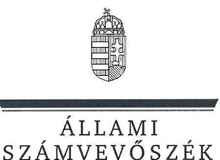
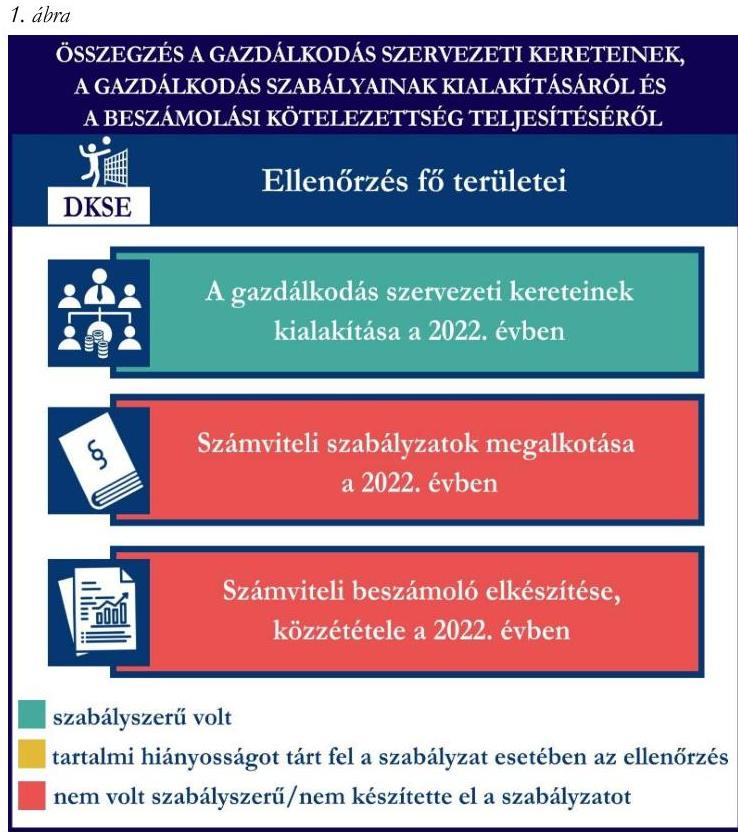
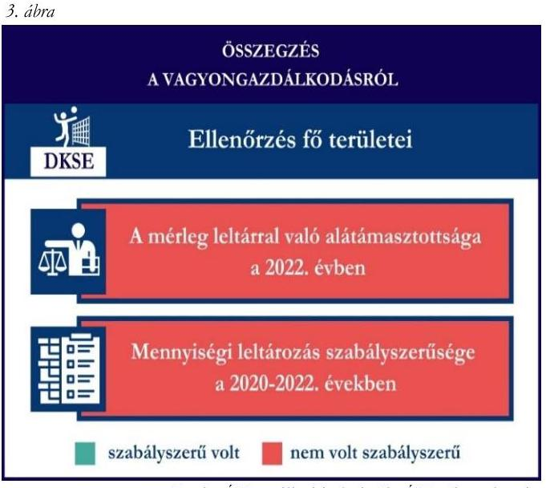
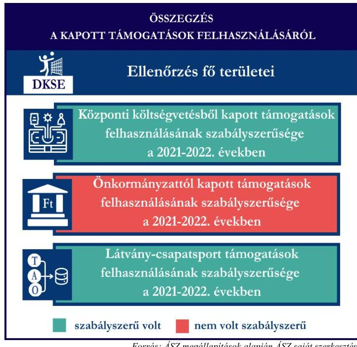

# JELENTÉS 

## Támogatásban részesülő sportszövetségek és sportegyesületek gazdálkodásának ellenőrzése

Dág Községi Sportegyesület

2024.

---

ÁLLAMI
SZÁMVEVŐSZÉK

# JELENTÉS 

## Támogatásban részesülő sportszövetségek és sportegyesületek gazdálkodásának ellenőrzése

Dág Községi Sportegyesület

2024.

---

# ELLENŐRZÉSI IGAZGATÓSÁG: 

## ÁLLAMHÁZTARTÁSON KÍVÜLI SZERVEZETEKET ELLENŐRZŐ IGAZGATÓSÁG

ELLENŐRZÉSI IGAZGATÓ:
KLINGA LÁSZLÓ igazgató
ELLENŐRZÉSVEZETŐ:
HOFMEISTER LÁSZLÓ ellenőrzésvezető

Jelentéseink az interneten a www.asz.hu címen olvashatók.

IKTATÓSZÁM: EL-4060-194/2024
TÉMASORSZÁM: 30
ELLENŐRZÉS-AZONOSÍTÓ SZÁM: V1026

---

# TARTALOMJEGYZÉK 

AZ ELLENŐRZÉS ALAPADATAI ..... 5
AZ ELLENŐRZÖTT SZERVEZET ..... 7
ÖSSZEFOGLALÁS ..... 8
AZ ELLENŐRZÉS FÓKUSZKÉRDÉSEI ..... 10
MEGÁLLAPÍTÁSOK ..... 11
JAVASLATOK ..... 14
MELLÉKLETEK ..... 16
I. sz. melléklet: Értelmező szótár ..... 16
II. sz. melléklet: Az ellenőrzött szervezetek jegyzéke ..... 18
III. sz. melléklet: Ellenőrzési kritériumok ..... 19
FÜGGELÉK: ÉSZREVÉTELEK ..... 20
RÖVIDÍTÉSEK JEGYZÉKE ..... 21

---

.

---

# AZ ELLENŐRZÉS ALAPADATAI 

## AZ ELLENŐRZÉS CÉLJA

Az ellenőrzés célja az államháztartásból nyújtott támogatással, vagy az államháztartásból meghatározott célra ingyenesen juttatott vagyon felhasználásával érintett sportszövetségek és sportegyesületek gazdálkodása szabályozottságának, gazdálkodási tevékenységének, ezen belül a beszámolási kötelezettség teljesítésének, a támogatások elkülönített nyilvántartásának, valamint a támogatások felhasználásának ellenőrzése.

## AZ ELLENŐRZÉS TÍPUSA

Szabályszerűségi ellenőrzés.

## AZ ELLENŐRZÖTT IDŐSZAK

Az 1. fókuszkérdés esetében a 2022. év.
A 2. fókuszkérdés vonatkozásában a 2021-2022. évek.
A 3. fókuszkérdés vonatkozásában a 2022. év, a mennyiségi felvétellel történő leltározás dokumentumai tekintetében a 2020-2022. évek.

## AZ ELLENŐRZÉS TÁRGYA

Az ellenőrzés tárgya a támogatásban részesülő sportszövetségek, sportegyesületek gazdálkodása szabályozottságának, gazdálkodási tevékenységén belül a beszámolási kötelezettség teljesítésének, a vagyonnyilvántartásának, a támogatások elkülönített nyilvántartásának, valamint az államháztartási forrásból származó közvetlen vagy közvetett támogatások és a meghatározott célra ingyenesen juttatott vagyon felhasználásának vizsgálata volt. Az ellenőrzés a támogatások vonatkozásában kiterjedt továbbá a támogató felé történő beszámolási és elszámolási kötelezettségek teljesítésére, az ezekkel kapcsolatos jogszabályi és belső előírások betartására. Az ellenőrzés kiterjedt minden olyan körülményre és adatra, amely az ÁSZ¹ jogszabályban meghatározott feladatainak teljesítéséhez, valamint az ellenőrzési program végrehajtása során felmerülő újabb összefüggések feltárásához szükséges.

Az ÁSZ tv.² 25. § (3) bekezdésében meghatározottak alapján, amennyiben a rendelkezésre bocsátott dokumentumok, adatok, illetve tájékoztatás hitelességének, megalapozottságának, teljességének megállapítása vagy egyes ellenőrzési megállapítások alátámasztása, kiegészítése indokolta, az ellenőrzés tárgyát képezték az összefüggő tények vizsgálatához más szervezetek (ellenőrzést támogató szervezetek) által rendelkezésre bocsátott adatok, dokumentációk, megadott tájékoztatások, illetve az ott végzett ellenőrzés is.

Az 1. és 3. fókuszkérdés tekintetében a vizsgálat a teljes ellenőrzött szervezetre, a 2. fókuszkérdés tekintetében kizárólag a röplabda sportszakágra vonatkozott.

---

# AZ ELLENŐRZÉS JOGALAPJA 

Az ellenőrzés jogszabályi alapját az ÁSZ tv. 1. § (3) bekezdése és az 5. § (3) bekezdése előírásai képezték.

## AZ ELLENŐRZÉS MÓDSZERE

Az ellenőrzést a nemzetközi standardokat irányadónak tekintve az ellenőrzési program szempontjai, az ellenőrzött időszakban hatályos jogszabályok, az ellenőrzés általános szakmai szabályai, az ellenőrzésre irányadó ÁSZ módszertanok figyelembevételével végezte az ÁSZ.

Az ellenőrzési kérdések megválaszolásához szükséges bizonyítékok megszerzése az ellenőrzött szervezet által rendelkezésre bocsátott dokumentumokra, adatokra alapozva kérdésfeltevés (információkérés), interjú, mintavételezés útján történt.

Az ellenőrzési bizonyítékként felhasználható adatforrások közé tartoztak egyrészt az ellenőrzés során az ellenőrzött szervezettől bekért dokumentumok, másrészt adatforrás volt minden további az ellenőrzés folyamán feltárt, az ellenőrzés szempontjából információt tartalmazó dokumentum.

A támogatásokkal, azok felhasználásával kapcsolatos kötelezettségek vizsgálatára mintavételi eljárások kerültek alkalmazásra. Támogatás-típusok szerint nagyságrend alapján 1-3 darab támogatás került részletes vizsgálat alá. Ezen támogatások felhasználásának szabályszerűsége támogatásonként kockázatértékelés alapján kiválasztott mintatételekkel került ellenőrzésre. A kiválasztott támogatási szerződésekhez kapcsolódó elszámolásokból 30-30 db mintatétel került ellenőrzésre, ahol az elszámolás nem érte el a 30 db-ot, ott tételes ellenőrzésre került sor. Ezen felül a vagyongazdálkodás szabályszerűségének ellenőrzéséhez is kockázatalapú mintavétel kapcsolódott. A támogatások felhasználása és a vagyongazdálkodás területén a minták ellenőrzése kiterjedt a könyvvezetési kötelezettség vizsgálatára is. A tárgyi eszközök tekintetében 30 db került kiválasztásra a 2022. évben állományban lévő eszközök közül, ahol az állományban lévő eszközök száma nem érte el a 30 db-ot, ott tételes ellenőrzésre került sor azok nyilvántartásának, elszámolásának szabályszerűsége ellenőrzése céljából. Az ellenőrzésben nem statisztikai mintavételre került sor, ezért nem történt kivetítés a teljes sokaságra, a megállapításokat az ellenőrzött mintatételekre vonatkozóan fogalmazta meg az ÁSZ.

---

# AZ ELLENŐRZÖTT SZERVEZET 

## DÁG KÖZSÉGI SPORTEGYESÜLET

A Dág Községi Sportegyesület 1947-ben alakult. A DKSE³ célja az alapszabályában foglaltak alapján többek között a szabadidő és a versenysport keretében végzett rendszeres sportolás, testedzés biztosítása, a társadalmi öntevékenység és a közösségi élet kibontakoztatása, valamint az utánpótlás nevelése. A DKSE röplabda és az asztalitenisz szakosztályokat működtet.

A DKSE a 2022. évben nem volt közhasznú jogállású, kötelezett volt felügyelőbizottság létrehozására, könyvvizsgálatra nem volt kötelezett. A DKSE röplabda szakosztálya által a 2021-2022. években igénybe vett államháztartási forrásból származó támogatásokat az 1. táblázat foglalja össze.

## 1. táblázat

## A DKSE RÖPLABDA SZAKOSZTÁLYA ÁLTAL IGÉNYBE VETT TÁMOGATÁSOK (ADATOK M FT-BAN)

|  | 2021. év | 2022. év |
| :-- | :--: | :--: |
| Központi költségvetési támogatás (röplabda) | - | 2 |
| Helyi önkormányzati támogatás (röplabda) | - | 10 |
| Látvány-esapatsport támogatás (röplabda) | 44 | 113 |

Forrás: Az ellenőrzött szervezet beszámolói és főkönyvi nyilvántartás adatai alapján ÁSZ saját szerkesztés

---

# ÖSSZEFOGLALÁS 

Magyarország Alaptörvényének XX. cikke kimondja, hogy mindenkinek joga van a testi és lelki egészséghez, melynek érvényesülését Magyarország többek között a sportolás és a rendszeres testedzés támogatásával segíti elő. Az Országgyűlés a Sport tv.⁴-ben kinyilvánította, hogy a nemzet közössége a test művelését, a sportot, a nemzet alapértékének, kívánatos célnak tekinti. A sport a közjó része. Erősíti a közösség tagjainak egymáshoz tartozását, miként az egyén testi és lelki egészségét.

A sportegyesületek, sportszövetségek működésükre és szakmai tevékenységük ellátására költségvetési támogatásban, önkormányzati támogatásban, ingyenes vagyonjuttatásban, valamint látvány-csapatsport támogatásban részesülhetnek, amelyekre fokozott figyelem irányul.

A társadalom részéről jogosan felmerülő elvárás, hogy a közpénzeket kezelő, azzal gazdálkodó szervezetek működéséről, tevékenységéről átfogó képet kapjon, a közpénzek rendeltetésszerű és átlátható módon történő felhasználásának értékelésére időről-időre sor kerüljön az ellenőrzések keretében.

A DKSE a könyvviteli szolgáltatás személyi feltételeit a 2022. évi számviteli beszámoló vonatkozásában biztosította.

A DKSE a jogszabályokban előírtak ellenére számviteli szabályzatokkal – a pénzkezelési szabályzat kivételével – nem rendelkezett a 2022. évben.

A könyvvezetés formája a 2022. évben megfelelt a jogszabályi előírásoknak. A DKSE a 2022. évi számviteli beszámolóját a jogszabályban előírtak ellenére a taggyűlés nem fogadta el, több mérlegtétel esetében a főkönyvi adatok és a beszámoló adatai nem álltak összhangban, a beszámoló nem tartalmazta az előírt kiegészítő mellékletet. A DKSE a 2022. évi számviteli beszámolóját letétbe helyezte, közzétette.

A gazdálkodás szervezeti kereteinek és a gazdálkodási szabályok kialakítása, valamint a beszámolási kötelezettség ellenőrzésének összegzését az 1. ábra tartalmazza.

---

A DKSE a központi költségvetésből kapott támogatást, a látvány-csapatsport támogatást az ellenőrzött tételek vonatkozásában a támogatási célnak megfelelően használta fel a 2021-2022. években. A DKSE az önkormányzattól kapott támogatásokkal nem számolt el a 2021-2022. években.

A DKSE a támogatások felhasználásáról az előírt elkülönített nyilvántartást a 2021-2022. években a könyvviteli rendszerében nem vezette.

A kapott támogatások felhasználásának ellenőrzéséről az összegzést a 2. ábra tartalmazza.

Forrás: ÁSZ megállapítások alapján ÁSZ saját szerkesztés

2. ábra

A DKSE vagyongazdálkodása az ellenőrzött tételek vonatkozásában nem volt szabályszerű a 2022. évben.

A DKSE a 2022. évi beszámolójának mérlegtételeit nem támasztotta alá leltárral. A mérlegben szereplő eszközök évente előírt mennyiségi leltározását a 2022. évben szabályszerűen nem végezte el. A leltár hiánya és a könyvvezetés szabálytalansága miatt sérült a jogszabályban előírt valódiság elve.
A vagyongazdálkodás ellenőrzésének összegzését a 3. ábra tartalmazza.

---

# AZ ELLENŐRZÉS FÓKUSZKÉRDÉSEI 

1.     - A gazdálkodási szabályok kialakítása, a könyvvezetési és beszámolási kötelezettség teljesítése szabályszerű volt-e?
2.     - A kapott támogatások felhasználása szabályszerű volt-e?
3.     - Az ellenőrzött szervezet vagyongazdálkodása szabályszerű volt-e?

---

# MEGÁLLAPÍTÁSOK 

## 1. A gazdálkodási szabályok kialakítása, a könyvvezetési és beszámolási kötelezettség teljesítése szabályszerű volt-e?

## Összegző megállapítás

A DKSE a 2022. évben a pénzkezelési szabályzat kivételével a jogszabályban előírt gazdálkodási szabályzatokkal nem rendelkezett. A könyvvezetési és beszámolási kötelezettség teljesítése nem volt szabályszerű.

A DKSE a 2022. évben a Számv. tv.⁵, valamint a Civilszr.⁶ előírásaiban foglaltaknak megfelelően gondoskodott a könyvviteli szolgáltatás személyi feltételeinek teljesüléséről.
A DKSE 2022-ben a Számv. tv. 14. § (3) bekezdés, valamint az (5) bekezdés a), b) pontjaiban foglaltak ellenére nem készítette el az előírt számviteli politikáját, azon belül az eszközök és a források leltárkészítési és leltározási szabályzatát, valamint az eszközök és a források értékelési szabályzatát. A DKSE rendelkezett a Számv. tv.-ben előírtaknak megfelelő pénzkezelési szabályzattal a 2022-es évben. A DKSE a Számv. tv. 161. §-ában előírtak ellenére a 2022-es évre vonatkozóan nem rendelkezett számlarenddel.
A DKSE a Számv. tv.-ben, Civil tv.⁷-ben, valamint a Civilszr.-ben előírtak szerinti kettős könyvvitelt vezetett. A DKSE 2022-ben a könyvviteli nyilvántartását úgy vezette, hogy a Számv. tv., valamint a Civilszr. előírásainak megfelelően az egyéb bevételek belül részletezni tudta a kapott támogatások és tagdíjak összegeit. Azonban a 2022. évi közzétett beszámoló eredménykimutatásában a tagdíj összege 0,18 M Ft, miközben a főkönyvben tagdíjként elkülönített összeg 0,867 M Ft volt. A beszámoló részét képező mérlegben a tárgyévi eredmény sor üres, miközben az eredménykimutatás alapján 13,682 M Ft tárgyévi eredménye keletkezett a DKSE-nek a 2022-es évben. A 2022. évi főkönyvi nyilvántartási adatok alapján a központi költségvetésből kapott támogatások összege 115,3 M Ft volt, azonban a 2022. évi beszámoló eredménykimutatása 2. űrlapján központi költségvetésből kapott támogatásként 119,0 M Ft szerepel, mivel az a központi költségvetésből kapott támogatáson felül magában foglalja a tagdíjat, az szja 1%-ot, valamint az egyéb szervezeti támogatásokat is. A beszámoló eredménykimutatása 2. elnevezésű űrlapon szerepeltetett Szja 1% összege (0,24 M Ft) nem volt főkönyvi adatokkal alátámasztva, mivel a főkönyvben a 9664 főkönyvi számlán az összeg 0,39 M Ft volt.
A DKSE a számviteli beszámolóját, továbbá a közhasznúsági mellékletét a 2022. évre vonatkozóan elkészítette, azonban a beszámoló a Civil tv. 29. § (2) bekezdés e) pontjában előírtak ellenére kiegészítő mellékletet nem tartalmazott, valamint a fentiekben részletezettek miatt a Számv. tv. 4. § (1) bekezdésében foglaltak ellenére a beszámoló adatai nem voltak könyvvezetési adatokkal alátámasztottak. A DKSE a Civil. tv. 30. § (1) bekezdésében foglaltak ellenére a legfőbb döntéshozó szerv által el nem fogadott, 2022. évi számviteli beszámolóját és közhasznúsági mellékletét tette közzé és helyezte letétbe, mivel a DKSE közgyűlése a 2022. évi számviteli beszámoló elfogadásáról nem döntött. A Civil tv. alapján a számviteli beszámolót a DKSE közzétette, letétbe helyezte, azonban a Civil tv. 30. § (4) bekezdésében foglaltak ellenére a 2022. évi számviteli beszámolót a saját honlapján nem helyezte el.

---

# 2. A kapott támogatások felhasználása
 szabályszerű volt-e? 

Összegző megállapítás

A DKSE a röplabda szakosztálya részére nyújtott ellenőrzött támogatásokat a 2021-2022. években az önkormányzattól kapott támogatások kivételével, a támogatási célnak megfelelően használta fel. A DKSE az önkormányzattól kapott támogatások felhasználásával nem számolt el. A DKSE a támogatások felhasználását a 2021-2022. években, az előírások ellenére a számviteli rendszerében nem különítette el támogatásonként.

A DKSE az ellenőrzött támogatási szerződésekben foglaltak alapján, a központi költségvetésből kapott ellenőrzött támogatások bevételeit a Civil tv. előírásai alapján az egyéb bevételek között elkülönítetten kezelte a számviteli rendszerében. A DKSE a 2021-2022. években a Számv. tv. 161/A. § (2) bekezdésében foglaltak ellenére a Civil tv. 20. § (4) bekezdésében előírt alapcél szerinti tevékenysége költségei, ráfordításai ellentételezésére az ellenőrzött központi költségvetésből kapott támogatásokról nem vezetett olyan elkülönített számviteli nyilvántartást, amelynek alapján támogatásonként megállapítható és ellenőrizhető a kapott támogatás felhasználása. Ez alapján az egyes támogatások felhasználásáról készített elszámolások könyvviteli nyilvántartással, az abban szereplő támogatásonkénti elkülönített adatokkal nem voltak alátámasztottak. A DKSE a támogatás felhasználásáról a támogató által előírt formában elkészítette az előírt beszámolókat és az összesített elszámolási táblázatokkal együtt a támogatási szerződésekben foglaltak alapján benyújtotta a támogatónak. A DKSE a 2021-2022. években elszámolt központi támogatások ellenőrzött tételeit a Számv. tv.-ben előírtaknak megfelelő, szabályszerű számviteli bizonylattal alátámasztotta.
A DKSE a 2021-2022. években rendelkezett a 107/2011. (VI. 30.) Korm. rendeletben ${ }^{8}$ előírt látványcsapatsport támogatással érintett, jóváhagyott sportfejlesztési programmal. Az ellenőrzött SFP ${ }^{9}$-vel kapcsolatban kapott látvány-csapatsport és kiegészítő sportfejlesztési támogatással a DKSE a 107/2011. (VI. 30.) Korm. rendeletben foglaltak szerint elszámolt. A DKSE a 2021-2022. években a 107/2011. (VI. 30.) Korm. rendeletben foglaltaknak megfelelően a látvány-csapatsport támogatás felhasználásáról negyedévente az előrehaladási jelentéseket benyújtotta az illetékes ellenőrző szervezet felé. A DKSE a 2022. évben a látvány-csapatsport és kiegészítő sportfejlesztési támogatás felhasználását igazoló szakmai szöveges beszámolóját a 107/2011. (VI. 30.) Korm. rendeletben foglaltak alapján elkészítette. A 107/2011. (VI. 30.) Korm. rendeletben foglaltak alapján a DKSE a 2021-2022. évben az ellenőrzött látvány-csapatsport támogatások tekintetében könyvvizsgáló által ellenőrzött számviteli bizonylatokkal számolt el az illetékes ellenőrző szervezet felé. A DKSE a 2021-2022. években a Számv. tv. 161/A. § (2) bekezdésében foglaltak ellenére 107/2011. (VI. 30.) Korm. rendelet 9. § (9) bekezdésében előírtak szerint a látvány-csapatsport támogatás felhasználását nem tartotta nyilván a számviteli rendszerében elkülönítetten és naprakészen úgy, hogy az illetékes ellenőrző szervezet, vagy más ellenőrző hatóság által bármikor támogatási programonként, valamint támogatási jogcímenként ellenőrizhető legyen. A DKSE a 107/2011. (VI.30.) Korm. rendeletben előírtaknak megfelelően az ellenőrzött, látvány-csapatsport támogatás felhasználását alátámasztó számviteli bizonylatokat záradékkal ellátta.
A Számv. tv., valamint a Civil tv. előírásainak megfelelően a DKSE az ellenőrzött helyi önkormányzati támogatási bevételeket a 2022. években az egyéb bevételeken belül, elkülönítetten mutatta ki a számviteli 

---

nyilvántartásában. A DKSE a Számv. tv. 161/A. § (2) bekezdésében foglaltak ellenére a Civil tv. 20. § (4) bekezdésében előírt alapcél szerinti tevékenysége költségei, ráfordításai ellentételezésére a helyi önkormányzattól kapott, ellenőrzött támogatásokról vezetett elkülönített számviteli nyilvántartást, azonban az nem tartalmazta tételesen az összes felhasználást. A DKSE a helyi önkormányzattól kapott támogatással kapcsolatban nem rendelkezett írásos dokumentummal (támogatási szerződéssel, okirattal, rendelettel), ezért az önkormányzattól kapott támogatás célja, a felhasználásával kapcsolatos előírások, az elszámolás kritériumai nem lettek meghatározva. A DKSE nem készített elszámolási dokumentumot a helyi önkormányzattól kapott támogatásokról, a támogatások felhasználásáról a 2022. évben nem számolt el a támogató felé.

# 3. Az ellenőrzött szervezet vagyongazdálkodása szabályszerű volt-e? 

## Összegző megállapítás

A DKSE vagyongazdálkodása a 2022. évben az ellenőrzött tételek vonatkozásában nem volt szabályszerű, a beszámoló mérlegtételeit a jogszabályban előírtak ellenére nem támasztotta alá leltárral, az előírt mennyiségi leltározást szabályszerűen nem végezte el.

A DKSE a Számv. tv. 69. § (1)-(2) bekezdéseiben előírtak ellenére a főkönyvi könyvelés és az analitikus nyilvántartások adatai közötti egyeztetést a 2022. üzleti év mérlegfordulónapjára vonatkozóan nem végezte el, ezáltal a mérlegben szereplő adatok leltárral nem voltak alátámasztottak. A DKSE a Számv. tv. 69. § (3) bekezdésében előírt mennyiségi felvétellel történő szabályszerű leltározást a 2022. évben nem teljesítette, mivel az ellenőrzött eszközök közül 21 tétel nem szerepelt a mennyiségi felvétellel elvégzett leltározásban.
A DKSE könyvviteli nyilvántartásának 13-as, műszaki gépek, berendezések, járművek elnevezésű főkönyvi számlájának 2022. év végén követel egyenlege volt (-5 197 E Ft). A 144-es ki nem emelt egyéb berendezések és felszerelések elnevezésű főkönyvi számlacsoport 2022. év végi egyenlege szintén követel egyenleget mutatott (-803 E Ft). Ez alapján a főkönyvi elszámolásban az adott főkönyvi számlákon az eszközök csökkenéseként elszámolt összeg magasabb volt az eszközök bekerülési értékénél. A 3812-es asztalitenisz pénztár elnevezésű főkönyvi számlának 2022. év végén követel egyenlege volt (-17 E Ft), amely alapján az adott pénztár készpénz hiánnyal került zárásra. A főkönyvben szereplő fenti anomáliák a leltár egyeztetés hiánya miatt nem kerültek feltárásra és dokumentálásra. A fentiek alapján sérült a Számv. tv. 15. § (3) bekezdésében előírt valódiság elve, miszerint a könyvvitelben rögzített és a beszámolóban szereplő tételeknek a valóságban is megtalálhatóknak, bizonyíthatóknak, kívülállók által is megállapíthatóknak kell lenniük, értékelésük meg kell, hogy feleljen az e törvényben előírt értékelési elveknek és az azokhoz kapcsolódó értékelési eljárásoknak.
Az ellenőrzött tárgyi eszközök számviteli besorolása, értékcsökkenés elszámolása megfelelt a Számv. tv. előírásainak, az üzembe helyezés tényét a Számv. tv.-ben előírtak alapján dokumentálta.

---

# JAVASLATOK 

Az ÁSZ tv. 33. § (1) bekezdésében foglaltak értelmében az ellenőrzött szervezet vezetője köteles a jelentésben foglalt megállapításokhoz kapcsolódó intézkedési tervet összeállítani és azt a jelentés kézhezvételétől számított 30 napon belül az ÁSZ részére megküldeni. Amennyiben az ellenőrzött szervezet vezetője nem küldi meg határidőben az intézkedési tervet, vagy továbbra sem elfogadható intézkedési tervet küld, az Állami Számvevőszék elnöke az ÁSZ tv. 33. § (3) bekezdése a) és b) pontjaiban foglaltakat érvényesítheti.

## A DÁG KÖZSÉGI SPORTEGYESÜLET ELNÖKÉNEK

1. Gondoskodjon a számviteli politika, valamint annak keretében az eszközök és a források leltárkészítési és leltározási szabályzata, valamint az eszközök és a források értékelési szabályzata elkészítéséről a Számv. tv. 14. § (3) bekezdés, valamint az (5) bekezdés a), b) pontjaiban előírtak alapján, továbbá a számlarend elkészítéséről a Számv. tv. 161. §-ában előírtak szerint.
2. Gondoskodjon arról, hogy a számviteli beszámoló részét képező kiegészítő melléklet elkészítésre kerüljön a Civil tv. 29. § (2) bekezdés c) pontjában előírtaknak megfelelően.
3. Gondoskodjon arról, hogy a számviteli beszámolóban szereplő adatok könyvvezetési adatokkal alátámasztottak legyenek a Számv. tv. 4. § (1) bekezdésében foglaltaknak megfelelően.
4. Gondoskodjon arról, hogy a számviteli beszámoló a legfőbb döntéshozó szerv által jóváhagyásra kerüljön a Civil. tv. 30. § (1) bekezdésében foglaltaknak megfelelően.
5. Gondoskodjon arról, hogy az elfogadott számviteli beszámoló a DKSE saját honlapján elhelyezésre kerüljön a Civil tv. 30. § (4) bekezdésében foglaltak alapján.
6. Gondoskodjon az alapcél szerinti tevékenysége költségei, ráfordításai ellentételezésére kapott támogatások elkülönített számviteli nyilvántartásának vezetéséről, amely alapján támogatásonként megállapítható és ellenőrizhető a kapott támogatás felhasználása a Civil tv. 20. § (4) bekezdés és a Számv. tv. 161/A. § (2) bekezdés előírásai alapján.

---

7. Gondoskodjon a 107/2011. (VI.30) Korm. rendelet 9. § (9) bekezdésében, valamint a Számv. tv. 161/A. § (2) bekezdésében előírtaknak megfelelő olyan nyilvántartás vezetéséről, amely alkalmas a látvány-csapatsport támogatás felhasználásának támogatási programonként, valamint támogatási jogcímenként történő ellenőrzésére.
8. Gondoskodjon a beszámoló mérlegtételeinek leltárral való alátámasztásáról, valamint a mennyiségi felvétellel való tételes leltározás elvégzéséről a Számv. tv. 69. § (1)-(3) bekezdéseiben előírtaknak megfelelően.
9. Gondoskodjon arról, hogy a könyvviteli nyilvántartásban szereplő adatok valódisága igazolt legyen, a könyvvitelben rögzített és a beszámolóban szereplő tételek a valóságban is megtalálhatók, bizonyíthatók, kívülállók által is megállapíthatók legyenek, értékelésük meg kell, hogy feleljen a Számv. tv. 15. § (3) bekezdésében előírt értékelési elveknek és az azokhoz kapcsolódó értékelési eljárásoknak.

---

# MELLÉKLETEK 

## I. SZ. MELLÉKLET: ÉRTELMEZŐ SZÓTÁR

Civil szervezet

Egyesület

Látvány-csapatsport támogatás

Látvány-csapatsportban működő amatőr sportszervezet

Látvány-csapatsportban működő hivatásos sportszervezet

Kiegészítő sportfejlesztési támogatás

Költségvetési támogatás

Közhasznú szervezet

A civil társaság; a Magyarországon nyilvántartásba vett egyesület - a párt, a szakszervezet és a kölcsönös biztosító egyesület kivételével és - a közalapítvány és a pártalapítvány kivételével - az alapítvány. (Forrás: Civil tv. 2. § 6. pont a)-c) alpontjai)

Az egyesület a tagok közös, tartós, alapszabályban meghatározott céljának folyamatos megvalósítására létesített, nyilvántartott tagsággal rendelkező jogi személy. (Forrás: Ptk. 3:63. § (1) bekezdés)
A Számv. tv. szempontjából egyéb szervezet. (Számv. tv. 3. § (1) bekezdés 4. pont a) alpontja)

Az adóévben visszafizetési kötelezettség nélkül nyújtott támogatás, juttatás, véglegesen átadott pénzeszköz és térítés nélkül átadott eszköz könyv szerinti értéke, az adóévben térítés nélkül nyújtott szolgáltatás bekerülési értéke a Tao. tv. ${ }^{10}$-ben meghatározott jogcímeken. (Forrás: Tao. tv. 4. § 44. pont)
Minden olyan, a sportról szóló törvényben meghatározott szabályok szerint a látvány-csapatsportban működő sportegyesület vagy sportvállalkozás, amelyik nem minősül a látvány-csapatsportban működő hivatásos sportszervezetnek. (Forrás: Tao. tv. 4. § 42. pont)
A látvány-csapatsportágak országos sportági szakszövetsége által kiírt versenyrendszer legmagasabb felnőtt bajnoki osztályában - a veterán korosztályokra kiírt versenyrendszer kivételével - részt vevő (indulási jogot elnyert) sportszervezet, vagy alsóbb bajnoki osztályaiban részt vevő (indulási jogot elnyert) sportszervezet abban az esetben, ha az ilyen sportszervezet hivatásos sportolót alkalmaz. Több látvány-csapatsportban több jogi személy szervezeti egységgel (szakosztállyal) működő sportszervezet esetén csak az a jogi személy szervezeti egység (szakosztály), amely a fent részletezett versenyrendszerek bajnoki osztályaiban részt vesz.
(Forrás: Tao. tv. 4. § 43. pont)
A látvány-csapatsportok támogatása esetében a Tao. tv. 24/A. § (1) és (2) bekezdése szerinti rendelkező nyilatkozatban felajánlott összeg 12,5 százaléka kiegészítő sportfejlesztési támogatásnak minősül. (Forrás: Tao. tv. 24/A. § (9) bekezdése)
A társadalombiztosítás pénzügyi alapjai kivételével az államháztartás központi alrendszeréből ellenérték nélkül, pénzben nyújtott támogatások. (Forrás: Áht. 1. § 14. pont, ide nem értve az Áht. 1. § 14. pont a) -o) pontjaiban szereplő támogatásokat)
Közhasznú szervezetté minősíthető a Magyarországon nyilvántartásba vett közhasznú tevékenységet végző szervezet, amely a társadalom és az egyén közös szükségleteinek kielégítéséhez megfelelő erőforrásokkal rendelkezik, továbbá amelynek megfelelő társadalmi támogatottsága kimutatható, és amely:
a) civil szervezet (ide nem értve a civil társaságot), vagy
b) olyan egyéb szervezet, amelyre vonatkozóan a közhasznú jogállás megszerzését törvény lehetővé teszi. (Forrás: Civil tv. 32. § (1) bekezdés)

---

Közhasznú tevékenység

Országos sportági szakszövetség

Sportági szövetség

Sportegyesület

Sportegyesületeknek, sportszövetségeknek nyújtott költségvetési támogatás

Sportszövetség

Sporttevékenység

Minden olyan tevékenység, amely a létesítő okiratban megjelölt közfeladat teljesítését közvetlenül vagy közvetve szolgálja, ezzel hozzájárulva a társadalom és az egyén közös szükségleteinek kielégítéséhez. (Forrás: Civil tv. 2. § 20. pont)

Olyan sportszövetség, amely sportágában kizárólagos jelleggel az e törvényben, valamint más jogszabályokban meghatározott feladatokat lát el és

 e törvényben megállapított különleges jogosítványokat gyakorol. Olyan sportágban hozható létre, amelyet vagy a Nemzetközi Olimpiai Bizottság elismert, vagy amely sportág nemzetközi szövetségét felvették a Nemzetközi Sportszövetségek Szövetségébe (GAISF).
(Forrás: Sport tv. 20. § (1), (4) bekezdés)
A Civil tv. és a Ptk. előírásai alapján - a Sport tv.-ben meghatározott eltérésekkel - működő szövetség, amelynek tagjai kizárólag sportszervezetek lehetnek. Sportági szövetség országos jelleggel is működhet. Egy sportágban csak egy országos sportági szövetség működhet. Törvényi feltételek teljesülése esetén szakszövetségi feladatokat is elláthat. (Forrás: Sport tv. 28. §)
A Civil tv. és a Ptk. szabályai szerint működő olyan egyesület, amelynek alaptevékenysége a sporttevékenység szervezése, valamint a sporttevékenység feltételeinek megteremtése. A sportegyesületek a Sport tv. 15. § (1) bekezdésében meghatározott sportszervezetek körébe tartoznak. A sportegyesületeken kívül sportszervezet még a sportvállalkozás, a sportiskola, valamint az utánpótlás-nevelés fejlesztését végző alapítvány. (Forrás: Sport tv. 16. § (1) bekezdés)

Az állami sport célú támogatások felhasználásáról és elosztásáról szóló 474/2016. (XII. 27.) Korm. rendelet ${ }^{11} 1 . \S$ (1) bekezdésében és a 27/2013. (III. 29.) EMMI rendelet ${ }^{12}$ 1. §-ában meghatározott fejezeti kezelésű előirányzatokból nyújtott támogatás.
Meghatározott sporttevékenységek körében a sportversenyek szervezésére, a tagok érdekvédelmére és a részükre való szolgáltatásokra, valamint a nemzetközi kapcsolatok lebonyolítására létrehozott, jogi személyiséggel és önkormányzattal rendelkező, a Civil tv. és a Ptk. alapján - az e törvényben foglalt eltérésekkel - különös formában működő egyesületek. A Sport tv. 19. § (3) bekezdése szerint a sportszövetségeknek az alábbi típusai léteznek: országos sportági szakszövetségek, sportági szövetségek, szabadidősport szövetségek, fogyatékosok sportszövetségei, diák- és egyetemi-főiskolai sport sportszövetségei, nemzetközi sportszövetségek. (Forrás: Sport tv. 19. § (1), (3) bekezdés)

Meghatározott szabályok szerint, a szabadidő eltöltéseként kötetlenül vagy szervezett formában, illetve versenyszerűen végzett testedzés vagy szellemi sportágban kifejtett tevékenység, amely a fizikai erőnlét és a szellemi teljesítőképesség megtartását, fejlesztését szolgálja. (Forrás: Sport tv. 1. § (2) bekezdés)

---

II. SZ. MELLÉKLET: AZ ELLENŐRZÖTT SZERVEZETEK JEGYZÉKE

| ELLENŐRZÖTT SZERVEZET NEVE | ELLENŐRZÖTT SZERVEZET SZÉKHELVE |
| :-- | :-- |
| Dág Községi Sportegyesület | 2522 Dág, Deák u. 28. |

---

# III. SZ. MELLÉKLET: ELLENŐRZÉSI KRITÉRIUMOK 

## FÓKUSZKÉRDÉS

## 1. fókuszkérdés:

A gazdálkodási szabályok kialakítása, a könyvvezetési és beszámolási kötelezettség teljesítése szabályszerű volt-e?

## 2. fókuszkérdés:

A kapott támogatások felhasználása szabályszerű volt-e?

## 3. fókuszkérdés:

Az ellenőrzött szervezet vagyongazdálkodása szabályszerű volt-e?

## ELLENŐRZÉSI KRITÉRIUMOK

107/2011. (VI.30.) Korm. rendelet 9. § (9) bek.
Számv. tv. 14. § (3) bekezdés, (5) bekezdés a), b), d) pont, (8) bekezdés, (11) bekezdés, 69. § (3) bekezdés, 90. § (3) bekezdés c) pont, 161. § (1) bekezdés, (2) bekezdés a)-d) pont, (3)-(4) bekezdés, 161/A. § (2) bekezdés, 165. § (2) bekezdés
Civilszr. 7. § (1) bekezdés, (4) bekezdés b), c) pont, 8. § (2), (3) bekezdés, 9. § (4), (5), (8) bekezdés, 12. § (4), (5) bekezdés, 15. § (1) bekezdés a), b) pont, 16. § (1) bekezdés, 24. § (2) bekezdés

Civil vhr. 12. ${ }^{13} \S$ (1) bekezdés, melléklet 5. pont
Ptk. 3:26. § (1) bekezdés, 3:27. § (1) bekezdés, 3:82. § (1) bekezdés,
Civil tv. 28. § (1) bekezdés, 29. § (2) bekezdés c) pont, (3), (6), (7) bekezdés, 30. § (1)-(4) bekezdés 40. § (1)
Sport tv. 23. § (1) bekezdés f) pont
Tao. tv. 22/C.
107/2011. (VI. 30.) Korm. rendelet 2. § (3b) bek., 4. § (11) bek., 5. § (1) bek., 6. § (1) bek. c) pont, 9. § (8)-(10) bek., 10. § (2), (2a), (2b), (4), (5a), (6) bek., 11. § (1), (1a), (1d), (1e), (2), (4), (4a), (5), (6) bek., 13. § (1), (2a) bek., 14. § (1), (4), (4b), (4c), (6c) bek.

Számv. tv. 44. § (2) bekezdés, 93. § (3) bekezdés, 159. §, 161/A. §
(2) bekezdés, 165. § (2) bekezdés, 167. § (1) bekezdés a), d), e), h) pont

Civil tv. 20. § (2) bekezdés a) pont, (3) bekezdés a), c) pont, (4) bekezdés, 29. § (4), (5) bekezdés
Civilszr. 24. § (2) bekezdés
27/2013. (III.29.) EMMI rendelet 18. § (2) bekezdés
474/2016. (XII. 27.) Korm. rendelet 22. § (2) bekezdés, 24. § (2) bekezdés
Áht. 53. §, Ávr. ${ }^{14}$ 92. §, 93. § (2)-(4) bekezdések
Ptk. 3:63. § (4) bekezdés
Számv. tv. 3. § (3) bekezdés 3. pont, 15. § (3) bekezdés, 46. § (3), (4) bekezdés, 47-51. §, 52. § (1)-(7) bekezdés, 69. § (1)-(3) bekezdések, 165. § (2) bekezdés, 169. § (2) bekezdés

---

# FÜGGELÉK: ÉSZREVÉTELEK 

A jelentéstervezetet a Számvevőszék 15 napos észrevételezésre megküldte az ellenőrzött szervezet vezetőjének az ÁSZ tv. 29. § (1) bekezdése előírásának megfelelően.

A Dág Községi Sportegyesület elnöke a jelentéstervezetre nem tett észrevételt.

[^0]
[^0]:    * 29. § (1) Az Állami Számvevőszék az ellenőrzési megállapításait megküldi az ellenőrzött szervezet vezetőjének vagy az általa megbízott személynek, és annak, akinek személyes felelősségét állapította meg.
    (2) Az ellenőrzött szervezet vezetője és a felelősként megjelölt személy az ellenőrzés megállapításaira tizenöt napon belül írásban észrevételt tehet.
    (3) Az Állami Számvevőszék az észrevételre a beérkezésétől számított harminc napon belül írásban válaszol. A figyelembe nem vett észrevételeket köteles a jelentésben feltüntetni, és megindokolni, hogy azokat miért nem fogadta el.

---

# RÖVIDÍTÉSEK JEGYZÉKE 

${ }^{1}$ ÁSZ
${ }^{2}$ ÁSZ tv.
${ }^{3}$ DKSE
${ }^{4}$ Sport tv.
${ }^{5}$ Számv. tv.
${ }^{6}$ Civilszr.
${ }^{7}$ Civil tv.
${ }^{8}$ 107/2011. (VI. 30.) Korm.rendelet
${ }^{9}$ SFP
${ }^{10}$ Tao. tv.
${ }^{11}$ 474/2016. (XII. 27.) Korm. rendelet
${ }^{12}$ 27/2013. (III.29.) EMMI rendelet
${ }^{13}$ Civil vhr.
${ }^{14}$ Ávr.

Állami Számvevőszék
2011. évi LXVI. törvény az Állami Számvevőszékről

DÁG Községi Sportegyesület
2004. évi I. törvény a sportról
2000. évi C. törvény a számvitelről
479/2016. (XII. 28.) Kormány rendelet a számviteli törvény szerinti egyes egyéb szervezetek beszámoló készítési és könyvvezetési kötelezettségének sajátosságairól
2011. évi CLXXV. törvény az egyesülési jogról, a közhasznú jogállásról, valamint a civil szervezetek működéséről és támogatásáról
107/2011. (VI. 30.) Korm. rendelet a látvány-csapatsport támogatását biztosító támogatási igazolás kiállításáról, felhasználásáról, a támogatás elszámolásának és ellenőrzésének, valamint visszafizetésének szabályairól
sportfejlesztési program
1996. évi LXXXI. törvény a társasági adóról és az osztalékadóról
474/2016. (XII. 27.) Kormány rendelet az állami sport célú támogatások felhasználásáról és elosztásáról
27/2013. (III. 29.) EMMI rendelet az állami sport célú támogatások felhasználásáról és elosztásáról
350/2011. (XII. 30.) Kormány rendelet a civil szervezetek gazdálkodása, az adománygyűjtés és a közhasznúság egyes kérdéseiről
368/2011. (XII. 31.) Kormány rendelet az államháztartásról szóló törvény végrehajtásáról

---

1052 Budapest, Apáczai Csere János u. 10. | 1364 Budapest 4., Pf. 54
www.asz.hu | szamvevoszek@asz.hu
telefon: +36 14849100

