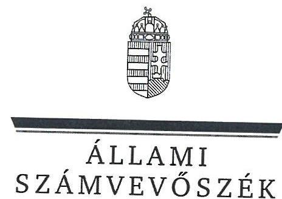
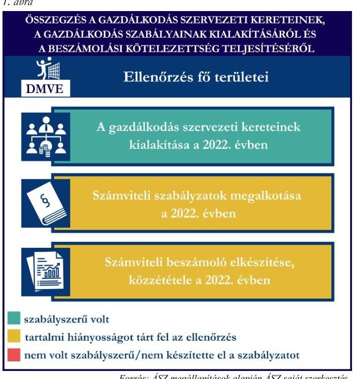
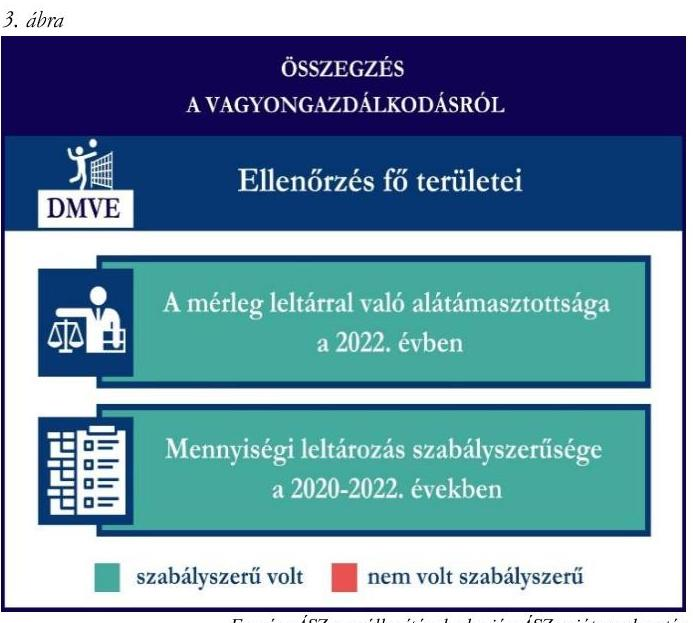
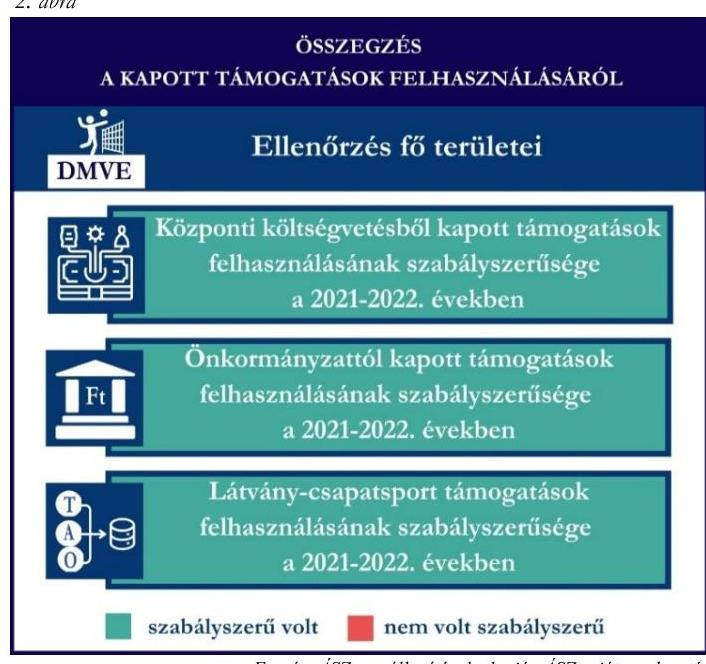

# JELENTÉS 

## Támogatásban részesülő sportszövetségek és sportegyesületek gazdálkodásának ellenőrzése

Dabronc Marcal-völgye Egyesület

2024.

---

ÁLLAMI
SZÁMVEVÔSZÉK

# JELENTÉS 

## Támogatásban részesülő sportszövetségek és sportegyesületek gazdálkodásának ellenőrzése

Dabronc Marcal-völgye Egyesület

2024.

---

# ELLENŐRZÉSI IGAZGATÓSÁG: 

## ÁLLAMHÁZTARTÁSON KÍVÜLI SZERVEZETEKET ELLENŐRZŐ IGAZGATÓSÁG

ELLENŐRZÉSI IGAZGATÓ:
KLINGA LÁSZLÓ igazgató

ELLENŐRZÉSVEZETŐ:
HOFMEISTER LÁSZLÓ ellenőrzésvezető

## Jelentéseink az interneten a www.asz.hu címen olvashatók.

IKTATÓSZÁM: EL-4060-195/2024
TÉMASORSZÁM: 30
ELLENŐRZÉS-AZONOSÍTÓ SZÁM: V1026

---

# TARTALOMJEGYZÉK 

AZ ELLENŐRZÉS ALAPADATAI ..... 5
AZ ELLENŐRZÖTT SZERVEZET ..... 7
ÖSSZEFOGLALÁS ..... 8
AZ ELLENŐRZÉS FÓKUSZKÉRDÉSEI ..... 10
MEGÁLLAPÍTÁSOK ..... 11
JAVASLATOK ..... 13
MELLÉKLETEK ..... 14
I. sz. melléklet: Értelmező szótár ..... 14
II. sz. melléklet: Az ellenőrzött szervezetek jegyzéke ..... 16
III. sz. melléklet: Ellenőrzési kritériumok ..... 17
FÜGGELÉK: ÉSZREVÉTELEK ..... 18
RÖVIDÍTÉSEK JEGYZÉKE ..... 19

---

.

---

# AZ ELLENŐRZÉS ALAPADATAI 

## AZ ELLENŐRZÉS CÉLJA

Az ellenőrzés célja az államháztartásból nyújtott támogatással, vagy az államháztartásból meghatározott célra ingyenesen juttatott vagyon felhasználásával érintett sportszövetségek és sportegyesületek gazdálkodása szabályozottságának, gazdálkodási tevékenységének, ezen belül a beszámolási kötelezettség teljesítésének, a támogatások elkülönített nyilvántartásának, valamint a támogatások felhasználásának ellenőrzése.

## AZ ELLENŐRZÉS TÍPUSA

Szabályszerüségi ellenőrzés.

## AZ ELLENŐRZÖTT IDŐSZAK

Az 1. fókuszkérdés esetében a 2022. év.
A 2. fókuszkérdés vonatkozásában a 2021-2022. évek.
A 3. fókuszkérdés vonatkozásában a 2022. év, a mennyiségi felvétellel történő leltározás dokumentumai tekintetében a 2020-2022. évek.

## AZ ELLENŐRZÉS TÁRGYA

Az ellenőrzés tárgya a támogatásban részesülő sportszövetségek, sportegyesületek gazdálkodása szabályozottságának, gazdálkodási tevékenységén belül a beszámolási kötelezettség teljesítésének, a vagyonnyilvántartásának, a támogatások elkülönített nyilvántartásának, valamint az államháztartási forrásból származó közvetlen vagy közvetett támogatások és a meghatározott célra ingyenesen juttatott vagyon felhasználásának vizsgálata volt. Az ellenőrzés a támogatások vonatkozásában kiterjedt továbbá a támogató felé történő beszámolási és elszámolási kötelezettségek teljesítésére, az ezekkel kapcsolatos jogszabályi és belső előírások betartására.

Az ellenőrzés kiterjedt minden olyan körülményre és adatra, amely az ÁSZ ${ }^{1}$ jogszabályban meghatározott feladatainak teljesítéséhez, valamint az ellenőrzési program végrehajtása során felmerülő újabb összefüggések feltárásához szükséges.

## AZ ELLENŐRZÉS JOGALAPJA

Az ellenőrzés jogszabályi alapját az ÁSZ tv. ${ }^{2} 1 . \int(3)$ bekezdése és az 5. $\int(3)$ bekezdése előírásai képezték.

---

# AZ ELLENŐRZÉS MÓDSZERE 

Az ellenőrzést a nemzetközi standardokat irányadónak tekintve az ellenőrzési program szempontjai, az ellenőrzött időszakban hatályos jogszabályok, az ellenőrzés általános szakmai szabályai, az ellenőrzésre irányadó ÁSZ módszertanok figyelembevételével végezte az ÁSZ.

Az ellenőrzési kérdések megválaszolásához szükséges bizonyítékok megszerzése az ellenőrzött szervezet által rendelkezésre bocsátott dokumentumokra, adatokra alapozva kérdésfeltevés (információkérés), interjú, mintavételezés útján történt. A támogatásból beszerzett tárgyi eszközök használatára, fizikai fellelhetőségére irányulóan az érintett vagyontárgyak helyszíni szemle keretében történő szemrevételezésére indokolt esetben sor került.

Az ellenőrzési bizonyítékként felhasználható adatforrások közé tartoztak egyrészt az ellenőrzés során az ellenőrzött szervezettől bekért dokumentumok, másrészt adatforrás volt minden további, az ellenőrzés folyamán feltárt, az ellenőrzés szempontjából információt tartalmazó dokumentum.

A támogatásokkal, azok felhasználásával kapcsolatos kötelezettségek vizsgálatára mintavételi eljárások kerültek alkalmazásra. Támogatás-típusok szerint nagyságrend alapján 1-3 darab támogatás került részletes vizsgálat alá. Ezen támogatások felhasználásának szabályszerűsége támogatásonként kockázatértékelés alapján kiválasztott mintatételekkel került ellenőrzésre. Ezen felül a vagyongazdálkodás szabályszerűségének ellenőrzéséhez is kockázatalapú mintavétel kapcsolódott. A támogatások felhasználása és a vagyongazdálkodás területén a minták ellenőrzése - a teljes folyamat szabályszerűségének megítélése nélkül kiterjedt a könyvvezetési kötelezettség vizsgálatára is. A kiválasztott támogatási szerződésekhez kapcsolódó elszámolásokból 30-30 db mintatétel került ellenőrzésre, ahol a mintatételek száma nem érte el a 30 db -ot, ott tételes ellenőrzésre került sor. A tárgyi eszközök tekintetében 30 db került kiválasztásra a 2022. évben állományban lévő eszközök közül, ahol az állományban lévő eszközök száma nem érte el a 30 db -ot, ott tételes ellenőrzésre került sor azok nyilvántartásának, elszámolásának szabályszerűsége ellenőrzése céljából. Az ellenőrzésben nem statisztikai mintavételre került sor, ezért nem történt kivetítés a teljes sokaságra, a megállapításokat az ellenőrzött mintatételekre vonatkozóan fogalmazta meg az ÁSZ.

---

# AZ ELLENŐRZÖTT SZERVEZET

## DABRONC MARCAL-VŐLGYE EGYESÜLET

A DMVE ${ }^{3}$-t a 2012. évben alapították. Céljai közé tartozik Dabronc község lakossága sporttevékenységének, röplabda sportjának és kulturális életének támogatása, a helyi sporthagyományok támogatása, valamint a röplabda sporttal, versenyek, rendezvények szervezése.

A DMVE a jogszabályi előírás alapján könyvvizsgálatra, felügyelőbizottság létrehozására nem volt kötelezett. Az $\mathrm{OBH}^{4}$ nyilvántartása alapján közhasznú jogállással nem rendelkezett.

A 2021-2022. években a DMVE által igénybe vett államháztartási forrásból származó támogatásokat az 1. táblázat foglalja magában.

|  AZ DMVE ÁLTAL IGÉNYBE VETT TÁMOGATÁSOK (ADATOK M FT-BAN) |  |   |
| --- | --- | --- |
|   | 2021. év | 2022. év  |
|  Központi költségvetésből | 7,0 | -  |
|  Helyi önkormányzattól | - | 6,0  |
|  Látvány-csapatsport támogatásból | 70,9 | 73,2  |

---

# ÖSSZEFOGLALÁS 

Az Alaptörvény ${ }^{5}$ XX. cikke kimondja, hogy mindenkinek joga van a testi és lelki egészséghez, melynek érvényesülését Magyarország többek között a sportolás és a rendszeres testedzés támogatásával segíti elő. Az Országgyűlés ${ }^{6}$ a Sport tv. ${ }^{7}$-ben kinyilvánította, hogy a nemzet közössége a test művelését, a sportot, a nemzet alapértékének, kívánatos célnak tekinti. A sport a közjó része. Erősíti a közösség tagjainak egymáshoz tartozását, miként az egyén testi és lelki egészségét.

A sportegyesületek, sportszövetségek müködésükre és szakmai tevékenységük ellátására költségvetési támogatásban, önkormányzati támogatásban, ingyenes vagyonjuttatásban, valamint látvány-csapatsport támogatásban részesülhetnek, amelyekre fokozott figyelem irányul.

A társadalom részéről jogosan felmerülő elvárás, hogy a közpénzeket kezelő, azzal gazdálkodó szervezetek müködéséről, tevékenységéről átfogó képet kapjon, a közpénzek rendeltetésszerủ és átlátható módon történő felhasználásának értékelésére időről-időre sor kerüljön az ellenőrzések keretében.

A DMVE gondoskodott a könyvviteli szolgáltatás személyi feltételeinek megteremtéséről.

A jogszabályi előírások szerint a DMVE kialakította a számviteli politikáját, valamint elkészítette számviteli szabályzatait, azonban a számlarendben foglaltakat alátámasztó bizonylati rendet nem készítette el a 2022. évre vonatkozóan.

A számviteli beszámoló elkészítése az eredménykimutatás kisebb hiányossága mellett szabályszerű volt, a közzétételi, letétbe helyezései kötelezettsége a jogszabályoknak megfelelően teljesült a 2022. évben.

A gazdálkodás szervezeti keretei kialakításának, a számviteli szabályzatok megalkotásának, valamint a számviteli beszámoló elkészítésének és közzétételének értékelését az 1. ábra mutatja be.

---

A DMVE a központi költségvetésből, a látványcsapatsport támogatásból, valamint a helyi önkormányzattól kapott támogatásokat a támogatási célnak megfelelően használta fel az ellenőrzött tételek esetében.

A DMVE a támogatások felhasználásáról a jogszabályban előírt támogatásonként elkülönített számviteli nyilvántartással nem rendelkezett.

A kapott támogatások felhasználásának ellenőrzéséről az összegzést a 2. ábra tartalmazza.

Forrás: $A S Z$ megállapítások alapján $A S Z$ saját szerkesztés

A 2022. évben a DMVE vagyongazdálkodása az ellenőrzött tételek vonatkozásában szabályszerű volt. A jogszabályoknak megfelelően gondoskodott saját vagyona nyilvántartásáról és a számviteli beszámolóban történő megjelenítéséről.

A mérlegben szereplő eszközök háromévente előírt mennyiségi leltározását a 2022. évben elvégezte.

A vagyongazdálkodás ellenőrzésének az összegzését a 3. ábra tartalmazza.

---

# AZ ELLENŐRZÉS FÓKUSZKÉRDÉSEI 

1.     - A gazdálkodási szabályok kialakítása, a könyvvezetési és beszámolási kötelezettség teljesítése szabályszerű volt-e?
2.     - A kapott támogatások felhasználása szabályszerű volt-e?
3.     - Az ellenőrzött szervezet vagyongazdálkodása szabályszerű volt-e?

---

# 1. A gazdálkodási szabályok kialakítása, a könyvvezetési és beszámolási kötelezettség teljesítése szabályszerű volt-e? 

Összegző megállapítás A 2022. évben a DMVE gazdálkodási szabályainak kialakítása - a számlarend kivételével - megfelelt a jogszabályi előírásoknak. A beszámolási kötelezettség teljesítése hiányosan valósult meg, a közzétételi kötelezettségének teljesítése szabályszerű volt a 2022. évben.

A 2022. évben a DMVE a Számv. tv. ${ }^{8}$ és a Civilszr. ${ }^{9}$-ben foglaltaknak megfelelően gondoskodott a könyvviteli szolgáltatás személyi feltételeinek teljesüléséről.
A DMVE a 2022. évben rendelkezett a Számv. tv. előírásainak megfelelő számviteli politikával, az eszközök és a források leltárkészítési és leltározási szabályzatával, az eszközök és források értékelési szabályzatával, valamint a pénzkezelési szabályzattal. A 2022. évben hatályos számlarend a Számv.tv. 161. § (2) bekezdés d) pontjának előírása ellenére nem tartalmazta a számlarendben foglaltakat alátámasztó bizonylati rendet.
A DMVE a 2022. évi számviteli beszámolójában, és a könyvvezetésében a Számv. tv. 16. § (3) bekezdésében foglaltak ellenére tagdíjként szerepeltetett olyan befizetéseket, amelyek nem a tagok által befizetett tagdíj, hanem a sportoló diákok által fizetett díj volt.
A DMVE a Civil tv. ${ }^{10}$, valamint a Civilszr. előírásaiban előírt egyszerűsített éves beszámolóját elkészítette, a Civil vhr. ${ }^{11}$-ben előírt közhasznúsági melléklettel együtt. A Számv. tv. 4. § (1) bekezdésében foglaltak ellenére a DMVE 2022. évi számviteli beszámolója nem volt könyvvezetéssel alátámasztott, mivel a beszámoló részét képező eredménykimutatás 2. elnevezésű űrlapon nem szerepeltek támogatási adatok, miközben a főkönyvi adatok alapján a DMVE a központi költségvetésből, az önkormányzattól, valamint magánszemélytől is kapott támogatásokat a 2022. évben.
A 2022. évre vonatkozó számviteli beszámolót a DMVE közgyűlése a Civil tv.-nek megfelelően elfogadta. A DMVE az elfogadott 2022. évi számviteli beszámolóját, valamint közhasznúsági mellékletét a Civil tv. előírásainak megfelelően letétbe helyezte és közzé tette.

## 2. A kapott támogatások felhasználása szabályszerű volt-e?

## Összegző megállapítás

A DMVE a 2021. és 2022. években kapott támogatásokat az ellenőrzött tételek vonatkozásában a támogatási célnak megfelelően használta fel, azonban nem gondoskodott a támogatások felhasználásának elkülönített nyilvántartásáról.

A DMVE a központi költségvetésből, a látvány-csapatsport támogatásból, valamint a helyi önkormányzattól kapott támogatások ellenőrzött bevételeit a Civil tv. előírásai alapján elkülönítetten mutatta ki számviteli rendszerében. A DMVE az alapcél szerinti tevékenysége költségei, ráfordításai ellentételezésére kapott központi költségvetési támogatások, a látvány-csapatsort támogatások, valamint a helyi önkormányzattól

---

kapott ellenőrzött támogatások felhasználásáról a Számv. tv. 161/A. § (2) bekezdése, valamint a Civil tv. 20. (4) bekezdése előírásai ellenére nem vezetett elkülönített számviteli nyilvántartást, amelynek alapján támogatásonként megállapítható és ellenőrizhető a kapott támogatások felhasználása.
A DMVE a 2021. évben a központi költségvetésből részére jutatott támogatás felhasználásáról a támogató felé benyújtott beszámolót és annak részeként az összesített elszámolási táblázatot a támogatási szerződésben előírt formában és tartalommal elkészítette. A támogatás felhasználásáról a támogató felé benyújtott elszámolást alátámasztó számviteli bizonylatok a Számv. tv.-ben foglalt alaki és tartalmi követelményeknek megfeleltek, a támogató felé benyújtott számlák a 474/2016. (XII. 27.) Korm. rendeletben ${ }^{12}$ előírtaknak megfelelően záradékolásra kerültek.
A DMVE a 2021-2022. években rendelkezett a 107/2011. (VI. 30.) Korm. rendeletben ${ }^{13}$ előírt látványcsapatsport támogatással érintett, jóváhagyott SFP-vel. A DMVE a 2021-2022. években a 107/2011. (VI. 30.) Korm. rendelet 11. § (2) bekezdésében foglaltak ellenére a látvány-csapatsport támogatás felhasználásáról negyedévente az előrehaladási jelentéseket nem nyújtotta be az illetékes ellenőrző szervezet felé. Az ellenőrzött SFP-vel kapcsolatban kapott látvány-csapatsport és kiegészítő sportfejlesztési támogatással a DMVE a 107/2011. (VI. 30.) Korm. rendeletben foglaltak szerint elszámolt. A DMVE a 2022. évben a látvány-csapatsport és kiegészítő sportfejlesztési támogatás felhasználását igazoló szakmai szöveges beszámolóját a 107/2011. (VI. 30.) Korm. rendeletben foglaltak alapján elkészítette. A 107/2011. (VI. 30.) Korm. rendeletnek megfelelően könyvvizsgáló által ellenőrzött számviteli bizonylatokkal számolt el a támogató felé, melyhez a könyvvizsgálatot végző könyvvizsgáló felelősségbiztosítási kötvénye is benyújtásra került. A DMVE a 107/2011. (VI.30.) Korm. rendeletben előírtaknak megfelelően az ellenőrzött, látvány-csapatsport támogatás felhasználását alátámasztó számviteli bizonylatokat záradékkal ellátta.
A DMVE a 2022. évben a helyi önkormányzat költségvetéséből számára juttatott sportcélú támogatásokról, a támogatási szerződésben előírtaknak megfelelően teljesítette beszámolási kötelezettségét a támogatás rendeltetésszerű felhasználásáról. A DMVE a 2022. évben elszámolt támogatások ellenőrzött tételeit a Számv. tv.-ben előírtaknak megfelelő, szabályszerű számviteli bizonylattal alátámasztotta.

# 3. Az ellenőrzött szervezet vagyongazdálkodása szabályszerű volt-e? 

Összegző megállapítás A DMVE vagyongazdálkodása a 2022. évben szabályszerű volt az ellenőrzött tételek vonatkozásában. A 2022. évi beszámolójának mérlegtételeit alátámasztotta szabályszerű leltárral.

A DMVE a Számv. tv.-ben előírtaknak megfelelően a 2022. évi beszámolójának mérlegtételeit alátámasztotta szabályszerű leltárral, elvégezte a főkönyvi könyvelés és az analitikus nyilvántartások adatai közötti egyeztetést. A mérlegben szereplő tárgyi eszközök esedékes mennyiségi leltározását a DMVE a 2022. évre vonatkozóan elvégezte a Számv. tv.-ben előírtaknak megfelelően.

Az ellenőrzött tárgyi eszközök számviteli besorolása, értékcsökkenés elszámolása megfelelt a Számv. tv. előírásainak, a DMVE az ellenőrzött tárgyi eszközök üzembe helyezésének tényét a Számv. tv.-ben előírtak alapján dokumentálta.

---

# JAVASLATOK 

Az ÁSZ tv. 33. § (1) bekezdésében foglaltak értelmében az ellenőrzött szervezet vezetője köteles a jelentésben foglalt megállapításokhoz kapcsolódó intézkedési tervet összeállítani és azt a jelentés kézhezvételétől számított 30 napon belül az ÁSZ részére megküldeni. Amennyiben az ellenőrzött szervezet vezetője nem küldi meg határidőben az intézkedési tervet, vagy továbbra sem elfogadható intézkedési tervet küld, az Állami Számvevőszék elnöke az ÁSZ tv. 33. § (3) bekezdése a) és b) pontjaiban foglaltakat érvényesítheti.

## A DABRONC MARCAL-VÖLGYE EGYESÜLET ELNÖKÉNEK

1. Gondoskodjon a számlarendben foglaltakat alátámasztó bizonylati rend elkészitéséről a Számv. tv. 161. § (2) bekezdés d) pontjában elöirtaknak megfelelően.
2. Gondoskodjon arról, hogy a számviteli beszámolójában és a könyvvezetésében a gazdasági események a tényleges gazdasági tartalmuknak megfelelően kerüljenek bemutatásra a Számv. tv. 16. § (3) bekezdésében elöirtaknak megfelelően.
3. Gondoskodjon a számviteli beszámolóban kimutatott adatok könyvvezetéssel való alátámasztásáról a Számv. tv. 4. § (1) bekezdésében elöirtaknak megfelelően.
4. Gondoskodjon az alapcél szerinti tevékenysége költségei, ráfordításai ellentételezésére kapott támogatások elkülönített számviteli nyilvántartásának vezetéséről, amely alapján támogatásonként megállapítható és ellenőrizhető a kapott támogatás felhasználása, a Civil tv. 20. § (4) bekezdés és a Számv. tv. 161/A. § (2) bekezdés elöírásai alapján.
5. Gondoskodjon arról, hogy a 107/2011. (VI.30) Korm. rendelet 11. § (2) bekezdésében elöírt negyedéves elörehaladási jelentések az illetékes ellenőrző szerv felé benyújtásra kerüljenek.

---

# MELLÉKLETEK 

## I. SZ. MELLÉKLET: ÉRTELMEZŐ SZÓTÁR

civil szervezet
egyesület
költségvetési támogatás
közhasznú szervezet
közhasznú tevékenység
látvány-csapatsport támogatás
látvány-csapatsportban múködő amatőr sportszervezet
látvány-csapatsportban múködő hivatásos sportszervezet

A civil társaság; a Magyarországon nyilvántartásba vett egyesület - a párt, a szakszervezet és a kölcsönös biztosító egyesület kivételével és - a közalapítvány és a pártalapítvány kivételével - az alapítvány. (Forrás: Civil tv. 2. $\$ 6$. pont a) -c) alpontjai)

Az egyesület a tagok közös, tartós, alapszabályban meghatározott céljának folyamatos megvalósítására létesített, nyilvántartott tagsággal rendelkező jogi személy. (Forrás: Ptk. ${ }^{14}$ 3:63. § (1) bekezdés)
A Számv. tv. szempontjából egyéb szervezet. (Számv. tv. 3. § bekezdés 4. pont a) alpontja)
A társadalombiztosítás pénzügyi alapjai kivételével az államháztartás központi alrendszeréből ellenérték nélkül, pénzben nyújtott támogatások. (Forrás: Ábt. ${ }^{15}$ 1. § 14. pont)
Közhasznú szervezetté minősíthető a Magyarországon nyilvántartásba vett közhasznú tevékenységet végző szervezet, amely a társadalom és az egyén közös szükségleteinek kielégítéséhez megfelelő erőforrásokkal rendelkezik, továbbá amelynek megfelelő társadalmi támogatottsága kimutatható, és amely:
a) civil szervezet (ide nem értve a civil társaságot), vagy
b) olyan egyéb szervezet, amelyre vonatkozóan a közhasznú jogállás megszerzését törvény lehetővé teszi. (Forrás: Civil tv. 32. § (1) bekezdés)
Minden olyan tevékenység, amely a létesítő okiratban megjelölt közfeladat teljesítését közvetlenül vagy közvetve szolgálja, ezzel hozzájárulva a társadalom és az egyén közös szükségleteinek kielégítéséhez. (Forrás: Civil tv. 2. $\$ 20$. pont)
Az adóévben visszafizetési kötelezettség nélkül nyújtott támogatás, juttatás, véglegesen átadott pénzeszköz és térítés nélkül átadott eszköz könyv szerinti értéke, az adóévben térítés nélkül nyújtott szolgáltatás bekerülési értéke a Tao. tv. ${ }^{16}$-ben meghatározott jogcímeken. (Forrás: Tao. tv. 4. § 44. pont)
Minden olyan, a sportról szóló törvényben meghatározott szabályok szerint a látvány-csapatsportban múködő sportegyesület vagy sportvállalkozás, amelyik nem minősül a látvány-csapatsportban múködő hivatásos sportszervezetnek. (Forrás: Tao. tv. 4. § 42. pont)
A látvány-csapatsportágak országos sportági szakszövetsége által kiírt versenyrendszer legmagasabb felnőtt bajnoki osztályában - a veterán korosztályokra kiírt versenyrendszer kivételével - részt vevő (indulási jogot elnyert) sportszervezet, vagy alsóbb bajnoki osztályaiban részt vevő (indulási jogot elnyert) sportszervezet abban az esetben, ha az ilyen sportszervezet hivatásos sportolót alkalmaz. Több látvány-csapatsportban több jogi személy szervezeti egységgel (szakosztállyal) múködő sportszervezet esetén csak az a jogi személy szervezeti egység (szakosztály), amely a fent részletezett versenyrendszerek bajnoki osztályaiban részt vesz. (Forrás: Tao. tv. 4. § 43. pont)

---

kiegészítő sportfejlesztési támogatás
sportegyesület
sportegyesületeknek, sportszövetségeknek nyújtott költségvetési támogatás
sportszövetség
sporttevékenység

A látvány-csapatsportok támogatása esetében a Tao. tv. 24/A. § (1) és (2) bekezdése szerinti rendelkező nyilatkozatban felajánlott összeg 12,5 százaléka kiegészítő sportfejlesztési támogatásnak minősül. (Forrás: Tao. tv. 24/A. § (9) bekezdése)
A Civil tv. és a Ptk. szabályai szerint működő olyan egyesület, amelynek alaptevékenysége a sporttevékenység szervezése, valamint a sporttevékenység feltételeinek megteremtése. A sportegyesületek a Sport tv. 15. $\S$ (1) bekezdésében meghatározott sportszervezetek körébe tartoznak. A sportegyesületeken kívül sportszervezet még a sportvállalkozás, a sportiskola, valamint az utánpótlás-nevelés fejlesztését végző alapítvány. (Forrás: Sport tv. 16. § (1) bekezdés)
Az állami sport célú támogatások felhasználásáról és elosztásáról szóló 474/2016. (XII. 27.) Kormány rendelet és a 27/2013. (III. 29.) EMMI rendelet ${ }^{17}$ 1. $\S$-ában meghatározott fejezeti kezelésű előirányzatokból nyújtott támogatás.
Meghatározott sporttevékenységek körében a sportversenyek szervezésére, a tagok érdekvédelmére és a részükre való szolgáltatásokra, valamint a nemzetközi kapcsolatok lebonyolítására létrehozott, jogi személyiséggel és önkormányzattal rendelkező, a Civil tv. és a Ptk. alapján - az e törvényben foglalt eltérésekkel - különös formában müködő egyesületek. A Sport tv. 19. § (3) bekezdése szerint a sportszövetségeknek az alábbi típusai léteznek: országos sportági szakszövetségek, sportági szövetségek, szabadidősport szövetségek, fogyatékosok sportszövetségei, diák- és egyetemi-főiskolai sport sportszövetségei, nemzetközi sportszövetségek. (Forrás: Sport tv. 19. $\S(1),(3)$ bekezdés)
Meghatározott szabályok szerint, a szabadidő eltöltéseként kötetlenül vagy szervezett formában, illetve versenyszerűen végzett testedzés vagy szellemi sportágban kifejtett tevékenység, amely a fizikai erőnét és a szellemi teljesítőképesség megtartását, fejlesztését szolgálja.
(Forrás: Sport tv. 1. § (2) bekezdés)

---

II. SZ. MELLÉKLET: AZ ELLENŐRZÖTT SZERVEZETEK JEGYZÉKE

| ELLENŐRZÖTT SZERVEZET NEVE | ELLENŐRZÖTT SZERVEZET SZÉKHELYE |
| :-- | :-- |
| Dabronc Marcal-völgyc Egyesület | 8345 Dabronc, Kossuth utca 60. |

---

# III. SZ. MELLÉKLET: ELLENŐRZÉSI KRITÉRIUMOK 

## FOKUSZKÉRDÉS

## 1. fókuszkérdés:

A gazdálkodási szabályok kialakítása, a könyvvezetési és beszámolási kötelezettség teljesítése szabályszerű volt-e?

## 2. fókuszkérdés:

A kapott támogatások felhasználása szabályszerű volt-e?

## 3. fókuszkérdés:

Az ellenőrzött szervezet vagyongazdálkodása szabályszerű volt-e?

## ELLENŐRZÉSI KRITÉRIUMOK

107/2011. (VI.30.) Korm. rendelet 9. § (9) bek.
Számv. tv. 4. $\$ (1) bekezdés, 14. $\$ (3) bekezdés, (5) bekezdés a), b), d) pont, (8) bekezdés, (11) bekezdés, 16. $\$ (3) bekezdés, 69. § (3) bekezdés, 90. $\$ (3) bekezdés c) pont, 161. $\$ (1) bekezdés, (2) bekezdés a)-d) pont, (3)-(4) bekezdés, 161/A. $\$ (2) bekezdés, 165. $\$ (2) bekezdés

Civilszr. 7. $\$ (1) bekezdés, (4) bekezdés b), c) pont, 8. $\$ (2),(3)$ bekezdés, 9. $\$ (4), (5),(8)$ bekezdés, 12. $\$ (4), (5) bekezdés, 15. § (1) bekezdés a), b) pont, 16. $\$ (1) bekezdés, 24. $\$ (2) bekezdés

Civil vhr. 12. § (1) bekezdés, melléklet 5. pont
Ptk. 3:26. § (1) bekezdés, 3:27. § (1) bekezdés, 3:82. § (1) bekezdés,
Civil tv. 28. § (1) bekezdés, 29. § (2) bekezdés c) pont, (3), (6), (7) bekezdés, 30. § (1)-(4) bekezdés 40. § (1)
Tao. tv. 22/C.
107/2011. (VI. 30.) Korm. rendelet 2. § (3b) bek., 4. § (11) bek., 5. $\$ \ (1)$ bek., 6. $\$ (1) bek. c) pont, 9. $\$ (8)-(10)$ bek., 10. $\$ (2),(2 a)$, (2b), (4), (5a), (6) bek., 11. § (1), (1a), (1d), (1e), (2), (4), (4a), (5), (6) bek., 13. § (1), (2a) bek., 14. § (1), (4), (4b), (4c), (6c) bek.

Számv. tv. 44. § (2) bekezdés, 93. § (3) bekezdés, 159. §, 161/A. §
(2) bekezdés, 165. § (2) bekezdés, 167. § (1) bekezdés a), d), e), h) pont

Civil tv. 20. § (2) bekezdés a) pont, (3) bekezdés a), c) pont, (4) bekezdés, 29. § (4), (5) bekezdés
Civilszr. 24. § (2) bekezdés
27/2013. (III.29.) EMMI rendelet 18. § (2) bekezdés
474/2016. (XII. 27.) Korm. rendelet 22. § (2) bekezdés, 24. § (2) bekezdés
Áht. 53. §, Ávr. ${ }^{18}$ 92. §, 93. § (2)-(4) bekezdések
Ptk. 3:63. § (4) bekezdés
Számv. tv. 3. § (3) bekezdés 3. pont, 15. § (3) bekezdés, 46. § (3), (4) bekezdés, 47-51. §, 52. § (1)-(7) bekezdés, 69. § (1)-(3) bekezdések, 165. § (2) bekezdés, 169. § (2) bekezdés

---

# FÜGGELÉK: ÉSZREVÉTELEK 

A jelentéstervezetet a Számvevőszék 15 napos észrevételezésre megküldte az ellenőrzött szervezet vezetőjének az ÁSZ tv. 29. §* (1) bekezdése előirásának megfelelően.

A DMVE elnöke a jelentéstervezetre észrevételt tett. A függelék tartalmazza az el nem fogadott észrevétel elutasitásának indoklását.

## A DMVE elnökének észrevétele:

„Szervezetünk számára a Magyar Röplabda Szövetség a 2022/2023-as támogatási időszaktól kérte számon az előrehaladási jelentések elkészitését és megküldését. Azidáig az ellenőrző szerv erre nem alakitott ki lehetőséget, igy ezért nem került benyújtásra ilyen jellegü adatszolgáltatás. Az előrehaladási jelentések a 2022/23-as támogatási időszaktól kerültek bevezetésre, melyeket azóta is megfelelő ütemezésben készít és küld szervezetünk. Az első ilyen jelentés beküldése 2022. október hónapban történt, amit az ÁSZ számára korábban már beküldtünk. "

## Az észrevétellel érintett megállapítás:

„A DMVE a 2021-2022. években a 107/2011. (VI. 30.) Korm. rendelet 11. § (2) bekezdésében foglaltak ellenére a látvány-csapatsport támogatás felhasználásáról negyedévente az előrehaladási jelentéseket nem nyújtotta be az illetékes ellenőrző szervezet felé."

## Az észrevétel el nem fogadásának indoklása:

A vonatkozó jogszabály (107/2011. (VI. 30.) Korm. rendelet 11. § (2) bekezdése) az ellenőrzött időszakban hatályos volt, igy az észrevétel nem megalapozott. A beküldött negyedéves előrehaladási jelentések nem az ellenőrzött támogatási programhoz kapcsolódnak. Mivel további dokumentumot nem küldött a DMVE, a megállapítás megalapozott.
Az észrevétel alapján a jelentéstervezet módosítása nem indokolt.

[^0]
[^0]:    * 29. § (1) Az Állami Számvevőszék az ellenőrzési megállapításait megküldi az ellenőrzött szervezet vezetőjének vagy az általa megbízott személynek, és annak, akinek személyes felelősségét állapította meg.
    (2) Az ellenőrzött szervezet vezetője és a felelősként megjelölt személy az ellenőrzés megállapításaira tizenöt napon belül írásban észrevételt tehet.
    (3) Az Állami Számvevőszék az észrevételre a beérkezésétől számított harminc napon belül írásban válaszol. A figyelembe nem vett észrevételeket köteles a jelentésben feltüntetni, és megindokolni, hogy azokat miért nem fogadta el.

---

# RÖVIDÍTÉSEK JEGYZÉKE 

${ }^{1}$ ÁSZ
${ }^{2}$ ÁSZ tv.
${ }^{3}$ DMVE
${ }^{4}$ OBH
${ }^{5}$ Alaptörvény
${ }^{6}$ Országgyülés
${ }^{7}$ Sport tv.
${ }^{8}$ Számv. tv.
${ }^{9}$ Civilszr.
${ }^{10}$ Civil tv.
${ }^{11}$ Civil vhr.
${ }^{12}$ 474/2016. (XII. 27.) Korm. rendelet
${ }^{13}$ 107/2011. (VI. 30.) Korm. rendelet
${ }^{14}$ Ptk.
${ }^{15}$ Áht.
${ }^{16}$ Tao. tv.
${ }^{17}$ 27/2013. (III.29.) EMMI rendelet
${ }^{18}$ Ávr.

Állami Számvevőszék
2011. évi LXVI. törvény az Állami Számvevőszékről

Dabronc Marcal-völgyc Egyesület
Országos Bírósági Hivatal
Magyarország Alaptörvénye
Magyarország Országgyűlése
2004. évi I. törvény a sportról
2000. évi C. törvény a számvitelről

479/2016. (XII. 28.) Korm. rendelet a számviteli törvény szerinti egyes egyéb szervezetek beszámoló készítési és könyvvezetési kötelezettségének sajátosságairól
2011. évi CLXXV. törvény az egyesülési jogról, a közhasznú jogállásról, valamint a civil szervezetek müködéséről és támogatásáról
350/2011. (XII. 30.) Korm. rendelet a civil szervezetek gazdálkodása, az adománygyűjtés és a közhasznúság egyes kérdéseiről
474/2016. (XII. 27.) Korm. rendelet az állami sport célú támogatások felhasználásáról és elosztásáról
107/2011. (VI. 30.) Korm. rendelet a látvány-csapatsport támogatását biztosító támogatási igazolás kiállításáról, felhasználásáról, a támogatás elszámolásának és ellenőrzésének, valamint visszafizetésének szabályairól
2013. évi V. törvény a Polgári Törvénykönyvről
2011. évi CXCV. törvény az államháztartásról
1996. évi LXXXI. törvény a társasági adóról és az osztalékadóról

27/2013. (III. 29.) EMMI rendelet az állami sport célú támogatások felhasználásáról és elosztásáról
368/2011. (XII. 31.) Korm. rendelet az államháztartásról szóló törvény végrehajtásáról

---

1052 Budapest, Apáczai Csere János u. 10. | 1364 Budapest 4., Pf. 54
www.asz.hu | szamvevoszek@asz.hu
telefon: +36 14849100