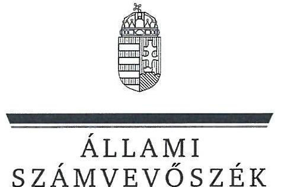
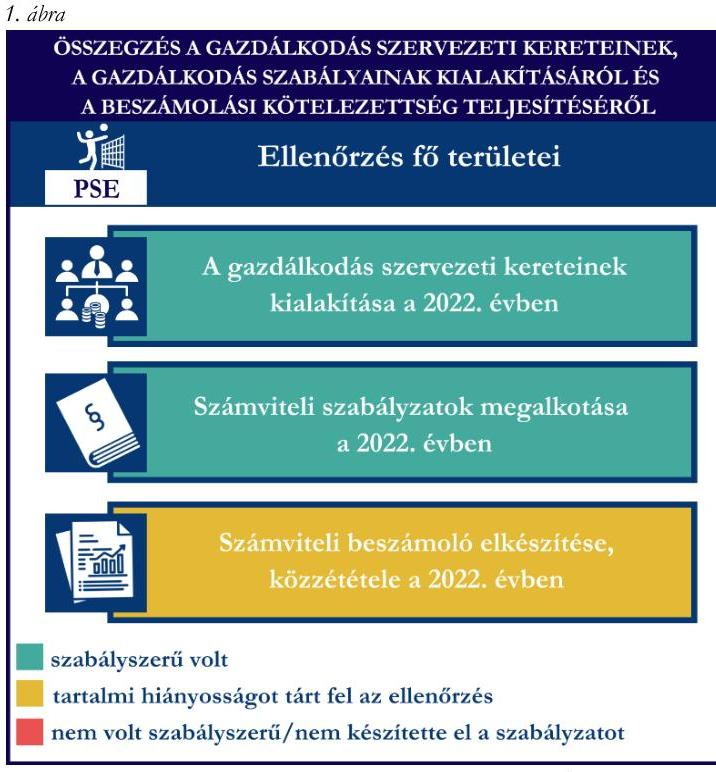
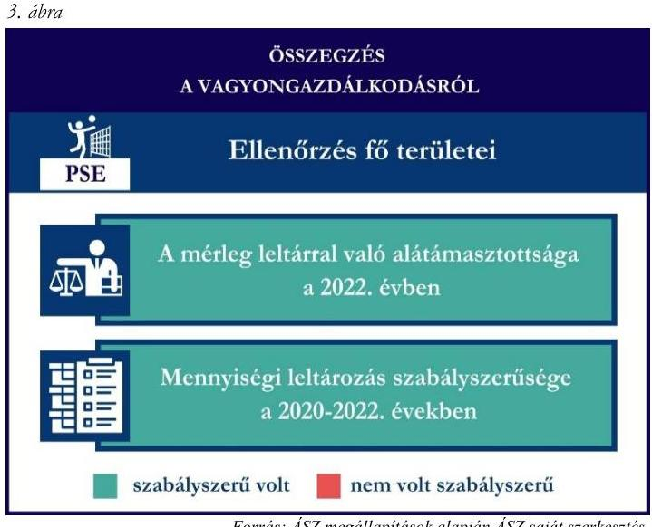

# JELENTÉS 

## Támogatásban részesülő sportszövetségek és sportegyesületek gazdálkodásának ellenőrzése

Pénzügyőr Sportegyesület

2024.

---

ÁLLAMI
SZÁMVEVÔSZÉK

# JELENTÉS 

## Támogatásban részesülő sportszövetségek és sportegyesületek gazdálkodásának ellenőrzése

Pénzügyőr Sportegyesület

2024.

---

# ELLENŐRZÉSI IGAZGATÓSÁG: 

## ÁLLAMHÁZTARTÁSON KÍVÜLI SZERVEZETEKET ELLENŐRZŐ IGAZGATÓSÁG

ELLENŐRZÉSI IGAZGATÓ:
KLINGA LÁSZLÓ igazgató
ELLENŐRZÉSVEZETŐ:
HOFMEISTER LÁSZLÓ ellenőrzésvezető

Jelentéseink az interneten a www.asz.hu címen olvashatók.

IKTATÓSZÁM: EL-4060-199/2024
TÉMASORSZÁM: 30
ELLENŐRZÉS-AZONOSÍTÓ SZÁM: V1026

---

# TARTALOMJEGYZÉK 

AZ ELLENŐRZÉS ALAPADATAI ..... 5
AZ ELLENŐRZÖTT SZERVEZET ..... 7
ÖSSZEFOGLALÁS ..... 8
AZ ELLENŐRZÉS FÓKUSZKÉRDÉSEI ..... 10
MEGÁLLAPÍTÁSOK ..... 11
JAVASLATOK ..... 14
MELLÉKLETEK ..... 15
I. sz. melléklet: Értelmező szótár ..... 15
II. sz. melléklet: Az ellenőrzött szervezetek jegyzéke ..... 17
III. sz. melléklet: Ellenőrzési kritériumok ..... 18
FÜGGELÉK: ÉSZREVÉTELEK ..... 19
RÖVIDÍTÉSEK JEGYZÉKE ..... 20

---

.

---

# AZ ELLENŐRZÉS ALAPADATAI 

## AZ ELLENŐRZÉS CÉLJA

Az ellenőrzés célja az államháztartásból nyújtott támogatással, vagy az államháztartásból meghatározott célra ingyenesen juttatott vagyon felhasználásával érintett sportszövetségek és sportegyesületek gazdálkodása szabályozottságának, gazdálkodási tevékenységének, ezen belül a beszámolási kötelezettség teljesítésének, a támogatások elkülönített nyilvántartásának, valamint a támogatások felhasználásának ellenőrzése.

## AZ ELLENŐRZÉS TÍPUSA

Szabályszerüségi ellenőrzés.

## AZ ELLENŐRZÖTT IDŐSZAK

Az 1. fókuszkérdés esetében a 2022. év.
A 2. fókuszkérdés vonatkozásában a 2021-2022. évek.
A 3. fókuszkérdés vonatkozásában a 2022. év, a mennyiségi felvétellel történő leltározás dokumentumai tekintetében a 2020-2022. évek.

## AZ ELLENŐRZÉS TÁRGYA

Az ellenőrzés tárgya a támogatásban részesülő sportszövetségek, sportegyesületek gazdálkodása szabályozottságának, gazdálkodási tevékenységén belül a beszámolási kötelezettség teljesítésének, a vagyonnyilvántartásának, a támogatások elkülönített nyilvántartásának, valamint az államháztartási forrásból származó közvetlen vagy közvetett támogatások és a meghatározott célra ingyenesen juttatott vagyon felhasználásának vizsgálata volt. Az ellenőrzés a támogatások vonatkozásában kiterjedt továbbá a támogató felé történő beszámolási és elszámolási kötelezettségek teljesítésére, az ezekkel kapcsolatos jogszabályi és belső előírások betartására. Az ellenőrzés kiterjedt minden olyan körülményre és adatra, amely az ÁSZ ${ }^{1}$ jogszabályban meghatározott feladatainak teljesítéséhez, valamint az ellenőrzési program végrehajtása során felmerülő újabb összefüggések feltárásához szükséges.

Az ÁSZ tv. ${ }^{2}$ 25. § (3) bekezdésében meghatározottak alapján, amennyiben a rendelkezésre bocsátott dokumentumok, adatok, illetve tájékoztatás hitelességének, megalapozottságának, teljességének megállapítása vagy egyes ellenőrzési megállapítások alátámasztása, kiegészítése indokolta, az ellenőrzés tárgyát képezték az összefüggő tények vizsgálatához más szervezetek (ellenőrzést támogató szervezetek) által rendelkezésre bocsátott adatok, dokumentációk, megadott tájékoztatások, illetve az ott végzett ellenőrzés is.

Az 1. és 3. fókuszkérdés tekintetében a vizsgálat a teljes ellenőrzött szervezetre, a 2. fókuszkérdés tekintetében kizárólag a röplabda sportszakágra vonatkozott.

---

# AZ ELLENŐRZÉS JOGALAPJA 

Az ellenőrzés jogszabályi alapját az ÁSZ tv. 1. § (3) bekezdése és az 5. § (3) bekezdése előírásai képezték.

## AZ ELLENŐRZÉS MÓDSZERE

Az ellenőrzést a nemzetközi standardokat irányadónak tekintve az ellenőrzési program szempontjai, az ellenőrzött időszakban hatályos jogszabályok, az ellenőrzés általános szakmai szabályai, az ellenőrzésre irányadó ÁSZ módszertanok figyelembevételével végezte az ÁSZ.

Az ellenőrzési kérdések megválaszolásához szükséges bizonyítékok megszerzése az ellenőrzött szervezet által rendelkezésre bocsátott dokumentumokra, adatokra alapozva kérdésfeltevés (információkérés), interjú, mintavételezés útján történt.

Az ellenőrzési bizonyítékként felhasználható adatforrások közé tartoztak egyrészt az ellenőrzés során az ellenőrzött szervezettől bekért dokumentumok, másrészt adatforrás volt minden további az ellenőrzés folyamán feltárt, az ellenőrzés szempontjából információt tartalmazó dokumentum.

A támogatásokkal, azok felhasználásával kapcsolatos kötelezettségek vizsgálatára mintavételi eljárások kerültek alkalmazásra. Támogatás-típusok szerint nagyságrend alapján 1-3 darab támogatás került részletes vizsgálat alá. Ezen támogatások felhasználásának szabályszerűsége támogatásonként kockázatértékelés alapján kiválasztott mintatételekkel került ellenőrzésre. A kiválasztott támogatási szerződésekhez kapcsolódó elszámolásokból 30-30 db mintatétel került ellenőrzésre, ahol az elszámolás nem érte el a 30 db -ot, ott tételes ellenőrzésre került sor. Ezen felül a vagyongazdálkodás szabályszerűségének ellenőrzéséhez is kockázatalapú mintavétel kapcsolódott. A támogatások felhasználása és a vagyongazdálkodás területén a minták ellenőrzése kiterjedt a könyvvezetési kötelezettség vizsgálatára is. A tárgyi eszközök tekintetében 30 db került kiválasztásra a 2022. évben állományban lévő eszközök közül, ahol az állományban lévő eszközök száma nem érte el a 30 db -ot, ott tételes ellenőrzésre került sor azok nyilvántartásának, elszámolásának szabályszerűsége ellenőrzése céljából. Az ellenőrzésben nem statisztikai mintavételre került sor, ezért nem történt kivetítés a teljes sokaságra, a megállapításokat az ellenőrzött mintatételekre vonatkozóan fogalmazta meg az ÁSZ.

---

# AZ ELLENŐRZÖTT SZERVEZET 

## PÉNZÜGYŐR SPORTEGYESÜLET

A Pénzügyőr Sportegyesület a kezdeti amatőr sporttevékenységekből - mint asztalitenisz, futás, labdarúgás, teniszezés, röplabda, sakkozás - egyesületi formába szervezetten 1979-ben alakult meg. A PSE ${ }^{3}$ céljai többek között a $\mathrm{NAV}^{4}$ foglalkoztatottjai, nyugdíjasai, továbbá az előbbi körök családtagjai részére a sportolási és testedzési lehetőségek biztosítása, a sportegyesület tagjai részére a rendszeres testedzés és sportolás lehetőségének biztosítása, valamint a müködtetett versenysportágak utánpótlásának nevelése. A PSE 12 szakosztállyal (labdarúgás, kézilabda, röplabda, kosárlabda, asztaltenisz, küzdősport, vitorlás és vízisport, fitnesz-testépítő, tenisz, túra és verseny, természetbarát, sakk) rendelkezik.

A PSE nem volt közhasznú jogállású, kötelezett volt felügyelőbizottság létrehozására, valamint könyvvizsgálatra. A PSE röplabda szakosztálya által a 2021-2022. években igénybe vett államháztartási forrásból származó támogatásokat az 1. táblázat foglalja össze.

## 1. táblázat

## A PSE RÖPLABDA SZAKOSZTÁLYA ÁLTAL IGÉNYBE VETT TÁMOGATÁSOK (ADATOK M FT-BAN)

|  | 2021. év | 2022. év |
| :--: | :--: | :--: |
| Központi költségvetési támogatás | - | - |
| Helyi önkormányzati támogatás | - | - |
| Látvány-csapatsport támogatás (röplabda) | 95 | 192 |

---

# ÖSSZEFOGLALÁS 

Magyarország Alaptörvényének XX. cikke kimondja, hogy mindenkinek joga van a testi és lelki egészséghez, melynek érvényesülését Magyarország többek között a sportolás és a rendszeres testedzés támogatásával segíti elő. Az Országgyűlés a Sport tv. ${ }^{5}$-ben kinyilvánította, hogy a nemzet közössége a test művelését, a sportot, a nemzet alapértékének, kívánatos célnak tekinti. A sport a közjó része. Erősíti a közösség tagjainak egymáshoz tartozását, miként az egyén testi és lelki egészségét.

A sportegyesületek, sportszövetségek működésükre és szakmai tevékenységük ellátására költségvetési támogatásban, önkormányzati támogatásban, ingyenes vagyonjuttatásban, valamint látvány-esapatsport támogatásban részesülhetnek, amelyekre fokozott figyelem irányul.

A társadalom részéről jogosan felmerülő elvárás, hogy a közpénzeket kezelő, azzal gazdálkodó szervezetek működéséről, tevékenységéről átfogó képet kapjon, a közpénzek rendeltetésszerủ és átlátható módon történő felhasználásának értékelésére időről-időre sor kerüljön az ellenőrzések keretében.

A PSE a jogszabályban előírt könyvviteli szolgáltatás személyi feltételeit, a 2022. évi számviteli beszámoló vonatkozásában a könyvvizsgálatot biztosította. A PSE a jogszabályban előírt felügyelőbizottsággal rendelkezett a 2022. évben. A PSE a számviteli szabályzatokat a jogszabályi előírásoknak megfelelően kialakította a 2022. évben.

A könyvvezetés formája a 2022. évben megfelelt a jogszabályi előírásoknak. A számviteli beszámoló elkészítése az eredménykimutatás kisebb hiányossága mellett valósult meg, a közzétételi, letétbe helyezései kötelezettsége a jogszabályoknak megfelelően teljesült a 2022. évben.

A gazdálkodás szervezeti kereteinek és a gazdálkodási szabályok kialakítása, valamint a beszámolási kötelezettség ellenőrzésének összegzését az 1. ábra tartalmazza.

---

A PSE a látvány-csapatsport támogatást az ellenőrzött tételek vonatkozásában a támogatási célnak megfelelően használta fel a 2021-2022. években.

A PSE a támogatások felhasználásról az előírt támogatásonkénti elkülönített nyilvántartást a 20212022. években a könyvviteli rendszerében nem vezette.

A kapott támogatások felhasználásának ellenőrzéséről az összegzést a 2. ábra tartalmazza.

A PSE vagyongazdálkodása az ellenőrzött tételek vonatkozásában összességében szabályszerű volt a 2022. évben.

A PSE a 2022. évi beszámolójának mérlegtételeit leltárral alátámasztotta.

A mérlegben szereplő eszközök évente előírt mennyiségi leltározását a 2022. évben elvégezte.

A vagyongazdálkodás ellenőrzésének összegzését a 3. ábra tartalmazza.

---

# AZ ELLENŐRZÉS FÓKUSZKÉRDÉSEI 

1.     - A gazdálkodási szabályok kialakítása, a könyvvezetési és beszámolási kötelezettség teljesítése szabályszerű volt-e?
2.     - A kapott támogatások felhasználása szabályszerű volt-e?
3.     - Az ellenőrzött szervezet vagyongazdálkodása szabályszerű volt-e?

---

# MEGÁLLAPÍTÁSOK 

## 1. A gazdálkodási szabályok kialakítása, a könyvvezetési és beszámolási kötelezettség teljesítése szabályszerű volt-e?

Összegző megállapítás A PSE-nél a 2022. évben a gazdálkodási szabályok a jogszabályban előírtaknak megfelelően kialakításra kerültek. A könyvvezetés szabályszerű volt, a beszámolási kötelezettség teljesítése hiányosan valósult meg.

A PSE a 2022. évben a Számv. tv. ${ }^{6}$, valamint a Civilszr. ${ }^{7}$ előírásaiban foglaltaknak megfelelően gondoskodott a könyvviteli szolgáltatás személyi feltételeinek teljesüléséről. A PSE a 2022. évben a Számv. tv.-ben, valamint Civilszr.-ben előírtaknak megfelelően könyvvizsgálót bízott meg a beszámoló felülvizsgálatára. A PSE a Ptk. előírása alapján rendelkezett felügyelőbizottsággal.
A PSE 2022-ben a Számv. tv. előírásainak megfelelően rendelkezett az előírt számviteli politikával, azon belül az eszközök és a források leltárkészítési és leltározási szabályzattal, az eszközök és a források értékelési szabályzatával, valamint a pénzkezelési szabályzattal. A Számv. tv. előírtaknak megfelelően a PSE 2022-ben rendelkezett számlarenddel.
A PSE a Számv. tv.-ben, Civil tv. ${ }^{8}$-ben, valamint a Civilszr.-ben előírtak szerinti kettős könyvvitelt vezetett. A PSE 2022-ben a könyvviteli nyilvántartását úgy vezette, hogy a Számv. tv., valamint a Civilszr. előírásainak megfelelően az egyéb bevételeken belül részletezni tudta a kapott támogatások és tagdíjak összegeit.
A PSE a Civil tv.-ben, valamint a Számv. tv. előírásai alapján előírt 2022. évre vonatkozó számviteli beszámolóját, továbbá a Civil tv.-ben előírtak alapján a közhasznúsági mellékletét elkészítette. A Számv. tv. 4. § (1) bekezdésében foglaltak ellenére a PSE 2022. évi számviteli beszámolója nem volt könyvvezetéssel alátámasztott mivel a beszámoló részét képező eredménykimutatás2 elnevezésű űrlapokon nem szerepeltek támogatási adatok, miközben a főkönyvi adatok alapján a PSE az adott évben kapott központi támogatást, adományt és Szja $1 \%$-ot is.
A PSE a 2022. évi számviteli beszámolóját a Ptk. ${ }^{9}$, valamint a Civil tv. alapján a legfőbb döntéshozó szerv elfogadta, valamint a Civilszr. előírási alapján könyvvizsgáló felülvizsgálta, a felügyelőbizottság véleményezte. A PSE a 2022. évi elfogadott számviteli beszámolóját, valamint közhasznúsági mellékletét a Számv. tv.-ben, valamint a Civil tv.-ben előírtaknak megfelelően letétbe helyezte, közzétette.

---

# 2. A kapott támogatások felhasználása szabályszerű volt-e? 

Összegző megállapítás A PSE a részére nyújtott ellenőrzött támogatásokat a 20212022. években a támogatási célnak megfelelően használta fel. A PSE a támogatások felhasználását a 2021-2022. években, az előírások ellenére a számviteli rendszerében nem különítette el támogatásonként.

A PSE a 2021-2022. években rendelkezett a 107/2011. (VI. 30.) Korm. rendeletben ${ }^{10}$ előírt látványcsapatsport támogatással érintett, jóváhagyott sportfejlesztési programmal. Az ellenőrzött SFP ${ }^{11}$-kel kapcsolatban kapott látvány-csapatsport és kiegészítő sportfejlesztési támogatással a PSE a 107/2011. (VI. 30.) Korm. rendeletben foglaltak szerint elszámolt. A PSE a 2021-2022. években a 107/2011. (VI. 30.) Korm. rendelet 11. § (2) bekezdésében előírtak ellenére a 2021-2022. években a látvány-csapatsport támogatás felhasználásáról negyedévente az előrehaladási jelentéseket az előírt (negyedévet követő 15 napon belül) határidőben nem nyújtotta be az illetékes ellenőrző szervezet felé, mivel azokat a 2024. évben nyújtotta be az ellenőrző szerv felé. A PSE a 2022. évben a látvány-csapatsport és kiegészítő sportfejlesztési támogatás felhasználását igazoló szakmai szöveges beszámolóját a 107/2011. (VI. 30.) Korm. rendeletben foglaltak alapján elkészítette. A PSE a 107/2011. (VI. 30.) Korm. rendelet 11. § (6) bekezdésében foglaltak ellenére az ellenőrzött látvány-csapatsport és kiegészítő sportfejlesztési támogatások tekintetében könyvvizsgáló által nem ellenőrzött számviteli bizonylatokkal számolt el az illetékes ellenőrző szervezet felé, miközben az elszámolt támogatások összértéke meghaladta a jogszabályban előírt 20 M Ft-ot.
A PSE 2021-2022-ben a Számv. tv. 161/A. § (2) bekezdésében foglaltak ellenére a 107/2011. (VI. 30.) Korm. rendelet 9. § (9) bekezdésében előírtak szerint a látvány-csapatsport támogatás felhasználását nem tartotta nyilván a számviteli rendszerében elkülönítetten és naprakészen úgy, hogy az illetékes ellenőrző szervezet, vagy más ellenőrző hatóság által bármikor támogatási programonként, valamint támogatási jogcímenként ellenőrizhető legyen. A PSE a 107/2011. (VI.30.) Korm. rendeletben előírtaknak megfelelően az ellenőrzött, látvány-csapatsport támogatás felhasználását alátámasztó számviteli bizonylatokat záradékkal ellátta.

## 3. Az ellenőrzött szervezet vagyongazdálkodása szabályszerű volt-e?

## Összegző megállapítás

A PSE vagyongazdálkodása a 2022. évben az ellenőrzött tételek vonatkozásában összességében szabályszerű volt. A 2022. évi beszámoló mérlegtételeit az előírt leltárral alátámasztotta, a mennyiségi leltározást elvégezte.

A PSE a Számv. tv.-ben előírtak alapján a főkönyvi könyvelés és az analitikus nyilvántartások adatai közötti egyeztetést a 2022. üzleti év mérlegfordulónapjára vonatkozóan elvégezte, a mérlegben szereplő adatokat leltárral alátámasztotta. A PSE a Számv. tv.-ben, valamint a leltározási szabályzatában ${ }^{12}$ évente előírt mennyiségi felvétellel történő leltározást a 2022. évben elvégezte.

---

Az ellenőrzött tárgyi eszközök számviteli besorolása, értékcsökkenés elszámolása egy ellenőrzött tételt kivéve megfelelt a Számv. tv. előírásainak, az üzembe helyezés tényét a Számv. tv.-ben előírtak alapján dokumentálta.
Egy ellenőrzött tárgyi eszköz tekintetében a PSE a 107/2011. Korm. rendelet 12. § (1) bekezdésében foglaltak ellenére a támogatásból megvalósított eszköz bekerülési értékét alátámasztó bizonylatokat (54,9 M Ft bekerülési értékből 53 M Ft tekintetében), a kapcsolódó dokumentumokat a támogatási igazolás kiállításától számított tíz évig nem őrizte meg.

---

# JAVASLATOK 

Az ÁSZ tv. 33. § (1) bekezdésében foglaltak értelmében az ellenőrzött szervezet vezetője köteles a jelentésben foglalt megállapításokhoz kapcsolódó intézkedési tervet összeállítani és azt a jelentés kézhezvételétől számított 30 napon belül az ÁSZ részére megküldeni. Amennyiben az ellenőrzött szervezet vezetője nem küldi meg határidőben az intézkedési tervet, vagy továbbra sem elfogadható intézkedési tervet küld, az Állami Számvevőszék elnöke az ÁSZ tv. 33. § (3) bekezdése a) és b) pontjaiban foglaltakat érvényesítheti.

## A PÉNZÜGYŐR SPORTEGYESÜLET ELNÖKÉNEK

1. Gondoskodjon arról, hogy a számviteli beszámoló és közhasznúsági melléklet könyvvezetéssel alátámasztott legyen a Számv. tv. 4. § (1) bekezdésében foglaltaknak megfelelően.
2. Gondoskodjon arról, hogy a látvány-csapatsport támogatás felhasználásáról negyedévente az előrehaladási jelentéseket az előirt határidőben nyújtsák be az illetékes ellenőrző szervezet felé, a 107/2011. (VI. 30.) Korm. rendelet 11. § (2) bekezdésében elöirtaknak megfelelően.
3. Gondoskodjon arról, hogy látvány-csapatsport és kiegészítő sportfejlesztési támogatások tekintetében könyvvizsgáló által ellenőrzött számviteli bizonylatokkal számoljanak el az illetékes ellenőrző szervezet felé, a 107/2011. (VI. 30.) Korm. rendelet 11. § (6) bekezdésében foglaltaknak megfelelően.
4. Gondoskodjon a 107/2011. (VI.30) Korm. rendeletben elöirtaknak megfelelő olyan nyilvántartás vezetéséről, amely alkalmas a látvány-csapatsport támogatás felhasználásának támogatási programonként, valamint támogatási jogcímenként történő ellenőrzésére.
5. Gondoskodjon a támogatásból beszerzett tárgyi eszközök bekerülési értéket alátámasztó bizonylatainak megőrzéséről a 107/2011. Korm. rendelet 12. § (1) bekezdésében foglaltaknak megfelelően.

---

# MELLÉKLETEK 

## I. SZ. MELLÉKLET: ÉRTELMEZŐ SZÓTÁR

Civil szervezet

Egyesület

Látvány-csapatsport támogatás

Látvány-csapatsportban múködő amatőr sportszervezet

Látvány-csapatsportban múködő hivatásos sportszervezet

Kiegészítő sportfejlesztési támogatás

Költségvetési támogatás

Közhasznú szervezet

Közhasznú tevékenység

Országos sportági szakszövetség

A civil társaság; a Magyarországon nyilvántartásba vett egyesület - a párt, a szakszervezet és a kölcsönös biztosító egyesület kivételével és - a közalapítvány és a pártalapítvány kivételével - az alapítvány. (Forrás: Civil tv. 2. § 6. pont a)c) alpontjai)

Az egyesület a tagok közös, tartós, alapszabályban meghatározott céljának folyamatos megvalósítására létesített, nyilvántartott tagsággal rendelkező jogi személy. (Forrás: Ptk. 3:63. § (1) bekezdés)
A Számv. tv. szempontjából egyéb szervezet. (Számv. tv. 3. § (1) bekezdés 4. pont a) alpontja)
Az adóévben visszafizetési kötelezettség nélkül nyújtott támogatás, juttatás, véglegesen átadott pénzeszköz és térítés nélkül átadott eszköz könyv szerinti értéke, az adóévben térítés nélkül nyújtott szolgáltatás bekerülési értéke a Tao. tv. ${ }^{13}$-ben meghatározott jogcímeken. (Forrás: Tao. tv. 4. § 44. pont)
Minden olyan, a sportról szóló törvényben meghatározott szabályok szerint a látvány-csapatsportban múködő sportegyesület vagy sportvállalkozás, amelyik nem minősül a látvány-csapatsportban múködő hivatásos sportszervezetnek. (Forrás: Tao. tv. 4. § 42. pont)
A látvány-csapatsportágak országos sportági szakszövetsége által kiírt versenyrendszer legmagasabb felnőtt bajnoki osztályában - a veterán korosztályokra kiírt versenyrendszer kivételével - részt vevő (indulási jogot elnyert) sportszervezet, vagy alsóbb bajnoki osztályaiban részt vevő (indulási jogot elnyert) sportszervezet abban az esetben, ha az ilyen sportszervezet hivatásos sportolót alkalmaz. Több látvány-csapatsportban több jogi személy szervezeti egységgel (szakosztállyal) múködő sportszervezet esetén csak az a jogi személy szervezeti egység (szakosztály), amely a fent részletezett versenyrendszerek bajnoki osztályaiban részt vesz. (Forrás: Tao. tv. 4. § 43. pont)
A látvány-csapatsportok támogatása esetében a Tao. tv. 24/A. § (1) és (2) bekezdése szerinti rendelkező nyilatkozatban felajánlott összeg 12,5 százaléka kiegészítő sportfejlesztési támogatásnak minősül. (Forrás: Tao. tv. 24/A. § (9) bekezdése)
A társadalombiztosítás pénzügyi alapjai kivételével az államháztartás központi alrendszeréből ellenérték nélkül, pénzben nyújtott támogatások. (Forrás: Áht. ${ }^{14}$ 1. § 14. pont, ide nem értve az Áht. 1. § 14. pont a) -o) pontjaiban szereplő támogatásokat)
Közhasznú szervezetté minősíthető a Magyarországon nyilvántartásba vett közhasznú tevékenységet végző szervezet, amely a társadalom és az egyén közös szükségleteinek kielégítéséhez megfelelő erőforrásokkal rendelkezik, továbbá amelynek megfelelő társadalmi támogatottsága kimutatható, és amely: a) civil szervezet (ide nem értve a civil társaságot), vagy
b) olyan egyéb szervezet, amelyre vonatkozóan a közhasznú jogállás megszerzését törvény lehetővé teszi. (Forrás: Civil tv. 32. § (1) bekezdés)
Minden olyan tevékenység, amely a létesítő okiratban megjelölt közfeladat teljesítését közvetlenül vagy közvetve szolgálja, ezzel hozzájárulva a társadalom és az egyén közös szükségleteinek kielégítéséhez. (Forrás: Civil tv. 2. § 20. pont)
Olyan sportszövetség, amely sportágában kizárólagos jelleggel az e törvényben, valamint más jogszabályokban meghatározott feladatokat lát el és e törvényben

---

Sportági szövetség

Sportegyesület

Sportegyesületeknek, sportszövetségeknek nyújtott költségvetési támogatás

Sportszövetség

Sporttevékenység
megállapított különleges jogosítványokat gyakorol. Olyan sportágban hozható létre, amelyet vagy a Nemzetközi Olimpiai Bizottság elismert, vagy amely sportág nemzetközi szövetségét felvették a Nemzetközi Sportszövetségek Szövetségébe (GAISF). (Forrás: Sport tv. 20. § (1), (4) bekezdés)
A Civil tv. és a Ptk. előírásai alapján - a Sport tv.-ben meghatározott eltérésekkel - müködő szövetség, amelynek tagjai kizárólag sportszervezetek lehetnek. Sportági szövetség országos jelleggel is müködhet. Egy sportágban csak egy országos sportági szövetség müködhet. Törvényi feltételek teljesülése esetén szakszövetségi feladatokat is elláthat. (Forrás: Sport tv. 28. §)
A Civil tv. és a Ptk. szabályai szerint müködő olyan egyesület, amelynek alaptevékenysége a sporttevékenység szervezése, valamint a sporttevékenység feltételeinek megteremtése. A sportegyesületek a Sport tv. 15. § (1) bekezdésében meghatározott sportszervezetek körébe tartoznak. A sportegyesületeken kívül sportszervezet még a sportvállalkozás, a sportiskola, valamint az utánpótlás-nevelés fejlesztését végző alapítvány. (Forrás: Sport tv. 16. $\S$ (1) bekezdés)

Az állami sport célú támogatások felhasználásáról és elosztásáról szóló 474/2016. (XII. 27.) Korm. rendelet ${ }^{15}$ 1. § (1) bekezdésében és a 27/2013. (III. 29.) EMMI rendelet ${ }^{16}$ 1. $\S$-ában meghatározott fejezeti kezelésű előirányzatokból nyújtott támogatás.
Meghatározott sporttevékenységek körében a sportversenyek szervezésére, a tagok érdekvédelmére és a részükre való szolgáltatásokra, valamint a nemzetközi kapcsolatok lebonyolítására létrehozott, jogi személyiséggel és önkormányzattal rendelkező, a Civil tv. és a Ptk. alapján - az e törvényben foglalt eltérésekkel - különös formában müködő egyesületek. A Sport tv. 19. § (3) bekezdése szerint a sportszövetségeknek az alábbi típusai léteznek: országos sportági szakszövetségek, sportági szövetségek, szabadidősport szövetségek, fogyatékosok sportszövetségei, diák- és egyetemi-főiskolai sport sportszövetségei, nemzetközi sportszövetségek. (Forrás: Sport tv. 19. § (1), (3) bekezdés)
Meghatározott szabályok szerint, a szabadidő eltöltéseként kötetlenül vagy szervezett formában, illetve versenyszerűen végzett testedzés vagy szellemi sportágban kifejtett tevékenység, amely a fizikai erőnlét és a szellemi teljesítőképesség megtartását, fejlesztését szolgálja. (Forrás: Sport tv. 1. § (2) bekezdés)

---

II. SZ. MELLÉKLET: AZ ELLENŐRZŐTT SZERVEZETEK JEGYZÉKE

| ELLENŐRZŐTT SZERVEZET NEVE | ELLENŐRZŐTT SZERVEZET SZÉKHELYE |
| :-- | :-- |
| Pénzügyőr Sportegyesület | 1026 Budapest, Pasaréti út 124-126. |

---

# III. SZ. MELLÉKLET: ELLENŐRZÉSI KRITÉRIUMOK 

## FÓKUSZKÉRDÉS

## 1. fókuszkérdés:

A gazdálkodási szabályok kialakítása, a könyvvezetési és beszámolási kötelezettség teljesítése szabályszerű volt-e?

## 2. fókuszkérdés:

A kapott támogatások felhasználása szabályszerű volt-e?

## 3. fókuszkérdés:

Az ellenőrzött szervezet vagyongazdálkodása szabályszerű volt-e?

## ELLENŐRZÉSI KRITÉRIUMOK

107/2011. (VI.30.) Korm. rendelet 9. § (9) bek.
Számv. tv. 4. § (1) bekezdés, 14. § (3) bekezdés, (5) bekezdés a), b), d) pont, (8) bekezdés, (11) bekezdés, 69. § (3) bekezdés, 90. § (3) bekezdés c) pont, 161. § (1) bekezdés, (2) bekezdés a)-d) pont, (3)-(4) bekezdés, 161/A. $\S$ (2) bekezdés, 165. § (2) bekezdés
Civilszr. 7. § (1) bekezdés, (4) bekezdés b), c) pont, 8. § (2), (3) bekezdés, 9. § (4), (5), (8) bekezdés, 12. § (4), (5) bekezdés, 15. § (1) bekezdés a), b) pont, 16. § (1) bekezdés, 24. § (2) bekezdés

Civil vhr. 12. ${ }^{17} \S$ (1) bekezdés, melléklet 5. pont
Ptk. 3:26. § (1) bekezdés, 3:27. § (1) bekezdés, 3:82. § (1) bekezdés,
Civil tv. 28. § (1) bekezdés, 29. § (2) bekezdés c) pont, (3), (6), (7) bekezdés, 30. § (1)-(4) bekezdés 40. § (1)
Tao. tv. 22/C.
107/2011. (VI. 30.) Korm. rendelet 2. § (3b) bek., 4. § (11) bek., 5. § (1) bek., 6. § (1) bek. e) pont, 9. § (8)-(10) bek., 10. § (2), (2a), (2b), (4), (5a), (6) bek., 11. § (1), (1a), (1d), (1e), (2), (4), (4a), (5), (6) bek., 13. § (1), (2a) bek., 14. § (1), (4), (4b), (4c), (6c) bek.

Számv. tv. 44. § (2) bekezdés, 93. § (3) bekezdés, 159. §, 161/A. § (2) bekezdés, 165. § (2) bekezdés, 167. § (1) bekezdés a), d), e), h) pont

Civil tv. 20. § (2) bekezdés a) pont, (3) bekezdés a), c) pont, (4) bekezdés, 29. § (4), (5) bekezdés
Civilszr. 24. § (2) bekezdés
27/2013. (III.29.) EMMI rendelet 18. § (2) bekezdés
474/2016. (XII. 27.) Korm. rendelet 22. § (2) bekezdés, 24. § (2) bekezdés
Áht. 53. §, Ávr. ${ }^{18}$ 92. §, 93. § (2)-(4) bekezdések
Ptk. 3:63. § (4) bekezdés
Számv. tv. 3. § (3) bekezdés 3. pont, 15. § (3) bekezdés, 46. § (3), (4) bekezdés, 47-51. §, 52. § (1)-(7) bekezdés, 69. § (1)-(3) bekezdések, 165. § (2) bekezdés, 169. § (2) bekezdés
107/2011. Korm. rendelet 12. § (1) bekezdés

---

# FÜGGELÉK: ÉSZREVÉTELEK 

A jelentéstervezetet a Számvevőszék 15 napos észrevételezésre megküldte az ellenőrzött szervezet vezetőjének az ÁSZ tv. 29. §* (1) bekezdése előírásának megfelelően.

A Pénzügyőr Sportegyesület elnöke a jelentéstervezetre nem tett észrevételt.

[^0]
[^0]:    * 29. § (1) Az Állami Számvevőszék az ellenőrzési megállapításait megküldi az ellenőrzött szervezet vezetőjének vagy az általa megbízott személynek, és annak, akinek személyes felelősségét állapította meg.
    (2) Az ellenőrzött szervezet vezetője és a felelősként megjelölt személy az ellenőrzés megállapításaira tizenöt napon belül írásban észrevételt tehet.
    (3) Az Állami Számvevőszék az észrevételre a beérkezésétől számított harminc napon belül írásban válaszol. A figyelembe nem vett észrevételeket köteles a jelentésben feltüntetni, és megindokolni, hogy azokat miért nem fogadta el.

---

# RÖVIDÍTÉSEK JEGYZÉKE 

${ }^{1}$ ÁSZ
${ }^{2}$ ÁSZ tv.
${ }^{3}$ PSE
${ }^{4}$ NAV
${ }^{5}$ Sport tv.
${ }^{6}$ Számv. tv.
${ }^{7}$ Civilszr.
${ }^{8}$ Civil tv.
${ }^{9}$ Ptk.
${ }^{10}$ 107/2011. (VI. 30.) Korm. rendelet
${ }^{11}$ SFP
${ }^{12}$ leltározási szabályzat
${ }^{13}$ Tao. tv.
${ }^{14}$ Áht.
${ }^{15}$ 474/2016. (XII. 27.) Korm. rendelet
${ }^{16}$ 27/2013. (III.29.) EMMI rendelet
${ }^{17}$ Civil vhr.
${ }^{18}$ Ávr.

Állami Számvevőszék
2011. évi LXVI. törvény az Állami Számvevőszékről

Pénzügyőr Sportegyesület
Nemzeti Adó-és Vámhivatal
2004. évi I. törvény a sportról
2000. évi C. törvény a számvitelről

479/2016. (XII. 28.) Korm. rendelet a számviteli törvény szerinti egyes egyéb szervezetek beszámoló készítési és könyvvezetési kötelezettségének sajátosságairól
2011. évi CLXXV. törvény az egyesülési jogról, a közhasznú jogállásról, valamint a civil szervezetek müködéséről és támogatásáról
2013. évi V. törvény a Polgári Törvénykönyvről
107/2011. (VI. 30.) Korm. rendelet a látvány-csapatsport támogatását biztosító támogatási igazolás kiállításáról, felhasználásáról, a támogatás elszámolásának és ellenőrzésének, valamint visszafizetésének szabályairól
sportfejlesztési program
PSE leltározási szabályzata, hatályos 2018. január 1-jétől
1996. évi LXXXI. törvény a társasági adóról és az osztalékadóról
2011. évi CXCV. törvény az államháztartásról

474/2016. (XII. 27.) Korm. rendelet az állami sport célú támogatások felhasználásáról és elosztásáról
27/2013. (III. 29.) EMMI rendelet az állami sport célú támogatások felhasználásáról és elosztásáról
350/2011. (XII. 30.) Korm. rendelet a civil szervezetek gazdálkodása, az adománygyűjtés és a közhasznúság egyes kérdéseiről
368/2011. (XII. 31.) Korm. rendelet az államháztartásról szóló törvény végrehajtásáról

---

1052 Budapest, Apáczai Csere János u. 10. | 1364 Budapest 4., Pf. 54
www.asz.hu | szamvevoszek@asz.hu
telefon: +36 14849100