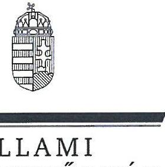
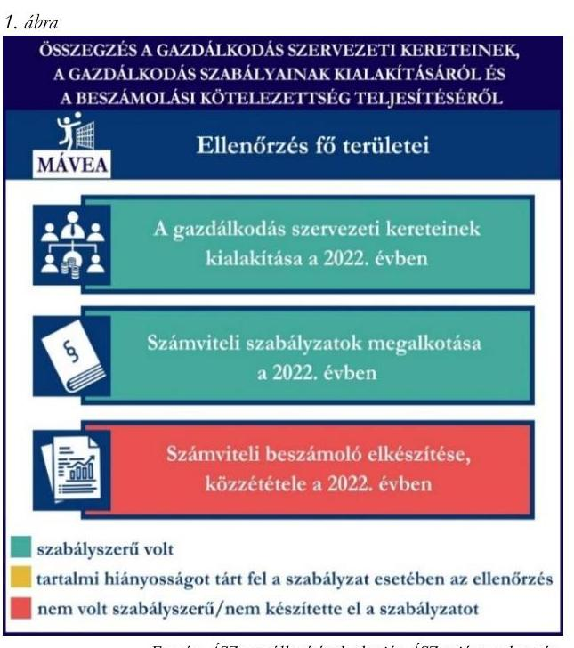
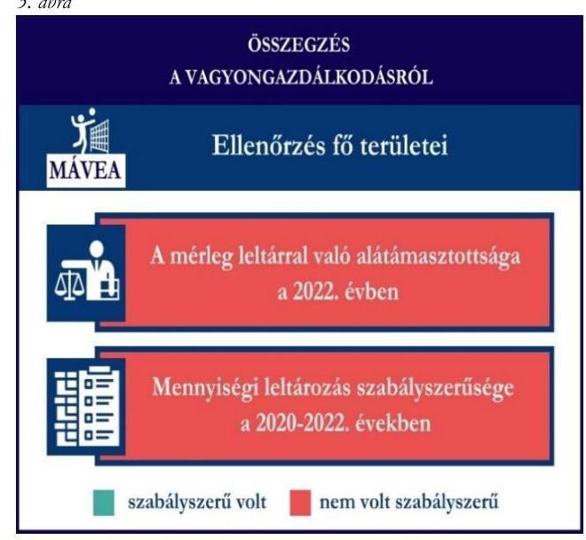

# JELENTÉS 

## Támogatásban részesülő sportszövetségek és sportegyesületek gazdálkodásának ellenőrzése

MÁV Előre Sport Akadémia Székesfehérvár

2024.

---

ÁLLAMI
SZÁMVEVŐSZÉK

# JELENTÉS 

## Támogatásban részesülő sportszövetségek és sportegyesületek gazdálkodásának ellenőrzése

MÁV Előre Sport Akadémia Székesfehérvár

2024.

---

# ELLENŐRZÉSI IGAZGATÓSÁG: 

## ÁLLAMHÁZTARTÁSON KÍVÜLI SZERVEZETEKET ELLENŐRZŐ IGAZGATÓSÁG

ELLENŐRZÉSI IGAZGATÓ:
KLINGA LÁSZLÓ igazgató
ELLENŐRZÉSVEZETŐ:
HOFMEISTER LÁSZLÓ ellenőrzésvezető

Jelentéseink az interneten a www.asz.hu címen olvashatók.

IKTATÓSZÁM: EL-4060-196/2024
TÉMASORSZÁM: 30
ELLENŐRZÉS-AZONOSÍTÓ SZÁM: V1026

---

# TARTALOMJEGYZÉK 

AZ ELLENŐRZÉS ALAPADATAI ..... 5
AZ ELLENŐRZÖTT SZERVEZET ..... 7
ÖSSZEFOGLALÁS ..... 8
AZ ELLENŐRZÉS FÓKUSZKÉRDÉSEI ..... 10
MEGÁLLAPÍTÁSOK ..... 11
JAVASLATOK ..... 14
MELLÉKLETEK ..... 15
I. sz. melléklet: Értelmező szótár ..... 15
II. sz. melléklet: Az ellenőrzött szervezetek jegyzéke ..... 17
III. sz. melléklet: Ellenőrzési kritériumok ..... 18
FÜGGELÉK: ÉSZREVÉTELEK ..... 19
RÖVIDÍTÉSEK JEGYZÉKE ..... 21

---

.

---

# AZ ELLENŐRZÉS ALAPADATAI 

## AZ ELLENŐRZÉS CÉLJA

Az ellenőrzés célja az államháztartásból nyújtott támogatással, vagy az államháztartásból meghatározott célra ingyenesen juttatott vagyon felhasználásával érintett sportszövetségek és sportegyesületek gazdálkodása szabályozottságának, gazdálkodási tevékenységének, ezen belül a beszámolási kötelezettség teljesítésének, a támogatások elkülönített nyilvántartásának, valamint a támogatások felhasználásának ellenőrzése.

## AZ ELLENŐRZÉS TÍPUSA

Szabályszerűségi ellenőrzés.

## AZ ELLENŐRZÖTT IDŐSZAK

Az 1. fókuszkérdés esetében a 2022. év.
A 2. fókuszkérdés vonatkozásában a 2021-2022. évek.
A 3. fókuszkérdés vonatkozásában a 2022. év, a mennyiségi felvétellel történő leltározás dokumentumai tekintetében a 2020-2022. évek.

## AZ ELLENŐRZÉS TÁRGYA

Az ellenőrzés tárgya a támogatásban részesülő sportszövetségek, sportegyesületek gazdálkodása szabályozottságának, gazdálkodási tevékenységén belül a beszámolási kötelezettség teljesítésének, a vagyonnyilvántartásának, a támogatások elkülönített nyilvántartásának, valamint az államháztartási forrásból származó közvetlen vagy közvetett támogatások és a meghatározott célra ingyenesen juttatott vagyon felhasználásának vizsgálata volt. Az ellenőrzés a támogatások vonatkozásában kiterjedt továbbá a támogató felé történő beszámolási és elszámolási kötelezettségek teljesítésére, az ezekkel kapcsolatos jogszabályi és belső előírások betartására.

Az ellenőrzés kiterjedt minden olyan körülményre és adatra, amely az ÁSZ¹ jogszabályban meghatározott feladatainak teljesítéséhez, valamint az ellenőrzés program végrehajtása során felmerülő újabb összefüggések feltárásához szükséges.

Az 1. és 3. fókuszkérdés tekintetében az ellenőrzés a teljes ellenőrzött szervezetre, a 2. fókuszkérdés tekintetében kizárólag a röplabda szakosztályra vonatkozott.

## AZ ELLENŐRZÉS JOGALAPJA

Az ellenőrzés jogszabályi alapját az ÁSZ tv.² 1. § (3) bekezdése és az 5. § (3) bekezdése előírásai képezték.

---

# AZ ELLENŐRZÉS MÓDSZERE 

Az ellenőrzést a nemzetközi standardokat irányadónak tekintve az ellenőrzési program szempontjai, az ellenőrzött időszakban hatályos jogszabályok, az ellenőrzés általános szakmai szabályai, az ellenőrzésre irányadó ÁSZ módszertanok figyelembevételével végezte az ÁSZ.

Az ellenőrzési kérdések megválaszolásához szükséges bizonyítékok megszerzése az ellenőrzött szervezet által rendelkezésre bocsátott dokumentumokra, adatokra alapozva kérdésfeltevés (információkérés), interjú, mintavételezés útján történt. A támogatásból beszerzett tárgyi eszközök használatára, fizikai fellelhetőségére irányulóan az érintett vagyontárgyak helyszíni szemle keretében történő szemrevételezésére indokolt esetben sor került.

Az ellenőrzési bizonyítékként felhasználható adatforrások közé tartoztak egyrészt az ellenőrzés során az ellenőrzött szervezettől bekért dokumentumok, másrészt adatforrás volt minden további, az ellenőrzés folyamán feltárt, az ellenőrzés szempontjából információt tartalmazó dokumentum.

A támogatásokkal, azok felhasználásával kapcsolatos kötelezettségek vizsgálatára mintavételi eljárások kerültek alkalmazásra. Támogatás-típusok szerint nagyságrend alapján 1-3 darab támogatás került részletes vizsgálat alá. Ezen támogatások felhasználásának szabályszerűsége támogatásonként kockázatértékelés alapján kiválasztott mintatételekkel került ellenőrzésre. A kiválasztott támogatási szerződésekhez kapcsolódó elszámolásokból 30-30 db mintatétel került ellenőrzésre, ahol az elszámolás nem érte el a 30 db-ot, ott tételes ellenőrzésre került sor. Ezen felül a vagyongazdálkodás szabályszerűségének ellenőrzéséhez is kockázatalapú mintavétel kapcsolódott. A támogatások felhasználása és a vagyongazdálkodás területén a minták ellenőrzése kiterjedt a könyvvezetési kötelezettség vizsgálatára is. A tárgyi eszközök tekintetében 30 db került kiválasztásra a 2022. évben állományban lévő eszközök közül, ahol az állományban lévő eszközök száma nem érte el a 30 db-ot, ott tételes ellenőrzésre került sor azok nyilvántartásának, elszámolásának szabályszerűsége ellenőrzése céljából. Az ellenőrzésben nem statisztikai mintavételre került sor, ezért nem történt kivetítés a teljes sokaságra, a megállapításokat az ellenőrzött mintatételekre vonatkozóan fogalmazta meg az ÁSZ.

---

# AZ ELLENŐRZÖTT SZERVEZET

## MÁV Előre Sport Akadémia Székesfehérvár

1. június 24-én alapították meg a MÁV Előre Akadémiát³. Céljai közé tartozik a nevelés és oktatás, képességfejlesztés, ismeretterjesztés, valamint a versenysport népszerűsítése és az egészségvédelem elősegítése. A MÁV Előre Akadémia röplabda és strandröplabda szakosztállyal rendelkezett az ellenőrzött időszakban.

A MÁV Előre Akadémia a jogszabályi előírás alapján könyvvizsgálatra nem, felügyelőbizottság létrehozására kötelezett volt, a 2022. évben vállalkozási tevékenységet nem végzett. Az OBH⁴ nyilvántartása alapján közhasznú jogállással nem rendelkezett.

A 2021-2022. években a MÁV Előre Akadémia által igénybe vett államháztartási forrásból származó támogatásokat az 1. táblázat foglalja magában.

## 1. táblázat

A MÁV ELŐRE AKADÉMIA ÁLTAL IGÉNYBE VETT TÁMOGATÁSOK (ADATOK M FT-BAN)

|   | 2021. év | 2022. év  |
| --- | --- | --- |
|  Központi költségvetésből | - | -  |
|  Helyi önkormányzattól | 0,5 | 0,5  |
|  Látvány-csapatsport támogatásból | 150,0 | 166,9  |

Forrás: Az ellenőrzött szervezet főkönyvi adatai alapján ÁSZ saját szerkesztés

---

# ÖSSZEFOGLALÁS 

Az Alaptörvény⁵ XX. cikke kimondja, hogy mindenkinek joga van a testi és lelki egészséghez, melynek érvényesülését Magyarország többek között a sportolás és a rendszeres testedzés támogatásával segíti elő. Az Országgyűlés⁶ a Sport tv.⁷-ben kinyilvánította, hogy a nemzet közössége a test művelését, a sportot, a nemzet alapértékének, kívánatos célnak tekinti. A sport a közjó része. Erősíti a közösség tagjainak egymáshoz tartozását, miként az egyén testi és lelki egészségét.

A sportegyesületek, sportszövetségek működésükre és szakmai tevékenységük ellátására költségvetési támogatásban, önkormányzati támogatásban, ingyenes vagyonjuttatásban, valamint látvány-csapatsport támogatásban részesülhetnek, amelyekre fokozott figyelem irányul.

A társadalom részéről jogosan felmerülő elvárás, hogy a közpénzeket kezelő, azzal gazdálkodó szervezetek működéséről, tevékenységéről átfogó képet kapjon, a közpénzek rendeltetésszerű és átlátható módon történő felhasználásának értékelésére időről-időre sor kerüljön az ellenőrzések keretében.

A MÁV Előre Akadémia a könyvviteli szolgáltatás személyi feltételeinek megteremtéséről, felügyelőbizottság létrehozásáról és működéséről gondoskodott.

A jogszabályi előírások szerint a MÁV Előre Akadémia kialakította a számviteli politikáját, valamint elkészítette számviteli szabályzatait.

A könyvvezetés formája a 2022. évben megfelelt a jogszabályi előírásoknak. A számviteli beszámoló közzétételi, letétbe helyezési kötelezettségét nem a jogszabályoknak megfelelően teljesítette. Az Elnök az ÁSZ tv. 29. § (2) bekezdés szerinti, a jelentéstervezet megállapításaira tett észrevételében arról tájékoztatta az ÁSZ-t, hogy a 2022-es számviteli beszámoló kiegészítő melléklete az új honlapjukon feltöltésre került, ezzel az ÁSZ megállapítása az ellenőrzés során hasznosult.

A gazdálkodás szervezeti keretei kialakításának, a számviteli szabályzatok megalkotásának, valamint a számviteli beszámoló elkészítésének és közzétételének értékelését a MÁV Előre Akadémia (MÁVEA) tekintetében az 1. ábra mutatja be.

---

A MÁV Előre Akadémia a látvány-csapatsport támogatást, a kiegészítő sportfejlesztési támogatást, valamint a helyi önkormányzattól kapott támogatásokat a támogatási célnak megfelelően használta fel az ellenőrzött tételek esetében.

A kiegészítő sportfejlesztési támogatások felhasználásáról a jogszabályban előírt elkülönített nyilvántartást a 2021-2022. években nem vezette a számviteli rendszerében.

A kapott támogatások felhasználásának ellenőrzéséről az összegzést a MÁV Előre Akadémia (MÁVEA) tekintetében a 2. ábra tartalmazza.
2. ábra

A mérleg leltárral való alátámasztottsága a 2022. évben

Mennyiségi leltározás szabályszerűsége a 2020-2022. években
szabályszerű volt ☐ nem volt szabályszerű
2022. évben a MÁV Előre Akadémia vagyongazdálkodása az ellenőrzött tételek vonatkozásában nem volt szabályszerű.

A 2022. évi beszámolójának mérlegtételeit a befektetett pénzügyi eszközök, követelések és a pénzeszközök esetében nem támasztotta alá szabályszerű leltárral. A jogszabályban előírt mennyiségi felvétellel történő leltározást a 2020-2022. években nem végezte el. Ez alapján sérült a törvényben előírt valódiság elve.

A vagyongazdálkodás ellenőrzésének az összegzését a MÁV Előre Akadémia (MÁVEA) tekintetében a 3. ábra tartalmazza.

---

# AZ ELLENŐRZÉS FÓKUSZKÉRDÉSEI 

1.     - A gazdálkodási szabályok kialakítása, a könyvvezetési és beszámolási kötelezettség teljesítése szabályszerű volt-e?
2.     - A kapott támogatások felhasználása szabályszerű volt-e?
3.     - Az ellenőrzött szervezet vagyongazdálkodása szabályszerű volt-e?

---

# MEGÁLLAPÍTÁSOK 

## 1. A gazdálkodási szabályok kialakítása, a könyvvezetési és beszámolási kötelezettség teljesítése szabályszerű volt-e?

Összegző megállapítás A 2022. évben a MÁV Előre Akadémia gazdálkodási szabályainak kialakítása megfelelt a jogszabályi előírásoknak. A könyvvezetési kötelezettségének teljesítése szabályszerű volt, a beszámolási és közzétételi kötelezettségének teljesítése nem volt szabályszerű.

A 2022. évben a MÁV Előre Akadémia a Számv. tv.⁸ és a Civilszr.⁹-ben foglaltaknak megfelelően gondoskodott a könyvviteli szolgáltatás személyi feltételeinek teljesüléséről. A MÁV Előre Akadémia a 2022. évben a Ptk.¹⁰ előírásainak betartásával gondoskodott az előírt felügyelőbizottság létrehozásáról.

A 2022. évben rendelkezett a Számv. tv. előírásainak megfelelő számviteli politikával, az eszközök és a források leltárkészítési és leltározási szabályzatával, az eszközök és források értékelési szabályzatával, a pénzkezelés szabályzatával, valamint számlarenddel.
A MÁV Előre Akadémia a könyvviteli nyilvántartásait a Számv. tv. és a Civilszr. rendelkezéseinek megfelelően úgy alakította ki, hogy a számviteli beszámolóban az egyéb bevételeken belül a tagdíjak és a kapott támogatások összegeit részletezni tudta.
A kettős könyvvitellel alátámasztott 2022. évi egyszerűsített éves beszámolója a Civil tv.¹¹ előírásainak, illetve a közhasznúsági melléklet Civil vhr.¹² előírásainak megfelelően készült el. A 2022. évre vonatkozó számviteli beszámolót a MÁV Előre Akadémia közgyűlése a Civil tv.-nek megfelelően jóváhagyta. A MÁV Előre Akadémia az elfogadott 2022. évi számviteli beszámolóját, valamint közhasznúsági mellékletét a Civil tv. 30. § (1) bekezdés előírása ellenére határidőn túl - 2023. december 7-én - helyezte letétbe, tette közzé. Saját honlapján a 2022. évi számviteli beszámolóját a beszámoló részét képező kiegészítő melléklet nélkül helyezte el Civil tv. 30. § (4) bekezdésében foglaltak ellenére.

## 2. A kapott támogatások felhasználása szabályszerű volt-e?

## Összegző megállapítás

A MÁV Előre Akadémia a 2021. és 2022. években kapott támogatásokat az ellenőrzött tételek vonatkozásában a támogatási célnak megfelelően használta fel. A kiegészítő sportfejlesztési támogatás felhasználásáról nem a jogszabályban előírt elkülönített nyilvántartást vezette.

A MÁV Előre Akadémia a látvány-csapatsport támogatás, a kiegészítő sportfejlesztési támogatás, valamint a helyi önkormányzattól kapott támogatások ellenőrzött bevételeit a Civil tv. előírásai alapján elkülönítetten mutatta ki számviteli rendszerében. A MÁV Előre Akadémia a 2021-2022. években a Számv. tv.-ben és a Civil tv.-ben előírt alapcél szerinti tevékenysége költségei, ráfordításai ellentételezésére a látvány-csapatsport támogatásból, valamint a helyi önkormányzattól kapott ellenőrzött támogatásokról

---

olyan elkülönített számviteli nyilvántartást vezetett, amely alapján támogatásonként megállapítható és ellenőrizhető a kapott támogatások felhasználása.
A MÁV Előre Akadémia a 2021-2022. években a Számv. tv. 161/A. § (2) bekezdésében és a Civil tv. 20. § (4) bekezdésében foglaltak ellenére, az előírt alapcél szerinti tevékenysége költségei, ráfordításai ellentételezésére a kiegészítő sportfejlesztési támogatásból kapott ellenőrzött támogatásról nem vezetett olyan elkülönített számviteli nyilvántartást, amelynek alapján támogatásonként megállapítható és ellenőrizhető a kapott támogatás felhasználása.
A MÁV Előre Akadémia a 2021-2022. években rendelkezett a 107/2011. (VI. 30.) Korm.rendeletben¹³ előírt látvány-csapatsport támogatással érintett, jóváhagyott SFP¹⁴-vel. A MÁV Előre Akadémia a 2021-2022.
 években a 107/2011. (VI. 30.) Korm. rendeletben foglaltaknak megfelelően a látványcsapatsport támogatás felhasználásáról negyedévente az előrehaladási jelentéseket benyújtotta az illetékes ellenőrző szervezet felé. Az ellenőrzött SFP-vel kapcsolatban kapott látványcsapatsport és kiegészítő látványcsapatsport támogatással a MÁV Előre Akadémia a 107/2011. (VI. 30.) Korm. rendeletben foglaltak szerint elszámolt. A MÁV Előre Akadémia a 2022. évben a látványcsapatsport és kiegészítő sportfejlesztési támogatás felhasználását igazoló szakmai szöveges beszámolóját a 107/2011. (VI. 30.) Korm. rendeletben foglaltak alapján elkészítette. A 107/2011. (VI. 30.) Korm. rendeletnek megfelelően könyvvizsgáló által ellenőrzött számviteli bizonylatokkal számolt el a támogató felé, melyhez a könyvvizsgálatot végző könyvvizsgáló felelősségbiztosítási kötvénye is benyújtásra került. A MÁV Előre Akadémia a 107/2011. (VI. 30.) Korm. rendeletben előírtaknak megfelelően az ellenőrzött, látványcsapatsport támogatás felhasználását alátámasztó számviteli bizonylatokat – egy tétel kivételével – záradékkal ellátta. A 107/2011. (VI. 30.) Korm. rendelet 11. § (5) bekezdésében foglaltak ellenére egy ellenőrzött tétel számviteli bizonylata nem került záradékolásra, egy másik ellenőrzött tétel estében a záradékolt összegnél magasabb összeg került a támogatásban elszámolásra, így nem jelezte a MÁV Előre Akadémia, hogy a számviteli bizonylaton szereplő összegből mennyit számolt el a szerződésszámmal hivatkozott támogatási szerződés terhére.
A MÁV Előre Akadémia a 2021-2022. években a helyi önkormányzat költségvetéséből számára juttatott sportcélú támogatásokról, a támogatási szerződésben előírtaknak megfelelően teljesítette beszámolási kötelezettségét a támogatás rendeltetésszerű felhasználásáról. A MÁV Előre Akadémia a 2021-2022. években elszámolt támogatások ellenőrzött tételeit a Számv. tv.-ben előírtaknak megfelelő, szabályszerű számviteli bizonylattal alátámasztotta.

# 3. Az ellenőrzött szervezet vagyongazdálkodása szabályszerű volt-e? 

Összegző megállapítás A MÁV Előre Akadémia vagyongazdálkodása a 2022. évben nem volt szabályszerű az ellenőrzött tételek vonatkozásában. A 2022. évi beszámolójának mérlegtételeit nem támasztotta alá szabályszerű leltárral.

A MÁV Előre Akadémia a Számv. tv. 69. § (1) bekezdésében előírtaknak nem tett eleget, mivel a beszámolóban lévő eszközök közül a befektetett pénzügyi eszközök, követelések, valamint a pénzeszközök mérlegsorokat nem támasztotta alá szabályszerű leltárral.
A MÁV Előre Akadémia nem tett eleget a Számv. tv. 69. § (3) bekezdésében és leltározási szabályzatában ${ }^{15}$ előírtak ellenére a háromévente esedékes mennyiségi leltározást a 2020-2022. években nem végezte el.

---

A fentiek alapján sérült a Számv. tv. 15. § (3) bekezdésében előírt valódiság elve, miszerint a könyvvitelben rögzített és a beszámolóban szereplő tételeknek a valóságban is megtalálhatóknak, bizonyíthatóknak, kívülállók által is megállapíthatóknak kell lenniük, értékelésük meg kell, hogy feleljen az e törvényben előírt értékelési elveknek és az azokhoz kapcsolódó értékelési eljárásoknak.
A MÁV Előre Akadémiánál az ellenőrzött tételek vonatkozásában a tárgyi eszközök bekerülési értékét, az értékcsökkenés elszámolását a Számv. tv. előírás szerint határozták meg, az üzembe helyezést a tárgyi eszközök vonatkozásában a Számv. tv.-ben előírtak alapján dokumentálták.

---

# JAVASLATOK 

Az ÁSZ tv. 33. § (1) bekezdésében foglaltak értelmében az ellenőrzött szervezet vezetője köteles a jelentésben foglalt megállapításokhoz kapcsolódó intézkedési tervet összeállítani és azt a jelentés kézhezvételétől számított 30 napon belül az ÁSZ részére megküldeni. Amennyiben az ellenőrzött szervezet vezetője nem küldi meg határidőben az intézkedési tervet, vagy továbbra sem elfogadható intézkedési tervet küld, az Állami Számvevőszék elnöke az ÁSZ tv. 33. § (3) bekezdése a) és b) pontjaiban foglaltakat érvényesítheti.

## A MÁV Előre SPORT AKADÉMIA SZÉKESFEHÉRVÁR ELNÖKÉNEK

1. Gondoskodjon a kiegészítő sportfejlesztési támogatásból kapott támogatások elkülönített számviteli nyilvántartásának vezetéséről, amely alapján támogatásonként megállapítható és ellenőrizhető a kapott támogatás felhasználása, a Civil tv. 20. § (4) bekezdés és a Számv. tv. 161/A. § (2) bekezdés előírásai alapján.
2. Gondoskodjon arról, hogy a 107/2011. (VI. 30.) Korm. rendelet 11. § (5) bekezdésének megfelelően záradékolják a támogatás felhasználásához kapcsolódó számviteli bizonylatokat.
3. Gondoskodjon a beszámoló mérlegtételeinek leltárral való alátámasztásáról, valamint a mennyiségi felvétellel elvégzendő leltározásáról a Számv. tv. 69. § (1)-(3) bekezdéseiben, valamint a leltározási szabályzatában előírtaknak megfelelően.

---

# MELLÉKLETEK 

## I. SZ. MELLÉKLET: ÉRTELMEZŐ SZÓTÁR

civil szervezet
egyesület
költségvetési támogatás
közhasznú szervezet
közhasznú tevékenység
látványcsapatsport támogatás
látványcsapatsportban működő amatőr sportszervezet
látványcsapatsportban működő hivatásos sportszervezet

A civil társaság; a Magyarországon nyilvántartásba vett egyesület - a párt, a szakszervezet és a kölcsönös biztosító egyesület kivételével és - a közalapítvány és a pártalapítvány kivételével - az alapítvány. (Forrás: Civil tv. 2. § 6. pont a) -c) alpontjai)

Az egyesület a tagok közös, tartós, alapszabályban meghatározott céljának folyamatos megvalósítására létesített, nyilvántartott tagsággal rendelkező jogi személy. (Forrás: Ptk. 3:63. § (1) bekezdés)
A Számv. tv. szempontjából egyéb szervezet. (Számv. tv. 3. § bekezdés 4. pont a) alpontja)
A társadalombiztosítás pénzügyi alapjai kivételével az államháztartás központi alrendszeréből ellenérték nélkül, pénzben nyújtott támogatások. (Forrás: Áht. ${ }^{16}$ 1. § 14. pont)
Közhasznú szervezetté minősíthető a Magyarországon nyilvántartásba vett közhasznú tevékenységet végző szervezet, amely a társadalom és az egyén közös szükségleteinek kielégítéséhez megfelelő erőforrásokkal rendelkezik, továbbá amelynek megfelelő társadalmi támogatottsága kimutatható, és amely:
a) civil szervezet (ide nem értve a civil társaságot), vagy
b) olyan egyéb szervezet, amelyre vonatkozóan a közhasznú jogállás megszerzését törvény lehetővé teszi. (Forrás: Civil tv. 32. § (1) bekezdés)
Minden olyan tevékenység, amely a létesítő okiratban megjelölt közfeladat teljesítését közvetlenül vagy közvetve szolgálja, ezzel hozzájárulva a társadalom és az egyén közös szükségleteinek kielégítéséhez. (Forrás: Civil tv. 2. § 20. pont)

Az adóévben visszafizetési kötelezettség nélkül nyújtott támogatás, juttatás, véglegesen átadott pénzeszköz és térítés nélkül átadott eszköz könyv szerinti értéke, az adóévben térítés nélkül nyújtott szolgáltatás bekerülési értéke a Tao. tv. ${ }^{17}$-ben meghatározott jogcímeken. (Forrás: Tao. tv. 4. § 44. pont)
Minden olyan, a sportról szóló törvényben meghatározott szabályok szerint a látványcsapatsportban működő sportegyesület vagy sportvállalkozás, amelyik nem minősül a látványcsapatsportban működő hivatásos sportszervezetnek. (Forrás: Tao. tv. 4. § 42. pont)
A látványcsapatsportágak országos sportági szakszövetsége által kiírt versenyrendszer legmagasabb felnőtt bajnoki osztályában - a veterán korosztályokra kiírt versenyrendszer kivételével - részt vevő (indulási jogot elnyert) sportszervezet, vagy alsóbb bajnoki osztályaiban részt vevő (indulási jogot elnyert) sportszervezet abban az esetben, ha az ilyen sportszervezet hivatásos sportolót alkalmaz. Több látványcsapatsportban több jogi személy szervezeti egységgel (szakosztállyal) működő sportszervezet esetén csak az a jogi személy szervezeti egység (szakosztály), amely a fent részletezett versenyrendszerek bajnoki osztályaiban részt vesz. (Forrás: Tao. tv. 4. § 43. pont)

---

kiegészítő sportfejlesztési támogatás
sportegyesület
sportegyesületeknek, sportszövetségeknek nyújtott költségvetési támogatás
sportszövetség
sporttevékenység

A látványcsapatsport támogatása esetében a Tao. tv. 24/A. § (1) és (2) bekezdése szerinti rendelkező nyilatkozatban felajánlott összeg 12,5 százaléka kiegészítő sportfejlesztési támogatásnak minősül. (Forrás: Tao. tv. 24/A. § (9) bekezdése)
A Civil tv. és a Ptk. szabályai szerint működő olyan egyesület, amelynek alaptevékenysége a sporttevékenység szervezése, valamint a sporttevékenység feltételeinek megteremtése. A sportegyesületek a Sport tv. 15. § (1) bekezdésében meghatározott sportszervezetek körébe tartoznak. A sportegyesületeken kívül sportszervezet még a sportvállalkozás, a sportiskola, valamint az utánpótlás-nevelés fejlesztését végző alapítvány. (Forrás: Sport tv. 16. § (1) bekezdés)
Az állami sport célú támogatások felhasználásáról és elosztásáról szóló 474/2016. (XII. 27.) Kormány rendelet ${ }^{18}$ és a 27/2013. (III. 29.) EMMI rendelet ${ }^{19}$ 1. §-ában meghatározott fejezeti kezelésű előirányzatokból nyújtott támogatás.
Meghatározott sporttevékenységek körében a sportversenyek szervezésére, a tagok érdekvédelmére és a részükre való szolgáltatásokra, valamint a nemzetközi kapcsolatok lebonyolítására létrehozott, jogi személyiséggel és önkormányzattal rendelkező, a Civil tv. és a Ptk. alapján - az e törvényben foglalt eltérésekkel - különös formában működő egyesületek. A Sport tv. 19. § (3) bekezdése szerint a sportszövetségeknek az alábbi típusai léteznek: országos sportági szakszövetségek, sportági szövetségek, szabadidősport szövetségek, fogyatékosok sportszövetségei, diák- és egyetemi-főiskolai sport sportszövetségei, nemzetközi sportszövetségek. (Forrás: Sport tv. 19. § (1), (3) bekezdés)

Meghatározott szabályok szerint, a szabadidő eltöltéseként kötetlenül vagy szervezett formában, illetve versenyszerűen végzett testedzés vagy szellemi sportágban kifejtett tevékenység, amely a fizikai erőnlét és a szellemi teljesítőképesség megtartását, fejlesztését szolgálja. (Forrás: Sport tv. 1. § (2) bekezdés)

---

II. SZ. MELLÉKLET: AZ ELLENŐRZÖTT SZERVEZETEK JEGYZÉKE

|  ELLENŐRZÖTT SZERVEZET NEVE | ELLENŐRZÖTT SZERVEZET SZÉKHELYE  |
| --- | --- |
|  MÁV Előre Sport Akadémia Székesfehérvár | 8000 Székesfehérvár, Bajmóci utca 4.  |

---

# III. SZ. MELLÉKLET: ELLENŐRZÉSI KRITÉRIUMOK 

## FÓKUSZKÉRDÉS

## 1. fókuszkérdés:

A gazdálkodási szabályok kialakítása, a könyvvezetési és beszámolási kötelezettség teljesítése szabályszerű volt-e?

## 2. fókuszkérdés:

A kapott támogatások felhasználása szabályszerű volt-e?

## 3. fókuszkérdés:

Az ellenőrzött szervezet vagyongazdálkodása szabályszerű volt-e?

## ELLENŐRZÉSI KRITÉRIUMOK

107/2011. (VI.30.) Korm. rendelet 9. § (9) bek.
Számv. tv. 14. § (3) bekezdés, (5) bekezdés a), b), d) pont, (8) bekezdés, (11) bekezdés, 69. § (3) bekezdés, 90. § (3) bekezdés c) pont, 161. § (1) bekezdés, (2) bekezdés a)-d) pont, (3)-(4) bekezdés, 161/A. § (2) bekezdés, 165. § (2) bekezdés
Civilszr. 7. § (1) bekezdés, (4) bekezdés b), c) pont, 8. § (2),(3) bekezdés, 9. § (4),(5),(8) bekezdés, 12. § (4),(5) bekezdés, 15. § (1) bekezdés a), b) pont, 16. § (1) bekezdés, 24. § (2) bekezdés

Civil vhr. 12. § (1) bekezdés, melléklet 5. pont
Ptk. 3:26. § (1) bekezdés, 3:27. § (1) bekezdés, 3:82. § (1) bekezdés,
Civil tv. 28. § (1) bekezdés, 29. § (2) bekezdés c) pont, (3), (6), (7) bekezdés, 30. § (1)-(4) bekezdés 40. § (1)
Sport tv. 23. § (1) bekezdés f) pont
Tao. tv. 22/C.
107/2011. (VI. 30.) Korm. rendelet 2. § (3b) bek., 4. § (11) bek., 5. § (1) bek., 6. § (1) bek. e) pont, 9. § (8)-(10) bek., 10. § (2), (2a), (2b), (4), (5a), (6) bek., 11. § (1), (1a), (1d), (1e), (2), (4), (4a), (5), (6) bek., 13. § (1), (2a) bek., 14. § (1), (4), (4b), (4c), (6c) bek.

Számv. tv. 44. § (2) bekezdés, 93. § (3) bekezdés, 159. §, 161/A. § (2) bekezdés, 165. § (2) bekezdés, 167. § (1) bekezdés a), d), e), h) pont Civil tv. 20. § (2) bekezdés a) pont, (3) bekezdés a), c) pont, (4) bekezdés, 29. § (4), (5) bekezdés
Civilszr. 24. § (2) bekezdés
27/2013. (III.29.) EMMI rendelet 18. § (2) bekezdés
474/2016. (XII. 27.) Korm. rendelet 22. § (2) bekezdés, 24. § (2) bekezdés
Áht. 53. §, Ávr. ${ }^{20}$ 92. §, 93. § (2)-(4) bekezdések
Ptk. 3:63. § (4) bekezdés
Számv. tv. 3. § (3) bekezdés 3. pont, 15. § (3) bekezdés, 46. § (3), (4) bekezdés, 47-51. §, 52. § (1)-(7) bekezdés, 69. § (1)-(3) bekezdések, 165. § (2) bekezdés, 169. § (2) bekezdés

---

# FÜGGELÉK: ÉSZREVÉTELEK 

A jelentéstervezetet a Számvevőszék 15 napos észrevételezésre megküldte az ellenőrzött szervezet vezetőjének az ÁSZ tv. 29. § (1) bekezdése előírásának megfelelően.

A MÁV Előre Akadémia elnöke a jelentéstervezetre észrevételt tett. Az elfogadott észrevétel
 alapján az ÁSZ módosította a jelentést. A függelék tartalmazza az el nem fogadott észrevétel elutasításának indoklását.

## A MÁV Előre Akadémia elnökének észrevétele:

"A mérlegsorokat természetesen alátámasztottuk szabályszerű leltárral, a befektetett eszközök leltára és a pénztárleltár sajnos nem került beküldésre.
A követelések és pénzeszközök leltára beküldésre került. A "Mérlegsorok részletezése_2022" fájlban a mérlegsorokhoz tartozó főkönyvi számlák leltára szerepel, az ezekhez tartozó analitikák pedig a megfelelő főkönyvi számlák elnevezésével kerültek beküldésre. A bankszámlák leltárát a főkönyvi kivonat is tételesen tartalmazza.
A leltározási szabályzatban előírt mennyiségi leltár 2022. 05. 10-én készült el, az ellenőrzésre beküldött dokumentumok között ez is szerepelt. ("22.Leltár 2022.05.10")

## Az észrevétellel érintett megállapítás:

„A MÁV Előre Akadémia a Számv. tv. 69. § (1) bekezdésében előírtaknak nem tett eleget, mivel a beszámolóban lévő eszközök közül a befektetett pénzügyi eszközök, követelések, valamint a pénzeszközök mérlegsorokat nem támasztotta alá szabályszerű leltárral.
A MÁV Előre Akadémia nem tett eleget a Számv. tv. 69. § (3) bekezdésében és leltározási szabályzatában előírtak ellenére a háromévente esedékes mennyiségi leltározást a 2022. években nem végezte el."

## Az észrevétel el nem fogadásának indoklása:

A befektetett eszközök és a pénztár leltárának hiányát az ellenőrzött nem vitatja, az észrevétel mellé annak dokumentumát nem csatolta.
A követeléseket alátámasztó leltár továbbra sincs alátámasztva dokumentummal. Az észrevételben jelzett "Mérlegsorok részletezése_2022" dokumentum a mérleg sorainak főkönyvi levezetését tartalmazza. A beküldött főkönyvi kartonokban szereplő nyitott tételek

[^0]
[^0]:    * 29. § (1) Az Állami Számvevőszék az ellenőrzési megállapításait megküldi az ellenőrzött szervezet vezetőjének vagy az általa megbízott személynek, és annak, akinek személyes felelősségét állapította meg.
    (2) Az ellenőrzött szervezet vezetője és a felelősként megjelölt személy az ellenőrzés megállapításaira tizenöt napon belül írásban észrevételt tehet.
    (3) Az Állami Számvevőszék az észrevételre a beérkezésétől számított harminc napon belül írásban válaszol. A figyelembe nem vett észrevételeket köteles a jelentésben feltüntetni, és megindokolni, hogy azokat miért nem fogadta el.

---

nincsenek alátámasztva olyan leltárral, ami a mérlegben szereplő követelés valódiságát igazolja.

A mennyiségi leltárként beküldött megnevezett fájl csak a nyilvántartás szerinti darabszámot tartalmazza az eszközök tekintetében, a tényleges mennyiség és a leltárkülönbözet oszlopok nem tartalmaznak adatot. Ez alapján nem értelmezhető valós mennyiségi leltározási dokumentumnak.

Az észrevétel alapján a jelentéstervezet módosítása nem indokolt.

---

# RÖVIDÍTÉSEK JEGYZÉKE 

${ }^{1}$ ÁSZ
${ }^{2}$ ÁSZ tv.
${ }^{3}$ MÁV Előre Akadémia
${ }^{4}$ OBH
${ }^{5}$ Alaptörvény
${ }^{6}$ Országgyülés
${ }^{7}$ Sport tv.
${ }^{8}$ Számv. tv.
${ }^{9}$ Civilszr.
${ }^{10}$ Ptk.
${ }^{11}$ Civil tv.
${ }^{12}$ Civil vhr.
${ }^{13}$ 107/2011. (VI. 30.) Korm.rendelet
${ }^{14}$ SFP
${ }^{15}$ leltározási szabályzat
${ }^{16}$ Áht.
${ }^{17}$ Tao. tv.
${ }^{18}$ 474/2016. (XII. 27.) Korm. rendelet
${ }^{19}$ 27/2013. (III.29.) EMMI rendelet
${ }^{20}$ Ávr.

Állami Számvevőszék
2011. évi LXVI. törvény az Állami Számvevőszékről

MÁV Előre Sport Akadémia Székesfehérvár
Országos Bírósági Hivatal
Magyarország Alaptörvénye
Magyarország Országgyűlése
2004. évi I. törvény a sportról
2000. évi C. törvény a számvitelről

479/2016. (XII. 28.) Korm. rendelet a számviteli törvény szerinti egyes egyéb szervezetek beszámoló készítési és könyvvezetési kötelezettségének sajátosságairól
2013. évi V. törvény a Polgári Törvénykönyvről
2011. évi CLXXV. törvény az egyesülési jogról, a közhasznú jogállásról, valamint a civil szervezetek működéséről és támogatásáról
350/2011. (XII. 30.) Korm. rendelet a civil szervezetek gazdálkodása, az adománygyűjtés és a közhasznúság egyes kérdéseiről
107/2011. (VI. 30.) Korm. rendelet a látvány-esapatsport támogatását biztosító támogatási igazolás kiállításáról, felhasználásáról, a támogatás elszámolásának és ellenőrzésének, valamint visszafizetésének szabályairól
sportfejlesztési program
MÁV Előre Sport Akadémia Székesfehérvár leltározási szabályzata, hatályos 2020. január 25-től
2011. évi CXCV. törvény az államháztartásról
1996. évi LXXXI. törvény a társasági adóról és az osztalékadóról

474/2016. (XII. 27.) Kormány rendelet az állami sport célú támogatások felhasználásáról és elosztásáról
27/2013. (III. 29.) EMMI rendelet az állami sport célú támogatások felhasználásáról és elosztásáról
368/2011. (XII. 31.) Korm. rendelet az államháztartásról szóló törvény végrehajtásáról

---

1052 Budapest, Apáczai Csere János u. 10. | 1364 Budapest 4., Pf. 54
www.asz.hu | szamvevoszek@asz.hu
telefon: +36 14849100
