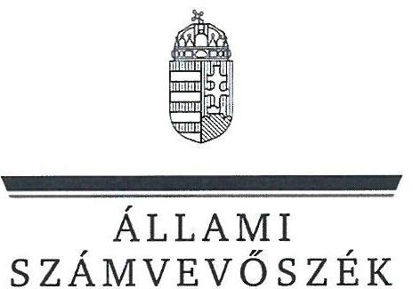
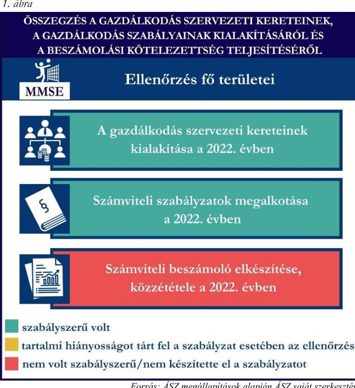
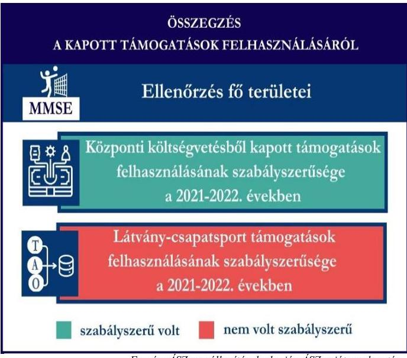
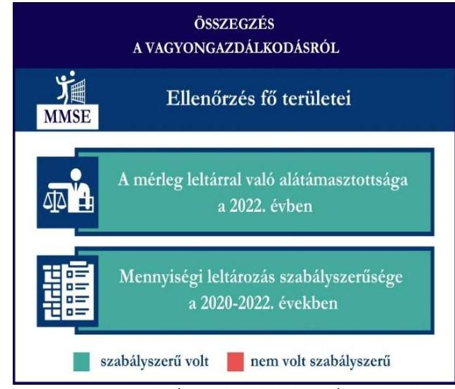

# JELENTÉS 

## Támogatásban részesülő sportszövetségek és sportegyesületek gazdálkodásának ellenőrzése

Mozdulj Mozgáskorlátozottak Sportegyesülete

2024.

---

ÁLLAMI
SZÁMVEVŐSZÉK

# JELENTÉS 

## Támogatásban részesülő sportszövetségek és sportegyesületek gazdálkodásának ellenőrzése

Mozdulj Mozgáskorlátozottak Sportegyesülete

2024.

---

# ELLENŐRZÉSI IGAZGATÓSÁG: 

## ÁLLAMHÁZTARTÁSON KÍVÜLI SZERVEZETEKET ELLENŐRZŐ IGAZGATÓSÁG

ELLENŐRZÉSI IGAZGATÓ:
KLINGA LÁSZLÓ igazgató

ELLENŐRZÉSVEZETŐ:
HOFMEISTER LÁSZLÓ ellenőrzésvezető

## Jelentéseink az interneten a www.asz.hu címen olvashatók.

IKTATÓSZÁM: EL-4060-197/2024
TÉMASORSZÁM: 30
ELLENŐRZÉS-AZONOSÍTÓ SZÁM: V1026

---

# TARTALOMJEGYZÉK 

AZ ELLENŐRZÉS ALAPADATAI ..... 5
AZ ELLENŐRZÖTT SZERVEZETEK ..... 7
ÖSSZEFOGLALÁS ..... 8
AZ ELLENŐRZÉS FÓKUSZKÉRDÉSEI ..... 10
MEGÁLLAPÍTÁSOK ..... 11
JAVASLATOK ..... 14
MELLÉKLETEK ..... 16
I. sz. melléklet: Értelmező szótár ..... 16
II. sz. melléklet: Az ellenőrzött szervezetek jegyzéke ..... 18
III. sz. melléklet: Ellenőrzési kritériumok ..... 19
FÜGGELÉK: ÉSZREVÉTELEK ..... 20
RÖVIDÍTÉSEK JEGYZÉKE ..... 25

---

.

---

# AZ ELLENŐRZÉS ALAPADATAI 

## AZ ELLENŐRZÉS CÉLJA

Az ellenőrzés célja az államháztartásból nyújtott támogatással, vagy az államháztartásból meghatározott célra ingyenesen juttatott vagyon felhasználásával érintett sportszövetségek és sportegyesületek gazdálkodása szabályozottságának, gazdálkodási tevékenységének, ezen belül a beszámolási kötelezettség teljesítésének, a támogatások elkülönített nyilvántartásának, valamint a támogatások felhasználásának ellenőrzése.

## AZ ELLENŐRZÉS TÍPUSA

Szabályszerűségi ellenőrzés.

## AZ ELLENŐRZÖTT IDŐSZAK

Az 1. fókuszkérdés esetében a 2022. év.
A 2. fókuszkérdés vonatkozásában a 2021-2022. évek.
A 3. fókuszkérdés vonatkozásában a 2022. év, a mennyiségi felvétellel történő leltározás dokumentumai tekintetében a 2020-2022. évek.

## AZ ELLENŐRZÉS TÁRGYA

Az ellenőrzés tárgya a támogatásban részesülő sportszövetségek, sportegyesületek gazdálkodása szabályozottságának, gazdálkodási tevékenységén belül a beszámolási kötelezettség teljesítésének, a vagyonnyilvántartásának, a támogatások elkülönített nyilvántartásának, valamint az államháztartási forrásból származó közvetlen vagy közvetett támogatások és a meghatározott célra ingyenesen juttatott vagyon felhasználásának vizsgálata volt. Az ellenőrzés a támogatások vonatkozásában kiterjedt továbbá a támogató felé történő beszámolási és elszámolási kötelezettségek teljesítésére, az ezekkel kapcsolatos jogszabályi és belső előírások betartására. Az ellenőrzés kiterjedt minden olyan körülményre és adatra, amely az ÁSZ¹ jogszabályban meghatározott feladatainak teljesítéséhez, valamint az ellenőrzési program végrehajtása során felmerülő újabb összefüggések feltárásához szükséges.

Az ÁSZ tv.² 25. § (3) bekezdésében meghatározottak alapján, amennyiben a rendelkezésre bocsátott dokumentumok, adatok, illetve tájékoztatás hitelességének, megalapozottságának, teljességének megállapítása vagy egyes ellenőrzési megállapítások alátámasztása, kiegészítése indokolta, az ellenőrzés tárgyát képezték az összefüggő tények vizsgálatához más szervezetek (ellenőrzést támogató szervezetek) által rendelkezésre bocsátott adatok, dokumentációk, megadott tájékoztatások, illetve az ott végzett ellenőrzés is.

Az 1. és 3. fókuszkérdés tekintetében a vizsgálat a teljes ellenőrzött szervezetre, a 2. fókuszkérdés tekintetében kizárólag a röplabda sportszakágra vonatkozott.

---

# AZ ELLENŐRZÉS JOGALAPJA 

Az ellenőrzés jogszabályi alapját az ÁSZ tv. 1. § (3) bekezdése és az 5. § (3) bekezdése előírásai képezték.

## AZ ELLENŐRZÉS MÓDSZERE

Az ellenőrzést a nemzetközi standardokat irányadónak tekintve az ellenőrzési program szempontjai, az ellenőrzött időszakban hatályos jogszabályok, az ellenőrzés általános szakmai szabályai, az ellenőrzésre irányadó ÁSZ módszertanok figyelembevételével végezte az ÁSZ.

Az ellenőrzési kérdések megválaszolásához szükséges bizonyítékok megszerzése az ellenőrzött szervezet által rendelkezésre bocsátott dokumentumokra, adatokra alapozva kérdésfeltevés (információkérés), interjú, mintavételezés útján történt.

Az ellenőrzési bizonyítékként felhasználható adatforrások közé tartoztak egyrészt az ellenőrzés során az ellenőrzött szervezettől bekért dokumentumok, másrészt adatforrás volt minden további az ellenőrzés folyamán feltárt, az ellenőrzés szempontjából információt tartalmazó dokumentum.

A támogatásokkal, azok felhasználásával kapcsolatos kötelezettségek vizsgálatára mintavételi eljárások kerültek alkalmazásra. Támogatás-típusok szerint nagyságrend alapján 1-3 darab támogatás került részletes vizsgálat alá. Ezen támogatások felhasználásának szabályszerűsége támogatásonként kockázatértékelés alapján kiválasztott mintatételekkel került ellenőrzésre. A kiválasztott támogatási szerződésekhez kapcsolódó elszámolásokból 30-30 db mintatétel került ellenőrzésre, ahol az elszámolás nem érte el a 30 db-ot, ott tételes ellenőrzésre került sor. Ezen felül a vagyongazdálkodás szabályszerűségének ellenőrzéséhez is kockázatalapú mintavétel kapcsolódott. A támogatások felhasználása és a vagyongazdálkodás területén a minták ellenőrzése kiterjedt a könyvvezetési kötelezettség vizsgálatára is. A tárgyi eszközök tekintetében 30 db került kiválasztásra a 2022. évben állományban lévő eszközök közül, ahol az állományban lévő eszközök száma nem érte el a 30 db-ot, ott tételes ellenőrzésre került sor azok nyilvántartásának, elszámolásának szabályszerűsége ellenőrzése céljából. Az ellenőrzésben nem statisztikai mintavételre került sor, ezért nem történt kivetítés a teljes sokaságra, a megállapításokat az ellenőrzött mintatételekre vonatkozóan fogalmazta meg az ÁSZ.

---

# AZ ELLENŐRZÖTT SZERVEZETEK

## MOZDULJ MOZGÁSKORLÁTOZOTTAK SPORTEGYESÜLETE

Az Mozdulj Mozgáskorlátozottak Sportegyesülete 2011-ben alakult Vácott. Az MMSE³-nél 2019-ben átszervezésre került sor, melynek során a székhelyét Budapestre tette át. Az MMSE mozgássérült, illetve egészséges emberek részére került létrehozásra, akik segítik a sérülteket a rendszeres sportolásra (versenyzés), sportszerű életmódra neveléssel. Célja többek között a társadalmi öntevékenység és a közösségi élet előmozdítása, a sport egészségmegőrző, személyiség- és készségfejlesztő szerepének minél szélesebb körű népszerűsítése.

Az MMSE a 2022. évben nem volt közhasznú jogállású, könyvvizsgálatra és felügyelőbizottság létrehozására nem volt kötelezett. Az MMSE röplabda szakosztálya által a 2021-2022. években igénybe vett államháztartási forrásból származó támogatásokat az 1. táblázat foglalja össze.

## 1. táblázat

## AZ MMSE RÖPLABDA SZAKOSZTÁLYA ÁLTAL IGÉNYBE VETT TÁMOGATÁSOK (ADATOK M FT-BAN)

|   | 2021. év | 2022. év  |
| --- | --- | --- |
|  Központi költségvetési támogatás (röplabda) | 7 | 7  |
|  Helyi önkormányzati támogatás | - | -  |
|  Látvány-csapatsport támogatás (röplabda) | 65 | 70  |

Forrás: Az ellenőrzött szervezet beszámolói és főkönyvi nyilvántartás adatai alapján ÁSZ saját szerkesztés

---

# ÖSSZEFOGLALÁS 

Magyarország Alaptörvényének XX. cikke kimondja, hogy mindenkinek joga van a testi és lelki egészséghez, melynek érvényesülését Magyarország többek között a sportolás és a rendszeres testedzés támogatásával segíti elő. Az Országgyűlés a Sport tv.⁴-ben kinyilvánította, hogy a nemzet közössége a test művelését, a sportot, a nemzet alapértékének, kívánatos célnak tekinti. A sport a közjó része. Erősíti a közösség tagjainak egymáshoz tartozását, miként az egyén testi és lelki egészségét.

A sportegyesületek, sportszövetségek működésükre és szakmai tevékenységük ellátására költségvetési támogatásban, önkormányzati támogatásban, ingyenes vagyonjuttatásban, valamint látvány-csapatsport támogatásban részesülhetnek, amelyekre fokozott figyelem irányul.

A társadalom részéről jogosan felmerülő elvárás, hogy a közpénzeket kezelő, azzal gazdálkodó szervezetek működéséről, tevékenységéről átfogó képet kapjon, a közpénzek rendeltetésszerű és átlátható módon történő felhasználásának értékelésére időről-időre sor kerüljön az ellenőrzések keretében.

Az MMSE a könyvviteli szolgáltatás személyi feltételeit a 2022. évi számviteli beszámoló vonatkozásában biztosította. Az MMSE a számviteli szabályzatokat az előírásoknak megfelelően kialakította a 2022. évben.

A könyvvezetés formája a 2022. évben megfelelt a jogszabályi előírásoknak. Az MMSE a 2022. évi számviteli beszámolóját a jogszabályban előírtak szerint elkészítette, azonban a jogszabályi előírás ellenére a beszámoló részét képező kiegészítő melléklet nélkül, és a közgyűlés elfogadását megelőzően tette közzé.

A gazdálkodás szervezeti kereteinek és a gazdálkodási szabályok kialakítása, valamint a beszámolási kötelezettség ellenőrzésének összegzését az 1. ábra tartalmazza.

---

Az MMSE a látvány-csapatsport támogatást az ellenőrzött tételek vonatkozásában nem a támogatási célnak megfelelően használta fel a 2021-2022. években. Az MMSE a támogatások felhasználásáról az előírt elkülönített nyilvántartást a 2021-2022. években a könyvviteli rendszerében nem vezette.

Az MMSE a központi költségvetésből kapott, mindösszesen 7,4 M Ft támogatást a célnak megfelelően számolta el, azonban az elszámolt összeget alátámasztó bizonylatokat a látvány-csapatsport, valamint azon belül kiegészítő sportfejlesztési támogatás terhére is elszámolta. A dupla elszámolás miatt a támogatás jogosulatlan felhasználása valósult meg.

Az MMSE a sportfejlesztési program
2. ábra

Forrás: ÁSZ megállapítások alapján ÁSZ saját szerkesztés
keretében kapott (látvány-csapatsport) támogatások terhére az ÁSZ rendelkezésére álló dokumentumok alapján olyan vállalkozói szerződéseket kötött és az alapján fizetett ki mindösszesen 71,99 M Ft-ot, amely szerződések és kapcsolódó számlák mögött valós gazdasági esemény nem történt. Ezáltal a 2021-2022. években a támogatások jogosulatlan felhasználása valósult meg.

Az esetekkel kapcsolatban az ÁSZ a törvényi kötelezettségének eleget téve megkereste az illetékes hatóságot.

A kapott támogatások felhasználásának ellenőrzéséről az összegzést a 2. ábra tartalmazza.
3. ábra

Forrás: ÁSZ megállapítások alapján ÁSZ saját szerkesztés

Az MMSE vagyongazdálkodása az ellenőrzött tételek vonatkozásában nem volt szabályszerű a 2022. évben, a szabályszerű számviteli bizonylattal alá nem támasztott, könyvviteli rendszerben nyilvántartott tárgyi eszközök miatt.

Az MMSE a 2022. évi beszámolójának mérlegtételeit leltárral alátámasztotta, a mérlegben szereplő eszközök kétévente előírt mennyiségi leltározását a 2021. évben elvégezte.

A vagyongazdálkodás ellenőrzésének összegzését a 3. ábra tartalmazza.

---

# AZ ELLENŐRZÉS FÓKUSZKÉRDÉSEI 

1.     - A gazdálkodási szabályok kialakítása, a könyvvezetési és beszámolási kötelezettség teljesítése szabályszerű volt-e?
2.     - A kapott támogatások felhasználása szabályszerű volt-e?
3.     - Az ellenőrzött szervezet vagyongazdálkodása szabályszerű volt-e?

---

# MEGÁLLAPÍTÁSOK 

## 1. A gazdálkodási szabályok kialakítása, a könyvvezetési és beszámolási kötelezettség teljesítése szabályszerű volt-e?

Összegző megállapítás Az MMSE-nél a 2022. évben a gazdálkodási szabályok a jogszabályban előírtaknak megfelelően kialakításra kerültek. A könyvvezetési és beszámolási kötelezettség teljesítése a közzétételt kivéve szabályszerű volt.

Az MMSE a 2022. évben a Számv. tv.⁵, valamint a Civilszr.⁶ előírásaiban foglaltaknak megfelelően gondoskodott a könyvviteli szolgáltatás személyi feltételeinek teljesüléséről.
Az MMSE 2022-ben rendelkezett a Számv. tv. előírásainak megfelelő számviteli politikával, azon belül az eszközök és a források leltárkészítési és leltározási szabályzatával, az eszközök és a források értékelési szabályzatával, valamint a pénzkezelési szabályzattal, valamint számlarenddel.
Az MMSE a Számv. tv.-ben, Civil tv.⁷-ben, valamint a Civilszr.-ben előírtak szerinti kettős könyvvitelt vezetett. Az MMSE 2022-ben a könyvviteli nyilvántartását úgy vezette, hogy a Számv. tv., valamint a Civilszr. előírásainak megfelelően az egyéb bevételeken belül részletezni tudta a kapott támogatások és tagdíjak összegeit.
Az MMSE a Civil tv.-ben, valamint a Számv. tv. előírásai alapján előírt 2022. évre vonatkozó számviteli beszámolóját, továbbá a Civil tv.-ben előírtak alapján a közhasznúsági mellékletét elkészítette. Az MMSE a 2022. évi számviteli beszámolóját a Ptk.⁸, valamint a Civil tv. alapján a legfőbb döntéshozó szerv 2023. 06. 23-án hagyta jóvá. Az MMSE a 2022. évi számviteli beszámolóját, valamint közhasznúsági mellékletét a Civil tv. 30. § (1) bekezdésében foglaltak ellenére a beszámoló közgyűlés általi elfogadását megelőzően, 2023.05.01-jén helyezte letétbe, tette közzé, valamint a Civil tv. 29. § (2) bekezdésére figyelemmel, a Civil tv. 30. § (1) és (4) bekezdéseiben foglaltak ellenére a beszámoló részét képező kiegészítő melléklet nélkül helyezte letétbe, illetve tette közzé.

## 2. A kapott támogatások felhasználása szabályszerű volt-e?

## Összegző megállapítás

Az MMSE a részére nyújtott ellenőrzött támogatásokat a 2021-2022. években nem a támogatási célnak megfelelően használta fel. Az MMSE a támogatások felhasználását a 2021-2022. években, az előírások ellenére a számviteli rendszerében nem különítette el támogatásonként.

Az MMSE az ellenőrzött támogatási szerződésekben foglaltak alapján, a központi költségvetésből kapott ellenőrzött támogatások bevételeit a Civil tv. előírásai alapján az egyéb bevételek között elkülönítetten kezelte a számviteli rendszerében. Az MMSE a 2021-2022. években a Számv. tv. 161/A. § (2) bekezdésében foglaltak ellenére a Civil tv. 20. § (4) bekezdésében előírt alapcél szerinti tevékenysége költségei, ráfordításai ellentételezésére az ellenőrzött központi költségvetésből kapott támogatásokról nem

---

vezetett olyan
 elkülönített számviteli nyilvántartást, amelynek alapján támogatásonként megállapítható és ellenőrizhető a kapott támogatás felhasználása. Ez alapján az egyes támogatások felhasználásáról készített elszámolások könyvviteli nyilvántartással, az abban szereplő támogatásonkénti elkülönített adatokkal nem voltak alátámasztottak. Az MMSE a támogatás felhasználásáról a támogató által előírt formában elkészítette az előírt beszámolókat és az összesített elszámolási táblázatokkal együtt a támogatási szerződésekben foglaltak alapján benyújtotta a támogatónak. Az MMSE a 2021-2022. években elszámolt, központi költségvetési támogatások ellenőrzött tételeit a Számv. tv.-ben előírtaknak megfelelő, szabályszerű számviteli bizonylattal alátámasztotta, azonban a számviteli bizonylatot további támogatással kapcsolatban is elszámolta.

Az MMSE az ellenőrzött látvány-csapatsport támogatás, valamint kiegészítő sportfejlesztési támogatás (SFP-03492/2021) 2021-2022. évi felhasználását olyan számviteli bizonylatokkal támasztotta alá, amely bizonylatok már a központi költségvetésből kapott támogatás (CNP-KP-1-2021/1-000220) terhére is elszámolásra kerültek. Összesen 7,4 M Ft értékben került jogosulatlanul elszámolásra olyan számviteli bizonylat, amely az adott látvány-csapatsport, annak kiegészítő sportfejlesztési támogatása, valamint a központi költségvetésből kapott támogatás terhére is érvényesítésre került. A költségszámlák támogatás terhére való dupla elszámolása miatt a támogatás jogosulatlan felhasználása valósult meg. Az MMSE elnöke elismerte a kettős elszámolást, azonban nem intézkedett a 7,4 M Ft visszafizetéséről.

Az MMSE a 2021-2022. években rendelkezett a 107/2011. (VI. 30.) Korm. rendeletben ${ }^{9}$ előírt látványcsapatsport támogatással érintett, jóváhagyott sportfejlesztési programmal. Az ellenőrzött SFP${ }^{10}$-kel kapcsolatban kapott látvány-csapatsport és kiegészítő sportfejlesztési támogatással az MMSE a 107/2011. (VI. 30.) Korm. rendeletben foglaltak szerint elszámolt. Az MMSE a 2021-2022. években a 107/2011. (VI. 30.) Korm. rendelet 11. § (2) bekezdésében előírtak ellenére a 2021-2022. években a látványcsapatsport támogatás felhasználásáról negyedévente az előrehaladási jelentéseket nem készített. Az MMSE a 2022. évben a látvány-csapatsport és kiegészítő sportfejlesztési támogatás felhasználását igazoló szakmai szöveges beszámolóját a 107/2011. (VI. 30.) Korm. rendeletben foglaltak alapján elkészítette.
A 107/2011. (VI. 30.) Korm. rendeletben foglaltak alapján az MMSE a 2021-2022. években az ellenőrzött látvány-csapatsport támogatások tekintetében könyvvizsgáló által ellenőrzött számviteli bizonylatokkal számolt el az illetékes ellenőrző szervezet felé, azonban az MMSE olyan könyvvizsgálót bízott meg a számviteli bizonylatok ellenőrzésére, aki a 107/2011. (VI. 30.) Korm. rendelet 11. § (6) bekezdésében

Az MMSE az SFP-03492/2021, valamint az SFP-04536/2022 sportfejlesztési program keretében kapott látvány-csapatsport támogatások terhére az ÁSZ rendelkezésére álló dokumentumok alapján olyan vállalkozói szerződéseket kötött és az alapján fizetett ki mindösszesen 71,99 M Ft összeget, amely szerződések és számlák mögött valós gazdasági események nem voltak, mivel a szerződésekben vállalt feladatok szerződés szerinti teljesítése nem valósult meg. A Számv. tv. 165. § (2) bekezdésében foglaltak, valamint a 107/2011. (VI. 30.) Korm. rendelet 11. § (4) bekezdésében ellenére az MMSE a 2021-2022. években a támogató részére benyújtott elszámolásaiban, valamint a könyvviteli rendszerében a fenti összeget szabályszerű, hitelt érdemlő számviteli bizonylat hiányában számolta el a támogatás terhére. Az MMSE a támogatásokat a 2021-2022. években nem a támogatási célnak megfelelően használta fel, a támogatások jogosulatlan felhasználása valósult meg.

---

előírtak ellenére nem rendelkezett az igénybe vett támogatás összértékét elérő (39 M Ft), de legfeljebb 50 millió forint értékű felelősségbiztosítással. Az MMSE a 2021-2022. években a Számv. tv. 161/A. § (2) bekezdésében foglaltak ellenére a 107/2011. (VI. 30.) Korm. rendelet 9. § (9) bekezdésében előírtak szerint a látvány-csapatsport támogatás és kiegészítő sportfejlesztési támogatás felhasználását nem tartotta nyilván a számviteli rendszerében elkülönítetten és naprakészen úgy, hogy az illetékes ellenőrző szervezet, vagy más ellenőrző hatóság által bármikor támogatási programonként, valamint támogatási jogcímenként ellenőrizhető legyen.

# 3. Az ellenőrzött szervezet vagyongazdálkodása szabályszerű volt-e? 

Összegző megállapítás Az MMSE vagyongazdálkodása a 2022. évben az ellenőrzött tételek vonatkozásában nem volt szabályszerű a valós adatokat tartalmazó bizonylatok hiánya miatt. A beszámoló mérlegtételeit leltárral alátámasztotta, a mennyiségi leltározás elvégezte.

Az MMSE a Számv. tv.-ben előírtak alapján a főkönyvi könyvelés és az analitikus nyilvántartások adatai közötti egyeztetést a 2022. üzleti év mérlegfordulónapjára vonatkozóan elvégezte, a mérlegben szereplő adatokat leltárral alátámasztotta. Az MMSE a Számv. tv. és a leltározási szabályzatában ${ }^{11}$ kétévente előírt mennyiségi felvétellel történő leltározást a 2021. évben elvégezte.
A tárgyi eszközök tételes ellenőrzése során, az MMSE tárgyi eszköz nyilvántartásában tíz olyan nyilvántartott eszköz (bérelt ingatlanon végzett beruházás) szerepelt, amely az SFP-03492/2021, valamint az SFP-04536/2022 sportfejlesztési program keretében kapott támogatásból került beszerzésre, ugyanakkor a 2. pontban részletezettek alapján a Számv. tv. 165. § (2) bekezdésében előírtak ellenére azok szabályszerű számviteli bizonylattal nem voltak alátámasztottak az ÁSZ rendelkezésére álló dokumentumok alapján. Ez alapján a könyvviteli nyilvántartásban, valamint a beszámolóban szereplő adatok tekintetében sérült a Számv. tv. 15. § (3) bekezdésében előírt valódiság elve, miszerint a könyvvitelben rögzített és a beszámolóban szereplő tételeknek a valóságban is megtalálhatóknak, bizonyíthatóknak, kívülállók által is megállapíthatóknak kell lenniük. Értékelésük meg kell, hogy feleljen az e törvényben előírt értékelési elveknek és az azokhoz kapcsolódó értékelési eljárásoknak.
Az MMSE által a 2022-ben nyilvántartott további tárgyi eszközök számviteli besorolása, elszámolása megfelelt a Számv. tv. előírásainak, az üzembe helyezés tényét a Számv. tv.-ben előírtak alapján az MMSE dokumentálta.

---

# JAVASLATOK 

Az ÁSZ tv. 33. § (1) bekezdésében foglaltak értelmében az ellenőrzött szervezet vezetője köteles a jelentésben foglalt megállapításokhoz kapcsolódó intézkedési tervet összeállítani és azt a jelentés kézhezvételétől számított 30 napon belül az ÁSZ részére megküldeni. Amennyiben az ellenőrzött szervezet vezetője nem küldi meg határidőben az intézkedési tervet, vagy továbbra sem elfogadható intézkedési tervet küld, az Állami Számvevőszék elnöke az ÁSZ tv. 33. § (3) bekezdése a) és b) pontjaiban foglaltakat érvényesítheti.

## A MOZDULJ MOZGÁSKORLÁTOZOTTAK SPORTEGYESÜLET ELNÖKÉNEK

1. Gondoskodjon arról, hogy a közgyűlés által jóváhagyott számviteli beszámoló kerüljön letétbe helyezésre, közzétételre, valamint a beszámoló részét képező kiegészítő melléklet is közzétételre kerüljön a Civil tv. 30. § (1) és (4) bekezdésében foglaltaknak megfelelően.
2. Gondoskodjon az alapcél szerinti tevékenysége költségei, ráfordításai ellentételezésére kapott támogatások elkülönített számviteli nyilvántartásának vezetéséről, amely alapján támogatásonként megállapítható és ellenőrizhető a kapott támogatás felhasználása, a Civil tv. 20. § (4) bekezdés és a Számv. tv. 161/A. § (2) bekezdés előírásai alapján
3. Gondoskodjon arról, hogy a támogatásokkal való elszámolás során ne kerüljön sor ugyanazon ráfordítás ismételt elszámolására.
4. Gondoskodjon a kettős elszámolással érintett összeg (7,4 M Ft) visszafizetéséről.
5. Gondoskodjon a 107/2011. (VI.30) Korm. rendelet 9. § (9) bekezdésében, valamint a Számv. tv. 161/A. § (2) bekezdésében előírtaknak megfelelő olyan nyilvántartás vezetéséről, amely alkalmas a látványcsapatsport támogatás felhasználásának támogatási programonként, valamint támogatási jogcímenként történő ellenőrzésére
6. Gondoskodjon arról, hogy a látvány-csapatsport támogatás ellenőrzött felhasználásáról negyedéves előrehaladási jelentések a 107/2011. (VI. 30.) Korm. rendelet 11. § (2) bekezdésében előírt határidőn belül kerüljenek benyújtásra az ellenőrző szerv részére.

---

7. Gondoskodjon a jogszabályban meghatározott feltételek fennállása esetén, hogy a támogatások elszámolását alátámasztó számviteli bizonylatok ellenőrzésével olyan könyvvizsgáló kerüljön megbízásra, aki rendelkezik a 107/2011. (VI. 30.) Korm. rendelet 11. § (6) bekezdésében előírtaknak megfelelő felelősségbiztosítással.
8. Gondoskodjon arról, hogy a támogatások felhasználása szabályszerű számviteli bizonylattal alátámasztott legyen a Számv. tv. 165. § (2), valamint a 107/2011. (VI. 30.) Korm. rendelet 11. § (4) bekezdésében előírtaknak megfelelően.
9. Gondoskodjon arról, hogy a könyvviteli nyilvántartásban szereplő adatok valódisága igazolt legyen, a könyvvitelben rögzített és a beszámolóban szereplő tételek a valóságban is megtalálhatók, bizonyíthatók, kívülállók által is megállapíthatók legyenek, értékelésük megfeleljen a Számv. tv.-ben előírt értékelési elveknek és az azokhoz kapcsolódó értékelési eljárásoknak, a Számv. tv. 15. § (3) bekezdésében előírtaknak megfelelően.

---

# MELLÉKLETEK 

## I. SZ. MELLÉKLET: ÉRTELMEZŐ SZÓTÁR

Civil szervezet

Egyesület

Látvány-csapatsport támogatás

Látvány-csapatsportban működő amatőr sportszervezet

Látvány-csapatsportban működő hivatásos sportszervezet

Kiegészítő sportfejlesztési támogatás

Költségvetési támogatás

Közhasznú szervezet

A civil társaság; a Magyarországon nyilvántartásba vett egyesület - a párt, a szakszervezet és a kölcsönös biztosító egyesület kivételével és - a közalapítvány és a pártalapítvány kivételével - az alapítvány. (Forrás: Civil tv. 2. § 6. pont a)c) alpontjai)

Az egyesület a tagok közös, tartós, alapszabályban meghatározott céljának folyamatos megvalósítására létesített, nyilvántartott tagsággal rendelkező jogi személy. (Forrás: Ptk. 3:63. § (1) bekezdés)
A Számv. tv. szempontjából egyéb szervezet. (Számv. tv. 3. § (1) bekezdés 4. pont a) alpontja)
Az adóévben visszafizetési kötelezettség nélkül nyújtott támogatás, juttatás, véglegesen átadott pénzeszköz és térítés nélkül átadott eszköz könyv szerinti értéke, az adóévben térítés nélkül nyújtott szolgáltatás bekerülési értéke a Tao. tv. ${ }^{12}$-ben meghatározott jogcímeken. (Forrás: Tao. tv. 4. § 44. pont)
Minden olyan, a sportról szóló törvényben meghatározott szabályok szerint a látvány-csapatsportban működő sportegyesület vagy sportvállalkozás, amelyik nem minősül a látvány-csapatsportban működő hivatásos sportszervezetnek. (Forrás: Tao. tv. 4. § 42. pont)
A látvány-csapatsportágak országos sportági szakszövetsége által kiírt versenyrendszer legmagasabb felnőtt bajnoki osztályában - a veterán korosztályokra kiírt versenyrendszer kivételével - részt vevő (indulási jogot elnyert) sportszervezet, vagy alsóbb bajnoki osztályaiban részt vevő (indulási jogot elnyert) sportszervezet abban az esetben, ha az ilyen sportszervezet hivatásos sportolót alkalmaz. Több látvány-csapatsportban több jogi személy szervezeti egységgel (szakosztállyal) működő sportszervezet esetén csak az a jogi személy szervezeti egység (szakosztály), amely a fent részletezett versenyrendszerek bajnoki osztályaiban részt vesz. (Forrás: Tao. tv. 4. § 43. pont)
A látvány-csapatsportok támogatása esetében a Tao. tv. 24/A. § (1) és (2) bekezdése szerinti rendelkező nyilatkozatban felajánlott összeg 12,5 százaléka kiegészítő sportfejlesztési támogatásnak minősül. (Forrás: Tao. tv. 24/A. § (9) bekezdése)
A társadalombiztosítás pénzügyi alapjai kivételével az államháztartás központi alrendszeréből ellenérték nélkül, pénzben nyújtott támogatások. (Forrás: Áht. ${ }^{13}$ 1. § 14. pont, ide nem értve az Áht. 1. § 14. pont a) -o) pontjaiban szereplő támogatásokat)
Közhasznú szervezetté minősíthető a Magyarországon nyilvántartásba vett közhasznú tevékenységet végző szervezet, amely a társadalom és az egyén közös szükségleteinek kielégítéséhez megfelelő erőforrásokkal rendelkezik, továbbá amelynek megfelelő társadalmi támogatottsága kimutatható, és amely: a) civil szervezet (ide nem értve a civil társaságot), vagy
b) olyan egyéb szervezet, amelyre vonatkozóan a közhasznú jogállás megszerzését törvény lehetővé teszi. (Forrás: Civil tv. 32. § (1) bekezdés)

---

Közhasznú tevékenység

Országos sportági szakszövetség

Sportági szövetség

Sportegyesület

Sportegyesületeknek, sportszövetségeknek költségvetési támogatás

Sportszövetség

Sporttevékenység

Minden olyan tevékenység, amely a létesítő okiratban megjelölt közfeladat teljesítését közvetlenül vagy közvetve szolgálja, ezzel hozzájárulva a társadalom és az egyén közös szükségleteinek kielégítéséhez. (Forrás: Civil tv. 2. § 20. pont)
Olyan sportszövetség, amely sportágában kizárólagos jelleggel az e törvényben, valamint más jogszabályokban meghatározott feladatokat lát el és e törvényben megállapított különleges jogosítványokat gyakorol. Olyan sportágban hozható létre, amelyet vagy a Nemzetközi Olimpiai Bizottság elismert, vagy amely sportág nemzetközi szövetségét felvették a Nemzetközi Sportszövetségek Szövetségébe (GAISF). (Forrás: Sport tv. 20. § (1), (4) bekezdés)
A Civil tv. és a Ptk. előírásai alapján - a Sport tv.-ben meghatározott eltérésekkel - működő szövetség, amelynek tagjai

 kizárólag sportszervezetek lehetnek. Sportági szövetség országos jelleggel is működhet. Egy sportágban csak egy országos sportági szövetség működhet. Törvényi feltételek teljesülése esetén szakszövetségi feladatokat is elláthat. (Forrás: Sport tv. 28. §)
A Civil tv. és a Ptk. szabályai szerint működő olyan egyesület, amelynek alaptevékenysége a sporttevékenység szervezése, valamint a sporttevékenység feltételeinek megteremtése. A sportegyesületek a Sport tv. 15. § (1) bekezdésében meghatározott sportszervezetek körébe tartoznak. A sportegyesületeken kívül sportszervezet még a sportvállalkozás, a sportiskola, valamint az utánpótlás-nevelés fejlesztését végző alapítvány. (Forrás: Sport tv. 16. § (1) bekezdés)

Az állami sport célú támogatások felhasználásáról és elosztásáról szóló 474/2016. (XII. 27.) Korm. rendelet ${ }^{14}$ 1. § (1) bekezdésében és a 27/2013. (III. 29.) EMMI rendelet ${ }^{15}$ 1. §-ában meghatározott fejezeti kezelésű előirányzatokból nyújtott támogatás.
Meghatározott sporttevékenységek körében a sportversenyek szervezésére, a tagok érdekvédelmére és a részükre való szolgáltatásokra, valamint a nemzetközi kapcsolatok lebonyolítására létrehozott, jogi személyiséggel és önkormányzattal rendelkező, a Civil tv. és a Ptk. alapján - az e törvényben foglalt eltérésekkel - különös formában működő egyesületek. A Sport tv. 19. § (3) bekezdése szerint a sportszövetségeknek az alábbi típusai léteznek: országos sportági szakszövetségek, sportági szövetségek, szabadidősport szövetségek, fogyatékosok sportszövetségei, diák- és egyetemi-főiskolai sport sportszövetségei, nemzetközi sportszövetségek. (Forrás: Sport tv. 19. § (1), (3) bekezdés)
Meghatározott szabályok szerint, a szabadidő eltöltéseként kötetlenül vagy szervezett formában, illetve versenyszerűen végzett testedzés vagy szellemi sportágban kifejtett tevékenység, amely a fizikai erőnlét és a szellemi teljesítőképesség megtartását, fejlesztését szolgálja. (Forrás: Sport tv. 1. § (2) bekezdés)

---

II. SZ. MELLÉKLET: AZ ELLENŐRZÖTT SZERVEZETEK JEGYZÉKE

| ELLENŐRZÖTT SZERVEZET NEVE | ELLENŐRZÖTT SZERVEZET SZÉKHELVE |
| :-- | :-- |
| Mozdulj Mozgáskorlátozottak Sportegyesülete | 1044 Budapest, Ugró Gyula sor 9. |

---

# FOKUSZKÉRDÉS 

## 1. fókuszkérdés:

A gazdálkodási szabályok kialakítása, a könyvvezetési és beszámolási kötelezettség teljesítése szabályszerű volt-e?

## 2. fókuszkérdés:

A kapott támogatások felhasználása szabályszerű volt-e?

## 3. fókuszkérdés:

Az ellenőrzött szervezet vagyongazdálkodása szabályszerű volt-e?

## ELLENŐRZÉSI KRITÉRIUMOK

107/2011. (VI.30.) Korm. rendelet 9. § (9) bek.
Számv. tv. 14. § (3) bekezdés, (5) bekezdés a), b), d) pont, (8) bekezdés, (11) bekezdés, 69. § (3) bekezdés, 90. § (3) bekezdés c) pont, 161. § (1) bekezdés, (2) bekezdés a)-d) pont, (3)-(4) bekezdés, 161/A. § (2) bekezdés, 165. § (2) bekezdés
Civilszr. 7. § (1) bekezdés, (4) bekezdés b), c) pont, 8. § (2), (3) bekezdés, 9. § (4), (5), (8) bekezdés, 12. § (4), (5) bekezdés, 15. § (1) bekezdés a), b) pont, 16. § (1) bekezdés, 24. § (2) bekezdés

Civil vhr. 12. ${ }^{16} \S$ (1) bekezdés, melléklet 5. pont
Ptk. 3:26. § (1) bekezdés, 3:27. § (1) bekezdés, 3:82. § (1) bekezdés,
Civil tv. 28. § (1) bekezdés, 29. § (2) bekezdés c) pont, (3), (6), (7) bekezdés, 30. § (1)-(4) bekezdés 40. § (1)

Sport tv. 23. § (1) bekezdés f) pont
Tao. tv. 22/C.
107/2011. (VI. 30.) Korm. rendelet 2. § (3b) bek., 4. § (11) bek., 5. § (1) bek., 6. § (1) bek. e) pont, 9. § (8)-(10) bek., 10. § (2), (2a), (2b), (4), (5a), (6) bek., 11. § (1), (1a), (1d), (1e), (2), (4), (4a), (5), (6) bek., 13. § (1), (2a) bek., 14. § (1), (4), (4b), (4c), (6c) bek.

Számv. tv. 44. § (2) bekezdés, 93. § (3) bekezdés, 159. §, 161/A. §
(2) bekezdés, 165. § (2) bekezdés, 167. § (1) bekezdés a), d), e), h) pont

Civil tv. 20. § (2) bekezdés a) pont, (3) bekezdés a), c) pont, (4) bekezdés, 29. § (4), (5) bekezdés
Civilszr. 24. § (2) bekezdés
27/2013. (III.29.) EMMI rendelet 18. § (2) bekezdés
474/2016. (XII. 27.) Korm. rendelet 22. § (2) bekezdés, 24. § (2) bekezdés
Áht. 53. §, Ávr. ${ }^{17}$ 92. §, 93. § (2)-(4) bekezdések
Ptk. 3:63. § (4) bekezdés
Számv. tv. 3. § (3) bekezdés 3. pont, 15. § (3) bekezdés, 46. § (3), (4) bekezdés, 47-51. §, 52. § (1)-(7) bekezdés, 69. § (1)-(3) bekezdések, 165. § (2) bekezdés, 169. § (2) bekezdés

---

# FÜGGELÉK: ÉSZREVÉTELEK 

A jelentéstervezetet a Számvevőszék 15 napos észrevételezésre megküldte az ellenőrzött szervezet vezetőjének az ÁSZ tv. 29. § (1) bekezdése előírásának megfelelően.

Az MMSE elnöke a jelentéstervezetre észrevételt tett. A függelék tartalmazza az el nem fogadott észrevételek elutasításának indoklását.

## 1. Az MMSE elnökének észrevétele:

„Az MMSE a közgyűlés által jóváhagyott beszámolót 2024.04.15. napján, EB00706001 érkeztetési szám alatt letétbe helyezte, melynek része a kiegészítő melléklet is (10. oldaltól kezdődően látható). A közzététel a Civil tv. 30. § (4) bekezdésében foglaltaknak megfelelően, az MMSE honlapján is megtörtént, az az alábbi internetes oldalon elérhető: „Mozdulj SE 2023 pénzügyi beszámoló" cím alatt. Ennek megfelelően kérjük, hogy az összegző megállapítást megfelelően módosítani, és az I. számú javaslatot törölni szíveskedjenek."

## Az észrevétellel érintett megállapítás:

„Az MMSE a 2022. évi számviteli beszámolóját, valamint közhasznúsági mellékletét a Civil tv. 30. § (1) bekezdésében foglaltak ellenére a beszámoló közgyűlés általi elfogadását megelőzően, 2023.05.01-jén helyezte letétbe, tette közzé, valamint a Civil tv. 29. § (2) bekezdésére figyelemmel, a Civil tv. 30. § (1) és (4) bekezdéseiben foglaltak ellenére a beszámoló részét képező kiegészítő melléklet nélkül helyezte letétbe, illetve tette közzé."

## Az észrevétel el nem fogadásának indoklása:

Az észrevételben a 2023. évre vonatkozó számviteli beszámoló szerepel, ami nem volt ellenőrzött időszak, a jelentésben szereplő megállapítás a 2022. évre vonatkozik.
Az észrevétel alapján a jelentéstervezet módosítása nem indokolt.

[^0]
[^0]:    * 29. § (1) Az Állami Számvevőszék az ellenőrzési megállapításait megküldi az ellenőrzött szervezet vezetőjének vagy az általa megbízott személynek, és annak, akinek személyes felelősségét állapította meg.
    (2) Az ellenőrzött szervezet vezetője és a felelősként megjelölt személy az ellenőrzés megállapításaira tizenöt napon belül írásban észrevételt tehet.
    (3) Az Állami Számvevőszék az észrevételre a beérkezésétől számított harminc napon belül írásban válaszol. A figyelembe nem vett észrevételeket köteles a jelentésben feltüntetni, és megindokolni, hogy azokat miért nem fogadta el.

---

# 2. Az MMSE elnökének észrevétele: 

„Az MMSE - mint az a jelentéstervezetben is rögzítésre került - a támogatás felhasználásáról a támogató által előírt formában elkészítette az előírt beszámolókat és az összesített elszámolási táblázatokkal együtt a támogatási szerződésekben foglaltak alapján benyújtotta a támogatónak. Az MMSE gondoskodott az alapcél szerinti tevékenysége költségei, ráfordításai ellentételezésére kapott támogatások elkülönített számviteli nyilvántartásának vezetéséről."
„Ennek megfelelően, figyelemmel arra, hogy a fentiek szerint feltárt hiányosságok még a jelentéstervezet MMSE részére történő kézbesítése előtt orvoslásra kerültek, kérjük, hogy a 2. és 3.számú javaslatot - azok okafogyottságára tekintettel - törölni szíveskedjenek."
„Az MMSE gondoskodott a látvány-csapatsport támogatás felhasználásának támogatási programonként, valamint támogatási jogcímenként történő nyilvántartásáról is a jelentéstervezet MMSE részére történő kézbesítése előtt, ezért kérjük, hogy a 4. és 5. számú javaslatot - azok okafogyottságára tekintettel - törölni szíveskedjenek."

## Az észrevétellel érintett megállapítás:

„Az MMSE a támogatások felhasználását a 2021-2022. években, az előírások ellenére a számviteli rendszerében nem különítette el támogatásonként.
Az MMSE a 2021-2022. években a Számv. tv. 161/A. § (2) bekezdésében foglaltak ellenére a Civil tv. 20. § (4) bekezdésében előírt alapcél szerinti tevékenysége költségei, ráfordításai ellentételezésére az ellenőrzött központi költségvetésből kapott támogatásokról nem vezetett olyan elkülönített számviteli nyilvántartást, amelynek alapján támogatásonként megállapítható és ellenőrizhető a kapott támogatás felhasználása.
Az MMSE a 2021-2022. években a Számv. tv. 161/A. § (2) bekezdésében foglaltak ellenére a 107/2011. (VI. 30.) Korm. rendelet 9. § (9) bekezdésében előírtak szerint a látványcsapatsport támogatás és kiegészítő sportfejlesztési támogatás felhasználását nem tartotta nyilván a számviteli rendszerében elkülönítetten és naprakészen úgy, hogy az illetékes ellenőrző szervezet, vagy más ellenőrző hatóság által bármikor támogatási programonként, valamint támogatási jogcímenként ellenőrizhető legyen."

## Az észrevétel el nem fogadásának indoklása:

Az észrevételben jelzett elkülönített számviteli nyilvántartás nem került alátámasztásra. Az ellenőrzési dokumentumok alapján a támogatások felhasználásának elkülönítése az MMSE könyvviteli rendszerében nem valósult meg az ellenőrzött időszakban.
Az észrevételben kért 5. számú javaslat a negyedéves jelentések elkészítésre vonatkozik, amely megállapítást nem kifogásolta az ellenőrzött.
Az észrevétel alapján a jelentéstervezet módosítása nem indokolt.

---

# 3. Az MMSE elnökének észrevétele: 

„Rögzíteni kívánjuk, hogy az MMSE haladéktalanul intézkedett a téves elszámolás javításáról, ennek megfelelően 2024.08.13-án módosította 2021/2022-es sportfejlesztési programok elszámolását: lecsökkentette az elszámolni kívánt támogatás összegét. Az ezt alátámasztó, a Magyar Röplabda Szövetség Tao irodája által kiállított igazolást csatoljuk.
Ennek megfelelően, figyelemmel arra, hogy a fentiek szerint feltárt hiányosságok még a jelentéstervezet MMSE részére történő kézbesítése előtt orvoslásra kerültek, kérjük, hogy a 2. és 3. számú javaslatot - azok okafogyottságára tekintettel - törölni szíveskedjenek."

## Az észrevétellel érintett megállapítás:

„Az MMSE az ellenőrzött látvány-csapatsport támogatás, valamint kiegészítő sportfejlesztési támogatás (SFP-03492/2021) 2021-2022. évi felhasználását olyan számviteli bizonylatokkal támasztotta alá, amely bizonylatok már a központi költségvetésből kapott támogatás (CNP-KP-1-2021/1-000220) terhére is elszámolásra kerültek. Összesen 7,4 M Ft értékben került jogosulatlanul elszámolásra olyan számviteli bizonylat, amely az adott látvány-csapatsport, annak kiegészítő sportfejlesztési támogatása, valamint a központi költségvetésből kapott támogatás terhére is érvényesítésre került. A költségszámlák támogatás terhére való dupla elszámolása miatt a támogatás jogosulatlan felhasználása valósult meg."

## Az észrevétel el nem fogadásának indoklása:

Az MMSE a beküldött dokumentumok alapján 2024. augusztus 13-án a támogató részére egy módosítási igényt nyújtott be a duplán elszámolt 7,4 M Ft összeg lenullázásával egy olyan látvány-csapatsport támogatás beszámolóját (elszámolását) érintően, amely korábban már lezárásra került, a támogató határozatában elfogadta a jelenleg módosítani kívánt elszámolást. A 2024. augusztus 13-án beadott módosítási igény nem tartalmazza az elszámolás összes elemét, így a visszafizetésről szóló bankkivonatot sem, illetve az előírt egyéb csatolandó dokumentumokat. A módosítási kérelem a támogató által nem került elfogadásra, azzal kapcsolatban döntést még nem hozott, valamint az elszámolásból törölni kívánt összeg nem került visszafizetésre, így elszámolási hiány keletkezne a módosítás elfogadását követően. Az elszámolásból törölni kívánt számla a sportterem padlózatának cseréjére vonatkozott a támogatási kérelemben szereplő adatok alapján, így ezt az összeget módosítási határozat nélkül más célra az MMSE nem használhatta fel. Az MMSE elnöke a BGA támogatási kérelmében ugyanazon adatokkal szintén a sportterem padlócseréjére kért és kapott támogatást. Miután mindkét támogatási forrás jóváhagyásra került (ugyanazon felújításra), az MMSE nem jelezte egyik támogatónál sem, hogy már egy másik támogatás során biztosított a padlócsere finanszírozása, továbbá mindkét támogató felé ugyanazon számlával alátámasztottan számolt el a kapott támogatási összeggel.
Az észrevétel alapján a jelentéstervezet módosítása nem indokolt.

---

# 4. Az MMSE elnökének észrevétele: 

„A jelentéstervezetben rögzítésre került, hogy ,,az MMSE olyan könyvvizsgálót bízott
 meg a számviteli bizonylatok ellenőrzésére, aki […] nem rendelkezett az igénybe vett támogatás összértékét elérő (39 M Ft), de legfeljebb 50 millió forint értékű felelősségbiztosítással.
Előadjuk, hogy az MMSE által megbízott könyvvizsgáló jelenleg rendelkezik megfelelő felelősségbiztosítással, ezért kérjük, hogy a 6. számú javaslatot – azok okafogyottságára tekintettel – törölni szíveskedjenek.
Az észrevétel alapján a jelentéstervezet módosítása nem indokolt.

## Az észrevétellel érintett megállapítás:

„A 107/2011. (VI. 30.) Korm. rendeletben foglaltak alapján az MMSE a 2021-2022. években az ellenőrzött látvány-csapatsport támogatások tekintetében könyvvizsgáló által ellenőrzött számviteli bizonylatokkal számolt el az illetékes ellenőrző szervezet felé, azonban az MMSE olyan könyvvizsgálót bízott meg a számviteli bizonylatok ellenőrzésére, aki a 107/2011. (VI. 30.) Korm. rendelet 11. § (6) bekezdésében előírtak ellenére nem rendelkezett az igénybe vett támogatás összértékét elérő (39 M Ft), de legfeljebb 50 millió forint értékű felelősségbiztosítással.”

## Az észrevétel el nem fogadásának indoklása:

Az MMSE az észrevételben szereplő állítását dokumentummal nem támasztotta alá, a rendelkezésre álló dokumentumok alapján a megállapítás megalapozott.
Az észrevétel alapján a jelentéstervezet módosítása nem indokolt.

## 5. Az MMSE elnökének észrevétele:

Az MMSE észrevételében vitatja, hogy megállapításra került, hogy az elszámolásban szereplő számlák nem valós gazdasági eseményen alapulnak, mivel a szerződésekben szereplő vállalások teljesültek, neki nincs olyan kötelezettsége, hogy a munkát ténylegesen végzők munkaviszonyát ellenőrizze.
„az MMSE vagyongazdálkodása a 2022. évben az ellenőrzött tételek vonatkozásában nem volt szabályszerű a valós adatokat tartalmazó bizonylatok hiánya miatt. A beszámoló mérlegtételeit leltárral alátámasztotta, a mennyiségi leltározást elvégezte.”
A jelentéstervezet ezen megállapítását vitatjuk, figyelemmel arra, hogy az MMSE tárgyi eszköz nyilvántartásában szereplő beruházások a csatolt fényképfelvételekkel is igazoltan megvalósultak, arról a helyszíni szemle során az ÁSZ részéről jelen lévő számvevők meggyőződhettek….
A kiválasztásukra árajánlat alapján került sor. A vállalkozók által kibocsátott számlák e követelménynek megfeleltek, az MMSE a tőle elvárható módon ellenőrizte a számlák helyességét, és ez alapján fogadta azokat be. Nem sérült ezért a Számv. tv. 15. § (3)

---

bekezdése szerinti valódiság elve, ezért kérjük ezen megállapítás törlését is. A fent rögzített indokok alapján, azok megalapozatlanságára tekintettel kérjük, hogy a 7. és 8. pontban rögzített javaslatokat is törölni szíveskedjenek.
A szerződéseket, számlákat és a munka elvégzését igazoló dokumentumokat rendelkezésre bocsátottuk, és arról a számvevők a szemle keretében is meggyőződhettek. Kérjük törölni a jelentéstervezetnek azon megállapítását is, miszerint az eszközök (bérelt ingatlanon végzett beruházás) a Számv. tv. 165. § (2) bekezdésében előírtaknak nem feleltek meg, nem voltak szabályszerű számviteli bizonylattal alátámasztottak.

# Az észrevétellel érintett megállapítás:

„A tárgyi eszközök tételes ellenőrzése során, az MMSE tárgyi eszköz nyilvántartásában tíz olyan nyilvántartott eszköz (bérelt ingatlanon végzett beruházás) szerepelt, amely az SFP03492/2021, valamint az SFP-04536/2022 sportfejlesztési program keretében kapott támogatásból került beszerzésre, ugyanakkor a 2. pontban részletezettek alapján a Számv. tv. 165. § (2) bekezdésében előírtak ellenére azok szabályszerű számviteli bizonylattal nem voltak alátámasztottak az ÁSZ rendelkezésére álló dokumentumok alapján. Ez alapján a könyvviteli nyilvántartásban, valamint a beszámolóban szereplő adatok tekintetében sérült a Számv. tv. 15. § (3) bekezdésében előírt valódiság elve, miszerint a könyvvitelben rögzített és a beszámolóban szereplő tételeknek a valóságban is megtalálhatóknak, bizonyíthatóknak, kívülállók által is megállapíthatóknak kell lenniük. Értékelésük meg kell, hogy feleljen az e törvényben előírt értékelési elveknek és az azokhoz kapcsolódó értékelési eljárásoknak.
Az MMSE az SFP-03492/2021, valamint az SFP-04536/2022 sportfejlesztési program keretében kapott látvány-csapatsport támogatások terhére az ÁSZ rendelkezésére álló dokumentumok alapján olyan vállalkozói szerződéseket kötött és az alapján fizetett ki mindösszesen 71,99 M Ft összeget, amely szerződések és számlák mögött valós gazdasági események nem voltak, mivel a szerződésekben vállalt feladatok szerződés szerinti teljesítése nem valósult meg. A Számv. tv. 165. § (2) bekezdésében foglaltak, valamint a 107/2011. (VI. 30.) Korm. rendelet 11. § (4) bekezdésében ellenére az MMSE a 2021-2022. években a támogató részére benyújtott elszámolásaiban, valamint a könyvviteli rendszerében a fenti összeget szabályszerű, hitelt érdemlő számviteli bizonylat hiányában számolta el a támogatás terhére. Az MMSE a támogatásokat a 2021-2022. években nem a támogatási célnak megfelelően használta fel, a támogatások jogosulatlan felhasználása valósult meg.”

## Az észrevétel el nem fogadásának indoklása:

Az ÁSZ a rendelkezésére álló valamennyi adat és információ együttes figyelembevételével tette meg megállapításait. Az észrevételben rögzítettek ezen adatok és információk megalapozottságát nem cáfolták, ezért nem indokolt a megállapítás módosítása. Mivel a rendelkezésünkre álló adatok és információk, valamint az általunk tett megállapítás alapján büncselekmény gyanúja merül fel, az ÁSZ az ÁSZ tv. 30. § (1) bekezdésében rögzített kötelezettségére tekintettel, megállapításait közli az illetékes hatósággal.
Az észrevétel alapján a jelentéstervezet módosítása nem indokolt.

---

# RÖVIDÍTÉSEK JEGYZÉKE

${ }^{1}$ ÁSZ
${ }^{2}$ ÁSZ tv.
${ }^{3}$ MMSE
${ }^{4}$ Sport tv.
${ }^{5}$ Számv. tv.
${ }^{6}$ Civilszr.
${ }^{7}$ Civil tv.
${ }^{8}$ Ptk.
${ }^{9}$ 107/2011. (VI. 30.) Korm.rendelet
${ }^{10}$ SFP
${ }^{11}$ leltározási szabályzat
${ }^{12}$ Tao. tv.
${ }^{13}$ Áht.
${ }^{14}$ 474/2016. (XII. 27.) Korm. rendelet
${ }^{15}$ 27/2013. (III.29.) EMMI rendelet
${ }^{16}$ Civil vhr.
${ }^{17}$ Ávr.

Állami Számvevőszék
2011. évi LXVI. törvény az Állami Számvevőszékről

Mozdulj Mozgáskorlátozottak Sportegyesülete
2004. évi I. törvény a sportról
2000. évi C. törvény a számvitelről
479/2016. (XII. 28.) Korm. rendelet a számviteli törvény szerinti egyes egyéb szervezetek beszámoló készítési és könyvvezetési kötelezettségének sajátosságairól
2011. évi CLXXV. törvény az egyesülési jogról, a közhasznú jogállásról, valamint a civil szervezetek működéséről és támogatásáról
2013. évi V. törvény a Polgári Törvénykönyvről
107/2011. (VI. 30.) Korm. rendelet a látvány-csapatsport támogatását biztosító támogatási igazolás kiállításáról, felhasználásáról, a támogatás elszámolásának és ellenőrzésének, valamint visszafizetésének szabályairól
sportfejlesztési program
Az MMSE leltározási szabályzata, hatályos 2021. január 1-jétől
1996. évi LXXXI. törvény a társasági adóról és az osztalékadóról
2011. évi CXCV. törvény az állambáztartásról
474/2016. (XII. 27.) Korm. rendelet az állami sport célú támogatások felhasználásáról és elosztásáról
27/2013. (III. 29.) EMMI rendelet az állami sport célú támogatások felhasználásáról és elosztásáról
350/2011. (XII. 30.) Korm. rendelet a civil szervezetek gazdálkodása, az adománygyűjtés és a közhasznúság egyes kérdéseiről
368/2011. (XII. 31.) Korm. rendelet az államháztartásról szóló törvény végrehajtásáról

---

1052 Budapest, Apáczai Csere János u. 10. | 1364 Budapest 4., Pf. 54
www.asz.hu | szamvevoszek@asz.hu
telefon: +36 14849100
