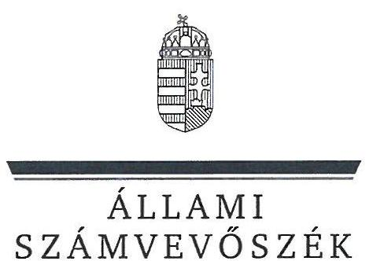
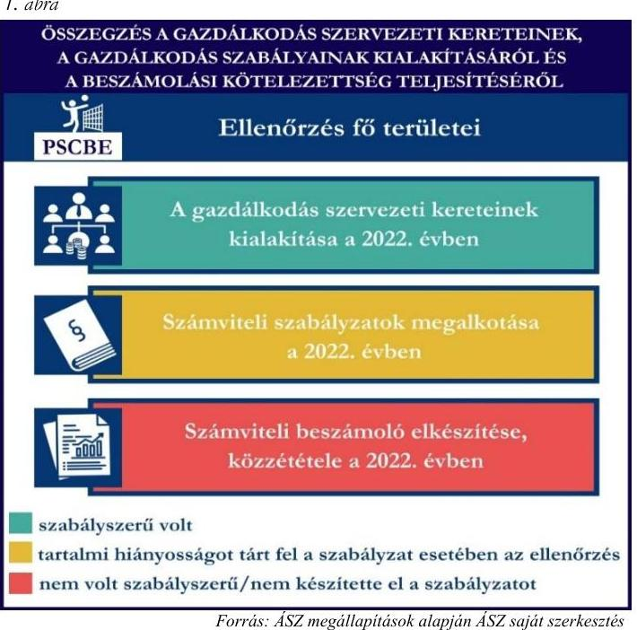
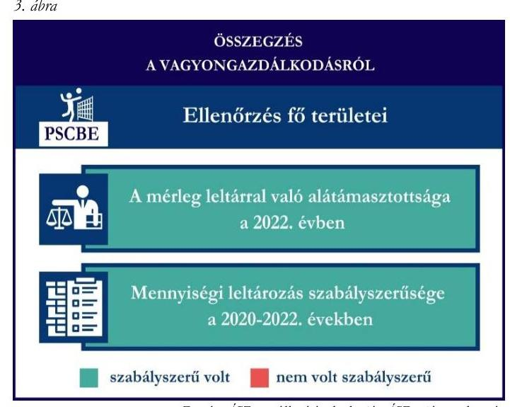
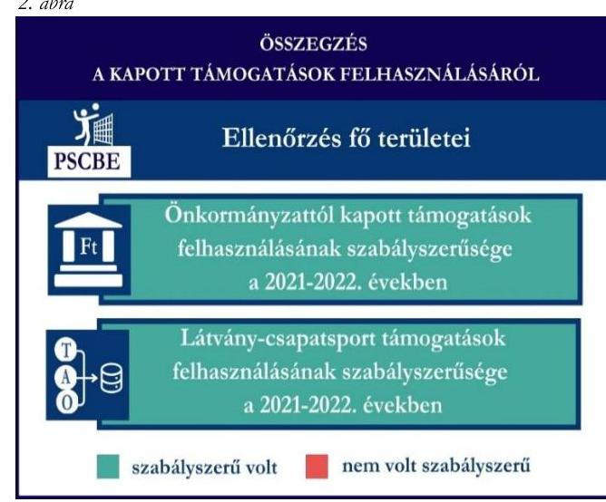

# JELENTÉS 

## Támogatásban részesülő sportszövetségek és sportegyesületek gazdálkodásának ellenőrzése

## Petőfi Sport Club Bonyhád Egyesület

2024.

---

ÁLLAMI
SZÁMVEVŐSZÉK

# JELENTÉS 

## Támogatásban részesülő sportszövetségek és sportegyesületek gazdálkodásának ellenőrzése

Petőfi Sport Club Bonyhád Egyesület

2024.

---

# ELLENŐRZÉSI IGAZGATÓSÁG: 

## ÁLLAMHÁZTARTÁSON KÍVÜLI SZERVEZETEKET ELLENŐRZŐ IGAZGATÓSÁG

ELLENŐRZÉSI IGAZGATÓ:
KLINGA LÁSZLÓ igazgató
ELLENŐRZÉSVEZETŐ:
HOFMEISTER LÁSZLÓ ellenőrzésvezető

Jelentéseink az interneten a www.asz.hu címen olvashatók.

IKTATÓSZÁM: EL-4060-198/2024
TÉMASORSZÁM: 30
ELLENŐRZÉS-AZONOSÍTÓ SZÁM: V1026

---

# TARTALOMJEGYZÉK 

AZ ELLENŐRZÉS ALAPADATAI ..... 5
AZ ELLENŐRZÖTT SZERVEZET ..... 7
ÖSSZEFOGLALÁS ..... 8
AZ ELLENŐRZÉS FÓKUSZKÉRDÉSEI ..... 10
MEGÁLLAPÍTÁSOK ..... 11
JAVASLATOK ..... 13
MELLÉKLETEK ..... 14
I. sz. melléklet: Értelmező szótár ..... 14
II. sz. melléklet: Az ellenőrzött szervezetek jegyzéke ..... 16
III. sz. melléklet: Ellenőrzési kritériumok ..... 17
FÜGGELÉK: ÉSZREVÉTELEK ..... 18
RÖVIDÍTÉSEK JEGYZÉKE ..... 19

---

.

---

# AZ ELLENŐRZÉS ALAPADATAI 

## AZ ELLENŐRZÉS CÉLJA

Az ellenőrzés célja az államháztartásból nyújtott támogatással, vagy az államháztartásból meghatározott célra ingyenesen juttatott vagyon felhasználásával érintett sportszövetségek és sportegyesületek gazdálkodása szabályozottságának, gazdálkodási tevékenységének, ezen belül a beszámolási kötelezettség teljesítésének, a támogatások elkülönített nyilvántartásának, valamint a támogatások felhasználásának ellenőrzése.

## AZ ELLENŐRZÉS TÍPUSA

Szabályszerűségi ellenőrzés.

## AZ ELLENŐRZÖTT IDŐSZAK

Az 1. fókuszkérdés esetében a 2022. év.
A 2. fókuszkérdés vonatkozásában a 2021-2022. évek.
A 3. fókuszkérdés vonatkozásában a 2022. év, a mennyiségi felvétellel történő leltározás dokumentumai tekintetében a 2020-2022. évek.

## AZ ELLENŐRZÉS TÁRGYA

Az ellenőrzés tárgya a támogatásban részesülő sportszövetségek, sportegyesületek gazdálkodása szabályozottságának, gazdálkodási tevékenységén belül a beszámolási kötelezettség teljesítésének, a vagyonnyilvántartásának, a támogatások elkülönített nyilvántartásának, valamint az államháztartási forrásból származó közvetlen vagy közvetett támogatások és a meghatározott célra ingyenesen juttatott vagyon felhasználásának vizsgálata volt. Az ellenőrzés a támogatások vonatkozásában kiterjedt továbbá a támogató felé történő beszámolási és elszámolási kötelezettségek teljesítésére, az ezekkel kapcsolatos jogszabályi és belső előírások betartására.

Az ellenőrzés kiterjedt minden olyan körülményre és adatra, amely az ÁSZ¹ jogszabályban meghatározott feladatainak teljesítéséhez, valamint az ellenőrzési program végrehajtása során felmerülő újabb összefüggések feltárásához szükséges.

## AZ ELLENŐRZÉS JOGALAPJA

Az ellenőrzés jogszabályi alapját az ÁSZ tv.² 1. § (3) bekezdése és az 5. § (3) bekezdése előírásai képezték.

---

# AZ ELLENŐRZÉS MÓDSZERE 

Az ellenőrzést a nemzetközi standardokat irányadónak tekintve az ellenőrzési program szempontjai, az ellenőrzött időszakban hatályos jogszabályok, az ellenőrzés általános szakmai szabályai, az ellenőrzésre irányadó ÁSZ módszertanok figyelembevételével végezte az ÁSZ.

Az ellenőrzési kérdések megválaszolásához szükséges bizonyítékok megszerzése az ellenőrzött szervezet által rendelkezésre bocsátott dokumentumokra, adatokra alapozva kérdésfeltevés (információkérés), interjú, mintavételezés útján történt. A támogatásból beszerzett tárgyi eszközök használatára, fizikai fellelhetőségére irányulóan az érintett vagyontárgyak helyszíni szemle keretében történő szemrevételezésére indokolt esetben sor került.

Az ellenőrzési bizonyítékként felhasználható adatforrások közé tartoztak egyrészt az ellenőrzés során az ellenőrzött szervezettől bekért dokumentumok, másrészt adatforrás volt minden további, az ellenőrzés folyamán feltárt, az ellenőrzés szempontjából információt tartalmazó dokumentum.

A támogatásokkal, azok felhasználásával kapcsolatos kötelezettségek vizsgálatára mintavételi eljárások kerültek alkalmazásra. Támogatás-típusok szerint nagyságrend alapján 1-3 darab támogatás került részletes vizsgálat alá. Ezen támogatások felhasználásának szabályszerűsége támogatásonként kockázatértékelés alapján kiválasztott mintatételekkel került ellenőrzésre. A kiválasztott támogatási szerződésekhez kapcsolódó elszámolásokból 30-30 db mintatétel került ellenőrzésre, ahol az elszámolás nem érte el a 30 db-ot, ott tételes ellenőrzésre került sor. Ezen felül a vagyongazdálkodás szabályszerűségének ellenőrzéséhez is kockázatalapú mintavétel kapcsolódott. A támogatások felhasználása és a vagyongazdálkodás területén a minták ellenőrzése kiterjedt a könyvvezetési kötelezettség vizsgálatára is. A kiválasztott támogatási szerződésekhez kapcsolódó elszámolásokból 30-30 db mintatétel került ellenőrzésre, ahol a mintatételek száma nem érte el a 30 db-ot, ott tételes ellenőrzésre került sor. A tárgyi eszközök tekintetében 6 db eszköz tételesen került ellenőrzésre. Az ellenőrzésben nem statisztikai mintavételre került sor, ezért nem történt kivetítés a teljes sokaságra, a megállapításokat az ellenőrzött mintatételekre vonatkozóan fogalmazta meg az ÁSZ.

---

# AZ ELLENŐRZÖTT SZERVEZET

## PETŐFI SPORT CLUB BONYHÁD EGYESÜLET

1. február 23-án alapították meg a PSCBE³-t. Céljai közé tartozik a rendszeres sportfoglalkozások szervezése, a szabadidősport rendezvényeinek megszervezése, valamint a környezetvédelem. A PSCBE a tevékenységét a röplabda sportág keretében végzi.

A PSCBE a jogszabályi előírás alapján könyvvizsgálatra, felügyelőbizottság létrehozására nem volt kötelezett, a 2022. évben vállalkozási tevékenységet nem végzett. Az OBH⁴ nyilvántartása alapján közhasznú jogállással nem rendelkezett.

A 2021-2022. években a PSCBE által igénybe vett államháztartási forrásból származó támogatásokat az 1. táblázat foglalja magában.

|   | 2021. év | 2022. év  |
| --- | --- | --- |
|  Központi költségvetésből | - | -  |
|  Helyi önkormányzattól | 0,5 | 1,0  |
|  Látvány-csapatsport támogatásból | 45,9 | 74,9  |

*A PSCBE ÁLTAL IGÉNYBE VETT TÁMOGATÁSOK (ADATOK M FT-BAN)*

*Forrás: Az ellenőrzött szervezet főkönyvi adatai alapján ÁSZ saját szerkesztés*

---

# ÖSSZEFOGLALÁS 

Az Alaptörvény⁵ XX. cikke kimondja, hogy mindenkinek joga van a testi és lelki egészséghez, melynek érvényesülését Magyarország többek között a sportolás és a rendszeres testedzés támogatásával segíti elő. Az Országgyűlés⁶ a Sport tv.⁷-ben kinyilvánította, hogy a nemzet közössége a test művelését, a sportot, a nemzet alapértékének, kívánatos célnak tekinti. A sport a közjó része. Erősíti a közösség tagjainak egymáshoz tartozását, miként az egyén testi és lelki egészségét.

A sportegyesületek, sportszövetségek működésükre és szakmai tevékenységük ellátására költségvetési támogatásban, önkormányzati támogatásban, ingyenes vagyonjuttatásban, valamint látvány-csapatsport támogatásban részesülhetnek, amelyekre fokozott figyelem irányul.

A társadalom részéről jogosan felmerülő elvárás, hogy a közpénzeket kezelő, azzal gazdálkodó szervezetek működéséről, tevékenységéről átfogó képet kapjon, a közpénzek rendeltetésszerű és átlátható módon történő felhasználásának értékelésére időről-időre sor kerüljön az ellenőrzések keretében.

A PSCBE a könyvviteli szolgáltatás személyi feltételeit megteremtette. A jogszabályi előírások szerint a PSCBE kialakította a számviteli politikáját, valamint elkészítette számviteli szabályzatait, a számlarend vonatkozásában az ellenőrzés hiányosságot tárt fel.

A PSCBE a számviteli beszámolóját - a kiegészítő melléklet hiánya miatt - nem a jogszabályi előírásoknak megfelelően készítette el és tette közzé.

A gazdálkodás szervezeti keretei kialakításának, a számviteli szabályzatok megalkotásának, valamint a számviteli beszámoló elkészítésének és közzétételének értékelését az 1. ábra mutatja be.

---

A PSCBE a látvány-csapatsport támogatásból kapott, valamint a helyi önkormányzattól kapott támogatásokat a támogatási célnak megfelelően használta fel az ellenőrzött tételek esetében.

A támogatások felhasználásáról a jogszabályban előírt elkülönített nyilvántartást a 2021-2022. években vezette a számviteli rendszerében.

A kapott támogatások felhasználásának ellenőrzéséről az összegzést a 2. ábra tartalmazza.

Forrás: ÁSZ megállapítások alapján ÁSZ saját szerkesztés
2. ábra

A 2022. évben a PSCBE vagyongazdálkodása az ellenőrzött tételek vonatkozásában szabályszerű volt. A jogszabályoknak megfelelően gondoskodott saját vagyona nyilvántartásáról és a számviteli beszámolóban történő megjelenítéséről.

A mérlegben szereplő eszközök háromévente előírt mennyiségi leltározását a 2022. évben elvégezte.

A vagyongazdálkodás ellenőrzésének az összegzését a 3. ábra tartalmazza.

---

# AZ ELLENŐRZÉS FÓKUSZKÉRDÉSEI 

1.     - A gazdálkodási szabályok kialakítása, a könyvvezetési és beszámolási kötelezettség teljesítése szabályszerű volt-e?
2.     - A kapott támogatások felhasználása szabályszerű volt-e?
3.     - Az ellenőrzött szervezet vagyongazdálkodása szabályszerű volt-e?

---

# MEGÁLLAPÍTÁSOK 

## 1. A gazdálkodási szabályok kialakítása, a könyvvezetési és beszámolási kötelezettség teljesítése szabályszerű volt-e?

Összegző megállapítás A 2022. évben a PSCBE a bizonylati rend kivételével, a jogszabályban előírt gazdálkodási szabályzatait kialakította, a beszámolási és közzétételi kötelezettségét a kiegészítő melléklet hiánya miatt nem szabályszerűen teljesítette.

A 2022. évben a PSCBE a Számv. tv.⁸ és a Civilszr.⁹-ben foglaltaknak megfelelően gondoskodott a könyvviteli szolgáltatás személyi feltételeinek teljesüléséről.
A 2022. évben rendelkezett a Számv. tv. előírásainak megfelelő számviteli politikával, az eszközök és a források leltárkészítési és leltározási szabályzatával, az eszközök és források értékelési szabályzatával, a pénzkezelés szabályzatával, valamint számlarenddel. A hatályos számlarend részeként a Számv. tv. 161. § (2) bekezdés d) pontjának előírása ellenére nem rendelkezett a számlarendben foglaltakat alátámasztó bizonylati renddel.
A PSCBE a könyvviteli nyilvántartásait a Számv. tv. és a Civilszr. rendelkezéseinek megfelelően úgy alakította ki, hogy a számviteli beszámolóban az egyéb bevételeken belül a kapott támogatások összegét részletezni tudta.
A PSCBE a Civil. tv.¹⁰-ben előírt 2022. évi beszámolóját a Civil tv. 29. § (2) bekezdés c) pontjában előírtak ellenére kiegészítő mellékletet nélkül készítette el. A Civil vhr.¹¹-ben előírtaknak megfelelő közhasznúsági mellékletét a PSCBE a 2022. évre vonatkozóan elkészítette. A Civil tv.-ben előírtaknak megfelelően a 2022. évre vonatkozó beszámolót a PSCBE közgyűlése elfogadta. A PSCBE az elfogadott 2022. évi beszámolóját, valamint közhasznúsági mellékletét közzétette, illetve letétbe helyezte.

## 2. A kapott támogatások felhasználása szabályszerű volt-e?

## Összegző megállapítás A PSCBE a 2021. és 2022. években kapott támogatásokat az ellenőrzött tételek vonatkozásában szabályszerűen, a támogatási célnak megfelelően használta fel.

A PSCBE a látvány-csapatsport támogatásból kapott támogatások ellenőrzött bevételeit a Civil tv. előírásai alapján elkülönítetten mutatta ki számviteli rendszerében. A PSCBE a 2021-2022. években a Számv. tv.-ben és a 107/2011. (VI. 30.) Korm. rendeletben¹² előírt alapcél szerinti tevékenysége költségei, ráfordításai ellentételezésére látvány-csapatsport támogatásokról vezetett olyan elkülönített számviteli nyilvántartást, amely alapján támogatásonként megállapítható és ellenőrizhető volt a kapott támogatások felhasználása.
A PSCBE a 2021-2022. években rendelkezett a 107/2011. (VI. 30.) Korm. rendeletben előírt látványcsapatsport támogatással érintett, jóváhagyott SFP¹³-vel. A PSCBE a 2021-2022. években a 107/2011. (VI. 30.) Korm. rendelet 11. § (2) bekezdésében foglaltak ellenére a látvány-csapatsport támogatás

---

felhasználásáról negyedévente az előrehaladási jelentéseket nem nyújtotta be az illetékes ellenőrző szervezet felé. Az ellenőrzött SFP-vel kapcsolatban kapott látvány-csapatsport és kiegészítő sportfejlesztési támogatással a PSCBE a 107/2011. (VI. 30.) Korm. rendeletben foglaltak szerint elszámolt. A PSCBE a 2022. évben a látvány-csapatsport és kiegészítő sportfejlesztési támogatás felhasználását igazoló szakmai szöveges beszámolóját a 107/2011. (VI. 30.) Korm. rendeletben foglaltak alapján elkészítette. A 107/2011. (VI. 30.) Korm. rendeletnek megfelelően könyvvizsgáló által ellenőrzött számviteli bizonylatokkal számolt el a támogató felé, melyhez a könyvvizsgálatot végző könyvvizsgáló felelősségbiztosítási kötvénye is benyújtásra került. A PSCBE a 107/2011. (VI.30.) Korm. rendeletben előírtaknak megfelelően az ellenőrzött, látvány-csapatsport támogatás felhasználását alátámasztó számviteli bizonylatokat - egy tétel kivételével - záradékkal ellátta, egy tételnél a záradék nem tartalmazott összeget, ezzel a PSCBE nem tartotta be a 107/2011. (VI. 30.) Korm. rendelet 11. § (5) bekezdésében előírtakat, így ezeknél a tételeknél nem jelezte, hogy a számviteli bizonylaton szereplő összegből mennyit számolt el a szerződésszámmal hivatkozott támogatási szerződés terhére.
A PSCBE a helyi önkormányzattól kapott támogatások ellenőrzött bevételeit a Civil tv. előírásai alapján elkülönítetten mutatta ki számviteli rendszerében. A PSCBE a 2021. évben a Számv. tv.-ben és a Civil tv.ben előírt alapcél szerinti tevékenysége költségei, ráfordításai ellentételezésére a helyi önkormányzattól kapott ellenőrzött támogatásokról vezetett olyan elkülönített számviteli nyilvántartást, amely alapján támogatásonként megállapítható és ellenőrizhető volt a kapott támogatások felhasználása. A PSCBE a 2021. évben a helyi önkormányzat költségvetéséből számára juttatott sportcélú támogatásokról, a támogatási szerződésben előírtaknak megfelelően teljesítette

 beszámolási kötelezettségét a támogatás rendeltetésszerű felhasználásáról a helyi önkormányzat felé. A PSCBE a 2021. évben elszámolt támogatások ellenőrzött tételeit a Számv. tv.-ben előírtaknak megfelelő, szabályszerű számviteli bizonylattal alátámasztotta.

# 3. Az ellenőrzött szervezet vagyongazdálkodása szabályszerű volt-e? 

## Összegző megállapítás

A PSCBE vagyongazdálkodása a 2022. évben szabályszerű volt az ellenőrzött tételek vonatkozásában. A 2022. évi beszámolójának mérlegtételeit szabályszerű leltárral alátámasztotta.

A PSCBE a Számv. tv. előírásainak megfelelően a 2022. év beszámolójának mérlegét, a mérlegben szereplő eszközöket és forrásokat alátámasztotta leltárral, elvégezte a főkönyvi könyvelés és az analitikus nyilvántartások adatai közötti egyeztetést. A PSCBE a Számv. tv.-ben előírt háromévente esedékes mennyiségi felvétellel történő leltározást a 2022. évben elvégezte.
A PSCBE-nél az ellenőrzött tételek vonatkozásában a tárgyi eszközök bekerülési értékét, az értékcsökkenés elszámolását, valamint az üzembe helyezést a tárgyi eszközök vonatkozásában a Számv. tv.-ben előírtak alapján határozták meg, dokumentálták.

---

# JAVASLATOK 

Az ÁSZ tv. 33. § (1) bekezdésében foglaltak értelmében az ellenőrzött szervezet vezetője köteles a jelentésben foglalt megállapításokhoz kapcsolódó intézkedési tervet összeállítani és azt a jelentés kézhezvételétől számított 30 napon belül az ÁSZ részére megküldeni. Amennyiben az ellenőrzött szervezet vezetője nem küldi meg határidőben az intézkedési tervet, vagy továbbra sem elfogadható intézkedési tervet küld, az Állami Számvevőszék elnöke az ÁSZ tv. 33. § (3) bekezdése a) és b) pontjaiban foglaltakat érvényesítheti.

## A PETŐFI SPORT CLUB BONYHÁD EGYESÜLET ELNÖKÉNEK

1. Gondoskodjon a számlarendben foglaltakat alátámasztó bizonylati rend elkészítéséről a Számv. tv. 161. § (2) bekezdés d) pontjában előírtaknak megfelelően.
2. Gondoskodjon a beszámoló részét képező kiegészítő melléklet elkészítéséről a Civil tv. 29. § (2) bekezdés c) pontjában előírtak alapján.
3. Gondoskodjon arról, hogy a 107/2011. (VI. 30.) Korm. rendelet 11. § (5) bekezdésének megfelelően záradékolják a támogatás felhasználásához kapcsolódó számviteli bizonylatokat.

---

# MELLÉKLETEK 

## I. SZ. MELLÉKLET: ÉRTELMEZŐ SZÓTÁR

civil szervezet
egyesület
költségvetési támogatás
közhasznú szervezet
közhasznú tevékenység
látvány-csapatsport támogatás
kiegészítő sportfejlesztési támogatás
sportági szövetség
sportegyesület
sportegyesületeknek, sportszövetségeknek nyújtott költségvetési támogatás

A civil társaság; a Magyarországon nyilvántartásba vett egyesület - a párt, a szakszervezet és a kölcsönös biztosító egyesület kivételével és - a közalapítvány és a pártalapítvány kivételével - az alapítvány. (Forrás: Civil tv. 2. § 6. pont a) c) alpontjai)

Az egyesület a tagok közös, tartós, alapszabályban meghatározott céljának folyamatos megvalósítására létesített, nyilvántartott tagsággal rendelkező jogi személy. (Forrás: Ptk. ${ }^{14}$ 3:63. § (1) bekezdés)
A Számv. tv. szempontjából egyéb szervezet. (Számv. tv. 3. § bekezdés 4. pont a) alpontja)

A társadalombiztosítás pénzügyi alapjai kivételével az államháztartás központi alrendszeréből ellenérték nélkül, pénzben nyújtott támogatások. (Forrás: Áht. ${ }^{15}$ 1. $\S 14$. pont)

Közhasznú szervezetté minősíthető a Magyarországon nyilvántartásba vett közhasznú tevékenységet végző szervezet, amely a társadalom és az egyén közös szükségleteinek kielégítéséhez megfelelő erőforrásokkal rendelkezik, továbbá amelynek megfelelő társadalmi támogatottsága kimutatható, és amely: a) civil szervezet (ide nem értve a civil társaságot), vagy
b) olyan egyéb szervezet, amelyre vonatkozóan a közhasznú jogállás megszerzését törvény lehetővé teszi. (Forrás: Civil tv. 32. § (1) bekezdés)
Minden olyan tevékenység, amely a létesítő okiratban megjelölt közfeladat teljesítését közvetlenül vagy közvetve szolgálja, ezzel hozzájárulva a társadalom és az egyén közös szükségleteinek kielégítéséhez. (Forrás: Civil tv. 2. § 20. pont)
Az adóévben visszafizetési kötelezettség nélkül nyújtott támogatás, juttatás, véglegesen átadott pénzeszköz és térítés nélkül átadott eszköz könyv szerinti értéke, az adóévben térítés nélkül nyújtott szolgáltatás bekerülési értéke a Tao. tv. ${ }^{16}$-ben meghatározott jogcímeken. (Forrás: Tao. tv. 4. § 44. pont)
A látvány-csapatsportok támogatása esetében a Tao. tv. 24/A. § (1) és (2) bekezdése szerinti rendelkező nyilatkozatban felajánlott összeg 12,5 százaléka kiegészítő sportfejlesztési támogatásnak minősül. (Forrás: Tao. tv. 24/A. § (9) bekezdése)
A Civil tv. és a Ptk. előírásai alapján - a Sport tv.-ben meghatározott eltérésekkel - működő szövetség, amelynek tagjai kizárólag sportszervezetek lehetnek. Sportági szövetség országos jelleggel is működhet. Egy sportágban csak egy országos sportági szövetség működhet. Törvényi feltételek teljesülése esetén szakszövetségi feladatokat is elláthat. (Forrás: Sport tv. 28. §)
A Civil tv. és a Ptk. szabályai szerint működő olyan egyesület, amelynek alaptevékenysége a sporttevékenység szervezése, valamint a sporttevékenység feltételeinek megteremtése. A sportegyesületek a Sport tv. 15. § (1) bekezdésében meghatározott sportszervezetek körébe tartoznak. A sportegyesületeken kívül sportszervezet még a sportvállalkozás, a sportiskola, valamint az utánpótlás-nevelés fejlesztését végző alapítvány. (Forrás: Sport tv. 16. § (1) bekezdés)

Az állami sport célú támogatások felhasználásáról és elosztásáról szóló 474/2016. (XII. 27.) Korm. rendelet és a 27/2013. (III. 29.) EMMI rendelet ${ }^{17}$ 1. §-ában meghatározott fejezeti kezelésű előirányzatokból nyújtott támogatás.

---

sportszövetség
sporttevékenység

Meghatározott sporttevékenységek körében a sportversenyek szervezésére, a tagok érdekvédelmére és a részükre való szolgáltatásokra, valamint a nemzetközi kapcsolatok lebonyolítására létrehozott, jogi személyiséggel és önkormányzattal rendelkező, a Civil tv. és a Ptk. alapján - az e törvényben foglalt eltérésekkel - különös formában működő egyesületek. A Sport tv. 19. § (3) bekezdése szerint a sportszövetségeknek az alábbi típusai léteznek: országos sportági szakszövetségek, sportági szövetségek, szabadidősport szövetségek, fogyatékosok sportszövetségei, diák- és egyetemi-főiskolai sport sportszövetségei, nemzetközi sportszövetségek. (Forrás: Sport tv. 19. § (1), (3) bekezdés)
Meghatározott szabályok szerint, a szabadidő eltöltéseként kötetlenül vagy szervezett formában, illetve versenyszerűen végzett testedzés vagy szellemi sportágban kifejtett tevékenység, amely a fizikai erőnlét és a szellemi teljesítőképesség megtartását, fejlesztését szolgálja. (Forrás: Sport tv. 1. § (2) bekezdés)

---

II. SZ. MELLÉKLET: AZ ELLENŐRZÖTT SZERVEZETEK JEGYZÉKE

| ELLENŐRZÖTT SZERVEZET NEVE | ELLENŐRZÖTT SZERVEZET SZÉKHELYE |
| :-- | :-- |
| Petőfi Sport Club Bonyhád Egyesület | 7150 Bonyhád, Kossuth Lajos utca 4. |

---

# III. SZ. MELLÉKLET: ELLENŐRZÉSI KRITÉRIUMOK 

## FÓKUSZKÉRDÉS

## 1. fókuszkérdés:

A gazdálkodási szabályok kialakítása, a könyvvezetési és beszámolási kötelezettség teljesítése szabályszerű volt-e?

## 2. fókuszkérdés:

A kapott támogatások felhasználása szabályszerű volt-e?

## 3. fókuszkérdés:

Az ellenőrzött szervezet vagyongazdálkodása szabályszerű volt-e?

## ELLENŐRZÉSI KRITÉRIUMOK

107/2011. (VI.30.) Korm. rendelet 9. § (9) bek.
Számv. tv. 14. § (3) bekezdés, (5) bekezdés a), b), d) pont, (8) bekezdés, (11) bekezdés, 69. § (3) bekezdés, 90. § (3) bekezdés c) pont, 161. § (1) bekezdés, (2) bekezdés a)-d) pont, (3)-(4) bekezdés, 161/A. $\S$ (2) bekezdés, 165. $\S$ (2) bekezdés
Civilszr. 7. § (1) bekezdés, (4) bekezdés b), c) pont, 8. § (2), (3) bekezdés, 9. § (4), (5), (8) bekezdés, 12. § (4), (5) bekezdés, 15. § (1) bekezdés a), b) pont, 16. § (1) bekezdés, 24. § (2) bekezdés

Civil vhr. 12. § (1) bekezdés, melléklet 5. pont
Ptk. 3:26. § (1) bekezdés, 3:27. § (1) bekezdés, 3:82. § (1) bekezdés,
Civil tv. 28. § (1) bekezdés, 29. § (2) bekezdés c) pont, (3), (6), (7) bekezdés, 30. § (1)-(4) bekezdés 40. § (1)

Tao. tv. 22/C.
107/2011. (VI. 30.) Korm. rendelet 2. § (3b) bek., 4. § (11) bek., 5. § (1) bek., 6. § (1) bek. e) pont, 9. § (8)-(10) bek., 10. § (2), (2a), (2b), (4), (5a), (6) bek., 11. § (1), (1a), (1d), (1e), (2), (4), (4a), (5), (6) bek., 13. § (1), (2a) bek., 14. § (1), (4), (4b), (4c), (6c) bek.

Számv. tv. 44. § (2) bekezdés, 93. § (3) bekezdés, 159. §, 161/A. §
(2) bekezdés, 165. § (2) bekezdés, 167. § (1) bekezdés a), d), e), h) pont
Civil tv. 20. § (2) bekezdés a) pont, (3) bekezdés a), c) pont, (4) bekezdés, 29. § (4), (5) bekezdés
Civilszr. 24. § (2) bekezdés
27/2013. (III.29.) EMMI rendelet 18. § (2) bekezdés
474/2016. (XII. 27.) Korm. rendelet 22. § (2) bekezdés, 24. § (2) bekezdés
Áht. 53. §, Ávr. ${ }^{18}$ 92. §, 93. § (2)-(4) bekezdések
Ptk. 3:63. § (4) bekezdés
Számv. tv. 3. § (3) bekezdés 3. pont, 15. § (3) bekezdés, 46. § (3), (4) bekezdés, 47-51. §, 52. § (1)-(7) bekezdés, 69. § (1)-(3) bekezdések, 165. § (2) bekezdés, 169. § (2) bekezdés

---

# FÜGGELÉK: ÉSZREVÉTELEK 

A jelentéstervezetet a Számvevőszék 15 napos észrevételezésre megküldte az ellenőrzött szervezet vezetőjének az ÁSZ tv. 29. § (1) bekezdése előírásának megfelelően.

A Petőfi Sport Club Bonyhád Egyesület elnöke a jelentéstervezetre nem tett észrevételt.

[^0]
[^0]:    * 29. § (1) Az Állami Számvevőszék az ellenőrzési megállapításait megküldi az ellenőrzött szervezet vezetőjének vagy az általa megbízott személynek, és annak, akinek személyes felelősségét állapította meg.
    (2) Az ellenőrzött szervezet vezetője és a felelősként megjelölt személy az ellenőrzés megállapításaira tizenöt napon belül írásban észrevételt tehet.
    (3) Az Állami Számvevőszék az észrevételre a beérkezésétől számított harminc napon belül írásban válaszol. A figyelembe nem vett észrevételeket köteles a jelentésben feltüntetni, és megindokolni, hogy azokat miért nem fogadta el.

---

# RÖVIDÍTÉSEK JEGYZÉKE 

${ }^{1}$ ÁSZ
${ }^{2}$ ÁSZ tv.
${ }^{3}$ PSCBE
${ }^{4}$ OBH
${ }^{5}$ Alaptörvény
${ }^{6}$ Országgyülés
${ }^{7}$ Sport tv.
${ }^{8}$ Számv. tv.
${ }^{9}$ Civilszr.
${ }^{10}$ Civil tv.
${ }^{11}$ Civil vhr.
${ }^{12}$ 107/2011. (VI. 30.) Korm. rendelet
${ }^{13}$ SFP
${ }^{14}$ Ptk.
${ }^{15}$ Áht.
${ }^{16}$ Tao. tv.
${ }^{17}$ 27/2013. (III.29.) EMMI rendelet
${ }^{18}$ Ávr.

Állami Számvevőszék
2011. évi LXVI. törvény az Állami Számvevőszékről

Petőfi Sport Club Bonyhád Egyesület
Országos Bírósági Hivatal
Magyarország Alaptörvénye
Magyarország Országgyűlése
2004. évi I. törvény a sportról
2000. évi C. törvény a számvitelről

479/2016. (XII. 28.) Korm. rendelet a számviteli törvény szerinti egyes egyéb szervezetek beszámoló készítési és könyvvezetési kötelezettségének sajátosságairól
2011. évi CLXXV. törvény az egyesülési jogról, a közhasznú jogállásról, valamint a civil szervezetek működéséről és támogatásáról
350/2011. (XII. 30.) Korm. rendelet a civil szervezetek gazdálkodása, az adománygyűjtés és a közhasznúság egyes kérdéseiről
107/2011. (VI. 30.) Korm. rendelet a látvány-csapatsport támogatását biztosító támogatási igazolás kiállításáról, felhasználásáról, a támogatás elszámolásának és ellenőrzésének, valamint visszafizetésének szabályairól
Sportfejlesztési támogatás
2013. évi V. törvény a Polgári Törvénykönyvről
2011. évi CXCV. törvény az államháztartásról
1996. évi LXXXI. törvény a társasági adóról és az osztalékadóról

27/2013. (III. 29.) EMMI rendelet az állami sport célú támogatások felhasználásáról és elosztásáról
368/2011. (XII. 31.) Korm. rendelet az államháztartásról szóló törvény végrehajtásáról

---

1052 Budapest, Apáczai Csere János u. 10. | 1364 Budapest 4., Pf. 54
www.asz.hu | szamvevoszek@asz.hu
telefon: +36 14849100

