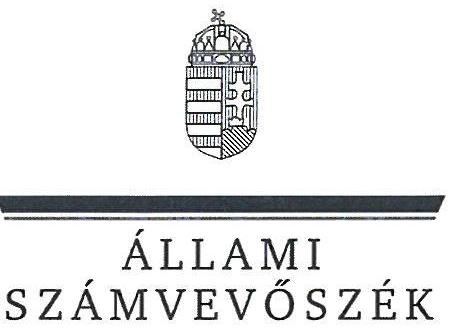
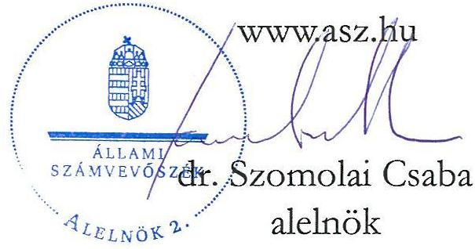
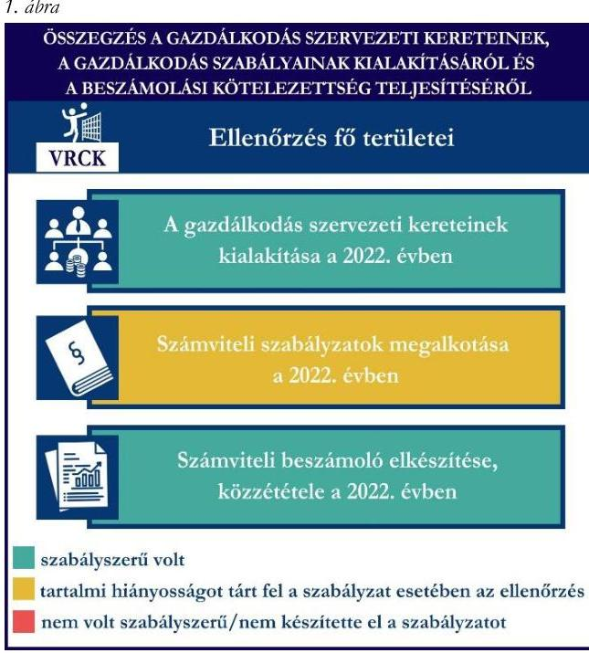
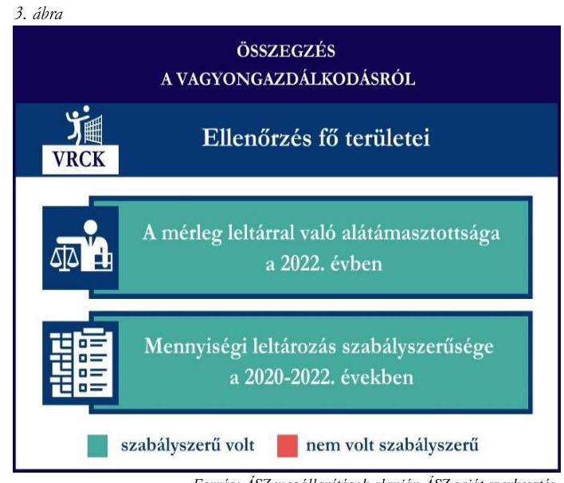
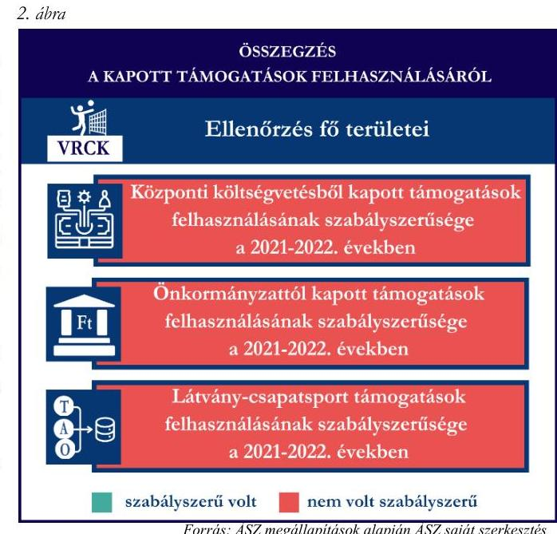

# JELENTÉS 

## Támogatásban részesülő sportszövetségek és sportegyesületek gazdálkodásának ellenőrzése

Vegyész Röplabda Club Kazincbarcika

2024.

---

# JELENTÉS 

## Támogatásban részesülő sportszövetségek és sportegyesületek gazdálkodásának ellenőrzése

Vegyész Röplabda Club Kazincbarcika

2024. 

24187

---

# ELLENŐRZÉSI IGAZGATÓSÁG: 

## ÁLLAMHÁZTARTÁSON KÍVÜLI SZERVEZETEKET ELLENŐRZŐ IGAZGATÓSÁG

ELLENŐRZÉSI IGAZGATÓ:
KLINGA LÁSZLÓ igazgató

ELLENŐRZÉSVEZETŐ:
HOFMEISTER LÁSZLÓ ellenőrzésvezető

## Jelentéseink az interneten a www.asz.hu címen olvashatók.

IKTATÓSZÁM: EL-4060-201/2024
TÉMASORSZÁM: 30
ELLENŐRZÉS-AZONOSÍTÓ SZÁM: V1026

---

# TARTALOMJEGYZÉK 

AZ ELLENŐRZÉS ALAPADATAI ..... 5
AZ ELLENŐRZÖTT SZERVEZET ..... 7
ÖSSZEFOGLALÁS ..... 8
AZ ELLENŐRZÉS FÓKUSZKÉRDÉSEI ..... 10
MEGÁLLAPÍTÁSOK ..... 11
JAVASLATOK ..... 15
MELLÉKLETEK ..... 16
I. sz. melléklet: Értelmező szótár ..... 16
II. sz. melléklet: Az ellenőrzött szervezetek jegyzéke ..... 18
III. sz. melléklet: Ellenőrzési kritériumok ..... 19
FÜGGELÉK: ÉSZREVÉTELEK ..... 20
RÖVIDÍTÉSEK JEGYZÉKE ..... 22

---

.

---

# AZ ELLENŐRZÉS ALAPADATAI 

## AZ ELLENŐRZÉS CÉLJA

Az ellenőrzés célja az államháztartásból nyújtott támogatással, vagy az államháztartásból meghatározott célra ingyenesen juttatott vagyon felhasználásával érintett sportszövetségek és sportegyesületek gazdálkodása szabályozottságának, gazdálkodási tevékenységének, ezen belül a beszámolási kötelezettség teljesítésének, a támogatások elkülönített nyilvántartásának, valamint a támogatások felhasználásának ellenőrzése.

## AZ ELLENŐRZÉS TÍPUSA

Szabályszerűségi ellenőrzés.

## AZ ELLENŐRZÖTT IDŐSZAK

Az 1. fókuszkérdés esetében a 2022. év.
A 2. fókuszkérdés vonatkozásában a 2021-2022. évek.
A 3. fókuszkérdés vonatkozásában a 2022. év, a mennyiségi felvétellel történő leltározás dokumentumai tekintetében a 2020-2022. évek.

## AZ ELLENŐRZÉS TÁRGYA

Az ellenőrzés tárgya a támogatásban részesülő sportszövetségek, sportegyesületek gazdálkodása szabályozottságának, gazdálkodási tevékenységén belül a beszámolási kötelezettség teljesítésének, a vagyonnyilvántartásának, a támogatások elkülönített nyilvántartásának, valamint az államháztartási forrásból származó közvetlen vagy közvetett támogatások és a meghatározott célra ingyenesen juttatott vagyon felhasználásának vizsgálata volt. Az ellenőrzés a támogatások vonatkozásában kiterjedt továbbá a támogató felé történő beszámolási és elszámolási kötelezettségek teljesítésére, az ezekkel kapcsolatos jogszabályi és belső előírások betartására. Az ellenőrzés kiterjedt minden olyan körülményre és adatra, amely az ÁSZ¹ jogszabályban meghatározott feladatainak teljesítéséhez, valamint az ellenőrzési program végrehajtása során felmerülő újabb összefüggések feltárásához szükséges.

Az ÁSZ tv.² 25. § (3) bekezdésében meghatározottak alapján, amennyiben a rendelkezésre bocsátott dokumentumok, adatok, illetve tájékoztatás hitelességének, megalapozottságának, teljességének megállapítása vagy egyes ellenőrzési megállapítások alátámasztása, kiegészítése indokolta, az ellenőrzés tárgyát képezték az összefüggő tények vizsgálatához más szervezetek (ellenőrzést támogató szervezetek) által rendelkezésre bocsátott adatok, dokumentációk, megadott tájékoztatások, illetve az ott végzett ellenőrzés is.

Az 1. és 3. fókuszkérdés tekintetében a vizsgálat a teljes ellenőrzött szervezetre, a 2. fókuszkérdés tekintetében kizárólag a röplabda sportszakágra vonatkozott.

---

# AZ ELLENŐRZÉS JOGALAPJA 

Az ellenőrzés jogszabályi alapját az ÁSZ tv. 1. § (3) bekezdése és az 5. § (3) bekezdése előírásai képezték.

## AZ ELLENŐRZÉS MÓDSZERE

Az ellenőrzést a nemzetközi standardokat irányadónak tekintve az ellenőrzési program szempontjai, az ellenőrzött időszakban hatályos jogszabályok, az ellenőrzés általános szakmai szabályai, az ellenőrzésre irányadó ÁSZ módszertanok figyelembevételével végezte az ÁSZ.

Az ellenőrzési kérdések megválaszolásához szükséges bizonyítékok megszerzése az ellenőrzött szervezet által rendelkezésre bocsátott dokumentumokra, adatokra alapozva kérdésfeltevés (információkérés), interjú, mintavételezés útján történt.

Az ellenőrzési bizonyítékként felhasználható adatforrások közé tartoztak egyrészt az ellenőrzés során az ellenőrzött szervezettől bekért dokumentumok, másrészt adatforrás volt minden további az ellenőrzés folyamán feltárt, az ellenőrzés szempontjából információt tartalmazó dokumentum.

A támogatásokkal, azok felhasználásával kapcsolatos kötelezettségek vizsgálatára mintavételi eljárások kerültek alkalmazásra. Támogatás-típusok szerint nagyságrend alapján 1-3 darab támogatás került részletes vizsgálat alá. Ezen támogatások felhasználásának szabályszerűsége támogatásonként kockázatértékelés alapján kiválasztott mintatételekkel került ellenőrzésre. A kiválasztott támogatási szerződésekhez kapcsolódó elszámolásokból 30-30 db mintatétel került ellenőrzésre, ahol az elszámolás nem érte el a 30 db-ot, ott tételes ellenőrzésre került sor. Ezen felül a vagyongazdálkodás szabályszerűségének ellenőrzéséhez is kockázatalapú mintavétel kapcsolódott. A támogatások felhasználása és a vagyongazdálkodás területén a minták ellenőrzése kiterjedt a könyvvezetési kötelezettség vizsgálatára is. A tárgyi eszközök tekintetében 30 db került kiválasztásra a 2022. évben állományban lévő eszközök közül, ahol az állományban lévő eszközök száma nem érte el a 30 db-ot, ott tételes ellenőrzésre került sor azok nyilvántartásának, elszámolásának szabályszerűsége ellenőrzése céljából. Az ellenőrzésben nem statisztikai mintavételre került sor, ezért nem történt kivetítés a teljes sokaságra, a megállapításokat az ellenőrzött mintatételekre vonatkozóan fogalmazta meg az ÁSZ.

---

# AZ ELLENŐRZÖTT SZERVEZET

## VEGYÉSZ RÓPLABDA CLUB KAZINCBARCIKA

A Vegyész Röplabda Club Kazincbarcika 1998-ban alakult. A VRCK³ célja többek között Kazincbarcika város röplabdasportja hírnevének ápolása, megőrzése, a röplabdázás fejlesztésének elősegítése. További céljai között szerepel a tagjai részére rendszeres testedzés és sportolás lehetőségének biztosítása, a minőségi sporteredmények elérése, illetve annak feltételeinek megteremtése.

A VRCK a 2022. évben nem volt közhasznú jogállású, felügyelőbizottság létrehozására nem volt kötelezett, könyvvizsgálatra kötelezett volt.

A VRCK által a 2021-2022. években igénybe vett államháztartási forrásból származó támogatásokat az 1. táblázat foglalja össze.

|   | 2021. év | 2022. év  |
| --- | --- | --- |
|  Központi költségvetési támogatás | 1 | 0,6  |
|  Helyi önkormányzati támogatás | 69 | -  |
|  Látvány-csapatsport támogatás | 1 129 | 430  |

*1. táblázat*

## A VRCK ÁLTAL IGÉNYBE VETT TÁMOGATÁSOK (ADATOK M FT-BAN)

*Forrás: Az ellenőrzött szervezet beszámolói és főkönyvi nyilvántartás adatai alapján ÁSZ saját szerkesztés*

---

# ÖSSZEFOGLALÁS 

Magyarország Alaptörvényének XX. cikke kimondja, hogy mindenkinek joga van a testi és lelki egészséghez, melynek érvényesülését Magyarország többek között a sportolás és a rendszeres testedzés támogatásával segíti elő. Az Országgyűlés a Sport tv.⁴-ben kinyilvánította, hogy a nemzet közössége a test művelését, a sportot, a nemzet alapértékének, kívánatos célnak tekinti. A sport a közjó része. Erősíti a közösség tagjainak egymáshoz tartozását, miként az egyén testi és lelki egészségét.

A sportegyesületek, sportszövetségek működésükre és szakmai tevékenységük ellátására költségvetési támogatásban, önkormányzati támogatásban, ingyenes vagyonjuttatásban, valamint látvány-csapatsport támogatásban részesülhetnek, amelyekre fokozott figyelem irányul.

A társadalom részéről jogosan felmerülő elvárás, hogy a közpénzeket kezelő, azzal gazdálkodó szervezetek működéséről, tevékenységéről átfogó képet kapjon, a közpénzek rendeltetésszerű és átlátható módon történő felhasználásának értékelésére időről-időre sor kerüljön az ellenőrzések keretében.

A VRCK a jogszabályban előírt könyvviteli szolgáltatás személyi feltételeit, a 2022. évi számviteli beszámoló vonatkozásában a könyvvizsgálatot biztosította.

A VRCK a számviteli szabályzatokat kisebb hibák mellett az előírásoknak megfelelően kialakította a 2022. évben.

A könyvvezetés formája a 2022. évben megfelelt a jogszabályi előírásoknak. A VRCK a 2022. évi számviteli beszámolóját a jogszabályban előírtak szerint elkészítette, közzétette.

A gazdálkodás szervezeti kereteinek és a gazdálkodási szabályok kialakítása, valamint a beszámolási kötelezettség ellenőrzésének összegzését az 1. ábra tartalmazza.

---

A VRCK a központi költségvetésből, az önkormányzattól kapott, valamint a látvány-csapatsport támogatást az ellenőrzött tételek vonatkozásában nem a támogatási célnak megfelelően használta fel a 2022. évben, mivel a támogatás összegéből a VRCK tagi kölcsönöket nyújtott a 45%-ban tulajdonában lévő gazdasági társaságnak. Az esettel kapcsolatban az ÁSZ a törvényi kötelezettségének eleget téve az illetékes hatósághoz fordul.

A VRCK a támogatások felhasználásáról az előírt elkülönített nyilvántartást a 2021-2022. években a könyvviteli rendszerében nem vezette.

A kapott támogatások felhasználásának ellenőrzéséről az összegzést a 2. ábra tartalmazza.

Forrás: ÁSZ megállapítások alapján ÁSZ saját szerkesztés

A VRCK vagyongazdálkodása az ellenőrzött tételek vonatkozásában szabályszerű volt a 2022. évben. A VRCK a 2022. évi beszámolójának mérlegtételeit alátámasztotta szabályszerű leltárral. A mérlegben szereplő eszközök mennyiségi leltározását a 2022. évben elvégezte.

A vagyongazdálkodás ellenőrzésének összegzését a 3. ábra tartalmazza.

---

# AZ ELLENŐRZÉS FÓKUSZKÉRDÉSEI 

1.     - A gazdálkodási szabályok kialakítása, a könyvvezetési és beszámolási kötelezettség teljesítése szabályszerű volt-e?
2.     - A kapott támogatások felhasználása szabályszerű volt-e?
3.     - Az ellenőrzött szervezet vagyongazdálkodása szabályszerű volt-e?

---

# MEGÁLLAPÍTÁSOK 

## 1. A gazdálkodási szabályok kialakítása, a könyvvezetési és beszámolási kötelezettség teljesítése szabályszerű volt-e?

Összegző megállapítás A VRCK-nál a 2022. évben a gazdálkodási szabályok a jogszabályban előírtaknak megfelelően, kisebb hiányosságok mellett kialakításra kerültek. A 2022. évi könyvvezetési és beszámolási kötelezettség teljesítése szabályszerű volt.

A VRCK a 2022. évben a Számv. tv.⁵, valamint a Civilszr.⁶ előírásaiban foglaltaknak megfelelően gondoskodott a könyvviteli szolgáltatás személyi feltételeinek teljesüléséről. A VRCK a 2022. évben a Számv. tv.-ben, valamint Civilszr.-ben előírtaknak megfelelően könyvvizsgálót bízott meg a beszámoló felülvizsgálatára.
A VRCK 2022-ben elkészítette a Számv. tv. előírásainak megfelelő számviteli politikáját és azon belül az eszközök és a források értékelési szabályzatát. A Számv. tv. előírtaknak megfelelően 2022-ben rendelkezett számlarenddel. A Leltározási szabályzat⁷ négyévente írta elő az eszközök mennyiségi leltározásának kötelezettségét, amely nem felelt meg a Számv. tv. 69. § (3) bekezdésében foglaltak legalább háromévenkénti előírásnak. A Pénzkezelési szabályzat⁸ a Számv. tv. 14. § (8) bekezdés előírása ellenére nem rendelkezett a készpénzállomány ellenőrzésekor követendő eljárásról.
A VRCK a Számv. tv.-ben, Civil tv.⁹-ben, valamint a Civilszr.-ben előírtak szerinti kettős könyvvitelt vezetett. A VRCK 2022-ben a könyvviteli nyilvántartását úgy vezette, hogy a Számv. tv., valamint a Civilszr. előírásainak megfelelően az egyéb bevételeken belül részletezni tudta a kapott támogatások és tagdíjak összegeit.
A VRCK a Civil tv.-ben, valamint a Számv. tv. előírásai alapján előírt 2022. évre vonatkozó számviteli beszámolóját, továbbá a Civil tv.-ben előírtak alapján a közhasznúsági mellékletét elkészítette. A VRCK 2022. évi számviteli beszámolóját a Ptk.¹⁰, valamint a Civil tv. alapján a legfőbb döntéshozó szerv hagyta jóvá, valamint a Civilszr. előírásai alapján könyvvizsgáló felülvizsgálta. A VRCK a 2022. évi elfogadott számviteli beszámolóját, valamint közhasznúsági mellékletét a könyvvizsgálói jelentéssel a Civil tv. előírásainak megfelelően letétbe helyezte, közzétette.

---

# 2. A kapott támogatások felhasználása szabályszerű volt-e? 

Összegző megállapítás

A VRCK a részére nyújtott, ellenőrzött támogatásokat a 2022. évben nem a támogatási célnak megfelelően használta fel. A VRCK a támogatások felhasználását a 2021-2022. években, az előírások ellenére a számviteli rendszerében nem különítette el támogatásonként.

A VRCK az ellenőrzött támogatási szerződésekben foglaltak alapján, a központi költségvetésből kapott, ellenőrzött támogatások bevételeit a Civil tv. előírásai alapján az egyéb bevételek között elkülönítetten kezelte a számviteli rendszerében. A VRCK a 2021-2022. években a Számv. tv. 161/A. § (2) bekezdésében foglaltak ellenére a Civil tv. 20. § (4) bekezdésében előírt alapcél szerinti tevékenysége költségei, ráfordításai ellentételezésére az ellenőrzött központi költségvetésből kapott támogatásokról nem vezetett olyan elkülönített számviteli nyilvántartást, amelynek alapján támogatásonként megállapítható és ellenőrizhető a kapott támogatás felhasználása. A VRCK a támogatás felhasználásáról a támogató által előírt formában elkészítette az előírt beszámolókat és az összesített elszámolási táblázatokkal együtt a támogatási szerződésekben foglaltak alapján benyújtotta a támogatónak. A VRCK a 2021-2022. években elszámolt központi támogatások ellenőrzött tételeit a Számv. tv.-ben előírtaknak megfelelő, szabályszerű számviteli bizonylattal alátámasztotta.
A VRCK a 2021-2022. években rendelkezett a 107/2011. (VI. 30.) Korm. rendeletben¹¹ előírt látványcsapatsport támogatással érintett, jóváhagyott sportfejlesztési programmal. Az ellenőrzött SFP¹² -vel kapcsolatban kapott látvány-csapatsport és kiegészítő sportfejlesztési támogatással a VRCK a 107/2011. (VI.
 30.) Korm. rendeletben foglaltak szerint elszámolt. A VRCK a 2022. évben az ellenőrzött látványcsapatsport és kiegészítő sportfejlesztési támogatás felhasználását igazoló szakmai szöveges beszámolóját a 107/2011. (VI. 30.) Korm. rendeletben foglaltak alapján elkészítette. A 107/2011. (VI. 30.) Korm. rendeletben foglaltaknak megfelelően a VRCK a 2021-2022. években az ellenőrzött látványcsapatsport támogatások tekintetében megfelelő felelősségbiztosítással rendelkező könyvvizsgáló által ellenőrzött számviteli bizonylatokkal számolt el az illetékes ellenőrző szervezet felé. A VRCK a 2021-2022. években a Számv. tv. 161/A. § (2) bekezdésében foglaltak ellenére a 107/2011. (VI. 30.) Korm. rendelet 9. § (9) bekezdésében előírtak szerint a látványcsapatsport támogatás felhasználását nem tartotta nyilván a számviteli rendszerében elkülönítetten és naprakészen úgy, hogy az illetékes ellenőrző szervezet, vagy más ellenőrző hatóság által bármikor támogatási programonként, valamint támogatási jogcímenként ellenőrizhető legyen. A VRCK által a támogatások felhasználásáról a könyvvitelben vezetett nyilvántartás hiányos volt, nem tartalmazta támogatási programonként és jogcímenként az elszámolásban szereplő összegeket, ez alapján az egyes támogatások felhasználásáról készített elszámolások könyvviteli nyilvántartással, az abban szereplő támogatásonkénti elkülönített adatokkal nem voltak alátámasztottak.
A Számv. tv., valamint a Civil tv. előírásainak megfelelően a VRCK az ellenőrzött támogatási szerződésekben meghatározott önkormányzati támogatási bevételeket a 2021-2022. években az egyéb bevételeken belül, elkülönítetten mutatta ki a számviteli nyilvántartásában. A VRCK a Számv. tv. 161/A. § (2) bekezdésében foglaltak ellenére a Civil tv. 20. § (4) bekezdésében előírt alapcél szerinti tevékenysége költségei, ráfordításai ellentételezésére az önkormányzattól kapott, ellenőrzött támogatásokról nem vezetett olyan elkülönített számviteli nyilvántartást, amelynek alapján támogatásonként megállapítható és ellenőrizhető a kapott támogatás felhasználása. A könyvvitelben vezetett nyilvántartás hiányos volt, nem tartalmazta az ellenőrzött tételeket támogatási programonként, valamint a támogatás terhére elszámolt összegben. Ez alapján az egyes támogatások felhasználásáról készített elszámolások könyvviteli nyilvántartással, az abban szereplő támogatásonkénti elkülönített adatokkal nem voltak alátámasztottak. A VRCK a támogatási szerződésben foglaltak szerint az ellenőrzött önkormányzati támogatások beszámolási kötelezettségét az előírt tartalommal, határidőben teljesítette, a támogatási szerződésben foglaltaknak megfelelően. A VRCK a 2021-2022. években elszámolt önkormányzati támogatások ellenőrzött tételeit a Számv. tv.-ben előírtaknak megfelelően, szabályszerű számviteli bizonylattal alátámasztotta.
A VRCK a 2017. évben kölcsönszerződést kötött a 45%-ban tulajdonában lévő gazdasági társaságával. A kölcsönszerződés szerint a VRCK tagi kölcsönt nyújtott a gazdasági társaságának felnőtt férficsapat fenntartásához, működtetéséhez. A kölcsön összege, ütemezése, törlesztése nem került írásban meghatározásra. A 2022. évben a gazdasági társasága részére a VRCK összesen 111,0 M Ft összeget utalt át, amely összegből 2022. évben 59,4 M Ft került törlesztésre, így a 2022. év végi tagi kölcsön követelés egyenlege (211,3 M Ft) 51,6 M Ft-tal magasabb lett a nyitó tagi kölcsön összegnél (159,7 M Ft). A VRCK 2022. évi beszámolójában a központi és az önkormányzati támogatás bevételein felül 3,2 M Ft árbevételt mutatott ki, vállalkozásból származó bevétele, a fentieken felül fennálló hitele a főkönyvi adatok alapján nem volt. Ez alapján a VRCK a gazdasági társasága részére a 2022. évben átutalt tagi kölcsön összeget a kapott támogatásokból tudta csak fedezni, azaz a 2022. évben 111,0 M Ft támogatást nem a cél szerint használta fel a VRCK.
A VRCK a 2022. évi könyvviteli nyilvántartásában és beszámolójában a követelések között 211,3 M Ft kölcsönt mutatott ki, ami a 2022. éveleji nyitó 159,7 M Ft-ból, valamint a 2022. évben 111,0 M Ft tagi kölcsön növekedésből és 59,4 M Ft csökkenés összegekből állt. A kapcsolódó, 2017. évben kötött kölcsönszerződésben a kölcsön összege, kifizetésének ütemezése, a kölcsön visszafizetésének ütemezése, határideje nem került nevesítésre, egyéb dokumentum nem áll rendelkezésre, így a Számv. tv. 167. § (1) bekezdés c) és e) pontjaiban foglaltak ellenére a gazdasági műveletet elrendelő személy vagy szervezet, az utalványozó és a rendelkezés végrehajtását igazoló személy, a gazdasági művelet okozta változások mennyiségi, minőségi és - a gazdasági művelet jellegétől, a könyvviteli elszámolás rendjétől függően - értékbeni adatai nem ismertek. Az átutalt, illetve könyvelt kölcsön (követelés) összegeket a VRCK a Számv. tv. 165. § (2) bekezdésében foglaltak ellenére szabályszerűen kiállított bizonylat (szerződés) hiányában rögzítette a könyvviteli rendszerében.

# 3. Az ellenőrzött szervezet vagyongazdálkodása szabályszerű volt-e? 

Összegző megállapítás A VRCK vagyongazdálkodása a 2022. évben az ellenőrzött tételek vonatkozásában szabályszerű volt. A 2022. évi beszámoló mérlegtételeit leltárral alátámasztotta, azonban a követeléseket nem minden esetben támasztotta alá bizonylat. A mennyiségi leltározást a jogszabályi előírásoknak megfelelően elvégezte.

A VRCK a Számv. tv.-ben előírtak alapján a főkönyvi könyvelés és az analitikus nyilvántartások adatai közötti egyeztetést a 2022. üzleti év mérlegfordulónapjára vonatkozóan elvégezte, a mérlegben szereplő adatokat leltárral alátámasztotta, azonban a követelések leltár alátámasztása nem minden tétel tekintetében volt bizonylattal alátámasztott. A Számv. tv. 165. § (2) bekezdésében foglaltak ellenére a VRCK a könyvviteli nyilvántartásában és a 2022. évi beszámoló mérlegében a követelések között olyan kölcsönadott pénzeszköz követelést tartott nyilván ( $6,1 \mathrm{M} \mathrm{Ft}$ ), amelyhez kapcsolódóan nem rendelkezett bizonylattal. A Számv. tv. 29. § (1) bekezdésében foglaltak ellenére a VRCK a 2022. évi számviteli nyilvántartásában és a számviteli beszámoló mérlegében a másik fél által el nem fogadott, el nem ismert követelést (4 M Ft) szerepeltetett, amely a 2018. évben már visszafizetett kölcsön 2019. évi ismételt átutalásából adódott.
A VRCK a Számv. tv.-ben foglaltaknak megfelelően a mennyiségi felvétellel történő leltározást 2022-ben végrehajtotta.
A VRCK a Számv. tv. 14. § (8) bekezdésében előírtak alapján a Pénzkezelési szabályzatának ${ }^{13}$ 2.7. pontjában meghatározott napi készpénz záró állomány maximális értéke 500 E Ft, mely összeg feletti napi záró pénzkészletet a bankszámlára be kell fizetni. Azonban a Pénzkezelési szabályzat 2.7. pontjában foglaltak ellenére a VRCK 2021. évi záró pénztár egyenlege 2021. december 31-én 15,7 M Ft, a 2022. december 31-ei záró készpénz egyenlege $12,5 \mathrm{M} \mathrm{Ft}$ volt. A főkönyvben nyilvántartott pénztár forgalmi adatai nem indokolták a házipénztár folyamatosan magas készpénz egyenlegét, mivel a pénztár napi záró egyenlege a 2021. évben nem csökkent 15 M Ft alá, a 2022. évben 14 M Ft alá az év egyik napján se (a 2022. december 31-ét kivéve). Ez alapján a VRCK az Art. ${ }^{14}$ 114. § (2) bekezdésében foglaltak ellenére, mint pénzforgalmi számlanyitásra kötelezett adózó, a készpénzben teljesíthető fizetések céljára szolgáló pénzeszközökön felüli pénzeszközeit nem tartotta pénzforgalmi számlán.
Az ellenőrzött tárgyi eszközök számviteli besorolása, értékcsökkenés elszámolása megfelelt a Számv. tv. előírásainak, az üzembe helyezés tényét a Számv. tv.-ben előírtak alapján a VRCK dokumentálta.

# JAVASLATOK 

Az ÁSZ tv. 33. § (1) bekezdésében foglaltak értelmében az ellenőrzött szervezet vezetője köteles a jelentésben foglalt megállapításokhoz kapcsolódó intézkedési tervet összeállítani és azt a jelentés kézhezvételétől számított 30 napon belül az ÁSZ részére megküldeni. Amennyiben az ellenőrzött szervezet vezetője nem küldi meg határidőben az intézkedési tervet, vagy továbbra sem elfogadható intézkedési tervet küld, az Állami Számvevőszék elnöke az ÁSZ tv. 33. § (3) bekezdése a) és b) pontjaiban foglaltakat érvényesítheti.

## A VEGYÉSZ RÖPLABDA CLUB KAZINCBARCIKA ELNÖKÉNEK

1. Gondoskodjon arról, hogy a leltározási szabályzat a mennyiségi leltározás kötelezettségét a Számv. tv. 69. § (3) bekezdésében foglaltaknak megfelelően írja elő, valamint rendelkezzen a pénzkezelési szabályzatban a készpénzállomány ellenőrzésekor követendő eljárásról a Számv. tv. 14. § (8) bekezdés előírásában foglaltaknak megfelelően.
2. Gondoskodjon az alapcél szerinti tevékenysége költségei, ráfordításai ellentételezésére kapott támogatások elkülönített számviteli nyilvántartásának vezetéséről, amely alapján támogatásonként megállapítható és ellenőrizhető a kapott támogatás felhasználása, a Civil tv. 20. § (4) bekezdés és a Számv. tv. 161/A. § (2) bekezdés előírásai alapján.
3. Gondoskodjon a 107/2011. (VI.30) Korm. rendelet 9. § (9) bekezdésében, valamint a Számv. tv. 161/A. § (2) bekezdésében előírtaknak megfelelő olyan nyilvántartás vezetéséről, amely alkalmas a látványcsapatsport támogatás felhasználásának támogatási programonként, valamint támogatási jogcímenként történő ellenőrzésére.
4. Gondoskodjon arról, hogy a könyvviteli nyilvántartásokban csak szabályszerű számviteli bizonylat alapján kerüljön adat bejegyzésre a Számv. tv. 165. § (2) bekezdéseiben előírtaknak megfelelően.
5. Gondoskodjon arról, hogy a mérlegben a könyvviteli nyilvántartásban szereplő adatokkal összhangban csak a másik fél által elfogadott, elismert követelés szerepeljen a Számv. tv. 29. § (1) bekezdésében előírtaknak megfelelően.
6. Gondoskodjon arról, hogy mint pénzforgalmi számlanyitásra kötelezett adózó, a készpénzben teljesíthető fizetések céljára szolgáló pénzeszközökön felül a pénzeszközeit a pénzforgalmi számláján tartsa az Art. 114. § (2) bekezdésében foglaltaknak megfelelően, valamint a pénzkezelési szabályzatban meghatározott napi készpénz záró maximális értékét meghaladó készpénz befizetésre kerüljön a bankszámlájára.

# MELLÉKLETEK 

## I. SZ. MELLÉKLET: ÉRTELMEZŐ SZÓTÁR

Civil szervezet

Egyesület

Látványcsapatsport támogatás

Látványcsapatsportban amatőr sportszervezet

Látványcsapatsportban hivatásos sportszervezet

Kiegészítő sportfejlesztési támogatás

Költségvetési támogatás

Közhasznú szervezet

Közhasznú tevékenység

A civil társaság; a Magyarországon nyilvántartásba vett egyesület - a párt, a szakszervezet és a kölcsönös biztosító egyesület kivételével és - a közalapítvány és a pártalapítvány kivételével - az alapítvány. (Forrás: Civil tv. 2. § 6. pont a)-c) alpontjai)

Az egyesület a tagok közös, tartós, alapszabályban meghatározott céljának folyamatos megvalósítására létesített, nyilvántartott tagsággal rendelkező jogi személy. (Forrás: Ptk. 3:63. § (1) bekezdés)
A Számv. tv. szempontjából egyéb szervezet. (Számv. tv. 3. § (1) bekezdés 4. pont a) alpontja)

Az adóévben visszafizetési kötelezettség nélkül nyújtott támogatás, juttatás, véglegesen átadott pénzeszköz és térítés nélkül átadott eszköz könyv szerinti értéke, az adóévben térítés nélkül nyújtott szolgáltatás bekerülési értéke a Tao. tv. ${ }^{15}$-ben meghatározott jogcímeken. (Forrás: Tao. tv. 4. § 44. pont)
működő Minden olyan, a sportról szóló törvényben meghatározott szabályok szerint a látványcsapatsportban működő sportegyesület vagy sportvállalkozás, amelyik nem minősül a látványcsapatsportban működő hivatásos sportszervezetnek. (Forrás: Tao. tv. 4. § 42. pont)
működő A látványcsapatsportágak országos sportági szakszövetsége által kiírt versenyrendszer legmagasabb felnőtt bajnoki osztályában - a veterán korosztályokra kiírt versenyrendszer kivételével - részt vevő (indulási jogot elnyert) sportszervezet, vagy alsóbb bajnoki osztályaiban részt vevő (indulási jogot elnyert) sportszervezet abban az esetben, ha az ilyen sportszervezet hivatásos sportolót alkalmaz. Több látványcsapatsportban több jogi személy szervezeti egységgel (szakosztállyal) működő sportszervezet esetén csak az a jogi személy szervezeti egység (szakosztály), amely a fent részletezett versenyrendszerek bajnoki osztályaiban részt vesz. (Forrás: Tao. tv. 4. § 43. pont)
A látványcsapatsport támogatása esetében a Tao. tv. 24/A. § (1) és (2) bekezdése szerinti rendelkező nyilatkozatban felajánlott összeg 12,5 százaléka kiegészítő sportfejlesztési támogatásnak minősül. (Forrás: Tao. tv. 24/A. § (9) bekezdése)
A társadalombiztosítás pénzügyi alapjai kivételével az államháztartás központi alrendszeréből ellenérték nélkül, pénzben nyújtott támogatások. (Forrás: Áht. ${ }^{16}$ 1. § 14. pont, ide nem értve az Áht. 1. § 14. pont a) -o) pontjaiban szereplő támogatásokat)
Közhasznú szervezetté minősíthető a Magyarországon nyilvántartásba vett közhasznú tevékenységet végző szervezet, amely a társadalom és az egyén közös
 szükségleteinek kielégítéséhez megfelelő erőforrásokkal rendelkezik, továbbá amelynek megfelelő társadalmi támogatottsága kimutatható, és amely:
a) civil szervezet (ide nem értve a civil társaságot), vagy
b) olyan egyéb szervezet, amelyre vonatkozóan a közhasznú jogállás megszerzését törvény lehetővé teszi. (Forrás: Civil tv. 32. § (1) bekezdés)
Minden olyan tevékenység, amely a létesítő okiratban megjelölt közfeladat teljesítését közvetlenül vagy közvetve szolgálja, ezzel hozzájárulva a társadalom és az egyén közös szükségleteinek kielégítéséhez. (Forrás: Civil tv. 2. § 20. pont)

---

Országos sportági szakszövetség

Sportági szövetség

Sportegyesület

Sportegyesületeknek, sportszövetségeknek nyújtott költségvetési támogatás

Sportszövetség

Sporttevékenység

Olyan sportszövetség, amely sportágában kizárólagos jelleggel az e törvényben, valamint más jogszabályokban meghatározott feladatokat lát el és e törvényben megállapított különleges jogosítványokat gyakorol. Olyan sportágban hozható létre, amelyet vagy a Nemzetközi Olimpiai Bizottság elismert, vagy amely sportág nemzetközi szövetségét felvették a Nemzetközi Sportszövetségek Szövetségébe (GAISF). (Forrás: Sport tv. 20. § (1), (4) bekezdés)
A Civil tv. és a Ptk. előírásai alapján - a Sport tv.-ben meghatározott eltérésekkel - működő szövetség, amelynek tagjai kizárólag sportszervezetek lehetnek. Sportági szövetség országos jelleggel is működhet. Egy sportágban csak egy országos sportági szövetség működhet. Törvényi feltételek teljesülése esetén szakszövetségi feladatokat is elláthat. (Forrás: Sport tv. 28. §)
A Civil tv. és a Ptk. szabályai szerint működő olyan egyesület, amelynek alaptevékenysége a sporttevékenység szervezése, valamint a sporttevékenység feltételeinek megteremtése. A sportegyesületek a Sport tv. 15. § (1) bekezdésében meghatározott sportszervezetek körébe tartoznak. A sportegyesületeken kívül sportszervezet még a sportvállalkozás, a sportiskola, valamint az utánpótlás-nevelés fejlesztését végző alapítvány. (Forrás: Sport tv. 16. § (1) bekezdés)

Az állami sport célú támogatások felhasználásáról és elosztásáról szóló 474/2016. (XII. 27.) Korm. rendelet ¹⁷ 1. § (1) bekezdésében és a 27/2013. (III. 29.) EMMI rendelet ¹⁸ 1. §-ában meghatározott fejezeti kezelésű előirányzatokból nyújtott támogatás.
Meghatározott sporttevékenységek körében a sportversenyek szervezésére, a tagok érdekvédelmére és a részükre való szolgáltatásokra, valamint a nemzetközi kapcsolatok lebonyolítására létrehozott, jogi személyiséggel és önkormányzattal rendelkező, a Civil tv. és a Ptk. alapján - az e törvényben foglalt eltérésekkel - különös formában működő egyesületek. A Sport tv. 19. § (3) bekezdése szerint a sportszövetségeknek az alábbi típusai léteznek: országos sportági szakszövetségek, sportági szövetségek, szabadidősport szövetségek, fogyatékosok sportszövetségei, diák- és egyetemi-főiskolai sport sportszövetségei, nemzetközi sportszövetségek. (Forrás: Sport tv. 19. § (1), (3) bekezdés)

Meghatározott szabályok szerint, a szabadidő eltöltéseként kötetlenül vagy szervezett formában, illetve versenyszerűen végzett testedzés vagy szellemi sportágban kifejtett tevékenység, amely a fizikai erőnlét és a szellemi teljesítőképesség megtartását, fejlesztését szolgálja. (Forrás: Sport tv. 1. § (2) bekezdés)

---

II. SZ. MELLÉKLET: AZ ELLENŐRZÖTT SZERVEZETEK JEGYZÉKE

| ELLENŐRZÖTT SZERVEZET NEVE | ELLENŐRZÖTT SZERVEZET SZÉKHELYE |
| :-- | :-- |
| Vegyész Röplabda Club Kazincbarcika | 3700 Kazincbarcika, Rákóczi tér 4. 1./7. |

---

# III. SZ. MELLÉKLET: ELLENŐRZÉSI KRITÉRIUMOK 

## FÓKUSZKÉRDÉS

## 1. fókuszkérdés:

A gazdálkodási szabályok kialakítása, a könyvvezetési és beszámolási kötelezettség teljesítése szabályszerű volt-e?

## 2. fókuszkérdés:

A kapott támogatások felhasználása szabályszerű volt-e?

## 3. fókuszkérdés:

Az ellenőrzött szervezet vagyongazdálkodása szabályszerű volt-e?

## ELLENŐRZÉSI KRITÉRIUMOK

107/2011. (VI.30.) Korm. rendelet 9. § (9) bek.
Számv. tv. 14. § (3) bekezdés, (5) bekezdés a), b), d) pont, (8) bekezdés, (11) bekezdés, 69. § (3) bekezdés, 90. § (3) bekezdés c) pont, 161. § (1) bekezdés, (2) bekezdés a)-d) pont, (3)-(4) bekezdés, 161/A. § (2) bekezdés, 165. § (2) bekezdés
Civilszr. 7. § (1) bekezdés, (4) bekezdés b), c) pont, 8. § (2), (3) bekezdés, 9. § (4), (5), (8) bekezdés, 12. § (4), (5) bekezdés, 15. § (1) bekezdés a), b) pont, 16. § (1) bekezdés, 24. § (2) bekezdés

Civil vhr. 12. ¹⁹ § (1) bekezdés, melléklet 5. pont
Ptk. 3:26. § (1) bekezdés, 3:27. § (1) bekezdés, 3:82. § (1) bekezdés,
Civil tv. 28. § (1) bekezdés, 29. § (2) bekezdés c) pont, (3), (6), (7) bekezdés, 30. § (1)-(4) bekezdés 40. § (1)
Sport tv. 23. § (1) bekezdés f) pont
Tao. tv. 22/C.
107/2011. (VI. 30.) Korm. rendelet 2. § (3b) bek., 4. § (11) bek., 5. § (1) bek., 6. § (1) bek. c) pont, 9. § (8)-(10) bek., 10. § (2), (2a), (2b), (4), (5a), (6) bek., 11. § (1), (1a), (1d), (1e), (2), (4), (4a), (5), (6) bek., 13. § (1), (2a) bek., 14. § (1), (4), (4b), (4c), (6c) bek.

Számv. tv. 44. § (2) bekezdés, 93. § (3) bekezdés, 159. §, 161/A. §
(2) bekezdés, 165. § (2) bekezdés, 167. § (1) bekezdés a), c), d), e), h) pont

Civil tv. 20. § (2) bekezdés a) pont, (3) bekezdés a), c) pont, (4) bekezdés, 29. § (4), (5) bekezdés
Civilszr. 24. § (2) bekezdés
27/2013. (III.29.) EMMI rendelet 18. § (2) bekezdés
474/2016. (XII. 27.) Korm. rendelet 22. § (2) bekezdés, 24. § (2) bekezdés
Áht. 53. §, Ávr. ²⁰ 92. §, 93. § (2)-(4) bekezdések
Ptk. 3:63. § (4) bekezdés
Számv. tv. 3. § (3) bekezdés 3. pont, 14. § (8) bekezdés, 15. § (3) bekezdés, 29. § (1) bekezdés, 46. § (3), (4) bekezdés, 47-51. §, 52. § (1)-(7) bekezdés, 69. § (1)-(3) bekezdések, 165. § (2) bekezdés, 169. § (2) bekezdés

Art. 114. § (2) bekezdés

---

# FÜGGELÉK: ÉSZREVÉTELEK 

A jelentéstervezetet a Számvevőszék 15 napos észrevételezésre megküldte az ellenőrzött szervezet vezetőjének az ÁSZ tv. 29. § (1) bekezdése előírásának megfelelően.

A VRCK elnöke a jelentéstervezetre észrevételt tett. Az elfogadott észrevétel alapján az ÁSZ módosította a jelentést. A függelék tartalmazza az el nem fogadott észrevétel elutasításának indoklását.

## A VRCK elnökének észrevétele:

„Az Egyesületünk kettős könyvvitelt vezet, az adóév január 01-től december 31-ig tart. Ezzel szemben a Támogatási programok július 01-től következő év június 30-ig tartanak, a programokat lehet hosszabbítani, módosítani. Az eltérő elszámolási időszak problémát jelent a könyvelési technika kialakításában. A költségek, ráfordítások felmerülésekor, könyvelésekor nem minden esetben lehet tudni, hogy melyik támogatási programba kerül leszámolásra. Az elkülönített nyilvántartás biztosítására egy excel táblázatot készítünk adóévenként, ebben mutatjuk be programonként a támogatásokat és jogcímenként a felmerült költségeket. Ennek feltöltésére az ellenőrzési rendszerbe 2023. 12. 04-én 15. - 12021 - CLUB tám.elsz., 15. - 2- 2022 - CLUB tám.elsz. néven került be."

## Az észrevétellel érintett megállapítás:

„A VRCK a 2021-2022. években a Számv. tv. 161/A. § (2) bekezdésében foglaltak ellenére a Civil tv. 20. § (4) bekezdésében előírt alapcél szerinti tevékenysége költségei, ráfordításai ellentételezésére az ellenőrzött központi költségvetésből kapott támogatásokról nem vezetett olyan elkülönített számviteli nyilvántartást, amelynek alapján támogatásonként megállapítható és ellenőrizhető a kapott támogatás felhasználása.

A VRCK a 2021-2022. években a Számv. tv. 161/A. § (2) bekezdésében foglaltak ellenére a 107/2011. (VI. 30.) Korm. rendelet 9. § (9) bekezdésében előírtak szerint a látványcsapatsport támogatás felhasználását nem tartotta nyilván a számviteli rendszerében elkülönítetten és naprakészen úgy, hogy az illetékes ellenőrző szervezet, vagy más ellenőrző hatóság által bármikor támogatási programonként, valamint támogatási jogcímenként ellenőrizhető legyen.

[^0]
[^0]:    * 29. § (1) Az Állami Számvevőszék az ellenőrzési megállapításait megküldi az ellenőrzött szervezet vezetőjének vagy az általa megbízott személynek, és annak, akinek személyes felelősségét állapította meg.
    (2) Az ellenőrzött szervezet vezetője és a felelősként megjelölt személy az ellenőrzés megállapításaira tizenöt napon belül írásban észrevételt tehet.
    (3) Az Állami Számvevőszék az észrevételre a beérkezésétől számított harminc napon belül írásban válaszol. A figyelembe nem vett észrevételeket köteles a jelentésben feltüntetni, és megindokolni, hogy azokat miért nem fogadta el.

---

A VRCK a Számv. tv. 161/A. § (2) bekezdésében foglaltak ellenére a Civil tv. 20. § (4) bekezdésében előírt alapcél szerinti tevékenysége költségei, ráfordításai ellentételezésére az önkormányzattól kapott, ellenőrzött támogatásokról nem vezetett olyan elkülönített számviteli nyilvántartást, amelynek alapján támogatásonként megállapítható és ellenőrizhető a kapott támogatás felhasználása."

# Az észrevétel el nem fogadásának indoklása: 

A beküldött kimutatás nem tartalmazza az ellenőrzött támogatást elkülönítetten és a támogatásra elszámolt (összesen) összeggel sem összevethető. Ennek okát az észrevételben a VRCK részletezte, ugyanakkor az ellenőrzés során megállapításra került, hogy a támogatás terhére elszámolt, 2021-2022. évi bérjellegű költségek nem lettek a könyvviteli nyilvántartásban az adott támogatáshoz hozzárendelve.
Az észrevétel alapján a jelentéstervezet módosítása nem indokolt.

---

# RÖVIDÍTÉSEK JEGYZÉKE 

¹ ÁSZ
² ÁSZ tv.
³ VRCK
⁴ Sport tv.
⁵ Számv. tv.
⁶ Civilszr.
⁷ Leltározási szabályzat
⁸ Pénzkezelési szabályzat
⁹ Civil tv.
¹⁰ Ptk.
¹¹ 107/2011. (VI. 30.) Korm. rendelet
¹² SFP
¹³ Pénzkezelési szabályzat
¹⁴ Art.
¹⁵ Tao. tv.
¹⁶ Áht.
¹⁷ 474/2016. (XII. 27.) Korm. rendelet
¹⁸ 27/2013. (III.29.) EMMI rendelet
¹⁹ Civil vhr.
²⁰ Ávr.

Állami Számvevőszék
2011. évi LXVI. törvény az Állami Számvevőszékről

Vegyész Röplabda Club Kazincbarcika
2004. évi I. törvény a sportról
2000. évi C. törvény a számvitelről
479/2016. (XII. 28.) Korm. rendelet a számviteli törvény szerinti egyes egyéb szervezetek beszámoló készítési és könyvvezetési kötelezettségének sajátosságairól
A VRCK leltározási szabályzata, hatályos: 2021. január 1-jétől
A VRCK pénzkezelési szabályzata, hatályos 2021. január 1-jétől
2011. évi CLXXV. törvény az egyesülési jogról, a közhasznú jogállásról, valamint a civil szervezetek működéséről és támogatásáról
2013. évi V. törvény a Polgári Törvénykönyvről
107/2011. (VI. 30.) Korm. rendelet a látvány-csapatsport támogatását biztosító támogatási igazolás kiállításáról, felhasználásáról, a támogatás elszámolásának és ellenőrzésének, valamint visszafizetésének szabályairól sportfejlesztési program
A VRCK pénzkezelési szabályzata, hatályos 2021. január 1-jétől
2017. évi CL. törvény az adózás rendjéről
1996. évi LXXXI. törvény a társasági adóról és az osztalékadóról
2011. évi CXCV. törvény az államháztartásról
474/2016. (XII. 27.) Korm. rendelet az állami sport célú támogatások felhasználásáról és elosztásáról
27/2013. (III. 29.) EMMI rendelet az állami sport célú támogatások felhasználásáról és elosztásáról
350/2011. (XII. 30.) Korm. rendelet a civil szervezetek gazdálkodása, az adománygyűjtés és a közhasznúság egyes kérdéseiről
368/2011. (XII. 31.) Korm. rendelet az államháztartásról szóló törvény végrehajtásáról

---

1052 Budapest, Apáczai Csere János u. 10. | 1364 Budapest 4., Pf. 54
www.asz.hu | szamvevoszek@asz.hu
telefon: +36 1 4849100

