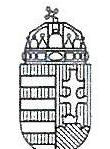
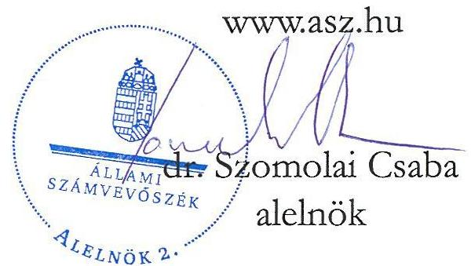
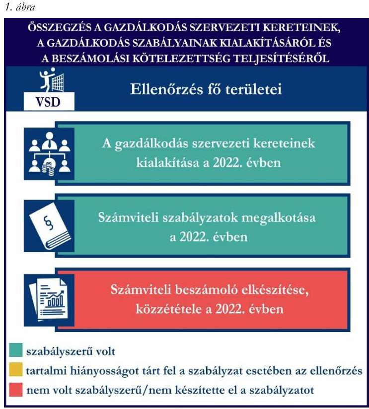
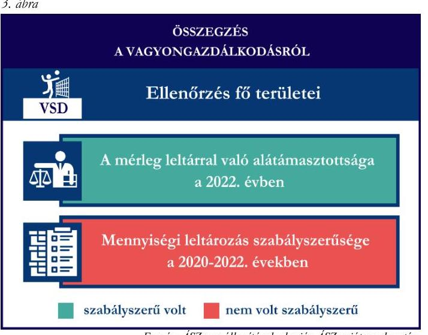
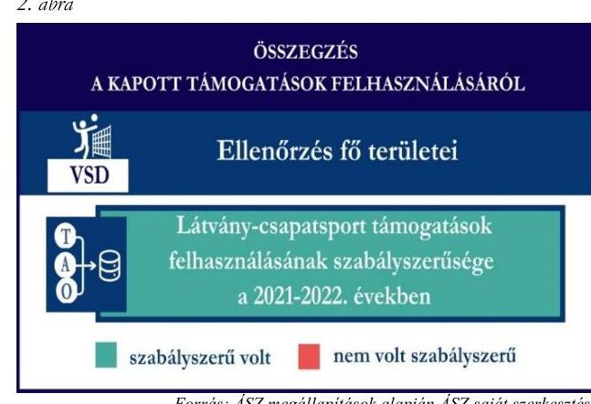

# JELENTÉS 

## Támogatásban részesülő sportszövetségek és sportegyesületek gazdálkodásának ellenőrzése

Városi Sportegyesület Dunakeszi

2024.

---

ÁLLAMI
SZÁMVEVŐSZÉK

# JELENTÉS 

## Támogatásban részesülő sportszövetségek és sportegyesületek gazdálkodásának ellenőrzése

Városi Sportegyesület Dunakeszi

2024. 

24188

---

# ELLENŐRZÉSI IGAZGATÓSÁG: 

## ÁLLAMHÁZTARTÁSON KÍVÜLI SZERVEZETEKET ELLENŐRZŐ IGAZGATÓSÁG

## ELLENŐRZÉSI IGAZGATÓ:

## KLINGA LÁSZLÓ igazgató

## ELLENŐRZÉSVEZETŐ:

Jelentéseink az interneten a www.asz.hu címen olvashatók.

## HOFMEISTER LÁSZLÓ ellenőrzésvezető

IKTATÓSZÁM: EL-4060-202/2024
TÉMASORSZÁM: 30
ELLENŐRZÉS-AZONOSÍTÓ SZÁM: V1026

---

# TARTALOMJEGYZÉK 

AZ ELLENŐRZÉS ALAPADATAI ..... 5
AZ ELLENŐRZÖTT SZERVEZET ..... 7
ÖSSZEFOGLALÁS ..... 8
AZ ELLENŐRZÉS FÓKUSZKÉRDÉSEI ..... 10
MEGÁLLAPÍTÁSOK ..... 11
JAVASLATOK ..... 14
MELLÉKLETEK ..... 15
I. sz. melléklet: Értelmező szótár ..... 15
II. sz. melléklet: Az ellenőrzött szervezetek jegyzéke ..... 17
III. sz. melléklet: Ellenőrzési kritériumok ..... 18
FÜGGELÉK: ÉSZREVÉTELEK ..... 19
RÖVIDÍTÉSEK JEGYZÉKE ..... 20

---

.

---

# AZ ELLENŐRZÉS ALAPADATAI 

## AZ ELLENŐRZÉS CÉLJA

Az ellenőrzés célja az államháztartásból nyújtott támogatással, vagy az államháztartásból meghatározott célra ingyenesen juttatott vagyon felhasználásával érintett sportszövetségek és sportegyesületek gazdálkodása szabályozottságának, gazdálkodási tevékenységének, ezen belül a beszámolási kötelezettség teljesítésének, a támogatások elkülönített nyilvántartásának, valamint a támogatások felhasználásának ellenőrzése.

## AZ ELLENŐRZÉS TÍPUSA

Szabályszerüségi ellenőrzés.

## AZ ELLENŐRZÖTT IDŐSZAK

Az 1. fókuszkérdés esetében a 2022. év.
A 2. fókuszkérdés vonatkozásában a 2021-2022. évek.
A 3. fókuszkérdés vonatkozásában a 2022. év, a mennyiségi felvétellel történő leltározás dokumentumai tekintetében a 2020-2022. évek.

## AZ ELLENŐRZÉS TÁRGYA

Az ellenőrzés tárgya a támogatásban részesülő sportszövetségek, sportegyesületek gazdálkodása szabályozottságának, gazdálkodási tevékenységén belül a beszámolási kötelezettség teljesítésének, a vagyonnyilvántartásának, a támogatások elkülönített nyilvántartásának, valamint az államháztartási forrásból származó közvetlen vagy közvetett támogatások és a meghatározott célra ingyenesen juttatott vagyon felhasználásának vizsgálata volt. Az ellenőrzés a támogatások vonatkozásában kiterjedt továbbá a támogató felé történő beszámolási és elszámolási kötelezettségek teljesítésére, az ezekkel kapcsolatos jogszabályi és belső előírások betartására.

Az ellenőrzés kiterjedt minden olyan körülményre és adatra, amely az ÁSZ ${ }^{1}$ jogszabályban meghatározott feladatainak teljesítéséhez, valamint az ellenőrzési program végrehajtása során felmerülő újabb összefüggések feltárásához szükséges.

Az 1. és 3. fókuszkérdés tekintetében az ellenőrzés a teljes ellenőrzött szervezetre, a 2. fókuszkérdés tekintetében kizárólag a röplabda szakosztályra vonatkozott.

## AZ ELLENŐRZÉS JOGALAPJA

Az ellenőrzés jogszabályi alapját az ÁSZ tv. ${ }^{2} 1 . \int(3)$ bekezdése és az 5. $\int(3)$ bekezdése előírásai képezték.

---

# AZ ELLENŐRZÉS MÓDSZERE 

Az ellenőrzést a nemzetközi standardokat irányadónak tekintve az ellenőrzési program szempontjai, az ellenőrzött időszakban hatályos jogszabályok, az ellenőrzés általános szakmai szabályai, az ellenőrzésre irányadó ÁSZ módszertanok figyelembevételével végezte az ÁSZ.

Az ellenőrzési kérdések megválaszolásához szükséges bizonyítékok megszerzése az ellenőrzött szervezet által rendelkezésre bocsátott dokumentumokra, adatokra alapozva kérdésfeltevés (információkérés), interjú, mintavételezés útján történt. A támogatásból beszerzett tárgyi eszközök használatára, fizikai fellelhetőségére irányulóan az érintett vagyontárgyak helyszíni szemle keretében történő szemrevételezésére indokolt esetben sor került.

Az ellenőrzési bizonyítékként felhasználható adatforrások közé tartoztak egyrészt az ellenőrzés során az ellenőrzött szervezettől bekért dokumentumok, másrészt adatforrás volt minden további, az ellenőrzés folyamán feltárt, az ellenőrzés szempontjából információt tartalmazó dokumentum.

A támogatásokkal, azok felhasználásával kapcsolatos kötelezettségek vizsgálatára mintavételi eljárások kerültek alkalmazásra. Támogatás-típusok szerint nagyságrend alapján 1-3 darab támogatás került részletes vizsgálat alá. Ezen támogatások felhasználásának szabályszerűsége támogatásonként kockázatértékelés alapján kiválasztott mintatételekkel került ellenőrzésre. A kiválasztott támogatási szerződésekhez kapcsolódó elszámolásokból 30-30 db mintatétel került ellenőrzésre, ahol az elszámolás nem érte el a 30 db -ot, ott tételes ellenőrzésre került sor. Ezen felül a vagyongazdálkodás szabályszerűségének ellenőrzéséhez is kockázatalapú mintavétel kapcsolódott. A támogatások felhasználása és a vagyongazdálkodás területén a minták ellenőrzése kiterjedt a könyvvezetési kötelezettség vizsgálatára is. A tárgyi eszközök tekintetében 30 db került kiválasztásra a 2022. évben állományban lévő eszközök közül azok nyilvántartásának, elszámolásának szabályszerűsége ellenőrzése céljából. Az ellenőrzésben nem statisztikai mintavételre került sor, ezért nem történt kivetítés a teljes sokaságra, a megállapításokat az ellenőrzött mintatételekre vonatkozóan fogalmazta meg az ÁSZ.

---

# AZ ELLENŐRZÖTT SZERVEZET

## VÁrosi SPORTEGYESÜLET DUNAKESZI

1. május 10-én alapították meg a VSD^{3}-t. Céljai közé tartozik Dunakeszin és vonzáskörzetében élő fiatalok részére sportolási lehetőség biztosítása, valamint az utánpótlás korú labdarúgó minőségi képzése, tehetségek felkarolása, gondozása, valamint a minőségi sporteredmények eléréséhez szükséges személyi és tárgyi feltételek megteremtése. A VSD 22 szakosztállyal működött, tagjainak száma a 2022. évben meghaladta a 100 főt.

A VSD a 2022. évben jogszabályi előírás alapján könyvvizsgálatra, felügyelőbizottság létrehozására kötelezett volt, az OBH^{4} nyilvántartása alapján közhasznú jogállással nem rendelkezett.

A 2021-2022. években a VSD röplabda szakosztálya által igénybe vett államháztartási forrásból származó támogatásokat az 1. táblázat foglalja magában.

|  A VSD RÖPLABDA SZAKOSZTÁLYA ÁLTAL IGÉNYBE VETT TÁMOGATÁSOK (ADATOK M FT-BAN) |  |   |
| --- | --- | --- |
|   | 2021. év | 2022. év  |
|  Központi költségvetésből (röplabda) | 0 | 0  |
|  Helyi önkormányzattól (röplabda) | 0 | 0  |
|  Látvány-csapatsport támogatásból (röplabda) | 16,9 | 34,9  |

*Forrás: Az ellenőrzött szervezet főkönyvi adatai alapján ÁSZ saját szerkesztés*

---

# ÖSSZEFOGLALÁS 

Az Alaptörvény ${ }^{5}$ XX. cikke kimondja, hogy mindenkinek joga van a testi és lelki egészséghez, melynek érvényesülését Magyarország többek között a sportolás és a rendszeres testedzés támogatásával segíti elő. Az Országgyűlés ${ }^{6}$ a Sport tv. ${ }^{7}$-ben kinyilvánította, hogy a nemzet közössége a test művelését, a sportot, a nemzet alapértékének, kívánatos célnak tekinti. A sport a közjó része. Erősíti a közösség tagjainak egymáshoz tartozását, miként az egyén testi és lelki egészségét.

A sportegyesületek, sportszövetségek müködésükre és szakmai tevékenységük ellátására költségvetési támogatásban, önkormányzati támogatásban, ingyenes vagyonjuttatásban, valamint látvány-csapatsport támogatásban részesülhetnek, amelyekre fokozott figyelem irányul.

A társadalom részéről jogosan felmerülő elvárás, hogy a közpénzeket kezelő, azzal gazdálkodó szervezetek müködéséről, tevékenységéről átfogó képet kapjon, a közpénzek rendeltetésszerủ és átlátható módon történő felhasználásának értékelésére időről-időre sor kerüljön az ellenőrzések keretében.

A VSD a könyvviteli szolgáltatás személyi feltételeit megteremtette, könyvvizsgálót megbízott, felügyelőbizottságot létrehozott és müködéséről gondoskodott.

A jogszabályi előírások szerint a VSD kialakította a számviteli politikáját, valamint elkészítette számviteli szabályzatait.

A könyvvezetés formája a 2022. évben megfelelt a jogszabályi előírásoknak. A számviteli beszámoló- és közhasznúsági melléklet készítési- és közzétételi kötelezettségét nem a jogszabályoknak megfelelően teljesítette.

A gazdálkodás szervezeti keretei kialakításának, a számviteli szabályzatok megalkotásának, valamint a számviteli beszámoló elkészítésének és közzétételének értékelését az 1. ábra mutatja be.

---

A VSD a látvány-csapatsport támogatásból kapott támogatásokat a támogatási célnak megfelelően használta fel az ellenőrzött tételek esetében, azonban a támogatások felhasználásáról a számviteli rendszerében nem a jogszabályban előírt elkülönített nyilvántartást vezette a 2021-2022. években.

A kapott támogatások felhasználásának ellenőrzéséről az összegzést a 2. ábra tartalmazza.
3. ábra

A 2022. évben a VSD vagyongazdálkodása az ellenőrzött tételek vonatkozásában nem volt szabályszerű.

A 2022. évi beszámolójának mérlegtételeit leltárral alátámasztotta. A jogszabályban előírt mennyiségi felvétellel történő leltározást a 2020-2022. években a tárgyi eszközök vonatkozásában nem végezte el.

Ezek alapján sérült a jogszabályban előírt valódiság elve.

A vagyongazdálkodás ellenőrzésének az összegzését a 3. ábra tartalmazza.

---

# AZ ELLENŐRZÉS FÓKUSZKÉRDÉSEI 

1. A gazdálkodási szabályok kialakítása, a könyvvezetési és beszámolási kötelezettség teljesítése szabályszerű volt-e?
2. A kapott támogatások felhasználása szabályszerű volt-e?
3. Az ellenőrzött szervezet vagyongazdálkodása szabályszerű volt-e?

---

# MEGÁLLAPÍTÁSOK 

## 1. A gazdálkodási szabályok kialakítása, a könyvvezetési és beszámolási kötelezettség teljesítése szabályszerű volt-e?

Összegző megállapítás A 2022. évben a VSD gazdálkodási szabályainak kialakítása
megfelelt a jogszabályi előírásoknak. A könyvvezetési
kötelezettségének teljesítése szabályszerű, beszámolási és
közzétételi kötelezettségének teljesítése nem volt
szabályszerű.
A 2022. évben a VSD a Számv. tv. ${ }^{8}$ és a Civilszr. ${ }^{9}$-ben foglaltaknak megfelelően gondoskodott a könyvviteli szolgáltatás személyi feltételeinek teljesüléséről. A VSD a 2022. évben a Számv. tv.-ben, valamint Civilszr.-ben előírtaknak megfelelően könyvvizsgálót bízott meg a beszámoló felülvizsgálatára. A VSD a 2022. évben a Ptk. ${ }^{10}$ előírásainak betartásával gondoskodott az előírt felügyelőbizottság létrehozásáról.
A 2022. évben rendelkezett a Számv. tv. előírásainak megfelelő számviteli politikával, az eszközök és a források leltárkészítési és leltározási szabályzatával, az eszközök és források értékelési szabályzatával, pénzkezelési szabályzattal, valamint számlarenddel.
A VSD a Civilszr. előírásainak megfelelően kettős könyvvitel vezetésével teljesítette könyvvezetési kötelezettségét a 2022. évben, a könyvviteli nyilvántartásait a Számv. tv. és a Civilszr. rendelkezéseinek megfelelően úgy alakította ki, hogy a beszámolóban az egyéb bevételeken belül a tagdíjakat és a kapott támogatások összegét részletezni tudta. A 2022. évben a VSD végzett vállalkozási tevékenységet, melynek bevételeit és ráfordításait a könyvvezetése során a Civil tv. ${ }^{11}$-nek megfelelően az alaptevékenységtől elkülönítetten tartotta nyilván és mutatta ki beszámolójában.
A VSD a 2022. évben hatályos számviteli politikájának ${ }^{12}$ megfelelően éves beszámolót készített a 2022. évre vonatkozóan, azonban a számviteli beszámoló részét képező kiegészítő mellékletében a Számv. tv. 93. § (3) bekezdésében előírtak ellenére nem mutatta be a támogatási program keretében végleges jelleggel kapott, elszámolt összeget támogatásonként.
A Civil vhr. ${ }^{13}$-ben előírtaknak megfelelően a közhasznúsági mellékletét elkészítette. A VSD felügyelőbizottsága megtárgyalta és elfogadásra javasolta a 2022. évi számviteli beszámolót. A 2022. évre vonatkozó számviteli beszámolót a VSD küldöttgyűlése a Civil tv.-nek megfelelően jóváhagyta. A VSD a beszámolót a Civil tv. előírásai alapján közzétette, letétbe helyezte, azonban a Számv. tv. 153. § (1) bekezdésében, valamint a Civil tv. 30. § (1) és (4) bekezdésében előírtak ellenére a független könyvvizsgálói jelentést a beszámolóval együtt nem helyezte letétbe, nem tette közzé.

---

# 2. A kapott támogatások felhasználása szabályszerű volt-e? 

Összegző megállapítás A VSD a röplabda szakosztály részére 2021. és 2022. években kapott támogatásokat az ellenőrzött tételek vonatkozásában a támogatási célnak megfelelően, szabályszerűen használta fel. A könyvviteli rendszerében nem a jogszabályban előírtaknak megfelelően különítette el a kapott támogatások felhasználását.

A VSD a látvány-csapatsport támogatásból kapott támogatások ellenőrzött bevételeit a Civil tv. előírásainak megfelelően elkülönítetten mutatta ki számviteli rendszerében. A VSD a 2021-2022. években a Számv. tv. 161/A. § (2) bekezdésében foglaltak ellenére a Civil tv. 20. § (4) bekezdésében előírt alapcél szerinti tevékenysége költségei, ráfordításai ellentételezésére a látvány-csapatsport támogatásból kapott ellenőrzött támogatásokról nem olyan elkülönített számviteli nyilvántartást vezetett, amelynek alapján támogatásonként megállapítható és ellenőrizhető a kapott támogatás felhasználása. A látvány-csapatsport támogatás felhasználásának ellenőrzött tételei a könyvvitelben csak támogatási jogcímenként kerültek elkülönítésre, támogatási programonként az elkülönítés nem történt meg. Ezáltal az ellenőrzött látványcsapatsport támogatás felhasználásához kapcsolódó elszámolások adatai nem voltak elkülönített könyvviteli nyilvántartási adatokkal alátámasztottak. A VSD a 107/2011. (VI.30.) Korm. rendeletben előírtaknak megfelelően az ellenőrzött, látvány-csapatsport támogatás felhasználását alátámasztó számviteli bizonylatokat záradékkal ellátta.
A VSD a 2021-2022. években rendelkezett a 107/2011. (VI. 30.) Korm. rendeletben ${ }^{14}$ előírt látványcsapatsport támogatással érintett, jóváhagyott SFP ${ }^{15}$-vel. A VSD a 2021-2022. években a 107/2011. (VI. 30.) Korm. rendeletben foglaltaknak megfelelően a látvány-csapatsport támogatás felhasználásáról negyedévente az előrehaladási jelentéseket benyújtotta az illetékes ellenőrző szervezet felé. Az ellenőrzött SFP-vel kapcsolatban kapott látvány-csapatsport és kiegészítő sportfejlesztési támogatással a VSD a 107/2011. (VI. 30.) Korm. rendeletben foglaltak szerint elszámolt. A VSD a 2022. évben a látványcsapatsport és kiegészítő sportfejlesztési támogatás felhasználását igazoló szakmai szöveges beszámolóját a 107/2011. (VI. 30.) Korm. rendeletben foglaltak alapján elkészítette. A 107/2011. (VI. 30.) Korm. rendeletnek megfelelően könyvvizsgáló által ellenőrzött számviteli bizonylatokkal számolt el a támogató felé, melyhez a könyvvizsgálatot végző könyvvizsgáló felelősségbiztosítási kötvénye is benyújtásra került.

## 3. Az ellenőrzött szervezet vagyongazdálkodása szabályszerű volt-e?

## Összegző megállapítás A VSD vagyongazdálkodása a 2022. évben nem volt szabályszerű az ellenőrzött tételek vonatkozásában. A 2022. évi beszámolójának mérlegtételeit leltárral alátámasztotta, a mennyiségi leltározást az előírások ellenére nem végezte el.

A VSD a Számv. tv. előírásainak megfelelően a 2022. év beszámolójának mérlegét, a mérlegben szereplő eszközöket és forrásokat alátámasztotta leltárral.

---

A VSD egy tárgyi eszköz bekerülési értékét az azt alátámasztó számviteli bizonylatok értékénél magasabb értéken (17,0 M Ft-tal) szerepeltette a könyvviteli nyilvántartásban. A könyvviteli nyilvántartásban és a beszámolóban szereplő $17,0 \mathrm{M}$ Ft különbözet a Számv. tv. 165. § (2) bekezdésében foglaltak ellenére bizonylattal nem alátámasztott. Ez alapján az eszköz bekerülési értéke, valamint az elszámolt értékcsökkenése a Számv. tv. 47. § (1) bekezdésében, valamint a Számv. tv. 52. § (1) bekezdésében előírtak ellenére nem a valós bekerülési érték alapján kerültek megállapításra, illetve elszámolásra.
A VSD a 2020-2022. években a Számv. tv. 69. § (3) bekezdésében foglaltak ellenére a mérlegben szerepelő adatok valódiságát mennyiségi felvétellel lefolytatott leltározással a tárgyi eszközök vonatkozásában nem támasztotta alá.
A fentiek alapján sérült a Számv. tv. 15. § (3) bekezdésében előírt valódiság elve, miszerint a könyvvitelben rögzített és a beszámolóban szereplő tételeknek a valóságban is megtalálhatóknak, bizonyíthatóknak, kívülállók által is megállapíthatóknak kell lenniük, értékelésük meg kell, hogy feleljen az e törvényben előírt értékelési elveknek és az azokhoz kapcsolódó értékelési eljárásoknak.
A VSD az ellenőrzött tárgyi eszközök tekintetében - a fentiekben részletezett egy eszközt kivéve - a Számv. tv.-ben előírtaknak megfelelően rendelkezett az eszköz bekerülési értékét alátámasztó számviteli bizonylattal, az üzembehelyezést dokumentálta, a tárgyi eszközök számviteli besorolása, értékcsökkenésének elszámolása megfelelt a Számv. tv. előírásainak.

---

# JAVASLATOK 

Az ÁSZ tv. 33. § (1) bekezdésében foglaltak értelmében az ellenőrzött szervezet vezetője köteles a jelentésben foglalt megállapításokhoz kapcsolódó intézkedési tervet összeállítani és azt a jelentés kézhezvételétől számított 30 napon belül az ÁSZ részére megküldeni. Amennyiben az ellenőrzött szervezet vezetője nem küldi meg határidőben az intézkedési tervet, vagy továbbra sem elfogadható intézkedési tervet küld, az Állami Számvevőszék elnöke az ÁSZ tv. 33. § (3) bekezdése a) és b) pontjaiban foglaltakat érvényesítheti.

## A VÁrosi SPORTEGYESÜLET DUNAKESZI ELNÖKÉNEK

1. Gondoskodjon a független könyvvizsgálói jelentés közzétételéről és letétbe helyezéséről a Civil tv. 30. § (1) bekezdésében elöirtaknak megfelelően.
2. Gondoskodjon arról, hogy a beszámoló részét képező kiegészítő melléklet tartalmazza a Számv. tv. 93. § (3) bekezdésében elöirtakat.
3. Gondoskodjon a látvány-csapatsport támogatásból kapott támogatás olyan elkülönített számviteli nyilvántartásának vezetéséről, amely alapján támogatásonként megállapítható és ellenőrizhető a kapott támogatás felhasználása, a Civil tv. 20. § (4) bekezdés és a Számv. tv. 161/A. § (2) bekezdés elöírásai alapján.
4. Gondoskodjon a mennyiségi felvétellel elvégzendő leltározás végrehajtásáról a Számv. tv. 69. § (3) bekezdésében és a leltározási szabályzatában elöírtaknak megfelelően.
5. Gondoskodjon a tárgyi eszközök bekerülési értékének, illetve értékcsökkenésének megállapításáról a Számv. tv. 47. § (1) bekezdésben, illetve az 52. § (1) bekezdésében elöirtaknak megfelelően, valamint arról, hogy a tárgyi eszközök nyilvántartott értéke bizonylattal alátámasztott legye a Számv. tv. 165. § (2) bekezdésében foglaltak alapján.

---

# MELLÉKLETEK 

## I. SZ. MELLÉKLET: ÉRTELMEZŐ SZÓTÁR

civil szervezet
egyesület
költségvetési támogatás
közhasznú szervezet
közhasznú tevékenység
látvány-csapatsport támogatás
kiegészítő sportfejlesztési támogatás
sportági szövetség
sportegyesület
sportegyesületeknek, sportszövetségeknek nyújtott költségvetési támogatás

A civil társaság; a Magyarországon nyilvántartásba vett egyesület - a párt, a szakszervezet és a kölcsönös biztosító egyesület kivételével és - a közalapítvány és a pártalapítvány kivételével - az alapítvány. (Forrás: Civil tv. 2. § 6. pont a) c) alpontjai)

Az egyesület a tagok közös, tartós, alapszabályban meghatározott céljának folyamatos megvalósítására létesített, nyilvántartott tagsággal rendelkező jogi személy. (Forrás: Ptk. 3:63. § (1) bekezdés)
A Számv. tv. szempontjából egyéb szervezet. (Számv. tv. 3. § bekezdés 4. pont a) alpontja)

A társadalombiztosítás pénzügyi alapjai kivételével az államháztartás központi alrendszeréből ellenérték nélkül, pénzben nyújtott támogatások. (Forrás: Áht. ${ }^{16}$ 1. $\S 14$. pont)

Közhasznú szervezetté minősíthető a Magyarországon nyilvántartásba vett közhasznú tevékenységet végző szervezet, amely a társadalom és az egyén közös szükségleteinek kielégítéséhez megfelelő erőforrásokkal rendelkezik, továbbá amelynek megfelelő társadalmi támogatottsága kimutatható, és amely: a) civil szervezet (ide nem értve a civil társaságot), vagy
b) olyan egyéb szervezet, amelyre vonatkozóan a közhasznú jogállás megszerzését törvény lehetővé teszi. (Forrás: Civil tv. 32. § (1) bekezdés)
Minden olyan tevékenység, amely a létesítő okiratban megjelölt közfeladat teljesítését közvetlenül vagy közvetve szolgálja, ezzel hozzájárulva a társadalom és az egyén közös szükségleteinek kielégítéséhez. (Forrás: Civil tv. 2. § 20. pont)
Az adóévben visszafizetési kötelezettség nélkül nyújtott támogatás, juttatás, véglegesen átadott pénzeszköz és térítés nélkül átadott eszköz könyv szerinti értéke, az adóévben térítés nélkül nyújtott szolgáltatás bekerülési értéke a Tao. tv. ${ }^{17}$-ben meghatározott jogcímeken. (Forrás: Tao. tv. 4. § 44. pont)
A látvány-csapatsportok támogatása esetében a Tao. tv. 24/A. § (1) és (2) bekezdése szerinti rendelkező nyilatkozatban felajánlott összeg 12,5 százaléka kiegészítő sportfejlesztési támogatásnak minősül. (Forrás: Tao. tv. 24/A. § (9) bekezdése)
A Civil tv. és a Ptk. előírásai alapján - a Sport tv.-ben meghatározott eltérésekkel - müködő szövetség, amelynek tagjai kizárólag sportszervezetek lehetnek. Sportági szövetség országos jelleggel is müködhet. Egy sportágban csak egy országos sportági szövetség müködhet. Törvényi feltételek teljesülése esetén szakszövetségi feladatokat is elláthat. (Forrás: Sport tv. 28. §)
A Civil tv. és a Ptk. szabályai szerint működő olyan egyesület, amelynek alaptevékenysége a sporttevékenység szervezése, valamint a sporttevékenység feltételeinek megteremtése. A sportegyesületek a Sport tv. 15. § (1) bekezdésében meghatározott sportszervezetek körébe tartoznak. A sportegyesületeken kívül sportszervezet még a sportvállalkozás, a sportiskola, valamint az utánpótlás-nevelés fejlesztését végző alapítvány. (Forrás: Sport tv. 16. $\S$ (1) bekezdés)

Az állami sport célú támogatások felhasználásáról és elosztásáról szóló 474/2016. (XII. 27.) Kormány rendelet ${ }^{18}$ és a 27/2013. (III. 29.) EMMI rendelet ${ }^{19}$ 1. §-ában meghatározott fejezeti kezelésű előirányzatokból nyújtott támogatás.

---

sportszövetség
sporttevékenység

Meghatározott sporttevékenységek körében a sportversenyek szervezésére, a tagok érdekvédelmére és a részükre való szolgáltatásokra, valamint a nemzetközi kapcsolatok lebonyolítására létrehozott, jogi személyiséggel és önkormányzattal rendelkező, a Civil tv. és a Ptk. alapján - az e törvényben foglalt eltérésekkel - különös formában müködő egyesületek. A Sport tv. 19. § (3) bekezdése szerint a sportszövetségeknek az alábbi típusai léteznek: országos sportági szakszövetségek, sportági szövetségek, szabadidősport szövetségek, fogyatékosok sportszövetségei, diák- és egyetemi-főiskolai sport sportszövetségei, nemzetközi sportszövetségek. (Forrás: Sport tv. 19. § (1), (3) bekezdés)
Meghatározott szabályok szerint, a szabadidő eltöltéseként kötetlenül vagy szervezett formában, illetve versenyszerúen végzett testedzés vagy szellemi sportágban kifejtett tevékenység, amely a fizikai erőnlét és a szellemi teljesítőképesség megtartását, fejlesztését szolgálja. (Forrás: Sport tv. 1. § (2) bekezdés)

---

II. SZ. MELLÉKLET: AZ ELLENŐRZŐTT SZERVEZETEK JEGYZÉKE

| ELLENŐRZŐTT SZERVEZET NEVE | ELLENŐRZŐTT SZERVEZET SZÉKHELYE |
| :-- | :-- |
| Városi Sportegyesület Dunakeszi | 2120 Dunakeszi, Fóti utca 41. |

---

# IÓKUSZKÉRDÉS 

## 1. fókuszkérdés:

A gazdálkodási szabályok kialakítása, a könyvvezetési és beszámolási kötelezettség teljesítése szabályszerű volt-e?

## 2. fókuszkérdés:

A kapott támogatások felhasználása szabályszerű volt-e?

## 3. fókuszkérdés:

Az ellenőrzött szervezet vagyongazdálkodása szabályszerű volt-e?

## ÉLLENŐRZÉSI KRITÉRIUMOK

107/2011. (VI.30.) Korm. rendelet 9. § (9) bek.
Számv. tv. 14. § (3) bekezdés, (5) bekezdés a), b), d) pont, (8) bekezdés, (11) bekezdés, 69. § (3) bekezdés, 90. § (3) bekezdés c) pont, 161. $\S$ (1) bekezdés, (2) bekezdés a)-d) pont, (3)-(4) bekezdés, 161/A. $\$ 2$ (2) bekezdés, 165. $\$ (2) bekezdés
Civilszr. 7. § (1) bekezdés, (4) bekezdés b), c) pont, 8. § (2), (3) bekezdés, 9. § (4), (5), (8) bekezdés, 12. § (4), (5) bekezdés, 15. § (1) bekezdés a), b) pont, 16. § (1) bekezdés, 24. § (2) bekezdés
Civil vhr. 12. § (1) bekezdés, melléklet 5. pont
Ptk. 3:26. § (1) bekezdés, 3:27. § (1) bekezdés, 3:82. § (1) bekezdés, Civil tv. 28. § (1) bekezdés, 29. § (2) bekezdés c) pont, (3), (6), (7) bekezdés, 30. § (1)-(4) bekezdés 40. § (1)
Sport tv. 23. § (1) bekezdés f) pont
Tao. tv. 22/C.
107/2011. (VI. 30.) Korm. rendelet 2. § (3b) bek., 4. § (11) bek., 5. $\$ (1) bek., 6. § (1) bek. e) pont, 9. § (8)-(10) bek., 10. § (2), (2a), (2b), (4), (5a), (6) bek., 11. § (1), (1a), (1d), (1e), (2), (4), (4a), (5), (6) bek., 13. § (1), (2a) bek., 14. § (1), (4), (4b), (4c), (6c) bek.

Számv. tv. 44. § (2) bekezdés, 93. § (3) bekezdés, 159. §, 161/A. § (2) bekezdés, 165. § (2) bekezdés, 167. § (1) bekezdés a), d), e), h) pont Civil tv. 20. § (2) bekezdés a) pont, (3) bekezdés a), c) pont, (4) bekezdés, 29. § (4), (5) bekezdés
Civilszr. 24. § (2) bekezdés
27/2013. (III.29.) EMMI rendelet 18. § (2) bekezdés
474/2016. (XII. 27.) Korm. rendelet 22. § (2) bekezdés, 24. § (2) bekezdés
Áht. 53. §, Ávr. ${ }^{20}$ 92. §, 93. § (2)-(4) bekezdések
Ptk. 3:63. § (4) bekezdés
Számv. tv. 3. § (3) bekezdés 3. pont, 15. § (3) bekezdés, 46. § (3), (4) bekezdés, 47-51. §, 52. § (1)-(7) bekezdés, 69. § (1)-(3) bekezdések, 165. § (2) bekezdés, 169. § (2) bekezdés

---

# FÜGGELÉK: ÉSZREVÉTELEK 

A jelentéstervezetet a Számvevőszék 15 napos észrevételezésre megküldte az ellenőrzött szervezet vezetőjének az ÁSZ tv. 29. §* (1) bekezdése előírásának megfelelően.

A Városi Sportegyesület Dunakeszi elnöke a jelentéstervezetre nem tett észrevételt.

[^0]
[^0]:    * 29. § (1) Az Állami Számvevőszék az ellenőrzési megállapításait megküldi az ellenőrzött szervezet vezetőjének vagy az általa megbízott személynek, és annak, akinek személyes felelősségét állapította meg.
    (2) Az ellenőrzött szervezet vezetője és a felelősként megjelölt személy az ellenőrzés megállapításaira tizenöt napon belül írásban észrevételt tehet.
    (3) Az Állami Számvevőszék az észrevételre a beérkezésétől számított harminc napon belül írásban válaszol. A figyelembe nem vett észrevételeket köteles a jelentésben feltüntetni, és megindokolni, hogy azokat miért nem fogadta el.

---

# RÖVIDÍTÉSEK JEGYZÉKE 

${ }^{1}$ ÁSZ
${ }^{2}$ ÁSZ tv.
${ }^{3}$ VSD
${ }^{4}$ OBH
${ }^{5}$ Alaptörvény
${ }^{6}$ Országgyúlés
${ }^{7}$ Sport tv.
${ }^{8}$ Számv. tv.
${ }^{9}$ Civilszr.
${ }^{10}$ Ptk.
${ }^{11}$ Civil tv.
${ }^{12}$ Számviteli politika
${ }^{13}$ Civil vhr.
${ }^{14}$ 107/2011. (VI. 30.) Korm.rendelet
${ }^{15}$ SFP
${ }^{16}$ Áht.
${ }^{17}$ Tao. tv.
${ }^{18}$ 474/2016. (XII. 27.) Kormány rendelet
${ }^{19}$ 27/2013. (III.29.) EMMI rendelet
${ }^{20}$ Ávr.

Állami Számvevőszék
2011. évi LXVI. törvény az Állami Számvevőszékről

Városi Sportegyesület Dunakeszi
Országos Bírósági Hivatal
Magyarország Alaptörvénye
Magyarország Országgyűlése
2004. évi I. törvény a sportról

2000. évi C. törvény a számvitelről
479/2016. (XII. 28.) Korm. rendelet a számviteli törvény szerinti egyes egyéb szervezetek beszámoló készítési és könyvvezetési kötelezettségének sajátosságairól
2013. évi V. törvény a Polgári Törvénykönyvről
2011. évi CLXXV. törvény az egyesülési jogról, a közhasznú jogállásról, valamint a civil szervezetek múködéséről és támogatásáról
Városi Sportegyesület Dunakeszi számviteli politikája hatályos 2022. január 1-től
350/2011. (XII. 30.) Korm. rendelet a civil szervezetek gazdálkodása, az adománygyűjtés és a közhasznúság egyes kérdéseiről
107/2011. (VI. 30.) Korm. rendelet a látvány-csapatsport támogatását biztosító támogatási igazolás kiállításáról, felhasználásáról, a támogatás elszámolásának és ellenőrzésének, valamint visszafizetésének szabályairól
Sportfejlesztési program
2011. évi CXCV. törvény az államháztartásról
1996. évi LXXXI. törvény a társasági adóról és az osztalékadóról
474/2016. (XII. 27.) Korm. rendelet az állami sport célú támogatások felhasználásáról és elosztásáról
27/2013. (III. 29.) EMMI rendelet az állami sport célú támogatások felhasználásáról és elosztásáról
368/2011. (XII. 31.) Korm. rendelet az államháztartásról szóló törvény végrehajtásáról

---

1052 Budapest, Apáczai Csere János u. 10. | 1364 Budapest 4., Pf. 54
www.asz.hu | szamvevoszek@asz.hu
telefon: +36 14849100