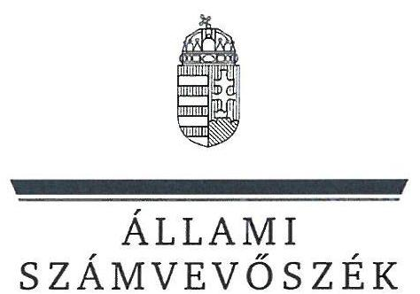
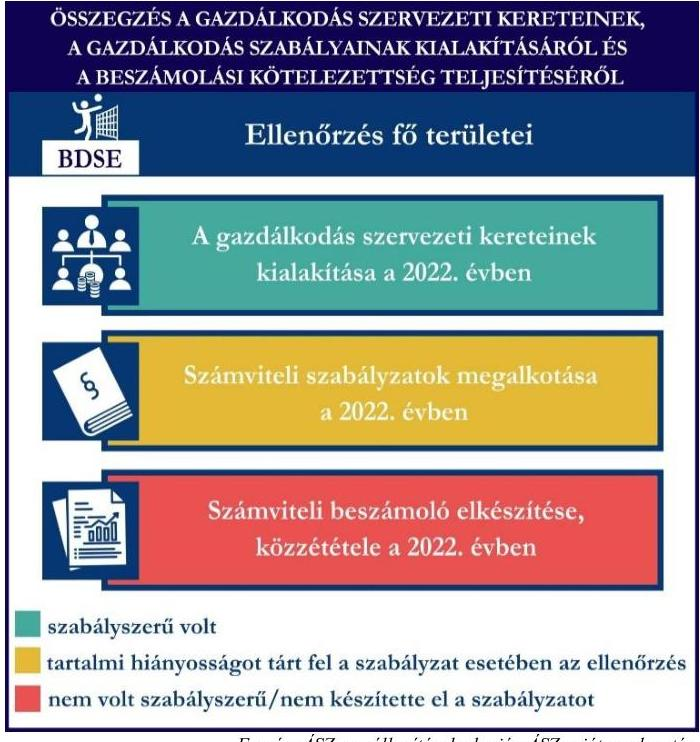
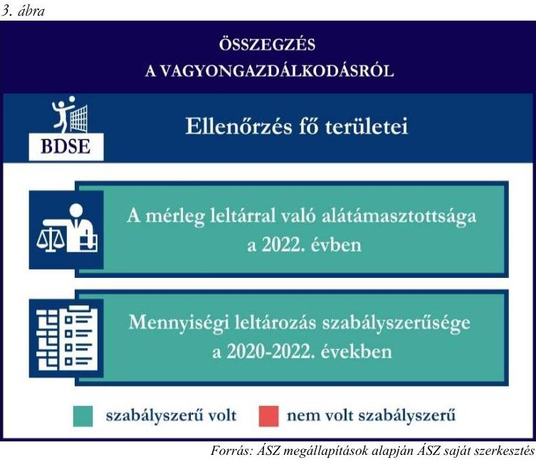

# JELENTÉS 

## Támogatásban részesülő sportszövetségek és sportegyesületek gazdálkodásának ellenőrzése

Budaörsi Diák Sportegyesület

2024.

---

ÁLLAMI
SZÁMVEVŐSZÉK

# JELENTÉS 

## Támogatásban részesülő sportszövetségek és sportegyesületek gazdálkodásának ellenőrzése

Budaörsi Diák Sportegyesület

2024.

---

# ELLENŐRZÉSI IGAZGATÓSÁG: 

## ÁLLAMHÁZTARTÁSON KÍVÜLI SZERVEZETEKET ELLENŐRZŐ IGAZGATÓSÁG

ELLENŐRZÉSI IGAZGATÓ:
KLINGA LÁSZLÓ igazgató

ELLENŐRZÉSVEZETŐ:
HOFMEISTER LÁSZLÓ ellenőrzésvezető

## Jelentéseink az interneten a www.asz.hu címen olvashatók.

IKTATÓSZÁM: EL-4060-193/2024
TÉMASORSZÁM: 30
ELLENŐRZÉS-AZONOSÍTÓ SZÁM: V1026

---

# TARTALOMJEGYZÉK 

AZ ELLENŐRZÉS ALAPADATAI ..... 5
AZ ELLENŐRZÖTT SZERVEZET ..... 7
ÖSSZEFOGLALÁS ..... 8
AZ ELLENŐRZÉS FÓKUSZKÉRDÉSEI ..... 10
MEGÁLLAPÍTÁSOK ..... 11
JAVASLATOK ..... 14
MELLÉKLETEK ..... 15
I. sz. melléklet: Értelmező szótár ..... 15
II. sz. melléklet: Az ellenőrzött szervezetek jegyzéke ..... 17
III. sz. melléklet: Ellenőrzési kritériumok ..... 18
FÜGGELÉK: ÉSZREVÉTELEK ..... 19
RÖVIDÍTÉSEK JEGYZÉKE ..... 20

---

.

---

# AZ ELLENŐRZÉS ALAPADATAI 

## AZ ELLENŐRZÉS CÉLJA

Az ellenőrzés célja az államháztartásból nyújtott támogatással, vagy az államháztartásból meghatározott célra ingyenesen juttatott vagyon felhasználásával érintett sportszövetségek és sportegyesületek gazdálkodása szabályozottságának, gazdálkodási tevékenységének, ezen belül a beszámolási kötelezettség teljesítésének, a támogatások elkülönített nyilvántartásának, valamint a támogatások felhasználásának ellenőrzése.

## AZ ELLENŐRZÉS TÍPUSA

Szabályszerűségi ellenőrzés.

## AZ ELLENŐRZÖTT IDŐSZAK

Az 1. fókuszkérdés esetében a 2022. év.
A 2. fókuszkérdés vonatkozásában a 2021-2022. évek.
A 3. fókuszkérdés vonatkozásában a 2022. év, a mennyiségi felvétellel történő leltározás dokumentumai tekintetében a 2020-2022. évek.

## AZ ELLENŐRZÉS TÁRGYA

Az ellenőrzés tárgya a támogatásban részesülő sportszövetségek, sportegyesületek gazdálkodása szabályozottságának, gazdálkodási tevékenységén belül a beszámolási kötelezettség teljesítésének, a vagyonnyilvántartásának, a támogatások elkülönített nyilvántartásának, valamint az államháztartási forrásból származó közvetlen vagy közvetett támogatások és a meghatározott célra ingyenesen juttatott vagyon felhasználásának vizsgálata volt. Az ellenőrzés a támogatások vonatkozásában kiterjedt továbbá a támogató felé történő beszámolási és elszámolási kötelezettségek teljesítésére, az ezekkel kapcsolatos jogszabályi és belső előírások betartására. Az ellenőrzés kiterjedt minden olyan körülményre és adatra, amely az ÁSZ¹ jogszabályban meghatározott feladatainak teljesítéséhez, valamint az ellenőrzési program végrehajtása során felmerülő újabb összefüggések feltárásához szükséges.

Az ÁSZ tv.² 25. § (3) bekezdésében meghatározottak alapján, amennyiben a rendelkezésre bocsátott dokumentumok, adatok, illetve tájékoztatás hitelességének, megalapozottságának, teljességének megállapítása vagy egyes ellenőrzési megállapítások alátámasztása, kiegészítése indokolta, az ellenőrzés tárgyát képezték az összefüggő tények vizsgálatához más szervezetek (ellenőrzést támogató szervezetek) által rendelkezésre bocsátott adatok, dokumentációk, megadott tájékoztatások, illetve az ott végzett ellenőrzés is.

Az 1. és 3. fókuszkérdés tekintetében a vizsgálat a teljes ellenőrzött szervezetre, a 2. fókuszkérdés tekintetében kizárólag a röplabda sportszakágra vonatkozott.

---

# Az ellenőrzés jogalapja 

Az ellenőrzés jogszabályi alapját az ÁSZ tv. 1. § (3) bekezdése, az 5. § (3) bekezdése, valamint a Civil tv.³ 47. § előírásai képezték.

## AZ ELLENŐRZÉS MÓDSZERE

Az ellenőrzést a nemzetközi standardokat irányadónak tekintve az ellenőrzési program szempontjai, az ellenőrzött időszakban hatályos jogszabályok, az ellenőrzés általános szakmai szabályai, az ellenőrzésre irányadó ÁSZ módszertanok figyelembevételével végezte az ÁSZ.

Az ellenőrzési kérdések megválaszolásához szükséges bizonyítékok megszerzése az ellenőrzött szervezet által rendelkezésre bocsátott dokumentumokra, adatokra alapozva kérdésfeltevés (információkérés), interjú, mintavételezés útján történt.

Az ellenőrzési bizonyítékként felhasználható adatforrások közé tartoztak egyrészt az ellenőrzés során az ellenőrzött szervezettől bekért dokumentumok, másrészt adatforrás volt minden további az ellenőrzés folyamán feltárt, az ellenőrzés szempontjából információt tartalmazó dokumentum.

A támogatásokkal, azok felhasználásával kapcsolatos kötelezettségek vizsgálatára mintavételi eljárások kerültek alkalmazásra. Támogatás-típusok szerint nagyságrend alapján 1-3 darab támogatás került részletes vizsgálat alá. Ezen támogatások felhasználásának szabályszerűsége támogatásonként kockázatértékelés alapján kiválasztott mintatételekkel került ellenőrzésre. A kiválasztott támogatási szerződésekhez kapcsolódó elszámolásokból 30-30 db mintatétel került ellenőrzésre, ahol az elszámolás nem érte el a 30 db-ot, ott tételes ellenőrzésre került sor. Ezen felül a vagyongazdálkodás szabályszerűségének ellenőrzéséhez is kockázatalapú mintavétel kapcsolódott. A támogatások felhasználása és a vagyongazdálkodás területén a minták ellenőrzése kiterjedt a könyvvezetési kötelezettség vizsgálatára is. A tárgyi eszközök tekintetében 30 db került kiválasztásra a 2022. évben állományban lévő eszközök közül, ahol az állományban lévő eszközök száma nem érte el a 30 db-ot, ott tételes ellenőrzésre került sor azok nyilvántartásának, elszámolásának szabályszerűsége ellenőrzése céljából. Az ellenőrzésben nem statisztikai mintavételre került sor, ezért nem történt kivetítés a teljes sokaságra, a megállapításokat az ellenőrzött mintatételekre vonatkozóan fogalmazta meg az ÁSZ.

---

# AZ ELLENŐRZÖTT SZERVEZET 

## BUDAÖRSI DIÁK SPORTEGYESÜLET

Az 1987-ben alapított Budaörsi Diák Sportegyesület célja többek között a tanulóifjúság egészséges életmódra nevelésének elősegítése érdekében a sportolás megkedveltetése, a rendszeresen sportoló tanulók számának növelése, a versenysport utánpótlás bázisának szélesítése, versenylehetőség megteremtése és szervezése, valamint az iskolai sportkörök működésének segítése. A BDSE⁴-nél a röplabda mellett atlétika, labdarúgás, kosárlabda, ritmikus gimnasztika és aerobik szakosztályok működnek.

A BDSE a 2022. évben közhasznú jogállású volt, valamint felügyelőbizottság létrehozására volt kötelezett. Könyvvizsgálatra nem volt kötelezett a 2022. évben. Az BDSE röplabda szakosztálya által a 2021-2022. években igénybe vett államháztartási forrásból származó támogatásokat az 1. táblázat foglalja össze.

## 1. táblázat

## A BDSE RÖPLABDA SZAKOSZTÁLYA ÁLTAL IGÉNYBE VETT TÁMOGATÁSOK (ADATOK M FT-BAN)

|  | 2021. év | 2022. év |
| :-- | :--: | :--: |
| Központi költségvetési támogatás | - | - |
| Helyi önkormányzati támogatás (röplabda) | 5,8 | 7,8 |
| Látvány-csapatsport támogatás (röplabda) | 21 | 96 |

---

# ÖSSZEFOGLALÁS 

Magyarország Alaptörvényének XX. cikke kimondja, hogy mindenkinek joga van a testi és lelki egészséghez, melynek érvényesülését Magyarország többek között a sportolás és a rendszeres testedzés támogatásával segíti elő. Az Országgyűlés a Sport tv.⁵-ben kinyilvánította, hogy a nemzet közössége a test művelését, a sportot, a nemzet alapértékének, kívánatos célnak tekinti. A sport a közjó része. Erősíti a közösség tagjainak egymáshoz tartozását, miként az egyén testi és lelki egészségét.

A sportegyesületek, sportszövetségek működésükre és szakmai tevékenységük ellátására költségvetési támogatásban, önkormányzati támogatásban, ingyenes vagyonjuttatásban, valamint látvány-csapatsport támogatásban részesülhetnek, amelyekre fokozott figyelem irányul.

A társadalom részéről jogosan felmerülő elvárás, hogy a közpénzeket kezelő, azzal gazdálkodó szervezetek működéséről, tevékenységéről átfogó képet kapjon, a közpénzek rendeltetésszerű és átlátható módon történő felhasználásának értékelésére időről-időre sor kerüljön az ellenőrzések keretében.

1. ábra

A BDSE a könyvviteli szolgáltatás személyi feltételeit a 2022. évi számviteli beszámoló vonatkozásában biztosította. A BDSE a jogszabályban előírt felügyelőbizottsággal rendelkezett a 2022. évben.

A BDSE a számviteli szabályzatokat az előírásoknak megfelelően kialakította a 2022. évben, azonban a számlarendje hiányos volt.

A könyvvezetés formája a 2022. évben megfelelt a jogszabályi előírásoknak. A BDSE a 2022. évi számviteli beszámolóját a jogszabályban előírtak szerint elkészítette, azonban a közzétételét határidőn túl és a beszámoló részét képező kiegészítő melléklet nélkül teljesítette.

A gazdálkodás szervezeti kereteinek és a gazdálkodási szabályok kialakítása, valamint a beszámolási kötelezettség ellenőrzésének összegzését az 1. ábra tartalmazza.

---

Az BDSE az önkormányzattól kapott 2. ábra támogatást, valamint a látvány-csapatsport támogatást az ellenőrzött tételek vonatkozásában a 2021-2022. években nem a támogatási célnak megfelelően használta fel, mivel több ellenőrzött tételt az elszámolásokban duplán érvényesített, azaz az önkormányzati és a látvány-csapatsport támogatás terhére is elszámolta ugyanazon ráfordításokat, összesen 306 e Ft értékben. A BDSE a támogatások felhasználásáról az előírt támogatásonkénti elkülönített nyilvántartást a 2021-2022. években a könyvviteli rendszerében nem vezette. Az esetekkel kapcsolatban az ÁSZ a törvényi kötelezettségének eleget téve az illetékes hatósághoz fordul.

A kapott támogatások felhasználásának ellenőrzéséről az összegzést a 2. ábra tartalmazza.

A BDSE vagyongazdálkodása az ellenőrzött tételek vonatkozásában a könyvviteli rendszerében elszámolt tételek bizonylattal való alátámasztásának a hiánya miatt nem volt szabályszerű a 2022. évben. A BDSE a 2022. évi beszámolójának mérlegtételeit leltárral alátámasztotta. A mérlegben szereplő eszközök évente előírt mennyiségi leltározását a 2022. évben elvégezte.
A vagyongazdálkodás ellenőrzésének összegzését a 3. ábra tartalmazza.

---

# AZ ELLENŐRZÉS FÓKUSZKÉRDÉSEI 

1.     - A gazdálkodási szabályok kialakítása, a könyvvezetési és beszámolási kötelezettség teljesítése szabályszerű volt-e?
2.     - A kapott támogatások felhasználása szabályszerű volt-e?
3.     - Az ellenőrzött szervezet vagyongazdálkodása szabályszerű volt-e?

---

# MEGÁLLAPÍTÁSOK 

## 1. A gazdálkodási szabályok kialakítása, a könyvvezetési és beszámolási kötelezettség teljesítése szabályszerű volt-e?

Összegző megállapítás A BDSE-nél a 2022. évben a gazdálkodási szabályok összességében a jogszabályban előírtaknak megfelelően kialakításra kerültek. A 2022. évre vonatkozóan a könyvvezetési, beszámolási kötelezettség teljesítése szabályszerű volt, a közzétételi kötelezettség hiányosan és határidőn túl teljesült.

A BDSE a 2022. évben a Számv. tv.⁶, valamint a Civilszr.⁷ előírásaiban foglaltaknak megfelelően gondoskodott a könyvviteli szolgáltatás személyi feltételeinek teljesüléséről. A BDSE a Ptk.⁸, valamint a Civil tv. előírásainak megfelelően a 2022. évben rendelkezett felügyelőbizottsággal. A felügyelőbizottság a Civil tv. előírása alapján elkészítette az ügyrendjét, a Ptk., valamint a Civil tv. előírási szerint véleményezte a BDSE 2022. évi számviteli beszámolóját.
A BDSE 2022-ben rendelkezett a Számv. tv. előírásainak megfelelő számviteli politikával, azon belül az eszközök és a források leltárkészítési és leltározási szabályzatával az eszközök és a források értékelési szabályzatával, valamint a pénzkezelési szabályzattal. A BDSE a Számv. tv. előírás alapján rendelkezett számlarenddel a 2022. évben, azonban a Számv. tv. 161. § (2) bekezdés d) pontjában előírtak ellenére a számlarend nem tartalmazta a számlarendben foglaltakat alátámasztó bizonylati rendet.
A BDSE a Számv. tv.-ben, Civil tv.-ben, valamint a Civilszr.-ben előírtak szerinti kettős könyvvitelt vezetett. A BDSE 2022-ben a könyvviteli nyilvántartását úgy vezette, hogy a Számv. tv., valamint a Civilszr. előírásainak megfelelően az egyéb bevételeken belül részletezni tudta a kapott támogatások és tagdíjak összegeit.
A BDSE a Civil tv.-ben, valamint a Számv. tv. előírásai alapján előírt 2022. évre vonatkozó számviteli beszámolóját, továbbá a Civil tv.-ben előírtak alapján a közhasznúsági mellékletét elkészítette. A BDSE 2022. évi számviteli beszámolóját a Ptk., valamint a Civil tv. alapján a BDSE legfőbb döntéshozó szerve hagyta jóvá. A BDSE a 2022. évre vonatkozó számviteli beszámoló és közhasznúsági melléklet közzétételét és letétbe helyezését a Civil tv. 30. § (1) bekezdésben előírtak ellenére az üzleti év mérlegfordulónapot követő ötödik hónap utolsó napján túl (2023. október 27-én) késedelmesen teljesítette. A közzétett számviteli beszámoló a Civil tv. 29. § (2) bekezdés c) pontjában foglaltak ellenére a beszámoló részét képező kiegészítő mellékletet nem tartalmazta.

---

# 2. A kapott támogatások felhasználása szabályszerű volt-e? 

Összegző megállapítás

A BDSE a röplabda szakosztálya részére nyújtott ellenőrzött támogatásokat a 2021-2022. években nem a támogatási célnak megfelelően használta fel, az ellenőrzött mintatételek dupla elszámolásai miatt. A BDSE a támogatások felhasználását a 2021-2022. években a jogszabályi előírások ellenére a számviteli rendszerében támogatásonként elkülönítetten nem tartotta nyilván.

A BDSE a 2021-2022. években rendelkezett a 107/2011. (VI. 30.) Korm. rendeletben⁹ előírt látványcsapatsport támogatással érintett, jóváhagyott sportfejlesztési programmal. Az ellenőrzött SFP¹⁰-kel kapcsolatban kapott látvány-csapatsport és kiegészítő sportfejlesztési támogatással a BDSE a 107/2011. (VI. 30.) Korm. rendeletben foglaltak szerint elszámolt. A BDSE a 2021-2022. években a 107/2011. (VI. 30.) Korm. rendelet
 11. $\int$ (2) bekezdésében előírtak alapján a látvány-csapatsport támogatás ellenőrzött felhasználásáról negyedévente az előrehaladási jelentéseket az előírások ellenére több negyedév tekintetében nem a negyedévet követő 8 napon belül, hanem határidőn túl (2021. III. negyedévről 2022. 01. 03., a 2022. évi I-II. negyedévekről 2022. 10. 17-én) nyújtotta be az ellenőrző szerv részére. A BDSE a 2022. évben a látvány-csapatsport és kiegészítő sportfejlesztési támogatás felhasználását igazoló szakmai szöveges beszámolóját a 107/2011. (VI. 30.) Korm. rendeletben foglaltak alapján elkészítette. A 107/2011. (VI. 30.) Korm. rendeletben foglaltak alapján a BDSE a 2021-2022. években az ellenőrzött látvány-csapatsport támogatások tekintetében könyvvizsgáló által ellenőrzött számviteli bizonylatokkal számolt el az illetékes ellenőrző szervezet felé.

A 2021/2022. évi látvány-csapatsport támogatások (SFP-02242/2020/MRSZ, SFP-03242/2021/MRSZ) 2021-2022. évi felhasználásának ellenőrzött költségtételei közül 15 tétel esetében, mindösszesen 306 E Ft összegben önkormányzati támogatásokkal (ÖNK SZ 202111, ÖNK SZ 2022-10) kapcsolatban elszámolt összegek is szerepeltek. A költség számlák támogatás terhére való dupla elszámolása miatt a támogatás jogosulatlan felhasználása valósult meg.

A BDSE a 2021-2022. években a Számv. tv. 161/A. § (2) bekezdésében foglaltak ellenére a 107/2011. (VI. 30.) Korm. rendelet 9. $\int$ (9) bekezdésében előírtak ellenére a látvány-csapatsport támogatás felhasználását nem tartotta nyilván a könyvviteli rendszerében elkülönítetten és naprakészen úgy, hogy az illetékes ellenőrző szervezet, vagy más ellenőrző hatóság által bármikor támogatási programonként, valamint támogatási jogcímenként ellenőrizhető legyen. A BDSE a 107/2011. (VI. 30.) Korm. rendeletben előírtaknak megfelelően az ellenőrzött, látvány-csapatsport és kiegészítő sportfejlesztési program keretében kapott támogatás felhasználását alátámasztó számviteli bizonylatokat záradékkal ellátta.
A Számv. tv., valamint a Civil tv. előírásainak megfelelően a BDSE az ellenőrzött támogatási szerződésekben meghatározott önkormányzati támogatási bevételeket a 2021-2022. években az egyéb bevételeken belül, elkülönítetten mutatta ki a számviteli nyilvántartásában. A BDSE a Számv. tv. 161/A. § (2) bekezdésében foglaltak ellenére a Civil tv. 20. § (4) bekezdésében előírt alapcél szerinti tevékenysége költségei, ráfordításai ellentételezésére az önkormányzattól kapott, ellenőrzött támogatásokról nem vezetett olyan elkülönített számviteli nyilvántartást, amelynek alapján támogatásonként megállapítható és

---

ellenőrizhető a kapott támogatás felhasználása. Ez alapján az egyes támogatások felhasználásáról készített elszámolások könyvviteli nyilvántartással, az abban szereplő támogatásonkénti elkülönített adatokkal nem voltak alátámasztottak.
A BDSE a fentieken felül a 2021-2022. években elszámolt önkormányzati támogatások ellenőrzött tételeit a Számv. tv.-ben előírtaknak megfelelő, szabályszerű számviteli bizonylattal alátámasztotta.
A BDSE a 2021. és a 2022. évekre vonatkozó számviteli beszámoló részét képező kiegészítő mellékleteiben a Civil tv. 29. § (4)-(5) bekezdésekben előírtak ellenére nem mutatta be a támogatási program keretében végleges jelleggel felhasznált összegeket támogatásonként, valamint az üzleti évben végzett főbb tevékenységeket és programokat.

# 3. Az ellenőrzött szervezet vagyongazdálkodása szabályszerű volt-e? 

## Összegző megállapítás

A BDSE vagyongazdálkodása a 2022. évben az ellenőrzött tételek vonatkozásában nem volt szabályszerű. A 2022. évi beszámoló mérlegtételeit szabályszerű leltárral alátámasztotta, a mennyiségi leltározást szabályszerűen elvégezte.

A BDSE a Számv. tv.-ben előírtak alapján a főkönyvi könyvelés és az analitikus nyilvántartások adatai közötti egyeztetést a 2022. üzleti év mérlegfordulónapjára vonatkozóan elvégezte, a mérlegben szereplő adatokat leltárral alátámasztotta. A BDSE a Számv. tv.-ben és a leltározási szabályzatában ${ }^{11}$ évente előírt mennyiségi felvétellel történő leltározást a 2022. évben elvégezte.
A Számv tv. 165. § (2) bekezdésében foglaltak ellenére egy ellenőrzött tétel esetében a BDSE a számviteli (könyvviteli) nyilvántartásba bizonylat hiányában jegyzett be adatokat, mivel egy ellenőrzött tárgyi eszköz elszámolt bekerülési értéke ( $15,7 \mathrm{MFt}$ ) csak részben volt alátámasztott (13 M Ft) számviteli bizonylattal.
A Számv. tv. 165. § (2) bekezdésében foglaltak ellenére két ellenőrzött tétel esetében a BDSE a számviteli (könyvviteli) nyilvántartásba nem szabályszerű számviteli bizonylat alapján jegyzett be adatokat, mivel két ellenőrzött tárgyi eszköz elszámolt bekerülési értékét ( $0,58 \mathrm{MFt}$ ) alátámasztó számviteli bizonylaton vevőként nem a BDSE lett megjelölve, azaz nem a nevére szóló bizonylat alapján számolt el költségeket a számviteli rendszerében.
A fentiekben részletezetteken felül, a további ellenőrzött tárgyi eszközök számviteli besorolása, értékcsökkenés elszámolása megfelelt a Számv. tv. előírásainak, a BDSE az ellenőrzött tárgyi eszközök üzembe helyezésének tényét a Számv. tv.-ben előírtak alapján dokumentálta.

---

# JAVASLATOK 

Az ÁSZ tv. 33. § (1) bekezdésében foglaltak értelmében az ellenőrzött szervezet vezetője köteles a jelentésben foglalt megállapításokhoz kapcsolódó intézkedési tervet összeállítani és azt a jelentés kézhezvételétől számított 30 napon belül az ÁSZ részére megküldeni. Amennyiben az ellenőrzött szervezet vezetője nem küldi meg határidőben az intézkedési tervet, vagy továbbra sem elfogadható intézkedési tervet küld, az Állami Számvevőszék elnöke az ÁSZ tv. 33. § (3) bekezdése a) és b) pontjaiban foglaltakat érvényesítheti.

## A BUDAŐRSI DIÁK SPORTEGYESÜLET ELNÖKÉNEK

1. Gondoskodjon a számlarendben foglaltakat alátámasztó bizonylati rend elkészítéséről a Számv. tv. 161. § (2) bekezdés d) pontjában előírtaknak megfelelően.
2. Gondoskodjon arról, hogy a számviteli beszámoló és közhasznúsági melléklet közzététele és letétbe helyezése a Civil tv. 30. § (1) bekezdésben előírtak alapján határidőben teljesüljön, valamint a közzétett számviteli beszámoló tartalmazza a beszámoló részét képező kiegészítő mellékletet a Civil tv. 29. § (2) bekezdés c) pontjában előírtaknak megfelelően.
3. Gondoskodjon arról, hogy a látvány-csapatsport támogatás ellenőrzött felhasználásáról negyedéves előrehaladási jelentések a 107/2011. (VI. 30.) Korm. rendelet 11. § (2) bekezdésében előírt határidőn belül kerüljenek benyújtásra az ellenőrző szerv részére.
4. Gondoskodjon a 107/2011. (VI. 30.) Korm. rendelet 9. § (9) bekezdésében, valamint a Számv. tv. 161/A. § (2) bekezdésében előírtaknak megfelelő olyan nyilvántartás vezetéséről, amely alkalmas a látványcsapatsport támogatás felhasználásának támogatási programonként, valamint támogatási jogcímenként történő ellenőrzésére.
5. Gondoskodjon arról, hogy a támogatásokkal való elszámolás során ne kerüljön sor ugyanazon ráfordítás ismételt elszámolására.
6. Gondoskodjon az alapcél szerinti tevékenysége költségei, ráfordításai ellentételezésére kapott támogatások elkülönített számviteli nyilvántartásának vezetéséről, amely alapján támogatásonként megállapítható és ellenőrizhető a kapott támogatás felhasználása, a Civil tv. 20. § (4) bekezdés és a Számv. tv. 161/A. § (2) bekezdés előírásai alapján.
7. Gondoskodjon arról, hogy a könyvviteli rendszerbe csak szabályszerű bizonylat alapján kerüljön adat rögzítésre a Számv. tv. 165. § (2) bekezdésében foglaltaknak megfelelően.
8. Gondoskodjon arról, hogy a számviteli beszámoló részét képező kiegészítő mellékletben a támogatási program keretében végleges jelleggel felhasznált összegek támogatásonként, valamint az üzleti évben végzett főbb tevékenységek és programok a Civil tv. 29. § (4)-(5) bekezdésekben előírtaknak megfelelően bemutatásra kerüljenek.

---

# MELLÉKLETEK 

## I. SZ. MELLÉKLET: ÉRTELMEZŐ SZÓTÁR

Civil szervezet

Egyesület

Látvány-csapatsport támogatás

Látvány-csapatsportban működő amatőr sportszervezet

Látvány-csapatsportban működő hivatásos sportszervezet

Kiegészítő sportfejlesztési támogatás

Költségvetési támogatás

Közhasznú szervezet

A civil társaság; a Magyarországon nyilvántartásba vett egyesület - a párt, a szakszervezet és a kölcsönös biztosító egyesület kivételével és - a közalapítvány és a pártalapítvány kivételével - az alapítvány. (Forrás: Civil tv. 2. § 6. pont a) c) alpontjai)

Az egyesület a tagok közös, tartós, alapszabályban meghatározott céljának folyamatos megvalósítására létesített, nyilvántartott tagsággal rendelkező jogi személy. (Forrás: Ptk. 3:63. § (1) bekezdés)
A Számv. tv. szempontjából egyéb szervezet. (Számv. tv. 3. § (1) bekezdés 4. pont a) alpontja)

Az adóévben visszafizetési kötelezettség nélkül nyújtott támogatás, juttatás, véglegesen átadott pénzeszköz és térítés nélkül átadott eszköz könyv szerinti értéke, az adóévben térítés nélkül nyújtott szolgáltatás bekerülési értéke a Tao. tv. ${ }^{12}$-ben meghatározott jogcímeken. (Forrás: Tao. tv. 4. § 44. pont)

Minden olyan, a sportról szóló törvényben meghatározott szabályok szerint a látvány-csapatsportban működő sportegyesület vagy sportvállalkozás, amelyik nem minősül a látvány-csapatsportban működő hivatásos sportszervezetnek. (Forrás: Tao. tv. 4. § 42. pont)

A látvány-csapatsportágak országos sportági szakszövetsége által kiírt versenyrendszer legmagasabb felnőtt bajnoki osztályában - a veterán korosztályokra kiírt versenyrendszer kivételével - részt vevő (indulási jogot elnyert) sportszervezet, vagy alsóbb bajnoki osztályaiban részt vevő (indulási jogot elnyert) sportszervezet abban az esetben, ha az ilyen sportszervezet hivatásos sportolót alkalmaz. Több látvány-csapatsportban több jogi személy szervezeti egységgel (szakosztállyal) működő sportszervezet esetén csak az a jogi személy szervezeti egység (szakosztály), amely a fent részletezett versenyrendszerek bajnoki osztályaiban részt vesz.
(Forrás: Tao. tv. 4. § 43. pont)
A látvány-csapatsportok támogatása esetében a Tao. tv. 24/A. § (1) és (2) bekezdése szerinti rendelkező nyilatkozatban felajánlott összeg 12,5 százaléka kiegészítő sportfejlesztési támogatásnak minősül. (Forrás: Tao. tv. 24/A. § (9) bekezdése)

A társadalombiztosítás pénzügyi alapjai kivételével az államháztartás központi alrendszeréből ellenérték nélkül, pénzben nyújtott támogatások. (Forrás: Áht. ${ }^{13}$ 1. § 14. pont, ide nem értve az Áht. 1. § 14. pont a) -o) pontjaiban szereplő támogatásokat)
Közhasznú szervezetté minősíthető a Magyarországon nyilvántartásba vett közhasznú tevékenységet végző szervezet, amely a társadalom és az egyén közös szükségleteinek kielégítéséhez megfelelő erőforrásokkal rendelkezik, továbbá amelynek megfelelő társadalmi támogatottsága kimutatható, és amely:
a) civil szervezet (ide nem értve a civil társaságot), vagy
b) olyan egyéb szervezet, amelyre vonatkozóan a közhasznú jogállás megszerzését törvény lehetővé teszi. (Forrás: Civil tv. 32. § (1) bekezdés)

---

Közhasznú tevékenység

Országos sportági szakszövetség

Sportági szövetség

Sportegyesület

Sportegyesületeknek, sportszövetségeknek nyújtott költségvetési támogatás

Sportszövetség

Sporttevékenység

Minden olyan tevékenység, amely a létesítő okiratban megjelölt közfeladat teljesítését közvetlenül vagy közvetve szolgálja, ezzel hozzájárulva a társadalom és az egyén közös szükségleteinek kielégítéséhez. (Forrás: Civil tv. 2. $\S 20$. pont)

Olyan sportszövetség, amely sportágában kizárólagos jelleggel az e törvényben, valamint más jogszabályokban meghatározott feladatokat lát el és e törvényben megállapított különleges jogosítványokat gyakorol. Olyan sportágban hozható létre, amelyet vagy a Nemzetközi Olimpiai Bizottság elismert, vagy amely sportág nemzetközi szövetségét felvették a Nemzetközi Sportszövetségek Szövetségébe (GAISF). (Forrás: Sport tv. 20. § (1), (4) bekezdés)
A Civil tv. és a Ptk. előírásai alapján - a Sport tv.-ben meghatározott eltérésekkel - működő szövetség, amelynek tagjai kizárólag sportszervezetek lehetnek. Sportági szövetség országos jelleggel is működhet. Egy sportágban csak egy országos sportági szövetség működhet. Törvényi feltételek teljesülése esetén szakszövetségi feladatokat is elláthat. (Forrás: Sport tv. 28. §)
A Civil tv. és a Ptk. szabályai szerint működő olyan egyesület, amelynek alaptevékenysége a sporttevékenység szervezése, valamint a sporttevékenység feltételeinek megteremtése. A sportegyesületek a Sport tv. 15. § (1) bekezdésében meghatározott sportszervezetek körébe tartoznak. A sportegyesületeken kívül sportszervezet még a sportvállalkozás, a sportiskola, valamint az utánpótlás-nevelés fejlesztését végző alapítvány. (Forrás: Sport tv. 16. $\S$ (1) bekezdés)

Az állami sport célú támogatások felhasználásáról és elosztásáról szóló 474/2016. (XII. 27.) Korm. rendelet ${ }^{14}$ 1. § (1) bekezdésében és a 27/2013. (III. 29.) EMMI rendelet ${ }^{15}$ 1. $\S$-ában meghatározott fejezeti kezelésű előirányzatokból nyújtott támogatás.
Meghatározott sporttevékenységek körében a sportversenyek szervezésére, a tagok érdekvédelmére és a részükre való szolgáltatásokra, valamint a nemzetközi kapcsolatok lebonyolítására létrehozott, jogi személyiséggel és önkormányzattal rendelkező, a Civil tv. és a Ptk. alapján - az e törvényben foglalt eltérésekkel - különös formában működő egyesületek. A Sport tv. 19. § (3) bekezdése szerint a sportszövetségeknek az alábbi típusai léteznek: országos sportági szakszövetségek, sportági szövetségek, szabadidősport szövetségek, fogyatékosok sportszövetségei,

 diák- és egyetemi-főiskolai sportszövetségei, nemzetközi sportszövetségek. (Forrás: Sport tv. 19. § (1), (3) bekezdés)
Meghatározott szabályok szerint, a szabadidő eltöltéseként kötetlenül vagy szervezett formában, illetve versenyszerűen végzett testedzés vagy szellemi sportágban kifejtett tevékenység, amely a fizikai erőnlét és a szellemi teljesítőképesség megtartását, fejlesztését szolgálja. (Forrás: Sport tv. 1. § (2) bekezdés)

---

II. SZ. MELLÉKLET: AZ ELLENŐRZÖTT SZERVEZETEK JEGYZÉKE

| ELLENŐRZÖTT SZERVEZET NEVE | ELLENŐRZÖTT SZERVEZET SZÉKHELYE |
| :-- | :-- |
| Budaörsi Diák Sportegyesület | 2040 Budaörs, Szabadság út 162. |

---

# III. SZ. MELLÉKLET: ELLENŐRZÉSI KRITÉRIUMOK 

## FOKUSZKÉRDÉS

## 1. fókuszkérdés:

A gazdálkodási szabályok kialakítása, a könyvvezetési és beszámolási kötelezettség teljesítése szabályszerű volt-e?

## 2. fókuszkérdés:

A kapott támogatások felhasználása szabályszerű volt-e?

## 3. fókuszkérdés:

Az ellenőrzött szervezet vagyongazdálkodása szabályszerű volt-e?

## ELLENŐRZÉSI KRITÉRIUMOK

107/2011. (VI.30.) Korm. rendelet 9. § (9) bek.
Számv. tv. 14. § (3) bekezdés, (5) bekezdés a), b), d) pont, (8) bekezdés, (11) bekezdés, 69. § (3) bekezdés, 90. § (3) bekezdés c) pont, 161. § (1) bekezdés, (2) bekezdés a)-d) pont, (3)-(4) bekezdés, 161/A. § (2) bekezdés, 165. § (2) bekezdés
Civilszr. 7. § (1) bekezdés, (4) bekezdés b), c) pont, 8. § (2), (3) bekezdés, 9. § (4), (5), (8) bekezdés, 12. § (4), (5) bekezdés, 15. § (1) bekezdés a), b) pont, 16. § (1) bekezdés, 24. § (2) bekezdés

Civil vhr. 12. $^{16}$ § (1) bekezdés, melléklet 5. pont
Ptk. 3:26. § (1) bekezdés, 3:27. § (1) bekezdés, 3:82. § (1) bekezdés,
Civil tv. 28. § (1) bekezdés, 29. § (2) bekezdés c) pont, (3), (6), (7) bekezdés, 30. § (1)-(4) bekezdés 40. § (1), (2) bekezdés
Tao. tv. 22/C.
107/2011. (VI. 30.) Korm. rendelet 2. § (3b) bek., 4. § (11) bek., 5. § (1) bek., 6. § (1) bek. e) pont, 9. § (8)-(10) bek., 10. § (2), (2a), (2b), (4), (5a), (6) bek., 11. § (1), (1a), (1d), (1e), (2), (4), (4a), (5), (6) bek., 13. § (1), (2a) bek., 14. § (1), (4), (4b), (4c), (6c) bek.

Számv. tv. 44. § (2) bekezdés, 93. § (3) bekezdés, 159. §, 161/A. § (2) bekezdés, 165. § (2) bekezdés, 167. § (1) bekezdés a), d), e), h) pont

Civil tv. 20. § (2) bekezdés a) pont, (3) bekezdés a), c) pont, (4) bekezdés, 29. § (4), (5) bekezdés
Civilszr. 24. § (2) bekezdés
27/2013. (III.29.) EMMI rendelet 18. § (2) bekezdés
474/2016. (XII. 27.) Korm. rendelet 22. § (2) bekezdés, 24. § (2) bekezdés
Áht. 53. §, Ávr. $^{17}$ 92. §, 93. § (2)-(4) bekezdések
Ptk. 3:63. § (4) bekezdés
Számv. tv. 3. § (3) bekezdés 3. pont, 15. § (3) bekezdés, 46. § (3), (4) bekezdés, 47-51. §, 52. § (1)-(7) bekezdés, 69. § (1)-(3) bekezdések, 165. § (2) bekezdés, 169. § (2) bekezdés

---

# FÜGGELÉK: ÉSZREVÉTELEK 

A jelentéstervezetet a Számvevőszék 15 napos észrevételezésre megküldte az ellenőrzött szervezet vezetőjének az ÁSZ tv. 29. § (1) bekezdése előírásának megfelelően.

A Budaörsi Diák Sportegyesület elnöke a jelentéstervezetre nem tett észrevételt.

[^0]
[^0]:    * 29. § (1) Az Állami Számvevőszék az ellenőrzési megállapításait megküldi az ellenőrzött szervezet vezetőjének vagy az általa megbízott személynek, és annak, akinek személyes felelősségét állapította meg.
    (2) Az ellenőrzött szervezet vezetője és a felelősként megjelölt személy az ellenőrzés megállapításaira tizenöt napon belül írásban észrevételt tehet.
    (3) Az Állami Számvevőszék az észrevételre a beérkezésétől számított harminc napon belül írásban válaszol. A figyelembe nem vett észrevételeket köteles a jelentésben feltüntetni, és megindokolni, hogy azokat miért nem fogadta el.

---

# RÖVIDÍTÉSEK JEGYZÉKE 

$^{1}$ ÁSZ
$^{2}$ ÁSZ tv.
$^{3}$ Civil tv.
$^{4}$ BDSE
$^{5}$ Sport tv.
$^{6}$ Számv. tv.
$^{7}$ Civilszr.
$^{8}$ Ptk.
$^{9}$ 107/2011. (VI. 30.) Korm. rendelet
$^{10}$ SFP
$^{11}$ leltározási szabályzat
$^{12}$ Tao. tv.
$^{13}$ Áht.
$^{14}$ 474/2016. (XII. 27.) Korm. rendelet
$^{15}$ 27/2013. (III.29.) EMMI rendelet
$^{16}$ Civil vhr.
$^{17}$ Ávr.

Állami Számvevőszék
2011. évi LXVI. törvény az Állami Számvevőszékről
2011. évi CLXXV. törvény az egyesülési jogról, a közhasznú jogállásról, valamint a civil szervezetek működéséről és támogatásáról
Budaörsi Diák Sportegyesület
2004. évi I. törvény a sportról
2000. évi C. törvény a számvitelről

479/2016. (XII. 28.) Korm. rendelet a számviteli törvény szerinti egyes egyéb szervezetek beszámoló készítési és könyvvezetési kötelezettségének sajátosságairól
2013. évi V. törvény a Polgári Törvénykönyvről
107/2011. (VI. 30.) Korm. rendelet a látvány-csapatsport támogatását biztosító támogatási igazolás kiállításáról, felhasználásáról, a támogatás elszámolásának és ellenőrzésének, valamint visszafizetésének szabályairól
sportfejlesztési program
A BDSE leltározási szabályzata, hatályos 2022. január 1-jétől
1996. évi LXXXI. törvény a társasági adóról és az osztalékadóról
2011. évi CXCV. törvény az államháztartásról

474/2016. (XII. 27.) Korm. rendelet az állami sport célú támogatások felhasználásáról és elosztásáról
27/2013. (III. 29.) EMMI rendelet az állami sport célú támogatások felhasználásáról és elosztásáról
350/2011. (XII. 30.) Korm. rendelet a civil szervezetek gazdálkodása, az adománygyűjtés és a közhasznúság egyes kérdéseiről
368/2011. (XII. 31.) Korm. rendelet az államháztartásról szóló törvény végrehajtásáról

---

1052 Budapest, Apáczai Csere János u. 10. | 1364 Budapest 4., Pf. 54
www.asz.hu | szamvevoszek@asz.hu
telefon: +36 14849100
